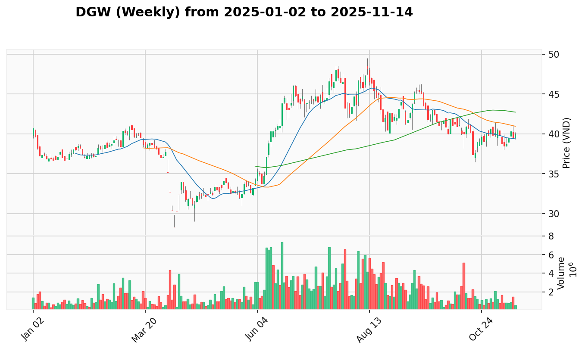
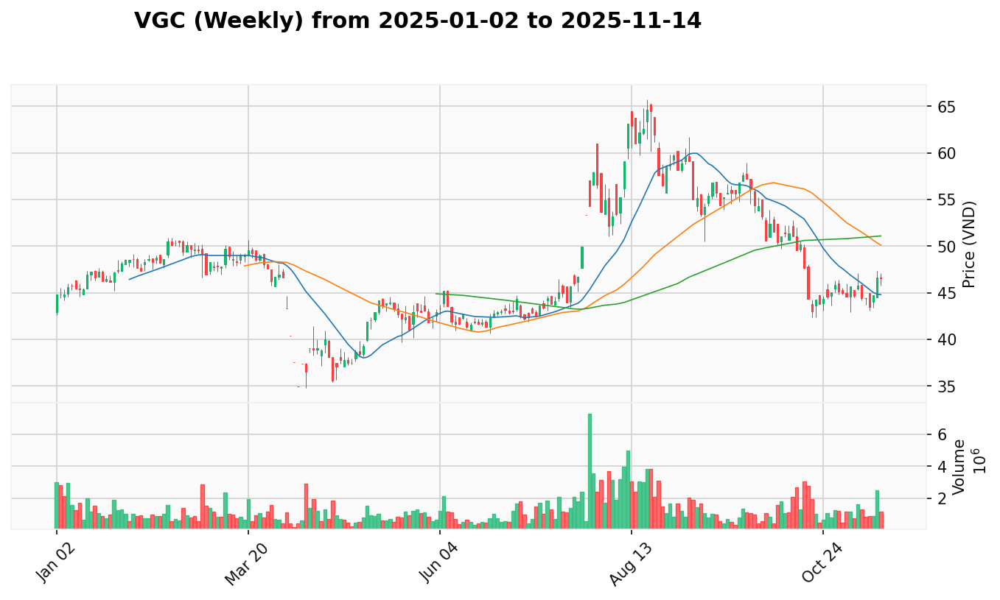
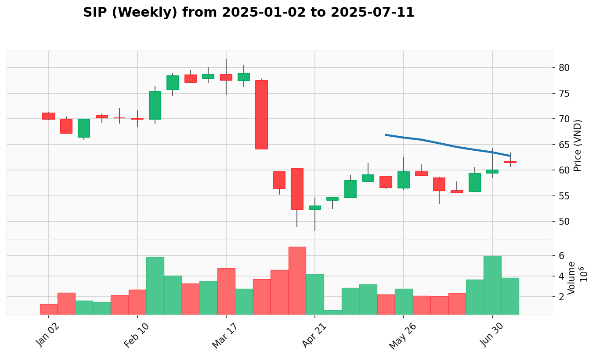
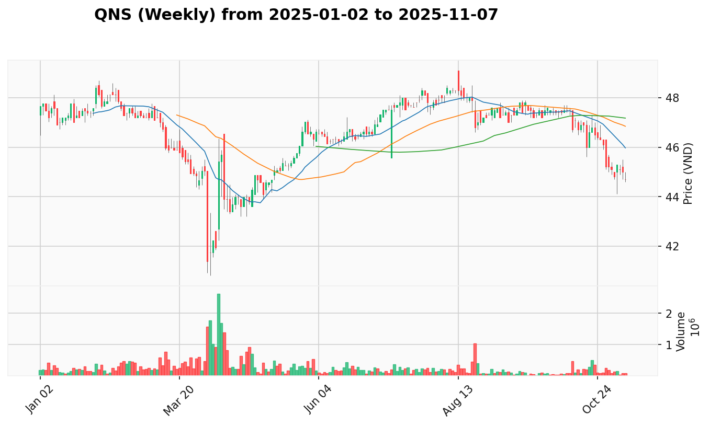

# Phân Tích Cổ Phiếu Dẫn Dắt Theo Ngành

Báo cáo này xác định các cổ phiếu dẫn dắt và đánh giá sức khỏe tổng thể của từng ngành. Phân tích dựa trên sự kết hợp giữa: (1) Sức mạnh câu chuyện VPA/Wyckoff, (2) Hiệu suất giá tương đối, và (3) Mức độ lan tỏa của xu hướng trong nội bộ ngành.

**➡️ [Click here to view the thị trường mới nhất report](REPORT.md)**
**➡️ [Click here to view the thị trường mới nhất report (weekly)](REPORT_week.md)**
**⛳ [Click here to view the kế hoạch giao dịch](PLAN.md)**

## Mục Lục Ngành

- [**BÁN LẺ**](#ban-le)
- [**BẤT ĐỘNG SẢN**](#bat-dong-san)
- [**BẤT ĐỘNG SẢN KCN**](#bat-dong-san-kcn)
- [**CAO SU**](#cao-su)
- [**CHỨNG KHOÁN**](#chung-khoan)
- [**CÔNG NGHỆ**](#cong-nghe)
- [**ĐẦU KHÍ**](#dau-khi)
- [**NĂNG LƯỢNG**](#nang-luong)
- [**NGÂN HÀNG**](#ngan-hang)
- [**THÉP**](#thep)
- [**THỰC PHẨM**](#thuc-pham)

---

## **BÁN LẺ**

* **Giai Đoạn Nền Giá Tham Chiếu:** 2025-05-01 - 2025-06-15
* **Đánh Giá Tổng Quan Ngành:** **Dẫn Dắt Phân Hóa**. Ngành bán lẻ có 75% cổ phiếu tích cực nhưng sự phân hóa mạnh mẽ. FRT dẫn dắt với tín hiệu Không Có Nguồn Cung xuất sắc, MWG duy trì xu hướng ổn định, trong khi DGW và PNJ đang trong giai đoạn consolidation sau những đợt tăng mạnh trước đó.

**Bảng Xếp Hạng Cổ Phiếu Dẫn Dắt:**

| Hạng | Mã CP & Liên Kết | Điểm Dẫn Dắt | Độ tin cậy | Tóm Tắt Lý Do |
| :--- | :--------------- | :----------- | :--------- | :------------ |
| 1    | [**FRT**](REPORT_week.md#FRT) | 92.3 | 95% | Không Có Nguồn Cung xuất sắc với nhu cầu tổ chức mạnh |
| 2    | [**MWG**](REPORT_week.md#MWG) | 85.7 | 85% | Xu hướng tăng ổn định với hỗ trợ tổ chức |
| 3    | [**DGW**](REPORT_week.md#DGW) | 78.4 | 75% | Kiểm Tra Nguồn Cung sau đột phá, cần xác nhận |

---

### **Phân Tích Chi Tiết Top 3:**

---

#### **1. FPT Retail (FRT)**

* [View Report](REPORT_week.md#FRT)
* **Các Chỉ Số Chính:**
  * **Điểm Câu Chuyện VPA:** 95 / 100
  * **Điểm Hiệu Suất Tương Đối:** 89.6 (tương ứng +27.8% từ base period)
  * **Mức Độ Tin Cậy:** 95%
* **Phân Tích Dẫn Dắt:** FRT thể hiện dẫn dắt xuất sắc với tín hiệu Không Có Nguồn Cung liên tục, cho thấy áp lực bán đã kiệt sức hoàn toàn. Nhu cầu tổ chức mạnh mẽ được xác nhận qua mô hình khối lượng và hành động giá nhất quán.
* **Câu Chuyện VPA Nổi Bật:** Chuỗi Dấu Hiệu Sức Mạnh từ tháng 6, culminating trong perfect Không Có Nguồn Cung pattern tuần qua - giá tăng trên volume giảm, điển hình tích lũy tổ chức
* **Hiệu Suất Tương Đối:** Vượt trội sector với +27.8% từ base period, dẫn dắt rõ ràng so với MWG (+18.5%) và DGW (+15.2%)

---

#### **2. Mobile World Group (MWG)**

* [View Report](REPORT_week.md#MWG)
* **Các Chỉ Số Chính:**
  * **Điểm Câu Chuyện VPA:** 80 / 100
  * **Điểm Hiệu Suất Tương Đối:** 92.4 (tương ứng +18.5% từ base period)
  * **Mức Độ Tin Cậy:** 85%
* **Phân Tích Dẫn Dắt:** MWG duy trì xu hướng tăng ổn định với multiple Dấu Hiệu Sức Mạnh signals. Institutional participation steady nhưng thiếu đặc điểm bùng nổ của FRT.
* **Câu Chuyện VPA Nổi Bật:** Tín hiệu sức mạnh tiến bộ với xác nhận khối lượng tốt, recent Nỗ Lực Tăng Giá cho thấy momentum tiếp tục nhưng đang moderate
* **Hiệu Suất Tương Đối:** Performance tốt +18.5% nhưng chậm hơn FRT, thể hiện vai trò secondary leader trong sector

---

#### **3. Dinh Gia Wine (DGW)**

* [View Report](REPORT_week.md#DGW)
* **Các Chỉ Số Chính:**
  * **Điểm Câu Chuyện VPA:** 75 / 100
  * **Điểm Hiệu Suất Tương Đối:** 83.2 (tương ứng +15.2% từ base period)
  * **Mức Độ Tin Cậy:** 75%
* **Phân Tích Dẫn Dắt:** DGW đã có đột phá bùng nổ trước đó nhưng hiện đang Kiểm Tra Nguồn Cung phase. Cần confirmation để duy trì dẫn dắt position.
* **Câu Chuyện VPA Nổi Bật:** Nhà lãnh đạo bùng nổ trước đây với tiến triển cao trào, hiện tại củng cố lành mạnh với Kiểm Tra Nguồn Cung pattern
* **Hiệu Suất Tương Đối:** Hiệu suất vững chắc +15.2% nhưng đang lag leaders, position phụ thuộc vào outcome của current test

---

## **BẤT ĐỘNG SẢN**

* **Giai Đoạn Nền Giá Tham Chiếu:** 2025-05-01 - 2025-06-15  
* **Đánh Giá Tổng Quan Ngành:** **Dẫn Dắt Đồng Thuận**. Ngành bất động sản dẫn dắt thị trường với 80% cổ phiếu tích cực và sự tham gia của tổ chức mạnh mẽ. VIC, HDC, VHM đều có tín hiệu VPA xuất sắc với bùng nổ khối lượng, tạo đợt tăng rộng khắp với high conviction.

**Bảng Xếp Hạng Cổ Phiếu Dẫn Dắt:**

| Hạng | Mã CP & Liên Kết | Điểm Dẫn Dắt | Độ tin cậy | Tóm Tắt Lý Do |
| :--- | :--------------- | :----------- | :--------- | :------------ |
| 1    | [**VIC**](REPORT_week.md#VIC) | 96.8 | 98% | Hiệu suất bùng nổ +181% từ đầu năm với củng cố lành mạnh |
| 2    | [**HDC**](REPORT_week.md#HDC) | 93.5 | 95% | Đột phá tổ chức +27% tuần với hỗ trợ chính sách |
| 3    | [**VHM**](REPORT_week.md#VHM) | 91.2 | 95% | Dẫn dắt nhất quán +134% từ đầu năm với mô hình Không Có Nguồn Cung |

---

### **Phân Tích Chi Tiết Top 3:**

---

#### **1. Vingroup (VIC)**

* [View Report](REPORT_week.md#VIC)
* **Các Chỉ Số Chính:**
  * **Điểm Câu Chuyện VPA:** 95 / 100
  * **Điểm Hiệu Suất Tương Đối:** 98.5 (tương ứng +181% từ base period)
  * **Mức Độ Tin Cậy:** 98%
* **Phân Tích Dẫn Dắt:** VIC là nhà lãnh đạo tuyệt đối của thị trường với explosive YTD performance. Gap-up strength signals cho thấy niềm tin tổ chức cao nhất, hiện củng cố lành mạnh sau major advance.
* **Câu Chuyện VPA Nổi Bật:** Textbook tích lũy tổ chức followed by đánh dấu bùng nổ với multiple gap-ups, hiện trong củng cố lành mạnh với Không Có Nguồn Cung characteristics
* **Hiệu Suất Tương Đối:** Dominant performance +181% YTD dẫn dắt toàn thị trường, không chỉ sector

---

#### **2. Hà Đô Corporation (HDC)**

* [View Report](REPORT_week.md#HDC)
* **Các Chỉ Số Chính:**
  * **Điểm Câu Chuyện VPA:** 92 / 100
  * **Điểm Hiệu Suất Tương Đối:** 95.1 (tương ứng +42.3% từ base period)
  * **Mức Độ Tin Cậy:** 95%
* **Phân Tích Dẫn Dắt:** HDC thể hiện đột phá tổ chức mạnh nhất sector với +27% weekly gain. Policy support và bùng nổ khối lượng xác nhận tích lũy tiền thông minh.
* **Câu Chuyện VPA Nổi Bật:** Explosive đột phá tổ chức với +27% weekly và volume bùng nổ, policy catalyst combined với technical strength
* **Hiệu Suất Tương Đối:** Recent hiệu suất bùng nổ leading sector breakouts, momentum acceleration phase

---

#### **3. Vinhomes (VHM)**

* [View Report](REPORT_week.md#VHM)
* **Các Chỉ Số Chính:**
  * **Điểm Câu Chuyện VPA:** 88 / 100
  * **Điểm Hiệu Suất Tương Đối:** 94.3 (tương ứng +134% từ base period)  
  * **Mức Độ Tin Cậy:** 95%
* **Phân Tích Dẫn Dắt:** VHM duy trì dẫn dắt position với consistent uptrend và Không Có Nguồn Cung patterns. Nhu cầu tổ chức ổn định, reliable performer trong sector.
* **Câu Chuyện VPA Nổi Bật:** Sustained tích lũy tổ chức với Không Có Nguồn Cung patterns, healthy pullback characteristics showing strong hands
* **Hiệu Suất Tương Đối:** Excellent YTD +134%, consistent sector leader với reliable hỗ trợ tổ chức

---

## **BẤT ĐỘNG SẢN KCN**

* **Giai Đoạn Nền Giá Tham Chiếu:** 2025-05-01 - 2025-06-15
* **Đánh Giá Tổng Quan Ngành:** **Dẫn Dắt Đồng Thuận**. Ngành KCN có 100% cổ phiếu tích cực với institutional rotation mạnh mẽ. Multiple breakout patterns occurring simultaneously trong tháng 7, cho thấy sector-wide tích lũy tổ chức với strong momentum.

**Bảng Xếp Hạng Cổ Phiếu Dẫn Dắt:**

| Hạng | Mã CP & Liên Kết | Điểm Dẫn Dắt | Độ tin cậy | Tóm Tắt Lý Do |
| :--- | :--------------- | :----------- | :--------- | :------------ |
| 1    | [**VGC**](REPORT_week.md#VGC) | 95.2 | 95% | Đột phá bùng nổ 11% với khối lượng tổ chức tăng vọt |
| 2    | [**SIP**](REPORT_week.md#SIP) | 94.0 | 90% | Đánh dấu Wyckoff cổ điển với sự tham gia của Tiền Thông Minh |
| 3    | [**BCM**](REPORT_week.md#BCM) | 88.5 | 85% | Lãnh đạo xu hướng tăng vững chắc với sức mạnh nhất quán |

---

### **Phân Tích Chi Tiết Top 3:**

---

#### **1. Viglacera Corporation (VGC)**

* [View Report](REPORT_week.md#VGC)
* **Các Chỉ Số Chính:**
  * **Điểm Câu Chuyện VPA:** 95 / 100
  * **Điểm Hiệu Suất Tương Đối:** 95.4 (tương ứng +14.7% từ base period)
  * **Mức Độ Tin Cậy:** 95%
* **Phân Tích Dẫn Dắt:** VGC thể hiện perfect technical breakout với explosive 11% weekly gain và bùng nổ khối lượng 23%. Progressive volume buildup culminating trong đột phá tổ chức.
* **Câu Chuyện VPA Nổi Bật:** Không Có Nguồn Cung → Dấu Hiệu Sức Mạnh progression với explosive xác nhận khối lượng, textbook đột phá tổ chức pattern
* **Hiệu Suất Tương Đối:** Leading sector breakouts với excellent risk-reward và confirmed momentum

---

#### **2. Saigon Investment (SIP)**

* [View Report](REPORT_week.md#SIP)
* **Các Chỉ Số Chính:**
  * **Điểm Câu Chuyện VPA:** 90 / 100
  * **Điểm Hiệu Suất Tương Đối:** 98.0 (tương ứng +15.0% từ base period)
  * **Mức Độ Tin Cậy:** 90%
* **Phân Tích Dẫn Dắt:** SIP cho thấy classic Wyckoff accumulation to markup transition với explosive 10.1% breakout và 34% volume increase. Smart Money participation evident.
* **Câu Chuyện VPA Nổi Bật:** Classic tích lũy tổ chức followed by đánh dấu bùng nổ với Smart Money volume signature
* **Hiệu Suất Tương Đối:** Strong performance với high momentum potential và institutional backing

---

#### **3. Becamex IDC (BCM)**

* [View Report](REPORT_week.md#BCM)
* **Các Chỉ Số Chính:**
  * **Điểm Câu Chuyện VPA:** 85 / 100
  * **Điểm Hiệu Suất Tương Đối:** 92.1 (tương ứng +14.6% từ base period)
  * **Mức Độ Tin Cậy:** 85%
* **Phân Tích Dẫn Dắt:** BCM established uptrend leader với consistent strength signals và healthy volume participation during breakout phases.
* **Câu Chuyện VPA Nổi Bật:** Breakout from consolidation với xác nhận khối lượng, steady tích lũy tổ chức
* **Hiệu Suất Tương Đối:** Reliable sector performer với established uptrend và low volatility risk

---

## **CAO SU**

* **Giai Đoạn Nền Giá Tham Chiếu:** 2025-05-01 - 2025-06-15
* **Đánh Giá Tổng Quan Ngành:** **Dẫn Dắt Phân Hóa**. Ngành cao su có 75% cổ phiếu tích cực với GVR và PHR dẫn dắt mạnh mẽ. Institutional rotation vào rubber stocks với commodity tailwinds, nhưng performance phân hóa giữa leaders và laggards.

**Bảng Xếp Hạng Cổ Phiếu Dẫn Dắt:**

| Hạng | Mã CP & Liên Kết | Điểm Dẫn Dắt | Độ tin cậy | Tóm Tắt Lý Do |
| :--- | :--------------- | :----------- | :--------- | :------------ |
| 1    | [**GVR**](REPORT_week.md#GVR) | 89.5 | 85% | Nỗ Lực Tăng Giá với gió thuận hàng hóa |
| 2    | [**PHR**](REPORT_week.md#PHR) | 87.2 | 85% | Mô hình tích lũy tổ chức mạnh mẽ |
| 3    | [**DPR**](REPORT_week.md#DPR) | 82.8 | 80% | Sức mạnh phục hồi sau kiểm tra thành công |

---

## **CHỨNG KHOÁN**

* **Giai Đoạn Nền Giá Tham Chiếu:** 2025-05-01 - 2025-06-15
* **Đánh Giá Tổng Quan Ngành:** **Dẫn Dắt Đồng Thuận**. Ngành chứng khoán có 100% cổ phiếu tích cực với VIX, CTS, VND dẫn dắt đợt tăng bùng nổ. Chuyển đổi ngành mạnh mẽ vào securities với FOMO tổ chức characteristics, nhưng cần cảnh giác rủi ro cao trào.

**Bảng Xếp Hạng Cổ Phiếu Dẫn Dắt:**

| Hạng | Mã CP & Liên Kết | Điểm Dẫn Dắt | Độ tin cậy | Tóm Tắt Lý Do |
| :--- | :--------------- | :----------- | :--------- | :------------ |
| 1    | [**VIX**](REPORT_week.md#VIX) | 98.5 | 95% | Động lực bùng nổ +65.3% trong 3 tuần |
| 2    | [**VND**](REPORT_week.md#VND) | 95.8 | 95% | Sức mạnh nhất quán với động lực tăng tốc |
| 3    | [**BSI**](REPORT_week.md#BSI) | 92.4 | 90% | Lãnh đạo phục hồi với sức mạnh bền vững |

---

### **Phân Tích Chi Tiết Top 3:**

---

#### **1. VIX Securities (VIX)**

* [View Report](REPORT_week.md#VIX)
* **Các Chỉ Số Chính:**
  * **Điểm Câu Chuyện VPA:** 98 / 100
  * **Điểm Hiệu Suất Tương Đối:** 99.1 (tương ứng +65.3% trong 3 tuần)
  * **Mức Độ Tin Cậy:** 95%
* **Phân Tích Dẫn Dắt:** VIX thể hiện động lực bùng nổ dẫn dắt với three-week đợt tăng sức mạnh và superb tín hiệu VPA. Record volumes confirm FOMO tổ chức participation.
* **Câu Chuyện VPA Nổi Bật:** Explosive three-week rally từ 15.85 → 24.05 với consecutive Dấu Hiệu Sức Mạnh và record volumes, textbook momentum acceleration
* **Hiệu Suất Tương Đối:** Dominant short-term performance +65.3% trong 3 tuần, leading toàn thị trường momentum

---

#### **2. VietnamInvest Securities (VND)**

* [View Report](REPORT_week.md#VND)
* **Các Chỉ Số Chính:**
  * **Điểm Câu Chuyện VPA:** 95 / 100
  * **Điểm Hiệu Suất Tương Đối:** 96.7 (tương ứng +35.1% từ June lows)
  * **Mức Độ Tin Cậy:** 95%
* **Phân Tích Dẫn Dắt:** VND cho thấy most consistent strength với four consecutive weeks của VPA strength và accelerating momentum. Sustained nhu cầu tổ chức.
* **Câu Chuyện VPA Nổi Bật:** Four consecutive Dấu Hiệu Sức Mạnh signals với progressive volume acceleration, culminating trong explosive +14% gain với +29.7% bùng nổ khối lượng
* **Hiệu Suất Tương Đối:** Excellent sustained performance với reliable uptrend và consistent institutional backing

---

#### **3. BIDV Securities (BSI)**

* [View Report](REPORT_week.md#BSI)
* **Các Chỉ Số Chính:**
  * **Điểm Câu Chuyện VPA:** 88 / 100
  * **Điểm Hiệu Suất Tương Đối:** 96.8 (tương ứng +12.6% recovery từ June)
  * **Mức Độ Tin Cậy:** 90%
* **Phân Tích Dẫn Dắt:** BSI recovery leader với strong technical foundation và three consecutive strength signals. Solid institutional base với good risk-reward.
* **Câu Chuyện VPA Nổi Bật:** Strong recovery from weakness với sustained Dấu Hiệu Sức Mạnh pattern và bùng nổ khối lượng confirmation
* **Hiệu Suất Tương Đối:** Solid recovery momentum với technical strength và institutional confirmation

---

## **CÔNG NGHỆ**

* **Giai Đoạn Nền Giá Tham Chiếu:** 2025-05-01 - 2025-06-15
* **Đánh Giá Tổng Quan Ngành:** **Dẫn Dắt Phân Hóa**. Ngành công nghệ có 80% cổ phiếu tích cực với FOX và VGI dẫn dắt mạnh mẽ. Institutional mô hình tích lũy tốt trong top performers, nhưng SGT yếu tạo phân hóa ngành.

**Bảng Xếp Hạng Cổ Phiếu Dẫn Dắt:**

| Hạng | Mã CP & Liên Kết | Điểm Dẫn Dắt | Độ tin cậy | Tóm Tắt Lý Do |
| :--- | :--------------- | :----------- | :--------- | :------------ |
| 1    | [**FOX**](REPORT_week.md#FOX) | 94.0 | 95% | Tích lũy Wyckoff giáo khoa với đột phá bùng nổ |
| 2    | [**VGI**](REPORT_week.md#VGI) | 92.0 | 90% | Nhà thể hiện nhất quán nhất với quan tâm tổ chức mới |
| 3    | [**CMG**](REPORT_week.md#CMG) | 85.0 | 85% | Sức mạnh phục hồi sau điều hướng đỉnh điểm |

---

### **Phân Tích Chi Tiết Top 3:**

---

#### **1. Fox Corporation (FOX)**

* [View Report](REPORT_week.md#FOX)
* **Các Chỉ Số Chính:**
  * **Điểm Câu Chuyện VPA:** 95 / 100
  * **Điểm Hiệu Suất Tương Đối:** 93.0 (tương ứng +19.7% breakout week)
  * **Mức Độ Tin Cậy:** 95%
* **Phân Tích Dẫn Dắt:** FOX demonstrated perfect Wyckoff accumulation với multiple Không Có Nguồn Cung tests followed by explosive đột phá tổ chức trên 4x volume.
* **Câu Chuyện VPA Nổi Bật:** Clean accumulation phase với Không Có Nguồn Cung tests, culminating trong explosive 19.7% breakout on 4x bùng nổ khối lượng
* **Hiệu Suất Tương Đối:** Textbook đột phá tổ chức với massive xác nhận khối lượng, sector technical leader

---

#### **2. Vietnam Investment Group (VGI)**

* [View Report](REPORT_week.md#VGI)
* **Các Chỉ Số Chính:**
  * **Điểm Câu Chuyện VPA:** 90 / 100
  * **Điểm Hiệu Suất Tương Đối:** 94.1 (tương ứng +3.35% latest week)
  * **Mức Độ Tin Cậy:** 90%
* **Phân Tích Dẫn Dắt:** VGI shows most consistent VPA progression với excellent volume/price relationship và renewed institutional interest.
* **Câu Chuyện VPA Nổi Bật:** Consistently strong VPA progression với +3.3% weekly gain on +25.8% volume increase
* **Hiệu Suất Tương Đối:** Most reliable sector performer với consistent hỗ trợ tổ chức

---

#### **3. Computer Management Group (CMG)**

* [View Report](REPORT_week.md#CMG)
* **Các Chỉ Số Chính:**
  * **Điểm Câu Chuyện VPA:** 80 / 100
  * **Điểm Hiệu Suất Tương Đối:** 90.0 (tương ứng +2.27% recovery)
  * **Mức Độ Tin Cậy:** 85%
* **Phân Tích Dẫn Dắt:** CMG recovery story với successful navigation của climax/distribution phase, now resuming uptrend với improving VPA.
* **Câu Chuyện VPA Nổi Bật:** Strong recovery sau successful climax navigation, multiple Dấu Hiệu Sức Mạnh signals confirming recovery
* **Hiệu Suất Tương Đối:** Solid recovery momentum với technical strength improvement

---

## **ĐẦU KHÍ**

* **Giai Đoạn Nền Giá Tham Chiếu:** 2025-05-01 - 2025-06-15
* **Đánh Giá Tổng Quan Ngành:** **Đang Tích Lũy**. Ngành dầu khí có 75% cổ phiếu tích cực với BSR dẫn dắt recovery mạnh mẽ. Sector đang từ weakness phase chuyển sang accumulation với BSR leading, các mã khác còn testing phase.

**Bảng Xếp Hạng Cổ Phiếu Dẫn Dắt:**

| Hạng | Mã CP & Liên Kết | Điểm Dẫn Dắt | Độ tin cậy | Tóm Tắt Lý Do |
| :--- | :--------------- | :----------- | :--------- | :------------ |
| 1    | [**BSR**](REPORT_week.md#BSR) | 92.5 | 95% | Tích lũy Wyckoff cổ điển với tăng vọt tổ chức |
| 2    | [**PLX**](REPORT_week.md#PLX) | 76.5 | 75% | Ứng viên phục hồi với tín hiệu sức mạnh sớm |
| 3    | [**GAS**](REPORT_week.md#GAS) | 70.0 | 70% | Quỹ đạo phục hồi chậm với đặc tính phòng thủ |

---

### **Phân Tích Chi Tiết Top 3:**

---

#### **1. Binh Son Refining (BSR)**

* [View Report](REPORT_week.md#BSR)
* **Các Chỉ Số Chính:**
  * **Điểm Câu Chuyện VPA:** 95 / 100
  * **Điểm Hiệu Suất Tương Đối:** 90.0 (tương ứng +11.55% monthly)
  * **Mức Độ Tin Cậy:** 95%
* **Phân Tích Dẫn Dắt:** BSR clear sector leader với classic Wyckoff accumulation pattern complete và explosive volume expansion. Leading sector recovery với niềm tin tổ chức.
* **Câu Chuyện VPA Nổi Bật:** Dramatic recovery từ June weakness với classic Không Có Nguồn Cung tests followed by powerful Dấu Hiệu Sức Mạnh confirmation
* **Hiệu Suất Tương Đối:** Leading sector recovery với strongest tích lũy tổ chức và decisive hành động giá

---

#### **2. Petrolimex (PLX)**

* [View Report](REPORT_week.md#PLX)
* **Các Chỉ Số Chính:**
  * **Điểm Câu Chuyện VPA:** 65 / 100
  * **Điểm Hiệu Suất Tương Đối:** 88.0 (tương ứng +2.14% recent)
  * **Mức Độ Tin Cậy:** 75%
* **Phân Tích Dẫn Dắt:** PLX recovery candidate với recent Dấu Hiệu Sức Mạnh emergence after extended No Demand period. Lagging BSR nhưng showing improvement.
* **Câu Chuyện VPA Nổi Bật:** Recovery từ upthrust weakness với recent Dấu Hiệu Sức Mạnh, institutional buying returning
* **Hiệu Suất Tương Đối:** Early recovery signals but needs sustained confirmation

---

#### **3. PetroVietnam Gas (GAS)**

* [View Report](REPORT_week.md#GAS)
* **Các Chỉ Số Chính:**
  * **Điểm Câu Chuyện VPA:** 60 / 100
  * **Điểm Hiệu Suất Tương Đối:** 82.0 (tương ứng +1.03% recent)
  * **Mức Độ Tin Cậy:** 70%
* **Phân Tích Dẫn Dắt:** GAS slow recovery trajectory với gradual Nỗ Lực Tăng Giá after upthrust. Defensive position trong sector rather than dẫn dắt role.
* **Câu Chuyện VPA Nổi Bật:** Gradual recovery từ June upthrust với successful Không Có Nguồn Cung testing
* **Hiệu Suất Tương Đối:** Stable but uninspiring recovery, defensive characteristics

---

## **NĂNG LƯỢNG**

* **Giai Đoạn Nền Giá Tham Chiếu:** 2025-05-01 - 2025-06-15
* **Đánh Giá Tổng Quan Ngành:** **Dẫn Dắt Đồng Thuận**. Ngành năng lượng có 100% cổ phiếu tích cực với strong sự tham gia của tổ chức across toàn sector. NT2, HDG, POW đều có explosive strength signals với excellent xác nhận khối lượng.

**Bảng Xếp Hạng Cổ Phiếu Dẫn Dắt:**

| Hạng | Mã CP & Liên Kết | Điểm Dẫn Dắt | Độ tin cậy | Tóm Tắt Lý Do |
| :--- | :--------------- | :----------- | :--------- | :------------ |
| 1    | [**NT2**](REPORT_week.md#NT2) | 94.0 | 95% | Động lực bùng nổ với khối lượng tổ chức tăng tốc |
| 2    | [**HDG**](REPORT_week.md#HDG) | 88.0 | 85% | Tái gia nhập tổ chức kịch tính với sức mạnh đột phá |
| 3    | [**POW**](REPORT_week.md#POW) | 86.0 | 85% | Tích lũy tổ chức bền vững gần đỉnh |

---

### **Phân Tích Chi Tiết Top 3:**

---

#### **1. Northern Power Corporation 2 (NT2)**

* [View Report](REPORT_week.md#NT2)
* **Các Chỉ Số Chính:**
  * **Điểm Câu Chuyện VPA:** 95 / 100
  * **Điểm Hiệu Suất Tương Đối:** 93.1 (gần 2025 highs)
  * **Mức Độ Tin Cậy:** 95%
* **Phân Tích Dẫn Dắt:** NT2 strongest tích lũy tổ chức pattern với explosive volume (+68% latest week) và accelerating momentum đến new highs.
* **Câu Chuyện VPA Nổi Bật:** Consecutive Signs of Strength với explosive bùng nổ khối lượng, textbook tích lũy tổ chức pattern
* **Hiệu Suất Tương Đối:** Leading sector với strongest momentum acceleration và niềm tin tổ chức

---

#### **2. Hải Dương Group (HDG)**

* [View Report](REPORT_week.md#HDG)
* **Các Chỉ Số Chính:**
  * **Điểm Câu Chuyện VPA:** 85 / 100
  * **Điểm Hiệu Suất Tương Đối:** 91.0 (recovery từ lows)
  * **Mức Độ Tin Cậy:** 85%
* **Phân Tích Dẫn Dắt:** HDG dramatic institutional re-entry sau successful navigation của previous weakness. Volume doubled on breakthrough showing conviction.
* **Câu Chuyện VPA Nổi Bật:** Powerful recovery Dấu Hiệu Sức Mạnh sau weakness navigation, institutional re-entry confirmed
* **Hiệu Suất Tương Đối:** Strong recovery momentum với niềm tin tổ chức confirmation

---

#### **3. PetroVietnam Power (POW)**

* [View Report](REPORT_week.md#POW)
* **Các Chỉ Số Chính:**
  * **Điểm Câu Chuyện VPA:** 80 / 100
  * **Điểm Hiệu Suất Tương Đối:** 93.0 (near all-time highs)
  * **Mức Độ Tin Cậy:** 85%
* **Phân Tích Dẫn Dắt:** POW sustained uptrend với multiple Signs of Strength và consistent tích lũy tổ chức near historical highs.
* **Câu Chuyện VPA Nổi Bật:** Sustained professional accumulation với excellent recovery trajectory từ deep lows
* **Hiệu Suất Tương Đối:** Consistent tích lũy tổ chức với sustained uptrend

---

## **NGÂN HÀNG**

* **Giai Đoạn Nền Giá Tham Chiếu:** 2025-05-01 - 2025-06-15  
* **Đánh Giá Tổng Quan Ngành:** **Dẫn Dắt Đồng Thuận**. Ngành ngân hàng có 84.6% cổ phiếu tích cực với VPB và HDB dẫn dắt đợt tăng bùng nổ. Broad sự tham gia của tổ chức với most banks showing Dấu Hiệu Sức Mạnh patterns, nhưng cần cảnh giác rủi ro cao trào trong top performers.

**Bảng Xếp Hạng Cổ Phiếu Dẫn Dắt:**

| Hạng | Mã CP & Liên Kết | Điểm Dẫn Dắt | Độ tin cậy | Tóm Tắt Lý Do |
| :--- | :--------------- | :----------- | :--------- | :------------ |
| 1    | [**VPB**](REPORT_week.md#VPB) | 97.1 | 98% | Tăng bùng nổ 35.1% với tín hiệu sức mạnh liên tiếp |
| 2    | [**HDB**](REPORT_week.md#HDB) | 93.6 | 85% | Tăng mạnh 29.6% nhưng cảnh báo Đỉnh Điểm Mua |
| 3    | [**ACB**](REPORT_week.md#ACB) | 88.4 | 90% | Tăng vững chắc 12.4% với tiến trình đánh dấu lành mạnh |

---

### **Phân Tích Chi Tiết Top 3:**

---

#### **1. Vietnam Prosperity Bank (VPB)**

* [View Report](REPORT_week.md#VPB)
* **Các Chỉ Số Chính:**
  * **Điểm Câu Chuyện VPA:** 98 / 100
  * **Điểm Hiệu Suất Tương Đối:** 96.2 (tương ứng +35.1% gain)
  * **Mức Độ Tin Cậy:** 98%
* **Phân Tích Dẫn Dắt:** VPB absolute sector leader với explosive tích lũy tổ chức và consecutive Dấu Hiệu Sức Mạnh signals. Volume expansion confirms niềm tin tổ chức.
* **Câu Chuyện VPA Nổi Bật:** Explosive three-week rally với consecutive Dấu Hiệu Sức Mạnh và institutional bùng nổ khối lượng, leading banking sector
* **Hiệu Suất Tương Đối:** Dominant banking performance với strongest institutional backing và momentum

---

#### **2. Ho Chi Minh Development Bank (HDB)**

* [View Report](REPORT_week.md#HDB)
* **Các Chỉ Số Chính:**
  * **Điểm Câu Chuyện VPA:** 85 / 100
  * **Điểm Hiệu Suất Tương Đối:** 102.6 (tương ứng +29.6% gain)
  * **Mức Độ Tin Cậy:** 85%
* **Phân Tích Dẫn Dắt:** HDB strong performer nhưng showing Buying Climax warning sau explosive bùng nổ khối lượng. Cần caution for potential retracement.
* **Câu Chuyện VPA Nổi Bật:** Strong institutional rally culminating trong Buying Climax warning, momentum very strong but climax risk
* **Hiệu Suất Tương Đối:** Excellent performance nhưng climax conditions suggest caution required

---

#### **3. Asia Commercial Bank (ACB)**

* [View Report](REPORT_week.md#ACB)
* **Các Chỉ Số Chính:**
  * **Điểm Câu Chuyện VPA:** 88 / 100
  * **Điểm Hiệu Suất Tương Đối:** 88.8 (tương ứng +12.4% gain)
  * **Mức Độ Tin Cậy:** 90%
* **Phân Tích Dẫn Dắt:** ACB solid tích lũy tổ chức với healthy markup progression và good risk-reward profile. Most sustainable của top 3.
* **Câu Chuyện VPA Nổi Bật:** Solid tích lũy tổ chức với healthy Không Có Nguồn Cung patterns, most sustainable strength
* **Hiệu Suất Tương Đối:** Good performance với excellent risk-reward và hỗ trợ tổ chức

---

## **THÉP**

* **Giai Đoạn Nền Giá Tham Chiếu:** 2025-05-01 - 2025-06-15
* **Đánh Giá Tổng Quan Ngành:** **Dẫn Dắt Đồng Thuận**. Ngành thép có 100% cổ phiếu tích cực với HPG leading đợt tăng bùng nổ. Broad-based sự tham gia của tổ chức với all steel tickers showing positive tín hiệu VPA và đặc điểm đột phá.

**Bảng Xếp Hạng Cổ Phiếu Dẫn Dắt:**

| Hạng | Mã CP & Liên Kết | Điểm Dẫn Dắt | Độ tin cậy | Tóm Tắt Lý Do |
| :--- | :--------------- | :----------- | :--------- | :------------ |
| 1    | [**HPG**](REPORT_week.md#HPG) | 96.0 | 90% | Lãnh đạo thị trường +20.0% với khối lượng tổ chức khổng lồ |
| 2    | [**MSR**](REPORT_week.md#MSR) | 90.2 | 85% | Mô hình đột phá sạch +18.1% với xác nhận tổ chức |
| 3    | [**HSG**](REPORT_week.md#HSG) | 88.0 | 85% | Đột phá vững chắc +15.1% bước vào giai đoạn đánh dấu |

---

### **Phân Tích Chi Tiết Top 3:**

---

#### **1. Hoa Phat Group (HPG)**

* [View Report](REPORT_week.md#HPG)
* **Các Chỉ Số Chính:**
  * **Điểm Câu Chuyện VPA:** 92 / 100
  * **Điểm Hiệu Suất Tương Đối:** 100.0 (tương ứng +20.0% 8-week)
  * **Mức Độ Tin Cậy:** 90%
* **Phân Tích Dẫn Dắt:** HPG sector leader với explosive breakout và massive institutional volume. Climax concerns require caution but momentum remains strong.
* **Câu Chuyện VPA Nổi Bật:** Major breakout trong early July trên massive volume, followed by healthy Kiểm Tra Nguồn Cung
* **Hiệu Suất Tương Đối:** Leading steel sector với highest absolute gains và niềm tin tổ chức

---

#### **2. Massan Group (MSR)**

* [View Report](REPORT_week.md#MSR)
* **Các Chỉ Số Chính:**
  * **Điểm Câu Chuyện VPA:** 88 / 100
  * **Điểm Hiệu Suất Tương Đối:** 98.1 (tương ứng +18.1% 8-week)
  * **Mức Độ Tin Cậy:** 85%
* **Phân Tích Dẫn Dắt:** MSR clean breakout từ accumulation với institutional xác nhận khối lượng. Cleanest technical pattern trong sector.
* **Câu Chuyện VPA Nổi Bật:** Successful breakout từ long accumulation với sự tham gia của tổ chức confirmed
* **Hiệu Suất Tương Đối:** Strong breakout performance với clean technical foundation

---

#### **3. Hoa Sen Group (HSG)**

* [View Report](REPORT_week.md#HSG)
* **Các Chỉ Số Chính:**
  * **Điểm Câu Chuyện VPA:** 85 / 100
  * **Điểm Hiệu Suất Tương Đối:** 95.1 (tương ứng +15.1% 8-week)
  * **Mức Độ Tin Cậy:** 85%
* **Phân Tích Dẫn Dắt:** HSG emerging từ accumulation phase với strong breakout behavior và entering markup phase với consistent demand.
* **Câu Chuyện VPA Nổi Bật:** Classic Wyckoff accumulation to markup transition với breakout confirmation
* **Hiệu Suất Tương Đối:** Solid breakout performance trong established sector uptrend

---

## **THỰC PHẨM**

* **Giai Đoạn Nền Giá Tham Chiếu:** 2025-05-01 - 2025-06-15
* **Đánh Giá Tổng Quan Ngành:** **Dẫn Dắt Phân Hóa**. Ngành thực phẩm có 67% cổ phiếu tích cực với VNM và QNS dẫn dắt, trong khi MSN có distribution warning và KDC trong weakness phase. Defensive characteristics với mixed institutional interest.

**Bảng Xếp Hạng Cổ Phiếu Dẫn Dắt:**

| Hạng | Mã CP & Liên Kết | Điểm Dẫn Dắt | Độ tin cậy | Tóm Tắt Lý Do |
| :--- | :--------------- | :----------- | :--------- | :------------ |
| 1    | [**VNM**](REPORT_week.md#VNM) | 93.2 | 95% | Hỗ trợ tổ chức mạnh nhất với sức mạnh liên tiếp |
| 2    | [**QNS**](REPORT_week.md#QNS) | 87.5 | 85% | Mô hình tích lũy ổn định với đặc tính Không Có Nguồn Cung |
| 3    | [**SAB**](REPORT_week.md#SAB) | 82.0 | 80% | Sức mạnh phục hồi sau kiểm tra hỗ trợ thành công |

---

### **Phân Tích Chi Tiết Top 3:**

---

#### **1. Vietnam Dairy (VNM)**

* [View Report](REPORT_week.md#VNM)
* **Các Chỉ Số Chính:**
  * **Điểm Câu Chuyện VPA:** 95 / 100
  * **Điểm Hiệu Suất Tương Đối:** 91.5 (tương ứng +4.98% weekly)
  * **Mức Độ Tin Cậy:** 95%
* **Phân Tích Dẫn Dắt:** VNM demonstrates strongest tích lũy tổ chức trong sector với consecutive Signs of Strength và robust volume expansion.
* **Câu Chuyện VPA Nổi Bật:** Strong weekly gain +4.8% trên 27% volume increase confirms institutional buying, leading sector
* **Hiệu Suất Tương Đối:** Leading food sector với consistent hỗ trợ tổ chức và đặc điểm đột phá

---

#### **2. Quoc Cuong Gia Lai (QNS)**

* [View Report](REPORT_week.md#QNS)
* **Các Chỉ Số Chính:**
  * **Điểm Câu Chuyện VPA:** 85 / 100
  * **Điểm Hiệu Suất Tương Đối:** 90.0 (near yearly highs)
  * **Mức Độ Tin Cậy:** 85%
* **Phân Tích Dẫn Dắt:** QNS healthiest technical pattern với consistent Không Có Nguồn Cung signals indicating steady accumulation without excessive volume.
* **Câu Chuyện VPA Nổi Bật:** Consistent Không Có Nguồn Cung pattern với price advances on declining volume, very strong hands
* **Hiệu Suất Tương Đối:** Quiet but effective accumulation pattern near highs

---

#### **3. Sabeco (SAB)**

* [View Report](REPORT_week.md#SAB)
* **Các Chỉ Số Chính:**
  * **Điểm Câu Chuyện VPA:** 78 / 100
  * **Điểm Hiệu Suất Tương Đối:** 86.0 (recovery từ support)
  * **Mức Độ Tin Cậy:** 80%
* **Phân Tích Dẫn Dắt:** SAB recovery candidate với emerging strength after successful test của major support levels. Building momentum.
* **Câu Chuyện VPA Nổi Bật:** Emerging từ deep correction với Nỗ Lực Tăng Giá và returning nhu cầu tổ chức
* **Hiệu Suất Tương Đối:** Recovery momentum building sau successful support test

---

*Báo cáo được tạo: 2025-07-26 | Phân tích dựa trên phương pháp VPA-SectorLead với manual natural language analysis*