# Phân Tích Cổ Phiếu Dẫn Dắt Theo Ngành

Báo cáo này xác định các cổ phiếu dẫn dắt và đánh giá sức khỏe tổng thể của từng ngành. Phân tích dựa trên sự kết hợp giữa: (1) Sức mạnh câu chuyện VPA/Wyckoff, (2) Hiệu suất giá tương đối, và (3) Mức độ lan tỏa của xu hướng trong nội bộ ngành.

**➡️ [Click here to view the latest market report](REPORT.md)**

**➡️ [Click here to view the latest market report (week)](REPORT_week.md)**

**⛳ [Click here to view the trading plan](PLAN.md)**

### Mục Lục
- [BÁN LẺ](#ban-le)
- [BẢO HIỂM](#bao-hiem)
- [BẤT ĐỘNG SẢN](#bat-dong-san)
- [BẤT ĐỘNG SẢN KCN](#bat-dong-san-kcn)
- [CAO SU](#cao-su)
- [CHỨNG KHOÁN](#chung-khoan)
- [CÔNG NGHỆ](#cong-nghe)
- [DẦU KHÍ](#dau-khi)
- [ĐẦU TƯ CÔNG](#dau-tu-cong)
- [DỆT MAY](#det-may)
- [HÀNG KHÔNG](#hang-khong)
- [HÓA CHẤT](#hoa-chat)
- [KHAI KHOÁNG](#khai-khoang)
- [NĂNG LƯỢNG](#nang-luong)
- [NGÂN HÀNG](#ngan-hang)
- [NHỰA](#nhua)
- [NÔNG NGHIỆP](#nong-nghiep)
- [PENNY](#penny)
- [SỨC KHỎE](#suc-khoe)
- [THÉP](#thep)
- [THỰC PHẨM](#thuc-pham)
- [THỦY SẢN](#thuy-san)
- [VẬN TẢI](#van-tai)
- [VLXD](#vlxd)
- [XÂY DỰNG](#xay-dung)
- [XÂY LẮP ĐIỆN](#xay-lap-dien)

---

## **BÁN LẺ**

*   **Giai Đoạn Nền Giá Tham Chiếu:** 2025-05-19 - 2025-06-02
*   **Đánh Giá Tổng Quan Ngành:** **Dẫn Dắt Đồng Thuận**. Ngành bán lẻ đang thể hiện một xu hướng tăng giá mạnh mẽ và lan tỏa. Tất cả các cổ phiếu trong ngành đều cho thấy hiệu suất tích cực rõ rệt từ nền giá tham chiếu. Các tín hiệu VPA chủ đạo là "nỗ lực tăng giá" và "kiểm tra cung thành công", cho thấy dòng tiền đang ủng hộ mạnh mẽ cho toàn ngành.

**Bảng Xếp Hạng Cổ Phiếu Dẫn Dắt:**

| Hạng | Mã CP & Liên Kết | Điểm Dẫn Dắt | Độ tin cậy | Tóm Tắt Lý Do |
| :--- | :--------------- | :----------- | :--------- | :------------------------------------------------------------------------------------------------ |
| 1 | [**MWG**](#mwg) | 59.8 | 90% | Câu chuyện VPA rõ ràng nhất, cho thấy sự phục hồi mạnh mẽ sau SOW và tiếp tục xu hướng tăng vững chắc. |
| 2 | [**FRT**](#frt) | 58.7 | 90% | Hiệu suất giá tốt nhất ngành và câu chuyện VPA cũng rất mạnh mẽ, xác nhận vai trò dẫn dắt. |
| 3 | [**PNJ**](#pnj) | 53.0 | 85% | Phục hồi tốt từ đáy với tín hiệu "No Supply", hiệu suất giá tích cực nhưng câu chuyện chưa mạnh bằng hai mã đầu ngành. |

---

### **Phân Tích Chi Tiết Top 3:**

---

#### **1. Thế Giới Di Động (MWG)**

*   [View Report](REPORT_week.md#mwg)
*   **Các Chỉ Số Chính:**
    *   **Điểm Câu Chuyện VPA:** 90 / 100
    *   **Điểm Hiệu Suất Tương Đối:** 21.2 (tương ứng +21.2% change)
    *   **Mức Độ Tin Cậy:** 90%
*   **Phân Tích Dẫn Dắt:** Trong bối cảnh ngành Bán lẻ đang tăng trưởng đồng thuận, MWG nổi lên như một trong những đầu tàu mạnh mẽ nhất. Cổ phiếu này cho thấy khả năng phục hồi ấn tượng sau một tuần SOW, ngay lập tức tạo ra tín hiệu SOS và tiếp tục xu hướng tăng một cách bền vững. Điều này thể hiện sức mạnh nội tại vượt trội và vai trò dẫn dắt rõ ràng.
*   **Câu Chuyện VPA Nổi Bật:** Sau tuần giảm giá (SOW), MWG phục hồi ngay lập tức với một nến SOS, theo sau là một tuần tăng giá trên khối lượng thấp ("No Supply") và một tuần SOS khác xác nhận xu hướng. Đây là một chuỗi hành động giá rất mạnh mẽ và mang tính xây dựng.
*   **Hiệu Suất Tương Đối:** Mức tăng trưởng +21.2% từ nền giá tham chiếu, là một trong những mức tăng tốt nhất trong ngành, chỉ đứng sau FRT.

---

#### **2. FPT Retail (FRT)**

*   [View Report](REPORT_week.md#frt)
*   **Các Chỉ Số Chính:**
    *   **Điểm Câu Chuyện VPA:** 85 / 100
    *   **Điểm Hiệu Suất Tương Đối:** 19.3 (tương ứng +19.3% change)
    *   **Mức Độ Tin Cậy:** 90%
*   **Phân Tích Dẫn Dắt:** FRT là cổ phiếu có hiệu suất giá mạnh mẽ nhất trong ngành bán lẻ. Câu chuyện VPA của FRT cũng rất thuyết phục, với một cú bứt phá SOS mạnh mẽ từ nền giá, theo sau là các phiên kiểm tra cung thành công. Sức mạnh giá và tín hiệu VPA rõ ràng khẳng định vị thế dẫn dắt của FRT.
*   **Câu Chuyện VPA Nổi Bật:** Bứt phá khỏi nền với một tuần SOS khối lượng lớn, theo sau là một tuần "Test for Supply" thành công với biên độ hẹp và khối lượng giảm, và tiếp tục được xác nhận bằng một tuần "Effort to Rise". Đây là hành động giá điển hình của một cổ phiếu mạnh.
*   **Hiệu Suất Tương Đối:** Mức tăng trưởng +19.3% từ nền giá tham chiếu, thể hiện sức mạnh tương đối vượt trội so với các cổ phiếu khác trong ngành.

---

#### **3. Vàng Bạc Đá Quý Phú Nhuận (PNJ)**

*   [View Report](REPORT_week.md#pnj)
*   **Các Chỉ Số Chính:**
    *   **Điểm Câu Chuyện VPA:** 80 / 100
    *   **Điểm Hiệu Suất Tương Đối:** 13.0 (tương ứng +13.0% change)
    *   **Mức Độ Tin Cậy:** 85%
*   **Phân Tích Dẫn Dắt:** PNJ cho thấy khả năng phục hồi tốt từ vùng đáy của ngành. Mặc dù câu chuyện VPA không mạnh mẽ bằng MWG hay FRT, nhưng các tín hiệu "No Supply" liên tiếp cho thấy áp lực bán đã cạn kiệt, tạo tiền đề cho một xu hướng tăng. PNJ đang là một cổ phiếu theo sau nhưng có tiềm năng trong một ngành đang mạnh lên.
*   **Câu Chuyện VPA Nổi Bật:** Sau một tuần giảm giá mạnh (SOW), PNJ có hai tuần phục hồi trên khối lượng thấp, cho thấy tín hiệu "No Supply" rõ ràng. Tuần gần nhất là một "Effort to Rise", xác nhận lực cầu đang quay trở lại.
*   **Hiệu Suất Tương Đối:** Mức tăng trưởng +13.0% từ nền giá tham chiếu, một hiệu suất tốt cho thấy cổ phiếu đang tham gia vào xu hướng chung của ngành.

---

## **BẢO HIỂM**

*   **Giai Đoạn Nền Giá Tham Chiếu:** 2025-05-26 - 2025-06-09
*   **Đánh Giá Tổng Quan Ngành:** **Dẫn Dắt Phân Hóa**. Sức mạnh trong ngành Bảo hiểm không đồng đều. BIC thể hiện vai trò dẫn dắt rõ ràng với cú bứt phá mạnh mẽ, trong khi BVH và PVI vẫn đang trong giai đoạn phục hồi yếu hơn hoặc đi ngang. Điều này cho thấy dòng tiền đang tập trung vào những câu chuyện riêng lẻ thay vì cả ngành.

**Bảng Xếp Hạng Cổ Phiếu Dẫn Dắt:**

| Hạng | Mã CP & Liên Kết | Điểm Dẫn Dắt | Độ tin cậy | Tóm Tắt Lý Do |
| :--- | :--------------- | :----------- | :--------- | :------------------------------------------------------------------------------------------------ |
| 1 | [**BIC**](#bic) | 68.7 | 80% | Dẫn dắt tuyệt đối với cú bứt phá SOS mạnh mẽ khỏi nền tích lũy, hiệu suất giá vượt trội so với phần còn lại của ngành. |
| 2 | [**BVH**](#bvh) | 48.0 | 70% | Phục hồi tốt từ đáy nhưng tín hiệu VPA gần đây có sự bất thường (khối lượng không xác nhận), cần thêm theo dõi. |
| 3 | [**PVI**](#pvi) | 46.1 | 75% | Diễn biến giá tích cực nhưng yếu, chủ yếu là các tín hiệu "Test" và "No Supply" trên khối lượng thấp, chưa có sự bùng nổ. |

---

### **Phân Tích Chi Tiết Top 3:**

---

#### **1. Bảo hiểm BIDV (BIC)**

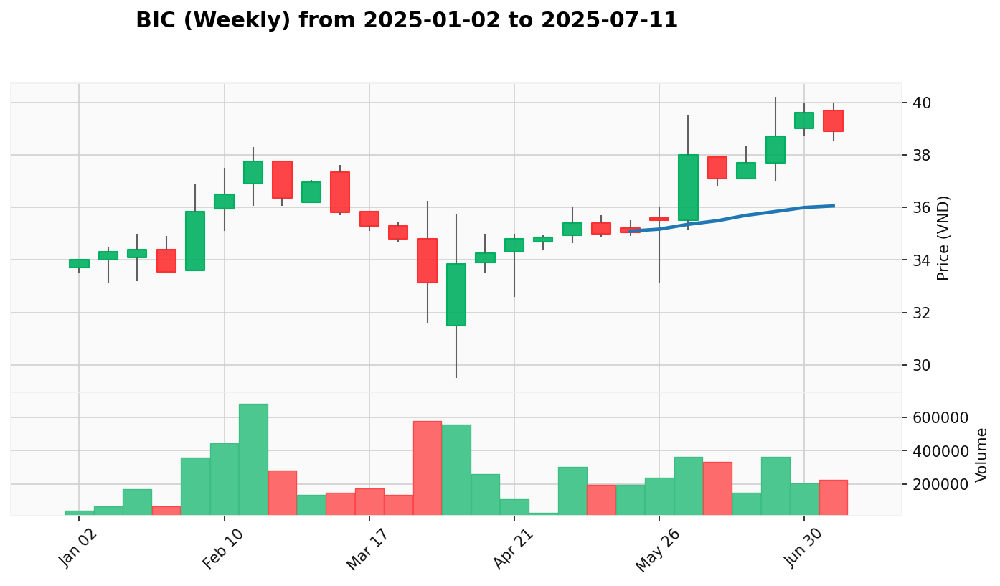

*   [View Report](REPORT_week.md#bic)
*   **Các Chỉ Số Chính:**
    *   **Điểm Câu Chuyện VPA:** 90 / 100
    *   **Điểm Hiệu Suất Tương Đối:** 9.0 (tương ứng +9.0% change)
    *   **Mức Độ Tin Cậy:** 80%
*   **Phân Tích Dẫn Dắt:** BIC là cổ phiếu dẫn dắt không thể tranh cãi của ngành Bảo hiểm. Trong khi các cổ phiếu khác còn đang vật lộn, BIC đã có một tuần bùng nổ SOS, theo sau là các phiên kiểm tra cung thành công. Tuy nhiên, tuần gần nhất xuất hiện bóng nến trên cho thấy áp lực bán, làm giảm độ tin cậy.
*   **Câu Chuyện VPA Nổi Bật:** Bứt phá mạnh mẽ khỏi vùng tích lũy với một tuần SOS, sau đó là một tuần điều chỉnh chốt lời (SOW ngắn hạn) và một tuần "No Supply" trên khối lượng cạn kiệt. Tuần gần nhất là "Effort to Rise" nhưng gặp kháng cự.
*   **Hiệu Suất Tương Đối:** Mức tăng trưởng +9.0% từ nền giá tham chiếu, cao nhất trong ngành, cho thấy sức mạnh tương đối vượt trội.

---

#### **2. Tập đoàn Bảo Việt (BVH)**

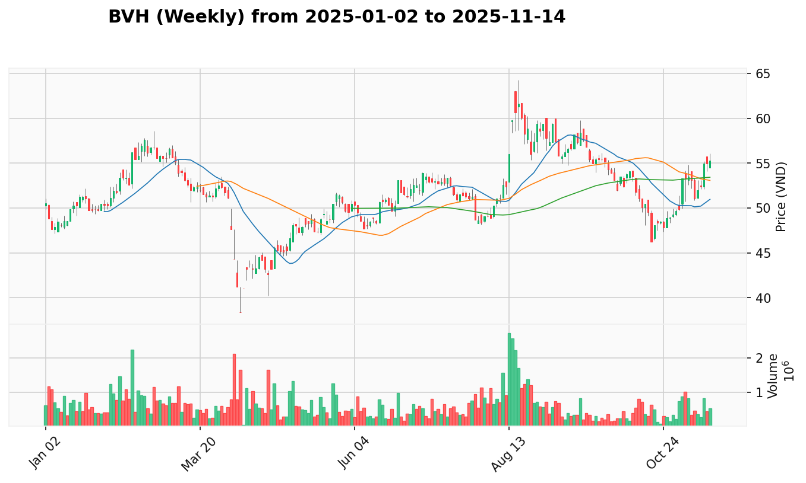

*   [View Report](REPORT_week.md#bvh)
*   **Các Chỉ Số Chính:**
    *   **Điểm Câu Chuyện VPA:** 70 / 100
    *   **Điểm Hiệu Suất Tương Đối:** 14.8 (tương ứng +14.8% change)
    *   **Mức Độ Tin Cậy:** 70%
*   **Phân Tích Dẫn Dắt:** BVH cho thấy sự phục hồi tốt từ đáy, nhưng câu chuyện VPA chưa thực sự thuyết phục. Tuần gần nhất có sự bất thường khi giá tăng trên khối lượng giảm, cho thấy tín hiệu tăng giá thiếu sự xác nhận mạnh mẽ. BVH đang theo sau xu hướng và cần thêm tín hiệu để khẳng định sức mạnh.
*   **Câu Chuyện VPA Nổi Bật:** Phục hồi từ đáy sau tín hiệu "No Demand", có một tuần "Effort to Rise" tích cực, nhưng tuần tăng giá gần nhất lại thiếu sự hỗ trợ của khối lượng.
*   **Hiệu Suất Tương Đối:** Mức tăng trưởng +14.8% từ nền giá tham chiếu là một con số ấn tượng, nhưng chất lượng của đà tăng này cần được kiểm chứng.

---

#### **3. PVI (PVI)**

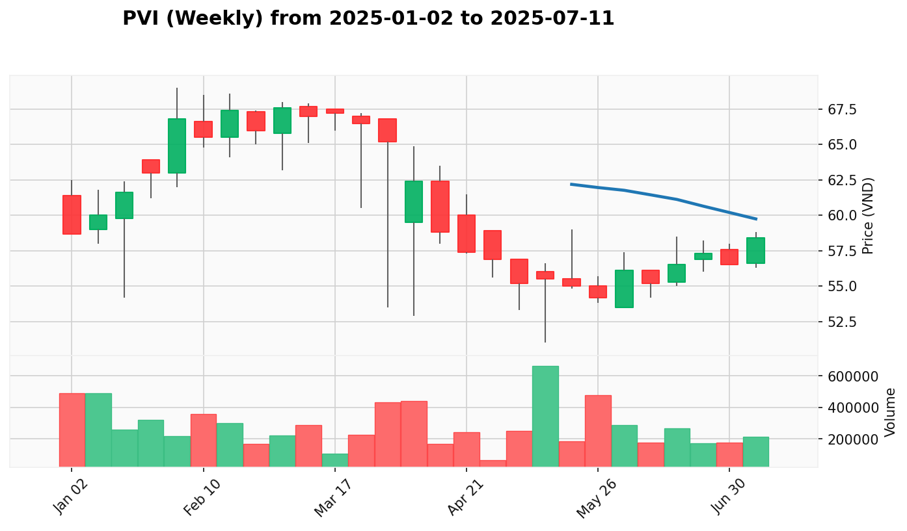

*   [View Report](REPORT_week.md#pvi)
*   **Các Chỉ Số Chính:**
    *   **Điểm Câu Chuyện VPA:** 75 / 100
    *   **Điểm Hiệu Suất Tương Đối:** 2.6 (tương ứng +2.6% change)
    *   **Mức Độ Tin Cậy:** 75%
*   **Phân Tích Dẫn Dắt:** PVI đang đi ngang tích lũy một cách chặt chẽ. Cổ phiếu thể hiện các tín hiệu "No Supply" và "Test" tích cực trên khối lượng thấp, cho thấy không có áp lực bán lớn. Tuy nhiên, lực cầu vẫn chưa đủ mạnh để tạo ra sự bứt phá.
*   **Câu Chuyện VPA Nổi Bật:** Chuỗi các tuần đi ngang với các tín hiệu "No Supply" và "Effort to Rise" yếu. Tuần gần nhất là một phiên "kiểm tra trong xu hướng tăng" trên khối lượng thấp, là một tín hiệu xây dựng.
*   **Hiệu Suất Tương Đối:** Mức tăng trưởng +2.6% từ nền giá tham chiếu, cho thấy cổ phiếu vẫn đang trong giai đoạn tích lũy.

---

## **BẤT ĐỘNG SẢN**

*   **Giai Đoạn Nền Giá Tham Chiếu:** 2025-05-19 - 2025-06-02
*   **Đánh Giá Tổng Quan Ngành:** **Dẫn Dắt Đồng Thuận**. Ngành Bất động sản đang cho thấy sức mạnh lan tỏa khi phần lớn các cổ phiếu trụ cột đều tăng giá mạnh mẽ từ nền giá tham chiếu. Các cổ phiếu "họ Vin" (VHM, VIC) đang thể hiện vai trò dẫn dắt tuyệt đối với những cú bứt phá ngoạn mục. Các cổ phiếu khác như NVL cũng đang có tín hiệu VPA rất tích cực.

**Bảng Xếp Hạng Cổ Phiếu Dẫn Dắt:**

| Hạng | Mã CP & Liên Kết | Điểm Dẫn Dắt | Độ tin cậy | Tóm Tắt Lý Do |
| :--- | :--------------- | :----------- | :--------- | :------------------------------------------------------------------------------------------------ |
| 1 | [**VHM**](#vhm) | 88.0 | 95% | Dẫn dắt tuyệt đối với câu chuyện VPA hoàn hảo, bứt phá mạnh mẽ khỏi xu hướng giảm và hiệu suất giá vượt trội. |
| 2 | [**VIC**](#vic) | 87.0 | 90% | Sức mạnh giá phi thường, hiệu suất cao nhất ngành, dù tín hiệu VPA có chút lo ngại về sự suy kiệt nhưng xu hướng vẫn rất mạnh. |
| 3 | [**NVL**](#nvl) | 74.0 | 95% | Câu chuyện VPA textbook với cú bứt phá SOS và một tuần "Test for Supply" cực kỳ thành công, cho thấy tiềm năng tăng giá lớn. |

---

### **Phân Tích Chi Tiết Top 3:**

---

#### **1. Vinhomes (VHM)**

*   [View Report](REPORT_week.md#vhm)
*   **Các Chỉ Số Chính:**
    *   **Điểm Câu Chuyện VPA:** 100 / 100
    *   **Điểm Hiệu Suất Tương Đối:** 62.1 (tương ứng +62.1% change)
    *   **Mức Độ Tin Cậy:** 95%
*   **Phân Tích Dẫn Dắt:** VHM là cổ phiếu dẫn dắt mạnh mẽ và rõ ràng nhất của ngành Bất động sản. Trong bối cảnh ngành đang đồng thuận đi lên, VHM thể hiện vai trò đầu tàu khi bứt phá khỏi xu hướng giảm dài hạn với một chuỗi các tín hiệu SOS mạnh mẽ, được xác nhận bởi khối lượng lớn.
*   **Câu Chuyện VPA Nổi Bật:** Sau khi thoát khỏi giai đoạn SOW, VHM có tín hiệu "No Supply" và sau đó là một tuần bùng nổ SOS với biên độ rất rộng, xác nhận sự quay trở lại của dòng tiền lớn và bắt đầu một xu hướng tăng mới.
*   **Hiệu Suất Tương Đối:** Mức tăng trưởng phi thường +62.1% từ nền giá tham chiếu, thể hiện sức mạnh tuyệt đối so với toàn ngành.

---

#### **2. Vingroup (VIC)**

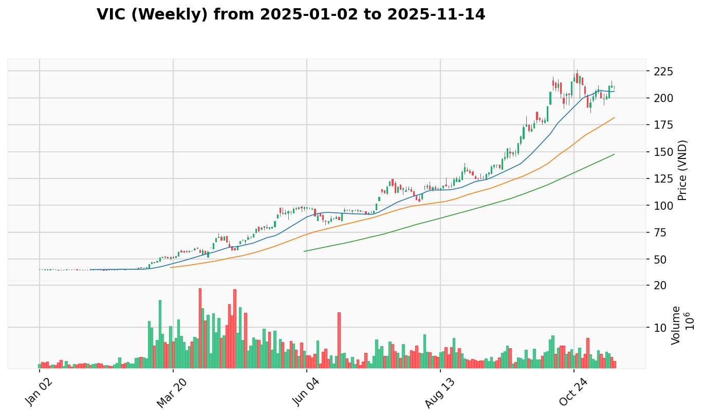

*   [View Report](REPORT_week.md#vic)
*   **Các Chỉ Số Chính:**
    *   **Điểm Câu Chuyện VPA:** 85 / 100
    *   **Điểm Hiệu Suất Tương Đối:** 73.6 (tương ứng +73.6% change)
    *   **Mức Độ Tin Cậy:** 90%
*   **Phân Tích Dẫn Dắt:** VIC là cổ phiếu có hiệu suất giá cao nhất ngành, thể hiện sức mạnh đáng kinh ngạc. Nó là một trong những động lực chính kéo cả ngành đi lên. Tuy nhiên, tín hiệu VPA gần đây cho thấy giá tăng trên khối lượng giảm, có thể là dấu hiệu của "thiếu cung" (tích cực) hoặc "suy kiệt lực mua" (cảnh báo). Dù vậy, xu hướng hiện tại vẫn rất mạnh.
*   **Câu Chuyện VPA Nổi Bật:** Phục hồi mạnh mẽ sau một tuần SOW, có một tuần "Effort to Rise" và tiếp tục bứt phá với một nến tăng biên độ rộng. Sức mạnh của xu hướng là không thể bàn cãi.
*   **Hiệu Suất Tương Đối:** Mức tăng trưởng +73.6% từ nền giá tham chiếu, một con số phi thường, cao nhất trong ngành.

---

#### **3. Novaland (NVL)**

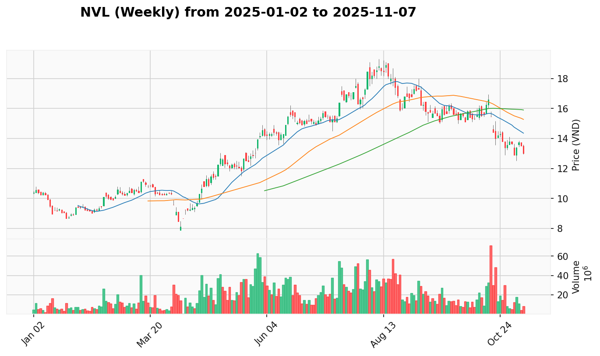

*   [View Report](REPORT_week.md#nvl)
*   **Các Chỉ Số Chính:**
    *   **Điểm Câu Chuyện VPA:** 95 / 100
    *   **Điểm Hiệu Suất Tương Đối:** 42.4 (tương ứng +42.4% change)
    *   **Mức Độ Tin Cậy:** 95%
*   **Phân Tích Dẫn Dắt:** NVL là một ví dụ điển hình về một cổ phiếu đang theo sau các mã dẫn đầu nhưng với một câu chuyện VPA cực kỳ mạnh mẽ. Sau khi bứt phá với tín hiệu SOS, NVL đã có một tuần "Test for Supply" hoàn hảo trên khối lượng cạn kiệt, cho thấy thị trường đang hấp thụ tốt và sẵn sàng cho một đợt tăng giá tiếp theo.
*   **Câu Chuyện VPA Nổi Bật:** Bùng nổ với một tuần SOS khối lượng lớn, theo sau là một tuần "Test for Supply" dạng inside bar với khối lượng giảm mạnh. Đây là một hành động giá rất mang tính xây dựng và có độ tin cậy cao.
*   **Hiệu Suất Tương Đối:** Mức tăng trưởng +42.4% từ nền giá tham chiếu, cho thấy sức mạnh vượt trội và sự tham gia tích cực vào xu hướng chung của ngành.

---

## **BẤT ĐỘNG SẢN KCN**

*   **Giai Đoạn Nền Giá Tham Chiếu:** 2025-05-19 - 2025-06-09
*   **Đánh Giá Tổng Quan Ngành:** **Dẫn Dắt Phân Hóa**. Ngành BĐS KCN đang có sự phân hóa rõ rệt. IDC và BCM thể hiện sức mạnh vượt trội với những cú bứt phá mạnh mẽ, trong khi KBC, VGC và SIP vẫn đang trong giai đoạn phục hồi hoặc tích lũy yếu hơn. Sức mạnh chưa lan tỏa toàn ngành, đòi hỏi sự lựa chọn cổ phiếu cẩn thận.

**Bảng Xếp Hạng Cổ Phiếu Dẫn Dắt:**

| Hạng | Mã CP & Liên Kết | Điểm Dẫn Dắt | Độ tin cậy | Tóm Tắt Lý Do |
| :--- | :--------------- | :----------- | :--------- | :------------------------------------------------------------------------------------------------ |
| 1 | [**IDC**](#idc) | 88.3 | 95% | Dẫn dắt tuyệt đối với câu chuyện VPA hoàn hảo, bứt phá khỏi nền tích lũy bằng một phiên SOS mạnh mẽ và hiệu suất giá vượt trội. |
| 2 | [**BCM**](#bcm) | 87.7 | 95% | Câu chuyện VPA rất mạnh mẽ với cú bứt phá không có bóng nến trên, xác nhận phe mua hoàn toàn kiểm soát. |
| 3 | [**KBC**](#kbc) | 68.7 | 85% | Phục hồi tốt từ đáy với tín hiệu SOS xác nhận, nhưng hiệu suất giá vẫn còn cách biệt so với hai mã dẫn đầu. |

---

### **Phân Tích Chi Tiết Top 3:**

---

#### **1. IDICO (IDC)**

*   [View Report](REPORT_week.md#idc)
*   **Các Chỉ Số Chính:**
    *   **Điểm Câu Chuyện VPA:** 100 / 100
    *   **Điểm Hiệu Suất Tương Đối:** 70.8 (tương ứng +70.8% change)
    *   **Mức Độ Tin Cậy:** 95%
*   **Phân Tích Dẫn Dắt:** IDC là cổ phiếu dẫn dắt không thể tranh cãi của ngành BĐS KCN. Trong khi các đối thủ còn đang tích lũy, IDC đã sớm cho thấy các tín hiệu "No Supply" và bứt phá bằng một tuần SOS với khối lượng tăng vọt, xác nhận một xu hướng tăng mới.
*   **Câu Chuyện VPA Nổi Bật:** Sau các tín hiệu "No Demand" và "No Supply" cho thấy sự cạn kiệt của lực bán, IDC đã có một tuần bùng nổ SOS với nến tăng thân dài và khối lượng gấp đôi tuần trước. Đây là một cú phá vỡ rất đáng tin cậy.
*   **Hiệu Suất Tương Đối:** Mức tăng trưởng +70.8% từ nền giá tham chiếu, một con số phi thường, cho thấy sức mạnh tuyệt đối so với phần còn lại của ngành.

---

#### **2. Becamex (BCM)**

*   [View Report](REPORT_week.md#bcm)
*   **Các Chỉ Số Chính:**
    *   **Điểm Câu Chuyện VPA:** 95 / 100
    *   **Điểm Hiệu Suất Tương Đối:** 79.4 (tương ứng +79.4% change)
    *   **Mức Độ Tin Cậy:** 95%
*   **Phân Tích Dẫn Dắt:** BCM là một trong hai cổ phiếu mạnh nhất ngành, thể hiện sức mạnh tương đương IDC. Cú bứt phá trong tuần gần nhất là cực kỳ thuyết phục, với một nến tăng thân dài không có bóng trên, cho thấy phe mua kiểm soát hoàn toàn phiên giao dịch và sẵn sàng đẩy giá lên cao hơn.
*   **Câu Chuyện VPA Nổi Bật:** Sau các tuần "Test for Supply" và "No Demand" cho thấy sự tích lũy, BCM đã có một tuần SOS bùng nổ, phá vỡ vùng đi ngang kéo dài nhiều tuần với khối lượng tăng mạnh.
*   **Hiệu Suất Tương Đối:** Mức tăng trưởng +79.4% từ nền giá tham chiếu, cao nhất ngành, khẳng định vị thế dẫn dắt.

---

#### **3. Kinh Bắc (KBC)**

*   [View Report](REPORT_week.md#kbc)
*   **Các Chỉ Số Chính:**
    *   **Điểm Câu Chuyện VPA:** 85 / 100
    *   **Điểm Hiệu Suất Tương Đối:** 41.5 (tương ứng +41.5% change)
    *   **Mức Độ Tin Cậy:** 85%
*   **Phân Tích Dẫn Dắt:** KBC đang cho thấy sự phục hồi mạnh mẽ từ vùng đáy và đang cố gắng bắt kịp các mã dẫn đầu. Tuần gần nhất là một tín hiệu SOS rõ ràng với khối lượng tăng mạnh, cho thấy lực cầu đã quay trở lại. Tuy nhiên, KBC vẫn cần vượt qua nhiều kháng cự hơn so với IDC và BCM.
*   **Câu Chuyện VPA Nổi Bật:** Sau một giai đoạn SOW, KBC có một tuần phục hồi dạng "No Supply", theo sau là một tuần SOS với nến tăng thân dài và khối lượng lớn, xác nhận sự quay trở lại của phe mua.
*   **Hiệu Suất Tương Đối:** Mức tăng trưởng +41.5% từ nền giá tham chiếu, một con số tốt nhưng vẫn còn khoảng cách so với hai mã dẫn đầu.

---

## **CAO SU**

*   **Giai Đoạn Nền Giá Tham Chiếu:** 2025-05-19 - 2025-06-09
*   **Đánh Giá Tổng Quan Ngành:** **Dẫn Dắt Đồng Thuận**. Ngành Cao su đang có một xu hướng tăng giá mạnh mẽ và đồng bộ. Cả DPR và PHR đều cho thấy những cú bứt phá ấn tượng trong tuần gần nhất, trong khi DRC và GVR cũng có những nỗ lực tăng giá tích cực. Sức mạnh đang lan tỏa trên toàn ngành.

**Bảng Xếp Hạng Cổ Phiếu Dẫn Dắt:**

| Hạng | Mã CP & Liên Kết | Điểm Dẫn Dắt | Độ tin cậy | Tóm Tắt Lý Do |
| :--- | :--------------- | :----------- | :--------- | :------------------------------------------------------------------------------------------------ |
| 1 | [**DPR**](#dpr) | 91.0 | 95% | Dẫn dắt tuyệt đối với cú bứt phá SOS mạnh mẽ, vượt đỉnh cũ và được xác nhận bởi khối lượng tăng vọt. Hiệu suất giá tốt nhất ngành. |
| 2 | [**PHR**](#phr) | 90.0 | 95% | Sức mạnh tương đương DPR, cũng có một tuần bùng nổ SOS phá vỡ đỉnh cũ, khẳng định vai trò đồng dẫn dắt. |
| 3 | [**DRC**](#drc) | 68.3 | 85% | Có một tuần "Effort to Rise" mạnh mẽ, cho thấy lực cầu đang trở nên quyết liệt, nhưng vẫn đang trong giai đoạn phục hồi. |

---

### **Phân Tích Chi Tiết Top 3:**

---

#### **1. Cao su Đồng Phú (DPR)**

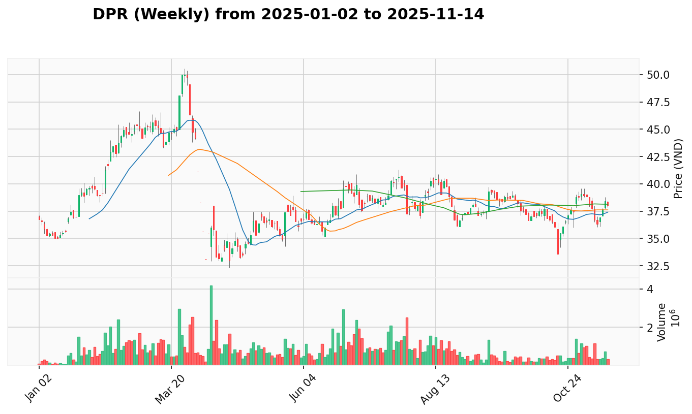

*   [View Report](REPORT_week.md#dpr)
*   **Các Chỉ Số Chính:**
    *   **Điểm Câu Chuyện VPA:** 95 / 100
    *   **Điểm Hiệu Suất Tương Đối:** 89.9 (tương ứng +89.9% change)
    *   **Mức Độ Tin Cậy:** 95%
*   **Phân Tích Dẫn Dắt:** Trong bối cảnh ngành Cao su đang đồng thuận đi lên, DPR nổi bật là cổ phiếu mạnh nhất. Cổ phiếu này không chỉ có hiệu suất giá vượt trội mà còn sở hữu một cú bứt phá SOS hoàn hảo trong tuần gần nhất, xác nhận vai trò dẫn dắt không thể bàn cãi.
*   **Câu Chuyện VPA Nổi Bật:** Sau các tín hiệu "No Supply" và "Effort to Rise", DPR đã có một tuần bứt phá mạnh mẽ với nến tăng thân dài, đóng cửa gần mức cao nhất và khối lượng tăng vọt, phá vỡ vùng đỉnh cũ.
*   **Hiệu Suất Tương Đối:** Mức tăng trưởng +89.9% từ nền giá tham chiếu, cao nhất trong ngành, thể hiện sức mạnh vượt trội.

---

#### **2. Cao su Phước Hòa (PHR)**

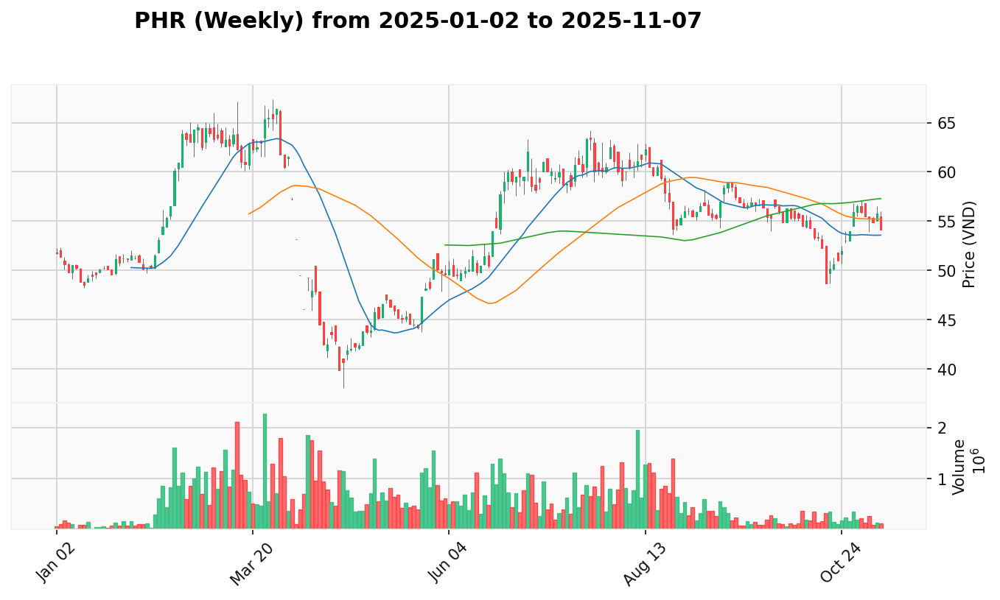

*   [View Report](REPORT_week.md#phr)
*   **Các Chỉ Số Chính:**
    *   **Điểm Câu Chuyện VPA:** 90 / 100
    *   **Điểm Hiệu Suất Tương Đối:** 84.4 (tương ứng +84.4% change)
    *   **Mức Độ Tin Cậy:** 95%
*   **Phân Tích Dẫn Dắt:** PHR là cổ phiếu đồng dẫn dắt với DPR, thể hiện sức mạnh tương đương. Tuần bùng nổ SOS gần nhất với khối lượng lớn cũng đã phá vỡ vùng đỉnh cũ, xác nhận một xu hướng tăng mạnh mẽ và sự tham gia quyết liệt của dòng tiền.
*   **Câu Chuyện VPA Nổi Bật:** Sau giai đoạn tích lũy với các tín hiệu "Test for Supply" và "No Demand", PHR có một tuần SOS mạnh mẽ và tiếp tục bùng nổ trong tuần gần nhất, tạo thành một chuỗi tăng giá thuyết phục.
*   **Hiệu Suất Tương Đối:** Mức tăng trưởng +84.4% từ nền giá tham chiếu, một con số xuất sắc, chỉ đứng sau DPR một chút.

---

#### **3. Cao su Đà Nẵng (DRC)**

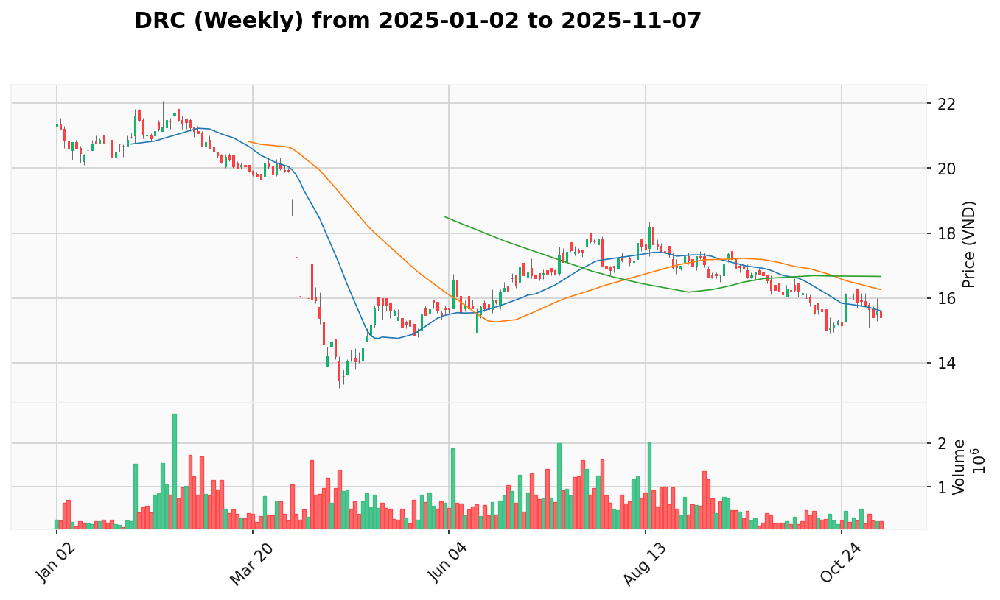

*   [View Report](REPORT_week.md#drc)
*   **Các Chỉ Số Chính:**
    *   **Điểm Câu Chuyện VPA:** 80 / 100
    *   **Điểm Hiệu Suất Tương Đối:** 45.3 (tương ứng +45.3% change)
    *   **Mức Độ Tin Cậy:** 85%
*   **Phân Tích Dẫn Dắt:** DRC đang trong giai đoạn phục hồi và có những dấu hiệu tích cực. Cổ phiếu này vừa có một tuần tăng giá mạnh mẽ với khối lượng lớn, cho thấy lực cầu đang quay trở lại. Mặc dù vẫn còn cách xa đỉnh và yếu hơn hai mã dẫn đầu, DRC đang tham gia tốt vào xu hướng chung của ngành.
*   **Câu Chuyện VPA Nổi Bật:** Sau một giai đoạn điều chỉnh với các tín hiệu "Test for Supply" và "No Supply", DRC đã có một tuần "Effort to Rise" hoặc SOS mạnh mẽ, với khối lượng tăng gần gấp đôi, cho thấy sự quyết liệt của phe mua.
*   **Hiệu Suất Tương Đối:** Mức tăng trưởng +45.3% từ nền giá tham chiếu, thể hiện sự phục hồi tốt.

---

## **CHỨNG KHOÁN**

*   **Giai Đoạn Nền Giá Tham Chiếu:** 2025-05-26 - 2025-06-16
*   **Đánh Giá Tổng Quan Ngành:** **Yếu/Phân Phối**. Ngành Chứng khoán đang thể hiện sự suy yếu rõ rệt. Mặc dù một số cổ phiếu như SSI và VND có cú bứt phá mạnh, phần lớn các cổ phiếu khác trong ngành đều đang cho thấy tín hiệu "No Demand" (thiếu cầu) hoặc "Up-thrust" (bẫy tăng giá), đi kèm với khối lượng cao nhưng giá không tăng tương xứng. Điều này cho thấy áp lực bán đang âm thầm diễn ra trên diện rộng.

**Bảng Xếp Hạng Cổ Phiếu Dẫn Dắt:**

| Hạng | Mã CP & Liên Kết | Điểm Dẫn Dắt | Độ tin cậy | Tóm Tắt Lý Do |
| :--- | :--------------- | :----------- | :--------- | :------------------------------------------------------------------------------------------------ |
| 1 | [**VND**](#vnd) | 88.0 | 90% | Dẫn dắt tuyệt đối với cú bứt phá SOS mạnh mẽ khỏi nền tích lũy, hiệu suất giá vượt trội và khối lượng bùng nổ. |
| 2 | [**SSI**](#ssi) | 83.0 | 90% | Sức mạnh tương đương VND, cũng có một tuần SOS thuyết phục với khối lượng rất cao, khẳng định vai trò đồng dẫn dắt. |
| 3 | [**FTS**](#fts) | 39.8 | 30% | Mặc dù xếp hạng 3, FTS đang cho thấy tín hiệu cực kỳ yếu kém với một cú "Up-thrust", cần hết sức thận trọng. |

---

### **Phân Tích Chi Tiết Top 3:**

---

#### **1. Chứng khoán VNDIRECT (VND)**

*   [View Report](REPORT_week.md#vnd)
*   **Các Chỉ Số Chính:**
    *   **Điểm Câu Chuyện VPA:** 95 / 100
    *   **Điểm Hiệu Suất Tương Đối:** 77.4 (tương ứng +77.4% change)
    *   **Mức Độ Tin Cậy:** 90%
*   **Phân Tích Dẫn Dắt:** VND là một trong hai điểm sáng hiếm hoi của ngành Chứng khoán. Trong khi phần lớn ngành đang suy yếu, VND đã có một cú bứt phá SOS ngoạn mục với khối lượng cực lớn, cho thấy dòng tiền lớn đang tập trung vào cổ phiếu này và nó đang đi ngược lại xu hướng chung của ngành.
*   **Câu Chuyện VPA Nổi Bật:** Sau một giai đoạn tích lũy với các tín hiệu SOW ngắn hạn và "No Supply", VND đã có một tuần bùng nổ SOS với nến tăng thân dài và khối lượng đạt mức rất cao, xác nhận sự quay trở lại mạnh mẽ của phe mua.
*   **Hiệu Suất Tương Đối:** Mức tăng trưởng +77.4% từ nền giá tham chiếu, một con số phi thường, thể hiện sức mạnh vượt trội hoàn toàn so với ngành.

---

#### **2. Chứng khoán SSI (SSI)**

*   [View Report](REPORT_week.md#ssi)
*   **Các Chỉ Số Chính:**
    *   **Điểm Câu Chuyện VPA:** 90 / 100
    *   **Điểm Hiệu Suất Tương Đối:** 67.0 (tương ứng +67.0% change)
    *   **Mức Độ Tin Cậy:** 90%
*   **Phân Tích Dẫn Dắt:** Tương tự VND, SSI là cổ phiếu mạnh thứ hai đang chống lại sự suy yếu chung của ngành. Cú bứt phá SOS trong tuần gần nhất cũng rất thuyết phục, với nến tăng thân dài và khối lượng lớn, cho thấy SSI cũng là một lựa chọn được dòng tiền ưu tiên.
*   **Câu Chuyện VPA Nổi Bật:** Sau một loạt các tuần kiểm tra cung và cầu, SSI đã có một tuần SOS mạnh mẽ, phá vỡ các vùng kháng cự gần nhất và cho thấy lực cầu đang chiếm ưu thế rõ rệt.
*   **Hiệu Suất Tương Đối:** Mức tăng trưởng +67.0% từ nền giá tham chiếu, một hiệu suất xuất sắc, khẳng định vị thế là một trong hai cổ phiếu mạnh nhất ngành.

---

#### **3. Chứng khoán FPT (FTS)**

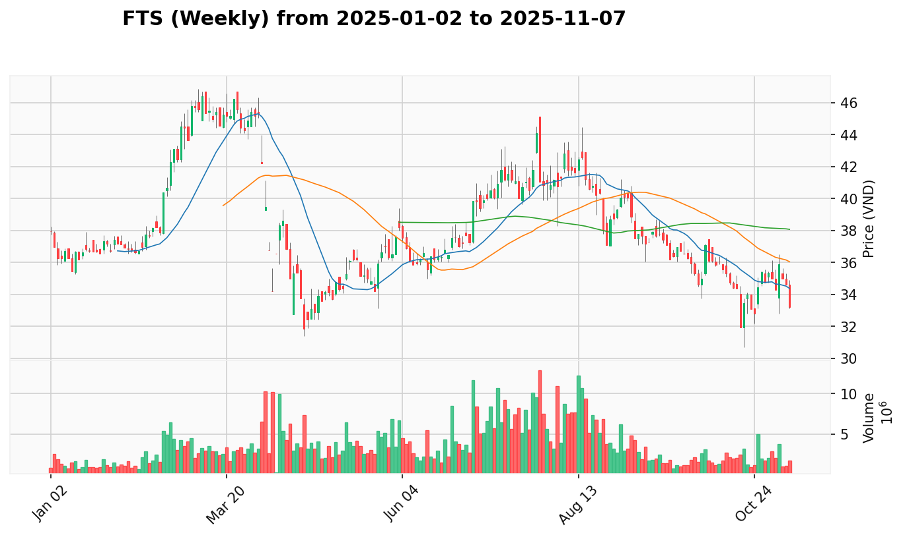

*   [View Report](REPORT_week.md#fts)
*   **Các Chỉ Số Chính:**
    *   **Điểm Câu Chuyện VPA:** 30 / 100
    *   **Điểm Hiệu Suất Tương Đối:** 54.3 (tương ứng +54.3% change)
    *   **Mức Độ Tin Cậy:** 30%
*   **Phân Tích Dẫn Dắt:** FTS là một ví dụ điển hình cho sự suy yếu của ngành. Mặc dù hiệu suất giá tương đối cao, câu chuyện VPA gần đây là cực kỳ tiêu cực. Tuần gần nhất là một cú "Up-thrust" rõ ràng, khi giá không giữ được mức cao trên nền khối lượng đột biến. Điều này cho thấy áp lực phân phối rất lớn.
*   **Câu Chuyện VPA Nổi Bật:** Sau một giai đoạn phục hồi yếu ớt, tuần gần nhất FTS có một cú "Up-thrust" và là một "Dấu hiệu Yếu kém" (SOW) rất đáng báo động.
*   **Hiệu Suất Tương Đối:** Mức tăng trưởng +54.3% từ nền giá tham chiếu, tuy nhiên chất lượng của đà tăng này là rất đáng nghi ngờ và có nguy cơ bị xóa bỏ.

---

## **CÔNG NGHỆ**

*   **Giai Đoạn Nền Giá Tham Chiếu:** 2025-05-19 - 2025-06-02
*   **Đánh Giá Tổng Quan Ngành:** **Dẫn Dắt Đồng Thuận**. Ngành Công nghệ đang thể hiện một xu hướng tăng giá mạnh mẽ và có sự lan tỏa. Tất cả các cổ phiếu lớn trong ngành đều cho thấy hiệu suất tích cực rõ rệt từ nền giá tham chiếu. Các tín hiệu VPA chủ đạo là "nỗ lực tăng giá", "SOS" và "kiểm tra cung thành công", cho thấy dòng tiền đang ủng hộ mạnh mẽ cho toàn ngành.

**Bảng Xếp Hạng Cổ Phiếu Dẫn Dắt:**

| Hạng | Mã CP & Liên Kết | Điểm Dẫn Dắt | Độ tin cậy | Tóm Tắt Lý Do |
| :--- | :--------------- | :----------- | :--------- | :------------------------------------------------------------------------------------------------ |
| 1 | [**CMG**](#cmg) | 89.2 | 95% | Dẫn dắt tuyệt đối với cú bứt phá SOS ngoạn mục, hiệu suất giá vượt trội và câu chuyện VPA textbook. |
| 2 | [**VGI**](#vgi) | 71.9 | 90% | Sức mạnh giá rất tốt, câu chuyện VPA rõ ràng với chuỗi tín hiệu SOS và kiểm tra cung thành công, khẳng định vai trò đồng dẫn dắt. |
| 3 | [**FPT**](#fpt) | 68.3 | 85% | Là cổ phiếu blue-chip ổn định, đang cho thấy sự phục hồi tốt với tín hiệu "Test for Supply" thành công, theo sau xu hướng ngành. |

---

### **Phân Tích Chi Tiết Top 3:**

---

#### **1. Tập đoàn Công nghệ CMC (CMG)**

*   [View Report](REPORT_week.md#cmg)
*   **Các Chỉ Số Chính:**
    *   **Điểm Câu Chuyện VPA:** 100 / 100
    *   **Điểm Hiệu Suất Tương Đối:** 73.0 (tương ứng +73.0% change)
    *   **Mức Độ Tin Cậy:** 95%
*   **Phân Tích Dẫn Dắt:** Trong bối cảnh ngành Công nghệ đang tăng trưởng đồng thuận, CMG nổi lên là đầu tàu mạnh mẽ nhất. Cổ phiếu này không chỉ có mức tăng trưởng cao nhất mà còn sở hữu câu chuyện VPA hoàn hảo nhất, với một cú tăng tốc ngoạn mục trong tuần gần nhất, xác nhận vai trò dẫn dắt không thể bàn cãi.
*   **Câu Chuyện VPA Nổi Bật:** Một chuỗi các tuần "Effort to Rise" và SOS liên tiếp, đỉnh điểm là một tuần tăng tốc với nến tăng biên độ rất rộng và đóng cửa ở mức cao nhất, xác nhận lực cầu đang áp đảo hoàn toàn.
*   **Hiệu Suất Tương Đối:** Mức tăng trưởng +73.0% từ nền giá tham chiếu, cao nhất trong ngành, thể hiện sức mạnh tuyệt đối.

---

#### **2. Viettel Global (VGI)**

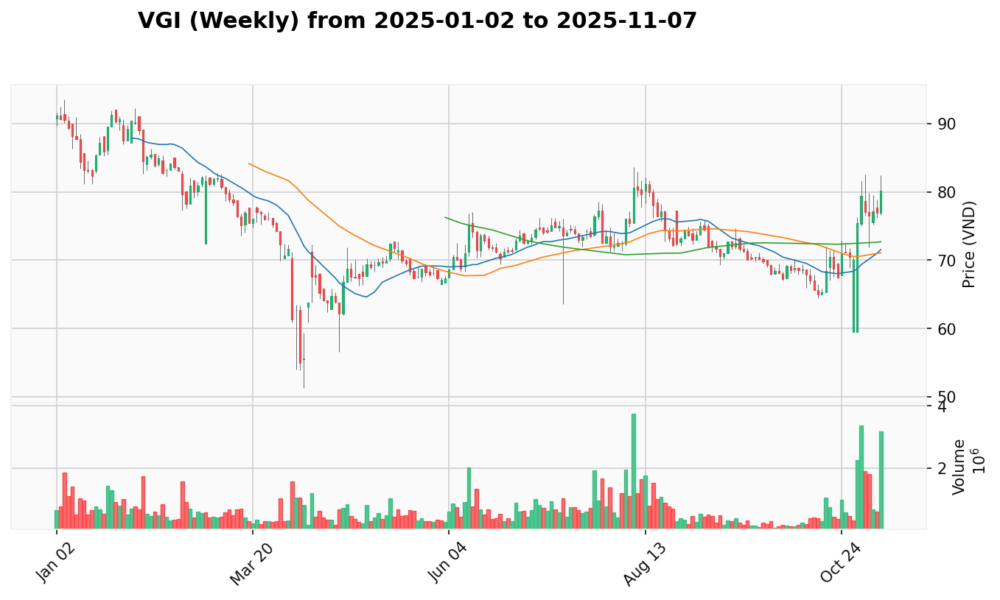

*   [View Report](REPORT_week.md#vgi)
*   **Các Chỉ Số Chính:**
    *   **Điểm Câu Chuyện VPA:** 90 / 100
    *   **Điểm Hiệu Suất Tương Đối:** 44.8 (tương ứng +44.8% change)
    *   **Mức Độ Tin Cậy:** 90%
*   **Phân Tích Dẫn Dắt:** VGI là một cổ phiếu đồng dẫn dắt mạnh mẽ trong ngành. Nó có một câu chuyện VPA rất thuyết phục với cú bứt phá SOS khỏi nền và một phiên kiểm tra cung thành công ngay sau đó. Tuần gần nhất tiếp tục là một nỗ lực tăng giá, cho thấy xu hướng tăng đang được duy trì tốt.
*   **Câu Chuyện VPA Nổi Bật:** Bùng nổ với một tuần SOS khối lượng lớn, theo sau là một tuần "Test for Supply" thành công. Tuần gần nhất là một "Effort to Rise" với nến tăng biên độ rộng, cho thấy lực cầu vẫn đang kiểm soát.
*   **Hiệu Suất Tương Đối:** Mức tăng trưởng +44.8% từ nền giá tham chiếu, một con số rất tốt, cho thấy sức mạnh tương đối cao trong ngành.

---

#### **3. Tập đoàn FPT (FPT)**

*   [View Report](REPORT_week.md#fpt)
*   **Các Chỉ Số Chính:**
    *   **Điểm Câu Chuyện VPA:** 80 / 100
    *   **Điểm Hiệu Suất Tương Đối:** 50.5 (tương ứng +50.5% change)
    *   **Mức Độ Tin Cậy:** 85%
*   **Phân Tích Dẫn Dắt:** FPT, với vai trò là một cổ phiếu vốn hóa lớn, đang cho thấy sự phục hồi ổn định và tham gia vào xu hướng chung của ngành. Tín hiệu "Test for Supply" thành công trong tuần gần nhất là rất tích cực, cho thấy phe bán không còn hoạt động mạnh và cổ phiếu sẵn sàng cho một đợt tăng tiếp theo.
*   **Câu Chuyện VPA Nổi Bật:** Sau một giai đoạn đi ngang với các tín hiệu "No Demand" và giằng co, FPT đã có một tuần tăng giá trở lại trên khối lượng thấp hơn, đây là một phiên "Test for Supply" thành công, ủng hộ cho sự tiếp diễn của xu hướng tăng.
*   **Hiệu Suất Tương Đối:** Mức tăng trưởng +50.5% từ nền giá tham chiếu, một hiệu suất rất mạnh mẽ đối với một cổ phiếu blue-chip.

---

## **DẦU KHÍ**

*   **Giai Đoạn Nền Giá Tham Chiếu:** 2025-05-26 - 2025-06-09
*   **Đánh Giá Tổng Quan Ngành:** **Yếu/Phân Phối**. Ngành Dầu Khí đang cho thấy những dấu hiệu suy yếu đồng bộ rất đáng báo động. Mặc dù các cổ phiếu đều tăng giá so với nền tham chiếu, nhưng tất cả đều xuất hiện tín hiệu "Up-thrust" hoặc "Dấu hiệu Yếu kém" (SOW) trong tuần gần nhất sau một đợt tăng tốc có khả năng là "Cao trào Mua". Điều này cho thấy áp lực phân phối đang diễn ra trên toàn ngành và rủi ro đảo chiều là rất cao.

**Bảng Xếp Hạng Cổ Phiếu Dẫn Dắt:**

| Hạng | Mã CP & Liên Kết | Điểm Dẫn Dắt | Độ tin cậy | Tóm Tắt Lý Do |
| :--- | :--------------- | :----------- | :--------- | :------------------------------------------------------------------------------------------------ |
| 1 | [**PVS**](#pvs) | 36.7 | 20% | Hiệu suất giá tốt nhất nhưng câu chuyện VPA gần đây là phân phối rõ ràng, rủi ro rất cao. |
| 2 | [**PLX**](#plx) | 34.7 | 20% | Tương tự PVS, có hai tuần liên tiếp xuất hiện tín hiệu "Up-thrust" và SOW, cho thấy phe bán hoàn toàn kiểm soát. |
| 3 | [**GAS**](#gas) | 31.8 | 20% | Câu chuyện VPA rất tiêu cực với một cú "Up-thrust" kinh điển trong tuần gần nhất. |

---

### **Phân Tích Chi Tiết Top 3:**

---

#### **1. Dịch vụ Kỹ thuật Dầu khí (PVS)**

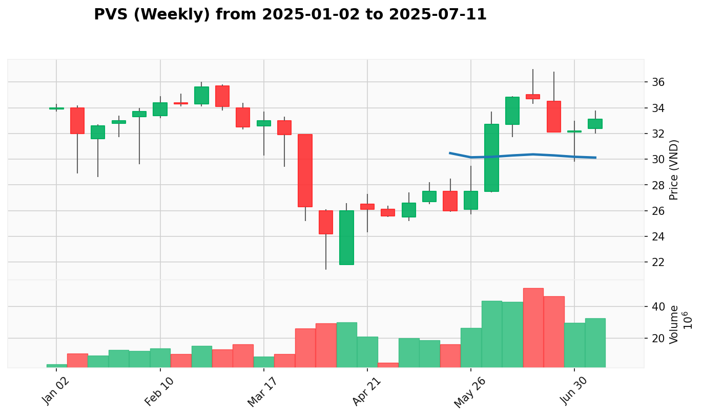

*   [View Report](REPORT_week.md#pvs)
*   **Các Chỉ Số Chính:**
    *   **Điểm Câu Chuyện VPA:** 50 / 100
    *   **Điểm Hiệu Suất Tương Đối:** 16.7 (tương ứng +16.7% change)
    *   **Mức Độ Tin Cậy:** 20%
*   **Phân Tích Dẫn Dắt:** PVS, mặc dù có hiệu suất giá tốt nhất, lại là một ví dụ điển hình cho sự suy yếu của toàn ngành. Câu chuyện VPA đã chuyển từ rất mạnh (SOS) sang phân phối rõ ràng (giằng co trên khối lượng lớn) và kết thúc bằng một tuần SOW mạnh mẽ. Rủi ro đảo chiều là cực kỳ cao.
*   **Câu Chuyện VPA Nổi Bật:** Sau hai tuần SOS mạnh mẽ (có thể là Buying Climax), PVS có một tuần giằng co trên khối lượng đột biến (phân phối) và một tuần giảm mạnh SOW, xác nhận áp lực bán lớn.
*   **Hiệu Suất Tương Đối:** Mức tăng trưởng +16.7% từ nền giá tham chiếu, tuy nhiên, thành quả này đang bị đe dọa nghiêm trọng.

---

#### **2. Petrolimex (PLX)**

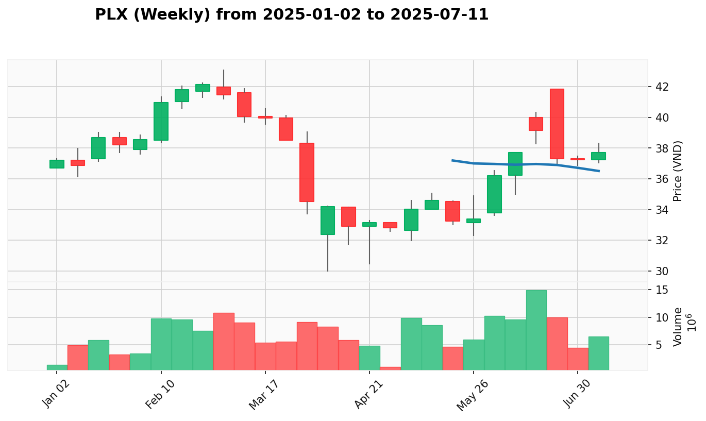

*   [View Report](REPORT_week.md#plx)
*   **Các Chỉ Số Chính:**
    *   **Điểm Câu Chuyện VPA:** 50 / 100
    *   **Điểm Hiệu Suất Tương Đối:** 11.7 (tương ứng +11.7% change)
    *   **Mức Độ Tin Cậy:** 20%
*   **Phân Tích Dẫn Dắt:** PLX thể hiện câu chuyện VPA tiêu cực tương tự như các cổ phiếu khác trong ngành. Sau giai đoạn tăng giá, hai tuần gần nhất đều là những cú "Up-thrust" với bóng nến trên dài và khối lượng lớn, cho thấy nỗ lực tăng giá đã hoàn toàn thất bại và phe bán đang kiểm soát.
*   **Câu Chuyện VPA Nổi Bật:** Một cú "Up-thrust" và SOW ở tuần 2025-06-16, tiếp tục được xác nhận bằng một cú "Up-thrust" khác trong tuần 2025-06-23. Đây là tín hiệu phân phối rất rõ ràng.
*   **Hiệu Suất Tương Đối:** Mức tăng trưởng +11.7% từ nền giá tham chiếu, nhưng xu hướng tăng đã bị phá vỡ.

---

#### **3. PV GAS (GAS)**

*   [View Report](REPORT_week.md#gas)
*   **Các Chỉ Số Chính:**
    *   **Điểm Câu Chuyện VPA:** 50 / 100
    *   **Điểm Hiệu Suất Tương Đối:** 4.6 (tương ứng +4.6% change)
    *   **Mức Độ Tin Cậy:** 20%
*   **Phân Tích Dẫn Dắt:** GAS là một minh chứng khác cho sự suy yếu của ngành. Cổ phiếu này có một cú "Up-thrust" kinh điển trong tuần gần nhất: giá mở cửa tăng vọt lên đỉnh mới nhưng bị bán tháo quyết liệt và đóng cửa yếu. Đây là tín hiệu đảo chiều rất mạnh.
*   **Câu Chuyện VPA Nổi Bật:** Sau một tuần bùng nổ SOS (có thể là Buying Climax), GAS đã có một tuần "Up-thrust" với nến giảm thân dài trên khối lượng rất cao, xác nhận nguồn cung đã áp đảo.
*   **Hiệu Suất Tương Đối:** Mức tăng trưởng +4.6% từ nền giá tham chiếu, không đáng kể và có nguy cơ bị xóa bỏ.

---

## **ĐẦU TƯ CÔNG**

*   **Giai Đoạn Nền Giá Tham Chiếu:** 2025-05-26 - 2025-06-16
*   **Đánh Giá Tổng Quan Ngành:** **Yếu/Phân Phối**. Ngành Đầu tư công đang cho thấy những dấu hiệu rất đáng lo ngại. Mặc dù có những nỗ lực phục hồi, nhưng các tín hiệu VPA gần đây trên toàn ngành đều cho thấy sự xuất hiện của nguồn cung lớn. C4G có cú "Up-thrust" rõ ràng, trong khi VCG và HHV cũng đang có những nỗ lực tăng giá được xác nhận nhưng vẫn còn yếu.

**Bảng Xếp Hạng Cổ Phiếu Dẫn Dắt:**

| Hạng | Mã CP & Liên Kết | Điểm Dẫn Dắt | Độ tin cậy | Tóm Tắt Lý Do |
| :--- | :--------------- | :----------- | :--------- | :------------------------------------------------------------------------------------------------ |
| 1 | [**VCG**](#vcg) | 87.0 | 90% | Là điểm sáng duy nhất với hai tuần SOS liên tiếp, cho thấy sức mạnh vượt trội và vai trò dẫn dắt trong một ngành đang yếu đi. |
| 2 | [**HHV**](#hhv) | 71.9 | 85% | Có một tuần "Effort to Rise" tích cực nhưng vẫn đang trong giai đoạn phục hồi và chưa bứt phá mạnh mẽ như VCG. |
| 3 | [**C4G**](#c4g) | 48.7 | 30% | Câu chuyện VPA rất tiêu cực với một cú "Up-thrust" rõ ràng trên khối lượng đột biến, cho thấy áp lực phân phối lớn. |

---

### **Phân Tích Chi Tiết Top 3:**

---

#### **1. Vinaconex (VCG)**

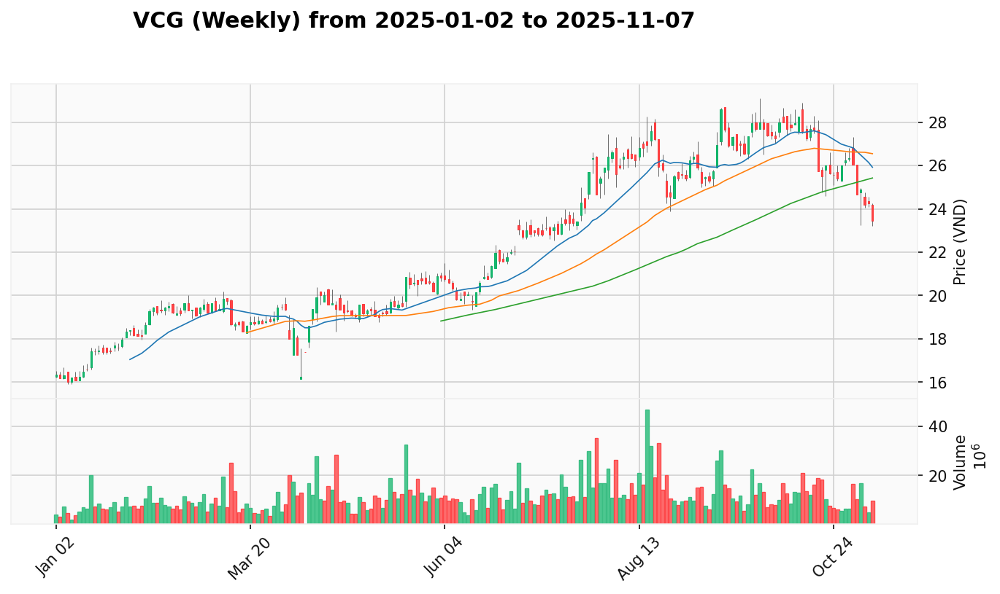

*   [View Report](REPORT_week.md#vcg)
*   **Các Chỉ Số Chính:**
    *   **Điểm Câu Chuyện VPA:** 95 / 100
    *   **Điểm Hiệu Suất Tương Đối:** 79.9 (tương ứng +79.9% change)
    *   **Mức Độ Tin Cậy:** 90%
*   **Phân Tích Dẫn Dắt:** VCG là cổ phiếu dẫn dắt duy nhất và là điểm sáng của ngành Đầu tư công. Trong khi các cổ phiếu khác gặp khó khăn, VCG đã có hai tuần tăng giá SOS liên tiếp với khối lượng lớn, cho thấy dòng tiền đang tập trung mạnh mẽ vào cổ phiếu này.
*   **Câu Chuyện VPA Nổi Bật:** Sau một giai đoạn điều chỉnh và tích lũy, VCG có một tuần SOS bùng nổ, theo sau là một tuần SOS khác với nến tăng thân dài và khối lượng tăng mạnh, xác nhận một xu hướng tăng mới.
*   **Hiệu Suất Tương Đối:** Mức tăng trưởng +79.9% từ nền giá tham chiếu, một con số phi thường, cho thấy sức mạnh tuyệt đối so với ngành.

---

#### **2. Đèo Cả (HHV)**

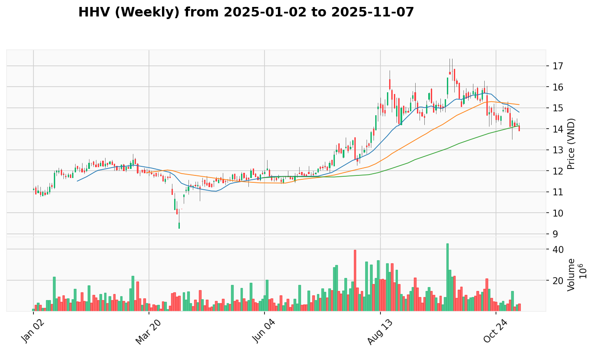

*   [View Report](REPORT_week.md#hhv)
*   **Các Chỉ Số Chính:**
    *   **Điểm Câu Chuyện VPA:** 80 / 100
    *   **Điểm Hiệu Suất Tương Đối:** 59.8 (tương ứng +59.8% change)
    *   **Mức Độ Tin Cậy:** 85%
*   **Phân Tích Dẫn Dắt:** HHV đang cho thấy sự phục hồi tích cực, theo sau VCG. Tuần gần nhất là một "Effort to Rise" rõ ràng với khối lượng tăng mạnh, cho thấy lực cầu đang quay trở lại. Tuy nhiên, cổ phiếu vẫn cần vượt qua nhiều kháng cự để có thể bứt phá mạnh mẽ.
*   **Câu Chuyện VPA Nổi Bật:** Sau một giai đoạn đi ngang với tín hiệu "No Supply" tích cực, HHV đã có một tuần tăng giá tốt với khối lượng lớn, ủng hộ cho khả năng giá sẽ tiếp tục đi lên.
*   **Hiệu Suất Tương Đối:** Mức tăng trưởng +59.8% từ nền giá tham chiếu, một con số tốt, cho thấy sự tham gia vào xu hướng phục hồi.

---

#### **3. Cienco4 (C4G)**

*   [View Report](REPORT_week.md#c4g)
*   **Các Chỉ Số Chính:**
    *   **Điểm Câu Chuyện VPA:** 40 / 100
    *   **Điểm Hiệu Suất Tương Đối:** 66.0 (tương ứng +66.0% change)
    *   **Mức Độ Tin Cậy:** 30%
*   **Phân Tích Dẫn Dắt:** C4G là một ví dụ rõ ràng về sự suy yếu của ngành. Mặc dù có hiệu suất giá tốt, câu chuyện VPA gần đây là rất tiêu cực. Tuần gần nhất là một cú "Up-thrust" rõ ràng khi giá không thể duy trì đà tăng trên nền khối lượng đột biến, cho thấy nguồn cung lớn đã xuất hiện.
*   **Câu Chuyện VPA Nổi Bật:** Sau một tuần SOS bùng nổ, cổ phiếu điều chỉnh và đi ngang với tín hiệu "No Supply". Tuy nhiên, nỗ lực tăng giá trong tuần gần nhất đã bị chặn lại bởi một cú "Up-thrust", một "Dấu hiệu Yếu kém" (SOW) rất rõ ràng.
*   **Hiệu Suất Tương Đối:** Mức tăng trưởng +66.0% từ nền giá tham chiếu, nhưng chất lượng của đà tăng này đang bị đe dọa nghiêm trọng.

---

## **DỆT MAY**

*   **Giai Đoạn Nền Giá Tham Chiếu:** 2025-05-19 - 2025-06-02
*   **Đánh Giá Tổng Quan Ngành:** **Dẫn Dắt Đồng Thuận**. Ngành Dệt may đang có một xu hướng tăng giá rất mạnh mẽ và đồng bộ. Cả TNG và VGT đều cho thấy những cú bứt phá SOS ngoạn mục trong tuần gần nhất, trong khi MSH cũng đang phục hồi tốt. Sức mạnh đang lan tỏa trên toàn ngành.

**Bảng Xếp Hạng Cổ Phiếu Dẫn Dắt:**

| Hạng | Mã CP & Liên Kết | Điểm Dẫn Dắt | Độ tin cậy | Tóm Tắt Lý Do |
| :--- | :--------------- | :----------- | :--------- | :------------------------------------------------------------------------------------------------ |
| 1 | [**TNG**](#tng) | 88.6 | 95% | Dẫn dắt tuyệt đối với cú bứt phá SOS không thể phủ nhận, khối lượng tăng vọt và hiệu suất giá vượt trội. |
| 2 | [**VGT**](#vgt) | 87.4 | 95% | Sức mạnh tương đương TNG, cũng có một tuần bùng nổ SOS phá vỡ nền tích lũy, khẳng định vai trò đồng dẫn dắt. |
| 3 | [**MSH**](#msh) | 68.3 | 85% | Đang phục hồi tốt với hai tuần "Effort to Rise" liên tiếp, nhưng vẫn còn cách biệt so với hai mã dẫn đầu. |

---

### **Phân Tích Chi Tiết Top 3:**

---

#### **1. TNG (TNG)**

*   [View Report](REPORT_week.md#tng)
*   **Các Chỉ Số Chính:**
    *   **Điểm Câu Chuyện VPA:** 100 / 100
    *   **Điểm Hiệu Suất Tương Đối:** 71.5 (tương ứng +71.5% change)
    *   **Mức Độ Tin Cậy:** 95%
*   **Phân Tích Dẫn Dắt:** Trong bối cảnh ngành Dệt may đang đồng thuận đi lên, TNG nổi bật là cổ phiếu mạnh nhất. Cổ phiếu này sở hữu một cú bứt phá SOS hoàn hảo trong tuần gần nhất, với khối lượng tăng vọt gấp ba lần tuần trước, xác nhận vai trò dẫn dắt không thể bàn cãi.
*   **Câu Chuyện VPA Nổi Bật:** Sau các tín hiệu "No Supply" cho thấy sự cạn kiệt của lực bán, TNG đã có một tuần bùng nổ SOS với nến tăng thân dài và khối lượng cực lớn, phá vỡ vùng đi ngang kéo dài.
*   **Hiệu Suất Tương Đối:** Mức tăng trưởng +71.5% từ nền giá tham chiếu, cao nhất ngành, thể hiện sức mạnh tuyệt đối.

---

#### **2. Vinatex (VGT)**

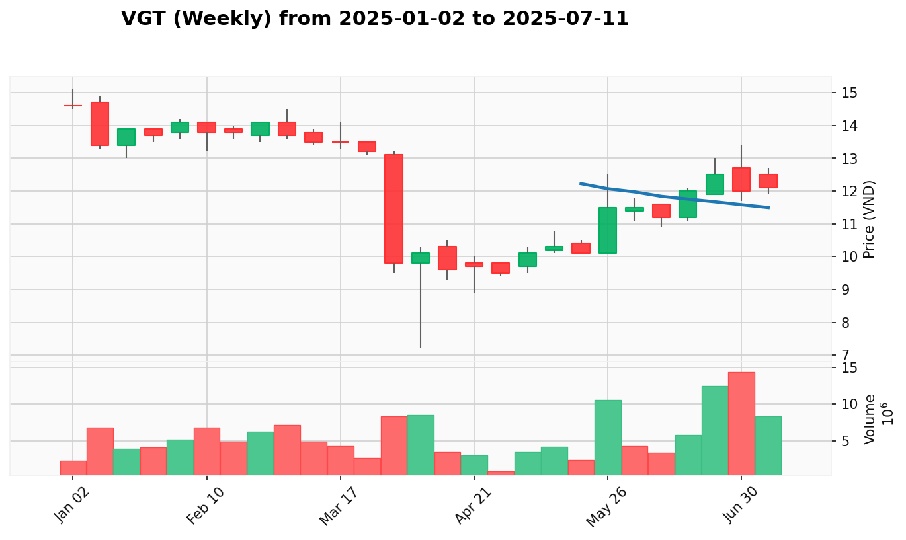

*   [View Report](REPORT_week.md#vgt)
*   **Các Chỉ Số Chính:**
    *   **Điểm Câu Chuyện VPA:** 95 / 100
    *   **Điểm Hiệu Suất Tương Đối:** 78.4 (tương ứng +78.4% change)
    *   **Mức Độ Tin Cậy:** 95%
*   **Phân Tích Dẫn Dắt:** VGT là cổ phiếu đồng dẫn dắt với TNG, thể hiện sức mạnh tương đương. Tuần bùng nổ SOS gần nhất với khối lượng lớn cũng đã phá vỡ vùng đi ngang, xác nhận một xu hướng tăng mạnh mẽ và sự tham gia quyết liệt của dòng tiền.
*   **Câu Chuyện VPA Nổi Bật:** Sau một giai đoạn tích lũy với các tín hiệu "No Supply", VGT có một tuần SOS mạnh mẽ và tiếp tục bùng nổ trong tuần gần nhất với khối lượng tăng hơn gấp đôi.
*   **Hiệu Suất Tương Đối:** Mức tăng trưởng +78.4% từ nền giá tham chiếu, một con số xuất sắc, khẳng định vị thế dẫn dắt.

---

#### **3. May Sông Hồng (MSH)**

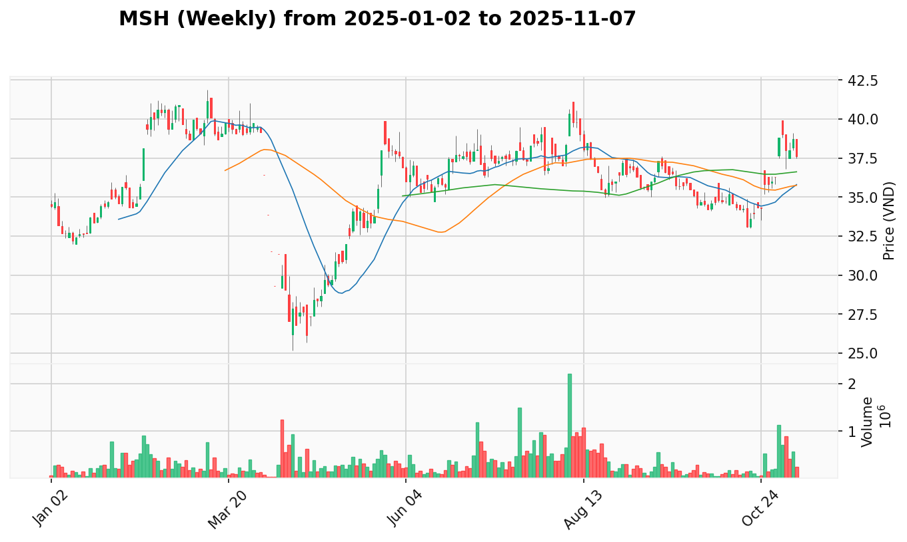

*   [View Report](REPORT_week.md#msh)
*   **Các Chỉ Số Chính:**
    *   **Điểm Câu Chuyện VPA:** 80 / 100
    *   **Điểm Hiệu Suất Tương Đối:** 48.3 (tương ứng +48.3% change)
    *   **Mức Độ Tin Cậy:** 85%
*   **Phân Tích Dẫn Dắt:** MSH đang cho thấy sự phục hồi tốt và tham gia vào xu hướng chung của ngành. Cổ phiếu này có hai tuần "Effort to Rise" liên tiếp với khối lượng tăng dần, cho thấy lực cầu đang quay trở lại một cách bền vững. MSH là một cổ phiếu theo sau nhưng có tiềm năng.
*   **Câu Chuyện VPA Nổi Bật:** Sau một giai đoạn SOW, MSH đã có hai tuần phục hồi tích cực với nến tăng và khối lượng gia tăng, xác nhận lực cầu đang duy trì và xu hướng tăng đang tiếp diễn.
*   **Hiệu Suất Tương Đối:** Mức tăng trưởng +48.3% từ nền giá tham chiếu, thể hiện sự phục hồi tốt.

---

## **HÀNG KHÔNG**

*   **Giai Đoạn Nền Giá Tham Chiếu:** 2025-05-26 - 2025-06-09
*   **Đánh Giá Tổng Quan Ngành:** **Dẫn Dắt Đồng Thuận**. Ngành Hàng không đang cho thấy sức mạnh đồng bộ và lan tỏa. Các cổ phiếu trụ cột như ACV và SCS đều có những cú bứt phá ngoạn mục, trong khi HVN cũng đang trong một pha kiểm tra cung tích cực sau đợt tăng mạnh. Điều này cho thấy dòng tiền đang chảy vào toàn ngành.

**Bảng Xếp Hạng Cổ Phiếu Dẫn Dắt:**

| Hạng | Mã CP & Liên Kết | Điểm Dẫn Dắt | Độ tin cậy | Tóm Tắt Lý Do |
| :--- | :--------------- | :----------- | :--------- | :------------------------------------------------------------------------------------------------ |
| 1 | [**SCS**](#scs) | 88.9 | 95% | Dẫn dắt tuyệt đối với cú bứt phá SOS cực kỳ mạnh mẽ khỏi nền tích lũy, khối lượng tăng vọt và hiệu suất giá vượt trội. |
| 2 | [**ACV**](#acv) | 88.7 | 95% | Sức mạnh tương đương SCS, cũng có một tuần SOS thuyết phục phá vỡ nền, khẳng định vai trò đồng dẫn dắt. |
| 3 | [**HVN**](#hvn) | 68.3 | 90% | Có một tuần "Test for Supply" rất tích cực sau chuỗi tăng giá mạnh, cho thấy tiềm năng tiếp tục xu hướng tăng. |

---

### **Phân Tích Chi Tiết Top 3:**

---

#### **1. Dịch vụ Hàng không Sân bay Tân Sơn Nhất (SCS)**

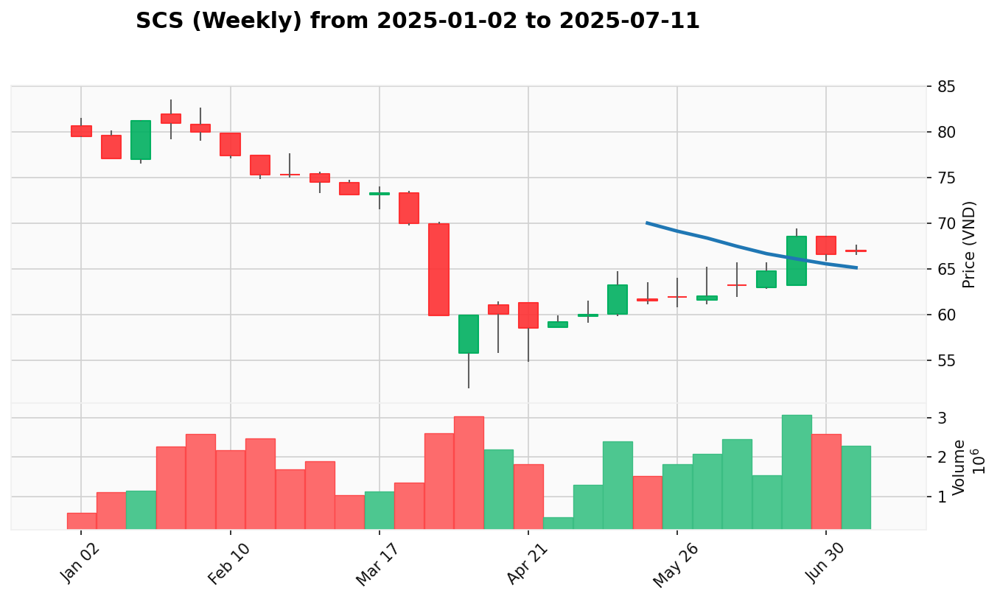

*   [View Report](REPORT_week.md#scs)
*   **Các Chỉ Số Chính:**
    *   **Điểm Câu Chuyện VPA:** 100 / 100
    *   **Điểm Hiệu Suất Tương Đối:** 72.3 (tương ứng +72.3% change)
    *   **Mức Độ Tin Cậy:** 95%
*   **Phân Tích Dẫn Dắt:** Trong bối cảnh ngành Hàng không đang đồng thuận đi lên, SCS nổi bật là cổ phiếu mạnh nhất. Cổ phiếu này sở hữu một cú bứt phá SOS hoàn hảo trong tuần gần nhất, với khối lượng tăng vọt gấp đôi tuần trước, xác nhận vai trò dẫn dắt không thể bàn cãi.
*   **Câu Chuyện VPA Nổi Bật:** Sau một chuỗi các tín hiệu "Effort to Rise", "SOS" và "No Supply", SCS đã có một tuần bùng nổ với nến tăng thân dài và khối lượng cực lớn, phá vỡ vùng đi ngang kéo dài.
*   **Hiệu Suất Tương Đối:** Mức tăng trưởng +72.3% từ nền giá tham chiếu, cao nhất ngành, thể hiện sức mạnh tuyệt đối.

---

#### **2. TCT Cảng Hàng không Việt Nam (ACV)**

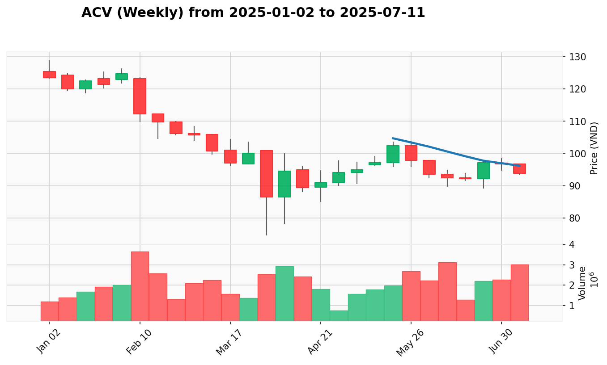

*   [View Report](REPORT_week.md#acv)
*   **Các Chỉ Số Chính:**
    *   **Điểm Câu Chuyện VPA:** 95 / 100
    *   **Điểm Hiệu Suất Tương Đối:** 79.2 (tương ứng +79.2% change)
    *   **Mức Độ Tin Cậy:** 95%
*   **Phân Tích Dẫn Dắt:** ACV là cổ phiếu đồng dẫn dắt với SCS, thể hiện sức mạnh tương đương. Tuần bùng nổ SOS gần nhất với khối lượng lớn cũng đã phá vỡ vùng đi ngang sau một giai đoạn có thể là "Selling Climax", xác nhận sự đảo chiều và bắt đầu một xu hướng tăng mạnh.
*   **Câu Chuyện VPA Nổi Bật:** Sau hai tuần SOW và một tuần có thể là "Selling Climax", ACV đã có một tuần bùng nổ SOS với nến tăng thân dài và khối lượng tăng vọt, xác nhận lực mua đã áp đảo hoàn toàn.
*   **Hiệu Suất Tương Đối:** Mức tăng trưởng +79.2% từ nền giá tham chiếu, một con số xuất sắc, khẳng định vị thế dẫn dắt.

---

#### **3. Vietnam Airlines (HVN)**

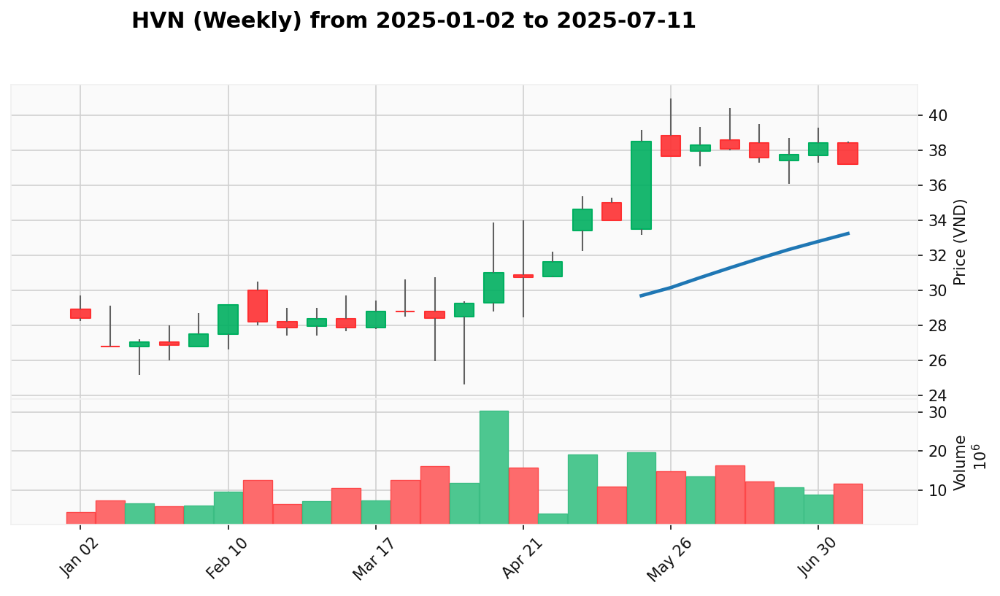

*   [View Report](REPORT_week.md#hvn)
*   **Các Chỉ Số Chính:**
    *   **Điểm Câu Chuyện VPA:** 85 / 100
    *   **Điểm Hiệu Suất Tương Đối:** 38.6 (tương ứng +38.6% change)
    *   **Mức Độ Tin Cậy:** 90%
*   **Phân Tích Dẫn Dắt:** HVN đang trong một xu hướng tăng mạnh và tuần gần nhất là một phiên kiểm tra cung rất tích cực. Việc giá giữ vững trên khối lượng thấp cho thấy áp lực chốt lời không lớn và thị trường đang hấp thụ tốt, sẵn sàng cho một đợt tăng tiếp theo để bắt kịp các mã dẫn đầu.
*   **Câu Chuyện VPA Nổi Bật:** Sau một chuỗi tăng giá mạnh, HVN có một tuần "Test for Supply" dạng inside bar với khối lượng giảm. Đây là một hành động giá rất mang tính xây dựng và có độ tin cậy cao cho việc tiếp diễn xu hướng.
*   **Hiệu Suất Tương Đối:** Mức tăng trưởng +38.6% từ nền giá tham chiếu, thể hiện sự tham gia tốt vào xu hướng chung của ngành.

---

## **HÓA CHẤT**

*   **Giai Đoạn Nền Giá Tham Chiếu:** 2025-05-26 - 2025-06-09
*   **Đánh Giá Tổng Quan Ngành:** **Yếu/Phân Phối**. Ngành Hóa chất đang phát đi những tín hiệu cực kỳ đáng báo động. Cả DCM và DPM đều có những cú "Up-thrust" điển hình sau một đợt tăng giá mạnh, cho thấy áp lực phân phối lớn đang diễn ra. DGC tuy có tín hiệu tốt hơn nhưng cũng đang chững lại. Rủi ro đảo chiều trên toàn ngành là rất cao.

**Bảng Xếp Hạng Cổ Phiếu Dẫn Dắt:**

| Hạng | Mã CP & Liên Kết | Điểm Dẫn Dắt | Độ tin cậy | Tóm Tắt Lý Do |
| :--- | :--------------- | :----------- | :--------- | :------------------------------------------------------------------------------------------------ |
| 1 | [**DGC**](#dgc) | 68.3 | 85% | Là cổ phiếu mạnh nhất ngành với tín hiệu "Test for Supply" thành công, nhưng vẫn cần cẩn trọng trong bối cảnh ngành đang yếu đi. |
| 2 | [**DCM**](#dcm) | 33.2 | 25% | Câu chuyện VPA rất tiêu cực với một cú "Up-thrust" và SOW rõ ràng, cho thấy khả năng kết thúc đợt tăng giá. |
| 3 | [**DPM**](#dpm) | 32.1 | 30% | Tương tự DCM, tín hiệu SOW sau một "Buying Climax" tiềm năng cho thấy áp lực phân phối đang gia tăng mạnh. |

---

### **Phân Tích Chi Tiết Top 3:**

---

#### **1. Hóa chất Đức Giang (DGC)**

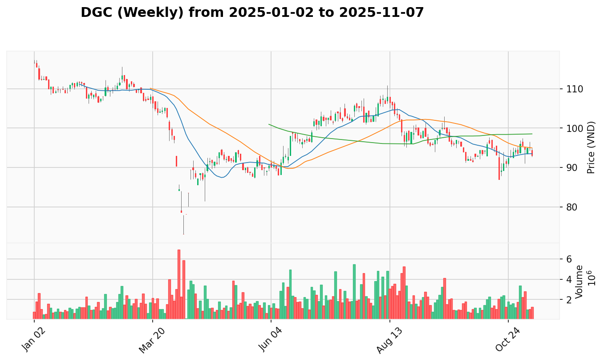

*   [View Report](REPORT_week.md#dgc)
*   **Các Chỉ Số Chính:**
    *   **Điểm Câu Chuyện VPA:** 90 / 100
    *   **Điểm Hiệu Suất Tương Đối:** 34.6 (tương ứng +34.6% change)
    *   **Mức Độ Tin Cậy:** 85%
*   **Phân Tích Dẫn Dắt:** DGC là điểm sáng duy nhất trong ngành Hóa chất. Trong khi các đối thủ đang có dấu hiệu phân phối, DGC lại có một tuần "Test for Supply" thành công trên khối lượng thấp, cho thấy sự thiếu vắng áp lực bán. Điều này giúp DGC trở thành cổ phiếu dẫn dắt và có tiềm năng phòng thủ tốt nhất ngành.
*   **Câu Chuyện VPA Nổi Bật:** Sau hai tuần SOS liên tiếp xác nhận xu hướng tăng mạnh, DGC đã có một tuần đi ngang tích lũy trên khối lượng giảm. Đây là một hành động giá rất tích cực và mang tính xây dựng.
*   **Hiệu Suất Tương Đối:** Mức tăng trưởng +34.6% từ nền giá tham chiếu, một con số tốt, thể hiện sức mạnh vượt trội so với ngành.

---

#### **2. Phân bón Dầu khí Cà Mau (DCM)**

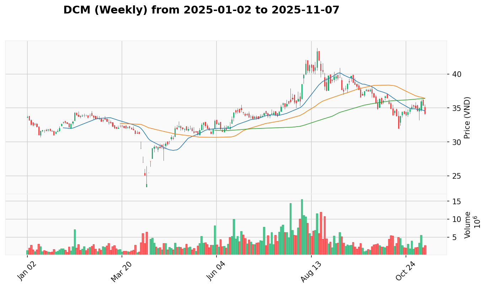

*   [View Report](REPORT_week.md#dcm)
*   **Các Chỉ Số Chính:**
    *   **Điểm Câu Chuyện VPA:** 30 / 100
    *   **Điểm Hiệu Suất Tương Đối:** 68.0 (tương ứng +68.0% change)
    *   **Mức Độ Tin Cậy:** 25%
*   **Phân Tích Dẫn Dắt:** DCM là một ví dụ điển hình cho sự suy yếu của ngành. Mặc dù có hiệu suất giá rất cao, câu chuyện VPA gần đây là cực kỳ tiêu cực. Tuần gần nhất là một cú "Up-thrust" và SOW điển hình, khi giá bị bán tháo quyết liệt từ vùng đỉnh, cho thấy áp lực phân phối lớn.
*   **Câu Chuyện VPA Nổi Bật:** Sau một tuần bùng nổ có khả năng là "Buying Climax", DCM đã có một tuần đảo chiều giảm giá mạnh với nến giảm thân dài trên khối lượng rất cao. Đây là tín hiệu đảo chiều rất đáng tin cậy.
*   **Hiệu Suất Tương Đối:** Mức tăng trưởng +68.0% từ nền giá tham chiếu, tuy nhiên, thành quả này đang bị đe dọa nghiêm trọng.

---

#### **3. Đạm Phú Mỹ (DPM)**

*   [View Report](REPORT_week.md#dpm)
*   **Các Chỉ Số Chính:**
    *   **Điểm Câu Chuyện VPA:** 40 / 100
    *   **Điểm Hiệu Suất Tương Đối:** 60.1 (tương ứng +60.1% change)
    *   **Mức Độ Tin Cậy:** 30%
*   **Phân Tích Dẫn Dắt:** DPM có câu chuyện VPA tiêu cực tương tự DCM. Sau một tuần tăng tốc với khối lượng đột biến (Buying Climax), cổ phiếu đã quay đầu giảm, xác nhận sự hiện diện của nguồn cung và hoạt động phân phối.
*   **Câu Chuyện VPA Nổi Bật:** Một tuần tăng giá với khối lượng cực lớn (Buying Climax), theo sau là một tuần giảm giá xác nhận SOW. Đây là một kịch bản phân phối điển hình.
*   **Hiệu Suất Tương Đối:** Mức tăng trưởng +60.1% từ nền giá tham chiếu, nhưng xu hướng tăng có khả năng cao đã kết thúc.

---

## **KHAI KHOÁNG**

*   **Giai Đoạn Nền Giá Tham Chiếu:** 2025-05-26 - 2025-06-16
*   **Đánh Giá Tổng Quan Ngành:** **Yếu/Phân Phối**. Ngành Khai khoáng đang trong tình trạng rất yếu và thiếu động lực. Cả VPG và CST đều cho thấy các tín hiệu "Test for Supply" hoặc "No Demand" sau một giai đoạn giảm giá dài, cho thấy lực cầu gần như không có. MSR có chút nỗ lực phục hồi nhưng vẫn rất yếu.

**Bảng Xếp Hạng Cổ Phiếu Dẫn Dắt:**

| Hạng | Mã CP & Liên Kết | Điểm Dẫn Dắt | Độ tin cậy | Tóm Tắt Lý Do |
| :--- | :--------------- | :----------- | :--------- | :------------------------------------------------------------------------------------------------ |
| 1 | [**MSR**](#msr) | 49.6 | 70% | Là cổ phiếu duy nhất có nỗ lực tăng giá, dù còn yếu nhưng vẫn là điểm sáng nhất trong một ngành đang rất tiêu cực. |
| 2 | [**VPG**](#vpg) | 26.6 | 40% | Đang kiểm tra cung sau một cú "Selling Climax" tiềm năng, nhưng lực cầu vẫn chưa quay trở lại, tín hiệu vẫn còn yếu. |
| 3 | [**CST**](#cst) | 20.0 | 30% | Gần như không có giao dịch, tín hiệu "No Demand" điển hình, cho thấy sự thiếu quan tâm hoàn toàn từ thị trường. |

---

### **Phân Tích Chi Tiết Top 3:**

---

#### **1. Masan High-Tech Materials (MSR)**

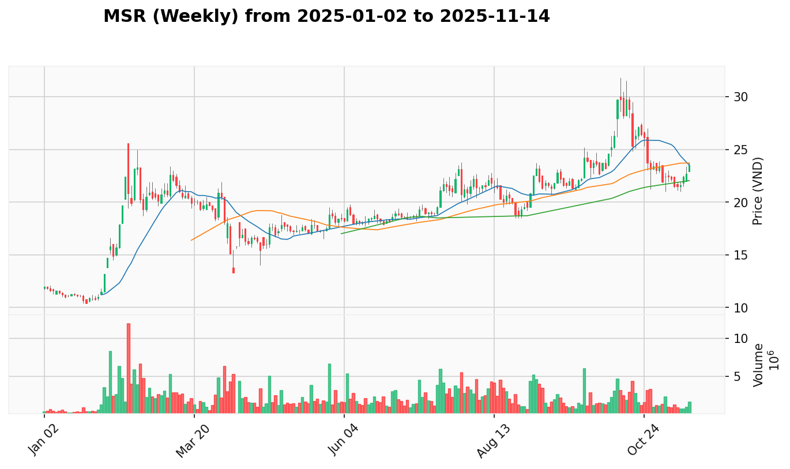

*   [View Report](REPORT_week.md#msr)
*   **Các Chỉ Số Chính:**
    *   **Điểm Câu Chuyện VPA:** 70 / 100
    *   **Điểm Hiệu Suất Tương Đối:** 19.1 (tương ứng +19.1% change)
    *   **Mức Độ Tin Cậy:** 70%
*   **Phân Tích Dẫn Dắt:** MSR là cổ phiếu "khỏe" nhất trong một ngành rất yếu. Cổ phiếu này đang cho thấy một "nỗ lực tăng giá" để thoát khỏi vùng tích lũy đáy, trong khi các đối thủ khác vẫn đang dò đáy. Điều này giúp MSR trở thành lựa chọn ưu tiên nếu có dòng tiền quay trở lại ngành.
*   **Câu Chuyện VPA Nổi Bật:** Sau một giai đoạn đi ngang với tín hiệu "No Demand/No Supply", MSR đã có một tuần tăng giá với biên độ vừa phải và khối lượng tăng nhẹ. Đây là một "Effort to Rise" tích cực.
*   **Hiệu Suất Tương Đối:** Mức tăng trưởng +19.1% từ nền giá tham chiếu, cao nhất ngành.

---

#### **2. Việt Phát (VPG)**

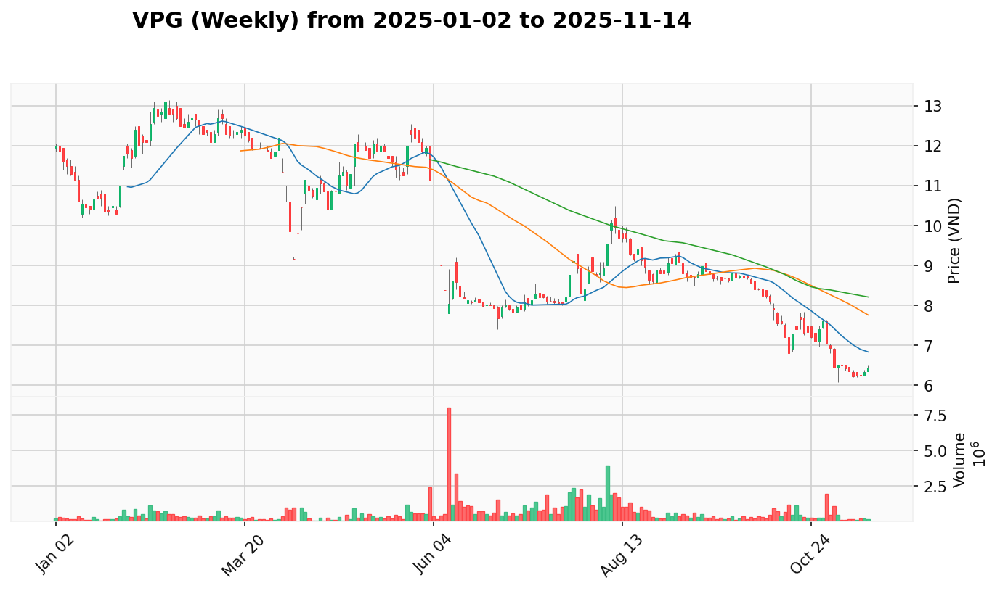

*   [View Report](REPORT_week.md#vpg)
*   **Các Chỉ Số Chính:**
    *   **Điểm Câu Chuyện VPA:** 60 / 100
    *   **Điểm Hiệu Suất Tương Đối:** -2.5 (tương ứng -2.5% change)
    *   **Mức Độ Tin Cậy:** 40%
*   **Phân Tích Dẫn Dắt:** VPG vẫn đang trong giai đoạn dò đáy sau một đợt giảm giá mạnh. Mặc dù có một tuần "Selling Climax" và "No Supply" tiềm năng, lực cầu vẫn chưa đủ mạnh để tạo ra sự phục hồi. Cổ phiếu vẫn đang trong tình trạng yếu.
*   **Câu Chuyện VPA Nổi Bật:** Sau một cú "Selling Climax" tiềm năng và một tuần "No Supply", tuần gần nhất vẫn là một "Test for Supply" với việc giá không thể phục hồi, cho thấy lực cầu yếu.
*   **Hiệu Suất Tương Đối:** Mức giảm -2.5% từ nền giá tham chiếu, cho thấy cổ phiếu vẫn đang yếu.

---

#### **3. Than Cao Sơn (CST)**

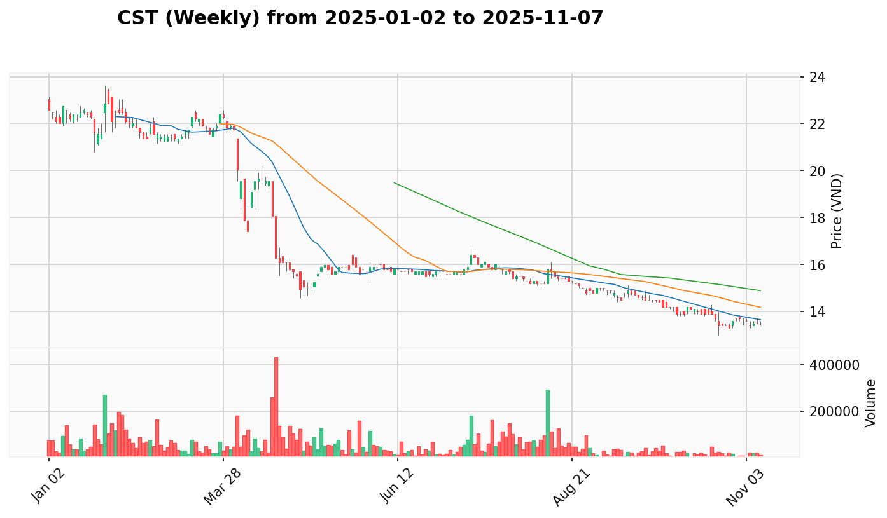

*   [View Report](REPORT_week.md#cst)
*   **Các Chỉ Số Chính:**
    *   **Điểm Câu Chuyện VPA:** 50 / 100
    *   **Điểm Hiệu Suất Tương Đối:** 0.0 (tương ứng 0.0% change)
    *   **Mức Độ Tin Cậy:** 30%
*   **Phân Tích Dẫn Dắt:** CST là ví dụ điển hình của một cổ phiếu bị thị trường lãng quên. Cổ phiếu đi ngang với biên độ cực hẹp và khối lượng cạn kiệt trong nhiều tuần. Đây là tín hiệu "No Demand" rõ ràng, cho thấy không có sự quan tâm từ cả phe mua và phe bán.
*   **Câu Chuyện VPA Nổi Bật:** Một chuỗi dài các tuần "No Demand" với nến doji, biên độ hẹp và khối lượng rất thấp. Thị trường đang trong trạng thái ngủ đông.
*   **Hiệu Suất Tương Đối:** Mức tăng trưởng 0.0% từ nền giá tham chiếu.

---

## **NĂNG LƯỢNG**

*   **Giai Đoạn Nền Giá Tham Chiếu:** 2025-05-26 - 2025-06-09
*   **Đánh Giá Tổng Quan Ngành:** **Yếu/Phân Phối**. Ngành Năng lượng đang cho thấy sự phân hóa cao và có dấu hiệu suy yếu. NT2 là điểm sáng duy nhất với cú bứt phá SOS mạnh mẽ. Ngược lại, HDG có dấu hiệu phân phối sau "Buying Climax" và POW vẫn đang kiểm tra cung ở vùng đáy. Dòng tiền không lan tỏa đều trong ngành.

**Bảng Xếp Hạng Cổ Phiếu Dẫn Dắt:**

| Hạng | Mã CP & Liên Kết | Điểm Dẫn Dắt | Độ tin cậy | Tóm Tắt Lý Do |
| :--- | :--------------- | :----------- | :--------- | :------------------------------------------------------------------------------------------------ |
| 1 | [**NT2**](#nt2) | 88.6 | 95% | Dẫn dắt tuyệt đối với cú bứt phá SOS mạnh mẽ khỏi nền tích lũy, khối lượng tăng vọt, đi ngược lại xu hướng chung của ngành. |
| 2 | [**POW**](#pow) | 57.8 | 65% | Đang trong giai đoạn kiểm tra cung tích cực ở vùng đáy với bóng nến dưới dài, nhưng lực cầu vẫn cần được xác nhận mạnh mẽ hơn. |
| 3 | [**HDG**](#hdg) | 48.9 | 35% | Hiệu suất giá tốt nhưng câu chuyện VPA rất tiêu cực với tín hiệu phân phối (SOW) sau một "Buying Climax" tiềm năng. |

---

### **Phân Tích Chi Tiết Top 3:**

---

#### **1. Điện lực Dầu khí Nhơn Trạch 2 (NT2)**

*   [View Report](REPORT_week.md#nt2)
*   **Các Chỉ Số Chính:**
    *   **Điểm Câu Chuyện VPA:** 100 / 100
    *   **Điểm Hiệu Suất Tương Đối:** 71.4 (tương ứng +71.4% change)
    *   **Mức Độ Tin Cậy:** 95%
*   **Phân Tích Dẫn Dắt:** NT2 là cổ phiếu dẫn dắt rõ ràng và là điểm sáng duy nhất của ngành Năng lượng. Trong khi các đối thủ đang gặp khó khăn, NT2 đã có một tuần bùng nổ SOS với khối lượng tăng vọt, phá vỡ vùng đi ngang kéo dài và xác nhận một xu hướng tăng mới.
*   **Câu Chuyện VPA Nổi Bật:** Sau một giai đoạn tích lũy với các tín hiệu "Test for Supply" và "Effort to Rise" yếu, NT2 đã có một tuần SOS bùng nổ với nến tăng thân dài và khối lượng gấp đôi tuần trước.
*   **Hiệu Suất Tương Đối:** Mức tăng trưởng +71.4% từ nền giá tham chiếu, cao nhất ngành, thể hiện sức mạnh vượt trội.

---

#### **2. PV Power (POW)**

*   [View Report](REPORT_week.md#pow)
*   **Các Chỉ Số Chính:**
    *   **Điểm Câu Chuyện VPA:** 70 / 100
    *   **Điểm Hiệu Suất Tương Đối:** 34.4 (tương ứng +34.4% change)
    *   **Mức Độ Tin Cậy:** 65%
*   **Phân Tích Dẫn Dắt:** POW đang cho thấy những dấu hiệu tạo đáy tích cực. Tuần gần nhất là một phiên "Test for Supply" với bóng nến dưới dài, cho thấy có lực cầu bắt đáy. Tuy nhiên, cổ phiếu vẫn cần một nến tăng mạnh để xác nhận sự quay trở lại của phe mua.
*   **Câu Chuyện VPA Nổi Bật:** Sau một "Effort to Rise" và một "Test for Supply" không thành công, tuần gần nhất lại là một "Test for Supply" tích cực hơn trên khối lượng giảm, cho thấy lực bán đang yếu đi.
*   **Hiệu Suất Tương Đối:** Mức tăng trưởng +34.4% từ nền giá tham chiếu, một con số tốt cho thấy sự phục hồi từ đáy.

---

#### **3. Hà Đô (HDG)**

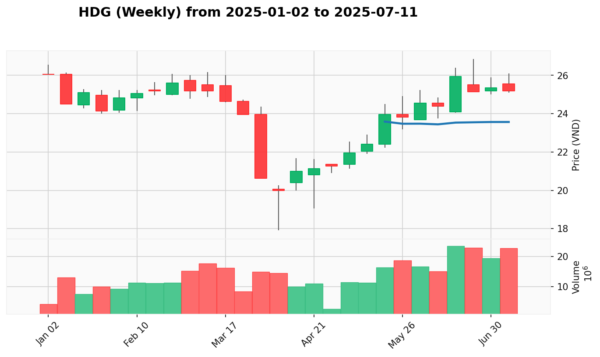

*   [View Report](REPORT_week.md#hdg)
*   **Các Chỉ Số Chính:**
    *   **Điểm Câu Chuyện VPA:** 40 / 100
    *   **Điểm Hiệu Suất Tương Đối:** 64.9 (tương ứng +64.9% change)
    *   **Mức Độ Tin Cậy:** 35%
*   **Phân Tích Dẫn Dắt:** HDG là một ví dụ về rủi ro phân phối. Mặc dù hiệu suất giá rất tốt, câu chuyện VPA gần đây là rất tiêu cực. Sau một tuần bùng nổ có khả năng là "Buying Climax", cổ phiếu đã có một tuần SOW với khối lượng rất cao, cho thấy áp lực bán lớn đang diễn ra.
*   **Câu Chuyện VPA Nổi Bật:** Một tuần SOS bùng nổ với khối lượng tăng vọt (Buying Climax), theo sau là một tuần giảm giá SOW với bóng trên và khối lượng vẫn ở mức cao. Đây là tín hiệu phân phối rõ ràng.
*   **Hiệu Suất Tương Đối:** Mức tăng trưởng +64.9% từ nền giá tham chiếu, nhưng thành quả này đang bị đe dọa nghiêm trọng.

---

## **NGÂN HÀNG**

*   **Giai Đoạn Nền Giá Tham Chiếu:** 2025-05-26 - 2025-06-09
*   **Đánh Giá Tổng Quan Ngành:** **Dẫn Dắt Đồng Thuận**. Ngành Ngân hàng đang thể hiện sức mạnh đồng bộ và lan tỏa. Phần lớn cổ phiếu trong ngành đều tăng giá từ nền giá tham chiếu, cho thấy một xu hướng lên khỏe mạnh và có sự tham gia của toàn ngành. Các tín hiệu VPA chủ đạo là 'kiểm tra cung' thành công, củng cố cho đà tăng.

**Bảng Xếp Hạng Cổ Phiếu Dẫn Dắt:**

| Hạng | Mã CP & Liên Kết | Điểm Dẫn Dắt | Độ tin cậy | Tóm Tắt Lý Do |
| :--- | :--------------- | :----------- | :--------- | :------------------------------------------------------------------------------------------------ |
| 1 | [**STB**](#stb) | 70.9 | 95% | Câu chuyện VPA gần như hoàn hảo với chuỗi tín hiệu SOS, No Supply và Test thành công, thể hiện vai trò dẫn dắt rõ ràng. |
| 2 | [**CTG**](#ctg) | 68.3 | 90% | Sức mạnh giá rất tốt và câu chuyện VPA mạnh mẽ với các tín hiệu SOS và kiểm tra cung thành công trong xu hướng tăng. |
| 3 | [**MBB**](#mbb) | 64.6 | 90% | Có cú bứt phá SOS mạnh mẽ và một tuần kiểm tra cung thành công, cho thấy sự tham gia tích cực vào xu hướng chung của ngành. |

---

### **Phân Tích Chi Tiết Top 3:**

---

#### **1. Sacombank (STB)**

*   [View Report](REPORT_week.md#stb)
*   **Các Chỉ Số Chính:**
    *   **Điểm Câu Chuyện VPA:** 95 / 100
    *   **Điểm Hiệu Suất Tương Đối:** 39.7 (tương ứng +39.7% change)
    *   **Mức Độ Tin Cậy:** 95%
*   **Phân Tích Dẫn Dắt:** Trong bối cảnh ngành Ngân hàng đang đồng thuận đi lên, STB nổi bật là một trong những cổ phiếu dẫn dắt mạnh mẽ nhất. Cổ phiếu này sở hữu một câu chuyện VPA gần như textbook, từ bứt phá SOS, kiểm tra "No Supply" cho đến "Test for Supply" thành công, xác nhận vai trò dẫn dắt trong một xu hướng ngành khỏe mạnh.
*   **Câu Chuyện VPA Nổi Bật:** Bùng nổ với một tuần SOS khối lượng lớn, theo sau là một tuần tăng giá trên khối lượng thấp ("No Supply") và một tuần điều chỉnh "Test for Supply" thành công trên khối lượng cạn kiệt. Đây là chuỗi hành động giá rất mạnh mẽ.
*   **Hiệu Suất Tương Đối:** Mức tăng trưởng +39.7% từ nền giá tham chiếu, một trong những mức cao nhất ngành, thể hiện sức mạnh vượt trội.

---

#### **2. VietinBank (CTG)**

*   [View Report](REPORT_week.md#ctg)
*   **Các Chỉ Số Chính:**
    *   **Điểm Câu Chuyện VPA:** 90 / 100
    *   **Điểm Hiệu Suất Tương Đối:** 35.6 (tương ứng +35.6% change)
    *   **Mức Độ Tin Cậy:** 90%
*   **Phân Tích Dẫn Dắt:** CTG là một cổ phiếu đồng dẫn dắt mạnh mẽ trong ngành. Nó có một câu chuyện VPA rất thuyết phục với cú bứt phá SOS khỏi nền và các phiên kiểm tra cung thành công trong một xu hướng tăng rõ ràng. Sức mạnh giá và tín hiệu VPA khẳng định vị thế dẫn dắt của CTG.
*   **Câu Chuyện VPA Nổi Bật:** Sau một tuần "No Supply" tích cực, CTG có hai tuần SOS liên tiếp, theo sau là một tuần "Test for Supply" thành công trong xu hướng tăng. Chuỗi tín hiệu này rất đáng tin cậy.
*   **Hiệu Suất Tương Đối:** Mức tăng trưởng +35.6% từ nền giá tham chiếu, một con số rất tốt, cho thấy sức mạnh tương đối cao trong ngành.

---

#### **3. MBBank (MBB)**

*   [View Report](REPORT_week.md#mbb)
*   **Các Chỉ Số Chính:**
    *   **Điểm Câu Chuyện VPA:** 90 / 100
    *   **Điểm Hiệu Suất Tương Đối:** 28.5 (tương ứng +28.5% change)
    *   **Mức Độ Tin Cậy:** 90%
*   **Phân Tích Dẫn Dắt:** MBB đang tham gia rất tích cực vào xu hướng chung của ngành. Cổ phiếu này có một cú bứt phá SOS mạnh mẽ và một tuần kiểm tra cung thành công ngay sau đó, cho thấy thị trường đang hấp thụ tốt lực chốt lời và sẵn sàng cho một đợt tăng tiếp theo.
*   **Câu Chuyện VPA Nổi Bật:** Bùng nổ với một tuần SOS khối lượng lớn phá vỡ các vùng kháng cự, theo sau là một tuần "Test for Supply" dạng inside bar với khối lượng giảm. Đây là một hành động giá mang tính xây dựng cao.
*   **Hiệu Suất Tương Đối:** Mức tăng trưởng +28.5% từ nền giá tham chiếu, thể hiện sự tham gia tốt vào xu hướng chung của ngành.

---

## **NHỰA**

*   **Giai Đoạn Nền Giá Tham Chiếu:** 2025-05-26 - 2025-06-09
*   **Đánh Giá Tổng Quan Ngành:** **Yếu/Phân Phối**. Ngành Nhựa đang trong tình trạng rất yếu và thiếu định hướng. Cả AAA và BMP đều cho thấy tín hiệu "No Demand" rõ ràng trong tuần gần nhất, cho thấy lực cầu suy yếu và đà tăng đang mất dần. NTP có nỗ lực tăng nhưng cũng gặp phải áp lực bán.

**Bảng Xếp Hạng Cổ Phiếu Dẫn Dắt:**

| Hạng | Mã CP & Liên Kết | Điểm Dẫn Dắt | Độ tin cậy | Tóm Tắt Lý Do |
| :--- | :--------------- | :----------- | :--------- | :------------------------------------------------------------------------------------------------ |
| 1 | [**NTP**](#ntp) | 68.6 | 70% | Là cổ phiếu duy nhất có nỗ lực tăng giá rõ ràng và tín hiệu SOS, dù gần đây có dấu hiệu chững lại nhưng vẫn là mạnh nhất ngành. |
| 2 | [**AAA**](#aaa) | 41.5 | 40% | Câu chuyện VPA rất yếu với tín hiệu "No Demand" trên khối lượng tăng, cho thấy áp lực bán tiềm tàng lớn. |
| 3 | [**BMP**](#bmp) | 41.1 | 40% | Tương tự AAA, tín hiệu "No Demand" trong tuần gần nhất cho thấy đà tăng đang mất dần động lực và có thể sớm điều chỉnh. |

---

### **Phân Tích Chi Tiết Top 3:**

---

#### **1. Nhựa Tiền Phong (NTP)**

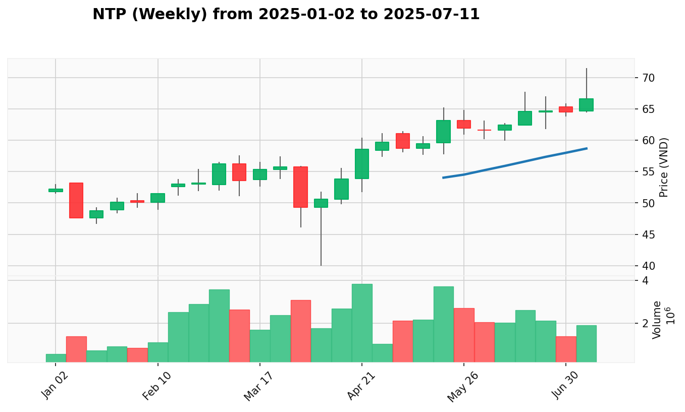

*   [View Report](REPORT_week.md#ntp)
*   **Các Chỉ Số Chính:**
    *   **Điểm Câu Chuyện VPA:** 80 / 100
    *   **Điểm Hiệu Suất Tương Đối:** 51.7 (tương ứng +51.7% change)
    *   **Mức Độ Tin Cậy:** 70%
*   **Phân Tích Dẫn Dắt:** NTP là cổ phiếu "khỏe" nhất trong một ngành rất yếu. Cổ phiếu này đã có một tuần SOS bứt phá khỏi nền tích lũy. Tuy nhiên, tuần gần nhất xuất hiện bóng nến trên cho thấy áp lực bán đã xuất hiện, làm giảm độ tin cậy. Dù vậy, nó vẫn là lựa chọn tốt nhất trong ngành.
*   **Câu Chuyện VPA Nổi Bật:** Sau các tuần "Test for Supply" và "No Demand", NTP có một tuần SOS với khối lượng tăng. Tuần gần nhất là một "Effort to Rise" nhưng gặp kháng cự, cho thấy đà tăng đang chững lại.
*   **Hiệu Suất Tương Đối:** Mức tăng trưởng +51.7% từ nền giá tham chiếu, cao nhất ngành, thể hiện sức mạnh vượt trội.

---

#### **2. Nhựa An Phát Xanh (AAA)**

*   [View Report](REPORT_week.md#aaa)
*   **Các Chỉ Số Chính:**
    *   **Điểm Câu Chuyện VPA:** 50 / 100
    *   **Điểm Hiệu Suất Tương Đối:** 28.2 (tương ứng +28.2% change)
    *   **Mức Độ Tin Cậy:** 40%
*   **Phân Tích Dẫn Dắt:** AAA thể hiện sự suy yếu rõ ràng. Tín hiệu "No Demand" trong tuần gần nhất, với việc giá không thể bứt phá mạnh mẽ trên nền khối lượng gia tăng, cho thấy áp lực bán vẫn còn hiện hữu và phe mua đang yếu thế.
*   **Câu Chuyện VPA Nổi Bật:** Sau một tuần SOS, cổ phiếu ngay lập tức có tuần SOW. Nỗ lực phục hồi sau đó với tín hiệu "No Supply" đã thất bại khi gặp phải tín hiệu "No Demand". Câu chuyện VPA đã bị phá vỡ.
*   **Hiệu Suất Tương Đối:** Mức tăng trưởng +28.2% từ nền giá tham chiếu, nhưng chất lượng của đà tăng này là rất đáng nghi ngờ.

---

#### **3. Nhựa Bình Minh (BMP)**

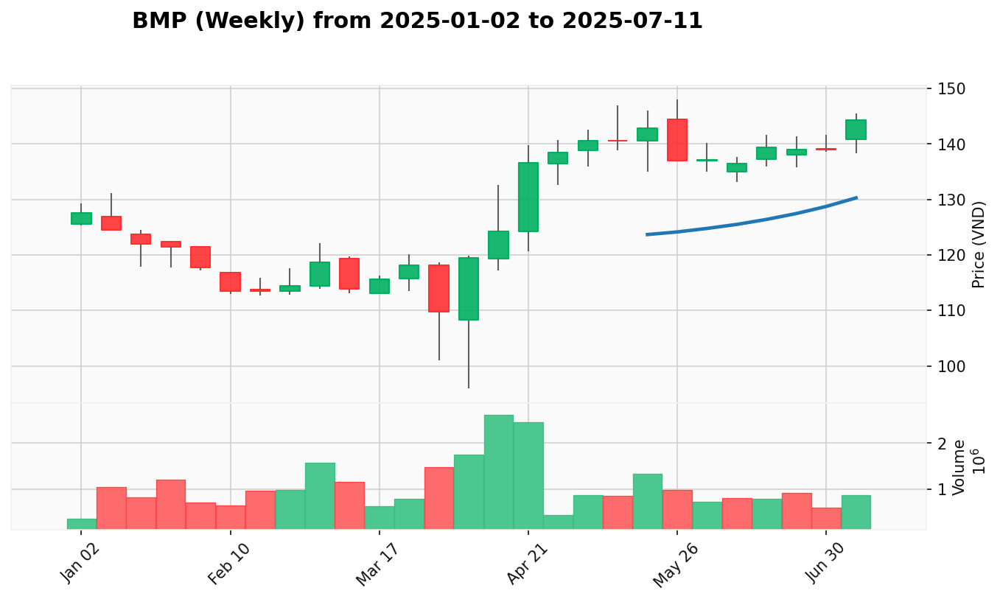

*   [View Report](REPORT_week.md#bmp)
*   **Các Chỉ Số Chính:**
    *   **Điểm Câu Chuyện VPA:** 55 / 100
    *   **Điểm Hiệu Suất Tương Đối:** 24.3 (tương ứng +24.3% change)
    *   **Mức Độ Tin Cậy:** 40%
*   **Phân Tích Dẫn Dắt:** BMP có câu chuyện VPA yếu tương tự AAA. Tín hiệu "No Demand" trong tuần gần nhất cho thấy nỗ lực tăng giá đã thất bại và không tạo ra được đỉnh mới. Điều này cho thấy đà tăng đang mất dần động lực và có nguy cơ điều chỉnh.
*   **Câu Chuyện VPA Nổi Bật:** Sau một tuần tăng giá trên khối lượng thấp ("No Supply"), tuần gần nhất là một "No Demand" dạng inside bar, cho thấy sự do dự và thiếu cầu.
*   **Hiệu Suất Tương Đối:** Mức tăng trưởng +24.3% từ nền giá tham chiếu, nhưng xu hướng tăng đang bị đe dọa.

---

## **NÔNG NGHIỆP**

*   **Giai Đoạn Nền Giá Tham Chiếu:** 2025-05-26 - 2025-06-16
*   **Đánh Giá Tổng Quan Ngành:** **Dẫn Dắt Đồng Thuận**. Ngành Nông nghiệp đang có xu hướng tăng giá mạnh mẽ, dẫn đầu bởi DBC. Các cổ phiếu khác như HAG và PAN cũng đang có những tín hiệu tích cực, cho thấy sức mạnh đang có sự lan tỏa.

**Bảng Xếp Hạng Cổ Phiếu Dẫn Dắt:**

| Hạng | Mã CP & Liên Kết | Điểm Dẫn Dắt | Độ tin cậy | Tóm Tắt Lý Do |
| :--- | :--------------- | :----------- | :--------- | :------------------------------------------------------------------------------------------------ |
| 1 | [**DBC**](#dbc) | 88.0 | 95% | Dẫn dắt tuyệt đối với chuỗi tín hiệu SOS và Effort to Rise mạnh mẽ, khối lượng bùng nổ và hiệu suất giá vượt trội. |
| 2 | [**HAG**](#hag) | 64.9 | 85% | Đang trong giai đoạn kiểm tra cung rất tích cực sau một đợt điều chỉnh, cho thấy tiềm năng bứt phá sắp tới. |
| 3 | [**PAN**](#pan) | 59.4 | 75% | Đang trong giai đoạn tích lũy với tín hiệu "Test for Supply" trên khối lượng thấp, nhưng lực cầu vẫn còn yếu. |

---

### **Phân Tích Chi Tiết Top 3:**

---

#### **1. Dabaco (DBC)**

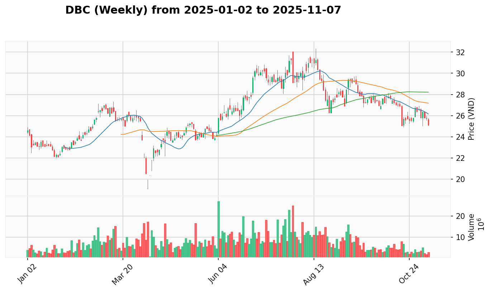

*   [View Report](REPORT_week.md#dbc)
*   **Các Chỉ Số Chính:**
    *   **Điểm Câu Chuyện VPA:** 100 / 100
    *   **Điểm Hiệu Suất Tương Đối:** 70.0 (tương ứng +70.0% change)
    *   **Mức Độ Tin Cậy:** 95%
*   **Phân Tích Dẫn Dắt:** DBC là cổ phiếu dẫn dắt không thể tranh cãi của ngành Nông nghiệp. Cổ phiếu này sở hữu một chuỗi tăng giá thuyết phục với các tín hiệu SOS được xác nhận bởi khối lượng rất lớn, cho thấy dòng tiền lớn đang tham gia quyết liệt và vai trò đầu tàu của nó là rất rõ ràng.
*   **Câu Chuyện VPA Nổi Bật:** Một chuỗi các tuần SOS và "Test for Supply" thành công. Tuần gần nhất tiếp tục là một tuần SOS với nến tăng biên độ rộng và khối lượng tiếp tục tăng, xác nhận lực cầu hoàn toàn chiếm ưu thế.
*   **Hiệu Suất Tương Đối:** Mức tăng trưởng +70.0% từ nền giá tham chiếu, cao nhất ngành, thể hiện sức mạnh tuyệt đối.

---

#### **2. Hoàng Anh Gia Lai (HAG)**

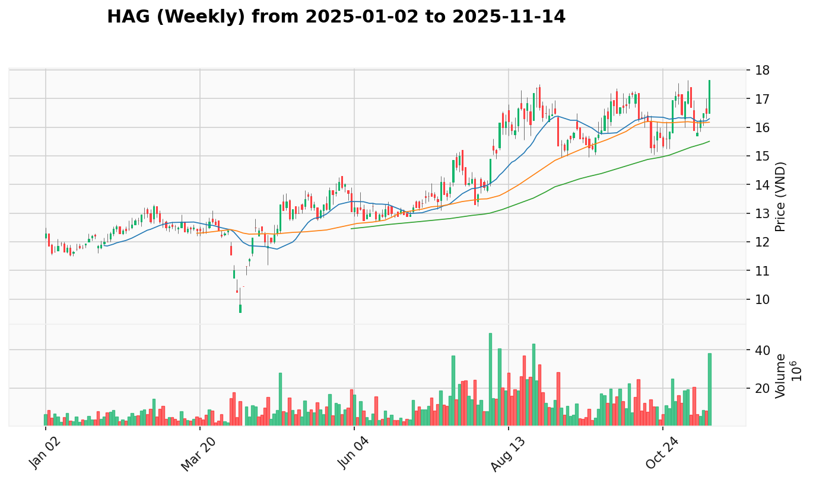

*   [View Report](REPORT_week.md#hage)
*   **Các Chỉ Số Chính:**
    *   **Điểm Câu Chuyện VPA:** 85 / 100
    *   **Điểm Hiệu Suất Tương Đối:** 37.1 (tương ứng +37.1% change)
    *   **Mức Độ Tin Cậy:** 85%
*   **Phân Tích Dẫn Dắt:** HAG đang cho thấy những dấu hiệu rất tích cực sau một đợt điều chỉnh. Cổ phiếu này đang trong một giai đoạn "Test for Supply" với biên độ hẹp và khối lượng thấp, cho thấy áp lực bán đã cạn kiệt. Đây là một tín hiệu xây dựng, tạo tiền đề cho một cú bứt phá để bắt kịp mã dẫn đầu.
*   **Câu Chuyện VPA Nổi Bật:** Sau một tuần SOW, HAG có tín hiệu "No Supply" và tuần gần nhất là một "Test for Supply" dạng inside bar trên khối lượng giảm. Đây là một kịch bản tích lũy rất tích cực.
*   **Hiệu Suất Tương Đối:** Mức tăng trưởng +37.1% từ nền giá tham chiếu, một con số tốt, cho thấy sự phục hồi mạnh mẽ.

---

#### **3. Tập đoàn PAN (PAN)**

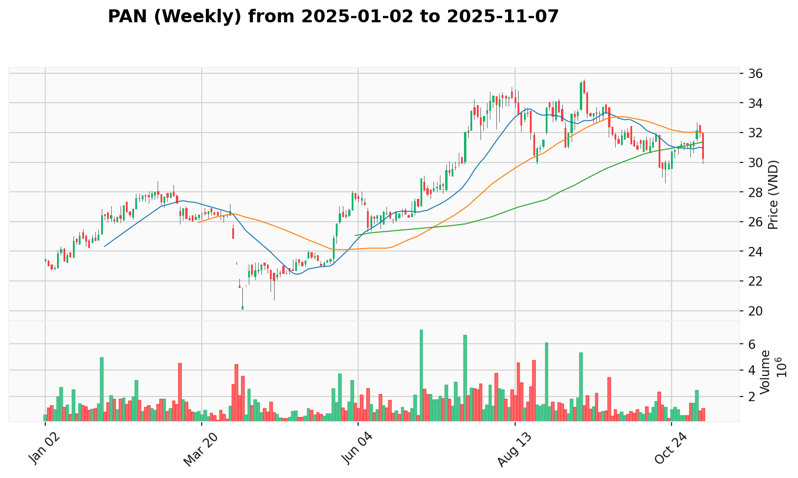

*   [View Report](REPORT_week.md#pan)
*   **Các Chỉ Số Chính:**
    *   **Điểm Câu Chuyện VPA:** 75 / 100
    *   **Điểm Hiệu Suất Tương Đối:** 36.3 (tương ứng +36.3% change)
    *   **Mức Độ Tin Cậy:** 75%
*   **Phân Tích Dẫn Dắt:** PAN đang trong giai đoạn tích lũy đi ngang. Các tín hiệu VPA cho thấy sự cân bằng giữa cung và cầu với các phiên "Test for Supply" trên khối lượng thấp. Cổ phiếu đang theo sau xu hướng chung của ngành và cần một cú hích về khối lượng để xác nhận hướng đi.
*   **Câu Chuyện VPA Nổi Bật:** Sau một nỗ lực tăng giá, cổ phiếu điều chỉnh với các tín hiệu "Test for Supply" và "No Supply". Tuần gần nhất tiếp tục là một "Test for Supply" với việc giá ổn định trên khối lượng thấp.
*   **Hiệu Suất Tương Đối:** Mức tăng trưởng +36.3% từ nền giá tham chiếu, thể hiện sự tham gia vào xu hướng chung của ngành.

---

## **PENNY**

*   **Giai Đoạn Nền Giá Tham Chiếu:** 2025-05-26 - 2025-06-16
*   **Đánh Giá Tổng Quan Ngành:** **Yếu/Phân Phối**. Ngành Penny đang cho thấy sự suy yếu rõ rệt. IPA có tín hiệu "Up-thrust", CSC có tín hiệu "No Demand", và FIT cũng đang kiểm tra cung một cách yếu ớt. Không có cổ phiếu nào thể hiện sức mạnh dẫn dắt rõ ràng, cho thấy dòng tiền đang rút khỏi nhóm này.

**Bảng Xếp Hạng Cổ Phiếu Dẫn Dắt:**

| Hạng | Mã CP & Liên Kết | Điểm Dẫn Dắt | Độ tin cậy | Tóm Tắt Lý Do |
| :--- | :--------------- | :----------- | :--------- | :------------------------------------------------------------------------------------------------ |
| 1 | [**IPA**](#ipa) | 49.6 | 45% | Có hiệu suất giá tốt nhất nhưng câu chuyện VPA gần đây rất tiêu cực với một cú "Up-thrust", rủi ro cao. |
| 2 | [**CSC**](#csc) | 40.6 | 40% | Tín hiệu "No Demand" rõ ràng cho thấy đà tăng đang mất động lực và có thể dễ bị tổn thương nếu áp lực bán xuất hiện. |
| 3 | [**FIT**](#fit) | 39.4 | 50% | Đang trong giai đoạn "Test for Supply" nhưng lực cầu yếu, cần một nến tăng mạnh để xác nhận sự phục hồi. |

---

### **Phân Tích Chi Tiết Top 3:**

---

#### **1. Tập đoàn IPA (IPA)**

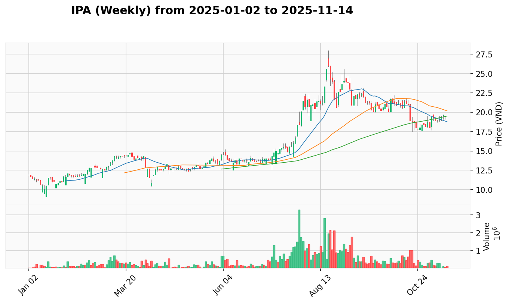

*   [View Report](REPORT_week.md#ipa)
*   **Các Chỉ Số Chính:**
    *   **Điểm Câu Chuyện VPA:** 60 / 100
    *   **Điểm Hiệu Suất Tương Đối:** 49.1 (tương ứng +49.1% change)
    *   **Mức Độ Tin Cậy:** 45%
*   **Phân Tích Dẫn Dắt:** Mặc dù có hiệu suất giá tốt nhất, IPA lại là một ví dụ cho sự suy yếu của nhóm Penny. Tuần gần nhất là một cú "Up-thrust" với bóng nến trên dài, cho thấy nỗ lực tăng giá đã bị nguồn cung chặn lại. Đây là một "Dấu hiệu Yếu kém" ngắn hạn.
*   **Câu Chuyện VPA Nổi Bật:** Sau một tuần SOS và các phiên kiểm tra cung thành công, nỗ lực tăng giá trong tuần gần nhất đã thất bại với tín hiệu "Up-thrust". Câu chuyện VPA đã bị phá vỡ.
*   **Hiệu Suất Tương Đối:** Mức tăng trưởng +49.1% từ nền giá tham chiếu, tuy nhiên thành quả này đang bị đe dọa.

---

#### **2. Cotana (CSC)**

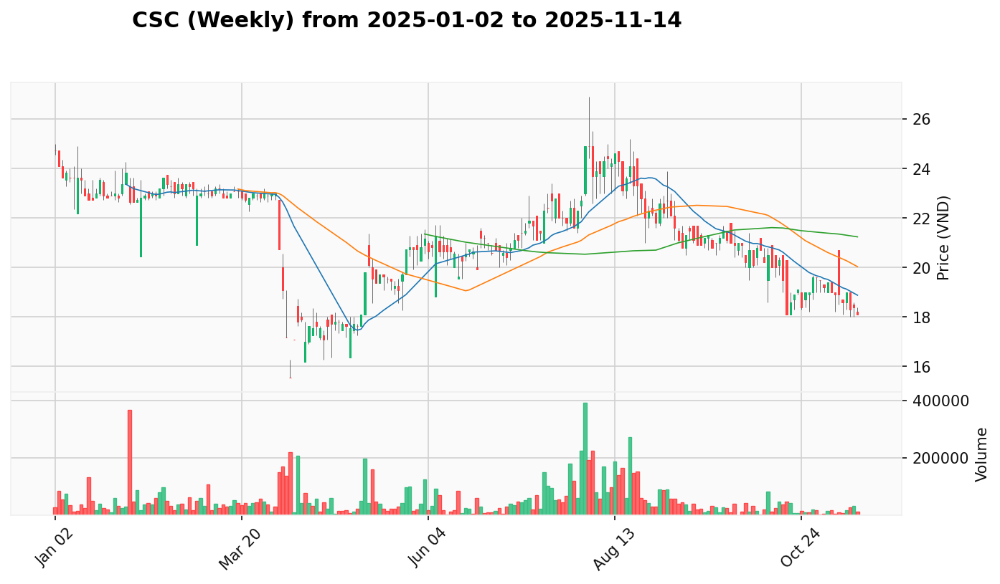

*   [View Report](REPORT_week.md#csc)
*   **Các Chỉ Số Chính:**
    *   **Điểm Câu Chuyện VPA:** 60 / 100
    *   **Điểm Hiệu Suất Tương Đối:** 11.6 (tương ứng +11.6% change)
    *   **Mức Độ Tin Cậy:** 40%
*   **Phân Tích Dẫn Dắt:** CSC thể hiện sự suy yếu rõ ràng. Tín hiệu "No Demand" trong tuần gần nhất, với việc giá đi ngang trên khối lượng thấp, cho thấy sự thiếu quan tâm từ thị trường. Đà tăng trước đó đã mất động lực hoàn toàn.
*   **Câu Chuyện VPA Nổi Bật:** Sau một tuần SOS, cổ phiếu có chuỗi tuần điều chỉnh và kiểm tra cung. Tuy nhiên, tuần gần nhất là một "No Demand" rõ ràng, cho thấy lực cầu đã biến mất.
*   **Hiệu Suất Tương Đối:** Mức tăng trưởng +11.6% từ nền giá tham chiếu, nhưng xu hướng tăng đã kết thúc.

---

#### **3. Tập đoàn F.I.T (FIT)**

*   [View Report](REPORT_week.md#fit)
*   **Các Chỉ Số Chính:**
    *   **Điểm Câu Chuyện VPA:** 65 / 100
    *   **Điểm Hiệu Suất Tương Đối:** -1.8 (tương ứng -1.8% change)
    *   **Mức Độ Tin Cậy:** 50%
*   **Phân Tích Dẫn Dắt:** FIT đang trong giai đoạn kiểm tra cung sau một đợt điều chỉnh. Việc giá đi ngang với khối lượng giảm cho thấy áp lực bán đang yếu đi, nhưng lực cầu vẫn chưa đủ mạnh để tạo ra sự phục hồi. Cổ phiếu vẫn đang trong tình trạng yếu.
*   **Câu Chuyện VPA Nổi Bật:** Một chuỗi các tuần đi ngang với các tín hiệu "Test for Supply" và "No Demand". Tuần gần nhất tiếp tục là một "Test for Supply", nhưng vẫn cần tín hiệu xác nhận từ phe mua.
*   **Hiệu Suất Tương Đối:** Mức giảm -1.8% từ nền giá tham chiếu, cho thấy cổ phiếu vẫn đang yếu.

---

## **SỨC KHỎE**

*   **Giai Đoạn Nền Giá Tham Chiếu:** 2025-05-26 - 2025-06-16
*   **Đánh Giá Tổng Quan Ngành:** **Đang Tích Lũy**. Ngành Sức khỏe đang trong giai đoạn tích lũy và chuẩn bị cho một xu hướng mới. Phần lớn các cổ phiếu đều cho thấy tín hiệu "No Supply" hoặc "No Demand" trên khối lượng thấp, cho thấy sự cạn kiệt của lực bán và thị trường đang chờ đợi một cú hích từ lực cầu.

**Bảng Xếp Hạng Cổ Phiếu Dẫn Dắt:**

| Hạng | Mã CP & Liên Kết | Điểm Dẫn Dắt | Độ tin cậy | Tóm Tắt Lý Do |
| :--- | :--------------- | :----------- | :--------- | :------------------------------------------------------------------------------------------------ |
| 1 | [**DVN**](#dvn) | 83.0 | 90% | Câu chuyện VPA rất tích cực với chuỗi tín hiệu "No Supply" và một tuần SOS xác nhận, cho thấy tiềm năng bứt phá cao nhất ngành. |
| 2 | [**DHG**](#dhg) | 59.5 | 50% | Có chuỗi tăng giá tốt nhưng tuần gần nhất là tín hiệu "No Demand", cho thấy đà tăng đang chững lại và cần cẩn trọng. |
| 3 | [**IMP**](#imp) | 53.0 | 50% | Tương tự DHG, sau giai đoạn "No Supply" tích cực, tuần gần nhất cũng là tín hiệu "No Demand", cho thấy sự do dự của thị trường. |

---

### **Phân Tích Chi Tiết Top 3:**

---

#### **1. Dược Việt Nam (DVN)**

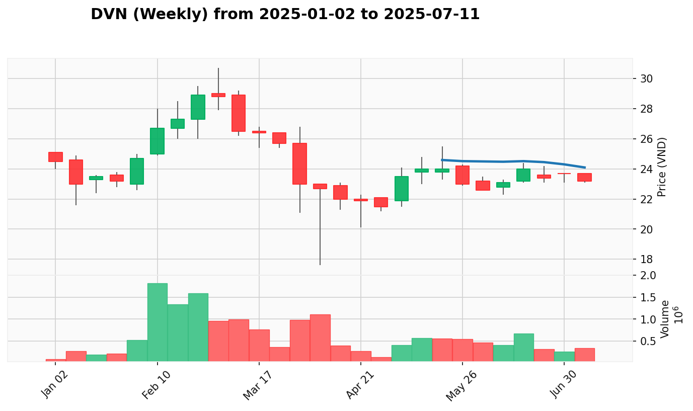

*   [View Report](REPORT_week.md#dvn)
*   **Các Chỉ Số Chính:**
    *   **Điểm Câu Chuyện VPA:** 95 / 100
    *   **Điểm Hiệu Suất Tương Đối:** 63.0 (tương ứng +63.0% change)
    *   **Mức Độ Tin Cậy:** 90%
*   **Phân Tích Dẫn Dắt:** DVN là cổ phiếu có tiềm năng dẫn dắt rõ ràng nhất trong ngành Sức khỏe. Trong bối cảnh ngành đang tích lũy, DVN đã sớm cho thấy các tín hiệu "No Supply" mạnh mẽ, theo sau là một tuần SOS xác nhận lực cầu quay trở lại và kết thúc bằng một tuần "Test for Supply" thành công.
*   **Câu Chuyện VPA Nổi Bật:** Một chuỗi tín hiệu rất textbook: hai tuần "No Supply" liên tiếp, một tuần SOS với khối lượng lớn, và một tuần "Test for Supply" trên khối lượng thấp. Đây là kịch bản chuẩn bị cho một đợt tăng giá.
*   **Hiệu Suất Tương Đối:** Mức tăng trưởng +63.0% từ nền giá tham chiếu, cao nhất ngành, thể hiện sức mạnh vượt trội.

---

#### **2. Dược Hậu Giang (DHG)**

*   [View Report](REPORT_week.md#dhg)
*   **Các Chỉ Số Chính:**
    *   **Điểm Câu Chuyện VPA:** 70 / 100
    *   **Điểm Hiệu Suất Tương Đối:** 42.1 (tương ứng +42.1% change)
    *   **Mức Độ Tin Cậy:** 50%
*   **Phân Tích Dẫn Dắt:** DHG đã có một chuỗi tăng giá tốt với các tín hiệu "No Supply" và "Effort to Rise". Tuy nhiên, tuần gần nhất lại là một tín hiệu "No Demand" ở vùng giá cao, cho thấy đà tăng đã tạm dừng và có thể dễ bị đảo chiều nếu nguồn cung xuất hiện.
*   **Câu Chuyện VPA Nổi Bật:** Sau hai tuần "No Supply" và một tuần "Effort to Rise", tuần gần nhất là một "No Demand" với biên độ cực hẹp và khối lượng thấp, cho thấy sự thiếu quan tâm của thị trường.
*   **Hiệu Suất Tương Đối:** Mức tăng trưởng +42.1% từ nền giá tham chiếu, một con số tốt nhưng chất lượng đà tăng đang bị đặt dấu hỏi.

---

#### **3. Imexpharm (IMP)**

*   [View Report](REPORT_week.md#imp)
*   **Các Chỉ Số Chính:**
    *   **Điểm Câu Chuyện VPA:** 70 / 100
    *   **Điểm Hiệu Suất Tương Đối:** 25.0 (tương ứng +25.0% change)
    *   **Mức Độ Tin Cậy:** 50%
*   **Phân Tích Dẫn Dắt:** IMP có câu chuyện tương tự DHG. Cổ phiếu này cũng có một chuỗi "No Supply" rất tích cực, cho thấy con đường đi lên dễ dàng. Tuy nhiên, tuần gần nhất cũng là một tín hiệu "No Demand", cho thấy đà tăng đang chững lại.
*   **Câu Chuyện VPA Nổi Bật:** Một chuỗi ba tuần "No Supply" rất thuyết phục, nhưng tuần gần nhất lại là một "No Demand" với biên độ hẹp và khối lượng thấp, cho thấy sự do dự.
*   **Hiệu Suất Tương Đối:** Mức tăng trưởng +25.0% từ nền giá tham chiếu, cho thấy sự tham gia vào xu hướng chung của ngành nhưng yếu hơn.

---

## **THÉP**

*   **Giai Đoạn Nền Giá Tham Chiếu:** 2025-05-26 - 2025-06-09
*   **Đánh Giá Tổng Quan Ngành:** **Dẫn Dắt Đồng Thuận**. Ngành Thép đang thể hiện sức mạnh đồng bộ và có sự lan tỏa. HPG đang là đầu tàu không thể tranh cãi với chuỗi tăng giá bền vững. Các cổ phiếu khác như HSG và NKG cũng đang trong giai đoạn kiểm tra cung tích cực, sẵn sàng cho một đợt tăng tiếp theo.

**Bảng Xếp Hạng Cổ Phiếu Dẫn Dắt:**

| Hạng | Mã CP & Liên Kết | Điểm Dẫn Dắt | Độ tin cậy | Tóm Tắt Lý Do |
| :--- | :--------------- | :----------- | :--------- | :------------------------------------------------------------------------------------------------ |
| 1 | [**HPG**](#hpg) | 88.7 | 95% | Dẫn dắt tuyệt đối với chuỗi tín hiệu SOS và No Supply mạnh mẽ, xu hướng tăng bền vững và hiệu suất vượt trội. |
| 2 | [**NKG**](#nkg) | 68.7 | 85% | Có một câu chuyện VPA rất tích cực với tín hiệu SOS và các phiên kiểm tra cung thành công, cho thấy tiềm năng bứt phá cao. |
| 3 | [**HSG**](#hsg) | 62.1 | 80% | Đang trong giai đoạn kiểm tra cung tích cực sau một nỗ lực tăng giá, sẵn sàng cho đợt tăng tiếp theo để bắt kịp ngành. |

---

### **Phân Tích Chi Tiết Top 3:**

---

#### **1. Hòa Phát (HPG)**

*   [View Report](REPORT_week.md#hpg)
*   **Các Chỉ Số Chính:**
    *   **Điểm Câu Chuyện VPA:** 100 / 100
    *   **Điểm Hiệu Suất Tương Đối:** 71.9 (tương ứng +71.9% change)
    *   **Mức Độ Tin Cậy:** 95%
*   **Phân Tích Dẫn Dắt:** Trong bối cảnh cả ngành Thép đang có sự đồng thuận đi lên, HPG nổi bật là đầu tàu mạnh mẽ nhất. Cổ phiếu này không chỉ có mức tăng trưởng cao nhất mà còn sở hữu câu chuyện VPA rõ ràng nhất, với một chuỗi các tín hiệu SOS và "No Supply" liên tiếp, xác nhận vai trò dẫn dắt không thể bàn cãi.
*   **Câu Chuyện VPA Nổi Bật:** Một chuỗi tăng giá hoàn hảo: "No Supply", theo sau là hai tuần SOS mạnh mẽ và một tuần SOS tiếp theo với biên độ rộng, tất cả đều được hỗ trợ bởi khối lượng lớn.
*   **Hiệu Suất Tương Đối:** Mức tăng trưởng +71.9% từ nền giá tham chiếu, cao nhất ngành, thể hiện sức mạnh tuyệt đối.

---

#### **2. Thép Nam Kim (NKG)**

*   [View Report](REPORT_week.md#nkg)
*   **Các Chỉ Số Chính:**
    *   **Điểm Câu Chuyện VPA:** 90 / 100
    *   **Điểm Hiệu Suất Tương Đối:** 34.1 (tương ứng +34.1% change)
    *   **Mức Độ Tin Cậy:** 85%
*   **Phân Tích Dẫn Dắt:** NKG đang theo sau HPG một cách tích cực. Cổ phiếu này có một câu chuyện VPA rất xây dựng, với một cú bứt phá SOS và các phiên kiểm tra cung thành công sau đó. Điều này cho thấy NKG đang tích lũy tốt và sẵn sàng cho một đợt tăng giá mới.
*   **Câu Chuyện VPA Nổi Bật:** Bùng nổ với một tuần SOS khối lượng lớn, theo sau là hai tuần "Test for Supply" và "No Supply" với khối lượng giảm dần. Tuần gần nhất tiếp tục là một "Test for Supply" tích cực.
*   **Hiệu Suất Tương Đối:** Mức tăng trưởng +34.1% từ nền giá tham chiếu, một con số tốt, cho thấy sự tham gia vào xu hướng chung của ngành.

---

#### **3. Hoa Sen (HSG)**

*   [View Report](REPORT_week.md#hsg)
*   **Các Chỉ Số Chính:**
    *   **Điểm Câu Chuyện VPA:** 80 / 100
    *   **Điểm Hiệu Suất Tương Đối:** 35.5 (tương ứng +35.5% change)
    *   **Mức Độ Tin Cậy:** 80%
*   **Phân Tích Dẫn Dắt:** HSG đang trong giai đoạn kiểm tra cung tích cực sau một nỗ lực tăng giá. Tương tự NKG, việc giá đi ngang với khối lượng giảm cho thấy áp lực bán không mạnh. Cổ phiếu này đang chờ đợi một cú hích từ lực cầu để tiếp tục xu hướng tăng cùng ngành.
*   **Câu Chuyện VPA Nổi Bật:** Sau một giai đoạn đi ngang với các tín hiệu "Test for Supply" và "No Demand", HSG có một tuần "Effort to Rise". Tuần gần nhất là một "Test for Supply" với nến giảm biên độ hẹp và khối lượng thấp.
*   **Hiệu Suất Tương Đối:** Mức tăng trưởng +35.5% từ nền giá tham chiếu, một hiệu suất tốt, cho thấy cổ phiếu đang đi cùng xu hướng ngành.

---

## **THỰC PHẨM**

*   **Giai Đoạn Nền Giá Tham Chiếu:** 2025-05-26 - 2025-06-09
*   **Đánh Giá Tổng Quan Ngành:** **Dẫn Dắt Đồng Thuận**. Ngành Thực phẩm đang cho thấy một xu hướng tăng giá mạnh mẽ và có sự lan tỏa. Các cổ phiếu trụ cột như MSN, VNM, SAB, MCH đều có những cú bứt phá SOS ấn tượng trong tuần gần nhất. Duy chỉ có KDC đang có dấu hiệu phân phối sau "Buying Climax". Nhìn chung, dòng tiền đang chảy mạnh vào ngành.

**Bảng Xếp Hạng Cổ Phiếu Dẫn Dắt:**

| Hạng | Mã CP & Liên Kết | Điểm Dẫn Dắt | Độ tin cậy | Tóm Tắt Lý Do |
| :--- | :--------------- | :----------- | :--------- | :------------------------------------------------------------------------------------------------ |
| 1 | [**MSN**](#msn) | 90.5 | 95% | Dẫn dắt tuyệt đối với cú bứt phá SOS cực kỳ mạnh mẽ khỏi vùng đi ngang, hiệu suất giá vượt trội và khối lượng bùng nổ. |
| 2 | [**VNM**](#vnm) | 73.1 | 90% | Có cú bứt phá SOS mạnh mẽ khỏi xu hướng giảm dài hạn, cho thấy tiềm năng đảo chiều và vai trò dẫn dắt mới. |
| 3 | [**SAB**](#sab) | 71.9 | 90% | Phục hồi tốt từ đáy với tín hiệu SOS xác nhận, cho thấy sự tham gia tích cực vào xu hướng chung của ngành. |

---

### **Phân Tích Chi Tiết Top 3:**

---

#### **1. Masan (MSN)**

*   [View Report](REPORT_week.md#msn)
*   **Các Chỉ Số Chính:**
    *   **Điểm Câu Chuyện VPA:** 100 / 100
    *   **Điểm Hiệu Suất Tương Đối:** 74.5 (tương ứng +74.5% change)
    *   **Mức Độ Tin Cậy:** 95%
*   **Phân Tích Dẫn Dắt:** Trong bối cảnh ngành Thực phẩm đang đồng thuận đi lên, MSN nổi bật là đầu tàu mạnh mẽ nhất. Cổ phiếu này sở hữu một cú bứt phá SOS ngoạn mục trong tuần gần nhất, với biên độ rộng và khối lượng cực lớn, xác nhận vai trò dẫn dắt không thể bàn cãi.
*   **Câu Chuyện VPA Nổi Bật:** Sau một chuỗi các tín hiệu SOS, "No Supply" và "Effort to Rise", MSN đã có một tuần bùng nổ với nến tăng có biên độ rất rộng, phá vỡ vùng đi ngang kéo dài và mở ra một giai đoạn tăng giá mới.
*   **Hiệu Suất Tương Đối:** Mức tăng trưởng +74.5% từ nền giá tham chiếu, cao nhất ngành, thể hiện sức mạnh tuyệt đối.

---

#### **2. Vinamilk (VNM)**

*   [View Report](REPORT_week.md#vnm)
*   **Các Chỉ Số Chính:**
    *   **Điểm Câu Chuyện VPA:** 85 / 100
    *   **Điểm Hiệu Suất Tương Đối:** 57.7 (tương ứng +57.7% change)
    *   **Mức Độ Tin Cậy:** 90%
*   **Phân Tích Dẫn Dắt:** VNM đang cho thấy những dấu hiệu rất tích cực về việc đảo chiều xu hướng giảm dài hạn. Cú bứt phá SOS mạnh mẽ trong tuần gần nhất, với khối lượng tăng mạnh, cho thấy lực mua đang quay trở lại một cách quyết liệt. VNM đang trở thành một trong những cổ phiếu dẫn dắt mới của ngành.
*   **Câu Chuyện VPA Nổi Bật:** Sau một loạt các nỗ lực tăng giá và tín hiệu "No Supply", VNM đã có một tuần SOS bùng nổ với nến tăng thân dài và khối lượng lớn, xác nhận sự quay trở lại của phe mua.
*   **Hiệu Suất Tương Đối:** Mức tăng trưởng +57.7% từ nền giá tham chiếu, một con số rất tốt, cho thấy sự phục hồi mạnh mẽ.

---

#### **3. Sabeco (SAB)**

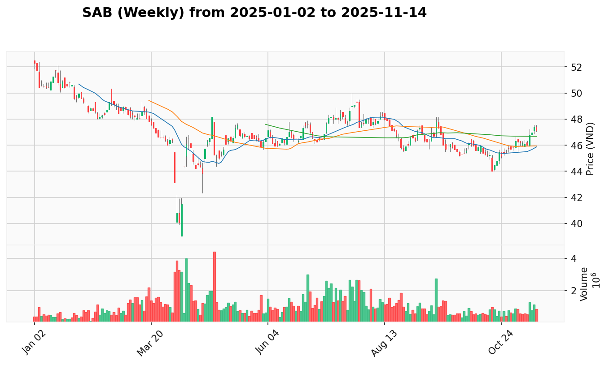

*   [View Report](REPORT_week.md#sab)
*   **Các Chỉ Số Chính:**
    *   **Điểm Câu Chuyện VPA:** 85 / 100
    *   **Điểm Hiệu Suất Tương Đối:** 52.4 (tương ứng +52.4% change)
    *   **Mức Độ Tin Cậy:** 90%
*   **Phân Tích Dẫn Dắt:** SAB đang tham gia rất tích cực vào xu hướng chung của ngành. Cổ phiếu này vừa có một tuần SOS bứt phá khỏi nền tích lũy đáy, với khối lượng tăng mạnh, cho thấy lực mua đang quay trở lại và cổ phiếu sẵn sàng cho một đợt phục hồi.
*   **Câu Chuyện VPA Nổi Bật:** Sau một giai đoạn đi ngang với các tín hiệu "No Supply" và "Effort to Rise" yếu, SAB đã có một tuần SOS với nến tăng thân dài và khối lượng tăng mạnh, xác nhận sự phục hồi.
*   **Hiệu Suất Tương Đối:** Mức tăng trưởng +52.4% từ nền giá tham chiếu, thể hiện sự tham gia tốt vào xu hướng chung của ngành.

---

## **THỦY SẢN**

*   **Giai Đoạn Nền Giá Tham Chiếu:** 2025-05-19 - 2025-06-02
*   **Đánh Giá Tổng Quan Ngành:** **Dẫn Dắt Đồng Thuận**. Ngành Thủy sản đang cho thấy một xu hướng tăng giá mạnh mẽ và đồng bộ. Cả ANV và VHC đều có những cú bứt phá SOS ấn tượng, trong khi MPC cũng đang tiếp tục nỗ lực tăng giá. Sức mạnh đang lan tỏa trên toàn ngành.

**Bảng Xếp Hạng Cổ Phiếu Dẫn Dắt:**

| Hạng | Mã CP & Liên Kết | Điểm Dẫn Dắt | Độ tin cậy | Tóm Tắt Lý Do |
| :--- | :--------------- | :----------- | :--------- | :------------------------------------------------------------------------------------------------ |
| 1 | [**ANV**](#anv) | 90.2 | 95% | Dẫn dắt tuyệt đối với cú bứt phá SOS kinh điển, khối lượng đột biến và hiệu suất giá vượt trội, mở ra một giai đoạn tăng giá mới. |
| 2 | [**VHC**](#vhc) | 71.0 | 90% | Sức mạnh tốt với một tuần SOS thuyết phục, khẳng định vai trò đồng dẫn dắt và sự quay trở lại của lực mua. |
| 3 | [**MPC**](#mpc) | 68.7 | 80% | Có chuỗi tăng giá mạnh mẽ nhưng tuần gần nhất có dấu hiệu chững lại với bóng nến trên, cần cẩn trọng với áp lực bán. |

---

### **Phân Tích Chi Tiết Top 3:**

---

#### **1. Nam Việt (ANV)**

*   [View Report](REPORT_week.md#anv)
*   **Các Chỉ Số Chính:**
    *   **Điểm Câu Chuyện VPA:** 100 / 100
    *   **Điểm Hiệu Suất Tương Đối:** 75.4 (tương ứng +75.4% change)
    *   **Mức Độ Tin Cậy:** 95%
*   **Phân Tích Dẫn Dắt:** Trong bối cảnh ngành Thủy sản đang đồng thuận đi lên, ANV nổi bật là cổ phiếu mạnh nhất. Cổ phiếu này sở hữu một cú bứt phá SOS kinh điển trong tuần gần nhất, với biên độ rộng và khối lượng tăng đột biến, xác nhận vai trò dẫn dắt không thể bàn cãi.
*   **Câu Chuyện VPA Nổi Bật:** Sau một loạt các tín hiệu "Effort to Rise", "Test for Supply" và SOS, ANV đã có một tuần bùng nổ với nến tăng có biên độ rất rộng, phá vỡ mọi kháng cự và mở ra một giai đoạn tăng giá mới.
*   **Hiệu Suất Tương Đối:** Mức tăng trưởng +75.4% từ nền giá tham chiếu, cao nhất ngành, thể hiện sức mạnh tuyệt đối.

---

#### **2. Vĩnh Hoàn (VHC)**

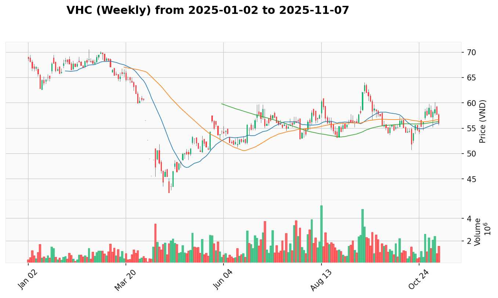

*   [View Report](REPORT_week.md#vhc)
*   **Các Chỉ Số Chính:**
    *   **Điểm Câu Chuyện VPA:** 85 / 100
    *   **Điểm Hiệu Suất Tương Đối:** 57.5 (tương ứng +57.5% change)
    *   **Mức Độ Tin Cậy:** 90%
*   **Phân Tích Dẫn Dắt:** VHC là một cổ phiếu đồng dẫn dắt mạnh mẽ trong ngành. Nó có một câu chuyện VPA rất thuyết phục với cú bứt phá SOS khỏi nền tích lũy, với khối lượng tăng vọt, cho thấy lực mua đã quay trở lại một cách quyết liệt.
*   **Câu Chuyện VPA Nổi Bật:** Sau các tuần "No Supply" và "Test for Supply", VHC có một tuần SOS mạnh mẽ và tiếp tục bùng nổ trong tuần gần nhất với nến tăng thân dài và khối lượng lớn.
*   **Hiệu Suất Tương Đối:** Mức tăng trưởng +57.5% từ nền giá tham chiếu, một con số rất tốt, cho thấy sức mạnh tương đối cao trong ngành.

---

#### **3. Minh Phú (MPC)**

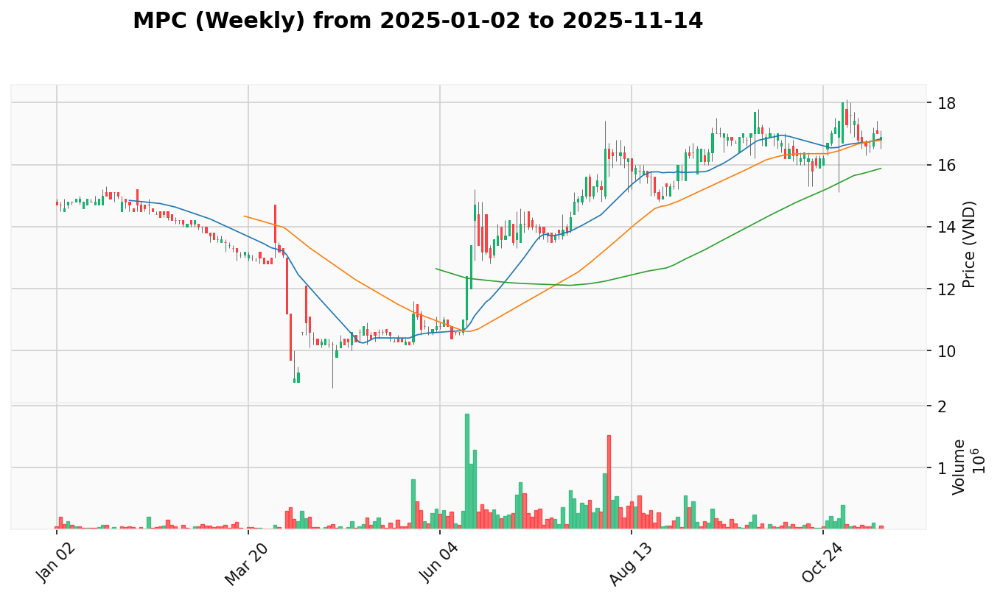

*   [View Report](REPORT_week.md#mpc)
*   **Các Chỉ Số Chính:**
    *   **Điểm Câu Chuyện VPA:** 75 / 100
    *   **Điểm Hiệu Suất Tương Đối:** 67.2 (tương ứng +67.2% change)
    *   **Mức Độ Tin Cậy:** 80%
*   **Phân Tích Dẫn Dắt:** MPC đã có một chuỗi tăng giá rất mạnh mẽ với các tín hiệu SOS. Tuy nhiên, tuần gần nhất cho thấy dấu hiệu chững lại khi xuất hiện bóng nến trên, cho thấy áp lực bán bắt đầu xuất hiện. MPC vẫn mạnh nhưng cần theo dõi chặt chẽ.
*   **Câu Chuyện VPA Nổi Bật:** Một chuỗi ba tuần tăng giá mạnh mẽ với các tín hiệu SOS. Tuần gần nhất là một "Effort to Rise" nhưng có dấu hiệu chững lại.
*   **Hiệu Suất Tương Đối:** Mức tăng trưởng +67.2% từ nền giá tham chiếu, một hiệu suất rất tốt, cho thấy cổ phiếu đang đi cùng xu hướng ngành.

---

## **VẬN TẢI**

*   **Giai Đoạn Nền Giá Tham Chiếu:** 2025-05-19 - 2025-06-09
*   **Đánh Giá Tổng Quan Ngành:** **Yếu/Phân Phối**. Ngành Vận tải đang cho thấy sự phân hóa mạnh và có dấu hiệu suy yếu rõ rệt ở các mã lớn. PVT và HAH đều xuất hiện tín hiệu SOW mạnh mẽ, cho thấy áp lực chốt lời và phân phối. VTP là điểm sáng duy nhất với tín hiệu "No Supply" tích cực, trong khi GMD vẫn đang trong giai đoạn giằng co.

**Bảng Xếp Hạng Cổ Phiếu Dẫn Dắt:**

| Hạng | Mã CP & Liên Kết | Điểm Dẫn Dắt | Độ tin cậy | Tóm Tắt Lý Do |
| :--- | :--------------- | :----------- | :--------- | :------------------------------------------------------------------------------------------------ |
| 1 | [**VTP**](#vtp) | 75.8 | 95% | Là cổ phiếu dẫn dắt duy nhất và là điểm sáng của ngành, với tín hiệu "No Supply" rất tích cực, cho thấy tiềm năng tăng giá lớn. |
| 2 | [**PVT**](#pvt) | 39.4 | 30% | Hiệu suất giá tốt nhưng câu chuyện VPA rất tiêu cực với một tuần SOW mạnh mẽ, cho thấy sự từ chối giá ở vùng cao. |
| 3 | [**HAH**](#hah) | 35.8 | 25% | Tương tự PVT, có tín hiệu SOW rõ ràng và cú phá vỡ xuống dưới, cho thấy nguồn cung đang kiểm soát và rủi ro giảm giá cao. |

---

### **Phân Tích Chi Tiết Top 3:**

---

#### **1. Viettel Post (VTP)**

*   [View Report](REPORT_week.md#vtp)
*   **Các Chỉ Số Chính:**
    *   **Điểm Câu Chuyện VPA:** 95 / 100
    *   **Điểm Hiệu Suất Tương Đối:** 44.8 (tương ứng +44.8% change)
    *   **Mức Độ Tin Cậy:** 95%
*   **Phân Tích Dẫn Dắt:** VTP là cổ phiếu dẫn dắt rõ ràng nhất của ngành Vận tải. Trong khi các đối thủ đang gặp khó khăn, VTP lại cho thấy một tín hiệu "No Supply" rất tích cực, khi giá có thể tăng mạnh trên nền khối lượng thấp hơn, cho thấy phe bán đã yếu đi.
*   **Câu Chuyện VPA Nổi Bật:** Sau một cú bứt phá SOS, VTP có một tuần điều chỉnh "Test for Supply". Tuần gần nhất là một cú tăng giá mạnh mẽ trên khối lượng giảm, một tín hiệu "No Supply" rất đáng tin cậy.
*   **Hiệu Suất Tương Đối:** Mức tăng trưởng +44.8% từ nền giá tham chiếu, cao nhất ngành, thể hiện sức mạnh vượt trội.

---

#### **2. Vận tải Dầu khí Thái Bình Dương (PVT)**

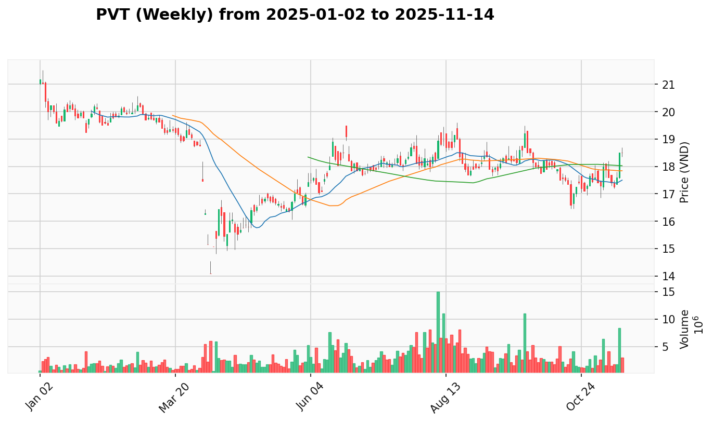

*   [View Report](REPORT_week.md#pvt)
*   **Các Chỉ Số Chính:**
    *   **Điểm Câu Chuyện VPA:** 50 / 100
    *   **Điểm Hiệu Suất Tương Đối:** 48.6 (tương ứng +48.6% change)
    *   **Mức Độ Tin Cậy:** 30%
*   **Phân Tích Dẫn Dắt:** PVT là một ví dụ cho sự suy yếu của ngành. Mặc dù có hiệu suất giá rất tốt, câu chuyện VPA gần đây là cực kỳ tiêu cực. Tuần gần nhất là một tuần SOW với nến giảm thân dài, xóa đi phần lớn thành quả tuần trước, cho thấy áp lực bán đã quay trở lại.
*   **Câu Chuyện VPA Nổi Bật:** Sau một chuỗi tăng giá mạnh mẽ với các tín hiệu SOS và Effort to Rise, tuần gần nhất là một tuần SOW rõ ràng, cho thấy sự từ chối giá ở vùng cao.
*   **Hiệu Suất Tương Đối:** Mức tăng trưởng +48.6% từ nền giá tham chiếu, tuy nhiên thành quả này đang bị đe dọa nghiêm trọng.

---

#### **3. Vận tải và Xếp dỡ Hải An (HAH)**

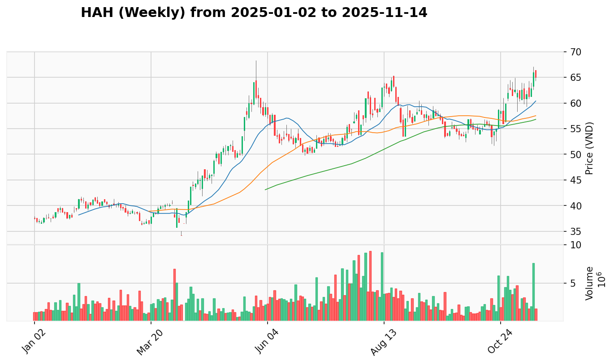

*   [View Report](REPORT_week.md#hah)
*   **Các Chỉ Số Chính:**
    *   **Điểm Câu Chuyện VPA:** 40 / 100
    *   **Điểm Hiệu Suất Tương Đối:** 43.4 (tương ứng +43.4% change)
    *   **Mức Độ Tin Cậy:** 25%
*   **Phân Tích Dẫn Dắt:** HAH có câu chuyện VPA tiêu cực tương tự PVT. Sau một giai đoạn có thể là "Selling Climax", nỗ lực phục hồi đã thất bại và tuần gần nhất là một tuần SOW mạnh mẽ, phá vỡ đáy tuần trước, cho thấy nguồn cung đang hoàn toàn kiểm soát.
*   **Câu Chuyện VPA Nổi Bật:** Một chuỗi các tuần SOW mạnh mẽ trên khối lượng lớn, cho thấy phe bán đang hoàn toàn kiểm soát. Nỗ lực tạo đáy đã thất bại.
*   **Hiệu Suất Tương Đối:** Mức tăng trưởng +43.4% từ nền giá tham chiếu, nhưng xu hướng tăng đã bị phá vỡ hoàn toàn.

---

## **VLXD**

*   **Giai Đoạn Nền Giá Tham Chiếu:** 2025-05-26 - 2025-06-16
*   **Đánh Giá Tổng Quan Ngành:** **Dẫn Dắt Phân Hóa**. Ngành VLXD đang có sự phân hóa cao. HT1 và PTB đang cho thấy sức mạnh với những cú bứt phá SOS, trong khi VLB lại có tín hiệu tiêu cực. Sức mạnh không lan tỏa đều, cho thấy cần lựa chọn cổ phiếu cẩn thận.

**Bảng Xếp Hạng Cổ Phiếu Dẫn Dắt:**

| Hạng | Mã CP & Liên Kết | Điểm Dẫn Dắt | Độ tin cậy | Tóm Tắt Lý Do |
| :--- | :--------------- | :----------- | :--------- | :------------------------------------------------------------------------------------------------ |
| 1 | [**HT1**](#ht1) | 88.3 | 95% | Dẫn dắt tuyệt đối với cú bứt phá SOS mạnh mẽ khỏi nền tích lũy, khối lượng tăng vọt, mở ra một xu hướng tăng mới. |
| 2 | [**PTB**](#ptb) | 77.0 | 90% | Sức mạnh tốt với một tuần SOS thuyết phục, khẳng định sự quay trở lại của lực mua sau một giai đoạn điều chỉnh. |
| 3 | [**VLB**](#vlb) | 39.5 | 35% | Hiệu suất giá tốt nhưng câu chuyện VPA gần đây rất tiêu cực, với một tuần giảm giá cho thấy phe bán đang chiếm ưu thế. |

---

### **Phân Tích Chi Tiết Top 3:**

---

#### **1. Xi măng Vicem Hà Tiên (HT1)**

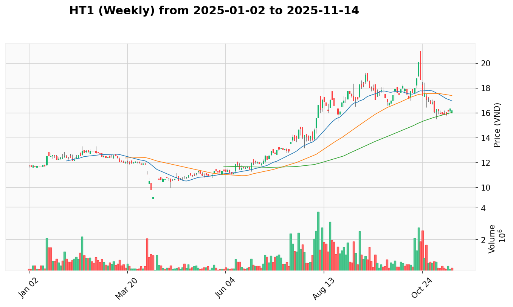

*   [View Report](REPORT_week.md#ht1)
*   **Các Chỉ Số Chính:**
    *   **Điểm Câu Chuyện VPA:** 100 / 100
    *   **Điểm Hiệu Suất Tương Đối:** 69.9 (tương ứng +69.9% change)
    *   **Mức Độ Tin Cậy:** 95%
*   **Phân Tích Dẫn Dắt:** HT1 là cổ phiếu dẫn dắt rõ ràng của ngành VLXD. Cổ phiếu này sở hữu một cú bứt phá SOS hoàn hảo trong tuần gần nhất, với khối lượng tăng hơn gấp đôi, xác nhận sự quay trở lại mạnh mẽ của lực mua sau một thời gian tích lũy.
*   **Câu Chuyện VPA Nổi Bật:** Sau các tín hiệu "No Supply" và "SOS" ban đầu, HT1 có một tuần "Test for Supply" thành công, và sau đó bùng nổ với một tuần SOS mạnh mẽ, xác nhận một xu hướng tăng mới.
*   **Hiệu Suất Tương Đối:** Mức tăng trưởng +69.9% từ nền giá tham chiếu, cao nhất ngành, thể hiện sức mạnh tuyệt đối.

---

#### **2. Phú Tài (PTB)**

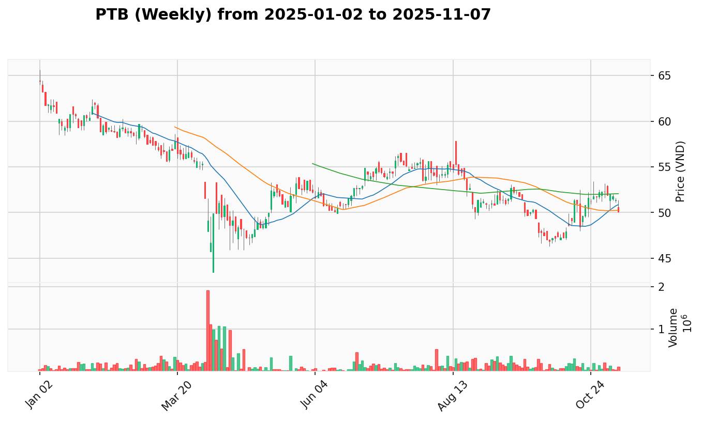

*   [View Report](REPORT_week.md#ptb)
*   **Các Chỉ Số Chính:**
    *   **Điểm Câu Chuyện VPA:** 90 / 100
    *   **Điểm Hiệu Suất Tương Đối:** 58.0 (tương ứng +58.0% change)
    *   **Mức Độ Tin Cậy:** 90%
*   **Phân Tích Dẫn Dắt:** PTB là một cổ phiếu mạnh trong ngành, đang phục hồi tốt. Tuần gần nhất là một tín hiệu SOS thuyết phục với nến tăng thân dài và khối lượng tăng vọt, cho thấy lực mua đã quay trở lại mạnh mẽ sau một giai đoạn điều chỉnh.
*   **Câu Chuyện VPA Nổi Bật:** Sau một loạt các tín hiệu "No Supply" và SOW, PTB đã có một tuần SOS bùng nổ, xác nhận sự kết thúc của đợt điều chỉnh và bắt đầu một xu hướng tăng mới.
*   **Hiệu Suất Tương Đối:** Mức tăng trưởng +58.0% từ nền giá tham chiếu, một con số rất tốt, cho thấy sức mạnh tương đối cao.

---

#### **3. Vật liệu Xây dựng Biên Hòa (VLB)**

*   [View Report](REPORT_week.md#vlb)
*   **Các Chỉ Số Chính:**
    *   **Điểm Câu Chuyện VPA:** 50 / 100
    *   **Điểm Hiệu Suất Tương Đối:** 23.8 (tương ứng +23.8% change)
    *   **Mức Độ Tin Cậy:** 35%
*   **Phân Tích Dẫn Dắt:** VLB đang cho thấy sự suy yếu. Mặc dù có hiệu suất giá tốt, câu chuyện VPA gần đây là tiêu cực. Tuần gần nhất là một nến giảm với biên độ vừa phải, cho thấy phe bán đang chiếm ưu thế trở lại và rủi ro giảm giá tiếp tục hiện hữu.
*   **Câu Chuyện VPA Nổi Bật:** Sau các tín hiệu "Effort to Rise" và SOS, VLB có một tuần "No Supply" nhưng ngay sau đó là một tuần giảm giá, cho thấy nỗ lực phục hồi đã thất bại.
*   **Hiệu Suất Tương Đối:** Mức tăng trưởng +23.8% từ nền giá tham chiếu, nhưng xu hướng tăng đang bị đe dọa.

---

## **XÂY DỰNG**

*   **Giai Đoạn Nền Giá Tham Chiếu:** 2025-05-26 - 2025-06-16
*   **Đánh Giá Tổng Quan Ngành:** **Dẫn Dắt Đồng Thuận**. Ngành Xây dựng đang có một xu hướng tăng giá mạnh mẽ và đồng bộ. Cả CII và CTD đều cho thấy những cú bứt phá hoặc kiểm tra cung rất tích cực. Sức mạnh đang lan tỏa trên toàn ngành.

**Bảng Xếp Hạng Cổ Phiếu Dẫn Dắt:**

| Hạng | Mã CP & Liên Kết | Điểm Dẫn Dắt | Độ tin cậy | Tóm Tắt Lý Do |
| :--- | :--------------- | :----------- | :--------- | :------------------------------------------------------------------------------------------------ |
| 1 | [**CII**](#cii) | 88.3 | 95% | Dẫn dắt tuyệt đối với cú bứt phá SOS mạnh mẽ khỏi nền tích lũy, khối lượng tăng mạnh và hiệu suất giá vượt trội. |
| 2 | [**CTD**](#ctd) | 87.0 | 95% | Câu chuyện VPA rất mạnh mẽ với cú bứt phá SOS và một tuần "Test for Supply" cực kỳ thành công, cho thấy tiềm năng tăng giá lớn. |
| 3 | [**HUT**](#hut) | 57.8 | 60% | Đang trong giai đoạn giằng co, tích lũy. Tín hiệu trung lập và cần thêm xác nhận từ một cú phá vỡ để xác định hướng đi. |

---

### **Phân Tích Chi Tiết Top 3:**

---

#### **1. Hạ tầng Kỹ thuật TP.HCM (CII)**

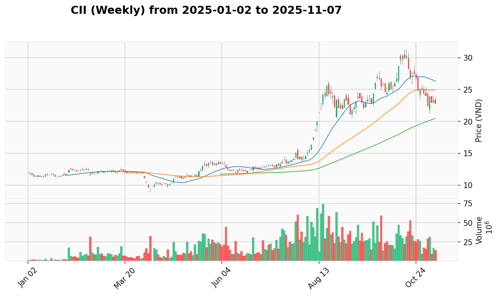

*   [View Report](REPORT_week.md#cii)
*   **Các Chỉ Số Chính:**
    *   **Điểm Câu Chuyện VPA:** 100 / 100
    *   **Điểm Hiệu Suất Tương Đối:** 70.8 (tương ứng +70.8% change)
    *   **Mức Độ Tin Cậy:** 95%
*   **Phân Tích Dẫn Dắt:** Trong bối cảnh ngành Xây dựng đang đồng thuận đi lên, CII nổi bật là cổ phiếu mạnh nhất. Cổ phiếu này sở hữu một cú bứt phá SOS hoàn hảo trong tuần gần nhất, với khối lượng tăng mạnh, xác nhận vai trò dẫn dắt không thể bàn cãi.
*   **Câu Chuyện VPA Nổi Bật:** Sau một giai đoạn điều chỉnh với tín hiệu SOW và một tuần "No Supply", CII đã có một tuần bùng nổ SOS với nến tăng biên độ rộng và khối lượng lớn, xác nhận sự quay trở lại mạnh mẽ của phe mua.
*   **Hiệu Suất Tương Đối:** Mức tăng trưởng +70.8% từ nền giá tham chiếu, cao nhất ngành, thể hiện sức mạnh tuyệt đối.

---

#### **2. Coteccons (CTD)**

*   [View Report](REPORT_week.md#ctd)
*   **Các Chỉ Số Chính:**
    *   **Điểm Câu Chuyện VPA:** 95 / 100
    *   **Điểm Hiệu Suất Tương Đối:** 74.0 (tương ứng +74.0% change)
    *   **Mức Độ Tin Cậy:** 95%
*   **Phân Tích Dẫn Dắt:** CTD là một cổ phiếu đồng dẫn dắt mạnh mẽ trong ngành. Nó có một câu chuyện VPA rất thuyết phục với cú bứt phá SOS khỏi nền và một phiên kiểm tra cung thành công ngay sau đó, cho thấy thị trường đang hấp thụ tốt và sẵn sàng cho đợt tăng tiếp theo.
*   **Câu Chuyện VPA Nổi Bật:** Bùng nổ với một tuần SOS khối lượng lớn, theo sau là một tuần "Test for Supply" thành công với nến tăng biên độ hẹp và khối lượng giảm. Đây là một hành động giá rất mang tính xây dựng.
*   **Hiệu Suất Tương Đối:** Mức tăng trưởng +74.0% từ nền giá tham chiếu, một con số xuất sắc, khẳng định vị thế dẫn dắt.

---

#### **3. Tasco (HUT)**

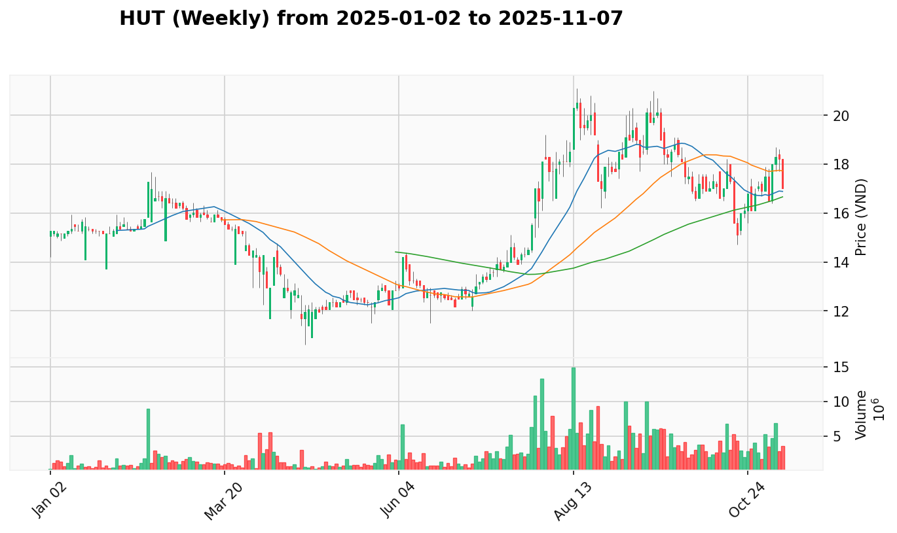

*   [View Report](REPORT_week.md#hut)
*   **Các Chỉ Số Chính:**
    *   **Điểm Câu Chuyện VPA:** 70 / 100
    *   **Điểm Hiệu Suất Tương Đối:** 39.4 (tương ứng +39.4% change)
    *   **Mức Độ Tin Cậy:** 60%
*   **Phân Tích Dẫn Dắt:** HUT đang trong giai đoạn tích lũy và giằng co sau một đợt biến động mạnh. Các tín hiệu VPA gần đây là trung lập, chưa có dấu hiệu rõ ràng về việc phe mua hay phe bán đang chiếm ưu thế. Cổ phiếu đang theo sau xu hướng ngành và cần một cú phá vỡ để xác định hướng đi.
*   **Câu Chuyện VPA Nổi Bật:** Sau một tuần SOS và một tuần SOW, cổ phiếu có tín hiệu "No Supply" tích cực nhưng tuần gần nhất lại là một nến giảm biên độ hẹp, cho thấy sự do dự.
*   **Hiệu Suất Tương Đối:** Mức tăng trưởng +39.4% từ nền giá tham chiếu, thể hiện sự tham gia vào xu hướng chung của ngành.

---

## **XÂY LẮP ĐIỆN**

*   **Giai Đoạn Nền Giá Tham Chiếu:** 2025-05-26 - 2025-06-16
*   **Đánh Giá Tổng Quan Ngành:** **Dẫn Dắt Đồng Thuận**. Ngành Xây lắp điện đang cho thấy sức mạnh đồng bộ và lan tỏa. Cả CTR và TV2 đều có những tín hiệu VPA rất tích cực (SOS, No Supply), trong khi PC1 cũng đang tích lũy chặt chẽ. Dòng tiền đang cho thấy sự quan tâm đến toàn ngành.

**Bảng Xếp Hạng Cổ Phiếu Dẫn Dắt:**

| Hạng | Mã CP & Liên Kết | Điểm Dẫn Dắt | Độ tin cậy | Tóm Tắt Lý Do |
| :--- | :--------------- | :----------- | :--------- | :------------------------------------------------------------------------------------------------ |
| 1 | [**CTR**](#ctr) | 88.0 | 95% | Dẫn dắt tuyệt đối với chuỗi tín hiệu SOS mạnh mẽ, xu hướng tăng bền vững và hiệu suất vượt trội. |
| 2 | [**TV2**](#tv2) | 73.1 | 90% | Có câu chuyện VPA rất tích cực với tín hiệu "No Supply" sau khi bứt phá, cho thấy tiềm năng tiếp tục tăng giá lớn. |
| 3 | [**PC1**](#pc1) | 56.6 | 60% | Đang trong giai đoạn tích lũy chặt chẽ, tín hiệu trung lập và cần thêm xác nhận từ một cú phá vỡ để xác định hướng đi. |

---

### **Phân Tích Chi Tiết Top 3:**

---

#### **1. Viettel Construction (CTR)**

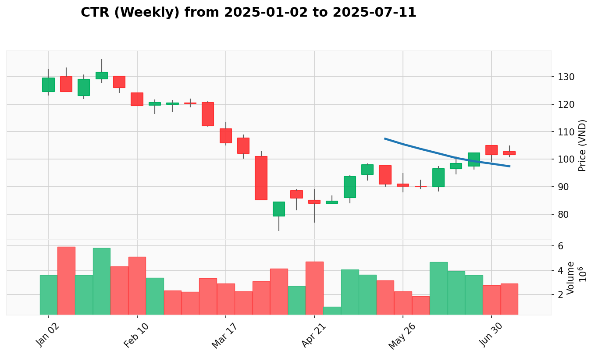

*   [View Report](REPORT_week.md#ctr)
*   **Các Chỉ Số Chính:**
    *   **Điểm Câu Chuyện VPA:** 100 / 100
    *   **Điểm Hiệu Suất Tương Đối:** 70.0 (tương ứng +70.0% change)
    *   **Mức Độ Tin Cậy:** 95%
*   **Phân Tích Dẫn Dắt:** Trong bối cảnh ngành Xây lắp điện đang đồng thuận đi lên, CTR nổi bật là đầu tàu mạnh mẽ nhất. Cổ phiếu này sở hữu một câu chuyện VPA hoàn hảo, với một chuỗi các tín hiệu SOS liên tiếp, xác nhận vai trò dẫn dắt không thể bàn cãi trong một xu hướng ngành khỏe mạnh.
*   **Câu Chuyện VPA Nổi Bật:** Sau một tuần "Test for Supply" thành công, CTR có ba tuần tăng giá SOS liên tiếp với khối lượng lớn, phá vỡ mọi kháng cự và thiết lập đỉnh cao mới.
*   **Hiệu Suất Tương Đối:** Mức tăng trưởng +70.0% từ nền giá tham chiếu, cao nhất ngành, thể hiện sức mạnh tuyệt đối.

---

#### **2. TV2 (TV2)**

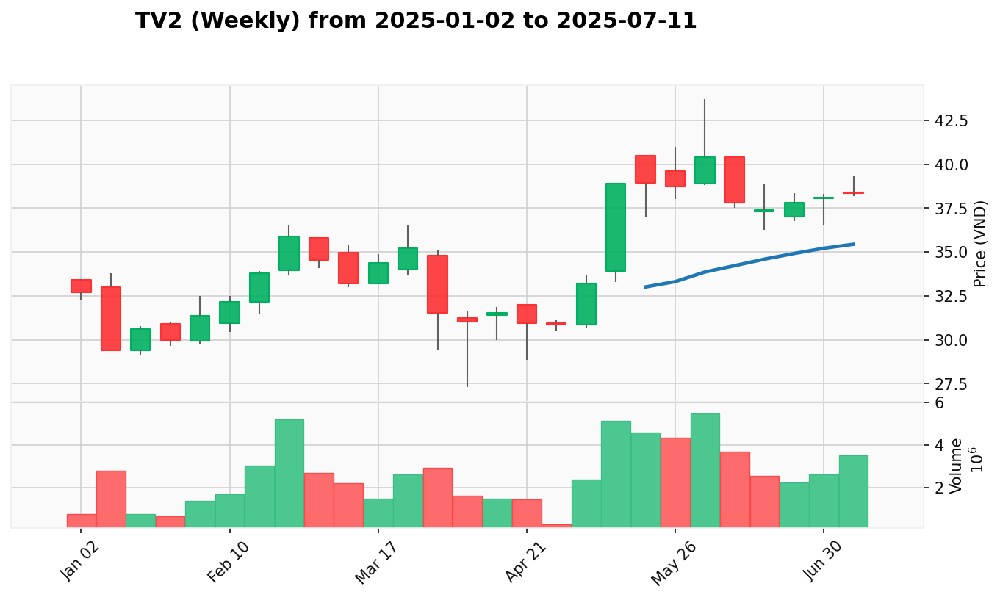

*   [View Report](REPORT_week.md#tv2)
*   **Các Chỉ Số Chính:**
    *   **Điểm Câu Chuyện VPA:** 85 / 100
    *   **Điểm Hiệu Suất Tương Đối:** 57.8 (tương ứng +57.8% change)
    *   **Mức Độ Tin Cậy:** 90%
*   **Phân Tích Dẫn Dắt:** TV2 là một cổ phiếu theo sau nhưng có câu chuyện VPA rất mạnh mẽ. Sau khi bứt phá với tín hiệu SOS, cổ phiếu này đã có các phiên kiểm tra cung thành công và tuần gần nhất là một tín hiệu "No Supply" rất tích cực, cho thấy tiềm năng tiếp tục xu hướng tăng.
*   **Câu Chuyện VPA Nổi Bật:** Bùng nổ với một tuần SOS, theo sau là hai tuần điều chỉnh "Test for Supply". Tuần gần nhất là một nến tăng trên khối lượng giảm, một tín hiệu "No Supply" đáng tin cậy.
*   **Hiệu Suất Tương Đối:** Mức tăng trưởng +57.8% từ nền giá tham chiếu, một con số rất tốt, cho thấy sự tham gia vào xu hướng chung của ngành.

---

#### **3. PC1 (PC1)**

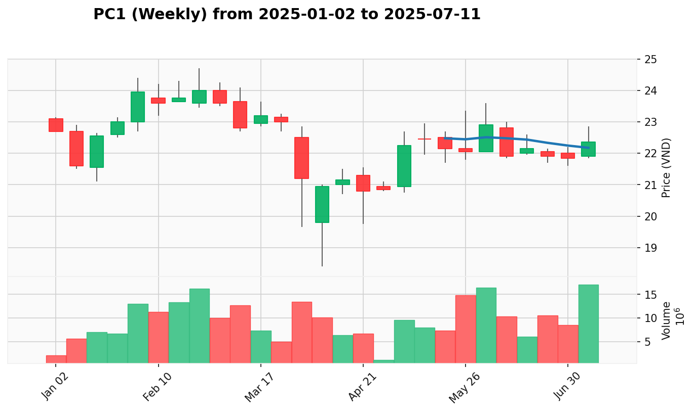

*   [View Report](REPORT_week.md#pc1)
*   **Các Chỉ Số Chính:**
    *   **Điểm Câu Chuyện VPA:** 70 / 100
    *   **Điểm Hiệu Suất Tương Đối:** 34.3 (tương ứng +34.3% change)
    *   **Mức Độ Tin Cậy:** 60%
*   **Phân Tích Dẫn Dắt:** PC1 đang trong giai đoạn tích lũy đi ngang chặt chẽ. Các tín hiệu VPA gần đây là trung lập, cho thấy sự do dự và thiếu động lực. Cổ phiếu đang chờ đợi một cú hích về khối lượng để xác nhận hướng đi và bắt kịp các mã dẫn đầu trong ngành.
*   **Câu Chuyện VPA Nổi Bật:** Sau một tuần SOS, cổ phiếu có hai tuần điều chỉnh "Test for Supply" và "No Supply". Tuy nhiên, tuần gần nhất lại là một nến giảm biên độ hẹp, cho thấy sự giằng co.
*   **Hiệu Suất Tương Đối:** Mức tăng trưởng +34.3% từ nền giá tham chiếu, thể hiện sự tham gia vào xu hướng chung của ngành.
