# Kế Hoạch Giao Dịch Trung Hạn (1-3 Tháng)

*Phân tích dựa trên phương pháp VPA/Wyckoff, tổng hợp từ dữ liệu ngày 2025-01-02 đến 2025-06-19.*
*Ngày lập kế hoạch: 2025-06-20*

---

## 🚀 View the Latest Analysis

**➡️ [Click here to view the latest market report](REPORT.md)**

---

**1. Phân Tích Trạng Thái VNINDEX & Chiến Lược**
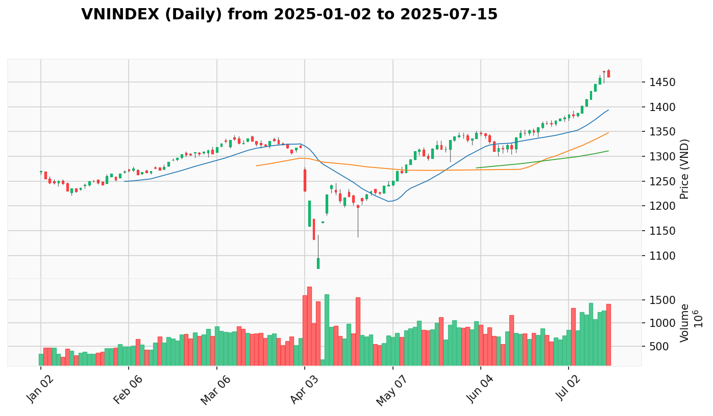
  - **Trạng thái hiện tại của VNINDEX là xu hướng tăng được củng cố.** Sau phiên kiểm tra cung tại vùng đỉnh vào ngày 18/06, phiên 19/06 đã xác nhận sức mạnh của phe mua với một cây nến tăng điểm thuyết phục (**Effort to Rise**), đóng cửa ở mức 1352.04 trên nền khối lượng vẫn duy trì ở mức rất cao. Điều này cho thấy lực cầu đã hấp thụ thành công áp lực chốt lời và sẵn sàng đưa chỉ số lên các mức cao mới. Xu hướng tăng trung hạn đang rất mạnh mẽ và được xác nhận.
  - **Vùng Tốt Nhất Để Gia Tăng Tỷ Trọng:** `1330 - 1350` điểm. Vùng này vẫn là vùng hỗ trợ quan trọng. Bất kỳ nhịp điều chỉnh nào về đây với khối lượng thấp đều là cơ hội mua vào, tuy nhiên với sức mạnh hiện tại, có khả năng thị trường sẽ không kiểm tra lại vùng này sâu.

**2. Top 1x Cơ Hội Giao Dịch**

Dựa trên phân tích VPA, dưới đây là 11 cơ hội giao dịch trung hạn tiềm năng nhất, được xếp hạng lại theo mức độ ưu tiên dựa trên tín hiệu mới nhất.

1.  [**TCB**](REPORT.md#TCB) (Ngân Hàng)
2.  [**LPB**](REPORT.md#LPB) (Ngân Hàng)
3.  [**DGC**](REPORT.md#DGC) (Hóa Chất)
4.  [**CTG**](REPORT.md#CTG) (Ngân Hàng)
5.  [**GVR**](REPORT.md#GVR) (Cao Su)
6.  [**BSR**](REPORT.md#BSR) (Dầu Khí)
7.  [**DPM**](REPORT.md#DPM) (Hóa Chất)
8.  [**FPT**](REPORT.md#FPT) (Công Nghệ)
9.  [**VND**](REPORT.md#VND) (Chứng Khoán)
10. [**PNJ**](REPORT.md#PNJ) (Bán Lẻ)
11. [**MWG**](REPORT.md#MWG) (Bán Lẻ)

**3. Phân Tích Chi Tiết Từng Cổ Phiếu**

---

### **Ưu tiên 1: TCB**

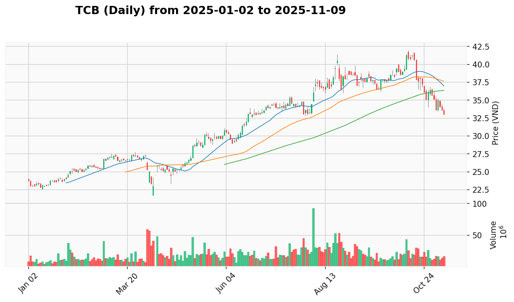
  - [View Report](REPORT.md#TCB)
  - **Phân Tích Cốt Lõi:** TCB đang thể hiện sức mạnh vượt trội và một kịch bản tăng giá kinh điển. Sau tín hiệu **No Supply** ngày 11/06 (khối lượng thấp kỷ lục, kiểm chứng trong `market_data.txt`), cổ phiếu đã có một chuỗi tăng giá thuyết phục. Đặc biệt, phiên ngày 19/06 là một **Sign of Strength (SOS)** cực kỳ mạnh mẽ, giá tăng vọt lên 34.0 với biên độ rộng và khối lượng bùng nổ (23.28 triệu đơn vị), xác nhận lực cầu đang hoàn toàn áp đảo và xu hướng tăng giá rất bền vững.
  - **Vùng Tham Gia Tốt Nhất:**
      - **Vùng Mua:** `32.5 - 33.5`
      - **Dừng Lỗ:** Dưới `31.0`
      - **Chốt Lời:** `38.0 - 40.0`
  - **Lý Do Cho Vùng Tham Gia:** Tham gia sau một phiên bùng nổ mạnh mẽ như vậy mang lại xác suất thành công cao. Vùng mua đề xuất là vùng kiểm tra lại nửa trên của cây nến SOS, một vùng hỗ trợ tin cậy cho thấy sự chấp nhận của dòng tiền ở mặt bằng giá mới.

---

### **Ưu tiên 2: LPB**

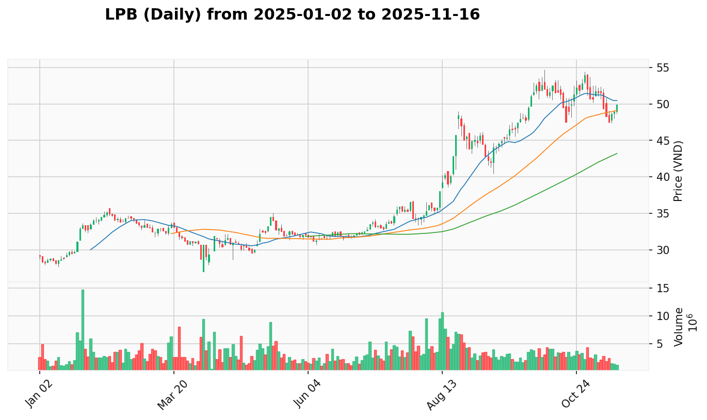
  - [View Report](REPORT.md#LPB)
  - **Phân Tích Cốt Lõi:** LPB xác nhận kịch bản tăng giá một cách hoàn hảo. Sau chuỗi tín hiệu cạn cung (**No Supply** ngày 11/06) và kiểm tra cung (**Test for Supply** ngày 13/06), cổ phiếu có phiên bùng nổ **SOS** ngày 17/06. Quan trọng nhất, phiên điều chỉnh ngày 18/06 đã được xác nhận là một nhịp kiểm tra cung thành công khi phiên 19/06 tiếp tục là một phiên **Effort to Rise** mạnh mẽ, giá tăng trên khối lượng gia tăng, cho thấy phe mua đã quay trở lại và hấp thụ hết lực bán.
  - **Vùng Tham Gia Tốt Nhất:**
      - **Vùng Mua:** `32.0 - 32.5`
      - **Dừng Lỗ:** Dưới `31.0`
      - **Chốt Lời:** `36.0 - 38.0`
  - **Lý Do Cho Vùng Tham Gia:** Vùng giá này là vùng kiểm tra lại đỉnh ngắn hạn vừa bị phá vỡ. Việc tham gia sau khi nhịp điều chỉnh đã được xác nhận là thành công mang lại một điểm vào có rủi ro thấp, với tiềm năng lợi nhuận cao khi xu hướng tăng được xác nhận.

---

### **Ưu tiên 3: DGC**

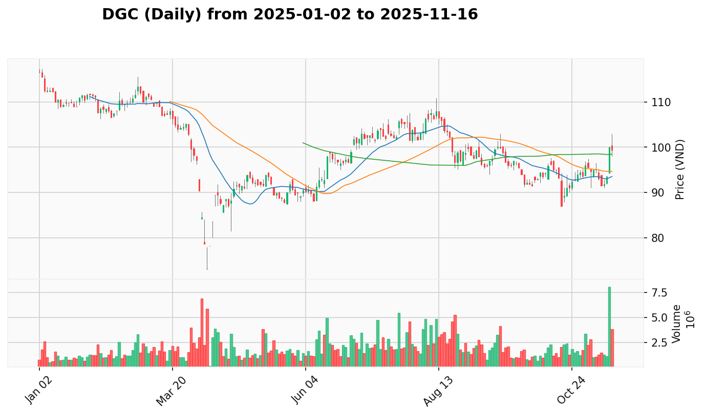
  - [View Report](REPORT.md#DGC)
  - **Phân Tích Cốt Lõi:** DGC đang cho thấy một thiết lập VPA gần như hoàn hảo. Sau phiên bùng nổ **Sign of Strength (SOS)** ngày 16/06, cổ phiếu đã có hai phiên điều chỉnh (17, 18/06) với khối lượng giảm dần, cho thấy đây là một nhịp kiểm tra cung lành mạnh. Phiên ngày 19/06 đã xác nhận điều này khi xuất hiện tín hiệu **No Supply**: giá đi ngang trong biên độ hẹp với khối lượng cạn kiệt (chỉ 1.73 triệu đơn vị, kiểm chứng trong `market_data.txt`). Điều này cho thấy áp lực bán đã hoàn toàn biến mất, tạo điều kiện lý tưởng cho một đợt tăng giá mới.
  - **Vùng Tham Gia Tốt Nhất:**
      - **Vùng Mua:** `96.5 - 98.0`
      - **Dừng Lỗ:** Dưới `95.0`
      - **Chốt Lời:** `108.0 - 112.0`
  - **Lý Do Cho Vùng Tham Gia:** Vùng giá này là vùng kiểm tra lại đỉnh ngắn hạn vừa bị phá vỡ. Việc tham gia sau khi tín hiệu "No Supply" xuất hiện xác nhận rằng lực bán đã cạn kiệt, mang lại điểm vào có rủi ro cực thấp ngay trước khi giá có thể tiếp tục xu hướng tăng.

---

### **Ưu tiên 4: CTG**

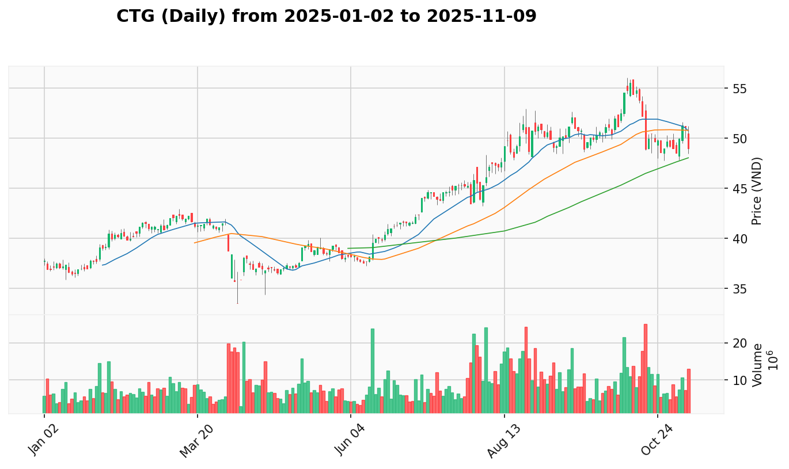
  - [View Report](REPORT.md#CTG)
  - **Phân Tích Cốt Lõi:** Sức mạnh của CTG tiếp tục được khẳng định. Sau phiên **SOS** bùng nổ ngày 13/06 và các phiên tích lũy sau đó, phiên 18/06 là một nhịp **Test for Supply** thành công với khối lượng giảm. Ngay sau đó, phiên 19/06 đã xác nhận sức mạnh trở lại với một tín hiệu **Effort to Rise** mạnh mẽ: giá tăng vọt lên 40.7 trên khối lượng tăng đột biến trở lại (10.13 triệu đơn vị). Chuỗi hành động này cho thấy lực cầu rất chủ động và sẵn sàng hấp thụ mọi lực bán.
  - **Vùng Tham Gia Tốt Nhất:**
      - **Vùng Mua:** `39.8 - 40.5`
      - **Dừng Lỗ:** Dưới `39.0`
      - **Chốt Lời:** `44.0 - 46.0`
  - **Lý Do Cho Vùng Tham Gia:** Vùng này là vùng hỗ trợ được tạo bởi đỉnh của các phiên giao dịch trước khi có phiên bùng nổ gần nhất. Tham gia tại đây cho phép mua vào ở một vùng giá an toàn, nơi lực cầu đã được chứng minh là rất mạnh.

---

### **Ưu tiên 5: GVR**

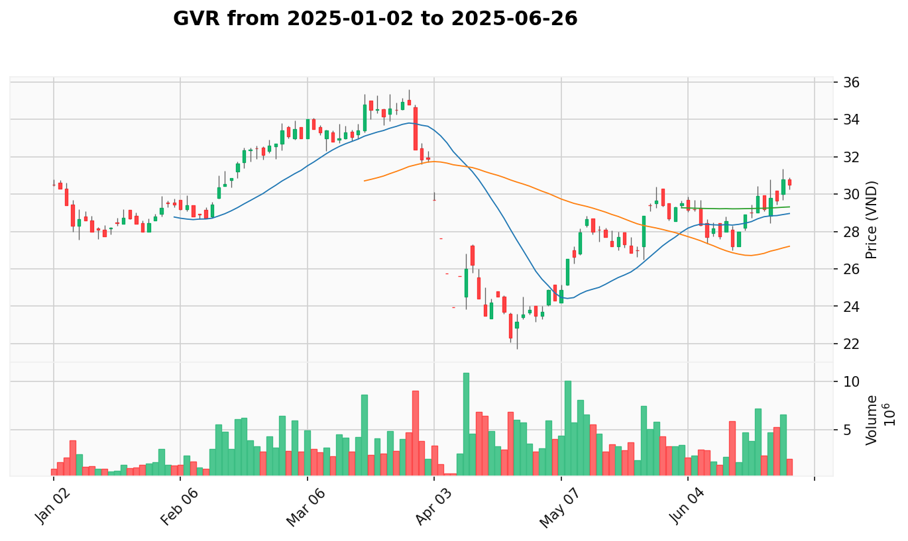
  - [View Report](REPORT.md#GVR)
  - **Phân Tích Cốt Lõi:** GVR đã hoàn thành xuất sắc mẫu hình **Shakeout (Rũ bỏ)**. Sau phiên rũ bỏ ngày 17/06 và phiên kiểm tra cung thành công ngày 18/06, phiên 19/06 là một phiên **Sign of Strength (SOS)** bùng nổ. Giá tăng vọt từ 29.0 lên 29.9 trên khối lượng đột biến (7.15 triệu đơn vị), xác nhận rằng toàn bộ lượng cung yếu đã bị loại bỏ và dòng tiền lớn đã hoàn toàn kiểm soát, sẵn sàng cho một xu hướng tăng mới.
  - **Vùng Tham Gia Tốt Nhất:**
      - **Vùng Mua:** `28.5 - 29.5`
      - **Dừng Lỗ:** Dưới `27.0`
      - **Chốt Lời:** `33.0 - 35.0`
  - **Lý Do Cho Vùng Tham Gia:** Tham gia sau một cú Shakeout được xác nhận bằng SOS là một chiến lược có xác suất thành công cao. Vùng mua đề xuất là vùng kiểm tra lại nền giá ngắn hạn vừa được xác lập, mang lại điểm vào tối ưu trước khi giá tiếp tục tăng.

---

### **Ưu tiên 6: BSR**

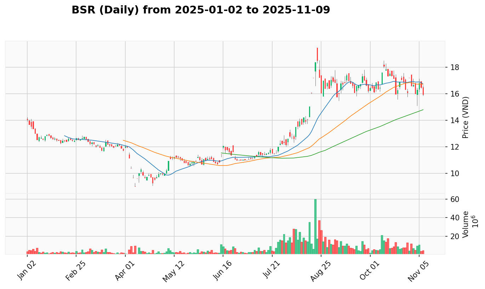
  - [View Report](REPORT.md#BSR)
  - **Phân Tích Cốt Lõi:** BSR tiếp tục củng cố sức mạnh. Sau hai phiên **SOS** bùng nổ (13/06, 16/06) và hai phiên **Test for Supply** thành công (17, 18/06), phiên 19/06 cho thấy một sự điều chỉnh nhẹ với khối lượng vẫn ở mức thấp. Việc giá giảm nhẹ nhưng không phá vỡ các mức hỗ trợ quan trọng trên nền khối lượng thấp tiếp tục cho thấy áp lực bán đã cạn kiệt và phe mua vẫn đang kiểm soát tình hình một cách chặt chẽ.
  - **Vùng Tham Gia Tốt Nhất:**
      - **Vùng Mua:** `18.5 - 19.0`
      - **Dừng Lỗ:** Dưới `18.0`
      - **Chốt Lời:** `21.5 - 23.0`
  - **Lý Do Cho Vùng Tham Gia:** Vùng giá này tương ứng với giá đóng cửa của phiên bùng nổ SOS đầu tiên, là một vùng hỗ trợ tin cậy. Việc tham gia sau khi cổ phiếu đã có nhiều phiên kiểm tra cung thành công mang lại một điểm vào an toàn với rủi ro thấp.

---

### **Ưu tiên 7: DPM**

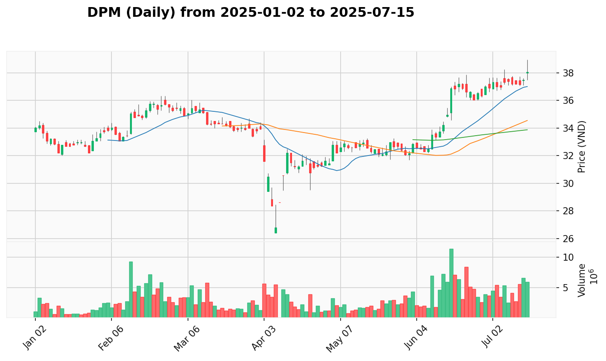
  - [View Report](REPORT.md#DPM)
  - **Phân Tích Cốt Lõi:** DPM duy trì đà tăng giá mạnh mẽ. Sau phiên **SOS** bùng nổ ngày 17/06 và phiên kiểm tra cung thành công ngày 18/06, phiên 19/06 là một phiên tăng giá nhẹ, cho thấy sự do dự ngắn hạn nhưng xu hướng chính vẫn không thay đổi. Đối chiếu dữ liệu `market_data.txt`, khối lượng trong các phiên điều chỉnh vẫn thấp hơn đáng kể so với phiên bùng nổ, xác nhận lực mua vẫn đang chiếm ưu thế.
  - **Vùng Tham Gia Tốt Nhất:**
      - **Vùng Mua:** `37.8 - 38.5`
      - **Dừng Lỗ:** Dưới `36.5`
      - **Chốt Lời:** `42.0 - 44.0`
  - **Lý Do Cho Vùng Tham Gia:** Đây là vùng giá kiểm tra lại ngưỡng kháng cự gần nhất vừa bị phá vỡ. Tham gia khi giá điều chỉnh nhẹ về vùng hỗ trợ mới này cung cấp một điểm vào an toàn trong một xu hướng tăng đã được xác nhận.

---

### **Ưu tiên 8: FPT**

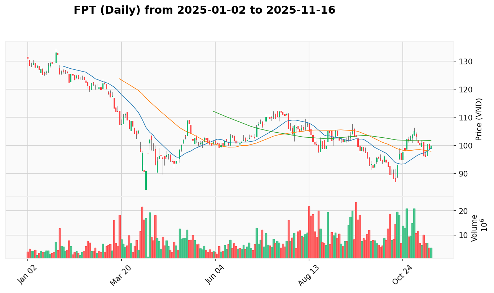
  - [View Report](REPORT.md#FPT)
  - **Phân Tích Cốt Lõi:** FPT đang trong một nhịp điều chỉnh sau khi thiết lập đỉnh cao mới. Tín hiệu **Sign of Strength (SOS)** ngày 16/06 rất mạnh mẽ, nhưng ngay sau đó là hai phiên **Effort to Fall** (18, 19/06) khi giá giảm trên khối lượng gia tăng. Điều này cho thấy áp lực bán chốt lời tại vùng đỉnh là có thật và đáng kể. Tuy nhiên, xu hướng tăng trung hạn vẫn chưa bị vi phạm. Cần quan sát thêm dấu hiệu cạn kiệt của lực bán (ví dụ: một phiên No Supply) trước khi cân nhắc tham gia.
  - **Vùng Tham Gia Tốt Nhất:**
      - **Vùng Mua:** `114.5 - 116.0` (Chờ đợi tín hiệu xác nhận)
      - **Dừng Lỗ:** Dưới `113.0`
      - **Chốt Lời:** `128.0 - 135.0`
  - **Lý Do Cho Vùng Tham Gia:** Vùng này là vùng hỗ trợ mạnh được tạo bởi các đỉnh cũ. Tham gia chỉ khi có tín hiệu xác nhận lực bán đã yếu đi, chẳng hạn như một phiên giá đi ngang hoặc tăng nhẹ trên khối lượng cạn kiệt, để giảm thiểu rủi ro bắt dao rơi.

---

### **Ưu tiên 9: VND**

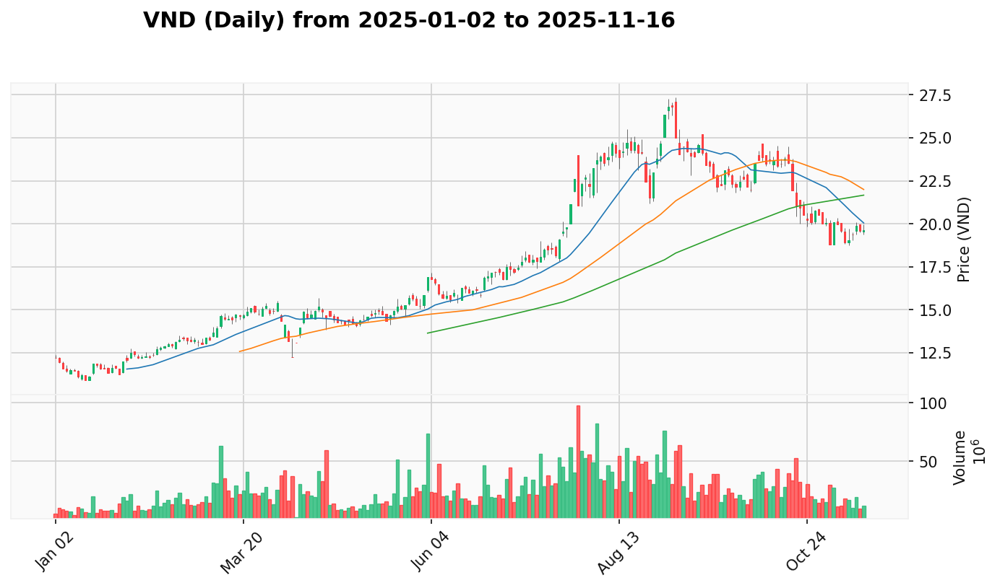
  - [View Report](REPORT.md#VND)
  - **Phân Tích Cốt Lõi:** VND đang trong giai đoạn kiểm tra lại sau cú **Shakeout (Rũ bỏ)** kinh điển. Phiên phục hồi mạnh mẽ ngày 16/06 đã xác nhận lực cầu thông minh. Tuy nhiên, hai phiên giảm điểm sau đó (18, 19/06) là các nỗ lực kiểm tra cung (**Test for Supply**) khá mạnh. Mặc dù khối lượng các phiên giảm này thấp hơn phiên SOW ban đầu, chúng cho thấy áp lực bán vẫn còn và phe mua cần thêm nỗ lực để hấp thụ hoàn toàn trước khi có thể tiếp tục đà tăng.
  - **Vùng Tham Gia Tốt Nhất:**
      - **Vùng Mua:** `16.0 - 16.5`
      - **Dừng Lỗ:** Dưới `15.9`
      - **Chốt Lời:** `18.5 - 19.5`
  - **Lý Do Cho Vùng Tham Gia:** Vùng này nằm ngay trên mức giá thấp của phiên SOW, hiện đã trở thành một vùng hỗ trợ tâm lý và kỹ thuật quan trọng. Tham gia khi giá điều chỉnh về đây và có dấu hiệu cạn cung (khối lượng thấp) sẽ là một chiến lược hợp lý.

---

### **Ưu tiên 10: PNJ**

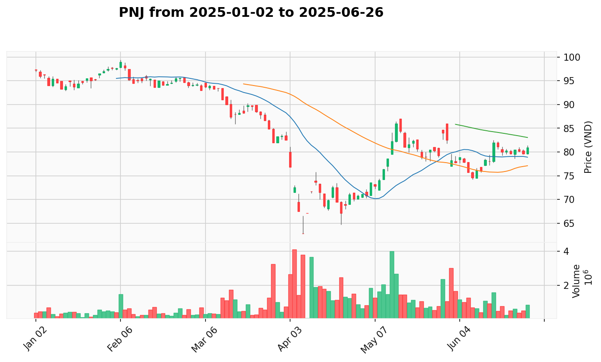
  - [View Report](REPORT.md#PNJ)
  - **Phân Tích Cốt Lõi:** PNJ đang cho thấy các dấu hiệu tích cực của việc cạn kiệt nguồn cung. Sau phiên **SOS** ngày 16/06, cổ phiếu đã có một chuỗi ba phiên **Test for Supply** (17, 18, 19/06). Đặc biệt, phiên 19/06 cho thấy giá tăng nhẹ trên khối lượng cực thấp (chỉ 245k đơn vị), xác nhận tín hiệu **No Demand** nhưng cũng ngụ ý lực bán đã không còn đáng kể. Kịch bản này tạo ra một thiết lập có rủi ro thấp, chờ đợi một lực cầu đủ mạnh để bứt phá.
  - **Vùng Tham Gia Tốt Nhất:**
      - **Vùng Mua:** `79.5 - 81.0`
      - **Dừng Lỗ:** Dưới `79.0`
      - **Chốt Lời:** `88.0 - 92.0`
  - **Lý Do Cho Vùng Tham Gia:** Tham gia sau một chuỗi các phiên kiểm tra cung thành công, đặc biệt là khi khối lượng đã cạn kiệt, mang lại một điểm mua an toàn. Nó cho thấy phe bán đã yếu và chỉ cần một lực mua nhỏ cũng có thể đẩy giá lên.

---

### **Ưu tiên 11: MWG**

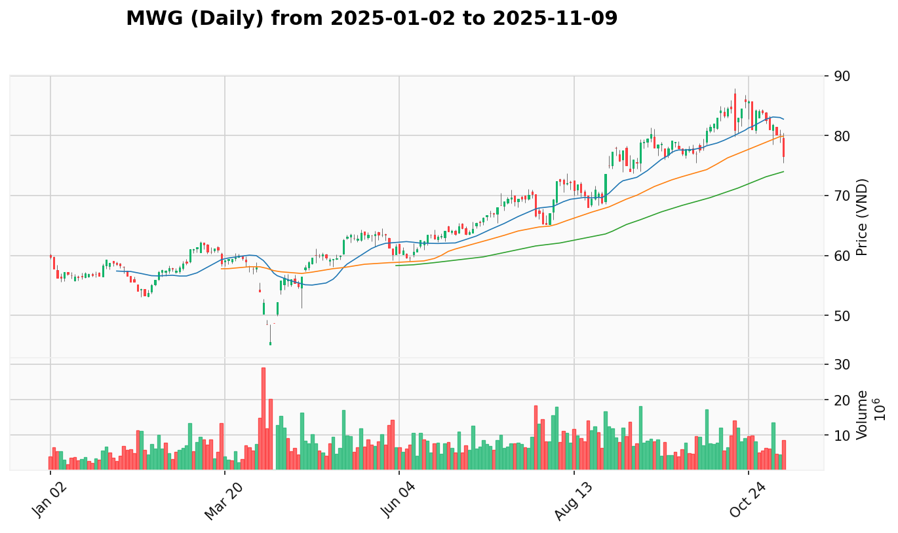
  - [View Report](REPORT.md#MWG)
  - **Phân Tích Cốt Lõi:** Tương tự FPT, MWG đang trong một nhịp điều chỉnh sau khi có các tín hiệu sức mạnh. Chuỗi tín hiệu **Shakeout** (02/06) và **SOS** (16/06) là rất tích cực. Tuy nhiên, hai phiên 18 và 19/06 đều là các phiên **Effort to Fall** khi giá giảm trên khối lượng có xu hướng tăng, cho thấy áp lực bán đang gia tăng tại vùng giá cao. Điều này làm tăng rủi ro trong ngắn hạn và cần có sự xác nhận của lực cầu quay trở lại.
  - **Vùng Tham Gia Tốt Nhất:**
      - **Vùng Mua:** `62.5 - 63.5` (Chờ đợi tín hiệu xác nhận)
      - **Dừng Lỗ:** Dưới `61.5`
      - **Chốt Lời:** `69.0 - 71.0`
  - **Lý Do Cho Vùng Tham Gia:** Vùng giá này là vùng kiểm tra lại đỉnh ngắn hạn vừa bị phá vỡ. Tuy nhiên, chỉ nên tham gia khi có tín hiệu lực bán suy yếu (ví dụ một phiên giảm với khối lượng thấp, hoặc một nến rút chân mạnh mẽ) để tránh rủi ro từ các phiên "Effort to Fall" gần đây.

---

**4. Nhật Ký Thay Đổi Kế Hoạch**

*Phần này ghi lại những thay đổi và lý do so với kế hoạch ngày 2025-06-18.*

  - **Cổ Phiếu Mới Thêm Vào:**
      - Không có cổ phiếu nào được thêm mới trong bản cập nhật này.
  - **Cổ Phiếu Bị Loại Bỏ:**
      - Không có cổ phiếu nào bị loại bỏ.
  - **Thay Đổi Thứ Tự Ưu Tiên:**
      - **Tăng ưu tiên TCB (từ \#3 lên \#1):** TCB thể hiện sức mạnh vượt trội với phiên **SOS** bùng nổ ngày 19/06. Tín hiệu này cực kỳ thuyết phục, xác nhận lực cầu áp đảo và đưa TCB trở thành cơ hội hấp dẫn nhất tại thời điểm hiện tại.
      - **Giảm ưu tiên LPB (từ \#1 xuống \#2):** Mặc dù LPB vẫn rất mạnh và xác nhận kịch bản tăng giá, nhưng phiên SOS của TCB trong ngày 19/06 có phần ấn tượng và dứt khoát hơn, do đó TCB được nâng lên vị trí ưu tiên cao hơn.
      - **Tăng ưu tiên GVR (từ \#6 lên \#5):** GVR đã hoàn thành mẫu hình **Shakeout** một cách hoàn hảo với phiên **SOS** xác nhận vào ngày 19/06. Tín hiệu này rất rõ ràng và có độ tin cậy cao, cho thấy tiềm năng tăng giá lớn.
      - **Giảm ưu tiên VND (từ \#4 xuống \#9):** VND vẫn đang trong giai đoạn kiểm tra cung sau cú Shakeout. Các phiên giảm điểm gần đây cho thấy áp lực bán vẫn còn, làm giảm mức độ ưu tiên so với các cổ phiếu đã xác nhận sức mạnh trở lại như TCB, GVR.
  - **Cập Nhật Quan Trọng Khác:**
      - Phân tích cốt lõi của tất cả các cổ phiếu đã được cập nhật với dữ liệu và tín hiệu VPA từ phiên giao dịch ngày 19/06.
      - Các tín hiệu mới quan trọng đã được ghi nhận: **SOS** ở TCB và GVR, **Effort to Rise** ở CTG và LPB, **No Supply** ở DGC, và **Effort to Fall** tiếp diễn ở FPT và MWG.
      - Các vùng tham gia và điểm dừng lỗ/chốt lời đã được điều chỉnh nhẹ ở một số cổ phiếu để phản ánh các vùng hỗ trợ/kháng cự mới được hình thành sau các phiên giao dịch gần đây.