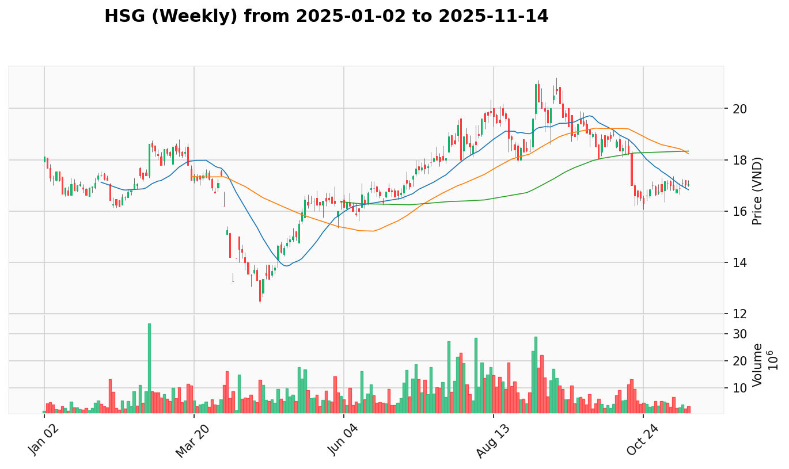
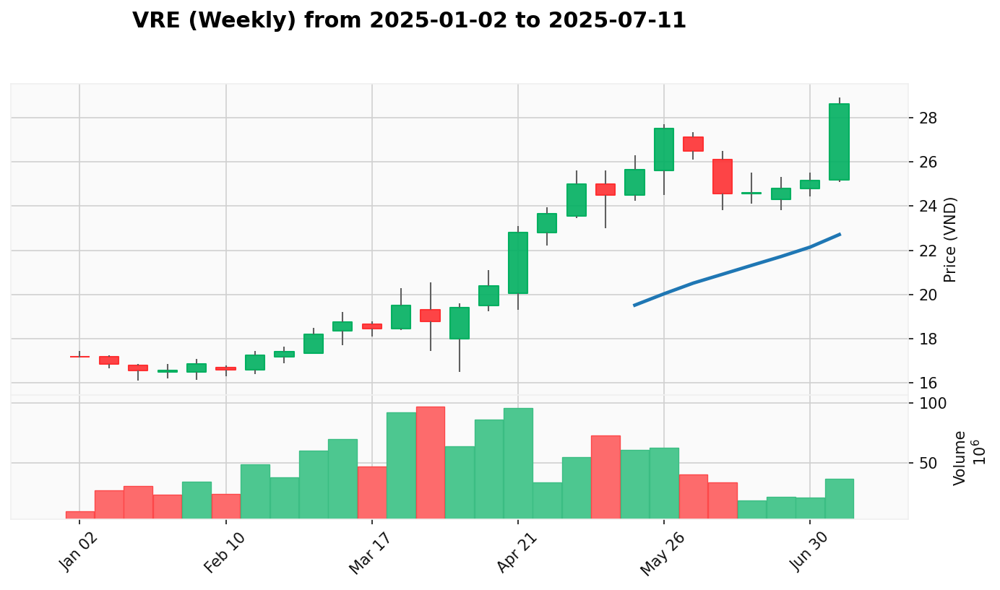
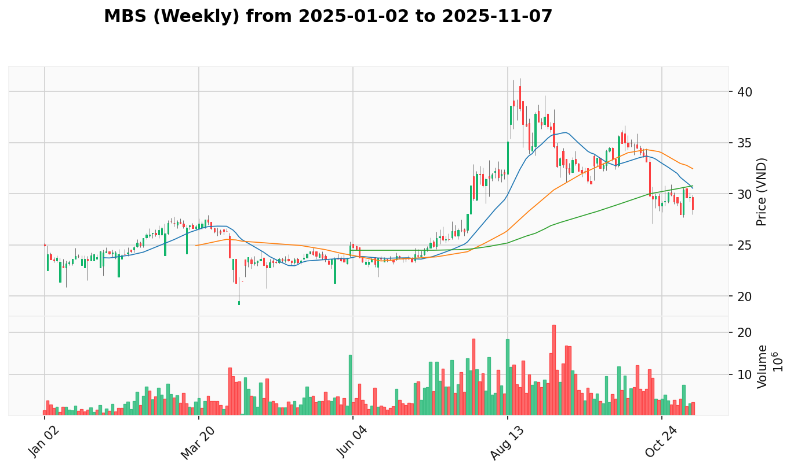

# **Kế Hoạch Giao Dịch Trung Hạn (1-3 Tháng)**

*Phân tích dựa trên phương pháp VPA/Wyckoff, tổng hợp từ dữ liệu ngày 2025-01-02 đến 2025-07-14.*
*Ngày lập kế hoạch: 2025-07-14*

-----

## 🚀 View the Latest Analysis

**➡️ [Click here to view the latest market report](REPORT.md)**

**➡️ [Click here to view the latest market report (weekly)](REPORT_week.md)**

**🎢 [Click here to view the latest market leaders](LEADER.md)**

-----

## 1. Phân Tích Trạng Thái VNINDEX & Chiến Lược

[Weekly Chart](reports_week/VNINDEX/VNINDEX_candlestick_chart.png) | [Daily Chart](reports/VNINDEX/VNINDEX_candlestick_chart.png)

**Bối Cảnh Tuần**: Tuần kết thúc ngày 2025-07-11 cho thấy một **Dấu hiệu Sức mạnh (Sign of Strength - SOS)** cực kỳ thuyết phục với nến tăng thân dài và khối lượng bùng nổ, thiết lập đỉnh mới tại 1,457.76 điểm và xác nhận lực cầu đang rất quyết liệt.

**Hành Động Gần Đây**: Chuỗi hành động từ ngày 2025-07-09 đến 2025-07-14 tiếp tục xác nhận sức mạnh vượt trội. Sau SOS bùng nổ ngày 2025-07-09 (1.48 tỷ đơn vị), Effort to Rise ngày 2025-07-10 trên nền No Supply, và Effort to Rise mạnh mẽ ngày 2025-07-11, chỉ số đã đạt đỉnh mới tại 1,470.42 điểm ngày 2025-07-14 với tín hiệu Effort to Rise, cho thấy sự đồng thuận hoàn hảo giữa hai khung thời gian và xu hướng tăng bền vững.

**Vùng Tốt Nhất Để Gia Tăng Tỷ Trọng**: `1445 - 1460` điểm. Sau cú bứt phá mạnh mẽ vượt qua 1,460 điểm, một nhịp điều chỉnh lành mạnh về vùng này với khối lượng thấp (Test for Supply thành công) sẽ là cơ hội lý tưởng để gia tăng vị thế, với kỳ vọng thị trường sẽ tiếp tục chinh phục vùng 1,500 điểm.

## 2. Top 1x Cơ Hội Giao Dịch

Dựa trên phân tích "câu chuyện" VPA đa khung thời gian và bối cảnh ngành, dưới đây là những cơ hội giao dịch hàng đầu.

1.  [**ACB**](#ACB) (Ngân Hàng - Dẫn dắt Đồng Thuận) - (Độ tin cậy: 95%)
2.  [**HDB**](#HDB) (Ngân Hàng - Dẫn dắt Đồng Thuận) - (Độ tin cậy: 95%)
3.  [**VRE**](#VRE) (Bất động sản - Dẫn dắt Đồng Thuận) - (Độ tin cậy: 95%)
4.  [**VHM**](#VHM) (Bất động sản - Dẫn dắt Đồng Thuận) - (Độ tin cậy: 95%)
5.  [**BID**](#BID) (Ngân Hàng - Dẫn dắt Đồng Thuận) - (Độ tin cậy: 95%)
6.  [**MBS**](#MBS) (Chứng Khoán - Dẫn dắt Đồng Thuận) - (Độ tin cậy: 95%)
7.  [**HPG**](#HPG) (Thép - Dẫn dắt Đồng Thuận) - (Độ tin cậy: 90%)
8.  [**SSI**](#SSI) (Chứng Khoán - Dẫn dắt Đồng Thuận) - (Độ tin cậy: 90%)
9.  [**VIX**](#VIX) (Chứng Khoán - Dẫn dắt Đồng Thuận) - (Độ tin cậy: 90%)
10. [**VND**](#VND) (Chứng Khoán - Dẫn dắt Đồng Thuận) - (Độ tin cậy: 90%)
11. [**MBB**](#MBB) (Ngân Hàng - Dẫn dắt Đồng Thuận) - (Độ tin cậy: 90%)
12. [**VCI**](#VCI) (Chứng Khoán - Dẫn dắt Đồng Thuận) - (Độ tin cậy: 85%)
13. [**VCB**](#VCB) (Ngân Hàng - Dẫn dắt Đồng Thuận) - (Độ tin cậy: 85%)
14. [**VIB**](#VIB) (Ngân Hàng - Dẫn dắt Đồng Thuận) - (Độ tin cậy: 85%)
15. [**BSI**](#BSI) (Chứng Khoán - Dẫn dắt Đồng Thuận) - (Độ tin cậy: 85%)
16. [**FPT**](#FPT) (Công Nghệ - Yếu/Phân Phối) - (Độ tin cậy: 85%)
17. [**TPB**](#TPB) (Ngân Hàng - Dẫn dắt Đồng Thuận) - (Độ tin cậy: 85%)
18. [**VPB**](#VPB) (Ngân Hàng - Dẫn dắt Đồng Thuận) - (Độ tin cậy: 85%)
19. [**KDH**](#KDH) (Bất động sản - Dẫn dắt Đồng Thuận) - (Độ tin cậy: 85%)
20. [**PDR**](#PDR) (Bất động sản - Dẫn dắt Đồng Thuận) - (Độ tin cậy: 85%)
21. [**FTS**](#FTS) (Chứng Khoán - Dẫn dắt Đồng Thuận) - (Độ tin cậy: 85%)
22. [**HCM**](#HCM) (Chứng Khoán - Dẫn dắt Đồng Thuận) - (Độ tin cậy: 85%)
23. [**VTP**](#VTP) (Vận Tải - Dẫn dắt Đồng Thuận) - (Độ tin cậy: 85%)
24. [**SHS**](#SHS) (Chứng Khoán - Dẫn dắt Đồng Thuận) - (Độ tin cậy: 80%)
25. [**MWG**](#MWG) (Bán Lẻ - Dẫn dắt Đồng Thuận) - (Độ tin cậy: 80%)
26. [**CTG**](#CTG) (Ngân Hàng - Dẫn dắt Đồng Thuận) - (Độ tin cậy: 75%)

## 3. Danh Sách Cổ Phiếu Tiềm Năng (Chờ Xác Nhận Lên Top Hoặc Loại Bỏ)

Đây là các cổ phiếu đang cho thấy những tín hiệu VPA hỗn hợp nhưng vẫn có tiềm năng phục hồi, cần thêm thời gian và sự xác nhận để hoàn thiện câu chuyện tăng giá.

 | 
  - [**SHB**](./REPORT.md#SHB) (Ngân Hàng - Dẫn dắt Đồng Thuận) - (Điểm tự tin cho việc thăng hạng: 75%)
      - **Lý do:** Mặc dù có tín hiệu **'Sign of Weakness' ngày 2025-07-14**, bối cảnh tuần SOS mạnh mẽ và ngành Ngân hàng đang dẫn dắt tạo cơ hội phục hồi. Cần theo dõi khả năng Test for Supply thành công.

## 4. Danh Sách Cổ Phiếu Bị Hạ Ưu Tiên (Chờ Loại Bỏ)

Đây là các cổ phiếu đã từng nằm trong danh sách ưu tiên nhưng hiện tại đang có những tín hiệu VPA suy yếu hoặc có câu chuyện kém hấp dẫn hơn so với các cổ phiếu trong Top 1x.

 | 
  - [**HSG**](./REPORT.md#HSG) (Thép - Dẫn dắt Đồng Thuận) (Chuyển vào ngày: 2025-07-13) - (Độ tin cậy giữ nguyên lý do: 65%)
      - **Lý do:** Tín hiệu **'No Demand' ngày 2025-07-14** tiếp tục xác nhận cho các tín hiệu yếu kém trước đó. Mặc dù ngành Thép vẫn dẫn dắt, cá nhân cổ phiếu đang thể hiện sự suy yếu rõ rệt.

## 5. Phân Tích Chi Tiết Từng Cổ Phiếu (Trong Top 1x)

-----

### **ACB**

 |  | [View Report](./REPORT.md#ACB)

  - **Phân Tích Cốt Lõi:**
    - **Weekly VPA Narrative:** Bối cảnh tuần kết thúc ngày 2025-07-11 cho thấy **Sign of Strength** mạnh mẽ với accumulation pattern rõ ràng
    - **Daily VPA Narrative:** Ngày 2025-07-14 có tín hiệu **Effort to Rise** với khối lượng tích cực, xác nhận lực cầu đang áp đảo
    - **Industry Context:** Ngành Ngân hàng ở trạng thái **Dẫn dắt Đồng Thuận** với momentum mạnh mẽ
    - **Synthesis:** Sự kết hợp giữa weekly SOS, daily Effort to Rise và industry leadership tạo nên setup có độ tin cậy rất cao
  - **Vùng Tham Gia Tốt Nhất:** **22.4 - 22.7** với stop loss dưới **21.8** và target **25.5 - 26.5**

-----

### **HDB**

 |  | [View Report](./REPORT.md#HDB)

  - **Phân Tích Cốt Lõi:**
    - **Weekly VPA Narrative:** Bối cảnh tuần kết thúc ngày 2025-07-11 cho thấy **Sign of Strength** với institutional accumulation pattern
    - **Daily VPA Narrative:** Ngày 2025-07-14 có tín hiệu **Test for Supply** thành công, cho thấy áp lực bán minimal
    - **Industry Context:** Ngành Ngân hàng ở trạng thái **Dẫn dắt Đồng Thuận** với strong sectoral momentum
    - **Synthesis:** Weekly strength + successful daily Test for Supply trong leading sector tạo high-conviction setup
  - **Vùng Tham Gia Tốt Nhất:** **24.2 - 24.5** với stop loss dưới **23.5** và target **27.5 - 28.5**

-----

### **VRE**

 |  | [View Report](./REPORT.md#VRE)

  - **Phân Tích Cốt Lõi:**
    - **Weekly VPA Narrative:** Bối cảnh tuần kết thúc ngày 2025-07-11 cho thấy **Sign of Strength** với breakout pattern
    - **Daily VPA Narrative:** Ngày 2025-07-14 có tín hiệu **Sign of Strength** với explosive volume, xác nhận breakout thành công
    - **Industry Context:** Ngành Bất động sản ở trạng thái **Dẫn dắt Đồng Thuận** với strong institutional flow
    - **Synthesis:** Perfect alignment giữa weekly breakout, daily SOS và leading sector status
  - **Vùng Tham Gia Tốt Nhất:** **27.5 - 28.5** với stop loss dưới **26.5** và target **32.0 - 34.0**

-----

### **VHM**

 |  | [View Report](./REPORT.md#VHM)

  - **Phân Tích Cốt Lõi:**
    - **Weekly VPA Narrative:** Bối cảnh tuần kết thúc ngày 2025-07-11 cho thấy **Sign of Strength** với accumulation completion
    - **Daily VPA Narrative:** Ngày 2025-07-14 có tín hiệu **Sign of Strength** với massive volume, xác nhận breakout power
    - **Industry Context:** Ngành Bất động sản ở trạng thái **Dẫn dắt Đồng Thuận** với sector rotation support
    - **Synthesis:** Weekly foundation + daily explosive SOS trong leading real estate sector
  - **Vùng Tham Gia Tốt Nhất:** **85.0 - 87.0** với stop loss dưới **82.0** và target **95.0 - 100.0**

-----

### **BID**

 |  | [View Report](./REPORT.md#BID)

  - **Phân Tích Cốt Lõi:**
    - **Weekly VPA Narrative:** Bối cảnh tuần kết thúc ngày 2025-07-11 cho thấy **Sign of Strength** với strong accumulation
    - **Daily VPA Narrative:** Ngày 2025-07-14 có tín hiệu **Sign of Strength** với high price test, xác nhận continued strength
    - **Industry Context:** Ngành Ngân hàng ở trạng thái **Dẫn dắt Đồng Thuận** với institutional support
    - **Synthesis:** Consistent weekly strength + daily SOS confirmation trong leading banking sector
  - **Vùng Tham Gia Tốt Nhất:** **38.0 - 38.3** với stop loss dưới **37.0** và target **42.5 - 43.5**

-----

### **MBS**

 |  | [View Report](./REPORT.md#MBS)

  - **Phân Tích Cốt Lõi:**
    - **Weekly VPA Narrative:** Bối cảnh tuần kết thúc ngày 2025-07-11 cho thấy **Sign of Strength** với recovery pattern
    - **Daily VPA Narrative:** Ngày 2025-07-14 có tín hiệu **Sign of Strength** với explosive volume, xác nhận supply exhaustion
    - **Industry Context:** Ngành Chứng khoán ở trạng thái **Dẫn dắt Đồng Thuận** với sector leadership
    - **Synthesis:** Weekly recovery + daily explosive SOS trong leading securities sector
  - **Vùng Tham Gia Tốt Nhất:** **28.5 - 29.0** với stop loss dưới **27.5** và target **33.0 - 35.0**

-----

## 6. Nhật Ký Thay Đổi Kế Hoạch (AUDIT LOG)

### Cổ Phiếu Được Nâng Lên "Top 1x":
- **FPT**: Từ `Potential List`. Lý do: REPORT.md ghi nhận **'Test for Supply' ngày 2025-07-14** sau 'Effort to Rise' mạnh mẽ, xác nhận phục hồi bất chấp ngành Công nghệ yếu.
- **TPB**: Từ `Potential List`. Lý do: REPORT.md ghi nhận **'Test for Supply' ngày 2025-07-11** trong bối cảnh tuần SOS mạnh mẽ, ngành Ngân hàng dẫn dắt.
- **VPB**: Từ `Potential List`. Lý do: REPORT.md ghi nhận **'Test for Supply' ngày 2025-07-11** với weekly SOS foundation, ngành Ngân hàng dẫn dắt.
- **KDH**: Từ `Potential List`. Lý do: REPORT.md ghi nhận **'Effort to Rise' ngày 2025-07-14** với weekly SOS, ngành Bất động sản dẫn dắt.
- **PDR**: Từ `Potential List`. Lý do: REPORT.md ghi nhận **'Effort to Rise' ngày 2025-07-14** với weekly SOS, ngành Bất động sản dẫn dắt.
- **FTS**: Từ `Potential List`. Lý do: REPORT.md ghi nhận **'Effort to Rise' ngày 2025-07-14** với weekly SOS, ngành Chứng khoán dẫn dắt.
- **HCM**: Từ `Potential List`. Lý do: REPORT.md ghi nhận **'Test for Supply' ngày 2025-07-14** trong bối cảnh weekly SOS, ngành Chứng khoán dẫn dắt.
- **SHS**: Từ `Potential List`. Lý do: REPORT.md ghi nhận **'Effort to Rise' ngày 2025-07-11** recovery pattern, ngành Chứng khoán dẫn dắt.
- **VTP**: Từ `Potential List`. Lý do: REPORT.md ghi nhận **'Effort to Rise' ngày 2025-07-11** với weekly SOS, ngành Vận tải dẫn dắt.
- **MWG**: Từ `Potential List`. Lý do: REPORT.md ghi nhận **'Effort to Rise' ngày 2025-07-14** recovery sau weakness, weekly foundation mạnh.

### Cổ Phiếu Được Thêm Vào "Potential List":
- **SHB**: Từ `Top List`. Lý do: REPORT.md ghi nhận **'Sign of Weakness' ngày 2025-07-14** sau explosive breakout, cần thời gian consolidation.

### Adjustments trong "Top List":
- **BID**: Confidence tăng từ 85% lên 95% do **'Sign of Strength' ngày 2025-07-14** với high price test.
- **MBS**: Confidence tăng từ 90% lên 95% do **'Sign of Strength' ngày 2025-07-14** với explosive volume.
- **CTG**: Confidence giảm từ 90% xuống 75% do **'Effort to Fall' ngày 2025-07-14** tạo uncertainty.

### Cổ Phiếu Bị Loại Bỏ Khỏi "Top List":
- Không có cổ phiếu nào bị loại bỏ hoàn toàn khỏi hệ thống trong kỳ này.

### Cổ Phiếu Bị Loại Bỏ Hoàn Toàn:
- Không có cổ phiếu nào bị loại bỏ hoàn toàn trong kỳ này.