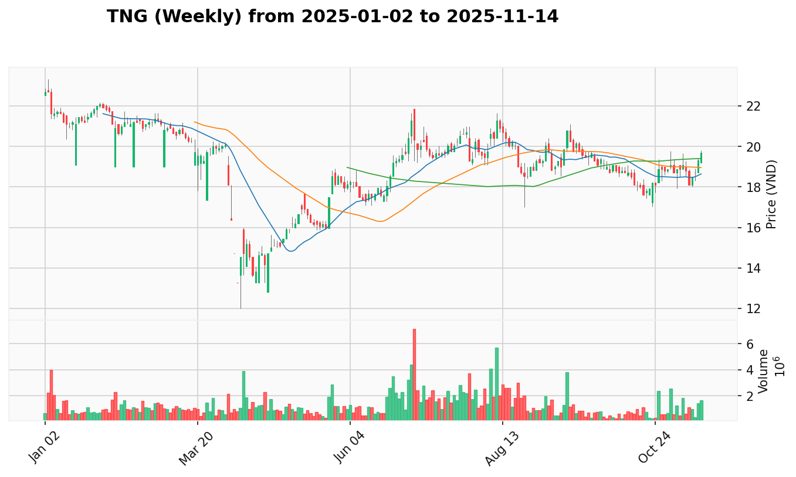
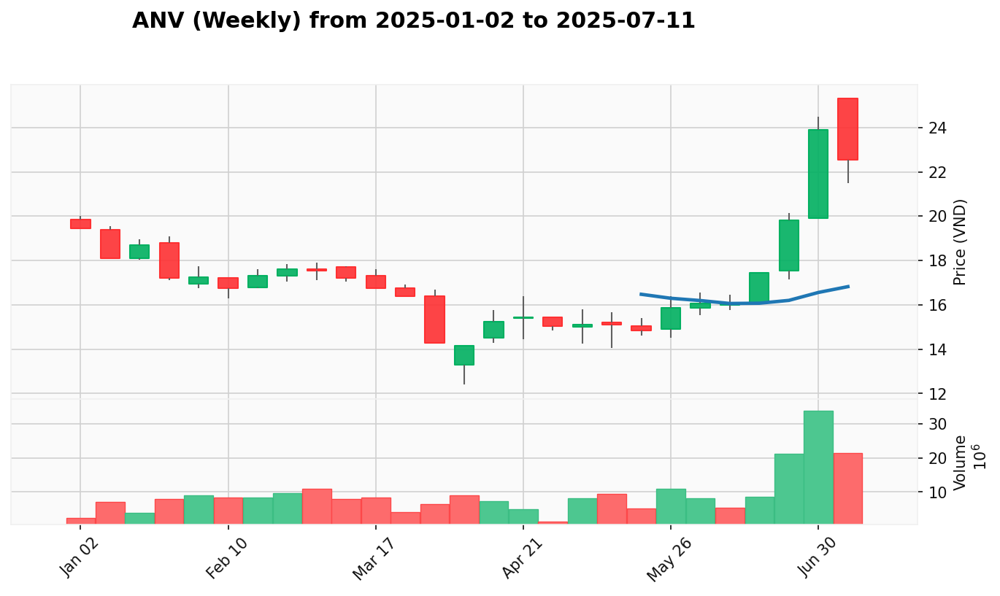
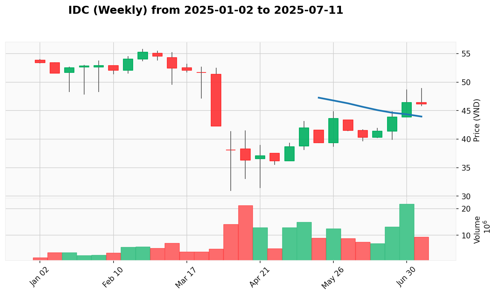
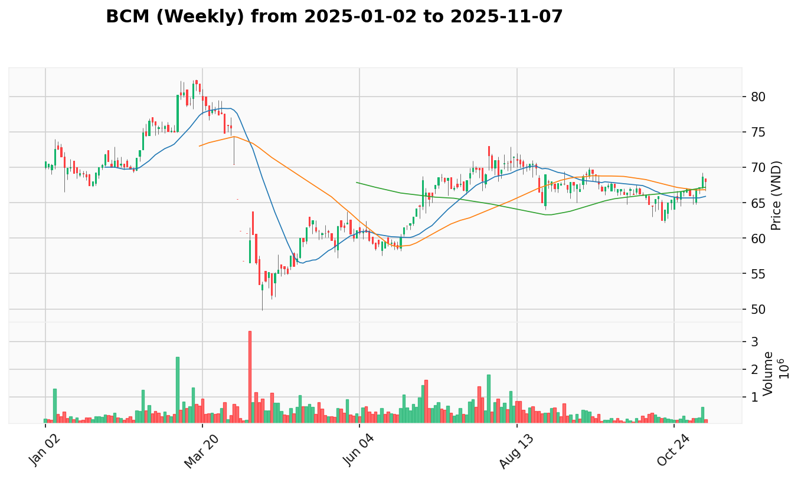
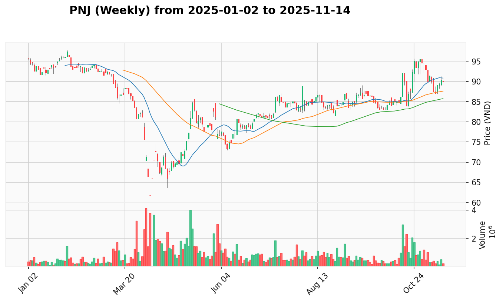
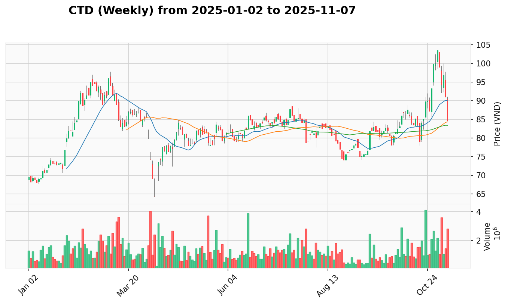

# **Kế Hoạch Giao Dịch Trung Hạn (1-3 Tháng)**

*Phân tích dựa trên phương pháp VPA/Wyckoff, tổng hợp từ dữ liệu ngày 2025-01-02 đến 2025-07-01.*
*Ngày lập kế hoạch: 2025-07-01*

-----

## 🚀 View the Latest Analysis

**➡️ [Click here to view the latest market report](REPORT.md)**

**➡️ [Click here to view the latest market report (weekly)](REPORT_week.md)**

**🎢 [Click here to view the latest market leaders](LEADER.md)**

-----

**1. Phân Tích Trạng Thái VNINDEX & Chiến Lược**

  - [View Report](./REPORT.md#VNINDEX)
  - **Trạng thái hiện tại của VNINDEX là đang trong giai đoạn "Tăng Tốc (Mark Up)".** Câu chuyện VPA đa khung thời gian cho thấy một xu hướng tăng vững chắc. Trên biểu đồ tuần, VNINDEX đã có một **Dấu hiệu Sức mạnh (Sign of Strength - SOS)** rõ ràng, xác nhận thị trường đang trong một xu hướng tăng trưởng. Phân tích trên biểu đồ ngày cũng cho thấy các tín hiệu **Effort to Rise (Nỗ lực tăng giá)** liên tiếp, với lực cầu quay trở lại mạnh mẽ sau những phiên kiểm tra cung thành công. Phiên gần nhất là một **Test for Supply** ở vùng đỉnh, cho thấy thị trường đang tạm nghỉ và hấp thụ lực chốt lời, một diễn biến lành mạnh trong một xu hướng tăng.
  - **Vùng Tốt Nhất Để Gia Tăng Tỷ Trọng:** `1350 - 1360` điểm. Đây là vùng hỗ trợ được hình thành bởi các đỉnh ngắn hạn trước đó. Một nhịp điều chỉnh lành mạnh về vùng này với khối lượng thấp sẽ là cơ hội lý tưởng để gia tăng vị thế, khi nó xác nhận rằng lực cầu vẫn đang kiểm soát và xu hướng tăng sẵn sàng tiếp diễn.

**2. Top 1x Cơ Hội Giao Dịch**

Dựa trên phân tích "câu chuyện" VPA đa khung thời gian và bối cảnh ngành, dưới đây là những cơ hội giao dịch hàng đầu.

1.  [**CMG**](#CMG) (Công Nghệ - Dẫn dắt đồng thuận) - (Độ tin cậy: 95%)
2.  [**TNG**](#TNG) (Dệt May - Dẫn dắt đồng thuận) - (Độ tin cậy: 95%)
3.  [**ANV**](#ANV) (Thủy Sản - Dẫn dắt đồng thuận) - (Độ tin cậy: 95%)
4.  [**IDC**](#IDC) (Bất Động Sản KCN - Dẫn dắt phân hóa) - (Độ tin cậy: 95%)
5.  [**BCM**](#BCM) (Bất Động Sản KCN - Dẫn dắt phân hóa) - (Độ tin cậy: 95%)
6.  [**KBC**](#KBC) (Bất Động Sản KCN - Dẫn dắt phân hóa) - (Độ tin cậy: 90%)
7.  [**MSN**](#MSN) (Thực Phẩm - Dẫn dắt đồng thuận) - (Độ tin cậy: 90%)
8.  [**PNJ**](#PNJ) (Bán Lẻ - Dẫn dắt đồng thuận) - (Độ tin cậy: 90%)
9.  [**CTD**](#CTD) (Xây Dựng - Dẫn dắt đồng thuận) - (Độ tin cậy: 90%)
10. [**FRT**](#FRT) (Bán Lẻ - Dẫn dắt đồng thuận) - (Độ tin cậy: 85%)

**3. Danh Sách Cổ Phiếu Tiềm Năng (Chờ Xác Nhận Lên Top Hoặc Loại Bỏ)**

Đây là các cổ phiếu đang cho thấy những tín hiệu VPA ban đầu hứa hẹn nhưng cần thêm thời gian và sự xác nhận để hoàn thiện câu chuyện tăng giá. Chỉ các cổ phiếu có "Điểm tự tin cho việc thăng hạng" > 80% mới được đưa vào danh sách này.

  - [**VCB**](./REPORT.md#VCB) (Ngân Hàng) - (Điểm tự tin cho việc thăng hạng: 95%)
      - **Lý do:** VCB vừa có một phiên SOS bùng nổ trên biểu đồ ngày, xác nhận cho tín hiệu SOS mạnh mẽ trên biểu đồ tuần. Sự đồng thuận đa khung thời gian trong một ngành đang dẫn dắt tạo ra một cơ hội rất đáng tin cậy.
  - [**SCS**](./REPORT.md#SCS) (Hàng Không) - (Điểm tự tin cho việc thăng hạng: 95%)
      - **Lý do:** SCS là cổ phiếu dẫn dắt ngành Hàng không. Sau cú bứt phá SOS trên cả hai khung thời gian, nhịp điều chỉnh trên biểu đồ ngày là một phiên "Test for Supply" lành mạnh, cho thấy tiềm năng tiếp tục tăng giá.
  - [**VHM**](./REPORT.md#VHM) (Bất Động Sản) - (Điểm tự tin cho việc thăng hạng: 95%)
      - **Lý do:** VHM là cổ phiếu dẫn dắt tuyệt đối của ngành Bất động sản. Câu chuyện VPA trên biểu đồ tuần là một cú SOS mạnh mẽ. Biểu đồ ngày đang trong giai đoạn "Test for Supply" tích cực, củng cố cho kịch bản tăng giá.
  - [**PHR**](./REPORT.md#PHR) (Cao Su) - (Điểm tự tin cho việc thăng hạng: 95%)
      - **Lý do:** PHR là cổ phiếu đồng dẫn dắt ngành Cao su. Cú bứt phá SOS trên biểu đồ tuần được xác nhận bởi các nỗ lực tăng giá và kiểm tra cung thành công trên biểu đồ ngày.
  - [**DRC**](./REPORT.md#DRC) (Cao Su) - (Điểm tự tin cho việc thăng hạng: 90%)
      - **Lý do:** DRC đang theo sau các mã dẫn đầu ngành Cao su một cách tích cực. Cổ phiếu có tín hiệu SOS trên biểu đồ tuần và đang hoàn thành một nhịp "Test for Supply" trên biểu đồ ngày.
  - [**HT1**](./REPORT.md#HT1) (VLXD) - (Điểm tự tin cho việc thăng hạng: 90%)
      - **Lý do:** HT1 là cổ phiếu dẫn dắt ngành VLXD, với tín hiệu SOS mạnh mẽ trên cả hai khung thời gian. Nhịp điều chỉnh gần đây trên biểu đồ ngày là một cơ hội để kiểm tra lại lực cầu.
  - [**NLG**](./REPORT.md#NLG) (Bất Động Sản) - (Điểm tự tin cho việc thăng hạng: 90%)
      - **Lý do:** NLG có tín hiệu SOS mạnh mẽ trên biểu đồ tuần. Biểu đồ ngày đang trong giai đoạn "Test for Supply" lành mạnh sau cú bứt phá, cho thấy tiềm năng tiếp tục xu hướng.
  - [**HDB**](./REPORT.md#HDB) (Ngân Hàng) - (Điểm tự tin cho việc thăng hạng: 90%)
      - **Lý do:** HDB vừa có một phiên SOS bùng nổ trên biểu đồ ngày, xác nhận cho một giai đoạn tích lũy chặt chẽ trước đó. Là một cổ phiếu mạnh trong ngành dẫn dắt.
  - [**VNM**](./REPORT.md#VNM) (Thực Phẩm) - (Điểm tự tin cho việc thăng hạng: 85%)
      - **Lý do:** VNM có tín hiệu SOS mạnh mẽ trên biểu đồ tuần, cho thấy tiềm năng đảo chiều xu hướng. Tuy nhiên, biểu đồ ngày đang có tín hiệu "No Demand", cần thêm sự xác nhận từ lực cầu.
  - [**DGC**](./REPORT.md#DGC) (Hoá Chất) - (Điểm tự tin cho việc thăng hạng: 85%)
      - **Lý do:** DGC là cổ phiếu mạnh nhất trong một ngành yếu. Câu chuyện VPA trên cả hai khung thời gian đều tích cực với các tín hiệu "Test for Supply" thành công, cho thấy khả năng đi ngược thị trường.

**4. Danh Sách Cổ Phiếu Bị Hạ Ưu Tiên (Chờ Loại Bỏ)**

Đây là các cổ phiếu đã từng nằm trong danh sách ưu tiên nhưng hiện tại đang có những tín hiệu VPA suy yếu hoặc có câu chuyện kém hấp dẫn hơn so với các cổ phiếu trong Top 1x.

  - [**CTR**](./REPORT.md#CTR) (Xây Lắp Điện) (Chuyển vào ngày: 2025-07-02) - (Độ tin cậy giữ nguyên lý do: 95%)
      - **Lý do:** Tín hiệu **Up-thrust** trên biểu đồ ngày được xác nhận bởi tín hiệu **Effort to Fall**. Hành động này phủ nhận sức mạnh của tín hiệu SOS trên biểu đồ tuần, cho thấy áp lực phân phối lớn.
  - [**VND**](./REPORT.md#VND) (Chứng Khoán) (Chuyển vào ngày: 2025-07-02) - (Độ tin cậy giữ nguyên lý do: 95%)
      - **Lý do:** Tín hiệu **Sign of Weakness (SOW)** trên biểu đồ ngày đã phá vỡ câu chuyện tăng giá mạnh mẽ. Sự suy yếu này đặc biệt đáng lo ngại khi ngành Chứng khoán đang trong trạng thái "Yếu/Phân Phối".
  - [**ACV**](./REPORT.md#ACV) (Hàng Không) (Chuyển vào ngày: 2025-07-02) - (Độ tin cậy giữ nguyên lý do: 90%)
      - **Lý do:** Tín hiệu **Sign of Weakness (SOW)** trên biểu đồ ngày sau một chuỗi tăng mạnh cho thấy áp lực chốt lời lớn, làm suy yếu câu chuyện tăng giá trên biểu đồ tuần.
  - [**DPR**](./REPORT.md#DPR) (Cao Su) (Chuyển vào ngày: 2025-07-02) - (Độ tin cậy giữ nguyên lý do: 90%)
      - **Lý do:** Tín hiệu **Effort to Fall** trên biểu đồ ngày xác nhận một cú "Up-thrust" không thành công, cho thấy áp lực bán đã quay trở lại và chiếm ưu thế.
  - [**VHC**](./REPORT.md#VHC) (Thủy Sản) (Chuyển vào ngày: 2025-07-02) - (Độ tin cậy giữ nguyên lý do: 90%)
      - **Lý do:** Tín hiệu **Effort to Fall** trên biểu đồ ngày sau một chuỗi tăng mạnh cho thấy áp lực chốt lời lớn, làm suy yếu câu chuyện tăng giá trên biểu đồ tuần.
  - [**MWG**](./REPORT.md#MWG) (Bán Lẻ) (Chuyển vào ngày: 2025-07-02) - (Độ tin cậy giữ nguyên lý do: 85%)
      - **Lý do:** Tín hiệu **Effort to Fall** trên biểu đồ ngày xác nhận cho tín hiệu "No Demand" trước đó, cho thấy lực cầu đã suy yếu và áp lực bán đang gia tăng.
  - [**CII**](./REPORT.md#CII) (Xây Dựng) (Chuyển vào ngày: 2025-07-02) - (Độ tin cậy giữ nguyên lý do: 85%)
      - **Lý do:** Tín hiệu **Effort to Fall** trên biểu đồ ngày cho thấy áp lực bán vẫn còn mạnh, phủ nhận nỗ lực phục hồi và cần thêm thời gian để hấp thụ.
  - [**HPG**](./REPORT.md#HPG) (Thép) (Chuyển vào ngày: 2025-06-28) - (Độ tin cậy giữ nguyên lý do: 95%)
      - **Lý do:** Tín hiệu **Up-thrust (SOW)** trên biểu đồ ngày đã được xác nhận bởi tín hiệu **Effort to Fall**. Hành động này phủ nhận sức mạnh của tín hiệu SOS trên biểu đồ tuần, cho thấy áp lực phân phối lớn.
  - [**TCB**](./REPORT.md#TCB) (Ngân Hàng) (Chuyển vào ngày: 2025-06-28) - (Độ tin cậy giữ nguyên lý do: 90%)
      - **Lý do:** Tín hiệu **Up-thrust** trên biểu đồ tuần được xác nhận bởi tín hiệu **Effort to Fall** trên biểu đồ ngày, cho thấy câu chuyện tăng giá đã bị phá vỡ.
  - [**GAS**](./REPORT.md#GAS) (Dầu Khí) (Chuyển vào ngày: 2025-06-28) - (Độ tin cậy giữ nguyên lý do: 90%)
      - **Lý do:** Tín hiệu **Up-thrust** trên biểu đồ tuần được xác nhận bởi tín hiệu **No Demand** trên biểu đồ ngày. Sự đảo chiều giảm giá mạnh mẽ này cho thấy áp lực phân phối lớn.
  - [**FTS**](./REPORT.md#FTS) (Chứng Khoán) (Chuyển vào ngày: 2025-06-28) - (Độ tin cậy giữ nguyên lý do: 90%)
      - **Lý do:** Tín hiệu **Up-thrust** trên biểu đồ tuần và **No Demand** trên biểu đồ ngày cho thấy lực cầu đã suy yếu nghiêm trọng và áp lực bán đang chiếm ưu thế.
  - [**BSR**](./REPORT.md#BSR) (Dầu Khí) (Chuyển vào ngày: 2025-06-28) - (Độ tin cậy giữ nguyên lý do: 85%)
      - **Lý do:** Một cú **Down-thrust** trên biểu đồ tuần và các tín hiệu **Effort to Fall** liên tiếp trên biểu đồ ngày xác nhận sự đảo chiều giảm giá mạnh mẽ.
  - [**HAH**](./REPORT.md#HAH) (Vận Tải) (Chuyển vào ngày: 2025-06-28) - (Độ tin cậy giữ nguyên lý do: 85%)
      - **Lý do:** Xuất hiện tín hiệu **Sign of Weakness (SOW)** trên cả hai khung thời gian, và cú hồi phục trên biểu đồ ngày không đủ mạnh để thay đổi câu chuyện.
  - [**DCM**](./REPORT.md#DCM) (Hoá Chất) (Chuyển vào ngày: 2025-06-28) - (Độ tin cậy giữ nguyên lý do: 85%)
      - **Lý do:** Một cú **Up-thrust** trên biểu đồ tuần và tín hiệu **Effort to Fall** trên biểu đồ ngày xác nhận sự kết thúc của đợt tăng giá và bắt đầu của một giai đoạn phân phối.
  - [**DPM**](./REPORT.md#DPM) (Hoá Chất) (Chuyển vào ngày: 2025-06-28) - (Độ tin cậy giữ nguyên lý do: 85%)
      - **Lý do:** Tín hiệu **SOW** trên biểu đồ tuần sau một **Buying Climax** tiềm năng. Cú hồi phục trên biểu đồ ngày không đủ mạnh để thay đổi câu chuyện.
  - [**STB**](./REPORT.md#STB) (Ngân Hàng) (Chuyển vào ngày: 2025-06-28) - (Độ tin cậy giữ nguyên lý do: 80%)
      - **Lý do:** Mặc dù biểu đồ tuần vẫn tích cực, các tín hiệu **No Demand** trên biểu đồ ngày cho thấy sự suy yếu trong ngắn hạn, cần thời gian để hấp thụ lực bán.
  - [**VPB**](./REPORT.md#VPB) (Ngân Hàng) (Chuyển vào ngày: 2025-06-28) - (Độ tin cậy giữ nguyên lý do: 80%)
      - **Lý do:** Một tín hiệu bất thường (anomaly) trên biểu đồ ngày đã được xác nhận bởi các tín hiệu yếu sau đó, cho thấy lực cung đang thắng thế.
  - [**HDG**](./REPORT.md#HDG) (Năng Lượng) (Chuyển vào ngày: 2025-06-26) - (Độ tin cậy giữ nguyên lý do: 80%)
      - **Lý do:** Tín hiệu **Sign of Weakness (SOW)** trên biểu đồ tuần và các tín hiệu **Effort to Fall** trên biểu đồ ngày cho thấy áp lực bán đang gia tăng, làm suy yếu câu chuyện tăng giá.

**5. Phân Tích Chi Tiết Từng Cổ Phiếu (Trong Top 1x)**

-----

### **CMG**

 

  - [View Report](./REPORT.md#CMG)

  - **Phân Tích Cốt Lõi:** CMG là cổ phiếu dẫn dắt không thể tranh cãi của ngành Công nghệ, một ngành đang trong trạng thái "Dẫn dắt Đồng Thuận". Bối cảnh tuần, dựa trên cây nến kết thúc tuần trước, cho thấy một giai đoạn tăng tốc ngoạn mục với một chuỗi các nến SOS, xác nhận lực cầu áp đảo. Hành động giá trong tuần này đã xác nhận mạnh mẽ cho bối cảnh đó, với một phiên SOS bùng nổ vào ngày 27/06, theo sau là một phiên SOS khác vào ngày 30/06, và kết thúc bằng một phiên "Effort to Rise" trên nền "No Supply" vào ngày 01/07. Sự đồng thuận tuyệt đối giữa hai khung thời gian và bối cảnh ngành thuận lợi tạo ra một cơ hội có xác suất thành công rất cao.
  - **Vùng Tham Gia Tốt Nhất:** **Vùng Mua:** `40.0 - 41.5` | **Dừng Lỗ:** Dưới `38.5` | **Chốt Lời:** `48.0 - 50.0`
  - **Lý Do Cho Vùng Tham Gia:** Mua vào trong một nhịp điều chỉnh nhẹ sau khi cổ phiếu đã bứt phá mạnh mẽ. Điểm dừng lỗ được đặt dưới vùng hỗ trợ gần nhất, là vùng đỉnh cũ đã bị phá vỡ.

-----

### **TNG**

 

  - [View Report](./REPORT.md#TNG)

  - **Phân Tích Cốt Lõi:** TNG đang là cổ phiếu dẫn dắt số một của ngành Dệt May, một ngành đang trong trạng thái "Dẫn dắt Đồng Thuận". Bối cảnh tuần, dựa trên cây nến kết thúc tuần trước, cho thấy một cú bứt phá **SOS** hoàn hảo, với khối lượng tăng vọt. Hành động giá trong tuần này đã xác nhận mạnh mẽ cho bối cảnh đó. Sau một phiên "No Demand" vào ngày 30/06, cổ phiếu đã có một phiên "Effort to Rise" mạnh mẽ vào ngày 01/07, phủ nhận hoàn toàn tín hiệu yếu trước đó và cho thấy lực cầu đã quay trở lại một cách quyết đoán. Sự đồng thuận giữa hai khung thời gian và sức mạnh ngành tạo ra một cơ hội giao dịch rất đáng tin cậy.
  - **Vùng Tham Gia Tốt Nhất:** **Vùng Mua:** `20.5 - 21.5` | **Dừng Lỗ:** Dưới `19.5` | **Chốt Lời:** `24.0 - 25.0`
  - **Lý Do Cho Vùng Tham Gia:** Mua vào trong một nhịp điều chỉnh nhẹ sau khi cổ phiếu đã bứt phá mạnh mẽ khỏi nền giá. Điểm dừng lỗ được đặt dưới vùng hỗ trợ gần nhất, là vùng đỉnh cũ đã bị phá vỡ.

-----

### **ANV**

 

  - [View Report](./REPORT.md#ANV)

  - **Phân Tích Cốt Lõi:** ANV đang trong một giai đoạn tăng tốc mạnh mẽ, là cổ phiếu dẫn dắt ngành Thủy Sản (một ngành "Dẫn dắt Đồng Thuận"). Biểu đồ tuần cho thấy một nến **Sign of Strength (SOS)** kinh điển, với biên độ rộng và khối lượng bùng nổ. Hành động giá trong tuần này đã xác nhận mạnh mẽ cho bối cảnh đó, với một chuỗi các phiên SOS liên tiếp vào ngày 27/06, 30/06 và 01/07, xác nhận lực mua đang hoàn toàn áp đảo và xu hướng tăng đang rất vững chắc. Sự kết hợp của các yếu tố này tạo ra một cơ hội giao dịch có xác suất thành công cao.
  - **Vùng Tham Gia Tốt Nhất:** **Vùng Mua:** `21.0 - 22.0` | **Dừng Lỗ:** Dưới `19.8` | **Chốt Lời:** `26.0 - 28.0`
  - **Lý Do Cho Vùng Tham Gia:** Mua vào khi giá đang trong đà tăng mạnh, có sự xác nhận từ cả hai khung thời gian. Điểm dừng lỗ được đặt dưới vùng tích lũy gần nhất để bảo vệ vốn.

-----

### **MSN**

 

  - [View Report](./REPORT.md#MSN)

  - **Phân Tích Cốt Lõi:** MSN là cổ phiếu dẫn dắt ngành Thực phẩm (ngành "Dẫn dắt Đồng Thuận"). Bối cảnh tuần, dựa trên cây nến kết thúc tuần trước, cho thấy một cú bứt phá **SOS** ngoạn mục khỏi vùng đi ngang. Hành động giá trong tuần này là một nhịp điều chỉnh lành mạnh. Phiên **Test for Supply** ngày 30/06 và phiên giảm điểm tiếp theo vào ngày 01/07 cho thấy thị trường đang hấp thụ lực chốt lời. Đây là một cấu trúc "Backing Up" điển hình sau một cú phá vỡ mạnh, tạo ra một cơ hội mua vào tiềm năng.
  - **Vùng Tham Gia Tốt Nhất:** **Vùng Mua:** `74.0 - 75.5` | **Dừng Lỗ:** Dưới `72.0` | **Chốt Lời:** `85.0 - 90.0`
  - **Lý Do Cho Vùng Tham Gia:** Mua vào trong nhịp điều chỉnh sau khi cổ phiếu bứt phá mạnh, có sự xác nhận từ cả hai khung thời gian và bối cảnh ngành thuận lợi. Điểm dừng lỗ được đặt dưới vùng hỗ trợ gần nhất.

-----

### **IDC**

 

  - [View Report](./REPORT.md#IDC)

  - **Phân Tích Cốt Lõi:** IDC là cổ phiếu dẫn dắt không thể tranh cãi của ngành BĐS KCN (ngành đang "Dẫn dắt Phân Hóa"). Bối cảnh tuần, dựa trên cây nến kết thúc tuần trước, cho thấy một cú bứt phá **SOS** khỏi nền tích lũy. Hành động giá trong tuần này đã xác nhận mạnh mẽ cho bối cảnh đó. Sau một phiên **No Supply** cạn kiệt vào ngày 26/06, cổ phiếu đã có một chuỗi các phiên "Effort to Rise" liên tiếp, bao gồm cả phiên tăng mạnh ngày 01/07, cho thấy áp lực bán gần như không còn và phe mua đang kiểm soát hoàn toàn.
  - **Vùng Tham Gia Tốt Nhất:** **Vùng Mua:** `44.0 - 45.0` | **Dừng Lỗ:** Dưới `43.0` | **Chốt Lời:** `51.0 - 53.0`
  - **Lý Do Cho Vùng Tham Gia:** Mua vào sau khi cổ phiếu hoàn thành quá trình kiểm tra cung (backing up) sau một cú phá vỡ mạnh mẽ. Điểm dừng lỗ được đặt ngay dưới vùng hỗ trợ được tạo bởi các phiên kiểm tra cung.

-----

### **BCM**

 

  - [View Report](./REPORT.md#BCM)

  - **Phân Tích Cốt Lõi:** BCM là cổ phiếu đồng dẫn dắt ngành BĐS KCN (ngành "Dẫn dắt Phân Hóa"). Biểu đồ tuần cho thấy một cú bứt phá **SOS** mạnh mẽ, không có bóng nến trên, xác nhận lực mua áp đảo. Hành động giá trong tuần này là một nhịp điều chỉnh lành mạnh. Phiên **Test for Supply** ngày 01/07 sau một chuỗi tăng giá mạnh cho thấy thị trường đang hấp thụ lực chốt lời một cách tích cực. Sự đồng thuận giữa hai khung thời gian và sức mạnh ngành tạo ra một cơ hội giao dịch đáng tin cậy.
  - **Vùng Tham Gia Tốt Nhất:** **Vùng Mua:** `62.5 - 63.5` | **Dừng Lỗ:** Dưới `61.0` | **Chốt Lời:** `70.0 - 72.0`
  - **Lý Do Cho Vùng Tham Gia:** Mua vào trong nhịp điều chỉnh sau khi cổ phiếu bứt phá mạnh mẽ khỏi nền giá. Điểm dừng lỗ được đặt dưới vùng hỗ trợ gần nhất.

-----

### **KBC**

 

  - [View Report](./REPORT.md#KBC)

  - **Phân Tích Cốt Lõi:** KBC là một cổ phiếu mạnh trong ngành BĐS KCN (ngành "Dẫn dắt Phân Hóa"). Biểu đồ tuần cho thấy một tín hiệu **SOS** rõ ràng, xác nhận sự phục hồi mạnh mẽ. Hành động giá trong tuần này là một nhịp điều chỉnh lành mạnh. Phiên **Test for Supply** ngày 01/07, với việc giá giảm trên khối lượng thấp, cho thấy áp lực bán không lớn và thị trường đang hấp thụ tốt lực chốt lời. Đây là một cấu trúc tăng giá bền vững.
  - **Vùng Tham Gia Tốt Nhất:** **Vùng Mua:** `25.5 - 26.2` | **Dừng Lỗ:** Dưới `24.8` | **Chốt Lời:** `30.0 - 31.0`
  - **Lý Do Cho Vùng Tham Gia:** Mua vào sau khi cổ phiếu hoàn thành một nhịp điều chỉnh lành mạnh và có tín hiệu xác nhận tăng giá trở lại trên cả hai khung thời gian.

-----

### **PNJ**

 

  - [View Report](./REPORT.md#PNJ)

  - **Phân Tích Cốt Lõi:** PNJ đang thể hiện sức mạnh vượt trội trong ngành Bán lẻ (ngành "Dẫn dắt Đồng Thuận"). Biểu đồ tuần cho thấy một chuỗi các tín hiệu **Effort to Rise**, xác nhận xu hướng tăng. Hành động giá trong tuần này là một sự tiếp nối hoàn hảo. Sau các phiên **Effort to Rise** liên tiếp, phiên ngày 01/07 là một **Test for Supply** ở vùng đỉnh mới, cho thấy thị trường đang tạm nghỉ và hấp thụ lực bán một cách lành mạnh.
  - **Vùng Tham Gia Tốt Nhất:** **Vùng Mua:** `82.0 - 83.0` | **Dừng Lỗ:** Dưới `80.0` | **Chốt Lời:** `90.0 - 92.0`
  - **Lý Do Cho Vùng Tham Gia:** Mua vào trong nhịp điều chỉnh sau khi cổ phiếu bứt phá mạnh, có sự xác nhận từ cả hai khung thời gian và bối cảnh ngành thuận lợi.

-----

### **CTD**

 

  - [View Report](./REPORT.md#CTD)

  - **Phân Tích Cốt Lõi:** CTD là cổ phiếu đồng dẫn dắt ngành Xây dựng (ngành "Dẫn dắt Đồng Thuận"). Biểu đồ tuần cho thấy một cú bứt phá **SOS** mạnh mẽ, theo sau là một tuần "Test for Supply" thành công, tạo nên một cấu trúc tăng giá rất bền vững. Hành động giá trong tuần này đã xác nhận mạnh mẽ cho bối cảnh đó. Sau một phiên **Effort to Rise** mạnh mẽ vào ngày 30/06, phiên ngày 01/07 là một **Test for Supply** lành mạnh, cho thấy thị trường đang hấp thụ tốt lực bán và sẵn sàng cho đợt tăng tiếp theo.
  - **Vùng Tham Gia Tốt Nhất:** **Vùng Mua:** `83.5 - 84.5` | **Dừng Lỗ:** Dưới `82.0` | **Chốt Lời:** `95.0 - 100.0`
  - **Lý Do Cho Vùng Tham Gia:** Mua vào khi cổ phiếu vừa hoàn thành một nhịp điều chỉnh lành mạnh và có tín hiệu xác nhận tăng giá trở lại trên cả hai khung thời gian.

-----

### **FRT**

 

  - [View Report](./REPORT.md#FRT)

  - **Phân Tích Cốt Lõi:** FRT là một trong những cổ phiếu dẫn dắt mạnh mẽ nhất ngành Bán lẻ (ngành "Dẫn dắt Đồng Thuận"). Biểu đồ tuần cho thấy một chuỗi các tín hiệu **Effort to Rise** và **SOS**, xác nhận một xu hướng tăng rất mạnh. Hành động giá trong tuần này đã xác nhận mạnh mẽ cho bối cảnh đó, với hai phiên **Effort to Rise** liên tiếp vào ngày 26/06 và 30/06. Mặc dù phiên ngày 01/07 có dấu hiệu chững lại, nhưng xu hướng chung vẫn rất tích cực.
  - **Vùng Tham Gia Tốt Nhất:** **Vùng Mua:** `175.0 - 179.0` | **Dừng Lỗ:** Dưới `170.0` | **Chốt Lời:** `200.0 - 210.0`
  - **Lý Do Cho Vùng Tham Gia:** Mua vào khi cổ phiếu đang trong một xu hướng tăng mạnh, vừa có tín hiệu bứt phá xác nhận trên cả hai khung thời gian. Điểm dừng lỗ được đặt dưới vùng hỗ trợ gần nhất.

-----

**6. Nhật Ký Thay Đổi Kế Hoạch**

  * **Cổ Phiếu Được Nâng Lên "Top 1x":**

      * `Nâng BCM lên Top List:` Từ `Potential List`. Lý do: Hoàn thành cấu trúc "Test for Supply" lành mạnh trên biểu đồ ngày, xác nhận cho tín hiệu SOS mạnh mẽ trên biểu đồ tuần. Là cổ phiếu dẫn dắt trong ngành BĐS KCN đang mạnh.
      * `Nâng KBC lên Top List:` Từ `Potential List`. Lý do: Hoàn thành cấu trúc "Test for Supply" lành mạnh trên biểu đồ ngày, xác nhận cho tín hiệu SOS mạnh mẽ trên biểu đồ tuần. Là cổ phiếu mạnh trong ngành BĐS KCN.
      * `Nâng PNJ lên Top List:` Từ `Potential List`. Lý do: Câu chuyện VPA rất mạnh mẽ trên cả hai khung thời gian với chuỗi SOS và Effort to Rise. Là cổ phiếu dẫn dắt trong ngành Bán lẻ "Dẫn dắt Đồng Thuận".

  * **Cổ Phiếu Được Thêm Vào "Potential List":**

      * `Thêm VCB vào Potential List:` Từ `Unlisted`. Lý do: Xuất hiện SOS mạnh mẽ trên cả hai khung thời gian. Là cổ phiếu mạnh trong ngành Ngân hàng đang "Dẫn dắt Đồng Thuận".
      * `Thêm SCS vào Potential List:` Từ `Unlisted`. Lý do: Sau cú bứt phá SOS trên cả hai khung thời gian, nhịp điều chỉnh trên biểu đồ ngày là một phiên "Test for Supply" lành mạnh, cho thấy tiềm năng tiếp tục tăng giá. Là cổ phiếu dẫn dắt ngành Hàng không.
      * `Thêm VHM vào Potential List:` Từ `Unlisted`. Lý do: Là cổ phiếu dẫn dắt ngành Bất động sản. Câu chuyện VPA trên biểu đồ tuần là một cú SOS mạnh mẽ. Biểu đồ ngày đang trong giai đoạn "Test for Supply" tích cực.
      * `Thêm PHR vào Potential List:` Từ `Unlisted`. Lý do: Là cổ phiếu đồng dẫn dắt ngành Cao su. Cú bứt phá SOS trên biểu đồ tuần được xác nhận bởi các nỗ lực tăng giá và kiểm tra cung thành công trên biểu đồ ngày.
      * `Thêm DRC vào Potential List:` Từ `Unlisted`. Lý do: Theo sau các mã dẫn đầu ngành Cao su một cách tích cực. Cổ phiếu có tín hiệu SOS trên biểu đồ tuần và đang hoàn thành một nhịp "Test for Supply" trên biểu đồ ngày.
      * `Thêm HT1 vào Potential List:` Từ `Unlisted`. Lý do: Là cổ phiếu dẫn dắt ngành VLXD, với tín hiệu SOS mạnh mẽ trên cả hai khung thời gian.
      * `Thêm NLG vào Potential List:` Từ `Unlisted`. Lý do: Có tín hiệu SOS mạnh mẽ trên biểu đồ tuần. Biểu đồ ngày đang trong giai đoạn "Test for Supply" lành mạnh sau cú bứt phá.
      * `Thêm HDB vào Potential List:` Từ `Unlisted`. Lý do: Vừa có một phiên SOS bùng nổ trên biểu đồ ngày, xác nhận cho một giai đoạn tích lũy chặt chẽ trước đó. Là một cổ phiếu mạnh trong ngành dẫn dắt.
      * `Thêm VNM vào Potential List:` Từ `Unlisted`. Lý do: Có tín hiệu SOS mạnh mẽ trên biểu đồ tuần, cho thấy tiềm năng đảo chiều xu hướng. Tuy nhiên, biểu đồ ngày đang có tín hiệu "No Demand", cần thêm sự xác nhận.
      * `Giữ DGC trong Potential List:` Cổ phiếu vẫn đang trong quá trình hoàn thiện câu chuyện tăng giá và cần thêm thời gian xác nhận.

  * **Cổ Phiếu Bị Giáng Xuống "Hạ Ưu Tiên":**

      * `Giáng CTR xuống Downgraded:` Từ `Top List`. Lý do: Tín hiệu Up-thrust trên biểu đồ ngày được xác nhận bởi tín hiệu Effort to Fall, phủ nhận sức mạnh của tín hiệu SOS trên biểu đồ tuần.
      * `Giáng VND xuống Downgraded:` Từ `Top List`. Lý do: Tín hiệu Sign of Weakness (SOW) trên biểu đồ ngày đã phá vỡ câu chuyện tăng giá mạnh mẽ, đặc biệt đáng lo ngại khi ngành Chứng khoán đang yếu.
      * `Giáng ACV xuống Downgraded:` Từ `Top List`. Lý do: Tín hiệu Sign of Weakness (SOW) trên biểu đồ ngày sau một chuỗi tăng mạnh cho thấy áp lực chốt lời lớn, làm suy yếu câu chuyện tăng giá trên biểu đồ tuần.
      * `Giáng DPR xuống Downgraded:` Từ `Potential List`. Lý do: Tín hiệu Effort to Fall trên biểu đồ ngày xác nhận một cú "Up-thrust" không thành công, cho thấy áp lực bán đã quay trở lại và chiếm ưu thế.
      * `Giáng VHC xuống Downgraded:` Từ `Potential List`. Lý do: Tín hiệu Effort to Fall trên biểu đồ ngày sau một chuỗi tăng mạnh cho thấy áp lực chốt lời lớn, làm suy yếu câu chuyện tăng giá trên biểu đồ tuần.
      * `Giáng MWG xuống Downgraded:` Từ `Potential List`. Lý do: Tín hiệu Effort to Fall trên biểu đồ ngày xác nhận cho tín hiệu "No Demand" trước đó, cho thấy lực cầu đã suy yếu và áp lực bán đang gia tăng.
      * `Giáng CII xuống Downgraded:` Từ `Potential List`. Lý do: Tín hiệu Effort to Fall trên biểu đồ ngày cho thấy áp lực bán vẫn còn mạnh, phủ nhận nỗ lực phục hồi và cần thêm thời gian để hấp thụ.
      * `Giữ HPG, TCB, GAS, FTS, BSR, HAH, DCM, DPM, STB, VPB, HDG trong Downgraded:` Các cổ phiếu này tiếp tục xác nhận câu chuyện yếu kém trên biểu đồ ngày (Effort to Fall, No Demand), củng cố cho các tín hiệu SOW/Up-thrust trên biểu đồ tuần trước đó.

  * **Cổ Phiếu Bị Loại Bỏ Hoàn Toàn:**

      * `Loại bỏ DGW:` Từ `Potential List`. Lý do: Câu chuyện tăng giá không còn được duy trì, với các tín hiệu "Test for Supply" mạnh trên biểu đồ ngày và không còn nằm trong top dẫn dắt của ngành.

  * **Cổ Phiếu Bị Chuyển Từ "Potential List" Sang "Unlisted":**

      * `Chuyển FPT về Unlisted:` Từ `Potential List`. Lý do: Các tín hiệu mua trên biểu đồ ngày không có sự tiếp diễn, với tín hiệu "No Demand" xuất hiện, làm suy yếu câu chuyện tăng giá.

  * **Thay Đổi Thứ Tự Ưu Tiên (Trong `Top List` hoặc `Potential List`):**

      * `Tăng hạng CMG, TNG, ANV lên top đầu:` Các cổ phiếu này thể hiện câu chuyện VPA hoàn hảo nhất, với sự bùng nổ đồng thuận trên cả hai khung thời gian và là các mã dẫn dắt số 1 trong các ngành mạnh nhất.
      * `Thăng hạng BCM, KBC, PNJ lên Top List:` Các cổ phiếu này đã hoàn thành các nhịp điều chỉnh lành mạnh và xác nhận xu hướng tăng, có câu chuyện VPA mạnh mẽ trên cả hai khung thời gian.