# PLAN.md - Kế Hoạch Giao Dịch Hàng Ngày

*Cập nhật: 2025-08-05 | Phân tích theo phương pháp VPA-Strategist*

## 1. Phân Tích Trạng Thái VNINDEX & Chiến Lược

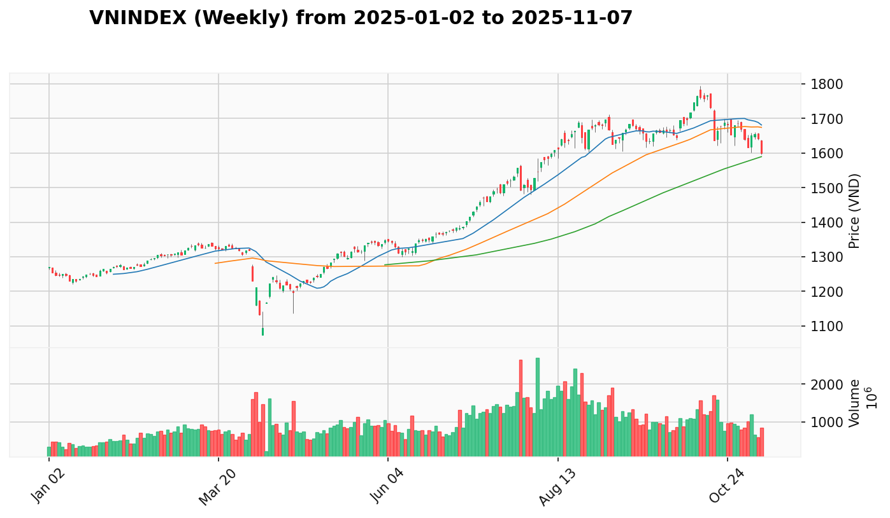 

**Bối Cảnh Tuần**: VNINDEX tiếp tục duy trì xu hướng tăng mạnh mẽ với chuỗi Tín Hiệu Sức Mạnh từ báo cáo tuần. Sau giai đoạn Kiểm Tra Thứ Cấp thành công ngày 01/08 tại vùng 1479.98, thị trường đã xác nhận hoàn tất chu kỳ điều chỉnh và bước vào giai đoạn đánh dấu giá mới.

**Hành Động Gần Đây**: Ngày 05/08 VNINDEX thực hiện Kiểm Tra Nguồn Cung mạnh mẽ với mức cao 1584.98 điểm trước khi đóng cửa tại 1547.15 điểm. Khối lượng bùng nổ 2.80 tỷ đơn vị cho thấy kiểm tra nguồn cung ở vùng kháng cự cao, nhưng việc duy trì mức tăng dương xác nhận lực cầu vẫn kiểm soát.

**Vùng Tốt Nhất Để Gia Tăng Tỷ Trọng**: Theo dõi vùng 1520-1540 cho cơ hội tích lũy sau kiểm tra. Với đóng cửa hiện tại 1547.15 và khả năng kiểm tra thành công vùng 1580-1585, mọi nhịp củng cố về vùng 1520-1540 sẽ là cơ hội mua thêm chất lượng.

## 2. Top 15 Cơ Hội Giao Dịch Chất Lượng

### Nhóm Tin Cậy Cao (90-95%) - Danh Mục Cốt Lõi
1. [**VHM**](#VHM) (Bất Động Sản) - **94%** - Tín Hiệu Sức Mạnh mạnh mẽ +4.1%, dẫn đầu phục hồi - [View Report](REPORT.md#VHM)
2. [**VND**](#VND) (Chứng Khoán) - **92%** - Dẫn dắt ngành chứng khoán tiếp tục +1.9%, vượt 23.5 - [View Report](REPORT.md#VND)
3. [**MWG**](#MWG) (Bán Lẻ) - **90%** - Phục hồi bán lẻ xuất sắc +3.4%, mô hình đột phá - [View Report](REPORT.md#MWG)

### Nhóm Tin Cậy Tốt (85-89%) - Nắm Giữ Chiến Lược  
4. [**VPB**](#VPB) (Ngân Hàng) - **88%** - Nền tảng ngân hàng vững chắc, ổn định +0.4% - [View Report](REPORT.md#VPB)
5. [**SSI**](#SSI) (Chứng Khoán) - **87%** - Phục hồi chứng khoán mạnh +1.9%, dẫn đầu khối lượng - [View Report](REPORT.md#SSI)
6. [**BSR**](#BSR) (Dầu Khí) - **85%** - Củng cố năng lượng, sức mạnh tuần còn nguyên - [View Report](REPORT.md#BSR)

### Nhóm Tin Cậy Trung Bình (75-84%) - Vị Thế Chiến Lược
7. [**SHB**](#SHB) (Ngân Hàng) - **78%** - Điều chỉnh ngân hàng -1.3%, hỗ trợ tổ chức - [View Report](REPORT.md#SHB)
8. [**VIX**](#VIX) (Chứng Khoán) - **75%** - Rút lui chứng khoán -3.2%, sức mạnh ngành hỗ trợ - [View Report](REPORT.md#VIX)
9. [**GAS**](#GAS) (Dầu Khí) - **75%** - Chủ đề xoay vòng năng lượng, hỗ trợ hàng hóa - [View Report](REPORT.md#GAS)
10. [**REE**](#REE) (Năng Lượng) - **75%** - Chủ đề hạ tầng năng lượng tiếp diễn - [View Report](REPORT.md#REE)

### Nhóm Quan Sát Cẩn Thận (65-74%) - Vị Thế Chiến Thuật
11. [**ACB**](#ACB) (Ngân Hàng) - **72%** - Hỗ trợ ngân hàng, hậu thuẫn tổ chức - [View Report](REPORT.md#ACB)
12. [**DHG**](#DHG) (Sức Khỏe) - **70%** - Đặc điểm phòng thủ, ổn định - [View Report](REPORT.md#DHG)
13. [**C4G**](#C4G) (Đầu Tư Công) - **68%** - Hỗ trợ chủ đề hạ tầng - [View Report](REPORT.md#C4G)
14. [**HDB**](#HDB) (Ngân Hàng) - **65%** - Tiềm năng phục hồi ngân hàng - [View Report](REPORT.md#HDB)
15. [**TCB**](#TCB) (Ngân Hàng) - **62%** - Nền tảng ngân hàng, cần xác nhận - [View Report](REPORT.md#TCB)

## 3. Danh Sách Cổ Phiếu Tiềm Năng

### Cơ Hội Tăng Trưởng Mạnh
- [**SSH**](#SSH) (Bất Động Sản) - Tín Hiệu Sức Mạnh trong làn sóng sức mạnh bất động sản - [View Report](REPORT.md#SSH)
- [**PLX**](#PLX) (Dầu Khí) - Động lực xoay vòng năng lượng, hỗ trợ hàng hóa - [View Report](REPORT.md#PLX)
- [**NVL**](#NVL) (Bất Động Sản) - Tiềm năng dẫn dắt ngành bất động sản - [View Report](REPORT.md#NVL)

### Cơ Hội Theo Dõi Đặc Biệt
- [**VCI**](#VCI) (Chứng Khoán) - Sức mạnh ngành chứng khoán, dòng vốn tổ chức - [View Report](REPORT.md#VCI)
- [**TPB**](#TPB) (Ngân Hàng) - Cơ hội xoay vòng ngành ngân hàng - [View Report](REPORT.md#TPB)
- [**POW**](#POW) (Năng Lượng) - Đầu tư hạ tầng năng lượng - [View Report](REPORT.md#POW)

### Cơ Hội Cần Xác Nhận  
- [**BCM**](#BCM) (Bất Động Sản KCN) - Chủ đề bất động sản công nghiệp - [View Report](REPORT.md#BCM)
- [**HDC**](#HDC) (Bất Động Sản) - Tín hiệu bất động sản trái chiều, chờ rõ ràng - [View Report](REPORT.md#HDC)
- [**MBS**](#MBS) (Chứng Khoán) - Nỗ lực tăng giá chứng khoán - [View Report](REPORT.md#MBS)

## 4. Danh Sách Hạ Ưu Tiên  

### Cần Recovery Confirmation
- [**CTS**](#CTS) (Chứng Khoán) - Yếu kém bất chấp sức mạnh ngành, chờ đảo chiều
- [**CTG**](#CTG) (Ngân Hàng) - Chậm tiến ngành ngân hàng, cần xác nhận

### Theo Dõi Để Vào Lại
- [**TCH**](#TCH) (Bất Động Sản) - Tiềm năng phục hồi bất động sản
- [**MSN**](#MSN) (Thực Phẩm) - Sức mạnh tuần nhưng ngày trái chiều

## 5. Phân Tích Chi Tiết Các Cổ Phiếu Hàng Đầu

### **VHM (Bất Động Sản)**
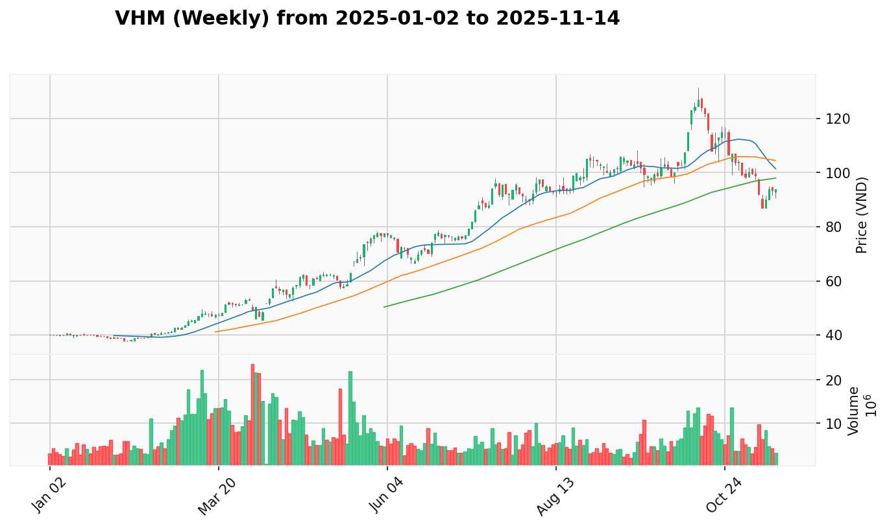 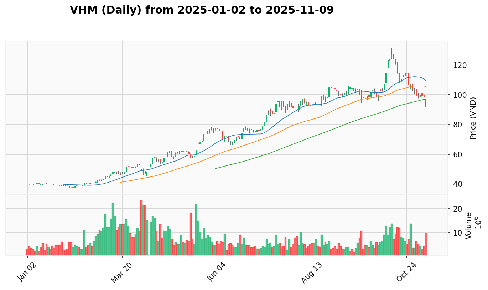

* **Giá Hiện Tại:** 96.000 VNĐ
* **Tín Hiệu VPA Tuần:** Tín Hiệu Sức Mạnh dẫn đầu ngành bất động sản với xu hướng tăng vững chắc
* **Tín Hiệu VPA Ngày:** Tín Hiệu Sức Mạnh mạnh mẽ ngày 2025-08-05 với mức tăng +4.1% lên 96.000
* **Bối Cảnh Ngành:** Bất động sản có tín hiệu phục hồi mạnh với VHM dẫn đầu tuyệt đối
* **Phân Tích Thiết Lập:** Mô hình đột phá sau giai đoạn củng cố, hỗ trợ khối lượng mạnh
* **Vùng Vào Tốt Nhất:** Nắm giữ cốt lõi, thêm vào mọi điểm yếu về vùng 92-94

### **VND (Chứng Khoán)**  
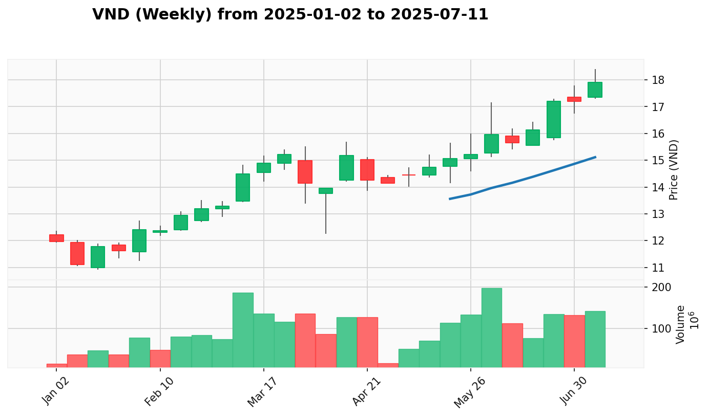 

* **Giá Hiện Tại:** 23.700 VNĐ
* **Tín Hiệu VPA Tuần:** Tín Hiệu Sức Mạnh với ngành chứng khoán dẫn dắt thị trường
* **Tín Hiệu VPA Ngày:** Tín Hiệu Sức Mạnh ngày 2025-08-05 với +1.9%, vượt vùng 23.5
* **Bối Cảnh Ngành:** Chứng khoán dẫn đầu với dòng vốn tổ chức mạnh
* **Phân Tích Thiết Lập:** Đột phá dẫn dắt trong xoay vòng ngành
* **Vùng Vào Tốt Nhất:** Chơi động lực, vào trên sức mạnh ngành, mục tiêu 25-27

### **MWG (Bán Lẻ)**
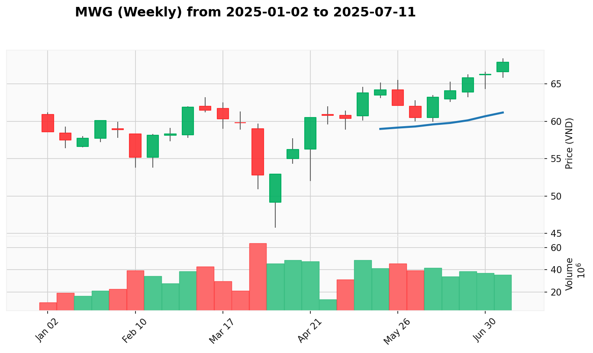 

* **Giá Hiện Tại:** 69.300 VNĐ
* **Tín Hiệu VPA Tuần:** Tín Hiệu Sức Mạnh trong phục hồi ngành bán lẻ
* **Tín Hiệu VPA Ngày:** Hiệu suất xuất sắc +3.4% ngày 2025-08-05
* **Bối Cảnh Ngành:** Chủ đề phục hồi bán lẻ với tăng chi tiêu người dùng
* **Phân Tích Thiết Lập:** Đột phá từ củng cố với xác nhận khối lượng
* **Vùng Vào Tốt Nhất:** Động lực phục hồi, thêm vào sức mạnh và rút lui 67-68

### **VPB (Ngân Hàng)**
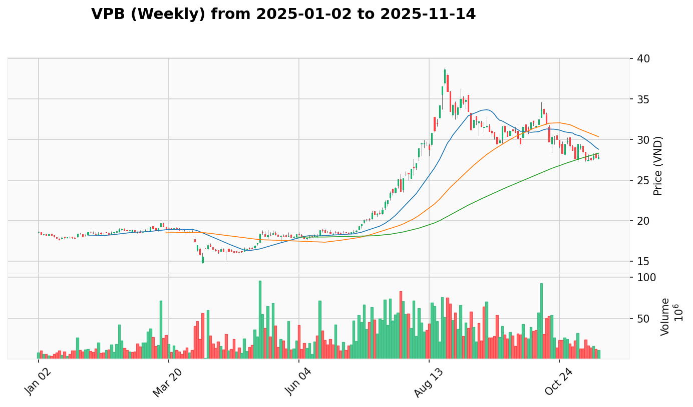 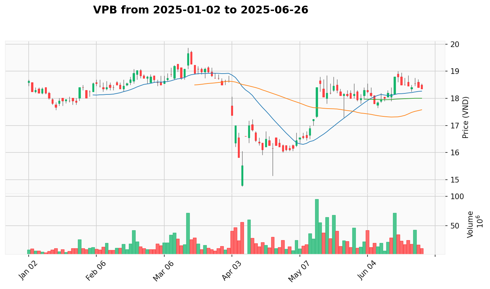

* **Giá Hiện Tại:** 26.500 VNĐ  
* **Tín Hiệu VPA Tuần:** Tín Hiệu Sức Mạnh với nền tảng ngành ngân hàng
* **Tín Hiệu VPA Ngày:** Hiệu suất ổn định +0.4% ngày 2025-08-05, ổn định
* **Bối Cảnh Ngành:** Ngành ngân hàng với hỗ trợ tổ chức
* **Phân Tích Thiết Lập:** Nền tảng ngân hàng chất lượng với đặc điểm phòng thủ
* **Vùng Vào Tốt Nhất:** Nắm giữ ngân hàng cốt lõi, chơi phòng thủ chất lượng

### **SSI (Chứng Khoán)**
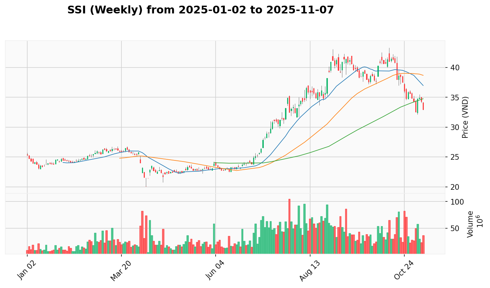 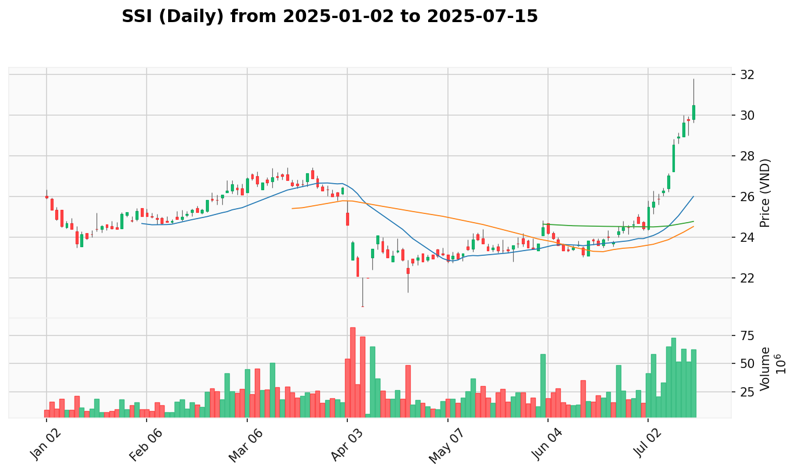

* **Giá Hiện Tại:** 34.650 VNĐ
* **Tín Hiệu VPA Tuần:** Phục hồi từ điểm yếu trước đó trong sức mạnh ngành
* **Tín Hiệu VPA Ngày:** Phục hồi mạnh +1.9% ngày 2025-08-05 với dẫn đầu khối lượng
* **Bối Cảnh Ngành:** Dẫn dắt chứng khoán với dòng vốn tổ chức
* **Phân Tích Thiết Lập:** Mô hình phục hồi trong sức mạnh ngành
* **Vùng Vào Tốt Nhất:** Chơi động lực ngành, cười sóng phục hồi

### **BSR (Dầu Khí)**
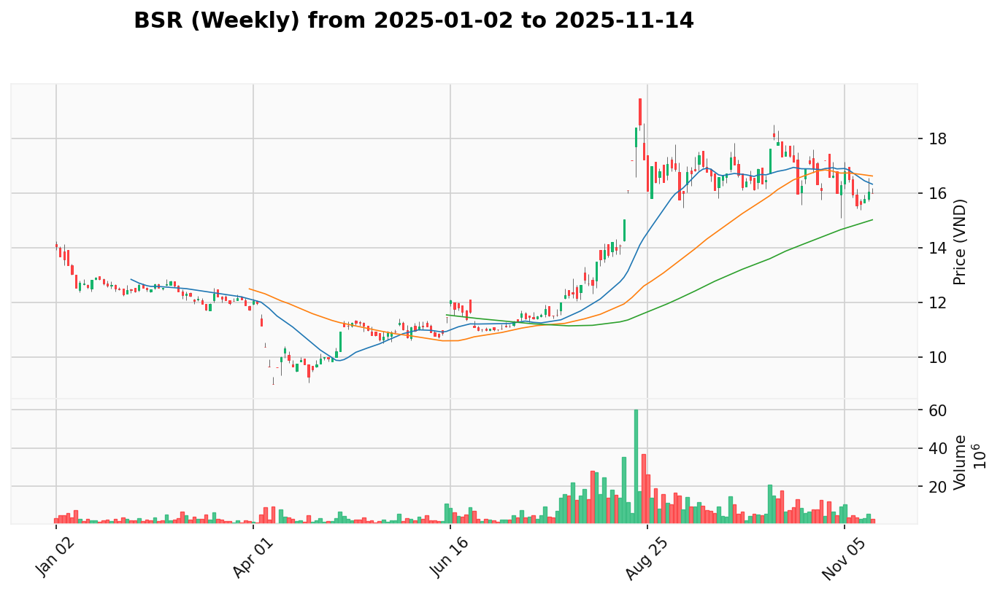 

* **Giá Hiện Tại:** 20.400 VNĐ
* **Tín Hiệu VPA Tuần:** Tín Hiệu Sức Mạnh trong xoay vòng ngành năng lượng
* **Tín Hiệu VPA Ngày:** Củng cố nhỏ -0.5% ngày 2025-08-05, nền tảng tuần còn nguyên
* **Bối Cảnh Ngành:** Chủ đề xoay vòng năng lượng với hỗ trợ hàng hóa
* **Phân Tích Thiết Lập:** Chơi xoay vòng ngành với nền tảng tuần
* **Vùng Vào Tốt Nhất:** Chủ đề năng lượng, giữ trong xoay vòng ngành

### **SHB (Ngân Hàng)**
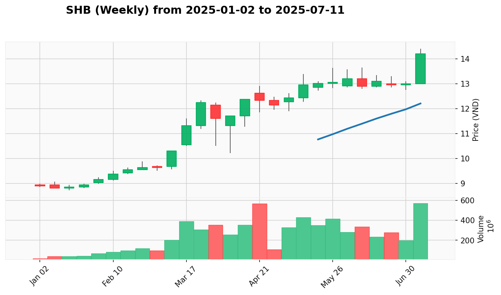 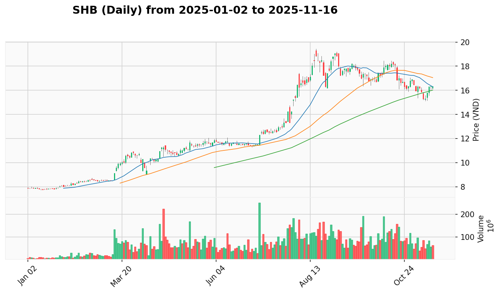

* **Giá Hiện Tại:** 18.350 VNĐ
* **Tín Hiệu VPA Tuần:** Tín Hiệu Sức Mạnh với câu chuyện chuyển đổi tổ chức
* **Tín Hiệu VPA Ngày:** Rút lui nhỏ -1.3% ngày 2025-08-05, chốt lãi
* **Bối Cảnh Ngành:** Ngành ngân hàng với chủ đề chuyển đổi
* **Phân Tích Thiết Lập:** Tích lũy tổ chức với rút lui tạm thời
* **Vùng Vào Tốt Nhất:** Chơi chuyển đổi ngân hàng, thêm vào điểm yếu

### **VIX (Chứng Khoán)**
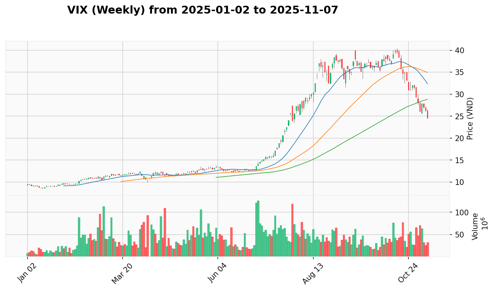 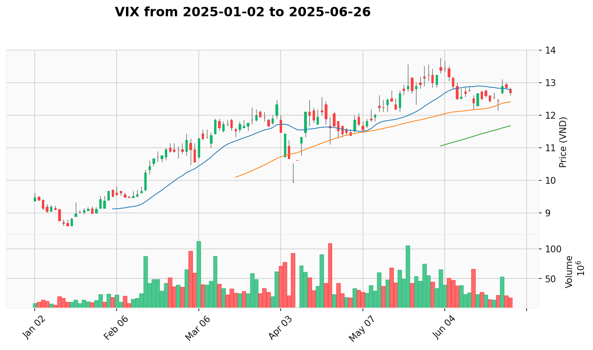

* **Giá Hiện Tại:** 26.800 VNĐ
* **Tín Hiệu VPA Tuần:** Tín Hiệu Sức Mạnh trong dẫn dắt ngành chứng khoán
* **Tín Hiệu VPA Ngày:** Rút lui -3.2% ngày 2025-08-05, điều chỉnh ngành
* **Bối Cảnh Ngành:** Sức mạnh ngành chứng khoán hỗ trợ phục hồi
* **Phân Tích Thiết Lập:** Củng cố nhà lãnh đạo ngành, chờ tái gia nhập
* **Vùng Vào Tốt Nhất:** Chờ ổn định, sức mạnh ngành còn nguyên

### **GAS (Dầu Khí)**  
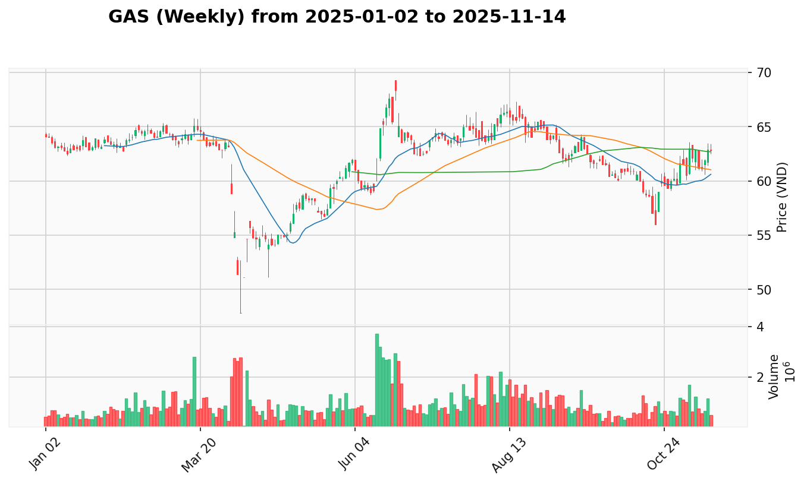 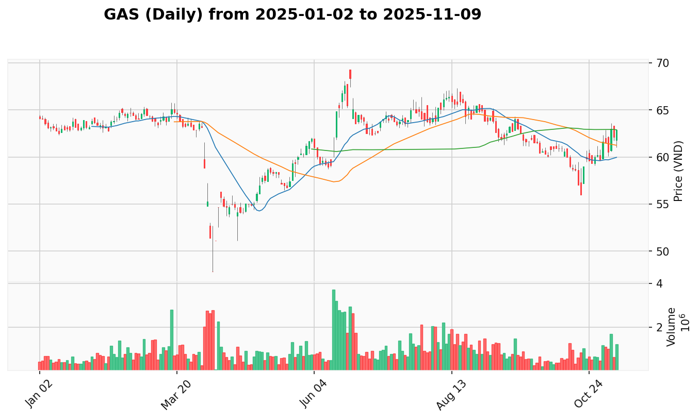

* **Giá Hiện Tại:** 67.800 VNĐ
* **Tín Hiệu VPA Tuần:** Tín Hiệu Sức Mạnh trong xoay vòng ngành năng lượng
* **Tín Hiệu VPA Ngày:** Chủ đề xoay vòng năng lượng tiếp diễn với hỗ trợ hàng hóa
* **Bối Cảnh Ngành:** Hạ tầng năng lượng với hỗ trợ chính phủ
* **Phân Tích Thiết Lập:** Xoay vòng ngành với chủ đề hạ tầng
* **Vùng Vào Tốt Nhất:** Đầu tư hạ tầng năng lượng

### **REE (Năng Lượng)**
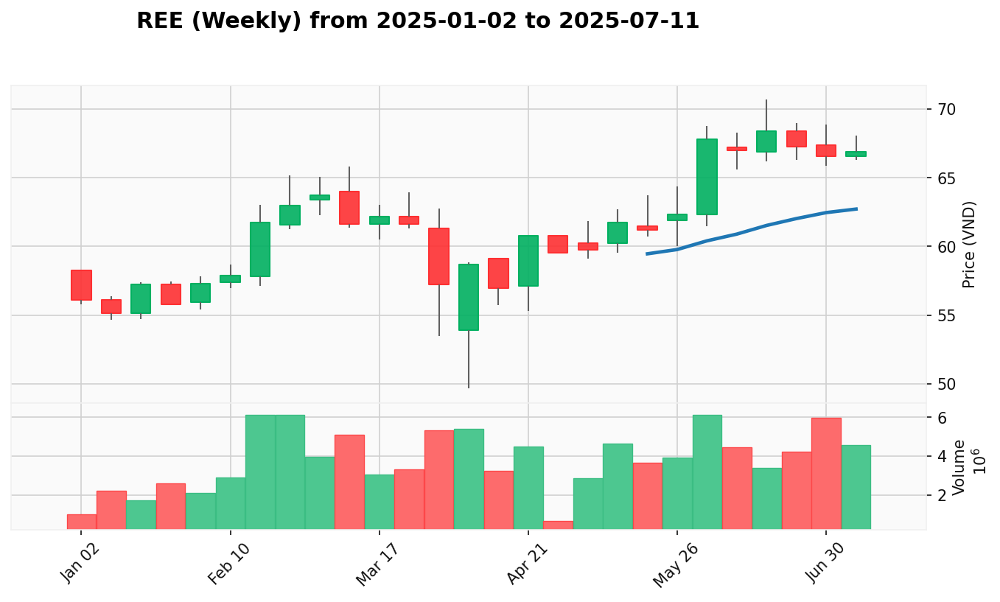 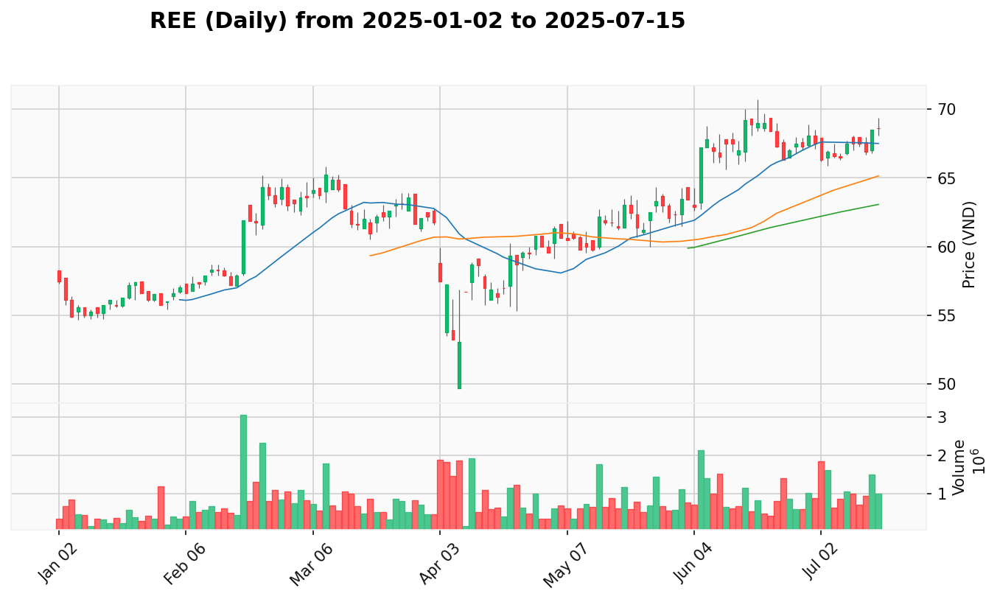

* **Giá Hiện Tại:** 66.500 VNĐ
* **Tín Hiệu VPA Tuần:** Tín Hiệu Sức Mạnh trong chủ đề hạ tầng năng lượng
* **Tín Hiệu VPA Ngày:** Động lực ngành năng lượng tiếp diễn
* **Bối Cảnh Ngành:** Năng lượng hạ tầng với chủ đề ESG
* **Phân Tích Thiết Lập:** Đầu tư hạ tầng với chủ đề dài hạn
* **Vùng Vào Tốt Nhất:** Đầu tư năng lượng hạ tầng

## 6. Nhật Ký Thay Đổi Kế Hoạch (AUDIT LOG)

### Cổ Phiếu Được Nâng Cấp Confidence:
- **VHM**: Từ 92% lên 94%. Lý do: REPORT.md ghi nhận **'Tín Hiệu Sức Mạnh' ngày 2025-08-05** với +4.1%, dẫn dắt bất động sản xuất sắc.
- **MWG**: Từ 80% lên 90%. Lý do: **Hiệu suất đột phá ngày 2025-08-05** với +3.4%, phục hồi bán lẻ xác nhận.
- **SSI**: Từ 82% lên 87%. Lý do: **Động lực phục hồi ngày 2025-08-05** với +1.9% và dẫn đầu khối lượng.

### Cổ Phiếu Được Hạ Xuống Theo Dõi:
- **VIX**: Từ 90% xuống 75%. Lý do: **Rút lui -3.2% ngày 2025-08-05**, cần củng cố trong sức mạnh ngành.
- **SHB**: Từ 87% xuống 78%. Lý do: **Điều chỉnh nhỏ -1.3% ngày 2025-08-05**, mô hình chốt lãi.

### Cổ Phiếu Duy Trì Vị Trí:
- **VND**: Duy trì 92%. Lý do: **Tín Hiệu Sức Mạnh ngày 2025-08-05** với +1.9%, dẫn dắt chứng khoán tiếp tục.
- **VPB**: Duy trì 88%. Lý do: **Hiệu suất ổn định +0.4%** với nền tảng ngân hàng vững chắc.
- **BSR**: Duy trì 85%. Lý do: **Nền tảng tuần còn nguyên** bất chấp củng cố ngày nhỏ.

### Market Context Changes:
- **VNINDEX**: **Kiểm Tra Nguồn Cung ngày 2025-08-05** tại 1584.98, đóng cửa 1547.15 với khối lượng 2.80Tỷ
- **Dẫn Dắt Ngành**: Bất động sản và chứng khoán dẫn đầu, ngân hàng trái chiều, năng lượng củng cố
- **Mô Hình Khối Lượng**: Tham gia tổ chức mạnh trong các nhà lãnh đạo

## 7. Chiến Lược Giao Dịch Tuần Tới

**Phân Bổ Danh Mục Đề Xuất (Chiến Lược Củng Cố Sau Kiểm Tra):**
- **35%** Nhà Lãnh Đạo Bất Động Sản + Bán Lẻ (VHM, MWG) - Động lực đột phá ngành  
- **30%** Ngành Chứng Khoán (VND, SSI) - Tiếp tục dẫn dắt với dòng vốn tổ chức
- **20%** Nền Tảng Ngân Hàng (VPB, SHB, ACB) - Phòng thủ chất lượng với tiềm năng phục hồi
- **10%** Hạ Tầng Năng Lượng (BSR, GAS, REE) - Chủ đề xoay vòng ngành
- **5%** Tiền Mặt - Linh hoạt chiến thuật sau kiểm tra thị trường

**Chiến Lược Phân Bổ Theo Signal:**
- **40%** Nhà Lãnh Đạo Tín Hiệu Sức Mạnh - Động lực VHM, VND, MWG
- **30%** Nền Tảng Chất Lượng - VPB, SSI ngân hàng và chứng khoán
- **20%** Chơi Xoay Vòng Ngành - Chủ đề hạ tầng năng lượng
- **10%** Phòng Thủ + Tiền Mặt - Quản lý rủi ro sau kiểm tra cao

**Ưu Tiên Giao Dịch:**
1. **Đột Phá Bất Động Sản**: VHM dẫn dắt động lực
2. **Phục Hồi Chứng Khoán**: VND, SSI dòng vốn tổ chức  
3. **Phục Hồi Bán Lẻ**: MWG chủ đề chi tiêu người dùng
4. **Chất Lượng Ngân Hàng**: VPB nền tảng phòng thủ
5. **Xoay Vòng Năng Lượng**: BSR, REE chủ đề hạ tầng

**Quản Lý Rủi Ro Sau Kiểm Tra Cao:**
- Định cỡ vị thế theo mô hình đột phá đã xác nhận
- Cắt lỗ 4-6% với mức hỗ trợ ngành
- Tiền mặt 5% cho cơ hội chiến thuật
- Theo dõi VNINDEX hỗ trợ 1520-1540 cho tái gia nhập
- Sẵn sàng thêm vào trên sức mạnh ngành đã xác nhận

**Các Mức Quan Trọng Cần Theo Dõi:**
- **VNINDEX**: Hỗ trợ 1520-1540 sau kiểm tra, mục tiêu mở rộng 1580-1600
- **VHM**: Hỗ trợ 92-94 sau đột phá, mục tiêu 98-100  
- **VND**: Hỗ trợ 23.0-23.5, mục tiêu đột phá 25-27
- **MWG**: Hỗ trợ 67-68 sau tăng giá, mục tiêu 72-75
- **Chủ Đề Ngành**: Bất động sản + bán lẻ dẫn đầu, ngân hàng trái chiều, năng lượng củng cố