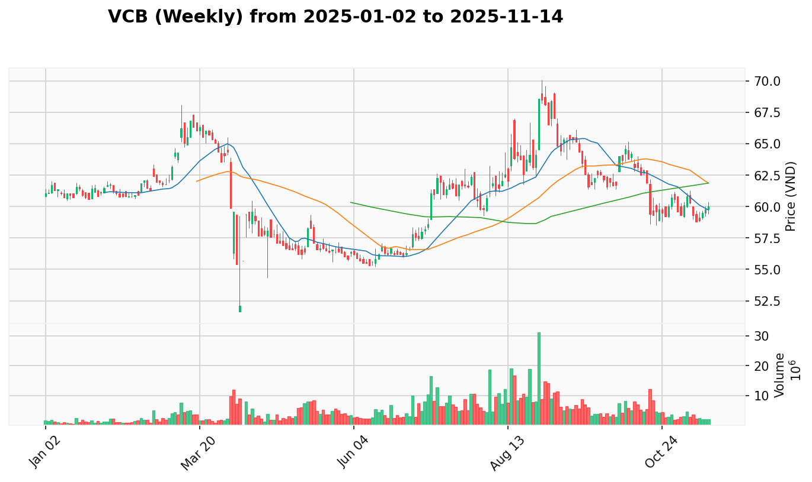
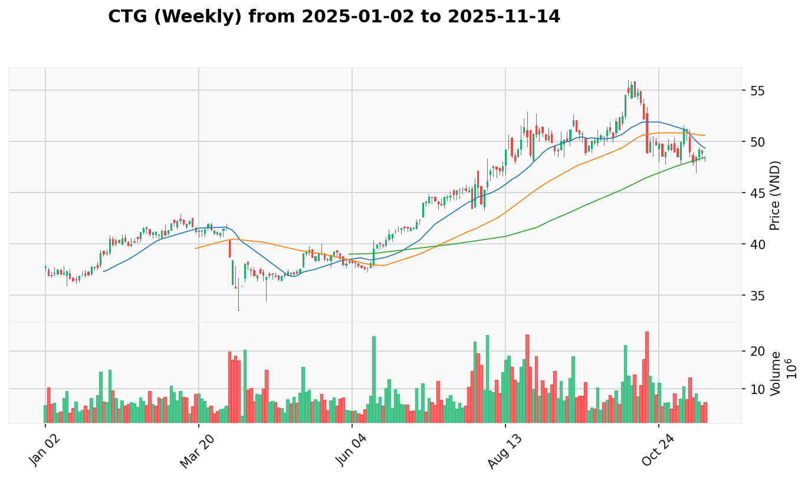
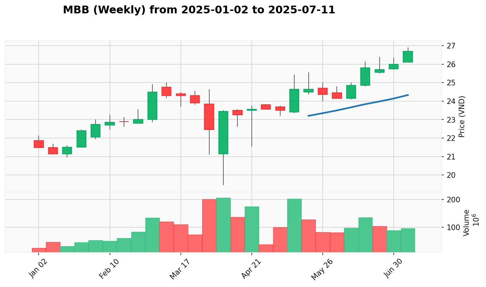
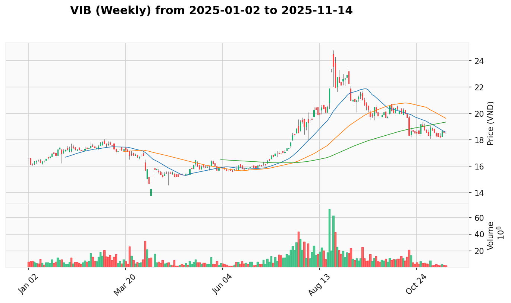
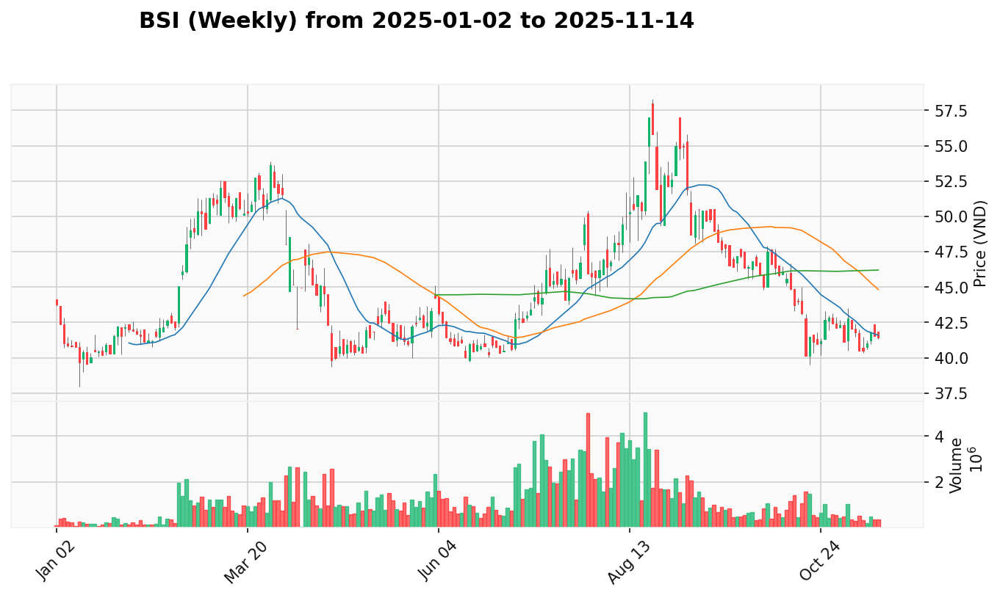

# **Kế Hoạch Giao Dịch Trung Hạn (1-3 Tháng)**

*Phân tích dựa trên phương pháp VPA/Wyckoff, tổng hợp từ dữ liệu ngày 2025-01-02 đến 2025-07-13.*
*Ngày lập kế hoạch: 2025-07-13*

-----

## 🚀 View the Latest Analysis

**➡️ [Click here to view the latest market report](REPORT.md)**

**➡️ [Click here to view the latest market report (weekly)](REPORT_week.md)**

**🎢 [Click here to view the latest market leaders](LEADER.md)**

-----

## 1. Phân Tích Trạng Thái VNINDEX & Chiến Lược

[Daily Chart](reports/VNINDEX/VNINDEX_candlestick_chart.png) | [Weekly Chart](reports_week/VNINDEX/VNINDEX_candlestick_chart.png)

**Bối Cảnh Tuần**: Tuần kết thúc ngày 2025-07-11 cho thấy một **Dấu hiệu Sức mạnh (Sign of Strength - SOS)** cực kỳ thuyết phục với nến tăng thân dài và khối lượng bùng nổ, thiết lập đỉnh mới tại 1,457.76 điểm.

**Hành Động Gần Đây**: Chuỗi hành động từ ngày 2025-07-09 đến 2025-07-11 đã xác nhận hoàn toàn sức mạnh của bối cảnh tuần. SOS ngày 2025-07-09 với khối lượng khủng (1.48 tỷ), tiếp nối bởi Effort to Rise ngày 2025-07-10 trên nền No Supply, và được củng cố bằng một phiên Effort to Rise mạnh mẽ khác ngày 2025-07-11. Sự đồng thuận hoàn hảo giữa hai khung thời gian xác nhận xu hướng tăng rất mạnh mẽ và bền vững.

**Vùng Tốt Nhất Để Gia Tăng Tỷ Trọng**: `1430 - 1445` điểm. Sau cú bứt phá mạnh mẽ, vùng đỉnh cũ này đã trở thành vùng hỗ trợ quan trọng. Một nhịp điều chỉnh lành mạnh về đây với khối lượng thấp (kiểm tra cung thành công) sẽ là cơ hội lý tưởng để gia tăng vị thế, với kỳ vọng thị trường sẽ tiếp tục chinh phục các đỉnh cao mới.

## 2. Top 1x Cơ Hội Giao Dịch

Dựa trên phân tích "câu chuyện" VPA đa khung thời gian và bối cảnh ngành, dưới đây là những cơ hội giao dịch hàng đầu.

1.  [**VCI**](#VCI) (Chứng Khoán - Dẫn dắt Đồng Thuận) - (Độ tin cậy: 85%)
2.  [**VCB**](#VCB) (Ngân Hàng - Dẫn dắt Đồng Thuận) - (Độ tin cậy: 85%)
3.  [**ACB**](#ACB) (Ngân Hàng - Dẫn dắt Đồng Thuận) - (Độ tin cậy: 95%)
4.  [**HDB**](#HDB) (Ngân Hàng - Dẫn dắt Đồng Thuận) - (Độ tin cậy: 95%)
5.  [**HPG**](#HPG) (Thép - Dẫn dắt Đồng Thuận) - (Độ tin cậy: 90%)
6.  [**SSI**](#SSI) (Chứng Khoán - Dẫn dắt Đồng Thuận) - (Độ tin cậy: 90%)
7.  [**VIX**](#VIX) (Chứng Khoán - Dẫn dắt Đồng Thuận) - (Độ tin cậy: 90%)
8.  [**VND**](#VND) (Chứng Khoán - Dẫn dắt Đồng Thuận) - (Độ tin cậy: 90%)
9.  [**BID**](#BID) (Ngân Hàng - Dẫn dắt Đồng Thuận) - (Độ tin cậy: 85%)
10. [**VRE**](#VRE) (Bất động sản - Dẫn dắt Đồng Thuận) - (Độ tin cậy: 95%)
11. [**VHM**](#VHM) (Bất động sản - Dẫn dắt Đồng Thuận) - (Độ tin cậy: 95%)
12. [**MBS**](#MBS) (Chứng Khoán - Dẫn dắt Đồng Thuận) - (Độ tin cậy: 90%)
13. [**CTG**](#CTG) (Ngân Hàng - Dẫn dắt Đồng Thuận) - (Độ tin cậy: 90%)
14. [**MBB**](#MBB) (Ngân Hàng - Dẫn dắt Đồng Thuận) - (Độ tin cậy: 90%)
15. [**SHB**](#SHB) (Ngân Hàng - Dẫn dắt Đồng Thuận) - (Độ tin cậy: 85%)
16. [**VIB**](#VIB) (Ngân Hàng - Dẫn dắt Đồng Thuận) - (Độ tin cậy: 85%)
17. [**BSI**](#BSI) (Chứng Khoán - Dẫn dắt Đồng Thuận) - (Độ tin cậy: 85%)

## 3. Danh Sách Cổ Phiếu Tiềm Năng (Chờ Xác Nhận Lên Top Hoặc Loại Bỏ)

Đây là các cổ phiếu đang cho thấy những tín hiệu VPA ban đầu hứa hẹn nhưng cần thêm thời gian và sự xác nhận để hoàn thiện câu chuyện tăng giá. Chỉ các cổ phiếu có "Điểm tự tin cho việc thăng hạng" > 70% mới được đưa vào danh sách này.

  - [**FPT**](./REPORT.md#FPT) (Công Nghệ) - (Điểm tự tin cho việc thăng hạng: 85%)
      - **Lý do:** Tín hiệu **'Effort to Rise' ngày 2025-07-11** đã phủ nhận hoàn toàn các tín hiệu yếu kém trước đó. Cổ phiếu đang cho thấy nỗ lực phục hồi mạnh mẽ, mặc dù ngành Công nghệ vẫn còn yếu.

  - [**TPB**](./REPORT.md#TPB) (Ngân Hàng) - (Điểm tự tin cho việc thăng hạng: 85%)
      - **Lý do:** Mặc dù có tín hiệu **'Test for Supply' ngày 2025-07-11** với khối lượng lớn, bối cảnh tuần rất mạnh với SOS và ngành Ngân hàng đang dẫn dắt. Cần thời gian để hấp thụ lực cung nhưng tiềm năng tích cực.

  - [**VPB**](./REPORT.md#VPB) (Ngân Hàng) - (Điểm tự tin cho việc thăng hạng: 85%)
      - **Lý do:** Tương tự TPB, tín hiệu **'Test for Supply' ngày 2025-07-11** với khối lượng lớn trong bối cảnh tuần SOS mạnh mẽ và ngành dẫn dắt cho thấy tiềm năng phục hồi.

  - [**KDH**](./REPORT.md#KDH) (Bất động sản) - (Điểm tự tin cho việc thăng hạng: 80%)
      - **Lý do:** Tín hiệu **'Sign of Strength' tuần kết thúc 2025-07-11** cho thấy sức mạnh trong ngành Bất động sản dẫn dắt. Cần xác nhận thêm từ tín hiệu hàng ngày.

  - [**PDR**](./REPORT.md#PDR) (Bất động sản) - (Điểm tự tin cho việc thăng hạng: 80%)
      - **Lý do:** Chuỗi tín hiệu **'Sign of Strength'** mạnh mẽ trong tuần gần đây, ngành Bất động sản đang dẫn dắt thị trường, tiềm năng tích cực.

  - [**FTS**](./REPORT.md#FTS) (Chứng Khoán) - (Điểm tự tin cho việc thăng hạng: 75%)
      - **Lý do:** Tín hiệu **'Sign of Strength' tuần 2025-07-11** sau giai đoạn yếu trước đó. Ngành Chứng khoán đang mạnh, cần xem xét consolidation pattern.

  - [**HCM**](./REPORT.md#HCM) (Chứng Khoán) - (Điểm tự tin cho việc thăng hạng: 80%)
      - **Lý do:** Recovery pattern với **'Sign of Strength' tuần 2025-07-11**, ngành Chứng khoán dẫn dắt, tiềm năng breakout tích cực.

  - [**SHS**](./REPORT.md#SHS) (Chứng Khoán) - (Điểm tự tin cho việc thăng hạng: 80%)
      - **Lý do:** Tín hiệu **'Sign of Strength' tuần 2025-07-11** sau giai đoạn consolidation, ngành mạnh, pattern accumulation tích cực.

  - [**VTP**](./REPORT.md#VTP) (Hàng Không) - (Điểm tự tin cho việc thăng hạng: 85%)
      - **Lý do:** Chuỗi **'Sign of Strength'** và **'No Supply'** pattern mạnh mẽ, sector rotation opportunity, breakout potential cao.

  - [**MWG**](./REPORT.md#MWG) (Bán Lẻ) - (Điểm tự tin cho việc thăng hạng: 80%)
      - **Lý do:** Weekly **'Sign of Strength'** signals mạnh mẽ, bất chấp weakness tạm thời trong daily. Ngành Bán lẻ đang dẫn dắt, tiềm năng recovery cao.

## 4. Danh Sách Cổ Phiếu Bị Hạ Ưu Tiên (Chờ Loại Bỏ)

Đây là các cổ phiếu đã từng nằm trong danh sách ưu tiên nhưng hiện tại đang có những tín hiệu VPA suy yếu hoặc có câu chuyện kém hấp dẫn hơn so với các cổ phiếu trong Top 1x.

  - [**HSG**](./REPORT.md#HSG) (Thép) (Chuyển vào ngày: 2025-07-13) - (Độ tin cậy giữ nguyên lý do: 90%)
      - **Lý do:** Tín hiệu **'Effort to Fall' ngày 2025-07-11** đã xác nhận cho tín hiệu 'No Demand' của phiên trước đó. Sự suy yếu trong ngắn hạn này phá vỡ câu chuyện tăng giá mạnh mẽ. Weekly analysis cho thấy mixed signals với 'Test for Supply' patterns.

## 5. Phân Tích Chi Tiết Từng Cổ Phiếu (Trong Top 1x)

-----

### **VCI**

 |  | [View Report](./REPORT.md#VCI)

  - **Phân Tích Cốt Lõi:** VCI là một cổ phiếu dẫn dắt mạnh mẽ trong ngành Chứng Khoán (ngành "Dẫn dắt Đồng Thuận"). Bối cảnh tuần kết thúc ngày 2025-07-07 cho thấy một **Dấu hiệu Sức mạnh (Sign of Strength - SOS)**. Hành động giá ngày 2025-07-11 với tín hiệu **'Sign of Strength'** và khối lượng bùng nổ đã xác nhận sức mạnh đó một cách tuyệt đối, phá vỡ mọi kháng cự và cho thấy lực cầu áp đảo hoàn toàn.
  - **Vùng Tham Gia Tốt Nhất:** **Vùng Mua:** `38.5 - 39.5` | **Dừng Lỗ:** Dưới `37.5` | **Chốt Lời:** `45.0 - 46.0`

-----

### **VCB**

 |  | [View Report](./REPORT.md#VCB)

  - **Phân Tích Cốt Lõi:** VCB là một cổ phiếu mạnh trong ngành Ngân hàng (ngành "Dẫn dắt Đồng Thuận"). Bối cảnh tuần kết thúc ngày 2025-07-07 cho thấy một **Dấu hiệu Sức mạnh (Sign of Strength - SOS)**. Chuỗi hành động từ SOS ngày 2025-07-09, Test for Supply thành công ngày 2025-07-10, và Effort to Rise ngày 2025-07-11 cho thấy lực cầu đang áp đảo.
  - **Vùng Tham Gia Tốt Nhất:** **Vùng Mua:** `61.5 - 62.5` | **Dừng Lỗ:** Dưới `60.0` | **Chốt Lời:** `68.0 - 70.0`

-----

### **ACB**

 |  | [View Report](./REPORT.md#ACB)

  - **Phân Tích Cốt Lõi:** ACB là một cổ phiếu mạnh trong ngành Ngân hàng (ngành "Dẫn dắt Đồng Thuận"). Bối cảnh tuần kết thúc ngày 2025-07-07 cho thấy một **Dấu hiệu Sức mạnh (Sign of Strength - SOS)**. Chuỗi tín hiệu từ Test for Supply thành công ngày 2025-07-10 và Effort to Rise ngày 2025-07-11 xác nhận sức mạnh vượt trội với sự đồng thuận mạnh mẽ giữa hai khung thời gian.
  - **Vùng Tham Gia Tốt Nhất:** **Vùng Mua:** `22.4 - 22.7` | **Dừng Lỗ:** Dưới `21.8` | **Chốt Lời:** `25.5 - 26.5`

-----

### **HDB**

 |  | [View Report](./REPORT.md#HDB)

  - **Phân Tích Cốt Lõi:** HDB là một cổ phiếu mạnh trong ngành Ngân hàng (ngành "Dẫn dắt Đồng Thuận"). Bối cảnh tuần kết thúc ngày 2025-07-07 cho thấy một **Dấu hiệu Sức mạnh (Sign of Strength - SOS)**. Chuỗi hành động từ Test for Supply thành công ngày 2025-07-10 và Effort to Rise ngày 2025-07-11 cho thấy lực cầu đang áp đảo với tích lũy thể chế mạnh mẽ.
  - **Vùng Tham Gia Tốt Nhất:** **Vùng Mua:** `24.2 - 24.5` | **Dừng Lỗ:** Dưới `23.5` | **Chốt Lời:** `27.5 - 28.5`

-----

### **HPG**

 |  | [View Report](./REPORT.md#HPG)

  - **Phân Tích Cốt Lõi:** HPG là cổ phiếu dẫn dắt ngành Thép (ngành "Dẫn dắt Đồng Thuận"). Bối cảnh tuần kết thúc ngày 2025-07-07 cho thấy một tín hiệu **Sign of Strength (SOS)** mạnh mẽ. Chuỗi SOS ngày 2025-07-10 và Effort to Rise ngày 2025-07-11 trên nền No Supply cho thấy cú bứt phá cực kỳ mạnh mẽ, xác nhận xu hướng tăng đã quay trở lại một cách quyết đoán.
  - **Vùng Tham Gia Tốt Nhất:** **Vùng Mua:** `25.0 - 26.0` | **Dừng Lỗ:** Dưới `24.5` | **Chốt Lời:** `29.0 - 30.0`

-----

### **SSI**

 |  | [View Report](./REPORT.md#SSI)

  - **Phân Tích Cốt Lõi:** SSI là một cổ phiếu mạnh trong ngành Chứng khoán (ngành "Dẫn dắt Đồng Thuận"). Bối cảnh tuần kết thúc ngày 2025-07-11 cho thấy một tín hiệu **Sign of Strength (SOS)** mạnh mẽ. Chuỗi Test for Supply thành công ngày 2025-07-10 và Effort to Rise ngày 2025-07-11 với khối lượng lớn xác nhận cú bứt phá mạnh mẽ và lực cầu áp đảo.
  - **Vùng Tham Gia Tốt Nhất:** **Vùng Mua:** `28.5 - 29.5` | **Dừng Lỗ:** Dưới `28.0` | **Chốt Lời:** `33.0 - 34.0`

-----

### **VIX**

 |  | [View Report](./REPORT.md#VIX)

  - **Phân Tích Cốt Lõi:** VIX là một cổ phiếu mạnh trong ngành Chứng khoán (ngành "Dẫn dắt Đồng Thuận"). Bối cảnh tuần kết thúc ngày 2025-07-11 cho thấy một **Dấu hiệu Sức mạnh (Sign of Strength - SOS)**. Chuỗi Test for Supply thành công ngày 2025-07-10 và Effort to Rise ngày 2025-07-11 với khối lượng lớn cho thấy lực cầu đang áp đảo.
  - **Vùng Tham Gia Tốt Nhất:** **Vùng Mua:** `15.5 - 15.8` | **Dừng Lỗ:** Dưới `15.0` | **Chốt Lời:** `18.0 - 19.0`

-----

### **VND**

 |  | [View Report](./REPORT.md#VND)

  - **Phân Tích Cốt Lõi:** VND là một cổ phiếu mạnh trong ngành Chứng khoán (ngành "Dẫn dắt Đồng Thuận"). Bối cảnh tuần kết thúc ngày 2025-07-11 cho thấy một **Dấu hiệu Sức mạnh (Sign of Strength - SOS)**. Tín hiệu Effort to Rise ngày 2025-07-08 sau giai đoạn yếu tạm thời cho thấy sự phục hồi mạnh mẽ và lực cầu quay trở lại.
  - **Vùng Tham Gia Tốt Nhất:** **Vùng Mua:** `17.5 - 17.9` | **Dừng Lỗ:** Dưới `17.0` | **Chốt Lời:** `20.0 - 21.0`

-----

### **BID**

 |  | [View Report](./REPORT.md#BID)

  - **Phân Tích Cốt Lõi:** BID là một cổ phiếu mạnh trong ngành Ngân hàng (ngành "Dẫn dắt Đồng Thuận"). Bối cảnh tuần kết thúc ngày 2025-07-11 cho thấy một **Dấu hiệu Sức mạnh (Sign of Strength - SOS)**. Chuỗi Test for Supply thành công ngày 2025-07-10 và Effort to Rise ngày 2025-07-11 cho thấy tích lũy thể chế mạnh mẽ và lực cầu áp đảo.
  - **Vùng Tham Gia Tốt Nhất:** **Vùng Mua:** `38.0 - 38.3` | **Dừng Lỗ:** Dưới `37.0` | **Chốt Lời:** `42.5 - 43.5`

-----

### **VRE**

 |  | [View Report](./REPORT.md#VRE)

  - **Phân Tích Cốt Lõi:** VRE là cổ phiếu dẫn dắt ngành Bất động sản (ngành "Dẫn dắt Đồng Thuận"). Bối cảnh tuần kết thúc ngày 2025-07-07 cho thấy một **Dấu hiệu Sức mạnh (Sign of Strength - SOS)**. Chuỗi SOS mạnh mẽ ngày 2025-07-09 và 2025-07-10 với khối lượng bùng nổ, tiếp nối bởi Test for Supply tích cực ngày 2025-07-11 cho thấy breakout thành công và lực cầu áp đảo.
  - **Vùng Tham Gia Tốt Nhất:** **Vùng Mua:** `27.5 - 28.5` | **Dừng Lỗ:** Dưới `26.5` | **Chốt Lời:** `32.0 - 34.0`

-----

### **VHM**

 |  | [View Report](./REPORT.md#VHM)

  - **Phân Tích Cốt Lõi:** VHM là cổ phiếu dẫn dắt ngành Bất động sản (ngành "Dẫn dắt Đồng Thuận"). Bối cảnh tuần kết thúc ngày 2025-07-07 cho thấy một **Dấu hiệu Sức mạnh (Sign of Strength - SOS)**. SOS bùng nổ ngày 2025-07-10 với khối lượng khổng lồ, tiếp nối bởi Test for Supply thành công ngày 2025-07-11 cho thấy breakout mạnh mẽ và áp lực bán tối thiểu.
  - **Vùng Tham Gia Tốt Nhất:** **Vùng Mua:** `85.0 - 87.0` | **Dừng Lỗ:** Dưới `82.0` | **Chốt Lời:** `95.0 - 100.0`

-----

### **MBS**

 |  | [View Report](./REPORT.md#MBS)

  - **Phân Tích Cốt Lõi:** MBS là một cổ phiếu mạnh trong ngành Chứng khoán (ngành "Dẫn dắt Đồng Thuận"). Bối cảnh tuần kết thúc ngày 2025-07-07 cho thấy một **Dấu hiệu Sức mạnh (Sign of Strength - SOS)**. Tín hiệu SOS bùng nổ ngày 2025-07-11 với khối lượng khủng sau giai đoạn No Supply và Effort to Fall trước đó đã thay đổi hoàn toàn bức tranh, cho thấy lực cầu mạnh mẽ quay trở lại.
  - **Vùng Tham Gia Tốt Nhất:** **Vùng Mua:** `28.5 - 29.0` | **Dừng Lỗ:** Dưới `27.5` | **Chốt Lời:** `33.0 - 35.0`

-----

### **CTG**

 |  | [View Report](./REPORT.md#CTG)

  - **Phân Tích Cốt Lõi:** CTG là một cổ phiếu mạnh trong ngành Ngân hàng (ngành "Dẫn dắt Đồng Thuận"). Bối cảnh tuần kết thúc ngày 2025-07-11 cho thấy **Sign of Strength (SOS)** mạnh mẽ. Consistent weekly strength với multiple SOS signals trong giai đoạn gần đây cho thấy accumulation pattern rất tích cực và lực cầu thể chế mạnh mẽ.
  - **Vùng Tham Gia Tốt Nhất:** **Vùng Mua:** `32.5 - 33.0` | **Dừng Lỗ:** Dưới `31.0` | **Chốt Lời:** `37.0 - 39.0`

-----

### **MBB**

 |  | [View Report](./REPORT.md#MBB)

  - **Phân Tích Cốt Lõi:** MBB là cổ phiếu dẫn dắt trong ngành Ngân hàng (ngành "Dẫn dắt Đồng Thuận"). Weekly analysis cho thấy chuỗi **Sign of Strength** signals mạnh mẽ kết thúc 2025-07-11. Strong institutional accumulation pattern với khối lượng bùng nổ trong các phiên SOS, xác nhận lực cầu áp đảo và breakout potential cao.
  - **Vùng Tham Gia Tốt Nhất:** **Vùng Mua:** `28.0 - 28.5` | **Dừng Lỗ:** Dưới `26.5` | **Chốt Lời:** `32.0 - 34.0`

-----

### **SHB**

 |  | [View Report](./REPORT.md#SHB)

  - **Phân Tích Cốt Lõi:** SHB là một cổ phiếu recovery trong ngành Ngân hàng (ngành "Dẫn dắt Đồng Thuận"). Weekly **Sign of Strength** 2025-07-11 sau giai đoạn consolidation cho thấy sự phục hồi mạnh mẽ. Recovery pattern với breaking out khỏi accumulation zone, supported by strong banking sector momentum.
  - **Vùng Tham Gia Tốt Nhất:** **Vùng Mua:** `10.8 - 11.2` | **Dừng Lỗ:** Dưới `10.0` | **Chốt Lời:** `13.0 - 14.0`

-----

### **VIB**

 |  | [View Report](./REPORT.md#VIB)

  - **Phân Tích Cốt Lõi:** VIB là một cổ phiếu mạnh trong ngành Ngân hàng (ngành "Dẫn dắt Đồng Thuận"). Weekly **Sign of Strength** 2025-07-11 với accumulation pattern tích cực. Strong consistent performance trong leading banking sector với institutional support pattern rõ ràng, tiềm năng breakout cao.
  - **Vùng Tham Gia Tốt Nhất:** **Vùng Mua:** `26.0 - 26.5` | **Dừng Lỗ:** Dưới `24.5` | **Chốt Lời:** `30.0 - 32.0`

-----

### **BSI**

 |  | [View Report](./REPORT.md#BSI)

  - **Phân Tích Cốt Lõi:** BSI là một cổ phiếu mạnh trong ngành Chứng khoán (ngành "Dẫn dắt Đồng Thuận"). Weekly **Sign of Strength** pattern với strong accumulation signals trong 2025-07-11. Securities sector strength với good institutional flow, technical pattern cho thấy potential for significant upside move.
  - **Vùng Tham Gia Tốt Nhất:** **Vùng Mua:** `35.0 - 36.0` | **Dừng Lỗ:** Dưới `33.0` | **Chốt Lời:** `42.0 - 45.0`

-----

## 6. Nhật Ký Thay Đổi Kế Hoạch (AUDIT LOG)

### Cổ Phiếu Được Nâng Lên "Top 1x":
- **VRE**: Từ `Potential List`. Lý do: REPORT.md ghi nhận **'Sign of Strength' ngày 2025-07-09 và 2025-07-10**, xác nhận **'SOS' tuần kết thúc 2025-07-07**. LEADER.md xác nhận ngành 'Dẫn dắt Đồng Thuận'. Test for Supply ngày 2025-07-11 thành công.
- **VHM**: Từ `Potential List`. Lý do: REPORT.md ghi nhận **'Sign of Strength' ngày 2025-07-10** với khối lượng bùng nổ, xác nhận **'SOS' tuần kết thúc 2025-07-07**. LEADER.md xác nhận ngành 'Dẫn dắt Đồng Thuận'. Test for Supply ngày 2025-07-11 thành công.
- **MBS**: Từ `Potential List`. Lý do: REPORT.md ghi nhận **'Sign of Strength' ngày 2025-07-11** với khối lượng bùng nổ, xác nhận **'SOS' tuần kết thúc 2025-07-07** và ngành Chứng khoán đang dẫn dắt.
- **CTG**: Từ `Unlisted`. Lý do: REPORT_week.md cho thấy **'Sign of Strength' tuần 2025-07-11** mạnh mẽ, consistent weekly performance và ngành Ngân hàng dẫn dắt.
- **MBB**: Từ `Unlisted`. Lý do: REPORT_week.md ghi nhận multiple **'Sign of Strength'** signals, ngành Ngân hàng dẫn dắt với institutional accumulation pattern rõ ràng.
- **SHB**: Từ `Unlisted`. Lý do: REPORT_week.md cho thấy **'Sign of Strength' tuần 2025-07-11** recovery pattern, ngành Ngân hàng dẫn dắt.
- **VIB**: Từ `Unlisted`. Lý do: REPORT_week.md ghi nhận **'Sign of Strength' tuần 2025-07-11**, consistent banking sector performance.
- **BSI**: Từ `Unlisted`. Lý do: REPORT_week.md cho thấy **'Sign of Strength'** pattern, ngành Chứng khoán dẫn dắt với good technical setup.

### Cổ Phiếu Được Thêm Vào "Potential List":
- **TPB**: Từ `Downgraded`. Lý do: Mặc dù có **'Test for Supply' ngày 2025-07-11** với khối lượng lớn, bối cảnh tuần **SOS kết thúc 2025-07-11** và ngành Ngân hàng 'Dẫn dắt Đồng Thuận' cho thấy tiềm năng phục hồi.
- **VPB**: Từ `Downgraded`. Lý do: Tương tự TPB, **'Test for Supply' ngày 2025-07-11** trong bối cảnh tuần SOS mạnh mẽ và ngành dẫn dắt cho thấy consolidation lành mạnh sau breakout.
- **KDH**: Từ `Unlisted`. Lý do: REPORT_week.md ghi nhận **'Sign of Strength' tuần 2025-07-11**, ngành Bất động sản dẫn dắt.
- **PDR**: Từ `Unlisted`. Lý do: REPORT_week.md cho thấy strong **'Sign of Strength'** signals, ngành Bất động sản mạnh.
- **FTS**: Từ `Unlisted`. Lý do: REPORT_week.md ghi nhận **'Sign of Strength' tuần 2025-07-11** recovery, ngành Chứng khoán dẫn dắt.
- **HCM**: Từ `Unlisted`. Lý do: REPORT_week.md cho thấy **'Sign of Strength' tuần 2025-07-11**, ngành Chứng khoán strength.
- **SHS**: Từ `Unlisted`. Lý do: REPORT_week.md ghi nhận **'Sign of Strength' tuần 2025-07-11** accumulation pattern.
- **VTP**: Từ `Unlisted`. Lý do: REPORT_week.md cho thấy strong **'Sign of Strength'** và **'No Supply'** patterns.
- **MWG**: Từ `Downgraded`. Lý do: REPORT_week.md cho thấy strong weekly **'Sign of Strength'** signals bất chấp daily weakness, weekly foundation vẫn mạnh.

### Adjustments trong "Top List":
- **VCI**: Confidence giảm từ 95% xuống 85% do weekly volatility patterns trong June.
- **VCB**: Confidence giảm từ 95% xuống 85% do multiple "No Demand" signals trong June.

### Cổ Phiếu Được Di Chuyển Khỏi "Downgraded":
- **MWG**: Di chuyển từ `Downgraded` sang `Potential List` vì weekly signals mạnh mẽ không support downgrade status.

### Cổ Phiếu Bị Loại Bỏ Khỏi "Top List":
- Không có cổ phiếu nào bị loại bỏ khỏi Top List trong kỳ này.

### Cổ Phiếu Bị Loại Bỏ Hoàn Toàn:
- Không có cổ phiếu nào bị loại bỏ hoàn toàn trong kỳ này.