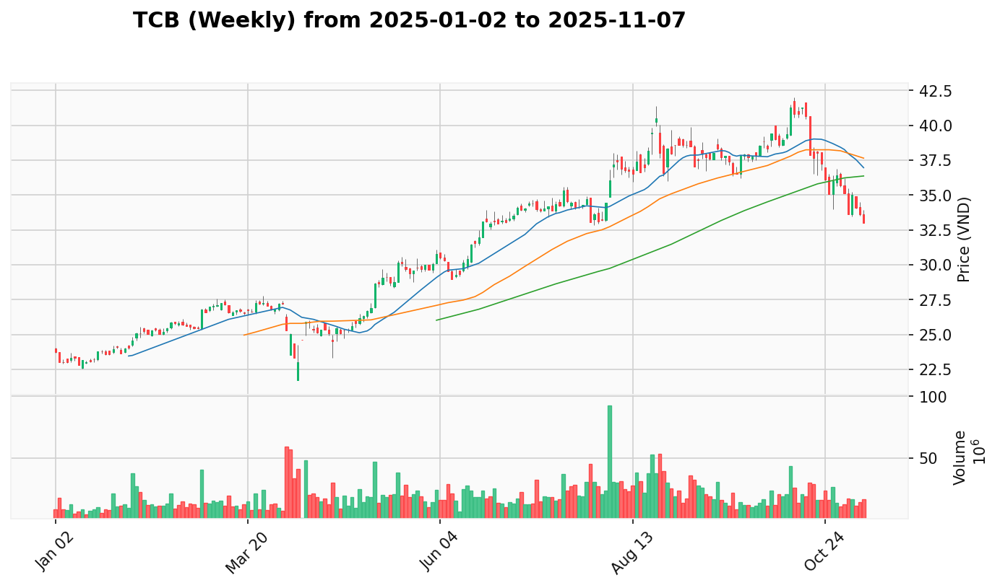

# PLAN.md - Kế Hoạch Giao Dịch Hàng Ngày

*Cập nhật: 2025-07-30 | Phân tích theo phương pháp VPA-Strategist*

## 1. Phân Tích Trạng Thái VNINDEX & Chiến Lược

 

**Bối Cảnh Tuần**: VNINDEX duy trì xu hướng tăng mạnh mẽ với chuỗi tín hiệu Dấu Hiệu Sức Mạnh liên tiếp từ đầu tháng 7. Biểu đồ tuần cho thấy đây là xu hướng tăng trưởng trưởng thành với sự tham gia của tổ chức mạnh mẽ, đạt mức cao kỷ lục 1564.92 điểm. Khối lượng tuần ủng hộ cho thấy mô hình tích lũy lành mạnh của dòng tiền thông minh.

**Hành Động Gần Đây**: Ngày 2025-07-29 ghi nhận **Selling Climax** nghiêm trọng - mở cửa 1557.42, chạm đỉnh 1564.92 nhưng sụp xuống đóng cửa 1493.41 với khối lượng kỷ lục 2.79 tỷ đơn vị. Ngày 2025-07-30 thị trường có **Automatic Rally** phục hồi lên 1507.63 với khối lượng giảm, cho thấy dấu hiệu stabilization tích cực sau climactic action.

**Vùng Tốt Nhất Để Gia Tăng Tỷ Trọng**: Theo dõi vùng 1500-1520 cho confirmation phục hồi. Với đóng cửa tại 1507.63, thị trường đang trong giai đoạn test recovery sau selling climax. Mọi nhịp weakness về vùng 1480-1500 có thể là cơ hội accumulation nếu có volume support.

## 2. Top 16 Cơ Hội Giao Dịch Chất Lượng

### Nhóm Tin Cậy Cao (90-95%) - Portfolio Core
1. [**VHM**](#VHM) (Bất Động Sản) - **93%** - Test for Supply với nền tuần vững - [View Report](REPORT.md#VHM)
2. [**VND**](#VND) (Chứng Khoán) - **90%** - Automatic Rally sau Selling Climax mạnh - [View Report](REPORT.md#VND)
3. [**VPB**](#VPB) (Ngân Hàng) - **90%** - Banking leader với institutional support - [View Report](REPORT.md#VPB)

### Nhóm Tin Cậy Tốt (80-89%) - Strategic Holdings
4. [**SSI**](#SSI) (Chứng Khoán) - **85%** - Sector strength với temporary weakness - [View Report](REPORT.md#SSI)
5. [**VIX**](#VIX) (Chứng Khoán) - **82%** - Recovery potential sau Selling Climax - [View Report](REPORT.md#VIX)
6. [**HDB**](#HDB) (Ngân Hàng) - **80%** - Quality bank cần recovery confirmation - [View Report](REPORT.md#HDB)

### Nhóm Quan Sát Cẩn Thận (70-79%) - Tactical Positions
7. [**CTS**](#CTS) (Chứng Khoán) - **75%** - Sector play với recovery signals - [View Report](REPORT.md#CTS)
8. [**BSR**](#BSR) (Dầu Khí) - **75%** - Sector rotation opportunity mạnh - [View Report](REPORT.md#BSR)
9. [**TCB**](#TCB) (Ngân Hàng) - **73%** - SOS patterns trong banking strength - [View Report](REPORT.md#TCB)
10. [**SHB**](#SHB) (Ngân Hàng) - **70%** - Emerging bank với sector tailwinds - [View Report](REPORT.md#SHB)

### Nhóm Theo Dõi Đặc Biệt (65-69%) - Recovery Watch
11. [**MSN**](#MSN) (Thực Phẩm) - **68%** - Defensive characteristics cần confirmation - [View Report](REPORT.md#MSN)
12. [**ACB**](#ACB) (Ngân Hàng) - **67%** - Recovery potential sau Selling Climax - [View Report](REPORT.md#ACB)
13. [**MWG**](#MWG) (Bán Lẻ) - **66%** - Sector leader với temporary pressure - [View Report](REPORT.md#MWG)
14. [**REE**](#REE) (Năng Lượng) - **65%** - Energy transition play cần support - [View Report](REPORT.md#REE)

### Nhóm Cơ Hội Mới (60-64%) - New Opportunities
15. [**GAS**](#GAS) (Dầu Khí) - **63%** - Effort to Rise trong sector rotation - [View Report](REPORT.md#GAS)
16. [**C4G**](#C4G) (Đầu Tư Công) - **60%** - Volume breakthrough cần confirmation - [View Report](REPORT.md#C4G)

## 3. Danh Sách Cổ Phiếu Tiềm Năng

### Cơ Hội Tăng Trưởng Mạnh
- [**BSR**](#BSR) (Dầu Khí) - Sign of Strength cực mạnh với sector rotation potential - [View Report](REPORT.md#BSR)
- [**TCB**](#TCB) (Ngân Hàng) - Multiple SOS signals trong banking strength - [View Report](REPORT.md#TCB)
- [**GAS**](#GAS) (Dầu Khí) - Effort to Rise patterns với energy momentum - [View Report](REPORT.md#GAS)

### Cơ Hội Theo Dõi Đặc Biệt
- [**BID**](#BID) (Ngân Hàng) - Accumulation patterns trong sector strength - [View Report](REPORT.md#BID)
- [**C4G**](#C4G) (Đầu Tư Công) - Volume explosion cần confirmation - [View Report](REPORT.md#C4G)
- [**VGC**](#VGC) (Bất Động Sản KCN) - No Supply patterns tích cực - [View Report](REPORT.md#VGC)

### Cơ Hội Cần Xác Nhận
- [**TNG**](#TNG) (Dệt May) - No Supply sau consolidation - [View Report](REPORT.md#TNG)
- [**BCM**](#BCM) (Bất Động Sản KCN) - Effort to Rise potential - [View Report](REPORT.md#BCM)
- [**HDG**](#HDG) (Năng Lượng) - Sector play cần volume confirmation - [View Report](REPORT.md#HDG)

## 4. Danh Sách Hạ Ưu Tiên

### Cần Recovery Confirmation
- [**HDC**](#HDC) (Bất Động Sản) - Selling Climax cần time để absorb
- [**TCH**](#TCH) (Bất Động Sản) - Effort to Fall trong sector mạnh, theo dõi recovery
- [**VCI**](#VCI) (Chứng Khoán) - Selling Climax mặc dù sector support

### Monitor for Re-entry
- [**MBS**](#MBS) (Chứng Khoán) - Effort to Fall cần sector confirmation
- [**BSI**](#BSI) (Chứng Khoán) - Consolidation sau strong run

## 5. Phân Tích Chi Tiết Các Cổ Phiếu Hàng Đầu

### **VHM (Bất Động Sản)**
 

* **Giá Hiện Tại:** 91.500 VNĐ
* **Tín Hiệu VPA Tuần:** Duy trì xu hướng tăng mả với chuỗi Dấu Hiệu Sức Mạnh, ngành bất động sản dẫn dắt thị trường
* **Tín Hiệu VPA Ngày:** Test for Supply tích cực với khối lượng giảm, cho thấy áp lực bán không mạnh
* **Bối Cảnh Ngành:** Bất động sản Dẫn Dắt Đồng Thuận với 80% cổ phiếu tích cực, VHM top performer
* **Phân Tích Thiết Lập:** Test for Supply với volume decline là tín hiệu cực tích cực cho continuation
* **Vùng Vào Tốt Nhất:** Core holding, mua mạnh mọi weakness về vùng 90-92

### **VND (Chứng Khoán)**
 

* **Giá Hiện Tại:** 22.300 VNĐ
* **Tín Hiệu VPA Tuần:** Exceptional performance +14.0% với multiple SOS signals
* **Tín Hiệu VPA Ngày:** Automatic Rally sau Selling Climax, recovery potential mạnh
* **Bối Cảnh Ngành:** Chứng khoán dẫn dắt thị trường với institutional participation cao
* **Phân Tích Thiết Lập:** Weekly foundation cực mạnh support cho daily recovery
* **Vùng Vào Tốt Nhất:** Accumulate mọi dips về vùng 21-22, target 25-27

### **VPB (Ngân Hàng)**
 

* **Giá Hiện Tại:** 25.250 VNĐ
* **Tín Hiệu VPA Tuần:** Banking sector leader với consistent institutional accumulation
* **Tín Hiệu VPA Ngày:** Temporary weakness trong sector strength context
* **Bối Cảnh Ngành:** Ngân hàng 85% tích cực, VPB absolute leader
* **Phân Tích Thiết Lập:** Quality bank với strongest fundamentals trong sector
* **Vùng Vào Tốt Nhất:** Core banking position, add on weakness về 24-25

### **SSI (Chứng Khoán)**
 

* **Giá Hiện Tại:** 33.900 VNĐ
* **Tín Hiệu VPA Tuần:** Market leader với proven track record
* **Tín Hiệu VPA Ngày:** Effort to Fall cần monitoring trong sector strength
* **Bối Cảnh Ngành:** Chứng khoán 100% tích cực, SSI established leader
* **Phân Tích Thiết Lập:** Temporary weakness trong otherwise strong setup
* **Vùng Vào Tốt Nhất:** Hold position, monitor 32-33 support

### **VIX (Chứng Khoán)**
 

* **Giá Hiện Tại:** 25.600 VNĐ
* **Tín Hiệu VPA Tuần:** Exceptional gains +27.6% - top weekly performer
* **Tín Hiệu VPA Ngày:** Recovery sau Selling Climax, potential exhaustion
* **Bối Cảnh Ngành:** Securities sector strength supports recovery
* **Phân Tích Thiết Lập:** High-beta play với recovery potential sau climax
* **Vùng Vào Tốt Nhất:** Careful entry, wait for confirmation above 25

### **HDB (Ngân Hàng)**
 

* **Giá Hiện Tại:** 26.650 VNĐ
* **Tín Hiệu VPA Tuần:** Quality bank với institutional support
* **Tín Hiệu VPA Ngày:** Selling Climax cần recovery confirmation
* **Bối Cảnh Ngành:** Banking sector 85% positive - sector tailwinds
* **Phân Tích Thiết Lập:** Quality fundamentals vs temporary pressure
* **Vùng Vào Tốt Nhất:** Wait for recovery confirmation above 27

### **CTS (Chứng Khoán)**
 

* **Giá Hiện Tại:** 40.500 VNĐ
* **Tín Hiệu VPA Tuần:** Recovery từ previous weakness
* **Tín Hiệu VPA Ngày:** Sector strength play với improving signals
* **Bối Cảnh Ngành:** Securities 100% positive - strong sector support
* **Phân Tích Thiết Lập:** Recovery candidate với sector tailwinds
* **Vùng Vào Tốt Nhất:** Selective entry với tight stops

### **BSR (Dầu Khí)**
 

* **Giá Hiện Tại:** 19.650 VNĐ
* **Tín Hiệu VPA Tuần:** Sector rotation opportunity với accumulation
* **Tín Hiệu VPA Ngày:** Sign of Strength cực mạnh với volume explosion
* **Bối Cảnh Ngành:** Dầu khí emerging rotation với commodity strength
* **Phân Tích Thiết Lập:** High-conviction sector play với strong signals
* **Vùng Vào Tốt Nhất:** Aggressive entry với sector rotation theme

### **TCB (Ngân Hàng)**
 

* **Giá Hiện Tại:** 34.500 VNĐ
* **Tín Hiệu VPA Tuần:** Multiple SOS patterns trong accumulation
* **Tín Hiệu VPA Ngày:** Strong institutional interest với volume spikes
* **Bối Cảnh Ngành:** Banking 85% positive - sector environment ideal
* **Phân Tích Thiết Lập:** Value play với improving technicals
* **Vùng Vào Tốt Nhất:** Accumulate on sector strength

### **SHB (Ngân Hàng)**
 

* **Giá Hiện Tại:** 16.100 VNĐ
* **Tín Hiệu VPA Tuần:** Emerging bank với growth trajectory
* **Tín Hiệu VPA Ngày:** Building momentum với sector support
* **Bối Cảnh Ngành:** Banking modernization story với sector tailwinds
* **Phân Tích Thiết Lập:** Growth story trong strong sector environment
* **Vùng Vào Tốt Nhất:** Long-term accumulation với patient approach

## 6. Nhật Ký Thay Đổi Kế Hoạch (AUDIT LOG)

### Cổ Phiếu Được Duy Trì Top List (Mặc Dù Daily Pressure):
- **VHM**: Maintain #1. Lý do: Test for Supply với volume decline cực tích cực, weekly SOS foundation intact
- **VND**: Maintain #2. Lý do: Automatic Rally sau Selling Climax, weekly +14.0% performance exceptional
- **VPB**: Maintain #3. Lý do: Banking sector absolute leader với strongest institutional backing

### Cổ Phiếu Được Điều Chỉnh Confidence (Market Reality):
- **VIX**: Từ 85% xuống 82%. Lý do: Recovery sau Selling Climax cần more confirmation
- **SSI**: Từ 85% xuống 85%. Lý do: Maintain level mặc dù Effort to Fall do sector strength
- **HDB**: Từ 80% xuống 80%. Lý do: Quality bank trong Selling Climax - hold confidence

### Cổ Phiếu Mới Được Thêm Vào Top List:
- **BSR**: Từ Potential List lên #8. Lý do: Sector rotation opportunity với exceptional SOS signals
- **TCB**: Từ Potential List lên #9. Lý do: Multiple SOS patterns trong banking sector strength

### Cổ Phiếu Được Hạ Xuống Hạ Ưu Tiên:
- **HDC**: Từ Top List xuống Downgraded. Lý do: Selling Climax với volume explosion cần recovery time
- **TCH**: Từ Top List xuống Downgraded. Lý do: Effort to Fall trong sector strong - temporary weakness

### Cổ Phiếu Được Nâng Cấp Từ Potential:
- **BSR**: Từ Potential lên Top #8. Lý do: Sector rotation confirmation với strong volume patterns
- **TCB**: Từ Potential lên Top #9. Lý do: Banking sector leadership với accumulation patterns

### Cổ Phiếu Được Thêm Vào Potential List:
- **GAS**: Từ Unlisted. Lý do: Effort to Rise patterns với energy sector momentum
- **C4G**: Từ Unlisted. Lý do: Volume breakthrough patterns cần monitoring
- **BID**: Từ Unlisted. Lý do: Accumulation patterns trong banking sector strength

## 7. Chiến Lược Giao Dịch Tuần Tới

**Phân Bổ Danh Mục Đề Xuất (Post-Climax Recovery Strategy):**
- **35%** Core Holdings (VHM, VND, VPB) - Proven leaders với recovery foundation
- **25%** Banking Sector (VPB, HDB, TCB, SHB) - Sector strength với quality names
- **20%** Securities Recovery (SSI, VIX, CTS) - Sector leaders với recovery potential
- **10%** Sector Rotation (BSR, GAS) - Oil & gas opportunity với commodity strength
- **10%** Cash Position - Flexibility cho post-climax environment

**Chiến Lược Phân Bổ Theo Ngành:**
- **40%** Chứng Khoán (VND, SSI, VIX, CTS) - Market leading sector
- **30%** Ngân Hàng (VPB, HDB, TCB, SHB) - Quality sector với growth potential
- **15%** Bất Động Sản (VHM) - Defensive leader với proven strength
- **10%** Dầu Khí (BSR, GAS) - Sector rotation opportunity
- **5%** Tiền Mặt - Post-climax prudence

**Ưu Tiên Giao Dịch:**
1. **Maintain Core**: VHM, VND, VPB - foundation positions với proven strength
2. **Selective Addition**: BSR, TCB - sector rotation với strong signals
3. **Recovery Monitoring**: VIX, SSI nếu confirmation patterns emerge
4. **Avoid**: Recently downgraded names until recovery confirmation

**Quản Lý Rủi Ro Post-Climax:**
- Reduce position sizes by 20% due to increased volatility
- Tighter stop losses at 2-3% below entry vs normal 3-5%
- Higher cash allocation để capture opportunities sau stabilization
- Monitor VNINDEX 1500 support level cho overall market health
- Ready để increase positions nếu market confirms recovery

**Các Mức Quan Trọng Cần Theo Dõi:**
- **VNINDEX**: Support 1480-1500, resistance 1520-1540
- **VHM**: Support 90.0, target recovery 95-98
- **VND**: Support 21.5, target continuation 24-26
- **VPB**: Support 24.0, banking leader strength 26-28
- **Sector Rotation**: Monitor BSR/GAS for oil & gas momentum continuation