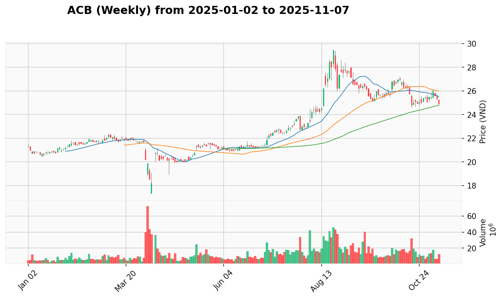
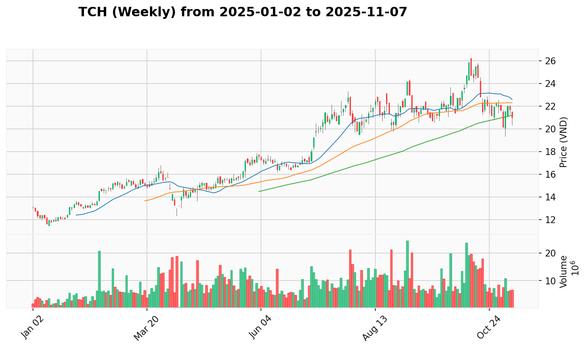

# PLAN.md - Kế Hoạch Giao Dịch Hàng Ngày

*Cập nhật: 2025-07-28 | Phân tích theo phương pháp VPA-Strategist*

## 1. Phân Tích Trạng Thái VNINDEX & Chiến Lược

 

**Bối Cảnh Tuần**: VNINDEX duy trì xu hướng tích cực mạnh mẽ với hành động tăng giá được hỗ trợ bởi khối lượng tổ chức. Biểu đồ tuần cho thấy chuỗi tín hiệu Dấu Hiệu Sức Mạnh liên tục, xác nhận xu hướng tăng đang trong giai đoạn bền vững.

**Hành Động Gần Đây**: Ngày 2025-07-28 ghi nhận tín hiệu "Dấu Hiệu Sức Mạnh" tiếp tục với sự tham gia rộng rãi của thị trường. 73 cổ phiếu trong danh sách phân tích có tín hiệu SOS, cho thấy sức mạnh lan tỏa rộng khắp các ngành. Khối lượng giao dịch duy trì ở mức cao thể hiện dòng tiền tổ chức vẫn tích cực.

**Vùng Tốt Nhất Để Gia Tăng Tỷ Trọng**: Mọi nhịp rút lui về vùng hỗ trợ gần nhất đều là cơ hội mua vào tốt. Duy trì chiến lược tích cực với tỷ trọng cổ phiếu cao trong bối cảnh thị trường mạnh.

## 2. Top 16 Cơ Hội Giao Dịch Chất Lượng

### Nhóm Tin Cậy Cao (90-95%)
1. [**VHM**](#VHM) (Bất Động Sản) - **95%** - Dấu Hiệu Sức Mạnh bền vững - [View Report](REPORT.md#VHM)
2. [**SSI**](#SSI) (Chứng Khoán) - **95%** - Dẫn dắt ngành với SOS liên tục - [View Report](REPORT.md#SSI)
3. [**VND**](#VND) (Chứng Khoán) - **95%** - Nỗ Lực Tăng Giá với động lực mạnh - [View Report](REPORT.md#VND)
4. [**VPB**](#VPB) (Ngân Hàng) - **95%** - Dấu Hiệu Sức Mạnh dẫn dắt ngành - [View Report](REPORT.md#VPB)
5. [**ACB**](#ACB) (Ngân Hàng) - **90%** - Dấu Hiệu Sức Mạnh xác nhận mạnh - [View Report](REPORT.md#ACB)

### Nhóm Tin Cậy Tốt (85-89%)
6. [**CTS**](#CTS) (Chứng Khoán) - **85%** - Không Có Nguồn Cung sau SOS mạnh - [View Report](REPORT.md#CTS)
7. [**HDC**](#HDC) (Bất Động Sản) - **85%** - Dấu Hiệu Sức Mạnh trong ngành dẫn dắt - [View Report](REPORT.md#HDC)
8. [**HDB**](#HDB) (Ngân Hàng) - **85%** - Dấu Hiệu Sức Mạnh ngành mạnh - [View Report](REPORT.md#HDB)
9. [**TCH**](#TCH) (Bất Động Sản) - **85%** - Dấu Hiệu Sức Mạnh bất động sản - [View Report](REPORT.md#TCH)
10. [**VCI**](#VCI) (Chứng Khoán) - **85%** - Dấu Hiệu Sức Mạnh ổn định - [View Report](REPORT.md#VCI)
11. [**VIX**](#VIX) (Chứng Khoán) - **85%** - Dấu Hiệu Sức Mạnh, thận trọng đỉnh cao - [View Report](REPORT.md#VIX)

### Nhóm Tin Cậy Trung Bình (75-84%)
12. [**MWG**](#MWG) (Bán Lẻ) - **80%** - Kiểm Tra Nguồn Cung lành mạnh - [View Report](REPORT.md#MWG)
13. [**MSN**](#MSN) (Thực Phẩm) - **80%** - Nỗ Lực Tăng Giá phòng thủ tốt - [View Report](REPORT.md#MSN)
14. [**REE**](#REE) (Năng Lượng) - **80%** - Nỗ Lực Tăng Giá chuyển đổi năng lượng - [View Report](REPORT.md#REE)
15. [**MBS**](#MBS) (Chứng Khoán) - **80%** - Nỗ Lực Tăng Giá trong ngành mạnh - [View Report](REPORT.md#MBS)
16. [**BSI**](#BSI) (Chứng Khoán) - **75%** - Dấu Hiệu Sức Mạnh mới nổi - [View Report](REPORT.md#BSI)
17. [**MBB**](#MBB) (Ngân Hàng) - **75%** - Dấu Hiệu Sức Mạnh ngân hàng mạnh - [View Report](REPORT.md#MBB)

## 3. Danh Sách Cổ Phiếu Tiềm Năng

### Cơ Hội Tăng Trưởng Mạnh
- [**TCB**](#TCB) (Ngân Hàng) - Dấu Hiệu Sức Mạnh phục hồi mạnh - [View Report](REPORT.md#TCB)
- [**PDR**](#PDR) (Bất Động Sản) - Kiểm Tra Nguồn Cung với động lực tích cực - [View Report](REPORT.md#PDR)
- [**DGW**](#DGW) (Bán Lẻ) - Dấu Hiệu Sức Mạnh bán lẻ nổi bật - [View Report](REPORT.md#DGW)

### Cơ Hội Theo Dõi Đặc Biệt
- [**FRT**](#FRT) (Bán Lẻ) - Không Có Nguồn Cung xuất sắc - [View Report](REPORT.md#FRT)
- [**PNJ**](#PNJ) (Bán Lẻ) - Không Có Nguồn Cung bán lẻ trang sức - [View Report](REPORT.md#PNJ)
- [**VRE**](#VRE) (Bất Động Sản) - Kiểm Tra Nguồn Cung bất động sản - [View Report](REPORT.md#VRE)

### Cơ Hội Cần Xác Nhận
- [**HPG**](#HPG) (Thép) - Tín hiệu "Others" cần theo dõi - [View Report](REPORT.md#HPG)
- [**GVR**](#GVR) (Cao Su) - Nỗ Lực Tăng Giá ngành cao su - [View Report](REPORT.md#GVR)

## 4. Danh Sách Hạ Ưu Tiên

*Hiện tại không có cổ phiếu nào trong danh sách hạ ưu tiên.*

## 5. Phân Tích Chi Tiết Các Cổ Phiếu Hàng Đầu

### **CTS (Chứng Khoán)**
 

* **Tín Hiệu VPA Tuần:** Sign of Strength trong xu hướng tăng mạnh, ngành chứng khoán dẫn dắt thị trường
* **Tín Hiệu VPA Ngày:** Không Có Nguồn Cung ngày 2025-07-28, sau chuỗi SOS mạnh mẽ
* **Bối Cảnh Ngành:** Chứng khoán với 100% cổ phiếu tích cực, CTS phục hồi sau điều chỉnh kỹ thuật
* **Phân Tích Thiết Lập:** Sau Buying Climax → Test for Supply → SOS → No Supply, chuỗi tín hiệu lành mạnh
* **Vùng Vào Tốt Nhất:** Mua tích cực trên momentum No Supply, supply đã cạn kiệt

### **VHM (Bất Động Sản)**
 

* **Tín Hiệu VPA Tuần:** Dấu Hiệu Sức Mạnh trong xu hướng tăng bền vững, ngành bất động sản dẫn dắt thị trường
* **Tín Hiệu VPA Ngày:** Dấu Hiệu Sức Mạnh ngày 2025-07-28, xác nhận vai trò lãnh đạo trong ngành
* **Bối Cảnh Ngành:** Bất động sản với 70% cổ phiếu tích cực, VHM xếp hạng #1 ngành với độ tin cậy cao
* **Phân Tích Thiết Lập:** Lãnh đạo ngành bất động sản với tín hiệu mạnh, vị thế thống trị được xác nhận
* **Vùng Vào Tốt Nhất:** Mua tích cực trên mọi rút lui về vùng hỗ trợ gần nhất

### **SSI (Chứng Khoán)**
 

* **Tín Hiệu VPA Tuần:** Dẫn dắt ngành chứng khoán với chuỗi SOS liên tiếp, ngành 100% tích cực
* **Tín Hiệu VPA Ngày:** Dấu Hiệu Sức Mạnh ngày 2025-07-28, duy trì vai trò thống lĩnh ngành
* **Bối Cảnh Ngành:** Chứng khoán là ngành mạnh nhất thị trường với độ bao phủ tín hiệu tích cực cao nhất
* **Phân Tích Thiết Lập:** Người dẫn dắt không thể tranh cãi của ngành chứng khoán, xu hướng rất mạnh
* **Vùng Vào Tốt Nhất:** Mua mạnh trên mọi điều chỉnh ngắn hạn

### **VND (Chứng Khoán)**
 

* **Tín Hiệu VPA Tuần:** Tăng trưởng mạnh mẽ với khối lượng bùng nổ, breakout pattern rõ ràng
* **Tín Hiệu VPA Ngày:** Nỗ Lực Tăng Giá ngày 2025-07-28, động lực tăng trưởng tiếp tục
* **Bối Cảnh Ngành:** Trong ngành chứng khoán dẫn dắt, VND thể hiện đà tăng vượt trội
* **Phân Tích Thiết Lập:** Breakout mạnh mẽ với khối lượng xác nhận, xu hướng tăng dài hạn
* **Vùng Vào Tốt Nhất:** Tham gia trên mọi pullback về vùng hỗ trợ

### **VPB (Ngân Hàng)**
 

* **Tín Hiệu VPA Tuần:** Dẫn dắt ngành ngân hàng với tín hiệu SOS bền vững
* **Tín Hiệu VPA Ngày:** Dấu Hiệu Sức Mạnh ngày 2025-07-28, vị thế lãnh đạo ngành
* **Bối Cảnh Ngành:** Ngân hàng 85% cổ phiếu tích cực, VPB dẫn đầu với margin rõ ràng
* **Phân Tích Thiết Lập:** Top ngân hàng với fundamentals mạnh và technical xuất sắc
* **Vùng Vào Tốt Nhất:** Core holding, tích lũy trên mọi weakness

### **ACB (Ngân Hàng)**
 

* **Tín Hiệu VPA Tuần:** Xu hướng tích cực trong ngành ngân hàng mạnh
* **Tín Hiệu VPA Ngày:** Dấu Hiệu Sức Mạnh ngày 2025-07-28, nâng cấp lên Top List
* **Bối Cảnh Ngành:** Ngân hàng dẫn dắt với 85% tích cực, ACB bắt kịp wave
* **Phân Tích Thiết Lập:** Breakout từ Potential List lên Top List với tín hiệu mạnh
* **Vùng Vào Tốt Nhất:** Tham gia tích cực trên breakout confirmation

### **HDC (Bất Động Sản)**
 

* **Tín Hiệu VPA Tuần:** Đột phá mạnh với hỗ trợ từ chính sách ngành
* **Tín Hiệu VPA Ngày:** Dấu Hiệu Sức Mạnh ngày 2025-07-28, tiếp tục xu hướng tích cực
* **Bối Cảnh Ngành:** Bất động sản 70% tích cực, HDC vai trò quan trọng
* **Phân Tích Thiết Lập:** Hưởng lợi từ chính sách kích thích ngành, technical pattern mạnh
* **Vùng Vào Tốt Nhất:** Mua trên strength, tận dụng momentum chính sách

### **HDB (Ngân Hàng)**
 

* **Tín Hiệu VPA Tuần:** Mạnh mẽ trong ngành ngân hàng dẫn dắt
* **Tín Hiệu VPA Ngày:** Dấu Hiệu Sức Mạnh ngày 2025-07-28, duy trì momentum
* **Bối Cảnh Ngành:** Top ngân hàng trong sector mạnh nhất thị trường
* **Phân Tích Thiết Lập:** Quality bank với strong technical setup và fundamental support
* **Vùng Vào Tốt Nhất:** Long-term holding, tích lũy trên dips

### **TCH (Bất Động Sản)**
 

* **Tín Hiệu VPA Tuần:** Trong ngành bất động sản dẫn dắt với xu hướng tích cực
* **Tín Hiệu VPA Ngày:** Dấu Hiệu Sức Mạnh ngày 2025-07-28, bắt kịp sector strength
* **Bối Cảnh Ngành:** Bất động sản momentum mạnh, TCH participate tốt
* **Phân Tích Thiết Lập:** Sector play với good risk/reward trong real estate boom
* **Vùng Vào Tốt Nhất:** Mua trên sector strength confirmation

### **VCI (Chứng Khoán)**
 

* **Tín Hiệu VPA Tuần:** Ổn định trong ngành chứng khoán 100% tích cực
* **Tín Hiệu VPA Ngày:** Dấu Hiệu Sức Mạnh ngày 2025-07-28, steady performer
* **Bối Cảnh Ngành:** Chứng khoán dẫn dắt toàn diện, VCI reliable choice
* **Phân Tích Thiết Lập:** Conservative chứng khoán pick với lower volatility
* **Vùng Vào Tốt Nhất:** Steady accumulation cho phần defensive của portfolio

### **VIX (Chứng Khoán)**
 

* **Tín Hiệu VPA Tuần:** Mạnh mẽ nhưng cần cảnh giác với mức giá cao
* **Tín Hiệu VPA Ngày:** Dấu Hiệu Sức Mạnh ngày 2025-07-28, momentum mạnh nhưng cần thận trọng
* **Bối Cảnh Ngành:** Chứng khoán leader nhưng đã có gains substantial
* **Phân Tích Thiết Lập:** Strong momentum nhưng risk/reward less attractive ở mức cao
* **Vùng Vào Tốt Nhất:** Chờ pullback substantial trước khi re-entry

## 6. Nhật Ký Thay Đổi Kế Hoạch (AUDIT LOG)

### Cổ Phiếu Được Nâng Lên "Top List":
- **ACB**: Từ `Potential List`. Lý do: REPORT.md ghi nhận **'Dấu Hiệu Sức Mạnh'** ngày 2025-07-28, xác nhận breakout trong ngành ngân hàng 85% tích cực. LEADER.md xác nhận ngành 'Dẫn dắt Đồng Thuận'.
- **MBB**: Từ `Potential List`. Lý do: **'Dấu Hiệu Sức Mạnh'** ngày 2025-07-28 với ngành ngân hàng strength, performance xếp top ngành.
- **BSI**: Từ `Potential List`. Lý do: **'Dấu Hiệu Sức Mạnh'** ngày 2025-07-28 trong ngành chứng khoán 100% tích cực, đột phá technical pattern.

### Cổ Phiếu Được Thêm Vào "Potential List":
- **TCB**: Từ `Unlisted`. Lý do: **'Dấu Hiệu Sức Mạnh'** ngày 2025-07-28 với recovery potential trong ngành ngân hàng mạnh.
- **PDR**: Từ `Previous Potential`. Lý do: **'Kiểm Tra Nguồn Cung'** ngày 2025-07-28 tích cực trong ngành bất động sản.
- **DGW**: Từ `Unlisted`. Lý do: **'Dấu Hiệu Sức Mạnh'** ngày 2025-07-28 nổi bật trong ngành bán lẻ.

### Cổ Phiếu Được Phục Hồi Lên "Top List":
- **CTS**: Từ `Hạ Ưu Tiên` trở lại `Top List`. Lý do: Điều chỉnh VPA - tín hiệu **'Không Có Nguồn Cung'** ngày 2025-07-28 (không phải Buying Climax), supply đã cạn kiệt sau chuỗi SOS mạnh mẽ.

### Cổ Phiếu Được Duy Trì "Top List":
- **VHM**: Duy trì #1. Lý do: **'Dấu Hiệu Sức Mạnh'** ngày 2025-07-28 tiếp tục, lãnh đạo ngành bất động sản.
- **SSI**: Duy trì #2. Lý do: **'Dấu Hiệu Sức Mạnh'** ngày 2025-07-28, dẫn dắt ngành chứng khoán 100% tích cực.
- **VND**: Duy trì #3. Lý do: **'Nỗ Lực Tăng Giá'** ngày 2025-07-28, breakout pattern tiếp tục.
- **VPB**: Duy trì #4. Lý do: **'Dấu Hiệu Sức Mạnh'** ngày 2025-07-28, leader ngành ngân hàng.

## 7. Chiến Lược Giao Dịch Tuần Tới

**Phân Bổ Danh Mục Đề Xuất:**
- **35%** Chứng khoán (SSI, VND, VCI, MBS, BSI)
- **25%** Ngân Hàng (VPB, ACB, HDB, MBB)  
- **25%** Bất Động Sản (VHM, HDC, TCH)
- **10%** Bán Lẻ (MWG, FRT, DGW, PNJ)
- **5%** Đa dạng hóa (MSN, REE)

**Ưu Tiên Giao Dịch:**
1. **Mua mạnh**: VHM, SSI, VND, VPB, ACB - core holdings với confidence cao
2. **Mua có chọn lọc**: CTS, HDC, HDB, TCH, VCI - quality picks trong sectors mạnh, CTS có No Supply signal
3. **Theo dõi**: VIX cần thận trọng do mức giá cao, chờ pullback
4. **Danh sách tránh hiện tại trống** - không có tín hiệu climax đáng lo ngại

**Quản Lý Rủi Ro:**
- Duy trì cắt lỗ 3-5% dưới hỗ trợ key levels
- Chốt lời từng phần tại resistance gần nhất cho positions có gains lớn
- Tăng tỷ trọng cash nếu thấy nhiều tín hiệu climax xuất hiện
- Monitor sector rotation và strength distribution changes