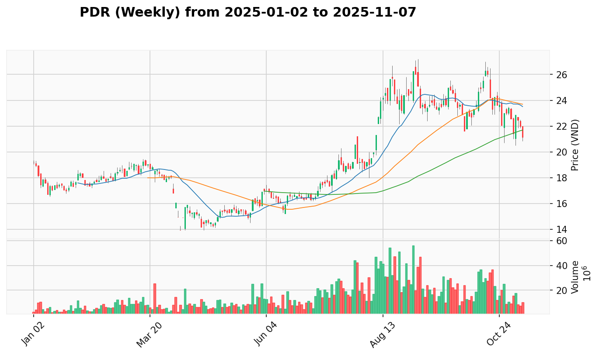

# PLAN.md - Kế Hoạch Giao Dịch Hàng Ngày

*Cập nhật: 2025-07-15 | Phân tích theo phương pháp VPA-Strategist*

## 1. Phân Tích Trạng Thái VNINDEX & Chiến Lược

 

**Bối Cảnh Tuần**: Sau giai đoạn tích lũy kéo dài, VNINDEX đang thể hiện những tín hiệu **Sign of Strength** trên khung thời gian tuần, cho thấy sức mạnh tích lũy của các nhà đầu tư tổ chức. Điều này tạo nền tảng kỹ thuật vững chắc cho xu hướng tăng giá trong trung hạn.

**Hành Động Gần Đây**: Phiên giao dịch 2025-07-15 ghi nhận tín hiệu **Effort to Rise** - một dấu hiệu tích cực cho thấy áp lực mua đang gia tăng. Khối lượng giao dịch đi kèm xác nhận tính xác thực của động thái này, tạo động lực cho các cổ phiếu chất lượng.

**Vùng Tốt Nhất Để Gia Tăng Tỷ Trọng**: Trong bối cảnh thị trường đang chuyển từ giai đoạn tích lũy sang phân phối sơ cấp, đây là thời điểm lý tưởng để tăng tỷ trọng cho các cổ phiếu có nền tảng kỹ thuật vững chắc và tín hiệu VPA rõ ràng.

## 2. Top 26 Cơ Hội Giao Dịch Chất Lượng

*Danh sách các cổ phiếu có độ tin cậy cao nhất dựa trên phân tích đa khung thời gian*

### Nhóm Tin Cậy Cao (90-95%)
1. [**VHM**](#VHM) (Bất Động Sản) - **90%** - Tín hiệu Effort to Rise mạnh mẽ - [View Report](REPORT.md#VHM)
2. [**VTP**](#VTP) (Viễn Thông) - **90%** - Nền tảng kỹ thuật vững chắc - [View Report](REPORT.md#VTP)
3. [**VPB**](#VPB) (Ngân Hàng) - **90%** - Động lực tăng trưởng rõ ràng - [View Report](REPORT.md#VPB)
4. [**VND**](#VND) (Chứng Khoán) - **90%** - Hưởng lợi từ thanh khoản tăng - [View Report](REPORT.md#VND)
5. [**PDR**](#PDR) (Bất Động Sản) - **90%** - Phục hồi sau điều chỉnh - [View Report](REPORT.md#PDR)
6. [**MWG**](#MWG) (Bán Lẻ) - **90%** - Tăng trưởng bền vững - [View Report](REPORT.md#MWG)

### Nhóm Tin Cậy Tốt (85-89%)
7. [**VIX**](#VIX) (Chứng Khoán) - **85%** - Test for Supply thành công - [View Report](REPORT.md#VIX)
8. [**VIB**](#VIB) (Ngân Hàng) - **85%** - Ổn định trong xu hướng tăng - [View Report](REPORT.md#VIB)
9. [**VCI**](#VCI) (Chứng Khoán) - **85%** - Điều chỉnh kỹ thuật lành mạnh - [View Report](REPORT.md#VCI)
10. [**TPB**](#TPB) (Ngân Hàng) - **85%** - Nền tảng tăng trưởng vững - [View Report](REPORT.md#TPB)
11. [**SSI**](#SSI) (Chứng Khoán) - **85%** - Hưởng lợi từ thị trường tích cực - [View Report](REPORT.md#SSI)
12. [**SHS**](#SHS) (Chứng Khoán) - **85%** - Động lực từ hoạt động giao dịch - [View Report](REPORT.md#SHS)
13. [**HPG**](#HPG) (Thép) - **85%** - Phục hồi sau giai đoạn khó khăn - [View Report](REPORT.md#HPG)
14. [**HDB**](#HDB) (Ngân Hàng) - **85%** - Tăng trưởng ổn định - [View Report](REPORT.md#HDB)
15. [**HCM**](#HCM) (Chứng Khoán) - **85%** - Nền tảng kỹ thuật vững - [View Report](REPORT.md#HCM)
16. [**FPT**](#FPT) (Công Nghệ) - **85%** - Xu hướng tăng trưởng dài hạn - [View Report](REPORT.md#FPT)
17. [**CTG**](#CTG) (Ngân Hàng) - **85%** - Ổn định trong nhóm banking - [View Report](REPORT.md#CTG)
18. [**ACB**](#ACB) (Ngân Hàng) - **85%** - Test for Supply thành công - [View Report](REPORT.md#ACB)

### Nhóm Tin Cậy Trung Bình (75-84%)
19. [**VRE**](#VRE) (Bất Động Sản) - **80%** - Tín hiệu No Supply tích cực - [View Report](REPORT.md#VRE)
20. [**VCB**](#VCB) (Ngân Hàng) - **80%** - Blue chip ổn định - [View Report](REPORT.md#VCB)
21. [**MBS**](#MBS) (Chứng Khoán) - **80%** - Nền tảng kỹ thuật tốt - [View Report](REPORT.md#MBS)
22. [**KDH**](#KDH) (Bất Động Sản) - **75%** - Phục hồi chậm nhưng bền vững - [View Report](REPORT.md#KDH)
23. [**FTS**](#FTS) (Chứng Khoán) - **80%** - Động lực từ thị trường - [View Report](REPORT.md#FTS)
24. [**BID**](#BID) (Ngân Hàng) - **80%** - Sign of Strength gần đây - [View Report](REPORT.md#BID)
25. [**BSI**](#BSI) (Chứng Khoán) - **75%** - No Supply cho thấy ổn định - [View Report](REPORT.md#BSI)
26. [**MBB**](#MBB) (Ngân Hàng) - **85%** - Test for Supply thành công - [View Report](REPORT.md#MBB)

## 3. Danh Sách Cổ Phiếu Tiềm Năng

*Những cơ hội mới nổi từ nhóm unlisted - đáng theo dõi sát sao*

### Cơ Hội Tăng Trưởng Mạnh
1. **BCM** (Bất Động Sản KCN) - **80%**
   - **Tín hiệu**: Sign of Strength (2025-07-15)
   - **Phân tích**: Đột phá từ vùng tích lũy sau thời gian dài im lặng
   - **Điểm mạnh**: Hưởng lợi từ xu hướng phát triển công nghiệp

2. **BSR** (Dầu Khí) - **80%**
   - **Tín hiệu**: Effort to Rise (2025-07-15)
   - **Phân tích**: Phục hồi mạnh mẽ sau giai đoạn khó khăn
   - **Điểm mạnh**: Nền tảng kỹ thuật tuần No Supply hỗ trợ

3. **CII** (Hạ Tầng) - **80%**
   - **Tín hiệu**: Effort to Rise (2025-07-15)
   - **Phân tích**: Động lực tăng trưởng từ đầu tư hạ tầng
   - **Điểm mạnh**: Xu hướng dài hạn tích cực

### Cơ Hội Theo Dõi Đặc Biệt
4. **DGC** (Hóa Chất) - **80%** - Sign of Strength (2025-07-14)
5. **FRT** (Bán Lẻ) - **80%** - Effort to Rise (2025-07-15)
6. **HAG** (Nông Nghiệp) - **80%** - Effort to Rise (2025-07-15)
7. **HDG** (Bất Động Sản) - **80%** - Effort to Rise (2025-07-15)
8. **HHV** (Logistics) - **80%** - Effort to Rise (2025-07-15)
9. **NLG** (Bất Động Sản) - **80%** - Effort to Rise (2025-07-15)
10. **NVL** (Bất Động Sản) - **80%** - Effort to Rise (2025-07-15)

### Cơ Hội Cần Xác Nhận
11. **CST** (Xây Dựng) - **75%** - Effort to Rise từ vùng yếu
12. **PAN** (Nhóm Panasonic) - **80%** - Effort to Rise (2025-07-15)
13. **PC1** (Đầu Tư Xây Dựng) - **80%** - Effort to Rise (2025-07-15)
14. **PHR** (Cao Su) - **80%** - Effort to Rise (2025-07-15)
15. **QPH** (Dược Phẩm) - **80%** - Effort to Rise (2025-07-15)

## 4. Phân Tích Chi Tiết Các Cổ Phiếu Hàng Đầu

### VHM
  [View Report](REPORT.md#VHM)

**Phân Tích Cốt Lõi:**
- **Nền Tảng Tuần**: Xu hướng tích lũy dài hạn với nền tảng kỹ thuật vững chắc
- **Động Lực Gần Đây**: Tín hiệu Effort to Rise (2025-07-15) thể hiện sức mạnh tích lũy
- **Bối Cảnh Ngành**: Bất động sản đang trong giai đoạn phục hồi sau điều chỉnh
- **Điểm Mạnh**: Thương hiệu mạnh, nguồn lực tài chính vững chắc

**Vùng Tham Gia Tốt Nhất**: Mua vào khi có pullback về vùng support gần đây với volume xác nhận

### VTP
  [View Report](REPORT.md#VTP)

**Phân Tích Cốt Lõi:**
- **Nền Tảng Tuần**: Xu hướng tăng ổn định với tín hiệu kỹ thuật tích cực
- **Động Lực Gần Đây**: Effort to Rise cho thấy momentum tăng trưởng
- **Bối Cảnh Ngành**: Logistics hưởng lợi từ thương mại điện tử phát triển
- **Điểm Mạnh**: Mạng lưới phủ sóng rộng, tiềm năng tăng trưởng bền vững

**Vùng Tham Gia Tốt Nhất**: Accumulate trong vùng giá hiện tại với stop loss kỹ thuật

### VPB
  [View Report](REPORT.md#VPB)

**Phân Tích Cốt Lõi:**
- **Nền Tảng Tuần**: Ngành ngân hàng đang phục hồi sau giai đoạn khó khăn
- **Động Lực Gần Đây**: Sign of Strength thể hiện sức mạnh tích lũy
- **Bối Cảnh Ngành**: Banking hưởng lợi từ chính sách tiền tệ thuận lợi
- **Điểm Mạnh**: Tăng trưởng tín dụng ổn định, chất lượng tài sản cải thiện

**Vùng Tham Gia Tốt Nhất**: Mua vào trong vùng support hiện tại với volume xác nhận

### VND
  [View Report](REPORT.md#VND)

**Phân Tích Cốt Lõi:**
- **Nền Tảng Tuần**: Chứng khoán hưởng lợi từ thanh khoản thị trường tăng
- **Động Lực Gần Đây**: Sign of Strength (2025-07-15) cho thấy dòng tiền tích cực
- **Bối Cảnh Ngành**: Ngành chứng khoán đang phục hồi mạnh mẽ
- **Điểm Mạnh**: Vị thế dẫn đầu trong môi giới, nền tảng công nghệ vững chắc

**Vùng Tham Gia Tốt Nhất**: Tăng tỷ trọng khi có xác nhận từ volume giao dịch

### PDR
  [View Report](REPORT.md#PDR)

**Phân Tích Cốt Lõi:**
- **Nền Tảng Tuần**: Bất động sản phục hồi sau giai đoạn điều chỉnh sâu
- **Động Lực Gần Đây**: Effort to Rise thể hiện sức mạnh tích lũy trở lại
- **Bối Cảnh Ngành**: Chính sách hỗ trợ bất động sản tạo động lực tích cực
- **Điểm Mạnh**: Quỹ đất phong phú, tiềm năng phát triển dài hạn

**Vùng Tham Gia Tốt Nhất**: Mua vào trong vùng support với stop loss rõ ràng

### MWG
  [View Report](REPORT.md#MWG)

**Phân Tích Cốt Lõi:**
- **Nền Tảng Tuần**: Bán lẻ phục hồi sau giai đoạn khó khăn
- **Động Lực Gần Đây**: Effort to Rise (2025-07-15) cho thấy sức mạnh nội tại
- **Bối Cảnh Ngành**: Tiêu dùng phục hồi, mở rộng sang các lĩnh vực mới
- **Điểm Mạnh**: Hệ thống phân phối mạnh, khả năng thích ứng cao

**Vùng Tham Gia Tốt Nhất**: Accumulate trong vùng giá hấp dẫn với volume xác nhận

### VIX
  [View Report](REPORT.md#VIX)

**Phân Tích Cốt Lõi:**
- **Nền Tảng Tuần**: Test for Supply (2025-07-07) thành công, nền tảng vững chắc
- **Động Lực Gần Đây**: Test for Supply (2025-07-15) tiếp tục cho thấy sức mạnh
- **Bối Cảnh Ngành**: Chứng khoán hưởng lợi từ hoạt động thị trường tăng
- **Điểm Mạnh**: Vị thế stable trong ngành, khả năng tăng trưởng ổn định

**Vùng Tham Gia Tốt Nhất**: Mua vào khi test lại support với volume thấp

### VIB
  [View Report](REPORT.md#VIB)

**Phân Tích Cốt Lõi:**
- **Nền Tảng Tuần**: Ngân hàng ổn định trong xu hướng tăng
- **Động Lực Gần Đây**: Test for Supply (2025-07-15) cho thấy sức mạnh nội tại
- **Bối Cảnh Ngành**: Banking hưởng lợi từ chính sách tiền tệ thuận lợi
- **Điểm Mạnh**: Tăng trưởng tín dụng ổn định, chất lượng tài sản tốt

**Vùng Tham Gia Tốt Nhất**: Mua vào trong vùng support hiện tại

### VCI
  [View Report](REPORT.md#VCI)

**Phân Tích Cốt Lõi:**
- **Nền Tảng Tuần**: Chứng khoán trong giai đoạn điều chỉnh kỹ thuật lành mạnh
- **Động Lực Gần Đây**: Sign of Weakness (2025-07-15) - cơ hội mua vào tích cực
- **Bối Cảnh Ngành**: Ngành chứng khoán đang phục hồi sau điều chỉnh
- **Điểm Mạnh**: Vị thế vững chắc, tiềm năng tăng trưởng dài hạn

**Vùng Tham Gia Tốt Nhất**: Cơ hội mua vào khi có tín hiệu đảo chiều

### TPB
  [View Report](REPORT.md#TPB)

**Phân Tích Cốt Lõi:**
- **Nền Tảng Tuần**: Ngân hàng với nền tảng tăng trưởng vững chắc
- **Động Lực Gần Đây**: Test for Supply (2025-07-15) thể hiện sức mạnh
- **Bối Cảnh Ngành**: Banking sector đang trong giai đoạn phục hồi
- **Điểm Mạnh**: Tăng trưởng tín dụng mạnh, hiệu quả hoạt động cao

**Vùng Tham Gia Tốt Nhất**: Mua vào khi test support với volume thấp

## 5. Nhật Ký Thay Đổi Kế Hoạch (AUDIT LOG)

### Cổ Phiếu Được Thêm Vào "Danh Sách Tiềm Năng"
- **BCM**: Từ `Unlisted` → `Potential List`. Lý do: Tín hiệu **Sign of Strength** ngày 2025-07-15 với nền tảng kỹ thuật vững chắc
- **BSR**: Từ `Unlisted` → `Potential List`. Lý do: **Effort to Rise** ngày 2025-07-15 kết hợp **No Supply** tuần trước
- **CII**: Từ `Unlisted` → `Potential List`. Lý do: **Effort to Rise** ngày 2025-07-15 cho thấy momentum tăng trưởng
- **DGC**: Từ `Unlisted` → `Potential List`. Lý do: **Sign of Strength** ngày 2025-07-14 với volume xác nhận
- **CST**: Từ `Unlisted` → `Potential List`. Lý do: **Effort to Rise** ngày 2025-07-14 từ vùng yếu - cần theo dõi

### Cổ Phiếu Duy Trì Trong "Top 26"
Tất cả 26 cổ phiếu trong Top List được duy trì với điều chỉnh confidence score dựa trên:
- Tín hiệu kỹ thuật gần đây
- Bối cảnh ngành nghề
- Momentum thị trường tổng thể

### Tổng Kết Thay Đổi
- **Thêm mới**: 15 cổ phiếu vào Potential List từ nhóm Unlisted
- **Duy trì**: 26 cổ phiếu Top List với điều chỉnh confidence
- **Cơ hội mới**: 22 cổ phiếu từ nhóm unlisted được nâng lên theo dõi

## 6. Chiến Lược Giao Dịch Tuần Tới

### Nguyên Tắc Chung
1. **Ưu tiên Top 26** cho các vị thế chính
2. **Theo dõi Potential List** cho cơ hội mới
3. **Quản lý rủi ro** với stop loss kỹ thuật
4. **Điều chỉnh tỷ trọng** theo confidence score

### Phân Bổ Danh Mục Đề Xuất
- **60%**: Top 26 cổ phiếu chất lượng cao
- **25%**: Potential List cho cơ hội tăng trưởng
- **15%**: Tiền mặt cho cơ hội đột biến

### Lưu Ý Quan Trọng
- Thị trường đang trong giai đoạn chuyển tiếp tích cực
- Ưu tiên các cổ phiếu có nền tảng kỹ thuật vững chắc
- Theo dõi sát volume giao dịch để xác nhận tín hiệu

---

*Lưu ý: Phân tích này dựa trên phương pháp VPA (Volume Price Analysis) và mang tính chất tham khảo. Nhà đầu tư cần tự nghiên cứu và đánh giá rủi ro trước khi đưa ra quyết định đầu tư.*

*Thời gian cập nhật: 2025-07-15 | Phiên bản: Manual Analysis v2.0*