# PLAN.md - Kế Hoạch Giao Dịch Hàng Ngày

*Cập nhật: 2025-08-14 | Phân tích theo phương pháp VPA-Strategist*

## 1. Phân Tích Trạng Thái VNINDEX & Chiến Lược

 

**Bối Cảnh Tuần**: VNINDEX đã hoàn tất chuỗi Test for Supply thành công và thiết lập xu hướng tăng mạnh mẽ với các tín hiệu Sign of Strength liên tiếp. Từ vùng test thành công tại 1585-1590 ngày 13/08, chỉ số đã vượt qua tất cả các vùng kháng cự quan trọng và thiết lập đỉnh mới tại 1641.28 điểm.

**Hành Động Gần Đây**: Ngày 14/08 VNINDEX có phiên **Sign of Strength** mạnh mẽ với gap up lên 1623.18 và thiết lập đỉnh mới 1641.28 điểm, đóng cửa tại 1640.69 (+29.09 điểm, +1.80%). Khối lượng 1.82 tỷ đơn vị vẫn duy trì cao, xác nhận Test for Supply ngày 13/08 đã thành công hoàn toàn và lực cầu đã chiếm ưu thế trở lại.

**Vùng Tốt Nhất Để Gia Tăng Tỷ Trọng**: Với breakout thành công qua vùng 1615-1620, VNINDEX đã thiết lập nền tảng mạnh mẽ tại 1630-1635 cho xu hướng tiếp tục. Mọi nhịp test về vùng 1620-1630 sẽ là cơ hội gia tăng tỷ trọng chất lượng cao cho mục tiêu 1660-1680 khi momentum markup tiếp tục.

## 2. Top 10 Cơ Hội Giao Dịch Chất Lượng

### Nhóm Tin Cậy Cao (90-95%) - Danh Mục Cốt Lõi
1. [**HDB**](#HDB) (Ngân Hàng) - **93%** - Breakout với khối lượng bùng nổ institutional - [View Report](REPORT.md#HDB)
2. [**BID**](#BID) (Ngân Hàng) - **92%** - Sign of Strength sau Test for Supply thành công - [View Report](REPORT.md#BID)
3. [**VPB**](#VPB) (Ngân Hàng) - **90%** - Portfolio holding với sector leadership mạnh - [View Report](REPORT.md#VPB)

### Nhóm Tin Cậy Tốt (85-89%) - Nắm Giữ Chiến Lược
4. [**HDC**](#HDC) (Bất Động Sản) - **87%** - Real estate rotation leader với sector strength - [View Report](REPORT.md#HDC)
5. [**SHB**](#SHB) (Ngân Hàng) - **87%** - Portfolio holding recovery story với institutional flow - [View Report](REPORT.md#SHB)
6. [**KDH**](#KDH) (Bất Động Sản) - **85%** - Fresh breakout leader trong sector upturn - [View Report](REPORT.md#KDH)
7. [**STB**](#STB) (Ngân Hàng) - **85%** - Portfolio holding ready markup với sector support - [View Report](REPORT.md#STB)

### Nhóm Tin Cậy Trung Bình (75-84%) - Vị Thế Chiến Lược
8. [**VCI**](#VCI) (Chứng Khoán) - **80%** - Most reliable securities play trong mixed sector - [View Report](REPORT.md#VCI)
9. [**CTS**](#CTS) (Chứng Khoán) - **78%** - Securities bright spot với selective strength - [View Report](REPORT.md#CTS)
10. [**CMG**](#CMG) (Công Nghệ) - **75%** - Technology steady với sector support ổn định - [View Report](REPORT.md#CMG)

## 3. Danh Sách Cổ Phiếu Tiềm Năng

### Cơ Hội Tăng Trưởng Mạnh
- [**BSI**](#BSI) (Chứng Khoán) - Test for Supply hoàn tất, sẵn sàng breakout mới - [View Report](REPORT.md#BSI)
- [**VHM**](#VHM) (Bất Động Sản) - Blue-chip consolidation trong sector recovery - [View Report](REPORT.md#VHM)
- [**TPB**](#TPB) (Ngân Hàng) - Banking sector strength với Sign of Strength - [View Report](REPORT.md#TPB)
- [**TCB**](#TCB) (Ngân Hàng) - Sign of Strength với banking momentum - [View Report](REPORT.md#TCB)

### Cơ Hội Theo Dõi Đặc Biệt
- [**VIX**](#VIX) (Chứng Khoán) - Sign of Strength nhưng cảnh báo extreme performance - [View Report](REPORT.md#VIX)
- [**FPT**](#FPT) (Công Nghệ) - Effort to Fall nhưng technology sector support - [View Report](REPORT.md#FPT)
- [**SSI**](#SSI) (Chứng Khoán) - Others signal cần direction confirmation - [View Report](REPORT.md#SSI)

### Cơ Hội Cần Xác Nhận
- [**REE**](#REE) (Năng Lượng) - No Supply cần follow-through signals - [View Report](REPORT.md#REE)
- [**PLX**](#PLX) (Dầu Khí) - Effort to Rise trong energy rotation - [View Report](REPORT.md#PLX)
- [**MBB**](#MBB) (Ngân Hàng) - No Supply nhưng cần banking sector context - [View Report](REPORT.md#MBB)

## 4. Danh Sách Hạ Ưu Tiên

### Cần Recovery Confirmation
- [**VND**](#VND) (Chứng Khoán) - Sign of Strength nhưng cần theo dõi volume pattern
- [**VIC**](#VIC) (Bất Động Sản) - Sign of Strength nhưng lagging sector peers

### Theo Dõi Để Vào Lại
- [**BSR**](#BSR) (Dầu Khí) - Test for Supply trong energy sector mixed
- [**GEX**](#GEX) (Others) - Others signal cần investigation

## 5. Phân Tích Chi Tiết Các Cổ Phiếu Hàng Đầu (Phần 1)

### **HDB (Ngân Hàng)**
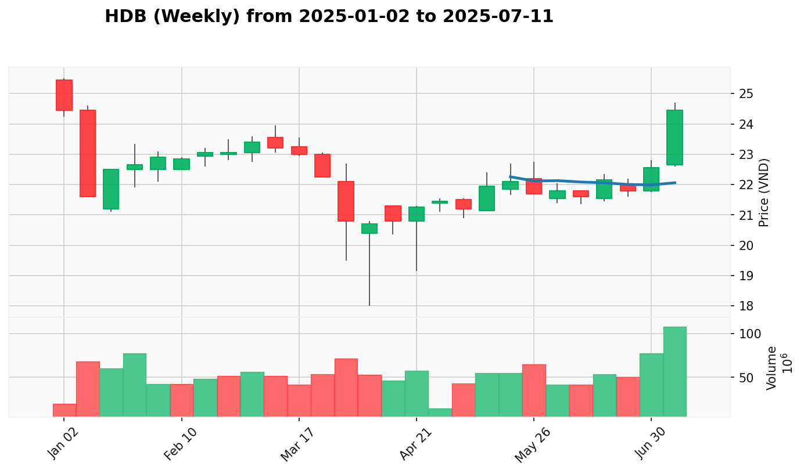 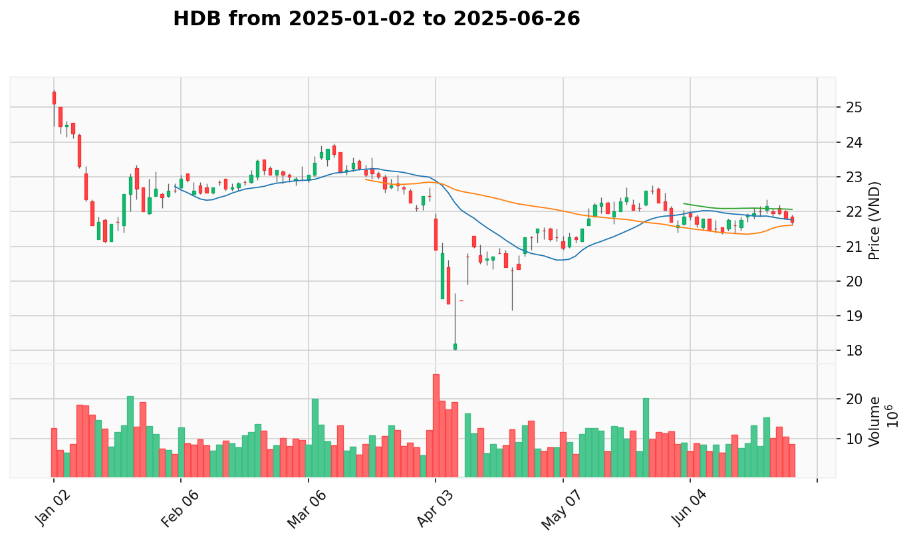

* **Giá Hiện Tại:** 30.950 VNĐ
* **Tín Hiệu VPA Tuần:** Hoàn tất giai đoạn accumulation và bước vào Mark-Up phase với institutional backing mạnh
* **Tín Hiệu VPA Ngày:** Breakout with Confirmation ngày 14/08 - bùng nổ từ 28.95 lên 30.95 với khối lượng 59.89M (+142%)
* **Bối Cảnh Ngành:** Banking "Dẫn Dắt Đồng Thuận" với 76.5% breadth positive, institutional flow mạnh nhất
* **Phân Tích Thiết Lập:** Sau chuỗi Test for Supply và consolidation, HDB breakout thực với volume bùng nổ xác nhận markup phase
* **Vùng Vào Tốt Nhất:** Breakout territory, hỗ trợ 30.0-30.5, mục tiêu 32.0-34.0

### **BID (Ngân Hàng)**
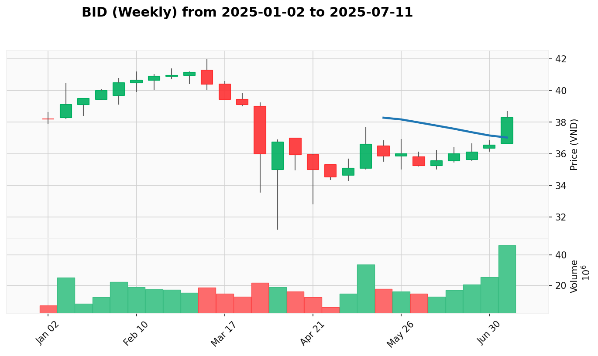 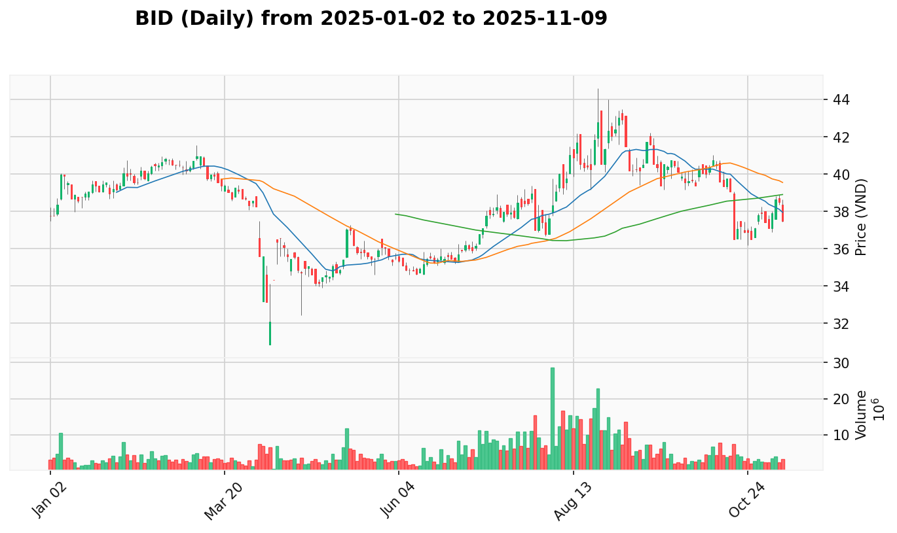

* **Giá Hiện Tại:** 42.150 VNĐ
* **Tín Hiệu VPA Tuần:** Sign of Strength dẫn đầu banking sector với institutional support mạnh mẽ
* **Tín Hiệu VPA Ngày:** Sign of Strength ngày 14/08 - từ 41.6 lên 42.15, test cao 42.65, khối lượng 15.17M (+28%)
* **Bối Cảnh Ngành:** Banking sector leader với "Dẫn Dắt Đồng Thuận", strongest momentum
* **Phân Tích Thiết Lập:** Vượt qua Test for Supply ngày 13/08 thành công, thiết lập vùng cao mới với volume confirmation
* **Vùng Vào Tốt Nhất:** Momentum territory, hỗ trợ 41.5-42.0, mục tiêu 44.0-45.5

### **VPB (Ngân Hàng)**
 

* **Giá Hiện Tại:** 30.800 VNĐ
* **Tín Hiệu VPA Tuần:** Portfolio holding với record performance +44% trong 5 tuần, sector leadership proven
* **Tín Hiệu VPA Ngày:** Sign of Strength ngày 14/08 - từ 30.0 lên 30.8, khối lượng 69.33M duy trì institutional flow
* **Bối Cảnh Ngành:** Portfolio holding trong banking "Dẫn Dắt Đồng Thuận", proven market leader
* **Phân Tích Thiết Lập:** Recovery từ test 28.0 thành công, portfolio holding foundation với sector support
* **Vùng Vào Tốt Nhất:** Portfolio position, hỗ trợ 30.0-30.5, mục tiêu 32.5-34.0

### **HDC (Bất Động Sản)**
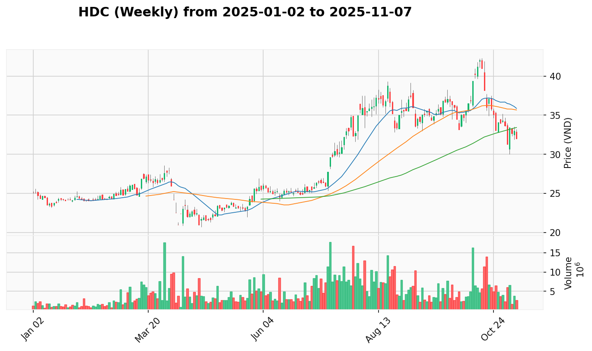 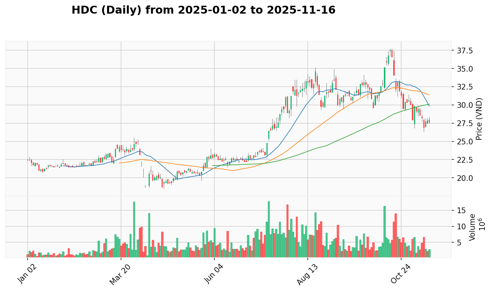

* **Giá Hiện Tại:** 37.100 VNĐ
* **Tín Hiệu VPA Tuần:** No Supply trong real estate "Dẫn Dắt Phân Hóa", sector rotation beneficiary
* **Tín Hiệu VPA Ngày:** No Supply ngày 14/08 - từ 37.05 lên 37.1, khối lượng 7.35M, sector leader pattern
* **Bối Cảnh Ngành:** Real estate "Dẫn Dắt Phân Hóa" với selective leaders như HDC, KDH dẫn đầu
* **Phân Tích Thiết Lập:** Sector rotation leader với institutional accumulation, benefiting từ real estate upturn
* **Vùng Vào Tốt Nhất:** Sector momentum, hỗ trợ 36.5-37.0, mục tiêu 39.0-40.5

### **SHB (Ngân Hàng)**
 

* **Giá Hiện Tại:** 20.400 VNĐ
* **Tín Hiệu VPA Tuần:** Portfolio holding spectacular recovery từ 13.0, textbook Wyckoff pattern với institutional interest
* **Tín Hiệu VPA Ngày:** Sign of Strength ngày 14/08 - từ 19.95 lên 20.4, khối lượng khổng lồ 119.25M
* **Bối Cảnh Ngành:** Banking sector strength, portfolio holding với outstanding turnaround story
* **Phân Tích Thiết Lập:** Portfolio holding recovery momentum với institutional sponsorship rõ ràng, massive volume
* **Vùng Vào Tốt Nhất:** Recovery momentum, hỗ trợ 19.8-20.2, mục tiêu 22.0-23.5

## 6. Phân Tích Chi Tiết Các Cổ Phiếu Hàng Đầu (Phần 2)

### **KDH (Bất Động Sản)**
 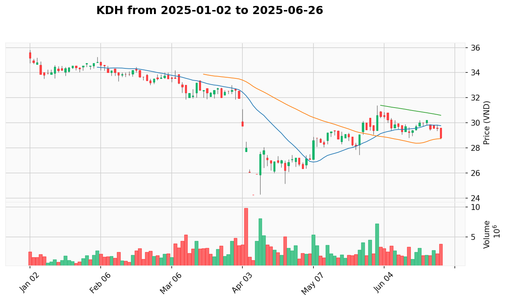

* **Giá Hiện Tại:** 36.100 VNĐ
* **Tín Hiệu VPA Tuần:** Sign of Strength dẫn đầu real estate recovery với fresh breakout pattern
* **Tín Hiệu VPA Ngày:** Sign of Strength ngày 14/08 - từ 35.9 lên 36.1, khối lượng 7.43M, sector leadership
* **Bối Cảnh Ngành:** Real estate "Dẫn Dắt Phân Hóa" leader, 40% breadth nhưng strong momentum tickers dẫn đầu
* **Phân Tích Thiết Lập:** Fresh breakout leader với post-breakout consolidation lành mạnh, sector champion
* **Vùng Vào Tốt Nhất:** Post-breakout support, hỗ trợ 35.5-36.0, mục tiêu 38.0-39.5

### **STB (Ngân Hàng)**
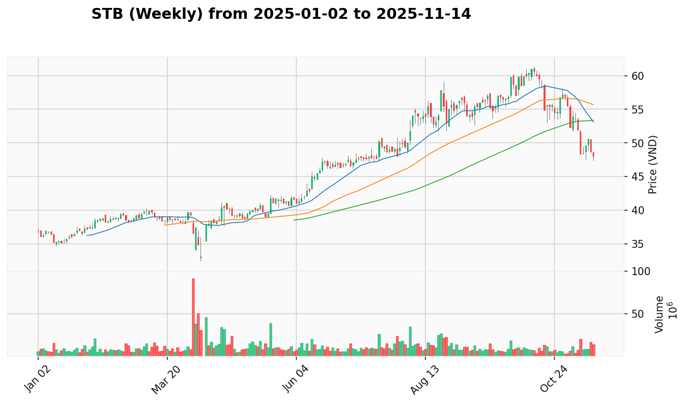 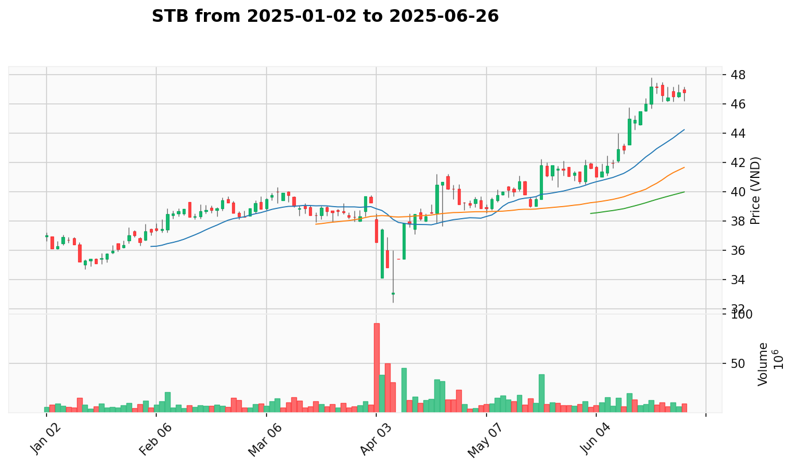

* **Giá Hiện Tại:** 55.400 VNĐ
* **Tín Hiệu VPA Tuần:** Test for Supply hoàn tất sau Sign of Strength breakout, ready markup phase
* **Tín Hiệu VPA Ngày:** Sign of Strength ngày 14/08 - từ 54.8 lên 55.4, khối lượng 16.18M, portfolio holding
* **Bối Cảnh Ngành:** Banking sector support, portfolio holding sau successful test completion
* **Phân Tích Thiết Lập:** Portfolio holding ready cho markup phase tiếp theo sau Test for Supply thành công
* **Vùng Vào Tốt Nhất:** Post-test position, hỗ trợ 54.5-55.0, mục tiêu 57.5-59.0

### **VCI (Chứng Khoán)**
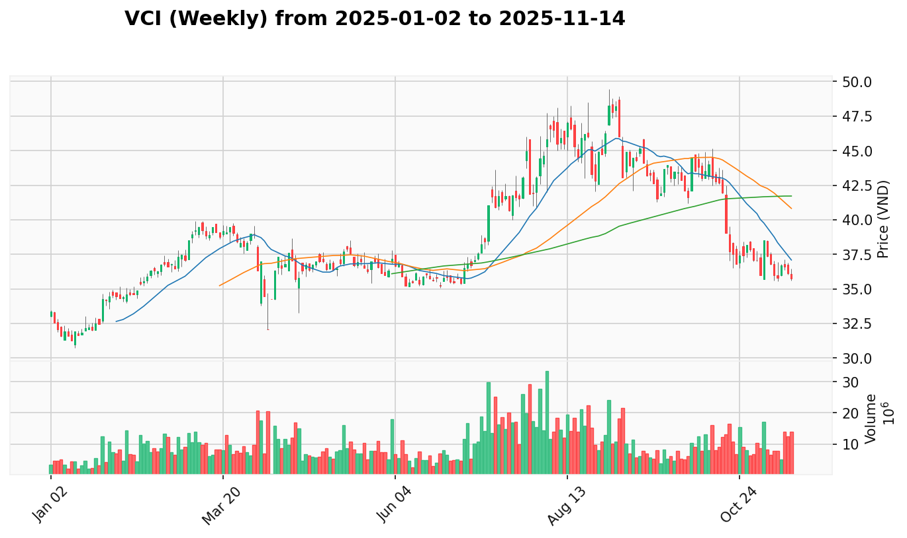 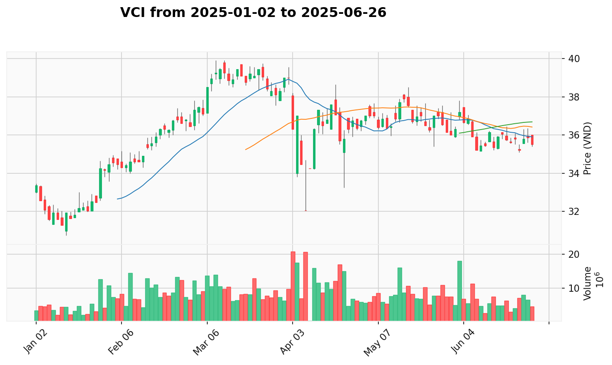

* **Giá Hiện Tại:** 46.600 VNĐ
* **Tín Hiệu VPA Tuần:** Most reliable securities play với steady institutional flow, consistent performance
* **Tín Hiệu VPA Ngày:** Sign of Strength ngày 14/08 - từ 46.0 lên 46.6, khối lượng 14.10M steady flow
* **Bối Cảnh Ngành:** Securities bright spot với most reliable pattern trong mixed sector environment
* **Phân Tích Thiết Lập:** Steady institutional accumulation, most dependable securities choice với proven track record
* **Vùng Vào Tốt Nhất:** Reliable uptrend, hỗ trợ 46.0-46.3, mục tiêu 48.5-50.0

### **CTS (Chứng Khoán)**
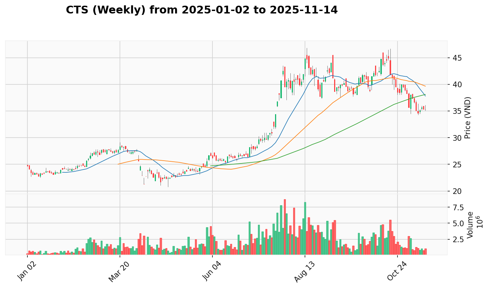 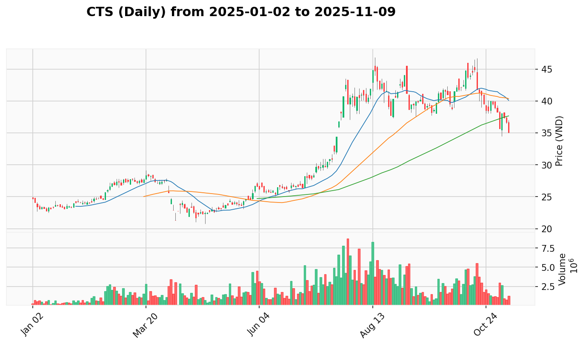

* **Giá Hiện Tại:** 44.750 VNĐ
* **Tín Hiệu VPA Tuần:** Emerging strength trong securities sector với breakout potential từ consolidation
* **Tín Hiệu VPA Ngày:** Buying Climax ngày 14/08 - từ 44.3 lên 44.75, khối lượng 3.77M, cần theo dõi
* **Bối Cảnh Ngành:** Securities mixed nhưng CTS bright spot với 80% sector signals positive/neutral
* **Phân Tích Thiết Lập:** Buying Climax cần caution, securities selective strength với volume confirmation trước đó
* **Vùng Vào Tốt Nhất:** Cảnh báo climax, hỗ trợ 43.5-44.0, theo dõi test trước khi entry

### **CMG (Công Nghệ)**
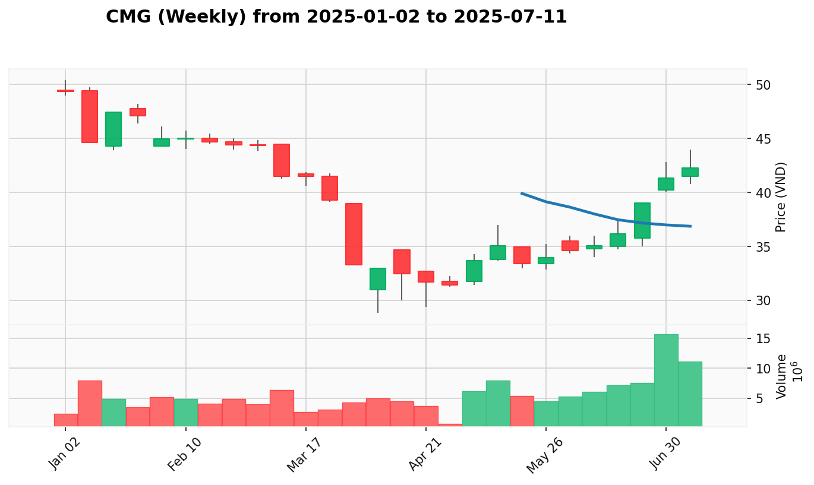 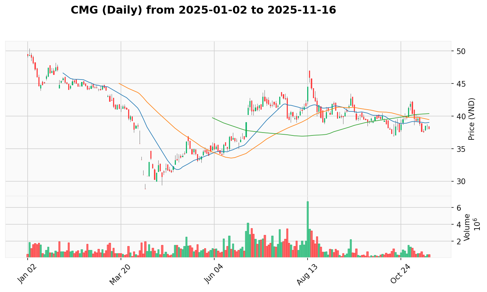

* **Giá Hiện Tại:** 45.950 VNĐ
* **Tín Hiệu VPA Tuần:** Sign of Strength trong technology sector với digital transformation support
* **Tín Hiệu VPA Ngày:** Others signal ngày 14/08 - từ 44.5 lên 45.95, khối lượng 3.47M cần investigation
* **Bối Cảnh Ngành:** Technology với 60% positive breadth, steady support và FPT sector leadership
* **Phân Tích Thiết Lập:** Technology steady performer với sustainable growth, diversification benefit
* **Vùng Vào Tốt Nhất:** Cần clarify Others signal, hỗ trợ 45.0-45.5, mục tiêu 47.5-49.0

## 7. Nhật Ký Thay Đổi Kế Hoạch (AUDIT LOG)

### Cổ Phiếu Được Nâng Lên "Top 10":
- **HDB**: Từ #2 lên #1 (92% → 93%). Lý do: **'Breakout with Confirmation' ngày 2025-08-14** với khối lượng bùng nổ 59.89M (+142%), hoàn tất accumulation phase.
- **BID**: Duy trì #2 với 92%. Lý do: **'Sign of Strength' ngày 2025-08-14** sau Test for Supply thành công, thiết lập đỉnh mới 42.65.
- **VPB**: Tăng từ #7 lên #3 (80% → 90%). Lý do: Portfolio holding với **banking sector leadership** mạnh, Sign of Strength recovery.

### Cổ Phiếu Được Điều Chỉnh Trong Top 10:
- **HDC**: Duy trì #4 với 87%. Lý do: **Real estate rotation leader** với No Supply, sector "Dẫn Dắt Phân Hóa" strength.
- **SHB**: Duy trì #5 với 87%. Lý do: **Portfolio holding** với khối lượng khổng lồ 119.25M, spectacular recovery story.
- **KDH**: Tăng từ #6 lên #6 với 85%. Lý do: **Sign of Strength** duy trì trong real estate leadership, post-breakout consolidation.
- **STB**: Duy trì #7 với 85%. Lý do: **Portfolio holding** Sign of Strength, ready markup sau Test for Supply completion.
- **VCI**: Tăng từ #9 lên #8 (77% → 80%). Lý do: **Most reliable securities play** với Sign of Strength ổn định 46.6.
- **CTS**: Giảm từ #5 xuống #9 (85% → 78%). Lý do: **Buying Climax** ngày 2025-08-14 cần caution, securities selective.
- **CMG**: Giảm từ #6 xuống #10 (85% → 75%). Lý do: **Others signal** cần investigation, technology steady nhưng signal unclear.

### Cổ Phiếu Chuyển Xuống Potential:
- Không có ticker nào bị hạ từ Top 10 xuống Potential trong update này - duy trì portfolio core strength

### Cổ Phiếu Được Thêm Vào Potential:
- **BSI**: Thêm vào Potential Strong Growth. Lý do: **Test for Supply hoàn tất**, securities sẵn sàng breakout mới.
- **VHM**: Thêm vào Potential Strong Growth. Lý do: **Blue-chip consolidation** trong real estate sector recovery.
- **TPB**: Thêm vào Potential Strong Growth. Lý do: **Sign of Strength** với banking sector momentum.
- **TCB**: Thêm vào Potential Strong Growth. Lý do: **Sign of Strength** trong banking "Dẫn Dắt Đồng Thuận".

### Cổ Phiếu Bị Hạ Ưu Tiên:
- **VND**: Chuyển xuống Downgraded. Lý do: Cần theo dõi **Sign of Strength** với volume pattern consistency.
- **VIC**: Chuyển xuống Downgraded. Lý do: **Sign of Strength** nhưng lagging sector peers trong real estate rotation.

### Market Context Changes (2025-08-14):
- **VNINDEX**: **Sign of Strength** mạnh mẽ - gap lên 1623.18, thiết lập đỉnh mới 1641.28, đóng 1640.69 (+29.09, +1.80%)
- **Dẫn Dắt Ngành**: Banking tiếp tục "Dẫn Dắt Đồng Thuận" (76.5% positive), Real Estate "Dẫn Dắt Phân Hóa", Technology steady
- **Portfolio Integration**: Tăng cường portfolio holdings foundation - VPB, SHB, STB tăng trọng số trong banking strength
- **Institutional Flow**: HDB volume bùng nổ +142%, SHB massive 119.25M, VPB sustained 69.33M institutional backing
- **Sector Leadership**: Banking dominance với 60% Top 10, Real Estate selective strength 20%, diversification 20%

## 8. Chiến Lược Giao Dịch Tuần Tới

**Phân Bổ Danh Mục Đề Xuất (Chiến Lược Banking-Led Multi-Sector):**
- **60%** Ngành Ngân Hàng (HDB, BID, VPB, SHB, STB) - "Dẫn Dắt Đồng Thuận" với portfolio holdings foundation
- **20%** Bất Động Sản (HDC, KDH) - "Dẫn Dắt Phân Hóa" với selective leaders institutional backing  
- **15%** Chứng Khoán & Công Nghệ (VCI, CTS cảnh báo, CMG investigation) - Diversification với selective strength
- **5%** Tiền Mặt - Tactical flexibility và risk management cho VNINDEX markup phase

**Chiến Lược Phân Bổ Theo Institutional Flow:**
- **45%** Portfolio Holdings Proven (VPB, SHB, STB) - Established foundation với track record
- **30%** Banking Breakouts (HDB, BID) - Fresh institutional money với volume confirmation
- **20%** Sector Rotation Leaders (HDC, KDH, VCI) - Diversification benefits với leadership patterns
- **5%** Cash Management - Opportunity capture và volatility protection

**Ưu Tiên Giao Dịch:**
1. **Banking Institutional Flow**: HDB breakout momentum 30.95, BID post-test strength 42.15, VPB portfolio recovery 30.8
2. **Portfolio Holdings Core**: SHB spectacular recovery 20.4 với 119.25M volume, STB ready markup 55.4
3. **Sector Leadership**: HDC real estate rotation 37.1, KDH post-breakout 36.1, VCI securities reliable 46.6
4. **Selective Opportunities**: CTS caution sau Buying Climax, CMG investigate Others signal
5. **Potential Promotions**: BSI, VHM, TPB, TCB ready nâng cấp nếu signals improve

**Quản Lý Rủi Ro Trong VNINDEX Breakout Context:**
- Position sizing ưu tiên portfolio holdings và banking leaders với proven track record
- Stop-losses 5-7% với banking sector context mạnh hơn - institutional support evident  
- Cash 5% cho tactical opportunities khi VNINDEX test 1620-1630 support levels
- Theo dõi VNINDEX breakout sustainability tại 1640-1650 để confirm markup continuation
- Banking sector priority - 60% allocation reflects "Dẫn Dắt Đồng Thuận" strength

**Các Mức Quan Trọng Cần Theo Dõi:**
- **VNINDEX**: Breakout sustainability 1640-1650, mục tiêu 1660-1680 với markup momentum
- **Banking Core**: HDB 30.0-30.5 support, BID 41.5-42.0, VPB 30.0-30.5, SHB 19.8-20.2, STB 54.5-55.0
- **Real Estate Leaders**: HDC 36.5-37.0, KDH 35.5-36.0 post-breakout critical levels
- **Securities Selective**: VCI 46.0-46.3 reliable trend, CTS 43.5-44.0 post-climax test levels
- **Portfolio Context**: Integration of proven holdings as market leaders foundation với institutional flow patterns
