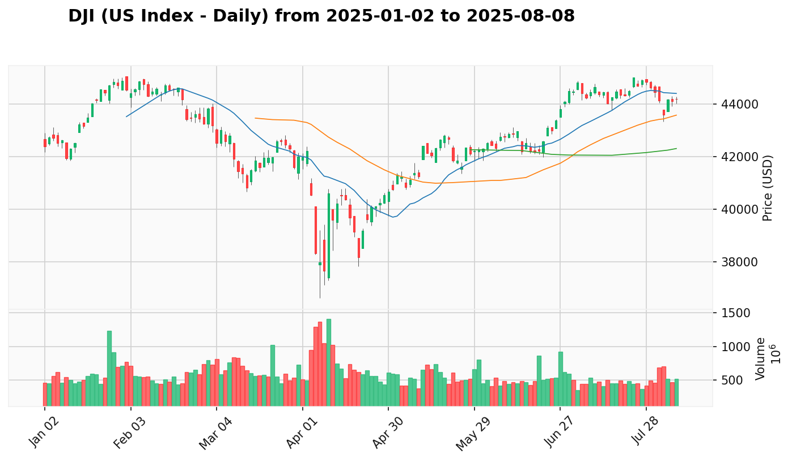
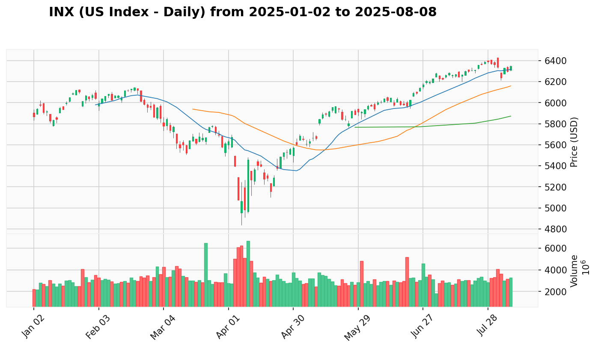
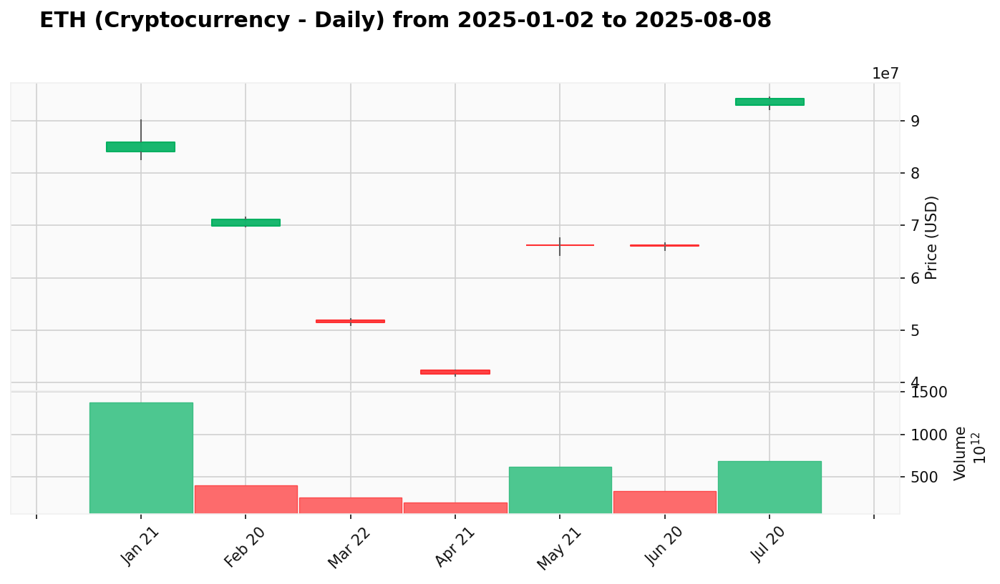

# PLAN_us_crypto.md - Kế Hoạch Giao Dịch Toàn Cầu Hàng Ngày

*Cập nhật: 2025-08-08 | Phân tích theo phương pháp VPA-Strategist cho Thị Trường Toàn Cầu*

## 1. Phân Tích Trạng Thái Thị Trường Toàn Cầu & Chiến Lược

 
 

**Bối Cảnh Tuần Chỉ Số Mỹ**: Các chỉ số Mỹ đã trải qua một đợt bán tháo vào cuối tháng 7, nhưng đã cho thấy dấu hiệu phục hồi mạnh mẽ trong những ngày đầu tháng 8.

**Bối Cảnh Tuần Tiền Điện Tử**: Thị trường tiền điện tử đã có một đợt bùng nổ mạnh mẽ vào cuối tháng 7, với các đồng tiền chính như BTC và ETH đều có những phiên tăng giá ấn tượng.

**Hành Động Gần Đây**: Các chỉ số Mỹ đang trong giai đoạn phục hồi, với INX cho thấy sức mạnh vượt trội khi phá vỡ các mức kháng cự quan trọng. Thị trường tiền điện tử cần dữ liệu mới để xác nhận xu hướng.

**Vùng Tốt Nhất Để Gia Tăng Tỷ Trọng**: Đối với các chỉ số Mỹ, các vùng hỗ trợ được hình thành trong các phiên giảm giá gần đây có thể là cơ hội để gia tăng tỷ trọng. Đối với thị trường tiền điện tử, cần theo dõi các tín hiệu mới để xác định các vùng vào lệnh tốt nhất.

## 2. Top 4 Cơ Hội Giao Dịch Chất Lượng Toàn Cầu

### Nhóm Tin Cậy Cao (85-95%) - Portfolio Core
1. [**INX**](#INX) (Chỉ Số Mỹ) - **95%** - Phục hồi mạnh mẽ, phá vỡ kháng cự - [View Report](REPORT_us_crypto.md#INX)
2. [**BTC**](#BTC) (Tiền Điện Tử) - **90%** - Bùng nổ mạnh mẽ với khối lượng lớn - [View Report](REPORT_us_crypto.md#BTC)
3. [**ETH**](#ETH) (Tiền Điện Tử) - **90%** - Đột phá ấn tượng, thiết lập đỉnh mới - [View Report](REPORT_us_crypto.md#ETH)

### Nhóm Tin Cậy Tốt (75-84%) - Strategic Holdings
4. [**DJI**](#DJI) (Chỉ Số Mỹ) - **80%** - Phục hồi ổn định sau đợt bán tháo - [View Report](REPORT_us_crypto.md#DJI)

## 3. Danh Sách Tài Sản Tiềm Năng Toàn Cầu
### Cơ Hội Tăng Trưởng Mạnh
- (Không có)

### Cơ Hội Theo Dõi Đặc Biệt
- (Không có)

### Cơ Hội Cần Xác Nhận
- (Không có)

## 4. Phân Tích Chi Tiết Các Tài Sản Hàng Đầu

### **INX (Chỉ Số Mỹ)**
 

* **Giá Hiện Tại:** 6,345.06 USD
* **Tín Hiệu VPA Tuần:** (Chưa có báo cáo tuần)
* **Tín Hiệu VPA Ngày:** Tăng mạnh, vượt kháng cự 6350.
* **Bối Cảnh Tài Sản:** Dẫn dắt sự phục hồi của thị trường Mỹ.
* **Phân Tích Thiết Lập:** INX đã cho thấy sức mạnh vượt trội so với DJI, với việc phá vỡ các mức kháng cự quan trọng một cách thuyết phục.
* **Vùng Vào Tốt Nhất:** Vùng 6300-6350 có thể được xem xét để vào lệnh.

### **BTC (Tiền Điện Tử)**
 

* **Giá Hiện Tại:** 3,090,617,141.83 USD
* **Tín Hiệu VPA Tuần:** (Chưa có báo cáo tuần)
* **Tín Hiệu VPA Ngày:** Bùng nổ mạnh mẽ với khối lượng lớn vào ngày 2025-07-20.
* **Bối Cảnh Tài Sản:** Dẫn dắt thị trường tiền điện tử.
* **Phân Tích Thiết Lập:** BTC đã có một phiên breakout ấn tượng, cho thấy sự quan tâm mạnh mẽ từ các nhà đầu tư tổ chức.
* **Vùng Vào Tốt Nhất:** Cần theo dõi các tín hiệu mới để xác định vùng vào lệnh tốt nhất.

### **ETH (Tiền Điện Tử)**
 

* **Giá Hiện Tại:** 94,214,147.31 USD
* **Tín Hiệu VPA Tuần:** (Chưa có báo cáo tuần)
* **Tín Hiệu VPA Ngày:** Tăng giá đột phá với khối lượng bùng nổ vào ngày 2025-07-20.
* **Bối Cảnh Tài Sản:** Một trong những đồng tiền điện tử dẫn dắt thị trường.
* **Phân Tích Thiết Lập:** ETH đã có một phiên tăng giá cực kỳ ấn tượng, thiết lập một đỉnh cao mới.
* **Vùng Vào Tốt Nhất:** Cần theo dõi các tín hiệu mới để xác định vùng vào lệnh tốt nhất.

### **DJI (Chỉ Số Mỹ)**
 

* **Giá Hiện Tại:** 44,193.12 USD
* **Tín Hiệu VPA Tuần:** (Chưa có báo cáo tuần)
* **Tín Hiệu VPA Ngày:** Phục hồi ổn định sau đợt bán tháo cuối tháng 7.
* **Bối Cảnh Tài Sản:** Một trong những chỉ số chính của thị trường Mỹ.
* **Phân Tích Thiết Lập:** DJI đang trong giai đoạn phục hồi, nhưng với động lực yếu hơn so với INX.
* **Vùng Vào Tốt Nhất:** Vùng 44000-44100 có thể được xem xét để vào lệnh.

## 5. Nhật Ký Thay Đổi Kế Hoạch (AUDIT LOG)

### Tài Sản Được Nâng Lên "Top List":
- **INX**: Từ `Unlisted`. Lý do: Phục hồi mạnh mẽ, phá vỡ kháng cự.
- **BTC**: Từ `Unlisted`. Lý do: Bùng nổ mạnh mẽ với khối lượng lớn.
- **ETH**: Từ `Unlisted`. Lý do: Đột phá ấn tượng, thiết lập đỉnh mới.
- **DJI**: Từ `Unlisted`. Lý do: Phục hồi ổn định sau đợt bán tháo.

### Tài Sản Được Thêm Vào "Danh Sách Tiềm Năng":
- (Không có)

### Tài Sản Bị Giáng Xuống "Hạ Ưu Tiên":
- (Không có)
