# AIPriceAction Market Report
*Report generated for data from **2025-01-02** to **2025-11-09**.*
*Last updated: 2025-11-09 04:48:45*

---

## 🎯 View the Trading Plan

**➡️ [Click here to view the trading plan](PLAN.md)**

**🎢 [Click here to view the latest market leaders](LEADER.md)**

---

<h3 id="vpa-signal-summary">VPA Signal Summary (from Latest Analysis)</h3>

| Signal | Tickers |
|:---|:---|
| Effort to Fall | [REE](#ree), [TCM](#tcm) |
| Effort to Rise | [APG](#apg), [PHR](#phr), [SSI](#ssi), [TTF](#ttf), [VHC](#vhc) |
| No Demand | [ACL](#acl), [APH](#aph), [BFC](#bfc), [BMS](#bms), [BTN](#btn), [CSC](#csc), [CTI](#cti), [CTS](#cts), [DL1](#dl1), [DSN](#dsn), [DST](#dst), [DVN](#dvn), [EVE](#eve), [EVS](#evs), [FIT](#fit), [GDA](#gda), [GMD](#gmd), [GVR](#gvr), [HPG](#hpg), [IJC](#ijc), [JVC](#jvc), [KBC](#kbc), [LHG](#lhg), [MCM](#mcm), [MHC](#mhc), [MPC](#mpc), [NT2](#nt2), [OIL](#oil), [PHP](#php), [POW](#pow), [PPC](#ppc), [PXI](#pxi), [S99](#s99), [SAS](#sas), [SHS](#shs), [SKG](#skg), [SSH](#ssh), [TIP](#tip), [TLD](#tld), [TLH](#tlh), [TNT](#tnt), [TTN](#ttn), [VGC](#vgc), [VIG](#vig), [VNM](#vnm), [VPG](#vpg), [VPH](#vph), [VRG](#vrg) |
| No Supply | [KDC](#kdc) |
| Selling Climax | [BCG](#bcg), [BVH](#bvh), [TVS](#tvs), [VNINDEX](#vnindex) |
| Sign of Strength | [ACG](#acg), [BAF](#baf), [BCE](#bce), [BMP](#bmp), [BSI](#bsi), [CTD](#ctd), [CTR](#ctr), [D2D](#d2d), [DCM](#dcm), [DHA](#dha), [DHC](#dhc), [DPM](#dpm), [FID](#fid), [FMC](#fmc), [FOX](#fox), [FPT](#fpt), [FRT](#frt), [FTS](#fts), [GDT](#gdt), [HAP](#hap), [HDB](#hdb), [HID](#hid), [HOM](#hom), [HT1](#ht1), [IDV](#idv), [KHG](#khg), [MIG](#mig), [NAF](#naf), [NCT](#nct), [NTC](#ntc), [NTP](#ntp), [PTB](#ptb), [PVT](#pvt), [SGT](#sgt), [SIP](#sip), [STK](#stk), [TCL](#tcl), [TIG](#tig), [TV2](#tv2), [VGI](#vgi), [VJC](#vjc), [VTP](#vtp), [YEG](#yeg) |
| Sign of Weakness | [AAA](#aaa), [ACB](#acb), [AGG](#agg), [AGR](#agr), [ASM](#asm), [BCC](#bcc), [BIC](#bic), [BID](#bid), [BMI](#bmi), [BSR](#bsr), [BVS](#bvs), [BWE](#bwe), [C69](#c69), [CEO](#ceo), [CIG](#cig), [CMX](#cmx), [CST](#cst), [CSV](#csv), [DAH](#dah), [DCL](#dcl), [DGC](#dgc), [DGW](#dgw), [DHG](#dhg), [DHT](#dht), [DIG](#dig), [DPG](#dpg), [DRG](#drg), [DRI](#dri), [DTD](#dtd), [DXG](#dxg), [EIB](#eib), [EVG](#evg), [GEX](#gex), [GIL](#gil), [HAG](#hag), [HAH](#hah), [HAX](#hax), [HCM](#hcm), [HDC](#hdc), [HQC](#hqc), [HSG](#hsg), [HTN](#htn), [HUT](#hut), [IDJ](#idj), [IMP](#imp), [IPA](#ipa), [KDH](#kdh), [LAS](#las), [LCG](#lcg), [LDG](#ldg), [LIG](#lig), [LSS](#lss), [LTG](#ltg), [MBS](#mbs), [MSB](#msb), [MSH](#msh), [MSN](#msn), [MSR](#msr), [MST](#mst), [MWG](#mwg), [NHA](#nha), [NHH](#nhh), [NKG](#nkg), [NLG](#nlg), [NTL](#ntl), [NVL](#nvl), [OCB](#ocb), [PAN](#pan), [PDR](#pdr), [PET](#pet), [PHC](#phc), [PLC](#plc), [PLX](#plx), [PNJ](#pnj), [PPH](#pph), [PVP](#pvp), [PVS](#pvs), [SAB](#sab), [SBT](#sbt), [SCI](#sci), [SCR](#scr), [SGN](#sgn), [SGR](#sgr), [SHB](#shb), [SLS](#sls), [SMC](#smc), [SZC](#szc), [TCB](#tcb), [TCH](#tch), [TDC](#tdc), [TNG](#tng), [TPB](#tpb), [TSC](#tsc), [TVB](#tvb), [TVN](#tvn), [VC2](#vc2), [VC7](#vc7), [VCB](#vcb), [VCG](#vcg), [VCI](#vci), [VDS](#vds), [VEA](#vea), [VIF](#vif), [VIP](#vip), [VIX](#vix), [VLB](#vlb), [VLC](#vlc), [VND](#vnd), [VNE](#vne), [VRE](#vre), [VSC](#vsc), [VTK](#vtk) |
| Stopping Volume | [BTS](#bts), [DRC](#drc), [IDI](#idi), [KSB](#ksb), [LPB](#lpb), [MBB](#mbb), [ORS](#ors), [PVC](#pvc), [VPB](#vpb) |
| Test for Supply | [ADS](#ads), [ANV](#anv), [CKG](#ckg), [CMG](#cmg), [DBC](#dbc), [ELC](#elc), [IDC](#idc), [MCH](#mch), [PVD](#pvd), [TCD](#tcd), [TCI](#tci), [VGT](#vgt) |
| Others | [ACV](#acv), [APS](#aps), [BCM](#bcm), [BMC](#bmc), [C47](#c47), [C4G](#c4g), [CII](#cii), [CLX](#clx), [CNG](#cng), [CTG](#ctg), [DDV](#ddv), [DPR](#dpr), [DSC](#dsc), [DVP](#dvp), [DXP](#dxp), [EVF](#evf), [FCN](#fcn), [G36](#g36), [GAS](#gas), [GEG](#geg), [HBC](#hbc), [HCD](#hcd), [HDG](#hdg), [HHS](#hhs), [HHV](#hhv), [HLD](#hld), [HVN](#hvn), [ITC](#itc), [KSV](#ksv), [L18](#l18), [MFS](#mfs), [NBC](#nbc), [NDN](#ndn), [NNC](#nnc), [NRC](#nrc), [PC1](#pc1), [PVI](#pvi), [QNS](#qns), [QTP](#qtp), [SBS](#sbs), [SCS](#scs), [STB](#stb), [TDM](#tdm), [TNH](#tnh), [VCS](#vcs), [VGS](#vgs), [VHM](#vhm), [VIB](#vib), [VIC](#vic), [VNA](#vna), [VOS](#vos), [VTO](#vto) |

---

## Groups
<h3 id="ban-le">BAN_LE</h3>

[DGW](#dgw), [FRT](#frt), [HAX](#hax), [MWG](#mwg), [PET](#pet), [PNJ](#pnj)

<h3 id="bao-hiem">BAO_HIEM</h3>

[BIC](#bic), [BMI](#bmi), [BVH](#bvh), [MIG](#mig), [PVI](#pvi)

<h3 id="bat-dong-san">BAT_DONG_SAN</h3>

[AGG](#agg), [CEO](#ceo), [CRV](#crv), [DIG](#dig), [DXG](#dxg), [HDC](#hdc), [HLD](#hld), [HQC](#hqc), [HTN](#htn), [ITC](#itc), [KDH](#kdh), [KHG](#khg), [LDG](#ldg), [NDN](#ndn), [NHA](#nha), [NLG](#nlg), [NTL](#ntl), [NVL](#nvl), [PDR](#pdr), [SCR](#scr), [SGR](#sgr), [SSH](#ssh), [TCH](#tch), [TDC](#tdc), [VHM](#vhm), [VIC](#vic), [VRE](#vre)

<h3 id="bat-dong-san-kcn">BAT_DONG_SAN_KCN</h3>

[BCM](#bcm), [D2D](#d2d), [DTD](#dtd), [IDC](#idc), [IDV](#idv), [KBC](#kbc), [LHG](#lhg), [NTC](#ntc), [SIP](#sip), [SZC](#szc), [TIP](#tip), [VGC](#vgc)

<h3 id="cao-su">CAO_SU</h3>

[DPR](#dpr), [DRC](#drc), [DRG](#drg), [DRI](#dri), [GVR](#gvr), [PHR](#phr), [VRG](#vrg)

<h3 id="chung-khoan">CHUNG_KHOAN</h3>

[AGR](#agr), [APG](#apg), [APS](#aps), [BMS](#bms), [BSI](#bsi), [BVS](#bvs), [CTS](#cts), [DSC](#dsc), [EVF](#evf), [EVS](#evs), [FTS](#fts), [HCM](#hcm), [MBS](#mbs), [ORS](#ors), [SBS](#sbs), [SHS](#shs), [SSI](#ssi), [TCI](#tci), [TCX](#tcx), [TVB](#tvb), [TVS](#tvs), [VCI](#vci), [VDS](#vds), [VIX](#vix), [VND](#vnd)

<h3 id="cong-nghe">CONG_NGHE</h3>

[CMG](#cmg), [ELC](#elc), [FOX](#fox), [FPT](#fpt), [MFS](#mfs), [SGT](#sgt), [TTN](#ttn), [VGI](#vgi), [VTK](#vtk)

<h3 id="dau-khi">DAU_KHI</h3>

[BSR](#bsr), [CNG](#cng), [GAS](#gas), [OIL](#oil), [PLX](#plx), [PVC](#pvc), [PVD](#pvd), [PVS](#pvs)

<h3 id="dau-tu-cong">DAU_TU_CONG</h3>

[C4G](#c4g), [FCN](#fcn), [G36](#g36), [HHV](#hhv), [KSB](#ksb), [LCG](#lcg), [PLC](#plc), [VCG](#vcg)

<h3 id="det-may">DET_MAY</h3>

[ADS](#ads), [EVE](#eve), [GIL](#gil), [MSH](#msh), [PPH](#pph), [STK](#stk), [TCM](#tcm), [TNG](#tng), [VGT](#vgt)

<h3 id="hang-khong">HANG_KHONG</h3>

[ACV](#acv), [HVN](#hvn), [NCT](#nct), [SAS](#sas), [SCS](#scs), [SGN](#sgn), [VJC](#vjc)

<h3 id="hoa-chat">HOA_CHAT</h3>

[BFC](#bfc), [CSV](#csv), [DCM](#dcm), [DDV](#ddv), [DGC](#dgc), [DPM](#dpm), [LAS](#las)

<h3 id="khai-khoang">KHAI_KHOANG</h3>

[BMC](#bmc), [CST](#cst), [NBC](#nbc), [NNC](#nnc), [TNT](#tnt), [VPG](#vpg)

<h3 id="nang-luong">NANG_LUONG</h3>

[GEG](#geg), [HDG](#hdg), [NT2](#nt2), [POW](#pow), [PPC](#ppc), [QTP](#qtp)

<h3 id="ngan-hang">NGAN_HANG</h3>

[ACB](#acb), [BID](#bid), [CTG](#ctg), [EIB](#eib), [HDB](#hdb), [LPB](#lpb), [MBB](#mbb), [MSB](#msb), [OCB](#ocb), [SHB](#shb), [STB](#stb), [TCB](#tcb), [TPB](#tpb), [VCB](#vcb), [VIB](#vib), [VPB](#vpb)

<h3 id="nhua">NHUA</h3>

[AAA](#aaa), [APH](#aph), [BMP](#bmp), [HCD](#hcd), [NHH](#nhh), [NTP](#ntp)

<h3 id="nong-nghiep">NONG_NGHIEP</h3>

[BAF](#baf), [DBC](#dbc), [HAG](#hag), [LTG](#ltg), [NAF](#naf), [PAN](#pan), [TSC](#tsc), [VLC](#vlc)

<h3 id="others">OTHERS</h3>

[BWE](#bwe), [DHC](#dhc), [DSN](#dsn), [GDT](#gdt), [GEX](#gex), [HHS](#hhs), [TDM](#tdm), [TIG](#tig), [TTF](#ttf), [VCS](#vcs), [VEA](#vea), [YEG](#yeg)

<h3 id="penny">PENNY</h3>

[CIG](#cig), [CSC](#csc), [DAH](#dah), [DL1](#dl1), [DST](#dst), [EVG](#evg), [FIT](#fit), [HAP](#hap), [HID](#hid), [IPA](#ipa), [LIG](#lig), [MST](#mst), [NRC](#nrc), [PXI](#pxi), [VC7](#vc7), [VIG](#vig), [VPH](#vph)

<h3 id="suc-khoe">SUC_KHOE</h3>

[DCL](#dcl), [DHG](#dhg), [DHT](#dht), [DVN](#dvn), [IMP](#imp), [JVC](#jvc), [TNH](#tnh)

<h3 id="thep">THEP</h3>

[ACG](#acg), [GDA](#gda), [HPG](#hpg), [HSG](#hsg), [KSV](#ksv), [MSR](#msr), [NKG](#nkg), [SMC](#smc), [TLH](#tlh), [TVN](#tvn), [VGS](#vgs), [VIF](#vif)

<h3 id="thuc-pham">THUC_PHAM</h3>

[CLX](#clx), [KDC](#kdc), [LSS](#lss), [MCH](#mch), [MCM](#mcm), [MSN](#msn), [QNS](#qns), [SAB](#sab), [SBT](#sbt), [SLS](#sls), [VNM](#vnm)

<h3 id="thuy-san">THUY_SAN</h3>

[ACL](#acl), [ANV](#anv), [ASM](#asm), [CMX](#cmx), [FMC](#fmc), [IDI](#idi), [MPC](#mpc), [VHC](#vhc)

<h3 id="van-tai">VAN_TAI</h3>

[DVP](#dvp), [DXP](#dxp), [GMD](#gmd), [HAH](#hah), [MHC](#mhc), [PHP](#php), [PVP](#pvp), [PVT](#pvt), [SKG](#skg), [TCD](#tcd), [TCL](#tcl), [VIP](#vip), [VNA](#vna), [VOS](#vos), [VSC](#vsc), [VTO](#vto), [VTP](#vtp)

<h3 id="vlxd">VLXD</h3>

[BCC](#bcc), [BTN](#btn), [BTS](#bts), [CTI](#cti), [DHA](#dha), [HOM](#hom), [HT1](#ht1), [PTB](#ptb), [VLB](#vlb)

<h3 id="xay-dung">XAY_DUNG</h3>

[BCE](#bce), [BCG](#bcg), [C47](#c47), [C69](#c69), [CII](#cii), [CKG](#ckg), [CTD](#ctd), [DPG](#dpg), [FID](#fid), [HBC](#hbc), [HUT](#hut), [IDJ](#idj), [IJC](#ijc), [L18](#l18), [PHC](#phc), [S99](#s99), [TLD](#tld), [VC2](#vc2)

<h3 id="xay-lap-dien">XAY_LAP_DIEN</h3>

[CTR](#ctr), [PC1](#pc1), [SCI](#sci), [TV2](#tv2), [VNE](#vne)

---

## Table of Contents
| Ticker | Actions |
|:-------|:--------|
| **[VNINDEX](#vnindex)** | [[Download CSV](market_data/VNINDEX_2025-01-02_to_2025-11-09.csv)] |
| **[AAA](#aaa)** | [[Download CSV](market_data/AAA_2025-01-02_to_2025-11-09.csv)] |
| **[ACB](#acb)** | [[Download CSV](market_data/ACB_2025-01-02_to_2025-11-09.csv)] |
| **[ACG](#acg)** | [[Download CSV](market_data/ACG_2025-01-02_to_2025-11-09.csv)] |
| **[ACL](#acl)** | [[Download CSV](market_data/ACL_2025-01-02_to_2025-11-09.csv)] |
| **[ACV](#acv)** | [[Download CSV](market_data/ACV_2025-01-02_to_2025-11-09.csv)] |
| **[ADS](#ads)** | [[Download CSV](market_data/ADS_2025-01-02_to_2025-11-09.csv)] |
| **[AGG](#agg)** | [[Download CSV](market_data/AGG_2025-01-02_to_2025-11-09.csv)] |
| **[AGR](#agr)** | [[Download CSV](market_data/AGR_2025-01-02_to_2025-11-09.csv)] |
| **[ANV](#anv)** | [[Download CSV](market_data/ANV_2025-01-02_to_2025-11-09.csv)] |
| **[APG](#apg)** | [[Download CSV](market_data/APG_2025-01-02_to_2025-11-09.csv)] |
| **[APH](#aph)** | [[Download CSV](market_data/APH_2025-01-02_to_2025-11-09.csv)] |
| **[APS](#aps)** | [[Download CSV](market_data/APS_2025-01-02_to_2025-11-09.csv)] |
| **[ASM](#asm)** | [[Download CSV](market_data/ASM_2025-01-02_to_2025-11-09.csv)] |
| **[BAF](#baf)** | [[Download CSV](market_data/BAF_2025-01-02_to_2025-11-09.csv)] |
| **[BCC](#bcc)** | [[Download CSV](market_data/BCC_2025-01-02_to_2025-11-09.csv)] |
| **[BCE](#bce)** | [[Download CSV](market_data/BCE_2025-01-02_to_2025-11-09.csv)] |
| **[BCG](#bcg)** | [[Download CSV](market_data/BCG_2025-01-02_to_2025-11-09.csv)] |
| **[BCM](#bcm)** | [[Download CSV](market_data/BCM_2025-01-02_to_2025-11-09.csv)] |
| **[BFC](#bfc)** | [[Download CSV](market_data/BFC_2025-01-02_to_2025-11-09.csv)] |
| **[BIC](#bic)** | [[Download CSV](market_data/BIC_2025-01-02_to_2025-11-09.csv)] |
| **[BID](#bid)** | [[Download CSV](market_data/BID_2025-01-02_to_2025-11-09.csv)] |
| **[BMC](#bmc)** | [[Download CSV](market_data/BMC_2025-01-02_to_2025-11-09.csv)] |
| **[BMI](#bmi)** | [[Download CSV](market_data/BMI_2025-01-02_to_2025-11-09.csv)] |
| **[BMP](#bmp)** | [[Download CSV](market_data/BMP_2025-01-02_to_2025-11-09.csv)] |
| **[BMS](#bms)** | [[Download CSV](market_data/BMS_2025-01-02_to_2025-11-09.csv)] |
| **[BSI](#bsi)** | [[Download CSV](market_data/BSI_2025-01-02_to_2025-11-09.csv)] |
| **[BSR](#bsr)** | [[Download CSV](market_data/BSR_2025-01-02_to_2025-11-09.csv)] |
| **[BTN](#btn)** | [[Download CSV](market_data/BTN_2025-01-02_to_2025-11-09.csv)] |
| **[BTS](#bts)** | [[Download CSV](market_data/BTS_2025-01-02_to_2025-11-09.csv)] |
| **[BVH](#bvh)** | [[Download CSV](market_data/BVH_2025-01-02_to_2025-11-09.csv)] |
| **[BVS](#bvs)** | [[Download CSV](market_data/BVS_2025-01-02_to_2025-11-09.csv)] |
| **[BWE](#bwe)** | [[Download CSV](market_data/BWE_2025-01-02_to_2025-11-09.csv)] |
| **[C47](#c47)** | [[Download CSV](market_data/C47_2025-01-02_to_2025-11-09.csv)] |
| **[C4G](#c4g)** | [[Download CSV](market_data/C4G_2025-01-02_to_2025-11-09.csv)] |
| **[C69](#c69)** | [[Download CSV](market_data/C69_2025-01-02_to_2025-11-09.csv)] |
| **[CEO](#ceo)** | [[Download CSV](market_data/CEO_2025-01-02_to_2025-11-09.csv)] |
| **[CIG](#cig)** | [[Download CSV](market_data/CIG_2025-01-02_to_2025-11-09.csv)] |
| **[CII](#cii)** | [[Download CSV](market_data/CII_2025-01-02_to_2025-11-09.csv)] |
| **[CKG](#ckg)** | [[Download CSV](market_data/CKG_2025-01-02_to_2025-11-09.csv)] |
| **[CLX](#clx)** | [[Download CSV](market_data/CLX_2025-01-02_to_2025-11-09.csv)] |
| **[CMG](#cmg)** | [[Download CSV](market_data/CMG_2025-01-02_to_2025-11-09.csv)] |
| **[CMX](#cmx)** | [[Download CSV](market_data/CMX_2025-01-02_to_2025-11-09.csv)] |
| **[CNG](#cng)** | [[Download CSV](market_data/CNG_2025-01-02_to_2025-11-09.csv)] |
| **[CRV](#crv)** | [[Download CSV](market_data/CRV_2025-01-02_to_2025-11-09.csv)] |
| **[CSC](#csc)** | [[Download CSV](market_data/CSC_2025-01-02_to_2025-11-09.csv)] |
| **[CST](#cst)** | [[Download CSV](market_data/CST_2025-01-02_to_2025-11-09.csv)] |
| **[CSV](#csv)** | [[Download CSV](market_data/CSV_2025-01-02_to_2025-11-09.csv)] |
| **[CTD](#ctd)** | [[Download CSV](market_data/CTD_2025-01-02_to_2025-11-09.csv)] |
| **[CTG](#ctg)** | [[Download CSV](market_data/CTG_2025-01-02_to_2025-11-09.csv)] |
| **[CTI](#cti)** | [[Download CSV](market_data/CTI_2025-01-02_to_2025-11-09.csv)] |
| **[CTR](#ctr)** | [[Download CSV](market_data/CTR_2025-01-02_to_2025-11-09.csv)] |
| **[CTS](#cts)** | [[Download CSV](market_data/CTS_2025-01-02_to_2025-11-09.csv)] |
| **[D2D](#d2d)** | [[Download CSV](market_data/D2D_2025-01-02_to_2025-11-09.csv)] |
| **[DAH](#dah)** | [[Download CSV](market_data/DAH_2025-01-02_to_2025-11-09.csv)] |
| **[DBC](#dbc)** | [[Download CSV](market_data/DBC_2025-01-02_to_2025-11-09.csv)] |
| **[DCL](#dcl)** | [[Download CSV](market_data/DCL_2025-01-02_to_2025-11-09.csv)] |
| **[DCM](#dcm)** | [[Download CSV](market_data/DCM_2025-01-02_to_2025-11-09.csv)] |
| **[DDV](#ddv)** | [[Download CSV](market_data/DDV_2025-01-02_to_2025-11-09.csv)] |
| **[DGC](#dgc)** | [[Download CSV](market_data/DGC_2025-01-02_to_2025-11-09.csv)] |
| **[DGW](#dgw)** | [[Download CSV](market_data/DGW_2025-01-02_to_2025-11-09.csv)] |
| **[DHA](#dha)** | [[Download CSV](market_data/DHA_2025-01-02_to_2025-11-09.csv)] |
| **[DHC](#dhc)** | [[Download CSV](market_data/DHC_2025-01-02_to_2025-11-09.csv)] |
| **[DHG](#dhg)** | [[Download CSV](market_data/DHG_2025-01-02_to_2025-11-09.csv)] |
| **[DHT](#dht)** | [[Download CSV](market_data/DHT_2025-01-02_to_2025-11-09.csv)] |
| **[DIG](#dig)** | [[Download CSV](market_data/DIG_2025-01-02_to_2025-11-09.csv)] |
| **[DL1](#dl1)** | [[Download CSV](market_data/DL1_2025-01-02_to_2025-11-09.csv)] |
| **[DPG](#dpg)** | [[Download CSV](market_data/DPG_2025-01-02_to_2025-11-09.csv)] |
| **[DPM](#dpm)** | [[Download CSV](market_data/DPM_2025-01-02_to_2025-11-09.csv)] |
| **[DPR](#dpr)** | [[Download CSV](market_data/DPR_2025-01-02_to_2025-11-09.csv)] |
| **[DRC](#drc)** | [[Download CSV](market_data/DRC_2025-01-02_to_2025-11-09.csv)] |
| **[DRG](#drg)** | [[Download CSV](market_data/DRG_2025-01-02_to_2025-11-09.csv)] |
| **[DRI](#dri)** | [[Download CSV](market_data/DRI_2025-01-02_to_2025-11-09.csv)] |
| **[DSC](#dsc)** | [[Download CSV](market_data/DSC_2025-01-02_to_2025-11-09.csv)] |
| **[DSN](#dsn)** | [[Download CSV](market_data/DSN_2025-01-02_to_2025-11-09.csv)] |
| **[DST](#dst)** | [[Download CSV](market_data/DST_2025-01-02_to_2025-11-09.csv)] |
| **[DTD](#dtd)** | [[Download CSV](market_data/DTD_2025-01-02_to_2025-11-09.csv)] |
| **[DVN](#dvn)** | [[Download CSV](market_data/DVN_2025-01-02_to_2025-11-09.csv)] |
| **[DVP](#dvp)** | [[Download CSV](market_data/DVP_2025-01-02_to_2025-11-09.csv)] |
| **[DXG](#dxg)** | [[Download CSV](market_data/DXG_2025-01-02_to_2025-11-09.csv)] |
| **[DXP](#dxp)** | [[Download CSV](market_data/DXP_2025-01-02_to_2025-11-09.csv)] |
| **[EIB](#eib)** | [[Download CSV](market_data/EIB_2025-01-02_to_2025-11-09.csv)] |
| **[ELC](#elc)** | [[Download CSV](market_data/ELC_2025-01-02_to_2025-11-09.csv)] |
| **[EVE](#eve)** | [[Download CSV](market_data/EVE_2025-01-02_to_2025-11-09.csv)] |
| **[EVF](#evf)** | [[Download CSV](market_data/EVF_2025-01-02_to_2025-11-09.csv)] |
| **[EVG](#evg)** | [[Download CSV](market_data/EVG_2025-01-02_to_2025-11-09.csv)] |
| **[EVS](#evs)** | [[Download CSV](market_data/EVS_2025-01-02_to_2025-11-09.csv)] |
| **[FCN](#fcn)** | [[Download CSV](market_data/FCN_2025-01-02_to_2025-11-09.csv)] |
| **[FID](#fid)** | [[Download CSV](market_data/FID_2025-01-02_to_2025-11-09.csv)] |
| **[FIT](#fit)** | [[Download CSV](market_data/FIT_2025-01-02_to_2025-11-09.csv)] |
| **[FMC](#fmc)** | [[Download CSV](market_data/FMC_2025-01-02_to_2025-11-09.csv)] |
| **[FOX](#fox)** | [[Download CSV](market_data/FOX_2025-01-02_to_2025-11-09.csv)] |
| **[FPT](#fpt)** | [[Download CSV](market_data/FPT_2025-01-02_to_2025-11-09.csv)] |
| **[FRT](#frt)** | [[Download CSV](market_data/FRT_2025-01-02_to_2025-11-09.csv)] |
| **[FTS](#fts)** | [[Download CSV](market_data/FTS_2025-01-02_to_2025-11-09.csv)] |
| **[G36](#g36)** | [[Download CSV](market_data/G36_2025-01-02_to_2025-11-09.csv)] |
| **[GAS](#gas)** | [[Download CSV](market_data/GAS_2025-01-02_to_2025-11-09.csv)] |
| **[GDA](#gda)** | [[Download CSV](market_data/GDA_2025-01-02_to_2025-11-09.csv)] |
| **[GDT](#gdt)** | [[Download CSV](market_data/GDT_2025-01-02_to_2025-11-09.csv)] |
| **[GEG](#geg)** | [[Download CSV](market_data/GEG_2025-01-02_to_2025-11-09.csv)] |
| **[GEX](#gex)** | [[Download CSV](market_data/GEX_2025-01-02_to_2025-11-09.csv)] |
| **[GIL](#gil)** | [[Download CSV](market_data/GIL_2025-01-02_to_2025-11-09.csv)] |
| **[GMD](#gmd)** | [[Download CSV](market_data/GMD_2025-01-02_to_2025-11-09.csv)] |
| **[GVR](#gvr)** | [[Download CSV](market_data/GVR_2025-01-02_to_2025-11-09.csv)] |
| **[HAG](#hag)** | [[Download CSV](market_data/HAG_2025-01-02_to_2025-11-09.csv)] |
| **[HAH](#hah)** | [[Download CSV](market_data/HAH_2025-01-02_to_2025-11-09.csv)] |
| **[HAP](#hap)** | [[Download CSV](market_data/HAP_2025-01-02_to_2025-11-09.csv)] |
| **[HAX](#hax)** | [[Download CSV](market_data/HAX_2025-01-02_to_2025-11-09.csv)] |
| **[HBC](#hbc)** | [[Download CSV](market_data/HBC_2025-01-02_to_2025-11-09.csv)] |
| **[HCD](#hcd)** | [[Download CSV](market_data/HCD_2025-01-02_to_2025-11-09.csv)] |
| **[HCM](#hcm)** | [[Download CSV](market_data/HCM_2025-01-02_to_2025-11-09.csv)] |
| **[HDB](#hdb)** | [[Download CSV](market_data/HDB_2025-01-02_to_2025-11-09.csv)] |
| **[HDC](#hdc)** | [[Download CSV](market_data/HDC_2025-01-02_to_2025-11-09.csv)] |
| **[HDG](#hdg)** | [[Download CSV](market_data/HDG_2025-01-02_to_2025-11-09.csv)] |
| **[HHS](#hhs)** | [[Download CSV](market_data/HHS_2025-01-02_to_2025-11-09.csv)] |
| **[HHV](#hhv)** | [[Download CSV](market_data/HHV_2025-01-02_to_2025-11-09.csv)] |
| **[HID](#hid)** | [[Download CSV](market_data/HID_2025-01-02_to_2025-11-09.csv)] |
| **[HLD](#hld)** | [[Download CSV](market_data/HLD_2025-01-02_to_2025-11-09.csv)] |
| **[HOM](#hom)** | [[Download CSV](market_data/HOM_2025-01-02_to_2025-11-09.csv)] |
| **[HPG](#hpg)** | [[Download CSV](market_data/HPG_2025-01-02_to_2025-11-09.csv)] |
| **[HQC](#hqc)** | [[Download CSV](market_data/HQC_2025-01-02_to_2025-11-09.csv)] |
| **[HSG](#hsg)** | [[Download CSV](market_data/HSG_2025-01-02_to_2025-11-09.csv)] |
| **[HT1](#ht1)** | [[Download CSV](market_data/HT1_2025-01-02_to_2025-11-09.csv)] |
| **[HTN](#htn)** | [[Download CSV](market_data/HTN_2025-01-02_to_2025-11-09.csv)] |
| **[HUT](#hut)** | [[Download CSV](market_data/HUT_2025-01-02_to_2025-11-09.csv)] |
| **[HVN](#hvn)** | [[Download CSV](market_data/HVN_2025-01-02_to_2025-11-09.csv)] |
| **[IDC](#idc)** | [[Download CSV](market_data/IDC_2025-01-02_to_2025-11-09.csv)] |
| **[IDI](#idi)** | [[Download CSV](market_data/IDI_2025-01-02_to_2025-11-09.csv)] |
| **[IDJ](#idj)** | [[Download CSV](market_data/IDJ_2025-01-02_to_2025-11-09.csv)] |
| **[IDV](#idv)** | [[Download CSV](market_data/IDV_2025-01-02_to_2025-11-09.csv)] |
| **[IJC](#ijc)** | [[Download CSV](market_data/IJC_2025-01-02_to_2025-11-09.csv)] |
| **[IMP](#imp)** | [[Download CSV](market_data/IMP_2025-01-02_to_2025-11-09.csv)] |
| **[IPA](#ipa)** | [[Download CSV](market_data/IPA_2025-01-02_to_2025-11-09.csv)] |
| **[ITC](#itc)** | [[Download CSV](market_data/ITC_2025-01-02_to_2025-11-09.csv)] |
| **[JVC](#jvc)** | [[Download CSV](market_data/JVC_2025-01-02_to_2025-11-09.csv)] |
| **[KBC](#kbc)** | [[Download CSV](market_data/KBC_2025-01-02_to_2025-11-09.csv)] |
| **[KDC](#kdc)** | [[Download CSV](market_data/KDC_2025-01-02_to_2025-11-09.csv)] |
| **[KDH](#kdh)** | [[Download CSV](market_data/KDH_2025-01-02_to_2025-11-09.csv)] |
| **[KHG](#khg)** | [[Download CSV](market_data/KHG_2025-01-02_to_2025-11-09.csv)] |
| **[KSB](#ksb)** | [[Download CSV](market_data/KSB_2025-01-02_to_2025-11-09.csv)] |
| **[KSV](#ksv)** | [[Download CSV](market_data/KSV_2025-01-02_to_2025-11-09.csv)] |
| **[L18](#l18)** | [[Download CSV](market_data/L18_2025-01-02_to_2025-11-09.csv)] |
| **[LAS](#las)** | [[Download CSV](market_data/LAS_2025-01-02_to_2025-11-09.csv)] |
| **[LCG](#lcg)** | [[Download CSV](market_data/LCG_2025-01-02_to_2025-11-09.csv)] |
| **[LDG](#ldg)** | [[Download CSV](market_data/LDG_2025-01-02_to_2025-11-09.csv)] |
| **[LHG](#lhg)** | [[Download CSV](market_data/LHG_2025-01-02_to_2025-11-09.csv)] |
| **[LIG](#lig)** | [[Download CSV](market_data/LIG_2025-01-02_to_2025-11-09.csv)] |
| **[LPB](#lpb)** | [[Download CSV](market_data/LPB_2025-01-02_to_2025-11-09.csv)] |
| **[LSS](#lss)** | [[Download CSV](market_data/LSS_2025-01-02_to_2025-11-09.csv)] |
| **[LTG](#ltg)** | [[Download CSV](market_data/LTG_2025-01-02_to_2025-11-09.csv)] |
| **[MBB](#mbb)** | [[Download CSV](market_data/MBB_2025-01-02_to_2025-11-09.csv)] |
| **[MBS](#mbs)** | [[Download CSV](market_data/MBS_2025-01-02_to_2025-11-09.csv)] |
| **[MCH](#mch)** | [[Download CSV](market_data/MCH_2025-01-02_to_2025-11-09.csv)] |
| **[MCM](#mcm)** | [[Download CSV](market_data/MCM_2025-01-02_to_2025-11-09.csv)] |
| **[MFS](#mfs)** | [[Download CSV](market_data/MFS_2025-01-02_to_2025-11-09.csv)] |
| **[MHC](#mhc)** | [[Download CSV](market_data/MHC_2025-01-02_to_2025-11-09.csv)] |
| **[MIG](#mig)** | [[Download CSV](market_data/MIG_2025-01-02_to_2025-11-09.csv)] |
| **[MPC](#mpc)** | [[Download CSV](market_data/MPC_2025-01-02_to_2025-11-09.csv)] |
| **[MSB](#msb)** | [[Download CSV](market_data/MSB_2025-01-02_to_2025-11-09.csv)] |
| **[MSH](#msh)** | [[Download CSV](market_data/MSH_2025-01-02_to_2025-11-09.csv)] |
| **[MSN](#msn)** | [[Download CSV](market_data/MSN_2025-01-02_to_2025-11-09.csv)] |
| **[MSR](#msr)** | [[Download CSV](market_data/MSR_2025-01-02_to_2025-11-09.csv)] |
| **[MST](#mst)** | [[Download CSV](market_data/MST_2025-01-02_to_2025-11-09.csv)] |
| **[MWG](#mwg)** | [[Download CSV](market_data/MWG_2025-01-02_to_2025-11-09.csv)] |
| **[NAF](#naf)** | [[Download CSV](market_data/NAF_2025-01-02_to_2025-11-09.csv)] |
| **[NBC](#nbc)** | [[Download CSV](market_data/NBC_2025-01-02_to_2025-11-09.csv)] |
| **[NCT](#nct)** | [[Download CSV](market_data/NCT_2025-01-02_to_2025-11-09.csv)] |
| **[NDN](#ndn)** | [[Download CSV](market_data/NDN_2025-01-02_to_2025-11-09.csv)] |
| **[NHA](#nha)** | [[Download CSV](market_data/NHA_2025-01-02_to_2025-11-09.csv)] |
| **[NHH](#nhh)** | [[Download CSV](market_data/NHH_2025-01-02_to_2025-11-09.csv)] |
| **[NKG](#nkg)** | [[Download CSV](market_data/NKG_2025-01-02_to_2025-11-09.csv)] |
| **[NLG](#nlg)** | [[Download CSV](market_data/NLG_2025-01-02_to_2025-11-09.csv)] |
| **[NNC](#nnc)** | [[Download CSV](market_data/NNC_2025-01-02_to_2025-11-09.csv)] |
| **[NRC](#nrc)** | [[Download CSV](market_data/NRC_2025-01-02_to_2025-11-09.csv)] |
| **[NT2](#nt2)** | [[Download CSV](market_data/NT2_2025-01-02_to_2025-11-09.csv)] |
| **[NTC](#ntc)** | [[Download CSV](market_data/NTC_2025-01-02_to_2025-11-09.csv)] |
| **[NTL](#ntl)** | [[Download CSV](market_data/NTL_2025-01-02_to_2025-11-09.csv)] |
| **[NTP](#ntp)** | [[Download CSV](market_data/NTP_2025-01-02_to_2025-11-09.csv)] |
| **[NVL](#nvl)** | [[Download CSV](market_data/NVL_2025-01-02_to_2025-11-09.csv)] |
| **[OCB](#ocb)** | [[Download CSV](market_data/OCB_2025-01-02_to_2025-11-09.csv)] |
| **[OIL](#oil)** | [[Download CSV](market_data/OIL_2025-01-02_to_2025-11-09.csv)] |
| **[ORS](#ors)** | [[Download CSV](market_data/ORS_2025-01-02_to_2025-11-09.csv)] |
| **[PAN](#pan)** | [[Download CSV](market_data/PAN_2025-01-02_to_2025-11-09.csv)] |
| **[PC1](#pc1)** | [[Download CSV](market_data/PC1_2025-01-02_to_2025-11-09.csv)] |
| **[PDR](#pdr)** | [[Download CSV](market_data/PDR_2025-01-02_to_2025-11-09.csv)] |
| **[PET](#pet)** | [[Download CSV](market_data/PET_2025-01-02_to_2025-11-09.csv)] |
| **[PHC](#phc)** | [[Download CSV](market_data/PHC_2025-01-02_to_2025-11-09.csv)] |
| **[PHP](#php)** | [[Download CSV](market_data/PHP_2025-01-02_to_2025-11-09.csv)] |
| **[PHR](#phr)** | [[Download CSV](market_data/PHR_2025-01-02_to_2025-11-09.csv)] |
| **[PLC](#plc)** | [[Download CSV](market_data/PLC_2025-01-02_to_2025-11-09.csv)] |
| **[PLX](#plx)** | [[Download CSV](market_data/PLX_2025-01-02_to_2025-11-09.csv)] |
| **[PNJ](#pnj)** | [[Download CSV](market_data/PNJ_2025-01-02_to_2025-11-09.csv)] |
| **[POW](#pow)** | [[Download CSV](market_data/POW_2025-01-02_to_2025-11-09.csv)] |
| **[PPC](#ppc)** | [[Download CSV](market_data/PPC_2025-01-02_to_2025-11-09.csv)] |
| **[PPH](#pph)** | [[Download CSV](market_data/PPH_2025-01-02_to_2025-11-09.csv)] |
| **[PTB](#ptb)** | [[Download CSV](market_data/PTB_2025-01-02_to_2025-11-09.csv)] |
| **[PVC](#pvc)** | [[Download CSV](market_data/PVC_2025-01-02_to_2025-11-09.csv)] |
| **[PVD](#pvd)** | [[Download CSV](market_data/PVD_2025-01-02_to_2025-11-09.csv)] |
| **[PVI](#pvi)** | [[Download CSV](market_data/PVI_2025-01-02_to_2025-11-09.csv)] |
| **[PVP](#pvp)** | [[Download CSV](market_data/PVP_2025-01-02_to_2025-11-09.csv)] |
| **[PVS](#pvs)** | [[Download CSV](market_data/PVS_2025-01-02_to_2025-11-09.csv)] |
| **[PVT](#pvt)** | [[Download CSV](market_data/PVT_2025-01-02_to_2025-11-09.csv)] |
| **[PXI](#pxi)** | [[Download CSV](market_data/PXI_2025-01-02_to_2025-11-09.csv)] |
| **[QNS](#qns)** | [[Download CSV](market_data/QNS_2025-01-02_to_2025-11-09.csv)] |
| **[QTP](#qtp)** | [[Download CSV](market_data/QTP_2025-01-02_to_2025-11-09.csv)] |
| **[S99](#s99)** | [[Download CSV](market_data/S99_2025-01-02_to_2025-11-09.csv)] |
| **[SAB](#sab)** | [[Download CSV](market_data/SAB_2025-01-02_to_2025-11-09.csv)] |
| **[SAS](#sas)** | [[Download CSV](market_data/SAS_2025-01-02_to_2025-11-09.csv)] |
| **[SBS](#sbs)** | [[Download CSV](market_data/SBS_2025-01-02_to_2025-11-09.csv)] |
| **[SBT](#sbt)** | [[Download CSV](market_data/SBT_2025-01-02_to_2025-11-09.csv)] |
| **[SCI](#sci)** | [[Download CSV](market_data/SCI_2025-01-02_to_2025-11-09.csv)] |
| **[SCR](#scr)** | [[Download CSV](market_data/SCR_2025-01-02_to_2025-11-09.csv)] |
| **[SCS](#scs)** | [[Download CSV](market_data/SCS_2025-01-02_to_2025-11-09.csv)] |
| **[SGN](#sgn)** | [[Download CSV](market_data/SGN_2025-01-02_to_2025-11-09.csv)] |
| **[SGR](#sgr)** | [[Download CSV](market_data/SGR_2025-01-02_to_2025-11-09.csv)] |
| **[SGT](#sgt)** | [[Download CSV](market_data/SGT_2025-01-02_to_2025-11-09.csv)] |
| **[SHB](#shb)** | [[Download CSV](market_data/SHB_2025-01-02_to_2025-11-09.csv)] |
| **[SHS](#shs)** | [[Download CSV](market_data/SHS_2025-01-02_to_2025-11-09.csv)] |
| **[SIP](#sip)** | [[Download CSV](market_data/SIP_2025-01-02_to_2025-11-09.csv)] |
| **[SKG](#skg)** | [[Download CSV](market_data/SKG_2025-01-02_to_2025-11-09.csv)] |
| **[SLS](#sls)** | [[Download CSV](market_data/SLS_2025-01-02_to_2025-11-09.csv)] |
| **[SMC](#smc)** | [[Download CSV](market_data/SMC_2025-01-02_to_2025-11-09.csv)] |
| **[SSH](#ssh)** | [[Download CSV](market_data/SSH_2025-01-02_to_2025-11-09.csv)] |
| **[SSI](#ssi)** | [[Download CSV](market_data/SSI_2025-01-02_to_2025-11-09.csv)] |
| **[STB](#stb)** | [[Download CSV](market_data/STB_2025-01-02_to_2025-11-09.csv)] |
| **[STK](#stk)** | [[Download CSV](market_data/STK_2025-01-02_to_2025-11-09.csv)] |
| **[SZC](#szc)** | [[Download CSV](market_data/SZC_2025-01-02_to_2025-11-09.csv)] |
| **[TCB](#tcb)** | [[Download CSV](market_data/TCB_2025-01-02_to_2025-11-09.csv)] |
| **[TCD](#tcd)** | [[Download CSV](market_data/TCD_2025-01-02_to_2025-11-09.csv)] |
| **[TCH](#tch)** | [[Download CSV](market_data/TCH_2025-01-02_to_2025-11-09.csv)] |
| **[TCI](#tci)** | [[Download CSV](market_data/TCI_2025-01-02_to_2025-11-09.csv)] |
| **[TCL](#tcl)** | [[Download CSV](market_data/TCL_2025-01-02_to_2025-11-09.csv)] |
| **[TCM](#tcm)** | [[Download CSV](market_data/TCM_2025-01-02_to_2025-11-09.csv)] |
| **[TCX](#tcx)** | [[Download CSV](market_data/TCX_2025-01-02_to_2025-11-09.csv)] |
| **[TDC](#tdc)** | [[Download CSV](market_data/TDC_2025-01-02_to_2025-11-09.csv)] |
| **[TDM](#tdm)** | [[Download CSV](market_data/TDM_2025-01-02_to_2025-11-09.csv)] |
| **[TIG](#tig)** | [[Download CSV](market_data/TIG_2025-01-02_to_2025-11-09.csv)] |
| **[TIP](#tip)** | [[Download CSV](market_data/TIP_2025-01-02_to_2025-11-09.csv)] |
| **[TLD](#tld)** | [[Download CSV](market_data/TLD_2025-01-02_to_2025-11-09.csv)] |
| **[TLH](#tlh)** | [[Download CSV](market_data/TLH_2025-01-02_to_2025-11-09.csv)] |
| **[TNG](#tng)** | [[Download CSV](market_data/TNG_2025-01-02_to_2025-11-09.csv)] |
| **[TNH](#tnh)** | [[Download CSV](market_data/TNH_2025-01-02_to_2025-11-09.csv)] |
| **[TNT](#tnt)** | [[Download CSV](market_data/TNT_2025-01-02_to_2025-11-09.csv)] |
| **[TPB](#tpb)** | [[Download CSV](market_data/TPB_2025-01-02_to_2025-11-09.csv)] |
| **[TSC](#tsc)** | [[Download CSV](market_data/TSC_2025-01-02_to_2025-11-09.csv)] |
| **[TTF](#ttf)** | [[Download CSV](market_data/TTF_2025-01-02_to_2025-11-09.csv)] |
| **[TTN](#ttn)** | [[Download CSV](market_data/TTN_2025-01-02_to_2025-11-09.csv)] |
| **[TV2](#tv2)** | [[Download CSV](market_data/TV2_2025-01-02_to_2025-11-09.csv)] |
| **[TVB](#tvb)** | [[Download CSV](market_data/TVB_2025-01-02_to_2025-11-09.csv)] |
| **[TVN](#tvn)** | [[Download CSV](market_data/TVN_2025-01-02_to_2025-11-09.csv)] |
| **[TVS](#tvs)** | [[Download CSV](market_data/TVS_2025-01-02_to_2025-11-09.csv)] |
| **[VC2](#vc2)** | [[Download CSV](market_data/VC2_2025-01-02_to_2025-11-09.csv)] |
| **[VC7](#vc7)** | [[Download CSV](market_data/VC7_2025-01-02_to_2025-11-09.csv)] |
| **[VCB](#vcb)** | [[Download CSV](market_data/VCB_2025-01-02_to_2025-11-09.csv)] |
| **[VCG](#vcg)** | [[Download CSV](market_data/VCG_2025-01-02_to_2025-11-09.csv)] |
| **[VCI](#vci)** | [[Download CSV](market_data/VCI_2025-01-02_to_2025-11-09.csv)] |
| **[VCS](#vcs)** | [[Download CSV](market_data/VCS_2025-01-02_to_2025-11-09.csv)] |
| **[VDS](#vds)** | [[Download CSV](market_data/VDS_2025-01-02_to_2025-11-09.csv)] |
| **[VEA](#vea)** | [[Download CSV](market_data/VEA_2025-01-02_to_2025-11-09.csv)] |
| **[VGC](#vgc)** | [[Download CSV](market_data/VGC_2025-01-02_to_2025-11-09.csv)] |
| **[VGI](#vgi)** | [[Download CSV](market_data/VGI_2025-01-02_to_2025-11-09.csv)] |
| **[VGS](#vgs)** | [[Download CSV](market_data/VGS_2025-01-02_to_2025-11-09.csv)] |
| **[VGT](#vgt)** | [[Download CSV](market_data/VGT_2025-01-02_to_2025-11-09.csv)] |
| **[VHC](#vhc)** | [[Download CSV](market_data/VHC_2025-01-02_to_2025-11-09.csv)] |
| **[VHM](#vhm)** | [[Download CSV](market_data/VHM_2025-01-02_to_2025-11-09.csv)] |
| **[VIB](#vib)** | [[Download CSV](market_data/VIB_2025-01-02_to_2025-11-09.csv)] |
| **[VIC](#vic)** | [[Download CSV](market_data/VIC_2025-01-02_to_2025-11-09.csv)] |
| **[VIF](#vif)** | [[Download CSV](market_data/VIF_2025-01-02_to_2025-11-09.csv)] |
| **[VIG](#vig)** | [[Download CSV](market_data/VIG_2025-01-02_to_2025-11-09.csv)] |
| **[VIP](#vip)** | [[Download CSV](market_data/VIP_2025-01-02_to_2025-11-09.csv)] |
| **[VIX](#vix)** | [[Download CSV](market_data/VIX_2025-01-02_to_2025-11-09.csv)] |
| **[VJC](#vjc)** | [[Download CSV](market_data/VJC_2025-01-02_to_2025-11-09.csv)] |
| **[VLB](#vlb)** | [[Download CSV](market_data/VLB_2025-01-02_to_2025-11-09.csv)] |
| **[VLC](#vlc)** | [[Download CSV](market_data/VLC_2025-01-02_to_2025-11-09.csv)] |
| **[VNA](#vna)** | [[Download CSV](market_data/VNA_2025-01-02_to_2025-11-09.csv)] |
| **[VND](#vnd)** | [[Download CSV](market_data/VND_2025-01-02_to_2025-11-09.csv)] |
| **[VNE](#vne)** | [[Download CSV](market_data/VNE_2025-01-02_to_2025-11-09.csv)] |
| **[VNM](#vnm)** | [[Download CSV](market_data/VNM_2025-01-02_to_2025-11-09.csv)] |
| **[VOS](#vos)** | [[Download CSV](market_data/VOS_2025-01-02_to_2025-11-09.csv)] |
| **[VPB](#vpb)** | [[Download CSV](market_data/VPB_2025-01-02_to_2025-11-09.csv)] |
| **[VPG](#vpg)** | [[Download CSV](market_data/VPG_2025-01-02_to_2025-11-09.csv)] |
| **[VPH](#vph)** | [[Download CSV](market_data/VPH_2025-01-02_to_2025-11-09.csv)] |
| **[VRE](#vre)** | [[Download CSV](market_data/VRE_2025-01-02_to_2025-11-09.csv)] |
| **[VRG](#vrg)** | [[Download CSV](market_data/VRG_2025-01-02_to_2025-11-09.csv)] |
| **[VSC](#vsc)** | [[Download CSV](market_data/VSC_2025-01-02_to_2025-11-09.csv)] |
| **[VTK](#vtk)** | [[Download CSV](market_data/VTK_2025-01-02_to_2025-11-09.csv)] |
| **[VTO](#vto)** | [[Download CSV](market_data/VTO_2025-01-02_to_2025-11-09.csv)] |
| **[VTP](#vtp)** | [[Download CSV](market_data/VTP_2025-01-02_to_2025-11-09.csv)] |
| **[YEG](#yeg)** | [[Download CSV](market_data/YEG_2025-01-02_to_2025-11-09.csv)] |

---

## Ticker Performance Summary
| Ticker | Period High | Period Low | Latest Close | Change % | Total Volume |
|:-------|------------:|-----------:|-------------:|---------:|-------------:|
| **VNINDEX** | 1,794.58 | 1,073.61 | **1,599.1** | 26.02% 📈 | 206,545,268,969 |
| **AAA** | 8.93 | 6.15 | **7.95** | -5.13% 📉 | 507,635,611 |
| **ACB** | 29.5 | 17.34 | **24.9** | 16.41% 📈 | 2,727,347,565 |
| **ACG** | 41.88 | 31.97 | **36.8** | -10.02% 📉 | 2,664,016 |
| **ACL** | 14.15 | 8.37 | **13.2** | 11.39% 📈 | 7,860,400 |
| **ACV** | 78.32 | 45.27 | **54.9** | -28.00% 📉 | 123,320,705 |
| **ADS** | 10.1 | 6.63 | **8.34** | 1.71% 📈 | 36,434,585 |
| **AGG** | 22.1 | 14.15 | **15.7** | 0.32% 📈 | 167,053,400 |
| **AGR** | 20.8 | 12.78 | **15.45** | -3.38% 📉 | 270,261,037 |
| **ANV** | 33.4 | 12.0 | **27.2** | 41.52% 📈 | 617,577,571 |
| **APG** | 13.45 | 5.75 | **11.15** | 66.42% 📈 | 166,801,700 |
| **APH** | 7.6 | 5.71 | **6.25** | -11.10% 📉 | 102,905,300 |
| **APS** | 14.2 | 4.4 | **8.2** | 26.15% 📈 | 242,253,800 |
| **ASM** | 8.67 | 5.35 | **6.84** | -12.08% 📉 | 258,508,528 |
| **BAF** | 38.8 | 26.0 | **31.75** | 12.99% 📈 | 782,782,800 |
| **BCC** | 9.9 | 5.8 | **7.7** | 6.94% 📈 | 35,945,500 |
| **BCE** | 12.3 | 8.2 | **10.65** | 25.29% 📈 | 29,835,500 |
| **BCG** | 6.37 | 2.43 | **2.53** | -60.16% 📉 | 1,965,372,900 |
| **BCM** | 82.4 | 49.8 | **68.0** | -2.86% 📉 | 106,441,600 |
| **BFC** | 51.1 | 30.86 | **44.0** | 15.21% 📈 | 152,060,259 |
| **BIC** | 32.83 | 16.61 | **24.15** | 27.24% 📈 | 26,140,610 |
| **BID** | 44.6 | 30.86 | **37.5** | -0.74% 📉 | 1,090,835,840 |
| **BMC** | 31.26 | 16.0 | **16.75** | -17.00% 📉 | 35,354,129 |
| **BMI** | 21.85 | 14.85 | **19.8** | 9.51% 📈 | 64,272,497 |
| **BMP** | 180.0 | 95.93 | **169.5** | 34.94% 📈 | 40,235,991 |
| **BMS** | 15.9 | 8.47 | **12.8** | 51.12% 📈 | 79,514,745 |
| **BSI** | 58.3 | 37.95 | **40.5** | -8.25% 📉 | 263,453,916 |
| **BSR** | 19.47 | 9.01 | **15.95** | 12.96% 📈 | 1,410,775,428 |
| **BTN** | 3.6 | 2.4 | **2.9** | 7.41% 📈 | 1,016,200 |
| **BTS** | 5.8 | 4.5 | **5.3** | 6.00% 📈 | 5,480,700 |
| **BVH** | 65.5 | 39.1 | **52.0** | 1.56% 📈 | 134,399,500 |
| **BVS** | 45.0 | 26.5 | **33.3** | -10.00% 📉 | 154,820,900 |
| **BWE** | 54.3 | 38.0 | **47.0** | 1.34% 📈 | 46,067,599 |
| **C47** | 13.25 | 5.57 | **9.9** | 62.30% 📈 | 24,385,800 |
| **C4G** | 10.9 | 5.6 | **8.2** | 3.80% 📈 | 295,388,700 |
| **C69** | 14.8 | 5.5 | **11.7** | 77.27% 📈 | 99,705,500 |
| **CEO** | 32.9 | 9.81 | **23.8** | 93.65% 📈 | 3,372,855,068 |
| **CIG** | 10.35 | 6.86 | **8.8** | 7.84% 📈 | 56,474,000 |
| **CII** | 31.35 | 9.02 | **22.8** | 89.68% 📈 | 4,183,213,743 |
| **CKG** | 17.71 | 10.74 | **11.3** | -36.19% 📉 | 28,243,340 |
| **CLX** | 19.94 | 12.08 | **16.1** | -0.62% 📉 | 45,229,417 |
| **CMG** | 50.4 | 28.85 | **38.85** | -21.52% 📉 | 249,170,023 |
| **CMX** | 8.55 | 6.03 | **6.43** | -18.61% 📉 | 61,821,200 |
| **CNG** | 31.54 | 23.73 | **25.05** | -15.17% 📉 | 23,082,529 |
| **CRV** | 41.0 | 30.75 | **32.95** | 5.61% 📈 | 604,400 |
| **CSC** | 26.9 | 15.55 | **18.9** | -23.57% 📉 | 11,599,130 |
| **CST** | 23.61 | 13.0 | **13.5** | -41.41% 📉 | 11,502,859 |
| **CSV** | 46.21 | 27.63 | **31.1** | -30.50% 📉 | 312,744,113 |
| **CTD** | 103.5 | 64.3 | **84.7** | 23.11% 📈 | 275,080,522 |
| **CTG** | 56.05 | 33.53 | **49.0** | 29.97% 📈 | 1,874,703,092 |
| **CTI** | 28.95 | 17.2 | **22.55** | 16.84% 📈 | 319,616,700 |
| **CTR** | 133.03 | 72.13 | **89.3** | -26.57% 📉 | 144,483,379 |
| **CTS** | 46.85 | 20.77 | **35.1** | 40.96% 📈 | 455,967,948 |
| **D2D** | 40.0 | 24.9 | **34.6** | 34.53% 📈 | 29,659,853 |
| **DAH** | 4.46 | 2.66 | **3.72** | 6.90% 📈 | 63,285,300 |
| **DBC** | 32.35 | 19.09 | **25.1** | 2.70% 📈 | 1,633,288,631 |
| **DCL** | 36.0 | 19.0 | **34.5** | 28.97% 📈 | 139,327,400 |
| **DCM** | 43.85 | 23.38 | **34.2** | 1.73% 📈 | 735,313,500 |
| **DDV** | 37.0 | 12.2 | **29.3** | 52.84% 📈 | 395,388,400 |
| **DGC** | 117.3 | 73.1 | **93.1** | -20.15% 📉 | 413,710,600 |
| **DGW** | 49.5 | 28.32 | **38.5** | -3.36% 📉 | 432,331,395 |
| **DHA** | 60.0 | 32.23 | **56.9** | 40.91% 📈 | 17,927,081 |
| **DHC** | 36.86 | 19.31 | **32.85** | 10.79% 📈 | 68,335,777 |
| **DHG** | 110.0 | 82.1 | **103.1** | 5.25% 📈 | 4,527,840 |
| **DHT** | 88.64 | 71.82 | **76.4** | -11.53% 📉 | 5,282,085 |
| **DIG** | 25.1 | 11.8 | **19.7** | 20.27% 📈 | 3,815,130,760 |
| **DL1** | 10.0 | 4.8 | **5.6** | 9.80% 📈 | 301,238,800 |
| **DPG** | 51.5 | 25.98 | **42.55** | 50.25% 📈 | 318,269,673 |
| **DPM** | 29.9 | 15.19 | **23.65** | 21.78% 📈 | 795,576,397 |
| **DPR** | 50.56 | 32.32 | **36.7** | -0.92% 📉 | 178,321,374 |
| **DRC** | 22.12 | 13.23 | **15.4** | -27.70% 📉 | 134,447,784 |
| **DRG** | 14.36 | 6.7 | **8.0** | 4.99% 📈 | 3,033,450 |
| **DRI** | 16.39 | 7.81 | **12.0** | -2.04% 📉 | 255,865,192 |
| **DSC** | 19.22 | 11.04 | **15.85** | 16.63% 📈 | 29,870,975 |
| **DSN** | 53.03 | 43.3 | **43.4** | -18.16% 📉 | 2,244,105 |
| **DST** | 10.0 | 4.0 | **9.0** | 60.71% 📈 | 43,455,100 |
| **DTD** | 23.7 | 11.64 | **18.6** | -20.10% 📉 | 150,204,848 |
| **DVN** | 29.35 | 16.83 | **20.5** | -14.58% 📉 | 22,205,852 |
| **DVP** | 82.71 | 62.97 | **69.4** | -7.81% 📉 | 3,450,991 |
| **DXG** | 24.5 | 10.51 | **18.9** | 47.77% 📈 | 4,070,125,842 |
| **DXP** | 12.2 | 7.5 | **10.6** | -3.72% 📉 | 53,610,194 |
| **EIB** | 31.65 | 15.6 | **21.45** | 11.43% 📈 | 2,539,242,500 |
| **ELC** | 26.24 | 17.43 | **21.05** | -6.94% 📉 | 166,113,179 |
| **EVE** | 12.1 | 7.88 | **11.2** | 14.29% 📈 | 12,353,915 |
| **EVF** | 16.5 | 7.94 | **12.1** | 32.68% 📈 | 2,745,636,100 |
| **EVG** | 12.15 | 4.86 | **7.97** | 26.51% 📈 | 402,767,800 |
| **EVS** | 9.3 | 4.5 | **6.1** | 7.02% 📈 | 79,812,300 |
| **FCN** | 20.6 | 11.05 | **14.75** | 2.08% 📈 | 461,191,800 |
| **FID** | 2.4 | 1.3 | **1.5** | 0.00% 📈 | 34,038,600 |
| **FIT** | 5.59 | 3.84 | **4.55** | 7.82% 📈 | 299,022,100 |
| **FMC** | 47.56 | 30.7 | **36.65** | -17.70% 📉 | 21,275,608 |
| **FOX** | 80.5 | 47.08 | **62.0** | 1.22% 📈 | 27,774,640 |
| **FPT** | 134.5 | 84.32 | **101.0** | -23.19% 📉 | 1,672,585,599 |
| **FRT** | 167.52 | 96.88 | **139.5** | -6.05% 📉 | 115,146,448 |
| **FTS** | 46.85 | 30.7 | **33.2** | -12.54% 📉 | 788,565,171 |
| **G36** | 12.7 | 4.6 | **8.5** | 28.79% 📈 | 146,976,200 |
| **GAS** | 69.28 | 47.82 | **62.9** | -2.16% 📉 | 197,973,853 |
| **GDA** | 20.07 | 11.53 | **16.4** | -17.38% 📉 | 30,197,543 |
| **GDT** | 25.9 | 16.74 | **20.65** | -20.12% 📉 | 8,937,337 |
| **GEG** | 18.45 | 11.15 | **15.0** | 25.52% 📈 | 333,717,500 |
| **GEX** | 65.7 | 16.42 | **43.95** | 150.14% 📈 | 2,654,944,516 |
| **GIL** | 21.75 | 13.25 | **15.0** | -27.88% 📉 | 151,240,700 |
| **GMD** | 74.5 | 40.84 | **63.4** | 0.63% 📈 | 526,884,800 |
| **GVR** | 35.6 | 21.7 | **27.8** | -8.85% 📉 | 818,473,800 |
| **HAG** | 17.65 | 9.54 | **15.9** | 30.86% 📈 | 2,262,618,800 |
| **HAH** | 68.32 | 34.2 | **60.8** | 61.79% 📈 | 563,970,919 |
| **HAP** | 7.07 | 4.19 | **6.76** | 50.22% 📈 | 51,728,200 |
| **HAX** | 18.2 | 9.45 | **10.45** | -34.32% 📉 | 310,717,867 |
| **HBC** | 8.9 | 5.0 | **6.1** | -3.17% 📉 | 516,717,000 |
| **HCD** | 8.93 | 6.15 | **7.55** | -14.59% 📉 | 15,371,500 |
| **HCM** | 30.4 | 17.84 | **21.9** | -3.91% 📉 | 2,648,749,113 |
| **HDB** | 34.35 | 18.0 | **30.0** | 17.88% 📈 | 3,159,315,200 |
| **HDC** | 42.3 | 20.7 | **32.0** | 27.49% 📈 | 1,021,989,200 |
| **HDG** | 36.4 | 17.91 | **30.2** | 15.93% 📈 | 894,811,257 |
| **HHS** | 20.2 | 6.95 | **14.2** | 91.12% 📈 | 1,261,190,500 |
| **HHV** | 17.35 | 9.26 | **13.9** | 25.23% 📈 | 2,260,407,543 |
| **HID** | 4.43 | 2.33 | **3.98** | 51.33% 📈 | 41,618,700 |
| **HLD** | 20.0 | 9.74 | **18.6** | 31.54% 📈 | 10,975,244 |
| **HOM** | 6.1 | 3.5 | **4.8** | 29.73% 📈 | 8,525,200 |
| **HPG** | 30.85 | 17.75 | **26.05** | 17.08% 📈 | 8,805,679,881 |
| **HQC** | 4.29 | 2.54 | **3.11** | -1.58% 📉 | 1,446,014,200 |
| **HSG** | 21.2 | 12.4 | **16.85** | -6.02% 📉 | 1,716,965,323 |
| **HT1** | 21.0 | 9.12 | **15.9** | 34.97% 📈 | 155,528,610 |
| **HTN** | 14.3 | 7.71 | **8.88** | -12.94% 📉 | 163,672,300 |
| **HUT** | 21.1 | 10.62 | **17.0** | 12.88% 📈 | 541,495,447 |
| **HVN** | 38.45 | 19.39 | **30.4** | 33.45% 📈 | 449,106,980 |
| **IDC** | 48.9 | 26.87 | **38.0** | -18.91% 📉 | 430,601,010 |
| **IDI** | 9.39 | 5.45 | **7.09** | -14.06% 📉 | 287,137,800 |
| **IDJ** | 8.5 | 3.6 | **5.5** | -6.78% 📉 | 324,130,000 |
| **IDV** | 35.5 | 22.6 | **26.0** | -21.31% 📉 | 5,957,993 |
| **IJC** | 14.65 | 8.67 | **12.0** | 4.99% 📈 | 789,568,834 |
| **IMP** | 56.5 | 35.75 | **48.65** | 4.51% 📈 | 35,582,099 |
| **IPA** | 28.0 | 9.1 | **19.0** | 59.66% 📈 | 92,859,400 |
| **ITC** | 18.1 | 8.91 | **14.0** | 28.44% 📈 | 136,967,900 |
| **JVC** | 9.1 | 3.65 | **8.0** | 112.20% 📈 | 140,512,400 |
| **KBC** | 43.1 | 20.05 | **33.85** | 24.22% 📈 | 1,563,717,200 |
| **KDC** | 59.8 | 49.2 | **52.0** | -11.86% 📉 | 83,215,600 |
| **KDH** | 38.1 | 22.05 | **32.5** | 0.43% 📈 | 946,539,436 |
| **KHG** | 8.76 | 4.61 | **7.86** | 42.91% 📈 | 2,130,897,400 |
| **KSB** | 22.45 | 13.95 | **18.4** | -1.60% 📉 | 530,082,200 |
| **KSV** | 316.13 | 95.43 | **156.3** | 63.78% 📈 | 11,203,365 |
| **L18** | 39.75 | 23.6 | **25.6** | -21.83% 📉 | 16,492,338 |
| **LAS** | 22.25 | 11.74 | **16.8** | -8.10% 📉 | 184,831,785 |
| **LCG** | 13.36 | 7.47 | **10.05** | 4.36% 📈 | 737,330,356 |
| **LDG** | 7.22 | 1.6 | **4.66** | 145.26% 📈 | 935,032,100 |
| **LHG** | 35.69 | 22.77 | **29.85** | -10.95% 📉 | 42,615,254 |
| **LIG** | 5.8 | 2.4 | **4.4** | 46.67% 📈 | 179,661,300 |
| **LPB** | 54.7 | 27.01 | **49.3** | 68.55% 📈 | 700,383,911 |
| **LSS** | 11.45 | 8.47 | **9.5** | -11.55% 📉 | 86,395,130 |
| **LTG** | 9.4 | 5.8 | **6.8** | -10.53% 📉 | 17,319,300 |
| **MBB** | 29.5 | 14.6 | **23.3** | 41.90% 📈 | 5,631,655,922 |
| **MBS** | 41.31 | 19.17 | **28.5** | 13.82% 📈 | 1,190,646,229 |
| **MCH** | 198.0 | 100.99 | **194.8** | 8.69% 📈 | 54,620,566 |
| **MCM** | 33.33 | 24.3 | **27.35** | -17.94% 📉 | 7,859,352 |
| **MFS** | 67.48 | 32.43 | **38.4** | 1.88% 📈 | 22,801,712 |
| **MHC** | 16.15 | 6.4 | **11.7** | 75.94% 📈 | 57,241,000 |
| **MIG** | 19.39 | 13.17 | **17.05** | 5.05% 📈 | 69,917,517 |
| **MPC** | 18.1 | 8.8 | **16.7** | 12.84% 📈 | 38,697,300 |
| **MSB** | 15.62 | 7.92 | **12.1** | 25.13% 📈 | 2,484,872,465 |
| **MSH** | 41.87 | 25.17 | **37.6** | 8.86% 📈 | 72,140,168 |
| **MSN** | 94.0 | 50.3 | **76.8** | 9.56% 📈 | 1,585,665,900 |
| **MSR** | 31.8 | 10.4 | **21.5** | 82.20% 📈 | 492,464,900 |
| **MST** | 6.91 | 4.09 | **5.5** | -12.28% 📉 | 605,100,213 |
| **MWG** | 87.9 | 45.1 | **76.5** | 27.42% 📈 | 1,698,571,325 |
| **NAF** | 35.1 | 15.41 | **34.6** | 93.19% 📈 | 106,862,334 |
| **NBC** | 12.07 | 7.79 | **8.5** | -2.75% 📉 | 22,560,315 |
| **NCT** | 117.3 | 89.6 | **109.9** | -4.60% 📉 | 2,571,300 |
| **NDN** | 14.5 | 6.54 | **11.9** | 39.51% 📈 | 89,736,175 |
| **NHA** | 28.9 | 17.41 | **20.05** | -20.37% 📉 | 165,187,466 |
| **NHH** | 14.0 | 9.7 | **11.5** | -11.13% 📉 | 34,089,474 |
| **NKG** | 20.4 | 11.05 | **16.7** | 14.78% 📈 | 2,418,895,200 |
| **NLG** | 45.63 | 23.29 | **37.65** | 13.92% 📈 | 707,472,600 |
| **NNC** | 55.5 | 22.2 | **51.5** | 125.58% 📈 | 9,823,017 |
| **NRC** | 7.7 | 3.6 | **6.3** | 26.00% 📈 | 252,237,400 |
| **NT2** | 25.35 | 15.48 | **23.05** | 18.51% 📈 | 232,551,910 |
| **NTC** | 235.46 | 117.05 | **158.1** | -24.15% 📉 | 10,949,640 |
| **NTL** | 22.5 | 12.3 | **17.9** | -2.98% 📉 | 504,382,100 |
| **NTP** | 71.8 | 39.96 | **63.0** | 21.62% 📈 | 83,414,914 |
| **NVL** | 19.3 | 7.88 | **13.0** | 25.60% 📈 | 4,148,360,600 |
| **OCB** | 15.4 | 7.8 | **12.15** | 24.62% 📈 | 1,093,587,883 |
| **OIL** | 13.43 | 7.94 | **10.7** | -9.01% 📉 | 297,206,621 |
| **ORS** | 17.0 | 7.19 | **14.0** | -0.71% 📉 | 1,539,174,800 |
| **PAN** | 35.6 | 20.1 | **30.25** | 29.27% 📈 | 330,961,535 |
| **PC1** | 32.5 | 18.4 | **24.25** | 4.98% 📈 | 687,409,500 |
| **PDR** | 27.2 | 13.93 | **21.15** | 10.33% 📈 | 3,125,723,233 |
| **PET** | 41.3 | 16.7 | **30.1** | 19.44% 📈 | 276,910,400 |
| **PHC** | 6.6 | 4.36 | **5.0** | -11.66% 📉 | 26,658,400 |
| **PHP** | 58.89 | 23.89 | **33.6** | -18.62% 📉 | 52,651,573 |
| **PHR** | 67.36 | 38.07 | **54.1** | 4.36% 📈 | 123,790,283 |
| **PLC** | 31.7 | 17.27 | **26.5** | 19.48% 📈 | 103,653,979 |
| **PLX** | 43.11 | 29.95 | **34.0** | -7.41% 📉 | 373,563,741 |
| **PNJ** | 97.78 | 61.78 | **87.5** | -8.68% 📉 | 182,175,683 |
| **POW** | 17.45 | 9.92 | **14.2** | 18.33% 📈 | 2,154,876,600 |
| **PPC** | 13.15 | 10.1 | **10.55** | -5.80% 📉 | 114,728,135 |
| **PPH** | 31.42 | 22.09 | **28.6** | -0.97% 📉 | 6,547,727 |
| **PTB** | 65.63 | 43.46 | **50.1** | -22.28% 📉 | 35,780,665 |
| **PVC** | 13.8 | 7.4 | **10.9** | 4.81% 📈 | 290,122,100 |
| **PVD** | 25.7 | 16.23 | **24.7** | 7.48% 📈 | 1,388,660,830 |
| **PVI** | 81.2 | 48.8 | **79.0** | 34.47% 📈 | 11,439,138 |
| **PVP** | 17.21 | 11.36 | **13.95** | -16.67% 📉 | 46,628,311 |
| **PVS** | 39.0 | 21.4 | **34.0** | 0.29% 📈 | 1,084,556,900 |
| **PVT** | 21.52 | 14.09 | **17.6** | -16.27% 📉 | 608,707,928 |
| **PXI** | 2.7 | 1.1 | **1.2** | -36.84% 📉 | 10,998,900 |
| **QNS** | 49.1 | 40.81 | **44.7** | -5.50% 📉 | 59,501,328 |
| **QTP** | 13.99 | 11.92 | **12.8** | -5.81% 📉 | 80,352,096 |
| **S99** | 12.8 | 5.52 | **9.4** | 23.36% 📈 | 46,617,030 |
| **SAB** | 52.49 | 39.04 | **46.1** | -12.17% 📉 | 226,367,652 |
| **SAS** | 50.56 | 25.75 | **32.3** | -6.27% 📉 | 11,148,342 |
| **SBS** | 7.9 | 3.3 | **5.4** | 14.89% 📈 | 412,723,500 |
| **SBT** | 27.6 | 10.86 | **25.2** | 111.59% 📈 | 374,905,160 |
| **SCI** | 11.9 | 5.7 | **9.7** | 22.78% 📈 | 12,010,100 |
| **SCR** | 10.5 | 5.07 | **8.08** | 40.77% 📈 | 1,227,558,300 |
| **SCS** | 79.67 | 49.52 | **54.6** | -29.00% 📉 | 81,137,884 |
| **SGN** | 101.21 | 58.92 | **61.7** | -24.30% 📉 | 7,460,250 |
| **SGR** | 41.15 | 18.85 | **20.9** | -43.59% 📉 | 68,202,900 |
| **SGT** | 22.15 | 15.0 | **16.65** | -3.48% 📉 | 16,347,700 |
| **SHB** | 19.45 | 7.72 | **15.3** | 93.43% 📈 | 14,744,341,317 |
| **SHS** | 30.0 | 8.54 | **21.4** | 112.72% 📈 | 4,676,075,157 |
| **SIP** | 81.61 | 48.12 | **55.0** | -22.66% 📉 | 129,345,156 |
| **SKG** | 12.36 | 8.55 | **10.15** | -6.28% 📉 | 57,243,008 |
| **SLS** | 197.2 | 152.0 | **165.4** | -2.45% 📉 | 1,834,682 |
| **SMC** | 16.9 | 5.7 | **13.0** | 55.50% 📈 | 156,595,000 |
| **SSH** | 134.2 | 66.5 | **79.0** | 18.26% 📈 | 5,443,300 |
| **SSI** | 43.3 | 20.09 | **32.95** | 29.72% 📈 | 7,123,308,087 |
| **STB** | 61.3 | 32.4 | **48.35** | 30.85% 📈 | 2,427,830,700 |
| **STK** | 19.31 | 12.93 | **17.0** | -0.99% 📉 | 10,854,915 |
| **SZC** | 45.87 | 26.92 | **30.3** | -26.65% 📉 | 443,680,616 |
| **TCB** | 42.0 | 21.72 | **33.0** | 37.44% 📈 | 4,110,933,812 |
| **TCD** | 4.8 | 1.65 | **1.89** | -59.35% 📉 | 332,240,600 |
| **TCH** | 26.25 | 11.46 | **21.0** | 60.92% 📈 | 1,794,290,399 |
| **TCI** | 13.55 | 7.49 | **10.1** | 13.48% 📈 | 85,402,200 |
| **TCL** | 42.04 | 31.42 | **34.45** | 4.93% 📈 | 25,266,891 |
| **TCM** | 43.11 | 24.55 | **27.9** | -35.07% 📉 | 394,594,727 |
| **TCX** | 51.0 | 42.1 | **43.3** | -13.05% 📉 | 51,248,100 |
| **TDC** | 14.8 | 9.49 | **11.85** | 3.04% 📈 | 216,267,800 |
| **TDM** | 61.0 | 47.93 | **56.4** | 16.26% 📈 | 3,044,945 |
| **TIG** | 13.5 | 5.5 | **7.8** | -40.91% 📉 | 352,692,700 |
| **TIP** | 21.62 | 15.28 | **18.4** | -7.35% 📉 | 33,245,259 |
| **TLD** | 8.6 | 5.12 | **8.05** | 35.07% 📈 | 61,958,300 |
| **TLH** | 6.7 | 4.06 | **5.33** | 15.62% 📈 | 132,439,400 |
| **TNG** | 23.96 | 12.32 | **19.3** | -16.56% 📉 | 280,114,318 |
| **TNH** | 18.78 | 11.85 | **12.5** | -21.68% 📉 | 93,111,542 |
| **TNT** | 9.5 | 4.13 | **8.0** | 86.05% 📈 | 43,607,700 |
| **TPB** | 21.71 | 9.85 | **16.5** | 11.26% 📈 | 4,321,427,136 |
| **TSC** | 3.52 | 2.31 | **2.92** | 18.70% 📈 | 137,178,400 |
| **TTF** | 3.57 | 2.31 | **2.83** | -10.73% 📉 | 281,141,900 |
| **TTN** | 25.46 | 11.59 | **17.1** | -21.74% 📉 | 49,082,409 |
| **TV2** | 43.7 | 27.3 | **34.3** | 2.69% 📈 | 112,095,700 |
| **TVB** | 11.15 | 5.93 | **8.87** | 5.60% 📈 | 31,009,700 |
| **TVN** | 9.7 | 5.2 | **7.8** | -1.27% 📉 | 119,818,200 |
| **TVS** | 22.06 | 13.53 | **16.7** | -4.90% 📉 | 40,883,002 |
| **VC2** | 10.6 | 6.4 | **6.7** | -30.21% 📉 | 136,074,200 |
| **VC7** | 13.8 | 6.8 | **10.5** | -14.63% 📉 | 125,159,800 |
| **VCB** | 70.09 | 51.63 | **59.3** | -2.52% 📉 | 1,059,306,577 |
| **VCG** | 29.1 | 15.91 | **23.45** | 44.22% 📈 | 2,491,726,074 |
| **VCI** | 49.45 | 30.73 | **36.0** | 9.06% 📈 | 2,125,081,702 |
| **VCS** | 61.74 | 36.78 | **46.1** | -24.62% 📉 | 35,895,980 |
| **VDS** | 26.6 | 12.05 | **18.25** | -3.95% 📉 | 574,064,130 |
| **VEA** | 44.9 | 34.1 | **41.4** | 4.02% 📈 | 123,137,700 |
| **VGC** | 69.0 | 36.5 | **46.6** | 3.56% 📈 | 277,745,400 |
| **VGI** | 93.56 | 51.29 | **80.2** | -11.66% 📉 | 142,525,540 |
| **VGS** | 35.5 | 17.55 | **27.6** | -1.74% 📉 | 252,566,887 |
| **VGT** | 15.1 | 7.2 | **12.1** | -17.12% 📉 | 262,111,400 |
| **VHC** | 70.55 | 42.28 | **56.0** | -18.84% 📉 | 286,687,574 |
| **VHM** | 131.5 | 37.6 | **92.0** | 129.43% 📈 | 1,505,605,600 |
| **VIB** | 24.8 | 13.75 | **18.3** | 10.11% 📈 | 2,253,325,907 |
| **VIC** | 226.5 | 39.7 | **199.7** | 393.09% 📈 | 992,986,100 |
| **VIF** | 22.7 | 14.14 | **14.9** | -9.92% 📉 | 1,872,450 |
| **VIG** | 8.9 | 5.4 | **5.9** | 1.72% 📈 | 97,882,400 |
| **VIP** | 15.39 | 10.51 | **12.7** | -3.13% 📉 | 78,767,572 |
| **VIX** | 40.45 | 8.6 | **24.5** | 161.47% 📈 | 8,788,125,230 |
| **VJC** | 201.2 | 77.1 | **178.0** | 77.82% 📈 | 288,039,400 |
| **VLB** | 49.8 | 35.02 | **46.9** | 17.93% 📈 | 17,502,059 |
| **VLC** | 19.3 | 12.7 | **13.9** | -20.57% 📉 | 40,766,800 |
| **VNA** | 25.99 | 15.7 | **17.5** | -17.22% 📉 | 1,192,352 |
| **VND** | 27.35 | 10.91 | **18.9** | 54.79% 📈 | 5,526,533,291 |
| **VNE** | 8.62 | 2.32 | **6.03** | 71.31% 📈 | 81,685,000 |
| **VNM** | 63.23 | 47.42 | **57.6** | -1.82% 📉 | 946,527,327 |
| **VOS** | 16.48 | 10.42 | **12.5** | -21.24% 📉 | 487,262,611 |
| **VPB** | 38.9 | 14.75 | **27.5** | 47.93% 📈 | 6,408,879,509 |
| **VPG** | 13.2 | 6.08 | **6.35** | -46.86% 📉 | 133,991,600 |
| **VPH** | 7.21 | 4.5 | **4.95** | -28.78% 📉 | 37,810,300 |
| **VRE** | 45.2 | 16.1 | **31.35** | 82.27% 📈 | 2,073,635,000 |
| **VRG** | 28.7 | 12.21 | **17.4** | -19.78% 📉 | 8,106,364 |
| **VSC** | 38.65 | 10.83 | **20.8** | 68.56% 📈 | 2,009,009,714 |
| **VTK** | 79.96 | 38.71 | **51.9** | -22.74% 📉 | 3,683,641 |
| **VTO** | 16.55 | 9.99 | **11.65** | -14.78% 📉 | 111,166,249 |
| **VTP** | 172.74 | 90.18 | **105.0** | -23.55% 📉 | 161,845,660 |
| **YEG** | 17.98 | 10.4 | **12.0** | -24.43% 📉 | 774,522,395 |

---

## Individual Ticker Analysis
### VNINDEX

#### [VPA Analysis (2025-05-08 - 2025-10-21)](./VPA.md#vnindex)
> **Ngày 2025-10-15:** VNINDEX giảm từ 1761.06 VND xuống 1757.95 VND với biên độ rộng từ 1748.9 VND đến 1773.73 VND và đóng cửa ở phần dưới của thân nến. Khối lượng giao dịch đạt 1,186.60 triệu cổ phiếu, giảm so với phiên trước (1,561.25 triệu cổ phiếu). Sau phiên xuất hiện áp lực bán mạnh (SCI) vào ngày 2025-10-14, phiên hôm nay giá tiếp tục giảm nhưng với khối lượng giảm. Điều này cho thấy áp lực bán có phần suy yếu nhưng lực cầu vẫn chưa đủ mạnh để đẩy giá lên, cho thấy sự thiếu vắng lực cầu. **Phân tích VPA/Wyckoff:** No Demand (ND)
> **Ngày 2025-10-16:** VNINDEX tăng nhẹ từ 1757.95 VND lên 1762.28 VND. Phiên giao dịch mở cửa ở 1764.51 VND, đóng cửa ở 1762.28 VND, với biên độ dao động hẹp từ 1756.2 VND đến 1764.83 VND. Khối lượng giao dịch đạt 572.52 triệu cổ phiếu, giảm mạnh so với phiên trước (1,186.60 triệu cổ phiếu). Sau hai phiên giảm điểm với áp lực bán (SCI) và thiếu cầu (ND), phiên hôm nay giá tăng nhẹ nhưng với khối lượng rất thấp, cho thấy áp lực bán đã tạm thời suy yếu nhưng lực cầu vẫn chưa đủ mạnh để đẩy giá lên một cách thuyết phục. Điều này có thể là dấu hiệu của sự cạn kiệt nguồn cung tạm thời. **Phân tích VPA/Wyckoff:** No Supply (NS)
> **Ngày 2025-10-17:** VNINDEX giảm từ 1766.85 VND xuống 1731.19 VND với biên độ rộng từ 1727.77 VND đến 1771.61 VND và đóng cửa ở phần dưới của thân nến. Khối lượng giao dịch đạt 1,272.67 triệu cổ phiếu, tăng so với phiên trước (1,181.49 triệu cổ phiếu). Sau phiên No Supply (NS) ngày 2025-10-16, phiên hôm nay giá giảm mạnh với khối lượng gia tăng, cho thấy áp lực bán mạnh mẽ và sự chiếm ưu thế của phe bán. **Phân tích VPA/Wyckoff:** Sign of Weakness (SOW)
> **Ngày 2025-10-20:** VNINDEX giảm mạnh từ 1731.19 VND xuống 1636.43 VND. Phiên giao dịch mở cửa ở 1723.59 VND, đóng cửa ở 1636.43 VND, với biên độ dao động rộng từ 1636.43 VND đến 1727.11 VND. Khối lượng giao dịch đạt 1,706.77 triệu cổ phiếu, tăng đột biến so với phiên trước (1,272.67 triệu cổ phiếu). Sau phiên SOW ngày 2025-10-17, phiên hôm nay giá tiếp tục giảm sâu với khối lượng cực lớn, cho thấy áp lực bán tháo mạnh mẽ và sự hoảng loạn của thị trường. Giá đóng cửa ở mức thấp nhất phiên xác nhận phe bán hoàn toàn chiếm ưu thế. **Phân tích VPA/Wyckoff:** Selling Climax (SC)
> **Ngày 2025-10-21:** VNINDEX tăng từ 1636.43 VND lên 1663.43 VND. Phiên giao dịch mở cửa ở 1640.8 VND, đóng cửa ở 1663.43 VND, với biên độ dao động rộng từ 1622.37 VND đến 1677.11 VND và đóng cửa ở phần trên của thân nến. Khối lượng giao dịch đạt 1,583.24 triệu cổ phiếu, giảm so với phiên trước (1,706.77 triệu cổ phiếu). Sau phiên Selling Climax (SC) ngày 2025-10-20 với khối lượng cực lớn, phiên hôm nay giá hồi phục với khối lượng giảm nhẹ, cho thấy một phản ứng tự động sau đợt bán tháo. **Phân tích VPA/Wyckoff:** Automatic Rally (AR)

<a href="#vpa-signal-summary">↑ Back to Top</a>

#### Key Statistics
| Metric | Value |
|:---|---:|
| Date Range | 2025-01-02 to 2025-11-07 |
| **Latest Close** | **1,599.1** |
| Period Open | 1,268.96 |
| Period High | 1,794.58 |
| Period Low | 1,073.61 |
| Period Change % | 26.02% |

**[Download VNINDEX Data (.csv)](market_data/VNINDEX_2025-01-02_to_2025-11-09.csv)**

---

### AAA

#### [VPA Analysis (2025-06-27 - 2025-10-21)](./VPA.md#aaa)
> **Ngày 2025-10-15:** AAA tiếp tục giảm từ 7.99 VND xuống 7.95 VND. Cây nến giảm có biên độ hẹp (từ 7.94 đến 8.07), mở cửa tại 7.99 và đóng cửa gần mức thấp nhất phiên là 7.95. Khối lượng giao dịch đạt 2.2 triệu cổ phiếu, giảm so với phiên trước đó (2.6942 triệu cổ phiếu). Sau các phiên giảm giá với khối lượng tăng mạnh cho thấy áp lực bán gia tăng, phiên này giá tiếp tục giảm với khối lượng giảm nhẹ cho thấy áp lực bán có phần chững lại nhưng lực cầu vẫn chưa xuất hiện, và sự yếu kém vẫn tiếp diễn. **Phân tích VPA/Wyckoff:** Weakness / Supply - Giá tiếp tục giảm với khối lượng giảm nhẹ, cho thấy áp lực bán có thể đang tạm lắng nhưng xu hướng giảm giá vẫn duy trì.
> **Ngày 2025-10-16:** AAA tăng nhẹ từ 7.95 VND lên 7.98 VND. Cây nến tăng có biên độ hẹp (từ 7.94 đến 8.04) và đóng cửa gần giữa thân nến. Khối lượng giao dịch đạt 0.988 triệu cổ phiếu, giảm mạnh so với phiên trước đó (2.2 triệu cổ phiếu). Sau nhiều phiên giảm giá với áp lực bán mạnh, phiên này giá tăng nhẹ nhưng với khối lượng rất thấp cho thấy lực cầu yếu và sự thiếu quyết đoán của thị trường. Áp lực bán có thể đã tạm lắng nhưng chưa có dấu hiệu lực mua mạnh mẽ trở lại. **Phân tích VPA/Wyckoff:** Weakness / No Demand - Giá tăng nhẹ với khối lượng thấp, cho thấy lực cầu yếu và khả năng xu hướng giảm giá vẫn tiếp diễn.
> **Ngày 2025-10-17:** AAA giảm từ 7.98 VND xuống 7.94 VND. Cây nến giảm có biên độ hẹp (từ 7.94 đến 8.04), mở cửa tại 8.0 và đóng cửa tại mức thấp nhất phiên là 7.94. Khối lượng giao dịch đạt 1.3508 triệu cổ phiếu, giảm so với phiên trước đó (1.5566 triệu cổ phiếu). Sau phiên tăng nhẹ với khối lượng thấp, phiên này giá tiếp tục giảm với khối lượng giảm nhẹ, cho thấy áp lực bán vẫn duy trì và lực cầu vẫn yếu. **Phân tích VPA/Wyckoff:** Weakness / Supply - Giá giảm với khối lượng giảm nhẹ và đóng cửa ở mức thấp nhất phiên, cho thấy sự yếu kém tiếp diễn.
> **Ngày 2025-10-20:** AAA giảm mạnh từ 7.94 VND xuống 7.39 VND. Cây nến giảm có biên độ rộng (từ 7.39 đến 8.02) và đóng cửa tại mức thấp nhất phiên. Khối lượng giao dịch đạt 3.8421 triệu cổ phiếu, tăng đột biến so với phiên trước đó (1.3508 triệu cổ phiếu). Sau nhiều phiên cho thấy sự yếu kém và áp lực bán, phiên này giá giảm sâu với khối lượng tăng mạnh xác nhận lực cung áp đảo và xu hướng giảm giá tiếp diễn. **Phân tích VPA/Wyckoff:** Sign of Weakness (SOW) / Supply - Lực cung mạnh mẽ với khối lượng gia tăng xác nhận xu hướng giảm.
> **Ngày 2025-10-21:** AAA tăng từ 7.39 VND lên 7.55 VND. Cây nến tăng có biên độ hẹp (từ 7.39 đến 7.67), mở cửa tại 7.44 và đóng cửa ở mức 7.55. Khối lượng giao dịch đạt 3.7629 triệu cổ phiếu, giảm nhẹ so với phiên trước đó (3.8421 triệu cổ phiếu). Sau phiên giảm mạnh với khối lượng tăng đột biến (SOW), phiên này giá có sự phục hồi nhẹ với biên độ hẹp và khối lượng giảm. Điều này cho thấy lực bán đã tạm thời chững lại, nhưng lực cầu vẫn chưa đủ mạnh để đảo chiều xu hướng giảm giá. Có thể đây là một nhịp hồi kỹ thuật hoặc một đợt kiểm tra cung. **Phân tích VPA/Wyckoff:** Reaction Rally / Test for Supply - Giá hồi phục nhẹ với khối lượng giảm sau SOW, cho thấy lực cầu yếu và có thể là một đợt kiểm tra cung.

<a href="#nhua">↑ Back to group NHUA</a>  |  <a href="#vpa-signal-summary">↑ Back to Top</a>

#### Key Statistics
| Metric | Value |
|:---|---:|
| Date Range | 2025-01-02 to 2025-11-07 |
| **Latest Close** | **7.95** |
| Period Open | 8.38 |
| Period High | 8.93 |
| Period Low | 6.15 |
| Period Change % | -5.13% |

**[Download AAA Data (.csv)](market_data/AAA_2025-01-02_to_2025-11-09.csv)**

---

### ACB

#### [VPA Analysis (2025-06-16 - 2025-10-21)](./VPA.md#acb)
> **Ngày 2025-10-15:** ACB giữ nguyên mức giá 26.3 VND so với phiên trước, sau khi mở cửa tại 26.4 VND và giảm xuống mức đóng cửa. Khối lượng giao dịch đạt 14.42 triệu cổ phiếu, giảm so với phiên trước (18.53 triệu cổ phiếu). Mặc dù giá không giảm thêm, việc đóng cửa ở mức thấp trong phiên với khối lượng giảm sau hai phiên giảm giá mạnh cho thấy lực cầu vẫn yếu và thị trường đang trong giai đoạn kiểm tra cung. Đây có thể là dấu hiệu của sự tạm lắng trong áp lực bán, nhưng chưa có sự xuất hiện của lực cầu mạnh mẽ. **Phân tích VPA/Wyckoff:** No Demand (Thiếu cầu)
> **Ngày 2025-10-16:** ACB giữ nguyên mức giá 26.3 VND so với phiên trước, sau khi mở cửa tại 26.4 VND, cao nhất phiên đạt 26.55 VND và thấp nhất 26.25 VND. Khối lượng giao dịch đạt 5.215.200 cổ phiếu, giảm mạnh so với phiên trước (14.416.100 cổ phiếu). Biên độ dao động trong phiên hẹp. Sau phiên "No Demand" ngày 2025-10-15 và chuỗi giảm giá trước đó, việc giá đi ngang với khối lượng cực thấp cho thấy áp lực bán đã cạn kiệt tạm thời. Đây là dấu hiệu tích cực cho thấy nguồn cung đã giảm, nhưng vẫn cần sự xác nhận của lực cầu mạnh mẽ để đảo chiều xu hướng. **Phân tích VPA/Wyckoff:** No Supply (Không có cung)
> **Ngày 2025-10-17:** ACB giảm từ 26.3 VND xuống 25.75 VND, đóng cửa ở mức thấp nhất phiên với biên độ giảm rộng. Khối lượng giao dịch đạt 16.29 triệu cổ phiếu, tăng đáng kể so với phiên trước (13.46 triệu cổ phiếu). Sau phiên "No Supply" ngày 2025-10-16, sự sụt giảm mạnh về giá kèm khối lượng tăng cho thấy áp lực bán đã quay trở lại và lực cung đang chiếm ưu thế. **Phân tích VPA/Wyckoff:** Sign of Weakness (SOW)
> **Ngày 2025-10-20:** ACB giảm từ 25.75 VND xuống 24.8 VND, đóng cửa ở mức thấp gần nhất phiên với biên độ giảm rộng. Khối lượng giao dịch đạt 32.23 triệu cổ phiếu, tăng mạnh so với phiên trước (16.29 triệu cổ phiếu). Sự sụt giảm mạnh về giá kèm khối lượng tăng đột biến cho thấy áp lực bán tiếp tục gia tăng và nguồn cung đang áp đảo. **Phân tích VPA/Wyckoff:** Sign of Weakness (SOW)
> **Ngày 2025-10-21:** ACB tăng nhẹ từ 24.8 VND lên 25.0 VND, đóng cửa ở giữa thân nến với biên độ hẹp. Khối lượng giao dịch đạt 19.37 triệu cổ phiếu, giảm đáng kể so với phiên trước (32.23 triệu cổ phiếu). Sau hai phiên "Sign of Weakness" liên tiếp, sự phục hồi nhẹ về giá với khối lượng thấp cho thấy lực cầu yếu và thị trường đang kiểm tra nguồn cung. Điều này có thể là một dấu hiệu của "No Demand", cho thấy sự thiếu vắng lực mua mạnh mẽ để đảo chiều xu hướng giảm. **Phân tích VPA/Wyckoff:** No Demand

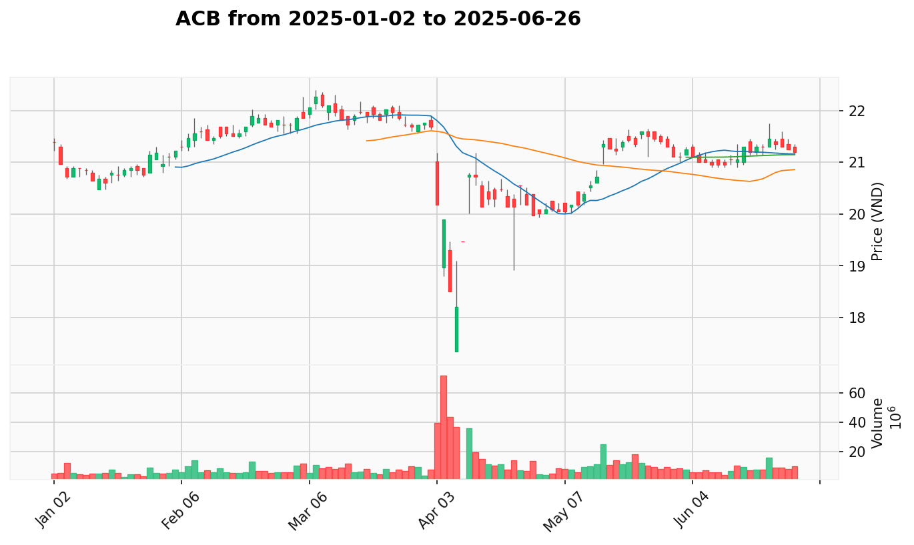

<a href="#ngan-hang">↑ Back to group NGAN_HANG</a>  |  <a href="#vpa-signal-summary">↑ Back to Top</a>

#### Key Statistics
| Metric | Value |
|:---|---:|
| Date Range | 2025-01-02 to 2025-11-07 |
| **Latest Close** | **24.9** |
| Period Open | 21.39 |
| Period High | 29.5 |
| Period Low | 17.34 |
| Period Change % | 16.41% |

**[Download ACB Data (.csv)](market_data/ACB_2025-01-02_to_2025-11-09.csv)**

---

### ACG

#### [VPA Analysis (2025-08-14 - 2025-10-21)](./VPA.md#acg)
> **Ngày 2025-10-15:** ACG mở cửa tại 35.6 VND, dao động trong biên độ hẹp từ 35.5 VND đến 35.6 VND và đóng cửa tại 35.5 VND. So với phiên trước, giá giảm từ 35.9 VND xuống 35.5 VND. Khối lượng giao dịch đạt 0.0014 triệu cổ phiếu, tăng so với phiên trước (0.0005 triệu cổ phiếu). Việc giá giảm với khối lượng tăng cho thấy áp lực bán đã quay trở lại thị trường, đẩy giá xuống thấp hơn. Điều này tiếp tục xác nhận sự yếu kém của thị trường sau các phiên trước đó. **Phân tích VPA/Wyckoff:** Áp lực bán (Selling Pressure) - Giá giảm với khối lượng tăng, cho thấy nguồn cung đang chiếm ưu thế.
> **Ngày 2025-10-16:** ACG mở cửa tại 35.5 VND, dao động trong biên độ hẹp từ 35.45 VND đến 35.6 VND và đóng cửa tại 35.45 VND. So với phiên trước, giá giảm từ 35.5 VND xuống 35.45 VND. Khối lượng giao dịch đạt 0.0027 triệu cổ phiếu, tăng so với phiên trước (0.0014 triệu cổ phiếu). Việc giá giảm với khối lượng tăng và đóng cửa ở mức thấp nhất phiên cho thấy áp lực bán tiếp tục chiếm ưu thế trên thị trường, xác nhận sự yếu kém của thị trường. **Phân tích VPA/Wyckoff:** Áp lực bán tiếp diễn (Continued Selling Pressure)
> **Ngày 2025-10-17:** ACG mở cửa tại 35.6 VND, dao động trong biên độ hẹp từ 35.45 VND đến 35.6 VND và đóng cửa tại 35.45 VND. So với phiên trước, giá giữ nguyên ở mức 35.45 VND. Khối lượng giao dịch đạt 0.0024 triệu cổ phiếu, giảm đáng kể so với phiên trước (0.0142 triệu cổ phiếu). Việc giá đi ngang với khối lượng giảm mạnh cho thấy áp lực bán đã tạm thời suy yếu, nhưng lực cầu cũng chưa xuất hiện mạnh mẽ. Đây có thể là dấu hiệu của sự lưỡng lự hoặc tạm dừng trong xu hướng giảm sau các phiên giảm giá trước đó. **Phân tích VPA/Wyckoff:** No Demand (Không có cầu) - Giá không giảm thêm trên khối lượng thấp, cho thấy áp lực bán đã cạn kiệt nhưng chưa có lực cầu đủ mạnh để đẩy giá lên.
> **Ngày 2025-10-20:** ACG mở cửa tại 35.45 VND, có lúc tăng mạnh lên mức cao nhất 37.9 VND nhưng sau đó gặp áp lực bán và đóng cửa tại 35.55 VND, chỉ tăng nhẹ so với phiên trước (35.45 VND). Biên độ giá trong phiên rất rộng, từ 35.45 VND đến 37.9 VND. Khối lượng giao dịch đạt 0.0101 triệu cổ phiếu, tăng mạnh so với phiên trước (0.0024 triệu cổ phiếu). Mặc dù có sự tăng giá mạnh mẽ ban đầu và khối lượng lớn, việc giá đóng cửa gần mức thấp nhất phiên cho thấy lực cung đã áp đảo lực cầu, đẩy giá xuống. Điều này báo hiệu sự yếu kém và khả năng tiếp diễn xu hướng giảm. **Phân tích VPA/Wyckoff:** Nỗ lực tăng giá thất bại
> **Ngày 2025-10-21:** ACG mở cửa tại 35.55 VND, dao động trong biên độ từ 35.0 VND đến 36.0 VND và đóng cửa tại 36.0 VND, là mức cao nhất phiên. So với phiên trước, giá tăng từ 35.55 VND lên 36.0 VND. Khối lượng giao dịch đạt 0.0143 triệu cổ phiếu, tăng so với phiên trước (0.0101 triệu cổ phiếu). Việc giá tăng mạnh và đóng cửa ở mức cao nhất phiên với khối lượng gia tăng cho thấy lực cầu đã quay trở lại và áp đảo lực cung, đặc biệt sau phiên nỗ lực tăng giá thất bại trước đó. Điều này báo hiệu sự phục hồi và khả năng tiếp diễn xu hướng tăng. **Phân tích VPA/Wyckoff:** Sign of Strength (SOS) - Lực cầu mạnh mẽ

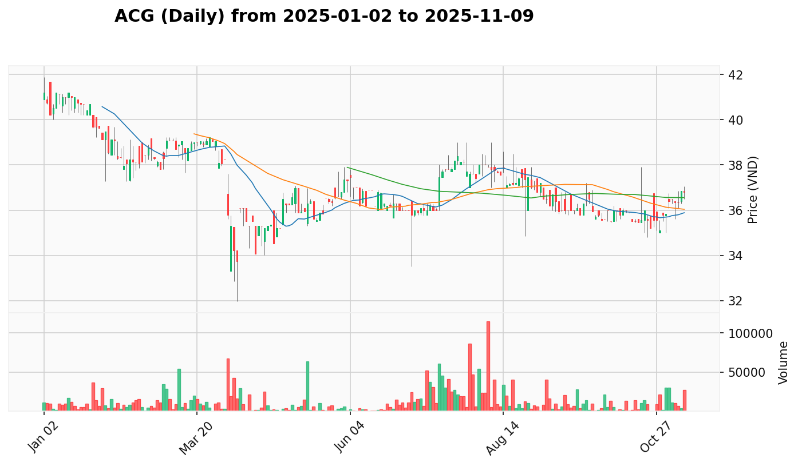

<a href="#thep">↑ Back to group THEP</a>  |  <a href="#vpa-signal-summary">↑ Back to Top</a>

#### Key Statistics
| Metric | Value |
|:---|---:|
| Date Range | 2025-01-02 to 2025-11-07 |
| **Latest Close** | **36.8** |
| Period Open | 40.9 |
| Period High | 41.88 |
| Period Low | 31.97 |
| Period Change % | -10.02% |

**[Download ACG Data (.csv)](market_data/ACG_2025-01-02_to_2025-11-09.csv)**

---

### ACL

#### [VPA Analysis (2025-08-14 - 2025-10-21)](./VPA.md#acl)
> **Ngày 2025-10-15:** ACL mở cửa ở 13.05 VND, sau đó tăng lên 13.5 VND và đóng cửa ở mức cao nhất phiên là 13.5 VND. Khối lượng giao dịch đạt 0.0176 triệu cổ phiếu, giảm đáng kể so với phiên giảm mạnh trước đó (0.0425 triệu cổ phiếu). Mặc dù giá tăng và đóng cửa ở mức cao, nhưng khối lượng thấp cho thấy lực cầu chưa thực sự mạnh mẽ để đẩy giá lên bền vững sau phiên SOW. **Phân tích VPA/Wyckoff:** No Demand (ND) - Thiếu vắng lực cầu.
> **Ngày 2025-10-16:** ACL mở cửa ở 13.5 VND, sau đó giảm nhẹ và đóng cửa ở mức 13.45 VND, tạo thành một cây nến giảm giá với biên độ hẹp và giá đóng cửa ở mức thấp nhất phiên. Khối lượng giao dịch đạt 0.0125 triệu cổ phiếu, tiếp tục giảm so với phiên trước đó (0.0176 triệu cổ phiếu). Sự giảm giá nhẹ đi kèm với khối lượng thấp cho thấy lực cầu vẫn yếu và thị trường vẫn đang trong trạng thái thiếu vắng động lực tăng giá. **Phân tích VPA/Wyckoff:** No Demand (ND) - Thiếu vắng lực cầu.
> **Ngày 2025-10-17:** ACL mở cửa ở 13.55 VND, sau đó giảm xuống 13.0 VND và đóng cửa ở 13.5 VND. Mặc dù giá đóng cửa cao hơn phiên trước đó (13.45 VND), nhưng cây nến có biên độ hẹp và khối lượng giao dịch chỉ đạt 0.0098 triệu cổ phiếu, tiếp tục giảm mạnh so với phiên trước (0.0125 triệu cổ phiếu). Khối lượng cực thấp trong khi giá có sự phục hồi nhẹ cho thấy lực cầu vẫn rất yếu và không có sự xác nhận từ dòng tiền lớn. Thị trường vẫn đang trong giai đoạn thiếu vắng động lực tăng giá. **Phân tích VPA/Wyckoff:** No Demand (ND) - Thiếu vắng lực cầu.
> **Ngày 2025-10-20:** ACL mở cửa ở 13.5 VND, sau đó giảm xuống 13.0 VND và đóng cửa ở mức 13.45 VND, tạo thành một cây nến giảm giá với biên độ hẹp và giá đóng cửa gần mức thấp nhất phiên. Khối lượng giao dịch đạt 0.0139 triệu cổ phiếu, tăng nhẹ so với phiên trước đó (0.0098 triệu cổ phiếu). Sự giảm giá nhẹ đi kèm với khối lượng tăng cho thấy áp lực bán đang gia tăng và thị trường vẫn đang trong trạng thái yếu. **Phân tích VPA/Wyckoff:** Yếu tố suy yếu (Weakness)
> **Ngày 2025-10-21:** ACL mở cửa ở 13.35 VND, sau đó tăng lên 13.5 VND và đóng cửa ở mức 13.5 VND, cao hơn phiên trước đó (13.45 VND). Tuy nhiên, khối lượng giao dịch chỉ đạt 0.0066 triệu cổ phiếu, giảm mạnh so với phiên trước (0.0139 triệu cổ phiếu). Sự tăng giá nhẹ với khối lượng cực thấp cho thấy lực cầu vẫn rất yếu và không có sự xác nhận từ dòng tiền lớn. Sau phiên giảm giá với khối lượng tăng vào ngày 2025-10-20, sự phục hồi này thiếu đi sự ủng hộ của khối lượng, cho thấy thị trường vẫn đang trong giai đoạn thiếu vắng động lực tăng giá. **Phân tích VPA/Wyckoff:** No Demand (ND) - Thiếu vắng lực cầu.

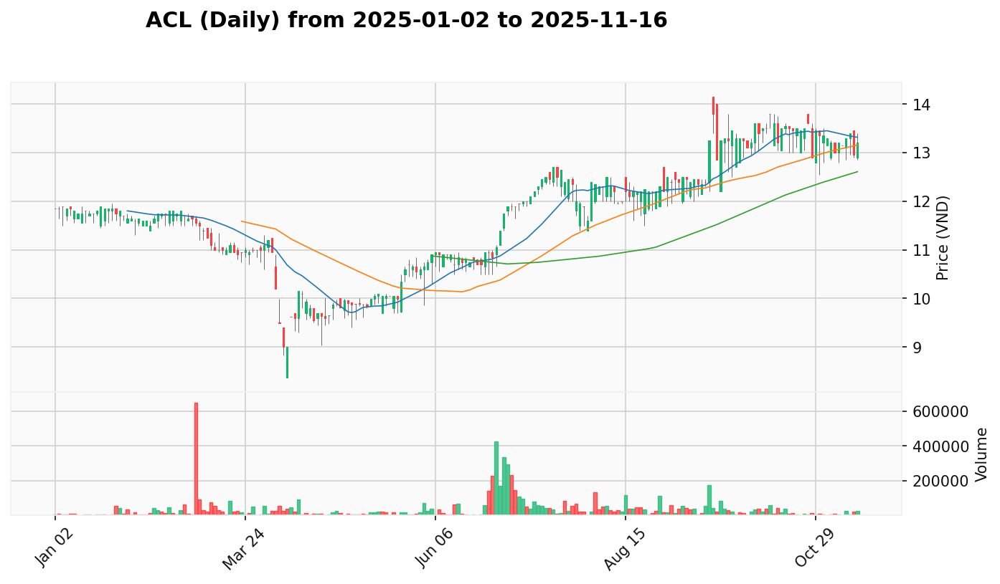

<a href="#thuy-san">↑ Back to group THUY_SAN</a>  |  <a href="#vpa-signal-summary">↑ Back to Top</a>

#### Key Statistics
| Metric | Value |
|:---|---:|
| Date Range | 2025-01-02 to 2025-11-07 |
| **Latest Close** | **13.2** |
| Period Open | 11.85 |
| Period High | 14.15 |
| Period Low | 8.37 |
| Period Change % | 11.39% |

**[Download ACL Data (.csv)](market_data/ACL_2025-01-02_to_2025-11-09.csv)**

---

### ACV

#### [VPA Analysis (2025-06-11 - 2025-10-21)](./VPA.md#acv)
> **Ngày 2025-10-15:** ACV tiếp tục giảm từ 53.8 xuống 53.1 với biên độ dao động từ 53.0 đến 54.0. Cây nến có thân giảm, đóng cửa gần mức thấp nhất phiên, cho thấy áp lực bán vẫn duy trì. Khối lượng giao dịch đạt 0.9006 triệu cổ phiếu, giảm so với phiên trước (1.1295 triệu cổ phiếu). Mặc dù khối lượng giảm, việc giá tiếp tục giảm và đóng cửa ở mức thấp sau phiên giảm mạnh với khối lượng đột biến ngày 2025-10-14 cho thấy lực cung vẫn đang kiểm soát và tiếp diễn, nhưng có thể đã có sự giảm bớt về cường độ bán hoặc thiếu vắng lực cầu. **Phân tích VPA/Wyckoff:** Weakness (Lực cung vẫn chiếm ưu thế)
> **Ngày 2025-10-16:** ACV giữ nguyên mức giá đóng cửa 53.1 VND so với phiên trước, với biên độ dao động hẹp từ 53.0 đến 53.5. Khối lượng giao dịch đạt 0.3121 triệu cổ phiếu, giảm mạnh và là mức thấp nhất trong 10 phiên gần đây. Sau hai phiên giảm giá mạnh với khối lượng cao, việc giá không giảm thêm và khối lượng sụt giảm đáng kể cho thấy áp lực bán đã tạm lắng hoặc nguồn cung đã cạn kiệt ở mức giá này. Tuy nhiên, việc giá đóng cửa vẫn ở mức thấp và không có dấu hiệu tăng trở lại cho thấy lực cầu vẫn chưa xuất hiện mạnh mẽ. Đây có thể là một giai đoạn tạm dừng trong xu hướng giảm để kiểm tra cung. **Phân tích VPA/Wyckoff:** No Demand (Thiếu vắng lực cầu)
> **Ngày 2025-10-17:** ACV giảm từ 53.1 xuống 52.7 VND với biên độ dao động từ 52.6 đến 53.3 VND. Cây nến có thân giảm, đóng cửa gần mức thấp nhất phiên, cho thấy áp lực bán tiếp tục gia tăng. Khối lượng giao dịch đạt 0.6775 triệu cổ phiếu, tăng so với phiên trước (0.5231 triệu cổ phiếu). Sau phiên "No Demand" ngày 2025-10-16 với khối lượng thấp, việc giá giảm trở lại với khối lượng tăng cho thấy lực cung đã quay trở lại và tiếp tục đẩy giá xuống, xác nhận xu hướng giảm giá vẫn đang tiếp diễn. **Phân tích VPA/Wyckoff:** Weakness (Lực cung chiếm ưu thế)
> **Ngày 2025-10-20:** ACV giảm mạnh từ 52.7 xuống 50.7 VND với biên độ dao động rộng từ 50.4 đến 53.5. Cây nến giảm có thân lớn, đóng cửa gần mức thấp nhất phiên, cho thấy áp lực bán rất lớn. Khối lượng giao dịch đạt 1.0498 triệu cổ phiếu, tăng đáng kể so với phiên trước (0.6775 triệu cổ phiếu). Sau phiên "Weakness" ngày 2025-10-17, việc giá tiếp tục giảm sâu với khối lượng gia tăng xác nhận lực cung vẫn đang chiếm ưu thế và xu hướng giảm giá tiếp diễn. **Phân tích VPA/Wyckoff:** Weakness (Lực cung chiếm ưu thế)
> **Ngày 2025-10-21:** ACV tăng từ 50.7 lên 51.5 VND với biên độ dao động từ 50.5 đến 51.9 VND. Cây nến có thân tăng, đóng cửa gần mức cao nhất phiên, cho thấy lực mua xuất hiện nhưng không quá mạnh. Khối lượng giao dịch đạt 0.9342 triệu cổ phiếu, giảm so với phiên trước (1.0498 triệu cổ phiếu). Sau hai phiên giảm mạnh với khối lượng lớn, việc giá tăng nhẹ với khối lượng thấp cho thấy lực cung tạm thời giảm bớt nhưng lực cầu chưa đủ mạnh để đảo chiều xu hướng giảm giá. Đây có thể là một nhịp hồi phục kỹ thuật trong xu hướng giảm. **Phân tích VPA/Wyckoff:** Lack of Demand Rally (Hồi phục thiếu cầu)

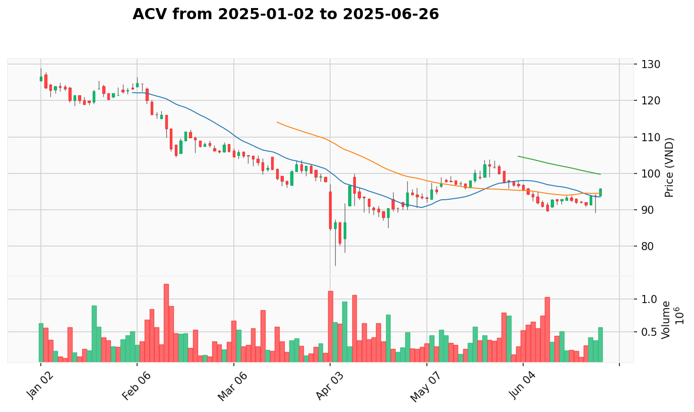

<a href="#hang-khong">↑ Back to group HANG_KHONG</a>  |  <a href="#vpa-signal-summary">↑ Back to Top</a>

#### Key Statistics
| Metric | Value |
|:---|---:|
| Date Range | 2025-01-02 to 2025-11-07 |
| **Latest Close** | **54.9** |
| Period Open | 76.25 |
| Period High | 78.32 |
| Period Low | 45.27 |
| Period Change % | -28.00% |

**[Download ACV Data (.csv)](market_data/ACV_2025-01-02_to_2025-11-09.csv)**

---

### ADS

#### [VPA Analysis (2025-08-04 - 2025-10-21)](./VPA.md#ads)
> **Ngày 2025-10-15:** ADS giảm từ 8.63 VND xuống 8.52 VND với khối lượng giao dịch đạt 0.0552 triệu cổ phiếu. Cây nến có biên độ hẹp, đóng cửa gần mức thấp nhất phiên. Mặc dù giá tiếp tục giảm, khối lượng giao dịch giảm mạnh so với phiên trước cho thấy áp lực bán đã suy yếu đáng kể sau phiên "Dấu hiệu yếu" trước đó. Điều này có thể là dấu hiệu của việc thị trường đang kiểm tra lượng cung còn lại ở mức giá thấp hơn. **Phân tích VPA/Wyckoff:** Kiểm tra cung (Test for Supply)
> **Ngày 2025-10-16:** ADS giữ nguyên mức giá 8.52 VND với khối lượng giao dịch đạt 0.0282 triệu cổ phiếu. Cây nến có biên độ hẹp, đóng cửa ở mức giá của phiên trước. Khối lượng giao dịch giảm mạnh so với phiên kiểm tra cung trước đó (0.0552 triệu cổ phiếu), cho thấy áp lực bán đã cạn kiệt đáng kể. Việc giá giữ vững ở mức này với khối lượng rất thấp xác nhận rằng không còn nhiều cung ở mức giá hiện tại. Đây là một dấu hiệu tích cực, cho thấy thị trường có thể sẵn sàng cho một đợt tăng giá nếu lực cầu xuất hiện. **Phân tích VPA/Wyckoff:** Không có cung (No Supply)
> **Ngày 2025-10-17:** ADS giảm từ 8.54 VND xuống 8.5 VND với khối lượng giao dịch đạt 0.1109 triệu cổ phiếu. Cây nến có biên độ hẹp, đóng cửa gần mức thấp nhất phiên. Mặc dù giá chỉ giảm nhẹ, khối lượng giao dịch tăng mạnh so với phiên trước đó (0.0365 triệu cổ phiếu) cho thấy áp lực bán đã quay trở lại thị trường sau phiên "Không có cung". Điều này có thể là dấu hiệu của sự yếu kém. **Phân tích VPA/Wyckoff:** Dấu hiệu yếu (Sign of Weakness)
> **Ngày 2025-10-20:** ADS giảm từ 8.5 VND xuống 7.91 VND với khối lượng giao dịch đạt 0.1029 triệu cổ phiếu. Cây nến có biên độ rộng, đóng cửa ở mức thấp nhất phiên, cho thấy áp lực bán mạnh mẽ. Mặc dù khối lượng giao dịch có giảm nhẹ so với phiên trước (0.1109 triệu cổ phiếu), nhưng mức giảm giá đáng kể cùng với khối lượng vẫn ở mức cao xác nhận sự yếu kém tiếp diễn trên thị trường. **Phân tích VPA/Wyckoff:** Dấu hiệu yếu (Sign of Weakness)
> **Ngày 2025-10-21:** ADS tăng từ 7.91 VND lên 8.1 VND với khối lượng giao dịch đạt 0.0755 triệu cổ phiếu. Cây nến có biên độ tương đối rộng, đóng cửa gần mức cao nhất phiên. Mặc dù giá tăng, khối lượng giao dịch lại giảm so với phiên trước (0.1029 triệu cổ phiếu), cho thấy áp lực bán có thể đã giảm nhưng lực cầu chưa thực sự mạnh mẽ. Đây có thể là một phiên kiểm tra cung sau chuỗi ngày giảm giá. **Phân tích VPA/Wyckoff:** Kiểm tra cung (Test for Supply)

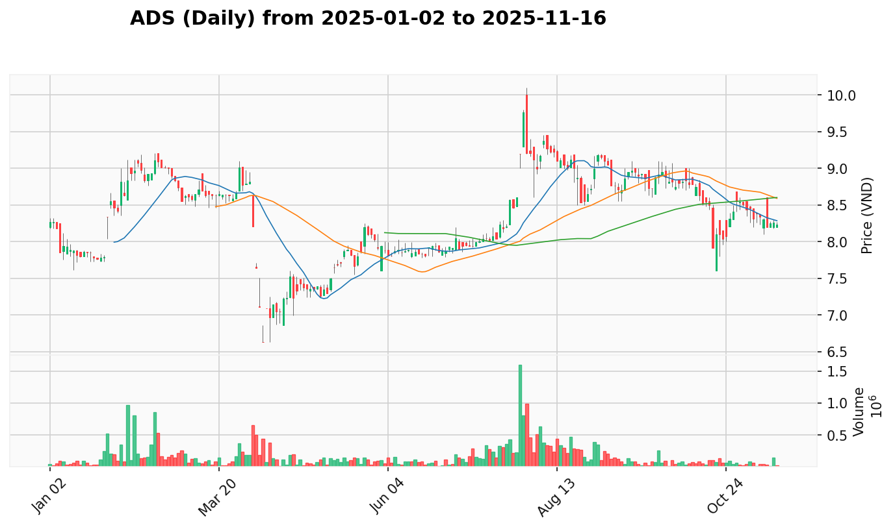

<a href="#det-may">↑ Back to group DET_MAY</a>  |  <a href="#vpa-signal-summary">↑ Back to Top</a>

#### Key Statistics
| Metric | Value |
|:---|---:|
| Date Range | 2025-01-02 to 2025-11-07 |
| **Latest Close** | **8.34** |
| Period Open | 8.2 |
| Period High | 10.1 |
| Period Low | 6.63 |
| Period Change % | 1.71% |

**[Download ADS Data (.csv)](market_data/ADS_2025-01-02_to_2025-11-09.csv)**

---

### AGG

#### [VPA Analysis (2025-08-04 - 2025-10-21)](./VPA.md#agg)
> **Ngày 2025-10-15:** AGG đóng cửa ở mức 17.7 VND, giữ nguyên mức giá đóng cửa của phiên trước, sau khi mở cửa ở 17.6 VND và chạm mức thấp 17.4 VND. Khối lượng giao dịch đạt 0.5212 triệu cổ phiếu, giảm so với phiên trước (0.6644 triệu cổ phiếu). Sau các phiên giảm mạnh, việc giá giữ được mức hỗ trợ 17.7 VND trên khối lượng thấp cho thấy lực cung đã suy yếu. **Phân tích VPA/Wyckoff:** Test for Supply (TS) - Kiểm tra lực cung.
> **Ngày 2025-10-16:** AGG mở cửa ở mức 17.8 VND và đóng cửa ở mức 17.95 VND, tăng 0.25 VND so với phiên trước (17.7 VND). Cây nến tăng có biên độ hẹp và đóng cửa gần mức cao nhất phiên, cho thấy lực cầu đã xuất hiện và hấp thụ lực cung sau phiên kiểm tra cung (Test for Supply) ngày 2025-10-15. Khối lượng giao dịch đạt 0.5066 triệu cổ phiếu, thấp hơn một chút so với phiên trước (0.5212 triệu cổ phiếu), xác nhận rằng lực cung đã suy yếu và lực cầu đang chiếm ưu thế. **Phân tích VPA/Wyckoff:** Sign of Strength (SOS) - Lực cầu xuất hiện sau kiểm tra cung.
> **Ngày 2025-10-17:** AGG đóng cửa ở mức 17.95 VND, giảm nhẹ 0.05 VND so với phiên trước (18.0 VND), với khối lượng giao dịch chỉ đạt 0.4254 triệu cổ phiếu, thấp hơn đáng kể so với phiên trước (0.6285 triệu cổ phiếu). Việc giá giảm nhẹ trên khối lượng thấp sau tín hiệu sức mạnh (SOS) cho thấy lực cung không đáng kể và có thể là một đợt kiểm tra lại cầu. **Phân tích VPA/Wyckoff:** No Supply (NS) - Kiểm tra không có cung.
> **Ngày 2025-10-20:** AGG mở cửa ở mức 17.75 VND và đóng cửa ở mức 16.75 VND, giảm 1.2 VND so với phiên trước (17.95 VND). Cây nến giảm có biên độ rộng và đóng cửa gần mức thấp nhất phiên, cho thấy áp lực bán mạnh mẽ. Khối lượng giao dịch đạt 0.6067 triệu cổ phiếu, cao hơn đáng kể so với phiên trước (0.4254 triệu cổ phiếu), xác nhận rằng lực cung đang chiếm ưu thế và có sự phân phối sau tín hiệu kiểm tra không có cung (No Supply) trước đó. **Phân tích VPA/Wyckoff:** Sign of Weakness (SOW) - Áp lực bán gia tăng với khối lượng lớn.
> **Ngày 2025-10-21:** AGG đóng cửa ở mức 16.0 VND, giảm từ 16.75 VND so với phiên trước. Cây nến giảm có biên độ rộng và đóng cửa gần mức thấp nhất phiên, cho thấy áp lực bán tiếp tục gia tăng và chiếm ưu thế. Khối lượng giao dịch đạt 1.016 triệu cổ phiếu, cao hơn đáng kể so với phiên trước (0.6067 triệu cổ phiếu), xác nhận lực cung mạnh mẽ và sự tiếp diễn của tín hiệu suy yếu. **Phân tích VPA/Wyckoff:** Sign of Weakness (SOW) - Áp lực bán tiếp diễn với khối lượng lớn.

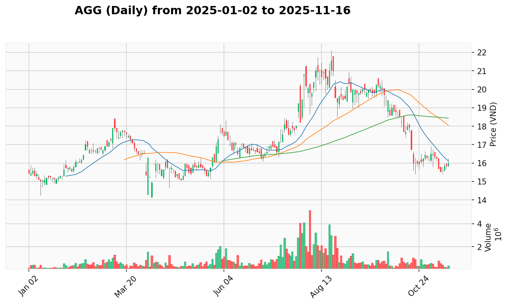

<a href="#bat-dong-san">↑ Back to group BAT_DONG_SAN</a>  |  <a href="#vpa-signal-summary">↑ Back to Top</a>

#### Key Statistics
| Metric | Value |
|:---|---:|
| Date Range | 2025-01-02 to 2025-11-07 |
| **Latest Close** | **15.7** |
| Period Open | 15.65 |
| Period High | 22.1 |
| Period Low | 14.15 |
| Period Change % | 0.32% |

**[Download AGG Data (.csv)](market_data/AGG_2025-01-02_to_2025-11-09.csv)**

---

### AGR

#### [VPA Analysis (2025-08-04 - 2025-10-21)](./VPA.md#agr)
> **Ngày 2025-10-15:** AGR giữ nguyên mức giá 17.35 VND. Giá mở cửa 17.45 VND, đạt mức cao nhất 17.5 VND và mức thấp nhất 17.2 VND. Giá đóng cửa 17.35 VND, nằm ở mức thấp của phiên, cho thấy áp lực bán vẫn còn. Khối lượng giao dịch đạt 0.787 triệu cổ phiếu, giảm so với 0.939 triệu cổ phiếu của ngày hôm trước. Sau các phiên giảm giá liên tiếp với áp lực bán mạnh, việc giá đi ngang với khối lượng giảm nhẹ và đóng cửa ở mức thấp của phiên cho thấy lực cầu yếu và áp lực cung vẫn chiếm ưu thế. **Phân tích VPA/Wyckoff:** Sign of Weakness (SOW) - Giá đi ngang với khối lượng giảm nhẹ và đóng cửa ở mức thấp của phiên, cho thấy lực cầu yếu và áp lực cung vẫn chiếm ưu thế.
> **Ngày 2025-10-16:** AGR tăng nhẹ từ 17.35 VND lên 17.4 VND. Giá mở cửa 17.4 VND, đạt mức cao nhất 17.55 VND và mức thấp nhất 17.2 VND. Giá đóng cửa 17.4 VND, nằm ở giữa thân nến. Khối lượng giao dịch đạt 0.422 triệu cổ phiếu, giảm đáng kể so với 0.787 triệu cổ phiếu của ngày hôm trước và là mức rất thấp so với các phiên gần đây. Sau hai phiên "Sign of Weakness" liên tiếp, việc giá tăng nhẹ với khối lượng cực thấp cho thấy lực cung đã giảm nhưng lực cầu vẫn còn yếu, chưa đủ mạnh để đẩy giá lên cao. Đây có thể là một phiên kiểm tra cung hoặc một sự tạm dừng trong xu hướng giảm. **Phân tích VPA/Wyckoff:** No Demand - Giá tăng nhẹ với khối lượng cực thấp sau các phiên suy yếu, cho thấy thiếu vắng lực cầu.
> **Ngày 2025-10-17:** AGR giảm từ 17.35 VND xuống 17.2 VND. Giá mở cửa 17.35 VND, đạt mức cao nhất 17.65 VND và mức thấp nhất 17.2 VND. Giá đóng cửa 17.2 VND, nằm ở mức thấp nhất của phiên, cho thấy áp lực bán mạnh. Khối lượng giao dịch đạt 0.9128 triệu cổ phiếu, tăng so với 0.6629 triệu cổ phiếu của ngày hôm trước. Sau phiên "No Demand" với khối lượng cực thấp, việc giá giảm mạnh với khối lượng gia tăng và đóng cửa ở mức thấp nhất phiên cho thấy lực cung đã quay trở lại và áp đảo lực cầu. **Phân tích VPA/Wyckoff:** Sign of Weakness (SOW) - Giá giảm mạnh với khối lượng gia tăng và đóng cửa ở mức thấp nhất phiên, xác nhận áp lực bán mạnh.
> **Ngày 2025-10-20:** AGR giảm mạnh từ 17.2 VND xuống 16.0 VND. Giá mở cửa 17.1 VND, đạt mức cao nhất 17.4 VND và mức thấp nhất 16.0 VND. Giá đóng cửa 16.0 VND, nằm ở mức thấp nhất của phiên, cho thấy áp lực bán rất mạnh. Khối lượng giao dịch đạt 1.5015 triệu cổ phiếu, tăng đáng kể so với 0.9128 triệu cổ phiếu của ngày hôm trước và là mức cao nhất trong các phiên gần đây. Sau phiên "Sign of Weakness" trước đó, việc giá tiếp tục giảm mạnh với khối lượng gia tăng và đóng cửa ở mức thấp nhất phiên xác nhận lực cung vẫn đang áp đảo và xu hướng giảm tiếp diễn. **Phân tích VPA/Wyckoff:** Sign of Weakness (SOW) - Giá giảm mạnh với khối lượng gia tăng và đóng cửa ở mức thấp nhất phiên, xác nhận áp lực bán mạnh và xu hướng giảm tiếp diễn.
> **Ngày 2025-10-21:** AGR giảm nhẹ từ 16.0 VND xuống 15.9 VND. Giá mở cửa 15.9 VND, đạt mức cao nhất 16.4 VND và mức thấp nhất 15.4 VND. Giá đóng cửa 15.9 VND, bằng với giá mở cửa, tạo thành một nến Doji. Khối lượng giao dịch đạt 1.5515 triệu cổ phiếu, tăng nhẹ so với 1.5015 triệu cổ phiếu của ngày hôm trước. Sau hai phiên giảm mạnh với tín hiệu SOW, phiên này cho thấy sự lưỡng lự của thị trường. Mặc dù giá có lúc giảm sâu nhưng đã phục hồi về mức mở cửa, cho thấy có lực cầu bắt đáy. Tuy nhiên, việc giá đóng cửa vẫn thấp hơn phiên trước và khối lượng giao dịch vẫn ở mức cao cho thấy áp lực bán vẫn còn hiện hữu và xu hướng giảm chưa kết thúc. Đây có thể là một giai đoạn tạm dừng trong xu hướng giảm, nhưng chưa có dấu hiệu đảo chiều rõ ràng. **Phân tích VPA/Wyckoff:** Indecision (Sự lưỡng lự) - Giá giảm nhẹ, khối lượng tăng và nến Doji cho thấy sự lưỡng lự của thị trường, nhưng chưa có dấu hiệu đảo chiều rõ ràng.

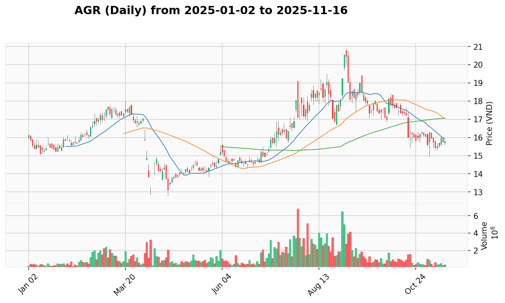

<a href="#chung-khoan">↑ Back to group CHUNG_KHOAN</a>  |  <a href="#vpa-signal-summary">↑ Back to Top</a>

#### Key Statistics
| Metric | Value |
|:---|---:|
| Date Range | 2025-01-02 to 2025-11-07 |
| **Latest Close** | **15.45** |
| Period Open | 15.99 |
| Period High | 20.8 |
| Period Low | 12.78 |
| Period Change % | -3.38% |

**[Download AGR Data (.csv)](market_data/AGR_2025-01-02_to_2025-11-09.csv)**

---

### ANV

#### [VPA Analysis (2025-06-16 - 2025-10-21)](./VPA.md#anv)
> **Ngày 2025-10-15:** ANV giảm từ 31.8 VND xuống 31.35 VND, giảm 0.45 VND (1.415%) so với phiên trước. Cây nến giảm có biên độ tương đối rộng, mở cửa ở 31.9 VND và đóng cửa gần mức thấp nhất phiên là 31.35 VND, cho thấy áp lực bán vẫn duy trì. Tuy nhiên, khối lượng giao dịch chỉ đạt 2.5732 triệu cổ phiếu, thấp hơn đáng kể so với phiên trước (5.4462 triệu cổ phiếu) và mức trung bình. Điều này cho thấy sau phiên giảm mạnh với nguồn cung lớn, lực bán đã giảm bớt nhưng không có lực cầu nào xuất hiện để hỗ trợ giá, xác nhận sự thiếu vắng của người mua. **Phân tích VPA/Wyckoff:** No Demand (Không có cầu)
> **Ngày 2025-10-16:** ANV giảm từ 31.4 VND xuống 31.15 VND, giảm 0.25 VND (0.8%). Cây nến giảm có biên độ hẹp, mở cửa ở 31.4 VND và đóng cửa gần mức thấp nhất phiên là 31.05 VND, cho thấy áp lực bán vẫn còn nhưng không mạnh. Khối lượng giao dịch chỉ đạt 1.2219 triệu cổ phiếu, rất thấp so với phiên trước (2.5732 triệu cổ phiếu) và mức trung bình, xác nhận nguồn cung đã cạn kiệt nhưng lực cầu vẫn chưa xuất hiện. **Phân tích VPA/Wyckoff:** No Demand (Không có cầu)
> **Ngày 2025-10-17:** ANV tăng từ 30.6 VND lên 31.95 VND, tăng 1.35 VND (4.41%) so với phiên trước. Cây nến tăng có biên độ rộng, mở cửa ở 30.85 VND và đóng cửa gần mức cao nhất phiên là 31.95 VND, cho thấy lực mua chiếm ưu thế. Khối lượng giao dịch đạt 3.4092 triệu cổ phiếu, thấp hơn so với phiên trước (4.1783 triệu cổ phiếu). Sau hai phiên "No Demand" liên tiếp, sự xuất hiện của cây nến tăng mạnh cho thấy nỗ lực đẩy giá lên, tuy nhiên khối lượng giảm cho thấy lực cầu chưa thực sự mạnh mẽ và có thể là một phiên kiểm tra nguồn cung. **Phân tích VPA/Wyckoff:** Effort to Rise (Nỗ lực tăng giá)
> **Ngày 2025-10-20:** ANV giảm mạnh từ 31.95 VND xuống 29.75 VND, giảm 2.2 VND (6.88%). Cây nến giảm có biên độ rộng, mở cửa ở 32.75 VND và đóng cửa ở mức thấp nhất phiên là 29.75 VND, cho thấy áp lực bán rất mạnh và chiếm ưu thế hoàn toàn. Khối lượng giao dịch đạt 3.8616 triệu cổ phiếu, cao hơn so với phiên trước (3.4092 triệu cổ phiếu), xác nhận lực bán đang gia tăng. Sau phiên "Nỗ lực tăng giá" trước đó, sự xuất hiện của cây nến giảm mạnh với khối lượng tăng cho thấy nỗ lực tăng giá đã thất bại và nguồn cung đã quay trở lại thị trường. **Phân tích VPA/Wyckoff:** Sign of Weakness (SOW) - Dấu hiệu suy yếu.
> **Ngày 2025-10-21:** ANV tăng từ 29.75 VND lên 31.0 VND, tăng 1.25 VND (4.20%) so với phiên trước. Cây nến tăng có biên độ rộng, mở cửa ở 29.8 VND và đóng cửa ở mức cao nhất phiên là 31.0 VND, cho thấy lực mua chiếm ưu thế. Khối lượng giao dịch đạt 3.0253 triệu cổ phiếu, thấp hơn so với phiên trước (3.8616 triệu cổ phiếu). Sau phiên "Dấu hiệu suy yếu" với khối lượng lớn, phiên này cho thấy nỗ lực phục hồi giá nhưng với khối lượng giảm, điều này cho thấy lực cầu chưa thực sự mạnh mẽ và có thể là một phiên kiểm tra nguồn cung. **Phân tích VPA/Wyckoff:** Test for Supply (Kiểm tra nguồn cung)

<a href="#thuy-san">↑ Back to group THUY_SAN</a>  |  <a href="#vpa-signal-summary">↑ Back to Top</a>

#### Key Statistics
| Metric | Value |
|:---|---:|
| Date Range | 2025-01-02 to 2025-11-07 |
| **Latest Close** | **27.2** |
| Period Open | 19.22 |
| Period High | 33.4 |
| Period Low | 12.0 |
| Period Change % | 41.52% |

**[Download ANV Data (.csv)](market_data/ANV_2025-01-02_to_2025-11-09.csv)**

---

### APG

#### [VPA Analysis (2025-08-04 - 2025-10-21)](./VPA.md#apg)
> **Ngày 2025-10-15:** APG đóng cửa ở mức 11.85 VND, không thay đổi so với phiên trước, với khối lượng giao dịch đạt 0.6309 triệu cổ phiếu, thấp hơn đáng kể so với phiên trước. Giá mở cửa cao hơn nhưng không thể duy trì đà tăng, tạo ra một cây nến có biên độ hẹp và đỉnh thấp hơn. Điều này cho thấy lực cầu đã suy yếu sau tín hiệu SOS của phiên 2025-10-14, và thị trường đang thiếu động lực để đẩy giá lên cao hơn. **Phân tích VPA/Wyckoff:** No Demand (Thiếu cầu)
> **Ngày 2025-10-16:** APG giảm từ 11.85 VND xuống 11.8 VND với khối lượng giao dịch đạt 0.3494 triệu cổ phiếu, thấp hơn đáng kể so với phiên trước. Biên độ giá hẹp từ 11.8 VND đến 11.9 VND, đóng cửa ở mức thấp hơn so với phiên trước. Điều này cho thấy lực cầu tiếp tục suy yếu và thị trường thiếu động lực để đẩy giá lên, củng cố tín hiệu thiếu cầu từ phiên trước. **Phân tích VPA/Wyckoff:** No Demand (Thiếu cầu)
> **Ngày 2025-10-17:** APG giảm từ 11.8 VND xuống 11.7 VND với khối lượng giao dịch đạt 0.4771 triệu cổ phiếu, thấp hơn đáng kể so với phiên trước. Biên độ giá hẹp từ 11.65 VND đến 11.8 VND, đóng cửa ở mức thấp hơn so với phiên trước và gần mức thấp nhất phiên. Điều này cho thấy lực cầu tiếp tục suy yếu và thị trường thiếu động lực để đẩy giá lên, củng cố tín hiệu thiếu cầu từ các phiên trước. **Phân tích VPA/Wyckoff:** No Demand (Thiếu cầu)
> **Ngày 2025-10-20:** APG giảm từ 11.7 VND xuống 11.65 VND với khối lượng giao dịch đạt 0.7962 triệu cổ phiếu, cao hơn đáng kể so với các phiên trước. Biên độ giá rộng hơn từ 11.4 VND đến 11.8 VND, đóng cửa ở mức thấp hơn so với phiên trước và gần mức thấp nhất trong ngày. Điều này cho thấy áp lực bán tiếp tục gia tăng và thị trường vẫn đang thiếu lực cầu mạnh mẽ để hỗ trợ giá, củng cố tín hiệu suy yếu từ các phiên trước. **Phân tích VPA/Wyckoff:** Continued Weakness (Tiếp diễn suy yếu)
> **Ngày 2025-10-21:** APG tăng từ 11.65 VND lên 11.7 VND với khối lượng giao dịch đạt 0.8374 triệu cổ phiếu, cao hơn phiên trước. Biên độ giá hẹp, đóng cửa ở mức cao nhất phiên. Điều này cho thấy lực cầu xuất hiện và nỗ lực đẩy giá lên sau giai đoạn suy yếu. **Phân tích VPA/Wyckoff:** Nỗ lực tăng giá (Effort to Rise)

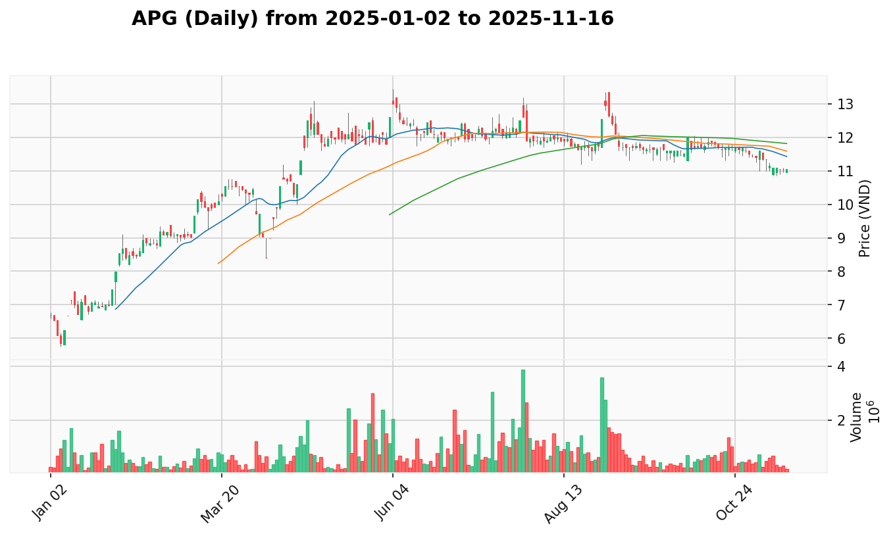

<a href="#chung-khoan">↑ Back to group CHUNG_KHOAN</a>  |  <a href="#vpa-signal-summary">↑ Back to Top</a>

#### Key Statistics
| Metric | Value |
|:---|---:|
| Date Range | 2025-01-02 to 2025-11-07 |
| **Latest Close** | **11.15** |
| Period Open | 6.7 |
| Period High | 13.45 |
| Period Low | 5.75 |
| Period Change % | 66.42% |

**[Download APG Data (.csv)](market_data/APG_2025-01-02_to_2025-11-09.csv)**

---

### APH

#### [VPA Analysis (2025-08-04 - 2025-10-21)](./VPA.md#aph)
> **Ngày 2025-10-15:** APH đóng cửa tại 6.19 VND, giảm từ 6.23 VND của phiên trước. Khối lượng giao dịch đạt 0.2614 triệu cổ phiếu, giảm đáng kể so với 0.4443 triệu cổ phiếu của phiên trước. Cây nến giảm có biên độ hẹp và đóng cửa gần mức thấp nhất phiên. Mặc dù khối lượng giảm, giá vẫn tiếp tục giảm cho thấy lực cầu yếu và áp lực bán vẫn còn hiện hữu, duy trì xu hướng giảm. **Phân tích VPA/Wyckoff:** Sign of Weakness (SOW) - Giá giảm với khối lượng thấp cho thấy thiếu vắng lực cầu, duy trì xu hướng yếu.
> **Ngày 2025-10-16:** APH đóng cửa tại 6.2 VND, tăng nhẹ từ 6.19 VND của phiên trước. Khối lượng giao dịch đạt 0.088 triệu cổ phiếu, giảm đáng kể so với 0.2614 triệu cổ phiếu của phiên trước. Cây nến tăng nhẹ có biên độ hẹp và đóng cửa gần mức thấp nhất phiên. Sự tăng giá với khối lượng rất thấp cho thấy thiếu vắng lực cầu, xác nhận sự yếu kém của thị trường và khả năng tiếp tục xu hướng giảm. **Phân tích VPA/Wyckoff:** No Demand (ND) - Giá tăng nhẹ với khối lượng thấp cho thấy thiếu vắng lực cầu, xác nhận sự yếu kém.
> **Ngày 2025-10-17:** APH đóng cửa tại 6.21 VND, tăng nhẹ từ 6.2 VND của phiên trước. Khối lượng giao dịch đạt 0.2617 triệu cổ phiếu, tăng so với 0.1705 triệu cổ phiếu của phiên trước. Cây nến tăng có biên độ hẹp và đóng cửa gần giữa phiên. Mặc dù khối lượng tăng, giá chỉ tăng nhẹ cho thấy lực cầu vẫn còn yếu và áp lực cung vẫn hiện hữu, ngăn cản đà tăng mạnh. **Phân tích VPA/Wyckoff:** Effort without Result (EWR) - Giá tăng nhẹ với khối lượng tăng nhưng không đạt được kết quả đáng kể, cho thấy áp lực cung vẫn còn mạnh.
> **Ngày 2025-10-20:** APH đóng cửa tại 6.0 VND, giảm mạnh từ 6.21 VND của phiên trước. Khối lượng giao dịch đạt 0.4062 triệu cổ phiếu, tăng đáng kể so với 0.2617 triệu cổ phiếu của phiên trước. Cây nến giảm có biên độ rộng và đóng cửa tại mức thấp nhất phiên. Sự giảm giá mạnh với khối lượng gia tăng cho thấy áp lực bán rất lớn và sự yếu kém của thị trường tiếp tục được xác nhận, tiếp nối các tín hiệu yếu từ các phiên trước. **Phân tích VPA/Wyckoff:** Sign of Weakness (SOW) - Áp lực cung mạnh mẽ đẩy giá xuống thấp với khối lượng lớn, xác nhận xu hướng giảm.
> **Ngày 2025-10-21:** APH đóng cửa tại 6.12 VND, tăng từ 6.0 VND của phiên trước. Khối lượng giao dịch đạt 0.3757 triệu cổ phiếu, giảm so với 0.4062 triệu cổ phiếu của phiên trước. Cây nến tăng có biên độ tương đối rộng và đóng cửa gần mức cao nhất phiên. Mặc dù giá tăng sau phiên giảm mạnh, khối lượng lại giảm cho thấy lực cầu yếu và không đủ sức để đảo chiều xu hướng giảm đã được xác nhận. Đây có thể là một nhịp hồi phục kỹ thuật hoặc một đợt kiểm tra cung cầu yếu ớt. **Phân tích VPA/Wyckoff:** No Demand (ND) - Giá tăng với khối lượng thấp sau một đợt giảm mạnh, cho thấy thiếu vắng lực cầu thực sự.

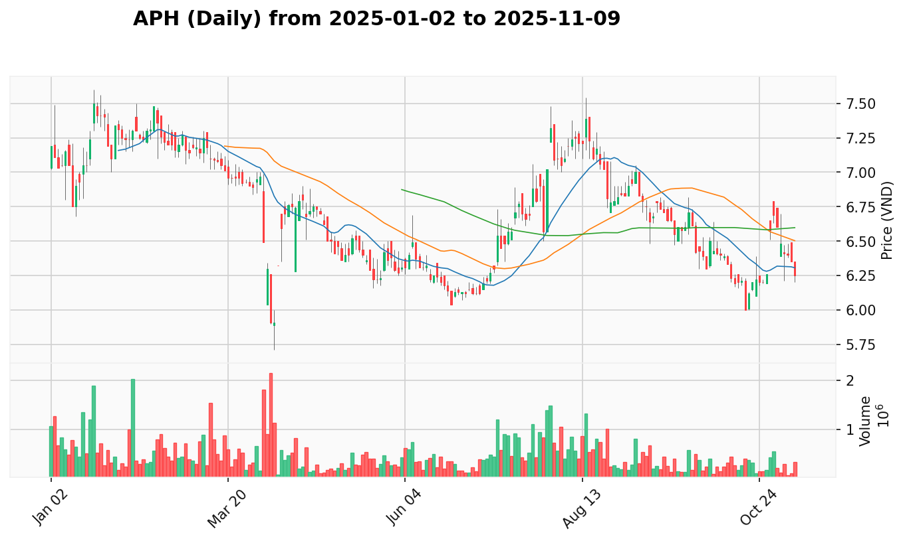

<a href="#nhua">↑ Back to group NHUA</a>  |  <a href="#vpa-signal-summary">↑ Back to Top</a>

#### Key Statistics
| Metric | Value |
|:---|---:|
| Date Range | 2025-01-02 to 2025-11-07 |
| **Latest Close** | **6.25** |
| Period Open | 7.03 |
| Period High | 7.6 |
| Period Low | 5.71 |
| Period Change % | -11.10% |

**[Download APH Data (.csv)](market_data/APH_2025-01-02_to_2025-11-09.csv)**

---

### APS

#### [VPA Analysis (2025-08-04 - 2025-10-21)](./VPA.md#aps)
> **Ngày 2025-10-15:** APS mở cửa ở 9.6 VND, dao động trong biên độ hẹp từ 9.4 VND đến 9.7 VND và đóng cửa ở 9.4 VND. So với giá đóng cửa phiên trước (9.6 VND), giá giảm. Khối lượng giao dịch đạt 0.533 triệu cổ phiếu, giảm đáng kể so với phiên trước (1.2321 triệu cổ phiếu). Sau các phiên cho thấy áp lực bán và nỗ lực không có kết quả, phiên hôm nay giá giảm trên khối lượng thấp, đóng cửa ở mức thấp nhất phiên. Điều này cho thấy lực cầu yếu và áp lực bán vẫn còn, nhưng khối lượng giảm có thể chỉ ra sự thiếu hụt cả cung và cầu. Tuy nhiên, việc đóng cửa ở mức thấp nhất phiên vẫn là một dấu hiệu của sự yếu kém tiếp diễn. **Phân tích VPA/Wyckoff:** Yếu kém tiếp diễn (Continued Weakness).
> **Ngày 2025-10-16:** APS mở cửa ở 9.4 VND, dao động trong biên độ hẹp từ 9.3 VND đến 9.5 VND và đóng cửa ở 9.3 VND. So với giá đóng cửa phiên trước (9.4 VND), giá giảm nhẹ. Khối lượng giao dịch đạt 0.3882 triệu cổ phiếu, giảm đáng kể so với phiên trước (0.533 triệu cổ phiếu). Giá giảm nhẹ trên khối lượng thấp và đóng cửa ở mức thấp nhất phiên cho thấy lực cầu rất yếu và áp lực bán vẫn còn, mặc dù không mạnh mẽ. Điều này tiếp tục xác nhận sự yếu kém của thị trường đối với cổ phiếu này. **Phân tích VPA/Wyckoff:** Yếu kém tiếp diễn (Continued Weakness).
> **Ngày 2025-10-17:** APS mở cửa ở 9.3 VND, dao động trong biên độ từ 9.1 VND đến 9.5 VND và đóng cửa ở 9.1 VND. So với giá đóng cửa phiên trước (9.3 VND), giá giảm. Khối lượng giao dịch đạt 0.6575 triệu cổ phiếu, tăng so với phiên trước (0.3882 triệu cổ phiếu) nhưng vẫn ở mức trung bình. Giá giảm mạnh và đóng cửa ở mức thấp nhất phiên với khối lượng tăng cho thấy áp lực bán vẫn còn mạnh mẽ và lực cầu yếu. Điều này tiếp tục xác nhận sự yếu kém của cổ phiếu. **Phân tích VPA/Wyckoff:** Yếu kém tiếp diễn (Continued Weakness).
> **Ngày 2025-10-20:** APS mở cửa ở 9.1 VND, giảm mạnh và đóng cửa ở mức thấp nhất phiên là 8.2 VND. Biên độ dao động giá từ 8.2 VND đến 9.3 VND. So với giá đóng cửa phiên trước (9.1 VND), giá giảm đáng kể. Khối lượng giao dịch đạt 1.2356 triệu cổ phiếu, tăng mạnh so với phiên trước (0.6575 triệu cổ phiếu). Giá giảm mạnh với biên độ rộng và đóng cửa ở mức thấp nhất phiên trên khối lượng tăng cao cho thấy áp lực bán rất mạnh mẽ và lực cầu hoàn toàn vắng bóng. Điều này xác nhận sự yếu kém nghiêm trọng của cổ phiếu. **Phân tích VPA/Wyckoff:** Yếu kém nghiêm trọng (Severe Weakness).
> **Ngày 2025-10-21:** APS mở cửa ở 8.2 VND, dao động trong biên độ từ 7.6 VND đến 8.4 VND và đóng cửa ở 7.8 VND. So với giá đóng cửa phiên trước (8.2 VND), giá giảm. Khối lượng giao dịch đạt 1.1113 triệu cổ phiếu, giảm nhẹ so với phiên trước (1.2356 triệu cổ phiếu) nhưng vẫn ở mức cao. Giá tiếp tục giảm mạnh với biên độ rộng và đóng cửa gần mức thấp nhất phiên trên khối lượng cao cho thấy áp lực bán vẫn còn rất mạnh mẽ và lực cầu tiếp tục vắng bóng. Điều này xác nhận sự yếu kém nghiêm trọng của cổ phiếu. **Phân tích VPA/Wyckoff:** Yếu kém nghiêm trọng tiếp diễn (Continued Severe Weakness).

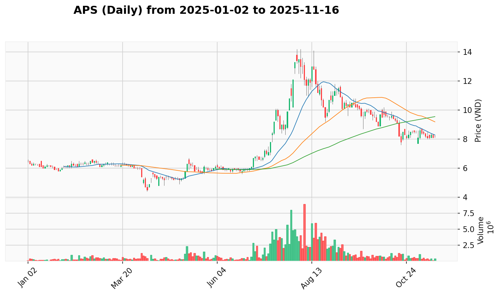

<a href="#chung-khoan">↑ Back to group CHUNG_KHOAN</a>  |  <a href="#vpa-signal-summary">↑ Back to Top</a>

#### Key Statistics
| Metric | Value |
|:---|---:|
| Date Range | 2025-01-02 to 2025-11-07 |
| **Latest Close** | **8.2** |
| Period Open | 6.5 |
| Period High | 14.2 |
| Period Low | 4.4 |
| Period Change % | 26.15% |

**[Download APS Data (.csv)](market_data/APS_2025-01-02_to_2025-11-09.csv)**

---

### ASM

#### [VPA Analysis (2025-08-14 - 2025-10-21)](./VPA.md#asm)
> **Ngày 2025-10-15:** ASM giảm từ 7.25 xuống 7.06 VND với khối lượng giao dịch đạt 1.362 triệu cổ phiếu, thấp hơn phiên trước. Cây nến giảm có biên độ hẹp, đóng cửa gần mức thấp nhất phiên, cho thấy áp lực bán vẫn còn nhưng không quá mạnh, đồng thời lực cầu tiếp tục vắng bóng. Điều này xác nhận xu hướng suy yếu tiếp diễn. **Phân tích VPA/Wyckoff:** Weakness (Tiếp diễn)
> **Ngày 2025-10-16:** ASM tăng nhẹ từ 7.06 lên 7.09 VND với khối lượng giao dịch đạt 0.467 triệu cổ phiếu, thấp hơn đáng kể so với phiên trước. Cây nến tăng có biên độ hẹp, đóng cửa gần giữa thân nến, cho thấy lực cầu yếu và không đủ sức đẩy giá lên cao. Khối lượng thấp trong khi giá tăng nhẹ sau chuỗi ngày giảm điểm xác nhận sự thiếu vắng của lực mua mạnh mẽ, cho thấy xu hướng suy yếu vẫn tiếp diễn. **Phân tích VPA/Wyckoff:** No Demand (Tiếp diễn suy yếu)
> **Ngày 2025-10-17:** ASM tăng nhẹ từ 7.09 lên 7.11 VND với khối lượng giao dịch đạt 0.663 triệu cổ phiếu, thấp hơn phiên trước. Cây nến tăng có biên độ hẹp, đóng cửa gần giữa thân nến, cho thấy lực cầu yếu và không đủ sức đẩy giá lên cao. Khối lượng thấp trong khi giá tăng nhẹ sau chuỗi ngày giảm điểm và "No Demand" xác nhận sự thiếu vắng của lực mua mạnh mẽ, cho thấy xu hướng suy yếu vẫn tiếp diễn. **Phân tích VPA/Wyckoff:** No Demand (Tiếp diễn suy yếu)
> **Ngày 2025-10-20:** ASM giảm mạnh từ 7.12 xuống 6.62 VND với khối lượng giao dịch đạt 0.8264 triệu cổ phiếu, cao hơn đáng kể so với các phiên trước. Cây nến giảm có biên độ rộng, đóng cửa ở mức thấp nhất phiên, cho thấy áp lực bán mạnh mẽ. Khối lượng gia tăng cùng với sự sụt giảm giá xác nhận sự xuất hiện của lực cung lớn, tiếp tục xu hướng suy yếu đã được xác nhận bởi các phiên 'No Demand' trước đó. **Phân tích VPA/Wyckoff:** Sign of Weakness (SOW) - Lực cung mạnh mẽ
> **Ngày 2025-10-21:** ASM tăng từ 6.62 lên 6.77 VND với khối lượng giao dịch đạt 1.0523 triệu cổ phiếu, cao hơn đáng kể so với phiên trước. Cây nến tăng có biên độ hẹp, đóng cửa gần mức cao nhất phiên, cho thấy lực cầu đã xuất hiện sau phiên giảm mạnh 'Sign of Weakness'. Mặc dù giá tăng trên khối lượng cao, nhưng mức tăng còn khiêm tốn và cần theo dõi thêm để xác nhận sự đảo chiều xu hướng. **Phân tích VPA/Wyckoff:** Test for Supply (Kiểm tra cung) - Lực cầu hấp thụ cung sau suy yếu.

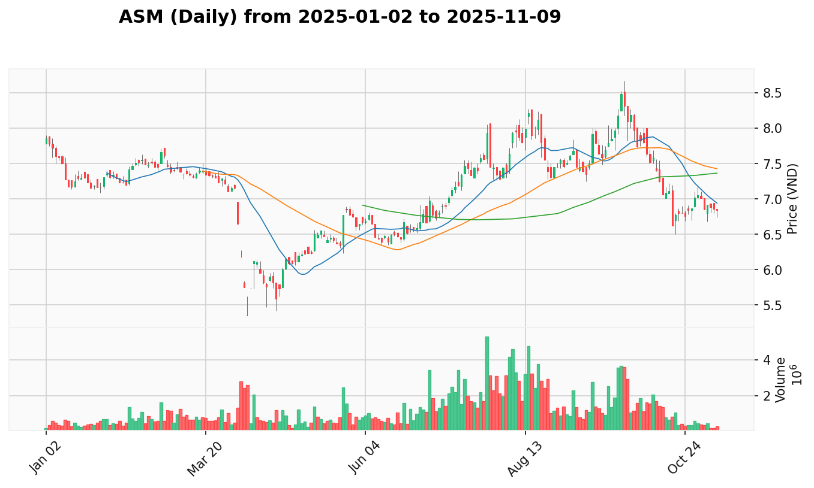

<a href="#thuy-san">↑ Back to group THUY_SAN</a>  |  <a href="#vpa-signal-summary">↑ Back to Top</a>

#### Key Statistics
| Metric | Value |
|:---|---:|
| Date Range | 2025-01-02 to 2025-11-07 |
| **Latest Close** | **6.84** |
| Period Open | 7.78 |
| Period High | 8.67 |
| Period Low | 5.35 |
| Period Change % | -12.08% |

**[Download ASM Data (.csv)](market_data/ASM_2025-01-02_to_2025-11-09.csv)**

---

### BAF

#### [VPA Analysis (2025-08-04 - 2025-10-21)](./VPA.md#baf)
> **Ngày 2025-10-15:** BAF mở cửa ở mức 34.4 VND, đạt mức cao nhất 34.65 VND và thấp nhất 33.85 VND, đóng cửa ở mức 34.25 VND. Giá giảm từ 34.5 VND xuống 34.25 VND với biên độ hẹp và đóng cửa gần mức thấp nhất phiên. Khối lượng giao dịch đạt 2.3175 triệu cổ phiếu, giảm đáng kể so với phiên trước (4.1312 triệu cổ phiếu). Sau hai phiên giảm giá mạnh với khối lượng gia tăng, việc giá tiếp tục giảm nhưng với khối lượng sụt giảm cho thấy áp lực bán đã suy yếu đáng kể, hoặc nguồn cung đã cạn kiệt tạm thời. Tuy nhiên, lực cầu vẫn chưa xuất hiện để đẩy giá lên. **Phân tích VPA/Wyckoff:** No Demand (Không có cầu)
> **Ngày 2025-10-16:** BAF mở cửa ở mức 34.2 VND, đạt mức cao nhất 34.25 VND và thấp nhất 33.8 VND, đóng cửa ở mức 33.8 VND. Giá giảm từ 34.2 VND xuống 33.8 VND với biên độ rất hẹp và đóng cửa ở mức thấp nhất phiên. Khối lượng giao dịch đạt 0.5314 triệu cổ phiếu, giảm mạnh so với phiên trước (2.3175 triệu cổ phiếu) và là mức thấp nhất trong 10 phiên gần đây. Sau phiên "No Demand" trước đó, việc giá tiếp tục giảm nhẹ với khối lượng cực kỳ thấp và đóng cửa ở mức thấp nhất cho thấy áp lực bán đã cạn kiệt đáng kể, nhưng đồng thời cũng không có lực cầu nào xuất hiện để hỗ trợ giá. Thị trường đang rất mỏng và thiếu thanh khoản. **Phân tích VPA/Wyckoff:** No Demand (Tiếp diễn)
> **Ngày 2025-10-17:** BAF mở cửa ở mức 33.85 VND, đạt mức cao nhất 34.2 VND và thấp nhất 33.8 VND, đóng cửa ở mức 33.95 VND. Giá tăng từ 33.85 VND lên 33.95 VND với biên độ hẹp và đóng cửa ở giữa thân nến. Khối lượng giao dịch đạt 1.6572 triệu cổ phiếu, tăng so với phiên trước (1.2718 triệu cổ phiếu) nhưng vẫn ở mức thấp so với các phiên có khối lượng lớn trước đó. Sau hai phiên "No Demand" với khối lượng cạn kiệt, phiên này giá tăng nhẹ với khối lượng gia tăng cho thấy có lực cầu xuất hiện trở lại, nhưng chưa đủ mạnh để tạo ra một xu hướng rõ ràng. Biên độ giá hẹp và giá đóng cửa không ở mức cao nhất cho thấy vẫn còn áp lực cung, cho thấy đây là một phiên kiểm tra cung. **Phân tích VPA/Wyckoff:** Test cung
> **Ngày 2025-10-20:** BAF mở cửa ở mức 33.7 VND, đạt mức cao nhất 33.95 VND và thấp nhất 32.7 VND, đóng cửa ở mức 32.7 VND. Giá giảm mạnh từ 33.7 VND xuống 32.7 VND với biên độ rộng và đóng cửa ở mức thấp nhất phiên. Khối lượng giao dịch đạt 2.481 triệu cổ phiếu, tăng đáng kể so với phiên trước (1.6572 triệu cổ phiếu). Sau phiên "Test cung" ngày 2025-10-17, việc giá giảm mạnh với biên độ rộng và đóng cửa ở mức thấp nhất phiên, đi kèm với khối lượng gia tăng, cho thấy áp lực bán mạnh mẽ đã xuất hiện trở lại và chiếm ưu thế hoàn toàn. Đây là một dấu hiệu suy yếu rõ ràng, cho thấy nguồn cung đang áp đảo cầu. **Phân tích VPA/Wyckoff:** Dấu hiệu suy yếu (SOW) - Áp lực bán mạnh
> **Ngày 2025-10-21:** BAF mở cửa ở mức 32.1 VND, đạt mức cao nhất 33.15 VND và thấp nhất 31.75 VND, đóng cửa ở mức 33.1 VND. Giá tăng từ 32.1 VND lên 33.1 VND với biên độ tương đối rộng và đóng cửa gần mức cao nhất phiên, cao hơn giá đóng cửa của phiên giảm mạnh trước đó. Khối lượng giao dịch đạt 2.3747 triệu cổ phiếu, giảm nhẹ so với phiên trước (2.481 triệu cổ phiếu). Sau phiên "Dấu hiệu suy yếu" với áp lực bán mạnh ngày 2025-10-20, phiên này cho thấy lực cầu đã xuất hiện mạnh mẽ, hấp thụ áp lực bán và đẩy giá lên, đóng cửa ở mức cao. Điều này cho thấy sự đảo chiều tiềm năng và sự xuất hiện của lực mua. **Phân tích VPA/Wyckoff:** Dấu hiệu sức mạnh (SOS) - Lực cầu xuất hiện và hấp thụ áp lực bán.

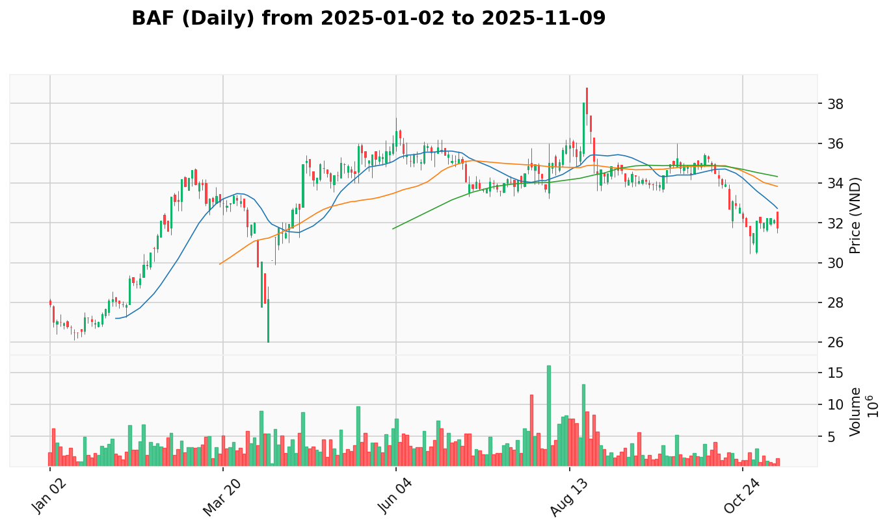

<a href="#nong-nghiep">↑ Back to group NONG_NGHIEP</a>  |  <a href="#vpa-signal-summary">↑ Back to Top</a>

#### Key Statistics
| Metric | Value |
|:---|---:|
| Date Range | 2025-01-02 to 2025-11-07 |
| **Latest Close** | **31.75** |
| Period Open | 28.1 |
| Period High | 38.8 |
| Period Low | 26.0 |
| Period Change % | 12.99% |

**[Download BAF Data (.csv)](market_data/BAF_2025-01-02_to_2025-11-09.csv)**

---

### BCC

#### [VPA Analysis (2025-08-14 - 2025-10-21)](./VPA.md#bcc)
> **Ngày 2025-10-15:** BCC giảm từ 8.2 VND xuống 8.1 VND với khối lượng giao dịch đạt 0.049 triệu cổ phiếu. Cây nến giảm có biên độ hẹp, đóng cửa ở mức thấp nhất phiên, cho thấy áp lực bán vẫn hiện hữu. Khối lượng giao dịch giảm mạnh so với các phiên trước, cho thấy sự thiếu vắng lực cầu để hấp thụ nguồn cung, xác nhận sự yếu kém tiếp diễn của thị trường. **Phân tích VPA/Wyckoff:** No Demand (Không có cầu) - Giá tiếp tục giảm với khối lượng thấp cho thấy không có lực cầu hỗ trợ.
> **Ngày 2025-10-16:** BCC tăng từ 8.1 VND lên 8.2 VND với khối lượng giao dịch đạt 0.0537 triệu cổ phiếu. Cây nến tăng có biên độ hẹp, đóng cửa ở mức cao nhất phiên, cho thấy có lực cầu xuất hiện nhưng không mạnh mẽ. Khối lượng giao dịch tăng nhẹ so với phiên trước nhưng vẫn ở mức thấp, cho thấy thị trường đang kiểm tra nguồn cung sau giai đoạn yếu kém. **Phân tích VPA/Wyckoff:** Test for Supply (Kiểm tra nguồn cung)
> **Ngày 2025-10-17:** BCC giảm từ 8.1 VND xuống 8.0 VND với khối lượng giao dịch đạt 0.2795 triệu cổ phiếu. Cây nến giảm có biên độ tương đối rộng, đóng cửa ở giữa thân nến, cho thấy áp lực bán gia tăng đáng kể. Khối lượng giao dịch tăng mạnh so với các phiên trước, xác nhận sự xuất hiện của nguồn cung lớn trên thị trường sau phiên kiểm tra nguồn cung trước đó. **Phân tích VPA/Wyckoff:** Sign of Weakness (SOW) - Nguồn cung xuất hiện mạnh mẽ với khối lượng lớn, xác nhận sự yếu kém của thị trường.
> **Ngày 2025-10-20:** BCC giảm từ 8.1 VND xuống 7.6 VND với khối lượng giao dịch đạt 0.2399 triệu cổ phiếu. Cây nến giảm có biên độ rộng và đóng cửa ở mức thấp nhất phiên, cho thấy áp lực bán mạnh mẽ và sự kiểm soát hoàn toàn của phe bán. Khối lượng giao dịch vẫn ở mức cao, xác nhận sự tiếp diễn của nguồn cung sau tín hiệu yếu kém (SOW) trước đó. **Phân tích VPA/Wyckoff:** Continuation of Weakness (SOW)
> **Ngày 2025-10-21:** BCC giảm từ 7.6 VND xuống 7.5 VND với khối lượng giao dịch đạt 0.1634 triệu cổ phiếu. Cây nến giảm có biên độ hẹp và đóng cửa ở mức thấp nhất phiên, cho thấy áp lực bán vẫn duy trì. Khối lượng giao dịch giảm so với phiên trước, sau hai phiên giảm mạnh với khối lượng lớn, điều này có thể cho thấy nguồn cung đang tạm thời cạn kiệt hoặc phe bán đang tạm nghỉ. Tuy nhiên, việc giá đóng cửa ở mức thấp nhất phiên vẫn xác nhận sự kiểm soát của phe bán. **Phân tích VPA/Wyckoff:** Continuation of Weakness (SOW) - Giá tiếp tục giảm và đóng cửa ở mức thấp nhất phiên, xác nhận sự tiếp diễn của xu hướng yếu kém, mặc dù khối lượng giao dịch đã giảm.

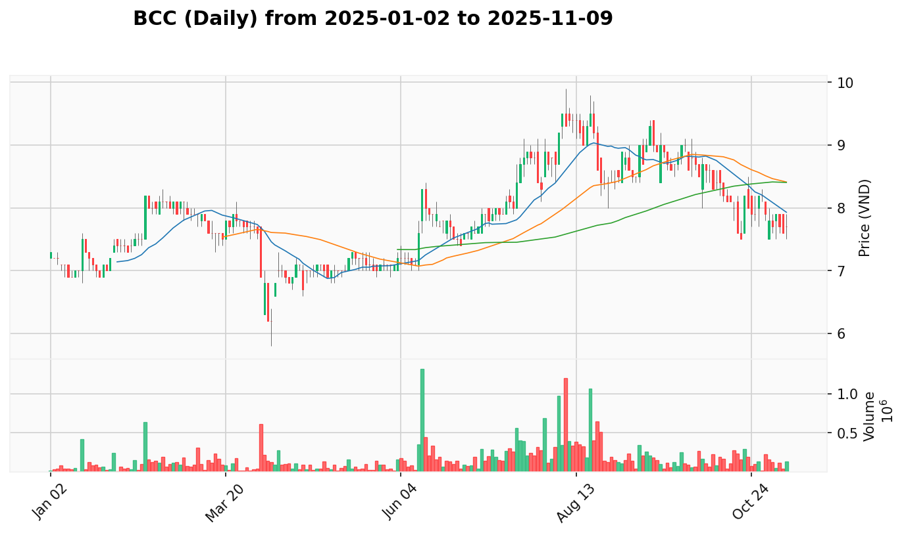

<a href="#vlxd">↑ Back to group VLXD</a>  |  <a href="#vpa-signal-summary">↑ Back to Top</a>

#### Key Statistics
| Metric | Value |
|:---|---:|
| Date Range | 2025-01-02 to 2025-11-07 |
| **Latest Close** | **7.7** |
| Period Open | 7.2 |
| Period High | 9.9 |
| Period Low | 5.8 |
| Period Change % | 6.94% |

**[Download BCC Data (.csv)](market_data/BCC_2025-01-02_to_2025-11-09.csv)**

---

### BCE

#### [VPA Analysis (2025-08-14 - 2025-10-21)](./VPA.md#bce)
> **Ngày 2025-10-15:** BCE giảm từ 11.05 VND xuống 11.0 VND với khối lượng giao dịch đạt 0.0722 triệu cổ phiếu. Cây nến có biên độ rộng, giá giảm mạnh xuống 10.65 VND nhưng đã phục hồi để đóng cửa ở mức 11.0 VND, ngang bằng với giá mở cửa. Khối lượng giao dịch tăng đáng kể so với phiên trước (0.0272 triệu cổ phiếu), cho thấy có lực cầu hấp thụ nguồn cung tại vùng giá thấp sau các phiên thiếu cầu. **Phân tích VPA/Wyckoff:** Stopping Volume (Khối lượng dừng)
> **Ngày 2025-10-16:** BCE giữ nguyên mức giá 11.0 VND với khối lượng giao dịch đạt 0.0044 triệu cổ phiếu. Cây nến có biên độ hẹp, giá mở cửa và đóng cửa ở cùng mức, cho thấy sự thiếu quyết đoán. Khối lượng giao dịch cực kỳ thấp, giảm mạnh so với phiên trước (0.0722 triệu cổ phiếu), xác nhận không có áp lực bán đáng kể sau phiên Khối lượng dừng (Stopping Volume) ngày 2025-10-15. Điều này cho thấy thị trường đang kiểm tra cung sau khi lực bán đã được hấp thụ. **Phân tích VPA/Wyckoff:** Kiểm tra cung (Test for Supply)
> **Ngày 2025-10-17:** BCE tăng từ 10.95 VND lên 11.0 VND với khối lượng giao dịch đạt 0.0498 triệu cổ phiếu. Cây nến có biên độ hẹp, giá mở cửa ở 10.9 VND và đóng cửa ở mức cao nhất phiên 11.0 VND. Khối lượng giao dịch tăng đáng kể so với phiên kiểm tra cung trước đó, cho thấy lực cầu đã hấp thụ nguồn cung và đẩy giá lên. **Phân tích VPA/Wyckoff:** Sign of Strength (SOS) - Lực cầu xuất hiện sau kiểm tra cung.
> **Ngày 2025-10-20:** BCE giảm từ 11.0 VND xuống 10.7 VND với khối lượng giao dịch đạt 0.0646 triệu cổ phiếu. Cây nến có biên độ rộng và đóng cửa gần mức thấp nhất phiên. Khối lượng giao dịch tăng đáng kể so với phiên trước, cho thấy áp lực bán đã xuất hiện trở lại sau phiên Lực cầu xuất hiện (SOS) ngày 2025-10-17. **Phân tích VPA/Wyckoff:** Sign of Weakness (SOW) - Áp lực bán gia tăng.
> **Ngày 2025-10-21:** BCE tăng từ 10.55 VND lên 10.75 VND với khối lượng giao dịch đạt 0.1173 triệu cổ phiếu. Cây nến có biên độ hẹp, giá mở cửa ở 10.55 VND và đóng cửa ở mức cao nhất phiên 10.75 VND. Khối lượng giao dịch tăng mạnh so với phiên giảm điểm trước đó, cho thấy lực cầu đã hấp thụ áp lực bán và đẩy giá lên. **Phân tích VPA/Wyckoff:** Sign of Strength (SOS) - Lực cầu mạnh mẽ xuất hiện sau áp lực bán.

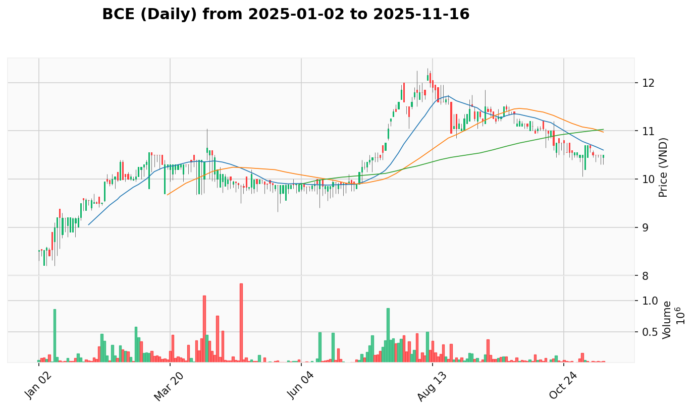

<a href="#xay-dung">↑ Back to group XAY_DUNG</a>  |  <a href="#vpa-signal-summary">↑ Back to Top</a>

#### Key Statistics
| Metric | Value |
|:---|---:|
| Date Range | 2025-01-02 to 2025-11-07 |
| **Latest Close** | **10.65** |
| Period Open | 8.5 |
| Period High | 12.3 |
| Period Low | 8.2 |
| Period Change % | 25.29% |

**[Download BCE Data (.csv)](market_data/BCE_2025-01-02_to_2025-11-09.csv)**

---

### BCG

#### [VPA Analysis (2025-08-14 - 2025-10-08)](./VPA.md#bcg)
> **Ngày 2025-10-02:** BCG giảm từ 3.23 VND xuống 3.01 VND với khối lượng giao dịch đạt 8.3755 triệu cổ phiếu. Cây nến giảm có biên độ rộng và đóng cửa ở mức thấp nhất phiên. Khối lượng giao dịch tăng mạnh so với phiên trước (2.5443 triệu cổ phiếu) và cả phiên SOW ngày 2025-09-30 (3.8022 triệu cổ phiếu), cho thấy áp lực bán tháo rất mạnh mẽ. Sau phiên 'No Demand' yếu ớt, sự xuất hiện của khối lượng cực lớn trong phiên giảm giá mạnh này xác nhận xu hướng suy yếu tiếp diễn và thiếu vắng hoàn toàn lực cầu. **Phân tích VPA/Wyckoff:** Sign of Weakness (SOW) - Áp lực bán mạnh mẽ.
> **Ngày 2025-10-03:** BCG tiếp tục giảm từ 3.01 VND xuống 2.8 VND với khối lượng giao dịch đạt 2.9088 triệu cổ phiếu. Cây nến giảm có biên độ rất hẹp (Open=High=Low=Close), đóng cửa ở mức thấp nhất phiên, cho thấy áp lực bán vẫn duy trì. Khối lượng giao dịch giảm mạnh so với phiên trước (8.3755 triệu cổ phiếu), nhưng giá vẫn tiếp tục giảm sâu sau phiên SOW với khối lượng lớn. Điều này xác nhận sự thiếu vắng hoàn toàn lực cầu và áp lực bán vẫn đang kiểm soát, cho thấy xu hướng giảm tiếp diễn. **Phân tích VPA/Wyckoff:** No Demand (Không có cầu)
> **Ngày 2025-10-06:** BCG giảm từ 2.8 VND xuống 2.61 VND với khối lượng giao dịch đạt 7.8141 triệu cổ phiếu. Cây nến giảm có biên độ rất hẹp (Open=High=Low=Close), đóng cửa ở mức thấp nhất phiên, cho thấy áp lực bán vẫn duy trì và không có lực cầu đáng kể. Khối lượng giao dịch tăng đáng kể so với phiên 'No Demand' trước đó (2.9088 triệu cổ phiếu), xác nhận sự tiếp diễn của áp lực bán và thiếu vắng lực cầu. **Phân tích VPA/Wyckoff:** Sign of Weakness (SOW) - Áp lực bán tiếp diễn.
> **Ngày 2025-10-07:** BCG giảm từ 2.61 VND xuống 2.55 VND với khối lượng giao dịch đạt 28.7171 triệu cổ phiếu. Cây nến có biên độ rộng, mở cửa ở mức thấp nhất phiên (2.43 VND) và đóng cửa cao hơn giá mở cửa, cho thấy lực cầu đã xuất hiện và hấp thụ một phần áp lực bán. Khối lượng giao dịch tăng đột biến so với các phiên trước, đặc biệt sau các phiên 'No Demand' và 'Sign of Weakness', cho thấy khả năng đây là một phiên Selling Climax (cao trào bán) khi nguồn cung được hấp thụ mạnh mẽ. **Phân tích VPA/Wyckoff:** Selling Climax (SC) - Cao trào bán.
> **Ngày 2025-10-08:** BCG giảm từ 2.61 VND xuống 2.53 VND với khối lượng giao dịch đạt 14.61 triệu cổ phiếu. Cây nến giảm có biên độ hẹp, đóng cửa gần mức thấp nhất phiên. Mặc dù mở cửa cao hơn giá đóng cửa phiên trước, nhưng giá không giữ được đà tăng và giảm trở lại. Khối lượng giao dịch giảm mạnh so với phiên cao trào bán (Selling Climax) trước đó (28.72 triệu cổ phiếu), cho thấy áp lực bán đã suy yếu. Tuy nhiên, việc giá không thể phục hồi và đóng cửa thấp cho thấy lực cầu vẫn còn yếu. **Phân tích VPA/Wyckoff:** No Demand (ND) - Thiếu vắng lực cầu.

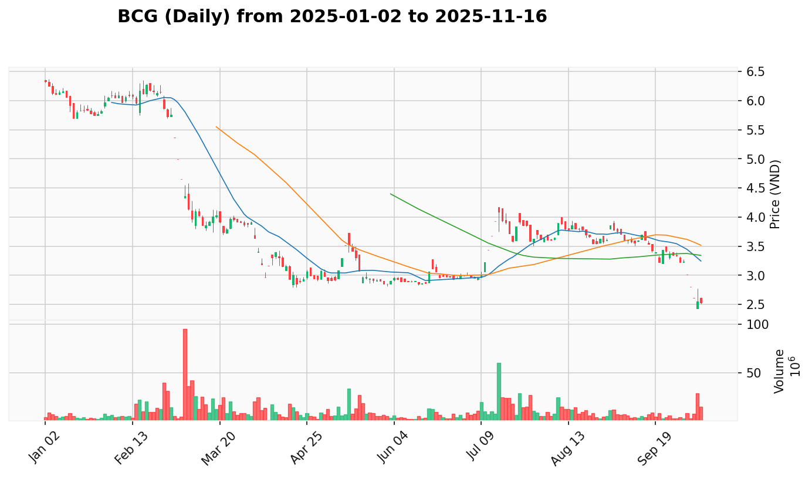

<a href="#xay-dung">↑ Back to group XAY_DUNG</a>  |  <a href="#vpa-signal-summary">↑ Back to Top</a>

#### Key Statistics
| Metric | Value |
|:---|---:|
| Date Range | 2025-01-02 to 2025-10-08 |
| **Latest Close** | **2.53** |
| Period Open | 6.35 |
| Period High | 6.37 |
| Period Low | 2.43 |
| Period Change % | -60.16% |

**[Download BCG Data (.csv)](market_data/BCG_2025-01-02_to_2025-11-09.csv)**

---

### BCM

#### [VPA Analysis (2025-06-13 - 2025-10-21)](./VPA.md#bcm)
> **Ngày 2025-10-15:** BCM giảm từ 64.8 VND xuống 64.5 VND, giảm 0.3 VND (khoảng 0.46%) với khối lượng giao dịch đạt 0.4053 triệu cổ phiếu, cao hơn phiên trước (0.3762 triệu cổ phiếu). Giá mở cửa thấp hơn và tạo đỉnh thấp hơn (64.6 VND) so với phiên trước (66.3 VND). Mặc dù giá có sự phục hồi nhẹ từ mức thấp nhất 63.0 VND, nhưng khối lượng tăng trong khi giá giảm cho thấy áp lực cung vẫn chiếm ưu thế và tiếp tục xác nhận xu hướng yếu. **Phân tích VPA/Wyckoff:** Sign of Weakness (SOW)
> **Ngày 2025-10-16:** BCM giảm từ 64.5 VND xuống 64.0 VND, giảm 0.5 VND (khoảng 0.78%) trên khối lượng giao dịch đạt 0.0414 triệu cổ phiếu, thấp hơn đáng kể so với phiên trước (0.4053 triệu cổ phiếu) và các phiên gần đây. Cây nến có biên độ hẹp, giá mở cửa cao hơn nhưng đóng cửa ở mức thấp nhất phiên, cho thấy lực cung vẫn hiện diện nhưng không mạnh mẽ như các phiên trước do khối lượng giao dịch rất thấp. Sự sụt giảm giá với khối lượng thấp sau các phiên "Sign of Weakness" cho thấy không có lực cầu hỗ trợ. **Phân tích VPA/Wyckoff:** No Demand (Không có cầu)
> **Ngày 2025-10-17:** BCM tăng từ 65.5 VND lên 65.9 VND, tăng 0.4 VND (khoảng 0.61%) với khối lượng giao dịch đạt 0.2747 triệu cổ phiếu, thấp hơn so với phiên trước (0.342 triệu cổ phiếu) và thấp hơn đáng kể so với mức trung bình gần đây. Giá mở cửa cao hơn và đóng cửa ở mức cao nhất phiên (65.9 VND), cho thấy có lực cầu xuất hiện trong phiên. Tuy nhiên, khối lượng giao dịch thấp cho thấy sự thiếu hụt lực mua mạnh mẽ. Sau các tín hiệu suy yếu (SOW) và không có cầu (No Demand) ở các phiên trước, sự tăng giá với khối lượng thấp này có thể là một đợt kiểm tra cung hoặc một đợt phục hồi yếu trong xu hướng giảm. **Phân tích VPA/Wyckoff:** Thiếu cầu
> **Ngày 2025-10-20:** BCM giảm từ 65.9 VND xuống 62.5 VND, giảm 3.4 VND (khoảng 5.16%) với khối lượng giao dịch đạt 0.2328 triệu cổ phiếu, thấp hơn so với phiên trước (0.2747 triệu cổ phiếu) và thấp hơn mức trung bình gần đây. Cây nến giảm có biên độ rộng, giá đóng cửa ở mức thấp nhất phiên, cho thấy áp lực bán mạnh mẽ và sự thiếu vắng lực cầu. Điều này xác nhận sự yếu kém tiếp diễn của cổ phiếu. **Phân tích VPA/Wyckoff:** Dấu hiệu suy yếu (Sign of Weakness)
> **Ngày 2025-10-21:** BCM tăng từ 62.5 VND lên 64.0 VND, tăng 1.5 VND (khoảng 2.4%) với khối lượng giao dịch đạt 0.2346 triệu cổ phiếu, tương đương phiên trước (0.2328 triệu cổ phiếu) và vẫn ở mức thấp so với trung bình gần đây. Giá đóng cửa ở mức cao nhất phiên, cho thấy lực cầu xuất hiện sau phiên giảm mạnh trước đó. Tuy nhiên, khối lượng giao dịch thấp trong bối cảnh giá tăng cho thấy sự phục hồi này có thể là một đợt kiểm tra cung hoặc một đợt phục hồi yếu, chưa có sự tham gia mạnh mẽ của dòng tiền lớn. Điều này phù hợp với các tín hiệu yếu kém đã xuất hiện trước đó. **Phân tích VPA/Wyckoff:** Thiếu cầu

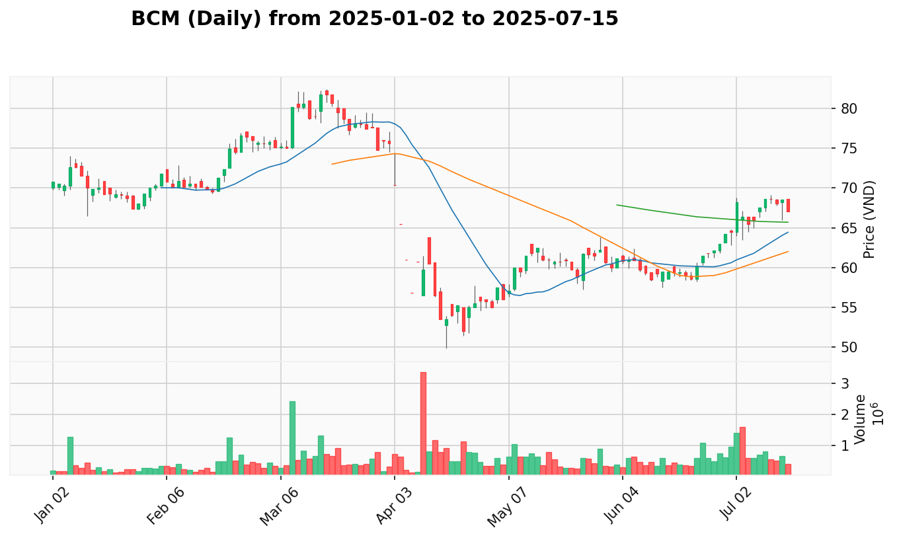

<a href="#bat-dong-san-kcn">↑ Back to group BAT_DONG_SAN_KCN</a>  |  <a href="#vpa-signal-summary">↑ Back to Top</a>

#### Key Statistics
| Metric | Value |
|:---|---:|
| Date Range | 2025-01-02 to 2025-11-07 |
| **Latest Close** | **68.0** |
| Period Open | 70.0 |
| Period High | 82.4 |
| Period Low | 49.8 |
| Period Change % | -2.86% |

**[Download BCM Data (.csv)](market_data/BCM_2025-01-02_to_2025-11-09.csv)**

---

### BFC

#### [VPA Analysis (2025-08-05 - 2025-10-21)](./VPA.md#bfc)
> **Ngày 2025-10-15:** BFC giảm từ 42.05 VND xuống 41.7 VND với khối lượng giao dịch đạt 0.1089 triệu cổ phiếu. Cây nến giảm có biên độ hẹp và đóng cửa gần mức thấp nhất phiên, cho thấy áp lực bán tiếp tục duy trì. Khối lượng giao dịch tăng nhẹ so với phiên trước (0.09 triệu cổ phiếu) nhưng vẫn ở mức thấp, điều này cho thấy lực cung vẫn đang chiếm ưu thế và lực cầu chưa sẵn sàng tham gia. Sau hai phiên giảm giá liên tiếp, phiên này củng cố thêm sự yếu kém của cổ phiếu. **Phân tích VPA/Wyckoff:** Supply Coming In (SC) - Giá tiếp tục giảm với khối lượng tăng nhẹ, cho thấy lực cung vẫn đang hiện diện và áp đảo lực cầu.
> **Ngày 2025-10-16:** BFC tăng từ 41.7 VND lên 41.95 VND, đóng cửa ở mức cao nhất phiên. Khối lượng giao dịch đạt 0.085 triệu cổ phiếu, giảm so với phiên trước (0.1089 triệu cổ phiếu) và ở mức rất thấp. Cây nến tăng có biên độ hẹp cùng với khối lượng thấp cho thấy áp lực bán đã giảm đáng kể, nhưng lực cầu vẫn còn yếu và chưa thực sự tham gia mạnh mẽ. Sau hai phiên giảm giá liên tiếp, phiên này có thể là dấu hiệu kiểm tra nguồn cung. **Phân tích VPA/Wyckoff:** No Supply (NS) - Giá tăng nhẹ với khối lượng rất thấp, cho thấy lực cung đã cạn kiệt nhưng lực cầu chưa thực sự tham gia mạnh mẽ.
> **Ngày 2025-10-17:** BFC tăng từ 42.0 VND lên 42.4 VND với khối lượng giao dịch đạt 0.152 triệu cổ phiếu. Cây nến tăng có biên độ rộng hơn phiên trước và đóng cửa gần mức cao nhất phiên, cho thấy lực cầu đã bắt đầu tham gia sau phiên kiểm tra cung (No Supply) trước đó. Khối lượng giao dịch tăng nhẹ so với phiên trước (0.085 triệu cổ phiếu theo phân tích VPA ngày 2025-10-16), xác nhận sự xuất hiện của lực mua. **Phân tích VPA/Wyckoff:** Sign of Strength (SOS) - Giá tăng mạnh với khối lượng gia tăng, cho thấy lực cầu đang chiếm ưu thế.
> **Ngày 2025-10-20:** BFC mở cửa tại 42.4 VND, tăng lên mức cao nhất 43.55 VND nhưng sau đó giảm xuống mức thấp nhất 41.05 VND và đóng cửa tại 42.4 VND, bằng với giá mở cửa và giá đóng cửa phiên trước. Biên độ giá trong phiên rất rộng, đi kèm với khối lượng giao dịch đột biến đạt 0.7289 triệu cổ phiếu, cao gấp nhiều lần so với phiên trước (0.152 triệu cổ phiếu). Điều này cho thấy một cuộc chiến khốc liệt giữa phe mua và phe bán. Mặc dù có lực cầu đẩy giá lên cao, nhưng áp lực bán đã xuất hiện mạnh mẽ và đẩy giá trở lại mức mở cửa. Sau phiên Sign of Strength (SOS) trước đó, hành động giá này với khối lượng lớn và không thể đóng cửa cao hơn cho thấy sự xuất hiện của nguồn cung lớn trên thị trường, có thể là dấu hiệu của sự phân phối hoặc kiểm tra lại lực cầu. **Phân tích VPA/Wyckoff:** Nỗ lực không mang lại kết quả (Effort without Result) - Giá biến động mạnh với khối lượng lớn nhưng không thể đóng cửa cao hơn, cho thấy nguồn cung đang hấp thụ lực cầu.
> **Ngày 2025-10-21:** BFC mở cửa tại 42.45 VND, đạt mức cao nhất 42.9 VND, sau đó giảm xuống mức thấp nhất 42.0 VND và đóng cửa tại 42.05 VND. Giá đóng cửa thấp hơn giá mở cửa và thấp hơn giá đóng cửa phiên trước (42.4 VND), cho thấy áp lực bán tiếp diễn. Biên độ giá trong phiên hẹp hơn đáng kể so với phiên trước, đi kèm với khối lượng giao dịch chỉ đạt 0.0973 triệu cổ phiếu, giảm mạnh so với phiên 2025-10-20 (0.7289 triệu cổ phiếu). Sau phiên "Nỗ lực không mang lại kết quả" với khối lượng lớn, việc giá tiếp tục giảm với khối lượng thấp cho thấy lực cầu yếu và thị trường đang kiểm tra lại nguồn cung. **Phân tích VPA/Wyckoff:** No Demand - Giá giảm với khối lượng thấp sau một phiên có dấu hiệu phân phối, cho thấy lực cầu không tham gia và khả năng giá sẽ tiếp tục giảm.

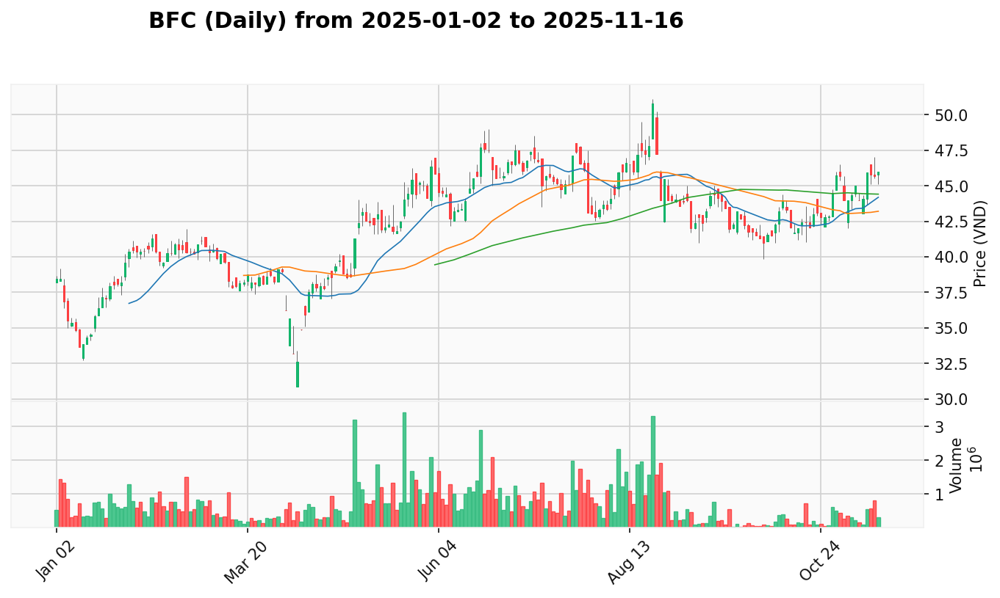

<a href="#hoa-chat">↑ Back to group HOA_CHAT</a>  |  <a href="#vpa-signal-summary">↑ Back to Top</a>

#### Key Statistics
| Metric | Value |
|:---|---:|
| Date Range | 2025-01-02 to 2025-11-07 |
| **Latest Close** | **44.0** |
| Period Open | 38.19 |
| Period High | 51.1 |
| Period Low | 30.86 |
| Period Change % | 15.21% |

**[Download BFC Data (.csv)](market_data/BFC_2025-01-02_to_2025-11-09.csv)**

---

### BIC

#### [VPA Analysis (2025-06-27 - 2025-10-21)](./VPA.md#bic)
> **Ngày 2025-10-15:** BIC giảm từ 26.35 VND xuống 26.0 VND. Cây nến có biên độ rộng, mở cửa tại 26.5 VND, đạt mức cao nhất 26.5 VND và mức thấp nhất 25.2 VND, đóng cửa tại 26.0 VND (gần mức thấp nhất phiên). Khối lượng giao dịch đạt 0.1188 triệu cổ phiếu, cao hơn đáng kể so với phiên trước (0.0791 triệu cổ phiếu). Sau các phiên "Sign of Weakness" liên tiếp, việc giá tiếp tục giảm mạnh với biên độ rộng và đóng cửa gần mức thấp nhất phiên trên khối lượng gia tăng cho thấy áp lực bán rất mạnh và nguồn cung đang chiếm ưu thế hoàn toàn. Điều này xác nhận và củng cố thêm dấu hiệu suy yếu của cổ phiếu. **Phân tích VPA/Wyckoff:** Sign of Weakness (Dấu hiệu suy yếu)
> **Ngày 2025-10-16:** BIC giảm từ 26.0 VND xuống 25.3 VND. Cây nến có biên độ tương đối rộng, mở cửa tại 26.0 VND, đạt mức cao nhất 26.8 VND và mức thấp nhất 25.3 VND, đóng cửa tại 25.3 VND (mức thấp nhất phiên). Khối lượng giao dịch đạt 0.0444 triệu cổ phiếu, giảm đáng kể so với phiên trước (0.1188 triệu cổ phiếu). Sau nhiều phiên "Sign of Weakness" liên tiếp, việc giá tiếp tục giảm và đóng cửa tại mức thấp nhất phiên trên khối lượng giảm cho thấy áp lực bán vẫn còn nhưng cường độ đã giảm. Tuy nhiên, việc giá không thể hồi phục và đóng cửa ở mức thấp nhất cho thấy lực cầu vẫn rất yếu và chưa sẵn sàng tham gia. Điều này củng cố thêm dấu hiệu suy yếu của cổ phiếu. **Phân tích VPA/Wyckoff:** Sign of Weakness (Dấu hiệu suy yếu)
> **Ngày 2025-10-17:** BIC giảm từ 25.7 VND xuống 25.25 VND. Cây nến có biên độ hẹp, mở cửa tại 25.6 VND, đạt mức cao nhất 25.6 VND và mức thấp nhất 25.15 VND, đóng cửa tại 25.25 VND (gần mức thấp nhất phiên). Khối lượng giao dịch đạt 0.0519 triệu cổ phiếu, giảm đáng kể so với phiên trước (0.0908 triệu cổ phiếu). Sau chuỗi các phiên "Sign of Weakness" với khối lượng lớn, việc giá tiếp tục giảm nhưng với khối lượng thấp cho thấy áp lực bán đang suy yếu đáng kể, nguồn cung cạn kiệt dần, mặc dù lực cầu vẫn chưa đủ mạnh để đảo chiều xu hướng. Điều này cho thấy sự tiếp diễn của dấu hiệu suy yếu nhưng với cường độ giảm. **Phân tích VPA/Wyckoff:** Sign of Weakness (Dấu hiệu suy yếu)
> **Ngày 2025-10-20:** BIC giảm từ 25.25 VND xuống 24.0 VND. Cây nến có biên độ rộng, mở cửa tại 25.25 VND, đạt mức cao nhất 25.75 VND và mức thấp nhất 24.0 VND, đóng cửa tại 24.0 VND (mức thấp nhất phiên). Khối lượng giao dịch đạt 0.1217 triệu cổ phiếu, tăng đáng kể so với phiên trước (0.0519 triệu cổ phiếu). Sau chuỗi các phiên "Sign of Weakness", việc giá tiếp tục giảm mạnh với biên độ rộng và đóng cửa tại mức thấp nhất phiên trên khối lượng gia tăng cho thấy áp lực bán vẫn rất mạnh và nguồn cung đang áp đảo hoàn toàn lực cầu. Điều này củng cố thêm dấu hiệu suy yếu của cổ phiếu. **Phân tích VPA/Wyckoff:** Sign of Weakness (Dấu hiệu suy yếu)
> **Ngày 2025-10-21:** BIC tăng từ 24.0 VND lên 24.3 VND. Cây nến có biên độ hẹp, mở cửa tại 24.0 VND, đạt mức cao nhất 24.5 VND và mức thấp nhất 23.85 VND, đóng cửa tại 24.3 VND (gần mức cao nhất phiên). Khối lượng giao dịch đạt 0.0736 triệu cổ phiếu, giảm đáng kể so với phiên trước (0.1217 triệu cổ phiếu). Sau hai phiên "Sign of Weakness" với áp lực bán mạnh, giá có sự phục hồi nhẹ nhưng với khối lượng thấp cho thấy lực bán đã tạm thời suy yếu, tuy nhiên lực cầu vẫn chưa đủ mạnh để tạo ra sự đảo chiều rõ rệt. Điều này có thể là một sự kiểm tra lại nguồn cung hoặc một sự tạm dừng trong xu hướng giảm. **Phân tích VPA/Wyckoff:** Test (Kiểm tra nguồn cung)

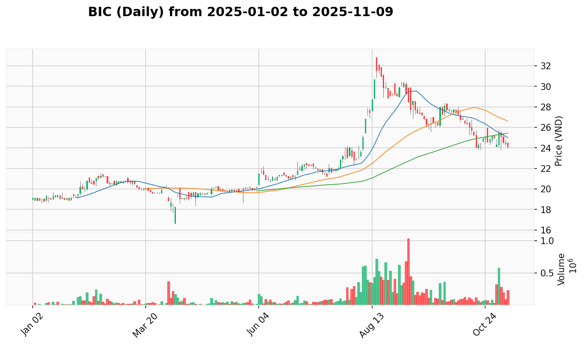

<a href="#bao-hiem">↑ Back to group BAO_HIEM</a>  |  <a href="#vpa-signal-summary">↑ Back to Top</a>

#### Key Statistics
| Metric | Value |
|:---|---:|
| Date Range | 2025-01-02 to 2025-11-07 |
| **Latest Close** | **24.15** |
| Period Open | 18.98 |
| Period High | 32.83 |
| Period Low | 16.61 |
| Period Change % | 27.24% |

**[Download BIC Data (.csv)](market_data/BIC_2025-01-02_to_2025-11-09.csv)**

---

### BID

#### [VPA Analysis (2025-06-13 - 2025-10-21)](./VPA.md#bid)
> **Ngày 2025-10-15:** BID giảm từ 39.7 VND xuống 39.35 VND, với biên độ dao động từ 39.35 VND đến 40.15 VND và đóng cửa ở mức thấp nhất phiên. Khối lượng giao dịch đạt 4.3294 triệu cổ phiếu, giảm đáng kể so với phiên trước (7.731694 triệu cổ phiếu). Sau phiên giảm mạnh với khối lượng lớn ngày 2025-10-14, phiên này BID tiếp tục giảm và đóng cửa ở mức thấp nhất, cho thấy áp lực bán vẫn còn. Tuy nhiên, khối lượng giảm mạnh cho thấy lực cung đã suy yếu hơn, có thể là dấu hiệu của sự cạn kiệt nguồn cung tạm thời hoặc thiếu vắng lực cầu. **Phân tích VPA/Wyckoff:** No Demand (Thiếu cầu)
> **Ngày 2025-10-16:** BID mở cửa ở mức 39.35 VND, dao động trong biên độ hẹp từ 39.2 VND đến 39.75 VND và đóng cửa tại 39.35 VND, bằng với giá mở cửa và giá đóng cửa của phiên trước. Khối lượng giao dịch đạt 2.0165 triệu cổ phiếu, giảm mạnh so với phiên trước (4.335312 triệu cổ phiếu) và là mức thấp nhất trong 10 phiên gần đây. Sau hai phiên giảm giá liên tiếp với áp lực bán mạnh và sau đó là thiếu cầu, việc giá không giảm thêm trong phiên này với khối lượng cực thấp cho thấy áp lực cung đã cạn kiệt đáng kể. Điều này có thể là dấu hiệu của một đợt kiểm tra cung thành công hoặc sự tạm dừng của xu hướng giảm. **Phân tích VPA/Wyckoff:** No Supply (Cạn kiệt nguồn cung).
> **Ngày 2025-10-17:** BID giảm từ 39.75 VND xuống 39.05 VND, với biên độ dao động từ 39.05 VND đến 39.8 VND và đóng cửa ở mức thấp nhất phiên. Khối lượng giao dịch đạt 4.18 triệu cổ phiếu, tăng so với phiên trước (3.82 triệu cổ phiếu). Sau phiên "No Supply" ngày 2025-10-16, BID mở cửa gần mức tham chiếu nhưng sau đó giảm mạnh và đóng cửa ở mức thấp nhất, phá vỡ mức thấp nhất của phiên trước. Điều này cho thấy áp lực bán đã quay trở lại và mạnh mẽ, vượt qua sự cạn kiệt nguồn cung tạm thời. **Phân tích VPA/Wyckoff:** Sign of Weakness (SOW) - Dấu hiệu yếu kém.
> **Ngày 2025-10-20:** BID mở cửa ở mức 38.95 VND, giảm mạnh từ 39.05 VND xuống 36.5 VND và đóng cửa ở mức thấp nhất phiên, tạo ra một cây nến giảm với biên độ rộng. Khối lượng giao dịch đạt 7.40 triệu cổ phiếu, tăng đáng kể so với phiên trước (4.18 triệu cổ phiếu) và là mức cao nhất trong 10 phiên gần đây. Sau dấu hiệu yếu kém (SOW) vào ngày 2025-10-17, phiên này tiếp tục cho thấy áp lực bán mạnh mẽ và nguồn cung gia tăng, đẩy giá xuống sâu hơn. Điều này xác nhận sự yếu kém của thị trường và khả năng tiếp tục xu hướng giảm. **Phân tích VPA/Wyckoff:** Sign of Weakness (SOW) - Dấu hiệu yếu kém.
> **Ngày 2025-10-21:** BID mở cửa ở mức 36.55 VND, tăng từ 36.5 VND lên 37.05 VND, với biên độ dao động từ 36.55 VND đến 37.5 VND. Khối lượng giao dịch đạt 4.50 triệu cổ phiếu, giảm đáng kể so với phiên trước (7.40 triệu cổ phiếu). Sau hai phiên giảm mạnh với khối lượng lớn (SOW), phiên này cho thấy một sự phục hồi nhẹ về giá nhưng với khối lượng thấp. Điều này cho thấy lực cầu yếu và không đủ sức để đảo ngược xu hướng giảm giá đã thiết lập. Giá đóng cửa vẫn nằm trong vùng thấp của các phiên gần đây, xác nhận sự yếu kém tiếp diễn. **Phân tích VPA/Wyckoff:** No Demand (Không có cầu).

<a href="#ngan-hang">↑ Back to group NGAN_HANG</a>  |  <a href="#vpa-signal-summary">↑ Back to Top</a>

#### Key Statistics
| Metric | Value |
|:---|---:|
| Date Range | 2025-01-02 to 2025-11-07 |
| **Latest Close** | **37.5** |
| Period Open | 37.78 |
| Period High | 44.6 |
| Period Low | 30.86 |
| Period Change % | -0.74% |

**[Download BID Data (.csv)](market_data/BID_2025-01-02_to_2025-11-09.csv)**

---

### BMC

#### [VPA Analysis (2025-08-04 - 2025-10-21)](./VPA.md#bmc)
> **Ngày 2025-10-15:** BMC giảm từ 17.55 VND xuống 16.95 VND. Giá mở cửa 17.6 VND, cao nhất 17.6 VND, thấp nhất 16.7 VND. Biên độ giá trong phiên rộng và đóng cửa gần mức thấp nhất phiên. Khối lượng giao dịch đạt 0.0955 triệu cổ phiếu, tăng so với phiên trước (0.0709 triệu cổ phiếu) nhưng vẫn thấp hơn đáng kể so với phiên SOS ngày 2025-10-13. Sau phiên kiểm tra cung (Test) ngày 2025-10-14, phiên giảm điểm với biên độ rộng và khối lượng tăng cho thấy lực cung đã quay trở lại và áp đảo lực cầu, có thể là dấu hiệu của sự suy yếu. **Phân tích VPA/Wyckoff:** Sign of Weakness (SOW) - Lực cung gia tăng.
> **Ngày 2025-10-16:** BMC tăng nhẹ từ 16.95 VND lên 17.0 VND. Giá mở cửa 16.95 VND, cao nhất 17.15 VND, thấp nhất 16.85 VND. Biên độ giá trong phiên hẹp và đóng cửa ở giữa thân nến. Khối lượng giao dịch đạt 0.0448 triệu cổ phiếu, giảm mạnh so với phiên trước (0.0955 triệu cổ phiếu) và thấp hơn đáng kể so với mức trung bình. Sau phiên SOW ngày 2025-10-15, phiên tăng nhẹ với khối lượng rất thấp này cho thấy lực cầu yếu và không có sự tham gia của dòng tiền lớn, xác nhận sự suy yếu của thị trường. **Phân tích VPA/Wyckoff:** No Demand (ND) - Lực cầu yếu.
> **Ngày 2025-10-17:** BMC tăng nhẹ từ 17.0 VND lên 17.05 VND. Giá mở cửa 17.1 VND, cao nhất 17.5 VND, thấp nhất 16.8 VND. Biên độ giá trong phiên tương đối rộng và đóng cửa ở giữa thân nến. Khối lượng giao dịch đạt 0.0718 triệu cổ phiếu, tăng so với phiên trước (0.0448 triệu cổ phiếu) nhưng vẫn thấp hơn đáng kể so với phiên SOW ngày 2025-10-15. Sau phiên No Demand, phiên này cho thấy một nỗ lực tăng giá với khối lượng tăng nhưng không thể đóng cửa ở mức cao nhất, cho thấy lực cung vẫn còn hiện diện. **Phân tích VPA/Wyckoff:** Test (Kiểm tra cung) - Nỗ lực tăng giá nhưng lực cung vẫn còn.
> **Ngày 2025-10-20:** BMC giảm từ 17.05 VND xuống 16.6 VND. Giá mở cửa 17.0 VND, cao nhất 17.45 VND, thấp nhất 16.0 VND. Biên độ giá trong phiên rộng và đóng cửa gần mức thấp nhất. Khối lượng giao dịch đạt 0.062 triệu cổ phiếu, thấp hơn so với phiên trước (0.0718 triệu cổ phiếu) và phiên SOW ngày 2025-10-15 (0.0955 triệu cổ phiếu). Sau phiên Test (Kiểm tra cung) ngày 2025-10-17, phiên giảm giá mạnh với khối lượng vừa phải và đóng cửa ở mức thấp cho thấy lực cung vẫn đang chiếm ưu thế và thị trường tiếp tục suy yếu, xác nhận sự thiếu vắng lực cầu. **Phân tích VPA/Wyckoff:** Weakness (Suy yếu)
> **Ngày 2025-10-21:** BMC tăng nhẹ từ 16.6 VND lên 16.8 VND. Giá mở cửa 16.6 VND, cao nhất 17.0 VND, thấp nhất 16.5 VND. Biên độ giá trong phiên tương đối hẹp và đóng cửa ở nửa trên của thân nến. Khối lượng giao dịch đạt 0.0753 triệu cổ phiếu, tăng so với phiên trước (0.062 triệu cổ phiếu) nhưng vẫn ở mức trung bình. Sau phiên suy yếu ngày 2025-10-20, phiên này cho thấy một nỗ lực phục hồi với giá tăng nhẹ và khối lượng tăng, cho thấy có lực cầu tham gia nhưng chưa đủ mạnh để tạo ra một xu hướng tăng rõ ràng. Đây có thể là một phiên kiểm tra cung cầu. **Phân tích VPA/Wyckoff:** Test (Kiểm tra cung cầu)

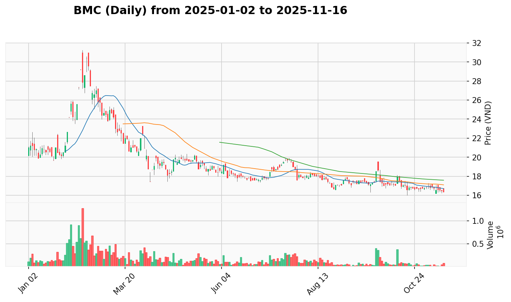

<a href="#khai-khoang">↑ Back to group KHAI_KHOANG</a>  |  <a href="#vpa-signal-summary">↑ Back to Top</a>

#### Key Statistics
| Metric | Value |
|:---|---:|
| Date Range | 2025-01-02 to 2025-11-07 |
| **Latest Close** | **16.75** |
| Period Open | 20.18 |
| Period High | 31.26 |
| Period Low | 16.0 |
| Period Change % | -17.00% |

**[Download BMC Data (.csv)](market_data/BMC_2025-01-02_to_2025-11-09.csv)**

---

### BMI

#### [VPA Analysis (2025-08-04 - 2025-10-21)](./VPA.md#bmi)
> **Ngày 2025-10-15:** BMI giảm từ 19.35 VND xuống 18.9 VND, tạo thành cây nến giảm giá với giá đóng cửa ở mức thấp nhất phiên. Khối lượng giao dịch đạt 0.1869 triệu cổ phiếu, giảm mạnh so với phiên trước (0.718353 triệu cổ phiếu). Sau phiên Sign of Strength (SOS) với khối lượng lớn, việc giá giảm với khối lượng thấp cho thấy lực cầu đã suy yếu và không có sự tiếp nối của đà tăng giá. **Phân tích VPA/Wyckoff:** No Demand (ND)
> **Ngày 2025-10-16:** BMI tăng từ 18.9 VND lên 19.0 VND, tạo thành cây nến tăng giá với biên độ hẹp và đóng cửa gần giữa thân nến. Khối lượng giao dịch đạt 0.0635 triệu cổ phiếu, giảm mạnh so với phiên trước (0.187454 triệu cổ phiếu) và thấp hơn nhiều so với mức trung bình. Sau phiên No Demand ngày 2025-10-15, việc giá tăng nhẹ với khối lượng cực thấp cho thấy lực cầu vẫn còn yếu và không có sự tham gia đáng kể từ phe mua, tiếp tục cho thấy tình trạng thiếu cầu trên thị trường. **Phân tích VPA/Wyckoff:** No Demand (ND)
> **Ngày 2025-10-17:** BMI giảm từ 19.45 VND xuống 19.0 VND, tạo thành cây nến giảm giá với giá đóng cửa ở mức thấp nhất phiên. Khối lượng giao dịch đạt 0.107706 triệu cổ phiếu, giảm mạnh so với phiên trước (0.481772 triệu cổ phiếu) và thấp hơn nhiều so với mức trung bình. Sau hai phiên No Demand liên tiếp, việc giá giảm với khối lượng thấp cho thấy lực cầu tiếp tục suy yếu và không có sự hỗ trợ đáng kể từ phe mua, xác nhận tình trạng thiếu cầu trên thị trường. **Phân tích VPA/Wyckoff:** No Demand (ND)
> **Ngày 2025-10-20:** BMI giảm từ 19.0 VND xuống 18.5 VND, tạo thành cây nến giảm giá với biên độ rộng và đóng cửa ở mức thấp nhất phiên. Khối lượng giao dịch đạt 0.938053 triệu cổ phiếu, tăng mạnh so với phiên trước (0.107706 triệu cổ phiếu) và cao hơn nhiều so với mức trung bình. Sau các phiên No Demand liên tiếp, việc giá giảm mạnh với khối lượng lớn cho thấy áp lực bán gia tăng đáng kể, xác nhận phe cung đang chiếm ưu thế và đẩy giá xuống. **Phân tích VPA/Wyckoff:** Sign of Weakness (SOW) - Áp lực bán mạnh.
> **Ngày 2025-10-21:** BMI tăng nhẹ từ 18.5 VND lên 18.55 VND, tạo thành cây nến có biên độ hẹp và giá đóng cửa bằng giá mở cửa. Khối lượng giao dịch đạt 0.2007 triệu cổ phiếu, giảm mạnh so với phiên trước (0.938053 triệu cổ phiếu) và thấp hơn nhiều so với mức trung bình. Sau phiên Sign of Weakness mạnh mẽ, việc giá chỉ tăng nhẹ với khối lượng cực thấp cho thấy lực cầu vẫn rất yếu và không có sự tham gia đáng kể từ phe mua, xác nhận tình trạng thiếu cầu trên thị trường. **Phân tích VPA/Wyckoff:** No Demand (ND)

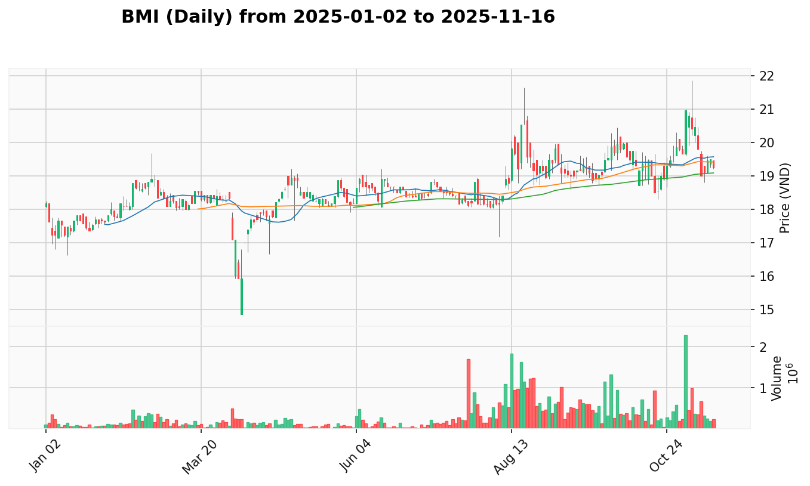

<a href="#bao-hiem">↑ Back to group BAO_HIEM</a>  |  <a href="#vpa-signal-summary">↑ Back to Top</a>

#### Key Statistics
| Metric | Value |
|:---|---:|
| Date Range | 2025-01-02 to 2025-11-07 |
| **Latest Close** | **19.8** |
| Period Open | 18.08 |
| Period High | 21.85 |
| Period Low | 14.85 |
| Period Change % | 9.51% |

**[Download BMI Data (.csv)](market_data/BMI_2025-01-02_to_2025-11-09.csv)**

---

### BMP

#### [VPA Analysis (2025-06-27 - 2025-10-21)](./VPA.md#bmp)
> **Ngày 2025-10-15:** BMP giảm nhẹ từ 141.5 VND xuống 141.4 VND với khối lượng giao dịch đạt 0.0695 triệu cổ phiếu, thấp hơn đáng kể so với phiên trước (0.1154 triệu cổ phiếu). Cây nến có biên độ hẹp, giá đóng cửa gần mức thấp nhất phiên, cho thấy sự lưỡng lự của thị trường sau phiên giảm mạnh với khối lượng lớn ngày hôm qua. Áp lực bán đã suy yếu nhưng lực cầu cũng chưa xuất hiện mạnh mẽ. Đây có thể là một dấu hiệu của sự tạm lắng hoặc thiếu cầu sau đợt bán tháo. **Phân tích VPA/Wyckoff:** No Demand (ND) - Thiếu cầu
> **Ngày 2025-10-16:** BMP tăng từ 141.4 VND lên 148.3 VND với khối lượng giao dịch đạt 0.1443 triệu cổ phiếu, cao hơn đáng kể so với phiên trước (0.0695 triệu cổ phiếu). Cây nến tăng có biên độ rộng, giá đóng cửa gần mức cao nhất phiên, cho thấy lực cầu đã áp đảo hoàn toàn lực cung và sự trở lại mạnh mẽ của phe mua. Khối lượng lớn xác nhận sự đảo chiều xu hướng và khả năng tiếp diễn đà tăng. **Phân tích VPA/Wyckoff:** Sign of Strength (SOS) - Lực cầu mạnh mẽ
> **Ngày 2025-10-17:** BMP tăng mạnh từ 150.5 VND lên 161.0 VND với khối lượng giao dịch đạt 0.6453 triệu cổ phiếu, cao hơn đáng kể so với phiên trước (0.2641 triệu cổ phiếu). Cây nến tăng có biên độ rộng, giá đóng cửa ở mức cao nhất phiên, cho thấy lực cầu áp đảo hoàn toàn lực cung và sự tiếp diễn đà tăng mạnh mẽ. Khối lượng lớn xác nhận xu hướng tăng. **Phân tích VPA/Wyckoff:** Sign of Strength (SOS) - Lực cầu mạnh mẽ
> **Ngày 2025-10-20:** BMP mở cửa ở mức 169.0 VND, tạo khoảng trống tăng giá so với phiên trước, nhưng sau đó giảm mạnh và đóng cửa ở mức 158.0 VND. Khối lượng giao dịch đạt 0.2174 triệu cổ phiếu, thấp hơn đáng kể so với phiên trước (0.6453 triệu cổ phiếu). Cây nến giảm có biên độ rộng, giá đóng cửa thấp hơn giá mở cửa và nằm gần mức thấp nhất phiên. Điều này cho thấy áp lực bán đã xuất hiện sau hai phiên tăng mạnh, nhưng khối lượng giao dịch thấp cho thấy lực bán chưa thực sự mạnh mẽ và có thể là hoạt động chốt lời hoặc kiểm tra lại nguồn cung. **Phân tích VPA/Wyckoff:** No Demand - Thiếu lực cầu
> **Ngày 2025-10-21:** BMP tăng mạnh từ 158.0 VND lên 169.0 VND với khối lượng giao dịch đạt 0.3496 triệu cổ phiếu, cao hơn đáng kể so với phiên trước (0.2174 triệu cổ phiếu). Cây nến tăng có biên độ rộng, giá đóng cửa ở mức cao nhất phiên, cho thấy lực cầu áp đảo hoàn toàn lực cung và sự tiếp diễn đà tăng. Khối lượng lớn xác nhận xu hướng tăng sau phiên "No Demand" trước đó. **Phân tích VPA/Wyckoff:** Sign of Strength (SOS) - Lực cầu mạnh mẽ

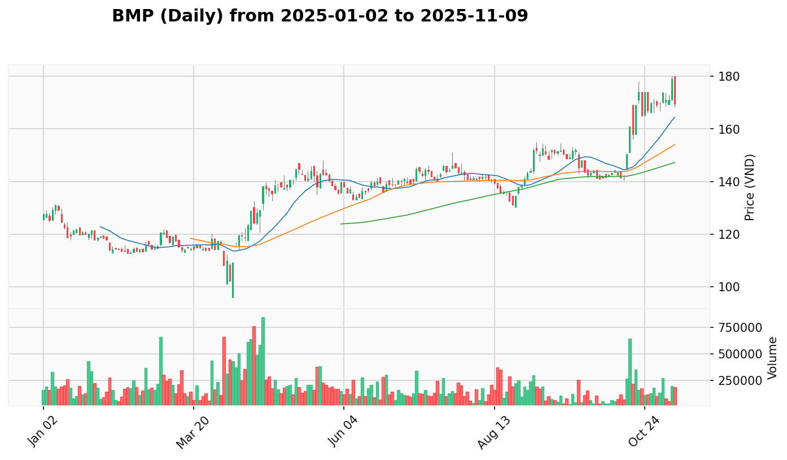

<a href="#nhua">↑ Back to group NHUA</a>  |  <a href="#vpa-signal-summary">↑ Back to Top</a>

#### Key Statistics
| Metric | Value |
|:---|---:|
| Date Range | 2025-01-02 to 2025-11-07 |
| **Latest Close** | **169.5** |
| Period Open | 125.61 |
| Period High | 180.0 |
| Period Low | 95.93 |
| Period Change % | 34.94% |

**[Download BMP Data (.csv)](market_data/BMP_2025-01-02_to_2025-11-09.csv)**

---

### BMS

#### [VPA Analysis (2025-08-04 - 2025-10-21)](./VPA.md#bms)
> **Ngày 2025-10-15:** BMS giảm từ 13.7 VND xuống 13.6 VND với khối lượng giao dịch đạt 0.1959 triệu cổ phiếu. Cây nến giảm có biên độ hẹp và đóng cửa ở mức 13.6 VND, bằng với giá đóng cửa phiên trước đó. Khối lượng giao dịch thấp hơn nhiều so với phiên trước đó, xác nhận rằng nguồn cung đã cạn kiệt sau các tín hiệu suy yếu trước đó. Đây là một dấu hiệu tích cực cho thấy khả năng đảo chiều tăng giá nếu lực cầu xuất hiện. **Phân tích VPA/Wyckoff:** No Supply Bar (Thanh không có cung) - Áp lực bán đã cạn kiệt.
> **Ngày 2025-10-16:** BMS giữ nguyên mức giá đóng cửa 13.6 VND với khối lượng giao dịch đạt 0.1 triệu cổ phiếu. Cây nến có biên độ hẹp, giá mở cửa và đóng cửa bằng nhau, cho thấy sự lưỡng lự của thị trường. Khối lượng giao dịch cực thấp, giảm đáng kể so với phiên trước đó (No Supply Bar), xác nhận rằng áp lực bán đã cạn kiệt nhưng đồng thời cũng cho thấy thiếu vắng lực cầu mạnh mẽ để đẩy giá lên. **Phân tích VPA/Wyckoff:** No Demand Bar (Thanh không có cầu) - Thiếu vắng lực cầu.
> **Ngày 2025-10-17:** BMS giảm từ 13.6 VND xuống 13.3 VND với khối lượng giao dịch đạt 0.2567 triệu cổ phiếu. Cây nến giảm có biên độ hẹp và đóng cửa gần mức thấp nhất phiên. Khối lượng giao dịch tăng đáng kể so với hai phiên trước đó (No Supply và No Demand), cho thấy áp lực bán đã quay trở lại và đang chiếm ưu thế. **Phân tích VPA/Wyckoff:** Sign of Weakness (SOW) - Áp lực bán gia tăng sau giai đoạn cạn kiệt cung cầu.
> **Ngày 2025-10-20:** BMS giảm từ 13.3 VND xuống 12.8 VND với khối lượng giao dịch đạt 0.4774 triệu cổ phiếu. Cây nến giảm có biên độ rộng và đóng cửa gần mức thấp nhất phiên. Khối lượng giao dịch tăng mạnh gần gấp đôi so với phiên trước, cho thấy áp lực bán rất lớn và đang chiếm ưu thế hoàn toàn, xác nhận sự tiếp diễn của xu hướng suy yếu. **Phân tích VPA/Wyckoff:** Sign of Weakness (SOW) - Lực cung mạnh mẽ với khối lượng gia tăng xác nhận xu hướng giảm.
> **Ngày 2025-10-21:** BMS tăng từ 12.8 VND lên 13.0 VND với khối lượng giao dịch đạt 0.1734 triệu cổ phiếu. Cây nến có biên độ hẹp, đóng cửa bằng giá mở cửa, cho thấy sự lưỡng lự của thị trường. Khối lượng giao dịch giảm mạnh so với phiên trước, cho thấy lực bán đã tạm thời suy yếu nhưng lực cầu cũng không đủ mạnh để đẩy giá lên. **Phân tích VPA/Wyckoff:** No Demand (ND) - Giá tăng nhẹ với khối lượng thấp, cho thấy thiếu vắng lực cầu mạnh mẽ.

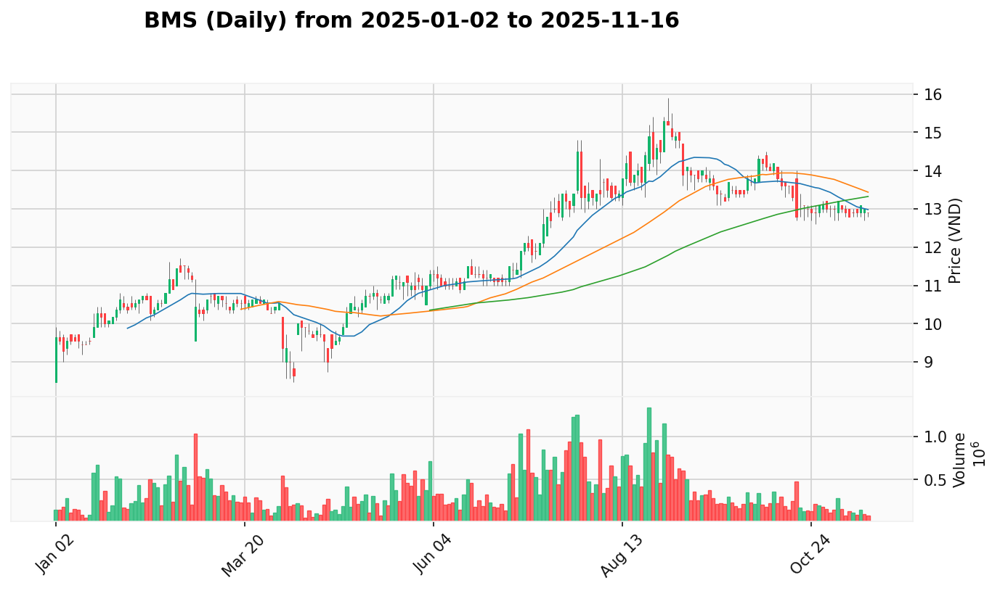

<a href="#chung-khoan">↑ Back to group CHUNG_KHOAN</a>  |  <a href="#vpa-signal-summary">↑ Back to Top</a>

#### Key Statistics
| Metric | Value |
|:---|---:|
| Date Range | 2025-01-02 to 2025-11-07 |
| **Latest Close** | **12.8** |
| Period Open | 8.47 |
| Period High | 15.9 |
| Period Low | 8.47 |
| Period Change % | 51.12% |

**[Download BMS Data (.csv)](market_data/BMS_2025-01-02_to_2025-11-09.csv)**

---

### BSI

#### [VPA Analysis (2025-06-27 - 2025-10-21)](./VPA.md#bsi)
> **Ngày 2025-10-15:** BSI giảm từ 44.85 VND xuống 43.7 VND, tương đương mức giảm 1.15 điểm (2.56%). Giá mở cửa ở mức 44.85 VND, sau đó có lúc tăng lên 44.9 VND nhưng đóng cửa ở mức 43.7 VND, gần mức thấp nhất trong phiên. Biên độ dao động trong phiên rộng. Khối lượng giao dịch đạt 1.4193 triệu cổ phiếu, tăng đáng kể so với phiên trước (1.16 triệu cổ phiếu) và cao hơn mức trung bình gần đây. Sau hai phiên liên tiếp cho thấy áp lực bán mạnh ("Supply Coming In" và "Supply Dominance"), việc giá tiếp tục giảm sâu với khối lượng gia tăng và đóng cửa gần mức thấp nhất phiên cho thấy nguồn cung vẫn đang áp đảo hoàn toàn lực cầu. Điều này xác nhận sự yếu kém tiếp diễn của thị trường và khả năng giá sẽ tiếp tục giảm. **Phân tích VPA/Wyckoff:** Continued Supply - Áp lực bán tiếp diễn.
> **Ngày 2025-10-16:** BSI tăng nhẹ từ 43.7 VND lên 43.9 VND, tương đương mức tăng 0.2 điểm (0.46%). Giá mở cửa ở mức 44.0 VND, sau đó dao động trong biên độ hẹp từ 43.75 VND đến 44.25 VND và đóng cửa ở mức 43.9 VND. Khối lượng giao dịch đạt 0.2872 triệu cổ phiếu, giảm mạnh so với phiên trước (1.4193 triệu cổ phiếu) và thấp hơn đáng kể so với mức trung bình gần đây. Sau hai phiên giảm mạnh với áp lực bán chiếm ưu thế, phiên hôm nay cho thấy giá tăng nhẹ với biên độ hẹp và khối lượng rất thấp. Điều này cho thấy áp lực bán đã tạm thời giảm bớt, nhưng lực cầu cũng chưa thực sự quay trở lại. Thị trường đang trong trạng thái lưỡng lự, thiếu động lực rõ ràng sau đợt giảm giá mạnh. **Phân tích VPA/Wyckoff:** No Demand / Test for Supply (Weak) - Thiếu cầu / Kiểm tra cung (Yếu).
> **Ngày 2025-10-17:** BSI giảm từ 43.95 VND xuống 43.15 VND, tương đương mức giảm 0.8 VND (1.82%). Giá mở cửa ở mức 44.0 VND, sau đó có lúc tăng lên 45.0 VND nhưng đóng cửa ở mức 43.15 VND, gần mức thấp nhất trong phiên. Biên độ dao động trong phiên rộng. Khối lượng giao dịch đạt 1.0842 triệu cổ phiếu, tăng đáng kể so với phiên trước (0.4543 triệu cổ phiếu) và cao hơn mức trung bình gần đây. Sau phiên kiểm tra cung yếu (No Demand / Test for Supply (Weak)) ngày 2025-10-16, phiên hôm nay cho thấy giá tiếp tục giảm mạnh với biên độ rộng và đóng cửa gần mức thấp nhất phiên, đi kèm với khối lượng giao dịch gia tăng. Điều này xác nhận áp lực bán vẫn đang rất mạnh và nguồn cung tiếp tục chiếm ưu thế, cho thấy sự yếu kém của thị trường và khả năng giá sẽ tiếp tục giảm. **Phân tích VPA/Wyckoff:** Continued Supply - Áp lực bán tiếp diễn.
> **Ngày 2025-10-20:** BSI giảm từ 43.15 VND xuống 40.15 VND, tương đương mức giảm 3.0 VND (6.95%). Giá mở cửa ở mức 42.8 VND, sau đó dao động trong biên độ rộng và đóng cửa ở mức thấp nhất phiên là 40.15 VND. Khối lượng giao dịch đạt 1.5797 triệu cổ phiếu, tăng đáng kể so với phiên trước (1.0842 triệu cổ phiếu) và cao hơn mức trung bình gần đây. Sau phiên áp lực bán tiếp diễn ngày 2025-10-17, phiên hôm nay cho thấy giá tiếp tục giảm sâu với biên độ rộng và đóng cửa ở mức thấp nhất phiên, đi kèm với khối lượng giao dịch gia tăng mạnh. Điều này xác nhận áp lực bán đang rất mạnh và nguồn cung áp đảo, cho thấy sự yếu kém nghiêm trọng của thị trường và khả năng giá sẽ tiếp tục giảm sâu. **Phân tích VPA/Wyckoff:** Continued Supply / Selling Climax - Áp lực bán tiếp diễn / Cao trào bán
> **Ngày 2025-10-21:** BSI tăng từ 40.15 VND lên 41.5 VND, tương đương mức tăng 1.35 VND (3.36%). Giá mở cửa ở mức 40.15 VND, sau đó giảm xuống 39.5 VND nhưng đã phục hồi mạnh mẽ và đóng cửa ở mức cao nhất phiên là 41.5 VND. Biên độ dao động trong phiên rộng. Khối lượng giao dịch đạt 1.5014 triệu cổ phiếu, giảm nhẹ so với phiên trước nhưng vẫn ở mức cao. Sau phiên cao trào bán ngày 2025-10-20, phiên hôm nay cho thấy sự phục hồi mạnh mẽ với giá đóng cửa ở mức cao nhất phiên và khối lượng giao dịch vẫn duy trì ở mức cao, cho thấy lực cầu đã tham gia và hấp thụ áp lực bán. Điều này có thể là dấu hiệu của sự đảo chiều tiềm năng. **Phân tích VPA/Wyckoff:** Sign of Strength (SOS) - Lực cầu mạnh mẽ

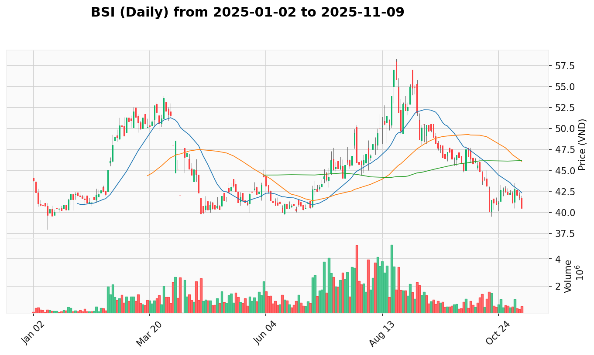

<a href="#chung-khoan">↑ Back to group CHUNG_KHOAN</a>  |  <a href="#vpa-signal-summary">↑ Back to Top</a>

#### Key Statistics
| Metric | Value |
|:---|---:|
| Date Range | 2025-01-02 to 2025-11-07 |
| **Latest Close** | **40.5** |
| Period Open | 44.14 |
| Period High | 58.3 |
| Period Low | 37.95 |
| Period Change % | -8.25% |

**[Download BSI Data (.csv)](market_data/BSI_2025-01-02_to_2025-11-09.csv)**

---

### BSR

#### [VPA Analysis (2025-06-13 - 2025-10-21)](./VPA.md#bsr)
> **Ngày 2025-10-15:** BSR mở cửa ở mức 28.05 VND, đạt đỉnh 28.7 VND và đáy 28.05 VND, đóng cửa tại 28.3 VND. So với phiên trước (2025-10-14), giá tăng từ 28.0 VND lên 28.3 VND (+1.07%). Cây nến tăng có biên độ hẹp, đóng cửa ở giữa thân nến, cho thấy sự lưỡng lự của thị trường. Khối lượng giao dịch đạt 6.7096 triệu cổ phiếu, giảm mạnh so với phiên trước (17.636 triệu cổ phiếu). Sau hai phiên giảm giá mạnh với khối lượng lớn (Reaction và SOW), phiên này giá tăng nhẹ nhưng với khối lượng rất thấp, cho thấy lực cầu yếu và không đủ sức đẩy giá lên cao một cách bền vững. Điều này có thể là một dấu hiệu của sự thiếu vắng nhu cầu sau đợt bán tháo. **Phân tích VPA/Wyckoff:** No Demand - Giá tăng nhẹ với khối lượng giảm mạnh, cho thấy lực cầu yếu và khả năng tiếp tục xu hướng giảm.
> **Ngày 2025-10-16:** BSR mở cửa 28.65 VND, đỉnh 28.65 VND, đáy 28.15 VND, đóng cửa 28.2 VND. So với phiên trước (2025-10-15), giá giảm từ 28.3 VND xuống 28.2 VND (-0.35%). Cây nến giảm biên độ hẹp, đóng cửa gần đáy, mở cửa trùng đỉnh cho thấy áp lực bán ngay từ đầu. Khối lượng giao dịch đạt 3.7414 triệu cổ phiếu, giảm mạnh so với phiên trước (6.7096 triệu cổ phiếu) và là mức thấp nhất trong 10 phiên. Sau các phiên suy yếu trước đó, phiên này tiếp tục thể hiện sự thiếu vắng lực cầu, giá giảm nhẹ với khối lượng cực thấp xác nhận thị trường vẫn yếu. **Phân tích VPA/Wyckoff:** No Demand - Giá giảm nhẹ với khối lượng cực thấp, xác nhận lực cầu yếu và khả năng tiếp tục xu hướng giảm.
> **Ngày 2025-10-17:** BSR mở cửa ở mức 28.1 VND, đạt đỉnh 28.7 VND và đáy 27.7 VND, đóng cửa tại 27.7 VND. So với phiên trước (2025-10-16), giá giảm từ 28.05 VND xuống 27.7 VND (-1.25%). Cây nến giảm có biên độ rộng, đóng cửa ở mức thấp nhất phiên, cho thấy áp lực bán mạnh mẽ. Khối lượng giao dịch đạt 8.9484 triệu cổ phiếu, tăng so với phiên trước (7.4003 triệu cổ phiếu). Sau hai phiên "No Demand" với khối lượng thấp, phiên này giá giảm mạnh với khối lượng gia tăng xác nhận sự tiếp diễn của xu hướng giảm và áp lực cung lớn. **Phân tích VPA/Wyckoff:** Sign of Weakness (SOW) - Giá giảm mạnh với khối lượng gia tăng, xác nhận áp lực bán lớn và xu hướng giảm tiếp diễn.
> **Ngày 2025-10-20:** BSR mở cửa 27.85 VND, đỉnh 28.25 VND, đáy 25.8 VND, đóng cửa 25.8 VND. So với phiên trước (2025-10-17), giá giảm từ 27.7 VND xuống 25.8 VND (-6.86%). Cây nến giảm biên độ rất rộng, đóng cửa ở mức thấp nhất phiên, cho thấy áp lực bán cực kỳ mạnh mẽ. Khối lượng giao dịch đạt 13.2847 triệu cổ phiếu, tăng đáng kể so với phiên trước (8.9484 triệu cổ phiếu). Sau phiên "Sign of Weakness" trước đó, phiên này giá tiếp tục giảm mạnh với khối lượng gia tăng, xác nhận xu hướng giảm đang tiếp diễn và áp lực cung vẫn rất lớn. **Phân tích VPA/Wyckoff:** Sign of Weakness (SOW) - Giá giảm mạnh với biên độ rộng và khối lượng gia tăng, xác nhận áp lực bán tiếp tục chiếm ưu thế và xu hướng giảm tiếp diễn.
> **Ngày 2025-10-21:** BSR mở cửa ở mức 25.9 VND, đạt đỉnh 26.6 VND và đáy 25.15 VND, đóng cửa tại 26.3 VND. So với phiên trước (2025-10-20), giá tăng từ 25.8 VND lên 26.3 VND (+1.94%). Cây nến tăng có biên độ tương đối rộng, đóng cửa gần mức cao nhất phiên, cho thấy lực mua xuất hiện. Khối lượng giao dịch đạt 8.8337 triệu cổ phiếu, giảm đáng kể so với phiên trước (13.2847 triệu cổ phiếu). Sau hai phiên "Sign of Weakness" mạnh mẽ, phiên này giá hồi phục nhẹ nhưng với khối lượng thấp, cho thấy áp lực bán có thể đã tạm thời giảm bớt nhưng lực cầu chưa thực sự mạnh mẽ để đảo chiều xu hướng. **Phân tích VPA/Wyckoff:** Test for Supply (Kiểm tra cung) - Giá tăng nhẹ với khối lượng thấp sau đợt giảm mạnh, cho thấy thị trường đang kiểm tra lượng cung còn lại.

<a href="#dau-khi">↑ Back to group DAU_KHI</a>  |  <a href="#vpa-signal-summary">↑ Back to Top</a>

#### Key Statistics
| Metric | Value |
|:---|---:|
| Date Range | 2025-01-02 to 2025-11-07 |
| **Latest Close** | **15.95** |
| Period Open | 14.12 |
| Period High | 19.47 |
| Period Low | 9.01 |
| Period Change % | 12.96% |

**[Download BSR Data (.csv)](market_data/BSR_2025-01-02_to_2025-11-09.csv)**

---

### BTN

#### [VPA Analysis (2025-08-13 - 2025-10-20)](./VPA.md#btn)
> **Ngày 2025-10-03:** Cổ phiếu BTN giữ nguyên mức giá 2.9 VND, cho thấy sự thiếu quyết đoán và biên độ giao động cực hẹp. Khối lượng giao dịch đạt 0.0025 triệu cổ phiếu, tăng nhẹ so với phiên trước nhưng vẫn ở mức rất thấp và không đủ để tạo ra sự thay đổi đáng kể về giá. Sau phiên giảm mạnh với áp lực cung lớn (SOW) và phiên phục hồi không có cầu (ND), sự ổn định giá với khối lượng thấp này cho thấy thị trường vẫn đang thiếu vắng nhu cầu thực sự để đẩy giá lên, xác nhận sự yếu kém của cổ phiếu. **Phân tích VPA/Wyckoff:** No Demand (ND) - Thiếu vắng nhu cầu
> **Ngày 2025-10-13:** Cổ phiếu BTN giảm từ 2.9 VND xuống 2.8 VND, đóng cửa ở mức thấp nhất phiên. Khối lượng giao dịch đạt 0.0011 triệu cổ phiếu, cực kỳ thấp, thậm chí còn thấp hơn các phiên trước đó. Sự sụt giảm giá với khối lượng cực kỳ yếu ớt này cho thấy không có áp lực bán mạnh, nhưng đồng thời cũng xác nhận sự thiếu vắng hoàn toàn lực cầu. Sau các phiên 'No Demand' trước đó, động thái này củng cố thêm tình trạng yếu kém và thiếu sự quan tâm của thị trường đối với cổ phiếu. **Phân tích VPA/Wyckoff:** No Demand (ND) - Thiếu vắng nhu cầu
> **Ngày 2025-10-14:** Cổ phiếu BTN mở cửa ở mức 3.0 VND nhưng không thể duy trì đà tăng, đóng cửa tại 2.8 VND, là mức thấp nhất phiên và bằng với giá đóng cửa phiên trước. Khối lượng giao dịch chỉ đạt 0.0002 triệu cổ phiếu, cực kỳ thấp, cho thấy sự cạn kiệt hoàn toàn của cả lực mua và lực bán. Việc giá không thể giữ được mức cao hơn và đóng cửa ở mức thấp nhất phiên với khối lượng cực kỳ yếu ớt này xác nhận sự thiếu vắng nhu cầu và sự yếu kém tiếp diễn của cổ phiếu trên thị trường. **Phân tích VPA/Wyckoff:** No Demand (ND) - Thiếu vắng nhu cầu
> **Ngày 2025-10-16:** Cổ phiếu BTN tăng nhẹ từ 2.8 VND lên 2.9 VND, đóng cửa ở mức 2.9 VND. Khối lượng giao dịch đạt 0.001 triệu cổ phiếu, vẫn ở mức cực kỳ thấp. Mặc dù giá có sự phục hồi nhẹ sau các phiên giảm giá và thiếu cầu trước đó, nhưng khối lượng giao dịch yếu ớt cho thấy sự phục hồi này không bền vững và không có lực cầu mạnh mẽ tham gia. Điều này củng cố thêm tình trạng thiếu vắng nhu cầu và sự yếu kém của cổ phiếu trên thị trường. **Phân tích VPA/Wyckoff:** No Demand (ND) - Thiếu vắng nhu cầu
> **Ngày 2025-10-20:** Cổ phiếu BTN duy trì mức giá 2.9 VND, không thay đổi so với phiên trước. Khối lượng giao dịch chỉ đạt 0.001 triệu cổ phiếu, tiếp tục ở mức cực kỳ thấp. Tình trạng giá đi ngang với khối lượng cạn kiệt cho thấy sự thiếu vắng hoàn toàn của cả lực mua và lực bán, xác nhận sự yếu kém và không có nhu cầu đối với cổ phiếu này trên thị trường. **Phân tích VPA/Wyckoff:** No Demand (ND) - Thiếu vắng nhu cầu

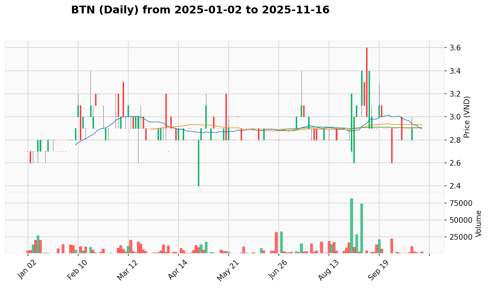

<a href="#vlxd">↑ Back to group VLXD</a>  |  <a href="#vpa-signal-summary">↑ Back to Top</a>

#### Key Statistics
| Metric | Value |
|:---|---:|
| Date Range | 2025-01-02 to 2025-11-07 |
| **Latest Close** | **2.9** |
| Period Open | 2.7 |
| Period High | 3.6 |
| Period Low | 2.4 |
| Period Change % | 7.41% |

**[Download BTN Data (.csv)](market_data/BTN_2025-01-02_to_2025-11-09.csv)**

---

### BTS

#### [VPA Analysis (2025-08-14 - 2025-10-21)](./VPA.md#bts)
> **Ngày 2025-10-15:** BTS tăng nhẹ từ 5.2 lên 5.3 VND với khối lượng giao dịch cực kỳ thấp, chỉ đạt 0.0009 triệu cổ phiếu. Cây nến có biên độ hẹp (từ 5.2 lên 5.3) và đóng cửa ở mức cao nhất phiên. Khối lượng này tiếp tục giảm sâu, thấp hơn đáng kể so với các phiên "No Demand" trước đó (0.0034 triệu và 0.0026 triệu cổ phiếu) và đặc biệt thấp hơn nhiều so với phiên SOS (0.0706 triệu cổ phiếu) vào ngày 2025-10-08. Điều này củng cố nhận định về sự thiếu vắng hoàn toàn của cả lực cung và lực cầu, cho thấy thị trường đang ở trạng thái trì trệ và không có động lực rõ ràng để hình thành xu hướng. **Phân tích VPA/Wyckoff:** No Demand (Không có cầu)
> **Ngày 2025-10-16:** BTS giữ giá ở mức 5.3 VND với khối lượng giao dịch thấp, đạt 0.0031 triệu cổ phiếu. Cây nến có biên độ hẹp (từ 5.2 lên 5.3) và đóng cửa ở mức cao nhất phiên. Khối lượng này cao hơn phiên trước (0.0009 triệu cổ phiếu) nhưng vẫn rất thấp so với phiên SOS (0.0706 triệu cổ phiếu) vào ngày 2025-10-08 và tương đương với phiên "No Demand" ngày 2025-10-14 (0.0034 triệu cổ phiếu). Điều này tiếp tục cho thấy sự thiếu vắng lực cầu mạnh mẽ, dù có một chút cải thiện về khối lượng so với mức cực thấp của phiên trước, thị trường vẫn chưa có động lực tăng rõ ràng. **Phân tích VPA/Wyckoff:** No Demand (Không có cầu)
> **Ngày 2025-10-17:** BTS giảm từ 5.3 xuống 5.2 VND với khối lượng giao dịch đạt 0.0088 triệu cổ phiếu. Cây nến có biên độ hẹp và đóng cửa ở mức thấp nhất phiên. Khối lượng này cao hơn đáng kể so với các phiên trước đó (0.0009 triệu và 0.0042 triệu cổ phiếu) nhưng vẫn rất thấp so với phiên SOS (0.0706 triệu cổ phiếu) vào ngày 2025-10-08. Sự sụt giảm giá đi kèm với khối lượng tăng cho thấy áp lực bán đang gia tăng sau giai đoạn thiếu cầu, xác nhận sự suy yếu của thị trường. **Phân tích VPA/Wyckoff:** Sign of Weakness (SOW)
> **Ngày 2025-10-20:** BTS tăng từ 5.1 lên 5.2 VND với khối lượng giao dịch tăng mạnh, đạt 0.0308 triệu cổ phiếu. Cây nến có biên độ rộng (từ 5.0 lên 5.3) và đóng cửa ở mức giữa. Khối lượng này cao hơn đáng kể so với phiên SOW trước đó (0.0088 triệu cổ phiếu). Mặc dù giá tăng nhẹ nhưng không đáng kể so với biên độ nến và khối lượng lớn, cho thấy lực cầu đang cố gắng hấp thụ lực cung sau phiên SOW. **Phân tích VPA/Wyckoff:** Stopping Volume (SV)
> **Ngày 2025-10-21:** BTS giữ nguyên mức giá 5.2 VND với khối lượng giao dịch rất thấp, chỉ đạt 0.0023 triệu cổ phiếu. Cây nến có biên độ hẹp (từ 5.1 lên 5.3) và đóng cửa ở mức giữa. Khối lượng này giảm đáng kể so với phiên Stopping Volume trước đó (0.0308 triệu cổ phiếu). Điều này cho thấy thị trường đang kiểm tra lại nguồn cung sau nỗ lực hấp thụ lực bán. **Phân tích VPA/Wyckoff:** Test

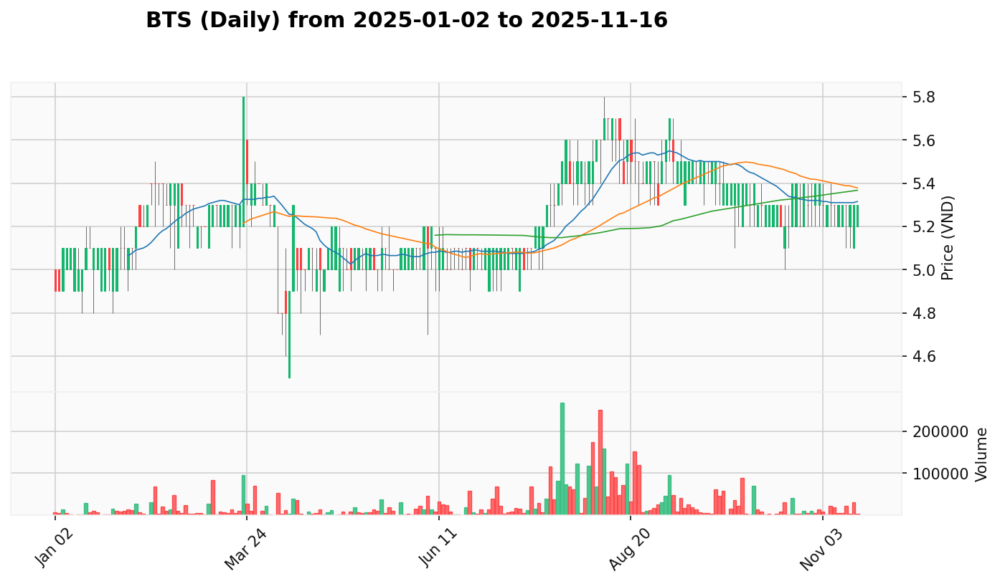

<a href="#vlxd">↑ Back to group VLXD</a>  |  <a href="#vpa-signal-summary">↑ Back to Top</a>

#### Key Statistics
| Metric | Value |
|:---|---:|
| Date Range | 2025-01-02 to 2025-11-07 |
| **Latest Close** | **5.3** |
| Period Open | 5.0 |
| Period High | 5.8 |
| Period Low | 4.5 |
| Period Change % | 6.00% |

**[Download BTS Data (.csv)](market_data/BTS_2025-01-02_to_2025-11-09.csv)**

---

### BVH

#### [VPA Analysis (2025-06-13 - 2025-10-21)](./VPA.md#bvh)
> **Ngày 2025-10-15:** BVH mở cửa tại 52.0 VND, giảm xuống mức thấp 50.5 VND và đóng cửa tại 51.0 VND, giảm 1.0 VND so với phiên trước. Biên độ dao động trong phiên là 1.5 VND, hẹp hơn so với phiên trước (1.9 VND). Khối lượng giao dịch đạt 0.7251 triệu cổ phiếu, giảm nhẹ so với phiên trước (0.817 triệu cổ phiếu) nhưng vẫn duy trì ở mức cao. Giá tiếp tục giảm và đóng cửa gần mức thấp nhất phiên, cho thấy áp lực bán vẫn còn hiện hữu. Tuy nhiên, việc biên độ giá thu hẹp trên khối lượng giảm nhẹ sau nhiều phiên giảm mạnh có thể là dấu hiệu của sự suy yếu tạm thời của lực cung, hoặc một giai đoạn hấp thụ tiềm năng. Mặc dù vậy, xu hướng giảm giá vẫn được duy trì. **Phân tích VPA/Wyckoff:** Cung mạnh
> **Ngày 2025-10-16:** BVH mở cửa tại 51.0 VND, tăng lên mức cao 51.2 VND, giảm xuống mức thấp 49.0 VND và đóng cửa tại 50.9 VND, giảm 0.1 VND so với phiên trước. Biên độ dao động trong phiên là 2.2 VND, rộng hơn so với phiên trước. Khối lượng giao dịch đạt 0.195 triệu cổ phiếu, giảm mạnh đột biến so với phiên trước (0.7251 triệu cổ phiếu) và ở mức rất thấp. Giá tiếp tục giảm nhẹ nhưng với khối lượng cạn kiệt cho thấy áp lực bán đã suy yếu đáng kể, tuy nhiên lực cầu cũng chưa xuất hiện. Đây có thể là dấu hiệu của sự tạm dừng trong xu hướng giảm giá mạnh trước đó, hoặc một phiên kiểm tra cung cầu không có lực cầu. **Phân tích VPA/Wyckoff:** Không có cầu (No Demand)
> **Ngày 2025-10-17:** BVH mở cửa tại 51.9 VND, giảm xuống mức thấp 50.1 VND và đóng cửa tại 50.5 VND, giảm 0.9 VND so với phiên trước. Biên độ dao động trong phiên là 1.8 VND, hẹp hơn so với phiên trước (2.4 VND). Khối lượng giao dịch đạt 0.3144 triệu cổ phiếu, giảm nhẹ so với phiên trước (0.3629 triệu cổ phiếu) và duy trì ở mức rất thấp. Giá tiếp tục giảm và đóng cửa gần mức thấp nhất phiên, cho thấy áp lực bán vẫn còn hiện hữu. Việc giá giảm với khối lượng thấp và biên độ hẹp sau phiên "Không có cầu" ngày 2025-10-16 xác nhận rằng lực cầu vẫn chưa xuất hiện và thị trường vẫn đang trong giai đoạn yếu. **Phân tích VPA/Wyckoff:** Cung tiếp diễn
> **Ngày 2025-10-20:** BVH mở cửa tại 50.4 VND, giảm xuống mức thấp 47.1 VND và đóng cửa tại 47.1 VND, giảm 3.4 VND so với phiên trước. Biên độ dao động trong phiên là 3.6 VND, rộng hơn đáng kể. Khối lượng giao dịch đạt 0.6353 triệu cổ phiếu, tăng mạnh so với phiên trước (0.3144 triệu cổ phiếu). Giá giảm mạnh với biên độ rộng và đóng cửa tại mức thấp nhất phiên, cho thấy áp lực bán rất lớn và cung đang chiếm ưu thế hoàn toàn. **Phân tích VPA/Wyckoff:** Selling Climax (SC)
> **Ngày 2025-10-21:** BVH mở cửa tại 47.5 VND, tăng lên mức cao 49.0 VND và đóng cửa tại 49.0 VND, tăng 1.9 VND so với phiên trước (từ 47.1 lên 49.0). Biên độ dao động trong phiên là 1.7 VND, hẹp hơn đáng kể so với phiên trước (3.6 VND). Khối lượng giao dịch đạt 0.5084 triệu cổ phiếu, giảm so với phiên trước (0.6353 triệu cổ phiếu). Sau phiên Selling Climax ngày 2025-10-20, giá đã tăng trở lại với biên độ hẹp và khối lượng giảm, đóng cửa ở mức cao nhất phiên. Điều này cho thấy áp lực bán đã giảm bớt, nhưng lực cầu vẫn chưa thực sự mạnh mẽ để đẩy giá lên cao hơn với khối lượng lớn. Đây có thể là một dấu hiệu của việc kiểm tra cung sau một đợt bán tháo. **Phân tích VPA/Wyckoff:** Test for Supply (Kiểm tra cung)

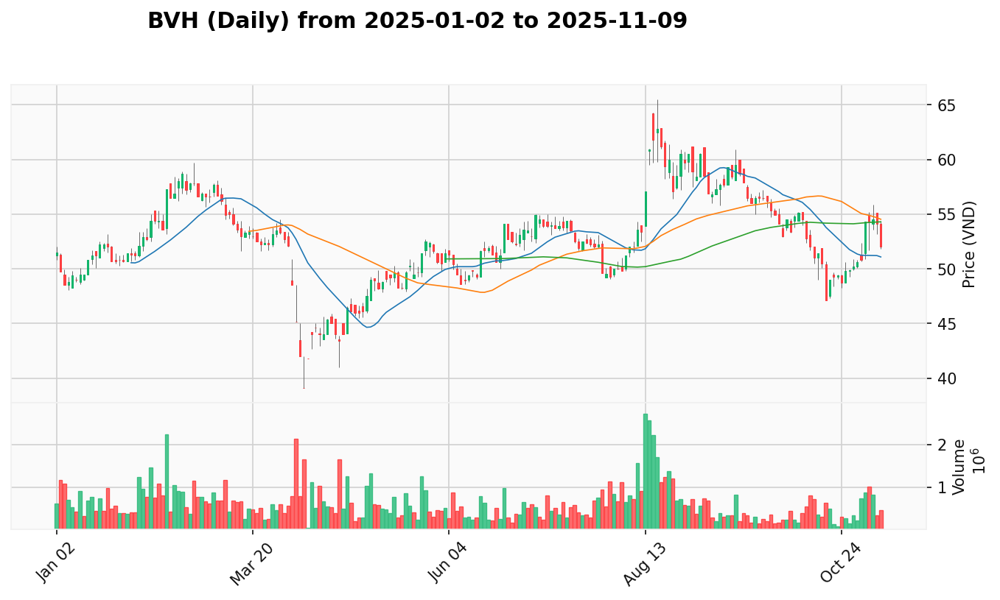

<a href="#bao-hiem">↑ Back to group BAO_HIEM</a>  |  <a href="#vpa-signal-summary">↑ Back to Top</a>

#### Key Statistics
| Metric | Value |
|:---|---:|
| Date Range | 2025-01-02 to 2025-11-07 |
| **Latest Close** | **52.0** |
| Period Open | 51.2 |
| Period High | 65.5 |
| Period Low | 39.1 |
| Period Change % | 1.56% |

**[Download BVH Data (.csv)](market_data/BVH_2025-01-02_to_2025-11-09.csv)**

---

### BVS

#### [VPA Analysis (2025-08-04 - 2025-10-21)](./VPA.md#bvs)
> **Ngày 2025-10-15:** BVS mở cửa tại 37.3 VND và đóng cửa tại 36.5 VND, giảm 0.8 VND so với phiên trước. Biên độ giá hẹp (từ 36.5 VND đến 37.3 VND) và đóng cửa tại mức thấp nhất phiên. Khối lượng giao dịch đạt 0.2341 triệu cổ phiếu, giảm đáng kể so với phiên trước (0.4907 triệu cổ phiếu). Sau phiên Sign of Strength (SOS) ngày 2025-10-14, giá đã giảm với biên độ hẹp và khối lượng thấp. Điều này cho thấy lực cầu đã không được duy trì và sự thiếu hụt nhu cầu đã xuất hiện, xác nhận sự yếu kém. **Phân tích VPA/Wyckoff:** No Demand (ND)
> **Ngày 2025-10-16:** BVS mở cửa tại 36.5 VND và đóng cửa tại 36.5 VND, không đổi so với phiên trước. Biên độ giá hẹp (từ 36.4 VND đến 36.8 VND) và đóng cửa ở giữa thân nến. Khối lượng giao dịch đạt 0.1073 triệu cổ phiếu, giảm đáng kể so với phiên trước (0.2341 triệu cổ phiếu) và rất thấp so với các phiên gần đây. Sau phiên No Demand ngày 2025-10-15, giá đi ngang với biên độ hẹp và khối lượng cực thấp cho thấy lực cung đã cạn kiệt. Đây là dấu hiệu của sự thiếu hụt nguồn cung, thường xuất hiện trước một đợt tăng giá nếu có lực cầu quay trở lại. **Phân tích VPA/Wyckoff:** No Supply (NS)
> **Ngày 2025-10-17:** BVS giảm từ 36.4 VND xuống 36.3 VND với khối lượng giao dịch đạt 0.425 triệu cổ phiếu. Cây nến có biên độ rộng (từ 35.8 VND đến 36.8 VND) và đóng cửa gần giữa thân nến. Sau phiên No Supply ngày 2025-10-16, giá giảm nhẹ với biên độ rộng và khối lượng tăng cho thấy lực cung đã quay trở lại và hấp thụ lực cầu, xác nhận sự yếu kém. **Phân tích VPA/Wyckoff:** Sign of Weakness (SOW) - Lực cung đã quay trở lại sau phiên No Supply.
> **Ngày 2025-10-20:** BVS giảm từ 36.3 VND xuống 32.8 VND với khối lượng giao dịch đạt 0.6408 triệu cổ phiếu. Cây nến có biên độ rộng (từ 32.7 VND đến 36.6 VND) và đóng cửa gần mức thấp nhất phiên. Sau phiên SOW ngày 2025-10-17, giá tiếp tục giảm mạnh với biên độ rộng và khối lượng gia tăng, cho thấy áp lực bán mạnh mẽ và sự tiếp diễn của xu hướng giảm. **Phân tích VPA/Wyckoff:** Sign of Weakness (SOW)
> **Ngày 2025-10-21:** BVS tăng từ 32.8 VND lên 33.3 VND với khối lượng giao dịch đạt 0.4822 triệu cổ phiếu. Cây nến có biên độ rộng (từ 30.0 VND đến 33.4 VND) và đóng cửa gần mức cao nhất phiên. Sau hai phiên SOW liên tiếp với áp lực bán mạnh, giá đã phục hồi nhẹ với biên độ rộng nhưng khối lượng giảm, cho thấy lực cung đã tạm thời suy yếu và thị trường đang kiểm tra lại lực cầu. **Phân tích VPA/Wyckoff:** Test for Supply (Kiểm tra cung)

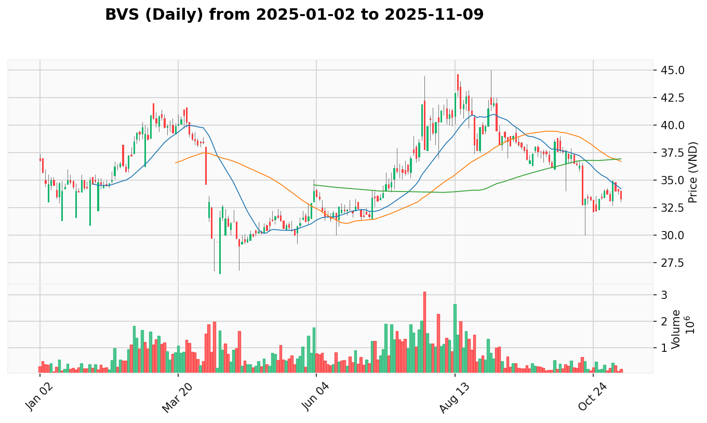

<a href="#chung-khoan">↑ Back to group CHUNG_KHOAN</a>  |  <a href="#vpa-signal-summary">↑ Back to Top</a>

#### Key Statistics
| Metric | Value |
|:---|---:|
| Date Range | 2025-01-02 to 2025-11-07 |
| **Latest Close** | **33.3** |
| Period Open | 37.0 |
| Period High | 45.0 |
| Period Low | 26.5 |
| Period Change % | -10.00% |

**[Download BVS Data (.csv)](market_data/BVS_2025-01-02_to_2025-11-09.csv)**

---

### BWE

#### [VPA Analysis (2025-08-14 - 2025-10-21)](./VPA.md#bwe)
> **Ngày 2025-10-15:** BWE mở cửa tại 48.8 VND và đóng cửa ở mức 48.1 VND, giảm 0.7 VND so với phiên trước (48.8 VND). Giá cao nhất trong ngày là 49.05 VND và giá thấp nhất là 47.95 VND. Cây nến giảm có biên độ tương đối rộng và đóng cửa gần mức thấp nhất phiên. Khối lượng giao dịch đạt 0.1962 triệu cổ phiếu, giảm đáng kể so với phiên trước (0.2993 triệu cổ phiếu). Sau phiên "Weakness" (SW) ngày 2025-10-14 cho thấy lực cung mạnh mẽ, phiên này cho thấy giá tiếp tục giảm với khối lượng giảm. Điều này cho thấy lực cầu yếu và không có sự hấp thụ đáng kể, cho phép giá tiếp tục giảm mà không cần nhiều nỗ lực từ phía người bán. Đây là một dấu hiệu tiêu cực, xác nhận sự thiếu vắng của lực mua. **Phân tích VPA/Wyckoff:** No Demand (ND) - Thiếu cầu.
> **Ngày 2025-10-16:** BWE mở cửa tại 48.0 VND và đóng cửa ở mức 48.1 VND, không thay đổi so với phiên trước (48.1 VND). Giá cao nhất trong ngày là 48.35 VND và giá thấp nhất là 47.95 VND. Cây nến có biên độ hẹp và đóng cửa gần giữa thân nến. Khối lượng giao dịch đạt 0.0485 triệu cổ phiếu, giảm mạnh so với phiên trước (0.1962 triệu cổ phiếu) và là mức thấp nhất trong 10 phiên gần đây. Sau hai phiên giảm giá với lực cung mạnh mẽ (SW) và thiếu cầu (ND), phiên này cho thấy giá đi ngang với khối lượng cực thấp. Điều này cho thấy lực bán đã cạn kiệt, nhưng lực cầu cũng chưa xuất hiện mạnh mẽ. Đây là một dấu hiệu kiểm tra cung, cho thấy thị trường đang chờ đợi một động thái rõ ràng hơn. **Phân tích VPA/Wyckoff:** No Supply (NS) - Cạn cung.
> **Ngày 2025-10-17:** BWE mở cửa tại 48.05 VND và đóng cửa ở mức 48.15 VND, giảm nhẹ 0.05 VND so với phiên trước (48.2 VND). Giá cao nhất trong ngày là 49.2 VND và giá thấp nhất là 48.05 VND. Cây nến có biên độ tương đối rộng nhưng thân nến hẹp, đóng cửa gần mức mở cửa và có bóng nến trên dài, cho thấy nỗ lực tăng giá đã bị từ chối. Khối lượng giao dịch đạt 0.0545 triệu cổ phiếu, giảm mạnh so với phiên trước (0.109 triệu cổ phiếu) và là mức rất thấp. Sau phiên "Cạn cung" (NS) ngày 2025-10-16, phiên này cho thấy giá không thể duy trì đà tăng dù có lúc chạm mức cao hơn, và khối lượng giao dịch cực thấp xác nhận sự thiếu vắng của lực cầu. Điều này cho thấy thị trường vẫn đang trong giai đoạn thiếu động lực mua. **Phân tích VPA/Wyckoff:** No Demand (ND) - Thiếu cầu.
> **Ngày 2025-10-20:** BWE mở cửa tại 48.15 VND và đóng cửa ở mức 47.05 VND, giảm mạnh so với phiên trước (48.15 VND). Giá cao nhất trong ngày là 48.45 VND và giá thấp nhất là 47.05 VND. Cây nến có biên độ rộng và đóng cửa tại mức thấp nhất phiên, cho thấy áp lực bán mạnh mẽ. Khối lượng giao dịch đạt 0.1469 triệu cổ phiếu, tăng đáng kể so với hai phiên trước (0.0545 triệu và 0.0444 triệu cổ phiếu). Sau hai phiên "Cạn cung" (NS) và "Thiếu cầu" (ND) với khối lượng thấp, phiên này cho thấy sự xuất hiện của lực cung mạnh mẽ đẩy giá xuống với khối lượng gia tăng, xác nhận sự yếu kém của thị trường. **Phân tích VPA/Wyckoff:** Sign of Weakness (SOW) - Lực cung mạnh mẽ.
> **Ngày 2025-10-21:** BWE mở cửa tại 47.55 VND và đóng cửa ở mức 47.75 VND, tăng 0.7 VND so với phiên trước (47.05 VND). Giá cao nhất trong ngày là 48.7 VND và giá thấp nhất là 47.0 VND. Cây nến có biên độ rộng và đóng cửa ở nửa trên của thân nến, cho thấy lực cầu đã xuất hiện và đẩy giá lên. Khối lượng giao dịch đạt 0.175 triệu cổ phiếu, tăng so với phiên trước (0.1469 triệu cổ phiếu). Sau phiên "Lực cung mạnh mẽ" (SOW) ngày 2025-10-20, phiên này cho thấy sự trở lại của lực mua với khối lượng gia tăng, cho thấy thị trường đang cố gắng phục hồi. **Phân tích VPA/Wyckoff:** Lực cầu xuất hiện.

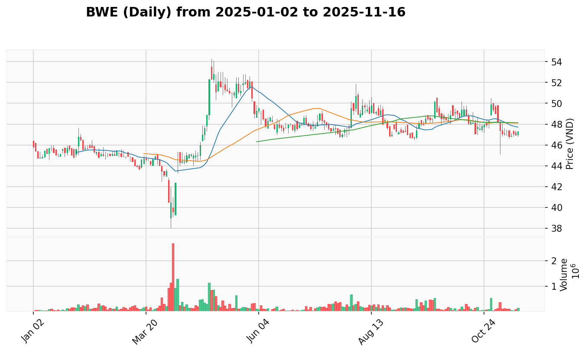

<a href="#others">↑ Back to group OTHERS</a>  |  <a href="#vpa-signal-summary">↑ Back to Top</a>

#### Key Statistics
| Metric | Value |
|:---|---:|
| Date Range | 2025-01-02 to 2025-11-07 |
| **Latest Close** | **47.0** |
| Period Open | 46.38 |
| Period High | 54.3 |
| Period Low | 38.0 |
| Period Change % | 1.34% |

**[Download BWE Data (.csv)](market_data/BWE_2025-01-02_to_2025-11-09.csv)**

---

### C47

#### [VPA Analysis (2025-08-13 - 2025-10-21)](./VPA.md#c47)
> **Ngày 2025-10-15:** C47 giao dịch trong biên độ hẹp từ 10.7 VND đến 10.95 VND, đóng cửa ở mức 10.9 VND, bằng với giá đóng cửa phiên trước. Khối lượng giao dịch đạt 0.079 triệu cổ phiếu, tăng nhẹ so với phiên 2025-10-14 (0.0723 triệu cổ phiếu) nhưng vẫn ở mức thấp so với các phiên đầu tháng. Cây nến cho thấy sự lưỡng lự của thị trường sau hai phiên thiếu cầu và nguồn cung xuất hiện. Mặc dù khối lượng có tăng nhẹ, nhưng không đủ mạnh để xác nhận một xu hướng rõ ràng, cho thấy sự cân bằng tạm thời giữa cung và cầu. **Phân tích VPA/Wyckoff:** Lưỡng lự
> **Ngày 2025-10-16:** C47 giảm từ 10.9 VND xuống 10.7 VND với khối lượng giao dịch đạt 0.0871 triệu cổ phiếu. Cây nến giảm có biên độ tương đối rộng, giá mở cửa bằng giá cao nhất và đóng cửa gần mức thấp nhất phiên, cho thấy áp lực bán mạnh mẽ ngay từ đầu phiên. Khối lượng giao dịch tăng nhẹ so với phiên trước (0.079 triệu cổ phiếu), xác nhận sự tiếp diễn của nguồn cung đã xuất hiện vào ngày 2025-10-14 và sự lưỡng lự của ngày 2025-10-15 đã được giải quyết theo hướng giảm giá. **Phân tích VPA/Wyckoff:** Nguồn cung tiếp diễn
> **Ngày 2025-10-17:** C47 giảm từ 10.85 VND xuống 10.5 VND với khối lượng giao dịch đạt 0.0985 triệu cổ phiếu. Cây nến giảm có biên độ tương đối rộng, giá đóng cửa gần mức thấp nhất phiên, cho thấy áp lực bán vẫn còn mạnh mẽ. Khối lượng giao dịch giảm so với phiên trước (0.1563 triệu cổ phiếu) nhưng vẫn ở mức tương đối cao, xác nhận sự tiếp diễn của xu hướng giảm giá. **Phân tích VPA/Wyckoff:** Tiếp diễn suy yếu
> **Ngày 2025-10-20:** C47 mở cửa tại 10.5 VND, tăng lên 10.95 VND nhưng đóng cửa trở lại mức 10.5 VND, với khối lượng giao dịch đạt 0.0677 triệu cổ phiếu. Cây nến có bóng trên dài và giá đóng cửa bằng giá mở cửa, cho thấy áp lực bán mạnh mẽ khi giá cố gắng tăng. Khối lượng giao dịch giảm so với phiên trước (0.0985 triệu cổ phiếu), xác nhận sự thiếu hụt lực cầu ở mức giá cao hơn và nguồn cung vẫn còn hiện hữu, tiếp diễn áp lực bán từ các phiên trước. **Phân tích VPA/Wyckoff:** No Demand (Thiếu cầu)
> **Ngày 2025-10-21:** C47 mở cửa tại 9.8 VND, giảm sâu nhưng sau đó phục hồi mạnh mẽ để đóng cửa tại 10.7 VND, cao hơn mức đóng cửa của phiên trước. Cây nến có biên độ rộng và bóng dưới dài, cho thấy lực cầu đã xuất hiện và hấp thụ áp lực bán ở vùng giá thấp. Khối lượng giao dịch đạt 0.0583 triệu cổ phiếu, thấp hơn so với phiên trước, cho thấy nỗ lực tăng giá nhưng chưa có sự xác nhận mạnh mẽ từ khối lượng. **Phân tích VPA/Wyckoff:** Lực cầu xuất hiện

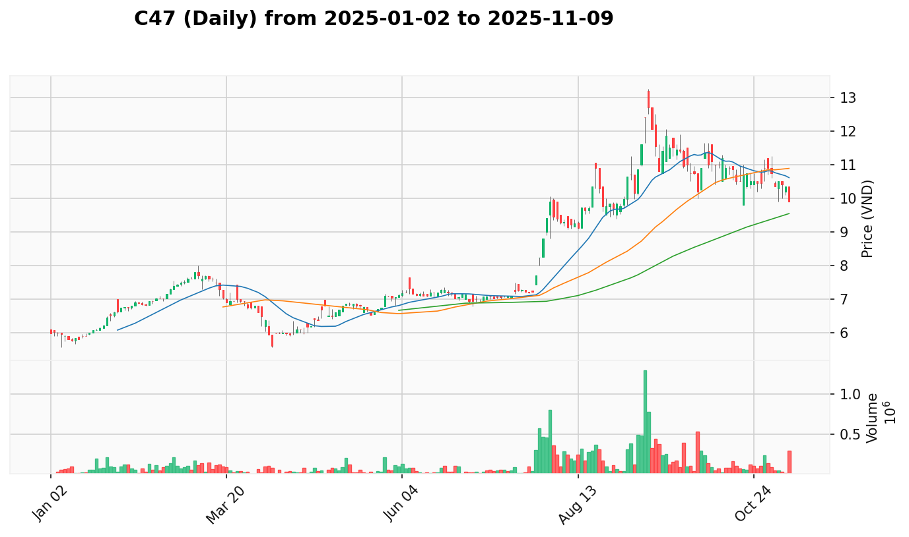

<a href="#xay-dung">↑ Back to group XAY_DUNG</a>  |  <a href="#vpa-signal-summary">↑ Back to Top</a>

#### Key Statistics
| Metric | Value |
|:---|---:|
| Date Range | 2025-01-02 to 2025-11-07 |
| **Latest Close** | **9.9** |
| Period Open | 6.1 |
| Period High | 13.25 |
| Period Low | 5.57 |
| Period Change % | 62.30% |

**[Download C47 Data (.csv)](market_data/C47_2025-01-02_to_2025-11-09.csv)**

---

### C4G

#### [VPA Analysis (2025-07-16 - 2025-10-21)](./VPA.md#c4g)
> **Ngày 2025-10-15:** C4G giảm từ 8.8 VND xuống 8.7 VND. Cây nến giảm có biên độ từ 8.5 VND đến 8.9 VND, mở cửa ở 8.8 VND và đóng cửa ở 8.7 VND, cho thấy áp lực bán tiếp diễn và giá đóng cửa nằm ở giữa thân nến. Khối lượng giao dịch đạt 1.7027 triệu cổ phiếu, tăng đáng kể so với phiên trước (1.3626 triệu cổ phiếu). Sau phiên "Sign of Weakness" ngày 2025-10-14, phiên này tiếp tục xác nhận lực cung áp đảo, đẩy giá xuống thấp hơn với khối lượng gia tăng. **Phân tích VPA/Wyckoff:** Sign of Weakness (SOW) - Lực cung tiếp diễn
> **Ngày 2025-10-16:** C4G giữ nguyên mức giá đóng cửa 8.7 VND. Cây nến có biên độ từ 8.5 VND đến 8.8 VND, mở cửa ở 8.7 VND và đóng cửa ở 8.7 VND, cho thấy sự cân bằng giữa cung và cầu. Khối lượng giao dịch đạt 0.9786 triệu cổ phiếu, giảm đáng kể so với phiên trước (1.7027 triệu cổ phiếu). Sau hai phiên "Sign of Weakness" liên tiếp với khối lượng gia tăng, phiên này cho thấy áp lực bán đã giảm bớt, nhưng lực cầu cũng chưa đủ mạnh để đẩy giá lên. Đây có thể là một dấu hiệu của sự tạm dừng trong xu hướng giảm và kiểm tra lực cung. **Phân tích VPA/Wyckoff:** Test for Supply (Kiểm tra lực cung)
> **Ngày 2025-10-17:** C4G giữ nguyên mức giá đóng cửa 8.7 VND. Cây nến có biên độ hẹp từ 8.6 VND đến 8.8 VND, mở cửa ở 8.7 VND và đóng cửa ở 8.7 VND, cho thấy sự cân bằng tuyệt đối giữa cung và cầu. Khối lượng giao dịch đạt 0.5464 triệu cổ phiếu, giảm mạnh so với phiên trước (1.3166 triệu cổ phiếu). Sau phiên kiểm tra lực cung ngày 2025-10-16 với khối lượng giảm, phiên này tiếp tục cho thấy lực cung đã cạn kiệt đáng kể, nhưng lực cầu cũng chưa xuất hiện mạnh mẽ để đẩy giá lên. Đây là dấu hiệu của một giai đoạn tích lũy hoặc tạm dừng trước khi có một động thái giá rõ ràng hơn. **Phân tích VPA/Wyckoff:** No Supply (Không có cung) - Lực cung đã cạn kiệt.
> **Ngày 2025-10-20:** C4G giảm từ 8.7 VND xuống 8.4 VND. Cây nến giảm có biên độ rộng từ 7.5 VND đến 8.7 VND, mở cửa ở 8.7 VND và đóng cửa ở 8.4 VND, cho thấy áp lực bán mạnh mẽ. Khối lượng giao dịch đạt 2.6986 triệu cổ phiếu, tăng đáng kể so với các phiên trước (0.5464 triệu cổ phiếu ngày 2025-10-17 và 0.9786 triệu cổ phiếu ngày 2025-10-16). Sau hai phiên kiểm tra lực cung và không có cung với khối lượng thấp, phiên này cho thấy lực cung đã quay trở lại và chiếm ưu thế, đẩy giá xuống với biên độ lớn. Đây là dấu hiệu của sự suy yếu. **Phân tích VPA/Wyckoff:** Sign of Weakness (SOW) - Lực cung mạnh mẽ trở lại.
> **Ngày 2025-10-21:** C4G tiếp tục giảm từ 8.4 VND xuống 8.2 VND. Cây nến giảm có biên độ hẹp từ 8.0 VND đến 8.4 VND, mở cửa ở 8.3 VND và đóng cửa ở 8.2 VND, cho thấy áp lực bán vẫn còn nhưng không mạnh mẽ. Khối lượng giao dịch đạt 0.9322 triệu cổ phiếu, giảm đáng kể so với phiên trước (2.6986 triệu cổ phiếu). Sau phiên giảm mạnh với khối lượng lớn ngày 2025-10-20, phiên này cho thấy lực bán đã suy yếu nhưng lực cầu vẫn chưa xuất hiện để hỗ trợ giá. Đây là dấu hiệu của sự yếu kém tiếp diễn. **Phân tích VPA/Wyckoff:** Lack of Demand (Thiếu cầu)

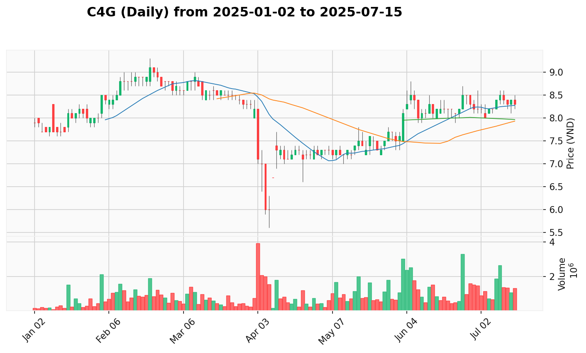

<a href="#dau-tu-cong">↑ Back to group DAU_TU_CONG</a>  |  <a href="#vpa-signal-summary">↑ Back to Top</a>

#### Key Statistics
| Metric | Value |
|:---|---:|
| Date Range | 2025-01-02 to 2025-11-07 |
| **Latest Close** | **8.2** |
| Period Open | 7.9 |
| Period High | 10.9 |
| Period Low | 5.6 |
| Period Change % | 3.80% |

**[Download C4G Data (.csv)](market_data/C4G_2025-01-02_to_2025-11-09.csv)**

---

### C69

#### [VPA Analysis (2025-08-13 - 2025-10-21)](./VPA.md#c69)
> **Ngày 2025-10-15:** C69 mở cửa tại 12.8 VND và đóng cửa ở mức 12.9 VND, tăng 0.2 VND so với mức đóng cửa 12.7 VND của phiên trước. Biên độ dao động trong phiên hẹp (từ 12.7 VND đến 12.9 VND) và giá đóng cửa gần mức cao nhất phiên. Khối lượng giao dịch đạt 0.4571 triệu cổ phiếu, giảm nhẹ so với 0.4626 triệu cổ phiếu của phiên trước. Sau phiên "Sign of Weakness" ngày 2025-10-14, giá có sự phục hồi nhẹ với biên độ hẹp và đóng cửa ở mức cao hơn, nhưng đi kèm với khối lượng giao dịch giảm. Điều này cho thấy lực cầu chưa thực sự mạnh mẽ để đẩy giá lên cao bền vững, có thể là một phiên kiểm tra cung hoặc một đợt phục hồi yếu trong bối cảnh áp lực bán vẫn còn. **Phân tích VPA/Wyckoff:** Kiểm tra cung (Test for Supply)
> **Ngày 2025-10-16:** C69 mở cửa tại 12.9 VND và đóng cửa ở mức 12.8 VND, giảm 0.1 VND so với mức đóng cửa 12.9 VND của phiên trước. Biên độ dao động trong phiên hẹp (từ 12.8 VND đến 13.1 VND) và giá đóng cửa ở mức thấp nhất phiên. Khối lượng giao dịch đạt 0.2568 triệu cổ phiếu, giảm đáng kể so với 0.4571 triệu cổ phiếu của phiên trước. Sau phiên "Kiểm tra cung" ngày 2025-10-15, việc giá tiếp tục giảm với biên độ hẹp và đóng cửa ở mức thấp nhất phiên, đi kèm với khối lượng giao dịch sụt giảm mạnh, cho thấy lực cầu gần như không tồn tại. Điều này xác nhận sự yếu kém của thị trường và khả năng tiếp diễn xu hướng giảm giá. **Phân tích VPA/Wyckoff:** No Demand (Không có cầu)
> **Ngày 2025-10-17:** C69 mở cửa tại 12.8 VND và đóng cửa ở mức 12.7 VND, giảm 0.2 VND so với mức đóng cửa 12.9 VND của phiên trước. Biên độ dao động trong phiên hẹp (từ 12.6 VND đến 12.9 VND) và giá đóng cửa gần mức thấp nhất phiên. Khối lượng giao dịch đạt 0.4935 triệu cổ phiếu, tăng nhẹ so với 0.4448 triệu cổ phiếu của phiên trước. Sau phiên "No Demand" ngày 2025-10-16, giá tiếp tục giảm với biên độ hẹp và đóng cửa gần mức thấp nhất phiên, đi kèm với khối lượng giao dịch tăng nhẹ. Điều này cho thấy áp lực bán vẫn còn hiện hữu và lực cầu chưa đủ mạnh để hấp thụ lượng cung gia tăng, xác nhận sự yếu kém của thị trường. **Phân tích VPA/Wyckoff:** Sign of Weakness (SOW)
> **Ngày 2025-10-20:** C69 mở cửa tại 12.7 VND và đóng cửa ở mức 11.5 VND, giảm 1.2 VND so với mức đóng cửa 12.7 VND của phiên trước. Biên độ dao động trong phiên rộng (từ 11.5 VND đến 12.7 VND) và giá đóng cửa ở mức thấp nhất phiên. Khối lượng giao dịch đạt 0.551 triệu cổ phiếu, tăng so với 0.4935 triệu cổ phiếu của phiên trước. Sau các phiên "No Demand" và "Sign of Weakness" trước đó, việc giá giảm mạnh với biên độ rộng và đóng cửa ở mức thấp nhất phiên, đi kèm với khối lượng giao dịch gia tăng, cho thấy áp lực bán rất mạnh và sự yếu kém rõ rệt của thị trường. Điều này xác nhận xu hướng giảm giá tiếp diễn. **Phân tích VPA/Wyckoff:** Sign of Weakness (SOW)
> **Ngày 2025-10-21:** C69 mở cửa tại 11.5 VND và đóng cửa ở mức 11.5 VND, không đổi so với mức đóng cửa của phiên trước. Biên độ dao động trong phiên hẹp (từ 10.4 VND đến 11.5 VND) và giá đóng cửa ở mức cao nhất phiên. Khối lượng giao dịch đạt 0.3469 triệu cổ phiếu, giảm đáng kể so với 0.551 triệu cổ phiếu của phiên trước. Sau hai phiên giảm mạnh với tín hiệu "Sign of Weakness", phiên hôm nay cho thấy giá mở cửa thấp hơn nhưng đã phục hồi và đóng cửa tại mức mở cửa và cao nhất phiên, đồng thời khối lượng giao dịch giảm mạnh. Điều này cho thấy áp lực bán đã suy yếu và có thể là một dấu hiệu của sự cạn kiệt nguồn cung tạm thời. Tuy nhiên, giá vẫn đang ở mức thấp và cần thêm xác nhận về sự đảo chiều. **Phân tích VPA/Wyckoff:** No Supply (NS)

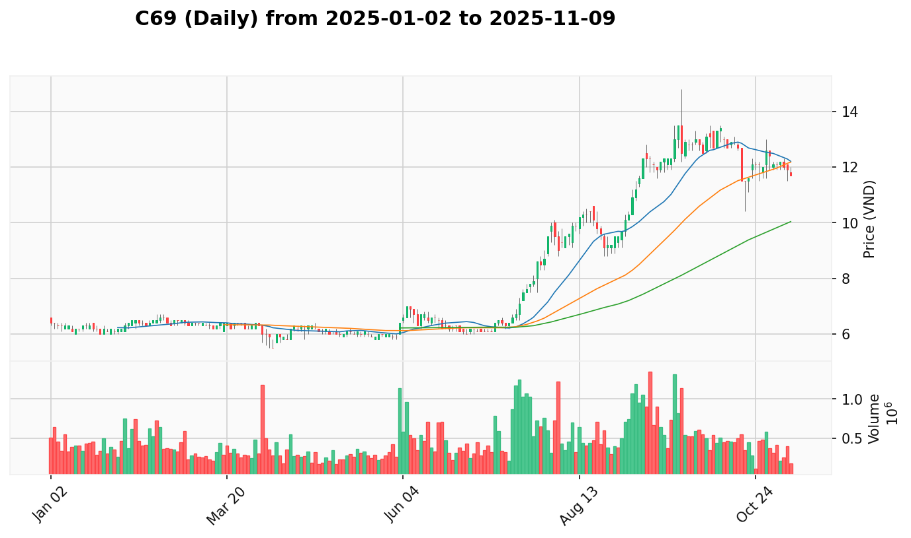

<a href="#xay-dung">↑ Back to group XAY_DUNG</a>  |  <a href="#vpa-signal-summary">↑ Back to Top</a>

#### Key Statistics
| Metric | Value |
|:---|---:|
| Date Range | 2025-01-02 to 2025-11-07 |
| **Latest Close** | **11.7** |
| Period Open | 6.6 |
| Period High | 14.8 |
| Period Low | 5.5 |
| Period Change % | 77.27% |

**[Download C69 Data (.csv)](market_data/C69_2025-01-02_to_2025-11-09.csv)**

---

### CEO

#### [VPA Analysis (2025-08-04 - 2025-10-21)](./VPA.md#ceo)
> **Ngày 2025-10-15:** CEO mở cửa ở mức 30.4 VND, dao động trong biên độ từ 29.7 VND đến 31.8 VND và đóng cửa tại 31.7 VND, là mức cao nhất phiên. Giá tăng từ 30.4 VND (giá đóng cửa phiên trước) lên 31.7 VND. Biên độ nến rộng và đóng cửa ở mức cao nhất cho thấy lực mua tiếp tục chiếm ưu thế mạnh mẽ. Khối lượng giao dịch đạt 22.3297 triệu cổ phiếu, thấp hơn so với phiên trước (28.1571 triệu cổ phiếu) và phiên SOS bùng nổ ngày 2025-10-13 (53.3409 triệu cổ phiếu). Mặc dù khối lượng giảm, việc giá vẫn tăng mạnh và đóng cửa ở mức cao nhất cho thấy sự hấp thụ cung tốt và đà tăng vẫn được duy trì. **Phân tích VPA/Wyckoff:** Sign of Strength (SOS) - Giá tiếp tục tăng mạnh với biên độ rộng, đóng cửa ở mức cao nhất, xác nhận xu hướng tăng.
> **Ngày 2025-10-16:** CEO mở cửa ở mức 31.6 VND, dao động trong biên độ từ 31.4 VND đến 32.8 VND và đóng cửa tại 32.1 VND. Giá tăng từ 31.7 VND (giá đóng cửa phiên trước) lên 32.1 VND. Biên độ nến hẹp và đóng cửa ở giữa nến, cho thấy sự lưỡng lự sau các phiên tăng mạnh. Khối lượng giao dịch đạt 10.77 triệu cổ phiếu, giảm mạnh so với các phiên trước và là mức thấp nhất trong 10 phiên gần đây. Điều này cho thấy lực bán đã cạn kiệt và thị trường đang tạm dừng để kiểm tra cung sau đà tăng mạnh. **Phân tích VPA/Wyckoff:** Test for Supply (Kiểm tra cung) - Giá tăng nhẹ với biên độ hẹp và khối lượng cực thấp, cho thấy cung đã cạn kiệt sau các phiên SOS, chuẩn bị cho đà tăng tiếp theo.
> **Ngày 2025-10-17:** CEO mở cửa ở mức 31.8 VND, dao động trong biên độ từ 31.2 VND đến 32.9 VND và đóng cửa tại 31.9 VND. Giá giảm nhẹ từ 32.1 VND (giá đóng cửa phiên trước) xuống 31.9 VND. Biên độ nến rộng và đóng cửa ở giữa nến cho thấy sự lưỡng lự và áp lực bán gia tăng sau chuỗi tăng giá. Khối lượng giao dịch đạt 20.71 triệu cổ phiếu, cao hơn đáng kể so với phiên trước (10.77 triệu cổ phiếu). Sự kết hợp giữa giá giảm nhẹ, biên độ rộng và khối lượng tăng cho thấy lực cung đang trở lại thị trường, có thể là do chốt lời hoặc kiểm tra lại vùng giá cao. **Phân tích VPA/Wyckoff:** Selling Pressure (Áp lực bán) - Giá giảm nhẹ với biên độ rộng và khối lượng tăng, cho thấy lực cung đang xuất hiện sau giai đoạn tăng giá.
> **Ngày 2025-10-20:** CEO mở cửa ở mức 31.9 VND, dao động trong biên độ từ 28.8 VND đến 32.9 VND và đóng cửa tại 28.8 VND. Giá giảm mạnh từ 31.9 VND (giá đóng cửa phiên trước) xuống 28.8 VND. Biên độ nến rộng và đóng cửa ở mức thấp nhất phiên, cho thấy áp lực bán rất mạnh. Khối lượng giao dịch đạt 48.75 triệu cổ phiếu, tăng đột biến so với phiên trước (20.71 triệu cổ phiếu) và là mức cao nhất trong 10 phiên gần đây. Sự kết hợp giữa giá giảm sâu, biên độ rộng và khối lượng cực lớn cho thấy lực cung áp đảo hoàn toàn lực cầu, xác nhận sự xuất hiện của áp lực bán tháo hoặc phân phối mạnh. **Phân tích VPA/Wyckoff:** Sign of Weakness (SOW) - Giá giảm mạnh với biên độ rộng và khối lượng cực lớn, cho thấy cung đã áp đảo cầu, xác nhận xu hướng giảm giá.
> **Ngày 2025-10-21:** CEO mở cửa ở mức 28.5 VND, dao động trong biên độ từ 27.4 VND đến 29.5 VND và đóng cửa tại 28.6 VND. Giá tiếp tục giảm nhẹ từ 28.8 VND (giá đóng cửa phiên trước) xuống 28.6 VND. Biên độ nến vẫn rộng nhưng hẹp hơn phiên trước, và đóng cửa gần giữa nến, cho thấy sự lưỡng lự và có lực cầu bắt đáy xuất hiện. Khối lượng giao dịch đạt 42.70 triệu cổ phiếu, giảm so với phiên trước nhưng vẫn ở mức cao. Sau phiên giảm mạnh với khối lượng cực lớn (SOW) vào ngày 2025-10-20, phiên này cho thấy áp lực bán có phần giảm bớt nhưng xu hướng giảm vẫn tiếp diễn. Sự xuất hiện của lực cầu ở vùng giá thấp cần được theo dõi thêm để xác nhận khả năng hồi phục. **Phân tích VPA/Wyckoff:** Selling Pressure (Áp lực bán) - Giá tiếp tục giảm với khối lượng cao, cho thấy áp lực cung vẫn còn nhưng có dấu hiệu hấp thụ ở vùng giá thấp.

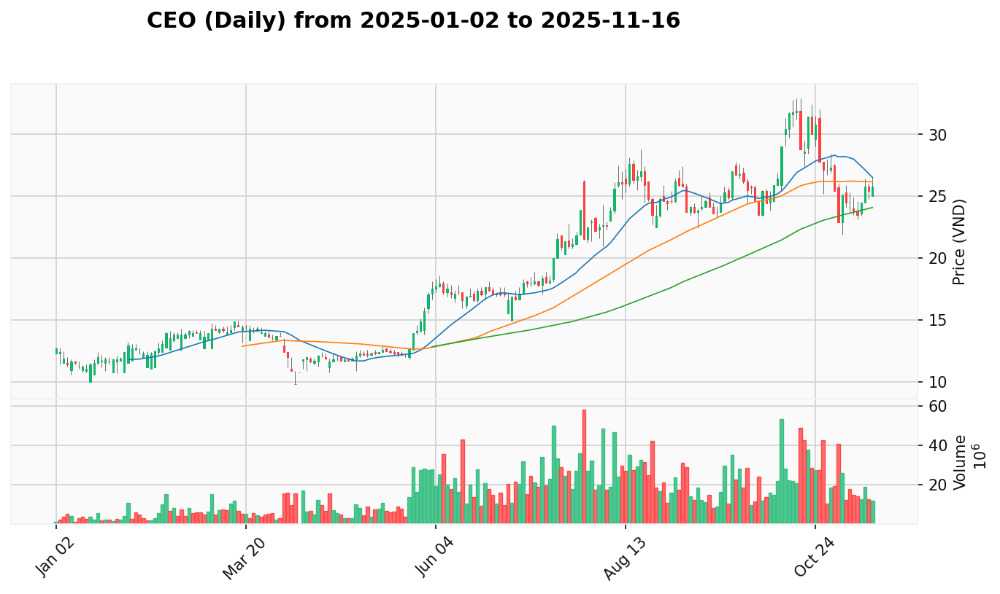

<a href="#bat-dong-san">↑ Back to group BAT_DONG_SAN</a>  |  <a href="#vpa-signal-summary">↑ Back to Top</a>

#### Key Statistics
| Metric | Value |
|:---|---:|
| Date Range | 2025-01-02 to 2025-11-07 |
| **Latest Close** | **23.8** |
| Period Open | 12.29 |
| Period High | 32.9 |
| Period Low | 9.81 |
| Period Change % | 93.65% |

**[Download CEO Data (.csv)](market_data/CEO_2025-01-02_to_2025-11-09.csv)**

---

### CIG

#### [VPA Analysis (2025-08-14 - 2025-10-21)](./VPA.md#cig)
> **Ngày 2025-10-15:** CIG giảm từ 9.17 VND xuống 9.08 VND, với khối lượng giao dịch chỉ đạt 0.0378 triệu cổ phiếu, giảm mạnh so với phiên trước. Nến giá có biên độ hẹp và đóng cửa ở mức thấp nhất phiên, cho thấy áp lực bán vẫn hiện hữu nhưng không có sự tham gia của lực cầu. Sau phiên giảm giá với lực cung xuất hiện (SOW) ngày 2025-10-14, việc giá tiếp tục giảm với khối lượng sụt giảm mạnh cho thấy thị trường đang thiếu vắng lực cầu hỗ trợ. **Phân tích VPA/Wyckoff:** No Demand (Không có lực cầu)
> **Ngày 2025-10-16:** CIG giảm từ 9.08 VND xuống 9.0 VND, với khối lượng giao dịch tăng lên 0.0759 triệu cổ phiếu. Nến giá có biên độ tương đối rộng và đóng cửa ở mức thấp nhất phiên, cho thấy áp lực bán tiếp tục gia tăng. Sau phiên "Không có lực cầu" ngày 2025-10-15, việc giá tiếp tục giảm với khối lượng tăng trở lại xác nhận rằng phe bán vẫn đang kiểm soát thị trường. **Phân tích VPA/Wyckoff:** Sign of Weakness (SOW) - Lực cung tiếp tục chiếm ưu thế.
> **Ngày 2025-10-17:** CIG giảm từ 9.0 VND xuống 8.9 VND, với khối lượng giao dịch chỉ đạt 0.0106 triệu cổ phiếu, giảm mạnh so với phiên trước. Nến giá có biên độ hẹp và đóng cửa ở mức thấp nhất phiên, cho thấy áp lực bán vẫn hiện hữu nhưng không có sự tham gia của lực cầu. Sau phiên "Sign of Weakness" ngày 2025-10-16, việc giá tiếp tục giảm với khối lượng sụt giảm mạnh cho thấy thị trường đang thiếu vắng lực cầu hỗ trợ. **Phân tích VPA/Wyckoff:** No Demand (Không có lực cầu)
> **Ngày 2025-10-20:** CIG giảm từ 9.0 VND xuống 8.88 VND, với khối lượng giao dịch đạt 0.0207 triệu cổ phiếu. Nến giá có biên độ rộng, với mức cao nhất đạt 9.52 VND nhưng đóng cửa gần mức thấp nhất phiên là 8.58 VND, cho thấy áp lực bán mạnh mẽ đã đẩy giá xuống sau một nỗ lực tăng giá. So với phiên "Không có lực cầu" ngày 2025-10-17, khối lượng giao dịch đã tăng trở lại, xác nhận rằng phe bán vẫn đang kiểm soát thị trường và lực cầu vẫn yếu. **Phân tích VPA/Wyckoff:** Sign of Weakness (SOW) - Lực cung tiếp tục chiếm ưu thế.
> **Ngày 2025-10-21:** CIG tăng từ 8.88 VND lên 9.2 VND, với khối lượng giao dịch đạt 0.0354 triệu cổ phiếu. Nến giá có biên độ khá rộng và đóng cửa ở mức cao nhất phiên, cho thấy lực cầu đã quay trở lại và hấp thụ tốt áp lực bán. So với phiên "Sign of Weakness" ngày 2025-10-20, sự tăng giá kèm khối lượng tăng cho thấy tín hiệu tích cực về sự xuất hiện của lực mua. **Phân tích VPA/Wyckoff:** Demand (Lực cầu xuất hiện)

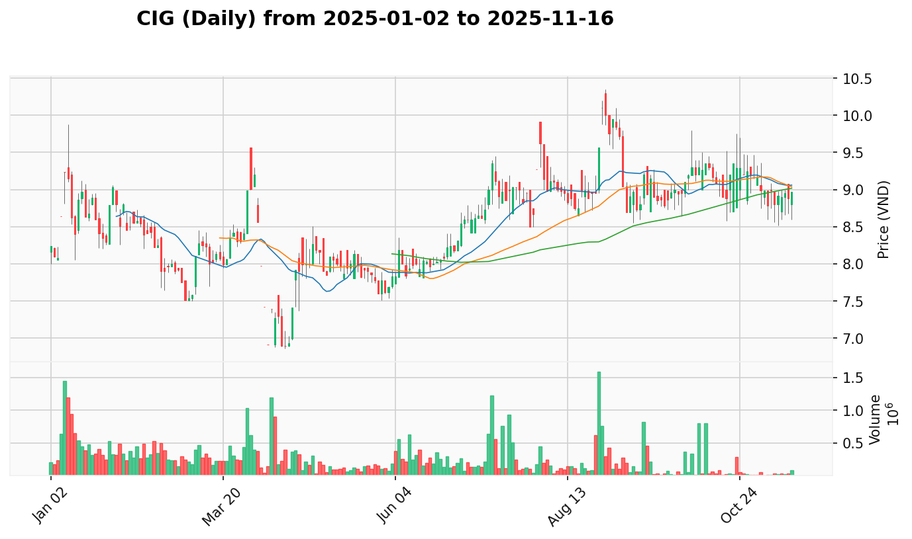

<a href="#penny">↑ Back to group PENNY</a>  |  <a href="#vpa-signal-summary">↑ Back to Top</a>

#### Key Statistics
| Metric | Value |
|:---|---:|
| Date Range | 2025-01-02 to 2025-11-07 |
| **Latest Close** | **8.8** |
| Period Open | 8.16 |
| Period High | 10.35 |
| Period Low | 6.86 |
| Period Change % | 7.84% |

**[Download CIG Data (.csv)](market_data/CIG_2025-01-02_to_2025-11-09.csv)**

---

### CII

#### [VPA Analysis (2025-06-27 - 2025-10-21)](./VPA.md#cii)
> **Ngày 2025-10-15:** CII tăng từ 29.75 lên 30.3 với khối lượng giao dịch đạt 29.73 triệu cổ phiếu. Giá mở cửa 29.75, tăng lên mức cao nhất 30.5 và đóng cửa ở 30.3, tạo nến tăng với biên độ rộng và đóng cửa gần mức cao nhất phiên. Khối lượng giao dịch giảm so với phiên trước (33.79 triệu cổ phiếu), cho thấy lực cầu có dấu hiệu chững lại sau hai phiên tăng mạnh với khối lượng đột biến. Tuy nhiên, giá vẫn tiếp tục tăng và đóng cửa ở mức cao, cho thấy xu hướng tăng vẫn được duy trì. **Phân tích VPA/Wyckoff:** Sign of Strength (SOS) - Giá tiếp tục tăng với biên độ rộng nhưng khối lượng giảm, cho thấy đà tăng vẫn tiếp diễn nhưng cần theo dõi sự duy trì của lực cầu.
> **Ngày 2025-10-16:** CII giảm từ 30.3 xuống 30.2 với khối lượng giao dịch đạt 12.365 triệu cổ phiếu. Giá mở cửa 30.5, tăng lên mức cao nhất 31.2 và giảm xuống mức thấp nhất 29.75, đóng cửa ở 30.2, tạo nến giảm với biên độ trung bình và đóng cửa ở nửa dưới của biên độ phiên. Khối lượng giao dịch giảm mạnh so với phiên trước (29.73 triệu cổ phiếu), cho thấy lực bán không mạnh nhưng lực cầu cũng suy yếu rõ rệt. Sau hai phiên tăng giá với khối lượng giảm dần (SOS), phiên này giá điều chỉnh nhẹ với khối lượng rất thấp, có thể là dấu hiệu của sự cạn kiệt lực cầu hoặc một nhịp kiểm tra cung. **Phân tích VPA/Wyckoff:** No Demand - Giá giảm nhẹ với khối lượng rất thấp sau các phiên SOS với khối lượng giảm dần, cho thấy lực cầu đang suy yếu và thị trường đang kiểm tra cung.
> **Ngày 2025-10-17:** CII tăng từ 30.0 lên 30.35 với khối lượng giao dịch đạt 32.2845 triệu cổ phiếu. Giá mở cửa 30.0, tăng lên mức cao nhất 31.35 và đóng cửa ở 30.35, tạo nến tăng với biên độ rộng và đóng cửa gần mức cao nhất phiên. Khối lượng giao dịch tăng so với phiên trước (22.4282 triệu cổ phiếu). Sau phiên "No Demand" ngày 2025-10-16, giá đã bật tăng trở lại với khối lượng gia tăng, cho thấy lực cầu đã quay trở lại và hấp thụ tốt lực cung. Điều này xác nhận xu hướng tăng vẫn được duy trì. **Phân tích VPA/Wyckoff:** Sign of Strength (SOS)
> **Ngày 2025-10-20:** CII giảm từ 29.9 xuống 28.25 với khối lượng giao dịch đạt 38.9144 triệu cổ phiếu. Giá mở cửa 29.9, tăng lên mức cao nhất 30.8 và giảm mạnh xuống mức thấp nhất 28.25, đóng cửa ở 28.25, tạo nến giảm với biên độ rộng và đóng cửa ở mức thấp nhất phiên. Khối lượng giao dịch tăng so với phiên trước (32.2845 triệu cổ phiếu). Sau phiên "Sign of Strength" ngày 2025-10-17, giá đã giảm mạnh với khối lượng gia tăng, cho thấy lực cung đã quay trở lại và áp đảo lực cầu. Điều này có thể là một dấu hiệu của sự suy yếu hoặc kiểm tra lại vùng hỗ trợ. **Phân tích VPA/Wyckoff:** Supply Coming In (SC)
> **Ngày 2025-10-21:** CII giảm từ 28.25 xuống 27.0 với khối lượng giao dịch đạt 53.003 triệu cổ phiếu. Giá mở cửa 28.0, tăng lên mức cao nhất 28.25 và giảm mạnh xuống mức thấp nhất 26.5, đóng cửa ở 27.0, tạo nến giảm với biên độ rộng và đóng cửa gần mức thấp nhất phiên. Khối lượng giao dịch tăng mạnh so với phiên trước (38.9144 triệu cổ phiếu). Sau phiên "Supply Coming In" ngày 2025-10-20, giá tiếp tục giảm mạnh với khối lượng gia tăng đột biến, cho thấy lực cung vẫn đang áp đảo và rất mạnh mẽ. Điều này xác nhận xu hướng suy yếu và có thể tiếp tục giảm. **Phân tích VPA/Wyckoff:** Supply Coming In (SC)

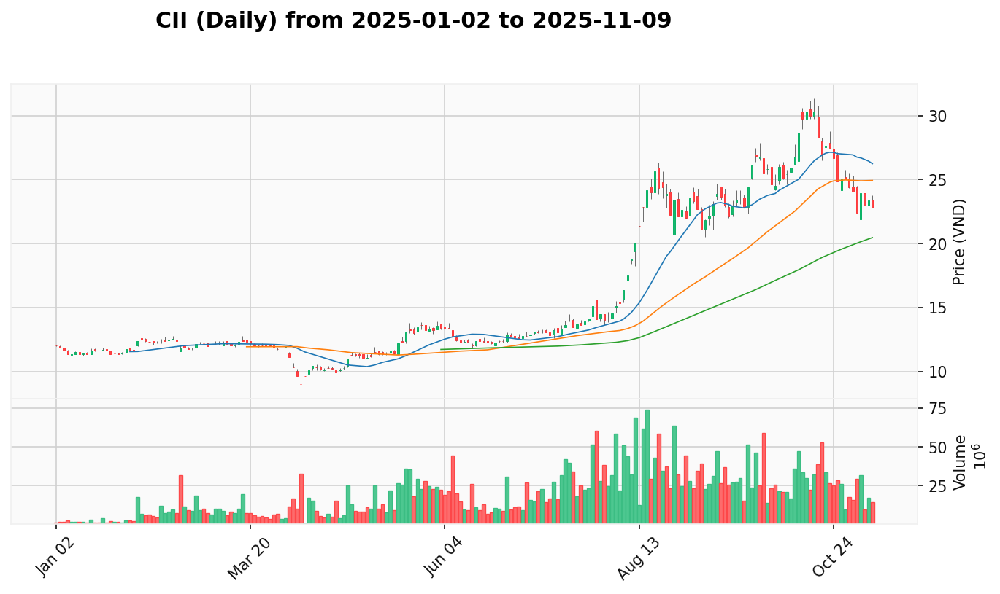

<a href="#xay-dung">↑ Back to group XAY_DUNG</a>  |  <a href="#vpa-signal-summary">↑ Back to Top</a>

#### Key Statistics
| Metric | Value |
|:---|---:|
| Date Range | 2025-01-02 to 2025-11-07 |
| **Latest Close** | **22.8** |
| Period Open | 12.02 |
| Period High | 31.35 |
| Period Low | 9.02 |
| Period Change % | 89.68% |

**[Download CII Data (.csv)](market_data/CII_2025-01-02_to_2025-11-09.csv)**

---

### CKG

#### [VPA Analysis (2025-08-08 - 2025-10-21)](./VPA.md#ckg)
> **Ngày 2025-10-15:** CKG giảm từ 12.35 VND (giá đóng cửa phiên trước) xuống 12.2 VND (giá đóng cửa) với biên độ dao động hẹp và đóng cửa gần giữa thân nến. Khối lượng giao dịch đạt 0.0829 triệu cổ phiếu, giảm đáng kể so với phiên trước (0.1459 triệu cổ phiếu). Sau phiên kiểm tra cung (No Supply) với khối lượng thấp, phiên này giá tiếp tục giảm với khối lượng cực thấp. Điều này cho thấy lực cầu vẫn rất yếu và không có sự tham gia của dòng tiền lớn để hỗ trợ giá, dù áp lực bán không quá mạnh. Thị trường vẫn đang trong giai đoạn yếu kém và có khả năng tiếp diễn xu hướng giảm do thiếu cầu. **Phân tích VPA/Wyckoff:** No Demand (Thiếu cầu)
> **Ngày 2025-10-16:** CKG tăng từ 12.2 VND (giá đóng cửa phiên trước) lên 12.3 VND (giá đóng cửa) với biên độ dao động hẹp và đóng cửa gần giữa thân nến. Khối lượng giao dịch đạt 0.0362 triệu cổ phiếu, giảm mạnh so với phiên trước (0.0829 triệu cổ phiếu) và là mức thấp nhất trong 10 phiên gần đây. Sau phiên "Thiếu cầu" (No Demand) ngày 2025-10-15, phiên này giá có sự phục hồi nhẹ nhưng với khối lượng cực kỳ thấp. Điều này cho thấy lực cầu vẫn rất yếu, không có sự tham gia của dòng tiền lớn để đẩy giá lên. Áp lực bán cũng không mạnh nhưng sự thiếu vắng của cầu khiến giá khó có thể tăng bền vững. Thị trường vẫn đang trong giai đoạn yếu kém, thiếu động lực và có khả năng tiếp diễn xu hướng đi ngang hoặc giảm nhẹ. **Phân tích VPA/Wyckoff:** No Demand (Thiếu cầu)
> **Ngày 2025-10-17:** CKG giảm từ 12.4 VND (giá đóng cửa phiên trước) xuống 12.2 VND (giá đóng cửa) với biên độ dao động hẹp và đóng cửa ở mức thấp nhất phiên. Khối lượng giao dịch đạt 0.1143 triệu cổ phiếu, tăng nhẹ so với phiên trước (0.0809 triệu cổ phiếu). Sau hai phiên "Thiếu cầu" (No Demand), phiên này giá tiếp tục giảm với khối lượng tăng nhẹ, cho thấy áp lực bán vẫn còn hiện hữu và lực cầu vẫn yếu. Việc giá đóng cửa ở mức thấp nhất phiên với khối lượng tăng cho thấy phe bán đang chiếm ưu thế. Thị trường vẫn đang trong giai đoạn yếu kém và có khả năng tiếp diễn xu hướng giảm. **Phân tích VPA/Wyckoff:** Weakness (Yếu kém)
> **Ngày 2025-10-20:** CKG giảm từ 12.2 VND (giá đóng cửa phiên trước) xuống 11.6 VND (giá đóng cửa) với biên độ dao động rộng và đóng cửa ở mức thấp gần nhất phiên. Khối lượng giao dịch đạt 0.1457 triệu cổ phiếu, tăng so với phiên trước (0.1143 triệu cổ phiếu). Sau các phiên "Thiếu cầu" và "Yếu kém", phiên này giá tiếp tục giảm mạnh với khối lượng gia tăng, cho thấy áp lực bán đang chiếm ưu thế rõ rệt và lực cầu gần như không tồn tại. Việc giá đóng cửa ở mức thấp nhất phiên với khối lượng tăng xác nhận xu hướng giảm tiếp diễn. Thị trường đang trong giai đoạn phân phối hoặc giảm giá mạnh. **Phân tích VPA/Wyckoff:** Weakness (Yếu kém)
> **Ngày 2025-10-21:** CKG tăng từ 11.6 VND (giá đóng cửa phiên trước) lên 11.7 VND (giá đóng cửa) với biên độ dao động hẹp và đóng cửa ở giữa thân nến. Khối lượng giao dịch đạt 0.106 triệu cổ phiếu, giảm đáng kể so với phiên trước (0.1457 triệu cổ phiếu). Sau các phiên giảm mạnh với áp lực bán lớn, phiên này giá có sự hồi phục nhẹ nhưng với khối lượng thấp, cho thấy áp lực bán đã tạm thời giảm bớt nhưng lực cầu vẫn còn yếu và chưa đủ mạnh để đảo chiều xu hướng. Đây có thể là một nhịp hồi kỹ thuật hoặc kiểm tra nguồn cung còn lại trước khi xu hướng giảm tiếp diễn. **Phân tích VPA/Wyckoff:** Test for Supply (Kiểm tra nguồn cung)

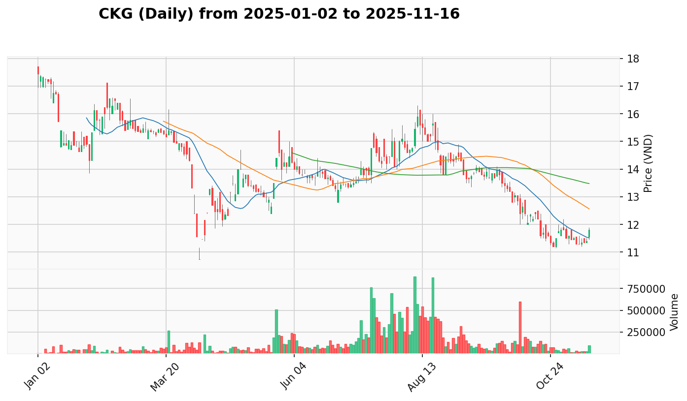

<a href="#xay-dung">↑ Back to group XAY_DUNG</a>  |  <a href="#vpa-signal-summary">↑ Back to Top</a>

#### Key Statistics
| Metric | Value |
|:---|---:|
| Date Range | 2025-01-02 to 2025-11-07 |
| **Latest Close** | **11.3** |
| Period Open | 17.71 |
| Period High | 17.71 |
| Period Low | 10.74 |
| Period Change % | -36.19% |

**[Download CKG Data (.csv)](market_data/CKG_2025-01-02_to_2025-11-09.csv)**

---

### CLX

#### [VPA Analysis (2025-08-14 - 2025-10-21)](./VPA.md#clx)
> **Ngày 2025-10-15:** CLX giảm từ 16.0 VND xuống 15.9 VND, với biên độ dao động hẹp (15.9-16.1 VND) và đóng cửa ở mức thấp nhất phiên. Khối lượng giao dịch đạt 0.0541 triệu cổ phiếu, giảm so với phiên trước (0.0922 triệu cổ phiếu). Sau phiên "Tiếp tục Điểm yếu" ngày 2025-10-14, giá tiếp tục giảm và đóng cửa ở mức thấp nhất, cho thấy lực cung vẫn đang hiện diện, mặc dù khối lượng đã giảm. **Phân tích VPA/Wyckoff:** Tiếp tục Điểm yếu
> **Ngày 2025-10-16:** CLX giữ nguyên mức giá 15.9 VND, với biên độ dao động rất hẹp (15.8-15.9 VND) và đóng cửa ở mức 15.9 VND. Khối lượng giao dịch đạt 0.0124 triệu cổ phiếu, giảm đáng kể so với phiên trước (0.0541 triệu cổ phiếu) và là mức thấp nhất trong 10 phiên gần đây. Sau hai phiên "Tiếp tục Điểm yếu", giá đi ngang với khối lượng cực thấp cho thấy lực cung đã tạm thời giảm nhưng lực cầu vẫn vắng bóng. Điều này xác nhận sự thiếu vắng nhu cầu, cho thấy thị trường chưa sẵn sàng cho một đợt tăng giá. **Phân tích VPA/Wyckoff:** No Demand (Thiếu vắng nhu cầu)
> **Ngày 2025-10-17:** CLX giảm từ 16.0 VND xuống 15.9 VND, với biên độ dao động hẹp (15.9-16.1 VND) và đóng cửa ở mức thấp nhất phiên. Khối lượng giao dịch đạt 0.0813 triệu cổ phiếu, tăng so với phiên trước (0.0638 triệu cổ phiếu). Sau phiên "No Demand" ngày 2025-10-16, giá tiếp tục giảm với khối lượng gia tăng, cho thấy lực cung vẫn đang chiếm ưu thế và thị trường tiếp tục suy yếu. **Phân tích VPA/Wyckoff:** Dấu hiệu suy yếu (Sign of Weakness)
> **Ngày 2025-10-20:** CLX mở cửa ở mức 16.0 VND, giảm mạnh xuống 15.3 VND trong phiên nhưng đã phục hồi để đóng cửa tại 15.9 VND, bằng với giá đóng cửa phiên trước. Biên độ dao động trong ngày rộng hơn, cho thấy sự biến động gia tăng. Khối lượng giao dịch đạt 0.0845 triệu cổ phiếu, tăng nhẹ so với phiên trước (0.0813 triệu cổ phiếu). Sau "Dấu hiệu suy yếu" vào ngày 2025-10-17, thị trường đã kiểm tra các mức giá thấp hơn. Mặc dù có sự phục hồi về cuối phiên, việc giá không đóng cửa cao hơn và khối lượng chỉ tăng nhẹ cho thấy lực cầu vẫn còn yếu, và áp lực bán vẫn hiện hữu. **Phân tích VPA/Wyckoff:** Tiếp tục suy yếu (Continuing Weakness)
> **Ngày 2025-10-21:** CLX giảm từ 15.9 VND xuống 15.8 VND, với biên độ dao động hẹp (15.6-15.8 VND) và đóng cửa ở mức cao nhất phiên. Khối lượng giao dịch đạt 0.0914 triệu cổ phiếu, tăng so với phiên trước (0.0845 triệu cổ phiếu). Sau phiên "Tiếp tục suy yếu" ngày 2025-10-20, giá tiếp tục giảm với khối lượng gia tăng, cho thấy áp lực bán vẫn còn mạnh mẽ. Mặc dù giá đóng cửa ở mức cao nhất phiên, nhưng không đủ để đảo ngược xu hướng giảm và khối lượng tăng cho thấy nỗ lực bán vẫn đang diễn ra. **Phân tích VPA/Wyckoff:** Tiếp tục suy yếu

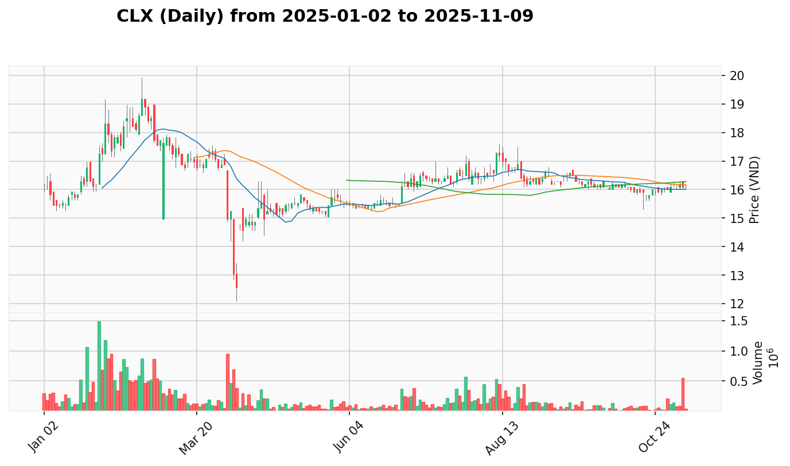

<a href="#thuc-pham">↑ Back to group THUC_PHAM</a>  |  <a href="#vpa-signal-summary">↑ Back to Top</a>

#### Key Statistics
| Metric | Value |
|:---|---:|
| Date Range | 2025-01-02 to 2025-11-07 |
| **Latest Close** | **16.1** |
| Period Open | 16.2 |
| Period High | 19.94 |
| Period Low | 12.08 |
| Period Change % | -0.62% |

**[Download CLX Data (.csv)](market_data/CLX_2025-01-02_to_2025-11-09.csv)**

---

### CMG

#### [VPA Analysis (2025-06-11 - 2025-10-21)](./VPA.md#cmg)
> **Ngày 2025-10-15:** CMG giảm từ 38.8 VND xuống 38.2 VND, mở cửa ở 39.35 VND và đóng cửa tại mức thấp nhất phiên. Biên độ nến rộng (1.15 VND). Khối lượng giao dịch đạt 0.5099 triệu cổ phiếu, thấp hơn so với phiên trước (0.639 triệu cổ phiếu). Sau phiên "Weakness" ngày hôm qua, phiên hôm nay giá tiếp tục giảm mạnh với biên độ rộng và đóng cửa ở mức thấp nhất, cho thấy áp lực bán vẫn rất lớn. Mặc dù khối lượng có giảm nhẹ, nhưng không đủ để phủ nhận sự yếu kém đang diễn ra. **Phân tích VPA/Wyckoff:** Weakness
> **Ngày 2025-10-16:** CMG giảm từ 38.2 VND (giá đóng cửa phiên trước) xuống 38.15 VND, mở cửa ở 38.1 VND và đóng cửa ở 38.15 VND. Biên độ nến rất hẹp (0.3 VND). Khối lượng giao dịch đạt 0.2769 triệu cổ phiếu, thấp hơn đáng kể so với phiên trước (0.5099 triệu cổ phiếu). Sau hai phiên "Weakness" liên tiếp với áp lực bán mạnh, phiên hôm nay giá chỉ giảm nhẹ với biên độ rất hẹp và khối lượng sụt giảm mạnh. Điều này cho thấy lực cung đã suy yếu đáng kể, nhưng chưa có lực cầu đủ mạnh để hấp thụ và đẩy giá lên. Đây là một dấu hiệu của sự thiếu vắng cả cung và cầu, thường xuất hiện trong giai đoạn tạm dừng của xu hướng giảm. **Phân tích VPA/Wyckoff:** No Demand
> **Ngày 2025-10-17:** CMG giảm từ 38.0 VND xuống 37.3 VND, mở cửa ở 38.0 VND và đóng cửa tại mức thấp nhất phiên. Biên độ nến rộng (0.8 VND). Khối lượng giao dịch đạt 0.822 triệu cổ phiếu, tăng đáng kể so với phiên trước (0.531 triệu cổ phiếu). Sau phiên "No Demand" ngày hôm qua, phiên hôm nay giá tiếp tục giảm mạnh với biên độ rộng và đóng cửa ở mức thấp nhất, đi kèm với khối lượng gia tăng. Điều này cho thấy áp lực bán đã quay trở lại mạnh mẽ, xác nhận sự yếu kém của thị trường. **Phân tích VPA/Wyckoff:** Weakness
> **Ngày 2025-10-20:** CMG giảm từ 37.3 VND (giá đóng cửa phiên trước) xuống 37.0 VND, mở cửa ở 37.0 VND và đóng cửa ở 37.0 VND. Giá đã cố gắng tăng lên 38.8 VND nhưng bị đẩy xuống đóng cửa ở mức giá mở cửa và gần mức thấp nhất phiên. Biên độ nến rộng (1.85 VND). Khối lượng giao dịch đạt 1.1117 triệu cổ phiếu, tăng đáng kể so với phiên trước (0.822 triệu cổ phiếu). Điều này cho thấy áp lực bán mạnh mẽ đã xuất hiện sau nỗ lực tăng giá, xác nhận sự yếu kém của thị trường. **Phân tích VPA/Wyckoff:** Weakness
> **Ngày 2025-10-21:** CMG tăng từ 37.0 VND lên 38.4 VND, mở cửa ở 37.1 VND và đóng cửa cao hơn giá mở cửa. Giá đã cố gắng tăng lên 39.35 VND nhưng có sự từ chối nhẹ ở vùng giá cao. Biên độ nến rộng (2.25 VND). Khối lượng giao dịch đạt 0.701 triệu cổ phiếu, giảm so với phiên trước (1.1117 triệu cổ phiếu). Sau hai phiên giảm giá mạnh với khối lượng lớn cho thấy sự yếu kém, phiên hôm nay giá đã phục hồi với biên độ rộng nhưng khối lượng lại giảm. Điều này có thể cho thấy áp lực bán đã tạm thời giảm bớt, nhưng lực cầu chưa thực sự mạnh mẽ để đẩy giá lên cao hơn với khối lượng lớn. Đây có thể là một phiên kiểm tra cung (Test for Supply) sau giai đoạn suy yếu. **Phân tích VPA/Wyckoff:** Test for Supply

<a href="#cong-nghe">↑ Back to group CONG_NGHE</a>  |  <a href="#vpa-signal-summary">↑ Back to Top</a>

#### Key Statistics
| Metric | Value |
|:---|---:|
| Date Range | 2025-01-02 to 2025-11-07 |
| **Latest Close** | **38.85** |
| Period Open | 49.5 |
| Period High | 50.4 |
| Period Low | 28.85 |
| Period Change % | -21.52% |

**[Download CMG Data (.csv)](market_data/CMG_2025-01-02_to_2025-11-09.csv)**

---

### CMX

#### [VPA Analysis (2025-08-15 - 2025-10-21)](./VPA.md#cmx)
> **Ngày 2025-10-15:** CMX giảm từ 6.84 VND xuống 6.77 VND với khối lượng giao dịch giảm, đạt 0.2485 triệu cổ phiếu so với 0.3054 triệu của phiên trước. Cây nến giảm có biên độ tương đối và đóng cửa gần mức thấp nhất phiên. Sau hai phiên Lực cung mạnh mẽ (SOW) liên tiếp, việc giá tiếp tục giảm với khối lượng giảm cho thấy lực bán đang suy yếu nhưng lực cầu vẫn chưa xuất hiện. Điều này cho thấy thị trường đang thiếu cầu và tiếp tục xu hướng suy yếu. **Phân tích VPA/Wyckoff:** No Demand (ND) - Thiếu cầu.
> **Ngày 2025-10-16:** CMX giảm từ 6.77 VND xuống 6.68 VND với khối lượng giao dịch giảm mạnh, đạt 0.094 triệu cổ phiếu so với 0.2485 triệu của phiên trước. Cây nến giảm có biên độ hẹp và đóng cửa gần mức thấp nhất phiên. Sau các phiên Lực cung mạnh mẽ (SOW) và Thiếu cầu (ND), việc giá tiếp tục giảm với khối lượng rất thấp cho thấy lực bán đã suy yếu nhưng lực cầu vẫn hoàn toàn vắng mặt. Điều này xác nhận sự thiếu hụt cầu nghiêm trọng và cho thấy thị trường vẫn đang trong xu hướng suy yếu. **Phân tích VPA/Wyckoff:** No Demand (ND) - Thiếu cầu.
> **Ngày 2025-10-17:** CMX giữ giá ở mức 6.75 VND, không thay đổi so với phiên trước, với khối lượng giao dịch giảm mạnh, chỉ đạt 0.0606 triệu cổ phiếu so với 0.2225 triệu của phiên trước. Cây nến có biên độ hẹp và đóng cửa ở mức cao nhất phiên, cho thấy có lực cầu nhỏ xuất hiện để giữ giá không giảm sâu hơn. Tuy nhiên, khối lượng cực thấp sau hai phiên Thiếu cầu (ND) liên tiếp cho thấy sự thiếu vắng cả lực cung và lực cầu đáng kể, xác nhận thị trường vẫn đang trong giai đoạn thiếu động lực và có thể tiếp tục xu hướng suy yếu. **Phân tích VPA/Wyckoff:** No Demand (ND) - Thiếu cầu.
> **Ngày 2025-10-20:** CMX giảm từ 6.75 VND xuống 6.33 VND với khối lượng giao dịch tăng mạnh, đạt 0.2535 triệu cổ phiếu so với 0.0606 triệu của phiên trước. Cây nến giảm có biên độ rộng và đóng cửa gần mức thấp nhất phiên. Sau các phiên Thiếu cầu (ND), việc giá giảm mạnh với khối lượng gia tăng cho thấy lực cung đã quay trở lại và áp đảo hoàn toàn lực cầu, xác nhận xu hướng suy yếu của thị trường. **Phân tích VPA/Wyckoff:** Sign of Weakness (SOW) - Lực cung mạnh mẽ.
> **Ngày 2025-10-21:** CMX tăng nhẹ từ 6.33 VND lên 6.39 VND với khối lượng giao dịch giảm mạnh, chỉ đạt 0.1409 triệu cổ phiếu so với 0.2535 triệu của phiên trước. Cây nến có biên độ hẹp và đóng cửa gần giữa phiên. Sau phiên giảm mạnh với lực cung áp đảo (SOW) vào ngày 2025-10-20, việc giá tăng nhẹ với khối lượng thấp cho thấy lực cầu vẫn còn yếu và chưa đủ sức đẩy giá lên bền vững, xác nhận xu hướng suy yếu vẫn tiếp diễn. **Phân tích VPA/Wyckoff:** No Demand (ND) - Thiếu cầu.

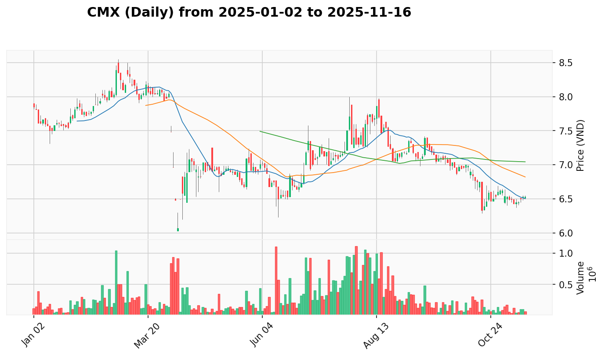

<a href="#thuy-san">↑ Back to group THUY_SAN</a>  |  <a href="#vpa-signal-summary">↑ Back to Top</a>

#### Key Statistics
| Metric | Value |
|:---|---:|
| Date Range | 2025-01-02 to 2025-11-07 |
| **Latest Close** | **6.43** |
| Period Open | 7.9 |
| Period High | 8.55 |
| Period Low | 6.03 |
| Period Change % | -18.61% |

**[Download CMX Data (.csv)](market_data/CMX_2025-01-02_to_2025-11-09.csv)**

---

### CNG

#### [VPA Analysis (2025-08-04 - 2025-10-21)](./VPA.md#cng)
> **Ngày 2025-10-15:** CNG tăng từ 26.65 VND lên 26.85 VND với khối lượng giao dịch đạt 0.035 triệu cổ phiếu. Giá mở cửa thấp hơn giá đóng cửa phiên trước nhưng đóng cửa ở mức cao nhất phiên, cho thấy lực cầu mạnh mẽ đã xuất hiện và hấp thụ toàn bộ áp lực bán trong phiên. Khối lượng giao dịch tăng đáng kể so với phiên trước, xác nhận sự trở lại của phe mua sau hai phiên suy yếu liên tiếp. Đây là một tín hiệu tích cực cho thấy khả năng đảo chiều xu hướng giảm ngắn hạn. **Phân tích VPA/Wyckoff:** Demand (Lực cầu)
> **Ngày 2025-10-16:** CNG giảm từ 26.85 VND xuống 26.15 VND với khối lượng giao dịch đạt 0.0064 triệu cổ phiếu. Giá mở cửa bằng giá cao nhất phiên nhưng đóng cửa gần mức thấp nhất phiên, cho thấy áp lực bán chiếm ưu thế. Mặc dù khối lượng giao dịch rất thấp so với phiên trước (0.035 triệu cổ phiếu), biên độ giảm giá rộng và giá đóng cửa ở mức thấp cho thấy lực cầu đã biến mất và phe bán đang kiểm soát. Điều này củng cố tín hiệu suy yếu và cho thấy sự thiếu hụt lực cầu sau phiên tăng giá trước đó. **Phân tích VPA/Wyckoff:** Suy yếu (Weakness).
> **Ngày 2025-10-17:** CNG giữ nguyên mức giá đóng cửa 26.3 VND so với phiên trước, với khối lượng giao dịch đạt 0.0093 triệu cổ phiếu. Nến doji với biên độ hẹp cho thấy sự lưỡng lự của thị trường. Khối lượng tăng nhẹ so với phiên suy yếu trước đó (0.0079 triệu cổ phiếu) nhưng vẫn ở mức thấp, cho thấy lực cầu chưa đủ mạnh để hấp thụ áp lực bán. **Phân tích VPA/Wyckoff:** Lưỡng lự (Indecision)
> **Ngày 2025-10-20:** CNG giảm từ 26.3 VND xuống 26.15 VND với khối lượng giao dịch đạt 0.0176 triệu cổ phiếu. Giá đóng cửa ở mức thấp nhất phiên, cho thấy áp lực bán mạnh mẽ. Khối lượng giao dịch tăng đáng kể so với phiên trước (0.0093 triệu cổ phiếu), xác nhận sự tiếp diễn của lực bán và sự suy yếu của lực cầu. Điều này củng cố tín hiệu suy yếu đã xuất hiện trong các phiên trước. **Phân tích VPA/Wyckoff:** Suy yếu (Weakness)
> **Ngày 2025-10-21:** CNG giảm từ 26.15 VND xuống 26.0 VND với khối lượng giao dịch đạt 0.0919 triệu cổ phiếu. Giá đóng cửa ở mức thấp nhất phiên, cho thấy áp lực bán mạnh mẽ. Khối lượng giao dịch tăng đáng kể so với phiên trước (0.0176 triệu cổ phiếu), xác nhận sự tiếp diễn của lực bán và sự suy yếu của lực cầu. **Phân tích VPA/Wyckoff:** Suy yếu (Weakness)

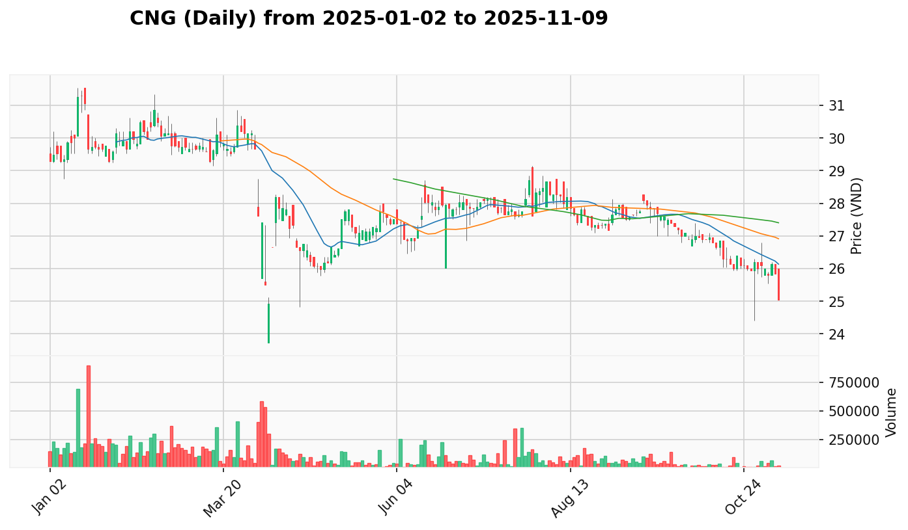

<a href="#dau-khi">↑ Back to group DAU_KHI</a>  |  <a href="#vpa-signal-summary">↑ Back to Top</a>

#### Key Statistics
| Metric | Value |
|:---|---:|
| Date Range | 2025-01-02 to 2025-11-07 |
| **Latest Close** | **25.05** |
| Period Open | 29.53 |
| Period High | 31.54 |
| Period Low | 23.73 |
| Period Change % | -15.17% |

**[Download CNG Data (.csv)](market_data/CNG_2025-01-02_to_2025-11-09.csv)**

---

### CRV

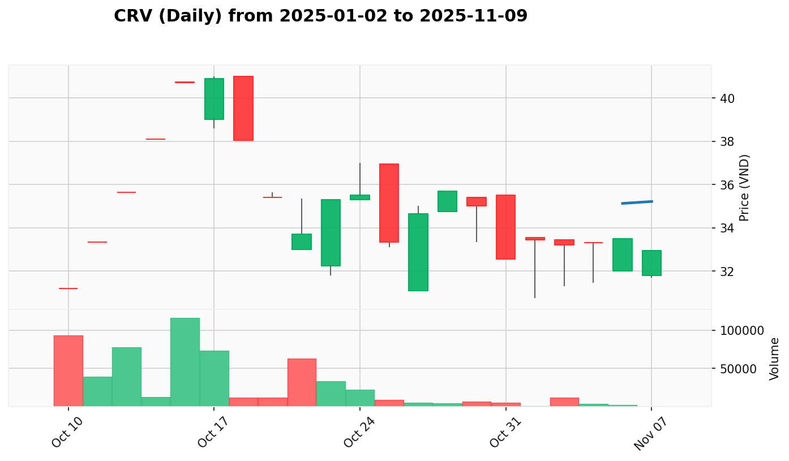

<a href="#bat-dong-san">↑ Back to group BAT_DONG_SAN</a>  |  <a href="#vpa-signal-summary">↑ Back to Top</a>

#### Key Statistics
| Metric | Value |
|:---|---:|
| Date Range | 2025-10-10 to 2025-11-07 |
| **Latest Close** | **32.95** |
| Period Open | 31.2 |
| Period High | 41.0 |
| Period Low | 30.75 |
| Period Change % | 5.61% |

**[Download CRV Data (.csv)](market_data/CRV_2025-01-02_to_2025-11-09.csv)**

---

### CSC

#### [VPA Analysis (2025-06-27 - 2025-10-21)](./VPA.md#csc)
> **Ngày 2025-10-15:** CSC giảm từ 20.5 VND xuống 20.0 VND với biên độ dao động từ 19.6 VND đến 20.5 VND, đóng cửa gần mức thấp nhất phiên. Khối lượng giao dịch đạt 0.0255 triệu cổ phiếu, tăng so với phiên trước (0.0131 triệu cổ phiếu). Sự giảm giá với khối lượng gia tăng sau phiên "Thiếu cầu" ngày 2025-10-14 cho thấy áp lực bán tiếp tục mạnh mẽ và nguồn cung đang chiếm ưu thế, xác nhận sự suy yếu của thị trường. **Phân tích VPA/Wyckoff:** Weakness (Dấu hiệu suy yếu) - Nguồn cung gia tăng.
> **Ngày 2025-10-16:** CSC giảm từ 20.0 VND xuống 19.9 VND với biên độ dao động từ 19.7 VND đến 20.4 VND, đóng cửa gần mức thấp nhất phiên. Khối lượng giao dịch đạt 0.0392 triệu cổ phiếu, tăng so với phiên trước (0.0255 triệu cổ phiếu). Sau hai phiên suy yếu liên tiếp, phiên này tiếp tục cho thấy áp lực bán mạnh mẽ với giá giảm và khối lượng gia tăng, xác nhận nguồn cung vẫn đang chiếm ưu thế trên thị trường. **Phân tích VPA/Wyckoff:** Weakness (Dấu hiệu suy yếu) - Áp lực bán tiếp diễn.
> **Ngày 2025-10-17:** CSC giảm từ 20.5 VND xuống 19.5 VND với biên độ dao động từ 19.0 VND đến 20.5 VND, đóng cửa gần mức thấp nhất phiên. Khối lượng giao dịch đạt 0.0387 triệu cổ phiếu, giảm nhẹ so với phiên trước (0.0473 triệu cổ phiếu). Sau các phiên suy yếu liên tiếp, phiên này tiếp tục cho thấy giá giảm mạnh, đóng cửa ở mức thấp, cho thấy áp lực bán vẫn duy trì và nguồn cầu yếu. **Phân tích VPA/Wyckoff:** Weakness (Dấu hiệu suy yếu) - Áp lực bán tiếp diễn.
> **Ngày 2025-10-20:** CSC giảm từ 19.5 VND xuống 18.1 VND với biên độ dao động từ 18.1 VND đến 20.3 VND, đóng cửa tại mức thấp nhất phiên. Khối lượng giao dịch đạt 0.0479 triệu cổ phiếu, tăng so với phiên trước (0.0387 triệu cổ phiếu). Phiên này tiếp tục cho thấy áp lực bán mạnh mẽ với giá giảm sâu và khối lượng gia tăng, xác nhận nguồn cung vẫn đang chiếm ưu thế trên thị trường. **Phân tích VPA/Wyckoff:** Weakness (Dấu hiệu suy yếu) - Áp lực bán tiếp diễn.
> **Ngày 2025-10-21:** CSC tăng nhẹ từ 18.1 VND lên 18.6 VND với biên độ dao động từ 18.1 VND đến 19.0 VND, đóng cửa ở giữa thân nến. Khối lượng giao dịch đạt 0.0438 triệu cổ phiếu, giảm nhẹ so với phiên giảm mạnh trước đó (0.0479 triệu cổ phiếu). Sau hai phiên giảm sâu với áp lực bán lớn, phiên này cho thấy sự phục hồi nhẹ về giá nhưng với khối lượng giảm, cho thấy lực cầu vẫn còn yếu và chưa đủ sức đảo chiều xu hướng giảm. **Phân tích VPA/Wyckoff:** No Demand (Không có cầu) - Giá tăng nhẹ nhưng khối lượng giảm cho thấy thiếu vắng lực cầu mạnh mẽ.

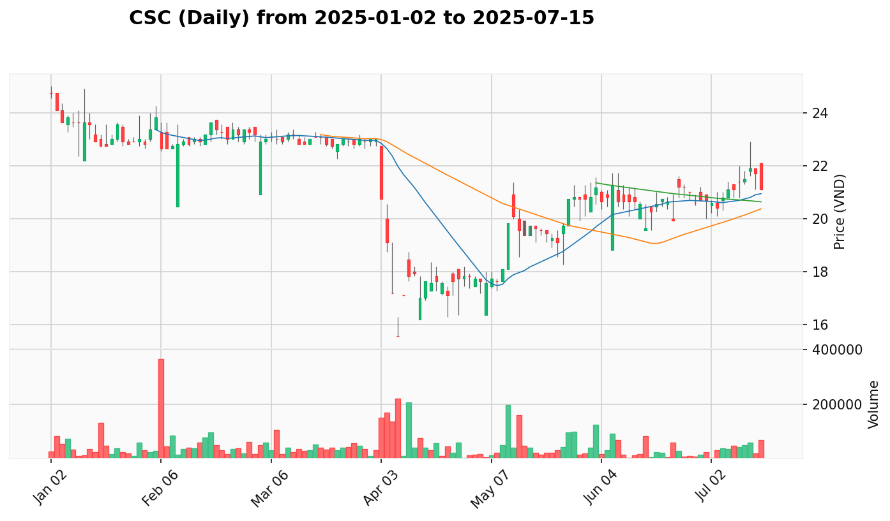

<a href="#penny">↑ Back to group PENNY</a>  |  <a href="#vpa-signal-summary">↑ Back to Top</a>

#### Key Statistics
| Metric | Value |
|:---|---:|
| Date Range | 2025-01-02 to 2025-11-07 |
| **Latest Close** | **18.9** |
| Period Open | 24.73 |
| Period High | 26.9 |
| Period Low | 15.55 |
| Period Change % | -23.57% |

**[Download CSC Data (.csv)](market_data/CSC_2025-01-02_to_2025-11-09.csv)**

---

### CST

#### [VPA Analysis (2025-06-27 - 2025-10-21)](./VPA.md#cst)
> **Ngày 2025-10-15:** CST giảm từ 14.0 VND xuống 13.9 VND. Cây nến có biên độ rộng (0.2 VND) và đóng cửa ở mức thấp nhất phiên, cho thấy áp lực bán chiếm ưu thế. Khối lượng giao dịch đạt 0.0212 triệu cổ phiếu, tăng đáng kể so với phiên trước (0.0119 triệu cổ phiếu). Sau tín hiệu "No Significant Selling" vào ngày 2025-10-14, việc giá giảm với khối lượng gia tăng cho thấy nguồn cung đã quay trở lại thị trường và đang đẩy giá xuống. **Phân tích VPA/Wyckoff:** Selling Pressure (Áp lực bán)
> **Ngày 2025-10-16:** CST giảm từ 14.1 VND xuống 13.9 VND. Cây nến giảm có biên độ hẹp (0.2 VND) và đóng cửa ở mức thấp nhất phiên, cho thấy sự yếu kém của cầu. Khối lượng giao dịch đạt 0.0077 triệu cổ phiếu, giảm đáng kể so với phiên trước (0.0212 triệu cổ phiếu) và ở mức rất thấp. Sau áp lực bán vào ngày 2025-10-15, việc giá tiếp tục giảm với khối lượng thấp cho thấy không có lực cầu đáng kể để hỗ trợ giá, xác nhận sự yếu kém của thị trường. **Phân tích VPA/Wyckoff:** No Demand (Không có cầu)
> **Ngày 2025-10-17:** CST giảm từ 14.1 VND xuống 13.9 VND. Cây nến giảm có biên độ hẹp (0.2 VND) và đóng cửa ở mức thấp nhất phiên, cho thấy sự yếu kém của cầu. Khối lượng giao dịch đạt 0.0035 triệu cổ phiếu, giảm mạnh so với phiên trước (0.012 triệu cổ phiếu) và ở mức cực kỳ thấp. Sau tín hiệu "No Demand" vào ngày 2025-10-16, việc giá tiếp tục giảm với khối lượng cực thấp xác nhận rằng không có lực cầu đáng kể để hỗ trợ giá, cho thấy sự yếu kém tiếp diễn của thị trường. **Phân tích VPA/Wyckoff:** No Demand (Không có cầu)
> **Ngày 2025-10-20:** CST mở cửa ở 14.0 VND, đạt mức cao 14.3 VND nhưng sau đó giảm và đóng cửa ở 13.9 VND, bằng với mức thấp nhất phiên. Biên độ nến là 0.4 VND. Khối lượng giao dịch đạt 0.0445 triệu cổ phiếu, tăng mạnh so với phiên trước (0.0035 triệu cổ phiếu). Sau hai phiên liên tiếp có tín hiệu "No Demand" với khối lượng cực thấp, việc giá không thể duy trì đà tăng và đóng cửa ở mức thấp nhất phiên với khối lượng gia tăng đáng kể cho thấy áp lực cung vẫn đang chiếm ưu thế trên thị trường. **Phân tích VPA/Wyckoff:** Sign of Weakness (SOW) - Áp lực cung gia tăng
> **Ngày 2025-10-21:** CST giảm từ 13.9 VND xuống 13.7 VND. Cây nến giảm có biên độ hẹp (0.3 VND) và đóng cửa ở mức thấp nhất phiên, cho thấy áp lực bán tiếp diễn. Khối lượng giao dịch đạt 0.0189 triệu cổ phiếu, giảm đáng kể so với phiên trước (0.0445 triệu cổ phiếu) và ở mức thấp. Sau tín hiệu "Sign of Weakness" vào ngày 2025-10-20, việc giá tiếp tục giảm với khối lượng thấp cho thấy không có lực cầu đáng kể để hỗ trợ giá, xác nhận sự yếu kém của thị trường. **Phân tích VPA/Wyckoff:** No Demand (Không có cầu)

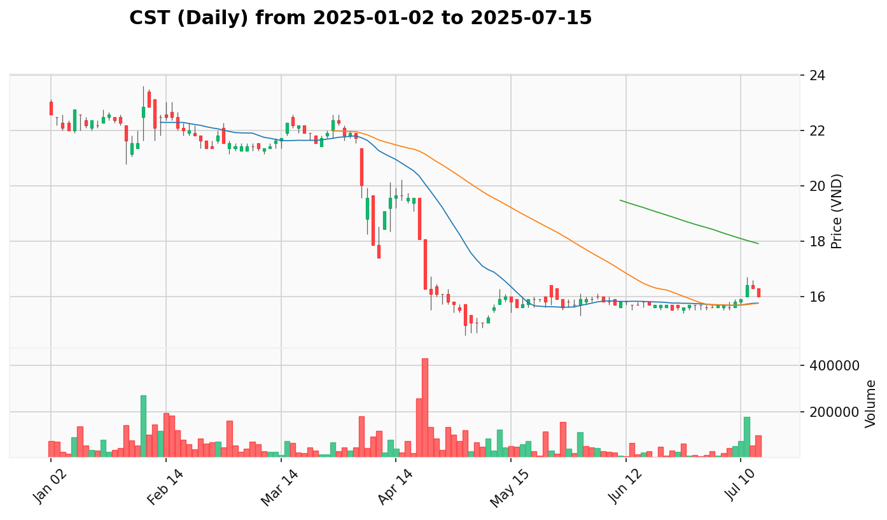

<a href="#khai-khoang">↑ Back to group KHAI_KHOANG</a>  |  <a href="#vpa-signal-summary">↑ Back to Top</a>

#### Key Statistics
| Metric | Value |
|:---|---:|
| Date Range | 2025-01-02 to 2025-11-07 |
| **Latest Close** | **13.5** |
| Period Open | 23.04 |
| Period High | 23.61 |
| Period Low | 13.0 |
| Period Change % | -41.41% |

**[Download CST Data (.csv)](market_data/CST_2025-01-02_to_2025-11-09.csv)**

---

### CSV

#### [VPA Analysis (2025-08-04 - 2025-10-21)](./VPA.md#csv)
> **Ngày 2025-10-15:** Cổ phiếu giảm từ 31.0 VND xuống 30.5 VND với khối lượng giao dịch đạt 0.654 triệu cổ phiếu, cao hơn so với phiên trước đó. Biên độ nến tương đối rộng, giá đóng cửa nằm ở gần mức thấp nhất phiên. Sau phiên điều chỉnh giảm giá với khối lượng thấp (Reaction) vào ngày 2025-10-14, phiên này cho thấy áp lực bán gia tăng khi giá tiếp tục giảm với khối lượng cao hơn, cho thấy nguồn cung đang chiếm ưu thế. Điều này có thể là một dấu hiệu của sự suy yếu tiếp diễn hoặc kiểm tra lại vùng hỗ trợ. **Phân tích VPA/Wyckoff:** Sign of Weakness (SOW) - Lực cung gia tăng với khối lượng cao đẩy giá xuống.
> **Ngày 2025-10-16:** Cổ phiếu giảm từ 30.5 VND xuống 30.1 VND với khối lượng giao dịch đạt 0.4415 triệu cổ phiếu, thấp hơn đáng kể so với phiên trước đó. Biên độ nến tương đối hẹp, giá đóng cửa nằm ở gần mức thấp nhất phiên. Sau phiên giảm giá mạnh với khối lượng cao (SOW) vào ngày 2025-10-15, phiên này cho thấy giá tiếp tục giảm nhưng với khối lượng thấp hơn, có thể là dấu hiệu của sự cạn kiệt lực bán hoặc kiểm tra lại lực cầu ở mức giá thấp hơn. Tuy nhiên, việc giá đóng cửa ở mức thấp nhất phiên vẫn cho thấy áp lực giảm giá còn hiện hữu. **Phân tích VPA/Wyckoff:** Test for Demand (hoặc Lack of Demand) - Giá giảm với khối lượng thấp sau SOW, cho thấy lực bán có thể đang yếu đi nhưng lực cầu chưa xuất hiện mạnh mẽ.
> **Ngày 2025-10-17:** Cổ phiếu tăng nhẹ từ 30.1 VND lên 30.3 VND với khối lượng giao dịch đạt 0.4392 triệu cổ phiếu, thấp hơn đáng kể so với phiên trước đó. Biên độ nến tương đối rộng nhưng giá đóng cửa ngang bằng giá mở cửa, cho thấy sự lưỡng lự của thị trường. Sau phiên kiểm tra lực cầu với khối lượng thấp vào ngày 2025-10-16, phiên này cho thấy giá có sự hồi phục nhẹ nhưng không đi kèm với khối lượng xác nhận, điều này cho thấy lực cầu vẫn còn yếu và chưa đủ mạnh để đẩy giá lên cao. **Phân tích VPA/Wyckoff:** No Demand - Giá tăng nhẹ với khối lượng thấp, cho thấy thiếu vắng lực cầu mạnh mẽ.
> **Ngày 2025-10-20:** Cổ phiếu mở cửa ở mức 30.45 VND và giảm mạnh xuống 28.2 VND, đóng cửa ở mức thấp nhất phiên. Khối lượng giao dịch đạt 0.9595 triệu cổ phiếu, cao hơn đáng kể so với phiên trước đó (0.4392 triệu cổ phiếu). Biên độ nến rộng cho thấy áp lực bán rất mạnh. Sau các phiên cho thấy lực cầu yếu ớt (No Demand) vào ngày 2025-10-17, phiên này xác nhận sự xuất hiện của lực cung lớn, đẩy giá xuống sâu và phá vỡ các mức hỗ trợ tiềm năng. Điều này cho thấy xu hướng giảm giá đang tiếp diễn và có thể còn tiếp tục. **Phân tích VPA/Wyckoff:** Sign of Weakness (SOW) - Lực cung mạnh mẽ với khối lượng gia tăng xác nhận xu hướng giảm.
> **Ngày 2025-10-21:** Cổ phiếu mở cửa ở mức 29.0 VND, giảm xuống 28.1 VND và đóng cửa ở mức 28.9 VND. So với phiên trước, giá có sự hồi phục nhẹ từ mức đóng cửa 28.2 VND lên 28.9 VND, nhưng vẫn thấp hơn giá mở cửa. Khối lượng giao dịch đạt 0.6444 triệu cổ phiếu, giảm đáng kể so với phiên SOW mạnh mẽ trước đó (0.9595 triệu cổ phiếu). Biên độ nến hẹp hơn và giá đóng cửa cao hơn mức thấp nhất phiên, cho thấy áp lực bán đã giảm bớt nhưng lực cầu vẫn còn yếu. Sau phiên giảm mạnh với khối lượng lớn, phiên này cho thấy sự thiếu vắng lực cầu mạnh mẽ để đẩy giá lên cao, đồng thời cũng không có áp lực bán tiếp diễn với khối lượng lớn. Đây có thể là một phiên kiểm tra cung hoặc tạm dừng trong xu hướng giảm. **Phân tích VPA/Wyckoff:** No Demand - Giá hồi phục nhẹ với khối lượng thấp, cho thấy thiếu vắng lực cầu mạnh mẽ sau phiên giảm điểm.

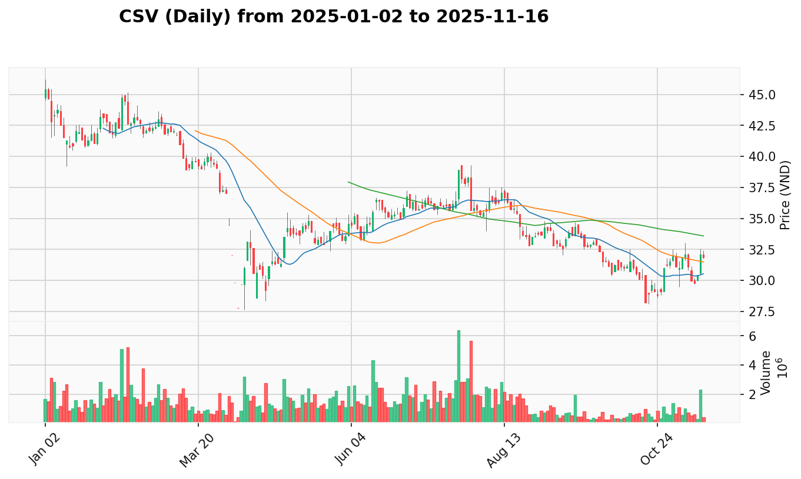

<a href="#hoa-chat">↑ Back to group HOA_CHAT</a>  |  <a href="#vpa-signal-summary">↑ Back to Top</a>

#### Key Statistics
| Metric | Value |
|:---|---:|
| Date Range | 2025-01-02 to 2025-11-07 |
| **Latest Close** | **31.1** |
| Period Open | 44.75 |
| Period High | 46.21 |
| Period Low | 27.63 |
| Period Change % | -30.50% |

**[Download CSV Data (.csv)](market_data/CSV_2025-01-02_to_2025-11-09.csv)**

---

### CTD

#### [VPA Analysis (2025-06-16 - 2025-10-21)](./VPA.md#ctd)
> **Ngày 2025-10-15:** CTD giảm từ 84.0 VND xuống 83.5 VND. Cây nến có biên độ hẹp và đóng cửa gần mức thấp nhất. Khối lượng giao dịch đạt 0.8724 triệu cổ phiếu, thấp hơn đáng kể so với phiên trước (1.8364 triệu cổ phiếu). Sau phiên SOW mạnh mẽ, phiên này cho thấy giá tiếp tục giảm nhưng với khối lượng thấp, cho thấy áp lực bán đã giảm bớt nhưng lực cầu vẫn yếu. **Phân tích VPA/Wyckoff:** No Demand
> **Ngày 2025-10-16:** CTD tăng từ 83.5 VND lên 84.1 VND. Cây nến có biên độ hẹp và đóng cửa ở nửa trên của biên độ. Khối lượng giao dịch đạt 0.3037 triệu cổ phiếu, thấp hơn đáng kể so với phiên trước (0.8724 triệu cổ phiếu) và là mức thấp nhất trong 10 phiên gần đây. Sau hai phiên giảm giá với áp lực bán (SOW và No Demand), phiên này giá tăng nhẹ nhưng với khối lượng rất thấp, cho thấy lực cầu yếu và không có sự tham gia của dòng tiền lớn. Điều này xác nhận sự thiếu vắng nhu cầu thực sự và có thể là một đợt phục hồi yếu trong xu hướng giảm. **Phân tích VPA/Wyckoff:** No Demand
> **Ngày 2025-10-17:** CTD giảm từ 85.1 VND xuống 83.5 VND. Cây nến giảm có biên độ tương đối rộng và đóng cửa gần mức thấp nhất. Khối lượng giao dịch đạt 1.5266 triệu cổ phiếu, cao hơn đáng kể so với phiên trước (0.7402 triệu cổ phiếu). Sau hai phiên No Demand, phiên này cho thấy áp lực bán gia tăng mạnh mẽ, xác nhận xu hướng giảm giá. **Phân tích VPA/Wyckoff:** Sign of Weakness (SOW)
> **Ngày 2025-10-20:** CTD giảm từ 83.5 VND xuống 79.0 VND. Cây nến giảm có biên độ rộng và đóng cửa gần mức thấp nhất. Khối lượng giao dịch đạt 1.5585 triệu cổ phiếu, cao hơn phiên trước (1.5266 triệu cổ phiếu) và duy trì ở mức cao. Điều này cho thấy áp lực bán tiếp tục mạnh mẽ, xác nhận xu hướng giảm giá. **Phân tích VPA/Wyckoff:** Sign of Weakness (SOW)
> **Ngày 2025-10-21:** CTD tăng từ 79.0 VND lên 84.0 VND. Cây nến tăng có biên độ rộng và đóng cửa gần mức cao nhất. Khối lượng giao dịch đạt 1.9881 triệu cổ phiếu, cao hơn đáng kể so với phiên trước (1.5585 triệu cổ phiếu). Sau hai phiên giảm giá mạnh với áp lực bán gia tăng (SOW), phiên này cho thấy lực cầu mạnh mẽ đã hấp thụ lực cung và đẩy giá lên, xác nhận khả năng đảo chiều xu hướng. **Phân tích VPA/Wyckoff:** Sign of Strength (SOS)

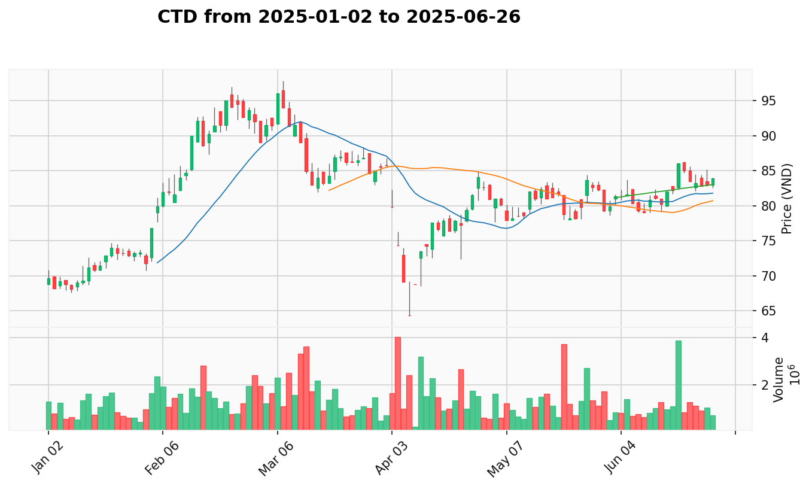

<a href="#xay-dung">↑ Back to group XAY_DUNG</a>  |  <a href="#vpa-signal-summary">↑ Back to Top</a>

#### Key Statistics
| Metric | Value |
|:---|---:|
| Date Range | 2025-01-02 to 2025-11-07 |
| **Latest Close** | **84.7** |
| Period Open | 68.8 |
| Period High | 103.5 |
| Period Low | 64.3 |
| Period Change % | 23.11% |

**[Download CTD Data (.csv)](market_data/CTD_2025-01-02_to_2025-11-09.csv)**

---

### CTG

#### [VPA Analysis (2025-06-27 - 2025-10-21)](./VPA.md#ctg)
> **Ngày 2025-10-15:** CTG tăng từ 54.4 VND lên 54.8 VND. Cây nến có biên độ vừa phải, mở cửa tại 54.5 VND, dao động trong khoảng 54.1-55.2 VND và đóng cửa tại 54.8 VND, nằm ở nửa trên của thân nến. Khối lượng giao dịch đạt 8.0919 triệu cổ phiếu, giảm đáng kể so với phiên trước (13.700332 triệu cổ phiếu). Sau phiên giảm mạnh với lực cung lớn (SOW) vào ngày 2025-10-14, việc giá tăng nhẹ trở lại nhưng với khối lượng thấp cho thấy lực bán đã tạm thời suy yếu, nhưng lực cầu vẫn chưa thực sự mạnh mẽ để đẩy giá lên cao hơn. Đây có thể là một phiên kiểm tra cung (Test for Supply) hoặc một nhịp hồi phục yếu. Thị trường cần thêm xác nhận về sự quay trở lại của lực cầu mạnh mẽ để tiếp tục xu hướng tăng. **Phân tích VPA/Wyckoff:** Test for Supply (Kiểm tra cung) / Weak Rally (Hồi phục yếu)
> **Ngày 2025-10-16:** CTG giảm từ 54.8 VND xuống 53.7 VND. Cây nến có biên độ rộng, mở cửa tại 54.9 VND, dao động trong khoảng 53.5-55.0 VND và đóng cửa tại 53.7 VND, nằm ở mức thấp nhất phiên. Khối lượng giao dịch đạt 7.6621 triệu cổ phiếu, giảm nhẹ so với phiên trước (8.099814 triệu cổ phiếu). Sau phiên hồi phục yếu với khối lượng thấp, việc giá tiếp tục giảm mạnh với biên độ rộng và đóng cửa ở mức thấp nhất phiên cho thấy áp lực bán vẫn đang chiếm ưu thế. Mặc dù khối lượng có giảm nhẹ, nhưng hành động giá cho thấy lực cung vẫn đang kiểm soát thị trường, xác nhận sự suy yếu của xu hướng tăng giá. **Phân tích VPA/Wyckoff:** Sign of Weakness (SOW) - Lực cung tiếp diễn
> **Ngày 2025-10-17:** CTG giảm từ 53.8 VND xuống 52.2 VND. Cây nến có biên độ rộng, mở cửa tại 53.7 VND, dao động trong khoảng 52.2-54.2 VND và đóng cửa tại 52.2 VND, nằm ở mức thấp nhất phiên. Khối lượng giao dịch đạt 17.83 triệu cổ phiếu, tăng đáng kể so với phiên trước (10.98 triệu cổ phiếu). Sau phiên giảm mạnh với lực cung tiếp diễn vào ngày 2025-10-16, việc giá tiếp tục giảm sâu với biên độ rộng và đóng cửa ở mức thấp nhất phiên, đi kèm với khối lượng tăng mạnh, cho thấy áp lực bán đang gia tăng và lực cung vẫn đang kiểm soát thị trường một cách mạnh mẽ. Đây là một dấu hiệu suy yếu rõ rệt, xác nhận xu hướng giảm giá. **Phân tích VPA/Wyckoff:** Sign of Weakness (SOW) - Lực cung mạnh mẽ gia tăng
> **Ngày 2025-10-20:** CTG giảm từ 52.2 VND xuống 48.9 VND. Cây nến có biên độ rất rộng, mở cửa tại 52.8 VND, dao động trong khoảng 48.8-53.4 VND và đóng cửa tại 48.9 VND, nằm ở mức thấp nhất phiên. Khối lượng giao dịch đạt 25.12 triệu cổ phiếu, tăng mạnh so với phiên trước (17.83 triệu cổ phiếu). Sau phiên giảm mạnh với lực cung gia tăng vào ngày 2025-10-17, việc giá tiếp tục giảm sâu với biên độ rất rộng và đóng cửa ở mức thấp nhất phiên, đi kèm với khối lượng tăng đột biến, cho thấy áp lực bán đang cực kỳ mạnh mẽ và lực cung đang kiểm soát hoàn toàn thị trường. Đây là một dấu hiệu suy yếu rất rõ rệt, xác nhận xu hướng giảm giá tiếp diễn. **Phân tích VPA/Wyckoff:** Sign of Weakness (SOW) - Lực cung cực mạnh và gia tăng
> **Ngày 2025-10-21:** CTG tăng từ 48.9 VND lên 49.95 VND. Cây nến có biên độ rộng, mở cửa tại 49.0 VND, dao động trong khoảng 48.9-50.4 VND và đóng cửa tại 49.95 VND, nằm gần mức cao nhất phiên. Khối lượng giao dịch đạt 13.43 triệu cổ phiếu, giảm đáng kể so với phiên trước (25.12 triệu cổ phiếu). Sau hai phiên giảm mạnh với lực cung cực lớn, việc giá tăng trở lại với biên độ rộng nhưng khối lượng giảm mạnh cho thấy áp lực bán đã tạm thời suy yếu, tuy nhiên lực cầu chưa thực sự mạnh mẽ để hấp thụ hết lượng cung tiềm năng. Đây có thể là một nhịp hồi phục kỹ thuật trong xu hướng giảm, cần quan sát thêm để xác nhận sự thay đổi về cung cầu. **Phân tích VPA/Wyckoff:** Lực cầu yếu, chưa xác nhận đảo chiều.

<a href="#ngan-hang">↑ Back to group NGAN_HANG</a>  |  <a href="#vpa-signal-summary">↑ Back to Top</a>

#### Key Statistics
| Metric | Value |
|:---|---:|
| Date Range | 2025-01-02 to 2025-11-07 |
| **Latest Close** | **49.0** |
| Period Open | 37.7 |
| Period High | 56.05 |
| Period Low | 33.53 |
| Period Change % | 29.97% |

**[Download CTG Data (.csv)](market_data/CTG_2025-01-02_to_2025-11-09.csv)**

---

### CTI

#### [VPA Analysis (2025-08-13 - 2025-10-21)](./VPA.md#cti)
> **Ngày 2025-10-15:** CTI mở cửa tại 25.05 VND, tăng lên mức cao nhất 25.3 VND, giảm xuống mức thấp nhất 24.6 VND và đóng cửa tại 24.65 VND. So với ngày 2025-10-14, giá đóng cửa giảm từ 25.05 VND xuống 24.65 VND. Khối lượng giao dịch đạt 1.1441 triệu cổ phiếu, giảm nhẹ so với ngày hôm trước (1.2308 triệu cổ phiếu) nhưng vẫn ở mức cao. Cây nến ngày là một nến giảm mạnh với biên độ rộng, đóng cửa gần mức thấp nhất phiên, cho thấy lực cung tiếp tục chiếm ưu thế và đẩy giá xuống sau phiên Supply Coming In trước đó. **Phân tích VPA/Wyckoff:** Supply Continuing (SC) - Lực cung tiếp diễn trên khối lượng cao, giá tiếp tục giảm mạnh.
> **Ngày 2025-10-16:** CTI mở cửa tại 24.7 VND, tăng lên mức cao nhất 24.8 VND, giảm xuống mức thấp nhất 24.4 VND và đóng cửa tại 24.65 VND. So với ngày 2025-10-15, giá đóng cửa giữ nguyên ở mức 24.65 VND. Khối lượng giao dịch đạt 0.4311 triệu cổ phiếu, giảm mạnh so với ngày hôm trước (1.1441 triệu cổ phiếu). Cây nến ngày có biên độ hẹp, đóng cửa tại mức giá của ngày hôm trước trên khối lượng rất thấp. Điều này cho thấy lực cung đã tạm thời suy yếu sau hai phiên giảm mạnh, nhưng lực cầu cũng không xuất hiện để đẩy giá lên. Thị trường đang trong giai đoạn lưỡng lự hoặc kiểm tra lại lực cung. **Phân tích VPA/Wyckoff:** No Demand (ND) - Lực cầu không xuất hiện trên khối lượng thấp sau giai đoạn giảm giá, cho thấy sự yếu kém của thị trường.
> **Ngày 2025-10-17:** CTI mở cửa tại 24.9 VND, tăng lên mức cao nhất 25.3 VND, giảm xuống mức thấp nhất 24.5 VND và đóng cửa tại 24.5 VND. So với ngày 2025-10-16, giá đóng cửa giảm từ 24.65 VND xuống 24.5 VND. Khối lượng giao dịch đạt 1.0451 triệu cổ phiếu, tăng so với ngày hôm trước (0.7671 triệu cổ phiếu). Cây nến ngày là một nến giảm mạnh với biên độ rộng, đóng cửa tại mức thấp nhất phiên, cho thấy lực cung mạnh mẽ đã xuất hiện trở lại và đẩy giá xuống thấp hơn sau phiên No Demand. **Phân tích VPA/Wyckoff:** Supply Coming In (SCI) - Lực cung mạnh mẽ xuất hiện trên khối lượng gia tăng, đẩy giá xuống thấp hơn.
> **Ngày 2025-10-20:** CTI mở cửa tại 24.5 VND, tăng lên mức cao nhất 25.1 VND, giảm xuống mức thấp nhất 23.05 VND và đóng cửa tại 23.05 VND. So với ngày 2025-10-17, giá đóng cửa giảm mạnh từ 24.5 VND xuống 23.05 VND. Khối lượng giao dịch đạt 2.2994 triệu cổ phiếu, tăng đáng kể so với ngày hôm trước (1.0451 triệu cổ phiếu). Cây nến ngày là một nến giảm mạnh với biên độ rộng, đóng cửa tại mức thấp nhất phiên, cho thấy lực cung áp đảo và thị trường đang rất yếu. **Phân tích VPA/Wyckoff:** Sign of Weakness (SOW) - Lực cung mạnh mẽ với khối lượng gia tăng xác nhận xu hướng giảm.
> **Ngày 2025-10-21:** CTI mở cửa tại 23.05 VND, tăng lên mức cao nhất 23.9 VND, giảm xuống mức thấp nhất 23.05 VND và đóng cửa tại 23.9 VND. So với ngày 2025-10-20, giá đóng cửa tăng từ 23.05 VND lên 23.9 VND. Khối lượng giao dịch đạt 1.3746 triệu cổ phiếu, giảm so với ngày hôm trước (2.2994 triệu cổ phiếu). Cây nến ngày là một nến tăng với biên độ hẹp, đóng cửa tại mức cao nhất phiên. Mặc dù giá tăng và đóng cửa ở mức cao nhất, nhưng khối lượng giao dịch lại giảm đáng kể so với phiên giảm mạnh trước đó. Điều này cho thấy lực cầu hiện tại chưa đủ mạnh để đảo ngược xu hướng giảm giá gần đây, và có thể chỉ là một nhịp hồi phục yếu. **Phân tích VPA/Wyckoff:** No Demand (ND) - Lực cầu yếu trên khối lượng giảm sau giai đoạn cung mạnh.

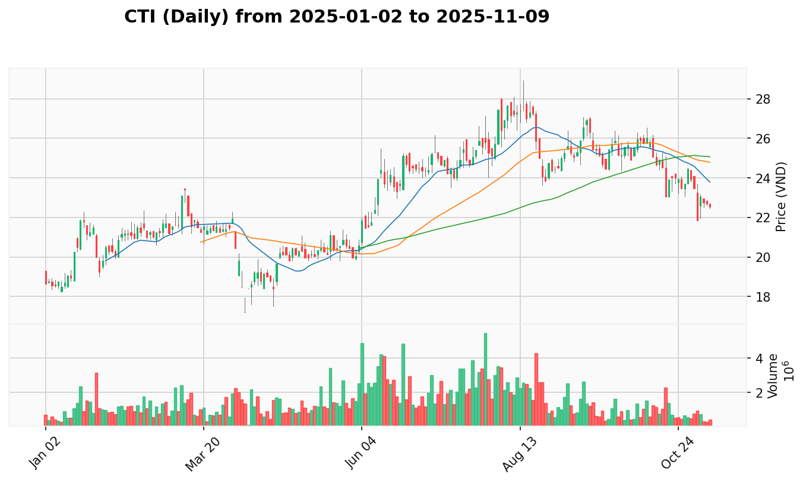

<a href="#vlxd">↑ Back to group VLXD</a>  |  <a href="#vpa-signal-summary">↑ Back to Top</a>

#### Key Statistics
| Metric | Value |
|:---|---:|
| Date Range | 2025-01-02 to 2025-11-07 |
| **Latest Close** | **22.55** |
| Period Open | 19.3 |
| Period High | 28.95 |
| Period Low | 17.2 |
| Period Change % | 16.84% |

**[Download CTI Data (.csv)](market_data/CTI_2025-01-02_to_2025-11-09.csv)**

---

### CTR

#### [VPA Analysis (2025-06-16 - 2025-10-21)](./VPA.md#ctr)
> **Ngày 2025-10-15:** CTR giảm từ 82.4 VND xuống 81.0 VND. Cây nến có biên độ rộng (từ 80.8 đến 82.5) và đóng cửa ở gần mức thấp nhất phiên. Khối lượng giao dịch đạt 0.4114 triệu cổ phiếu, tăng so với phiên trước (0.3412 triệu cổ phiếu). Sau phiên SOW ngày 2025-10-14, sự giảm giá tiếp tục với biên độ rộng và khối lượng gia tăng cho thấy áp lực bán vẫn rất mạnh và lực cung đang chiếm ưu thế. **Phân tích VPA/Wyckoff:** Sign of Weakness (SOW) - Lực cung tiếp diễn.
> **Ngày 2025-10-16:** CTR giảm nhẹ từ 81.0 VND xuống 80.9 VND. Cây nến có biên độ hẹp (từ 80.5 đến 82.0) và đóng cửa ở gần giữa phiên. Khối lượng giao dịch đạt 0.136 triệu cổ phiếu, giảm mạnh so với hai phiên SOW trước đó. Sự sụt giảm đáng kể về khối lượng cùng với biên độ nến hẹp cho thấy áp lực bán đã suy yếu và lực cung đang cạn kiệt sau chuỗi giảm giá. **Phân tích VPA/Wyckoff:** Test for Supply (Kiểm tra lực cung).
> **Ngày 2025-10-17:** CTR giảm từ 81.4 VND xuống 80.0 VND. Cây nến có biên độ rộng (từ 79.6 đến 81.4) và đóng cửa ở gần mức thấp nhất phiên. Khối lượng giao dịch đạt 0.3143 triệu cổ phiếu, tăng so với phiên trước (0.2074 triệu cổ phiếu). Sau phiên kiểm tra lực cung ngày 2025-10-16, sự giảm giá trở lại với biên độ rộng và khối lượng gia tăng cho thấy áp lực bán vẫn còn mạnh và lực cung đang chiếm ưu thế. **Phân tích VPA/Wyckoff:** Sign of Weakness (SOW) - Áp lực bán gia tăng và lực cung tiếp diễn.
> **Ngày 2025-10-20:** CTR tăng từ 80.3 VND lên 83.1 VND. Cây nến có biên độ rộng (từ 79.6 đến 85.6) và đóng cửa ở gần mức cao nhất phiên. Khối lượng giao dịch đạt 1.4049 triệu cổ phiếu, tăng mạnh so với phiên trước (0.3143 triệu cổ phiếu). Sau phiên SOW ngày 2025-10-17, sự tăng giá trở lại với biên độ rộng và khối lượng gia tăng cho thấy lực cầu mạnh mẽ đã xuất hiện và hấp thụ lực cung. **Phân tích VPA/Wyckoff:** Sign of Strength (SOS) - Lực cầu mạnh mẽ với khối lượng gia tăng xác nhận xu hướng tăng.
> **Ngày 2025-10-21:** CTR tăng từ 83.1 VND lên 86.9 VND. Cây nến có biên độ rộng (từ 84.9 đến 88.7) và đóng cửa ở gần mức cao nhất phiên. Khối lượng giao dịch đạt 0.7415 triệu cổ phiếu, giảm so với phiên trước (1.4049 triệu cổ phiếu). Sau phiên SOS mạnh mẽ ngày 2025-10-20, sự tiếp diễn đà tăng với biên độ rộng và đóng cửa cao cho thấy lực cầu vẫn chiếm ưu thế. Tuy nhiên, khối lượng giao dịch giảm cho thấy áp lực cung đã giảm bớt và thị trường đang kiểm tra lại lực cung. **Phân tích VPA/Wyckoff:** No Supply (NS) - Lực cung đã cạn kiệt, cho phép giá tăng với khối lượng thấp hơn.

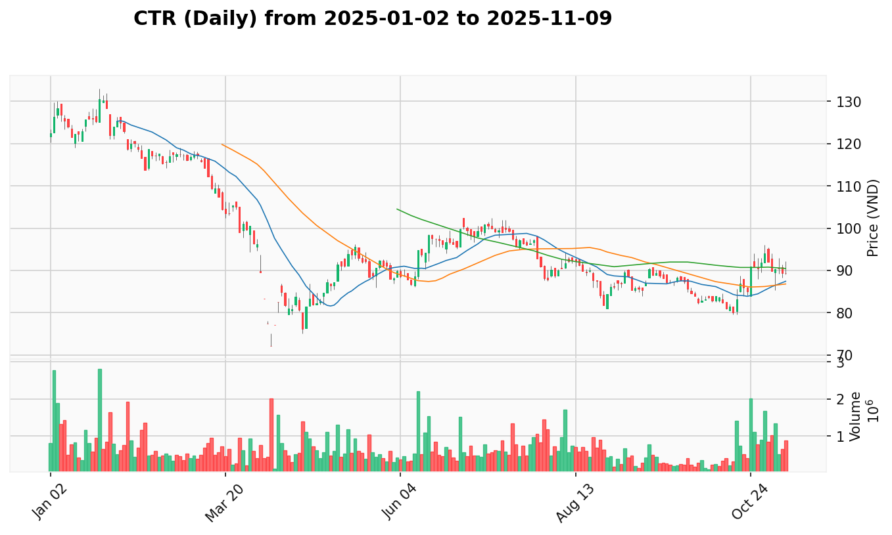

<a href="#xay-lap-dien">↑ Back to group XAY_LAP_DIEN</a>  |  <a href="#vpa-signal-summary">↑ Back to Top</a>

#### Key Statistics
| Metric | Value |
|:---|---:|
| Date Range | 2025-01-02 to 2025-11-07 |
| **Latest Close** | **89.3** |
| Period Open | 121.61 |
| Period High | 133.03 |
| Period Low | 72.13 |
| Period Change % | -26.57% |

**[Download CTR Data (.csv)](market_data/CTR_2025-01-02_to_2025-11-09.csv)**

---

### CTS

#### [VPA Analysis (2025-07-17 - 2025-10-21)](./VPA.md#cts)
> **Ngày 2025-10-15:** CTS tăng từ 43.7 VND lên 44.0 VND (+0.69%). Cây nến xanh có biên độ hẹp (từ 43.4 VND đến 44.4 VND), đóng cửa gần mức cao nhất phiên. Khối lượng giao dịch đạt 2.6453 triệu cổ phiếu, giảm đáng kể so với phiên trước (4.813 triệu cổ phiếu). Sau phiên giảm mạnh với khối lượng lớn (SOW) vào ngày 2025-10-14, phiên này giá phục hồi nhẹ với khối lượng thấp, cho thấy lực cầu yếu và sự thiếu quyết đoán của thị trường. Điều này có thể là một đợt kiểm tra cung hoặc một sự phục hồi yếu sau áp lực bán. **Phân tích VPA/Wyckoff:** Lack of Demand (LOD) - Lực cầu yếu.
> **Ngày 2025-10-16:** CTS tăng từ 44.0 VND lên 44.6 VND (+1.36%). Cây nến đỏ có biên độ hẹp (từ 44.6 VND đến 45.6 VND), đóng cửa tại mức thấp nhất phiên, cho thấy áp lực bán xuất hiện khi giá cố gắng tăng. Khối lượng giao dịch đạt 1.7126 triệu cổ phiếu, giảm đáng kể so với phiên trước (2.6453 triệu cổ phiếu) và thấp hơn nhiều so với mức trung bình. Sau phiên "Lack of Demand" (LOD) ngày 2025-10-15, phiên này tiếp tục cho thấy sự thiếu vắng lực cầu mạnh mẽ, với giá đóng cửa yếu và khối lượng thấp, xác nhận thị trường chưa sẵn sàng tăng giá. **Phân tích VPA/Wyckoff:** No Demand (ND) - Lực cầu yếu.
> **Ngày 2025-10-17:** CTS tăng từ 44.5 VND lên 44.9 VND (+0.89%). Cây nến đỏ có biên độ rộng (từ 44.5 VND đến 46.5 VND), đóng cửa dưới giá mở cửa (45.35 VND) và gần mức thấp nhất phiên. Khối lượng giao dịch đạt 3.8051 triệu cổ phiếu, tăng so với phiên trước (2.7762 triệu cổ phiếu). Sau hai phiên thiếu cầu (LOD và ND), phiên này giá cố gắng phục hồi nhưng không duy trì được đà tăng, cho thấy áp lực bán vẫn còn mạnh khi giá cố gắng đi lên. Sự tăng giá với khối lượng tăng nhưng đóng cửa yếu cho thấy sự xuất hiện của nguồn cung. **Phân tích VPA/Wyckoff:** Sign of Weakness (SOW) - Lực cung xuất hiện.
> **Ngày 2025-10-20:** CTS giảm từ 44.5 VND xuống 41.8 VND (-6.07%). Cây nến đỏ có biên độ rộng (từ 41.8 VND đến 46.7 VND), đóng cửa tại mức thấp nhất phiên, cho thấy áp lực bán mạnh mẽ. Khối lượng giao dịch đạt 5.5174 triệu cổ phiếu, tăng đáng kể so với phiên trước (3.8051 triệu cổ phiếu) và cao hơn mức trung bình. Sau các phiên thiếu cầu và xuất hiện lực cung, phiên này xác nhận lực bán áp đảo, đẩy giá xuống sâu với khối lượng lớn. **Phân tích VPA/Wyckoff:** Sign of Weakness (SOW) - Lực bán áp đảo.
> **Ngày 2025-10-21:** CTS giảm từ 41.8 VND xuống 41.35 VND (-1.08%). Cây nến đỏ có biên độ rộng (từ 40.0 VND đến 42.0 VND), đóng cửa gần mức thấp nhất phiên. Khối lượng giao dịch đạt 3.767 triệu cổ phiếu, giảm so với phiên trước (5.5174 triệu cổ phiếu). Sau phiên giảm mạnh với khối lượng lớn, giá tiếp tục giảm với khối lượng thấp hơn, cho thấy lực bán vẫn duy trì nhưng có thể đã giảm cường độ, tuy nhiên việc đóng cửa yếu vẫn xác nhận sự thiếu vắng của lực cầu. **Phân tích VPA/Wyckoff:** No Demand (ND) - Lực cầu yếu.

<a href="#chung-khoan">↑ Back to group CHUNG_KHOAN</a>  |  <a href="#vpa-signal-summary">↑ Back to Top</a>

#### Key Statistics
| Metric | Value |
|:---|---:|
| Date Range | 2025-01-02 to 2025-11-07 |
| **Latest Close** | **35.1** |
| Period Open | 24.9 |
| Period High | 46.85 |
| Period Low | 20.77 |
| Period Change % | 40.96% |

**[Download CTS Data (.csv)](market_data/CTS_2025-01-02_to_2025-11-09.csv)**

---

### D2D

#### [VPA Analysis (2025-08-04 - 2025-10-21)](./VPA.md#d2d)
> **Ngày 2025-10-15:** D2D giảm từ 36.45 VND xuống 36.4 VND với khối lượng giao dịch đạt 0.0398 triệu cổ phiếu. So với phiên trước (khối lượng 0.0307 triệu cổ phiếu), khối lượng tăng nhẹ. Giá giảm với biên độ hẹp và đóng cửa ở mức thấp nhất phiên, cho thấy lực cung vẫn đang chiếm ưu thế và đẩy giá xuống, mặc dù lực bán chưa quá mạnh. Điều này tiếp tục xác nhận sự yếu kém của thị trường sau các phiên giảm giá trước đó. **Phân tích VPA/Wyckoff:** Sign of Weakness (SOW) - Lực cung tiếp tục chiếm ưu thế.
> **Ngày 2025-10-16:** D2D giảm từ 36.6 VND xuống 36.4 VND với khối lượng giao dịch đạt 0.0212 triệu cổ phiếu. So với phiên trước (khối lượng 0.0398 triệu cổ phiếu), khối lượng giảm đáng kể. Giá giảm với biên độ hẹp và đóng cửa ở mức thấp nhất phiên, cho thấy lực cung vẫn chiếm ưu thế nhưng khối lượng thấp có thể báo hiệu sự cạn kiệt của lực bán hoặc thiếu vắng lực cầu. **Phân tích VPA/Wyckoff:** Sign of Weakness (SOW) - Lực cung tiếp tục chiếm ưu thế với khối lượng thấp.
> **Ngày 2025-10-17:** D2D giảm từ 36.35 VND xuống 36.15 VND với khối lượng giao dịch đạt 0.0565 triệu cổ phiếu. So với phiên trước (khối lượng 0.0297 triệu cổ phiếu), khối lượng tăng đáng kể. Giá giảm với biên độ hẹp và đóng cửa ở mức thấp nhất phiên, cho thấy lực cung mạnh mẽ đang chiếm ưu thế và đẩy giá xuống. Điều này tiếp tục xác nhận sự yếu kém của thị trường. **Phân tích VPA/Wyckoff:** Sign of Weakness (SOW) - Lực cung mạnh mẽ với khối lượng gia tăng.
> **Ngày 2025-10-20:** D2D giảm từ 36.15 VND xuống 33.7 VND với khối lượng giao dịch đạt 0.1011 triệu cổ phiếu. So với phiên trước (khối lượng 0.0565 triệu cổ phiếu), khối lượng tăng mạnh. Giá giảm với biên độ rộng và đóng cửa ở mức thấp nhất phiên, cho thấy lực cung áp đảo và đẩy giá xuống sâu. Điều này xác nhận xu hướng yếu kém của thị trường. **Phân tích VPA/Wyckoff:** Sign of Weakness (SOW) - Lực cung áp đảo với khối lượng gia tăng.
> **Ngày 2025-10-21:** D2D tăng từ 33.7 VND lên 34.8 VND với khối lượng giao dịch đạt 0.1161 triệu cổ phiếu. Cây nến tăng có biên độ rộng và đóng cửa gần mức cao nhất phiên, cho thấy lực cầu mạnh mẽ đang chiếm ưu thế. So với phiên trước (khối lượng 0.1011 triệu cổ phiếu), khối lượng tăng đáng kể, xác nhận sự xuất hiện của lực cầu. **Phân tích VPA/Wyckoff:** Sign of Strength (SOS) - Lực cầu mạnh mẽ với khối lượng gia tăng.

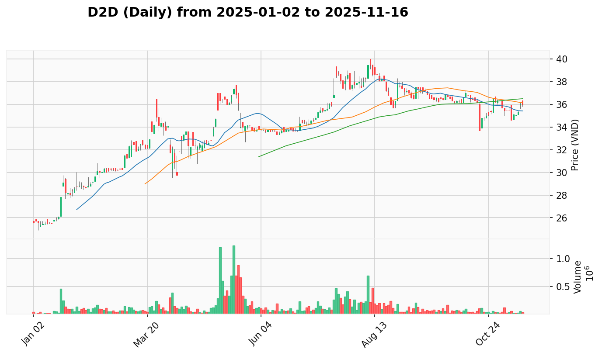

<a href="#bat-dong-san-kcn">↑ Back to group BAT_DONG_SAN_KCN</a>  |  <a href="#vpa-signal-summary">↑ Back to Top</a>

#### Key Statistics
| Metric | Value |
|:---|---:|
| Date Range | 2025-01-02 to 2025-11-07 |
| **Latest Close** | **34.6** |
| Period Open | 25.72 |
| Period High | 40.0 |
| Period Low | 24.9 |
| Period Change % | 34.53% |

**[Download D2D Data (.csv)](market_data/D2D_2025-01-02_to_2025-11-09.csv)**

---

### DAH

#### [VPA Analysis (2025-08-14 - 2025-10-21)](./VPA.md#dah)
> **Ngày 2025-10-15:** DAH tiếp tục giảm từ 3.94 VND xuống 3.92 VND với khối lượng giao dịch đạt 0.2516 triệu cổ phiếu. Khối lượng này thấp hơn so với phiên trước (0.3557 triệu cổ phiếu) nhưng vẫn duy trì ở mức trung bình. Cây nến có biên độ hẹp và giá đóng cửa gần mức thấp nhất phiên, cho thấy lực cung vẫn đang chiếm ưu thế, mặc dù áp lực bán có phần giảm nhẹ. Sau chuỗi ngày giảm giá, sự tiếp diễn của xu hướng giảm với khối lượng giảm nhẹ có thể cho thấy lực bán đang dần cạn kiệt hoặc tạm thời chững lại, nhưng chưa có dấu hiệu đảo chiều rõ ràng. **Phân tích VPA/Wyckoff:** Weakness - Giá tiếp tục giảm với khối lượng giảm nhẹ, cho thấy lực cung vẫn kiểm soát nhưng có thể đang suy yếu.
> **Ngày 2025-10-16:** DAH tiếp tục giảm từ 3.92 VND xuống 3.9 VND với khối lượng giao dịch đạt 0.0491 triệu cổ phiếu. Khối lượng này giảm mạnh so với phiên trước (0.2516 triệu cổ phiếu) và ở mức rất thấp. Cây nến có biên độ hẹp và giá đóng cửa gần mức cao nhất phiên, nhưng vẫn là một phiên giảm giá. Sự sụt giảm giá với khối lượng cực thấp sau chuỗi ngày giảm giá cho thấy lực cung đã cạn kiệt đáng kể, mặc dù chưa có dấu hiệu rõ ràng của lực cầu quay trở lại. Điều này có thể báo hiệu sự tạm dừng của xu hướng giảm hoặc một đợt hồi phục kỹ thuật. **Phân tích VPA/Wyckoff:** No Supply - Giá giảm với khối lượng cực thấp, cho thấy lực cung đã cạn kiệt.
> **Ngày 2025-10-17:** DAH tiếp tục giảm từ 3.91 VND xuống 3.90 VND với khối lượng giao dịch đạt 0.1005 triệu cổ phiếu. Khối lượng này rất thấp, thấp hơn đáng kể so với phiên trước (0.1335 triệu cổ phiếu) và là mức thấp nhất trong các phiên gần đây. Cây nến có biên độ hẹp và giá đóng cửa gần mức thấp nhất phiên, cho thấy lực cung đã cạn kiệt nhưng lực cầu vẫn chưa xuất hiện. Điều này cho thấy sự yếu kém tiếp diễn và thiếu vắng sự quan tâm từ phía người mua. **Phân tích VPA/Wyckoff:** No Demand - Giá giảm với khối lượng cực thấp và không có lực cầu.
> **Ngày 2025-10-20:** DAH giảm từ 3.9 VND xuống 3.76 VND với khối lượng giao dịch đạt 0.1825 triệu cổ phiếu. Khối lượng này tăng so với phiên trước (0.1005 triệu cổ phiếu) và cao hơn đáng kể so với các phiên "No Supply" và "No Demand" gần đây. Cây nến có biên độ rộng và giá đóng cửa ở mức thấp nhất phiên, cho thấy áp lực bán gia tăng và sự yếu kém tiếp diễn. Điều này xác nhận sự trở lại của lực cung sau giai đoạn cạn kiệt. **Phân tích VPA/Wyckoff:** Sign of Weakness (SOW) - Giá giảm mạnh với khối lượng tăng, cho thấy lực cung đã quay trở lại.
> **Ngày 2025-10-21:** DAH tiếp tục giảm từ 3.76 VND xuống 3.73 VND với khối lượng giao dịch đạt 0.9501 triệu cổ phiếu. Khối lượng này tăng đột biến so với phiên trước (0.1825 triệu cổ phiếu) và là mức rất cao trong các phiên gần đây. Cây nến có biên độ hẹp hơn nhưng giá đóng cửa vẫn ở gần mức thấp nhất phiên, cho thấy áp lực bán vẫn rất mạnh và lực cầu chưa đủ để hấp thụ hoàn toàn. Điều này xác nhận sự yếu kém tiếp diễn và sự gia tăng của lực cung. **Phân tích VPA/Wyckoff:** Sign of Weakness (SOW) - Giá tiếp tục giảm với khối lượng cực lớn, cho thấy lực cung mạnh mẽ.

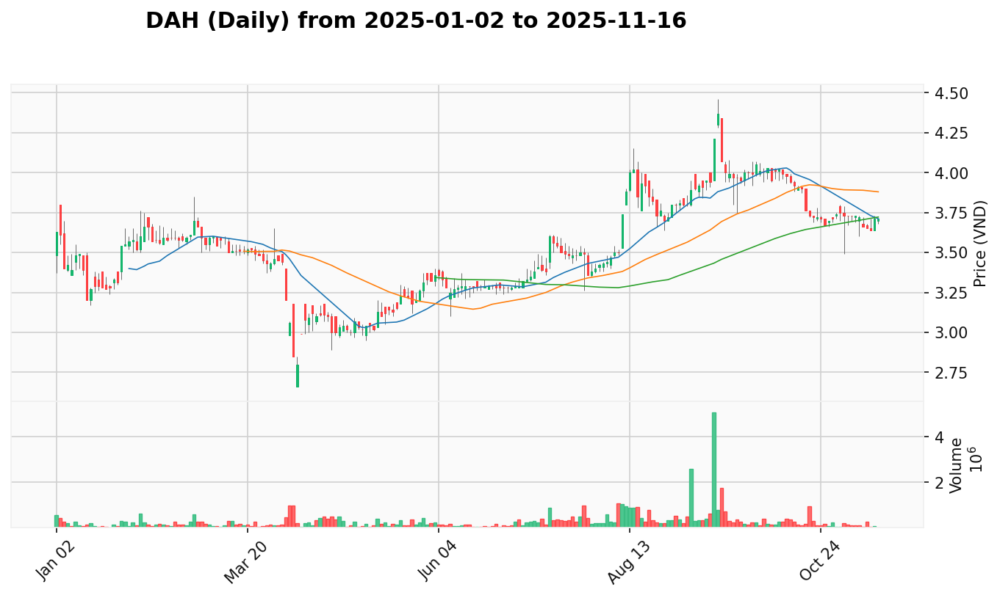

<a href="#penny">↑ Back to group PENNY</a>  |  <a href="#vpa-signal-summary">↑ Back to Top</a>

#### Key Statistics
| Metric | Value |
|:---|---:|
| Date Range | 2025-01-02 to 2025-11-07 |
| **Latest Close** | **3.72** |
| Period Open | 3.48 |
| Period High | 4.46 |
| Period Low | 2.66 |
| Period Change % | 6.90% |

**[Download DAH Data (.csv)](market_data/DAH_2025-01-02_to_2025-11-09.csv)**

---

### DBC

#### [VPA Analysis (2025-06-16 - 2025-10-21)](./VPA.md#dbc)
> **Ngày 2025-10-15:** DBC giảm từ 27.2 VND xuống 27.0 VND. Cây nến có biên độ hẹp, mở cửa ở 27.25 VND và đóng cửa ở mức thấp nhất phiên (27.0 VND), cho thấy áp lực bán tiếp tục duy trì. Khối lượng giao dịch đạt 4.1753 triệu cổ phiếu, giảm so với phiên trước (6.6127 triệu cổ phiếu). Sau phiên "Supply Coming In" ngày 2025-10-14, phiên này cho thấy nguồn cung đã giảm nhưng lực cầu vẫn yếu, không đủ để hấp thụ áp lực bán, dẫn đến giá tiếp tục giảm với khối lượng thấp. **Phân tích VPA/Wyckoff:** No Demand (Không có cầu)
> **Ngày 2025-10-16:** DBC giảm từ 27.05 VND xuống 27.0 VND. Cây nến có biên độ trung bình, mở cửa ở 27.05 VND và đóng cửa gần mức thấp nhất phiên (27.0 VND), cho thấy áp lực bán vẫn còn. Khối lượng giao dịch đạt 2.3145 triệu cổ phiếu, thấp hơn đáng kể so với phiên trước (4.1753 triệu cổ phiếu). Sau hai phiên "Supply Coming In" và "No Demand", phiên này cho thấy nguồn cung đã cạn kiệt đáng kể nhưng lực cầu vẫn chưa xuất hiện mạnh mẽ để đẩy giá lên. **Phân tích VPA/Wyckoff:** Test for Supply (Kiểm tra nguồn cung)
> **Ngày 2025-10-17:** DBC tiếp tục giảm từ 27.1 VND xuống 26.9 VND. Cây nến có biên độ hẹp, mở cửa ở 27.1 VND và đóng cửa ở mức thấp nhất phiên (26.9 VND), cho thấy áp lực bán vẫn duy trì. Khối lượng giao dịch đạt 4.0732 triệu cổ phiếu, tăng nhẹ so với phiên trước (4.0348 triệu cổ phiếu) nhưng vẫn ở mức thấp. Sau các phiên "No Demand" và "Test for Supply", phiên này xác nhận sự yếu kém tiếp diễn của lực cầu và áp lực cung vẫn còn, đẩy giá xuống mức thấp mới trong xu hướng giảm gần đây. **Phân tích VPA/Wyckoff:** Weakness (Yếu kém)
> **Ngày 2025-10-20:** DBC giảm mạnh từ 26.9 VND xuống 25.05 VND. Cây nến có biên độ rộng, mở cửa ở 26.9 VND và đóng cửa ở mức thấp nhất phiên (25.05 VND), cho thấy áp lực bán rất mạnh và quyết liệt. Khối lượng giao dịch đạt 7.9656 triệu cổ phiếu, tăng gần gấp đôi so với phiên trước (4.0732 triệu cổ phiếu). Sau các phiên kiểm tra nguồn cung và yếu kém, phiên này xác nhận nguồn cung áp đảo hoàn toàn lực cầu, đẩy giá xuống sâu với khối lượng lớn, cho thấy sự tiếp diễn của xu hướng giảm. **Phân tích VPA/Wyckoff:** Supply Coming In (Nguồn cung xuất hiện)
> **Ngày 2025-10-21:** DBC tăng từ 25.05 VND lên 25.7 VND. Cây nến có biên độ rộng, mở cửa ở 25.1 VND và đóng cửa gần mức cao nhất phiên (25.7 VND), cho thấy lực cầu đã xuất hiện. Khối lượng giao dịch đạt 6.7 triệu cổ phiếu, thấp hơn so với phiên giảm mạnh trước đó (7.9656 triệu cổ phiếu). Sau phiên nguồn cung áp đảo, phiên này cho thấy sự hồi phục của giá với biên độ khá nhưng khối lượng chưa thực sự mạnh mẽ, cho thấy thị trường đang kiểm tra lại nguồn cung sau đợt bán tháo. **Phân tích VPA/Wyckoff:** Test for Supply (Kiểm tra nguồn cung)

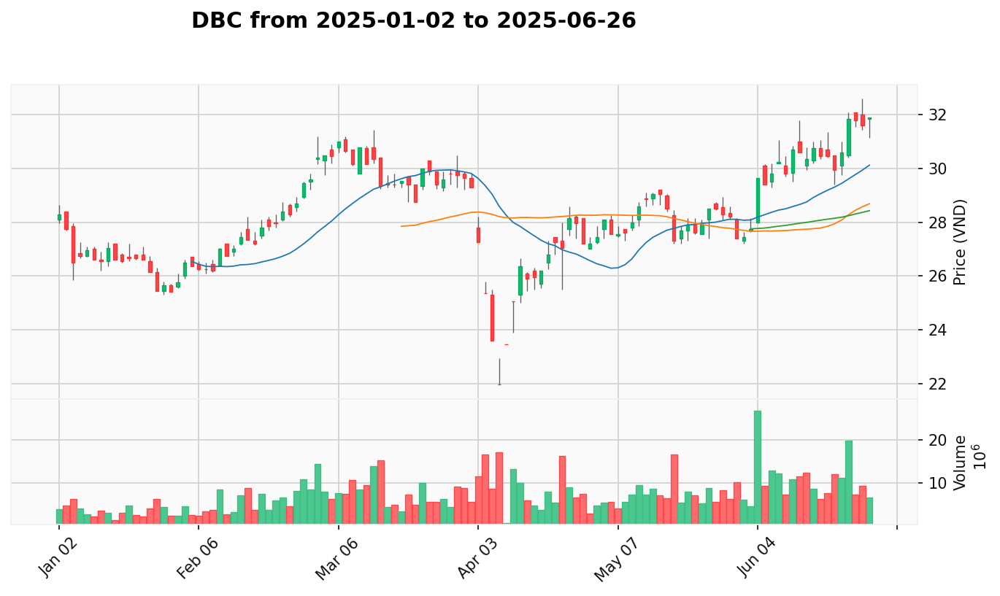

<a href="#nong-nghiep">↑ Back to group NONG_NGHIEP</a>  |  <a href="#vpa-signal-summary">↑ Back to Top</a>

#### Key Statistics
| Metric | Value |
|:---|---:|
| Date Range | 2025-01-02 to 2025-11-07 |
| **Latest Close** | **25.1** |
| Period Open | 24.44 |
| Period High | 32.35 |
| Period Low | 19.09 |
| Period Change % | 2.70% |

**[Download DBC Data (.csv)](market_data/DBC_2025-01-02_to_2025-11-09.csv)**

---

### DCL

#### [VPA Analysis (2025-08-14 - 2025-10-21)](./VPA.md#dcl)
> **Ngày 2025-10-15:** DCL mở cửa tại 30.2, đạt mức cao nhất 30.5 và thấp nhất 29.2, đóng cửa tại 29.8. Giá đóng cửa không đổi so với phiên trước (29.8 VND) với biên độ nến hẹp và đóng cửa ở nửa dưới. Khối lượng giao dịch đạt 0.769 triệu cổ phiếu, giảm đáng kể so với phiên trước (1.4856 triệu cổ phiếu). Sau phiên "Nỗ lực không kết quả" với khối lượng lớn, phiên này cho thấy giá đi ngang với khối lượng thấp, thể hiện sự thiếu vắng lực cầu và không có sự xác nhận cho bất kỳ xu hướng tăng nào. **Phân tích VPA/Wyckoff:** No Demand (Không có cầu)
> **Ngày 2025-10-16:** DCL mở cửa tại 30.0, đạt mức cao nhất 30.0 và thấp nhất 29.3, đóng cửa tại 29.8. Giá đóng cửa không đổi so với phiên trước (29.8 VND) với biên độ nến hẹp và đóng cửa ở nửa trên. Khối lượng giao dịch đạt 0.4754 triệu cổ phiếu, giảm đáng kể so với phiên trước (0.769 triệu cổ phiếu) và là mức thấp nhất trong 10 phiên gần đây. Sau hai phiên "Nỗ lực không kết quả" và "Không có cầu", phiên này tiếp tục cho thấy sự thiếu vắng lực cầu và không có sự xác nhận cho bất kỳ xu hướng tăng nào, với khối lượng giao dịch cực kỳ thấp cho thấy sự thờ ơ của thị trường. **Phân tích VPA/Wyckoff:** No Demand (Không có cầu)
> **Ngày 2025-10-17:** DCL mở cửa tại 29.9, đạt mức cao nhất 30.0 và thấp nhất 29.2, đóng cửa tại 29.5. Giá đóng cửa giảm nhẹ so với phiên trước (29.6 VND) với biên độ nến hẹp và đóng cửa ở nửa dưới. Khối lượng giao dịch đạt 0.6673 triệu cổ phiếu, giảm so với phiên trước (0.8198 triệu cổ phiếu). Sau các phiên "No Demand" trước đó, phiên này tiếp tục cho thấy sự thiếu vắng lực cầu và áp lực bán nhẹ, với khối lượng giảm cho thấy sự thờ ơ của thị trường. **Phân tích VPA/Wyckoff:** No Demand (Không có cầu)
> **Ngày 2025-10-20:** DCL mở cửa tại 29.4, đạt mức cao nhất 29.5 và thấp nhất 27.45, đóng cửa tại 27.45. Giá đóng cửa giảm mạnh từ 29.5 VND xuống 27.45 VND với biên độ nến rộng và đóng cửa ở mức thấp nhất phiên. Khối lượng giao dịch đạt 0.7804 triệu cổ phiếu, tăng so với phiên trước (0.6673 triệu cổ phiếu). Sau các phiên "No Demand" trước đó, phiên này cho thấy áp lực bán mạnh mẽ với giá giảm sâu và khối lượng gia tăng, xác nhận sự yếu kém của thị trường. **Phân tích VPA/Wyckoff:** Sign of Weakness (SOW) - Dấu hiệu yếu kém.
> **Ngày 2025-10-21:** DCL mở cửa tại 26.0, đạt mức cao nhất 29.35 và thấp nhất 26.0, đóng cửa tại 29.0. Giá đóng cửa tăng mạnh từ 27.45 VND lên 29.0 VND so với phiên trước, với biên độ nến rộng và đóng cửa ở nửa trên. Khối lượng giao dịch đạt 1.6712 triệu cổ phiếu, tăng đáng kể so với phiên trước (0.7804 triệu cổ phiếu). Sau phiên "Sign of Weakness" trước đó, phiên này cho thấy lực cầu mạnh mẽ đã xuất hiện, đẩy giá tăng trở lại với khối lượng gia tăng, cho thấy sự hấp thụ lực bán và khả năng đảo chiều. **Phân tích VPA/Wyckoff:** Buying (Lực mua)

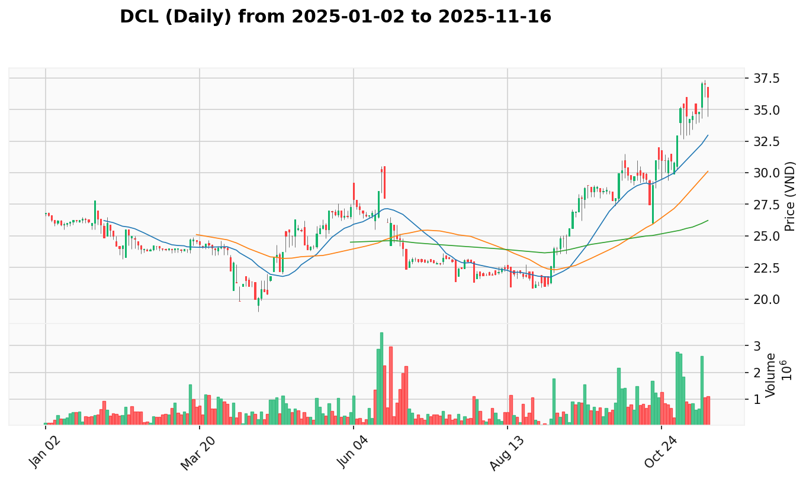

<a href="#suc-khoe">↑ Back to group SUC_KHOE</a>  |  <a href="#vpa-signal-summary">↑ Back to Top</a>

#### Key Statistics
| Metric | Value |
|:---|---:|
| Date Range | 2025-01-02 to 2025-11-07 |
| **Latest Close** | **34.5** |
| Period Open | 26.75 |
| Period High | 36.0 |
| Period Low | 19.0 |
| Period Change % | 28.97% |

**[Download DCL Data (.csv)](market_data/DCL_2025-01-02_to_2025-11-09.csv)**

---

### DCM

#### [VPA Analysis (2025-06-16 - 2025-10-21)](./VPA.md#dcm)
> **Ngày 2025-10-15:** DCM giảm từ 34.9 VND xuống 34.0 VND (-2.58%). Cây nến giảm có biên độ rộng (spread 1.65 VND), đóng cửa gần mức thấp nhất của cây nến. Khối lượng giao dịch đạt 5.3701 triệu cổ phiếu, duy trì ở mức cao. Sau các phiên suy yếu (Weakness) liên tiếp, phiên hôm nay DCM tiếp tục giảm mạnh với khối lượng cao, cho thấy áp lực bán vẫn rất lớn và lực cung tiếp tục chiếm ưu thế trên thị trường, xác nhận xu hướng giảm giá tiếp tục. **Phân tích VPA/Wyckoff:** Weakness (Yếu tố suy yếu)
> **Ngày 2025-10-16:** DCM tăng nhẹ từ 34.0 VND lên 34.3 VND. Cây nến tăng có biên độ hẹp (spread 0.4 VND), đóng cửa gần mức cao nhất của cây nến. Khối lượng giao dịch đạt 1.2846 triệu cổ phiếu, giảm mạnh so với phiên trước (5.3701 triệu cổ phiếu) và là mức thấp nhất trong 10 phiên gần đây. Sau hai phiên suy yếu (Weakness) liên tiếp với khối lượng bán lớn, phiên hôm nay cho thấy áp lực bán đã giảm đáng kể, nhưng lực cầu cũng chưa thực sự mạnh mẽ. Đây có thể là một phiên kiểm tra cung (Test for Supply) ở vùng giá thấp, cho thấy thị trường đang tạm dừng để đánh giá lại. **Phân tích VPA/Wyckoff:** Test for Supply (Kiểm tra cung)
> **Ngày 2025-10-17:** DCM giảm từ 34.6 VND xuống 33.8 VND (-2.31%). Cây nến giảm có biên độ rộng (spread 1.1 VND), đóng cửa tại mức thấp nhất của cây nến. Khối lượng giao dịch đạt 3.3211 triệu cổ phiếu, tăng so với phiên trước. Sau phiên kiểm tra cung (Test for Supply) ngày hôm qua, DCM tiếp tục giảm mạnh với khối lượng tăng, cho thấy áp lực bán vẫn còn rất lớn và lực cung tiếp tục chiếm ưu thế, xác nhận xu hướng giảm giá. **Phân tích VPA/Wyckoff:** Weakness (Yếu tố suy yếu)
> **Ngày 2025-10-20:** DCM giảm mạnh từ 33.8 VND xuống 32.0 VND (-5.32%). Cây nến giảm có biên độ rất rộng (spread 2.55 VND), đóng cửa tại mức thấp nhất của cây nến. Khối lượng giao dịch đạt 4.9257 triệu cổ phiếu, tăng so với phiên trước (3.3211 triệu cổ phiếu). Sau phiên suy yếu ngày 2025-10-17, phiên hôm nay tiếp tục cho thấy áp lực bán rất mạnh mẽ, với cung áp đảo cầu, xác nhận xu hướng giảm giá tiếp diễn. **Phân tích VPA/Wyckoff:** Weakness (Yếu tố suy yếu)
> **Ngày 2025-10-21:** DCM tăng từ 32.0 VND lên 33.8 VND (+5.625%). Cây nến tăng có biên độ rộng (spread 1.4 VND), đóng cửa tại mức cao nhất của cây nến. Khối lượng giao dịch đạt 4.6797 triệu cổ phiếu, giảm nhẹ so với phiên trước nhưng vẫn ở mức cao. Sau hai phiên giảm mạnh liên tiếp với áp lực bán lớn, phiên hôm nay cho thấy lực cầu đã quay trở lại và hấp thụ tốt lực cung, đẩy giá tăng mạnh và đóng cửa ở mức cao nhất, cho thấy dấu hiệu phục hồi. **Phân tích VPA/Wyckoff:** Sign of Strength (SOS)

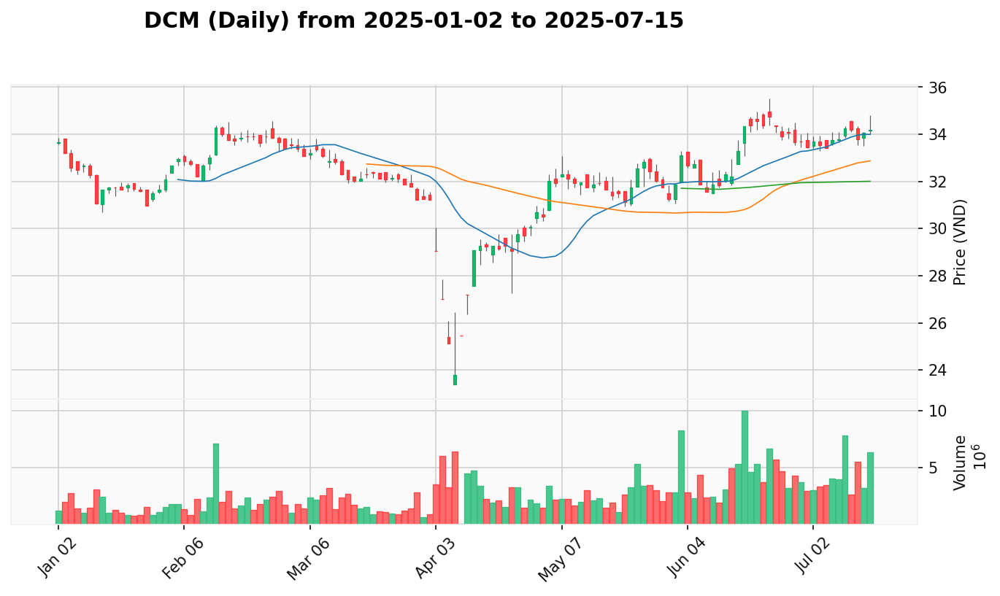

<a href="#hoa-chat">↑ Back to group HOA_CHAT</a>  |  <a href="#vpa-signal-summary">↑ Back to Top</a>

#### Key Statistics
| Metric | Value |
|:---|---:|
| Date Range | 2025-01-02 to 2025-11-07 |
| **Latest Close** | **34.2** |
| Period Open | 33.62 |
| Period High | 43.85 |
| Period Low | 23.38 |
| Period Change % | 1.73% |

**[Download DCM Data (.csv)](market_data/DCM_2025-01-02_to_2025-11-09.csv)**

---

### DDV

#### [VPA Analysis (2025-08-04 - 2025-10-21)](./VPA.md#ddv)
> **Ngày 2025-10-15:** DDV giảm từ 32.7 VND xuống 32.3 VND với khối lượng giao dịch đạt 0.913 triệu cổ phiếu, cao hơn một chút so với phiên trước. Cây nến giảm có biên độ vừa phải và đóng cửa gần mức thấp nhất phiên. Điều này cho thấy áp lực bán vẫn còn tồn tại và lực cầu chưa đủ mạnh để hấp thụ hết nguồn cung, tiếp tục xu hướng suy yếu sau phiên No Demand. **Phân tích VPA/Wyckoff:** Weakness (Sự suy yếu) - Giá tiếp tục giảm với khối lượng tăng nhẹ, cho thấy nguồn cung vẫn đang chiếm ưu thế và lực cầu yếu.
> **Ngày 2025-10-16:** DDV tăng từ 32.3 VND lên 33.1 VND với khối lượng giao dịch đạt 0.9931 triệu cổ phiếu, cao hơn phiên trước. Cây nến tăng có biên độ rộng và đóng cửa gần mức cao nhất phiên. Sau hai phiên giảm giá với lực cầu yếu, phiên này cho thấy sự quay trở lại của lực cầu, hấp thụ nguồn cung và đẩy giá lên. Khối lượng tăng nhẹ xác nhận sự xuất hiện của lực mua. **Phân tích VPA/Wyckoff:** Sign of Strength (SOS) - Lực cầu xuất hiện và đẩy giá lên với khối lượng tăng, cho thấy sự thay đổi trong cán cân cung cầu.
> **Ngày 2025-10-17:** DDV tăng từ 33.4 VND lên 35.0 VND với khối lượng giao dịch đạt 3.8476 triệu cổ phiếu, cao hơn đáng kể so với phiên trước. Cây nến tăng có biên độ rộng và đóng cửa gần mức cao nhất phiên. Điều này cho thấy lực cầu mạnh mẽ tiếp tục chiếm ưu thế, hấp thụ toàn bộ nguồn cung và đẩy giá lên cao. Khối lượng giao dịch tăng vọt xác nhận sự tham gia tích cực của dòng tiền lớn, tiếp nối đà tăng từ phiên trước. **Phân tích VPA/Wyckoff:** Sign of Strength (SOS) - Lực cầu mạnh mẽ với khối lượng gia tăng, xác nhận xu hướng tăng và tiếp tục giai đoạn tích lũy hoặc đẩy giá lên.
> **Ngày 2025-10-20:** DDV giảm từ 35.0 VND xuống 34.6 VND với khối lượng giao dịch đạt 2.6481 triệu cổ phiếu, thấp hơn phiên trước. Cây nến có biên độ rộng và đóng cửa ở nửa dưới, cho thấy áp lực bán xuất hiện sau hai phiên tăng giá mạnh. Tuy nhiên, khối lượng giảm cho thấy lực cung chưa thực sự mạnh mẽ, đây có thể là một nhịp điều chỉnh tự nhiên. **Phân tích VPA/Wyckoff:** Reaction - Nhịp điều chỉnh tự nhiên sau đà tăng, với áp lực bán xuất hiện nhưng khối lượng giảm cho thấy lực cung chưa mạnh.
> **Ngày 2025-10-21:** DDV giảm từ 34.6 VND xuống 33.9 VND với khối lượng giao dịch đạt 1.775 triệu cổ phiếu, thấp hơn đáng kể so với phiên trước. Cây nến giảm có biên độ rộng và đóng cửa ở nửa dưới, cho thấy áp lực bán tiếp diễn nhưng với cường độ giảm. Khối lượng giao dịch giảm cho thấy lực cung đang yếu dần, xác nhận đây là một nhịp điều chỉnh tự nhiên sau đà tăng mạnh trước đó. **Phân tích VPA/Wyckoff:** Test - Lực cung yếu dần với khối lượng giảm trong nhịp điều chỉnh, cho thấy khả năng kết thúc giai đoạn điều chỉnh và chuẩn bị cho đợt tăng giá tiếp theo.

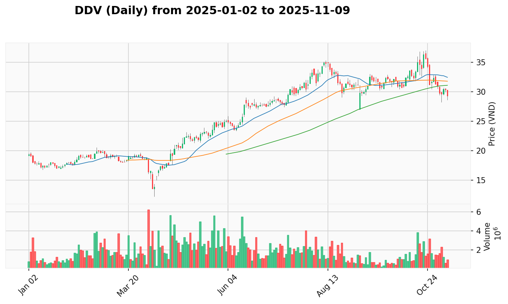

<a href="#hoa-chat">↑ Back to group HOA_CHAT</a>  |  <a href="#vpa-signal-summary">↑ Back to Top</a>

#### Key Statistics
| Metric | Value |
|:---|---:|
| Date Range | 2025-01-02 to 2025-11-07 |
| **Latest Close** | **29.3** |
| Period Open | 19.17 |
| Period High | 37.0 |
| Period Low | 12.2 |
| Period Change % | 52.84% |

**[Download DDV Data (.csv)](market_data/DDV_2025-01-02_to_2025-11-09.csv)**

---

### DGC

#### [VPA Analysis (2025-06-16 - 2025-10-21)](./VPA.md#dgc)
> **Ngày 2025-10-15:** DGC giảm từ 96.2 VND xuống 95.0 VND. Cây nến giảm có biên độ rộng, mở cửa ở 97.0 VND, dao động trong khoảng 94.6-97.1 VND và đóng cửa ở 95.0 VND, gần mức thấp nhất phiên. Khối lượng giao dịch đạt 1.1848 triệu cổ phiếu, giảm đáng kể so với phiên trước (2.276 triệu cổ phiếu). Sau phiên "nỗ lực không mang lại kết quả tương xứng" ngày 2025-10-14 cho thấy lực cung xuất hiện, phiên này giá giảm mạnh với khối lượng thấp hơn, cho thấy lực cầu đã suy yếu và lực cung đang chiếm ưu thế, đẩy giá xuống. Việc giá đóng cửa ở mức thấp nhất phiên xác nhận sự suy yếu. **Phân tích VPA/Wyckoff:** Dấu hiệu suy yếu (Sign of Weakness - SOW)
> **Ngày 2025-10-16:** DGC giảm nhẹ từ 95.0 VND xuống 94.9 VND. Cây nến có biên độ hẹp, mở cửa ở 95.0 VND, dao động trong khoảng 94.6-95.2 VND và đóng cửa ở 94.9 VND, gần giữa thân nến. Khối lượng giao dịch đạt 0.4144 triệu cổ phiếu, giảm mạnh so với phiên trước (1.1848 triệu cổ phiếu) và thấp hơn đáng kể so với mức trung bình. Sau phiên giảm mạnh với dấu hiệu suy yếu ngày 2025-10-15, phiên này cho thấy lực bán đã cạn kiệt, không còn áp lực đẩy giá xuống mạnh mẽ. Tuy nhiên, lực cầu cũng chưa xuất hiện rõ rệt để đẩy giá lên. **Phân tích VPA/Wyckoff:** Cung cạn kiệt (Exhaustion of Supply)
> **Ngày 2025-10-17:** DGC giảm từ 95.0 VND xuống 93.2 VND. Cây nến giảm có biên độ rộng, mở cửa ở 95.5 VND, dao động trong khoảng 93.2-95.5 VND và đóng cửa ở 93.2 VND, tại mức thấp nhất phiên. Khối lượng giao dịch đạt 1.0383 triệu cổ phiếu, tăng so với phiên trước (0.4144 triệu cổ phiếu) nhưng vẫn ở mức thấp so với trung bình. Sau phiên cung cạn kiệt ngày 2025-10-16, phiên này giá giảm mạnh với khối lượng tăng nhẹ, cho thấy lực cung đã quay trở lại và chiếm ưu thế, đẩy giá xuống. Việc giá đóng cửa ở mức thấp nhất phiên xác nhận áp lực bán mạnh mẽ. **Phân tích VPA/Wyckoff:** Dấu hiệu suy yếu (Sign of Weakness - SOW)
> **Ngày 2025-10-20:** DGC giảm mạnh từ 93.2 VND xuống 87.0 VND. Cây nến giảm có biên độ rất rộng, mở cửa ở 92.6 VND, dao động trong khoảng 87.0-94.3 VND và đóng cửa ở 87.0 VND, tại mức thấp nhất phiên. Khối lượng giao dịch đạt 2.0406 triệu cổ phiếu, tăng đáng kể so với phiên trước (1.0383 triệu cổ phiếu) và cao hơn mức trung bình. Sau dấu hiệu suy yếu ngày 2025-10-17, phiên này xác nhận áp lực bán mạnh mẽ tiếp tục chiếm ưu thế, đẩy giá xuống sâu hơn với khối lượng gia tăng. **Phân tích VPA/Wyckoff:** Dấu hiệu suy yếu (Sign of Weakness - SOW)
> **Ngày 2025-10-21:** DGC tăng từ 87.0 VND lên 89.2 VND. Cây nến tăng có biên độ rộng, mở cửa ở 89.0 VND, dao động trong khoảng 87.9-91.1 VND và đóng cửa ở 89.2 VND, nằm ở nửa trên của thân nến. Khối lượng giao dịch đạt 2.2722 triệu cổ phiếu, tăng so với phiên trước (2.0406 triệu cổ phiếu) và cao hơn mức trung bình. Sau hai phiên giảm mạnh với dấu hiệu suy yếu (SOW) và khả năng là một phiên bán tháo (selling climax) vào ngày 2025-10-20, phiên này giá có sự phục hồi với khối lượng gia tăng. Điều này cho thấy lực cầu đã tham gia, hấp thụ một phần lực cung và đẩy giá lên, tạo ra một nhịp phục hồi tự động. Tuy nhiên, cần quan sát thêm để xác nhận sức mạnh của lực cầu và khả năng đảo chiều xu hướng. **Phân tích VPA/Wyckoff:** Phục hồi tự động (Automatic Rally - AR)

<a href="#hoa-chat">↑ Back to group HOA_CHAT</a>  |  <a href="#vpa-signal-summary">↑ Back to Top</a>

#### Key Statistics
| Metric | Value |
|:---|---:|
| Date Range | 2025-01-02 to 2025-11-07 |
| **Latest Close** | **93.1** |
| Period Open | 116.6 |
| Period High | 117.3 |
| Period Low | 73.1 |
| Period Change % | -20.15% |

**[Download DGC Data (.csv)](market_data/DGC_2025-01-02_to_2025-11-09.csv)**

---

### DGW

#### [VPA Analysis (2025-06-26 - 2025-10-21)](./VPA.md#dgw)
> **Ngày 2025-10-15:** DGW tăng từ 40.0 lên 40.9 với khối lượng giao dịch đạt 1.8721 triệu cổ phiếu, thấp hơn đáng kể so với phiên trước (5.1519 triệu cổ phiếu). Cây nến tăng giá có biên độ khá rộng, mở cửa tại 40.0, đạt đỉnh 41.0, chạm đáy 39.5 và đóng cửa gần mức cao nhất phiên tại 40.9. Mặc dù giá tăng, khối lượng thấp cho thấy lực cầu yếu ớt và không xác nhận sự đảo chiều sau các phiên "Dấu hiệu yếu ớt" trước đó. **Phân tích VPA/Wyckoff:** Thiếu cầu (No Demand)
> **Ngày 2025-10-16:** DGW tăng từ 40.9 lên 41.3 với khối lượng giao dịch đạt 0.7921 triệu cổ phiếu, thấp hơn đáng kể so với phiên trước (1.8721 triệu cổ phiếu). Cây nến tăng giá có biên độ khá rộng, mở cửa tại 41.15, đạt đỉnh 41.9, chạm đáy 40.9 và đóng cửa tại 41.3. Mặc dù giá tăng, khối lượng cực thấp cho thấy lực cầu rất yếu ớt và không xác nhận sự đảo chiều sau các phiên "Dấu hiệu yếu ớt" và "Thiếu cầu" trước đó. Điều này tiếp tục củng cố nhận định về sự yếu ớt của thị trường. **Phân tích VPA/Wyckoff:** Thiếu cầu (No Demand)
> **Ngày 2025-10-17:** DGW giảm từ 40.8 xuống 40.2 với khối lượng giao dịch đạt 1.3247 triệu cổ phiếu, thấp hơn so với phiên trước (1.3543 triệu cổ phiếu). Cây nến giảm giá có biên độ hẹp, mở cửa tại 41.1, đạt đỉnh 41.1, chạm đáy 40.2 và đóng cửa tại mức thấp nhất phiên là 40.2. Mức giảm giá nhẹ với khối lượng thấp cho thấy lực cầu tiếp tục yếu ớt và không có sự hỗ trợ đáng kể, củng cố thêm tín hiệu "Thiếu cầu" từ các phiên trước. **Phân tích VPA/Wyckoff:** Thiếu cầu (No Demand)
> **Ngày 2025-10-20:** DGW giảm từ 40.2 xuống 37.4 với khối lượng giao dịch đạt 2.2847 triệu cổ phiếu, cao hơn đáng kể so với phiên trước (1.3247 triệu cổ phiếu). Cây nến giảm giá có biên độ rộng, mở cửa tại 40.3, đạt đỉnh 40.7, chạm đáy 37.4 và đóng cửa tại mức thấp nhất phiên là 37.4. Sự giảm giá mạnh với khối lượng gia tăng cho thấy áp lực bán rất lớn và nguồn cung đang tràn vào thị trường, xác nhận sự yếu ớt đã được cảnh báo từ các phiên trước. **Phân tích VPA/Wyckoff:** Sign of Weakness (SOW) - Nguồn cung tràn vào.
> **Ngày 2025-10-21:** DGW tăng từ 37.4 lên 37.55 với khối lượng giao dịch đạt 1.5293 triệu cổ phiếu, thấp hơn đáng kể so với phiên trước (2.2847 triệu cổ phiếu). Cây nến tăng giá có biên độ hẹp, mở cửa tại 37.0, đạt đỉnh 38.0, chạm đáy 36.5 và đóng cửa tại 37.55. Sau phiên giảm mạnh với khối lượng lớn (SOW) vào ngày 2025-10-20, việc giá tăng nhẹ với khối lượng thấp cho thấy lực cầu vẫn còn yếu ớt và chưa đủ mạnh để hấp thụ nguồn cung đã xuất hiện. Điều này củng cố thêm tín hiệu về sự yếu kém của thị trường. **Phân tích VPA/Wyckoff:** Thiếu cầu (No Demand)

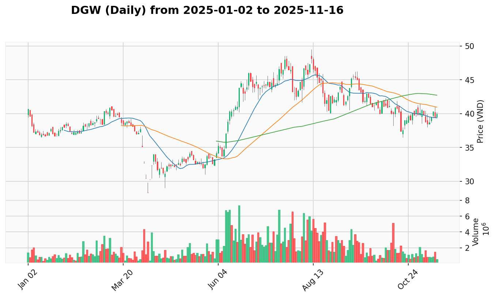

<a href="#ban-le">↑ Back to group BAN_LE</a>  |  <a href="#vpa-signal-summary">↑ Back to Top</a>

#### Key Statistics
| Metric | Value |
|:---|---:|
| Date Range | 2025-01-02 to 2025-11-07 |
| **Latest Close** | **38.5** |
| Period Open | 39.84 |
| Period High | 49.5 |
| Period Low | 28.32 |
| Period Change % | -3.36% |

**[Download DGW Data (.csv)](market_data/DGW_2025-01-02_to_2025-11-09.csv)**

---

### DHA

#### [VPA Analysis (2025-08-13 - 2025-10-21)](./VPA.md#dha)
> **Ngày 2025-10-15:** DHA tăng nhẹ từ 49.95 VND lên 50.0 VND. Biên độ giao dịch tương đối rộng, nhưng giá mở cửa và đạt mức cao nhất phiên ở 50.7 VND sau đó giảm xuống và đóng cửa ở giữa thân nến. Khối lượng giao dịch đạt 0.0353 triệu cổ phiếu, giảm đáng kể so với phiên trước (0.064 triệu cổ phiếu). Sự tăng giá không giữ được mức cao nhất phiên cùng với khối lượng thấp cho thấy lực cầu yếu và thiếu sự xác nhận, tiếp nối tình trạng thiếu cầu từ các phiên trước. **Phân tích VPA/Wyckoff:** Thiếu Cầu (No Demand)
> **Ngày 2025-10-16:** DHA tăng từ 50.0 VND lên 50.3 VND. Biên độ giao dịch trung bình và giá đóng cửa ở nửa trên của phiên. Khối lượng giao dịch đạt 0.0235 triệu cổ phiếu, giảm đáng kể so với phiên trước (0.0353 triệu cổ phiếu). Mặc dù giá tăng, nhưng khối lượng thấp cho thấy sự thiếu hụt lực cầu mạnh mẽ để đẩy giá lên cao hơn một cách bền vững, tiếp nối tín hiệu "Thiếu Cầu" từ phiên trước. **Phân tích VPA/Wyckoff:** Thiếu Cầu (No Demand)
> **Ngày 2025-10-17:** DHA mở cửa ở 50.9 VND và đạt mức cao nhất 51.2 VND, nhưng sau đó giảm xuống và đóng cửa ở 50.2 VND, bằng với giá đóng cửa phiên trước. Biên độ giao dịch rộng với khối lượng đạt 0.0583 triệu cổ phiếu, tăng đáng kể so với các phiên trước. Mặc dù có lực mua ban đầu, áp lực bán đã xuất hiện mạnh mẽ, đẩy giá xuống và hấp thụ toàn bộ lực cầu, cho thấy nguồn cung đang gia tăng sau các phiên thiếu cầu trước đó. **Phân tích VPA/Wyckoff:** Nguồn Cung Gia Tăng (Supply Coming In)
> **Ngày 2025-10-20:** DHA tăng từ 50.2 VND lên 50.7 VND. Biên độ giao dịch rộng và giá đóng cửa ở nửa trên của phiên. Khối lượng giao dịch đạt 0.3867 triệu cổ phiếu, tăng đột biến so với phiên trước (0.0583 triệu cổ phiếu). Sự tăng giá mạnh mẽ đi kèm với khối lượng lớn cho thấy lực cầu đã quay trở lại và hấp thụ nguồn cung, đảo ngược tín hiệu "Nguồn Cung Gia Tăng" từ phiên trước. **Phân tích VPA/Wyckoff:** Sign of Strength (SOS)
> **Ngày 2025-10-21:** DHA tiếp tục tăng từ 50.7 VND lên 51.6 VND. Biên độ giao dịch rộng và giá đóng cửa ở gần mức cao nhất phiên. Khối lượng giao dịch đạt 0.1033 triệu cổ phiếu, giảm đáng kể so với phiên trước (0.3867 triệu cổ phiếu). Sau phiên SOS mạnh mẽ ngày 2025-10-20, việc giá tiếp tục tăng với khối lượng thấp hơn cho thấy lực cầu vẫn duy trì nhưng không còn quá mạnh mẽ, đồng thời nguồn cung ở các mức giá cao hơn có vẻ đã được hấp thụ tốt. Đây có thể là một phiên kiểm tra cung thành công. **Phân tích VPA/Wyckoff:** Test (Kiểm tra cung)

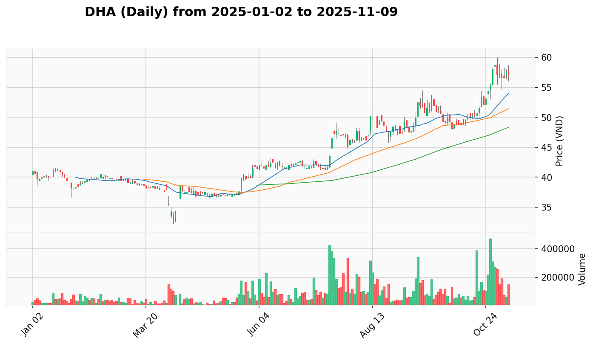

<a href="#vlxd">↑ Back to group VLXD</a>  |  <a href="#vpa-signal-summary">↑ Back to Top</a>

#### Key Statistics
| Metric | Value |
|:---|---:|
| Date Range | 2025-01-02 to 2025-11-07 |
| **Latest Close** | **56.9** |
| Period Open | 40.38 |
| Period High | 60.0 |
| Period Low | 32.23 |
| Period Change % | 40.91% |

**[Download DHA Data (.csv)](market_data/DHA_2025-01-02_to_2025-11-09.csv)**

---

### DHC

#### [VPA Analysis (2025-08-14 - 2025-10-21)](./VPA.md#dhc)
> **Ngày 2025-10-15:** DHC tiếp tục giảm từ 33.6 VND xuống 32.95 VND với khối lượng giao dịch đạt 0.2638 triệu cổ phiếu, thấp hơn so với phiên trước (0.4243 triệu cổ phiếu). Cây nến giảm có biên độ rộng và đóng cửa ở mức thấp nhất phiên, cho thấy áp lực bán vẫn duy trì và thiếu vắng lực cầu. Mặc dù khối lượng giảm, việc giá tiếp tục giảm mạnh sau một phiên SOW cho thấy sự yếu kém vẫn còn hiện hữu. **Phân tích VPA/Wyckoff:** Sign of Weakness (SOW)
> **Ngày 2025-10-16:** DHC tăng nhẹ từ 32.95 VND lên 33.0 VND với khối lượng giao dịch đạt 0.0838 triệu cổ phiếu, thấp hơn đáng kể so với phiên trước (0.2638 triệu cổ phiếu). Cây nến có biên độ hẹp và đóng cửa gần mức thấp nhất phiên (32.95 VND), cho thấy áp lực bán đã giảm nhưng lực cầu vẫn còn yếu. Sau hai phiên SOW liên tiếp, sự tăng giá nhẹ với khối lượng rất thấp này cho thấy nguồn cung đang cạn kiệt, nhưng chưa có sự tham gia mạnh mẽ của người mua. **Phân tích VPA/Wyckoff:** No Demand (ND)
> **Ngày 2025-10-17:** DHC tăng từ 33.2 VND lên 33.6 VND với khối lượng giao dịch đạt 0.2805 triệu cổ phiếu, cao hơn đáng kể so với phiên trước (0.1521 triệu cổ phiếu). Cây nến tăng có biên độ rộng và đóng cửa ở nửa trên, cho thấy lực cầu đã quay trở lại và hấp thụ áp lực bán. Sau các phiên SOW và ND, sự tăng giá với khối lượng gia tăng này là một dấu hiệu tích cực, cho thấy thị trường đang kiểm tra nguồn cung. **Phân tích VPA/Wyckoff:** Test for Supply (Kiểm tra nguồn cung)
> **Ngày 2025-10-20:** DHC giảm từ 33.6 VND xuống 32.0 VND với khối lượng giao dịch đạt 0.3984 triệu cổ phiếu, cao hơn đáng kể so với phiên trước (0.2805 triệu cổ phiếu). Cây nến giảm có biên độ rộng và đóng cửa gần mức thấp nhất phiên, cho thấy áp lực bán mạnh mẽ và người bán đang chiếm ưu thế. Sau phiên kiểm tra nguồn cung (Test for Supply) vào ngày 2025-10-17, sự sụt giảm mạnh với khối lượng gia tăng này cho thấy nguồn cung vẫn còn lớn và áp lực bán đang gia tăng. **Phân tích VPA/Wyckoff:** Dấu hiệu suy yếu (Sign of Weakness)
> **Ngày 2025-10-21:** DHC tăng từ 32.0 VND lên 33.4 VND với khối lượng giao dịch đạt 0.425 triệu cổ phiếu, cao hơn so với phiên trước (0.3984 triệu cổ phiếu). Cây nến tăng có biên độ rộng và đóng cửa gần mức cao nhất phiên, cho thấy lực cầu đã quay trở lại mạnh mẽ sau phiên giảm điểm mạnh trước đó. Sự tăng giá với khối lượng gia tăng này cho thấy người mua đang chiếm ưu thế và hấp thụ áp lực bán. **Phân tích VPA/Wyckoff:** Sign of Strength (SOS)

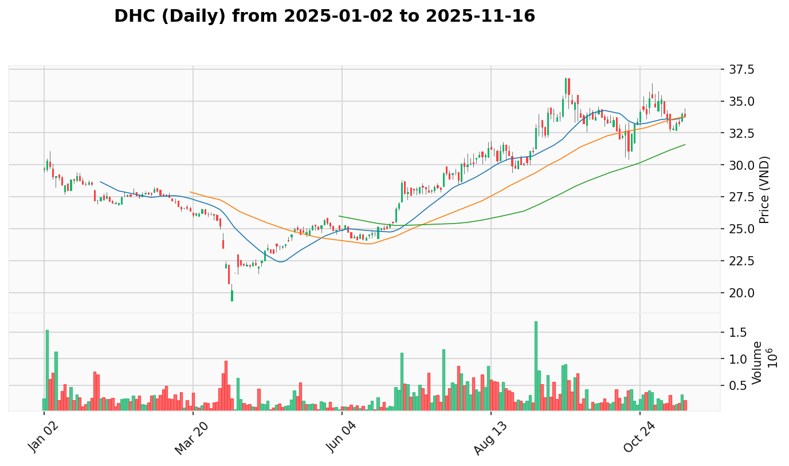

<a href="#others">↑ Back to group OTHERS</a>  |  <a href="#vpa-signal-summary">↑ Back to Top</a>

#### Key Statistics
| Metric | Value |
|:---|---:|
| Date Range | 2025-01-02 to 2025-11-07 |
| **Latest Close** | **32.85** |
| Period Open | 29.65 |
| Period High | 36.86 |
| Period Low | 19.31 |
| Period Change % | 10.79% |

**[Download DHC Data (.csv)](market_data/DHC_2025-01-02_to_2025-11-09.csv)**

---

### DHG

#### [VPA Analysis (2025-06-16 - 2025-10-21)](./VPA.md#dhg)
> **Ngày 2025-10-15:** DHG giảm từ 102.0 VND xuống 101.6 VND. Cây nến có biên độ hẹp (từ 101.3 VND đến 101.8 VND) và đóng cửa ở giữa thân nến. Khối lượng giao dịch đạt 0.0059 triệu cổ phiếu, tiếp tục giảm so với phiên trước (0.008 triệu cổ phiếu) và duy trì ở mức rất thấp. Sự giảm giá nhẹ với biên độ hẹp và khối lượng cực thấp cho thấy thị trường vẫn đang trong tình trạng thiếu cầu nghiêm trọng, củng cố nhận định từ các phiên trước về sự yếu kém của lực mua. **Phân tích VPA/Wyckoff:** No Demand (Thiếu cầu)
> **Ngày 2025-10-16:** DHG tăng từ 101.6 VND lên 102.0 VND. Cây nến có biên độ hẹp (từ 101.4 VND đến 102.0 VND) và đóng cửa ở mức cao nhất phiên. Khối lượng giao dịch đạt 0.0027 triệu cổ phiếu, giảm mạnh so với phiên trước (0.0059 triệu cổ phiếu) và tiếp tục ở mức cực kỳ thấp. Mặc dù giá tăng, nhưng với khối lượng cực thấp, điều này cho thấy sự phục hồi yếu ớt và không có sự xác nhận từ dòng tiền lớn, củng cố nhận định về tình trạng thiếu cầu nghiêm trọng từ các phiên trước. **Phân tích VPA/Wyckoff:** No Demand (Thiếu cầu)
> **Ngày 2025-10-17:** DHG giảm từ 102.7 VND xuống 101.4 VND. Cây nến có biên độ rộng (từ 101.4 VND đến 102.7 VND) và đóng cửa ở mức thấp nhất phiên. Khối lượng giao dịch đạt 0.0065 triệu cổ phiếu, tăng so với hai phiên trước (0.0059 triệu cổ phiếu và 0.0027 triệu cổ phiếu) nhưng vẫn ở mức thấp so với trung bình. Sự giảm giá mạnh với biên độ rộng và khối lượng gia tăng cho thấy áp lực bán đang chiếm ưu thế và thiếu sự hỗ trợ từ lực cầu, củng cố nhận định về sự yếu kém của thị trường. **Phân tích VPA/Wyckoff:** Sign of Weakness (SOW)
> **Ngày 2025-10-20:** DHG giảm từ 101.4 VND xuống 101.0 VND. Cây nến có biên độ rộng (từ 100.4 VND đến 101.9 VND) và đóng cửa ở mức thấp. Khối lượng giao dịch đạt 0.0112 triệu cổ phiếu, tăng so với phiên trước (0.0065 triệu cổ phiếu) và cho thấy áp lực bán tiếp tục gia tăng. Điều này củng cố tín hiệu suy yếu của thị trường. **Phân tích VPA/Wyckoff:** Sign of Weakness (SOW)
> **Ngày 2025-10-21:** DHG tăng nhẹ từ 101.0 VND lên 101.1 VND. Cây nến có biên độ hẹp (từ 101.0 VND đến 101.8 VND) và đóng cửa gần mức thấp nhất phiên. Khối lượng giao dịch đạt 0.0195 triệu cổ phiếu, tăng đáng kể so với phiên trước (0.0112 triệu cổ phiếu). Mặc dù giá có sự phục hồi nhẹ, việc đóng cửa yếu và khối lượng tăng cao cho thấy áp lực bán vẫn còn mạnh và lực cầu chưa đủ để đẩy giá lên cao hơn, củng cố nhận định về sự yếu kém của thị trường. **Phân tích VPA/Wyckoff:** Sign of Weakness (SOW)

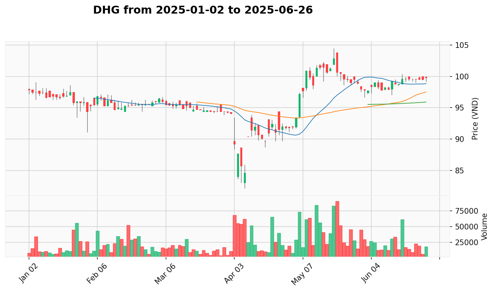

<a href="#suc-khoe">↑ Back to group SUC_KHOE</a>  |  <a href="#vpa-signal-summary">↑ Back to Top</a>

#### Key Statistics
| Metric | Value |
|:---|---:|
| Date Range | 2025-01-02 to 2025-11-07 |
| **Latest Close** | **103.1** |
| Period Open | 97.96 |
| Period High | 110.0 |
| Period Low | 82.1 |
| Period Change % | 5.25% |

**[Download DHG Data (.csv)](market_data/DHG_2025-01-02_to_2025-11-09.csv)**

---

### DHT

#### [VPA Analysis (2025-08-14 - 2025-10-21)](./VPA.md#dht)
> **Ngày 2025-10-15:** DHT giảm giá từ 84.9 VND xuống 84.0 VND. Nến có biên độ rộng, giá mở cửa 84.9 VND, tăng lên 88.0 VND nhưng sau đó bị đẩy xuống đóng cửa tại mức thấp nhất phiên là 84.0 VND. Điều này cho thấy áp lực bán mạnh mẽ xuất hiện khi giá cố gắng tăng. Khối lượng giao dịch chỉ đạt 0.0023 triệu cổ phiếu, tiếp tục giảm mạnh so với phiên trước (0.0045 triệu cổ phiếu) và là mức cực kỳ thấp. Sau hai phiên "No Demand" liên tiếp, phiên này cho thấy sự thiếu vắng lực cầu nghiêm trọng, khiến giá dễ dàng bị đẩy xuống ngay cả với khối lượng bán không lớn. Sự từ chối giá cao (88.0 VND) trên khối lượng cạn kiệt xác nhận rằng không có lực mua đủ mạnh để hấp thụ nguồn cung. **Phân tích VPA/Wyckoff:** Weakness (W) / No Demand (ND) - Thiếu vắng lực cầu và xuất hiện điểm yếu.
> **Ngày 2025-10-16:** DHT tiếp tục giảm nhẹ từ 84.0 VND xuống 83.9 VND. Nến có thân nhỏ, biên độ hẹp từ 83.5 VND đến 84.0 VND, đóng cửa gần mức cao nhất phiên nhưng vẫn thấp hơn giá mở cửa. Khối lượng giao dịch đạt 0.0181 triệu cổ phiếu, tăng đáng kể so với hai phiên trước (0.0023 triệu và 0.0045 triệu cổ phiếu) nhưng vẫn ở mức trung bình thấp so với các phiên đầu tháng. Sau hai phiên thiếu vắng lực cầu và xuất hiện điểm yếu, phiên này cho thấy sự gia tăng khối lượng trong khi giá vẫn giảm nhẹ và biên độ hẹp. Điều này cho thấy áp lực bán vẫn còn hiện hữu, và mặc dù có sự gia tăng về khối lượng, lực mua vẫn chưa đủ mạnh để đảo chiều xu hướng giảm giá. Thị trường vẫn đang trong giai đoạn yếu. **Phân tích VPA/Wyckoff:** Weakness (W) - Điểm yếu tiếp diễn.
> **Ngày 2025-10-17:** DHT giảm nhẹ từ 85.2 VND xuống 84.9 VND. Nến có thân nhỏ, giá mở cửa 84.0 VND, tăng lên 85.2 VND và đóng cửa tại 84.9 VND. Mặc dù giá đóng cửa cao hơn giá mở cửa, nhưng so với giá đóng cửa phiên trước (85.2 VND), giá đã giảm nhẹ. Khối lượng giao dịch đạt 0.0223 triệu cổ phiếu, giảm so với phiên trước (0.0322 triệu cổ phiếu). Sau phiên tăng giá mạnh với khối lượng lớn vào ngày 2025-10-16, phiên này cho thấy sự điều chỉnh nhẹ với khối lượng giảm. Điều này có thể là một sự kiểm tra cung sau khi giá tăng, cho thấy lực bán không quá mạnh ở mức giá hiện tại. Tuy nhiên, để xác nhận xu hướng tăng, cần có sự gia tăng lực cầu mạnh mẽ hơn trong các phiên tới. **Phân tích VPA/Wyckoff:** Test of Supply (TS) - Kiểm tra cung.
> **Ngày 2025-10-20:** DHT giảm nhẹ từ 84.9 VND xuống 84.8 VND. Nến có thân nhỏ, biên độ hẹp từ 83.5 VND đến 85.0 VND, đóng cửa gần mức thấp nhất phiên. Khối lượng giao dịch đạt 0.0095 triệu cổ phiếu, giảm đáng kể so với phiên trước (0.0223 triệu cổ phiếu) và là mức thấp nhất trong các phiên gần đây. Sự sụt giảm giá nhẹ đi kèm với khối lượng giao dịch rất thấp cho thấy áp lực bán không mạnh, nhưng đồng thời cũng thiếu vắng lực cầu. Thị trường đang trong giai đoạn thiếu thanh khoản và không có động lực rõ ràng, tiếp nối tín hiệu kiểm tra cung từ phiên 2025-10-17. **Phân tích VPA/Wyckoff:** No Demand (ND) - Thiếu cầu.
> **Ngày 2025-10-21:** DHT giảm nhẹ từ 84.8 VND xuống 84.5 VND. Nến có biên độ rộng, giá mở cửa 84.8 VND, tăng lên 85.8 VND nhưng sau đó giảm và đóng cửa tại 84.5 VND. Khối lượng giao dịch đạt 0.0637 triệu cổ phiếu, tăng mạnh so với phiên trước (0.0095 triệu cổ phiếu). Sự sụt giảm giá nhẹ đi kèm với khối lượng giao dịch tăng đột biến cho thấy áp lực bán đã gia tăng đáng kể sau phiên thiếu cầu. Điều này có thể là dấu hiệu của sự phân phối hoặc nguồn cung đang được đẩy ra thị trường. **Phân tích VPA/Wyckoff:** Sign of Weakness (SOW) - Áp lực bán.

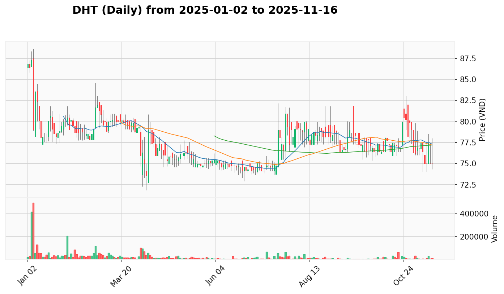

<a href="#suc-khoe">↑ Back to group SUC_KHOE</a>  |  <a href="#vpa-signal-summary">↑ Back to Top</a>

#### Key Statistics
| Metric | Value |
|:---|---:|
| Date Range | 2025-01-02 to 2025-11-07 |
| **Latest Close** | **76.4** |
| Period Open | 86.36 |
| Period High | 88.64 |
| Period Low | 71.82 |
| Period Change % | -11.53% |

**[Download DHT Data (.csv)](market_data/DHT_2025-01-02_to_2025-11-09.csv)**

---

### DIG

#### [VPA Analysis (2025-08-04 - 2025-10-21)](./VPA.md#dig)
> **Ngày 2025-10-15:** DIG tăng từ 22.6 VND lên 23.0 VND với khối lượng giao dịch đạt 17.683 triệu cổ phiếu, thấp hơn đáng kể so với phiên trước. Nến ngày tăng điểm với biên độ khá rộng, đóng cửa ở mức cao nhất phiên, cho thấy lực cầu tiếp tục chiếm ưu thế và hấp thụ tốt lượng cung. Mặc dù khối lượng giảm, việc giá vẫn tăng mạnh và đóng cửa ở mức cao nhất cho thấy sự thiếu vắng của áp lực bán, xác nhận xu hướng tăng giá sau phiên SOS trước đó. Đây là dấu hiệu của việc kiểm tra cung thành công. **Phân tích VPA/Wyckoff:** Test for Supply (Kiểm tra cung) - Lực cầu mạnh mẽ tiếp diễn sau khi hấp thụ cung.
> **Ngày 2025-10-16:** DIG tăng từ 23.25 VND lên 24.45 VND với khối lượng giao dịch đạt 35.3539 triệu cổ phiếu, cao hơn đáng kể so với phiên trước. Nến ngày có biên độ tăng rộng, đóng cửa gần mức cao nhất phiên, cho thấy lực cầu mạnh mẽ và quyết liệt. Mặc dù có bóng nến trên nhỏ cho thấy một chút áp lực bán ở vùng giá cao nhất, nhưng khối lượng giao dịch tăng vọt cùng với đà tăng giá mạnh mẽ xác nhận sự tiếp diễn của xu hướng tăng và sự tham gia của dòng tiền lớn. **Phân tích VPA/Wyckoff:** Sign of Strength (SOS) - Lực cầu áp đảo với khối lượng tăng mạnh, xác nhận xu hướng tăng giá.
> **Ngày 2025-10-17:** DIG duy trì mức giá đóng cửa 24.6 VND với khối lượng giao dịch đạt 24.125 triệu cổ phiếu, thấp hơn đáng kể so với phiên SOS trước đó. Nến ngày cho thấy sự lưỡng lự khi giá mở cửa và đóng cửa ở cùng một mức, với biên độ dao động trong phiên. Khối lượng giảm cho thấy lực cầu tạm thời vắng mặt, nhưng không có áp lực bán mạnh mẽ, cho thấy thị trường đang tạm dừng để đánh giá lại sau đà tăng. Đây có thể là một giai đoạn tích lũy lại hoặc kiểm tra cung ở vùng giá cao hơn. **Phân tích VPA/Wyckoff:** No Demand (Không có cầu) - Thị trường tạm dừng sau SOS với khối lượng thấp.
> **Ngày 2025-10-20:** DIG giảm từ 24.1 VND xuống 22.9 VND với khối lượng giao dịch đạt 35.19 triệu cổ phiếu, cao hơn đáng kể so với phiên trước. Nến ngày có biên độ giảm rộng, đóng cửa tại mức thấp nhất phiên, cho thấy áp lực bán mạnh mẽ và quyết liệt. Khối lượng giao dịch tăng vọt cùng với đà giảm giá mạnh mẽ xác nhận sự xuất hiện của lực cung lớn, áp đảo lực cầu. Điều này cho thấy sự suy yếu của xu hướng tăng trước đó và khả năng đảo chiều giảm giá. **Phân tích VPA/Wyckoff:** Sign of Weakness (SOW) - Lực cung áp đảo với khối lượng tăng mạnh, xác nhận xu hướng giảm giá.
> **Ngày 2025-10-21:** DIG giảm từ 22.9 VND xuống 21.9 VND với khối lượng giao dịch đạt 33.23 triệu cổ phiếu. Khối lượng này vẫn ở mức cao, tuy có giảm nhẹ so với phiên SOW trước đó, nhưng nến ngày có biên độ giảm rộng và đóng cửa ở mức thấp nhất phiên, cho thấy áp lực bán vẫn tiếp diễn mạnh mẽ và lực cung vẫn đang chiếm ưu thế. Xu hướng giảm giá tiếp tục được củng cố. **Phân tích VPA/Wyckoff:** Sign of Weakness (SOW) tiếp diễn.

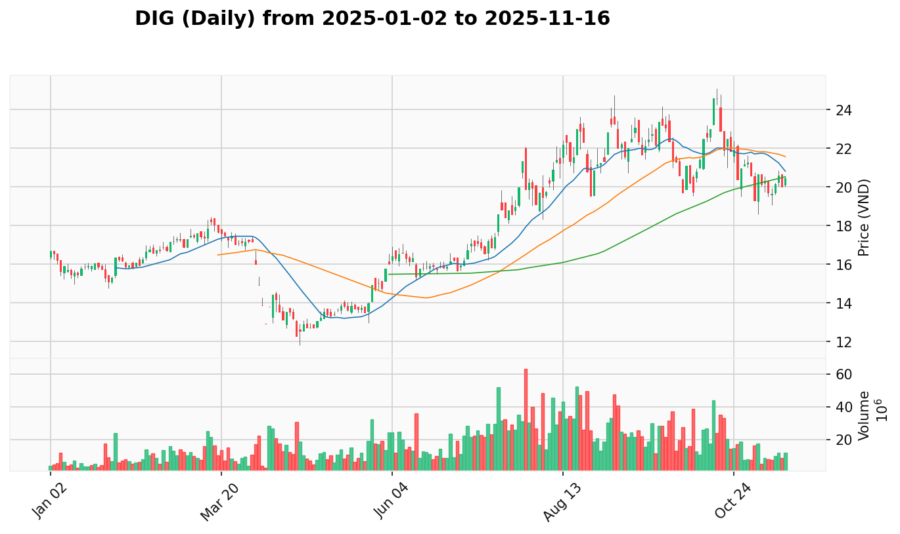

<a href="#bat-dong-san">↑ Back to group BAT_DONG_SAN</a>  |  <a href="#vpa-signal-summary">↑ Back to Top</a>

#### Key Statistics
| Metric | Value |
|:---|---:|
| Date Range | 2025-01-02 to 2025-11-07 |
| **Latest Close** | **19.7** |
| Period Open | 16.38 |
| Period High | 25.1 |
| Period Low | 11.8 |
| Period Change % | 20.27% |

**[Download DIG Data (.csv)](market_data/DIG_2025-01-02_to_2025-11-09.csv)**

---

### DL1

#### [VPA Analysis (2025-08-14 - 2025-10-21)](./VPA.md#dl1)
> **Ngày 2025-10-15:** DL1 giữ nguyên mức giá 6.1 VND, với khối lượng giao dịch giảm mạnh xuống 0.2819 triệu cổ phiếu. Cây nến có biên độ rất hẹp, mở cửa ở mức 6.1 VND và đóng cửa ở mức 6.1 VND, cho thấy sự lưỡng lự và thiếu vắng cả lực mua lẫn lực bán đáng kể. Sau hai phiên giảm giá với khối lượng gia tăng mạnh mẽ (SOS), phiên này cho thấy sự tạm lắng của áp lực bán nhưng cũng không có dấu hiệu lực cầu quay trở lại. Điều này củng cố thêm sự yếu kém của thị trường và khả năng tiếp diễn xu hướng giảm. **Phân tích VPA/Wyckoff:** No Demand - Thiếu cầu.
> **Ngày 2025-10-16:** DL1 giảm từ 6.1 VND xuống 6.0 VND, với khối lượng giao dịch giảm mạnh xuống 0.191 triệu cổ phiếu. Cây nến giảm có biên độ hẹp, đóng cửa ở mức thấp nhất phiên. Sau phiên "No Demand" ngày 2025-10-15, việc giá tiếp tục giảm với khối lượng cực thấp cho thấy lực cầu hoàn toàn vắng bóng và thị trường vẫn rất yếu. Mặc dù áp lực bán không mạnh, nhưng việc giá đóng cửa ở mức thấp nhất phiên xác nhận tâm lý tiêu cực vẫn chiếm ưu thế. **Phân tích VPA/Wyckoff:** No Demand - Lực cầu tiếp tục vắng bóng.
> **Ngày 2025-10-17:** DL1 giảm từ 6.1 VND xuống 6.0 VND, với khối lượng giao dịch tăng nhẹ lên 0.5058 triệu cổ phiếu. Cây nến giảm có biên độ hẹp, đóng cửa ở mức thấp nhất phiên. Sau các phiên "No Demand" trước đó, việc giá tiếp tục giảm và đóng cửa ở mức thấp nhất phiên với khối lượng tăng nhẹ cho thấy áp lực bán vẫn còn hiện hữu và lực cầu vẫn yếu. Điều này củng cố thêm xu hướng giảm giá. **Phân tích VPA/Wyckoff:** Sign of Weakness (SOW) - Áp lực bán tiếp diễn.
> **Ngày 2025-10-20:** DL1 giảm từ 6.0 VND xuống 5.4 VND, với khối lượng giao dịch tăng mạnh lên 0.81 triệu cổ phiếu. Cây nến giảm có biên độ rộng, đóng cửa ở mức thấp nhất phiên. Sau các phiên giảm giá và tín hiệu yếu trước đó, việc giá tiếp tục giảm mạnh với khối lượng gia tăng cho thấy áp lực bán rất lớn và lực cầu hoàn toàn vắng bóng. Điều này xác nhận xu hướng giảm giá tiếp diễn. **Phân tích VPA/Wyckoff:** Sign of Weakness (SOW) - Áp lực bán mạnh mẽ.
> **Ngày 2025-10-21:** DL1 tăng từ 5.4 VND lên 5.5 VND, với khối lượng giao dịch giảm xuống 0.591 triệu cổ phiếu. Cây nến tăng có biên độ hẹp, đóng cửa ở giữa thân nến. Sau phiên giảm mạnh với khối lượng lớn vào ngày 2025-10-20, việc giá tăng nhẹ với khối lượng giảm cho thấy áp lực bán có thể đã tạm thời giảm bớt, nhưng lực cầu vẫn còn yếu và chưa đủ mạnh để đảo chiều xu hướng giảm. Điều này củng cố thêm tín hiệu yếu của thị trường. **Phân tích VPA/Wyckoff:** No Demand (ND) - Thiếu vắng nhu cầu.

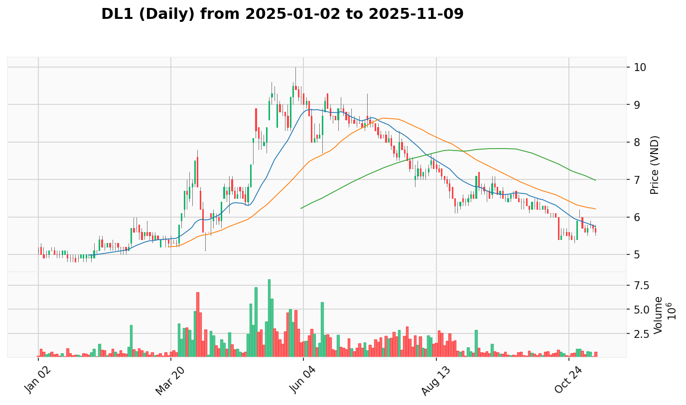

<a href="#penny">↑ Back to group PENNY</a>  |  <a href="#vpa-signal-summary">↑ Back to Top</a>

#### Key Statistics
| Metric | Value |
|:---|---:|
| Date Range | 2025-01-02 to 2025-11-07 |
| **Latest Close** | **5.6** |
| Period Open | 5.1 |
| Period High | 10.0 |
| Period Low | 4.8 |
| Period Change % | 9.80% |

**[Download DL1 Data (.csv)](market_data/DL1_2025-01-02_to_2025-11-09.csv)**

---

### DPG

#### [VPA Analysis (2025-08-14 - 2025-10-21)](./VPA.md#dpg)
> **Ngày 2025-10-15:** DPG mở cửa ở mức 48.2 VND và đóng cửa ở mức 48.4 VND, tăng so với mức đóng cửa 47.8 VND của phiên trước. Cây nến có biên độ hẹp (từ 46.95 VND đến 48.45 VND) và đóng cửa gần mức cao nhất phiên, cho thấy lực cầu đã xuất hiện trở lại sau phiên giảm mạnh. Khối lượng giao dịch đạt 2.0357 triệu cổ phiếu, giảm so với 2.6758 triệu cổ phiếu của phiên trước. Sự tăng giá nhẹ đi kèm với khối lượng giảm cho thấy áp lực bán đã tạm thời suy yếu, nhưng lực mua chưa thực sự mạnh mẽ để đẩy giá lên cao hơn. Đây có thể là một phiên kiểm tra cung sau áp lực bán mạnh mẽ. **Phân tích VPA/Wyckoff:** Test for Supply - Kiểm tra cung.
> **Ngày 2025-10-16:** DPG mở cửa ở mức 49.3 VND và đóng cửa ở mức 49.0 VND, tăng nhẹ so với mức đóng cửa 48.4 VND của phiên trước. Cây nến có biên độ rộng (từ 48.95 VND đến 50.4 VND) nhưng đóng cửa thấp hơn giá mở cửa và gần mức thấp nhất phiên, cho thấy áp lực bán đã xuất hiện sau khi giá cố gắng tăng cao. Khối lượng giao dịch đạt 2.176 triệu cổ phiếu, tăng nhẹ so với 2.0357 triệu cổ phiếu của phiên trước. Mặc dù giá đóng cửa cao hơn phiên trước, nhưng sự xuất hiện của áp lực bán mạnh mẽ khi giá tăng và khối lượng tăng cho thấy phe cung đang chiếm ưu thế. **Phân tích VPA/Wyckoff:** Weakness - Áp lực cung gia tăng.
> **Ngày 2025-10-17:** DPG mở cửa ở mức 49.35 VND và đóng cửa ở mức 48.0 VND, giảm mạnh so với mức đóng cửa 49.3 VND của phiên trước. Cây nến có biên độ rộng (từ 48.0 VND đến 50.4 VND) và đóng cửa ở mức thấp nhất phiên, cho thấy áp lực bán mạnh mẽ đã chiếm ưu thế hoàn toàn. Khối lượng giao dịch đạt 2.5817 triệu cổ phiếu, giảm nhẹ so với 2.9026 triệu cổ phiếu của phiên trước. Mặc dù khối lượng giảm nhẹ, nhưng sự sụt giảm giá mạnh với biên độ rộng và đóng cửa ở mức thấp nhất phiên xác nhận sự tiếp diễn của áp lực cung và xu hướng giảm giá. **Phân tích VPA/Wyckoff:** Sign of Weakness (SOW) - Dấu hiệu suy yếu.
> **Ngày 2025-10-20:** DPG mở cửa ở mức 47.55 VND và đóng cửa ở mức 44.65 VND, giảm mạnh so với mức đóng cửa 48.0 VND của phiên trước. Cây nến có biên độ rộng (từ 44.65 VND đến 48.0 VND) và đóng cửa ở mức thấp nhất phiên, cho thấy áp lực bán mạnh mẽ đã chiếm ưu thế hoàn toàn. Khối lượng giao dịch đạt 2.8515 triệu cổ phiếu, tăng so với 2.5817 triệu cổ phiếu của phiên trước. Sự sụt giảm giá mạnh với biên độ rộng và đóng cửa ở mức thấp nhất phiên, cùng với khối lượng gia tăng, xác nhận sự tiếp diễn của áp lực cung và xu hướng giảm giá. **Phân tích VPA/Wyckoff:** Sign of Weakness (SOW) - Dấu hiệu suy yếu tiếp diễn.
> **Ngày 2025-10-21:** DPG mở cửa ở mức 43.6 VND và đóng cửa ở mức 43.5 VND, giảm so với mức đóng cửa 44.65 VND của phiên trước. Cây nến có biên độ tương đối hẹp (từ 43.0 VND đến 44.5 VND) và đóng cửa ở mức thấp nhất phiên, cho thấy áp lực bán vẫn chiếm ưu thế. Khối lượng giao dịch đạt 3.435 triệu cổ phiếu, tăng so với 2.8515 triệu cổ phiếu của phiên trước. Sự sụt giảm giá với biên độ hẹp hơn nhưng vẫn đóng cửa ở mức thấp nhất phiên, cùng với khối lượng gia tăng, xác nhận áp lực cung vẫn tiếp diễn. **Phân tích VPA/Wyckoff:** Sign of Weakness (SOW) - Dấu hiệu suy yếu tiếp diễn.

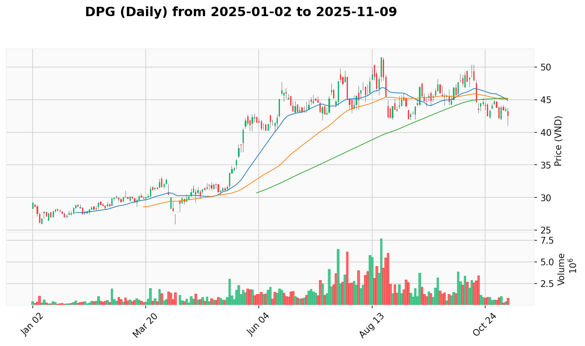

<a href="#xay-dung">↑ Back to group XAY_DUNG</a>  |  <a href="#vpa-signal-summary">↑ Back to Top</a>

#### Key Statistics
| Metric | Value |
|:---|---:|
| Date Range | 2025-01-02 to 2025-11-07 |
| **Latest Close** | **42.55** |
| Period Open | 28.32 |
| Period High | 51.5 |
| Period Low | 25.98 |
| Period Change % | 50.25% |

**[Download DPG Data (.csv)](market_data/DPG_2025-01-02_to_2025-11-09.csv)**

---

### DPM

#### [VPA Analysis (2025-06-16 - 2025-10-21)](./VPA.md#dpm)
> **Ngày 2025-10-15:** DPM mở cửa ở mức 24.0 VND, sau đó dao động trong biên độ từ 23.35 VND đến 24.05 VND và đóng cửa ở mức 23.4 VND, thấp hơn đáng kể so với giá đóng cửa phiên trước (23.95 VND). Khối lượng giao dịch đạt 8.8372 triệu cổ phiếu, tăng mạnh so với phiên trước (5.7681 triệu cổ phiếu). Giá giảm mạnh với biên độ rộng và đóng cửa gần mức thấp nhất phiên, đi kèm với khối lượng giao dịch tăng vọt, cho thấy áp lực bán cực lớn và nguồn cung đang hoàn toàn áp đảo. Điều này xác nhận và củng cố mạnh mẽ tín hiệu yếu kém từ các phiên trước, báo hiệu xu hướng giảm giá tiếp diễn. **Phân tích VPA/Wyckoff:** Supply Overwhelming Demand (Nguồn cung áp đảo nhu cầu)
> **Ngày 2025-10-16:** DPM mở cửa ở mức 23.55 VND, sau đó dao động trong biên độ từ 23.25 VND đến 23.6 VND và đóng cửa ở mức 23.45 VND, cao hơn nhẹ so với giá đóng cửa phiên trước (23.4 VND). Khối lượng giao dịch đạt 1.5702 triệu cổ phiếu, giảm mạnh so với phiên trước (8.8372 triệu cổ phiếu). Giá tăng nhẹ với biên độ hẹp và khối lượng giảm sâu cho thấy áp lực bán đã suy yếu đáng kể sau hai phiên giảm mạnh. Điều này có thể là dấu hiệu tạm thời của việc nguồn cung cạn kiệt. **Phân tích VPA/Wyckoff:** No Supply (Không có nguồn cung)
> **Ngày 2025-10-17:** DPM mở cửa ở mức 23.9 VND, sau đó giảm mạnh và đóng cửa ở mức 23.15 VND, là mức thấp nhất trong phiên. Biên độ giá rộng (từ 23.15 VND đến 23.95 VND) và giá đóng cửa thấp hơn đáng kể so với giá mở cửa và giá đóng cửa phiên trước (23.85 VND). Khối lượng giao dịch đạt 6.0575 triệu cổ phiếu, tăng so với phiên trước (3.9049 triệu cổ phiếu). Sự giảm giá mạnh với biên độ rộng và đóng cửa ở mức thấp nhất phiên, đi kèm với khối lượng giao dịch gia tăng, cho thấy áp lực bán đã quay trở lại mạnh mẽ sau phiên "Không có nguồn cung" tạm thời ngày 2025-10-16. Điều này xác nhận nguồn cung đang áp đảo nhu cầu và xu hướng giảm giá có thể tiếp diễn. **Phân tích VPA/Wyckoff:** Supply Overwhelming Demand (Nguồn cung áp đảo nhu cầu)
> **Ngày 2025-10-20:** DPM mở cửa ở mức 23.15 VND, sau đó tăng lên 23.65 VND nhưng nhanh chóng giảm mạnh xuống 22.1 VND và đóng cửa ở mức 22.15 VND, gần mức thấp nhất phiên. Giá giảm từ 23.15 VND xuống 22.15 VND với biên độ rộng. Khối lượng giao dịch đạt 5.3489 triệu cổ phiếu, giảm nhẹ so với phiên trước (6.0575 triệu cổ phiếu). Mặc dù khối lượng có giảm, nhưng cây nến giảm mạnh với biên độ rộng và đóng cửa ở mức thấp nhất phiên, sau phiên "Nguồn cung áp đảo nhu cầu" trước đó, cho thấy áp lực bán vẫn rất mạnh và nguồn cung tiếp tục chiếm ưu thế. Điều này xác nhận xu hướng giảm giá có thể tiếp diễn. **Phân tích VPA/Wyckoff:** Supply Overwhelming Demand (Nguồn cung áp đảo nhu cầu)
> **Ngày 2025-10-21:** DPM mở cửa ở mức 22.25 VND, sau đó tăng mạnh và đóng cửa ở mức 23.2 VND, là mức cao nhất trong phiên. Giá đóng cửa cao hơn đáng kể so với giá đóng cửa phiên trước (22.15 VND). Biên độ giá (từ 22.2 VND đến 23.2 VND) hẹp hơn so với phiên trước. Khối lượng giao dịch đạt 5.0328 triệu cổ phiếu, giảm nhẹ so với phiên trước (5.3489 triệu cổ phiếu). Sau hai phiên liên tiếp chịu áp lực bán mạnh ("Nguồn cung áp đảo nhu cầu"), phiên này cho thấy sự phục hồi mạnh mẽ với giá đóng cửa ở mức cao nhất phiên, cho thấy lực cầu đã quay trở lại và hấp thụ nguồn cung. Mặc dù khối lượng có giảm nhẹ, nhưng hành động giá tích cực này cho thấy áp lực bán đã giảm bớt và có thể là dấu hiệu của sự thay đổi trong cán cân cung cầu. **Phân tích VPA/Wyckoff:** Sign of Strength (SOS) - Dấu hiệu sức mạnh.

<a href="#hoa-chat">↑ Back to group HOA_CHAT</a>  |  <a href="#vpa-signal-summary">↑ Back to Top</a>

#### Key Statistics
| Metric | Value |
|:---|---:|
| Date Range | 2025-01-02 to 2025-11-07 |
| **Latest Close** | **23.65** |
| Period Open | 19.42 |
| Period High | 29.9 |
| Period Low | 15.19 |
| Period Change % | 21.78% |

**[Download DPM Data (.csv)](market_data/DPM_2025-01-02_to_2025-11-09.csv)**

---

### DPR

#### [VPA Analysis (2025-06-16 - 2025-10-21)](./VPA.md#dpr)
> **Ngày 2025-10-15:** DPR giảm từ 36.85 VND xuống 36.7 VND. Cây nến giảm có biên độ tương đối rộng, mở cửa tại 37.05, dao động trong khoảng 36.55-37.05 và đóng cửa tại 36.7, là mức gần thấp nhất phiên. Khối lượng giao dịch đạt 0.2882 triệu cổ phiếu, giảm đáng kể so với phiên trước (0.4771 triệu cổ phiếu). Sau phiên "Sign of Weakness" (SOW) với lực cung áp đảo, phiên này giá tiếp tục giảm với khối lượng thấp cho thấy áp lực bán đã giảm bớt nhưng lực cầu vẫn yếu, không đủ để hấp thụ nguồn cung và đẩy giá lên. Điều này cho thấy sự thiếu vắng nhu cầu mua. **Phân tích VPA/Wyckoff:** No Demand (Thiếu cầu)
> **Ngày 2025-10-16:** DPR giảm từ 36.7 VND xuống 36.5 VND. Cây nến giảm có biên độ tương đối rộng, mở cửa tại 37.2, dao động trong khoảng 36.4-37.2 và đóng cửa tại 36.5, là mức thấp nhất phiên. Khối lượng giao dịch đạt 0.2691 triệu cổ phiếu, giảm nhẹ so với phiên trước (0.2882 triệu cổ phiếu). Sau phiên "No Demand" với lực cầu yếu, phiên này giá tiếp tục giảm với khối lượng thấp cho thấy áp lực bán vẫn còn nhưng không quá mạnh, đồng thời lực cầu vẫn chưa xuất hiện để hỗ trợ giá. Điều này cho thấy sự tiếp diễn của trạng thái thiếu cầu và sự yếu kém của thị trường. **Phân tích VPA/Wyckoff:** No Demand (Thiếu cầu) - Tiếp diễn.
> **Ngày 2025-10-17:** DPR giảm từ 36.5 VND xuống 36.05 VND. Cây nến giảm có biên độ tương đối rộng, mở cửa tại 36.5, dao động trong khoảng 36.05-36.55 và đóng cửa tại 36.05, là mức thấp nhất phiên. Khối lượng giao dịch đạt 0.2904 triệu cổ phiếu, giảm so với phiên trước (0.3477 triệu cổ phiếu). Sau các phiên "No Demand" liên tiếp, phiên này giá tiếp tục giảm với khối lượng thấp cho thấy áp lực bán vẫn duy trì nhưng không quá mạnh, đồng thời lực cầu vẫn chưa xuất hiện để hỗ trợ giá. Điều này củng cố trạng thái thiếu cầu và sự yếu kém của thị trường. **Phân tích VPA/Wyckoff:** No Demand (Thiếu cầu) - Tiếp diễn.
> **Ngày 2025-10-20:** DPR giảm mạnh từ 36.05 VND xuống 33.6 VND. Cây nến giảm có biên độ rất rộng, mở cửa tại 35.85, dao động trong khoảng 33.6-36.4 và đóng cửa tại 33.6, là mức thấp nhất phiên. Khối lượng giao dịch đạt 0.5367 triệu cổ phiếu, tăng đáng kể so với phiên trước (0.2904 triệu cổ phiếu). Sau nhiều phiên "No Demand" với lực cầu yếu, phiên này giá giảm sâu với khối lượng lớn cho thấy áp lực bán mạnh mẽ và sự xuất hiện của nguồn cung lớn trên thị trường. Điều này có thể là một đợt bán tháo hoặc sự tiếp diễn của xu hướng giảm giá với sự tham gia của nhiều người bán. **Phân tích VPA/Wyckoff:** Supply Coming In (Nguồn cung xuất hiện)
> **Ngày 2025-10-21:** DPR tăng từ 33.6 VND lên 35.5 VND. Cây nến tăng có biên độ rộng, mở cửa tại 34.9, dao động trong khoảng 34.2-35.5 và đóng cửa tại 35.5, là mức cao nhất phiên. Khối lượng giao dịch đạt 0.5346 triệu cổ phiếu, tương đương với phiên trước. Sau phiên giảm mạnh với nguồn cung lớn (Supply Coming In) vào ngày 2025-10-20, phiên này giá bật tăng trở lại với khối lượng cao, cho thấy lực cầu đã xuất hiện và hấp thụ một phần nguồn cung. Việc giá đóng cửa ở mức cao nhất phiên củng cố tín hiệu tích cực này, cho thấy sự đảo chiều tiềm năng hoặc ít nhất là một phản ứng mạnh mẽ của lực cầu. **Phân tích VPA/Wyckoff:** Demand Coming In (Lực cầu xuất hiện)

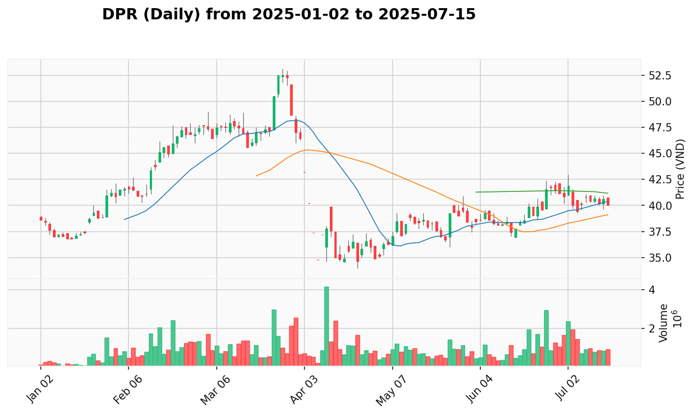

<a href="#cao-su">↑ Back to group CAO_SU</a>  |  <a href="#vpa-signal-summary">↑ Back to Top</a>

#### Key Statistics
| Metric | Value |
|:---|---:|
| Date Range | 2025-01-02 to 2025-11-07 |
| **Latest Close** | **36.7** |
| Period Open | 37.04 |
| Period High | 50.56 |
| Period Low | 32.32 |
| Period Change % | -0.92% |

**[Download DPR Data (.csv)](market_data/DPR_2025-01-02_to_2025-11-09.csv)**

---

### DRC

#### [VPA Analysis (2025-06-13 - 2025-10-21)](./VPA.md#drc)
> **Ngày 2025-10-15:** DRC giảm từ 15.8 VND xuống 15.55 VND với dao động trong khoảng 15.5-15.8 VND. Cây nến giảm có biên độ hẹp và đóng cửa gần mức thấp nhất phiên. Khối lượng giao dịch đạt 0.4438 triệu cổ phiếu, tăng so với phiên trước (0.3482 triệu cổ phiếu) và duy trì ở mức cao. Sau các phiên giảm giá liên tiếp với áp lực bán chiếm ưu thế, việc giá tiếp tục giảm với khối lượng gia tăng cho thấy lực cung vẫn rất mạnh và chưa có dấu hiệu cạn kiệt, xác nhận xu hướng suy yếu. **Phân tích VPA/Wyckoff:** Continued Weakness / Supply Increasing (Tiếp tục suy yếu / Lực cung gia tăng)
> **Ngày 2025-10-16:** DRC giảm từ 15.85 VND xuống 15.6 VND với dao động trong khoảng 15.5-15.85 VND. Cây nến giảm có biên độ hẹp và đóng cửa gần mức thấp nhất phiên. Khối lượng giao dịch đạt 0.1461 triệu cổ phiếu, giảm đáng kể so với phiên trước (0.4438 triệu cổ phiếu) và thấp hơn mức trung bình. Sau các phiên giảm giá với áp lực bán chiếm ưu thế, việc giá tiếp tục giảm nhẹ với khối lượng thấp cho thấy áp lực bán có thể đã tạm thời giảm bớt, nhưng lực cầu vẫn chưa xuất hiện để hỗ trợ giá. Thị trường vẫn đang trong giai đoạn suy yếu. **Phân tích VPA/Wyckoff:** Continued Weakness / No Demand (Tiếp tục suy yếu / Không có lực cầu)
> **Ngày 2025-10-17:** DRC giảm từ 15.65 VND xuống 15.6 VND với dao động trong khoảng 15.5-15.7 VND. Cây nến giảm có biên độ hẹp và đóng cửa gần mức thấp nhất phiên. Khối lượng giao dịch đạt 0.2371 triệu cổ phiếu, tiếp tục giảm so với phiên trước (0.2947 triệu cổ phiếu) và duy trì ở mức thấp. Sau các phiên giảm giá liên tiếp với lực cung chiếm ưu thế và không có lực cầu, việc giá tiếp tục giảm nhẹ với khối lượng thấp cho thấy áp lực bán đã giảm bớt nhưng lực cầu vẫn chưa xuất hiện để hỗ trợ giá. Thị trường vẫn đang trong giai đoạn suy yếu và chưa có dấu hiệu phục hồi. **Phân tích VPA/Wyckoff:** Continued Weakness / No Demand (Tiếp tục suy yếu / Không có lực cầu)
> **Ngày 2025-10-20:** DRC giảm mạnh từ 15.65 VND xuống 15.0 VND với biên độ rộng và đóng cửa ở mức thấp nhất phiên. Khối lượng giao dịch đạt 0.2556 triệu cổ phiếu, tăng so với phiên trước (0.2371 triệu cổ phiếu) nhưng vẫn ở mức trung bình thấp. Sau nhiều phiên suy yếu, việc giá giảm mạnh kèm khối lượng tăng cho thấy áp lực bán gia tăng và lực cầu hoàn toàn vắng bóng. Thị trường tiếp tục trong giai đoạn suy yếu rõ rệt. **Phân tích VPA/Wyckoff:** Sign of Weakness (SOW) - Áp lực bán mạnh mẽ.
> **Ngày 2025-10-21:** DRC tăng nhẹ từ 15.0 VND lên 15.1 VND với dao động trong khoảng 14.9-15.4 VND. Cây nến có biên độ tương đối rộng và đóng cửa ở giữa, cao hơn giá mở cửa một chút. Khối lượng giao dịch đạt 0.3737 triệu cổ phiếu, tăng đáng kể so với phiên trước (0.2556 triệu cổ phiếu). Sau phiên giảm mạnh với áp lực bán gia tăng vào ngày 2025-10-20, việc giá phục hồi nhẹ kèm khối lượng tăng cho thấy có lực cầu bắt đáy xuất hiện, nhưng chưa đủ mạnh để đẩy giá đóng cửa lên cao. Điều này có thể là một dấu hiệu của "Stopping Volume" hoặc một nỗ lực kiểm tra cung sau đợt giảm giá. Tuy nhiên, thị trường vẫn đang trong xu hướng giảm và cần thêm xác nhận về sự thay đổi của lực cầu. **Phân tích VPA/Wyckoff:** Stopping Volume (Khối lượng dừng)

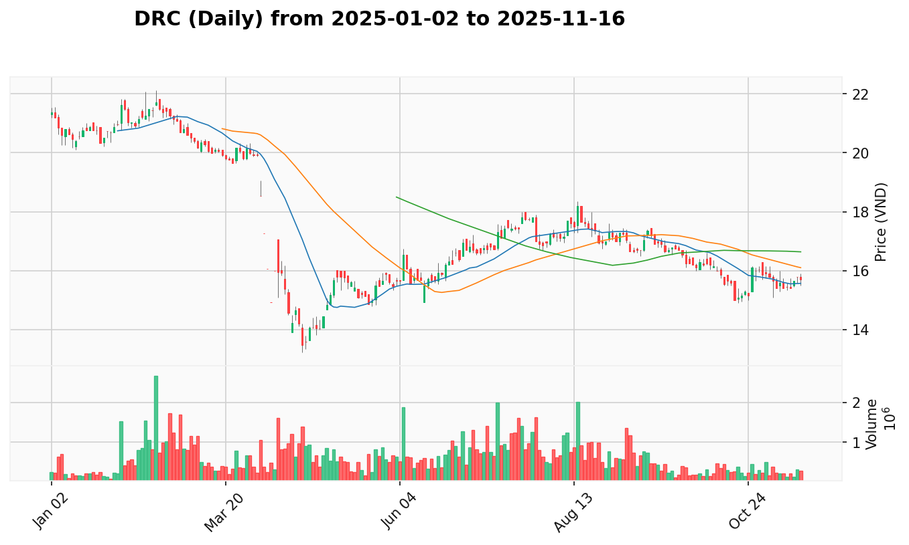

<a href="#cao-su">↑ Back to group CAO_SU</a>  |  <a href="#vpa-signal-summary">↑ Back to Top</a>

#### Key Statistics
| Metric | Value |
|:---|---:|
| Date Range | 2025-01-02 to 2025-11-07 |
| **Latest Close** | **15.4** |
| Period Open | 21.3 |
| Period High | 22.12 |
| Period Low | 13.23 |
| Period Change % | -27.70% |

**[Download DRC Data (.csv)](market_data/DRC_2025-01-02_to_2025-11-09.csv)**

---

### DRG

#### [VPA Analysis (2025-08-04 - 2025-10-21)](./VPA.md#drg)
> **Ngày 2025-10-13:** DRG giảm từ 8.8 VND xuống 8.7 VND với khối lượng giao dịch đạt 0.0011 triệu cổ phiếu. Cây nến giảm có biên độ hẹp, đóng cửa ở mức thấp nhất phiên, cho thấy áp lực bán tiếp diễn. Khối lượng giao dịch cực kỳ thấp, giảm so với phiên trước (0.0022 triệu cổ phiếu), xác nhận sự thiếu vắng lực cầu và sự yếu kém của thị trường. Giá tiếp tục giảm sau các phiên "Thiếu cầu" và "Yếu kém", cho thấy xu hướng giảm vẫn đang tiếp diễn. **Phân tích VPA/Wyckoff:** Yếu kém (Weakness)
> **Ngày 2025-10-15:** DRG tăng từ 8.7 VND lên 8.9 VND với khối lượng giao dịch đạt 0.0023 triệu cổ phiếu. Cây nến tăng có biên độ hẹp, đóng cửa ở mức cao nhất phiên, cho thấy có lực cầu xuất hiện. Khối lượng giao dịch tăng nhẹ so với phiên trước (0.0011 triệu cổ phiếu), nhưng vẫn ở mức rất thấp, cho thấy lực cầu chưa thực sự mạnh mẽ và thị trường vẫn còn yếu. Sau các phiên giảm giá và yếu kém, đây có thể là một nỗ lực hồi phục nhỏ, nhưng cần thêm xác nhận. **Phân tích VPA/Wyckoff:** Dấu hiệu sức mạnh yếu (Weak Sign of Strength)
> **Ngày 2025-10-17:** DRG giữ nguyên mức giá 8.7 VND với khối lượng giao dịch cực kỳ thấp, chỉ đạt 0.0003 triệu cổ phiếu. Cây nến có biên độ rất hẹp, cho thấy sự thiếu quyết đoán và không có lực mua hay bán đáng kể. Khối lượng giao dịch giảm mạnh so với phiên trước, xác nhận sự thiếu vắng lực cầu và thị trường vẫn còn yếu. **Phân tích VPA/Wyckoff:** Không có cầu (No Demand)
> **Ngày 2025-10-20:** DRG giữ nguyên mức giá 8.7 VND với khối lượng giao dịch cực kỳ thấp, chỉ đạt 0.0001 triệu cổ phiếu. Cây nến có biên độ rất hẹp, cho thấy sự thiếu quyết đoán và không có lực mua hay bán đáng kể. Khối lượng giao dịch tiếp tục giảm mạnh so với phiên trước (0.0003 triệu cổ phiếu), xác nhận sự thiếu vắng lực cầu và thị trường vẫn còn yếu. **Phân tích VPA/Wyckoff:** Không có cầu
> **Ngày 2025-10-21:** DRG giảm từ 8.7 VND xuống 8.2 VND với khối lượng giao dịch tăng mạnh, đạt 0.0106 triệu cổ phiếu. Cây nến giảm có biên độ rộng và đóng cửa ở mức thấp nhất phiên, cho thấy áp lực bán mạnh mẽ và sự suy yếu của cổ phiếu. So với phiên trước, giá giảm đáng kể trong khi khối lượng tăng đột biến, xác nhận lực cung đang chiếm ưu thế. **Phân tích VPA/Wyckoff:** Sign of Weakness (SOW) - Lực cung mạnh mẽ

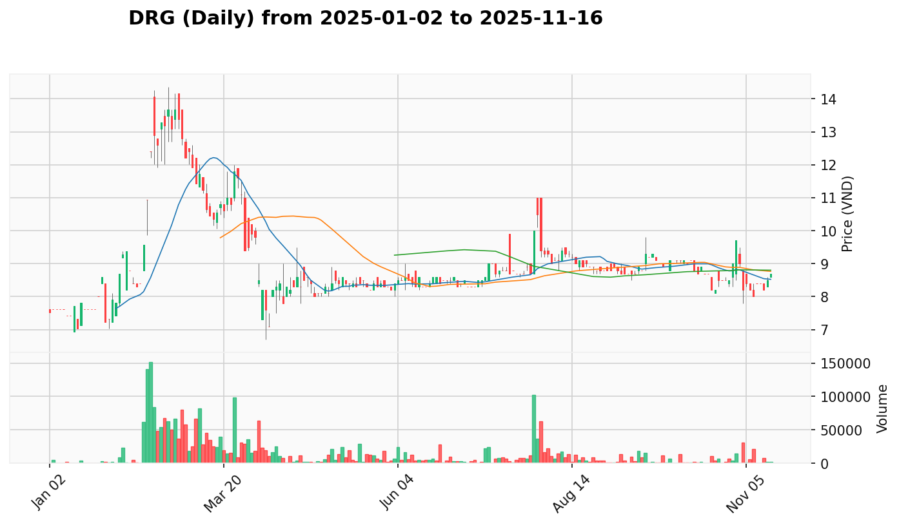

<a href="#cao-su">↑ Back to group CAO_SU</a>  |  <a href="#vpa-signal-summary">↑ Back to Top</a>

#### Key Statistics
| Metric | Value |
|:---|---:|
| Date Range | 2025-01-02 to 2025-11-07 |
| **Latest Close** | **8.0** |
| Period Open | 7.62 |
| Period High | 14.36 |
| Period Low | 6.7 |
| Period Change % | 4.99% |

**[Download DRG Data (.csv)](market_data/DRG_2025-01-02_to_2025-11-09.csv)**

---

### DRI

#### [VPA Analysis (2025-08-04 - 2025-10-21)](./VPA.md#dri)
> **Ngày 2025-10-15:** DRI giữ nguyên mức đóng cửa 11.0 VND so với phiên trước, với biên độ nến hẹp từ 10.8 VND đến 11.1 VND. Khối lượng giao dịch đạt 0.4357 triệu cổ phiếu, giảm đáng kể so với phiên trước (0.7128 triệu cổ phiếu). Sau phiên "Sign of Weakness" (SOW) ngày 2025-10-14 với áp lực bán mạnh, phiên hôm nay cho thấy giá không thể phục hồi và đóng cửa ở mức thấp của biên độ hẹp, cùng với khối lượng giảm mạnh. Điều này cho thấy sự thiếu vắng lực cầu, xác nhận sự yếu kém của thị trường. **Phân tích VPA/Wyckoff:** No Demand (Không có cầu)
> **Ngày 2025-10-16:** DRI giữ nguyên mức đóng cửa 11.0 VND so với phiên trước. Biên độ nến hẹp từ 10.8 VND đến 11.2 VND, đóng cửa ở giữa nến. Khối lượng giao dịch đạt 0.2682 triệu cổ phiếu, giảm đáng kể so với phiên trước (0.4357 triệu cổ phiếu). Sau hai phiên "Sign of Weakness" và "No Demand", phiên hôm nay cho thấy giá không thể phục hồi và duy trì ở mức thấp với khối lượng giao dịch rất thấp. Điều này tiếp tục xác nhận sự thiếu vắng lực cầu và sự yếu kém của thị trường. **Phân tích VPA/Wyckoff:** No Demand (Không có cầu)
> **Ngày 2025-10-17:** DRI giảm từ 10.9 VND xuống 10.8 VND với biên độ nến hẹp từ 10.5 VND đến 11.0 VND và đóng cửa ở mức thấp của biên độ. Khối lượng giao dịch đạt 0.18 triệu cổ phiếu, giảm mạnh so với phiên trước (0.3584 triệu cổ phiếu). Sau hai phiên "No Demand" liên tiếp, giá tiếp tục giảm nhẹ với khối lượng cực thấp, xác nhận sự thiếu vắng hoàn toàn lực cầu và sự yếu kém tiếp diễn của thị trường. **Phân tích VPA/Wyckoff:** No Demand (Không có cầu)
> **Ngày 2025-10-20:** DRI giảm từ 10.8 VND xuống 10.5 VND. Biên độ nến hẹp từ 10.3 VND đến 10.9 VND, đóng cửa gần mức thấp nhất. Khối lượng giao dịch đạt 0.4615 triệu cổ phiếu, tăng đáng kể so với phiên trước (0.18 triệu cổ phiếu). Sau hai phiên "No Demand", giá tiếp tục giảm với khối lượng gia tăng, cho thấy áp lực bán đang quay trở lại và sự yếu kém của thị trường tiếp diễn. **Phân tích VPA/Wyckoff:** Sign of Weakness (SOW)
> **Ngày 2025-10-21:** DRI mở cửa ở 10.5 VND, dao động trong biên độ hẹp từ 10.3 VND đến 10.6 VND và đóng cửa ở mức 10.5 VND, không thay đổi so với giá đóng cửa phiên trước. Khối lượng giao dịch đạt 0.3463 triệu cổ phiếu, giảm đáng kể so với phiên trước (0.4615 triệu cổ phiếu). Sau phiên "Sign of Weakness" (SOW) với giá giảm và khối lượng tăng, phiên này cho thấy giá đi ngang với khối lượng giảm, xác nhận sự thiếu vắng lực cầu và sự yếu kém tiếp diễn của thị trường. **Phân tích VPA/Wyckoff:** No Demand (Không có cầu)

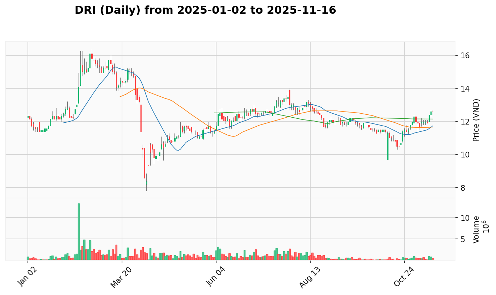

<a href="#cao-su">↑ Back to group CAO_SU</a>  |  <a href="#vpa-signal-summary">↑ Back to Top</a>

#### Key Statistics
| Metric | Value |
|:---|---:|
| Date Range | 2025-01-02 to 2025-11-07 |
| **Latest Close** | **12.0** |
| Period Open | 12.25 |
| Period High | 16.39 |
| Period Low | 7.81 |
| Period Change % | -2.04% |

**[Download DRI Data (.csv)](market_data/DRI_2025-01-02_to_2025-11-09.csv)**

---

### DSC

#### [VPA Analysis (2025-08-04 - 2025-10-21)](./VPA.md#dsc)
> **Ngày 2025-10-15:** DSC mở cửa ở mức 17.3 VND, giảm xuống 17.25 VND nhưng đã phục hồi và đóng cửa ở mức 17.5 VND. Giá đóng cửa thấp hơn so với phiên trước (17.7 VND). Khối lượng giao dịch đạt 0.0587 triệu cổ phiếu, giảm đáng kể so với phiên trước (0.183128 triệu cổ phiếu) và là mức thấp nhất trong 10 phiên gần đây. Sự sụt giảm giá nhẹ với khối lượng rất thấp sau phiên Nỗ lực không mang lại kết quả (EWR) vào ngày 2025-10-14 cho thấy lực cung đã cạn kiệt tạm thời và không có áp lực bán đáng kể ở mức giá hiện tại. Điều này có thể là một dấu hiệu cho thấy thị trường đang kiểm tra nguồn cung trước khi có thể có một động thái tăng giá. **Phân tích VPA/Wyckoff:** No Supply (NS) - Không có nguồn cung.
> **Ngày 2025-10-16:** DSC mở cửa ở mức 17.45 VND, tăng lên 17.5 VND nhưng sau đó giảm xuống 17.15 VND và đóng cửa ở mức 17.2 VND, thấp hơn đáng kể so với phiên trước (17.5 VND). Khối lượng giao dịch đạt 0.0468 triệu cổ phiếu, giảm mạnh so với phiên trước (0.058964 triệu cổ phiếu) và là mức thấp nhất trong 10 phiên gần đây. Sau phiên Không có nguồn cung (NS) vào ngày 2025-10-15, việc giá giảm với biên độ tương đối rộng và đóng cửa gần mức thấp nhất phiên, cùng với khối lượng cực thấp, cho thấy lực cầu hoàn toàn vắng mặt và không có sự hỗ trợ giá từ bên mua. Điều này xác nhận sự yếu ớt của thị trường và khả năng giá sẽ tiếp tục giảm. **Phân tích VPA/Wyckoff:** No Demand (ND) - Không có nhu cầu.
> **Ngày 2025-10-17:** DSC mở cửa ở mức 17.5 VND, giảm mạnh xuống 16.9 VND và đóng cửa gần mức thấp nhất phiên là 16.35 VND. Giá đóng cửa thấp hơn đáng kể so với phiên trước (17.5 VND). Khối lượng giao dịch đạt 0.1722 triệu cổ phiếu, tăng mạnh so với phiên trước (0.087 triệu cổ phiếu) và là mức cao nhất trong 3 phiên gần đây. Sau phiên Không có nhu cầu (ND) vào ngày 2025-10-16, việc giá giảm mạnh với biên độ rộng và đóng cửa gần mức thấp nhất phiên, đi kèm với khối lượng gia tăng, cho thấy áp lực bán mạnh mẽ và nguồn cung đang tràn vào thị trường. Điều này xác nhận sự yếu ớt của thị trường và khả năng giá sẽ tiếp tục giảm sâu hơn. **Phân tích VPA/Wyckoff:** Sign of Weakness (SOW) - Dấu hiệu yếu ớt.
> **Ngày 2025-10-20:** DSC mở cửa ở mức 16.85 VND, giảm mạnh xuống 15.75 VND và đóng cửa ở mức thấp nhất phiên là 15.75 VND. Giá đóng cửa thấp hơn đáng kể so với phiên trước (16.9 VND). Khối lượng giao dịch đạt 0.1067 triệu cổ phiếu, giảm so với phiên trước (0.1722 triệu cổ phiếu). Sau phiên Dấu hiệu yếu ớt (SOW) vào ngày 2025-10-17, việc giá tiếp tục giảm mạnh với biên độ rộng và đóng cửa ở mức thấp nhất phiên, đi kèm với khối lượng giảm, cho thấy áp lực bán vẫn duy trì và không có lực cầu hỗ trợ. Điều này xác nhận sự yếu ớt của thị trường và khả năng giá sẽ tiếp tục giảm. **Phân tích VPA/Wyckoff:** Weakness (Yếu ớt)
> **Ngày 2025-10-21:** DSC mở cửa ở mức 15.85 VND, giảm xuống mức thấp nhất 15.0 VND và sau đó phục hồi nhẹ để đóng cửa ở mức 15.8 VND, cao hơn một chút so với giá đóng cửa phiên trước (15.75 VND). Biên độ giá trong phiên rộng (1.0 VND), cho thấy sự biến động mạnh. Khối lượng giao dịch đạt 0.1562 triệu cổ phiếu, tăng đáng kể so với phiên trước (0.1067 triệu cổ phiếu). Sau hai phiên giảm mạnh với các tín hiệu yếu ớt, phiên này cho thấy áp lực bán vẫn duy trì khi giá chạm mức thấp mới 15.0 VND, nhưng đồng thời cũng xuất hiện lực cầu hấp thụ, giúp giá phục hồi và đóng cửa không ở mức thấp nhất. Sự gia tăng khối lượng trong bối cảnh này cho thấy một cuộc chiến giữa cung và cầu, với khả năng là một nỗ lực dừng đà giảm. Tuy nhiên, chưa có dấu hiệu rõ ràng của sự đảo chiều mạnh mẽ. **Phân tích VPA/Wyckoff:** Stopping Action (Hành động dừng giảm)

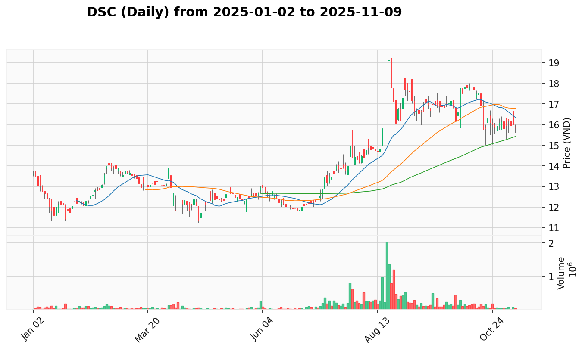

<a href="#chung-khoan">↑ Back to group CHUNG_KHOAN</a>  |  <a href="#vpa-signal-summary">↑ Back to Top</a>

#### Key Statistics
| Metric | Value |
|:---|---:|
| Date Range | 2025-01-02 to 2025-11-07 |
| **Latest Close** | **15.85** |
| Period Open | 13.59 |
| Period High | 19.22 |
| Period Low | 11.04 |
| Period Change % | 16.63% |

**[Download DSC Data (.csv)](market_data/DSC_2025-01-02_to_2025-11-09.csv)**

---

### DSN

#### [VPA Analysis (2025-08-14 - 2025-10-21)](./VPA.md#dsn)
> **Ngày 2025-10-15:** DSN tăng từ 44.75 VND lên 44.85 VND với khối lượng giao dịch đạt 0.0036 triệu cổ phiếu. Cây nến tăng có biên độ hẹp và đóng cửa ở mức cao nhất phiên. So với phiên trước (2025-10-14) có lực cung mạnh mẽ, phiên này cho thấy giá tăng nhẹ nhưng với khối lượng giao dịch giảm đáng kể, cho thấy lực cầu không được duy trì và thiếu sự xác nhận. Điều này có thể là dấu hiệu của sự yếu kém hoặc thiếu cầu sau phiên giảm mạnh. **Phân tích VPA/Wyckoff:** No Demand (Thiếu cầu)
> **Ngày 2025-10-16:** DSN giữ nguyên mức giá 44.85 VND với khối lượng giao dịch đạt 0.0009 triệu cổ phiếu. Cây nến có biên độ cực hẹp, cho thấy sự thiếu vắng hoàn toàn của cả cung và cầu. So với phiên trước (2025-10-15) có lực cầu yếu, phiên này xác nhận sự thiếu hụt thanh khoản và không có sự quan tâm từ thị trường. **Phân tích VPA/Wyckoff:** No Demand (Thiếu cầu) - Xác nhận.
> **Ngày 2025-10-17:** DSN giảm từ 44.9 VND xuống 44.65 VND với khối lượng giao dịch đạt 0.006 triệu cổ phiếu. Cây nến giảm có biên độ hẹp và đóng cửa gần mức thấp nhất phiên. So với phiên trước (2025-10-16) có khối lượng giao dịch cực thấp và giá đi ngang, phiên này cho thấy sự xuất hiện của lực cung khi giá giảm với khối lượng gia tăng. Điều này cho thấy áp lực bán đang gia tăng sau giai đoạn thiếu cầu. **Phân tích VPA/Wyckoff:** Supply Coming In (Lực cung xuất hiện)
> **Ngày 2025-10-20:** DSN giảm từ 44.7 VND xuống 44.0 VND với khối lượng giao dịch đạt 0.0061 triệu cổ phiếu. Cây nến giảm có biên độ rộng và đóng cửa ở mức thấp nhất phiên. So với phiên trước (2025-10-17) có lực cung xuất hiện, phiên này cho thấy áp lực bán tiếp tục gia tăng mạnh mẽ, đẩy giá xuống sâu hơn với khối lượng duy trì ở mức tương đương. Điều này xác nhận sự yếu kém của thị trường và khả năng tiếp tục giảm giá. **Phân tích VPA/Wyckoff:** Sign of Weakness (SOW) - Lực cung mạnh mẽ.
> **Ngày 2025-10-21:** DSN tăng từ 44.0 VND lên 44.5 VND với khối lượng giao dịch đạt 0.0051 triệu cổ phiếu. Cây nến tăng có biên độ hẹp và đóng cửa ở mức cao nhất phiên. So với phiên giảm mạnh trước đó (2025-10-20) với khối lượng cao, phiên này cho thấy sự phục hồi yếu ớt với khối lượng thấp hơn. Điều này cho thấy lực cầu chưa thực sự mạnh mẽ để đảo ngược xu hướng giảm giá. **Phân tích VPA/Wyckoff:** No Demand (Không có cầu)

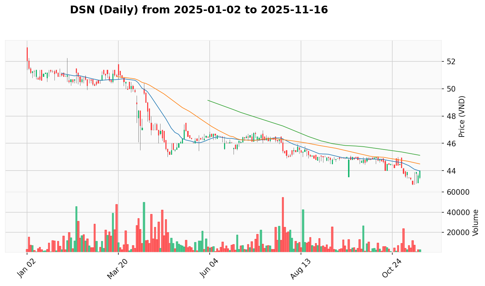

<a href="#others">↑ Back to group OTHERS</a>  |  <a href="#vpa-signal-summary">↑ Back to Top</a>

#### Key Statistics
| Metric | Value |
|:---|---:|
| Date Range | 2025-01-02 to 2025-11-07 |
| **Latest Close** | **43.4** |
| Period Open | 53.03 |
| Period High | 53.03 |
| Period Low | 43.3 |
| Period Change % | -18.16% |

**[Download DSN Data (.csv)](market_data/DSN_2025-01-02_to_2025-11-09.csv)**

---

### DST

#### [VPA Analysis (2025-08-14 - 2025-10-21)](./VPA.md#dst)
> **Ngày 2025-10-15:** DST giữ nguyên mức giá đóng cửa 9.4 VND, không thay đổi so với phiên trước, với khối lượng giao dịch đạt 0.0608 triệu cổ phiếu, thấp hơn so với phiên trước (0.071 triệu cổ phiếu). Cây nến có biên độ hẹp và đóng cửa ở mức cao nhất phiên, cho thấy lực cầu vẫn duy trì nhưng không còn mạnh mẽ như phiên SOS ngày 2025-10-14. Sự sụt giảm khối lượng trong khi giá giữ vững tại mức kháng cự 9.4 VND (đỉnh của phiên SOS ngày 2025-10-08) cho thấy thị trường đang kiểm tra lại lực cung tại vùng giá này. **Phân tích VPA/Wyckoff:** Test - Kiểm tra lại lực cung.
> **Ngày 2025-10-16:** DST giảm từ 9.4 VND xuống 9.1 VND với khối lượng giao dịch đạt 0.038 triệu cổ phiếu, thấp hơn đáng kể so với phiên trước (0.0608 triệu cổ phiếu). Cây nến giảm có biên độ hẹp và đóng cửa gần mức thấp nhất phiên, cho thấy lực cầu yếu đi và không thể duy trì mức giá 9.4 VND sau phiên kiểm tra cung trước đó. Khối lượng thấp trong khi giá giảm cho thấy lực cung không quá mạnh nhưng thiếu vắng lực cầu hỗ trợ, xác nhận sự yếu kém của xu hướng tăng ngắn hạn. **Phân tích VPA/Wyckoff:** No Demand (Không có cầu).
> **Ngày 2025-10-17:** DST giữ nguyên mức giá đóng cửa 9.2 VND, không thay đổi so với phiên trước, với khối lượng giao dịch đạt 0.0427 triệu cổ phiếu, cao hơn một chút so với phiên trước (0.040 triệu cổ phiếu). Cây nến có biên độ rộng hơn, giá giảm xuống mức thấp 8.8 VND nhưng sau đó phục hồi và đóng cửa ở mức 9.2 VND, gần mức cao nhất phiên. Điều này cho thấy có lực cầu xuất hiện tại vùng giá thấp, hấp thụ lực cung sau phiên "No Demand" ngày 2025-10-16. **Phân tích VPA/Wyckoff:** Test for Supply (Kiểm tra cung)
> **Ngày 2025-10-20:** DST giảm từ 9.2 VND xuống 9.0 VND với khối lượng giao dịch đạt 0.1355 triệu cổ phiếu, cao hơn đáng kể so với phiên trước (0.0427 triệu cổ phiếu). Cây nến có biên độ rộng, giá mở cửa thấp, sau đó tăng mạnh lên 10.0 VND nhưng không thể duy trì và đóng cửa ở 9.0 VND, tạo thành một bóng nến trên dài. Điều này cho thấy lực cung mạnh mẽ xuất hiện tại các mức giá cao, hấp thụ toàn bộ lực cầu và đẩy giá xuống. Sự tăng vọt về khối lượng xác nhận áp lực bán gia tăng sau khi giá cố gắng vượt qua các mức kháng cự trước đó. **Phân tích VPA/Wyckoff:** Upthrust (UT)
> **Ngày 2025-10-21:** DST tăng từ 9.0 VND lên 9.2 VND với khối lượng giao dịch đạt 0.0436 triệu cổ phiếu, thấp hơn đáng kể so với phiên trước. Cây nến có biên độ hẹp và đóng cửa ở mức cao nhất phiên. Tuy nhiên, sự tăng giá với khối lượng thấp sau phiên Upthrust ngày 2025-10-20 cho thấy lực cầu yếu và thiếu sự xác nhận cho một xu hướng tăng bền vững. **Phân tích VPA/Wyckoff:** No Demand (Thiếu cầu)

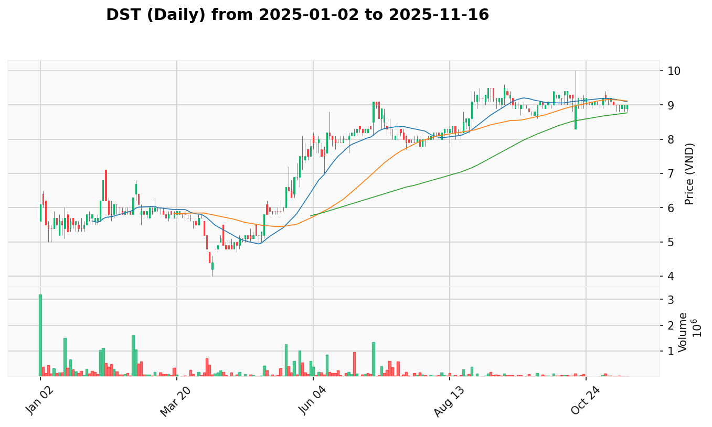

<a href="#penny">↑ Back to group PENNY</a>  |  <a href="#vpa-signal-summary">↑ Back to Top</a>

#### Key Statistics
| Metric | Value |
|:---|---:|
| Date Range | 2025-01-02 to 2025-11-07 |
| **Latest Close** | **9.0** |
| Period Open | 5.6 |
| Period High | 10.0 |
| Period Low | 4.0 |
| Period Change % | 60.71% |

**[Download DST Data (.csv)](market_data/DST_2025-01-02_to_2025-11-09.csv)**

---

### DTD

#### [VPA Analysis (2025-08-04 - 2025-10-21)](./VPA.md#dtd)
> **Ngày 2025-10-15:** DTD mở cửa ở mức 21.9 VND và giảm xuống 21.5 VND với khối lượng giao dịch đạt 0.7106 triệu cổ phiếu, giảm đáng kể so với phiên trước (1.4631 triệu cổ phiếu). Cây nến có thân rộng, đóng cửa ở mức thấp nhất phiên, cho thấy lực bán vẫn chiếm ưu thế. Tuy nhiên, khối lượng giảm cho thấy áp lực bán có phần suy yếu hoặc lực cầu không xuất hiện để hấp thụ. Sau phiên Sign of Weakness mạnh mẽ trước đó, việc giá tiếp tục giảm với khối lượng thấp hơn cho thấy sự thiếu vắng lực cầu, xác nhận xu hướng giảm giá. **Phân tích VPA/Wyckoff:** No Demand (ND) - Thiếu vắng lực cầu.
> **Ngày 2025-10-16:** DTD mở cửa ở mức 21.5 VND và tăng lên 21.8 VND với khối lượng giao dịch đạt 0.3501 triệu cổ phiếu, giảm mạnh so với phiên trước (0.7106 triệu cổ phiếu). Cây nến có thân nhỏ, đóng cửa cao hơn giá mở cửa nhưng khối lượng giao dịch cực thấp. Sau hai phiên giảm giá liên tiếp với tín hiệu SOW và ND, việc giá tăng nhẹ với khối lượng cạn kiệt cho thấy áp lực bán đã tạm thời suy yếu nhưng lực cầu vẫn chưa thực sự quay trở lại để đẩy giá lên cao hơn. Đây là dấu hiệu của sự cạn kiệt nguồn cung tạm thời. **Phân tích VPA/Wyckoff:** No Supply (NS) - Cạn kiệt nguồn cung.
> **Ngày 2025-10-17:** DTD mở cửa ở mức 22.1 VND và giảm mạnh xuống 21.3 VND, đóng cửa ở mức thấp nhất phiên, với khối lượng giao dịch đạt 0.631 triệu cổ phiếu, cao hơn một chút so với phiên trước (0.6034 triệu cổ phiếu). Cây nến giảm có thân rộng, cho thấy lực bán áp đảo và đẩy giá xuống sâu. Sau phiên No Supply trước đó, việc giá giảm mạnh với khối lượng tăng nhẹ cho thấy áp lực bán đã quay trở lại và tiếp tục xu hướng giảm giá. **Phân tích VPA/Wyckoff:** Sign of Weakness (SOW) - Lực bán mạnh mẽ.
> **Ngày 2025-10-20:** DTD mở cửa ở mức 21.2 VND và giảm mạnh xuống 19.2 VND, đóng cửa ở mức thấp nhất phiên, với khối lượng giao dịch đạt 1.5087 triệu cổ phiếu, tăng đáng kể so với phiên trước (0.631 triệu cổ phiếu). Cây nến giảm có biên độ rất rộng, cho thấy lực bán áp đảo và đẩy giá xuống sâu. Sau phiên Sign of Weakness trước đó, việc giá tiếp tục giảm mạnh với khối lượng gia tăng cho thấy áp lực bán vẫn rất lớn và xu hướng giảm giá tiếp diễn. **Phân tích VPA/Wyckoff:** Sign of Weakness (SOW) - Lực bán mạnh mẽ tiếp diễn.
> **Ngày 2025-10-21:** DTD mở cửa ở mức 19.2 VND và tăng nhẹ lên 19.5 VND, đóng cửa trên giá mở cửa nhưng dưới mức cao nhất phiên, với khối lượng giao dịch đạt 0.9966 triệu cổ phiếu, thấp hơn đáng kể so với phiên trước (1.5087 triệu cổ phiếu). Sau hai phiên giảm mạnh liên tiếp với khối lượng lớn (Sign of Weakness), phiên hôm nay cho thấy sự phục hồi giá yếu ớt trên khối lượng thấp, cho thấy lực cầu chưa đủ mạnh để đảo chiều xu hướng giảm. **Phân tích VPA/Wyckoff:** No Demand (ND) - Thiếu lực cầu.

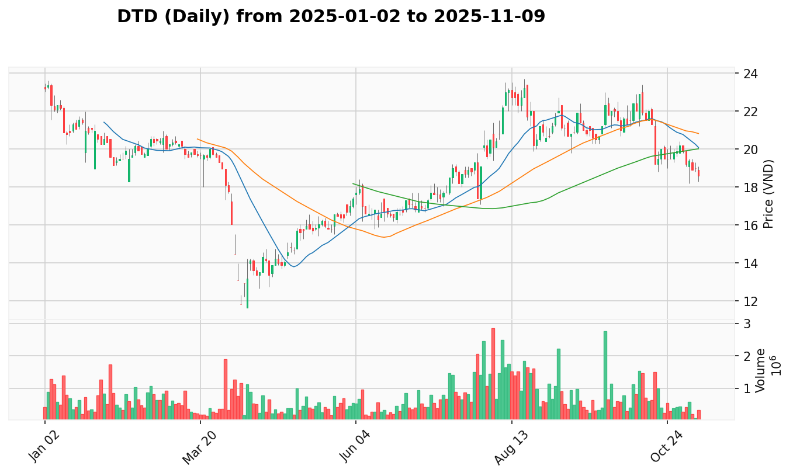

<a href="#bat-dong-san-kcn">↑ Back to group BAT_DONG_SAN_KCN</a>  |  <a href="#vpa-signal-summary">↑ Back to Top</a>

#### Key Statistics
| Metric | Value |
|:---|---:|
| Date Range | 2025-01-02 to 2025-11-07 |
| **Latest Close** | **18.6** |
| Period Open | 23.28 |
| Period High | 23.7 |
| Period Low | 11.64 |
| Period Change % | -20.10% |

**[Download DTD Data (.csv)](market_data/DTD_2025-01-02_to_2025-11-09.csv)**

---

### DVN

#### [VPA Analysis (2025-06-26 - 2025-10-21)](./VPA.md#dvn)
> **Ngày 2025-10-15:** DVN giữ nguyên mức giá 21.0 VND. Biên độ giá rất hẹp (từ 20.8 đến 21.0 VND) và đóng cửa ở mức mở cửa, cho thấy sự thiếu biến động và không có bên nào chiếm ưu thế. Khối lượng giao dịch chỉ đạt 0.0097 triệu cổ phiếu, giảm mạnh so với phiên trước (0.0536 triệu cổ phiếu) và là mức thấp nhất trong nhiều phiên gần đây. Sau phiên "Nỗ lực không có kết quả" ngày 14-10, việc giá đi ngang với khối lượng cực thấp cho thấy lực cầu hoàn toàn vắng mặt và thị trường đang trong trạng thái thờ ơ, không có động lực tăng giá. **Phân tích VPA/Wyckoff:** No Demand (Không có cầu) - Lực cầu vắng mặt và thị trường thờ ơ.
> **Ngày 2025-10-16:** DVN mở cửa ở mức 20.9 VND và đóng cửa ở mức 20.8 VND, giảm 0.1 VND. Giá đã cố gắng tăng lên mức 20.9 VND nhưng không duy trì được và đóng cửa gần mức thấp nhất phiên. Cây nến có biên độ rất hẹp (từ 20.7 đến 20.9 VND) cho thấy sự yếu kém. Khối lượng giao dịch đạt 0.0134 triệu cổ phiếu, tăng nhẹ so với phiên trước (0.0097 triệu cổ phiếu) nhưng vẫn ở mức thấp. Sau phiên "Không có cầu" ngày 15-10, việc giá giảm nhẹ với khối lượng thấp cho thấy lực cầu tiếp tục vắng mặt và không có sự hỗ trợ đáng kể nào, xác nhận tâm lý yếu kém của thị trường. **Phân tích VPA/Wyckoff:** Lack of Support (Thiếu sự hỗ trợ) - Lực cầu vắng mặt và giá giảm nhẹ trên khối lượng thấp.
> **Ngày 2025-10-17:** DVN mở cửa ở mức 20.8 VND và đóng cửa ở mức 20.6 VND, giảm 0.2 VND. Giá đã cố gắng tăng lên mức 20.9 VND nhưng không duy trì được và đóng cửa ở mức thấp nhất phiên. Biên độ giá hẹp (từ 20.6 đến 20.9 VND) cho thấy sự yếu kém. Khối lượng giao dịch đạt 0.023 triệu cổ phiếu, tăng nhẹ so với phiên trước (0.0196 triệu cổ phiếu) nhưng vẫn ở mức thấp. Sau các phiên "Không có cầu" và "Thiếu sự hỗ trợ", việc giá tiếp tục giảm với khối lượng thấp và đóng cửa ở mức thấp nhất phiên xác nhận lực cầu vẫn vắng mặt và tâm lý thị trường tiếp tục suy yếu. **Phân tích VPA/Wyckoff:** Weakness (Yếu kém) - Giá giảm với khối lượng thấp, đóng cửa ở mức thấp nhất phiên, cho thấy sự tiếp diễn của lực bán yếu và thiếu sự hỗ trợ.
> **Ngày 2025-10-20:** DVN mở cửa ở mức 20.8 VND và đóng cửa ở mức 20.0 VND, giảm 0.8 VND. Giá đã cố gắng tăng lên mức 20.9 VND nhưng không duy trì được và đóng cửa ở mức thấp nhất phiên. Biên độ giá rộng (từ 20.0 đến 20.9 VND) cho thấy lực bán mạnh. Khối lượng giao dịch đạt 0.0102 triệu cổ phiếu, giảm so với phiên trước (0.023 triệu cổ phiếu) và ở mức thấp. Sau các phiên "Thiếu sự hỗ trợ" và "Yếu kém", việc giá giảm mạnh với khối lượng thấp và đóng cửa ở mức thấp nhất phiên cho thấy lực cầu tiếp tục vắng mặt và tâm lý thị trường cực kỳ bi quan, xác nhận sự tiếp diễn của xu hướng giảm. **Phân tích VPA/Wyckoff:** Weakness (Yếu kém)
> **Ngày 2025-10-21:** DVN mở cửa ở mức 20.4 VND và đóng cửa ở mức 20.5 VND, tăng 0.1 VND. Giá đã cố gắng tăng lên mức 20.8 VND nhưng không duy trì được. Biên độ giá hẹp (từ 20.4 đến 20.8 VND) cho thấy sự thiếu quyết đoán. Khối lượng giao dịch đạt 0.0043 triệu cổ phiếu, giảm đáng kể so với phiên trước (0.0102 triệu cổ phiếu) và ở mức cực kỳ thấp. Sau các phiên "Yếu kém" liên tiếp, việc giá tăng nhẹ với khối lượng cực thấp và biên độ hẹp cho thấy lực cầu vẫn vắng mặt và không có sự hỗ trợ đáng kể, xác nhận sự tiếp diễn của xu hướng giảm hoặc giai đoạn tích lũy yếu. **Phân tích VPA/Wyckoff:** No Demand (Không có cầu) - Giá tăng nhẹ với khối lượng cực thấp sau đợt giảm mạnh, cho thấy thiếu sự quan tâm từ người mua và khả năng tiếp diễn xu hướng giảm.

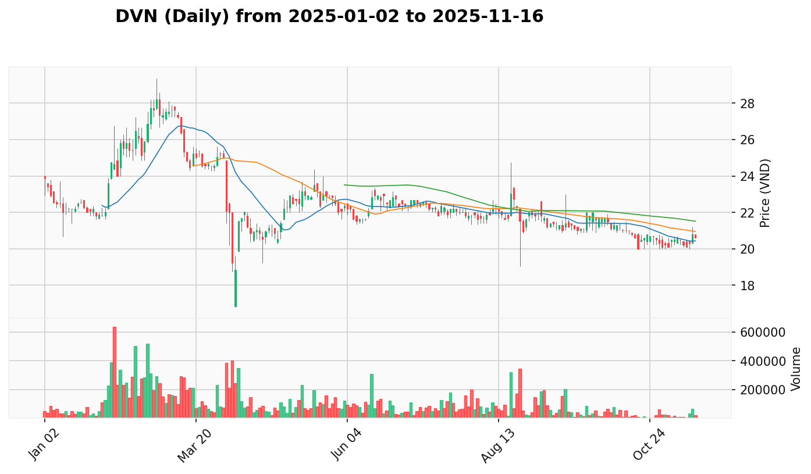

<a href="#suc-khoe">↑ Back to group SUC_KHOE</a>  |  <a href="#vpa-signal-summary">↑ Back to Top</a>

#### Key Statistics
| Metric | Value |
|:---|---:|
| Date Range | 2025-01-02 to 2025-11-07 |
| **Latest Close** | **20.5** |
| Period Open | 24.0 |
| Period High | 29.35 |
| Period Low | 16.83 |
| Period Change % | -14.58% |

**[Download DVN Data (.csv)](market_data/DVN_2025-01-02_to_2025-11-09.csv)**

---

### DVP

#### [VPA Analysis (2025-08-14 - 2025-10-21)](./VPA.md#dvp)
> **Ngày 2025-10-15:** DVP tăng từ 70.3 VND lên 70.5 VND với khối lượng giao dịch đạt 0.0111 triệu cổ phiếu. Cây nến tăng có biên độ tương đối rộng, nhưng giá đóng cửa chỉ cao hơn một chút so với giá mở cửa và thấp hơn đáng kể so với mức cao nhất phiên. Khối lượng giao dịch tăng đáng kể so với phiên Không có lực cầu (ND) trước đó (0.0033 triệu cổ phiếu), nhưng vẫn thấp hơn phiên Lực cung áp đảo (SOW) vào ngày 2025-10-13 (0.0212 triệu cổ phiếu). Điều này cho thấy mặc dù có sự gia tăng về lực cầu, nhưng áp lực bán vẫn còn mạnh ở các mức giá cao hơn, khiến giá không thể duy trì đà tăng. Đây có thể là một nỗ lực kiểm tra nguồn cung sau giai đoạn yếu kém của thị trường. **Phân tích VPA/Wyckoff:** Test for Supply (TOS) - Kiểm tra nguồn cung
> **Ngày 2025-10-16:** DVP tăng từ 70.5 VND lên 71.0 VND với khối lượng giao dịch đạt 0.0006 triệu cổ phiếu. Cây nến có biên độ cực hẹp (giá mở cửa, cao nhất, thấp nhất và đóng cửa đều ở mức 71.0 VND), cho thấy sự lưỡng lự hoặc thiếu vắng giao dịch thực sự. Khối lượng giao dịch cực kỳ thấp, giảm mạnh so với phiên trước đó (0.0111 triệu cổ phiếu) và thấp hơn nhiều so với mức trung bình gần đây. Sau phiên Kiểm tra nguồn cung (TOS), sự xuất hiện của một phiên tăng giá nhẹ với khối lượng cực thấp cho thấy không có lực cầu đáng kể tham gia vào thị trường. Điều này xác nhận sự yếu kém của thị trường và khả năng cao xu hướng giảm sẽ tiếp diễn hoặc thị trường sẽ đi ngang trong biên độ hẹp. **Phân tích VPA/Wyckoff:** No Demand (ND) - Không có lực cầu
> **Ngày 2025-10-17:** DVP mở cửa ở mức 71.0 VND và đóng cửa ở mức 70.5 VND, với khối lượng giao dịch đạt 0.0077 triệu cổ phiếu. Trong phiên, giá có lúc tăng lên 71.1 VND nhưng sau đó bị đẩy xuống và đóng cửa ở mức thấp nhất phiên, bằng với giá đóng cửa của ngày hôm trước. Cây nến có biên độ tương đối rộng và giá đóng cửa thấp hơn giá mở cửa, cho thấy áp lực bán đã xuất hiện. Khối lượng giao dịch tăng đáng kể so với phiên Không có lực cầu (ND) trước đó (0.0013 triệu cổ phiếu), cho thấy sự tham gia của lực cung mạnh mẽ, hấp thụ mọi nỗ lực tăng giá. Điều này xác nhận sự yếu kém của thị trường và khả năng tiếp tục xu hướng giảm hoặc đi ngang. **Phân tích VPA/Wyckoff:** Weakness (Yếu kém)
> **Ngày 2025-10-20:** DVP mở cửa ở mức 71.0 VND và đóng cửa ở mức 70.2 VND, giảm 0.3 VND so với giá đóng cửa phiên trước (70.5 VND). Giá cao nhất trong phiên là 71.0 VND và giá thấp nhất là 70.2 VND. Cây nến có biên độ tương đối rộng và giá đóng cửa ở mức thấp nhất phiên, cho thấy áp lực bán mạnh mẽ. Khối lượng giao dịch đạt 0.015 triệu cổ phiếu, tăng đáng kể so với phiên trước (0.0077 triệu cổ phiếu) và cao hơn mức trung bình gần đây. Sự kết hợp giữa giá giảm, đóng cửa ở mức thấp nhất phiên và khối lượng giao dịch lớn xác nhận sự hiện diện của lực cung mạnh mẽ trên thị trường, tiếp nối tín hiệu yếu kém từ các phiên trước. Điều này cho thấy xu hướng giảm có thể tiếp diễn hoặc thị trường sẽ tiếp tục đi ngang với áp lực giảm giá. **Phân tích VPA/Wyckoff:** Weakness (Yếu kém)
> **Ngày 2025-10-21:** DVP mở cửa ở mức 70.1 VND, giá cao nhất đạt 70.5 VND và giá thấp nhất là 70.0 VND, đóng cửa tại 70.0 VND. So với phiên trước, giá đóng cửa tiếp tục giảm từ 70.2 VND xuống 70.0 VND. Cây nến có biên độ hẹp và giá đóng cửa ở mức thấp nhất phiên, cho thấy áp lực bán vẫn duy trì mạnh mẽ. Khối lượng giao dịch đạt 0.0147 triệu cổ phiếu, giảm nhẹ so với phiên trước (0.015 triệu cổ phiếu) nhưng vẫn ở mức tương đối cao, xác nhận sự tiếp diễn của lực cung. Điều này củng cố tín hiệu yếu kém của thị trường, cho thấy xu hướng giảm có thể tiếp tục hoặc giá sẽ đi ngang với xu hướng tiêu cực. **Phân tích VPA/Wyckoff:** Weakness (Yếu kém)

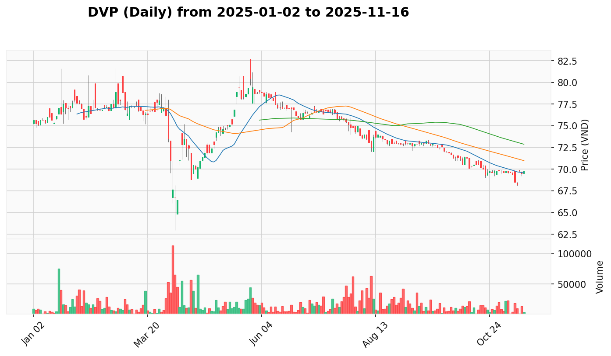

<a href="#van-tai">↑ Back to group VAN_TAI</a>  |  <a href="#vpa-signal-summary">↑ Back to Top</a>

#### Key Statistics
| Metric | Value |
|:---|---:|
| Date Range | 2025-01-02 to 2025-11-07 |
| **Latest Close** | **69.4** |
| Period Open | 75.28 |
| Period High | 82.71 |
| Period Low | 62.97 |
| Period Change % | -7.81% |

**[Download DVP Data (.csv)](market_data/DVP_2025-01-02_to_2025-11-09.csv)**

---

### DXG

#### [VPA Analysis (2025-08-04 - 2025-10-21)](./VPA.md#dxg)
> **Ngày 2025-10-15:** DXG tăng từ 20.5 VND lên 21.0 VND với khối lượng giao dịch đạt 28.0373 triệu cổ phiếu. Cây nến tăng có biên độ tương đối rộng, giá đóng cửa nằm gần mức cao nhất ngày, cho thấy lực cầu đã xuất hiện và hấp thụ một phần áp lực bán. Khối lượng giao dịch giảm so với phiên SOW mạnh mẽ ngày 2025-10-14 (33.4573 triệu cổ phiếu), điều này có thể cho thấy nguồn cung đã tạm thời giảm bớt sau phiên bán tháo. Đây là một phản ứng tích cực sau tín hiệu suy yếu, nhưng cần theo dõi thêm để xác nhận liệu đây có phải là sự cạn kiệt nguồn cung hay chỉ là một nhịp hồi phục kỹ thuật. **Phân tích VPA/Wyckoff:** Test for Supply (Kiểm tra nguồn cung)
> **Ngày 2025-10-16:** DXG tăng từ 21.15 VND lên 21.8 VND với khối lượng giao dịch đạt 30.5565 triệu cổ phiếu. Cây nến tăng có biên độ rộng, giá đóng cửa nằm gần mức cao nhất ngày. Khối lượng giao dịch gia tăng so với phiên trước (28.0373 triệu cổ phiếu) cho thấy lực cầu mạnh mẽ đã quay trở lại thị trường, hấp thụ hoàn toàn áp lực bán và đẩy giá lên cao. Đây là một tín hiệu tích cực, xác nhận sự kiểm tra nguồn cung thành công và cho thấy khả năng tiếp tục xu hướng tăng. **Phân tích VPA/Wyckoff:** Sign of Strength (SOS)
> **Ngày 2025-10-17:** DXG tăng từ 22.45 VND lên 22.6 VND với khối lượng giao dịch đạt 53.7573 triệu cổ phiếu. Cây nến có thân nến nhỏ, giá đóng cửa nằm gần mức thấp nhất ngày và có bóng nến trên dài, cho thấy áp lực bán đã xuất hiện mạnh mẽ khi giá cố gắng tăng cao. Khối lượng giao dịch giảm so với phiên SOS mạnh mẽ ngày 2025-10-16 (65.9085 triệu cổ phiếu), điều này có thể cho thấy lực cầu đã suy yếu hoặc nguồn cung đã bắt đầu quay trở lại. Đây là một tín hiệu cần theo dõi cẩn thận sau một phiên tăng mạnh. **Phân tích VPA/Wyckoff:** Test for Supply (Kiểm tra nguồn cung)
> **Ngày 2025-10-20:** DXG giảm từ 22.2 VND xuống 21.05 VND với khối lượng giao dịch đạt 38.4587 triệu cổ phiếu. Cây nến giảm có biên độ rộng, giá đóng cửa nằm ở mức thấp nhất ngày, cho thấy áp lực bán mạnh mẽ và sự suy yếu của lực cầu. Khối lượng giao dịch giảm so với phiên trước (53.7573 triệu cổ phiếu) trong khi giá giảm mạnh xác nhận sự thiếu vắng lực mua hỗ trợ, tiếp tục xu hướng suy yếu sau phiên kiểm tra nguồn cung. **Phân tích VPA/Wyckoff:** Sign of Weakness (SOW)
> **Ngày 2025-10-21:** DXG giảm từ 21.05 VND xuống 20.0 VND với khối lượng giao dịch đạt 44.0969 triệu cổ phiếu. Cây nến giảm có biên độ rộng, giá đóng cửa nằm gần mức thấp nhất ngày, cho thấy áp lực bán mạnh mẽ. Khối lượng giao dịch gia tăng so với phiên trước (38.4587 triệu cổ phiếu) trong khi giá tiếp tục giảm mạnh, xác nhận nguồn cung đang áp đảo và lực cầu yếu. Đây là tín hiệu tiếp tục suy yếu sau phiên SOW ngày 2025-10-20. **Phân tích VPA/Wyckoff:** Sign of Weakness (SOW) - Nguồn cung áp đảo

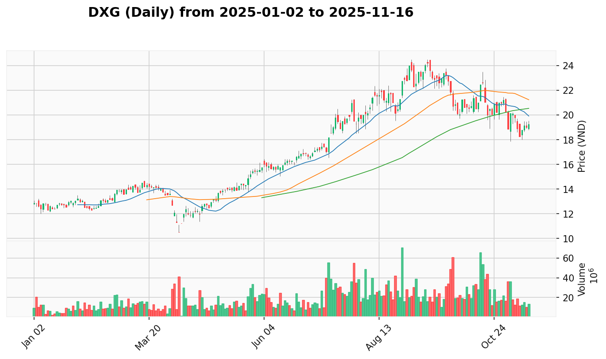

<a href="#bat-dong-san">↑ Back to group BAT_DONG_SAN</a>  |  <a href="#vpa-signal-summary">↑ Back to Top</a>

#### Key Statistics
| Metric | Value |
|:---|---:|
| Date Range | 2025-01-02 to 2025-11-07 |
| **Latest Close** | **18.9** |
| Period Open | 12.79 |
| Period High | 24.5 |
| Period Low | 10.51 |
| Period Change % | 47.77% |

**[Download DXG Data (.csv)](market_data/DXG_2025-01-02_to_2025-11-09.csv)**

---

### DXP

#### [VPA Analysis (2025-08-14 - 2025-10-21)](./VPA.md#dxp)
> **Ngày 2025-10-15:** DXP giữ nguyên mức giá 10.8 VND. Cây nến có biên độ 0.2 VND (từ 10.7 VND đến 10.9 VND), đóng cửa ở mức 10.8 VND. Khối lượng giao dịch đạt 0.0624 triệu cổ phiếu, giảm đáng kể so với phiên trước (0.1092 triệu cổ phiếu). Sau hai phiên suy yếu liên tiếp, việc giá đi ngang với khối lượng giảm mạnh cho thấy áp lực bán đã suy yếu đáng kể, nhưng đồng thời cũng chưa có lực cầu mạnh mẽ xuất hiện để đẩy giá lên. Thị trường đang trong giai đoạn lưỡng lự, chờ đợi tín hiệu rõ ràng hơn. **Phân tích VPA/Wyckoff:** No Supply (Không có nguồn cung)
> **Ngày 2025-10-16:** DXP giảm từ 10.8 VND xuống 10.7 VND. Cây nến có biên độ hẹp (0.1 VND), đóng cửa ở mức thấp nhất phiên. Khối lượng giao dịch đạt 0.0789 triệu cổ phiếu, tăng so với phiên trước (0.0624 triệu cổ phiếu). Sau phiên "No Supply" ngày 2025-10-15, việc giá giảm với khối lượng tăng và đóng cửa ở mức thấp nhất phiên cho thấy áp lực bán đã quay trở lại hoặc lực cầu không đủ mạnh để hấp thụ nguồn cung. Điều này xác nhận sự suy yếu của thị trường. **Phân tích VPA/Wyckoff:** Weakness (Suy yếu)
> **Ngày 2025-10-17:** DXP giữ nguyên mức giá 10.8 VND. Cây nến có biên độ 0.3 VND (từ 10.5 VND đến 10.8 VND), đóng cửa ở mức 10.8 VND, cho thấy lực cầu đã hấp thụ áp lực bán và đẩy giá lên từ mức thấp nhất phiên. Khối lượng giao dịch đạt 0.2219 triệu cổ phiếu, tăng đáng kể so với phiên trước (0.0936 triệu cổ phiếu). Sau phiên được đánh giá là "Suy yếu" ngày 2025-10-16, việc giá phục hồi từ mức thấp nhất với khối lượng tăng mạnh cho thấy sự xuất hiện của lực cầu, hấp thụ nguồn cung. **Phân tích VPA/Wyckoff:** Demand Coming In (Lực cầu xuất hiện)
> **Ngày 2025-10-20:** DXP giảm từ 10.7 VND xuống 10.3 VND. Cây nến có biên độ 0.5 VND, đóng cửa ở mức thấp nhất phiên. Khối lượng giao dịch đạt 0.1842 triệu cổ phiếu, giảm so với phiên trước (0.2219 triệu cổ phiếu). Sau phiên "Demand Coming In" ngày 2025-10-17, việc giá giảm mạnh với khối lượng giảm nhẹ và đóng cửa ở mức thấp nhất phiên cho thấy áp lực bán vẫn chiếm ưu thế và lực cầu không đủ mạnh để giữ giá. Điều này xác nhận sự suy yếu của thị trường. **Phân tích VPA/Wyckoff:** Weakness (Suy yếu)
> **Ngày 2025-10-21:** DXP giảm từ 10.3 VND xuống 10.2 VND. Cây nến có biên độ 0.3 VND (từ 10.0 VND đến 10.3 VND), đóng cửa gần mức thấp nhất phiên. Khối lượng giao dịch đạt 0.2664 triệu cổ phiếu, tăng đáng kể so với phiên trước (0.1842 triệu cổ phiếu). Sau phiên "Suy yếu" ngày 2025-10-20, việc giá tiếp tục giảm với khối lượng tăng mạnh cho thấy áp lực bán vẫn rất lớn và nguồn cung đang gia tăng. **Phân tích VPA/Wyckoff:** Supply Coming In (Nguồn cung xuất hiện)

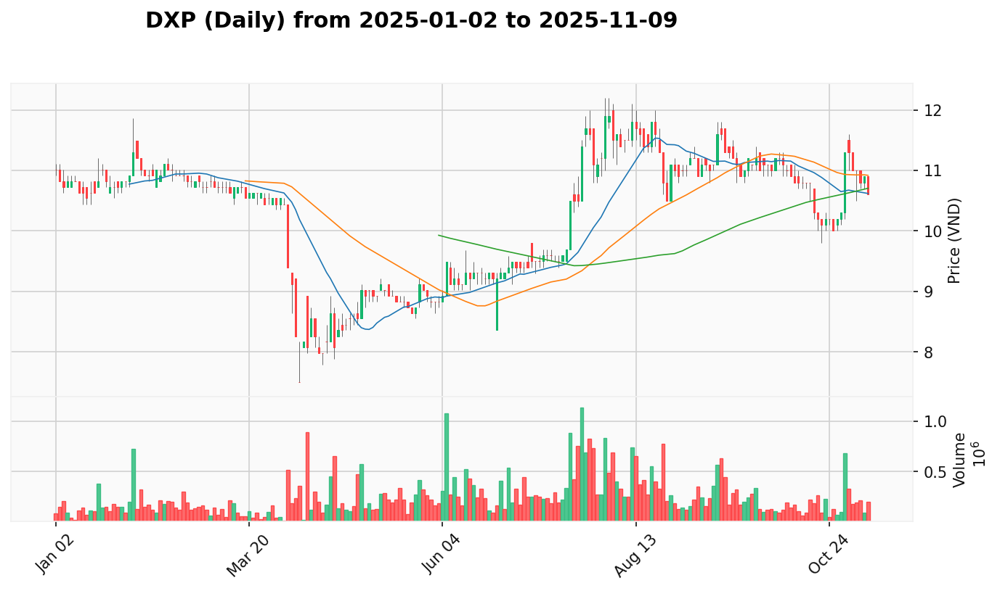

<a href="#van-tai">↑ Back to group VAN_TAI</a>  |  <a href="#vpa-signal-summary">↑ Back to Top</a>

#### Key Statistics
| Metric | Value |
|:---|---:|
| Date Range | 2025-01-02 to 2025-11-07 |
| **Latest Close** | **10.6** |
| Period Open | 11.01 |
| Period High | 12.2 |
| Period Low | 7.5 |
| Period Change % | -3.72% |

**[Download DXP Data (.csv)](market_data/DXP_2025-01-02_to_2025-11-09.csv)**

---

### EIB

#### [VPA Analysis (2025-08-04 - 2025-10-21)](./VPA.md#eib)
> **Ngày 2025-10-15:** EIB tăng nhẹ từ 26.5 VND lên 26.75 VND, đóng cửa ở mức 26.75 VND. Khối lượng giao dịch đạt 11.11 triệu cổ phiếu, giảm đáng kể so với phiên trước (17.84 triệu cổ phiếu). Sau phiên áp lực bán mạnh mẽ ngày 2025-10-14, phiên hôm nay giá tăng nhẹ với biên độ hẹp và khối lượng giảm, cho thấy lực cầu yếu và có thể là một đợt kiểm tra cung. Bóng nến trên dài cũng cho thấy áp lực bán vẫn còn ở vùng giá cao. **Phân tích VPA/Wyckoff:** Weak Rally (Rally yếu) - Lực cầu yếu sau áp lực bán mạnh.
> **Ngày 2025-10-16:** EIB tăng nhẹ từ 26.75 VND lên 26.85 VND, với biên độ hẹp. Khối lượng giao dịch đạt 3.30 triệu cổ phiếu, giảm mạnh so với phiên trước (11.11 triệu cổ phiếu). Sau hai phiên áp lực bán mạnh và hồi phục yếu, phiên hôm nay giá tăng nhẹ với khối lượng rất thấp, cho thấy lực cầu không đủ mạnh để đẩy giá lên cao hơn và thiếu sự quan tâm từ người mua. Điều này xác nhận sự yếu kém của đợt hồi phục. **Phân tích VPA/Wyckoff:** No Demand (Không có cầu) - Giá tăng nhẹ với khối lượng rất thấp, xác nhận lực cầu yếu.
> **Ngày 2025-10-17:** EIB giảm mạnh từ 26.7 VND xuống 25.8 VND, đóng cửa ở mức thấp nhất phiên. Khối lượng giao dịch đạt 13.14 triệu cổ phiếu, tăng đáng kể so với phiên trước (8.05 triệu cổ phiếu). Giá giảm mạnh với biên độ rộng và khối lượng gia tăng cho thấy áp lực bán rất lớn và sự yếu kém của cổ phiếu, xác nhận xu hướng giảm sau các phiên hồi phục yếu ớt. **Phân tích VPA/Wyckoff:** Sign of Weakness (SOW) - Áp lực bán mạnh mẽ với khối lượng gia tăng, xác nhận xu hướng giảm.
> **Ngày 2025-10-20:** EIB tiếp tục giảm mạnh từ 25.8 VND xuống 24.0 VND, đóng cửa ở mức thấp nhất phiên. Biên độ giá rộng và khối lượng giao dịch đạt 12.58 triệu cổ phiếu, duy trì ở mức cao mặc dù thấp hơn một chút so với phiên trước (13.14 triệu cổ phiếu). Việc giá giảm sâu với biên độ rộng và đóng cửa ở mức thấp nhất, cùng với khối lượng giao dịch lớn, cho thấy áp lực bán vẫn rất mạnh và cổ phiếu tiếp tục suy yếu, xác nhận xu hướng giảm đang tiếp diễn. **Phân tích VPA/Wyckoff:** Sign of Weakness (SOW) - Áp lực bán mạnh mẽ tiếp diễn với giá giảm sâu và khối lượng cao.
> **Ngày 2025-10-21:** EIB tiếp tục giảm từ 24.0 VND xuống 23.8 VND, đóng cửa gần mức thấp nhất phiên. Biên độ giá rộng (từ 22.35 VND đến 24.45 VND) và khối lượng giao dịch đạt 13.64 triệu cổ phiếu, tăng so với phiên trước (12.58 triệu cổ phiếu). Việc giá giảm sâu với biên độ rộng và đóng cửa ở mức thấp nhất, cùng với khối lượng giao dịch gia tăng, cho thấy áp lực bán vẫn rất mạnh và cổ phiếu tiếp tục suy yếu, xác nhận xu hướng giảm đang tiếp diễn. **Phân tích VPA/Wyckoff:** Sign of Weakness (SOW) - Áp lực bán mạnh mẽ tiếp diễn với giá giảm sâu và khối lượng gia tăng.

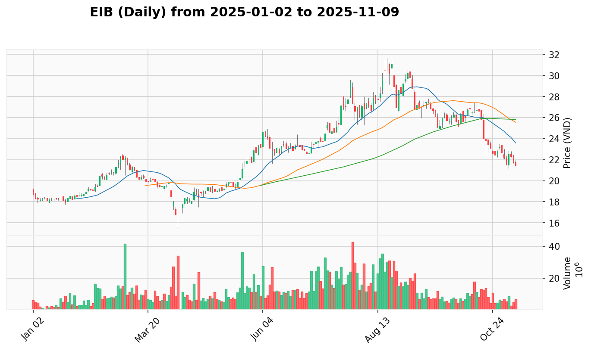

<a href="#ngan-hang">↑ Back to group NGAN_HANG</a>  |  <a href="#vpa-signal-summary">↑ Back to Top</a>

#### Key Statistics
| Metric | Value |
|:---|---:|
| Date Range | 2025-01-02 to 2025-11-07 |
| **Latest Close** | **21.45** |
| Period Open | 19.25 |
| Period High | 31.65 |
| Period Low | 15.6 |
| Period Change % | 11.43% |

**[Download EIB Data (.csv)](market_data/EIB_2025-01-02_to_2025-11-09.csv)**

---

### ELC

#### [VPA Analysis (2025-08-04 - 2025-10-21)](./VPA.md#elc)
> **Ngày 2025-10-15:** ELC tiếp tục giảm từ 21.3 VND xuống 21.2 VND, đóng cửa ở mức thấp nhất phiên. Biên độ giao dịch từ 21.2 VND đến 21.75 VND. Khối lượng giao dịch đạt 0.5479 triệu cổ phiếu, thấp hơn một chút so với phiên trước nhưng vẫn duy trì ở mức cao, cho thấy áp lực bán vẫn rất mạnh và không có lực cầu đáng kể để hấp thụ. Việc giá tiếp tục giảm mạnh và đóng cửa ở mức thấp nhất phiên, cùng với khối lượng cao, củng cố thêm sự yếu kém của cổ phiếu và xác nhận xu hướng giảm tiếp diễn sau các phiên "Nguồn cung áp đảo" và "Tiếp diễn áp lực bán" trước đó. **Phân tích VPA/Wyckoff:** Sign of Weakness (SOW) - Tiếp diễn áp lực bán
> **Ngày 2025-10-16:** ELC tiếp tục duy trì ở mức thấp 21.2 VND, đóng cửa tại mức thấp nhất phiên. Biên độ giao dịch rất hẹp, chỉ từ 21.2 VND đến 21.35 VND. Khối lượng giao dịch đạt 0.1962 triệu cổ phiếu, giảm mạnh so với các phiên trước và ở mức rất thấp. Điều này cho thấy áp lực bán đã suy yếu đáng kể sau chuỗi ngày giảm mạnh, nhưng đồng thời cũng không có lực cầu nào xuất hiện để hấp thụ và đẩy giá lên. Sự yếu kém của cổ phiếu vẫn còn, nhưng cường độ bán đã giảm. **Phân tích VPA/Wyckoff:** No Demand (Không có cầu)
> **Ngày 2025-10-17:** ELC tăng nhẹ từ 20.48 VND lên 20.75 VND, nhưng đóng cửa thấp hơn giá mở cửa (21.0 VND) tạo thành một nến giảm. Biên độ giao dịch từ 20.4 VND đến 21.0 VND. Khối lượng giao dịch đạt 0.351625 triệu cổ phiếu, giảm mạnh so với phiên trước và ở mức rất thấp. Điều này cho thấy dù giá có sự phục hồi nhẹ, nhưng không có lực cầu mạnh mẽ để hỗ trợ, xác nhận sự yếu kém của cổ phiếu và tiếp tục tình trạng thiếu cầu sau phiên trước. **Phân tích VPA/Wyckoff:** No Demand (Không có cầu)
> **Ngày 2025-10-20:** ELC mở cửa ở mức 20.75 VND, tăng lên mức cao 21.3 VND nhưng sau đó giảm và đóng cửa ở mức 20.5 VND, thấp hơn giá mở cửa, tạo thành một nến giảm với biên độ rộng hơn. Khối lượng giao dịch đạt 0.891583 triệu cổ phiếu, tăng đáng kể so với phiên trước (0.351625 triệu cổ phiếu). Điều này cho thấy dù có nỗ lực đẩy giá lên nhưng lực cung đã xuất hiện mạnh mẽ, đẩy giá xuống và đóng cửa gần mức thấp nhất phiên, xác nhận sự yếu kém của cổ phiếu và tiếp tục xu hướng giảm. **Phân tích VPA/Wyckoff:** Lực cung xuất hiện (Supply Coming In)
> **Ngày 2025-10-21:** ELC mở cửa ở mức 20.3 VND, tăng mạnh lên mức cao 21.25 VND và đóng cửa ở mức 21.25 VND, tạo thành một nến tăng mạnh với biên độ rộng và đóng cửa ở mức cao nhất phiên. Giá tăng từ 20.5 VND lên 21.25 VND. Khối lượng giao dịch đạt 0.5043 triệu cổ phiếu, thấp hơn so với phiên trước (0.891583 triệu cổ phiếu). Điều này cho thấy thị trường đang kiểm tra lại lực cung sau phiên giảm mạnh trước đó, và việc giá đóng cửa ở mức cao nhất phiên cho thấy lực cung đã suy yếu. **Phân tích VPA/Wyckoff:** Kiểm tra cung (Test for Supply)

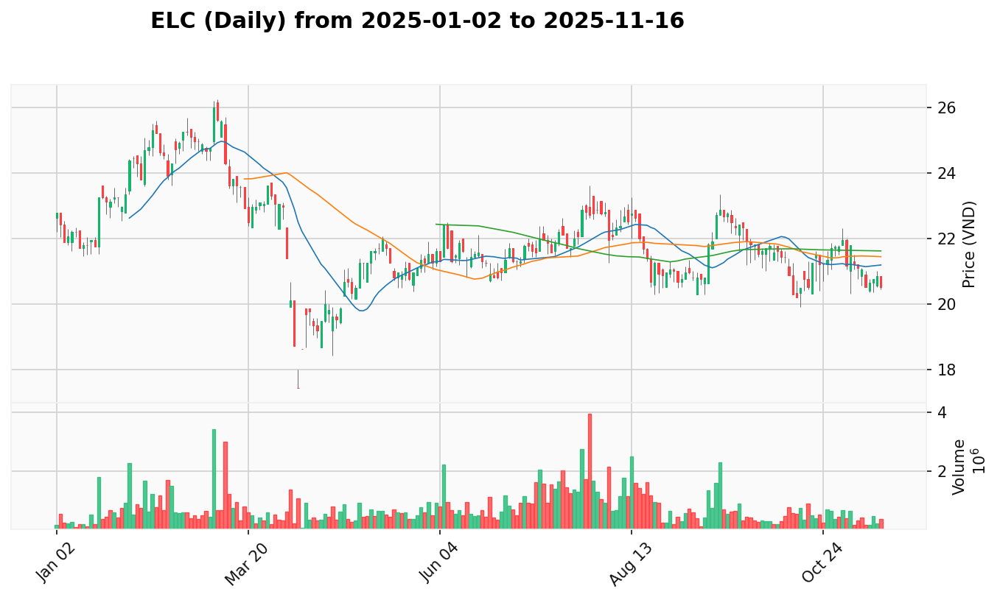

<a href="#cong-nghe">↑ Back to group CONG_NGHE</a>  |  <a href="#vpa-signal-summary">↑ Back to Top</a>

#### Key Statistics
| Metric | Value |
|:---|---:|
| Date Range | 2025-01-02 to 2025-11-07 |
| **Latest Close** | **21.05** |
| Period Open | 22.62 |
| Period High | 26.24 |
| Period Low | 17.43 |
| Period Change % | -6.94% |

**[Download ELC Data (.csv)](market_data/ELC_2025-01-02_to_2025-11-09.csv)**

---

### EVE

#### [VPA Analysis (2025-08-04 - 2025-10-21)](./VPA.md#eve)
> **Ngày 2025-10-15:** EVE mở cửa tại 10.8 VND và đóng cửa tại 10.9 VND, tăng nhẹ so với phiên trước. Cây nến có biên độ hẹp từ 10.8 VND đến 10.95 VND, đóng cửa gần giữa thân nến. Khối lượng giao dịch đạt 0.0143 triệu cổ phiếu, giảm mạnh so với phiên trước và ở mức rất thấp. Sau các phiên "No Demand" trước đó, việc giá tăng nhẹ với biên độ hẹp và khối lượng cực thấp cho thấy lực cầu vẫn chưa quay trở lại và không có sự quan tâm đáng kể từ thị trường. **Phân tích VPA/Wyckoff:** No Demand (Không có cầu)
> **Ngày 2025-10-16:** EVE mở cửa tại 10.65 VND và đóng cửa tại 10.8 VND, giảm nhẹ so với phiên trước nhưng đóng cửa tại mức cao nhất trong phiên với biên độ nến rất hẹp. Khối lượng giao dịch chỉ đạt 0.0007 triệu cổ phiếu, cực kỳ thấp và giảm mạnh so với các phiên trước. Điều này cho thấy sự cạn kiệt hoàn toàn của lực cầu và không có sự quan tâm đáng kể nào từ thị trường, tiếp tục xác nhận tình trạng thiếu vắng nhu cầu. **Phân tích VPA/Wyckoff:** No Demand (Không có cầu)
> **Ngày 2025-10-17:** EVE mở cửa tại 10.65 VND và đóng cửa tại 10.8 VND, tăng nhẹ so với phiên trước. Cây nến có biên độ hẹp từ 10.65 VND đến 10.8 VND, đóng cửa tại mức cao nhất phiên. Khối lượng giao dịch đạt 0.0203 triệu cổ phiếu, tăng nhẹ so với phiên trước nhưng vẫn ở mức rất thấp. Mặc dù giá tăng nhẹ và đóng cửa ở mức cao nhất phiên, nhưng với khối lượng giao dịch cực kỳ thấp, điều này cho thấy lực cầu vẫn còn yếu và chưa có sự tham gia đáng kể từ thị trường. Tình trạng "No Demand" vẫn tiếp diễn. **Phân tích VPA/Wyckoff:** No Demand (Không có cầu)
> **Ngày 2025-10-20:** EVE mở cửa tại 10.7 VND và đóng cửa tại 10.5 VND, giảm nhẹ so với phiên trước. Cây nến có biên độ hẹp từ 10.5 VND đến 10.7 VND, đóng cửa tại mức thấp nhất phiên. Khối lượng giao dịch đạt 0.0261 triệu cổ phiếu, tăng nhẹ so với phiên trước nhưng vẫn ở mức cực kỳ thấp. Mặc dù giá giảm, nhưng với khối lượng giao dịch thấp, điều này cho thấy lực bán không mạnh, mà chủ yếu là do thiếu vắng lực cầu, khiến giá dễ dàng giảm xuống. Tình trạng "No Demand" tiếp tục được xác nhận. **Phân tích VPA/Wyckoff:** No Demand (Không có cầu)
> **Ngày 2025-10-21:** EVE mở cửa tại 10.85 VND và đóng cửa tại 10.7 VND, tăng nhẹ từ 10.5 VND so với phiên trước. Cây nến có biên độ rộng hơn, đóng cửa ở nửa trên của thân nến. Khối lượng giao dịch đạt 0.0343 triệu cổ phiếu, tăng nhẹ so với phiên trước nhưng vẫn ở mức cực kỳ thấp. Mặc dù giá tăng và đóng cửa ở nửa trên, nhưng với khối lượng giao dịch không đáng kể, điều này cho thấy lực cầu vẫn còn yếu và chưa có sự tham gia mạnh mẽ từ thị trường. Tình trạng thiếu cầu vẫn tiếp diễn. **Phân tích VPA/Wyckoff:** No Demand (Không có cầu)

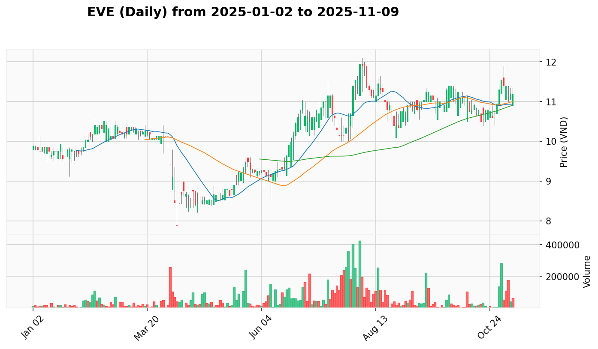

<a href="#det-may">↑ Back to group DET_MAY</a>  |  <a href="#vpa-signal-summary">↑ Back to Top</a>

#### Key Statistics
| Metric | Value |
|:---|---:|
| Date Range | 2025-01-02 to 2025-11-07 |
| **Latest Close** | **11.2** |
| Period Open | 9.8 |
| Period High | 12.1 |
| Period Low | 7.88 |
| Period Change % | 14.29% |

**[Download EVE Data (.csv)](market_data/EVE_2025-01-02_to_2025-11-09.csv)**

---

### EVF

#### [VPA Analysis (2025-08-04 - 2025-10-21)](./VPA.md#evf)
> **Ngày 2025-10-15:** EVF giảm từ 13.95 VND (giá đóng cửa phiên trước) xuống 13.9 VND với khối lượng giao dịch đạt 6.965 triệu cổ phiếu. Khối lượng này thấp hơn đáng kể so với phiên trước (14.9216 triệu cổ phiếu). Cây nến giảm có biên độ hẹp, đóng cửa gần mức mở cửa, cho thấy lực cung yếu sau phiên tăng mạnh trước đó. **Phân tích VPA/Wyckoff:** No Supply (Không có nguồn cung) - Giá giảm nhẹ với khối lượng thấp, cho thấy lực bán yếu và khả năng tiếp tục xu hướng tăng.
> **Ngày 2025-10-16:** EVF tăng nhẹ từ 13.9 VND (giá đóng cửa phiên trước) lên 13.95 VND (giá đóng cửa) với khối lượng giao dịch đạt 4.5052 triệu cổ phiếu. Khối lượng này thấp hơn đáng kể so với phiên trước (6.965 triệu cổ phiếu). Cây nến có biên độ hẹp, giá mở cửa cao hơn nhưng đóng cửa tại mức thấp nhất phiên, cho thấy lực cầu yếu và áp lực bán xuất hiện khi giá tăng. **Phân tích VPA/Wyckoff:** Thiếu cầu (Lack of Demand)
> **Ngày 2025-10-17:** EVF giảm từ 14.3 VND (giá đóng cửa phiên trước) xuống 13.85 VND với khối lượng giao dịch đạt 11.3115 triệu cổ phiếu. Khối lượng này thấp hơn phiên trước (15.7497 triệu cổ phiếu) nhưng vẫn ở mức cao. Cây nến giảm có biên độ rộng, đóng cửa gần mức thấp nhất phiên, cho thấy áp lực bán mạnh mẽ và sự suy yếu của lực cầu sau phiên "Thiếu cầu" trước đó. **Phân tích VPA/Wyckoff:** Dấu hiệu suy yếu (Sign of Weakness)
> **Ngày 2025-10-20:** EVF giảm mạnh từ 13.85 VND (giá đóng cửa phiên trước) xuống 12.9 VND (giá đóng cửa) với khối lượng giao dịch đạt 13.1014 triệu cổ phiếu. Khối lượng này cao hơn phiên trước (11.3115 triệu cổ phiếu). Cây nến giảm có biên độ rộng, đóng cửa tại mức thấp nhất phiên, cho thấy áp lực bán mạnh mẽ và sự tiếp diễn của xu hướng giảm sau phiên "Dấu hiệu suy yếu" trước đó. **Phân tích VPA/Wyckoff:** Áp lực bán mạnh (Selling Pressure)
> **Ngày 2025-10-21:** EVF tiếp tục giảm từ 12.9 VND (giá đóng cửa phiên trước) xuống 12.7 VND với khối lượng giao dịch đạt 14.4926 triệu cổ phiếu. Khối lượng này cao hơn đáng kể so với phiên trước (13.1014 triệu cổ phiếu). Cây nến giảm có biên độ rộng, đóng cửa gần mức giá mở cửa nhưng vẫn cho thấy sự tiếp diễn của xu hướng giảm. Áp lực cung vẫn rất lớn trên thị trường. **Phân tích VPA/Wyckoff:** Áp lực bán mạnh

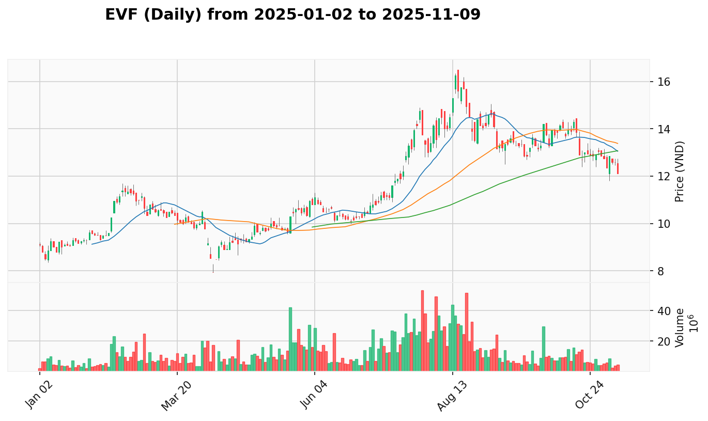

<a href="#chung-khoan">↑ Back to group CHUNG_KHOAN</a>  |  <a href="#vpa-signal-summary">↑ Back to Top</a>

#### Key Statistics
| Metric | Value |
|:---|---:|
| Date Range | 2025-01-02 to 2025-11-07 |
| **Latest Close** | **12.1** |
| Period Open | 9.12 |
| Period High | 16.5 |
| Period Low | 7.94 |
| Period Change % | 32.68% |

**[Download EVF Data (.csv)](market_data/EVF_2025-01-02_to_2025-11-09.csv)**

---

### EVG

#### [VPA Analysis (2025-08-14 - 2025-10-21)](./VPA.md#evg)
> **Ngày 2025-10-15:** EVG mở cửa ở mức 10.0 VND và tăng lên 10.25 VND nhưng sau đó giảm và đóng cửa ở mức 9.92 VND, với khối lượng giao dịch đạt 1.9098 triệu cổ phiếu. Mặc dù giá đóng cửa cao hơn so với phiên trước, cây nến có biên độ rộng nhưng giá đóng cửa thấp hơn giá mở cửa, cho thấy áp lực bán đã xuất hiện sau nỗ lực tăng giá ban đầu. Khối lượng giao dịch giảm đáng kể so với phiên "Sign of Strength" trước đó (4.5231 triệu cổ phiếu), cho thấy lực cầu không còn mạnh mẽ để duy trì đà tăng. Điều này có thể là dấu hiệu của sự suy yếu trong đà tăng hoặc một đợt kiểm tra cung. **Phân tích VPA/Wyckoff:** No Demand (ND) - Nỗ lực tăng giá không được hỗ trợ bởi khối lượng, cho thấy lực cầu yếu.
> **Ngày 2025-10-16:** EVG mở cửa ở mức 10.05 VND, đạt đỉnh 10.2 VND và đáy 9.85 VND, sau đó đóng cửa ở mức 9.92 VND, bằng với giá đóng cửa phiên trước. Mặc dù biên độ nến tương đối rộng, giá đóng cửa thấp hơn giá mở cửa, cho thấy áp lực bán đã xuất hiện trong phiên. Khối lượng giao dịch chỉ đạt 0.8779 triệu cổ phiếu, giảm đáng kể so với phiên trước (1.9098 triệu cổ phiếu) và rất thấp so với phiên "Sign of Strength" vào ngày 2025-10-14 (4.5231 triệu cổ phiếu). Điều này xác nhận sự thiếu hụt nghiêm trọng của lực cầu, không đủ để đẩy giá lên cao hơn hoặc duy trì đà tăng. Thị trường đang cho thấy sự thờ ơ của người mua sau nỗ lực tăng giá không thành công. **Phân tích VPA/Wyckoff:** No Demand (ND) - Lực cầu tiếp tục suy yếu và không đủ để hỗ trợ giá, xác nhận sự thiếu vắng của người mua.
> **Ngày 2025-10-17:** EVG mở cửa ở mức 9.88 VND, sau đó giảm mạnh và đóng cửa ở mức 9.65 VND, là mức thấp nhất trong phiên. Giá giảm từ 9.88 VND xuống 9.65 VND với khối lượng giao dịch đạt 2.1654 triệu cổ phiếu, cao hơn so với phiên trước (1.9909 triệu cổ phiếu). Sự sụt giảm giá mạnh mẽ đi kèm với khối lượng gia tăng cho thấy áp lực bán đang rất lớn và người bán đang kiểm soát thị trường. Điều này xác nhận sự suy yếu sau các phiên "No Demand" trước đó. **Phân tích VPA/Wyckoff:** Sign of Weakness (SOW) - Áp lực bán mạnh mẽ với khối lượng gia tăng, xác nhận xu hướng giảm.
> **Ngày 2025-10-20:** EVG mở cửa ở mức 9.43 VND, đạt đỉnh 9.6 VND và đáy 8.98 VND, sau đó đóng cửa ở mức 8.98 VND, là mức thấp nhất trong phiên. Giá giảm mạnh từ 9.65 VND (giá đóng cửa phiên trước) xuống 8.98 VND, với biên độ nến rộng và giá đóng cửa ở mức thấp nhất phiên, cho thấy áp lực bán rất mạnh và người bán hoàn toàn kiểm soát thị trường. Khối lượng giao dịch đạt 2.146 triệu cổ phiếu, duy trì ở mức cao, xác nhận sự tiếp diễn của áp lực cung. Điều này củng cố thêm tín hiệu suy yếu đã xuất hiện từ phiên trước. **Phân tích VPA/Wyckoff:** Sign of Weakness (SOW) - Áp lực bán tiếp tục mạnh mẽ với giá giảm sâu và đóng cửa ở mức thấp nhất phiên, xác nhận xu hướng giảm.
> **Ngày 2025-10-21:** EVG mở cửa ở mức 8.9 VND, sau đó giảm mạnh và đóng cửa ở mức 8.42 VND, gần mức thấp nhất trong phiên là 8.36 VND. Giá giảm từ 8.98 VND (giá đóng cửa phiên trước) xuống 8.42 VND, với biên độ nến rộng và giá đóng cửa ở mức thấp, cho thấy áp lực bán tiếp tục rất mạnh và người bán đang kiểm soát hoàn toàn thị trường. Khối lượng giao dịch đạt 3.3544 triệu cổ phiếu, tăng đáng kể so với phiên trước (2.146 triệu cổ phiếu), xác nhận sự tiếp diễn của áp lực cung và xu hướng giảm. Điều này củng cố thêm tín hiệu suy yếu đã xuất hiện từ các phiên trước. **Phân tích VPA/Wyckoff:** Sign of Weakness (SOW) - Áp lực bán tiếp tục mạnh mẽ với giá giảm sâu và đóng cửa ở mức thấp nhất phiên, đi kèm khối lượng gia tăng, xác nhận xu hướng giảm.

<a href="#penny">↑ Back to group PENNY</a>  |  <a href="#vpa-signal-summary">↑ Back to Top</a>

#### Key Statistics
| Metric | Value |
|:---|---:|
| Date Range | 2025-01-02 to 2025-11-07 |
| **Latest Close** | **7.97** |
| Period Open | 6.3 |
| Period High | 12.15 |
| Period Low | 4.86 |
| Period Change % | 26.51% |

**[Download EVG Data (.csv)](market_data/EVG_2025-01-02_to_2025-11-09.csv)**

---

### EVS

#### [VPA Analysis (2025-08-04 - 2025-10-21)](./VPA.md#evs)
> **Ngày 2025-10-15:** EVS giảm từ 6.9 VND xuống 6.7 VND với khối lượng giao dịch đạt 0.2186 triệu cổ phiếu. Cây nến giảm có biên độ hẹp và đóng cửa tại mức thấp nhất phiên, cho thấy áp lực bán vẫn duy trì nhưng với khối lượng giảm đáng kể so với hai phiên giảm mạnh trước đó. Điều này cho thấy sự thiếu vắng lực cầu ở mức giá thấp, xác nhận xu hướng giảm tiếp diễn. **Phân tích VPA/Wyckoff:** Dấu hiệu suy yếu (Sign of Weakness) - Giá tiếp tục giảm với biên độ hẹp và khối lượng thấp, cho thấy sự cạn kiệt lực cầu và khả năng tiếp diễn xu hướng giảm.
> **Ngày 2025-10-16:** EVS giảm từ 6.8 VND xuống 6.6 VND với khối lượng giao dịch đạt 0.2468 triệu cổ phiếu. Cây nến giảm có biên độ tương đối rộng và đóng cửa gần mức thấp nhất phiên, cho thấy áp lực bán vẫn tiếp diễn. Khối lượng giao dịch tăng nhẹ so với phiên trước đó, trong bối cảnh giá tiếp tục giảm sau các phiên "Dấu hiệu suy yếu", xác nhận xu hướng giảm vẫn đang chiếm ưu thế và chưa có dấu hiệu lực cầu bắt đáy đáng kể. **Phân tích VPA/Wyckoff:** Dấu hiệu suy yếu (Sign of Weakness) - Giá tiếp tục giảm với biên độ rộng và khối lượng tăng nhẹ, cho thấy lực cung vẫn kiểm soát và xu hướng giảm tiếp diễn.
> **Ngày 2025-10-17:** EVS giảm từ 6.6 VND xuống 6.4 VND với khối lượng giao dịch đạt 0.2852 triệu cổ phiếu. Cây nến giảm có biên độ hẹp và đóng cửa tại mức thấp nhất phiên, cho thấy áp lực bán vẫn duy trì. Khối lượng giao dịch giảm đáng kể so với phiên trước đó (0.5785 triệu cổ phiếu), trong bối cảnh giá tiếp tục giảm sau nhiều phiên "Dấu hiệu suy yếu". Điều này cho thấy lực cung có phần suy yếu nhưng lực cầu vẫn chưa xuất hiện, xác nhận xu hướng giảm vẫn đang chiếm ưu thế. **Phân tích VPA/Wyckoff:** Dấu hiệu suy yếu (Sign of Weakness) - Giá tiếp tục giảm với biên độ hẹp và khối lượng giảm, cho thấy lực cung có phần cạn kiệt nhưng lực cầu vẫn vắng mặt, xu hướng giảm tiếp diễn.
> **Ngày 2025-10-20:** EVS giảm từ 6.4 VND xuống 5.8 VND với khối lượng giao dịch đạt 0.439 triệu cổ phiếu. Cây nến giảm có biên độ rộng và đóng cửa tại mức thấp nhất phiên, cho thấy áp lực bán rất mạnh. Khối lượng giao dịch tăng đáng kể so với phiên trước đó (0.2852 triệu cổ phiếu), xác nhận xu hướng giảm vẫn đang tiếp diễn và lực cung vẫn kiểm soát thị trường. Điều này củng cố thêm các "Dấu hiệu suy yếu" đã xuất hiện trước đó. **Phân tích VPA/Wyckoff:** Dấu hiệu suy yếu (Sign of Weakness) - Giá giảm mạnh với biên độ rộng và khối lượng tăng, cho thấy lực cung áp đảo và xu hướng giảm tiếp diễn.
> **Ngày 2025-10-21:** EVS tăng từ 5.8 VND lên 5.9 VND với khối lượng giao dịch đạt 0.4401 triệu cổ phiếu. Cây nến tăng có biên độ hẹp và đóng cửa gần giữa thân nến, cho thấy một sự phục hồi yếu ớt sau phiên giảm mạnh trước đó. Khối lượng giao dịch tăng nhẹ so với phiên trước (0.439 triệu cổ phiếu) nhưng vẫn ở mức thấp, không đủ để xác nhận sự xuất hiện của lực cầu mạnh mẽ. Điều này cho thấy áp lực bán vẫn còn tiềm ẩn và xu hướng giảm giá vẫn đang chiếm ưu thế. **Phân tích VPA/Wyckoff:** No Demand (ND) - Giá tăng nhẹ với biên độ hẹp và khối lượng không thuyết phục, cho thấy thiếu vắng lực cầu mạnh mẽ sau giai đoạn giảm giá.

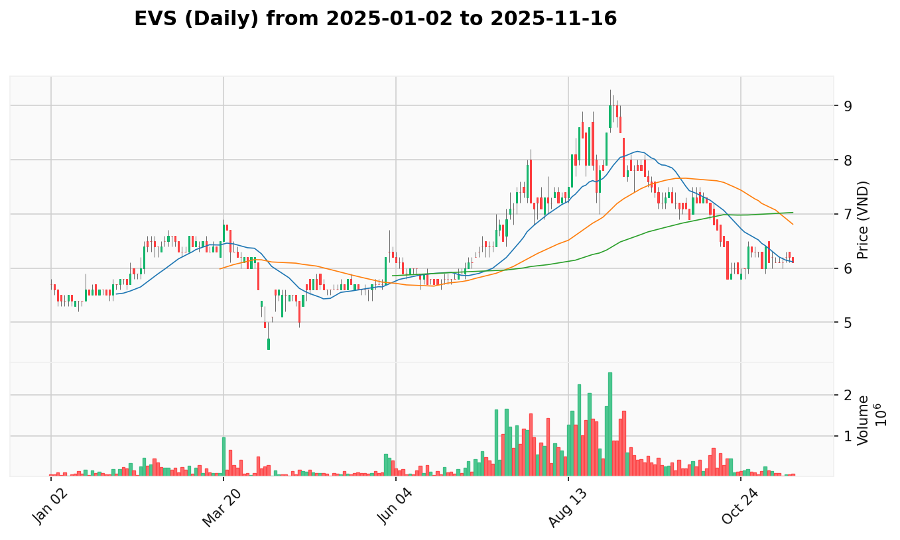

<a href="#chung-khoan">↑ Back to group CHUNG_KHOAN</a>  |  <a href="#vpa-signal-summary">↑ Back to Top</a>

#### Key Statistics
| Metric | Value |
|:---|---:|
| Date Range | 2025-01-02 to 2025-11-07 |
| **Latest Close** | **6.1** |
| Period Open | 5.7 |
| Period High | 9.3 |
| Period Low | 4.5 |
| Period Change % | 7.02% |

**[Download EVS Data (.csv)](market_data/EVS_2025-01-02_to_2025-11-09.csv)**

---

### FCN

#### [VPA Analysis (2025-08-04 - 2025-10-21)](./VPA.md#fcn)
> **Ngày 2025-10-15:** FCN giảm từ 17.4 VND xuống 17.1 VND (giá đóng cửa so với giá đóng cửa phiên trước), với khối lượng giao dịch đạt 1.6282 triệu cổ phiếu, giảm so với phiên trước (2.1204 triệu cổ phiếu). Cây nến giảm có biên độ hẹp và đóng cửa ở mức thấp nhất phiên, cho thấy áp lực bán vẫn còn nhưng đã suy yếu hơn so với phiên trước. Khối lượng giảm trong khi giá tiếp tục giảm cho thấy sự thiếu vắng lực cầu, xác nhận xu hướng yếu ớt. **Phân tích VPA/Wyckoff:** No Demand (Không có cầu) - Giá tiếp tục giảm với khối lượng thấp, cho thấy thiếu vắng lực cầu và khả năng tiếp diễn xu hướng giảm.
> **Ngày 2025-10-16:** FCN tăng nhẹ từ 17.1 VND lên 17.15 VND, với khối lượng giao dịch đạt 0.695 triệu cổ phiếu, giảm mạnh so với phiên trước. Cây nến tăng có biên độ hẹp và đóng cửa gần giữa thân nến. Sau hai phiên giảm giá với áp lực bán mạnh và thiếu cầu, phiên hôm nay giá tăng nhẹ với khối lượng rất thấp cho thấy áp lực bán đã tạm thời suy yếu, nhưng lực cầu vẫn chưa xuất hiện đáng kể để đẩy giá lên cao hơn. Điều này có thể là một dấu hiệu kiểm tra nguồn cung, cho thấy thị trường đang tạm dừng để đánh giá lại. **Phân tích VPA/Wyckoff:** No Supply (Không có nguồn cung) - Giá tăng nhẹ với khối lượng thấp sau giai đoạn giảm, cho thấy áp lực bán đã cạn kiệt tạm thời nhưng chưa có lực cầu mạnh mẽ.
> **Ngày 2025-10-17:** FCN tăng nhẹ từ 17.4 VND lên 17.45 VND (giá đóng cửa so với giá đóng cửa phiên trước), với khối lượng giao dịch đạt 2.1819 triệu cổ phiếu, tăng đáng kể so với phiên trước (1.6356 triệu cổ phiếu). Mặc dù giá đóng cửa cao hơn phiên trước, cây nến có biên độ rộng với bóng nến trên dài và giá đóng cửa thấp hơn giá mở cửa (17.55 VND), cho thấy lực cầu đã cố gắng đẩy giá lên nhưng đã gặp phải áp lực cung mạnh mẽ, khiến giá không thể duy trì ở mức cao. Khối lượng tăng cao xác nhận sự hiện diện của nguồn cung. **Phân tích VPA/Wyckoff:** Effort to Rise but No Result (Nỗ lực tăng giá nhưng không đạt kết quả) - Lực cầu xuất hiện nhưng bị áp đảo bởi nguồn cung mạnh mẽ, cho thấy sự yếu kém của thị trường.
> **Ngày 2025-10-20:** FCN giảm mạnh từ 17.1 VND xuống 16.25 VND, với khối lượng giao dịch đạt 2.3392 triệu cổ phiếu, tăng so với phiên trước. Cây nến giảm có biên độ rộng và đóng cửa ở mức thấp nhất phiên, cho thấy áp lực bán rất mạnh và nguồn cung áp đảo hoàn toàn lực cầu. So với phiên trước (2025-10-17) có "Nỗ lực tăng giá nhưng không đạt kết quả", phiên này xác nhận sự yếu kém tiếp tục và gia tăng của thị trường. **Phân tích VPA/Wyckoff:** Weakness (Sự yếu kém) - Giá giảm mạnh với khối lượng tăng cao, xác nhận nguồn cung đang chiếm ưu thế.
> **Ngày 2025-10-21:** FCN giảm từ 16.25 VND xuống 15.9 VND, với khối lượng giao dịch đạt 3.0326 triệu cổ phiếu, tăng đáng kể so với phiên trước (2.3392 triệu cổ phiếu). Cây nến giảm có biên độ rộng và đóng cửa gần mức thấp nhất phiên, cho thấy áp lực bán rất mạnh và nguồn cung tiếp tục áp đảo lực cầu. So với phiên trước (2025-10-20) có "Sự yếu kém", phiên này xác nhận sự yếu kém tiếp tục và gia tăng của thị trường. **Phân tích VPA/Wyckoff:** Weakness (Sự yếu kém) - Giá tiếp tục giảm mạnh với khối lượng tăng cao, xác nhận nguồn cung đang chiếm ưu thế và xu hướng giảm tiếp diễn.

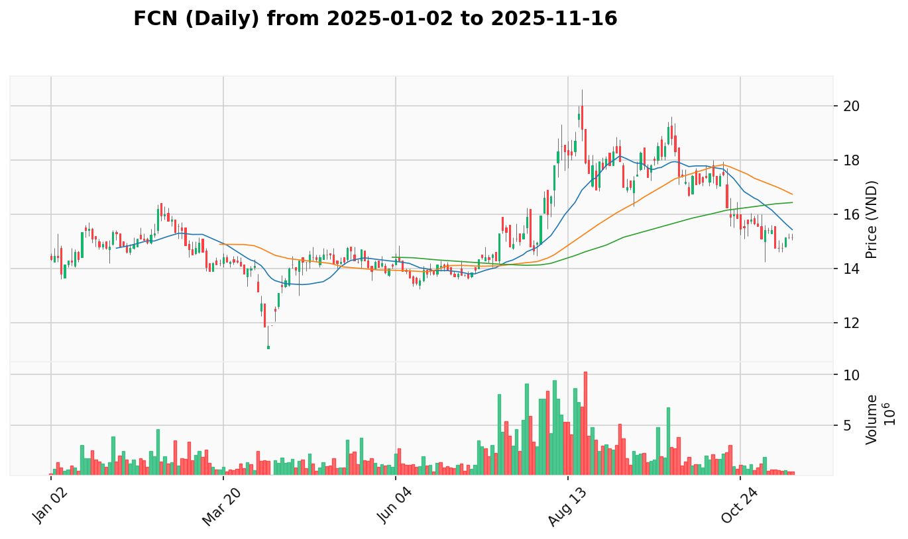

<a href="#dau-tu-cong">↑ Back to group DAU_TU_CONG</a>  |  <a href="#vpa-signal-summary">↑ Back to Top</a>

#### Key Statistics
| Metric | Value |
|:---|---:|
| Date Range | 2025-01-02 to 2025-11-07 |
| **Latest Close** | **14.75** |
| Period Open | 14.45 |
| Period High | 20.6 |
| Period Low | 11.05 |
| Period Change % | 2.08% |

**[Download FCN Data (.csv)](market_data/FCN_2025-01-02_to_2025-11-09.csv)**

---

### FID

#### [VPA Analysis (2025-08-01 - 2025-10-17)](./VPA.md#fid)
> **Ngày 2025-09-19:** FID giảm từ 1.7 VND xuống 1.6 VND với biên độ dao động từ 1.6 VND đến 1.7 VND. Khối lượng giao dịch đạt 0.3767 triệu cổ phiếu, giảm mạnh so với phiên trước đó (0.7267 triệu cổ phiếu). Giá giảm với khối lượng thấp cho thấy thiếu lực cầu và áp lực bán đã suy yếu sau phiên giảm mạnh trước đó. **Phân tích VPA/Wyckoff:** No Demand (ND) - Giá giảm với khối lượng thấp cho thấy thiếu lực cầu.
> **Ngày 2025-09-26:** FID đóng cửa ở mức 1.6 VND, không đổi so với phiên trước, với biên độ dao động hẹp từ 1.5 VND đến 1.7 VND. Khối lượng giao dịch chỉ đạt 0.1128 triệu cổ phiếu, giảm mạnh so với phiên trước đó (0.3767 triệu cổ phiếu) và là mức thấp nhất trong các phiên gần đây. Sau các phiên giảm giá và "No Demand", việc giá đi ngang với khối lượng cực thấp cho thấy áp lực bán đã cạn kiệt. **Phân tích VPA/Wyckoff:** No Supply (NS) - Giá đi ngang với khối lượng cực thấp cho thấy nguồn cung đã cạn kiệt.
> **Ngày 2025-10-03:** FID đóng cửa ở mức 1.6 VND, không đổi so với phiên trước, với biên độ dao động hẹp từ 1.5 VND đến 1.6 VND. Khối lượng giao dịch đạt 0.1832 triệu cổ phiếu, tăng nhẹ so với phiên trước (0.1128 triệu cổ phiếu) nhưng vẫn ở mức thấp. Sau tín hiệu "No Supply" ở phiên trước, việc giá đi ngang với khối lượng tăng nhẹ nhưng không thể đẩy giá lên cho thấy thiếu lực cầu. **Phân tích VPA/Wyckoff:** No Demand (ND) - Giá đi ngang với khối lượng tăng nhẹ nhưng không tăng cho thấy thiếu lực cầu.
> **Ngày 2025-10-10:** FID đóng cửa ở mức 1.7 VND, tăng từ 1.6 VND so với phiên trước, với biên độ dao động rộng từ 1.5 VND đến 1.7 VND và đóng cửa ở mức cao nhất phiên. Khối lượng giao dịch đạt 0.4441 triệu cổ phiếu, tăng đáng kể so với phiên trước (0.1832 triệu cổ phiếu). Sau các tín hiệu "No Supply" và "No Demand" trước đó, sự tăng giá mạnh mẽ với khối lượng gia tăng cho thấy lực cầu đã quay trở lại và hấp thụ nguồn cung. **Phân tích VPA/Wyckoff:** Sign of Strength (SOS) - Lực cầu mạnh mẽ với khối lượng gia tăng xác nhận xu hướng tăng.
> **Ngày 2025-10-17:** FID đóng cửa ở mức 1.7 VND, không đổi so với phiên trước, với biên độ dao động hẹp từ 1.6 VND đến 1.8 VND. Khối lượng giao dịch đạt 0.2179 triệu cổ phiếu, giảm đáng kể so với phiên trước (0.4441 triệu cổ phiếu). Sau tín hiệu "Sign of Strength" ở phiên trước, việc giá không thể tăng thêm với khối lượng giảm mạnh cho thấy thiếu lực cầu tiếp diễn. **Phân tích VPA/Wyckoff:** No Demand (ND) - Giá không tăng thêm với khối lượng giảm mạnh cho thấy lực cầu yếu đi sau phiên tăng giá.

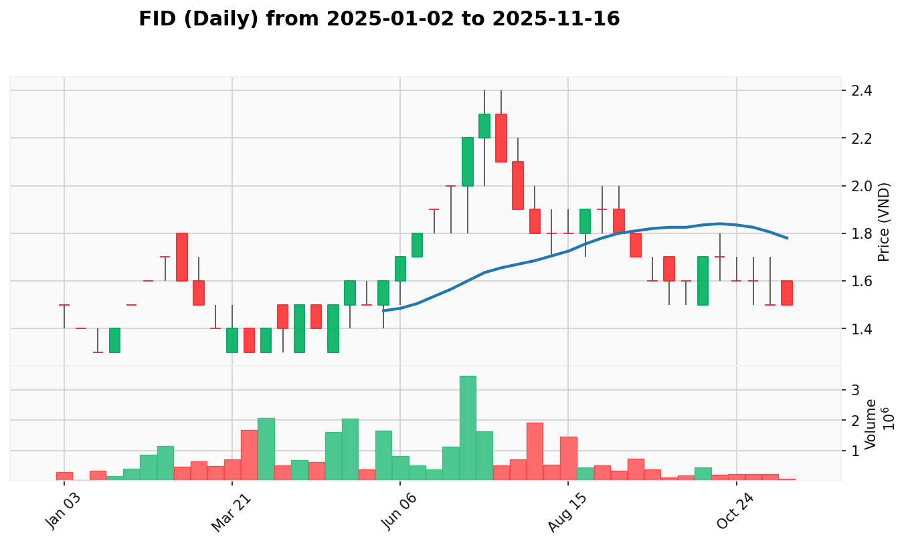

<a href="#xay-dung">↑ Back to group XAY_DUNG</a>  |  <a href="#vpa-signal-summary">↑ Back to Top</a>

#### Key Statistics
| Metric | Value |
|:---|---:|
| Date Range | 2025-01-03 to 2025-11-07 |
| **Latest Close** | **1.5** |
| Period Open | 1.5 |
| Period High | 2.4 |
| Period Low | 1.3 |
| Period Change % | 0.00% |

**[Download FID Data (.csv)](market_data/FID_2025-01-02_to_2025-11-09.csv)**

---

### FIT

#### [VPA Analysis (2025-06-26 - 2025-10-21)](./VPA.md#fit)
> **Ngày 2025-10-15:** FIT tiếp tục giảm từ 4.6 VND xuống 4.56 VND với biên độ dao động 4.54-4.65 VND. Cây nến có thân nhỏ và đóng cửa gần mức thấp nhất phiên. Khối lượng giao dịch đạt 0.663 triệu cổ phiếu, giảm so với phiên trước (0.9721 triệu cổ phiếu). Mặc dù khối lượng giảm, giá vẫn tiếp tục giảm và đóng cửa ở mức thấp, cho thấy áp lực bán vẫn còn và thị trường vẫn đang trong giai đoạn yếu kém. **Phân tích VPA/Wyckoff:** Sign of Weakness (SOW) - Giá tiếp tục giảm và đóng cửa ở mức thấp, cho thấy nguồn cung vẫn chiếm ưu thế, mặc dù khối lượng giao dịch đã giảm.
> **Ngày 2025-10-16:** FIT tiếp tục giảm từ 4.56 VND xuống 4.52 VND với biên độ dao động 4.52-4.58 VND. Cây nến giảm có thân nhỏ và đóng cửa ở mức thấp nhất phiên. Khối lượng giao dịch đạt 0.3908 triệu cổ phiếu, giảm đáng kể so với phiên trước (0.663 triệu cổ phiếu). Mặc dù khối lượng giảm, giá vẫn tiếp tục giảm và đóng cửa ở mức thấp nhất, cho thấy áp lực bán vẫn còn và nguồn cung vẫn đang chiếm ưu thế, xác nhận xu hướng yếu kém của thị trường. **Phân tích VPA/Wyckoff:** Sign of Weakness (SOW) - Giá tiếp tục giảm và đóng cửa ở mức thấp nhất phiên, cho thấy nguồn cung vẫn chiếm ưu thế, mặc dù khối lượng giao dịch đã giảm.
> **Ngày 2025-10-17:** FIT tiếp tục giảm từ 4.6 VND xuống 4.54 VND với biên độ dao động 4.54-4.66 VND. Cây nến giảm có thân nhỏ và đóng cửa ở mức thấp nhất phiên. Khối lượng giao dịch đạt 0.5296 triệu cổ phiếu, giảm so với phiên trước (1.0499 triệu cổ phiếu). Mặc dù khối lượng giảm, giá vẫn tiếp tục giảm và đóng cửa ở mức thấp nhất, cho thấy áp lực bán vẫn còn và nguồn cung vẫn đang chiếm ưu thế, xác nhận xu hướng yếu kém của thị trường. **Phân tích VPA/Wyckoff:** Sign of Weakness (SOW) - Giá tiếp tục giảm và đóng cửa ở mức thấp nhất phiên, cho thấy nguồn cung vẫn chiếm ưu thế, mặc dù khối lượng giao dịch đã giảm.
> **Ngày 2025-10-20:** FIT giảm từ 4.54 VND xuống 4.3 VND với biên độ dao động 4.23-4.6 VND. Cây nến giảm có thân rộng và đóng cửa ở mức thấp nhất phiên. Khối lượng giao dịch đạt 1.6924 triệu cổ phiếu, tăng đáng kể so với phiên trước (0.5296 triệu cổ phiếu). Giá giảm mạnh với khối lượng lớn cho thấy áp lực bán rất mạnh và nguồn cung đang áp đảo hoàn toàn, xác nhận xu hướng yếu kém của thị trường. **Phân tích VPA/Wyckoff:** Sign of Weakness (SOW) - Giá giảm mạnh với khối lượng lớn, đóng cửa ở mức thấp nhất phiên, cho thấy lực bán áp đảo.
> **Ngày 2025-10-21:** FIT tăng từ 4.3 VND lên 4.39 VND với biên độ dao động 4.25-4.5 VND. Cây nến tăng có thân nhỏ và đóng cửa gần mức cao nhất phiên. Khối lượng giao dịch đạt 1.0665 triệu cổ phiếu, giảm so với phiên trước (1.6924 triệu cổ phiếu). Mặc dù giá tăng nhẹ, khối lượng giảm cho thấy lực cầu yếu và không đủ sức hấp thụ hết áp lực bán từ các phiên trước, xác nhận sự yếu kém của thị trường. **Phân tích VPA/Wyckoff:** No Demand (Không có cầu)

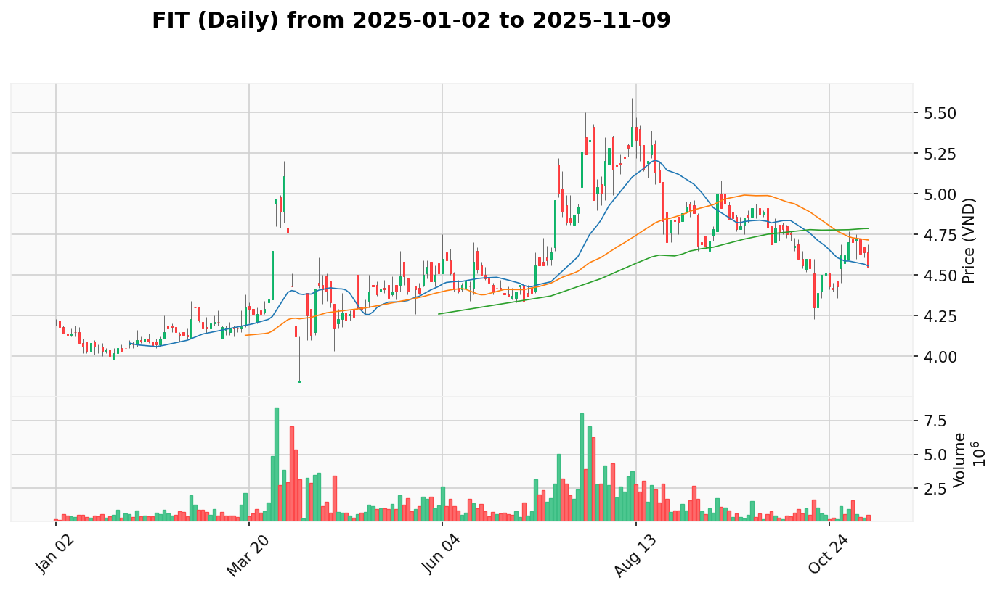

<a href="#penny">↑ Back to group PENNY</a>  |  <a href="#vpa-signal-summary">↑ Back to Top</a>

#### Key Statistics
| Metric | Value |
|:---|---:|
| Date Range | 2025-01-02 to 2025-11-07 |
| **Latest Close** | **4.55** |
| Period Open | 4.22 |
| Period High | 5.59 |
| Period Low | 3.84 |
| Period Change % | 7.82% |

**[Download FIT Data (.csv)](market_data/FIT_2025-01-02_to_2025-11-09.csv)**

---

### FMC

#### [VPA Analysis (2025-08-14 - 2025-10-21)](./VPA.md#fmc)
> **Ngày 2025-10-15:** FMC mở cửa tại 35.85 VND, giảm từ 35.85 VND xuống 35.45 VND, đóng cửa ở mức thấp gần nhất phiên. Biên độ giá rộng (35.85 - 35.0 VND). Khối lượng giao dịch đạt 0.0785 triệu cổ phiếu, tăng mạnh so với phiên trước (0.0588 triệu cổ phiếu) và là mức cao nhất trong nhiều phiên gần đây. Sau phiên "Weakness" với áp lực bán gia tăng, phiên này tiếp tục cho thấy lực cung áp đảo, đẩy giá giảm dứt khoát với khối lượng lớn, xác nhận sự yếu kém của lực cầu và sự chiếm ưu thế của lực cung. **Phân tích VPA/Wyckoff:** Weakness (Sự yếu kém)
> **Ngày 2025-10-16:** FMC mở cửa tại 35.5 VND, giảm từ 35.45 VND xuống 35.2 VND, đóng cửa ở mức thấp gần nhất phiên. Biên độ giá hẹp (35.5 - 35.0 VND). Khối lượng giao dịch đạt 0.0196 triệu cổ phiếu, giảm mạnh so với phiên trước (0.0785 triệu cổ phiếu) và là mức thấp nhất trong nhiều phiên gần đây. Sau hai phiên giảm giá mạnh với khối lượng cao cho thấy sự yếu kém, phiên này tiếp tục giảm giá nhưng với biên độ hẹp và khối lượng thấp. Điều này cho thấy áp lực bán đã giảm đáng kể, có thể là dấu hiệu của sự cạn kiệt nguồn cung hoặc thiếu vắng lực cầu. **Phân tích VPA/Wyckoff:** Cạn kiệt nguồn cung (Supply Drying Up)
> **Ngày 2025-10-17:** FMC mở cửa tại 35.05 VND, tăng từ 35.05 VND lên 35.25 VND, đóng cửa ở giữa đến gần mức cao nhất phiên. Biên độ giá hẹp (35.4 - 35.05 VND). Khối lượng giao dịch đạt 0.0467 triệu cổ phiếu, tăng so với phiên trước (0.0384 triệu cổ phiếu). Sau phiên "Cạn kiệt nguồn cung", phiên này cho thấy giá tăng nhẹ với khối lượng gia tăng, cho thấy lực cầu bắt đầu xuất hiện để kiểm tra nguồn cung. Đây có thể là một dấu hiệu tích cực ban đầu sau giai đoạn giảm giá. **Phân tích VPA/Wyckoff:** Test for Supply (Kiểm tra nguồn cung)
> **Ngày 2025-10-20:** FMC mở cửa tại 35.7 VND, giảm từ 35.7 VND xuống 34.85 VND, đóng cửa ở mức thấp gần nhất phiên. Biên độ giá rộng (36.4 - 34.8 VND). Khối lượng giao dịch đạt 0.0741 triệu cổ phiếu, tăng đáng kể so với phiên trước (0.0467 triệu cổ phiếu). Sau phiên kiểm tra nguồn cung, phiên này cho thấy giá giảm mạnh với biên độ rộng và khối lượng cao, xác nhận áp lực bán mạnh mẽ đã quay trở lại. **Phân tích VPA/Wyckoff:** Dấu hiệu yếu kém (Sign of Weakness)
> **Ngày 2025-10-21:** FMC mở cửa tại 34.95 VND, tăng từ 34.95 VND lên 35.6 VND, đóng cửa ở mức cao gần nhất phiên. Biên độ giá rộng (35.8 - 34.85 VND). Khối lượng giao dịch đạt 0.0653 triệu cổ phiếu, giảm nhẹ so với phiên trước (0.0741 triệu cổ phiếu) nhưng vẫn ở mức cao. Sau phiên "Dấu hiệu yếu kém" với áp lực bán mạnh, phiên này cho thấy lực cầu đã quay trở lại mạnh mẽ, đẩy giá tăng và đóng cửa gần mức cao nhất. Điều này cho thấy sự hấp thụ nguồn cung và khả năng đảo chiều xu hướng. **Phân tích VPA/Wyckoff:** Dấu hiệu mạnh mẽ (Sign of Strength)

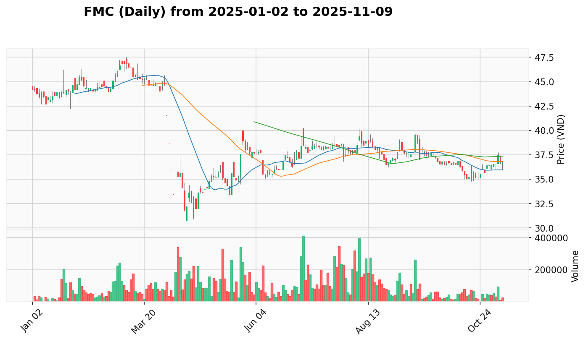

<a href="#thuy-san">↑ Back to group THUY_SAN</a>  |  <a href="#vpa-signal-summary">↑ Back to Top</a>

#### Key Statistics
| Metric | Value |
|:---|---:|
| Date Range | 2025-01-02 to 2025-11-07 |
| **Latest Close** | **36.65** |
| Period Open | 44.53 |
| Period High | 47.56 |
| Period Low | 30.7 |
| Period Change % | -17.70% |

**[Download FMC Data (.csv)](market_data/FMC_2025-01-02_to_2025-11-09.csv)**

---

### FOX

#### [VPA Analysis (2025-06-16 - 2025-10-21)](./VPA.md#fox)
> **Ngày 2025-10-15:** FOX tăng nhẹ từ 61.0 VND lên 61.5 VND. Cây nến có biên độ hẹp (1.5 VND) và đóng cửa ở giữa thân nến, cho thấy sự lưỡng lự của thị trường. Khối lượng giao dịch đạt 0.1299 triệu cổ phiếu, thấp hơn đáng kể so với phiên trước (0.215 triệu cổ phiếu). Sau phiên "Lực cung xuất hiện" với khối lượng lớn, phiên này giá tăng nhẹ nhưng với khối lượng thấp, xác nhận lực cầu yếu và không đủ sức hấp thụ lực cung tiềm tàng. **Phân tích VPA/Wyckoff:** No Demand (Không có cầu)
> **Ngày 2025-10-16:** FOX giảm từ 61.5 VND xuống 61.2 VND. Cây nến có biên độ rất hẹp (0.4 VND) và đóng cửa ở mức thấp nhất phiên, cho thấy sự yếu kém tiếp diễn. Khối lượng giao dịch đạt 0.0129 triệu cổ phiếu, cực kỳ thấp so với phiên trước (0.1299 triệu cổ phiếu) và các phiên gần đây. Sau phiên "Không có cầu" với khối lượng thấp, phiên này giá tiếp tục giảm nhẹ với khối lượng cực thấp, xác nhận rằng lực cầu vẫn rất yếu và không có sự quan tâm mua vào đáng kể. Điều này cho thấy sự yếu kém tiếp tục chiếm ưu thế trên thị trường. **Phân tích VPA/Wyckoff:** No Demand (Không có cầu)
> **Ngày 2025-10-17:** FOX giảm từ 61.4 VND xuống 61.0 VND. Cây nến có biên độ 1.6 VND và đóng cửa ở mức thấp nhất phiên, cho thấy áp lực bán chiếm ưu thế. Khối lượng giao dịch đạt 0.0198 triệu cổ phiếu, cực kỳ thấp, thấp hơn đáng kể so với phiên trước (0.0545 triệu cổ phiếu) và các phiên gần đây. Sau hai phiên "Không có cầu" liên tiếp với khối lượng thấp, phiên này giá tiếp tục giảm nhẹ với khối lượng cực kỳ thấp, xác nhận rằng lực cầu vẫn rất yếu và không có sự quan tâm mua vào đáng kể. Điều này cho thấy sự yếu kém tiếp tục chiếm ưu thế trên thị trường và thiếu vắng lực cầu hỗ trợ. **Phân tích VPA/Wyckoff:** No Demand (Không có cầu)
> **Ngày 2025-10-20:** FOX tăng nhẹ từ 61.0 VND lên 61.3 VND. Cây nến có biên độ rộng (3.2 VND) nhưng đóng cửa thấp hơn giá mở cửa (61.7 VND), cho thấy áp lực bán mạnh trong phiên. Khối lượng giao dịch đạt 0.075 triệu cổ phiếu, cao hơn đáng kể so với hai phiên "Không có cầu" trước đó. Sự gia tăng khối lượng nhưng giá không thể đóng cửa mạnh cho thấy nỗ lực tăng giá đã gặp phải nguồn cung đáng kể. **Phân tích VPA/Wyckoff:** Effort without Result (Nỗ lực không thành công)
> **Ngày 2025-10-21:** FOX tăng từ 61.3 VND lên 64.0 VND. Cây nến có biên độ rộng (4.2 VND) và đóng cửa gần mức cao nhất phiên, cho thấy lực mua mạnh mẽ. Khối lượng giao dịch đạt 0.1934 triệu cổ phiếu, cao hơn đáng kể so với phiên trước (0.075 triệu cổ phiếu) và các phiên gần đây. Sau giai đoạn yếu kém với "Không có cầu" và "Nỗ lực không thành công", phiên này cho thấy sự trở lại của lực cầu mạnh mẽ, đẩy giá tăng với khối lượng lớn, xác nhận sự thay đổi trong tâm lý thị trường. **Phân tích VPA/Wyckoff:** Sign of Strength (SOS) - Lực cầu mạnh mẽ

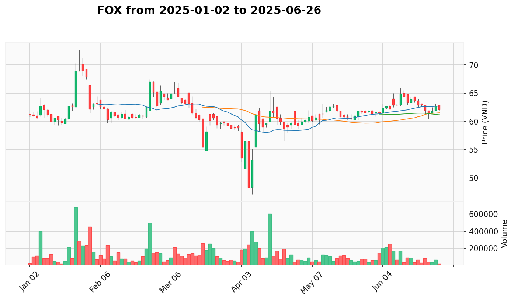

<a href="#cong-nghe">↑ Back to group CONG_NGHE</a>  |  <a href="#vpa-signal-summary">↑ Back to Top</a>

#### Key Statistics
| Metric | Value |
|:---|---:|
| Date Range | 2025-01-02 to 2025-11-07 |
| **Latest Close** | **62.0** |
| Period Open | 61.25 |
| Period High | 80.5 |
| Period Low | 47.08 |
| Period Change % | 1.22% |

**[Download FOX Data (.csv)](market_data/FOX_2025-01-02_to_2025-11-09.csv)**

---

### FPT

#### [VPA Analysis (2025-06-06 - 2025-10-21)](./VPA.md#fpt)
> **Ngày 2025-10-15:** FPT mở cửa ở mức 92.6 VND và đóng cửa tại 89.6 VND, giảm 2.8 VND so với giá đóng cửa phiên trước. Giá cao nhất trong phiên là 93.1 VND, thấp hơn mức cao nhất của phiên trước. Giá thấp nhất trong phiên là 89.5 VND. Cây nến giảm mạnh với biên độ rộng và đóng cửa tại mức thấp nhất phiên, cho thấy áp lực bán rất mạnh. Khối lượng giao dịch đạt 18.7386 triệu cổ phiếu, tăng đáng kể so với phiên trước (12.6596 triệu cổ phiếu) và cao hơn mức trung bình gần đây. Diễn biến này xác nhận sự tiếp diễn của áp lực bán mạnh mẽ, với nguồn cung lớn đẩy giá xuống sâu hơn. **Phân tích VPA/Wyckoff:** Weakness (Sự suy yếu) - Áp lực bán mạnh mẽ với khối lượng gia tăng, xác nhận xu hướng giảm tiếp diễn.
> **Ngày 2025-10-16:** FPT mở cửa tại 89.8 VND, tăng lên mức cao nhất 91.5 VND và đóng cửa ở 90.1 VND, tăng 0.5 VND so với giá đóng cửa phiên trước. Giá thấp nhất trong phiên là 89.8 VND. Cây nến tăng nhẹ với biên độ hẹp và đóng cửa gần giữa thân nến, cho thấy sự tạm lắng của áp lực bán. Khối lượng giao dịch đạt 3.7009 triệu cổ phiếu, giảm mạnh so với phiên trước (18.7386 triệu cổ phiếu) và thấp hơn đáng kể so với mức trung bình gần đây. Diễn biến này cho thấy sự cạn kiệt của lực bán sau hai phiên giảm mạnh, nhưng cũng chưa có lực cầu đủ mạnh để đẩy giá lên. **Phân tích VPA/Wyckoff:** No Demand (Không có cầu) - Giá tăng nhẹ với khối lượng thấp sau giai đoạn suy yếu, cho thấy thiếu vắng lực cầu mạnh mẽ.
> **Ngày 2025-10-17:** FPT mở cửa ở mức 90.1 VND và đóng cửa tại 88.1 VND, giảm 1.7 VND so với giá đóng cửa phiên trước. Giá cao nhất trong phiên là 91.5 VND, thấp nhất là 88.1 VND. Cây nến giảm mạnh với biên độ rộng và đóng cửa tại mức thấp nhất phiên, cho thấy áp lực bán rất mạnh. Khối lượng giao dịch đạt 8.3744 triệu cổ phiếu, tăng nhẹ so với phiên trước (7.9285 triệu cổ phiếu) và cao hơn mức trung bình gần đây. Diễn biến này xác nhận sự tiếp diễn của áp lực bán sau phiên "Không có cầu", cho thấy phe bán vẫn đang kiểm soát và đẩy giá xuống sâu hơn. **Phân tích VPA/Wyckoff:** Weakness (Sự suy yếu) - Áp lực bán mạnh mẽ với khối lượng tăng nhẹ, giá đóng cửa ở mức thấp nhất phiên, xác nhận xu hướng giảm tiếp diễn.
> **Ngày 2025-10-20:** FPT mở cửa tại 88.3 VND, tăng lên mức cao nhất 91.8 VND nhưng sau đó giảm mạnh và đóng cửa ở mức thấp nhất phiên 87.0 VND, giảm 1.1 VND so với giá đóng cửa phiên trước. Cây nến giảm mạnh với biên độ rộng và đóng cửa tại mức thấp nhất phiên, cho thấy áp lực bán áp đảo. Khối lượng giao dịch đạt 14.5803 triệu cổ phiếu, tăng đáng kể so với phiên trước (8.3744 triệu cổ phiếu) và cao hơn mức trung bình gần đây. Diễn biến này xác nhận sự tiếp diễn và gia tăng của áp lực bán, cho thấy phe bán đang kiểm soát hoàn toàn thị trường và có thể đang diễn ra một hành động cao trào bán. **Phân tích VPA/Wyckoff:** Climax Action (Hành động cao trào) - Áp lực bán cực lớn với khối lượng và biên độ giá tăng mạnh, giá đóng cửa ở mức thấp nhất phiên, cho thấy sự hoảng loạn hoặc capitulation của phe mua.
> **Ngày 2025-10-21:** FPT mở cửa ở mức 89.0 VND và đóng cửa tại 93.0 VND, tăng 6.0 VND so với giá đóng cửa phiên trước. Giá cao nhất trong phiên là 93.0 VND, thấp nhất là 88.5 VND. Cây nến tăng mạnh với biên độ rộng và đóng cửa tại mức cao nhất phiên, cho thấy lực cầu áp đảo sau phiên cao trào bán. Khối lượng giao dịch đạt 19.5202 triệu cổ phiếu, tăng đáng kể so với phiên trước (14.5803 triệu cổ phiếu) và cao hơn mức trung bình gần đây, xác nhận sự tham gia mạnh mẽ của phe mua. Diễn biến này cho thấy lực cầu đã hấp thụ hoàn toàn áp lực bán mạnh mẽ của phiên trước và đang kiểm soát thị trường, tạo ra một dấu hiệu tích cực sau giai đoạn suy yếu. **Phân tích VPA/Wyckoff:** Sign of Strength (SOS) - Lực cầu mạnh mẽ xuất hiện sau hành động cao trào bán, với giá tăng mạnh và đóng cửa ở mức cao nhất phiên trên khối lượng lớn, xác nhận sự đảo chiều tiềm năng.

<a href="#cong-nghe">↑ Back to group CONG_NGHE</a>  |  <a href="#vpa-signal-summary">↑ Back to Top</a>

#### Key Statistics
| Metric | Value |
|:---|---:|
| Date Range | 2025-01-02 to 2025-11-07 |
| **Latest Close** | **101.0** |
| Period Open | 131.49 |
| Period High | 134.5 |
| Period Low | 84.32 |
| Period Change % | -23.19% |

**[Download FPT Data (.csv)](market_data/FPT_2025-01-02_to_2025-11-09.csv)**

---

### FRT

#### [VPA Analysis (2025-06-16 - 2025-10-21)](./VPA.md#frt)
> **Ngày 2025-10-15:** FRT giảm nhẹ từ 142.2 VND xuống 142.0 VND, tạo cây nến có biên độ hẹp và đóng cửa gần giữa thân nến. Khối lượng giao dịch đạt 0.5858 triệu cổ phiếu, giảm đáng kể so với phiên trước (1.0941 triệu cổ phiếu). Sau phiên "Sign of Strength" mạnh mẽ ngày 2025-10-14, việc giá điều chỉnh nhẹ với khối lượng thấp cho thấy áp lực bán không đáng kể và thị trường đang trong giai đoạn tích lũy hoặc kiểm tra lại nguồn cung. Điều này củng cố khả năng tiếp tục xu hướng tăng giá. **Phân tích VPA/Wyckoff:** Reaction/Test (Phản ứng/Kiểm tra) - Giá điều chỉnh nhẹ với khối lượng thấp sau SOS, cho thấy nguồn cung yếu.
> **Ngày 2025-10-16:** FRT mở cửa tại 142.3 VND, giảm xuống mức thấp nhất 140.0 VND và đóng cửa tại 141.0 VND, tạo thành cây nến giảm nhẹ. Khối lượng giao dịch chỉ đạt 0.0661 triệu cổ phiếu, giảm mạnh so với phiên trước (0.5858 triệu cổ phiếu) và là mức rất thấp. Sau phiên "Reaction/Test" ngày 2025-10-15 với khối lượng thấp, việc giá tiếp tục giảm nhẹ với khối lượng cực kỳ thấp cho thấy áp lực bán gần như không tồn tại. Điều này củng cố nhận định nguồn cung đã cạn kiệt và thị trường đang sẵn sàng cho một đợt tăng giá mới. **Phân tích VPA/Wyckoff:** No Supply (Không có nguồn cung) - Giá giảm nhẹ với khối lượng cực thấp, xác nhận nguồn cung đã cạn kiệt.
> **Ngày 2025-10-17:** FRT giảm từ 139.5 VND xuống 138.9 VND, tạo cây nến giảm với biên độ rộng hơn và đóng cửa gần mức thấp nhất phiên. Khối lượng giao dịch đạt 0.64 triệu cổ phiếu, tăng đáng kể so với phiên trước (0.2441 triệu cổ phiếu). Sau phiên "No Supply" ngày 2025-10-16 với khối lượng cực thấp, phiên này cho thấy áp lực bán đã quay trở lại thị trường, với việc giá giảm kèm khối lượng tăng. Điều này có thể là một dấu hiệu của sự suy yếu tạm thời hoặc kiểm tra lại lực cầu. **Phân tích VPA/Wyckoff:** Sign of Weakness (SOW) - Giá giảm với khối lượng tăng, cho thấy áp lực bán đã xuất hiện trở lại.
> **Ngày 2025-10-20:** FRT mở cửa tại 136.0 VND, sau đó tăng lên mức cao nhất 138.9 VND nhưng nhanh chóng giảm mạnh xuống mức thấp nhất và đóng cửa tại 129.2 VND, tạo thành một cây nến giảm biên độ rất rộng và đóng cửa ở mức thấp nhất phiên. So với phiên trước (2025-10-17), giá giảm mạnh từ 138.9 VND xuống 129.2 VND. Khối lượng giao dịch đạt 0.4507 triệu cổ phiếu, thấp hơn so với phiên SOW trước đó (0.64 triệu cổ phiếu). Mặc dù khối lượng có giảm nhẹ, nhưng biên độ giảm giá rất lớn và giá đóng cửa ở mức thấp nhất cho thấy áp lực bán vẫn rất mạnh và không có lực cầu đáng kể để hấp thụ. Điều này xác nhận sự tiếp diễn của xu hướng suy yếu. **Phân tích VPA/Wyckoff:** Selling Pressure (Áp lực bán) - Giá giảm mạnh với biên độ rộng, đóng cửa ở mức thấp nhất phiên, cho thấy áp lực bán vẫn chiếm ưu thế và thiếu vắng lực cầu.
> **Ngày 2025-10-21:** FRT tăng từ 129.2 VND lên 138.2 VND, tạo cây nến tăng với biên độ rộng và đóng cửa ở mức cao nhất phiên. Khối lượng giao dịch đạt 1.2547 triệu cổ phiếu, tăng đáng kể so với phiên trước (0.4507 triệu cổ phiếu). Sau hai phiên giảm giá với áp lực bán mạnh, phiên này cho thấy lực cầu đã quay trở lại thị trường một cách mạnh mẽ, hấp thụ toàn bộ áp lực bán và đẩy giá lên cao. Điều này có thể là một dấu hiệu của sự đảo chiều hoặc kiểm tra lại vùng hỗ trợ thành công. **Phân tích VPA/Wyckoff:** Sign of Strength (SOS) - Lực cầu mạnh mẽ với khối lượng gia tăng xác nhận sự hấp thụ áp lực bán.

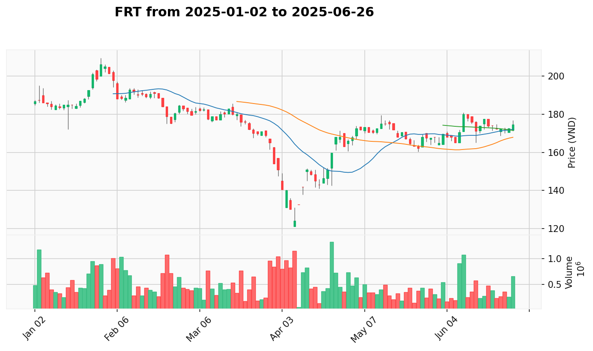

<a href="#ban-le">↑ Back to group BAN_LE</a>  |  <a href="#vpa-signal-summary">↑ Back to Top</a>

#### Key Statistics
| Metric | Value |
|:---|---:|
| Date Range | 2025-01-02 to 2025-11-07 |
| **Latest Close** | **139.5** |
| Period Open | 148.48 |
| Period High | 167.52 |
| Period Low | 96.88 |
| Period Change % | -6.05% |

**[Download FRT Data (.csv)](market_data/FRT_2025-01-02_to_2025-11-09.csv)**

---

### FTS

#### [VPA Analysis (2025-06-26 - 2025-10-21)](./VPA.md#fts)
> **Ngày 2025-10-15:** FTS giảm từ 35.3 VND xuống 34.75 VND với khối lượng giao dịch đạt 2.1284 triệu cổ phiếu, thấp hơn so với phiên trước. Cây nến giảm có biên độ tương đối hẹp, đóng cửa gần mức thấp nhất phiên, cho thấy áp lực bán vẫn hiện hữu. Khối lượng giảm trong khi giá giảm cho thấy lực cung có thể đang yếu đi, nhưng đồng thời cũng phản ánh sự thiếu vắng của lực cầu. **Phân tích VPA/Wyckoff:** Weakness (W) - Tiếp tục cho thấy sự suy yếu của thị trường.
> **Ngày 2025-10-16:** FTS giảm từ 34.75 VND xuống 34.45 VND với khối lượng giao dịch đạt 1.0917 triệu cổ phiếu, thấp hơn đáng kể so với phiên trước. Cây nến giảm có biên độ hẹp, giá đóng cửa gần mức thấp nhất phiên, cho thấy áp lực bán vẫn còn nhưng không mạnh mẽ. Khối lượng thấp trong khi giá giảm cho thấy sự thiếu vắng lực cầu, tiếp nối các tín hiệu suy yếu trước đó. **Phân tích VPA/Wyckoff:** No Demand (ND) - Tiếp tục cho thấy sự suy yếu của thị trường và thiếu vắng lực cầu.
> **Ngày 2025-10-17:** FTS giảm từ 34.4 VND xuống 34.35 VND với khối lượng giao dịch đạt 2.036 triệu cổ phiếu, cao hơn so với phiên trước. Cây nến giảm có biên độ tương đối và đóng cửa ở mức thấp nhất phiên, cho thấy áp lực bán mạnh mẽ. Khối lượng tăng trong khi giá giảm xác nhận lực cung vẫn đang chiếm ưu thế. **Phân tích VPA/Wyckoff:** Weakness (W) - Lực cung tiếp tục chiếm ưu thế.
> **Ngày 2025-10-20:** FTS giảm từ 34.05 VND xuống 31.95 VND với khối lượng giao dịch đạt 2.4415 triệu cổ phiếu, cao hơn đáng kể so với phiên trước (2.036 triệu cổ phiếu). Cây nến giảm có biên độ rộng và đóng cửa ở mức thấp nhất phiên, cho thấy áp lực bán rất mạnh mẽ. Khối lượng tăng trong khi giá giảm mạnh xác nhận lực cung đang chiếm ưu thế hoàn toàn và có thể đẩy giá xuống thấp hơn. So với phiên 2025-10-17, mức giảm giá và khối lượng đều lớn hơn, cho thấy sự suy yếu tiếp tục gia tăng. **Phân tích VPA/Wyckoff:** Weakness (W) - Lực cung tiếp tục chiếm ưu thế mạnh mẽ.
> **Ngày 2025-10-21:** FTS tăng từ 31.95 VND lên 33.45 VND với khối lượng giao dịch đạt 3.1628 triệu cổ phiếu, cao hơn đáng kể so với phiên trước. Cây nến tăng có biên độ rộng và đóng cửa gần mức cao nhất phiên, cho thấy lực cầu đã quay trở lại và hấp thụ lực cung. Sau hai phiên giảm mạnh liên tiếp, sự tăng giá với khối lượng lớn này cho thấy tín hiệu tích cực về sự xuất hiện của lực mua. **Phân tích VPA/Wyckoff:** Sign of Strength (SOS) - Lực cầu mạnh mẽ xuất hiện, hấp thụ lực cung và đẩy giá lên.

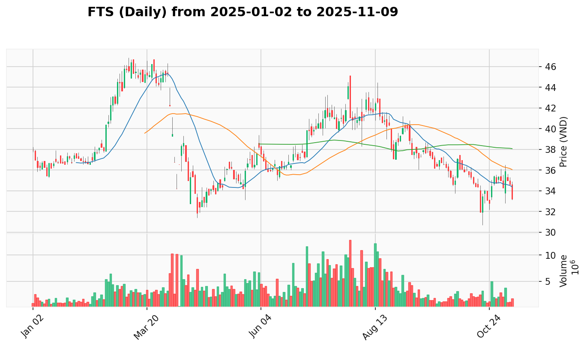

<a href="#chung-khoan">↑ Back to group CHUNG_KHOAN</a>  |  <a href="#vpa-signal-summary">↑ Back to Top</a>

#### Key Statistics
| Metric | Value |
|:---|---:|
| Date Range | 2025-01-02 to 2025-11-07 |
| **Latest Close** | **33.2** |
| Period Open | 37.96 |
| Period High | 46.85 |
| Period Low | 30.7 |
| Period Change % | -12.54% |

**[Download FTS Data (.csv)](market_data/FTS_2025-01-02_to_2025-11-09.csv)**

---

### G36

#### [VPA Analysis (2025-08-04 - 2025-10-21)](./VPA.md#g36)
> **Ngày 2025-10-15:** G36 giảm từ 9.1 VND xuống 9.0 VND với khối lượng giao dịch đạt 0.7959 triệu cổ phiếu, tăng so với phiên trước (0.6414 triệu cổ phiếu). Cây nến giảm có biên độ tương đối rộng và đóng cửa gần mức thấp nhất phiên, cho thấy áp lực bán vẫn tiếp diễn và có phần gia tăng, xác nhận xu hướng giảm giá vẫn đang chiếm ưu thế. **Phân tích VPA/Wyckoff:** Weakness - Áp lực bán tiếp diễn.
> **Ngày 2025-10-16:** G36 giảm từ 9.0 VND xuống 8.8 VND với khối lượng giao dịch đạt 0.2948 triệu cổ phiếu, giảm đáng kể so với phiên trước (0.7959 triệu cổ phiếu). Cây nến giảm có biên độ hẹp và đóng cửa ở mức thấp nhất phiên, cho thấy áp lực bán vẫn duy trì nhưng với cường độ thấp hơn. Khối lượng thấp trong khi giá giảm cho thấy sự thiếu vắng cả lực mua và lực bán mạnh, xác nhận xu hướng suy yếu tiếp diễn. **Phân tích VPA/Wyckoff:** Weakness - Tiếp diễn suy yếu với khối lượng thấp.
> **Ngày 2025-10-17:** G36 tăng từ 9.0 VND lên 9.1 VND với khối lượng giao dịch đạt 0.4923 triệu cổ phiếu, giảm đáng kể so với phiên trước (0.7004 triệu cổ phiếu). Cây nến tăng có biên độ hẹp và đóng cửa gần mức cao nhất phiên, nhưng khối lượng thấp cho thấy lực cầu yếu và không đủ mạnh để đảo chiều xu hướng giảm giá đã thiết lập. Đây có thể là một nhịp hồi phục kỹ thuật trong xu hướng giảm. **Phân tích VPA/Wyckoff:** Lack of Demand - Lực cầu yếu.
> **Ngày 2025-10-20:** G36 giảm từ 9.1 VND xuống 8.4 VND với khối lượng giao dịch đạt 0.6157 triệu cổ phiếu, tăng so với phiên trước (0.4923 triệu cổ phiếu). Cây nến giảm có biên độ rộng và đóng cửa ở mức thấp nhất phiên, cho thấy áp lực bán mạnh mẽ và nguồn cung gia tăng. Sự sụt giảm giá đáng kể đi kèm với khối lượng tăng xác nhận xu hướng suy yếu tiếp diễn. **Phân tích VPA/Wyckoff:** Sign of Weakness (SOW) - Nguồn cung gia tăng.
> **Ngày 2025-10-21:** G36 giảm từ 8.6 VND xuống 8.4 VND với khối lượng giao dịch đạt 0.6569 triệu cổ phiếu, tăng nhẹ so với phiên trước (0.6157 triệu cổ phiếu). Cây nến có biên độ hẹp, giá đóng cửa bằng giá đóng cửa phiên trước nhưng thấp hơn giá mở cửa, cho thấy áp lực bán vẫn duy trì và lực cầu không đủ mạnh để đẩy giá lên. Sự tăng nhẹ về khối lượng trong bối cảnh giá không thể phục hồi xác nhận xu hướng suy yếu tiếp diễn. **Phân tích VPA/Wyckoff:** Tiếp diễn suy yếu.

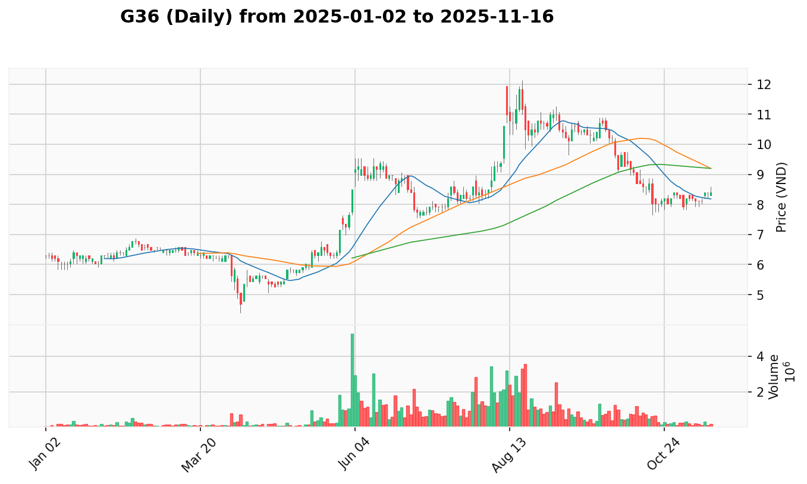

<a href="#dau-tu-cong">↑ Back to group DAU_TU_CONG</a>  |  <a href="#vpa-signal-summary">↑ Back to Top</a>

#### Key Statistics
| Metric | Value |
|:---|---:|
| Date Range | 2025-01-02 to 2025-11-07 |
| **Latest Close** | **8.5** |
| Period Open | 6.6 |
| Period High | 12.7 |
| Period Low | 4.6 |
| Period Change % | 28.79% |

**[Download G36 Data (.csv)](market_data/G36_2025-01-02_to_2025-11-09.csv)**

---

### GAS

#### [VPA Analysis (2025-06-13 - 2025-10-21)](./VPA.md#gas)
> **Ngày 2025-10-15:** GAS giảm từ 60.0 VND xuống 59.0 VND. Cây nến trong phiên là nến giảm mạnh với biên độ rộng từ 58.8 VND đến 60.2 VND, đóng cửa gần mức thấp nhất phiên. Khối lượng giao dịch đạt 1.2713 triệu cổ phiếu, tăng đột biến so với phiên trước (0.568 triệu cổ phiếu). Việc giá giảm mạnh trên khối lượng tăng cao sau các dấu hiệu yếu kém trước đó cho thấy áp lực bán tiếp tục gia tăng mạnh mẽ và sự yếu kém của thị trường được xác nhận rõ rệt. **Phân tích VPA/Wyckoff:** Sign of Weakness (SOW) - Áp lực bán mạnh mẽ tiếp diễn.
> **Ngày 2025-10-16:** GAS giảm từ 59.0 VND xuống 58.9 VND. Cây nến trong phiên có biên độ hẹp từ 58.8 VND đến 59.0 VND, đóng cửa gần mức cao nhất phiên. Khối lượng giao dịch đạt 0.3636 triệu cổ phiếu, giảm mạnh so với phiên trước (1.2713 triệu cổ phiếu). Sau các phiên giảm mạnh với khối lượng lớn, phiên này cho thấy áp lực bán tạm lắng nhưng lực cầu vẫn yếu. **Phân tích VPA/Wyckoff:** No Demand - Áp lực bán tạm lắng nhưng thiếu vắng lực cầu.
> **Ngày 2025-10-17:** GAS giảm từ 58.7 VND xuống 58.6 VND. Cây nến trong phiên có biên độ hẹp từ 58.5 VND đến 59.2 VND, đóng cửa gần mức thấp nhất phiên. Khối lượng giao dịch đạt 0.32 triệu cổ phiếu, giảm đáng kể so với phiên trước (0.9563 triệu cổ phiếu). Sau các phiên giảm giá và thiếu cầu, phiên này tiếp tục cho thấy sự thiếu vắng lực mua và áp lực bán đã giảm bớt nhưng vẫn duy trì xu hướng giảm. **Phân tích VPA/Wyckoff:** No Demand - Tiếp tục thiếu vắng lực cầu.
> **Ngày 2025-10-20:** GAS giảm từ 58.6 VND xuống 57.0 VND. Cây nến trong phiên có biên độ rộng từ 57.0 VND đến 59.5 VND, đóng cửa ở mức thấp nhất phiên. Khối lượng giao dịch đạt 0.6047 triệu cổ phiếu, gia tăng đáng kể so với phiên trước (0.32 triệu cổ phiếu). Sau các phiên thiếu cầu, phiên này cho thấy áp lực bán mạnh mẽ và nguồn cung gia tăng, xác nhận xu hướng giảm. **Phân tích VPA/Wyckoff:** Weakness - Áp lực bán mạnh mẽ.
> **Ngày 2025-10-21:** GAS giảm từ 57.0 VND xuống 56.0 VND. Cây nến trong phiên có biên độ rộng từ 56.0 VND đến 58.8 VND, đóng cửa ở mức thấp nhất phiên. Khối lượng giao dịch đạt 0.8379 triệu cổ phiếu, gia tăng đáng kể so với phiên trước (0.6047 triệu cổ phiếu). Sau phiên áp lực bán mạnh mẽ, phiên này tiếp tục cho thấy sự gia tăng của nguồn cung và áp lực bán, xác nhận xu hướng giảm giá. **Phân tích VPA/Wyckoff:** Weakness - Áp lực bán tiếp tục gia tăng.

<a href="#dau-khi">↑ Back to group DAU_KHI</a>  |  <a href="#vpa-signal-summary">↑ Back to Top</a>

#### Key Statistics
| Metric | Value |
|:---|---:|
| Date Range | 2025-01-02 to 2025-11-07 |
| **Latest Close** | **62.9** |
| Period Open | 64.29 |
| Period High | 69.28 |
| Period Low | 47.82 |
| Period Change % | -2.16% |

**[Download GAS Data (.csv)](market_data/GAS_2025-01-02_to_2025-11-09.csv)**

---

### GDA

#### [VPA Analysis (2025-08-14 - 2025-10-21)](./VPA.md#gda)
> **Ngày 2025-10-15:** GDA đóng cửa ở mức 17.3 VND, không đổi so với phiên trước. Phiên giao dịch mở cửa tại 17.3 VND, đạt đỉnh 17.3 VND và đóng cửa ở mức 17.3 VND. Biên độ nến hẹp (17.0 VND - 17.3 VND). Khối lượng giao dịch đạt 0.1157 triệu cổ phiếu, tăng so với phiên trước (0.103 triệu cổ phiếu). Giá không đổi với khối lượng tăng cho thấy áp lực bán vẫn còn và lực cầu chưa đủ mạnh để đẩy giá lên, tiếp tục xu hướng yếu kém đã được xác nhận từ phiên trước. **Phân tích VPA/Wyckoff:** Weakness (Yếu kém) - Supply still present.
> **Ngày 2025-10-16:** GDA mở cửa tại 17.2 VND, đạt đỉnh 17.2 VND và đóng cửa ở mức 17.1 VND, giảm 0.2 VND so với phiên trước. Biên độ nến hẹp (17.0 VND - 17.2 VND). Khối lượng giao dịch đạt 0.0259 triệu cổ phiếu, giảm mạnh so với phiên trước (0.1157 triệu cổ phiếu). Giá giảm nhẹ với biên độ hẹp và khối lượng giảm mạnh cho thấy áp lực bán đã suy yếu đáng kể, nhưng lực cầu vẫn chưa xuất hiện để hỗ trợ giá. Điều này cho thấy sự tiếp diễn của xu hướng yếu kém, nhưng với cường độ giảm bớt. **Phân tích VPA/Wyckoff:** Weakness (Yếu kém) - Reduced Supply.
> **Ngày 2025-10-17:** GDA mở cửa tại 17.1 VND, đạt đỉnh 17.4 VND và đóng cửa ở mức 17.1 VND, tăng 0.1 VND so với phiên trước (17.0 VND). Biên độ nến hẹp (17.0 VND - 17.4 VND). Khối lượng giao dịch đạt 0.0662 triệu cổ phiếu, giảm so với phiên trước (0.0724 triệu cổ phiếu). Giá tăng nhẹ với biên độ hẹp và khối lượng giảm cho thấy lực bán đã suy yếu đáng kể, nhưng lực cầu vẫn chưa xuất hiện mạnh mẽ để hỗ trợ giá. Điều này tiếp tục xác nhận giai đoạn yếu kém của cổ phiếu, cho thấy sự thiếu hụt nhu cầu. **Phân tích VPA/Wyckoff:** Weakness (Yếu kém) - Lack of Demand.
> **Ngày 2025-10-20:** GDA mở cửa tại 17.2 VND, đạt đỉnh 17.2 VND và đóng cửa ở mức 16.7 VND, giảm 0.4 VND so với phiên trước. Biên độ nến rộng (16.5 VND - 17.2 VND). Khối lượng giao dịch đạt 0.0538 triệu cổ phiếu, giảm so với phiên trước (0.0662 triệu cổ phiếu). Giá giảm mạnh với biên độ rộng và đóng cửa gần mức thấp nhất phiên, trong khi khối lượng giao dịch giảm. Điều này cho thấy áp lực bán vẫn chiếm ưu thế và thiếu vắng lực cầu hỗ trợ, tiếp tục xác nhận xu hướng yếu kém của cổ phiếu. **Phân tích VPA/Wyckoff:** Weakness (Yếu kém) - Supply in Control.
> **Ngày 2025-10-21:** GDA mở cửa tại 16.7 VND, đạt đỉnh 16.8 VND và đóng cửa ở mức 16.7 VND, không đổi so với phiên trước. Biên độ nến hẹp (16.4 VND - 16.8 VND). Khối lượng giao dịch đạt 0.0502 triệu cổ phiếu, tiếp tục giảm so với phiên trước (0.0538 triệu cổ phiếu). Giá không đổi với biên độ hẹp và khối lượng giảm cho thấy sự thiếu quyết đoán của thị trường sau đợt giảm giá mạnh. Lực cung và cầu đều yếu, không bên nào chiếm ưu thế rõ rệt, tiếp tục xác nhận sự thiếu hụt nhu cầu. **Phân tích VPA/Wyckoff:** Weakness (Yếu kém) - No Demand.

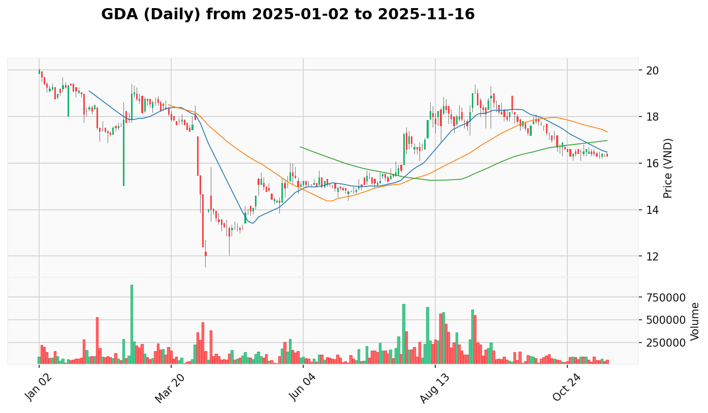

<a href="#thep">↑ Back to group THEP</a>  |  <a href="#vpa-signal-summary">↑ Back to Top</a>

#### Key Statistics
| Metric | Value |
|:---|---:|
| Date Range | 2025-01-02 to 2025-11-07 |
| **Latest Close** | **16.4** |
| Period Open | 19.85 |
| Period High | 20.07 |
| Period Low | 11.53 |
| Period Change % | -17.38% |

**[Download GDA Data (.csv)](market_data/GDA_2025-01-02_to_2025-11-09.csv)**

---

### GDT

#### [VPA Analysis (2025-08-14 - 2025-10-21)](./VPA.md#gdt)
> **Ngày 2025-10-15:** GDT mở cửa ở mức 20.6 VND, đạt đỉnh 20.95 VND và giảm xuống 20.6 VND, đóng cửa tại 20.95 VND, tăng so với phiên trước (20.8 VND). Khối lượng giao dịch đạt 0.0067 triệu cổ phiếu, tăng so với phiên trước (0.0037 triệu cổ phiếu). Nến có biên độ rộng và giá đóng cửa nằm ở mức cao nhất của nến. Sau phiên "No Supply" ngày hôm trước, phiên này giá tăng với khối lượng tăng nhẹ và đóng cửa ở mức cao nhất. Điều này cho thấy lực cầu đã bắt đầu quay trở lại thị trường sau giai đoạn cạn kiệt nguồn cung. Đây là một dấu hiệu tích cực, cho thấy khả năng giá sẽ tiếp tục tăng trong các phiên tới. **Phân tích VPA/Wyckoff:** Sign of Strength (SOS) - Dấu hiệu sức mạnh
> **Ngày 2025-10-16:** GDT mở cửa 20.7 VND, đạt đỉnh 20.85 VND, giảm về 20.6 VND và đóng cửa 20.85 VND, giảm nhẹ so với phiên trước (20.95 VND). Khối lượng giao dịch đạt 0.0059 triệu cổ phiếu, giảm so với phiên trước (0.0067 triệu cổ phiếu). Nến có biên độ hẹp và giá đóng cửa nằm ở mức cao nhất của nến. Sau phiên "Sign of Strength" ngày hôm trước, phiên này giá điều chỉnh nhẹ với khối lượng giảm. Điều này cho thấy lực cầu tạm thời chững lại, nhưng không có áp lực bán đáng kể. Đây là dấu hiệu của sự thiếu cầu sau một đợt tăng giá. **Phân tích VPA/Wyckoff:** No Demand (Thiếu cầu)
> **Ngày 2025-10-17:** GDT mở cửa ở mức 20.45 VND, đạt đỉnh 20.75 VND và giảm xuống 20.4 VND, đóng cửa tại 20.5 VND, giảm so với phiên trước (20.85 VND). Khối lượng giao dịch đạt 0.0301 triệu cổ phiếu, tăng đáng kể so với phiên trước (0.0059 triệu cổ phiếu). Nến có biên độ rộng và giá đóng cửa nằm ở mức thấp của nến. Sau phiên "No Demand" ngày hôm trước, phiên này giá giảm mạnh với khối lượng tăng đột biến. Điều này cho thấy áp lực bán rất lớn đã xuất hiện trên thị trường, vượt trội so với lực cầu. Đây là một dấu hiệu tiêu cực, cho thấy khả năng giá sẽ tiếp tục giảm trong các phiên tới. **Phân tích VPA/Wyckoff:** Sign of Weakness (SOW) - Nguồn cung áp đảo
> **Ngày 2025-10-20:** GDT mở cửa 20.5 VND, đạt đỉnh 20.8 VND, giảm về 20.1 VND và đóng cửa 20.1 VND, giảm so với phiên trước (20.5 VND). Khối lượng giao dịch đạt 0.021 triệu cổ phiếu, giảm so với phiên trước (0.0301 triệu cổ phiếu). Nến có biên độ rộng và giá đóng cửa nằm ở mức thấp nhất của nến. Sau phiên "Sign of Weakness" ngày hôm trước, phiên này giá tiếp tục giảm mạnh với khối lượng giảm nhẹ. Điều này cho thấy áp lực bán vẫn còn duy trì, mặc dù không còn quá đột biến như phiên trước, nhưng lực cầu vẫn yếu và không đủ để hấp thụ nguồn cung. Đây là dấu hiệu của sự yếu kém tiếp diễn. **Phân tích VPA/Wyckoff:** Tiếp diễn sự yếu kém.
> **Ngày 2025-10-21:** GDT mở cửa ở mức 20.2 VND, đạt đỉnh 20.6 VND và giảm xuống 20.0 VND, đóng cửa tại 20.4 VND, tăng so với phiên trước (20.1 VND). Khối lượng giao dịch đạt 0.0849 triệu cổ phiếu, tăng đột biến so với phiên trước (0.021 triệu cổ phiếu). Nến có biên độ rộng và giá đóng cửa nằm ở nửa trên của nến. Sau hai phiên giảm giá với áp lực bán mạnh, phiên này giá đã phục hồi với khối lượng tăng vọt, cho thấy lực cầu đã nhập cuộc mạnh mẽ và hấp thụ nguồn cung. Đây là dấu hiệu ban đầu của sự trở lại của lực mua. **Phân tích VPA/Wyckoff:** Sign of Strength (SOS) - Lực cầu mạnh mẽ.

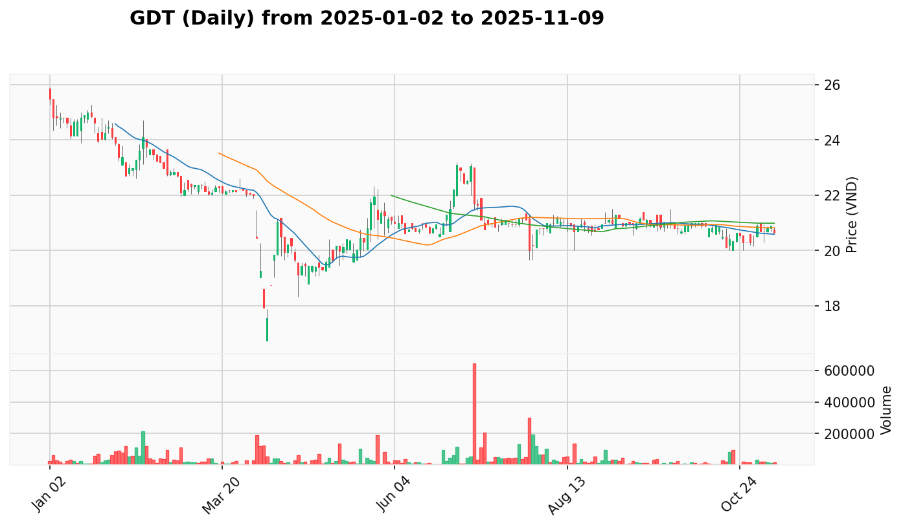

<a href="#others">↑ Back to group OTHERS</a>  |  <a href="#vpa-signal-summary">↑ Back to Top</a>

#### Key Statistics
| Metric | Value |
|:---|---:|
| Date Range | 2025-01-02 to 2025-11-07 |
| **Latest Close** | **20.65** |
| Period Open | 25.85 |
| Period High | 25.9 |
| Period Low | 16.74 |
| Period Change % | -20.12% |

**[Download GDT Data (.csv)](market_data/GDT_2025-01-02_to_2025-11-09.csv)**

---

### GEG

#### [VPA Analysis (2025-08-04 - 2025-10-21)](./VPA.md#geg)
> **Ngày 2025-10-15:** GEG giảm từ 15.7 VND xuống 15.6 VND với khối lượng giao dịch đạt 0.7025 triệu cổ phiếu. Cây nến giảm có biên độ hẹp, đóng cửa gần mức thấp nhất phiên. Khối lượng giao dịch tăng nhẹ so với phiên trước và cao hơn mức trung bình 10 phiên, cho thấy áp lực bán vẫn tiếp diễn và không có lực cầu đủ mạnh để hấp thụ lượng cung. Điều này củng cố thêm xu hướng suy yếu đã được xác nhận từ phiên trước. **Phân tích VPA/Wyckoff:** Continuation of Weakness (COW) / Supply Coming In
> **Ngày 2025-10-16:** GEG tăng từ 15.6 VND lên 15.65 VND với khối lượng giao dịch đạt 0.2719 triệu cổ phiếu. Cây nến tăng có biên độ rất hẹp và đóng cửa gần mức cao nhất phiên. Khối lượng giao dịch giảm mạnh so với phiên trước (0.7025 triệu cổ phiếu) và thấp hơn đáng kể so với mức trung bình, cho thấy áp lực bán đã tạm thời suy yếu nhưng lực cầu cũng không đủ mạnh để đẩy giá lên cao. Sau hai phiên giảm giá với khối lượng lớn, sự xuất hiện của cây nến tăng nhẹ với khối lượng thấp này cho thấy thị trường đang thiếu cả cung lẫn cầu, nhưng chưa có dấu hiệu đảo chiều mạnh mẽ. **Phân tích VPA/Wyckoff:** No Demand
> **Ngày 2025-10-17:** GEG giữ nguyên mức giá 15.7 VND với khối lượng giao dịch đạt 0.3754 triệu cổ phiếu. Cây nến có biên độ rất hẹp, đóng cửa tại mức giá mở cửa và bằng với giá đóng cửa phiên trước, cho thấy sự lưỡng lự và thiếu vắng động lực rõ ràng từ cả bên mua và bên bán. Khối lượng giao dịch tiếp tục giảm so với phiên trước (0.5245 triệu cổ phiếu) và thấp hơn đáng kể so với mức trung bình 10 phiên, củng cố nhận định về sự thiếu hụt cầu. Trong bối cảnh các phiên trước đó cho thấy sự suy yếu và không có cầu, phiên này tiếp tục xác nhận tình trạng thiếu lực mua và áp lực bán đã giảm nhưng không có lực cầu hấp thụ. **Phân tích VPA/Wyckoff:** No Demand
> **Ngày 2025-10-20:** GEG giảm từ 15.7 VND xuống 15.0 VND với khối lượng giao dịch đạt 0.6767 triệu cổ phiếu. Cây nến giảm có biên độ rộng và đóng cửa ở mức thấp nhất phiên, cho thấy áp lực bán mạnh mẽ. Khối lượng giao dịch tăng đáng kể so với phiên trước (0.3754 triệu cổ phiếu) và cao hơn mức trung bình gần đây, xác nhận sự xuất hiện của nguồn cung lớn. Sau nhiều phiên thiếu cầu, sự gia tăng khối lượng bán này cho thấy thị trường đang chịu áp lực giảm giá rõ rệt. **Phân tích VPA/Wyckoff:** Weakness (Sự suy yếu)
> **Ngày 2025-10-21:** GEG tiếp tục giảm từ 15.0 VND xuống 14.85 VND với khối lượng giao dịch đạt 0.7831 triệu cổ phiếu. Cây nến giảm có biên độ tương đối và đóng cửa gần mức thấp nhất phiên, cho thấy áp lực bán vẫn tiếp diễn. Khối lượng giao dịch tăng so với phiên trước (0.6767 triệu cổ phiếu) và cao hơn mức trung bình gần đây, xác nhận sự hiện diện của nguồn cung. Sau phiên suy yếu mạnh vào ngày 2025-10-20, phiên này củng cố thêm nhận định về sự chiếm ưu thế của bên bán. **Phân tích VPA/Wyckoff:** Continuing Weakness (Tiếp tục suy yếu)

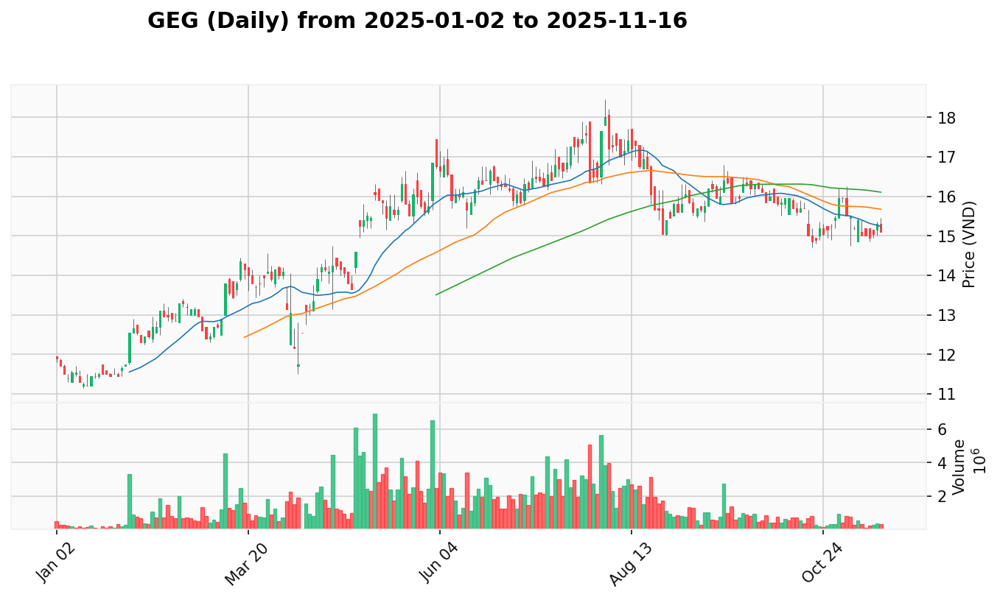

<a href="#nang-luong">↑ Back to group NANG_LUONG</a>  |  <a href="#vpa-signal-summary">↑ Back to Top</a>

#### Key Statistics
| Metric | Value |
|:---|---:|
| Date Range | 2025-01-02 to 2025-11-07 |
| **Latest Close** | **15.0** |
| Period Open | 11.95 |
| Period High | 18.45 |
| Period Low | 11.15 |
| Period Change % | 25.52% |

**[Download GEG Data (.csv)](market_data/GEG_2025-01-02_to_2025-11-09.csv)**

---

### GEX

#### [VPA Analysis (2025-06-16 - 2025-10-21)](./VPA.md#gex)
> **Ngày 2025-10-15:** GEX tăng từ 58.8 VND lên 62.9 VND. Cây nến tăng có biên độ 3.0 VND (từ 59.9 VND đến 62.9 VND), đóng cửa ở mức cao nhất phiên. Khối lượng giao dịch đạt 29.5541 triệu cổ phiếu, giảm 41.16% so với phiên trước (50.2247 triệu cổ phiếu). Sau phiên "Sign of Strength" mạnh mẽ vào ngày 2025-10-14, GEX tiếp tục đà tăng với cây nến tăng mạnh và đóng cửa ở mức cao nhất phiên, cho thấy lực cầu vẫn áp đảo dù khối lượng có phần giảm nhẹ so với phiên bùng nổ trước đó. **Phân tích VPA/Wyckoff:** Sign of Strength (SOS) - Tiếp diễn lực cầu mạnh mẽ.
> **Ngày 2025-10-16:** GEX tăng từ 62.9 VND lên 63.4 VND. Giá đóng cửa 63.4 VND cao hơn giá đóng cửa phiên trước 62.9 VND. Cây nến có biên độ 1.7 VND (từ 62.6 VND đến 64.3 VND), mở cửa ở 64.3 VND và đóng cửa ở 63.4 VND, cho thấy áp lực bán trong phiên. Khối lượng giao dịch đạt 9.42 triệu cổ phiếu, giảm mạnh 68.19% so với phiên trước (29.5541 triệu cổ phiếu). Sau hai phiên "Sign of Strength" mạnh mẽ, GEX tiếp tục tăng nhẹ nhưng với khối lượng rất thấp và biên độ hẹp, đồng thời giá đóng cửa thấp hơn giá mở cửa. Điều này cho thấy lực cầu đã suy yếu đáng kể và không còn đủ mạnh để duy trì đà tăng với khối lượng lớn. **Phân tích VPA/Wyckoff:** No Demand (ND) - Thiếu cầu.
> **Ngày 2025-10-17:** GEX giảm từ 65.7 VND xuống 61.5 VND. Giá đóng cửa 61.5 VND thấp hơn giá đóng cửa phiên trước 65.4 VND. Cây nến giảm có biên độ 4.2 VND (từ 61.5 VND đến 65.7 VND), đóng cửa ở mức thấp nhất phiên. Khối lượng giao dịch đạt 26.96 triệu cổ phiếu, giảm nhẹ 8.5% so với phiên trước (29.4858 triệu cổ phiếu) nhưng vẫn ở mức cao, xác nhận lực bán chiếm ưu thế. Sau phiên "No Demand" vào ngày 2025-10-16, GEX tiếp tục giảm mạnh với khối lượng cao, cho thấy nguồn cung đã áp đảo hoàn toàn lực cầu. **Phân tích VPA/Wyckoff:** Sign of Weakness (SOW) - Lực cung áp đảo.
> **Ngày 2025-10-20:** GEX giảm từ 61.5 VND xuống 57.2 VND. Giá đóng cửa 57.2 VND thấp hơn giá đóng cửa phiên trước 61.5 VND. Cây nến giảm có biên độ rộng 5.5 VND (từ 57.2 VND đến 62.7 VND), mở cửa ở 61.6 VND và đóng cửa ở mức thấp nhất phiên 57.2 VND, cho thấy áp lực bán rất mạnh và liên tục trong suốt phiên. Khối lượng giao dịch đạt 34.36 triệu cổ phiếu, tăng đáng kể 27.45% so với phiên trước (26.96 triệu cổ phiếu). Sau phiên "Sign of Weakness" vào ngày 2025-10-17, GEX tiếp tục giảm mạnh với khối lượng gia tăng và biên độ rộng, xác nhận xu hướng giảm và cho thấy nguồn cung vẫn đang áp đảo hoàn toàn lực cầu. **Phân tích VPA/Wyckoff:** Sign of Weakness (SOW) - Lực cung tiếp tục áp đảo với khối lượng lớn.
> **Ngày 2025-10-21:** GEX giảm từ 57.2 VND xuống 56.0 VND. Giá đóng cửa 56.0 VND thấp hơn giá đóng cửa phiên trước 57.2 VND. Cây nến giảm có biên độ 3.5 VND (từ 53.2 VND đến 56.7 VND), đóng cửa gần mức thấp nhất phiên, cho thấy áp lực bán vẫn còn mạnh. Khối lượng giao dịch đạt 33.9393 triệu cổ phiếu, giảm nhẹ 1.23% so với phiên trước (34.3597 triệu cổ phiếu) nhưng vẫn ở mức cao. Sau các phiên 'Sign of Weakness' trước đó, GEX tiếp tục giảm điểm với khối lượng cao, xác nhận xu hướng giảm và cho thấy nguồn cung vẫn đang chiếm ưu thế. **Phân tích VPA/Wyckoff:** Sign of Weakness (SOW) - Lực cung tiếp tục chiếm ưu thế.

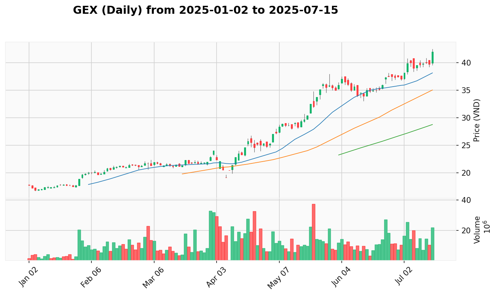

<a href="#others">↑ Back to group OTHERS</a>  |  <a href="#vpa-signal-summary">↑ Back to Top</a>

#### Key Statistics
| Metric | Value |
|:---|---:|
| Date Range | 2025-01-02 to 2025-11-07 |
| **Latest Close** | **43.95** |
| Period Open | 17.57 |
| Period High | 65.7 |
| Period Low | 16.42 |
| Period Change % | 150.14% |

**[Download GEX Data (.csv)](market_data/GEX_2025-01-02_to_2025-11-09.csv)**

---

### GIL

#### [VPA Analysis (2025-08-05 - 2025-10-21)](./VPA.md#gil)
> **Ngày 2025-10-15:** GIL giảm từ 16.4 VND xuống 15.75 VND. Giá mở cửa 16.5 VND, cao nhất 16.5 VND, thấp nhất 15.75 VND, đóng cửa ở mức 15.75 VND. Biên độ giá rộng. Khối lượng giao dịch đạt 0.6468 triệu cổ phiếu, tăng đáng kể so với phiên trước (0.5745 triệu cổ phiếu) và ở mức cao. Giá đóng cửa ở mức thấp nhất phiên, cho thấy áp lực bán mạnh mẽ và sự tiếp diễn của lực cung. Sự sụt giảm giá với biên độ rộng, khối lượng tăng và đóng cửa ở mức thấp nhất phiên củng cố dấu hiệu yếu kém đã xuất hiện từ các phiên trước, xác nhận xu hướng giảm giá. **Phân tích VPA/Wyckoff:** Sign of Weakness (SOW) - Dấu hiệu yếu kém.
> **Ngày 2025-10-16:** GIL giảm từ 15.75 VND xuống 15.6 VND. Giá mở cửa 15.75 VND, cao nhất 15.75 VND, thấp nhất 15.3 VND, đóng cửa ở mức 15.6 VND. Biên độ giá hẹp hơn so với phiên trước. Khối lượng giao dịch đạt 0.2207 triệu cổ phiếu, giảm đáng kể so với phiên trước (0.6468 triệu cổ phiếu). Giá đóng cửa gần mức thấp nhất phiên, cho thấy áp lực bán vẫn còn nhưng đã suy yếu đáng kể khi khối lượng giảm mạnh. Sự sụt giảm giá với khối lượng thấp sau hai phiên giảm mạnh với khối lượng cao cho thấy lực cung đang cạn kiệt, nhưng chưa có dấu hiệu lực cầu quay trở lại. **Phân tích VPA/Wyckoff:** No Demand (ND) - Không có lực cầu.
> **Ngày 2025-10-17:** GIL giảm từ 15.6 VND xuống 15.2 VND. Giá mở cửa 15.6 VND, cao nhất 15.7 VND, thấp nhất 15.2 VND, đóng cửa ở mức 15.2 VND. Biên độ giá rộng. Khối lượng giao dịch đạt 0.2909 triệu cổ phiếu, giảm nhẹ so với phiên trước (0.331 triệu cổ phiếu). Giá đóng cửa ở mức thấp nhất phiên, cho thấy áp lực bán tiếp tục chiếm ưu thế. Sự sụt giảm giá với biên độ rộng và đóng cửa ở mức thấp nhất phiên, dù khối lượng có giảm nhẹ, vẫn xác nhận xu hướng giảm giá đang tiếp diễn. **Phân tích VPA/Wyckoff:** Sign of Weakness (SOW) - Dấu hiệu yếu kém.
> **Ngày 2025-10-20:** GIL giảm từ 15.2 VND xuống 14.6 VND. Giá mở cửa 15.1 VND, cao nhất 15.45 VND, thấp nhất 14.6 VND, đóng cửa ở mức 14.6 VND. Biên độ giá rộng. Khối lượng giao dịch đạt 0.4447 triệu cổ phiếu, tăng đáng kể so với phiên trước (0.2909 triệu cổ phiếu). Giá đóng cửa ở mức thấp nhất phiên, cho thấy áp lực bán mạnh mẽ và xu hướng giảm giá tiếp diễn. **Phân tích VPA/Wyckoff:** Sign of Weakness (SOW) - Dấu hiệu yếu kém.
> **Ngày 2025-10-21:** GIL tăng từ 14.6 VND lên 15.25 VND. Giá mở cửa 14.15 VND, cao nhất 15.4 VND, thấp nhất 14.15 VND, đóng cửa ở mức 15.25 VND. Biên độ giá rộng. Khối lượng giao dịch đạt 0.3741 triệu cổ phiếu, giảm so với phiên trước (0.4447 triệu cổ phiếu). Giá đóng cửa gần mức cao nhất phiên cho thấy lực cầu xuất hiện, nhưng khối lượng giảm cho thấy lực cầu chưa thực sự mạnh mẽ để đảo chiều xu hướng giảm giá đã thiết lập sau hai phiên SOW liên tiếp. **Phân tích VPA/Wyckoff:** Thiếu cầu (Lack of Demand)

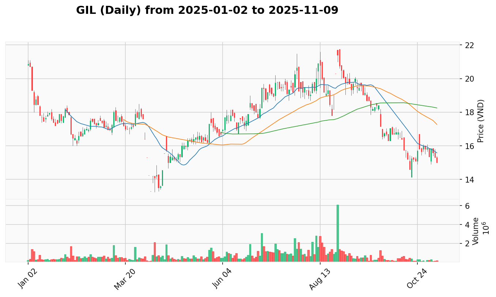

<a href="#det-may">↑ Back to group DET_MAY</a>  |  <a href="#vpa-signal-summary">↑ Back to Top</a>

#### Key Statistics
| Metric | Value |
|:---|---:|
| Date Range | 2025-01-02 to 2025-11-07 |
| **Latest Close** | **15.0** |
| Period Open | 20.8 |
| Period High | 21.75 |
| Period Low | 13.25 |
| Period Change % | -27.88% |

**[Download GIL Data (.csv)](market_data/GIL_2025-01-02_to_2025-11-09.csv)**

---

### GMD

#### [VPA Analysis (2025-06-16 - 2025-10-21)](./VPA.md#gmd)
> **Ngày 2025-10-15:** GMD tăng từ 68.1 VND lên 69.0 VND với khối lượng giao dịch tăng mạnh lên 3.9436 triệu cổ phiếu. Cây nến có biên độ rất rộng, đóng cửa cao hơn phiên trước, cho thấy lực cầu mạnh mẽ đã hấp thụ nguồn cung và đẩy giá lên. Khối lượng tăng đột biến xác nhận sự tiếp diễn của xu hướng tăng. **Phân tích VPA/Wyckoff:** Sign of Strength (SOS)
> **Ngày 2025-10-16:** GMD giữ giá 69.0 VND với khối lượng giao dịch giảm mạnh xuống 0.8627 triệu cổ phiếu. Cây nến có biên độ hẹp và đóng cửa tại mức giá của phiên trước, cho thấy lực cầu đã suy yếu đáng kể sau hai phiên tăng mạnh. Khối lượng thấp xác nhận sự thiếu vắng của bên mua ở mức giá này, báo hiệu một sự tạm dừng trong xu hướng tăng. **Phân tích VPA/Wyckoff:** No Demand
> **Ngày 2025-10-17:** GMD tăng từ 67.5 VND lên 68.0 VND với khối lượng giao dịch tăng nhẹ lên 2.5217 triệu cổ phiếu. Cây nến có biên độ hẹp, đóng cửa gần mức cao nhất phiên, cho thấy lực cầu đã xuất hiện trở lại sau phiên giảm giá trước đó. Khối lượng tăng nhẹ xác nhận sự trở lại của bên mua. **Phân tích VPA/Wyckoff:** Sign of Strength (SOS)
> **Ngày 2025-10-20: **GMD giảm từ 68.0 VND xuống 63.3 VND với khối lượng giao dịch tăng mạnh lên 5.551 triệu cổ phiếu. Cây nến có biên độ rộng và đóng cửa tại mức thấp nhất phiên, cho thấy áp lực bán mạnh mẽ và sự chi phối của phe gấu. **Phân tích VPA/Wyckoff:** Sign of Weakness (SOW)
> **Ngày 2025-10-21:** GMD tăng từ 63.3 VND lên 66.0 VND với khối lượng giao dịch giảm mạnh xuống 2.3086 triệu cổ phiếu. Cây nến có biên độ trung bình và đóng cửa gần mức cao nhất phiên, cho thấy một sự phục hồi nhẹ sau phiên giảm mạnh. Tuy nhiên, khối lượng thấp cho thấy lực cầu yếu và thiếu sự xác nhận, có thể là một dấu hiệu của sự thiếu vắng nhu cầu sau tín hiệu suy yếu. **Phân tích VPA/Wyckoff:** No Demand

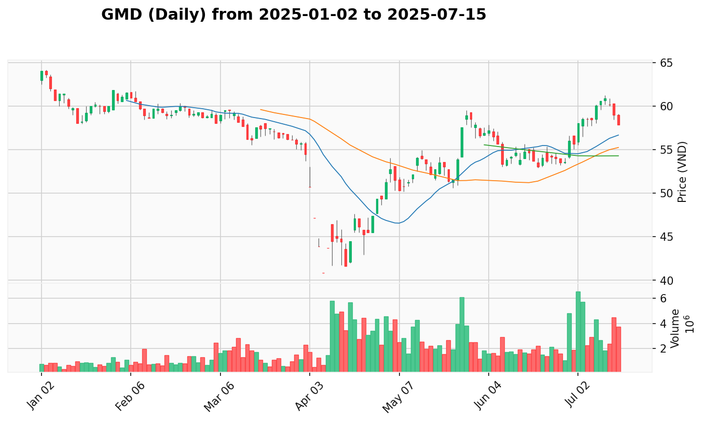

<a href="#van-tai">↑ Back to group VAN_TAI</a>  |  <a href="#vpa-signal-summary">↑ Back to Top</a>

#### Key Statistics
| Metric | Value |
|:---|---:|
| Date Range | 2025-01-02 to 2025-11-07 |
| **Latest Close** | **63.4** |
| Period Open | 63.0 |
| Period High | 74.5 |
| Period Low | 40.84 |
| Period Change % | 0.63% |

**[Download GMD Data (.csv)](market_data/GMD_2025-01-02_to_2025-11-09.csv)**

---

### GVR

#### [VPA Analysis (2025-06-13 - 2025-10-21)](./VPA.md#gvr)
> **Ngày 2025-10-15:** GVR giảm từ 27.85 VND (giá đóng cửa phiên trước) xuống 27.45 VND với khối lượng giao dịch đạt 2.56 triệu cổ phiếu, tăng nhẹ so với phiên trước. Cây nến giảm có biên độ tương đối rộng và đóng cửa gần mức thấp nhất phiên, cho thấy áp lực bán tiếp tục chiếm ưu thế và lực cầu yếu. Điều này củng cố thêm sự suy yếu của xu hướng tăng sau phiên SOW trước đó. **Phân tích VPA/Wyckoff:** Sign of Weakness (SOW)
> **Ngày 2025-10-16:** GVR giảm từ 27.45 VND (giá đóng cửa phiên trước) xuống 27.3 VND với khối lượng giao dịch đạt 1.8018 triệu cổ phiếu, giảm đáng kể so với phiên trước. Cây nến giảm có biên độ hẹp và đóng cửa gần mức thấp nhất phiên, cho thấy áp lực bán vẫn còn nhưng đã suy yếu, đồng thời lực cầu cũng không xuất hiện. Điều này củng cố thêm sự suy yếu của xu hướng tăng và cho thấy thiếu vắng lực cầu. **Phân tích VPA/Wyckoff:** No Demand (ND)
> **Ngày 2025-10-17:** GVR giảm từ 27.2 VND (giá đóng cửa phiên trước) xuống 27.1 VND với khối lượng giao dịch đạt 2.0389 triệu cổ phiếu, giảm đáng kể so với phiên trước. Cây nến giảm có biên độ hẹp và đóng cửa tại mức thấp nhất phiên, cho thấy áp lực bán đã suy yếu nhưng lực cầu vẫn chưa xuất hiện. Điều này cho thấy sự cạn kiệt nguồn cung sau nhiều phiên giảm mạnh. **Phân tích VPA/Wyckoff:** No Supply (NS)
> **Ngày 2025-10-20:** GVR giảm mạnh từ 27.1 VND (giá đóng cửa phiên trước) xuống 25.25 VND với khối lượng giao dịch đạt 3.3515 triệu cổ phiếu, tăng đáng kể so với phiên trước. Cây nến giảm có biên độ rộng và đóng cửa tại mức thấp nhất phiên, cho thấy áp lực bán mạnh mẽ và sự xuất hiện của nguồn cung lớn. Điều này phủ nhận tín hiệu cạn kiệt nguồn cung (No Supply) của phiên trước và xác nhận xu hướng giảm tiếp diễn. **Phân tích VPA/Wyckoff:** Sign of Weakness (SOW)
> **Ngày 2025-10-21:** GVR tăng nhẹ từ 25.25 VND (giá đóng cửa phiên trước) lên 25.4 VND với khối lượng giao dịch đạt 3.0554 triệu cổ phiếu, giảm so với phiên trước. Cây nến tăng có biên độ tương đối rộng nhưng đóng cửa không ở mức cao nhất phiên, cho thấy lực cầu yếu và không có sự hỗ trợ mạnh mẽ từ khối lượng để đẩy giá lên cao hơn sau phiên giảm mạnh. **Phân tích VPA/Wyckoff:** No Demand (ND)

<a href="#cao-su">↑ Back to group CAO_SU</a>  |  <a href="#vpa-signal-summary">↑ Back to Top</a>

#### Key Statistics
| Metric | Value |
|:---|---:|
| Date Range | 2025-01-02 to 2025-11-07 |
| **Latest Close** | **27.8** |
| Period Open | 30.5 |
| Period High | 35.6 |
| Period Low | 21.7 |
| Period Change % | -8.85% |

**[Download GVR Data (.csv)](market_data/GVR_2025-01-02_to_2025-11-09.csv)**

---

### HAG

#### [VPA Analysis (2025-06-16 - 2025-10-21)](./VPA.md#hag)
> **Ngày 2025-10-15:** HAG mở cửa ở 16.35 VND và đóng cửa ở 16.3 VND, giữ vững mức giá đóng cửa của phiên trước. Cây nến có biên độ hẹp (từ 16.3 VND đến 16.55 VND) và đóng cửa ở mức thấp nhất phiên. Khối lượng giao dịch đạt 8.29 triệu cổ phiếu, giảm đáng kể so với phiên trước (24.6 triệu cổ phiếu) và thấp hơn mức trung bình gần đây. Sau phiên "Sign of Weakness" ngày 2025-10-14 với áp lực bán mạnh mẽ, phiên này cho thấy sự thiếu vắng lực cầu với khối lượng thấp, cho thấy thị trường không có hứng thú mua vào ở mức giá này. Điều này có thể báo hiệu sự tiếp diễn của xu hướng giảm hoặc một giai đoạn tích lũy yếu. **Phân tích VPA/Wyckoff:** No Demand - Thiếu vắng lực cầu.
> **Ngày 2025-10-16:** HAG tăng nhẹ từ 16.3 VND lên 16.35 VND. Cây nến có biên độ hẹp (từ 16.0 VND đến 16.45 VND) và đóng cửa ở gần giữa thân nến. Khối lượng giao dịch đạt 5.95 triệu cổ phiếu, giảm đáng kể so với phiên trước (8.29 triệu cổ phiếu) và thấp hơn nhiều so với mức trung bình gần đây. Sau phiên "Sign of Weakness" và "No Demand", phiên này cho thấy áp lực bán đã tạm lắng nhưng không có sự xuất hiện của lực cầu mạnh mẽ. Điều này có thể báo hiệu sự tiếp diễn của giai đoạn tích lũy yếu hoặc thiếu vắng sự quan tâm từ thị trường. **Phân tích VPA/Wyckoff:** No Demand - Thiếu vắng lực cầu.
> **Ngày 2025-10-17:** HAG mở cửa ở 16.4 VND và đóng cửa ở 16.2 VND, giảm nhẹ so với phiên trước (16.3 VND). Cây nến có biên độ hẹp (từ 16.2 VND đến 16.55 VND) và đóng cửa ở mức thấp nhất phiên. Khối lượng giao dịch đạt 7.7 triệu cổ phiếu, giảm so với phiên trước (12.08 triệu cổ phiếu) và thấp hơn mức trung bình gần đây. Sau các phiên "No Demand" liên tiếp, phiên này tiếp tục cho thấy sự thiếu vắng lực cầu và áp lực bán vẫn duy trì, đẩy giá xuống thấp nhất phiên với khối lượng thấp. Điều này củng cố xu hướng giảm và cho thấy thị trường vẫn chưa có dấu hiệu hồi phục. **Phân tích VPA/Wyckoff:** No Demand - Thiếu vắng lực cầu.
> **Ngày 2025-10-20:** HAG mở cửa ở 16.2 VND và đóng cửa ở 15.3 VND, giảm mạnh so với phiên trước (16.2 VND). Cây nến có biên độ rộng (từ 15.1 VND đến 16.4 VND) và đóng cửa ở gần mức thấp nhất phiên. Khối lượng giao dịch đạt 14.14 triệu cổ phiếu, tăng đáng kể so với phiên trước (7.7 triệu cổ phiếu) và cao hơn mức trung bình gần đây. Sau các phiên "No Demand" liên tiếp, phiên này cho thấy áp lực bán mạnh mẽ với khối lượng lớn, đẩy giá xuống sâu. Điều này xác nhận sự yếu kém của thị trường và khả năng tiếp diễn xu hướng giảm. **Phân tích VPA/Wyckoff:** Sign of Weakness (SOW) - Lực cung mạnh mẽ.
> **Ngày 2025-10-21:** HAG mở cửa ở 15.4 VND và đóng cửa ở 15.3 VND, giữ nguyên so với phiên trước (15.3 VND). Cây nến có biên độ hẹp (từ 15.05 VND đến 15.7 VND) và đóng cửa ở mức thấp nhất phiên. Khối lượng giao dịch đạt 10.2 triệu cổ phiếu, giảm đáng kể so với phiên trước (14.14 triệu cổ phiếu) và thấp hơn mức trung bình gần đây. Sau phiên "Sign of Weakness" với khối lượng lớn, phiên này cho thấy giá không thể phục hồi và đóng cửa ở mức thấp nhất phiên với khối lượng giảm. Điều này cho thấy lực cầu vẫn yếu và áp lực bán vẫn còn, hoặc ít nhất là không có lực mua đủ mạnh để đẩy giá lên. **Phân tích VPA/Wyckoff:** No Demand - Thiếu vắng lực cầu.

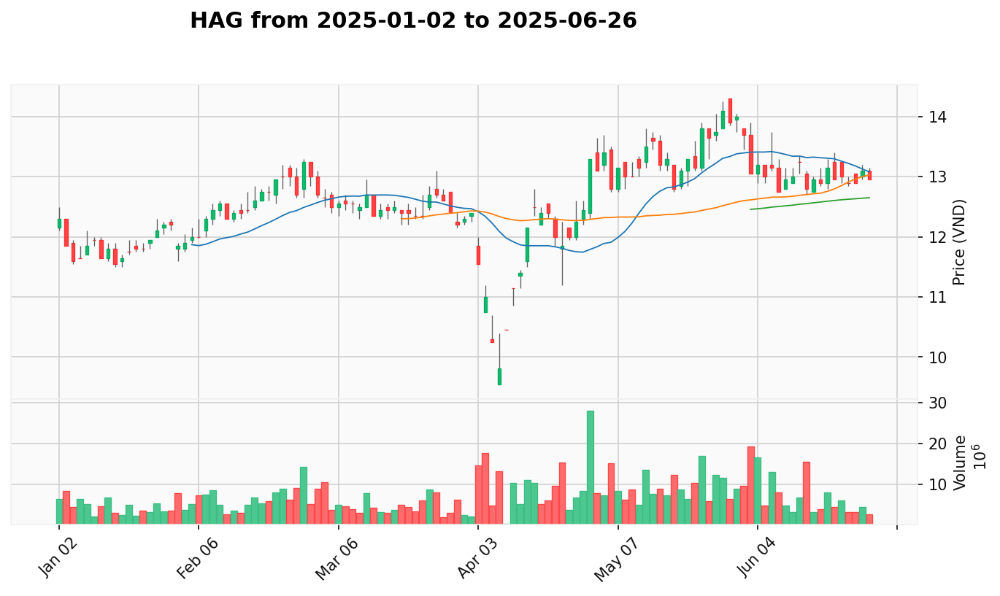

<a href="#nong-nghiep">↑ Back to group NONG_NGHIEP</a>  |  <a href="#vpa-signal-summary">↑ Back to Top</a>

#### Key Statistics
| Metric | Value |
|:---|---:|
| Date Range | 2025-01-02 to 2025-11-07 |
| **Latest Close** | **15.9** |
| Period Open | 12.15 |
| Period High | 17.65 |
| Period Low | 9.54 |
| Period Change % | 30.86% |

**[Download HAG Data (.csv)](market_data/HAG_2025-01-02_to_2025-11-09.csv)**

---

### HAH

#### [VPA Analysis (2025-06-26 - 2025-10-21)](./VPA.md#hah)
> **Ngày 2025-10-15:** HAH tiếp tục tăng từ 55.1 lên 55.9 VND. Cây nến tăng có biên độ rộng, mở cửa tại 55.4, cao nhất 56.8, thấp nhất 55.4 và đóng cửa tại 55.9, là mức gần cao nhất phiên. Khối lượng giao dịch đạt 2.2277 triệu cổ phiếu, tăng đáng kể so với phiên trước (1.977 triệu cổ phiếu). Sau tín hiệu lực cầu mạnh mẽ ở phiên trước, phiên này tiếp tục cho thấy sự áp đảo của lực cầu, đẩy giá lên cao hơn với khối lượng gia tăng, xác nhận xu hướng tăng. **Phân tích VPA/Wyckoff:** Sign of Strength (SOS) - Lực cầu mạnh mẽ
> **Ngày 2025-10-16:** HAH tiếp tục tăng từ 55.9 lên 56.5 VND. Cây nến tăng có biên độ hẹp, mở cửa tại 56.4, cao nhất 56.7, thấp nhất 56.2 và đóng cửa tại 56.5, là mức gần cao nhất phiên. Tuy nhiên, khối lượng giao dịch chỉ đạt 0.8156 triệu cổ phiếu, giảm mạnh so với phiên trước (2.2277 triệu cổ phiếu) và thấp hơn đáng kể so với mức trung bình. Sau hai phiên tăng giá mạnh với khối lượng lớn (SOS), phiên này cho thấy giá vẫn tăng nhưng với khối lượng thấp và biên độ hẹp, cho thấy lực cầu đã suy yếu đáng kể và thiếu sự đồng thuận để đẩy giá lên cao hơn. Điều này có thể là dấu hiệu của sự tạm dừng trong xu hướng tăng hoặc cảnh báo về sự thiếu hụt cầu. **Phân tích VPA/Wyckoff:** No Demand (ND) - Giá tăng với khối lượng thấp, cho thấy lực cầu suy yếu.
> **Ngày 2025-10-17:** HAH giảm từ 55.8 VND xuống 55.6 VND. Cây nến giảm có biên độ vừa phải, mở cửa tại 56.0, cao nhất 56.6, thấp nhất 55.3 và đóng cửa tại 55.6. Khối lượng giao dịch đạt 1.4087 triệu cổ phiếu, thấp hơn một chút so với phiên trước (1.4615 triệu cổ phiếu). Sau tín hiệu lực cầu mạnh mẽ (SOS) vào ngày 2025-10-15, giá đã có hai phiên điều chỉnh giảm liên tiếp với khối lượng giảm dần, cho thấy lực cầu đang suy yếu và không đủ mạnh để duy trì đà tăng. Điều này báo hiệu sự chững lại của xu hướng tăng ngắn hạn. **Phân tích VPA/Wyckoff:** Weakness (W) - Giá giảm với khối lượng giảm dần, cho thấy lực cầu yếu.
> **Ngày 2025-10-20:** HAH giảm từ 55.6 VND xuống 53.4 VND. Cây nến giảm có biên độ rộng, mở cửa tại 55.7, cao nhất 55.7, thấp nhất 52.0 và đóng cửa tại 53.4, là mức gần thấp nhất phiên. Khối lượng giao dịch đạt 2.983 triệu cổ phiếu, tăng mạnh so với phiên trước (1.4087 triệu cổ phiếu) và cao hơn đáng kể so với mức trung bình. Sau hai phiên cho thấy lực cầu suy yếu (ND và W), phiên này xác nhận áp lực bán mạnh mẽ với giá giảm sâu và khối lượng tăng vọt, cho thấy nguồn cung đang chiếm ưu thế và có thể báo hiệu sự tiếp diễn của xu hướng giảm. **Phân tích VPA/Wyckoff:** Sign of Weakness (SOW) - Giá giảm mạnh với khối lượng lớn, xác nhận áp lực bán.
> **Ngày 2025-10-21:** HAH tăng từ 53.4 VND lên 54.5 VND. Cây nến tăng có biên độ vừa phải, mở cửa tại 53.8, cao nhất 54.5, thấp nhất 51.7 và đóng cửa tại 54.5, là mức cao nhất phiên. Khối lượng giao dịch đạt 2.1314 triệu cổ phiếu, giảm đáng kể so với phiên trước (2.983 triệu cổ phiếu). Sau phiên giảm mạnh với khối lượng lớn (SOW) vào ngày 2025-10-20, giá có sự phục hồi nhưng với khối lượng thấp, cho thấy lực cầu yếu và không đủ mạnh để hấp thụ hết nguồn cung. Điều này báo hiệu sự thiếu hụt nhu cầu và có thể là một nhịp hồi kỹ thuật trong xu hướng giảm. **Phân tích VPA/Wyckoff:** No Demand (ND) - Giá tăng với khối lượng thấp, cho thấy lực cầu yếu.

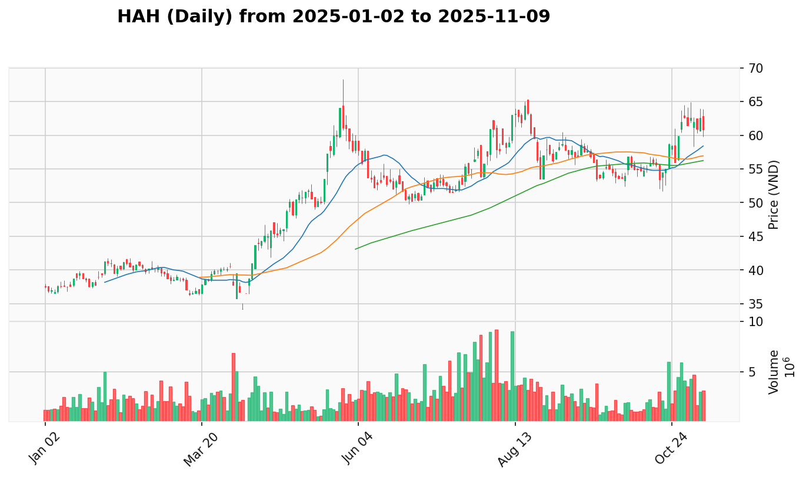

<a href="#van-tai">↑ Back to group VAN_TAI</a>  |  <a href="#vpa-signal-summary">↑ Back to Top</a>

#### Key Statistics
| Metric | Value |
|:---|---:|
| Date Range | 2025-01-02 to 2025-11-07 |
| **Latest Close** | **60.8** |
| Period Open | 37.58 |
| Period High | 68.32 |
| Period Low | 34.2 |
| Period Change % | 61.79% |

**[Download HAH Data (.csv)](market_data/HAH_2025-01-02_to_2025-11-09.csv)**

---

### HAP

#### [VPA Analysis (2025-08-14 - 2025-10-21)](./VPA.md#hap)
> **Ngày 2025-10-15:** HAP giảm từ 6.25 VND xuống 6.2 VND. Giá mở cửa 6.26 VND, cao nhất 6.38 VND và thấp nhất 5.82 VND, đóng cửa ở mức 6.2 VND. Cây nến có biên độ rộng, tạo đáy mới trong phiên nhưng đã phục hồi đáng kể để đóng cửa ở nửa trên của thân nến, cho thấy lực cầu đã xuất hiện và hấp thụ một phần áp lực bán. Khối lượng giao dịch đạt 0.1781 triệu cổ phiếu, tăng mạnh so với phiên trước (0.0818 triệu cổ phiếu) và cao hơn cả phiên cao trào bán (0.1672 triệu cổ phiếu), xác nhận sự xuất hiện của lực bán mạnh nhưng cũng có sự hấp thụ đáng kể. Sau các phiên "Selling Climax" và "No Demand", hành động giá này cho thấy thị trường đang trải qua một đợt rũ bỏ cuối cùng hoặc kiểm tra lại nguồn cung ở mức giá thấp hơn. **Phân tích VPA/Wyckoff:** Rũ bỏ (Shakeout)
> **Ngày 2025-10-16:** HAP giảm từ 6.2 VND xuống 5.9 VND. Giá mở cửa 6.2 VND, cao nhất 6.2 VND và thấp nhất 5.77 VND, đóng cửa ở mức 5.9 VND. Cây nến giảm có biên độ rộng, đóng cửa gần mức thấp nhất phiên, cho thấy áp lực bán vẫn còn. Khối lượng giao dịch đạt 0.0415 triệu cổ phiếu, giảm mạnh so với phiên trước (0.1781 triệu cổ phiếu) và là mức thấp nhất trong 10 phiên gần đây. Sau phiên rũ bỏ (Shakeout) với khối lượng lớn vào ngày 2025-10-15, việc giá tiếp tục giảm nhưng với khối lượng cực thấp cho thấy nguồn cung đã cạn kiệt đáng kể, nhưng lực cầu vẫn chưa xuất hiện để đẩy giá lên. Đây là dấu hiệu của việc kiểm tra lại nguồn cung sau rũ bỏ. **Phân tích VPA/Wyckoff:** Kiểm tra nguồn cung (Test for Supply)
> **Ngày 2025-10-17:** HAP giữ nguyên mức giá đóng cửa 6.26 VND so với phiên trước. Giá mở cửa 6.3 VND, cao nhất 6.3 VND và thấp nhất 6.25 VND. Cây nến có biên độ rất hẹp, cho thấy sự lưỡng lự và thiếu động lực rõ ràng. Khối lượng giao dịch đạt 0.0534 triệu cổ phiếu, giảm đáng kể so với phiên trước (0.1122 triệu cổ phiếu) và ở mức thấp. Sau phiên rũ bỏ (Shakeout) vào ngày 2025-10-15 và phiên kiểm tra nguồn cung (Test for Supply) vào ngày 2025-10-16, việc giá tiếp tục đi ngang với khối lượng cực thấp cho thấy nguồn cung đã cạn kiệt nhưng lực cầu vẫn chưa đủ mạnh để đẩy giá lên. Đây là dấu hiệu của sự thiếu vắng lực cầu. **Phân tích VPA/Wyckoff:** Không có cầu (No Demand)
> **Ngày 2025-10-20:** HAP tăng từ 6.26 VND lên 6.5 VND. Giá mở cửa 6.02 VND, cao nhất 6.5 VND và thấp nhất 5.93 VND, đóng cửa ở mức 6.5 VND. Cây nến tăng có biên độ rộng, đóng cửa tại mức cao nhất phiên, cho thấy lực cầu mạnh mẽ đã quay trở lại. Khối lượng giao dịch đạt 0.125 triệu cổ phiếu, tăng đáng kể so với phiên trước (0.0534 triệu cổ phiếu) và cao hơn mức trung bình gần đây, xác nhận sự xuất hiện của lực mua. Sau giai đoạn kiểm tra nguồn cung và không có cầu, phiên này cho thấy sự thay đổi trong hành vi thị trường, với lực cầu áp đảo lực cung. **Phân tích VPA/Wyckoff:** Sign of Strength (SOS)
> **Ngày 2025-10-21:** HAP giảm nhẹ từ 6.5 VND xuống 6.49 VND. Giá mở cửa 6.45 VND, cao nhất 6.5 VND và thấp nhất 6.08 VND. Cây nến có thân nhỏ, gần như là doji, với bóng nến dưới dài, cho thấy lực cầu xuất hiện ở vùng giá thấp. Khối lượng giao dịch đạt 0.0861 triệu cổ phiếu, giảm so với phiên trước (0.125 triệu cổ phiếu). Sau phiên tăng mạnh (SOS) vào ngày 2025-10-20, phiên này cho thấy sự kiểm tra nguồn cung với khối lượng thấp, xác nhận rằng lực cung không mạnh và lực cầu vẫn đang hỗ trợ giá ở các mức thấp hơn. **Phân tích VPA/Wyckoff:** Test for Supply (Kiểm tra nguồn cung)

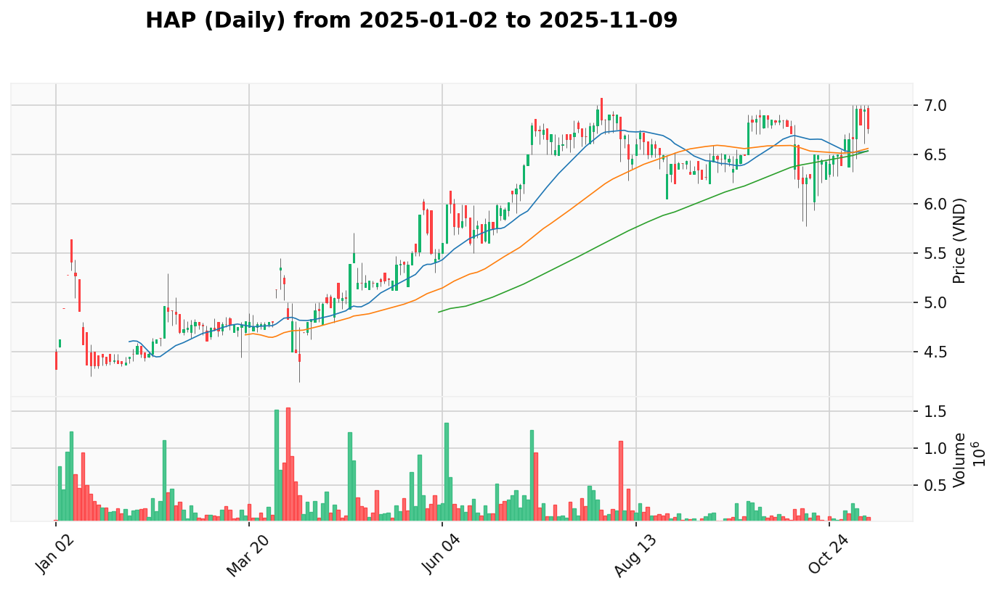

<a href="#penny">↑ Back to group PENNY</a>  |  <a href="#vpa-signal-summary">↑ Back to Top</a>

#### Key Statistics
| Metric | Value |
|:---|---:|
| Date Range | 2025-01-02 to 2025-11-07 |
| **Latest Close** | **6.76** |
| Period Open | 4.5 |
| Period High | 7.07 |
| Period Low | 4.19 |
| Period Change % | 50.22% |

**[Download HAP Data (.csv)](market_data/HAP_2025-01-02_to_2025-11-09.csv)**

---

### HAX

#### [VPA Analysis (2025-08-04 - 2025-10-21)](./VPA.md#hax)
> **Ngày 2025-10-15:** HAX giảm từ 11.65 VND xuống 11.05 VND, đóng cửa ở mức thấp nhất phiên. Khối lượng giao dịch đạt 1.618 triệu cổ phiếu, giảm so với phiên trước nhưng vẫn ở mức cao. Sau phiên "Lực bán mạnh" (Sign of Weakness) vào ngày 2025-10-14, việc giá tiếp tục giảm mạnh với biên độ rộng và đóng cửa ở mức thấp nhất phiên cho thấy áp lực bán vẫn còn rất lớn và chưa có dấu hiệu dừng lại, xác nhận sự suy yếu tiếp diễn của cổ phiếu. **Phân tích VPA/Wyckoff:** Continuation of Weakness (Tiếp diễn suy yếu)
> **Ngày 2025-10-16:** HAX giảm từ 11.05 VND xuống 10.65 VND, đóng cửa gần mức thấp nhất phiên. Khối lượng giao dịch đạt 0.8725 triệu cổ phiếu, giảm đáng kể so với các phiên trước. Sau các phiên giảm mạnh với khối lượng lớn, việc giá tiếp tục giảm nhưng với khối lượng thấp cho thấy áp lực bán đã giảm bớt phần nào, nhưng lực cầu vẫn chưa xuất hiện để hỗ trợ giá. Điều này cho thấy sự thiếu vắng của lực mua và khả năng giá tiếp tục suy yếu. **Phân tích VPA/Wyckoff:** Lack of Demand (Thiếu cầu)
> **Ngày 2025-10-17:** HAX tăng từ 10.6 VND lên 10.7 VND, đóng cửa gần giữa thân nến. Khối lượng giao dịch đạt 1.2066 triệu cổ phiếu, giảm so với phiên trước (1.6433 triệu cổ phiếu) và là mức thấp nhất trong 4 phiên gần đây. Sau các phiên giảm mạnh và thiếu cầu, việc giá có một nhịp hồi phục nhẹ nhưng với khối lượng thấp cho thấy lực bán đã tạm thời giảm bớt nhưng lực cầu vẫn chưa đủ mạnh để đẩy giá lên cao hơn. Điều này xác nhận sự thiếu vắng của nhu cầu mua thực sự và có thể là dấu hiệu của một đợt kiểm tra cung hoặc tiếp tục suy yếu. **Phân tích VPA/Wyckoff:** No Demand (Thiếu cầu)
> **Ngày 2025-10-20:** HAX giảm từ 10.6 VND xuống 9.96 VND, đóng cửa ở mức thấp nhất phiên. Khối lượng giao dịch đạt 1.4244 triệu cổ phiếu, cao hơn đáng kể so với phiên trước. Việc giá giảm mạnh với biên độ rộng và đóng cửa ở mức thấp nhất phiên, đi kèm với khối lượng gia tăng, cho thấy áp lực bán mạnh mẽ và nguồn cung đang chiếm ưu thế. Điều này xác nhận sự suy yếu của cổ phiếu sau các phiên thiếu cầu trước đó. **Phân tích VPA/Wyckoff:** Sign of Weakness (SOW) - Lực cung mạnh mẽ
> **Ngày 2025-10-21:** HAX giảm từ 9.96 VND xuống 9.85 VND. Giá mở cửa ở 9.45 VND, tạo đáy mới tại 9.45 VND nhưng sau đó hồi phục mạnh mẽ và đóng cửa gần mức cao nhất phiên 9.99 VND. Khối lượng giao dịch đạt 1.5261 triệu cổ phiếu, cao hơn so với phiên trước (1.4244 triệu cổ phiếu). Sau phiên SOW mạnh mẽ, việc giá mở cửa thấp hơn nhưng hồi phục với khối lượng tăng cho thấy lực cầu đã xuất hiện và hấp thụ cung ở vùng giá thấp. **Phân tích VPA/Wyckoff:** Test for Supply (Kiểm tra cung)

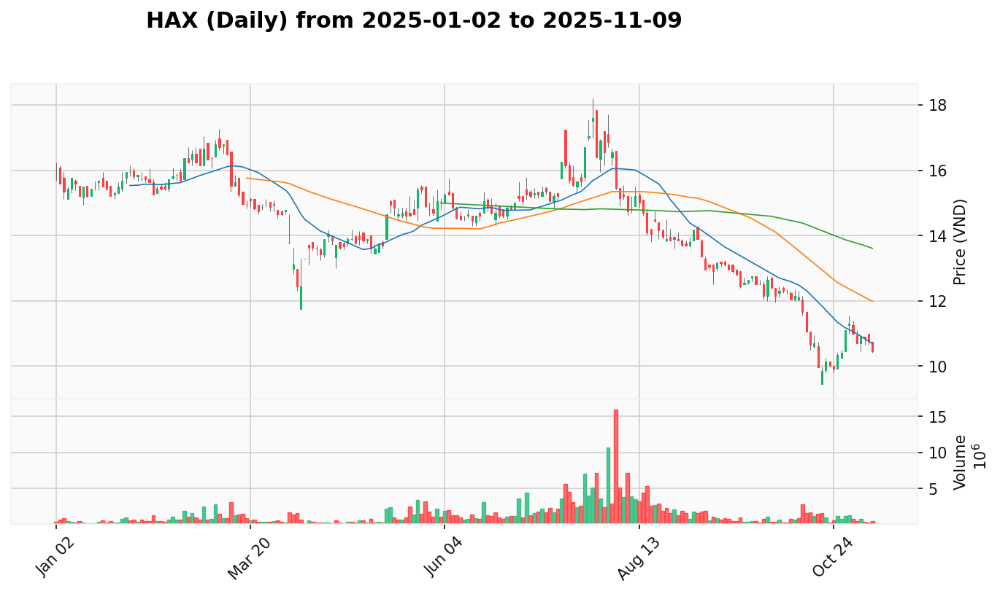

<a href="#ban-le">↑ Back to group BAN_LE</a>  |  <a href="#vpa-signal-summary">↑ Back to Top</a>

#### Key Statistics
| Metric | Value |
|:---|---:|
| Date Range | 2025-01-02 to 2025-11-07 |
| **Latest Close** | **10.45** |
| Period Open | 15.91 |
| Period High | 18.2 |
| Period Low | 9.45 |
| Period Change % | -34.32% |

**[Download HAX Data (.csv)](market_data/HAX_2025-01-02_to_2025-11-09.csv)**

---

### HBC

#### [VPA Analysis (2025-08-14 - 2025-10-21)](./VPA.md#hbc)
> **Ngày 2025-10-15:** HBC giảm từ 7.0 VND xuống 6.8 VND. Cây nến có biên độ hẹp (từ 6.8 VND đến 7.1 VND), đóng cửa ở mức thấp nhất phiên. Khối lượng giao dịch đạt 1.5723 triệu cổ phiếu, thấp hơn đáng kể so với phiên trước (2.039 triệu cổ phiếu) và thấp hơn mức trung bình. Sau nhiều phiên liên tiếp có "Dấu hiệu suy yếu", việc giá tiếp tục giảm với biên độ hẹp và khối lượng thấp cho thấy lực cầu vẫn yếu và không có sự hấp thụ đáng kể. Điều này xác nhận sự yếu kém tiếp diễn của thị trường. **Phân tích VPA/Wyckoff:** Dấu hiệu suy yếu
> **Ngày 2025-10-16:** HBC giữ nguyên mức giá đóng cửa 6.8 VND so với phiên trước, nhưng mở cửa thấp hơn (6.8 VND so với 7.1 VND). Cây nến có biên độ hẹp từ 6.7 VND đến 7.0 VND, đóng cửa ở mức 6.8 VND, bằng giá mở cửa và gần mức thấp nhất phiên. Khối lượng giao dịch đạt 1.4021 triệu cổ phiếu, thấp hơn so với phiên trước (1.5723 triệu cổ phiếu). Sau nhiều phiên liên tiếp có "Dấu hiệu suy yếu", việc giá không thể phục hồi với biên độ hẹp và khối lượng giảm cho thấy lực cầu vẫn rất yếu và không có sự hấp thụ đáng kể. Điều này xác nhận sự yếu kém tiếp diễn của thị trường. **Phân tích VPA/Wyckoff:** Dấu hiệu suy yếu
> **Ngày 2025-10-17:** HBC giảm từ 6.8 VND xuống 6.5 VND. Cây nến có biên độ hẹp (từ 6.5 VND đến 6.8 VND), đóng cửa ở mức thấp nhất phiên. Khối lượng giao dịch đạt 3.3157 triệu cổ phiếu, cao hơn đáng kể so với phiên trước (1.9357 triệu cổ phiếu) và cao hơn mức trung bình. Sau nhiều phiên liên tiếp có "Dấu hiệu suy yếu", việc giá tiếp tục giảm mạnh với biên độ hẹp và khối lượng gia tăng cho thấy áp lực bán mạnh mẽ và không có lực cầu hấp thụ. Điều này xác nhận sự yếu kém tiếp diễn của thị trường. **Phân tích VPA/Wyckoff:** Dấu hiệu suy yếu
> **Ngày 2025-10-20:** HBC giảm từ 6.5 VND xuống 6.4 VND. Cây nến có biên độ từ 6.2 VND đến 6.8 VND, đóng cửa ở mức 6.4 VND, gần mức thấp nhất phiên. Khối lượng giao dịch đạt 3.4914 triệu cổ phiếu, cao hơn so với phiên trước (3.3157 triệu cổ phiếu). Sau nhiều phiên liên tiếp có "Dấu hiệu suy yếu", việc giá tiếp tục giảm với biên độ tương đối rộng và khối lượng gia tăng cho thấy áp lực bán mạnh mẽ và không có lực cầu hấp thụ. Điều này xác nhận sự yếu kém tiếp diễn của thị trường. **Phân tích VPA/Wyckoff:** Dấu hiệu suy yếu
> **Ngày 2025-10-21:** HBC giảm từ 6.4 VND xuống 6.3 VND. Cây nến có biên độ hẹp (từ 6.2 VND đến 6.6 VND), đóng cửa gần mức thấp nhất phiên. Khối lượng giao dịch đạt 2.2914 triệu cổ phiếu, thấp hơn đáng kể so với phiên trước (3.4914 triệu cổ phiếu). Sau nhiều phiên liên tiếp có "Dấu hiệu suy yếu", việc giá tiếp tục giảm với biên độ hẹp và khối lượng giảm cho thấy áp lực bán đã giảm bớt nhưng lực cầu vẫn chưa xuất hiện, tiếp tục xác nhận sự yếu kém của thị trường. **Phân tích VPA/Wyckoff:** Dấu hiệu suy yếu

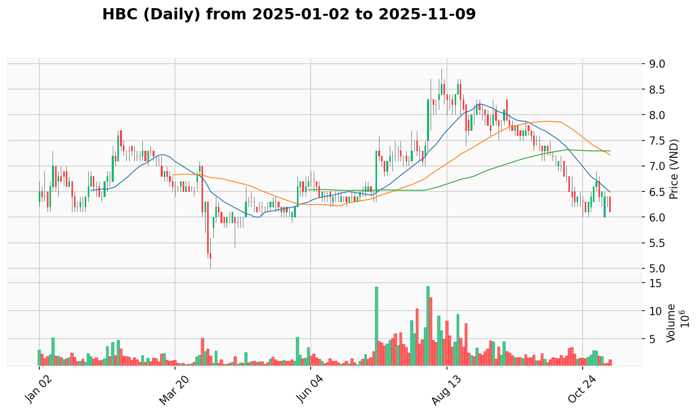

<a href="#xay-dung">↑ Back to group XAY_DUNG</a>  |  <a href="#vpa-signal-summary">↑ Back to Top</a>

#### Key Statistics
| Metric | Value |
|:---|---:|
| Date Range | 2025-01-02 to 2025-11-07 |
| **Latest Close** | **6.1** |
| Period Open | 6.3 |
| Period High | 8.9 |
| Period Low | 5.0 |
| Period Change % | -3.17% |

**[Download HBC Data (.csv)](market_data/HBC_2025-01-02_to_2025-11-09.csv)**

---

### HCD

#### [VPA Analysis (2025-08-04 - 2025-10-21)](./VPA.md#hcd)
> **Ngày 2025-10-15:** HCD giảm từ 8.21 VND xuống 8.18 VND, với giá mở cửa 8.21 VND và đóng cửa gần mức thấp nhất phiên trong biên độ từ 7.92 VND đến 8.21 VND. Khối lượng giao dịch đạt 0.031 triệu cổ phiếu, giảm so với phiên trước (0.035 triệu cổ phiếu). Sau hai phiên cho thấy lực cầu và không có nguồn cung, phiên này cho thấy áp lực bán xuất hiện, đẩy giá xuống thấp với biên độ rộng, mặc dù khối lượng giao dịch giảm. Điều này cho thấy thị trường đang kiểm tra lại nguồn cung sau giai đoạn không có áp lực bán. **Phân tích VPA/Wyckoff:** Kiểm tra nguồn cung (Test for Supply)
> **Ngày 2025-10-16:** HCD tăng nhẹ từ 8.18 VND lên 8.19 VND, với giá mở cửa 8.18 VND và đóng cửa ở mức cao nhất phiên trong biên độ từ 8.18 VND đến 8.19 VND. Khối lượng giao dịch đạt 0.0365 triệu cổ phiếu, tăng nhẹ so với phiên trước (0.031 triệu cổ phiếu). Sau phiên kiểm tra nguồn cung ngày 2025-10-15, phiên này cho thấy lực cầu tiếp tục hấp thụ nguồn cung còn lại, đẩy giá lên với biên độ hẹp và đóng cửa ở mức cao nhất. Điều này xác nhận rằng nguồn cung đã cạn kiệt và thị trường đã sẵn sàng cho một đợt tăng giá tiếp theo. **Phân tích VPA/Wyckoff:** Không có nguồn cung (No Supply)
> **Ngày 2025-10-17:** HCD giảm nhẹ từ 8.19 VND xuống 8.15 VND, với giá mở cửa 8.13 VND và đóng cửa gần mức cao nhất phiên trong biên độ từ 8.1 VND đến 8.16 VND. Khối lượng giao dịch đạt 0.0223 triệu cổ phiếu, giảm đáng kể so với phiên trước (0.0437 triệu cổ phiếu). Sau phiên "Không có nguồn cung" ngày 2025-10-16, phiên này cho thấy giá giảm nhẹ với khối lượng rất thấp, xác nhận rằng áp lực bán không đáng kể và nguồn cung vẫn đang cạn kiệt. **Phân tích VPA/Wyckoff:** Không có nguồn cung (No Supply)
> **Ngày 2025-10-20:** HCD giảm từ 8.15 VND xuống 7.8 VND, với khối lượng giao dịch đạt 0.0143 triệu cổ phiếu. Cây nến giảm có biên độ rộng và đóng cửa ở mức thấp nhất phiên. Sau hai phiên "Không có nguồn cung", phiên này cho thấy áp lực bán đã xuất hiện, đẩy giá xuống mạnh với khối lượng thấp. Mặc dù khối lượng thấp có thể cho thấy đây chưa phải là sự phân phối lớn, nhưng việc đóng cửa ở mức thấp nhất phiên là một dấu hiệu tiêu cực, cho thấy sự yếu kém của lực cầu. **Phân tích VPA/Wyckoff:** Weakness
> **Ngày 2025-10-21:** HCD tiếp tục giảm từ 7.8 VND xuống 7.67 VND, với khối lượng giao dịch rất thấp đạt 0.0131 triệu cổ phiếu. Cây nến có biên độ rộng, mở cửa ở mức thấp nhất phiên và đóng cửa ở nửa trên của thân nến, cho thấy có lực cầu bắt đáy nhẹ nhưng không đủ mạnh để đẩy giá lên trên mức đóng cửa của phiên trước. Sau phiên "Weakness" ngày 2025-10-20, việc giá tiếp tục giảm với khối lượng cạn kiệt cho thấy áp lực bán vẫn còn, và lực cầu vẫn yếu. **Phân tích VPA/Wyckoff:** Weakness

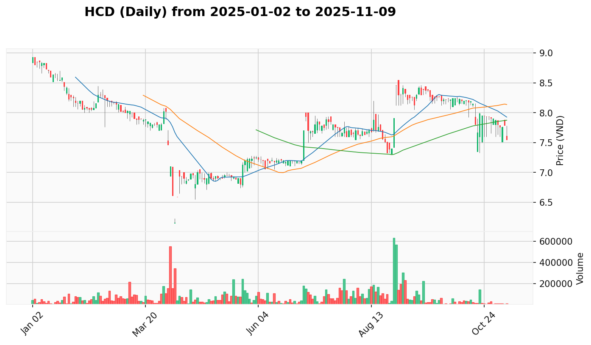

<a href="#nhua">↑ Back to group NHUA</a>  |  <a href="#vpa-signal-summary">↑ Back to Top</a>

#### Key Statistics
| Metric | Value |
|:---|---:|
| Date Range | 2025-01-02 to 2025-11-07 |
| **Latest Close** | **7.55** |
| Period Open | 8.84 |
| Period High | 8.93 |
| Period Low | 6.15 |
| Period Change % | -14.59% |

**[Download HCD Data (.csv)](market_data/HCD_2025-01-02_to_2025-11-09.csv)**

---

### HCM

#### [VPA Analysis (2025-06-13 - 2025-10-21)](./VPA.md#hcm)
> **Ngày 2025-10-15:** HCM mở cửa ở 27.0 VND, đạt đỉnh 27.1 VND và đáy 26.6 VND, đóng cửa ở 26.7 VND, giảm nhẹ so với phiên trước (26.95 VND). Biên độ dao động hẹp và giá đóng cửa nằm gần mức thấp nhất phiên. Khối lượng giao dịch đạt 12.949 triệu cổ phiếu, giảm so với phiên trước (15.1454 triệu cổ phiếu). Sau phiên "Sign of Weakness" với áp lực bán mạnh, phiên này cho thấy giá tiếp tục giảm nhẹ với khối lượng giảm và biên độ hẹp, cho thấy lực cầu yếu và thiếu sự quan tâm từ người mua. Giá đóng cửa gần mức thấp nhất phiên xác nhận phe bán vẫn đang kiểm soát. **Phân tích VPA/Wyckoff:** No Demand
> **Ngày 2025-10-16:** HCM mở cửa ở 26.8 VND, đạt đỉnh 27.0 VND và đáy 26.65 VND, đóng cửa ở 26.8 VND, tăng nhẹ so với phiên trước (26.7 VND). Biên độ dao động hẹp và giá đóng cửa nằm ở giữa thân nến. Khối lượng giao dịch đạt 3.7607 triệu cổ phiếu, giảm mạnh so với phiên trước (12.949 triệu cổ phiếu) và là mức thấp nhất trong 10 phiên gần đây. Sau phiên "No Demand" với lực bán yếu, phiên này cho thấy giá tăng nhẹ với khối lượng cực thấp, cho thấy không có áp lực bán đáng kể nhưng cũng thiếu lực cầu mạnh mẽ để đẩy giá lên cao hơn. Điều này có thể là một dấu hiệu của việc cạn kiệt nguồn cung. **Phân tích VPA/Wyckoff:** No Supply
> **Ngày 2025-10-17:** HCM mở cửa ở 26.95 VND, đạt đỉnh 27.2 VND và đáy 26.5 VND, đóng cửa ở 26.5 VND, giảm từ 26.8 VND xuống 26.5 VND. Biên độ dao động khá và giá đóng cửa nằm ở mức thấp nhất phiên. Khối lượng giao dịch đạt 10.3895 triệu cổ phiếu, tăng đáng kể so với phiên trước (7.194 triệu cổ phiếu). Sau phiên "No Supply" với khối lượng thấp, phiên này cho thấy giá giảm mạnh với khối lượng gia tăng và đóng cửa ở mức thấp nhất, cho thấy áp lực bán đã quay trở lại và phe bán đang kiểm soát. **Phân tích VPA/Wyckoff:** Sign of Weakness (SOW)
> **Ngày 2025-10-20:** HCM mở cửa ở 26.45 VND, đạt đỉnh 26.75 VND và đáy 24.65 VND, đóng cửa ở 24.65 VND, giảm mạnh từ 26.5 VND xuống 24.65 VND. Biên độ dao động rộng và giá đóng cửa nằm ở mức thấp nhất phiên. Khối lượng giao dịch đạt 14.342 triệu cổ phiếu, tăng đáng kể so với phiên trước (10.3895 triệu cổ phiếu). Sau phiên "Sign of Weakness" trước đó, phiên này cho thấy giá tiếp tục giảm sâu với khối lượng gia tăng mạnh mẽ, xác nhận áp lực bán đang rất lớn và phe bán hoàn toàn kiểm soát thị trường. **Phân tích VPA/Wyckoff:** Sign of Weakness (SOW) - Áp lực bán mạnh mẽ.
> **Ngày 2025-10-21:** HCM mở cửa ở 24.6 VND, đạt đỉnh 24.95 VND và đáy 23.7 VND, đóng cửa ở 24.25 VND, giảm từ 24.65 VND xuống 24.25 VND. Biên độ dao động rộng và giá đóng cửa nằm ở nửa dưới thân nến. Khối lượng giao dịch đạt 15.8603 triệu cổ phiếu, tăng so với phiên trước (14.342 triệu cổ phiếu). Sau các phiên "Sign of Weakness" trước đó, phiên này cho thấy áp lực bán vẫn duy trì mạnh mẽ với khối lượng gia tăng, xác nhận xu hướng giảm tiếp diễn. **Phân tích VPA/Wyckoff:** Sign of Weakness (SOW) - Áp lực bán tiếp diễn.

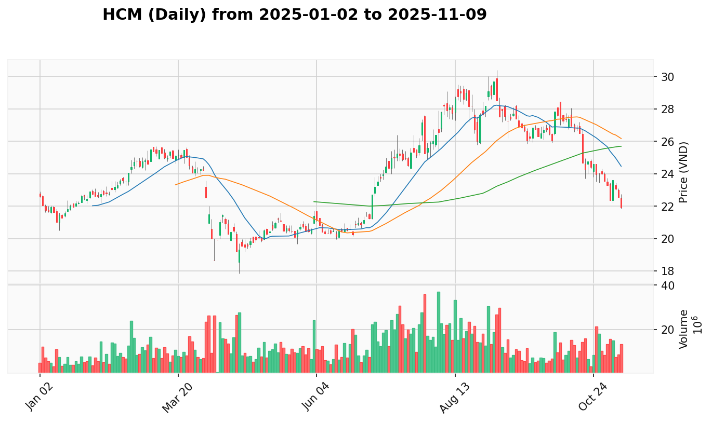

<a href="#chung-khoan">↑ Back to group CHUNG_KHOAN</a>  |  <a href="#vpa-signal-summary">↑ Back to Top</a>

#### Key Statistics
| Metric | Value |
|:---|---:|
| Date Range | 2025-01-02 to 2025-11-07 |
| **Latest Close** | **21.9** |
| Period Open | 22.79 |
| Period High | 30.4 |
| Period Low | 17.84 |
| Period Change % | -3.91% |

**[Download HCM Data (.csv)](market_data/HCM_2025-01-02_to_2025-11-09.csv)**

---

### HDB

#### [VPA Analysis (2025-06-16 - 2025-10-21)](./VPA.md#hdb)
> **Ngày 2025-10-15:** HDB mở cửa ở mức 32.6 VND và đóng cửa ở mức 33.1 VND, tăng từ 32.65 VND của phiên trước. Cây nến tăng có biên độ khá rộng và đóng cửa gần mức cao nhất phiên (33.6 VND), cho thấy lực cầu đã trở lại và hấp thụ tốt áp lực bán từ phiên SOW trước đó. Khối lượng giao dịch đạt 23.70 triệu cổ phiếu, thấp hơn so với hai phiên trước nhưng vẫn ở mức cao, xác nhận sự tiếp diễn của xu hướng tăng giá. Điều này cho thấy thị trường đã kiểm tra thành công lực cung và tiếp tục xu hướng tăng. **Phân tích VPA/Wyckoff:** Sign of Strength (SOS) - Lực cầu tiếp tục chiếm ưu thế sau khi kiểm tra lực cung.
> **Ngày 2025-10-16:** HDB mở cửa ở mức 33.25 VND và đóng cửa ở mức 33.2 VND, tăng nhẹ từ 33.1 VND của phiên trước. Cây nến tăng có biên độ hẹp và đóng cửa gần mức cao nhất phiên, cho thấy lực cầu vẫn duy trì nhưng không quá mạnh. Khối lượng giao dịch đạt 7.60 triệu cổ phiếu, giảm đáng kể so với phiên trước và thấp hơn nhiều so với mức trung bình gần đây. Điều này cho thấy áp lực bán đã cạn kiệt sau phiên SOS ngày 2025-10-15, và thị trường đang kiểm tra lại lực cung với nỗ lực thấp. Đây có thể là dấu hiệu của sự chuẩn bị cho một đợt tăng giá tiếp theo. **Phân tích VPA/Wyckoff:** No Supply (NS) - Lực cung cạn kiệt với khối lượng thấp.
> **Ngày 2025-10-17:** HDB mở cửa ở mức 33.55 VND và đóng cửa ở mức 32.5 VND, giảm từ 33.4 VND của phiên trước. Cây nến giảm có biên độ rộng và đóng cửa ở mức thấp nhất phiên, cho thấy áp lực bán mạnh mẽ đã xuất hiện trở lại. Khối lượng giao dịch đạt 19.439 triệu cổ phiếu, cao hơn đáng kể so với phiên trước, xác nhận sự gia tăng của lực cung. Điều này cho thấy thị trường đang đối mặt với áp lực bán đáng kể sau phiên "No Supply" trước đó. **Phân tích VPA/Wyckoff:** Sign of Weakness (SOW) - Lực cung mạnh mẽ xuất hiện trở lại với khối lượng gia tăng.
> **Ngày 2025-10-20:** HDB mở cửa ở mức 32.0 VND và đóng cửa ở mức 30.25 VND, giảm mạnh từ 32.5 VND của phiên trước. Cây nến giảm có biên độ rộng và đóng cửa ở mức thấp nhất phiên, cho thấy áp lực bán rất mạnh. Khối lượng giao dịch đạt 26.89 triệu cổ phiếu, cao hơn đáng kể so với phiên trước (19.439 triệu cổ phiếu), xác nhận sự gia tăng của lực cung. Điều này cho thấy thị trường đang tiếp tục đối mặt với áp lực bán đáng kể, củng cố tín hiệu suy yếu đã xuất hiện. **Phân tích VPA/Wyckoff:** Sign of Weakness (SOW) - Lực cung mạnh mẽ tiếp diễn với khối lượng gia tăng.
> **Ngày 2025-10-21:** HDB mở cửa ở mức 30.4 VND và đóng cửa ở mức 32.35 VND, tăng mạnh từ 30.25 VND của phiên trước. Cây nến tăng có biên độ rộng và đóng cửa ở mức cao nhất phiên, cho thấy lực cầu đã quay trở lại và chiếm ưu thế sau hai phiên giảm mạnh. Khối lượng giao dịch đạt 24.47 triệu cổ phiếu, cao, nhưng thấp hơn một chút so với phiên giảm mạnh trước đó (26.89 triệu cổ phiếu), cho thấy sự hấp thụ lực cung và khả năng đảo chiều. **Phân tích VPA/Wyckoff:** Sign of Strength (SOS) - Lực cầu mạnh mẽ xuất hiện, hấp thụ lực cung và đẩy giá lên cao, cho thấy sự thay đổi trong động lực thị trường.

<a href="#ngan-hang">↑ Back to group NGAN_HANG</a>  |  <a href="#vpa-signal-summary">↑ Back to Top</a>

#### Key Statistics
| Metric | Value |
|:---|---:|
| Date Range | 2025-01-02 to 2025-11-07 |
| **Latest Close** | **30.0** |
| Period Open | 25.45 |
| Period High | 34.35 |
| Period Low | 18.0 |
| Period Change % | 17.88% |

**[Download HDB Data (.csv)](market_data/HDB_2025-01-02_to_2025-11-09.csv)**

---

### HDC

#### [VPA Analysis (2025-07-17 - 2025-10-21)](./VPA.md#hdc)
> **Ngày 2025-10-15:** HDC tăng từ 40.0 VND lên 41.2 VND với khối lượng giao dịch đạt 5.9529 triệu cổ phiếu. Thanh nến tăng có biên độ rộng, giá đóng cửa gần mức cao nhất phiên, cho thấy lực cầu tiếp tục duy trì và hấp thụ tốt nguồn cung. Khối lượng giao dịch giảm nhẹ so với phiên trước (6.4713 triệu cổ phiếu) nhưng vẫn ở mức ổn định, xác nhận xu hướng tăng giá tiếp diễn sau phiên "No Supply" trước đó. **Phân tích VPA/Wyckoff:** Demand Confirmation / Continuation - Lực cầu tiếp tục đẩy giá lên với khối lượng ổn định, xác nhận xu hướng tăng.
> **Ngày 2025-10-16:** HDC tăng từ 41.2 VND lên 42.0 VND với khối lượng giao dịch đạt 2.7925 triệu cổ phiếu. Thanh nến tăng có biên độ hẹp, giá đóng cửa gần mức cao nhất phiên. Khối lượng giao dịch giảm mạnh so với phiên trước, cho thấy lực cầu đã suy yếu đáng kể sau chuỗi tăng giá, hoặc thị trường đang kiểm tra lại nguồn cung ở vùng giá cao hơn. **Phân tích VPA/Wyckoff:** No Demand (ND) - Lực cầu suy yếu rõ rệt sau chuỗi tăng giá, cho thấy khả năng điều chỉnh hoặc tích lũy lại.
> **Ngày 2025-10-17:** HDC giảm từ 42.0 VND xuống 41.0 VND với khối lượng giao dịch đạt 5.7095 triệu cổ phiếu. Thanh nến giảm có biên độ rộng, giá đóng cửa ở mức thấp nhất phiên, cho thấy áp lực bán mạnh mẽ. Khối lượng giao dịch tăng so với phiên trước (4.6629 triệu cổ phiếu), xác nhận lực cung đang chiếm ưu thế sau phiên "No Demand" trước đó. **Phân tích VPA/Wyckoff:** Sign of Weakness (SOW) - Lực cung gia tăng đẩy giá xuống với khối lượng lớn.
> **Ngày 2025-10-20:** HDC giảm từ 41.0 VND xuống 38.15 VND với khối lượng giao dịch đạt 11.4356 triệu cổ phiếu. Thanh nến giảm có biên độ rất rộng, giá đóng cửa ở mức thấp nhất phiên, cho thấy áp lực bán tháo cực lớn. Khối lượng giao dịch tăng đột biến so với phiên trước (5.7095 triệu cổ phiếu), xác nhận lực cung áp đảo và sự hoảng loạn của thị trường. Đây là sự tiếp diễn và gia tăng cường độ của tín hiệu suy yếu đã xuất hiện từ các phiên trước. **Phân tích VPA/Wyckoff:** Sign of Weakness (SOW) - Lực cung áp đảo đẩy giá giảm mạnh với khối lượng cực lớn, cho thấy sự phân phối mạnh mẽ hoặc bán tháo.
> **Ngày 2025-10-21:** HDC giảm từ 38.15 VND xuống 36.0 VND với khối lượng giao dịch đạt 13.9959 triệu cổ phiếu. Thanh nến giảm có biên độ rộng, giá đóng cửa ở mức thấp nhất phiên, cho thấy áp lực bán tiếp tục mạnh mẽ. Khối lượng giao dịch tiếp tục tăng so với phiên trước (11.4356 triệu cổ phiếu), xác nhận lực cung vẫn đang chiếm ưu thế và có sự gia tăng. **Phân tích VPA/Wyckoff:** Sign of Weakness (SOW) - Lực cung tiếp tục áp đảo đẩy giá giảm mạnh với khối lượng lớn, xác nhận xu hướng giảm.

<a href="#bat-dong-san">↑ Back to group BAT_DONG_SAN</a>  |  <a href="#vpa-signal-summary">↑ Back to Top</a>

#### Key Statistics
| Metric | Value |
|:---|---:|
| Date Range | 2025-01-02 to 2025-11-07 |
| **Latest Close** | **32.0** |
| Period Open | 25.1 |
| Period High | 42.3 |
| Period Low | 20.7 |
| Period Change % | 27.49% |

**[Download HDC Data (.csv)](market_data/HDC_2025-01-02_to_2025-11-09.csv)**

---

### HDG

#### [VPA Analysis (2025-06-16 - 2025-10-21)](./VPA.md#hdg)
> **Ngày 2025-10-15:** HDG tăng từ 33.4 VND lên 35.7 VND, tăng mạnh so với giá đóng cửa phiên trước. Cây nến tăng có biên độ rộng, mở cửa ở 33.0 VND và đóng cửa ở mức cao nhất phiên (35.7 VND), cho thấy lực mua rất mạnh mẽ và áp đảo hoàn toàn lực bán. Khối lượng giao dịch đạt 8.6648 triệu cổ phiếu, tăng đáng kể so với phiên trước (6.3821 triệu cổ phiếu). Sau phiên "Test for Supply" ngày 2025-10-14, việc giá tăng mạnh với khối lượng gia tăng xác nhận rằng lực cầu đã hấp thụ hết nguồn cung và tiếp tục đẩy giá lên. Đây là một dấu hiệu tích cực, cho thấy xu hướng tăng giá có thể tiếp diễn. **Phân tích VPA/Wyckoff:** Sign of Strength (SOS) - Lực cầu mạnh mẽ xuất hiện với khối lượng gia tăng.
> **Ngày 2025-10-16:** HDG giảm từ 35.7 VND xuống 35.1 VND, giảm 1.68% so với giá đóng cửa phiên trước. Cây nến giảm có giá mở cửa ở mức 35.7 VND và đóng cửa gần mức thấp nhất phiên (35.1 VND), cho thấy áp lực bán xuất hiện. Khối lượng giao dịch đạt 3.753 triệu cổ phiếu, giảm đáng kể so với phiên trước (8.6648 triệu cổ phiếu). Sau phiên "Sign of Strength" mạnh mẽ ngày 2025-10-15, việc giá giảm với khối lượng thấp cho thấy lực cầu đã suy yếu và thị trường đang kiểm tra lại nguồn cung. Đây có thể là một phiên điều chỉnh tự nhiên hoặc dấu hiệu của sự thiếu hụt cầu ở mức giá cao hơn. **Phân tích VPA/Wyckoff:** No Demand (Không có cầu) - Giá giảm với khối lượng thấp sau phiên tăng mạnh, cho thấy lực cầu suy yếu.
> **Ngày 2025-10-17:** HDG giảm từ 35.7 VND xuống 34.55 VND, giảm mạnh so với giá đóng cửa phiên trước. Cây nến giảm có biên độ rộng, mở cửa ở 36.1 VND và đóng cửa ở mức thấp nhất phiên (34.55 VND), cho thấy lực bán áp đảo hoàn toàn lực mua. Khối lượng giao dịch đạt 6.3847 triệu cổ phiếu, giảm nhẹ so với phiên trước (7.0163 triệu cổ phiếu). Sau phiên "No Demand" ngày 2025-10-16, việc giá tiếp tục giảm mạnh với khối lượng vẫn ở mức đáng kể xác nhận rằng áp lực cung vẫn đang chiếm ưu thế và xu hướng giảm giá có thể tiếp diễn. Đây là một dấu hiệu tiêu cực. **Phân tích VPA/Wyckoff:** Weakness (Sự suy yếu) - Lực bán mạnh mẽ tiếp diễn sau phiên "No Demand".
> **Ngày 2025-10-20:** HDG giảm từ 34.55 VND xuống 32.15 VND, giảm mạnh so với giá đóng cửa phiên trước. Cây nến giảm có biên độ rộng, mở cửa ở 34.0 VND và đóng cửa ở mức thấp nhất phiên (32.15 VND), cho thấy lực bán áp đảo. Khối lượng giao dịch đạt 8.9634 triệu cổ phiếu, tăng đáng kể so với phiên trước (6.3847 triệu cổ phiếu). Sau phiên "Weakness" ngày 2025-10-17, việc giá tiếp tục giảm mạnh với khối lượng gia tăng xác nhận áp lực cung rất lớn và xu hướng giảm giá tiếp diễn. **Phân tích VPA/Wyckoff:** Selling Pressure (Áp lực bán)
> **Ngày 2025-10-21:** HDG giảm từ 32.15 VND xuống 31.0 VND, giảm mạnh so với giá đóng cửa phiên trước. Cây nến giảm có biên độ rộng, mở cửa ở 32.0 VND và đóng cửa gần mức thấp nhất phiên (31.0 VND), cho thấy lực bán vẫn rất mạnh. Khối lượng giao dịch đạt 7.6161 triệu cổ phiếu, giảm nhẹ so với phiên trước (8.9634 triệu cổ phiếu) nhưng vẫn ở mức cao. Sau hai phiên giảm mạnh liên tiếp với áp lực bán lớn, phiên này tiếp tục xác nhận xu hướng giảm giá đang chiếm ưu thế. Mặc dù khối lượng có giảm nhẹ, nhưng biên độ giảm giá rộng cho thấy phe bán vẫn đang kiểm soát. **Phân tích VPA/Wyckoff:** Weakness (Sự suy yếu) - Lực bán tiếp tục chiếm ưu thế, giá giảm mạnh với khối lượng cao, xác nhận xu hướng giảm.

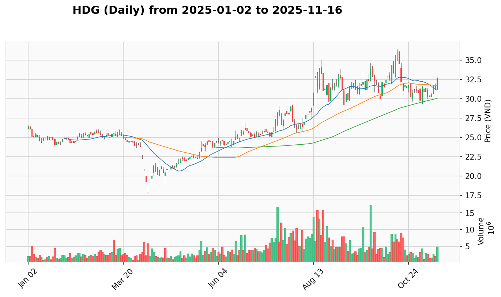

<a href="#nang-luong">↑ Back to group NANG_LUONG</a>  |  <a href="#vpa-signal-summary">↑ Back to Top</a>

#### Key Statistics
| Metric | Value |
|:---|---:|
| Date Range | 2025-01-02 to 2025-11-07 |
| **Latest Close** | **30.2** |
| Period Open | 26.05 |
| Period High | 36.4 |
| Period Low | 17.91 |
| Period Change % | 15.93% |

**[Download HDG Data (.csv)](market_data/HDG_2025-01-02_to_2025-11-09.csv)**

---

### HHS

#### [VPA Analysis (2025-08-14 - 2025-10-21)](./VPA.md#hhs)
> **Ngày 2025-10-15:** HHS tăng nhẹ từ 18.0 VND lên 18.2 VND với khối lượng giao dịch giảm đáng kể xuống 6.4204 triệu cổ phiếu. Nến ngày có biên độ hẹp và đóng cửa trên mức mở cửa, cho thấy một sự phục hồi yếu ớt sau phiên giảm mạnh trước đó. Khối lượng giao dịch thấp trong bối cảnh giá tăng nhẹ cho thấy lực cầu chưa thực sự mạnh mẽ và áp lực bán đã tạm thời giảm bớt. Điều này có thể là một nỗ lực kiểm tra đáy hoặc một nhịp hồi kỹ thuật trong xu hướng giảm. **Phân tích VPA/Wyckoff:** Phục hồi yếu.
> **Ngày 2025-10-16:** HHS tăng nhẹ từ 18.2 VND lên 18.4 VND với khối lượng giao dịch giảm mạnh xuống 2.5856 triệu cổ phiếu. Nến ngày có biên độ hẹp và đóng cửa trên mức mở cửa, cho thấy một sự phục hồi yếu ớt. Khối lượng giao dịch thấp trong bối cảnh giá tăng nhẹ sau hai phiên giảm và phục hồi yếu cho thấy lực cầu vẫn rất yếu và thiếu sự xác nhận. Điều này có thể là một nỗ lực kiểm tra cung hoặc một nhịp hồi kỹ thuật trong xu hướng giảm. **Phân tích VPA/Wyckoff:** No Demand.
> **Ngày 2025-10-17:** HHS giảm từ 18.45 VND xuống 18.1 VND với khối lượng giao dịch tăng lên 5.753 triệu cổ phiếu. Nến ngày có biên độ hẹp và đóng cửa ở mức thấp nhất phiên, cho thấy áp lực bán gia tăng sau hai phiên phục hồi yếu ớt trước đó. Khối lượng tăng trong khi giá giảm và đóng cửa ở mức thấp nhất cho thấy nguồn cung đang chiếm ưu thế và có thể tiếp tục đẩy giá xuống. **Phân tích VPA/Wyckoff:** Selling Pressure.
> **Ngày 2025-10-20:** HHS giảm từ 18.1 VND xuống 16.85 VND với khối lượng giao dịch tăng lên 7.652 triệu cổ phiếu. Nến ngày có biên độ rộng và đóng cửa ở mức thấp nhất phiên, cho thấy áp lực bán mạnh mẽ và nguồn cung áp đảo. Khối lượng tăng trong khi giá giảm sâu và đóng cửa ở mức thấp nhất xác nhận xu hướng giảm tiếp diễn và lực bán vẫn rất mạnh, tiếp nối tín hiệu "Selling Pressure" từ phiên trước. **Phân tích VPA/Wyckoff:** Selling Pressure.
> **Ngày 2025-10-21:** HHS giảm từ 16.85 VND xuống 15.7 VND với khối lượng giao dịch tăng lên 9.5205 triệu cổ phiếu. Nến ngày có biên độ rộng và đóng cửa ở mức thấp nhất phiên, cho thấy áp lực bán mạnh mẽ và nguồn cung áp đảo. Khối lượng tăng trong khi giá giảm sâu và đóng cửa ở mức thấp nhất xác nhận xu hướng giảm tiếp diễn và lực bán vẫn rất mạnh, tiếp nối tín hiệu "Selling Pressure" từ các phiên trước. **Phân tích VPA/Wyckoff:** Selling Pressure.

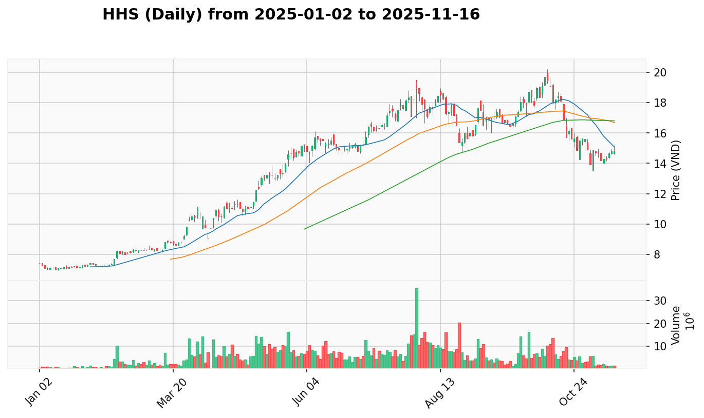

<a href="#others">↑ Back to group OTHERS</a>  |  <a href="#vpa-signal-summary">↑ Back to Top</a>

#### Key Statistics
| Metric | Value |
|:---|---:|
| Date Range | 2025-01-02 to 2025-11-07 |
| **Latest Close** | **14.2** |
| Period Open | 7.43 |
| Period High | 20.2 |
| Period Low | 6.95 |
| Period Change % | 91.12% |

**[Download HHS Data (.csv)](market_data/HHS_2025-01-02_to_2025-11-09.csv)**

---

### HHV

#### [VPA Analysis (2025-06-16 - 2025-10-21)](./VPA.md#hhv)
> **Ngày 2025-10-15:** HHV tiếp tục giảm từ 15.4 xuống 15.35. Cây nến có biên độ hẹp từ 15.25 đến 15.5 và đóng cửa gần mức thấp nhất phiên, cho thấy lực bán vẫn chiếm ưu thế. Khối lượng giao dịch đạt 11.09 triệu cổ phiếu, giảm so với phiên trước (13.22 triệu cổ phiếu). Mặc dù khối lượng giảm, giá vẫn tiếp tục giảm và đóng cửa ở mức thấp, cho thấy lực cầu yếu và lực cung vẫn đang kiểm soát, nhưng có thể không còn quá mạnh mẽ như phiên trước. **Phân tích VPA/Wyckoff:** Weakness (Sự yếu kém)
> **Ngày 2025-10-16:** HHV tăng từ 15.35 lên 15.55. Cây nến có biên độ từ 15.3 đến 15.65 và đóng cửa gần mức cao nhất phiên, cho thấy lực mua chiếm ưu thế. Tuy nhiên, khối lượng giao dịch chỉ đạt 3.901 triệu cổ phiếu, giảm đáng kể so với phiên trước (11.091 triệu cổ phiếu) và thấp hơn nhiều so với mức trung bình. Sự tăng giá với khối lượng thấp sau hai phiên giảm giá mạnh cho thấy lực bán đã tạm thời suy yếu, nhưng lực cầu mạnh mẽ vẫn chưa xuất hiện. Đây có thể là một phiên kiểm tra cung. **Phân tích VPA/Wyckoff:** Test (Kiểm tra cung)
> **Ngày 2025-10-17:** HHV giảm từ 15.85 xuống 15.7. Cây nến có biên độ rộng từ 15.7 đến 16.3, mở cửa cao hơn nhưng đóng cửa ở mức thấp nhất phiên, cho thấy áp lực bán mạnh mẽ. Khối lượng giao dịch đạt 14.598 triệu cổ phiếu, tăng so với phiên trước (12.691 triệu cổ phiếu). Sự giảm giá với khối lượng tăng và đóng cửa ở mức thấp nhất phiên sau một phiên kiểm tra cung cho thấy lực cung vẫn đang chiếm ưu thế và thị trường tiếp tục thể hiện sự yếu kém. **Phân tích VPA/Wyckoff:** Weakness (Sự yếu kém)
> **Ngày 2025-10-20:** HHV giảm từ 15.7 xuống 14.65. Cây nến có biên độ rộng từ 14.65 đến 16.05 và đóng cửa ở mức thấp nhất phiên, cho thấy áp lực bán rất mạnh. Khối lượng giao dịch đạt 21.209 triệu cổ phiếu, tăng đáng kể so với phiên trước (14.598 triệu cổ phiếu). Sự giảm giá mạnh với khối lượng tăng cao xác nhận lực cung đang chiếm ưu thế và thị trường tiếp tục thể hiện sự yếu kém. **Phân tích VPA/Wyckoff:** Weakness (Sự yếu kém)
> **Ngày 2025-10-21:** HHV tăng từ 14.65 lên 14.8. Cây nến có biên độ rộng từ 14.1 đến 15.1, đóng cửa ở mức 14.8. Khối lượng giao dịch đạt 14.6259 triệu cổ phiếu, giảm đáng kể so với phiên trước (21.209 triệu cổ phiếu). Mặc dù giá có sự phục hồi nhẹ sau hai phiên giảm mạnh, nhưng sự tăng giá này diễn ra với khối lượng thấp, cho thấy lực cầu yếu và chưa đủ mạnh để hấp thụ hết lực cung. **Phân tích VPA/Wyckoff:** Lack of Demand (Thiếu cầu)

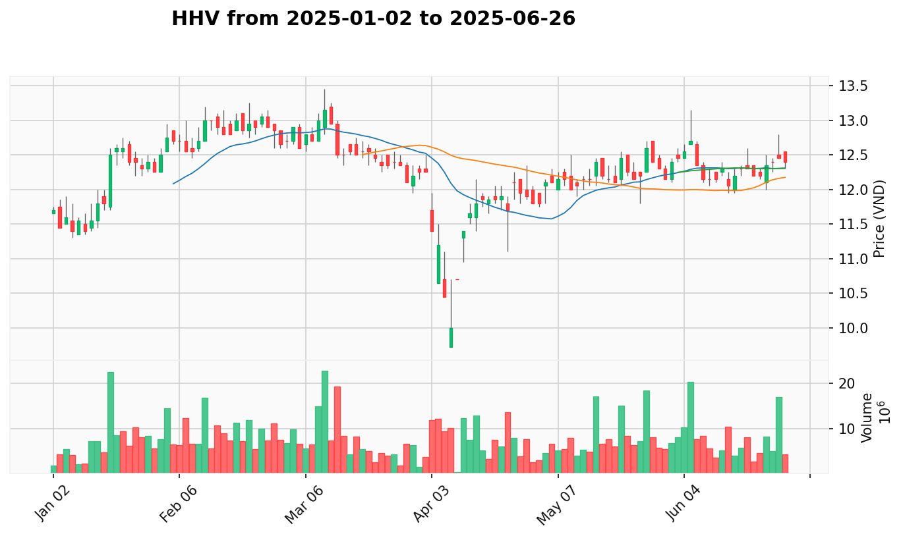

<a href="#dau-tu-cong">↑ Back to group DAU_TU_CONG</a>  |  <a href="#vpa-signal-summary">↑ Back to Top</a>

#### Key Statistics
| Metric | Value |
|:---|---:|
| Date Range | 2025-01-02 to 2025-11-07 |
| **Latest Close** | **13.9** |
| Period Open | 11.1 |
| Period High | 17.35 |
| Period Low | 9.26 |
| Period Change % | 25.23% |

**[Download HHV Data (.csv)](market_data/HHV_2025-01-02_to_2025-11-09.csv)**

---

### HID

#### [VPA Analysis (2025-08-14 - 2025-10-21)](./VPA.md#hid)
> **Ngày 2025-10-15:** HID tăng từ 3.38 VND lên 3.42 VND với khối lượng giao dịch đạt 0.2156 triệu cổ phiếu. Cây nến có biên độ tương đối hẹp, mở cửa ở 3.38 VND, đạt đỉnh 3.49 VND và đóng cửa ở 3.42 VND, cao hơn giá mở cửa. Khối lượng giao dịch tăng nhẹ so với phiên trước (0.1771 triệu cổ phiếu), nhưng vẫn ở mức thấp so với các phiên có khối lượng lớn trước đó. Mặc dù giá tăng nhẹ, sự thiếu vắng của khối lượng đột biến cho thấy lực cầu vẫn yếu và chưa đủ mạnh để đảo chiều xu hướng giảm đã thiết lập. Điều này xác nhận sự yếu kém tiếp diễn và khả năng giá sẽ tiếp tục đi ngang hoặc giảm. **Phân tích VPA/Wyckoff:** No Demand (Thiếu cầu) - Giá tăng nhẹ với khối lượng thấp, cho thấy lực cầu yếu và không có sự tham gia đáng kể.
> **Ngày 2025-10-16:** HID giữ nguyên mức giá 3.42 VND với khối lượng giao dịch chỉ đạt 0.0581 triệu cổ phiếu. Cây nến mở cửa ở 3.42 VND, đạt đỉnh 3.5 VND nhưng đóng cửa ở 3.42 VND, bằng với giá mở cửa và giá thấp nhất phiên. Khối lượng giao dịch cực kỳ thấp, giảm mạnh so với phiên trước (0.2156 triệu cổ phiếu) và là mức thấp nhất trong 10 phiên gần đây, cho thấy sự thiếu vắng hoàn toàn của lực cầu. Mặc dù giá không giảm, nhưng việc không thể duy trì mức giá cao hơn và khối lượng cạn kiệt xác nhận sự yếu kém tiếp diễn và không có sự quan tâm từ người mua. Điều này củng cố tín hiệu thiếu cầu đã xuất hiện trong các phiên trước. **Phân tích VPA/Wyckoff:** No Demand (Thiếu cầu) - Giá đi ngang với khối lượng cực thấp, cho thấy sự thờ ơ và thiếu vắng lực cầu nghiêm trọng.
> **Ngày 2025-10-17:** HID giảm nhẹ từ 3.45 VND xuống 3.43 VND với khối lượng giao dịch chỉ đạt 0.0814 triệu cổ phiếu. Cây nến có biên độ hẹp, mở cửa ở 3.45 VND, đạt đỉnh 3.48 VND và đóng cửa ở 3.43 VND, thấp hơn giá mở cửa. Khối lượng giao dịch giảm mạnh so với phiên trước (0.1751 triệu cổ phiếu) và là một trong những mức thấp nhất trong các phiên gần đây, cho thấy sự thiếu vắng nghiêm trọng của cả lực mua và lực bán. Mặc dù biên độ giá hẹp, việc giá đóng cửa thấp hơn giá mở cửa cùng với khối lượng cạn kiệt xác nhận sự yếu kém tiếp diễn và không có sự quan tâm đáng kể từ thị trường. Điều này củng cố tín hiệu thiếu cầu đã xuất hiện trong các phiên trước. **Phân tích VPA/Wyckoff:** No Demand (Thiếu cầu) - Giá giảm nhẹ với khối lượng cực thấp, cho thấy sự thờ ơ và thiếu vắng lực cầu nghiêm trọng.
> **Ngày 2025-10-20:** HID tăng từ 3.43 VND lên 3.49 VND với khối lượng giao dịch đạt 1.1629 triệu cổ phiếu. Cây nến tăng có biên độ khá rộng, mở cửa ở 3.43 VND, đạt đỉnh 3.51 VND và đóng cửa gần mức cao nhất phiên ở 3.49 VND. Khối lượng giao dịch tăng đột biến, cao hơn rất nhiều so với phiên trước (0.0814 triệu cổ phiếu) và là mức cao nhất trong 10 phiên gần đây, cho thấy sự trở lại mạnh mẽ của lực cầu. Sau nhiều phiên thiếu cầu, sự xuất hiện của một cây nến tăng mạnh với khối lượng lớn cho thấy có sự hấp thụ lực cung và khả năng đảo chiều xu hướng. **Phân tích VPA/Wyckoff:** Sign of Strength (SOS) - Lực cầu mạnh mẽ trở lại với khối lượng gia tăng, xác nhận sự hấp thụ cung và tiềm năng tăng giá.
> **Ngày 2025-10-21:** HID giảm nhẹ từ 3.49 VND xuống 3.45 VND với khối lượng giao dịch chỉ đạt 0.2251 triệu cổ phiếu. Cây nến có biên độ khá rộng, mở cửa ở 3.4 VND, đạt đỉnh 3.55 VND nhưng đóng cửa ở 3.45 VND, thấp hơn giá đóng cửa phiên trước. Sau phiên SOS mạnh mẽ ngày 2025-10-20 với khối lượng đột biến, phiên này cho thấy sự chững lại của đà tăng. Khối lượng cạn kiệt cho thấy cả lực mua và lực bán đều yếu đi đáng kể. Tuy nhiên, việc giá không giảm sâu với khối lượng thấp có thể là dấu hiệu tích cực cho thấy cung đã được hấp thụ phần nào và thị trường đang kiểm tra lại lực cung. **Phân tích VPA/Wyckoff:** Test for Supply (Kiểm tra cung) - Giá giảm nhẹ với khối lượng thấp sau phiên SOS, cho thấy thị trường đang kiểm tra lại lực cung.

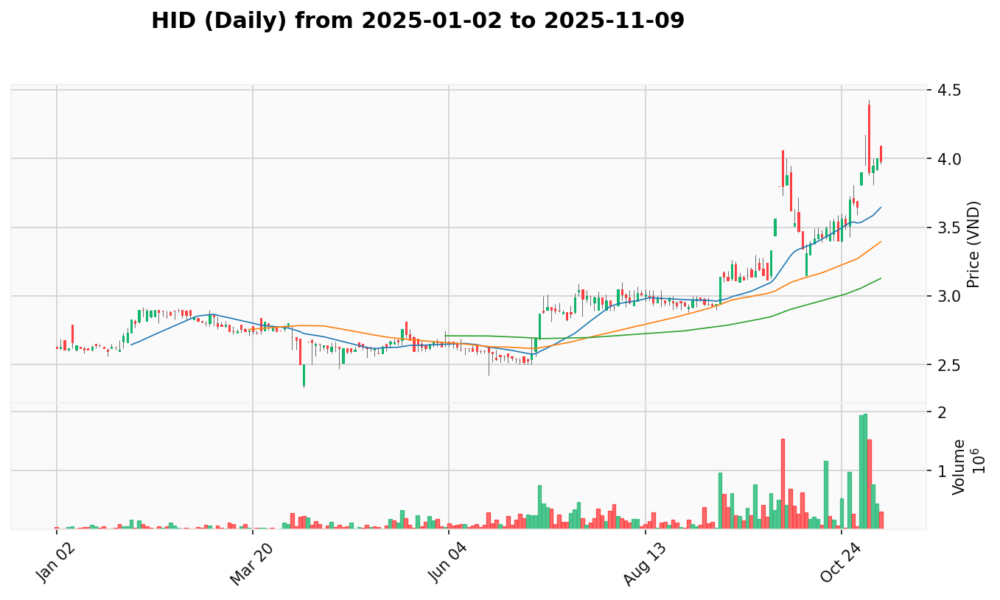

<a href="#penny">↑ Back to group PENNY</a>  |  <a href="#vpa-signal-summary">↑ Back to Top</a>

#### Key Statistics
| Metric | Value |
|:---|---:|
| Date Range | 2025-01-02 to 2025-11-07 |
| **Latest Close** | **3.98** |
| Period Open | 2.63 |
| Period High | 4.43 |
| Period Low | 2.33 |
| Period Change % | 51.33% |

**[Download HID Data (.csv)](market_data/HID_2025-01-02_to_2025-11-09.csv)**

---

### HLD

#### [VPA Analysis (2025-08-05 - 2025-10-21)](./VPA.md#hld)
> **Ngày 2025-10-15:** HLD mở cửa ở mức 18.0 VND và đóng cửa ở mức 17.9 VND, giữ nguyên so với phiên trước. Biên độ giá hẹp (từ 17.7 VND đến 18.1 VND) và đóng cửa ở giữa thân nến. Khối lượng giao dịch đạt 0.0911 triệu cổ phiếu, giảm so với phiên trước (0.1128 triệu cổ phiếu). Sau phiên suy yếu (Weakness) vào ngày 2025-10-14, việc giá đi ngang với biên độ hẹp và khối lượng giảm cho thấy áp lực bán đã tạm thời giảm bớt, nhưng lực cầu cũng không xuất hiện mạnh mẽ để đẩy giá lên, cho thấy sự thiếu vắng của nhu cầu mua. **Phân tích VPA/Wyckoff:** Không có cầu.
> **Ngày 2025-10-16:** HLD mở cửa ở mức 17.9 VND và đóng cửa ở mức 17.9 VND, giữ nguyên so với phiên trước. Biên độ giá cực kỳ hẹp (từ 17.8 VND đến 17.9 VND) và đóng cửa ở mức cao nhất phiên. Khối lượng giao dịch đạt 0.0474 triệu cổ phiếu, giảm mạnh so với phiên trước (0.0911 triệu cổ phiếu) và là mức rất thấp. Sau phiên "Không có cầu" vào ngày 2025-10-15, việc giá đi ngang với biên độ cực hẹp và khối lượng rất thấp cho thấy thị trường đang thiếu vắng cả lực cung và lực cầu đáng kể. Điều này có thể báo hiệu sự cạn kiệt của áp lực bán nhưng đồng thời cũng không có dấu hiệu của lực mua mạnh mẽ, cho thấy sự lưỡng lự và thiếu động lực rõ ràng. **Phân tích VPA/Wyckoff:** Cạn kiệt cung/cầu.
> **Ngày 2025-10-17:** HLD mở cửa ở mức 19.5 VND, tạo khoảng trống tăng giá so với phiên trước. Tuy nhiên, giá sau đó giảm mạnh và đóng cửa ở mức 18.2 VND, gần mức thấp nhất phiên (18.1 VND). Biên độ giá rộng cho thấy sự từ chối các mức giá cao hơn. Khối lượng giao dịch đạt 0.0494 triệu cổ phiếu, giảm so với phiên trước (0.0801 triệu cổ phiếu). Sau phiên "Cạn kiệt cung/cầu" vào ngày 2025-10-16, việc giá mở cửa cao nhưng không duy trì được đà tăng và bị đẩy xuống mạnh mẽ với khối lượng thấp cho thấy lực cung đã xuất hiện và từ chối mức giá cao hơn, báo hiệu sự suy yếu của lực cầu và khả năng giá sẽ điều chỉnh. **Phân tích VPA/Wyckoff:** Dấu hiệu suy yếu.
> **Ngày 2025-10-20:** HLD mở cửa ở mức 18.2 VND và đóng cửa ở mức 17.5 VND, giảm mạnh so với phiên trước. Biên độ giá rộng (từ 17.4 VND đến 18.2 VND) và đóng cửa gần mức thấp nhất phiên cho thấy áp lực bán mạnh mẽ. Khối lượng giao dịch đạt 0.1463 triệu cổ phiếu, tăng đáng kể so với phiên trước (0.0494 triệu cổ phiếu). Sau phiên "Dấu hiệu suy yếu" vào ngày 2025-10-17, việc giá giảm sâu với khối lượng tăng cho thấy lực cung đang chiếm ưu thế và có thể báo hiệu sự tiếp diễn của xu hướng giảm. **Phân tích VPA/Wyckoff:** Dấu hiệu suy yếu.
> **Ngày 2025-10-21:** HLD mở cửa ở mức 17.3 VND và đóng cửa ở mức 17.9 VND, tăng nhẹ so với phiên trước. Biên độ giá rộng (từ 16.9 VND đến 17.9 VND) cho thấy sự biến động. Tuy nhiên, khối lượng giao dịch đạt 0.1107 triệu cổ phiếu, giảm đáng kể so với phiên trước (0.1463 triệu cổ phiếu). Sau hai phiên "Dấu hiệu suy yếu" liên tiếp, việc giá tăng với khối lượng thấp cho thấy lực cầu yếu và không đủ mạnh để đảo chiều xu hướng giảm, có thể là một phiên "Không có cầu". **Phân tích VPA/Wyckoff:** Không có cầu.

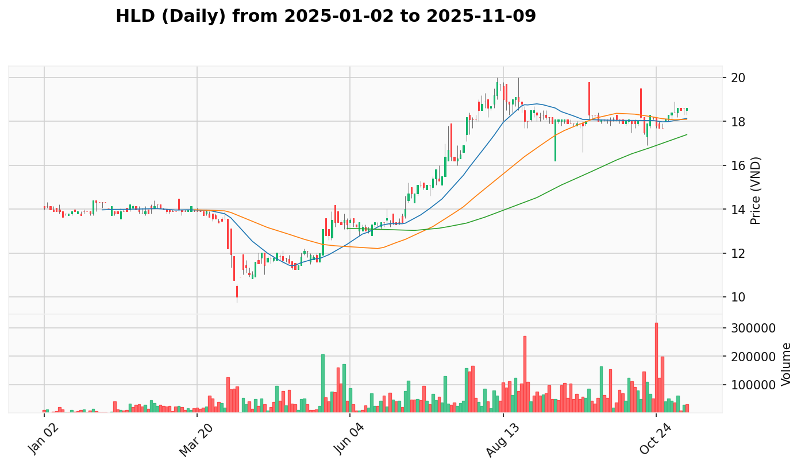

<a href="#bat-dong-san">↑ Back to group BAT_DONG_SAN</a>  |  <a href="#vpa-signal-summary">↑ Back to Top</a>

#### Key Statistics
| Metric | Value |
|:---|---:|
| Date Range | 2025-01-02 to 2025-11-07 |
| **Latest Close** | **18.6** |
| Period Open | 14.14 |
| Period High | 20.0 |
| Period Low | 9.74 |
| Period Change % | 31.54% |

**[Download HLD Data (.csv)](market_data/HLD_2025-01-02_to_2025-11-09.csv)**

---

### HOM

#### [VPA Analysis (2025-08-14 - 2025-10-21)](./VPA.md#hom)
> **Ngày 2025-10-15:** HOM giữ nguyên mức giá 4.8 VND với khối lượng giao dịch đạt 0.0045 triệu cổ phiếu. Cây nến có biên độ hẹp, mở cửa ở 4.7 VND và đóng cửa ở mức cao nhất phiên là 4.8 VND. So với phiên trước (2025-10-14), giá đi ngang nhưng khối lượng giao dịch giảm mạnh từ 0.0247 triệu cổ phiếu xuống 0.0045 triệu cổ phiếu. Sau áp lực bán mạnh mẽ của phiên trước, việc giá đi ngang với khối lượng cực thấp cho thấy sự thiếu vắng cả lực mua và lực bán, xác nhận sự lưỡng lự và thiếu động lực của thị trường. **Phân tích VPA/Wyckoff:** No Demand (ND) - Thiếu lực cầu.
> **Ngày 2025-10-16:** HOM giữ nguyên mức giá 4.8 VND với khối lượng giao dịch đạt 0.0002 triệu cổ phiếu. Cây nến có biên độ cực hẹp, mở cửa và đóng cửa ở cùng mức giá 4.8 VND. So với phiên trước (2025-10-15), giá đi ngang nhưng khối lượng giao dịch giảm mạnh từ 0.0045 triệu cổ phiếu xuống chỉ còn 0.0002 triệu cổ phiếu. Sau các phiên giảm giá và thiếu cầu, việc giá không giảm thêm với khối lượng giao dịch gần như bằng không cho thấy áp lực bán đã cạn kiệt ở mức giá này, đồng thời lực mua cũng chưa xuất hiện. **Phân tích VPA/Wyckoff:** No Supply (NS) - Cạn kiệt nguồn cung.
> **Ngày 2025-10-17:** HOM giữ nguyên mức giá đóng cửa 4.8 VND, mở cửa ở 4.6 VND và đóng cửa ở 4.8 VND với khối lượng giao dịch đạt 0.0142 triệu cổ phiếu. Cây nến có biên độ rộng hơn so với phiên trước, cho thấy lực mua đã xuất hiện và đẩy giá lên từ mức thấp nhất trong phiên. So với phiên trước (2025-10-16) khi giá đi ngang với khối lượng cực thấp (0.0002 triệu cổ phiếu) cho tín hiệu cạn kiệt nguồn cung, phiên này khối lượng đã tăng đáng kể. Điều này cho thấy có lực cầu xuất hiện hấp thụ lượng cung ở mức giá này, giữ cho giá không giảm sâu hơn và đóng cửa ở mức cao nhất trong phiên, kiểm tra xem liệu có đủ lực cầu để đẩy giá lên hay không. **Phân tích VPA/Wyckoff:** Test for Demand (Kiểm tra lực cầu).
> **Ngày 2025-10-20:** HOM mở cửa ở mức 4.6 VND, giảm xuống mức thấp nhất 4.5 VND nhưng sau đó phục hồi mạnh mẽ và đóng cửa ở mức 4.8 VND, bằng với giá đóng cửa phiên trước. Khối lượng giao dịch đạt 0.0228 triệu cổ phiếu, tăng đáng kể so với 0.0142 triệu cổ phiếu của phiên 2025-10-17. Cây nến cho thấy lực bán đã cố gắng đẩy giá xuống thấp hơn nhưng đã bị lực cầu hấp thụ hoàn toàn, đẩy giá trở lại mức đóng cửa cao nhất. Sự gia tăng khối lượng trong khi giá giữ vững cho thấy lực cầu đang kiểm soát và hấp thụ nguồn cung. **Phân tích VPA/Wyckoff:** Test for Demand (Kiểm tra lực cầu).
> **Ngày 2025-10-21:** HOM mở cửa ở mức 4.7 VND, sau đó giảm xuống mức thấp nhất 4.6 VND nhưng đã phục hồi mạnh mẽ và đóng cửa ở mức cao nhất phiên 4.8 VND. Khối lượng giao dịch đạt 0.0341 triệu cổ phiếu, tăng đáng kể so với phiên trước (0.0228 triệu cổ phiếu). Hành động giá cho thấy lực cầu mạnh mẽ đã hấp thụ toàn bộ lực cung và đẩy giá đóng cửa ở mức cao nhất trong phiên, xác nhận sự kiểm soát của phe mua. Điều này tiếp nối tín hiệu kiểm tra lực cầu từ các phiên trước, cho thấy sự cạn kiệt nguồn cung và sự xuất hiện của lực cầu chủ động. **Phân tích VPA/Wyckoff:** Sign of Strength (SOS) - Lực cầu mạnh mẽ.

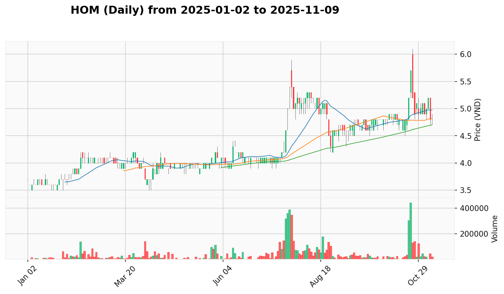

<a href="#vlxd">↑ Back to group VLXD</a>  |  <a href="#vpa-signal-summary">↑ Back to Top</a>

#### Key Statistics
| Metric | Value |
|:---|---:|
| Date Range | 2025-01-02 to 2025-11-07 |
| **Latest Close** | **4.8** |
| Period Open | 3.7 |
| Period High | 6.1 |
| Period Low | 3.5 |
| Period Change % | 29.73% |

**[Download HOM Data (.csv)](market_data/HOM_2025-01-02_to_2025-11-09.csv)**

---

### HPG

#### [VPA Analysis (2025-05-30 - 2025-10-21)](./VPA.md#hpg)
> **Ngày 2025-10-15:** HPG giảm từ 28.35 VND xuống 28.25 VND. Cây nến giảm có biên độ hẹp (từ 28.2 VND đến 28.7 VND) và đóng cửa gần mức thấp nhất phiên. Khối lượng giao dịch đạt 34.62 triệu cổ phiếu, giảm đáng kể so với phiên trước (84.31 triệu cổ phiếu). Sau hai phiên SOW liên tiếp với khối lượng lớn, phiên này cho thấy giá tiếp tục giảm nhưng với khối lượng và biên độ giảm mạnh. Điều này có thể cho thấy áp lực bán đã giảm bớt hoặc nguồn cung đang cạn kiệt ở mức giá thấp hơn. Tuy nhiên, việc đóng cửa gần mức thấp nhất phiên vẫn cho thấy sự yếu kém và thiếu vắng lực cầu. **Phân tích VPA/Wyckoff:** Weakness (SOW) - Giá tiếp tục giảm với khối lượng thấp, cho thấy thiếu vắng lực cầu.
> **Ngày 2025-10-16:** HPG mở cửa tại 28.25 VND và đóng cửa tại 28.25 VND. Cây nến có biên độ từ 28.0 VND đến 28.8 VND, cho thấy sự lưỡng lự. Khối lượng giao dịch đạt 25.27 triệu cổ phiếu, giảm đáng kể so với phiên trước (34.62 triệu cổ phiếu) và là mức thấp nhất trong 10 phiên gần đây. Sau hai phiên SOW liên tiếp, phiên này cho thấy giá đi ngang với khối lượng thấp, biểu thị sự thiếu quyết đoán của cả bên mua và bên bán. Điều này có thể là dấu hiệu tạm dừng của áp lực bán hoặc sự cạn kiệt nguồn cung ở mức giá hiện tại, nhưng cũng cho thấy lực cầu vẫn còn yếu. **Phân tích VPA/Wyckoff:** Indecision (No Demand/No Supply) - Giá đi ngang với khối lượng thấp, cho thấy sự lưỡng lự và thiếu vắng lực cầu/cung rõ rệt.
> **Ngày 2025-10-17:** HPG giảm từ 28.3 VND xuống 28.0 VND. Cây nến giảm có biên độ vừa phải (từ 28.0 VND đến 28.65 VND) và đóng cửa tại mức thấp nhất phiên. Khối lượng giao dịch đạt 46.51 triệu cổ phiếu, tăng nhẹ so với phiên trước (44.72 triệu cổ phiếu). Sau phiên lưỡng lự với khối lượng thấp, phiên này cho thấy áp lực bán quay trở lại, đẩy giá xuống và đóng cửa ở mức thấp nhất. Điều này cho thấy nguồn cung vẫn đang chiếm ưu thế và lực cầu vẫn còn yếu. **Phân tích VPA/Wyckoff:** Weakness (SOW) - Áp lực bán tiếp tục chiếm ưu thế, đẩy giá xuống và đóng cửa ở mức thấp nhất phiên.
> **Ngày 2025-10-20:** HPG mở cửa tại 27.9 VND và đóng cửa tại 26.05 VND, giảm mạnh. Cây nến giảm có biên độ rộng (từ 26.05 VND đến 28.25 VND) và đóng cửa tại mức thấp nhất phiên, cho thấy áp lực bán rất mạnh. Khối lượng giao dịch đạt 102.96 triệu cổ phiếu, tăng gấp đôi so với phiên trước (46.51 triệu cổ phiếu) và là mức cao nhất trong 10 phiên gần đây. Sau phiên suy yếu ngày 2025-10-17, phiên này xác nhận sự gia tăng của áp lực bán với khối lượng đột biến, cho thấy nguồn cung đang áp đảo hoàn toàn lực cầu và củng cố xu hướng giảm giá. **Phân tích VPA/Wyckoff:** Dấu hiệu suy yếu mạnh (SOW) - Áp lực bán gia tăng đột biến với cây nến giảm biên độ rộng và đóng cửa ở mức thấp nhất phiên, xác nhận sự tiếp diễn của xu hướng giảm.
> **Ngày 2025-10-21:** HPG tăng từ 26.05 VND lên 26.8 VND. Cây nến tăng có biên độ vừa phải (từ 26.0 VND đến 27.0 VND) và đóng cửa gần mức cao nhất phiên. Khối lượng giao dịch đạt 74.28 triệu cổ phiếu, giảm đáng kể so với phiên trước (102.96 triệu cổ phiếu). Sau phiên giảm mạnh với khối lượng đột biến, phiên này cho thấy sự phục hồi nhẹ về giá nhưng với khối lượng thấp hơn, cho thấy áp lực bán đã tạm thời giảm bớt nhưng lực cầu chưa thực sự mạnh mẽ để đảo chiều xu hướng giảm. **Phân tích VPA/Wyckoff:** Không có cầu (No Demand) - Giá tăng nhẹ nhưng với khối lượng thấp, cho thấy lực cầu yếu và khả năng xu hướng giảm tiếp diễn.

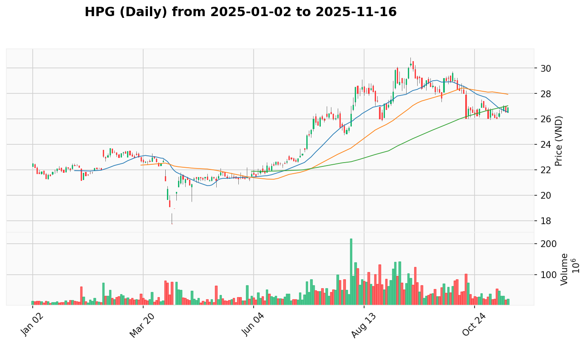

<a href="#thep">↑ Back to group THEP</a>  |  <a href="#vpa-signal-summary">↑ Back to Top</a>

#### Key Statistics
| Metric | Value |
|:---|---:|
| Date Range | 2025-01-02 to 2025-11-07 |
| **Latest Close** | **26.05** |
| Period Open | 22.25 |
| Period High | 30.85 |
| Period Low | 17.75 |
| Period Change % | 17.08% |

**[Download HPG Data (.csv)](market_data/HPG_2025-01-02_to_2025-11-09.csv)**

---

### HQC

#### [VPA Analysis (2025-08-04 - 2025-10-21)](./VPA.md#hqc)
> **Ngày 2025-10-15:** HQC giảm từ 3.42 VND xuống 3.4 VND với khối lượng giao dịch giảm mạnh, chỉ đạt 2.543 triệu cổ phiếu. Cây nến giảm có biên độ hẹp và đóng cửa gần mức thấp nhất phiên. Sau phiên giảm mạnh với khối lượng lớn ngày 2025-10-14, phiên này cho thấy áp lực bán đã suy yếu đáng kể, tuy nhiên lực cầu vẫn chưa xuất hiện để đẩy giá lên. Điều này cho thấy thị trường vẫn đang trong trạng thái yếu, nhưng đà giảm có thể đang chững lại do thiếu nguồn cung. **Phân tích VPA/Wyckoff:** No Demand (Thiếu cầu) - Lực bán đã suy yếu nhưng lực mua chưa xuất hiện.
> **Ngày 2025-10-16:** HQC tăng từ 3.44 VND lên 3.47 VND với khối lượng giao dịch giảm mạnh, chỉ đạt 2.198 triệu cổ phiếu. Cây nến tăng có biên độ hẹp và đóng cửa ở giữa thân nến. Sau phiên "Thiếu cầu" ngày 2025-10-15, phiên này cho thấy một nỗ lực tăng giá nhỏ nhưng không có sự ủng hộ của khối lượng, xác nhận rằng lực cầu vẫn còn yếu và thị trường chưa sẵn sàng cho một xu hướng tăng bền vững. **Phân tích VPA/Wyckoff:** No Demand (Thiếu cầu) - Lực mua yếu, không đủ để đảo chiều xu hướng.
> **Ngày 2025-10-17:** HQC giảm từ 3.48 VND xuống 3.43 VND với khối lượng giao dịch đạt 4.2863 triệu cổ phiếu. Cây nến giảm có biên độ hẹp và đóng cửa gần mức thấp nhất phiên. Sau hai phiên "Thiếu cầu" liên tiếp, phiên này cho thấy áp lực bán vẫn còn hiện hữu và lực cầu vẫn chưa đủ mạnh để hấp thụ hết lượng cung. Mặc dù biên độ giảm không quá lớn, việc khối lượng tăng khi giá giảm xác nhận xu hướng yếu vẫn tiếp diễn. **Phân tích VPA/Wyckoff:** Selling Pressure (Áp lực bán) - Giá giảm với khối lượng tăng nhẹ, xác nhận xu hướng yếu.
> **Ngày 2025-10-20:** HQC giảm từ 3.43 VND xuống 3.19 VND với khối lượng giao dịch tăng mạnh, đạt 10.4047 triệu cổ phiếu. Cây nến giảm có biên độ rộng và đóng cửa ở mức thấp nhất phiên. Sau các phiên "Thiếu cầu" và "Áp lực bán" trước đó, phiên này cho thấy lực cung áp đảo hoàn toàn lực cầu, xác nhận xu hướng giảm tiếp diễn với áp lực bán rất lớn. **Phân tích VPA/Wyckoff:** Sign of Weakness (SOW) - Lực cung mạnh mẽ với khối lượng gia tăng xác nhận xu hướng giảm.
> **Ngày 2025-10-21:** HQC tiếp tục giảm từ 3.19 VND xuống 3.15 VND với khối lượng giao dịch giảm mạnh, đạt 5.3493 triệu cổ phiếu. Cây nến giảm có biên độ hẹp và đóng cửa gần mức thấp nhất phiên. Sau phiên "Sign of Weakness" mạnh mẽ trước đó, phiên này cho thấy áp lực bán đã giảm đi đáng kể, nhưng lực cầu vẫn chưa xuất hiện để đẩy giá lên. Việc giá giảm với khối lượng thấp cho thấy thị trường đang thiếu cả cung và cầu, hoặc áp lực bán đã tạm thời cạn kiệt sau đợt giảm mạnh. Tuy nhiên, xu hướng giảm vẫn chưa có dấu hiệu đảo chiều rõ ràng. **Phân tích VPA/Wyckoff:** No Demand (Không có cầu) - Giá giảm với khối lượng thấp, xác nhận sự yếu kém của thị trường.

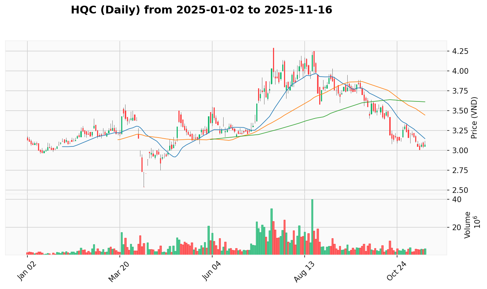

<a href="#bat-dong-san">↑ Back to group BAT_DONG_SAN</a>  |  <a href="#vpa-signal-summary">↑ Back to Top</a>

#### Key Statistics
| Metric | Value |
|:---|---:|
| Date Range | 2025-01-02 to 2025-11-07 |
| **Latest Close** | **3.11** |
| Period Open | 3.16 |
| Period High | 4.29 |
| Period Low | 2.54 |
| Period Change % | -1.58% |

**[Download HQC Data (.csv)](market_data/HQC_2025-01-02_to_2025-11-09.csv)**

---

### HSG

#### [VPA Analysis (2025-06-12 - 2025-10-21)](./VPA.md#hsg)
> **Ngày 2025-10-15:** HSG mở cửa tại 18.35 VND và đóng cửa tại 18.45 VND, tăng từ 18.35 VND (giá đóng cửa phiên trước) lên 18.45 VND. Cây nến tăng có biên độ hẹp và đóng cửa gần giữa, cho thấy sự lưỡng lự. Khối lượng giao dịch đạt 5.286 triệu cổ phiếu, thấp hơn đáng kể so với phiên trước (9.187 triệu cổ phiếu). Sau hai phiên "Sign of Weakness" liên tiếp với khối lượng lớn, sự tăng giá nhẹ với khối lượng sụt giảm mạnh cho thấy lực cầu yếu ớt và không có sự tham gia của dòng tiền lớn để đẩy giá lên. Điều này xác nhận sự yếu kém của thị trường vẫn tiếp diễn. **Phân tích VPA/Wyckoff:** No Demand - Giá tăng nhẹ với khối lượng thấp, cho thấy thiếu vắng lực cầu.
> **Ngày 2025-10-16:** HSG mở cửa tại 18.5 VND và đóng cửa tại 18.25 VND, giảm từ 18.45 VND (giá đóng cửa phiên trước) xuống 18.25 VND. Cây nến giảm có biên độ vừa phải và đóng cửa gần mức thấp nhất phiên, cho thấy áp lực bán vẫn còn. Khối lượng giao dịch đạt 3.4587 triệu cổ phiếu, thấp hơn đáng kể so với phiên trước (5.2862 triệu cổ phiếu). Sau phiên "No Demand" ngày 2025-10-15, giá tiếp tục giảm với khối lượng sụt giảm, xác nhận lực cầu vẫn yếu và không có sự hỗ trợ từ dòng tiền lớn. Thị trường vẫn đang trong giai đoạn yếu kém. **Phân tích VPA/Wyckoff:** Weakness - Giá giảm với khối lượng thấp, cho thấy thiếu vắng lực cầu và sự tiếp diễn của xu hướng yếu.
> **Ngày 2025-10-17:** HSG mở cửa tại 18.55 VND và đóng cửa tại 18.25 VND, giảm từ 18.5 VND (giá đóng cửa phiên trước) xuống 18.25 VND. Cây nến giảm có biên độ rộng và đóng cửa gần mức thấp nhất phiên, cho thấy áp lực bán mạnh. Khối lượng giao dịch đạt 11.2459 triệu cổ phiếu, tăng đáng kể so với phiên trước (5.5146 triệu cổ phiếu). Sau các phiên "No Demand" và "Weakness" trước đó, sự giảm giá mạnh với khối lượng tăng đột biến cho thấy lực cung áp đảo và sự tiếp diễn của xu hướng giảm. **Phân tích VPA/Wyckoff:** Sign of Weakness (SOW) - Giá giảm mạnh với khối lượng tăng đột biến, xác nhận lực cung áp đảo và xu hướng yếu tiếp diễn.
> **Ngày 2025-10-20:** HSG mở cửa tại 18.25 VND và đóng cửa tại 17.0 VND, giảm mạnh từ 18.25 VND (giá đóng cửa phiên trước) xuống 17.0 VND. Cây nến giảm có biên độ rất rộng và đóng cửa tại mức thấp nhất phiên, cho thấy áp lực bán cực kỳ mạnh mẽ. Khối lượng giao dịch đạt 13.3061 triệu cổ phiếu, tăng so với phiên trước (11.2459 triệu cổ phiếu). Sau phiên "Sign of Weakness" ngày 2025-10-17, giá tiếp tục giảm sâu với khối lượng gia tăng, xác nhận lực cung áp đảo và xu hướng giảm tiếp diễn mạnh mẽ. **Phân tích VPA/Wyckoff:** Sign of Weakness (SOW) - Giá giảm mạnh với khối lượng tăng, xác nhận lực cung áp đảo và xu hướng yếu tiếp diễn.
> **Ngày 2025-10-21:** HSG mở cửa tại 17.0 VND và đóng cửa tại 16.6 VND, giảm từ 17.0 VND (giá đóng cửa phiên trước) xuống 16.6 VND. Cây nến giảm có biên độ rộng và đóng cửa gần mức thấp nhất phiên, cho thấy áp lực bán vẫn còn. Khối lượng giao dịch đạt 9.5649 triệu cổ phiếu, giảm so với phiên trước (13.3061 triệu cổ phiếu). Sau hai phiên "Sign of Weakness" mạnh mẽ, giá tiếp tục giảm nhưng với khối lượng giảm, cho thấy lực cung có thể đang suy yếu dần nhưng xu hướng giảm vẫn tiếp diễn. **Phân tích VPA/Wyckoff:** Sign of Weakness (SOW) - Giá tiếp tục giảm với khối lượng giảm, cho thấy lực cung vẫn chiếm ưu thế nhưng có dấu hiệu cạn kiệt.

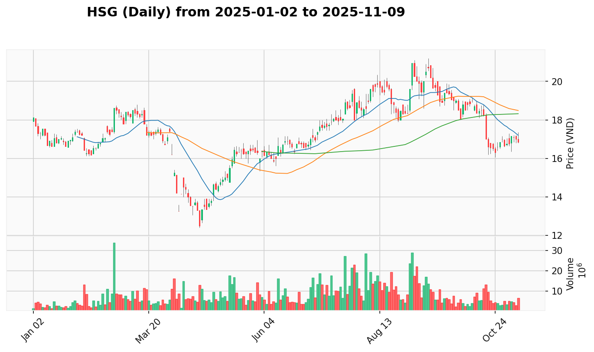

<a href="#thep">↑ Back to group THEP</a>  |  <a href="#vpa-signal-summary">↑ Back to Top</a>

#### Key Statistics
| Metric | Value |
|:---|---:|
| Date Range | 2025-01-02 to 2025-11-07 |
| **Latest Close** | **16.85** |
| Period Open | 17.93 |
| Period High | 21.2 |
| Period Low | 12.4 |
| Period Change % | -6.02% |

**[Download HSG Data (.csv)](market_data/HSG_2025-01-02_to_2025-11-09.csv)**

---

### HT1

#### [VPA Analysis (2025-07-15 - 2025-10-21)](./VPA.md#ht1)
> **Ngày 2025-10-15:** HT1 tiếp tục giảm từ 17.5 VND xuống 17.15 VND. Phiên giao dịch có biên độ nến (17.1 - 17.6) và đóng cửa gần mức thấp nhất, cho thấy áp lực bán vẫn còn mạnh. Khối lượng giao dịch đạt 0.432 triệu cổ phiếu, thấp hơn một chút so với phiên trước (0.4346 triệu cổ phiếu) nhưng vẫn duy trì ở mức tương đối cao, xác nhận sự tiếp diễn của lực cung. Sau tín hiệu "Supply Coming In" ngày 2025-10-14, diễn biến này cho thấy thị trường vẫn đang chịu sự chi phối của bên bán. **Phân tích VPA/Wyckoff:** Weakness (Yếu ớt)
> **Ngày 2025-10-16:** HT1 tăng từ 17.15 VND lên 17.75 VND. Phiên giao dịch có biên độ nến tương đối rộng và đóng cửa gần mức cao nhất, cho thấy nỗ lực tăng giá. Tuy nhiên, khối lượng giao dịch chỉ đạt 0.247 triệu cổ phiếu, thấp hơn đáng kể so với phiên trước (0.432 triệu cổ phiếu) và thấp hơn mức trung bình. Sau các tín hiệu "Supply Coming In" và "Weakness" trước đó, sự tăng giá với khối lượng thấp này cho thấy lực cầu chưa thực sự mạnh mẽ để đảo chiều xu hướng giảm. Đây có thể là một nhịp hồi phục kỹ thuật trong bối cảnh thị trường vẫn còn yếu ớt. **Phân tích VPA/Wyckoff:** No Demand (Không có cầu)
> **Ngày 2025-10-17:** HT1 giảm từ 17.75 VND xuống 17.65 VND. Phiên giao dịch có biên độ nến hẹp (17.6 - 17.9) và đóng cửa gần giữa nến. Khối lượng giao dịch đạt 0.2953 triệu cổ phiếu, thấp hơn đáng kể so với phiên trước (0.409 triệu cổ phiếu) và là mức thấp nhất trong 10 phiên gần đây. Sau tín hiệu "No Demand" ngày 2025-10-16, việc giá giảm nhẹ với khối lượng thấp cho thấy áp lực bán đã suy yếu đáng kể, nhưng lực cầu vẫn chưa xuất hiện mạnh mẽ để đẩy giá lên. Điều này có thể báo hiệu nguồn cung đang cạn kiệt. **Phân tích VPA/Wyckoff:** No Supply (Không có cung)
> **Ngày 2025-10-20:** HT1 tăng từ 17.65 VND lên 18.0 VND. Phiên giao dịch có biên độ nến rộng (từ 17.65 đến 18.85) và đóng cửa cao hơn giá mở cửa. Khối lượng giao dịch đạt 2.097 triệu cổ phiếu, cao hơn đáng kể so với phiên trước (0.2953 triệu cổ phiếu) và cao hơn mức trung bình. Sau tín hiệu "No Supply" ngày 2025-10-17, sự tăng giá với khối lượng lớn cho thấy lực cầu đã quay trở lại thị trường. Tuy nhiên, việc giá không đóng cửa ở mức cao nhất phiên (18.85 VND) cho thấy vẫn còn áp lực cung ở vùng giá cao hơn đã được hấp thụ. Đây là một dấu hiệu tích cực cho thấy sự hấp thụ cung và khả năng đảo chiều xu hướng. **Phân tích VPA/Wyckoff:** Demand Coming In (Cầu vào)
> **Ngày 2025-10-21:** HT1 tăng từ 18.0 VND lên 18.8 VND. Phiên giao dịch có biên độ nến rộng (từ 18.0 đến 18.8) và đóng cửa ở mức cao nhất phiên. Khối lượng giao dịch đạt 1.3252 triệu cổ phiếu, thấp hơn so với phiên trước (2.097 triệu cổ phiếu) nhưng vẫn ở mức khá. Sau tín hiệu "Demand Coming In" ngày 2025-10-20, việc giá tiếp tục tăng mạnh với biên độ rộng và đóng cửa ở mức cao nhất cho thấy lực cầu vẫn đang chiếm ưu thế và áp lực cung đã suy yếu. Đây là dấu hiệu tích cực xác nhận xu hướng tăng. **Phân tích VPA/Wyckoff:** Sign of Strength (SOS)

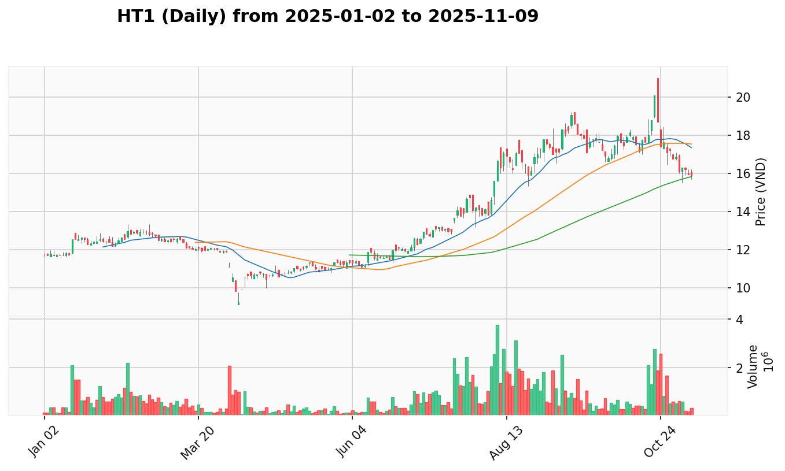

<a href="#vlxd">↑ Back to group VLXD</a>  |  <a href="#vpa-signal-summary">↑ Back to Top</a>

#### Key Statistics
| Metric | Value |
|:---|---:|
| Date Range | 2025-01-02 to 2025-11-07 |
| **Latest Close** | **15.9** |
| Period Open | 11.78 |
| Period High | 21.0 |
| Period Low | 9.12 |
| Period Change % | 34.97% |

**[Download HT1 Data (.csv)](market_data/HT1_2025-01-02_to_2025-11-09.csv)**

---

### HTN

#### [VPA Analysis (2025-08-04 - 2025-10-21)](./VPA.md#htn)
> **Ngày 2025-10-15:** HTN giảm từ 9.97 VND (giá đóng cửa phiên trước) xuống 9.95 VND với khối lượng giao dịch đạt 0.3367 triệu cổ phiếu. Cây nến giảm có biên độ hẹp và đóng cửa ở mức thấp nhất phiên, cho thấy áp lực bán vẫn hiện hữu nhưng đã suy yếu đáng kể so với phiên trước. Khối lượng giao dịch thấp hơn rõ rệt so với phiên trước (0.6018 triệu cổ phiếu), xác nhận sự thiếu vắng lực cầu và cung cũng không còn quá mạnh. Điều này cho thấy thị trường đang trong giai đoạn điều chỉnh hoặc tích lũy, với sự cạn kiệt của cả cung và cầu. **Phân tích VPA/Wyckoff:** Sign of Weakness (SOW) - Dấu hiệu suy yếu.
> **Ngày 2025-10-16:** HTN tăng từ 9.95 VND lên 10.0 VND với khối lượng giao dịch đạt 0.5282 triệu cổ phiếu. Cây nến tăng có biên độ rộng và đóng cửa ở mức giữa, cho thấy lực cầu đã xuất hiện sau hai phiên giảm giá liên tiếp. Khối lượng giao dịch tăng so với phiên trước (0.3367 triệu cổ phiếu) xác nhận sự tham gia của người mua. Tuy nhiên, bóng nến trên dài cho thấy áp lực cung vẫn còn ở các mức giá cao hơn, cho thấy thị trường đang kiểm tra mức cung. **Phân tích VPA/Wyckoff:** Test of Supply (Kiểm tra cung)
> **Ngày 2025-10-17:** HTN tăng từ 10.1 VND lên 10.2 VND với khối lượng giao dịch đạt 0.7576 triệu cổ phiếu. Cây nến tăng có biên độ rộng và đóng cửa ở mức giữa, cho thấy lực cầu tiếp tục đẩy giá lên nhưng áp lực bán vẫn hiện hữu ở vùng giá cao hơn, tạo bóng nến trên. Khối lượng giao dịch duy trì ở mức cao nhưng có phần giảm nhẹ so với phiên trước, cho thấy sự kiểm tra cung vẫn đang diễn ra. **Phân tích VPA/Wyckoff:** Test of Supply (Kiểm tra cung)
> **Ngày 2025-10-20:** HTN giảm từ 10.2 VND xuống 9.49 VND với khối lượng giao dịch đạt 0.8396 triệu cổ phiếu. Cây nến giảm có biên độ rộng và đóng cửa ở mức thấp nhất phiên, cho thấy áp lực bán mạnh mẽ. Khối lượng giao dịch tăng so với phiên trước (0.7576 triệu cổ phiếu) xác nhận sự tham gia của người bán. Điều này cho thấy cung đã thắng thế sau hai phiên kiểm tra cung trước đó. **Phân tích VPA/Wyckoff:** Sign of Weakness (SOW) - Áp lực cung mạnh mẽ.
> **Ngày 2025-10-21:** HTN giảm từ 9.49 VND xuống 9.13 VND với khối lượng giao dịch đạt 0.8309 triệu cổ phiếu. Cây nến giảm có biên độ rộng và đóng cửa ở mức thấp, cho thấy áp lực bán tiếp tục duy trì mạnh mẽ. Khối lượng giao dịch vẫn ở mức cao, gần bằng phiên trước, xác nhận sự tiếp diễn của áp lực cung sau tín hiệu suy yếu (SOW) trước đó. **Phân tích VPA/Wyckoff:** Sign of Weakness (SOW) - Tiếp diễn áp lực cung.

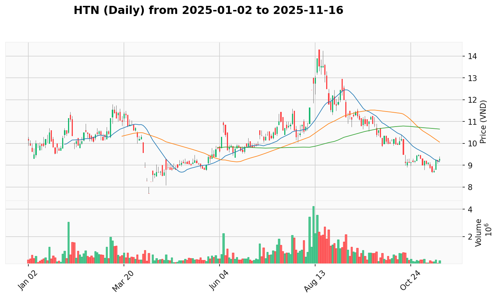

<a href="#bat-dong-san">↑ Back to group BAT_DONG_SAN</a>  |  <a href="#vpa-signal-summary">↑ Back to Top</a>

#### Key Statistics
| Metric | Value |
|:---|---:|
| Date Range | 2025-01-02 to 2025-11-07 |
| **Latest Close** | **8.88** |
| Period Open | 10.2 |
| Period High | 14.3 |
| Period Low | 7.71 |
| Period Change % | -12.94% |

**[Download HTN Data (.csv)](market_data/HTN_2025-01-02_to_2025-11-09.csv)**

---

### HUT

#### [VPA Analysis (2025-06-16 - 2025-10-21)](./VPA.md#hut)
> **Ngày 2025-10-15:** HUT tăng từ 16.7 VND lên 17.0 VND với cây nến có biên độ hẹp (từ 16.5 VND lên 17.0 VND) và đóng cửa ở mức cao nhất phiên. Khối lượng giao dịch đạt 2.6155 triệu cổ phiếu, giảm so với phiên trước (4.3719 triệu cổ phiếu). Sau hai phiên chịu áp lực bán mạnh, việc giá tăng nhẹ với khối lượng giảm cho thấy lực cung có thể đang tạm lắng, nhưng lực cầu chưa thực sự mạnh mẽ để đẩy giá lên cao hơn với khối lượng lớn. Đây có thể là một phiên kiểm tra cung hoặc một nhịp hồi phục kỹ thuật. **Phân tích VPA/Wyckoff:** Kiểm tra cung.
> **Ngày 2025-10-16:** HUT tăng từ 17.0 VND lên 17.9 VND với cây nến có biên độ rộng (từ 17.0 VND lên 18.2 VND) và đóng cửa gần mức cao nhất phiên. Khối lượng giao dịch đạt 4.5707 triệu cổ phiếu, tăng đáng kể so với phiên trước (2.6155 triệu cổ phiếu). Sau phiên kiểm tra cung trước đó, việc giá tăng mạnh với khối lượng gia tăng cho thấy lực cầu đã quay trở lại và đang áp đảo lực cung. Điều này xác nhận sự hiện diện mạnh mẽ của lực mua trên thị trường. **Phân tích VPA/Wyckoff:** Sign of Strength (SOS) - Lực cầu mạnh mẽ.
> **Ngày 2025-10-17:** HUT giảm từ 18.0 VND xuống 17.3 VND với cây nến có biên độ hẹp (từ 17.2 VND lên 18.0 VND) và đóng cửa gần mức thấp nhất phiên. Khối lượng giao dịch đạt 2.9842 triệu cổ phiếu, giảm đáng kể so với phiên trước (6.7872 triệu cổ phiếu). Sau phiên tăng mạnh với lực cầu áp đảo (SOS) vào ngày 2025-10-16, việc giá giảm nhẹ với khối lượng thấp cho thấy lực cầu đã suy yếu và lực cung bắt đầu xuất hiện, nhưng chưa thực sự mạnh mẽ. Đây có thể là một nhịp điều chỉnh tự nhiên sau đà tăng hoặc dấu hiệu của sự thiếu hụt cầu. **Phân tích VPA/Wyckoff:** No Demand (Thiếu cầu).
> **Ngày 2025-10-20:** HUT giảm từ 17.3 VND xuống 15.6 VND với cây nến có biên độ rộng (từ 15.6 VND lên 17.5 VND) và đóng cửa ở mức thấp nhất phiên. Khối lượng giao dịch đạt 5.2897 triệu cổ phiếu, tăng đáng kể so với phiên trước (2.9842 triệu cổ phiếu). Sau phiên thiếu cầu (No Demand) vào ngày 2025-10-17, việc giá giảm mạnh với khối lượng gia tăng cho thấy lực cung đã áp đảo hoàn toàn lực cầu. Điều này xác nhận sự hiện diện mạnh mẽ của lực bán trên thị trường. **Phân tích VPA/Wyckoff:** Sign of Weakness (SOW) - Lực cung mạnh mẽ.
> **Ngày 2025-10-21:** HUT giảm từ 15.6 VND xuống 15.1 VND với cây nến có biên độ rộng (từ 14.7 VND lên 15.8 VND) và đóng cửa gần mức thấp nhất phiên. Khối lượng giao dịch đạt 4.311 triệu cổ phiếu, giảm so với phiên trước (5.2897 triệu cổ phiếu). Sau phiên SOW mạnh mẽ vào ngày 2025-10-20, việc giá tiếp tục giảm sâu với biên độ rộng và đóng cửa gần mức thấp nhất, dù khối lượng có giảm nhẹ, cho thấy lực cung vẫn đang chiếm ưu thế và tiếp tục đẩy giá xuống. Điều này xác nhận xu hướng giảm giá đang tiếp diễn. **Phân tích VPA/Wyckoff:** Sign of Weakness (SOW) - Lực cung vẫn chiếm ưu thế.

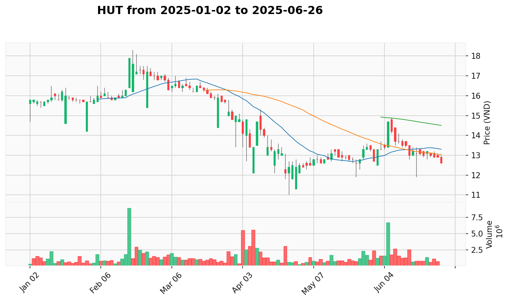

<a href="#xay-dung">↑ Back to group XAY_DUNG</a>  |  <a href="#vpa-signal-summary">↑ Back to Top</a>

#### Key Statistics
| Metric | Value |
|:---|---:|
| Date Range | 2025-01-02 to 2025-11-07 |
| **Latest Close** | **17.0** |
| Period Open | 15.06 |
| Period High | 21.1 |
| Period Low | 10.62 |
| Period Change % | 12.88% |

**[Download HUT Data (.csv)](market_data/HUT_2025-01-02_to_2025-11-09.csv)**

---

### HVN

#### [VPA Analysis (2025-06-16 - 2025-10-21)](./VPA.md#hvn)
> **Ngày 2025-10-15:** HVN mở cửa ở mức 35.65 VND, tăng lên 35.7 VND nhưng sau đó giảm và đóng cửa tại 35.1 VND, thấp hơn so với phiên trước (35.2 VND). Biên độ giá hẹp và khối lượng giao dịch đạt 0.7272 triệu cổ phiếu, giảm đáng kể so với phiên trước (1.0162 triệu cổ phiếu). Sau phiên "Dấu hiệu yếu ớt" ngày 2025-10-14, phiên này cho thấy giá tiếp tục giảm nhưng với lực bán đã suy yếu và không có lực cầu nào xuất hiện để hỗ trợ giá. Giá đóng cửa gần mức thấp nhất phiên cho thấy tâm lý tiêu cực vẫn còn. **Phân tích VPA/Wyckoff:** Không có cầu (No Demand) - Giá giảm với biên độ hẹp và khối lượng thấp sau một phiên giảm mạnh, cho thấy lực cầu không xuất hiện để hấp thụ cung.
> **Ngày 2025-10-16:** HVN mở cửa ở mức 35.7 VND, tăng nhẹ lên 35.75 VND nhưng sau đó giảm và đóng cửa tại 35.5 VND, cao hơn so với phiên trước (35.1 VND) nhưng lại đóng cửa ở mức thấp nhất phiên. Biên độ giá hẹp và khối lượng giao dịch đạt 0.3228 triệu cổ phiếu, giảm đáng kể so với phiên trước (0.7272 triệu cổ phiếu) và là mức thấp nhất trong 10 phiên gần đây. Sau hai phiên giảm giá và "Không có cầu", phiên này cho thấy một nỗ lực tăng giá yếu ớt ngay từ đầu phiên nhưng không duy trì được, với lực bán nhẹ đã đẩy giá xuống mức thấp nhất phiên. Khối lượng cực thấp xác nhận sự thiếu vắng hoàn toàn của lực cầu. **Phân tích VPA/Wyckoff:** Không có cầu (No Demand) - Giá tăng nhẹ nhưng đóng cửa ở mức thấp nhất phiên với biên độ hẹp và khối lượng cực thấp, xác nhận lực cầu không xuất hiện.
> **Ngày 2025-10-17:** HVN mở cửa ở mức 35.6 VND, tăng lên 35.6 VND nhưng sau đó giảm mạnh và đóng cửa tại 35.0 VND, thấp hơn đáng kể so với phiên trước (35.6 VND) và là mức thấp nhất trong phiên. Biên độ giá rộng và khối lượng giao dịch đạt 0.5881 triệu cổ phiếu, tăng nhẹ so với phiên trước (0.5592 triệu cổ phiếu). Sau hai phiên "Không có cầu", phiên này cho thấy áp lực bán tiếp tục gia tăng, đẩy giá xuống thấp với biên độ rộng và đóng cửa ở mức thấp nhất phiên, xác nhận tâm lý tiêu cực đang chiếm ưu thế. **Phân tích VPA/Wyckoff:** Dấu hiệu yếu ớt (Sign of Weakness)
> **Ngày 2025-10-20:** HVN mở cửa ở mức 35.0 VND, tăng lên 36.25 VND nhưng sau đó giảm mạnh và đóng cửa tại 32.6 VND, thấp hơn đáng kể so với phiên trước (35.0 VND) và là mức thấp nhất trong phiên. Biên độ giá rất rộng và khối lượng giao dịch đạt 1.4023 triệu cổ phiếu, tăng mạnh so với phiên trước (0.5881 triệu cổ phiếu) và là mức cao nhất trong 10 phiên gần đây. Sau phiên "Dấu hiệu yếu ớt" trước đó, phiên này tiếp tục cho thấy áp lực bán cực lớn, đẩy giá xuống sâu với biên độ rộng và đóng cửa ở mức thấp nhất phiên, xác nhận tâm lý tiêu cực đang chiếm ưu thế và có thể là sự khởi đầu của một đợt giảm giá mạnh. **Phân tích VPA/Wyckoff:** Dấu hiệu yếu ớt (Sign of Weakness)
> **Ngày 2025-10-21:** HVN mở cửa ở mức 34.0 VND, giảm xuống 33.5 VND rồi tăng trở lại và đóng cửa tại 34.5 VND, cao hơn đáng kể so với phiên trước (32.6 VND) và là mức cao nhất trong phiên. Biên độ giá hẹp hơn so với phiên trước. Khối lượng giao dịch đạt 1.2717 triệu cổ phiếu, giảm so với phiên trước (1.4023 triệu cổ phiếu). Sau hai phiên "Dấu hiệu yếu ớt" với áp lực bán mạnh, phiên này cho thấy sự phục hồi nhẹ về giá, đóng cửa ở mức cao nhất phiên. Tuy nhiên, khối lượng giao dịch giảm cho thấy lực cầu chưa thực sự mạnh mẽ để xác nhận một sự đảo chiều xu hướng. Đây có thể là một đợt phục hồi kỹ thuật trong xu hướng giảm. **Phân tích VPA/Wyckoff:** Phục hồi yếu (Weak Rally)

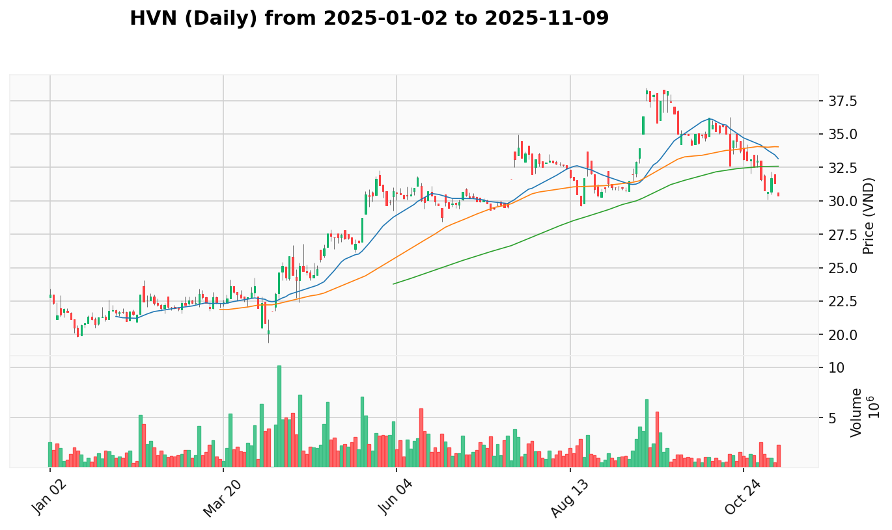

<a href="#hang-khong">↑ Back to group HANG_KHONG</a>  |  <a href="#vpa-signal-summary">↑ Back to Top</a>

#### Key Statistics
| Metric | Value |
|:---|---:|
| Date Range | 2025-01-02 to 2025-11-07 |
| **Latest Close** | **30.4** |
| Period Open | 22.78 |
| Period High | 38.45 |
| Period Low | 19.39 |
| Period Change % | 33.45% |

**[Download HVN Data (.csv)](market_data/HVN_2025-01-02_to_2025-11-09.csv)**

---

### IDC

#### [VPA Analysis (2025-06-13 - 2025-10-21)](./VPA.md#idc)
> **Ngày 2025-10-15:** IDC giảm từ 38.0 VND xuống 37.2 VND. Cây nến giảm có biên độ rộng, đóng cửa gần mức thấp nhất phiên. Khối lượng giao dịch đạt 3.203 triệu cổ phiếu, cao hơn so với phiên trước (2.428 triệu cổ phiếu). Sau phiên giảm giá với dấu hiệu yếu kém (SOW) ngày 2025-10-14, phiên này tiếp tục cho thấy áp lực bán mạnh mẽ với khối lượng gia tăng, đẩy giá xuống thấp hơn và đóng cửa ở mức yếu, xác nhận sự hiện diện của nguồn cung và xu hướng giảm giá tiếp diễn. **Phân tích VPA/Wyckoff:** Continuation of Weakness (COW) - Tiếp diễn yếu kém.
> **Ngày 2025-10-16:** IDC giảm từ 37.2 VND xuống 36.5 VND. Cây nến giảm có biên độ rộng, đóng cửa ở mức thấp nhất phiên. Khối lượng giao dịch đạt 2.241 triệu cổ phiếu, thấp hơn so với phiên trước (3.203 triệu cổ phiếu). Sau hai phiên giảm giá liên tiếp với dấu hiệu yếu kém (SOW) và tiếp diễn yếu kém (COW), phiên này tiếp tục cho thấy áp lực bán mạnh mẽ, đẩy giá xuống thấp hơn và đóng cửa ở mức yếu nhất, xác nhận xu hướng giảm giá tiếp diễn. Mặc dù khối lượng có phần giảm, nhưng biên độ giảm giá rộng cho thấy nguồn cung vẫn đang chiếm ưu thế. **Phân tích VPA/Wyckoff:** Continuation of Weakness (COW) - Tiếp diễn yếu kém.
> **Ngày 2025-10-17:** IDC giảm từ 37.0 VND xuống 36.2 VND. Cây nến giảm có biên độ rộng, đóng cửa gần mức thấp nhất phiên. Khối lượng giao dịch đạt 4.325 triệu cổ phiếu, cao hơn so với phiên trước (3.740 triệu cổ phiếu). Sau các phiên giảm giá liên tiếp với dấu hiệu yếu kém, phiên này tiếp tục cho thấy áp lực bán mạnh mẽ với khối lượng gia tăng, đẩy giá xuống thấp hơn và đóng cửa ở mức yếu, xác nhận sự hiện diện của nguồn cung và xu hướng giảm giá tiếp diễn. **Phân tích VPA/Wyckoff:** Continuation of Weakness (COW) - Tiếp diễn yếu kém.
> **Ngày 2025-10-20:** IDC giảm từ 36.2 VND xuống 33.5 VND. Cây nến giảm có biên độ rất rộng, đóng cửa ở mức thấp nhất phiên. Khối lượng giao dịch đạt 5.351 triệu cổ phiếu, cao hơn đáng kể so với phiên trước (4.325 triệu cổ phiếu). Sau các phiên giảm giá liên tiếp với dấu hiệu yếu kém, phiên này tiếp tục cho thấy áp lực bán mạnh mẽ với khối lượng gia tăng, đẩy giá xuống thấp hơn và đóng cửa ở mức yếu nhất, xác nhận sự hiện diện của nguồn cung áp đảo và xu hướng giảm giá tiếp diễn. **Phân tích VPA/Wyckoff:** Continuation of Weakness (COW) - Tiếp diễn yếu kém.
> **Ngày 2025-10-21:** IDC tăng từ 33.6 VND lên 35.5 VND. Cây nến tăng có biên độ rộng, đóng cửa gần mức cao nhất phiên. Khối lượng giao dịch đạt 2.899 triệu cổ phiếu, thấp hơn đáng kể so với phiên giảm mạnh trước đó (5.351 triệu cổ phiếu). Sau hai phiên giảm giá liên tiếp với áp lực bán mạnh, phiên này cho thấy lực cầu xuất hiện và đẩy giá phục hồi. Khối lượng thấp hơn cho thấy nguồn cung đã tạm thời cạn kiệt, cho phép giá tăng dễ dàng. **Phân tích VPA/Wyckoff:** Test for Supply (TFS) - Kiểm tra nguồn cung.

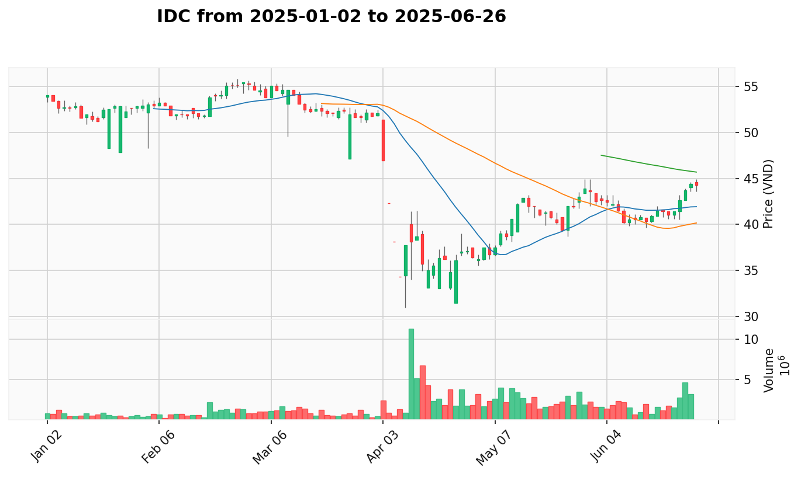

<a href="#bat-dong-san-kcn">↑ Back to group BAT_DONG_SAN_KCN</a>  |  <a href="#vpa-signal-summary">↑ Back to Top</a>

#### Key Statistics
| Metric | Value |
|:---|---:|
| Date Range | 2025-01-02 to 2025-11-07 |
| **Latest Close** | **38.0** |
| Period Open | 46.86 |
| Period High | 48.9 |
| Period Low | 26.87 |
| Period Change % | -18.91% |

**[Download IDC Data (.csv)](market_data/IDC_2025-01-02_to_2025-11-09.csv)**

---

### IDI

#### [VPA Analysis (2025-08-15 - 2025-10-21)](./VPA.md#idi)
> **Ngày 2025-10-15:** IDI tiếp tục giảm từ 7.81 VND xuống 7.63 VND với khối lượng giao dịch đạt 1.2054 triệu cổ phiếu, thấp hơn so với phiên trước (1.678 triệu cổ phiếu). Nến ngày có biên độ tương đối rộng, giá đóng cửa gần mức thấp nhất phiên. Sau hai phiên "Dấu hiệu suy yếu" liên tiếp, việc giá tiếp tục giảm và đóng cửa gần mức thấp nhất cho thấy áp lực bán vẫn còn hiện hữu, mặc dù khối lượng đã giảm nhẹ. Điều này có thể cho thấy sự cạn kiệt tạm thời của lực bán mạnh hoặc thiếu vắng lực cầu đủ lớn để đẩy giá lên. Tổng thể, đây vẫn là một tín hiệu tiêu cực, xác nhận sự tiếp diễn của xu hướng giảm. **Phân tích VPA/Wyckoff:** Weakness (W) - Dấu hiệu suy yếu.
> **Ngày 2025-10-16:** IDI tăng nhẹ từ 7.63 VND lên 7.64 VND với khối lượng giao dịch đạt 0.3665 triệu cổ phiếu, thấp hơn đáng kể so với phiên trước (1.2054 triệu cổ phiếu). Nến ngày có biên độ hẹp, giá đóng cửa gần mức cao nhất phiên. Sau hai phiên "Dấu hiệu suy yếu" liên tiếp, việc giá tăng nhẹ với khối lượng cực thấp cho thấy áp lực bán đã tạm thời giảm bớt, nhưng đồng thời cũng không có lực cầu đáng kể nào xuất hiện để đẩy giá lên. Điều này cho thấy thị trường vẫn còn yếu và có thể tiếp tục xu hướng giảm do thiếu vắng sự quan tâm từ phía người mua. **Phân tích VPA/Wyckoff:** No Demand (ND) - Không có cầu.
> **Ngày 2025-10-17:** IDI tiếp tục giảm từ 7.64 VND xuống 7.59 VND với khối lượng giao dịch đạt 0.7879 triệu cổ phiếu, cao hơn nhẹ so với phiên trước (0.7441 triệu cổ phiếu) nhưng vẫn ở mức trung bình thấp. Nến ngày có biên độ rộng, giá đóng cửa ở mức thấp nhất phiên. Sau phiên "Không có cầu" (No Demand) trước đó, việc giá tiếp tục giảm mạnh và đóng cửa ở mức thấp nhất cho thấy áp lực bán vẫn chiếm ưu thế và chưa có dấu hiệu lực cầu quay trở lại. Điều này xác nhận sự tiếp diễn của xu hướng giảm. **Phân tích VPA/Wyckoff:** Weakness (W) - Dấu hiệu suy yếu.
> **Ngày 2025-10-20:** IDI giảm mạnh từ 7.59 VND xuống 7.12 VND với khối lượng giao dịch đạt 0.9865 triệu cổ phiếu, cao hơn đáng kể so với phiên trước (0.7879 triệu cổ phiếu). Nến ngày có biên độ rộng, giá đóng cửa ở mức thấp nhất phiên. Sau phiên "Dấu hiệu suy yếu" (Weakness) trước đó, việc giá tiếp tục giảm sâu với khối lượng gia tăng cho thấy áp lực bán vẫn rất mạnh và chưa có dấu hiệu dừng lại. Điều này xác nhận xu hướng giảm tiếp diễn. **Phân tích VPA/Wyckoff:** Weakness (W) - Dấu hiệu suy yếu.
> **Ngày 2025-10-21:** IDI tăng nhẹ từ 7.12 VND lên 7.16 VND với khối lượng giao dịch đạt 1.066 triệu cổ phiếu, cao hơn so với phiên trước (0.9865 triệu cổ phiếu). Nến ngày có biên độ hẹp hơn, giá đóng cửa gần mức cao nhất phiên. Sau hai phiên giảm mạnh với áp lực bán lớn, phiên này cho thấy một sự thay đổi nhỏ khi giá đóng cửa cao hơn phiên trước với khối lượng gia tăng. Điều này có thể là dấu hiệu của lực cầu bắt đầu xuất hiện hoặc áp lực bán đã giảm bớt, nhưng chưa đủ để xác nhận sự đảo chiều xu hướng. Giá vẫn đang trong xu hướng giảm ngắn hạn. **Phân tích VPA/Wyckoff:** Stopping Volume (SV) - Dừng giảm với khối lượng lớn

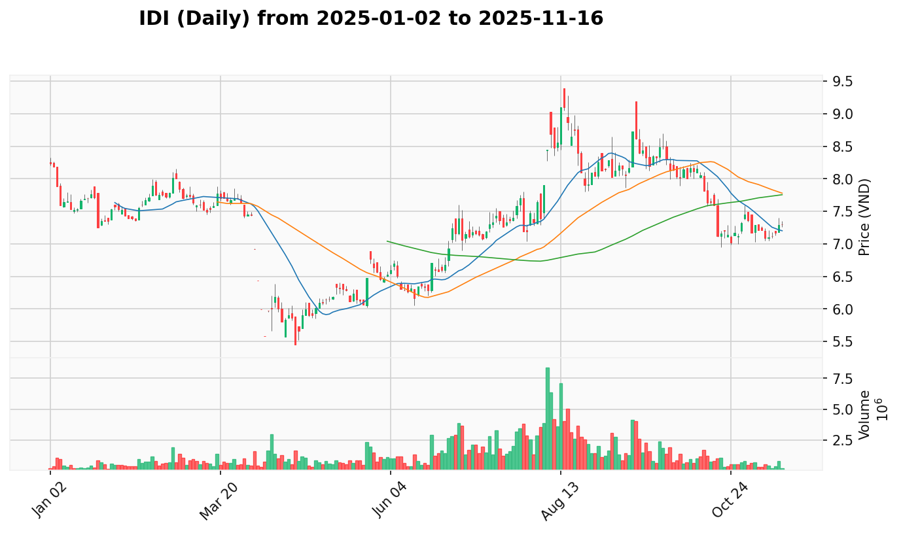

<a href="#thuy-san">↑ Back to group THUY_SAN</a>  |  <a href="#vpa-signal-summary">↑ Back to Top</a>

#### Key Statistics
| Metric | Value |
|:---|---:|
| Date Range | 2025-01-02 to 2025-11-07 |
| **Latest Close** | **7.09** |
| Period Open | 8.25 |
| Period High | 9.39 |
| Period Low | 5.45 |
| Period Change % | -14.06% |

**[Download IDI Data (.csv)](market_data/IDI_2025-01-02_to_2025-11-09.csv)**

---

### IDJ

#### [VPA Analysis (2025-08-14 - 2025-10-21)](./VPA.md#idj)
> **Ngày 2025-10-15:** IDJ mở cửa tại 6.3 VND, tăng lên 6.3 VND, giảm xuống 5.9 VND và đóng cửa tại 5.9 VND, với khối lượng giao dịch đạt 2.5422 triệu cổ phiếu. Cây nến giảm có biên độ rộng và đóng cửa tại mức thấp nhất phiên, cho thấy áp lực bán rất mạnh. Khối lượng giao dịch tăng đáng kể so với phiên trước (1.8106 triệu cổ phiếu), xác nhận sự gia tăng của lực cung. Sau hai phiên "Dấu hiệu suy yếu" (SOW) liên tiếp, việc giá tiếp tục giảm mạnh với khối lượng cực lớn cho thấy thị trường đang trong giai đoạn suy yếu nghiêm trọng và lực cung hoàn toàn chiếm ưu thế. **Phân tích VPA/Wyckoff:** Sign of Weakness (SOW) - Dấu hiệu suy yếu.
> **Ngày 2025-10-16:** IDJ mở cửa tại 5.9 VND, tăng lên 6.0 VND, giảm xuống 5.7 VND và đóng cửa tại 5.9 VND, với khối lượng giao dịch đạt 1.2556 triệu cổ phiếu. Cây nến có biên độ hẹp, đóng cửa tại mức mở cửa, cho thấy sự lưỡng lự của thị trường sau các phiên giảm mạnh. Khối lượng giao dịch giảm đáng kể so với phiên trước (2.5422 triệu cổ phiếu), cho thấy áp lực bán đã tạm thời suy yếu nhưng lực cầu vẫn chưa đủ mạnh để đẩy giá lên. Sau hai phiên "Dấu hiệu suy yếu" (SOW) liên tiếp với khối lượng lớn, phiên này có thể là một dấu hiệu tạm dừng trong xu hướng giảm, nhưng chưa có tín hiệu xác nhận đảo chiều. **Phân tích VPA/Wyckoff:** No Demand (ND) - Không có lực cầu.
> **Ngày 2025-10-17:** IDJ mở cửa tại 5.9 VND, tăng lên 6.0 VND, giảm xuống 5.8 VND và đóng cửa tại 5.9 VND, với khối lượng giao dịch đạt 1.1711 triệu cổ phiếu. Cây nến có biên độ hẹp, đóng cửa tại mức mở cửa, cho thấy sự lưỡng lự của thị trường. Khối lượng giao dịch tiếp tục giảm đáng kể so với phiên trước (2.196 triệu cổ phiếu), xác nhận áp lực bán đã suy yếu rõ rệt. Sau các phiên giảm mạnh, "Dấu hiệu suy yếu" (SOW) và "Không có lực cầu" (ND), phiên này cho thấy nguồn cung đã cạn kiệt tạm thời, nhưng lực cầu vẫn chưa đủ mạnh để đẩy giá lên. Đây là một dấu hiệu tạm dừng trong xu hướng giảm, chờ đợi tín hiệu xác nhận đảo chiều. **Phân tích VPA/Wyckoff:** No Supply (NS) - Không có nguồn cung.
> **Ngày 2025-10-20:** IDJ mở cửa tại 5.9 VND, tăng lên 6.1 VND, giảm xuống 5.4 VND và đóng cửa tại 5.4 VND, với khối lượng giao dịch đạt 2.4332 triệu cổ phiếu. Cây nến giảm có biên độ rộng, đóng cửa ở mức thấp nhất phiên, cho thấy áp lực bán mạnh mẽ đã quay trở lại thị trường. Khối lượng giao dịch tăng đáng kể so với các phiên trước, đặc biệt là so với phiên "Không có nguồn cung" (NS) ngày 2025-10-17 (1.1711 triệu cổ phiếu), xác nhận rằng nguồn cung đã áp đảo cầu. Sau giai đoạn tạm dừng với các tín hiệu "Không có lực cầu" và "Không có nguồn cung", phiên này cho thấy xu hướng giảm có thể tiếp tục. **Phân tích VPA/Wyckoff:** Sign of Weakness (SOW) - Dấu hiệu suy yếu.
> **Ngày 2025-10-21:** IDJ mở cửa tại 5.4 VND, tăng lên 5.6 VND, giảm xuống 5.1 VND và đóng cửa tại 5.3 VND, với khối lượng giao dịch đạt 1.8766 triệu cổ phiếu. Cây nến giảm có biên độ hẹp hơn so với phiên trước, đóng cửa gần mức thấp nhất phiên, cho thấy áp lực bán vẫn duy trì. Khối lượng giao dịch giảm so với phiên SOW ngày 2025-10-20 (2.4332 triệu cổ phiếu), nhưng vẫn ở mức tương đối cao, xác nhận xu hướng giảm tiếp diễn. **Phân tích VPA/Wyckoff:** Continuation of Weakness (CW) - Tiếp diễn suy yếu.

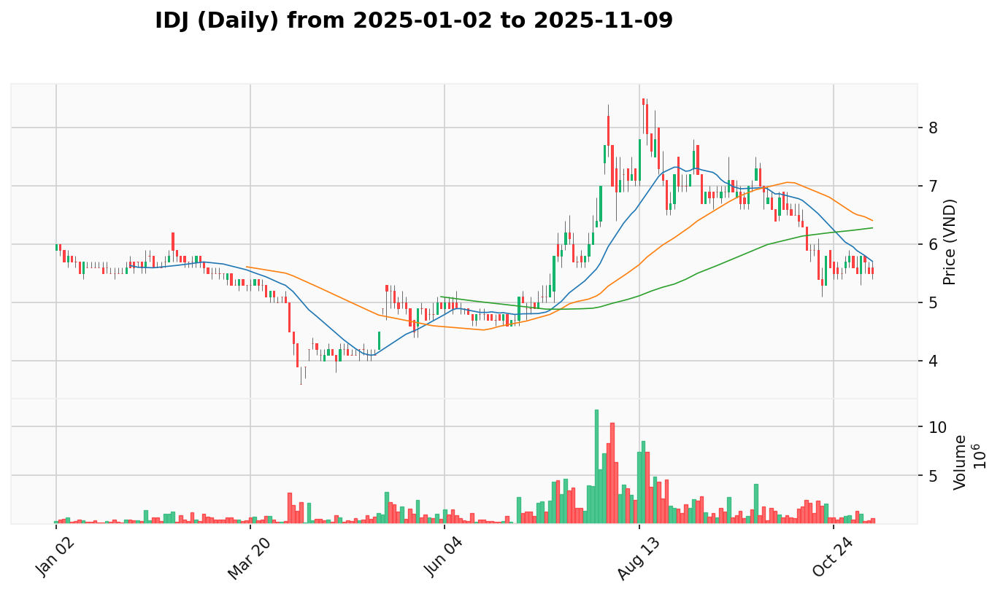

<a href="#xay-dung">↑ Back to group XAY_DUNG</a>  |  <a href="#vpa-signal-summary">↑ Back to Top</a>

#### Key Statistics
| Metric | Value |
|:---|---:|
| Date Range | 2025-01-02 to 2025-11-07 |
| **Latest Close** | **5.5** |
| Period Open | 5.9 |
| Period High | 8.5 |
| Period Low | 3.6 |
| Period Change % | -6.78% |

**[Download IDJ Data (.csv)](market_data/IDJ_2025-01-02_to_2025-11-09.csv)**

---

### IDV

#### [VPA Analysis (2025-08-04 - 2025-10-21)](./VPA.md#idv)
> **Ngày 2025-10-15:** IDV mở cửa tại 26.3 VND, dao động trong biên độ từ 26.2 VND đến 26.4 VND và đóng cửa tại 26.4 VND. So với phiên trước, giá đóng cửa tăng nhẹ từ 26.2 VND lên 26.4 VND. Khối lượng giao dịch đạt 0.0059 triệu cổ phiếu, giảm mạnh so với phiên trước (0.021 triệu cổ phiếu). Sau phiên "Không có cầu" (No Demand) ngày 2025-10-14, giá tăng nhẹ nhưng với khối lượng cực thấp cho thấy lực cầu rất yếu và không có sự tham gia của dòng tiền lớn. Điều này xác nhận sự thiếu vắng nhu cầu thực sự trên thị trường, và đà tăng không bền vững. **Phân tích VPA/Wyckoff:** No Demand (ND) - Không có cầu.
> **Ngày 2025-10-16:** IDV mở cửa tại 26.5 VND, tăng lên mức cao nhất 26.7 VND và đóng cửa tại 26.7 VND. Biên độ giá từ cao nhất đến thấp nhất là 0.2 VND. Giá đóng cửa cao hơn giá đóng cửa phiên trước (26.4 VND). Khối lượng giao dịch đạt 0.0007 triệu cổ phiếu, giảm mạnh so với phiên trước (0.0059 triệu cổ phiếu). Sau hai phiên "Không có cầu" (No Demand), giá tăng nhẹ nhưng với khối lượng cực thấp cho thấy lực cầu rất yếu và không có sự tham gia của dòng tiền lớn. Điều này xác nhận sự thiếu vắng nhu cầu thực sự trên thị trường, và đà tăng không bền vững. **Phân tích VPA/Wyckoff:** No Demand (ND) - Không có cầu.
> **Ngày 2025-10-17:** IDV mở cửa tại 26.3 VND, dao động trong biên độ từ 26.0 VND đến 26.3 VND và đóng cửa tại 26.2 VND. So với phiên trước, giá đóng cửa giảm từ 26.6 VND xuống 26.2 VND. Khối lượng giao dịch đạt 0.0157 triệu cổ phiếu, tăng mạnh so với phiên trước (0.001 triệu cổ phiếu). Sau hai phiên "Không có cầu" (No Demand) với khối lượng cực thấp, phiên này giá giảm với khối lượng tăng mạnh cho thấy áp lực bán đang gia tăng và nguồn cung bắt đầu xuất hiện trên thị trường. Điều này xác nhận sự yếu kém của lực cầu và khả năng đảo chiều giảm giá. **Phân tích VPA/Wyckoff:** Supply Coming In (SCI) - Nguồn cung xuất hiện.
> **Ngày 2025-10-20:** IDV mở cửa tại 26.2 VND, tăng từ 26.2 VND lên 26.5 VND và đóng cửa tại 26.5 VND. Biên độ giá từ 25.1 VND đến 26.5 VND là rộng, và giá đóng cửa gần mức cao nhất phiên. Khối lượng giao dịch đạt 0.0347 triệu cổ phiếu, tăng mạnh so với phiên trước (0.0157 triệu cổ phiếu). Sau phiên "Nguồn cung xuất hiện" (Supply Coming In) vào ngày 2025-10-17, phiên này cho thấy giá tăng mạnh với biên độ rộng và khối lượng tăng đáng kể, xác nhận lực cầu đã quay trở lại và đang áp đảo lực cung. **Phân tích VPA/Wyckoff:** Sign of Strength (SOS) - Lực cầu mạnh mẽ.
> **Ngày 2025-10-21:** IDV mở cửa tại 26.4 VND, dao động trong biên độ từ 25.0 VND đến 26.5 VND và đóng cửa tại 25.0 VND. So với phiên trước, giá đóng cửa giảm mạnh từ 26.5 VND xuống 25.0 VND. Biên độ giá rộng và giá đóng cửa ở mức thấp nhất phiên. Khối lượng giao dịch đạt 0.0363 triệu cổ phiếu, tăng so với phiên trước (0.0347 triệu cổ phiếu). Sau phiên "Lực cầu mạnh mẽ" (Sign of Strength) vào ngày 2025-10-20, phiên này cho thấy giá giảm mạnh với biên độ rộng và khối lượng tăng đáng kể, xác nhận áp lực bán đang rất lớn và nguồn cung đã áp đảo hoàn toàn lực cầu. Điều này cho thấy sự yếu kém rõ rệt và khả năng đảo chiều giảm giá. **Phân tích VPA/Wyckoff:** Sign of Weakness (SOW) - Lực cung mạnh mẽ.

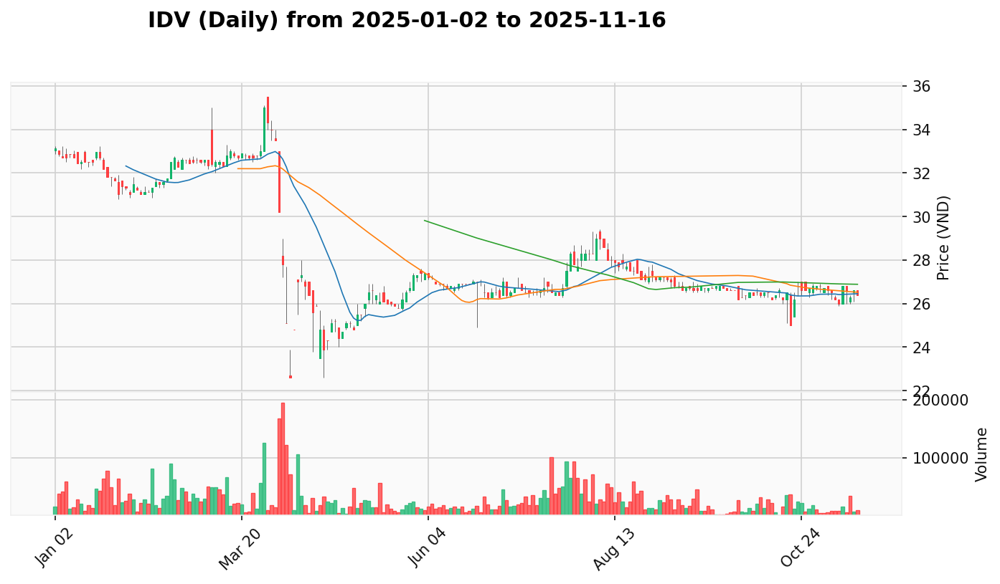

<a href="#bat-dong-san-kcn">↑ Back to group BAT_DONG_SAN_KCN</a>  |  <a href="#vpa-signal-summary">↑ Back to Top</a>

#### Key Statistics
| Metric | Value |
|:---|---:|
| Date Range | 2025-01-02 to 2025-11-07 |
| **Latest Close** | **26.0** |
| Period Open | 33.04 |
| Period High | 35.5 |
| Period Low | 22.6 |
| Period Change % | -21.31% |

**[Download IDV Data (.csv)](market_data/IDV_2025-01-02_to_2025-11-09.csv)**

---

### IJC

#### [VPA Analysis (2025-08-14 - 2025-10-21)](./VPA.md#ijc)
> **Ngày 2025-10-15:** IJC tăng từ 13.45 VND lên 13.65 VND với khối lượng giao dịch đạt 5.8936 triệu cổ phiếu. Cây nến tăng có biên độ khá, giá đóng cửa nằm gần mức cao nhất phiên, cho thấy lực cầu xuất hiện trở lại sau phiên giảm. Tuy nhiên, khối lượng giao dịch giảm so với phiên trước (6.3398 triệu cổ phiếu), cho thấy lực cầu chưa thực sự mạnh mẽ và có thể là dấu hiệu của sự yếu ớt trong đà tăng. **Phân tích VPA/Wyckoff:** Weakness in Rally (Sự yếu ớt trong đà tăng)
> **Ngày 2025-10-16:** IJC mở cửa ở 13.75 VND, đạt mức cao 14.0 VND nhưng đóng cửa ở 13.65 VND, không thay đổi so với phiên trước, với khối lượng giao dịch đạt 5.9244 triệu cổ phiếu. Cây nến có thân nhỏ và bóng nến trên dài, cho thấy áp lực bán xuất hiện khi giá cố gắng tăng cao. Khối lượng giao dịch tăng nhẹ so với phiên trước (5.8936 triệu cổ phiếu) nhưng không tạo ra sự bứt phá về giá, điều này cho thấy nỗ lực tăng giá không mang lại kết quả, hoặc lực cung đang hấp thụ lực cầu. Điều này tiếp tục xác nhận sự yếu ớt của đà tăng. **Phân tích VPA/Wyckoff:** Effort without Result (Nỗ lực không mang lại kết quả)
> **Ngày 2025-10-17:** IJC giảm từ 13.75 VND xuống 13.3 VND với khối lượng giao dịch đạt 6.1387 triệu cổ phiếu. Cây nến giảm có biên độ rộng, giá mở cửa là mức cao nhất phiên và đóng cửa ở mức thấp nhất phiên, cho thấy áp lực bán mạnh mẽ ngay từ đầu và duy trì suốt phiên. Mặc dù khối lượng giao dịch giảm so với phiên trước (8.915 triệu cổ phiếu), nhưng sự sụt giảm mạnh về giá cho thấy lực cầu yếu ớt và phe bán đang kiểm soát. Điều này tiếp tục xác nhận sự yếu ớt của đà tăng và có thể là dấu hiệu của sự phân phối. **Phân tích VPA/Wyckoff:** Supply Coming In (Lực cung xuất hiện)
> **Ngày 2025-10-20:** IJC mở cửa ở 13.3 VND, đạt mức cao 13.45 VND nhưng đóng cửa ở 12.4 VND, giảm mạnh với khối lượng giao dịch đạt 10.5981 triệu cổ phiếu. Cây nến giảm có biên độ rộng, giá đóng cửa ở mức thấp nhất phiên, cho thấy áp lực bán rất mạnh và quyết liệt. Khối lượng giao dịch tăng đáng kể so với phiên trước (6.1387 triệu cổ phiếu), xác nhận lực cung đang áp đảo hoàn toàn lực cầu. Điều này tiếp tục củng cố tín hiệu yếu ớt của thị trường và cho thấy xu hướng giảm giá đang được xác nhận rõ ràng. **Phân tích VPA/Wyckoff:** Sign of Weakness (SOW)
> **Ngày 2025-10-21:** IJC giảm từ 12.4 VND xuống 12.3 VND với khối lượng giao dịch đạt 6.3645 triệu cổ phiếu. Cây nến có biên độ hẹp, giá mở cửa và đóng cửa gần nhau, cho thấy sự lưỡng lự sau phiên giảm mạnh trước đó. Khối lượng giao dịch giảm đáng kể so với phiên trước (10.5981 triệu cổ phiếu), cho thấy áp lực bán có phần chững lại nhưng lực cầu vẫn rất yếu. Điều này tiếp tục củng cố xu hướng giảm giá và thiếu vắng lực mua. **Phân tích VPA/Wyckoff:** No Demand (Không có cầu)

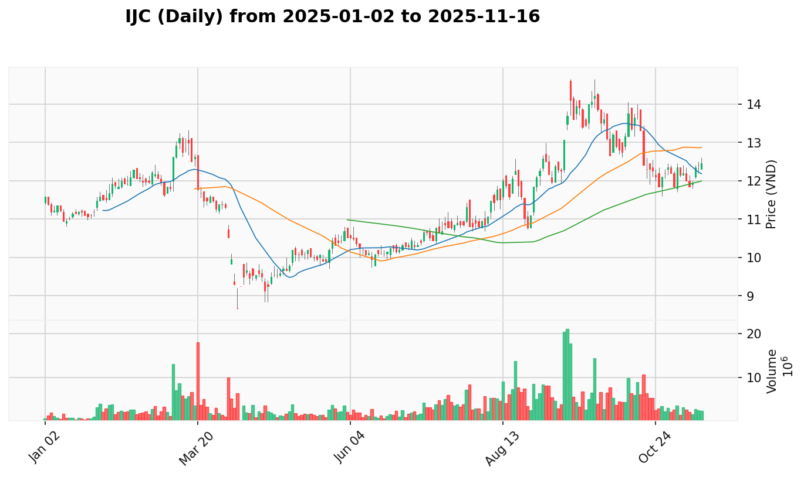

<a href="#xay-dung">↑ Back to group XAY_DUNG</a>  |  <a href="#vpa-signal-summary">↑ Back to Top</a>

#### Key Statistics
| Metric | Value |
|:---|---:|
| Date Range | 2025-01-02 to 2025-11-07 |
| **Latest Close** | **12.0** |
| Period Open | 11.43 |
| Period High | 14.65 |
| Period Low | 8.67 |
| Period Change % | 4.99% |

**[Download IJC Data (.csv)](market_data/IJC_2025-01-02_to_2025-11-09.csv)**

---

### IMP

#### [VPA Analysis (2025-06-26 - 2025-10-21)](./VPA.md#imp)
> **Ngày 2025-10-15:** IMP tăng từ 50.7 VND lên 51.0 VND với khối lượng giao dịch đạt 0.024 triệu cổ phiếu. Cây nến tăng có biên độ hẹp (0.3 VND) và đóng cửa ở mức cao nhất phiên. Khối lượng giao dịch giảm mạnh so với phiên trước (0.0592 triệu cổ phiếu). Sau hai phiên suy yếu liên tiếp, việc giá tăng nhẹ với khối lượng thấp cho thấy áp lực bán đã giảm nhưng lực cầu vẫn còn yếu, chưa đủ để xác nhận sự đảo chiều. Đây có thể là một dấu hiệu của sự tạm dừng trong xu hướng giảm. **Phân tích VPA/Wyckoff:** No Demand (Không có cầu)
> **Ngày 2025-10-16:** IMP giảm từ 51.0 VND xuống 50.9 VND. Cây nến giảm có biên độ rất hẹp (0.2 VND) và đóng cửa gần giữa phiên, cho thấy sự lưỡng lự của thị trường. Khối lượng giao dịch đạt 0.0028 triệu cổ phiếu, giảm cực mạnh so với phiên trước (0.024 triệu cổ phiếu) và là mức thấp nhất trong nhiều phiên gần đây. Sau phiên "Không có cầu" ngày 2025-10-15, việc giá tiếp tục biến động trong biên độ hẹp với khối lượng cực thấp cho thấy cả lực mua và lực bán đều không đáng kể, thị trường đang thiếu động lực và chờ đợi tín hiệu rõ ràng hơn. **Phân tích VPA/Wyckoff:** No Demand (Không có cầu)
> **Ngày 2025-10-17:** IMP mở cửa tại 50.6 VND, đạt mức cao nhất 51.3 VND, thấp nhất 50.3 VND và đóng cửa tại 50.6 VND. Cây nến có biên độ 1.0 VND, rộng hơn so với phiên trước, cho thấy sự biến động gia tăng. Giá đóng cửa bằng giá mở cửa, tạo thành nến doji, thể hiện sự lưỡng lự. Khối lượng giao dịch đạt 0.0287 triệu cổ phiếu, tăng nhẹ so với phiên trước (0.0179 triệu cổ phiếu) nhưng vẫn ở mức trung bình thấp. Sau hai phiên "Không có cầu", việc giá cố gắng tăng lên nhưng không thể duy trì ở mức cao nhất và đóng cửa bằng giá mở cửa với khối lượng tăng nhẹ cho thấy áp lực bán vẫn còn hiện hữu ở các mức giá cao hơn. Đây có thể là một dấu hiệu của sự kiểm tra nguồn cung. **Phân tích VPA/Wyckoff:** Test of Supply (Kiểm tra nguồn cung)
> **Ngày 2025-10-20:** IMP mở cửa tại 50.6 VND, đạt mức cao nhất 50.6 VND, thấp nhất 48.0 VND và đóng cửa tại 48.0 VND. Giá giảm mạnh từ 50.6 VND xuống 48.0 VND. Cây nến giảm có biên độ rộng (2.6 VND) và đóng cửa ở mức thấp nhất phiên, cho thấy áp lực bán rất mạnh. Khối lượng giao dịch đạt 0.071 triệu cổ phiếu, tăng đáng kể so với phiên trước (0.0287 triệu cổ phiếu) và là mức cao nhất trong nhiều phiên gần đây. Sau phiên "Kiểm tra nguồn cung" ngày 2025-10-17, việc giá giảm sâu với khối lượng lớn xác nhận rằng nguồn cung đã áp đảo hoàn toàn lực cầu, cho thấy sự suy yếu rõ rệt của cổ phiếu. **Phân tích VPA/Wyckoff:** Sign of Weakness (SOW) - Lực cung mạnh mẽ với khối lượng gia tăng xác nhận xu hướng giảm.
> **Ngày 2025-10-21:** IMP mở cửa tại 48.3 VND, đạt mức cao nhất 50.0 VND, thấp nhất 48.3 VND và đóng cửa tại 49.5 VND. Giá tăng từ 48.3 VND lên 49.5 VND. Cây nến tăng có biên độ 1.7 VND, hẹp hơn so với phiên giảm mạnh trước đó, và đóng cửa gần mức cao nhất phiên. Khối lượng giao dịch đạt 0.0378 triệu cổ phiếu, giảm đáng kể so với phiên trước (0.071 triệu cổ phiếu). Sau phiên "Sign of Weakness" với lực cung mạnh mẽ, việc giá hồi phục nhẹ với khối lượng thấp cho thấy lực cầu yếu ớt và thiếu sự xác nhận. Đây có thể là một nhịp hồi kỹ thuật hoặc "No Demand" trong xu hướng giảm, không cho thấy sự thay đổi đáng kể trong cán cân cung cầu. **Phân tích VPA/Wyckoff:** No Demand (Không có cầu) - Giá tăng với khối lượng thấp sau một đợt giảm mạnh, xác nhận sự yếu kém của lực cầu.

<a href="#suc-khoe">↑ Back to group SUC_KHOE</a>  |  <a href="#vpa-signal-summary">↑ Back to Top</a>

#### Key Statistics
| Metric | Value |
|:---|---:|
| Date Range | 2025-01-02 to 2025-11-07 |
| **Latest Close** | **48.65** |
| Period Open | 46.55 |
| Period High | 56.5 |
| Period Low | 35.75 |
| Period Change % | 4.51% |

**[Download IMP Data (.csv)](market_data/IMP_2025-01-02_to_2025-11-09.csv)**

---

### IPA

#### [VPA Analysis (2025-06-16 - 2025-10-21)](./VPA.md#ipa)
> **Ngày 2025-10-15:** IPA tăng từ 20.6 VND lên 21.3 VND, mở cửa ở 20.6 VND và dao động trong khoảng 20.6-21.6 VND. Cây nến tăng có biên độ 1.0 điểm với giá đóng cửa ở gần mức cao nhất phiên. Khối lượng giao dịch đạt 0.6364 triệu cổ phiếu, giảm so với phiên trước (0.7193 triệu cổ phiếu) và ở mức trung bình thấp. Sau phiên "Sign of Weakness" với áp lực bán mạnh, việc giá tăng trở lại với khối lượng giảm cho thấy lực cầu chưa thực sự mạnh mẽ để đảo chiều xu hướng giảm. Đây có thể là một nhịp hồi phục kỹ thuật hoặc sự tạm lắng của áp lực bán, nhưng không có sự xác nhận từ khối lượng. **Phân tích VPA/Wyckoff:** Weak Rally (WR) - Nhịp hồi phục yếu.
> **Ngày 2025-10-16:** IPA tăng nhẹ từ 21.3 VND lên 21.5 VND, mở cửa ở 21.5 VND và dao động trong khoảng 21.3-21.9 VND. Cây nến có biên độ hẹp (0.6 điểm) với giá đóng cửa ngang bằng giá mở cửa, cho thấy sự lưỡng lự. Khối lượng giao dịch đạt 0.2405 triệu cổ phiếu, giảm mạnh so với phiên trước (0.6364 triệu cổ phiếu) và ở mức rất thấp. Sau phiên "Weak Rally" với khối lượng giảm, việc giá tiếp tục tăng nhẹ với biên độ hẹp và khối lượng cực thấp cho thấy lực cầu không còn duy trì được đà tăng và thị trường thiếu sự quan tâm. Điều này xác nhận sự yếu kém của nhịp hồi phục trước đó và khả năng giá sẽ tiếp tục xu hướng giảm. **Phân tích VPA/Wyckoff:** No Demand (ND) - Không có cầu.
> **Ngày 2025-10-17:** IPA giảm từ 21.1 VND xuống 21.0 VND, mở cửa ở 21.1 VND và dao động trong khoảng 20.8-21.6 VND. Cây nến giảm có biên độ 0.8 điểm với giá đóng cửa ở gần mức thấp nhất phiên. Khối lượng giao dịch đạt 0.6686 triệu cổ phiếu, tăng so với phiên trước (0.448 triệu cổ phiếu) và ở mức trung bình. Sau phiên "No Demand" với khối lượng cực thấp, việc giá giảm trở lại với khối lượng gia tăng cho thấy áp lực bán đã quay trở lại và đang chiếm ưu thế. Điều này xác nhận sự yếu kém của thị trường và khả năng giá sẽ tiếp tục xu hướng giảm. **Phân tích VPA/Wyckoff:** Sign of Weakness (SOW) - Áp lực bán gia tăng.
> **Ngày 2025-10-20:** IPA giảm mạnh từ 21.0 VND xuống 18.9 VND, mở cửa ở 21.0 VND và dao động trong khoảng 18.9-21.1 VND. Cây nến giảm có biên độ rộng (2.2 điểm) với giá đóng cửa ở mức thấp nhất phiên, cho thấy áp lực bán rất mạnh. Khối lượng giao dịch đạt 1.0152 triệu cổ phiếu, tăng đáng kể so với phiên trước (0.6686 triệu cổ phiếu) và ở mức cao. Sau phiên "Sign of Weakness" trước đó, việc giá tiếp tục giảm sâu với biên độ rộng và khối lượng gia tăng mạnh mẽ xác nhận sự yếu kém của thị trường và khả năng giá sẽ tiếp tục xu hướng giảm mạnh. **Phân tích VPA/Wyckoff:** Sign of Weakness (SOW) - Áp lực bán cực lớn.
> **Ngày 2025-10-21:** IPA tiếp tục giảm từ 18.9 VND xuống 18.8 VND, mở cửa ở 18.9 VND và dao động trong khoảng 17.5-19.4 VND. Cây nến giảm có biên độ rộng (1.9 điểm) và giá đóng cửa ở gần mức thấp nhất phiên, cho thấy áp lực bán vẫn duy trì mạnh mẽ. Khối lượng giao dịch đạt 1.0111 triệu cổ phiếu, duy trì ở mức cao mặc dù có giảm nhẹ so với phiên trước (1.0152 triệu cổ phiếu). Sau hai phiên "Sign of Weakness" liên tiếp với áp lực bán cực lớn, phiên này tiếp tục xác nhận xu hướng giảm giá với sự kiểm soát của phe bán. Mặc dù khối lượng có giảm nhẹ, nhưng biên độ rộng và giá đóng cửa thấp cho thấy thị trường vẫn đang trong giai đoạn yếu kém. **Phân tích VPA/Wyckoff:** Continuation of Sign of Weakness (SOW) - Áp lực bán tiếp diễn.

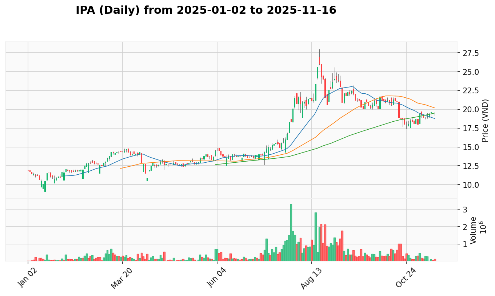

<a href="#penny">↑ Back to group PENNY</a>  |  <a href="#vpa-signal-summary">↑ Back to Top</a>

#### Key Statistics
| Metric | Value |
|:---|---:|
| Date Range | 2025-01-02 to 2025-11-07 |
| **Latest Close** | **19.0** |
| Period Open | 11.9 |
| Period High | 28.0 |
| Period Low | 9.1 |
| Period Change % | 59.66% |

**[Download IPA Data (.csv)](market_data/IPA_2025-01-02_to_2025-11-09.csv)**

---

### ITC

#### [VPA Analysis (2025-08-04 - 2025-10-21)](./VPA.md#itc)
> **Ngày 2025-10-15:** ITC mở cửa ở mức 13.95 VND và đóng cửa ở mức 13.6 VND, giảm 0.35 VND so với giá đóng cửa phiên trước (13.95 VND). Giá giảm mạnh với biên độ rộng và đóng cửa ở mức thấp nhất phiên. Khối lượng giao dịch đạt 0.2454 triệu cổ phiếu, thấp hơn so với phiên trước (0.3576 triệu cổ phiếu). Sau phiên "Cung xuất hiện" ngày 2025-10-14, việc giá tiếp tục giảm mạnh với biên độ rộng, đóng cửa ở mức thấp nhất phiên cho thấy áp lực bán vẫn còn mạnh và lực cầu gần như không có. Mặc dù khối lượng có giảm nhẹ, nhưng không đủ để hấp thụ lực cung, cho thấy sự yếu kém của cổ phiếu vẫn tiếp diễn. **Phân tích VPA/Wyckoff:** Suy yếu tiếp diễn (Continued Weakness)
> **Ngày 2025-10-16:** ITC mở cửa ở mức 13.4 VND, thấp hơn giá đóng cửa phiên trước, nhưng sau đó đóng cửa ở mức 13.65 VND, cao hơn giá mở cửa và cao hơn nhẹ so với giá đóng cửa phiên trước (13.6 VND). Giá tăng 0.05 VND so với giá đóng cửa phiên trước với biên độ dao động rộng. Khối lượng giao dịch đạt 0.3094 triệu cổ phiếu, cao hơn so với phiên trước (0.2454 triệu cổ phiếu). Sau hai phiên giảm giá liên tiếp với áp lực cung mạnh, việc giá tăng nhẹ với khối lượng gia tăng cho thấy lực cầu đã bắt đầu xuất hiện và có dấu hiệu hấp thụ cung. Tuy nhiên, giá vẫn đang ở vùng thấp và cần thêm xác nhận để khẳng định xu hướng. **Phân tích VPA/Wyckoff:** Cầu xuất hiện
> **Ngày 2025-10-17:** ITC mở cửa ở mức 14.05 VND và đóng cửa ở mức 14.3 VND, tăng 0.35 VND so với giá đóng cửa phiên trước (13.95 VND). Giá tăng với biên độ hẹp và đóng cửa gần mức cao nhất phiên. Khối lượng giao dịch đạt 0.2952 triệu cổ phiếu, thấp hơn đáng kể so với phiên trước (0.403 triệu cổ phiếu). Sau phiên "Cầu xuất hiện" ngày 2025-10-16, việc giá tiếp tục tăng nhưng với khối lượng giảm cho thấy lực cầu không còn mạnh mẽ như trước và có thể là dấu hiệu của sự suy yếu trong đà tăng. Mặc dù giá đóng cửa ở mức cao, sự sụt giảm về khối lượng cho thấy sự thiếu hụt của lực mua chủ động. **Phân tích VPA/Wyckoff:** Thiếu cầu
> **Ngày 2025-10-20:** ITC mở cửa ở mức 14.35 VND và đóng cửa ở mức 13.3 VND, giảm mạnh 1.0 VND so với giá đóng cửa phiên trước (14.3 VND). Giá giảm với biên độ rộng và đóng cửa ở mức thấp nhất phiên. Khối lượng giao dịch đạt 0.307 triệu cổ phiếu, cao hơn nhẹ so với phiên trước (0.2952 triệu cổ phiếu). Sau phiên "Thiếu cầu" ngày 2025-10-17, việc giá giảm mạnh với khối lượng gia tăng cho thấy áp lực cung đã quay trở lại thị trường một cách rõ rệt, đẩy giá xuống thấp. Đây là dấu hiệu của sự suy yếu. **Phân tích VPA/Wyckoff:** Sign of Weakness (SOW) - Cung xuất hiện
> **Ngày 2025-10-21:** ITC mở cửa ở mức 13.0 VND và đóng cửa ở mức 13.45 VND, tăng 0.15 VND so với giá đóng cửa phiên trước (13.3 VND). Giá tăng nhẹ với biên độ rộng và đóng cửa gần mức cao nhất phiên. Khối lượng giao dịch đạt 0.3493 triệu cổ phiếu, cao hơn so với phiên trước (0.307 triệu cổ phiếu). Sau phiên "Cung xuất hiện" ngày 2025-10-20, việc giá tăng nhẹ với khối lượng gia tăng và biên độ rộng cho thấy có sự nỗ lực đẩy giá lên nhưng vẫn gặp phải lực cung. Đây có thể là một đợt kiểm tra cung hoặc nỗ lực phục hồi sau đợt giảm mạnh. **Phân tích VPA/Wyckoff:** Nỗ lực tăng giá

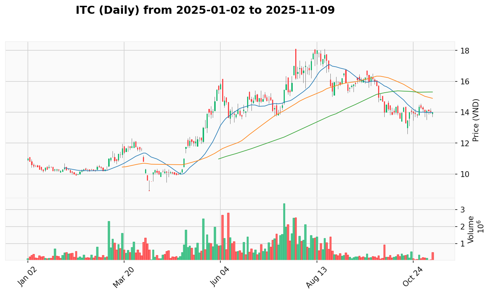

<a href="#bat-dong-san">↑ Back to group BAT_DONG_SAN</a>  |  <a href="#vpa-signal-summary">↑ Back to Top</a>

#### Key Statistics
| Metric | Value |
|:---|---:|
| Date Range | 2025-01-02 to 2025-11-07 |
| **Latest Close** | **14.0** |
| Period Open | 10.9 |
| Period High | 18.1 |
| Period Low | 8.91 |
| Period Change % | 28.44% |

**[Download ITC Data (.csv)](market_data/ITC_2025-01-02_to_2025-11-09.csv)**

---

### JVC

#### [VPA Analysis (2025-08-14 - 2025-10-21)](./VPA.md#jvc)
> **Ngày 2025-10-15:** JVC giảm từ 8.42 VND xuống 8.35 VND với khối lượng giao dịch đạt 0.2931 triệu cổ phiếu. Giá mở cửa 8.42 VND, cao nhất 8.55 VND, thấp nhất 8.25 VND và đóng cửa 8.35 VND. Cây nến giảm với biên độ hẹp và đóng cửa gần mức thấp nhất phiên, cho thấy áp lực bán nhẹ. Khối lượng giao dịch tăng nhẹ so với phiên trước đó nhưng vẫn ở mức thấp, cho thấy lực bán chưa thực sự mạnh nhưng đã xuất hiện trở lại sau phiên kiểm tra cung. **Phân tích VPA/Wyckoff:** Sign of Weakness (SOW) - Áp lực bán đã xuất hiện trở lại sau phiên kiểm tra cung, tuy nhiên khối lượng chưa quá lớn.
> **Ngày 2025-10-16:** JVC giảm từ 8.35 VND xuống 8.23 VND với khối lượng giao dịch đạt 0.1411 triệu cổ phiếu. Giá mở cửa 8.4 VND, cao nhất 8.49 VND, thấp nhất 8.2 VND và đóng cửa 8.23 VND. Cây nến giảm với biên độ hẹp và đóng cửa gần mức thấp nhất phiên, cho thấy áp lực bán tiếp diễn. Tuy nhiên, khối lượng giao dịch giảm mạnh so với phiên trước và ở mức rất thấp, cho thấy lực bán đã suy yếu đáng kể và thiếu sự tham gia của cả người mua lẫn người bán. **Phân tích VPA/Wyckoff:** No Demand (Không có cầu) - Giá giảm với khối lượng rất thấp, xác nhận thiếu lực cầu và cho thấy áp lực bán đang cạn kiệt.
> **Ngày 2025-10-17:** JVC giảm từ 8.35 VND xuống 8.22 VND với khối lượng giao dịch đạt 0.2521 triệu cổ phiếu. Giá mở cửa 8.35 VND, cao nhất 8.35 VND, thấp nhất 8.13 VND và đóng cửa 8.22 VND. Cây nến giảm với biên độ hẹp và đóng cửa gần mức thấp nhất phiên, cho thấy áp lực bán tiếp diễn. Khối lượng giao dịch giảm nhẹ so với phiên trước đó và vẫn ở mức thấp, xác nhận thiếu lực cầu và sự yếu kém của thị trường. **Phân tích VPA/Wyckoff:** No Demand (Không có cầu) - Giá tiếp tục giảm với khối lượng thấp, cho thấy lực cầu vẫn vắng mặt.
> **Ngày 2025-10-20:** JVC giảm từ 8.22 VND xuống 8.08 VND với khối lượng giao dịch đạt 0.3187 triệu cổ phiếu. Giá mở cửa 8.06 VND, cao nhất 8.19 VND, thấp nhất 7.69 VND và đóng cửa 8.08 VND. Cây nến giảm với biên độ rộng hơn so với phiên trước và đóng cửa ở giữa thân nến, cho thấy áp lực bán vẫn chiếm ưu thế nhưng đã có lực cầu xuất hiện hấp thụ một phần. Khối lượng giao dịch tăng nhẹ so với phiên trước, xác nhận sự tiếp diễn của áp lực bán. **Phân tích VPA/Wyckoff:** Effort to Fall (Nỗ lực giảm giá) - Giá giảm với khối lượng tăng nhẹ và biên độ rộng, cho thấy nỗ lực đẩy giá xuống của phe bán.
> **Ngày 2025-10-21:** JVC giảm từ 8.08 VND xuống 7.93 VND với khối lượng giao dịch đạt 0.2904 triệu cổ phiếu. Giá mở cửa 7.81 VND, cao nhất 8.1 VND, thấp nhất 7.73 VND và đóng cửa 7.93 VND. Cây nến tăng nhẹ với biên độ hẹp và đóng cửa gần giữa thân nến, cho thấy có lực cầu yếu xuất hiện trong phiên nhưng không đủ để đảo ngược xu hướng giảm chung. Khối lượng giao dịch giảm so với phiên trước và duy trì ở mức thấp, xác nhận sự thiếu vắng của lực cầu mạnh mẽ. **Phân tích VPA/Wyckoff:** No Demand (Không có cầu) - Giá tiếp tục giảm (so với giá đóng cửa phiên trước) với khối lượng thấp, cho thấy lực cầu vẫn yếu và không có sự tham gia đáng kể.

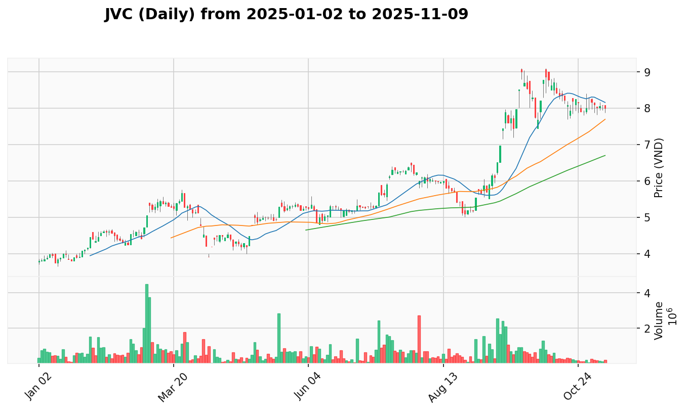

<a href="#suc-khoe">↑ Back to group SUC_KHOE</a>  |  <a href="#vpa-signal-summary">↑ Back to Top</a>

#### Key Statistics
| Metric | Value |
|:---|---:|
| Date Range | 2025-01-02 to 2025-11-07 |
| **Latest Close** | **8.0** |
| Period Open | 3.77 |
| Period High | 9.1 |
| Period Low | 3.65 |
| Period Change % | 112.20% |

**[Download JVC Data (.csv)](market_data/JVC_2025-01-02_to_2025-11-09.csv)**

---

### KBC

#### [VPA Analysis (2025-06-13 - 2025-10-21)](./VPA.md#kbc)
> **Ngày 2025-10-15:** KBC giảm từ 35.5 VND xuống 34.95 VND, giảm 0.55 VND (1.55%). Giá mở cửa 35.6 VND, cao nhất 35.85 VND, thấp nhất 34.35 VND và đóng cửa 34.95 VND. Cây nến giảm có thân rộng, đóng cửa gần mức thấp nhất phiên, cho thấy áp lực bán tiếp tục chiếm ưu thế. Khối lượng giao dịch đạt 10.2316 triệu cổ phiếu, tăng so với phiên trước (9.5115 triệu cổ phiếu). Sau phiên Upthrust vào ngày 2025-10-14, việc giá tiếp tục giảm với khối lượng gia tăng xác nhận lực cung vẫn đang mạnh mẽ và áp đảo lực cầu, cho thấy xu hướng giảm giá có thể tiếp diễn. **Phân tích VPA/Wyckoff:** Weakness (W) - Lực cung tiếp diễn.
> **Ngày 2025-10-16:** KBC tăng từ 34.95 VND lên 35.95 VND, tăng 1.0 VND (2.86%). Giá mở cửa 35.5 VND, cao nhất 36.6 VND, thấp nhất 35.5 VND và đóng cửa 35.95 VND. Cây nến tăng có thân vừa, đóng cửa không ở mức cao nhất phiên. Khối lượng giao dịch đạt 4.7873 triệu cổ phiếu, giảm đáng kể so với phiên trước (10.2316 triệu cổ phiếu). Sau hai phiên giảm giá mạnh với khối lượng cao (Upthrust và Weakness), phiên tăng giá hôm nay diễn ra với khối lượng thấp, cho thấy lực cầu yếu và có thể là một đợt kiểm tra nguồn cung. Lực cung có thể vẫn còn tiềm ẩn và chưa được hấp thụ hoàn toàn. **Phân tích VPA/Wyckoff:** No Demand (ND) - Lực cầu yếu.
> **Ngày 2025-10-17:** KBC giảm từ 37.0 VND xuống 36.0 VND, giảm 1.0 VND (2.7%). Giá mở cửa 37.3 VND, cao nhất 37.35 VND, thấp nhất 36.0 VND và đóng cửa 36.0 VND. Cây nến giảm có thân rộng, đóng cửa ở mức thấp nhất phiên, cho thấy áp lực bán mạnh mẽ. Khối lượng giao dịch đạt 10.9366 triệu cổ phiếu, tăng so với phiên trước (10.2662 triệu cổ phiếu). Sau phiên "No Demand" ngày 2025-10-16, việc giá giảm mạnh với khối lượng gia tăng xác nhận lực cung vẫn đang chiếm ưu thế và có thể tiếp tục đẩy giá xuống thấp hơn. **Phân tích VPA/Wyckoff:** Weakness (W) - Lực cung tiếp diễn.
> **Ngày 2025-10-20:** KBC giảm từ 36.0 VND xuống 33.5 VND, giảm 2.5 VND (6.94%). Giá mở cửa 35.8 VND, cao nhất 36.35 VND, thấp nhất 33.5 VND và đóng cửa 33.5 VND. Cây nến giảm có thân rộng, đóng cửa ở mức thấp nhất phiên, cho thấy áp lực bán rất mạnh. Khối lượng giao dịch đạt 15.2628 triệu cổ phiếu, tăng đáng kể so với phiên trước (10.9366 triệu cổ phiếu). Sau phiên "Weakness" ngày 2025-10-17, việc giá tiếp tục giảm mạnh với khối lượng gia tăng xác nhận lực cung đang áp đảo hoàn toàn lực cầu và xu hướng giảm giá có thể tiếp diễn. **Phân tích VPA/Wyckoff:** Weakness (W) - Lực cung áp đảo.
> **Ngày 2025-10-21:** KBC giảm từ 33.5 VND xuống 33.25 VND, giảm 0.25 VND (0.75%). Giá mở cửa 33.2 VND, cao nhất 34.1 VND, thấp nhất 32.1 VND và đóng cửa 33.25 VND. Cây nến giảm có thân hẹp, đóng cửa gần giữa, cho thấy áp lực bán đã giảm bớt so với các phiên trước. Khối lượng giao dịch đạt 11.8237 triệu cổ phiếu, giảm đáng kể so với phiên trước (15.2628 triệu cổ phiếu). Sau hai phiên giảm mạnh với khối lượng lớn, việc giá tiếp tục giảm nhẹ với khối lượng thấp hơn cho thấy lực bán có thể đang suy yếu hoặc tạm dừng, nhưng chưa có dấu hiệu rõ ràng của lực cầu quay trở lại. **Phân tích VPA/Wyckoff:** No Demand (ND) - Lực bán suy yếu nhưng lực cầu chưa xuất hiện.

<a href="#bat-dong-san-kcn">↑ Back to group BAT_DONG_SAN_KCN</a>  |  <a href="#vpa-signal-summary">↑ Back to Top</a>

#### Key Statistics
| Metric | Value |
|:---|---:|
| Date Range | 2025-01-02 to 2025-11-07 |
| **Latest Close** | **33.85** |
| Period Open | 27.25 |
| Period High | 43.1 |
| Period Low | 20.05 |
| Period Change % | 24.22% |

**[Download KBC Data (.csv)](market_data/KBC_2025-01-02_to_2025-11-09.csv)**

---

### KDC

#### [VPA Analysis (2025-06-13 - 2025-10-21)](./VPA.md#kdc)
> **Ngày 2025-10-15:** KDC tăng từ 51.7 VND lên 52.0 VND. Cây nến có biên độ hẹp (từ 51.1 VND đến 52.0 VND) và đóng cửa ở mức cao nhất phiên (52.0 VND), cho thấy lực cầu đã xuất hiện và kiểm soát phiên giao dịch. Khối lượng giao dịch đạt 0.2142 triệu cổ phiếu, tiếp tục ở mức cực kỳ thấp và thấp hơn phiên trước (0.2513 triệu cổ phiếu). Sau hai phiên "No Supply" liên tiếp, việc giá tăng nhẹ với khối lượng cực thấp và đóng cửa ở mức cao nhất phiên xác nhận rằng nguồn cung đã cạn kiệt hoàn toàn. Điều này cho thấy thị trường sẵn sàng cho một đợt tăng giá với nỗ lực tối thiểu. **Phân tích VPA/Wyckoff:** Sign of Strength (SOS) - Dấu hiệu sức mạnh trên khối lượng thấp
> **Ngày 2025-10-16:** KDC giảm từ 52.0 VND xuống 51.8 VND. Cây nến giảm có biên độ hẹp (từ 51.5 VND đến 52.1 VND) và đóng cửa ở giữa thân nến. Khối lượng giao dịch đạt 0.0667 triệu cổ phiếu, cực kỳ thấp và thấp hơn đáng kể so với các phiên trước. Sau các phiên No Supply và Sign of Strength, việc giá giảm nhẹ với khối lượng cực kỳ thấp cho thấy không có áp lực bán đáng kể và nguồn cung vẫn cạn kiệt. Điều này củng cố nhận định về sự thiếu hụt nguồn cung, tạo tiền đề cho khả năng đảo chiều tăng giá. **Phân tích VPA/Wyckoff:** No Demand (ND) - Không có cầu
> **Ngày 2025-10-17:** KDC giảm nhẹ từ 52.1 VND xuống 52.0 VND. Cây nến có biên độ hẹp (từ 51.5 VND đến 52.2 VND) và đóng cửa ở phần trên của thân nến. Khối lượng giao dịch đạt 0.1773 triệu cổ phiếu, duy trì ở mức rất thấp và tương đương phiên trước. Sau các tín hiệu "Sign of Strength" và "No Demand", việc giá giảm nhẹ với khối lượng thấp cho thấy thị trường vẫn đang trong giai đoạn tích lũy, không có áp lực bán đáng kể và lực cầu cũng chưa thực sự mạnh mẽ. **Phân tích VPA/Wyckoff:** No Demand (ND) - Không có cầu
> **Ngày 2025-10-20:** KDC giảm từ 52.0 VND xuống 51.8 VND. Cây nến giảm có biên độ hẹp (từ 51.0 VND đến 52.2 VND) và đóng cửa ở giữa thân nến. Khối lượng giao dịch đạt 0.1868 triệu cổ phiếu, duy trì ở mức thấp, tương tự các phiên trước. Sau các tín hiệu No Demand liên tiếp, việc giá tiếp tục giảm nhẹ với khối lượng thấp cho thấy thị trường vẫn đang trong giai đoạn tích lũy, không có áp lực bán mạnh và lực cầu cũng chưa xuất hiện rõ rệt. Điều này củng cố nhận định về sự cạn kiệt nguồn cung, nhưng cũng cho thấy cầu chưa sẵn sàng đẩy giá lên. **Phân tích VPA/Wyckoff:** No Demand (ND) - Không có cầu
> **Ngày 2025-10-21:** KDC tăng nhẹ từ 51.8 VND lên 52.0 VND. Cây nến có biên độ từ 51.0 VND đến 52.0 VND và đóng cửa ở mức cao nhất phiên. Khối lượng giao dịch đạt 0.1694 triệu cổ phiếu, tiếp tục duy trì ở mức rất thấp và thấp hơn phiên trước. Sau các tín hiệu "No Demand" liên tiếp, việc giá tăng nhẹ với khối lượng cực thấp cho thấy nguồn cung đã cạn kiệt, nhưng lực cầu vẫn chưa thực sự mạnh mẽ để đẩy giá lên cao hơn. Thị trường vẫn đang trong giai đoạn tích lũy. **Phân tích VPA/Wyckoff:** No Supply (NS) - Không có cung.

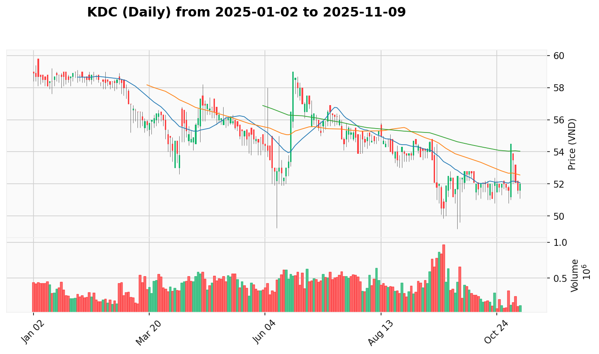

<a href="#thuc-pham">↑ Back to group THUC_PHAM</a>  |  <a href="#vpa-signal-summary">↑ Back to Top</a>

#### Key Statistics
| Metric | Value |
|:---|---:|
| Date Range | 2025-01-02 to 2025-11-07 |
| **Latest Close** | **52.0** |
| Period Open | 59.0 |
| Period High | 59.8 |
| Period Low | 49.2 |
| Period Change % | -11.86% |

**[Download KDC Data (.csv)](market_data/KDC_2025-01-02_to_2025-11-09.csv)**

---

### KDH

#### [VPA Analysis (2025-06-13 - 2025-10-21)](./VPA.md#kdh)
> **Ngày 2025-10-15:** KDH tăng từ 31.9 VND lên 34.1 VND. Cây nến có biên độ rộng từ 31.2 VND đến 34.1 VND và đóng cửa ở mức cao nhất phiên (34.1 VND). Khối lượng giao dịch đạt 21.16 triệu cổ phiếu, tăng mạnh so với phiên trước (10.32 triệu cổ phiếu). Sự tăng giá mạnh mẽ với khối lượng giao dịch đột biến cho thấy lực cầu đã áp đảo hoàn toàn lực cung, xác nhận sự đảo chiều tích cực sau các phiên giảm giá trước đó. Điều này cho thấy sự xuất hiện của dòng tiền lớn và khả năng tiếp tục xu hướng tăng. **Phân tích VPA/Wyckoff:** Sign of Strength (SOS) - Lực cầu mạnh mẽ.
> **Ngày 2025-10-16:** KDH mở cửa ở 34.95 VND, cao hơn giá đóng cửa phiên trước, nhưng sau đó giảm và đóng cửa ở 34.25 VND, chỉ tăng nhẹ so với phiên trước (34.1 VND). Cây nến có biên độ từ 34.15 VND đến 35.0 VND và đóng cửa gần mức thấp nhất phiên. Khối lượng giao dịch đạt 5.4831 triệu cổ phiếu, giảm mạnh so với phiên trước (21.16 triệu cổ phiếu). Sau phiên tăng giá mạnh mẽ (SOS) ngày 2025-10-15, việc giá không thể duy trì đà tăng và đóng cửa yếu với khối lượng thấp cho thấy lực cầu không còn mạnh mẽ và có dấu hiệu cạn kiệt. Điều này có thể là một dấu hiệu của sự thiếu hụt nhu cầu tiếp diễn hoặc sự xuất hiện của nguồn cung. **Phân tích VPA/Wyckoff:** No Demand (Thiếu cầu)
> **Ngày 2025-10-17:** KDH mở cửa ở 34.4 VND và đóng cửa ở 33.9 VND, giảm so với giá đóng cửa phiên trước (34.2 VND). Cây nến có biên độ rộng từ 33.85 VND đến 35.2 VND và đóng cửa gần mức thấp nhất phiên. Khối lượng giao dịch đạt 12.42 triệu cổ phiếu, cao hơn phiên trước (10.30 triệu cổ phiếu) nhưng thấp hơn phiên SOS ngày 2025-10-15. Sau phiên "Thiếu cầu" ngày 2025-10-16, việc giá giảm mạnh với khối lượng tăng cho thấy lực cung đã xuất hiện và áp đảo lực cầu, đẩy giá xuống. Điều này cho thấy sự suy yếu của xu hướng tăng và khả năng tiếp tục giảm giá. **Phân tích VPA/Wyckoff:** Sign of Weakness (SOW) - Lực cung mạnh mẽ.
> **Ngày 2025-10-20: KDH giảm từ 33.85 VND xuống 31.55 VND với khối lượng giao dịch đạt 13.3977 triệu cổ phiếu. Cây nến có biên độ rộng từ 31.55 VND đến 34.15 VND và đóng cửa ở mức thấp nhất phiên. Khối lượng giao dịch cao hơn phiên trước (12.4207 triệu cổ phiếu). Sau tín hiệu SOW ngày 2025-10-17, việc giá tiếp tục giảm mạnh với khối lượng gia tăng cho thấy lực cung vẫn đang rất mạnh và áp đảo hoàn toàn lực cầu. **Phân tích VPA/Wyckoff:** Sign of Weakness (SOW) - Lực cung mạnh mẽ tiếp diễn.
> **Ngày 2025-10-21:** KDH mở cửa ở 31.0 VND, đóng cửa ở 31.75 VND, tăng nhẹ so với giá đóng cửa phiên trước (31.55 VND). Cây nến có biên độ từ 30.0 VND đến 32.2 VND và đóng cửa gần giữa thân nến. Khối lượng giao dịch đạt 9.78 triệu cổ phiếu, giảm đáng kể so với phiên trước (13.40 triệu cổ phiếu). Sau các phiên SOW liên tiếp, việc giá tăng nhẹ với khối lượng thấp cho thấy lực cầu yếu và không đủ mạnh để đảo chiều xu hướng giảm. Điều này có thể là một dấu hiệu của sự thiếu hụt nhu cầu. **Phân tích VPA/Wyckoff:** No Demand (Thiếu cầu)

<a href="#bat-dong-san">↑ Back to group BAT_DONG_SAN</a>  |  <a href="#vpa-signal-summary">↑ Back to Top</a>

#### Key Statistics
| Metric | Value |
|:---|---:|
| Date Range | 2025-01-02 to 2025-11-07 |
| **Latest Close** | **32.5** |
| Period Open | 32.36 |
| Period High | 38.1 |
| Period Low | 22.05 |
| Period Change % | 0.43% |

**[Download KDH Data (.csv)](market_data/KDH_2025-01-02_to_2025-11-09.csv)**

---

### KHG

#### [VPA Analysis (2025-08-04 - 2025-10-21)](./VPA.md#khg)
> **Ngày 2025-10-15:** KHG giảm nhẹ từ 7.2 VND xuống 7.15 VND, với khối lượng giao dịch giảm mạnh xuống 11.2049 triệu cổ phiếu. Nến có biên độ tương đối rộng, giá đóng cửa gần giữa nến, cho thấy sự thiếu hụt lực cầu sau phiên EWR trước đó. Khối lượng giảm cho thấy áp lực bán không quá mạnh nhưng lực mua cũng không còn duy trì. **Phân tích VPA/Wyckoff:** No Demand (ND)
> **Ngày 2025-10-16:** KHG giảm từ 7.15 VND xuống 7.12 VND, với khối lượng giao dịch giảm xuống 9.6135 triệu cổ phiếu. Nến có biên độ hẹp, giá đóng cửa gần mức thấp nhất trong ngày, cho thấy lực cầu tiếp tục suy yếu và áp lực bán vẫn hiện hữu dù không quá mạnh. Khối lượng giao dịch thấp cho thấy sự thiếu vắng người mua, xác nhận tình trạng không có cầu sau phiên ND trước đó. **Phân tích VPA/Wyckoff:** No Demand (ND)
> **Ngày 2025-10-17:** KHG giảm từ 7.05 VND xuống 7.0 VND, với khối lượng giao dịch giảm xuống 15.26 triệu cổ phiếu. Nến có biên độ hẹp, giá đóng cửa gần mức thấp nhất trong ngày, cho thấy lực cầu tiếp tục suy yếu và áp lực bán vẫn hiện hữu dù không quá mạnh. Khối lượng giao dịch thấp hơn so với phiên trước xác nhận tình trạng thiếu vắng người mua, tiếp nối các phiên No Demand trước đó. **Phân tích VPA/Wyckoff:** No Demand (ND)
> **Ngày 2025-10-20:** KHG giảm mạnh từ 7.0 VND xuống 6.51 VND, tạo thành một nến giảm có biên độ rộng và đóng cửa ở mức thấp nhất trong ngày. Điều này cho thấy áp lực bán rất mạnh và không có lực cầu đỡ giá đáng kể. Khối lượng giao dịch đạt 12.1786 triệu cổ phiếu, thấp hơn so với phiên trước (15.26 triệu cổ phiếu), nhưng vẫn ở mức trung bình khá. Sự sụt giảm giá mạnh mẽ trên khối lượng giảm nhẹ sau các phiên No Demand cho thấy xu hướng giảm tiếp diễn và lực cầu vẫn yếu. **Phân tích VPA/Wyckoff:** Weakness (W)
> **Ngày 2025-10-21:** KHG tăng từ 6.51 VND lên 6.9 VND, tạo thành một nến tăng có biên độ rộng và đóng cửa gần mức cao nhất trong ngày. Khối lượng giao dịch đạt 19.03 triệu cổ phiếu, cao hơn đáng kể so với phiên trước (12.18 triệu cổ phiếu) và cũng cao hơn mức trung bình. Điều này cho thấy lực cầu mạnh mẽ đã xuất hiện, hấp thụ áp lực bán từ phiên giảm trước đó và đẩy giá lên, cho thấy sự thay đổi trong động lực thị trường sau các phiên suy yếu. **Phân tích VPA/Wyckoff:** Sign of Strength (SOS)

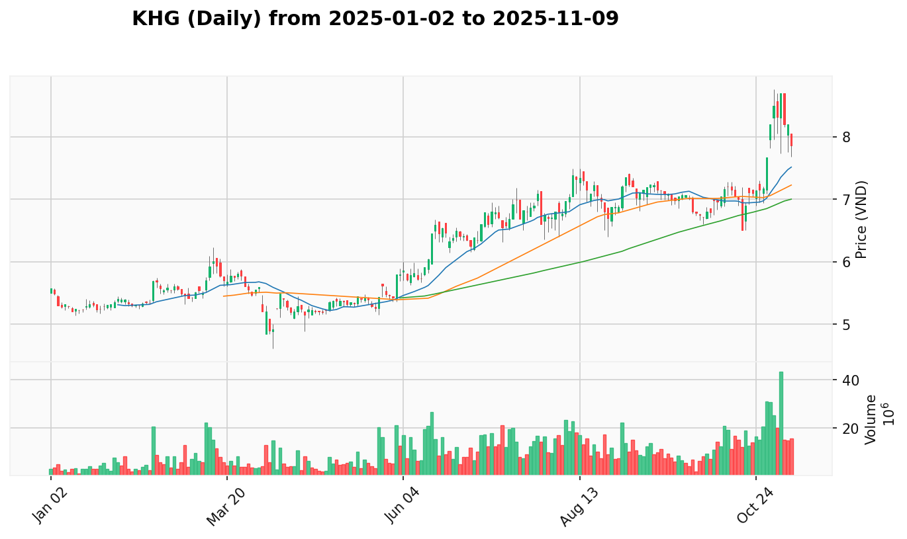

<a href="#bat-dong-san">↑ Back to group BAT_DONG_SAN</a>  |  <a href="#vpa-signal-summary">↑ Back to Top</a>

#### Key Statistics
| Metric | Value |
|:---|---:|
| Date Range | 2025-01-02 to 2025-11-07 |
| **Latest Close** | **7.86** |
| Period Open | 5.5 |
| Period High | 8.76 |
| Period Low | 4.61 |
| Period Change % | 42.91% |

**[Download KHG Data (.csv)](market_data/KHG_2025-01-02_to_2025-11-09.csv)**

---

### KSB

#### [VPA Analysis (2025-08-04 - 2025-10-21)](./VPA.md#ksb)
> **Ngày 2025-10-15:** KSB giảm từ 19.3 VND xuống 19.1 VND với khối lượng 1.4086 triệu cổ phiếu, thấp hơn đáng kể so với phiên trước. Giá đóng cửa gần mức thấp nhất phiên, cho thấy lực bán vẫn chiếm ưu thế nhưng với cường độ giảm, đồng thời thiếu vắng lực cầu hỗ trợ. **Phân tích VPA/Wyckoff:** No Demand (Thiếu cầu).
> **Ngày 2025-10-16:** KSB mở cửa tại 19.05 VND và đóng cửa tại 19.2 VND, cho thấy một phiên tăng nhẹ. Khối lượng giao dịch đạt 0.6684 triệu cổ phiếu, rất thấp so với phiên trước (1.4086 triệu cổ phiếu) và thấp nhất trong 10 phiên gần đây. Mặc dù giá có sự phục hồi nhẹ, nhưng khối lượng giao dịch cực kỳ thấp cho thấy thiếu vắng lực cầu mạnh mẽ để đẩy giá lên cao hơn, tiếp tục xác nhận sự yếu kém của thị trường sau các tín hiệu suy yếu và thiếu cầu từ các phiên trước. **Phân tích VPA/Wyckoff:** No Demand (Thiếu cầu).
> **Ngày 2025-10-17:** KSB giảm từ 19.6 VND xuống 19.4 VND với khối lượng giao dịch đạt 1.8087 triệu cổ phiếu, cao hơn so với phiên trước. Giá đóng cửa ở mức thấp nhất phiên, cho thấy áp lực bán mạnh mẽ và lực cầu yếu. Điều này tiếp tục xác nhận sự yếu kém của thị trường sau các tín hiệu thiếu cầu từ các phiên trước. **Phân tích VPA/Wyckoff:** Supply Coming In (Lực cung xuất hiện).
> **Ngày 2025-10-20:** KSB mở cửa tại 19.2 VND và đóng cửa tại 18.05 VND, giảm mạnh với biên độ rộng. Giá đóng cửa ở mức thấp nhất phiên, cho thấy áp lực bán rất lớn. Khối lượng giao dịch đạt 2.7017 triệu cổ phiếu, cao hơn đáng kể so với phiên trước (1.8087 triệu cổ phiếu) và là mức cao nhất trong 10 phiên gần đây. Sự sụt giảm mạnh về giá đi kèm với khối lượng giao dịch lớn xác nhận lực cung đang áp đảo hoàn toàn lực cầu, tiếp tục cho thấy sự yếu kém của thị trường sau tín hiệu lực cung xuất hiện từ phiên trước. **Phân tích VPA/Wyckoff:** Selling Pressure (Áp lực bán mạnh).
> **Ngày 2025-10-21:** KSB mở cửa tại 18.0 VND, giảm xuống mức thấp nhất 17.1 VND nhưng đóng cửa tại 18.1 VND, cao hơn nhẹ so với giá đóng cửa phiên trước. Khối lượng giao dịch đạt 3.4167 triệu cổ phiếu, cao hơn đáng kể so với phiên trước (2.7017 triệu cổ phiếu) và là mức cao nhất trong 10 phiên gần đây. Sau áp lực bán mạnh mẽ của phiên trước, việc giá đóng cửa ở mức cao hơn với khối lượng gia tăng cho thấy lực cầu đang cố gắng hấp thụ lực cung, tuy nhiên giá vẫn đang ở vùng thấp. **Phân tích VPA/Wyckoff:** Stopping Volume (Lực cầu hấp thụ).

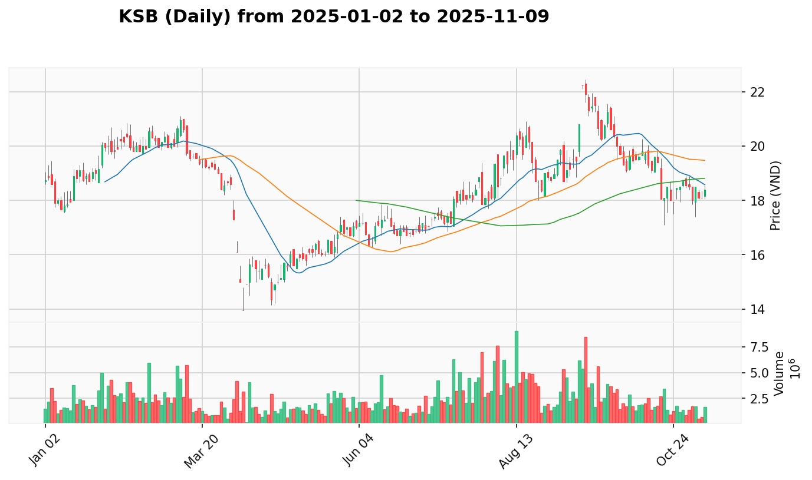

<a href="#dau-tu-cong">↑ Back to group DAU_TU_CONG</a>  |  <a href="#vpa-signal-summary">↑ Back to Top</a>

#### Key Statistics
| Metric | Value |
|:---|---:|
| Date Range | 2025-01-02 to 2025-11-07 |
| **Latest Close** | **18.4** |
| Period Open | 18.7 |
| Period High | 22.45 |
| Period Low | 13.95 |
| Period Change % | -1.60% |

**[Download KSB Data (.csv)](market_data/KSB_2025-01-02_to_2025-11-09.csv)**

---

### KSV

#### [VPA Analysis (2025-08-14 - 2025-10-21)](./VPA.md#ksv)
> **Ngày 2025-10-15:** KSV mở cửa ở mức 158.0 VND và đóng cửa ở mức 154.9 VND, tạo thành một phiên giảm giá mạnh với biên độ rộng. Giá đóng cửa nằm gần mức thấp nhất phiên, cho thấy áp lực bán chiếm ưu thế hoàn toàn. So với phiên trước, giá giảm từ 164.0 VND xuống 154.9 VND. Khối lượng giao dịch đạt 0.0902 triệu cổ phiếu, thấp hơn một chút so với phiên trước (0.0946 triệu cổ phiếu) và thấp hơn đáng kể so với phiên tăng mạnh (SOS) vào ngày 2025-10-13 (0.1118 triệu cổ phiếu). Sự giảm giá mạnh với biên độ rộng và đóng cửa thấp, đi kèm với khối lượng tương đối, cho thấy lực cung đang chiếm ưu thế và đẩy giá xuống. Đây là dấu hiệu tiếp tục của sự suy yếu sau phiên No Demand trước đó. **Phân tích VPA/Wyckoff:** Sign of Weakness (SOW) - Lực cung chiếm ưu thế.
> **Ngày 2025-10-16:** KSV mở cửa ở mức 154.9 VND và đóng cửa ở mức 159.8 VND, tạo thành một cây nến tăng với biên độ hẹp. Giá đóng cửa cao hơn giá đóng cửa phiên trước (154.9 VND). Khối lượng giao dịch đạt 0.0263 triệu cổ phiếu, giảm mạnh so với phiên trước (0.0902 triệu cổ phiếu) và rất thấp so với các phiên giao dịch gần đây. Sự tăng giá nhẹ đi kèm với khối lượng rất thấp sau hai phiên giảm giá (No Demand và Sign of Weakness) cho thấy lực cầu yếu ớt và không có sự tham gia mạnh mẽ của dòng tiền lớn. Điều này có thể là một dấu hiệu của sự thiếu vắng nhu cầu thực sự, và đà tăng có thể không bền vững. **Phân tích VPA/Wyckoff:** No Demand (ND) - Lực cầu yếu ớt, không có sự xác nhận từ khối lượng.
> **Ngày 2025-10-17:** KSV mở cửa ở mức 160.0 VND và đóng cửa ở mức 172.7 VND, tạo thành một phiên tăng giá mạnh với biên độ rộng. Giá đóng cửa nằm ở mức cao nhất phiên, cho thấy lực cầu áp đảo. So với phiên trước, giá tăng từ 157.0 VND lên 172.7 VND. Khối lượng giao dịch đạt 0.1942 triệu cổ phiếu, tăng đáng kể so với phiên trước (0.0513 triệu cổ phiếu) và cao hơn nhiều so với các phiên gần đây. Sự tăng giá mạnh mẽ với biên độ rộng và đóng cửa ở mức cao nhất, đi kèm với khối lượng giao dịch gia tăng đột biến, cho thấy lực cầu mạnh mẽ đang chiếm ưu thế và đẩy giá lên. Đây là một dấu hiệu tích cực, xác nhận sự đảo chiều xu hướng sau các phiên suy yếu trước đó. **Phân tích VPA/Wyckoff:** Sign of Strength (SOS) - Lực cầu mạnh mẽ với khối lượng gia tăng xác nhận xu hướng tăng.
> **Ngày 2025-10-20:** KSV tăng từ 172.7 VND lên 178.2 VND với khối lượng giao dịch đạt 0.2271 triệu cổ phiếu. Cây nến tăng có biên độ rộng và đóng cửa ở mức cao. Khối lượng giao dịch gia tăng so với phiên trước (0.1942 triệu cổ phiếu), cho thấy lực cầu mạnh mẽ tiếp tục chiếm ưu thế và xác nhận đà tăng đã được thiết lập. **Phân tích VPA/Wyckoff:** Sign of Strength (SOS) - Tiếp diễn lực cầu mạnh mẽ.
> **Ngày 2025-10-21:** KSV tiếp tục tăng giá từ 178.2 VND lên 182.8 VND, nhưng với biên độ hẹp và khối lượng giao dịch chỉ đạt 0.065 triệu cổ phiếu, giảm mạnh so với phiên trước. Điều này cho thấy lực cầu đang suy yếu sau hai phiên tăng giá mạnh mẽ. Mặc dù giá vẫn tăng, sự thiếu hụt khối lượng xác nhận cho thấy đà tăng có thể không bền vững và có thể là một dấu hiệu của sự kiểm tra nguồn cung hoặc thiếu hụt lực cầu. **Phân tích VPA/Wyckoff:** Lack of Demand (Thiếu hụt lực cầu)

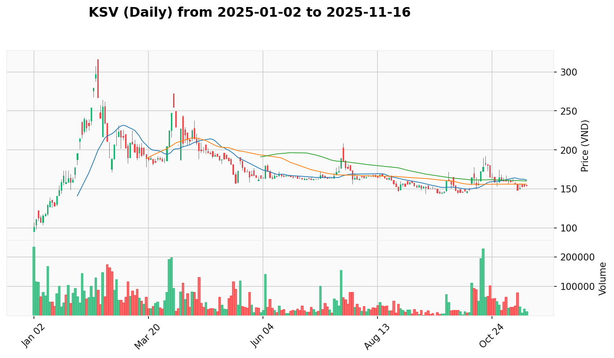

<a href="#thep">↑ Back to group THEP</a>  |  <a href="#vpa-signal-summary">↑ Back to Top</a>

#### Key Statistics
| Metric | Value |
|:---|---:|
| Date Range | 2025-01-02 to 2025-11-07 |
| **Latest Close** | **156.3** |
| Period Open | 95.43 |
| Period High | 316.13 |
| Period Low | 95.43 |
| Period Change % | 63.78% |

**[Download KSV Data (.csv)](market_data/KSV_2025-01-02_to_2025-11-09.csv)**

---

### L18

#### [VPA Analysis (2025-08-13 - 2025-10-21)](./VPA.md#l18)
> **Ngày 2025-10-15:** L18 mở cửa tại 27.1 VND, sau đó giảm và đóng cửa tại 27.0 VND, với biên độ dao động từ 26.8 VND đến 27.2 VND. Giá đóng cửa thấp hơn so với phiên trước (27.2 VND) và nằm gần mức thấp nhất trong phiên. Khối lượng giao dịch đạt 0.0308 triệu cổ phiếu, giảm so với phiên trước (0.0348 triệu cổ phiếu). Mặc dù giá tiếp tục giảm, việc khối lượng giao dịch giảm cho thấy áp lực bán có thể đang chững lại hoặc lực cầu vẫn còn yếu, nhưng xu hướng giảm giá vẫn tiếp diễn. **Phân tích VPA/Wyckoff:** Sign of Weakness (SOW) - Giá giảm với khối lượng giảm, cho thấy áp lực bán có thể đang suy yếu nhưng xu hướng giảm vẫn duy trì.
> **Ngày 2025-10-16:** L18 mở cửa tại 27.0 VND và tiếp tục giảm, đóng cửa tại 26.6 VND, là mức thấp nhất trong phiên. Biên độ dao động trong phiên từ 26.6 VND đến 27.1 VND. Giá đóng cửa thấp hơn đáng kể so với phiên trước (27.0 VND). Khối lượng giao dịch đạt 0.0225 triệu cổ phiếu, giảm so với phiên trước (0.0308 triệu cổ phiếu). Việc giá tiếp tục giảm và đóng cửa ở mức thấp nhất phiên, trong khi khối lượng giao dịch giảm, cho thấy áp lực bán vẫn còn nhưng có thể đang suy yếu, hoặc lực cầu vẫn rất yếu, khiến giá dễ dàng bị đẩy xuống. Xu hướng giảm giá vẫn đang tiếp diễn. **Phân tích VPA/Wyckoff:** Sign of Weakness (SOW) - Giá giảm với khối lượng giảm, xác nhận xu hướng yếu kém của thị trường.
> **Ngày 2025-10-17:** L18 mở cửa tại 26.6 VND và giảm mạnh, đóng cửa tại 26.0 VND, là mức thấp nhất trong phiên. Biên độ dao động trong phiên từ 26.0 VND đến 26.7 VND. Giá đóng cửa thấp hơn đáng kể so với phiên trước (26.6 VND). Khối lượng giao dịch đạt 0.0659 triệu cổ phiếu, tăng mạnh so với phiên trước (0.0373 triệu cổ phiếu). Việc giá giảm sâu và đóng cửa ở mức thấp nhất phiên với khối lượng giao dịch tăng đột biến cho thấy áp lực bán rất mạnh và có thể là sự hoảng loạn của thị trường, xác nhận xu hướng giảm giá đang tiếp diễn và có phần tăng tốc. **Phân tích VPA/Wyckoff:** Sign of Weakness (SOW) - Giá giảm mạnh với khối lượng tăng đột biến, cho thấy lực cung áp đảo và sự phân phối mạnh mẽ.
> **Ngày 2025-10-20:** L18 mở cửa tại 26.2 VND, sau đó giảm mạnh và đóng cửa tại 25.8 VND, gần mức thấp nhất phiên là 25.7 VND. Biên độ dao động trong phiên rộng, từ 25.7 VND đến 27.8 VND. Giá đóng cửa thấp hơn đáng kể so với phiên trước (26.0 VND). Khối lượng giao dịch đạt 0.0475 triệu cổ phiếu, giảm so với phiên trước (0.0659 triệu cổ phiếu). Việc giá tiếp tục giảm sâu với biên độ rộng và đóng cửa gần mức thấp nhất phiên, mặc dù khối lượng giao dịch giảm, cho thấy áp lực bán vẫn còn mạnh và thiếu lực cầu hỗ trợ, xác nhận xu hướng giảm giá tiếp diễn. **Phân tích VPA/Wyckoff:** Sign of Weakness (SOW) - Giá giảm mạnh với biên độ rộng và đóng cửa gần mức thấp nhất phiên, cho thấy lực cung vẫn chiếm ưu thế và thiếu cầu.
> **Ngày 2025-10-21:** L18 mở cửa tại 26.0 VND và tăng trở lại, đóng cửa tại 26.5 VND, là mức cao hơn đáng kể so với phiên trước (25.8 VND). Biên độ dao động trong phiên từ 25.6 VND đến 26.7 VND, hẹp hơn so với phiên trước. Giá đóng cửa gần mức cao nhất phiên. Tuy nhiên, khối lượng giao dịch chỉ đạt 0.0275 triệu cổ phiếu, giảm mạnh so với phiên trước (0.0475 triệu cổ phiếu) và thấp hơn nhiều so với các phiên giảm giá mạnh trước đó. Việc giá tăng trở lại nhưng với khối lượng thấp cho thấy lực cầu yếu và thiếu sự xác nhận cho một xu hướng tăng bền vững, có thể chỉ là một nhịp hồi phục kỹ thuật trong xu hướng giảm. **Phân tích VPA/Wyckoff:** Lack of Demand (LOD) - Giá tăng với khối lượng thấp, cho thấy lực cầu yếu và thiếu sự tham gia của dòng tiền lớn.

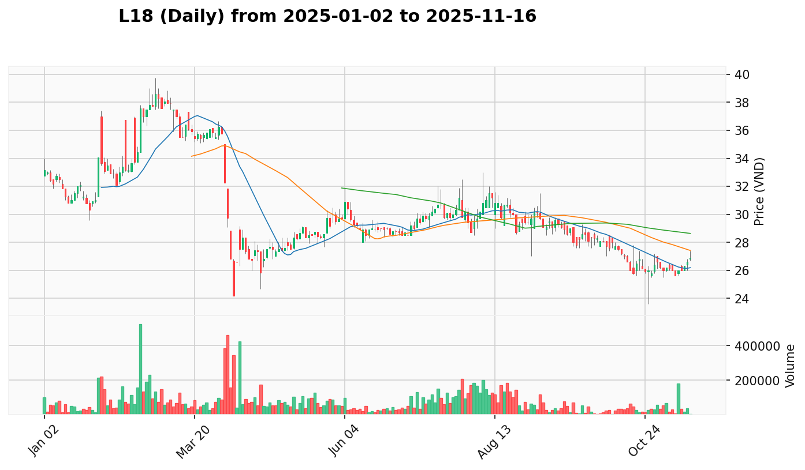

<a href="#xay-dung">↑ Back to group XAY_DUNG</a>  |  <a href="#vpa-signal-summary">↑ Back to Top</a>

#### Key Statistics
| Metric | Value |
|:---|---:|
| Date Range | 2025-01-02 to 2025-11-07 |
| **Latest Close** | **25.6** |
| Period Open | 32.75 |
| Period High | 39.75 |
| Period Low | 23.6 |
| Period Change % | -21.83% |

**[Download L18 Data (.csv)](market_data/L18_2025-01-02_to_2025-11-09.csv)**

---

### LAS

#### [VPA Analysis (2025-08-04 - 2025-10-21)](./VPA.md#las)
> **Ngày 2025-10-15:** LAS giảm từ 17.7 VND xuống 17.6 VND với khối lượng giao dịch đạt 0.2514 triệu cổ phiếu. Giá đóng cửa ở giữa biên độ nến rộng, cho thấy sự lưỡng lự của thị trường. Khối lượng giao dịch giảm đáng kể so với phiên trước, cho thấy áp lực bán đã giảm bớt nhưng lực cầu vẫn chưa xuất hiện. **Phân tích VPA/Wyckoff:** No Demand (Không có cầu)
> **Ngày 2025-10-16:** LAS giảm từ 17.6 VND xuống 17.5 VND với khối lượng giao dịch đạt 0.1694 triệu cổ phiếu. Biên độ nến hẹp và giá đóng cửa ở giữa biên độ, cho thấy sự lưỡng lự và thiếu áp lực bán mạnh. Khối lượng giao dịch giảm đáng kể so với phiên trước (0.2514 triệu cổ phiếu), xác nhận rằng lực cầu vẫn chưa xuất hiện và áp lực bán đã suy yếu. **Phân tích VPA/Wyckoff:** No Demand (Không có cầu)
> **Ngày 2025-10-17:** LAS giảm từ 17.5 VND xuống 17.4 VND với khối lượng giao dịch đạt 0.3406 triệu cổ phiếu. Biên độ nến hẹp và giá đóng cửa ở giữa biên độ, cho thấy sự lưỡng lự. Khối lượng giao dịch tăng đáng kể so với phiên trước (0.2055 triệu cổ phiếu), nhưng giá vẫn giảm nhẹ, cho thấy áp lực bán vẫn hiện hữu và lực cầu chưa đủ mạnh để hấp thụ hoàn toàn. **Phân tích VPA/Wyckoff:** No Demand (Không có cầu)
> **Ngày 2025-10-20:** LAS giảm từ 17.4 VND xuống 16.8 VND với khối lượng giao dịch đạt 0.2832 triệu cổ phiếu. Biên độ nến rộng và giá đóng cửa ở gần mức thấp nhất, cho thấy áp lực bán mạnh mẽ. Mặc dù khối lượng giao dịch thấp hơn so với phiên trước (0.3406 triệu cổ phiếu), nhưng sự sụt giảm giá đáng kể cho thấy lực cầu rất yếu và không có khả năng hấp thụ áp lực cung. **Phân tích VPA/Wyckoff:** Sign of Weakness (SOW) - Dấu hiệu suy yếu
> **Ngày 2025-10-21:** LAS giảm từ 16.8 VND xuống 16.5 VND với khối lượng giao dịch đạt 0.5152 triệu cổ phiếu. Biên độ nến rộng và giá đóng cửa ở gần mức thấp nhất, cho thấy áp lực bán mạnh mẽ. Khối lượng giao dịch tăng đáng kể so với phiên trước (0.2832 triệu cổ phiếu), xác nhận lực cung áp đảo và tiếp tục xu hướng suy yếu. **Phân tích VPA/Wyckoff:** Sign of Weakness (SOW) - Dấu hiệu suy yếu

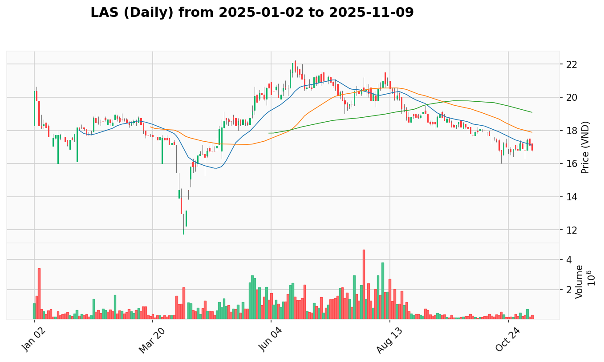

<a href="#hoa-chat">↑ Back to group HOA_CHAT</a>  |  <a href="#vpa-signal-summary">↑ Back to Top</a>

#### Key Statistics
| Metric | Value |
|:---|---:|
| Date Range | 2025-01-02 to 2025-11-07 |
| **Latest Close** | **16.8** |
| Period Open | 18.28 |
| Period High | 22.25 |
| Period Low | 11.74 |
| Period Change % | -8.10% |

**[Download LAS Data (.csv)](market_data/LAS_2025-01-02_to_2025-11-09.csv)**

---

### LCG

#### [VPA Analysis (2025-08-04 - 2025-10-21)](./VPA.md#lcg)
> **Ngày 2025-10-15:** LCG mở cửa ở 12.15 VND, giảm xuống 11.95 VND và đóng cửa ở 11.95 VND, thấp hơn giá đóng cửa phiên trước (12.0 VND). Cây nến có thân nhỏ, biên độ hẹp và đóng cửa ở mức thấp nhất phiên, cho thấy áp lực bán vẫn còn nhưng không mạnh mẽ như phiên trước. Khối lượng giao dịch đạt 3.3839 triệu cổ phiếu, giảm đáng kể so với phiên trước (7.5698 triệu cổ phiếu). Sự giảm giá đi kèm với khối lượng giảm cho thấy lực bán đã suy yếu, nhưng đồng thời cũng không có lực cầu đáng kể xuất hiện để đẩy giá lên. Thị trường đang trong giai đoạn yếu. **Phân tích VPA/Wyckoff:** Weakness (Yếu)
> **Ngày 2025-10-16:** LCG mở cửa ở 12.05 VND, tăng lên 12.25 VND và đóng cửa ở 12.2 VND, cao hơn giá đóng cửa phiên trước (11.95 VND). Cây nến có thân nhỏ, biên độ hẹp và đóng cửa gần mức cao nhất phiên, cho thấy lực cầu nhẹ xuất hiện. Khối lượng giao dịch đạt 2.1115 triệu cổ phiếu, giảm đáng kể so với phiên trước (3.3839 triệu cổ phiếu). Sự tăng giá nhẹ đi kèm với khối lượng giảm cho thấy áp lực bán đã suy yếu, nhưng lực cầu vẫn chưa đủ mạnh để tạo ra một xu hướng tăng rõ rệt. Thị trường đang kiểm tra lượng cung còn lại sau hai phiên giảm mạnh. **Phân tích VPA/Wyckoff:** Kiểm tra cung
> **Ngày 2025-10-17:** LCG mở cửa ở 12.4 VND, tăng lên 12.8 VND và đóng cửa ở 12.45 VND, cao hơn giá đóng cửa phiên trước (12.3 VND). Cây nến có thân tương đối rộng, đóng cửa ở nửa trên của thân nến, cho thấy lực cầu đã xuất hiện và đẩy giá lên. Khối lượng giao dịch đạt 8.1618 triệu cổ phiếu, tăng đáng kể so với phiên trước (4.9702 triệu cổ phiếu). Sự tăng giá đi kèm với khối lượng gia tăng mạnh mẽ cho thấy lực cầu đang chiếm ưu thế và hấp thụ lượng cung. Đây là một dấu hiệu tích cực sau giai đoạn kiểm tra cung. **Phân tích VPA/Wyckoff:** Sign of Strength (SOS) - Lực cầu xuất hiện.
> **Ngày 2025-10-20:** LCG mở cửa ở 12.4 VND, giảm mạnh xuống 11.6 VND và đóng cửa ở 11.65 VND, thấp hơn đáng kể so với giá đóng cửa phiên trước (12.45 VND). Cây nến có thân rộng, biên độ lớn và đóng cửa gần mức thấp nhất phiên, cho thấy áp lực bán mạnh mẽ. Khối lượng giao dịch đạt 6.6867 triệu cổ phiếu, giảm so với phiên tăng giá mạnh trước đó (8.1618 triệu cổ phiếu). Sự sụt giảm giá mạnh đi kèm với khối lượng vẫn ở mức cao cho thấy lực cung đang chiếm ưu thế và áp đảo lực cầu, phủ nhận tín hiệu tích cực của phiên SOS trước đó. **Phân tích VPA/Wyckoff:** Sign of Weakness (SOW) - Lực cung áp đảo
> **Ngày 2025-10-21:** LCG mở cửa ở 11.85 VND, giảm xuống 11.3 VND và đóng cửa ở 11.7 VND, cao hơn nhẹ so với giá đóng cửa phiên trước (11.65 VND). Cây nến có thân nhỏ, biên độ hẹp và đóng cửa ở nửa trên của thân nến, cho thấy sự lưỡng lự của thị trường. Khối lượng giao dịch đạt 4.3762 triệu cổ phiếu, giảm đáng kể so với phiên trước (6.6867 triệu cổ phiếu). Sau phiên giảm mạnh với lực cung áp đảo (SOW) vào ngày 2025-10-20, việc giá tăng nhẹ với khối lượng thấp cho thấy lực cầu yếu và thiếu sự xác nhận, đồng thời lực cung cũng tạm thời giảm bớt. Điều này có thể là một dấu hiệu của sự thiếu hụt nhu cầu sau đợt bán tháo. **Phân tích VPA/Wyckoff:** No Demand - Thiếu hụt lực cầu.

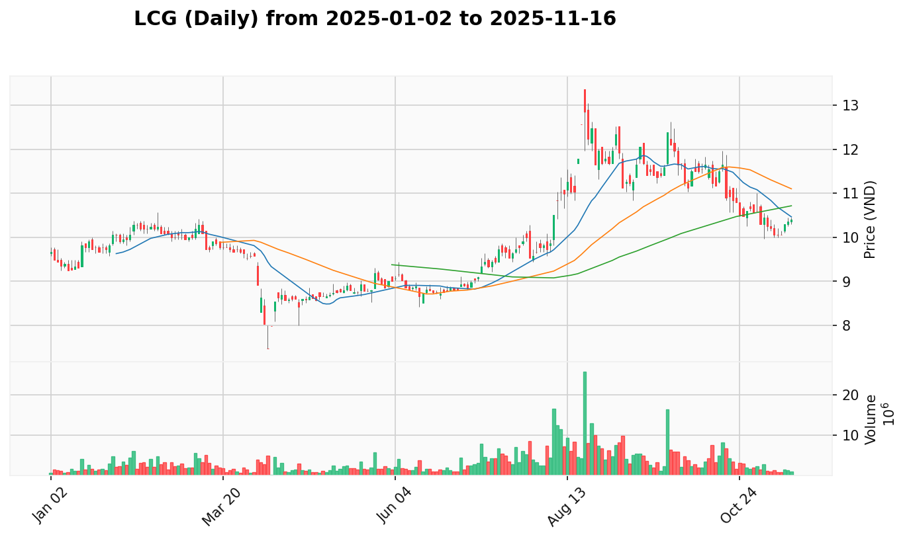

<a href="#dau-tu-cong">↑ Back to group DAU_TU_CONG</a>  |  <a href="#vpa-signal-summary">↑ Back to Top</a>

#### Key Statistics
| Metric | Value |
|:---|---:|
| Date Range | 2025-01-02 to 2025-11-07 |
| **Latest Close** | **10.05** |
| Period Open | 9.63 |
| Period High | 13.36 |
| Period Low | 7.47 |
| Period Change % | 4.36% |

**[Download LCG Data (.csv)](market_data/LCG_2025-01-02_to_2025-11-09.csv)**

---

### LDG

#### [VPA Analysis (2025-08-04 - 2025-10-21)](./VPA.md#ldg)
> **Ngày 2025-10-15:** LDG đóng cửa ở mức 4.62 VND, giảm từ 4.72 VND của phiên trước. Giá mở cửa ở 4.68 VND, đạt mức cao nhất 4.73 VND và mức thấp nhất 4.59 VND. Cây nến giảm có biên độ tương đối, với giá đóng cửa gần mức thấp nhất trong phiên. Khối lượng giao dịch đạt 2.89 triệu cổ phiếu, tăng nhẹ so với phiên trước (2.81 triệu cổ phiếu). Việc giá giảm trên khối lượng tăng, đặc biệt khi giá đóng cửa ở mức thấp nhất phiên, tiếp tục cho thấy áp lực bán mạnh mẽ và phe bán đang kiểm soát hoàn toàn. Điều này củng cố tín hiệu "Sign of Weakness" từ phiên trước, xác nhận sự yếu kém của lực cầu và khả năng tiếp diễn xu hướng giảm. **Phân tích VPA/Wyckoff:** Sign of Weakness (SOW) - Giá giảm mạnh trên khối lượng tăng, đóng cửa gần mức thấp nhất phiên, cho thấy lực cung tiếp tục áp đảo và xu hướng giảm giá có thể tiếp diễn.
> **Ngày 2025-10-16:** LDG đóng cửa ở mức 4.61 VND, giảm nhẹ từ 4.62 VND của phiên trước. Giá mở cửa ở 4.58 VND, đạt mức cao nhất 4.7 VND và mức thấp nhất 4.58 VND. Cây nến giảm có biên độ hẹp, với giá đóng cửa gần giữa thân nến. Khối lượng giao dịch đạt 1.07 triệu cổ phiếu, giảm mạnh so với phiên trước (2.89 triệu cổ phiếu). Việc giá giảm nhẹ trên khối lượng thấp cho thấy áp lực bán đã giảm bớt đáng kể sau hai phiên giảm mạnh trước đó. Tuy nhiên, lực cầu vẫn chưa đủ mạnh để đẩy giá lên, cho thấy thị trường đang trong giai đoạn tạm lắng hoặc kiểm tra lại vùng giá thấp hơn. **Phân tích VPA/Wyckoff:** No Demand (ND) - Giá giảm nhẹ trên khối lượng thấp, cho thấy thiếu vắng lực cầu và áp lực bán đã suy yếu, nhưng chưa có dấu hiệu đảo chiều rõ ràng.
> **Ngày 2025-10-17:** LDG đóng cửa ở mức 4.68 VND, giảm từ 4.81 VND của phiên trước. Giá mở cửa ở 4.82 VND, đạt mức cao nhất 4.82 VND và mức thấp nhất 4.67 VND. Cây nến giảm có biên độ tương đối, với giá đóng cửa gần mức thấp nhất phiên. Khối lượng giao dịch đạt 1.71 triệu cổ phiếu, giảm đáng kể so với phiên trước (3.05 triệu cổ phiếu). Sau phiên tăng mạnh với khối lượng lớn vào ngày 2025-10-16, việc giá giảm trở lại trên khối lượng thấp cho thấy lực cầu đã suy yếu và không duy trì được đà tăng. Áp lực bán xuất hiện trở lại, đẩy giá đóng cửa gần mức thấp nhất, cho thấy sự thiếu vắng của lực mua hỗ trợ. **Phân tích VPA/Wyckoff:** No Demand (ND) - Giá giảm trên khối lượng thấp sau một phiên tăng mạnh, cho thấy lực cầu không còn và có thể báo hiệu sự điều chỉnh hoặc tiếp diễn xu hướng giảm.
> **Ngày 2025-10-20:** LDG giảm từ 4.68 VND xuống 4.36 VND. Giá mở cửa ở 4.68 VND, đạt mức cao nhất 4.68 VND và mức thấp nhất 4.36 VND. Cây nến giảm có biên độ rộng, với giá đóng cửa ở mức thấp nhất phiên. Khối lượng giao dịch đạt 3.17 triệu cổ phiếu, tăng mạnh so với phiên trước (1.71 triệu cổ phiếu). Việc giá giảm mạnh trên khối lượng tăng cao cho thấy áp lực bán rất lớn và nguồn cung áp đảo hoàn toàn lực cầu, xác nhận sự yếu kém của thị trường sau các phiên No Demand trước đó. **Phân tích VPA/Wyckoff:** Sign of Weakness (SOW) - Giá giảm mạnh với khối lượng tăng cao, cho thấy áp lực bán lớn và sự tiếp diễn của xu hướng giảm.
> **Ngày 2025-10-21:** LDG tiếp tục giảm từ 4.36 VND xuống 4.08 VND. Giá mở cửa ở 4.16 VND, đạt mức cao nhất 4.35 VND và mức thấp nhất 4.06 VND. Cây nến giảm có biên độ rộng, với giá đóng cửa gần mức thấp nhất phiên. Khối lượng giao dịch đạt 5.43 triệu cổ phiếu, tăng mạnh so với phiên trước (3.17 triệu cổ phiếu). Việc giá tiếp tục giảm mạnh trên khối lượng tăng cao cho thấy áp lực bán vẫn rất lớn và nguồn cung tiếp tục áp đảo lực cầu, xác nhận xu hướng giảm đang tiếp diễn mạnh mẽ. **Phân tích VPA/Wyckoff:** Sign of Weakness (SOW) - Giá giảm mạnh với khối lượng tăng cao, cho thấy áp lực bán tiếp tục gia tăng và xu hướng giảm đang được củng cố.

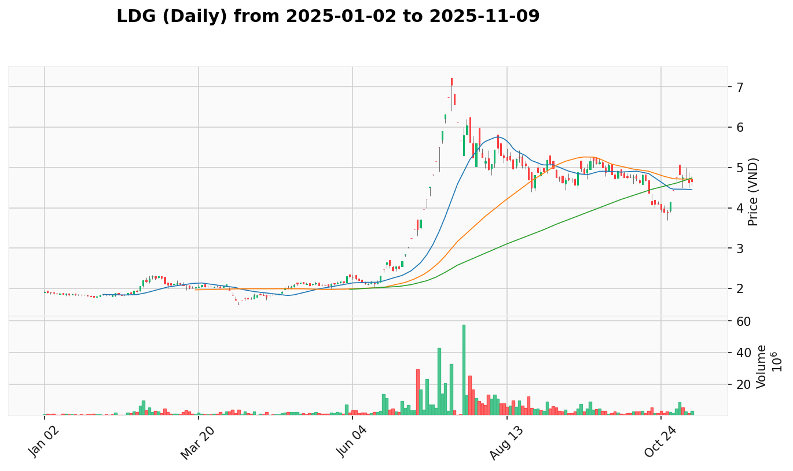

<a href="#bat-dong-san">↑ Back to group BAT_DONG_SAN</a>  |  <a href="#vpa-signal-summary">↑ Back to Top</a>

#### Key Statistics
| Metric | Value |
|:---|---:|
| Date Range | 2025-01-02 to 2025-11-07 |
| **Latest Close** | **4.66** |
| Period Open | 1.9 |
| Period High | 7.22 |
| Period Low | 1.6 |
| Period Change % | 145.26% |

**[Download LDG Data (.csv)](market_data/LDG_2025-01-02_to_2025-11-09.csv)**

---

### LHG

#### [VPA Analysis (2025-08-04 - 2025-10-21)](./VPA.md#lhg)
> **Ngày 2025-10-15:** LHG giảm từ 30.35 VND xuống 29.9 VND với khối lượng giao dịch đạt 0.0733 triệu cổ phiếu. Cây nến có biên độ hẹp và đóng cửa ở mức thấp nhất phiên, cho thấy áp lực bán vẫn duy trì và không có lực cầu đáng kể. Khối lượng giao dịch thấp hơn đáng kể so với phiên trước (0.2289 triệu cổ phiếu) và các phiên gần đây, xác nhận sự thiếu vắng của lực mua. Điều này cho thấy thị trường vẫn đang yếu và có thể tiếp tục xu hướng giảm hoặc đi ngang trong thời gian tới. **Phân tích VPA/Wyckoff:** No Demand (Không có lực cầu)
> **Ngày 2025-10-16:** LHG tăng nhẹ từ 29.9 VND lên 30.0 VND với khối lượng giao dịch cực thấp, chỉ đạt 0.0108 triệu cổ phiếu. Cây nến có biên độ hẹp, đóng cửa gần mức giữa, cho thấy sự thiếu vắng cả lực mua và lực bán. Khối lượng giao dịch này là thấp nhất trong các phiên gần đây, đặc biệt sau phiên "No Demand" ngày 2025-10-15, xác nhận rằng thị trường vẫn đang trong trạng thái yếu ớt và thiếu động lực rõ ràng. **Phân tích VPA/Wyckoff:** No Demand (Tiếp diễn)
> **Ngày 2025-10-17:** LHG tăng nhẹ từ 29.6 VND lên 29.65 VND với khối lượng giao dịch đạt 0.0553 triệu cổ phiếu. Cây nến có biên độ hẹp, mở cửa và đóng cửa ở cùng mức giá 29.65 VND, đồng thời là mức thấp nhất phiên, cho thấy áp lực bán vẫn duy trì và không có lực cầu đáng kể. Khối lượng giao dịch thấp hơn so với phiên trước (0.0684 triệu cổ phiếu) và vẫn ở mức thấp, xác nhận sự thiếu vắng của lực mua. Điều này cho thấy thị trường vẫn đang yếu và có thể tiếp tục xu hướng giảm hoặc đi ngang trong thời gian tới, tiếp nối các tín hiệu No Demand từ các phiên trước. **Phân tích VPA/Wyckoff:** No Demand (Tiếp diễn)
> **Ngày 2025-10-20:** LHG giảm từ 29.65 VND xuống 28.9 VND với khối lượng giao dịch đạt 0.116 triệu cổ phiếu. Cây nến giảm có biên độ rộng, đóng cửa gần mức thấp nhất phiên, cho thấy áp lực bán mạnh mẽ và nguồn cung đang chiếm ưu thế. Khối lượng giao dịch tăng đáng kể so với các phiên "No Demand" trước đó, xác nhận sự yếu kém của thị trường. **Phân tích VPA/Wyckoff:** Sign of Weakness (SOW) - Lực cung gia tăng.
> **Ngày 2025-10-21:** LHG tăng từ 28.9 VND lên 29.4 VND với khối lượng giao dịch đạt 0.1813 triệu cổ phiếu. Cây nến tăng có biên độ khá rộng, đóng cửa gần mức cao nhất phiên, cho thấy lực cầu đã xuất hiện và hấp thụ một phần lực cung sau phiên giảm mạnh trước đó. Khối lượng giao dịch tăng đáng kể so với phiên trước (0.116 triệu cổ phiếu) và cao hơn nhiều so với các phiên "No Demand" trước đó, xác nhận sự trở lại của lực mua. Điều này cho thấy thị trường đang có phản ứng tích cực sau giai đoạn suy yếu. **Phân tích VPA/Wyckoff:** Phản ứng tích cực - Lực cầu trở lại.

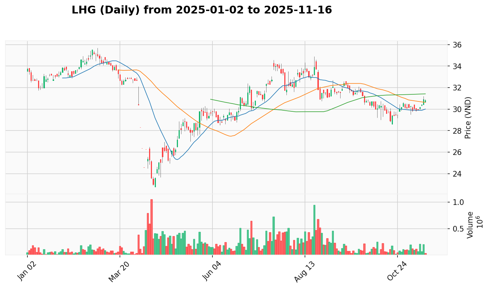

<a href="#bat-dong-san-kcn">↑ Back to group BAT_DONG_SAN_KCN</a>  |  <a href="#vpa-signal-summary">↑ Back to Top</a>

#### Key Statistics
| Metric | Value |
|:---|---:|
| Date Range | 2025-01-02 to 2025-11-07 |
| **Latest Close** | **29.85** |
| Period Open | 33.52 |
| Period High | 35.69 |
| Period Low | 22.77 |
| Period Change % | -10.95% |

**[Download LHG Data (.csv)](market_data/LHG_2025-01-02_to_2025-11-09.csv)**

---

### LIG

#### [VPA Analysis (2025-08-14 - 2025-10-21)](./VPA.md#lig)
> **Ngày 2025-10-15:** LIG giữ nguyên mức giá 4.8 VND với khối lượng giao dịch đạt 0.3321 triệu cổ phiếu, giảm đáng kể so với phiên trước (0.4775 triệu cổ phiếu). Nến có thân hẹp, đóng cửa ở mức thấp nhất trong biên độ ngày. Sau hai phiên giảm giá liên tiếp với áp lực bán và thiếu cầu, việc giá đi ngang với khối lượng rất thấp và đóng cửa ở mức thấp nhất cho thấy lực cầu hoàn toàn vắng bóng và sự thờ ơ của thị trường. Xu hướng giảm giá vẫn tiếp diễn. **Phân tích VPA/Wyckoff:** Không có cầu
> **Ngày 2025-10-16:** LIG giữ nguyên mức giá 4.8 VND với khối lượng giao dịch đạt 0.33 triệu cổ phiếu, tiếp tục giảm so với phiên trước (0.3321 triệu cổ phiếu). Nến có thân hẹp, đóng cửa ở mức giá mở cửa, cho thấy sự lưỡng lự của thị trường. Mặc dù giá không giảm thêm, nhưng với khối lượng thấp và không có sự xuất hiện của lực cầu mạnh mẽ sau các phiên "Không có cầu" trước đó, cho thấy thị trường vẫn đang thiếu động lực tăng giá. Biên độ dao động trong ngày hẹp, và giá thấp nhất trong ngày là 4.7 VND, cho thấy áp lực bán vẫn còn hiện hữu dù không mạnh. **Phân tích VPA/Wyckoff:** Không có cầu
> **Ngày 2025-10-17:** LIG giảm từ 4.9 VND xuống 4.8 VND với khối lượng giao dịch đạt 0.2596 triệu cổ phiếu, giảm mạnh so với phiên trước. Nến có thân hẹp, đóng cửa ở mức thấp nhất trong biên độ ngày. Sau hai phiên "Không có cầu", phiên này tiếp tục cho thấy sự thiếu vắng hoàn toàn của lực cầu và áp lực bán vẫn duy trì. **Phân tích VPA/Wyckoff:** Không có cầu
> **Ngày 2025-10-20:** LIG giảm từ 4.8 VND xuống 4.4 VND với khối lượng giao dịch đạt 1.0119 triệu cổ phiếu, tăng mạnh so với phiên trước. Nến có thân rộng, đóng cửa ở mức thấp nhất trong ngày, cho thấy áp lực bán rất mạnh và sự thiếu hụt hoàn toàn của lực cầu. Sau các phiên "Không có cầu", sự sụt giảm mạnh về giá với khối lượng lớn này xác nhận xu hướng giảm tiếp diễn. **Phân tích VPA/Wyckoff:** Sign of Weakness (SOW) - Áp lực bán mạnh.
> **Ngày 2025-10-21:** LIG tăng từ 4.4 VND lên 4.5 VND với khối lượng giao dịch đạt 1.5945 triệu cổ phiếu, tăng mạnh so với phiên trước. Nến có thân hẹp, đóng cửa ở nửa trên biên độ ngày. Sau phiên "Sign of Weakness" mạnh mẽ, phiên này cho thấy sự xuất hiện của lực cầu, nhưng mức tăng giá còn yếu, cho thấy áp lực cung vẫn còn đáng kể. **Phân tích VPA/Wyckoff:** Test for Supply - Kiểm tra cung.

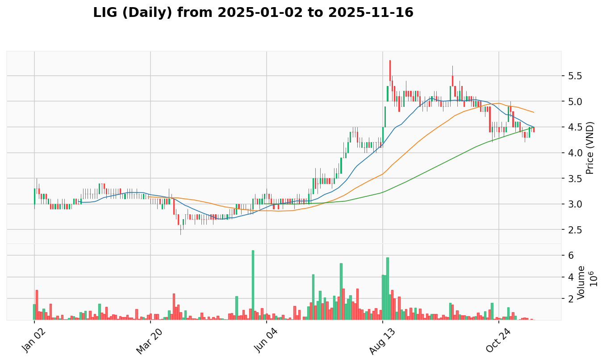

<a href="#penny">↑ Back to group PENNY</a>  |  <a href="#vpa-signal-summary">↑ Back to Top</a>

#### Key Statistics
| Metric | Value |
|:---|---:|
| Date Range | 2025-01-02 to 2025-11-07 |
| **Latest Close** | **4.4** |
| Period Open | 3.0 |
| Period High | 5.8 |
| Period Low | 2.4 |
| Period Change % | 46.67% |

**[Download LIG Data (.csv)](market_data/LIG_2025-01-02_to_2025-11-09.csv)**

---

### LPB

#### [VPA Analysis (2025-06-11 - 2025-10-21)](./VPA.md#lpb)
> **Ngày 2025-10-15:** LPB tăng nhẹ từ 51.5 VND lên 51.6 VND, mở cửa tại 51.9 VND, đạt mức cao 53.3 VND và thấp 51.6 VND. Giá đóng cửa ở mức thấp nhất phiên với biên độ nến trung bình. Khối lượng giao dịch đạt 3.4433 triệu cổ phiếu, tăng so với phiên trước (2.627 triệu cổ phiếu). Mặc dù giá đóng cửa cao hơn nhẹ so với phiên trước, nhưng việc giá không thể duy trì đà tăng, đóng cửa ở mức thấp nhất phiên và có khối lượng tăng cho thấy áp lực bán mạnh mẽ đã xuất hiện và hấp thụ lực cầu. Điều này cho thấy sự yếu kém của phe mua và khả năng tiếp diễn xu hướng giảm. **Phân tích VPA/Wyckoff:** Selling Pressure (Áp lực bán) - Lực bán mạnh mẽ đẩy giá xuống, hấp thụ lực cầu.
> **Ngày 2025-10-16:** LPB giảm từ 51.6 VND xuống 51.4 VND, mở cửa tại 52.0 VND, đạt mức cao 52.5 VND và thấp 51.2 VND. Giá đóng cửa ở mức thấp nhất phiên với biên độ nến hẹp. Khối lượng giao dịch đạt 0.5342 triệu cổ phiếu, giảm mạnh so với phiên trước (3.4433 triệu cổ phiếu) và là mức rất thấp. Sau phiên "Selling Pressure" ngày 2025-10-15, giá tiếp tục giảm nhẹ với khối lượng cực thấp cho thấy sự thiếu vắng cả lực mua và lực bán đáng kể. Điều này cho thấy thị trường đang thiếu động lực và không có sự tham gia tích cực từ cả hai phe. Lực cầu vẫn yếu và không có dấu hiệu phục hồi. **Phân tích VPA/Wyckoff:** No Demand (ND) - Lực cầu yếu và thị trường thiếu động lực.
> **Ngày 2025-10-17:** LPB giảm mạnh từ 51.3 VND xuống 49.5 VND, mở cửa tại 51.5 VND, đạt mức cao 51.7 VND và thấp 49.5 VND. Giá đóng cửa ở mức thấp nhất phiên với biên độ nến rộng. Khối lượng giao dịch đạt 3.4895 triệu cổ phiếu, tăng đáng kể so với phiên trước (0.5342 triệu cổ phiếu). Sau phiên "No Demand" ngày 2025-10-16, giá tiếp tục giảm sâu với khối lượng gia tăng cho thấy áp lực bán mạnh mẽ đã quay trở lại và hoàn toàn áp đảo lực cầu. Điều này xác nhận sự yếu kém của thị trường và khả năng tiếp diễn xu hướng giảm. **Phân tích VPA/Wyckoff:** Sign of Weakness (SOW) - Áp lực bán mạnh mẽ với khối lượng gia tăng.
> **Ngày 2025-10-20:** LPB giảm từ 49.5 VND xuống 47.5 VND, mở cửa tại 49.7 VND, đạt mức cao 50.8 VND và thấp 47.5 VND. Giá đóng cửa ở mức thấp nhất phiên với biên độ nến rộng. Khối lượng giao dịch đạt 2.5705 triệu cổ phiếu, giảm so với phiên trước (3.4895 triệu cổ phiếu). Sau phiên "Sign of Weakness" ngày 2025-10-17, giá tiếp tục giảm sâu với khối lượng giảm nhẹ cho thấy áp lực bán vẫn duy trì. Mặc dù khối lượng có giảm, nhưng việc giá đóng cửa ở mức thấp nhất phiên với biên độ rộng vẫn xác nhận sự yếu kém của thị trường và khả năng tiếp diễn xu hướng giảm. **Phân tích VPA/Wyckoff:** Weakness - Giá tiếp tục giảm mạnh với biên độ rộng, đóng cửa ở mức thấp nhất phiên, xác nhận xu hướng giảm tiếp diễn.
> **Ngày 2025-10-21:** LPB tăng từ 47.5 VND lên 49.0 VND, mở cửa tại 49.6 VND, đạt mức cao 50.8 VND và thấp 48.5 VND. Giá đóng cửa cao hơn giá đóng cửa phiên trước, với biên độ nến rộng. Khối lượng giao dịch đạt 3.5097 triệu cổ phiếu, tăng đáng kể so với phiên trước (2.5705 triệu cổ phiếu). Sau hai phiên giảm mạnh liên tiếp với áp lực bán duy trì, phiên này cho thấy lực cầu đã xuất hiện và hấp thụ một phần lực cung, đẩy giá đóng cửa lên cao hơn phiên trước. Mặc dù giá đóng cửa vẫn thấp hơn giá mở cửa, nhưng sự phục hồi từ mức thấp nhất phiên cùng với khối lượng gia tăng cho thấy có thể đây là dấu hiệu của sự dừng lại của đà giảm. **Phân tích VPA/Wyckoff:** Stopping Volume - Lực cầu xuất hiện hấp thụ lực cung, có thể là dấu hiệu dừng lại của đà giảm.

<a href="#ngan-hang">↑ Back to group NGAN_HANG</a>  |  <a href="#vpa-signal-summary">↑ Back to Top</a>

#### Key Statistics
| Metric | Value |
|:---|---:|
| Date Range | 2025-01-02 to 2025-11-07 |
| **Latest Close** | **49.3** |
| Period Open | 29.25 |
| Period High | 54.7 |
| Period Low | 27.01 |
| Period Change % | 68.55% |

**[Download LPB Data (.csv)](market_data/LPB_2025-01-02_to_2025-11-09.csv)**

---

### LSS

#### [VPA Analysis (2025-08-14 - 2025-10-21)](./VPA.md#lss)
> **Ngày 2025-10-15:** LSS giảm từ 10.1 VND xuống 10.0 VND với khối lượng giao dịch đạt 0.2765 triệu cổ phiếu. Nến giao dịch có biên độ hẹp và đóng cửa ở mức thấp nhất, cho thấy sự yếu kém của lực cầu. Khối lượng giao dịch giảm đáng kể so với phiên trước (0.5416 triệu cổ phiếu) và thấp hơn cả phiên "Yếu kém" ngày 2025-10-13 (0.3522 triệu cổ phiếu), xác nhận rằng không có sự quan tâm từ phía người mua. Điều này cho thấy sự tiếp diễn của giai đoạn yếu kém và thiếu vắng lực cầu, với áp lực bán vẫn hiện hữu nhưng không có sự hấp thụ. **Phân tích VPA/Wyckoff:** No Demand (Thiếu cầu)
> **Ngày 2025-10-16:** LSS giảm nhẹ từ 10.0 VND xuống 9.99 VND với khối lượng giao dịch cực kỳ thấp, chỉ 0.0953 triệu cổ phiếu. Biên độ nến hẹp và đóng cửa gần mức thấp nhất, cho thấy sự thiếu vắng cả lực mua và lực bán đáng kể. Khối lượng giao dịch giảm mạnh so với phiên trước (0.2765 triệu cổ phiếu) và thấp hơn nhiều so với các phiên gần đây, xác nhận rằng áp lực bán đã cạn kiệt ở mức giá này, nhưng lực cầu vẫn chưa xuất hiện để đẩy giá lên. Điều này cho thấy thị trường đang ở trạng thái cân bằng tạm thời với sự thờ ơ của cả hai bên, tiếp nối giai đoạn yếu kém và thiếu cầu. **Phân tích VPA/Wyckoff:** No Supply (Không có nguồn cung)
> **Ngày 2025-10-17:** LSS giảm từ 10.0 VND xuống 9.96 VND với khối lượng giao dịch đạt 0.4542 triệu cổ phiếu. Nến giao dịch có biên độ hẹp và đóng cửa gần mức thấp nhất, cho thấy áp lực bán gia tăng. Khối lượng giao dịch tăng đáng kể so với phiên trước (0.1865 triệu cổ phiếu) và cao hơn các phiên gần đây, xác nhận rằng lực cung đã quay trở lại thị trường. Điều này cho thấy sự tiếp diễn của xu hướng giảm giá và sự yếu kém của lực cầu. **Phân tích VPA/Wyckoff:** Sign of Weakness (SOW)
> **Ngày 2025-10-20:** LSS giảm mạnh từ 9.96 VND xuống 9.55 VND với khối lượng giao dịch đạt 0.3296 triệu cổ phiếu. Nến giảm có biên độ rộng và đóng cửa ở mức thấp nhất phiên, cho thấy áp lực bán tiếp tục chiếm ưu thế. Mặc dù khối lượng giao dịch thấp hơn so với phiên SOW trước đó (0.4542 triệu cổ phiếu), sự sụt giảm giá mạnh mẽ vẫn xác nhận thị trường đang trong giai đoạn yếu kém và thiếu vắng lực cầu hỗ trợ. **Phân tích VPA/Wyckoff:** Sign of Weakness (SOW)
> **Ngày 2025-10-21:** LSS tăng từ 9.55 VND lên 9.69 VND với khối lượng giao dịch đạt 0.2922 triệu cổ phiếu. Nến tăng có biên độ rộng và đóng cửa gần mức cao nhất, cho thấy lực cầu xuất hiện sau hai phiên giảm mạnh. Tuy nhiên, khối lượng giao dịch thấp hơn đáng kể so với các phiên SOW trước đó (0.3296 triệu cổ phiếu ngày 2025-10-20 và 0.4542 triệu cổ phiếu ngày 2025-10-17), cho thấy sự yếu kém của lực mua và khả năng đây chỉ là một nhịp hồi phục kỹ thuật trong xu hướng giảm. **Phân tích VPA/Wyckoff:** Reaction (Phản ứng)

<a href="#thuc-pham">↑ Back to group THUC_PHAM</a>  |  <a href="#vpa-signal-summary">↑ Back to Top</a>

#### Key Statistics
| Metric | Value |
|:---|---:|
| Date Range | 2025-01-02 to 2025-11-07 |
| **Latest Close** | **9.5** |
| Period Open | 10.74 |
| Period High | 11.45 |
| Period Low | 8.47 |
| Period Change % | -11.55% |

**[Download LSS Data (.csv)](market_data/LSS_2025-01-02_to_2025-11-09.csv)**

---

### LTG

#### [VPA Analysis (2025-08-08 - 2025-10-17)](./VPA.md#ltg)
> **Ngày 2025-09-19:** LTG tiếp tục giảm giá từ 7.5 xuống 7.4 VND, với khối lượng giao dịch giảm mạnh còn 0.1455 triệu cổ phiếu. Nến giảm giá có biên độ hẹp và đóng cửa gần mức thấp nhất trong ngày, cho thấy áp lực bán đã suy yếu đáng kể nhưng lực cầu vẫn chưa xuất hiện. Khối lượng thấp kỷ lục sau các phiên giảm giá trước đó củng cố nhận định về sự thiếu vắng dòng tiền vào thị trường. **Phân tích VPA/Wyckoff:** No Demand - Thiếu cầu.
> **Ngày 2025-09-26:** LTG giảm giá từ 7.4 VND xuống 6.9 VND, với khối lượng giao dịch tăng lên 0.2152 triệu cổ phiếu. Nến giảm giá có biên độ rộng và đóng cửa gần mức thấp nhất trong ngày, cho thấy áp lực bán đang gia tăng và chiếm ưu thế hoàn toàn so với lực cầu. Điều này xác nhận xu hướng giảm giá tiếp diễn và cho thấy sự suy yếu rõ rệt sau các phiên thiếu cầu trước đó. **Phân tích VPA/Wyckoff:** Sign of Weakness (SOW) - Dấu hiệu suy yếu.
> **Ngày 2025-10-03:** LTG tiếp tục giảm giá từ 6.9 xuống 6.8 VND, với khối lượng giao dịch giảm còn 0.1621 triệu cổ phiếu. Nến giảm giá có biên độ hẹp và đóng cửa ở mức thấp nhất trong ngày, cho thấy áp lực bán vẫn còn nhưng đã suy yếu đáng kể. Khối lượng thấp trong khi giá tiếp tục giảm xác nhận sự thiếu vắng lực cầu. **Phân tích VPA/Wyckoff:** No Demand - Thiếu cầu.
> **Ngày 2025-10-10:** LTG mở cửa ở mức 7.2 VND, cao hơn mức đóng cửa và mức cao nhất của phiên trước, nhưng sau đó giảm xuống 6.9 VND khi đóng cửa, với khối lượng giao dịch tăng lên 0.1901 triệu cổ phiếu. Nến có biên độ rộng và đóng cửa ở nửa dưới, cho thấy lực bán đã xuất hiện mạnh mẽ ngay sau khi giá cố gắng tăng. Mặc dù giá đóng cửa cao hơn phiên trước một chút, nhưng hành động giá này cho thấy sự từ chối mức giá cao hơn và sự hiện diện của nguồn cung. **Phân tích VPA/Wyckoff:** Upthrust (UT) - Dấu hiệu phân phối/kiểm tra cung.
> **Ngày 2025-10-17:** LTG giảm mạnh từ 6.9 xuống 6.4 VND, với khối lượng giao dịch tăng đáng kể lên 0.2776 triệu cổ phiếu. Nến giảm giá có biên độ rộng và đóng cửa ở mức thấp nhất trong ngày, cho thấy áp lực bán rất mạnh và sự tiếp diễn của xu hướng giảm. Khối lượng tăng cao xác nhận sự hiện diện của nguồn cung lớn trên thị trường, tiếp nối dấu hiệu phân phối từ phiên trước. **Phân tích VPA/Wyckoff:** Sign of Weakness (SOW) - Dấu hiệu suy yếu.

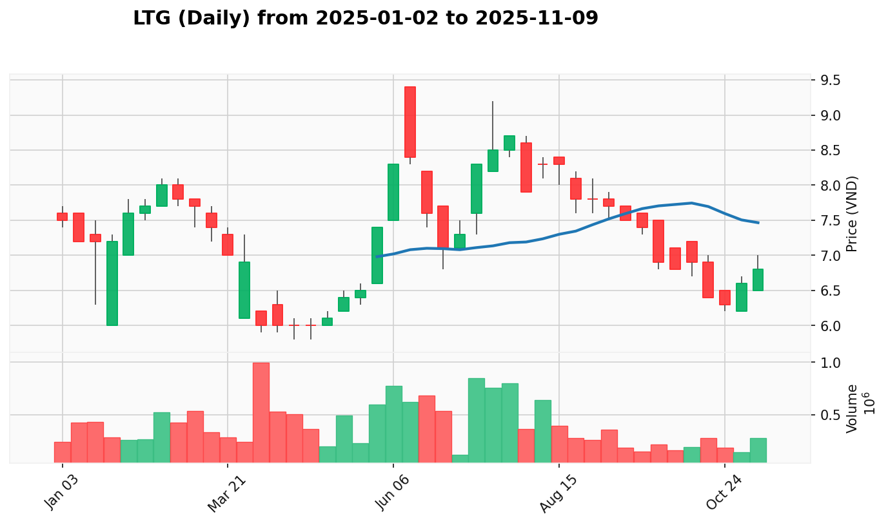

<a href="#nong-nghiep">↑ Back to group NONG_NGHIEP</a>  |  <a href="#vpa-signal-summary">↑ Back to Top</a>

#### Key Statistics
| Metric | Value |
|:---|---:|
| Date Range | 2025-01-03 to 2025-11-07 |
| **Latest Close** | **6.8** |
| Period Open | 7.6 |
| Period High | 9.4 |
| Period Low | 5.8 |
| Period Change % | -10.53% |

**[Download LTG Data (.csv)](market_data/LTG_2025-01-02_to_2025-11-09.csv)**

---

### MBB

#### [VPA Analysis (2025-06-13 - 2025-10-21)](./VPA.md#mbb)
> **Ngày 2025-10-15:** MBB tăng từ 27.05 lên 27.25. Nến ngày có biên độ hẹp, mở cửa tại 27.15, cao nhất 27.65, thấp nhất 27.1 và đóng cửa tại 27.25, nằm gần giữa thân nến. Khối lượng giao dịch đạt 31.4863 triệu cổ phiếu, thấp hơn đáng kể so với phiên trước và mức trung bình. Sau hai phiên suy yếu liên tiếp với khối lượng cao, phiên hôm nay giá tăng nhẹ nhưng với khối lượng thấp, cho thấy lực bán đã giảm bớt nhưng lực cầu vẫn chưa thực sự mạnh mẽ để đẩy giá lên cao. Đây có thể là một dấu hiệu tạm dừng trong xu hướng giảm hoặc một nỗ lực kiểm tra cung cầu. **Phân tích VPA/Wyckoff:** No Demand - Thiếu cầu.
> **Ngày 2025-10-16:** MBB tăng từ 27.25 lên 27.3. Nến ngày là một nến Doji với biên độ hẹp, mở cửa tại 27.3, đạt cao nhất 27.55, thấp nhất 27.25 và đóng cửa tại 27.3. Khối lượng giao dịch đạt 13.2514 triệu cổ phiếu, thấp hơn đáng kể so với phiên trước (31.4863 triệu cổ phiếu) và mức trung bình. Sau hai phiên suy yếu và thiếu cầu, phiên hôm nay giá chỉ tăng nhẹ với khối lượng cực thấp, cho thấy sự lưỡng lự và thiếu vắng động lực rõ ràng từ cả bên mua và bên bán. Lực cầu vẫn còn yếu, và thị trường đang trong giai đoạn thăm dò mà không có sự tham gia mạnh mẽ. Điều này củng cố thêm tín hiệu thiếu cầu. **Phân tích VPA/Wyckoff:** No Demand - Thiếu cầu.
> **Ngày 2025-10-17:** MBB giảm từ 27.2 VND xuống 27.1 VND. Nến ngày có biên độ rộng, mở cửa tại 27.25, cao nhất 27.8, thấp nhất 27.1 và đóng cửa tại 27.1, nằm ở mức thấp nhất phiên. Khối lượng giao dịch đạt 43.5291 triệu cổ phiếu, cao hơn đáng kể so với phiên trước (26.4828 triệu cổ phiếu) và mức trung bình. Sau các phiên thiếu cầu, phiên hôm nay giá giảm với khối lượng tăng mạnh và đóng cửa ở mức thấp nhất phiên, cho thấy áp lực bán đã gia tăng đáng kể và lực cung đang chiếm ưu thế. Đây là một dấu hiệu suy yếu. **Phân tích VPA/Wyckoff:** Dấu hiệu suy yếu (SOW)
> **Ngày 2025-10-20:** MBB giảm từ 27.1 VND xuống 25.25 VND. Nến ngày là một nến giảm mạnh với biên độ rộng, mở cửa tại 26.95, đạt cao nhất 27.1, thấp nhất 25.25 và đóng cửa tại 25.25, nằm ở mức thấp nhất phiên. Khối lượng giao dịch đạt 74.53 triệu cổ phiếu, cao hơn đáng kể so với phiên trước (43.53 triệu cổ phiếu) và mức trung bình. Sau phiên suy yếu trước đó, phiên hôm nay giá tiếp tục giảm mạnh với khối lượng cực lớn và đóng cửa ở mức thấp nhất phiên, cho thấy áp lực bán tháo đã gia tăng đột biến và lực cung đang hoàn toàn áp đảo lực cầu. Đây là một tín hiệu suy yếu rất rõ ràng, xác nhận xu hướng giảm giá. **Phân tích VPA/Wyckoff:** Dấu hiệu suy yếu (SOW) - Áp lực bán tháo mạnh.
> **Ngày 2025-10-21:** MBB tăng nhẹ từ 25.25 VND lên 25.3 VND. Nến ngày có biên độ rộng, mở cửa tại 25.35, cao nhất 26.0, thấp nhất 24.8 và đóng cửa tại 25.3, nằm ở giữa thân nến. Khối lượng giao dịch đạt 51.6684 triệu cổ phiếu, vẫn ở mức cao nhưng thấp hơn đáng kể so với phiên bán tháo trước đó (74.53 triệu cổ phiếu). Sau hai phiên giảm mạnh với áp lực bán tháo cực lớn, phiên hôm nay giá có sự phục hồi nhẹ và đóng cửa ở giữa thân nến, cho thấy lực cầu đã bắt đầu xuất hiện và hấp thụ một phần lực cung. Tuy nhiên, biên độ nến rộng và khối lượng vẫn cao cho thấy sự giằng co mạnh mẽ giữa bên mua và bên bán. Đây có thể là dấu hiệu của sự hấp thụ cung sau đợt bán tháo. **Phân tích VPA/Wyckoff:** Stopping Volume - Dấu hiệu hấp thụ cung sau bán tháo.

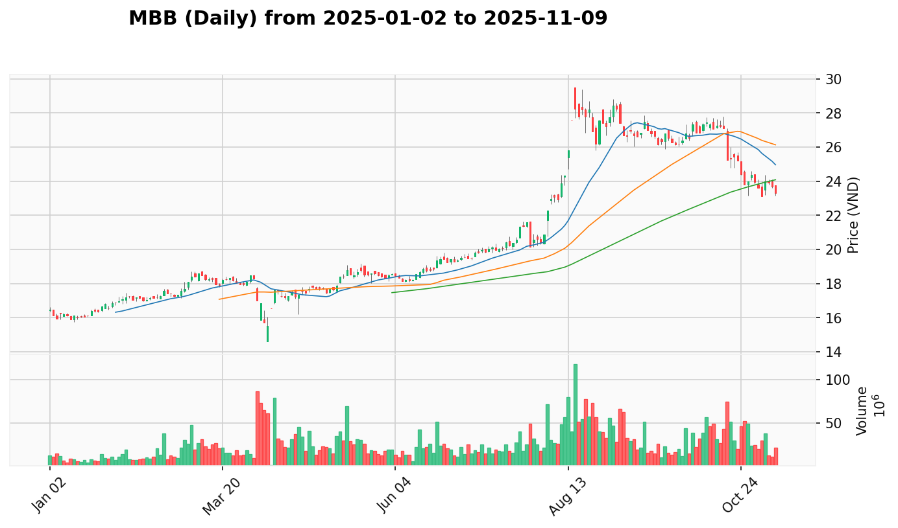

<a href="#ngan-hang">↑ Back to group NGAN_HANG</a>  |  <a href="#vpa-signal-summary">↑ Back to Top</a>

#### Key Statistics
| Metric | Value |
|:---|---:|
| Date Range | 2025-01-02 to 2025-11-07 |
| **Latest Close** | **23.3** |
| Period Open | 16.42 |
| Period High | 29.5 |
| Period Low | 14.6 |
| Period Change % | 41.90% |

**[Download MBB Data (.csv)](market_data/MBB_2025-01-02_to_2025-11-09.csv)**

---

### MBS

#### [VPA Analysis (2025-06-16 - 2025-10-21)](./VPA.md#mbs)
> **Ngày 2025-10-15:** MBS giảm từ 34.5 VND xuống 34.0 VND với biên độ tương đối hẹp, đóng cửa gần mức thấp nhất phiên. Khối lượng giao dịch đạt 6.4345 triệu cổ phiếu, giảm đáng kể so với phiên trước (12.1501 triệu cổ phiếu). Sau phiên "Lực cung xuất hiện" ngày 2025-10-14, giá tiếp tục giảm với khối lượng thấp hơn, cho thấy áp lực bán có phần giảm bớt nhưng lực cầu vẫn chưa xuất hiện để hỗ trợ giá. Việc giá đóng cửa gần mức thấp nhất phiên củng cố tín hiệu suy yếu. **Phân tích VPA/Wyckoff:** Weakness - Lực cầu suy yếu và áp lực cung vẫn duy trì.
> **Ngày 2025-10-16:** MBS giảm từ 34.0 VND xuống 33.9 VND với biên độ hẹp, đóng cửa gần mức thấp nhất phiên. Khối lượng giao dịch đạt 2.6043 triệu cổ phiếu, giảm mạnh so với phiên trước (6.4345 triệu cổ phiếu) và thấp hơn đáng kể so với mức trung bình. Mặc dù giá tiếp tục giảm, nhưng khối lượng thấp cho thấy áp lực bán đã cạn kiệt tạm thời, tuy nhiên lực cầu vẫn chưa xuất hiện để hỗ trợ giá. Điều này củng cố tín hiệu suy yếu và cho thấy sự thiếu vắng nhu cầu mua vào ở mức giá hiện tại. **Phân tích VPA/Wyckoff:** No Demand - Thiếu vắng nhu cầu mua vào.
> **Ngày 2025-10-17:** MBS giảm từ 33.8 VND xuống 33.1 VND với biên độ tương đối và đóng cửa ở mức thấp nhất phiên. Khối lượng giao dịch đạt 6.5161 triệu cổ phiếu, tăng nhẹ so với phiên trước (5.9194 triệu cổ phiếu). Sau các phiên "Weakness" và "No Demand", giá tiếp tục giảm mạnh, đóng cửa ở mức thấp nhất với khối lượng tăng. Điều này cho thấy áp lực bán vẫn đang chiếm ưu thế và có thể đang gia tăng, đẩy giá xuống thấp hơn. Lực cầu vẫn chưa đủ mạnh để hấp thụ hết lượng cung. **Phân tích VPA/Wyckoff:** Supply Coming In - Lực cung tiếp tục chiếm ưu thế.
> **Ngày 2025-10-20:** MBS giảm mạnh từ 33.1 VND xuống 29.8 VND với biên độ rộng và đóng cửa ở mức thấp nhất phiên. Khối lượng giao dịch đạt 11.2011 triệu cổ phiếu, tăng đáng kể so với phiên trước (6.5161 triệu cổ phiếu). Sau các tín hiệu suy yếu và lực cung chiếm ưu thế, phiên này cho thấy áp lực bán tiếp tục gia tăng mạnh mẽ, đẩy giá xuống sâu hơn với khối lượng lớn, xác nhận xu hướng giảm giá. **Phân tích VPA/Wyckoff:** Sign of Weakness (SOW) - Lực bán mạnh mẽ với khối lượng gia tăng xác nhận xu hướng giảm.
> **Ngày 2025-10-21:** MBS giảm từ 29.8 VND xuống 29.5 VND với biên độ rộng và đóng cửa gần mức thấp nhất phiên. Khối lượng giao dịch đạt 9.0855 triệu cổ phiếu, giảm so với phiên trước (11.2011 triệu cổ phiếu). Sau phiên giảm mạnh với tín hiệu suy yếu (SOW) trước đó, MBS tiếp tục giảm điểm, cho thấy áp lực bán vẫn còn mạnh và lực cầu chưa đủ để hấp thụ, xác nhận xu hướng giảm giá vẫn đang tiếp diễn. **Phân tích VPA/Wyckoff:** Supply Coming In - Lực cung tiếp tục chiếm ưu thế.

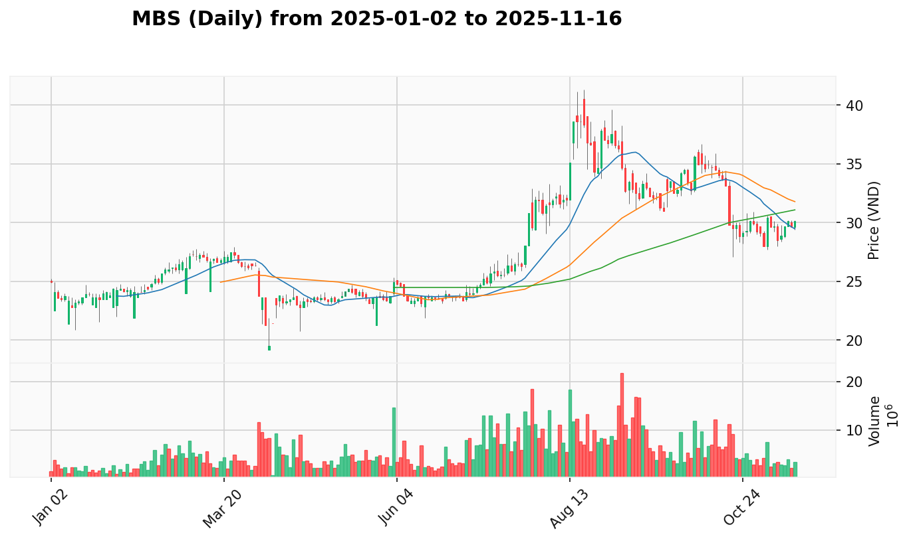

<a href="#chung-khoan">↑ Back to group CHUNG_KHOAN</a>  |  <a href="#vpa-signal-summary">↑ Back to Top</a>

#### Key Statistics
| Metric | Value |
|:---|---:|
| Date Range | 2025-01-02 to 2025-11-07 |
| **Latest Close** | **28.5** |
| Period Open | 25.04 |
| Period High | 41.31 |
| Period Low | 19.17 |
| Period Change % | 13.82% |

**[Download MBS Data (.csv)](market_data/MBS_2025-01-02_to_2025-11-09.csv)**

---

### MCH

#### [VPA Analysis (2025-06-16 - 2025-10-21)](./VPA.md#mch)
> **Ngày 2025-10-15:** MCH tiếp tục điều chỉnh nhẹ từ 149.1 VND xuống 148.9 VND. Nến ngày có biên độ hẹp (từ 146.1 VND đến 149.9 VND) và đóng cửa ở giữa thân nến. Khối lượng giao dịch đạt 0.4126 triệu cổ phiếu, tiếp tục giảm so với phiên trước (0.4986 triệu cổ phiếu). Sau phiên Pullback ngày 2025-10-14, sự giảm giá nhẹ với biên độ hẹp và khối lượng thấp cho thấy áp lực bán đã suy yếu đáng kể, có thể là một nhịp kiểm tra cung hoặc thiếu cầu bán sau đợt tăng mạnh. **Phân tích VPA/Wyckoff:** No Demand (ND) - Thiếu cầu bán.
> **Ngày 2025-10-16:** MCH tăng từ 148.9 VND lên 150.0 VND. Nến ngày có biên độ hẹp (từ 148.0 VND đến 150.9 VND) và đóng cửa ở nửa trên của thân nến. Khối lượng giao dịch đạt 0.1955 triệu cổ phiếu, giảm đáng kể so với phiên trước (0.4126 triệu cổ phiếu) và rất thấp so với các phiên tăng mạnh trước đó. Sau hai phiên điều chỉnh (Pullback và No Demand), phiên tăng điểm nhẹ với khối lượng cực thấp cho thấy lực cầu yếu, không đủ mạnh để đẩy giá lên cao hơn một cách bền vững. **Phân tích VPA/Wyckoff:** No Demand (ND) - Thiếu cầu mua.
> **Ngày 2025-10-17:** MCH tiếp tục điều chỉnh giảm từ 147.8 VND xuống 145.6 VND. Nến ngày có biên độ rộng (từ 143.5 VND đến 149.3 VND) và đóng cửa gần mức thấp nhất phiên, cho thấy áp lực bán chiếm ưu thế. Tuy nhiên, khối lượng giao dịch chỉ đạt 0.2292 triệu cổ phiếu, giảm đáng kể so với phiên trước (0.6625 triệu cổ phiếu). Sự giảm giá với biên độ rộng nhưng khối lượng thấp cho thấy thiếu vắng lực cầu hỗ trợ, khiến giá dễ dàng bị đẩy xuống mà không cần khối lượng bán lớn. Điều này tiếp nối tình trạng thiếu cầu đã xuất hiện trong các phiên gần đây. **Phân tích VPA/Wyckoff:** No Demand (ND) - Thiếu cầu mua.
> **Ngày 2025-10-20:** MCH giảm từ 144.6 VND xuống 138.5 VND. Nến ngày có biên độ rộng (từ 138.0 VND đến 144.6 VND) và đóng cửa ở mức thấp nhất phiên, cho thấy áp lực bán mạnh mẽ. Khối lượng giao dịch đạt 0.6452 triệu cổ phiếu, tăng đáng kể so với phiên trước (0.2292 triệu cổ phiếu). Sự giảm giá mạnh với khối lượng gia tăng xác nhận lực cung đang chiếm ưu thế và tiếp tục xu hướng suy yếu sau các phiên thiếu cầu. **Phân tích VPA/Wyckoff:** Sign of Weakness (SOW) - Lực cung mạnh.
> **Ngày 2025-10-21:** MCH mở cửa giảm mạnh xuống 125.0 VND, sau đó phục hồi và đóng cửa ở mức 140.7 VND, cao hơn giá đóng cửa phiên trước (138.5 VND). Nến ngày có biên độ rộng (từ 125.0 VND đến 141.5 VND) và đóng cửa gần mức cao nhất phiên, cho thấy lực cầu đã xuất hiện và đẩy giá lên sau đợt giảm sâu. Tuy nhiên, khối lượng giao dịch chỉ đạt 0.3164 triệu cổ phiếu, thấp hơn đáng kể so với phiên giảm mạnh trước đó (0.6452 triệu cổ phiếu). Điều này cho thấy áp lực bán đã giảm bớt và lực cầu bắt đầu tham gia, nhưng chưa đủ mạnh để tạo ra một xu hướng tăng rõ ràng. Đây có thể là một dấu hiệu kiểm tra cung sau đợt giảm giá mạnh. **Phân tích VPA/Wyckoff:** Test for Supply (TFS) - Kiểm tra cung.

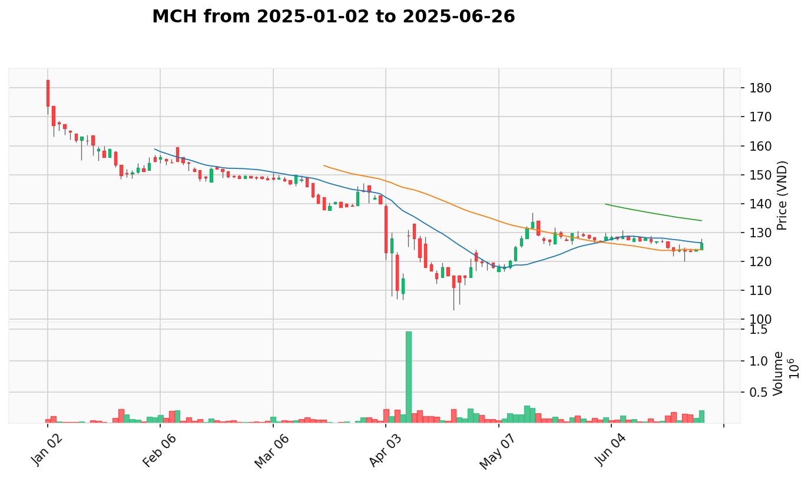

<a href="#thuc-pham">↑ Back to group THUC_PHAM</a>  |  <a href="#vpa-signal-summary">↑ Back to Top</a>

#### Key Statistics
| Metric | Value |
|:---|---:|
| Date Range | 2025-01-02 to 2025-11-07 |
| **Latest Close** | **194.8** |
| Period Open | 179.22 |
| Period High | 198.0 |
| Period Low | 100.99 |
| Period Change % | 8.69% |

**[Download MCH Data (.csv)](market_data/MCH_2025-01-02_to_2025-11-09.csv)**

---

### MCM

#### [VPA Analysis (2025-08-14 - 2025-10-21)](./VPA.md#mcm)
> **Ngày 2025-10-15:** MCM mở cửa ở mức 28.2 VND, thấp hơn giá đóng cửa phiên trước, và đóng cửa ở mức 28.1 VND, tiếp tục giảm. Biên độ giá trong phiên hẹp, từ 28.05 VND đến 28.25 VND, với giá đóng cửa nằm gần mức thấp nhất phiên. Khối lượng giao dịch đạt 0.0401 triệu cổ phiếu, tăng nhẹ so với 0.039 triệu cổ phiếu của phiên trước. Sau các phiên "Dấu hiệu suy yếu" và "Không có cầu", việc giá tiếp tục giảm với biên độ hẹp và đóng cửa ở mức thấp nhất phiên, cùng với khối lượng tăng nhẹ, cho thấy áp lực bán vẫn duy trì và lực cầu yếu, xác nhận sự yếu kém của thị trường. **Phân tích VPA/Wyckoff:** No Demand (Không có cầu)
> **Ngày 2025-10-16:** MCM mở cửa ở mức 28.15 VND, cao hơn giá đóng cửa phiên trước, và đóng cửa ở mức 28.2 VND, tăng nhẹ so với phiên trước. Biên độ giá trong phiên từ 28.05 VND đến 28.45 VND. Khối lượng giao dịch đạt 0.0166 triệu cổ phiếu, giảm đáng kể so với 0.0401 triệu cổ phiếu của phiên trước và là mức rất thấp. Sau các phiên "Không có cầu", việc giá tăng nhẹ với khối lượng cực thấp cho thấy sự thiếu vắng lực cầu mạnh mẽ, dù áp lực bán có vẻ đã giảm bớt, không xác nhận sự đảo chiều mà chỉ cho thấy sự lưỡng lự của thị trường. **Phân tích VPA/Wyckoff:** No Demand (Không có cầu)
> **Ngày 2025-10-17:** MCM mở cửa ở mức 28.2 VND, bằng với giá đóng cửa phiên trước, và đóng cửa ở mức 27.95 VND, giảm so với phiên trước. Biên độ giá trong phiên hẹp, từ 27.8 VND đến 28.2 VND, với giá đóng cửa nằm gần mức thấp nhất phiên. Khối lượng giao dịch đạt 0.0385 triệu cổ phiếu, tăng so với 0.0304 triệu cổ phiếu của phiên trước. Sau các phiên "Không có cầu", việc giá giảm với biên độ hẹp và đóng cửa gần mức thấp nhất phiên, cùng với khối lượng gia tăng, cho thấy áp lực bán đang chiếm ưu thế và thị trường tiếp tục suy yếu. **Phân tích VPA/Wyckoff:** Sign of Weakness (Dấu hiệu suy yếu)
> **Ngày 2025-10-20:** MCM mở cửa ở mức 27.9 VND, thấp hơn giá đóng cửa phiên trước (27.95 VND), và đóng cửa ở mức 26.8 VND, giảm mạnh. Biên độ giá trong phiên rộng, từ 26.8 VND đến 27.9 VND, với giá đóng cửa nằm ở mức thấp nhất phiên. Khối lượng giao dịch đạt 0.12 triệu cổ phiếu, tăng đột biến so với 0.0385 triệu cổ phiếu của phiên trước. Sau các phiên "No Demand" và "Sign of Weakness", việc giá giảm mạnh với biên độ rộng và đóng cửa ở mức thấp nhất phiên, cùng với khối lượng gia tăng đột biến, cho thấy áp lực bán cực lớn và thị trường tiếp tục suy yếu mạnh mẽ. **Phân tích VPA/Wyckoff:** Sign of Weakness (Dấu hiệu suy yếu)
> **Ngày 2025-10-21:** MCM mở cửa ở mức 27.4 VND, cao hơn giá đóng cửa phiên trước (26.8 VND), nhưng sau đó giá giảm và đóng cửa ở mức 26.6 VND, thấp hơn giá đóng cửa phiên trước. Biên độ giá trong phiên hẹp, từ 26.4 VND đến 27.4 VND, với giá đóng cửa nằm gần mức thấp nhất phiên. Khối lượng giao dịch đạt 0.0499 triệu cổ phiếu, giảm đáng kể so với 0.12 triệu cổ phiếu của phiên trước. Sau phiên giảm mạnh với khối lượng đột biến, việc giá mở cửa cao nhưng không duy trì được đà tăng, sau đó giảm và đóng cửa thấp hơn với khối lượng thấp, cho thấy áp lực bán vẫn còn và thiếu cầu mua, xác nhận xu hướng suy yếu tiếp diễn. **Phân tích VPA/Wyckoff:** Không có cầu (No Demand)

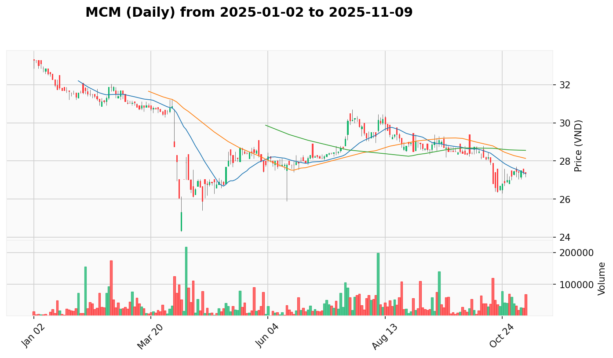

<a href="#thuc-pham">↑ Back to group THUC_PHAM</a>  |  <a href="#vpa-signal-summary">↑ Back to Top</a>

#### Key Statistics
| Metric | Value |
|:---|---:|
| Date Range | 2025-01-02 to 2025-11-07 |
| **Latest Close** | **27.35** |
| Period Open | 33.33 |
| Period High | 33.33 |
| Period Low | 24.3 |
| Period Change % | -17.94% |

**[Download MCM Data (.csv)](market_data/MCM_2025-01-02_to_2025-11-09.csv)**

---

### MFS

#### [VPA Analysis (2025-08-04 - 2025-10-21)](./VPA.md#mfs)
> **Ngày 2025-10-15:** MFS giảm từ 40.1 VND xuống 39.6 VND với khối lượng giao dịch đạt 0.0101 triệu cổ phiếu. Cây nến giảm có biên độ trung bình và đóng cửa gần mức thấp nhất phiên, cho thấy áp lực bán tiếp diễn. So với phiên trước (No Demand), giá tiếp tục giảm với khối lượng giao dịch rất thấp, xác nhận sự thiếu vắng lực cầu và nguồn cung vẫn đang kiểm soát. **Phân tích VPA/Wyckoff:** Continued Weakness (Tiếp diễn suy yếu) - Giá giảm trên khối lượng rất thấp, cho thấy lực cầu yếu và thị trường vẫn đang trong giai đoạn suy yếu.
> **Ngày 2025-10-16:** MFS mở cửa tại 40.0 VND và đóng cửa tại 39.8 VND, giảm 0.2 VND trong phiên. So với giá đóng cửa phiên trước (39.6 VND), giá đóng cửa phiên này tăng nhẹ lên 39.8 VND. Khối lượng giao dịch đạt 0.006 triệu cổ phiếu, thấp hơn đáng kể so với phiên trước (0.0101 triệu cổ phiếu) và là mức rất thấp. Sau các phiên suy yếu liên tiếp, việc giá đóng cửa tăng nhẹ nhưng vẫn là một cây nến giảm với khối lượng cực thấp cho thấy áp lực bán đã giảm nhưng lực cầu vẫn rất yếu và chưa có sự tham gia đáng kể. Điều này xác nhận sự thiếu vắng nhu cầu trên thị trường. **Phân tích VPA/Wyckoff:** No Demand (Thiếu vắng nhu cầu)
> **Ngày 2025-10-17:** MFS tăng từ 39.5 VND lên 41.0 VND với khối lượng giao dịch đạt 0.0862 triệu cổ phiếu. Cây nến tăng có biên độ rộng và đóng cửa ở mức cao hơn đáng kể so với phiên trước, cho thấy lực cầu đã quay trở lại mạnh mẽ sau giai đoạn suy yếu và thiếu vắng nhu cầu. Khối lượng giao dịch tăng vọt xác nhận sự tham gia của người mua. **Phân tích VPA/Wyckoff:** Demand Coming In (Lực cầu xuất hiện)
> **Ngày 2025-10-20:** MFS tăng từ 41.0 VND lên 42.1 VND với khối lượng giao dịch đạt 0.0862 triệu cổ phiếu. Cây nến tăng có biên độ rộng, mở cửa tại 40.6 VND và đóng cửa ở mức 42.1 VND, với mức cao nhất trong phiên là 44.0 VND. Khối lượng giao dịch duy trì ở mức cao, xác nhận lực cầu mạnh mẽ tiếp tục đẩy giá lên sau phiên "Demand Coming In" trước đó. **Phân tích VPA/Wyckoff:** Sign of Strength (SOS)
> **Ngày 2025-10-21:** MFS giảm từ 42.1 VND xuống 41.2 VND với khối lượng giao dịch đạt 0.0646 triệu cổ phiếu. Cây nến giảm có biên độ rộng, mở cửa tại 42.1 VND và đóng cửa ở mức 41.2 VND, với mức thấp nhất trong phiên là 40.3 VND. Khối lượng giao dịch giảm so với phiên trước, cho thấy áp lực bán không quá mạnh sau hai phiên tăng giá mạnh mẽ. Giá đóng cửa ở giữa thân nến cho thấy sự lưỡng lự giữa bên mua và bên bán. **Phân tích VPA/Wyckoff:** Phản ứng điều chỉnh (Reaction)

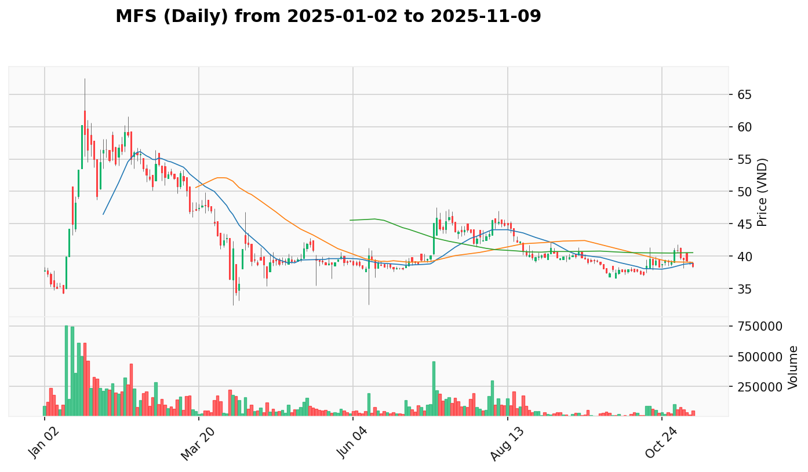

<a href="#cong-nghe">↑ Back to group CONG_NGHE</a>  |  <a href="#vpa-signal-summary">↑ Back to Top</a>

#### Key Statistics
| Metric | Value |
|:---|---:|
| Date Range | 2025-01-02 to 2025-11-07 |
| **Latest Close** | **38.4** |
| Period Open | 37.69 |
| Period High | 67.48 |
| Period Low | 32.43 |
| Period Change % | 1.88% |

**[Download MFS Data (.csv)](market_data/MFS_2025-01-02_to_2025-11-09.csv)**

---

### MHC

#### [VPA Analysis (2025-08-14 - 2025-10-21)](./VPA.md#mhc)
> **Ngày 2025-10-15:** MHC mở cửa ở mức 14.25 VND, đạt mức cao nhất 15.0 VND và đóng cửa ở 14.4 VND. So với phiên trước, giá đóng cửa tăng nhẹ từ 14.15 VND lên 14.4 VND. Tuy nhiên, khối lượng giao dịch chỉ đạt 0.3653 triệu cổ phiếu, giảm đáng kể so với phiên bán tháo mạnh mẽ trước đó (0.6545 triệu cổ phiếu). Cây nến tăng giá với biên độ hẹp và khối lượng thấp cho thấy lực cầu yếu ớt và không đủ sức để đảo ngược xu hướng giảm đã được xác nhận ở phiên trước. Đây là dấu hiệu của sự thiếu vắng nhu cầu mua sau một phiên bán mạnh, củng cố thêm sự suy yếu của thị trường. **Phân tích VPA/Wyckoff:** No Demand (Thiếu cầu) - Lực cầu yếu ớt với khối lượng thấp sau phiên bán tháo, xác nhận sự suy yếu của thị trường.
> **Ngày 2025-10-16:** MHC mở cửa ở mức 14.5 VND, đạt mức cao nhất 14.85 VND và đóng cửa ở 14.55 VND. So với phiên trước, giá đóng cửa tăng nhẹ từ 14.4 VND lên 14.55 VND. Tuy nhiên, khối lượng giao dịch chỉ đạt 0.1161 triệu cổ phiếu, giảm mạnh so với phiên trước (0.3653 triệu cổ phiếu) và là mức rất thấp. Cây nến tăng giá với biên độ hẹp và khối lượng cực thấp cho thấy lực cầu tiếp tục yếu ớt và không đủ sức để đảo ngược xu hướng giảm đã được xác nhận ở các phiên trước. Điều này củng cố thêm sự thiếu vắng nhu cầu mua và sự suy yếu của thị trường. **Phân tích VPA/Wyckoff:** No Demand (Thiếu cầu) - Lực cầu yếu ớt với khối lượng cực thấp sau các phiên suy yếu, xác nhận sự thiếu vắng nhu cầu mua và thị trường tiếp tục yếu.
> **Ngày 2025-10-17:** MHC mở cửa ở mức 14.3 VND, đạt mức cao nhất 14.5 VND và đóng cửa ở 14.05 VND. So với phiên trước, giá đóng cửa giảm từ 14.4 VND xuống 14.05 VND. Khối lượng giao dịch đạt 0.3621 triệu cổ phiếu, tăng so với phiên trước (0.3057 triệu cổ phiếu). Cây nến giảm giá với biên độ tương đối và đóng cửa gần mức thấp nhất phiên, đi kèm với khối lượng gia tăng, cho thấy áp lực bán đang chiếm ưu thế trên thị trường. Sau hai phiên "Thiếu cầu" liên tiếp, sự sụt giảm giá với khối lượng tăng này xác nhận xu hướng suy yếu và khả năng tiếp tục giảm giá. **Phân tích VPA/Wyckoff:** Sign of Weakness (SOW) - Áp lực bán gia tăng với khối lượng tăng, xác nhận sự suy yếu của thị trường.
> **Ngày 2025-10-20:** MHC mở cửa ở mức 13.8 VND, đạt mức cao nhất 14.1 VND và đóng cửa ở 13.1 VND. So với phiên trước, giá đóng cửa giảm mạnh từ 14.05 VND xuống 13.1 VND. Khối lượng giao dịch đạt 0.4452 triệu cổ phiếu, tăng so với phiên trước (0.3621 triệu cổ phiếu). Cây nến giảm giá với biên độ rộng và đóng cửa ở mức thấp nhất phiên, đi kèm với khối lượng gia tăng, cho thấy áp lực bán tiếp tục mạnh mẽ và chiếm ưu thế hoàn toàn trên thị trường. Điều này củng cố thêm tín hiệu suy yếu đã được xác nhận ở phiên trước và cho thấy khả năng giá sẽ tiếp tục giảm. **Phân tích VPA/Wyckoff:** Sign of Weakness (SOW) - Áp lực bán tiếp tục gia tăng với khối lượng tăng, xác nhận sự suy yếu của thị trường và khả năng tiếp tục giảm giá.
> **Ngày 2025-10-21:** MHC mở cửa ở mức 13.1 VND, đạt mức cao nhất 13.35 VND và đóng cửa ở 12.9 VND. So với phiên trước, giá đóng cửa giảm từ 13.1 VND xuống 12.9 VND. Khối lượng giao dịch đạt 0.3293 triệu cổ phiếu, giảm so với phiên trước (0.4452 triệu cổ phiếu). Cây nến giảm giá với biên độ tương đối và đóng cửa gần mức thấp nhất phiên, đi kèm với khối lượng giảm. Mặc dù khối lượng giảm cho thấy áp lực bán có phần suy yếu so với phiên trước, nhưng giá vẫn tiếp tục giảm và đóng cửa ở mức thấp, cho thấy lực cầu vẫn còn yếu và xu hướng giảm giá vẫn tiếp diễn. **Phân tích VPA/Wyckoff:** No Demand (ND) - Giá giảm với khối lượng thấp, cho thấy thiếu vắng lực cầu và sự tiếp diễn của xu hướng suy yếu.

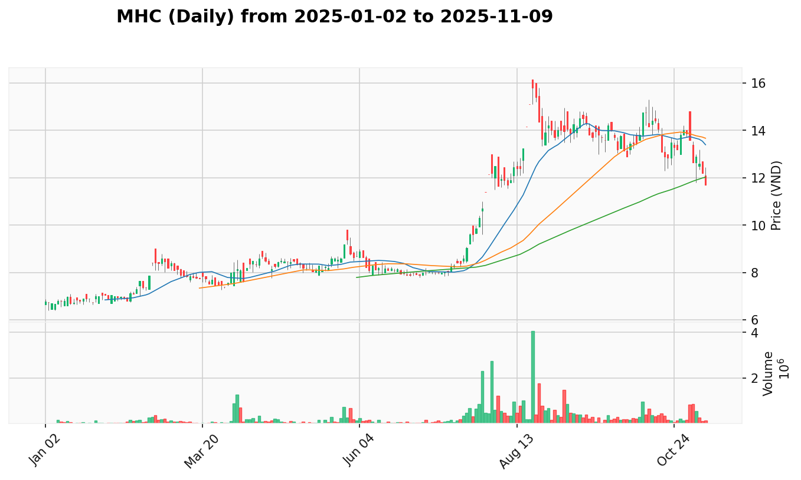

<a href="#van-tai">↑ Back to group VAN_TAI</a>  |  <a href="#vpa-signal-summary">↑ Back to Top</a>

#### Key Statistics
| Metric | Value |
|:---|---:|
| Date Range | 2025-01-02 to 2025-11-07 |
| **Latest Close** | **11.7** |
| Period Open | 6.65 |
| Period High | 16.15 |
| Period Low | 6.4 |
| Period Change % | 75.94% |

**[Download MHC Data (.csv)](market_data/MHC_2025-01-02_to_2025-11-09.csv)**

---

### MIG

#### [VPA Analysis (2025-08-04 - 2025-10-21)](./VPA.md#mig)
> **Ngày 2025-10-15:** MIG giảm từ 16.0 VND xuống 15.9 VND, đóng cửa bằng giá mở cửa với biên độ hẹp. Khối lượng giao dịch đạt 0.2379 triệu cổ phiếu, giảm mạnh so với phiên trước (0.5078 triệu cổ phiếu). Sau hai phiên giảm mạnh với nguồn cung áp đảo, việc giá tiếp tục giảm nhẹ với biên độ hẹp và khối lượng giảm cho thấy áp lực bán đã tạm lắng nhưng không có lực cầu đủ mạnh để đẩy giá lên, xác nhận sự yếu kém của thị trường. **Phân tích VPA/Wyckoff:** Không có cầu
> **Ngày 2025-10-16:** MIG giảm từ 15.85 VND xuống 15.75 VND, đóng cửa gần mức thấp nhất phiên với biên độ hẹp. Khối lượng giao dịch đạt 0.0726 triệu cổ phiếu, giảm mạnh so với phiên trước (0.2379 triệu cổ phiếu). Sau các phiên giảm mạnh với nguồn cung áp đảo và không có cầu, việc giá tiếp tục giảm nhẹ với biên độ hẹp và khối lượng cực thấp cho thấy áp lực bán đã cạn kiệt nhưng lực cầu vẫn hoàn toàn vắng bóng, xác nhận sự yếu kém tiếp diễn của thị trường. **Phân tích VPA/Wyckoff:** Không có cầu
> **Ngày 2025-10-17:** MIG tăng từ 15.8 VND lên 15.9 VND, đóng cửa ở mức cao nhất phiên với biên độ hẹp. Khối lượng giao dịch đạt 0.2282 triệu cổ phiếu, tăng nhẹ so với phiên trước (0.1574 triệu cổ phiếu) nhưng vẫn ở mức trung bình thấp. Sau các phiên giảm giá với khối lượng thấp cho thấy không có cầu, phiên này giá tăng nhẹ với khối lượng tăng cho thấy áp lực bán đã giảm bớt và có một chút lực cầu xuất hiện, nhưng chưa đủ mạnh để xác nhận xu hướng tăng. **Phân tích VPA/Wyckoff:** Test cung.
> **Ngày 2025-10-20:** MIG giảm từ 16.15 VND xuống 15.2 VND, đóng cửa ở mức thấp nhất phiên với biên độ rộng. Khối lượng giao dịch đạt 0.3011 triệu cổ phiếu, tăng so với phiên trước (0.2282 triệu cổ phiếu). Sau phiên test cung trước đó, giá giảm mạnh với biên độ rộng và khối lượng gia tăng cho thấy áp lực bán mạnh mẽ đã quay trở lại thị trường, xác nhận sự yếu kém và khả năng tiếp diễn xu hướng giảm. **Phân tích VPA/Wyckoff:** Weakness - Áp lực bán mạnh.
> **Ngày 2025-10-21:** MIG tăng từ 15.3 VND lên 15.95 VND, đóng cửa ở mức cao nhất phiên với biên độ rộng. Khối lượng giao dịch đạt 0.3913 triệu cổ phiếu, tăng đáng kể so với phiên trước (0.3011 triệu cổ phiếu). Sau phiên giảm mạnh với áp lực bán lớn, phiên này giá phục hồi mạnh mẽ với khối lượng gia tăng, cho thấy lực cầu đã quay trở lại và hấp thụ tốt lực cung. **Phân tích VPA/Wyckoff:** Sign of Strength (SOS) - Lực cầu mạnh mẽ.

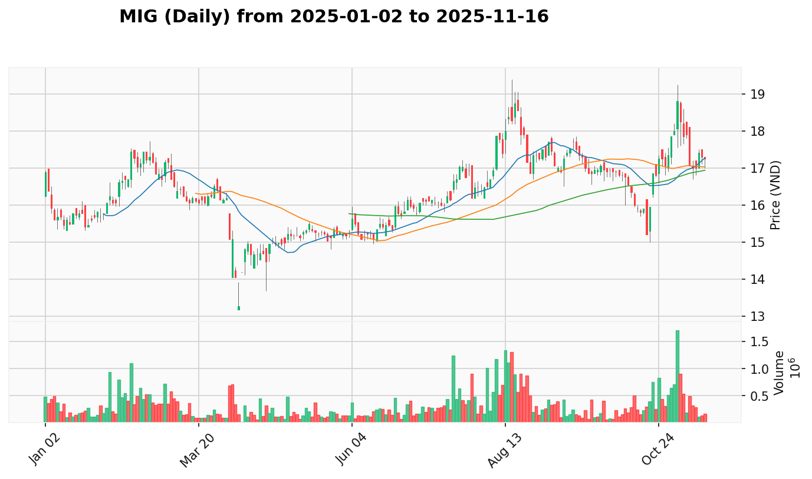

<a href="#bao-hiem">↑ Back to group BAO_HIEM</a>  |  <a href="#vpa-signal-summary">↑ Back to Top</a>

#### Key Statistics
| Metric | Value |
|:---|---:|
| Date Range | 2025-01-02 to 2025-11-07 |
| **Latest Close** | **17.05** |
| Period Open | 16.23 |
| Period High | 19.39 |
| Period Low | 13.17 |
| Period Change % | 5.05% |

**[Download MIG Data (.csv)](market_data/MIG_2025-01-02_to_2025-11-09.csv)**

---

### MPC

#### [VPA Analysis (2025-06-26 - 2025-10-21)](./VPA.md#mpc)
> **Ngày 2025-10-15:** MPC giữ giá ở mức 16.3 VND với biên độ giá hẹp (từ 16.0 VND đến 16.5 VND) và đóng cửa ở giữa phiên. Khối lượng giao dịch đạt 0.0423 triệu cổ phiếu, giảm đáng kể so với phiên trước (0.0843 triệu cổ phiếu). Sau phiên "Sự yếu kém" vào ngày 2025-10-14, việc giá đi ngang với khối lượng thấp cho thấy áp lực bán đã tạm thời chững lại, nhưng lực cầu vẫn còn rất yếu và chưa có dấu hiệu tham gia mạnh mẽ. Điều này có thể là một giai đoạn tạm dừng trong xu hướng giảm, nhưng không có sự hỗ trợ từ lực mua. **Phân tích VPA/Wyckoff:** No Demand (Không có cầu)
> **Ngày 2025-10-16:** MPC tăng từ 16.1 VND lên 16.4 VND với biên độ giá hẹp và đóng cửa ở mức cao nhất phiên. Khối lượng giao dịch đạt 0.0059 triệu cổ phiếu, giảm mạnh so với phiên trước (0.0423 triệu cổ phiếu) và là mức cực thấp. Sau phiên "Không có cầu" vào ngày 2025-10-15, việc giá tăng nhẹ với khối lượng cực thấp cho thấy áp lực cung đã cạn kiệt tạm thời, nhưng lực cầu vẫn chưa thực sự tham gia mạnh mẽ. Điều này có thể là một dấu hiệu cho thấy thị trường đang kiểm tra mức cung, nhưng chưa xác nhận sự đảo chiều. **Phân tích VPA/Wyckoff:** No Supply (Không có cung)
> **Ngày 2025-10-17:** MPC tăng từ 16.2 VND lên 16.4 VND với biên độ giá hẹp và đóng cửa ở mức cao nhất phiên. Khối lượng giao dịch đạt 0.0762 triệu cổ phiếu, tăng đáng kể so với phiên trước (0.0387 triệu cổ phiếu). Sau phiên "Không có cung" vào ngày 2025-10-16, việc giá tăng với khối lượng gia tăng cho thấy lực cầu đã bắt đầu tham gia mạnh mẽ hơn, vượt qua áp lực cung và đẩy giá lên. Đây là một dấu hiệu tích cực cho thấy sự xuất hiện của lực mua. **Phân tích VPA/Wyckoff:** Sign of Strength (SOS) - Lực cầu mạnh mẽ với khối lượng gia tăng.
> **Ngày 2025-10-20:** MPC giảm từ 16.4 VND xuống 16.2 VND với biên độ giá rộng và đóng cửa ở giữa thân nến. Khối lượng giao dịch đạt 0.1041 triệu cổ phiếu, tăng đáng kể so với phiên trước (0.0762 triệu cổ phiếu). Sau phiên "Sign of Strength" vào ngày 2025-10-17, việc giá giảm với khối lượng gia tăng cho thấy áp lực cung đã xuất hiện trở lại, nhưng lực cầu vẫn cố gắng hấp thụ ở vùng giá thấp, tạo ra một cây nến có bóng dưới dài. Điều này cho thấy thị trường đang kiểm tra lại mức cung sau đợt tăng trước đó. **Phân tích VPA/Wyckoff:** Selling Pressure (Áp lực bán) - Giá giảm với khối lượng gia tăng, cho thấy cung đang xuất hiện.
> **Ngày 2025-10-21:** MPC giảm từ 16.1 VND xuống 15.8 VND với biên độ giá rộng và đóng cửa ở mức thấp nhất phiên. Khối lượng giao dịch đạt 0.0345 triệu cổ phiếu, giảm đáng kể so với phiên trước (0.1041 triệu cổ phiếu). Sau phiên "Selling Pressure" vào ngày 2025-10-20, việc giá tiếp tục giảm với biên độ rộng nhưng khối lượng lại sụt giảm mạnh cho thấy áp lực bán đã suy yếu đáng kể. Tuy nhiên, việc giá đóng cửa ở mức thấp nhất phiên vẫn cho thấy sự yếu kém của lực cầu. Đây là dấu hiệu của sự thiếu vắng lực mua, cho phép giá giảm dễ dàng. **Phân tích VPA/Wyckoff:** No Demand (Không có cầu) - Giá giảm với khối lượng thấp, cho thấy thiếu vắng lực mua.

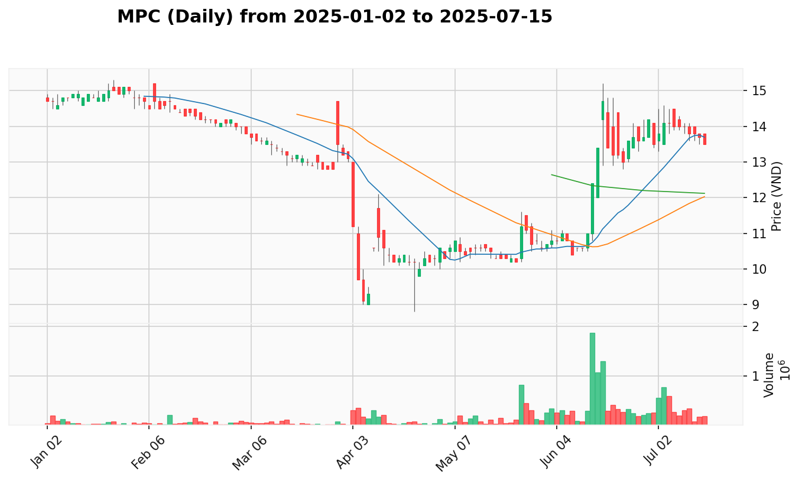

<a href="#thuy-san">↑ Back to group THUY_SAN</a>  |  <a href="#vpa-signal-summary">↑ Back to Top</a>

#### Key Statistics
| Metric | Value |
|:---|---:|
| Date Range | 2025-01-02 to 2025-11-07 |
| **Latest Close** | **16.7** |
| Period Open | 14.8 |
| Period High | 18.1 |
| Period Low | 8.8 |
| Period Change % | 12.84% |

**[Download MPC Data (.csv)](market_data/MPC_2025-01-02_to_2025-11-09.csv)**

---

### MSB

#### [VPA Analysis (2025-08-05 - 2025-10-21)](./VPA.md#msb)
> **Ngày 2025-10-15:** MSB mở cửa ở mức 13.3 VND, giá dao động trong biên độ từ 13.2 VND đến 13.45 VND và đóng cửa ở mức 13.25 VND, bằng với giá đóng cửa phiên trước (13.25 VND). Biên độ giá hẹp và giá đóng cửa ở mức thấp của phiên. Khối lượng giao dịch đạt 6.344 triệu cổ phiếu, giảm đáng kể so với phiên trước (11.7449 triệu cổ phiếu). Sau phiên Sign of Weakness (SOW) mạnh mẽ ngày 2025-10-14, phiên này cho thấy giá đi ngang với biên độ hẹp và khối lượng giao dịch sụt giảm mạnh. Điều này cho thấy áp lực bán đã tạm thời giảm bớt, nhưng lực cầu cũng chưa xuất hiện để đẩy giá lên. Đây là dấu hiệu của sự thiếu vắng cả cung và cầu, thường xuất hiện sau một đợt giảm giá mạnh, cho thấy thị trường đang trong giai đoạn tạm lắng. **Phân tích VPA/Wyckoff:** No Demand (Thiếu cầu).
> **Ngày 2025-10-16:** MSB mở cửa ở mức 13.25 VND, giá dao động trong biên độ từ 13.1 VND đến 13.3 VND và đóng cửa ở mức 13.15 VND, thấp hơn giá đóng cửa phiên trước (13.25 VND) và gần mức thấp nhất trong phiên. Khối lượng giao dịch đạt 13.6486 triệu cổ phiếu, tăng đáng kể so với phiên trước (6.344 triệu cổ phiếu). Sau phiên Thiếu cầu (No Demand) ngày 2025-10-15, phiên này cho thấy giá tiếp tục giảm với biên độ hẹp nhưng đóng cửa ở mức thấp của phiên, đi kèm với khối lượng giao dịch gia tăng mạnh. Điều này cho thấy áp lực bán đã quay trở lại và đang chiếm ưu thế, xác nhận sự yếu kém của thị trường. **Phân tích VPA/Wyckoff:** Sign of Weakness (SOW) - Lực cung mạnh mẽ.
> **Ngày 2025-10-17:** MSB mở cửa ở mức 13.25 VND, giá dao động trong biên độ từ 13.05 VND đến 13.25 VND và đóng cửa ở mức 13.05 VND, thấp hơn giá đóng cửa phiên trước (13.25 VND) và bằng mức thấp nhất trong phiên. Biên độ giá hẹp. Khối lượng giao dịch đạt 13.1304 triệu cổ phiếu, giảm đáng kể so với phiên trước (18.7648 triệu cổ phiếu). Sau phiên Sign of Weakness ngày 2025-10-16, phiên này cho thấy giá tiếp tục giảm nhưng với biên độ hẹp và khối lượng giao dịch sụt giảm mạnh. Điều này cho thấy áp lực bán đã giảm bớt, nhưng lực cầu vẫn chưa xuất hiện để hỗ trợ giá. **Phân tích VPA/Wyckoff:** No Demand (Thiếu cầu).
> **Ngày 2025-10-20:** MSB mở cửa ở mức 13.05 VND, giá dao động trong biên độ từ 12.2 VND đến 13.1 VND và đóng cửa ở mức 12.2 VND, thấp hơn giá đóng cửa phiên trước (13.05 VND) và bằng mức thấp nhất trong phiên. Biên độ giá rộng. Khối lượng giao dịch đạt 22.7156 triệu cổ phiếu, tăng đáng kể so với phiên trước (13.1304 triệu cổ phiếu). Sau phiên Thiếu cầu (No Demand) ngày 2025-10-17, phiên này cho thấy giá giảm mạnh với biên độ rộng và đóng cửa ở mức thấp nhất phiên, đi kèm với khối lượng giao dịch gia tăng đột biến. Điều này xác nhận áp lực bán mạnh mẽ và sự yếu kém của thị trường. **Phân tích VPA/Wyckoff:** Sign of Weakness (SOW) - Lực cung mạnh mẽ.
> **Ngày 2025-10-21:** MSB mở cửa ở mức 12.25 VND, giá dao động trong biên độ từ 12.05 VND đến 12.55 VND và đóng cửa ở mức 12.35 VND, cao hơn giá đóng cửa phiên trước (12.2 VND). Biên độ giá hẹp. Khối lượng giao dịch đạt 12.3122 triệu cổ phiếu, giảm đáng kể so với phiên trước (22.7156 triệu cổ phiếu). Sau phiên Sign of Weakness ngày 2025-10-20 với giá giảm mạnh và khối lượng lớn, phiên này cho thấy giá hồi phục nhẹ với biên độ hẹp và khối lượng giao dịch sụt giảm mạnh. Điều này cho thấy áp lực bán đã tạm thời giảm bớt, nhưng lực cầu vẫn còn yếu và chưa đủ mạnh để đẩy giá lên cao. Đây có thể là một phiên kiểm tra nguồn cung hoặc một đợt hồi phục yếu trong xu hướng giảm. **Phân tích VPA/Wyckoff:** Test for Supply (Kiểm tra nguồn cung).

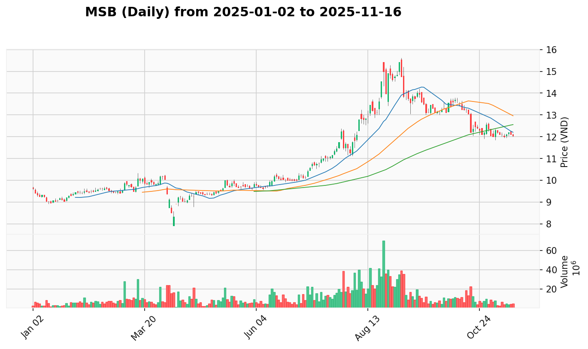

<a href="#ngan-hang">↑ Back to group NGAN_HANG</a>  |  <a href="#vpa-signal-summary">↑ Back to Top</a>

#### Key Statistics
| Metric | Value |
|:---|---:|
| Date Range | 2025-01-02 to 2025-11-07 |
| **Latest Close** | **12.1** |
| Period Open | 9.67 |
| Period High | 15.62 |
| Period Low | 7.92 |
| Period Change % | 25.13% |

**[Download MSB Data (.csv)](market_data/MSB_2025-01-02_to_2025-11-09.csv)**

---

### MSH

#### [VPA Analysis (2025-06-26 - 2025-10-21)](./VPA.md#msh)
> **Ngày 2025-10-15:** MSH giảm từ 34.6 VND xuống 34.35 VND với cây nến có biên độ rộng (spread 0.55 điểm), mở cửa ở 34.55, test cao lên 34.7 và thấp xuống 34.15 trước khi đóng cửa ở 34.35, gần mức thấp nhất phiên. Khối lượng giao dịch đạt 0.1821 triệu cổ phiếu, cao hơn đáng kể so với phiên trước (0.0944 triệu cổ phiếu) và cao hơn cả phiên SOS (0.1792 triệu cổ phiếu). Sau phiên giảm giá với khối lượng thấp vào ngày 2025-10-14, phiên này giá tiếp tục giảm mạnh với khối lượng gia tăng đột biến, cho thấy áp lực bán rất mạnh và nguồn cung đang chiếm ưu thế hoàn toàn trên thị trường. Lực cầu đã không thể hấp thụ được lượng cung lớn này. **Phân tích VPA/Wyckoff:** Sign of Weakness (SOW) - Lực cung mạnh mẽ
> **Ngày 2025-10-16:** MSH giảm từ 34.35 VND xuống 34.3 VND với cây nến có biên độ hẹp (0.25 điểm) và đóng cửa gần mức thấp nhất phiên. Khối lượng giao dịch đạt 0.0283 triệu cổ phiếu, thấp hơn đáng kể so với phiên trước (0.1821 triệu cổ phiếu). Sau hai phiên giảm giá mạnh mẽ với khối lượng cao, phiên này giá tiếp tục giảm nhẹ nhưng với khối lượng cực kỳ thấp, cho thấy áp lực bán đã suy yếu đáng kể. Tuy nhiên, việc giá vẫn đóng cửa ở mức thấp và không có sự xuất hiện của lực cầu mạnh mẽ cho thấy thị trường vẫn đang trong giai đoạn yếu kém và chưa có dấu hiệu phục hồi rõ ràng. **Phân tích VPA/Wyckoff:** No Demand (Không có cầu) - Áp lực bán suy yếu nhưng lực cầu chưa xuất hiện.
> **Ngày 2025-10-17:** MSH tăng nhẹ từ 34.2 VND lên 34.25 VND với cây nến có biên độ hẹp (spread 0.45 điểm), mở cửa ở 34.2, test cao lên 34.5 và thấp xuống 34.05 trước khi đóng cửa ở 34.25, gần mức giữa phiên. Khối lượng giao dịch đạt 0.1095 triệu cổ phiếu, cao hơn so với phiên trước (0.0815 triệu cổ phiếu). Sau hai phiên giảm giá và "No Demand", phiên này giá có sự phục hồi nhẹ với khối lượng gia tăng, cho thấy có lực cầu xuất hiện trở lại nhưng chưa đủ mạnh để tạo ra một xu hướng tăng rõ ràng. Đây có thể là một phiên kiểm tra cung cầu, cho thấy áp lực bán đã giảm bớt nhưng lực mua vẫn còn dè dặt. **Phân tích VPA/Wyckoff:** Test for Supply (Kiểm tra cung) - Lực cầu xuất hiện nhẹ sau giai đoạn suy yếu.
> **Ngày 2025-10-20:** MSH giảm mạnh từ 34.25 VND xuống 33.1 VND với cây nến có biên độ rộng (1.85 điểm) và đóng cửa gần mức thấp nhất phiên. Khối lượng giao dịch đạt 0.1565 triệu cổ phiếu, cao hơn đáng kể so với phiên trước (0.1095 triệu cổ phiếu) và cao hơn mức trung bình gần đây. Sau phiên kiểm tra cung cầu (Test for Supply) ngày 2025-10-17 cho thấy lực cầu yếu, phiên này áp lực bán đã gia tăng mạnh mẽ, đẩy giá xuống sâu với khối lượng lớn, cho thấy sự chiếm ưu thế rõ ràng của phe bán. Điều này xác nhận xu hướng giảm giá tiếp diễn. **Phân tích VPA/Wyckoff:** Sign of Weakness (SOW) - Áp lực bán mạnh mẽ với khối lượng gia tăng xác nhận xu hướng giảm.
> **Ngày 2025-10-21:** MSH tăng nhẹ từ 33.1 VND lên 33.6 VND với cây nến có biên độ rộng (spread 1.0 điểm), mở cửa ở 33.1, test cao lên 34.0 và thấp xuống 33.0 trước khi đóng cửa ở 33.6, nằm ở nửa trên của nến. Khối lượng giao dịch đạt 0.162 triệu cổ phiếu, cao hơn so với phiên trước (0.1565 triệu cổ phiếu) nhưng vẫn ở mức rất thấp so với mức trung bình. Sau phiên giảm mạnh "Sign of Weakness" ngày 2025-10-20, phiên này giá có sự phục hồi nhẹ với khối lượng gia tăng không đáng kể, cho thấy lực cầu yếu và chưa đủ mạnh để đảo chiều xu hướng giảm. Đây có thể là một phiên kiểm tra cung cầu, cho thấy áp lực bán đã giảm bớt nhưng lực mua vẫn còn dè dặt. **Phân tích VPA/Wyckoff:** Test for Supply (Kiểm tra cung) - Giá phục hồi nhẹ với khối lượng thấp sau áp lực bán mạnh, cho thấy cung đã giảm nhưng cầu chưa thực sự mạnh.

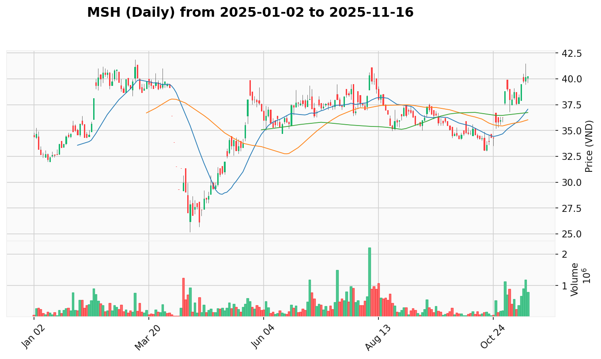

<a href="#det-may">↑ Back to group DET_MAY</a>  |  <a href="#vpa-signal-summary">↑ Back to Top</a>

#### Key Statistics
| Metric | Value |
|:---|---:|
| Date Range | 2025-01-02 to 2025-11-07 |
| **Latest Close** | **37.6** |
| Period Open | 34.54 |
| Period High | 41.87 |
| Period Low | 25.17 |
| Period Change % | 8.86% |

**[Download MSH Data (.csv)](market_data/MSH_2025-01-02_to_2025-11-09.csv)**

---

### MSN

#### [VPA Analysis (2025-06-13 - 2025-10-21)](./VPA.md#msn)
> **Ngày 2025-10-15:** MSN mở cửa tại 83.0 VND, tăng lên 83.7 VND và giảm xuống 82.5 VND, đóng cửa tại 82.5 VND. Giá không đổi so với phiên trước (82.5 VND). Cây nến giảm có biên độ hẹp (1.2 VND) và đóng cửa tại mức thấp nhất phiên, cho thấy lực cung vẫn hiện diện nhưng đã suy yếu. Khối lượng giao dịch đạt 6.5891 triệu cổ phiếu, giảm đáng kể so với phiên trước (12.7803 triệu cổ phiếu). Sự giảm giá với biên độ hẹp và khối lượng thấp sau một phiên SOW mạnh mẽ cho thấy lực cung đã tạm thời cạn kiệt, nhưng lực cầu cũng chưa xuất hiện để đẩy giá lên. Điều này cho thấy sự thiếu vắng nhu cầu mua vào sau áp lực bán mạnh. **Phân tích VPA/Wyckoff:** No Demand (ND) - Thiếu vắng lực cầu.
> **Ngày 2025-10-16:** MSN mở cửa tại 85.0 VND, tăng lên 88.2 VND và giảm xuống 84.8 VND, đóng cửa tại 88.2 VND. Giá tăng mạnh từ 82.5 VND lên 88.2 VND so với phiên trước. Cây nến tăng có biên độ rộng (3.4 VND) và đóng cửa tại mức cao nhất phiên, cho thấy lực cầu đã chiếm ưu thế hoàn toàn. Khối lượng giao dịch đạt 14.19 triệu cổ phiếu, tăng đáng kể so với phiên trước (6.59 triệu cổ phiếu) và ở mức cao. Sự tăng giá mạnh mẽ đi kèm với khối lượng cao sau một phiên No Demand cho thấy lực cầu đã quay trở lại thị trường một cách mạnh mẽ, phủ nhận tín hiệu yếu của các phiên trước và cho thấy sự thay đổi trong động lực thị trường. **Phân tích VPA/Wyckoff:** Sign of Strength (SOS) - Lực cầu mạnh mẽ.
> **Ngày 2025-10-17:** MSN mở cửa tại 91.4 VND, tăng lên 94.0 VND và giảm xuống 88.0 VND, đóng cửa tại 88.0 VND. Giá giảm nhẹ so với phiên trước (88.2 VND). Cây nến giảm có biên độ rộng (6.0 VND) và đóng cửa tại mức thấp nhất phiên, cho thấy lực cung đã áp đảo hoàn toàn sau nỗ lực tăng giá ban đầu. Khối lượng giao dịch đạt 32.81 triệu cổ phiếu, tăng rất mạnh so với phiên trước (17.21 triệu cổ phiếu) và ở mức rất cao. Sự giảm giá mạnh mẽ với biên độ rộng và khối lượng cực lớn sau một phiên SOS cho thấy lực cung đã quay trở lại thị trường một cách mạnh mẽ, phủ nhận tín hiệu tăng giá của phiên trước và cho thấy sự thay đổi trong động lực thị trường, có thể là dấu hiệu của phân phối. **Phân tích VPA/Wyckoff:** Sign of Weakness (SOW) - Lực cung mạnh mẽ.
> **Ngày 2025-10-20:** MSN mở cửa tại 87.0 VND, tăng lên 88.8 VND và giảm xuống 81.9 VND, đóng cửa tại 81.9 VND. Giá giảm mạnh từ 88.0 VND xuống 81.9 VND so với phiên trước. Cây nến giảm có biên độ rộng (6.9 VND) và đóng cửa tại mức thấp nhất phiên, cho thấy lực cung đã áp đảo hoàn toàn. Khối lượng giao dịch đạt 31.68 triệu cổ phiếu, giảm nhẹ so với phiên trước (32.81 triệu cổ phiếu) nhưng vẫn ở mức rất cao. Sự giảm giá mạnh mẽ với biên độ rộng và khối lượng rất cao sau một phiên SOW tiếp tục khẳng định lực cung mạnh mẽ trên thị trường, cho thấy sự phân phối vẫn đang diễn ra và người bán đang kiểm soát. **Phân tích VPA/Wyckoff:** Sign of Weakness (SOW) - Lực cung tiếp tục mạnh mẽ.
> **Ngày 2025-10-21:** MSN mở cửa tại 79.9 VND, tăng lên 80.0 VND và giảm xuống 76.2 VND, đóng cửa tại 78.0 VND. Giá giảm mạnh từ 81.9 VND xuống 78.0 VND so với phiên trước. Cây nến giảm có biên độ rộng (3.8 VND) và đóng cửa tại mức thấp nhất phiên, cho thấy lực cung tiếp tục áp đảo. Khối lượng giao dịch đạt 28.57 triệu cổ phiếu, giảm nhẹ so với phiên trước (31.68 triệu cổ phiếu) nhưng vẫn ở mức rất cao. Sự giảm giá mạnh mẽ với biên độ rộng và khối lượng rất cao sau các phiên SOW trước đó tiếp tục khẳng định lực cung mạnh mẽ trên thị trường, cho thấy sự phân phối vẫn đang diễn ra và người bán đang kiểm soát. **Phân tích VPA/Wyckoff:** Sign of Weakness (SOW) - Lực cung tiếp tục mạnh mẽ.

<a href="#thuc-pham">↑ Back to group THUC_PHAM</a>  |  <a href="#vpa-signal-summary">↑ Back to Top</a>

#### Key Statistics
| Metric | Value |
|:---|---:|
| Date Range | 2025-01-02 to 2025-11-07 |
| **Latest Close** | **76.8** |
| Period Open | 70.1 |
| Period High | 94.0 |
| Period Low | 50.3 |
| Period Change % | 9.56% |

**[Download MSN Data (.csv)](market_data/MSN_2025-01-02_to_2025-11-09.csv)**

---

### MSR

#### [VPA Analysis (2025-06-16 - 2025-10-21)](./VPA.md#msr)
> **Ngày 2025-10-15:** MSR giảm từ 29.7 VND xuống 28.2 VND. Cây nến giảm có biên độ rộng (spread 2.6 VND) và đóng cửa gần mức thấp nhất phiên. Khối lượng giao dịch đạt 2.5116 triệu cổ phiếu, thấp hơn so với phiên trước (3.1558 triệu cổ phiếu) nhưng vẫn ở mức đáng kể. Sau phiên lưỡng lự, phiên hôm nay cho thấy áp lực bán tiếp tục gia tăng, đẩy giá xuống thấp hơn và đóng cửa gần mức thấp nhất, xác nhận sự suy yếu của lực cầu và sự xuất hiện của lực cung. **Phân tích VPA/Wyckoff:** Sign of Weakness (SOW) - Lực cung chiếm ưu thế.
> **Ngày 2025-10-16:** MSR mở cửa ở mức 28.2 VND và đóng cửa ở 29.7 VND, tăng từ mức đóng cửa 28.2 VND của phiên trước. Giá đạt đỉnh 31.5 VND nhưng không duy trì được, cho thấy có áp lực bán ở vùng giá cao. Cây nến có biên độ rộng (spread 3.3 VND). Tuy nhiên, khối lượng giao dịch chỉ đạt 1.2611 triệu cổ phiếu, giảm đáng kể so với phiên trước (2.5116 triệu cổ phiếu) và là mức thấp nhất trong 10 phiên gần đây. Sau phiên giảm giá mạnh với tín hiệu SOW, phiên hôm nay cho thấy sự phục hồi về giá nhưng với khối lượng rất thấp, báo hiệu lực cầu yếu và khả năng đây chỉ là một đợt hồi phục kỹ thuật. **Phân tích VPA/Wyckoff:** No Demand (Không có cầu) - Lực cầu yếu, không đủ để đẩy giá lên bền vững.
> **Ngày 2025-10-17:** MSR giảm từ 29.7 VND xuống 28.8 VND. Cây nến giảm có biên độ rộng (spread 2.0 VND) và đóng cửa gần mức thấp nhất phiên. Khối lượng giao dịch đạt 2.954 triệu cổ phiếu, cao hơn đáng kể so với phiên trước (1.8623 triệu cổ phiếu). Sau phiên "No Demand" với khối lượng thấp, phiên hôm nay cho thấy áp lực bán mạnh mẽ trở lại với khối lượng gia tăng, xác nhận sự chiếm ưu thế của lực cung. **Phân tích VPA/Wyckoff:** Sign of Weakness (SOW) - Lực cung chiếm ưu thế.
> **Ngày 2025-10-20:** MSR mở cửa ở mức 28.4 VND và đóng cửa ở 25.3 VND, giảm mạnh từ mức đóng cửa 28.8 VND của phiên trước. Cây nến giảm có biên độ rất rộng (spread 4.7 VND) và đóng cửa gần mức thấp nhất phiên, cho thấy áp lực bán rất mạnh. Khối lượng giao dịch đạt 4.3845 triệu cổ phiếu, cao hơn đáng kể so với phiên trước (2.954 triệu cổ phiếu). Sau phiên SOW trước đó, phiên hôm nay tiếp tục xác nhận sự chiếm ưu thế của lực cung với giá giảm mạnh và khối lượng gia tăng. **Phân tích VPA/Wyckoff:** Sign of Weakness (SOW) - Lực cung tiếp tục chiếm ưu thế mạnh mẽ.
> **Ngày 2025-10-21:** MSR tăng từ 25.3 VND lên 26.3 VND. Cây nến tăng có biên độ hẹp (spread 1.8 VND) và đóng cửa gần mức cao nhất phiên. Khối lượng giao dịch đạt 2.7756 triệu cổ phiếu, thấp hơn đáng kể so với phiên trước (4.3845 triệu cổ phiếu). Sau hai phiên giảm mạnh với khối lượng lớn (SOW), phiên hôm nay giá tăng nhẹ nhưng với khối lượng thấp, cho thấy lực cầu yếu và không có sự tham gia mạnh mẽ. Điều này có thể là một dấu hiệu của "No Demand" trong bối cảnh xu hướng giảm giá. **Phân tích VPA/Wyckoff:** No Demand - Lực cầu yếu, không xác nhận xu hướng tăng.

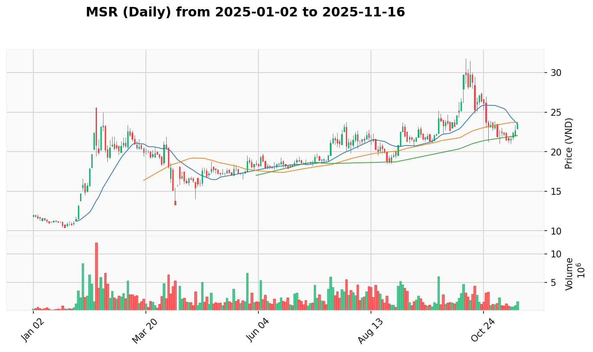

<a href="#thep">↑ Back to group THEP</a>  |  <a href="#vpa-signal-summary">↑ Back to Top</a>

#### Key Statistics
| Metric | Value |
|:---|---:|
| Date Range | 2025-01-02 to 2025-11-07 |
| **Latest Close** | **21.5** |
| Period Open | 11.8 |
| Period High | 31.8 |
| Period Low | 10.4 |
| Period Change % | 82.20% |

**[Download MSR Data (.csv)](market_data/MSR_2025-01-02_to_2025-11-09.csv)**

---

### MST

#### [VPA Analysis (2025-08-14 - 2025-10-21)](./VPA.md#mst)
> **Ngày 2025-10-15:** MST giảm từ 6.0 VND xuống 5.9 VND, với biên độ giá hẹp (5.8-6.0 VND) và đóng cửa gần mức thấp nhất phiên. Khối lượng giao dịch chỉ đạt 0.4376 triệu cổ phiếu, giảm mạnh so với phiên trước (2.7053 triệu cổ phiếu) và là mức thấp nhất trong 10 phiên gần đây. Điều này cho thấy sự tiếp diễn của tình trạng thiếu vắng lực cầu, khi giá tiếp tục giảm nhẹ mà không có sự tham gia của người mua, đồng thời áp lực bán cũng không đáng kể do khối lượng cực thấp. **Phân tích VPA/Wyckoff:** No Demand (Thiếu vắng lực cầu)
> **Ngày 2025-10-16:** MST giữ nguyên ở mức 5.9 VND, với biên độ giá hẹp (5.8-6.0 VND) và đóng cửa ở mức giữa của biên độ giá. Khối lượng giao dịch chỉ đạt 0.4348 triệu cổ phiếu, tiếp tục ở mức cực thấp, thậm chí thấp hơn phiên trước và là một trong những mức thấp nhất trong 10 phiên gần đây. Sau hai phiên liên tiếp cho thấy thiếu vắng lực cầu, phiên này giá không giảm thêm với khối lượng cực thấp, cho thấy áp lực bán đã giảm đáng kể và nguồn cung đã cạn kiệt tạm thời. Tuy nhiên, lực cầu vẫn chưa xuất hiện mạnh mẽ để đẩy giá lên. **Phân tích VPA/Wyckoff:** No Supply (Cạn kiệt nguồn cung)
> **Ngày 2025-10-17:** MST giảm từ 6.0 VND xuống 5.9 VND, với biên độ giá hẹp (5.8-6.0 VND) và đóng cửa gần mức thấp nhất phiên. Khối lượng giao dịch đạt 1.1149 triệu cổ phiếu, cao hơn đáng kể so với hai phiên trước (0.4376 triệu và 0.4348 triệu cổ phiếu) nhưng vẫn ở mức thấp so với trung bình. Sau phiên cạn kiệt nguồn cung, giá giảm trở lại với khối lượng tăng nhẹ cho thấy áp lực bán có dấu hiệu quay trở lại, xác nhận sự yếu kém của cổ phiếu. **Phân tích VPA/Wyckoff:** Weakness (Yếu kém)
> **Ngày 2025-10-20:** MST giảm từ 5.9 VND xuống 5.7 VND, với biên độ giá rộng (5.4-6.0 VND) và đóng cửa gần mức thấp nhất phiên. Khối lượng giao dịch đạt 1.8224 triệu cổ phiếu, cao hơn đáng kể so với phiên trước (1.1149 triệu cổ phiếu) và các phiên cạn kiệt nguồn cung gần đây. Sau phiên yếu kém trước đó, giá tiếp tục giảm mạnh với khối lượng gia tăng, cho thấy áp lực bán đang mạnh lên và xác nhận xu hướng giảm giá. **Phân tích VPA/Wyckoff:** Sign of Weakness (SOW)
> **Ngày 2025-10-21:** MST giảm từ 5.6 VND xuống 5.5 VND, với biên độ giá hẹp (5.4-5.8 VND) và đóng cửa gần mức thấp nhất phiên. Khối lượng giao dịch đạt 3.0664 triệu cổ phiếu, cao hơn đáng kể so với phiên trước (1.8224 triệu cổ phiếu) và cao hơn mức trung bình gần đây. Sau phiên SOW trước đó, giá tiếp tục giảm với khối lượng gia tăng mạnh, cho thấy áp lực bán vẫn đang rất lớn và xác nhận xu hướng giảm giá tiếp diễn. **Phân tích VPA/Wyckoff:** Sign of Weakness (SOW)

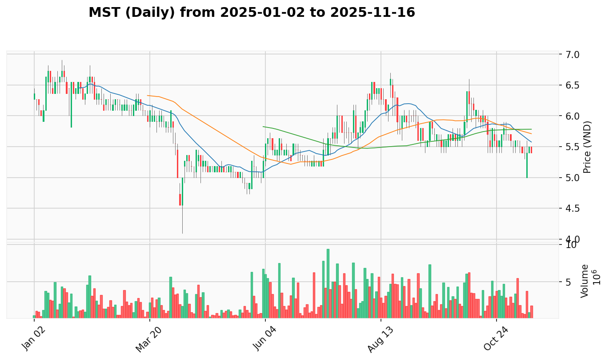

<a href="#penny">↑ Back to group PENNY</a>  |  <a href="#vpa-signal-summary">↑ Back to Top</a>

#### Key Statistics
| Metric | Value |
|:---|---:|
| Date Range | 2025-01-02 to 2025-11-07 |
| **Latest Close** | **5.5** |
| Period Open | 6.27 |
| Period High | 6.91 |
| Period Low | 4.09 |
| Period Change % | -12.28% |

**[Download MST Data (.csv)](market_data/MST_2025-01-02_to_2025-11-09.csv)**

---

### MWG

#### [VPA Analysis (2025-06-02 - 2025-10-21)](./VPA.md#mwg)
> **Ngày 2025-10-15:** MWG mở cửa ở mức 84.0 VND, thấp hơn giá đóng cửa phiên trước (84.2 VND). Giá giảm từ 84.0 VND xuống 83.3 VND, đóng cửa ở mức thấp hơn so với giá mở cửa và giá đóng cửa phiên trước. Biên độ dao động trong phiên (1.7 VND) hẹp hơn so với phiên trước. Khối lượng giao dịch đạt 5.6874 triệu cổ phiếu, giảm đáng kể so với phiên trước (12.0931 triệu cổ phiếu). Sau hai phiên SOS liên tiếp, phiên này cho thấy lực cầu suy yếu rõ rệt với giá giảm và khối lượng thấp, cho thấy sự thiếu hụt nhu cầu hoặc áp lực chốt lời nhẹ. **Phân tích VPA/Wyckoff:** No Demand (Thiếu cầu)
> **Ngày 2025-10-16:** MWG mở cửa ở mức 83.3 VND, đóng cửa ở mức 83.6 VND, cao hơn giá đóng cửa phiên trước (83.3 VND). Biên độ dao động trong phiên (1.8 VND) tương đương phiên trước. Khối lượng giao dịch đạt 2.2111 triệu cổ phiếu, giảm mạnh so với phiên trước (5.6874 triệu cổ phiếu). Sau phiên Thiếu cầu ngày 2025-10-15, phiên này cho thấy giá tăng nhẹ với khối lượng rất thấp, cho thấy áp lực bán đã giảm nhưng lực cầu vẫn chưa thực sự mạnh mẽ để đẩy giá lên cao hơn. **Phân tích VPA/Wyckoff:** No Supply (Thiếu cung)
> **Ngày 2025-10-17:** MWG mở cửa ở mức 84.8 VND, cao hơn giá đóng cửa phiên trước (84.5 VND). Giá dao động trong biên độ 2.1 VND, từ 83.8 VND lên 85.9 VND, nhưng đóng cửa ở mức 84.5 VND, bằng với giá đóng cửa phiên trước. Khối lượng giao dịch đạt 9.8805 triệu cổ phiếu, tăng đáng kể so với phiên trước (6.6294 triệu cổ phiếu). Sau phiên Thiếu cung ngày 2025-10-16, phiên này cho thấy nỗ lực đẩy giá lên cao hơn nhưng không đạt được kết quả rõ rệt, với khối lượng tăng nhưng giá không thể bứt phá, cho thấy áp lực bán đã xuất hiện trở lại hoặc lực cầu không đủ mạnh để duy trì đà tăng. **Phân tích VPA/Wyckoff:** Nỗ lực tăng giá thất bại (Effort to Rise Fails)
> **Ngày 2025-10-20:** MWG mở cửa ở mức 87.0 VND, sau đó giảm mạnh và đóng cửa ở mức 80.9 VND, thấp hơn giá đóng cửa phiên trước (84.5 VND). Biên độ dao động trong phiên (8.1 VND) rất rộng, cho thấy sự biến động lớn. Khối lượng giao dịch đạt 14.2264 triệu cổ phiếu, tăng đáng kể so với phiên trước (9.8805 triệu cổ phiếu). Sau phiên Nỗ lực tăng giá thất bại ngày 2025-10-17, phiên này cho thấy áp lực bán mạnh mẽ đã đẩy giá xuống thấp với khối lượng tăng cao, xác nhận sự suy yếu của lực cầu. **Phân tích VPA/Wyckoff:** Sign of Weakness (SOW) - Dấu hiệu suy yếu
> **Ngày 2025-10-21:** MWG mở cửa ở mức 82.3 VND, cao hơn giá đóng cửa phiên trước (80.9 VND). Giá tăng và đóng cửa ở mức 83.0 VND, cao hơn đáng kể so với phiên trước. Biên độ dao động trong phiên (2.5 VND) hẹp hơn nhiều so với phiên giảm mạnh trước đó. Khối lượng giao dịch đạt 12.0623 triệu cổ phiếu, giảm so với phiên trước (14.2264 triệu cổ phiếu). Sau phiên Dấu hiệu suy yếu (SOW) ngày 2025-10-20, phiên này cho thấy một nỗ lực phục hồi giá với khối lượng giảm. Điều này có thể là một dấu hiệu của việc thị trường đang kiểm tra xem nguồn cung đã cạn kiệt hay chưa sau đợt bán tháo mạnh. Tuy nhiên, việc giá tăng với khối lượng thấp cho thấy lực cầu chưa thực sự mạnh mẽ để đảo chiều xu hướng. **Phân tích VPA/Wyckoff:** Test for Supply - Kiểm tra nguồn cung.

<a href="#ban-le">↑ Back to group BAN_LE</a>  |  <a href="#vpa-signal-summary">↑ Back to Top</a>

#### Key Statistics
| Metric | Value |
|:---|---:|
| Date Range | 2025-01-02 to 2025-11-07 |
| **Latest Close** | **76.5** |
| Period Open | 60.04 |
| Period High | 87.9 |
| Period Low | 45.1 |
| Period Change % | 27.42% |

**[Download MWG Data (.csv)](market_data/MWG_2025-01-02_to_2025-11-09.csv)**

---

### NAF

#### [VPA Analysis (2025-08-14 - 2025-10-21)](./VPA.md#naf)
> **Ngày 2025-10-15:** NAF mở cửa ở 33.8 VND, dao động trong biên độ từ 33.6 VND đến 34.3 VND và đóng cửa ở 34.1 VND, tiếp tục tăng so với giá đóng cửa phiên trước (33.75 VND). Khối lượng giao dịch đạt 0.5268 triệu cổ phiếu, giảm nhẹ so với phiên trước (0.5633 triệu cổ phiếu). Giá tiếp tục tăng với biên độ tương đối và đóng cửa gần mức cao nhất phiên, cho thấy lực cầu vẫn duy trì và nguồn cung bán ra không đáng kể. Mặc dù khối lượng giảm nhẹ, sự tăng giá vẫn tiếp diễn, xác nhận xu hướng tăng giá đang được củng cố. **Phân tích VPA/Wyckoff:** Sign of Strength (SOS) - Đà tăng tiếp diễn với nguồn cung hạn chế và lực cầu ổn định.
> **Ngày 2025-10-16:** NAF mở cửa ở 34.3 VND, dao động trong biên độ từ 34.05 VND đến 34.45 VND và đóng cửa ở 34.1 VND, giữ nguyên mức giá đóng cửa so với phiên trước (34.1 VND). Khối lượng giao dịch đạt 0.3088 triệu cổ phiếu, giảm đáng kể so với phiên trước (0.5272 triệu cổ phiếu). Mặc dù giá mở cửa cao hơn và đạt đỉnh mới trong phiên, nhưng không thể duy trì đà tăng và đóng cửa ở mức tương đương phiên trước. Sự sụt giảm mạnh về khối lượng trong khi giá không thể bứt phá cho thấy lực cầu đang suy yếu và có thể gặp phải áp lực cung. Điều này báo hiệu một sự tạm dừng trong xu hướng tăng giá hoặc một dấu hiệu suy yếu tiềm năng sau chuỗi ngày tăng. **Phân tích VPA/Wyckoff:** No Demand (ND) - Lực cầu suy yếu với khối lượng giảm mạnh, giá không thể tăng tiếp.
> **Ngày 2025-10-17:** NAF mở cửa ở 34.05 VND, dao động trong biên độ từ 33.7 VND đến 34.2 VND và đóng cửa ở 33.7 VND, giảm so với giá đóng cửa phiên trước (34.0 VND). Khối lượng giao dịch đạt 0.75783 triệu cổ phiếu, tăng đáng kể so với phiên trước (0.534393 triệu cổ phiếu). Giá giảm mạnh và đóng cửa ở mức thấp nhất phiên với khối lượng tăng cao, cho thấy áp lực bán ra mạnh mẽ và nguồn cung đang chiếm ưu thế. Điều này xác nhận sự suy yếu của lực cầu đã được báo hiệu từ phiên trước và cho thấy xu hướng giảm giá có thể tiếp diễn. **Phân tích VPA/Wyckoff:** Weakness (W) - Giá giảm với khối lượng tăng, cho thấy nguồn cung đang áp đảo.
> **Ngày 2025-10-20:** NAF mở cửa ở 33.7 VND, dao động trong biên độ từ 33.3 VND đến 33.9 VND và đóng cửa ở 33.3 VND, giảm so với giá đóng cửa phiên trước (33.7 VND). Khối lượng giao dịch đạt 0.651584 triệu cổ phiếu, giảm so với phiên trước (0.75783 triệu cổ phiếu). Giá tiếp tục giảm và đóng cửa ở mức thấp nhất phiên, cho thấy áp lực bán vẫn còn hiện hữu và người bán đang kiểm soát. Mặc dù khối lượng giao dịch giảm nhẹ so với phiên trước, nhưng việc giá đóng cửa ở mức thấp nhất phiên xác nhận sự yếu kém của lực cầu và khả năng tiếp diễn xu hướng giảm. **Phân tích VPA/Wyckoff:** Weakness (W) - Giá giảm và đóng cửa ở mức thấp nhất phiên, cho thấy áp lực bán tiếp diễn.
> **Ngày 2025-10-21:** NAF mở cửa ở 33.3 VND, dao động trong biên độ từ 33.05 VND đến 33.8 VND và đóng cửa ở 33.65 VND, tăng so với giá đóng cửa phiên trước (33.3 VND). Khối lượng giao dịch đạt 0.6581 triệu cổ phiếu, tăng nhẹ so với phiên trước (0.651584 triệu cổ phiếu). Giá tăng và đóng cửa gần mức cao nhất phiên, cho thấy lực cầu đã xuất hiện và hấp thụ áp lực bán sau hai phiên giảm giá liên tiếp. Mặc dù khối lượng tăng không quá đột biến, nhưng sự phục hồi của giá cho thấy tín hiệu tích cực ban đầu. **Phân tích VPA/Wyckoff:** Sign of Strength (SOS) - Giá tăng với khối lượng tăng nhẹ, cho thấy lực cầu đang quay trở lại sau giai đoạn suy yếu.

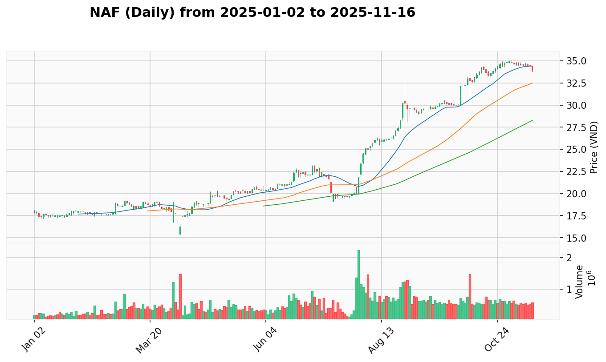

<a href="#nong-nghiep">↑ Back to group NONG_NGHIEP</a>  |  <a href="#vpa-signal-summary">↑ Back to Top</a>

#### Key Statistics
| Metric | Value |
|:---|---:|
| Date Range | 2025-01-02 to 2025-11-07 |
| **Latest Close** | **34.6** |
| Period Open | 17.91 |
| Period High | 35.1 |
| Period Low | 15.41 |
| Period Change % | 93.19% |

**[Download NAF Data (.csv)](market_data/NAF_2025-01-02_to_2025-11-09.csv)**

---

### NBC

#### [VPA Analysis (2025-08-04 - 2025-10-21)](./VPA.md#nbc)
> **Ngày 2025-10-15:** NBC giữ nguyên mức giá đóng cửa 8.8 VND so với phiên trước, với khối lượng giao dịch đạt 0.0262 triệu cổ phiếu, giảm đáng kể so với phiên trước (0.0558 triệu cổ phiếu). Cây nến có biên độ hẹp, giá mở cửa và đóng cửa ở mức 8.8 VND, cho thấy sự thiếu quyết đoán của thị trường. Mặc dù giá không giảm thêm, khối lượng thấp cho thấy cả lực cung và lực cầu đều yếu, không có bên nào chiếm ưu thế rõ rệt. Điều này có thể là một sự tạm dừng trong xu hướng yếu kém trước đó, nhưng chưa có dấu hiệu phục hồi rõ ràng. **Phân tích VPA/Wyckoff:** Weakness (Yếu kém)
> **Ngày 2025-10-16:** NBC giữ nguyên mức giá đóng cửa 8.8 VND so với phiên trước, với giá mở cửa thấp hơn ở mức 8.6 VND. Khối lượng giao dịch đạt 0.0144 triệu cổ phiếu, giảm đáng kể so với phiên trước (0.0262 triệu cổ phiếu). Cây nến có biên độ hẹp, cho thấy sự thiếu quyết đoán của thị trường. Mặc dù giá không giảm thêm, khối lượng thấp cho thấy cả lực cung và lực cầu đều yếu, không có bên nào chiếm ưu thế rõ rệt. Điều này tiếp tục cho thấy sự tạm dừng trong xu hướng yếu kém trước đó, nhưng chưa có dấu hiệu phục hồi rõ ràng và lực cầu vẫn rất yếu. **Phân tích VPA/Wyckoff:** Weakness (Yếu kém)
> **Ngày 2025-10-17:** NBC tăng từ 8.6 VND lên 8.7 VND với khối lượng giao dịch đạt 0.0488 triệu cổ phiếu, tăng đáng kể so với phiên trước (0.0281 triệu cổ phiếu). Cây nến có biên độ hẹp, đóng cửa ở mức cao nhất phiên, cho thấy lực cầu đã xuất hiện và hấp thụ lực cung. Sau giai đoạn yếu kém, sự gia tăng về giá đi kèm với khối lượng tăng cho thấy có sự nỗ lực đẩy giá lên. **Phân tích VPA/Wyckoff:** Effort to Rise (Nỗ lực tăng giá)
> **Ngày 2025-10-20:** NBC giữ nguyên mức giá đóng cửa 8.7 VND so với phiên trước, nhưng với biên độ giá rất rộng (từ 8.0 VND đến 8.9 VND). Khối lượng giao dịch đạt 0.1074 triệu cổ phiếu, tăng mạnh so với phiên trước (0.0488 triệu cổ phiếu). Mặc dù khối lượng tăng cao cho thấy sự tham gia của thị trường, việc giá không thể tăng lên và đóng cửa ở giữa biên độ rộng cho thấy lực cung đã hấp thụ toàn bộ lực cầu, làm mất đi nỗ lực tăng giá của phiên trước. Điều này báo hiệu sự yếu kém của xu hướng tăng. **Phân tích VPA/Wyckoff:** Weakness (Yếu kém)
> **Ngày 2025-10-21:** NBC giảm từ 8.7 VND xuống 8.5 VND với khối lượng giao dịch đạt 0.0362 triệu cổ phiếu, giảm đáng kể so với phiên trước (0.1074 triệu cổ phiếu). Cây nến có biên độ hẹp, đóng cửa ở mức thấp nhất phiên, cho thấy lực cung vẫn chiếm ưu thế và lực cầu yếu. Sau phiên yếu kém trước đó, việc giá tiếp tục giảm dù khối lượng thấp hơn cho thấy sự thiếu vắng lực cầu hỗ trợ, xác nhận xu hướng yếu kém. **Phân tích VPA/Wyckoff:** Weakness (Yếu kém)

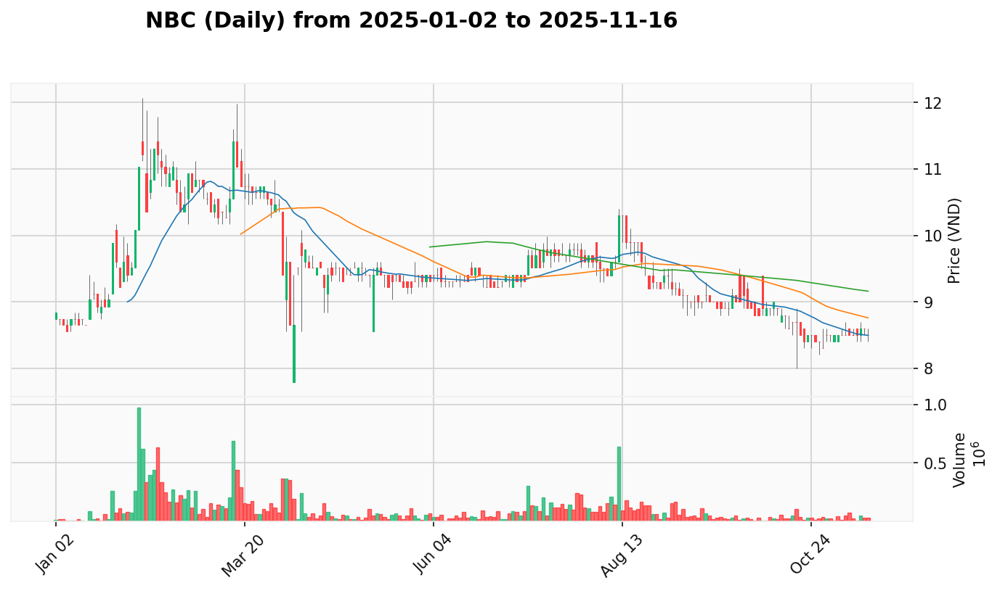

<a href="#khai-khoang">↑ Back to group KHAI_KHOANG</a>  |  <a href="#vpa-signal-summary">↑ Back to Top</a>

#### Key Statistics
| Metric | Value |
|:---|---:|
| Date Range | 2025-01-02 to 2025-11-07 |
| **Latest Close** | **8.5** |
| Period Open | 8.74 |
| Period High | 12.07 |
| Period Low | 7.79 |
| Period Change % | -2.75% |

**[Download NBC Data (.csv)](market_data/NBC_2025-01-02_to_2025-11-09.csv)**

---

### NCT

#### [VPA Analysis (2025-08-06 - 2025-10-21)](./VPA.md#nct)
> **Ngày 2025-10-15:** NCT giảm từ 104.9 VND xuống 104.8 VND với khối lượng giao dịch đạt 0.0124 triệu cổ phiếu, cao hơn một chút so với phiên trước (0.0117 triệu cổ phiếu). Cây nến có biên độ 0.3 VND (104.8 VND - 105.1 VND) và đóng cửa ở mức thấp nhất phiên, cho thấy áp lực bán vẫn duy trì. **Phân tích VPA/Wyckoff:** Effort to Fall (ETF) - Giá giảm nhẹ với khối lượng tăng nhẹ và biên độ hẹp, đóng cửa ở mức thấp nhất, cho thấy nỗ lực đẩy giá xuống vẫn tiếp diễn và sự yếu kém của thị trường.
> **Ngày 2025-10-16:** NCT tăng từ 104.8 VND lên 105.3 VND với khối lượng giao dịch đạt 0.0004 triệu cổ phiếu, thấp hơn đáng kể so với phiên trước (0.0124 triệu cổ phiếu). Cây nến có biên độ 0.0 VND (105.3 VND - 105.3 VND) và đóng cửa ở mức cao nhất phiên, cho thấy sự phục hồi nhẹ nhưng không có sự hỗ trợ từ khối lượng. Khối lượng cực thấp sau hai phiên giảm giá liên tiếp xác nhận thiếu hụt lực cầu và sự yếu kém của xu hướng tăng giá. **Phân tích VPA/Wyckoff:** No Demand (ND) - Giá tăng nhẹ với khối lượng cực thấp, xác nhận thiếu hụt lực cầu và sự yếu kém của thị trường.
> **Ngày 2025-10-17:** NCT tăng từ 105.1 VND lên 105.7 VND với khối lượng giao dịch đạt 0.0127 triệu cổ phiếu, cao hơn đáng kể so với phiên trước (0.0016 triệu cổ phiếu). Cây nến có biên độ 0.8 VND (105.2 VND - 106.0 VND) và đóng cửa gần mức cao nhất phiên, cho thấy lực cầu đã quay trở lại sau hai phiên yếu kém. **Phân tích VPA/Wyckoff:** Sign of Strength (SOS) - Giá tăng với biên độ rộng và khối lượng gia tăng, đóng cửa gần mức cao nhất, cho thấy sự trở lại của lực cầu.
> **Ngày 2025-10-20:** NCT giảm từ 105.6 VND xuống 104.4 VND với khối lượng giao dịch đạt 0.0142 triệu cổ phiếu, cao hơn so với phiên trước (0.0127 triệu cổ phiếu). Cây nến giảm có biên độ 4.3 VND (107.8 VND - 103.5 VND) và đóng cửa gần mức thấp nhất phiên, cho thấy áp lực bán mạnh mẽ đã xuất hiện sau phiên tăng giá trước đó, với nguồn cung hấp thụ lực cầu. **Phân tích VPA/Wyckoff:** Sign of Weakness (SOW) - Giá giảm mạnh với biên độ rộng và khối lượng gia tăng, đóng cửa gần mức thấp nhất, cho thấy sự trở lại của nguồn cung.
> **Ngày 2025-10-21:** NCT tăng từ 104.4 VND lên 107.6 VND với khối lượng giao dịch đạt 0.0488 triệu cổ phiếu, cao hơn đáng kể so với phiên trước (0.0142 triệu cổ phiếu). Cây nến tăng có biên độ 2.0 VND và đóng cửa ở mức cao nhất phiên, cho thấy lực cầu mạnh mẽ đã quay trở lại và áp đảo hoàn toàn lực cung sau phiên giảm mạnh trước đó. **Phân tích VPA/Wyckoff:** Sign of Strength (SOS) - Giá tăng mạnh với biên độ rộng và khối lượng gia tăng, đóng cửa ở mức cao nhất phiên, cho thấy sự trở lại của lực cầu.

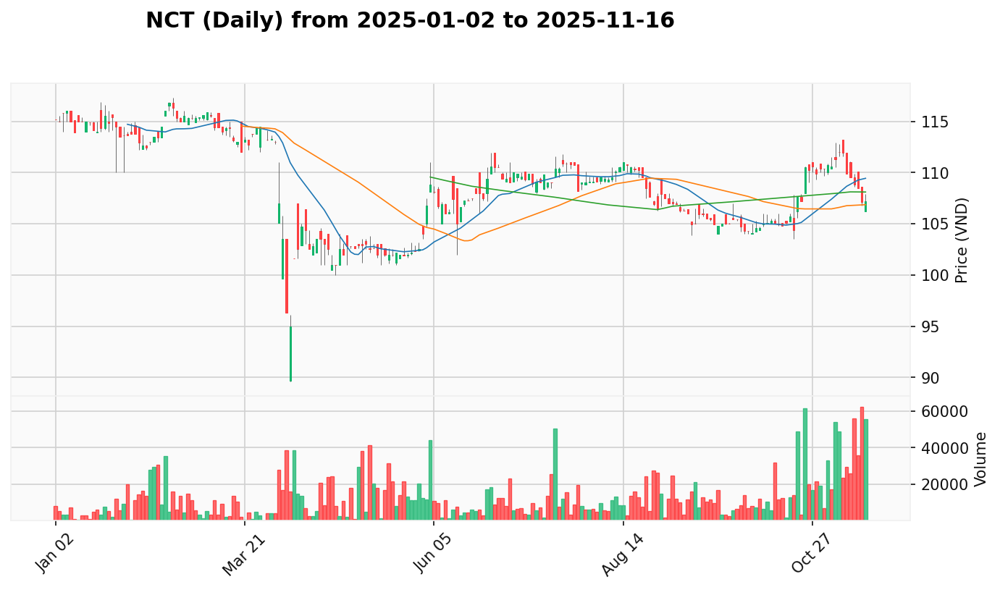

<a href="#hang-khong">↑ Back to group HANG_KHONG</a>  |  <a href="#vpa-signal-summary">↑ Back to Top</a>

#### Key Statistics
| Metric | Value |
|:---|---:|
| Date Range | 2025-01-02 to 2025-11-07 |
| **Latest Close** | **109.9** |
| Period Open | 115.2 |
| Period High | 117.3 |
| Period Low | 89.6 |
| Period Change % | -4.60% |

**[Download NCT Data (.csv)](market_data/NCT_2025-01-02_to_2025-11-09.csv)**

---

### NDN

#### [VPA Analysis (2025-08-04 - 2025-10-21)](./VPA.md#ndn)
> **Ngày 2025-10-15:** NDN mở cửa ở 13.7 VND, tăng lên 13.9 VND và đóng cửa ở 13.9 VND. Giá đóng cửa cao hơn giá mở cửa và giá đóng cửa phiên trước, với biên độ nến rộng và đóng cửa ở mức cao nhất phiên. Điều này cho thấy lực cầu mạnh mẽ đã quay trở lại và hấp thụ lực cung sau phiên Upthrust ngày 2025-10-14. Khối lượng giao dịch đạt 0.7706 triệu cổ phiếu, thấp hơn so với hai phiên trước nhưng vẫn ở mức trung bình, cho thấy lực cầu đã kiểm tra và hấp thụ thành công lực cung. **Phân tích VPA/Wyckoff:** Sign of Strength (SOS) - Test for Supply
> **Ngày 2025-10-16:** NDN mở cửa ở 14.0 VND, đạt mức cao nhất 14.2 VND nhưng sau đó giảm và đóng cửa ở 13.9 VND. Giá đóng cửa thấp hơn giá mở cửa và bằng với giá đóng cửa phiên trước, với biên độ nến tương đối rộng nhưng đóng cửa ở nửa dưới của thân nến. Khối lượng giao dịch đạt 0.4859 triệu cổ phiếu, giảm đáng kể so với phiên trước và ở mức thấp. Điều này cho thấy lực cầu đã suy yếu sau phiên SOS ngày 2025-10-15, không đủ sức đẩy giá lên cao hơn và duy trì ở mức cao, đồng thời cho thấy sự thiếu vắng của lực cầu tại các mức giá cao hơn. **Phân tích VPA/Wyckoff:** No Demand (ND)
> **Ngày 2025-10-17:** NDN giảm từ 13.8 VND xuống 13.6 VND với khối lượng giao dịch đạt 0.7841 triệu cổ phiếu. Cây nến giảm có biên độ rộng và đóng cửa gần mức thấp nhất phiên. Giá đóng cửa thấp hơn giá mở cửa và thấp hơn giá đóng cửa phiên trước, cho thấy áp lực bán mạnh mẽ đã xuất hiện và đẩy giá xuống, xác nhận sự suy yếu sau phiên No Demand ngày 2025-10-16. **Phân tích VPA/Wyckoff:** Selling Pressure (Áp lực bán)
> **Ngày 2025-10-20:** NDN mở cửa ở 12.3 VND, đạt mức cao nhất 13.6 VND nhưng sau đó giảm mạnh và đóng cửa ở 12.3 VND, bằng với giá mở cửa và mức thấp nhất phiên. Giá đóng cửa thấp hơn đáng kể so với phiên trước (13.6 VND), cho thấy áp lực bán rất mạnh. Khối lượng giao dịch đạt 0.8185 triệu cổ phiếu, cao hơn phiên trước, xác nhận sự suy yếu và lực cung áp đảo. Nến có bóng trên dài cho thấy nỗ lực tăng giá bị từ chối hoàn toàn. **Phân tích VPA/Wyckoff:** Sign of Weakness (SOW) - Lực cung mạnh mẽ.
> **Ngày 2025-10-21:** NDN tăng từ 12.3 VND lên 12.7 VND với khối lượng giao dịch đạt 1.1254 triệu cổ phiếu. Cây nến tăng có biên độ hẹp và đóng cửa gần mức cao nhất phiên, cho thấy lực cầu đã xuất hiện sau hai phiên giảm mạnh. Khối lượng giao dịch tăng cao hơn đáng kể so với phiên trước, xác nhận sự trở lại của lực mua. Đây có thể là một nỗ lực kiểm tra nguồn cung sau áp lực bán mạnh, với kết quả tích cực ban đầu. **Phân tích VPA/Wyckoff:** Demand (Lực cầu)

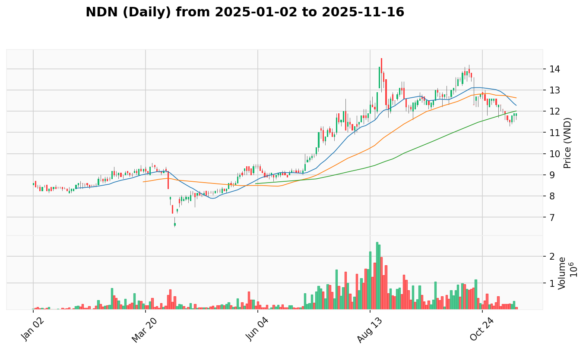

<a href="#bat-dong-san">↑ Back to group BAT_DONG_SAN</a>  |  <a href="#vpa-signal-summary">↑ Back to Top</a>

#### Key Statistics
| Metric | Value |
|:---|---:|
| Date Range | 2025-01-02 to 2025-11-07 |
| **Latest Close** | **11.9** |
| Period Open | 8.53 |
| Period High | 14.5 |
| Period Low | 6.54 |
| Period Change % | 39.51% |

**[Download NDN Data (.csv)](market_data/NDN_2025-01-02_to_2025-11-09.csv)**

---

### NHA

#### [VPA Analysis (2025-08-04 - 2025-10-21)](./VPA.md#nha)
> **Ngày 2025-10-15:** NHA mở cửa ở 21.75 VND, đạt mức cao nhất 21.95 VND, thấp nhất 21.5 VND và đóng cửa ở 21.75 VND. Khối lượng giao dịch đạt 0.4054 triệu cổ phiếu. Cây nến có thân nhỏ, cho thấy sự lưỡng lự của thị trường sau phiên giảm mạnh với khối lượng cao vào ngày 2025-10-14. Khối lượng giao dịch thấp hơn đáng kể so với các phiên trước, đặc biệt sau một phiên "Weakness", cho thấy lực cầu yếu và không có sự hấp thụ mạnh mẽ nào đối với nguồn cung. **Phân tích VPA/Wyckoff:** No Demand (ND) - Thiếu cầu.
> **Ngày 2025-10-16:** NHA tăng từ 21.75 VND lên 22.4 VND với khối lượng giao dịch đạt 0.56 triệu cổ phiếu. Cây nến tăng có biên độ rộng, giá đóng cửa gần mức cao nhất phiên. Khối lượng giao dịch tăng so với phiên "No Demand" trước đó (0.4054 triệu cổ phiếu), cho thấy lực cầu đã quay trở lại và hấp thụ nguồn cung, đẩy giá lên. Điều này báo hiệu sự phục hồi của lực mua sau giai đoạn yếu kém và thiếu cầu. **Phân tích VPA/Wyckoff:** Sign of Strength (SOS) - Dấu hiệu sức mạnh.
> **Ngày 2025-10-17:** NHA mở cửa ở mức 23.25 VND, đạt mức cao nhất 23.5 VND, thấp nhất 23.0 VND và đóng cửa ở 23.25 VND. Giá mở cửa cao hơn đáng kể so với giá đóng cửa phiên trước (22.6 VND), nhưng sau đó chỉ dao động trong biên độ hẹp và đóng cửa bằng giá mở cửa, tạo thành một cây nến thân nhỏ thể hiện sự lưỡng lự. Khối lượng giao dịch tăng vọt lên 1.5732 triệu cổ phiếu, gần gấp đôi so với phiên trước (0.8298 triệu cổ phiếu). Mặc dù có nỗ lực mua vào mạnh mẽ với khối lượng lớn, giá không thể tăng đáng kể, cho thấy lực cung đang hấp thụ lực cầu. Điều này có thể là dấu hiệu của sự phân phối hoặc nỗ lực không mang lại kết quả sau một phiên Dấu hiệu sức mạnh (SOS). **Phân tích VPA/Wyckoff:** Effort without Result (EWR) - Nỗ lực không mang lại kết quả.
> **Ngày 2025-10-20:** NHA giảm từ 23.25 VND xuống 21.65 VND với khối lượng giao dịch đạt 1.29 triệu cổ phiếu. Cây nến giảm có biên độ rộng, giá đóng cửa ở mức thấp nhất phiên. Khối lượng giao dịch vẫn ở mức cao, cho thấy áp lực bán mạnh mẽ đã đẩy giá xuống và vượt qua lực cầu. Điều này xác nhận sự yếu kém của thị trường sau phiên "Nỗ lực không mang lại kết quả" trước đó. **Phân tích VPA/Wyckoff:** Sign of Weakness (SOW) - Dấu hiệu yếu kém.
> **Ngày 2025-10-21:** NHA tiếp tục giảm từ 21.65 VND xuống 20.85 VND. Giá mở cửa ở mức 21.75 VND, cao nhất 21.8 VND, thấp nhất 20.5 VND và đóng cửa ở 20.85 VND. Cây nến giảm có biên độ rộng, giá đóng cửa gần mức thấp nhất phiên, cho thấy áp lực bán vẫn mạnh mẽ. Khối lượng giao dịch đạt 0.8118 triệu cổ phiếu, thấp hơn so với phiên trước (1.2905 triệu cổ phiếu) nhưng vẫn ở mức đáng kể, xác nhận sự tiếp diễn của xu hướng giảm sau Dấu hiệu yếu kém (SOW) của phiên trước. **Phân tích VPA/Wyckoff:** Continuation of Weakness (COW) - Tiếp diễn yếu kém.

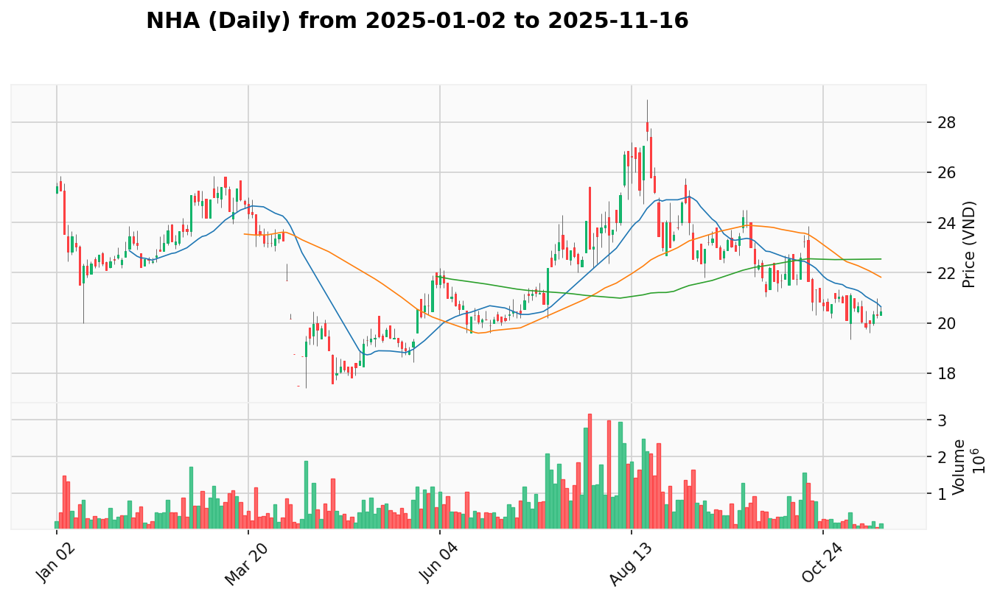

<a href="#bat-dong-san">↑ Back to group BAT_DONG_SAN</a>  |  <a href="#vpa-signal-summary">↑ Back to Top</a>

#### Key Statistics
| Metric | Value |
|:---|---:|
| Date Range | 2025-01-02 to 2025-11-07 |
| **Latest Close** | **20.05** |
| Period Open | 25.18 |
| Period High | 28.9 |
| Period Low | 17.41 |
| Period Change % | -20.37% |

**[Download NHA Data (.csv)](market_data/NHA_2025-01-02_to_2025-11-09.csv)**

---

### NHH

#### [VPA Analysis (2025-08-04 - 2025-10-21)](./VPA.md#nhh)
> **Ngày 2025-10-15:** NHH giảm từ 11.75 VND xuống 11.4 VND với khối lượng giao dịch đạt 0.2336 triệu cổ phiếu, cao hơn đáng kể so với phiên trước (0.157 triệu cổ phiếu). Cây nến giảm có biên độ rộng và đóng cửa gần mức thấp nhất phiên, cho thấy áp lực bán cực mạnh và nguồn cung đang áp đảo. Sau hai phiên 'Dấu hiệu suy yếu' liên tiếp, sự gia tăng khối lượng đi kèm với mức giảm giá mạnh mẽ này xác nhận sự tiếp diễn của xu hướng giảm giá. **Phân tích VPA/Wyckoff:** Sign of Weakness (SOW) - Dấu hiệu suy yếu.
> **Ngày 2025-10-16:** NHH tăng nhẹ từ 11.4 VND lên 11.5 VND với khối lượng giao dịch đạt 0.0646 triệu cổ phiếu, thấp hơn đáng kể so với phiên trước (0.2336 triệu cổ phiếu). Cây nến tăng có biên độ hẹp và đóng cửa ở mức giữa, cho thấy sự thiếu quyết đoán và không có lực cầu mạnh mẽ sau hai phiên giảm giá mạnh. Khối lượng thấp trong khi giá tăng nhẹ sau giai đoạn suy yếu cho thấy áp lực bán đã giảm nhưng lực mua vẫn chưa đủ mạnh để đảo chiều xu hướng. **Phân tích VPA/Wyckoff:** Test for Supply (Lack of Demand) - Kiểm tra nguồn cung (Thiếu cầu).
> **Ngày 2025-10-17:** NHH giảm từ 11.5 VND xuống 11.45 VND với khối lượng giao dịch đạt 0.133 triệu cổ phiếu, cao hơn so với phiên trước (0.1114 triệu cổ phiếu). Cây nến giảm có biên độ tương đối và đóng cửa gần mức thấp nhất phiên, cho thấy áp lực bán vẫn còn mạnh và nguồn cung đang tiếp tục đẩy giá xuống. Sau phiên kiểm tra nguồn cung với khối lượng thấp, sự gia tăng khối lượng đi kèm với mức giảm giá này xác nhận sự hiện diện của nguồn cung và khả năng tiếp diễn xu hướng giảm. **Phân tích VPA/Wyckoff:** Sign of Weakness (SOW) - Dấu hiệu suy yếu.
> **Ngày 2025-10-20:** NHH giảm từ 11.6 VND xuống 11.15 VND với khối lượng giao dịch đạt 0.2068 triệu cổ phiếu, cao hơn đáng kể so với phiên trước (0.133 triệu cổ phiếu). Cây nến giảm có biên độ rộng và đóng cửa ở mức thấp nhất phiên, cho thấy áp lực bán rất mạnh và nguồn cung đang tiếp tục chiếm ưu thế. Sau dấu hiệu suy yếu (SOW) ở phiên trước, sự gia tăng khối lượng đi kèm với mức giảm giá mạnh này xác nhận xu hướng giảm tiếp diễn. **Phân tích VPA/Wyckoff:** Sign of Weakness (SOW) - Dấu hiệu suy yếu tiếp diễn.
> **Ngày 2025-10-21:** NHH đóng cửa ở mức 11.25 VND, tăng nhẹ so với mức đóng cửa 11.15 VND của phiên trước, nhưng cây nến trong phiên là nến giảm từ 11.4 VND xuống 11.25 VND. Khối lượng giao dịch đạt 0.1229 triệu cổ phiếu, thấp hơn đáng kể so với phiên trước (0.2068 triệu cổ phiếu). Sau hai phiên giảm mạnh với khối lượng lớn (SOW), phiên này cho thấy áp lực bán đã tạm thời giảm bớt nhưng không có lực cầu mạnh mẽ nào xuất hiện. Điều này có thể là một nhịp hồi phục yếu ớt hoặc một giai đoạn tạm dừng trong xu hướng giảm. **Phân tích VPA/Wyckoff:** Lack of Demand (LOD) - Thiếu cầu.

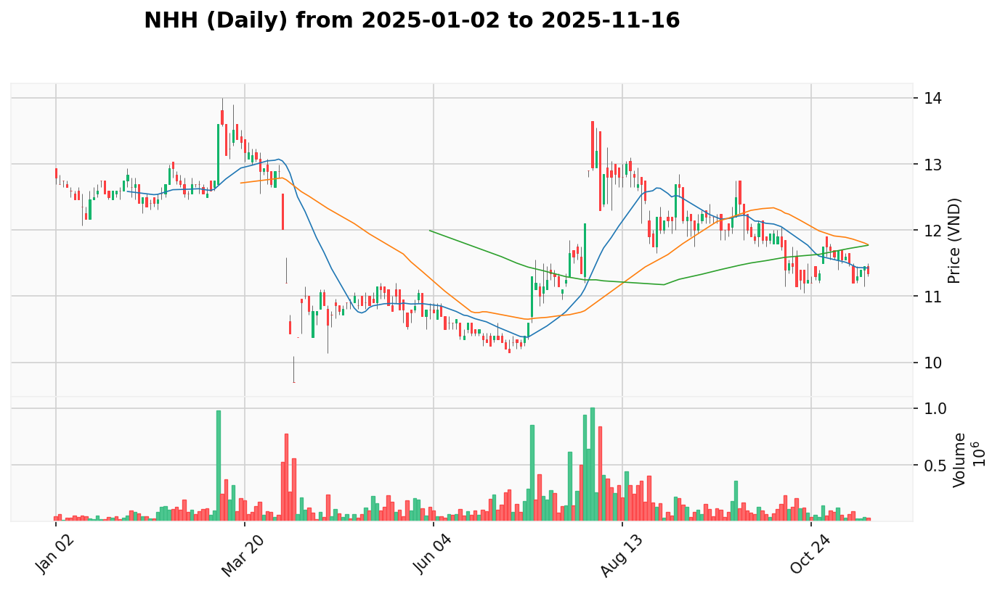

<a href="#nhua">↑ Back to group NHUA</a>  |  <a href="#vpa-signal-summary">↑ Back to Top</a>

#### Key Statistics
| Metric | Value |
|:---|---:|
| Date Range | 2025-01-02 to 2025-11-07 |
| **Latest Close** | **11.5** |
| Period Open | 12.94 |
| Period High | 14.0 |
| Period Low | 9.7 |
| Period Change % | -11.13% |

**[Download NHH Data (.csv)](market_data/NHH_2025-01-02_to_2025-11-09.csv)**

---

### NKG

#### [VPA Analysis (2025-06-26 - 2025-10-21)](./VPA.md#nkg)
> **Ngày 2025-10-15:** NKG mở cửa ở mức 16.9 VND, cao nhất 17.3 VND, thấp nhất 16.85 VND và đóng cửa ở mức 17.0 VND. Cổ phiếu giảm từ mức mở cửa 16.9 VND lên 17.0 VND, nhưng đóng cửa ở mức tương tự so với phiên trước. Biên độ giá thu hẹp đáng kể so với phiên trước. Khối lượng giao dịch đạt 7.8855 triệu cổ phiếu, giảm mạnh so với phiên trước (16.8085 triệu cổ phiếu). Sau hai phiên giảm giá mạnh với khối lượng lớn (SOW), việc giá đóng cửa không thay đổi nhiều nhưng với khối lượng giảm mạnh cho thấy áp lực bán có thể đang tạm lắng, nhưng đồng thời cũng không có lực cầu mạnh mẽ để đẩy giá lên. Điều này có thể là dấu hiệu của sự thiếu vắng nhu cầu (No Demand) sau một đợt giảm giá. **Phân tích VPA/Wyckoff:** No Demand (ND) - Khối lượng giảm mạnh sau đợt giảm giá cho thấy thiếu vắng lực cầu.
> **Ngày 2025-10-16:** NKG tăng nhẹ từ 17.0 lên 17.15. Mức mở cửa là 17.15, cao nhất 17.5, thấp nhất 16.85 và đóng cửa 17.15. Cây nến có biên độ hẹp, đóng cửa ở mức mở cửa, cho thấy sự lưỡng lự. Khối lượng giao dịch đạt 5.4478 triệu cổ phiếu, giảm mạnh so với phiên trước (7.8855 triệu cổ phiếu) và thấp hơn nhiều so với mức trung bình. Sau phiên "No Demand" ngày 2025-10-15, việc giá tăng nhẹ với khối lượng cực thấp cho thấy không có lực cầu mạnh mẽ để đẩy giá lên, đồng thời áp lực bán cũng tạm thời lắng xuống. Điều này có thể là một sự kiểm tra nguồn cung (Test for Supply) hoặc tiếp tục thiếu vắng nhu cầu. **Phân tích VPA/Wyckoff:** Test for Supply (TS) - Giá tăng nhẹ với khối lượng cực thấp sau giai đoạn suy yếu cho thấy thị trường đang kiểm tra nguồn cung.
> **Ngày 2025-10-17:** NKG mở cửa ở mức 17.55 VND, cao nhất 18.15 VND, thấp nhất 17.45 VND và đóng cửa ở mức 17.75 VND. Cổ phiếu tăng từ 17.45 VND (giá đóng cửa phiên trước) lên 17.75 VND. Biên độ giá rộng và giá đóng cửa gần mức cao nhất phiên, cho thấy lực mua mạnh mẽ. Khối lượng giao dịch đạt 22.547 triệu cổ phiếu, tăng đáng kể so với phiên trước (10.579 triệu cổ phiếu). Sự tăng giá với khối lượng lớn xác nhận sự hiện diện của lực cầu mạnh mẽ, tiếp nối đà tăng từ phiên trước. **Phân tích VPA/Wyckoff:** Sign of Strength (SOS) - Lực cầu mạnh mẽ với khối lượng gia tăng xác nhận xu hướng tăng.
> **Ngày 2025-10-20:** NKG giảm mạnh từ 17.75 VND xuống 16.55 VND. Mức mở cửa là 17.8 VND, cao nhất 17.9 VND, thấp nhất 16.55 VND và đóng cửa 16.55 VND. Cây nến có biên độ rộng, đóng cửa ở mức thấp nhất phiên, cho thấy áp lực bán rất mạnh. Khối lượng giao dịch đạt 14.3633 triệu cổ phiếu, giảm so với phiên trước (22.547 triệu cổ phiếu) nhưng vẫn ở mức cao, xác nhận sự xuất hiện của lực cung lớn. Sau phiên tăng giá mạnh (SOS) ngày 2025-10-17, sự sụt giảm này cho thấy lực cung đã quay trở lại thị trường và áp đảo lực cầu. **Phân tích VPA/Wyckoff:** Sign of Weakness (SOW) - Lực cung mạnh mẽ xuất hiện sau phiên tăng giá, đẩy giá giảm sâu với khối lượng lớn.
> **Ngày 2025-10-21:** NKG giảm từ 16.55 VND (giá đóng cửa phiên trước) xuống 15.85 VND. Mức mở cửa là 16.5 VND, cao nhất 16.55 VND, thấp nhất 15.55 VND và đóng cửa 15.85 VND. Cây nến có biên độ rộng và đóng cửa gần mức thấp nhất phiên, cho thấy áp lực bán tiếp tục mạnh mẽ. Khối lượng giao dịch đạt 18.56 triệu cổ phiếu, tăng so với phiên trước (14.36 triệu cổ phiếu). Sự giảm giá với khối lượng gia tăng sau phiên SOW trước đó xác nhận lực cung vẫn đang áp đảo và đẩy giá xuống. **Phân tích VPA/Wyckoff:** Sign of Weakness (SOW) - Lực cung tiếp tục mạnh mẽ với khối lượng gia tăng, xác nhận xu hướng giảm.

<a href="#thep">↑ Back to group THEP</a>  |  <a href="#vpa-signal-summary">↑ Back to Top</a>

#### Key Statistics
| Metric | Value |
|:---|---:|
| Date Range | 2025-01-02 to 2025-11-07 |
| **Latest Close** | **16.7** |
| Period Open | 14.55 |
| Period High | 20.4 |
| Period Low | 11.05 |
| Period Change % | 14.78% |

**[Download NKG Data (.csv)](market_data/NKG_2025-01-02_to_2025-11-09.csv)**

---

### NLG

#### [VPA Analysis (2025-06-26 - 2025-10-21)](./VPA.md#nlg)
> **Ngày 2025-10-15:** NLG mở cửa tại 39.65 VND, tăng lên mức cao nhất 39.8 VND nhưng sau đó giảm xuống mức thấp nhất 38.35 VND và đóng cửa ở mức 39.3 VND, thấp hơn so với giá đóng cửa phiên trước (39.65 VND). Biên độ giá rộng (1.45 VND) và giá đóng cửa nằm ở nửa dưới của thân nến. Khối lượng giao dịch đạt 5.8381 triệu cổ phiếu, tăng đáng kể so với phiên trước (4.0868 triệu cổ phiếu). Sau tín hiệu suy yếu (SOW) ở phiên trước, phiên hôm nay tiếp tục cho thấy áp lực bán mạnh mẽ với giá giảm trên biên độ rộng và khối lượng giao dịch tăng vọt. Điều này xác nhận lực cung đang chiếm ưu thế hoàn toàn, đẩy giá xuống thấp hơn và cho thấy sự tiếp diễn của xu hướng giảm giá. **Phân tích VPA/Wyckoff:** Sign of Weakness (SOW)
> **Ngày 2025-10-16:** NLG mở cửa tại 39.55 VND, tăng mạnh lên mức cao nhất 42.05 VND và đóng cửa ở mức 41.7 VND, cao hơn đáng kể so với giá đóng cửa phiên trước (39.3 VND). Biên độ giá rộng (2.55 VND) và giá đóng cửa nằm gần mức cao nhất phiên. Khối lượng giao dịch đạt 6.8479 triệu cổ phiếu, tăng mạnh so với phiên trước (5.8381 triệu cổ phiếu). Sau hai phiên giảm giá với tín hiệu suy yếu (SOW), phiên hôm nay cho thấy lực cầu đã quay trở lại mạnh mẽ, đẩy giá tăng trên biên độ rộng với khối lượng gia tăng. Điều này cho thấy sự hấp thụ tốt nguồn cung và có thể báo hiệu sự đảo chiều từ xu hướng giảm giá ngắn hạn. **Phân tích VPA/Wyckoff:** Sign of Strength (SOS)
> **Ngày 2025-10-17:** NLG mở cửa tại 40.05 VND, tăng lên mức cao nhất 40.1 VND nhưng sau đó giảm xuống mức thấp nhất 38.55 VND và đóng cửa ở mức 38.65 VND, chỉ cao hơn một chút so với giá đóng cửa phiên trước (38.53 VND). Biên độ giá hẹp (1.55 VND) và giá đóng cửa nằm ở nửa dưới của thân nến, cho thấy áp lực bán xuất hiện sau khi mở cửa tăng. Khối lượng giao dịch đạt 4.82 triệu cổ phiếu, giảm đáng kể so với phiên trước (13.64 triệu cổ phiếu). Sau phiên tăng giá mạnh với tín hiệu SOS, phiên hôm nay cho thấy sự suy yếu của lực cầu khi giá không thể duy trì đà tăng và đóng cửa thấp hơn giá mở cửa, đi kèm với khối lượng giao dịch sụt giảm. Điều này cho thấy sự thiếu hụt nhu cầu ở mức giá cao hơn và có thể là dấu hiệu của sự phân phối hoặc kiểm tra lại nguồn cung. **Phân tích VPA/Wyckoff:** Sign of Weakness (SOW)
> **Ngày 2025-10-20:** NLG mở cửa tại 38.65 VND, tăng nhẹ lên 38.9 VND nhưng sau đó giảm mạnh xuống mức thấp nhất 35.95 VND và đóng cửa ở mức 35.95 VND, thấp hơn đáng kể so với giá đóng cửa phiên trước (38.65 VND). Biên độ giá rộng (2.95 VND) và giá đóng cửa nằm ở mức thấp nhất phiên, cho thấy áp lực bán rất mạnh. Khối lượng giao dịch đạt 5.14 triệu cổ phiếu, tăng nhẹ so với phiên trước (4.82 triệu cổ phiếu). Sau phiên suy yếu (SOW) ngày 2025-10-17, phiên hôm nay tiếp tục xác nhận lực cung áp đảo, đẩy giá giảm mạnh trên biên độ rộng với khối lượng gia tăng, cho thấy sự thiếu hụt nhu cầu và khả năng tiếp diễn xu hướng giảm giá. **Phân tích VPA/Wyckoff:** Sign of Weakness (SOW)
> **Ngày 2025-10-21:** NLG mở cửa tại 36.0 VND, giảm xuống mức thấp nhất 34.6 VND nhưng sau đó phục hồi mạnh mẽ và đóng cửa ở mức 36.75 VND, cao hơn giá đóng cửa phiên trước (35.95 VND). Biên độ giá rộng (2.4 VND) và giá đóng cửa nằm ở nửa trên của thân nến, cho thấy lực cầu đã xuất hiện và hấp thụ áp lực bán. Khối lượng giao dịch đạt 4.79 triệu cổ phiếu, giảm nhẹ so với phiên trước (5.14 triệu cổ phiếu). Sau hai phiên SOW liên tiếp, phiên hôm nay cho thấy sự kiểm tra nguồn cung thành công khi giá giảm sâu nhưng sau đó phục hồi mạnh mẽ, đóng cửa cao hơn với khối lượng giảm nhẹ, cho thấy áp lực bán đã tạm thời suy yếu. **Phân tích VPA/Wyckoff:** Test for Supply (Kiểm tra nguồn cung)

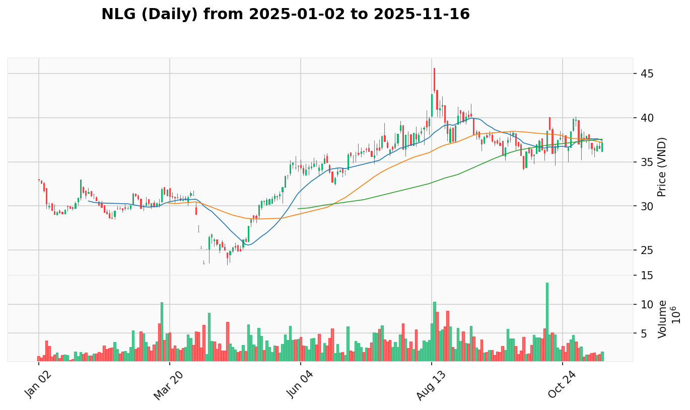

<a href="#bat-dong-san">↑ Back to group BAT_DONG_SAN</a>  |  <a href="#vpa-signal-summary">↑ Back to Top</a>

#### Key Statistics
| Metric | Value |
|:---|---:|
| Date Range | 2025-01-02 to 2025-11-07 |
| **Latest Close** | **37.65** |
| Period Open | 33.05 |
| Period High | 45.63 |
| Period Low | 23.29 |
| Period Change % | 13.92% |

**[Download NLG Data (.csv)](market_data/NLG_2025-01-02_to_2025-11-09.csv)**

---

### NNC

#### [VPA Analysis (2025-08-04 - 2025-10-21)](./VPA.md#nnc)
> **Ngày 2025-10-15:** NNC tăng từ 52.6 VND lên 53.2 VND với khối lượng giao dịch đạt 0.0283 triệu cổ phiếu. Cây nến có biên độ rộng và đóng cửa gần mức cao nhất phiên, cho thấy lực mua chiếm ưu thế. Khối lượng giao dịch tăng đáng kể so với hai phiên trước, cho thấy sự trở lại của lực cầu, phá vỡ chuỗi "Thiếu cầu" trước đó. **Phân tích VPA/Wyckoff:** Demand (Cầu trở lại)
> **Ngày 2025-10-16:** NNC giảm từ 53.2 VND xuống 52.1 VND với khối lượng giao dịch đạt 0.0035 triệu cổ phiếu. Cây nến giảm có biên độ rộng và đóng cửa ở mức thấp nhất phiên, cho thấy lực bán chiếm ưu thế. Tuy nhiên, khối lượng giao dịch cực kỳ thấp, giảm mạnh so với phiên trước và là mức thấp nhất trong 10 phiên gần đây. Điều này cho thấy không có lực cầu hỗ trợ giá, và lực bán cũng không mạnh mẽ, nhưng sự thiếu vắng của người mua đã khiến giá giảm. Đây là dấu hiệu của sự yếu kém tiếp diễn trên thị trường, sau phiên "Cầu trở lại" ngắn ngủi. **Phân tích VPA/Wyckoff:** No Demand (Thiếu cầu)
> **Ngày 2025-10-17:** NNC giảm từ 52.8 VND xuống 52.7 VND với khối lượng giao dịch đạt 0.1036 triệu cổ phiếu. Cây nến giảm có biên độ rộng, đóng cửa ở nửa trên của thân nến nhưng vẫn thấp hơn giá mở cửa, cho thấy áp lực bán mạnh mẽ đã xuất hiện. Khối lượng giao dịch cực kỳ cao, cao nhất trong 10 phiên gần đây, xác nhận sự xuất hiện của nguồn cung lớn trên thị trường sau phiên "Thiếu cầu" trước đó. Điều này cho thấy sự yếu kém tiếp diễn và khả năng giá sẽ tiếp tục giảm. **Phân tích VPA/Wyckoff:** Nguồn cung xuất hiện
> **Ngày 2025-10-20:** NNC giảm từ 52.7 VND xuống 51.9 VND với khối lượng giao dịch đạt 0.0713 triệu cổ phiếu. Cây nến giảm có biên độ rất rộng, mở cửa ở mức cao nhất phiên nhưng sau đó bị bán mạnh và đóng cửa gần mức thấp nhất phiên, cho thấy áp lực bán áp đảo hoàn toàn lực cầu. Khối lượng giao dịch cao, xác nhận sự hiện diện của nguồn cung lớn trên thị trường, tiếp nối tín hiệu "Nguồn cung xuất hiện" từ phiên trước. Điều này củng cố xu hướng yếu kém và khả năng giá sẽ tiếp tục giảm. **Phân tích VPA/Wyckoff:** Nguồn cung áp đảo
> **Ngày 2025-10-21:** NNC tăng từ 51.9 VND lên 52.0 VND với khối lượng giao dịch đạt 0.0685 triệu cổ phiếu. Cây nến tăng có biên độ rộng, mở cửa thấp hơn nhưng đóng cửa ở nửa trên của thân nến, cho thấy lực cầu đã xuất hiện và hấp thụ một phần nguồn cung. Khối lượng giao dịch cao, xác nhận sự tham gia của cả hai phe mua và bán. Sau hai phiên giảm mạnh với nguồn cung áp đảo, phiên này cho thấy một nỗ lực tăng giá. **Phân tích VPA/Wyckoff:** Nỗ lực tăng giá

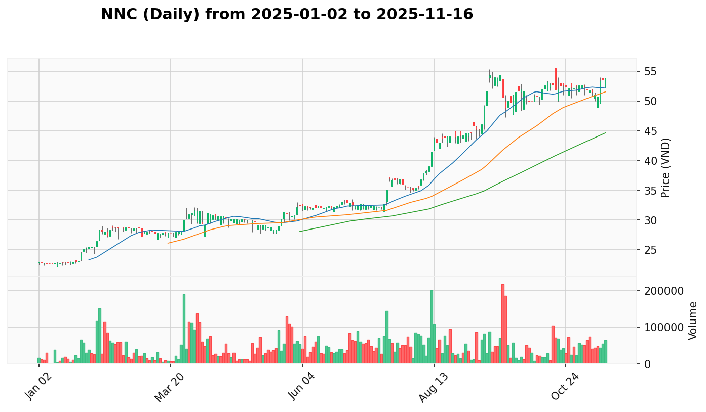

<a href="#khai-khoang">↑ Back to group KHAI_KHOANG</a>  |  <a href="#vpa-signal-summary">↑ Back to Top</a>

#### Key Statistics
| Metric | Value |
|:---|---:|
| Date Range | 2025-01-02 to 2025-11-07 |
| **Latest Close** | **51.5** |
| Period Open | 22.83 |
| Period High | 55.5 |
| Period Low | 22.2 |
| Period Change % | 125.58% |

**[Download NNC Data (.csv)](market_data/NNC_2025-01-02_to_2025-11-09.csv)**

---

### NRC

#### [VPA Analysis (2025-08-14 - 2025-10-21)](./VPA.md#nrc)
> **Ngày 2025-10-15:** NRC giữ nguyên mức giá 6.6 VND với khối lượng giao dịch đạt 0.6743 triệu cổ phiếu. Nến ngày là nến thân nhỏ, mở cửa ở mức 6.6 VND và đóng cửa ở mức 6.6 VND, cho thấy sự lưỡng lự của thị trường. Khối lượng giao dịch giảm mạnh so với phiên trước (1.7522 triệu cổ phiếu), cho thấy áp lực bán đã giảm bớt đáng kể sau phiên giảm mạnh với khối lượng lớn. Điều này cho thấy thị trường đang kiểm tra nguồn cung ở mức giá hiện tại. **Phân tích VPA/Wyckoff:** Test for Supply (Kiểm tra nguồn cung)
> **Ngày 2025-10-16:** NRC giữ nguyên mức giá 6.6 VND, mở cửa ở 6.7 VND và đóng cửa ở 6.6 VND với khối lượng giao dịch đạt 0.8367 triệu cổ phiếu. Nến ngày là nến giảm thân nhỏ, đóng cửa ở mức thấp nhất phiên, cho thấy áp lực bán vẫn hiện hữu. Khối lượng giao dịch tăng nhẹ so với phiên kiểm tra nguồn cung trước đó (0.6743 triệu cổ phiếu), nhưng giá không thể tăng lên, thậm chí còn đóng cửa ở mức thấp nhất phiên. Điều này cho thấy lực cầu yếu và không đủ sức hấp thụ nguồn cung hiện có, xác nhận sự yếu kém tiếp diễn sau tín hiệu SOW và kiểm tra nguồn cung không thành công. **Phân tích VPA/Wyckoff:** No Demand (Không có cầu)
> **Ngày 2025-10-17:** NRC tăng từ 6.7 lên 6.8 VND với khối lượng giao dịch đạt 2.639 triệu cổ phiếu. Nến ngày là nến tăng thân nhỏ, mở cửa ở mức 6.7 VND và đóng cửa ở mức 6.8 VND, cho thấy lực cầu đã xuất hiện trở lại. Khối lượng giao dịch tăng đáng kể so với phiên trước (1.5462 triệu cổ phiếu), cho thấy sự hấp thụ nguồn cung và có thể là sự khởi đầu của một đợt tăng giá ngắn hạn sau hai phiên kiểm tra nguồn cung và không có cầu. **Phân tích VPA/Wyckoff:** Demand Coming In (Lực cầu xuất hiện)
> **Ngày 2025-10-20:** NRC giảm từ 6.8 VND xuống 6.3 VND, mở cửa ở 6.8 VND và đóng cửa ở 6.3 VND với khối lượng giao dịch đạt 0.973 triệu cổ phiếu. Nến ngày là nến giảm thân rộng, đóng cửa gần mức thấp nhất phiên, cho thấy áp lực bán mạnh mẽ. Khối lượng giao dịch giảm đáng kể so với phiên trước (2.639 triệu cổ phiếu), nhưng giá vẫn giảm sâu, điều này cho thấy lực cầu yếu và không đủ sức hấp thụ nguồn cung, xác nhận sự yếu kém sau tín hiệu lực cầu xuất hiện trước đó. **Phân tích VPA/Wyckoff:** No Demand (Không có cầu)
> **Ngày 2025-10-21:** NRC tăng từ 6.3 lên 6.4 VND với khối lượng giao dịch đạt 1.2376 triệu cổ phiếu. Nến ngày là nến tăng thân nhỏ, mở cửa ở mức 6.2 VND và đóng cửa ở mức 6.4 VND, cho thấy lực cầu đã xuất hiện trở lại và hấp thụ nguồn cung. Khối lượng giao dịch tăng so với phiên trước (0.973 triệu cổ phiếu), xác nhận sự trở lại của lực mua sau tín hiệu không có cầu. **Phân tích VPA/Wyckoff:** Demand Coming In (Lực cầu xuất hiện)

<a href="#penny">↑ Back to group PENNY</a>  |  <a href="#vpa-signal-summary">↑ Back to Top</a>

#### Key Statistics
| Metric | Value |
|:---|---:|
| Date Range | 2025-01-02 to 2025-11-07 |
| **Latest Close** | **6.3** |
| Period Open | 5.0 |
| Period High | 7.7 |
| Period Low | 3.6 |
| Period Change % | 26.00% |

**[Download NRC Data (.csv)](market_data/NRC_2025-01-02_to_2025-11-09.csv)**

---

### NT2

#### [VPA Analysis (2025-06-16 - 2025-10-21)](./VPA.md#nt2)
> **Ngày 2025-10-15:** NT2 tăng từ 22.4 lên 22.65 với khối lượng giao dịch đạt 0.7667 triệu cổ phiếu. Cây nến tăng có biên độ vừa phải, đóng cửa ở nửa trên của thân nến. Khối lượng giao dịch rất thấp, thấp hơn đáng kể so với phiên giảm giá mạnh trước đó (1.9177 triệu cổ phiếu) và thấp hơn mức trung bình, cho thấy sự thiếu vắng lực cầu mạnh mẽ. Đây có thể là một phiên hồi phục yếu trong xu hướng giảm giá đã thiết lập, hoặc sự tạm lắng của áp lực bán mà không có sự tham gia của người mua lớn. **Phân tích VPA/Wyckoff:** No Demand (ND) - Thiếu cầu.
> **Ngày 2025-10-16:** NT2 giảm nhẹ từ 22.65 xuống 22.6 với khối lượng giao dịch đạt 0.312 triệu cổ phiếu. Cây nến có biên độ hẹp (từ 22.4 đến 22.9), đóng cửa gần giữa thân nến. Khối lượng giao dịch cực kỳ thấp, chỉ bằng khoảng 40% so với phiên trước đó (0.7667 triệu cổ phiếu) và thấp hơn rất nhiều so với mức trung bình. Điều này cho thấy sự thiếu vắng hoàn toàn lực cầu và sự thờ ơ của nhà đầu tư sau các phiên giảm giá mạnh. Mặc dù áp lực bán không còn mạnh như ngày 2025-10-14, nhưng không có dấu hiệu của lực mua chủ động. **Phân tích VPA/Wyckoff:** No Demand (ND) - Thiếu cầu trầm trọng.
> **Ngày 2025-10-17:** NT2 giảm từ 22.02 xuống 21.73 với khối lượng giao dịch đạt 1.52 triệu cổ phiếu. Cây nến giảm có biên độ vừa phải, đóng cửa gần mức thấp nhất phiên. Khối lượng giao dịch cao hơn đáng kể so với phiên trước đó (0.48 triệu cổ phiếu) và cao hơn mức trung bình, cho thấy áp lực bán gia tăng sau hai phiên thiếu cầu trầm trọng. Điều này xác nhận sự yếu kém của cổ phiếu và khả năng tiếp diễn xu hướng giảm. **Phân tích VPA/Wyckoff:** Sign of Weakness (SOW) - Lực cung gia tăng.
> **Ngày 2025-10-20:** NT2 giảm từ 21.73 xuống 21.05 với khối lượng giao dịch đạt 1.42 triệu cổ phiếu. Cây nến giảm có biên độ rộng, đóng cửa gần mức thấp nhất phiên. Khối lượng giao dịch cao, tuy thấp hơn một chút so với phiên trước (1.52 triệu cổ phiếu) nhưng vẫn duy trì ở mức cao, cho thấy áp lực bán tiếp tục chiếm ưu thế. Điều này xác nhận sự yếu kém của cổ phiếu và khả năng tiếp diễn xu hướng giảm sau các tín hiệu thiếu cầu và lực cung gia tăng trước đó. **Phân tích VPA/Wyckoff:** Sign of Weakness (SOW) - Lực cung tiếp diễn.
> **Ngày 2025-10-21:** NT2 tăng từ 21.05 lên 21.35 với khối lượng giao dịch đạt 1.17 triệu cổ phiếu. Cây nến tăng có biên độ vừa phải, đóng cửa ở giữa thân nến. Khối lượng giao dịch thấp hơn đáng kể so với phiên giảm mạnh trước đó (1.42 triệu cổ phiếu) và thấp hơn mức trung bình. Điều này cho thấy lực cầu yếu, không đủ mạnh để đẩy giá lên cao sau các phiên giảm điểm với áp lực bán lớn. Đây có thể là một nhịp hồi phục kỹ thuật yếu ớt hoặc dấu hiệu thiếu cầu. **Phân tích VPA/Wyckoff:** No Demand (Thiếu cầu)

<a href="#nang-luong">↑ Back to group NANG_LUONG</a>  |  <a href="#vpa-signal-summary">↑ Back to Top</a>

#### Key Statistics
| Metric | Value |
|:---|---:|
| Date Range | 2025-01-02 to 2025-11-07 |
| **Latest Close** | **23.05** |
| Period Open | 19.45 |
| Period High | 25.35 |
| Period Low | 15.48 |
| Period Change % | 18.51% |

**[Download NT2 Data (.csv)](market_data/NT2_2025-01-02_to_2025-11-09.csv)**

---

### NTC

#### [VPA Analysis (2025-08-04 - 2025-10-15)](./VPA.md#ntc)
> **Ngày 2025-10-09:** NTC đóng cửa ở mức 162.5 VND, giảm từ 163.6 VND của ngày trước đó. Biên độ giá trong phiên hẹp (từ 162.1 VND đến 164.1 VND) và giá đóng cửa ở nửa dưới của thanh giá. Khối lượng giao dịch đạt 0.0107 triệu cổ phiếu, giảm đáng kể so với 0.0165 triệu cổ phiếu của ngày trước đó. Thanh giá cho thấy sự giảm giá nhẹ với biên độ hẹp và đóng cửa ở nửa dưới, đi kèm với khối lượng rất thấp. Điều này cho thấy lực bán không mạnh nhưng lực mua cũng hoàn toàn vắng bóng, tiếp tục xác nhận tình trạng thiếu cầu và suy yếu của thị trường từ các phiên trước. **Phân tích VPA/Wyckoff:** Weakness (Suy yếu)
> **Ngày 2025-10-10:** NTC đóng cửa ở mức 164.0 VND, tăng từ 162.5 VND của ngày trước đó. Biên độ giá trong phiên hẹp (từ 162.5 VND đến 164.4 VND) và giá đóng cửa ở nửa trên của thanh giá. Khối lượng giao dịch đạt 0.0253 triệu cổ phiếu, tăng đáng kể so với 0.0107 triệu cổ phiếu của ngày trước đó. Thanh giá tăng nhẹ với biên độ hẹp và đóng cửa ở nửa trên, đi kèm với khối lượng gia tăng, cho thấy lực cầu đã có dấu hiệu quay trở lại sau các phiên suy yếu và thiếu cầu. Tuy nhiên, sự tăng giá còn yếu và cần xác nhận thêm. **Phân tích VPA/Wyckoff:** Effort to Rise (Nỗ lực tăng giá)
> **Ngày 2025-10-13:** NTC đóng cửa ở mức 163.0 VND, giảm từ 164.0 VND của ngày trước đó. Biên độ giá trong phiên hẹp (từ 162.0 VND đến 163.5 VND) và giá đóng cửa ở giữa thanh giá. Khối lượng giao dịch đạt 0.0452 triệu cổ phiếu, tăng đáng kể so với 0.0253 triệu cổ phiếu của ngày trước đó. Thanh giá giảm nhẹ với biên độ hẹp và đóng cửa ở giữa, đi kèm với khối lượng gia tăng. Điều này cho thấy nỗ lực tăng giá trước đó đã gặp phải lực cung và thị trường vẫn đang trong trạng thái suy yếu, với áp lực bán vẫn còn hiện hữu. **Phân tích VPA/Wyckoff:** Weakness (Suy yếu)
> **Ngày 2025-10-14:** NTC đóng cửa ở mức 164.2 VND, tăng từ 163.0 VND của ngày trước đó. Biên độ giá trong phiên hẹp (từ 163.0 VND đến 165.0 VND) và giá đóng cửa ở nửa trên của thanh giá. Khối lượng giao dịch đạt 0.0443 triệu cổ phiếu, giảm nhẹ so với 0.0452 triệu cổ phiếu của ngày trước đó nhưng vẫn ở mức cao. Thanh giá tăng nhẹ với biên độ hẹp và đóng cửa ở nửa trên, đi kèm với khối lượng cao, cho thấy lực cầu đã quay trở lại và hấp thụ lực cung sau phiên suy yếu trước đó. **Phân tích VPA/Wyckoff:** Sign of Strength (SOS) - Lực cầu hấp thụ lực cung
> **Ngày 2025-10-15:** NTC đóng cửa ở mức 165.0 VND, tăng từ 164.2 VND của ngày trước đó. Biên độ giá trong phiên hẹp (từ 163.0 VND đến 165.1 VND) và giá đóng cửa ở gần mức cao nhất phiên. Khối lượng giao dịch đạt 0.03 triệu cổ phiếu, giảm so với 0.0443 triệu cổ phiếu của ngày trước đó. Thanh giá tăng nhẹ với biên độ hẹp và đóng cửa ở gần mức cao nhất, đi kèm với khối lượng giảm. Điều này cho thấy lực cầu vẫn duy trì nhưng không quá mạnh mẽ, đồng thời áp lực cung đã giảm bớt sau phiên SOS trước đó. **Phân tích VPA/Wyckoff:** Test for Supply (Kiểm tra cung) - Lực cầu duy trì với khối lượng giảm cho thấy cung đã cạn.

<a href="#bat-dong-san-kcn">↑ Back to group BAT_DONG_SAN_KCN</a>  |  <a href="#vpa-signal-summary">↑ Back to Top</a>

#### Key Statistics
| Metric | Value |
|:---|---:|
| Date Range | 2025-01-02 to 2025-11-07 |
| **Latest Close** | **158.1** |
| Period Open | 208.44 |
| Period High | 235.46 |
| Period Low | 117.05 |
| Period Change % | -24.15% |

**[Download NTC Data (.csv)](market_data/NTC_2025-01-02_to_2025-11-09.csv)**

---

### NTL

#### [VPA Analysis (2025-08-04 - 2025-10-21)](./VPA.md#ntl)
> **Ngày 2025-10-15:** Cổ phiếu NTL giảm từ 18.55 VND xuống 18.4 VND. Biên độ dao động trong phiên vừa phải, từ 18.35 VND đến 18.9 VND, và đóng cửa gần mức thấp nhất phiên. Khối lượng giao dịch đạt 1.0477 triệu cổ phiếu, giảm đáng kể so với phiên trước (1.8642 triệu cổ phiếu). Sau phiên "Sign of Weakness" vào ngày 2025-10-14, việc giá tiếp tục giảm và đóng cửa gần mức thấp nhất phiên, cùng với khối lượng giảm mạnh, cho thấy lực cung vẫn chiếm ưu thế nhưng với cường độ giảm, đồng thời lực cầu không xuất hiện để hỗ trợ giá. Điều này cho thấy sự thiếu hụt nhu cầu mua. **Phân tích VPA/Wyckoff:** Sign of Weakness (SOW) - Lực cung tiếp diễn và thiếu hụt lực cầu.
> **Ngày 2025-10-16:** Cổ phiếu NTL tăng từ 18.4 VND lên 18.85 VND. Cây nến tăng có biên độ vừa phải (từ 18.4 VND đến 19.15 VND) và đóng cửa gần mức cao nhất phiên. Khối lượng giao dịch đạt 0.9915 triệu cổ phiếu, giảm so với phiên trước (1.0477 triệu cổ phiếu). Sau hai phiên "Sign of Weakness", việc giá tăng và đóng cửa gần mức cao nhất phiên cho thấy lực cầu đã xuất hiện trở lại, tuy nhiên khối lượng giảm nhẹ cho thấy lực cung đã suy yếu hoặc lực cầu chưa thực sự mạnh mẽ. **Phân tích VPA/Wyckoff:** Sign of Strength (SOS) - Lực cầu xuất hiện trở lại.
> **Ngày 2025-10-17:** Cổ phiếu NTL tăng mạnh từ 18.85 VND lên 20.3 VND. Cây nến tăng có biên độ rộng, từ 18.95 VND đến 20.3 VND, và đóng cửa ở mức cao nhất phiên. Khối lượng giao dịch đạt 6.8901 triệu cổ phiếu, tăng đột biến so với phiên trước (0.9915 triệu cổ phiếu). Sau phiên "Sign of Strength" vào ngày 2025-10-16, việc giá tiếp tục tăng mạnh với biên độ rộng và đóng cửa ở mức cao nhất phiên, cùng với khối lượng giao dịch tăng vọt, cho thấy lực cầu rất mạnh mẽ và áp đảo hoàn toàn lực cung. Điều này xác nhận xu hướng tăng giá. **Phân tích VPA/Wyckoff:** Sign of Strength (SOS) - Lực cầu mạnh mẽ và áp đảo với khối lượng tăng đột biến.
> **Ngày 2025-10-20:** Cổ phiếu NTL giảm từ 20.35 VND xuống 18.9 VND. Cây nến giảm có biên độ rộng, từ 20.35 VND đến 18.9 VND, và đóng cửa ở mức thấp nhất phiên. Khối lượng giao dịch đạt 4.4449 triệu cổ phiếu, giảm so với phiên trước (6.8901 triệu cổ phiếu) nhưng vẫn ở mức cao. Sau phiên tăng mạnh "Sign of Strength" vào ngày 2025-10-17, việc giá mở cửa cao hơn nhưng sau đó giảm mạnh, đóng cửa ở mức thấp nhất phiên với biên độ rộng cho thấy áp lực bán rất mạnh mẽ đã xuất hiện và áp đảo lực cầu. Mặc dù khối lượng có giảm nhẹ so với phiên trước, nhưng vẫn duy trì ở mức cao, xác nhận sự phân phối đang diễn ra. Đây là một dấu hiệu suy yếu rõ ràng. **Phân tích VPA/Wyckoff:** Sign of Weakness (SOW) - Áp lực bán mạnh mẽ và phân phối.
> **Ngày 2025-10-21:** Cổ phiếu NTL tăng từ 18.9 VND lên 19.3 VND. Cây nến tăng có biên độ tương đối rộng, từ 18.55 VND đến 19.75 VND, và đóng cửa gần mức cao nhất phiên. Khối lượng giao dịch đạt 3.3451 triệu cổ phiếu, thấp hơn đáng kể so với phiên trước (4.4449 triệu cổ phiếu). Sau phiên "Sign of Weakness" vào ngày 2025-10-20 với áp lực bán mạnh, việc giá tăng trở lại với khối lượng thấp cho thấy lực cầu chưa thực sự mạnh mẽ và có thể chỉ là một nhịp hồi phục kỹ thuật. Điều này cần được xác nhận trong các phiên tiếp theo. **Phân tích VPA/Wyckoff:** No Demand (ND) - Lực cầu yếu, giá tăng với khối lượng thấp sau một đợt giảm.

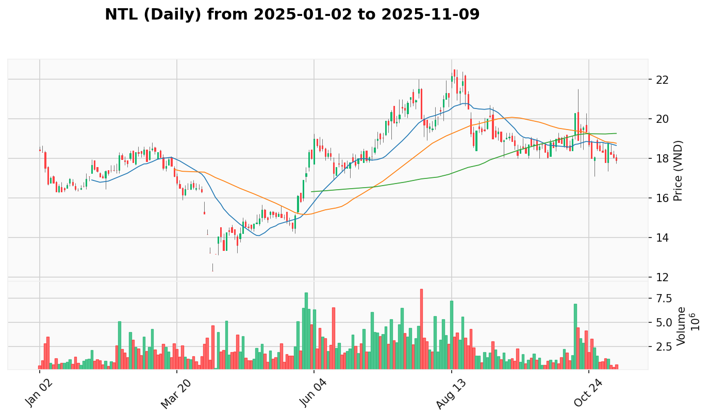

<a href="#bat-dong-san">↑ Back to group BAT_DONG_SAN</a>  |  <a href="#vpa-signal-summary">↑ Back to Top</a>

#### Key Statistics
| Metric | Value |
|:---|---:|
| Date Range | 2025-01-02 to 2025-11-07 |
| **Latest Close** | **17.9** |
| Period Open | 18.45 |
| Period High | 22.5 |
| Period Low | 12.3 |
| Period Change % | -2.98% |

**[Download NTL Data (.csv)](market_data/NTL_2025-01-02_to_2025-11-09.csv)**

---

### NTP

#### [VPA Analysis (2025-06-16 - 2025-10-21)](./VPA.md#ntp)
> **Ngày 2025-10-15:** NTP mở cửa tại 63.3 VND, sau đó tăng lên mức cao nhất 63.9 VND nhưng cuối cùng đóng cửa tại 63.0 VND. Cây nến có biên độ rộng (spread 1.7 VND) và đóng cửa thấp hơn giá mở cửa, gần mức thấp nhất phiên. Khối lượng giao dịch đạt 0.2285 triệu cổ phiếu, thấp hơn phiên Upthrust trước đó nhưng vẫn ở mức đáng kể. Sau phiên Upthrust ngày 2025-10-14, việc giá không thể duy trì đà tăng và bị đẩy xuống đóng cửa ở mức thấp, cùng với khối lượng đáng kể, cho thấy áp lực bán vẫn còn mạnh mẽ và phe mua chưa đủ sức hấp thụ. Điều này xác nhận sự yếu kém của thị trường. **Phân tích VPA/Wyckoff:** Sign of Weakness (SOW) - Dấu hiệu suy yếu.
> **Ngày 2025-10-16:** NTP mở cửa tại 63.6 VND, tăng lên mức cao nhất 65.4 VND và đóng cửa tại 65.1 VND. Cây nến tăng có biên độ rộng (spread 1.8 VND) và đóng cửa gần mức cao nhất phiên, cho thấy lực cầu mạnh mẽ đã đẩy giá lên sau hai phiên suy yếu. Khối lượng giao dịch đạt 0.1644 triệu cổ phiếu, thấp hơn đáng kể so với các phiên trước đó. Sự tăng giá mạnh mẽ với khối lượng thấp hơn sau các dấu hiệu phân phối (Upthrust và Sign of Weakness) có thể là một dấu hiệu kiểm tra nguồn cung, cho thấy áp lực bán đã giảm bớt và phe mua đang kiểm soát trở lại. **Phân tích VPA/Wyckoff:** Test for Supply (TFS) - Kiểm tra nguồn cung.
> **Ngày 2025-10-17:** NTP mở cửa tại 66.0 VND, tăng mạnh lên mức cao nhất 68.2 VND và đóng cửa tại 66.6 VND. Cây nến tăng có biên độ rất rộng (spread 3.1 VND) và đóng cửa gần mức cao nhất phiên, cho thấy lực cầu áp đảo và sự hấp thụ mạnh mẽ sau phiên kiểm tra nguồn cung. Khối lượng giao dịch đạt 0.9116 triệu cổ phiếu, tăng đáng kể so với phiên trước đó (0.3867 triệu cổ phiếu), xác nhận sự tham gia của phe mua. Điều này cho thấy thị trường đang có dấu hiệu mạnh mẽ và có khả năng tiếp tục xu hướng tăng. **Phân tích VPA/Wyckoff:** Sign of Strength (SOS) - Dấu hiệu sức mạnh.
> **Ngày 2025-10-20:** NTP mở cửa tại 66.6 VND, giảm xuống mức thấp nhất 63.1 VND và đóng cửa tại 63.2 VND. Cây nến giảm có biên độ rộng (spread 4.4 VND) và đóng cửa gần mức thấp nhất phiên, cho thấy áp lực bán đã xuất hiện sau phiên SOS mạnh mẽ trước đó. Tuy nhiên, khối lượng giao dịch chỉ đạt 0.224 triệu cổ phiếu, thấp hơn đáng kể so với phiên trước (0.9116 triệu cổ phiếu), cho thấy lực bán không quá mạnh mẽ. Đây có thể là một đợt kiểm tra lại nguồn cung hoặc điều chỉnh tự nhiên sau đợt tăng giá mạnh, nhưng việc đóng cửa ở mức thấp nhất phiên cho thấy sự yếu kém tạm thời. **Phân tích VPA/Wyckoff:** Test for Supply (TFS) - Kiểm tra nguồn cung
> **Ngày 2025-10-21:** NTP mở cửa tại 63.2 VND, tăng lên mức cao nhất 66.3 VND và đóng cửa tại 65.4 VND. Cây nến tăng có biên độ rộng (spread 3.1 VND) và đóng cửa gần mức cao nhất phiên, cho thấy lực cầu mạnh mẽ và sự hấp thụ nguồn cung sau phiên kiểm tra. Khối lượng giao dịch đạt 0.3576 triệu cổ phiếu, tăng so với phiên trước (0.224 triệu cổ phiếu), xác nhận sự trở lại của phe mua. Điều này cho thấy thị trường đang tiếp tục xu hướng tăng sau một đợt kiểm tra nguồn cung thành công. **Phân tích VPA/Wyckoff:** Sign of Strength (SOS) - Dấu hiệu sức mạnh.

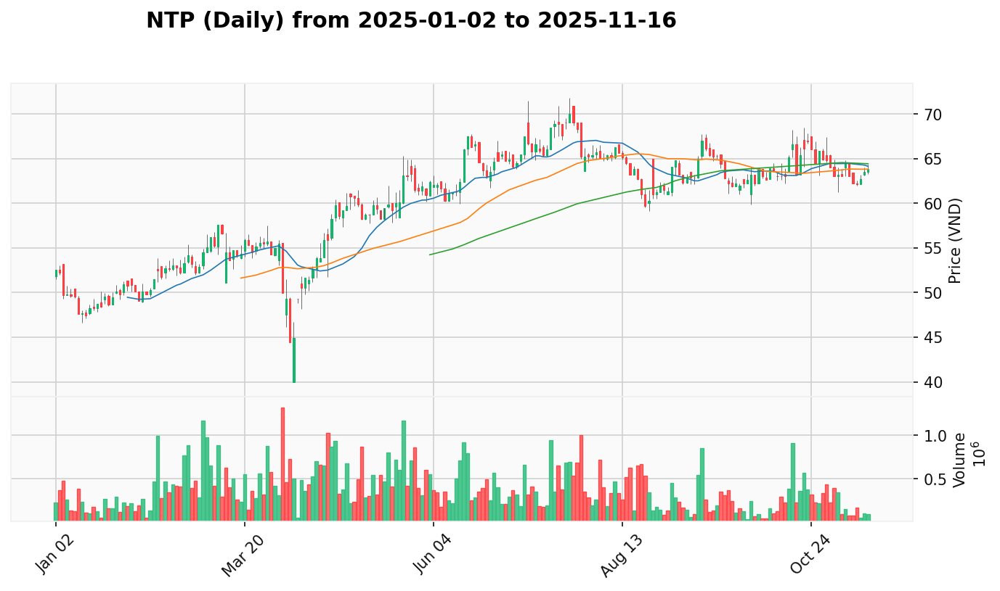

<a href="#nhua">↑ Back to group NHUA</a>  |  <a href="#vpa-signal-summary">↑ Back to Top</a>

#### Key Statistics
| Metric | Value |
|:---|---:|
| Date Range | 2025-01-02 to 2025-11-07 |
| **Latest Close** | **63.0** |
| Period Open | 51.8 |
| Period High | 71.8 |
| Period Low | 39.96 |
| Period Change % | 21.62% |

**[Download NTP Data (.csv)](market_data/NTP_2025-01-02_to_2025-11-09.csv)**

---

### NVL

#### [VPA Analysis (2025-06-13 - 2025-10-21)](./VPA.md#nvl)
> **Ngày 2025-10-15:** NVL mở cửa tại 15.75 VND, tăng lên mức cao nhất 15.75 VND, giảm xuống mức thấp nhất 15.45 VND và đóng cửa tại 15.6 VND, cao hơn giá đóng cửa phiên trước (15.5 VND). Biên độ nến hẹp (0.3 VND) và giá đóng cửa nằm ở giữa thân nến. Khối lượng giao dịch đạt 8.8427 triệu cổ phiếu, thấp hơn đáng kể so với phiên trước (17.2374 triệu cổ phiếu) và là mức thấp trong các phiên gần đây. Sau phiên giảm mạnh với tín hiệu "Weakness" vào ngày 2025-10-14, phiên hôm nay giá có sự phục hồi nhẹ nhưng với khối lượng rất thấp, cho thấy lực cầu yếu và thiếu sự quyết đoán. Điều này có thể là một dấu hiệu của sự tạm dừng trong xu hướng giảm hoặc một nỗ lực tăng giá không thành công do thiếu sự hỗ trợ từ khối lượng. **Phân tích VPA/Wyckoff:** No Demand (Không có cầu) - Giá tăng nhẹ với khối lượng rất thấp sau một phiên giảm mạnh, cho thấy lực cầu yếu và khả năng xu hướng giảm tiếp diễn.
> **Ngày 2025-10-16:** NVL mở cửa tại 15.7 VND, tăng lên mức cao nhất 16.45 VND, giảm xuống mức thấp nhất 15.7 VND và đóng cửa tại 16.15 VND, cao hơn giá đóng cửa phiên trước (15.6 VND). Biên độ nến rộng (0.75 VND) và giá đóng cửa nằm gần mức cao nhất phiên. Khối lượng giao dịch đạt 20.6042 triệu cổ phiếu, cao hơn đáng kể so với phiên trước (8.8427 triệu cổ phiếu) và là mức cao nhất trong 3 phiên gần đây. Sau hai phiên "Weakness" và "No Demand", phiên hôm nay giá tăng mạnh với biên độ rộng và đóng cửa gần mức cao nhất, đi kèm với khối lượng giao dịch tăng vọt, cho thấy lực cầu đã quay trở lại mạnh mẽ và áp đảo lực cung. Điều này báo hiệu một sự thay đổi tích cực trong tâm lý thị trường. **Phân tích VPA/Wyckoff:** Sign of Strength (Dấu hiệu sức mạnh) - Giá tăng mạnh với khối lượng lớn, xác nhận lực cầu mạnh mẽ đã quay trở lại.
> **Ngày 2025-10-17:** NVL mở cửa tại 16.25 VND, tăng lên mức cao nhất 16.95 VND, giảm xuống mức thấp nhất 16.05 VND và đóng cửa tại 16.6 VND, cao hơn giá đóng cửa phiên trước (16.25 VND). Biên độ nến rộng (0.9 VND) và giá đóng cửa nằm gần mức cao nhất phiên. Khối lượng giao dịch đạt 32.4604 triệu cổ phiếu, cao hơn đáng kể so với phiên trước (28.9476 triệu cổ phiếu) và là mức cao nhất trong các phiên gần đây. Sau phiên "Sign of Strength" ngày 2025-10-16, phiên hôm nay tiếp tục cho thấy lực cầu mạnh mẽ, đẩy giá tăng với biên độ rộng và khối lượng lớn, xác nhận sự áp đảo của bên mua và củng cố xu hướng tăng giá. **Phân tích VPA/Wyckoff:** Sign of Strength (Dấu hiệu sức mạnh)
> **Ngày 2025-10-20:** NVL mở cửa tại 15.45 VND, tăng lên mức cao nhất 15.8 VND, giảm xuống mức thấp nhất 15.45 VND và đóng cửa tại 15.45 VND, thấp hơn đáng kể so với giá đóng cửa phiên trước (16.6 VND). Biên độ nến hẹp (0.35 VND) và giá đóng cửa nằm ở mức thấp nhất phiên. Khối lượng giao dịch đạt 70.8126 triệu cổ phiếu, cao hơn gấp đôi so với phiên trước (32.4604 triệu cổ phiếu) và là mức cao nhất trong các phiên gần đây. Sau hai phiên "Sign of Strength", phiên hôm nay giá giảm mạnh với biên độ hẹp và đóng cửa ở mức thấp nhất, đi kèm với khối lượng giao dịch tăng vọt, cho thấy lực cung đã quay trở lại mạnh mẽ và áp đảo lực cầu. Điều này báo hiệu một sự thay đổi tiêu cực trong tâm lý thị trường. **Phân tích VPA/Wyckoff:** Sign of Weakness (Dấu hiệu suy yếu) - Giá giảm mạnh với khối lượng cực lớn, xác nhận lực cung mạnh mẽ đã quay trở lại.
> **Ngày 2025-10-21:** NVL mở cửa tại 14.6 VND, giảm xuống mức thấp nhất 14.4 VND và đóng cửa tại 14.4 VND, thấp hơn đáng kể so với giá đóng cửa phiên trước (15.45 VND). Biên độ nến trung bình (0.5 VND) và giá đóng cửa nằm ở mức thấp nhất phiên. Khối lượng giao dịch đạt 29.8572 triệu cổ phiếu, thấp hơn so với phiên trước (70.8126 triệu cổ phiếu) nhưng vẫn ở mức cao. Sau phiên "Sign of Weakness" ngày 2025-10-20, phiên hôm nay giá tiếp tục giảm mạnh và đóng cửa ở mức thấp nhất, cho thấy lực cung vẫn đang chiếm ưu thế. **Phân tích VPA/Wyckoff:** Sign of Weakness (Dấu hiệu suy yếu) - Giá tiếp tục giảm mạnh với khối lượng cao, xác nhận lực cung vẫn áp đảo.

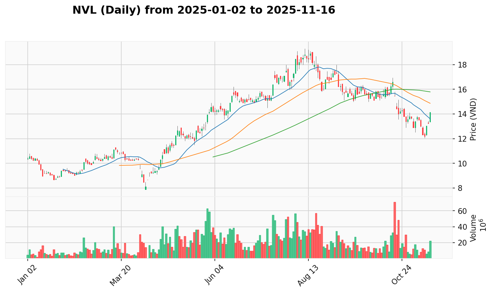

<a href="#bat-dong-san">↑ Back to group BAT_DONG_SAN</a>  |  <a href="#vpa-signal-summary">↑ Back to Top</a>

#### Key Statistics
| Metric | Value |
|:---|---:|
| Date Range | 2025-01-02 to 2025-11-07 |
| **Latest Close** | **13.0** |
| Period Open | 10.35 |
| Period High | 19.3 |
| Period Low | 7.88 |
| Period Change % | 25.60% |

**[Download NVL Data (.csv)](market_data/NVL_2025-01-02_to_2025-11-09.csv)**

---

### OCB

#### [VPA Analysis (2025-08-04 - 2025-10-21)](./VPA.md#ocb)
> **Ngày 2025-10-15:** OCB mở cửa ở mức 12.95 VND, dao động trong biên độ từ 12.95 VND đến 13.1 VND và đóng cửa ở mức 13.05 VND, tăng nhẹ so với mức đóng cửa 12.95 VND của phiên trước. Khối lượng giao dịch đạt 3.738.200 cổ phiếu (khoảng 3.74 triệu cổ phiếu), giảm so với phiên trước (4.21 triệu cổ phiếu). Sau phiên "Sign of Weakness" ngày 2025-10-14, giá có sự phục hồi nhẹ với biên độ hẹp và đóng cửa ở nửa trên của nến, đi kèm với khối lượng giao dịch sụt giảm. Điều này cho thấy lực cung đã suy yếu đáng kể và không có áp lực bán mạnh sau đợt giảm giá trước đó, xác nhận sự thiếu hụt nguồn cung. **Phân tích VPA/Wyckoff:** No Supply (Không có cung)
> **Ngày 2025-10-16:** OCB mở cửa 13.05 VND, dao động từ 12.95 VND đến 13.15 VND và đóng cửa 13.0 VND, giảm nhẹ từ 13.05 VND xuống 13.0 VND. Khối lượng giao dịch đạt 1.891.100 cổ phiếu (khoảng 1.89 triệu cổ phiếu), giảm đáng kể so với phiên trước (3.74 triệu cổ phiếu). Sau phiên "No Supply" ngày 2025-10-15, giá giảm nhẹ với biên độ hẹp và đóng cửa ở gần giữa nến, đi kèm với khối lượng giao dịch sụt giảm mạnh. Điều này cho thấy lực cung tiếp tục suy yếu và không có áp lực bán đáng kể, nhưng đồng thời cũng thiếu vắng lực cầu mạnh mẽ để đẩy giá lên. Thị trường đang trong giai đoạn thiếu sự tham gia của cả hai phe. **Phân tích VPA/Wyckoff:** No Demand (Không có cầu) - Thiếu vắng lực cầu mạnh mẽ.
> **Ngày 2025-10-17:** OCB mở cửa ở mức 13.0 VND, dao động trong biên độ từ 12.85 VND đến 13.1 VND và đóng cửa ở mức 12.9 VND, giảm nhẹ so với mức đóng cửa 13.0 VND của phiên trước. Khối lượng giao dịch đạt 3.09 triệu cổ phiếu, giảm nhẹ so với phiên trước (3.15 triệu cổ phiếu). Sau phiên "No Demand" ngày 2025-10-16, giá tiếp tục giảm nhẹ với biên độ hẹp và đóng cửa ở gần mức thấp nhất phiên, đi kèm với khối lượng giao dịch thấp. Điều này cho thấy lực cầu vẫn yếu và không có sự quan tâm mua vào đáng kể, xác nhận sự thiếu vắng lực cầu. **Phân tích VPA/Wyckoff:** No Demand (Không có cầu) - Tiếp tục thiếu vắng lực cầu.
> **Ngày 2025-10-20:** OCB mở cửa 12.8 VND, dao động từ 12.0 VND đến 12.85 VND và đóng cửa 12.0 VND, giảm mạnh từ 12.9 VND (phiên trước) xuống 12.0 VND. Khối lượng giao dịch đạt 6.58 triệu cổ phiếu, tăng đáng kể so với phiên trước (3.09 triệu cổ phiếu) và các phiên "No Demand" gần đây. Cây nến giảm có biên độ rộng và đóng cửa ở mức thấp nhất phiên, đi kèm với khối lượng giao dịch cao. Điều này cho thấy áp lực bán mạnh mẽ và nguồn cung lớn đã tham gia thị trường, xác nhận sự yếu kém sau các phiên "No Demand". **Phân tích VPA/Wyckoff:** Sign of Weakness (SOW) - Lực cung mạnh mẽ.
> **Ngày 2025-10-21:** OCB mở cửa ở mức 11.95 VND, dao động trong biên độ từ 11.85 VND đến 12.45 VND và đóng cửa ở mức 12.45 VND, tăng từ 12.0 VND (phiên trước). Khối lượng giao dịch đạt 5.21 triệu cổ phiếu, giảm so với phiên trước (6.58 triệu cổ phiếu). Sau phiên "Sign of Weakness" với lực bán mạnh mẽ, phiên hôm nay cho thấy sự phục hồi với giá đóng cửa ở mức cao nhất phiên, nhưng đi kèm với khối lượng giao dịch thấp hơn. Điều này cho thấy áp lực bán đã tạm thời giảm bớt và có lực cầu xuất hiện, nhưng chưa đủ mạnh để xác nhận một sự đảo chiều bền vững. Đây có thể là một nhịp hồi kỹ thuật hoặc một phiên kiểm tra cung. **Phân tích VPA/Wyckoff:** Test for Supply (Kiểm tra cung) - Lực cầu xuất hiện nhưng chưa mạnh mẽ, cần theo dõi thêm.

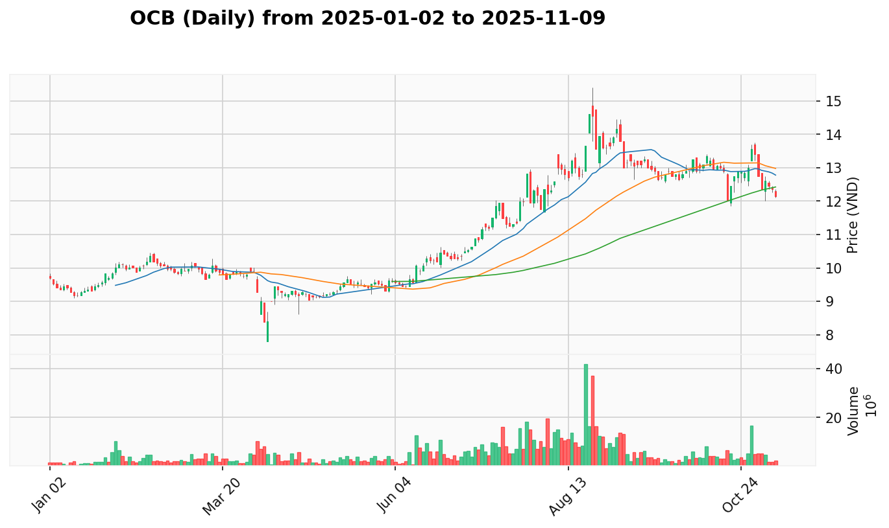

<a href="#ngan-hang">↑ Back to group NGAN_HANG</a>  |  <a href="#vpa-signal-summary">↑ Back to Top</a>

#### Key Statistics
| Metric | Value |
|:---|---:|
| Date Range | 2025-01-02 to 2025-11-07 |
| **Latest Close** | **12.15** |
| Period Open | 9.75 |
| Period High | 15.4 |
| Period Low | 7.8 |
| Period Change % | 24.62% |

**[Download OCB Data (.csv)](market_data/OCB_2025-01-02_to_2025-11-09.csv)**

---

### OIL

#### [VPA Analysis (2025-08-04 - 2025-10-21)](./VPA.md#oil)
> **Ngày 2025-10-15:** OIL giảm từ 10.9 VND xuống 10.7 VND, với giá đóng cửa ở mức giữa phiên. Khối lượng giao dịch đạt 1.049 triệu cổ phiếu, tăng so với phiên trước (0.8873 triệu cổ phiếu). Sau phiên Test for Supply ngày 2025-10-14, phiên này cho thấy lực cung tiếp tục chiếm ưu thế khi giá giảm với khối lượng tăng. Điều này xác nhận sự hiện diện của áp lực bán và có thể dẫn đến xu hướng giảm giá tiếp theo. **Phân tích VPA/Wyckoff:** Supply Coming In (SCI) - Lực cung tiếp tục gia tăng.
> **Ngày 2025-10-16:** OIL giảm từ 10.7 VND xuống 10.6 VND, với giá đóng cửa gần mức thấp nhất phiên. Khối lượng giao dịch đạt 0.2128 triệu cổ phiếu, giảm mạnh so với phiên trước (1.049 triệu cổ phiếu). Sau phiên Supply Coming In (SCI) ngày 2025-10-15, phiên này cho thấy áp lực bán đã cạn kiệt đáng kể. Mặc dù giá tiếp tục giảm, nhưng khối lượng cực thấp cho thấy không còn nhiều lực cung và cũng không có lực cầu đáng kể. Điều này cho thấy thị trường đang kiểm tra lại nguồn cung. **Phân tích VPA/Wyckoff:** Test for Supply (Kiểm tra nguồn cung)
> **Ngày 2025-10-17:** OIL giảm từ 10.7 VND xuống 10.5 VND, với giá đóng cửa gần mức thấp nhất phiên. Khối lượng giao dịch đạt 0.721 triệu cổ phiếu, tăng so với phiên trước (0.4416 triệu cổ phiếu). Sau phiên Test for Supply ngày 2025-10-16, phiên này cho thấy lực cung đã quay trở lại và chiếm ưu thế, đẩy giá xuống với khối lượng gia tăng. Điều này xác nhận áp lực bán vẫn còn mạnh và có thể dẫn đến xu hướng giảm giá tiếp theo. **Phân tích VPA/Wyckoff:** Supply Coming In (SCI) - Lực cung tiếp tục gia tăng.
> **Ngày 2025-10-20:** OIL giảm từ 10.5 VND xuống 10.1 VND, với giá đóng cửa gần mức thấp nhất phiên. Khối lượng giao dịch đạt 1.2527 triệu cổ phiếu, tăng đáng kể so với phiên trước (0.721 triệu cổ phiếu). Sau phiên Supply Coming In (SCI) ngày 2025-10-17, phiên này tiếp tục cho thấy áp lực bán mạnh mẽ, đẩy giá xuống với khối lượng gia tăng. Điều này xác nhận lực cung vẫn đang chiếm ưu thế trên thị trường. **Phân tích VPA/Wyckoff:** Supply Coming In (SCI) - Lực cung tiếp tục gia tăng.
> **Ngày 2025-10-21:** OIL tăng nhẹ từ 10.1 VND lên 10.2 VND, với giá đóng cửa ở giữa thân nến. Khối lượng giao dịch đạt 0.7187 triệu cổ phiếu, giảm đáng kể so với phiên trước (1.2527 triệu cổ phiếu). Sau hai phiên liên tiếp cho thấy lực cung gia tăng (SCI), phiên này cho thấy áp lực bán đã giảm bớt nhưng lực cầu cũng không mạnh. Sự tăng giá nhẹ với khối lượng thấp cho thấy thị trường chưa sẵn sàng cho một xu hướng tăng bền vững và có thể là một dấu hiệu của sự thiếu vắng nhu cầu. **Phân tích VPA/Wyckoff:** No Demand (ND) - Thiếu vắng nhu cầu.

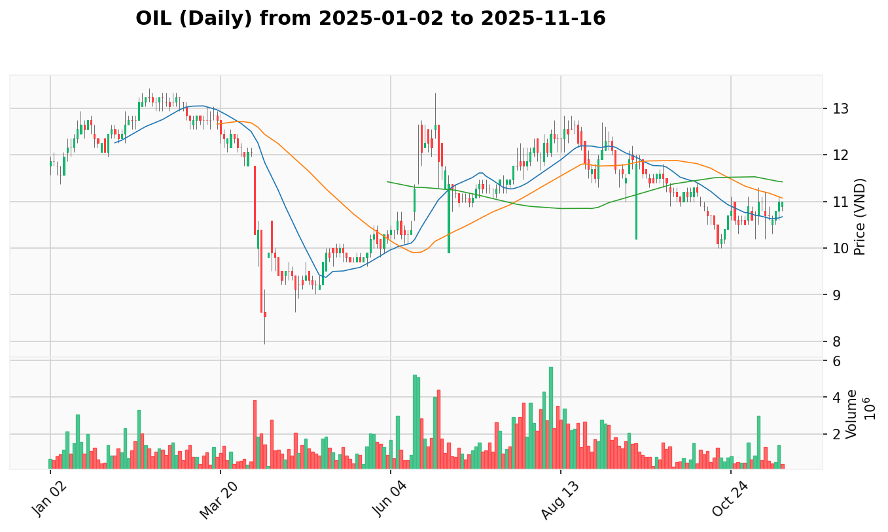

<a href="#dau-khi">↑ Back to group DAU_KHI</a>  |  <a href="#vpa-signal-summary">↑ Back to Top</a>

#### Key Statistics
| Metric | Value |
|:---|---:|
| Date Range | 2025-01-02 to 2025-11-07 |
| **Latest Close** | **10.7** |
| Period Open | 11.76 |
| Period High | 13.43 |
| Period Low | 7.94 |
| Period Change % | -9.01% |

**[Download OIL Data (.csv)](market_data/OIL_2025-01-02_to_2025-11-09.csv)**

---

### ORS

#### [VPA Analysis (2025-08-04 - 2025-10-21)](./VPA.md#ors)
> **Ngày 2025-10-15:** ORS tăng từ 14.55 VND lên 15.55 VND với khối lượng giao dịch đạt 15.2804 triệu cổ phiếu. Cây nến tăng có biên độ rất rộng, giá mở cửa 14.55 VND, giá cao nhất 15.55 VND, giá thấp nhất 14.4 VND và đóng cửa ở mức 15.55 VND. Khối lượng giao dịch tăng đột biến so với phiên trước (5.5109 triệu cổ phiếu) và là mức cao nhất trong nhiều phiên gần đây, cho thấy lực cầu cực kỳ mạnh mẽ và quyết liệt đẩy giá lên cao. Sau phiên SOS ngày 2025-10-14, sự tiếp diễn của đà tăng giá với khối lượng bùng nổ xác nhận xu hướng tăng mạnh mẽ và khả năng tiếp tục chinh phục các mức giá cao hơn. **Phân tích VPA/Wyckoff:** Sign of Strength (SOS) - Lực cầu áp đảo hoàn toàn lực cung, xác nhận xu hướng tăng mạnh.
> **Ngày 2025-10-16:** ORS giảm từ 15.55 VND xuống 15.35 VND với khối lượng giao dịch đạt 1.552 triệu cổ phiếu. Cây nến giảm có biên độ hẹp, giá mở cửa 15.65 VND, giá cao nhất 15.7 VND, giá thấp nhất 15.2 VND và đóng cửa ở mức 15.35 VND. Khối lượng giao dịch giảm mạnh so với phiên trước (15.2804 triệu cổ phiếu), cho thấy áp lực bán không đáng kể sau hai phiên tăng giá mạnh mẽ. Đây là một nhịp điều chỉnh tự nhiên hoặc chốt lời nhẹ, củng cố cho xu hướng tăng giá đã được xác nhận. **Phân tích VPA/Wyckoff:** Test (Kiểm tra) - Lực cung yếu với khối lượng thấp, xác nhận thiếu áp lực bán.
> **Ngày 2025-10-17:** ORS giảm từ 16.05 VND xuống 15.5 VND với khối lượng giao dịch đạt 6.3446 triệu cổ phiếu. Cây nến giảm có biên độ tương đối rộng, giá mở cửa 16.2 VND, giá cao nhất 16.2 VND, giá thấp nhất 15.4 VND và đóng cửa ở mức 15.5 VND, gần mức thấp nhất phiên. Khối lượng giao dịch giảm so với phiên trước (7.8082 triệu cổ phiếu) và thấp hơn đáng kể so với phiên SOS ngày 2025-10-15. Sau phiên kiểm tra (Test) với lực cung yếu, phiên này cho thấy lực cầu không đủ mạnh để duy trì đà tăng, và áp lực bán đã đẩy giá xuống với biên độ đáng kể, dù khối lượng không quá cao. Điều này cho thấy sự suy yếu của lực cầu. **Phân tích VPA/Wyckoff:** No Demand (Thiếu cầu) - Lực cầu yếu, không đủ sức hấp thụ lực cung, dẫn đến giá giảm.
> **Ngày 2025-10-20:** ORS giảm từ 15.5 VND xuống 14.45 VND với khối lượng giao dịch đạt 3.2107 triệu cổ phiếu. Cây nến giảm có biên độ rộng, giá mở cửa 15.15 VND, giá cao nhất 15.5 VND, giá thấp nhất 14.45 VND và đóng cửa ở mức 14.45 VND, trùng với mức thấp nhất phiên. Khối lượng giao dịch giảm đáng kể so với phiên trước (6.3446 triệu cổ phiếu). Mặc dù khối lượng thấp, giá vẫn giảm mạnh với biên độ rộng, cho thấy lực cầu tiếp tục yếu và không có sự hỗ trợ đáng kể để ngăn chặn đà giảm. Điều này củng cố cho nhận định thiếu cầu từ phiên trước. **Phân tích VPA/Wyckoff:** No Demand (Thiếu cầu) - Lực cầu yếu, giá giảm mạnh với khối lượng thấp, xác nhận sự suy yếu của thị trường.
> **Ngày 2025-10-21:** ORS giảm từ 15.5 VND xuống 14.45 VND với khối lượng giao dịch đạt 6.6443 triệu cổ phiếu. Cây nến giảm có biên độ rộng, giá mở cửa 14.4 VND, giá cao nhất 14.95 VND, giá thấp nhất 13.6 VND và đóng cửa ở mức 14.45 VND. Mặc dù giá đóng cửa bằng với phiên trước, nhưng khối lượng giao dịch tăng đáng kể so với phiên trước (3.2107 triệu cổ phiếu). Giá đã có sự phục hồi từ mức thấp nhất trong phiên, cho thấy lực bán mạnh đã được hấp thụ bởi lực mua ở vùng giá thấp. Điều này báo hiệu sự thay đổi trong cán cân cung cầu, có thể là dấu hiệu của một phiên dừng giảm. **Phân tích VPA/Wyckoff:** Stopping Volume (Dừng giảm với khối lượng lớn)

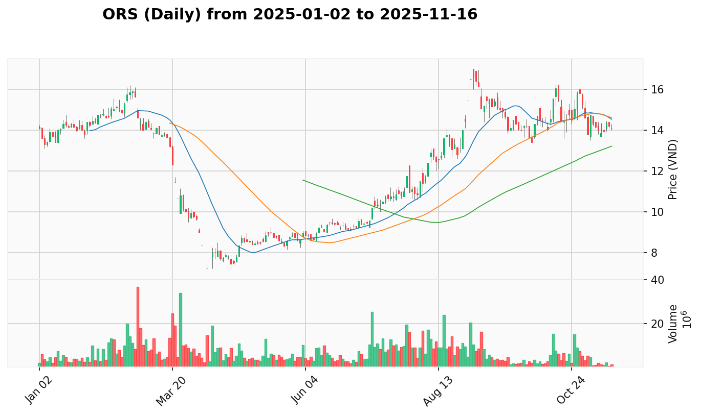

<a href="#chung-khoan">↑ Back to group CHUNG_KHOAN</a>  |  <a href="#vpa-signal-summary">↑ Back to Top</a>

#### Key Statistics
| Metric | Value |
|:---|---:|
| Date Range | 2025-01-02 to 2025-11-07 |
| **Latest Close** | **14.0** |
| Period Open | 14.1 |
| Period High | 17.0 |
| Period Low | 7.19 |
| Period Change % | -0.71% |

**[Download ORS Data (.csv)](market_data/ORS_2025-01-02_to_2025-11-09.csv)**

---

### PAN

#### [VPA Analysis (2025-06-26 - 2025-10-21)](./VPA.md#pan)
> **Ngày 2025-10-15:** PAN mở cửa ở 30.65 VND và đóng cửa ở 31.1 VND, với mức cao nhất là 31.7 VND và thấp nhất là 30.65 VND. Giá tăng nhẹ từ 30.85 VND (giá đóng cửa phiên trước) lên 31.1 VND, đóng cửa ở giữa biên độ tương đối rộng (1.05 VND). Khối lượng giao dịch đạt 0.7654 triệu cổ phiếu, giảm đáng kể so với phiên trước (1.2328 triệu cổ phiếu). Sau phiên "Sign of Weakness" với khối lượng lớn, phiên này cho thấy giá có sự phục hồi nhẹ nhưng với khối lượng thấp, cho thấy áp lực bán đã giảm bớt nhưng lực cầu chưa thực sự mạnh mẽ để đẩy giá lên cao hơn. Việc đóng cửa ở giữa biên độ cho thấy sự lưỡng lự của thị trường. **Phân tích VPA/Wyckoff:** Testing Supply (Kiểm tra cung)
> **Ngày 2025-10-16:** PAN mở cửa ở 31.0 VND và đóng cửa ở 31.4 VND, với mức cao nhất là 31.7 VND và thấp nhất là 31.0 VND. Giá tăng từ 31.0 VND lên 31.4 VND, đóng cửa gần mức cao nhất của biên độ hẹp (0.7 VND). Khối lượng giao dịch đạt 0.6123 triệu cổ phiếu, giảm đáng kể so với phiên trước (0.7654 triệu cổ phiếu). Sau phiên "Testing Supply" trước đó, phiên này cho thấy giá tiếp tục tăng nhẹ nhưng với khối lượng thấp hơn, cho thấy áp lực bán đã cạn kiệt và nguồn cung không còn nhiều. Việc giá đóng cửa gần mức cao nhất trong biên độ hẹp với khối lượng thấp là dấu hiệu của sự thiếu hụt nguồn cung. **Phân tích VPA/Wyckoff:** No Supply (Thiếu hụt nguồn cung)
> **Ngày 2025-10-17:** PAN mở cửa ở 31.4 VND và đóng cửa ở 31.85 VND, với mức cao nhất là 32.0 VND và thấp nhất là 31.4 VND. Giá tăng từ 31.35 VND lên 31.85 VND, đóng cửa gần mức cao nhất của biên độ hẹp (0.6 VND). Khối lượng giao dịch đạt 1.6206 triệu cổ phiếu, tăng so với phiên trước (1.1938 triệu cổ phiếu). Sau các phiên kiểm tra cung và thiếu hụt nguồn cung, phiên này cho thấy lực cầu đã quay trở lại mạnh mẽ, hấp thụ nguồn cung và đẩy giá lên với khối lượng gia tăng. **Phân tích VPA/Wyckoff:** Sign of Strength (SOS) - Lực cầu gia tăng.
> **Ngày 2025-10-20:** PAN mở cửa ở 31.85 VND và đóng cửa ở 29.65 VND, với mức cao nhất là 31.85 VND và thấp nhất là 29.65 VND. Giá giảm mạnh từ 31.85 VND xuống 29.65 VND, đóng cửa ở mức thấp nhất của biên độ rộng (2.2 VND). Khối lượng giao dịch đạt 2.3402 triệu cổ phiếu, tăng đáng kể so với phiên trước (1.6206 triệu cổ phiếu). Sau phiên "Sign of Strength" trước đó, phiên này cho thấy áp lực bán mạnh mẽ đã xuất hiện, đẩy giá xuống sâu với khối lượng giao dịch tăng vọt. Điều này cho thấy nguồn cung đã áp đảo cầu, có thể là dấu hiệu của sự phân phối hoặc bán tháo. **Phân tích VPA/Wyckoff:** Sign of Weakness (SOW) - Lực bán gia tăng.
> **Ngày 2025-10-21:** PAN mở cửa ở 30.0 VND và đóng cửa ở 29.6 VND, với mức cao nhất là 30.0 VND và thấp nhất là 29.0 VND. Giá giảm nhẹ từ 29.65 VND xuống 29.6 VND, đóng cửa gần giữa biên độ trung bình (1.0 VND). Khối lượng giao dịch đạt 1.3563 triệu cổ phiếu, giảm đáng kể so với phiên trước (2.3402 triệu cổ phiếu). Sau phiên "Sign of Weakness" với lực bán mạnh mẽ, phiên này cho thấy áp lực bán đã giảm bớt nhưng lực cầu vẫn chưa xuất hiện mạnh mẽ để đẩy giá lên. Sự sụt giảm nhẹ về giá với khối lượng thấp cho thấy thị trường đang thiếu vắng cả người mua và người bán tích cực, có thể là một giai đoạn tạm lắng sau đợt bán tháo. **Phân tích VPA/Wyckoff:** No Demand - Thiếu hụt lực cầu.

<a href="#nong-nghiep">↑ Back to group NONG_NGHIEP</a>  |  <a href="#vpa-signal-summary">↑ Back to Top</a>

#### Key Statistics
| Metric | Value |
|:---|---:|
| Date Range | 2025-01-02 to 2025-11-07 |
| **Latest Close** | **30.25** |
| Period Open | 23.4 |
| Period High | 35.6 |
| Period Low | 20.1 |
| Period Change % | 29.27% |

**[Download PAN Data (.csv)](market_data/PAN_2025-01-02_to_2025-11-09.csv)**

---

### PC1

#### [VPA Analysis (2025-06-16 - 2025-10-21)](./VPA.md#pc1)
> **Ngày 2025-10-15:** PC1 mở cửa ở 24.6 VND, đạt mức cao nhất 24.6 VND và mức thấp nhất 23.8 VND, sau đó đóng cửa ở 23.8 VND. Giá đóng cửa giảm mạnh từ 24.6 VND xuống 23.8 VND so với phiên trước và đóng cửa ở mức thấp nhất phiên, tạo thành một nến giảm thân rộng. Khối lượng giao dịch đạt 3.5382 triệu cổ phiếu, tăng so với phiên trước (3.3037 triệu cổ phiếu). Sau phiên "Nỗ lực không mang lại kết quả", phiên hôm nay cho thấy áp lực bán mạnh mẽ và sự thiếu vắng lực cầu, đẩy giá xuống thấp nhất phiên với khối lượng gia tăng. Điều này xác nhận xu hướng suy yếu và khả năng tiếp diễn đà giảm. **Phân tích VPA/Wyckoff:** Sign of Weakness (SOW)
> **Ngày 2025-10-16:** PC1 mở cửa ở 23.95 VND, đạt mức cao nhất 24.05 VND và mức thấp nhất 23.3 VND, sau đó đóng cửa ở 23.35 VND. Giá đóng cửa giảm từ 23.8 VND xuống 23.35 VND so với phiên trước, tạo thành một nến giảm thân rộng đóng cửa gần mức thấp nhất. Khối lượng giao dịch đạt 2.4808 triệu cổ phiếu, giảm so với phiên trước (3.5382 triệu cổ phiếu). Sau phiên "Sign of Weakness" mạnh mẽ, phiên hôm nay tiếp tục cho thấy sự suy yếu khi giá giảm sâu với biên độ rộng, đóng cửa gần mức thấp nhất. Mặc dù khối lượng giảm, điều này cho thấy lực cầu vẫn vắng bóng và áp lực bán vẫn duy trì, xác nhận xu hướng giảm tiếp diễn. **Phân tích VPA/Wyckoff:** Tiếp diễn suy yếu
> **Ngày 2025-10-17:** PC1 mở cửa ở 23.7 VND, đạt mức cao nhất 24.3 VND và mức thấp nhất 23.25 VND, sau đó đóng cửa ở 23.25 VND. Giá đóng cửa giảm từ 23.35 VND xuống 23.25 VND so với phiên trước, tạo thành một nến giảm thân rộng đóng cửa ở mức thấp nhất phiên. Khối lượng giao dịch đạt 2.7213 triệu cổ phiếu, giảm đáng kể so với phiên trước (5.1277 triệu cổ phiếu). Sau các phiên suy yếu liên tiếp, phiên hôm nay tiếp tục cho thấy áp lực bán duy trì khi giá giảm sâu với biên độ rộng và đóng cửa ở mức thấp nhất. Mặc dù khối lượng giảm mạnh, điều này cho thấy lực cầu vẫn vắng bóng và phe bán vẫn đang kiểm soát, xác nhận xu hướng giảm tiếp diễn. **Phân tích VPA/Wyckoff:** Tiếp diễn suy yếu
> **Ngày 2025-10-20:** PC1 mở cửa ở 23.35 VND, đạt mức cao nhất 23.8 VND và mức thấp nhất 21.7 VND, sau đó đóng cửa ở 21.7 VND. Giá đóng cửa giảm mạnh từ 23.25 VND xuống 21.7 VND so với phiên trước, tạo thành một nến giảm thân rộng đóng cửa ở mức thấp nhất phiên. Khối lượng giao dịch đạt 4.75 triệu cổ phiếu, tăng đáng kể so với phiên trước (2.72 triệu cổ phiếu). Sau các phiên suy yếu liên tiếp, phiên hôm nay tiếp tục cho thấy áp lực bán mạnh mẽ khi giá giảm sâu với biên độ rộng và đóng cửa ở mức thấp nhất, đi kèm với khối lượng gia tăng. Điều này xác nhận xu hướng giảm tiếp diễn và cho thấy phe bán đang kiểm soát hoàn toàn. **Phân tích VPA/Wyckoff:** Tiếp diễn suy yếu (Sign of Weakness)
> **Ngày 2025-10-21:** PC1 tăng từ 21.7 VND lên 22.5 VND với biên độ rộng và đóng cửa ở mức cao nhất phiên. Khối lượng giao dịch đạt 3.45 triệu cổ phiếu, giảm so với phiên trước (4.75 triệu cổ phiếu). Sau hai phiên suy yếu mạnh, phiên hôm nay cho thấy sự phục hồi về giá, tuy nhiên khối lượng giảm cho thấy lực cầu chưa thực sự mạnh mẽ, có thể là nhịp kiểm tra cung. **Phân tích VPA/Wyckoff:** Kiểm tra cung

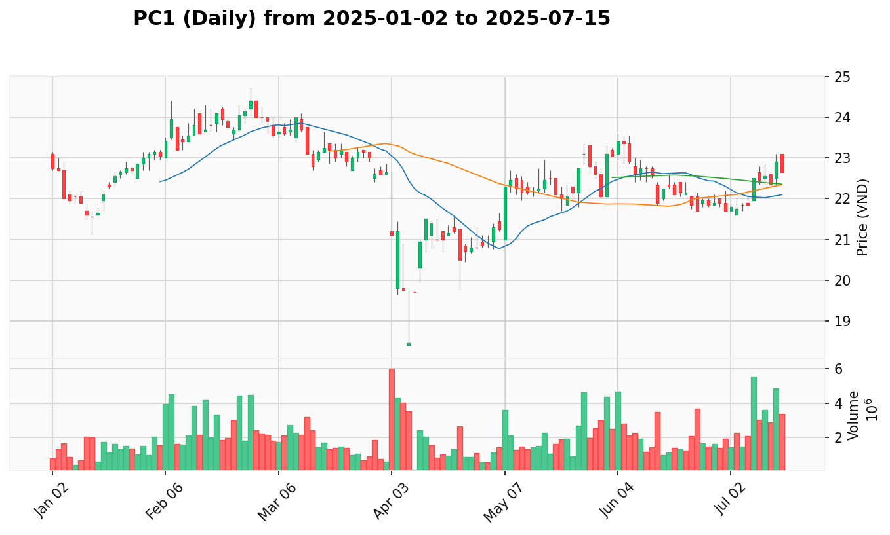

<a href="#xay-lap-dien">↑ Back to group XAY_LAP_DIEN</a>  |  <a href="#vpa-signal-summary">↑ Back to Top</a>

#### Key Statistics
| Metric | Value |
|:---|---:|
| Date Range | 2025-01-02 to 2025-11-07 |
| **Latest Close** | **24.25** |
| Period Open | 23.1 |
| Period High | 32.5 |
| Period Low | 18.4 |
| Period Change % | 4.98% |

**[Download PC1 Data (.csv)](market_data/PC1_2025-01-02_to_2025-11-09.csv)**

---

### PDR

#### [VPA Analysis (2025-06-26 - 2025-10-21)](./VPA.md#pdr)
> **Ngày 2025-10-15:** PDR mở cửa tại 24.95 VND, sau đó tăng mạnh và đóng cửa tại 25.5 VND, cao hơn đáng kể so với phiên trước (24.9 VND). Biên độ giá rộng và giá đóng cửa gần mức cao nhất phiên (25.85 VND) cho thấy lực cầu tiếp tục áp đảo. Khối lượng giao dịch đạt 26.57 triệu cổ phiếu, thấp hơn so với phiên trước (36.68 triệu cổ phiếu) nhưng vẫn duy trì ở mức cao, cho thấy sự tiếp diễn của xu hướng tăng giá với ít nỗ lực hơn. Sau các phiên SOS liên tiếp, phiên này tiếp tục xác nhận đà tăng mạnh mẽ. **Phân tích VPA/Wyckoff:** Sign of Strength (SOS) - Lực cầu tiếp tục mạnh mẽ.
> **Ngày 2025-10-16:** PDR mở cửa tại 25.9 VND, tăng lên 27.0 VND và đóng cửa tại 26.35 VND, cao hơn so với phiên trước (25.5 VND). Biên độ giá rộng và giá đóng cửa ở nửa trên của thân nến cho thấy lực cầu tiếp tục chiếm ưu thế. Khối lượng giao dịch đạt 20.53 triệu cổ phiếu, thấp hơn so với phiên trước (26.57 triệu cổ phiếu) nhưng vẫn duy trì ở mức cao. Sau các phiên SOS liên tiếp, phiên này tiếp tục xác nhận đà tăng mạnh mẽ với khối lượng giảm nhẹ nhưng vẫn ở mức cao, cho thấy sự tiếp diễn của xu hướng tăng giá. **Phân tích VPA/Wyckoff:** Sign of Strength (SOS) - Lực cầu tiếp tục mạnh mẽ.
> **Ngày 2025-10-17:** PDR mở cửa tại 26.3 VND, sau đó giảm và đóng cửa tại 26.0 VND, thấp hơn so với phiên trước (26.3 VND). Biên độ giá rộng và giá đóng cửa ở nửa dưới của thân nến cho thấy áp lực bán đã xuất hiện. Khối lượng giao dịch đạt 27.36 triệu cổ phiếu, thấp hơn so với phiên trước (29.42 triệu cổ phiếu) nhưng vẫn duy trì ở mức cao. Sau chuỗi các phiên SOS, phiên này cho thấy sự xuất hiện của lực cung, có thể là hoạt động chốt lời. **Phân tích VPA/Wyckoff:** Sign of Weakness (SOW) - Lực cung xuất hiện.
> **Ngày 2025-10-20:** PDR mở cửa tại 25.6 VND, sau đó giảm mạnh và đóng cửa tại 24.2 VND, thấp hơn đáng kể so với phiên trước (26.0 VND). Biên độ giá rộng và giá đóng cửa ở mức thấp nhất phiên cho thấy áp lực bán rất mạnh. Khối lượng giao dịch đạt 34.25 triệu cổ phiếu, cao hơn so với phiên trước (27.36 triệu cổ phiếu), xác nhận lực cung đang chiếm ưu thế. Sau phiên SOW trước đó, phiên này tiếp tục cho thấy sự gia tăng của lực cung và khả năng tiếp diễn xu hướng giảm giá. **Phân tích VPA/Wyckoff:** Sign of Weakness (SOW) - Lực cung mạnh mẽ.
> **Ngày 2025-10-21:** PDR mở cửa tại 24.2 VND, sau đó giảm và đóng cửa tại 23.3 VND, thấp hơn đáng kể so với phiên trước (24.2 VND). Biên độ giá rộng và giá đóng cửa ở nửa dưới của thân nến, gần mức thấp nhất phiên, cho thấy áp lực bán tiếp tục gia tăng. Khối lượng giao dịch đạt 36.77 triệu cổ phiếu, cao hơn so với phiên trước (34.25 triệu cổ phiếu), xác nhận lực cung đang chiếm ưu thế và xu hướng giảm giá tiếp diễn. Sau các phiên SOW trước đó, phiên này củng cố thêm tín hiệu suy yếu của cổ phiếu. **Phân tích VPA/Wyckoff:** Sign of Weakness (SOW) - Lực cung tiếp tục chiếm ưu thế.

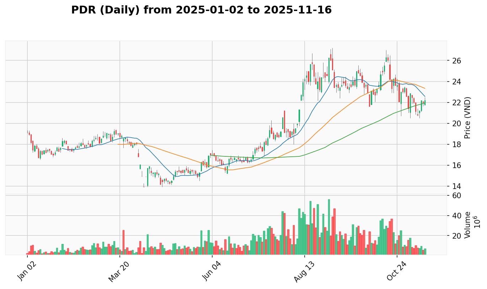

<a href="#bat-dong-san">↑ Back to group BAT_DONG_SAN</a>  |  <a href="#vpa-signal-summary">↑ Back to Top</a>

#### Key Statistics
| Metric | Value |
|:---|---:|
| Date Range | 2025-01-02 to 2025-11-07 |
| **Latest Close** | **21.15** |
| Period Open | 19.17 |
| Period High | 27.2 |
| Period Low | 13.93 |
| Period Change % | 10.33% |

**[Download PDR Data (.csv)](market_data/PDR_2025-01-02_to_2025-11-09.csv)**

---

### PET

#### [VPA Analysis (2025-08-04 - 2025-10-21)](./VPA.md#pet)
> **Ngày 2025-10-15:** PET mở cửa ở 33.25 VND, sau đó tăng lên mức cao nhất 34.4 VND và đóng cửa tại 33.9 VND, cao hơn giá đóng cửa phiên trước (33.2 VND). Biên độ dao động trong ngày (từ 33.2 VND đến 34.4 VND) vừa phải. Khối lượng giao dịch đạt 2.2845 triệu cổ phiếu, giảm so với phiên trước (2.8629 triệu cổ phiếu). Sau phiên "Supply Coming In" ngày 2025-10-14, phiên này cho thấy giá tăng trở lại với khối lượng thấp hơn, cho thấy lực cung đã giảm bớt và lực cầu đang dần hấp thụ lượng cung còn lại. Điều này có thể là một dấu hiệu tích cực cho thấy áp lực bán đang suy yếu. **Phân tích VPA/Wyckoff:** Test for Supply (TS) - Giá tăng với khối lượng thấp sau phiên giảm giá có khối lượng cao, cho thấy lực cung đã giảm.
> **Ngày 2025-10-16:** PET mở cửa ở 34.0 VND, tăng lên mức cao nhất 35.0 VND và đóng cửa ở 34.3 VND, cao hơn giá đóng cửa phiên trước (33.9 VND). Biên độ dao động trong ngày vừa phải. Khối lượng giao dịch đạt 0.8131 triệu cổ phiếu, giảm đáng kể so với phiên trước (2.2845 triệu cổ phiếu) và thấp hơn nhiều so với mức trung bình. Sau phiên "Test for Supply" ngày 2025-10-15, phiên này cho thấy giá tăng nhẹ nhưng với khối lượng rất thấp, cho thấy lực cầu yếu và thiếu sự tham gia của dòng tiền lớn để đẩy giá lên cao hơn. Điều này có thể là dấu hiệu của sự thiếu hụt cầu, hoặc thị trường đang chờ đợi tín hiệu rõ ràng hơn. **Phân tích VPA/Wyckoff:** No Demand (ND) - Giá tăng nhẹ với khối lượng rất thấp, cho thấy thiếu hụt lực cầu.
> **Ngày 2025-10-17:** PET mở cửa ở 34.3 VND, sau đó giảm mạnh xuống mức thấp nhất 33.0 VND và đóng cửa tại 33.0 VND, thấp hơn giá đóng cửa phiên trước (34.2 VND). Biên độ dao động trong ngày (từ 33.0 VND đến 34.45 VND) vừa phải. Khối lượng giao dịch đạt 2.1401 triệu cổ phiếu, tăng so với phiên trước (1.6359 triệu cổ phiếu). Sau phiên "No Demand" ngày 2025-10-16, phiên này cho thấy giá giảm mạnh với khối lượng gia tăng, xác nhận áp lực bán đang chiếm ưu thế và thiếu hụt lực cầu. Điều này cho thấy sự suy yếu rõ rệt. **Phân tích VPA/Wyckoff:** Sign of Weakness (SOW) - Giá giảm mạnh với khối lượng gia tăng, xác nhận lực cung mạnh.
> **Ngày 2025-10-20:** PET mở cửa ở 32.55 VND, tăng lên mức cao nhất 33.3 VND nhưng sau đó giảm mạnh xuống mức thấp nhất 30.7 VND và đóng cửa tại 30.7 VND, thấp hơn giá đóng cửa phiên trước (33.0 VND). Biên độ dao động trong ngày rộng, cho thấy áp lực bán mạnh mẽ. Khối lượng giao dịch đạt 2.893 triệu cổ phiếu, tăng đáng kể so với phiên trước (2.1401 triệu cổ phiếu). Sau phiên "Sign of Weakness" ngày 2025-10-17, phiên này tiếp tục xác nhận xu hướng giảm với giá giảm sâu và khối lượng gia tăng, cho thấy lực cung áp đảo và thiếu hụt lực cầu. **Phân tích VPA/Wyckoff:** Sign of Weakness (SOW) - Giá giảm mạnh với khối lượng gia tăng, xác nhận lực cung mạnh và tiếp diễn xu hướng giảm.
> **Ngày 2025-10-21:** PET mở cửa ở 31.2 VND, giảm xuống mức thấp nhất 28.7 VND và đóng cửa tại 30.7 VND, bằng với giá đóng cửa phiên trước. Biên độ dao động trong ngày hẹp và khối lượng giao dịch đạt 2.8622 triệu cổ phiếu, giảm nhẹ. Giá tiếp tục tạo đáy mới trong phiên, cho thấy áp lực bán vẫn còn mạnh mẽ và xu hướng giảm tiếp diễn. **Phân tích VPA/Wyckoff:** Sign of Weakness (SOW) - Giá tiếp tục tạo đáy mới trong phiên với áp lực bán duy trì, xác nhận xu hướng giảm.

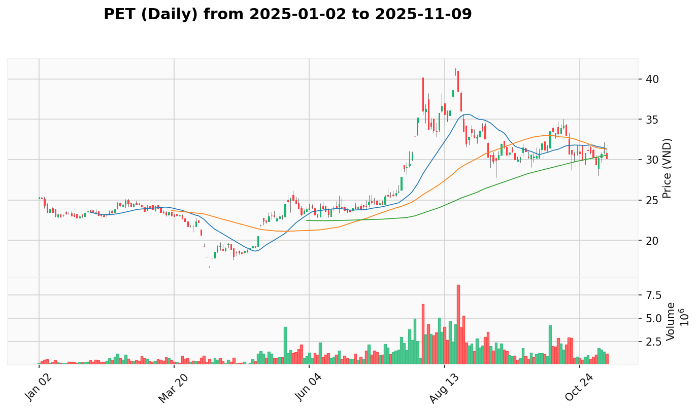

<a href="#ban-le">↑ Back to group BAN_LE</a>  |  <a href="#vpa-signal-summary">↑ Back to Top</a>

#### Key Statistics
| Metric | Value |
|:---|---:|
| Date Range | 2025-01-02 to 2025-11-07 |
| **Latest Close** | **30.1** |
| Period Open | 25.2 |
| Period High | 41.3 |
| Period Low | 16.7 |
| Period Change % | 19.44% |

**[Download PET Data (.csv)](market_data/PET_2025-01-02_to_2025-11-09.csv)**

---

### PHC

#### [VPA Analysis (2025-08-14 - 2025-10-21)](./VPA.md#phc)
> **Ngày 2025-10-15:** PHC giảm từ 5.42 VND xuống 5.25 VND với khối lượng giao dịch đạt 0.2916 triệu cổ phiếu. Cây nến giảm có biên độ hẹp, đóng cửa gần mức thấp nhất phiên, cho thấy áp lực bán vẫn tiếp diễn. Khối lượng giao dịch giảm so với phiên trước (0.3722 triệu cổ phiếu) nhưng vẫn ở mức đáng kể, xác nhận lực cung vẫn chiếm ưu thế. Sau các phiên SOW liên tiếp, diễn biến này cho thấy xu hướng giảm giá tiếp tục, mặc dù áp lực bán có phần giảm nhẹ. **Phân tích VPA/Wyckoff:** Sign of Weakness (SOW) - Giá tiếp tục giảm với khối lượng giảm nhẹ nhưng vẫn duy trì áp lực bán.
> **Ngày 2025-10-16:** PHC tăng nhẹ từ 5.25 VND lên 5.27 VND với khối lượng giao dịch đạt 0.0309 triệu cổ phiếu. Cây nến có biên độ hẹp, mở cửa ở mức cao nhất (5.39 VND) và đóng cửa gần mức thấp nhất phiên (5.27 VND), cho thấy lực cầu yếu và áp lực bán vẫn hiện hữu. Khối lượng giao dịch giảm mạnh so với phiên trước (0.2916 triệu cổ phiếu), xác nhận sự thiếu vắng lực mua. Sau hai phiên SOW liên tiếp, diễn biến này cho thấy thị trường đang tạm dừng nhưng không có dấu hiệu phục hồi, củng cố xu hướng giảm giá. **Phân tích VPA/Wyckoff:** No Demand (ND) - Giá tăng nhẹ với khối lượng cực thấp sau các phiên SOW, cho thấy thiếu vắng lực cầu.
> **Ngày 2025-10-17:** PHC giảm từ 5.2 VND xuống 5.17 VND với khối lượng giao dịch đạt 0.1099 triệu cổ phiếu. Cây nến giảm có biên độ hẹp, đóng cửa ở mức thấp nhất phiên, cho thấy áp lực bán vẫn chiếm ưu thế. Khối lượng giao dịch tăng nhẹ so với phiên trước (0.1068 triệu cổ phiếu) nhưng vẫn ở mức tương đối thấp, xác nhận xu hướng giảm giá tiếp diễn sau phiên No Demand. **Phân tích VPA/Wyckoff:** Sign of Weakness (SOW) - Giá tiếp tục giảm, đóng cửa ở mức thấp nhất phiên với khối lượng tăng nhẹ, củng cố xu hướng yếu.
> **Ngày 2025-10-20:** PHC giảm từ 5.17 VND xuống 4.95 VND với khối lượng giao dịch đạt 0.1178 triệu cổ phiếu. Cây nến giảm có biên độ rộng, mở cửa ở mức 5.17 VND và đóng cửa ở mức thấp nhất phiên 4.95 VND, cho thấy áp lực bán mạnh mẽ. Khối lượng giao dịch tăng nhẹ so với phiên trước (0.1099 triệu cổ phiếu), xác nhận xu hướng giảm giá tiếp diễn. Sau các phiên SOW và ND, diễn biến này củng cố sự yếu kém của thị trường. **Phân tích VPA/Wyckoff:** Sign of Weakness (SOW) - Giá giảm mạnh, đóng cửa ở mức thấp nhất phiên với khối lượng tăng nhẹ, xác nhận xu hướng giảm giá tiếp diễn.
> **Ngày 2025-10-21:** PHC giảm từ 4.95 VND xuống 4.81 VND với khối lượng giao dịch đạt 0.3801 triệu cổ phiếu. Cây nến giảm có biên độ rộng, mở cửa ở mức 4.97 VND và đóng cửa ở mức thấp nhất phiên 4.81 VND, cho thấy áp lực bán rất mạnh. Khối lượng giao dịch tăng đột biến so với phiên trước (0.1178 triệu cổ phiếu) và cao hơn đáng kể so với mức trung bình gần đây, xác nhận xu hướng giảm giá tiếp diễn với lực bán áp đảo. Sau các phiên SOW liên tiếp, diễn biến này củng cố sự yếu kém của thị trường và khả năng giá sẽ tiếp tục giảm. **Phân tích VPA/Wyckoff:** Sign of Weakness (SOW) - Giá giảm mạnh với khối lượng tăng đột biến, xác nhận lực bán áp đảo và xu hướng giảm tiếp diễn.

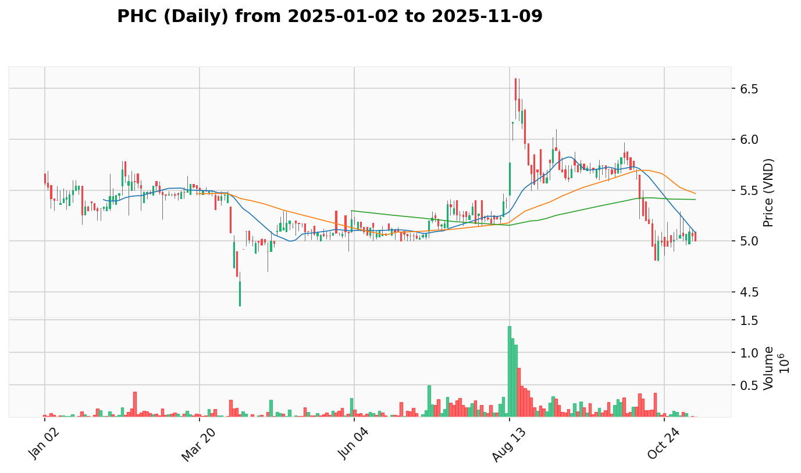

<a href="#xay-dung">↑ Back to group XAY_DUNG</a>  |  <a href="#vpa-signal-summary">↑ Back to Top</a>

#### Key Statistics
| Metric | Value |
|:---|---:|
| Date Range | 2025-01-02 to 2025-11-07 |
| **Latest Close** | **5.0** |
| Period Open | 5.66 |
| Period High | 6.6 |
| Period Low | 4.36 |
| Period Change % | -11.66% |

**[Download PHC Data (.csv)](market_data/PHC_2025-01-02_to_2025-11-09.csv)**

---

### PHP

#### [VPA Analysis (2025-08-14 - 2025-10-21)](./VPA.md#php)
> **Ngày 2025-10-15:** PHP mở cửa ở mức 33.1 VND và tiếp tục giảm mạnh, đóng cửa tại 32.6 VND, thấp hơn đáng kể so với giá đóng cửa phiên trước (33.0 VND). Giá đã có lúc chạm mức thấp nhất 32.2 VND và cao nhất 33.2 VND, tạo ra biên độ dao động rộng hơn so với phiên trước. Khối lượng giao dịch đạt 0.1042 triệu cổ phiếu, tăng mạnh so với phiên trước (0.0841 triệu cổ phiếu) và là mức cao nhất trong nhiều phiên gần đây. Sau chuỗi các phiên "Dấu hiệu suy yếu", việc giá tiếp tục giảm sâu với biên độ rộng và khối lượng gia tăng mạnh mẽ cho thấy áp lực bán vẫn đang rất lớn và chiếm ưu thế hoàn toàn, đẩy giá xuống các mức thấp hơn. Điều này xác nhận sự tiếp diễn của xu hướng giảm. **Phân tích VPA/Wyckoff:** Sign of Weakness (SOW) - Áp lực bán mạnh mẽ tiếp diễn với khối lượng cao.
> **Ngày 2025-10-16:** PHP mở cửa ở mức 32.6 VND và tiếp tục giảm, đóng cửa tại 32.0 VND, là mức thấp nhất trong phiên. Biên độ dao động trong phiên là 1.0 VND (từ 32.0 VND đến 33.0 VND). Khối lượng giao dịch đạt 0.0387 triệu cổ phiếu, giảm đáng kể so với phiên trước (0.1042 triệu cổ phiếu) và là mức thấp nhất trong 10 phiên gần đây. Sau chuỗi các phiên giảm mạnh với khối lượng cao, việc giá tiếp tục giảm và đóng cửa ở mức thấp nhất phiên nhưng với khối lượng thấp cho thấy áp lực bán đã giảm bớt về cường độ, tuy nhiên, không có lực cầu nào xuất hiện để đẩy giá lên. Điều này xác nhận sự thiếu vắng của người mua và khả năng cao xu hướng giảm vẫn sẽ tiếp diễn. **Phân tích VPA/Wyckoff:** Sign of Weakness (SOW) - Giá giảm với khối lượng thấp, cho thấy không có lực cầu.
> **Ngày 2025-10-17:** PHP mở cửa ở mức 32.1 VND và tiếp tục giảm mạnh, đóng cửa tại 31.5 VND, là mức thấp nhất trong phiên. Giá đã giảm từ 31.9 VND của phiên trước xuống 31.5 VND. Biên độ dao động trong phiên là 0.6 VND (từ 31.5 VND đến 32.1 VND). Khối lượng giao dịch đạt 0.0691 triệu cổ phiếu, giảm so với phiên trước (0.0992 triệu cổ phiếu). Việc giá tiếp tục giảm sâu và đóng cửa ở mức thấp nhất phiên, dù với khối lượng giảm nhẹ, cho thấy áp lực bán vẫn đang chiếm ưu thế và không có lực cầu đáng kể nào xuất hiện để hỗ trợ giá. Điều này xác nhận sự tiếp diễn của xu hướng giảm đã được thiết lập từ các phiên trước. **Phân tích VPA/Wyckoff:** Sign of Weakness (SOW) - Giá tiếp tục giảm mạnh và đóng cửa ở mức thấp nhất phiên với khối lượng giảm nhẹ, cho thấy áp lực bán vẫn duy trì và không có lực cầu.
> **Ngày 2025-10-20:** PHP mở cửa ở mức 31.5 VND, sau đó giảm mạnh và đóng cửa tại 30.5 VND, gần mức thấp nhất phiên là 30.3 VND. So với phiên trước (2025-10-17), giá đã giảm từ 31.5 VND xuống 30.5 VND. Biên độ dao động trong phiên là 1.2 VND (từ 30.3 VND đến 31.5 VND). Khối lượng giao dịch đạt 0.0944 triệu cổ phiếu, tăng đáng kể so với phiên trước (0.0691 triệu cổ phiếu). Việc giá tiếp tục giảm sâu, đóng cửa gần mức thấp nhất phiên với khối lượng gia tăng cho thấy áp lực bán đang rất mạnh và xu hướng giảm tiếp tục được củng cố. Không có dấu hiệu lực cầu xuất hiện để hấp thụ lượng cung. **Phân tích VPA/Wyckoff:** Sign of Weakness (SOW) - Giá giảm mạnh với khối lượng gia tăng, xác nhận áp lực bán mạnh mẽ và sự tiếp diễn của xu hướng giảm.
> **Ngày 2025-10-21:** PHP mở cửa ở mức 30.5 VND và tăng nhẹ, đóng cửa tại 30.8 VND, gần mức cao nhất phiên là 30.9 VND. Giá đã tăng từ 30.5 VND của phiên trước lên 30.8 VND. Biên độ dao động trong phiên là 0.5 VND (từ 30.4 VND đến 30.9 VND). Khối lượng giao dịch đạt 0.049 triệu cổ phiếu, giảm đáng kể so với phiên trước (0.0944 triệu cổ phiếu). Mặc dù giá có sự phục hồi nhẹ và đóng cửa gần mức cao nhất phiên, nhưng khối lượng giao dịch lại sụt giảm mạnh. Điều này cho thấy lực cầu yếu và không đủ mạnh để đảo chiều xu hướng giảm đã thiết lập từ các phiên trước. Sự tăng giá với khối lượng thấp sau một phiên giảm mạnh với khối lượng lớn thường là dấu hiệu của sự thiếu hụt nhu cầu, cho thấy áp lực bán vẫn tiềm ẩn và xu hướng giảm có thể tiếp diễn. **Phân tích VPA/Wyckoff:** No Demand (Thiếu cầu) - Giá tăng nhẹ với khối lượng thấp sau các phiên giảm mạnh, cho thấy lực cầu yếu và xu hướng giảm có thể tiếp diễn.

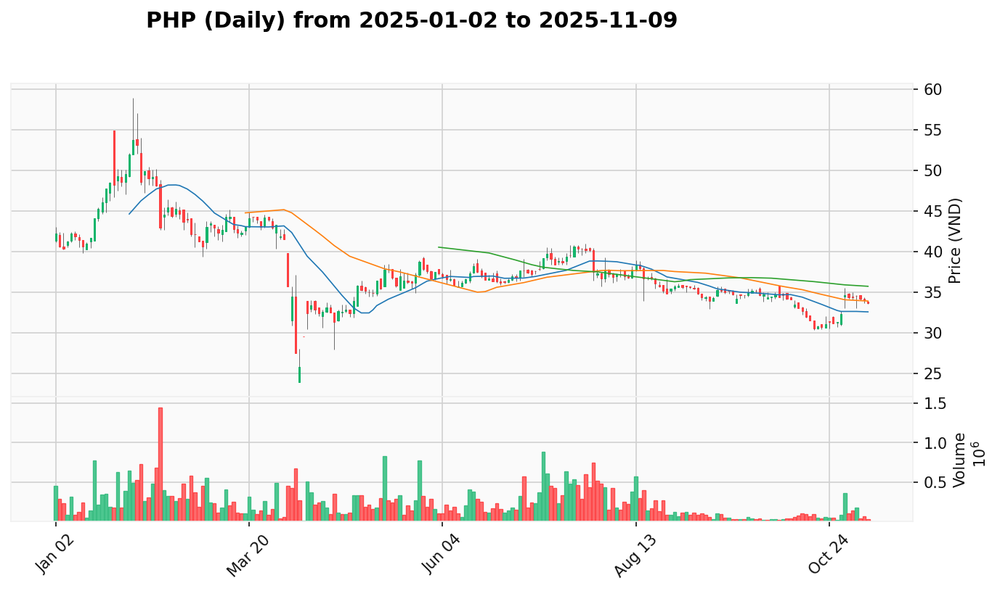

<a href="#van-tai">↑ Back to group VAN_TAI</a>  |  <a href="#vpa-signal-summary">↑ Back to Top</a>

#### Key Statistics
| Metric | Value |
|:---|---:|
| Date Range | 2025-01-02 to 2025-11-07 |
| **Latest Close** | **33.6** |
| Period Open | 41.29 |
| Period High | 58.89 |
| Period Low | 23.89 |
| Period Change % | -18.62% |

**[Download PHP Data (.csv)](market_data/PHP_2025-01-02_to_2025-11-09.csv)**

---

### PHR

#### [VPA Analysis (2025-06-13 - 2025-10-21)](./VPA.md#phr)
> **Ngày 2025-10-15:** PHR giảm từ 54.3 VND xuống 53.3 VND với khối lượng giao dịch đạt 0.3543 triệu cổ phiếu. Cây nến giảm có biên độ tương đối và đóng cửa ở mức thấp nhất phiên, cho thấy áp lực bán mạnh mẽ. Khối lượng giao dịch tăng đáng kể so với phiên trước (0.1874 triệu cổ phiếu), xác nhận lực cung đang chiếm ưu thế và tiếp tục đẩy giá xuống. Điều này củng cố thêm tín hiệu yếu kém của thị trường đã xuất hiện ở các phiên trước và cho thấy xu hướng giảm giá có thể tiếp diễn. **Phân tích VPA/Wyckoff:** Sign of Weakness (SOW) - Áp lực bán mạnh mẽ được xác nhận.
> **Ngày 2025-10-16:** PHR tăng từ 53.3 VND lên 53.5 VND với khối lượng giao dịch đạt 0.102 triệu cổ phiếu. Cây nến tăng có biên độ nhỏ và đóng cửa trên mức giá đóng cửa của phiên trước, nhưng khối lượng giao dịch rất thấp, chỉ bằng khoảng 1/3 so với phiên trước (0.3543 triệu cổ phiếu). Điều này cho thấy lực cầu yếu và không đủ mạnh để đảo chiều xu hướng giảm giá đã diễn ra trong hai phiên trước. Sự phục hồi nhẹ với khối lượng thấp sau áp lực bán mạnh mẽ thường là dấu hiệu của sự thiếu vắng nhu cầu thực sự, cho thấy xu hướng giảm giá có thể tiếp diễn hoặc thị trường sẽ đi ngang trong thời gian tới. **Phân tích VPA/Wyckoff:** No Demand (Không có cầu) - Xác nhận sự yếu kém của thị trường.
> **Ngày 2025-10-17:** PHR giảm từ 53.3 VND xuống 52.3 VND với khối lượng giao dịch đạt 0.1629 triệu cổ phiếu. Cây nến giảm có biên độ tương đối và đóng cửa ở mức thấp nhất phiên, cho thấy áp lực bán tiếp tục chiếm ưu thế. Khối lượng giao dịch tăng nhẹ so với phiên trước (0.1456 triệu cổ phiếu), xác nhận sự yếu kém của thị trường sau tín hiệu "No Demand" và củng cố xu hướng giảm giá. **Phân tích VPA/Wyckoff:** Sign of Weakness (SOW) - Áp lực bán tiếp diễn.
> **Ngày 2025-10-20:** PHR giảm từ 52.3 VND xuống 48.65 VND với khối lượng giao dịch đạt 0.3309 triệu cổ phiếu. Cây nến giảm có biên độ rộng và đóng cửa ở mức thấp nhất phiên, cho thấy áp lực bán mạnh mẽ. Khối lượng giao dịch tăng đáng kể so với phiên trước (0.1629 triệu cổ phiếu), xác nhận sự tiếp diễn của xu hướng giảm giá và sự chiếm ưu thế của phe bán. **Phân tích VPA/Wyckoff:** Sign of Weakness (SOW) - Áp lực bán mạnh mẽ.
> **Ngày 2025-10-21:** PHR tăng từ 48.65 VND lên 50.2 VND với khối lượng giao dịch đạt 0.3566 triệu cổ phiếu. Cây nến tăng có biên độ tương đối và đóng cửa ở nửa trên của thân nến, cho thấy lực cầu đã xuất hiện và hấp thụ một phần áp lực bán. Khối lượng giao dịch tăng nhẹ so với phiên trước (0.3309 triệu cổ phiếu), xác nhận sự xuất hiện của lực mua sau phiên giảm mạnh. **Phân tích VPA/Wyckoff:** Effort to Rise (ETR) - Lực cầu xuất hiện sau áp lực bán mạnh.

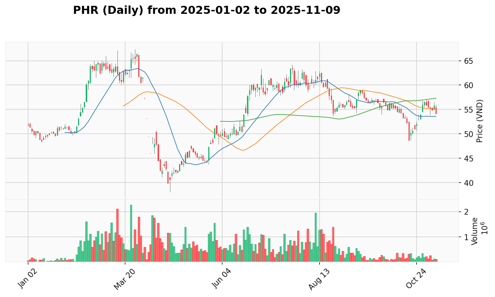

<a href="#cao-su">↑ Back to group CAO_SU</a>  |  <a href="#vpa-signal-summary">↑ Back to Top</a>

#### Key Statistics
| Metric | Value |
|:---|---:|
| Date Range | 2025-01-02 to 2025-11-07 |
| **Latest Close** | **54.1** |
| Period Open | 51.84 |
| Period High | 67.36 |
| Period Low | 38.07 |
| Period Change % | 4.36% |

**[Download PHR Data (.csv)](market_data/PHR_2025-01-02_to_2025-11-09.csv)**

---

### PLC

#### [VPA Analysis (2025-08-04 - 2025-10-21)](./VPA.md#plc)
> **Ngày 2025-10-15:** PLC giảm từ 27.3 VND xuống 26.9 VND với biên độ hẹp và đóng cửa ở mức thấp nhất phiên, cho thấy áp lực bán tiếp diễn. Khối lượng giao dịch đạt 0.3424 triệu cổ phiếu, giảm mạnh so với phiên trước (0.8662 triệu cổ phiếu). Sau các phiên suy yếu với khối lượng lớn, phiên này giá tiếp tục giảm nhưng với khối lượng thấp, cho thấy lực cung đang cạn kiệt hoặc không có lực cầu hỗ trợ. **Phân tích VPA/Wyckoff:** No Demand (ND) - Không có lực cầu.
> **Ngày 2025-10-16:** PLC tiếp tục giảm từ 26.9 VND xuống 26.8 VND với biên độ hẹp (từ 26.7 VND đến 27.1 VND) và đóng cửa gần mức thấp nhất phiên. Khối lượng giao dịch đạt 0.141 triệu cổ phiếu, giảm rất mạnh so với phiên trước (0.3424 triệu cổ phiếu), cho thấy sự thiếu vắng cả lực mua và lực bán. **Phân tích VPA/Wyckoff:** No Demand (ND) - Lực cầu tiếp tục vắng bóng.
> **Ngày 2025-10-17:** PLC tăng từ 27.2 VND lên 27.4 VND với biên độ hẹp và đóng cửa gần mức cao nhất phiên. Khối lượng giao dịch đạt 0.1929 triệu cổ phiếu, tiếp tục giảm mạnh so với phiên trước (0.2718 triệu cổ phiếu) và duy trì ở mức rất thấp. Sự tăng giá nhẹ với khối lượng cực thấp sau các phiên giảm giá mạnh cho thấy lực cầu yếu ớt và không có sự hỗ trợ đáng kể, củng cố nhận định về sự thiếu vắng lực cầu trong thị trường. **Phân tích VPA/Wyckoff:** No Demand (ND) - Lực cầu yếu ớt.
> **Ngày 2025-10-20:** PLC giảm mạnh từ 29.7 VND xuống 24.9 VND với biên độ rộng và đóng cửa ở mức thấp nhất phiên. Khối lượng giao dịch đạt 0.5008 triệu cổ phiếu, tăng mạnh so với phiên trước (0.1929 triệu cổ phiếu). Sự giảm giá mạnh đi kèm với khối lượng tăng đột biến cho thấy áp lực bán rất lớn và lực cung đang chiếm ưu thế hoàn toàn. **Phân tích VPA/Wyckoff:** Sign of Weakness (SOW) - Lực cung mạnh mẽ.
> **Ngày 2025-10-21:** PLC tăng từ 24.9 VND lên 25.7 VND với biên độ trung bình và đóng cửa gần mức cao nhất phiên. Khối lượng giao dịch đạt 0.5459 triệu cổ phiếu, tăng nhẹ so với phiên trước (0.5008 triệu cổ phiếu). Sau phiên giảm giá mạnh (SOW) vào ngày 2025-10-20, sự phục hồi nhẹ với khối lượng tăng nhưng không quá đột biến cho thấy có lực cầu xuất hiện nhưng chưa đủ mạnh để đảo chiều xu hướng giảm giá. Đây có thể là một nhịp hồi kỹ thuật hoặc kiểm tra lực cung. **Phân tích VPA/Wyckoff:** Test for Supply (Kiểm tra lực cung)

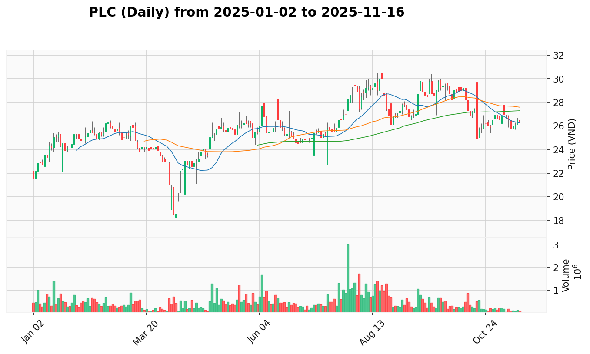

<a href="#dau-tu-cong">↑ Back to group DAU_TU_CONG</a>  |  <a href="#vpa-signal-summary">↑ Back to Top</a>

#### Key Statistics
| Metric | Value |
|:---|---:|
| Date Range | 2025-01-02 to 2025-11-07 |
| **Latest Close** | **26.5** |
| Period Open | 22.18 |
| Period High | 31.7 |
| Period Low | 17.27 |
| Period Change % | 19.48% |

**[Download PLC Data (.csv)](market_data/PLC_2025-01-02_to_2025-11-09.csv)**

---

### PLX

#### [VPA Analysis (2025-06-13 - 2025-10-21)](./VPA.md#plx)
> **Ngày 2025-10-15:** PLX tăng nhẹ từ 33.6 lên 33.7 VND. Cây nến có biên độ 0.35 VND (từ 33.55 lên 33.9) và đóng cửa ở giữa thân nến. Khối lượng giao dịch đạt 1.6601 triệu cổ phiếu, giảm so với phiên trước (1.9165 triệu cổ phiếu). Sau phiên giảm mạnh với lực cung áp đảo vào ngày 2025-10-14, phiên hôm nay giá tăng nhẹ với khối lượng giảm, cho thấy lực cung đã tạm thời chững lại nhưng lực cầu vẫn còn yếu và chưa sẵn sàng đẩy giá lên. **Phân tích VPA/Wyckoff:** Lực cầu yếu
> **Ngày 2025-10-16:** PLX giữ nguyên mức giá đóng cửa 33.7 VND so với phiên trước, mở cửa ở 33.7 VND và đóng cửa ở 33.7 VND. Cây nến có biên độ 0.45 VND (từ 33.4 lên 33.85). Khối lượng giao dịch đạt 0.8414 triệu cổ phiếu, giảm mạnh so với phiên trước (1.6601 triệu cổ phiếu) và thấp hơn đáng kể so với mức trung bình. Sau phiên giảm mạnh với lực cung áp đảo (2025-10-14) và phiên tăng nhẹ với lực cầu yếu (2025-10-15), phiên hôm nay giá đi ngang với khối lượng rất thấp cho thấy sự thiếu vắng cả lực cung và lực cầu, thể hiện sự lưỡng lự và thiếu quyết đoán của thị trường. **Phân tích VPA/Wyckoff:** Thiếu cầu (No Demand) - Indecision
> **Ngày 2025-10-17:** PLX giảm từ 33.7 xuống 33.55 VND. Cây nến có biên độ 0.3 VND (từ 33.45 lên 33.75) và đóng cửa gần mức thấp nhất phiên. Khối lượng giao dịch đạt 1.9409 triệu cổ phiếu, tăng so với phiên trước (1.7357 triệu cổ phiếu). Sau hai phiên giá đi ngang hoặc tăng nhẹ với khối lượng thấp cho thấy lực cầu yếu và sự lưỡng lự, phiên hôm nay giá giảm với khối lượng tăng, cho thấy lực cung đã quay trở lại và áp đảo, đẩy giá xuống. Điều này xác nhận sự yếu kém của thị trường. **Phân tích VPA/Wyckoff:** Sign of Weakness (SOW) - Lực cung áp đảo
> **Ngày 2025-10-20:** PLX giảm từ 33.55 xuống 32.7 VND. Cây nến có biên độ rộng (từ 32.5 lên 33.5) và đóng cửa gần mức thấp nhất phiên. Khối lượng giao dịch đạt 2.2223 triệu cổ phiếu, tăng so với phiên trước (1.9409 triệu cổ phiếu). Sau phiên giảm mạnh với lực cung áp đảo vào ngày 2025-10-17, phiên hôm nay giá tiếp tục giảm mạnh với khối lượng gia tăng và đóng cửa ở mức thấp, cho thấy lực cung vẫn đang rất mạnh và áp đảo hoàn toàn lực cầu. Điều này xác nhận xu hướng yếu kém của thị trường. **Phân tích VPA/Wyckoff:** Sign of Weakness (SOW) - Lực cung áp đảo
> **Ngày 2025-10-21:** PLX tăng từ 32.7 lên 33.35 VND. Cây nến có biên độ 0.7 VND (từ 32.8 lên 33.5) và đóng cửa gần mức cao nhất phiên. Khối lượng giao dịch đạt 1.5229 triệu cổ phiếu, giảm so với phiên trước (2.2223 triệu cổ phiếu). Sau hai phiên giảm mạnh với lực cung áp đảo (SOW), phiên hôm nay giá tăng trở lại nhưng với khối lượng thấp hơn đáng kể. Điều này cho thấy lực cầu chưa thực sự mạnh mẽ để đảo chiều xu hướng giảm, có thể chỉ là một nhịp hồi phục kỹ thuật hoặc kiểm tra lực cung. Lực cung vẫn có thể quay trở lại nếu giá không thể duy trì đà tăng với khối lượng thuyết phục. **Phân tích VPA/Wyckoff:** Lack of Demand (LOD) - Giá tăng với khối lượng thấp trong xu hướng giảm cho thấy thiếu lực cầu bền vững.

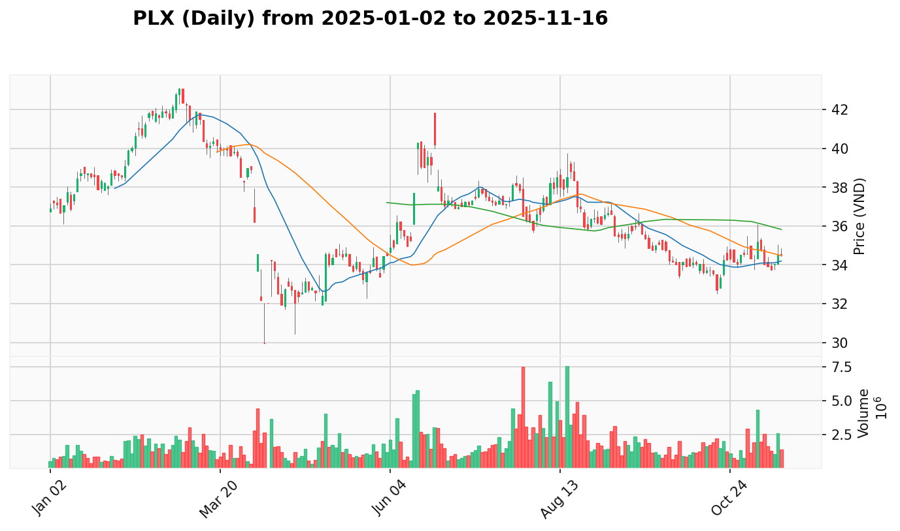

<a href="#dau-khi">↑ Back to group DAU_KHI</a>  |  <a href="#vpa-signal-summary">↑ Back to Top</a>

#### Key Statistics
| Metric | Value |
|:---|---:|
| Date Range | 2025-01-02 to 2025-11-07 |
| **Latest Close** | **34.0** |
| Period Open | 36.72 |
| Period High | 43.11 |
| Period Low | 29.95 |
| Period Change % | -7.41% |

**[Download PLX Data (.csv)](market_data/PLX_2025-01-02_to_2025-11-09.csv)**

---

### PNJ

#### [VPA Analysis (2025-06-13 - 2025-10-21)](./VPA.md#pnj)
> **Ngày 2025-10-15:** PNJ tăng mạnh từ 84.7 lên 86.1 VND. Cây nến tăng có biên độ rộng (2.3 VND) và đóng cửa gần mức cao nhất phiên, cho thấy lực mua áp đảo. Khối lượng giao dịch đạt 0.9977 triệu cổ phiếu, cao hơn đáng kể so với phiên trước (0.6174 triệu cổ phiếu) và là mức cao nhất trong 10 phiên gần đây. Sự kết hợp giữa giá tăng mạnh, đóng cửa ở mức cao và khối lượng tăng đột biến cho thấy lực cầu đang quay trở lại thị trường một cách mạnh mẽ, phủ nhận tín hiệu yếu kém của phiên trước. **Phân tích VPA/Wyckoff:** Sign of Strength (SOS) - Lực cầu mạnh mẽ
> **Ngày 2025-10-16:** PNJ mở cửa ở mức 86.2 VND, đạt đỉnh 87.8 VND và đóng cửa ở mức 87.7 VND. Giá tăng từ 86.1 VND lên 87.7 VND. Cây nến tăng có biên độ rộng (1.6 VND) và đóng cửa gần mức cao nhất phiên, cho thấy lực mua tiếp tục áp đảo. Khối lượng giao dịch đạt 0.6589 triệu cổ phiếu, thấp hơn so với phiên trước (0.9977 triệu cổ phiếu) nhưng vẫn duy trì ở mức khá. Sự kết hợp giữa giá tăng mạnh, đóng cửa ở mức cao và khối lượng duy trì cho thấy lực cầu vẫn đang kiểm soát thị trường, tiếp nối tín hiệu mạnh mẽ từ phiên trước. **Phân tích VPA/Wyckoff:** Sign of Strength (SOS) - Lực cầu tiếp diễn
> **Ngày 2025-10-17:** PNJ giảm từ 92.1 xuống 90.1 VND. Cây nến giảm có biên độ rộng (3.0 VND) và đóng cửa ở giữa thân nến, cho thấy sự lưỡng lự. Khối lượng giao dịch đạt 1.4405 triệu cổ phiếu, thấp hơn đáng kể so với phiên trước (2.9802 triệu cổ phiếu). Sau hai phiên tăng mạnh với tín hiệu SOS, việc giá giảm nhẹ với khối lượng thấp cho thấy lực cung không quá mạnh, có thể là một nhịp điều chỉnh tự nhiên hoặc kiểm tra nguồn cung sau đợt tăng giá. **Phân tích VPA/Wyckoff:** Test for Supply - Kiểm tra nguồn cung
> **Ngày 2025-10-20:** PNJ giảm từ 90.1 VND xuống 83.9 VND. Cây nến giảm có biên độ rộng (6.2 VND) và đóng cửa ở mức thấp nhất phiên, cho thấy áp lực bán mạnh mẽ. Khối lượng giao dịch đạt 2.2955 triệu cổ phiếu, cao hơn đáng kể so với phiên trước (1.4405 triệu cổ phiếu). Sự kết hợp giữa giá giảm mạnh, đóng cửa ở mức thấp nhất và khối lượng gia tăng cho thấy lực cung đang áp đảo thị trường, đảo ngược tín hiệu kiểm tra nguồn cung của phiên trước. **Phân tích VPA/Wyckoff:** Sign of Weakness (SOW) - Lực cung mạnh mẽ
> **Ngày 2025-10-21:** PNJ tăng từ 83.9 VND lên 86.9 VND. Cây nến tăng có biên độ tương đối rộng (3.7 VND) và đóng cửa gần mức cao nhất phiên, cho thấy lực cầu xuất hiện. Tuy nhiên, khối lượng giao dịch chỉ đạt 1.0275 triệu cổ phiếu, thấp hơn đáng kể so với phiên giảm mạnh trước đó (2.2955 triệu cổ phiếu). Sau phiên giảm giá mạnh với tín hiệu SOW, việc giá tăng trở lại với khối lượng thấp cho thấy lực cầu chưa thực sự mạnh mẽ để đảo ngược xu hướng giảm, có thể là một nhịp hồi phục yếu hoặc kiểm tra lại lực cầu sau áp lực bán. **Phân tích VPA/Wyckoff:** Hồi phục yếu (Weak Rally)

<a href="#ban-le">↑ Back to group BAN_LE</a>  |  <a href="#vpa-signal-summary">↑ Back to Top</a>

#### Key Statistics
| Metric | Value |
|:---|---:|
| Date Range | 2025-01-02 to 2025-11-07 |
| **Latest Close** | **87.5** |
| Period Open | 95.82 |
| Period High | 97.78 |
| Period Low | 61.78 |
| Period Change % | -8.68% |

**[Download PNJ Data (.csv)](market_data/PNJ_2025-01-02_to_2025-11-09.csv)**

---

### POW

#### [VPA Analysis (2025-06-16 - 2025-10-21)](./VPA.md#pow)
> **Ngày 2025-10-15:** POW giảm từ 14.35 VND xuống 14.3 VND. Cây nến giảm có biên độ hẹp (0.3 VND) và đóng cửa gần mức thấp nhất phiên. Khối lượng giao dịch đạt 6.0323 triệu cổ phiếu, giảm so với phiên trước (7.384 triệu cổ phiếu). Sau hai phiên liên tiếp cho thấy lực cung chiếm ưu thế và nỗ lực tăng giá thất bại, phiên này giá tiếp tục giảm nhẹ với khối lượng thấp hơn, cho thấy áp lực bán có phần giảm bớt nhưng lực cầu vẫn yếu, giá vẫn đóng cửa ở mức thấp, xác nhận sự suy yếu tiếp diễn. **Phân tích VPA/Wyckoff:** Tiếp tục suy yếu
> **Ngày 2025-10-16:** POW mở cửa 14.3 VND và đóng cửa ở mức 14.3 VND, bằng giá đóng cửa phiên trước. Cây nến có biên độ hẹp (0.2 VND) và đóng cửa ngang giá mở cửa, cho thấy sự lưỡng lự. Khối lượng giao dịch đạt 4.251 triệu cổ phiếu, giảm đáng kể so với phiên trước (6.0323 triệu cổ phiếu). Sau hai phiên liên tiếp cho thấy lực cung chiếm ưu thế và giá suy yếu, phiên này giá đi ngang với khối lượng thấp, cho thấy áp lực bán đã giảm nhưng lực cầu vẫn chưa xuất hiện mạnh mẽ, xác nhận sự tạm dừng của xu hướng giảm. **Phân tích VPA/Wyckoff:** No Demand (Không có cầu)
> **Ngày 2025-10-17:** POW giảm từ 14.35 VND xuống 14.15 VND. Cây nến giảm có biên độ rộng (0.35 VND) và đóng cửa ở mức thấp nhất phiên. Khối lượng giao dịch đạt 7.2429 triệu cổ phiếu, tăng so với phiên trước (6.4176 triệu cổ phiếu). Sau phiên 'No Demand' trước đó, phiên này giá tiếp tục giảm mạnh với khối lượng gia tăng, xác nhận áp lực bán mạnh mẽ và sự suy yếu tiếp diễn. **Phân tích VPA/Wyckoff:** Weakness (Suy yếu)
> **Ngày 2025-10-20:** POW giảm từ 14.15 VND xuống 13.2 VND. Cây nến giảm có biên độ rộng (1.05 VND) và đóng cửa ở mức thấp nhất phiên. Khối lượng giao dịch đạt 14.8918 triệu cổ phiếu, tăng đột biến so với phiên trước (7.2429 triệu cổ phiếu). Sau phiên 'Weakness' trước đó, phiên này giá tiếp tục lao dốc với khối lượng cực lớn, cho thấy sự hoảng loạn bán tháo và lực cung áp đảo hoàn toàn lực cầu. **Phân tích VPA/Wyckoff:** Selling Climax (Bán tháo)
> **Ngày 2025-10-21:** POW tăng từ 13.2 VND lên 13.35 VND. Cây nến tăng có biên độ hẹp (0.2 VND) và đóng cửa gần mức cao nhất phiên. Khối lượng giao dịch đạt 10.15 triệu cổ phiếu, giảm đáng kể so với phiên trước (14.89 triệu cổ phiếu). Sau phiên bán tháo mạnh mẽ, giá có sự hồi phục nhẹ nhưng với khối lượng thấp, cho thấy lực cầu yếu và thiếu sự xác nhận cho một xu hướng tăng bền vững. **Phân tích VPA/Wyckoff:** No Demand (Không có cầu)

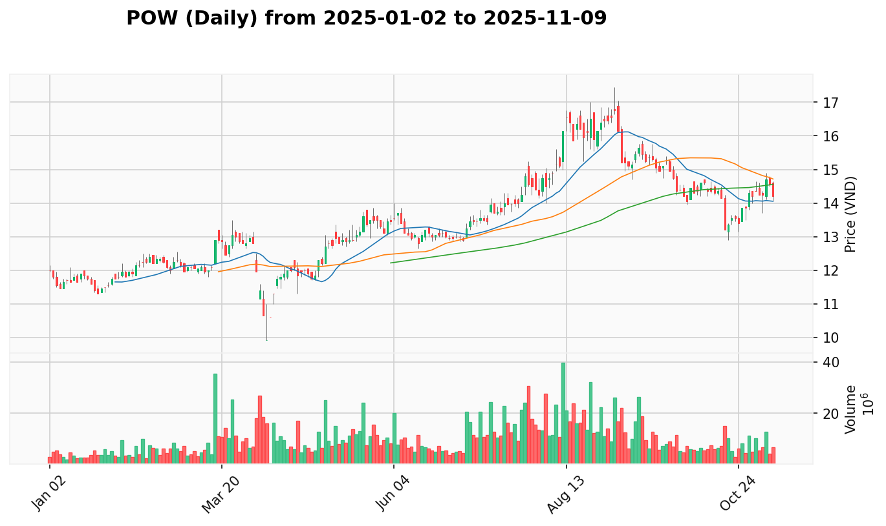

<a href="#nang-luong">↑ Back to group NANG_LUONG</a>  |  <a href="#vpa-signal-summary">↑ Back to Top</a>

#### Key Statistics
| Metric | Value |
|:---|---:|
| Date Range | 2025-01-02 to 2025-11-07 |
| **Latest Close** | **14.2** |
| Period Open | 12.0 |
| Period High | 17.45 |
| Period Low | 9.92 |
| Period Change % | 18.33% |

**[Download POW Data (.csv)](market_data/POW_2025-01-02_to_2025-11-09.csv)**

---

### PPC

#### [VPA Analysis (2025-08-04 - 2025-10-21)](./VPA.md#ppc)
> **Ngày 2025-10-15:** PPC giảm từ 10.5 VND xuống 10.4 VND, mở cửa ở 10.5 VND. Biên độ dao động trong phiên hẹp (từ 10.35 VND đến 10.55 VND). Khối lượng giao dịch đạt 0.2969 triệu cổ phiếu, giảm đáng kể so với phiên trước (0.471 triệu cổ phiếu). Giá tiếp tục giảm với khối lượng thấp cho thấy áp lực bán đã giảm bớt nhưng thiếu cầu vẫn đang duy trì, khiến giá không thể phục hồi. Điều này cho thấy sự yếu ớt tiếp diễn của cổ phiếu. **Phân tích VPA/Wyckoff:** Yếu ớt (Weakness)
> **Ngày 2025-10-16:** PPC tăng từ 10.4 VND lên 10.5 VND, mở cửa ở 10.4 VND. Biên độ dao động trong phiên hẹp (từ 10.4 VND đến 10.5 VND). Khối lượng giao dịch đạt 0.2062 triệu cổ phiếu, giảm đáng kể so với phiên trước (0.2969 triệu cổ phiếu). Giá tăng nhẹ với khối lượng thấp cho thấy áp lực bán đã giảm bớt và có sự hấp thụ cung ở mức giá thấp hơn, nhưng lực cầu chưa đủ mạnh để tạo ra một xu hướng tăng rõ rệt. Đây có thể là một phiên kiểm tra cung sau giai đoạn suy yếu. **Phân tích VPA/Wyckoff:** Kiểm tra cung (Test for Supply)
> **Ngày 2025-10-17:** PPC giảm từ 10.45 VND xuống 10.25 VND, mở cửa ở 10.35 VND. Biên độ dao động trong phiên hẹp (từ 10.25 VND đến 10.4 VND) và đóng cửa ở mức thấp nhất phiên. Khối lượng giao dịch đạt 0.7113 triệu cổ phiếu, tăng mạnh so với phiên trước (0.2548 triệu cổ phiếu). Giá giảm với khối lượng tăng đột biến cho thấy áp lực bán mạnh mẽ và nguồn cung lớn đang đẩy giá xuống. Điều này xác nhận sự yếu ớt của cổ phiếu. **Phân tích VPA/Wyckoff:** Yếu ớt (Weakness)
> **Ngày 2025-10-20:** PPC giảm từ 10.25 VND xuống 10.1 VND, mở cửa ở 10.25 VND. Biên độ dao động trong phiên hẹp (từ 10.1 VND đến 10.4 VND) và đóng cửa ở mức thấp nhất phiên. Khối lượng giao dịch đạt 0.6648 triệu cổ phiếu, giảm nhẹ so với phiên trước (0.7113 triệu cổ phiếu). Giá tiếp tục giảm với khối lượng vẫn ở mức cao, cho thấy áp lực bán vẫn duy trì và cổ phiếu tiếp tục yếu ớt. **Phân tích VPA/Wyckoff:** Yếu ớt (Weakness)
> **Ngày 2025-10-21:** PPC tăng từ 10.1 VND lên 10.2 VND, mở cửa ở 10.1 VND. Biên độ dao động trong phiên hẹp (từ 10.1 VND đến 10.25 VND) và đóng cửa ở giữa phiên. Khối lượng giao dịch đạt 0.4136 triệu cổ phiếu, giảm đáng kể so với phiên trước (0.6648 triệu cổ phiếu). Giá tăng nhẹ với khối lượng thấp cho thấy lực cầu yếu, không có sự tham gia mạnh mẽ của người mua. Điều này cho thấy sự yếu ớt vẫn còn tiềm ẩn và có thể là một nhịp hồi phục kỹ thuật sau các phiên giảm giá mạnh trước đó. **Phân tích VPA/Wyckoff:** Không có cầu (No Demand)

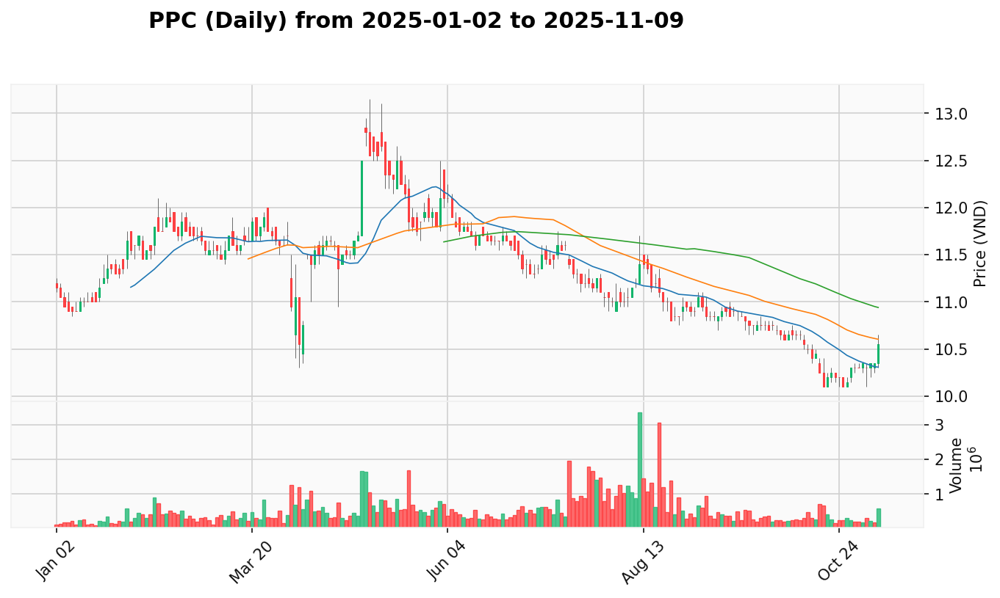

<a href="#nang-luong">↑ Back to group NANG_LUONG</a>  |  <a href="#vpa-signal-summary">↑ Back to Top</a>

#### Key Statistics
| Metric | Value |
|:---|---:|
| Date Range | 2025-01-02 to 2025-11-07 |
| **Latest Close** | **10.55** |
| Period Open | 11.2 |
| Period High | 13.15 |
| Period Low | 10.1 |
| Period Change % | -5.80% |

**[Download PPC Data (.csv)](market_data/PPC_2025-01-02_to_2025-11-09.csv)**

---

### PPH

#### [VPA Analysis (2025-08-04 - 2025-10-21)](./VPA.md#pph)
> **Ngày 2025-10-15:** PPH tăng từ 27.8 VND lên 28.0 VND với khối lượng giao dịch đạt 0.0065 triệu cổ phiếu. Cây nến có biên độ hẹp, đóng cửa ở mức cao nhất phiên. Khối lượng giao dịch giảm đáng kể so với phiên trước (0.0096 triệu cổ phiếu) và thấp hơn nhiều so với phiên SOS ngày 2025-10-08 (0.0132 triệu cổ phiếu). Mặc dù giá tăng và đóng cửa ở mức cao nhất, sự sụt giảm về khối lượng cho thấy lực cầu yếu và thiếu sự xác nhận, phản ánh sự thiếu quyết đoán của thị trường sau các phiên "Thiếu cầu" và "Yếu" trước đó. **Phân tích VPA/Wyckoff:** Thiếu cầu
> **Ngày 2025-10-16:** PPH giảm từ 28.0 VND xuống 27.8 VND với khối lượng giao dịch đạt 0.0011 triệu cổ phiếu. Cây nến có biên độ rất hẹp, đóng cửa ở mức thấp nhất phiên. Khối lượng giao dịch cực kỳ thấp, giảm mạnh so với phiên trước (0.0065 triệu cổ phiếu) và là mức thấp nhất trong các phiên gần đây. Sự sụt giảm giá nhẹ với khối lượng cực thấp cho thấy không có áp lực bán mạnh, nhưng đồng thời cũng không có lực cầu nào để hỗ trợ giá. Điều này củng cố thêm tín hiệu "Thiếu cầu" từ phiên trước và cho thấy thị trường đang rất yếu, không có sự quan tâm từ cả bên mua lẫn bên bán. **Phân tích VPA/Wyckoff:** No Demand (Không có cầu)
> **Ngày 2025-10-17:** PPH tăng từ 27.9 VND lên 28.0 VND với khối lượng giao dịch đạt 0.0068 triệu cổ phiếu. Cây nến có biên độ hẹp, đóng cửa ở mức 28.0 VND. Khối lượng giao dịch tăng nhẹ so với phiên trước (0.0026 triệu cổ phiếu) nhưng vẫn thấp hơn nhiều so với các phiên có khối lượng cao trước đó. Sau tín hiệu "Không có cầu", phiên này cho thấy một nỗ lực tăng giá yếu, với biên độ giá hẹp và khối lượng chưa đủ thuyết phục để xác nhận lực cầu mạnh mẽ. **Phân tích VPA/Wyckoff:** Nỗ lực tăng giá yếu
> **Ngày 2025-10-20:** PPH giảm từ 28.0 VND xuống 27.3 VND với khối lượng giao dịch đạt 0.0268 triệu cổ phiếu. Cây nến có biên độ rộng, đóng cửa ở mức thấp nhất phiên, cho thấy áp lực bán mạnh mẽ. Khối lượng giao dịch tăng đột biến so với phiên trước (0.0068 triệu cổ phiếu) và cao hơn đáng kể so với các phiên gần đây, xác nhận lực bán đang chiếm ưu thế. Sau các tín hiệu "Không có cầu" và "Nỗ lực tăng giá yếu", phiên này cho thấy sự suy yếu rõ rệt của thị trường. **Phân tích VPA/Wyckoff:** Sign of Weakness (SOW) - Lực cung mạnh mẽ.
> **Ngày 2025-10-21:** PPH tăng từ 27.3 VND lên 27.7 VND với khối lượng giao dịch đạt 0.0177 triệu cổ phiếu. Cây nến có biên độ hẹp, đóng cửa ở mức cao hơn giá mở cửa. Khối lượng giao dịch giảm đáng kể so với phiên trước (0.0268 triệu cổ phiếu) khi xuất hiện Sign of Weakness. Sau một phiên giảm mạnh với lực cung áp đảo, phiên này cho thấy một nỗ lực tăng giá nhưng với khối lượng thấp, cho thấy lực cầu chưa thực sự mạnh mẽ để hấp thụ hết lực cung. **Phân tích VPA/Wyckoff:** Nỗ lực tăng giá yếu

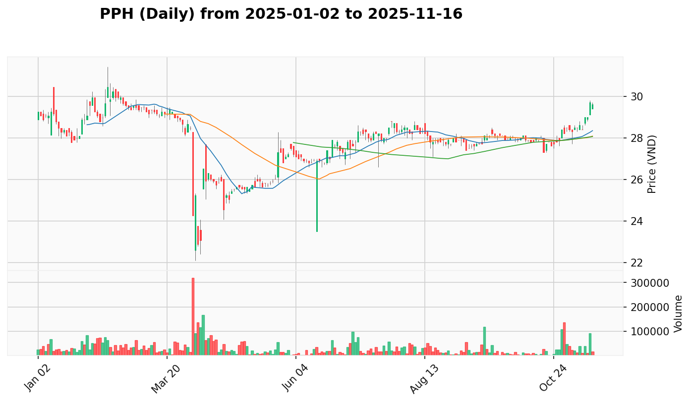

<a href="#det-may">↑ Back to group DET_MAY</a>  |  <a href="#vpa-signal-summary">↑ Back to Top</a>

#### Key Statistics
| Metric | Value |
|:---|---:|
| Date Range | 2025-01-02 to 2025-11-07 |
| **Latest Close** | **28.6** |
| Period Open | 28.88 |
| Period High | 31.42 |
| Period Low | 22.09 |
| Period Change % | -0.97% |

**[Download PPH Data (.csv)](market_data/PPH_2025-01-02_to_2025-11-09.csv)**

---

### PTB

#### [VPA Analysis (2025-06-26 - 2025-10-21)](./VPA.md#ptb)
> **Ngày 2025-10-15:** PTB mở cửa ở mức 49.4 VND, cao hơn giá đóng cửa phiên trước. Tuy nhiên, giá đã giảm trong phiên và đóng cửa ở mức 49.1 VND, thấp hơn giá mở cửa. Biên độ dao động trong phiên là 0.8 VND (từ 48.6 VND đến 49.4 VND). Khối lượng giao dịch đạt 0.1862 triệu cổ phiếu, thấp hơn đáng kể so với phiên trước (0.2022 triệu cổ phiếu). Sau phiên Upthrust với khối lượng lớn, việc giá mở cửa cao nhưng không thể duy trì đà tăng và đóng cửa thấp hơn giá mở cửa, cùng với khối lượng giảm, cho thấy lực cầu đang suy yếu và lực cung vẫn còn hiện diện. Mặc dù giá đóng cửa vẫn cao hơn phiên trước, nhưng sự xuất hiện của một nến giảm với khối lượng thấp sau Upthrust là một dấu hiệu cảnh báo về sự thiếu hụt cầu và khả năng giá sẽ tiếp tục điều chỉnh. **Phân tích VPA/Wyckoff:** No Demand - Giá giảm trong phiên với khối lượng thấp sau Upthrust, cho thấy lực cầu yếu và lực cung đang chiếm ưu thế.
> **Ngày 2025-10-16:** PTB mở cửa ở mức 48.95 VND, sau đó tăng mạnh lên mức cao nhất 50.0 VND và đóng cửa ở mức 49.95 VND, gần mức cao nhất phiên. Giá tăng đáng kể từ 49.1 VND lên 49.95 VND. Biên độ dao động trong phiên rộng. Khối lượng giao dịch đạt 0.0488 triệu cổ phiếu, giảm mạnh so với phiên trước (0.1862 triệu cổ phiếu) và là mức thấp nhất trong 10 phiên gần đây. Sau hai phiên Upthrust và No Demand cho thấy lực cung xuất hiện và lực cầu suy yếu, phiên hôm nay giá tăng mạnh với khối lượng rất thấp cho thấy lực cung đã cạn kiệt, cho phép giá tăng dễ dàng. Đây có thể là một dấu hiệu tích cực nếu được xác nhận bởi các phiên tăng giá với khối lượng lớn hơn trong tương lai. **Phân tích VPA/Wyckoff:** Test for Supply (TFS) - Giá tăng mạnh với khối lượng rất thấp sau giai đoạn suy yếu, cho thấy lực cung đã cạn kiệt.
> **Ngày 2025-10-17:** PTB mở cửa ở mức 51.4 VND, cao hơn giá đóng cửa phiên trước. Tuy nhiên, giá đã giảm trong phiên và đóng cửa ở mức 51.0 VND, thấp hơn giá mở cửa và giá đóng cửa phiên trước. Biên độ dao động trong phiên là 1.3 VND (từ 50.1 VND đến 51.4 VND). Khối lượng giao dịch đạt 0.1271 triệu cổ phiếu, giảm mạnh so với phiên trước (0.3038 triệu cổ phiếu) và là mức rất thấp. Sau phiên Test for Supply (TFS) với khối lượng rất thấp cho thấy lực cung đã cạn kiệt, phiên hôm nay giá giảm nhẹ với khối lượng cực thấp cho thấy lực cầu không xuất hiện để đẩy giá lên. Điều này xác nhận sự thiếu hụt cầu và khả năng giá sẽ tiếp tục điều chỉnh hoặc đi ngang trong thời gian tới. **Phân tích VPA/Wyckoff:** No Demand - Giá giảm nhẹ với khối lượng rất thấp sau TFS, cho thấy lực cầu yếu và không có sự hỗ trợ từ người mua.
> **Ngày 2025-10-20:** PTB mở cửa ở mức 51.0 VND, sau đó giảm mạnh xuống mức thấp nhất 48.0 VND và đóng cửa ở mức 48.45 VND, gần mức thấp nhất phiên. Giá giảm đáng kể từ 51.0 VND xuống 48.45 VND. Biên độ dao động trong phiên rất rộng và là một cây nến giảm mạnh. Khối lượng giao dịch đạt 0.1022 triệu cổ phiếu, thấp hơn so với phiên trước (0.1271 triệu cổ phiếu). Sau phiên No Demand ngày 2025-10-17 cho thấy lực cầu yếu, phiên hôm nay giá giảm mạnh với biên độ rộng và đóng cửa ở mức thấp nhất phiên, cho thấy lực cung đang chiếm ưu thế rõ rệt. Mặc dù khối lượng không quá cao, nhưng sự sụt giảm mạnh của giá cho thấy sự thiếu vắng của lực cầu hỗ trợ. Điều này xác nhận xu hướng suy yếu và có thể dẫn đến việc kiểm tra các mức hỗ trợ thấp hơn. **Phân tích VPA/Wyckoff:** Sign of Weakness (SOW) - Giá giảm mạnh với biên độ rộng, đóng cửa gần mức thấp nhất phiên, cho thấy lực cung đang chiếm ưu thế.
> **Ngày 2025-10-21:** PTB mở cửa ở mức 49.0 VND, sau đó tăng lên mức cao nhất 49.7 VND và đóng cửa ở mức 49.65 VND, gần mức cao nhất phiên. Giá đã tăng từ 48.45 VND (giá đóng cửa phiên trước) lên 49.65 VND. Biên độ dao động trong phiên là 1.2 VND, cho thấy sự phục hồi sau phiên giảm mạnh trước đó. Khối lượng giao dịch đạt 0.1984 triệu cổ phiếu, tăng đáng kể so với phiên trước (0.1022 triệu cổ phiếu). Sau phiên Sign of Weakness (SOW) ngày 2025-10-20, phiên hôm nay giá tăng trở lại với khối lượng gia tăng, cho thấy lực cầu đã quay trở lại và hấp thụ lực cung. Việc giá đóng cửa gần mức cao nhất phiên củng cố thêm tín hiệu tích cực này. Điều này cho thấy khả năng giá sẽ tiếp tục phục hồi hoặc đi ngang trong thời gian tới. **Phân tích VPA/Wyckoff:** Sign of Strength (SOS) - Giá tăng với khối lượng gia tăng, cho thấy lực cầu mạnh mẽ đã quay trở lại.

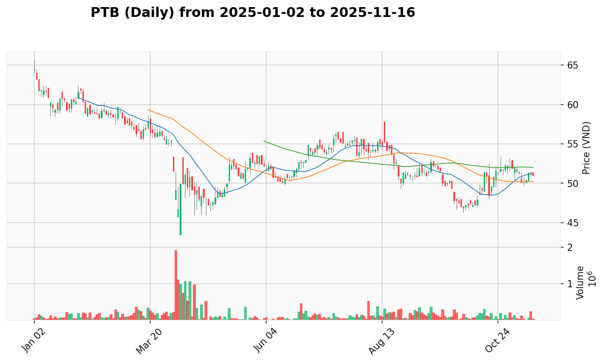

<a href="#vlxd">↑ Back to group VLXD</a>  |  <a href="#vpa-signal-summary">↑ Back to Top</a>

#### Key Statistics
| Metric | Value |
|:---|---:|
| Date Range | 2025-01-02 to 2025-11-07 |
| **Latest Close** | **50.1** |
| Period Open | 64.46 |
| Period High | 65.63 |
| Period Low | 43.46 |
| Period Change % | -22.28% |

**[Download PTB Data (.csv)](market_data/PTB_2025-01-02_to_2025-11-09.csv)**

---

### PVC

#### [VPA Analysis (2025-08-04 - 2025-10-21)](./VPA.md#pvc)
> **Ngày 2025-10-15:** PVC tiếp tục giảm từ 10.9 VND xuống 10.5 VND, đóng cửa gần mức thấp nhất phiên với biên độ nến hẹp. Khối lượng giao dịch đạt 1.7842 triệu cổ phiếu, cao hơn so với phiên trước (1.4442 triệu cổ phiếu) và duy trì ở mức cao. Sau các tín hiệu suy yếu mạnh mẽ vào các phiên trước, việc giá tiếp tục giảm sâu và đóng cửa ở mức thấp kèm theo khối lượng gia tăng cho thấy áp lực bán vẫn đang rất mạnh và chiếm ưu thế hoàn toàn, đẩy giá xuống thấp hơn. Điều này xác nhận sự tiếp diễn của xu hướng giảm giá. **Phân tích VPA/Wyckoff:** Continuation of Weakness (COW) - Lực cung tiếp diễn và mạnh lên.
> **Ngày 2025-10-16:** PVC giữ giá ở mức 10.5 VND, không giảm thêm so với phiên trước, với biên độ nến hẹp. Khối lượng giao dịch đạt 0.4161 triệu cổ phiếu, giảm mạnh so với phiên trước (1.7842 triệu cổ phiếu) và ở mức thấp. Sau hai phiên giảm giá mạnh với khối lượng cao, việc giá đi ngang và khối lượng sụt giảm cho thấy áp lực bán đã suy yếu đáng kể. Điều này có thể là dấu hiệu tạm thời của sự cạn kiệt nguồn cung ở mức giá này. **Phân tích VPA/Wyckoff:** No Supply (NS) - Lực cung suy yếu.
> **Ngày 2025-10-17:** PVC giảm từ 10.7 VND xuống 10.5 VND, đóng cửa gần mức thấp nhất phiên với biên độ nến hẹp. Khối lượng giao dịch đạt 0.7365 triệu cổ phiếu, cao hơn so với phiên trước (0.6039 triệu cổ phiếu). Sau phiên "No Supply" ngày 2025-10-16, việc giá giảm trở lại với khối lượng gia tăng cho thấy áp lực bán đã quay trở lại và đang chiếm ưu thế, đẩy giá xuống thấp hơn. Điều này xác nhận sự tiếp diễn của xu hướng giảm giá. **Phân tích VPA/Wyckoff:** Continuation of Weakness (COW) - Lực cung tiếp diễn và mạnh lên.
> **Ngày 2025-10-20:** PVC giảm mạnh từ 10.5 VND xuống 9.5 VND, đóng cửa ở mức thấp nhất phiên với biên độ nến rộng. Khối lượng giao dịch đạt 1.1289 triệu cổ phiếu, cao hơn đáng kể so với phiên trước (0.7365 triệu cổ phiếu). Sự sụt giảm giá mạnh kèm khối lượng lớn và đóng cửa ở mức thấp nhất cho thấy áp lực bán rất mạnh và đang chiếm ưu thế hoàn toàn, xác nhận xu hướng giảm giá tiếp diễn. **Phân tích VPA/Wyckoff:** Continuation of Weakness (COW) - Lực cung tiếp diễn và mạnh lên.
> **Ngày 2025-10-21:** PVC tăng nhẹ từ 9.5 VND lên 9.7 VND, đóng cửa gần mức cao nhất phiên với biên độ nến hẹp. Khối lượng giao dịch đạt 1.3063 triệu cổ phiếu, cao hơn so với phiên trước (1.1289 triệu cổ phiếu). Sau hai phiên giảm mạnh với áp lực bán lớn, sự tăng giá nhẹ kèm khối lượng gia tăng và đóng cửa ở nửa trên của nến cho thấy lực cầu đã bắt đầu xuất hiện, có thể là dấu hiệu của sự hấp thụ lực cung hoặc một đợt phục hồi kỹ thuật. Tuy nhiên, cần theo dõi các phiên tiếp theo để xác nhận liệu đây có phải là điểm dừng của xu hướng giảm hay không. **Phân tích VPA/Wyckoff:** Stopping Volume (SV) - Khối lượng dừng, cho thấy lực cầu bắt đầu hấp thụ lực cung.

<a href="#dau-khi">↑ Back to group DAU_KHI</a>  |  <a href="#vpa-signal-summary">↑ Back to Top</a>

#### Key Statistics
| Metric | Value |
|:---|---:|
| Date Range | 2025-01-02 to 2025-11-07 |
| **Latest Close** | **10.9** |
| Period Open | 10.4 |
| Period High | 13.8 |
| Period Low | 7.4 |
| Period Change % | 4.81% |

**[Download PVC Data (.csv)](market_data/PVC_2025-01-02_to_2025-11-09.csv)**

---

### PVD

#### [VPA Analysis (2025-08-04 - 2025-10-21)](./VPA.md#pvd)
> **Ngày 2025-10-15:** PVD mở cửa ở 20.85 VND, đóng cửa ở 20.5 VND, giảm so với mức đóng cửa phiên trước (20.8 VND). Biên độ giá hẹp (từ 20.45 VND đến 21.0 VND) và giá đóng cửa ở gần mức thấp nhất phiên, cho thấy áp lực bán vẫn duy trì. Khối lượng giao dịch đạt 4.69 triệu cổ phiếu, tăng nhẹ so với phiên trước (4.37 triệu cổ phiếu). Sau các tín hiệu "Weakness" trước đó, việc giá tiếp tục giảm với biên độ hẹp và khối lượng tăng nhẹ xác nhận lực cung vẫn đang kiểm soát. **Phân tích VPA/Wyckoff:** Weakness (Lực cung tiếp diễn)
> **Ngày 2025-10-16:** PVD mở cửa ở 20.6 VND, đóng cửa ở 20.5 VND, giữ nguyên so với mức đóng cửa phiên trước (20.5 VND). Biên độ giá rất hẹp (từ 20.45 VND đến 20.75 VND) và giá đóng cửa ở gần mức thấp nhất phiên. Khối lượng giao dịch đạt 1.91 triệu cổ phiếu, giảm mạnh so với phiên trước (4.69 triệu cổ phiếu) và thấp hơn đáng kể so với mức trung bình. Sau các tín hiệu "Weakness" liên tiếp, việc giá đi ngang với biên độ hẹp và khối lượng sụt giảm mạnh cho thấy lực bán đã suy yếu đáng kể, nhưng đồng thời lực cầu cũng không xuất hiện. Đây là dấu hiệu của sự thiếu vắng nhu cầu, có thể dẫn đến tiếp tục xu hướng giảm hoặc tích lũy ở vùng giá thấp. **Phân tích VPA/Wyckoff:** No Demand (Thiếu vắng nhu cầu)
> **Ngày 2025-10-17:** PVD mở cửa ở 20.4 VND, đóng cửa ở 20.0 VND, giảm so với mức đóng cửa phiên trước (20.5 VND). Biên độ giá hẹp (từ 20.0 VND đến 20.65 VND) và giá đóng cửa ở mức thấp nhất phiên, cho thấy áp lực bán mạnh mẽ. Khối lượng giao dịch đạt 5.70 triệu cổ phiếu, tăng so với phiên trước (4.59 triệu cổ phiếu). Sau tín hiệu "No Demand" trước đó, việc giá tiếp tục giảm mạnh với khối lượng gia tăng xác nhận lực cung vẫn đang kiểm soát và có thể tiếp diễn xu hướng giảm. **Phân tích VPA/Wyckoff:** Weakness (Lực cung tiếp diễn)
> **Ngày 2025-10-20:** PVD giảm từ 20.0 VND xuống 18.9 VND với khối lượng giao dịch đạt 5.93 triệu cổ phiếu. Cây nến giảm có biên độ rộng (từ 18.8 VND đến 20.35 VND) và đóng cửa gần mức thấp nhất phiên, cho thấy áp lực bán rất mạnh. Khối lượng giao dịch tăng so với phiên trước (5.70 triệu cổ phiếu). Sau tín hiệu "Weakness" trước đó, việc giá tiếp tục giảm mạnh với biên độ rộng và khối lượng gia tăng xác nhận lực cung vẫn đang kiểm soát và có thể tiếp diễn xu hướng giảm. **Phân tích VPA/Wyckoff:** Weakness (Lực cung tiếp diễn)
> **Ngày 2025-10-21:** PVD tăng từ 18.9 VND lên 19.7 VND với khối lượng giao dịch đạt 5.77 triệu cổ phiếu. Cây nến tăng có biên độ hẹp hơn so với phiên trước và đóng cửa ở nửa trên của phiên, cho thấy lực cầu đã xuất hiện và hấp thụ một phần lực cung sau giai đoạn giảm mạnh. Khối lượng giao dịch giảm nhẹ so với phiên trước nhưng vẫn ở mức cao, có thể là một nỗ lực kiểm tra lực cung còn lại trên thị trường. **Phân tích VPA/Wyckoff:** Test for Supply (Kiểm tra lực cung)

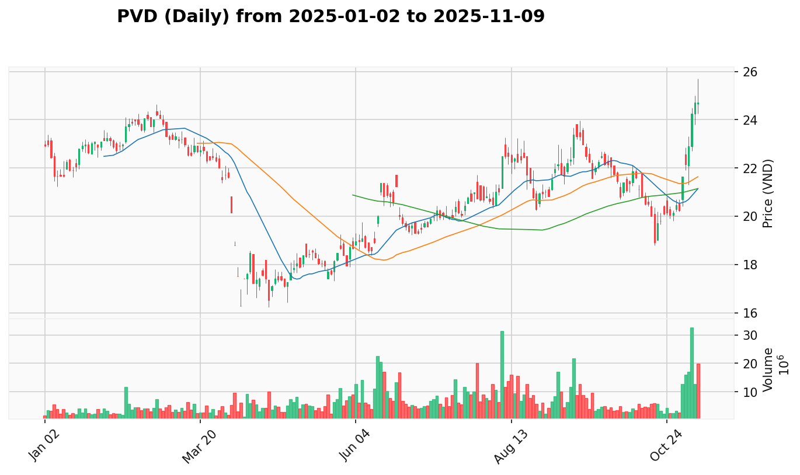

<a href="#dau-khi">↑ Back to group DAU_KHI</a>  |  <a href="#vpa-signal-summary">↑ Back to Top</a>

#### Key Statistics
| Metric | Value |
|:---|---:|
| Date Range | 2025-01-02 to 2025-11-07 |
| **Latest Close** | **24.7** |
| Period Open | 22.98 |
| Period High | 25.7 |
| Period Low | 16.23 |
| Period Change % | 7.48% |

**[Download PVD Data (.csv)](market_data/PVD_2025-01-02_to_2025-11-09.csv)**

---

### PVI

#### [VPA Analysis (2025-06-16 - 2025-10-21)](./VPA.md#pvi)
> **Ngày 2025-10-15:** PVI mở cửa ở mức 67.0 VND, tăng lên 68.5 VND và đóng cửa ở mức 68.5 VND, cao hơn giá đóng cửa phiên trước (68.2 VND). Biên độ dao động trong ngày (từ 67.0 VND đến 68.5 VND) là hẹp và giá đóng cửa nằm ở mức cao nhất phiên. Khối lượng giao dịch đạt 0.0029 triệu cổ phiếu, giảm mạnh so với phiên trước (0.0152 triệu cổ phiếu). Sau phiên "Test for Supply" ngày 2025-10-14, phiên này cho thấy giá tăng nhẹ nhưng với khối lượng cực kỳ thấp, cho thấy lực cầu yếu và không có sự tham gia mạnh mẽ của dòng tiền lớn để đẩy giá lên bền vững. **Phân tích VPA/Wyckoff:** No Demand (ND) - Lực cầu yếu.
> **Ngày 2025-10-16:** PVI mở cửa ở mức 67.7 VND, tăng lên 67.8 VND, giảm xuống 67.4 VND và đóng cửa ở mức 67.7 VND, thấp hơn giá đóng cửa phiên trước (68.5 VND). Biên độ dao động trong ngày (từ 67.4 VND đến 67.8 VND) là hẹp và giá đóng cửa nằm ở mức giữa của biên độ. Khối lượng giao dịch đạt 0.0118 triệu cổ phiếu, tăng đáng kể so với phiên trước (0.0029 triệu cổ phiếu). Sau phiên "No Demand" ngày 2025-10-15, phiên này cho thấy giá giảm với khối lượng gia tăng, xác nhận lực cung đang chiếm ưu thế và đẩy giá xuống. **Phân tích VPA/Wyckoff:** Supply Coming In (Lực cung gia tăng)
> **Ngày 2025-10-17:** PVI mở cửa ở mức 68.3 VND, giảm xuống 67.8 VND và đóng cửa ở mức 67.8 VND, thấp hơn giá đóng cửa phiên trước (68.3 VND). Biên độ dao động trong ngày (từ 67.5 VND đến 68.3 VND) là hẹp và giá đóng cửa nằm ở mức giữa của biên độ. Khối lượng giao dịch đạt 0.008 triệu cổ phiếu, giảm mạnh so với phiên trước (0.0169 triệu cổ phiếu). Sau phiên "Lực cung gia tăng" ngày 2025-10-16, phiên này cho thấy giá giảm nhẹ với khối lượng cực kỳ thấp, cho thấy lực cung đã giảm nhưng lực cầu vẫn chưa xuất hiện. Đây là dấu hiệu của sự thiếu quan tâm từ cả bên mua và bên bán. **Phân tích VPA/Wyckoff:** No Demand (ND) - Lực cầu yếu.
> **Ngày 2025-10-20:** PVI mở cửa ở mức 67.0 VND, tăng lên 67.5 VND, giảm xuống 66.0 VND và đóng cửa ở mức 66.0 VND, thấp hơn giá đóng cửa phiên trước (67.8 VND). Biên độ dao động trong ngày (từ 66.0 VND đến 67.5 VND) là rộng hơn so với phiên trước và giá đóng cửa nằm ở mức thấp nhất của biên độ. Khối lượng giao dịch đạt 0.0215 triệu cổ phiếu, tăng đáng kể so với phiên trước (0.008 triệu cổ phiếu). Sau phiên "No Demand" ngày 2025-10-17, phiên này cho thấy giá giảm mạnh với khối lượng gia tăng và đóng cửa ở mức thấp nhất, xác nhận lực cung đang chiếm ưu thế và đẩy giá xuống. **Phân tích VPA/Wyckoff:** Supply Coming In (Lực cung gia tăng)
> **Ngày 2025-10-21:** PVI mở cửa ở mức 66.0 VND, giảm xuống 65.6 VND và đóng cửa ở mức 65.6 VND, thấp hơn giá đóng cửa phiên trước (66.0 VND). Biên độ dao động trong ngày (từ 65.5 VND đến 66.0 VND) là hẹp và giá đóng cửa nằm gần mức thấp nhất của biên độ. Khối lượng giao dịch đạt 0.0231 triệu cổ phiếu, tăng nhẹ so với phiên trước (0.0215 triệu cổ phiếu). Sau phiên "Lực cung gia tăng" ngày 2025-10-20, phiên này tiếp tục cho thấy giá giảm với biên độ hẹp và đóng cửa gần mức thấp nhất, đi kèm khối lượng tăng nhẹ. Điều này cho thấy lực cung vẫn đang duy trì và kiểm soát thị trường, mặc dù áp lực bán có thể đã giảm bớt một chút so với phiên trước nhưng vẫn chưa có dấu hiệu lực cầu quay trở lại. **Phân tích VPA/Wyckoff:** Continued Weakness (Tiếp tục suy yếu)

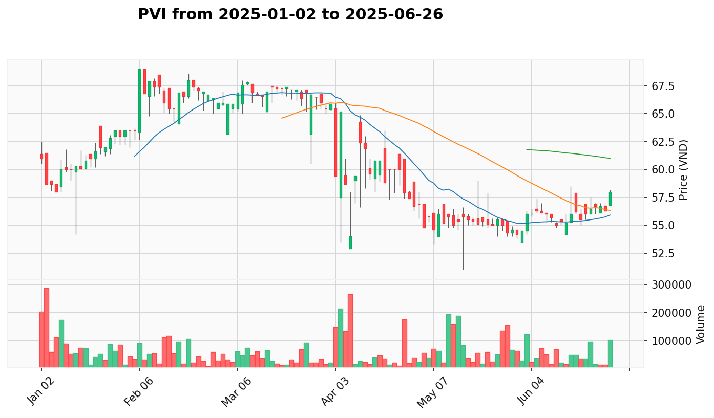

<a href="#bao-hiem">↑ Back to group BAO_HIEM</a>  |  <a href="#vpa-signal-summary">↑ Back to Top</a>

#### Key Statistics
| Metric | Value |
|:---|---:|
| Date Range | 2025-01-02 to 2025-11-07 |
| **Latest Close** | **79.0** |
| Period Open | 58.75 |
| Period High | 81.2 |
| Period Low | 48.8 |
| Period Change % | 34.47% |

**[Download PVI Data (.csv)](market_data/PVI_2025-01-02_to_2025-11-09.csv)**

---

### PVP

#### [VPA Analysis (2025-08-13 - 2025-10-21)](./VPA.md#pvp)
> **Ngày 2025-10-15:** PVP đóng cửa ở mức 15.1 VND, tăng 0.15 VND so với phiên trước (14.95 VND). Giá mở cửa 15.1 VND, cao nhất 15.15 VND, thấp nhất 15.0 VND. Biên độ dao động trong phiên hẹp hơn (0.15 VND) nhưng giá đóng cửa nằm ở nửa trên của thân nến. Khối lượng giao dịch đạt 0.2025 triệu cổ phiếu, tăng mạnh so với 0.0609 triệu cổ phiếu của ngày 2025-10-14. Sau các phiên "No Demand" và "Effort to Fall", việc giá tăng với khối lượng đột biến cho thấy lực cầu đã nhập cuộc mạnh mẽ, hấp thụ lực cung và đẩy giá lên. Đây là dấu hiệu tích cực cho thấy sự trở lại của lực mua. **Phân tích VPA/Wyckoff:** Demand Coming In
> **Ngày 2025-10-16:** PVP đóng cửa ở mức 15.15 VND, tăng 0.05 VND so với phiên trước (15.1 VND). Giá mở cửa 15.15 VND, cao nhất 15.15 VND, thấp nhất 15.05 VND. Biên độ dao động trong phiên hẹp (0.1 VND) và giá đóng cửa nằm ở mức cao nhất phiên. Khối lượng giao dịch đạt 0.0259 triệu cổ phiếu, giảm mạnh so với 0.2025 triệu cổ phiếu của ngày 2025-10-15. Sau phiên "Demand Coming In" với khối lượng đột biến, việc giá tiếp tục tăng nhẹ với biên độ hẹp và khối lượng giảm mạnh cho thấy áp lực bán đã cạn kiệt. Điều này xác nhận sự thiếu hụt nguồn cung và cho thấy thị trường sẵn sàng cho một đợt tăng giá tiếp theo. **Phân tích VPA/Wyckoff:** No Supply (Thử nghiệm nguồn cung)
> **Ngày 2025-10-17:** PVP đóng cửa ở mức 15.0 VND, giảm 0.1 VND so với phiên trước (15.1 VND). Giá mở cửa 15.1 VND, cao nhất 15.15 VND, thấp nhất 15.0 VND. Biên độ dao động trong phiên là 0.15 VND và giá đóng cửa nằm ở mức thấp nhất phiên. Khối lượng giao dịch đạt 0.0611 triệu cổ phiếu, tăng so với 0.0361 triệu cổ phiếu của ngày 2025-10-16. Sau phiên "No Supply" cho thấy cạn kiệt nguồn cung, việc giá giảm với khối lượng tăng cho thấy lực cung đã quay trở lại thị trường, đẩy giá xuống. Điều này cho thấy áp lực bán đang gia tăng. **Phân tích VPA/Wyckoff:** Supply Coming In
> **Ngày 2025-10-20:** PVP đóng cửa ở mức 14.7 VND, giảm 0.3 VND so với phiên trước (15.0 VND). Giá mở cửa 15.1 VND, cao nhất 15.2 VND, thấp nhất 14.5 VND. Biên độ dao động trong phiên rộng (0.7 VND) và giá đóng cửa nằm ở mức thấp nhất phiên. Khối lượng giao dịch đạt 0.1445 triệu cổ phiếu, tăng mạnh so với 0.0611 triệu cổ phiếu của ngày 2025-10-17. Sau phiên "Supply Coming In" trước đó, việc giá tiếp tục giảm mạnh với biên độ rộng và khối lượng tăng đột biến cho thấy áp lực bán đang rất lớn và nguồn cung đang tràn ngập thị trường. Điều này xác nhận sự yếu kém của lực cầu và khả năng giá sẽ tiếp tục giảm. **Phân tích VPA/Wyckoff:** Sign of Weakness (SOW) - Lực cung mạnh mẽ với khối lượng gia tăng xác nhận xu hướng giảm.
> **Ngày 2025-10-21:** PVP đóng cửa ở mức 14.85 VND, tăng 0.15 VND so với phiên trước (14.7 VND). Giá mở cửa 14.9 VND, cao nhất 14.9 VND, thấp nhất 14.6 VND. Biên độ dao động trong phiên hẹp (0.3 VND) và giá đóng cửa nằm ở giữa thân nến. Khối lượng giao dịch đạt 0.1201 triệu cổ phiếu, giảm so với 0.1445 triệu cổ phiếu của ngày 2025-10-20. Sau phiên "Sign of Weakness" với biên độ rộng và khối lượng tăng đột biến, việc giá tăng nhẹ với khối lượng giảm cho thấy lực cầu yếu và không đủ sức hấp thụ lượng cung tiềm năng. Điều này xác nhận sự thiếu vắng của lực mua mạnh mẽ. **Phân tích VPA/Wyckoff:** No Demand

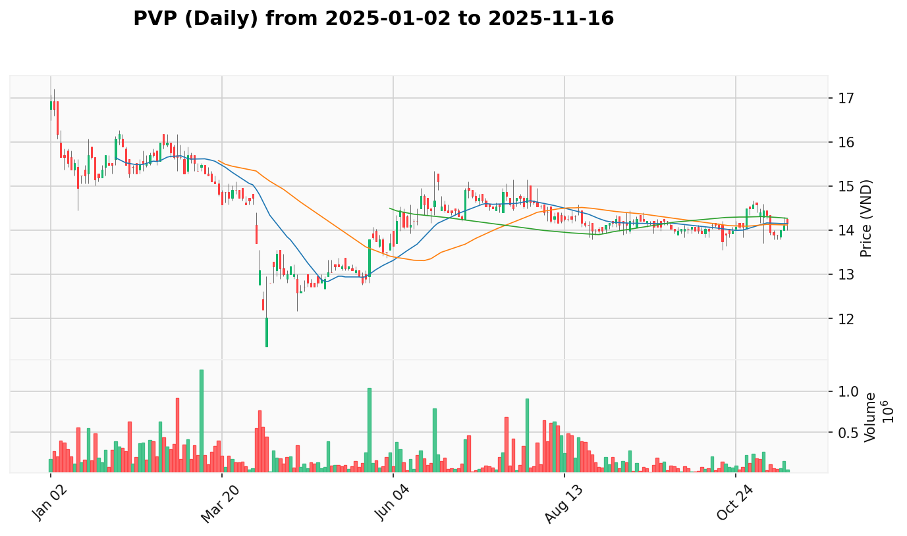

<a href="#van-tai">↑ Back to group VAN_TAI</a>  |  <a href="#vpa-signal-summary">↑ Back to Top</a>

#### Key Statistics
| Metric | Value |
|:---|---:|
| Date Range | 2025-01-02 to 2025-11-07 |
| **Latest Close** | **13.95** |
| Period Open | 16.74 |
| Period High | 17.21 |
| Period Low | 11.36 |
| Period Change % | -16.67% |

**[Download PVP Data (.csv)](market_data/PVP_2025-01-02_to_2025-11-09.csv)**

---

### PVS

#### [VPA Analysis (2025-06-16 - 2025-10-21)](./VPA.md#pvs)
> **Ngày 2025-10-15:** PVS mở cửa tại 31.5 VND, đạt mức cao nhất 31.6 VND và thấp nhất 30.4 VND, đóng cửa tại 30.5 VND. Giá giảm từ 31.4 VND xuống 30.5 VND so với phiên trước, với biên độ giá rộng và đóng cửa gần mức thấp nhất phiên, cho thấy lực cung tiếp tục mạnh mẽ. Khối lượng giao dịch đạt 6.0173 triệu cổ phiếu, tăng so với phiên trước (5.9348 triệu cổ phiếu) và cao hơn mức trung bình, xác nhận sự gia tăng của áp lực bán. Sau các phiên "Sign of Weakness" trước đó, phiên này củng cố tín hiệu suy yếu. **Phân tích VPA/Wyckoff:** Sign of Weakness (SOW)
> **Ngày 2025-10-16:** PVS mở cửa tại 30.5 VND, đạt mức cao nhất 30.9 VND và thấp nhất 30.3 VND, đóng cửa tại 30.4 VND. Giá giảm từ 30.5 VND xuống 30.4 VND so với phiên trước, với biên độ giá hẹp và đóng cửa gần mức thấp nhất phiên, cho thấy áp lực bán đã giảm bớt nhưng lực cầu vẫn yếu. Khối lượng giao dịch đạt 1.96 triệu cổ phiếu, giảm đáng kể so với phiên trước (6.02 triệu cổ phiếu) và thấp hơn mức trung bình, xác nhận sự thiếu vắng của lực cầu. Sau các phiên "Sign of Weakness" liên tiếp, phiên này cho thấy sự tạm lắng của áp lực bán nhưng không có dấu hiệu phục hồi, củng cố tín hiệu suy yếu. **Phân tích VPA/Wyckoff:** No Demand (ND)
> **Ngày 2025-10-17:** PVS mở cửa tại 31.2 VND, đạt mức cao nhất 31.2 VND và thấp nhất 30.4 VND, đóng cửa tại 30.4 VND. Giá giảm từ 31.1 VND xuống 30.4 VND so với phiên trước, với biên độ giá hẹp và đóng cửa tại mức thấp nhất phiên, cho thấy lực cung vẫn chiếm ưu thế nhưng đã giảm bớt, đồng thời lực cầu vẫn rất yếu. Khối lượng giao dịch đạt 2.9944 triệu cổ phiếu, giảm đáng kể so với phiên trước (4.2632 triệu cổ phiếu) và thấp hơn mức trung bình, xác nhận sự thiếu vắng của lực cầu. Sau các phiên suy yếu liên tiếp, phiên này tiếp tục củng cố tín hiệu thị trường đang trong giai đoạn yếu. **Phân tích VPA/Wyckoff:** No Demand (ND)
> **Ngày 2025-10-20:** PVS mở cửa tại 30.4 VND, đạt mức cao nhất 30.8 VND và thấp nhất 28.2 VND, đóng cửa tại 28.2 VND. Giá giảm mạnh từ 30.4 VND xuống 28.2 VND so với phiên trước, với biên độ giá rộng và đóng cửa tại mức thấp nhất phiên, cho thấy áp lực bán rất mạnh. Khối lượng giao dịch đạt 5.4773 triệu cổ phiếu, tăng đáng kể so với phiên trước (2.9944 triệu cổ phiếu) và cao hơn mức trung bình, xác nhận sự chiếm ưu thế của lực cung. Sau các phiên suy yếu và "No Demand" liên tiếp, phiên này củng cố tín hiệu thị trường đang trong giai đoạn giảm giá mạnh. **Phân tích VPA/Wyckoff:** Sign of Weakness (SOW) - Lực cung áp đảo với khối lượng gia tăng xác nhận xu hướng giảm.
> **Ngày 2025-10-21:** PVS mở cửa tại 28.2 VND, đạt mức cao nhất 29.4 VND và thấp nhất 28.2 VND, đóng cửa tại 29.0 VND. Giá tăng từ 28.2 VND lên 29.0 VND so với phiên trước, với biên độ giá hẹp và đóng cửa gần mức cao nhất phiên, cho thấy lực cầu xuất hiện nhưng không mạnh mẽ. Khối lượng giao dịch đạt 5.0251 triệu cổ phiếu, giảm so với phiên trước (5.4773 triệu cổ phiếu) và thấp hơn mức trung bình, xác nhận sự thiếu vắng của lực cầu mạnh mẽ. Sau phiên giảm mạnh "Sign of Weakness", phiên này cho thấy sự tạm lắng của áp lực bán nhưng chưa có tín hiệu đảo chiều rõ ràng. **Phân tích VPA/Wyckoff:** No Demand (ND)

<a href="#dau-khi">↑ Back to group DAU_KHI</a>  |  <a href="#vpa-signal-summary">↑ Back to Top</a>

#### Key Statistics
| Metric | Value |
|:---|---:|
| Date Range | 2025-01-02 to 2025-11-07 |
| **Latest Close** | **34.0** |
| Period Open | 33.9 |
| Period High | 39.0 |
| Period Low | 21.4 |
| Period Change % | 0.29% |

**[Download PVS Data (.csv)](market_data/PVS_2025-01-02_to_2025-11-09.csv)**

---

### PVT

#### [VPA Analysis (2025-06-16 - 2025-10-21)](./VPA.md#pvt)
> **Ngày 2025-10-15:** PVT giảm nhẹ từ 17.6 VND xuống 17.55 VND với khối lượng giao dịch đạt 2.2079 triệu cổ phiếu. Mặc dù giá đóng cửa cao hơn một chút so với phiên trước (17.5 VND lên 17.55 VND), nhưng cây nến có biên độ hẹp và khối lượng giao dịch giảm đáng kể so với phiên "Lực cung mạnh mẽ" (SOW) ngày 2025-10-14. Điều này cho thấy áp lực bán đã tạm thời giảm bớt, nhưng lực cầu vẫn còn yếu và chưa sẵn sàng tham gia, xác nhận sự thiếu vắng của lực mua sau một phiên giảm mạnh. **Phân tích VPA/Wyckoff:** No Demand (Thiếu cầu)
> **Ngày 2025-10-16:** PVT tăng nhẹ từ 17.55 VND lên 17.6 VND với khối lượng giao dịch đạt 0.7152 triệu cổ phiếu. Cây nến có biên độ hẹp và giá đóng cửa bằng giá mở cửa, cho thấy sự lưỡng lự. Khối lượng giao dịch rất thấp, giảm đáng kể so với phiên "Thiếu cầu" ngày 2025-10-15 (2.2079 triệu cổ phiếu) và đặc biệt là phiên "Lực cung mạnh mẽ" ngày 2025-10-14 (5.0231 triệu cổ phiếu). Điều này xác nhận sự thiếu vắng lực cầu và sự cạn kiệt tạm thời của lực bán, cho thấy thị trường vẫn còn yếu và thiếu động lực để tăng giá. **Phân tích VPA/Wyckoff:** No Demand (Thiếu cầu)
> **Ngày 2025-10-17:** PVT giảm từ 17.5 VND xuống 17.35 VND với khối lượng giao dịch đạt 1.748 triệu cổ phiếu. Cây nến có biên độ hẹp và đóng cửa ở mức thấp nhất phiên, cho thấy áp lực bán tiếp tục gia tăng. Khối lượng giao dịch tăng so với phiên trước (1.3352 triệu cổ phiếu), xác nhận sự suy yếu của lực cầu và sự hiện diện của lực cung. Điều này tiếp nối các phiên "Thiếu cầu" trước đó, cho thấy thị trường vẫn đang trong giai đoạn điều chỉnh và thiếu động lực tăng giá. **Phân tích VPA/Wyckoff:** Dấu hiệu suy yếu (Sign of Weakness)
> **Ngày 2025-10-20:** PVT giảm từ 17.35 VND xuống 16.6 VND với khối lượng giao dịch đạt 2.7692 triệu cổ phiếu. Cây nến giảm có biên độ rộng và đóng cửa gần mức thấp nhất phiên, cho thấy áp lực bán mạnh mẽ. Khối lượng giao dịch tăng đáng kể so với phiên trước (1.748 triệu cổ phiếu), xác nhận sự gia tăng của lực cung và sự suy yếu của lực cầu. Điều này tiếp nối các dấu hiệu suy yếu trước đó, cho thấy thị trường đang chịu áp lực bán lớn và có thể tiếp tục điều chỉnh. **Phân tích VPA/Wyckoff:** Dấu hiệu suy yếu (Sign of Weakness) - Lực cung mạnh mẽ.
> **Ngày 2025-10-21:** PVT tăng từ 16.6 VND lên 17.0 VND với khối lượng giao dịch đạt 4.1247 triệu cổ phiếu. Cây nến tăng có biên độ tương đối rộng và đóng cửa gần mức cao nhất phiên, cho thấy lực cầu đã xuất hiện và hấp thụ lực cung. Khối lượng giao dịch tăng đáng kể so với phiên trước (2.7692 triệu cổ phiếu), xác nhận sự gia tăng của lực mua sau chuỗi ngày suy yếu. Điều này cho thấy có thể có sự thay đổi trong cán cân cung cầu, với lực cầu bắt đầu chiếm ưu thế. **Phân tích VPA/Wyckoff:** Dấu hiệu sức mạnh (Sign of Strength) - Lực cầu xuất hiện.

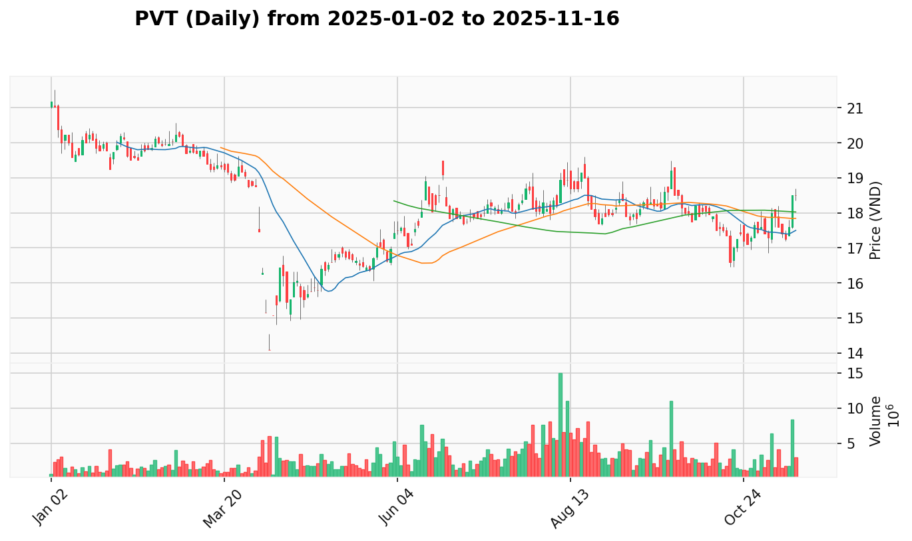

<a href="#van-tai">↑ Back to group VAN_TAI</a>  |  <a href="#vpa-signal-summary">↑ Back to Top</a>

#### Key Statistics
| Metric | Value |
|:---|---:|
| Date Range | 2025-01-02 to 2025-11-07 |
| **Latest Close** | **17.6** |
| Period Open | 21.02 |
| Period High | 21.52 |
| Period Low | 14.09 |
| Period Change % | -16.27% |

**[Download PVT Data (.csv)](market_data/PVT_2025-01-02_to_2025-11-09.csv)**

---

### PXI

#### [VPA Analysis (2025-08-08 - 2025-10-17)](./VPA.md#pxi)
> **Ngày 2025-09-19:** PXI giảm từ 1.3 VND xuống 1.2 VND với biên độ hẹp và đóng cửa tại mức thấp nhất phiên. Khối lượng giao dịch giảm mạnh xuống 0.027 triệu cổ phiếu, thấp hơn đáng kể so với phiên trước đó (0.073 triệu cổ phiếu) và rất thấp so với mức 0.2144 triệu cổ phiếu khi lực cầu xuất hiện vào ngày 2025-09-05. Điều này cho thấy lực cầu tiếp tục suy yếu và không có sự hỗ trợ giá, dẫn đến việc giá giảm nhẹ. **Phân tích VPA/Wyckoff:** No Demand - Thiếu cầu.
> **Ngày 2025-09-26:** PXI tăng từ 1.2 VND lên 1.3 VND, đóng cửa tại mức cao nhất phiên. Khối lượng giao dịch đạt 0.0614 triệu cổ phiếu, tăng đáng kể so với phiên trước đó (0.027 triệu cổ phiếu). Sau hai phiên liên tiếp cho thấy tín hiệu thiếu cầu, phiên này cho thấy sự trở lại của lực mua, đẩy giá lên với khối lượng tăng. Điều này cho thấy có sự quan tâm trở lại từ thị trường. **Phân tích VPA/Wyckoff:** Sign of Strength (SOS) - Lực cầu xuất hiện.
> **Ngày 2025-10-03:** PXI tăng từ 1.2 VND lên 1.3 VND, đóng cửa tại mức cao nhất phiên. Khối lượng giao dịch đạt 0.1383 triệu cổ phiếu, tăng mạnh so với phiên trước đó (0.0614 triệu cổ phiếu). Sau tín hiệu lực cầu xuất hiện vào ngày 2025-09-26, phiên này tiếp tục cho thấy sự gia tăng mạnh mẽ của lực mua, đẩy giá lên với khối lượng lớn, xác nhận xu hướng tăng. **Phân tích VPA/Wyckoff:** Sign of Strength (SOS) - Lực cầu tiếp tục mạnh mẽ.
> **Ngày 2025-10-10:** PXI giảm từ 1.3 VND xuống 1.2 VND, đóng cửa tại mức thấp nhất phiên (1.2 VND). Khối lượng giao dịch đạt 0.0767 triệu cổ phiếu, giảm đáng kể so với phiên trước đó (0.1383 triệu cổ phiếu). Sau hai phiên liên tiếp cho thấy tín hiệu lực cầu mạnh mẽ (SOS), phiên này cho thấy sự suy yếu rõ rệt khi giá không thể duy trì mức 1.3 VND và giảm trở lại với khối lượng thấp. Điều này cho thấy lực cầu đã không còn duy trì được đà tăng và có sự thiếu hụt nhu cầu ở mức giá cao hơn. **Phân tích VPA/Wyckoff:** No Demand (Thiếu cầu).
> **Ngày 2025-10-17:** PXI tăng từ 1.2 VND lên 1.3 VND, đóng cửa tại mức cao nhất phiên. Khối lượng giao dịch đạt 0.0603 triệu cổ phiếu, giảm so với phiên trước đó (0.0767 triệu cổ phiếu). Sau phiên thiếu cầu (No Demand) vào ngày 2025-10-10, phiên này cho thấy giá tăng nhưng với khối lượng thấp, cho thấy lực cung không còn mạnh mẽ nhưng lực cầu cũng chưa thực sự quyết liệt. **Phân tích VPA/Wyckoff:** Test for Supply (Kiểm tra cung).

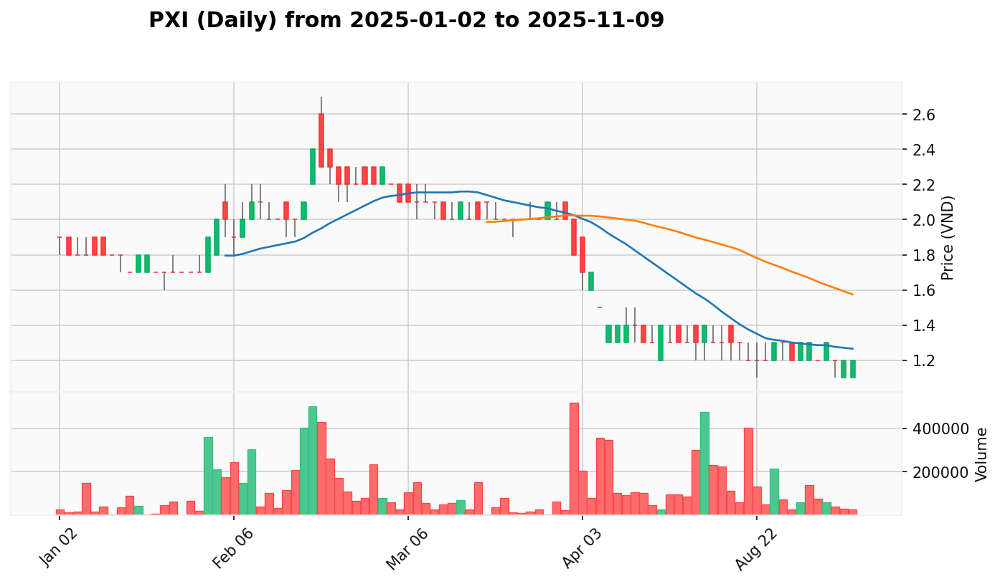

<a href="#penny">↑ Back to group PENNY</a>  |  <a href="#vpa-signal-summary">↑ Back to Top</a>

#### Key Statistics
| Metric | Value |
|:---|---:|
| Date Range | 2025-01-02 to 2025-11-07 |
| **Latest Close** | **1.2** |
| Period Open | 1.9 |
| Period High | 2.7 |
| Period Low | 1.1 |
| Period Change % | -36.84% |

**[Download PXI Data (.csv)](market_data/PXI_2025-01-02_to_2025-11-09.csv)**

---

### QNS

#### [VPA Analysis (2025-06-16 - 2025-10-21)](./VPA.md#qns)
> **Ngày 2025-10-15:** QNS mở cửa ở mức 47.0 VND, sau đó giảm xuống mức thấp nhất 46.5 VND và đóng cửa ở 46.7 VND, giảm so với mức đóng cửa 47.1 VND của phiên trước. Biên độ dao động giá hẹp hơn so với phiên SOW ngày 2025-10-13. Khối lượng giao dịch đạt 0.2138 triệu cổ phiếu, tăng so với phiên "Kiểm tra cung" ngày 2025-10-14 (0.1017 triệu cổ phiếu). Việc giá giảm và đóng cửa ở mức thấp nhất của phiên SOW trước đó (46.7 VND) với khối lượng gia tăng cho thấy áp lực bán vẫn còn mạnh mẽ và lực cầu chưa đủ để hấp thụ hết cung. Phiên "Kiểm tra cung" trước đó đã không thành công trong việc thu hút lực mua mạnh, dẫn đến sự tiếp diễn của xu hướng giảm. **Phân tích VPA/Wyckoff:** Sign of Weakness (SOW) - Lực cung tiếp diễn
> **Ngày 2025-10-16:** QNS mở cửa ở mức 46.7 VND và đóng cửa ở mức 47.0 VND, tăng nhẹ so với mức đóng cửa 46.7 VND của phiên trước, với biên độ dao động hẹp từ 46.7 VND đến 47.1 VND. Khối lượng giao dịch đạt 0.0728 triệu cổ phiếu, giảm đáng kể so với phiên "Sign of Weakness" ngày 2025-10-15 (0.2138 triệu cổ phiếu). Mặc dù giá tăng nhẹ, nhưng khối lượng giao dịch rất thấp cho thấy lực cầu yếu và không đủ mạnh để đảo chiều xu hướng giảm sau các phiên suy yếu trước đó. Điều này có thể là dấu hiệu của sự thiếu vắng lực mua, cho thấy thị trường chưa sẵn sàng cho một đợt tăng giá bền vững. **Phân tích VPA/Wyckoff:** No Demand (Thiếu cầu)
> **Ngày 2025-10-17:** QNS mở cửa ở mức 47.0 VND, sau đó dao động trong biên độ hẹp từ 46.6 VND đến 47.0 VND và đóng cửa ở mức 46.9 VND, giữ nguyên so với mức đóng cửa của phiên trước. Khối lượng giao dịch đạt 0.2317 triệu cổ phiếu, tăng đáng kể so với phiên "Thiếu cầu" ngày 2025-10-16 (0.0935 triệu cổ phiếu). Mặc dù khối lượng tăng, giá không thể bứt phá lên cao hơn, cho thấy lực cầu đã gặp phải lực cung mạnh mẽ tại vùng giá này, ngăn cản đà tăng. Điều này báo hiệu sự yếu kém tiếp diễn của thị trường. **Phân tích VPA/Wyckoff:** Nỗ lực tăng giá thất bại (Effort to Rise Fails)
> **Ngày 2025-10-20:** QNS mở cửa ở mức 46.9 VND và đóng cửa ở mức 46.0 VND, giảm mạnh so với mức đóng cửa 46.9 VND của phiên trước, với biên độ dao động rộng từ 45.6 VND đến 47.1 VND. Khối lượng giao dịch đạt 0.2115 triệu cổ phiếu, giảm nhẹ so với phiên trước (0.2317 triệu cổ phiếu) nhưng vẫn ở mức cao và cao hơn mức trung bình gần đây. Giá giảm mạnh với biên độ rộng và đóng cửa gần mức thấp nhất phiên, cho thấy áp lực bán rất mạnh và sự tiếp diễn của xu hướng suy yếu sau các phiên "Thiếu cầu" và "Nỗ lực tăng giá thất bại". **Phân tích VPA/Wyckoff:** Sign of Weakness (Dấu hiệu suy yếu)
> **Ngày 2025-10-21:** QNS mở cửa ở mức 46.0 VND, sau đó tăng lên và đóng cửa ở mức 46.6 VND, cao hơn mức đóng cửa của phiên trước (46.0 VND). Biên độ dao động trong phiên từ 46.0 VND đến 46.9 VND. Khối lượng giao dịch đạt 0.2939 triệu cổ phiếu, tăng đáng kể so với phiên "Dấu hiệu suy yếu" ngày 2025-10-20 (0.2115 triệu cổ phiếu). Sự tăng giá với khối lượng lớn sau một phiên giảm mạnh cho thấy lực cầu đã xuất hiện, cố gắng hấp thụ lực cung và đẩy giá lên, tạo ra một phản ứng tích cực ban đầu. **Phân tích VPA/Wyckoff:** Phản ứng tự động (Automatic Rally)

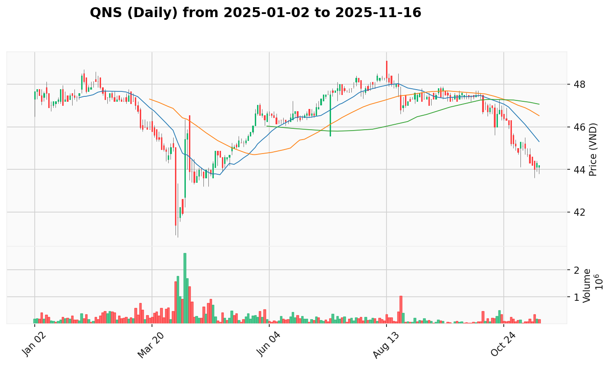

<a href="#thuc-pham">↑ Back to group THUC_PHAM</a>  |  <a href="#vpa-signal-summary">↑ Back to Top</a>

#### Key Statistics
| Metric | Value |
|:---|---:|
| Date Range | 2025-01-02 to 2025-11-07 |
| **Latest Close** | **44.7** |
| Period Open | 47.3 |
| Period High | 49.1 |
| Period Low | 40.81 |
| Period Change % | -5.50% |

**[Download QNS Data (.csv)](market_data/QNS_2025-01-02_to_2025-11-09.csv)**

---

### QTP

#### [VPA Analysis (2025-08-04 - 2025-10-21)](./VPA.md#qtp)
> **Ngày 2025-10-15:** QTP giữ giá 13.0 VND với biên độ nến hẹp từ 13.0 VND đến 13.1 VND. Khối lượng giao dịch đạt 0.0956 triệu cổ phiếu, giảm mạnh so với phiên trước (0.252 triệu cổ phiếu) và là mức thấp nhất trong 10 phiên gần đây. Sau hai phiên liên tiếp cho thấy áp lực bán và thiếu lực cầu, phiên hôm nay QTP tiếp tục duy trì mức giá thấp với khối lượng giao dịch cực kỳ thấp. Điều này cho thấy cả bên mua và bên bán đều không còn mặn mà ở vùng giá này, lực cầu vẫn vắng bóng và nguồn cung đã cạn kiệt tạm thời. Thị trường đang trong trạng thái chờ đợi, thiếu động lực rõ ràng. **Phân tích VPA/Wyckoff:** No Demand (Không có lực cầu)
> **Ngày 2025-10-16:** QTP giữ giá 13.0 VND với biên độ nến hẹp từ 13.0 VND đến 13.1 VND. Khối lượng giao dịch đạt 0.0608 triệu cổ phiếu, tiếp tục giảm mạnh so với phiên trước (0.0956 triệu cổ phiếu) và là mức thấp nhất trong nhiều phiên gần đây. Sau nhiều phiên liên tiếp cho thấy sự thiếu vắng lực cầu và khối lượng giao dịch cạn kiệt, QTP tiếp tục duy trì mức giá thấp với khối lượng cực kỳ thấp. Điều này cho thấy cả bên mua và bên bán đều không còn mặn mà ở vùng giá này, lực cầu vẫn vắng bóng và nguồn cung đã cạn kiệt tạm thời. Thị trường đang trong trạng thái chờ đợi, thiếu động lực rõ ràng và sự thờ ơ của nhà đầu tư. **Phân tích VPA/Wyckoff:** No Demand (Không có lực cầu)
> **Ngày 2025-10-17:** QTP giảm nhẹ từ 13.1 VND xuống 13.0 VND với biên độ nến hẹp từ 12.9 VND đến 13.1 VND. Khối lượng giao dịch đạt 0.1984 triệu cổ phiếu, tăng so với phiên trước (0.1401 triệu cổ phiếu) và cao hơn mức trung bình của các phiên gần đây. Sau hai phiên liên tiếp cho thấy sự cạn kiệt lực cầu, phiên hôm nay giá giảm nhẹ với khối lượng tăng cho thấy áp lực bán vẫn còn hiện hữu, ngăn cản đà tăng. Thị trường vẫn đang trong giai đoạn thiếu động lực rõ ràng. **Phân tích VPA/Wyckoff:** Áp lực bán (Selling Pressure)
> **Ngày 2025-10-20:** QTP giảm từ 13.0 VND xuống 12.9 VND với biên độ nến hẹp từ 12.8 VND đến 13.1 VND. Khối lượng giao dịch đạt 0.3682 triệu cổ phiếu, tăng mạnh so với phiên trước (0.1984 triệu cổ phiếu) và là mức cao nhất trong nhiều phiên gần đây. Sau phiên 2025-10-17 cho thấy áp lực bán, phiên hôm nay giá tiếp tục giảm với khối lượng gia tăng đáng kể, cho thấy lực cung vẫn đang chiếm ưu thế và áp lực bán tiếp tục mạnh lên. Thị trường vẫn đang trong giai đoạn điều chỉnh hoặc tích lũy với xu hướng giảm nhẹ. **Phân tích VPA/Wyckoff:** Áp lực bán
> **Ngày 2025-10-21:** QTP giảm từ 12.9 VND xuống 12.8 VND với biên độ nến hẹp từ 12.7 VND đến 12.9 VND. Khối lượng giao dịch đạt 0.5479 triệu cổ phiếu, tăng mạnh so với phiên trước (0.3682 triệu cổ phiếu) và là mức cao nhất trong nhiều phiên gần đây. Giá giảm với khối lượng tăng mạnh cho thấy áp lực bán tiếp tục gia tăng và lực cung vẫn đang chiếm ưu thế, xác nhận xu hướng giảm nhẹ. **Phân tích VPA/Wyckoff:** Áp lực bán

<a href="#nang-luong">↑ Back to group NANG_LUONG</a>  |  <a href="#vpa-signal-summary">↑ Back to Top</a>

#### Key Statistics
| Metric | Value |
|:---|---:|
| Date Range | 2025-01-02 to 2025-11-07 |
| **Latest Close** | **12.8** |
| Period Open | 13.59 |
| Period High | 13.99 |
| Period Low | 11.92 |
| Period Change % | -5.81% |

**[Download QTP Data (.csv)](market_data/QTP_2025-01-02_to_2025-11-09.csv)**

---

### S99

#### [VPA Analysis (2025-08-13 - 2025-10-21)](./VPA.md#s99)
> **Ngày 2025-10-15:** S99 giữ nguyên mức giá đóng cửa 9.6 VND, sau khi mở cửa ở 9.4 VND và dao động trong biên độ 9.4 VND - 9.7 VND. Giá đóng cửa nằm ở mức cao của phiên. Khối lượng giao dịch đạt 0.1375 triệu cổ phiếu, giảm đáng kể so với phiên trước (0.3206 triệu cổ phiếu). Sau phiên "Nỗ lực không có kết quả" với khối lượng đột biến, việc giá đi ngang với khối lượng thấp cho thấy lực cầu yếu và thị trường đang thiếu động lực để tăng giá. Điều này có thể báo hiệu sự suy yếu trong ngắn hạn. **Phân tích VPA/Wyckoff:** No Demand (Không có nhu cầu)
> **Ngày 2025-10-16:** S99 giảm từ 9.6 VND xuống 9.5 VND, sau khi mở cửa ở 9.7 VND và dao động trong biên độ 9.5 VND đến 9.7 VND. Giá đóng cửa ở mức thấp nhất phiên. Khối lượng giao dịch đạt 0.0416 triệu cổ phiếu, giảm mạnh so với phiên trước (0.1375 triệu cổ phiếu) và là mức thấp nhất trong 10 phiên gần đây. Sau hai phiên "Nỗ lực không có kết quả" và "Không có nhu cầu", việc giá tiếp tục giảm với khối lượng cực thấp cho thấy lực cầu vẫn rất yếu và thị trường thiếu động lực để tăng giá. Điều này củng cố thêm tín hiệu suy yếu và thiếu sự quan tâm từ phía người mua. **Phân tích VPA/Wyckoff:** Suy yếu
> **Ngày 2025-10-17:** S99 giảm từ 9.6 VND xuống 9.4 VND, sau khi mở cửa ở 9.6 VND và dao động trong biên độ 9.4 VND - 9.7 VND. Giá đóng cửa ở mức thấp nhất phiên. Khối lượng giao dịch đạt 0.1627 triệu cổ phiếu, tăng đáng kể so với phiên trước (0.0755 triệu cổ phiếu). Sau các phiên "No Demand" và "Suy yếu", việc giá tiếp tục giảm mạnh với khối lượng gia tăng cho thấy áp lực bán đang chiếm ưu thế và lực cung đang áp đảo lực cầu. Điều này củng cố thêm tín hiệu suy yếu và khả năng tiếp tục giảm giá. **Phân tích VPA/Wyckoff:** Suy yếu - Áp lực bán gia tăng với khối lượng lớn xác nhận xu hướng giảm.
> **Ngày 2025-10-20:** S99 giảm mạnh từ 9.4 VND xuống 9.0 VND, sau khi mở cửa ở 9.4 VND và dao động trong biên độ 8.9 VND đến 9.5 VND. Giá đóng cửa ở mức gần thấp nhất phiên. Khối lượng giao dịch đạt 0.3916 triệu cổ phiếu, tăng rất mạnh so với phiên trước (0.1627 triệu cổ phiếu) và là mức cao nhất trong 10 phiên gần đây. Sau các phiên "Suy yếu" liên tiếp, việc giá tiếp tục giảm sâu với biên độ rộng và khối lượng cực lớn cho thấy áp lực bán tháo đang diễn ra mạnh mẽ, nguồn cung áp đảo hoàn toàn cầu. Điều này xác nhận xu hướng giảm giá và cảnh báo rủi ro tiếp tục giảm sâu. **Phân tích VPA/Wyckoff:** Suy yếu - Áp lực bán tháo cực lớn với khối lượng đột biến xác nhận xu hướng giảm mạnh.
> **Ngày 2025-10-21:** S99 tăng từ 9.0 VND lên 9.2 VND, sau khi mở cửa ở 9.0 VND và dao động trong biên độ 8.7 VND - 9.2 VND. Giá đóng cửa ở mức cao nhất phiên. Khối lượng giao dịch đạt 0.2909 triệu cổ phiếu, giảm so với phiên trước (0.3916 triệu cổ phiếu). Sau hai phiên giảm mạnh với áp lực bán tháo lớn, việc giá tăng nhẹ với khối lượng giảm cho thấy lực cầu yếu và không đủ sức đẩy giá lên bền vững, hoặc chỉ là một nhịp hồi phục kỹ thuật trong xu hướng giảm. **Phân tích VPA/Wyckoff:** No Demand - Giá tăng với khối lượng thấp cho thấy thiếu vắng lực cầu mạnh mẽ.

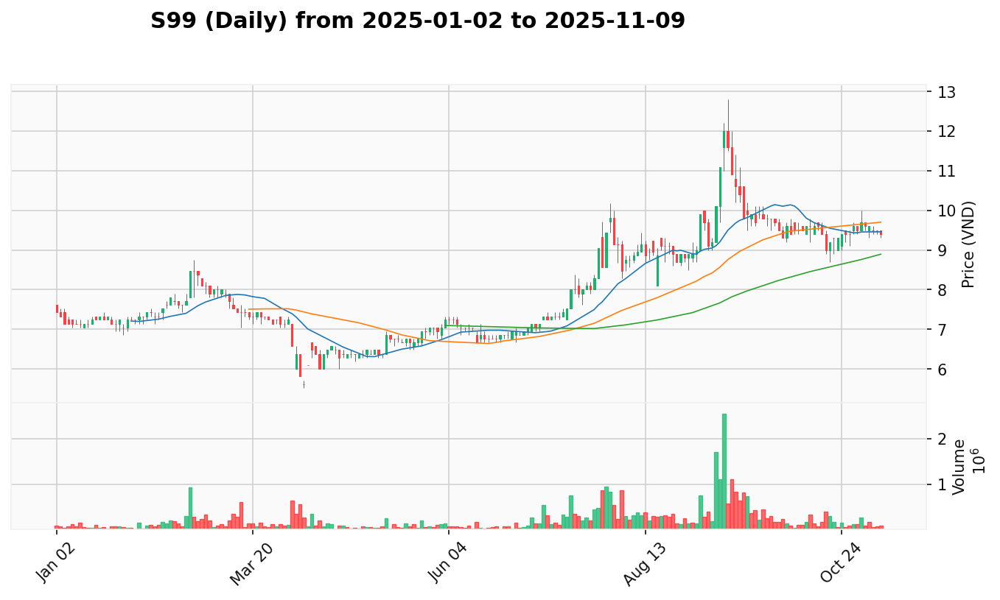

<a href="#xay-dung">↑ Back to group XAY_DUNG</a>  |  <a href="#vpa-signal-summary">↑ Back to Top</a>

#### Key Statistics
| Metric | Value |
|:---|---:|
| Date Range | 2025-01-02 to 2025-11-07 |
| **Latest Close** | **9.4** |
| Period Open | 7.62 |
| Period High | 12.8 |
| Period Low | 5.52 |
| Period Change % | 23.36% |

**[Download S99 Data (.csv)](market_data/S99_2025-01-02_to_2025-11-09.csv)**

---

### SAB

#### [VPA Analysis (2025-06-13 - 2025-10-21)](./VPA.md#sab)
> **Ngày 2025-10-15:** SAB tiếp tục giảm từ 45.45 xuống 45.25 VND với khối lượng giao dịch đạt 0.5441 triệu cổ phiếu (giảm so với phiên trước). Cây nến giảm có biên độ hẹp, đóng cửa ở mức thấp nhất phiên, cho thấy áp lực bán vẫn còn nhưng đang có dấu hiệu suy yếu khi khối lượng giảm. **Phân tích VPA/Wyckoff:** Sign of Weakness (SOW) - Giá tiếp tục giảm với khối lượng giảm, cho thấy áp lực bán đang suy yếu nhưng lực cầu chưa xuất hiện.
> **Ngày 2025-10-16:** SAB tăng nhẹ từ 45.25 lên 45.3 VND với khối lượng giao dịch đạt 0.1905 triệu cổ phiếu (giảm mạnh so với phiên trước). Cây nến có biên độ hẹp, đóng cửa gần mức mở cửa, cho thấy sự lưỡng lự của thị trường. Khối lượng giao dịch cực thấp cho thấy cả lực mua và lực bán đều không mạnh mẽ. Sau hai phiên giảm giá với tín hiệu SOW, phiên này cho thấy áp lực bán đã tạm lắng nhưng lực cầu vẫn chưa xuất hiện đáng kể để đẩy giá lên. **Phân tích VPA/Wyckoff:** No Demand (ND) - Giá tăng nhẹ với khối lượng cực thấp, cho thấy thiếu vắng lực cầu và sự lưỡng lự của thị trường sau giai đoạn giảm giá.
> **Ngày 2025-10-17:** SAB tăng nhẹ từ 45.2 lên 45.25 VND với khối lượng giao dịch đạt 0.8258 triệu cổ phiếu (tăng đáng kể so với phiên trước). Cây nến có biên độ hẹp, đóng cửa gần mức mở cửa, cho thấy nỗ lực tăng giá nhưng không đạt được kết quả rõ rệt. Sau hai phiên giảm giá với tín hiệu SOW và ND, phiên này cho thấy lực cầu gặp phải áp lực bán đáng kể, ngăn cản giá tăng mạnh. **Phân tích VPA/Wyckoff:** Effort to Rise but No Result (ER) - Giá tăng nhẹ với khối lượng tăng nhưng không đạt được biên độ tăng giá đáng kể, cho thấy lực cầu yếu hoặc áp lực cung vẫn còn mạnh.
> **Ngày 2025-10-20:** SAB giảm mạnh từ 45.05 xuống 44.0 VND với khối lượng giao dịch đạt 0.9611 triệu cổ phiếu (tăng đáng kể so với phiên trước). Cây nến có biên độ rộng, đóng cửa ở mức thấp nhất phiên, cho thấy áp lực bán rất mạnh. Sau phiên nỗ lực tăng giá nhưng không đạt kết quả (ER) vào ngày 2025-10-17, phiên này xác nhận lực bán đã chiếm ưu thế hoàn toàn, đẩy giá xuống sâu. **Phân tích VPA/Wyckoff:** Sign of Weakness (SOW) - Giá giảm mạnh với khối lượng tăng cao, cho thấy lực cung áp đảo và khả năng tiếp tục xu hướng giảm.
> **Ngày 2025-10-21:** SAB tăng nhẹ từ 44.0 lên 44.45 VND với khối lượng giao dịch đạt 0.8068 triệu cổ phiếu (giảm so với phiên trước). Cây nến có biên độ hẹp, đóng cửa gần mức cao nhất phiên, cho thấy nỗ lực phục hồi nhưng không có sự hỗ trợ mạnh mẽ từ lực cầu. Sau phiên giảm mạnh (SOW) vào ngày 2025-10-20, phiên này cho thấy áp lực bán đã giảm bớt nhưng lực mua vẫn còn yếu. **Phân tích VPA/Wyckoff:** No Demand (ND) - Giá tăng nhẹ với khối lượng thấp, cho thấy thiếu vắng lực cầu mạnh mẽ để đẩy giá lên cao hơn, đặc biệt sau một phiên giảm mạnh.

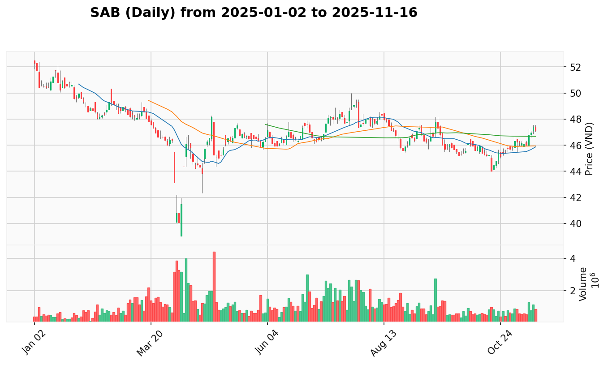

<a href="#thuc-pham">↑ Back to group THUC_PHAM</a>  |  <a href="#vpa-signal-summary">↑ Back to Top</a>

#### Key Statistics
| Metric | Value |
|:---|---:|
| Date Range | 2025-01-02 to 2025-11-07 |
| **Latest Close** | **46.1** |
| Period Open | 52.49 |
| Period High | 52.49 |
| Period Low | 39.04 |
| Period Change % | -12.17% |

**[Download SAB Data (.csv)](market_data/SAB_2025-01-02_to_2025-11-09.csv)**

---

### SAS

#### [VPA Analysis (2025-08-04 - 2025-10-21)](./VPA.md#sas)
> **Ngày 2025-10-15:** SAS giảm từ 36.6 VND xuống 36.5 VND với khối lượng giao dịch đạt 0.0045 triệu cổ phiếu. Cây nến giảm có biên độ hẹp, giá đóng cửa gần mức thấp nhất phiên. Khối lượng giao dịch giảm mạnh so với phiên trước (0.0086 triệu cổ phiếu) và thấp hơn đáng kể so với các phiên gần đây. Điều này cho thấy lực bán đã suy yếu nhưng đồng thời lực cầu cũng không xuất hiện, duy trì trạng thái yếu ớt của cổ phiếu. **Phân tích VPA/Wyckoff:** No Demand (Thiếu cầu)
> **Ngày 2025-10-16:** SAS giữ nguyên mức giá 36.5 VND với khối lượng giao dịch đạt 0.0012 triệu cổ phiếu. Cây nến có biên độ cực hẹp, giá mở cửa, cao nhất, thấp nhất và đóng cửa đều ở mức 36.5 VND. Khối lượng giao dịch giảm mạnh so với phiên trước (0.0045 triệu cổ phiếu) và là mức rất thấp trong các phiên gần đây. Điều này cho thấy sự thiếu vắng hoàn toàn của cả lực mua và lực bán, xác nhận tình trạng "No Demand" và sự yếu ớt của cổ phiếu. **Phân tích VPA/Wyckoff:** No Demand (Thiếu cầu)
> **Ngày 2025-10-17:** SAS tăng từ 36.6 VND lên 36.7 VND với khối lượng giao dịch đạt 0.0071 triệu cổ phiếu. Cây nến tăng có biên độ hẹp, giá đóng cửa gần mức cao nhất phiên. Khối lượng giao dịch giảm so với phiên trước (0.0098 triệu cổ phiếu) và duy trì ở mức thấp, cho thấy lực cầu yếu và không có sự cải thiện đáng kể. **Phân tích VPA/Wyckoff:** No Demand (Thiếu cầu)
> **Ngày 2025-10-20:** SAS giảm từ 36.7 VND xuống 35.8 VND với khối lượng giao dịch đạt 0.0249 triệu cổ phiếu. Cây nến giảm có biên độ rộng, giá đóng cửa ở mức thấp nhất phiên. Khối lượng giao dịch tăng mạnh so với phiên trước (0.0071 triệu cổ phiếu) và cao hơn đáng kể so với các phiên gần đây. Điều này cho thấy áp lực bán mạnh mẽ đã xuất hiện sau nhiều phiên thiếu cầu. **Phân tích VPA/Wyckoff:** Supply Coming In (Cung xuất hiện)
> **Ngày 2025-10-21:** SAS tăng nhẹ từ 35.8 VND lên 36.0 VND với khối lượng giao dịch đạt 0.0187 triệu cổ phiếu. Cây nến có biên độ hẹp, cho thấy sự lưỡng lự của thị trường. Khối lượng giao dịch giảm so với phiên trước (0.0249 triệu cổ phiếu), sau khi cung xuất hiện mạnh mẽ vào ngày 2025-10-20. Điều này cho thấy lực cầu yếu và không có sự cải thiện đáng kể để hấp thụ hết cung. **Phân tích VPA/Wyckoff:** No Demand (Thiếu cầu)

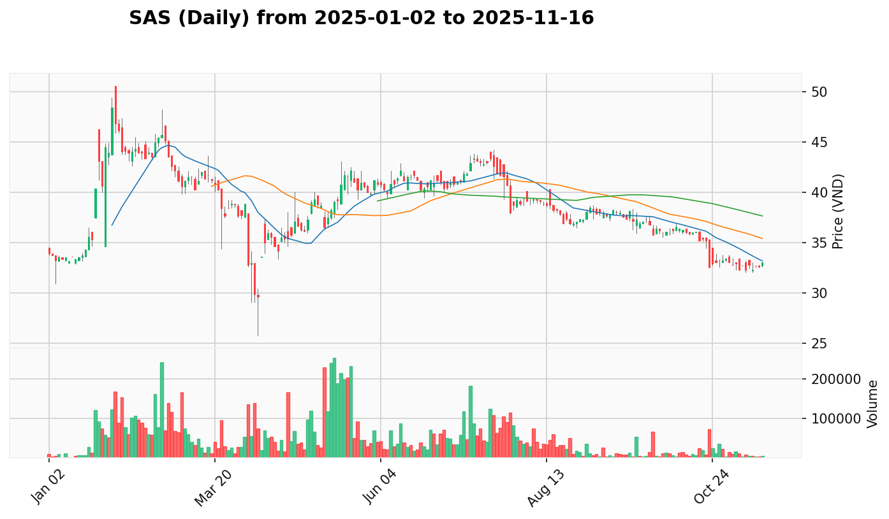

<a href="#hang-khong">↑ Back to group HANG_KHONG</a>  |  <a href="#vpa-signal-summary">↑ Back to Top</a>

#### Key Statistics
| Metric | Value |
|:---|---:|
| Date Range | 2025-01-02 to 2025-11-07 |
| **Latest Close** | **32.3** |
| Period Open | 34.46 |
| Period High | 50.56 |
| Period Low | 25.75 |
| Period Change % | -6.27% |

**[Download SAS Data (.csv)](market_data/SAS_2025-01-02_to_2025-11-09.csv)**

---

### SBS

#### [VPA Analysis (2025-08-04 - 2025-10-21)](./VPA.md#sbs)
> **Ngày 2025-10-15:** SBS giảm từ 6.4 VND xuống 6.2 VND với khối lượng giao dịch đạt 1.0354 triệu cổ phiếu, giảm so với phiên trước (1.6097 triệu cổ phiếu). Giá đóng cửa ở mức thấp nhất phiên và thấp hơn giá mở cửa, cho thấy áp lực bán chiếm ưu thế. Sau phiên "Nỗ lực không mang lại kết quả" với khối lượng lớn, việc giá giảm và đóng cửa ở mức thấp nhất phiên, dù khối lượng có giảm, cho thấy lực cầu yếu và không đủ sức hấp thụ lượng cung, xác nhận sự yếu ớt của thị trường. **Phân tích VPA/Wyckoff:** Yếu ớt
> **Ngày 2025-10-16:** SBS tăng nhẹ từ 6.2 VND lên 6.3 VND với khối lượng giao dịch đạt 0.3783 triệu cổ phiếu, giảm đáng kể so với phiên trước (1.0354 triệu cổ phiếu). Giá đóng cửa cao hơn giá mở cửa, tạo một nến tăng nhỏ. Tuy nhiên, khối lượng giao dịch rất thấp cho thấy sự thiếu vắng của cả lực mua và lực bán mạnh mẽ. Sau phiên giảm giá "Yếu ớt" trước đó, việc giá tăng nhẹ với khối lượng thấp cho thấy lực cầu chưa thực sự quay trở lại và thị trường vẫn còn yếu. Đây có thể là một nỗ lực tăng giá không được hỗ trợ bởi khối lượng, hoặc một phiên kiểm tra cung cầu trong bối cảnh yếu ớt. **Phân tích VPA/Wyckoff:** Không có cầu (No Demand)
> **Ngày 2025-10-17:** SBS giảm từ 6.3 VND xuống 6.2 VND với khối lượng giao dịch đạt 1.2948 triệu cổ phiếu, tăng so với phiên trước (0.9567 triệu cổ phiếu). Giá đóng cửa ở mức thấp hơn giá mở cửa và gần mức thấp nhất phiên, cho thấy áp lực bán mạnh mẽ. Sau phiên "Không có cầu" trước đó, việc giá giảm với khối lượng gia tăng xác nhận sự yếu ớt của thị trường và lực cung đang chiếm ưu thế. **Phân tích VPA/Wyckoff:** Yếu ớt
> **Ngày 2025-10-20:** SBS giảm mạnh từ 6.2 VND xuống 5.7 VND với khối lượng giao dịch đạt 1.6704 triệu cổ phiếu, tăng đáng kể so với phiên trước (1.2948 triệu cổ phiếu). Giá đóng cửa ở mức thấp hơn giá mở cửa và gần mức thấp nhất phiên, tạo một nến giảm mạnh với biên độ rộng. Điều này cho thấy áp lực bán rất lớn và thị trường đang tiếp tục suy yếu. **Phân tích VPA/Wyckoff:** Yếu ớt
> **Ngày 2025-10-21:** SBS tăng từ 5.7 VND lên 5.8 VND với khối lượng giao dịch đạt 1.3909 triệu cổ phiếu, giảm so với phiên trước (1.6704 triệu cổ phiếu). Giá đóng cửa ở mức cao hơn giá mở cửa, nhưng biên độ tăng hẹp và khối lượng giao dịch thấp hơn cho thấy lực cầu yếu ớt và không đủ mạnh để đảo chiều xu hướng giảm rõ rệt từ các phiên trước. Sau hai phiên giảm mạnh với tín hiệu "Yếu ớt", phiên này cho thấy sự thiếu vắng lực cầu mạnh mẽ, xác nhận xu hướng yếu ớt vẫn tiếp diễn. **Phân tích VPA/Wyckoff:** Yếu ớt

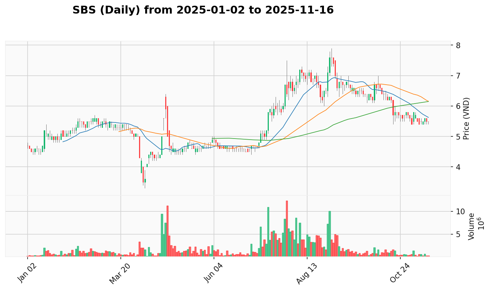

<a href="#chung-khoan">↑ Back to group CHUNG_KHOAN</a>  |  <a href="#vpa-signal-summary">↑ Back to Top</a>

#### Key Statistics
| Metric | Value |
|:---|---:|
| Date Range | 2025-01-02 to 2025-11-07 |
| **Latest Close** | **5.4** |
| Period Open | 4.7 |
| Period High | 7.9 |
| Period Low | 3.3 |
| Period Change % | 14.89% |

**[Download SBS Data (.csv)](market_data/SBS_2025-01-02_to_2025-11-09.csv)**

---

### SBT

#### [VPA Analysis (2025-08-14 - 2025-10-21)](./VPA.md#sbt)
> **Ngày 2025-10-15:** SBT giảm từ 26.7 VND xuống 26.0 VND, với biên độ giá rộng từ 25.6 VND đến 26.7 VND và đóng cửa gần mức thấp nhất phiên. Khối lượng giao dịch đạt 1.1155 triệu cổ phiếu, tăng so với phiên trước (0.9883 triệu cổ phiếu). Sau các tín hiệu suy yếu trước đó, phiên này cho thấy giá tiếp tục giảm mạnh với biên độ rộng và đóng cửa ở mức thấp, kèm theo khối lượng gia tăng, xác nhận lực cung đang chiếm ưu thế và áp lực bán mạnh mẽ. **Phân tích VPA/Wyckoff:** Sign of Weakness (SOW)
> **Ngày 2025-10-16:** SBT giảm từ 26.0 VND xuống 25.8 VND, với biên độ giá tương đối rộng từ 25.3 VND đến 26.05 VND và đóng cửa ở mức giữa của phiên. Khối lượng giao dịch đạt 0.4832 triệu cổ phiếu, giảm đáng kể so với phiên trước (1.1155 triệu cổ phiếu). Sau hai phiên "Sign of Weakness" liên tiếp với khối lượng gia tăng, phiên này giá tiếp tục giảm nhưng với khối lượng thấp cho thấy lực bán đã suy yếu tạm thời hoặc thiếu cầu mua vào. Điều này có thể là dấu hiệu của sự tạm lắng trong áp lực bán nhưng cũng thể hiện sự thiếu vắng lực cầu hỗ trợ. **Phân tích VPA/Wyckoff:** No Demand (SOW)
> **Ngày 2025-10-17:** SBT giảm từ 25.5 VND xuống 25.4 VND, với biên độ giá từ 25.05 VND đến 25.55 VND và đóng cửa ở nửa trên của phiên. Khối lượng giao dịch đạt 1.2936 triệu cổ phiếu, tăng đáng kể so với phiên trước (0.7975 triệu cổ phiếu). Sau phiên "No Demand" trước đó, phiên này giá tiếp tục giảm nhẹ nhưng với khối lượng gia tăng cho thấy áp lực bán vẫn còn hiện hữu hoặc lực cầu hấp thụ chưa đủ mạnh để đẩy giá lên. Điều này tiếp tục xác nhận sự suy yếu của cổ phiếu. **Phân tích VPA/Wyckoff:** Sign of Weakness (SOW)
> **Ngày 2025-10-20:** SBT giảm từ 25.4 VND xuống 25.0 VND, với biên độ giá tương đối rộng từ 25.0 VND đến 25.5 VND và đóng cửa ở mức thấp nhất phiên. Khối lượng giao dịch đạt 0.9299 triệu cổ phiếu, giảm so với phiên trước (1.2936 triệu cổ phiếu). Sau các phiên suy yếu trước đó, phiên này giá tiếp tục giảm mạnh và đóng cửa ở mức thấp nhất, cho thấy áp lực bán vẫn còn hiện hữu và thiếu vắng lực cầu hỗ trợ. Mặc dù khối lượng giảm nhẹ, nhưng hành động giá cho thấy sự suy yếu tiếp diễn. **Phân tích VPA/Wyckoff:** Sign of Weakness (SOW)
> **Ngày 2025-10-21:** SBT tăng nhẹ từ 25.0 VND lên 25.05 VND, với biên độ giá rộng từ 24.0 VND đến 25.1 VND và đóng cửa ở nửa trên của phiên. Khối lượng giao dịch đạt 0.9029 triệu cổ phiếu, giảm nhẹ so với phiên trước (0.9299 triệu cổ phiếu). Sau hai phiên giảm giá liên tiếp với tín hiệu suy yếu, phiên này giá có sự phục hồi nhẹ từ mức thấp nhất trong phiên, cho thấy có lực cầu hấp thụ ở vùng giá thấp. Tuy nhiên, khối lượng giao dịch thấp và giảm nhẹ cho thấy lực cầu chưa đủ mạnh để đảo chiều xu hướng giảm rõ rệt, và áp lực bán vẫn có thể quay trở lại. Đây có thể là một dấu hiệu của sự tạm dừng trong áp lực bán nhưng chưa xác nhận sự thay đổi xu hướng. **Phân tích VPA/Wyckoff:** Sign of Weakness (SOW)

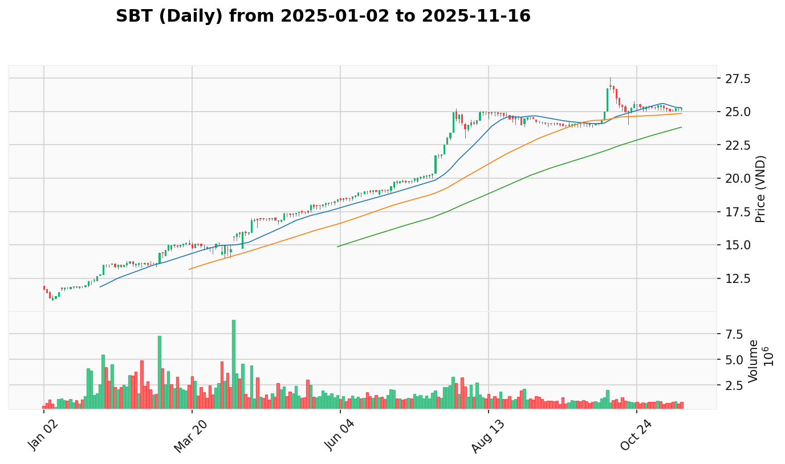

<a href="#thuc-pham">↑ Back to group THUC_PHAM</a>  |  <a href="#vpa-signal-summary">↑ Back to Top</a>

#### Key Statistics
| Metric | Value |
|:---|---:|
| Date Range | 2025-01-02 to 2025-11-07 |
| **Latest Close** | **25.2** |
| Period Open | 11.91 |
| Period High | 27.6 |
| Period Low | 10.86 |
| Period Change % | 111.59% |

**[Download SBT Data (.csv)](market_data/SBT_2025-01-02_to_2025-11-09.csv)**

---

### SCI

#### [VPA Analysis (2025-08-12 - 2025-10-21)](./VPA.md#sci)
> **Ngày 2025-10-15:** SCI tăng từ 9.6 VND lên 9.9 VND với khối lượng giao dịch đạt 0.0836 triệu cổ phiếu. Cây nến tăng có biên độ rộng và đóng cửa ở mức cao nhất phiên, cho thấy lực cầu mạnh mẽ. Khối lượng giao dịch tăng đáng kể so với phiên trước đó (phiên thiếu cầu), xác nhận sự quay trở lại của lực mua và khả năng tiếp tục xu hướng tăng. **Phân tích VPA/Wyckoff:** Sign of Strength (SOS) - Lực cầu quay trở lại mạnh mẽ.
> **Ngày 2025-10-16:** SCI giữ vững mức giá 9.9 VND với khối lượng giao dịch cực thấp, chỉ đạt 0.002 triệu cổ phiếu. So với phiên tăng mạnh (SOS) ngày 2025-10-15 với khối lượng 0.0836 triệu cổ phiếu, phiên này cho thấy sự cạn kiệt của lực cung khi giá không giảm, nhưng cũng thiếu vắng lực cầu mạnh mẽ để đẩy giá lên cao hơn. Giá đóng cửa ở mức cao nhất phiên, cho thấy không có áp lực bán đáng kể. Đây là dấu hiệu của sự kiểm tra cung sau một phiên tăng giá mạnh. **Phân tích VPA/Wyckoff:** No Supply (Thiếu cung)
> **Ngày 2025-10-17:** SCI giảm từ 10.0 VND xuống 9.9 VND với khối lượng giao dịch đạt 0.0258 triệu cổ phiếu. Cây nến giảm có biên độ vừa phải, đóng cửa ở mức giá của phiên SOS ngày 2025-10-15. Khối lượng giao dịch thấp hơn đáng kể so với hai phiên trước, cho thấy lực bán không mạnh mẽ nhưng lực cầu cũng chưa đủ để đẩy giá lên cao hơn. Đây có thể là một phiên kiểm tra cung hoặc thiếu cầu sau đợt tăng giá. **Phân tích VPA/Wyckoff:** No Demand (Thiếu cầu)
> **Ngày 2025-10-20:** SCI giảm từ 9.9 VND xuống 9.8 VND với khối lượng giao dịch đạt 0.0663 triệu cổ phiếu. Cây nến có biên độ rộng, giá đóng cửa ở mức thấp hơn phiên trước và nằm ở giữa thân nến, cho thấy áp lực bán mạnh mẽ. Khối lượng giao dịch tăng đáng kể so với phiên trước, xác nhận sự gia tăng của lực cung. **Phân tích VPA/Wyckoff:** Sign of Weakness (SOW)
> **Ngày 2025-10-21:** SCI giảm từ 9.8 VND xuống 9.7 VND với khối lượng giao dịch đạt 0.0332 triệu cổ phiếu. Cây nến có biên độ hẹp, giá đóng cửa cao hơn giá mở cửa nhưng vẫn thấp hơn giá đóng cửa phiên trước. Khối lượng giao dịch thấp hơn đáng kể so với phiên trước, cho thấy lực bán đã suy yếu nhưng lực cầu cũng chưa đủ mạnh để đảo chiều xu hướng giảm. Đây có thể là một phiên kiểm tra cung hoặc thiếu cầu sau phiên SOW. **Phân tích VPA/Wyckoff:** No Demand (Thiếu cầu)

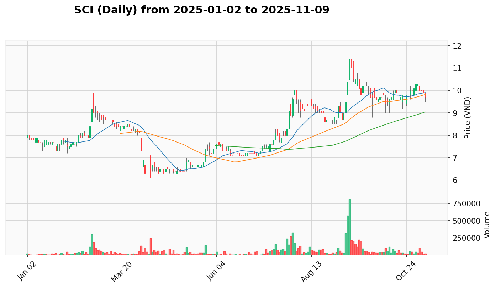

<a href="#xay-lap-dien">↑ Back to group XAY_LAP_DIEN</a>  |  <a href="#vpa-signal-summary">↑ Back to Top</a>

#### Key Statistics
| Metric | Value |
|:---|---:|
| Date Range | 2025-01-02 to 2025-11-07 |
| **Latest Close** | **9.7** |
| Period Open | 7.9 |
| Period High | 11.9 |
| Period Low | 5.7 |
| Period Change % | 22.78% |

**[Download SCI Data (.csv)](market_data/SCI_2025-01-02_to_2025-11-09.csv)**

---

### SCR

#### [VPA Analysis (2025-08-04 - 2025-10-21)](./VPA.md#scr)
> **Ngày 2025-10-15:** SCR tăng nhẹ từ 9.59 VND lên 9.6 VND. Biên độ giá rộng (từ 9.49 VND đến 9.74 VND) và đóng cửa ở giữa thân nến. Khối lượng giao dịch đạt 5.77 triệu cổ phiếu, giảm đáng kể so với phiên trước (12.47 triệu cổ phiếu). Sau phiên suy yếu (SOW) với khối lượng lớn ngày 2025-10-14, phiên này SCR có sự phục hồi nhẹ về giá đóng cửa nhưng với khối lượng thấp. Điều này cho thấy áp lực bán đã giảm bớt, nhưng lực cầu cũng chưa thực sự mạnh mẽ để đẩy giá lên cao dứt khoát. Đây là dấu hiệu của sự thiếu cầu, cho thấy thị trường đang lưỡng lự và chưa sẵn sàng cho một xu hướng tăng rõ ràng. **Phân tích VPA/Wyckoff:** No Demand (ND) - Thiếu cầu.
> **Ngày 2025-10-16:** SCR tăng từ 9.6 VND lên 9.75 VND. Biên độ giá rộng (từ 9.66 VND đến 9.99 VND) và đóng cửa ở nửa trên của phiên. Khối lượng giao dịch đạt 6.92 triệu cổ phiếu, tăng so với phiên trước (5.77 triệu cổ phiếu). Sau phiên thiếu cầu (ND) ngày 2025-10-15, phiên này SCR tăng giá với khối lượng gia tăng và đóng cửa ở mức cao, cho thấy lực cầu đã quay trở lại và đang chiếm ưu thế. Điều này có thể là dấu hiệu tích cực cho xu hướng giá trong ngắn hạn. **Phân tích VPA/Wyckoff:** Sign of Strength (SOS) - Dấu hiệu sức mạnh.
> **Ngày 2025-10-17:** SCR mở cửa ở 9.94 VND và cố gắng tăng lên 10.1 VND nhưng sau đó giảm xuống 9.69 VND và đóng cửa ở mức 9.85 VND, bằng với giá đóng cửa phiên trước. Biên độ giá rộng (từ 9.69 VND đến 10.1 VND) cho thấy sự biến động lớn. Khối lượng giao dịch đạt 10.89 triệu cổ phiếu, cao hơn một chút so với phiên trước (10.47 triệu cổ phiếu). Sau phiên Dấu hiệu sức mạnh (SOS) ngày 2025-10-16, việc giá không thể tiếp tục tăng và đóng cửa ngang bằng với phiên trước, cùng với khối lượng tăng nhẹ, cho thấy áp lực bán đã xuất hiện trở lại ở các mức giá cao hơn, hoặc lực cầu không đủ mạnh để đẩy giá lên cao hơn. Đây là dấu hiệu cho thấy nỗ lực tăng giá không đạt được kết quả tương xứng với khối lượng, cho thấy sự suy yếu của lực cầu. **Phân tích VPA/Wyckoff:** Sign of Weakness (SOW) - Dấu hiệu suy yếu.
> **Ngày 2025-10-20:** SCR mở cửa ở 9.71 VND, cố gắng tăng lên 9.85 VND nhưng sau đó giảm mạnh và đóng cửa ở mức thấp nhất phiên là 9.17 VND. Biên độ giá rộng (từ 9.17 VND đến 9.85 VND) và đóng cửa ở nửa dưới của phiên. Khối lượng giao dịch đạt 9.33 triệu cổ phiếu, thấp hơn so với phiên trước (10.89 triệu cổ phiếu) nhưng vẫn ở mức cao. Sau phiên Dấu hiệu suy yếu (SOW) ngày 2025-10-17, phiên này SCR tiếp tục giảm mạnh với biên độ rộng và đóng cửa ở mức thấp nhất, cho thấy áp lực bán rất mạnh và nguồn cung đang chiếm ưu thế hoàn toàn. Nỗ lực tăng giá trong phiên đã bị từ chối và giá bị đẩy xuống thấp hơn, xác nhận sự suy yếu của lực cầu. **Phân tích VPA/Wyckoff:** Sign of Weakness (SOW) - Dấu hiệu suy yếu mạnh.
> **Ngày 2025-10-21:** SCR mở cửa ở 8.9 VND và cố gắng tăng lên 9.03 VND nhưng sau đó giảm mạnh và đóng cửa ở mức thấp nhất phiên là 8.53 VND. Biên độ giá rất rộng (từ 8.53 VND đến 9.03 VND) và đóng cửa ở mức thấp nhất, cho thấy áp lực bán cực kỳ mạnh. Khối lượng giao dịch đạt 17.59 triệu cổ phiếu, cao hơn đáng kể so với phiên trước (9.33 triệu cổ phiếu) và là mức cao nhất trong 10 phiên gần đây. Sau hai phiên Dấu hiệu suy yếu (SOW) liên tiếp, phiên này xác nhận sự suy yếu nghiêm trọng của lực cầu và sự chiếm ưu thế hoàn toàn của nguồn cung. Nỗ lực tăng giá trong phiên đã bị từ chối hoàn toàn, cho thấy sự phân phối mạnh mẽ đang diễn ra. **Phân tích VPA/Wyckoff:** Sign of Weakness (SOW) - Dấu hiệu suy yếu cực mạnh.

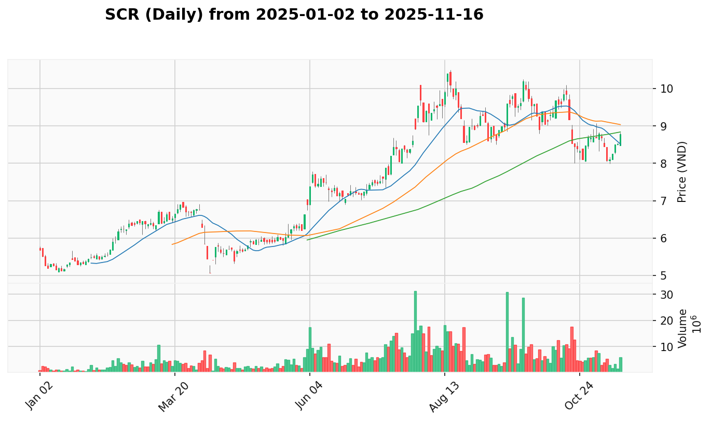

<a href="#bat-dong-san">↑ Back to group BAT_DONG_SAN</a>  |  <a href="#vpa-signal-summary">↑ Back to Top</a>

#### Key Statistics
| Metric | Value |
|:---|---:|
| Date Range | 2025-01-02 to 2025-11-07 |
| **Latest Close** | **8.08** |
| Period Open | 5.74 |
| Period High | 10.5 |
| Period Low | 5.07 |
| Period Change % | 40.77% |

**[Download SCR Data (.csv)](market_data/SCR_2025-01-02_to_2025-11-09.csv)**

---

### SCS

#### [VPA Analysis (2025-06-16 - 2025-10-21)](./VPA.md#scs)
> **Ngày 2025-10-15:** SCS giảm từ 57.0 VND xuống 56.3 VND với khối lượng giao dịch đạt 0.2656 triệu cổ phiếu. Cây nến giảm có biên độ hẹp và đóng cửa tại mức thấp nhất phiên, cho thấy lực cung vẫn chiếm ưu thế. Mặc dù khối lượng giao dịch thấp hơn so với phiên trước (0.3285 triệu cổ phiếu), nhưng việc giá đóng cửa ở mức thấp nhất cho thấy áp lực bán vẫn còn và lực cầu chưa đủ mạnh để hấp thụ. Điều này tiếp tục xác nhận sự yếu kém của thị trường. **Phân tích VPA/Wyckoff:** Tiếp tục yếu kém
> **Ngày 2025-10-16:** SCS giảm từ 56.3 VND xuống 56.0 VND với khối lượng giao dịch đạt 0.1075 triệu cổ phiếu. Cây nến giảm có biên độ hẹp và đóng cửa gần mức thấp nhất phiên, cho thấy lực cung vẫn chiếm ưu thế. Khối lượng giao dịch rất thấp, chỉ bằng khoảng một nửa so với phiên trước (0.2656 triệu cổ phiếu) và thấp hơn nhiều so với mức trung bình gần đây. Điều này cho thấy sự thiếu vắng cả lực cung và lực cầu, nhưng việc giá tiếp tục giảm và đóng cửa ở mức thấp vẫn xác nhận thị trường đang yếu kém và không có lực cầu đủ mạnh để hỗ trợ giá. **Phân tích VPA/Wyckoff:** No Demand (Thiếu cầu)
> **Ngày 2025-10-17:** SCS giảm từ 55.7 VND xuống 55.3 VND với khối lượng giao dịch đạt 0.2204 triệu cổ phiếu. Cây nến giảm có biên độ hẹp và đóng cửa tại mức thấp nhất phiên, cho thấy lực cung vẫn chiếm ưu thế. Khối lượng giao dịch thấp hơn so với phiên trước (0.2636 triệu cổ phiếu), xác nhận sự thiếu vắng lực cầu và áp lực bán vẫn còn. Điều này cho thấy thị trường tiếp tục yếu kém. **Phân tích VPA/Wyckoff:** No Demand (Thiếu cầu)
> **Ngày 2025-10-20:** SCS giảm từ 55.3 VND xuống 54.0 VND với khối lượng giao dịch đạt 0.3465 triệu cổ phiếu. Cây nến giảm có biên độ rộng và đóng cửa gần mức thấp nhất phiên, cho thấy áp lực bán mạnh mẽ. Khối lượng giao dịch tăng đáng kể so với phiên trước (0.2204 triệu cổ phiếu), xác nhận lực cung đang gia tăng và chiếm ưu thế. Điều này cho thấy sự yếu kém tiếp tục của thị trường. **Phân tích VPA/Wyckoff:** Selling Pressure (Áp lực bán)
> **Ngày 2025-10-21:** SCS tăng từ 54.0 VND lên 55.9 VND với khối lượng giao dịch đạt 0.2722 triệu cổ phiếu. Cây nến tăng có biên độ rộng và đóng cửa gần mức cao nhất phiên. Tuy nhiên, khối lượng giao dịch thấp hơn so với phiên giảm mạnh trước đó (0.3465 triệu cổ phiếu), cho thấy lực cầu chưa thực sự mạnh mẽ để xác nhận đà tăng. Điều này có thể là một đợt hồi phục yếu hoặc sự tạm lắng của áp lực bán. **Phân tích VPA/Wyckoff:** Nỗ lực tăng giá không có kết quả

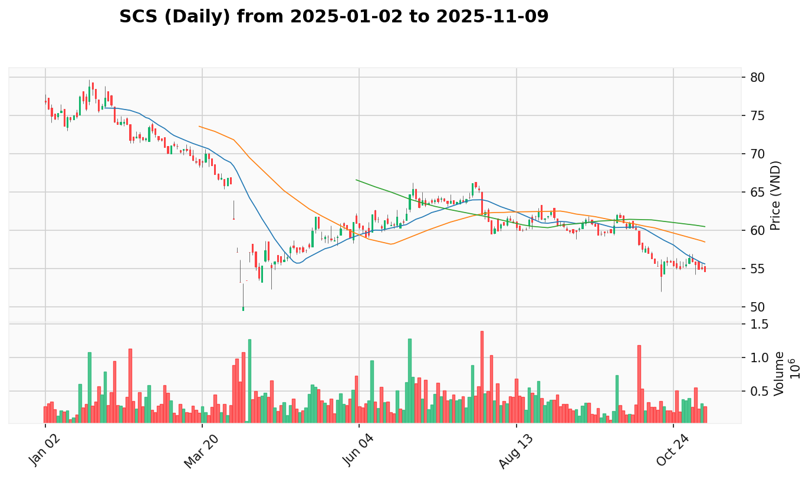

<a href="#hang-khong">↑ Back to group HANG_KHONG</a>  |  <a href="#vpa-signal-summary">↑ Back to Top</a>

#### Key Statistics
| Metric | Value |
|:---|---:|
| Date Range | 2025-01-02 to 2025-11-07 |
| **Latest Close** | **54.6** |
| Period Open | 76.9 |
| Period High | 79.67 |
| Period Low | 49.52 |
| Period Change % | -29.00% |

**[Download SCS Data (.csv)](market_data/SCS_2025-01-02_to_2025-11-09.csv)**

---

### SGN

#### [VPA Analysis (2025-08-04 - 2025-10-21)](./VPA.md#sgn)
> **Ngày 2025-10-15:** SGN tăng từ 65.4 VND lên 65.6 VND, với khối lượng giao dịch đạt 0.011 triệu cổ phiếu. Cây nến tăng có biên độ hẹp và đóng cửa gần mức mở cửa, cho thấy sự lưỡng lự của thị trường. Khối lượng giao dịch giảm đáng kể so với phiên trước, cho thấy lực cung đã giảm nhưng lực cầu cũng chưa thực sự mạnh mẽ. **Phân tích VPA/Wyckoff:** No Demand - Thiếu lực cầu.
> **Ngày 2025-10-16:** SGN tăng từ 65.6 VND lên 66.2 VND, với khối lượng giao dịch đạt 0.0016 triệu cổ phiếu. Cây nến tăng có biên độ rộng và đóng cửa ở mức cao nhất phiên, nhưng khối lượng giao dịch cực kỳ thấp, cho thấy sự thiếu hụt lực cầu thực sự. Mặc dù giá tăng, nhưng sự vắng mặt của khối lượng xác nhận rằng đợt tăng này không bền vững và có thể là một đợt phục hồi yếu sau các tín hiệu suy yếu trước đó. **Phân tích VPA/Wyckoff:** No Demand - Thiếu lực cầu.
> **Ngày 2025-10-17:** SGN giảm từ 66.0 VND xuống 65.6 VND, với khối lượng giao dịch đạt 0.0081 triệu cổ phiếu. Cây nến giảm có biên độ hẹp và đóng cửa bằng mức giá đóng cửa của phiên trước. Khối lượng giao dịch thấp, chỉ nhỉnh hơn một chút so với phiên trước đó (0.007 triệu cổ phiếu), cho thấy sự thiếu vắng cả lực mua và lực bán mạnh mẽ. Điều này tiếp tục xác nhận tình trạng thiếu cầu và sự lưỡng lự của thị trường sau các phiên tăng giá với khối lượng thấp. **Phân tích VPA/Wyckoff:** No Demand - Thiếu lực cầu.
> **Ngày 2025-10-20:** SGN giảm mạnh từ 65.9 VND xuống 63.8 VND, với khối lượng giao dịch đạt 0.022 triệu cổ phiếu. Cây nến giảm có biên độ rộng và đóng cửa ở mức thấp nhất phiên, cho thấy áp lực bán rất mạnh. Khối lượng giao dịch tăng đáng kể so với các phiên trước đó (0.0081 triệu cổ phiếu vào ngày 2025-10-17), xác nhận rằng lực cung đang chiếm ưu thế và đẩy giá xuống. Điều này tiếp nối các tín hiệu thiếu cầu trước đó và cho thấy sự suy yếu rõ rệt của cổ phiếu. **Phân tích VPA/Wyckoff:** Sign of Weakness (SOW) - Lực cung mạnh mẽ.
> **Ngày 2025-10-21:** SGN giảm nhẹ từ 64.0 VND xuống 63.8 VND, với khối lượng giao dịch đạt 0.0115 triệu cổ phiếu. Cây nến có biên độ hẹp, mở cửa cao hơn nhưng sau đó giảm xuống và đóng cửa ở mức giá đóng cửa của phiên trước đó (63.8 VND), đồng thời là mức thấp nhất của phiên SOW trước đó. Khối lượng giao dịch thấp hơn đáng kể so với phiên trước, cho thấy sự thiếu vắng lực cầu mạnh mẽ sau áp lực bán lớn. Điều này tiếp tục xác nhận tình trạng yếu kém của cổ phiếu. **Phân tích VPA/Wyckoff:** No Demand - Thiếu lực cầu.

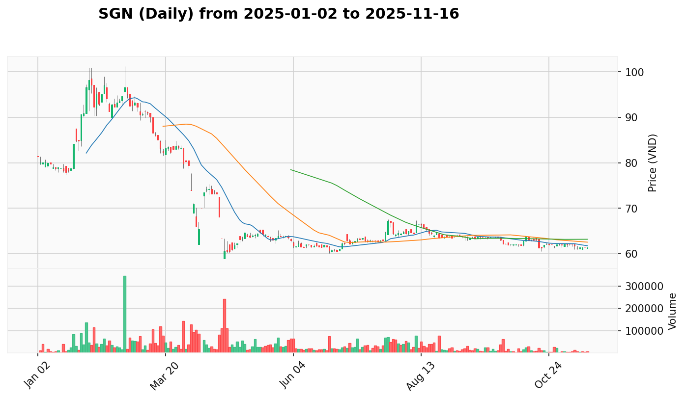

<a href="#hang-khong">↑ Back to group HANG_KHONG</a>  |  <a href="#vpa-signal-summary">↑ Back to Top</a>

#### Key Statistics
| Metric | Value |
|:---|---:|
| Date Range | 2025-01-02 to 2025-11-07 |
| **Latest Close** | **61.7** |
| Period Open | 81.51 |
| Period High | 101.21 |
| Period Low | 58.92 |
| Period Change % | -24.30% |

**[Download SGN Data (.csv)](market_data/SGN_2025-01-02_to_2025-11-09.csv)**

---

### SGR

#### [VPA Analysis (2025-08-04 - 2025-10-21)](./VPA.md#sgr)
> **Ngày 2025-10-15:** SGR tăng giá từ 21.7 VND lên 22.1 VND với khối lượng giao dịch đạt 0.2531 triệu cổ phiếu. Cây nến tăng có biên độ trung bình và đóng cửa ở nửa trên của thân nến. Tuy nhiên, khối lượng giao dịch rất thấp, chỉ bằng một phần nhỏ so với phiên giảm giá mạnh trước đó (0.8943 triệu cổ phiếu) và thấp hơn đáng kể so với phiên "Lack of Demand" ngày 2025-10-13 (0.5727 triệu cổ phiếu). Điều này cho thấy lực cầu yếu ớt và không đủ mạnh để đẩy giá lên cao một cách thuyết phục, xác nhận sự thiếu vắng nhu cầu sau một phiên giảm giá mạnh. **Phân tích VPA/Wyckoff:** Lack of Demand
> **Ngày 2025-10-16:** SGR tăng giá nhẹ từ 22.1 VND lên 22.3 VND với khối lượng giao dịch rất thấp, chỉ đạt 0.1439 triệu cổ phiếu. Cây nến có biên độ hẹp và đóng cửa ở mức giữa, cho thấy sự lưỡng lự và thiếu quyết đoán của thị trường. Khối lượng giao dịch giảm mạnh so với phiên trước (0.2531 triệu cổ phiếu) và thấp hơn đáng kể so với phiên giảm giá mạnh ngày 2025-10-14 (0.8943 triệu cổ phiếu). Điều này xác nhận rằng lực cầu vẫn rất yếu và không có sự tham gia đáng kể của người mua, ngay cả khi giá có sự phục hồi nhẹ. Đây là dấu hiệu của sự thiếu vắng nhu cầu tiếp diễn sau các phiên giảm giá. **Phân tích VPA/Wyckoff:** No Demand (ND)
> **Ngày 2025-10-17:** SGR giảm giá từ 22.3 VND xuống 21.75 VND với khối lượng giao dịch đạt 0.323 triệu cổ phiếu. Cây nến giảm có biên độ trung bình và đóng cửa ở mức thấp nhất phiên, cho thấy áp lực bán mạnh. Khối lượng giao dịch tăng so với hai phiên thiếu cầu trước đó (0.2531 triệu cổ phiếu ngày 2025-10-15 và 0.2364 triệu cổ phiếu ngày 2025-10-16), xác nhận rằng lực cung đang chiếm ưu thế và đẩy giá xuống sau các tín hiệu thiếu vắng nhu cầu. Điều này cho thấy sự yếu kém tiếp diễn và khả năng giá sẽ tiếp tục giảm. **Phân tích VPA/Wyckoff:** Supply Coming In (SCI)
> **Ngày 2025-10-20:** SGR giảm giá từ 21.75 VND xuống 20.25 VND với khối lượng giao dịch đạt 0.5026 triệu cổ phiếu. Cây nến giảm có biên độ rộng và đóng cửa ở mức thấp nhất phiên, cho thấy áp lực bán mạnh mẽ. Khối lượng giao dịch tăng đáng kể so với phiên trước (0.323 triệu cổ phiếu), xác nhận rằng lực cung đang chiếm ưu thế và đẩy giá xuống sau các tín hiệu thiếu vắng nhu cầu và Supply Coming In. Điều này cho thấy sự yếu kém tiếp diễn và khả năng giá sẽ tiếp tục giảm. **Phân tích VPA/Wyckoff:** Sign of Weakness (SOW)
> **Ngày 2025-10-21:** SGR có phiên giao dịch biến động mạnh, giá mở cửa 20.45 VND, giảm sâu xuống 18.85 VND nhưng phục hồi và đóng cửa ở mức 20.25 VND, bằng với giá đóng cửa phiên trước. Khối lượng giao dịch đạt 1.1799 triệu cổ phiếu, tăng đột biến so với phiên trước (0.5026 triệu cổ phiếu). Cây nến có biên độ rộng với bóng nến dưới dài cho thấy lực cầu mạnh mẽ đã hấp thụ áp lực bán tại các mức giá thấp hơn, sau các tín hiệu suy yếu (SCI, SOW) của các phiên trước. Điều này cho thấy một nỗ lực của lực cầu để ngăn chặn đà giảm. **Phân tích VPA/Wyckoff:** Stopping Volume (SV)

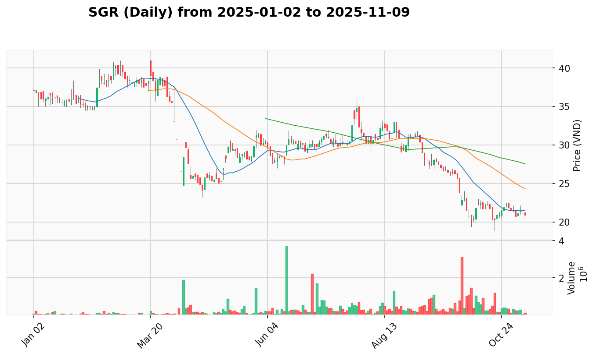

<a href="#bat-dong-san">↑ Back to group BAT_DONG_SAN</a>  |  <a href="#vpa-signal-summary">↑ Back to Top</a>

#### Key Statistics
| Metric | Value |
|:---|---:|
| Date Range | 2025-01-02 to 2025-11-07 |
| **Latest Close** | **20.9** |
| Period Open | 37.05 |
| Period High | 41.15 |
| Period Low | 18.85 |
| Period Change % | -43.59% |

**[Download SGR Data (.csv)](market_data/SGR_2025-01-02_to_2025-11-09.csv)**

---

### SGT

#### [VPA Analysis (2025-06-16 - 2025-10-21)](./VPA.md#sgt)
> **Ngày 2025-10-15:** SGT tăng từ 16.75 VND lên 16.95 VND, với biên độ dao động từ 16.4 VND đến 16.95 VND. Cây nến tăng có thân nhỏ, đóng cửa ở mức cao nhất phiên, cho thấy nỗ lực tăng giá. Tuy nhiên, khối lượng giao dịch đạt 0.0051 triệu cổ phiếu, giảm mạnh so với phiên trước (0.0138 triệu cổ phiếu). Sự tăng giá đi kèm với khối lượng thấp cho thấy lực cầu yếu, không có sự tham gia mạnh mẽ của dòng tiền lớn, củng cố nhận định về thị trường thiếu động lực tăng trưởng bền vững. **Phân tích VPA/Wyckoff:** No Demand (Thiếu cầu)
> **Ngày 2025-10-16:** SGT đóng cửa ở mức 16.95 VND, không đổi so với phiên trước, nhưng đã tăng từ 16.2 VND lên 16.95 VND trong phiên, với biên độ dao động từ 16.2 VND đến 16.95 VND. Cây nến tăng có thân rộng, đóng cửa ở mức cao nhất phiên, cho thấy nỗ lực đẩy giá lên. Tuy nhiên, khối lượng giao dịch chỉ đạt 0.0011 triệu cổ phiếu, giảm mạnh so với phiên trước (0.0051 triệu cổ phiếu). Sự tăng giá với khối lượng cực thấp này cho thấy lực cầu yếu, không có sự tham gia của dòng tiền lớn, củng cố nhận định về thị trường thiếu động lực tăng trưởng bền vững. **Phân tích VPA/Wyckoff:** No Supply (Thiếu cung)
> **Ngày 2025-10-17:** SGT tăng từ 16.4 VND lên 16.75 VND, với biên độ dao động từ 16.1 VND đến 16.9 VND. Cây nến tăng có thân tương đối rộng, đóng cửa gần mức cao nhất phiên, cho thấy lực mua chiếm ưu thế. Khối lượng giao dịch đạt 0.0096 triệu cổ phiếu, tăng đáng kể so với phiên trước (0.0032 triệu cổ phiếu). Sự tăng giá đi kèm với khối lượng gia tăng cho thấy lực cầu đã quay trở lại, xác nhận nỗ lực đẩy giá lên. **Phân tích VPA/Wyckoff:** Sign of Strength (SOS) - Lực cầu mạnh mẽ.
> **Ngày 2025-10-20:** SGT đóng cửa ở mức 16.75 VND, không đổi so với phiên trước, với biên độ dao động từ 16.2 VND đến 17.0 VND. Khối lượng giao dịch đạt 0.0127 triệu cổ phiếu, tăng đáng kể so với phiên trước (0.0096 triệu cổ phiếu). Mặc dù khối lượng tăng cho thấy nỗ lực mua vào, giá không thể bứt phá lên cao hơn, cho thấy lực cung đã hấp thụ lực cầu, ngăn cản đà tăng. Điều này cho thấy sự thiếu hiệu quả trong nỗ lực đẩy giá lên. **Phân tích VPA/Wyckoff:** Effort vs. Result (Nỗ lực và Kết quả không tương xứng)
> **Ngày 2025-10-21:** SGT tăng từ 16.75 VND lên 16.8 VND, với biên độ dao động từ 15.95 VND đến 16.8 VND. Cây nến tăng có thân hẹp, đóng cửa ở mức cao nhất phiên, cho thấy lực mua chiếm ưu thế. Khối lượng giao dịch đạt 0.0423 triệu cổ phiếu, tăng mạnh so với phiên trước (0.0127 triệu cổ phiếu). Sự tăng giá nhẹ đi kèm với khối lượng gia tăng cho thấy lực cầu đã hấp thụ lực cung và đẩy giá lên, xác nhận nỗ lực tăng giá. **Phân tích VPA/Wyckoff:** Sign of Strength (SOS) - Lực cầu mạnh mẽ.

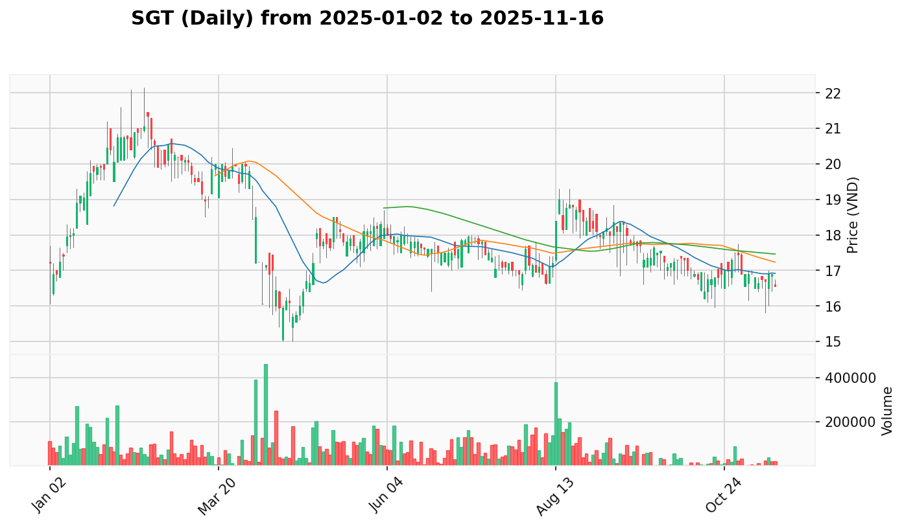

<a href="#cong-nghe">↑ Back to group CONG_NGHE</a>  |  <a href="#vpa-signal-summary">↑ Back to Top</a>

#### Key Statistics
| Metric | Value |
|:---|---:|
| Date Range | 2025-01-02 to 2025-11-07 |
| **Latest Close** | **16.65** |
| Period Open | 17.25 |
| Period High | 22.15 |
| Period Low | 15.0 |
| Period Change % | -3.48% |

**[Download SGT Data (.csv)](market_data/SGT_2025-01-02_to_2025-11-09.csv)**

---

### SHB

#### [VPA Analysis (2025-06-26 - 2025-10-21)](./VPA.md#shb)
> **Ngày 2025-10-15:** SHB đóng cửa ở mức 18.2 VND, tăng so với mức 18.0 VND của phiên trước. Cây nến tăng có biên độ rộng (từ 17.9 VND lên 18.45 VND) và đóng cửa gần mức cao nhất phiên, cho thấy lực cầu áp đảo. Khối lượng giao dịch đạt 135.33 triệu cổ phiếu, tăng đáng kể so với phiên trước (124.39 triệu cổ phiếu). Điều này cho thấy lực cầu đã hấp thụ hoàn toàn lực cung xuất hiện ở phiên trước và tiếp tục đẩy giá lên cao, xác nhận xu hướng tăng giá. **Phân tích VPA/Wyckoff:** Sign of Strength (SOS) - Lực cầu mạnh mẽ tiếp diễn.
> **Ngày 2025-10-16:** SHB đóng cửa ở mức 18.1 VND, giảm nhẹ so với phiên trước (18.2 VND). Cây nến có biên độ từ 18.05 VND đến 18.4 VND và đóng cửa ở nửa dưới, cho thấy áp lực bán đã xuất hiện. Khối lượng giao dịch đạt 38.22 triệu cổ phiếu, giảm mạnh so với phiên trước (135.33 triệu cổ phiếu). Sau phiên SOS mạnh mẽ ngày 2025-10-15, phiên này cho thấy lực cầu đã chững lại và áp lực bán nhẹ xuất hiện, nhưng với khối lượng thấp, cho thấy đây có thể là một nhịp điều chỉnh tự nhiên hoặc kiểm tra lại lực cầu. **Phân tích VPA/Wyckoff:** No Demand (Không có lực cầu)
> **Ngày 2025-10-17:** SHB đóng cửa ở mức 18.1 VND, giảm nhẹ so với mức 18.15 VND của phiên trước. Cây nến có biên độ từ 17.75 VND đến 18.25 VND và đóng cửa ở giữa thân nến, cho thấy sự lưỡng lự giữa bên mua và bên bán. Khối lượng giao dịch đạt 115.96 triệu cổ phiếu, tăng đáng kể so với phiên trước (89.59 triệu cổ phiếu). Sau phiên "Không có lực cầu" ngày 2025-10-16, việc giá giảm nhẹ với khối lượng tăng mạnh cho thấy áp lực cung đã gia tăng trên thị trường, hấp thụ lực cầu và ngăn cản đà tăng giá. **Phân tích VPA/Wyckoff:** Supply Coming In (Lực cung xuất hiện) - Áp lực bán gia tăng với khối lượng lớn.
> **Ngày 2025-10-20:** SHB giảm mạnh từ 18.1 VND xuống 16.85 VND. Cây nến có biên độ rộng, mở cửa ở 17.9 VND, cao nhất 18.0 VND, thấp nhất 16.85 VND và đóng cửa ở mức thấp nhất phiên, cho thấy áp lực bán rất mạnh. Khối lượng giao dịch đạt 157.04 triệu cổ phiếu, tăng đáng kể so với phiên trước (115.96 triệu cổ phiếu). Khối lượng cao đi kèm với sự sụt giảm mạnh của giá xác nhận rằng lực cung đang rất mạnh trên thị trường, tiếp nối tín hiệu "Lực cung xuất hiện" từ phiên 2025-10-17. **Phân tích VPA/Wyckoff:** Sign of Weakness (SOW) - Áp lực bán gia tăng mạnh mẽ.
> **Ngày 2025-10-21:** SHB mở cửa ở mức 16.85 VND, giảm xuống mức thấp nhất 16.1 VND nhưng sau đó phục hồi và đóng cửa ở 17.0 VND, cao hơn một chút so với giá đóng cửa của phiên trước (16.85 VND). Cây nến có biên độ tương đương phiên trước nhưng có bóng nến dưới dài, cho thấy lực cầu đã xuất hiện và hấp thụ một phần lực cung ở vùng giá thấp. Khối lượng giao dịch đạt 144.38 triệu cổ phiếu, vẫn ở mức cao nhưng thấp hơn so với phiên SOW trước đó (157.04 triệu cổ phiếu). Điều này cho thấy sau áp lực bán mạnh, thị trường đang có dấu hiệu cân bằng trở lại với sự xuất hiện của lực cầu, mặc dù vẫn còn sự lưỡng lự. **Phân tích VPA/Wyckoff:** Effort to Rise (Nỗ lực tăng giá) - Sau phiên giảm mạnh, giá có nỗ lực phục hồi với khối lượng cao, cho thấy lực cầu đang cố gắng hấp thụ lực cung.

<a href="#ngan-hang">↑ Back to group NGAN_HANG</a>  |  <a href="#vpa-signal-summary">↑ Back to Top</a>

#### Key Statistics
| Metric | Value |
|:---|---:|
| Date Range | 2025-01-02 to 2025-11-07 |
| **Latest Close** | **15.3** |
| Period Open | 7.91 |
| Period High | 19.45 |
| Period Low | 7.72 |
| Period Change % | 93.43% |

**[Download SHB Data (.csv)](market_data/SHB_2025-01-02_to_2025-11-09.csv)**

---

### SHS

#### [VPA Analysis (2025-06-13 - 2025-10-21)](./VPA.md#shs)
> **Ngày 2025-10-15:** SHS tăng từ 26.9 VND (giá đóng cửa phiên trước) lên 27.0 VND. Cây nến tăng có biên độ hẹp 0.7 VND (từ 26.7 đến 27.4 VND) và đóng cửa ở nửa trên của nến. Khối lượng giao dịch đạt 22.88 triệu cổ phiếu, thấp hơn đáng kể so với phiên trước (46.77 triệu cổ phiếu). Sau phiên nỗ lực tăng giá không hiệu quả với khối lượng lớn, phiên này cho thấy giá tiếp tục tăng nhẹ với khối lượng giảm, cho thấy lực cung đã tạm thời suy yếu. **Phân tích VPA/Wyckoff:** Test for Supply (Kiểm tra cung)
> **Ngày 2025-10-16:** SHS tăng từ 27.0 VND (giá đóng cửa phiên trước) lên 27.2 VND. Cây nến tăng có biên độ hẹp 0.8 VND (từ 27.0 đến 27.8 VND) và đóng cửa ở nửa dưới của nến. Khối lượng giao dịch đạt 14.02 triệu cổ phiếu, thấp hơn đáng kể so với phiên trước (22.88 triệu cổ phiếu) và rất thấp so với mức trung bình gần đây. Sau phiên kiểm tra cung với khối lượng giảm, phiên này cho thấy giá tăng nhẹ nhưng với khối lượng rất thấp và đóng cửa không mạnh mẽ, cho thấy thiếu vắng lực cầu. **Phân tích VPA/Wyckoff:** No Demand (Không có cầu)
> **Ngày 2025-10-17:** SHS tăng từ 27.3 VND (giá đóng cửa phiên trước) lên 27.4 VND. Cây nến tăng có biên độ hẹp 1.1 VND (từ 27.1 đến 28.2 VND) và đóng cửa ở nửa trên của nến. Khối lượng giao dịch đạt 31.14 triệu cổ phiếu, cao hơn đáng kể so với phiên trước (25.92 triệu cổ phiếu). Sau phiên không có cầu, phiên này cho thấy giá tăng nhẹ với khối lượng gia tăng, cho thấy lực cầu đã quay trở lại nhưng biên độ giá hẹp cho thấy vẫn còn lực cung. **Phân tích VPA/Wyckoff:** Test for Demand (Kiểm tra cầu)
> **Ngày 2025-10-20:** SHS giảm từ 27.4 VND (giá đóng cửa phiên trước) xuống 24.7 VND. Cây nến giảm có biên độ rộng 3.3 VND (từ 24.7 đến 28.0 VND) và đóng cửa ở mức thấp nhất phiên. Khối lượng giao dịch đạt 49.36 triệu cổ phiếu, cao hơn đáng kể so với phiên trước (31.14 triệu cổ phiếu) và cao hơn mức trung bình gần đây. Sau phiên kiểm tra cầu, phiên này cho thấy giá giảm mạnh với khối lượng rất cao, xác nhận áp lực bán mạnh mẽ. **Phân tích VPA/Wyckoff:** Sign of Weakness (SOW) - Lực cung áp đảo.
> **Ngày 2025-10-21:** SHS tăng từ 24.7 VND (giá đóng cửa phiên trước) lên 24.8 VND. Cây nến tăng có biên độ vừa phải 2.0 VND (từ 23.6 đến 25.6 VND) và đóng cửa ở nửa dưới của nến. Khối lượng giao dịch đạt 34.70 triệu cổ phiếu, thấp hơn đáng kể so với phiên trước (49.36 triệu cổ phiếu). Sau phiên giảm mạnh với lực cung áp đảo, phiên này cho thấy giá chỉ tăng nhẹ với khối lượng giảm, cho thấy thiếu vắng lực cầu mạnh mẽ. **Phân tích VPA/Wyckoff:** No Demand (Thiếu cầu)

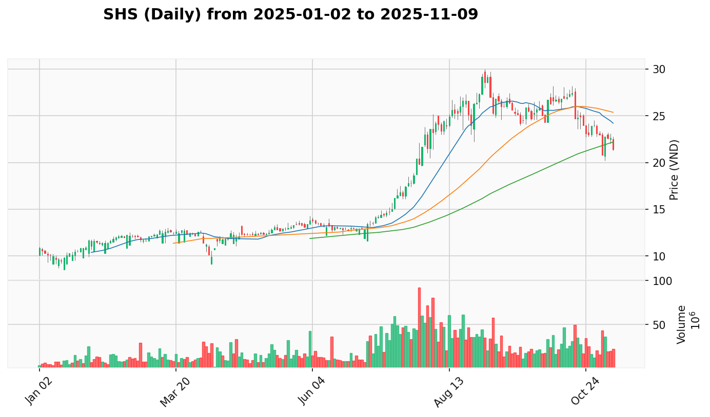

<a href="#chung-khoan">↑ Back to group CHUNG_KHOAN</a>  |  <a href="#vpa-signal-summary">↑ Back to Top</a>

#### Key Statistics
| Metric | Value |
|:---|---:|
| Date Range | 2025-01-02 to 2025-11-07 |
| **Latest Close** | **21.4** |
| Period Open | 10.06 |
| Period High | 30.0 |
| Period Low | 8.54 |
| Period Change % | 112.72% |

**[Download SHS Data (.csv)](market_data/SHS_2025-01-02_to_2025-11-09.csv)**

---

### SIP

#### [VPA Analysis (2025-06-16 - 2025-10-21)](./VPA.md#sip)
> **Ngày 2025-10-15:** SIP mở cửa ở 55.3 VND, dao động trong biên độ từ 53.9 VND đến 55.3 VND và đóng cửa ở 54.0 VND, giảm so với mức đóng cửa của phiên trước (55.1 VND). Khối lượng giao dịch đạt 0.2866 triệu cổ phiếu, giảm so với phiên trước (0.32 triệu cổ phiếu). Giá giảm với khối lượng thấp và đóng cửa gần mức thấp nhất trong ngày cho thấy lực bán đã giảm bớt nhưng lực cầu vẫn rất yếu, không đủ để hỗ trợ giá. Điều này tiếp tục xác nhận sự thiếu vắng động lực tăng giá và thị trường vẫn đang trong giai đoạn yếu. **Phân tích VPA/Wyckoff:** Không có cầu (No Demand)
> **Ngày 2025-10-16:** SIP mở cửa ở 54.0 VND, dao động trong biên độ từ 53.7 VND đến 54.5 VND và đóng cửa ở 54.3 VND, tăng nhẹ so với mức đóng cửa của phiên trước (54.0 VND). Khối lượng giao dịch đạt 0.1168 triệu cổ phiếu, giảm đáng kể so với phiên trước (0.2866 triệu cổ phiếu) và là mức rất thấp. Giá tăng nhẹ với khối lượng thấp cho thấy lực cầu yếu ớt, không đủ để đẩy giá lên cao một cách bền vững, tiếp tục xác nhận sự thiếu vắng động lực tăng giá sau các phiên giảm giá trước đó. **Phân tích VPA/Wyckoff:** Thiếu cầu (Lack of Demand)
> **Ngày 2025-10-17:** SIP mở cửa ở 54.0 VND, dao động trong biên độ từ 53.5 VND đến 54.5 VND và đóng cửa ở 53.6 VND, giảm so với mức đóng cửa của phiên trước (54.0 VND). Khối lượng giao dịch đạt 0.1941 triệu cổ phiếu, tăng nhẹ so với phiên trước (0.1779 triệu cổ phiếu). Giá giảm với khối lượng tăng và đóng cửa gần mức thấp nhất trong ngày cho thấy áp lực bán đang gia tăng và lực cầu vẫn yếu, không đủ để hấp thụ lượng cung. Điều này tiếp tục xác nhận sự yếu kém của thị trường và khả năng giá sẽ tiếp tục giảm. **Phân tích VPA/Wyckoff:** Sign of Weakness (SOW) - Áp lực bán gia tăng.
> **Ngày 2025-10-20:** SIP mở cửa ở 53.7 VND, dao động trong biên độ từ 50.0 VND đến 54.0 VND và đóng cửa ở 50.0 VND, giảm mạnh so với mức đóng cửa của phiên trước (53.6 VND). Khối lượng giao dịch đạt 0.2763 triệu cổ phiếu, tăng so với phiên trước (0.1941 triệu cổ phiếu). Giá giảm mạnh với biên độ rộng, đóng cửa ở mức thấp nhất trong ngày và khối lượng tăng cho thấy áp lực bán rất mạnh mẽ và lực cung đang hoàn toàn chiếm ưu thế. Điều này xác nhận sự yếu kém của thị trường và khả năng giá sẽ tiếp tục giảm sâu. **Phân tích VPA/Wyckoff:** Sign of Weakness (SOW) - Áp lực bán cực lớn.
> **Ngày 2025-10-21:** SIP mở cửa ở 50.7 VND, dao động trong biên độ từ 50.2 VND đến 51.7 VND và đóng cửa ở 51.5 VND, tăng so với mức đóng cửa của phiên trước (50.0 VND). Khối lượng giao dịch đạt 0.479 triệu cổ phiếu, tăng đáng kể so với phiên trước (0.2763 triệu cổ phiếu). Giá tăng với biên độ trung bình, đóng cửa gần mức cao nhất trong ngày và khối lượng tăng mạnh cho thấy lực cầu đã quay trở lại và hấp thụ tốt lượng cung. Điều này có thể là một dấu hiệu đảo chiều tích cực sau hai phiên giảm mạnh. **Phân tích VPA/Wyckoff:** Sign of Strength (SOS) - Lực cầu quay trở lại.

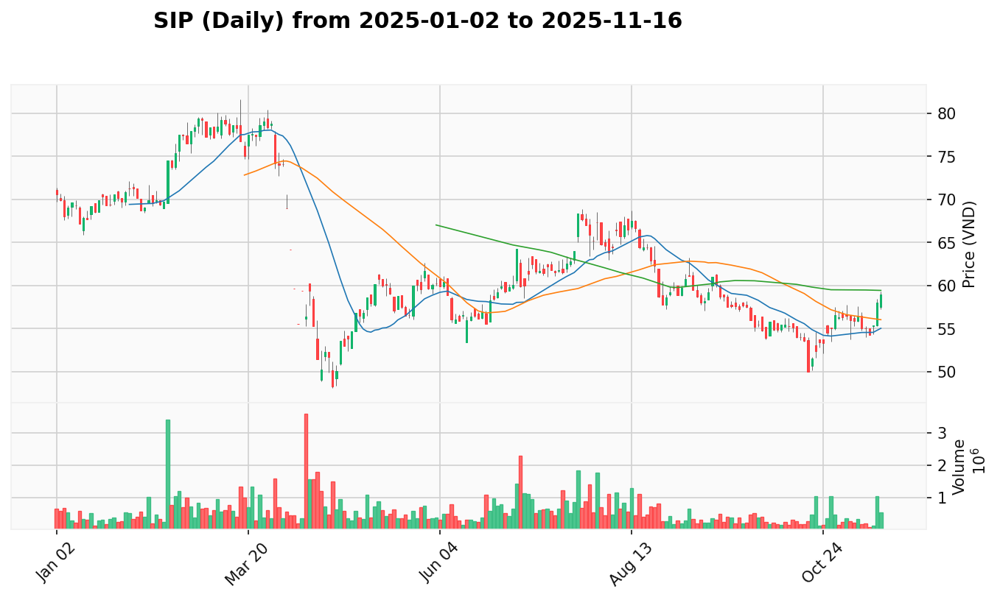

<a href="#bat-dong-san-kcn">↑ Back to group BAT_DONG_SAN_KCN</a>  |  <a href="#vpa-signal-summary">↑ Back to Top</a>

#### Key Statistics
| Metric | Value |
|:---|---:|
| Date Range | 2025-01-02 to 2025-11-07 |
| **Latest Close** | **55.0** |
| Period Open | 71.11 |
| Period High | 81.61 |
| Period Low | 48.12 |
| Period Change % | -22.66% |

**[Download SIP Data (.csv)](market_data/SIP_2025-01-02_to_2025-11-09.csv)**

---

### SKG

#### [VPA Analysis (2025-08-15 - 2025-10-21)](./VPA.md#skg)
> **Ngày 2025-10-15:** SKG giữ nguyên mức giá 10.6 VND. Khối lượng giao dịch đạt 0.0792 triệu cổ phiếu, giảm mạnh so với phiên trước (0.2519 triệu cổ phiếu) và ở mức thấp. Nến có thân nhỏ, biên độ dao động hẹp, cho thấy sự thiếu quyết đoán và không có áp lực bán mạnh mẽ ở mức giá này, nhưng đồng thời cũng thiếu lực cầu. Sau phiên "Supply Coming In" trước đó, việc giá đi ngang với khối lượng thấp xác nhận thị trường vẫn đang trong trạng thái yếu và thiếu động lực rõ ràng. **Phân tích VPA/Wyckoff:** No Demand (ND)
> **Ngày 2025-10-16:** SKG giảm từ 10.6 VND xuống 10.55 VND. Khối lượng giao dịch đạt 0.0565 triệu cổ phiếu, tiếp tục giảm mạnh so với phiên trước (0.0792 triệu cổ phiếu) và ở mức rất thấp. Nến có thân nhỏ, biên độ dao động hẹp, đóng cửa gần mức cao nhất phiên nhưng vẫn thấp hơn giá đóng cửa phiên trước. Sau phiên "No Demand" trước đó, việc giá tiếp tục giảm nhẹ với khối lượng thấp cho thấy thị trường vẫn đang thiếu lực cầu và không có sự hấp thụ đáng kể đối với nguồn cung yếu ớt. **Phân tích VPA/Wyckoff:** No Demand (ND)
> **Ngày 2025-10-17:** SKG giảm từ 10.5 VND xuống 10.4 VND. Khối lượng giao dịch đạt 0.071 triệu cổ phiếu, thấp và tương đương phiên trước. Nến có biên độ tương đối rộng, giá mở cửa bằng giá cao nhất và đóng cửa gần mức thấp nhất, cho thấy áp lực bán xuất hiện ngay từ đầu phiên và duy trì đến cuối phiên. Sau hai phiên "No Demand" liên tiếp, việc giá tiếp tục giảm với khối lượng thấp xác nhận thị trường vẫn đang trong giai đoạn thiếu cầu và có thể tiếp tục xu hướng giảm. **Phân tích VPA/Wyckoff:** No Demand (ND)
> **Ngày 2025-10-20:** SKG giảm từ 10.4 VND xuống 10.0 VND. Khối lượng giao dịch đạt 0.1433 triệu cổ phiếu, tăng đáng kể so với phiên trước (0.071 triệu cổ phiếu). Nến có biên độ rộng, giá mở cửa cao hơn nhưng sau đó giảm mạnh và đóng cửa ở mức thấp nhất phiên, cho thấy áp lực bán rất mạnh. Sau hai phiên "No Demand" liên tiếp, việc giá giảm sâu với khối lượng tăng xác nhận nguồn cung đang chiếm ưu thế và thị trường đang suy yếu rõ rệt. **Phân tích VPA/Wyckoff:** Weakness (Sự suy yếu)
> **Ngày 2025-10-21:** SKG tăng từ 10.0 VND lên 10.1 VND. Khối lượng giao dịch đạt 0.1463 triệu cổ phiếu, cao hơn một chút so với phiên trước. Nến có biên độ hẹp, giá mở cửa (10.15 VND) cao hơn giá đóng cửa (10.1 VND), cho thấy áp lực bán xuất hiện trong phiên. Sau phiên giảm mạnh với tín hiệu "Weakness", sự phục hồi nhẹ về giá đóng cửa nhưng với nến giảm và khối lượng không quá cao cho thấy lực cầu còn yếu và thị trường vẫn đang thiếu động lực tăng. **Phân tích VPA/Wyckoff:** No Demand (ND)

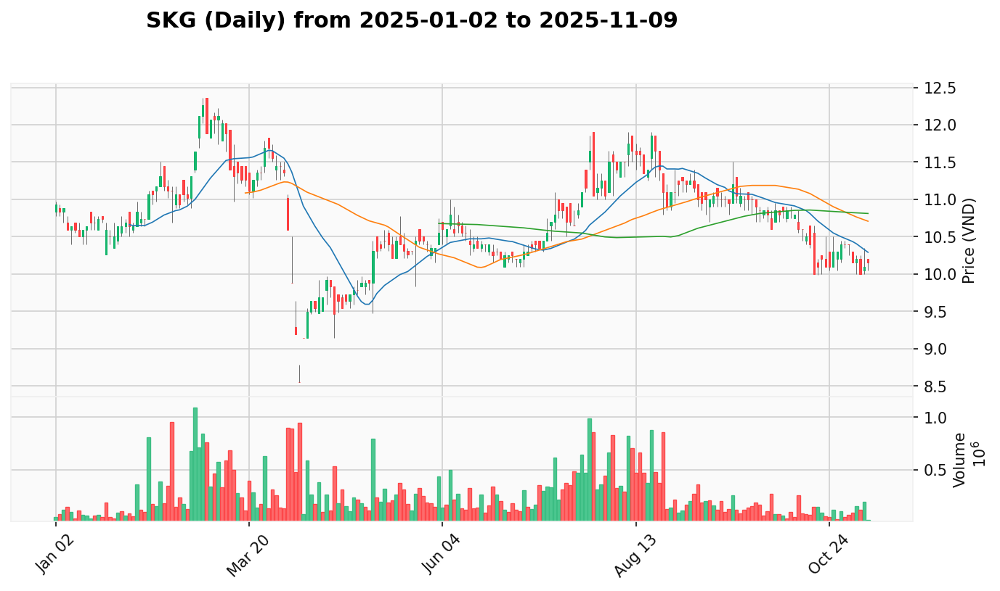

<a href="#van-tai">↑ Back to group VAN_TAI</a>  |  <a href="#vpa-signal-summary">↑ Back to Top</a>

#### Key Statistics
| Metric | Value |
|:---|---:|
| Date Range | 2025-01-02 to 2025-11-07 |
| **Latest Close** | **10.15** |
| Period Open | 10.83 |
| Period High | 12.36 |
| Period Low | 8.55 |
| Period Change % | -6.28% |

**[Download SKG Data (.csv)](market_data/SKG_2025-01-02_to_2025-11-09.csv)**

---

### SLS

#### [VPA Analysis (2025-08-14 - 2025-10-21)](./VPA.md#sls)
> **Ngày 2025-10-15:** SLS mở cửa ở mức 172.0 VND và đóng cửa ở 172.4 VND, cao hơn mức đóng cửa 172.0 VND của phiên trước. Cây nến tăng có biên độ hẹp (từ 171.2 VND đến 172.5 VND) và giá đóng cửa nằm gần mức cao nhất phiên. Khối lượng giao dịch đạt 0.0072 triệu cổ phiếu, tăng nhẹ so với phiên trước (0.005915 triệu cổ phiếu). Sau phiên không có cầu (No Demand) ngày 2025-10-14, việc giá tăng nhẹ với biên độ hẹp và khối lượng vẫn còn thấp cho thấy nỗ lực tăng giá nhưng không có kết quả rõ rệt, lực cầu vẫn yếu và chưa đủ mạnh để tạo ra một xu hướng tăng bền vững. **Phân tích VPA/Wyckoff:** Effort to Rise but No Result
> **Ngày 2025-10-16:** SLS mở cửa ở mức 173.0 VND và đóng cửa ở 171.5 VND, thấp hơn mức đóng cửa 172.4 VND của phiên trước. Cây nến giảm có biên độ hẹp (từ 171.5 VND đến 173.0 VND) và giá đóng cửa nằm ở mức thấp nhất phiên. Khối lượng giao dịch đạt 0.0057 triệu cổ phiếu, giảm so với phiên trước (0.0072 triệu cổ phiếu). Sau phiên nỗ lực tăng giá không thành công (Effort to Rise but No Result) ngày 2025-10-15, việc giá giảm với biên độ hẹp và khối lượng rất thấp cho thấy lực cầu tiếp tục yếu ớt và thị trường thiếu động lực tăng giá, xác nhận sự thiếu vắng của lực mua mạnh mẽ. **Phân tích VPA/Wyckoff:** No Demand
> **Ngày 2025-10-17:** SLS mở cửa ở mức 171.0 VND và đóng cửa ở 170.2 VND, thấp hơn mức đóng cửa 171.5 VND của phiên trước. Cây nến giảm có biên độ hẹp (từ 170.2 VND đến 172.0 VND) và giá đóng cửa nằm ở mức thấp nhất phiên. Khối lượng giao dịch đạt 0.00611 triệu cổ phiếu, giảm so với phiên trước (0.009005 triệu cổ phiếu). Sau phiên không có cầu (No Demand) ngày 2025-10-16, việc giá tiếp tục giảm với biên độ hẹp và khối lượng rất thấp, đóng cửa ở mức thấp nhất phiên, cho thấy lực cầu vẫn cực kỳ yếu ớt và thị trường tiếp tục thiếu động lực tăng giá. Điều này xác nhận sự thiếu vắng của lực mua mạnh mẽ và khả năng giá sẽ tiếp tục giảm hoặc đi ngang trong ngắn hạn. **Phân tích VPA/Wyckoff:** No Demand
> **Ngày 2025-10-20:** SLS mở cửa ở mức 170.3 VND và đóng cửa ở 166.2 VND, thấp hơn mức đóng cửa 170.2 VND của phiên trước. Cây nến giảm có biên độ rộng (từ 170.3 VND đến 166.2 VND) và giá đóng cửa nằm ở mức thấp nhất phiên. Khối lượng giao dịch đạt 0.0088 triệu cổ phiếu, tăng so với phiên trước (0.00611 triệu cổ phiếu). Sau hai phiên không có cầu (No Demand) liên tiếp, việc giá tiếp tục giảm mạnh với biên độ rộng và khối lượng gia tăng cho thấy áp lực bán đang chiếm ưu thế và thị trường đang thể hiện sự yếu kém rõ rệt. Điều này xác nhận sự thiếu vắng của lực mua mạnh mẽ và khả năng giá sẽ tiếp tục giảm trong ngắn hạn. **Phân tích VPA/Wyckoff:** Sign of Weakness (SOW)
> **Ngày 2025-10-21:** SLS mở cửa ở mức 167.0 VND và đóng cửa ở 167.9 VND, cao hơn mức đóng cửa 166.2 VND của phiên trước. Cây nến tăng có biên độ hẹp (từ 164.5 VND đến 168.0 VND) và giá đóng cửa nằm gần mức cao nhất phiên. Khối lượng giao dịch đạt 0.0107 triệu cổ phiếu, tăng so với phiên trước (0.0088 triệu cổ phiếu). Sau hai phiên liên tiếp cho thấy sự yếu kém của thị trường (No Demand và Sign of Weakness), phiên hôm nay cho thấy một chút lực cầu quay trở lại, đẩy giá tăng nhẹ với khối lượng gia tăng. Tuy nhiên, biên độ tăng còn hẹp và khối lượng chưa thực sự đột biến để xác nhận một xu hướng tăng mạnh mẽ. Điều này cho thấy thị trường đang kiểm tra lại lực cung ở mức giá hiện tại. **Phân tích VPA/Wyckoff:** Test for Supply

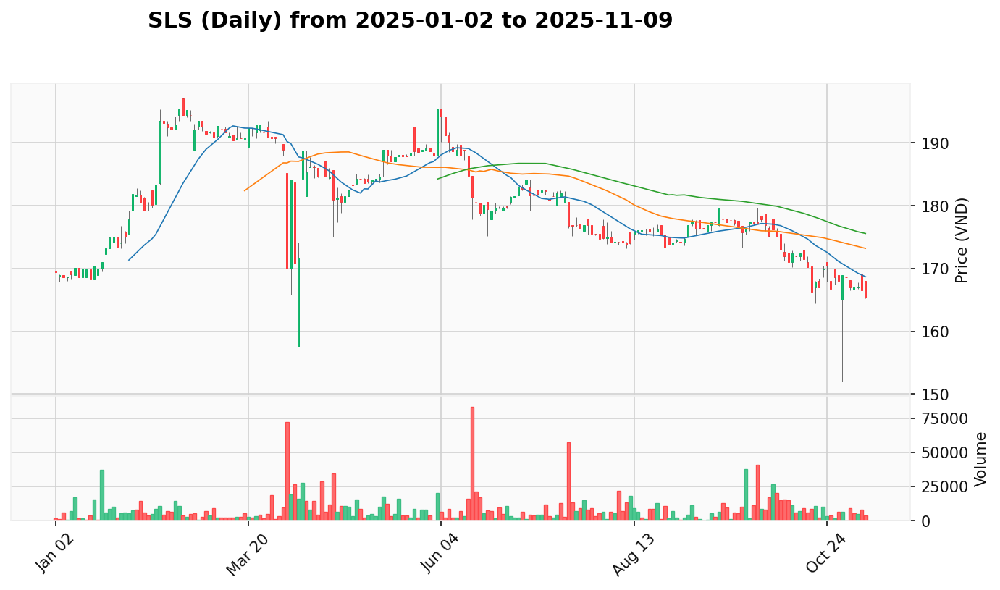

<a href="#thuc-pham">↑ Back to group THUC_PHAM</a>  |  <a href="#vpa-signal-summary">↑ Back to Top</a>

#### Key Statistics
| Metric | Value |
|:---|---:|
| Date Range | 2025-01-02 to 2025-11-07 |
| **Latest Close** | **165.4** |
| Period Open | 169.56 |
| Period High | 197.2 |
| Period Low | 152.0 |
| Period Change % | -2.45% |

**[Download SLS Data (.csv)](market_data/SLS_2025-01-02_to_2025-11-09.csv)**

---

### SMC

#### [VPA Analysis (2025-08-14 - 2025-10-21)](./VPA.md#smc)
> **Ngày 2025-10-15:** SMC mở cửa ở mức 12.25 VND và đóng cửa ở mức 11.9 VND, giữ nguyên mức đóng cửa của phiên trước. Giá tạo một nến giảm với biên độ hẹp, đóng cửa gần mức thấp nhất phiên là 11.5 VND. Khối lượng giao dịch đạt 0.5058 triệu cổ phiếu, giảm đáng kể so với phiên trước (1.1703 triệu cổ phiếu) và ở mức thấp. Sau phiên giảm mạnh với khối lượng lớn (SOW) vào ngày 2025-10-14, việc giá giữ nguyên mức đóng cửa nhưng với nến giảm và khối lượng thấp cho thấy áp lực bán đã tạm thời giảm bớt, nhưng lực cầu vẫn rất yếu và không có sự tham gia để đẩy giá lên. Điều này xác nhận xu hướng giảm giá vẫn tiếp diễn do thiếu vắng lực cầu. **Phân tích VPA/Wyckoff:** No Demand (ND) - Giá giữ nguyên mức đóng cửa nhưng với nến giảm và khối lượng thấp cho thấy thiếu vắng lực cầu.
> **Ngày 2025-10-16:** SMC mở cửa ở mức 11.9 VND và đóng cửa ở mức 12.0 VND, tăng nhẹ so với mức đóng cửa 11.9 VND của phiên trước. Giá tạo một nến tăng với biên độ hẹp và đóng cửa ở giữa thân nến. Khối lượng giao dịch đạt 0.1841 triệu cổ phiếu, giảm mạnh so với phiên trước (0.5058 triệu cổ phiếu) và ở mức rất thấp. Sau các phiên giảm mạnh và thiếu cầu, việc giá tăng nhẹ với khối lượng rất thấp cho thấy lực cầu vẫn còn yếu và chưa có sự tham gia đáng kể của dòng tiền lớn để đảo chiều xu hướng giảm. Điều này xác nhận xu hướng giảm giá vẫn tiếp diễn do thiếu vắng lực cầu mạnh mẽ. **Phân tích VPA/Wyckoff:** No Demand (ND) - Giá tăng nhẹ với khối lượng rất thấp cho thấy thiếu vắng lực cầu.
> **Ngày 2025-10-17:** SMC mở cửa ở mức 11.9 VND và đóng cửa ở mức 11.75 VND, giảm nhẹ so với mức đóng cửa 11.9 VND của phiên trước. Giá tạo một nến giảm với biên độ hẹp, đóng cửa gần mức thấp nhất phiên là 11.7 VND. Khối lượng giao dịch đạt 0.2921 triệu cổ phiếu, giảm so với phiên trước (0.3195 triệu cổ phiếu) và ở mức rất thấp. Sau các phiên giảm mạnh và thiếu cầu, việc giá tiếp tục giảm nhẹ với khối lượng rất thấp cho thấy lực cầu vẫn còn yếu và không có sự tham gia đáng kể của dòng tiền lớn để đảo chiều xu hướng giảm. Điều này xác nhận xu hướng giảm giá vẫn tiếp diễn do thiếu vắng lực cầu mạnh mẽ. **Phân tích VPA/Wyckoff:** No Demand (ND) - Giá giảm nhẹ với khối lượng rất thấp cho thấy thiếu vắng lực cầu.
> **Ngày 2025-10-20:** SMC giảm từ 11.75 VND xuống 10.95 VND. Giá mở cửa ở mức 11.1 VND. Giá tạo một nến giảm mạnh với biên độ rộng và đóng cửa ở mức thấp nhất phiên, cho thấy áp lực bán rất lớn. Khối lượng giao dịch đạt 0.6622 triệu cổ phiếu, tăng đáng kể so với phiên trước (0.2921 triệu cổ phiếu) và cao hơn mức trung bình gần đây. Sau các phiên giảm giá với khối lượng thấp (No Demand), sự sụt giảm mạnh của giá đi kèm với khối lượng tăng cao xác nhận rằng lực cung đang chiếm ưu thế hoàn toàn và xu hướng giảm giá tiếp tục được củng cố. **Phân tích VPA/Wyckoff:** Sign of Weakness (SOW) - Lực cung mạnh mẽ với khối lượng gia tăng xác nhận xu hướng giảm.
> **Ngày 2025-10-21:** SMC mở cửa ở mức 10.2 VND và đóng cửa ở mức 10.65 VND, tăng nhẹ so với giá mở cửa nhưng vẫn thấp hơn mức đóng cửa 10.95 VND của phiên trước. Giá tạo một nến tăng với biên độ tương đối và đóng cửa ở nửa trên của nến. Khối lượng giao dịch đạt 0.8067 triệu cổ phiếu, tăng đáng kể so với phiên trước (0.6622 triệu cổ phiếu) và ở mức cao. Sau phiên giảm mạnh với khối lượng lớn (SOW), việc giá có nến tăng với khối lượng cao cho thấy có lực cầu bắt đáy xuất hiện, hấp thụ một phần lực cung. Tuy nhiên, giá vẫn chưa thể vượt qua mức đóng cửa của phiên trước, cho thấy lực cung vẫn còn mạnh và xu hướng giảm giá chưa được đảo chiều rõ ràng. Đây có thể là dấu hiệu của sự dừng lại của đà giảm hoặc một nỗ lực tăng giá nhưng chưa đạt kết quả rõ rệt. **Phân tích VPA/Wyckoff:** Stopping Volume (SV) - Lực cầu bắt đáy xuất hiện với khối lượng cao, nhưng chưa đủ mạnh để đảo chiều xu hướng giảm.

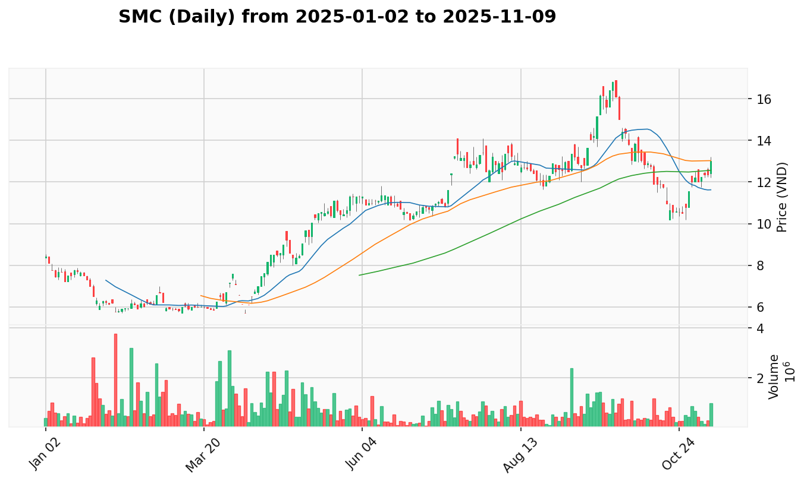

<a href="#thep">↑ Back to group THEP</a>  |  <a href="#vpa-signal-summary">↑ Back to Top</a>

#### Key Statistics
| Metric | Value |
|:---|---:|
| Date Range | 2025-01-02 to 2025-11-07 |
| **Latest Close** | **13.0** |
| Period Open | 8.36 |
| Period High | 16.9 |
| Period Low | 5.7 |
| Period Change % | 55.50% |

**[Download SMC Data (.csv)](market_data/SMC_2025-01-02_to_2025-11-09.csv)**

---

### SSH

#### [VPA Analysis (2025-06-16 - 2025-10-21)](./VPA.md#ssh)
> **Ngày 2025-10-14:** SSH tăng từ 81.0 VND lên 85.6 VND. Giá mở cửa 86.0 VND, cao nhất 86.0 VND, thấp nhất 85.6 VND và đóng cửa 85.6 VND. Nến có biên độ hẹp, đóng cửa ở mức thấp nhất phiên, cho thấy sự lưỡng lự và áp lực bán nhẹ trong phiên. Khối lượng giao dịch chỉ đạt 0.0011 triệu cổ phiếu, giảm so với phiên trước (0.0024 triệu cổ phiếu) và ở mức thấp. Mặc dù giá tăng so với phiên trước, nhưng việc giá đóng cửa ở mức thấp nhất phiên với khối lượng thấp cho thấy lực cầu không đủ mạnh để duy trì đà tăng, xác nhận tình trạng thiếu cầu và có thể là dấu hiệu tiếp tục suy yếu. **Phân tích VPA/Wyckoff:** No Demand (Không có lực cầu)
> **Ngày 2025-10-15:** SSH giảm từ 85.6 VND xuống 85.0 VND. Giá mở cửa 85.7 VND, cao nhất 86.8 VND, thấp nhất 85.0 VND và đóng cửa 85.0 VND. Nến có biên độ hẹp, đóng cửa ở mức thấp nhất phiên, cho thấy áp lực bán chiếm ưu thế. Khối lượng giao dịch đạt 0.0012 triệu cổ phiếu, tăng nhẹ so với phiên trước (0.0011 triệu cổ phiếu) nhưng vẫn ở mức thấp. Sau phiên "No Demand" trước đó, việc giá giảm nhẹ với khối lượng tăng nhẹ và đóng cửa ở mức thấp nhất phiên xác nhận sự tiếp diễn của xu hướng suy yếu và thiếu lực cầu. Điều này cho thấy người bán vẫn đang kiểm soát thị trường. **Phân tích VPA/Wyckoff:** Weakness (Dấu hiệu suy yếu)
> **Ngày 2025-10-16:** SSH giữ nguyên mức giá 85.0 VND. Giá mở cửa, cao nhất, thấp nhất và đóng cửa đều ở mức 85.0 VND, cho thấy không có biến động giá trong phiên. Khối lượng giao dịch chỉ đạt 0.0003 triệu cổ phiếu, cực kỳ thấp so với phiên trước (0.0012 triệu cổ phiếu) và là mức thấp nhất trong các phiên gần đây. Điều này thể hiện sự thiếu vắng hoàn toàn của cả lực mua và lực bán, củng cố thêm nhận định về sự suy yếu và thiếu cầu sau các phiên "No Demand" và "Weakness" trước đó. **Phân tích VPA/Wyckoff:** No Demand (Không có lực cầu)
> **Ngày 2025-10-17:** SSH tiếp tục giữ nguyên mức giá 85.0 VND, không có biến động trong phiên (giá mở cửa, cao nhất, thấp nhất và đóng cửa đều ở mức 85.0 VND). Khối lượng giao dịch chỉ đạt 0.0001 triệu cổ phiếu, cực kỳ thấp và giảm mạnh so với phiên trước (0.0003 triệu cổ phiếu). Điều này cho thấy sự thiếu vắng hoàn toàn của cả lực mua và lực bán, củng cố thêm nhận định về sự suy yếu và thiếu cầu sau các phiên "No Demand" và "Weakness" trước đó. **Phân tích VPA/Wyckoff:** No Demand (Không có lực cầu)
> **Ngày 2025-10-21:** SSH tiếp tục duy trì mức giá 85.0 VND, không có biến động trong phiên giao dịch (giá mở cửa, cao nhất, thấp nhất và đóng cửa đều ở mức 85.0 VND). Khối lượng giao dịch đạt 0.0003 triệu cổ phiếu, vẫn ở mức cực kỳ thấp, cho thấy sự thiếu vắng hoàn toàn của cả lực mua và lực bán. Điều này củng cố thêm nhận định về sự suy yếu và thiếu cầu sau các phiên "No Demand" trước đó. **Phân tích VPA/Wyckoff:** No Demand (Không có lực cầu)

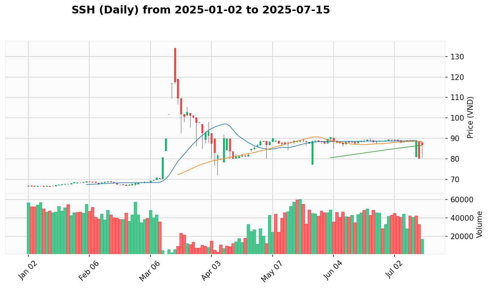

<a href="#bat-dong-san">↑ Back to group BAT_DONG_SAN</a>  |  <a href="#vpa-signal-summary">↑ Back to Top</a>

#### Key Statistics
| Metric | Value |
|:---|---:|
| Date Range | 2025-01-02 to 2025-11-07 |
| **Latest Close** | **79.0** |
| Period Open | 66.8 |
| Period High | 134.2 |
| Period Low | 66.5 |
| Period Change % | 18.26% |

**[Download SSH Data (.csv)](market_data/SSH_2025-01-02_to_2025-11-09.csv)**

---

### SSI

#### [VPA Analysis (2025-06-13 - 2025-10-21)](./VPA.md#ssi)
> **Ngày 2025-10-15:** SSI mở cửa ở mức 41.1 VND, dao động trong biên độ từ 40.85 VND đến 41.75 VND và đóng cửa ở mức 41.45 VND, cao hơn giá đóng cửa phiên trước (41.0 VND). Biên độ dao động trong phiên là 0.9 VND, hẹp hơn đáng kể so với phiên trước (2.3 VND). Khối lượng giao dịch đạt 30.11 triệu cổ phiếu, giảm mạnh so với phiên trước (65.27 triệu cổ phiếu). Sau phiên "Sign of Weakness" với khối lượng cực lớn ngày 2025-10-14, giá hôm nay đã phục hồi, đóng cửa gần mức cao nhất phiên với biên độ hẹp và khối lượng giao dịch giảm mạnh. Điều này cho thấy áp lực cung đã suy yếu đáng kể và không có sự tiếp diễn của lực bán mạnh mẽ. **Phân tích VPA/Wyckoff:** No Supply (NS) - Lực cung suy yếu sau phiên giảm mạnh, cho thấy khả năng giá sẽ tiếp tục tăng.
> **Ngày 2025-10-16:** SSI mở cửa ở mức 41.7 VND, dao động trong biên độ từ 41.3 VND đến 42.25 VND và đóng cửa ở mức 41.4 VND, thấp hơn nhẹ so với giá đóng cửa phiên trước (41.45 VND). Biên độ dao động trong phiên là 0.95 VND, tương tự phiên trước. Khối lượng giao dịch đạt 15.33 triệu cổ phiếu, giảm mạnh so với phiên trước (30.11 triệu cổ phiếu) và là mức thấp nhất trong 10 phiên gần đây. Sau phiên "No Supply" ngày 2025-10-15, giá hôm nay giảm nhẹ với khối lượng giao dịch rất thấp, cho thấy lực cung không đáng kể và thị trường đang thiếu động lực rõ ràng. Điều này có thể là một dấu hiệu của việc kiểm tra cung sau khi lực cung đã suy yếu. **Phân tích VPA/Wyckoff:** Test for Supply (TS) - Giá giảm nhẹ với khối lượng rất thấp, cho thấy lực cung đã cạn kiệt.
> **Ngày 2025-10-17:** SSI mở cửa ở mức 41.5 VND, dao động trong biên độ từ 40.7 VND đến 41.95 VND và đóng cửa ở mức 40.8 VND, thấp hơn giá đóng cửa phiên trước (41.35 VND). Biên độ dao động trong phiên là 1.25 VND, rộng hơn so với phiên trước (0.95 VND). Khối lượng giao dịch đạt 38.97 triệu cổ phiếu, tăng so với phiên trước (29.76 triệu cổ phiếu). Sau hai phiên "No Supply" và "Test for Supply", giá hôm nay giảm mạnh với khối lượng gia tăng và đóng cửa gần mức thấp nhất phiên. Điều này cho thấy áp lực bán đã quay trở lại và lực cầu không đủ mạnh để hấp thụ. **Phân tích VPA/Wyckoff:** Sign of Weakness (SOW) - Giá giảm với khối lượng tăng, cho thấy lực bán mạnh mẽ.
> **Ngày 2025-10-20:** SSI mở cửa ở mức 40.75 VND, dao động trong biên độ từ 37.95 VND đến 41.8 VND và đóng cửa ở mức 37.95 VND, giảm mạnh so với giá đóng cửa phiên trước (40.8 VND). Biên độ dao động trong phiên là 3.85 VND, rất rộng so với phiên trước (1.25 VND). Giá đóng cửa ở mức thấp nhất phiên, cho thấy áp lực bán rất mạnh. Khối lượng giao dịch đạt 70.5859 triệu cổ phiếu, tăng đột biến so với phiên trước (38.9693 triệu cổ phiếu) và là mức cao nhất trong 10 phiên gần đây. Sau phiên "Sign of Weakness" ngày 2025-10-17, giá hôm nay tiếp tục giảm sâu với khối lượng cực lớn, xác nhận lực bán đang chiếm ưu thế hoàn toàn và thị trường đang trong giai đoạn suy yếu mạnh. **Phân tích VPA/Wyckoff:** Sign of Weakness (SOW) - Giá giảm mạnh với biên độ rộng và đóng cửa ở mức thấp nhất phiên, đi kèm khối lượng giao dịch cực lớn, cho thấy lực cung áp đảo và sự suy yếu rõ rệt.
> **Ngày 2025-10-21:** SSI mở cửa ở mức 37.95 VND, dao động trong biên độ từ 36.95 VND đến 39.5 VND và đóng cửa ở mức 38.6 VND, cao hơn giá đóng cửa phiên trước (37.95 VND). Biên độ dao động trong phiên là 2.55 VND, hẹp hơn so với phiên trước. Khối lượng giao dịch đạt 81.1869 triệu cổ phiếu, tăng đột biến so với phiên trước và là mức cao nhất trong 10 phiên gần đây. Sau hai phiên giảm mạnh với tín hiệu suy yếu rõ rệt, giá hôm nay đã có sự phục hồi nhẹ, đóng cửa trên giá mở cửa và ở nửa trên của biên độ, cho thấy lực cầu đã bắt đầu tham gia hấp thụ lượng cung. **Phân tích VPA/Wyckoff:** Effort to Rise - Giá tăng nhẹ với khối lượng cực lớn, cho thấy nỗ lực của lực cầu để đẩy giá lên sau giai đoạn suy yếu.

<a href="#chung-khoan">↑ Back to group CHUNG_KHOAN</a>  |  <a href="#vpa-signal-summary">↑ Back to Top</a>

#### Key Statistics
| Metric | Value |
|:---|---:|
| Date Range | 2025-01-02 to 2025-11-07 |
| **Latest Close** | **32.95** |
| Period Open | 25.4 |
| Period High | 43.3 |
| Period Low | 20.09 |
| Period Change % | 29.72% |

**[Download SSI Data (.csv)](market_data/SSI_2025-01-02_to_2025-11-09.csv)**

---

### STB

#### [VPA Analysis (2025-06-16 - 2025-10-21)](./VPA.md#stb)
> **Ngày 2025-10-15:** STB giảm từ 60.6 VND (giá đóng cửa phiên trước) xuống 60.0 VND (giá đóng cửa phiên hôm nay). Mở cửa tại 60.2 VND, giá đã có lúc tăng lên 60.8 VND nhưng sau đó giảm xuống 60.0 VND và đóng cửa tại mức thấp nhất phiên. Nến có biên độ hẹp từ 60.0 VND đến 60.8 VND. Khối lượng giao dịch đạt 3.8058 triệu cổ phiếu, giảm mạnh so với 7.0392 triệu cổ phiếu của phiên trước. Sau các tín hiệu cạn cung và kiểm tra cung thành công, phiên hôm nay giá giảm nhẹ với khối lượng rất thấp, cho thấy lực bán không đáng kể nhưng đồng thời cũng thiếu lực cầu hỗ trợ, dẫn đến giá đóng cửa ở mức thấp nhất phiên. Đây có thể là một phiên điều chỉnh tự nhiên hoặc tạm thời thiếu cầu. **Phân tích VPA/Wyckoff:** Thiếu cầu (Lack of Demand)
> **Ngày 2025-10-16:** STB giảm từ 60.0 VND (giá đóng cửa phiên trước) xuống 59.0 VND (giá đóng cửa phiên hôm nay). Mở cửa tại 60.1 VND, giá đã có lúc tăng lên 60.4 VND nhưng sau đó giảm xuống 58.8 VND và đóng cửa tại 59.0 VND, gần mức thấp nhất phiên. Nến có biên độ rộng hơn so với phiên trước. Khối lượng giao dịch đạt 4.1547 triệu cổ phiếu, tăng nhẹ so với 3.8058 triệu cổ phiếu của phiên trước nhưng vẫn ở mức thấp so với trung bình. Sau các phiên kiểm tra cung và thiếu cầu, phiên hôm nay giá tiếp tục giảm với biên độ rộng và đóng cửa gần mức thấp nhất, cho thấy áp lực bán vẫn còn và lực cầu yếu, xác nhận sự yếu kém tiếp diễn. **Phân tích VPA/Wyckoff:** Dấu hiệu yếu kém
> **Ngày 2025-10-17:** STB giảm từ 59.5 VND (giá đóng cửa phiên trước) xuống 59.0 VND (giá đóng cửa phiên hôm nay). Mở cửa tại 59.0 VND, giá đã có lúc tăng lên 59.3 VND nhưng sau đó giảm xuống 58.1 VND và đóng cửa tại 59.0 VND, bằng với giá mở cửa và gần mức thấp nhất phiên. Nến có biên độ hẹp hơn so với phiên trước. Khối lượng giao dịch đạt 6.6744 triệu cổ phiếu, giảm so với 10.2353 triệu cổ phiếu của phiên trước. Sau các dấu hiệu yếu kém, phiên hôm nay giá tiếp tục giảm với biên độ hẹp và khối lượng thấp hơn, cho thấy áp lực bán có phần giảm nhưng lực cầu vẫn chưa xuất hiện, xác nhận sự yếu kém tiếp diễn và thiếu sự hỗ trợ từ bên mua. **Phân tích VPA/Wyckoff:** Không có cầu (No Demand)
> **Ngày 2025-10-20:** STB giảm mạnh từ 59.0 VND (giá đóng cửa phiên trước) xuống 54.9 VND (giá đóng cửa phiên hôm nay). Mở cửa tại 58.6 VND, giá đã có lúc tăng lên 58.8 VND nhưng sau đó giảm sâu xuống 54.9 VND và đóng cửa tại mức thấp nhất phiên. Nến có biên độ rất rộng, cho thấy áp lực bán tháo mạnh mẽ. Khối lượng giao dịch đạt 13.2957 triệu cổ phiếu, tăng gấp đôi so với 6.6744 triệu cổ phiếu của phiên trước và ở mức cao. Sự sụt giảm mạnh về giá với biên độ rộng và khối lượng lớn, đóng cửa ở mức thấp nhất phiên, xác nhận lực cung áp đảo và sự yếu kém nghiêm trọng của cổ phiếu. **Phân tích VPA/Wyckoff:** Dấu hiệu yếu kém (Sign of Weakness)
> **Ngày 2025-10-21:** STB tăng từ 54.9 VND (giá đóng cửa phiên trước) lên 55.6 VND (giá đóng cửa phiên hôm nay). Mở cửa tại 55.5 VND, giá đã có lúc giảm xuống 53.0 VND nhưng sau đó phục hồi mạnh mẽ và đóng cửa tại 55.6 VND, là mức cao nhất phiên. Nến có biên độ hẹp hơn so với phiên trước. Khối lượng giao dịch đạt 11.9557 triệu cổ phiếu, giảm nhẹ so với 13.2957 triệu cổ phiếu của phiên trước nhưng vẫn ở mức cao. Sau phiên giảm mạnh với dấu hiệu yếu kém, phiên hôm nay giá đã phục hồi và đóng cửa ở mức cao nhất phiên với khối lượng cao, cho thấy lực cầu đã xuất hiện và hấp thụ một phần áp lực bán. **Phân tích VPA/Wyckoff:** Cầu xuất hiện

<a href="#ngan-hang">↑ Back to group NGAN_HANG</a>  |  <a href="#vpa-signal-summary">↑ Back to Top</a>

#### Key Statistics
| Metric | Value |
|:---|---:|
| Date Range | 2025-01-02 to 2025-11-07 |
| **Latest Close** | **48.35** |
| Period Open | 36.95 |
| Period High | 61.3 |
| Period Low | 32.4 |
| Period Change % | 30.85% |

**[Download STB Data (.csv)](market_data/STB_2025-01-02_to_2025-11-09.csv)**

---

### STK

#### [VPA Analysis (2025-08-03 - 2025-10-21)](./VPA.md#stk)
> **Ngày 2025-10-15:** STK giảm từ 25.0 VND xuống 24.85 VND với khối lượng giao dịch đạt 0.0149 triệu cổ phiếu. Cây nến có thân hẹp, đóng cửa gần mức thấp nhất phiên. So với phiên trước đó (2025-10-14) khi giá giảm nhẹ với khối lượng tăng (0.0305 triệu cổ phiếu) và được đánh giá là "Lực cung chiếm ưu thế", phiên này giá tiếp tục giảm nhưng khối lượng giao dịch giảm mạnh. Điều này cho thấy lực bán đã suy yếu đáng kể, nhưng đồng thời cũng không có lực cầu đủ mạnh để hỗ trợ giá. **Phân tích VPA/Wyckoff:** Không có cầu (No Demand)
> **Ngày 2025-10-16:** STK tăng từ 24.85 VND lên 25.1 VND với khối lượng giao dịch đạt 0.0096 triệu cổ phiếu. Cây nến có thân hẹp, đóng cửa ở giữa. So với phiên trước đó (2025-10-15) khi giá giảm với khối lượng thấp (0.0149 triệu cổ phiếu) và được đánh giá là "Không có cầu", phiên này giá tăng nhẹ nhưng khối lượng giao dịch giảm mạnh hơn nữa, cho thấy lực cầu rất yếu và không có sự hỗ trợ từ khối lượng. **Phân tích VPA/Wyckoff:** Không có cầu (No Demand)
> **Ngày 2025-10-17:** STK giảm từ 25.2 VND xuống 25.1 VND với khối lượng giao dịch đạt 0.0097 triệu cổ phiếu. Cây nến có thân hẹp, đóng cửa gần mức thấp nhất phiên. So với phiên trước đó (2025-10-16) khi giá tăng nhẹ với khối lượng 0.0281 triệu cổ phiếu và được đánh giá là "Không có cầu", phiên này giá tiếp tục giảm nhẹ nhưng khối lượng giao dịch giảm mạnh xuống mức rất thấp. Điều này cho thấy lực bán không đáng kể nhưng lực cầu hoàn toàn vắng bóng, khiến giá dễ dàng giảm ngay cả với áp lực bán nhỏ. **Phân tích VPA/Wyckoff:** Không có cầu (No Demand)
> **Ngày 2025-10-20:** STK giảm mạnh từ 25.1 VND xuống 24.1 VND với khối lượng giao dịch đạt 0.0197 triệu cổ phiếu. Cây nến có thân rộng, đóng cửa ở mức thấp nhất phiên. So với phiên trước đó (2025-10-17) khi giá giảm nhẹ với khối lượng thấp (0.0097 triệu cổ phiếu) và được đánh giá là "Không có cầu", phiên này giá giảm mạnh với khối lượng tăng gấp đôi, cho thấy áp lực bán rất lớn và nguồn cung đang chiếm ưu thế hoàn toàn. Đây là một dấu hiệu suy yếu rõ ràng. **Phân tích VPA/Wyckoff:** Sign of Weakness (SOW) - Lực cung mạnh mẽ.
> **Ngày 2025-10-21:** STK tăng từ 24.1 VND lên 24.9 VND với khối lượng giao dịch đạt 0.0349 triệu cổ phiếu. Cây nến có thân rộng, đóng cửa gần mức cao nhất phiên. So với phiên trước đó (2025-10-20) là một "Sign of Weakness" với giá giảm mạnh và khối lượng tăng, phiên này giá tăng mạnh mẽ với khối lượng tăng đáng kể, cho thấy lực cầu đã quay trở lại và hấp thụ tốt lực cung. Đây là một dấu hiệu tích cực, cho thấy khả năng đảo chiều xu hướng giảm. **Phân tích VPA/Wyckoff:** Sign of Strength (SOS) - Lực cầu mạnh mẽ.

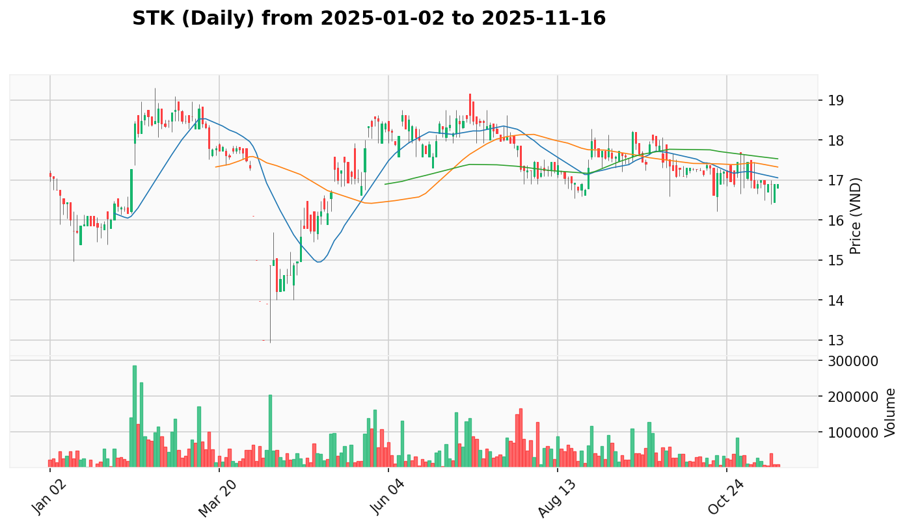

<a href="#det-may">↑ Back to group DET_MAY</a>  |  <a href="#vpa-signal-summary">↑ Back to Top</a>

#### Key Statistics
| Metric | Value |
|:---|---:|
| Date Range | 2025-01-02 to 2025-11-07 |
| **Latest Close** | **17.0** |
| Period Open | 17.17 |
| Period High | 19.31 |
| Period Low | 12.93 |
| Period Change % | -0.99% |

**[Download STK Data (.csv)](market_data/STK_2025-01-02_to_2025-11-09.csv)**

---

### SZC

#### [VPA Analysis (2025-08-04 - 2025-10-21)](./VPA.md#szc)
> **Ngày 2025-10-15:** SZC giảm từ 33.1 VND xuống 32.4 VND với khối lượng giao dịch đạt 1.0835 triệu cổ phiếu, thấp hơn so với phiên trước nhưng vẫn ở mức cao. Cây nến giảm có biên độ rộng và đóng cửa ở mức thấp nhất phiên, cho thấy áp lực bán tiếp tục chiếm ưu thế. Sau phiên SOW mạnh mẽ ngày hôm qua, sự sụt giảm tiếp tục với khối lượng giảm nhẹ cho thấy lực cung vẫn đang kiểm soát thị trường. **Phân tích VPA/Wyckoff:** Sign of Weakness (SOW) - Lực cung tiếp tục chiếm ưu thế.
> **Ngày 2025-10-16:** SZC tăng nhẹ từ 32.2 VND lên 32.45 VND với khối lượng giao dịch đạt 0.4606 triệu cổ phiếu, thấp hơn đáng kể so với các phiên trước. Cây nến tăng có biên độ hẹp, cho thấy sự lưỡng lự của thị trường. Sau hai phiên giảm giá mạnh với khối lượng cao (SOW), phiên này cho thấy áp lực bán đã giảm bớt nhưng lực cầu vẫn còn yếu. Khối lượng thấp trong phiên tăng giá cho thấy không có sự tham gia mạnh mẽ của người mua. **Phân tích VPA/Wyckoff:** No Demand (ND) - Lực cầu yếu.
> **Ngày 2025-10-17:** SZC tăng nhẹ từ 32.4 VND lên 32.5 VND với khối lượng giao dịch đạt 0.4885 triệu cổ phiếu, thấp hơn đáng kể so với phiên trước và các phiên giảm mạnh trước đó. Cây nến có thân nhỏ và bóng nến trên dài, cho thấy có lực cung xuất hiện khi giá tăng. Sau các phiên giảm giá mạnh và phiên "No Demand" trước đó, việc giá tăng nhẹ với khối lượng thấp cho thấy lực cầu vẫn còn yếu và không có sự tham gia mạnh mẽ của người mua. Điều này xác nhận sự yếu kém của thị trường và khả năng tiếp tục xu hướng giảm. **Phân tích VPA/Wyckoff:** No Demand (ND) - Lực cầu yếu và lực cung tiềm ẩn.
> **Ngày 2025-10-20:** SZC giảm mạnh từ 32.1 VND xuống 30.25 VND với khối lượng giao dịch đạt 1.6882 triệu cổ phiếu, cao hơn đáng kể so với phiên trước (0.4885 triệu cổ phiếu) và các phiên gần đây. Cây nến giảm có biên độ rộng và đóng cửa ở mức thấp nhất phiên, cho thấy áp lực bán rất mạnh và chiếm ưu thế hoàn toàn. Sau các phiên "No Demand" với khối lượng thấp, phiên này xác nhận sự quay trở lại của lực cung mạnh mẽ, đẩy giá xuống sâu và phá vỡ các mức hỗ trợ. Điều này cho thấy thị trường đang rất yếu và có khả năng tiếp tục xu hướng giảm. **Phân tích VPA/Wyckoff:** Sign of Weakness (SOW) - Lực cung mạnh mẽ.
> **Ngày 2025-10-21:** SZC tiếp tục giảm mạnh từ 29.9 VND xuống 29.8 VND, với mức thấp nhất là 28.9 VND. Khối lượng giao dịch đạt 1.4906 triệu cổ phiếu, tuy thấp hơn một chút so với phiên trước (1.6882 triệu cổ phiếu) nhưng vẫn ở mức cao. Cây nến giảm có biên độ rộng và đóng cửa ở mức thấp nhất phiên, cho thấy áp lực bán vẫn rất mạnh và lực cung tiếp tục chiếm ưu thế. Sau phiên SOW ngày 2025-10-20, diễn biến này xác nhận sự yếu kém của thị trường và khả năng tiếp tục xu hướng giảm. **Phân tích VPA/Wyckoff:** Sign of Weakness (SOW) - Lực cung tiếp tục mạnh mẽ.

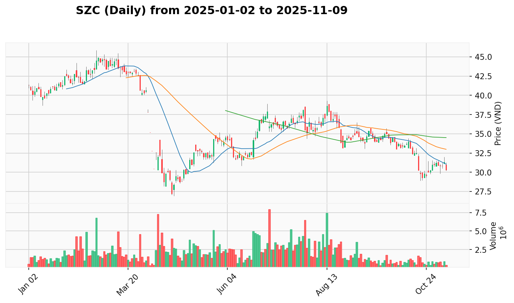

<a href="#bat-dong-san-kcn">↑ Back to group BAT_DONG_SAN_KCN</a>  |  <a href="#vpa-signal-summary">↑ Back to Top</a>

#### Key Statistics
| Metric | Value |
|:---|---:|
| Date Range | 2025-01-02 to 2025-11-07 |
| **Latest Close** | **30.3** |
| Period Open | 41.31 |
| Period High | 45.87 |
| Period Low | 26.92 |
| Period Change % | -26.65% |

**[Download SZC Data (.csv)](market_data/SZC_2025-01-02_to_2025-11-09.csv)**

---

### TCB

#### [VPA Analysis (2025-05-20 - 2025-10-21)](./VPA.md#tcb)
> **Ngày 2025-10-15:** TCB mở cửa tại 41.0, đạt mức cao nhất 41.35 và mức thấp nhất 40.55, đóng cửa tại 40.8. Giá đi ngang, giữ nguyên mức đóng cửa so với phiên trước (40.8). Cây nến có biên độ hẹp và đóng cửa tại mức thấp nhất phiên, cho thấy lực cầu yếu và áp lực bán vẫn hiện hữu. Khối lượng giao dịch đạt 13.32 triệu cổ phiếu, giảm mạnh so với phiên trước (25.93 triệu cổ phiếu) và rất thấp. Sự duy trì mức giá đóng cửa của phiên giảm trước đó với khối lượng thấp cho thấy lực bán đã giảm nhưng lực mua cũng không xuất hiện để đẩy giá lên. Đây là dấu hiệu của sự thiếu cầu sau tín hiệu suy yếu. **Phân tích VPA/Wyckoff:** No Demand (ND) - Thiếu cầu, tiếp tục cho thấy sự suy yếu.
> **Ngày 2025-10-16:** TCB mở cửa tại 41.2, đạt mức cao nhất 41.25 và mức thấp nhất 40.9, đóng cửa tại 40.95. Giá tăng nhẹ từ 40.8 lên 40.95 so với phiên trước. Cây nến có biên độ hẹp và đóng cửa gần giữa thân nến, cho thấy sự lưỡng lự của thị trường. Khối lượng giao dịch đạt 8.02 triệu cổ phiếu, giảm mạnh so với phiên trước (13.32 triệu cổ phiếu) và là mức thấp nhất trong 10 phiên gần đây. Sự tăng giá nhẹ đi kèm với khối lượng cực thấp sau hai phiên suy yếu (Weakness và No Demand) cho thấy nguồn cung đã cạn kiệt tạm thời, nhưng lực cầu vẫn chưa đủ mạnh để đẩy giá lên. Đây là một dấu hiệu kiểm tra nguồn cung. **Phân tích VPA/Wyckoff:** No Supply (NS) - Kiểm tra nguồn cung, cho thấy áp lực bán đã giảm nhưng cầu chưa vào.
> **Ngày 2025-10-17:** TCB mở cửa tại 41.65, đạt mức cao nhất 41.65 và mức thấp nhất 40.45, đóng cửa tại 40.65. Giá giảm từ 41.25 xuống 40.65 so với phiên trước. Cây nến có biên độ rộng và đóng cửa tại mức thấp nhất phiên, cho thấy áp lực bán mạnh mẽ. Khối lượng giao dịch đạt 18.69 triệu cổ phiếu, thấp hơn so với phiên trước (20.24 triệu cổ phiếu) nhưng vẫn ở mức đáng kể. Sự giảm giá mạnh với biên độ rộng và đóng cửa thấp nhất phiên, đi kèm với khối lượng tương đối cao, xác nhận sự hiện diện của lực bán. Điều này cho thấy sự suy yếu tiếp tục sau tín hiệu kiểm tra nguồn cung (No Supply) của phiên trước. **Phân tích VPA/Wyckoff:** Sign of Weakness (SOW) - Dấu hiệu suy yếu, lực bán chiếm ưu thế.
> **Ngày 2025-10-20:** TCB mở cửa tại 40.65 VND, đạt mức cao nhất 40.65 VND và mức thấp nhất 37.85 VND, đóng cửa tại 37.85 VND. Giá giảm mạnh từ 40.65 VND xuống 37.85 VND so với phiên trước. Cây nến có biên độ rất rộng và đóng cửa tại mức thấp nhất phiên, cho thấy áp lực bán cực kỳ mạnh mẽ. Khối lượng giao dịch đạt 30.05 triệu cổ phiếu, tăng đáng kể so với phiên trước (18.69 triệu cổ phiếu) và là mức cao nhất trong 10 phiên gần đây. Sự giảm giá mạnh với biên độ rộng và đóng cửa thấp nhất phiên, đi kèm với khối lượng rất cao, xác nhận lực bán áp đảo và sự tiếp diễn của xu hướng suy yếu đã được thiết lập từ phiên trước. **Phân tích VPA/Wyckoff:** Sign of Weakness (SOW) - Dấu hiệu suy yếu tiếp diễn, lực bán chiếm ưu thế hoàn toàn.
> **Ngày 2025-10-21:** TCB mở cửa tại 38.1, đạt mức cao nhất 38.45 và mức thấp nhất 36.5, đóng cửa tại 37.65. Giá giảm từ 37.85 xuống 37.65 so với phiên trước. Cây nến có biên độ rộng và đóng cửa gần mức thấp nhất phiên, cho thấy áp lực bán tiếp diễn. Khối lượng giao dịch đạt 28.58 triệu cổ phiếu, thấp hơn so với phiên trước (30.05 triệu cổ phiếu) nhưng vẫn ở mức cao. Sự giảm giá với biên độ rộng và đóng cửa gần mức thấp nhất phiên, đi kèm với khối lượng cao, xác nhận sự tiếp diễn của lực bán và xu hướng suy yếu. **Phân tích VPA/Wyckoff:** Sign of Weakness (SOW) - Dấu hiệu suy yếu tiếp diễn, lực bán vẫn chiếm ưu thế.

<a href="#ngan-hang">↑ Back to group NGAN_HANG</a>  |  <a href="#vpa-signal-summary">↑ Back to Top</a>

#### Key Statistics
| Metric | Value |
|:---|---:|
| Date Range | 2025-01-02 to 2025-11-07 |
| **Latest Close** | **33.0** |
| Period Open | 24.01 |
| Period High | 42.0 |
| Period Low | 21.72 |
| Period Change % | 37.44% |

**[Download TCB Data (.csv)](market_data/TCB_2025-01-02_to_2025-11-09.csv)**

---

### TCD

#### [VPA Analysis (2025-08-14 - 2025-10-08)](./VPA.md#tcd)
> **Ngày 2025-10-02:** TCD mở cửa tại 2.25 VND, duy trì mức cao nhất 2.25 VND, thấp nhất 2.25 VND và đóng cửa tại 2.25 VND. Giá giảm mạnh từ 2.41 VND của phiên trước xuống 2.25 VND. Thân nến giảm lớn, không có bóng trên và dưới, đóng cửa ở mức thấp nhất, cho thấy áp lực bán cực kỳ mạnh mẽ và không có lực cầu nào xuất hiện để hỗ trợ giá. Khối lượng giao dịch đạt 0.9541 triệu cổ phiếu, tăng đáng kể so với phiên trước (0.7758 triệu cổ phiếu). Sự sụt giảm mạnh về giá đi kèm với khối lượng tăng cao xác nhận rằng lực cung đang chiếm ưu thế hoàn toàn, tiếp tục xu hướng suy yếu đã được thiết lập. **Phân tích VPA/Wyckoff:** Continuation of Weakness (CoW) - Giá giảm mạnh với khối lượng tăng cao, xác nhận lực cung áp đảo và xu hướng giảm tiếp diễn.
> **Ngày 2025-10-03:** TCD mở cửa tại 2.1 VND, duy trì mức cao nhất 2.1 VND, thấp nhất 2.1 VND và đóng cửa tại 2.1 VND. Giá tiếp tục giảm mạnh từ 2.25 VND của phiên trước xuống 2.1 VND. Thân nến giảm nhỏ, không có bóng trên và dưới, đóng cửa ở mức thấp nhất, cho thấy áp lực bán vẫn duy trì nhưng không còn mạnh mẽ như phiên trước. Khối lượng giao dịch đạt 0.2813 triệu cổ phiếu, giảm đáng kể so với phiên trước (0.9541 triệu cổ phiếu). Sự sụt giảm giá tiếp diễn với khối lượng thấp cho thấy thiếu vắng lực cầu và sự thờ ơ của thị trường, xác nhận xu hướng giảm vẫn tiếp diễn nhưng với sự tham gia ít hơn. **Phân tích VPA/Wyckoff:** Continuation of Weakness (CoW) - Giá tiếp tục giảm với khối lượng thấp, cho thấy lực cung vẫn kiểm soát và thiếu vắng lực cầu, xác nhận sự yếu kém tiếp diễn.
> **Ngày 2025-10-06:** TCD mở cửa tại 1.96 VND, duy trì mức cao nhất 1.96 VND, thấp nhất 1.96 VND và đóng cửa tại 1.96 VND. Giá tiếp tục giảm mạnh từ 2.1 VND của phiên trước xuống 1.96 VND. Thân nến giảm nhỏ, không có bóng trên và dưới, đóng cửa ở mức thấp nhất, cho thấy áp lực bán vẫn duy trì và giá tiếp tục tạo đáy mới. Khối lượng giao dịch đạt 0.7079 triệu cổ phiếu, tăng đáng kể so với phiên trước (0.2813 triệu cổ phiếu). Sự sụt giảm giá tiếp diễn với khối lượng tăng cao xác nhận rằng lực cung đang gia tăng trở lại và kiểm soát hoàn toàn thị trường, tiếp tục xu hướng suy yếu. **Phân tích VPA/Wyckoff:** Continuation of Weakness (CoW) - Giá giảm mạnh với khối lượng tăng cao, xác nhận lực cung áp đảo và xu hướng giảm tiếp diễn.
> **Ngày 2025-10-07:** TCD mở cửa tại 1.83 VND, đạt mức cao nhất 2.03 VND, thấp nhất 1.83 VND và đóng cửa tại 1.83 VND. Giá giảm mạnh từ 1.96 VND của phiên trước xuống 1.83 VND. Thân nến giảm dài, đóng cửa ở mức thấp nhất, cho thấy áp lực bán rất mạnh. Khối lượng giao dịch đạt 7.6405 triệu cổ phiếu, tăng đột biến so với phiên trước (0.7079 triệu cổ phiếu) và là mức cao nhất trong 10 phiên gần đây. Sự sụt giảm giá mạnh với khối lượng cực lớn xác nhận lực cung áp đảo hoàn toàn thị trường, cho thấy sự hoảng loạn và tiếp tục xu hướng giảm sâu. **Phân tích VPA/Wyckoff:** Continuation of Weakness (CoW) - Giá giảm mạnh với khối lượng cực lớn, xác nhận lực cung áp đảo và xu hướng giảm sâu tiếp diễn.
> **Ngày 2025-10-08:** TCD mở cửa tại 1.81 VND, đạt mức cao nhất 1.92 VND, thấp nhất 1.77 VND và đóng cửa tại 1.89 VND. Giá tăng từ 1.83 VND của phiên trước lên 1.89 VND. Thân nến tăng nhỏ, đóng cửa trên mức mở cửa, cho thấy lực cầu đã xuất hiện trở lại sau hai phiên giảm mạnh. Khối lượng giao dịch đạt 2.7838 triệu cổ phiếu, giảm đáng kể so với phiên trước (7.6405 triệu cổ phiếu). Sự tăng giá với khối lượng thấp sau giai đoạn giảm mạnh cho thấy áp lực bán đã tạm thời giảm bớt, nhưng lực cầu chưa thực sự mạnh mẽ để đảo chiều xu hướng giảm. **Phân tích VPA/Wyckoff:** Test for Supply (Kiểm tra nguồn cung) - Giá tăng với khối lượng thấp sau giai đoạn giảm mạnh, cho thấy thị trường đang kiểm tra xem liệu nguồn cung còn lớn hay không.

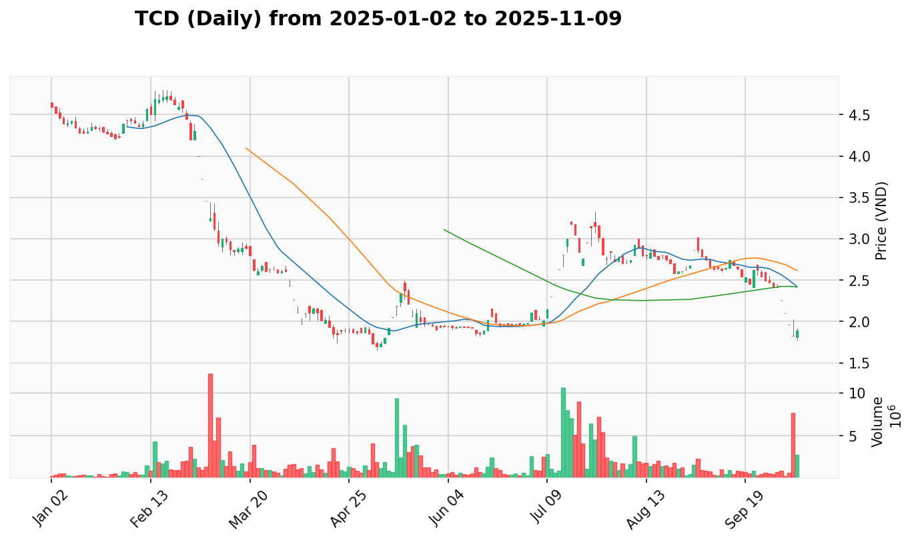

<a href="#van-tai">↑ Back to group VAN_TAI</a>  |  <a href="#vpa-signal-summary">↑ Back to Top</a>

#### Key Statistics
| Metric | Value |
|:---|---:|
| Date Range | 2025-01-02 to 2025-10-08 |
| **Latest Close** | **1.89** |
| Period Open | 4.65 |
| Period High | 4.8 |
| Period Low | 1.65 |
| Period Change % | -59.35% |

**[Download TCD Data (.csv)](market_data/TCD_2025-01-02_to_2025-11-09.csv)**

---

### TCH

#### [VPA Analysis (2025-07-17 - 2025-10-21)](./VPA.md#tch)
> **Ngày 2025-10-15:** TCH giảm từ 24.8 VND xuống 24.5 VND. Thanh nến có biên độ rộng (từ 24.1 đến 25.2) và đóng cửa gần mức thấp nhất phiên. Khối lượng giao dịch đạt 16.97 triệu cổ phiếu, giảm so với phiên trước (19.6363 triệu cổ phiếu). Sau phiên SOW ngày 2025-10-14, phiên này TCH tiếp tục giảm giá với biên độ rộng và đóng cửa ở mức thấp, cho thấy lực cung vẫn đang chiếm ưu thế, mặc dù khối lượng có phần giảm nhẹ. Điều này có thể cho thấy áp lực bán vẫn còn nhưng có thể đang suy yếu dần hoặc thiếu lực cầu hấp thụ. **Phân tích VPA/Wyckoff:** Sign of Weakness (SOW) - Lực cung tiếp diễn.
> **Ngày 2025-10-16:** TCH tăng từ 24.7 VND lên 24.95 VND. Thanh nến có biên độ tương đối hẹp (từ 24.35 đến 25.15) và đóng cửa gần mức cao nhất phiên. Khối lượng giao dịch đạt 8.657.500 cổ phiếu (8.6575 triệu cổ phiếu), giảm đáng kể so với phiên trước (16.97 triệu cổ phiếu). Sau hai phiên SOW liên tiếp, phiên này TCH tăng giá trở lại nhưng với khối lượng thấp, cho thấy lực cầu chưa thực sự mạnh mẽ để hấp thụ hết lực cung tiềm tàng hoặc đây chỉ là một nhịp hồi phục kỹ thuật trong xu hướng giảm. **Phân tích VPA/Wyckoff:** No Demand (ND) - Lực cầu yếu.
> **Ngày 2025-10-17:** TCH giảm từ 25.6 VND xuống 24.5 VND. Thanh nến có biên độ rộng (từ 24.5 đến 25.8) và đóng cửa ở mức thấp nhất phiên. Khối lượng giao dịch đạt 14.0422 triệu cổ phiếu, tăng so với phiên trước (8.6575 triệu cổ phiếu). Sau phiên No Demand ngày 2025-10-16, phiên này TCH tiếp tục giảm mạnh với biên độ rộng và đóng cửa ở mức thấp nhất, đi kèm khối lượng tăng, cho thấy lực cung đã quay trở lại và đang chiếm ưu thế rõ rệt. Điều này xác nhận xu hướng yếu của cổ phiếu. **Phân tích VPA/Wyckoff:** Sign of Weakness (SOW) - Lực cung mạnh mẽ.
> **Ngày 2025-10-20:** TCH giảm từ 24.5 VND xuống 22.8 VND. Thanh nến có biên độ rộng (từ 22.8 đến 24.55) và đóng cửa ở mức thấp nhất phiên. Khối lượng giao dịch đạt 14.5833 triệu cổ phiếu, tăng nhẹ so với phiên trước (14.0422 triệu cổ phiếu). Sau phiên SOW ngày 2025-10-17, phiên này TCH tiếp tục giảm mạnh với biên độ rộng và đóng cửa ở mức thấp nhất, đi kèm khối lượng tăng, cho thấy lực cung vẫn đang chiếm ưu thế rõ rệt và tiếp tục đẩy giá xuống. Điều này xác nhận xu hướng yếu của cổ phiếu. **Phân tích VPA/Wyckoff:** Sign of Weakness (SOW) - Lực cung mạnh mẽ.
> **Ngày 2025-10-21:** TCH giảm từ 22.3 VND xuống 21.5 VND. Thanh nến có biên độ rộng (từ 21.25 đến 22.7) và đóng cửa ở mức thấp nhất phiên. Khối lượng giao dịch đạt 17.94 triệu cổ phiếu, tăng đáng kể so với phiên trước (14.5833 triệu cổ phiếu). Sau các phiên SOW liên tiếp, phiên này TCH tiếp tục giảm mạnh với biên độ rộng và đóng cửa ở mức thấp nhất, đi kèm khối lượng tăng cao, cho thấy lực cung vẫn đang chiếm ưu thế áp đảo và tiếp tục đẩy giá xuống sâu hơn. Điều này xác nhận xu hướng yếu của cổ phiếu đang tiếp diễn. **Phân tích VPA/Wyckoff:** Sign of Weakness (SOW) - Lực cung mạnh mẽ tiếp diễn.

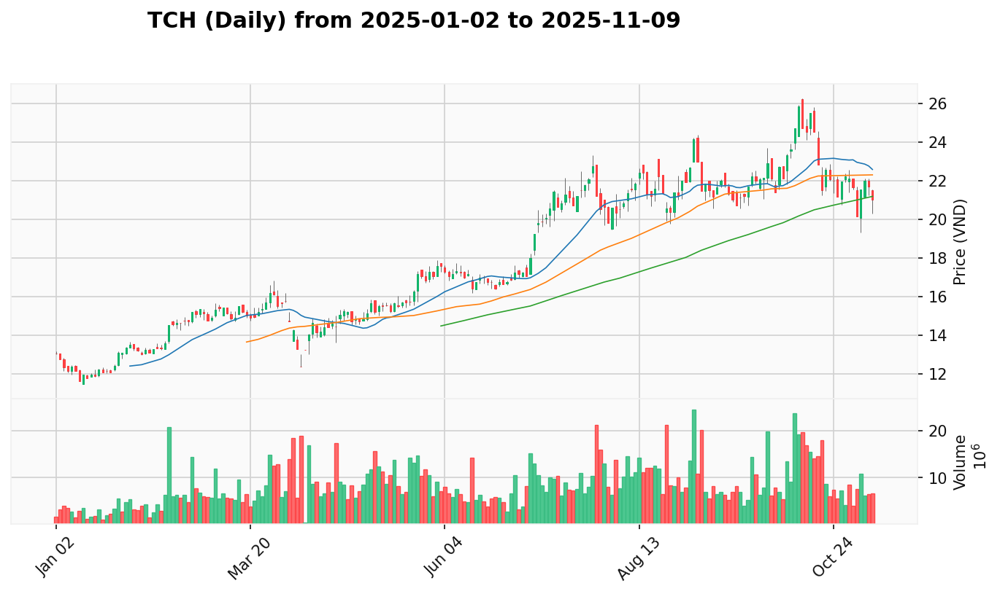

<a href="#bat-dong-san">↑ Back to group BAT_DONG_SAN</a>  |  <a href="#vpa-signal-summary">↑ Back to Top</a>

#### Key Statistics
| Metric | Value |
|:---|---:|
| Date Range | 2025-01-02 to 2025-11-07 |
| **Latest Close** | **21.0** |
| Period Open | 13.05 |
| Period High | 26.25 |
| Period Low | 11.46 |
| Period Change % | 60.92% |

**[Download TCH Data (.csv)](market_data/TCH_2025-01-02_to_2025-11-09.csv)**

---

### TCI

#### [VPA Analysis (2025-08-04 - 2025-10-21)](./VPA.md#tci)
> **Ngày 2025-10-15:** TCI mở cửa ở mức 11.15 VND và đóng cửa tại 11.25 VND, giữ nguyên mức giá đóng cửa so với phiên trước đó, với khối lượng giao dịch chỉ đạt 0.2375 triệu cổ phiếu. Cây nến có thân nhỏ, cho thấy sự lưỡng lự của thị trường. Khối lượng giao dịch cực kỳ thấp, giảm đáng kể so với phiên trước (0.638 triệu cổ phiếu) và thấp hơn nhiều so với mức trung bình gần đây. Điều này cho thấy áp lực bán đã cạn kiệt ở mức giá này, nhưng đồng thời lực cầu cũng chưa đủ mạnh để đẩy giá lên. Thị trường đang trong giai đoạn thiếu động lực rõ ràng sau chuỗi giảm giá và các tín hiệu yếu kém trước đó. **Phân tích VPA/Wyckoff:** No Demand - Thiếu cầu (với khối lượng cạn kiệt).
> **Ngày 2025-10-16:** TCI mở cửa ở mức 11.25 VND và đóng cửa tại 11.25 VND, giữ nguyên mức giá so với phiên trước đó. Biên độ dao động trong phiên hẹp, từ 11.2 VND đến 11.4 VND. Khối lượng giao dịch chỉ đạt 0.1539 triệu cổ phiếu, tiếp tục giảm mạnh so với phiên 2025-10-15 (0.2375 triệu cổ phiếu) và thấp hơn nhiều so với mức trung bình gần đây. Điều này cho thấy cả lực cung và lực cầu đều gần như cạn kiệt ở mức giá này, sau chuỗi ngày giảm giá và các tín hiệu "No Demand" trước đó. Sự cạn kiệt khối lượng ở mức giá thấp cho thấy áp lực bán đã giảm đáng kể, nhưng lực cầu vẫn chưa đủ mạnh để đẩy giá lên. **Phân tích VPA/Wyckoff:** No Supply - Cạn cung.
> **Ngày 2025-10-17:** TCI mở cửa ở mức 11.05 VND và đóng cửa tại 10.75 VND, giảm mạnh từ 11.05 VND xuống 10.75 VND so với phiên trước đó. Biên độ dao động trong phiên rộng, từ 10.75 VND đến 11.25 VND, với giá đóng cửa nằm ở mức thấp nhất phiên, cho thấy áp lực bán rất mạnh. Khối lượng giao dịch đạt 0.6184 triệu cổ phiếu, tăng đáng kể so với phiên 2025-10-16 (0.3594 triệu cổ phiếu) và cao hơn mức trung bình gần đây, xác nhận sự xuất hiện của lực cung lớn. Sau phiên "Cạn cung" trước đó, sự sụt giảm giá mạnh kèm khối lượng tăng cho thấy thị trường vẫn đang chịu áp lực bán đáng kể. **Phân tích VPA/Wyckoff:** Sign of Weakness (SOW) - Lực cung áp đảo.
> **Ngày 2025-10-20:** TCI mở cửa ở mức 10.85 VND và đóng cửa tại 10.0 VND, giảm mạnh so với phiên trước đó. Biên độ dao động trong phiên rất rộng, từ 10.0 VND đến 11.35 VND, với giá đóng cửa nằm ở mức thấp nhất phiên, cho thấy áp lực bán cực kỳ mạnh mẽ. Khối lượng giao dịch đạt 0.8984 triệu cổ phiếu, tăng đáng kể so với phiên 2025-10-17 (0.6184 triệu cổ phiếu) và cao hơn mức trung bình gần đây, xác nhận sự tiếp diễn của lực cung lớn. Sau phiên "Lực cung áp đảo" trước đó, sự sụt giảm giá mạnh kèm khối lượng tăng cho thấy thị trường vẫn đang chịu áp lực bán rất lớn và có thể tiếp tục giảm. **Phân tích VPA/Wyckoff:** Sign of Weakness (SOW) - Lực cung tiếp tục áp đảo.
> **Ngày 2025-10-21:** TCI mở cửa ở mức 10.2 VND và đóng cửa tại 10.45 VND, tăng nhẹ từ 10.0 VND của phiên trước. Biên độ dao động trong phiên từ 10.05 VND đến 10.5 VND, với giá đóng cửa nằm gần mức cao nhất phiên, cho thấy lực cầu đã xuất hiện và hấp thụ một phần áp lực bán. Khối lượng giao dịch đạt 0.6898 triệu cổ phiếu, giảm so với phiên trước (0.8984 triệu cổ phiếu) nhưng vẫn ở mức trung bình. Sau hai phiên giảm mạnh với lực cung áp đảo, phiên này cho thấy sự chững lại của đà giảm và một nỗ lực phục hồi từ phía người mua, mặc dù khối lượng chưa thực sự đột biến để xác nhận một sự đảo chiều mạnh mẽ. **Phân tích VPA/Wyckoff:** Test for Supply (TS) - Kiểm tra cung.

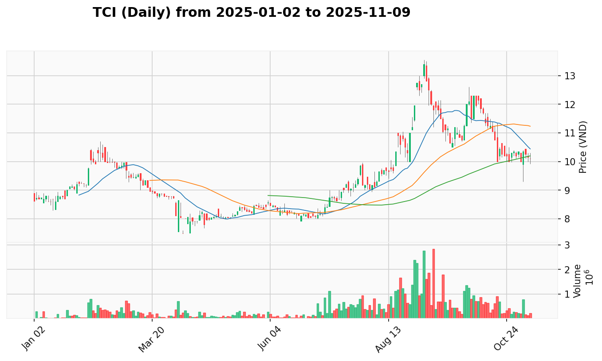

<a href="#chung-khoan">↑ Back to group CHUNG_KHOAN</a>  |  <a href="#vpa-signal-summary">↑ Back to Top</a>

#### Key Statistics
| Metric | Value |
|:---|---:|
| Date Range | 2025-01-02 to 2025-11-07 |
| **Latest Close** | **10.1** |
| Period Open | 8.9 |
| Period High | 13.55 |
| Period Low | 7.49 |
| Period Change % | 13.48% |

**[Download TCI Data (.csv)](market_data/TCI_2025-01-02_to_2025-11-09.csv)**

---

### TCL

#### [VPA Analysis (2025-08-14 - 2025-10-21)](./VPA.md#tcl)
> **Ngày 2025-10-15:** TCL giảm từ 34.7 VND xuống 34.35 VND, với khối lượng giao dịch đạt 0.0103 triệu cổ phiếu, giảm mạnh so với phiên trước (0.0644 triệu cổ phiếu) và ở mức rất thấp. Cây nến giảm có biên độ hẹp và đóng cửa ở mức thấp nhất phiên. Sau phiên SOS mạnh mẽ trước đó, sự giảm giá với khối lượng rất thấp cho thấy lực cung yếu và không có áp lực bán đáng kể. Điều này có thể là một sự kiểm tra nguồn cung trước khi tiếp tục xu hướng tăng. **Phân tích VPA/Wyckoff:** No Supply (Không có nguồn cung)
> **Ngày 2025-10-16:** TCL tăng từ 34.35 VND lên 34.4 VND, với khối lượng giao dịch đạt 0.0109 triệu cổ phiếu, ở mức rất thấp và chỉ nhích nhẹ so với phiên trước (0.0103 triệu cổ phiếu). Cây nến tăng có biên độ hẹp và đóng cửa gần giữa thân nến. Sau phiên "Không có nguồn cung" trước đó, sự tăng giá nhẹ với khối lượng rất thấp cho thấy lực cầu yếu và chưa có sự tham gia mạnh mẽ của dòng tiền lớn để đẩy giá lên cao hơn. Điều này có thể là một dấu hiệu của sự thiếu cầu sau khi thị trường đã kiểm tra nguồn cung. **Phân tích VPA/Wyckoff:** No Demand (Thiếu cầu)
> **Ngày 2025-10-17:** TCL tăng từ 34.45 VND lên 34.5 VND, với khối lượng giao dịch đạt 0.0239 triệu cổ phiếu, ở mức thấp và giảm nhẹ so với phiên trước (0.0266 triệu cổ phiếu). Cây nến giảm có biên độ hẹp và đóng cửa thấp hơn giá mở cửa nhưng cao hơn giá đóng cửa phiên trước. Điều này cho thấy lực cầu vẫn yếu và chưa có sự tham gia mạnh mẽ của dòng tiền lớn để đẩy giá lên cao hơn, tiếp tục xác nhận tình trạng thiếu cầu sau các phiên kiểm tra nguồn cung. **Phân tích VPA/Wyckoff:** No Demand (Thiếu cầu)
> **Ngày 2025-10-20:** TCL giảm từ 34.5 VND xuống 34.05 VND, với khối lượng giao dịch đạt 0.0264 triệu cổ phiếu, cao hơn so với phiên trước (0.0239 triệu cổ phiếu). Cây nến giảm có biên độ tương đối rộng và đóng cửa gần mức thấp nhất phiên. Sau các phiên "No Demand" trước đó, sự giảm giá với khối lượng gia tăng cho thấy áp lực bán đang xuất hiện và thị trường đang thể hiện dấu hiệu yếu kém. **Phân tích VPA/Wyckoff:** Selling Pressure (Áp lực bán)
> **Ngày 2025-10-21:** TCL tăng từ 34.05 VND lên 34.3 VND, với khối lượng giao dịch đạt 0.0343 triệu cổ phiếu, cao hơn so với phiên trước (0.0264 triệu cổ phiếu). Cây nến tăng có biên độ hẹp và đóng cửa gần mức cao nhất phiên. Sau phiên áp lực bán trước đó, sự tăng giá với khối lượng gia tăng cho thấy lực cầu đang quay trở lại và có sự hấp thụ nguồn cung. **Phân tích VPA/Wyckoff:** Sign of Strength (SOS)

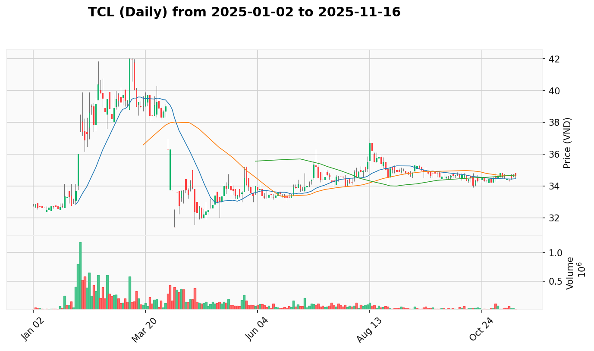

<a href="#van-tai">↑ Back to group VAN_TAI</a>  |  <a href="#vpa-signal-summary">↑ Back to Top</a>

#### Key Statistics
| Metric | Value |
|:---|---:|
| Date Range | 2025-01-02 to 2025-11-07 |
| **Latest Close** | **34.45** |
| Period Open | 32.83 |
| Period High | 42.04 |
| Period Low | 31.42 |
| Period Change % | 4.93% |

**[Download TCL Data (.csv)](market_data/TCL_2025-01-02_to_2025-11-09.csv)**

---

### TCM

#### [VPA Analysis (2025-08-04 - 2025-10-21)](./VPA.md#tcm)
> **Ngày 2025-10-15:** TCM tăng từ 28.95 VND lên 29.0 VND với khối lượng giao dịch đạt 1.8648 triệu cổ phiếu, cao hơn đáng kể so với phiên trước (1.5165 triệu cổ phiếu). Trong phiên, giá đã giảm xuống mức 28.4 VND nhưng sau đó phục hồi và đóng cửa ở mức 29.0 VND, cao hơn giá đóng cửa phiên trước. Sau tín hiệu suy yếu (SOW) ở phiên 2025-10-14, việc giá tăng nhẹ với khối lượng gia tăng và phục hồi từ mức thấp cho thấy lực cầu đã xuất hiện và hấp thụ áp lực bán, có thể là dấu hiệu của sự dừng lại của xu hướng giảm giá. Điều này cho thấy có sự hấp thụ cung ở vùng giá thấp hơn. **Phân tích VPA/Wyckoff:** Stopping Volume (SV)
> **Ngày 2025-10-16:** TCM giảm từ 29.0 VND xuống 28.85 VND với khối lượng giao dịch đạt 0.0716 triệu cổ phiếu, giảm mạnh so với phiên trước (1.8648 triệu cổ phiếu). Biên độ giá trong ngày rất hẹp (từ 28.8 VND đến 29.0 VND) và giá đóng cửa (28.85 VND) nằm gần mức thấp nhất phiên. Sau phiên Stopping Volume (SV) ngày 2025-10-15 cho thấy lực cầu xuất hiện, phiên hôm nay giá giảm nhẹ với khối lượng cực thấp cho thấy thiếu vắng lực cầu mua lên và thị trường đang kiểm tra lại nguồn cung. Điều này có thể là dấu hiệu của sự thiếu hụt nhu cầu sau một đợt hấp thụ cung. **Phân tích VPA/Wyckoff:** No Demand (ND)
> **Ngày 2025-10-17:** TCM giữ nguyên mức giá đóng cửa 28.8 VND so với phiên trước, với khối lượng giao dịch đạt 1.5329 triệu cổ phiếu, cao hơn đáng kể so với phiên No Demand (ND) ngày 2025-10-16 (0.2647 triệu cổ phiếu). Trong phiên, giá đã giảm xuống mức 28.45 VND nhưng sau đó phục hồi và đóng cửa ở mức 28.8 VND. Sau tín hiệu Stopping Volume (SV) và No Demand (ND), việc giá giữ vững với khối lượng gia tăng và phục hồi từ mức thấp cho thấy lực cầu đã hấp thụ áp lực bán, kiểm tra lại vùng hỗ trợ và có thể là dấu hiệu của sự tích lũy. **Phân tích VPA/Wyckoff:** Absorption Volume (AV)
> **Ngày 2025-10-20:** TCM giảm từ 28.8 VND xuống 28.0 VND với khối lượng giao dịch đạt 0.7759 triệu cổ phiếu, giảm đáng kể so với phiên trước (1.5329 triệu cổ phiếu). Biên độ giá trong ngày khá rộng (từ 27.7 VND đến 28.8 VND) và giá đóng cửa (28.0 VND) nằm gần mức thấp nhất phiên. Sau phiên Absorption Volume (AV) ngày 2025-10-17, phiên hôm nay giá giảm mạnh với khối lượng thấp cho thấy thiếu vắng lực cầu mua lên và thị trường đang kiểm tra lại nguồn cung. Điều này có thể là dấu hiệu của sự yếu kém hoặc thiếu cầu sau một đợt hấp thụ. **Phân tích VPA/Wyckoff:** No Demand (ND)
> **Ngày 2025-10-21:** TCM giảm nhẹ từ 28.0 VND xuống 27.95 VND. Tuy nhiên, khối lượng giao dịch tăng mạnh lên 1.7128 triệu cổ phiếu, cao hơn đáng kể so với phiên No Demand (ND) ngày 2025-10-20 (0.7759 triệu cổ phiếu). Trong phiên, giá đã giảm xuống mức 26.95 VND nhưng sau đó phục hồi và đóng cửa ở mức 27.95 VND, gần mức mở cửa và mức cao nhất phiên. Sau phiên No Demand (ND), việc giá giảm nhẹ nhưng phục hồi mạnh từ mức thấp nhất phiên với khối lượng gia tăng cho thấy lực bán đã được hấp thụ bởi lực cầu, và nỗ lực đẩy giá xuống thấp hơn đã không thành công. Điều này có thể là dấu hiệu của sự kiểm tra nguồn cung và khả năng đảo chiều tăng giá. **Phân tích VPA/Wyckoff:** Effort to Fall Fails (ETF)

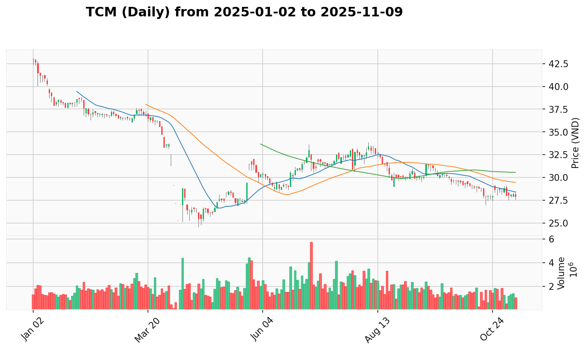

<a href="#det-may">↑ Back to group DET_MAY</a>  |  <a href="#vpa-signal-summary">↑ Back to Top</a>

#### Key Statistics
| Metric | Value |
|:---|---:|
| Date Range | 2025-01-02 to 2025-11-07 |
| **Latest Close** | **27.9** |
| Period Open | 42.97 |
| Period High | 43.11 |
| Period Low | 24.55 |
| Period Change % | -35.07% |

**[Download TCM Data (.csv)](market_data/TCM_2025-01-02_to_2025-11-09.csv)**

---

### TCX

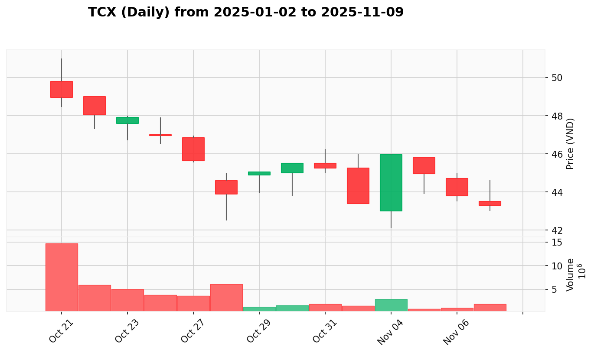

<a href="#chung-khoan">↑ Back to group CHUNG_KHOAN</a>  |  <a href="#vpa-signal-summary">↑ Back to Top</a>

#### Key Statistics
| Metric | Value |
|:---|---:|
| Date Range | 2025-10-21 to 2025-11-07 |
| **Latest Close** | **43.3** |
| Period Open | 49.8 |
| Period High | 51.0 |
| Period Low | 42.1 |
| Period Change % | -13.05% |

**[Download TCX Data (.csv)](market_data/TCX_2025-01-02_to_2025-11-09.csv)**

---

### TDC

#### [VPA Analysis (2025-08-04 - 2025-10-21)](./VPA.md#tdc)
> **Ngày 2025-10-15:** Cổ phiếu TDC giảm từ 12.4 VND xuống 12.3 VND, với cây nến giảm có biên độ hẹp và đóng cửa gần mức thấp nhất phiên (12.25 VND). Khối lượng giao dịch đạt 0.5178 triệu cổ phiếu, giảm đáng kể so với phiên trước (0.7479 triệu cổ phiếu). Sau phiên "Lực cung mạnh mẽ" (SOW) ngày 2025-10-14, việc giá tiếp tục giảm nhưng với khối lượng thấp cho thấy áp lực bán đã suy yếu, đồng thời lực cầu cũng chưa xuất hiện mạnh mẽ để hỗ trợ giá. Điều này có thể là dấu hiệu của sự cạn kiệt nguồn cung tạm thời hoặc thiếu vắng lực cầu. **Phân tích VPA/Wyckoff:** No Demand (ND) - Thiếu cầu.
> **Ngày 2025-10-16:** Cổ phiếu TDC giảm từ 12.6 VND xuống 12.35 VND, với cây nến giảm có biên độ hẹp và đóng cửa tại mức thấp nhất phiên. Khối lượng giao dịch đạt 0.1413 triệu cổ phiếu, giảm rất mạnh so với phiên trước (0.5178 triệu cổ phiếu). Sau phiên "Thiếu cầu" (ND) ngày 2025-10-15, phiên này giá tiếp tục giảm nhưng với khối lượng cực kỳ thấp cho thấy áp lực bán đã cạn kiệt. Mặc dù giá đóng cửa ở mức thấp nhất phiên, sự thiếu vắng khối lượng lớn cho thấy đây không phải là một đợt bán tháo mạnh mẽ mà là sự thiếu hụt nguồn cung. Điều này thường là dấu hiệu của sự cạn kiệt nguồn cung và có thể báo hiệu một đợt tăng giá sắp tới. **Phân tích VPA/Wyckoff:** No Supply (NS) - Cạn cung.
> **Ngày 2025-10-17:** Cổ phiếu TDC giảm từ 12.5 VND xuống 12.4 VND, với cây nến giảm có biên độ hẹp và đóng cửa tại mức thấp nhất phiên. Khối lượng giao dịch đạt 0.496 triệu cổ phiếu, tăng so với phiên trước (0.3322 triệu cổ phiếu). Sau phiên "Cạn cung" (NS) ngày 2025-10-16, giá tiếp tục giảm với khối lượng gia tăng và đóng cửa ở mức thấp nhất phiên cho thấy áp lực bán đã quay trở lại và lực cầu chưa đủ mạnh để hấp thụ. **Phân tích VPA/Wyckoff:** Sign of Weakness (SOW) - Lực cung mạnh mẽ.
> **Ngày 2025-10-20:** Cổ phiếu TDC giảm từ 12.4 VND xuống 11.9 VND, với cây nến giảm có biên độ rộng và đóng cửa tại mức thấp nhất phiên. Khối lượng giao dịch đạt 1.0815 triệu cổ phiếu, tăng rất mạnh so với phiên trước (0.496 triệu cổ phiếu). Sau phiên "Lực cung mạnh mẽ" (SOW) ngày 2025-10-17, phiên này giá tiếp tục giảm sâu với khối lượng gia tăng đột biến và đóng cửa ở mức thấp nhất phiên cho thấy áp lực bán tháo rất mạnh mẽ và lực cầu hoàn toàn không thể hấp thụ. Điều này xác nhận sự yếu kém của cổ phiếu và khả năng tiếp tục giảm giá. **Phân tích VPA/Wyckoff:** Sign of Weakness (SOW) - Lực cung mạnh mẽ và áp lực bán tháo.
> **Ngày 2025-10-21:** Cổ phiếu TDC giảm từ 11.9 VND xuống 11.8 VND, với cây nến giảm có biên độ rộng và đóng cửa gần mức thấp nhất phiên. Khối lượng giao dịch đạt 0.7048 triệu cổ phiếu, giảm so với phiên trước (1.0815 triệu cổ phiếu). Sau hai phiên liên tiếp cho thấy "Lực cung mạnh mẽ" (SOW), phiên này giá tiếp tục giảm với khối lượng giảm. Điều này cho thấy áp lực bán vẫn duy trì, mặc dù có phần giảm nhẹ so với phiên bán tháo trước đó, nhưng lực cầu vẫn chưa xuất hiện để hỗ trợ giá. **Phân tích VPA/Wyckoff:** Sign of Weakness (SOW) - Lực cung vẫn mạnh.

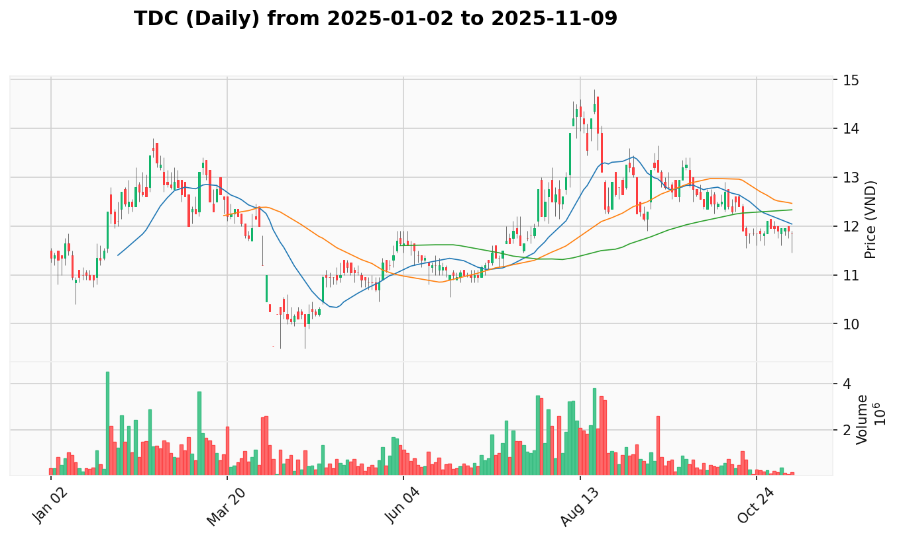

<a href="#bat-dong-san">↑ Back to group BAT_DONG_SAN</a>  |  <a href="#vpa-signal-summary">↑ Back to Top</a>

#### Key Statistics
| Metric | Value |
|:---|---:|
| Date Range | 2025-01-02 to 2025-11-07 |
| **Latest Close** | **11.85** |
| Period Open | 11.5 |
| Period High | 14.8 |
| Period Low | 9.49 |
| Period Change % | 3.04% |

**[Download TDC Data (.csv)](market_data/TDC_2025-01-02_to_2025-11-09.csv)**

---

### TDM

#### [VPA Analysis (2025-08-14 - 2025-10-21)](./VPA.md#tdm)
> **Ngày 2025-10-15:** TDM giữ vững mức giá 58.0 VND, sau phiên kiểm tra cung thành công ngày 2025-10-14. Biên độ giá trong phiên cực kỳ hẹp, cho thấy sự cân bằng giữa cung và cầu. Khối lượng giao dịch đạt 0.008 triệu cổ phiếu, cao hơn đáng kể so với phiên kiểm tra cung trước đó (0.0025 triệu cổ phiếu) nhưng thấp hơn phiên lực cầu xuất hiện ngày 2025-10-10 (0.0113 triệu cổ phiếu). Việc giá duy trì ổn định ở mức 58.0 VND với khối lượng vừa phải sau khi lực cung đã được kiểm tra cho thấy áp lực bán đã giảm đi đáng kể và thị trường đang hấp thụ lượng cung còn lại. Đây là dấu hiệu tích cực, xác nhận sự cạn kiệt của lực cung và khả năng giá sẽ tiếp tục tăng. **Phân tích VPA/Wyckoff:** Absorption (Hấp thụ cung)
> **Ngày 2025-10-16:** TDM giảm từ 58.0 VND xuống 57.0 VND với khối lượng giao dịch cực kỳ thấp, chỉ đạt 0.0003 triệu cổ phiếu. Biên độ giá trong phiên rất hẹp (Open=High=Low=Close=57.0 VND), cho thấy sự thiếu vắng cả lực mua và lực bán đáng kể. Sau phiên hấp thụ cung thành công ngày 2025-10-15, việc giá giảm nhẹ với khối lượng cạn kiệt cho thấy áp lực bán đã gần như không còn. Đây là dấu hiệu của sự cạn kiệt nguồn cung và thiếu vắng lực bán, có thể là một phiên kiểm tra lại mức hỗ trợ hoặc một dấu hiệu của sự thờ ơ từ thị trường trước khi có động thái rõ ràng hơn. **Phân tích VPA/Wyckoff:** Cạn kiệt nguồn cung
> **Ngày 2025-10-17:** TDM mở cửa ở mức 56.5 VND, sau đó phục hồi mạnh mẽ và đóng cửa tại 58.0 VND, giữ vững mức giá đóng cửa của phiên trước. Biên độ giá trong phiên rộng, cho thấy lực cầu đã hấp thụ thành công áp lực bán. Khối lượng giao dịch đạt 0.1519 triệu cổ phiếu, cao hơn đáng kể so với các phiên gần đây, xác nhận sự tham gia của dòng tiền lớn. Đây là dấu hiệu tích cực cho thấy sự cạn kiệt nguồn cung và sự trở lại của lực cầu. **Phân tích VPA/Wyckoff:** Sign of Strength (SOS) - Lực cầu mạnh mẽ.
> **Ngày 2025-10-20:** TDM giảm từ 58.0 VND xuống 56.0 VND với khối lượng giao dịch cực kỳ thấp, chỉ đạt 0.0495 triệu cổ phiếu. Biên độ giá trong phiên hẹp (từ 56.0 VND đến 56.5 VND), cho thấy sự thiếu vắng cả lực mua và lực bán đáng kể. Sau phiên Sign of Strength (SOS) ngày 2025-10-17, việc giá giảm mạnh với khối lượng cạn kiệt cho thấy áp lực bán không quá lớn nhưng lực cầu cũng chưa đủ mạnh để giữ giá. Đây có thể là một phiên kiểm tra lại mức hỗ trợ hoặc dấu hiệu của sự thiếu quyết đoán từ thị trường. **Phân tích VPA/Wyckoff:** Test (Kiểm tra)
> **Ngày 2025-10-21:** TDM tăng từ 56.0 VND lên 57.5 VND với khối lượng giao dịch cực kỳ thấp, chỉ đạt 0.0022 triệu cổ phiếu. Biên độ giá trong phiên rất hẹp, cho thấy sự thiếu quyết đoán của thị trường. Sau phiên kiểm tra (Test) ngày 2025-10-20, việc giá tăng trở lại nhưng với khối lượng còn cạn kiệt hơn cho thấy lực cầu yếu và không có sự xác nhận từ dòng tiền lớn. **Phân tích VPA/Wyckoff:** Lack of Demand (Thiếu hụt nhu cầu)

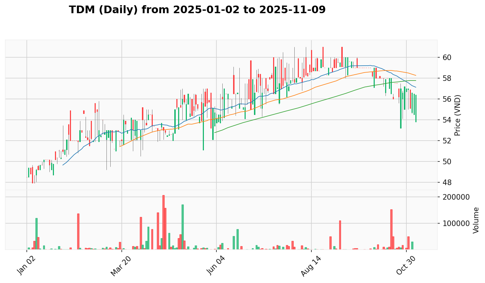

<a href="#others">↑ Back to group OTHERS</a>  |  <a href="#vpa-signal-summary">↑ Back to Top</a>

#### Key Statistics
| Metric | Value |
|:---|---:|
| Date Range | 2025-01-02 to 2025-11-06 |
| **Latest Close** | **56.4** |
| Period Open | 48.51 |
| Period High | 61.0 |
| Period Low | 47.93 |
| Period Change % | 16.26% |

**[Download TDM Data (.csv)](market_data/TDM_2025-01-02_to_2025-11-09.csv)**

---

### TIG

#### [VPA Analysis (2025-08-14 - 2025-10-21)](./VPA.md#tig)
> **Ngày 2025-10-15:** TIG giữ nguyên mức giá 8.3 VND, với khối lượng giao dịch đạt 0.7703 triệu cổ phiếu, tăng so với phiên trước. Nến có biên độ tương đối rộng và đóng cửa ở mức giá mở cửa, cho thấy sự lưỡng lự giữa bên mua và bên bán. Sau phiên "Sign of Weakness" trước đó, việc giá không tăng dù khối lượng gia tăng cho thấy nỗ lực đẩy giá lên không đạt kết quả, hoặc lực cầu chưa đủ mạnh để hấp thụ hết nguồn cung. **Phân tích VPA/Wyckoff:** Effort without Result (EWR)
> **Ngày 2025-10-16:** TIG giảm từ 8.3 VND xuống 8.2 VND, với khối lượng giao dịch đạt 0.4092 triệu cổ phiếu, giảm đáng kể so với phiên trước. Nến có biên độ hẹp và đóng cửa ở mức thấp nhất phiên, cho thấy lực cung vẫn chiếm ưu thế nhưng với cường độ giảm. Sau các phiên "Sign of Weakness" và "Effort without Result", việc giá tiếp tục giảm với khối lượng thấp cho thấy thiếu vắng lực cầu hỗ trợ. **Phân tích VPA/Wyckoff:** No Demand
> **Ngày 2025-10-17:** TIG giảm từ 8.3 VND xuống 8.2 VND, với khối lượng giao dịch đạt 0.7187 triệu cổ phiếu, tăng so với phiên trước. Nến có biên độ tương đối rộng và đóng cửa gần mức thấp nhất phiên, cho thấy áp lực bán gia tăng. Sau các phiên "Effort without Result" và "No Demand", việc giá tiếp tục giảm với khối lượng gia tăng xác nhận rằng lực cung vẫn đang chiếm ưu thế trên thị trường. **Phân tích VPA/Wyckoff:** Sign of Weakness (SOW)
> **Ngày 2025-10-20:** TIG giảm từ 8.2 VND xuống 7.4 VND, với khối lượng giao dịch đạt 1.5653 triệu cổ phiếu, tăng mạnh so với phiên trước. Nến có biên độ rộng và đóng cửa ở mức thấp nhất phiên, cho thấy áp lực bán rất mạnh và sự tiếp diễn của xu hướng giảm. **Phân tích VPA/Wyckoff:** Sign of Weakness (SOW)
> **Ngày 2025-10-21:** TIG tăng từ 7.2 VND lên 7.7 VND, với khối lượng giao dịch đạt 1.9544 triệu cổ phiếu, tăng mạnh so với phiên trước. Nến có biên độ rộng và đóng cửa gần mức cao nhất phiên, cho thấy lực cầu đã quay trở lại và hấp thụ áp lực bán sau hai phiên giảm mạnh liên tiếp. **Phân tích VPA/Wyckoff:** Sign of Strength (SOS) - Lực cầu mạnh mẽ với khối lượng gia tăng sau giai đoạn suy yếu.

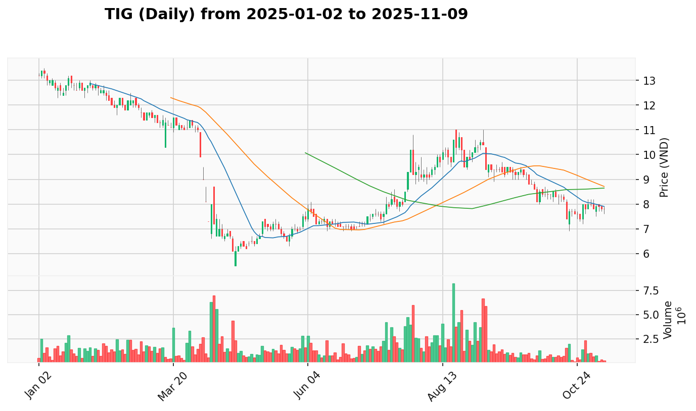

<a href="#others">↑ Back to group OTHERS</a>  |  <a href="#vpa-signal-summary">↑ Back to Top</a>

#### Key Statistics
| Metric | Value |
|:---|---:|
| Date Range | 2025-01-02 to 2025-11-07 |
| **Latest Close** | **7.8** |
| Period Open | 13.2 |
| Period High | 13.5 |
| Period Low | 5.5 |
| Period Change % | -40.91% |

**[Download TIG Data (.csv)](market_data/TIG_2025-01-02_to_2025-11-09.csv)**

---

### TIP

#### [VPA Analysis (2025-08-04 - 2025-10-21)](./VPA.md#tip)
> **Ngày 2025-10-15:** TIP mở cửa ở 19.2 VND và đóng cửa ở 19.1 VND, giảm nhẹ so với mức đóng cửa 19.2 VND của phiên trước. Biên độ giá trong phiên hẹp (từ 19.0 VND đến 19.25 VND) và giá đóng cửa nằm gần mức thấp nhất phiên. Khối lượng giao dịch đạt 0.0931 triệu cổ phiếu, tăng so với phiên trước (0.0862 triệu cổ phiếu). Sau phiên 'Cung xuất hiện' ngày hôm qua, giá tiếp tục giảm với khối lượng gia tăng, cho thấy áp lực bán đang mạnh lên và cung đang chiếm ưu thế so với cầu. **Phân tích VPA/Wyckoff:** Selling Pressure - Áp lực bán.
> **Ngày 2025-10-16:** TIP mở cửa ở 19.1 VND và đóng cửa ở 19.05 VND, giảm nhẹ so với mức đóng cửa 19.1 VND của phiên trước. Biên độ giá trong phiên cực kỳ hẹp (từ 19.0 VND đến 19.1 VND) và giá đóng cửa nằm gần mức thấp nhất phiên. Khối lượng giao dịch đạt 0.0217 triệu cổ phiếu, giảm mạnh so với phiên trước (0.0931 triệu cổ phiếu) và là mức thấp nhất trong 10 phiên gần đây. Sau phiên 'Áp lực bán' ngày hôm qua, giá tiếp tục giảm nhẹ với khối lượng cạn kiệt, cho thấy áp lực bán đã giảm đáng kể và cung không còn mạnh mẽ ở mức giá này. Đây có thể là dấu hiệu của việc cạn kiệt nguồn cung, chuẩn bị cho một sự thay đổi xu hướng hoặc một đợt kiểm tra cung cầu tiếp theo. **Phân tích VPA/Wyckoff:** No Supply - Cạn kiệt nguồn cung.
> **Ngày 2025-10-17:** TIP mở cửa ở 18.9 VND và đóng cửa ở 18.8 VND, giảm so với mức đóng cửa 19.0 VND của phiên trước. Biên độ giá trong phiên hẹp (từ 18.8 VND đến 19.0 VND) và giá đóng cửa nằm ở mức thấp nhất phiên. Khối lượng giao dịch đạt 0.0335 triệu cổ phiếu, tăng so với phiên trước (0.0217 triệu cổ phiếu). Sau phiên 'Cạn kiệt nguồn cung' ngày hôm qua, giá tiếp tục giảm với khối lượng gia tăng, cho thấy áp lực bán vẫn còn hoặc đã xuất hiện trở lại, ngăn cản sự phục hồi. **Phân tích VPA/Wyckoff:** Selling Pressure - Áp lực bán.
> **Ngày 2025-10-20:** TIP mở cửa ở 18.85 VND và đóng cửa ở 18.4 VND, giảm mạnh so với mức đóng cửa 18.8 VND của phiên trước. Biên độ giá trong phiên rộng (từ 18.4 VND đến 19.0 VND) và giá đóng cửa nằm ở mức thấp nhất phiên. Khối lượng giao dịch đạt 0.1847 triệu cổ phiếu, tăng đáng kể so với phiên trước (0.0335 triệu cổ phiếu) và là mức cao nhất trong nhiều phiên gần đây. Sau phiên 'Áp lực bán' ngày 2025-10-17, giá tiếp tục giảm mạnh với khối lượng gia tăng đột biến, cho thấy áp lực bán rất lớn đang đẩy giá xuống và nguồn cung đang chiếm ưu thế hoàn toàn. Đây là dấu hiệu của sự phân phối hoặc tiếp tục xu hướng giảm. **Phân tích VPA/Wyckoff:** Áp lực bán mạnh mẽ.
> **Ngày 2025-10-21:** TIP mở cửa ở 18.4 VND và đóng cửa ở 18.5 VND, tăng nhẹ so với mức đóng cửa 18.4 VND của phiên trước. Biên độ giá trong phiên hẹp (từ 18.1 VND đến 18.55 VND) và giá đóng cửa nằm ở mức cao nhất phiên. Khối lượng giao dịch đạt 0.0532 triệu cổ phiếu, giảm mạnh so với phiên trước (0.1847 triệu cổ phiếu) và là mức thấp nhất trong nhiều phiên gần đây. Sau hai phiên giảm mạnh với áp lực bán gia tăng, phiên hôm nay giá tăng nhẹ với khối lượng rất thấp. Điều này cho thấy áp lực bán đã tạm thời suy yếu, nhưng cũng không có lực cầu mạnh mẽ nào xuất hiện để đẩy giá lên. **Phân tích VPA/Wyckoff:** No Demand - Thiếu vắng nhu cầu.

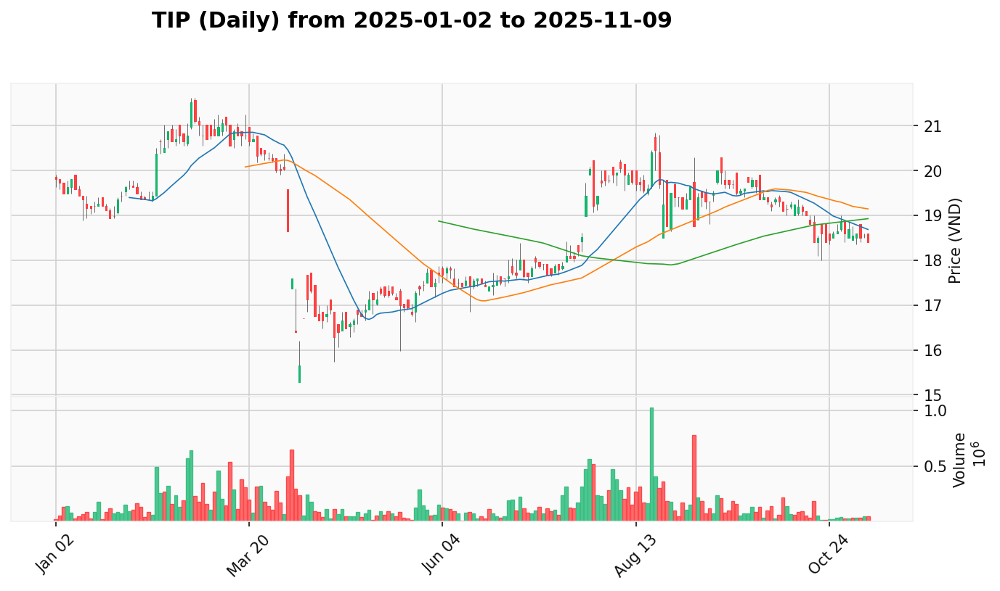

<a href="#bat-dong-san-kcn">↑ Back to group BAT_DONG_SAN_KCN</a>  |  <a href="#vpa-signal-summary">↑ Back to Top</a>

#### Key Statistics
| Metric | Value |
|:---|---:|
| Date Range | 2025-01-02 to 2025-11-07 |
| **Latest Close** | **18.4** |
| Period Open | 19.86 |
| Period High | 21.62 |
| Period Low | 15.28 |
| Period Change % | -7.35% |

**[Download TIP Data (.csv)](market_data/TIP_2025-01-02_to_2025-11-09.csv)**

---

### TLD

#### [VPA Analysis (2025-08-12 - 2025-10-21)](./VPA.md#tld)
> **Ngày 2025-10-15:** TLD mở cửa ở mức 8.18 VND và đóng cửa ở mức 8.09 VND, giảm từ 8.18 VND xuống 8.09 VND so với phiên trước đó. Cây nến giảm có biên độ hẹp (từ 8.08 VND đến 8.19 VND) và đóng cửa gần mức thấp nhất phiên. Khối lượng giao dịch đạt 0.2331 triệu cổ phiếu, giảm mạnh so với phiên trước (0.456 triệu cổ phiếu) và ở mức rất thấp. Sau phiên "Sign of Strength" trước đó, sự giảm giá nhẹ đi kèm với khối lượng rất thấp cho thấy lực cầu không duy trì được đà tăng và thị trường đang thiếu vắng sự tham gia mạnh mẽ từ người mua. **Phân tích VPA/Wyckoff:** No Demand (ND) - Thiếu vắng lực cầu.
> **Ngày 2025-10-16:** TLD mở cửa ở mức 8.17 VND và đóng cửa ở mức 8.13 VND, tăng từ 8.09 VND lên 8.13 VND so với phiên trước đó. Cây nến giảm có biên độ hẹp (từ 8.1 VND đến 8.17 VND) và đóng cửa gần mức thấp nhất phiên. Khối lượng giao dịch đạt 0.1468 triệu cổ phiếu, giảm mạnh so với phiên trước (0.2331 triệu cổ phiếu) và ở mức cực kỳ thấp. Sau phiên "No Demand" trước đó, sự tăng giá nhẹ đi kèm với khối lượng cực kỳ thấp cho thấy lực cầu vẫn chưa quay trở lại một cách mạnh mẽ và thị trường vẫn đang thiếu vắng sự tham gia. **Phân tích VPA/Wyckoff:** No Demand (ND) - Thiếu vắng lực cầu.
> **Ngày 2025-10-17:** TLD mở cửa ở mức 8.12 VND và đóng cửa ở mức 8.12 VND, giữ nguyên so với phiên trước đó. Cây nến có biên độ hẹp (từ 8.04 VND đến 8.13 VND) và đóng cửa ngang giá mở cửa, cho thấy sự lưỡng lự. Khối lượng giao dịch đạt 0.3538 triệu cổ phiếu, tăng đáng kể so với phiên trước (0.2202 triệu cổ phiếu). Sau hai phiên "No Demand" với khối lượng rất thấp, sự tăng khối lượng nhưng giá không đổi cho thấy thị trường đang có sự giằng co giữa cung và cầu, chưa có bên nào chiếm ưu thế rõ rệt. **Phân tích VPA/Wyckoff:** Indecision (Lưỡng lự) - Nỗ lực nhưng không có kết quả rõ ràng.
> **Ngày 2025-10-20:** TLD mở cửa ở mức 8.11 VND và đóng cửa ở mức 8.0 VND, giảm từ 8.12 VND xuống 8.0 VND so với phiên trước đó. Cây nến giảm có biên độ tương đối rộng (từ 7.9 VND đến 8.12 VND) và đóng cửa gần mức thấp nhất phiên. Khối lượng giao dịch đạt 0.4388 triệu cổ phiếu, tăng đáng kể so với phiên trước (0.3538 triệu cổ phiếu). Sau phiên "Indecision" trước đó, sự giảm giá đi kèm với khối lượng tăng cho thấy áp lực bán đang gia tăng và cung đang chiếm ưu thế trên thị trường. **Phân tích VPA/Wyckoff:** Selling Pressure (Áp lực bán) - Cung đang áp đảo cầu.
> **Ngày 2025-10-21:** TLD mở cửa ở mức 7.97 VND và đóng cửa ở mức 8.03 VND, tăng nhẹ so với phiên trước đó (từ 8.0 VND lên 8.03 VND). Cây nến tăng có biên độ hẹp (từ 7.93 VND đến 8.03 VND) và đóng cửa ở mức cao nhất phiên. Khối lượng giao dịch đạt 0.2203 triệu cổ phiếu, giảm đáng kể so với phiên trước (0.4388 triệu cổ phiếu). Sau phiên "Áp lực bán" với khối lượng lớn, sự tăng giá nhẹ đi kèm với khối lượng giảm mạnh cho thấy lực bán đã tạm thời suy yếu, nhưng lực cầu cũng chưa đủ mạnh để đẩy giá lên cao hơn một cách bền vững. **Phân tích VPA/Wyckoff:** No Demand (Không có cầu) - Lực cầu yếu, giá tăng nhẹ với khối lượng thấp sau áp lực bán.

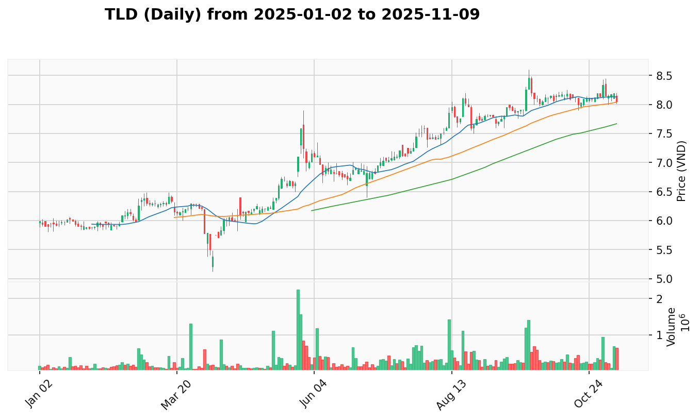

<a href="#xay-dung">↑ Back to group XAY_DUNG</a>  |  <a href="#vpa-signal-summary">↑ Back to Top</a>

#### Key Statistics
| Metric | Value |
|:---|---:|
| Date Range | 2025-01-02 to 2025-11-07 |
| **Latest Close** | **8.05** |
| Period Open | 5.96 |
| Period High | 8.6 |
| Period Low | 5.12 |
| Period Change % | 35.07% |

**[Download TLD Data (.csv)](market_data/TLD_2025-01-02_to_2025-11-09.csv)**

---

### TLH

#### [VPA Analysis (2025-08-14 - 2025-10-21)](./VPA.md#tlh)
> **Ngày 2025-10-15:** TLH mở cửa ở 5.5 VND và đóng cửa ở 5.46 VND, giữ nguyên mức giá đóng cửa so với phiên trước. Biên độ giá trong phiên hẹp (từ 5.4 VND đến 5.5 VND). Khối lượng giao dịch đạt 0.2903 triệu cổ phiếu, giảm đáng kể so với phiên trước (0.4614 triệu cổ phiếu). Sau hai phiên giảm giá mạnh với khối lượng lớn, phiên này cho thấy sự chững lại của đà giảm. Mặc dù giá không giảm thêm, nhưng việc không thể tăng trở lại trên khối lượng thấp cho thấy lực cầu vẫn còn yếu và thị trường đang trong giai đoạn thiếu động lực. Đây có thể là một dấu hiệu của sự tạm dừng trong xu hướng giảm, nhưng chưa có tín hiệu đảo chiều rõ ràng. **Phân tích VPA/Wyckoff:** No Demand (ND) - Lực bán giảm nhưng lực cầu chưa đủ mạnh để đẩy giá lên.
> **Ngày 2025-10-16:** TLH mở cửa ở 5.39 VND, tăng lên 5.58 VND nhưng đóng cửa ở 5.46 VND, bằng với giá đóng cửa phiên trước. Biên độ giá trong phiên rộng nhưng giá đóng cửa nằm ở giữa, cho thấy sự lưỡng lự. Khối lượng giao dịch chỉ đạt 0.1875 triệu cổ phiếu, giảm mạnh so với phiên trước (0.2903 triệu cổ phiếu) và là mức rất thấp. Điều này cho thấy nỗ lực đẩy giá lên không được hỗ trợ bởi lực cầu mạnh mẽ, củng cố thêm tình trạng thiếu động lực của thị trường sau các phiên giảm giá trước đó. **Phân tích VPA/Wyckoff:** No Demand (ND) - Lực cầu vẫn yếu và không đủ để đẩy giá lên.
> **Ngày 2025-10-17:** TLH mở cửa ở 5.5 VND và đóng cửa ở 5.48 VND, giảm nhẹ 0.01 VND so với phiên trước (5.49 VND). Biên độ giá trong phiên là 0.1 VND (từ 5.45 VND đến 5.55 VND). Khối lượng giao dịch đạt 0.499 triệu cổ phiếu, tăng đáng kể so với phiên trước (0.3056 triệu cổ phiếu). Việc giá giảm nhẹ trên khối lượng tăng mạnh cho thấy áp lực bán gia tăng và lực cầu chưa đủ mạnh để hấp thụ. Điều này củng cố thêm tín hiệu về sự yếu kém của thị trường sau các phiên "No Demand" trước đó. **Phân tích VPA/Wyckoff:** Selling Pressure (Áp lực bán)
> **Ngày 2025-10-20:** TLH mở cửa ở 5.47 VND, tăng lên 5.48 VND nhưng sau đó giảm mạnh và đóng cửa ở mức thấp nhất phiên là 5.25 VND. Biên độ giá trong phiên rất rộng và giá đóng cửa nằm ở mức thấp nhất, cho thấy áp lực bán rất mạnh. Khối lượng giao dịch đạt 0.4624 triệu cổ phiếu, giảm nhẹ so với phiên trước (0.499 triệu cổ phiếu) nhưng vẫn ở mức cao, xác nhận sự tiếp diễn của lực bán. Điều này củng cố thêm tín hiệu yếu kém của thị trường sau các phiên giảm giá và áp lực bán trước đó. **Phân tích VPA/Wyckoff:** Selling Pressure (Áp lực bán)
> **Ngày 2025-10-21:** TLH mở cửa ở 5.2 VND và đóng cửa ở 5.24 VND, giảm nhẹ 0.01 VND so với phiên trước (5.25 VND). Biên độ giá trong phiên là 0.19 VND (từ 5.11 VND đến 5.3 VND). Khối lượng giao dịch đạt 0.2638 triệu cổ phiếu, giảm đáng kể so với phiên trước (0.4624 triệu cổ phiếu). Mặc dù khối lượng giảm, giá vẫn đóng cửa dưới mức đóng cửa của phiên trước, cho thấy áp lực bán vẫn còn nhưng đã suy yếu hơn. Điều này củng cố thêm tín hiệu về sự yếu kém của thị trường sau các phiên "Selling Pressure" trước đó và thiếu vắng lực cầu. **Phân tích VPA/Wyckoff:** No Demand (Không có lực cầu)

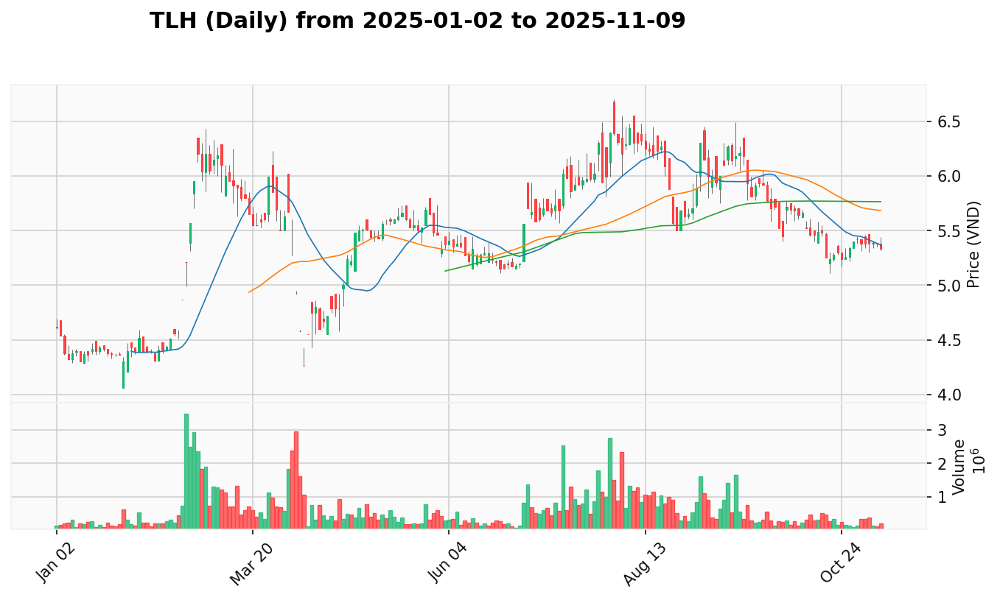

<a href="#thep">↑ Back to group THEP</a>  |  <a href="#vpa-signal-summary">↑ Back to Top</a>

#### Key Statistics
| Metric | Value |
|:---|---:|
| Date Range | 2025-01-02 to 2025-11-07 |
| **Latest Close** | **5.33** |
| Period Open | 4.61 |
| Period High | 6.7 |
| Period Low | 4.06 |
| Period Change % | 15.62% |

**[Download TLH Data (.csv)](market_data/TLH_2025-01-02_to_2025-11-09.csv)**

---

### TNG

#### [VPA Analysis (2025-06-26 - 2025-10-21)](./VPA.md#tng)
> **Ngày 2025-10-15:** TNG mở cửa ở 19.2 VND, cố gắng tăng lên 19.4 VND nhưng sau đó giảm mạnh và đóng cửa ở mức thấp nhất phiên là 18.6 VND. So với phiên trước, giá giảm từ 19.0 VND xuống 18.6 VND. Thanh nến có biên độ rộng, cho thấy áp lực bán mạnh mẽ. Khối lượng giao dịch đạt 0.6177 triệu cổ phiếu, thấp hơn so với phiên trước (0.7175 triệu cổ phiếu) nhưng vẫn ở mức cao, xác nhận lực cung vẫn đang chiếm ưu thế và đẩy giá xuống. Điều này tiếp tục củng cố dấu hiệu yếu kém của thị trường sau các phiên "Nỗ lực tăng giá thất bại" và "Dấu hiệu yếu kém" trước đó. **Phân tích VPA/Wyckoff:** Sign of Weakness (SOW) - Lực cung tiếp tục chiếm ưu thế.
> **Ngày 2025-10-16:** TNG giảm từ 18.6 VND xuống 18.4 VND với thanh nến có biên độ hẹp (từ 18.4 VND đến 18.8 VND) và đóng cửa ở mức thấp nhất phiên. Khối lượng giao dịch đạt 0.5193 triệu cổ phiếu, thấp hơn so với phiên trước (0.6177 triệu cổ phiếu). Mặc dù khối lượng giảm, việc giá tiếp tục giảm và đóng cửa ở mức thấp nhất phiên sau các phiên yếu kém trước đó cho thấy lực cung vẫn đang chiếm ưu thế và xu hướng giảm giá tiếp diễn. **Phân tích VPA/Wyckoff:** Sign of Weakness (SOW) - Xu hướng giảm giá tiếp diễn.
> **Ngày 2025-10-17:** TNG giảm từ 18.6 VND xuống 18.5 VND với thanh nến có biên độ hẹp (từ 18.4 VND đến 18.7 VND) và đóng cửa gần mức thấp nhất phiên. Khối lượng giao dịch đạt 0.4949 triệu cổ phiếu, thấp hơn đáng kể so với phiên trước (0.9785 triệu cổ phiếu). Mặc dù giá tiếp tục giảm nhẹ, khối lượng thấp cho thấy áp lực bán đã giảm bớt, nhưng cũng không có lực cầu mạnh mẽ để đẩy giá lên. Điều này có thể là một dấu hiệu của sự tạm lắng trong xu hướng giảm giá hoặc thiếu sự quan tâm từ cả bên mua và bên bán. **Phân tích VPA/Wyckoff:** Sign of Weakness (SOW) - Thiếu cầu.
> **Ngày 2025-10-20:** TNG giảm từ 18.6 VND xuống 18.1 VND với thanh nến có biên độ rộng (từ 18.1 VND đến 18.9 VND) và đóng cửa ở mức thấp nhất phiên. Khối lượng giao dịch đạt 1.1341 triệu cổ phiếu, cao hơn đáng kể so với phiên trước (0.4949 triệu cổ phiếu). Sự sụt giảm mạnh về giá đi kèm với khối lượng tăng cho thấy áp lực bán mạnh mẽ và xu hướng giảm giá tiếp diễn. **Phân tích VPA/Wyckoff:** Sign of Weakness (SOW) - Áp lực bán mạnh.
> **Ngày 2025-10-21:** TNG tăng từ 18.1 VND lên 18.3 VND với thanh nến có biên độ hẹp (từ 17.9 VND đến 18.4 VND) và đóng cửa gần mức cao nhất phiên. Khối lượng giao dịch đạt 0.7759 triệu cổ phiếu, thấp hơn đáng kể so với phiên trước (1.1341 triệu cổ phiếu). Sau phiên giảm mạnh với khối lượng lớn ngày 2025-10-20, phiên này cho thấy sự phục hồi nhẹ nhưng với khối lượng thấp, cho thấy lực cầu yếu và thiếu sự xác nhận cho một xu hướng tăng bền vững. Điều này có thể là một phản ứng kỹ thuật hoặc sự tạm lắng của áp lực bán, nhưng chưa có dấu hiệu của sự đảo chiều mạnh mẽ. **Phân tích VPA/Wyckoff:** Sign of Weakness (SOW) - Thiếu cầu.

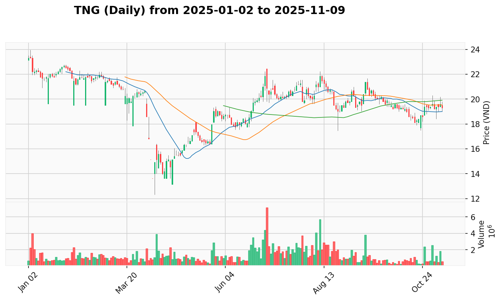

<a href="#det-may">↑ Back to group DET_MAY</a>  |  <a href="#vpa-signal-summary">↑ Back to Top</a>

#### Key Statistics
| Metric | Value |
|:---|---:|
| Date Range | 2025-01-02 to 2025-11-07 |
| **Latest Close** | **19.3** |
| Period Open | 23.13 |
| Period High | 23.96 |
| Period Low | 12.32 |
| Period Change % | -16.56% |

**[Download TNG Data (.csv)](market_data/TNG_2025-01-02_to_2025-11-09.csv)**

---

### TNH

#### [VPA Analysis (2025-08-14 - 2025-10-21)](./VPA.md#tnh)
> **Ngày 2025-10-15:** TNH giảm từ 12.85 VND xuống 12.8 VND. Giá mở cửa 12.95 VND, đóng cửa 12.8 VND, với biên độ giá hẹp (từ 12.8 VND đến 13.0 VND) và đóng cửa ở mức thấp nhất trong ngày. Khối lượng giao dịch đạt 0.1192 triệu cổ phiếu, giảm đáng kể so với phiên trước (0.4402 triệu cổ phiếu) và thấp hơn mức trung bình gần đây. Mặc dù giá tiếp tục giảm và đóng cửa ở mức thấp nhất, khối lượng giao dịch thấp cho thấy áp lực bán đã giảm bớt sau phiên bán tháo mạnh ngày 2025-10-14. Tuy nhiên, sự thiếu vắng lực cầu mạnh mẽ ở mức giá thấp này vẫn là một dấu hiệu của sự yếu kém, cho thấy thị trường vẫn đang trong giai đoạn điều chỉnh hoặc tích lũy lại. **Phân tích VPA/Wyckoff:** Weakness (Yếu kém)
> **Ngày 2025-10-16:** TNH giảm nhẹ từ 12.85 VND xuống 12.8 VND. Giá mở cửa 12.85 VND, đóng cửa 12.8 VND, với biên độ giá rất hẹp (từ 12.75 VND đến 12.85 VND) và đóng cửa ở mức thấp nhất trong ngày. Khối lượng giao dịch đạt 0.0612 triệu cổ phiếu, giảm mạnh so với phiên trước (0.1192 triệu cổ phiếu) và là mức rất thấp so với các phiên gần đây. Mặc dù giá vẫn tiếp tục giảm và đóng cửa ở mức thấp nhất, khối lượng giao dịch cực kỳ thấp cho thấy áp lực bán đã cạn kiệt đáng kể sau hai phiên giảm mạnh trước đó. Sự thiếu vắng cả lực bán và lực mua mạnh mẽ ở mức giá này cho thấy thị trường đang trong giai đoạn tạm lắng, có thể là dấu hiệu của sự cạn kiệt nguồn cung trước khi có một động thái giá rõ ràng hơn. **Phân tích VPA/Wyckoff:** Weakness (Yếu kém)
> **Ngày 2025-10-17:** TNH tiếp tục giảm từ 12.65 VND xuống 12.5 VND. Giá mở cửa 12.65 VND, đóng cửa 12.5 VND, với biên độ giá hẹp (từ 12.5 VND đến 12.65 VND) và đóng cửa ở mức thấp nhất trong ngày. Khối lượng giao dịch đạt 0.1127 triệu cổ phiếu, thấp hơn phiên trước (0.123 triệu cổ phiếu) và vẫn ở mức thấp so với trung bình gần đây. Mặc dù giá tiếp tục giảm và đóng cửa ở mức thấp nhất, khối lượng giao dịch thấp cho thấy áp lực bán vẫn còn nhưng không quá mạnh, và thiếu vắng lực cầu mua vào. Điều này cho thấy sự yếu kém tiếp diễn và thị trường vẫn đang trong giai đoạn điều chỉnh hoặc tích lũy lại. **Phân tích VPA/Wyckoff:** Weakness (Yếu kém)
> **Ngày 2025-10-20:** TNH giảm mạnh từ 12.5 VND xuống 11.95 VND. Giá mở cửa 12.5 VND, đóng cửa 11.95 VND, với biên độ giá rộng (từ 11.85 VND đến 12.8 VND) và đóng cửa gần mức thấp nhất trong ngày. Khối lượng giao dịch đạt 0.1916 triệu cổ phiếu, tăng đáng kể so với phiên trước (0.1127 triệu cổ phiếu) và cao hơn mức trung bình gần đây. Sự kết hợp giữa biên độ giá giảm rộng và khối lượng tăng cho thấy áp lực bán mạnh mẽ đang tiếp diễn, xác nhận xu hướng yếu kém của cổ phiếu. **Phân tích VPA/Wyckoff:** Weakness (Yếu kém)
> **Ngày 2025-10-21:** TNH tăng nhẹ từ 11.95 VND lên 12.0 VND. Giá mở cửa 11.85 VND, đóng cửa 12.0 VND, với biên độ giá hẹp (từ 11.85 VND đến 12.3 VND) và đóng cửa ở giữa thân nến. Khối lượng giao dịch đạt 0.1444 triệu cổ phiếu, giảm đáng kể so với phiên trước (0.1916 triệu cổ phiếu) và ở mức thấp. Sau phiên giảm mạnh với khối lượng lớn vào ngày 2025-10-20, sự phục hồi nhẹ với khối lượng thấp cho thấy áp lực bán có thể đã tạm lắng nhưng lực cầu mua vào vẫn yếu. Điều này không xác nhận sự đảo chiều mà có thể là một nhịp điều chỉnh nhỏ trong xu hướng giảm hoặc một đợt kiểm tra cung cầu không thành công. **Phân tích VPA/Wyckoff:** Weakness (Yếu kém)

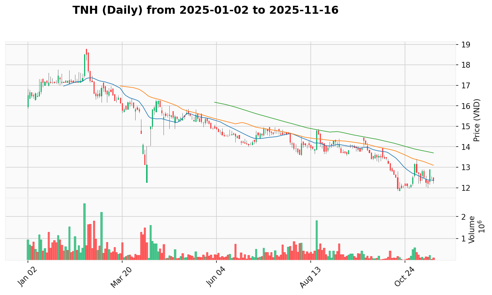

<a href="#suc-khoe">↑ Back to group SUC_KHOE</a>  |  <a href="#vpa-signal-summary">↑ Back to Top</a>

#### Key Statistics
| Metric | Value |
|:---|---:|
| Date Range | 2025-01-02 to 2025-11-07 |
| **Latest Close** | **12.5** |
| Period Open | 15.96 |
| Period High | 18.78 |
| Period Low | 11.85 |
| Period Change % | -21.68% |

**[Download TNH Data (.csv)](market_data/TNH_2025-01-02_to_2025-11-09.csv)**

---

### TNT

#### [VPA Analysis (2025-08-04 - 2025-10-21)](./VPA.md#tnt)
> **Ngày 2025-10-15:** TNT tăng từ 8.27 VND lên 8.3 VND, với khối lượng giao dịch đạt 0.229 triệu cổ phiếu. Giá mở cửa bằng giá thấp nhất phiên (8.27 VND) và đóng cửa gần mức cao nhất phiên (8.53 VND), cho thấy lực cầu tiếp tục chiếm ưu thế. Khối lượng giao dịch tăng nhẹ so với phiên trước (0.1938 triệu cổ phiếu), xác nhận sự tiếp diễn của lực mua sau tín hiệu "Lực cầu xuất hiện" vào ngày 2025-10-14. Điều này cho thấy sự hấp thụ tốt và khả năng giá tiếp tục tăng trong ngắn hạn. **Phân tích VPA/Wyckoff:** Sign of Strength (SOS) - Lực cầu tiếp diễn
> **Ngày 2025-10-16:** TNT giữ nguyên mức giá 8.3 VND, với khối lượng giao dịch cực thấp chỉ đạt 0.0037 triệu cổ phiếu. Giá mở cửa ở mức 8.18 VND và đóng cửa ở mức 8.3 VND, cho thấy một phiên giao dịch với biên độ hẹp và không có sự biến động đáng kể. Khối lượng giao dịch giảm mạnh so với phiên trước (0.229 triệu cổ phiếu) và thấp hơn nhiều so với mức trung bình, cho thấy sự thiếu vắng của cả lực mua và lực bán. Sau hai phiên "Lực cầu xuất hiện" và "Lực cầu tiếp diễn", phiên giao dịch này cho thấy lực cầu đã suy yếu đáng kể, mặc dù giá vẫn giữ được mức ổn định. Đây có thể là một dấu hiệu của sự tạm dừng trong xu hướng tăng ngắn hạn, hoặc thị trường đang chờ đợi thêm thông tin. **Phân tích VPA/Wyckoff:** Thiếu cầu (Lack of Demand)
> **Ngày 2025-10-17:** TNT tăng từ 8.31 VND lên 8.35 VND, với khối lượng giao dịch đạt 0.1831 triệu cổ phiếu. Giá mở cửa (8.3 VND) gần bằng giá thấp nhất (8.27 VND) và đóng cửa ở mức cao nhất phiên (8.35 VND), cho thấy lực cầu mạnh mẽ đã quay trở lại sau phiên thiếu cầu trước đó. Khối lượng giao dịch tăng đáng kể so với phiên 2025-10-16 (0.0381 triệu cổ phiếu), xác nhận sự trở lại của lực mua và khả năng tiếp diễn xu hướng tăng ngắn hạn. **Phân tích VPA/Wyckoff:** Sign of Strength (SOS) - Lực cầu trở lại
> **Ngày 2025-10-20:** TNT giảm nhẹ từ 8.35 VND xuống 8.3 VND, với khối lượng giao dịch rất thấp chỉ đạt 0.0497 triệu cổ phiếu. Giá mở cửa (8.35 VND) và đóng cửa (8.3 VND) cho thấy một phiên giao dịch với biên độ hẹp và không có sự biến động mạnh. Khối lượng giao dịch giảm đáng kể so với phiên trước (0.1831 triệu cổ phiếu), cho thấy lực cung không đáng kể sau phiên "Sign of Strength" trước đó. Điều này có thể là một dấu hiệu của sự kiểm tra lực cung hoặc thiếu vắng áp lực bán. **Phân tích VPA/Wyckoff:** No Supply (NS) - Thiếu cung.
> **Ngày 2025-10-21:** TNT giảm từ 8.3 VND xuống 8.2 VND, với khối lượng giao dịch rất thấp chỉ đạt 0.0245 triệu cổ phiếu. Giá mở cửa (8.3 VND) bằng giá cao nhất (8.3 VND), trong khi giá thấp nhất (7.75 VND) cho thấy có lúc giá đã giảm sâu. Tuy nhiên, giá đóng cửa (8.2 VND) cao hơn giá thấp nhất, cho thấy có lực cầu nhẹ xuất hiện. Khối lượng giao dịch giảm mạnh so với phiên trước (0.0497 triệu cổ phiếu), xác nhận sự thiếu vắng cả lực cung và lực cầu mạnh mẽ. Sau phiên "Thiếu cung" trước đó, việc giá giảm với khối lượng cực thấp cho thấy thị trường đang kiểm tra lại lực cầu hoặc đơn giản là không có áp lực bán đáng kể. **Phân tích VPA/Wyckoff:** No Demand (ND) - Thiếu cầu

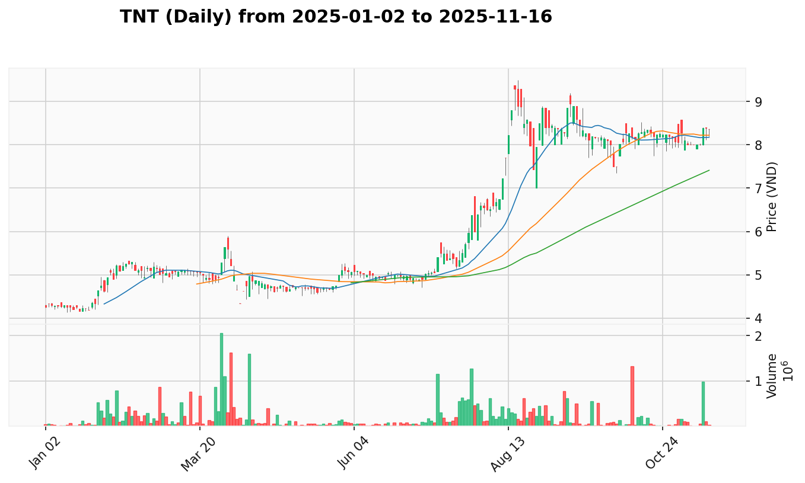

<a href="#khai-khoang">↑ Back to group KHAI_KHOANG</a>  |  <a href="#vpa-signal-summary">↑ Back to Top</a>

#### Key Statistics
| Metric | Value |
|:---|---:|
| Date Range | 2025-01-02 to 2025-11-07 |
| **Latest Close** | **8.0** |
| Period Open | 4.3 |
| Period High | 9.5 |
| Period Low | 4.13 |
| Period Change % | 86.05% |

**[Download TNT Data (.csv)](market_data/TNT_2025-01-02_to_2025-11-09.csv)**

---

### TPB

#### [VPA Analysis (2025-06-16 - 2025-10-21)](./VPA.md#tpb)
> **Ngày 2025-10-15:** TPB tăng từ 19.2 VND lên 19.7 VND (tăng 2.60%) với mở cửa tại 19.2 và đóng cửa tại 19.7, nằm ở nửa trên của biên độ nến. Giá có lúc đạt mức cao 19.85 và mức thấp 19.2. Cây nến xanh có biên độ 0.65 điểm. Khối lượng giao dịch đạt 28.53 triệu cổ phiếu, giảm 30.6% so với phiên trước (từ 41.10 triệu xuống 28.53 triệu). Sau phiên "Lực cung mạnh mẽ" (SYC) với khối lượng tăng đột biến, hành động giá hôm nay cho thấy TPB tăng giá với khối lượng giảm. Việc giá đóng cửa ở nửa trên của nến cho thấy lực cầu đã xuất hiện và hấp thụ một phần lực cung. Tuy nhiên, khối lượng giao dịch giảm cho thấy lực cầu chưa thực sự mạnh mẽ và có thể đang kiểm tra lại nguồn cung sau phiên bán tháo trước đó. Điều này có thể là dấu hiệu của sự cạn kiệt nguồn cung tạm thời. **Phân tích VPA/Wyckoff:** No Supply (NS) - Thiếu vắng nguồn cung.
> **Ngày 2025-10-16:** TPB giảm từ 19.7 VND xuống 19.6 VND (giảm 0.51%) với mở cửa tại 19.85 và đóng cửa tại 19.6, nằm ở nửa dưới của biên độ nến. Giá có lúc đạt mức cao 19.85 và mức thấp 19.5. Cây nến đỏ có biên độ 0.35 điểm. Khối lượng giao dịch đạt 7.58 triệu cổ phiếu, giảm 73.5% so với phiên trước (từ 28.53 triệu xuống 7.58 triệu). Sau phiên "Thiếu vắng nguồn cung" (NS) với khối lượng giảm, hành động giá hôm nay cho thấy TPB giảm nhẹ với khối lượng cực thấp. Điều này cho thấy cả lực cầu và lực cung đều yếu, thị trường đang thiếu động lực. Việc giá đóng cửa ở nửa dưới của nến và khối lượng thấp xác nhận sự thiếu vắng lực cầu trên thị trường. **Phân tích VPA/Wyckoff:** No Demand (ND) - Thiếu vắng lực cầu.
> **Ngày 2025-10-17:** TPB giảm từ 19.75 VND xuống 19.25 VND (giảm 2.53%) với mở cửa tại 19.75 và đóng cửa tại 19.25, nằm ở nửa dưới của biên độ nến. Giá có lúc đạt mức cao 19.8 và mức thấp 19.2. Cây nến đỏ có biên độ 0.6 điểm. Khối lượng giao dịch đạt 18.70 triệu cổ phiếu, tăng 9.16% so với phiên trước (từ 17.13 triệu lên 18.70 triệu). Sau phiên "Thiếu vắng lực cầu" (ND) với khối lượng thấp, hành động giá hôm nay cho thấy TPB giảm mạnh với khối lượng gia tăng. Việc giá đóng cửa ở nửa dưới của nến và khối lượng tăng xác nhận lực cung đang chiếm ưu thế trên thị trường. Điều này cho thấy sự xuất hiện của lực bán mạnh mẽ. **Phân tích VPA/Wyckoff:** Sign of Weakness (SOW) - Lực cung mạnh mẽ.
> **Ngày 2025-10-20:** TPB giảm từ 19.25 VND xuống 17.95 VND (giảm 6.76%) với mở cửa tại 19.25 và đóng cửa tại 17.95, nằm ở cuối biên độ nến. Giá có lúc đạt mức cao 19.25 và mức thấp 17.95. Cây nến đỏ có biên độ 1.3 điểm. Khối lượng giao dịch đạt 26.34 triệu cổ phiếu, tăng 40.86% so với phiên trước (từ 18.70 triệu lên 26.34 triệu). Sau phiên "Lực cung mạnh mẽ" (SOW) với khối lượng gia tăng, hành động giá hôm nay cho thấy TPB giảm mạnh với khối lượng tiếp tục gia tăng. Việc giá đóng cửa ở cuối nến và khối lượng tăng mạnh xác nhận lực cung đang áp đảo hoàn toàn trên thị trường. Điều này cho thấy sự tiếp diễn của lực bán mạnh mẽ. **Phân tích VPA/Wyckoff:** Sign of Weakness (SOW) - Lực cung áp đảo.
> **Ngày 2025-10-21:** TPB tăng từ 17.95 VND lên 18.2 VND (tăng 1.39%) với mở cửa tại 17.8 và đóng cửa tại 18.2, nằm ở nửa trên của biên độ nến. Giá có lúc đạt mức cao 18.4 và mức thấp 17.0. Cây nến xanh có biên độ 1.4 điểm. Khối lượng giao dịch đạt 23.29 triệu cổ phiếu, giảm 11.58% so với phiên trước (từ 26.34 triệu xuống 23.29 triệu). Sau phiên "Lực cung áp đảo" (SOW) với khối lượng gia tăng, hành động giá hôm nay cho thấy TPB tăng nhẹ với khối lượng giảm. Việc giá đóng cửa ở nửa trên của nến nhưng khối lượng giảm cho thấy lực cung đã tạm thời suy yếu, nhưng lực cầu vẫn chưa đủ mạnh để đẩy giá lên bền vững. Điều này có thể là một dấu hiệu của sự thiếu vắng lực cầu. **Phân tích VPA/Wyckoff:** No Demand (ND) - Thiếu vắng lực cầu.

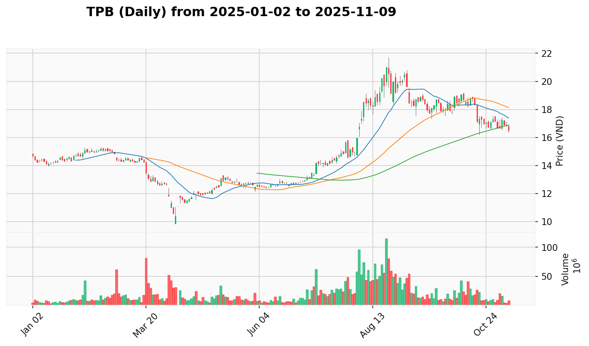

<a href="#ngan-hang">↑ Back to group NGAN_HANG</a>  |  <a href="#vpa-signal-summary">↑ Back to Top</a>

#### Key Statistics
| Metric | Value |
|:---|---:|
| Date Range | 2025-01-02 to 2025-11-07 |
| **Latest Close** | **16.5** |
| Period Open | 14.83 |
| Period High | 21.71 |
| Period Low | 9.85 |
| Period Change % | 11.26% |

**[Download TPB Data (.csv)](market_data/TPB_2025-01-02_to_2025-11-09.csv)**

---

### TSC

#### [VPA Analysis (2025-08-14 - 2025-10-21)](./VPA.md#tsc)
> **Ngày 2025-10-15:** TSC mở cửa tại 3.09 VND, đạt mức cao nhất 3.09 VND nhưng sau đó giảm mạnh xuống mức thấp nhất 2.86 VND và đóng cửa tại 3.03 VND. Giá giảm từ 3.07 VND xuống 3.03 VND với khối lượng giao dịch tăng đáng kể lên 0.3475 triệu cổ phiếu, cao hơn nhiều so với 0.2011 triệu cổ phiếu của phiên trước. Biên độ giá giảm rộng và đóng cửa gần mức thấp nhất phiên với khối lượng lớn cho thấy lực cung đã áp đảo hoàn toàn lực cầu, xác nhận sự suy yếu và khả năng tiếp diễn xu hướng giảm. **Phân tích VPA/Wyckoff:** Sign of Weakness (SOW) - Lực cung áp đảo với khối lượng lớn.
> **Ngày 2025-10-16:** TSC mở cửa tại 3.03 VND, tăng lên mức cao nhất 3.04 VND nhưng sau đó giảm xuống mức thấp nhất 3.01 VND và đóng cửa tại 3.03 VND, giữ nguyên mức giá đóng cửa so với phiên trước. Khối lượng giao dịch giảm mạnh xuống 0.0818 triệu cổ phiếu, thấp hơn đáng kể so với 0.3475 triệu cổ phiếu của phiên trước. Sau phiên giảm mạnh với khối lượng lớn ngày 2025-10-15, phiên hôm nay cho thấy sự tạm lắng của cả lực cung và lực cầu. Giá giữ vững nhưng với biên độ hẹp và khối lượng rất thấp, cho thấy sự thiếu quyết đoán và không có nỗ lực rõ ràng từ cả hai phía, có thể là một giai đoạn tạm dừng sau đợt bán tháo. **Phân tích VPA/Wyckoff:** Thiếu nỗ lực - Giá đi ngang với khối lượng rất thấp sau một đợt giảm.
> **Ngày 2025-10-17:** TSC mở cửa tại 2.98 VND, đạt mức cao nhất 3.03 VND nhưng sau đó giảm xuống mức thấp nhất 2.98 VND và đóng cửa tại 3.0 VND. Giá giảm từ 3.03 VND xuống 3.0 VND với khối lượng giao dịch tăng lên 0.4341 triệu cổ phiếu, cao hơn đáng kể so với phiên trước (0.2441 triệu cổ phiếu) và cả phiên 2025-10-15 (0.3475 triệu cổ phiếu). Biên độ giá hẹp nhưng đóng cửa gần mức thấp nhất phiên với khối lượng lớn cho thấy lực cung tiếp tục chiếm ưu thế, xác nhận sự suy yếu của thị trường. **Phân tích VPA/Wyckoff:** Sign of Weakness (SOW) - Lực cung áp đảo với khối lượng lớn.
> **Ngày 2025-10-20:** TSC mở cửa tại 3.0 VND, đạt mức cao nhất 3.0 VND nhưng sau đó giảm xuống mức thấp nhất 2.8 VND và đóng cửa tại 2.86 VND. Giá giảm từ 3.0 VND xuống 2.86 VND với khối lượng giao dịch tăng lên 0.443 triệu cổ phiếu, cao hơn so với phiên trước (0.4341 triệu cổ phiếu). Biên độ giá rộng và đóng cửa gần mức thấp nhất phiên cho thấy lực cung tiếp tục mạnh mẽ, xác nhận xu hướng giảm giá. **Phân tích VPA/Wyckoff:** Sign of Weakness (SOW) - Lực cung tiếp tục chiếm ưu thế với khối lượng gia tăng.
> **Ngày 2025-10-21:** TSC mở cửa tại 2.86 VND, đạt mức cao nhất 2.88 VND, mức thấp nhất 2.79 VND và đóng cửa tại 2.86 VND. Giá đóng cửa bằng giá mở cửa và bằng giá đóng cửa phiên trước, với biên độ giá hẹp. Khối lượng giao dịch đạt 0.4291 triệu cổ phiếu, thấp hơn một chút so với phiên trước (0.443 triệu cổ phiếu). Sau hai phiên giảm mạnh với tín hiệu SOW, phiên này cho thấy lực bán có dấu hiệu chững lại và thị trường đang kiểm tra cung ở vùng giá thấp hơn. Tuy nhiên, chưa có tín hiệu rõ ràng về sự xuất hiện của lực cầu mạnh. **Phân tích VPA/Wyckoff:** Test for Supply (Kiểm tra cung) - Lực bán chững lại nhưng lực cầu chưa xuất hiện rõ ràng.

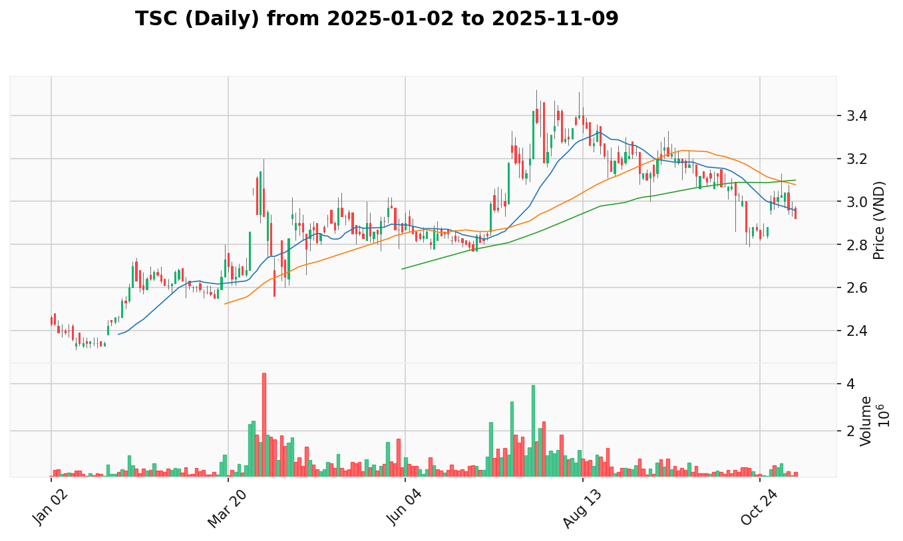

<a href="#nong-nghiep">↑ Back to group NONG_NGHIEP</a>  |  <a href="#vpa-signal-summary">↑ Back to Top</a>

#### Key Statistics
| Metric | Value |
|:---|---:|
| Date Range | 2025-01-02 to 2025-11-07 |
| **Latest Close** | **2.92** |
| Period Open | 2.46 |
| Period High | 3.52 |
| Period Low | 2.31 |
| Period Change % | 18.70% |

**[Download TSC Data (.csv)](market_data/TSC_2025-01-02_to_2025-11-09.csv)**

---

### TTF

#### [VPA Analysis (2025-08-14 - 2025-10-21)](./VPA.md#ttf)
> **Ngày 2025-10-15:** TTF mở cửa ở mức 3.0 VND, sau đó giảm và đóng cửa ở mức 2.96 VND, thấp hơn giá đóng cửa phiên trước. Giá cao nhất và giá mở cửa bằng nhau (3.0 VND), cho thấy áp lực bán xuất hiện ngay từ đầu phiên. Giá đóng cửa gần mức thấp nhất phiên. Khối lượng giao dịch đạt 0.9826 triệu cổ phiếu, giảm nhẹ so với phiên trước nhưng vẫn ở mức cao. Việc giá giảm mạnh từ mức mở cửa và đóng cửa gần mức thấp nhất phiên với khối lượng cao cho thấy áp lực cung tiếp tục chiếm ưu thế và thị trường đang yếu. Nỗ lực phục hồi của phiên 2025-10-13 đã bị phủ nhận hoàn toàn. **Phân tích VPA/Wyckoff:** Supply (Cung)
> **Ngày 2025-10-16:** TTF mở cửa ở mức 2.95 VND, tăng lên 2.96 VND nhưng sau đó giảm mạnh và đóng cửa ở mức 2.89 VND, thấp hơn giá đóng cửa phiên trước. Giá thấp nhất phiên là 2.88 VND. Khối lượng giao dịch đạt 0.9408 triệu cổ phiếu, giảm nhẹ so với phiên trước nhưng vẫn ở mức cao. Việc giá tiếp tục giảm mạnh với biên độ rộng và đóng cửa gần mức thấp nhất phiên, cùng với khối lượng giao dịch cao, cho thấy áp lực cung vẫn đang rất mạnh và thị trường tiếp tục suy yếu. Nỗ lực phục hồi đã bị phủ nhận hoàn toàn trong các phiên gần đây. **Phân tích VPA/Wyckoff:** Supply (Cung)
> **Ngày 2025-10-17:** TTF mở cửa ở mức 2.85 VND, giảm nhẹ và đóng cửa ở mức 2.86 VND, thấp hơn giá đóng cửa phiên trước (2.89 VND). Giá cao nhất là 2.91 VND và thấp nhất là 2.83 VND. Khối lượng giao dịch đạt 0.6208 triệu cổ phiếu, giảm đáng kể so với phiên trước (1.5863 triệu cổ phiếu). Mặc dù giá tiếp tục giảm, nhưng biên độ giảm hẹp và khối lượng giao dịch thấp cho thấy áp lực bán đã giảm bớt đáng kể. Tuy nhiên, việc giá vẫn đóng cửa thấp hơn và không có sự xuất hiện của lực cầu mạnh mẽ cho thấy thị trường vẫn đang trong giai đoạn suy yếu. **Phân tích VPA/Wyckoff:** No Demand (Không có cầu)
> **Ngày 2025-10-20:** TTF mở cửa ở mức 2.85 VND, tăng lên 2.9 VND nhưng sau đó giảm mạnh và đóng cửa ở mức 2.7 VND, thấp hơn đáng kể so với giá đóng cửa phiên trước (2.86 VND). Giá thấp nhất phiên là 2.67 VND. Khối lượng giao dịch đạt 0.8509 triệu cổ phiếu, cao hơn so với phiên trước (0.6208 triệu cổ phiếu). Việc giá giảm mạnh với biên độ rộng và đóng cửa gần mức thấp nhất phiên, cùng với khối lượng giao dịch gia tăng, cho thấy áp lực cung đang rất mạnh và thị trường tiếp tục suy yếu. Nỗ lực phục hồi đã bị phủ nhận hoàn toàn. **Phân tích VPA/Wyckoff:** Supply (Cung)
> **Ngày 2025-10-21:** TTF mở cửa ở mức 2.67 VND, sau đó tăng và đóng cửa ở mức 2.77 VND, cao hơn giá đóng cửa phiên trước (2.7 VND). Giá cao nhất là 2.78 VND và thấp nhất là 2.64 VND. Khối lượng giao dịch đạt 1.0469 triệu cổ phiếu, cao hơn so với phiên trước (0.8509 triệu cổ phiếu). Mặc dù giá mở cửa thấp, nhưng lực cầu đã xuất hiện và đẩy giá đóng cửa tăng, cho thấy sự hấp thụ cung sau phiên giảm mạnh trước đó. Tuy nhiên, mức giá vẫn còn thấp và cần thêm xác nhận cho một xu hướng tăng bền vững. **Phân tích VPA/Wyckoff:** Effort to Rise (Nỗ lực tăng giá)

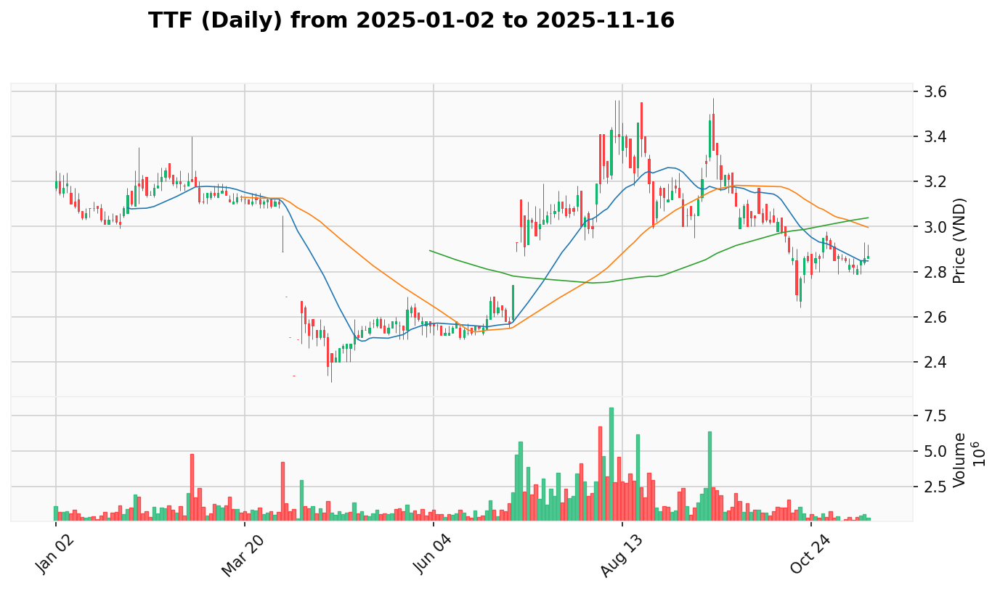

<a href="#others">↑ Back to group OTHERS</a>  |  <a href="#vpa-signal-summary">↑ Back to Top</a>

#### Key Statistics
| Metric | Value |
|:---|---:|
| Date Range | 2025-01-02 to 2025-11-07 |
| **Latest Close** | **2.83** |
| Period Open | 3.17 |
| Period High | 3.57 |
| Period Low | 2.31 |
| Period Change % | -10.73% |

**[Download TTF Data (.csv)](market_data/TTF_2025-01-02_to_2025-11-09.csv)**

---

### TTN

#### [VPA Analysis (2025-08-04 - 2025-10-21)](./VPA.md#ttn)
> **Ngày 2025-10-15:** TTN giảm từ 17.3 VND xuống 16.9 VND với khối lượng giao dịch đạt 0.1891 triệu cổ phiếu. Biên độ giá rộng và đóng cửa ở mức thấp gần nhất phiên, cho thấy áp lực bán vẫn còn. Tuy nhiên, khối lượng giao dịch giảm so với phiên trước đó (0.2642 triệu cổ phiếu), điều này có thể cho thấy lực cung đang có dấu hiệu giảm bớt hoặc lực cầu vẫn còn yếu, chưa đủ để hấp thụ lượng cung hiện có. So với các phiên giảm giá mạnh trước đó, sự sụt giảm về khối lượng cho thấy sự suy yếu trong áp lực bán, nhưng chưa có dấu hiệu rõ ràng của lực cầu quay trở lại. **Phân tích VPA/Wyckoff:** Weakness (W) - Lực cung vẫn chiếm ưu thế, nhưng áp lực bán có thể đang giảm.
> **Ngày 2025-10-16:** TTN tăng nhẹ từ 16.9 VND lên 17.1 VND với khối lượng giao dịch đạt 0.0549 triệu cổ phiếu. Biên độ giá rất hẹp và đóng cửa ở mức thấp nhất phiên, cho thấy sự lưỡng lự của thị trường. Khối lượng giao dịch giảm mạnh so với phiên trước đó (0.1891 triệu cổ phiếu), cho thấy áp lực bán đã giảm đáng kể nhưng lực cầu vẫn còn yếu, chưa đủ để đẩy giá lên cao hơn. Đây có thể là một dấu hiệu tạm dừng trong xu hướng giảm, nhưng chưa xác nhận sự đảo chiều. **Phân tích VPA/Wyckoff:** Weakness (W) - Áp lực bán giảm nhưng lực cầu chưa xuất hiện rõ ràng.
> **Ngày 2025-10-17:** TTN giảm từ 17.3 VND xuống 16.9 VND với khối lượng giao dịch đạt 0.1887 triệu cổ phiếu. Biên độ giá rộng và đóng cửa ở mức thấp gần nhất phiên, cho thấy áp lực bán gia tăng. Khối lượng giao dịch tăng so với phiên trước đó (0.1027 triệu cổ phiếu), xác nhận lực cung đang chiếm ưu thế và đẩy giá xuống. So với phiên trước đó, sự trở lại của khối lượng lớn trong khi giá giảm cho thấy xu hướng giảm vẫn tiếp diễn. **Phân tích VPA/Wyckoff:** Weakness (W) - Áp lực bán mạnh mẽ trở lại.
> **Ngày 2025-10-20:** TTN tăng nhẹ từ 16.9 VND lên 17.0 VND với khối lượng giao dịch đạt 0.1837 triệu cổ phiếu. Biên độ giá tương đối rộng nhưng giá đóng cửa ở mức thấp hơn so với mức cao nhất trong phiên, cho thấy lực cầu chưa thực sự mạnh mẽ. Khối lượng giao dịch giảm nhẹ so với phiên giảm mạnh trước đó (0.1887 triệu cổ phiếu), điều này có thể cho thấy áp lực bán đã giảm bớt một chút, nhưng chưa có dấu hiệu rõ ràng của sự hấp thụ hoặc lực mua chủ động. So với phiên trước đó, sự giảm nhẹ về khối lượng trong khi giá tăng nhẹ và đóng cửa không cao cho thấy thị trường vẫn còn lưỡng lự và chưa có xu hướng rõ ràng. **Phân tích VPA/Wyckoff:** Weakness (W) - Lực cầu yếu và thị trường còn lưỡng lự.
> **Ngày 2025-10-21:** TTN tăng từ 17.0 VND lên 17.2 VND với khối lượng giao dịch đạt 0.1326 triệu cổ phiếu. Biên độ giá tương đối rộng và đóng cửa ở mức cao hơn giá mở cửa, cho thấy có lực cầu nhẹ. Tuy nhiên, khối lượng giao dịch giảm đáng kể so với phiên trước đó (0.1837 triệu cổ phiếu), cho thấy lực mua chưa thực sự mạnh mẽ và bền vững. So với các phiên giảm trước đó, sự giảm về khối lượng trong khi giá tăng nhẹ cho thấy áp lực bán có thể đã giảm bớt, nhưng thị trường vẫn còn lưỡng lự và chưa có dấu hiệu rõ ràng của sự tích lũy hay xu hướng tăng mạnh. **Phân tích VPA/Wyckoff:** No Demand (ND) - Lực cầu yếu và thiếu sự xác nhận từ khối lượng.

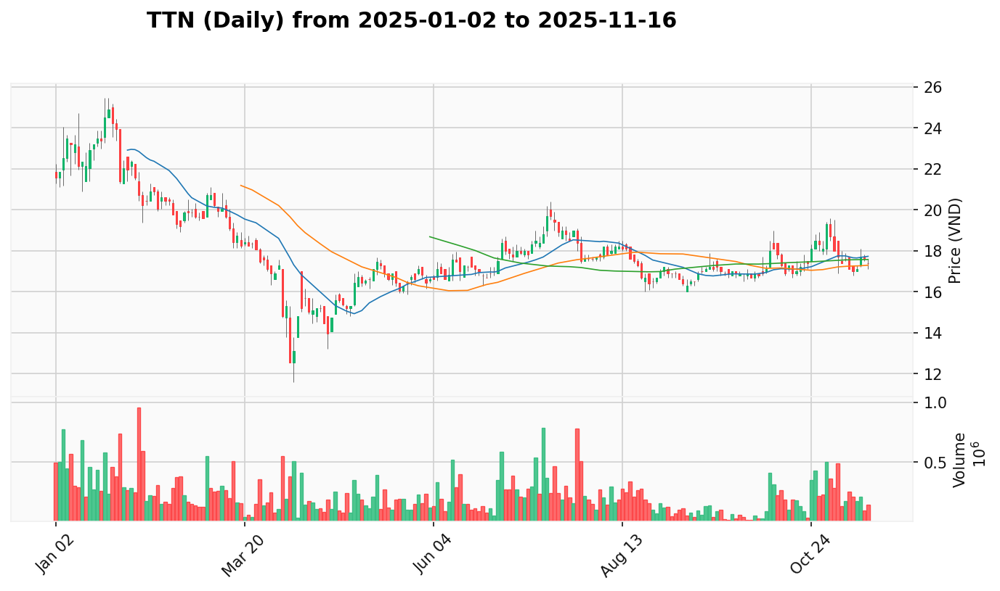

<a href="#cong-nghe">↑ Back to group CONG_NGHE</a>  |  <a href="#vpa-signal-summary">↑ Back to Top</a>

#### Key Statistics
| Metric | Value |
|:---|---:|
| Date Range | 2025-01-02 to 2025-11-07 |
| **Latest Close** | **17.1** |
| Period Open | 21.85 |
| Period High | 25.46 |
| Period Low | 11.59 |
| Period Change % | -21.74% |

**[Download TTN Data (.csv)](market_data/TTN_2025-01-02_to_2025-11-09.csv)**

---

### TV2

#### [VPA Analysis (2025-07-15 - 2025-10-21)](./VPA.md#tv2)
> **Ngày 2025-10-15:** TV2 tiếp tục giảm từ 33.1 VND xuống 32.6 VND (giảm 0.5 VND, tương đương 1.51%). Cây nến có biên độ hẹp (0.7 VND), mở cửa ở mức 33.0 VND và đóng cửa gần mức thấp nhất phiên tại 32.6 VND, cho thấy áp lực bán vẫn còn. Khối lượng giao dịch đạt 0.1776 triệu cổ phiếu, giảm đáng kể so với phiên trước (0.2969 triệu cổ phiếu). Mặc dù giá tiếp tục giảm và đóng cửa gần mức thấp nhất, nhưng khối lượng giảm cho thấy lực cung đã có dấu hiệu suy yếu sau hai phiên bán mạnh, tuy nhiên vẫn chưa có lực cầu đủ mạnh để đảo chiều xu hướng. **Phân tích VPA/Wyckoff:** Selling Pressure (Áp lực bán)
> **Ngày 2025-10-16:** TV2 tiếp tục giảm từ 32.6 VND xuống 31.95 VND (giảm 0.65 VND, tương đương 1.99%). Cây nến có biên độ tương đối rộng (1.15 VND), mở cửa ở mức 32.65 VND và đóng cửa gần mức thấp nhất phiên tại 31.95 VND, cho thấy áp lực bán vẫn duy trì. Khối lượng giao dịch đạt 0.109 triệu cổ phiếu, giảm đáng kể so với phiên trước (0.1776 triệu cổ phiếu) và phiên 2025-10-14 (0.2969 triệu cổ phiếu). Mặc dù khối lượng thấp, việc giá tiếp tục giảm mạnh và đóng cửa ở mức thấp nhất cho thấy lực cung vẫn đang chiếm ưu thế và thiếu vắng lực cầu đỡ giá, xác nhận xu hướng suy yếu tiếp diễn. **Phân tích VPA/Wyckoff:** Selling Pressure (Áp lực bán)
> **Ngày 2025-10-17:** TV2 tiếp tục giảm từ 32.2 VND xuống 31.8 VND (giảm 0.4 VND, tương đương 1.24%). Cây nến có biên độ hẹp (0.75 VND), mở cửa ở mức 31.6 VND và đóng cửa ở mức 31.8 VND, cao hơn giá mở cửa nhưng vẫn thấp hơn giá đóng cửa phiên trước. Khối lượng giao dịch đạt 0.2455 triệu cổ phiếu, tăng so với phiên trước (0.2217 triệu cổ phiếu). Mặc dù có sự phục hồi nhẹ trong phiên, việc giá tiếp tục giảm và khối lượng tăng cho thấy áp lực bán vẫn duy trì và chưa có dấu hiệu đảo chiều rõ ràng. **Phân tích VPA/Wyckoff:** Selling Pressure (Áp lực bán)
> **Ngày 2025-10-20:** TV2 mở cửa ở mức 31.5 VND, tăng mạnh lên 33.6 VND trong phiên nhưng đóng cửa trở lại ở mức 31.5 VND, không thay đổi so với giá mở cửa. Biên độ nến rộng (2.3 VND) cùng với khối lượng giao dịch tăng lên 0.2755 triệu cổ phiếu so với phiên trước (0.2455 triệu cổ phiếu). Điều này cho thấy một cuộc chiến mạnh mẽ giữa bên mua và bên bán. Mặc dù có lực cầu đẩy giá lên cao trong phiên, nhưng áp lực bán đã khiến giá không thể duy trì đà tăng và đóng cửa ở mức mở cửa. Sau hai phiên giảm giá với áp lực bán, phiên này cho thấy nỗ lực tăng giá nhưng không đạt được kết quả rõ ràng, cho thấy nguồn cung vẫn còn mạnh. **Phân tích VPA/Wyckoff:** Effort to Rise but No Result (Nỗ lực tăng giá nhưng không thành công)
> **Ngày 2025-10-21:** TV2 tăng mạnh từ 31.5 VND lên 33.7 VND (tăng 2.2 VND, tương đương 7.0%). Cây nến có biên độ rộng (2.2 VND), mở cửa ở mức 31.5 VND và đóng cửa ở mức cao nhất phiên là 33.7 VND. Khối lượng giao dịch đạt 0.5539 triệu cổ phiếu, tăng đáng kể so với phiên trước (0.2755 triệu cổ phiếu). Sau phiên nỗ lực tăng giá nhưng không thành công vào ngày 2025-10-20, phiên này cho thấy lực cầu đã áp đảo hoàn toàn lực cung, đẩy giá tăng mạnh mẽ và đóng cửa ở mức cao nhất. Điều này báo hiệu sự thay đổi tích cực trong tâm lý thị trường và khả năng tiếp tục xu hướng tăng. **Phân tích VPA/Wyckoff:** Sign of Strength (SOS) - Lực cầu mạnh mẽ

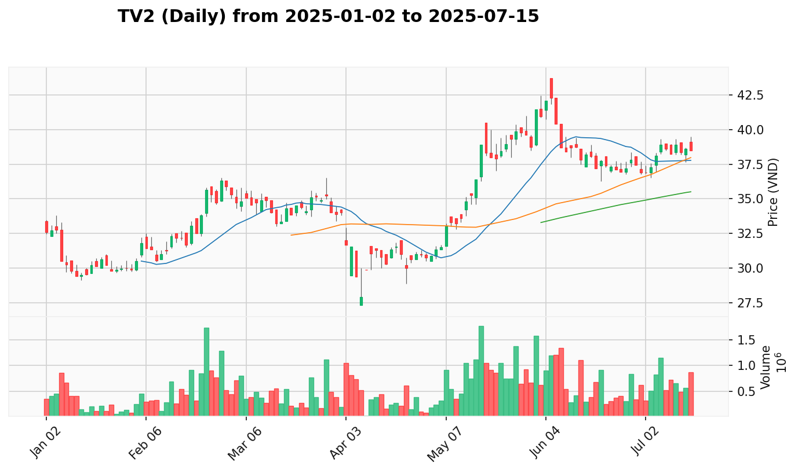

<a href="#xay-lap-dien">↑ Back to group XAY_LAP_DIEN</a>  |  <a href="#vpa-signal-summary">↑ Back to Top</a>

#### Key Statistics
| Metric | Value |
|:---|---:|
| Date Range | 2025-01-02 to 2025-11-07 |
| **Latest Close** | **34.3** |
| Period Open | 33.4 |
| Period High | 43.7 |
| Period Low | 27.3 |
| Period Change % | 2.69% |

**[Download TV2 Data (.csv)](market_data/TV2_2025-01-02_to_2025-11-09.csv)**

---

### TVB

#### [VPA Analysis (2025-08-04 - 2025-10-21)](./VPA.md#tvb)
> **Ngày 2025-10-15:** TVB giảm từ 9.5 VND xuống 9.45 VND với khối lượng giao dịch đạt 0.014 triệu cổ phiếu. Cây nến giảm có biên độ hẹp, giá đóng cửa ở mức thấp nhất phiên. Khối lượng giao dịch cực kỳ thấp, là mức thấp nhất trong 10 phiên gần đây và giảm mạnh so với phiên trước (0.0603 triệu cổ phiếu). Điều này cho thấy sự thiếu vắng hoàn toàn cả lực mua và lực bán đáng kể, thị trường đang trong trạng thái lưỡng lự và không có động lực rõ ràng sau áp lực bán nhẹ ở phiên trước. **Phân tích VPA/Wyckoff:** No Demand (Thiếu cầu) - Giá tiếp tục giảm nhẹ trên khối lượng cực thấp, xác nhận sự thiếu vắng lực mua và sự cạn kiệt của cả lực bán.
> **Ngày 2025-10-16:** TVB giảm từ 9.45 VND xuống 9.39 VND với khối lượng giao dịch đạt 0.1107 triệu cổ phiếu. Cây nến giảm có biên độ hẹp và đóng cửa ở mức thấp nhất phiên. Khối lượng tăng đáng kể so với phiên trước (0.014 triệu cổ phiếu), cho thấy áp lực bán gia tăng trở lại sau phiên "No Demand". Điều này xác nhận sự yếu kém của thị trường và có thể báo hiệu khả năng tiếp tục giảm giá. **Phân tích VPA/Wyckoff:** Supply Coming In (Cung xuất hiện)
> **Ngày 2025-10-17:** TVB tăng từ 9.42 VND lên 9.5 VND với khối lượng giao dịch đạt 0.0934 triệu cổ phiếu. Cây nến tăng có biên độ rộng, giá đóng cửa ở gần mức cao nhất phiên. Khối lượng giao dịch giảm so với phiên trước (0.1562 triệu cổ phiếu) nhưng vẫn cao hơn đáng kể so với phiên "No Demand" ngày 2025-10-15. Điều này cho thấy lực cầu đã xuất hiện và đẩy giá lên sau áp lực bán ở phiên trước, nhưng sự sụt giảm về khối lượng có thể là một dấu hiệu cho thấy thị trường đang kiểm tra lại nguồn cung và lực cầu chưa thực sự mạnh mẽ để duy trì đà tăng bền vững. **Phân tích VPA/Wyckoff:** Test for Supply (Kiểm tra cung)
> **Ngày 2025-10-20:** TVB giảm từ 9.3 VND xuống 8.84 VND với khối lượng giao dịch đạt 0.145 triệu cổ phiếu. Cây nến giảm có biên độ rộng và đóng cửa ở mức thấp nhất phiên. Khối lượng tăng đáng kể so với phiên trước (0.0934 triệu cổ phiếu), cho thấy áp lực bán mạnh mẽ đã xuất hiện và áp đảo lực cầu. Điều này xác nhận sự yếu kém của thị trường sau phiên kiểm tra cung không thành công và có thể báo hiệu xu hướng giảm tiếp diễn. **Phân tích VPA/Wyckoff:** Sign of Weakness (SOW) - Cung áp đảo cầu
> **Ngày 2025-10-21:** TVB tăng từ 8.84 VND lên 8.87 VND với khối lượng giao dịch đạt 0.0798 triệu cổ phiếu. Cây nến có biên độ rộng, giá mở cửa ở mức 9.29 VND và đóng cửa ở 8.87 VND, cho thấy áp lực bán vẫn còn trong phiên. Khối lượng giao dịch giảm đáng kể so với phiên trước (0.145 triệu cổ phiếu), điều này cho thấy lực bán đã giảm bớt nhưng lực cầu cũng không đủ mạnh để đẩy giá lên một cách thuyết phục. Sau một phiên SOW mạnh mẽ, sự phục hồi yếu ớt với khối lượng thấp này xác nhận sự thiếu vắng của lực cầu. **Phân tích VPA/Wyckoff:** No Demand (Không có cầu)

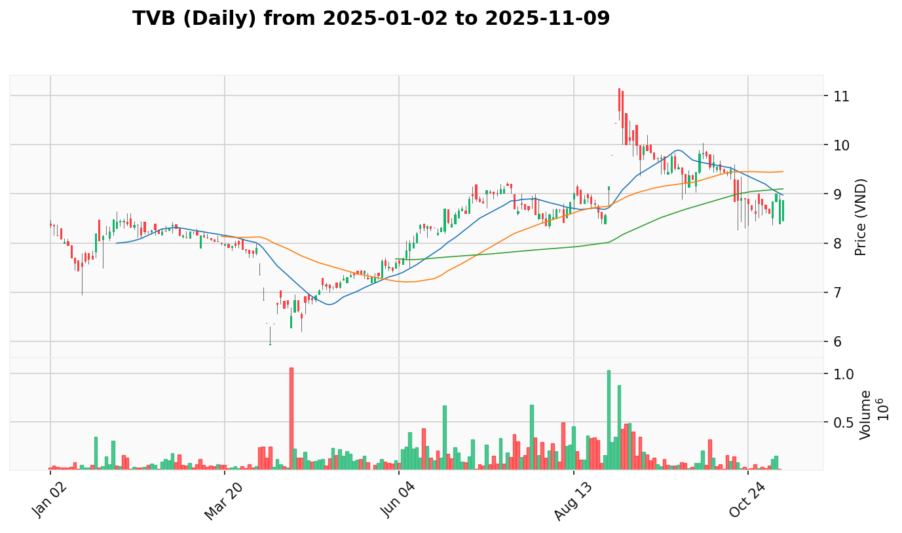

<a href="#chung-khoan">↑ Back to group CHUNG_KHOAN</a>  |  <a href="#vpa-signal-summary">↑ Back to Top</a>

#### Key Statistics
| Metric | Value |
|:---|---:|
| Date Range | 2025-01-02 to 2025-11-07 |
| **Latest Close** | **8.87** |
| Period Open | 8.4 |
| Period High | 11.15 |
| Period Low | 5.93 |
| Period Change % | 5.60% |

**[Download TVB Data (.csv)](market_data/TVB_2025-01-02_to_2025-11-09.csv)**

---

### TVN

#### [VPA Analysis (2025-08-14 - 2025-10-21)](./VPA.md#tvn)
> **Ngày 2025-10-15:** TVN giảm từ 8.0 VND xuống 7.9 VND, với biên độ dao động hẹp từ 7.8 VND đến 8.0 VND. Khối lượng giao dịch đạt 0.3738 triệu cổ phiếu, giảm nhẹ so với phiên trước (0.3781 triệu cổ phiếu). Giá tiếp tục giảm với biên độ hẹp và khối lượng giảm nhẹ cho thấy áp lực bán vẫn còn nhưng có phần chững lại, tuy nhiên lực cầu vẫn yếu và chưa đủ để hấp thụ nguồn cung. Điều này củng cố tín hiệu thị trường yếu và thiếu động lực sau các phiên "No Demand" và "Sign of Weakness" trước đó. **Phân tích VPA/Wyckoff:** No Demand
> **Ngày 2025-10-16:** TVN giữ nguyên mức giá 7.9 VND, với biên độ dao động hẹp từ 7.8 VND đến 8.0 VND. Khối lượng giao dịch đạt 0.1058 triệu cổ phiếu, giảm mạnh so với phiên trước (0.3738 triệu cổ phiếu). Giá đi ngang với khối lượng sụt giảm đáng kể cho thấy cả lực cung và lực cầu đều yếu, không có bên nào chiếm ưu thế rõ rệt. Điều này củng cố tín hiệu thị trường thiếu động lực và tiếp tục trạng thái "No Demand" sau các phiên giảm giá trước đó. **Phân tích VPA/Wyckoff:** No Demand
> **Ngày 2025-10-17:** TVN giữ nguyên mức giá 7.9 VND, với biên độ dao động từ 7.8 VND đến 8.1 VND. Khối lượng giao dịch đạt 0.3548 triệu cổ phiếu, tăng đáng kể so với phiên trước (0.1975 triệu cổ phiếu). Mặc dù khối lượng tăng, giá vẫn đi ngang và không thể bứt phá lên, cho thấy lực cung vẫn mạnh và hấp thụ hết lực cầu. Điều này tiếp tục củng cố tín hiệu thị trường yếu và thiếu động lực sau các phiên "No Demand" trước đó. **Phân tích VPA/Wyckoff:** No Demand
> **Ngày 2025-10-20:** TVN giảm từ 7.9 VND xuống 7.5 VND, với biên độ dao động rộng từ 7.3 VND đến 7.9 VND. Khối lượng giao dịch đạt 0.4913 triệu cổ phiếu, tăng đáng kể so với phiên trước (0.3548 triệu cổ phiếu). Giá giảm mạnh với khối lượng gia tăng cho thấy áp lực bán mạnh mẽ và nguồn cung đang chiếm ưu thế. Điều này xác nhận sự yếu kém của thị trường sau các phiên "No Demand" trước đó. **Phân tích VPA/Wyckoff:** Sign of Weakness (SOW)
> **Ngày 2025-10-21:** TVN giữ nguyên mức giá 7.5 VND, với biên độ dao động từ 7.2 VND đến 7.6 VND. Khối lượng giao dịch đạt 0.3251 triệu cổ phiếu, giảm đáng kể so với phiên trước (0.4913 triệu cổ phiếu). Sau phiên giảm mạnh "Sign of Weakness" (SOW) vào ngày 2025-10-20, giá đi ngang với khối lượng thấp cho thấy áp lực bán đã tạm thời giảm bớt nhưng không có lực cầu đủ mạnh để đẩy giá lên. Thị trường vẫn đang trong trạng thái yếu và thiếu động lực. **Phân tích VPA/Wyckoff:** No Demand

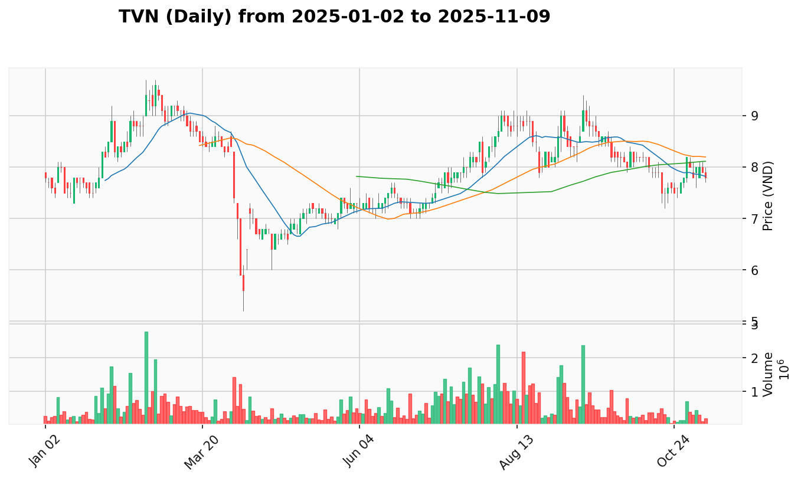

<a href="#thep">↑ Back to group THEP</a>  |  <a href="#vpa-signal-summary">↑ Back to Top</a>

#### Key Statistics
| Metric | Value |
|:---|---:|
| Date Range | 2025-01-02 to 2025-11-07 |
| **Latest Close** | **7.8** |
| Period Open | 7.9 |
| Period High | 9.7 |
| Period Low | 5.2 |
| Period Change % | -1.27% |

**[Download TVN Data (.csv)](market_data/TVN_2025-01-02_to_2025-11-09.csv)**

---

### TVS

#### [VPA Analysis (2025-08-04 - 2025-10-21)](./VPA.md#tvs)
> **Ngày 2025-10-15:** TVS tăng nhẹ từ 17.8 VND lên 17.9 VND với khối lượng giao dịch đạt 0.1691 triệu cổ phiếu. Cây nến có biên độ hẹp, giá đóng cửa (17.9 VND) bằng giá mở cửa và giá thấp nhất phiên. Khối lượng giao dịch giảm đáng kể so với các phiên trước, cho thấy lực cầu yếu và không có sự tham gia mạnh mẽ của người mua sau hai phiên giảm mạnh. **Phân tích VPA/Wyckoff:** No Demand (ND) - Lực cầu yếu, tiếp tục cho thấy sự suy yếu.
> **Ngày 2025-10-16:** TVS giảm từ 17.9 VND xuống 17.85 VND với khối lượng giao dịch đạt 0.0889 triệu cổ phiếu. Cây nến giảm có biên độ hẹp, giá đóng cửa (17.85 VND) ở mức thấp nhất phiên. Khối lượng giao dịch giảm mạnh so với phiên trước (0.1691 triệu cổ phiếu), cho thấy lực bán không quá mạnh nhưng lực cầu gần như không tồn tại, tiếp tục xác nhận sự suy yếu của thị trường sau hai phiên giảm mạnh và một phiên No Demand trước đó. **Phân tích VPA/Wyckoff:** No Demand (ND) - Lực cầu yếu, tiếp tục cho thấy sự suy yếu.
> **Ngày 2025-10-17:** TVS giảm từ 18.0 VND xuống 17.65 VND với khối lượng giao dịch đạt 0.1984 triệu cổ phiếu. Cây nến giảm có biên độ tương đối rộng, giá đóng cửa (17.65 VND) nằm gần mức thấp nhất phiên. Khối lượng giao dịch tăng so với phiên trước, cho thấy áp lực bán gia tăng và nguồn cung đang chiếm ưu thế. Điều này tiếp tục xác nhận sự suy yếu của thị trường sau các phiên No Demand trước đó. **Phân tích VPA/Wyckoff:** Sign of Weakness (SOW) - Lực cung mạnh mẽ.
> **Ngày 2025-10-20:** TVS giảm từ 17.5 VND xuống 16.5 VND với khối lượng giao dịch đạt 0.3801 triệu cổ phiếu. Cây nến giảm có biên độ rất rộng, giá đóng cửa (16.5 VND) ở mức thấp nhất phiên. Khối lượng giao dịch tăng mạnh so với phiên trước (0.1984 triệu cổ phiếu), cho thấy áp lực bán tháo cực lớn và nguồn cung áp đảo hoàn toàn, xác nhận sự suy yếu nghiêm trọng của thị trường sau các phiên No Demand và Sign of Weakness trước đó. **Phân tích VPA/Wyckoff:** Selling Climax (SC) - Lực bán tháo cực độ
> **Ngày 2025-10-21:** TVS tăng từ 16.95 VND lên 17.2 VND với khối lượng giao dịch đạt 0.2547 triệu cổ phiếu. Cây nến tăng có biên độ hẹp, giá đóng cửa (17.2 VND) nằm gần mức cao nhất phiên. Khối lượng giao dịch giảm đáng kể so với phiên Selling Climax trước đó, cho thấy áp lực bán đã suy yếu và nguồn cung đang cạn kiệt sau đợt bán tháo. Đây có thể là một dấu hiệu của sự kiểm tra nguồn cung (Test for Supply) trong giai đoạn tích lũy tiềm năng. **Phân tích VPA/Wyckoff:** Test for Supply (Test) - Kiểm tra nguồn cung.

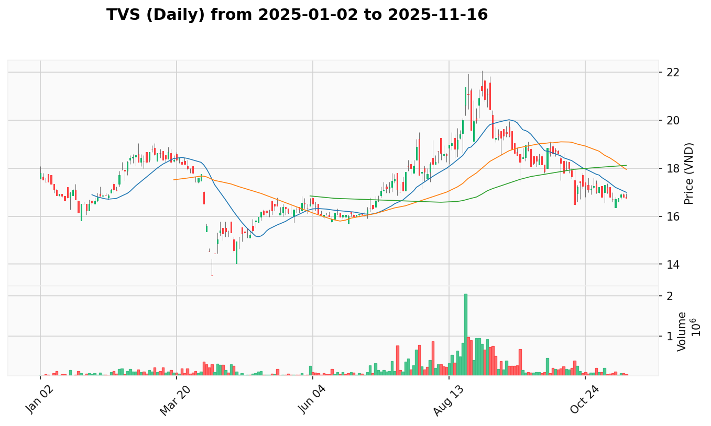

<a href="#chung-khoan">↑ Back to group CHUNG_KHOAN</a>  |  <a href="#vpa-signal-summary">↑ Back to Top</a>

#### Key Statistics
| Metric | Value |
|:---|---:|
| Date Range | 2025-01-02 to 2025-11-07 |
| **Latest Close** | **16.7** |
| Period Open | 17.56 |
| Period High | 22.06 |
| Period Low | 13.53 |
| Period Change % | -4.90% |

**[Download TVS Data (.csv)](market_data/TVS_2025-01-02_to_2025-11-09.csv)**

---

### VC2

#### [VPA Analysis (2025-08-14 - 2025-10-21)](./VPA.md#vc2)
> **Ngày 2025-10-15:** VC2 giảm từ 7.8 VND xuống 7.7 VND, dao động trong khoảng từ 7.6 VND đến 7.8 VND. Khối lượng giao dịch đạt 0.1518 triệu cổ phiếu, thấp hơn đáng kể so với phiên trước (0.4361 triệu cổ phiếu) và dưới mức trung bình gần đây. Cây nến có thân nhỏ, đóng cửa gần mức thấp nhất phiên, cho thấy áp lực bán vẫn hiện hữu nhưng với cường độ giảm. Sau các tín hiệu "Sign of Weakness" mạnh mẽ trước đó, việc giá tiếp tục giảm nhẹ kèm khối lượng thấp cho thấy sự yếu kém của thị trường vẫn tiếp diễn, đồng thời phản ánh sự thiếu vắng lực cầu. **Phân tích VPA/Wyckoff:** Weakness Continues (Tiếp diễn yếu kém).
> **Ngày 2025-10-16:** VC2 tăng từ 7.7 VND lên 7.8 VND, dao động trong khoảng từ 7.7 VND đến 7.9 VND. Khối lượng giao dịch đạt 0.047 triệu cổ phiếu, cực kỳ thấp so với phiên trước (0.1518 triệu cổ phiếu) và thấp hơn nhiều so với mức trung bình gần đây. Cây nến có thân nhỏ, đóng cửa ở mức giữa đến cao của phiên, nhưng với khối lượng giao dịch cạn kiệt. Sau hai phiên giảm giá với các tín hiệu yếu kém, việc giá tăng nhẹ với khối lượng cực thấp cho thấy không có lực cầu đáng kể tham gia vào thị trường. Điều này xác nhận sự yếu kém vẫn tiếp diễn và có thể là một dấu hiệu "No Demand" (không có cầu) trong xu hướng giảm. **Phân tích VPA/Wyckoff:** No Demand (Không có cầu) - Yếu kém tiếp diễn.
> **Ngày 2025-10-17:** VC2 tăng từ 7.6 VND lên 7.8 VND, dao động trong khoảng từ 7.6 VND đến 7.9 VND. Khối lượng giao dịch đạt 0.1883 triệu cổ phiếu, thấp hơn so với phiên trước (0.2719 triệu cổ phiếu) và dưới mức trung bình gần đây. Cây nến có thân nhỏ, đóng cửa gần mức cao nhất phiên, nhưng với khối lượng thấp cho thấy lực cầu không đủ mạnh để tạo ra một sự đảo chiều đáng kể. Sau tín hiệu "No Demand" của phiên trước, diễn biến này tiếp tục xác nhận sự yếu kém của thị trường và thiếu vắng lực mua chủ động. **Phân tích VPA/Wyckoff:** No Demand (Không có cầu) - Yếu kém tiếp diễn.
> **Ngày 2025-10-20:** VC2 giảm từ 7.7 VND xuống 7.3 VND, dao động trong khoảng từ 7.1 VND đến 7.9 VND. Khối lượng giao dịch đạt 0.3711 triệu cổ phiếu, tăng đáng kể so với phiên trước (0.1883 triệu cổ phiếu) và cao hơn nhiều so với mức trung bình gần đây. Cây nến có thân rộng, đóng cửa gần mức thấp nhất phiên. Sau hai phiên "No Demand" với khối lượng cạn kiệt, sự xuất hiện của một cây nến giảm mạnh với khối lượng lớn cho thấy áp lực bán gia tăng và nguồn cung đang áp đảo. Điều này xác nhận sự yếu kém của thị trường vẫn tiếp diễn. **Phân tích VPA/Wyckoff:** Sign of Weakness (SOW) - Áp lực bán gia tăng, yếu kém tiếp diễn.
> **Ngày 2025-10-21:** VC2 giảm mạnh từ 7.1 VND xuống 6.7 VND, dao động trong khoảng từ 6.6 VND đến 7.4 VND. Khối lượng giao dịch đạt 1.6452 triệu cổ phiếu, tăng đột biến so với phiên trước (0.3711 triệu cổ phiếu) và cao hơn rất nhiều so với mức trung bình gần đây. Cây nến có thân rộng, đóng cửa gần mức thấp nhất phiên. Sự sụt giảm giá mạnh đi kèm với khối lượng cực lớn cho thấy áp lực bán tháo gia tăng và nguồn cung đang áp đảo hoàn toàn. Điều này xác nhận sự yếu kém của thị trường và khả năng tiếp diễn xu hướng giảm. **Phân tích VPA/Wyckoff:** Sign of Weakness (SOW) - Áp lực bán tháo cực lớn, xác nhận xu hướng giảm.

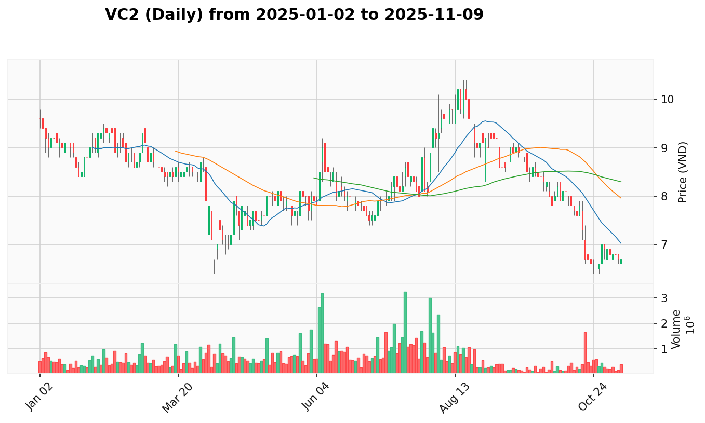

<a href="#xay-dung">↑ Back to group XAY_DUNG</a>  |  <a href="#vpa-signal-summary">↑ Back to Top</a>

#### Key Statistics
| Metric | Value |
|:---|---:|
| Date Range | 2025-01-02 to 2025-11-07 |
| **Latest Close** | **6.7** |
| Period Open | 9.6 |
| Period High | 10.6 |
| Period Low | 6.4 |
| Period Change % | -30.21% |

**[Download VC2 Data (.csv)](market_data/VC2_2025-01-02_to_2025-11-09.csv)**

---

### VC7

#### [VPA Analysis (2025-08-14 - 2025-10-21)](./VPA.md#vc7)
> **Ngày 2025-10-15:** VC7 giảm từ 11.2 VND xuống 10.9 VND, với biên độ dao động từ 10.7 VND đến 11.4 VND và đóng cửa gần mức thấp nhất phiên. Khối lượng giao dịch đạt 0.6962 triệu cổ phiếu, giảm so với phiên trước nhưng vẫn ở mức tương đối cao. Sau phiên nguồn cung áp đảo, việc giá tiếp tục giảm trên khối lượng giảm cho thấy áp lực bán vẫn duy trì, xác nhận sự yếu kém của thị trường. **Phân tích VPA/Wyckoff:** Nguồn cung tiếp diễn
> **Ngày 2025-10-16:** VC7 mở cửa ở mức 10.7 VND, giảm xuống mức thấp nhất 9.9 VND nhưng đã phục hồi và đóng cửa ở mức 10.9 VND, bằng với giá đóng cửa phiên trước. Biên độ dao động trong phiên rộng, cho thấy sự biến động. Khối lượng giao dịch đạt 0.2376 triệu cổ phiếu, giảm mạnh so với các phiên trước, cho thấy áp lực bán đã suy yếu đáng kể. Sau hai phiên giảm giá mạnh với nguồn cung áp đảo, phiên này cho thấy thị trường đang kiểm tra lại nguồn cung ở các mức giá thấp hơn và có vẻ như nguồn cung đã cạn kiệt. **Phân tích VPA/Wyckoff:** Kiểm tra nguồn cung (Test for Supply)
> **Ngày 2025-10-17:** VC7 mở cửa ở mức 11.0 VND và đóng cửa ở mức 11.0 VND, với biên độ dao động hẹp từ 10.9 VND đến 11.2 VND. Khối lượng giao dịch đạt 0.2097 triệu cổ phiếu, giảm đáng kể so với phiên trước (0.3402 triệu cổ phiếu). Sau phiên kiểm tra nguồn cung ngày 2025-10-16, phiên này cho thấy thị trường thiếu vắng lực cầu, với giá đi ngang trong biên độ hẹp và khối lượng thấp, xác nhận sự yếu kém của thị trường. **Phân tích VPA/Wyckoff:** Không có cầu (No Demand)
> **Ngày 2025-10-20:** VC7 mở cửa 10.9 VND, giảm mạnh từ 11.0 VND (giá đóng cửa phiên trước) xuống 9.9 VND và đóng cửa tại mức thấp nhất phiên 9.9 VND. Biên độ giảm rộng, cho thấy áp lực bán rất lớn. Khối lượng giao dịch đạt 0.688 triệu cổ phiếu, tăng vọt so với phiên trước (0.2097 triệu cổ phiếu) và cao hơn đáng kể so với các phiên gần đây. Sự sụt giảm giá mạnh đi kèm với khối lượng tăng cao xác nhận nguồn cung đã quay trở lại thị trường một cách áp đảo, cho thấy sự yếu kém rõ rệt. **Phân tích VPA/Wyckoff:** Sign of Weakness (SOW) - Lực bán áp đảo.
> **Ngày 2025-10-21:** VC7 mở cửa ở mức 9.9 VND và đóng cửa ở mức 10.1 VND, tăng nhẹ so với giá đóng cửa phiên trước (9.9 VND). Biên độ dao động giá hẹp từ 9.7 VND đến 10.1 VND. Khối lượng giao dịch đạt 0.5505 triệu cổ phiếu, giảm so với phiên trước (0.688 triệu cổ phiếu). Sau phiên giảm mạnh với lực bán áp đảo (SOW) vào ngày 2025-10-20, phiên này cho thấy sự phục hồi nhẹ về giá nhưng với khối lượng thấp, cho thấy lực cầu chưa thực sự mạnh mẽ để đẩy giá lên cao hơn. Điều này có thể là dấu hiệu của sự thiếu vắng lực cầu sau một đợt bán tháo. **Phân tích VPA/Wyckoff:** No Demand (Thiếu cầu)

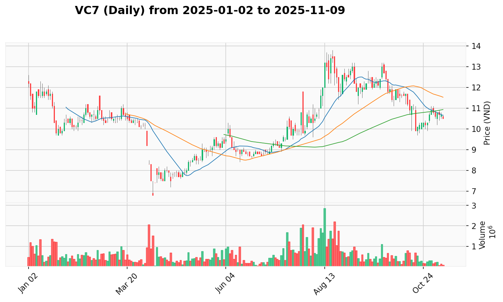

<a href="#penny">↑ Back to group PENNY</a>  |  <a href="#vpa-signal-summary">↑ Back to Top</a>

#### Key Statistics
| Metric | Value |
|:---|---:|
| Date Range | 2025-01-02 to 2025-11-07 |
| **Latest Close** | **10.5** |
| Period Open | 12.3 |
| Period High | 13.8 |
| Period Low | 6.8 |
| Period Change % | -14.63% |

**[Download VC7 Data (.csv)](market_data/VC7_2025-01-02_to_2025-11-09.csv)**

---

### VCB

#### [VPA Analysis (2025-07-18 - 2025-10-21)](./VPA.md#vcb)
> **Ngày 2025-10-15:** VCB giảm từ 63.1 VND xuống 62.5 VND (-0.6 VND) với giá mở cửa 63.1 VND và đóng cửa tại 62.5 VND, tạo thành một cây nến đỏ có biên độ tương đối rộng và giá đóng cửa ở mức thấp nhất phiên, cho thấy áp lực bán tiếp tục chiếm ưu thế. Khối lượng giao dịch đạt 5.2188 triệu cổ phiếu, thấp hơn đáng kể so với phiên trước (7.019 triệu cổ phiếu) và phiên giảm mạnh ngày 2025-10-13 (8.002 triệu cổ phiếu). Mặc dù khối lượng giảm, việc giá tiếp tục giảm mạnh và đóng cửa ở mức thấp nhất phiên sau các tín hiệu suy yếu trước đó cho thấy lực cầu vẫn còn rất yếu và chưa có dấu hiệu phục hồi, xác nhận sự tiếp diễn của xu hướng giảm. **Phân tích VPA/Wyckoff:** Tiếp diễn suy yếu (Continued Weakness)
> **Ngày 2025-10-16:** VCB tăng nhẹ từ 62.5 VND lên 62.7 VND (+0.2 VND) với giá mở cửa 62.7 VND và đóng cửa tại 62.7 VND, tạo thành một cây nến có thân rất nhỏ, cho thấy sự lưỡng lự và thiếu quyết đoán. Khối lượng giao dịch đạt 2.0512 triệu cổ phiếu, mức thấp nhất trong 10 phiên gần đây và thấp hơn đáng kể so với phiên trước (5.224622 triệu cổ phiếu). Sau hai phiên giảm giá với tín hiệu "Thiếu cầu" và "Tiếp diễn suy yếu", việc giá tăng nhẹ với khối lượng cực thấp cho thấy lực cầu vẫn còn rất yếu và không đủ sức đẩy giá lên cao, xác nhận sự vắng mặt của dòng tiền lớn. Điều này cho thấy thị trường vẫn đang trong giai đoạn yếu và có thể tiếp tục xu hướng giảm. **Phân tích VPA/Wyckoff:** Thiếu cầu (No Demand)
> **Ngày 2025-10-17:** VCB giảm từ 62.9 VND xuống 61.9 VND (-1.0 VND) với giá mở cửa 62.9 VND và đóng cửa tại 61.9 VND, tạo thành một cây nến đỏ có biên độ rộng và giá đóng cửa ở mức thấp nhất phiên, cho thấy áp lực bán mạnh mẽ. Khối lượng giao dịch đạt 5.4059 triệu cổ phiếu, cao hơn đáng kể so với phiên trước (4.6344 triệu cổ phiếu) và phiên 2025-10-15 (5.224622 triệu cổ phiếu). Sau tín hiệu "Thiếu cầu" và "Tiếp diễn suy yếu" ở các phiên trước, việc giá giảm mạnh với khối lượng gia tăng xác nhận rằng cung đang áp đảo cầu, và xu hướng giảm tiếp tục được củng cố. **Phân tích VPA/Wyckoff:** Sign of Weakness (SOW) - Cung áp đảo
> **Ngày 2025-10-20:** VCB giảm từ 61.9 VND xuống 59.4 VND (-2.5 VND) với giá mở cửa 61.8 VND và đóng cửa tại 59.4 VND, tạo thành một cây nến đỏ có biên độ rộng và giá đóng cửa ở mức thấp nhất phiên, cho thấy áp lực bán cực lớn. Khối lượng giao dịch đạt 12.1156 triệu cổ phiếu, cao gấp đôi so với phiên trước (5.4059 triệu cổ phiếu). Sau tín hiệu "Sign of Weakness" ở phiên 2025-10-17, việc giá giảm mạnh với khối lượng tăng vọt xác nhận rằng cung đang áp đảo cầu một cách quyết liệt, và xu hướng giảm tiếp tục được củng cố mạnh mẽ. Điều này cho thấy thị trường đang trong giai đoạn phân phối hoặc giảm giá sâu. **Phân tích VPA/Wyckoff:** Sign of Weakness (SOW) - Áp lực bán cực lớn
> **Ngày 2025-10-21:** VCB giảm từ 59.4 VND xuống 59.3 VND (-0.1 VND) với giá mở cửa 59.7 VND và đóng cửa tại 59.3 VND, tạo thành một cây nến đỏ có biên độ tương đối rộng và giá đóng cửa ở mức thấp nhất phiên, cho thấy áp lực bán vẫn duy trì. Khối lượng giao dịch đạt 8.4167 triệu cổ phiếu, thấp hơn đáng kể so với phiên trước (12.1156 triệu cổ phiếu). Mặc dù khối lượng giảm sau phiên bán tháo mạnh, việc giá tiếp tục đóng cửa ở mức thấp nhất phiên cho thấy cung vẫn đang chiếm ưu thế và xu hướng giảm vẫn tiếp diễn. **Phân tích VPA/Wyckoff:** Sign of Weakness (SOW) - Cung tiếp tục chiếm ưu thế.

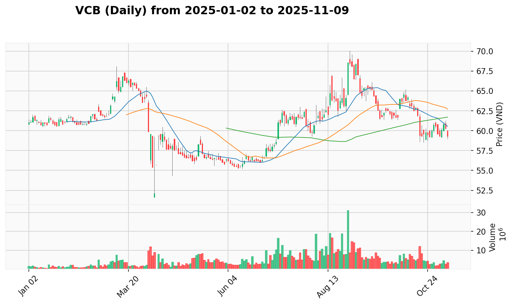

<a href="#ngan-hang">↑ Back to group NGAN_HANG</a>  |  <a href="#vpa-signal-summary">↑ Back to Top</a>

#### Key Statistics
| Metric | Value |
|:---|---:|
| Date Range | 2025-01-02 to 2025-11-07 |
| **Latest Close** | **59.3** |
| Period Open | 60.83 |
| Period High | 70.09 |
| Period Low | 51.63 |
| Period Change % | -2.52% |

**[Download VCB Data (.csv)](market_data/VCB_2025-01-02_to_2025-11-09.csv)**

---

### VCG

#### [VPA Analysis (2025-06-16 - 2025-10-21)](./VPA.md#vcg)
> **Ngày 2025-10-15:** VCG mở cửa ở mức 27.7 VND, đạt mức cao nhất 27.85 VND và mức thấp nhất 27.15 VND, sau đó đóng cửa ở mức 27.25 VND. So với phiên trước (2025-10-14), giá đóng cửa tiếp tục giảm từ 27.6 VND xuống 27.25 VND. Giá đóng cửa gần mức thấp nhất phiên với biên độ giảm hẹp, cho thấy áp lực bán vẫn còn nhưng không quá mạnh mẽ. Khối lượng giao dịch đạt 13.5954 triệu cổ phiếu, giảm đáng kể so với phiên trước (20.8281 triệu cổ phiếu). Sự kết hợp giữa giá tiếp tục giảm nhưng với khối lượng và biên độ giảm thấp hơn cho thấy lực cung đã suy yếu phần nào, nhưng lực cầu vẫn chưa xuất hiện để hấp thụ lượng cung này. Đây là dấu hiệu của sự thiếu vắng nhu cầu ở mức giá hiện tại. **Phân tích VPA/Wyckoff:** No Demand
> **Ngày 2025-10-16:** VCG mở cửa ở mức 27.3 VND, đạt mức cao nhất 27.5 VND và mức thấp nhất 27.15 VND, đóng cửa ở mức 27.3 VND. So với phiên trước (2025-10-15), giá đóng cửa tăng nhẹ từ 27.25 VND lên 27.3 VND. Biên độ dao động giá rất hẹp, cho thấy sự lưỡng lự của thị trường. Khối lượng giao dịch đạt 4.2828 triệu cổ phiếu, giảm mạnh so với phiên trước (13.5954 triệu cổ phiếu) và là mức rất thấp. Sự kết hợp giữa giá tăng nhẹ, biên độ hẹp và khối lượng giao dịch cực thấp cho thấy lực cung đã cạn kiệt đáng kể, nhưng lực cầu vẫn chưa đủ mạnh để đẩy giá lên cao. Đây là một phiên kiểm tra cung. **Phân tích VPA/Wyckoff:** Test for Supply
> **Ngày 2025-10-17:** VCG mở cửa ở mức 27.75 VND, đạt mức cao nhất 28.3 VND và mức thấp nhất 27.5 VND, sau đó đóng cửa ở mức 27.65 VND. So với phiên trước (2025-10-16), giá đóng cửa giảm nhẹ từ 27.7 VND xuống 27.65 VND. Biên độ dao động giá rộng hơn so với phiên kiểm tra cung trước đó, cho thấy sự trở lại của hoạt động giao dịch. Khối lượng giao dịch đạt 16.0464 triệu cổ phiếu, tăng đáng kể so với phiên trước (12.1283 triệu cổ phiếu). Sự kết hợp giữa giá giảm nhẹ và khối lượng tăng cho thấy áp lực cung vẫn còn hiện hữu trên thị trường, đặc biệt sau phiên kiểm tra cung với khối lượng thấp. Điều này cho thấy lực cầu chưa đủ mạnh để hấp thụ hết lượng cung gia tăng. **Phân tích VPA/Wyckoff:** Supply Coming In (Cung xuất hiện)
> **Ngày 2025-10-20:** VCG mở cửa ở mức 27.65 VND, đạt mức cao nhất 28.1 VND và mức thấp nhất 25.75 VND, đóng cửa ở mức 25.75 VND. So với phiên trước (2025-10-17), giá đóng cửa giảm mạnh từ 27.65 VND xuống 25.75 VND. Biên độ dao động giá rất rộng, cho thấy áp lực bán mạnh mẽ. Khối lượng giao dịch đạt 18.7846 triệu cổ phiếu, tăng so với phiên trước (16.0464 triệu cổ phiếu). Sự kết hợp giữa giá giảm mạnh, biên độ rộng và khối lượng tăng cho thấy lực cung áp đảo và thị trường đang chịu áp lực bán rất lớn, xác nhận sự tiếp diễn của cung xuất hiện từ phiên trước. **Phân tích VPA/Wyckoff:** Sign of Weakness (SOW) - Lực cung áp đảo.
> **Ngày 2025-10-21:** VCG mở cửa ở mức 25.8 VND, đạt mức cao nhất 25.95 VND và mức thấp nhất 24.75 VND, đóng cửa ở mức 25.5 VND. So với phiên trước (2025-10-20), giá đóng cửa tiếp tục giảm từ 25.75 VND xuống 25.5 VND. Biên độ dao động giá thu hẹp đáng kể (1.2 VND) so với phiên SOW trước đó (2.35 VND), cho thấy áp lực bán có phần giảm bớt nhưng vẫn duy trì xu hướng giảm. Khối lượng giao dịch đạt 18.1999 triệu cổ phiếu, giảm nhẹ so với phiên trước (18.7846 triệu cổ phiếu). Sự kết hợp giữa giá tiếp tục giảm, biên độ hẹp và khối lượng giảm nhẹ sau một phiên SOW mạnh mẽ cho thấy lực cung vẫn chiếm ưu thế và thiếu vắng lực cầu mạnh mẽ để đảo chiều. Giá đóng cửa nằm gần mức thấp nhất phiên, xác nhận sự yếu kém. **Phân tích VPA/Wyckoff:** Continuation of Weakness (Tiếp diễn suy yếu)

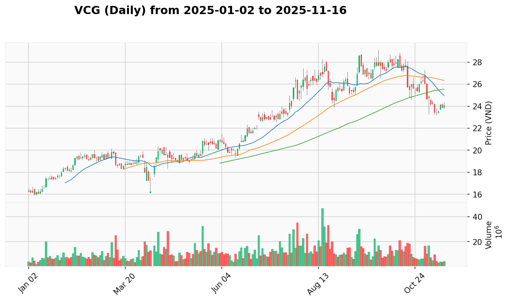

<a href="#dau-tu-cong">↑ Back to group DAU_TU_CONG</a>  |  <a href="#vpa-signal-summary">↑ Back to Top</a>

#### Key Statistics
| Metric | Value |
|:---|---:|
| Date Range | 2025-01-02 to 2025-11-07 |
| **Latest Close** | **23.45** |
| Period Open | 16.26 |
| Period High | 29.1 |
| Period Low | 15.91 |
| Period Change % | 44.22% |

**[Download VCG Data (.csv)](market_data/VCG_2025-01-02_to_2025-11-09.csv)**

---

### VCI

#### [VPA Analysis (2025-06-13 - 2025-10-21)](./VPA.md#vci)
> **Ngày 2025-10-15:** VCI giảm từ 43.0 VND xuống 42.75 VND (-0.58%) với biên độ dao động hẹp (từ 42.55 VND đến 43.5 VND) và đóng cửa gần mức thấp nhất phiên. Khối lượng giao dịch đạt 7.8986 triệu cổ phiếu, giảm đáng kể so với phiên trước (16.0968 triệu cổ phiếu). Sau phiên giảm mạnh với khối lượng lớn (SOW) vào ngày 2025-10-14, phiên này cho thấy giá tiếp tục giảm nhưng với khối lượng thấp và biên độ hẹp, xác nhận sự thiếu hụt lực cầu và sự tiếp diễn của xu hướng yếu kém. **Phân tích VPA/Wyckoff:** No Demand (Không có cầu)
> **Ngày 2025-10-16:** VCI tăng nhẹ từ 42.75 VND lên 42.85 VND (+0.23%) với biên độ dao động hẹp (từ 42.75 VND đến 43.75 VND) và đóng cửa ở gần giữa phiên. Khối lượng giao dịch đạt 4.72 triệu cổ phiếu, giảm mạnh so với phiên trước (7.90 triệu cổ phiếu). Sau hai phiên giảm giá với khối lượng lớn (SOW) và không có cầu (No Demand), phiên này cho thấy giá có sự hồi phục nhẹ nhưng với khối lượng rất thấp, xác nhận sự thiếu hụt lực cầu và sự yếu kém của thị trường vẫn tiếp diễn. **Phân tích VPA/Wyckoff:** No Demand (Không có cầu)
> **Ngày 2025-10-17:** VCI giảm từ 42.65 VND xuống 41.95 VND (-1.64%) với biên độ dao động rộng (từ 41.9 VND đến 43.6 VND) và đóng cửa gần mức thấp nhất phiên. Khối lượng giao dịch đạt 12.19 triệu cổ phiếu, tăng đáng kể so với phiên trước (8.96 triệu cổ phiếu). Sau các phiên giảm giá và không có cầu, phiên này cho thấy lực bán mạnh mẽ với khối lượng gia tăng, xác nhận xu hướng yếu kém tiếp diễn. **Phân tích VPA/Wyckoff:** Sign of Weakness (SOW) - Lực cung mạnh mẽ.
> **Ngày 2025-10-20:** VCI giảm mạnh từ 41.95 VND xuống 39.05 VND (-6.91%) với biên độ dao động rộng (từ 39.05 VND đến 42.5 VND) và đóng cửa ở mức thấp nhất phiên. Khối lượng giao dịch đạt 13.008 triệu cổ phiếu, tăng so với phiên trước (12.19 triệu cổ phiếu). Sau phiên SOW ngày 2025-10-17, phiên này tiếp tục cho thấy lực bán mạnh mẽ và áp đảo, đẩy giá xuống sâu hơn với khối lượng gia tăng, xác nhận xu hướng giảm và sự yếu kém của thị trường vẫn tiếp diễn. **Phân tích VPA/Wyckoff:** Sign of Weakness (SOW) - Lực cung mạnh mẽ và áp đảo.
> **Ngày 2025-10-21:** VCI tiếp tục giảm mạnh từ 39.05 VND xuống 37.7 VND (-3.45%) với biên độ dao động rộng (từ 37.05 VND đến 39.5 VND) và đóng cửa gần mức thấp nhất phiên. Khối lượng giao dịch đạt 16.4614 triệu cổ phiếu, tăng đáng kể so với phiên trước (13.008 triệu cổ phiếu). Sau các phiên SOW liên tiếp, phiên này tiếp tục cho thấy lực bán mạnh mẽ và áp đảo với khối lượng gia tăng, xác nhận xu hướng giảm và sự yếu kém của thị trường vẫn tiếp diễn. **Phân tích VPA/Wyckoff:** Sign of Weakness (SOW) - Lực cung mạnh mẽ và áp đảo tiếp tục đẩy giá xuống.

<a href="#chung-khoan">↑ Back to group CHUNG_KHOAN</a>  |  <a href="#vpa-signal-summary">↑ Back to Top</a>

#### Key Statistics
| Metric | Value |
|:---|---:|
| Date Range | 2025-01-02 to 2025-11-07 |
| **Latest Close** | **36.0** |
| Period Open | 33.01 |
| Period High | 49.45 |
| Period Low | 30.73 |
| Period Change % | 9.06% |

**[Download VCI Data (.csv)](market_data/VCI_2025-01-02_to_2025-11-09.csv)**

---

### VCS

#### [VPA Analysis (2025-06-26 - 2025-10-21)](./VPA.md#vcs)
> **Ngày 2025-10-15:** VCS giảm từ 47.7 VND xuống 47.5 VND với biên độ dao động từ 47.5 VND đến 48.0 VND. Giá đóng cửa ở mức thấp nhất phiên, cho thấy áp lực bán vẫn còn. Khối lượng giao dịch đạt 0.0837 triệu cổ phiếu, giảm đáng kể so với phiên trước (0.1375 triệu cổ phiếu). Sau hai phiên "Áp lực bán mạnh", việc giá tiếp tục giảm với biên độ hẹp và khối lượng giảm cho thấy lực cung đã bớt quyết liệt hơn, nhưng lực cầu vẫn chưa xuất hiện, xác nhận thị trường vẫn đang trong trạng thái yếu. **Phân tích VPA/Wyckoff:** No Demand (Không có cầu)
> **Ngày 2025-10-16:** VCS giảm từ 47.5 VND xuống 47.4 VND với biên độ dao động rộng từ 45.6 VND đến 47.9 VND. Giá đóng cửa ở mức thấp nhất phiên. Khối lượng giao dịch đạt 0.0257 triệu cổ phiếu, giảm mạnh so với phiên trước (0.0837 triệu cổ phiếu). Sau phiên "Không có cầu" ngày 2025-10-15, việc giá tiếp tục giảm với biên độ rộng nhưng khối lượng cực thấp cho thấy sự thiếu vắng cả lực cung và lực cầu, xác nhận thị trường vẫn đang rất yếu và không có sự quan tâm mua vào. **Phân tích VPA/Wyckoff:** Lack of Demand (Thiếu cầu)
> **Ngày 2025-10-17:** VCS giảm từ 47.7 VND xuống 46.8 VND với biên độ dao động từ 46.8 VND đến 47.9 VND. Giá đóng cửa ở mức thấp nhất phiên. Khối lượng giao dịch đạt 0.1031 triệu cổ phiếu, tăng đáng kể so với phiên trước (0.0495 triệu cổ phiếu). Sau các phiên thiếu cầu, việc giá tiếp tục giảm mạnh với khối lượng gia tăng cho thấy áp lực bán đang chiếm ưu thế và thị trường tiếp tục suy yếu. **Phân tích VPA/Wyckoff:** Sign of Weakness (SOW) - Dấu hiệu suy yếu
> **Ngày 2025-10-20:** VCS giảm từ 46.8 VND xuống 45.2 VND với biên độ dao động rộng từ 45.2 VND đến 46.8 VND. Giá đóng cửa ở mức thấp nhất phiên. Khối lượng giao dịch đạt 0.1515 triệu cổ phiếu, tăng đáng kể so với phiên trước (0.1031 triệu cổ phiếu). Sau phiên "Dấu hiệu suy yếu" ngày 2025-10-17, việc giá tiếp tục giảm mạnh với biên độ rộng và khối lượng gia tăng cho thấy áp lực bán đang rất mạnh và thị trường tiếp tục suy yếu nghiêm trọng. **Phân tích VPA/Wyckoff:** Sign of Weakness (SOW) - Dấu hiệu suy yếu
> **Ngày 2025-10-21:** VCS tăng nhẹ từ 45.2 VND lên 45.5 VND với biên độ dao động từ 44.8 VND đến 45.8 VND. Giá đóng cửa ở nửa trên của thân nến. Khối lượng giao dịch đạt 0.125 triệu cổ phiếu, giảm so với phiên trước (0.1515 triệu cổ phiếu). Sau hai phiên giảm mạnh với khối lượng lớn, phiên này giá tăng nhẹ nhưng với khối lượng giảm cho thấy lực cầu chưa thực sự mạnh mẽ và áp lực bán có thể tạm thời lắng xuống. Đây có thể là một nhịp hồi phục yếu trong xu hướng giảm hoặc một đợt kiểm tra cung. **Phân tích VPA/Wyckoff:** Weak Rally (WR) - Nhịp hồi phục yếu

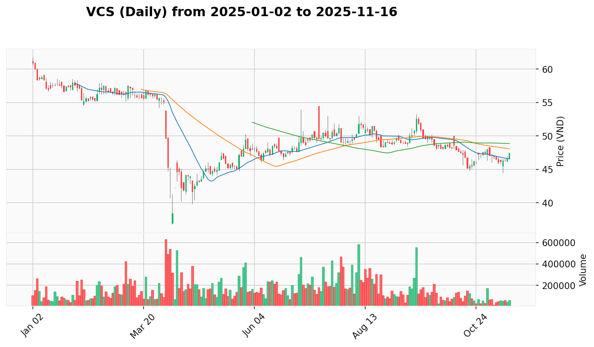

<a href="#others">↑ Back to group OTHERS</a>  |  <a href="#vpa-signal-summary">↑ Back to Top</a>

#### Key Statistics
| Metric | Value |
|:---|---:|
| Date Range | 2025-01-02 to 2025-11-07 |
| **Latest Close** | **46.1** |
| Period Open | 61.16 |
| Period High | 61.74 |
| Period Low | 36.78 |
| Period Change % | -24.62% |

**[Download VCS Data (.csv)](market_data/VCS_2025-01-02_to_2025-11-09.csv)**

---

### VDS

#### [VPA Analysis (2025-08-04 - 2025-10-21)](./VPA.md#vds)
> **Ngày 2025-10-15:** VDS mở cửa ở mức 21.8 VND, tăng nhẹ lên 21.85 VND nhưng sau đó giảm mạnh xuống 21.1 VND và đóng cửa ở 21.2 VND, thấp hơn đáng kể so với giá đóng cửa phiên trước (21.7 VND). Khối lượng giao dịch đạt 2.7548 triệu cổ phiếu, thấp hơn đáng kể so với phiên trước (4.5429 triệu cổ phiếu). Sau phiên "Sign of Weakness" với khối lượng cao, phiên này cho thấy giá tiếp tục giảm trên khối lượng thấp hơn. Điều này cho thấy lực cung vẫn chiếm ưu thế và thiếu vắng lực cầu, khiến giá không thể phục hồi. Cây nến có biên độ tương đối rộng và đóng cửa gần mức thấp nhất phiên, xác nhận sự kiểm soát của bên bán. **Phân tích VPA/Wyckoff:** No Demand (Thiếu vắng lực cầu)
> **Ngày 2025-10-16:** VDS mở cửa ở mức 21.6 VND, tăng lên 22.25 VND và đóng cửa ở 21.7 VND, cao hơn so với giá đóng cửa phiên trước (21.2 VND). Khối lượng giao dịch đạt 1.7319 triệu cổ phiếu, thấp hơn đáng kể so với phiên trước (2.7548 triệu cổ phiếu). Sau hai phiên giảm giá với "Sign of Weakness" và "No Demand", phiên này cho thấy giá phục hồi nhẹ trên khối lượng rất thấp. Điều này cho thấy lực cung đã suy yếu đáng kể và không có nhiều cổ phiếu được bán ra ở mức giá này, nhưng lực cầu cũng chưa thực sự mạnh mẽ để đẩy giá lên cao hơn. Cây nến có biên độ hẹp và đóng cửa ở giữa thân nến, cho thấy sự lưỡng lự của thị trường. **Phân tích VPA/Wyckoff:** No Supply (Không có cung) - Giá tăng nhẹ trên khối lượng rất thấp sau giai đoạn suy yếu, cho thấy lực cung đã cạn kiệt tạm thời.
> **Ngày 2025-10-17:** VDS mở cửa ở mức 22.1 VND, tăng lên 22.5 VND nhưng sau đó giảm mạnh xuống 21.6 VND và đóng cửa ở 21.6 VND, thấp hơn so với giá đóng cửa phiên trước (21.7 VND). Khối lượng giao dịch đạt 2.6378 triệu cổ phiếu, cao hơn so với phiên trước (1.7319 triệu cổ phiếu). Sau phiên "No Supply" với giá phục hồi nhẹ trên khối lượng thấp, phiên này cho thấy giá giảm trở lại với khối lượng gia tăng. Cây nến có biên độ tương đối rộng và đóng cửa ở mức thấp nhất phiên, cho thấy áp lực bán mạnh mẽ và bên bán đang kiểm soát thị trường. **Phân tích VPA/Wyckoff:** Sign of Weakness (SOW) - Giá giảm trên khối lượng gia tăng, xác nhận áp lực bán mạnh mẽ.
> **Ngày 2025-10-20:** VDS mở cửa ở mức 21.55 VND, tăng lên 22.0 VND nhưng sau đó giảm mạnh xuống 20.1 VND và đóng cửa ở 20.1 VND, thấp hơn đáng kể so với giá đóng cửa phiên trước (21.6 VND). Khối lượng giao dịch đạt 3.7031 triệu cổ phiếu, cao hơn so với phiên trước (2.6378 triệu cổ phiếu). Sau phiên "Sign of Weakness" trước đó, phiên này tiếp tục cho thấy áp lực bán mạnh mẽ với giá giảm sâu và đóng cửa ở mức thấp nhất phiên trên khối lượng gia tăng. Điều này xác nhận sự yếu kém của thị trường và bên bán đang kiểm soát hoàn toàn. **Phân tích VPA/Wyckoff:** Sign of Weakness (SOW) - Giá giảm mạnh trên khối lượng gia tăng, xác nhận áp lực bán tiếp tục mạnh mẽ.
> **Ngày 2025-10-21:** VDS mở cửa ở mức 19.8 VND, tăng lên 20.1 VND nhưng sau đó giảm mạnh xuống 18.7 VND và đóng cửa ở 19.0 VND, thấp hơn đáng kể so với giá đóng cửa phiên trước (20.1 VND). Khối lượng giao dịch đạt 4.5807 triệu cổ phiếu, cao hơn so với phiên trước (3.7031 triệu cổ phiếu). Sau các phiên giảm giá mạnh với khối lượng gia tăng, phiên này tiếp tục xác nhận áp lực bán cực lớn khi giá giảm sâu và đóng cửa ở mức thấp nhất phiên trên khối lượng tiếp tục tăng mạnh. Điều này cho thấy sự yếu kém nghiêm trọng của thị trường và bên bán đang hoàn toàn kiểm soát. **Phân tích VPA/Wyckoff:** Sign of Weakness (SOW) - Giá giảm mạnh trên khối lượng gia tăng, xác nhận áp lực bán tiếp tục chiếm ưu thế.

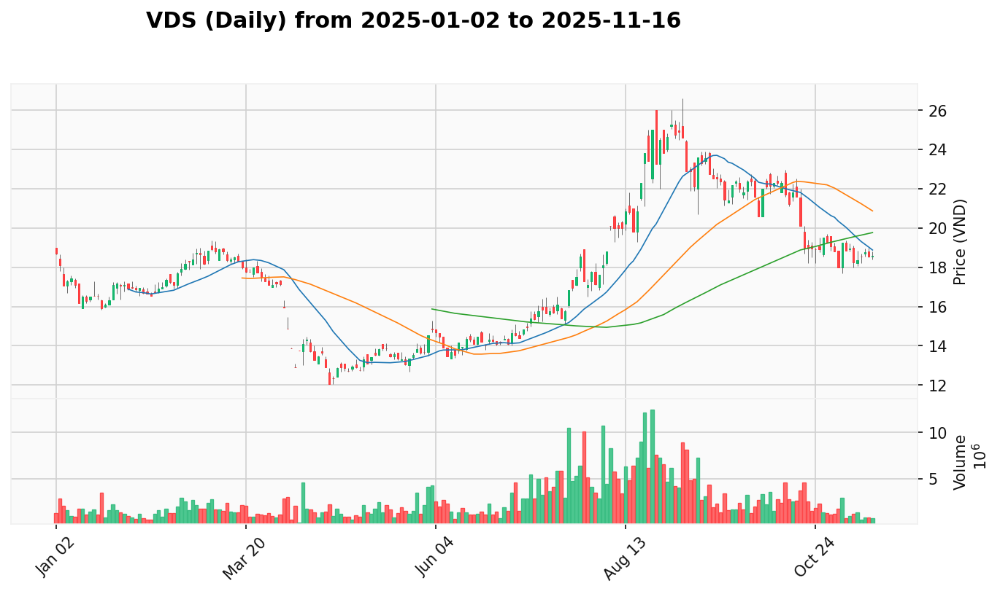

<a href="#chung-khoan">↑ Back to group CHUNG_KHOAN</a>  |  <a href="#vpa-signal-summary">↑ Back to Top</a>

#### Key Statistics
| Metric | Value |
|:---|---:|
| Date Range | 2025-01-02 to 2025-11-07 |
| **Latest Close** | **18.25** |
| Period Open | 19.0 |
| Period High | 26.6 |
| Period Low | 12.05 |
| Period Change % | -3.95% |

**[Download VDS Data (.csv)](market_data/VDS_2025-01-02_to_2025-11-09.csv)**

---

### VEA

#### [VPA Analysis (2025-06-16 - 2025-10-21)](./VPA.md#vea)
> **Ngày 2025-10-15:** VEA tăng từ 39.6 VND lên 39.7 VND, với khối lượng giao dịch đạt 0.2869 triệu cổ phiếu. Cây nến tăng có biên độ rất hẹp (từ 39.6 đến 39.7) và đóng cửa ở mức cao nhất phiên. Khối lượng giao dịch giảm đáng kể so với phiên trước (0.3735 triệu cổ phiếu) và ở mức rất thấp. Sau phiên "Kiểm tra nguồn cung" với khối lượng trung bình thấp, việc giá tiếp tục tăng nhẹ nhưng với khối lượng giảm mạnh và biên độ cực hẹp cho thấy lực cầu rất yếu và không có sự tham gia đáng kể từ người mua. Thị trường vẫn đang trong trạng thái lưỡng lự và thiếu động lực tăng giá. **Phân tích VPA/Wyckoff:** No Demand (Không có nhu cầu)
> **Ngày 2025-10-16:** VEA tăng từ 39.7 VND lên 39.8 VND, với khối lượng giao dịch đạt 0.2838 triệu cổ phiếu. Cây nến tăng có biên độ hẹp (từ 39.5 đến 40.0) và đóng cửa gần mức cao nhất phiên. Khối lượng giao dịch giảm nhẹ so với phiên trước (0.2869 triệu cổ phiếu) và duy trì ở mức rất thấp. Sau phiên "Không có nhu cầu" ngày 2025-10-15, việc giá tiếp tục tăng nhẹ với khối lượng thấp cho thấy lực cầu vẫn yếu và không có sự tham gia đáng kể, xác nhận sự thiếu vắng nhu cầu. Thị trường vẫn đang trong trạng thái lưỡng lự và thiếu động lực tăng giá. **Phân tích VPA/Wyckoff:** No Demand (Không có nhu cầu)
> **Ngày 2025-10-17:** VEA mở cửa ở mức 40.0 VND và đóng cửa ở mức 39.8 VND, không thay đổi so với giá đóng cửa phiên trước, với khối lượng giao dịch đạt 0.3691 triệu cổ phiếu. Cây nến giảm có biên độ hẹp (từ 39.6 đến 40.0) và đóng cửa ở mức bằng với giá đóng cửa phiên trước. Khối lượng giao dịch giảm so với phiên trước (0.4164 triệu cổ phiếu) và duy trì ở mức thấp. Sau hai phiên "Không có nhu cầu", việc giá mở cửa cao nhưng không thể duy trì đà tăng và đóng cửa ở mức tương đương với phiên trước, cùng với khối lượng giảm, cho thấy lực cầu tiếp tục yếu và thiếu sự tham gia. Thị trường vẫn đang trong trạng thái lưỡng lự và thiếu động lực tăng giá. **Phân tích VPA/Wyckoff:** No Demand (Không có nhu cầu)
> **Ngày 2025-10-20:** VEA giảm từ 39.8 VND xuống 39.0 VND, với khối lượng giao dịch đạt 0.7624 triệu cổ phiếu. Cây nến giảm có biên độ rộng (từ 38.9 đến 39.8) và đóng cửa gần mức thấp nhất phiên. Khối lượng giao dịch tăng mạnh so với các phiên trước đó (0.4164 triệu cổ phiếu ngày 2025-10-16 và 0.3691 triệu cổ phiếu ngày 2025-10-17), cho thấy áp lực bán gia tăng đáng kể sau giai đoạn thiếu nhu cầu. Điều này xác nhận nguồn cung đang chiếm ưu thế trên thị trường. **Phân tích VPA/Wyckoff:** Sign of Weakness (SOW) - Dấu hiệu yếu kém.
> **Ngày 2025-10-21:** VEA tăng nhẹ từ 39.0 VND lên 39.2 VND, với khối lượng giao dịch đạt 0.5952 triệu cổ phiếu. Cây nến tăng có biên độ hẹp (từ 38.9 đến 39.4) và đóng cửa trên mức giá đóng cửa phiên trước nhưng dưới giá mở cửa. Khối lượng giao dịch giảm đáng kể so với phiên trước (0.7624 triệu cổ phiếu), cho thấy lực bán đã giảm bớt nhưng lực cầu vẫn còn yếu và chưa đủ mạnh để đẩy giá lên cao. Sau phiên "Dấu hiệu yếu kém" (SOW) với khối lượng lớn, phiên này cho thấy sự lưỡng lự và thiếu sự tham gia của cả bên mua và bên bán. **Phân tích VPA/Wyckoff:** No Demand (Không có nhu cầu)

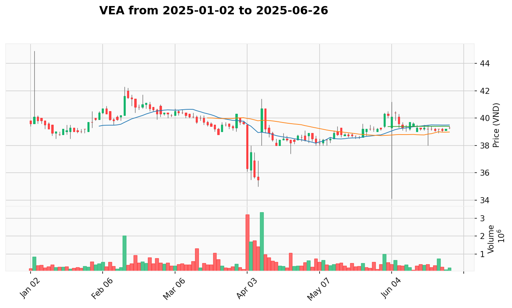

<a href="#others">↑ Back to group OTHERS</a>  |  <a href="#vpa-signal-summary">↑ Back to Top</a>

#### Key Statistics
| Metric | Value |
|:---|---:|
| Date Range | 2025-01-02 to 2025-11-07 |
| **Latest Close** | **41.4** |
| Period Open | 39.8 |
| Period High | 44.9 |
| Period Low | 34.1 |
| Period Change % | 4.02% |

**[Download VEA Data (.csv)](market_data/VEA_2025-01-02_to_2025-11-09.csv)**

---

### VGC

#### [VPA Analysis (2025-06-13 - 2025-10-21)](./VPA.md#vgc)
> **Ngày 2025-10-15:** VGC giảm từ 53.6 VND xuống 52.0 VND (-1.6 VND) với biên độ 2.6 VND. Nến đỏ có thân nến rộng, đóng cửa ở mức thấp nhất phiên. Khối lượng giao dịch đạt 2.6878 triệu cổ phiếu, tăng đáng kể so với phiên trước đó (2.0997 triệu cổ phiếu). Sau phiên 'Sign of Weakness' ngày 2025-10-14, phiên này tiếp tục cho thấy lực cung áp đảo hoàn toàn lực cầu, với giá giảm mạnh và đóng cửa ở mức thấp nhất trong phiên, được xác nhận bởi khối lượng giao dịch tăng cao. Điều này củng cố thêm sự yếu kém rõ rệt của cổ phiếu và khả năng tiếp tục giảm giá. **Phân tích VPA/Wyckoff:** Sign of Weakness (SOW) - Lực cung mạnh mẽ tiếp diễn.
> **Ngày 2025-10-16:** VGC tăng từ 52.0 VND lên 52.5 VND (+0.5 VND) với biên độ 1.0 VND. Nến xanh có thân nến nhỏ, đóng cửa ở giữa đến gần mức cao nhất phiên. Khối lượng giao dịch đạt 0.6537 triệu cổ phiếu, giảm mạnh so với phiên trước đó (2.6878 triệu cổ phiếu). Sau hai phiên giảm mạnh với tín hiệu 'Sign of Weakness', phiên này giá tăng nhẹ nhưng với khối lượng rất thấp. Điều này cho thấy lực cầu yếu ớt và không có sự tham gia mạnh mẽ của người mua, có thể là một nhịp hồi kỹ thuật hoặc kiểm tra lực cầu sau đợt giảm. Sự thiếu vắng khối lượng xác nhận sự yếu kém của thị trường. **Phân tích VPA/Wyckoff:** No Demand (ND) - Lực cầu yếu ớt.
> **Ngày 2025-10-17:** VGC giảm từ 52.7 VND xuống 50.0 VND (-2.7 VND) với biên độ 2.8 VND. Nến đỏ có thân nến rộng, đóng cửa ở mức thấp nhất phiên. Khối lượng giao dịch đạt 3.0509 triệu cổ phiếu, tăng đáng kể so với phiên trước đó (1.3111 triệu cổ phiếu). Sau phiên 'No Demand' ngày 2025-10-16, phiên này tiếp tục cho thấy lực cung áp đảo hoàn toàn lực cầu, với giá giảm mạnh và đóng cửa ở mức thấp nhất trong phiên, được xác nhận bởi khối lượng giao dịch tăng cao. Điều này củng cố thêm sự yếu kém rõ rệt của cổ phiếu và khả năng tiếp tục giảm giá. **Phân tích VPA/Wyckoff:** Sign of Weakness (SOW) - Lực cung mạnh mẽ.
> **Ngày 2025-10-20:** VGC giảm từ 50.0 VND xuống 46.5 VND (-3.5 VND) với biên độ 3.9 VND. Nến đỏ có thân nến rộng, đóng cửa ở mức thấp nhất phiên. Khối lượng giao dịch đạt 2.781 triệu cổ phiếu, giảm nhẹ so với phiên trước đó (3.0509 triệu cổ phiếu) nhưng vẫn ở mức cao. Tiếp nối đà giảm từ phiên 'Sign of Weakness' ngày 2025-10-17, phiên này tiếp tục cho thấy áp lực bán mạnh mẽ, đẩy giá xuống mức thấp nhất trong phiên với biên độ rộng. Mặc dù khối lượng có giảm nhẹ, nhưng vẫn duy trì ở mức cao, xác nhận sự tiếp diễn của xu hướng giảm giá và sự yếu kém của lực cầu. **Phân tích VPA/Wyckoff:** Sign of Weakness (SOW) - Lực cung tiếp tục mạnh mẽ.
> **Ngày 2025-10-21:** VGC giảm từ 46.5 VND xuống 45.1 VND (-1.4 VND) với biên độ 1.95 VND. Nến đỏ có thân nến trung bình, đóng cửa ở giữa thân nến. Khối lượng giao dịch đạt 1.9523 triệu cổ phiếu, giảm đáng kể so với phiên trước đó (2.781 triệu cổ phiếu). Sau các phiên giảm mạnh với khối lượng cao, phiên này tiếp tục giảm giá nhưng với khối lượng thấp hơn đáng kể, cho thấy áp lực bán có thể đang suy yếu hoặc thiếu sự tham gia của cả bên mua và bên bán. Điều này có thể là dấu hiệu của sự cạn kiệt nguồn cung tạm thời, nhưng chưa có lực cầu mạnh mẽ xuất hiện để đảo chiều xu hướng. **Phân tích VPA/Wyckoff:** No Demand (Thiếu cầu).

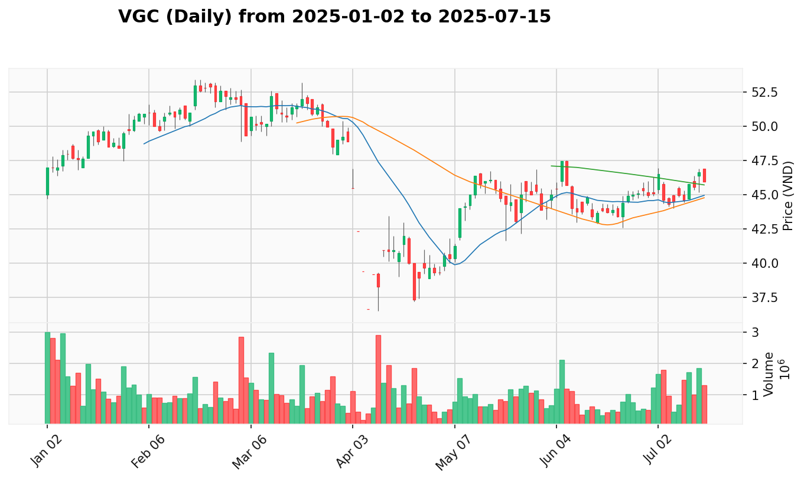

<a href="#bat-dong-san-kcn">↑ Back to group BAT_DONG_SAN_KCN</a>  |  <a href="#vpa-signal-summary">↑ Back to Top</a>

#### Key Statistics
| Metric | Value |
|:---|---:|
| Date Range | 2025-01-02 to 2025-11-07 |
| **Latest Close** | **46.6** |
| Period Open | 45.0 |
| Period High | 69.0 |
| Period Low | 36.5 |
| Period Change % | 3.56% |

**[Download VGC Data (.csv)](market_data/VGC_2025-01-02_to_2025-11-09.csv)**

---

### VGI

#### [VPA Analysis (2025-06-16 - 2025-10-21)](./VPA.md#vgi)
> **Ngày 2025-10-15:** VGI giảm từ 67.0 VND xuống 65.6 VND với đỉnh ngày 67.9 VND và đáy 65.6 VND. Nến giảm có biên độ rộng, đóng cửa ở mức thấp nhất phiên. Khối lượng giao dịch đạt 0.4129 triệu cổ phiếu, tăng so với phiên trước (0.3722 triệu cổ phiếu). Giá giảm mạnh với khối lượng tăng cao và đóng cửa ở mức thấp nhất phiên cho thấy áp lực bán rất mạnh mẽ đang chiếm ưu thế trên thị trường, xác nhận sự tiếp diễn của xu hướng yếu kém đã được thiết lập. **Phân tích VPA/Wyckoff:** Weakness (Yếu kém) - Giá giảm mạnh với khối lượng tăng cao và đóng cửa ở mức thấp nhất phiên, cho thấy áp lực cung mạnh mẽ và sự tiếp diễn của xu hướng giảm.
> **Ngày 2025-10-16:** VGI giảm từ 65.6 VND xuống 65.0 VND với đỉnh ngày 66.5 VND và đáy 64.5 VND. Nến giảm có biên độ rộng, đóng cửa gần mức thấp nhất phiên. Khối lượng giao dịch đạt 0.2564 triệu cổ phiếu, giảm so với phiên trước (0.4129 triệu cổ phiếu). Giá tiếp tục giảm mạnh với biên độ rộng và đóng cửa gần mức thấp nhất phiên, cho thấy áp lực bán vẫn còn mạnh mẽ. Mặc dù khối lượng giảm nhẹ, nhưng vẫn ở mức đáng kể, xác nhận xu hướng yếu kém tiếp diễn. **Phân tích VPA/Wyckoff:** Weakness (Yếu kém) - Giá tiếp tục giảm mạnh với biên độ rộng, đóng cửa gần mức thấp nhất phiên, cho thấy áp lực cung vẫn chiếm ưu thế, dù khối lượng có giảm nhẹ.
> **Ngày 2025-10-17:** VGI tăng nhẹ từ 65.0 VND lên 65.3 VND với đỉnh ngày 65.9 VND và đáy 65.0 VND. Nến tăng có biên độ hẹp, đóng cửa ở giữa thân nến. Khối lượng giao dịch đạt 0.2813 triệu cổ phiếu, giảm đáng kể so với phiên trước (0.3915 triệu cổ phiếu). Sau hai phiên giảm mạnh liên tiếp với áp lực bán chiếm ưu thế, giá có sự hồi phục nhẹ với biên độ hẹp và khối lượng thấp cho thấy áp lực bán đã giảm bớt nhưng lực cầu vẫn chưa đủ mạnh để đẩy giá lên cao. Điều này có thể là một dấu hiệu của sự tạm dừng trong xu hướng giảm hoặc một đợt kiểm tra cung. **Phân tích VPA/Wyckoff:** No Demand (Không có cầu) - Giá tăng nhẹ với biên độ hẹp và khối lượng thấp sau giai đoạn giảm giá, cho thấy thiếu vắng lực cầu mạnh mẽ và khả năng xu hướng giảm tiếp diễn hoặc tích lũy.
> **Ngày 2025-10-20:** VGI tăng từ 65.3 VND lên 68.4 VND với đỉnh ngày 72.0 VND và đáy 65.3 VND. Nến tăng có biên độ rộng, đóng cửa gần mức cao nhất phiên. Khối lượng giao dịch đạt 1.0396 triệu cổ phiếu, tăng đột biến so với phiên trước (0.2813 triệu cổ phiếu). Sau phiên "No Demand" với khối lượng thấp, giá đã bật tăng mạnh mẽ với khối lượng lớn, cho thấy lực cầu đã quay trở lại và hấp thụ toàn bộ áp lực bán, đẩy giá lên cao. Đây là một dấu hiệu tích cực cho thấy sự thay đổi trong xu hướng. **Phân tích VPA/Wyckoff:** Sign of Strength (SOS) - Lực cầu mạnh mẽ với khối lượng gia tăng xác nhận xu hướng tăng.
> **Ngày 2025-10-21:** VGI tăng từ 69.0 VND lên 70.5 VND với đỉnh ngày 71.5 VND và đáy 67.0 VND. Nến tăng có biên độ khá, đóng cửa gần mức cao nhất phiên. Khối lượng giao dịch đạt 0.7346 triệu cổ phiếu, giảm so với phiên trước (1.0396 triệu cổ phiếu) nhưng vẫn ở mức cao. Sau phiên SOS mạnh mẽ, giá tiếp tục tăng cho thấy lực cầu vẫn duy trì và hấp thụ tốt áp lực bán. Mặc dù khối lượng có giảm nhẹ, việc giá đóng cửa cao cho thấy phe mua vẫn đang kiểm soát thị trường. **Phân tích VPA/Wyckoff:** Effort to Rise (Nỗ lực tăng giá)

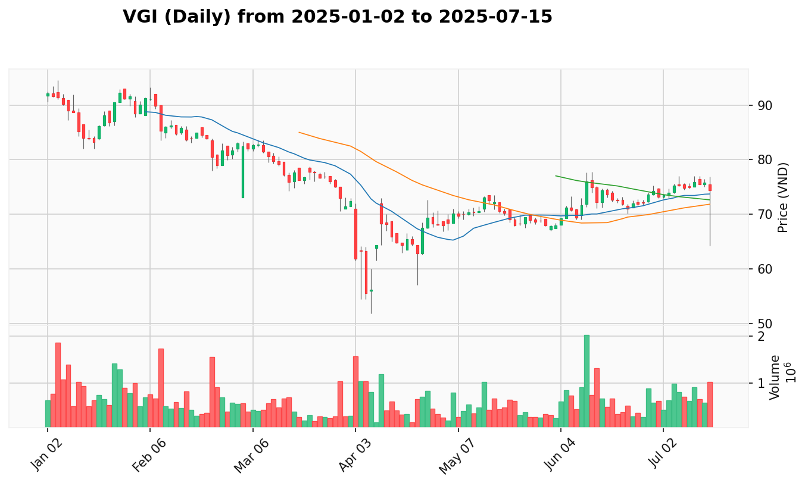

<a href="#cong-nghe">↑ Back to group CONG_NGHE</a>  |  <a href="#vpa-signal-summary">↑ Back to Top</a>

#### Key Statistics
| Metric | Value |
|:---|---:|
| Date Range | 2025-01-02 to 2025-11-07 |
| **Latest Close** | **80.2** |
| Period Open | 90.79 |
| Period High | 93.56 |
| Period Low | 51.29 |
| Period Change % | -11.66% |

**[Download VGI Data (.csv)](market_data/VGI_2025-01-02_to_2025-11-09.csv)**

---

### VGS

#### [VPA Analysis (2025-08-14 - 2025-10-21)](./VPA.md#vgs)
> **Ngày 2025-10-15:** VGS giảm từ 32.0 VND xuống 31.6 VND với khối lượng giao dịch giảm xuống 1.447 triệu cổ phiếu. Cây nến có biên độ tương đối rộng và đóng cửa gần mức thấp nhất phiên. Sau phiên "Sign of Weakness" (SOW) mạnh mẽ ngày 2025-10-14, phiên này cho thấy áp lực bán vẫn duy trì nhưng với cường độ thấp hơn, đồng thời lực cầu vẫn yếu. Sự giảm giá với khối lượng thấp xác nhận sự thiếu hụt lực mua, cho thấy xu hướng giảm giá có thể tiếp diễn. **Phân tích VPA/Wyckoff:** No Demand (Thiếu cầu)
> **Ngày 2025-10-16:** VGS tăng từ 31.6 VND lên 32.1 VND. Cây nến tăng có biên độ trung bình và đóng cửa gần mức cao nhất phiên, cho thấy lực mua xuất hiện. Tuy nhiên, khối lượng giao dịch chỉ đạt 0.7464 triệu cổ phiếu, thấp hơn đáng kể so với 1.447 triệu cổ phiếu của phiên trước và mức trung bình. Sau hai phiên suy yếu liên tiếp ("Sign of Weakness" và "No Demand"), sự tăng giá với khối lượng thấp này có thể là một dấu hiệu kiểm tra nguồn cung (Test for Supply), cho thấy áp lực bán đã giảm bớt nhưng lực cầu mạnh mẽ vẫn chưa quay trở lại. **Phân tích VPA/Wyckoff:** Test for Supply (Kiểm tra nguồn cung)
> **Ngày 2025-10-17:** VGS giảm từ 33.7 VND xuống 32.4 VND với khối lượng giao dịch đạt 1.7719 triệu cổ phiếu. Cây nến có biên độ rộng và đóng cửa tại mức thấp nhất phiên, cho thấy áp lực bán mạnh mẽ đã quay trở lại sau phiên tăng giá mạnh ngày 2025-10-16. Mặc dù khối lượng giao dịch thấp hơn đáng kể so với phiên trước (3.1874 triệu cổ phiếu), nhưng sự giảm giá dứt khoát với biên độ rộng và đóng cửa ở mức thấp nhất cho thấy lực cầu đã suy yếu và không thể hấp thụ được nguồn cung. Điều này báo hiệu sự suy yếu của xu hướng tăng giá ngắn hạn và khả năng tiếp diễn xu hướng giảm. **Phân tích VPA/Wyckoff:** Dấu hiệu suy yếu
> **Ngày 2025-10-20:** VGS giảm từ 32.4 VND xuống 29.2 VND với khối lượng giao dịch đạt 2.7787 triệu cổ phiếu. Cây nến giảm có biên độ rộng và đóng cửa tại mức thấp nhất phiên, cho thấy áp lực bán mạnh mẽ tiếp tục gia tăng. Khối lượng giao dịch tăng đáng kể so với phiên trước xác nhận lực bán đang chiếm ưu thế và khả năng tiếp diễn xu hướng giảm. **Phân tích VPA/Wyckoff:** Dấu hiệu suy yếu (tiếp diễn)
> **Ngày 2025-10-21:** VGS giảm từ 29.2 VND xuống 27.7 VND với khối lượng giao dịch đạt 2.833 triệu cổ phiếu. Cây nến giảm có biên độ rộng và đóng cửa gần mức thấp nhất phiên, cho thấy áp lực bán mạnh mẽ tiếp tục chiếm ưu thế. Khối lượng giao dịch duy trì ở mức cao, xác nhận sự tiếp diễn của lực cung và xu hướng giảm giá. So với các phiên trước, đặc biệt là sau các dấu hiệu suy yếu từ ngày 2025-10-17 và 2025-10-20, phiên này củng cố thêm nhận định về sự suy yếu của cổ phiếu. **Phân tích VPA/Wyckoff:** Dấu hiệu suy yếu (tiếp diễn)

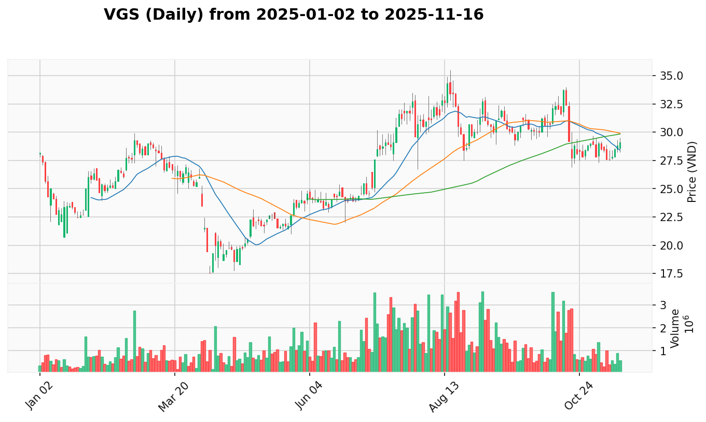

<a href="#thep">↑ Back to group THEP</a>  |  <a href="#vpa-signal-summary">↑ Back to Top</a>

#### Key Statistics
| Metric | Value |
|:---|---:|
| Date Range | 2025-01-02 to 2025-11-07 |
| **Latest Close** | **27.6** |
| Period Open | 28.09 |
| Period High | 35.5 |
| Period Low | 17.55 |
| Period Change % | -1.74% |

**[Download VGS Data (.csv)](market_data/VGS_2025-01-02_to_2025-11-09.csv)**

---

### VGT

#### [VPA Analysis (2025-06-16 - 2025-10-21)](./VPA.md#vgt)
> **Ngày 2025-10-15:** VGT giảm từ 12.2 VND xuống 12.1 VND, với biên độ nến hẹp từ 12.0 VND đến 12.2 VND và đóng cửa ở giữa nến. Khối lượng giao dịch đạt 0.5696 triệu cổ phiếu, giảm so với phiên trước (0.6765 triệu cổ phiếu). Sau phiên "Kiểm tra nguồn cung" thành công, việc giá giảm nhẹ với khối lượng thấp cho thấy lực cầu yếu và thiếu sự hỗ trợ để đẩy giá lên cao hơn. **Phân tích VPA/Wyckoff:** Thiếu cầu (No Demand)
> **Ngày 2025-10-16:** VGT giữ nguyên mức giá đóng cửa 12.1 VND so với phiên trước, với biên độ nến hẹp (từ 12.0 VND đến 12.2 VND) và đóng cửa ở giữa nến. Khối lượng giao dịch đạt 0.4205 triệu cổ phiếu, tiếp tục giảm so với phiên trước (0.5696 triệu cổ phiếu). Sau phiên "Thiếu cầu", việc giá đi ngang với khối lượng thấp cho thấy thị trường vẫn thiếu lực cầu và không có sự quan tâm đáng kể từ cả bên mua và bên bán. **Phân tích VPA/Wyckoff:** Thiếu cầu (No Demand)
> **Ngày 2025-10-17:** VGT giữ nguyên mức giá đóng cửa 12.0 VND so với phiên trước, với biên độ nến hẹp từ 12.0 VND đến 12.1 VND và đóng cửa ở mức thấp nhất phiên. Khối lượng giao dịch đạt 0.5105 triệu cổ phiếu, giảm so với phiên trước (0.7129 triệu cổ phiếu). Sau phiên giá đi ngang với khối lượng giảm, việc giá tiếp tục đi ngang với khối lượng thấp hơn nữa cho thấy lực cầu vẫn yếu và thị trường thiếu động lực tăng giá. **Phân tích VPA/Wyckoff:** Thiếu cầu (No Demand)
> **Ngày 2025-10-20:** VGT mở cửa tại 11.9 VND và đóng cửa tại 11.1 VND, giảm mạnh so với phiên trước (đóng cửa 12.0 VND). Cây nến có biên độ rộng (từ 11.1 VND đến 12.2 VND) và đóng cửa ở mức thấp nhất phiên. Khối lượng giao dịch đạt 1.0764 triệu cổ phiếu, tăng gấp đôi so với phiên trước (0.5105 triệu cổ phiếu). Sau các phiên "Thiếu cầu", sự sụt giảm mạnh về giá đi kèm với khối lượng gia tăng cho thấy áp lực bán rất lớn và nguồn cung đang chiếm ưu thế hoàn toàn trên thị trường. **Phân tích VPA/Wyckoff:** Supply Coming In (Nguồn cung xuất hiện)
> **Ngày 2025-10-21:** VGT mở cửa tại 11.6 VND và đóng cửa tại 11.6 VND, tăng nhẹ so với phiên trước (đóng cửa 11.1 VND). Cây nến có biên độ hẹp (từ 11.2 VND đến 11.7 VND) và đóng cửa ở mức giữa đến cao của phiên. Khối lượng giao dịch đạt 0.6801 triệu cổ phiếu, giảm đáng kể so với phiên trước (1.0764 triệu cổ phiếu). Sau phiên "Supply Coming In" với giá giảm mạnh và khối lượng lớn, phiên này cho thấy giá hồi phục nhẹ với khối lượng thấp, cho thấy áp lực bán đã giảm bớt nhưng lực cầu vẫn chưa thực sự mạnh mẽ để đẩy giá lên cao hơn. Đây có thể là một nhịp hồi kỹ thuật hoặc một phiên kiểm tra nguồn cung sau đợt bán tháo. **Phân tích VPA/Wyckoff:** Test for Supply (Kiểm tra nguồn cung)

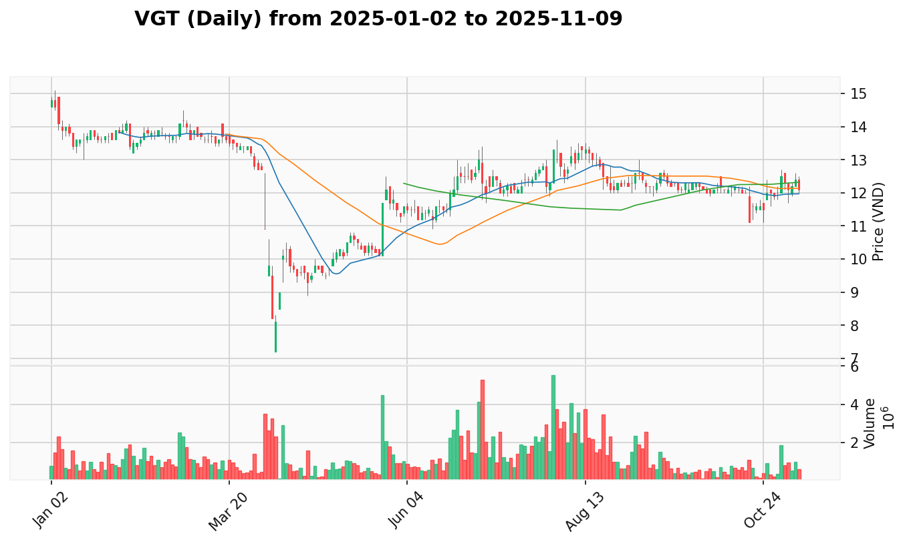

<a href="#det-may">↑ Back to group DET_MAY</a>  |  <a href="#vpa-signal-summary">↑ Back to Top</a>

#### Key Statistics
| Metric | Value |
|:---|---:|
| Date Range | 2025-01-02 to 2025-11-07 |
| **Latest Close** | **12.1** |
| Period Open | 14.6 |
| Period High | 15.1 |
| Period Low | 7.2 |
| Period Change % | -17.12% |

**[Download VGT Data (.csv)](market_data/VGT_2025-01-02_to_2025-11-09.csv)**

---

### VHC

#### [VPA Analysis (2025-06-16 - 2025-10-21)](./VPA.md#vhc)
> **Ngày 2025-10-15:** VHC tiếp tục giảm từ 55.1 VND xuống 54.2 VND, với biên độ nến rộng và đóng cửa ở mức thấp nhất phiên. Khối lượng giao dịch đạt 1.082 triệu cổ phiếu, thấp hơn một chút so với phiên trước nhưng vẫn duy trì áp lực bán. Sau phiên Sign of Weakness (SOW) ngày 2025-10-14, việc giá tiếp tục giảm mạnh và đóng cửa ở mức thấp nhất phiên cho thấy lực bán vẫn đang chiếm ưu thế và chưa có dấu hiệu dừng lại. Điều này xác nhận sự suy yếu của lực cầu và khả năng tiếp tục điều chỉnh. **Phân tích VPA/Wyckoff:** Selling Pressure (Áp lực bán) - Giá tiếp tục giảm mạnh với khối lượng duy trì, cho thấy lực bán vẫn đang kiểm soát thị trường.
> **Ngày 2025-10-16:** VHC tăng nhẹ từ 54.2 VND lên 54.4 VND với biên độ nến hẹp và đóng cửa gần mức giữa phiên. Khối lượng giao dịch chỉ đạt 0.2177 triệu cổ phiếu, giảm mạnh so với phiên trước (1.082 triệu cổ phiếu) và ở mức rất thấp. Sau hai phiên giảm giá mạnh với áp lực bán chiếm ưu thế (SOW và Selling Pressure), phiên này cho thấy sự tạm dừng của lực bán nhưng không có lực cầu mạnh mẽ tham gia. Khối lượng thấp trong khi giá tăng nhẹ cho thấy sự thiếu vắng của cả người mua và người bán, hoặc một sự kiểm tra cung cầu yếu ớt. Điều này không xác nhận sự đảo chiều mà chỉ là một sự tạm lắng trong xu hướng giảm. **Phân tích VPA/Wyckoff:** No Demand (Không có cầu) - Giá tăng nhẹ với khối lượng rất thấp, cho thấy lực cầu yếu và khả năng tiếp tục điều chỉnh.
> **Ngày 2025-10-17:** VHC tăng nhẹ từ 54.3 VND lên 54.4 VND với biên độ nến hẹp và đóng cửa gần mức mở cửa. Khối lượng giao dịch đạt 0.6184 triệu cổ phiếu, cao hơn phiên trước nhưng vẫn ở mức thấp so với các phiên có biến động giá lớn. Sau phiên 'No Demand' ngày 2025-10-16, phiên này tiếp tục cho thấy lực cầu yếu và chưa có sự tham gia mạnh mẽ của người mua. Mặc dù giá tăng nhẹ, khối lượng không đủ để xác nhận một xu hướng tăng bền vững, cho thấy thị trường vẫn đang trong giai đoạn thiếu động lực. **Phân tích VPA/Wyckoff:** No Demand (Không có cầu) - Giá tăng nhẹ với khối lượng thấp, cho thấy lực cầu yếu và khả năng tiếp tục điều chỉnh.
> **Ngày 2025-10-20:** VHC giảm từ 54.4 VND xuống 51.9 VND với biên độ nến rộng và đóng cửa gần mức thấp nhất phiên. Khối lượng giao dịch đạt 1.4669 triệu cổ phiếu, tăng đáng kể so với phiên trước (0.6184 triệu cổ phiếu) và cao hơn mức trung bình. Sau hai phiên "No Demand" cho thấy lực cầu yếu, phiên này xác nhận áp lực bán mạnh mẽ với sự tham gia của phe bán. **Phân tích VPA/Wyckoff:** Selling Pressure (Áp lực bán) - Giá giảm mạnh với khối lượng tăng, cho thấy lực cung chiếm ưu thế.
> **Ngày 2025-10-21:** VHC tăng từ 51.9 VND lên 54.0 VND với biên độ nến rộng và đóng cửa ở mức cao nhất phiên. Khối lượng giao dịch đạt 1.0334 triệu cổ phiếu, giảm so với phiên trước (1.4669 triệu cổ phiếu). Sau phiên áp lực bán mạnh mẽ ngày 2025-10-20, phiên này cho thấy nỗ lực đẩy giá lên của phe mua. Mặc dù giá tăng mạnh và đóng cửa ở mức cao nhất, khối lượng giảm cho thấy lực cầu chưa thực sự áp đảo, cần theo dõi thêm để xác nhận xu hướng. **Phân tích VPA/Wyckoff:** Effort to Rise (Nỗ lực tăng giá) - Giá tăng mạnh với khối lượng giảm, cho thấy nỗ lực của phe mua nhưng chưa có sự xác nhận mạnh mẽ từ khối lượng.

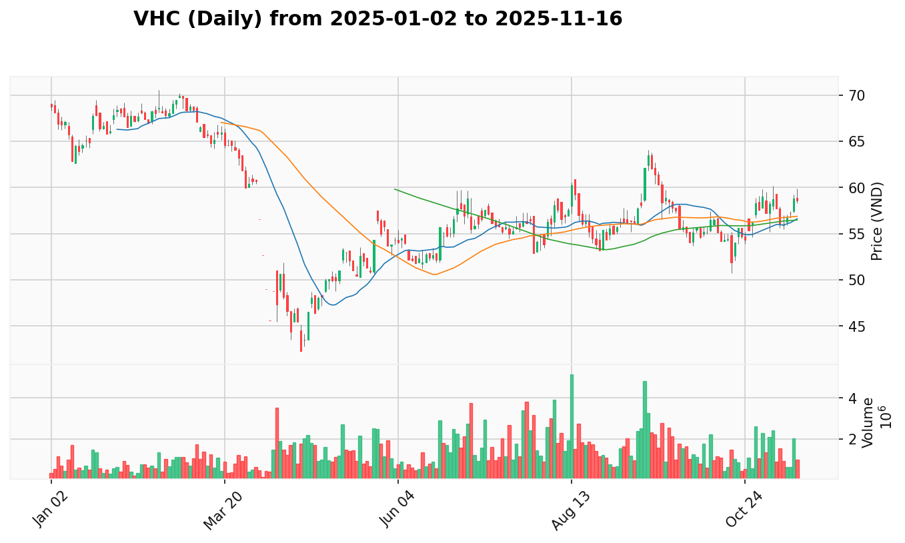

<a href="#thuy-san">↑ Back to group THUY_SAN</a>  |  <a href="#vpa-signal-summary">↑ Back to Top</a>

#### Key Statistics
| Metric | Value |
|:---|---:|
| Date Range | 2025-01-02 to 2025-11-07 |
| **Latest Close** | **56.0** |
| Period Open | 69.0 |
| Period High | 70.55 |
| Period Low | 42.28 |
| Period Change % | -18.84% |

**[Download VHC Data (.csv)](market_data/VHC_2025-01-02_to_2025-11-09.csv)**

---

### VHM

#### [VPA Analysis (2025-06-13 - 2025-10-21)](./VPA.md#vhm)
> **Ngày 2025-10-15:** VHM giảm từ 127.0 VND xuống 124.0 VND với khối lượng giao dịch đạt 7.0593 triệu cổ phiếu. Cây nến giảm có biên độ khá rộng và đóng cửa gần mức thấp nhất phiên, cho thấy áp lực bán xuất hiện. Tuy nhiên, khối lượng giao dịch giảm đáng kể so với phiên trước (13.6602 triệu cổ phiếu), cho thấy lực bán không quá mạnh và có thể là một nhịp điều chỉnh tự nhiên sau chuỗi tăng giá. **Phân tích VPA/Wyckoff:** Reaction - Lực bán yếu với khối lượng giảm, cho thấy đây có thể là nhịp điều chỉnh trong xu hướng tăng.
> **Ngày 2025-10-16:** VHM giảm từ 124.0 VND xuống 122.5 VND với khối lượng giao dịch đạt 4.0447 triệu cổ phiếu. Cây nến giảm có biên độ khá rộng, đóng cửa gần mức thấp nhất phiên, cho thấy áp lực bán tiếp diễn. Tuy nhiên, khối lượng giao dịch giảm mạnh so với phiên trước (7.0593 triệu cổ phiếu), cho thấy lực bán không quá mạnh và có thể là do thiếu cầu. Đây là dấu hiệu của sự điều chỉnh tiếp tục trong xu hướng tăng. **Phân tích VPA/Wyckoff:** No Demand (ND) - Lực cầu yếu, khối lượng giảm mạnh, cho thấy thị trường chưa sẵn sàng tăng giá.
> **Ngày 2025-10-17:** VHM giảm từ 122.0 VND xuống 116.0 VND với khối lượng giao dịch đạt 12.2135 triệu cổ phiếu. Cây nến giảm có biên độ rộng và đóng cửa gần mức thấp nhất phiên, cho thấy áp lực bán mạnh mẽ. Khối lượng giao dịch tăng đáng kể so với phiên trước (9.4759 triệu cổ phiếu), xác nhận lực bán đang chiếm ưu thế và sự suy yếu tiếp diễn sau các phiên điều chỉnh. **Phân tích VPA/Wyckoff:** Sign of Weakness (SOW) - Lực bán mạnh với khối lượng gia tăng, xác nhận xu hướng giảm giá.
> **Ngày 2025-10-20:** VHM giảm từ 114.0 VND xuống 108.0 VND với khối lượng giao dịch đạt 11.6348 triệu cổ phiếu. Cây nến giảm có biên độ rộng và đóng cửa ở mức thấp nhất phiên, cho thấy áp lực bán tiếp tục chiếm ưu thế. Khối lượng giao dịch duy trì ở mức cao, mặc dù thấp hơn một chút so với phiên trước, xác nhận sự suy yếu của thị trường. **Phân tích VPA/Wyckoff:** Sign of Weakness (SOW) - Lực bán mạnh mẽ tiếp diễn, giá đóng cửa ở mức thấp nhất phiên.
> **Ngày 2025-10-21:** VHM tăng từ 108.0 VND lên 110.9 VND với khối lượng giao dịch đạt 8.2383 triệu cổ phiếu. Cây nến tăng có biên độ tương đối rộng nhưng đóng cửa ở giữa thân nến, cho thấy lực mua xuất hiện nhưng không đủ mạnh để đẩy giá lên cao hơn. Khối lượng giao dịch giảm đáng kể so với các phiên giảm trước đó, cho thấy áp lực bán có thể đã tạm thời giảm bớt, nhưng lực cầu vẫn còn yếu. Đây là một nhịp hồi phục yếu sau chuỗi giảm giá. **Phân tích VPA/Wyckoff:** Weak Rally (Hồi phục yếu)

<a href="#bat-dong-san">↑ Back to group BAT_DONG_SAN</a>  |  <a href="#vpa-signal-summary">↑ Back to Top</a>

#### Key Statistics
| Metric | Value |
|:---|---:|
| Date Range | 2025-01-02 to 2025-11-07 |
| **Latest Close** | **92.0** |
| Period Open | 40.1 |
| Period High | 131.5 |
| Period Low | 37.6 |
| Period Change % | 129.43% |

**[Download VHM Data (.csv)](market_data/VHM_2025-01-02_to_2025-11-09.csv)**

---

### VIB

#### [VPA Analysis (2025-06-16 - 2025-10-21)](./VPA.md#vib)
> **Ngày 2025-10-15:** VIB mở cửa 19.9, đạt đỉnh 20.4, thấp nhất 19.9, đóng cửa 20.25. Giá tăng từ 20.0 (giá đóng cửa phiên trước) lên 20.25, tạo nến tăng có biên độ hẹp. Khối lượng giao dịch đạt 11.0544 triệu cổ phiếu, giảm so với phiên trước (13.6774 triệu cổ phiếu). Sau hai phiên giảm giá với áp lực bán mạnh, phiên này giá có sự phục hồi nhẹ nhưng với khối lượng giảm. Điều này cho thấy lực cầu yếu và không đủ mạnh để đẩy giá lên cao một cách bền vững, có thể là một đợt kiểm tra cung hoặc sự thiếu vắng nhu cầu. Sự tăng giá trên khối lượng thấp sau một giai đoạn yếu kém thường không phải là dấu hiệu tích cực. **Phân tích VPA/Wyckoff:** No Demand (Thiếu cầu)
> **Ngày 2025-10-16:** VIB mở cửa 20.25, đạt đỉnh 20.25, thấp nhất 20.05, đóng cửa 20.1. Giá giảm từ 20.25 (giá đóng cửa phiên trước) xuống 20.1, tạo nến giảm có biên độ hẹp và đóng cửa gần mức thấp nhất phiên. Khối lượng giao dịch đạt 3.5 triệu cổ phiếu, giảm mạnh so với phiên trước (11.0544 triệu cổ phiếu). Sau phiên "Thiếu cầu" ngày 2025-10-15, phiên này giá tiếp tục giảm nhẹ với khối lượng rất thấp. Điều này cho thấy cả lực cung và lực cầu đều yếu, thị trường đang thiếu động lực. Sự giảm giá trên khối lượng thấp sau một giai đoạn yếu kém củng cố nhận định về sự thiếu vắng nhu cầu và có thể là một đợt kiểm tra cung ở mức thấp hơn. **Phân tích VPA/Wyckoff:** No Demand (Thiếu cầu)
> **Ngày 2025-10-17:** VIB mở cửa 20.0, đạt đỉnh 20.15, thấp nhất 19.7, đóng cửa 19.7. Giá giảm từ 20.0 (giá đóng cửa phiên trước) xuống 19.7, tạo nến giảm có biên độ tương đối rộng và đóng cửa ở mức thấp nhất phiên. Khối lượng giao dịch đạt 12.63 triệu cổ phiếu, tăng đáng kể so với phiên trước (8.46 triệu cổ phiếu). Sau hai phiên "Thiếu cầu" với khối lượng thấp, phiên này cho thấy áp lực bán gia tăng mạnh mẽ, đẩy giá xuống thấp hơn với khối lượng cao. Điều này cho thấy nguồn cung đang chiếm ưu thế và có thể là sự khởi đầu của một đợt giảm giá mới hoặc tiếp tục xu hướng giảm. **Phân tích VPA/Wyckoff:** Sign of Weakness (SOW) - Lực cung mạnh mẽ
> **Ngày 2025-10-20:** VIB mở cửa 19.7, đạt đỉnh 19.8, thấp nhất 18.35, đóng cửa 18.35. Giá giảm mạnh từ 19.7 (giá đóng cửa phiên trước) xuống 18.35, tạo nến giảm có biên độ rất rộng và đóng cửa ở mức thấp nhất phiên. Khối lượng giao dịch đạt 21.1894 triệu cổ phiếu, tăng đột biến và là mức cao nhất trong 10 phiên gần đây. Sau các phiên "Thiếu cầu" và "Lực cung mạnh mẽ", phiên này cho thấy áp lực bán tháo cực lớn, đẩy giá xuống sâu với khối lượng kỷ lục, cho thấy sự hoảng loạn của thị trường. **Phân tích VPA/Wyckoff:** Selling Climax (SC) - Bán tháo đỉnh điểm.
> **Ngày 2025-10-21:** VIB mở cửa 18.4, đạt đỉnh 18.95, thấp nhất 18.2, đóng cửa 18.65. Giá tăng từ 18.35 (giá đóng cửa phiên trước) lên 18.65, tạo nến tăng có biên độ tương đối rộng và đóng cửa cao hơn giá mở cửa. Khối lượng giao dịch đạt 14.71 triệu cổ phiếu, giảm đáng kể so với phiên trước (21.19 triệu cổ phiếu). Sau phiên "Bán tháo đỉnh điểm" với khối lượng cực lớn, phiên này cho thấy giá phục hồi nhẹ với khối lượng giảm, cho thấy áp lực bán đã giảm bớt và có lực cầu hấp thụ. Điều này có thể là một sự kiểm tra lại vùng giá thấp sau bán tháo. **Phân tích VPA/Wyckoff:** Test (Kiểm tra) - Kiểm tra lực cung sau bán tháo.

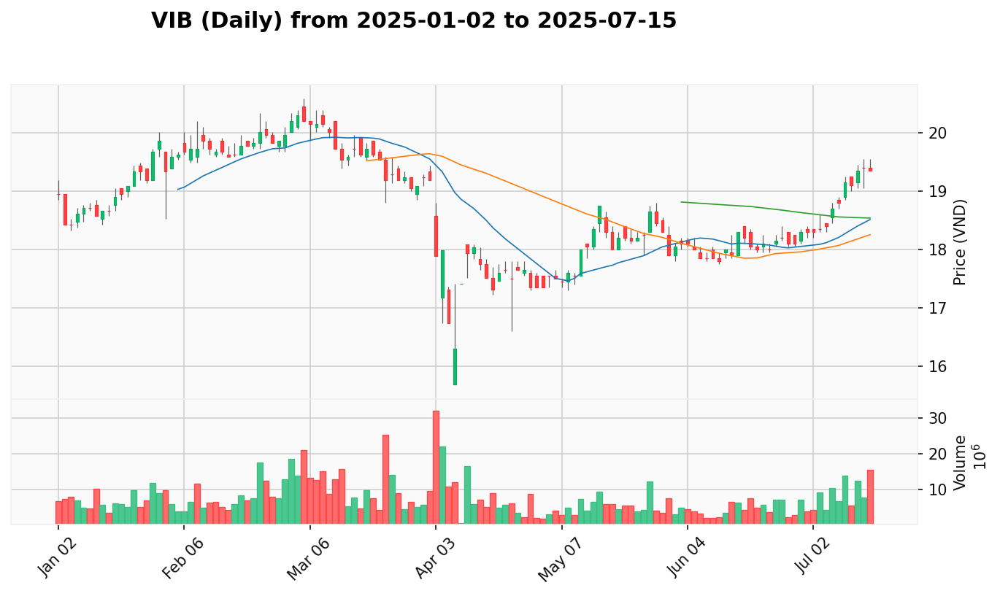

<a href="#ngan-hang">↑ Back to group NGAN_HANG</a>  |  <a href="#vpa-signal-summary">↑ Back to Top</a>

#### Key Statistics
| Metric | Value |
|:---|---:|
| Date Range | 2025-01-02 to 2025-11-07 |
| **Latest Close** | **18.3** |
| Period Open | 16.62 |
| Period High | 24.8 |
| Period Low | 13.75 |
| Period Change % | 10.11% |

**[Download VIB Data (.csv)](market_data/VIB_2025-01-02_to_2025-11-09.csv)**

---

### VIC

#### [VPA Analysis (2025-06-10 - 2025-10-21)](./VPA.md#vic)
> **Ngày 2025-10-15:** VIC giảm từ 211.9 VND xuống 209.5 VND. Nến có biên độ tương đối rộng, giá mở cửa cao hơn giá đóng cửa, cho thấy lực cung chiếm ưu thế trong phiên. Khối lượng giao dịch đạt 3.7524 triệu cổ phiếu, giảm đáng kể so với phiên trước (8.0655 triệu cổ phiếu) và là mức thấp nhất trong 10 phiên gần đây. Sự giảm giá đi kèm với khối lượng thấp cho thấy áp lực bán đã giảm bớt sau phiên lực cung xuất hiện mạnh mẽ trước đó, hoặc thiếu vắng lực cầu để đẩy giá lên. **Phân tích VPA/Wyckoff:** No Demand (Thiếu cầu) - Giá giảm với khối lượng thấp, cho thấy lực bán không quá mạnh nhưng lực mua cũng chưa xuất hiện.
> **Ngày 2025-10-16:** VIC tăng từ 209.5 VND lên 211.8 VND. Nến có biên độ tương đối rộng và đóng cửa ở mức cao nhất phiên, cho thấy lực cầu đã xuất hiện và chiếm ưu thế trong phiên. Tuy nhiên, khối lượng giao dịch chỉ đạt 2.0283 triệu cổ phiếu, mức thấp nhất trong 10 phiên gần đây và giảm đáng kể so với phiên trước (3.7524 triệu cổ phiếu). Sự tăng giá với khối lượng rất thấp sau hai phiên có dấu hiệu lực cung xuất hiện và thiếu cầu cho thấy đây có thể là một đợt kiểm tra cung. Mặc dù giá đóng cửa ở mức cao nhất phiên là tín hiệu tích cực, nhưng khối lượng thấp cho thấy sự thiếu vắng sự tham gia mạnh mẽ của người mua. **Phân tích VPA/Wyckoff:** Test for Supply (Kiểm tra cung)
> **Ngày 2025-10-17:** VIC giảm từ 213.1 VND xuống 204.0 VND. Nến có biên độ rộng, giá mở cửa cao hơn giá đóng cửa và đóng cửa gần mức thấp nhất phiên, cho thấy lực cung áp đảo hoàn toàn trong phiên. Khối lượng giao dịch đạt 5.6151 triệu cổ phiếu, tăng so với phiên trước (5.2174 triệu cổ phiếu). Sự giảm giá mạnh đi kèm với khối lượng tăng xác nhận áp lực bán đang gia tăng sau phiên kiểm tra cung trước đó. Điều này cho thấy thị trường đang hấp thụ lượng cung lớn. **Phân tích VPA/Wyckoff:** Sign of Weakness (SOW) - Lực cung mạnh mẽ xuất hiện.
> **Ngày 2025-10-20:** VIC giảm từ 204.0 VND xuống 194.9 VND. Nến có biên độ rộng, giá mở cửa cao hơn giá đóng cửa và đóng cửa gần mức thấp nhất phiên, cho thấy lực cung tiếp tục áp đảo. Khối lượng giao dịch đạt 5.671 triệu cổ phiếu, cao hơn một chút so với phiên trước (5.6151 triệu cổ phiếu). Sự giảm giá mạnh đi kèm với khối lượng duy trì ở mức cao xác nhận áp lực bán vẫn đang rất mạnh mẽ, tiếp nối tín hiệu suy yếu từ phiên trước. Điều này cho thấy thị trường đang trong giai đoạn phân phối hoặc giảm giá. **Phân tích VPA/Wyckoff:** Continued Sign of Weakness (SOW) - Lực cung tiếp tục chiếm ưu thế.
> **Ngày 2025-10-21:** VIC tăng từ 194.9 VND lên 203.4 VND. Nến có biên độ rộng, giá mở cửa thấp hơn giá đóng cửa và đóng cửa gần mức cao nhất phiên, cho thấy lực cầu đã xuất hiện và chiếm ưu thế trong phiên. Khối lượng giao dịch đạt 3.7004 triệu cổ phiếu, giảm đáng kể so với phiên trước (5.671 triệu cổ phiếu). Sự tăng giá này diễn ra sau hai phiên giảm mạnh với khối lượng lớn, cho thấy có thể lực cung đã tạm thời suy yếu hoặc đã được hấp thụ một phần. Tuy nhiên, khối lượng thấp hơn trong phiên tăng giá này cần được theo dõi thêm để xác nhận sức mạnh của lực cầu. **Phân tích VPA/Wyckoff:** Reaction Rally (RR) - Lực cầu xuất hiện sau giai đoạn suy yếu, nhưng khối lượng thấp cần được xác nhận.

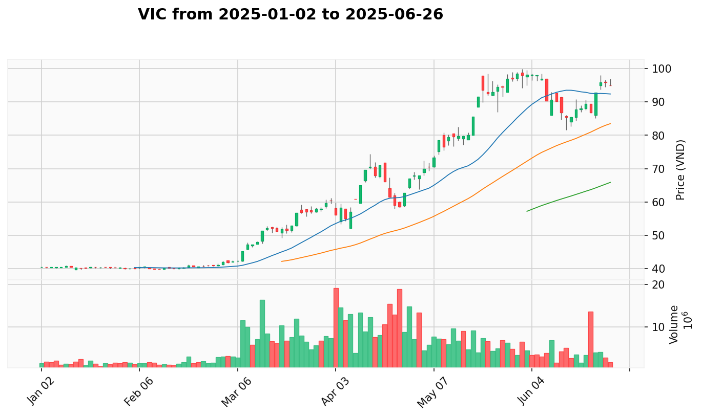

<a href="#bat-dong-san">↑ Back to group BAT_DONG_SAN</a>  |  <a href="#vpa-signal-summary">↑ Back to Top</a>

#### Key Statistics
| Metric | Value |
|:---|---:|
| Date Range | 2025-01-02 to 2025-11-07 |
| **Latest Close** | **199.7** |
| Period Open | 40.5 |
| Period High | 226.5 |
| Period Low | 39.7 |
| Period Change % | 393.09% |

**[Download VIC Data (.csv)](market_data/VIC_2025-01-02_to_2025-11-09.csv)**

---

### VIF

#### [VPA Analysis (2025-08-14 - 2025-10-21)](./VPA.md#vif)
> **Ngày 2025-10-15:** VIF giảm từ 16.2 VND xuống 16.1 VND, với khối lượng giao dịch đạt 0.0087 triệu cổ phiếu, tăng đáng kể so với phiên trước (0.0043 triệu cổ phiếu). Cây nến có giá mở cửa, cao nhất, thấp nhất và đóng cửa đều ở mức 16.1 VND, cho thấy biên độ dao động cực hẹp và sự thiếu quyết đoán của thị trường. Mặc dù biên độ giá hẹp, việc giá giảm với khối lượng tăng cho thấy áp lực bán đang gia tăng, xác nhận sự yếu kém của thị trường sau các phiên "Thiếu cầu" và "Không có cầu" trước đó. **Phân tích VPA/Wyckoff:** Sign of Weakness (SOW) - Dấu hiệu suy yếu.
> **Ngày 2025-10-16:** VIF giảm mạnh từ 16.1 VND xuống 15.1 VND, với khối lượng giao dịch đạt 0.0029 triệu cổ phiếu, giảm đáng kể so với phiên trước (0.0087 triệu cổ phiếu). Cây nến có giá mở cửa, thấp nhất và đóng cửa đều ở mức 15.1 VND, cho thấy áp lực bán mạnh mẽ đã đẩy giá xuống mức thấp nhất trong phiên và đóng cửa tại đó. Mặc dù giá giảm sâu, khối lượng giao dịch thấp cho thấy lực cầu vẫn yếu ớt và không có sự tham gia của dòng tiền lớn để hỗ trợ giá, tiếp nối các tín hiệu suy yếu từ các phiên trước. **Phân tích VPA/Wyckoff:** No Demand (Không có cầu)
> **Ngày 2025-10-17:** VIF giảm từ 16.0 VND xuống 15.9 VND, với khối lượng giao dịch đạt 0.0043 triệu cổ phiếu, tăng so với phiên trước (0.003 triệu cổ phiếu). Cây nến có giá mở cửa, cao nhất, thấp nhất và đóng cửa đều ở mức 15.9 VND, cho thấy biên độ dao động cực hẹp và sự thiếu quyết đoán của thị trường. Mặc dù biên độ giá hẹp, việc giá giảm nhẹ với khối lượng tăng sau các tín hiệu suy yếu từ các phiên trước cho thấy áp lực bán vẫn đang duy trì và lực cầu chưa đủ mạnh để hấp thụ. Điều này tiếp tục xác nhận sự yếu kém của thị trường. **Phân tích VPA/Wyckoff:** Sign of Weakness (SOW) - Dấu hiệu suy yếu.
> **Ngày 2025-10-20:** VIF giảm từ 15.9 VND xuống 15.8 VND, với khối lượng giao dịch đạt 0.0056 triệu cổ phiếu, tăng so với phiên trước (0.0043 triệu cổ phiếu). Cây nến có giá mở cửa, cao nhất, thấp nhất và đóng cửa đều ở mức 15.8 VND, cho thấy biên độ dao động cực hẹp. Mặc dù biên độ giá hẹp, việc giá giảm nhẹ với khối lượng tăng sau các tín hiệu suy yếu từ các phiên trước cho thấy áp lực bán vẫn đang duy trì và lực cầu chưa đủ mạnh để hấp thụ. Điều này tiếp tục xác nhận sự yếu kém của thị trường. **Phân tích VPA/Wyckoff:** Sign of Weakness (SOW) - Dấu hiệu suy yếu.
> **Ngày 2025-10-21:** VIF giảm từ 15.8 VND xuống 15.0 VND, với khối lượng giao dịch đạt 0.0116 triệu cổ phiếu, tăng mạnh so với phiên trước (0.0056 triệu cổ phiếu). Cây nến giảm có biên độ rộng, đóng cửa ở mức thấp nhất phiên, cho thấy áp lực bán rất mạnh và sự thiếu hụt lực cầu. Điều này tiếp tục củng cố các dấu hiệu suy yếu đã xuất hiện trong các phiên gần đây. **Phân tích VPA/Wyckoff:** Sign of Weakness (SOW) - Áp lực bán mạnh mẽ và tiếp diễn.

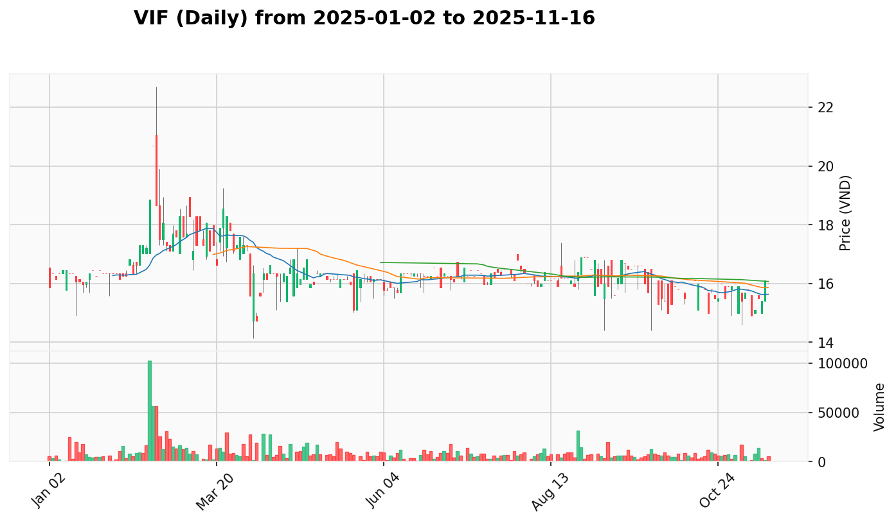

<a href="#thep">↑ Back to group THEP</a>  |  <a href="#vpa-signal-summary">↑ Back to Top</a>

#### Key Statistics
| Metric | Value |
|:---|---:|
| Date Range | 2025-01-02 to 2025-11-07 |
| **Latest Close** | **14.9** |
| Period Open | 16.54 |
| Period High | 22.7 |
| Period Low | 14.14 |
| Period Change % | -9.92% |

**[Download VIF Data (.csv)](market_data/VIF_2025-01-02_to_2025-11-09.csv)**

---

### VIG

#### [VPA Analysis (2025-08-14 - 2025-10-21)](./VPA.md#vig)
> **Ngày 2025-10-15:** VIG mở cửa tại 6.8 VND và đóng cửa ở mức 6.7 VND, giảm 0.1 VND so với giá đóng cửa phiên trước (6.8 VND). Biên độ nến hẹp, từ 6.7 VND đến 6.8 VND, với giá đóng cửa nằm ở mức thấp nhất phiên. Khối lượng giao dịch đạt 0.1374 triệu cổ phiếu, giảm đáng kể so với phiên trước (0.2636 triệu cổ phiếu) và rất thấp so với phiên có khối lượng lớn vào ngày 2025-10-08 (0.6092 triệu cổ phiếu). Sau phiên "Yếu kém" (Weakness) ngày 2025-10-14, việc giá tiếp tục giảm và đóng cửa ở mức thấp nhất phiên với khối lượng thấp cho thấy lực bán không mạnh nhưng lực cầu hoàn toàn vắng bóng. Điều này xác nhận sự yếu kém của thị trường và khả năng giá sẽ tiếp tục giảm hoặc đi ngang ở mức thấp. **Phân tích VPA/Wyckoff:** No Demand (Không có lực cầu)
> **Ngày 2025-10-16:** VIG mở cửa ở mức 6.7 VND và đóng cửa ở mức 6.3 VND, giảm đáng kể so với giá đóng cửa phiên trước (6.7 VND). Biên độ nến rộng, từ 6.2 VND đến 6.7 VND, với giá đóng cửa nằm ở mức thấp nhất phiên. Khối lượng giao dịch đạt 0.7489 triệu cổ phiếu, tăng đột biến so với phiên trước (0.1374 triệu cổ phiếu) và là mức cao nhất trong các phiên gần đây. Sau phiên "Không có lực cầu" (No Demand) ngày 2025-10-15, việc giá giảm mạnh với biên độ rộng và khối lượng cực lớn cho thấy áp lực bán rất mạnh mẽ đã xuất hiện, lấn át hoàn toàn lực cầu. Điều này xác nhận sự yếu kém của thị trường và khả năng giá sẽ tiếp tục giảm. **Phân tích VPA/Wyckoff:** Weakness (Yếu kém)
> **Ngày 2025-10-17:** VIG mở cửa tại 6.3 VND và đóng cửa ở mức 6.3 VND, tăng 0.1 VND so với giá đóng cửa phiên trước (6.2 VND). Biên độ nến hẹp, từ 6.2 VND đến 6.4 VND, với giá đóng cửa nằm ở giữa thân nến. Khối lượng giao dịch đạt 0.1873 triệu cổ phiếu, giảm đáng kể so với phiên trước (1.0626 triệu cổ phiếu) và ở mức rất thấp. Sau phiên "Yếu kém" (Weakness) ngày 2025-10-16 với áp lực bán mạnh và khối lượng lớn, việc giá tăng nhẹ với biên độ hẹp và khối lượng cực thấp cho thấy lực bán đã tạm thời giảm bớt nhưng lực cầu vẫn chưa xuất hiện đáng kể. Điều này xác nhận sự yếu kém của thị trường và khả năng giá sẽ tiếp tục đi ngang hoặc giảm. **Phân tích VPA/Wyckoff:** No Demand (Không có lực cầu)
> **Ngày 2025-10-20:** VIG mở cửa ở mức 6.3 VND và đóng cửa ở mức 5.7 VND, giảm đáng kể so với giá đóng cửa phiên trước (6.3 VND). Biên độ nến rộng, từ 5.7 VND đến 6.3 VND, với giá đóng cửa nằm ở mức thấp nhất phiên. Khối lượng giao dịch đạt 0.4727 triệu cổ phiếu, tăng đáng kể so với phiên trước (0.1873 triệu cổ phiếu). Sau phiên "Không có lực cầu" (No Demand) ngày 2025-10-17, việc giá giảm mạnh với biên độ rộng và khối lượng gia tăng cho thấy áp lực bán mạnh mẽ đã quay trở lại, lấn át lực cầu. Điều này xác nhận sự yếu kém của thị trường và khả năng giá sẽ tiếp tục giảm. **Phân tích VPA/Wyckoff:** Weakness (Yếu kém)
> **Ngày 2025-10-21:** VIG mở cửa tại 5.8 VND và đóng cửa ở mức 5.7 VND, giữ nguyên so với giá đóng cửa phiên trước (5.7 VND). Biên độ nến hẹp, từ 5.6 VND đến 6.0 VND, với giá đóng cửa nằm ở gần mức thấp nhất phiên. Khối lượng giao dịch đạt 0.3687 triệu cổ phiếu, giảm so với phiên trước (0.4727 triệu cổ phiếu) và ở mức thấp. Sau phiên "Yếu kém" (Weakness) ngày 2025-10-20 với áp lực bán mạnh, việc giá đi ngang với biên độ hẹp và khối lượng thấp cho thấy lực bán đã tạm thời giảm bớt nhưng lực cầu vẫn chưa xuất hiện. Điều này xác nhận sự yếu kém của thị trường và khả năng giá sẽ tiếp tục đi ngang hoặc giảm. **Phân tích VPA/Wyckoff:** No Demand (Không có lực cầu)

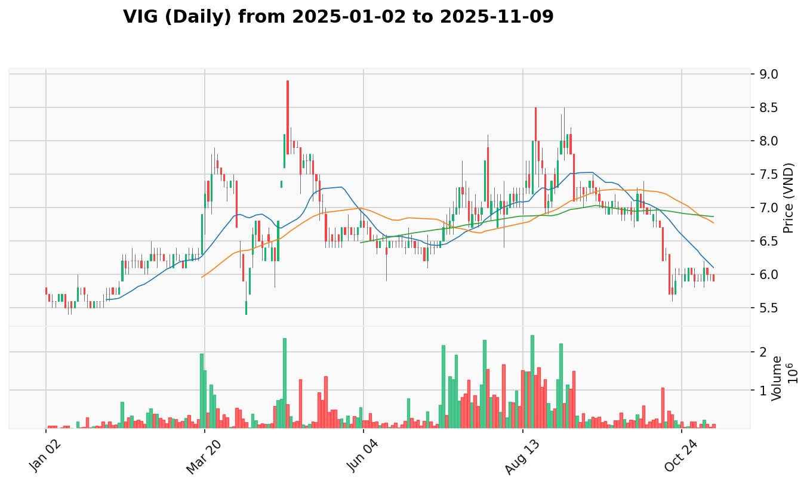

<a href="#penny">↑ Back to group PENNY</a>  |  <a href="#vpa-signal-summary">↑ Back to Top</a>

#### Key Statistics
| Metric | Value |
|:---|---:|
| Date Range | 2025-01-02 to 2025-11-07 |
| **Latest Close** | **5.9** |
| Period Open | 5.8 |
| Period High | 8.9 |
| Period Low | 5.4 |
| Period Change % | 1.72% |

**[Download VIG Data (.csv)](market_data/VIG_2025-01-02_to_2025-11-09.csv)**

---

### VIP

#### [VPA Analysis (2025-08-15 - 2025-10-21)](./VPA.md#vip)
> **Ngày 2025-10-15:** VIP mở cửa ở 13.15 VND, đạt mức cao nhất 13.35 VND và thấp nhất 13.1 VND, đóng cửa ở 13.1 VND, giảm từ 13.2 VND xuống 13.1 VND. Biên độ giá trong phiên hẹp và giá đóng cửa ở mức thấp nhất phiên. Khối lượng giao dịch đạt 0.1787 triệu cổ phiếu, giảm đáng kể so với phiên trước (0.2435 triệu cổ phiếu) và ở mức thấp. Sau phiên "Supply" với khối lượng gia tăng, phiên này giá tiếp tục giảm với khối lượng giảm mạnh, cho thấy áp lực cung đã giảm bớt nhưng lực cầu vẫn hoàn toàn vắng bóng, không có sự hỗ trợ nào cho giá. **Phân tích VPA/Wyckoff:** No Demand (Không có cầu)
> **Ngày 2025-10-16:** VIP mở cửa ở 13.1 VND, đạt mức cao nhất 13.2 VND và thấp nhất 13.05 VND, đóng cửa ở 13.1 VND. Giá đóng cửa không đổi so với phiên trước (13.1 VND). Biên độ giá trong phiên hẹp (0.15 VND) và giá đóng cửa ở mức thấp nhất phiên. Khối lượng giao dịch đạt 0.0662 triệu cổ phiếu, giảm mạnh so với phiên trước (0.1787 triệu cổ phiếu) và ở mức rất thấp. Sau phiên "No Demand" với khối lượng giảm, phiên này giá đi ngang với khối lượng cực thấp, cho thấy áp lực cung đã cạn kiệt tạm thời nhưng lực cầu vẫn chưa xuất hiện. Điều này có thể là dấu hiệu của sự thiếu hụt nguồn cung (No Supply) trong bối cảnh thị trường yếu. **Phân tích VPA/Wyckoff:** No Supply (Không có cung)
> **Ngày 2025-10-17:** VIP mở cửa ở 13.05 VND, đạt mức cao nhất 13.15 VND và thấp nhất 13.05 VND, đóng cửa ở 13.15 VND. Giá đóng cửa không đổi so với phiên trước (13.15 VND). Biên độ giá trong phiên hẹp (0.1 VND) và giá đóng cửa ở mức cao nhất phiên. Khối lượng giao dịch đạt 0.0822 triệu cổ phiếu, giảm mạnh so với phiên trước (0.1156 triệu cổ phiếu) và ở mức rất thấp. Sau phiên "No Supply" với khối lượng cực thấp, phiên này giá tiếp tục đi ngang và đóng cửa ở mức cao nhất phiên với khối lượng còn thấp hơn nữa. Điều này cho thấy áp lực cung đã cạn kiệt hoàn toàn, xác nhận sự thiếu hụt nguồn cung. Tuy nhiên, lực cầu vẫn chưa xuất hiện mạnh mẽ để đẩy giá lên. Đây có thể là một dấu hiệu tích cực cho thấy thị trường đã sẵn sàng cho một đợt tăng giá nếu có lực cầu tham gia. **Phân tích VPA/Wyckoff:** Test for Supply (Kiểm tra cung) - Xác nhận không có cung.
> **Ngày 2025-10-20:** VIP mở cửa ở 13.15 VND, đạt mức cao nhất 13.15 VND và thấp nhất 12.45 VND, đóng cửa ở 12.45 VND. Giá đóng cửa giảm mạnh từ 13.15 VND xuống 12.45 VND so với phiên trước. Biên độ giá trong phiên rộng (0.7 VND) và giá đóng cửa ở mức thấp nhất phiên. Khối lượng giao dịch đạt 0.3826 triệu cổ phiếu, tăng mạnh so với phiên trước (0.0822 triệu cổ phiếu) và ở mức cao. Sau các phiên kiểm tra cung cho thấy không có áp lực bán, phiên này giá giảm mạnh với biên độ rộng và đóng cửa ở mức thấp nhất, đi kèm với khối lượng giao dịch tăng đột biến. Điều này cho thấy áp lực bán đã quay trở lại thị trường một cách mạnh mẽ, phủ nhận các tín hiệu thiếu cung trước đó. **Phân tích VPA/Wyckoff:** Sign of Weakness (SOW) - Áp lực bán mạnh mẽ.
> **Ngày 2025-10-21:** VIP mở cửa ở 12.6 VND, đạt mức cao nhất 12.85 VND và thấp nhất 12.5 VND, đóng cửa ở 12.8 VND. Giá đóng cửa tăng từ 12.45 VND lên 12.8 VND so với phiên trước. Biên độ giá trong phiên hẹp (0.35 VND) và giá đóng cửa ở mức cao nhất phiên. Khối lượng giao dịch đạt 0.2463 triệu cổ phiếu, giảm so với phiên trước (0.3826 triệu cổ phiếu) và ở mức trung bình. Sau phiên "Sign of Weakness" với áp lực bán mạnh mẽ, phiên này giá hồi phục nhẹ với biên độ hẹp và đóng cửa ở mức cao nhất phiên, nhưng đi kèm với khối lượng giao dịch giảm. Điều này cho thấy lực cầu hồi phục yếu và chưa đủ mạnh để hấp thụ hết áp lực cung tiềm tàng. Đây có thể là một dấu hiệu của sự thiếu hụt cầu trong đợt hồi phục. **Phân tích VPA/Wyckoff:** Lack of Demand (Thiếu hụt cầu).

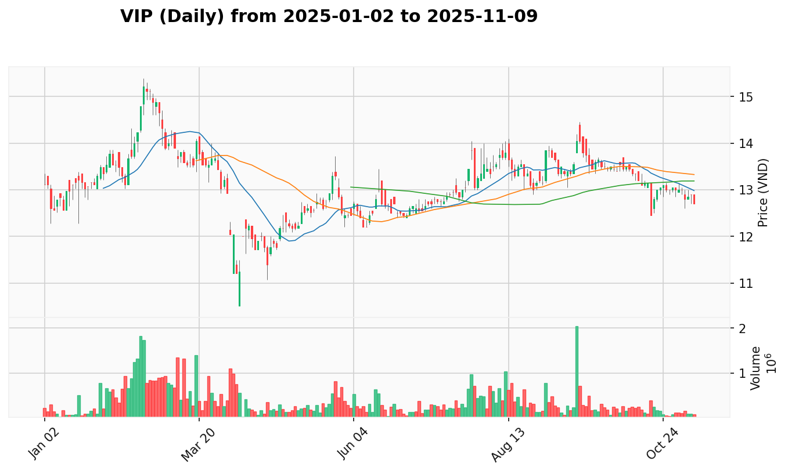

<a href="#van-tai">↑ Back to group VAN_TAI</a>  |  <a href="#vpa-signal-summary">↑ Back to Top</a>

#### Key Statistics
| Metric | Value |
|:---|---:|
| Date Range | 2025-01-02 to 2025-11-07 |
| **Latest Close** | **12.7** |
| Period Open | 13.11 |
| Period High | 15.39 |
| Period Low | 10.51 |
| Period Change % | -3.13% |

**[Download VIP Data (.csv)](market_data/VIP_2025-01-02_to_2025-11-09.csv)**

---

### VIX

#### [VPA Analysis (2025-05-28 - 2025-10-21)](./VPA.md#vix)
> **Ngày 2025-10-15:** VIX mở cửa tại 39.8 VND, đạt mức cao nhất 40.2 VND, giảm xuống mức thấp nhất 39.15 VND và đóng cửa tại 39.6 VND. Giá đóng cửa cao hơn so với phiên trước (39.1 VND). Biên độ dao động trong phiên hẹp hơn so với phiên trước, giá đóng cửa nằm ở nửa trên của thân nến, cho thấy lực cầu vẫn duy trì nhưng không còn mạnh mẽ như phiên trước. Khối lượng giao dịch đạt 42.89 triệu cổ phiếu, giảm đáng kể so với phiên trước (76.56 triệu cổ phiếu). Sau phiên "Sign of Strength (SOS)" mạnh mẽ ngày 2025-10-14, phiên này cho thấy thị trường đang kiểm tra lại nguồn cung ở vùng giá cao hơn, với việc giá tiếp tục tăng nhẹ nhưng trên khối lượng thấp hơn. Điều này có thể là một dấu hiệu của sự hấp thụ nguồn cung hoặc một sự tạm dừng trước khi tiếp tục xu hướng tăng. **Phân tích VPA/Wyckoff:** Test for Supply - Giá tăng nhẹ trên khối lượng thấp sau một phiên SOS mạnh, cho thấy thị trường đang kiểm tra nguồn cung ở mức giá cao hơn.
> **Ngày 2025-10-16:** VIX mở cửa tại 40.05 VND, đạt mức cao nhất 40.45 VND, giảm xuống mức thấp nhất 39.65 VND và đóng cửa tại 39.75 VND. Giá đóng cửa cao hơn nhẹ so với phiên trước (39.6 VND). Biên độ dao động trong phiên hẹp, giá đóng cửa nằm ở nửa dưới của thân nến, cho thấy lực cầu yếu. Khối lượng giao dịch đạt 18.24 triệu cổ phiếu, giảm mạnh so với phiên trước (42.89 triệu cổ phiếu) và là mức thấp nhất trong 10 phiên gần đây. Sau phiên "Test for Supply" ngày 2025-10-15, phiên này cho thấy sự thiếu vắng lực cầu để đẩy giá lên cao hơn, với giá chỉ tăng nhẹ trên khối lượng rất thấp. Điều này có thể là dấu hiệu của sự suy yếu trong xu hướng tăng giá ngắn hạn. **Phân tích VPA/Wyckoff:** No Demand - Giá tăng nhẹ trên khối lượng rất thấp và đóng cửa ở nửa dưới thân nến, cho thấy lực cầu đã suy yếu sau các phiên tăng giá trước đó.
> **Ngày 2025-10-17:** VIX mở cửa tại 39.7 VND, đạt mức cao nhất 40.15 VND, giảm xuống mức thấp nhất 38.25 VND và đóng cửa tại 38.4 VND. Giá đóng cửa thấp hơn đáng kể so với phiên trước (39.55 VND). Biên độ dao động trong phiên rộng, giá đóng cửa nằm ở nửa dưới của thân nến, cho thấy lực cung áp đảo. Khối lượng giao dịch đạt 42.43 triệu cổ phiếu, tăng so với phiên trước (37.10 triệu cổ phiếu). Sau phiên "No Demand" ngày 2025-10-16, phiên này cho thấy áp lực bán mạnh mẽ đã xuất hiện, đẩy giá xuống thấp hơn trên khối lượng gia tăng. Điều này xác nhận sự suy yếu của xu hướng tăng giá ngắn hạn và có thể là khởi đầu của một giai đoạn điều chỉnh. **Phân tích VPA/Wyckoff:** Sign of Weakness (SOW) - Giá giảm mạnh với biên độ rộng và đóng cửa gần mức thấp nhất, trên khối lượng gia tăng, cho thấy lực cung mạnh mẽ.
> **Ngày 2025-10-20:** VIX mở cửa tại 38.2 VND, đạt mức cao nhất 39.0 VND, giảm xuống mức thấp nhất 35.75 VND và đóng cửa tại 35.75 VND. Giá đóng cửa thấp hơn đáng kể so với phiên trước (38.4 VND). Biên độ dao động trong phiên rộng, giá đóng cửa nằm ở mức thấp nhất của thân nến, cho thấy lực cung tiếp tục áp đảo. Khối lượng giao dịch đạt 45.01 triệu cổ phiếu, tăng so với phiên trước (42.43 triệu cổ phiếu). Sau phiên "Sign of Weakness" ngày 2025-10-17, phiên này tiếp tục xác nhận áp lực bán mạnh mẽ, đẩy giá xuống sâu hơn trên khối lượng gia tăng. Điều này cho thấy xu hướng giảm giá đang tiếp diễn và có thể là một giai đoạn điều chỉnh mạnh. **Phân tích VPA/Wyckoff:** Sign of Weakness (SOW) - Giá giảm mạnh với biên độ rộng và đóng cửa tại mức thấp nhất, trên khối lượng gia tăng, xác nhận lực cung mạnh mẽ và xu hướng giảm tiếp diễn.
> **Ngày 2025-10-21:** VIX mở cửa tại 35.55 VND, đạt mức cao nhất 36.2 VND, giảm xuống mức thấp nhất 33.4 VND và đóng cửa tại 34.7 VND. Giá đóng cửa thấp hơn đáng kể so với phiên trước (35.75 VND). Biên độ dao động trong phiên rộng, giá đóng cửa nằm ở nửa dưới của thân nến, cho thấy lực cung tiếp tục áp đảo. Khối lượng giao dịch đạt 76.65 triệu cổ phiếu, tăng mạnh so với phiên trước (45.01 triệu cổ phiếu). Sau hai phiên "Sign of Weakness" liên tiếp, phiên này tiếp tục xác nhận áp lực bán mạnh mẽ với khối lượng đột biến, đẩy giá xuống sâu hơn. Điều này cho thấy xu hướng giảm giá đang tiếp diễn và có thể là một giai đoạn điều chỉnh mạnh. **Phân tích VPA/Wyckoff:** Sign of Weakness (SOW) - Giá giảm mạnh với biên độ rộng và đóng cửa ở nửa dưới của thân nến, trên khối lượng gia tăng đột biến, xác nhận lực cung mạnh mẽ và xu hướng giảm tiếp diễn.

<a href="#chung-khoan">↑ Back to group CHUNG_KHOAN</a>  |  <a href="#vpa-signal-summary">↑ Back to Top</a>

#### Key Statistics
| Metric | Value |
|:---|---:|
| Date Range | 2025-01-02 to 2025-11-07 |
| **Latest Close** | **24.5** |
| Period Open | 9.37 |
| Period High | 40.45 |
| Period Low | 8.6 |
| Period Change % | 161.47% |

**[Download VIX Data (.csv)](market_data/VIX_2025-01-02_to_2025-11-09.csv)**

---

### VJC

#### [VPA Analysis (2025-06-13 - 2025-10-21)](./VPA.md#vjc)
> **Ngày 2025-10-15:** VJC mở cửa tại 156.7 VND, dao động trong biên độ từ 152.8 VND đến 163.1 VND và đóng cửa tại 163.1 VND, tiếp tục tăng mạnh so với mức đóng cửa phiên trước (152.5 VND). Biên độ dao động trong phiên là 10.3 VND, vẫn rộng và cho thấy sự biến động mạnh. Giá đóng cửa nằm ở mức cao nhất phiên, xác nhận lực cầu áp đảo và duy trì đà tăng. Khối lượng giao dịch đạt 3.4538 triệu cổ phiếu, giảm nhẹ so với phiên trước (4.7154 triệu cổ phiếu) nhưng vẫn ở mức cao. Sau hai phiên SOS mạnh mẽ, VJC tiếp tục thể hiện sức mạnh với giá tăng mạnh và đóng cửa ở mức cao nhất phiên, cho thấy lực mua chủ động vẫn đang chiếm ưu thế và đẩy giá lên cao hơn, mặc dù khối lượng có phần giảm nhẹ nhưng không đáng kể so với đà tăng giá. **Phân tích VPA/Wyckoff:** Sign of Strength (SOS) - Tiếp diễn
> **Ngày 2025-10-16:** VJC mở cửa tại 164.0 VND, dao động trong biên độ từ 161.2 VND đến 170.2 VND và đóng cửa tại 169.0 VND, tiếp tục tăng so với mức đóng cửa phiên trước (163.1 VND). Biên độ dao động trong phiên là 9.0 VND, vẫn rộng và cho thấy sự biến động. Giá đóng cửa nằm gần mức cao nhất phiên, xác nhận lực cầu vẫn chiếm ưu thế. Khối lượng giao dịch đạt 1.749 triệu cổ phiếu, giảm đáng kể so với phiên trước (3.4538 triệu cổ phiếu) và hai phiên SOS mạnh mẽ trước đó. Mặc dù giá tiếp tục tăng và đóng cửa cao, sự sụt giảm về khối lượng sau chuỗi tăng mạnh có thể cho thấy lực mua đang có dấu hiệu chững lại hoặc thị trường đang kiểm tra nguồn cung. Tuy nhiên, việc giá vẫn duy trì đà tăng và đóng cửa cao cho thấy xu hướng tăng vẫn được giữ vững. **Phân tích VPA/Wyckoff:** Sign of Strength (SOS) - Tiếp diễn
> **Ngày 2025-10-17:** VJC mở cửa tại 173.6 VND, dao động trong biên độ từ 169.0 VND đến 179.0 VND và đóng cửa tại 175.0 VND, tiếp tục tăng so với mức đóng cửa phiên trước (173.5 VND). Biên độ dao động trong phiên là 10.0 VND, hẹp hơn một chút so với phiên trước nhưng vẫn cho thấy sự biến động. Giá đóng cửa nằm gần mức cao nhất phiên, xác nhận lực cầu vẫn chiếm ưu thế. Khối lượng giao dịch đạt 3.0689 triệu cổ phiếu, tiếp tục giảm so với phiên trước (3.6795 triệu cổ phiếu). Mặc dù giá vẫn duy trì đà tăng và đóng cửa cao, sự sụt giảm liên tiếp về khối lượng sau chuỗi tăng mạnh có thể cho thấy lực mua đang có dấu hiệu chững lại hoặc thị trường đang kiểm tra nguồn cung. Tuy nhiên, việc giá vẫn duy trì đà tăng và đóng cửa cao cho thấy xu hướng tăng vẫn được giữ vững. **Phân tích VPA/Wyckoff:** Sign of Strength (SOS) - Tiếp diễn
> **Ngày 2025-10-20:** VJC mở cửa tại 174.5 VND, dao động trong biên độ từ 165.6 VND đến 180.0 VND và đóng cửa tại 174.5 VND, giảm nhẹ so với mức đóng cửa phiên trước (175.0 VND). Biên độ dao động trong phiên là 14.4 VND, rộng hơn đáng kể so với phiên trước, cho thấy sự biến động mạnh. Giá đóng cửa nằm ở mức mở cửa và gần giữa biên độ, cho thấy sự lưỡng lự của thị trường sau khi giá đã cố gắng tăng lên mức cao mới nhưng không duy trì được. Khối lượng giao dịch đạt 3.4854 triệu cổ phiếu, tăng so với phiên trước (3.0689 triệu cổ phiếu). Sự tăng khối lượng đi kèm với biên độ rộng và giá đóng cửa không thể duy trì mức cao, thậm chí giảm nhẹ so với phiên trước, cho thấy lực cung đã bắt đầu xuất hiện và hấp thụ lực cầu, có thể là dấu hiệu của sự suy yếu sau chuỗi tăng giá. **Phân tích VPA/Wyckoff:** Supply Coming In (SC) - Lực cung xuất hiện
> **Ngày 2025-10-21:** VJC mở cửa tại 174.5 VND, dao động trong biên độ từ 174.5 VND đến 186.7 VND và đóng cửa tại 180.0 VND, tăng mạnh so với mức đóng cửa phiên trước (174.5 VND). Biên độ dao động trong phiên là 12.2 VND, rộng hơn so với phiên trước, cho thấy sự biến động mạnh mẽ. Giá đóng cửa nằm gần mức cao nhất phiên, xác nhận lực cầu áp đảo. Khối lượng giao dịch đạt 4.1283 triệu cổ phiếu, tăng đáng kể so với phiên trước (3.4854 triệu cổ phiếu). Sự tăng giá mạnh mẽ đi kèm với khối lượng gia tăng và giá đóng cửa ở mức cao cho thấy lực cầu đã hấp thụ hoàn toàn lực cung xuất hiện ở phiên trước và tiếp tục đẩy giá lên, xác nhận xu hướng tăng giá. **Phân tích VPA/Wyckoff:** Sign of Strength (SOS) - Lực cầu mạnh mẽ trở lại, hấp thụ cung và đẩy giá lên cao.

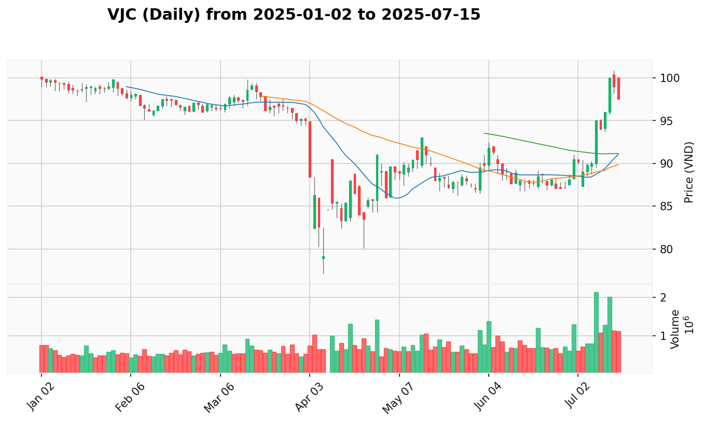

<a href="#hang-khong">↑ Back to group HANG_KHONG</a>  |  <a href="#vpa-signal-summary">↑ Back to Top</a>

#### Key Statistics
| Metric | Value |
|:---|---:|
| Date Range | 2025-01-02 to 2025-11-07 |
| **Latest Close** | **178.0** |
| Period Open | 100.1 |
| Period High | 201.2 |
| Period Low | 77.1 |
| Period Change % | 77.82% |

**[Download VJC Data (.csv)](market_data/VJC_2025-01-02_to_2025-11-09.csv)**

---

### VLB

#### [VPA Analysis (2025-06-26 - 2025-10-21)](./VPA.md#vlb)
> **Ngày 2025-10-15:** VLB mở cửa ở 48.2 VND, tăng nhẹ lên 48.5 VND nhưng sau đó giảm và đóng cửa ở mức thấp nhất phiên là 48.0 VND, thấp hơn giá đóng cửa phiên trước (48.2 VND). Biên độ dao động trong phiên là 0.5 VND. Khối lượng giao dịch đạt 0.0261 triệu cổ phiếu, giảm đáng kể so với phiên trước (0.063 triệu cổ phiếu). Sau phiên "Upthrust" (UT) ngày 2025-10-14 cho thấy lực cung xuất hiện, phiên này giá tiếp tục giảm với khối lượng rất thấp, đóng cửa ở mức thấp nhất phiên. Điều này cho thấy lực cầu yếu và không có sự hỗ trợ, xác nhận sự suy yếu của thị trường sau khi lực cung đã xuất hiện. **Phân tích VPA/Wyckoff:** Sign of Weakness (SOW) - Dấu hiệu suy yếu.
> **Ngày 2025-10-16:** VLB mở cửa ở 48.2 VND, tăng nhẹ lên 48.3 VND nhưng sau đó giảm và đóng cửa ở mức thấp nhất phiên là 47.9 VND, thấp hơn giá đóng cửa phiên trước (48.0 VND). Biên độ dao động trong phiên là 0.4 VND, rất hẹp. Khối lượng giao dịch đạt 0.0029 triệu cổ phiếu, giảm mạnh và ở mức cực kỳ thấp so với phiên trước (0.0261 triệu cổ phiếu) và các phiên gần đây. Sau phiên "Sign of Weakness" (SOW) ngày 2025-10-15, phiên này tiếp tục cho thấy giá giảm nhẹ với biên độ hẹp và khối lượng cực thấp. Điều này xác nhận sự thiếu vắng lực cầu và cho thấy thị trường không có sự quan tâm từ cả bên mua lẫn bên bán, thường là dấu hiệu tiếp tục suy yếu hoặc tích lũy ở vùng giá thấp. **Phân tích VPA/Wyckoff:** No Demand (ND) - Không có lực cầu.
> **Ngày 2025-10-17:** VLB mở cửa ở 48.2 VND, dao động trong biên độ hẹp từ 48.0 VND đến 48.3 VND và đóng cửa ở 48.1 VND, thấp hơn giá đóng cửa phiên trước (48.2 VND). Khối lượng giao dịch đạt 0.0263 triệu cổ phiếu, tăng nhẹ so với phiên "No Demand" trước đó (0.0165 triệu cổ phiếu) nhưng vẫn ở mức thấp. Sau các phiên "Sign of Weakness" và "No Demand", phiên này tiếp tục cho thấy giá giảm nhẹ với biên độ hẹp và khối lượng thấp, xác nhận sự thiếu vắng lực cầu và duy trì trạng thái suy yếu của thị trường. **Phân tích VPA/Wyckoff:** No Demand (ND) - Không có lực cầu.
> **Ngày 2025-10-20:** VLB mở cửa ở 48.3 VND, tăng lên mức cao nhất phiên là 49.0 VND nhưng sau đó giảm mạnh và đóng cửa ở mức thấp nhất phiên là 45.5 VND. Biên độ dao động trong phiên rất rộng (3.5 VND) và giá đóng cửa thấp hơn đáng kể so với giá đóng cửa phiên trước (48.1 VND). Khối lượng giao dịch đạt 0.214 triệu cổ phiếu, tăng đột biến và ở mức rất cao so với phiên trước (0.0263 triệu cổ phiếu) và các phiên gần đây. Sau nhiều phiên "No Demand" với khối lượng thấp và biên độ hẹp, phiên này cho thấy lực cung mạnh mẽ đã xuất hiện, đẩy giá xuống sâu với khối lượng lớn. Điều này xác nhận sự yếu kém của thị trường và khả năng tiếp tục giảm giá. **Phân tích VPA/Wyckoff:** Sign of Weakness (SOW) - Lực cung mạnh mẽ.
> **Ngày 2025-10-21:** VLB mở cửa ở 47.0 VND, dao động trong biên độ từ 45.5 VND đến 47.0 VND và đóng cửa ở 45.7 VND. Giá đóng cửa thấp hơn giá mở cửa và chỉ cao hơn một chút so với mức thấp nhất phiên. Biên độ giá hẹp hơn đáng kể so với phiên trước. Khối lượng giao dịch đạt 0.0598 triệu cổ phiếu, giảm mạnh so với phiên "Sign of Weakness" trước đó (0.214 triệu cổ phiếu). Sau phiên giảm mạnh với khối lượng lớn, phiên này cho thấy giá tiếp tục giảm nhẹ với biên độ hẹp và khối lượng thấp, xác nhận sự thiếu vắng lực cầu và duy trì trạng thái suy yếu của thị trường. **Phân tích VPA/Wyckoff:** No Demand (ND) - Không có lực cầu.

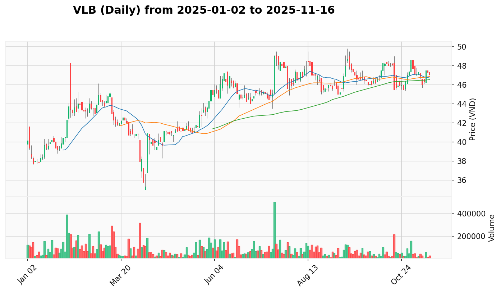

<a href="#vlxd">↑ Back to group VLXD</a>  |  <a href="#vpa-signal-summary">↑ Back to Top</a>

#### Key Statistics
| Metric | Value |
|:---|---:|
| Date Range | 2025-01-02 to 2025-11-07 |
| **Latest Close** | **46.9** |
| Period Open | 39.77 |
| Period High | 49.8 |
| Period Low | 35.02 |
| Period Change % | 17.93% |

**[Download VLB Data (.csv)](market_data/VLB_2025-01-02_to_2025-11-09.csv)**

---

### VLC

#### [VPA Analysis (2025-08-04 - 2025-10-21)](./VPA.md#vlc)
> **Ngày 2025-10-15:** VLC giảm từ 14.8 VND xuống 14.7 VND, mở cửa ở 14.9 VND, đạt mức cao nhất 14.9 VND và thấp nhất 14.6 VND, đóng cửa ở 14.7 VND. Cây nến có biên độ 0.3 VND và đóng cửa ở mức thấp nhất phiên. Khối lượng giao dịch đạt 0.116 triệu cổ phiếu, tăng so với phiên trước (0.0717 triệu cổ phiếu). Sau phiên thiếu hụt lực cầu (No Demand) ngày 2025-10-14, giá tiếp tục giảm với khối lượng gia tăng và đóng cửa ở mức thấp nhất, cho thấy áp lực bán mạnh mẽ và nguồn cung đang chiếm ưu thế. **Phân tích VPA/Wyckoff:** Sign of Weakness (SOW) - Dấu hiệu suy yếu.
> **Ngày 2025-10-16:** VLC giảm từ 14.8 VND xuống 14.7 VND, mở cửa ở 14.8 VND, cao nhất 14.9 VND và thấp nhất 14.6 VND, đóng cửa ở 14.7 VND. Cây nến có biên độ 0.3 VND và đóng cửa ở mức thấp nhất phiên. Khối lượng giao dịch đạt 0.0134 triệu cổ phiếu, giảm mạnh so với phiên trước (0.116 triệu cổ phiếu). Sau phiên Dấu hiệu suy yếu (SOW) ngày 2025-10-15, giá tiếp tục giảm nhẹ với khối lượng cực thấp, cho thấy áp lực bán đã cạn kiệt nhưng lực cầu vẫn chưa xuất hiện. **Phân tích VPA/Wyckoff:** No Demand (ND) - Thiếu hụt lực cầu.
> **Ngày 2025-10-17:** VLC giảm từ 14.8 VND xuống 14.5 VND, mở cửa ở 14.8 VND, đạt mức cao nhất 14.9 VND và thấp nhất 14.5 VND, đóng cửa ở 14.5 VND. Cây nến có biên độ 0.4 VND và đóng cửa ở mức thấp nhất phiên. Khối lượng giao dịch đạt 0.1146 triệu cổ phiếu, tăng mạnh so với phiên trước (0.0356 triệu cổ phiếu). Sau phiên Thiếu hụt lực cầu (No Demand) ngày 2025-10-16, giá tiếp tục giảm mạnh với khối lượng gia tăng và đóng cửa ở mức thấp nhất, cho thấy áp lực bán mạnh mẽ và nguồn cung đang chiếm ưu thế. **Phân tích VPA/Wyckoff:** Sign of Weakness (SOW) - Dấu hiệu suy yếu.
> **Ngày 2025-10-20:** VLC giảm từ 14.5 VND xuống 14.3 VND, mở cửa ở 14.6 VND, cao nhất 14.8 VND và thấp nhất 14.1 VND, đóng cửa ở 14.3 VND. Cây nến có biên độ 0.7 VND và đóng cửa ở mức thấp nhất phiên. Khối lượng giao dịch đạt 0.1533 triệu cổ phiếu, tăng so với phiên trước (0.1146 triệu cổ phiếu). Sau phiên Dấu hiệu suy yếu (SOW) ngày 2025-10-17, giá tiếp tục giảm mạnh với khối lượng gia tăng và đóng cửa ở mức thấp nhất, cho thấy áp lực bán vẫn đang chiếm ưu thế. **Phân tích VPA/Wyckoff:** Sign of Weakness (SOW) - Dấu hiệu suy yếu.
> **Ngày 2025-10-21:** VLC tăng từ 14.3 VND lên 14.5 VND, mở cửa ở 14.4 VND, đạt mức cao nhất 14.5 VND và thấp nhất 14.2 VND, đóng cửa ở 14.5 VND. Cây nến có biên độ 0.3 VND và đóng cửa ở mức cao nhất phiên. Khối lượng giao dịch đạt 0.0751 triệu cổ phiếu, giảm mạnh so với phiên trước (0.1533 triệu cổ phiếu). Sau hai phiên Dấu hiệu suy yếu (SOW) liên tiếp, giá tăng trở lại với khối lượng giảm, cho thấy áp lực bán có thể đã suy yếu nhưng lực cầu chưa thực sự mạnh mẽ. Đây có thể là một phiên kiểm tra nguồn cung. **Phân tích VPA/Wyckoff:** Test for Supply (Kiểm tra nguồn cung).

<a href="#nong-nghiep">↑ Back to group NONG_NGHIEP</a>  |  <a href="#vpa-signal-summary">↑ Back to Top</a>

#### Key Statistics
| Metric | Value |
|:---|---:|
| Date Range | 2025-01-02 to 2025-11-07 |
| **Latest Close** | **13.9** |
| Period Open | 17.5 |
| Period High | 19.3 |
| Period Low | 12.7 |
| Period Change % | -20.57% |

**[Download VLC Data (.csv)](market_data/VLC_2025-01-02_to_2025-11-09.csv)**

---

### VNA

#### [VPA Analysis (2025-08-13 - 2025-10-21)](./VPA.md#vna)
> **Ngày 2025-10-15:** VNA mở cửa ở mức 17.8 VND, dao động trong biên độ hẹp từ 17.4 VND đến 17.8 VND và đóng cửa tại 17.8 VND. So với phiên trước (18.0 VND), giá giảm nhẹ. Khối lượng giao dịch đạt 0.0014 triệu cổ phiếu, tăng so với phiên trước (0.0003 triệu cổ phiếu). Mặc dù giá đóng cửa ở mức cao nhất phiên, nhưng việc giá giảm nhẹ trên khối lượng tăng cho thấy áp lực bán vẫn còn hiện hữu và nỗ lực tăng giá không bền vững. **Phân tích VPA/Wyckoff:** Yếu kém (Weakness) - Áp lực bán vẫn còn hiện hữu.
> **Ngày 2025-10-16:** VNA mở cửa ở mức 18.2 VND, dao động trong biên độ rộng từ 15.7 VND đến 18.2 VND và đóng cửa tại 17.7 VND. So với phiên trước (17.8 VND), giá giảm nhẹ. Khối lượng giao dịch đạt 0.0022 triệu cổ phiếu, tăng so với phiên trước (0.0014 triệu cổ phiếu). Mặc dù mở cửa cao hơn, giá đã giảm mạnh trong phiên và đóng cửa gần mức thấp nhất, cho thấy áp lực bán mạnh mẽ và sự xuất hiện của nguồn cung lớn. **Phân tích VPA/Wyckoff:** Yếu kém (Weakness) - Áp lực bán gia tăng với biên độ rộng và khối lượng tăng.
> **Ngày 2025-10-17:** VNA mở cửa ở mức 17.9 VND, dao động trong biên độ hẹp từ 17.3 VND đến 17.9 VND và đóng cửa tại 17.3 VND. So với phiên trước (17.7 VND), giá giảm 0.4 VND. Khối lượng giao dịch đạt 0.0012 triệu cổ phiếu, giảm đáng kể so với phiên trước (0.0022 triệu cổ phiếu). Giá đóng cửa ở mức thấp nhất phiên với biên độ hẹp và khối lượng giảm cho thấy áp lực bán vẫn còn nhưng không quá mạnh mẽ, hoặc thiếu cầu mua vào. **Phân tích VPA/Wyckoff:** Yếu kém (Weakness) - Giá giảm với khối lượng thấp, đóng cửa ở mức thấp nhất phiên, cho thấy sự tiếp diễn của áp lực bán nhưng không quá quyết liệt.
> **Ngày 2025-10-20:** VNA mở cửa ở mức 18.1 VND, dao động trong biên độ rộng từ 17.1 VND đến 18.1 VND và đóng cửa tại 17.1 VND. So với phiên trước (17.3 VND), giá giảm 0.2 VND. Khối lượng giao dịch đạt 0.0064 triệu cổ phiếu, tăng đáng kể so với phiên trước (0.0012 triệu cổ phiếu). Giá đóng cửa ở mức thấp nhất phiên với biên độ rộng và khối lượng tăng mạnh cho thấy áp lực bán gia tăng đáng kể và nguồn cung lớn đang đổ vào thị trường. **Phân tích VPA/Wyckoff:** Yếu kém (Weakness) - Áp lực bán mạnh mẽ với biên độ rộng và khối lượng tăng, xác nhận xu hướng giảm.
> **Ngày 2025-10-21:** VNA mở cửa ở mức 16.3 VND, dao động trong biên độ hẹp từ 16.1 VND đến 16.3 VND và đóng cửa tại 16.1 VND. So với phiên trước (17.1 VND), giá giảm 1.0 VND. Khối lượng giao dịch đạt 0.0017 triệu cổ phiếu, giảm đáng kể so với phiên trước (0.0064 triệu cổ phiếu). Giá đóng cửa ở mức thấp nhất phiên với biên độ hẹp và khối lượng thấp cho thấy áp lực bán tiếp diễn nhưng đã suy yếu đáng kể, hoặc thiếu cầu mua vào. **Phân tích VPA/Wyckoff:** Yếu kém (Weakness) - Giá tiếp tục giảm với khối lượng thấp và biên độ hẹp, cho thấy áp lực bán đã giảm bớt nhưng chưa có dấu hiệu hồi phục.

<a href="#van-tai">↑ Back to group VAN_TAI</a>  |  <a href="#vpa-signal-summary">↑ Back to Top</a>

#### Key Statistics
| Metric | Value |
|:---|---:|
| Date Range | 2025-01-02 to 2025-11-07 |
| **Latest Close** | **17.5** |
| Period Open | 21.14 |
| Period High | 25.99 |
| Period Low | 15.7 |
| Period Change % | -17.22% |

**[Download VNA Data (.csv)](market_data/VNA_2025-01-02_to_2025-11-09.csv)**

---

### VND

#### [VPA Analysis (2025-06-13 - 2025-10-21)](./VPA.md#vnd)
> **Ngày 2025-10-15:** VND mở cửa ở 23.5 VND, đạt mức cao nhất 23.8 VND, sau đó giảm xuống 23.3 VND và đóng cửa ở 23.5 VND. Giá đóng cửa cao hơn nhẹ so với phiên trước (23.5 VND so với 23.35 VND). Cây nến có biên độ hẹp và đóng cửa ở mức mở cửa, cho thấy sự lưỡng lự của thị trường sau phiên giảm mạnh trước đó. Khối lượng giao dịch đạt 19.14 triệu cổ phiếu, giảm đáng kể so với 43.20 triệu cổ phiếu của phiên trước. Sau phiên giảm giá mạnh với khối lượng đột biến (Weakness), phiên này giá hồi phục nhẹ nhưng với khối lượng thấp cho thấy lực cầu yếu và không có sự xác nhận. Điều này cho thấy lực cung vẫn còn tiềm ẩn và lực cầu chưa sẵn sàng đẩy giá lên. **Phân tích VPA/Wyckoff:** No Demand (Thiếu cầu)
> **Ngày 2025-10-16:** VND mở cửa ở mức 23.7 VND, đạt đỉnh 23.9 VND, giảm xuống 23.35 VND và đóng cửa ở 23.65 VND. Giá đóng cửa cao hơn nhẹ so với phiên trước (23.65 VND so với 23.5 VND). Cây nến có biên độ hẹp và đóng cửa thấp hơn mức mở cửa, cho thấy sự lưỡng lự và áp lực bán nhẹ. Khối lượng giao dịch đạt 16.60 triệu cổ phiếu, giảm so với phiên trước (19.14 triệu cổ phiếu) và thấp hơn đáng kể so với phiên giảm mạnh ngày 2025-10-14 (43.197 triệu cổ phiếu). Sau phiên giảm mạnh với lực cung chiếm ưu thế và phiên thiếu cầu, phiên này giá hồi phục nhẹ nhưng với khối lượng thấp, cho thấy lực cầu vẫn yếu và thị trường thiếu sự quan tâm. **Phân tích VPA/Wyckoff:** No Demand (Thiếu cầu) - Lực cầu yếu và thiếu sự quan tâm.
> **Ngày 2025-10-17:** VND mở cửa ở 24.05 VND, đạt mức cao nhất 24.5 VND, sau đó giảm xuống 23.5 VND và đóng cửa ở 23.55 VND. Giá đóng cửa thấp hơn so với phiên trước (23.55 VND so với 23.8 VND). Cây nến có biên độ rộng và đóng cửa gần mức thấp nhất phiên, cho thấy áp lực bán mạnh. Khối lượng giao dịch đạt 39.80 triệu cổ phiếu, tăng đáng kể so với 27.75 triệu cổ phiếu của phiên trước và cao hơn nhiều so với các phiên thiếu cầu trước đó. Sau hai phiên "No Demand" với khối lượng thấp, phiên này giá giảm mạnh với khối lượng lớn xác nhận lực cung đang chiếm ưu thế. Điều này cho thấy sự tiếp diễn của lực bán và thiếu vắng lực cầu hỗ trợ. **Phân tích VPA/Wyckoff:** Sign of Weakness (SOW) - Lực cung mạnh mẽ với khối lượng gia tăng xác nhận xu hướng giảm.
> **Ngày 2025-10-20:** VND mở cửa ở mức 23.5 VND, đạt đỉnh 23.8 VND, sau đó giảm mạnh xuống 21.95 VND và đóng cửa ở mức thấp nhất phiên là 21.95 VND. Giá đóng cửa giảm đáng kể so với phiên trước (21.95 VND so với 23.55 VND). Cây nến có biên độ rộng và đóng cửa ở mức thấp nhất, cho thấy áp lực bán rất mạnh và thiếu lực cầu hỗ trợ. Khối lượng giao dịch đạt 33.64 triệu cổ phiếu, thấp hơn một chút so với phiên trước (39.80 triệu cổ phiếu) nhưng vẫn ở mức cao, xác nhận sự tiếp diễn của lực cung. Sau phiên "Sign of Weakness" ngày 2025-10-17, phiên này tiếp tục cho thấy sự suy yếu rõ rệt của thị trường. **Phân tích VPA/Wyckoff:** Weakness (Suy yếu) - Lực cung tiếp tục chiếm ưu thế với giá giảm mạnh và khối lượng cao.
> **Ngày 2025-10-21:** VND mở cửa 21.8 VND, cao nhất 22.4 VND, thấp nhất 20.45 VND và đóng cửa 21.05 VND. Giá đóng cửa giảm mạnh từ 21.95 VND xuống 21.05 VND. Cây nến có biên độ rất rộng, đóng cửa gần mức thấp nhất, cho thấy áp lực bán cực mạnh. Khối lượng giao dịch đạt 52.87 triệu cổ phiếu, tăng vọt so với 33.64 triệu cổ phiếu của phiên trước, xác nhận lực cung áp đảo và xu hướng giảm tiếp diễn. **Phân tích VPA/Wyckoff:** Sign of Weakness (SOW) - Lực cung gia tăng đột biến với giá giảm mạnh, xác nhận sự suy yếu nghiêm trọng.

<a href="#chung-khoan">↑ Back to group CHUNG_KHOAN</a>  |  <a href="#vpa-signal-summary">↑ Back to Top</a>

#### Key Statistics
| Metric | Value |
|:---|---:|
| Date Range | 2025-01-02 to 2025-11-07 |
| **Latest Close** | **18.9** |
| Period Open | 12.21 |
| Period High | 27.35 |
| Period Low | 10.91 |
| Period Change % | 54.79% |

**[Download VND Data (.csv)](market_data/VND_2025-01-02_to_2025-11-09.csv)**

---

### VNE

#### [VPA Analysis (2025-08-14 - 2025-10-21)](./VPA.md#vne)
> **Ngày 2025-10-15:** VNE giảm từ 7.63 VND xuống 7.59 VND với khối lượng giao dịch đạt 0.111 triệu cổ phiếu. Cây nến giảm có biên độ hẹp và đóng cửa gần mức thấp nhất phiên, cho thấy lực bán vẫn còn hoặc lực cầu chưa đủ mạnh để đẩy giá lên. Khối lượng giao dịch giảm nhẹ so với phiên trước (0.1175 triệu cổ phiếu), xác nhận sự thiếu vắng lực cầu chủ động. Sau tín hiệu "Test for Supply" ngày 2025-10-14, diễn biến này cho thấy thị trường đang tiếp tục kiểm tra cung hoặc đang trong giai đoạn củng cố trước khi có xu hướng rõ ràng hơn. **Phân tích VPA/Wyckoff:** No Demand (Thiếu cầu)
> **Ngày 2025-10-16:** VNE giảm từ 7.59 VND xuống 7.45 VND với khối lượng giao dịch đạt 0.0196 triệu cổ phiếu. Cây nến giảm có biên độ rộng và đóng cửa gần mức thấp nhất phiên, cho thấy áp lực bán vẫn còn. Tuy nhiên, khối lượng giao dịch cực kỳ thấp, giảm mạnh so với các phiên trước, cho thấy sự cạn kiệt của lực cung hoặc thiếu vắng sự quan tâm từ cả người mua và người bán. Sau các tín hiệu "Test for Supply" và "No Demand" trước đó, diễn biến này có thể là một sự kiểm tra cuối cùng về lực cung trước khi có thể có sự thay đổi xu hướng. **Phân tích VPA/Wyckoff:** No Supply (Cạn cung)
> **Ngày 2025-10-17:** VNE giữ nguyên mức giá đóng cửa 7.47 VND so với phiên trước, sau khi mở cửa ở 7.47 VND. Biên độ dao động trong phiên từ 7.22 VND đến 7.49 VND. Khối lượng giao dịch đạt 0.0886 triệu cổ phiếu, tăng nhẹ so với phiên trước (0.0803 triệu cổ phiếu). Sau tín hiệu "No Supply" ngày 2025-10-16, việc giá đi ngang với khối lượng tăng cho thấy có lực cầu tham gia hấp thụ cung, ngăn giá giảm sâu hơn. Đây có thể là một giai đoạn kiểm tra cầu hoặc tích lũy. **Phân tích VPA/Wyckoff:** Test for Demand (Kiểm tra cầu)
> **Ngày 2025-10-20:** VNE giảm từ 7.47 VND xuống 7.23 VND với khối lượng giao dịch đạt 0.0972 triệu cổ phiếu. Cây nến giảm có biên độ rộng và đóng cửa ở mức thấp nhất phiên, cho thấy áp lực bán mạnh mẽ. Khối lượng giao dịch tăng nhẹ so với phiên trước, xác nhận sự xuất hiện của lực cung. Sau tín hiệu "Test for Demand" ngày 2025-10-17, diễn biến này cho thấy lực cầu chưa đủ mạnh để hấp thụ hết cung, và xu hướng giảm có thể tiếp diễn. **Phân tích VPA/Wyckoff:** Sign of Weakness (SOW) - Dấu hiệu suy yếu
> **Ngày 2025-10-21:** VNE giảm từ 7.23 VND xuống 7.19 VND. Biên độ dao động trong phiên từ 7.0 VND đến 7.54 VND, với giá đóng cửa ở 7.19 VND. Khối lượng giao dịch đạt 0.0328 triệu cổ phiếu, giảm đáng kể so với phiên trước (0.0972 triệu cổ phiếu). Sau tín hiệu "Sign of Weakness" ngày 2025-10-20, việc giá tiếp tục giảm nhẹ với khối lượng thấp cho thấy thiếu vắng lực cầu ở mức giá thấp hơn, xác nhận sự suy yếu của thị trường. **Phân tích VPA/Wyckoff:** No Demand (Không có cầu)

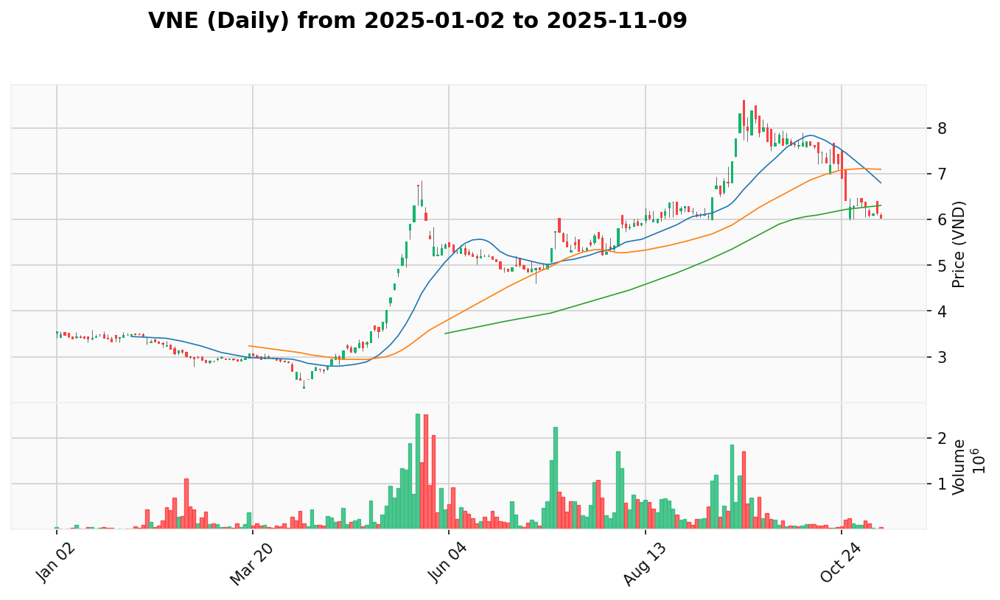

<a href="#xay-lap-dien">↑ Back to group XAY_LAP_DIEN</a>  |  <a href="#vpa-signal-summary">↑ Back to Top</a>

#### Key Statistics
| Metric | Value |
|:---|---:|
| Date Range | 2025-01-02 to 2025-11-07 |
| **Latest Close** | **6.03** |
| Period Open | 3.52 |
| Period High | 8.62 |
| Period Low | 2.32 |
| Period Change % | 71.31% |

**[Download VNE Data (.csv)](market_data/VNE_2025-01-02_to_2025-11-09.csv)**

---

### VNM

#### [VPA Analysis (2025-06-13 - 2025-10-21)](./VPA.md#vnm)
> **Ngày 2025-10-15:** VNM tăng nhẹ từ 63.5 VND lên 63.6 VND với khối lượng giao dịch đạt 4.645 triệu cổ phiếu. Nến ngày có biên độ hẹp và đóng cửa ở mức thấp nhất phiên, cho thấy áp lực bán vẫn còn và lực cầu yếu. Khối lượng giao dịch tiếp tục giảm so với phiên trước (4.645 triệu so với 5.36 triệu cổ phiếu), xác nhận sự thiếu vắng của lực cầu mạnh mẽ. Điều này cho thấy thị trường đang thiếu động lực tăng giá sau phiên giảm điểm trước đó. **Phân tích VPA/Wyckoff:** No Demand (ND) - Lực cầu yếu, giá đóng cửa ở mức thấp nhất phiên với khối lượng giảm.
> **Ngày 2025-10-16:** VNM giảm từ 60.75 VND xuống 60.6 VND với khối lượng giao dịch đạt 2.077 triệu cổ phiếu. Nến ngày có biên độ hẹp và đóng cửa gần giữa thân nến, cho thấy sự lưỡng lự của thị trường. Khối lượng giao dịch cực kỳ thấp, giảm mạnh so với phiên trước (2.077 triệu so với 4.653 triệu cổ phiếu), cho thấy lực bán đã cạn kiệt nhưng lực cầu cũng chưa xuất hiện mạnh mẽ. Điều này tiếp tục xác nhận thị trường đang trong giai đoạn thiếu động lực rõ ràng sau các phiên giảm điểm. **Phân tích VPA/Wyckoff:** No Supply (NS) - Lực cung cạn kiệt với khối lượng giao dịch cực thấp, giá giảm nhẹ cho thấy áp lực bán không còn đáng kể.
> **Ngày 2025-10-17:** VNM giảm mạnh từ 61.2 VND xuống 58.8 VND với khối lượng giao dịch đạt 6.054 triệu cổ phiếu. Nến ngày có biên độ rộng và đóng cửa ở mức thấp nhất phiên, cho thấy áp lực bán mạnh mẽ đã quay trở lại sau phiên No Supply trước đó. Khối lượng giao dịch gia tăng đáng kể so với phiên trước, xác nhận sự hiện diện của lực cung. **Phân tích VPA/Wyckoff:** Sign of Weakness (SOW) - Lực bán mạnh mẽ với giá giảm sâu và khối lượng gia tăng, xác nhận xu hướng giảm.
> **Ngày 2025-10-20:** VNM giảm mạnh từ 58.9 VND xuống 55.0 VND với khối lượng giao dịch đạt 8.76 triệu cổ phiếu. Nến ngày có biên độ rộng và đóng cửa ở mức thấp nhất phiên, cho thấy áp lực bán rất mạnh mẽ và tiếp tục gia tăng. Khối lượng giao dịch tăng vọt so với phiên trước (8.76 triệu so với 6.05 triệu cổ phiếu), xác nhận lực cung áp đảo. **Phân tích VPA/Wyckoff:** Sign of Weakness (SOW) - Lực bán tiếp tục mạnh mẽ với giá giảm sâu và khối lượng gia tăng đột biến, xác nhận xu hướng giảm.
> **Ngày 2025-10-21:** VNM tăng từ mức đóng cửa 55.0 VND của phiên trước lên 56.5 VND với khối lượng giao dịch đạt 7.068 triệu cổ phiếu. Nến ngày có biên độ vừa phải và đóng cửa ở giữa thân nến. Khối lượng giao dịch giảm so với phiên trước, cho thấy lực cầu chưa thực sự mạnh mẽ sau hai phiên giảm điểm mạnh. **Phân tích VPA/Wyckoff:** No Demand (ND) - Lực cầu yếu, giá tăng nhưng khối lượng giảm sau giai đoạn giảm mạnh, cho thấy thiếu sự hỗ trợ từ người mua.

<a href="#thuc-pham">↑ Back to group THUC_PHAM</a>  |  <a href="#vpa-signal-summary">↑ Back to Top</a>

#### Key Statistics
| Metric | Value |
|:---|---:|
| Date Range | 2025-01-02 to 2025-11-07 |
| **Latest Close** | **57.6** |
| Period Open | 58.67 |
| Period High | 63.23 |
| Period Low | 47.42 |
| Period Change % | -1.82% |

**[Download VNM Data (.csv)](market_data/VNM_2025-01-02_to_2025-11-09.csv)**

---

### VOS

#### [VPA Analysis (2025-08-12 - 2025-10-21)](./VPA.md#vos)
> **Ngày 2025-10-15:** VOS mở cửa ở mức 13.45 VND và đóng cửa ở mức 13.0 VND, giảm so với mức đóng cửa 13.3 VND của phiên trước. Mức cao nhất trong phiên là 13.45 VND và thấp nhất là 12.95 VND. Cây nến có biên độ rộng, giá giảm mạnh và đóng cửa ở mức thấp nhất phiên, cho thấy áp lực bán rất mạnh. Khối lượng giao dịch đạt 1.4186 triệu cổ phiếu, cao hơn đáng kể so với phiên trước (0.9994 triệu cổ phiếu). Sau phiên giảm giá với lực cung mạnh mẽ (SOW) vào ngày 2025-10-14, phiên này tiếp tục cho thấy sự gia tăng của lực cung, đẩy giá xuống sâu hơn với khối lượng lớn, xác nhận xu hướng suy yếu. **Phân tích VPA/Wyckoff:** Sign of Weakness (SOW) - Lực cung áp đảo và đẩy giá xuống.
> **Ngày 2025-10-16:** VOS mở cửa ở mức 13.0 VND và đóng cửa ở mức 12.9 VND, giảm so với mức đóng cửa 13.0 VND của phiên trước. Mức cao nhất trong phiên là 13.05 VND và thấp nhất là 12.8 VND. Cây nến có biên độ hẹp, giá tiếp tục giảm và đóng cửa gần mức thấp nhất phiên, cho thấy áp lực bán vẫn còn. Khối lượng giao dịch đạt 0.6321 triệu cổ phiếu, giảm đáng kể so với phiên trước (1.4186 triệu cổ phiếu). Sau hai phiên giảm giá mạnh với lực cung áp đảo (SOW), phiên này tiếp tục cho thấy sự suy yếu của giá nhưng với khối lượng thấp hơn, có thể cho thấy lực bán đang tạm thời giảm bớt hoặc thiếu lực cầu ở mức giá thấp. Tuy nhiên, việc giá vẫn đóng cửa ở mức thấp cho thấy xu hướng giảm vẫn tiếp diễn. **Phân tích VPA/Wyckoff:** Sign of Weakness (SOW) - Giá tiếp tục giảm với khối lượng thấp, cho thấy thiếu lực cầu hỗ trợ.
> **Ngày 2025-10-17:** VOS mở cửa ở mức 12.95 VND và đóng cửa ở mức 12.85 VND, giảm so với mức đóng cửa 12.95 VND của phiên trước. Mức cao nhất trong phiên là 13.15 VND và thấp nhất là 12.7 VND. Cây nến có biên độ hẹp, giá giảm nhẹ và đóng cửa gần mức thấp nhất phiên, cho thấy áp lực bán vẫn còn. Khối lượng giao dịch đạt 0.9336 triệu cổ phiếu, giảm so với phiên trước (1.1103 triệu cổ phiếu). Sau các phiên giảm giá mạnh với lực cung áp đảo (SOW), phiên này tiếp tục cho thấy sự suy yếu của giá với khối lượng giảm, cho thấy lực bán đang tạm thời giảm bớt hoặc thiếu lực cầu ở mức giá thấp. Tuy nhiên, việc giá vẫn đóng cửa ở mức thấp cho thấy xu hướng giảm vẫn tiếp diễn. **Phân tích VPA/Wyckoff:** Sign of Weakness (SOW) - Giá tiếp tục giảm với khối lượng thấp, cho thấy thiếu lực cầu hỗ trợ.
> **Ngày 2025-10-20:** VOS mở cửa ở mức 12.85 VND và đóng cửa ở mức 12.05 VND, giảm mạnh so với mức đóng cửa 12.85 VND của phiên trước. Mức cao nhất trong phiên là 12.95 VND và thấp nhất là 12.0 VND. Cây nến có biên độ rộng, giá giảm sâu và đóng cửa gần mức thấp nhất phiên. Khối lượng giao dịch đạt 1.2538 triệu cổ phiếu, tăng đáng kể so với phiên trước (0.9336 triệu cổ phiếu). Sự giảm giá mạnh với biên độ rộng và đóng cửa ở mức thấp nhất phiên, đi kèm với khối lượng giao dịch tăng, cho thấy áp lực bán rất mạnh và sự chi phối của phe cung, xác nhận xu hướng giảm giá tiếp diễn. **Phân tích VPA/Wyckoff:** Sign of Weakness (SOW) - Lực cung áp đảo với giá giảm mạnh, biên độ rộng và khối lượng tăng.
> **Ngày 2025-10-21:** VOS mở cửa ở mức 12.0 VND và đóng cửa ở mức 12.55 VND, tăng từ 12.05 VND lên 12.55 VND của phiên trước. Mức cao nhất trong phiên là 12.85 VND và thấp nhất là 12.0 VND. Cây nến có biên độ rộng, giá tăng và đóng cửa ở nửa trên của nến, cho thấy có lực cầu xuất hiện. Tuy nhiên, khối lượng giao dịch đạt 1.0025 triệu cổ phiếu, giảm so với phiên trước (1.2538 triệu cổ phiếu). Sau các phiên giảm giá mạnh với áp lực bán lớn, phiên này cho thấy sự phục hồi của giá nhưng với khối lượng giảm, điều này cho thấy lực cầu chưa thực sự mạnh mẽ để đảo chiều xu hướng. Đây có thể là một nhịp hồi phục kỹ thuật trong xu hướng giảm. **Phân tích VPA/Wyckoff:** Hồi phục yếu - Giá tăng với biên độ rộng nhưng khối lượng giảm, cho thấy lực cầu yếu và có thể là nhịp hồi phục tạm thời trong xu hướng giảm.

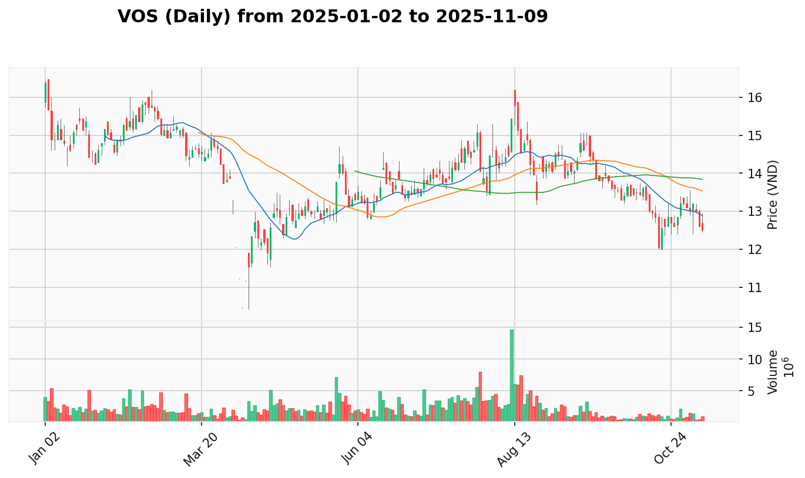

<a href="#van-tai">↑ Back to group VAN_TAI</a>  |  <a href="#vpa-signal-summary">↑ Back to Top</a>

#### Key Statistics
| Metric | Value |
|:---|---:|
| Date Range | 2025-01-02 to 2025-11-07 |
| **Latest Close** | **12.5** |
| Period Open | 15.87 |
| Period High | 16.48 |
| Period Low | 10.42 |
| Period Change % | -21.24% |

**[Download VOS Data (.csv)](market_data/VOS_2025-01-02_to_2025-11-09.csv)**

---

### VPB

#### [VPA Analysis (2025-06-16 - 2025-10-21)](./VPA.md#vpb)
> **Ngày 2025-10-15:** VPB tiếp tục tăng mạnh từ 32.5 VND lên 33.7 VND. Cây nến tăng có biên độ rất rộng, mở cửa ở 32.75 VND và đóng cửa gần mức cao nhất phiên là 33.7 VND, cho thấy lực cầu áp đảo. Khối lượng giao dịch đạt 92.6525 triệu cổ phiếu, cao hơn đáng kể so với phiên trước (57.0746 triệu cổ phiếu) và là mức cao nhất trong toàn bộ giai đoạn dữ liệu được cung cấp. Điều này xác nhận sự tiếp diễn của lực cầu mạnh mẽ, đẩy giá lên cao hơn sau tín hiệu SOS của phiên trước. **Phân tích VPA/Wyckoff:** Sign of Strength (SOS) - Lực cầu tiếp tục áp đảo với khối lượng cực lớn, xác nhận xu hướng tăng mạnh.
> **Ngày 2025-10-16:** VPB giảm nhẹ từ 33.7 VND xuống 33.6 VND. Cây nến có biên độ hẹp, mở cửa ở 33.8 VND và đóng cửa gần mức thấp nhất phiên. Khối lượng giao dịch đạt 12.0564 triệu cổ phiếu, thấp hơn đáng kể so với phiên trước (92.6525 triệu cổ phiếu) và là mức thấp nhất trong 10 phiên gần đây. Sau hai phiên tăng mạnh với khối lượng cực lớn (SOS), phiên này cho thấy lực cung đã cạn kiệt và không có áp lực bán đáng kể. Điều này cho thấy sự tạm dừng trong xu hướng tăng giá, nhưng với khối lượng thấp, đây là dấu hiệu tích cực cho thấy xu hướng tăng có thể tiếp diễn. **Phân tích VPA/Wyckoff:** No Supply (NS) - Lực cung cạn kiệt sau đợt tăng mạnh.
> **Ngày 2025-10-17:** VPB giảm từ 33.2 VND xuống 31.95 VND. Cây nến giảm có biên độ rộng, mở cửa ở 33.2 VND và đóng cửa gần mức thấp nhất phiên là 31.95 VND, cho thấy áp lực bán mạnh mẽ. Khối lượng giao dịch đạt 50.2872 triệu cổ phiếu, cao hơn đáng kể so với phiên trước (30.7455 triệu cổ phiếu). Sự giảm giá với khối lượng gia tăng này cho thấy lực cung đã quay trở lại và áp đảo lực cầu, phủ nhận tín hiệu cạn kiệt cung của phiên trước. **Phân tích VPA/Wyckoff:** Sign of Weakness (SOW) - Lực cung mạnh mẽ với khối lượng gia tăng, xác nhận xu hướng giảm.
> **Ngày 2025-10-20:** VPB giảm mạnh từ 31.95 VND xuống 29.75 VND. Cây nến giảm có biên độ rộng, mở cửa ở 31.55 VND và đóng cửa tại mức thấp nhất phiên là 29.75 VND, cho thấy áp lực bán rất mạnh. Khối lượng giao dịch đạt 52.6347 triệu cổ phiếu, cao hơn đáng kể so với phiên trước (50.2872 triệu cổ phiếu) và là mức cao trong 10 phiên gần đây. Sự giảm giá mạnh với khối lượng gia tăng này tiếp tục xác nhận lực cung đang áp đảo và xu hướng giảm giá đang tiếp diễn, củng cố tín hiệu suy yếu từ phiên trước. **Phân tích VPA/Wyckoff:** Sign of Weakness (SOW) - Lực cung mạnh mẽ tiếp tục đẩy giá xuống với khối lượng gia tăng.
> **Ngày 2025-10-21:** VPB tăng từ 29.75 VND lên 30.35 VND. Cây nến có biên độ rộng, mở cửa ở 29.5 VND, giảm xuống mức thấp nhất 28.35 VND nhưng sau đó phục hồi mạnh mẽ và đóng cửa ở 30.35 VND, gần mức cao nhất phiên 30.65 VND. Khối lượng giao dịch đạt 54.1043 triệu cổ phiếu, cao hơn so với phiên trước (52.6347 triệu cổ phiếu). Sau hai phiên giảm mạnh với khối lượng lớn, sự phục hồi giá với khối lượng gia tăng này cho thấy lực cầu đã xuất hiện và hấp thụ một phần lực cung, có thể là dấu hiệu của Stopping Volume hoặc nỗ lực tăng giá sau đợt giảm. **Phân tích VPA/Wyckoff:** Stopping Volume / Nỗ lực tăng giá (Effort to Rise) - Lực cầu xuất hiện sau đợt giảm mạnh, hấp thụ lực cung với khối lượng cao.

<a href="#ngan-hang">↑ Back to group NGAN_HANG</a>  |  <a href="#vpa-signal-summary">↑ Back to Top</a>

#### Key Statistics
| Metric | Value |
|:---|---:|
| Date Range | 2025-01-02 to 2025-11-07 |
| **Latest Close** | **27.5** |
| Period Open | 18.59 |
| Period High | 38.9 |
| Period Low | 14.75 |
| Period Change % | 47.93% |

**[Download VPB Data (.csv)](market_data/VPB_2025-01-02_to_2025-11-09.csv)**

---

### VPG

#### [VPA Analysis (2025-06-26 - 2025-10-21)](./VPA.md#vpg)
> **Ngày 2025-10-15:** VPG giảm từ 7.56 VND xuống 7.2 VND, với biên độ giá rộng (từ 7.2 VND đến 7.55 VND) và đóng cửa ở mức thấp nhất phiên. Khối lượng giao dịch đạt 0.6736 triệu cổ phiếu, tăng đáng kể so với phiên trước (0.3647 triệu cổ phiếu). Việc giá giảm mạnh với biên độ rộng và đóng cửa ở mức thấp nhất phiên, đi kèm với khối lượng giao dịch gia tăng, cho thấy áp lực bán ra rất mạnh và không có lực cầu nào đủ sức hấp thụ. Điều này xác nhận sự yếu kém tiếp diễn của thị trường và khả năng cao sẽ tiếp tục xu hướng giảm. **Phân tích VPA/Wyckoff:** Sign of Weakness (SOW)
> **Ngày 2025-10-16:** VPG giảm từ 7.2 VND xuống 6.92 VND, với biên độ giá rộng (từ 6.7 VND đến 7.24 VND) và đóng cửa gần mức thấp nhất phiên. Khối lượng giao dịch đạt 0.9371 triệu cổ phiếu, tăng mạnh so với phiên trước (0.6736 triệu cổ phiếu). Việc giá giảm mạnh với biên độ rộng và đóng cửa ở mức thấp, đi kèm với khối lượng giao dịch gia tăng, cho thấy áp lực bán ra rất mạnh và không có lực cầu nào đủ sức hấp thụ. Điều này xác nhận sự yếu kém tiếp diễn của thị trường và khả năng cao sẽ tiếp tục xu hướng giảm. **Phân tích VPA/Wyckoff:** Sign of Weakness (SOW)
> **Ngày 2025-10-17:** VPG tăng từ 6.8 VND lên 7.27 VND, với biên độ giá hẹp hơn (từ 6.85 VND đến 7.27 VND) và đóng cửa ở mức cao nhất phiên. Khối lượng giao dịch đạt 0.489 triệu cổ phiếu, giảm đáng kể so với phiên trước (1.1966 triệu cổ phiếu). Mặc dù giá tăng và đóng cửa ở mức cao nhất phiên, nhưng khối lượng giao dịch thấp cho thấy lực cầu yếu và không đủ mạnh để hấp thụ hoàn toàn áp lực bán ra từ các phiên trước. Điều này có thể là một nhịp hồi phục yếu trong xu hướng giảm hoặc một dấu hiệu "No Demand" (không có cầu). **Phân tích VPA/Wyckoff:** No Demand (ND)
> **Ngày 2025-10-20:** VPG tăng từ 7.27 VND lên 7.4 VND, với biên độ giá rộng (từ 7.3 VND đến 7.77 VND) nhưng đóng cửa ở nửa dưới của phiên. Khối lượng giao dịch đạt 1.1532 triệu cổ phiếu, tăng mạnh so với phiên trước (0.489 triệu cổ phiếu). Mặc dù giá có sự hồi phục nhẹ so với phiên trước, nhưng việc đóng cửa ở nửa dưới của biên độ giá rộng cùng với khối lượng giao dịch tăng cao cho thấy áp lực bán vẫn còn rất mạnh và lực cầu chưa đủ sức hấp thụ. Điều này cho thấy nỗ lực tăng giá không đạt kết quả và khả năng cao xu hướng giảm vẫn tiếp diễn. **Phân tích VPA/Wyckoff:** Effort to Rise but No Result (ERNR)
> **Ngày 2025-10-21:** VPG tăng từ 7.4 VND lên 7.66 VND, với biên độ giá tương đối rộng (từ 7.41 VND đến 7.83 VND) và đóng cửa ở nửa trên của phiên. Khối lượng giao dịch đạt 0.4662 triệu cổ phiếu, giảm mạnh so với phiên trước (1.1532 triệu cổ phiếu). Mặc dù giá tăng, nhưng khối lượng giảm mạnh cho thấy lực cầu yếu và không đủ sức để duy trì đà tăng. Điều này xác nhận sự thiếu vắng người mua thực sự và có thể là một nhịp hồi phục yếu trong xu hướng giảm. **Phân tích VPA/Wyckoff:** No Demand (ND)

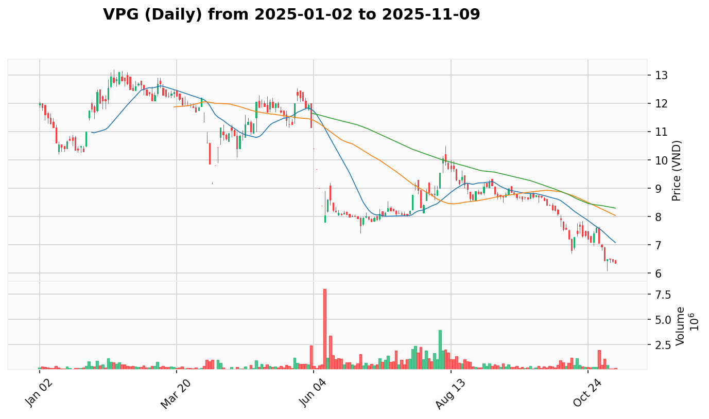

<a href="#khai-khoang">↑ Back to group KHAI_KHOANG</a>  |  <a href="#vpa-signal-summary">↑ Back to Top</a>

#### Key Statistics
| Metric | Value |
|:---|---:|
| Date Range | 2025-01-02 to 2025-11-07 |
| **Latest Close** | **6.35** |
| Period Open | 11.95 |
| Period High | 13.2 |
| Period Low | 6.08 |
| Period Change % | -46.86% |

**[Download VPG Data (.csv)](market_data/VPG_2025-01-02_to_2025-11-09.csv)**

---

### VPH

#### [VPA Analysis (2025-08-14 - 2025-10-21)](./VPA.md#vph)
> **Ngày 2025-10-15:** VPH tiếp tục giảm từ 5.1 VND xuống 5.05 VND với biên độ giá hẹp và đóng cửa ở phần trên của thân nến. Khối lượng giao dịch đạt 0.0983 triệu cổ phiếu, giảm mạnh so với phiên trước (0.3578 triệu cổ phiếu). Sau phiên giảm mạnh với khối lượng đột biến, giá tiếp tục giảm nhẹ với khối lượng thấp, cho thấy áp lực bán đã giảm nhưng lực cầu vẫn yếu, xác nhận sự suy yếu của xu hướng giảm. **Phân tích VPA/Wyckoff:** Không có cầu (No Demand)
> **Ngày 2025-10-16:** VPH giảm từ 5.05 VND xuống 5.0 VND với biên độ giá hẹp và đóng cửa ở phần dưới của thân nến. Khối lượng giao dịch đạt 0.1129 triệu cổ phiếu, tăng so với phiên trước (0.0983 triệu cổ phiếu). Sau phiên "Không có cầu" với khối lượng thấp, giá tiếp tục giảm nhẹ với khối lượng tăng trở lại và đóng cửa gần mức thấp nhất, cho thấy áp lực bán vẫn còn hiện hữu và có dấu hiệu gia tăng trở lại, xác nhận sự yếu kém của lực cầu và khả năng giá tiếp tục suy yếu. **Phân tích VPA/Wyckoff:** Áp lực bán tiếp diễn
> **Ngày 2025-10-17:** VPH giảm từ 5.05 VND xuống 5.0 VND với biên độ giá tương đối rộng và đóng cửa ở giữa thân nến. Khối lượng giao dịch đạt 0.1823 triệu cổ phiếu, tăng đáng kể so với phiên trước (0.1213 triệu cổ phiếu). Sau phiên áp lực bán tiếp diễn, giá tiếp tục giảm với khối lượng gia tăng, cho thấy áp lực bán vẫn mạnh mẽ và chưa có dấu hiệu suy yếu rõ rệt, mặc dù có lực cầu hấp thụ ở vùng giá thấp. **Phân tích VPA/Wyckoff:** Áp lực bán tiếp diễn
> **Ngày 2025-10-20:** VPH giảm từ 5.0 VND xuống 4.69 VND với biên độ giá rộng và đóng cửa ở phần dưới của thân nến. Khối lượng giao dịch đạt 0.1132 triệu cổ phiếu, giảm so với phiên trước (0.1823 triệu cổ phiếu). Sau các phiên áp lực bán tiếp diễn, giá tiếp tục giảm mạnh với biên độ rộng, đóng cửa gần mức thấp nhất, cho thấy lực bán vẫn chiếm ưu thế và lực cầu yếu, mặc dù khối lượng có phần giảm nhẹ. Điều này xác nhận xu hướng giảm giá tiếp tục. **Phân tích VPA/Wyckoff:** Áp lực bán tiếp diễn
> **Ngày 2025-10-21:** VPH tăng từ 4.69 VND lên 4.8 VND với biên độ giá tương đối rộng và đóng cửa ở nửa trên của thân nến. Khối lượng giao dịch đạt 0.0816 triệu cổ phiếu, giảm so với phiên trước (0.1132 triệu cổ phiếu). Sau các phiên giảm giá mạnh với áp lực bán tiếp diễn, phiên này giá có sự hồi phục nhẹ nhưng với khối lượng thấp, cho thấy lực cầu yếu và chưa đủ sức để đảo chiều xu hướng giảm giá hiện tại. Đây có thể là một phiên hồi phục kỹ thuật trong xu hướng giảm. **Phân tích VPA/Wyckoff:** No Demand - Lực cầu yếu

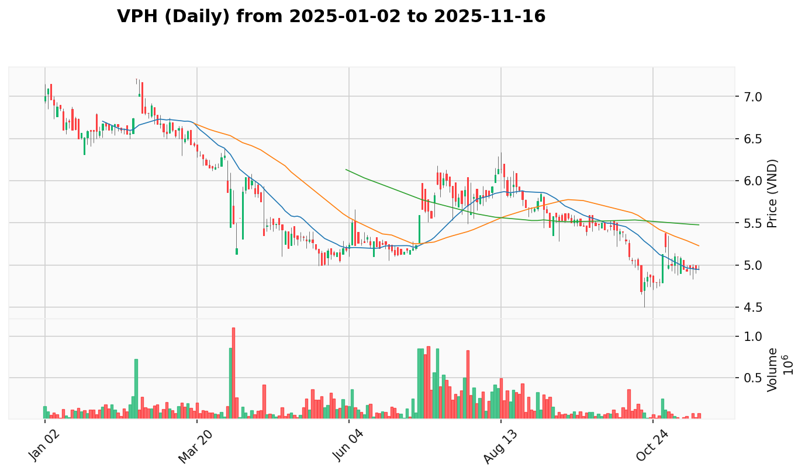

<a href="#penny">↑ Back to group PENNY</a>  |  <a href="#vpa-signal-summary">↑ Back to Top</a>

#### Key Statistics
| Metric | Value |
|:---|---:|
| Date Range | 2025-01-02 to 2025-11-07 |
| **Latest Close** | **4.95** |
| Period Open | 6.95 |
| Period High | 7.21 |
| Period Low | 4.5 |
| Period Change % | -28.78% |

**[Download VPH Data (.csv)](market_data/VPH_2025-01-02_to_2025-11-09.csv)**

---

### VRE

#### [VPA Analysis (2025-06-13 - 2025-10-21)](./VPA.md#vre)
> **Ngày 2025-10-15:** VRE mở cửa tại 42.65 VND, giảm xuống 41.9 VND và đóng cửa gần mức thấp nhất phiên là 41.05 VND. Biên độ dao động trong phiên rộng. Khối lượng giao dịch đạt 19.6842 triệu cổ phiếu, giảm đáng kể so với phiên trước (32.0891 triệu cổ phiếu). Sau phiên SOW với khối lượng lớn ngày 2025-10-14, phiên hôm nay giá tiếp tục giảm với khối lượng thấp hơn, cho thấy lực cầu yếu và áp lực bán vẫn còn, nhưng không quá mạnh mẽ như phiên trước. Việc giá đóng cửa thấp với khối lượng giảm sau một phiên giảm mạnh có thể là dấu hiệu của sự thiếu vắng lực cầu. **Phân tích VPA/Wyckoff:** No Demand
> **Ngày 2025-10-16:** VRE mở cửa tại 42.2 VND, tăng lên mức cao nhất 43.15 VND và đóng cửa tại 43.05 VND, gần mức cao nhất trong phiên. Giá đóng cửa cao hơn đáng kể so với phiên trước (41.9 VND). Biên độ dao động trong phiên rộng. Khối lượng giao dịch đạt 9.0518 triệu cổ phiếu, giảm mạnh so với phiên trước (19.6842 triệu cổ phiếu) và là mức thấp nhất trong 10 phiên gần đây. Sau hai phiên giảm giá và thiếu cầu (SOW và No Demand), phiên hôm nay giá tăng trở lại với biên độ rộng nhưng khối lượng thấp. Điều này cho thấy áp lực bán đã giảm bớt nhưng lực cầu vẫn chưa thực sự mạnh mẽ để đẩy giá lên cao bền vững. Đây có thể là một dấu hiệu của sự thiếu hụt nguồn cung tạm thời hoặc một phiên kiểm tra cung. **Phân tích VPA/Wyckoff:** Test for Supply / Lack of Supply
> **Ngày 2025-10-17:** VRE mở cửa tại 43.5 VND, sau đó giảm mạnh xuống mức thấp nhất 40.8 VND và đóng cửa tại 41.0 VND, gần mức thấp nhất phiên. Giá đóng cửa thấp hơn đáng kể so với phiên trước (43.4 VND). Biên độ dao động trong phiên rộng. Khối lượng giao dịch đạt 20.871 triệu cổ phiếu, tăng so với phiên trước (17.9834 triệu cổ phiếu). Sau phiên Test for Supply / Lack of Supply ngày 2025-10-16, phiên hôm nay giá giảm mạnh với khối lượng gia tăng, cho thấy áp lực bán mạnh mẽ và nguồn cung lớn đang đổ vào thị trường. Điều này xác nhận sự yếu kém của lực cầu và khả năng tiếp tục giảm giá. **Phân tích VPA/Wyckoff:** Sign of Weakness (SOW)
> **Ngày 2025-10-20:** VRE mở cửa tại 39.5 VND, tăng lên mức cao nhất 41.3 VND nhưng đóng cửa tại 38.15 VND, là mức thấp nhất trong phiên. Giá đóng cửa giảm mạnh so với phiên trước (41.0 VND). Biên độ dao động trong phiên rộng. Khối lượng giao dịch đạt 18.9799 triệu cổ phiếu, giảm nhẹ so với phiên trước (20.871 triệu cổ phiếu) nhưng vẫn ở mức cao. Sau phiên giảm giá mạnh ngày 2025-10-17, phiên hôm nay giá tiếp tục giảm sâu và đóng cửa ở mức thấp nhất, cho thấy áp lực bán vẫn rất mạnh mẽ và nguồn cung tiếp tục chiếm ưu thế, xác nhận xu hướng giảm giá. **Phân tích VPA/Wyckoff:** Sign of Weakness (SOW)
> **Ngày 2025-10-21:** VRE mở cửa tại 38.05 VND, giảm xuống mức thấp nhất 36.55 VND nhưng sau đó phục hồi và đóng cửa tại 38.8 VND, cao hơn giá đóng cửa phiên trước (38.15 VND) và nằm ở nửa trên của biên độ dao động trong phiên. Biên độ dao động trong phiên vẫn rộng. Khối lượng giao dịch đạt 17.6342 triệu cổ phiếu, giảm nhẹ so với phiên trước (18.9799 triệu cổ phiếu). Sau hai phiên giảm giá mạnh với tín hiệu SOW, phiên hôm nay cho thấy sự phục hồi từ mức thấp nhất, cho thấy lực cầu đã xuất hiện và hấp thụ một phần áp lực bán. Tuy nhiên, khối lượng giao dịch giảm nhẹ cho thấy lực cầu chưa thực sự mạnh mẽ để đảo chiều xu hướng ngay lập tức, mà có thể là một phiên kiểm tra nguồn cung. **Phân tích VPA/Wyckoff:** Test for Supply

<a href="#bat-dong-san">↑ Back to group BAT_DONG_SAN</a>  |  <a href="#vpa-signal-summary">↑ Back to Top</a>

#### Key Statistics
| Metric | Value |
|:---|---:|
| Date Range | 2025-01-02 to 2025-11-07 |
| **Latest Close** | **31.35** |
| Period Open | 17.2 |
| Period High | 45.2 |
| Period Low | 16.1 |
| Period Change % | 82.27% |

**[Download VRE Data (.csv)](market_data/VRE_2025-01-02_to_2025-11-09.csv)**

---

### VRG

#### [VPA Analysis (2025-08-04 - 2025-10-21)](./VPA.md#vrg)
> **Ngày 2025-10-15:** VRG giảm từ 18.0 VND xuống 17.9 VND với khối lượng giao dịch đạt 0.0045 triệu cổ phiếu. Cây nến có biên độ rất hẹp (17.9 - 18.0 VND), giá đóng cửa ở mức thấp nhất phiên. So với phiên trước đó (2025-10-14) với khối lượng 0.0076 triệu cổ phiếu, khối lượng giao dịch hôm nay giảm đáng kể. Điều này cho thấy lực cầu tiếp tục yếu và không có sự quan tâm mua vào. **Phân tích VPA/Wyckoff:** No Demand (Không có lực cầu)
> **Ngày 2025-10-16:** VRG giữ nguyên mức giá 17.9 VND so với phiên trước, nhưng đã tăng từ mức mở cửa 17.6 VND và đóng cửa ở mức cao nhất phiên 17.9 VND, với khối lượng giao dịch đạt 0.0092 triệu cổ phiếu. So với phiên trước đó (2025-10-15) với khối lượng 0.0045 triệu cổ phiếu, khối lượng giao dịch hôm nay tăng đáng kể. Cây nến có biên độ rộng hơn (17.5 - 17.9 VND) và giá đóng cửa ở mức cao nhất phiên. Điều này cho thấy lực cầu đã bắt đầu xuất hiện và hấp thụ lực cung, đặc biệt sau hai phiên liên tiếp không có lực cầu. **Phân tích VPA/Wyckoff:** Demand Coming In (Lực cầu xuất hiện)
> **Ngày 2025-10-17:** VRG tăng từ 17.6 VND lên 17.7 VND với khối lượng giao dịch đạt 0.0171 triệu cổ phiếu. Cây nến tăng có biên độ hẹp (17.6 - 17.8 VND) và đóng cửa gần mức cao nhất phiên. So với phiên trước đó (2025-10-16) với khối lượng 0.0107 triệu cổ phiếu, khối lượng giao dịch hôm nay tăng đáng kể. Điều này cho thấy lực cầu tiếp tục duy trì và hấp thụ lực cung, đẩy giá lên cao hơn sau tín hiệu "Demand Coming In" của phiên trước. **Phân tích VPA/Wyckoff:** Demand Continuing (Lực cầu tiếp diễn)
> **Ngày 2025-10-20:** VRG giảm từ 17.7 VND xuống 17.5 VND với khối lượng giao dịch đạt 0.0256 triệu cổ phiếu. Cây nến giảm có biên độ rộng (17.0 - 17.8 VND) và đóng cửa gần mức thấp nhất phiên. So với phiên trước đó (2025-10-17) với khối lượng 0.0171 triệu cổ phiếu, khối lượng giao dịch hôm nay tăng đáng kể. Điều này cho thấy lực cung đã xuất hiện mạnh mẽ và áp đảo lực cầu, đẩy giá xuống sau hai phiên có tín hiệu lực cầu. **Phân tích VPA/Wyckoff:** Supply Coming In (Lực cung xuất hiện)
> **Ngày 2025-10-21:** VRG giảm từ 17.5 VND xuống 17.1 VND với khối lượng giao dịch đạt 0.0044 triệu cổ phiếu. Cây nến giảm có biên độ hẹp (17.1 - 17.6 VND) và đóng cửa tại mức thấp nhất phiên. So với phiên trước đó (2025-10-20) với khối lượng 0.0256 triệu cổ phiếu, khối lượng giao dịch hôm nay giảm mạnh. Điều này cho thấy lực cung đã giảm bớt nhưng lực cầu vẫn yếu, không có sự hấp thụ giá ở mức thấp hơn. **Phân tích VPA/Wyckoff:** No Demand (Không có lực cầu)

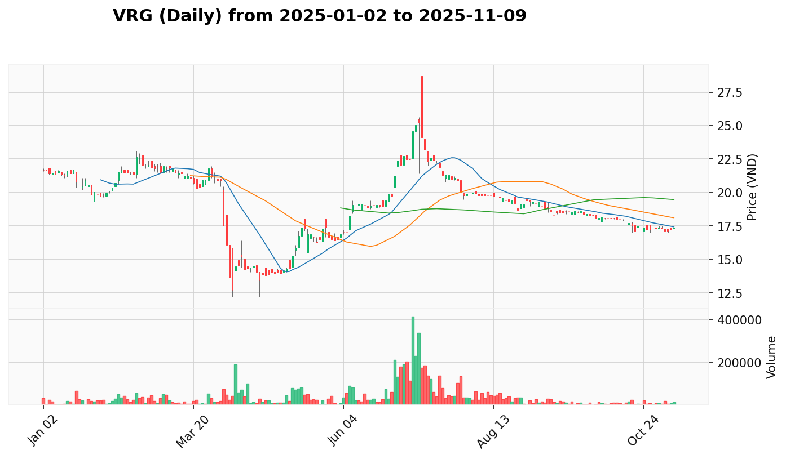

<a href="#cao-su">↑ Back to group CAO_SU</a>  |  <a href="#vpa-signal-summary">↑ Back to Top</a>

#### Key Statistics
| Metric | Value |
|:---|---:|
| Date Range | 2025-01-02 to 2025-11-07 |
| **Latest Close** | **17.4** |
| Period Open | 21.69 |
| Period High | 28.7 |
| Period Low | 12.21 |
| Period Change % | -19.78% |

**[Download VRG Data (.csv)](market_data/VRG_2025-01-02_to_2025-11-09.csv)**

---

### VSC

#### [VPA Analysis (2025-08-14 - 2025-10-21)](./VPA.md#vsc)
> **Ngày 2025-10-15:** VSC mở cửa ở mức 28.2 VND, cao nhất phiên là 29.4 VND, thấp nhất phiên là 28.15 VND và đóng cửa tại 28.25 VND. Giá tăng từ 27.8 VND lên 28.25 VND, với biên độ nến rộng và giá đóng cửa ở nửa trên của nến, cho thấy lực cầu đang cố gắng đẩy giá lên. Khối lượng giao dịch đạt 13.2154 triệu cổ phiếu, tuy có giảm nhẹ so với phiên trước (13.8402 triệu cổ phiếu) nhưng vẫn ở mức cao, cho thấy sự giằng co giữa cung và cầu. Sau phiên Dấu hiệu suy yếu (SOW) trước đó, phiên này cho thấy một nỗ lực phục hồi. **Phân tích VPA/Wyckoff:** Effort to Rise (ETR) - Nỗ lực tăng giá.
> **Ngày 2025-10-16:** VSC mở cửa ở mức 28.4 VND, cao nhất phiên là 28.65 VND, thấp nhất phiên là 27.95 VND và đóng cửa tại 28.0 VND. Giá giảm từ 28.25 VND xuống 28.0 VND, với biên độ nến hẹp và giá đóng cửa ở nửa dưới của nến, cho thấy sự yếu ớt. Khối lượng giao dịch đạt 4.2273 triệu cổ phiếu, giảm mạnh so với phiên trước (13.2154 triệu cổ phiếu), cho thấy lực cung không còn mạnh mẽ nhưng lực cầu cũng chưa xuất hiện. Sau phiên nỗ lực tăng giá (ETR), phiên này cho thấy thị trường đang kiểm tra lại mức hỗ trợ hoặc thiếu vắng nhu cầu. **Phân tích VPA/Wyckoff:** No Demand (ND) - Thiếu vắng nhu cầu.
> **Ngày 2025-10-17:** VSC mở cửa ở mức 27.5 VND, cao nhất phiên là 27.9 VND, thấp nhất phiên là 27.0 VND và đóng cửa tại 27.0 VND. Giá giảm từ 27.5 VND xuống 27.0 VND, với biên độ nến hẹp và giá đóng cửa ở mức thấp nhất phiên, cho thấy áp lực bán mạnh mẽ. Khối lượng giao dịch đạt 10.2356 triệu cổ phiếu, cao hơn so với phiên trước (10.0975 triệu cổ phiếu), xác nhận sự xuất hiện của lực cung. Sau phiên "No Demand" (ND) trước đó, phiên này cho thấy thị trường đang chịu áp lực bán gia tăng. **Phân tích VPA/Wyckoff:** Weakness (SOW) - Dấu hiệu suy yếu.
> **Ngày 2025-10-20:** VSC mở cửa ở mức 27.0 VND, cao nhất phiên là 27.2 VND, thấp nhất phiên là 25.15 VND và đóng cửa tại 25.15 VND. Giá giảm mạnh từ 27.0 VND xuống 25.15 VND, với biên độ nến rộng và giá đóng cửa ở mức thấp nhất phiên, cho thấy áp lực bán rất mạnh. Khối lượng giao dịch đạt 12.3375 triệu cổ phiếu, cao hơn đáng kể so với phiên trước (10.2356 triệu cổ phiếu), xác nhận sự gia tăng của lực cung. Sau các phiên suy yếu trước đó, phiên này củng cố thêm dấu hiệu thị trường đang chịu sự chi phối của phe bán. **Phân tích VPA/Wyckoff:** Weakness (SOW) - Dấu hiệu suy yếu mạnh mẽ.
> **Ngày 2025-10-21:** VSC mở cửa ở mức 24.5 VND, cao nhất phiên là 25.15 VND, thấp nhất phiên là 23.4 VND và đóng cửa tại 23.8 VND. Giá giảm từ 25.15 VND (giá đóng cửa phiên trước) xuống 23.8 VND, với biên độ nến rộng và giá đóng cửa ở mức thấp nhất phiên, cho thấy áp lực bán tiếp tục mạnh mẽ. Khối lượng giao dịch đạt 11.896 triệu cổ phiếu, vẫn ở mức cao, xác nhận sự duy trì của lực cung. Sau các phiên suy yếu liên tiếp, phiên này củng cố thêm dấu hiệu thị trường đang chịu sự chi phối của phe bán. **Phân tích VPA/Wyckoff:** Weakness (SOW) - Dấu hiệu suy yếu tiếp diễn.

<a href="#van-tai">↑ Back to group VAN_TAI</a>  |  <a href="#vpa-signal-summary">↑ Back to Top</a>

#### Key Statistics
| Metric | Value |
|:---|---:|
| Date Range | 2025-01-02 to 2025-11-07 |
| **Latest Close** | **20.8** |
| Period Open | 12.34 |
| Period High | 38.65 |
| Period Low | 10.83 |
| Period Change % | 68.56% |

**[Download VSC Data (.csv)](market_data/VSC_2025-01-02_to_2025-11-09.csv)**

---

### VTK

#### [VPA Analysis (2025-08-04 - 2025-10-21)](./VPA.md#vtk)
> **Ngày 2025-10-15:** Giá VTK mở cửa tại 50.0 VND, giảm xuống mức thấp nhất 49.1 VND nhưng sau đó hồi phục và đóng cửa tại 50.0 VND, bằng với giá mở cửa và mức cao nhất trong phiên. Biên độ giá hẹp. Khối lượng giao dịch chỉ đạt 0.002 triệu cổ phiếu, giảm đáng kể so với 0.0074 triệu cổ phiếu của phiên trước và là mức rất thấp. Sau tín hiệu "Dấu hiệu yếu kém" và "Không có lực cầu" của các phiên trước, phiên này cho thấy áp lực bán đã tạm thời cạn kiệt khi giá không giảm sâu hơn trên khối lượng cực thấp. Điều này có thể là một dấu hiệu "Không có nguồn cung" (No Supply), cho thấy sự tạm lắng của phe bán, nhưng cần có sự xác nhận của lực cầu mạnh mẽ trong các phiên tới để đảo chiều xu hướng. **Phân tích VPA/Wyckoff:** No Supply (Không có nguồn cung)
> **Ngày 2025-10-16:** Giá VTK mở cửa tại 49.9 VND, đạt mức cao nhất 49.9 VND và giảm xuống mức thấp nhất 49.0 VND, đóng cửa tại 49.8 VND. Giá đóng cửa giảm nhẹ so với phiên trước và nằm gần mức thấp nhất trong phiên, cho thấy áp lực bán vẫn hiện hữu. Khối lượng giao dịch chỉ đạt 0.0016 triệu cổ phiếu, giảm so với 0.002 triệu cổ phiếu của phiên trước và là mức rất thấp. Sau tín hiệu "Không có nguồn cung" của phiên 2025-10-15, phiên này cho thấy giá tiếp tục giảm nhẹ với biên độ hẹp và đóng cửa ở mức thấp, cùng với khối lượng cực thấp, xác nhận sự thiếu vắng lực cầu và khả năng tiếp diễn xu hướng giảm. **Phân tích VPA/Wyckoff:** No Demand (Không có lực cầu)
> **Ngày 2025-10-17:** Giá VTK mở cửa tại 49.1 VND, đạt mức cao nhất 49.1 VND và giảm mạnh xuống mức thấp nhất 47.8 VND, đóng cửa tại 47.8 VND. Biên độ giá rộng và giá đóng cửa ở mức thấp nhất phiên, cho thấy áp lực bán rất mạnh. Khối lượng giao dịch đạt 0.0096 triệu cổ phiếu, tăng đáng kể so với 0.0021 triệu cổ phiếu của phiên trước. Sự sụt giảm giá mạnh đi kèm với khối lượng tăng cao xác nhận phe bán đang chiếm ưu thế và có thể là một dấu hiệu của sự yếu kém tiếp diễn hoặc một đợt bán tháo. **Phân tích VPA/Wyckoff:** Sign of Weakness (SOW)
> **Ngày 2025-10-20:** Giá VTK mở cửa tại 50.0 VND, tăng lên mức cao nhất 53.0 VND nhưng sau đó giảm trở lại và đóng cửa tại 50.0 VND, bằng với giá mở cửa và mức thấp nhất trong phiên. Biên độ giá rộng cho thấy sự biến động mạnh. Khối lượng giao dịch đạt 0.0246 triệu cổ phiếu, tăng đáng kể so với 0.0096 triệu cổ phiếu của phiên trước. Mặc dù có nỗ lực tăng giá đầu phiên, việc giá đóng cửa ở mức thấp nhất và bằng giá mở cửa, cùng với khối lượng cao, cho thấy áp lực bán mạnh mẽ đã xuất hiện và đẩy giá xuống, xác nhận sự yếu kém tiếp diễn sau phiên SOW trước đó. **Phân tích VPA/Wyckoff:** Sign of Weakness (SOW)
> **Ngày 2025-10-21:** Giá VTK mở cửa tại 52.0 VND, tăng lên mức cao nhất 53.0 VND và đóng cửa tại 52.5 VND, cao hơn giá đóng cửa phiên trước (50.0 VND). Biên độ giá hẹp (từ 52.0 VND đến 53.0 VND) và giá đóng cửa gần mức cao nhất phiên. Khối lượng giao dịch đạt 0.0068 triệu cổ phiếu, giảm đáng kể so với 0.0246 triệu cổ phiếu của phiên trước. Sau hai phiên giảm mạnh với khối lượng cao (SOW), phiên này cho thấy sự tạm lắng của áp lực bán. Tuy nhiên, sự tăng giá với biên độ hẹp và khối lượng thấp cho thấy lực cầu chưa thực sự mạnh mẽ và đây có thể là một đợt kiểm tra cung. **Phân tích VPA/Wyckoff:** Test for Supply (Kiểm tra cung)

<a href="#cong-nghe">↑ Back to group CONG_NGHE</a>  |  <a href="#vpa-signal-summary">↑ Back to Top</a>

#### Key Statistics
| Metric | Value |
|:---|---:|
| Date Range | 2025-01-02 to 2025-11-07 |
| **Latest Close** | **51.9** |
| Period Open | 67.18 |
| Period High | 79.96 |
| Period Low | 38.71 |
| Period Change % | -22.74% |

**[Download VTK Data (.csv)](market_data/VTK_2025-01-02_to_2025-11-09.csv)**

---

### VTO

#### [VPA Analysis (2025-08-15 - 2025-10-21)](./VPA.md#vto)
> **Ngày 2025-10-15:** VTO tăng từ 11.55 VND lên 11.7 VND, đóng cửa ở mức cao nhất phiên. Khối lượng giao dịch đạt 0.2511 triệu cổ phiếu, giảm đáng kể so với phiên trước (0.5193 triệu cổ phiếu). Mặc dù giá tăng và đóng cửa ở mức cao, nhưng khối lượng thấp cho thấy lực cầu chưa thực sự mạnh mẽ và có thể chỉ là một nhịp hồi phục kỹ thuật trong xu hướng giảm đã được xác nhận trước đó. Điều này cho thấy sự thiếu hụt lực mua bền vững. **Phân tích VPA/Wyckoff:** Lack of Demand (LOD) - Thiếu hụt lực cầu.
> **Ngày 2025-10-16:** VTO tăng từ 11.7 VND lên 11.75 VND, đóng cửa ở mức cao nhất phiên. Khối lượng giao dịch đạt 0.1301 triệu cổ phiếu, giảm mạnh so với phiên trước (0.2511 triệu cổ phiếu) và duy trì ở mức rất thấp. Mặc dù giá tăng nhẹ, nhưng khối lượng cạn kiệt cho thấy lực cầu không đủ mạnh để đẩy giá lên bền vững, xác nhận sự thiếu hụt nhu cầu sau các dấu hiệu suy yếu và thiếu hụt lực cầu đã được thiết lập trước đó. **Phân tích VPA/Wyckoff:** No Demand (ND) - Không có lực cầu.
> **Ngày 2025-10-17:** VTO tăng từ 11.75 VND lên 11.85 VND, đóng cửa gần mức cao nhất phiên. Khối lượng giao dịch đạt 0.2298 triệu cổ phiếu, tăng nhẹ so với phiên trước (0.2284 triệu cổ phiếu) nhưng vẫn ở mức thấp so với các phiên giảm giá mạnh trước đó. Mặc dù giá tăng, sự thiếu hụt khối lượng lớn cho thấy lực cầu chưa đủ mạnh để xác nhận một xu hướng tăng bền vững, tiếp tục cho thấy sự thiếu hụt lực mua. **Phân tích VPA/Wyckoff:** Lack of Demand (LOD) - Thiếu hụt lực cầu.
> **Ngày 2025-10-20:** VTO giảm từ 11.85 VND xuống 11.5 VND, đóng cửa ở mức thấp nhất phiên. Khối lượng giao dịch đạt 0.5557 triệu cổ phiếu, tăng mạnh so với phiên trước (0.2298 triệu cổ phiếu) và cao hơn đáng kể so với các phiên gần đây. Sự giảm giá mạnh với khối lượng gia tăng cho thấy áp lực bán mạnh mẽ và nguồn cung đang chiếm ưu thế trên thị trường, xác nhận sự yếu kém đã được thiết lập trước đó. **Phân tích VPA/Wyckoff:** Selling Pressure (SP) - Áp lực bán.
> **Ngày 2025-10-21:** VTO giảm từ 11.5 VND xuống 11.3 VND, đóng cửa gần mức thấp nhất phiên. Khối lượng giao dịch đạt 0.6808 triệu cổ phiếu, tăng mạnh so với phiên trước (0.5557 triệu cổ phiếu) và cao hơn đáng kể so với các phiên gần đây. Sự giảm giá tiếp tục với khối lượng gia tăng cho thấy áp lực bán mạnh mẽ vẫn đang chiếm ưu thế trên thị trường, xác nhận sự yếu kém đã được thiết lập trước đó. **Phân tích VPA/Wyckoff:** Selling Pressure (SP) - Áp lực bán.

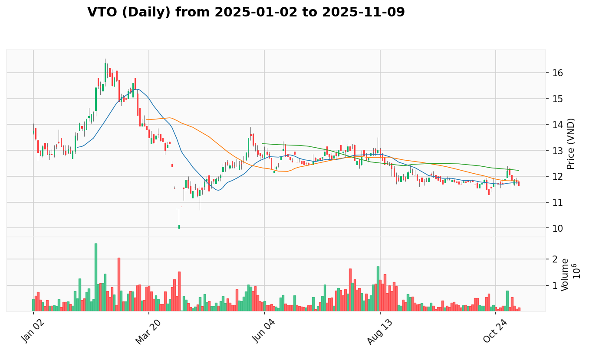

<a href="#van-tai">↑ Back to group VAN_TAI</a>  |  <a href="#vpa-signal-summary">↑ Back to Top</a>

#### Key Statistics
| Metric | Value |
|:---|---:|
| Date Range | 2025-01-02 to 2025-11-07 |
| **Latest Close** | **11.65** |
| Period Open | 13.67 |
| Period High | 16.55 |
| Period Low | 9.99 |
| Period Change % | -14.78% |

**[Download VTO Data (.csv)](market_data/VTO_2025-01-02_to_2025-11-09.csv)**

---

### VTP

#### [VPA Analysis (2025-06-26 - 2025-10-21)](./VPA.md#vtp)
> **Ngày 2025-10-15:** VTP mở cửa ở mức 98.0 VND và đóng cửa tăng lên 98.8 VND, với biên độ dao động từ 96.2 đến 99.0 VND. Giá đóng cửa cao hơn phiên trước, cho thấy sự phục hồi nhẹ sau phiên giảm mạnh. Tuy nhiên, khối lượng giao dịch chỉ đạt 0.614 triệu cổ phiếu, giảm đáng kể so với phiên trước và ở mức thấp. Điều này cho thấy lực cầu chưa thực sự mạnh mẽ để đẩy giá lên cao với khối lượng lớn, có thể là một phiên kiểm tra cung hoặc thiếu cầu sau tín hiệu suy yếu (SOW) trước đó. **Phân tích VPA/Wyckoff:** Lack of Demand (LOD) - Giá tăng với khối lượng thấp sau tín hiệu suy yếu, cho thấy lực cầu yếu và khả năng tiếp tục xu hướng giảm.
> **Ngày 2025-10-16:** VTP mở cửa ở mức 99.4 VND và đóng cửa giảm xuống 97.5 VND, với biên độ dao động từ 97.4 đến 100.8 VND. Giá đóng cửa thấp hơn đáng kể so với giá mở cửa và gần mức thấp nhất phiên. Khối lượng giao dịch chỉ đạt 0.3092 triệu cổ phiếu, giảm mạnh so với phiên trước và ở mức rất thấp. Giá giảm với khối lượng thấp cho thấy lực cầu không xuất hiện để hỗ trợ giá, xác nhận sự suy yếu của thị trường sau tín hiệu SOW và LOD từ các phiên trước. **Phân tích VPA/Wyckoff:** No Demand (NOD) - Giá giảm với khối lượng thấp, xác nhận thiếu vắng lực cầu và khả năng tiếp tục xu hướng giảm.
> **Ngày 2025-10-17:** VTP mở cửa ở mức 100.8 VND và đóng cửa ở mức 100.0 VND, với biên độ dao động từ 97.8 đến 100.8 VND. Giá đóng cửa cao hơn nhẹ so với phiên trước (99.8 VND) nhưng thấp hơn giá mở cửa. Khối lượng giao dịch đạt 0.5693 triệu cổ phiếu, giảm đáng kể so với phiên trước (0.8289 triệu cổ phiếu). Điều này cho thấy lực cầu yếu, không đủ mạnh để đẩy giá lên cao với khối lượng lớn, xác nhận sự thiếu vắng nhu cầu sau các phiên giao dịch trước. **Phân tích VPA/Wyckoff:** Lack of Demand (LOD)
> **Ngày 2025-10-20:** VTP mở cửa ở mức 100.0 VND và đóng cửa tăng mạnh lên 104.5 VND, với biên độ dao động rộng từ 98.5 đến 107.0 VND. Giá đóng cửa cao hơn đáng kể so với giá mở cửa và gần mức cao nhất phiên. Khối lượng giao dịch đạt 3.3393 triệu cổ phiếu, tăng đột biến so với các phiên trước, đặc biệt là so với 0.5693 triệu cổ phiếu của phiên 2025-10-17. Sự tăng giá mạnh mẽ đi kèm với khối lượng lớn cho thấy lực cầu đã quay trở lại thị trường một cách mạnh mẽ, đảo ngược tín hiệu suy yếu từ các phiên NOD và LOD trước đó. **Phân tích VPA/Wyckoff:** Sign of Strength (SOS) - Lực cầu mạnh mẽ với khối lượng gia tăng xác nhận xu hướng tăng.
> **Ngày 2025-10-21:** VTP mở cửa ở mức 106.8 VND và đóng cửa ở mức 111.0 VND, với biên độ dao động từ 106.8 đến 111.2 VND. Giá đóng cửa cao hơn đáng kể so với giá mở cửa và gần mức cao nhất phiên, tiếp nối đà tăng mạnh từ phiên trước. Khối lượng giao dịch đạt 1.7949 triệu cổ phiếu, thấp hơn so với phiên SOS trước đó (3.3393 triệu cổ phiếu) nhưng vẫn ở mức tương đối cao. Điều này cho thấy lực cầu vẫn đang chiếm ưu thế và đẩy giá lên cao, mặc dù cường độ có phần giảm nhẹ so với phiên bùng nổ trước đó. **Phân tích VPA/Wyckoff:** Sign of Strength (SOS) - Tiếp diễn đà tăng

<a href="#van-tai">↑ Back to group VAN_TAI</a>  |  <a href="#vpa-signal-summary">↑ Back to Top</a>

#### Key Statistics
| Metric | Value |
|:---|---:|
| Date Range | 2025-01-02 to 2025-11-07 |
| **Latest Close** | **105.0** |
| Period Open | 137.34 |
| Period High | 172.74 |
| Period Low | 90.18 |
| Period Change % | -23.55% |

**[Download VTP Data (.csv)](market_data/VTP_2025-01-02_to_2025-11-09.csv)**

---

### YEG

#### [VPA Analysis (2025-08-14 - 2025-10-21)](./VPA.md#yeg)
> **Ngày 2025-10-15:** YEG giảm từ 13.4 VND xuống 13.0 VND với khối lượng giao dịch đạt 4.2157 triệu cổ phiếu. Cây nến giảm có biên độ rộng và đóng cửa ở mức thấp nhất phiên, cho thấy áp lực bán mạnh mẽ và nguồn cung lớn tiếp tục đổ vào thị trường. Khối lượng giao dịch tăng đáng kể so với phiên trước (3.6647 triệu cổ phiếu), xác nhận rằng lực cung đang chiếm ưu thế hoàn toàn và đẩy giá xuống sâu hơn. Điều này tiếp tục củng cố xu hướng giảm giá đã được xác nhận từ các phiên trước. **Phân tích VPA/Wyckoff:** Sign of Weakness (SOW) - Lực cung áp đảo với khối lượng gia tăng, xác nhận xu hướng giảm giá mạnh mẽ.
> **Ngày 2025-10-16:** YEG tăng từ 13.0 VND lên 13.2 VND với khối lượng giao dịch đạt 0.9662 triệu cổ phiếu. Cây nến tăng có biên độ hẹp và đóng cửa ở giữa thân nến, cho thấy lực cầu yếu ớt và không đủ sức đẩy giá lên cao. Khối lượng giao dịch giảm mạnh so với phiên trước (4.2157 triệu cổ phiếu), xác nhận rằng lực mua không đáng kể và thị trường vẫn đang trong giai đoạn thiếu cầu sau các phiên giảm mạnh. Điều này cho thấy xu hướng giảm giá vẫn có thể tiếp diễn. **Phân tích VPA/Wyckoff:** No Demand - Lực cầu yếu ớt với khối lượng thấp sau giai đoạn giảm giá mạnh, cho thấy xu hướng giảm có thể tiếp tục.
> **Ngày 2025-10-17:** YEG giảm từ 13.3 VND xuống 13.0 VND với khối lượng giao dịch đạt 2.0752 triệu cổ phiếu. Cây nến giảm có biên độ rộng và đóng cửa ở mức thấp nhất phiên, cho thấy áp lực bán mạnh mẽ và nguồn cung tiếp tục chiếm ưu thế. Khối lượng giao dịch tăng so với phiên trước (1.2624 triệu cổ phiếu), xác nhận rằng lực cung đang gia tăng và đẩy giá xuống sâu hơn. Điều này củng cố xu hướng giảm giá và cho thấy sự yếu kém tiếp diễn của thị trường. **Phân tích VPA/Wyckoff:** Sign of Weakness (SOW) - Lực cung áp đảo với khối lượng gia tăng, xác nhận xu hướng giảm giá mạnh mẽ.
> **Ngày 2025-10-20:** YEG giảm từ 13.0 VND xuống 12.1 VND với khối lượng giao dịch đạt 2.7161 triệu cổ phiếu. Cây nến giảm có biên độ rộng và đóng cửa ở mức thấp nhất phiên, cho thấy áp lực bán mạnh mẽ và nguồn cung tiếp tục chiếm ưu thế. Khối lượng giao dịch tăng so với phiên trước (2.0752 triệu cổ phiếu), xác nhận rằng lực cung đang gia tăng và đẩy giá xuống sâu hơn. Điều này củng cố xu hướng giảm giá và cho thấy sự yếu kém tiếp diễn của thị trường. **Phân tích VPA/Wyckoff:** Sign of Weakness (SOW) - Lực cung áp đảo với khối lượng gia tăng, xác nhận xu hướng giảm giá mạnh mẽ.
> **Ngày 2025-10-21:** YEG tăng từ 12.05 VND lên 12.6 VND với khối lượng giao dịch đạt 3.4203 triệu cổ phiếu. Cây nến tăng có biên độ rộng và đóng cửa gần mức cao nhất phiên, cho thấy lực cầu đã xuất hiện và hấp thụ lực cung. Khối lượng giao dịch tăng so với phiên trước (2.7161 triệu cổ phiếu), xác nhận rằng lực mua đang gia tăng và đẩy giá lên. Sau hai phiên giảm mạnh liên tiếp với áp lực bán lớn, phiên này cho thấy một sự phục hồi tích cực, có thể là một nỗ lực của phe mua để kiểm soát lại thị trường. **Phân tích VPA/Wyckoff:** Sign of Strength (SOS) - Lực cầu mạnh mẽ với khối lượng gia tăng, cho thấy sự phục hồi sau giai đoạn giảm giá.

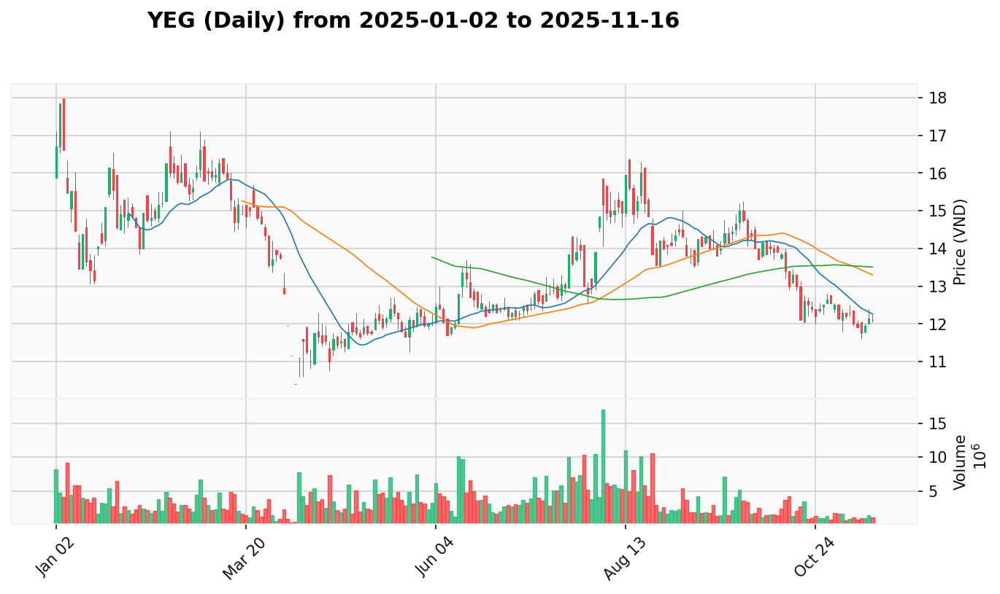

<a href="#others">↑ Back to group OTHERS</a>  |  <a href="#vpa-signal-summary">↑ Back to Top</a>

#### Key Statistics
| Metric | Value |
|:---|---:|
| Date Range | 2025-01-02 to 2025-11-07 |
| **Latest Close** | **12.0** |
| Period Open | 15.88 |
| Period High | 17.98 |
| Period Low | 10.4 |
| Period Change % | -24.43% |

**[Download YEG Data (.csv)](market_data/YEG_2025-01-02_to_2025-11-09.csv)**

---

