# AIPriceAction Market Report
*Report generated for data from **2025-01-02** to **2025-11-14**.*
*Last updated: 2025-11-14 20:32:39*

---

## 🎯 View the Trading Plan

**➡️ [Click here to view the trading plan](PLAN.md)**

**🎢 [Click here to view the latest market leaders](LEADER.md)**

---

<h3 id="vpa-signal-summary">VPA Signal Summary (from Latest Analysis)</h3>

| Signal | Tickers |
|:---|:---|
| Buying Climax | [HHV](#hhv), [SSI](#ssi) |
| Effort to Fall | [VIC](#vic) |
| No Supply | [BIC](#bic), [CST](#cst), [CTD](#ctd), [DGW](#dgw), [KDH](#kdh), [VEA](#vea) |
| Selling Climax | [DPM](#dpm) |
| Sign of Strength | [C4G](#c4g), [DGC](#dgc), [DHG](#dhg), [DPR](#dpr), [DRC](#drc), [HAH](#hah), [TPB](#tpb), [VPG](#vpg) |
| Test for Supply | [CSC](#csc), [NLG](#nlg), [STB](#stb), [VCB](#vcb), [VHM](#vhm), [VRE](#vre) |
| Others | [AAA](#aaa), [ACB](#acb), [ACV](#acv), [ANV](#anv), [BCM](#bcm), [BID](#bid), [BMP](#bmp), [BSI](#bsi), [BSR](#bsr), [BVH](#bvh), [CII](#cii), [CMG](#cmg), [CTG](#ctg), [CTR](#ctr), [CTS](#cts), [DBC](#dbc), [DCM](#dcm), [DVN](#dvn), [FIT](#fit), [FOX](#fox), [FPT](#fpt), [FRT](#frt), [FTS](#fts), [GAS](#gas), [GEX](#gex), [GMD](#gmd), [GVR](#gvr), [HAG](#hag), [HCM](#hcm), [HDB](#hdb), [HDC](#hdc), [HDG](#hdg), [HPG](#hpg), [HSG](#hsg), [HT1](#ht1), [HUT](#hut), [HVN](#hvn), [IDC](#idc), [IMP](#imp), [IPA](#ipa), [KBC](#kbc), [KDC](#kdc), [LPB](#lpb), [MBB](#mbb), [MBS](#mbs), [MCH](#mch), [MPC](#mpc), [MSH](#msh), [MSN](#msn), [MSR](#msr), [MWG](#mwg), [NKG](#nkg), [NT2](#nt2), [NTP](#ntp), [NVL](#nvl), [PAN](#pan), [PC1](#pc1), [PDR](#pdr), [PHR](#phr), [PLX](#plx), [PNJ](#pnj), [POW](#pow), [PTB](#ptb), [PVI](#pvi), [PVS](#pvs), [PVT](#pvt), [QNS](#qns), [REE](#ree), [SAB](#sab), [SCS](#scs), [SGT](#sgt), [SHB](#shb), [SHS](#shs), [SIP](#sip), [SSH](#ssh), [TCB](#tcb), [TCH](#tch), [TNG](#tng), [TV2](#tv2), [VCG](#vcg), [VCI](#vci), [VCS](#vcs), [VGC](#vgc), [VGI](#vgi), [VGT](#vgt), [VHC](#vhc), [VIB](#vib), [VIX](#vix), [VJC](#vjc), [VLB](#vlb), [VND](#vnd), [VNINDEX](#vnindex), [VNM](#vnm), [VPB](#vpb), [VTP](#vtp) |

---

## Groups
<h3 id="ban-le">BAN_LE</h3>

[DGW](#dgw), [FRT](#frt), [HAX](#hax), [MWG](#mwg), [PET](#pet), [PNJ](#pnj)

<h3 id="bao-hiem">BAO_HIEM</h3>

[BIC](#bic), [BMI](#bmi), [BVH](#bvh), [MIG](#mig), [PVI](#pvi)

<h3 id="bat-dong-san">BAT_DONG_SAN</h3>

[AGG](#agg), [CEO](#ceo), [CRV](#crv), [DIG](#dig), [DXG](#dxg), [HDC](#hdc), [HLD](#hld), [HQC](#hqc), [HTN](#htn), [ITC](#itc), [KDH](#kdh), [KHG](#khg), [LDG](#ldg), [NDN](#ndn), [NHA](#nha), [NLG](#nlg), [NTL](#ntl), [NVL](#nvl), [PDR](#pdr), [SCR](#scr), [SGR](#sgr), [SSH](#ssh), [TCH](#tch), [TDC](#tdc), [VHM](#vhm), [VIC](#vic), [VRE](#vre)

<h3 id="bat-dong-san-kcn">BAT_DONG_SAN_KCN</h3>

[BCM](#bcm), [D2D](#d2d), [DTD](#dtd), [IDC](#idc), [IDV](#idv), [KBC](#kbc), [LHG](#lhg), [NTC](#ntc), [SIP](#sip), [SZC](#szc), [TIP](#tip), [VGC](#vgc)

<h3 id="cao-su">CAO_SU</h3>

[DPR](#dpr), [DRC](#drc), [DRG](#drg), [DRI](#dri), [GVR](#gvr), [PHR](#phr), [VRG](#vrg)

<h3 id="chung-khoan">CHUNG_KHOAN</h3>

[AGR](#agr), [APG](#apg), [APS](#aps), [BMS](#bms), [BSI](#bsi), [BVS](#bvs), [CTS](#cts), [DSC](#dsc), [EVF](#evf), [EVS](#evs), [FTS](#fts), [HCM](#hcm), [MBS](#mbs), [ORS](#ors), [SBS](#sbs), [SHS](#shs), [SSI](#ssi), [TCI](#tci), [TCX](#tcx), [TVB](#tvb), [TVS](#tvs), [VCI](#vci), [VDS](#vds), [VIX](#vix), [VND](#vnd)

<h3 id="cong-nghe">CONG_NGHE</h3>

[CMG](#cmg), [ELC](#elc), [FOX](#fox), [FPT](#fpt), [MFS](#mfs), [SGT](#sgt), [TTN](#ttn), [VGI](#vgi), [VTK](#vtk)

<h3 id="dau-khi">DAU_KHI</h3>

[BSR](#bsr), [CNG](#cng), [GAS](#gas), [OIL](#oil), [PLX](#plx), [PVC](#pvc), [PVD](#pvd), [PVS](#pvs)

<h3 id="dau-tu-cong">DAU_TU_CONG</h3>

[C4G](#c4g), [FCN](#fcn), [G36](#g36), [HHV](#hhv), [KSB](#ksb), [LCG](#lcg), [PLC](#plc), [VCG](#vcg)

<h3 id="det-may">DET_MAY</h3>

[ADS](#ads), [EVE](#eve), [GIL](#gil), [MSH](#msh), [PPH](#pph), [STK](#stk), [TCM](#tcm), [TNG](#tng), [VGT](#vgt)

<h3 id="hang-khong">HANG_KHONG</h3>

[ACV](#acv), [HVN](#hvn), [NCT](#nct), [SAS](#sas), [SCS](#scs), [SGN](#sgn), [VJC](#vjc)

<h3 id="hoa-chat">HOA_CHAT</h3>

[BFC](#bfc), [CSV](#csv), [DCM](#dcm), [DDV](#ddv), [DGC](#dgc), [DPM](#dpm), [LAS](#las)

<h3 id="khai-khoang">KHAI_KHOANG</h3>

[BMC](#bmc), [CST](#cst), [NBC](#nbc), [NNC](#nnc), [TNT](#tnt), [VPG](#vpg)

<h3 id="nang-luong">NANG_LUONG</h3>

[GEG](#geg), [HDG](#hdg), [NT2](#nt2), [POW](#pow), [PPC](#ppc), [QTP](#qtp)

<h3 id="ngan-hang">NGAN_HANG</h3>

[ACB](#acb), [BID](#bid), [CTG](#ctg), [EIB](#eib), [HDB](#hdb), [LPB](#lpb), [MBB](#mbb), [MSB](#msb), [OCB](#ocb), [SHB](#shb), [STB](#stb), [TCB](#tcb), [TPB](#tpb), [VCB](#vcb), [VIB](#vib), [VPB](#vpb)

<h3 id="nhua">NHUA</h3>

[AAA](#aaa), [APH](#aph), [BMP](#bmp), [HCD](#hcd), [NHH](#nhh), [NTP](#ntp)

<h3 id="nong-nghiep">NONG_NGHIEP</h3>

[BAF](#baf), [DBC](#dbc), [HAG](#hag), [LTG](#ltg), [NAF](#naf), [PAN](#pan), [TSC](#tsc), [VLC](#vlc)

<h3 id="others">OTHERS</h3>

[BWE](#bwe), [DHC](#dhc), [DSN](#dsn), [GDT](#gdt), [GEX](#gex), [HHS](#hhs), [TDM](#tdm), [TIG](#tig), [TTF](#ttf), [VCS](#vcs), [VEA](#vea), [YEG](#yeg)

<h3 id="penny">PENNY</h3>

[CIG](#cig), [CSC](#csc), [DAH](#dah), [DL1](#dl1), [DST](#dst), [EVG](#evg), [FIT](#fit), [HAP](#hap), [HID](#hid), [IPA](#ipa), [LIG](#lig), [MST](#mst), [NRC](#nrc), [PXI](#pxi), [VC7](#vc7), [VIG](#vig), [VPH](#vph)

<h3 id="suc-khoe">SUC_KHOE</h3>

[DCL](#dcl), [DHG](#dhg), [DHT](#dht), [DVN](#dvn), [IMP](#imp), [JVC](#jvc), [TNH](#tnh)

<h3 id="thep">THEP</h3>

[ACG](#acg), [GDA](#gda), [HPG](#hpg), [HSG](#hsg), [KSV](#ksv), [MSR](#msr), [NKG](#nkg), [SMC](#smc), [TLH](#tlh), [TVN](#tvn), [VGS](#vgs), [VIF](#vif)

<h3 id="thuc-pham">THUC_PHAM</h3>

[CLX](#clx), [KDC](#kdc), [LSS](#lss), [MCH](#mch), [MCM](#mcm), [MSN](#msn), [QNS](#qns), [SAB](#sab), [SBT](#sbt), [SLS](#sls), [VNM](#vnm)

<h3 id="thuy-san">THUY_SAN</h3>

[ACL](#acl), [ANV](#anv), [ASM](#asm), [CMX](#cmx), [FMC](#fmc), [IDI](#idi), [MPC](#mpc), [VHC](#vhc)

<h3 id="van-tai">VAN_TAI</h3>

[DVP](#dvp), [DXP](#dxp), [GMD](#gmd), [HAH](#hah), [MHC](#mhc), [PHP](#php), [PVP](#pvp), [PVT](#pvt), [SKG](#skg), [TCD](#tcd), [TCL](#tcl), [VIP](#vip), [VNA](#vna), [VOS](#vos), [VSC](#vsc), [VTO](#vto), [VTP](#vtp)

<h3 id="vlxd">VLXD</h3>

[BCC](#bcc), [BTN](#btn), [BTS](#bts), [CTI](#cti), [DHA](#dha), [HOM](#hom), [HT1](#ht1), [PTB](#ptb), [VLB](#vlb)

<h3 id="xay-dung">XAY_DUNG</h3>

[BCE](#bce), [BCG](#bcg), [C47](#c47), [C69](#c69), [CII](#cii), [CKG](#ckg), [CTD](#ctd), [DPG](#dpg), [FID](#fid), [HBC](#hbc), [HUT](#hut), [IDJ](#idj), [IJC](#ijc), [L18](#l18), [PHC](#phc), [S99](#s99), [TLD](#tld), [VC2](#vc2)

<h3 id="xay-lap-dien">XAY_LAP_DIEN</h3>

[CTR](#ctr), [PC1](#pc1), [SCI](#sci), [TV2](#tv2), [VNE](#vne)

---

## Table of Contents
| Ticker | Actions |
|:-------|:--------|
| **[VNINDEX](#vnindex)** | [[Download CSV](market_data_week/VNINDEX_2025-01-02_to_2025-11-14.csv)] |
| **[AAA](#aaa)** | [[Download CSV](market_data_week/AAA_2025-01-02_to_2025-11-14.csv)] |
| **[ACB](#acb)** | [[Download CSV](market_data_week/ACB_2025-01-02_to_2025-11-14.csv)] |
| **[ACG](#acg)** | [[Download CSV](market_data_week/ACG_2025-01-02_to_2025-11-14.csv)] |
| **[ACL](#acl)** | [[Download CSV](market_data_week/ACL_2025-01-02_to_2025-11-14.csv)] |
| **[ACV](#acv)** | [[Download CSV](market_data_week/ACV_2025-01-02_to_2025-11-14.csv)] |
| **[ADS](#ads)** | [[Download CSV](market_data_week/ADS_2025-01-02_to_2025-11-14.csv)] |
| **[AGG](#agg)** | [[Download CSV](market_data_week/AGG_2025-01-02_to_2025-11-14.csv)] |
| **[AGR](#agr)** | [[Download CSV](market_data_week/AGR_2025-01-02_to_2025-11-14.csv)] |
| **[ANV](#anv)** | [[Download CSV](market_data_week/ANV_2025-01-02_to_2025-11-14.csv)] |
| **[APG](#apg)** | [[Download CSV](market_data_week/APG_2025-01-02_to_2025-11-14.csv)] |
| **[APH](#aph)** | [[Download CSV](market_data_week/APH_2025-01-02_to_2025-11-14.csv)] |
| **[APS](#aps)** | [[Download CSV](market_data_week/APS_2025-01-02_to_2025-11-14.csv)] |
| **[ASM](#asm)** | [[Download CSV](market_data_week/ASM_2025-01-02_to_2025-11-14.csv)] |
| **[BAF](#baf)** | [[Download CSV](market_data_week/BAF_2025-01-02_to_2025-11-14.csv)] |
| **[BCC](#bcc)** | [[Download CSV](market_data_week/BCC_2025-01-02_to_2025-11-14.csv)] |
| **[BCE](#bce)** | [[Download CSV](market_data_week/BCE_2025-01-02_to_2025-11-14.csv)] |
| **[BCG](#bcg)** | [[Download CSV](market_data_week/BCG_2025-01-02_to_2025-11-14.csv)] |
| **[BCM](#bcm)** | [[Download CSV](market_data_week/BCM_2025-01-02_to_2025-11-14.csv)] |
| **[BFC](#bfc)** | [[Download CSV](market_data_week/BFC_2025-01-02_to_2025-11-14.csv)] |
| **[BIC](#bic)** | [[Download CSV](market_data_week/BIC_2025-01-02_to_2025-11-14.csv)] |
| **[BID](#bid)** | [[Download CSV](market_data_week/BID_2025-01-02_to_2025-11-14.csv)] |
| **[BMC](#bmc)** | [[Download CSV](market_data_week/BMC_2025-01-02_to_2025-11-14.csv)] |
| **[BMI](#bmi)** | [[Download CSV](market_data_week/BMI_2025-01-02_to_2025-11-14.csv)] |
| **[BMP](#bmp)** | [[Download CSV](market_data_week/BMP_2025-01-02_to_2025-11-14.csv)] |
| **[BMS](#bms)** | [[Download CSV](market_data_week/BMS_2025-01-02_to_2025-11-14.csv)] |
| **[BSI](#bsi)** | [[Download CSV](market_data_week/BSI_2025-01-02_to_2025-11-14.csv)] |
| **[BSR](#bsr)** | [[Download CSV](market_data_week/BSR_2025-01-02_to_2025-11-14.csv)] |
| **[BTN](#btn)** | [[Download CSV](market_data_week/BTN_2025-01-02_to_2025-11-14.csv)] |
| **[BTS](#bts)** | [[Download CSV](market_data_week/BTS_2025-01-02_to_2025-11-14.csv)] |
| **[BVH](#bvh)** | [[Download CSV](market_data_week/BVH_2025-01-02_to_2025-11-14.csv)] |
| **[BVS](#bvs)** | [[Download CSV](market_data_week/BVS_2025-01-02_to_2025-11-14.csv)] |
| **[BWE](#bwe)** | [[Download CSV](market_data_week/BWE_2025-01-02_to_2025-11-14.csv)] |
| **[C47](#c47)** | [[Download CSV](market_data_week/C47_2025-01-02_to_2025-11-14.csv)] |
| **[C4G](#c4g)** | [[Download CSV](market_data_week/C4G_2025-01-02_to_2025-11-14.csv)] |
| **[C69](#c69)** | [[Download CSV](market_data_week/C69_2025-01-02_to_2025-11-14.csv)] |
| **[CEO](#ceo)** | [[Download CSV](market_data_week/CEO_2025-01-02_to_2025-11-14.csv)] |
| **[CIG](#cig)** | [[Download CSV](market_data_week/CIG_2025-01-02_to_2025-11-14.csv)] |
| **[CII](#cii)** | [[Download CSV](market_data_week/CII_2025-01-02_to_2025-11-14.csv)] |
| **[CKG](#ckg)** | [[Download CSV](market_data_week/CKG_2025-01-02_to_2025-11-14.csv)] |
| **[CLX](#clx)** | [[Download CSV](market_data_week/CLX_2025-01-02_to_2025-11-14.csv)] |
| **[CMG](#cmg)** | [[Download CSV](market_data_week/CMG_2025-01-02_to_2025-11-14.csv)] |
| **[CMX](#cmx)** | [[Download CSV](market_data_week/CMX_2025-01-02_to_2025-11-14.csv)] |
| **[CNG](#cng)** | [[Download CSV](market_data_week/CNG_2025-01-02_to_2025-11-14.csv)] |
| **[CRV](#crv)** | [[Download CSV](market_data_week/CRV_2025-01-02_to_2025-11-14.csv)] |
| **[CSC](#csc)** | [[Download CSV](market_data_week/CSC_2025-01-02_to_2025-11-14.csv)] |
| **[CST](#cst)** | [[Download CSV](market_data_week/CST_2025-01-02_to_2025-11-14.csv)] |
| **[CSV](#csv)** | [[Download CSV](market_data_week/CSV_2025-01-02_to_2025-11-14.csv)] |
| **[CTD](#ctd)** | [[Download CSV](market_data_week/CTD_2025-01-02_to_2025-11-14.csv)] |
| **[CTG](#ctg)** | [[Download CSV](market_data_week/CTG_2025-01-02_to_2025-11-14.csv)] |
| **[CTI](#cti)** | [[Download CSV](market_data_week/CTI_2025-01-02_to_2025-11-14.csv)] |
| **[CTR](#ctr)** | [[Download CSV](market_data_week/CTR_2025-01-02_to_2025-11-14.csv)] |
| **[CTS](#cts)** | [[Download CSV](market_data_week/CTS_2025-01-02_to_2025-11-14.csv)] |
| **[D2D](#d2d)** | [[Download CSV](market_data_week/D2D_2025-01-02_to_2025-11-14.csv)] |
| **[DAH](#dah)** | [[Download CSV](market_data_week/DAH_2025-01-02_to_2025-11-14.csv)] |
| **[DBC](#dbc)** | [[Download CSV](market_data_week/DBC_2025-01-02_to_2025-11-14.csv)] |
| **[DCL](#dcl)** | [[Download CSV](market_data_week/DCL_2025-01-02_to_2025-11-14.csv)] |
| **[DCM](#dcm)** | [[Download CSV](market_data_week/DCM_2025-01-02_to_2025-11-14.csv)] |
| **[DDV](#ddv)** | [[Download CSV](market_data_week/DDV_2025-01-02_to_2025-11-14.csv)] |
| **[DGC](#dgc)** | [[Download CSV](market_data_week/DGC_2025-01-02_to_2025-11-14.csv)] |
| **[DGW](#dgw)** | [[Download CSV](market_data_week/DGW_2025-01-02_to_2025-11-14.csv)] |
| **[DHA](#dha)** | [[Download CSV](market_data_week/DHA_2025-01-02_to_2025-11-14.csv)] |
| **[DHC](#dhc)** | [[Download CSV](market_data_week/DHC_2025-01-02_to_2025-11-14.csv)] |
| **[DHG](#dhg)** | [[Download CSV](market_data_week/DHG_2025-01-02_to_2025-11-14.csv)] |
| **[DHT](#dht)** | [[Download CSV](market_data_week/DHT_2025-01-02_to_2025-11-14.csv)] |
| **[DIG](#dig)** | [[Download CSV](market_data_week/DIG_2025-01-02_to_2025-11-14.csv)] |
| **[DL1](#dl1)** | [[Download CSV](market_data_week/DL1_2025-01-02_to_2025-11-14.csv)] |
| **[DPG](#dpg)** | [[Download CSV](market_data_week/DPG_2025-01-02_to_2025-11-14.csv)] |
| **[DPM](#dpm)** | [[Download CSV](market_data_week/DPM_2025-01-02_to_2025-11-14.csv)] |
| **[DPR](#dpr)** | [[Download CSV](market_data_week/DPR_2025-01-02_to_2025-11-14.csv)] |
| **[DRC](#drc)** | [[Download CSV](market_data_week/DRC_2025-01-02_to_2025-11-14.csv)] |
| **[DRG](#drg)** | [[Download CSV](market_data_week/DRG_2025-01-02_to_2025-11-14.csv)] |
| **[DRI](#dri)** | [[Download CSV](market_data_week/DRI_2025-01-02_to_2025-11-14.csv)] |
| **[DSC](#dsc)** | [[Download CSV](market_data_week/DSC_2025-01-02_to_2025-11-14.csv)] |
| **[DSN](#dsn)** | [[Download CSV](market_data_week/DSN_2025-01-02_to_2025-11-14.csv)] |
| **[DST](#dst)** | [[Download CSV](market_data_week/DST_2025-01-02_to_2025-11-14.csv)] |
| **[DTD](#dtd)** | [[Download CSV](market_data_week/DTD_2025-01-02_to_2025-11-14.csv)] |
| **[DVN](#dvn)** | [[Download CSV](market_data_week/DVN_2025-01-02_to_2025-11-14.csv)] |
| **[DVP](#dvp)** | [[Download CSV](market_data_week/DVP_2025-01-02_to_2025-11-14.csv)] |
| **[DXG](#dxg)** | [[Download CSV](market_data_week/DXG_2025-01-02_to_2025-11-14.csv)] |
| **[DXP](#dxp)** | [[Download CSV](market_data_week/DXP_2025-01-02_to_2025-11-14.csv)] |
| **[EIB](#eib)** | [[Download CSV](market_data_week/EIB_2025-01-02_to_2025-11-14.csv)] |
| **[ELC](#elc)** | [[Download CSV](market_data_week/ELC_2025-01-02_to_2025-11-14.csv)] |
| **[EVE](#eve)** | [[Download CSV](market_data_week/EVE_2025-01-02_to_2025-11-14.csv)] |
| **[EVF](#evf)** | [[Download CSV](market_data_week/EVF_2025-01-02_to_2025-11-14.csv)] |
| **[EVG](#evg)** | [[Download CSV](market_data_week/EVG_2025-01-02_to_2025-11-14.csv)] |
| **[EVS](#evs)** | [[Download CSV](market_data_week/EVS_2025-01-02_to_2025-11-14.csv)] |
| **[FCN](#fcn)** | [[Download CSV](market_data_week/FCN_2025-01-02_to_2025-11-14.csv)] |
| **[FID](#fid)** | [[Download CSV](market_data_week/FID_2025-01-02_to_2025-11-14.csv)] |
| **[FIT](#fit)** | [[Download CSV](market_data_week/FIT_2025-01-02_to_2025-11-14.csv)] |
| **[FMC](#fmc)** | [[Download CSV](market_data_week/FMC_2025-01-02_to_2025-11-14.csv)] |
| **[FOX](#fox)** | [[Download CSV](market_data_week/FOX_2025-01-02_to_2025-11-14.csv)] |
| **[FPT](#fpt)** | [[Download CSV](market_data_week/FPT_2025-01-02_to_2025-11-14.csv)] |
| **[FRT](#frt)** | [[Download CSV](market_data_week/FRT_2025-01-02_to_2025-11-14.csv)] |
| **[FTS](#fts)** | [[Download CSV](market_data_week/FTS_2025-01-02_to_2025-11-14.csv)] |
| **[G36](#g36)** | [[Download CSV](market_data_week/G36_2025-01-02_to_2025-11-14.csv)] |
| **[GAS](#gas)** | [[Download CSV](market_data_week/GAS_2025-01-02_to_2025-11-14.csv)] |
| **[GDA](#gda)** | [[Download CSV](market_data_week/GDA_2025-01-02_to_2025-11-14.csv)] |
| **[GDT](#gdt)** | [[Download CSV](market_data_week/GDT_2025-01-02_to_2025-11-14.csv)] |
| **[GEG](#geg)** | [[Download CSV](market_data_week/GEG_2025-01-02_to_2025-11-14.csv)] |
| **[GEX](#gex)** | [[Download CSV](market_data_week/GEX_2025-01-02_to_2025-11-14.csv)] |
| **[GIL](#gil)** | [[Download CSV](market_data_week/GIL_2025-01-02_to_2025-11-14.csv)] |
| **[GMD](#gmd)** | [[Download CSV](market_data_week/GMD_2025-01-02_to_2025-11-14.csv)] |
| **[GVR](#gvr)** | [[Download CSV](market_data_week/GVR_2025-01-02_to_2025-11-14.csv)] |
| **[HAG](#hag)** | [[Download CSV](market_data_week/HAG_2025-01-02_to_2025-11-14.csv)] |
| **[HAH](#hah)** | [[Download CSV](market_data_week/HAH_2025-01-02_to_2025-11-14.csv)] |
| **[HAP](#hap)** | [[Download CSV](market_data_week/HAP_2025-01-02_to_2025-11-14.csv)] |
| **[HAX](#hax)** | [[Download CSV](market_data_week/HAX_2025-01-02_to_2025-11-14.csv)] |
| **[HBC](#hbc)** | [[Download CSV](market_data_week/HBC_2025-01-02_to_2025-11-14.csv)] |
| **[HCD](#hcd)** | [[Download CSV](market_data_week/HCD_2025-01-02_to_2025-11-14.csv)] |
| **[HCM](#hcm)** | [[Download CSV](market_data_week/HCM_2025-01-02_to_2025-11-14.csv)] |
| **[HDB](#hdb)** | [[Download CSV](market_data_week/HDB_2025-01-02_to_2025-11-14.csv)] |
| **[HDC](#hdc)** | [[Download CSV](market_data_week/HDC_2025-01-02_to_2025-11-14.csv)] |
| **[HDG](#hdg)** | [[Download CSV](market_data_week/HDG_2025-01-02_to_2025-11-14.csv)] |
| **[HHS](#hhs)** | [[Download CSV](market_data_week/HHS_2025-01-02_to_2025-11-14.csv)] |
| **[HHV](#hhv)** | [[Download CSV](market_data_week/HHV_2025-01-02_to_2025-11-14.csv)] |
| **[HID](#hid)** | [[Download CSV](market_data_week/HID_2025-01-02_to_2025-11-14.csv)] |
| **[HLD](#hld)** | [[Download CSV](market_data_week/HLD_2025-01-02_to_2025-11-14.csv)] |
| **[HOM](#hom)** | [[Download CSV](market_data_week/HOM_2025-01-02_to_2025-11-14.csv)] |
| **[HPG](#hpg)** | [[Download CSV](market_data_week/HPG_2025-01-02_to_2025-11-14.csv)] |
| **[HQC](#hqc)** | [[Download CSV](market_data_week/HQC_2025-01-02_to_2025-11-14.csv)] |
| **[HSG](#hsg)** | [[Download CSV](market_data_week/HSG_2025-01-02_to_2025-11-14.csv)] |
| **[HT1](#ht1)** | [[Download CSV](market_data_week/HT1_2025-01-02_to_2025-11-14.csv)] |
| **[HTN](#htn)** | [[Download CSV](market_data_week/HTN_2025-01-02_to_2025-11-14.csv)] |
| **[HUT](#hut)** | [[Download CSV](market_data_week/HUT_2025-01-02_to_2025-11-14.csv)] |
| **[HVN](#hvn)** | [[Download CSV](market_data_week/HVN_2025-01-02_to_2025-11-14.csv)] |
| **[IDC](#idc)** | [[Download CSV](market_data_week/IDC_2025-01-02_to_2025-11-14.csv)] |
| **[IDI](#idi)** | [[Download CSV](market_data_week/IDI_2025-01-02_to_2025-11-14.csv)] |
| **[IDJ](#idj)** | [[Download CSV](market_data_week/IDJ_2025-01-02_to_2025-11-14.csv)] |
| **[IDV](#idv)** | [[Download CSV](market_data_week/IDV_2025-01-02_to_2025-11-14.csv)] |
| **[IJC](#ijc)** | [[Download CSV](market_data_week/IJC_2025-01-02_to_2025-11-14.csv)] |
| **[IMP](#imp)** | [[Download CSV](market_data_week/IMP_2025-01-02_to_2025-11-14.csv)] |
| **[IPA](#ipa)** | [[Download CSV](market_data_week/IPA_2025-01-02_to_2025-11-14.csv)] |
| **[ITC](#itc)** | [[Download CSV](market_data_week/ITC_2025-01-02_to_2025-11-14.csv)] |
| **[JVC](#jvc)** | [[Download CSV](market_data_week/JVC_2025-01-02_to_2025-11-14.csv)] |
| **[KBC](#kbc)** | [[Download CSV](market_data_week/KBC_2025-01-02_to_2025-11-14.csv)] |
| **[KDC](#kdc)** | [[Download CSV](market_data_week/KDC_2025-01-02_to_2025-11-14.csv)] |
| **[KDH](#kdh)** | [[Download CSV](market_data_week/KDH_2025-01-02_to_2025-11-14.csv)] |
| **[KHG](#khg)** | [[Download CSV](market_data_week/KHG_2025-01-02_to_2025-11-14.csv)] |
| **[KSB](#ksb)** | [[Download CSV](market_data_week/KSB_2025-01-02_to_2025-11-14.csv)] |
| **[KSV](#ksv)** | [[Download CSV](market_data_week/KSV_2025-01-02_to_2025-11-14.csv)] |
| **[L18](#l18)** | [[Download CSV](market_data_week/L18_2025-01-02_to_2025-11-14.csv)] |
| **[LAS](#las)** | [[Download CSV](market_data_week/LAS_2025-01-02_to_2025-11-14.csv)] |
| **[LCG](#lcg)** | [[Download CSV](market_data_week/LCG_2025-01-02_to_2025-11-14.csv)] |
| **[LDG](#ldg)** | [[Download CSV](market_data_week/LDG_2025-01-02_to_2025-11-14.csv)] |
| **[LHG](#lhg)** | [[Download CSV](market_data_week/LHG_2025-01-02_to_2025-11-14.csv)] |
| **[LIG](#lig)** | [[Download CSV](market_data_week/LIG_2025-01-02_to_2025-11-14.csv)] |
| **[LPB](#lpb)** | [[Download CSV](market_data_week/LPB_2025-01-02_to_2025-11-14.csv)] |
| **[LSS](#lss)** | [[Download CSV](market_data_week/LSS_2025-01-02_to_2025-11-14.csv)] |
| **[LTG](#ltg)** | [[Download CSV](market_data_week/LTG_2025-01-02_to_2025-11-14.csv)] |
| **[MBB](#mbb)** | [[Download CSV](market_data_week/MBB_2025-01-02_to_2025-11-14.csv)] |
| **[MBS](#mbs)** | [[Download CSV](market_data_week/MBS_2025-01-02_to_2025-11-14.csv)] |
| **[MCH](#mch)** | [[Download CSV](market_data_week/MCH_2025-01-02_to_2025-11-14.csv)] |
| **[MCM](#mcm)** | [[Download CSV](market_data_week/MCM_2025-01-02_to_2025-11-14.csv)] |
| **[MFS](#mfs)** | [[Download CSV](market_data_week/MFS_2025-01-02_to_2025-11-14.csv)] |
| **[MHC](#mhc)** | [[Download CSV](market_data_week/MHC_2025-01-02_to_2025-11-14.csv)] |
| **[MIG](#mig)** | [[Download CSV](market_data_week/MIG_2025-01-02_to_2025-11-14.csv)] |
| **[MPC](#mpc)** | [[Download CSV](market_data_week/MPC_2025-01-02_to_2025-11-14.csv)] |
| **[MSB](#msb)** | [[Download CSV](market_data_week/MSB_2025-01-02_to_2025-11-14.csv)] |
| **[MSH](#msh)** | [[Download CSV](market_data_week/MSH_2025-01-02_to_2025-11-14.csv)] |
| **[MSN](#msn)** | [[Download CSV](market_data_week/MSN_2025-01-02_to_2025-11-14.csv)] |
| **[MSR](#msr)** | [[Download CSV](market_data_week/MSR_2025-01-02_to_2025-11-14.csv)] |
| **[MST](#mst)** | [[Download CSV](market_data_week/MST_2025-01-02_to_2025-11-14.csv)] |
| **[MWG](#mwg)** | [[Download CSV](market_data_week/MWG_2025-01-02_to_2025-11-14.csv)] |
| **[NAF](#naf)** | [[Download CSV](market_data_week/NAF_2025-01-02_to_2025-11-14.csv)] |
| **[NBC](#nbc)** | [[Download CSV](market_data_week/NBC_2025-01-02_to_2025-11-14.csv)] |
| **[NCT](#nct)** | [[Download CSV](market_data_week/NCT_2025-01-02_to_2025-11-14.csv)] |
| **[NDN](#ndn)** | [[Download CSV](market_data_week/NDN_2025-01-02_to_2025-11-14.csv)] |
| **[NHA](#nha)** | [[Download CSV](market_data_week/NHA_2025-01-02_to_2025-11-14.csv)] |
| **[NHH](#nhh)** | [[Download CSV](market_data_week/NHH_2025-01-02_to_2025-11-14.csv)] |
| **[NKG](#nkg)** | [[Download CSV](market_data_week/NKG_2025-01-02_to_2025-11-14.csv)] |
| **[NLG](#nlg)** | [[Download CSV](market_data_week/NLG_2025-01-02_to_2025-11-14.csv)] |
| **[NNC](#nnc)** | [[Download CSV](market_data_week/NNC_2025-01-02_to_2025-11-14.csv)] |
| **[NRC](#nrc)** | [[Download CSV](market_data_week/NRC_2025-01-02_to_2025-11-14.csv)] |
| **[NT2](#nt2)** | [[Download CSV](market_data_week/NT2_2025-01-02_to_2025-11-14.csv)] |
| **[NTC](#ntc)** | [[Download CSV](market_data_week/NTC_2025-01-02_to_2025-11-14.csv)] |
| **[NTL](#ntl)** | [[Download CSV](market_data_week/NTL_2025-01-02_to_2025-11-14.csv)] |
| **[NTP](#ntp)** | [[Download CSV](market_data_week/NTP_2025-01-02_to_2025-11-14.csv)] |
| **[NVL](#nvl)** | [[Download CSV](market_data_week/NVL_2025-01-02_to_2025-11-14.csv)] |
| **[OCB](#ocb)** | [[Download CSV](market_data_week/OCB_2025-01-02_to_2025-11-14.csv)] |
| **[OIL](#oil)** | [[Download CSV](market_data_week/OIL_2025-01-02_to_2025-11-14.csv)] |
| **[ORS](#ors)** | [[Download CSV](market_data_week/ORS_2025-01-02_to_2025-11-14.csv)] |
| **[PAN](#pan)** | [[Download CSV](market_data_week/PAN_2025-01-02_to_2025-11-14.csv)] |
| **[PC1](#pc1)** | [[Download CSV](market_data_week/PC1_2025-01-02_to_2025-11-14.csv)] |
| **[PDR](#pdr)** | [[Download CSV](market_data_week/PDR_2025-01-02_to_2025-11-14.csv)] |
| **[PET](#pet)** | [[Download CSV](market_data_week/PET_2025-01-02_to_2025-11-14.csv)] |
| **[PHC](#phc)** | [[Download CSV](market_data_week/PHC_2025-01-02_to_2025-11-14.csv)] |
| **[PHP](#php)** | [[Download CSV](market_data_week/PHP_2025-01-02_to_2025-11-14.csv)] |
| **[PHR](#phr)** | [[Download CSV](market_data_week/PHR_2025-01-02_to_2025-11-14.csv)] |
| **[PLC](#plc)** | [[Download CSV](market_data_week/PLC_2025-01-02_to_2025-11-14.csv)] |
| **[PLX](#plx)** | [[Download CSV](market_data_week/PLX_2025-01-02_to_2025-11-14.csv)] |
| **[PNJ](#pnj)** | [[Download CSV](market_data_week/PNJ_2025-01-02_to_2025-11-14.csv)] |
| **[POW](#pow)** | [[Download CSV](market_data_week/POW_2025-01-02_to_2025-11-14.csv)] |
| **[PPC](#ppc)** | [[Download CSV](market_data_week/PPC_2025-01-02_to_2025-11-14.csv)] |
| **[PPH](#pph)** | [[Download CSV](market_data_week/PPH_2025-01-02_to_2025-11-14.csv)] |
| **[PTB](#ptb)** | [[Download CSV](market_data_week/PTB_2025-01-02_to_2025-11-14.csv)] |
| **[PVC](#pvc)** | [[Download CSV](market_data_week/PVC_2025-01-02_to_2025-11-14.csv)] |
| **[PVD](#pvd)** | [[Download CSV](market_data_week/PVD_2025-01-02_to_2025-11-14.csv)] |
| **[PVI](#pvi)** | [[Download CSV](market_data_week/PVI_2025-01-02_to_2025-11-14.csv)] |
| **[PVP](#pvp)** | [[Download CSV](market_data_week/PVP_2025-01-02_to_2025-11-14.csv)] |
| **[PVS](#pvs)** | [[Download CSV](market_data_week/PVS_2025-01-02_to_2025-11-14.csv)] |
| **[PVT](#pvt)** | [[Download CSV](market_data_week/PVT_2025-01-02_to_2025-11-14.csv)] |
| **[PXI](#pxi)** | [[Download CSV](market_data_week/PXI_2025-01-02_to_2025-11-14.csv)] |
| **[QNS](#qns)** | [[Download CSV](market_data_week/QNS_2025-01-02_to_2025-11-14.csv)] |
| **[QTP](#qtp)** | [[Download CSV](market_data_week/QTP_2025-01-02_to_2025-11-14.csv)] |
| **[S99](#s99)** | [[Download CSV](market_data_week/S99_2025-01-02_to_2025-11-14.csv)] |
| **[SAB](#sab)** | [[Download CSV](market_data_week/SAB_2025-01-02_to_2025-11-14.csv)] |
| **[SAS](#sas)** | [[Download CSV](market_data_week/SAS_2025-01-02_to_2025-11-14.csv)] |
| **[SBS](#sbs)** | [[Download CSV](market_data_week/SBS_2025-01-02_to_2025-11-14.csv)] |
| **[SBT](#sbt)** | [[Download CSV](market_data_week/SBT_2025-01-02_to_2025-11-14.csv)] |
| **[SCI](#sci)** | [[Download CSV](market_data_week/SCI_2025-01-02_to_2025-11-14.csv)] |
| **[SCR](#scr)** | [[Download CSV](market_data_week/SCR_2025-01-02_to_2025-11-14.csv)] |
| **[SCS](#scs)** | [[Download CSV](market_data_week/SCS_2025-01-02_to_2025-11-14.csv)] |
| **[SGN](#sgn)** | [[Download CSV](market_data_week/SGN_2025-01-02_to_2025-11-14.csv)] |
| **[SGR](#sgr)** | [[Download CSV](market_data_week/SGR_2025-01-02_to_2025-11-14.csv)] |
| **[SGT](#sgt)** | [[Download CSV](market_data_week/SGT_2025-01-02_to_2025-11-14.csv)] |
| **[SHB](#shb)** | [[Download CSV](market_data_week/SHB_2025-01-02_to_2025-11-14.csv)] |
| **[SHS](#shs)** | [[Download CSV](market_data_week/SHS_2025-01-02_to_2025-11-14.csv)] |
| **[SIP](#sip)** | [[Download CSV](market_data_week/SIP_2025-01-02_to_2025-11-14.csv)] |
| **[SKG](#skg)** | [[Download CSV](market_data_week/SKG_2025-01-02_to_2025-11-14.csv)] |
| **[SLS](#sls)** | [[Download CSV](market_data_week/SLS_2025-01-02_to_2025-11-14.csv)] |
| **[SMC](#smc)** | [[Download CSV](market_data_week/SMC_2025-01-02_to_2025-11-14.csv)] |
| **[SSH](#ssh)** | [[Download CSV](market_data_week/SSH_2025-01-02_to_2025-11-14.csv)] |
| **[SSI](#ssi)** | [[Download CSV](market_data_week/SSI_2025-01-02_to_2025-11-14.csv)] |
| **[STB](#stb)** | [[Download CSV](market_data_week/STB_2025-01-02_to_2025-11-14.csv)] |
| **[STK](#stk)** | [[Download CSV](market_data_week/STK_2025-01-02_to_2025-11-14.csv)] |
| **[SZC](#szc)** | [[Download CSV](market_data_week/SZC_2025-01-02_to_2025-11-14.csv)] |
| **[TCB](#tcb)** | [[Download CSV](market_data_week/TCB_2025-01-02_to_2025-11-14.csv)] |
| **[TCD](#tcd)** | [[Download CSV](market_data_week/TCD_2025-01-02_to_2025-11-14.csv)] |
| **[TCH](#tch)** | [[Download CSV](market_data_week/TCH_2025-01-02_to_2025-11-14.csv)] |
| **[TCI](#tci)** | [[Download CSV](market_data_week/TCI_2025-01-02_to_2025-11-14.csv)] |
| **[TCL](#tcl)** | [[Download CSV](market_data_week/TCL_2025-01-02_to_2025-11-14.csv)] |
| **[TCM](#tcm)** | [[Download CSV](market_data_week/TCM_2025-01-02_to_2025-11-14.csv)] |
| **[TCX](#tcx)** | [[Download CSV](market_data_week/TCX_2025-01-02_to_2025-11-14.csv)] |
| **[TDC](#tdc)** | [[Download CSV](market_data_week/TDC_2025-01-02_to_2025-11-14.csv)] |
| **[TDM](#tdm)** | [[Download CSV](market_data_week/TDM_2025-01-02_to_2025-11-14.csv)] |
| **[TIG](#tig)** | [[Download CSV](market_data_week/TIG_2025-01-02_to_2025-11-14.csv)] |
| **[TIP](#tip)** | [[Download CSV](market_data_week/TIP_2025-01-02_to_2025-11-14.csv)] |
| **[TLD](#tld)** | [[Download CSV](market_data_week/TLD_2025-01-02_to_2025-11-14.csv)] |
| **[TLH](#tlh)** | [[Download CSV](market_data_week/TLH_2025-01-02_to_2025-11-14.csv)] |
| **[TNG](#tng)** | [[Download CSV](market_data_week/TNG_2025-01-02_to_2025-11-14.csv)] |
| **[TNH](#tnh)** | [[Download CSV](market_data_week/TNH_2025-01-02_to_2025-11-14.csv)] |
| **[TNT](#tnt)** | [[Download CSV](market_data_week/TNT_2025-01-02_to_2025-11-14.csv)] |
| **[TPB](#tpb)** | [[Download CSV](market_data_week/TPB_2025-01-02_to_2025-11-14.csv)] |
| **[TSC](#tsc)** | [[Download CSV](market_data_week/TSC_2025-01-02_to_2025-11-14.csv)] |
| **[TTF](#ttf)** | [[Download CSV](market_data_week/TTF_2025-01-02_to_2025-11-14.csv)] |
| **[TTN](#ttn)** | [[Download CSV](market_data_week/TTN_2025-01-02_to_2025-11-14.csv)] |
| **[TV2](#tv2)** | [[Download CSV](market_data_week/TV2_2025-01-02_to_2025-11-14.csv)] |
| **[TVB](#tvb)** | [[Download CSV](market_data_week/TVB_2025-01-02_to_2025-11-14.csv)] |
| **[TVN](#tvn)** | [[Download CSV](market_data_week/TVN_2025-01-02_to_2025-11-14.csv)] |
| **[TVS](#tvs)** | [[Download CSV](market_data_week/TVS_2025-01-02_to_2025-11-14.csv)] |
| **[VC2](#vc2)** | [[Download CSV](market_data_week/VC2_2025-01-02_to_2025-11-14.csv)] |
| **[VC7](#vc7)** | [[Download CSV](market_data_week/VC7_2025-01-02_to_2025-11-14.csv)] |
| **[VCB](#vcb)** | [[Download CSV](market_data_week/VCB_2025-01-02_to_2025-11-14.csv)] |
| **[VCG](#vcg)** | [[Download CSV](market_data_week/VCG_2025-01-02_to_2025-11-14.csv)] |
| **[VCI](#vci)** | [[Download CSV](market_data_week/VCI_2025-01-02_to_2025-11-14.csv)] |
| **[VCS](#vcs)** | [[Download CSV](market_data_week/VCS_2025-01-02_to_2025-11-14.csv)] |
| **[VDS](#vds)** | [[Download CSV](market_data_week/VDS_2025-01-02_to_2025-11-14.csv)] |
| **[VEA](#vea)** | [[Download CSV](market_data_week/VEA_2025-01-02_to_2025-11-14.csv)] |
| **[VGC](#vgc)** | [[Download CSV](market_data_week/VGC_2025-01-02_to_2025-11-14.csv)] |
| **[VGI](#vgi)** | [[Download CSV](market_data_week/VGI_2025-01-02_to_2025-11-14.csv)] |
| **[VGS](#vgs)** | [[Download CSV](market_data_week/VGS_2025-01-02_to_2025-11-14.csv)] |
| **[VGT](#vgt)** | [[Download CSV](market_data_week/VGT_2025-01-02_to_2025-11-14.csv)] |
| **[VHC](#vhc)** | [[Download CSV](market_data_week/VHC_2025-01-02_to_2025-11-14.csv)] |
| **[VHM](#vhm)** | [[Download CSV](market_data_week/VHM_2025-01-02_to_2025-11-14.csv)] |
| **[VIB](#vib)** | [[Download CSV](market_data_week/VIB_2025-01-02_to_2025-11-14.csv)] |
| **[VIC](#vic)** | [[Download CSV](market_data_week/VIC_2025-01-02_to_2025-11-14.csv)] |
| **[VIF](#vif)** | [[Download CSV](market_data_week/VIF_2025-01-02_to_2025-11-14.csv)] |
| **[VIG](#vig)** | [[Download CSV](market_data_week/VIG_2025-01-02_to_2025-11-14.csv)] |
| **[VIP](#vip)** | [[Download CSV](market_data_week/VIP_2025-01-02_to_2025-11-14.csv)] |
| **[VIX](#vix)** | [[Download CSV](market_data_week/VIX_2025-01-02_to_2025-11-14.csv)] |
| **[VJC](#vjc)** | [[Download CSV](market_data_week/VJC_2025-01-02_to_2025-11-14.csv)] |
| **[VLB](#vlb)** | [[Download CSV](market_data_week/VLB_2025-01-02_to_2025-11-14.csv)] |
| **[VLC](#vlc)** | [[Download CSV](market_data_week/VLC_2025-01-02_to_2025-11-14.csv)] |
| **[VNA](#vna)** | [[Download CSV](market_data_week/VNA_2025-01-02_to_2025-11-14.csv)] |
| **[VND](#vnd)** | [[Download CSV](market_data_week/VND_2025-01-02_to_2025-11-14.csv)] |
| **[VNE](#vne)** | [[Download CSV](market_data_week/VNE_2025-01-02_to_2025-11-14.csv)] |
| **[VNM](#vnm)** | [[Download CSV](market_data_week/VNM_2025-01-02_to_2025-11-14.csv)] |
| **[VOS](#vos)** | [[Download CSV](market_data_week/VOS_2025-01-02_to_2025-11-14.csv)] |
| **[VPB](#vpb)** | [[Download CSV](market_data_week/VPB_2025-01-02_to_2025-11-14.csv)] |
| **[VPG](#vpg)** | [[Download CSV](market_data_week/VPG_2025-01-02_to_2025-11-14.csv)] |
| **[VPH](#vph)** | [[Download CSV](market_data_week/VPH_2025-01-02_to_2025-11-14.csv)] |
| **[VRE](#vre)** | [[Download CSV](market_data_week/VRE_2025-01-02_to_2025-11-14.csv)] |
| **[VRG](#vrg)** | [[Download CSV](market_data_week/VRG_2025-01-02_to_2025-11-14.csv)] |
| **[VSC](#vsc)** | [[Download CSV](market_data_week/VSC_2025-01-02_to_2025-11-14.csv)] |
| **[VTK](#vtk)** | [[Download CSV](market_data_week/VTK_2025-01-02_to_2025-11-14.csv)] |
| **[VTO](#vto)** | [[Download CSV](market_data_week/VTO_2025-01-02_to_2025-11-14.csv)] |
| **[VTP](#vtp)** | [[Download CSV](market_data_week/VTP_2025-01-02_to_2025-11-14.csv)] |
| **[YEG](#yeg)** | [[Download CSV](market_data_week/YEG_2025-01-02_to_2025-11-14.csv)] |

---

## Ticker Performance Summary
| Ticker | Period High | Period Low | Latest Close | Change % | Total Volume |
|:-------|------------:|-----------:|-------------:|---------:|-------------:|
| **VNINDEX** | 1,794.58 | 1,073.61 | **1,635.46** | 28.88% 📈 | 210,104,479,538 |
| **AAA** | 8.93 | 6.15 | **7.9** | -5.73% 📉 | 513,477,711 |
| **ACB** | 29.5 | 17.34 | **24.95** | 16.64% 📈 | 2,760,252,465 |
| **ACG** | 40.4 | 30.85 | **35.6** | -9.78% 📉 | 2,732,145 |
| **ACL** | 14.15 | 8.37 | **13.2** | 11.39% 📈 | 7,935,800 |
| **ACV** | 78.32 | 45.27 | **55.4** | -27.34% 📉 | 127,290,205 |
| **ADS** | 10.1 | 6.63 | **8.23** | 0.37% 📈 | 36,717,085 |
| **AGG** | 22.1 | 14.15 | **16.0** | 2.24% 📈 | 168,685,800 |
| **AGR** | 20.8 | 12.78 | **15.8** | -1.19% 📉 | 272,167,537 |
| **ANV** | 33.4 | 12.0 | **28.4** | 47.76% 📈 | 624,705,171 |
| **APG** | 13.45 | 5.75 | **11.05** | 64.93% 📈 | 168,577,900 |
| **APH** | 7.6 | 5.71 | **6.23** | -11.38% 📉 | 103,779,600 |
| **APS** | 14.2 | 4.4 | **8.2** | 26.15% 📈 | 243,847,400 |
| **ASM** | 8.67 | 5.35 | **6.89** | -11.44% 📉 | 260,178,428 |
| **BAF** | 38.8 | 26.0 | **32.25** | 14.77% 📈 | 789,739,000 |
| **BCC** | 9.9 | 5.8 | **7.7** | 6.94% 📈 | 36,154,500 |
| **BCE** | 12.3 | 8.2 | **10.5** | 23.53% 📈 | 29,948,500 |
| **BCG** | 6.37 | 2.43 | **2.53** | -60.16% 📉 | 1,965,372,900 |
| **BCM** | 82.4 | 49.8 | **67.5** | -3.57% 📉 | 107,873,100 |
| **BFC** | 51.1 | 30.86 | **46.0** | 20.45% 📈 | 154,429,859 |
| **BIC** | 32.83 | 16.61 | **23.95** | 26.19% 📈 | 26,676,810 |
| **BID** | 44.6 | 30.86 | **38.35** | 1.51% 📈 | 1,101,774,140 |
| **BMC** | 31.26 | 16.0 | **16.35** | -18.98% 📉 | 35,536,829 |
| **BMI** | 21.85 | 14.85 | **19.25** | 6.47% 📈 | 65,948,497 |
| **BMP** | 180.0 | 95.93 | **170.9** | 36.06% 📈 | 40,674,691 |
| **BMS** | 15.9 | 8.47 | **12.9** | 52.30% 📈 | 80,064,345 |
| **BSI** | 58.3 | 37.95 | **41.45** | -6.09% 📉 | 265,251,016 |
| **BSR** | 19.47 | 9.01 | **16.0** | 13.31% 📈 | 1,429,226,945 |
| **BTN** | 3.6 | 2.4 | **2.8** | 3.70% 📈 | 1,019,400 |
| **BTS** | 5.8 | 4.5 | **5.3** | 6.00% 📈 | 5,546,900 |
| **BVH** | 64.27 | 38.36 | **55.3** | 10.07% 📈 | 137,008,138 |
| **BVS** | 43.94 | 25.88 | **33.0** | -8.92% 📉 | 155,632,954 |
| **BWE** | 54.3 | 38.0 | **47.3** | 1.98% 📈 | 46,506,899 |
| **C47** | 13.25 | 5.57 | **9.99** | 63.77% 📈 | 24,641,000 |
| **C4G** | 10.9 | 5.6 | **8.5** | 7.59% 📈 | 301,064,900 |
| **C69** | 14.8 | 5.5 | **12.3** | 86.36% 📈 | 101,844,300 |
| **CEO** | 32.9 | 9.81 | **25.8** | 109.93% 📈 | 3,443,306,368 |
| **CIG** | 10.35 | 6.86 | **8.97** | 9.93% 📈 | 56,665,500 |
| **CII** | 31.35 | 9.02 | **25.15** | 109.23% 📈 | 4,270,624,043 |
| **CKG** | 17.71 | 10.74 | **11.8** | -33.37% 📉 | 28,452,740 |
| **CLX** | 19.94 | 12.08 | **16.0** | -1.23% 📉 | 45,483,517 |
| **CMG** | 50.4 | 28.85 | **38.1** | -23.03% 📉 | 251,498,623 |
| **CMX** | 8.55 | 6.03 | **6.53** | -17.34% 📉 | 62,202,400 |
| **CNG** | 31.54 | 23.73 | **25.6** | -13.31% 📉 | 23,139,529 |
| **CRV** | 41.0 | 30.5 | **32.5** | 4.17% 📈 | 657,900 |
| **CSC** | 26.9 | 15.55 | **18.1** | -26.81% 📉 | 11,699,830 |
| **CST** | 23.61 | 13.0 | **13.6** | -40.97% 📉 | 11,601,759 |
| **CSV** | 46.21 | 27.63 | **31.85** | -28.83% 📉 | 316,865,713 |
| **CTD** | 103.5 | 64.3 | **88.0** | 27.91% 📈 | 278,633,422 |
| **CTG** | 56.05 | 33.53 | **48.55** | 28.78% 📈 | 1,909,972,992 |
| **CTI** | 28.95 | 17.2 | **23.3** | 20.73% 📈 | 321,684,600 |
| **CTR** | 133.03 | 72.13 | **92.6** | -23.85% 📉 | 147,689,879 |
| **CTS** | 46.85 | 20.77 | **35.35** | 41.97% 📈 | 460,741,548 |
| **D2D** | 40.0 | 24.9 | **36.0** | 39.97% 📈 | 29,814,253 |
| **DAH** | 4.46 | 2.66 | **3.71** | 6.61% 📈 | 63,732,100 |
| **DBC** | 32.35 | 19.09 | **26.15** | 7.00% 📈 | 1,644,853,231 |
| **DCL** | 37.35 | 19.0 | **36.0** | 34.58% 📈 | 145,335,300 |
| **DCM** | 43.85 | 23.38 | **34.4** | 2.32% 📈 | 743,307,600 |
| **DDV** | 37.0 | 12.2 | **29.5** | 53.89% 📈 | 400,046,700 |
| **DGC** | 117.3 | 73.1 | **99.4** | -14.75% 📉 | 429,411,700 |
| **DGW** | 49.5 | 28.32 | **39.95** | 0.28% 📈 | 436,895,995 |
| **DHA** | 60.3 | 32.23 | **57.8** | 43.14% 📈 | 18,845,281 |
| **DHC** | 36.86 | 19.31 | **33.8** | 14.00% 📈 | 69,309,529 |
| **DHG** | 110.0 | 82.1 | **103.7** | 5.86% 📈 | 4,611,540 |
| **DHT** | 88.64 | 71.82 | **75.0** | -13.15% 📉 | 5,340,985 |
| **DIG** | 25.1 | 11.8 | **20.45** | 24.85% 📈 | 3,865,522,060 |
| **DL1** | 10.0 | 4.8 | **5.5** | 7.84% 📈 | 303,170,700 |
| **DPG** | 51.5 | 25.98 | **44.2** | 56.07% 📈 | 320,826,173 |
| **DPM** | 29.9 | 15.19 | **23.85** | 22.81% 📈 | 812,420,297 |
| **DPR** | 50.56 | 32.32 | **38.0** | 2.59% 📈 | 180,482,074 |
| **DRC** | 22.12 | 13.23 | **15.7** | -26.29% 📉 | 135,511,784 |
| **DRG** | 14.36 | 6.7 | **8.7** | 14.17% 📈 | 3,044,650 |
| **DRI** | 16.39 | 7.81 | **12.6** | 2.86% 📈 | 258,772,092 |
| **DSC** | 19.22 | 11.04 | **15.6** | 14.79% 📈 | 30,085,875 |
| **DSN** | 53.03 | 42.95 | **44.0** | -17.03% 📉 | 2,270,205 |
| **DST** | 10.0 | 4.0 | **9.0** | 60.71% 📈 | 43,609,200 |
| **DTD** | 23.7 | 11.64 | **18.5** | -20.53% 📉 | 151,435,148 |
| **DVN** | 29.35 | 16.83 | **20.6** | -14.17% 📉 | 22,341,952 |
| **DVP** | 82.71 | 62.97 | **69.8** | -7.28% 📉 | 3,496,991 |
| **DXG** | 24.5 | 10.51 | **19.25** | 50.51% 📈 | 4,133,213,842 |
| **DXP** | 12.2 | 7.5 | **10.8** | -1.91% 📉 | 54,550,994 |
| **EIB** | 31.65 | 15.6 | **21.35** | 10.91% 📈 | 2,567,319,600 |
| **ELC** | 26.24 | 17.43 | **20.5** | -9.37% 📉 | 167,538,679 |
| **EVE** | 12.1 | 7.88 | **11.35** | 15.82% 📈 | 12,656,815 |
| **EVF** | 16.5 | 7.94 | **12.25** | 34.32% 📈 | 2,758,732,100 |
| **EVG** | 12.15 | 4.86 | **8.06** | 27.94% 📈 | 405,566,800 |
| **EVS** | 9.3 | 4.5 | **6.1** | 7.02% 📈 | 80,112,100 |
| **FCN** | 20.6 | 11.05 | **15.15** | 4.84% 📈 | 463,635,800 |
| **FID** | 2.4 | 1.3 | **1.5** | 0.00% 📈 | 34,108,800 |
| **FIT** | 5.59 | 3.84 | **4.64** | 9.95% 📈 | 300,932,600 |
| **FMC** | 47.56 | 30.7 | **36.7** | -17.58% 📉 | 21,379,108 |
| **FOX** | 80.5 | 47.08 | **61.0** | -0.41% 📉 | 28,131,540 |
| **FPT** | 134.5 | 84.32 | **100.0** | -23.95% 📉 | 1,705,374,999 |
| **FRT** | 167.52 | 96.88 | **146.0** | -1.67% 📉 | 116,725,448 |
| **FTS** | 46.85 | 30.7 | **33.7** | -11.22% 📉 | 792,787,171 |
| **G36** | 12.13 | 4.39 | **8.4** | 33.33% 📈 | 147,906,024 |
| **GAS** | 69.28 | 47.82 | **62.8** | -2.32% 📉 | 201,569,453 |
| **GDA** | 20.07 | 11.53 | **16.3** | -17.88% 📉 | 30,465,743 |
| **GDT** | 25.9 | 16.74 | **20.95** | -18.96% 📉 | 9,006,737 |
| **GEG** | 18.45 | 11.15 | **15.1** | 26.36% 📈 | 335,003,500 |
| **GEX** | 65.7 | 16.42 | **45.1** | 156.69% 📈 | 2,715,064,116 |
| **GIL** | 21.75 | 13.25 | **15.5** | -25.48% 📉 | 152,044,200 |
| **GMD** | 74.5 | 40.84 | **62.5** | -0.79% 📉 | 534,514,800 |
| **GVR** | 35.1 | 21.39 | **28.4** | -5.55% 📉 | 830,608,437 |
| **HAG** | 17.65 | 9.54 | **17.65** | 45.27% 📈 | 2,329,124,300 |
| **HAH** | 68.32 | 34.2 | **65.0** | 72.96% 📈 | 579,213,719 |
| **HAP** | 7.49 | 4.19 | **7.44** | 65.33% 📈 | 52,675,000 |
| **HAX** | 18.2 | 9.45 | **10.8** | -32.12% 📉 | 312,684,367 |
| **HBC** | 8.9 | 5.0 | **6.3** | 0.00% 📈 | 519,887,900 |
| **HCD** | 8.93 | 6.15 | **7.84** | -11.31% 📉 | 15,443,100 |
| **HCM** | 30.4 | 17.84 | **22.6** | -0.83% 📉 | 2,688,780,113 |
| **HDB** | 34.35 | 18.0 | **29.85** | 17.29% 📈 | 3,224,269,600 |
| **HDC** | 37.77 | 18.48 | **28.0** | 24.94% 📈 | 1,042,124,259 |
| **HDG** | 36.4 | 17.91 | **32.7** | 25.53% 📈 | 907,317,357 |
| **HHS** | 20.2 | 6.95 | **14.8** | 99.19% 📈 | 1,268,817,300 |
| **HHV** | 17.35 | 9.26 | **13.6** | 22.52% 📈 | 2,287,944,543 |
| **HID** | 5.35 | 2.33 | **5.35** | 103.42% 📈 | 50,749,700 |
| **HLD** | 20.0 | 9.74 | **18.5** | 30.83% 📈 | 11,127,044 |
| **HOM** | 6.1 | 3.5 | **4.8** | 29.73% 📈 | 8,586,400 |
| **HPG** | 30.85 | 17.75 | **26.9** | 20.90% 📈 | 8,956,732,481 |
| **HQC** | 4.29 | 2.54 | **3.07** | -2.85% 📉 | 1,467,559,700 |
| **HSG** | 21.2 | 12.4 | **17.05** | -4.91% 📉 | 1,731,771,723 |
| **HT1** | 21.0 | 9.12 | **16.2** | 37.52% 📈 | 156,628,110 |
| **HTN** | 14.3 | 7.71 | **9.29** | -8.92% 📉 | 164,670,900 |
| **HUT** | 21.1 | 10.62 | **18.3** | 21.51% 📈 | 555,824,247 |
| **HVN** | 38.45 | 19.39 | **29.2** | 28.18% 📈 | 455,364,580 |
| **IDC** | 48.9 | 26.87 | **42.7** | -8.88% 📉 | 448,432,010 |
| **IDI** | 9.39 | 5.45 | **7.3** | -11.52% 📉 | 289,161,800 |
| **IDJ** | 8.5 | 3.6 | **5.6** | -5.08% 📉 | 327,212,100 |
| **IDV** | 35.5 | 22.6 | **26.4** | -20.10% 📉 | 6,027,893 |
| **IJC** | 14.65 | 8.67 | **12.45** | 8.92% 📈 | 800,654,334 |
| **IMP** | 56.5 | 35.75 | **48.7** | 4.62% 📈 | 35,809,899 |
| **IPA** | 28.0 | 9.1 | **19.5** | 63.87% 📈 | 93,501,400 |
| **ITC** | 18.1 | 8.91 | **14.3** | 31.19% 📈 | 137,574,500 |
| **JVC** | 9.1 | 3.65 | **7.2** | 90.98% 📈 | 142,591,300 |
| **KBC** | 43.1 | 20.05 | **33.6** | 23.30% 📈 | 1,583,661,900 |
| **KDC** | 59.8 | 49.2 | **52.7** | -10.68% 📉 | 84,112,500 |
| **KDH** | 38.1 | 22.05 | **34.65** | 7.08% 📈 | 971,783,036 |
| **KHG** | 8.76 | 4.61 | **7.6** | 38.18% 📈 | 2,184,399,700 |
| **KSB** | 22.45 | 13.95 | **18.7** | 0.00% 📈 | 537,225,500 |
| **KSV** | 316.13 | 95.43 | **154.1** | 61.48% 📈 | 11,365,465 |
| **L18** | 39.75 | 23.6 | **26.9** | -17.86% 📉 | 16,771,438 |
| **LAS** | 22.25 | 11.74 | **16.8** | -8.10% 📉 | 186,009,885 |
| **LCG** | 13.36 | 7.47 | **10.4** | 8.00% 📈 | 743,007,719 |
| **LDG** | 7.22 | 1.6 | **4.51** | 137.37% 📈 | 941,516,300 |
| **LHG** | 35.69 | 22.77 | **30.8** | -8.11% 📉 | 43,223,654 |
| **LIG** | 5.8 | 2.4 | **4.4** | 46.67% 📈 | 180,370,100 |
| **LPB** | 54.7 | 27.01 | **49.9** | 70.60% 📈 | 708,565,611 |
| **LSS** | 11.45 | 8.47 | **9.57** | -10.89% 📉 | 86,954,730 |
| **LTG** | 9.4 | 5.8 | **7.0** | -7.89% 📉 | 17,470,600 |
| **MBB** | 29.5 | 14.6 | **23.5** | 43.12% 📈 | 5,717,612,622 |
| **MBS** | 41.31 | 19.17 | **30.1** | 20.21% 📈 | 1,205,576,029 |
| **MCH** | 221.8 | 100.99 | **217.9** | 21.58% 📈 | 59,379,666 |
| **MCM** | 32.14 | 23.43 | **27.1** | -15.68% 📉 | 8,076,545 |
| **MFS** | 67.48 | 32.43 | **37.6** | -0.24% 📉 | 22,872,410 |
| **MHC** | 16.15 | 6.4 | **12.5** | 87.97% 📈 | 57,771,500 |
| **MIG** | 19.39 | 13.17 | **17.25** | 6.28% 📈 | 70,936,617 |
| **MPC** | 18.1 | 8.8 | **16.9** | 14.19% 📈 | 38,982,300 |
| **MSB** | 15.62 | 7.92 | **12.05** | 24.61% 📈 | 2,507,078,165 |
| **MSH** | 41.87 | 25.17 | **40.25** | 16.53% 📈 | 76,081,768 |
| **MSN** | 94.0 | 50.3 | **78.0** | 11.27% 📈 | 1,613,098,600 |
| **MSR** | 31.8 | 10.4 | **23.5** | 99.15% 📈 | 497,370,000 |
| **MST** | 6.91 | 4.09 | **5.4** | -13.88% 📉 | 613,084,213 |
| **MWG** | 87.9 | 45.1 | **81.4** | 35.58% 📈 | 1,724,560,225 |
| **NAF** | 35.1 | 15.41 | **33.85** | 89.00% 📈 | 109,537,334 |
| **NBC** | 12.07 | 7.79 | **8.5** | -2.75% 📉 | 22,709,715 |
| **NCT** | 117.3 | 89.6 | **107.2** | -6.94% 📉 | 2,807,000 |
| **NDN** | 14.5 | 6.54 | **11.9** | 39.51% 📈 | 90,827,275 |
| **NHA** | 28.9 | 17.41 | **20.45** | -18.78% 📉 | 165,941,866 |
| **NHH** | 14.0 | 9.7 | **11.35** | -12.29% 📉 | 34,327,674 |
| **NKG** | 20.4 | 11.05 | **17.05** | 17.18% 📈 | 2,459,362,600 |
| **NLG** | 45.63 | 23.29 | **37.2** | 12.56% 📈 | 715,275,300 |
| **NNC** | 55.5 | 22.2 | **53.8** | 135.65% 📈 | 10,073,817 |
| **NRC** | 7.7 | 3.6 | **6.4** | 28.00% 📈 | 254,375,600 |
| **NT2** | 25.35 | 15.48 | **24.25** | 24.68% 📈 | 237,438,310 |
| **NTC** | 235.46 | 117.05 | **161.1** | -22.71% 📉 | 11,035,340 |
| **NTL** | 22.5 | 12.3 | **18.1** | -1.90% 📉 | 506,265,300 |
| **NTP** | 71.8 | 39.96 | **63.8** | 23.17% 📈 | 83,908,214 |
| **NVL** | 19.3 | 7.88 | **14.15** | 36.71% 📈 | 4,209,969,300 |
| **OCB** | 15.4 | 7.8 | **12.3** | 26.15% 📈 | 1,103,032,583 |
| **OIL** | 13.43 | 7.94 | **11.0** | -6.46% 📉 | 300,308,421 |
| **ORS** | 17.0 | 7.19 | **14.1** | 0.00% 📈 | 1,546,374,600 |
| **PAN** | 35.6 | 20.1 | **28.75** | 22.86% 📈 | 336,084,135 |
| **PC1** | 28.26 | 16.0 | **22.05** | 9.76% 📈 | 698,063,164 |
| **PDR** | 27.2 | 13.93 | **22.2** | 15.81% 📈 | 3,162,703,933 |
| **PET** | 41.3 | 16.7 | **32.75** | 29.96% 📈 | 283,834,500 |
| **PHC** | 6.6 | 4.36 | **5.04** | -10.95% 📉 | 26,815,500 |
| **PHP** | 58.89 | 23.89 | **35.0** | -15.23% 📉 | 53,023,573 |
| **PHR** | 67.36 | 38.07 | **57.1** | 10.15% 📈 | 124,700,483 |
| **PLC** | 31.7 | 17.27 | **26.4** | 19.03% 📈 | 104,068,379 |
| **PLX** | 43.11 | 29.95 | **34.5** | -6.05% 📉 | 381,594,841 |
| **PNJ** | 97.78 | 61.78 | **90.0** | -6.07% 📉 | 183,711,083 |
| **POW** | 17.45 | 9.92 | **14.9** | 24.17% 📈 | 2,189,296,400 |
| **PPC** | 13.15 | 10.1 | **10.65** | -4.91% 📉 | 115,945,835 |
| **PPH** | 31.42 | 22.09 | **29.6** | 2.49% 📈 | 6,717,027 |
| **PTB** | 65.63 | 43.46 | **51.0** | -20.88% 📉 | 36,189,365 |
| **PVC** | 13.8 | 7.4 | **11.3** | 8.65% 📈 | 295,568,900 |
| **PVD** | 27.3 | 16.23 | **26.7** | 16.19% 📈 | 1,467,157,130 |
| **PVI** | 92.0 | 48.8 | **90.0** | 53.19% 📈 | 11,827,038 |
| **PVP** | 17.21 | 11.36 | **14.15** | -15.47% 📉 | 47,002,975 |
| **PVS** | 39.0 | 21.4 | **35.2** | 3.83% 📈 | 1,117,498,700 |
| **PVT** | 21.52 | 14.09 | **18.5** | -11.99% 📉 | 625,016,828 |
| **PXI** | 2.7 | 1.1 | **1.1** | -42.11% 📉 | 11,062,200 |
| **QNS** | 49.1 | 40.81 | **44.2** | -6.55% 📉 | 60,503,728 |
| **QTP** | 13.99 | 11.92 | **12.7** | -6.55% 📉 | 81,014,196 |
| **S99** | 12.8 | 5.52 | **9.4** | 23.36% 📈 | 46,908,230 |
| **SAB** | 52.49 | 39.04 | **47.1** | -10.27% 📉 | 230,873,752 |
| **SAS** | 50.56 | 25.75 | **33.0** | -4.24% 📉 | 11,171,042 |
| **SBS** | 7.9 | 3.3 | **5.5** | 17.02% 📈 | 414,999,500 |
| **SBT** | 27.6 | 10.86 | **25.25** | 112.01% 📈 | 378,850,160 |
| **SCI** | 11.9 | 5.7 | **9.4** | 18.99% 📈 | 12,134,500 |
| **SCR** | 10.5 | 5.07 | **8.78** | 52.96% 📈 | 1,243,486,600 |
| **SCS** | 79.67 | 49.52 | **55.0** | -28.48% 📉 | 82,411,884 |
| **SGN** | 101.21 | 58.92 | **61.4** | -24.67% 📉 | 7,488,812 |
| **SGR** | 41.15 | 18.85 | **20.55** | -44.53% 📉 | 68,602,100 |
| **SGT** | 22.15 | 15.0 | **16.55** | -4.06% 📉 | 16,452,500 |
| **SHB** | 19.45 | 7.72 | **16.35** | 106.70% 📈 | 15,063,954,317 |
| **SHS** | 30.0 | 8.54 | **22.6** | 124.65% 📈 | 4,754,955,257 |
| **SIP** | 81.61 | 48.12 | **59.0** | -17.03% 📉 | 131,381,856 |
| **SKG** | 12.36 | 8.55 | **10.25** | -5.36% 📉 | 57,420,008 |
| **SLS** | 197.2 | 152.0 | **166.0** | -2.10% 📉 | 1,848,782 |
| **SMC** | 16.9 | 5.7 | **13.25** | 58.49% 📈 | 158,495,700 |
| **SSH** | 134.2 | 66.5 | **79.0** | 18.26% 📈 | 5,443,400 |
| **SSI** | 43.3 | 20.09 | **34.95** | 37.60% 📈 | 7,262,451,687 |
| **STB** | 61.3 | 32.4 | **48.05** | 30.04% 📈 | 2,484,728,200 |
| **STK** | 19.31 | 12.93 | **16.9** | -1.57% 📉 | 10,929,163 |
| **SZC** | 45.87 | 26.92 | **32.0** | -22.54% 📉 | 447,045,016 |
| **TCB** | 42.0 | 21.72 | **35.1** | 46.19% 📈 | 4,161,126,512 |
| **TCD** | 4.8 | 1.65 | **1.89** | -59.35% 📉 | 332,240,600 |
| **TCH** | 26.25 | 11.46 | **21.3** | 63.22% 📈 | 1,814,100,999 |
| **TCI** | 13.55 | 7.49 | **10.05** | 12.92% 📈 | 86,615,300 |
| **TCL** | 42.04 | 31.42 | **34.65** | 5.54% 📈 | 25,406,491 |
| **TCM** | 43.11 | 24.55 | **28.9** | -32.74% 📉 | 403,407,327 |
| **TCX** | 51.0 | 42.1 | **44.1** | -11.45% 📉 | 62,217,200 |
| **TDC** | 14.8 | 9.49 | **11.85** | 3.04% 📈 | 217,181,500 |
| **TDM** | 61.0 | 47.93 | **56.5** | 16.47% 📈 | 3,046,745 |
| **TIG** | 13.5 | 5.5 | **7.8** | -40.91% 📉 | 356,907,300 |
| **TIP** | 21.62 | 15.28 | **18.7** | -5.84% 📉 | 33,519,759 |
| **TLD** | 8.6 | 5.12 | **8.24** | 38.26% 📈 | 62,970,200 |
| **TLH** | 6.7 | 4.06 | **5.18** | 12.36% 📈 | 133,340,400 |
| **TNG** | 23.33 | 12.0 | **19.7** | -12.52% 📉 | 285,688,978 |
| **TNH** | 18.78 | 11.85 | **12.35** | -22.62% 📉 | 93,879,642 |
| **TNT** | 9.5 | 4.13 | **8.36** | 94.42% 📈 | 44,787,800 |
| **TPB** | 21.71 | 9.85 | **16.95** | 14.30% 📈 | 4,350,067,077 |
| **TSC** | 3.52 | 2.31 | **2.96** | 20.33% 📈 | 138,004,000 |
| **TTF** | 3.57 | 2.31 | **2.87** | -9.46% 📉 | 282,879,300 |
| **TTN** | 25.46 | 11.59 | **17.4** | -20.37% 📉 | 49,914,109 |
| **TV2** | 43.7 | 27.3 | **36.0** | 7.78% 📈 | 112,986,700 |
| **TVB** | 11.15 | 5.93 | **8.68** | 3.33% 📈 | 31,106,400 |
| **TVN** | 9.7 | 5.2 | **7.8** | -1.27% 📉 | 120,477,200 |
| **TVS** | 22.06 | 13.53 | **16.75** | -4.61% 📉 | 41,214,002 |
| **VC2** | 10.6 | 6.4 | **6.9** | -28.12% 📉 | 137,160,500 |
| **VC7** | 13.8 | 6.8 | **10.7** | -13.01% 📉 | 125,808,500 |
| **VCB** | 70.09 | 51.63 | **60.0** | -1.36% 📉 | 1,070,359,777 |
| **VCG** | 29.1 | 15.91 | **24.1** | 48.22% 📈 | 2,511,149,374 |
| **VCI** | 49.45 | 30.73 | **35.75** | 8.30% 📈 | 2,178,233,502 |
| **VCS** | 61.74 | 36.78 | **47.5** | -22.33% 📉 | 36,178,380 |
| **VDS** | 26.6 | 12.05 | **18.6** | -2.11% 📉 | 578,332,030 |
| **VEA** | 44.9 | 34.1 | **41.6** | 4.52% 📈 | 126,649,400 |
| **VGC** | 65.74 | 34.78 | **46.55** | 8.56% 📈 | 284,243,379 |
| **VGI** | 93.56 | 51.29 | **81.6** | -10.12% 📉 | 148,947,040 |
| **VGS** | 35.5 | 17.55 | **29.1** | 3.60% 📈 | 255,426,387 |
| **VGT** | 15.1 | 7.2 | **12.7** | -13.01% 📉 | 266,355,600 |
| **VHC** | 70.55 | 42.28 | **58.6** | -15.07% 📉 | 291,925,774 |
| **VHM** | 131.5 | 37.6 | **93.9** | 134.16% 📈 | 1,532,713,300 |
| **VIB** | 24.8 | 13.75 | **18.5** | 11.31% 📈 | 2,267,911,607 |
| **VIC** | 226.5 | 39.7 | **211.0** | 420.99% 📈 | 1,009,027,900 |
| **VIF** | 22.7 | 14.14 | **16.0** | -3.26% 📉 | 1,904,150 |
| **VIG** | 8.9 | 5.4 | **6.0** | 3.45% 📈 | 98,238,900 |
| **VIP** | 15.39 | 10.51 | **12.9** | -1.60% 📉 | 79,022,172 |
| **VIX** | 40.45 | 8.6 | **25.8** | 175.35% 📈 | 9,025,995,930 |
| **VJC** | 201.2 | 77.1 | **176.4** | 76.22% 📈 | 297,613,900 |
| **VLB** | 49.8 | 35.02 | **47.1** | 18.43% 📈 | 17,642,859 |
| **VLC** | 19.3 | 12.7 | **14.1** | -19.43% 📉 | 41,078,400 |
| **VNA** | 25.99 | 15.7 | **17.7** | -16.27% 📉 | 1,194,952 |
| **VND** | 27.35 | 10.91 | **19.65** | 60.93% 📈 | 5,592,804,791 |
| **VNE** | 8.62 | 2.32 | **6.25** | 77.56% 📈 | 82,290,200 |
| **VNM** | 63.3 | 47.42 | **62.8** | 7.04% 📈 | 979,406,427 |
| **VOS** | 16.48 | 10.42 | **12.9** | -18.71% 📉 | 490,293,911 |
| **VPB** | 38.9 | 14.75 | **27.8** | 49.54% 📈 | 6,481,436,709 |
| **VPG** | 13.2 | 6.08 | **6.45** | -46.03% 📉 | 134,865,700 |
| **VPH** | 7.21 | 4.5 | **4.95** | -28.78% 📉 | 38,013,000 |
| **VRE** | 45.2 | 16.1 | **32.1** | 86.63% 📈 | 2,112,741,900 |
| **VRG** | 28.7 | 12.21 | **17.3** | -20.24% 📉 | 8,149,464 |
| **VSC** | 38.65 | 10.83 | **22.25** | 80.31% 📈 | 2,067,146,114 |
| **VTK** | 79.96 | 38.71 | **51.4** | -23.49% 📉 | 3,702,141 |
| **VTO** | 16.55 | 9.99 | **11.8** | -13.68% 📉 | 112,239,849 |
| **VTP** | 172.74 | 90.18 | **106.3** | -22.60% 📉 | 164,193,860 |
| **YEG** | 17.98 | 10.4 | **12.1** | -23.80% 📉 | 779,728,795 |

---

## Individual Ticker Analysis
### VNINDEX

#### [VPA Analysis (2025-06-02 - 2025-08-03)](./VPA_week.md#vnindex)
> - **Ngày 2025-07-07:** Tiếp nối Dấu hiệu Sức mạnh của tuần trước, VNINDEX có một tuần bùng nổ với một nến tăng thân dài, đóng cửa (1457.76) ở mức cao nhất tuần. Khối lượng giao dịch tăng vọt, xác nhận cho sức mạnh của đà tăng.
>     - **Phân tích VPA/Wyckoff:** Đây là một **Sign of Strength** rõ ràng, cho thấy lực cầu đang rất quyết liệt và xu hướng tăng của thị trường chung được củng cố.
> - **Ngày 2025-07-14:** Tiếp tục xu hướng tăng mạnh, VNINDEX có một tuần tăng giá với biên độ rộng từ 1447.72 đến 1501.2, đóng cửa (1497.28) gần mức cao nhất tuần. Khối lượng giao dịch tăng mạnh lên 7.032 tỷ, cao hơn đáng kể so với tuần trước.
>     - **Phân tích VPA/Wyckoff:** Đây là một **Sign of Strength** tiếp tục, xây dựng trên đà tăng mạnh từ tuần trước. Khối lượng gia tăng kết hợp với giá đóng cửa cao cho thấy sự tham gia tích cực của các nhà đầu tư tổ chức và xu hướng tăng dài hạn đang được củng cố.
> - **Ngày 2025-07-21:** VNINDEX tiếp tục đà tăng mạnh với một tuần giao động từ 1476.61 đến 1534.51, đóng cửa (1531.13) gần đỉnh và thiết lập mức cao mới. Khối lượng giao dịch tiếp tục tăng lên 7.154 tỷ, cao hơn tuần trước.
>     - **Phân tích VPA/Wyckoff:** Đây là một **Sign of Strength** mạnh mẽ, tiếp nối chuỗi tín hiệu tích cực từ các tuần trước. Việc thiết lập đỉnh mới kết hợp với khối lượng gia tăng cho thấy sự hỗ trợ mạnh mẽ từ dòng tiền tổ chức và xu hướng tăng dài hạn đang được củng cố vững chắc.
> **Ngày 2025-07-27:** VNINDEX tiếp tục đà tăng mạnh với một tuần giao động từ 1476.61 đến 1534.51, đóng cửa (1531.13) gần đỉnh và thiết lập mức cao mới. Khối lượng giao dịch tiếp tục tăng lên 7.191 tỷ, cao hơn tuần trước (7.057 tỷ). Điều đáng chú ý là việc duy trì xu hướng tăng liên tục qua 4 tuần với khối lượng gia tăng đều đặn, cho thấy sự tham gia mạnh mẽ của dòng tiền tổ chức.
> 
> **Phân tích VPA/Wyckoff:** Đây là một **Sign of Strength** tiếp tục, xây dựng trên chuỗi tín hiệu tích cực từ các tuần trước. Việc thiết lập đỉnh mới kết hợp với khối lượng gia tăng cho thấy sự hỗ trợ vững chắc từ lực cầu tổ chức và xu hướng tăng dài hạn đang được củng cố. Tuy nhiên, cần theo dõi khả năng xuất hiện tín hiệu điều chỉnh ở vùng cao sau chuỗi tăng mạnh liên tiếp.
> **Ngày 2025-08-03:** VNINDEX có một tuần biến động mạnh với biên độ giao dịch rộng từ 1479.98 đến 1564.92, mở cửa tại 1531.13 và đóng cửa giảm xuống 1495.21. Mặc dù có test lên đỉnh mới tại 1564.92, thị trường không thể duy trì mức cao và kết thúc tuần với nến giảm có thân dài. Khối lượng giao dịch bùng nổ lên 9.462 tỷ, tăng mạnh 31.6% so với tuần trước, đánh dấu mức khối lượng cao nhất trong chuỗi dữ liệu từ đầu năm.

<a href="#vpa-signal-summary">↑ Back to Top</a>

#### Key Statistics
| Metric | Value |
|:---|---:|
| Date Range | 2025-01-02 to 2025-11-14 |
| **Latest Close** | **1,635.46** |
| Period Open | 1,268.96 |
| Period High | 1,794.58 |
| Period Low | 1,073.61 |
| Period Change % | 28.88% |

**[Download VNINDEX Data (.csv)](market_data_week/VNINDEX_2025-01-02_to_2025-11-14.csv)**

---

### AAA

#### [VPA Analysis (2025-06-02 - 2025-08-03)](./VPA_week.md#aaa)
> - **Ngày 2025-07-07:** Tiếp nối tín hiệu No Demand của tuần trước, AAA có một tuần tăng giá bùng nổ. Nến tăng thân dài, đóng cửa (7.57) gần mức cao nhất tuần, đi kèm với khối lượng giao dịch tăng vọt lên mức rất cao (21.1 triệu cp).
>     - **Phân tích VPA/Wyckoff:** Đây là một **Sign of Strength** rõ ràng, cho thấy lực cầu đã quay trở lại một cách áp đảo, phủ nhận hoàn toàn tín hiệu yếu của tuần trước và báo hiệu khả năng bắt đầu một xu hướng tăng mới.
> - **Ngày 2025-07-14:** Tiếp tục xu hướng tăng với nến tăng biên độ rộng, đóng cửa (7.76) cao hơn tuần trước và tạo mức cao mới. Khối lượng giao dịch giảm xuống 16.4 triệu cp, thấp hơn so với tuần trước nhưng vẫn duy trì ở mức cao.
>     - **Phân tích VPA/Wyckoff:** Đây là một **Sign of Strength** tiếp tục, xây dựng trên đà tăng mạnh từ tuần trước. Việc giá tiếp tục tăng trên nền khối lượng giảm nhẹ cho thấy áp lực bán đã cạn kiệt và xu hướng tăng đang được củng cố.
> - **Ngày 2025-07-21:** AAA có một tuần tăng giá mạnh mẽ với biên độ giao động từ 7.62 đến 8.4, đóng cửa (8.14) cao hơn đáng kể so với tuần trước và thiết lập mức cao mới. Khối lượng giao dịch tăng vọt lên 21.7 triệu cp, cao nhất trong 3 tuần gần đây.
>     - **Phân tích VPA/Wyckoff:** Đây là một **Sign of Strength** mạnh mẽ, tiếp nối chuỗi tín hiệu tích cực từ hai tuần trước. Việc bứt phá mức cao mới kết hợp với khối lượng gia tăng mạnh cho thấy sự quan tâm mạnh mẽ từ dòng tiền tổ chức và xu hướng tăng đang được tăng tốc.
> **Ngày 2025-07-27:**
> AAA tiếp tục xu hướng tăng mạnh với một tuần giao dịch ấn tượng. Cổ phiếu mở cửa tại 7.76 và tạo ra biên độ giao động rộng từ 7.62 đến 8.4, cuối cùng đóng cửa tại 8.14 - tăng 4.9% so với tuần trước và thiết lập mức cao mới cho chu kỳ. Khối lượng giao dịch duy trì ở mức cao 21.7 triệu cổ phiếu, tương đương với tuần trước và cao nhất trong 4 tuần gần đây. Điều đáng chú ý là cổ phiếu đã bứt phá quyết đoán khỏi vùng kháng cự 7.9 và thiết lập vùng giá mới trên 8.0.
> 
> **Phân tích VPA/Wyckoff:** Đây là một **Sign of Strength** tiếp tục và mạnh mẽ, xác nhận xu hướng tăng đang trong giai đoạn markup. Việc duy trì khối lượng cao kết hợp với việc bứt phá mức kháng cự quan trọng 7.9 cho thấy sự tham gia tích cực của dòng tiền tổ chức. Chuỗi 4 tuần tăng liên tiếp với khối lượng cao từ 7.21 lên 8.14 (+12.9%) thể hiện một uptrend khỏe mạnh với sự hỗ trợ mạnh mẽ từ thanh khoản.
> **Ngày 2025-08-03:**
> AAA có tuần giao dịch bùng nổ với biên độ dao động rộng từ 7.79 đến 8.92, mở cửa tại 8.17 và đóng cửa mạnh mẽ tại 8.51 - tăng 4.5% so với tuần trước và thiết lập đỉnh lịch sử mới tại 8.92. Đặc biệt, khối lượng giao dịch bùng nổ lên 38.5 triệu cổ phiếu, tăng 77% so với tuần trước và cao nhất từ đầu năm, cho thấy sự quan tâm cực kỳ mạnh mẽ từ nhà đầu tư. Cổ phiếu đã bứt phá quyết đoán khỏi vùng 8.4 và test thành công mức 8.92 trước khi có điều chỉnh kỹ thuật về đóng cửa. Xu hướng tăng từ đáy 7.05 vào tháng 6 đến đỉnh 8.92 đã đạt mức tăng 26.5% trong 2 tháng.

<a href="#nhua">↑ Back to group NHUA</a>  |  <a href="#vpa-signal-summary">↑ Back to Top</a>

#### Key Statistics
| Metric | Value |
|:---|---:|
| Date Range | 2025-01-02 to 2025-11-14 |
| **Latest Close** | **7.9** |
| Period Open | 8.38 |
| Period High | 8.93 |
| Period Low | 6.15 |
| Period Change % | -5.73% |

**[Download AAA Data (.csv)](market_data_week/AAA_2025-01-02_to_2025-11-14.csv)**

---

### ACB

#### [VPA Analysis (2025-06-02 - 2025-08-03)](./VPA_week.md#acb)
> - **Ngày 2025-07-07:** Tiếp nối Dấu hiệu Sức mạnh của tuần trước, ACB có một tuần tăng giá bùng nổ với một nến tăng thân dài, đóng cửa (22.7) ở mức cao nhất tuần. Khối lượng giao dịch tiếp tục tăng mạnh, xác nhận cho sức mạnh của xu hướng.
>     - **Phân tích VPA/Wyckoff:** Đây là một **Sign of Strength**. Tuy nhiên, sự tăng tốc liên tục trên khối lượng cực lớn có thể là dấu hiệu của một **Climax**, báo hiệu rủi ro điều chỉnh đang gia tăng.
> - **Ngày 2025-07-14:** Sau tuần bùng nổ, ACB có một tuần hồi phục nhẹ với nến doji biên độ hẹp. Giá đóng cửa (22.65) gần như không đổi so với tuần trước và dao động trong vùng hẹp. Khối lượng giao dịch giảm đáng kể xuống 68.9 triệu cp.
>     - **Phân tích VPA/Wyckoff:** Đây là tín hiệu **No Supply** sau một đợt tăng mạnh. Việc giá không giảm mạnh trên nền khối lượng giảm cho thấy áp lực bán đã cạn kiệt, xác nhận rằng đợt tăng trước đó là có nền tảng vững chắc.
> - **Ngày 2025-07-21:** Tiếp nối tín hiệu No Supply của tuần trước, ACB có một tuần tăng giá mạnh mẽ với biên độ từ 22.6 đến 23.7, đóng cửa (23.6) ở mức cao nhất và thiết lập đỉnh mới. Khối lượng giao dịch tăng trở lại mức cao 77.2 triệu cp.
>     - **Phân tích VPA/Wyckoff:** Đây là một **Sign of Strength** mạnh mẽ, xác nhận rằng quá trình hồi phục của tuần trước chỉ là một sự tích lũy tạm thời. Việc bứt phá mức cao mới kết hợp với khối lượng gia tăng cho thấy xu hướng tăng đang được tái khẳng định một cách mạnh mẽ.
> **Ngày 2025-07-27:** ACB tiếp tục xu hướng tăng mạnh với một tuần giao dịch ấn tượng. Giá mở cửa 22.7 và bứt phá lên mức cao 23.7, tạo ra biên độ dao động rộng 1.1 điểm trước khi đóng cửa ở 23.6 - gần mức cao nhất tuần. Đây là tuần thứ hai liên tiếp thiết lập đỉnh mới, với mức tăng 4.2% so với tuần trước. Khối lượng giao dịch duy trì ở mức cao 77.1 triệu cổ phiếu, tương đương với tuần trước, cho thấy sự quan tâm đầu tư vẫn rất mạnh mẽ.
> 
> **Phân tích VPA/Wyckoff:** Đây là một **Sign of Strength** tiếp diễn, xác nhận rằng xu hướng tăng của ACB đang trong giai đoạn mạnh mẽ. Việc giá liên tục thiết lập đỉnh mới kết hợp với khối lượng duy trì ở mức cao cho thấy lực cầu vẫn đang áp đảo. Tuy nhiên, cần lưu ý rằng sau hai tuần tăng liên tiếp trên nền khối lượng lớn, rủi ro điều chỉnh kỹ thuật có thể gia tăng trong các tuần tới.
> **Ngày 2025-08-03:**
> Sau tuần tăng mạnh trước đó, ACB có một tuần dao động với biên độ rộng nhưng kết thúc trong tông điệu tiêu cực. Giá mở cửa ở mức cao 23.7 và test lên đỉnh mới 23.95, tuy nhiên không thể duy trì và bị đẩy xuống thấp nhất 22.7 trước khi đóng cửa ở 23.0 - giảm 2.5% so với tuần trước. Đáng chú ý, mức thấp 22.7 đã test lại vùng hỗ trợ quan trọng từ tuần trước. Khối lượng giao dịch tăng lên 83.8 triệu cổ phiếu, cao nhất trong 4 tuần qua, cho thấy sự quan tâm của nhà đầu tư vẫn rất lớn.

<a href="#ngan-hang">↑ Back to group NGAN_HANG</a>  |  <a href="#vpa-signal-summary">↑ Back to Top</a>

#### Key Statistics
| Metric | Value |
|:---|---:|
| Date Range | 2025-01-02 to 2025-11-14 |
| **Latest Close** | **24.95** |
| Period Open | 21.39 |
| Period High | 29.5 |
| Period Low | 17.34 |
| Period Change % | 16.64% |

**[Download ACB Data (.csv)](market_data_week/ACB_2025-01-02_to_2025-11-14.csv)**

---

### ACG

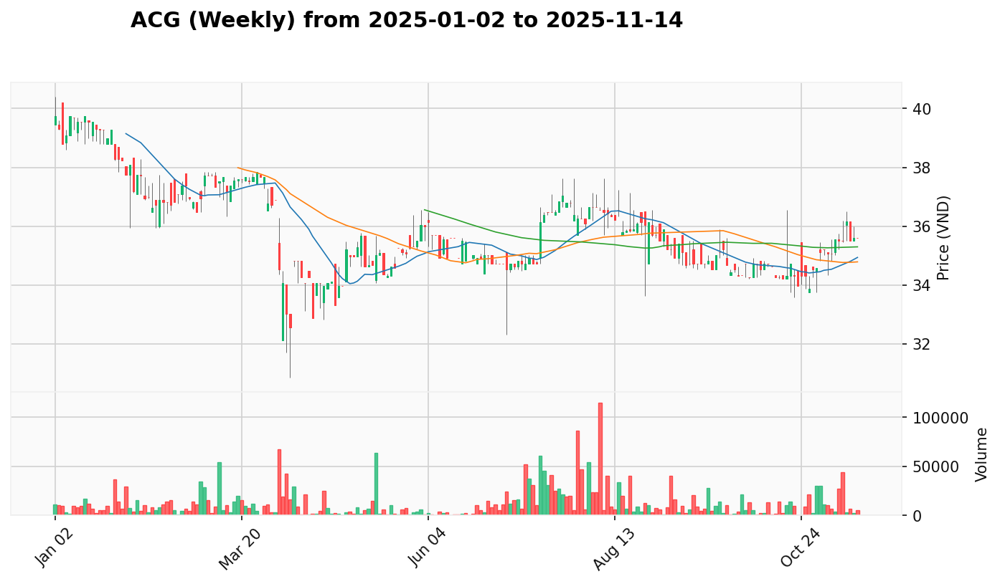

<a href="#thep">↑ Back to group THEP</a>  |  <a href="#vpa-signal-summary">↑ Back to Top</a>

#### Key Statistics
| Metric | Value |
|:---|---:|
| Date Range | 2025-01-02 to 2025-11-14 |
| **Latest Close** | **35.6** |
| Period Open | 39.46 |
| Period High | 40.4 |
| Period Low | 30.85 |
| Period Change % | -9.78% |

**[Download ACG Data (.csv)](market_data_week/ACG_2025-01-02_to_2025-11-14.csv)**

---

### ACL

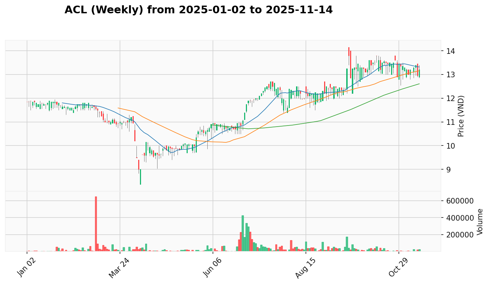

<a href="#thuy-san">↑ Back to group THUY_SAN</a>  |  <a href="#vpa-signal-summary">↑ Back to Top</a>

#### Key Statistics
| Metric | Value |
|:---|---:|
| Date Range | 2025-01-02 to 2025-11-14 |
| **Latest Close** | **13.2** |
| Period Open | 11.85 |
| Period High | 14.15 |
| Period Low | 8.37 |
| Period Change % | 11.39% |

**[Download ACL Data (.csv)](market_data_week/ACL_2025-01-02_to_2025-11-14.csv)**

---

### ACV

#### [VPA Analysis (2025-06-02 - 2025-08-03)](./VPA_week.md#acv)
> - **Ngày 2025-07-07:** Sau phiên kiểm tra cung của tuần trước, ACV đã không thể giữ được và quay đầu giảm mạnh. Nến tuần là một nến giảm có biên độ rộng, đóng cửa (93.8) gần mức thấp nhất tuần. Khối lượng giao dịch tăng mạnh.
>     - **Phân tích VPA/Wyckoff:** Đây là một **Sign of Weakness**, cho thấy phe bán đã thắng thế và xu hướng giảm có khả năng sẽ tiếp diễn.
> - **Ngày 2025-07-14:** Tiếp nối tín hiệu yếu của tuần trước, ACV có một tuần phục hồi nhẹ với nến tăng biên độ hẹp, đóng cửa (95.3) cao hơn tuần trước. Khối lượng giao dịch giảm nhẹ xuống 2.69 triệu cp.
>     - **Phân tích VPA/Wyckoff:** Đây là một **Test for Supply** hoặc **No Supply** tạm thời. Việc giá có thể hồi phục trên nền khối lượng giảm cho thấy áp lực bán đã cạn kiệt một phần, nhưng cần xác nhận thêm từ các tuần tiếp theo.
> - **Ngày 2025-07-21:** Xác nhận tín hiệu tích cực của tuần trước, ACV có một tuần tăng giá thuyết phục với nến tăng biên độ rộng từ 93.9 đến 98.7, đóng cửa (97.4) gần mức cao nhất tuần. Khối lượng giao dịch tăng mạnh lên 4.12 triệu cp, cao nhất trong nhiều tuần.
>     - **Phân tích VPA/Wyckoff:** Đây là một **Sign of Strength** rõ ràng, xác nhận rằng áp lực bán đã cạn kiệt và lực cầu đang quay trở lại mạnh mẽ. Việc bứt phá khỏi vùng tích lũy kết hợp với khối lượng gia tăng đáng kể cho thấy xu hướng tăng có khả năng được tái lập.
> **Ngày 2025-07-27:** Tuần này ACV tiếp tục duy trì đà tăng tích cực với nến tăng có biên độ khá, từ 95.1 mở cửa lên 98.7 cao nhất, đóng cửa tại 97.4. Điều đáng chú ý là khối lượng giao dịch tăng mạnh lên 4.12 triệu cổ phiếu, cao nhất trong giai đoạn gần đây và tăng 53% so với tuần trước (2.69 triệu). Giá đóng cửa gần mức cao nhất tuần cho thấy sự kiểm soát của phe mua. So với tuần trước, ACV đã vượt qua được vùng kháng cự 95-96 và hướng tới thử thách vùng 98-100.
> 
> **Phân tích VPA/Wyckoff:** Đây là một **Sign of Strength** được củng cố mạnh mẽ. Việc giá tăng kèm theo khối lượng bùng nổ cho thấy sự quan tâm nghiêm túc từ các nhà đầu tư tổ chức. Đây có thể là giai đoạn **Markup** sau khi hoàn tất quá trình tích lũy. Xu hướng tăng có khả năng cao sẽ tiếp diễn trong các tuần tới.
> **Ngày 2025-08-03:** Tuần này ACV tiếp tục xu hướng tăng mạnh mẽ với nến tăng có biên độ rộng, từ mức mở cửa 59.18 vượt lên đỉnh 62.22 và đóng cửa tại 61.12. Khối lượng giao dịch tăng tiếp lên 4.65 triệu cổ phiếu, tăng 13% so với tuần trước và duy trì ở mức cao trong 2 tuần liên tiếp. Giá đã vượt qua thành công vùng kháng cự 60-61 và hướng tới thử thách vùng 62-63. Việc đóng cửa ở 61.12 cho thấy phe mua vẫn kiểm soát tốt dù có một số chốt lời ở vùng đỉnh.

<a href="#hang-khong">↑ Back to group HANG_KHONG</a>  |  <a href="#vpa-signal-summary">↑ Back to Top</a>

#### Key Statistics
| Metric | Value |
|:---|---:|
| Date Range | 2025-01-02 to 2025-11-14 |
| **Latest Close** | **55.4** |
| Period Open | 76.25 |
| Period High | 78.32 |
| Period Low | 45.27 |
| Period Change % | -27.34% |

**[Download ACV Data (.csv)](market_data_week/ACV_2025-01-02_to_2025-11-14.csv)**

---

### ADS

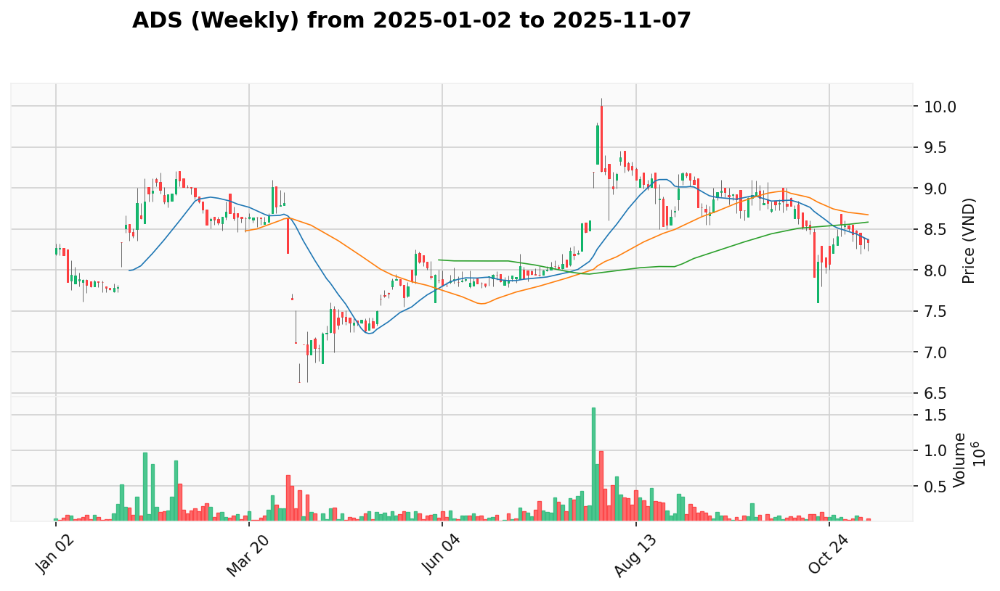

<a href="#det-may">↑ Back to group DET_MAY</a>  |  <a href="#vpa-signal-summary">↑ Back to Top</a>

#### Key Statistics
| Metric | Value |
|:---|---:|
| Date Range | 2025-01-02 to 2025-11-14 |
| **Latest Close** | **8.23** |
| Period Open | 8.2 |
| Period High | 10.1 |
| Period Low | 6.63 |
| Period Change % | 0.37% |

**[Download ADS Data (.csv)](market_data_week/ADS_2025-01-02_to_2025-11-14.csv)**

---

### AGG

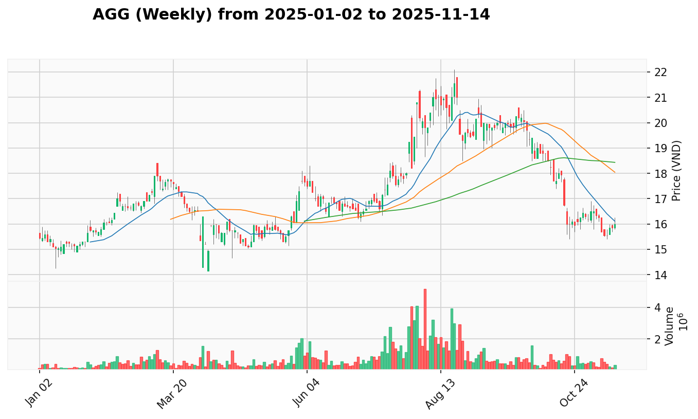

<a href="#bat-dong-san">↑ Back to group BAT_DONG_SAN</a>  |  <a href="#vpa-signal-summary">↑ Back to Top</a>

#### Key Statistics
| Metric | Value |
|:---|---:|
| Date Range | 2025-01-02 to 2025-11-14 |
| **Latest Close** | **16.0** |
| Period Open | 15.65 |
| Period High | 22.1 |
| Period Low | 14.15 |
| Period Change % | 2.24% |

**[Download AGG Data (.csv)](market_data_week/AGG_2025-01-02_to_2025-11-14.csv)**

---

### AGR

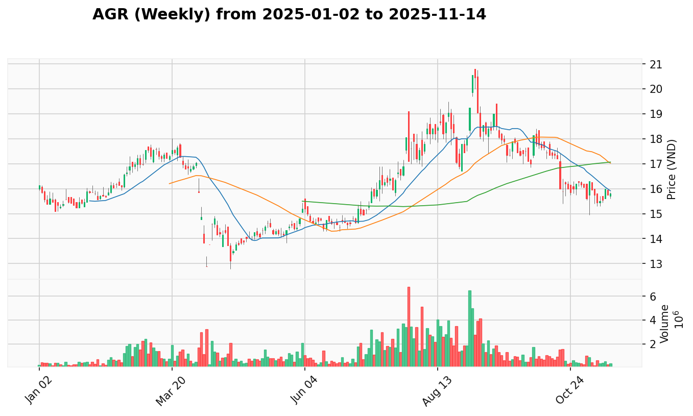

<a href="#chung-khoan">↑ Back to group CHUNG_KHOAN</a>  |  <a href="#vpa-signal-summary">↑ Back to Top</a>

#### Key Statistics
| Metric | Value |
|:---|---:|
| Date Range | 2025-01-02 to 2025-11-14 |
| **Latest Close** | **15.8** |
| Period Open | 15.99 |
| Period High | 20.8 |
| Period Low | 12.78 |
| Period Change % | -1.19% |

**[Download AGR Data (.csv)](market_data_week/AGR_2025-01-02_to_2025-11-14.csv)**

---

### ANV

#### [VPA Analysis (2025-06-02 - 2025-08-03)](./VPA_week.md#anv)
> - **Ngày 2025-07-07:** Sau tuần tăng tốc có dấu hiệu của một Cao trào mua, ANV đã có một tuần đảo chiều giảm giá mạnh. Cổ phiếu mở cửa tăng vọt nhưng sau đó bị bán tháo, tạo thành một nến giảm có biên độ rộng và đóng cửa (22.55) thấp. Khối lượng giao dịch giảm nhưng vẫn ở mức rất cao.
>     - **Phân tích VPA/Wyckoff:** Đây là một phản ứng tự nhiên sau một **Climax** và là một **Sign of Weakness**. Sự xuất hiện của áp lực bán mạnh ở vùng đỉnh xác nhận khả năng bắt đầu một giai đoạn phân phối hoặc điều chỉnh.
> - **Ngày 2025-07-14:** Tiếp nối tín hiệu yếu của tuần trước, ANV có một tuần phục hồi nhẹ với nến tăng nhỏ, đóng cửa (22.95) cao hơn tuần trước. Khối lượng giao dịch vẫn duy trì ở mức cao (20.5 triệu cp), gần bằng tuần trước.
>     - **Phân tích VPA/Wyckoff:** Đây là một **Test for Supply** hoặc **Automatic Rally** sau cú sốc của tuần trước. Việc giá có thể phục hồi trên nền khối lượng cao cho thấy vẫn còn lực cầu, nhưng cần xem khả năng duy trì xu hướng tăng hay sẽ tiếp tục điều chỉnh.
> - **Ngày 2025-07-21:** Xác nhận tín hiệu tích cực của tuần trước, ANV có một tuần tăng giá mạnh mẽ với nến tăng biên độ rộng từ 22.8 đến 24.9, đóng cửa (24.55) gần mức cao nhất tuần và thiết lập đỉnh mới. Khối lượng giao dịch tăng vọt lên 33.0 triệu cp, cao nhất kể từ tuần 30/6.
>     - **Phân tích VPA/Wyckoff:** Đây là một **Sign of Strength** mạnh mẽ, phủ nhận hoàn toàn tín hiệu yếu từ hai tuần trước. Việc thiết lập đỉnh mới kết hợp với khối lượng gia tăng đáng kể cho thấy lực cầu đã quay trở lại quyết liệt và xu hướng tăng đang được tái khẳng định.
> **Ngày 2025-07-27:** Sau tuần tăng vọt thiết lập đỉnh mới, ANV tiếp tục duy trì đà tăng mạnh với một nến tăng có biên độ rộng, mở cửa (22.95) và đóng cửa (24.55) gần mức cao nhất tuần (24.9), thiết lập đỉnh mới liên tiếp lần thứ hai. Khối lượng giao dịch duy trì ở mức rất cao (33.0 triệu cp), ngang bằng tuần trước và cao nhất trong 2 tháng qua.
> 
> **Phân tích VPA/Wyckoff:** Đây là một **Sign of Strength** tiếp tục, xác nhận xu hướng tăng mạnh mẽ được duy trì. Việc giá liên tục thiết lập đỉnh mới trên nền khối lượng cao ổn định cho thấy lực cầu vẫn đang kiểm soát hoàn toàn và chưa có dấu hiệu suy yếu. Tuy nhiên, cần theo dõi các tuần tới để xác định liệu đây có phải là giai đoạn đầu của một **Climax** hay xu hướng tăng vẫn có thể kéo dài.
> **Ngày 2025-08-03:** Sau hai tuần liên tiếp thiết lập đỉnh mới, ANV đã có một tuần đảo chiều giảm mạnh với nến giảm có biên độ cực rộng, mở cửa (25.15) cao hơn đỉnh tuần trước nhưng bị bán tháo xuống thấp nhất (21.6), đóng cửa (22.9) thấp hơn đáng kể so với tuần trước (24.55). Đặc biệt, việc test lên mức cao 25.35 tạo đỉnh tuyệt đối mới nhưng không thể duy trì cho thấy áp lực bán đã xuất hiện mạnh mẽ ở vùng đỉnh. Khối lượng giao dịch vẫn duy trì ở mức cao (29.3 triệu cp), chỉ giảm nhẹ so với tuần trước nhưng vẫn trong top cao nhất 2 tháng qua.

<a href="#thuy-san">↑ Back to group THUY_SAN</a>  |  <a href="#vpa-signal-summary">↑ Back to Top</a>

#### Key Statistics
| Metric | Value |
|:---|---:|
| Date Range | 2025-01-02 to 2025-11-14 |
| **Latest Close** | **28.4** |
| Period Open | 19.22 |
| Period High | 33.4 |
| Period Low | 12.0 |
| Period Change % | 47.76% |

**[Download ANV Data (.csv)](market_data_week/ANV_2025-01-02_to_2025-11-14.csv)**

---

### APG

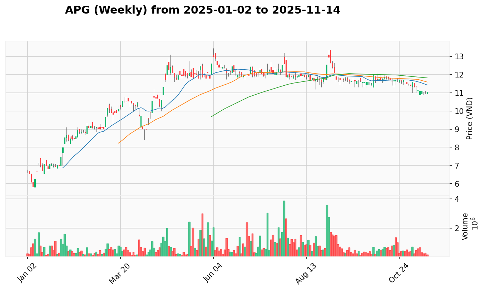

<a href="#chung-khoan">↑ Back to group CHUNG_KHOAN</a>  |  <a href="#vpa-signal-summary">↑ Back to Top</a>

#### Key Statistics
| Metric | Value |
|:---|---:|
| Date Range | 2025-01-02 to 2025-11-14 |
| **Latest Close** | **11.05** |
| Period Open | 6.7 |
| Period High | 13.45 |
| Period Low | 5.75 |
| Period Change % | 64.93% |

**[Download APG Data (.csv)](market_data_week/APG_2025-01-02_to_2025-11-14.csv)**

---

### APH

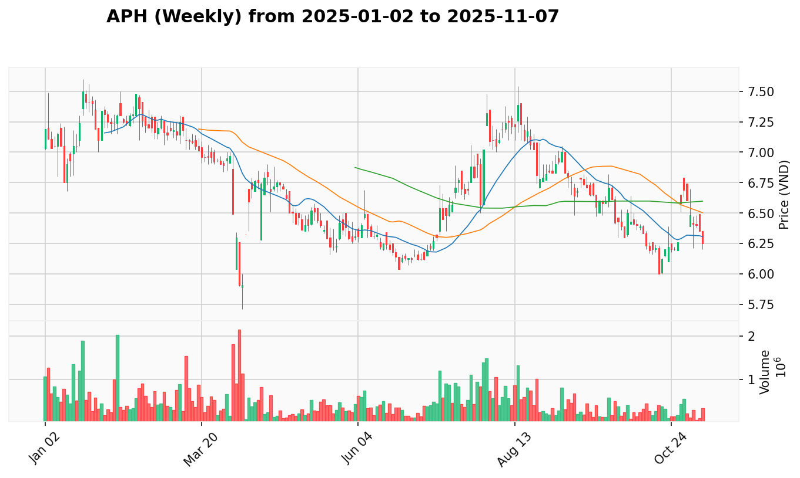

<a href="#nhua">↑ Back to group NHUA</a>  |  <a href="#vpa-signal-summary">↑ Back to Top</a>

#### Key Statistics
| Metric | Value |
|:---|---:|
| Date Range | 2025-01-02 to 2025-11-14 |
| **Latest Close** | **6.23** |
| Period Open | 7.03 |
| Period High | 7.6 |
| Period Low | 5.71 |
| Period Change % | -11.38% |

**[Download APH Data (.csv)](market_data_week/APH_2025-01-02_to_2025-11-14.csv)**

---

### APS

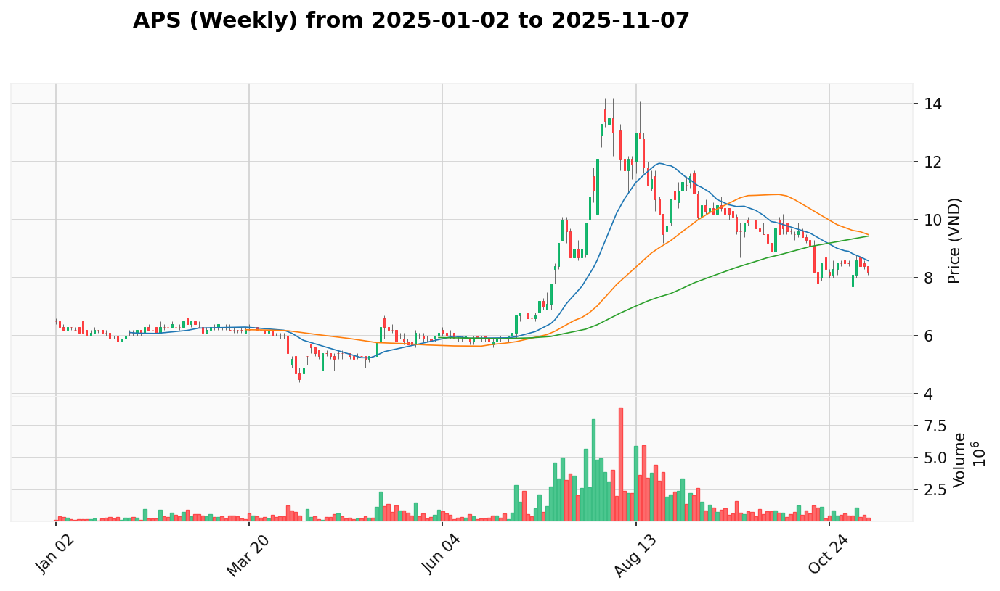

<a href="#chung-khoan">↑ Back to group CHUNG_KHOAN</a>  |  <a href="#vpa-signal-summary">↑ Back to Top</a>

#### Key Statistics
| Metric | Value |
|:---|---:|
| Date Range | 2025-01-02 to 2025-11-14 |
| **Latest Close** | **8.2** |
| Period Open | 6.5 |
| Period High | 14.2 |
| Period Low | 4.4 |
| Period Change % | 26.15% |

**[Download APS Data (.csv)](market_data_week/APS_2025-01-02_to_2025-11-14.csv)**

---

### ASM

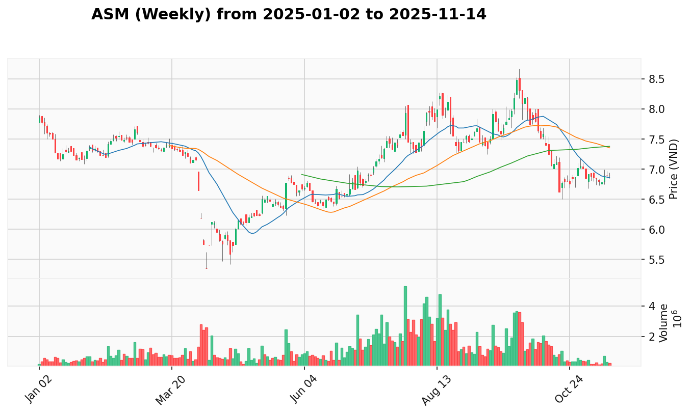

<a href="#thuy-san">↑ Back to group THUY_SAN</a>  |  <a href="#vpa-signal-summary">↑ Back to Top</a>

#### Key Statistics
| Metric | Value |
|:---|---:|
| Date Range | 2025-01-02 to 2025-11-14 |
| **Latest Close** | **6.89** |
| Period Open | 7.78 |
| Period High | 8.67 |
| Period Low | 5.35 |
| Period Change % | -11.44% |

**[Download ASM Data (.csv)](market_data_week/ASM_2025-01-02_to_2025-11-14.csv)**

---

### BAF

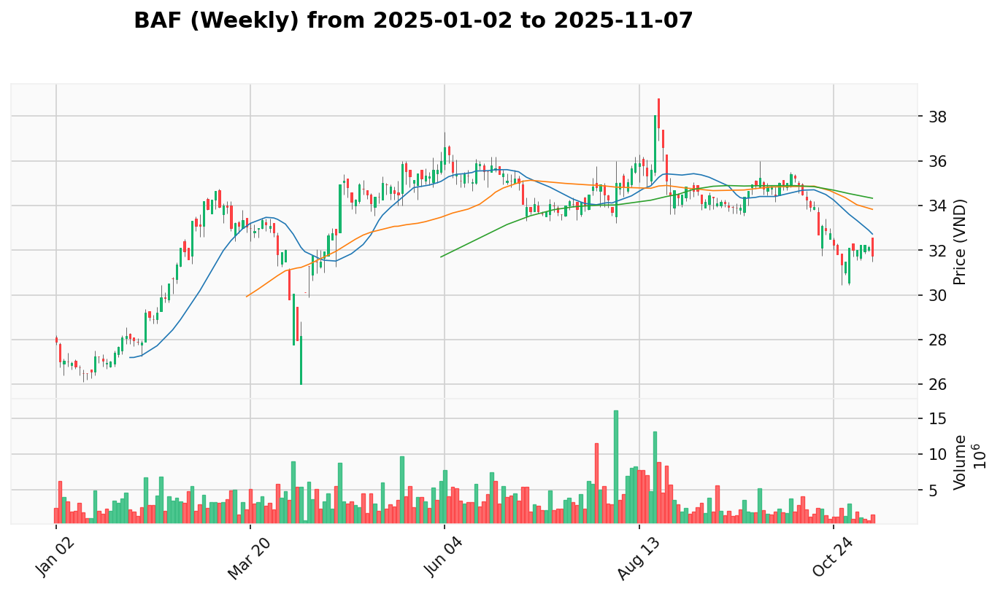

<a href="#nong-nghiep">↑ Back to group NONG_NGHIEP</a>  |  <a href="#vpa-signal-summary">↑ Back to Top</a>

#### Key Statistics
| Metric | Value |
|:---|---:|
| Date Range | 2025-01-02 to 2025-11-14 |
| **Latest Close** | **32.25** |
| Period Open | 28.1 |
| Period High | 38.8 |
| Period Low | 26.0 |
| Period Change % | 14.77% |

**[Download BAF Data (.csv)](market_data_week/BAF_2025-01-02_to_2025-11-14.csv)**

---

### BCC

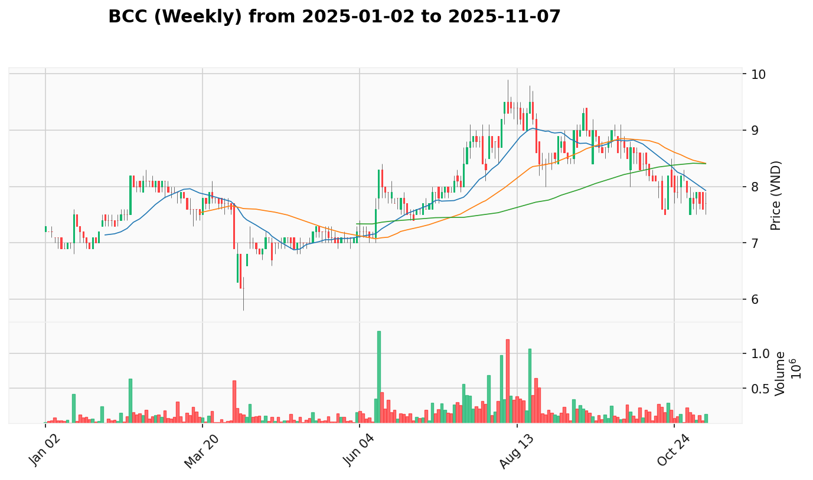

<a href="#vlxd">↑ Back to group VLXD</a>  |  <a href="#vpa-signal-summary">↑ Back to Top</a>

#### Key Statistics
| Metric | Value |
|:---|---:|
| Date Range | 2025-01-02 to 2025-11-14 |
| **Latest Close** | **7.7** |
| Period Open | 7.2 |
| Period High | 9.9 |
| Period Low | 5.8 |
| Period Change % | 6.94% |

**[Download BCC Data (.csv)](market_data_week/BCC_2025-01-02_to_2025-11-14.csv)**

---

### BCE

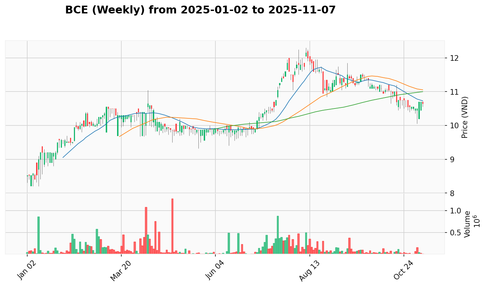

<a href="#xay-dung">↑ Back to group XAY_DUNG</a>  |  <a href="#vpa-signal-summary">↑ Back to Top</a>

#### Key Statistics
| Metric | Value |
|:---|---:|
| Date Range | 2025-01-02 to 2025-11-14 |
| **Latest Close** | **10.5** |
| Period Open | 8.5 |
| Period High | 12.3 |
| Period Low | 8.2 |
| Period Change % | 23.53% |

**[Download BCE Data (.csv)](market_data_week/BCE_2025-01-02_to_2025-11-14.csv)**

---

### BCG

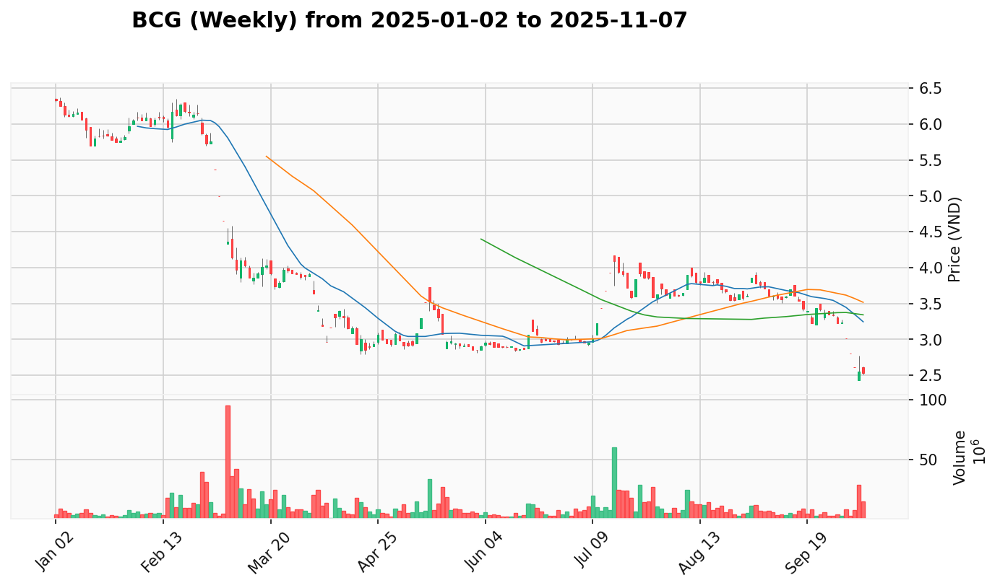

<a href="#xay-dung">↑ Back to group XAY_DUNG</a>  |  <a href="#vpa-signal-summary">↑ Back to Top</a>

#### Key Statistics
| Metric | Value |
|:---|---:|
| Date Range | 2025-01-02 to 2025-10-08 |
| **Latest Close** | **2.53** |
| Period Open | 6.35 |
| Period High | 6.37 |
| Period Low | 2.43 |
| Period Change % | -60.16% |

**[Download BCG Data (.csv)](market_data_week/BCG_2025-01-02_to_2025-11-14.csv)**

---

### BCM

#### [VPA Analysis (2025-06-02 - 2025-08-03)](./VPA_week.md#bcm)
> - **Ngày 2025-07-07:** Tiếp nối Dấu hiệu Sức mạnh của tuần trước, BCM tiếp tục tăng giá, tạo thành một nến tăng và đóng cửa (68.0) ở mức cao. Đáng chú ý, khối lượng giao dịch đã giảm đi đáng kể.
>     - **Phân tích VPA/Wyckoff:** Việc giá có thể tăng trên nền khối lượng thấp là một tín hiệu **No Supply**. Điều này cho thấy áp lực bán yếu và con đường đi lên đang khá thông thoáng, là một tín hiệu rất No Supply cho xu hướng tăng.
> - **Ngày 2025-07-14:** Tiếp nối tín hiệu No Supply của tuần trước, BCM có một tuần đi ngang với nến doji biên độ hẹp, đóng cửa (67.7) gần như không đổi. Khối lượng giao dịch tiếp tục giảm xuống mức thấp.
>     - **Phân tích VPA/Wyckoff:** Đây là một **Test for Supply** thành công, xác nhận tín hiệu No Supply của tuần trước. Việc giá giữ vững trên nền khối lượng thấp cho thấy áp lực bán đã cạn kiệt và xu hướng tăng vẫn được duy trì.
> - **Ngày 2025-07-21:** Xác nhận tín hiệu Test for Supply của tuần trước, BCM có một tuần tăng giá với nến tăng biên độ vừa phải từ 66.2 đến 70.9, đóng cửa (69.8) gần mức cao nhất tuần. Khối lượng giao dịch tăng nhẹ lên 3.08 triệu cp.
>     - **Phân tích VPA/Wyckoff:** Đây là một **Sign of Strength** sau giai đoạn kiểm tra cung thành công. Việc bứt phá khỏi vùng tích lũy kết hợp với khối lượng gia tăng cho thấy lực cầu đã quay trở lại và xu hướng tăng được tái khẳng định.
> **Ngày 2025-07-27:** BCM tiếp tục xu hướng tăng với nến tăng có biên độ rộng từ 66.2 đến 70.9, đóng cửa (69.8) gần mức cao nhất tuần và tạo đỉnh mới. Khối lượng giao dịch tăng mạnh lên 3.08 triệu cp so với tuần trước (2.34 triệu cp), xác nhận sự quan tâm gia tăng từ nhà đầu tư khi giá bứt phá.
> 
> **Phân tích VPA/Wyckoff:** Đây là một **Sign of Strength** mạnh mẽ, với giá tạo đỉnh mới kết hợp khối lượng gia tăng đáng kể. Việc đóng cửa gần mức cao nhất tuần cho thấy lực cầu vẫn chiếm ưu thế và không có áp lực bán đáng kể ở vùng giá cao. Xu hướng tăng được củng cố mạnh mẽ.
> **Ngày 2025-08-03:** BCM có một tuần dao động mạnh với biên độ rộng từ 66.7 đến 73.0, mở cửa tại 69.9 và đóng cửa cũng tại 69.9, tạo thành một nến doji có bóng dài cả hai phía. Đáng chú ý, khối lượng giao dịch bùng nổ lên 5.09 triệu cp, tăng 65% so với tuần trước (3.08 triệu cp), đạt mức cao nhất trong 2 tháng qua.

<a href="#bat-dong-san-kcn">↑ Back to group BAT_DONG_SAN_KCN</a>  |  <a href="#vpa-signal-summary">↑ Back to Top</a>

#### Key Statistics
| Metric | Value |
|:---|---:|
| Date Range | 2025-01-02 to 2025-11-14 |
| **Latest Close** | **67.5** |
| Period Open | 70.0 |
| Period High | 82.4 |
| Period Low | 49.8 |
| Period Change % | -3.57% |

**[Download BCM Data (.csv)](market_data_week/BCM_2025-01-02_to_2025-11-14.csv)**

---

### BFC

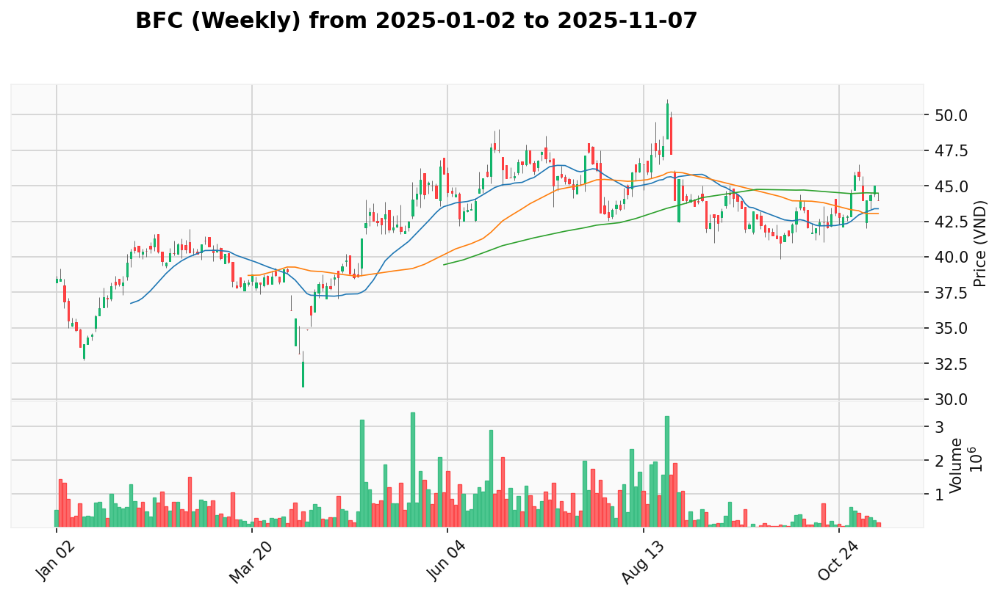

<a href="#hoa-chat">↑ Back to group HOA_CHAT</a>  |  <a href="#vpa-signal-summary">↑ Back to Top</a>

#### Key Statistics
| Metric | Value |
|:---|---:|
| Date Range | 2025-01-02 to 2025-11-14 |
| **Latest Close** | **46.0** |
| Period Open | 38.19 |
| Period High | 51.1 |
| Period Low | 30.86 |
| Period Change % | 20.45% |

**[Download BFC Data (.csv)](market_data_week/BFC_2025-01-02_to_2025-11-14.csv)**

---

### BIC

#### [VPA Analysis (2025-06-02 - 2025-08-03)](./VPA_week.md#bic)
> - **Ngày 2025-07-07:** Sau tín hiệu No Supply của tuần trước, BIC đã không thể tiếp tục đà tăng mà quay đầu giảm giá. Nến tuần là một nến giảm có bóng dưới, cho thấy có lực cầu hấp thụ ở vùng giá thấp. Khối lượng giao dịch tăng nhẹ.
>     - **Phân tích VPA/Wyckoff:** Đây là một phiên **Test for Supply**. Việc giá không thể tăng sau tín hiệu No Supply trước đó cho thấy áp lực bán vẫn còn hiện hữu. Tín hiệu No Supply, cần quan sát thêm.
> - **Ngày 2025-07-14:** Tiếp nối phiên kiểm tra cung của tuần trước, BIC tiếp tục giảm giá với nến giảm biên độ rộng, đóng cửa (38.4) thấp hơn tuần trước. Khối lượng giao dịch tăng mạnh lên 415k cp, cao nhất trong nhiều tuần.
>     - **Phân tích VPA/Wyckoff:** Đây là một **Sign of Weakness**, cho thấy áp lực bán đã gia tăng đáng kể. Khối lượng tăng kết hợp với giá giảm xác nhận rằng phe bán đang chiếm ưu thế và xu hướng tăng trước đó có thể đã kết thúc.
> - **Ngày 2025-07-21:** Phủ nhận hoàn toàn tín hiệu yếu của tuần trước, BIC có một tuần bùng nổ với nến tăng thân dài và biên độ rộng từ 38.5 đến 41.5, đóng cửa (41.2) ở mức cao nhất tuần. Khối lượng giao dịch giảm xuống 323k cp nhưng vẫn ở mức trung bình.
>     - **Phân tích VPA/Wyckoff:** Đây là một **Sign of Strength** mạnh mẽ, cho thấy lực cầu đã quay trở lại một cách quyết liệt và phủ nhận hoàn toàn tín hiệu yếu của tuần trước. Việc thiết lập đỉnh mới cho thấy xu hướng tăng đã được tái lập.
> **Ngày 2025-07-27:** Sau tuần bùng nổ trước đó, BIC tiếp tục duy trì đà tăng mạnh với nến tăng thân dài, đóng cửa (41.2) tại mức cao nhất tuần và thiết lập đỉnh mới. Giá dao động từ 38.5 đến 41.5 với biên độ rộng 3.0 điểm. Khối lượng giao dịch giảm nhẹ xuống 322.9k cổ phiếu so với tuần trước (415.3k) nhưng vẫn duy trì ở mức trung bình cao, cho thấy sự quan tâm tiếp tục của nhà đầu tư.
> 
> **Phân tích VPA/Wyckoff:** Đây là một tín hiệu **No Supply** rất mạnh. Việc giá có thể tăng đáng kể và thiết lập đỉnh mới trên nền khối lượng giảm cho thấy áp lực bán đã hoàn toàn suy yếu. Kết hợp với xu thế tăng liên tiếp 2 tuần và việc phủ nhận hoàn toàn tín hiệu yếu trước đó, BIC đang thể hiện sức mạnh rõ rệt trong xu hướng tăng trung hạn.
> **Ngày 2025-08-03:**
> Sau tín hiệu No Supply mạnh của tuần trước, BIC đã có một tuần giao dịch đầy biến động với nến giảm có thân ngắn và bóng dưới dài. Giá mở cửa tại 41.35 (cao hơn mức đóng cửa tuần trước), test lên đỉnh mới 43.0 trước khi bị đẩy xuống vùng 39.55 và phục hồi đóng cửa tại 40.5. Khối lượng giao dịch bùng nổ lên 982.8k cổ phiếu, tăng gấp 3 lần so với tuần trước (322.9k), là mức cao nhất trong nhiều tháng qua.

<a href="#bao-hiem">↑ Back to group BAO_HIEM</a>  |  <a href="#vpa-signal-summary">↑ Back to Top</a>

#### Key Statistics
| Metric | Value |
|:---|---:|
| Date Range | 2025-01-02 to 2025-11-14 |
| **Latest Close** | **23.95** |
| Period Open | 18.98 |
| Period High | 32.83 |
| Period Low | 16.61 |
| Period Change % | 26.19% |

**[Download BIC Data (.csv)](market_data_week/BIC_2025-01-02_to_2025-11-14.csv)**

---

### BID

#### [VPA Analysis (2025-06-02 - 2025-08-03)](./VPA_week.md#bid)
> - **Ngày 2025-07-07:** Tiếp nối Dấu hiệu Sức mạnh của tuần trước, BID có một tuần bùng nổ với một nến tăng thân dài, đóng cửa (38.3) ở mức cao nhất tuần. Khối lượng giao dịch tăng vọt gần gấp đôi, xác nhận cho sức mạnh của đà tăng.
>     - **Phân tích VPA/Wyckoff:** Đây là một **Sign of Strength** rõ ràng, cho thấy lực cầu đang rất quyết liệt và xu hướng tăng được củng cố.
> - **Ngày 2025-07-14:** Tiếp nối đà tăng mạnh, BID có một tuần đi ngang với nến doji biên độ hẹp, đóng cửa (38.35) gần như không đổi so với tuần trước. Khối lượng giao dịch giảm nhưng vẫn duy trì ở mức cao.
>     - **Phân tích VPA/Wyckoff:** Đây là một **Test for Supply** sau đợt tăng mạnh. Việc giá giữ vững trên nền khối lượng giảm cho thấy áp lực bán đã cạn kiệt, xác nhận tín hiệu No Supply và xu hướng tăng vẫn được duy trì.
> - **Ngày 2025-07-21:** Xác nhận tín hiệu Test for Supply của tuần trước, BID có một tuần tăng giá nhẹ với nến tăng biên độ vừa phải từ 38.0 đến 39.65, đóng cửa (38.85) gần mức trung bình tuần. Khối lượng giao dịch tăng trở lại mức cao 41.3 triệu cp.
>     - **Phân tích VPA/Wyckoff:** Đây là một **Sign of Strength** tiếp tục, xác nhận rằng việc tích lũy của tuần trước đã thành công. Khối lượng gia tăng kết hợp với giá tăng cho thấy lực cầu vẫn đang duy trì và xu hướng tăng được củng cố.
> **Ngày 2025-07-27:** BID tiếp tục xu hướng tăng giá với nến tăng có thân dài, mở cửa tại 38.45 và đóng cửa tại 38.85, tăng 1.3% so với tuần trước. Giá dao động trong biên độ rộng từ 38.0 đến 39.65, cho thấy sự tích cực của phe mua khi có thể đẩy giá lên mức cao mới trong tuần. Khối lượng giao dịch tăng mạnh lên 41.3 triệu cổ phiếu, cao hơn 14.8% so với tuần trước, xác nhận cho sức mạnh của đà tăng. Việc giá đóng cửa gần mức trung bình tuần cho thấy có sự cân bằng giữa lực mua và lực bán, nhưng xu hướng chung vẫn tích cực.
> 
> **Phân tích VPA/Wyckoff:** Đây là một **Sign of Strength** tiếp tục, xác nhận rằng xu hướng tăng của BID vẫn được duy trì mạnh mẽ. Việc giá tạo đỉnh mới tại 39.65 kết hợp với khối lượng gia tăng cho thấy lực cầu vẫn đang kiểm soát thị trường. Mặc dù giá đóng cửa không ở mức cao nhất tuần, nhưng việc duy trì được mức giá cao trên nền khối lượng mạnh là dấu hiệu tích cực cho xu hướng tăng trong các tuần tới.
> **Ngày 2025-08-03:**
> BID có một tuần giảm giá mạnh với nến giảm có biên độ rộng, mở cửa tại 39.1 và đóng cửa tại 37.2, giảm 4.2% so với tuần trước. Giá dao động trong biên độ lớn từ 37.1 đến 39.8, cho thấy sự căng thẳng gay gắt giữa phe mua và phe bán. Đáng chú ý là giá đã test lên mức cao mới tại 39.8 trong tuần nhưng không thể duy trì và bị đẩy xuống mạnh, đóng cửa gần mức thấp nhất tuần. Khối lượng giao dịch tăng vọt lên 49.2 triệu cổ phiếu, cao hơn 19.2% so với tuần trước, cho thấy áp lực bán đã gia tăng đáng kể khi giá test vùng đỉnh.

<a href="#ngan-hang">↑ Back to group NGAN_HANG</a>  |  <a href="#vpa-signal-summary">↑ Back to Top</a>

#### Key Statistics
| Metric | Value |
|:---|---:|
| Date Range | 2025-01-02 to 2025-11-14 |
| **Latest Close** | **38.35** |
| Period Open | 37.78 |
| Period High | 44.6 |
| Period Low | 30.86 |
| Period Change % | 1.51% |

**[Download BID Data (.csv)](market_data_week/BID_2025-01-02_to_2025-11-14.csv)**

---

### BMC

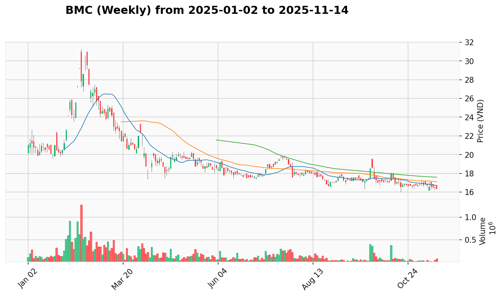

<a href="#khai-khoang">↑ Back to group KHAI_KHOANG</a>  |  <a href="#vpa-signal-summary">↑ Back to Top</a>

#### Key Statistics
| Metric | Value |
|:---|---:|
| Date Range | 2025-01-02 to 2025-11-14 |
| **Latest Close** | **16.35** |
| Period Open | 20.18 |
| Period High | 31.26 |
| Period Low | 16.0 |
| Period Change % | -18.98% |

**[Download BMC Data (.csv)](market_data_week/BMC_2025-01-02_to_2025-11-14.csv)**

---

### BMI

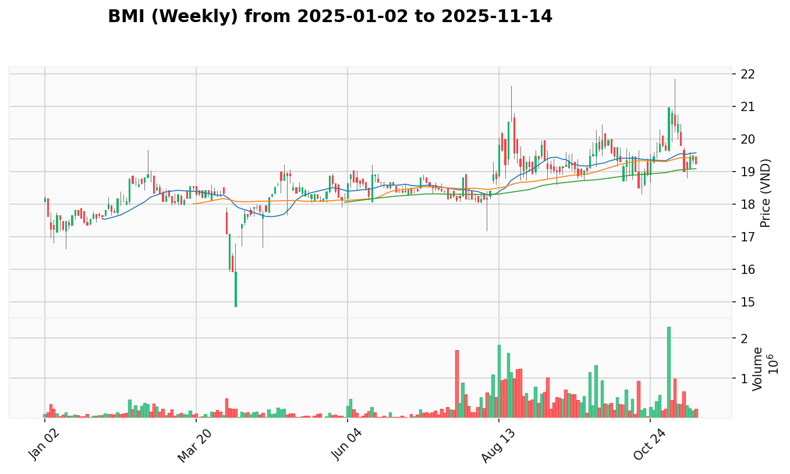

<a href="#bao-hiem">↑ Back to group BAO_HIEM</a>  |  <a href="#vpa-signal-summary">↑ Back to Top</a>

#### Key Statistics
| Metric | Value |
|:---|---:|
| Date Range | 2025-01-02 to 2025-11-14 |
| **Latest Close** | **19.25** |
| Period Open | 18.08 |
| Period High | 21.85 |
| Period Low | 14.85 |
| Period Change % | 6.47% |

**[Download BMI Data (.csv)](market_data_week/BMI_2025-01-02_to_2025-11-14.csv)**

---

### BMP

#### [VPA Analysis (2025-06-02 - 2025-08-03)](./VPA_week.md#bmp)
> - **Ngày 2025-07-07:** Sau phiên kiểm tra No Supply thành công của tuần trước, BMP đã có một tuần tăng giá bùng nổ. Nến tăng có thân dài, đóng cửa (144.3) gần mức cao nhất tuần, đi kèm với khối lượng giao dịch tăng mạnh.
>     - **Phân tích VPA/Wyckoff:** Đây là một **Sign of Strength**, xác nhận lực cầu đã quay trở lại một cách quyết liệt và xu hướng tăng đang tiếp diễn.
> - **Ngày 2025-07-14:** Tiếp nối đà tăng mạnh, BMP có một tuần điều chỉnh nhẹ với nến giảm biên độ hẹp, đóng cửa (142.6) thấp hơn tuần trước. Khối lượng giao dịch giảm đáng kể.
>     - **Phân tích VPA/Wyckoff:** Đây là một **Test for Supply** sau đợt tăng mạnh. Việc giá chỉ điều chỉnh nhẹ trên nền khối lượng thấp cho thấy áp lực bán không lớn, tín hiệu No Supply và xu hướng tăng vẫn được duy trì.
> - **Ngày 2025-07-21:** Xác nhận tín hiệu Test for Supply của tuần trước, BMP có một tuần tăng giá thuyết phục với nến tăng biên độ rộng từ 143.0 đến 151.0, đóng cửa (145.3) cao hơn tuần trước và thiết lập đỉnh mới. Khối lượng giao dịch tăng nhẹ lên 776k cp.
>     - **Phân tích VPA/Wyckoff:** Đây là một **Sign of Strength** rõ ràng, xác nhận rằng giai đoạn kiểm tra cung của tuần trước đã thành công. Việc bứt phá mức cao mới kết hợp với khối lượng gia tăng cho thấy xu hướng tăng đang được tái khẳng định mạnh mẽ.
> **Ngày 2025-07-27:** BMP tiếp tục xu hướng tăng mạnh với một tuần giao dịch tích cực. Nến tăng có biên độ rộng từ 143.0 đến 151.0, thiết lập đỉnh cao mới trong năm. Giá đóng cửa (145.3) cao hơn tuần trước (142.6) và duy trì gần mức cao nhất tuần. Khối lượng giao dịch tăng nhẹ lên 776.2k cổ phiếu, cho thấy sự quan tâm của nhà đầu tư đang gia tăng. Đây là tuần thứ hai liên tiếp BMP tạo ra đỉnh cao mới sau giai đoạn test for supply thành công.
> 
> **Phân tích VPA/Wyckoff:** Đây là một **Sign of Strength** mạnh mẽ, xác nhận xu hướng tăng đang trong giai đoạn markup. Việc giá bứt phá liên tiếp tạo đỉnh cao mới kết hợp với khối lượng gia tăng cho thấy lực cầu chiếm ưu thế hoàn toàn. Chuỗi tín hiệu từ Test for Supply (tuần trước) đến Sign of Strength (tuần này) khẳng định rằng BMP đang trong một xu hướng tăng khỏe mạnh với tiềm năng tiếp tục đi lên.
> **Ngày 2025-08-03:** BMP có một tuần điều chỉnh với nến giảm biên độ rộng, giá giảm từ 145.3 xuống 140.7. Giá mở cửa (145.4) gần mức đóng cửa tuần trước nhưng bị đẩy xuống test vùng hỗ trợ 140.5 trước khi đóng cửa tại 140.7. Khối lượng giao dịch giảm từ 776.2k xuống 724.1k cổ phiếu, cho thấy áp lực bán không quá mạnh mẽ. Đây là tuần điều chỉnh đầu tiên sau chuỗi tăng giá mạnh và việc thiết lập đỉnh cao mới ở 151.0.

<a href="#nhua">↑ Back to group NHUA</a>  |  <a href="#vpa-signal-summary">↑ Back to Top</a>

#### Key Statistics
| Metric | Value |
|:---|---:|
| Date Range | 2025-01-02 to 2025-11-14 |
| **Latest Close** | **170.9** |
| Period Open | 125.61 |
| Period High | 180.0 |
| Period Low | 95.93 |
| Period Change % | 36.06% |

**[Download BMP Data (.csv)](market_data_week/BMP_2025-01-02_to_2025-11-14.csv)**

---

### BMS

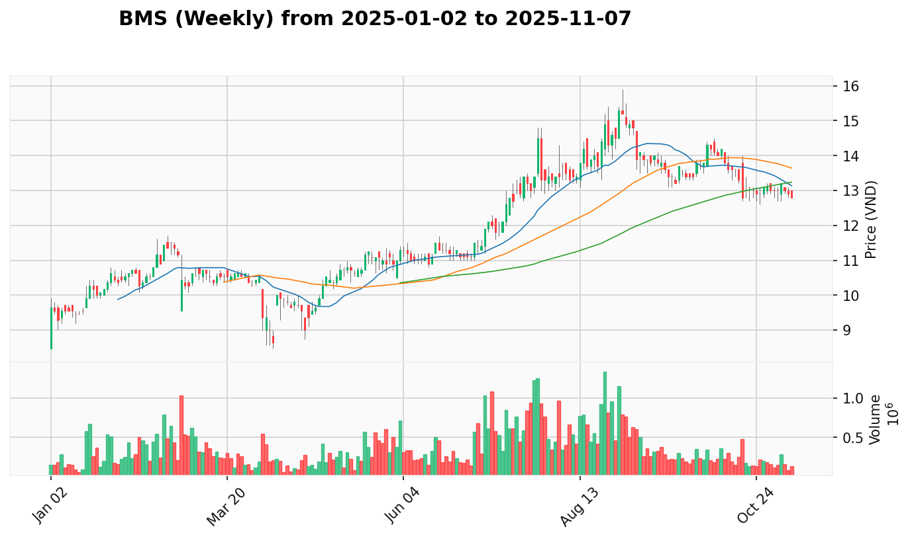

<a href="#chung-khoan">↑ Back to group CHUNG_KHOAN</a>  |  <a href="#vpa-signal-summary">↑ Back to Top</a>

#### Key Statistics
| Metric | Value |
|:---|---:|
| Date Range | 2025-01-02 to 2025-11-14 |
| **Latest Close** | **12.9** |
| Period Open | 8.47 |
| Period High | 15.9 |
| Period Low | 8.47 |
| Period Change % | 52.30% |

**[Download BMS Data (.csv)](market_data_week/BMS_2025-01-02_to_2025-11-14.csv)**

---

### BSI

#### [VPA Analysis (2025-06-02 - 2025-08-03)](./VPA_week.md#bsi)
> - **Ngày 2025-07-07:** Tiếp nối Dấu hiệu Sức mạnh của tuần trước, BSI có một tuần bùng nổ với một nến tăng thân dài, đóng cửa (44.25) ở mức cao nhất tuần. Khối lượng giao dịch tăng vọt, xác nhận cho sức mạnh của đà tăng.
>     - **Phân tích VPA/Wyckoff:** Đây là một **Sign of Strength** rõ ràng, cho thấy lực cầu đang rất quyết liệt và xu hướng tăng được củng cố.
> - **Ngày 2025-07-14:** Tiếp tục xu hướng tăng với nến tăng biên độ rộng, đóng cửa (45.6) cao hơn tuần trước và tạo mức cao mới. Khối lượng giao dịch giảm nhẹ nhưng vẫn duy trì ở mức cao.
>     - **Phân tích VPA/Wyckoff:** Đây là một **Sign of Strength** tiếp tục, xây dựng trên đà tăng mạnh từ tuần trước. Việc giá tiếp tục tăng trên nền khối lượng giảm nhẹ cho thấy áp lực bán đã cạn kiệt và xu hướng tăng đang được củng cố.
> - **Ngày 2025-07-21:** BSI tiếp tục ghi nhận một tuần tăng giá với nến tăng có bóng dưới, đóng cửa (46.7) cao hơn tuần trước và thiết lập mức cao mới. Khối lượng giao dịch tăng mạnh lên 13.17 triệu cổ phiếu.
>     - **Phân tích VPA/Wyckoff:** Đây là một **Sign of Strength** được củng cố. Xây dựng trên chuỗi 3 tuần tăng liên tiếp, việc giá tạo đỉnh mới trên nền khối lượng tăng vọt cho thấy lực cầu vẫn mạnh mẽ và xu hướng tăng đang được duy trì.
> **Ngày 2025-07-27:** BSI tiếp tục chuỗi tăng trưởng ấn tượng với tuần thứ 4 liên tiếp tăng giá. Nến tuần có thân dài từ 45.55 lên 46.7, tạo đỉnh mới tại 47.8 trước khi điều chỉnh nhẹ. Mặc dù có bóng dưới tương đối dài (từ 43.75), giá vẫn đóng cửa gần vùng đỉnh tuần. Khối lượng giao dịch tiếp tục tăng vọt lên 13.16 triệu cổ phiếu, cao nhất trong 4 tuần qua và cao hơn 9.8% so với tuần trước.
> 
> **Phân tích VPA/Wyckoff:** Đây là một **Sign of Strength** tiếp tục được củng cố. Việc BSI duy trì đà tăng trưởng mạnh mẽ trong 4 tuần liên tiếp trên nền khối lượng liên tục tăng cho thấy lực cầu vẫn rất quyết liệt. Mặc dù có sự điều chỉnh nhẹ trong phiên (thể hiện qua bóng dưới), việc giá đóng cửa gần đỉnh và khối lượng đạt mức cao kỷ lục cho thấy xu hướng tăng vẫn được duy trì mạnh mẽ. Tuy nhiên, cần theo dõi khả năng xuất hiện dấu hiệu Climactic Action khi khối lượng và giá cùng đạt đỉnh.
> **Ngày 2025-08-03:**
> BSI có một tuần giao dịch biến động mạnh với nến có thân nhỏ, mở cửa tại 48.0 và đóng cửa giảm xuống 46.2, thấp hơn tuần trước (46.7). Tuần này ghi nhận biên độ dao động rất rộng từ mức thấp 44.4 lên đỉnh 50.4, tạo ra bóng trên và bóng dưới dài. Khối lượng giao dịch tiếp tục tăng mạnh lên 15.02 triệu cổ phiếu, cao nhất trong 5 tuần qua và tăng 14.1% so với tuần trước.

<a href="#chung-khoan">↑ Back to group CHUNG_KHOAN</a>  |  <a href="#vpa-signal-summary">↑ Back to Top</a>

#### Key Statistics
| Metric | Value |
|:---|---:|
| Date Range | 2025-01-02 to 2025-11-14 |
| **Latest Close** | **41.45** |
| Period Open | 44.14 |
| Period High | 58.3 |
| Period Low | 37.95 |
| Period Change % | -6.09% |

**[Download BSI Data (.csv)](market_data_week/BSI_2025-01-02_to_2025-11-14.csv)**

---

### BSR

#### [VPA Analysis (2025-06-02 - 2025-08-03)](./VPA_week.md#bsr)
> - **Ngày 2025-07-07:** Sau phiên kiểm tra No Supply thành công của tuần trước, BSR đã có một tuần tăng giá mạnh mẽ. Nến tăng có thân dài, đóng cửa (18.45) gần mức cao nhất tuần, đi kèm với khối lượng giao dịch tăng vọt.
>     - **Phân tích VPA/Wyckoff:** Đây là một **Sign of Strength**, xác nhận lực cầu đã quay trở lại một cách quyết liệt, phủ nhận tín hiệu yếu trước đó.
> - **Ngày 2025-07-14:** Tiếp nối Dấu hiệu Sức mạnh của tuần trước, BSR tiếp tục tăng giá với nến tăng biên độ rộng, đóng cửa (19.0) cao hơn tuần trước và tạo mức cao mới. Khối lượng giao dịch tiếp tục tăng mạnh.
>     - **Phân tích VPA/Wyckoff:** Đây là một **Sign of Strength** tiếp tục, xây dựng trên đà tăng mạnh từ tuần trước. Khối lượng gia tăng kết hợp với giá đóng cửa cao cho thấy lực cầu vẫn rất quyết liệt và xu hướng tăng được củng cố.
> - **Ngày 2025-07-21:** BSR ghi nhận một tuần tăng giá mạnh mẽ với nến tăng có bóng dưới, đóng cửa (19.8) cao hơn tuần trước và thiết lập mức cao mới trong năm. Khối lượng giao dịch bùng nổ lên 45.06 triệu cổ phiếu, cao nhất trong nhiều tháng qua.
>     - **Phân tích VPA/Wyckoff:** Đây là một **Sign of Strength** được củng cố mạnh mẽ. Xây dựng trên chuỗi các tuần tăng giá liên tiếp, việc giá phá vỡ ngưỡng kháng cự và tạo đỉnh mới trên nền khối lượng bùng nổ cho thấy lực cầu rất mạnh mẽ và xu hướng tăng đang được duy trì với đà tăng tốc.
> **Ngày 2025-07-27:** BSR tiếp tục đà tăng mạnh mẽ với nến tăng có thân dài, đóng cửa (19.8) tại mức cao nhất tuần và thiết lập đỉnh mới trong năm. Khối lượng giao dịch bùng nổ lên 45.1 triệu cổ phiếu, tăng gần gấp đôi so với tuần trước và cao nhất trong nhiều tháng. Cổ phiếu đã tăng 4.2% so với tuần trước, phá vỡ ngưỡng kháng cự 19.25 một cách thuyết phục.
> 
> **Phân tích VPA/Wyckoff:** Đây là một **Sign of Strength** được củng cố mạnh mẽ với đặc điểm **Ultra High Volume**. Việc giá tạo đỉnh mới trên nền khối lượng bùng nổ gần gấp đôi tuần trước cho thấy lực cầu rất mạnh mẽ từ các định chế lớn. Chuỗi 3 tuần tăng liên tiếp với khối lượng gia tăng dần xác nhận xu hướng tăng đang được duy trì với đà tăng tốc. Tuy nhiên, cần theo dõi khối lượng tuần tới để đánh giá tính bền vững của đợt tăng này.
> **Ngày 2025-08-03:** BSR có tuần tăng giá mạnh mẽ tiếp theo với nến tăng thân dài, mở cửa 20.1 và đóng cửa 20.7 (tăng 4.5% so với tuần trước). Giá đạt đỉnh 21.5 - mức cao mới trong năm, phá vỡ thuyết phục ngưỡng kháng cự 20.2. Khối lượng giao dịch bùng nổ lên 84.25 triệu cổ phiếu, tăng gần gấp đôi so với tuần trước (45.1 triệu) và đạt mức cao kỷ lục. Đây là tuần thứ 4 liên tiếp tăng giá với khối lượng gia tăng dần, tạo thành chuỗi tăng mạnh từ vùng 17.95 lên 20.7.

<a href="#dau-khi">↑ Back to group DAU_KHI</a>  |  <a href="#vpa-signal-summary">↑ Back to Top</a>

#### Key Statistics
| Metric | Value |
|:---|---:|
| Date Range | 2025-01-02 to 2025-11-14 |
| **Latest Close** | **16.0** |
| Period Open | 14.12 |
| Period High | 19.47 |
| Period Low | 9.01 |
| Period Change % | 13.31% |

**[Download BSR Data (.csv)](market_data_week/BSR_2025-01-02_to_2025-11-14.csv)**

---

### BTN

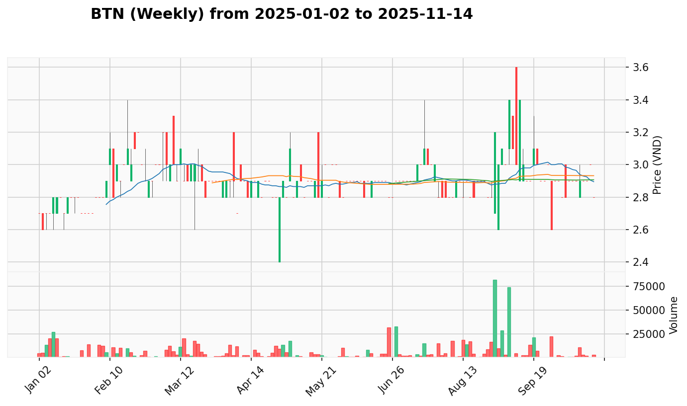

<a href="#vlxd">↑ Back to group VLXD</a>  |  <a href="#vpa-signal-summary">↑ Back to Top</a>

#### Key Statistics
| Metric | Value |
|:---|---:|
| Date Range | 2025-01-02 to 2025-11-14 |
| **Latest Close** | **2.8** |
| Period Open | 2.7 |
| Period High | 3.6 |
| Period Low | 2.4 |
| Period Change % | 3.70% |

**[Download BTN Data (.csv)](market_data_week/BTN_2025-01-02_to_2025-11-14.csv)**

---

### BTS

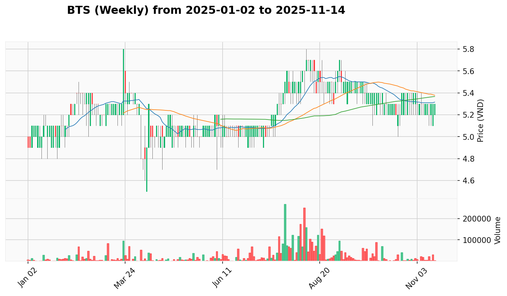

<a href="#vlxd">↑ Back to group VLXD</a>  |  <a href="#vpa-signal-summary">↑ Back to Top</a>

#### Key Statistics
| Metric | Value |
|:---|---:|
| Date Range | 2025-01-02 to 2025-11-14 |
| **Latest Close** | **5.3** |
| Period Open | 5.0 |
| Period High | 5.8 |
| Period Low | 4.5 |
| Period Change % | 6.00% |

**[Download BTS Data (.csv)](market_data_week/BTS_2025-01-02_to_2025-11-14.csv)**

---

### BVH

#### [VPA Analysis (2025-06-02 - 2025-08-03)](./VPA_week.md#bvh)
> - **Ngày 2025-07-07:** Tiếp nối Dấu hiệu Sức mạnh của tuần trước, BVH có một tuần điều chỉnh với một nến giảm. Khối lượng giao dịch giảm nhẹ.
>     - **Phân tích VPA/Wyckoff:** Đây là một phiên **Test for Supply**. Việc giá điều chỉnh với khối lượng không quá lớn sau một đợt tăng mạnh là một tín hiệu bình thường, cho thấy thị trường đang hấp thụ lực chốt lời.
> - **Ngày 2025-07-14:** Tiếp nối phiên kiểm tra của tuần trước, BVH tiếp tục điều chỉnh với nến giảm biên độ hẹp, đóng cửa (52.5) thấp hơn tuần trước. Khối lượng giao dịch tăng nhẹ.
>     - **Phân tích VPA/Wyckoff:** Đây là một **Test for Supply** tiếp tục hoặc **Sign of Weakness** nhẹ. Việc giá tiếp tục giảm trên nền khối lượng tăng cho thấy áp lực bán vẫn còn hiện hữu và cần thời gian để tìm lại sự cân bằng.
> - **Ngày 2025-07-21:** BVH tiếp tục điều chỉnh với nến giảm biên độ hẹp, đóng cửa (52.0) thấp hơn tuần trước. Khối lượng giao dịch giảm xuống mức thấp nhất trong gần 2 tháng.
>     - **Phân tích VPA/Wyckoff:** Đây là một **Test for Supply** thành công. Sau 2 tuần điều chỉnh, việc giá giảm nhẹ trên nền khối lượng cạn kiệt cho thấy áp lực bán đã yếu đi đáng kể. Đây là tín hiệu tích cực cho thấy thị trường có thể sẵn sàng cho một đợt phục hồi.
> **Ngày 2025-07-27:** BVH tiếp tục tuần điều chỉnh thứ ba với nến giảm biên độ hẹp, đóng cửa (52.0) không thay đổi so với tuần trước. Khối lượng giao dịch giảm nhẹ xuống 2.134.600, tiếp tục duy trì ở mức thấp. Sau ba tuần điều chỉnh liên tiếp từ đỉnh 54.9, BVH đã tìm thấy vùng hỗ trợ quanh mức 52.0.
> 
> **Phân tích VPA/Wyckoff:** Đây là một **Test for Supply** thành công và có dấu hiệu **No Supply**. Việc giá đi ngang trên nền khối lượng thấp sau ba tuần điều chỉnh cho thấy áp lực bán đã cạn kiệt. Sự ổn định giá quanh mức 52.0 với khối lượng giảm dần là tín hiệu tích cực, cho thấy thị trường đã hoàn tất quá trình hấp thụ lực bán và sẵn sàng cho đợt tăng giá tiếp theo.
> **Ngày 2025-08-03:** BVH kết thúc chuỗi ba tuần đi ngang với một tuần giảm mạnh, đóng cửa (50.0) thủng vùng hỗ trợ 52.0 và test xuống mức thấp 49.05. Khối lượng giao dịch bùng nổ lên 4.235.800, tăng gấp đôi so với tuần trước (2.134.600) và cao nhất trong 2 tháng qua. Mặc dù có đuôi dài phía dưới cho thấy lực cầu xuất hiện tại vùng 49.05, việc đóng cửa dưới vùng hỗ trợ quan trọng 52.0 là tín hiệu tiêu cực.

<a href="#bao-hiem">↑ Back to group BAO_HIEM</a>  |  <a href="#vpa-signal-summary">↑ Back to Top</a>

#### Key Statistics
| Metric | Value |
|:---|---:|
| Date Range | 2025-01-02 to 2025-11-14 |
| **Latest Close** | **55.3** |
| Period Open | 50.24 |
| Period High | 64.27 |
| Period Low | 38.36 |
| Period Change % | 10.07% |

**[Download BVH Data (.csv)](market_data_week/BVH_2025-01-02_to_2025-11-14.csv)**

---

### BVS

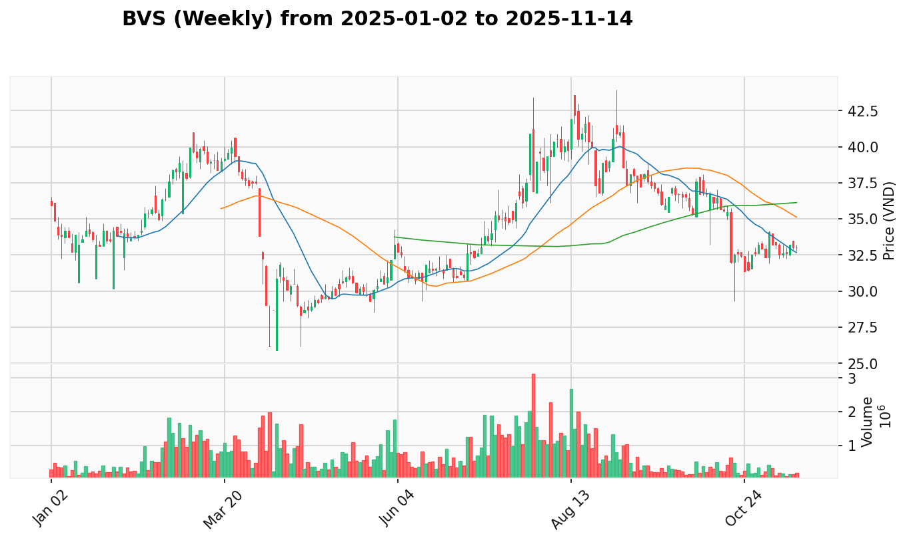

<a href="#chung-khoan">↑ Back to group CHUNG_KHOAN</a>  |  <a href="#vpa-signal-summary">↑ Back to Top</a>

#### Key Statistics
| Metric | Value |
|:---|---:|
| Date Range | 2025-01-02 to 2025-11-14 |
| **Latest Close** | **33.0** |
| Period Open | 36.23 |
| Period High | 43.94 |
| Period Low | 25.88 |
| Period Change % | -8.92% |

**[Download BVS Data (.csv)](market_data_week/BVS_2025-01-02_to_2025-11-14.csv)**

---

### BWE

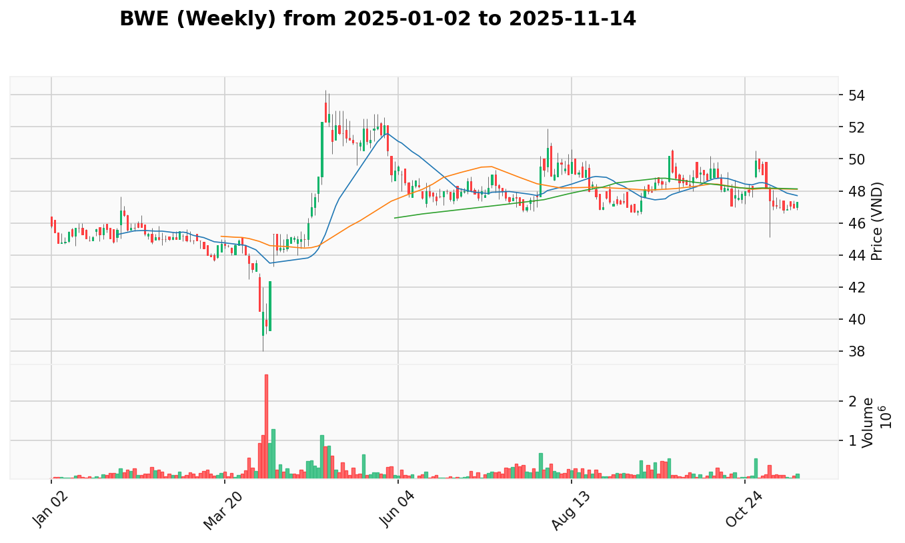

<a href="#others">↑ Back to group OTHERS</a>  |  <a href="#vpa-signal-summary">↑ Back to Top</a>

#### Key Statistics
| Metric | Value |
|:---|---:|
| Date Range | 2025-01-02 to 2025-11-14 |
| **Latest Close** | **47.3** |
| Period Open | 46.38 |
| Period High | 54.3 |
| Period Low | 38.0 |
| Period Change % | 1.98% |

**[Download BWE Data (.csv)](market_data_week/BWE_2025-01-02_to_2025-11-14.csv)**

---

### C47

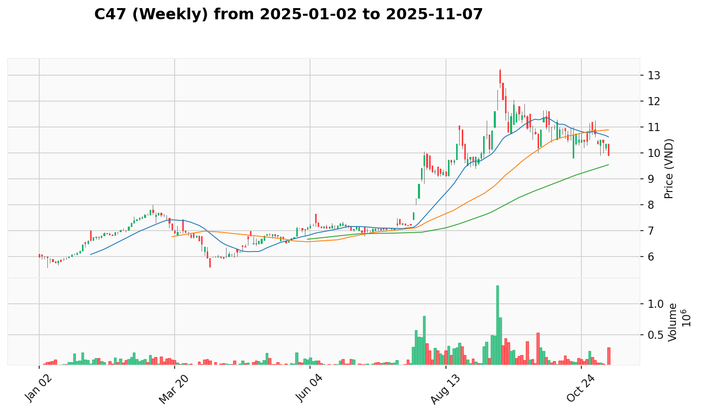

<a href="#xay-dung">↑ Back to group XAY_DUNG</a>  |  <a href="#vpa-signal-summary">↑ Back to Top</a>

#### Key Statistics
| Metric | Value |
|:---|---:|
| Date Range | 2025-01-02 to 2025-11-14 |
| **Latest Close** | **9.99** |
| Period Open | 6.1 |
| Period High | 13.25 |
| Period Low | 5.57 |
| Period Change % | 63.77% |

**[Download C47 Data (.csv)](market_data_week/C47_2025-01-02_to_2025-11-14.csv)**

---

### C4G

#### [VPA Analysis (2025-06-02 - 2025-08-03)](./VPA_week.md#c4g)
> - **Ngày 2025-07-07:** Sau phiên No Demand của tuần trước, C4G tiếp tục đi lên với một nến tăng, đóng cửa (8.3) không đổi. Khối lượng giao dịch tăng.
>     - **Phân tích VPA/Wyckoff:** Nỗ lực (khối lượng) tăng nhưng kết quả (giá) không tương xứng. Đây là tín hiệu của sự giăng co (churning) và **No Demand**, cho thấy phe mua đang gặp khó khăn trong việc đẩy giá lên, là một dấu hiệu yếu kém.
> - **Ngày 2025-07-14:** Tiếp nối tín hiệu No Demand của tuần trước, C4G có một tuần tăng giá đáng kể với nến tăng thân dài, đóng cửa (8.9) cao hơn đáng kể so với tuần trước. Khối lượng giao dịch tăng mạnh lên 13.7 triệu cp.
>     - **Phân tích VPA/Wyckoff:** Đây là một **Sign of Strength**, phủ nhận các tín hiệu yếu trước đó. Lực cầu đã quay trở lại một cách quyết liệt, cho thấy khả năng bắt đầu một đợt tăng giá mới.
> - **Ngày 2025-07-21:** C4G tiếp tục xu hướng tăng với nến tăng biên độ hẹp, đóng cửa (9.0) cao hơn tuần trước và thiết lập mức cao mới. Khối lượng giao dịch giảm nhưng vẫn duy trì ở mức cao.
>     - **Phân tích VPA/Wyckoff:** Đây là một **Sign of Strength** tiếp tục. Xây dựng trên đà tăng mạnh của tuần trước, việc giá tiếp tục tạo đỉnh mới trên nền khối lượng giảm cho thấy áp lực bán đã cạn kiệt và xu hướng tăng đang được củng cố.
> **Ngày 2025-07-27:** Sau tuần Sign of Strength trước đó, C4G tiếp tục xu hướng tăng với nến tăng biên độ hẹp, đóng cửa (9.0) không đổi so với tuần trước nhưng vẫn duy trì ở mức cao. Điểm đáng chú ý là giá đã test được mức cao mới trong tuần (9.3) trước khi về đóng cửa ổn định. Khối lượng giao dịch giảm xuống 10.2 triệu cp so với 13.7 triệu cp của tuần trước, nhưng vẫn duy trì ở mức tương đối cao.
> 
> **Phân tích VPA/Wyckoff:** Đây là một **Sign of Strength** tiếp tục trong xu hướng tăng. Việc giá duy trì ổn định ở vùng cao trên nền khối lượng giảm cho thấy áp lực bán đã cạn kiệt và không còn nguồn cung lớn nào xuất hiện để chặn đà tăng. Mức cao mới 9.3 được test trong tuần càng củng cố tính chất mạnh mẽ của xu hướng hiện tại. Đây là dấu hiệu tích cực cho xu hướng tăng trong các tuần tới.
> **Ngày 2025-08-03:** Sau tuần Sign of Strength trước đó, C4G có một tuần dao động mạnh với nến giảm nhẹ, mở cửa tại 9.0 và test được mức cao mới 9.5 trong tuần trước khi giảm xuống đóng cửa tại 8.9. Điểm đáng chú ý là khối lượng giao dịch tăng vọt lên 14.9 triệu cp, cao nhất trong 2 tháng qua, tăng 46% so với tuần trước.

<a href="#dau-tu-cong">↑ Back to group DAU_TU_CONG</a>  |  <a href="#vpa-signal-summary">↑ Back to Top</a>

#### Key Statistics
| Metric | Value |
|:---|---:|
| Date Range | 2025-01-02 to 2025-11-14 |
| **Latest Close** | **8.5** |
| Period Open | 7.9 |
| Period High | 10.9 |
| Period Low | 5.6 |
| Period Change % | 7.59% |

**[Download C4G Data (.csv)](market_data_week/C4G_2025-01-02_to_2025-11-14.csv)**

---

### C69

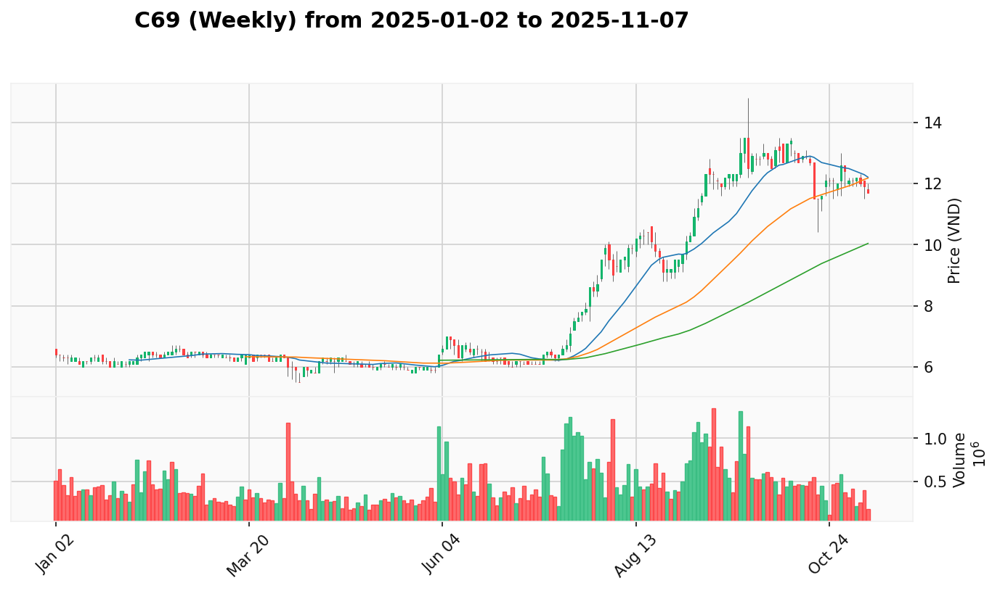

<a href="#xay-dung">↑ Back to group XAY_DUNG</a>  |  <a href="#vpa-signal-summary">↑ Back to Top</a>

#### Key Statistics
| Metric | Value |
|:---|---:|
| Date Range | 2025-01-02 to 2025-11-14 |
| **Latest Close** | **12.3** |
| Period Open | 6.6 |
| Period High | 14.8 |
| Period Low | 5.5 |
| Period Change % | 86.36% |

**[Download C69 Data (.csv)](market_data_week/C69_2025-01-02_to_2025-11-14.csv)**

---

### CEO

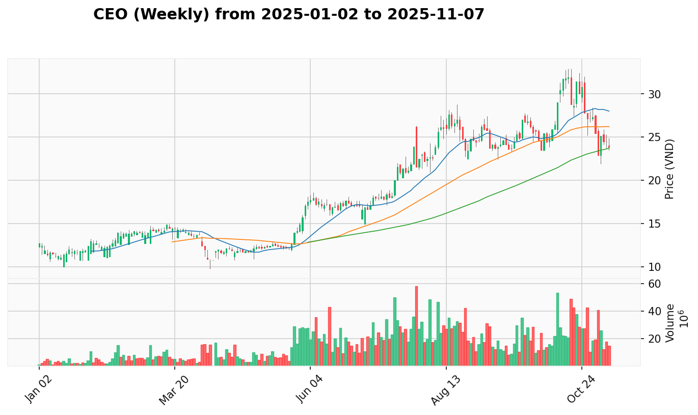

<a href="#bat-dong-san">↑ Back to group BAT_DONG_SAN</a>  |  <a href="#vpa-signal-summary">↑ Back to Top</a>

#### Key Statistics
| Metric | Value |
|:---|---:|
| Date Range | 2025-01-02 to 2025-11-14 |
| **Latest Close** | **25.8** |
| Period Open | 12.29 |
| Period High | 32.9 |
| Period Low | 9.81 |
| Period Change % | 109.93% |

**[Download CEO Data (.csv)](market_data_week/CEO_2025-01-02_to_2025-11-14.csv)**

---

### CIG

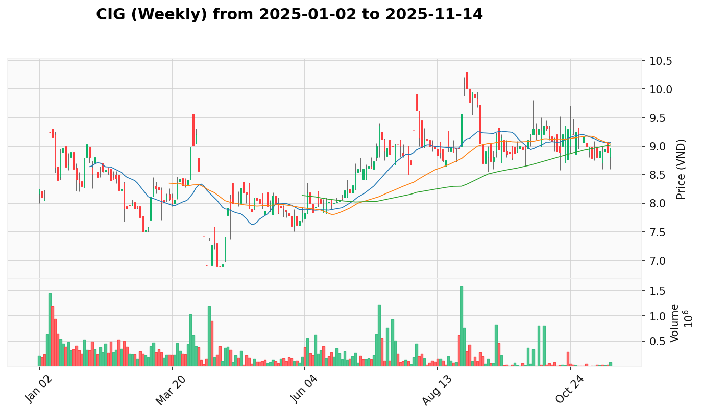

<a href="#penny">↑ Back to group PENNY</a>  |  <a href="#vpa-signal-summary">↑ Back to Top</a>

#### Key Statistics
| Metric | Value |
|:---|---:|
| Date Range | 2025-01-02 to 2025-11-14 |
| **Latest Close** | **8.97** |
| Period Open | 8.16 |
| Period High | 10.35 |
| Period Low | 6.86 |
| Period Change % | 9.93% |

**[Download CIG Data (.csv)](market_data_week/CIG_2025-01-02_to_2025-11-14.csv)**

---

### CII

#### [VPA Analysis (2025-06-02 - 2025-08-03)](./VPA_week.md#cii)
> - **Ngày 2025-07-07:** Tiếp nối nỗ lực tăng giá của tuần trước, CII có một tuần đi ngang với một nến giảm biên độ hẹp. Khối lượng giao dịch tăng nhẹ.
>     - **Phân tích VPA/Wyckoff:** Đây là một phiên **Test for Supply**. Việc giá giữ vững trên nền khối lượng cao cho thấy thị trường đang hấp thụ tốt lực chốt lời. Tín hiệu No Supply, cần quan sát thêm.
> - **Ngày 2025-07-14:** Sau phiên kiểm tra thành công của tuần trước, CII có một tuần bùng nổ với nến tăng thân dài, đóng cửa (16.3) cao hơn đáng kể so với tuần trước. Khối lượng giao dịch tăng vọt lên 157.7 triệu cp.
>     - **Phân tích VPA/Wyckoff:** Đây là một **Sign of Strength** rất mạnh mẽ, xác nhận lực cầu đã quay trở lại một cách quyết liệt. Khối lượng đột biến kết hợp với giá tăng mạnh cho thấy sự tham gia của dòng tiền lớn và xu hướng tăng được củng cố.
> - **Ngày 2025-07-21:** CII tiếp tục xu hướng tăng với nến tăng biên độ rộng, đóng cửa (16.45) cao hơn tuần trước và thiết lập mức cao mới. Khối lượng giao dịch giảm xuống 123.0 triệu cp nhưng vẫn duy trì ở mức rất cao.
>     - **Phân tích VPA/Wyckoff:** Đây là một **Sign of Strength** tiếp tục. Xây dựng trên đà bùng nổ của tuần trước, việc giá tiếp tục tạo đỉnh mới trên nền khối lượng giảm cho thấy áp lực bán đã cạn kiệt và xu hướng tăng đang được duy trì ổn định.
> **Ngày 2025-07-27:** CII có một tuần giảm giá nhẹ với nến giảm biên độ vừa phải, đóng cửa (16.45) cao hơn một chút so với tuần trước nhưng thấp hơn giá mở cửa. Khối lượng giao dịch giảm xuống 122.9 triệu cp, thấp hơn đáng kể so với tuần trước nhưng vẫn duy trì ở mức rất cao. Mặc dù có sự điều chỉnh, giá vẫn giữ được vùng 16+ và không phá vỡ support quan trọng.
> 
> **Phân tích VPA/Wyckoff:** Đây là một **Test for Supply** sau chuỗi tăng mạnh. Việc giá điều chỉnh nhẹ trên nền khối lượng giảm cho thấy áp lực bán không mạnh và thị trường đang hấp thụ tốt lực chốt lời. Tín hiệu **No Supply** xuất hiện, củng cố cho xu hướng tăng dài hạn. Cần quan sát tuần tới để xác nhận việc tiếp tục xu hướng tăng.
> **Ngày 2025-08-03:** CII có một tuần bùng nổ mạnh mẽ với nến tăng biên độ cực rộng, mở cửa tại 14.65 và tăng vọt lên đỉnh 15.97 trước khi đóng cửa tại 14.47. Mặc dù đóng cửa thấp hơn đỉnh tuần, giá vẫn tăng so với tuần trước (14.43). Đặc biệt, khối lượng giao dịch bùng nổ lên 203.2 triệu cp, tăng 65% so với tuần trước và đạt mức cao nhất trong 2 tháng qua. Việc test lên vùng 15.97 cho thấy cổ phiếu đang thách thức vùng k저항 quan trọng.

<a href="#xay-dung">↑ Back to group XAY_DUNG</a>  |  <a href="#vpa-signal-summary">↑ Back to Top</a>

#### Key Statistics
| Metric | Value |
|:---|---:|
| Date Range | 2025-01-02 to 2025-11-14 |
| **Latest Close** | **25.15** |
| Period Open | 12.02 |
| Period High | 31.35 |
| Period Low | 9.02 |
| Period Change % | 109.23% |

**[Download CII Data (.csv)](market_data_week/CII_2025-01-02_to_2025-11-14.csv)**

---

### CKG

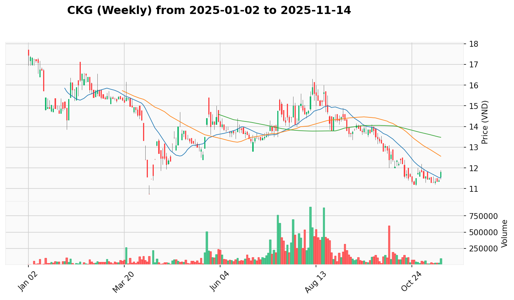

<a href="#xay-dung">↑ Back to group XAY_DUNG</a>  |  <a href="#vpa-signal-summary">↑ Back to Top</a>

#### Key Statistics
| Metric | Value |
|:---|---:|
| Date Range | 2025-01-02 to 2025-11-14 |
| **Latest Close** | **11.8** |
| Period Open | 17.71 |
| Period High | 17.71 |
| Period Low | 10.74 |
| Period Change % | -33.37% |

**[Download CKG Data (.csv)](market_data_week/CKG_2025-01-02_to_2025-11-14.csv)**

---

### CLX

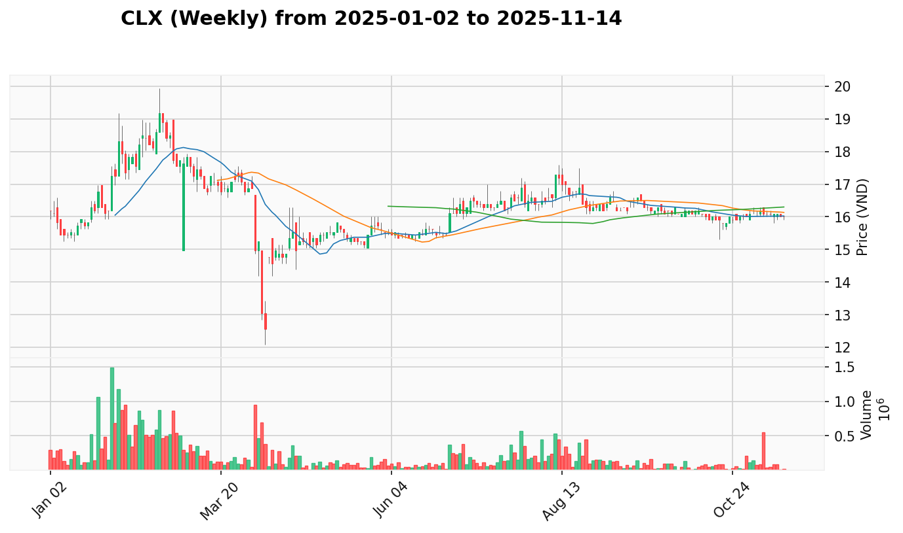

<a href="#thuc-pham">↑ Back to group THUC_PHAM</a>  |  <a href="#vpa-signal-summary">↑ Back to Top</a>

#### Key Statistics
| Metric | Value |
|:---|---:|
| Date Range | 2025-01-02 to 2025-11-14 |
| **Latest Close** | **16.0** |
| Period Open | 16.2 |
| Period High | 19.94 |
| Period Low | 12.08 |
| Period Change % | -1.23% |

**[Download CLX Data (.csv)](market_data_week/CLX_2025-01-02_to_2025-11-14.csv)**

---

### CMG

#### [VPA Analysis (2025-06-02 - 2025-08-03)](./VPA_week.md#cmg)
> - **Ngày 2025-07-07:** Sau tuần tăng giá bùng nổ có dấu hiệu của một Cao trào mua, CMG đã có một tuần đảo chiều giảm giá. Cổ phiếu mở cửa tăng nhưng sau đó bị bán tháo, tạo thành một nến giảm có bóng trên dài và đóng cửa (42.3) thấp hơn. Khối lượng giao dịch giảm nhưng vẫn ở mức rất cao.
>     - **Phân tích VPA/Wyckoff:** Đây là một cú **Upthrust** và là một **Sign of Weakness**. Sự xuất hiện của áp lực bán mạnh ở vùng đỉnh xác nhận khả năng bắt đầu một giai đoạn phân phối hoặc điều chỉnh.
> - **Ngày 2025-07-14:** Tiếp nối tín hiệu Upthrust yếu của tuần trước, CMG có một tuần điều chỉnh với nến giảm biên độ hẹp, đóng cửa (41.8) thấp hơn tuần trước. Khối lượng giao dịch giảm đáng kể.
>     - **Phân tích VPA/Wyckoff:** Đây là một **Test for Supply** sau cú Upthrust. Việc giá chỉ điều chỉnh nhẹ trên nền khối lượng giảm cho thấy áp lực bán đã giảm bớt, nhưng vẫn cần thêm tín hiệu xác nhận để kết luận về hướng đi tiếp theo.
> - **Ngày 2025-07-21:** CMG phục hồi mạnh mẽ với nến tăng biên độ rộng, đóng cửa (42.75) cao hơn tuần trước và vượt lại mức đỉnh cũ. Khối lượng giao dịch tăng trở lại mức cao.
>     - **Phân tích VPA/Wyckoff:** Đây là một **Sign of Strength** sau phiên Test for Supply thành công. Việc giá vượt lại được mức đỉnh cũ trên nền khối lượng tăng cho thấy lực cầu đã vượt qua được áp lực bán và xu hướng tăng được khôi phục.
> **Ngày 2025-07-27:** CMG tiếp tục xu hướng tăng mạnh mẽ với nến tăng biên độ rộng, đóng cửa ở mức 42.75 - cao hơn đáng kể so với tuần trước (41.8) và xác nhận việc vượt qua vùng kháng cự quan trọng quanh mức 42.3. Khối lượng giao dịch tăng lên 10.3 triệu cổ phiếu, cao hơn tuần trước nhưng vẫn thấp hơn so với đợt bùng nổ đầu tháng 7. Biên độ dao động từ 41.0 đến 43.7 cho thấy sự tranh chấp quyết liệt giữa phe mua và phe bán, nhưng cuối cùng phe mua đã chiếm ưu thế.
> 
> **Phân tích VPA/Wyckoff:** Đây là một **Sign of Strength** rõ ràng, xác nhận việc Test for Supply của tuần trước đã thành công. Việc giá vượt qua được vùng kháng cự 42.3 (mức đỉnh cũ) trên nền khối lượng tăng cho thấy lực cầu đã vượt qua áp lực bán và xu hướng tăng được tái khẳng định. Tuy nhiên, cần theo dõi khối lượng trong những tuần tới để xác nhận sự bền vững của đợt bứt phá này.
> **Ngày 2025-08-03:**

<a href="#cong-nghe">↑ Back to group CONG_NGHE</a>  |  <a href="#vpa-signal-summary">↑ Back to Top</a>

#### Key Statistics
| Metric | Value |
|:---|---:|
| Date Range | 2025-01-02 to 2025-11-14 |
| **Latest Close** | **38.1** |
| Period Open | 49.5 |
| Period High | 50.4 |
| Period Low | 28.85 |
| Period Change % | -23.03% |

**[Download CMG Data (.csv)](market_data_week/CMG_2025-01-02_to_2025-11-14.csv)**

---

### CMX

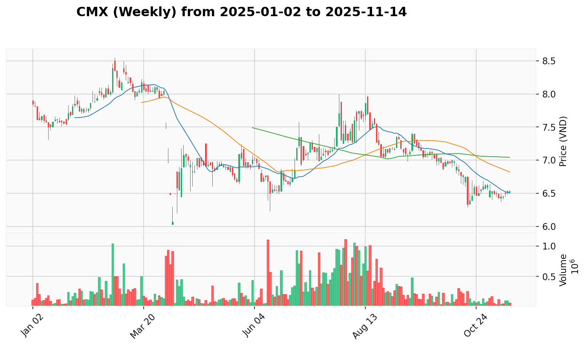

<a href="#thuy-san">↑ Back to group THUY_SAN</a>  |  <a href="#vpa-signal-summary">↑ Back to Top</a>

#### Key Statistics
| Metric | Value |
|:---|---:|
| Date Range | 2025-01-02 to 2025-11-14 |
| **Latest Close** | **6.53** |
| Period Open | 7.9 |
| Period High | 8.55 |
| Period Low | 6.03 |
| Period Change % | -17.34% |

**[Download CMX Data (.csv)](market_data_week/CMX_2025-01-02_to_2025-11-14.csv)**

---

### CNG

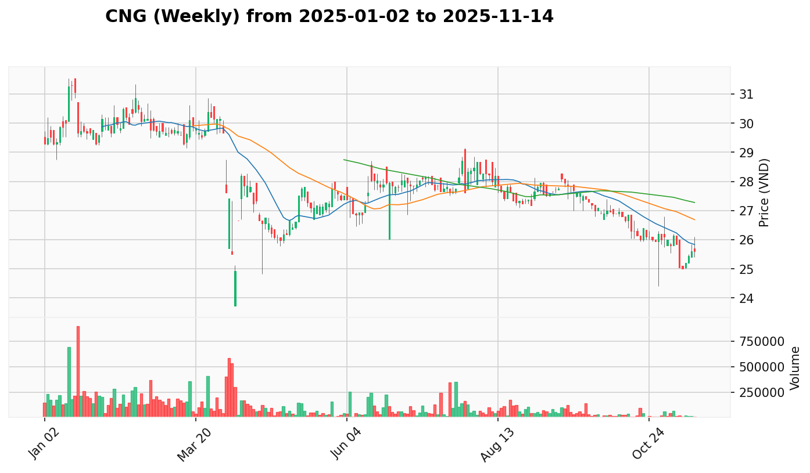

<a href="#dau-khi">↑ Back to group DAU_KHI</a>  |  <a href="#vpa-signal-summary">↑ Back to Top</a>

#### Key Statistics
| Metric | Value |
|:---|---:|
| Date Range | 2025-01-02 to 2025-11-14 |
| **Latest Close** | **25.6** |
| Period Open | 29.53 |
| Period High | 31.54 |
| Period Low | 23.73 |
| Period Change % | -13.31% |

**[Download CNG Data (.csv)](market_data_week/CNG_2025-01-02_to_2025-11-14.csv)**

---

### CRV

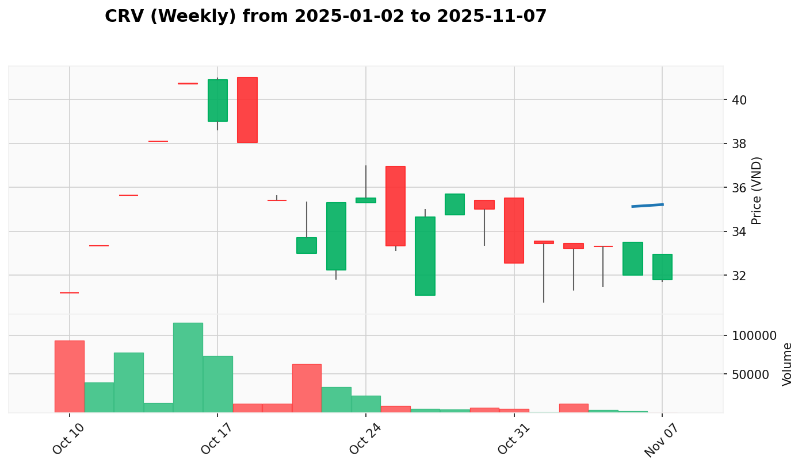

<a href="#bat-dong-san">↑ Back to group BAT_DONG_SAN</a>  |  <a href="#vpa-signal-summary">↑ Back to Top</a>

#### Key Statistics
| Metric | Value |
|:---|---:|
| Date Range | 2025-10-10 to 2025-11-14 |
| **Latest Close** | **32.5** |
| Period Open | 31.2 |
| Period High | 41.0 |
| Period Low | 30.5 |
| Period Change % | 4.17% |

**[Download CRV Data (.csv)](market_data_week/CRV_2025-01-02_to_2025-11-14.csv)**

---

### CSC

#### [VPA Analysis (2025-06-02 - 2025-08-03)](./VPA_week.md#csc)
> - **Ngày 2025-07-07:** Sau tín hiệu No Supply của tuần trước, CSC đã có một tuần tăng giá mạnh mẽ. Nến tăng có thân dài, đóng cửa (21.9) gần mức cao nhất tuần, đi kèm với khối lượng giao dịch tăng vọt.
>     - **Phân tích VPA/Wyckoff:** Đây là một **Sign of Strength**, xác nhận lực cầu đã quay trở lại một cách quyết liệt, phá vỡ sự do dự trước đó.
> - **Ngày 2025-07-14:** Tiếp nối Dấu hiệu Sức mạnh của tuần trước, CSC tiếp tục đà tăng mạnh mẽ. Nến tăng có thân dài, đóng cửa (22.4) gần mức cao nhất tuần, với biên độ từ 21.0 đến 23.0. Khối lượng giao dịch tăng mạnh lên 369.008 cp, cao hơn hẳn tuần trước.
>     - **Phân tích VPA/Wyckoff:** Đây là một **Sign of Strength** liên tiếp, cho thấy lực cầu đang rất mạnh mẽ và quyết liệt. Việc giá và khối lượng cùng tăng xác nhận xu hướng tăng đang được củng cố vững chắc.
> - **Ngày 2025-07-21:** Sau hai tuần liên tiếp của Dấu hiệu Sức mạnh, CSC có một tuần điều chỉnh mạnh. Nến giảm mở cửa ở mức cao (23.0) nhưng đóng cửa thấp hơn (21.8), tạo thành bóng trên dài với biên độ từ 21.5 đến 23.4. Khối lượng giao dịch giảm xuống 318.148 cp so với tuần trước.
>     - **Phân tích VPA/Wyckoff:** Đây là một tín hiệu **Effort to Fall**, thể hiện áp lực chốt lời sau giai đoạn tăng mạnh. Việc khối lượng giảm trong bối cảnh giá giảm cho thấy lực bán chưa thực sự quyết liệt, có thể là điều chỉnh kỹ thuật tạm thời sau đợt tăng trước đó.
> **Ngày 2025-07-27:** Sau tuần Effort to Fall trước đó, CSC tiếp tục xu hướng điều chỉnh với một nến giảm có thân trung bình. Mở cửa tại mức cao (23.0), cổ phiếu chịu áp lực bán xuống mức thấp 21.5 trước khi phục hồi nhẹ đóng cửa tại 21.8. Bóng dưới ngắn cho thấy lực cầu hỗ trợ ở vùng 21.5. Khối lượng giao dịch giảm nhẹ xuống 317.900 cổ phiếu so với tuần trước (369.300), nhưng vẫn duy trì ở mức tương đối cao so với giai đoạn trước đó.
> 
> **Phân tích VPA/Wyckoff:** Đây là một tín hiệu **Test for Supply** sau giai đoạn điều chỉnh. Việc giá giảm nhẹ trên nền khối lượng giảm cho thấy áp lực bán đang giảm dần. Vùng hỗ trợ 21.5 đã xuất hiện với lực cầu ở mức thấp tuần, tạo thành Test for Supply tích cực. Nếu CSC có thể duy trì trên vùng 21.5-21.8 với khối lượng thấp, đây có thể là dấu hiệu kết thúc điều chỉnh và chuẩn bị cho đợt tăng tiếp theo.
> **Ngày 2025-08-03:**
> Sau tín hiệu Test for Supply của tuần trước, CSC đã có một tuần bùng nổ mạnh mẽ với nến tăng thân dài từ 21.8 lên đóng cửa tại mức cao nhất tuần 24.9. Mở cửa tại 21.8, cổ phiếu chỉ test xuống 21.4 rồi tăng vọt lên đỉnh 24.9, tăng 14.2% trong tuần. Khối lượng giao dịch bùng nổ lên 974.300 cổ phiếu, tăng gấp 3 lần so với tuần trước (317.900), đạt mức cao nhất trong nhiều tháng. Nến tăng có thân rất dài với bóng dưới và bóng trên đều ngắn, cho thấy lực cầu áp đảo hoàn toàn.

<a href="#penny">↑ Back to group PENNY</a>  |  <a href="#vpa-signal-summary">↑ Back to Top</a>

#### Key Statistics
| Metric | Value |
|:---|---:|
| Date Range | 2025-01-02 to 2025-11-14 |
| **Latest Close** | **18.1** |
| Period Open | 24.73 |
| Period High | 26.9 |
| Period Low | 15.55 |
| Period Change % | -26.81% |

**[Download CSC Data (.csv)](market_data_week/CSC_2025-01-02_to_2025-11-14.csv)**

---

### CST

#### [VPA Analysis (2025-06-02 - 2025-08-03)](./VPA_week.md#cst)
> - **Ngày 2025-07-07:** Sau nhiều tuần đi ngang với tín hiệu No Demand, CST đã có một tuần bùng nổ mạnh mẽ. Nến tăng có thân rất dài, đóng cửa (16.4) gần mức cao nhất tuần, đi kèm với khối lượng giao dịch tăng vọt.
>     - **Phân tích VPA/Wyckoff:** Đây là một **Sign of Strength** rõ ràng, cho thấy lực cầu đã quay trở lại một cách bất ngờ và mạnh mẽ, có khả năng kết thúc giai đoạn tích lũy dài.
> - **Ngày 2025-07-14:** Sau tuần bùng nổ trước đó, CST quay đầu điều chỉnh với nến giảm có biên độ hẹp, đóng cửa (15.9) thấp hơn tuần trước. Khối lượng giao dịch giảm xuống 260.852 cp nhưng vẫn ở mức cao so với giai đoạn tích lũy trước.
>     - **Phân tích VPA/Wyckoff:** Đây là một phiên **Test for Supply** sau đợt tăng mạnh. Việc giá điều chỉnh nhẹ với khối lượng giảm là một tín hiệu tích cực, cho thấy áp lực bán không mạnh và thị trường đang hấp thụ tốt sau đợt tăng giá.
> - **Ngày 2025-07-21:** Tiếp nối quá trình Test for Supply của tuần trước, CST có một tuần giao dịch giằng co với nến giảm biên độ hẹp, đóng cửa (15.7) thấp hơn nhẹ. Khối lượng giao dịch tăng mạnh lên 474.373 cp, cao hơn đáng kể so với tuần trước.
>     - **Phân tích VPA/Wyckoff:** Đây là một tín hiệu **No Supply**. Việc giá giảm rất nhẹ trên nền khối lượng tăng cao cho thấy lực bán đã được hấp thụ tốt và thị trường đang tích cực kiểm tra khả năng cung ứng. Tín hiệu tích cực sau giai đoạn test, cho thấy nền tảng vững chắc cho xu hướng tăng tiếp theo.
> **Ngày 2025-07-27:** Sau tuần test for supply trước đó, CST tiếp tục điều chỉnh nhẹ với nến giảm biên độ hẹp từ 15.9 xuống 15.7. Khối lượng giao dịch tăng mạnh lên 474.300 cổ phiếu, cao nhất trong giai đoạn gần đây và tương đương với tuần bùng nổ trước đó.
> 
> **Phân tích VPA/Wyckoff:** Đây là một tín hiệu **No Supply** rất tích cực. Việc giá chỉ giảm nhẹ 0.2 điểm trên nền khối lượng tăng vọt cho thấy lực bán đã được hấp thụ hoàn toàn bởi lực cầu mạnh. Đây là bằng chứng rõ ràng về sự thiếu nguồn cung và khả năng cao sẽ có đợt tăng giá tiếp theo sau giai đoạn test thành công này.
> **Ngày 2025-08-03:** Sau giai đoạn No Supply tích cực của tuần trước, CST tiếp tục điều chỉnh nhẹ với nến giảm từ 15.8 xuống 15.4. Biên độ dao động thu hẹp với high chỉ bằng open (15.8) và low xuống 15.3. Khối lượng giao dịch giảm xuống 420.700 cổ phiếu, thấp hơn tuần trước nhưng vẫn duy trì ở mức cao so với giai đoạn tích lũy trước đó.

<a href="#khai-khoang">↑ Back to group KHAI_KHOANG</a>  |  <a href="#vpa-signal-summary">↑ Back to Top</a>

#### Key Statistics
| Metric | Value |
|:---|---:|
| Date Range | 2025-01-02 to 2025-11-14 |
| **Latest Close** | **13.6** |
| Period Open | 23.04 |
| Period High | 23.61 |
| Period Low | 13.0 |
| Period Change % | -40.97% |

**[Download CST Data (.csv)](market_data_week/CST_2025-01-02_to_2025-11-14.csv)**

---

### CSV

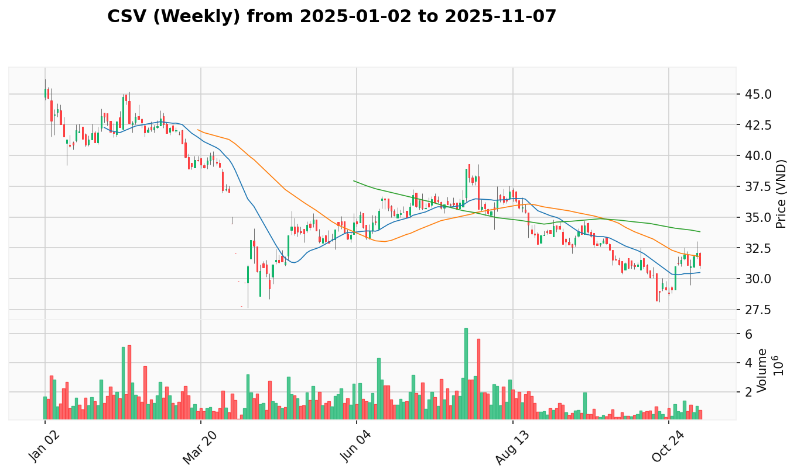

<a href="#hoa-chat">↑ Back to group HOA_CHAT</a>  |  <a href="#vpa-signal-summary">↑ Back to Top</a>

#### Key Statistics
| Metric | Value |
|:---|---:|
| Date Range | 2025-01-02 to 2025-11-14 |
| **Latest Close** | **31.85** |
| Period Open | 44.75 |
| Period High | 46.21 |
| Period Low | 27.63 |
| Period Change % | -28.83% |

**[Download CSV Data (.csv)](market_data_week/CSV_2025-01-02_to_2025-11-14.csv)**

---

### CTD

#### [VPA Analysis (2025-06-02 - 2025-08-03)](./VPA_week.md#ctd)
> - **Ngày 2025-07-07:** Sau nỗ lực tăng giá chững lại của tuần trước, CTD quay đầu giảm với một nến giảm biên độ hẹp. Khối lượng giao dịch tăng nhẹ.
>     - **Phân tích VPA/Wyckoff:** Đây là một phiên **Test for Supply**. Việc giá giảm trên khối lượng tăng cho thấy áp lực bán vẫn còn hiện hữu. Tín hiệu No Supply đến Sign of Weakness.
> - **Ngày 2025-07-14:** Sau tuần kiểm tra cung có tín hiệu yếu, CTD phục hồi mạnh mẽ với nến tăng thân dài, đóng cửa (86.1) gần mức cao nhất tuần. Biên độ giao dịch từ 82.5 đến 88.5 cho thấy sự biến động tích cực. Khối lượng giao dịch tăng lên 7.779.438 cp.
>     - **Phân tích VPA/Wyckoff:** Đây là một **Sign of Strength** sau đợt kiểm tra. Việc giá bứt phá mạnh mẽ với khối lượng tăng cho thấy lực cầu đã vượt qua áp lực bán và đang kiểm soát thị trường. Tín hiệu tích cực cho xu hướng tăng trở lại.
> - **Ngày 2025-07-21:** Sau tuần bứt phá mạnh mẽ, CTD có một tuần điều chỉnh với nến giảm, đóng cửa (84.2) thấp hơn tuần trước. Biên độ giao dịch từ 84.0 đến 88.0 cho thấy áp lực chốt lời. Khối lượng giao dịch giảm xuống 7.044.029 cp.
>     - **Phân tích VPA/Wyckoff:** Đây là một phiên **Test for Supply** sau đợt tăng mạnh. Việc giá điều chỉnh với khối lượng giảm là một tín hiệu tích cực, cho thấy áp lực bán không quá mạnh và thị trường đang kiểm tra vùng support mới. Tín hiệu No Supply sau giai đoạn tăng giá.
> **Ngày 2025-07-27:** Sau tuần kiểm tra cung tích cực, CTD tiếp tục điều chỉnh với nến giảm biên độ hẹp, đóng cửa (84.2) thấp hơn tuần trước. Biên độ giao dịch từ 84.0 đến 88.0 cho thấy sự dao động trong phạm vi hẹp. Khối lượng giao dịch giảm nhẹ xuống 7.038.400 cp, thấp hơn tuần trước.
> 
> **Phân tích VPA/Wyckoff:** Đây là một phiên **No Supply** tích cực. Việc giá điều chỉnh nhẹ trên nền khối lượng giảm cho thấy áp lực bán đã được hấp thụ tốt và không có nguồn cung mới xuất hiện. Sự điều chỉnh này có thể được xem như một động thái lành mạnh để tích lũy lực cầu trước khi tiếp tục xu hướng tăng. Tín hiệu No Supply sau giai đoạn Test for Supply thành công của tuần trước củng cố cho triển vọng tích cực.
> **Ngày 2025-08-03:** Sau giai đoạn No Supply tích cực của tuần trước, CTD tiếp tục điều chỉnh mạnh hơn với nến giảm có thân dài, đóng cửa ở 82.0 thấp hơn đáng kể so với tuần trước (84.2). Biên độ giao dịch rộng từ 78.5 đến 85.3 cho thấy sự biến động mạnh và áp lực bán gia tăng. Khối lượng giao dịch tăng lên 7.619.400 cp, cao hơn tuần trước, đặc biệt đáng chú ý khi giá giảm xuống test vùng support 78.5.

<a href="#xay-dung">↑ Back to group XAY_DUNG</a>  |  <a href="#vpa-signal-summary">↑ Back to Top</a>

#### Key Statistics
| Metric | Value |
|:---|---:|
| Date Range | 2025-01-02 to 2025-11-14 |
| **Latest Close** | **88.0** |
| Period Open | 68.8 |
| Period High | 103.5 |
| Period Low | 64.3 |
| Period Change % | 27.91% |

**[Download CTD Data (.csv)](market_data_week/CTD_2025-01-02_to_2025-11-14.csv)**

---

### CTG

#### [VPA Analysis (2025-06-02 - 2025-08-03)](./VPA_week.md#ctg)
> - **Ngày 2025-07-07:** Tiếp nối Dấu hiệu Sức mạnh của tuần trước, CTG có một tuần bùng nổ với một nến tăng thân dài, đóng cửa (44.6) ở mức cao nhất tuần. Khối lượng giao dịch duy trì ở mức rất cao.
>     - **Phân tích VPA/Wyckoff:** Đây là một **Sign of Strength** rõ ràng, cho thấy lực cầu đang rất quyết liệt và xu hướng tăng được củng cố.
> - **Ngày 2025-07-14:** Tiếp nối đà tăng mạnh mẽ liên tiếp, CTG có một tuần tăng giá vững chắc với nến tăng biên độ hẹp, đóng cửa (45.05) cao hơn tuần trước. Biên độ giao dịch từ 43.7 đến 45.55 cho thấy sự ổn định. Khối lượng giao dịch tăng lên 40.744.662 cp.
>     - **Phân tích VPA/Wyckoff:** Đây là một **Effort to Rise** sau chuỗi Dấu hiệu Sức mạnh. Việc giá tiếp tục tăng dù với biên độ hẹp hơn cho thấy lực cầu vẫn đang kiểm soát, tuy nhiên đà tăng đang chững lại ở vùng giá cao và có thể cần thời gian tích lũy.
> - **Ngày 2025-07-21:** Tiếp nối nỗ lực tăng giá của tuần trước, CTG có một tuần tăng giá nhẹ với nến tăng biên độ hẹp, đóng cửa (45.6) cao hơn tuần trước. Biên độ giao dịch từ 44.7 đến 46.2 cho thấy sự consolidation ở vùng cao. Khối lượng giao dịch giảm xuống 28.337.447 cp.
>     - **Phân tích VPA/Wyckoff:** Đây là một tín hiệu **No Supply** trong xu hướng tăng. Việc giá có thể tăng nhẹ trên nền khối lượng giảm cho thấy áp lực bán rất yếu ở vùng giá cao này. Tín hiệu tích cực, cho thấy cổ phiếu đang tích lũy vững chắc và có tiềm năng bứt phá tiếp theo.
> **Ngày 2025-07-27:** CTG kết thúc tuần với một phiên consolidation trong vùng giá cao. Nến có thân nhỏ với giá mở cửa 45.6 và đóng cửa cũng tại 45.6, cho thấy sự cân bằng giữa cung và cầu. Biên độ giao dịch từ 44.7 đến 46.2 phản ánh volatility vừa phải trong phạm vi hẹp. Khối lượng giao dịch giảm nhẹ xuống 28.319.300 cổ phiếu so với tuần trước (28.337.447 cp), duy trì xu hướng khối lượng thấp trong giai đoạn tích lũy ở vùng cao.
> 
> **Phân tích VPA/Wyckoff:** Đây là một tín hiệu **No Supply** tiếp tục trong xu hướng tăng. Việc giá duy trì ổn định ở vùng cao (45.6) trên nền khối lượng thấp cho thấy áp lực bán rất yếu và nguồn cung đã cạn kiệt. Cổ phiếu đang trong giai đoạn tích lũy vững chắc sau chuỗi tăng giá mạnh mẽ từ tháng 6, tạo nền tảng cho đợt bứt phá tiếp theo khi có catalyst phù hợp.
> **Ngày 2025-08-03:** CTG có tuần giao dịch đầy biến động với nến giảm có thân trung bình, mở cửa tại 45.5 và đóng cửa tại 44.3. Biên độ giao dịch rộng từ 43.8 đến 47.5 cho thấy volatility cao với việc test lên mức cao mới 47.5 nhưng không thể duy trì và bị đẩy xuống. Khối lượng giao dịch bùng nổ lên 83.388.200 cổ phiếu, tăng gấp 2.9 lần so với tuần trước (28.319.300 cp), đánh dấu khối lượng cao nhất trong 2 tháng qua.

<a href="#ngan-hang">↑ Back to group NGAN_HANG</a>  |  <a href="#vpa-signal-summary">↑ Back to Top</a>

#### Key Statistics
| Metric | Value |
|:---|---:|
| Date Range | 2025-01-02 to 2025-11-14 |
| **Latest Close** | **48.55** |
| Period Open | 37.7 |
| Period High | 56.05 |
| Period Low | 33.53 |
| Period Change % | 28.78% |

**[Download CTG Data (.csv)](market_data_week/CTG_2025-01-02_to_2025-11-14.csv)**

---

### CTI

<a href="#vlxd">↑ Back to group VLXD</a>  |  <a href="#vpa-signal-summary">↑ Back to Top</a>

#### Key Statistics
| Metric | Value |
|:---|---:|
| Date Range | 2025-01-02 to 2025-11-14 |
| **Latest Close** | **23.3** |
| Period Open | 19.3 |
| Period High | 28.95 |
| Period Low | 17.2 |
| Period Change % | 20.73% |

**[Download CTI Data (.csv)](market_data_week/CTI_2025-01-02_to_2025-11-14.csv)**

---

### CTR

#### [VPA Analysis (2025-06-02 - 2025-08-03)](./VPA_week.md#ctr)
> - **Ngày 2025-07-07:** Sau phiên kiểm tra No Supply thành công của tuần trước, CTR đã không thể tiếp tục đà tăng mà quay đầu giảm nhẹ. Nến tuần là một nến giảm có biên độ hẹp, đóng cửa (101.6) thấp hơn. Khối lượng giao dịch giảm.
>     - **Phân tích VPA/Wyckoff:** Đây là một tín hiệu **No Demand**. Việc giá không thể tăng sau tín hiệu No Supply trước đó cho thấy phe mua đang do dự. Tín hiệu No Supply, cần một cú bứt phá để xác nhận.
> - **Ngày 2025-07-14:** Tiếp nối tín hiệu No Demand của tuần trước, CTR quay đầu giảm với nến giảm có biên độ hẹp, đóng cửa (99.8) thấp hơn đáng kể. Biên độ giao dịch từ 99.8 đến 104.4 cho thấy áp lực bán. Khối lượng giao dịch tăng lên 3.910.967 cp.
>     - **Phân tích VPA/Wyckoff:** Đây là một **Sign of Weakness**. Việc giá giảm với khối lượng tăng cho thấy áp lực bán đang gia tăng và phe mua đang yếu thế. Tín hiệu tiêu cực cho xu hướng ngắn hạn sau giai đoạn tăng trước đó.
> - **Ngày 2025-07-21:** Tiếp nối tín hiệu yếu của tuần trước, CTR tiếp tục giảm với nến giảm, đóng cửa (98.7) thấp hơn tuần trước. Biên độ giao dịch từ 97.3 đến 100.7 cho thấy áp lực bán tiếp diễn. Khối lượng giao dịch giảm xuống 3.250.514 cp.
>     - **Phân tích VPA/Wyckoff:** Đây là một tín hiệu **Effort to Fall**. Việc giá tiếp tục giảm nhưng với khối lượng giảm cho thấy áp lực bán đang yếu đi. Tín hiệu tích cực hơn so với tuần trước, có thể báo hiệu giai đoạn điều chỉnh đang đi đến hồi kết.
> **Ngày 2025-07-27:** CTR tiếp tục xu hướng giảm nhẹ với nến giảm có thân nhỏ, đóng cửa (98.7) thấp hơn tuần trước. Biên độ giao dịch từ 97.3 đến 100.7 cho thấy áp lực bán vẫn còn nhưng đã giảm bớt so với các tuần trước. Khối lượng giao dịch giảm xuống 3.242.900 cp, thấp hơn đáng kể so với tuần trước (3.906.100 cp).
> 
> **Phân tích VPA/Wyckoff:** Đây là một tín hiệu **Effort to Fall** tiếp tục. Việc giá giảm nhẹ với khối lượng giảm đáng kể cho thấy áp lực bán đang yếu đi rõ rệt. Tín hiệu này củng cố thêm cho nhận định rằng giai đoạn điều chỉnh đang đi đến hồi kết. Mức giá hiện tại đang kiểm tra vùng hỗ trợ quan trọng và có thể sẵn sàng cho một đợt phục hồi nếu có tín hiệu Stopping Volume xuất hiện.
> **Ngày 2025-08-03:** CTR có một tuần sụt giảm mạnh với nến giảm có biên độ rộng, từ mức mở cửa 99.1 giảm xuống đóng cửa tại 90.0. Điểm đáng chú ý là mức thấp nhất tuần chạm 89.7, phá vỡ hoàn toàn vùng hỗ trợ 97.3-98.7 mà CTR đã dao động trong 2 tuần qua. Khối lượng giao dịch tăng vọt lên 5.496.000 cp, cao nhất trong 10 tuần qua và tăng 69.5% so với tuần trước.

<a href="#xay-lap-dien">↑ Back to group XAY_LAP_DIEN</a>  |  <a href="#vpa-signal-summary">↑ Back to Top</a>

#### Key Statistics
| Metric | Value |
|:---|---:|
| Date Range | 2025-01-02 to 2025-11-14 |
| **Latest Close** | **92.6** |
| Period Open | 121.61 |
| Period High | 133.03 |
| Period Low | 72.13 |
| Period Change % | -23.85% |

**[Download CTR Data (.csv)](market_data_week/CTR_2025-01-02_to_2025-11-14.csv)**

---

### CTS

#### [VPA Analysis (2025-07-21 - 2025-08-03)](./VPA_week.md#cts)
> - **Ngày 2025-07-21:** CTS có một tuần bùng nổ ngoạn mục với nến tăng thân dài và khoảng trống tăng giá, đóng cửa (40.7) ở mức cao nhất tuần và tạo ra mức cao mới kỷ lục. Khối lượng giao dịch bùng nổ lên 26.8 triệu cổ phiếu, cao nhất từ trước đến nay.
>     - **Phân tích VPA/Wyckoff:** Đây là một **Sign of Strength** cực kỳ mạnh mẽ. Việc giá tăng vọt trên nền khối lượng đột biến cho thấy có thông tin hoặc sự kiện tích cực lớn đã thúc đẩy dòng tiền mạnh mẽ vào cổ phiếu. Xu hướng tăng được củng cố mạnh mẽ.
> **Ngày 2025-07-27:** CTS tiếp tục xu hướng tăng mạnh với nến xanh thân dài, mở cửa gap up từ 33.0 và đóng cửa ở 40.7 (+31.9% so với tuần trước), tạo ra đỉnh mới 40.8. Khối lượng giao dịch tiếp tục bùng nổ lên 26.8 triệu cổ phiếu, cao hơn 75% so với tuần trước và duy trì ở mức kỷ lục. Biên độ dao động rộng 9.15 điểm cho thấy sự quan tâm mạnh mẽ từ cả hai phía mua bán.
> 
> **Phân tích VPA/Wyckoff:** Đây là **Sign of Strength** tiếp tục được duy trì mạnh mẽ. Việc giá tăng vọt trên nền khối lượng khủng liên tục trong 2 tuần cho thấy có dòng tiền tổ chức lớn đang tích cực mua vào. Mô hình gap up và đóng cửa gần đỉnh thể hiện sức mạnh bên mua áp đảo. Xu hướng tăng được củng cố vững chắc với momentum mạnh.
> **Ngày 2025-08-03:** CTS có tuần điều chỉnh mạnh sau đà tăng vọt, mở cửa gap up tại 41.9 nhưng bị bán tháo xuống thấp nhất 37.05 trước khi đóng cửa ở 39.3 (-3.4% so với tuần trước). Nến đỏ có thân dài với đuôi dưới rộng 2.25 điểm cho thấy áp lực bán mạnh nhưng có hỗ trợ xuất hiện ở vùng 37.0. Khối lượng giao dịch duy trì ở mức cao 27.5 triệu cổ phiếu, chỉ tăng nhẹ 2.7% so với tuần trước nhưng vẫn là mức kỷ lục thứ hai trong lịch sử.

<a href="#chung-khoan">↑ Back to group CHUNG_KHOAN</a>  |  <a href="#vpa-signal-summary">↑ Back to Top</a>

#### Key Statistics
| Metric | Value |
|:---|---:|
| Date Range | 2025-01-02 to 2025-11-14 |
| **Latest Close** | **35.35** |
| Period Open | 24.9 |
| Period High | 46.85 |
| Period Low | 20.77 |
| Period Change % | 41.97% |

**[Download CTS Data (.csv)](market_data_week/CTS_2025-01-02_to_2025-11-14.csv)**

---

### D2D

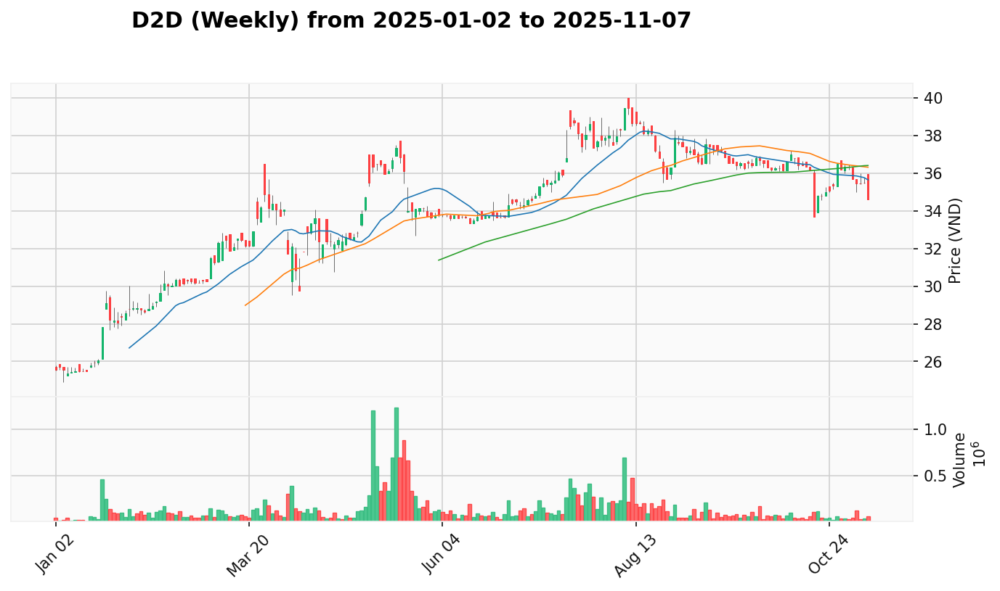

<a href="#bat-dong-san-kcn">↑ Back to group BAT_DONG_SAN_KCN</a>  |  <a href="#vpa-signal-summary">↑ Back to Top</a>

#### Key Statistics
| Metric | Value |
|:---|---:|
| Date Range | 2025-01-02 to 2025-11-14 |
| **Latest Close** | **36.0** |
| Period Open | 25.72 |
| Period High | 40.0 |
| Period Low | 24.9 |
| Period Change % | 39.97% |

**[Download D2D Data (.csv)](market_data_week/D2D_2025-01-02_to_2025-11-14.csv)**

---

### DAH

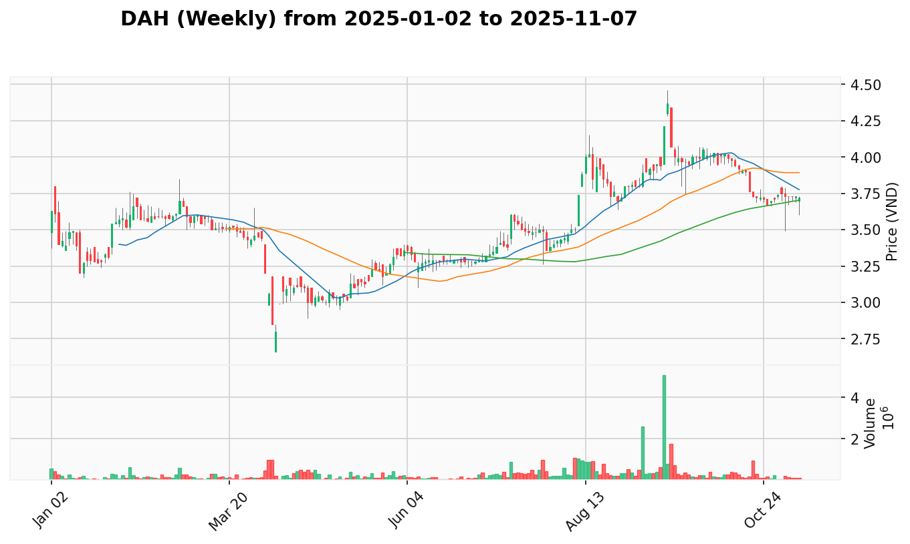

<a href="#penny">↑ Back to group PENNY</a>  |  <a href="#vpa-signal-summary">↑ Back to Top</a>

#### Key Statistics
| Metric | Value |
|:---|---:|
| Date Range | 2025-01-02 to 2025-11-14 |
| **Latest Close** | **3.71** |
| Period Open | 3.48 |
| Period High | 4.46 |
| Period Low | 2.66 |
| Period Change % | 6.61% |

**[Download DAH Data (.csv)](market_data_week/DAH_2025-01-02_to_2025-11-14.csv)**

---

### DBC

#### [VPA Analysis (2025-06-02 - 2025-08-03)](./VPA_week.md#dbc)
> - **Ngày 2025-07-07:** Sau tuần tăng giá bùng nổ có dấu hiệu của một Cao trào mua, DBC đã có một tuần đảo chiều giảm giá. Cổ phiếu mở cửa tăng nhưng sau đó bị bán tháo, tạo thành một nến giảm có bóng trên dài và đóng cửa (33.7) thấp. Khối lượng giao dịch duy trì ở mức rất cao.
>     - **Phân tích VPA/Wyckoff:** Đây là một cú **Upthrust** và là một **Sign of Weakness**. Sự xuất hiện của áp lực bán mạnh ở vùng đỉnh xác nhận khả năng bắt đầu một giai đoạn phân phối hoặc điều chỉnh.
> - **Ngày 2025-07-14:** Tiếp nối tín hiệu Upthrust yếu kém của tuần trước, DBC tiếp tục đi ngang với nến doji có biên độ hẹp, đóng cửa (33.7) không đổi so với tuần trước. Biên độ giao dịch từ 33.3 đến 34.85 cho thấy sự do dự. Khối lượng giao dịch giảm xuống 48.581.456 cp.
>     - **Phân tích VPA/Wyckoff:** Đây là một phiên **No Demand** sau tín hiệu yếu. Việc giá đi ngang với khối lượng giảm cho thấy cả phe mua và phe bán đều đang do dự. Thị trường cần một xúc tác rõ ràng để xác định hướng đi tiếp theo sau giai đoạn điều chỉnh.
> - **Ngày 2025-07-21:** DBC phá vỡ khỏi giai đoạn đi ngang với nến tăng mạnh, đóng cửa (35.85) cao hơn đáng kể so với tuần trước và tạo mức cao mới. Khối lượng giao dịch bùng nổ lên 75.9 triệu cổ phiếu, cao nhất từ trước đến nay.
>     - **Phân tích VPA/Wyckoff:** Đây là một **Sign of Strength** mạnh mẽ sau giai đoạn No Demand. Việc giá phá vỡ ngưỡng kháng cự trên nền khối lượng đột biến cho thấy lực cầu đã quay trở lại một cách quyết liệt và xu hướng tăng được tái lập.
> **Ngày 2025-07-27:** DBC tiếp tục xu hướng tăng mạnh mẽ với nến tăng thân dài, đóng cửa (35.85) tạo mức cao mới và phá vỡ hoàn toàn khỏi vùng kháng cự 34.6-35.4. Biên độ giao dịch rộng từ 32.25 đến 36.45 cho thấy sự tranh chấp quyết liệt giữa hai phe, nhưng cuối cùng phe mua đã giành chiến thắng áp đảo. Khối lượng giao dịch bùng nổ lên mức kỷ lục 75.859.600 cổ phiếu, tăng 56% so với tuần trước, xác nhận sự trở lại mạnh mẽ của dòng tiền sau giai đoạn đi ngang.
> 
> **Phân tích VPA/Wyckoff:** Đây là một **Sign of Strength** cực mạnh sau giai đoạn tích lũy ngắn hạn. Việc giá phá vỡ quyết liệt ngưỡng kháng cự trên nền khối lượng kỷ lục cho thấy một **Breakout** thành công. Tuy nhiên, cần theo dõi các phiên tiếp theo để xác nhận tính bền vững của đợt bứt phá này và đề phòng rủi ro **Climax** khi khối lượng đạt mức cực đại.
> **Ngày 2025-08-03:** DBC có một tuần giảm giá mạnh sau đợt bứt phá kỷ lục của tuần trước. Mở cửa cao tại 31.39 nhưng bị bán tháo xuống vùng 28.7 trước khi phục hồi nhẹ, đóng cửa tại 29.74. Nến giảm có biên độ rộng với bóng dưới dài từ 28.7 đến 29.74, cho thấy lực cầu đã xuất hiện để hỗ trợ ở vùng thấp. Khối lượng giao dịch 68.15 triệu cổ phiếu, giảm 10% so với tuần trước nhưng vẫn duy trì ở mức cao, cho thấy sự quan tâm lớn của nhà đầu tư trong giai đoạn điều chỉnh này.

<a href="#nong-nghiep">↑ Back to group NONG_NGHIEP</a>  |  <a href="#vpa-signal-summary">↑ Back to Top</a>

#### Key Statistics
| Metric | Value |
|:---|---:|
| Date Range | 2025-01-02 to 2025-11-14 |
| **Latest Close** | **26.15** |
| Period Open | 24.44 |
| Period High | 32.35 |
| Period Low | 19.09 |
| Period Change % | 7.00% |

**[Download DBC Data (.csv)](market_data_week/DBC_2025-01-02_to_2025-11-14.csv)**

---

### DCL

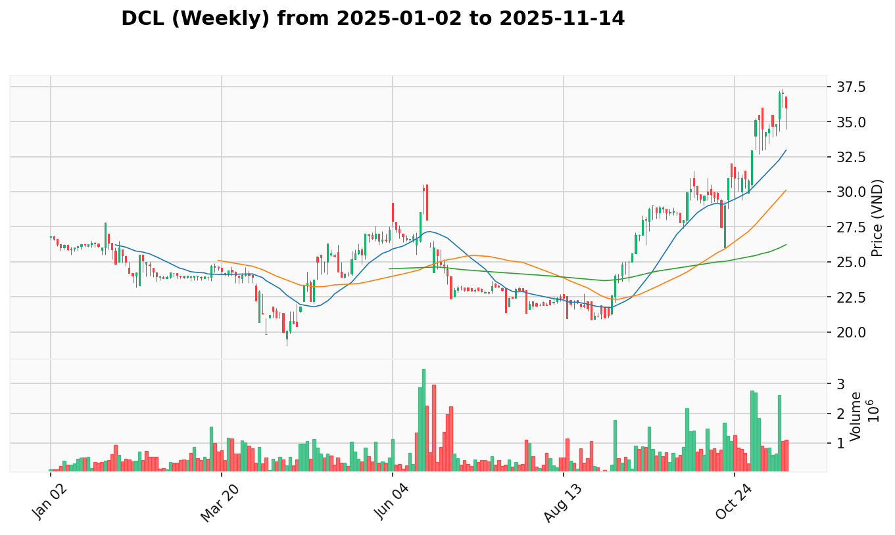

<a href="#suc-khoe">↑ Back to group SUC_KHOE</a>  |  <a href="#vpa-signal-summary">↑ Back to Top</a>

#### Key Statistics
| Metric | Value |
|:---|---:|
| Date Range | 2025-01-02 to 2025-11-14 |
| **Latest Close** | **36.0** |
| Period Open | 26.75 |
| Period High | 37.35 |
| Period Low | 19.0 |
| Period Change % | 34.58% |

**[Download DCL Data (.csv)](market_data_week/DCL_2025-01-02_to_2025-11-14.csv)**

---

### DCM

#### [VPA Analysis (2025-06-02 - 2025-08-03)](./VPA_week.md#dcm)
> - **Ngày 2025-07-07:** Sau phiên No Demand của tuần trước, DCM tiếp tục tăng giá với một nến tăng thân dài, đóng cửa (33.8) gần mức cao. Khối lượng giao dịch tăng vọt.
>     - **Phân tích VPA/Wyckoff:** Đây là một **Sign of Strength**, cho thấy lực cầu đã quay trở lại một cách quyết liệt, phủ nhận tín hiệu yếu của các tuần trước.
> - **Ngày 2025-07-14:** Tiếp nối Dấu hiệu Sức mạnh của tuần trước, DCM có một tuần đi ngang với nến doji có biên độ hẹp, đóng cửa (33.8) không đổi so với tuần trước. Biên độ giao dịch từ 33.5 đến 34.8 cho thấy sự ổn định. Khối lượng giao dịch giảm xuống 21.948.488 cp.
>     - **Phân tích VPA/Wyckoff:** Đây là một phiên **No Supply** sau Dấu hiệu Sức mạnh. Việc giá giữ vững ở mức cao với khối lượng giảm là một tín hiệu tích cực, cho thấy áp lực bán yếu và thị trường đang hấp thụ tốt, chuẩn bị cho đợt tăng tiếp theo.
> - **Ngày 2025-07-21:** Sau phiên No Supply thành công, DCM có một tuần tăng giá mạnh với nến tăng thân dài, đóng cửa (35.6) cao hơn đáng kể so với tuần trước và tạo mức cao mới. Khối lượng giao dịch bùng nổ lên 35.6 triệu cổ phiếu.
>     - **Phân tích VPA/Wyckoff:** Đây là một **Sign of Strength** mạnh mẽ sau phiên No Supply. Việc giá phá vỡ và tạo đỉnh mới trên nền khối lượng tăng vọt cho thấy lực cầu đã trở lại quyết liệt và xu hướng tăng được củng cố mạnh mẽ.
> **Ngày 2025-07-27:** Sau phiên Sign of Strength mạnh mẽ của tuần trước, DCM tiếp tục bùng nổ với một tuần tăng giá ấn tượng. Cổ phiếu mở cửa tại 33.95 và đóng cửa tại 35.6, tăng 5.33% so với tuần trước. Đặc biệt, giá đã chạm mức cao nhất trong tuần tại 36.2, tạo ra đỉnh mới và phá vỡ hoàn toàn vùng kháng cự trước đó. Khối lượng giao dịch tiếp tục duy trì ở mức rất cao với 35.6 triệu cổ phiếu, tương đương với tuần trước, cho thấy sự tham gia tích cực của dòng tiền.
> 
> **Phân tích VPA/Wyckoff:** Đây là một **Sign of Strength** liên tiếp thứ hai với đặc điểm nổi bật là việc tạo đỉnh mới trên nền khối lượng duy trì cao. Sự kết hợp giữa giá phá vỡ kháng cự, tạo mức cao mới và khối lượng ổn định ở mức cao cho thấy xu hướng tăng đang được củng cố mạnh mẽ. Tuy nhiên, cần theo dõi sát diễn biến tuần tới để xác định liệu đây có phải là climax hay chỉ là bước đầu của đợt tăng giá mới.
> **Ngày 2025-08-03:**
> Tiếp nối đà tăng mạnh mẽ của hai tuần trước, DCM có một tuần kết thúc tương đối trung tính. Cổ phiếu mở cửa tại 36.0 (cao hơn so với đóng cửa tuần trước 35.6) và đạt mức cao nhất trong tuần tại 37.9, tiếp tục tạo đỉnh mới. Tuy nhiên, giá sau đó bị điều chỉnh xuống mức thấp 35.05 trước khi đóng cửa tại 35.75, chỉ tăng nhẹ 0.4% so với tuần trước. Khối lượng giao dịch tăng nhẹ lên 37.3 triệu cổ phiếu, duy trì ở mức cao và cho thấy sự quan tâm tiếp tục của nhà đầu tư. Biên độ dao động rộng từ 35.05 đến 37.9 (8.1%) phản ánh sự phân hóa quan điểm trong thị trường.

<a href="#hoa-chat">↑ Back to group HOA_CHAT</a>  |  <a href="#vpa-signal-summary">↑ Back to Top</a>

#### Key Statistics
| Metric | Value |
|:---|---:|
| Date Range | 2025-01-02 to 2025-11-14 |
| **Latest Close** | **34.4** |
| Period Open | 33.62 |
| Period High | 43.85 |
| Period Low | 23.38 |
| Period Change % | 2.32% |

**[Download DCM Data (.csv)](market_data_week/DCM_2025-01-02_to_2025-11-14.csv)**

---

### DDV

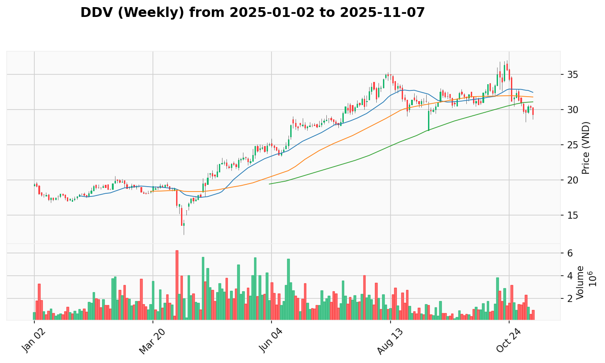

<a href="#hoa-chat">↑ Back to group HOA_CHAT</a>  |  <a href="#vpa-signal-summary">↑ Back to Top</a>

#### Key Statistics
| Metric | Value |
|:---|---:|
| Date Range | 2025-01-02 to 2025-11-14 |
| **Latest Close** | **29.5** |
| Period Open | 19.17 |
| Period High | 37.0 |
| Period Low | 12.2 |
| Period Change % | 53.89% |

**[Download DDV Data (.csv)](market_data_week/DDV_2025-01-02_to_2025-11-14.csv)**

---

### DGC

#### [VPA Analysis (2025-06-02 - 2025-08-03)](./VPA_week.md#dgc)
> - **Ngày 2025-07-07:** Tiếp nối Dấu hiệu Sức mạnh của tuần trước, DGC tiếp tục tăng giá với một nến tăng, đóng cửa (103.7) ở mức cao. Khối lượng giao dịch tăng nhẹ, xác nhận cho đà tăng.
>     - **Phân tích VPA/Wyckoff:** Đây là một **Sign of Strength**, cho thấy lực cầu vẫn đang chiếm ưu thế và xu hướng tăng được củng cố.
> - **Ngày 2025-07-14:** Sau chuỗi Dấu hiệu Sức mạnh liên tiếp, DGC quay đầu điều chỉnh với nến giảm có biên độ hẹp, đóng cửa (102.6) thấp hơn tuần trước. Biên độ giao dịch từ 101.5 đến 106.2 cho thấy sự biến động. Khối lượng giao dịch giảm xuống 11.532.183 cp.
>     - **Phân tích VPA/Wyckoff:** Đây là một phiên **Test for Supply** sau đợt tăng mạnh. Việc giá điều chỉnh nhẹ với khối lượng giảm là một tín hiệu tích cực, cho thấy áp lực bán không mạnh và thị trường đang hấp thụ tốt sau giai đoạn tăng trước đó.
> - **Ngày 2025-07-21:** Sau phiên Test for Supply thành công, DGC phục hồi với nến tăng biên độ rộng, đóng cửa (105.2) cao hơn tuần trước và tạo mức cao mới. Khối lượng giao dịch tăng trở lại mức cao.
>     - **Phân tích VPA/Wyckoff:** Đây là một **Sign of Strength** sau phiên kiểm tra thành công. Việc giá vượt qua mức đỉnh cũ trên nền khối lượng tăng cho thấy lực cầu đã khẳng định sức mạnh và xu hướng tăng được tái lập.
> **Ngày 2025-07-27:** Sau phiên Sign of Strength tuần trước, DGC tiếp tục xu hướng tăng với nến tăng thân dài, đóng cửa (105.2) tạo mức cao mới và cao hơn tuần trước. Biên độ giao dịch từ 101.7 đến 106.5 cho thấy sự vượt lên mạnh mẽ. Khối lượng giao dịch tăng lên 12.942.200 cổ phiếu, cao hơn tuần trước và xác nhận cho đà tăng.
> 
> **Phân tích VPA/Wyckoff:** Đây là một **Sign of Strength** tiếp theo, xác nhận xu hướng tăng đang được duy trì một cách bền vững. Việc giá phá vỡ mức đỉnh cũ và tạo mức cao mới trên nền khối lượng tăng cho thấy lực cầu vẫn đang chiếm ưu thế tuyệt đối. Cổ phiếu đang trong giai đoạn Mark Up mạnh mẽ của chu kỳ Wyckoff.
> **Ngày 2025-08-03:** Sau chuỗi Sign of Strength liên tiếp, DGC đảo chiều mạnh mẽ với nến giảm có biên độ cực rộng, đóng cửa (101.6) thấp hơn đáng kể so với tuần trước và gần mức thấp nhất tuần. Biên độ giao dịch từ 101.0 đến 107.6 cho thấy sự biến động dữ dội với việc test mức cao 107.6 nhưng không thể duy trì. Khối lượng giao dịch tăng mạnh lên 14.167.700 cổ phiếu, cao nhất trong 8 tuần qua, cho thấy áp lực bán đã xuất hiện mạnh mẽ.

<a href="#hoa-chat">↑ Back to group HOA_CHAT</a>  |  <a href="#vpa-signal-summary">↑ Back to Top</a>

#### Key Statistics
| Metric | Value |
|:---|---:|
| Date Range | 2025-01-02 to 2025-11-14 |
| **Latest Close** | **99.4** |
| Period Open | 116.6 |
| Period High | 117.3 |
| Period Low | 73.1 |
| Period Change % | -14.75% |

**[Download DGC Data (.csv)](market_data_week/DGC_2025-01-02_to_2025-11-14.csv)**

---

### DGW

#### [VPA Analysis (2025-06-02 - 2025-08-03)](./VPA_week.md#dgw)
> - **Ngày 2025-07-07:** Tiếp nối Dấu hiệu Yếu kém của tuần trước, DGW tiếp tục tăng giá với một nến tăng có biên độ hẹp. Khối lượng giao dịch giảm.
>     - **Phân tích VPA/Wyckoff:** Đây là một nỗ lực phục hồi yếu ớt trên nền khối lượng thấp, một tín hiệu **No Demand**. Việc giá không thể phục hồi mạnh mẽ sau đợt giảm cho thấy phe mua vẫn còn yếu thế.
> - **Ngày 2025-07-14:** Sau phiên No Demand của tuần trước, DGW bứt phá mạnh mẽ với nến tăng thân dài, đóng cửa (46.6) gần mức cao nhất tuần. Biên độ giao dịch từ 43.2 đến 47.0 cho thấy sự bùng nổ. Khối lượng giao dịch tăng vọt lên 18.701.350 cp.
>     - **Phân tích VPA/Wyckoff:** Đây là một **Sign of Strength** mạnh mẽ, phủ nhận hoàn toàn tín hiệu yếu trước đó. Lực cầu đã quay trở lại một cách quyết liệt, có thể báo hiệu sự khởi đầu của một đợt tăng giá mới.
> - **Ngày 2025-07-21:** Tiếp nối Sign of Strength của tuần trước, DGW có một tuần dao động mạnh với biên độ rộng từ 45.2 đến 48.5, tuy nhiên đóng cửa (46.45) thấp hơn một chút so với tuần trước. Nến tuần có bóng trên dài và thân ngắn. Khối lượng giao dịch giảm xuống 14.930.140 cp.
>     - **Phân tích VPA/Wyckoff:** Đây là một **Test for Supply** sau Sign of Strength tuần trước. Việc giá dao động mạnh nhưng không thể duy trì ở mức cao với khối lượng giảm cho thấy có áp lực bán tại vùng giá cao. Tuy nhiên, việc giá vẫn giữ được gần mức đóng cửa tuần trước cho thấy đây vẫn là tín hiệu tích cực trong xu hướng tăng.
> **Ngày 2025-07-27:** Sau tuần Test for Supply trước đó, DGW có một tuần tích cực với nến tăng có thân trung bình, mở cửa (47.5) cao hơn đóng cửa tuần trước và đóng cửa (46.45) duy trì gần mức cao. Biên độ giao dịch từ 45.2 đến 48.5 cho thấy áp lực mua vẫn có mặt. Tuy nhiên, khối lượng giao dịch giảm xuống 14.909.600 cp, thấp hơn so với tuần trước. Giá vẫn duy trì trên vùng 46, cho thấy sự ổn định sau giai đoạn kiểm tra cung.
> - **Phân tích VPA/Wyckoff:** Đây là một **No Supply** tích cực sau Test for Supply tuần trước. Việc giá duy trì được mức cao trên nền khối lượng giảm cho thấy áp lực bán đã được hấp thụ tốt và không có cung lớn xuất hiện ở vùng giá này. Tín hiệu này củng cố cho xu hướng tăng trung hạn và có thể là tiền đề cho một đợt tăng giá tiếp theo khi có xúc tác phù hợp.
> **Ngày 2025-08-03:** Sau tuần No Supply tích cực trước đó, DGW đã có một tuần giảm giá mạnh với nến giảm có thân dài và biên độ rộng từ 42.0 đến 47.5. Mở cửa (46.3) thấp hơn đóng cửa tuần trước và đóng cửa (43.4) gần mức thấp nhất tuần. Khối lượng giao dịch tăng lên 17.961.600 cp, cao hơn so với tuần trước (14.909.600 cp). Việc giá phá vỡ support quanh vùng 45-46 và test xuống vùng 42.0 cho thấy áp lực bán đã quay trở lại mạnh mẽ.

<a href="#ban-le">↑ Back to group BAN_LE</a>  |  <a href="#vpa-signal-summary">↑ Back to Top</a>

#### Key Statistics
| Metric | Value |
|:---|---:|
| Date Range | 2025-01-02 to 2025-11-14 |
| **Latest Close** | **39.95** |
| Period Open | 39.84 |
| Period High | 49.5 |
| Period Low | 28.32 |
| Period Change % | 0.28% |

**[Download DGW Data (.csv)](market_data_week/DGW_2025-01-02_to_2025-11-14.csv)**

---

### DHA

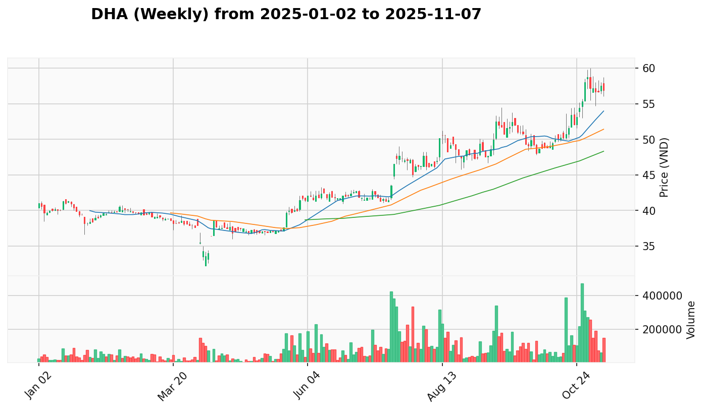

<a href="#vlxd">↑ Back to group VLXD</a>  |  <a href="#vpa-signal-summary">↑ Back to Top</a>

#### Key Statistics
| Metric | Value |
|:---|---:|
| Date Range | 2025-01-02 to 2025-11-14 |
| **Latest Close** | **57.8** |
| Period Open | 40.38 |
| Period High | 60.3 |
| Period Low | 32.23 |
| Period Change % | 43.14% |

**[Download DHA Data (.csv)](market_data_week/DHA_2025-01-02_to_2025-11-14.csv)**

---

### DHC

<a href="#others">↑ Back to group OTHERS</a>  |  <a href="#vpa-signal-summary">↑ Back to Top</a>

#### Key Statistics
| Metric | Value |
|:---|---:|
| Date Range | 2025-01-02 to 2025-11-14 |
| **Latest Close** | **33.8** |
| Period Open | 29.65 |
| Period High | 36.86 |
| Period Low | 19.31 |
| Period Change % | 14.00% |

**[Download DHC Data (.csv)](market_data_week/DHC_2025-01-02_to_2025-11-14.csv)**

---

### DHG

#### [VPA Analysis (2025-06-02 - 2025-08-03)](./VPA_week.md#dhg)
> - **Ngày 2025-07-07:** Tiếp nối Dấu hiệu Sức mạnh của tuần trước, DHG có một tuần đi ngang với một nến giảm biên độ hẹp. Khối lượng giao dịch giảm mạnh.
>     - **Phân tích VPA/Wyckoff:** Đây là một phiên **No Supply**. Việc giá giữ vững trên nền khối lượng thấp sau một đợt tăng là một tín hiệu rất No Supply, cho thấy thị trường đang hấp thụ tốt và có thể sớm tăng trở lại.
> - **Ngày 2025-07-14:** Sau phiên No Supply của tuần trước, DHG tiếp tục tăng giá với nến tăng biên độ hẹp, đóng cửa (101.3) cao hơn tuần trước. Biên độ giao dịch từ 100.1 đến 102.5 cho thấy sự ổn định. Khối lượng giao dịch giảm xuống 79.418 cp.
>     - **Phân tích VPA/Wyckoff:** Đây là một tín hiệu **No Supply** tiếp diễn. Việc giá có thể tăng nhẹ trên nền khối lượng rất thấp xác nhận áp lực bán đã cạn kiệt và thị trường đang trong trạng thái cân bằng tích cực, sẵn sàng cho đợt tăng tiếp theo.
> - **Ngày 2025-07-21:** Tiếp nối tín hiệu No Supply của tuần trước, DHG có một tuần tăng giá mạnh mẽ với nến tăng thân dài, tăng từ 101.3 lên 103.0 (+1.7%) và đạt mức cao 104.0. Biên độ giao dịch từ 101.0 đến 104.0 cho thấy sự bứt phá. Khối lượng giao dịch tăng lên 102.004 cp.
>     - **Phân tích VPA/Wyckoff:** Đây là một **Sign of Strength** rõ ràng. Sau giai đoạn No Supply kéo dài, DHG đã bứt phá lên mức giá mới với khối lượng tăng, xác nhận lực cầu đã quay trở lại mạnh mẽ và xu hướng tăng được thiết lập.
> **Ngày 2025-07-27:** Tiếp nối Sign of Strength của tuần trước, DHG có một tuần tăng giá tiếp tục với nến tăng thân dài, tăng từ 101.3 lên 103.0 (+1.7%) và đạt mức cao 104.0. Biên độ giao dịch từ 101.0 đến 104.0 cho thấy sự bứt phá mạnh mẽ. Khối lượng giao dịch duy trì ở mức 101.6 nghìn cổ phiếu, tương đương với tuần trước.
> - **Phân tích VPA/Wyckoff:** Đây là một **Sign of Strength** tiếp diễn. Việc giá tiếp tục tăng mạnh và duy trì được khối lượng tốt sau đợt bứt phá tuần trước xác nhận xu hướng tăng đã được thiết lập vững chắc. DHG đang trong giai đoạn Mark Up với lực cầu áp đảo, tạo cơ sở cho đợt tăng dài hạn.
> **Ngày 2025-08-03:** Sau chuỗi Sign of Strength của hai tuần liên tiếp, DHG có một tuần điều chỉnh với nến giảm biên độ rộng, giảm từ 103.0 xuống 101.7 (-1.3%) và test xuống mức thấp 100.8 trước khi phục hồi. Biên độ giao dịch từ 100.8 đến 103.7 cho thấy sự dao động mạnh trong tuần. Khối lượng giao dịch tăng lên 115.8 nghìn cổ phiếu, tăng 14% so với tuần trước.

<a href="#suc-khoe">↑ Back to group SUC_KHOE</a>  |  <a href="#vpa-signal-summary">↑ Back to Top</a>

#### Key Statistics
| Metric | Value |
|:---|---:|
| Date Range | 2025-01-02 to 2025-11-14 |
| **Latest Close** | **103.7** |
| Period Open | 97.96 |
| Period High | 110.0 |
| Period Low | 82.1 |
| Period Change % | 5.86% |

**[Download DHG Data (.csv)](market_data_week/DHG_2025-01-02_to_2025-11-14.csv)**

---

### DHT

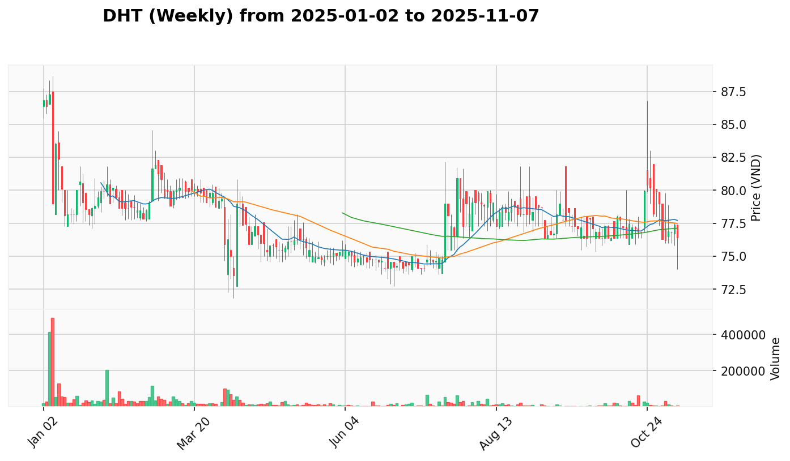

<a href="#suc-khoe">↑ Back to group SUC_KHOE</a>  |  <a href="#vpa-signal-summary">↑ Back to Top</a>

#### Key Statistics
| Metric | Value |
|:---|---:|
| Date Range | 2025-01-02 to 2025-11-14 |
| **Latest Close** | **75.0** |
| Period Open | 86.36 |
| Period High | 88.64 |
| Period Low | 71.82 |
| Period Change % | -13.15% |

**[Download DHT Data (.csv)](market_data_week/DHT_2025-01-02_to_2025-11-14.csv)**

---

### DIG

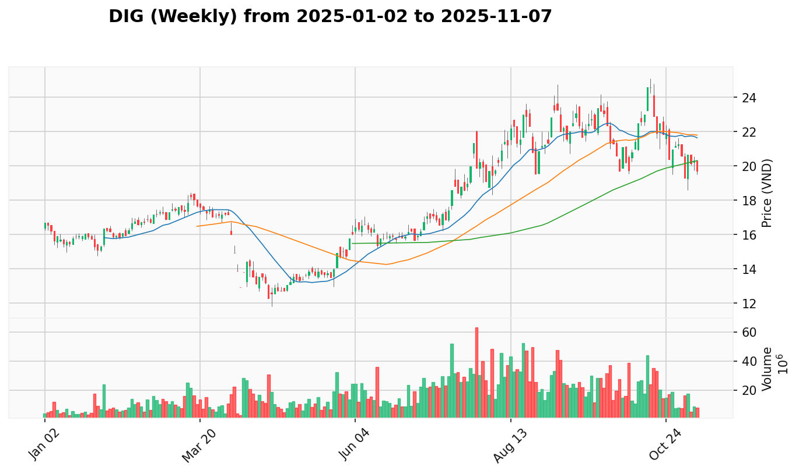

<a href="#bat-dong-san">↑ Back to group BAT_DONG_SAN</a>  |  <a href="#vpa-signal-summary">↑ Back to Top</a>

#### Key Statistics
| Metric | Value |
|:---|---:|
| Date Range | 2025-01-02 to 2025-11-14 |
| **Latest Close** | **20.45** |
| Period Open | 16.38 |
| Period High | 25.1 |
| Period Low | 11.8 |
| Period Change % | 24.85% |

**[Download DIG Data (.csv)](market_data_week/DIG_2025-01-02_to_2025-11-14.csv)**

---

### DL1

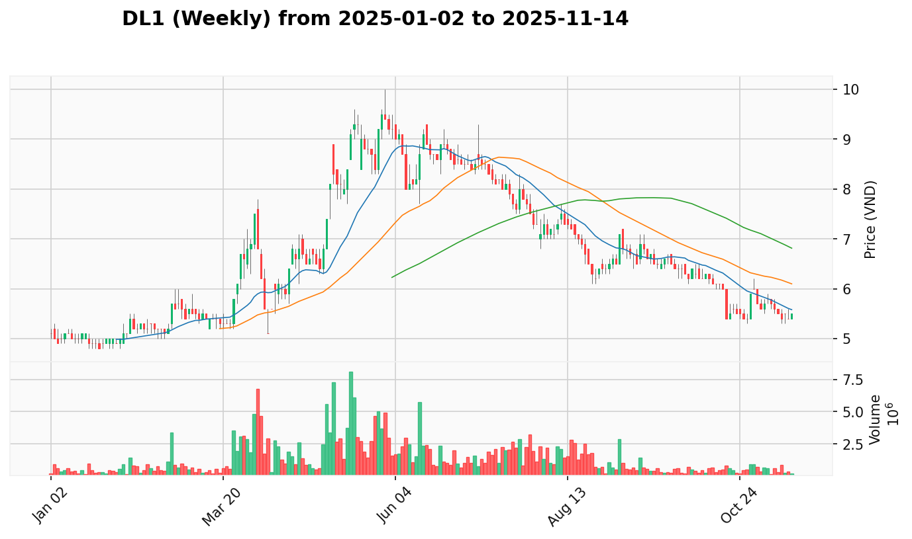

<a href="#penny">↑ Back to group PENNY</a>  |  <a href="#vpa-signal-summary">↑ Back to Top</a>

#### Key Statistics
| Metric | Value |
|:---|---:|
| Date Range | 2025-01-02 to 2025-11-14 |
| **Latest Close** | **5.5** |
| Period Open | 5.1 |
| Period High | 10.0 |
| Period Low | 4.8 |
| Period Change % | 7.84% |

**[Download DL1 Data (.csv)](market_data_week/DL1_2025-01-02_to_2025-11-14.csv)**

---

### DPG

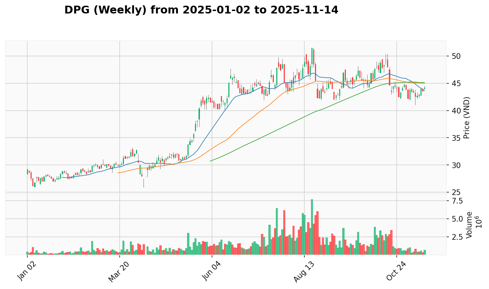

<a href="#xay-dung">↑ Back to group XAY_DUNG</a>  |  <a href="#vpa-signal-summary">↑ Back to Top</a>

#### Key Statistics
| Metric | Value |
|:---|---:|
| Date Range | 2025-01-02 to 2025-11-14 |
| **Latest Close** | **44.2** |
| Period Open | 28.32 |
| Period High | 51.5 |
| Period Low | 25.98 |
| Period Change % | 56.07% |

**[Download DPG Data (.csv)](market_data_week/DPG_2025-01-02_to_2025-11-14.csv)**

---

### DPM

#### [VPA Analysis (2025-06-02 - 2025-08-03)](./VPA_week.md#dpm)
> - **Ngày 2025-07-07:** Tiếp nối nỗ lực phục hồi yếu ớt của tuần trước, DPM có một tuần tăng giá nhẹ với biên độ hẹp, đóng cửa (37.16) cao hơn. Khối lượng giao dịch duy trì ở mức cao.
>     - **Phân tích VPA/Wyckoff:** Đây là một nỗ lực tăng giá (**Effort to Rise**), cho thấy lực cầu vẫn đang cố gắng duy trì. Tuy nhiên, biên độ hẹp cho thấy đà tăng đang chững lại và gặp kháng cự.
> - **Ngày 2025-07-14:** Tiếp nối Effort to Rise của tuần trước, DPM bứt phá mạnh mẽ với nến tăng thân dài, đóng cửa (38.35) gần mức cao nhất tuần. Biên độ giao dịch từ 37.11 đến 38.95 cho thấy sự mạnh mẽ. Khối lượng giao dịch tăng lên 25.785.760 cp.
>     - **Phân tích VPA/Wyckoff:** Đây là một **Sign of Strength** rõ ràng, cho thấy lực cầu đã vượt qua kháng cự và đang kiểm soát thị trường. Việc giá và khối lượng cùng tăng mạnh xác nhận xu hướng tăng đang được củng cố.
> - **Ngày 2025-07-21:** Tiếp nối Sign of Strength của tuần trước, DPM có một tuần bùng nổ mạnh mẽ với nến tăng thân dài, tăng vọt từ 38.35 lên 41.3 (+7.7%) và đạt mức cao 42.4. Biên độ giao dịch từ 38.75 đến 42.4 cho thấy sự tăng tốc. Khối lượng giao dịch tăng vụt lên 30.793.580 cp.
>     - **Phân tích VPA/Wyckoff:** Đây là một **Buying Climax** rõ ràng. Sau Sign of Strength tuần trước, DPM đã có một cuộc bùng nổ mạnh mẽ với khối lượng khổng lồ để đạt đỉnh mới. Tuy nhiên, sự tăng tốc này trên nền khối lượng cực lớn có thể báo hiệu sự kiệt quệ cầu và rủi ro điều chỉnh đang gia tăng.
> **Ngày 2025-07-27:** Sau Buying Climax của tuần trước, DPM tiếp tục bùng nổ mạnh mẽ hơn nữa với nến tăng thân dài, tăng vọt từ 38.35 lên 41.3 (+7.7%) và chạm đỉnh 42.4. Biên độ giao dịch từ 38.75 đến 42.4 cho thảy momentum tăng tốc đang ở mức cực đại. Khối lượng giao dịch tiếp tục tăng vọt lên 30.796.485 cổ phiếu, đạt mức cao nhất trong 10 tuần gần đây.
> - **Phân tích VPA/Wyckoff:** Đây là một **Selling Climax** - sau Buying Climax tuần trước, DPM đã có thêm một tuần bùng nổ với khối lượng khủng để đạt đỉnh tuyệt đối. Tuy nhiên, sự tăng tốc liên tiếp trên nền khối lượng cực lớn này thường báo hiệu sự kiệt quệ hoàn toàn của lực cầu và khả năng cao sẽ có một đợt điều chỉnh mạnh sắp tới. Đây là dấu hiệu cảnh báo cho các nhà đầu tư cần thận trọng.
> **Ngày 2025-08-03:** Sau Selling Climax của tuần trước, DPM có một tuần dao động mạnh với nến tăng nhẹ, mở cửa 24.03 và đóng cửa 23.85 (-0.75%). Mặc dù giảm nhẹ so với tuần trước, cổ phiếu vẫn duy trì được vùng giá cao với biên độ dao động rộng từ 22.79 đến 24.43. Khối lượng giao dịch tiếp tục tăng lên 33.060.126 cổ phiếu, cao hơn tuần trước và đạt mức kỷ lục trong chuỗi dữ liệu 31 tuần.

<a href="#hoa-chat">↑ Back to group HOA_CHAT</a>  |  <a href="#vpa-signal-summary">↑ Back to Top</a>

#### Key Statistics
| Metric | Value |
|:---|---:|
| Date Range | 2025-01-02 to 2025-11-14 |
| **Latest Close** | **23.85** |
| Period Open | 19.42 |
| Period High | 29.9 |
| Period Low | 15.19 |
| Period Change % | 22.81% |

**[Download DPM Data (.csv)](market_data_week/DPM_2025-01-02_to_2025-11-14.csv)**

---

### DPR

#### [VPA Analysis (2025-06-02 - 2025-08-03)](./VPA_week.md#dpr)
> - **Ngày 2025-07-07:** Sau tuần giảm giá, DPR có một tuần phục hồi với một nến tăng có biên độ vừa phải, đóng cửa (40.15) cao hơn. Khối lượng giao dịch giảm.
>     - **Phân tích VPA/Wyckoff:** Việc giá có thể phục hồi trên nền khối lượng thấp là một tín hiệu **No Supply**. Điều này cho thấy áp lực bán đã suy yếu, là một tín hiệu No Supply cho xu hướng tăng.
> - **Ngày 2025-07-14:** Sau phiên No Supply của tuần trước, DPR tiếp tục tăng giá với nến tăng biên độ hẹp, đóng cửa (40.9) cao hơn tuần trước. Biên độ giao dịch từ 39.65 đến 41.4 cho thấy sự ổn định. Khối lượng giao dịch tăng lên 5.025.012 cp.
>     - **Phân tích VPA/Wyckoff:** Đây là một **Effort to Rise**. Việc giá tiếp tục tăng với khối lượng tăng nhẹ cho thấy lực cầu đang dần mạnh lên, tuy nhiên đà tăng vẫn chậm rãi và cần thêm động lực để bứt phá mạnh mẽ hơn.
> - **Ngày 2025-07-21:** Tiếp nối Effort to Rise của tuần trước, DPR có một tuần tăng giá với nến tăng biên độ vừa phải, tăng từ 40.9 lên 41.6 (+1.7%) và đạt mức cao 43.4. Biên độ giao dịch từ 41.05 đến 43.4 cho thấy có sự cố gắng bứt phá. Khối lượng giao dịch tăng lên 6.720.566 cp.
>     - **Phân tích VPA/Wyckoff:** Đây là một **Sign of Strength** nhẹ. Việc giá có thể vượt qua mức kháng cự với khối lượng tăng cho thấy lực cầu đang dần kiểm soát, tuy nhiên sự bứt phá vẫn chưa thật sự mạnh mẽ và cần thêm xác nhận trong những tuần tới.
> **Ngày 2025-07-27:** Tuần này DPR tiếp tục xu hướng tăng giá mạnh mẽ, tăng từ 40.9 lên 41.6 (+1.7%) và đạt mức cao 43.4. Biên độ giao dịch từ 41.05 đến 43.4 cho thấy cổ phiếu đã có những nỗ lực bứt phá khỏi vùng tích lũy 40-41. Đáng chú ý, DPR đã tạo ra mức cao mới trong chu kỳ tăng giá hiện tại. Khối lượng giao dịch duy trì ở mức cao 6.738.700 cổ phiếu, tương đương với tuần trước, cho thấy sự quan tâm của nhà đầu tư vẫn được duy trì. Việc giá đóng cửa gần mức cao của tuần (41.6 so với mức cao 43.4) cho thấy có sự chốt lời nhẹ trong phiên, nhưng không ảnh hưởng đến xu hướng tăng tổng thể.
> 
> **Phân tích VPA/Wyckoff:** Đây là một **Sign of Strength** rõ ràng. Việc giá liên tục tạo mức cao mới với khối lượng duy trì ở mức cao cho thấy lực cầu đang kiểm soát thị trường. Cổ phiếu đã bứt phá khỏi vùng kháng cự 41-42 và hướng tới vùng giá mới. Xu hướng tăng giá đang được xác nhận mạnh mẽ qua 3 tuần liên tiếp có tín hiệu tích cực.
> **Ngày 2025-08-03:** Sau tuần Sign of Strength trước đó, DPR đã có một tuần điều chỉnh mạnh, giảm từ 41.6 xuống 39.65 (-4.7%) với biên độ dao động rộng từ 38.9 đến 42.4. Điều đáng chú ý là cổ phiếu đã test lại vùng cao 42.4 (gần mức đỉnh 43.4 của tuần trước) nhưng không thể duy trì và bị đẩy xuống mạnh về 39.65, thậm chí test xuống mức thấp 38.9. Khối lượng giao dịch duy trì ở mức cao 6.658.800 cổ phiếu, tương đương tuần trước, cho thấy có áp lực bán mạnh khi giá test vùng cao. Việc đóng cửa ở 39.65, thấp hơn vùng tích lũy 40-41 trước đó, cho thấy cổ phiếu đang trong giai đoạn test lại các vùng hỗ trợ quan trọng.

<a href="#cao-su">↑ Back to group CAO_SU</a>  |  <a href="#vpa-signal-summary">↑ Back to Top</a>

#### Key Statistics
| Metric | Value |
|:---|---:|
| Date Range | 2025-01-02 to 2025-11-14 |
| **Latest Close** | **38.0** |
| Period Open | 37.04 |
| Period High | 50.56 |
| Period Low | 32.32 |
| Period Change % | 2.59% |

**[Download DPR Data (.csv)](market_data_week/DPR_2025-01-02_to_2025-11-14.csv)**

---

### DRC

#### [VPA Analysis (2025-06-02 - 2025-08-03)](./VPA_week.md#drc)
> - **Ngày 2025-06-23:** DRC có một tuần tăng giá No Supply, tạo thành một nến tăng mạnh mẽ và đóng cửa gần mức cao nhất tuần. Khối lượng giao dịch tăng gần gấp đôi so với tuần trước.
>     - **Phân tích VPA/Wyckoff:** Đây là một **Effort to Rise** hay một **Sign of Strength**, cho thấy phe mua đang trở nên quyết liệt hơn sau một thời gian tích lũy. Cổ phiếu có thể đang hướng tới việc kiểm tra lại vùng kháng cự cao hơn.
> - **Ngày 2025-07-07:** Tiếp nối Dấu hiệu Sức mạnh của tuần trước, DRC tiếp tục tăng giá với một nến tăng có biên độ vừa phải, đóng cửa (16.73) cao hơn. Khối lượng giao dịch duy trì ở mức cao.
>     - **Phân tích VPA/Wyckoff:** Đây là một **Effort to Rise**, cho thấy lực cầu vẫn đang duy trì tốt. Xu hướng tăng ngắn hạn được củng cố.
> - **Ngày 2025-07-14:** Tiếp nối Effort to Rise của tuần trước, DRC bứt phá mạnh mẽ với nến tăng thân dài, đóng cửa (17.42) gần mức cao nhất tuần. Biên độ giao dịch từ 16.69 đến 17.73 cho thấy sự tăng tốc. Khối lượng giao dịch tăng lên 5.875.952 cp.
>     - **Phân tích VPA/Wyckoff:** Đây là một **Sign of Strength** rõ ràng, cho thấy lực cầu đã tăng tốc và đang kiểm soát hoàn toàn thị trường. Việc giá và khối lượng cùng tăng mạnh xác nhận xu hướng tăng đang được củng cố vững chắc.
> **Ngày 2025-07-27:** Tiếp nối Sign of Strength của tuần trước, DRC duy trì đà tăng với nến tăng có thân vừa phải, đóng cửa (17.75) cao hơn tuần trước và gần mức cao nhất tuần (18.0). Giá mở cửa tại 17.46, cao hơn đáng kể so với mức đóng cửa tuần trước (17.42), cho thấy lực cầu mạnh ngay từ đầu phiên. Khối lượng giao dịch tiếp tục tăng lên 6.045.488 cp, cao hơn tuần trước và duy trì ở mức cao trong 3 tuần liên tiếp.
> 
> - **Phân tích VPA/Wyckoff:** Đây là một **Sign of Strength** được củng cố, cho thấy lực cầu vẫn đang kiểm soát và xu hướng tăng đang được duy trì vững chắc. Việc giá liên tục tạo đỉnh mới cùng với khối lượng duy trì ở mức cao xác nhận sự có mặt của tiền thông minh. Cổ phiếu đang trong giai đoạn Mark Up rõ ràng sau quá trình tích lũy thành công.
> **Ngày 2025-08-03:** Sau chuỗi Sign of Strength liên tiếp, DRC có tuần điều chỉnh với nến giảm có thân dài, giá giảm từ 17.75 xuống 16.95. Mở cửa tại 17.65, cổ phiếu test lên mức cao 17.9 (gần bằng đỉnh tuần trước 18.0) nhưng bị đẩy xuống thấp 16.7 trước khi đóng cửa tại 16.95. Khối lượng giao dịch giảm xuống 4.810.417 cp, thấp hơn đáng kể so với 6.045.488 cp của tuần trước, kết thúc chuỗi 3 tuần có khối lượng cao liên tiếp.

<a href="#cao-su">↑ Back to group CAO_SU</a>  |  <a href="#vpa-signal-summary">↑ Back to Top</a>

#### Key Statistics
| Metric | Value |
|:---|---:|
| Date Range | 2025-01-02 to 2025-11-14 |
| **Latest Close** | **15.7** |
| Period Open | 21.3 |
| Period High | 22.12 |
| Period Low | 13.23 |
| Period Change % | -26.29% |

**[Download DRC Data (.csv)](market_data_week/DRC_2025-01-02_to_2025-11-14.csv)**

---

### DRG

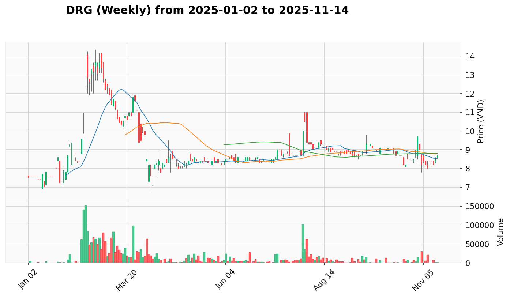

<a href="#cao-su">↑ Back to group CAO_SU</a>  |  <a href="#vpa-signal-summary">↑ Back to Top</a>

#### Key Statistics
| Metric | Value |
|:---|---:|
| Date Range | 2025-01-02 to 2025-11-14 |
| **Latest Close** | **8.7** |
| Period Open | 7.62 |
| Period High | 14.36 |
| Period Low | 6.7 |
| Period Change % | 14.17% |

**[Download DRG Data (.csv)](market_data_week/DRG_2025-01-02_to_2025-11-14.csv)**

---

### DRI

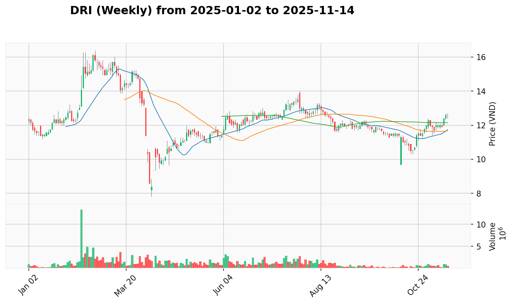

<a href="#cao-su">↑ Back to group CAO_SU</a>  |  <a href="#vpa-signal-summary">↑ Back to Top</a>

#### Key Statistics
| Metric | Value |
|:---|---:|
| Date Range | 2025-01-02 to 2025-11-14 |
| **Latest Close** | **12.6** |
| Period Open | 12.25 |
| Period High | 16.39 |
| Period Low | 7.81 |
| Period Change % | 2.86% |

**[Download DRI Data (.csv)](market_data_week/DRI_2025-01-02_to_2025-11-14.csv)**

---

### DSC

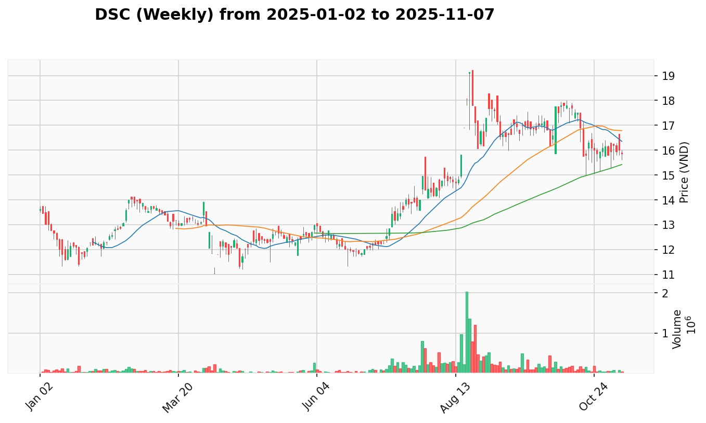

<a href="#chung-khoan">↑ Back to group CHUNG_KHOAN</a>  |  <a href="#vpa-signal-summary">↑ Back to Top</a>

#### Key Statistics
| Metric | Value |
|:---|---:|
| Date Range | 2025-01-02 to 2025-11-14 |
| **Latest Close** | **15.6** |
| Period Open | 13.59 |
| Period High | 19.22 |
| Period Low | 11.04 |
| Period Change % | 14.79% |

**[Download DSC Data (.csv)](market_data_week/DSC_2025-01-02_to_2025-11-14.csv)**

---

### DSN

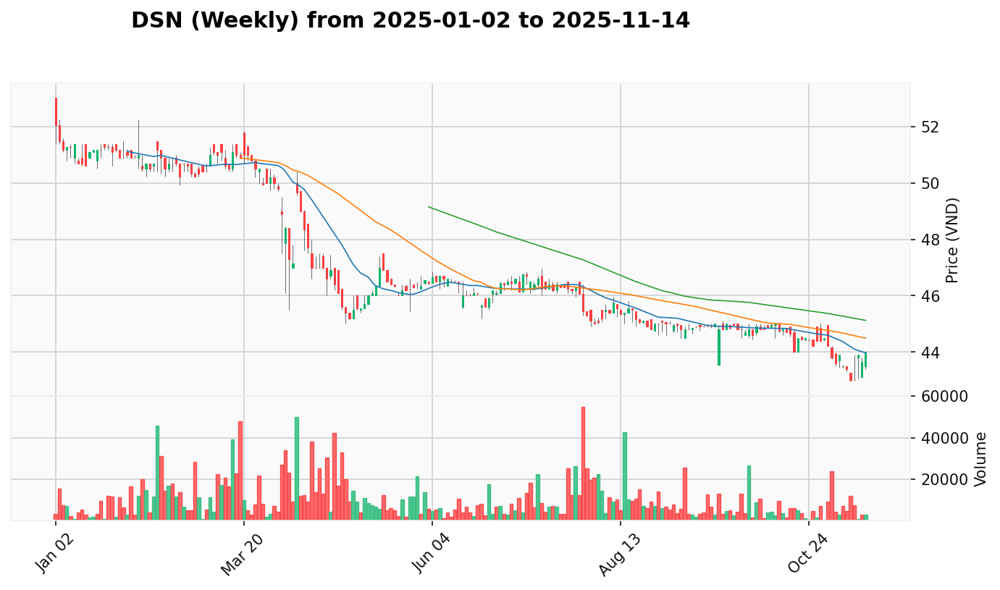

<a href="#others">↑ Back to group OTHERS</a>  |  <a href="#vpa-signal-summary">↑ Back to Top</a>

#### Key Statistics
| Metric | Value |
|:---|---:|
| Date Range | 2025-01-02 to 2025-11-14 |
| **Latest Close** | **44.0** |
| Period Open | 53.03 |
| Period High | 53.03 |
| Period Low | 42.95 |
| Period Change % | -17.03% |

**[Download DSN Data (.csv)](market_data_week/DSN_2025-01-02_to_2025-11-14.csv)**

---

### DST

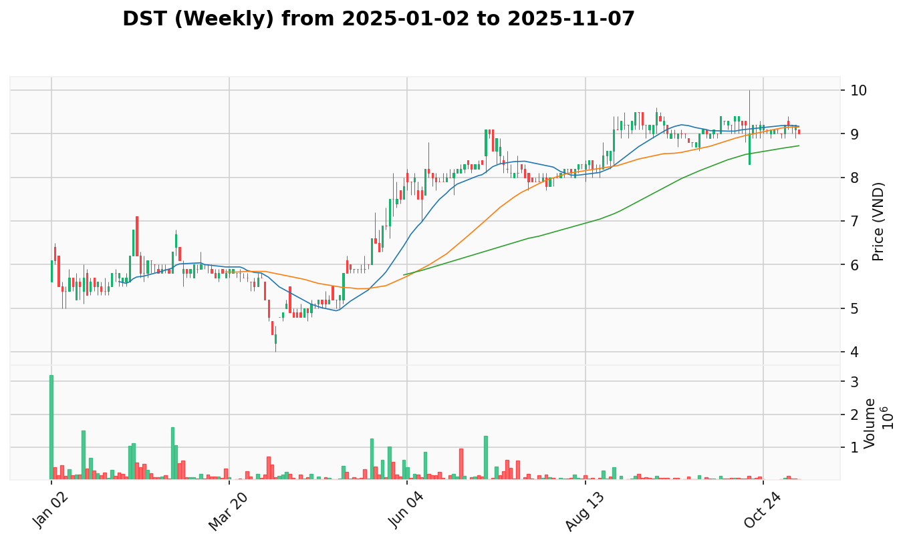

<a href="#penny">↑ Back to group PENNY</a>  |  <a href="#vpa-signal-summary">↑ Back to Top</a>

#### Key Statistics
| Metric | Value |
|:---|---:|
| Date Range | 2025-01-02 to 2025-11-14 |
| **Latest Close** | **9.0** |
| Period Open | 5.6 |
| Period High | 10.0 |
| Period Low | 4.0 |
| Period Change % | 60.71% |

**[Download DST Data (.csv)](market_data_week/DST_2025-01-02_to_2025-11-14.csv)**

---

### DTD

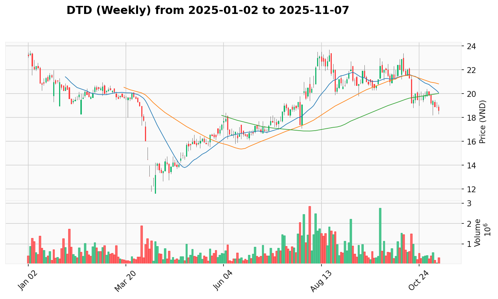

<a href="#bat-dong-san-kcn">↑ Back to group BAT_DONG_SAN_KCN</a>  |  <a href="#vpa-signal-summary">↑ Back to Top</a>

#### Key Statistics
| Metric | Value |
|:---|---:|
| Date Range | 2025-01-02 to 2025-11-14 |
| **Latest Close** | **18.5** |
| Period Open | 23.28 |
| Period High | 23.7 |
| Period Low | 11.64 |
| Period Change % | -20.53% |

**[Download DTD Data (.csv)](market_data_week/DTD_2025-01-02_to_2025-11-14.csv)**

---

### DVN

#### [VPA Analysis (2025-06-02 - 2025-08-03)](./VPA_week.md#dvn)
> - **Ngày 2025-07-07:** Sau phiên kiểm tra No Supply thành công của tuần trước, DVN có một tuần giảm giá nhẹ với biên độ hẹp. Khối lượng giao dịch tăng.
>     - **Phân tích VPA/Wyckoff:** Đây là một phiên **Test for Supply**. Việc giá giảm nhẹ trên khối lượng tăng cho thấy áp lực bán vẫn còn hiện hữu, làm suy yếu tín hiệu No Supply trước đó.
> - **Ngày 2025-07-14:** Tiếp nối tín hiệu Test for Supply của tuần trước, DVN tiếp tục đi ngang với nến doji có biên độ hẹp, đóng cửa (23.2) không đổi so với tuần trước. Biên độ giao dịch từ 22.8 đến 23.6 cho thấy sự giằng co. Khối lượng giao dịch tăng lên 371.753 cp.
>     - **Phân tích VPA/Wyckoff:** Đây là một phiên **No Demand**. Việc giá đi ngang với khối lượng tăng cho thấy thị trường đang thiếu hướng đi rõ ràng. Cần một xúc tác mạnh để phá vỡ trạng thái cân bằng này.
> - **Ngày 2025-07-21:** Tiếp nối No Demand của tuần trước, DVN có một tuần giảm giá nhẹ với nến giảm biên độ hẹp, giảm từ 23.3 xuống 23.0 (-1.3%). Biên độ giao dịch từ 22.7 đến 23.5 cho thấy sự dao động nhẹ. Khối lượng giao dịch tăng lên 512.489 cp.
>     - **Phân tích VPA/Wyckoff:** Đây là một **Test for Supply** sau giai đoạn đi ngang. Việc giá giảm nhẹ trên nền khối lượng tăng cho thấy vẫn còn một số áp lực bán, nhưng không quá mạnh. Cần quan sát thêm để xác định hướng đi tiếp theo của cổ phiếu.
> **Ngày 2025-07-27:** DVN tiếp tục xu hướng giảm nhẹ từ tuần trước, giảm từ 23.3 xuống 23.0 (-1.3%). Nến giảm có biên độ hẹp với thân nến nhỏ, giao dịch trong khoảng 22.7-23.5. Khối lượng giao dịch tăng mạnh lên 512.200 cổ phiếu, cao hơn đáng kể so với tuần trước (372.500). Mức giá 23.0 đang kiểm tra lại vùng hỗ trợ quan trọng đã xuất hiện vào đầu tháng 6.
> 
> **Phân tích VPA/Wyckoff:** Đây là một **Test for Supply** tiếp theo sau giai đoạn Test for Supply của tuần trước. Việc giá giảm nhẹ nhưng khối lượng tăng mạnh (+37.4%) cho thấy áp lực bán vẫn còn hiện diện tại vùng giá này. Tuy nhiên, mức độ giảm giá khá hạn chế so với khối lượng tăng, điều này có thể báo hiệu việc cung cấp đang được hấp thụ. Cần quan sát phản ứng tại vùng hỗ trợ 23.0 để xác định khả năng đảo chiều hoặc tiếp tục điều chỉnh.
> **Ngày 2025-08-03:**
> DVN tiếp tục xu hướng giảm nhẹ từ tuần trước, giảm từ 23.0 xuống 22.9 (-0.4%). Nến giảm có biên độ hẹp với thân nến rất nhỏ, giao dịch trong khoảng 22.3-23.3. Khối lượng giao dịch tăng tiếp lên 565.600 cổ phiếu, cao hơn 10.4% so với tuần trước (512.200). Mức giá 22.9 đã phá vỡ nhẹ vùng hỗ trợ 23.0 và test xuống vùng 22.3 trước khi phục hồi. Đây là lần thứ ba liên tiếp DVN có khối lượng tăng kèm giảm giá nhẹ.

<a href="#suc-khoe">↑ Back to group SUC_KHOE</a>  |  <a href="#vpa-signal-summary">↑ Back to Top</a>

#### Key Statistics
| Metric | Value |
|:---|---:|
| Date Range | 2025-01-02 to 2025-11-14 |
| **Latest Close** | **20.6** |
| Period Open | 24.0 |
| Period High | 29.35 |
| Period Low | 16.83 |
| Period Change % | -14.17% |

**[Download DVN Data (.csv)](market_data_week/DVN_2025-01-02_to_2025-11-14.csv)**

---

### DVP

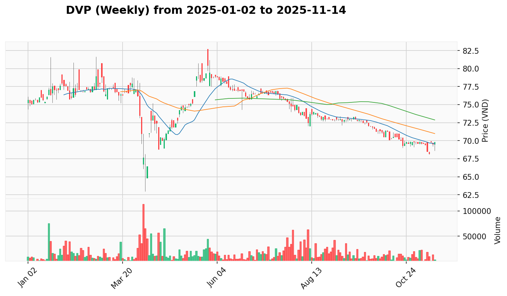

<a href="#van-tai">↑ Back to group VAN_TAI</a>  |  <a href="#vpa-signal-summary">↑ Back to Top</a>

#### Key Statistics
| Metric | Value |
|:---|---:|
| Date Range | 2025-01-02 to 2025-11-14 |
| **Latest Close** | **69.8** |
| Period Open | 75.28 |
| Period High | 82.71 |
| Period Low | 62.97 |
| Period Change % | -7.28% |

**[Download DVP Data (.csv)](market_data_week/DVP_2025-01-02_to_2025-11-14.csv)**

---

### DXG

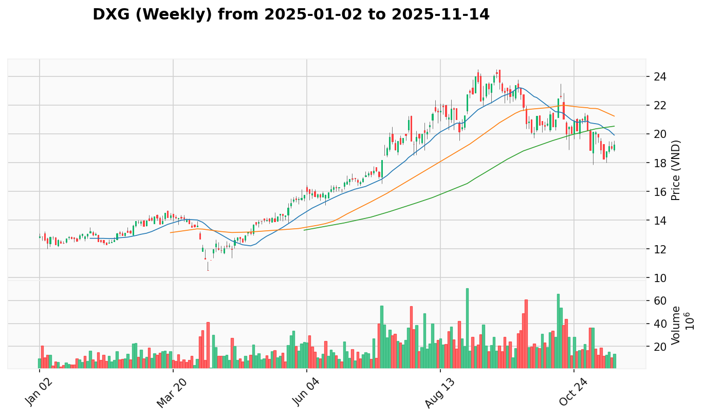

<a href="#bat-dong-san">↑ Back to group BAT_DONG_SAN</a>  |  <a href="#vpa-signal-summary">↑ Back to Top</a>

#### Key Statistics
| Metric | Value |
|:---|---:|
| Date Range | 2025-01-02 to 2025-11-14 |
| **Latest Close** | **19.25** |
| Period Open | 12.79 |
| Period High | 24.5 |
| Period Low | 10.51 |
| Period Change % | 50.51% |

**[Download DXG Data (.csv)](market_data_week/DXG_2025-01-02_to_2025-11-14.csv)**

---

### DXP

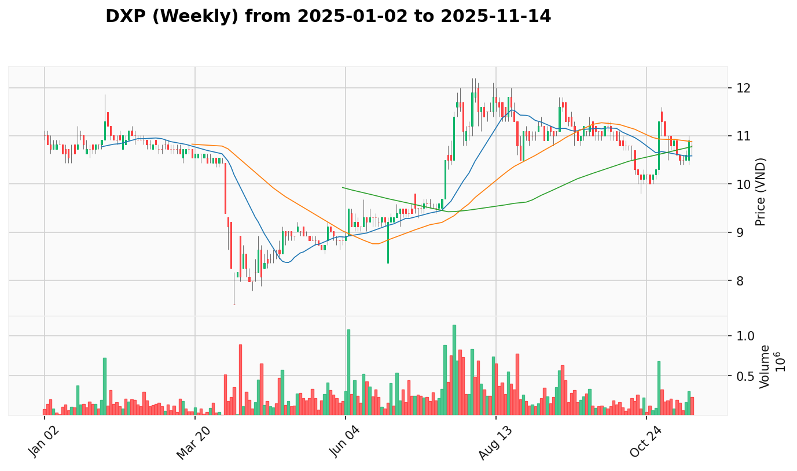

<a href="#van-tai">↑ Back to group VAN_TAI</a>  |  <a href="#vpa-signal-summary">↑ Back to Top</a>

#### Key Statistics
| Metric | Value |
|:---|---:|
| Date Range | 2025-01-02 to 2025-11-14 |
| **Latest Close** | **10.8** |
| Period Open | 11.01 |
| Period High | 12.2 |
| Period Low | 7.5 |
| Period Change % | -1.91% |

**[Download DXP Data (.csv)](market_data_week/DXP_2025-01-02_to_2025-11-14.csv)**

---

### EIB

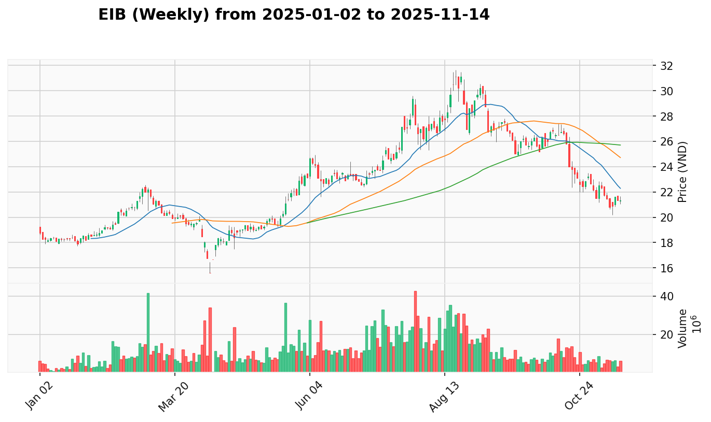

<a href="#ngan-hang">↑ Back to group NGAN_HANG</a>  |  <a href="#vpa-signal-summary">↑ Back to Top</a>

#### Key Statistics
| Metric | Value |
|:---|---:|
| Date Range | 2025-01-02 to 2025-11-14 |
| **Latest Close** | **21.35** |
| Period Open | 19.25 |
| Period High | 31.65 |
| Period Low | 15.6 |
| Period Change % | 10.91% |

**[Download EIB Data (.csv)](market_data_week/EIB_2025-01-02_to_2025-11-14.csv)**

---

### ELC

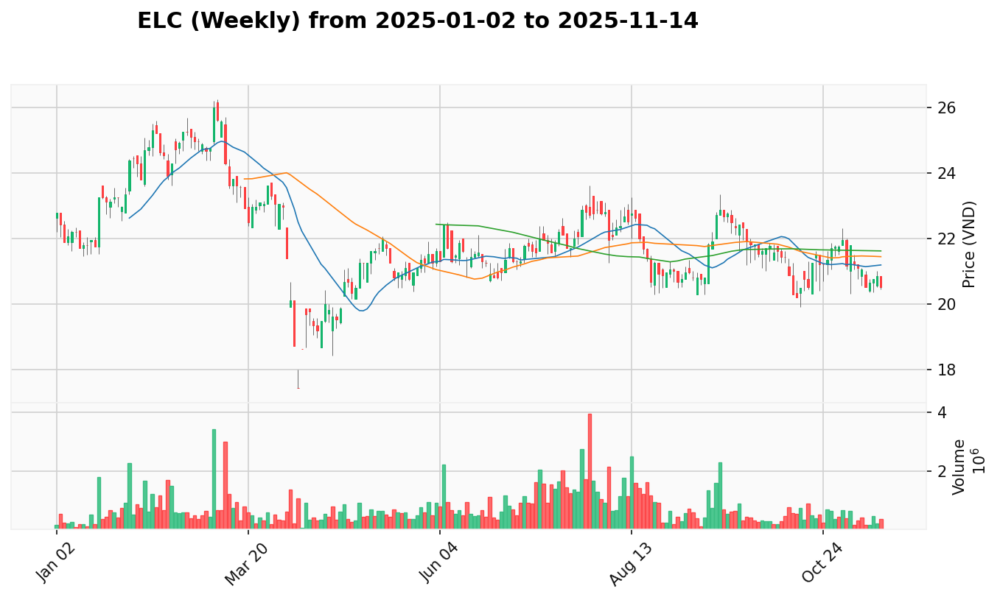

<a href="#cong-nghe">↑ Back to group CONG_NGHE</a>  |  <a href="#vpa-signal-summary">↑ Back to Top</a>

#### Key Statistics
| Metric | Value |
|:---|---:|
| Date Range | 2025-01-02 to 2025-11-14 |
| **Latest Close** | **20.5** |
| Period Open | 22.62 |
| Period High | 26.24 |
| Period Low | 17.43 |
| Period Change % | -9.37% |

**[Download ELC Data (.csv)](market_data_week/ELC_2025-01-02_to_2025-11-14.csv)**

---

### EVE

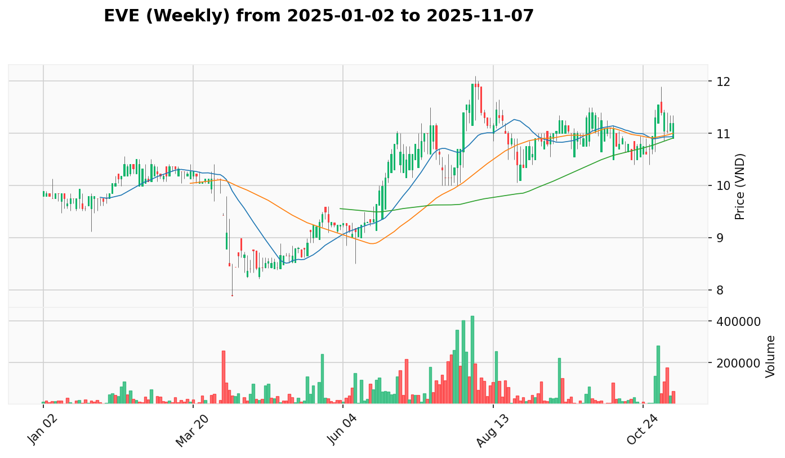

<a href="#det-may">↑ Back to group DET_MAY</a>  |  <a href="#vpa-signal-summary">↑ Back to Top</a>

#### Key Statistics
| Metric | Value |
|:---|---:|
| Date Range | 2025-01-02 to 2025-11-14 |
| **Latest Close** | **11.35** |
| Period Open | 9.8 |
| Period High | 12.1 |
| Period Low | 7.88 |
| Period Change % | 15.82% |

**[Download EVE Data (.csv)](market_data_week/EVE_2025-01-02_to_2025-11-14.csv)**

---

### EVF

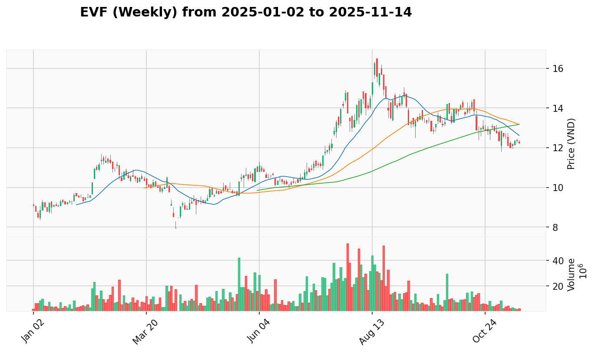

<a href="#chung-khoan">↑ Back to group CHUNG_KHOAN</a>  |  <a href="#vpa-signal-summary">↑ Back to Top</a>

#### Key Statistics
| Metric | Value |
|:---|---:|
| Date Range | 2025-01-02 to 2025-11-14 |
| **Latest Close** | **12.25** |
| Period Open | 9.12 |
| Period High | 16.5 |
| Period Low | 7.94 |
| Period Change % | 34.32% |

**[Download EVF Data (.csv)](market_data_week/EVF_2025-01-02_to_2025-11-14.csv)**

---

### EVG

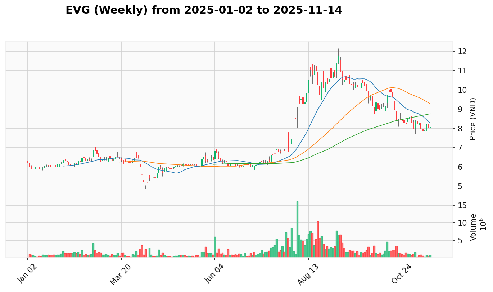

<a href="#penny">↑ Back to group PENNY</a>  |  <a href="#vpa-signal-summary">↑ Back to Top</a>

#### Key Statistics
| Metric | Value |
|:---|---:|
| Date Range | 2025-01-02 to 2025-11-14 |
| **Latest Close** | **8.06** |
| Period Open | 6.3 |
| Period High | 12.15 |
| Period Low | 4.86 |
| Period Change % | 27.94% |

**[Download EVG Data (.csv)](market_data_week/EVG_2025-01-02_to_2025-11-14.csv)**

---

### EVS

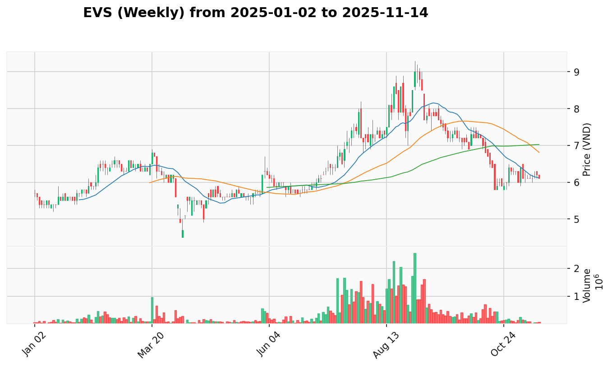

<a href="#chung-khoan">↑ Back to group CHUNG_KHOAN</a>  |  <a href="#vpa-signal-summary">↑ Back to Top</a>

#### Key Statistics
| Metric | Value |
|:---|---:|
| Date Range | 2025-01-02 to 2025-11-14 |
| **Latest Close** | **6.1** |
| Period Open | 5.7 |
| Period High | 9.3 |
| Period Low | 4.5 |
| Period Change % | 7.02% |

**[Download EVS Data (.csv)](market_data_week/EVS_2025-01-02_to_2025-11-14.csv)**

---

### FCN

<a href="#dau-tu-cong">↑ Back to group DAU_TU_CONG</a>  |  <a href="#vpa-signal-summary">↑ Back to Top</a>

#### Key Statistics
| Metric | Value |
|:---|---:|
| Date Range | 2025-01-02 to 2025-11-14 |
| **Latest Close** | **15.15** |
| Period Open | 14.45 |
| Period High | 20.6 |
| Period Low | 11.05 |
| Period Change % | 4.84% |

**[Download FCN Data (.csv)](market_data_week/FCN_2025-01-02_to_2025-11-14.csv)**

---

### FID

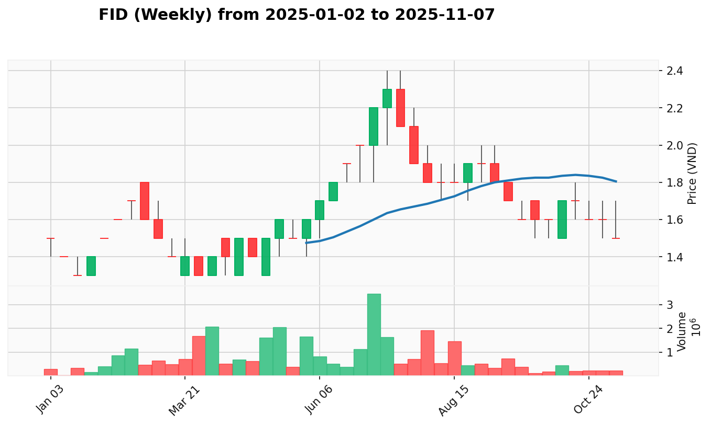

<a href="#xay-dung">↑ Back to group XAY_DUNG</a>  |  <a href="#vpa-signal-summary">↑ Back to Top</a>

#### Key Statistics
| Metric | Value |
|:---|---:|
| Date Range | 2025-01-03 to 2025-11-14 |
| **Latest Close** | **1.5** |
| Period Open | 1.5 |
| Period High | 2.4 |
| Period Low | 1.3 |
| Period Change % | 0.00% |

**[Download FID Data (.csv)](market_data_week/FID_2025-01-02_to_2025-11-14.csv)**

---

### FIT

#### [VPA Analysis (2025-06-02 - 2025-08-03)](./VPA_week.md#fit)
> - **Ngày 2025-07-07:** Sau phiên kiểm tra cung của tuần trước, FIT có một tuần tăng giá mạnh mẽ với một nến tăng thân dài, đóng cửa (4.59) gần mức cao nhất tuần. Khối lượng giao dịch tăng vọt.
>     - **Phân tích VPA/Wyckoff:** Đây là một **Sign of Strength**, cho thấy lực cầu đã quay trở lại một cách quyết liệt, báo hiệu khả năng kết thúc đợt điều chỉnh.
> - **Ngày 2025-07-14:** Tiếp nối Dấu hiệu Sức mạnh của tuần trước, FIT bùng nổ với nến tăng thân dài, đóng cửa (4.82) gần mức cao nhất tuần. Biên độ giao dịch từ 4.56 đến 5.22 cho thấy sự tăng tốc mạnh mẽ. Khối lượng giao dịch tăng vọt lên 15.744.757 cp.
>     - **Phân tích VPA/Wyckoff:** Đây là một **Sign of Strength** liên tiếp, cho thấy lực cầu đang rất mạnh mẽ và quyết liệt. Tuy nhiên, sự tăng tốc với khối lượng cực lớn có thể là dấu hiệu của một **Climax**, cần thận trọng về khả năng điều chỉnh.
> - **Ngày 2025-07-21:** FIT tiếp tục xu hướng tăng mạnh với nến tăng thân dài, đóng cửa (5.24) cao hơn đáng kể so với tuần trước. Biên độ giao dịch từ 4.76 đến 5.5 cho thấy sự mở rộng tích cực. Khối lượng giao dịch tăng tiếp lên 18.051.199 cp, cao hơn tuần trước.
>     - **Phân tích VPA/Wyckoff:** Đây là một **Sign of Strength** tiếp theo sau hai tuần tăng mạnh liên tiếp. Tuy nhiên, với khối lượng liên tục ở mức cực cao và giá tăng nhanh, đây có thể là dấu hiệu của **Climactic Action**. Cần theo dõi các tuần tiếp theo để xác định liệu đây có phải là đỉnh tạm thời hay không.
> **Ngày 2025-07-27:** FIT tiếp tục chuỗi tăng mạnh với tuần thứ 3 liên tiếp, đóng cửa (5.24) cao hơn đáng kể so với tuần trước (4.82). Biên độ giao dịch từ 4.76 đến 5.5 cho thấy sự mở rộng tích cực. Khối lượng giao dịch tăng tiếp lên 18.050.800 cổ phiếu, duy trì ở mức cực cao. Giá đã tăng gần 9% trong tuần và tăng hơn 14% trong 2 tuần qua.
> 
> **Phân tích VPA/Wyckoff:** Đây là một **Climactic Action** rõ rệt. Sau 3 tuần tăng mạnh liên tiếp với khối lượng cực lớn, FIT đang thể hiện dấu hiệu của một đợt tăng giá đỉnh điểm. Mức giá 5.5 có thể là vùng kháng cự quan trọng. Cần theo dõi sát tuần tiếp theo để xác định liệu đây có phải là **Buying Climax** hay chỉ là sự tạm dừng trước khi tiếp tục tăng.
> **Ngày 2025-08-03:** Sau ba tuần tăng mạnh liên tiếp, FIT có tuần điều chỉnh với nến giảm nhẹ, đóng cửa (5.2) thấp hơn so với tuần trước (5.24). Mở cửa cao ở 5.32 nhưng bị đẩy xuống mức thấp 4.9 trước khi phục hồi. Khối lượng giao dịch tăng lên 23.108.500 cổ phiếu, cao nhất trong 4 tuần qua. Biên độ dao động rộng từ 4.9 đến 5.45 cho thấy sự phân tán mạnh mẽ.

<a href="#penny">↑ Back to group PENNY</a>  |  <a href="#vpa-signal-summary">↑ Back to Top</a>

#### Key Statistics
| Metric | Value |
|:---|---:|
| Date Range | 2025-01-02 to 2025-11-14 |
| **Latest Close** | **4.64** |
| Period Open | 4.22 |
| Period High | 5.59 |
| Period Low | 3.84 |
| Period Change % | 9.95% |

**[Download FIT Data (.csv)](market_data_week/FIT_2025-01-02_to_2025-11-14.csv)**

---

### FMC

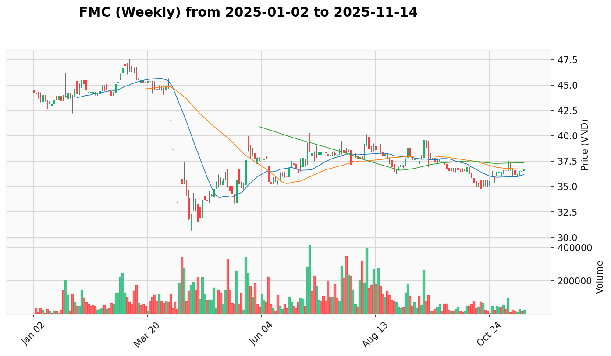

<a href="#thuy-san">↑ Back to group THUY_SAN</a>  |  <a href="#vpa-signal-summary">↑ Back to Top</a>

#### Key Statistics
| Metric | Value |
|:---|---:|
| Date Range | 2025-01-02 to 2025-11-14 |
| **Latest Close** | **36.7** |
| Period Open | 44.53 |
| Period High | 47.56 |
| Period Low | 30.7 |
| Period Change % | -17.58% |

**[Download FMC Data (.csv)](market_data_week/FMC_2025-01-02_to_2025-11-14.csv)**

---

### FOX

#### [VPA Analysis (2025-06-02 - 2025-08-03)](./VPA_week.md#fox)
> - **Ngày 2025-07-07:** Sau phiên kiểm tra No Supply thành công của tuần trước, FOX có một tuần tăng giá nhẹ với biên độ hẹp. Khối lượng giao dịch tăng.
>     - **Phân tích VPA/Wyckoff:** Đây là một **Effort to Rise**. Việc giá tiếp tục tăng cho thấy lực cầu vẫn đang kiểm soát, tuy nhiên biên độ hẹp cho thấy đà tăng đang chững lại.
> - **Ngày 2025-07-14:** FOX có một tuần bùng nổ mạnh mẽ, tăng từ 63.5 lên 76.0 (+19.7%). Nến có biên độ rộng với giá đóng cửa gần mức cao nhất tuần. Khối lượng giao dịch tăng vọt gấp 4 lần tuần trước.
>     - **Phân tích VPA/Wyckoff:** Đây là một **Upthrust After Distribution** hoặc **Buying Climax**. Sau giai đoạn tích lũy và các test No Supply thành công, FOX đã có breakout mạnh mẽ với khối lượng khổng lồ, cho thấy sự quan tâm mạnh mẽ từ các nhà đầu tư tổ chức.
> - **Ngày 2025-07-21:** Sau tuần bùng nổ, FOX có phiên điều chỉnh với nến giảm từ 76.0 xuống 73.0 (-3.9%). Biên độ giao dịch từ 71.6 đến 80.5 cho thấy sự biến động mạnh. Khối lượng giao dịch giảm xuống 1.248.632 cp, thấp hơn đáng kể so với tuần trước.
>     - **Phân tích VPA/Wyckoff:** Đây là một **Test for Supply** sau Buying Climax của tuần trước. Việc giá điều chỉnh trên nền khối lượng giảm là dấu hiệu tích cực, cho thấy áp lực bán không quá lớn. Đây có thể là đợt lấy lại hơi thở tự nhiên sau đợt tăng mạnh, tạo tiền đề cho xu hướng tăng tiếp theo.
> **Ngày 2025-07-27:** FOX tiếp tục điều chỉnh tuần thứ hai liên tiếp, giảm từ 76.0 xuống 73.0 (-3.9%). Biên độ giao dịch rộng từ 71.6 đến 80.5, cho thấy sự phân hóa mạnh trong tuần. Khối lượng giao dịch giảm xuống 1.243.200 cổ phiếu, thấp hơn tuần trước nhưng vẫn cao hơn đáng kể so với giai đoạn trước breakout. Mức giá đóng cửa 73.0 vẫn duy trì trên vùng kháng cự cũ 63-64, cho thấy breakout vẫn còn hiệu lực.
> 
> **Phân tích VPA/Wyckoff:** Đây là **Test for Supply** thành công sau Buying Climax. Việc giá điều chỉnh hai tuần liên tiếp nhưng khối lượng giảm dần cho thấy áp lực bán đang yếu dần. Mức support quan trọng tại vùng 71.6-73.0 đang được kiểm tra. Nếu giá duy trì trên 70.0 với khối lượng tiếp tục giảm, đây sẽ là dấu hiệu **No Supply** tích cực, tạo nền tảng cho đợt tăng tiếp theo hướng tới vùng 80-85.
> **Ngày 2025-08-03:** FOX có tuần điều chỉnh thứ ba liên tiếp, giảm nhẹ từ 73.0 xuống 72.1 (-1.2%). Biên độ giao dịch từ 70.2 đến 75.2 cho thấy sự dao động vẫn còn, nhưng hẹp hơn so với hai tuần trước. Khối lượng giao dịch tiếp tục giảm xuống 1.036.300 cổ phiếu, thấp hơn tuần trước và cho thấy xu hướng giảm dần áp lực bán. Mức giá đóng cửa 72.1 vẫn duy trì vững chắc trên vùng support quan trọng 70.0-71.6 và cao hơn đáng kể so với vùng kháng cự cũ 63-64, khẳng định breakout từ tháng 7 vẫn còn hiệu lực.

<a href="#cong-nghe">↑ Back to group CONG_NGHE</a>  |  <a href="#vpa-signal-summary">↑ Back to Top</a>

#### Key Statistics
| Metric | Value |
|:---|---:|
| Date Range | 2025-01-02 to 2025-11-14 |
| **Latest Close** | **61.0** |
| Period Open | 61.25 |
| Period High | 80.5 |
| Period Low | 47.08 |
| Period Change % | -0.41% |

**[Download FOX Data (.csv)](market_data_week/FOX_2025-01-02_to_2025-11-14.csv)**

---

### FPT

#### [VPA Analysis (2025-06-02 - 2025-08-03)](./VPA_week.md#fpt)
> - **Ngày 2025-07-07:** Tiếp nối Dấu hiệu Sức mạnh của tuần trước, FPT có một tuần bùng nổ với một nến tăng thân dài, đóng cửa (126.6) ở mức cao nhất tuần. Khối lượng giao dịch tăng mạnh, xác nhận cho sức mạnh của đà tăng.
>     - **Phân tích VPA/Wyckoff:** Đây là một **Sign of Strength** rõ ràng, cho thấy lực cầu đang rất quyết liệt và xu hướng tăng được củng cố.
> - **Ngày 2025-07-14:** FPT có một tuần điều chỉnh nhẹ, giảm từ 110.09 xuống 109.57 (-0.5%) với biên độ hẹp. Khối lượng giao dịch giảm đáng kể so với tuần trước.
>     - **Phân tích VPA/Wyckoff:** Đây là một **Test for Supply** hoặc **No Supply**. Sau Sign of Strength tuần trước, việc giá chỉ điều chỉnh nhẹ với khối lượng thấp cho thấy áp lực bán không mạnh, đây là tín hiệu tích cực cho xu hướng tăng tiếp tục.
> - **Ngày 2025-07-21:** FPT tiếp tục xu hướng tăng với nến tăng nhẹ, tăng từ 109.57 lên 110.7 (+1.0%). Biên độ giao dịch từ 108.7 đến 112.8 cho thấy sự dao động vừa phải. Khối lượng giao dịch duy trì ở mức 30.937.674 cp, tương đương tuần trước.
>     - **Phân tích VPA/Wyckoff:** Đây là một **Effort to Rise** sau test thành công của tuần trước. Việc giá tiếp tục tăng với khối lượng ổn định cho thấy lực cầu vẫn đang kiểm soát, tuy nhiên biên độ tăng không lớn cho thấy xu hướng đang trong giai đoạn tích lũy hoặc chuẩn bị cho đợt tăng mạnh tiếp theo.
> **Ngày 2025-07-27:** FPT có một tuần giao dịch tích cực với nến tăng từ 109.57 lên 110.7 (+1.0%). Mở cửa tại 112.4 cao hơn đóng cửa tuần trước, tuy nhiên sau đó điều chỉnh và đóng cửa tại 110.7. Biên độ giao dịch từ 108.7 đến 112.8 cho thấy sự dao động vừa phải. Khối lượng giao dịch giảm nhẹ xuống 30.969.916 cp so với 31.566.353 cp của tuần trước. Điều đáng chú ý là giá vẫn duy trì được xu hướng tăng sau các test thành công trong những tuần gần đây.
> 
> **Phân tích VPA/Wyckoff:** Đây là một **No Supply** sau Effort to Rise của tuần trước. Việc giá tiếp tục tăng nhẹ với khối lượng giảm cho thấy áp lực bán đã giảm đáng kể và phe mua vẫn đang kiểm soát. Mặc dù biên độ tăng không lớn, tín hiệu này rất tích cực vì cho thấy cổ phiếu đang trong giai đoạn tích lũy mạnh và chuẩn bị cho đợt tăng giá tiếp theo.
> **Ngày 2025-08-03:** FPT có một tuần điều chỉnh mạnh với nến giảm từ 110.7 xuống 107.0 (-3.3%). Mở cửa tại 110.8 gần mức đóng cửa tuần trước, tuy nhiên giá đã sụt giảm mạnh với mức thấp chạm 101.5 trước khi hồi phục lên đóng cửa tại 107.0. Biên độ giao dịch rất rộng từ 101.5 đến 111.6 cho thấy sự dao động dữ dội. Khối lượng giao dịch bùng nổ lên 51.166.173 cổ phiếu, tăng 65.2% so với tuần trước (30.969.916 cp), đây là mức khối lượng cao nhất trong nhiều tuần gần đây.

<a href="#cong-nghe">↑ Back to group CONG_NGHE</a>  |  <a href="#vpa-signal-summary">↑ Back to Top</a>

#### Key Statistics
| Metric | Value |
|:---|---:|
| Date Range | 2025-01-02 to 2025-11-14 |
| **Latest Close** | **100.0** |
| Period Open | 131.49 |
| Period High | 134.5 |
| Period Low | 84.32 |
| Period Change % | -23.95% |

**[Download FPT Data (.csv)](market_data_week/FPT_2025-01-02_to_2025-11-14.csv)**

---

### FRT

#### [VPA Analysis (2025-06-02 - 2025-08-03)](./VPA_week.md#frt)
> - **Ngày 2025-07-14:** FRT phục hồi mạnh mẽ sau test tuần trước, tăng từ 146.48 lên 152.3 (+4.0%) với biên độ tăng tốt. Khối lượng giao dịch tăng mạnh, xác nhận cho sức mạnh của đà tăng.
>     - **Phân tích VPA/Wyckoff:** Đây là một **Sign of Strength**. Sau test for supply thành công tuần trước, FRT đã chứng minh được sức mạnh với việc phục hồi nhanh chóng trên nền khối lượng cao, cho thấy lực cầu vẫn đang kiểm soát.
> - **Ngày 2025-07-21:** FRT tiếp tục xu hướng tăng mạnh, tăng từ 152.3 lên 158.0 (+3.7%) với biên độ giao dịch từ 150.9 đến 159.0. Khối lượng giao dịch giảm xuống 2.530.041 cp, thấp hơn tuần trước.
>     - **Phân tích VPA/Wyckoff:** Đây là một **No Supply** trong xu hướng tăng. Việc giá tiếp tục tăng trên nền khối lượng giảm cho thấy không có áp lực bán đáng kể và con đường đi lên đang thông thoáng. Đây là tín hiệu rất tích cực cho xu hướng tăng tiếp tục.
> **Ngày 2025-07-28:** FRT tiếp tục xu hướng tăng mạnh, tăng từ 152.3 lên 158.0 (+3.7%) với biên độ giao dịch từ 150.9 đến 159.0. Khối lượng giao dịch giảm xuống 2.533.320 cp, thấp hơn tuần trước (3.038.231 cp). Giá đóng cửa gần mức cao nhất tuần, cho thấy sức mạnh tiếp tục được duy trì.
> 
> **Phân tích VPA/Wyckoff:** Đây là một **No Supply** rất mạnh trong xu hướng tăng. Việc giá tiếp tục tăng trên nền khối lượng giảm cho thấy không có áp lực bán đáng kể và lực cầu vẫn đang kiểm soát hoàn toàn. Từ mức 130.64 (cuối tháng 5) đến 158.0 hiện tại, FRT đã tăng hơn 20% với các Test for Supply thành công và liên tiếp các Sign of Strength và No Supply, xác nhận xu hướng tăng mạnh mẽ và bền vững.
> **Ngày 2025-07-27:** FRT tiếp tục xu hướng tăng mạnh, tăng từ 152.3 lên 158.0 (+3.7%) với biên độ giao dịch từ 150.9 đến 159.0. Khối lượng giao dịch giảm xuống 2.533.320 cp, thấp hơn tuần trước (3.038.231 cp). Giá đóng cửa gần mức cao nhất tuần, cho thấy sức mạnh tiếp tục được duy trì.
> 
> **Phân tích VPA/Wyckoff:** Đây là một **No Supply** rất mạnh trong xu hướng tăng. Việc giá tiếp tục tăng trên nền khối lượng giảm cho thấy không có áp lực bán đáng kể và lực cầu vẫn đang kiểm soát hoàn toàn. Từ mức 130.64 (cuối tháng 5) đến 158.0 hiện tại, FRT đã tăng hơn 20% với các Test for Supply thành công và liên tiếp các Sign of Strength và No Supply, xác nhận xu hướng tăng mạnh mẽ và bền vững.
> **Ngày 2025-08-03:** FRT có tuần điều chỉnh nhẹ, giảm từ 158.0 xuống 154.5 (-2.2%) với biên độ giao dịch từ 150.3 đến 158.0. Mức mở cửa trùng với giá đóng cửa tuần trước (158.0) nhưng giá không thể duy trì ở vùng cao và test xuống 150.3 trước khi phục hồi. Khối lượng giao dịch tăng lên 3.362.064 cp, cao hơn đáng kể so với tuần trước (2.533.320 cp). Việc giá đóng cửa ở 154.5, cao hơn mức thấp nhất tuần cho thấy vẫn có lực cầu hỗ trợ.

<a href="#ban-le">↑ Back to group BAN_LE</a>  |  <a href="#vpa-signal-summary">↑ Back to Top</a>

#### Key Statistics
| Metric | Value |
|:---|---:|
| Date Range | 2025-01-02 to 2025-11-14 |
| **Latest Close** | **146.0** |
| Period Open | 148.48 |
| Period High | 167.52 |
| Period Low | 96.88 |
| Period Change % | -1.67% |

**[Download FRT Data (.csv)](market_data_week/FRT_2025-01-02_to_2025-11-14.csv)**

---

### FTS

#### [VPA Analysis (2025-06-02 - 2025-08-03)](./VPA_week.md#fts)
> - **Ngày 2025-07-07:** Sau tín hiệu Upthrust yếu kém của tuần trước, FTS có một tuần tăng giá bùng nổ với một nến tăng thân dài, đóng cửa (40.9) ở mức cao nhất tuần. Khối lượng giao dịch tăng vọt.
>     - **Phân tích VPA/Wyckoff:** Đây là một **Sign of Strength**, cho thấy lực cầu đã quay trở lại một cách áp đảo, phủ nhận hoàn toàn tín hiệu yếu của tuần trước.
> - **Ngày 2025-07-14:** FTS tiếp tục xu hướng tăng với một nến tăng nhẹ, từ 40.9 lên 41.1 (+0.5%) với biên độ hẹp. Khối lượng giao dịch duy trì ở mức cao tương đương tuần trước.
>     - **Phân tích VPA/Wyckoff:** Đây là một **Test for Supply** thành công. Sau Sign of Strength tuần trước, việc giá giữ vững và tăng nhẹ trên nền khối lượng cao cho thấy không có áp lực bán đáng kể, củng cố cho xu hướng tăng.
> - **Ngày 2025-07-21:** FTS tiếp tục tăng từ 41.1 lên 41.8 (+1.7%) với biên độ giao dịch từ 39.65 đến 42.4 cho thấy sự dao động tích cực. Khối lượng giao dịch duy trì ở mức cao 37.172.265 cp, tương đương với hai tuần trước.
>     - **Phân tích VPA/Wyckoff:** Đây là một **Effort to Rise** tiếp theo sau test thành công của tuần trước. Việc giá tiếp tục tăng với khối lượng duy trì ở mức cao cho thấy lực mua vẫn đang tích cực và xu hướng tăng được củng cố. Sự ổn định của khối lượng cao trong nhiều tuần liên tiếp là dấu hiệu của sự quan tâm lớn từ các nhà đầu tư.
> **Ngày 2025-07-27:** FTS có một tuần tăng nhẹ từ 41.1 lên 41.8 (+1.7%) với biên độ dao động từ 39.65 đến 42.4. Mặc dù có lúc test xuống vùng 39.65 nhưng cổ phiếu đã phục hồi mạnh và đóng cửa gần mức cao. Khối lượng giao dịch tiếp tục duy trì ở mức cao 37.131.400 cổ phiếu, tương đương với hai tuần trước, cho thấy sự quan tâm liên tục của thị trường.
> 
> **Phân tích VPA/Wyckoff:** Đây là một **Test successful** sau giai đoạn Effort to Rise của các tuần trước. Việc giá test xuống vùng 39.65 (gần mức support 40) nhưng nhanh chóng phục hồi và đóng cửa cao hơn tuần trước trên nền khối lượng cao cho thấy lực cầu vẫn đang kiểm soát. Khối lượng cao liên tục trong 4 tuần qua kết hợp với việc giá duy trì xu hướng tăng là dấu hiệu tích cực, xác nhận sự tích lũy mạnh mẽ và tiềm năng tiếp tục tăng giá.
> **Ngày 2025-08-03:** FTS có một tuần đầy biến động từ 42.9 xuống thấp nhất 39.9 rồi phục hồi đóng cửa tại 40.85 (-2.3% so với tuần trước). Mặc dù mở cửa cao hơn đáng kể (42.9 vs 41.8 tuần trước) và thậm chí test lên đỉnh 45.1, nhưng cổ phiếu đã bị bán mạnh xuống vùng 39.9 trước khi có sự phục hồi. Biên độ giao dịch rộng (45.1 - 39.9 = 5.2 điểm) cho thấy sự bất ổn lớn. Khối lượng giao dịch tăng lên 39.664.300 cổ phiếu (+6.8% so với tuần trước), đạt mức cao nhất trong chuỗi 5 tuần tăng liên tiếp.

<a href="#chung-khoan">↑ Back to group CHUNG_KHOAN</a>  |  <a href="#vpa-signal-summary">↑ Back to Top</a>

#### Key Statistics
| Metric | Value |
|:---|---:|
| Date Range | 2025-01-02 to 2025-11-14 |
| **Latest Close** | **33.7** |
| Period Open | 37.96 |
| Period High | 46.85 |
| Period Low | 30.7 |
| Period Change % | -11.22% |

**[Download FTS Data (.csv)](market_data_week/FTS_2025-01-02_to_2025-11-14.csv)**

---

### G36

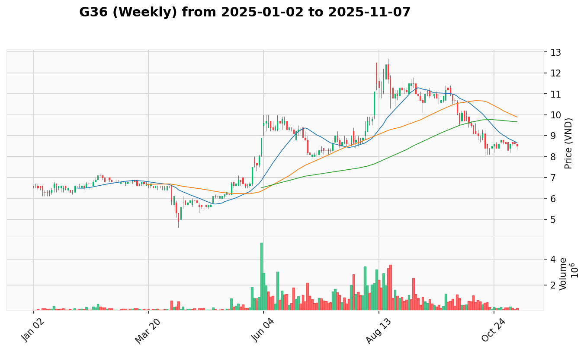

<a href="#dau-tu-cong">↑ Back to group DAU_TU_CONG</a>  |  <a href="#vpa-signal-summary">↑ Back to Top</a>

#### Key Statistics
| Metric | Value |
|:---|---:|
| Date Range | 2025-01-02 to 2025-11-14 |
| **Latest Close** | **8.4** |
| Period Open | 6.3 |
| Period High | 12.13 |
| Period Low | 4.39 |
| Period Change % | 33.33% |

**[Download G36 Data (.csv)](market_data_week/G36_2025-01-02_to_2025-11-14.csv)**

---

### GAS

#### [VPA Analysis (2025-06-02 - 2025-08-03)](./VPA_week.md#gas)
> - **Ngày 2025-07-07:** Sau cú Upthrust yếu kém của tuần trước, GAS có một tuần phục hồi với một nến tăng có biên độ vừa phải, đóng cửa (67.9) cao hơn. Khối lượng giao dịch giảm mạnh.
>     - **Phân tích VPA/Wyckoff:** Đây là một phiên **No Supply**. Việc giá có thể phục hồi trên nền khối lượng thấp cho thấy áp lực bán đã tạm thời cạn kiệt. Tuy nhiên, cần một nến tăng mạnh hơn để xác nhận sự quay trở lại của phe mua.
> - **Ngày 2025-07-14:** GAS tiếp tục xu hướng phục hồi nhẹ, tăng từ 67.9 lên 68.1 (+0.3%) với biên độ hẹp. Khối lượng giao dịch duy trì ở mức thấp tương đương tuần trước.
>     - **Phân tích VPA/Wyckoff:** Đây là một **Test for Supply** thành công. Việc giá có thể tăng nhẹ trên nền khối lượng thấp tiếp tục xác nhận tín hiệu No Supply, cho thấy áp lực bán đã yếu đi đáng kể sau cú Upthrust trước đó.
> - **Ngày 2025-07-21:** GAS tiếp tục xu hướng phục hồi, tăng từ 68.1 lên 68.7 (+0.9%) với biên độ giao dịch từ 67.1 đến 70.2. Khối lượng giao dịch tăng lên 5.424.434 cp, cao hơn tuần trước.
>     - **Phân tích VPA/Wyckoff:** Đây là một **Effort to Rise** sau các test for supply thành công. Việc giá tăng với khối lượng tăng cho thấy lực cầu đang dần quay trở lại. Tuy nhiên, biên độ tăng vẫn còn khiêm tốn, cho thấy xu hướng đang trong giai đoạn phục hồi tích lũy sau cú Upthrust trước đó.
> **Ngày 2025-07-27:** GAS tiếp tục xu hướng phục hồi tích cực, tăng từ 68.1 lên 68.7 (+0.9%) với biên độ giao dịch mở rộng từ 67.1 đến 70.2, chạm mức cao nhất kể từ sau cú Upthrust hồi cuối tháng 6. Khối lượng giao dịch tăng lên 5.414.400 cổ phiếu, cao hơn đáng kể so với tuần trước (4.390.900). Đáng chú ý, cổ phiếu đã test được vùng 70+ trong phiên nhưng vẫn đóng cửa dưới ngưỡng này, cho thấy vẫn còn áp lực bán tại vùng kháng cự quan trọng.
> - **Phân tích VPA/Wyckoff:** Đây là một **Sign of Strength** rõ ràng sau chuỗi các test for supply thành công. Việc giá tăng với khối lượng tăng và biên độ giao dịch mở rộng xác nhận lực cầu đang mạnh lên. Tuy nhiên, việc không thể duy trì được mức 70+ cho thấy vẫn còn nguồn cung tại vùng kháng cự này. Xu hướng phục hồi sau cú Upthrust đang trở nên rõ ràng hơn, nhưng cần có thêm volume và momentum để vượt qua được ngưỡng 70-72.
> **Ngày 2025-08-03:** GAS có một tuần điều chỉnh nhẹ, giảm từ 68.7 xuống 67.6 (-1.6%) sau khi test thành công vùng kháng cự 70.5 trong phiên. Biên độ giao dịch từ 67.2 đến 70.5 cho thấy sự dao động tích cực quanh vùng kháng cự quan trọng. Khối lượng giao dịch tăng lên 5.918.700 cổ phiếu, cao hơn tuần trước (5.414.400), cho thấy sự quan tâm gia tăng tại vùng giá này. Đáng chú ý, cổ phiếu đã vượt qua được mức 70.0 và chạm 70.5 - mức cao nhất kể từ sau cú Upthrust cuối tháng 6, nhưng không thể duy trì được và đóng cửa thấp hơn điểm xuất phát tuần.

<a href="#dau-khi">↑ Back to group DAU_KHI</a>  |  <a href="#vpa-signal-summary">↑ Back to Top</a>

#### Key Statistics
| Metric | Value |
|:---|---:|
| Date Range | 2025-01-02 to 2025-11-14 |
| **Latest Close** | **62.8** |
| Period Open | 64.29 |
| Period High | 69.28 |
| Period Low | 47.82 |
| Period Change % | -2.32% |

**[Download GAS Data (.csv)](market_data_week/GAS_2025-01-02_to_2025-11-14.csv)**

---

### GDA

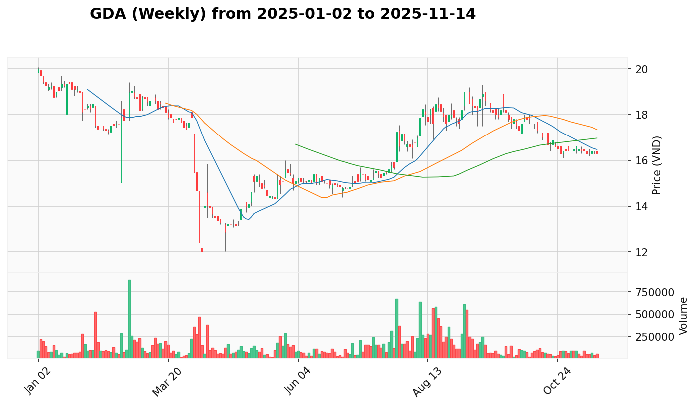

<a href="#thep">↑ Back to group THEP</a>  |  <a href="#vpa-signal-summary">↑ Back to Top</a>

#### Key Statistics
| Metric | Value |
|:---|---:|
| Date Range | 2025-01-02 to 2025-11-14 |
| **Latest Close** | **16.3** |
| Period Open | 19.85 |
| Period High | 20.07 |
| Period Low | 11.53 |
| Period Change % | -17.88% |

**[Download GDA Data (.csv)](market_data_week/GDA_2025-01-02_to_2025-11-14.csv)**

---

### GDT

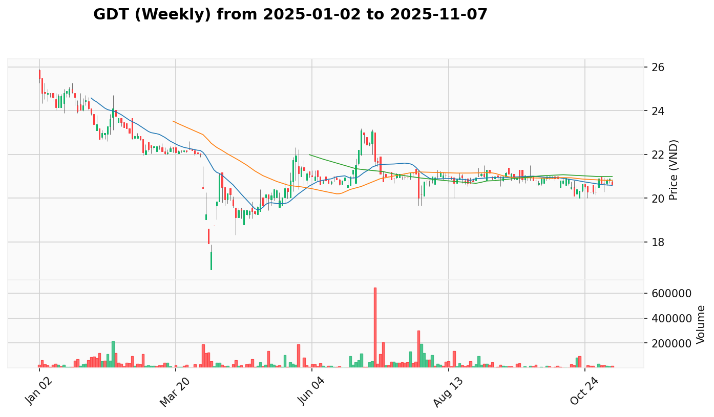

<a href="#others">↑ Back to group OTHERS</a>  |  <a href="#vpa-signal-summary">↑ Back to Top</a>

#### Key Statistics
| Metric | Value |
|:---|---:|
| Date Range | 2025-01-02 to 2025-11-14 |
| **Latest Close** | **20.95** |
| Period Open | 25.85 |
| Period High | 25.9 |
| Period Low | 16.74 |
| Period Change % | -18.96% |

**[Download GDT Data (.csv)](market_data_week/GDT_2025-01-02_to_2025-11-14.csv)**

---

### GEG

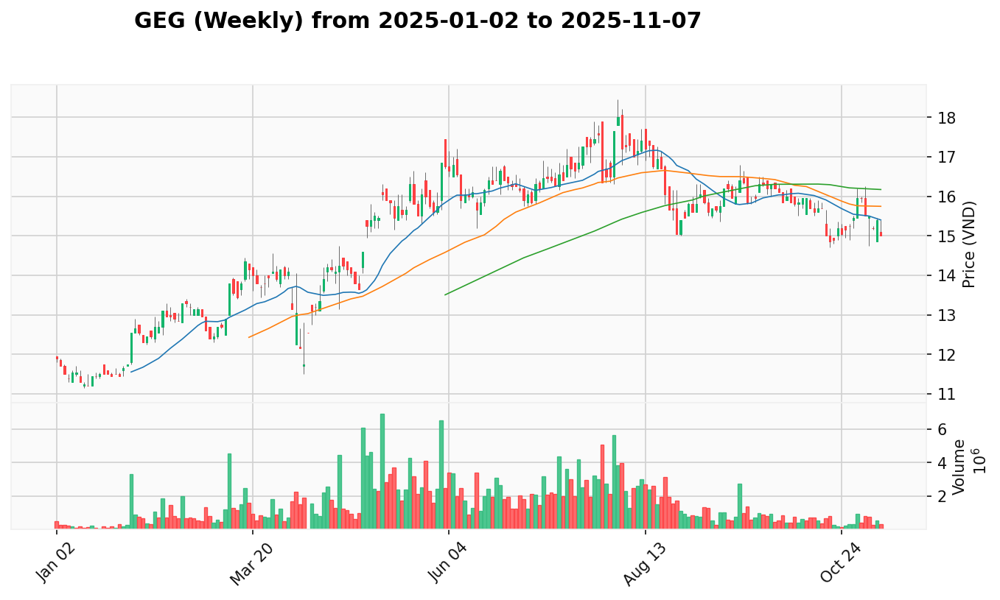

<a href="#nang-luong">↑ Back to group NANG_LUONG</a>  |  <a href="#vpa-signal-summary">↑ Back to Top</a>

#### Key Statistics
| Metric | Value |
|:---|---:|
| Date Range | 2025-01-02 to 2025-11-14 |
| **Latest Close** | **15.1** |
| Period Open | 11.95 |
| Period High | 18.45 |
| Period Low | 11.15 |
| Period Change % | 26.36% |

**[Download GEG Data (.csv)](market_data_week/GEG_2025-01-02_to_2025-11-14.csv)**

---

### GEX

#### [VPA Analysis (2025-06-02 - 2025-08-03)](./VPA_week.md#gex)
> - **Ngày 2025-07-07:** Sau tuần có dấu hiệu Cao trào mua, GEX có một tuần tăng giá mạnh mẽ với một nến tăng thân dài, đóng cửa (40.0) ở mức cao nhất tuần. Khối lượng giao dịch duy trì ở mức rất cao.
>     - **Phân tích VPA/Wyckoff:** Đây là một **Sign of Strength**. Tuy nhiên, sự tăng tốc liên tục trên khối lượng cực lớn tiếp tục củng cố khả năng đây là một **Climax**, báo hiệu rủi ro điều chỉnh rất lớn đang gia tăng.
> - **Ngày 2025-07-14:** GEX tiếp tục xu hướng tăng với một nến tăng mạnh, tăng từ 40.0 lên 42.4 (+6.0%) với biên độ rộng. Khối lượng giao dịch duy trì ở mức rất cao.
>     - **Phân tích VPA/Wyckoff:** Đây là một **Buying Climax** rõ ràng. Việc cổ phiếu tiếp tục bùng nổ với khối lượng khổng lồ sau nhiều tuần tăng liên tục là dấu hiệu của sự kiệt quệ cầu. Rủi ro điều chỉnh rất lớn.
> - **Ngày 2025-07-21:** Tiếp nối Buying Climax của tuần trước, GEX có một tuần bùng nổ kinh hoàng với nến tăng thân cực dài, tăng vọt từ 42.4 lên 53.5 (+26.2%) và đóng cửa ở mức cao nhất. Biên độ giao dịch từ 42.45 đến 53.5 cho thấy sự tăng tốc điên cuồng. Khối lượng giao dịch 74.226.523 cp.
>     - **Phân tích VPA/Wyckoff:** Đây là một **Buying Climax** cực đoan. Sau nhiều tuần Climax liên tiếp, GEX đã có một cuộc bùng nổ hoàn toàn mất kiểm soát với mức tăng +26% trong một tuần. Đây là dấu hiệu rõ ràng của sự kiệt quệ hoàn toàn của lực cầu và một đợt điều chỉnh mạnh có thể sắp xảy ra.
> **Ngày 2025-07-27:** Sau tuần Buying Climax cực đoan với mức tăng 26.2%, GEX tiếp tục duy trì đà tăng với nến tăng mạnh, tăng từ 42.8 lên 53.5 (+25.2%) và đóng cửa ở mức cao nhất tuần 53.5. Tuy nhiên, khối lượng giao dịch 74.2 triệu cp có dấu hiệu giảm nhẹ so với tuần trước nhưng vẫn duy trì ở mức cực cao. Biên độ giao dịch từ 42.45 đến 53.5 cho thấy sự tăng tốc vẫn rất mạnh mẽ.
> 
> **Phân tích VPA/Wyckoff:** Đây là một **Upthrust After Climax** - tín hiệu nguy hiểm cao độ. Sau Buying Climax cực đoan của tuần trước, việc GEX tiếp tục tăng mạnh nhưng với khối lượng có dấu hiệu suy yếu so với đợt bùng nổ trước đó là dấu hiệu của sự kiệt quệ hoàn toàn của lực cầu. Đây là giai đoạn cuối cùng của xu hướng tăng, nơi những nhà đầu tư cuối cùng nhảy vào thị trường ở đỉnh giá. Rủi ro đảo chiều và điều chỉnh sâu là cực kỳ cao.
> **Ngày 2025-08-03:**
> Sau tuần Upthrust After Climax với đỉnh 53.5, GEX xuất hiện dấu hiệu đảo chiều với nến giảm từ 57.0 xuống 55.9 (-4.3%). Mặc dù mở cửa gap up ở 57.0 và test mức cao 61.2, cổ phiếu không thể duy trì và bị bán tháo xuống low 53.2 trước khi phục hồi nhẹ lên 55.9. Khối lượng giao dịch tăng lên 80.0 triệu cổ phần, cao hơn tuần trước (74.2 triệu), cho thấy áp lực bán đã quay trở lại mạnh mẽ sau chuỗi Climax kéo dài.

<a href="#others">↑ Back to group OTHERS</a>  |  <a href="#vpa-signal-summary">↑ Back to Top</a>

#### Key Statistics
| Metric | Value |
|:---|---:|
| Date Range | 2025-01-02 to 2025-11-14 |
| **Latest Close** | **45.1** |
| Period Open | 17.57 |
| Period High | 65.7 |
| Period Low | 16.42 |
| Period Change % | 156.69% |

**[Download GEX Data (.csv)](market_data_week/GEX_2025-01-02_to_2025-11-14.csv)**

---

### GIL

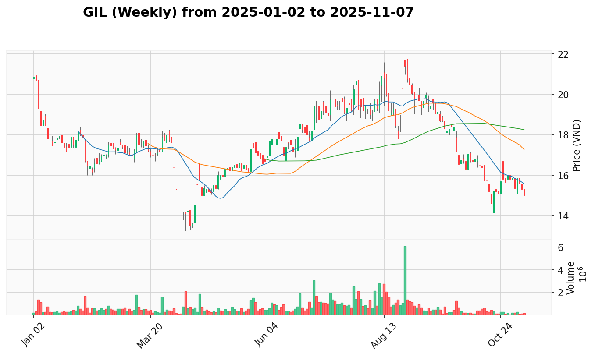

<a href="#det-may">↑ Back to group DET_MAY</a>  |  <a href="#vpa-signal-summary">↑ Back to Top</a>

#### Key Statistics
| Metric | Value |
|:---|---:|
| Date Range | 2025-01-02 to 2025-11-14 |
| **Latest Close** | **15.5** |
| Period Open | 20.8 |
| Period High | 21.75 |
| Period Low | 13.25 |
| Period Change % | -25.48% |

**[Download GIL Data (.csv)](market_data_week/GIL_2025-01-02_to_2025-11-14.csv)**

---

### GMD

#### [VPA Analysis (2025-06-02 - 2025-08-03)](./VPA_week.md#gmd)
> - **Ngày 2025-07-07:** Sau phiên kiểm tra cung của tuần trước, GMD có một tuần tăng giá mạnh mẽ với một nến tăng thân dài, đóng cửa (60.2) gần mức cao nhất tuần. Khối lượng giao dịch tăng vọt.
>     - **Phân tích VPA/Wyckoff:** Đây là một **Sign of Strength**, cho thấy lực cầu đã quay trở lại một cách quyết liệt, báo hiệu khả năng kết thúc đợt điều chỉnh.
> - **Ngày 2025-07-14:** GMD có một tuần điều chỉnh, giảm từ 60.2 xuống 57.2 (-5.0%) với biên độ rộng. Khối lượng giao dịch tăng nhẹ so với tuần trước.
>     - **Phân tích VPA/Wyckoff:** Đây là một **Test for Supply** sau Sign of Strength tuần trước. Việc giá điều chỉnh trên nền khối lượng tăng nhẹ cho thấy áp lực bán xuất hiện nhưng không quá mạnh. Cần theo dõi xem liệu GMD có thể phục hồi ở các tuần tiếp theo.
> - **Ngày 2025-07-21:** GMD có một tuần phục hồi, tăng từ 57.2 lên 58.4 (+2.1%) với biên độ giao dịch từ 56.1 đến 59.0. Khối lượng giao dịch giảm xuống 13.007.972 cp, thấp hơn tuần trước.
>     - **Phân tích VPA/Wyckoff:** Đây là một **No Supply** sau test for supply của tuần trước. Việc giá phục hồi trên nền khối lượng giảm là dấu hiệu tích cực, cho thấy áp lực bán đã yếu đi và xu hướng tăng có thể được khôi phục. Tuy nhiên, cần một nến tăng mạnh hơn để xác nhận sức mạnh.
> **Ngày 2025-07-27:** GMD có một tuần giao dịch tích cực, tăng từ 57.2 lên 58.4 (+2.1%) với biên độ từ 56.1 đến 59.0. Khối lượng giao dịch giảm xuống 13.012.837 cp, thấp hơn đáng kể so với tuần trước (17.857.791 cp). Giá đóng cửa gần mức cao của tuần, cho thấy sức mạnh trong phiên cuối.
> 
> **Phân tích VPA/Wyckoff:** Đây là một **Sign of Strength** sau test for supply của tuần trước. Việc giá tăng trên nền khối lượng giảm là dấu hiệu rất tích cực, cho thấy không còn áp lực bán và xu hướng tăng đang được khôi phục. Sự kết hợp giữa giá tăng và khối lượng giảm thể hiện lực cầu tự nhiên mạnh mẽ, báo hiệu khả năng tiếp tục tăng giá trong các tuần tới.
> **Ngày 2025-08-03:** GMD có một tuần điều chỉnh, giảm từ 58.4 xuống 56.0 (-4.1%) với biên độ dao động từ 55.6 đến 58.9. Giá mở cửa tại 58.5, test lên 58.9 trong đầu tuần nhưng bị đẩy xuống và đóng cửa tại 56.0, gần mức thấp nhất tuần. Khối lượng giao dịch tăng lên 16.782.000 cp, cao hơn đáng kể so với tuần trước (13.012.837 cp). Việc giá phá vỡ xuống dưới support 57.0-58.0 với khối lượng tăng cho thấy áp lực bán đã quay trở lại.

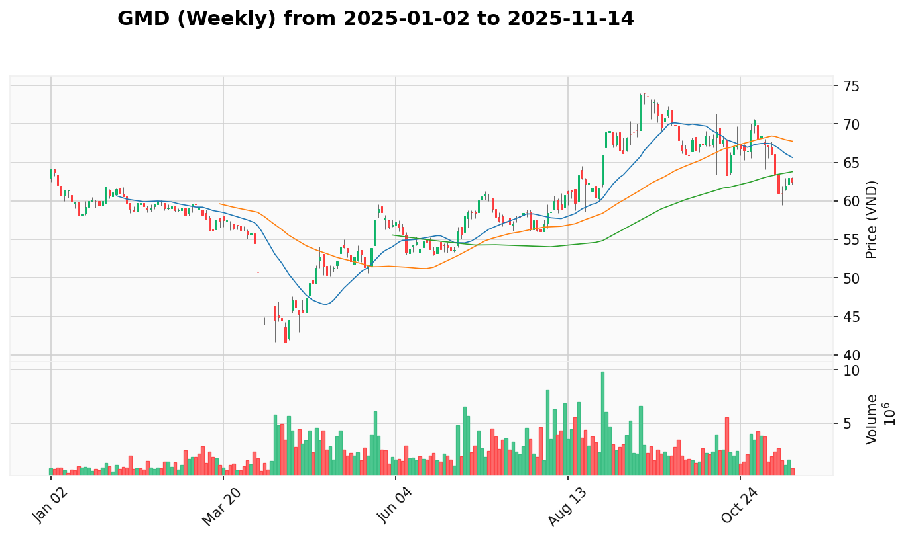

<a href="#van-tai">↑ Back to group VAN_TAI</a>  |  <a href="#vpa-signal-summary">↑ Back to Top</a>

#### Key Statistics
| Metric | Value |
|:---|---:|
| Date Range | 2025-01-02 to 2025-11-14 |
| **Latest Close** | **62.5** |
| Period Open | 63.0 |
| Period High | 74.5 |
| Period Low | 40.84 |
| Period Change % | -0.79% |

**[Download GMD Data (.csv)](market_data_week/GMD_2025-01-02_to_2025-11-14.csv)**

---

### GVR

#### [VPA Analysis (2025-06-02 - 2025-08-03)](./VPA_week.md#gvr)
> - **Ngày 2025-07-07:** Sau cú Upthrust yếu kém của tuần trước, GVR có một tuần giảm giá nhẹ với biên độ hẹp. Khối lượng giao dịch tăng.
>     - **Phân tích VPA/Wyckoff:** Đây là một phiên **No Demand** sau khi nguồn cung xuất hiện. Việc giá không thể phục hồi trên khối lượng tăng cho thấy phe mua yếu, củng cố cho tín hiệu yếu của tuần trước.
> - **Ngày 2025-07-14:** GVR có một tuần phục hồi nhẹ, tăng từ 30.0 lên 30.4 (+1.3%) với biên độ hẹp. Khối lượng giao dịch tăng so với tuần trước.
>     - **Phân tích VPA/Wyckoff:** Đây là một **Test for Supply** sau giai đoạn yếu. Việc giá phục hồi nhẹ trên nền khối lượng tăng cho thấy vẫn còn áp lực bán nhưng không quá mạnh. Cần quan sát thêm để xác định xu hướng dài hạn.
> - **Ngày 2025-07-21:** Tiếp nối Test for Supply của tuần trước, GVR có một tuần tăng giá với nến tăng biên độ vừa phải, tăng từ 30.4 lên 31.2 (+2.6%) và đạt mức cao 32.15. Biên độ giao dịch từ 30.1 đến 32.15 cho thấy sự phục hồi. Khối lượng giao dịch tăng lên 28.012.094 cp.
>     - **Phân tích VPA/Wyckoff:** Đây là một **Effort to Rise** sau giai đoạn yếu. Việc giá có thể vượt qua kháng cự với khối lượng tăng cho thấy lực cầu đang dần phục hồi, tuy nhiên cần thêm xác nhận trong những tuần tới để khẳng định sự đảo chiều xu hướng.
> **Ngày 2025-07-27:** GVR tiếp tục xu hướng tăng giá tích cực với nến tăng có thân dài, tăng từ 30.4 lên 31.2 (+2.6%) và đạt mức cao tuần tại 32.15. Giá đóng cửa gần mức cao nhất tuần, cho thấy sức mạnh của phe mua. Khối lượng giao dịch duy trì ở mức cao 28.012.000 cổ phiếu, tương đương với tuần trước, thể hiện sự quan tâm liên tục của thị trường. Việc giá có thể vượt qua ngưỡng kháng cự 31.0-31.2 và tiến về vùng 32.0 cho thấy momentum tích cực đang được duy trì.
> 
> **Phân tích VPA/Wyckoff:** Đây là một **Sign of Strength** tiếp theo sau Effort to Rise của tuần trước. Việc giá tiếp tục tăng trên nền khối lượng cao và ổn định cho thấy lực cầu mạnh mẽ và áp lực bán đã giảm đáng kể. Tín hiệu này củng cố cho việc xu hướng giảm ngắn hạn đã kết thúc và GVR đang trong giai đoạn phục hồi tích cực.
> **Ngày 2025-08-03:** GVR có một tuần biến động mạnh với nến giảm có thân dài và bóng dưới rộng. Giá mở cửa tại 31.3, test lên mức cao 32.0 (gần bằng đỉnh tuần trước 32.15) nhưng sau đó sụt giảm mạnh xuống thấp nhất 28.95 trước khi đóng cửa tại 29.7 (-4.8%). Điều đáng chú ý là khối lượng giao dịch bùng nổ lên 34.2 triệu cổ phiếu, tăng 22% so với tuần trước và là khối lượng cao nhất trong 2 tháng qua. Việc có bóng dưới dài từ 28.95 lên 29.7 cho thấy lực cầu đã xuất hiện để hỗ trợ tại vùng thấp.

<a href="#cao-su">↑ Back to group CAO_SU</a>  |  <a href="#vpa-signal-summary">↑ Back to Top</a>

#### Key Statistics
| Metric | Value |
|:---|---:|
| Date Range | 2025-01-02 to 2025-11-14 |
| **Latest Close** | **28.4** |
| Period Open | 30.07 |
| Period High | 35.1 |
| Period Low | 21.39 |
| Period Change % | -5.55% |

**[Download GVR Data (.csv)](market_data_week/GVR_2025-01-02_to_2025-11-14.csv)**

---

### HAG

#### [VPA Analysis (2025-06-02 - 2025-08-03)](./VPA_week.md#hag)
> - **Ngày 2025-07-07:** Sau phiên kiểm tra cung thành công của tuần trước, HAG có một tuần tăng giá mạnh mẽ với một nến tăng thân dài, đóng cửa (13.4) cao hơn. Khối lượng giao dịch tăng vọt.
>     - **Phân tích VPA/Wyckoff:** Đây là một **Sign of Strength**, cho thấy lực cầu đã quay trở lại một cách quyết liệt, xác nhận sự kết thúc của đợt điều chỉnh.
> - **Ngày 2025-07-14:** HAG có một tuần bùng nổ mạnh mẽ, tăng từ 13.4 lên 14.85 (+10.8%) với biên độ rộng. Khối lượng giao dịch tăng vụt gấp đôi so với tuần trước.
>     - **Phân tích VPA/Wyckoff:** Đây là một **Buying Climax**. Sau Sign of Strength tuần trước, HAG đã có một cuộc bùng nổ để đạt đỉnh mới trên khối lượng khổng lồ. Tín hiệu mạnh mẽ nhưng cần thận trọng với khả năng điều chỉnh sau cao trào mua này.
> - **Ngày 2025-07-21:** Sau Buying Climax của tuần trước, HAG có một tuần điều chỉnh với nến giảm biên độ rộng, giảm từ 14.85 xuống 14.05 (-5.4%) và có mức thấp 13.95. Biên độ giao dịch từ 13.95 đến 15.2 cho thấy sự dao động mạnh. Khối lượng giao dịch tăng vọt lên 99.650.216 cp.
>     - **Phân tích VPA/Wyckoff:** Đây là một **Automatic Reaction** sau Buying Climax tuần trước. Việc giá giảm mạnh trên nền khối lượng khổng lồ là phản ứng tự nhiên sau một đợt cao trào mua, xác nhận rằng đỉnh tạm thời đã được hình thành và giai đoạn điều chỉnh đã bắt đầu.
> **Ngày 2025-07-27:** HAG có một tuần dao động mạnh với biên độ từ 13.95 đến 15.2, mở cửa ở 14.95 và đóng cửa ở 14.05 (-5.4% so với tuần trước). Cổ phiếu đã test mức cao 15.2 nhưng không thể duy trì và bị bán tháo mạnh về cuối tuần. Khối lượng giao dịch tiếp tục duy trì ở mức cao 99.626.500 cổ phiếu, tương đương với tuần trước, cho thấy sự quan tâm lớn của thị trường.
> 
> **Phân tích VPA/Wyckoff:** Đây là một **Secondary Test** sau Automatic Reaction tuần trước. HAG đã thử nghiệm vùng cung tại đỉnh (15.2) nhưng gặp phải áp lực bán mạnh, xác nhận rằng vùng 15.0-15.2 là một kháng cự quan trọng. Việc khối lượng duy trì cao trong khi giá không thể vượt qua đỉnh cũ cho thấy sự phân phối đang diễn ra. Đây là tín hiệu cảnh báo về khả năng tiếp tục điều chỉnh sâu hơn nếu không có lực cầu mạnh xuất hiện.
> **Ngày 2025-08-03:** Tuần này HAG tiếp tục xu hướng điều chỉnh với nến giảm có thân hẹp, giảm từ 14.05 xuống 13.9 (-1.1%) và có mức thấp 13.25. Biên độ giao dịch từ 13.25 đến 14.45 cho thấy áp lực bán vẫn còn nhưng đã giảm bớt so với hai tuần trước. Khối lượng giao dịch giảm đáng kể xuống 71.425.500 cổ phiếu, giảm 28.3% so với tuần trước, cho thấy sự quan tâm của thị trường đang suy giảm trong giai đoạn điều chỉnh này.

<a href="#nong-nghiep">↑ Back to group NONG_NGHIEP</a>  |  <a href="#vpa-signal-summary">↑ Back to Top</a>

#### Key Statistics
| Metric | Value |
|:---|---:|
| Date Range | 2025-01-02 to 2025-11-14 |
| **Latest Close** | **17.65** |
| Period Open | 12.15 |
| Period High | 17.65 |
| Period Low | 9.54 |
| Period Change % | 45.27% |

**[Download HAG Data (.csv)](market_data_week/HAG_2025-01-02_to_2025-11-14.csv)**

---

### HAH

#### [VPA Analysis (2025-06-02 - 2025-08-03)](./VPA_week.md#hah)
> - **Ngày 2025-07-07:** Tiếp nối Dấu hiệu Yếu kém của tuần trước, HAH có một tuần đi ngang với một nến tăng biên độ hẹp. Khối lượng giao dịch tăng nhẹ.
>     - **Phân tích VPA/Wyckoff:** Đây là một nỗ lực phục hồi yếu ớt trên nền khối lượng cao, một tín hiệu **No Demand**. Việc giá không thể phục hồi mạnh mẽ sau đợt giảm cho thấy phe mua vẫn còn yếu thế.
> - **Ngày 2025-07-14:** HAH có một tuần phục hồi nhẹ, tăng từ 69.3 lên 70.0 (+1.0%) với biên độ hẹp. Khối lượng giao dịch tăng mạnh so với tuần trước.
>     - **Phân tích VPA/Wyckoff:** Đây là một **Test for Supply** sau giai đoạn yếu. Việc giá phục hồi nhẹ trên nền khối lượng tăng cao cho thấy vẫn còn sự giằng co giữa lực mua và lực bán, nhưng sự phục hồi vẫn còn yếu ớt.
> - **Ngày 2025-07-21:** Tiếp nối Test for Supply của tuần trước, HAH có một tuần tăng giá mạnh với nến tăng biên độ rộng, tăng từ 70.0 lên 74.3 (+6.1%) và đạt mức cao 76.7. Biên độ giao dịch từ 69.0 đến 76.7 cho thấy sự phục hồi mạnh mẽ. Khối lượng giao dịch tăng lên 27.881.584 cp.
>     - **Phân tích VPA/Wyckoff:** Đây là một **Sign of Strength** sau giai đoạn Test for Supply. Việc giá có thể bứt phá mạnh mẽ với khối lượng tăng cho thấy lực cầu đã quay trở lại và có khả năng đảo chiều xu hướng giảm trước đó.
> **Ngày 2025-07-27:** HAH tiếp tục xu hướng tăng mạnh với một tuần tăng giá đáng kể, tăng từ 70.0 lên 74.3 (+6.1%) và đạt mức cao 76.7. Nến tăng có thân dài với biên độ giao dịch rộng từ 69.0 đến 76.7, cho thấy sự bứt phá mạnh mẽ sau giai đoạn test. Khối lượng giao dịch tăng vọt lên 27.854.700 cổ phiếu, cao nhất trong 10 tuần gần đây và tăng 30.2% so với tuần trước. Giá đóng cửa gần mức cao nhất tuần cho thấy lực cầu mạnh mẽ.
> 
> **Phân tích VPA/Wyckoff:** Đây là một **Sign of Strength** rõ ràng, xác nhận sự đảo chiều xu hướng. Việc giá bứt phá mạnh mẽ trên nền khối lượng cao nhất trong 10 tuần cho thấy lực cầu đã chiếm ưu thế hoàn toàn. Sự kết hợp giữa giá tăng mạnh và khối lượng tăng vọt là dấu hiệu tích cực cho xu hướng tăng tiếp theo.
> **Ngày 2025-08-03:** HAH tiếp tục xu hướng tăng mạnh mẽ với tuần tăng giá ấn tượng từ 56.4 lên 60.88 (+7.9%), đạt mức cao nhất tuần tại 60.88. Nến tăng có thân dài với biên độ giao dịch rộng từ 53.59 đến 60.88, cho thấy sự bứt phá tiếp diễn sau Sign of Strength tuần trước. Đặc biệt, giá đóng cửa đúng tại mức cao nhất tuần (60.88) thể hiện lực cầu cực kỳ mạnh mẽ. Khối lượng giao dịch tăng vọt lên 34.153.284 cổ phiếu, tăng 22.4% so với tuần trước và đạt mức cao nhất trong chuỗi phục hồi, xác nhận sự tham gia mạnh mẽ của dòng tiền.

<a href="#van-tai">↑ Back to group VAN_TAI</a>  |  <a href="#vpa-signal-summary">↑ Back to Top</a>

#### Key Statistics
| Metric | Value |
|:---|---:|
| Date Range | 2025-01-02 to 2025-11-14 |
| **Latest Close** | **65.0** |
| Period Open | 37.58 |
| Period High | 68.32 |
| Period Low | 34.2 |
| Period Change % | 72.96% |

**[Download HAH Data (.csv)](market_data_week/HAH_2025-01-02_to_2025-11-14.csv)**

---

### HAP

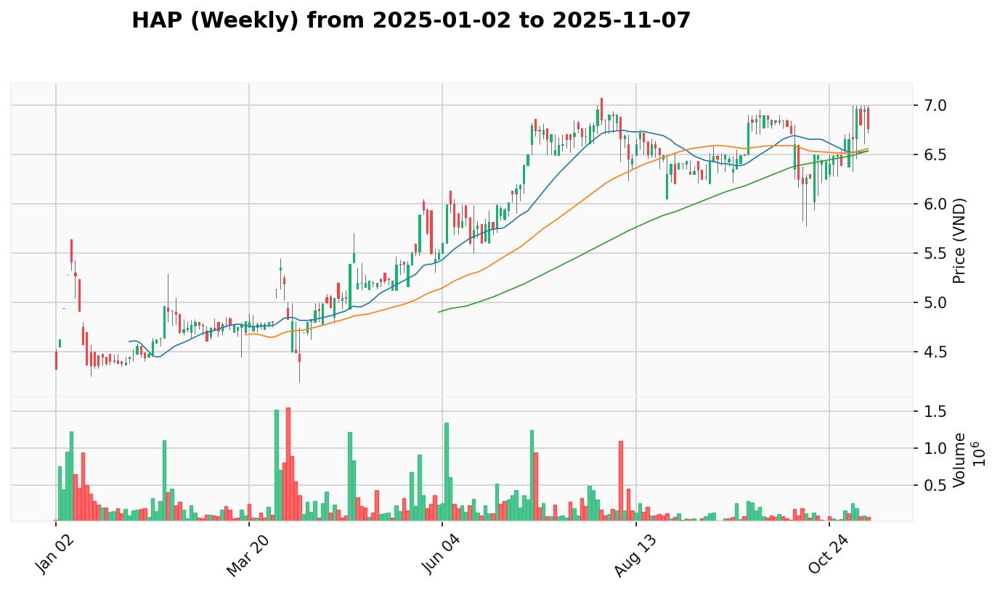

<a href="#penny">↑ Back to group PENNY</a>  |  <a href="#vpa-signal-summary">↑ Back to Top</a>

#### Key Statistics
| Metric | Value |
|:---|---:|
| Date Range | 2025-01-02 to 2025-11-14 |
| **Latest Close** | **7.44** |
| Period Open | 4.5 |
| Period High | 7.49 |
| Period Low | 4.19 |
| Period Change % | 65.33% |

**[Download HAP Data (.csv)](market_data_week/HAP_2025-01-02_to_2025-11-14.csv)**

---

### HAX

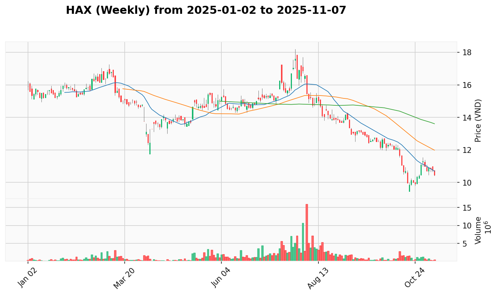

<a href="#ban-le">↑ Back to group BAN_LE</a>  |  <a href="#vpa-signal-summary">↑ Back to Top</a>

#### Key Statistics
| Metric | Value |
|:---|---:|
| Date Range | 2025-01-02 to 2025-11-14 |
| **Latest Close** | **10.8** |
| Period Open | 15.91 |
| Period High | 18.2 |
| Period Low | 9.45 |
| Period Change % | -32.12% |

**[Download HAX Data (.csv)](market_data_week/HAX_2025-01-02_to_2025-11-14.csv)**

---

### HBC

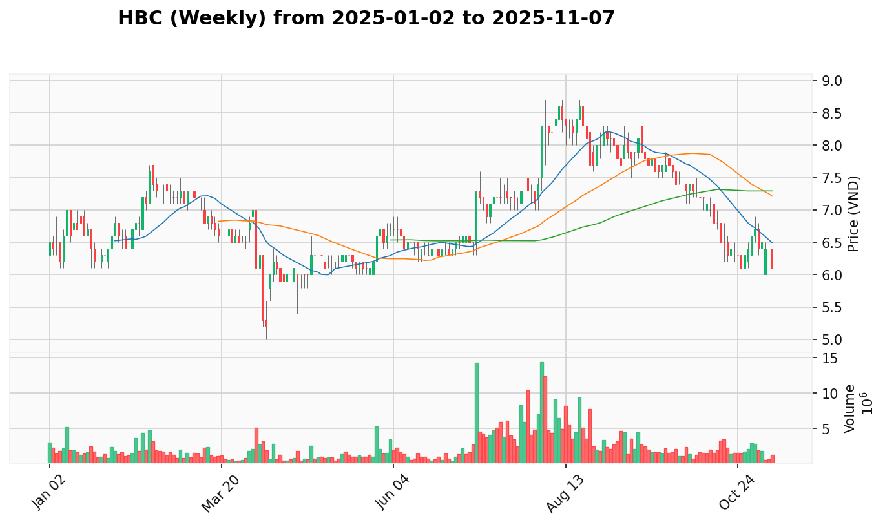

<a href="#xay-dung">↑ Back to group XAY_DUNG</a>  |  <a href="#vpa-signal-summary">↑ Back to Top</a>

#### Key Statistics
| Metric | Value |
|:---|---:|
| Date Range | 2025-01-02 to 2025-11-14 |
| **Latest Close** | **6.3** |
| Period Open | 6.3 |
| Period High | 8.9 |
| Period Low | 5.0 |
| Period Change % | 0.00% |

**[Download HBC Data (.csv)](market_data_week/HBC_2025-01-02_to_2025-11-14.csv)**

---

### HCD

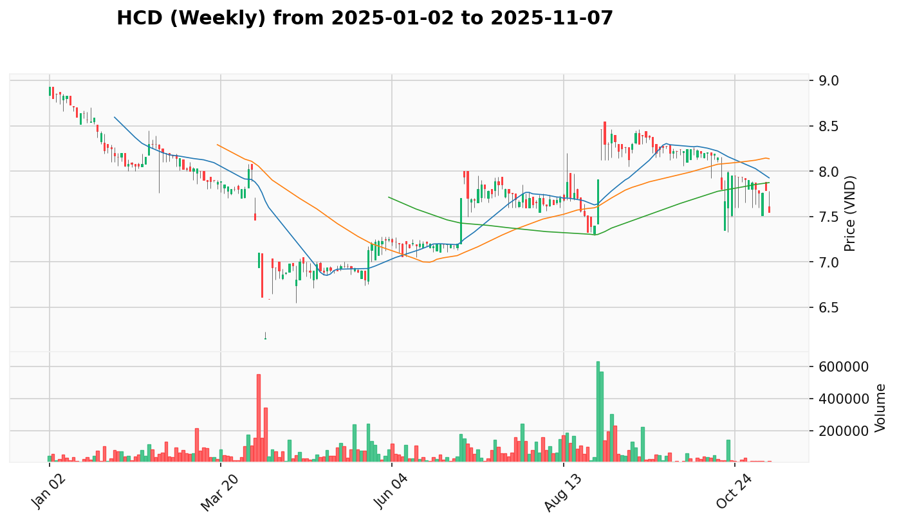

<a href="#nhua">↑ Back to group NHUA</a>  |  <a href="#vpa-signal-summary">↑ Back to Top</a>

#### Key Statistics
| Metric | Value |
|:---|---:|
| Date Range | 2025-01-02 to 2025-11-14 |
| **Latest Close** | **7.84** |
| Period Open | 8.84 |
| Period High | 8.93 |
| Period Low | 6.15 |
| Period Change % | -11.31% |

**[Download HCD Data (.csv)](market_data_week/HCD_2025-01-02_to_2025-11-14.csv)**

---

### HCM

#### [VPA Analysis (2025-06-02 - 2025-08-03)](./VPA_week.md#hcm)
> - **Ngày 2025-07-07:** Tiếp nối nỗ lực tăng giá của tuần trước, HCM có một tuần bùng nổ với một nến tăng thân dài, đóng cửa (24.95) gần mức cao nhất tuần. Khối lượng giao dịch tăng vọt, xác nhận cho sức mạnh của đà tăng.
>     - **Phân tích VPA/Wyckoff:** Đây là một **Sign of Strength** rõ ràng, cho thấy lực cầu đang rất quyết liệt và xu hướng tăng được củng cố.
> - **Ngày 2025-07-14:** HCM có một tuần đi ngang, giá đóng cửa giữ nguyên ở mức 24.95 (+0.0%) với biên độ hẹp. Khối lượng giao dịch tăng vọt lên mức kỷ lục.
>     - **Phân tích VPA/Wyckoff:** Đây là một **Test for Supply** sau Sign of Strength tuần trước. Việc giá giữ vững ở mức cao trên nền khối lượng khổng lồ cho thấy sự giằng co mạnh mẽ giữa lực mua và lực bán. Đây có thể là dấu hiệu của một giai đoạn phân phối (Distribution).
> - **Ngày 2025-07-21:** Tiếp nối Test for Supply của tuần trước, HCM có một tuần tăng giá với nến tăng biên độ vừa phải, tăng từ 24.95 lên 25.75 (+3.2%) và đạt mức cao 26.4. Biên độ giao dịch từ 24.3 đến 26.4 cho thấy sự bứt phá. Khối lượng giao dịch giảm xuống 90.869.088 cp.
>     - **Phân tích VPA/Wyckoff:** Đây là một **Sign of Strength** nhẹ. Việc giá có thể vượt qua kháng cự và đạt đỉnh mới cho thấy lực cầu vẫn còn kiểm soát, tuy nhiên khối lượng giảm cho thấy sự nhiệt tình không bằng những tuần trước.
> **Ngày 2025-07-27:** HCM có một tuần tăng nhẹ, đóng cửa tại mức 25.75 (+3.2%) so với tuần trước, đạt đỉnh tuần tại 26.4 - tương đương với đỉnh của tuần trước. Biên độ giao dịch từ 24.3 đến 26.4 cho thấy sự dao động mạnh. Khối lượng giao dịch giảm xuống 90.841.200 cổ phiệu, thấp hơn đáng kể so với tuần trước (115.756.900 cổ phiệu). Mặc dù giá tăng nhưng không thể vượt qua mức kháng cự 26.4, kết hợp với khối lượng suy giảm cho thấy động lực tăng đang yếu dần.
> 
> **Phân tích VPA/Wyckoff:** Đây là một **No Result** với dấu hiệu **Weakness**. Việc giá không thể vượt qua mức kháng cự 26.4 trên nền khối lượng giảm mạnh cho thấy lực cầu đang suy yếu. Sau giai đoạn Test for Supply và Sign of Strength nhẹ của các tuần trước, tín hiệu này cảnh báo về khả năng kết thúc đà tăng ngắn hạn và có thể bước vào giai đoạn phân phối.
> **Ngày 2025-08-03:** HCM có một tuần tăng giá mạnh mẽ, từ 25.75 lên 26.0 (+1.0%) nhưng đạt đỉnh tuần tại 27.6 - vượt xa mức kháng cự 26.4 của các tuần trước. Biên độ giao dịch rộng từ 24.85 đến 27.6 cho thấy sự dao động mạnh với test xuống vùng hỗ trợ trước khi phục hồi. Khối lượng giao dịch bùng nổ lên 112.257.400 cổ phiệu, tăng 24% so với tuần trước, đánh dấu mức cao nhất trong 4 tuần gần đây. Việc giá vượt qua kháng cự quan trọng 26.4 và test lên 27.6 trên nền khối lượng tăng mạnh cho thấy lực cầu đã quay trở lại quyết liệt.

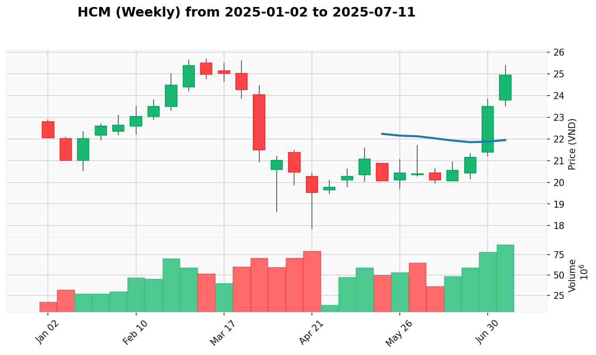

<a href="#chung-khoan">↑ Back to group CHUNG_KHOAN</a>  |  <a href="#vpa-signal-summary">↑ Back to Top</a>

#### Key Statistics
| Metric | Value |
|:---|---:|
| Date Range | 2025-01-02 to 2025-11-14 |
| **Latest Close** | **22.6** |
| Period Open | 22.79 |
| Period High | 30.4 |
| Period Low | 17.84 |
| Period Change % | -0.83% |

**[Download HCM Data (.csv)](market_data_week/HCM_2025-01-02_to_2025-11-14.csv)**

---

### HDB

#### [VPA Analysis (2025-06-02 - 2025-08-03)](./VPA_week.md#hdb)
> - **Ngày 2025-07-07:** Sau phiên kiểm tra cung của tuần trước, HDB có một tuần tăng giá bùng nổ với một nến tăng thân dài, đóng cửa (24.45) ở mức cao nhất tuần. Khối lượng giao dịch tăng vọt.
>     - **Phân tích VPA/Wyckoff:** Đây là một **Sign of Strength** rõ ràng, cho thấy lực cầu đã quay trở lại một cách quyết liệt, phá vỡ sự do dự trước đó.
> - **Ngày 2025-07-14:** HDB có một tuần đi nằng nhẹ, giảm từ 24.45 xuống 24.4 (-0.2%) với biên độ hẹp. Khối lượng giao dịch giảm nhưng vẫn ở mức cao.
>     - **Phân tích VPA/Wyckoff:** Đây là một **Test for Supply** sau Sign of Strength tuần trước. Việc giá giữ vững gần đỉnh trên nền khối lượng cao cho thấy không có áp lực bán đáng kể, đây là tín hiệu tích cực cho xu hướng tăng tiếp tục.
> - **Ngày 2025-07-21:** Tiếp nối Test for Supply của tuần trước, HDB có một tuần bùng nổ mạnh mẽ với nến tăng thân dài, tăng vọt từ 24.4 lên 28.25 (+15.8%) và đạt mức cao 28.4. Biên độ giao dịch từ 24.3 đến 28.4 cho thấy sự tăng tốc. Khối lượng giao dịch tăng vụt lên 150.275.720 cp.
>     - **Phân tích VPA/Wyckoff:** Đây là một **Buying Climax** rõ ràng. Sau Test for Supply tuần trước, HDB đã có một cuộc bùng nổ với mức tăng +15.8% trên khối lượng khổng lồ. Đây là dấu hiệu của sự kiệt quệ cầu và rủi ro điều chỉnh đang gia tăng sau cao trào mua này.
> **Ngày 2025-07-27:** Sau Buying Climax tuần trước với mức tăng bùng nổ +15.8%, HDB tiếp tục duy trì ở vùng đỉnh với giá đóng cửa 28.25, chỉ giảm nhẹ -0.6% so với tuần trước. Biên độ giao dịch từ 24.3 đến 28.4 cho thấy volatility cao. Đáng chú ý là khối lượng giao dịch vẫn duy trì ở mức rất cao 150.239.300 cp, tương đương với tuần Buying Climax trước đó.
> 
> **Phân tích VPA/Wyckoff:** Đây là một **Automatic Reaction** sau Buying Climax. Việc giá chỉ giảm nhẹ -0.6% trên nền khối lượng vẫn rất cao cho thấy áp lực bán đang gia tăng nhưng chưa thực sự áp đảo. Đây là giai đoạn đầu của quá trình điều chỉnh sau cao trào mua. Cần theo dõi các tuần tiếp theo để xác định mức độ điều chỉnh và tìm kiếm Secondary Test ở mức thấp hơn.
> **Ngày 2025-08-03:** Sau giai đoạn Automatic Reaction tuần trước, HDB có một tuần điều chỉnh sâu hơn với nến giảm có biên độ rộng, giảm từ 28.25 xuống 27.0 (-4.4%). Mức cao tuần đạt 29.25 nhưng không thể duy trì, bị đẩy xuống mức thấp 25.75 trước khi phục hồi đóng cửa tại 27.0. Biên độ giao dịch từ 25.75 đến 29.25 cho thấy volatility rất cao. Khối lượng giao dịch giảm xuống 129.584.200 cp so với 150.239.300 cp tuần trước, nhưng vẫn duy trì ở mức cao.

<a href="#ngan-hang">↑ Back to group NGAN_HANG</a>  |  <a href="#vpa-signal-summary">↑ Back to Top</a>

#### Key Statistics
| Metric | Value |
|:---|---:|
| Date Range | 2025-01-02 to 2025-11-14 |
| **Latest Close** | **29.85** |
| Period Open | 25.45 |
| Period High | 34.35 |
| Period Low | 18.0 |
| Period Change % | 17.29% |

**[Download HDB Data (.csv)](market_data_week/HDB_2025-01-02_to_2025-11-14.csv)**

---

### HDC

#### [VPA Analysis (2025-07-21 - 2025-08-03)](./VPA_week.md#hdc)
> - **Ngày 2025-07-21:** HDC có một tuần bùng nổ mạnh mẽ với nến tăng có biên độ cực rộng, giá mở cửa (30.1) và đóng cửa (33.0) tăng từ 25.95 tuần trước (+27%). Giá dao động từ 29.6 đến 33.45, tạo đỉnh mới. Khối lượng giao dịch tăng 24.5% lên 43.6 triệu so với 35.0 triệu tuần trước.
>     - **Phân tích VPA/Wyckoff:** Đây là một **Sign of Strength** cực kỳ mạnh mẽ. Việc giá bùng nổ với biên độ cực rộng kèm theo khối lượng tăng vọt cho thấy lực cầu institutional đang tham gia mạnh mẽ, phá vỡ mọi mức kháng cự và mở ra giai đoạn tăng giá mới.
> **Ngày 2025-07-27:** HDC tiếp tục xu hướng tăng mạnh với nến xanh có biên độ rộng, giá mở cửa 30.1 và đóng cửa 33.0 (+10% so với tuần trước). Giá dao động từ 29.6 đến 33.45, tạo đỉnh mới liên tiếp. Khối lượng giao dịch giảm nhẹ 18.9% xuống 43.6 triệu từ 53.7 triệu tuần trước, nhưng vẫn duy trì ở mức cao so với các tuần trước đó.
> 
> **Phân tích VPA/Wyckoff:** Đây là **Sign of Strength** tiếp tục. Mặc dù khối lượng giảm so với tuần trước nhưng vẫn ở mức cao (43.6 triệu), cho thấy lực cầu institutional vẫn mạnh mẽ. Việc giá tiếp tục tăng với biên độ rộng và tạo đỉnh mới chứng tỏ momentum tăng vẫn được duy trì. Xu hướng tăng mạnh từ vùng 22-25 đã phá vỡ hoàn toàn, HDC đang trong giai đoạn markup rõ ràng.
> **Ngày 2025-08-03:**
> HDC tiếp tục chuỗi tăng giá ấn tượng với nến xanh có biên độ rộng, giá mở cửa 33.5 và đóng cửa 35.75 (+8.3% so với tuần trước). Giá dao động từ 31.6 đến 36.45, liên tiếp tạo đỉnh mới và phá vỡ mức kháng cự 36.0. Khối lượng giao dịch tăng mạnh 20.8% lên 52.6 triệu từ 43.6 triệu tuần trước, cho thấy sự tham gia tích cực của dòng tiền lớn.

<a href="#bat-dong-san">↑ Back to group BAT_DONG_SAN</a>  |  <a href="#vpa-signal-summary">↑ Back to Top</a>

#### Key Statistics
| Metric | Value |
|:---|---:|
| Date Range | 2025-01-02 to 2025-11-14 |
| **Latest Close** | **28.0** |
| Period Open | 22.41 |
| Period High | 37.77 |
| Period Low | 18.48 |
| Period Change % | 24.94% |

**[Download HDC Data (.csv)](market_data_week/HDC_2025-01-02_to_2025-11-14.csv)**

---

### HDG

#### [VPA Analysis (2025-06-02 - 2025-08-03)](./VPA_week.md#hdg)
> - **Ngày 2025-07-07:** Sau Dấu hiệu Yếu kém của tuần trước, HDG có một tuần giảm giá nhẹ với biên độ hẹp. Khối lượng giao dịch duy trì ở mức cao.
>     - **Phân tích VPA/Wyckoff:** Đây là một phiên **No Demand** sau khi nguồn cung xuất hiện. Việc giá không thể phục hồi trên khối lượng cao cho thấy phe mua yếu, củng cố cho tín hiệu yếu của tuần trước.
> - **Ngày 2025-07-14:** HDG có một tuần bùng nổ mạnh mẽ, tăng từ 25.2 lên 27.75 (+10.1%) với biên độ rộng. Khối lượng giao dịch tăng gầp đôi so với tuần trước.
>     - **Phân tích VPA/Wyckoff:** Đây là một **Sign of Strength** bất ngờ. Sau giai đoạn yếu kém, HDG đã có một cuộc phục hồi mạnh mẽ trên khối lượng cao, cho thấy lực cầu đã quay trở lại một cách quyết liệt.
> - **Ngày 2025-07-21:** Tiếp nối Sign of Strength của tuần trước, HDG có một tuần tăng giá nhẹ với nến tăng biên độ hẹp, đóng cửa (28.0) từ 27.75 tuần trước. Giá dao động từ 26.15 đến 28.8. Khối lượng giao dịch giảm nhẹ xuống 42.6 triệu so với 44.3 triệu tuần trước nhưng vẫn ở mức rất cao.
>     - **Phân tích VPA/Wyckoff:** Đây là một **Effort to Rise**. Việc giá tiếp tục tăng sau Sign of Strength tuần trước cho thấy momentum tăng trưởng được duy trì, tuy nhiên biên độ thu hẹp với khối lượng giảm cho thấy đà tăng đang chững lại và có thể cần thời gian củng cố.
> **Ngày 2025-07-27:** HDG có một tuần tăng giá nhẹ, từ 27.8 lên 28.0 (+0.9%) với biên độ dao động khá rộng từ 26.15 đến 28.8. Giá đóng cửa gần mức cao nhất tuần, cho thấy sức mạnh của phe mua. Khối lượng giao dịch duy trì ở mức rất cao 42.7 triệu, tương đương tuần trước (44.3 triệu). Mức giá 28.0 đã vượt qua vùng kháng cự 27.75 của tuần trước và đang tiến về vùng 28.8.
> 
> **Phân tích VPA/Wyckoff:** Đây là một **No Supply** tích cực. Việc giá tiếp tục tăng và đóng cửa gần mức cao trên khối lượng cao cho thấy không có áp lực bán đáng kể. Sau hai tuần liên tiếp có Sign of Strength và Effort to Rise, HDG đang thể hiện xu hướng tăng trưởng ổn định với sự hỗ trợ mạnh mẽ từ khối lượng giao dịch.
> **Ngày 2025-08-03:** HDG có một tuần điều chỉnh mạnh, giảm từ 28.4 xuống 26.1 (-8.1%) sau khi test lên mức cao 29.5 nhưng bị đẩy xuống thấp tới 25.55. Nến giảm có biên độ cực rộng (29.5-25.55) với đuôi dài phía dưới, cho thấy có sự tranh chấp quyết liệt giữa phe mua và phe bán. Khối lượng giao dịch duy trì ở mức rất cao 40.6 triệu, chỉ giảm nhẹ so với 42.7 triệu tuần trước. Việc giá test thành công vùng 29.5 nhưng không thể duy trì cho thấy gặp áp lực bán mạnh ở vùng cao.

<a href="#nang-luong">↑ Back to group NANG_LUONG</a>  |  <a href="#vpa-signal-summary">↑ Back to Top</a>

#### Key Statistics
| Metric | Value |
|:---|---:|
| Date Range | 2025-01-02 to 2025-11-14 |
| **Latest Close** | **32.7** |
| Period Open | 26.05 |
| Period High | 36.4 |
| Period Low | 17.91 |
| Period Change % | 25.53% |

**[Download HDG Data (.csv)](market_data_week/HDG_2025-01-02_to_2025-11-14.csv)**

---

### HHS

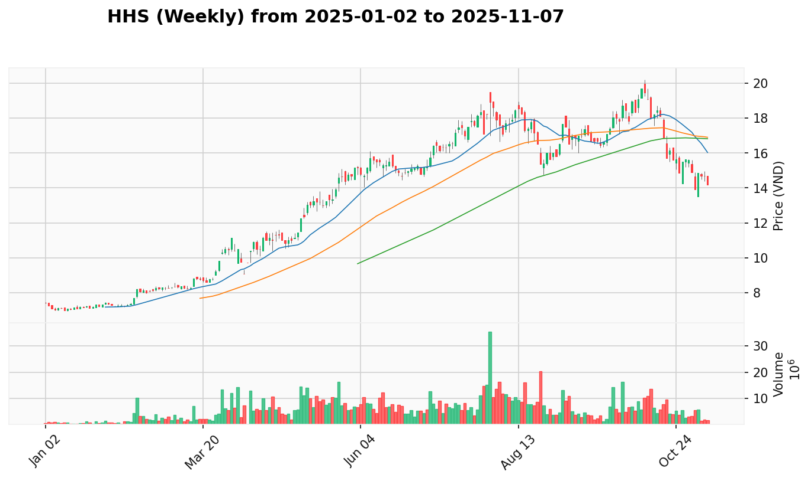

<a href="#others">↑ Back to group OTHERS</a>  |  <a href="#vpa-signal-summary">↑ Back to Top</a>

#### Key Statistics
| Metric | Value |
|:---|---:|
| Date Range | 2025-01-02 to 2025-11-14 |
| **Latest Close** | **14.8** |
| Period Open | 7.43 |
| Period High | 20.2 |
| Period Low | 6.95 |
| Period Change % | 99.19% |

**[Download HHS Data (.csv)](market_data_week/HHS_2025-01-02_to_2025-11-14.csv)**

---

### HHV

#### [VPA Analysis (2025-06-02 - 2025-08-03)](./VPA_week.md#hhv)
> - **Ngày 2025-07-07:** Tiếp nối nỗ lực tăng giá của tuần trước, HHV có một tuần tăng giá tốt, tạo thành một nến tăng và đóng cửa (12.65) cao hơn. Khối lượng giao dịch tăng mạnh.
>     - **Phân tích VPA/Wyckoff:** Đây là một **Sign of Strength**, cho thấy lực cầu đang chiếm ưu thế và xu hướng tăng được củng cố.
> - **Ngày 2025-07-14:** HHV có một tuần tăng giá mạnh mẽ, tăng từ 12.05 lên 12.9 (+7.1%) với biên độ rộng. Khối lượng giao dịch tăng vụt gần gấp đôi so với tuần trước.
>     - **Phân tích VPA/Wyckoff:** Đây là một **Buying Climax**. Sau nhiều tuần tăng liên tục, HHV đã có một cuộc bùng nổ mạnh mẽ trên khối lượng khổng lồ, cho thấy sự quan tâm lớn từ các nhà đầu tư. Tuy nhiên, đây cũng có thể là dấu hiệu của cao trào mua.
> - **Ngày 2025-07-21:** HHV tiếp tục xu hướng tăng giá với gap lên mở cửa 13.05, đạt đỉnh 13.6 và đóng cửa 13.15 (+1.9%). Nến tăng với thân nến dài và khối lượng giao dịch giảm xuống 72.2 triệu so với 99.9 triệu của tuần trước.
>     - **Phân tích VPA/Wyckoff:** Đây là **Test for Supply** sau buying climax tuần trước. Mặc dù giá tiếp tục tăng và tạo đỉnh mới nhưng khối lượng giao dịch giảm đáng kể cho thấy động lực mua đang suy yếu. Đây có thể là dấu hiệu cần quan sát thêm để xác định xem liệu HHV có thể tiếp tục xu hướng tăng hay sẽ chuyển sang giai đoạn phân phối.
> **Ngày 2025-07-27:** HHV tiếp tục duy trì xu hướng tăng giá nhưng với động thái điều chỉnh nhẹ. Mở cửa 13.05, đạt đỉnh mới 13.6 rồi về đóng cửa 13.15 (+1.9%). Mặc dù tạo đỉnh mới nhưng khối lượng giao dịch tiếp tục giảm xuống 72.2 triệu so với 99.9 triệu của tuần trước (-27.7%). Nến có thân dương ngắn với bóng trên dài, cho thấy áp lực bán xuất hiện ở vùng đỉnh.
> 
> **Phân tích VPA/Wyckoff:** Đây là **Weakness on a Test** - tín hiệu yếu kém trong giai đoạn test. Sau buying climax tuần 2025-07-20 và test for supply tuần trước, HHV tiếp tục tạo đỉnh mới nhưng trên khối lượng giảm mạnh và có dấu hiệu rejection ở vùng cao. Việc khối lượng giảm liên tục trong 2 tuần qua khi giá vẫn tăng cho thấy lực cầu đang suy yếu đáng kể. Cần quan sát phản ứng của giá trong những tuần tới để xác định liệu đây có phải là đỉnh ngắn hạn hay chỉ là điều chỉnh kỹ thuật.
> **Ngày 2025-08-03:**
> HHV có tuần giao dịch biến động mạnh, mở cửa cao hơn tại 13.25 nhưng sụt giảm về đóng cửa 12.8 (-2.7% so với tuần trước). Giá dao động trong biên độ rộng từ 12.25 đến 13.6, tạo nến giảm với thân đỏ dài và bóng dưới ngắn. Khối lượng giao dịch bùng nổ lên 98.7 triệu đơn vị, tăng 36.6% so với tuần trước và trở lại mức cao tương đương tuần buying climax 2025-07-20.

<a href="#dau-tu-cong">↑ Back to group DAU_TU_CONG</a>  |  <a href="#vpa-signal-summary">↑ Back to Top</a>

#### Key Statistics
| Metric | Value |
|:---|---:|
| Date Range | 2025-01-02 to 2025-11-14 |
| **Latest Close** | **13.6** |
| Period Open | 11.1 |
| Period High | 17.35 |
| Period Low | 9.26 |
| Period Change % | 22.52% |

**[Download HHV Data (.csv)](market_data_week/HHV_2025-01-02_to_2025-11-14.csv)**

---

### HID

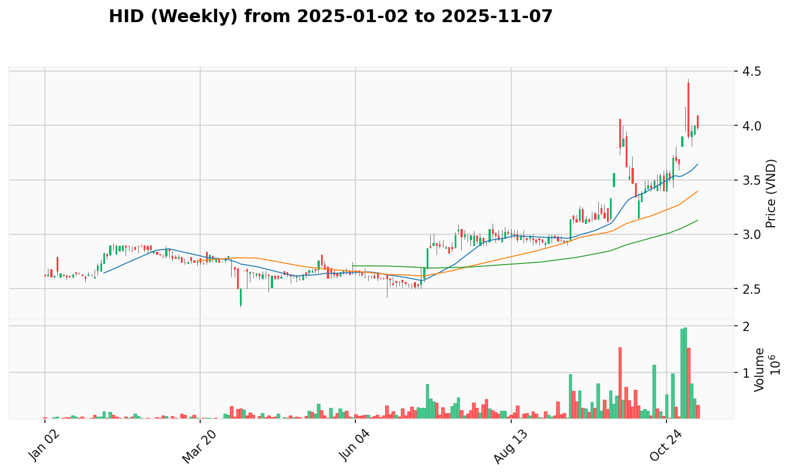

<a href="#penny">↑ Back to group PENNY</a>  |  <a href="#vpa-signal-summary">↑ Back to Top</a>

#### Key Statistics
| Metric | Value |
|:---|---:|
| Date Range | 2025-01-02 to 2025-11-14 |
| **Latest Close** | **5.35** |
| Period Open | 2.63 |
| Period High | 5.35 |
| Period Low | 2.33 |
| Period Change % | 103.42% |

**[Download HID Data (.csv)](market_data_week/HID_2025-01-02_to_2025-11-14.csv)**

---

### HLD

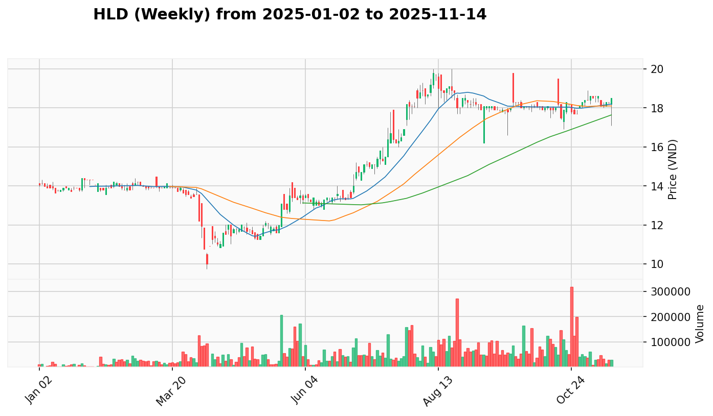

<a href="#bat-dong-san">↑ Back to group BAT_DONG_SAN</a>  |  <a href="#vpa-signal-summary">↑ Back to Top</a>

#### Key Statistics
| Metric | Value |
|:---|---:|
| Date Range | 2025-01-02 to 2025-11-14 |
| **Latest Close** | **18.5** |
| Period Open | 14.14 |
| Period High | 20.0 |
| Period Low | 9.74 |
| Period Change % | 30.83% |

**[Download HLD Data (.csv)](market_data_week/HLD_2025-01-02_to_2025-11-14.csv)**

---

### HOM

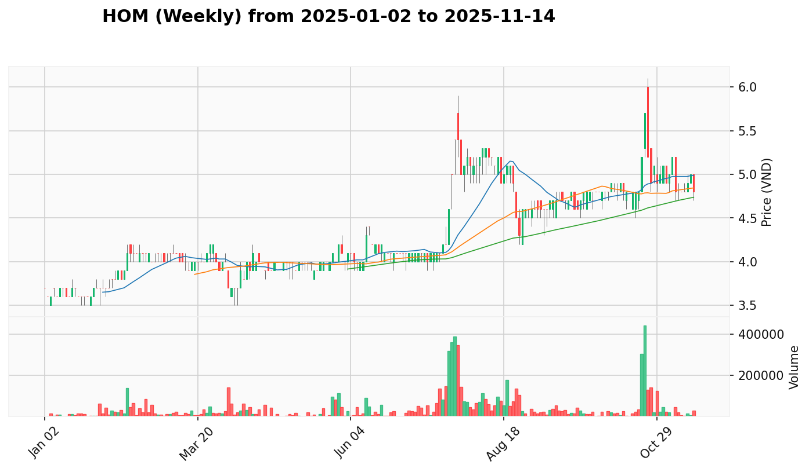

<a href="#vlxd">↑ Back to group VLXD</a>  |  <a href="#vpa-signal-summary">↑ Back to Top</a>

#### Key Statistics
| Metric | Value |
|:---|---:|
| Date Range | 2025-01-02 to 2025-11-14 |
| **Latest Close** | **4.8** |
| Period Open | 3.7 |
| Period High | 6.1 |
| Period Low | 3.5 |
| Period Change % | 29.73% |

**[Download HOM Data (.csv)](market_data_week/HOM_2025-01-02_to_2025-11-14.csv)**

---

### HPG

#### [VPA Analysis (2025-06-02 - 2025-08-03)](./VPA_week.md#hpg)
> - **Ngày 2025-07-07:** Tiếp nối Dấu hiệu Sức mạnh của tuần trước, HPG có một tuần bùng nổ với một nến tăng thân dài, đóng cửa (26.0) ở mức cao nhất tuần. Khối lượng giao dịch tăng vọt lên mức kỷ lục, xác nhận cho sức mạnh của đà tăng.
>     - **Phân tích VPA/Wyckoff:** Đây là một **Sign of Strength**. Tuy nhiên, sự tăng tốc quá nhanh trên khối lượng cực lớn có thể là dấu hiệu của một **Climax**, báo hiệu rủi ro điều chỉnh đang gia tăng.
> - **Ngày 2025-07-14:** HPG có một tuần điều chỉnh nhẹ, giảm từ 26.0 xuống 25.9 (-0.4%) với biên độ hẹp. Khối lượng giao dịch giảm nhưng vẫn ở mức rất cao.
>     - **Phân tích VPA/Wyckoff:** Đây là một **Test for Supply** sau Climax tuần trước. Việc giá chỉ điều chỉnh nhẹ trên nền khối lượng giảm cho thấy áp lực bán không quá mạnh, đây là tín hiệu tích cực cho thấy xu hướng tăng vẫn có thể tiếp tục.
> - **Ngày 2025-07-21:** HPG phục hồi với gap lên mở cửa 26.4, đạt đỉnh 27.0 và đóng cửa 26.05 (+0.6%). Nến tăng với bóng trên dài và khối lượng giao dịch duy trì ở mức cao 233.5 triệu.
>     - **Phân tích VPA/Wyckoff:** Đây là **Effort to Rise** tiếp theo sau test for supply tuần trước. Việc giá phục hồi và vượt qua đỉnh 26.0 của tuần trước nhưng gặp kháng cự tại 27.0 với bóng trên dài cho thấy vẫn còn áp lực bán tại các mức giá cao. Khối lượng duy trì cao cho thấy sự quan tâm tiếp tục từ cả hai bên.
> **Ngày 2025-07-27:** HPG có một tuần giao dịch hỗn hợp, mở cửa tại 26.4 và đạt đỉnh mới 27.0 trước khi giảm về đóng cửa 26.05 (+0.6%). Mặc dù vẫn tăng nhẹ so với tuần trước, nến có bóng trên dài cho thấy áp lực bán mạnh tại vùng 27.0. Khối lượng giao dịch 233.4 triệu cổ phiếu duy trì ở mức cao tương tự tuần trước, cho thấy sự quan tâm tiếp tục từ cả hai bên mua và bán.
> 
> **Phân tích VPA/Wyckoff:** Đây là một **Effort to Rise** với kết quả hạn chế. Việc giá đạt đỉnh mới 27.0 nhưng không thể duy trì và tạo bóng trên dài trên nền khối lượng cao cho thấy cung tăng mạnh tại mức giá này. Đây có thể là dấu hiệu của **Supply Coming In** tại vùng kháng cự 27.0, cần theo dõi các tuần tiếp theo để xác định liệu xu hướng tăng có thể tiếp tục hay sẽ có điều chỉnh sâu hơn.
> **Ngày 2025-08-03:** HPG có một tuần giao dịch khó khăn với nến giảm mạnh từ 26.05 xuống 25.15 (-3.5%). Mở cửa 26.1 gần mức đóng cửa tuần trước, cổ phiếu đạt đỉnh 26.85 trước khi sụt giảm mạnh xuống mức thấp 24.75, tạo ra nến có biên độ rộng với thân giảm và bóng dưới ngắn. Khối lượng giao dịch bùng nổ lên 368.5 triệu cổ phiếu, tăng 58% so với tuần trước và đạt mức cao nhất trong 8 tuần qua, thậm chí vượt cả tuần climax ngày 13/7 (307.6 triệu).

<a href="#thep">↑ Back to group THEP</a>  |  <a href="#vpa-signal-summary">↑ Back to Top</a>

#### Key Statistics
| Metric | Value |
|:---|---:|
| Date Range | 2025-01-02 to 2025-11-14 |
| **Latest Close** | **26.9** |
| Period Open | 22.25 |
| Period High | 30.85 |
| Period Low | 17.75 |
| Period Change % | 20.90% |

**[Download HPG Data (.csv)](market_data_week/HPG_2025-01-02_to_2025-11-14.csv)**

---

### HQC

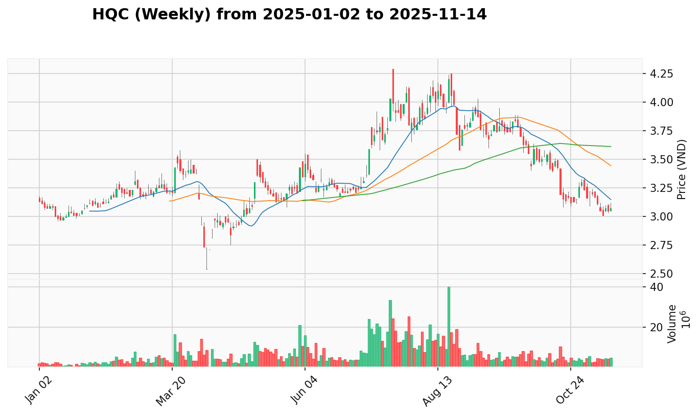

<a href="#bat-dong-san">↑ Back to group BAT_DONG_SAN</a>  |  <a href="#vpa-signal-summary">↑ Back to Top</a>

#### Key Statistics
| Metric | Value |
|:---|---:|
| Date Range | 2025-01-02 to 2025-11-14 |
| **Latest Close** | **3.07** |
| Period Open | 3.16 |
| Period High | 4.29 |
| Period Low | 2.54 |
| Period Change % | -2.85% |

**[Download HQC Data (.csv)](market_data_week/HQC_2025-01-02_to_2025-11-14.csv)**

---

### HSG

#### [VPA Analysis (2025-06-02 - 2025-08-03)](./VPA_week.md#hsg)
> - **Ngày 2025-07-07:** Sau phiên kiểm tra cung của tuần trước, HSG có một tuần tăng giá mạnh mẽ với một nến tăng thân dài, đóng cửa (17.65) gần mức cao nhất tuần. Khối lượng giao dịch tăng vọt.
>     - **Phân tích VPA/Wyckoff:** Đây là một **Sign of Strength**, cho thấy lực cầu đã quay trở lại một cách quyết liệt, báo hiệu khả năng kết thúc đợt điều chỉnh.
> - **Ngày 2025-07-14:** HSG tiếp tục xu hướng tăng với một nến tăng thân dài, đóng cửa (17.95) gần mức cao nhất tuần. Giá tăng từ 17.65 lên 17.95 với biên độ dao động từ 17.45 đến 18.5. Khối lượng giao dịch giảm xuống 53.7 triệu so với tuần trước 66.7 triệu.
>     - **Phân tích VPA/Wyckoff:** Đây là một **Effort to Rise**, tiếp nối tín hiệu mạnh mẽ của tuần trước. Mặc dù khối lượng giảm nhưng vẫn ở mức cao, cho thấy lực cầu vẫn đang kiểm soát và xu hướng tăng có khả năng tiếp diễn.
> - **Ngày 2025-07-21:** HSG tiếp tục đà tăng mạnh với gap lên mở cửa 18.15, đạt đỉnh 19.1 và đóng cửa 18.65 (+3.9%). Nến tăng với thân nến dài và khối lượng giao dịch tăng vọt lên 67.2 triệu.
>     - **Phân tích VPA/Wyckoff:** Đây là **Sign of Strength** rõ ràng. Việc giá breakout mạnh mẽ trên nền khối lượng tăng cao cho thấy lực cầu đang rất mạnh và HSG đã bước vào giai đoạn markup sau đợt tích lũy. Đỉnh 19.1 có thể là test resistance tiếp theo.
> **Ngày 2025-07-27:** HSG tiếp tục xu hướng tăng mạnh mẽ với nến tăng thân dài, giá mở cửa 18.15 và đóng cửa 18.65 (+3.9% so với tuần trước). Biên độ dao động từ 17.85 đến 19.1, với giá đóng cửa gần mức cao nhất tuần. Khối lượng giao dịch duy trì ở mức cao 67.2 triệu, tương đương tuần trước, cho thấy sự quan tâm mạnh mẽ của nhà đầu tư. Giá đã vượt qua ngưỡng kháng cự 18.5 và hướng tới test vùng 19.1.
> 
> **Phân tích VPA/Wyckoff:** Đây là **Sign of Strength** tiếp tục. Việc giá duy trì đà tăng mạnh trên nền khối lượng cao cho thấy lực cầu vẫn đang kiểm soát hoàn toàn. HSG đang trong giai đoạn markup rõ ràng sau khi breakout thành công. Vùng 19.1 sẽ là test resistance quan trọng tiếp theo, và việc khối lượng duy trì ở mức cao là tín hiệu tích cực cho xu hướng tăng dài hạn.
> **Ngày 2025-08-03:** HSG tiếp tục xu hướng tăng với nến tăng có biên độ rộng, mở cửa ở 18.95 và đóng cửa tại 18.5, giảm nhẹ -0.8% so với tuần trước. Biên độ dao động mở rộng từ 18.0 đến 19.65, với giá test lên đỉnh mới 19.65 trước khi bị đẩy xuống. Khối lượng giao dịch tăng mạnh lên 82.7 triệu (+23% so với tuần trước), đạt mức cao nhất trong 2 tháng qua. Mặc dù đóng cửa thấp hơn tuần trước nhưng vẫn duy trì ở vùng cao, cho thấy áp lực profit-taking sau đợt tăng mạnh.

<a href="#thep">↑ Back to group THEP</a>  |  <a href="#vpa-signal-summary">↑ Back to Top</a>

#### Key Statistics
| Metric | Value |
|:---|---:|
| Date Range | 2025-01-02 to 2025-11-14 |
| **Latest Close** | **17.05** |
| Period Open | 17.93 |
| Period High | 21.2 |
| Period Low | 12.4 |
| Period Change % | -4.91% |

**[Download HSG Data (.csv)](market_data_week/HSG_2025-01-02_to_2025-11-14.csv)**

---

### HT1

#### [VPA Analysis (2025-06-02 - 2025-08-03)](./VPA_week.md#ht1)
> - **Ngày 2025-07-14:** HT1 có một tuần điều chỉnh nhẹ với một nến giảm biên độ hẹp, đóng cửa (13.0) từ mức cao 13.15 của tuần trước. Giá dao động từ 12.85 đến 13.3. Khối lượng giao dịch giảm mạnh xuống 2.6 triệu so với 4.5 triệu tuần trước.
>     - **Phân tích VPA/Wyckoff:** Đây là một phiên **Test for Supply** thành công. Việc giá điều chỉnh nhẹ với khối lượng thấp cho thấy không có áp lực bán lớn, là tín hiệu No Supply và xu hướng tăng vẫn được duy trì.
> - **Ngày 2025-07-21:** HT1 bùng nổ với gap lên mạnh mở cửa 13.6, đạt đỉnh 14.8 và đóng cửa 14.75 (+13.5%). Nến tăng với thân nến rất dài và khối lượng giao dịch tăng vọt lên 9.1 triệu, gấp hơn 3 lần tuần trước.
>     - **Phân tích VPA/Wyckoff:** Đây là **Buying Climax** sau test for supply thành công tuần trước. Việc giá bùng nổ trên nền khối lượng cực lớn cho thấy lực cầu đã tích lũy đủ mạnh và bắt đầu giai đoạn markup quyết liệt. Tuy nhiên cần quan sát để xem liệu đây có phải là đỉnh ngắn hạn hay xu hướng tăng vẫn tiếp tục.
> **Ngày 2025-07-28:** Sau tuần bùng nổ với Buying Climax, HT1 tiếp tục tăng giá mạnh mẽ từ 13.6 lên đỉnh 14.8 rồi đóng cửa tại 14.75 (+13.5% so với tuần trước). Nến tăng với thân nến dài và bóng trên ngắn cho thấy lực mua vẫn kiểm soát. Khối lượng giao dịch duy trì ở mức cao 9.1 triệu, tương đương tuần trước, cho thấy sự quan tâm của nhà đầu tư vẫn tiếp tục.
> 
> **Phân tích VPA/Wyckoff:** Đây là **Follow Through** sau Buying Climax tuần trước. Việc giá tiếp tục tăng trên nền khối lượng cao xác nhận lực cầu vẫn mạnh mẽ và xu hướng tăng đang trong giai đoạn markup. Tuy nhiên, cần theo dõi các tuần tiếp theo để xem liệu có xuất hiện dấu hiệu Test hoặc điều chỉnh hay xu hướng tăng vẫn tiếp tục.
> **Ngày 2025-07-27:** HT1 tiếp tục xu hướng tăng mạnh mẽ với nến tăng từ 13.6 lên đỉnh 14.8 và đóng cửa tại 14.75 (+13.46% so với tuần trước). Đây là tuần thứ hai liên tiếp có mức tăng trên 13%, với nến có thân dài và bóng trên ngắn cho thấy lực mua kiểm soát hoàn toàn. Khối lượng giao dịch duy trì ở mức rất cao 9.07 triệu, tương đương với tuần Buying Climax trước đó, thể hiện sự quan tâm đặc biệt từ dòng tiền thông minh.
> 
> **Phân tích VPA/Wyckoff:** Đây là **Follow Through** mạnh mẽ sau Buying Climax tuần trước. Việc giá tiếp tục leo thang trên nền khối lượng duy trì cao xác nhận lực cầu institutional vẫn đang tích cực markup và xu hướng tăng đang trong giai đoạn phân phối lên. Tín hiệu này cho thấy smart money chưa có ý định rút lui và mục tiêu giá cao hơn vẫn khả thi. Tuy nhiên, sau hai tuần tăng liên tiếp với biên độ lớn, cần theo dõi các tuần tiếp theo để phát hiện dấu hiệu Test hoặc Automatic Reaction.
> **Ngày 2025-08-03:** Sau hai tuần tăng liên tiếp với biên độ lớn, HT1 có tuần điều chỉnh từ mức mở cửa 14.95 xuống đóng cửa tại 13.9 (-5.76%). Mặc dù có gap down từ 14.95 và test thấp xuống 13.25, giá đã phục hồi và đóng cửa trên vùng hỗ trợ 13.9. Khối lượng giao dịch giảm xuống 5.36 triệu từ 9.07 triệu tuần trước (-40.9%), cho thấy áp lực bán không quá mạnh trong giai đoạn điều chỉnh này.

<a href="#vlxd">↑ Back to group VLXD</a>  |  <a href="#vpa-signal-summary">↑ Back to Top</a>

#### Key Statistics
| Metric | Value |
|:---|---:|
| Date Range | 2025-01-02 to 2025-11-14 |
| **Latest Close** | **16.2** |
| Period Open | 11.78 |
| Period High | 21.0 |
| Period Low | 9.12 |
| Period Change % | 37.52% |

**[Download HT1 Data (.csv)](market_data_week/HT1_2025-01-02_to_2025-11-14.csv)**

---

### HTN

<a href="#bat-dong-san">↑ Back to group BAT_DONG_SAN</a>  |  <a href="#vpa-signal-summary">↑ Back to Top</a>

#### Key Statistics
| Metric | Value |
|:---|---:|
| Date Range | 2025-01-02 to 2025-11-14 |
| **Latest Close** | **9.29** |
| Period Open | 10.2 |
| Period High | 14.3 |
| Period Low | 7.71 |
| Period Change % | -8.92% |

**[Download HTN Data (.csv)](market_data_week/HTN_2025-01-02_to_2025-11-14.csv)**

---

### HUT

#### [VPA Analysis (2025-06-02 - 2025-08-03)](./VPA_week.md#hut)
> - **Ngày 2025-07-07:** Sau tín hiệu No Supply của tuần trước, HUT có một tuần tăng giá tốt, tạo thành một nến tăng và đóng cửa (13.6) cao hơn. Khối lượng giao dịch tăng vọt.
>     - **Phân tích VPA/Wyckoff:** Đây là một **Sign of Strength**, cho thấy lực cầu đã quay trở lại một cách quyết liệt, phá vỡ sự do dự trước đó.
> - **Ngày 2025-07-14:** HUT tiếp tục xu hướng tăng mạnh mẽ với một nến tăng thân dài, đóng cửa (14.6) tăng từ 13.6 tuần trước. Giá dao động từ 13.4 đến 15.1 với biên độ rộng. Khối lượng giao dịch tăng mạnh lên 14.9 triệu so với 10.2 triệu tuần trước.
>     - **Phân tích VPA/Wyckoff:** Đây là một **Sign of Strength**, tiếp nối momentum tăng trưởng mạnh mẽ của tuần trước. Khối lượng tăng kèm theo giá tăng cho thấy lực cầu đang chiếm ưu thế hoàn toàn và xu hướng tăng được củng cố.
> - **Ngày 2025-07-21:** HUT có một tuần giao dịch giăng co với nến doji, mở cửa 14.6, đạt cao 14.8, thấp 13.9 và đóng cửa 14.5 (-0.7%). Khối lượng giao dịch giảm xuống 12.0 triệu so với 14.9 triệu tuần trước.
>     - **Phân tích VPA/Wyckoff:** Đây là **Test for Supply** sau sign of strength tuần trước. Việc giá dao động trong biên độ hẹp và khối lượng giảm cho thấy không có áp lực bán mạnh tại các mức giá hiện tại. Đây là tín hiệu No Supply, hỗ trợ cho xu hướng tăng tiếp tục.
> **Ngày 2025-07-27:** Sau tuần test for supply trước đó, HUT có một tuần giao dịch tiếp tục trong vùng giằng co. Mở cửa 14.6, đạt cao 14.8, thấp 13.9 và đóng cửa 14.5 (-0.1%). Biên độ dao động thu hẹp so với tuần trước và khối lượng giao dịch giảm nhẹ xuống 12.0 triệu từ 14.9 triệu tuần đỉnh. Giá vẫn duy trì được vùng 14.5-14.8, cho thấy sự hỗ trợ tại các mức giá cao.
> 
> **Phân tích VPA/Wyckoff:** Đây là tín hiệu **No Supply** tiếp tục sau test for supply tuần trước. Việc giá dao động trong biên độ hẹp với khối lượng giảm nhẹ cho thấy không có áp lực bán mạnh tại vùng giá cao hiện tại. Sự thiếu vắng supply này là dấu hiệu tích cực, củng cố cho xu hướng tăng và tạo nền tảng cho đợt bứt phá tiếp theo.
> **Ngày 2025-08-03:**
> HUT có một tuần bùng nổ mạnh mẽ, phá vỡ hoàn toàn khung consolidation trước đó. Mở cửa 14.5, đạt đỉnh 19.2 và đóng cửa 18.2 (+25.5%). Đây là nến tăng thân dài với biên độ dao động cực rộng từ 14.4 đến 19.2. Khối lượng giao dịch bùng nổ lên 39.4 triệu, tăng gấp 3.3 lần so với 12.0 triệu tuần trước. Đây là khối lượng cao nhất trong 31 tuần qua, cho thấy sự tham gia mạnh mẽ của dòng tiền lớn.

<a href="#xay-dung">↑ Back to group XAY_DUNG</a>  |  <a href="#vpa-signal-summary">↑ Back to Top</a>

#### Key Statistics
| Metric | Value |
|:---|---:|
| Date Range | 2025-01-02 to 2025-11-14 |
| **Latest Close** | **18.3** |
| Period Open | 15.06 |
| Period High | 21.1 |
| Period Low | 10.62 |
| Period Change % | 21.51% |

**[Download HUT Data (.csv)](market_data_week/HUT_2025-01-02_to_2025-11-14.csv)**

---

### HVN

#### [VPA Analysis (2025-06-02 - 2025-08-03)](./VPA_week.md#hvn)
> - **Ngày 2025-07-07:** Sau phiên kiểm tra cung thành công của tuần trước, HVN có một tuần giảm giá với biên độ hẹp. Khối lượng giao dịch giảm.
>     - **Phân tích VPA/Wyckoff:** Đây là một phiên **No Demand**. Việc giá không thể tăng sau tín hiệu No Supply trước đó cho thấy phe mua đang do dự. Tín hiệu No Supply.
> - **Ngày 2025-07-14:** HVN có một tuần tăng giá nhẹ với nến tăng biên độ hẹp, đóng cửa (29.55) tăng từ 29.32 tuần trước. Giá dao động từ 29.36 đến 29.95. Khối lượng giao dịch giảm nhẹ xuống 10.9 triệu so với 11.8 triệu tuần trước.
>     - **Phân tích VPA/Wyckoff:** Đây là một phiên **Test for Supply** thành công. Việc giá tăng nhẹ với khối lượng thấp sau tín hiệu No Demand của tuần trước cho thấy áp lực bán đã giảm, là tín hiệu No Supply tích cực cho khả năng phục hồi.
> - **Ngày 2025-07-21:** HVN bùng nổ với gap lên mạnh mở cửa 31.6, đạt đỉnh 34.95 và đóng cửa 33.55 (+13.5%). Nến tăng với thân nến rất dài và khối lượng giao dịch duy trì ở mức 10.2 triệu.
>     - **Phân tích VPA/Wyckoff:** Đây là **Sign of Strength** mạnh mẽ sau test for supply thành công tuần trước. Việc giá breakout quyết liệt trên khối lượng ổn định cho thấy lực cầu đã tích lũy đủ mạnh và HVN đã bước vào giai đoạn markup. Đỉnh 34.95 có thể là test resistance ngắn hạn.
> **Ngày 2025-07-27:** HVN tiếp tục xu hướng tăng mạnh với nến tăng có thân dài, đóng cửa 33.55 (+13.55% so với tuần trước). Giá mở cửa gap lên 31.6, đạt đỉnh 34.95 rồi đóng cửa gần mức cao nhất. Khối lượng giao dịch duy trì ổn định ở 10.17 triệu, tương đương tuần trước.
> 
> **Phân tích VPA/Wyckoff:** Đây là **Sign of Strength** tiếp tục sau breakout tuần trước. Việc giá duy trì momentum tăng mạnh với gap opening và test thành công vùng kháng cự 34.95 trên khối lượng ổn định cho thấy lực cầu vẫn đang kiểm soát thị trường. Xu hướng markup đang được duy trì tốt, HVN có thể tiếp tục test các vùng giá cao hơn trong các tuần tới.
> **Ngày 2025-08-03:** Sau tuần bùng nổ trước đó, HVN có tuần điều chỉnh với nến giảm biên độ hẹp, đóng cửa 32.5 (-3.13% so với 33.55 tuần trước). Giá mở cửa 34.1 gần đỉnh tuần trước nhưng bị đẩy xuống thấp nhất 32.0 trước khi phục hồi nhẹ. Khối lượng giao dịch giảm nhẹ xuống 9.37 triệu so với 10.17 triệu tuần trước.

<a href="#hang-khong">↑ Back to group HANG_KHONG</a>  |  <a href="#vpa-signal-summary">↑ Back to Top</a>

#### Key Statistics
| Metric | Value |
|:---|---:|
| Date Range | 2025-01-02 to 2025-11-14 |
| **Latest Close** | **29.2** |
| Period Open | 22.78 |
| Period High | 38.45 |
| Period Low | 19.39 |
| Period Change % | 28.18% |

**[Download HVN Data (.csv)](market_data_week/HVN_2025-01-02_to_2025-11-14.csv)**

---

### IDC

#### [VPA Analysis (2025-06-02 - 2025-08-03)](./VPA_week.md#idc)
> - **Ngày 2025-07-07:** Sau tuần bùng nổ trước đó, IDC có một tuần điều chỉnh với một nến giảm, đóng cửa (46.2) thấp hơn. Khối lượng giao dịch giảm mạnh.
>     - **Phân tích VPA/Wyckoff:** Đây là một phiên **No Supply**. Việc giá điều chỉnh với khối lượng thấp sau một đợt tăng mạnh là một tín hiệu rất No Supply, cho thấy áp lực chốt lời yếu và thị trường đang hấp thụ tốt.
> - **Ngày 2025-07-14:** IDC có một tuần giao dịch đi ngang với nến giảm biên độ hẹp, đóng cửa (46.1) gần với tuần trước (46.2). Giá dao động từ 45.8 đến 47.2. Khối lượng giao dịch giảm nhẹ xuống 8.3 triệu so với 9.3 triệu tuần trước.
>     - **Phân tích VPA/Wyckoff:** Đây là một phiên **Test for Supply** thành công. Việc giá giữ vững với khối lượng thấp sau tín hiệu No Supply của tuần trước cho thấy áp lực bán đã được hấp thụ hoàn toàn, là tín hiệu No Supply mạnh mẽ.
> - **Ngày 2025-07-21:** IDC có một tuần tăng giá với nến tăng biên độ rộng, đóng cửa 46.6 (+1.1%) từ 46.1 tuần trước. Giá dao động từ 44.8 đến 47.4 và khối lượng giao dịch tăng nhẹ lên 8.5 triệu.
>     - **Phân tích VPA/Wyckoff:** Đây là **Effort to Rise** sau test for supply thành công tuần trước. Việc giá phục hồi và test lại resistance 47.4 với khối lượng tăng nhẹ cho thấy lực cầu đang dần quay trở lại. Đây là tín hiệu tích cực cho khả năng breakout tiếp theo.
> **Ngày 2025-07-27:** IDC có một tuần tăng giá nhẹ với nến tăng biên độ hẹp, đóng cửa 46.6 (không đổi so với tuần trước). Giá dao động từ 44.8 đến 47.4, test lại vùng kháng cự 47.4 lần thứ hai. Khối lượng giao dịch tăng lên 10.6 triệu từ 8.3 triệu tuần trước (+28%).
> 
> **Phân tích VPA/Wyckoff:** Đây là **Test for Supply** tại vùng kháng cự 47.4. Việc giá test lại resistance với khối lượng tăng nhưng vẫn bị đẩy lùi cho thấy áp lực bán vẫn còn tồn tại tại mức này. Tuy nhiên, việc giá giữ vững trên 46.0 và không có selling climax cho thấy áp lực bán không quá mạnh. Cần quan sát thêm để xác định khả năng breakout hoặc điều chỉnh sâu hơn.
> **Ngày 2025-08-03:** IDC có một tuần giảm giá mạnh với nến giảm biên độ rộng, đóng cửa 44.6 giảm 4.3% từ 46.6 tuần trước. Giá mở cửa 45.0, test lên 48.4 (vượt qua resistance 47.4 lần đầu tiên) nhưng sau đó sụt giảm mạnh xuống 44.0 trước khi phục hồi nhẹ. Khối lượng giao dịch bùng nổ lên 19.3 triệu từ 10.6 triệu tuần trước (+81%).

<a href="#bat-dong-san-kcn">↑ Back to group BAT_DONG_SAN_KCN</a>  |  <a href="#vpa-signal-summary">↑ Back to Top</a>

#### Key Statistics
| Metric | Value |
|:---|---:|
| Date Range | 2025-01-02 to 2025-11-14 |
| **Latest Close** | **42.7** |
| Period Open | 46.86 |
| Period High | 48.9 |
| Period Low | 26.87 |
| Period Change % | -8.88% |

**[Download IDC Data (.csv)](market_data_week/IDC_2025-01-02_to_2025-11-14.csv)**

---

### IDI

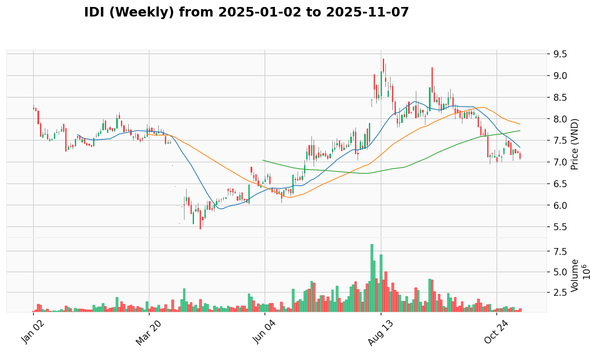

<a href="#thuy-san">↑ Back to group THUY_SAN</a>  |  <a href="#vpa-signal-summary">↑ Back to Top</a>

#### Key Statistics
| Metric | Value |
|:---|---:|
| Date Range | 2025-01-02 to 2025-11-14 |
| **Latest Close** | **7.3** |
| Period Open | 8.25 |
| Period High | 9.39 |
| Period Low | 5.45 |
| Period Change % | -11.52% |

**[Download IDI Data (.csv)](market_data_week/IDI_2025-01-02_to_2025-11-14.csv)**

---

### IDJ

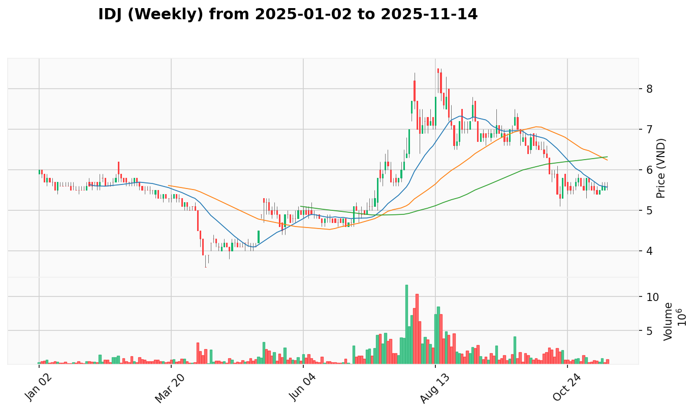

<a href="#xay-dung">↑ Back to group XAY_DUNG</a>  |  <a href="#vpa-signal-summary">↑ Back to Top</a>

#### Key Statistics
| Metric | Value |
|:---|---:|
| Date Range | 2025-01-02 to 2025-11-14 |
| **Latest Close** | **5.6** |
| Period Open | 5.9 |
| Period High | 8.5 |
| Period Low | 3.6 |
| Period Change % | -5.08% |

**[Download IDJ Data (.csv)](market_data_week/IDJ_2025-01-02_to_2025-11-14.csv)**

---

### IDV

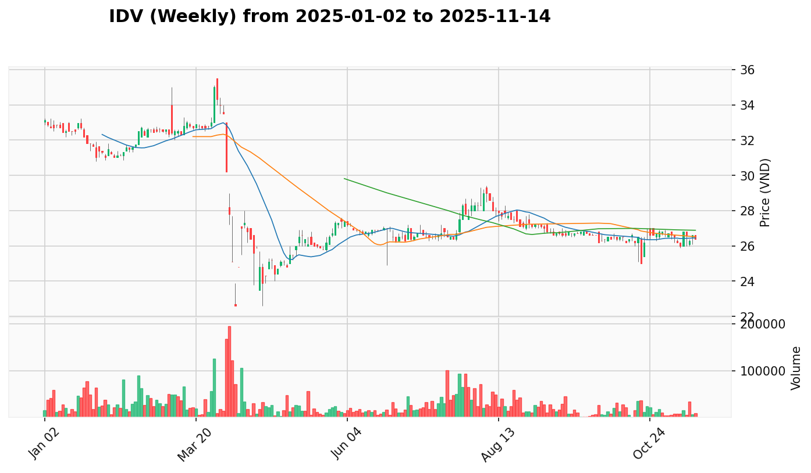

<a href="#bat-dong-san-kcn">↑ Back to group BAT_DONG_SAN_KCN</a>  |  <a href="#vpa-signal-summary">↑ Back to Top</a>

#### Key Statistics
| Metric | Value |
|:---|---:|
| Date Range | 2025-01-02 to 2025-11-14 |
| **Latest Close** | **26.4** |
| Period Open | 33.04 |
| Period High | 35.5 |
| Period Low | 22.6 |
| Period Change % | -20.10% |

**[Download IDV Data (.csv)](market_data_week/IDV_2025-01-02_to_2025-11-14.csv)**

---

### IJC

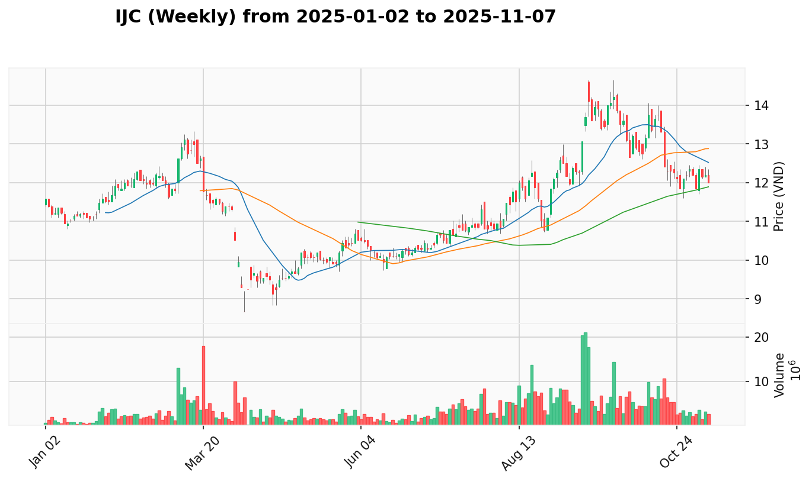

<a href="#xay-dung">↑ Back to group XAY_DUNG</a>  |  <a href="#vpa-signal-summary">↑ Back to Top</a>

#### Key Statistics
| Metric | Value |
|:---|---:|
| Date Range | 2025-01-02 to 2025-11-14 |
| **Latest Close** | **12.45** |
| Period Open | 11.43 |
| Period High | 14.65 |
| Period Low | 8.67 |
| Period Change % | 8.92% |

**[Download IJC Data (.csv)](market_data_week/IJC_2025-01-02_to_2025-11-14.csv)**

---

### IMP

#### [VPA Analysis (2025-06-02 - 2025-08-03)](./VPA_week.md#imp)
> - **Ngày 2025-07-07:** Sau tín hiệu No Demand của tuần trước, IMP có một tuần tăng giá nhẹ với biên độ hẹp. Khối lượng giao dịch tăng.
>     - **Phân tích VPA/Wyckoff:** Đây là một **Effort to Rise**. Việc giá tiếp tục tăng cho thấy lực cầu vẫn đang kiểm soát, tuy nhiên biên độ hẹp cho thấy đà tăng đang chững lại.
> - **Ngày 2025-07-14:** IMP có một tuần điều chỉnh nhẹ với nến giảm biên độ hẹp, đóng cửa (51.7) từ 51.9 tuần trước. Giá dao động từ 51.5 đến 52.4. Khối lượng giao dịch tăng lên 838.2 nghìn so với 682.4 nghìn tuần trước.
>     - **Phân tích VPA/Wyckoff:** Đây là một phiên **Test for Supply**. Việc giá điều chỉnh nhẹ với khối lượng tăng cho thấy có một số áp lực bán nhưng không đáng kể, là tín hiệu trung tính có xu hướng No Supply.
> - **Ngày 2025-07-21:** IMP có một tuần phục hồi với nến tăng biên độ hẹp, đóng cửa 51.9 (+0.4%) từ 51.7 tuần trước. Giá dao động từ 51.7 đến 53.2 và khối lượng giao dịch tăng nhẹ lên 845.1 nghìn.
>     - **Phân tích VPA/Wyckoff:** Đây là **Effort to Rise** sau test for supply tuần trước. Việc giá phục hồi với khối lượng tăng nhẹ cho thấy lực cầu đang dần quay trở lại, tuy nhiên biên độ hẹp và khối lượng chưa thực sự mạnh cho thấy đà tăng vẫn còn thận trọng.
> **Ngày 2025-07-27:** IMP có tuần giao dịch tăng nhẹ với nến xanh biên độ hẹp, đóng cửa 51.9 (không đổi) so với tuần trước. Giá dao động từ 51.7 đến 53.2, tương tự tuần trước. Khối lượng giao dịch tăng từ 837.3 nghìn lên 844.6 nghìn (+0.9%). Cổ phiếu đang duy trì trong vùng sideways 51.5-53.2 kể từ đầu tháng 7.
> 
> **Phân tích VPA/Wyckoff:** Đây là **No Demand**. Mặc dù khối lượng tăng nhẹ nhưng giá đóng cửa không đổi và dao động trong biên độ hẹp cho thấy thị trường thiếu sự quan tâm ở vùng giá hiện tại. Tín hiệu này cho thấy đà tăng đang yếu dần và có thể chuẩn bị cho một đợt điều chỉnh.
> **Ngày 2025-08-03:** IMP có một tuần đột phá mạnh mẽ với nến tăng biên độ rộng, đóng cửa 52.7 (+1.5%) từ 51.9 tuần trước. Giá mở cửa 52.1, test xuống thấp nhất 50.3 rồi bật lên cao nhất 53.5 trước khi đóng cửa gần vùng cao. Khối lượng giao dịch bùng nổ lên 1.05 triệu (+24.3%) so với 844.6 nghìn tuần trước, là mức khối lượng cao nhất kể từ đầu tháng 6.

<a href="#suc-khoe">↑ Back to group SUC_KHOE</a>  |  <a href="#vpa-signal-summary">↑ Back to Top</a>

#### Key Statistics
| Metric | Value |
|:---|---:|
| Date Range | 2025-01-02 to 2025-11-14 |
| **Latest Close** | **48.7** |
| Period Open | 46.55 |
| Period High | 56.5 |
| Period Low | 35.75 |
| Period Change % | 4.62% |

**[Download IMP Data (.csv)](market_data_week/IMP_2025-01-02_to_2025-11-14.csv)**

---

### IPA

#### [VPA Analysis (2025-06-02 - 2025-08-03)](./VPA_week.md#ipa)
> - **Ngày 2025-07-07:** Sau cú Upthrust yếu kém của tuần trước, IPA có một tuần tăng giá bùng nổ với một nến tăng thân dài, đóng cửa (15.0) ở mức cao nhất tuần. Khối lượng giao dịch tăng vọt.
>     - **Phân tích VPA/Wyckoff:** Đây là một **Sign of Strength**, cho thấy lực cầu đã quay trở lại một cách áp đảo, phủ nhận hoàn toàn tín hiệu yếu của tuần trước.
> - **Ngày 2025-07-14:** IPA tiếp tục xu hướng tăng với nến tăng thân dài, đóng cửa (15.4) tăng từ 15.0 tuần trước. Giá dao động từ 14.5 đến 16.0 với biên độ tốt. Khối lượng giao dịch giảm xuống 2.8 triệu so với 3.3 triệu tuần trước.
>     - **Phân tích VPA/Wyckoff:** Đây là một **Effort to Rise**. Việc giá tiếp tục tăng sau Sign of Strength tuần trước cho thấy momentum tăng trưởng được duy trì, mặc dù khối lượng giảm nhưng vẫn ở mức cao.
> - **Ngày 2025-07-21:** IPA tiếp tục đà tăng mạnh với gap lên mở cửa 15.5, đạt đỉnh 16.9 và đóng cửa 16.7 (+8.4%). Nến tăng với thân nến dài và khối lượng giao dịch tăng vọt lên 4.6 triệu.
>     - **Phân tích VPA/Wyckoff:** Đây là **Sign of Strength** mạnh mẽ tiếp theo. Việc giá breakout quyết liệt trên nền khối lượng tăng cao cho thấy lực cầu đang rất mạnh và IPA đã bước vào giai đoạn markup rõ ràng. Đỉnh 16.9 có thể là test resistance tiếp theo.
> **Ngày 2025-07-27:** IPA tiếp tục xu hướng tăng mạnh với nến tăng thân dài, mở cửa 15.5 và đóng cửa 16.7 (+8.4% so với tuần trước). Giá dao động từ 14.3 đến 16.9 với biên độ rộng 2.6 điểm. Khối lượng giao dịch tăng vọt lên 4.55 triệu, cao nhất trong 10 tuần qua, cao hơn 60% so với tuần trước.
> - **Phân tích VPA/Wyckoff:** Đây là **Sign of Strength** rất mạnh mẽ tiếp theo trong chuỗi markup. Việc giá breakout lên đỉnh mới 16.9 trên nền khối lượng tăng cao đáng kể cho thấy lực cầu institutional đang rất tích cực. Mặc dù có test xuống 14.3 nhưng đóng cửa gần đỉnh (16.7) chứng tỏ absorption tốt. IPA đang trong giai đoạn markup rõ ràng với potential target tiếp theo ở vùng 17.5-18.0.
> **Ngày 2025-08-03:** IPA bùng nổ với tuần tăng giá phi thường, mở cửa 16.9 và đóng cửa 20.7 (+23.9% so với tuần trước). Giá có breakout mạnh mẽ lên đỉnh 22.4 từ nền 16.9, tạo ra biên độ dao động khổng lồ 5.5 điểm. Khối lượng giao dịch tăng vọt lên 9.07 triệu, cao gấp đôi tuần trước và đạt kỷ lục trong 10 tuần qua. Nến tăng có thân dài với đuôi trên ngắn, đóng cửa khá gần đỉnh tuần.

<a href="#penny">↑ Back to group PENNY</a>  |  <a href="#vpa-signal-summary">↑ Back to Top</a>

#### Key Statistics
| Metric | Value |
|:---|---:|
| Date Range | 2025-01-02 to 2025-11-14 |
| **Latest Close** | **19.5** |
| Period Open | 11.9 |
| Period High | 28.0 |
| Period Low | 9.1 |
| Period Change % | 63.87% |

**[Download IPA Data (.csv)](market_data_week/IPA_2025-01-02_to_2025-11-14.csv)**

---

### ITC

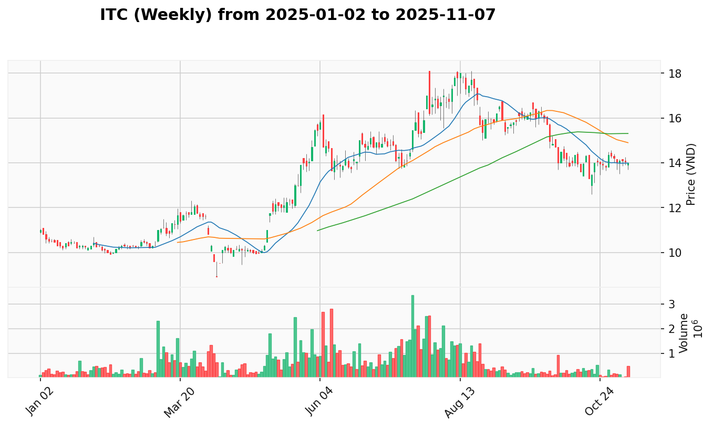

<a href="#bat-dong-san">↑ Back to group BAT_DONG_SAN</a>  |  <a href="#vpa-signal-summary">↑ Back to Top</a>

#### Key Statistics
| Metric | Value |
|:---|---:|
| Date Range | 2025-01-02 to 2025-11-14 |
| **Latest Close** | **14.3** |
| Period Open | 10.9 |
| Period High | 18.1 |
| Period Low | 8.91 |
| Period Change % | 31.19% |

**[Download ITC Data (.csv)](market_data_week/ITC_2025-01-02_to_2025-11-14.csv)**

---

### JVC

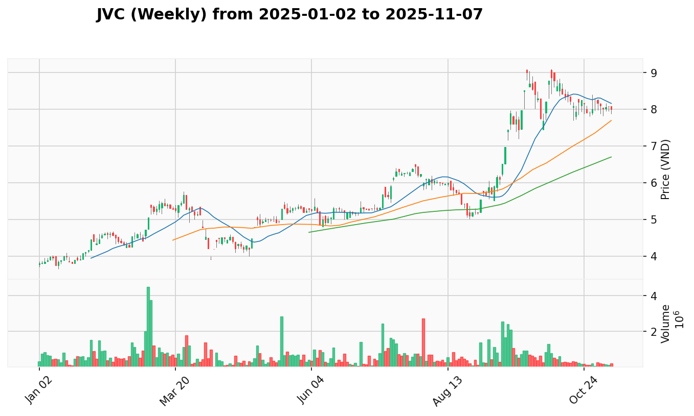

<a href="#suc-khoe">↑ Back to group SUC_KHOE</a>  |  <a href="#vpa-signal-summary">↑ Back to Top</a>

#### Key Statistics
| Metric | Value |
|:---|---:|
| Date Range | 2025-01-02 to 2025-11-14 |
| **Latest Close** | **7.2** |
| Period Open | 3.77 |
| Period High | 9.1 |
| Period Low | 3.65 |
| Period Change % | 90.98% |

**[Download JVC Data (.csv)](market_data_week/JVC_2025-01-02_to_2025-11-14.csv)**

---

### KBC

#### [VPA Analysis (2025-06-02 - 2025-08-03)](./VPA_week.md#kbc)
> - **Ngày 2025-07-07:** Tiếp nối Dấu hiệu Sức mạnh của tuần trước, KBC có một tuần tăng giá tốt, tạo thành một nến tăng và đóng cửa (27.5) cao hơn. Khối lượng giao dịch duy trì ở mức cao.
>     - **Phân tích VPA/Wyckoff:** Đây là một **Sign of Strength**, cho thấy lực cầu vẫn đang chiếm ưu thế và xu hướng tăng được củng cố.
> - **Ngày 2025-07-14:** KBC tiếp tục xu hướng tăng với nến tăng thân dài, đóng cửa (28.45) tăng từ 27.5 tuần trước. Giá dao động từ 27.5 đến 28.8. Khối lượng giao dịch giảm xuống 30.0 triệu so với 38.7 triệu tuần trước.
>     - **Phân tích VPA/Wyckoff:** Đây là một **Effort to Rise**. Việc giá tiếp tục tăng sau hai tuần Sign of Strength liên tiếp cho thấy momentum tăng trưởng mạnh mẽ được duy trì, mặc dù khối lượng giảm nhưng vẫn ở mức cao.
> - **Ngày 2025-07-21:** KBC tiếp tục xu hướng tăng với nến tăng thân dài, đóng cửa (29.2) tăng từ 28.45 tuần trước. Giá dao động từ 28.1 đến 29.25 với biên độ ổn định. Khối lượng giao dịch giảm xuống 23.2 triệu so với 30.0 triệu tuần trước.
>     - **Phân tích VPA/Wyckoff:** Đây là một **No Supply**. Việc giá tiếp tục tăng trên khối lượng giảm cho thấy áp lực bán rất yếu, phe bán đã kiệt sức. Đây là tín hiệu No Supply rất mạnh, ủng hộ cho việc tiếp tục xu hướng tăng.
> **Ngày 2025-07-27:** KBC duy trì xu hướng tăng tích cực với nến tăng thân dài, đóng cửa (29.2) tăng từ 28.45 tuần trước. Giá dao động từ 28.1 đến 29.25, tạo biên độ 4% ổn định. Khối lượng giao dịch giảm nhẹ xuống 23.2 triệu so với 30.0 triệu tuần trước, tiếp tục xu hướng giảm khối lượng trong bối cảnh giá tăng. Cổ phiếu đã tăng liên tiếp 4 tuần kể từ đáy 24.4, cho thấy momentum tăng trưởng mạnh mẽ và bền vững.
> 
> **Phân tích VPA/Wyckoff:** Đây là một **No Supply** rất mạnh. Việc giá tiếp tục tăng trên khối lượng giảm dần qua 3 tuần liên tiếp cho thấy áp lực bán đã cạn kiệt hoàn toàn. Phe bán không còn khả năng đẩy giá xuống, tạo điều kiện thuận lợi cho giá tiếp tục leo thang. Tín hiệu No Supply này được củng cố bởi chuỗi 4 tuần tăng liên tiếp từ vùng hỗ trợ 24.4, ủng hộ mạnh mẽ cho khả năng tiếp tục xu hướng tăng trong các tuần tới.
> **Ngày 2025-08-03:** KBC có tuần bứt phá mạnh mẽ với nến tăng thân cực dài, đóng cửa (31.5) tăng vọt từ 29.2 tuần trước. Giá dao động từ 28.9 đến 32.25 với biên độ lên tới 11.6%, cho thấy momentum tăng trưởng bùng nổ. Khối lượng giao dịch tăng mạnh lên 58.6 triệu so với 23.2 triệu tuần trước, tăng gấp 2.5 lần. Cổ phiếu đã tăng liên tiếp 5 tuần kể từ đáy 24.4, tích lũy được mức tăng ấn tượng 29.1% và hiện đang test vùng kháng cự quan trọng quanh 32.0-32.25.

<a href="#bat-dong-san-kcn">↑ Back to group BAT_DONG_SAN_KCN</a>  |  <a href="#vpa-signal-summary">↑ Back to Top</a>

#### Key Statistics
| Metric | Value |
|:---|---:|
| Date Range | 2025-01-02 to 2025-11-14 |
| **Latest Close** | **33.6** |
| Period Open | 27.25 |
| Period High | 43.1 |
| Period Low | 20.05 |
| Period Change % | 23.30% |

**[Download KBC Data (.csv)](market_data_week/KBC_2025-01-02_to_2025-11-14.csv)**

---

### KDC

#### [VPA Analysis (2025-06-02 - 2025-08-03)](./VPA_week.md#kdc)
> - **Ngày 2025-07-07:** Sau Dấu hiệu Yếu kém của tuần trước, KDC có một tuần giảm giá nhẹ với biên độ hẹp. Khối lượng giao dịch duy trì ở mức cao.
>     - **Phân tích VPA/Wyckoff:** Đây là một phiên **No Demand** sau khi nguồn cung xuất hiện. Việc giá không thể phục hồi trên khối lượng cao cho thấy phe mua yếu, củng cố cho tín hiệu yếu của tuần trước.
> - **Ngày 2025-07-14:** KDC có một tuần điều chỉnh nhẹ với nến giảm biên độ hẹp, đóng cửa (56.0) từ 56.5 tuần trước. Giá dao động từ 55.6 đến 56.9. Khối lượng giao dịch tăng nhẹ lên 2.6 triệu so với 2.5 triệu tuần trước.
>     - **Phân tích VPA/Wyckoff:** Đây là một phiên **Test for Supply** với kết quả trung tính. Việc giá giữ vững với khối lượng ổn định cho thấy áp lực bán không lớn, tuy nhiên chưa có tín hiệu mua mạnh mẽ để khẳng định xu hướng.
> - **Ngày 2025-07-21:** KDC có một tuần giảm giá nhẹ với nến giảm thân dài, đóng cửa (55.2) từ 56.0 tuần trước. Giá dao động từ 54.1 đến 56.0 với biên độ vừa phải. Khối lượng giao dịch tương tự ở mức 2.7 triệu so với 2.6 triệu tuần trước.
>     - **Phân tích VPA/Wyckoff:** Đây là một **No Demand**. Việc giá không thể duy trì mức cao sau Test for Supply tuần trước cho thấy lực cầu còn yếu. Khối lượng ổn định kèm theo giá giảm là tín hiệu thiếu sự quan tâm từ nhà đầu tư, cho thấy xu hướng đi ngang có thể kéo dài.
> **Ngày 2025-07-27:** KDC tiếp tục xu hướng giảm với một tuần giảm giá từ 56.0 xuống 55.2, tạo nến giảm thân dài. Giá mở cửa thấp hơn tuần trước (55.6 vs 56.9) và đóng cửa gần mức thấp nhất tuần (54.1). Khối lượng giao dịch tăng nhẹ lên 2.673 triệu, cao hơn so với 2.637 triệu tuần trước. Việc giá liên tục không thể duy trì được các mức cao trong 3 tuần gần đây (từ 56.5 xuống 56.0 rồi 55.2) cho thấy áp lực bán đang gia tăng dần.
> 
> **Phân tích VPA/Wyckoff:** Đây là một **Sign of Weakness** được xác nhận. Sau hai tuần **No Demand** và **Test for Supply**, việc giá tiếp tục giảm trên khối lượng tăng cho thấy nguồn cung đang áp đảo. Mô hình giảm dần trong 3 tuần liên tiếp từ vùng 56-57 xuống 55.2 với khối lượng duy trì ở mức cao là dấu hiệu của sự phân phối, cho thấy xu hướng yếu có thể kéo dài.
> **Ngày 2025-08-03:** KDC tiếp tục xu hướng giảm với một tuần điều chỉnh từ 55.2 xuống 54.8, tạo nến giảm thân ngắn. Giá mở cửa thấp hơn tuần trước (54.8 vs 55.6) và dao động trong biên độ hẹp từ 53.9 đến 55.5, đóng cửa ở chính mức mở cửa 54.8. Khối lượng giao dịch giảm xuống 2.390 triệu so với 2.673 triệu tuần trước, giảm 10.6%. Việc giá tiếp tục không thể phục hồi lên vùng 56-57 trong 4 tuần liên tiếp cho thấy áp lực bán vẫn đang kiểm soát thị trường, mặc dù có dấu hiệu nhẹ nhõm khi biên độ dao động thu hẹp.

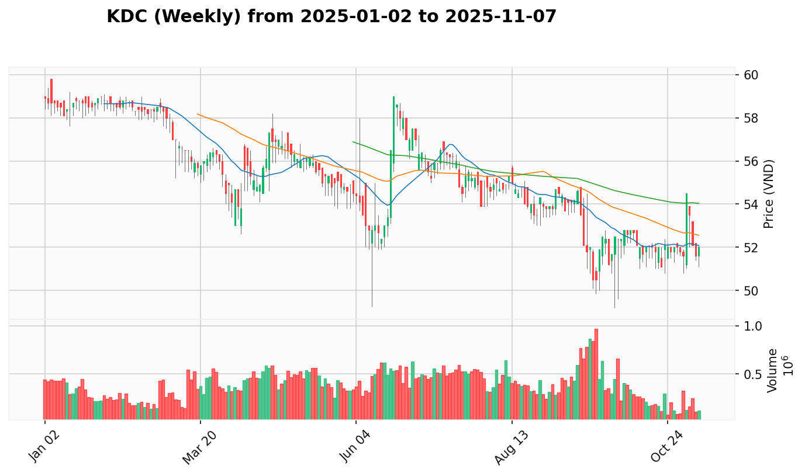

<a href="#thuc-pham">↑ Back to group THUC_PHAM</a>  |  <a href="#vpa-signal-summary">↑ Back to Top</a>

#### Key Statistics
| Metric | Value |
|:---|---:|
| Date Range | 2025-01-02 to 2025-11-14 |
| **Latest Close** | **52.7** |
| Period Open | 59.0 |
| Period High | 59.8 |
| Period Low | 49.2 |
| Period Change % | -10.68% |

**[Download KDC Data (.csv)](market_data_week/KDC_2025-01-02_to_2025-11-14.csv)**

---

### KDH

#### [VPA Analysis (2025-06-02 - 2025-08-03)](./VPA_week.md#kdh)
> - **Ngày 2025-07-07:** Sau tín hiệu No Demand của tuần trước, KDH có một tuần tăng giá tốt, tạo thành một nến tăng và đóng cửa (27.55) cao hơn. Khối lượng giao dịch tăng mạnh.
>     - **Phân tích VPA/Wyckoff:** Đây là một **Sign of Strength**, cho thấy lực cầu đã quay trở lại sau một thời gian đi ngang, phá vỡ sự thiếu quan tâm trước đó.
> - **Ngày 2025-07-14:** KDH có một tuần tăng giá mạnh mẽ với nến tăng thân dài, đóng cửa (29.0) tăng từ 27.55 tuần trước. Giá dao động từ 27.09 đến 29.7 với biên độ rộng. Khối lượng giao dịch tăng vọt lên 32.6 triệu so với 24.2 triệu tuần trước.
>     - **Phân tích VPA/Wyckoff:** Đây là một **Sign of Strength** mạnh mẽ. Việc giá tăng đáng kể kèm theo khối lượng bùng nổ cho thấy lực cầu đang áp đảo và xu hướng tăng được củng cố mạnh mẽ.
> - **Ngày 2025-07-21:** Sau Sign of Strength tuần trước, KDH có một tuần điều chỉnh nhẹ với nến giảm biên độ hẹp, đóng cửa (28.7) từ 29.0 tuần trước. Giá dao động từ 28.05 đến 29.2. Khối lượng giao dịch giảm xuống 22.3 triệu so với 32.6 triệu tuần trước.
>     - **Phân tích VPA/Wyckoff:** Đây là một **Test for Supply** thành công. Việc giá chỉ giảm nhẹ trên nền khối lượng giảm mạnh cho thấy áp lực bán không lớn sau đợt tăng mạnh. Đây là tín hiệu No Supply tốt, cho thấy thị trường đang củng cố và có thể sớm tăng trở lại.
> **Ngày 2025-07-27:** KDH tiếp tục có một tuần điều chỉnh nhẹ với nến giảm biên độ hẹp, đóng cửa (28.7) giữ nguyên so với tuần trước. Giá dao động từ 28.05 đến 29.2 với biên độ thu hẹp. Khối lượng giao dịch giữ ổn định ở mức 22.3 triệu, tương đương tuần trước.
> 
> **Phân tích VPA/Wyckoff:** Đây là một **Test for Supply** thành công tiếp theo. Việc giá giữ vững mức 28.7 trên nền khối lượng ổn định cho thấy không có áp lực bán lớn trong vùng giá này. Sự thu hẹp biên độ dao động (từ 29.7-27.09 tuần trước xuống 29.2-28.05 tuần này) kèm theo khối lượng không tăng cho thấy thị trường đang trong giai đoạn **No Supply**, tạo nền tảng vững chắc cho đợt tăng tiếp theo.
> **Ngày 2025-08-03:** Sau giai đoạn No Supply của tuần trước, KDH có một tuần giảm giá với nến giảm biên độ rộng, đóng cửa (27.7) giảm từ 28.7 tuần trước. Giá dao động từ 26.8 đến 29.8 với biên độ mở rộng đáng kể. Khối lượng giao dịch tăng lên 28.4 triệu so với 22.3 triệu tuần trước, tăng 27.5%.

<a href="#bat-dong-san">↑ Back to group BAT_DONG_SAN</a>  |  <a href="#vpa-signal-summary">↑ Back to Top</a>

#### Key Statistics
| Metric | Value |
|:---|---:|
| Date Range | 2025-01-02 to 2025-11-14 |
| **Latest Close** | **34.65** |
| Period Open | 32.36 |
| Period High | 38.1 |
| Period Low | 22.05 |
| Period Change % | 7.08% |

**[Download KDH Data (.csv)](market_data_week/KDH_2025-01-02_to_2025-11-14.csv)**

---

### KHG

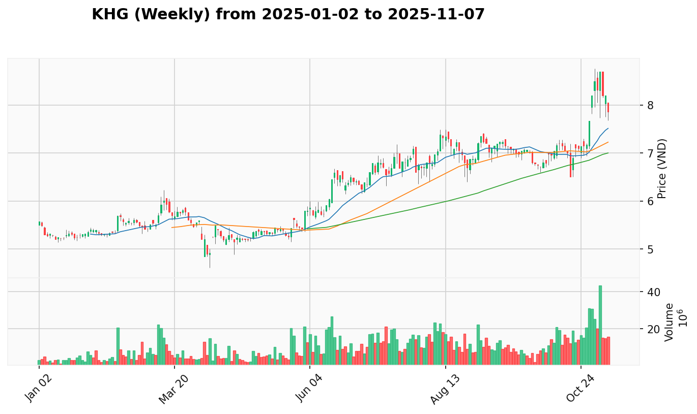

<a href="#bat-dong-san">↑ Back to group BAT_DONG_SAN</a>  |  <a href="#vpa-signal-summary">↑ Back to Top</a>

#### Key Statistics
| Metric | Value |
|:---|---:|
| Date Range | 2025-01-02 to 2025-11-14 |
| **Latest Close** | **7.6** |
| Period Open | 5.5 |
| Period High | 8.76 |
| Period Low | 4.61 |
| Period Change % | 38.18% |

**[Download KHG Data (.csv)](market_data_week/KHG_2025-01-02_to_2025-11-14.csv)**

---

### KSB

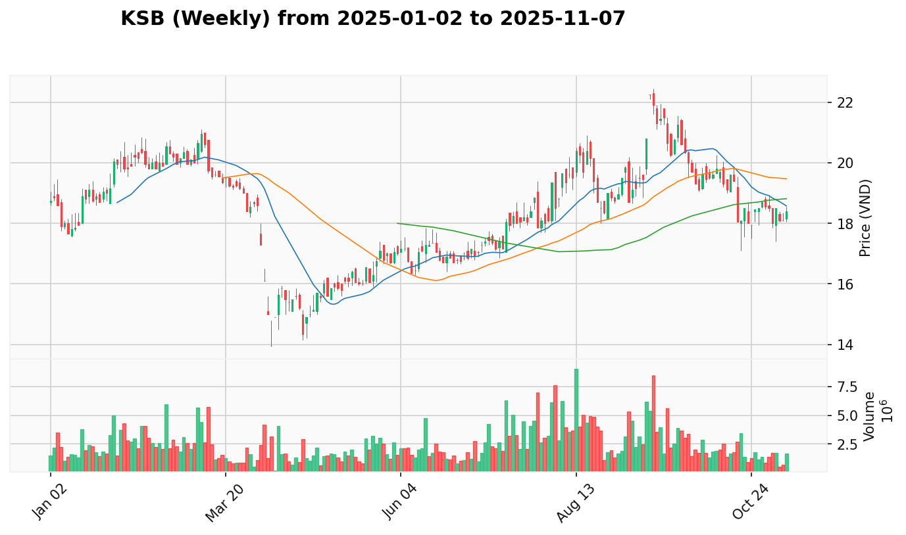

<a href="#dau-tu-cong">↑ Back to group DAU_TU_CONG</a>  |  <a href="#vpa-signal-summary">↑ Back to Top</a>

#### Key Statistics
| Metric | Value |
|:---|---:|
| Date Range | 2025-01-02 to 2025-11-14 |
| **Latest Close** | **18.7** |
| Period Open | 18.7 |
| Period High | 22.45 |
| Period Low | 13.95 |
| Period Change % | 0.00% |

**[Download KSB Data (.csv)](market_data_week/KSB_2025-01-02_to_2025-11-14.csv)**

---

### KSV

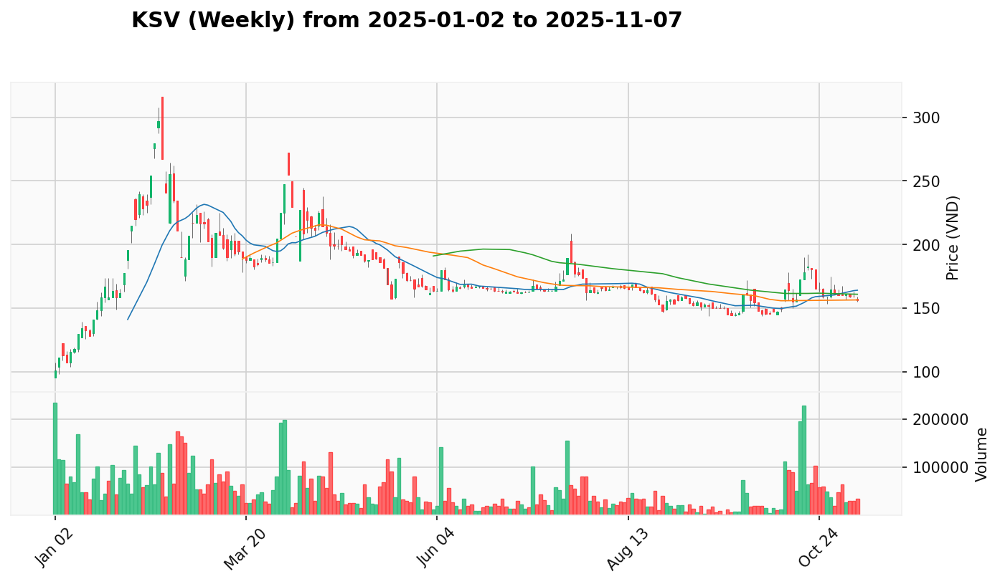

<a href="#thep">↑ Back to group THEP</a>  |  <a href="#vpa-signal-summary">↑ Back to Top</a>

#### Key Statistics
| Metric | Value |
|:---|---:|
| Date Range | 2025-01-02 to 2025-11-14 |
| **Latest Close** | **154.1** |
| Period Open | 95.43 |
| Period High | 316.13 |
| Period Low | 95.43 |
| Period Change % | 61.48% |

**[Download KSV Data (.csv)](market_data_week/KSV_2025-01-02_to_2025-11-14.csv)**

---

### L18

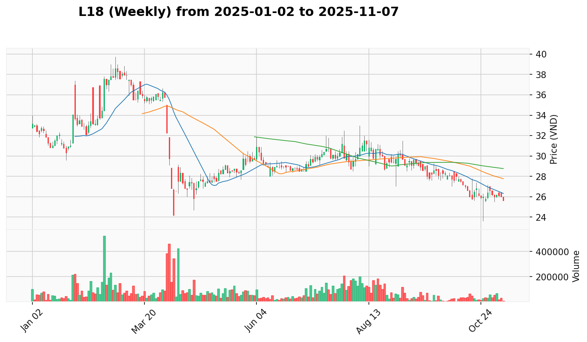

<a href="#xay-dung">↑ Back to group XAY_DUNG</a>  |  <a href="#vpa-signal-summary">↑ Back to Top</a>

#### Key Statistics
| Metric | Value |
|:---|---:|
| Date Range | 2025-01-02 to 2025-11-14 |
| **Latest Close** | **26.9** |
| Period Open | 32.75 |
| Period High | 39.75 |
| Period Low | 23.6 |
| Period Change % | -17.86% |

**[Download L18 Data (.csv)](market_data_week/L18_2025-01-02_to_2025-11-14.csv)**

---

### LAS

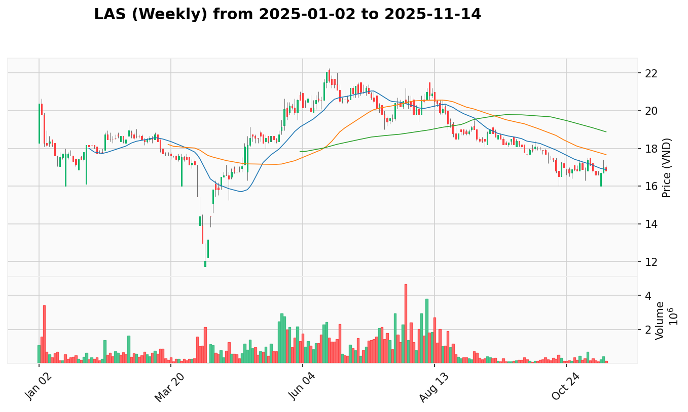

<a href="#hoa-chat">↑ Back to group HOA_CHAT</a>  |  <a href="#vpa-signal-summary">↑ Back to Top</a>

#### Key Statistics
| Metric | Value |
|:---|---:|
| Date Range | 2025-01-02 to 2025-11-14 |
| **Latest Close** | **16.8** |
| Period Open | 18.28 |
| Period High | 22.25 |
| Period Low | 11.74 |
| Period Change % | -8.10% |

**[Download LAS Data (.csv)](market_data_week/LAS_2025-01-02_to_2025-11-14.csv)**

---

### LCG

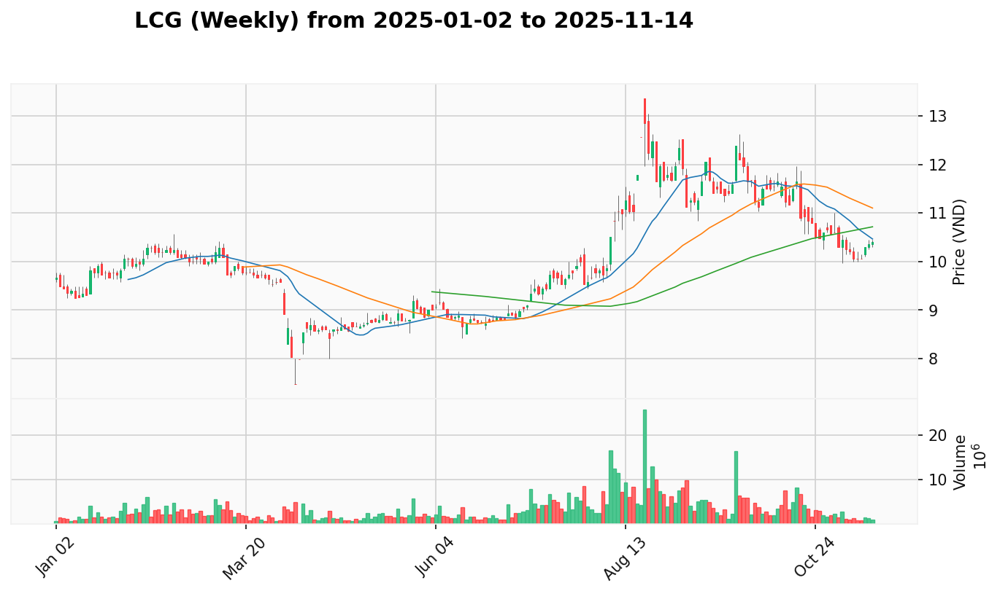

<a href="#dau-tu-cong">↑ Back to group DAU_TU_CONG</a>  |  <a href="#vpa-signal-summary">↑ Back to Top</a>

#### Key Statistics
| Metric | Value |
|:---|---:|
| Date Range | 2025-01-02 to 2025-11-14 |
| **Latest Close** | **10.4** |
| Period Open | 9.63 |
| Period High | 13.36 |
| Period Low | 7.47 |
| Period Change % | 8.00% |

**[Download LCG Data (.csv)](market_data_week/LCG_2025-01-02_to_2025-11-14.csv)**

---

### LDG

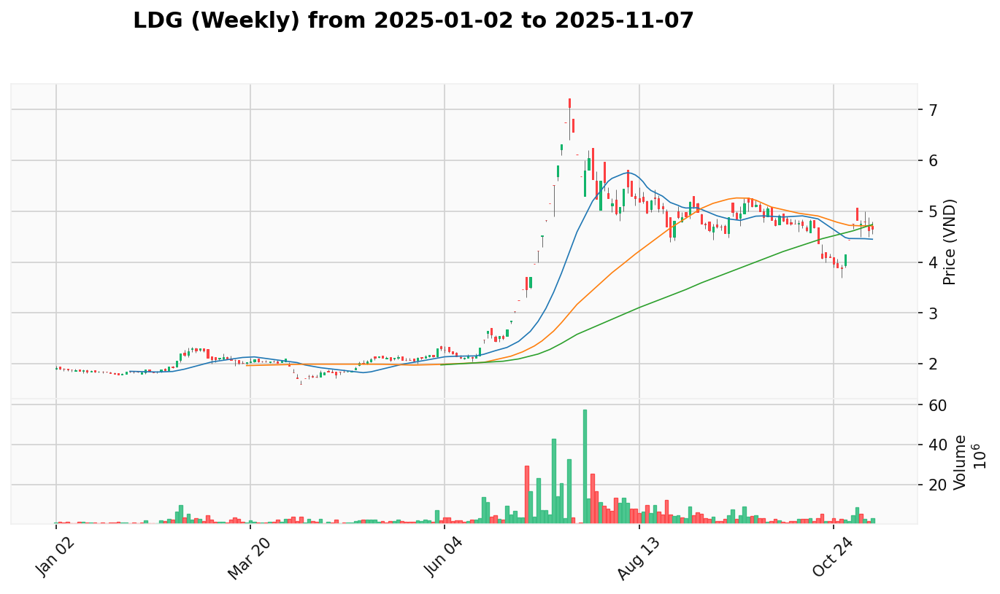

<a href="#bat-dong-san">↑ Back to group BAT_DONG_SAN</a>  |  <a href="#vpa-signal-summary">↑ Back to Top</a>

#### Key Statistics
| Metric | Value |
|:---|---:|
| Date Range | 2025-01-02 to 2025-11-14 |
| **Latest Close** | **4.51** |
| Period Open | 1.9 |
| Period High | 7.22 |
| Period Low | 1.6 |
| Period Change % | 137.37% |

**[Download LDG Data (.csv)](market_data_week/LDG_2025-01-02_to_2025-11-14.csv)**

---

### LHG

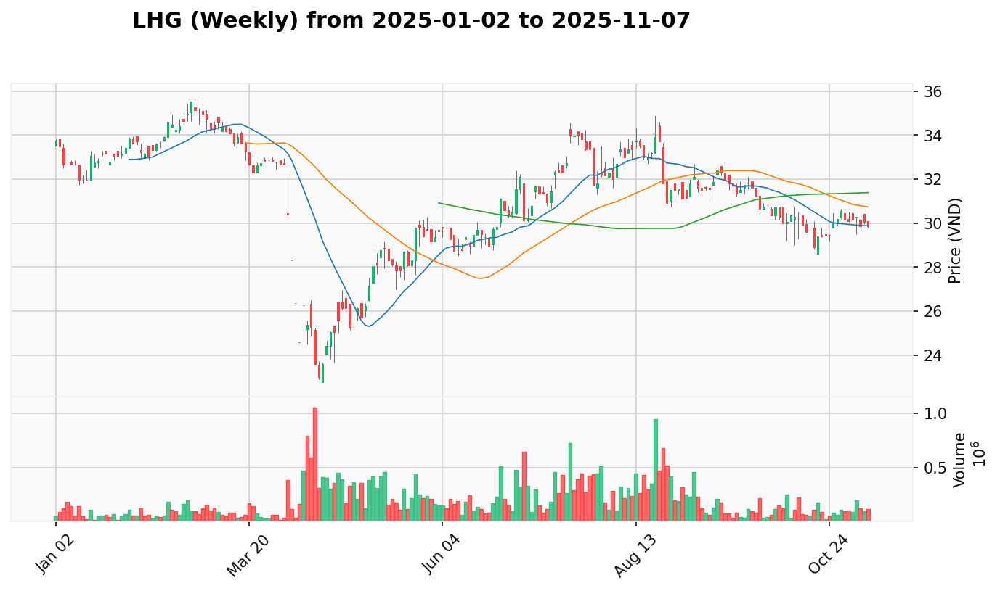

<a href="#bat-dong-san-kcn">↑ Back to group BAT_DONG_SAN_KCN</a>  |  <a href="#vpa-signal-summary">↑ Back to Top</a>

#### Key Statistics
| Metric | Value |
|:---|---:|
| Date Range | 2025-01-02 to 2025-11-14 |
| **Latest Close** | **30.8** |
| Period Open | 33.52 |
| Period High | 35.69 |
| Period Low | 22.77 |
| Period Change % | -8.11% |

**[Download LHG Data (.csv)](market_data_week/LHG_2025-01-02_to_2025-11-14.csv)**

---

### LIG

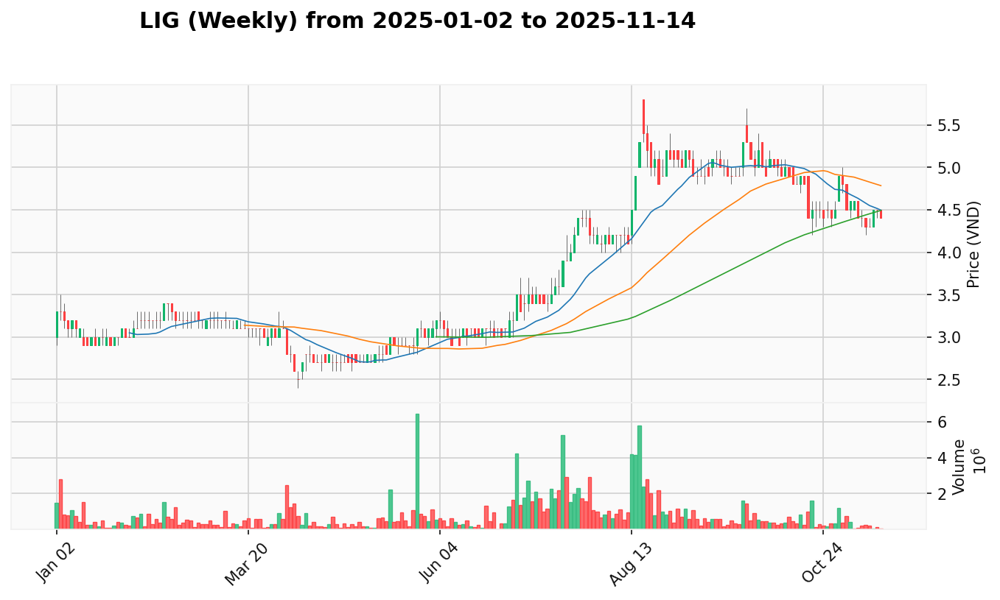

<a href="#penny">↑ Back to group PENNY</a>  |  <a href="#vpa-signal-summary">↑ Back to Top</a>

#### Key Statistics
| Metric | Value |
|:---|---:|
| Date Range | 2025-01-02 to 2025-11-14 |
| **Latest Close** | **4.4** |
| Period Open | 3.0 |
| Period High | 5.8 |
| Period Low | 2.4 |
| Period Change % | 46.67% |

**[Download LIG Data (.csv)](market_data_week/LIG_2025-01-02_to_2025-11-14.csv)**

---

### LPB

#### [VPA Analysis (2025-06-02 - 2025-08-03)](./VPA_week.md#lpb)
> - **Ngày 2025-07-07:** Sau phiên kiểm tra cung thành công của tuần trước, LPB có một tuần tăng giá nhẹ với biên độ hẹp. Khối lượng giao dịch tăng.
>     - **Phân tích VPA/Wyckoff:** Đây là một **Effort to Rise**. Việc giá tiếp tục tăng cho thấy lực cầu vẫn đang kiểm soát, tuy nhiên biên độ hẹp cho thấy đà tăng đang chững lại.
> - **Ngày 2025-07-14:** LPB có một tuần tăng giá mạnh mẽ với nến tăng thân dài, đóng cửa (34.6) tăng từ 33.0 tuần trước. Giá dao động từ 32.65 đến 34.85 với biên độ rộng. Khối lượng giao dịch tăng lên 18.8 triệu so với 16.8 triệu tuần trước.
>     - **Phân tích VPA/Wyckoff:** Đây là một **Sign of Strength** mạnh mẽ. Việc giá tăng đáng kể kèm theo khối lượng tăng cho thấy lực cầu đang áp đảo và xu hướng tăng được củng cố sau giai đoạn tích lũy.
> - **Ngày 2025-07-21:** Tiếp nối Sign of Strength tuần trước, LPB tiếp tục tăng giá với nến tăng thân dài, đóng cửa (35.25) tăng từ 34.6 tuần trước. Giá dao động từ 34.7 đến 36.0 với biên độ tốt. Khối lượng giao dịch giảm nhẹ xuống 16.8 triệu so với 18.8 triệu tuần trước.
>     - **Phân tích VPA/Wyckoff:** Đây là một **No Supply**. Việc giá tiếp tục tăng sau Sign of Strength tuần trước trên nền khối lượng giảm cho thấy áp lực bán rất yếu. Đây là tín hiệu No Supply mạnh mẽ, xác nhận xu hướng tăng sẽ tiếp tục.
> **Ngày 2025-07-27:** LPB tiếp tục xu hướng tăng với nến tăng thân dài, đóng cửa (35.25) tăng từ 34.6 tuần trước. Giá dao động từ 34.7 đến 36.0 với biên độ tốt, giá mở cửa gần mức cao nhất cho thấy sức mạnh ngay từ đầu phiên. Khối lượng giao dịch giảm nhẹ xuống 16.7 triệu so với 18.7 triệu tuần trước nhưng vẫn duy trì ở mức cao.
> 
> **Phân tích VPA/Wyckoff:** Đây là một **No Supply** tiếp tục. Việc giá tăng liên tục trong 3 tuần qua (từ 33.0 lên 35.25) trên nền khối lượng giảm dần cho thấy áp lực bán rất yếu và lực cầu vẫn đang kiểm soát. Mặc dù khối lượng giảm nhưng động lực tăng giá vẫn mạnh mẽ, xác nhận xu hướng tăng sẽ tiếp tục trong ngắn hạn.
> **Ngày 2025-08-03:**

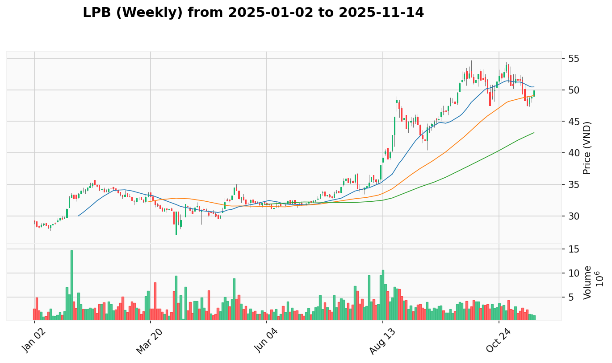

<a href="#ngan-hang">↑ Back to group NGAN_HANG</a>  |  <a href="#vpa-signal-summary">↑ Back to Top</a>

#### Key Statistics
| Metric | Value |
|:---|---:|
| Date Range | 2025-01-02 to 2025-11-14 |
| **Latest Close** | **49.9** |
| Period Open | 29.25 |
| Period High | 54.7 |
| Period Low | 27.01 |
| Period Change % | 70.60% |

**[Download LPB Data (.csv)](market_data_week/LPB_2025-01-02_to_2025-11-14.csv)**

---

### LSS

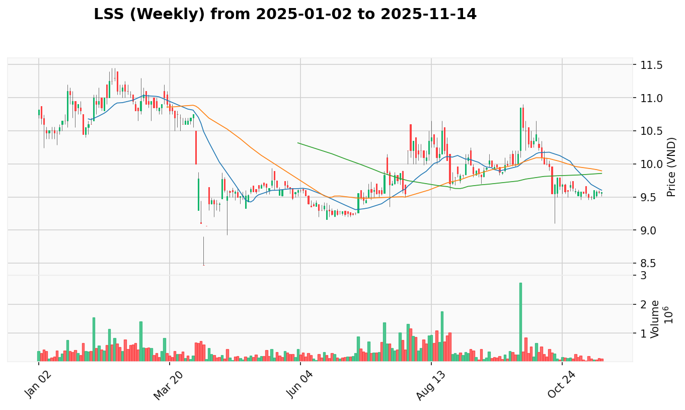

<a href="#thuc-pham">↑ Back to group THUC_PHAM</a>  |  <a href="#vpa-signal-summary">↑ Back to Top</a>

#### Key Statistics
| Metric | Value |
|:---|---:|
| Date Range | 2025-01-02 to 2025-11-14 |
| **Latest Close** | **9.57** |
| Period Open | 10.74 |
| Period High | 11.45 |
| Period Low | 8.47 |
| Period Change % | -10.89% |

**[Download LSS Data (.csv)](market_data_week/LSS_2025-01-02_to_2025-11-14.csv)**

---

### LTG

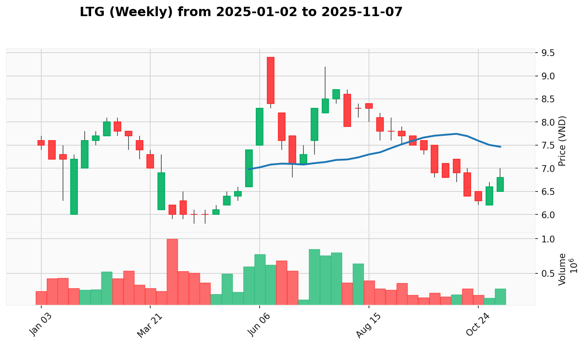

<a href="#nong-nghiep">↑ Back to group NONG_NGHIEP</a>  |  <a href="#vpa-signal-summary">↑ Back to Top</a>

#### Key Statistics
| Metric | Value |
|:---|---:|
| Date Range | 2025-01-03 to 2025-11-14 |
| **Latest Close** | **7.0** |
| Period Open | 7.6 |
| Period High | 9.4 |
| Period Low | 5.8 |
| Period Change % | -7.89% |

**[Download LTG Data (.csv)](market_data_week/LTG_2025-01-02_to_2025-11-14.csv)**

---

### MBB

#### [VPA Analysis (2025-06-02 - 2025-08-03)](./VPA_week.md#mbb)
> - **Ngày 2025-07-07:** Sau phiên kiểm tra cung thành công của tuần trước, MBB có một tuần tăng giá mạnh mẽ với một nến tăng thân dài, đóng cửa (26.7) gần mức cao nhất tuần. Khối lượng giao dịch duy trì ở mức cao.
>     - **Phân tích VPA/Wyckoff:** Đây là một **Sign of Strength**, xác nhận lực cầu đã quay trở lại mạnh mẽ và xu hướng tăng đang tiếp diễn.
> - **Ngày 2025-07-14:** MBB tiếp tục xu hướng tăng với nến tăng thân dài, đóng cửa (27.2) tăng từ 26.7 tuần trước. Giá dao động từ 26.4 đến 27.25. Khối lượng giao dịch giảm nhẹ xuống 94.6 triệu so với 95.9 triệu tuần trước.
>     - **Phân tích VPA/Wyckoff:** Đây là một **Effort to Rise**. Việc giá tiếp tục tăng sau Sign of Strength tuần trước cho thấy momentum tăng trưởng được duy trì, mặc dù khối lượng giảm nhẹ nhưng vẫn ở mức rất cao.
> - **Ngày 2025-07-21:** MBB có một tuần tăng giá mạnh mẽ với nến tăng thân dài, đóng cửa (28.45) tăng từ 27.2 tuần trước. Giá dao động từ 26.65 đến 28.85 với biên độ rộng. Khối lượng giao dịch tăng vọt lên 118.8 triệu so với 94.6 triệu tuần trước (+26%).
>     - **Phân tích VPA/Wyckoff:** Đây là một **Sign of Strength**. Việc giá tăng mạnh kèm theo khối lượng bùng nổ cho thấy lực cầu institutional đang tham gia tích cực, mở ra giai đoạn tăng giá mới sau chuỗi Effort to Rise liên tiếp.
> **Ngày 2025-07-27:** MBB có một tuần tăng giá mạnh mẽ với nến tăng thân dài, đóng cửa (28.45) tăng từ 27.2 tuần trước. Giá dao động từ 26.65 đến 28.85 với biên độ rộng. Khối lượng giao dịch tăng vọt lên 118.8 triệu so với 94.6 triệu tuần trước (+26%). Mức đóng cửa 28.45 đạt mức cao nhất trong chuỗi dữ liệu 30 tuần, phá vỡ hoàn toàn các vùng kháng cự trước đó và thiết lập đỉnh mới.
> 
> **Phân tích VPA/Wyckoff:** Đây là một **Sign of Strength** rất mạnh mẽ. Việc giá tăng mạnh kèm theo khối lượng bùng nổ cho thấy lực cầu institutional đang tham gia tích cực, mở ra giai đoạn tăng giá mới sau chuỗi Effort to Rise liên tiếp. Sự phá vỡ đỉnh cũ với khối lượng cao xác nhận xu hướng tăng dài hạn và tiềm năng tiếp tục tăng giá trong các tuần tới.
> **Ngày 2025-08-03:** MBB có một tuần điều chỉnh mạnh với nến giảm thân dài, đóng cửa (27.15) giảm từ 28.45 tuần trước. Giá dao động từ 26.85 đến 28.85 với biên độ rộng, mở cửa tại đỉnh 28.45 nhưng bị bán mạnh xuống vùng thấp. Khối lượng giao dịch tăng vọt lên 148.9 triệu so với 118.8 triệu tuần trước (+25%), đạt mức cao nhất trong chuỗi dữ liệu 31 tuần.

<a href="#ngan-hang">↑ Back to group NGAN_HANG</a>  |  <a href="#vpa-signal-summary">↑ Back to Top</a>

#### Key Statistics
| Metric | Value |
|:---|---:|
| Date Range | 2025-01-02 to 2025-11-14 |
| **Latest Close** | **23.5** |
| Period Open | 16.42 |
| Period High | 29.5 |
| Period Low | 14.6 |
| Period Change % | 43.12% |

**[Download MBB Data (.csv)](market_data_week/MBB_2025-01-02_to_2025-11-14.csv)**

---

### MBS

#### [VPA Analysis (2025-06-02 - 2025-08-03)](./VPA_week.md#mbs)
> - **Ngày 2025-07-07:** Sau tín hiệu No Demand trên nền khối lượng cao của tuần trước, MBS có một tuần tăng giá bùng nổ. Nến tăng có thân dài, đóng cửa (29.3) gần mức cao nhất tuần, đi kèm với khối lượng giao dịch tăng vọt.
>     - **Phân tích VPA/Wyckoff:** Đây là một **Sign of Strength**, cho thấy lực cầu đã quay trở lại một cách áp đảo, phủ nhận hoàn toàn tín hiệu yếu của tuần trước.
> - **Ngày 2025-07-14:** MBS tiếp tục xu hướng tăng mạnh mẽ với nến tăng thân dài, đóng cửa (30.1) tăng từ 29.3 tuần trước. Giá dao động từ 28.7 đến 31.2 với biên độ rộng. Khối lượng giao dịch tăng lên 47.3 triệu so với 45.6 triệu tuần trước.
>     - **Phân tích VPA/Wyckoff:** Đây là một **Sign of Strength** mạnh mẽ. Việc giá tiếp tục tăng đáng kể kèm theo khối lượng tăng cho thấy lực cầu đang áp đảo và xu hướng tăng được củng cố mạnh mẽ.
> - **Ngày 2025-07-21:** Tiếp nối hai tuần Sign of Strength liên tiếp, MBS có một tuần tăng giá bùng nổ với nến tăng thân dài, đóng cửa (32.0) tăng từ 30.1 tuần trước (+6.3%). Giá dao động từ 29.2 đến 32.0 với biên độ rộng. Khối lượng giao dịch giảm xuống 29.5 triệu so với 47.3 triệu tuần trước.
>     - **Phân tích VPA/Wyckoff:** Đây là một **No Supply** mạnh mẽ. Việc giá tiếp tục tăng mạnh sau chuỗi Sign of Strength liên tiếp trên nền khối lượng giảm cho thấy áp lực bán hoàn toàn kiệt sức. Đây là tín hiệu No Supply cực kỳ tích cực, xác nhận xu hướng tăng mạnh mẽ sẽ tiếp tục.
> **Ngày 2025-07-27:** Sau ba tuần Sign of Strength và No Supply liên tiếp, MBS tiếp tục xu hướng tăng mạnh với nến tăng thân dài, đóng cửa (32.0) tăng từ 30.1 tuần trước (+6.3%). Giá dao động từ 29.2 đến 32.0 với biên độ rộng, đóng cửa đúng tại mức cao nhất tuần. Khối lượng giao dịch giảm nhẹ xuống 43.3 triệu so với 47.3 triệu tuần trước, nhưng vẫn duy trì ở mức cao.
> 
> **Phân tích VPA/Wyckoff:** Đây là một **No Supply** tiếp tục. Việc giá tăng mạnh và đóng cửa tại mức cao nhất trên nền khối lượng cao (dù giảm nhẹ) cho thấy áp lực bán tiếp tục yếu đi. Chuỗi bốn tuần liên tiếp với các tín hiệu tích cực (Sign of Strength → Sign of Strength → No Supply → No Supply) xác nhận xu hướng tăng mạnh mẽ và bền vững, với lực cầu áp đảo hoàn toàn.
> **Ngày 2025-08-03:** Sau chuỗi bốn tuần tích cực liên tiếp, MBS bùng nổ với tuần tăng giá mạnh nhất trong chuỗi, đóng cửa (35.2) tăng vọt từ 32.0 tuần trước (+10.0%). Nến tăng có thân rất dài với giá dao động từ 32.0 đến 37.6, tạo biên độ cực rộng 5.6 điểm. Đặc biệt, giá mở cửa đúng tại mức đóng cửa tuần trước và không test xuống dưới mức này, cho thấy lực cầu mạnh mẽ ngay từ đầu tuần. Khối lượng giao dịch bùng nổ lên 59.0 triệu, tăng 36% so với 43.3 triệu tuần trước và đạt mức cao nhất trong 8 tuần qua.

<a href="#chung-khoan">↑ Back to group CHUNG_KHOAN</a>  |  <a href="#vpa-signal-summary">↑ Back to Top</a>

#### Key Statistics
| Metric | Value |
|:---|---:|
| Date Range | 2025-01-02 to 2025-11-14 |
| **Latest Close** | **30.1** |
| Period Open | 25.04 |
| Period High | 41.31 |
| Period Low | 19.17 |
| Period Change % | 20.21% |

**[Download MBS Data (.csv)](market_data_week/MBS_2025-01-02_to_2025-11-14.csv)**

---

### MCH

#### [VPA Analysis (2025-06-02 - 2025-08-03)](./VPA_week.md#mch)
> - **Ngày 2025-07-07:** Sau tuần tăng giá mạnh mẽ, MCH có một tuần giảm giá mạnh, tạo thành một nến giảm thân dài và đóng cửa (119.5) gần mức thấp nhất tuần. Khối lượng giao dịch tăng vọt.
>     - **Phân tích VPA/Wyckoff:** Đây là một **Sign of Weakness**. Việc giá giảm mạnh trên khối lượng lớn cho thấy áp lực bán đã quay trở lại và áp đảo, có khả năng kết thúc đợt phục hồi.
> - **Ngày 2025-07-14:** MCH tiếp tục xu hướng giảm với nến giảm biên độ hẹp, đóng cửa (118.0) từ 119.5 tuần trước. Giá dao động từ 117.6 đến 121.4. Khối lượng giao dịch giảm xuống 1.7 triệu so với 1.8 triệu tuần trước.
>     - **Phân tích VPA/Wyckoff:** Đây là một phiên **No Demand**. Việc giá tiếp tục giảm sau Sign of Weakness tuần trước với khối lượng giảm cho thấy phe mua đã rút lui và xu hướng giảm có thể tiếp diễn.
> - **Ngày 2025-07-21:** MCH tiếp tục giảm giá từ 118.0 xuống 116.1, tạo thành nến giảm biên độ hẹp với bóng dưới dài (thấp nhất 114.3). Khối lượng giao dịch tăng mạnh lên 2.5 triệu so với 1.7 triệu tuần trước.
>     - **Phân tích VPA/Wyckoff:** Đây là một **Test for Supply**. Giá giảm mạnh tạo bóng dưới dài trên khối lượng tăng cho thấy có lực cầu hấp thụ ở vùng giá thấp sau hai tuần No Demand và Sign of Weakness. Tín hiệu này có thể báo hiệu sự kết thúc của đợt giảm giá.
> **Ngày 2025-07-27:** MCH tiếp tục xu hướng giảm từ 118.0 xuống 116.1, tạo thành nến giảm biên độ hẹp với thân nến ngắn. Giá dao động từ 114.3 đến 118.9, tạo bóng dưới dài cho thấy có áp lực mua ở vùng thấp. Khối lượng giao dịch tăng mạnh lên 2.54 triệu so với 1.72 triệu tuần trước, đáng chú ý là mức khối lượng cao nhất trong 10 tuần gần đây.
> 
> **Phân tích VPA/Wyckoff:** Đây là một **Selling Climax**. Việc giá giảm xuống vùng thấp nhất (114.3) nhưng đóng cửa phục hồi lên 116.1 trên khối lượng tăng vọt cho thấy lực cầu mạnh đã xuất hiện để hấp thụ áp lực bán. Sau chuỗi Sign of Weakness và No Demand, tín hiệu này có thể báo hiệu điểm kết thúc của đợt giảm giá và khả năng bắt đầu giai đoạn tích lũy.
> **Ngày 2025-08-03:** MCH trải qua tuần giảm giá thảm khốc từ 116.1 xuống 105.0, tạo thành nến giảm biên độ cực rộng với bóng dưới dài (thấp nhất 101.8). Giá dao động từ 101.8 đến 116.8, cho thấy sự biến động mạnh mẽ trong tuần. Khối lượng giao dịch bùng nổ lên 4.18 triệu, tăng gấp 1.6 lần so với tuần trước và đạt mức cao nhất trong chuỗi dữ liệu 31 tuần. Việc giá test xuống vùng 101.8 rồi phục hồi lên đóng cửa tại 105.0 cho thấy có lực cầu mạnh xuất hiện ở vùng giá thấp.

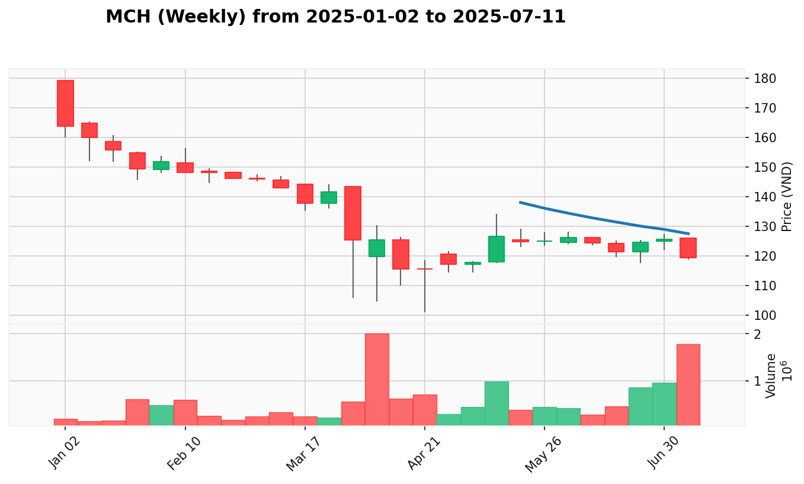

<a href="#thuc-pham">↑ Back to group THUC_PHAM</a>  |  <a href="#vpa-signal-summary">↑ Back to Top</a>

#### Key Statistics
| Metric | Value |
|:---|---:|
| Date Range | 2025-01-02 to 2025-11-14 |
| **Latest Close** | **217.9** |
| Period Open | 179.22 |
| Period High | 221.8 |
| Period Low | 100.99 |
| Period Change % | 21.58% |

**[Download MCH Data (.csv)](market_data_week/MCH_2025-01-02_to_2025-11-14.csv)**

---

### MCM

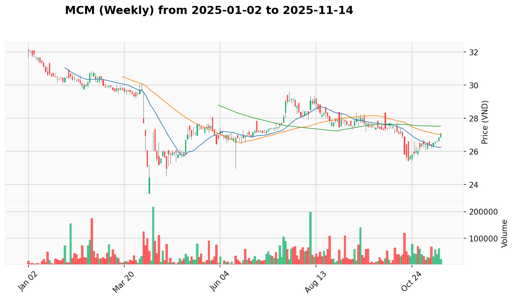

<a href="#thuc-pham">↑ Back to group THUC_PHAM</a>  |  <a href="#vpa-signal-summary">↑ Back to Top</a>

#### Key Statistics
| Metric | Value |
|:---|---:|
| Date Range | 2025-01-02 to 2025-11-14 |
| **Latest Close** | **27.1** |
| Period Open | 32.14 |
| Period High | 32.14 |
| Period Low | 23.43 |
| Period Change % | -15.68% |

**[Download MCM Data (.csv)](market_data_week/MCM_2025-01-02_to_2025-11-14.csv)**

---

### MFS

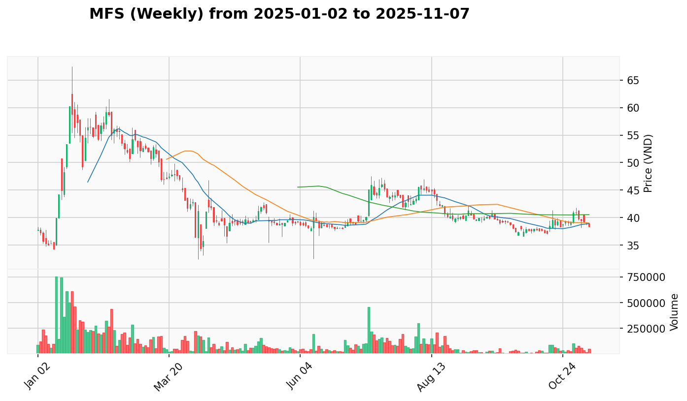

<a href="#cong-nghe">↑ Back to group CONG_NGHE</a>  |  <a href="#vpa-signal-summary">↑ Back to Top</a>

#### Key Statistics
| Metric | Value |
|:---|---:|
| Date Range | 2025-01-02 to 2025-11-14 |
| **Latest Close** | **37.6** |
| Period Open | 37.69 |
| Period High | 67.48 |
| Period Low | 32.43 |
| Period Change % | -0.24% |

**[Download MFS Data (.csv)](market_data_week/MFS_2025-01-02_to_2025-11-14.csv)**

---

### MHC

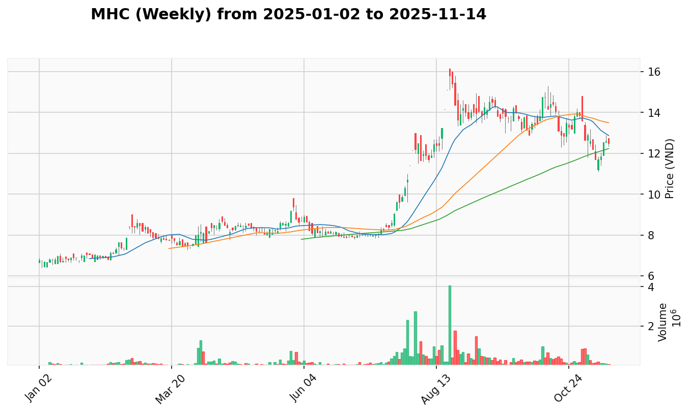

<a href="#van-tai">↑ Back to group VAN_TAI</a>  |  <a href="#vpa-signal-summary">↑ Back to Top</a>

#### Key Statistics
| Metric | Value |
|:---|---:|
| Date Range | 2025-01-02 to 2025-11-14 |
| **Latest Close** | **12.5** |
| Period Open | 6.65 |
| Period High | 16.15 |
| Period Low | 6.4 |
| Period Change % | 87.97% |

**[Download MHC Data (.csv)](market_data_week/MHC_2025-01-02_to_2025-11-14.csv)**

---

### MIG

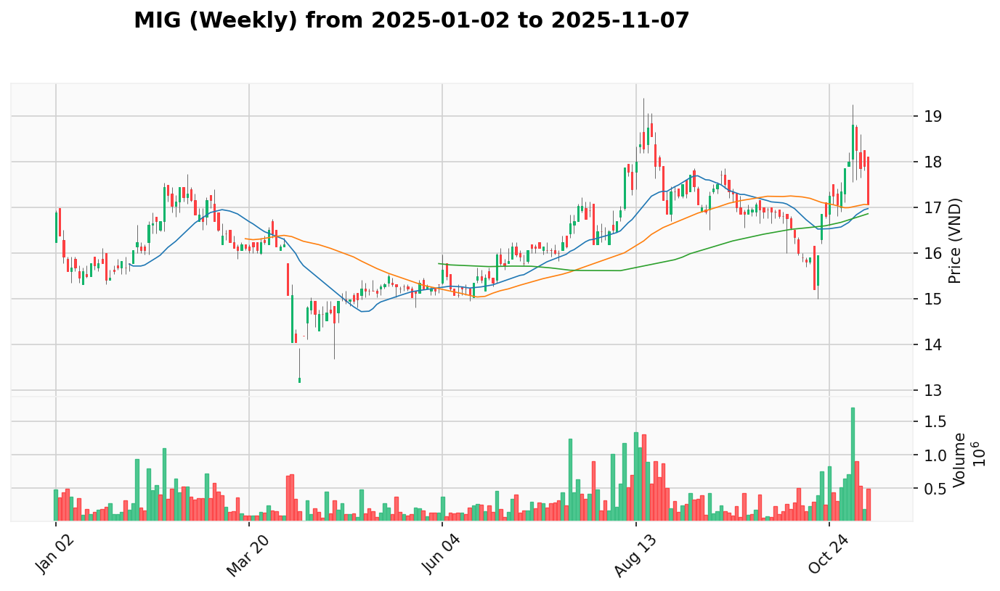

<a href="#bao-hiem">↑ Back to group BAO_HIEM</a>  |  <a href="#vpa-signal-summary">↑ Back to Top</a>

#### Key Statistics
| Metric | Value |
|:---|---:|
| Date Range | 2025-01-02 to 2025-11-14 |
| **Latest Close** | **17.25** |
| Period Open | 16.23 |
| Period High | 19.39 |
| Period Low | 13.17 |
| Period Change % | 6.28% |

**[Download MIG Data (.csv)](market_data_week/MIG_2025-01-02_to_2025-11-14.csv)**

---

### MPC

#### [VPA Analysis (2025-06-02 - 2025-08-03)](./VPA_week.md#mpc)
> - **Ngày 2025-07-07:** Sau nỗ lực tăng giá chững lại của tuần trước, MPC có một tuần tăng giá nhẹ với biên độ hẹp. Khối lượng giao dịch giảm mạnh.
>     - **Phân tích VPA/Wyckoff:** Đây là một phiên **No Supply**. Việc giá giữ vững trên nền khối lượng thấp là một tín hiệu No Supply, cho thấy thị trường đang hấp thụ và có thể chuẩn bị cho đợt tăng tiếp theo.
> - **Ngày 2025-07-14:** MPC có một tuần tăng giá nhẹ với nến tăng biên độ hẹp, đóng cửa (13.9) tăng từ 13.8 tuần trước. Giá dao động từ 13.5 đến 14.4. Khối lượng giao dịch giảm xuống 970 nghìn so với 1.2 triệu tuần trước.
>     - **Phân tích VPA/Wyckoff:** Đây là một phiên **Test for Supply** thành công. Việc giá tăng nhẹ với khối lượng thấp sau tín hiệu No Supply tuần trước cho thấy áp lực bán đã được hấp thụ hoàn toàn, tín hiệu No Supply tích cực.
> - **Ngày 2025-07-21:** MPC bùng nổ với một tuần tăng giá mạnh mẽ từ 13.9 lên 15.0, tạo nến tăng thân dài và đóng cửa gần mức cao nhất tuần (cao nhất 15.2). Khối lượng giao dịch tăng vọt lên 1.9 triệu so với 970 nghìn tuần trước.
>     - **Phân tích VPA/Wyckoff:** Đây là một **Sign of Strength** rõ ràng. Sau hai tuần Test for Supply và No Supply thành công, lực mua đã quay trở lại mạnh mẽ, phá vỡ vùng kháng cự và báo hiệu xu hướng tăng có thể tiếp tục.
> **Ngày 2025-07-27:** MPC tiếp tục xu hướng tăng mạnh mẽ với nến tăng thân dài, đóng cửa tại 15.0 (+7.9% so với tuần trước) và gần mức cao nhất tuần (15.2). Giá mở cửa tại 14.0 và dao động trong biên độ rộng từ 13.7 đến 15.2. Khối lượng giao dịch tăng vọt lên 1.92 triệu cổ phiếu, gấp đôi so với tuần trước (969.3 nghìn), cho thấy sự quan tâm mạnh mẽ từ thị trường. Đây là tuần thứ hai liên tiếp có khối lượng cao và giá tăng mạnh sau giai đoạn Test for Supply thành công.
> 
> **Phân tích VPA/Wyckoff:** Đây là một **Sign of Strength** tiếp tục. Sự kết hợp giữa giá tăng mạnh (+7.9%) với khối lượng cao gấp đôi tuần trước xác nhận lực mua đang áp đảo. Việc đóng cửa gần mức cao nhất tuần cho thấy không có áp lực bán đáng kể ở vùng giá này. Xu hướng tăng từ vùng 10.2-10.6 vào đầu tháng 6 đã được xác nhận mạnh mẽ với hai tuần tăng giá liên tiếp trên khối lượng cao, báo hiệu tiềm năng tiếp tục tăng trong các tuần tới.
> **Ngày 2025-08-03:** MPC tiếp tục xu hướng tăng với nến tăng nhẹ, đóng cửa tại 15.2 (+1.3% so với tuần trước) và gần mức cao nhất tuần (15.7). Giá mở cửa tại 15.0 và dao động trong biên độ hẹp từ 14.8 đến 15.7. Khối lượng giao dịch giảm xuống 1.78 triệu cổ phiếu so với 1.92 triệu tuần trước (-7.4%), tuy nhiên vẫn duy trì ở mức cao. Đây là tuần thứ ba liên tiếp có giá tăng sau giai đoạn tích lũy thành công, với mức tăng tổng cộng từ vùng 10.6 lên 15.2 (+43.4%) trong 2 tháng qua.

<a href="#thuy-san">↑ Back to group THUY_SAN</a>  |  <a href="#vpa-signal-summary">↑ Back to Top</a>

#### Key Statistics
| Metric | Value |
|:---|---:|
| Date Range | 2025-01-02 to 2025-11-14 |
| **Latest Close** | **16.9** |
| Period Open | 14.8 |
| Period High | 18.1 |
| Period Low | 8.8 |
| Period Change % | 14.19% |

**[Download MPC Data (.csv)](market_data_week/MPC_2025-01-02_to_2025-11-14.csv)**

---

### MSB

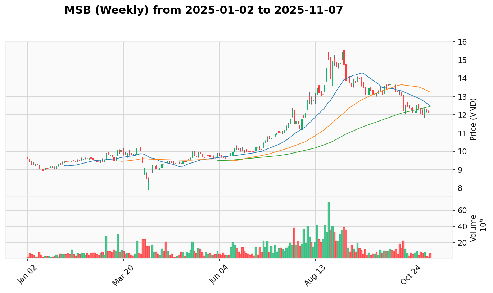

<a href="#ngan-hang">↑ Back to group NGAN_HANG</a>  |  <a href="#vpa-signal-summary">↑ Back to Top</a>

#### Key Statistics
| Metric | Value |
|:---|---:|
| Date Range | 2025-01-02 to 2025-11-14 |
| **Latest Close** | **12.05** |
| Period Open | 9.67 |
| Period High | 15.62 |
| Period Low | 7.92 |
| Period Change % | 24.61% |

**[Download MSB Data (.csv)](market_data_week/MSB_2025-01-02_to_2025-11-14.csv)**

---

### MSH

#### [VPA Analysis (2025-06-02 - 2025-08-03)](./VPA_week.md#msh)
> - **Ngày 2025-07-07:** Tiếp nối nỗ lực tăng giá của tuần trước, MSH có một tuần tăng giá tốt, tạo thành một nến tăng và đóng cửa (37.55) cao hơn. Khối lượng giao dịch tăng.
>     - **Phân tích VPA/Wyckoff:** Đây là một **Sign of Strength**, cho thấy lực cầu đang chiếm ưu thế và xu hướng tăng được củng cố.
> - **Ngày 2025-07-14:** MSH tiếp tục xu hướng tăng mạnh mẽ, nến tăng với biên độ tốt từ 37.65 lên 38.0. Giá đóng cửa cao hơn tuần trước và tạo đỉnh tuần mới tại 39.5. Khối lượng giao dịch tăng mạnh gần 59% so với tuần trước.
>     - **Phân tích VPA/Wyckoff:** Đây là một **Sign of Strength** rõ ràng, tiếp nối tín hiệu mạnh từ tuần trước. Sự kết hợp giữa việc tăng giá và khối lượng tăng vọt cho thấy lực cầu institutional đang tích cực mua vào, củng cố xu hướng tăng.
> - **Ngày 2025-07-21:** MSH tiếp tục duy trì xu hướng tăng với nến tăng biên độ vừa phải, đóng cửa (38.45) cao hơn tuần trước. Giá dao động từ 37.0 đến 39.0. Khối lượng giao dịch tăng nhẹ lên 2.9 triệu so với 2.8 triệu tuần trước.
>     - **Phân tích VPA/Wyckoff:** Đây là một **Effort to Rise** sau chuỗi Sign of Strength. Việc giá tiếp tục tăng với khối lượng duy trì ở mức cao cho thấy lực cầu vẫn đang kiểm soát, xu hướng tăng được củng cố và có thể tiếp tục.
> **Ngày 2025-07-27:** MSH tiếp tục duy trì xu hướng tăng với nến tăng nhẹ, đóng cửa (38.45) cao hơn tuần trước từ 38.0. Giá dao động trong biên độ hẹp từ 37.0 đến 39.0, tương tự tuần trước. Khối lượng giao dịch tăng nhẹ lên 2.9 triệu so với 2.8 triệu tuần trước, duy trì ở mức cao.
> 
> **Phân tích VPA/Wyckoff:** Đây là một **No Progress on Higher Volume** - mặc dù khối lượng tăng nhẹ nhưng giá chỉ tăng tối thiểu (0.45 điểm), cho thấy áp lực bán đang gia tăng ở vùng giá cao. Sau chuỗi Sign of Strength và Effort to Rise trước đó, tín hiệu này cảnh báo xu hướng tăng có thể đang gặp kháng cự mạnh và cần consolidation.
> **Ngày 2025-08-03:** MSH có tuần giảm giá từ 38.45 xuống 37.6 với biên độ dao động rộng từ 36.4 đến 39.5. Giá mở cửa cao hơn (38.55) nhưng bị đẩy xuống, test thấp tại 36.4 trước khi hồi phục đóng cửa 37.6. Khối lượng giao dịch tăng mạnh lên 3.28 triệu, cao nhất trong 8 tuần qua, tăng 13% so với tuần trước.

<a href="#det-may">↑ Back to group DET_MAY</a>  |  <a href="#vpa-signal-summary">↑ Back to Top</a>

#### Key Statistics
| Metric | Value |
|:---|---:|
| Date Range | 2025-01-02 to 2025-11-14 |
| **Latest Close** | **40.25** |
| Period Open | 34.54 |
| Period High | 41.87 |
| Period Low | 25.17 |
| Period Change % | 16.53% |

**[Download MSH Data (.csv)](market_data_week/MSH_2025-01-02_to_2025-11-14.csv)**

---

### MSN

#### [VPA Analysis (2025-06-02 - 2025-08-03)](./VPA_week.md#msn)
> - **Ngày 2025-07-07:** Tiếp nối Dấu hiệu Sức mạnh của tuần trước, MSN có một tuần tăng giá tốt, tạo thành một nến tăng và đóng cửa (76.5) cao hơn. Khối lượng giao dịch duy trì ở mức cao.
>     - **Phân tích VPA/Wyckoff:** Đây là một **Sign of Strength**, cho thấy lực cầu vẫn đang chiếm ưu thế và xu hướng tăng được củng cố.
> - **Ngày 2025-07-14:** MSN tiếp tục xu hướng tăng mạnh mẽ với nến tăng có biên độ rộng, đóng cửa (79.1) cao hơn đáng kể so với tuần trước. Giá tạo đỉnh tuần mới tại 81.0. Khối lượng giao dịch tăng thêm 13% lên 46 triệu cổ phiếu.
>     - **Phân tích VPA/Wyckoff:** Đây là một **Sign of Strength** tiếp tục, cho thấy xu hướng tăng đang được duy trì bởi lực cầu mạnh mẽ. Việc tăng giá với khối lượng cao liên tiếp cho thấy dòng tiền institutional tiếp tục tham gia tích cực, củng cố momentum tăng.
> - **Ngày 2025-07-21:** Sau chuỗi tăng giá mạnh mẽ, MSN có một tuần giảm giá đáng kể từ 79.1 xuống 75.8, tạo nến giảm có bóng trên dài (đỉnh 79.8). Khối lượng giao dịch tăng lên 48.6 triệu so với 46.1 triệu tuần trước.
>     - **Phân tích VPA/Wyckoff:** Đây là một **Sign of Weakness**. Việc giá giảm mạnh trên khối lượng tăng sau chuỗi Sign of Strength cho thấy áp lực bán đã xuất hiện mạnh mẽ, có thể báo hiệu sự kết thúc của đợt tăng giá hoặc ít nhất là một đợt điều chỉnh đáng kể.
> **Ngày 2025-07-27:** MSN tiếp tục xu hướng giảm giá từ tuần trước, mở cửa tại 79.6 nhưng chỉ tăng nhẹ lên đỉnh 79.8 trước khi giảm mạnh xuống thấp nhất 75.4 và đóng cửa tại 75.8. Đây là tuần giảm thứ hai liên tiếp với biên độ giảm 4.2%. Khối lượng giao dịch tiếp tục tăng lên 48.6 triệu cổ phiếu, duy trì ở mức rất cao so với các tuần trước đó. Việc giá không thể duy trì được vùng 79-80 và bị đẩy xuống dưới 76 cho thấy áp lực bán đang gia tăng sau đợt tăng giá mạnh từ 67.5 lên 81.0.
> 
> **Phân tích VPA/Wyckoff:** Đây là một **Sign of Weakness** tiếp tục và có thể là **Selling Climax**. Việc giá giảm liên tiếp hai tuần trên khối lượng cao (46-48 triệu) sau chuỗi Sign of Strength cho thấy Smart Money đang phân phối và áp lực bán institutional đã vượt trội. Mức 75.8 có thể là vùng hỗ trợ quan trọng cần theo dõi - nếu được giữ vững có thể tạo cơ sở cho một đợt phục hồi.
> **Ngày 2025-08-03:** MSN tiếp tục xu hướng giảm giá trong tuần thứ ba liên tiếp, từ mức mở cửa 76.2 giảm xuống đóng cửa tại 72.5, giảm 4.4% so với tuần trước. Đặc biệt, cổ phiếu đã test xuống mức thấp nhất 70.8 - thấp nhất kể từ tháng 6, trước khi hồi phục nhẹ. Biên độ dao động trong tuần rất rộng (70.8-78.6) cho thấy sự biến động mạnh. Khối lượng giao dịch tiếp tục tăng lên mức kỷ lục 53 triệu cổ phiếu, cao nhất trong chuỗi dữ liệu 31 tuần. Việc giá phá vỡ ngưỡng hỗ trợ 75.8 và test xuống vùng 70.8 cho thấy áp lực bán đã trở nên cực kỳ dữ dội, xóa sạch gần toàn bộ đợt tăng từ 67.5 lên 81.0.

<a href="#thuc-pham">↑ Back to group THUC_PHAM</a>  |  <a href="#vpa-signal-summary">↑ Back to Top</a>

#### Key Statistics
| Metric | Value |
|:---|---:|
| Date Range | 2025-01-02 to 2025-11-14 |
| **Latest Close** | **78.0** |
| Period Open | 70.1 |
| Period High | 94.0 |
| Period Low | 50.3 |
| Period Change % | 11.27% |

**[Download MSN Data (.csv)](market_data_week/MSN_2025-01-02_to_2025-11-14.csv)**

---

### MSR

#### [VPA Analysis (2025-06-02 - 2025-08-03)](./VPA_week.md#msr)
> - **Ngày 2025-07-07:** Tiếp nối nỗ lực tăng giá của tuần trước, MSR có một tuần tăng giá tốt, tạo thành một nến tăng và đóng cửa (18.9) cao hơn. Khối lượng giao dịch tăng.
>     - **Phân tích VPA/Wyckoff:** Đây là một **Sign of Strength**, cho thấy lực cầu đang chiếm ưu thế và xu hướng tăng được củng cố.
> - **Ngày 2025-07-14:** MSR có một tuần bùng nổ với nến tăng có biên độ rộng, đóng cửa (21.1) cao hơ đáng kể so với tuần trước. Giá tạo đỉnh tuần mới tại 21.5, phá vỡ vùng kháng cự. Khối lượng giao dịch tăng 17% so với tuần trước.
>     - **Phân tích VPA/Wyckoff:** Đây là một **Sign of Strength** mạnh mẽ, cho thấy sự phá vỡ thành công ra khỏi vùng tích lũy dài. Việc tăng giá mạnh với khối lượng cao cho thấy lực cầu institutional đang tham gia tích cực, mở ra giai đoạn tăng giá mới.
> - **Ngày 2025-07-21:** MSR tiếp tục đà tăng mạnh mẽ sau đột phá, nến tăng từ 21.1 lên 22.2 với đỉnh tuần đạt 22.8. Khối lượng giao dịch tiếp tục tăng lên 16.2 triệu so với 14.5 triệu tuần trước.
>     - **Phân tích VPA/Wyckoff:** Đây là một **Sign of Strength** tiếp tục, xác nhận sự thành công của đợt phá vỡ tuần trước. Việc giá tiếp tục tăng với khối lượng cao cho thấy xu hướng tăng đang được củng cố mạnh mẽ và có thể tiếp tục trong các tuần tới.
> **Ngày 2025-07-27:** MSR tiếp tục đà tăng mạnh mẽ trong tuần thứ hai liên tiếp, nến tăng từ 21.1 lên 22.2 với đỉnh tuần đạt 22.8 - mức cao nhất trong 30 tuần dữ liệu. Khối lượng giao dịch tiếp tục tăng lên 16.1 triệu cổ phiếu, cao hơn 11.6% so với tuần trước (14.5 triệu). Giá đóng cửa gần mức cao nhất tuần (22.2 vs 22.8), cho thấy lực cầu vẫn rất mạnh. Từ mức đáy 18.4 của tuần trước, MSR đã tăng 20.7% trong chỉ 2 tuần với khối lượng liên tục gia tăng.
> 
> **Phân tích VPA/Wyckoff:** Đây là một **Sign of Strength** rất mạnh mẽ, xác nhận xu hướng tăng đang trong giai đoạn markup sau khi phá vỡ thành công ra khỏi vùng tích lũy. Việc giá liên tục tạo đỉnh mới với khối lượng tăng dần cho thấy lực cầu institutional đang tham gia tích cực và xu hướng tăng có thể tiếp tục mở rộng trong các tuần tới.
> **Ngày 2025-08-03:** MSR có tuần dao động mạnh với nến giảm từ 22.5 xuống 21.5, tạo biên độ rộng từ đáy 19.8 đến đỉnh 23.8. Mặc dù mở cửa cao hơn tuần trước (22.5 vs 22.2) và test lên mức cao mới 23.8, giá không thể duy trì và bị đẩy xuống, đóng cửa thấp hơn tuần trước. Khối lượng giao dịch tăng mạnh lên 18.5 triệu cổ phiếu, cao hơn 14.8% so với tuần trước (16.1 triệu). Việc có đuôi dài phía dưới (từ 19.8 lên 21.5) cho thấy lực cầu đã xuất hiện để hỗ trợ ở vùng thấp, nhưng áp lực chốt lời từ vùng cao đã khiến giá không thể duy trì đỉnh mới.

<a href="#thep">↑ Back to group THEP</a>  |  <a href="#vpa-signal-summary">↑ Back to Top</a>

#### Key Statistics
| Metric | Value |
|:---|---:|
| Date Range | 2025-01-02 to 2025-11-14 |
| **Latest Close** | **23.5** |
| Period Open | 11.8 |
| Period High | 31.8 |
| Period Low | 10.4 |
| Period Change % | 99.15% |

**[Download MSR Data (.csv)](market_data_week/MSR_2025-01-02_to_2025-11-14.csv)**

---

### MST

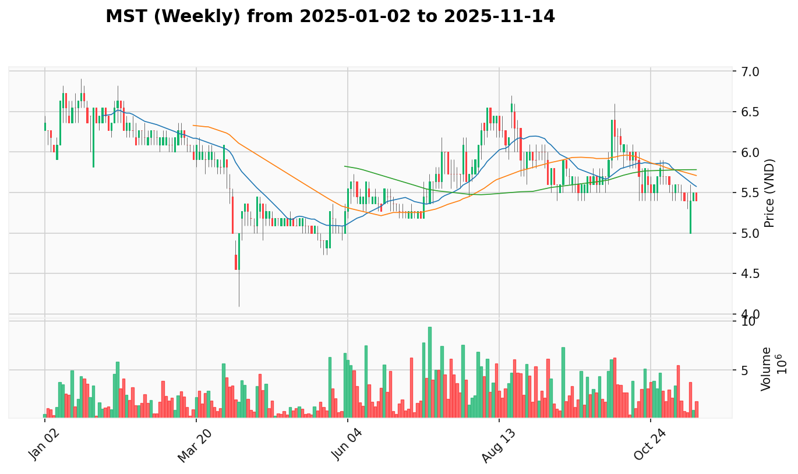

<a href="#penny">↑ Back to group PENNY</a>  |  <a href="#vpa-signal-summary">↑ Back to Top</a>

#### Key Statistics
| Metric | Value |
|:---|---:|
| Date Range | 2025-01-02 to 2025-11-14 |
| **Latest Close** | **5.4** |
| Period Open | 6.27 |
| Period High | 6.91 |
| Period Low | 4.09 |
| Period Change % | -13.88% |

**[Download MST Data (.csv)](market_data_week/MST_2025-01-02_to_2025-11-14.csv)**

---

### MWG

#### [VPA Analysis (2025-06-02 - 2025-08-03)](./VPA_week.md#mwg)
> - **Ngày 2025-07-07:** Tiếp nối Dấu hiệu Sức mạnh của tuần trước, MWG có một tuần tăng giá mạnh mẽ với một nến tăng thân dài, đóng cửa (67.9) gần mức cao nhất tuần. Khối lượng giao dịch duy trì ở mức cao.
>     - **Phân tích VPA/Wyckoff:** Đây là một **Sign of Strength**, xác nhận lực cầu đang kiểm soát hoàn toàn và xu hướng tăng vẫn còn nhiều tiềm năng.
> - **Ngày 2025-07-14:** MWG tiếp tục xu hướng tăng mạnh mẽ với nến tăng có biên độ rộng, đóng cửa (69.7) cao hơn đáng kể so với tuần trước. Giá tạo đỉnh tuần mới tại 70.98, phá vỡ mức kháng cự. Khối lượng giao dịch tăng 12% so với tuần trước.
>     - **Phân tích VPA/Wyckoff:** Đây là một **Sign of Strength** tiếp tục, cho thấy momentum tăng đang được duy trì bởi lực cầu mạnh mẽ. Việc phá vỡ mức kháng cự với khối lượng tăng cho thấy dòng tiền institutional tiếp tục tham gia tích cực, hỗ trợ xu hướng tăng dài hạn.
> - **Ngày 2025-07-21:** MWG tiếp tục đà tăng với nến tăng biên độ vừa phải, đóng cửa (70.1) cao hơn tuần trước và tạo đỉnh tuần mới tại 71.1. Khối lượng giao dịch giảm nhẹ xuống 36.2 triệu so với 39.7 triệu tuần trước.
>     - **Phân tích VPA/Wyckoff:** Đây là một **Effort to Rise** sau chuỗi Sign of Strength. Việc giá tiếp tục tăng nhưng khối lượng giảm nhẹ cho thấy lực cầu vẫn kiểm soát nhưng có dấu hiệu chững lại. Tín hiệu vẫn tích cực nhưng cần theo dõi chặt chẽ.
> **Ngày 2025-07-27:** MWG có một tuần tăng giá nhẹ với nến tăng thân ngắn, đóng cửa (70.1) cao hơn tuần trước nhưng mức tăng chậm lại so với momentum mạnh mẽ của các tuần trước. Giá dao động trong biên độ hẹp từ 68.02-71.1, tạo đỉnh tuần mới nhưng không thể duy trì ở mức cao. Khối lượng giao dịch giảm xuống 36.2 triệu, thấp hơn đáng kể so với 39.7 triệu tuần trước và mức trung bình của chuỗi tăng giá.
> 
> **Phân tích VPA/Wyckoff:** Đây là một **No Demand** sau chuỗi Sign of Strength và Effort to Rise. Việc giá vẫn tăng nhưng khối lượng giảm rõ rệt cho thấy lực cầu đang suy yếu và có dấu hiệu của việc thiếu sự quan tâm từ dòng tiền institutional. Tín hiệu cảnh báo về một sự điều chỉnh có thể sắp xảy ra sau đợt tăng mạnh từ 59.64 lên 70.1.
> **Ngày 2025-08-03:** MWG có một tuần giảm giá mạnh với nến giảm có biên độ cực rộng, mở cửa (70.6) gần mức cao của tuần trước nhưng sụt giảm thảm hại xuống đóng cửa (65.2) ở mức thấp nhất tuần. Giá dao động trong khoảng rộng từ 65.2-71.0, tạo nên một nến bearish engulfing pattern mạnh mẽ. Khối lượng giao dịch bùng nổ lên 63.9 triệu đơn vị, tăng gấp 1.77 lần so với 36.2 triệu tuần trước và đạt mức cao nhất trong 8 tuần qua.

<a href="#ban-le">↑ Back to group BAN_LE</a>  |  <a href="#vpa-signal-summary">↑ Back to Top</a>

#### Key Statistics
| Metric | Value |
|:---|---:|
| Date Range | 2025-01-02 to 2025-11-14 |
| **Latest Close** | **81.4** |
| Period Open | 60.04 |
| Period High | 87.9 |
| Period Low | 45.1 |
| Period Change % | 35.58% |

**[Download MWG Data (.csv)](market_data_week/MWG_2025-01-02_to_2025-11-14.csv)**

---

### NAF

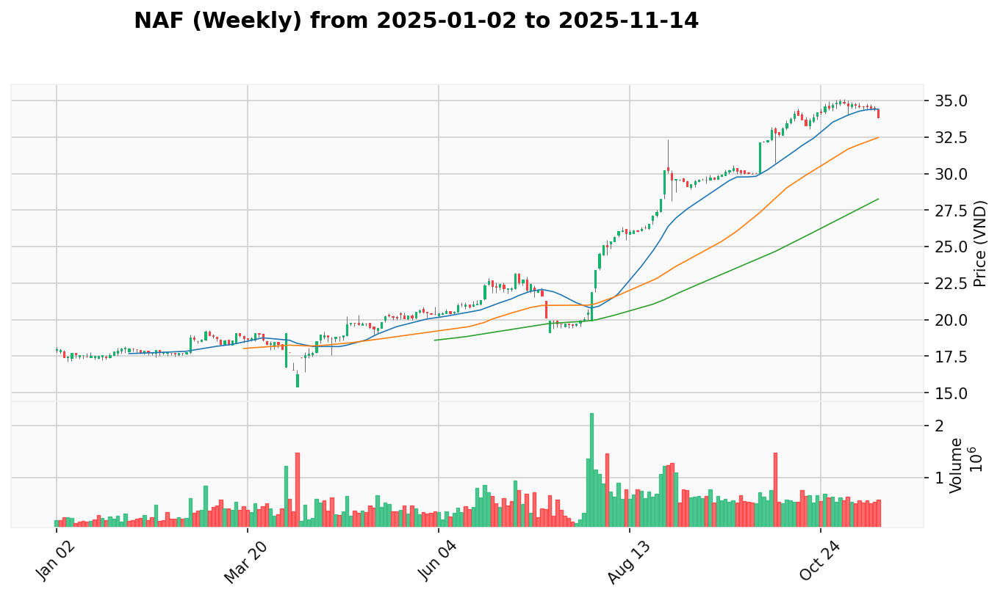

<a href="#nong-nghiep">↑ Back to group NONG_NGHIEP</a>  |  <a href="#vpa-signal-summary">↑ Back to Top</a>

#### Key Statistics
| Metric | Value |
|:---|---:|
| Date Range | 2025-01-02 to 2025-11-14 |
| **Latest Close** | **33.85** |
| Period Open | 17.91 |
| Period High | 35.1 |
| Period Low | 15.41 |
| Period Change % | 89.00% |

**[Download NAF Data (.csv)](market_data_week/NAF_2025-01-02_to_2025-11-14.csv)**

---

### NBC

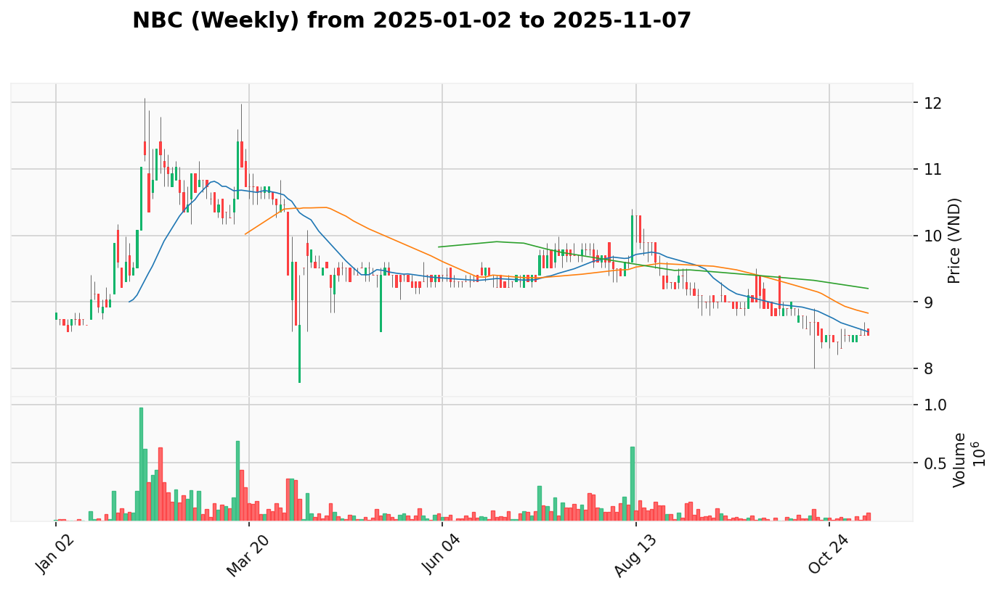

<a href="#khai-khoang">↑ Back to group KHAI_KHOANG</a>  |  <a href="#vpa-signal-summary">↑ Back to Top</a>

#### Key Statistics
| Metric | Value |
|:---|---:|
| Date Range | 2025-01-02 to 2025-11-14 |
| **Latest Close** | **8.5** |
| Period Open | 8.74 |
| Period High | 12.07 |
| Period Low | 7.79 |
| Period Change % | -2.75% |

**[Download NBC Data (.csv)](market_data_week/NBC_2025-01-02_to_2025-11-14.csv)**

---

### NCT

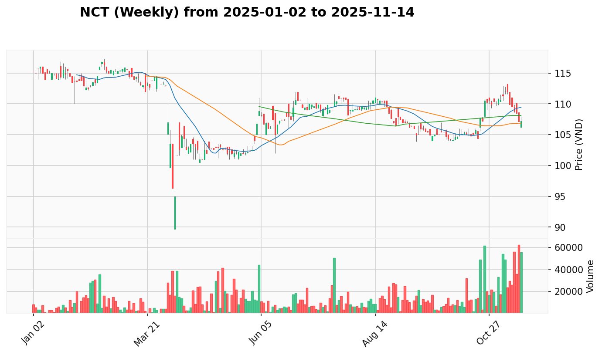

<a href="#hang-khong">↑ Back to group HANG_KHONG</a>  |  <a href="#vpa-signal-summary">↑ Back to Top</a>

#### Key Statistics
| Metric | Value |
|:---|---:|
| Date Range | 2025-01-02 to 2025-11-14 |
| **Latest Close** | **107.2** |
| Period Open | 115.2 |
| Period High | 117.3 |
| Period Low | 89.6 |
| Period Change % | -6.94% |

**[Download NCT Data (.csv)](market_data_week/NCT_2025-01-02_to_2025-11-14.csv)**

---

### NDN

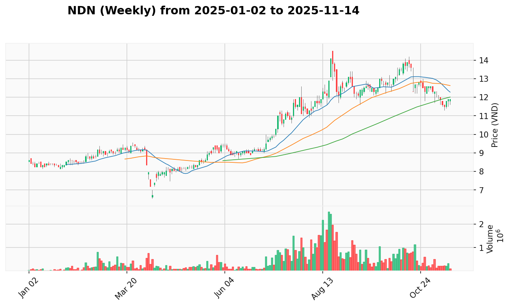

<a href="#bat-dong-san">↑ Back to group BAT_DONG_SAN</a>  |  <a href="#vpa-signal-summary">↑ Back to Top</a>

#### Key Statistics
| Metric | Value |
|:---|---:|
| Date Range | 2025-01-02 to 2025-11-14 |
| **Latest Close** | **11.9** |
| Period Open | 8.53 |
| Period High | 14.5 |
| Period Low | 6.54 |
| Period Change % | 39.51% |

**[Download NDN Data (.csv)](market_data_week/NDN_2025-01-02_to_2025-11-14.csv)**

---

### NHA

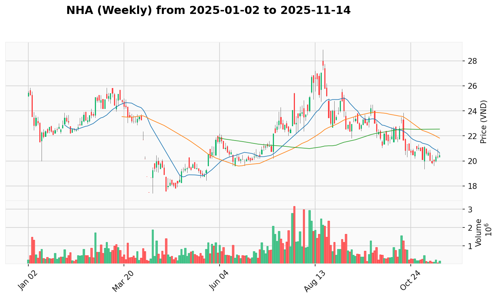

<a href="#bat-dong-san">↑ Back to group BAT_DONG_SAN</a>  |  <a href="#vpa-signal-summary">↑ Back to Top</a>

#### Key Statistics
| Metric | Value |
|:---|---:|
| Date Range | 2025-01-02 to 2025-11-14 |
| **Latest Close** | **20.45** |
| Period Open | 25.18 |
| Period High | 28.9 |
| Period Low | 17.41 |
| Period Change % | -18.78% |

**[Download NHA Data (.csv)](market_data_week/NHA_2025-01-02_to_2025-11-14.csv)**

---

### NHH

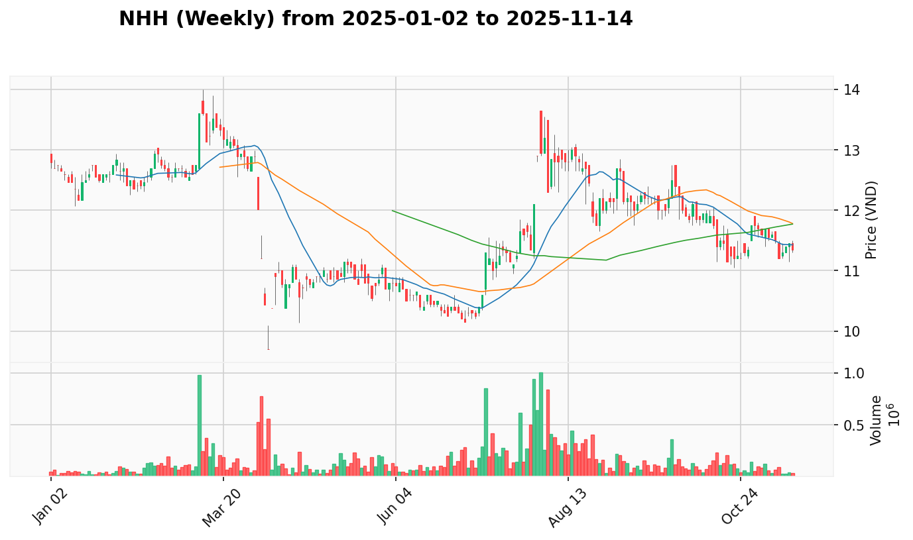

<a href="#nhua">↑ Back to group NHUA</a>  |  <a href="#vpa-signal-summary">↑ Back to Top</a>

#### Key Statistics
| Metric | Value |
|:---|---:|
| Date Range | 2025-01-02 to 2025-11-14 |
| **Latest Close** | **11.35** |
| Period Open | 12.94 |
| Period High | 14.0 |
| Period Low | 9.7 |
| Period Change % | -12.29% |

**[Download NHH Data (.csv)](market_data_week/NHH_2025-01-02_to_2025-11-14.csv)**

---

### NKG

#### [VPA Analysis (2025-06-02 - 2025-08-03)](./VPA_week.md#nkg)
> - **Ngày 2025-07-07:** Sau phiên kiểm tra cung thành công của tuần trước, NKG có một tuần tăng giá bùng nổ với một nến tăng thân dài, đóng cửa (13.95) gần mức cao nhất tuần. Khối lượng giao dịch tăng vọt.
>     - **Phân tích VPA/Wyckoff:** Đây là một **Sign of Strength**, cho thấy lực cầu đã quay trở lại một cách quyết liệt, báo hiệu khả năng kết thúc đợt điều chỉnh.
> - **Ngày 2025-07-14:** NKG tiếp tục xu hướng tăng với nến tăng có biên độ vừa phải, đóng cửa (14.3) cao hơn tuần trước. Giá tạo đỉnh tuần tại 14.6. Khối lượng giao dịch giảm nhẹ so với tuần trước nhưng vẫn ở mức cao.
>     - **Phân tích VPA/Wyckoff:** Đây là một **Sign of Strength** tiếp tục, cho thấy xu hướng tăng đang được duy trì. Việc giá tăng với khối lượng vẫn ở mức cao cho thấy lực cầu institutional vẫn đang hỗ trợ, củng cố momentum tăng.
> - **Ngày 2025-07-21:** NKG tiếp tục bùng nổ với nến tăng mạnh mẽ từ 14.3 lên 15.05, tạo đỉnh tuần mới tại 15.2. Khối lượng giao dịch tăng vọt lên 84.7 triệu so với 70.9 triệu tuần trước.
>     - **Phân tích VPA/Wyckoff:** Đây là một **Sign of Strength** cực kỳ mạnh mẽ, xác nhận xu hướng tăng được tăng tốc. Việc tăng giá mạnh với khối lượng tăng vọt cho thấy dòng tiền lớn đang tham gia tích cực, củng cố momentum tăng mạnh mẽ cho các tuần tiếp theo.
> **Ngày 2025-07-27:** NKG tiếp tục xu hướng tăng mạnh mẽ với nến tăng có thân dài, tăng từ 14.35 lên 15.05 và tạo đỉnh tuần mới tại 15.2. Giá đóng cửa gần mức cao nhất tuần, cho thấy lực cầu áp đảo. Khối lượng giao dịch tăng thêm lên 84.7 triệu, cao hơn tuần trước (70.9 triệu), xác nhận sự tham gia tích cực của dòng tiền lớn. Đây là tuần thứ 4 liên tiếp tăng giá kể từ khi phá vỡ vùng tích lũy 12.5-13.5, cho thấy xu hướng tăng đã được thiết lập vững chắc.
> 
> **Phân tích VPA/Wyckoff:** Đây là một **Sign of Strength** cực kỳ mạnh mẽ tiếp tục, với việc giá tăng mạnh trên nền khối lượng cao cho thấy institutional money đang tích cực mua vào. Momentum tăng đang được tăng tốc và có khả năng tiếp tục trong ngắn hạn, với mục tiêu kỹ thuật tiếp theo có thể là vùng 16.0-16.5.
> **Ngày 2025-08-03:** NKG tiếp tục bùng nổ mạnh mẽ với nến tăng biên độ rất rộng, tăng từ 15.05 lên 15.5 và tạo đỉnh tuần mới tại 16.8. Đây là mức giá cao nhất kể từ đầu năm, đánh dấu sự phá vỡ quan trọng khỏi vùng kháng cự 15.2. Giá mở cửa tại 15.25 và có giai đoạn test mạnh lên 16.8 trước khi đóng cửa tại 15.5, cho thấy có profit taking ở vùng cao nhưng momentum tăng vẫn được duy trì. Khối lượng giao dịch bùng nổ lên 158.1 triệu, tăng gần gấp đôi so với tuần trước (84.7 triệu), đây là khối lượng cao nhất trong 5 tuần qua. Đây là tuần thứ 5 liên tiếp tăng giá kể từ khi thoát khỏi vùng tích lũy, với tổng mức tăng đã lên tới 19% từ đáy 13.0.

<a href="#thep">↑ Back to group THEP</a>  |  <a href="#vpa-signal-summary">↑ Back to Top</a>

#### Key Statistics
| Metric | Value |
|:---|---:|
| Date Range | 2025-01-02 to 2025-11-14 |
| **Latest Close** | **17.05** |
| Period Open | 14.55 |
| Period High | 20.4 |
| Period Low | 11.05 |
| Period Change % | 17.18% |

**[Download NKG Data (.csv)](market_data_week/NKG_2025-01-02_to_2025-11-14.csv)**

---

### NLG

#### [VPA Analysis (2025-06-02 - 2025-08-03)](./VPA_week.md#nlg)
> - **Ngày 2025-07-07:** Tiếp nối Dấu hiệu Sức mạnh của tuần trước, NLG có một tuần đi ngang với một nến giảm biên độ hẹp. Khối lượng giao dịch giảm.
>     - **Phân tích VPA/Wyckoff:** Đây là một phiên **No Supply**. Việc giá giữ vững trên nền khối lượng thấp sau một đợt tăng là một tín hiệu rất No Supply, cho thấy thị trường đang hấp thụ tốt và có thể sớm tăng trở lại.
> - **Ngày 2025-07-14:** NLG bùng nổ với nến tăng có biên độ rộng, đóng cửa (40.7) cao hơn đáng kể so với tuần trước. Giá tạo đỉnh tuần mới tại 43.0, phá vỡ mức kháng cự. Khối lượng giao dịch tăng vọt gấp đôi so với tuần trước.
>     - **Phân tích VPA/Wyckoff:** Đây là một **Sign of Strength** mạnh mẽ, xác nhận dự đoán từ tín hiệu No Supply tuần trước. Việc phá vỡ kháng cự với khối lượng tăng vọt cho thấy lực cầu institutional đang tham gia mạnh mẽ, mở ra giai đoạn tăng giá mới.
> - **Ngày 2025-07-21:** Tiếp nối Sign of Strength mạnh mẽ tuần trước, NLG có một tuần tăng giá ổn định với nến tăng biên độ vừa phải, đóng cửa (41.65) tăng từ 40.7 tuần trước. Giá dao động từ 38.9 đến 41.75. Khối lượng giao dịch giảm xuống 16.1 triệu so với 26.1 triệu tuần trước.
>     - **Phân tích VPA/Wyckoff:** Đây là một **No Supply** mạnh mẽ. Việc giá tiếp tục tăng sau Sign of Strength tuần trước trên nền khối lượng giảm đáng kể cho thấy áp lực bán hoàn toàn kiệt sức. Đây là tín hiệu No Supply cực kỳ tích cực, xác nhận xu hướng tăng mạnh mẽ sẽ tiếp tục.
> **Ngày 2025-07-27:** Sau tuần No Supply mạnh mẽ trước đó, NLG tiếp tục có một tuần tăng giá ổn định với nến tăng biên độ vừa phải, đóng cửa (41.65) cao hơn tuần trước (40.7). Giá dao động từ 38.9 đến 41.75, tạo đỉnh tuần mới. Khối lượng giao dịch giảm nhẹ xuống 16.1 triệu so với 26.0 triệu tuần trước nhưng vẫn duy trì ở mức tương đối cao.
> 
> **Phân tích VPA/Wyckoff:** Đây là một **Test for Supply** thành công. Việc giá tiếp tục tạo đỉnh mới trên nền khối lượng giảm nhẹ cho thấy áp lực bán rất yếu và thị trường đang trong giai đoạn markup mạnh mẽ. Sự kết hợp giữa giá tăng ổn định và khối lượng duy trì ở mức cao xác nhận sự tham gia tích cực của dòng tiền thông minh. Xu hướng tăng mạnh mẽ được duy trì với triển vọng tiếp tục phá vỡ các mức kháng cự cao hơn.
> **Ngày 2025-08-03:** Sau tuần Test for Supply thành công trước đó, NLG có một tuần dao động mạnh với nến giảm biên độ rộng, mở cửa tại 42.1 và đóng cửa tại 40.2, giảm từ mức 41.65 tuần trước. Giá test lên đỉnh tuần mới tại 43.25 nhưng bị đẩy xuống mức thấp 38.85 trước khi hồi phục. Khối lượng giao dịch tăng mạnh lên 21.6 triệu so với 16.1 triệu tuần trước, tăng 34%.

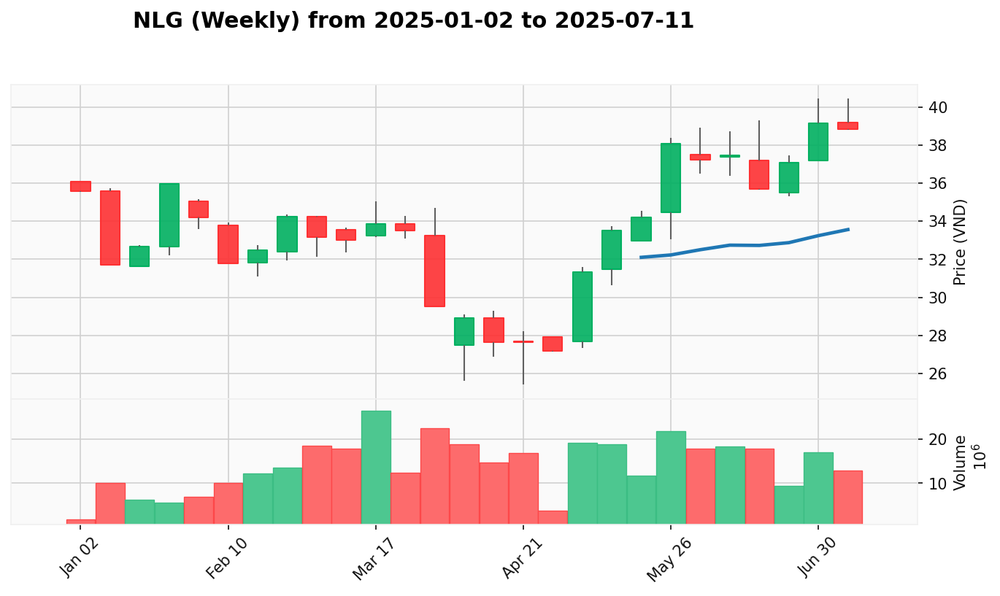

<a href="#bat-dong-san">↑ Back to group BAT_DONG_SAN</a>  |  <a href="#vpa-signal-summary">↑ Back to Top</a>

#### Key Statistics
| Metric | Value |
|:---|---:|
| Date Range | 2025-01-02 to 2025-11-14 |
| **Latest Close** | **37.2** |
| Period Open | 33.05 |
| Period High | 45.63 |
| Period Low | 23.29 |
| Period Change % | 12.56% |

**[Download NLG Data (.csv)](market_data_week/NLG_2025-01-02_to_2025-11-14.csv)**

---

### NNC

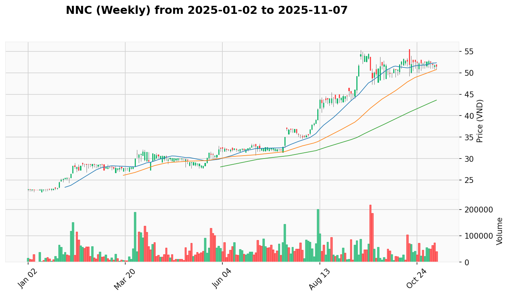

<a href="#khai-khoang">↑ Back to group KHAI_KHOANG</a>  |  <a href="#vpa-signal-summary">↑ Back to Top</a>

#### Key Statistics
| Metric | Value |
|:---|---:|
| Date Range | 2025-01-02 to 2025-11-14 |
| **Latest Close** | **53.8** |
| Period Open | 22.83 |
| Period High | 55.5 |
| Period Low | 22.2 |
| Period Change % | 135.65% |

**[Download NNC Data (.csv)](market_data_week/NNC_2025-01-02_to_2025-11-14.csv)**

---

### NRC

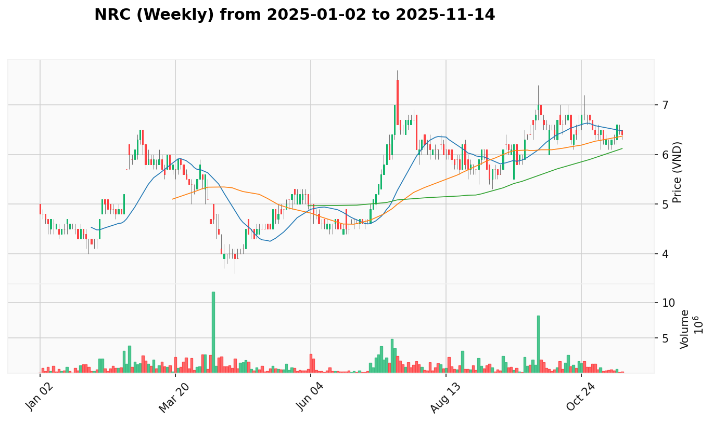

<a href="#penny">↑ Back to group PENNY</a>  |  <a href="#vpa-signal-summary">↑ Back to Top</a>

#### Key Statistics
| Metric | Value |
|:---|---:|
| Date Range | 2025-01-02 to 2025-11-14 |
| **Latest Close** | **6.4** |
| Period Open | 5.0 |
| Period High | 7.7 |
| Period Low | 3.6 |
| Period Change % | 28.00% |

**[Download NRC Data (.csv)](market_data_week/NRC_2025-01-02_to_2025-11-14.csv)**

---

### NT2

#### [VPA Analysis (2025-06-02 - 2025-08-03)](./VPA_week.md#nt2)
> - **Ngày 2025-07-07:** Tiếp nối Dấu hiệu Sức mạnh của tuần trước, NT2 có một tuần đi ngang với một nến giảm biên độ hẹp. Khối lượng giao dịch giảm nhẹ.
>     - **Phân tích VPA/Wyckoff:** Đây là một phiên **Test for Supply**. Việc giá giữ vững sau một đợt tăng mạnh là một tín hiệu No Supply, cho thấy thị trường đang hấp thụ tốt lực chốt lời.
> - **Ngày 2025-07-14:** NT2 phục hồi mạnh mẽ với nến tăng có biên độ tốt, đóng cửa (20.1) cao hơn đáng kể so với tuần trước. Giá tạo đỉnh tuần tại 20.25. Khối lượng giao dịch tăng 26% so với tuần trước.
>     - **Phân tích VPA/Wyckoff:** Đây là một **Sign of Strength** mạnh mẽ, xác nhận tín hiệu Test for Supply thành công từ tuần trước. Việc tăng giá với khối lượng cao cho thấy lực cầu institutional đã trở lại tích cực, mở ra giai đoạn tăng giá mới.
> - **Ngày 2025-07-21:** Tiếp nối Sign of Strength tuần trước, NT2 có một tuần tăng giá tốt với nến tăng thân dài, đóng cửa (20.5) tăng từ 20.1 tuần trước. Giá dao động từ 20.3 đến 21.05 tạo đỉnh mới. Khối lượng giao dịch bùng nổ lên 11.8 triệu so với 7.1 triệu tuần trước (+68%).
>     - **Phân tích VPA/Wyckoff:** Đây là một **Sign of Strength** mạnh mẽ. Việc giá tiếp tục tăng sau Sign of Strength tuần trước kèm theo khối lượng bùng nổ cho thấy lực cầu institutional đang tham gia tích cực, tạo đỉnh mới và củng cố xu hướng tăng mạnh mẽ.
> **Ngày 2025-07-27:** NT2 kết thúc tuần với một nến giảm nhẹ, đóng cửa tại 20.5 (giảm từ 21.0 đầu tuần). Mặc dù có gap up mạnh lên 21.0 nhưng không thể duy trì được mức cao, tạo đỉnh tuần tại 21.05 rồi điều chỉnh về 20.5. Khối lượng giao dịch vẫn duy trì ở mức cao 11.8 triệu, tương đương tuần trước, cho thấy sự quan tâm của thị trường vẫn cao.
> 
> **Phân tích VPA/Wyckoff:** Đây là một **Test for Supply** sau chuỗi Sign of Strength liên tiếp. Việc giá gap up nhưng không thể duy trì với khối lượng cao cho thấy có áp lực chốt lời xuất hiện ở vùng 21.0. Tuy nhiên, việc giá chỉ điều chỉnh nhẹ và duy trì trên mức 20.0 với khối lượng cao là tích cực, cho thấy lực cầu vẫn mạnh và đây có thể là một Test thành công trước khi tiếp tục xu hướng tăng.
> **Ngày 2025-08-03:**
> NT2 có tuần giảm nhẹ với nến có bóng dưới dài, mở cửa tại 20.85 và đóng cửa giữ nguyên tại 20.5. Giá dao động trong biên độ rộng từ 19.65 đến 20.9, tạo ra mức thấp nhất tại 19.65 nhưng phục hồi mạnh để đóng cửa ở mức trung bình. Khối lượng giao dịch giảm 21% xuống 9.3 triệu so với 11.8 triệu tuần trước, nhưng vẫn ở mức tương đối cao so với các tuần trước đó.

<a href="#nang-luong">↑ Back to group NANG_LUONG</a>  |  <a href="#vpa-signal-summary">↑ Back to Top</a>

#### Key Statistics
| Metric | Value |
|:---|---:|
| Date Range | 2025-01-02 to 2025-11-14 |
| **Latest Close** | **24.25** |
| Period Open | 19.45 |
| Period High | 25.35 |
| Period Low | 15.48 |
| Period Change % | 24.68% |

**[Download NT2 Data (.csv)](market_data_week/NT2_2025-01-02_to_2025-11-14.csv)**

---

### NTC

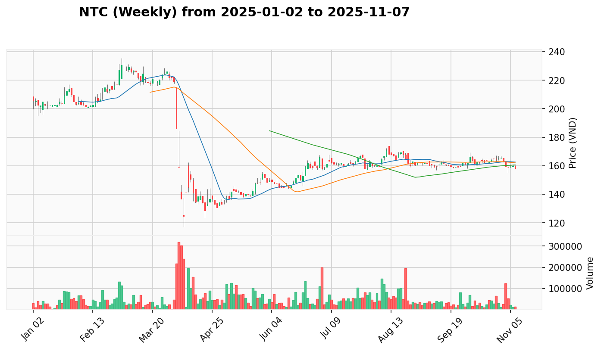

<a href="#bat-dong-san-kcn">↑ Back to group BAT_DONG_SAN_KCN</a>  |  <a href="#vpa-signal-summary">↑ Back to Top</a>

#### Key Statistics
| Metric | Value |
|:---|---:|
| Date Range | 2025-01-02 to 2025-11-14 |
| **Latest Close** | **161.1** |
| Period Open | 208.44 |
| Period High | 235.46 |
| Period Low | 117.05 |
| Period Change % | -22.71% |

**[Download NTC Data (.csv)](market_data_week/NTC_2025-01-02_to_2025-11-14.csv)**

---

### NTL

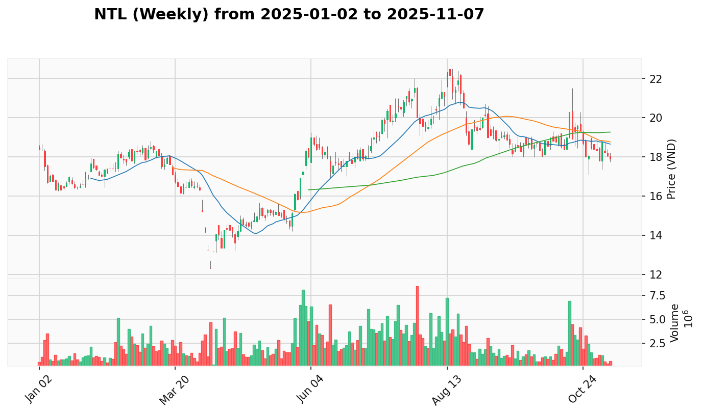

<a href="#bat-dong-san">↑ Back to group BAT_DONG_SAN</a>  |  <a href="#vpa-signal-summary">↑ Back to Top</a>

#### Key Statistics
| Metric | Value |
|:---|---:|
| Date Range | 2025-01-02 to 2025-11-14 |
| **Latest Close** | **18.1** |
| Period Open | 18.45 |
| Period High | 22.5 |
| Period Low | 12.3 |
| Period Change % | -1.90% |

**[Download NTL Data (.csv)](market_data_week/NTL_2025-01-02_to_2025-11-14.csv)**

---

### NTP

#### [VPA Analysis (2025-06-02 - 2025-08-03)](./VPA_week.md#ntp)
> - **Ngày 2025-07-07:** Sau tuần tăng giá gặp kháng cự, NTP có một tuần tăng giá mạnh mẽ với một nến tăng thân dài, đóng cửa (66.6) gần mức cao nhất tuần. Khối lượng giao dịch giảm nhẹ.
>     - **Phân tích VPA/Wyckoff:** Việc giá có thể tăng mạnh trên nền khối lượng thấp hơn là một tín hiệu **No Supply**, cho thấy phe bán đã yếu đi. Đây là một tín hiệu rất No Supply cho xu hướng tăng.
> - **Ngày 2025-07-14:** NTP tiếp tục xu hướng tăng với nến tăng có biên độ vừa phải, đóng cửa (68.9) cao hơn tuần trước. Giá tạo đỉnh tuần tại 69.3. Khối lượng giao dịch giảm nhẹ so với tuần trước nhưng vẫn ổn định.
>     - **Phân tích VPA/Wyckoff:** Đây là một **Sign of Strength** tiếp tục, cho thấy xu hướng tăng được duy trì. Việc giá tăng trên khối lượng ổn định cho thấy lực cầu vẫn đang kiểm soát và tín hiệu No Supply tiếp tục có hiệu lực, hỗ trợ xu hướng tăng dài hạn.
> - **Ngày 2025-07-21:** Tiếp nối Sign of Strength tuần trước, NTP có một tuần tăng giá nhẹ với nến tăng biên độ hẹp, đóng cửa (69.0) từ 68.9 tuần trước. Giá dao động từ 67.1 đến 71.8 tạo đỉnh tuần mới. Khối lượng giao dịch tăng lên 2.9 triệu so với 1.8 triệu tuần trước (+59%).
>     - **Phân tích VPA/Wyckoff:** Đây là một **Sign of Strength**. Việc giá tạo đỉnh mới và tăng trên nền khối lượng tăng vọt cho thấy lực cầu institutional đang tham gia tích cực. Mặc dù giá đóng cửa gần bằng tuần trước, việc tạo đỉnh mới với khối lượng cao là tín hiệu tích cực cho xu hướng tăng.
> **Ngày 2025-07-27:** NTP tiếp tục xu hướng tăng với nến tăng nhẹ, đóng cửa (69.0) gần như không đổi so với tuần trước (68.9). Giá dao động từ 67.1 đến 71.8, tạo đỉnh tuần mới cao hơn đỉnh trước đó là 69.3. Khối lượng giao dịch tăng mạnh lên 2.94 triệu so với 1.84 triệu tuần trước (+60%).
> 
> **Phân tích VPA/Wyckoff:** Đây là một **Sign of Strength** tiếp tục. Việc giá tạo đỉnh mới (71.8) trên nền khối lượng tăng vọt cho thấy institutional money đang tích cực tham gia. Mặc dù giá đóng cửa gần bằng tuần trước, việc test thành công vùng 71.8 với khối lượng cao là tín hiệu tích cực. Xu hướng tăng từ vùng 60-65 vẫn được duy trì mạnh mẽ với chuỗi Sign of Strength liên tiếp.
> **Ngày 2025-08-03:** NTP đảo chiều giảm mạnh từ 69.0 xuống 65.4 với nến giảm biên độ rộng. Giá mở cửa ở mức đóng cửa tuần trước (69.0) nhưng không thể duy trì và test xuống mức thấp 63.6 trước khi phục hồi nhẹ. Khối lượng giao dịch giảm về 2.52 triệu so với 2.94 triệu tuần trước (-15%).

<a href="#nhua">↑ Back to group NHUA</a>  |  <a href="#vpa-signal-summary">↑ Back to Top</a>

#### Key Statistics
| Metric | Value |
|:---|---:|
| Date Range | 2025-01-02 to 2025-11-14 |
| **Latest Close** | **63.8** |
| Period Open | 51.8 |
| Period High | 71.8 |
| Period Low | 39.96 |
| Period Change % | 23.17% |

**[Download NTP Data (.csv)](market_data_week/NTP_2025-01-02_to_2025-11-14.csv)**

---

### NVL

#### [VPA Analysis (2025-06-01 - 2025-08-03)](./VPA_week.md#nvl)
> - **Ngày 2025-07-07:** Sau phiên kiểm tra cung thành công của tuần trước, NVL có một tuần giảm giá nhẹ với biên độ hẹp. Khối lượng giao dịch tăng mạnh.
>     - **Phân tích VPA/Wyckoff:** Đây là một phiên **No Demand** sau khi nguồn cung xuất hiện. Việc giá không thể tăng trên khối lượng lớn cho thấy phe mua yếu, làm suy yếu tín hiệu No Supply trước đó.
> - **Ngày 2025-07-14:** NVL bùng nổ với nến tăng có biên độ rộng, đóng cửa (16.95) cao hơn đáng kể so với tuần trước. Giá tạo đỉnh tuần mới tại 17.5. Khối lượng giao dịch tăng vọt 56% so với tuần trước.
>     - **Phân tích VPA/Wyckoff:** Đây là một **Sign of Strength** mạnh mẽ, phản bác hoàn toàn tín hiệu No Demand của tuần trước. Việc tăng giá đột biến với khối lượng khổng lồ cho thấy lực cầu institutional đã trở lại mạnh mẽ, mở ra giai đoạn tăng giá mới.
> - **Ngày 2025-07-21:** NVL tiếp tục tăng giá với biên độ hẹp, mở cửa tại 17.2 và đóng cửa tại 17.1. Giá dao động trong vùng 16.4-17.2. Khối lượng giao dịch giảm 24% so với tuần trước xuống còn 131.3 triệu cổ phiếu.
>     - **Phân tích VPA/Wyckoff:** Đây là tín hiệu **Test for Supply** sau chuỗi tăng giá mạnh. Việc giá duy trì gần mức cao với khối lượng giảm cho thấy áp lực bán yếu, xác nhận tính chất No Supply của đà tăng. Đây là dấu hiệu tích cực, cho thấy NVL đang tiếp tục trong giai đoạn markup với sự hỗ trợ mạnh mẽ từ Smart Money.
> **Ngày 2025-07-27:** NVL có một tuần điều chỉnh nhẹ sau đợt bùng nổ mạnh mẽ của tuần trước. Giá mở cửa tại 17.2 (tương đương đỉnh tuần trước) nhưng giảm xuống đóng cửa tại 17.1, dao động trong vùng 16.4-17.2. Khối lượng giao dịch giảm 24.3% xuống còn 131.3 triệu cổ phiếu, thấp hơn đáng kể so với 173.5 triệu của tuần trước. Mặc dù có điều chỉnh nhẹ nhưng giá vẫn duy trì trên mức 17.0, cho thấy vùng hỗ trợ mạnh quanh ngưỡng này.
> - **Phân tích VPA/Wyckoff:** Đây là một phiên **Test for Supply** điển hình sau chuỗi tăng giá mạnh. Việc giá chỉ điều chỉnh nhẹ với biên độ hẹp trên nền khối lượng giảm mạnh cho thấy áp lực bán rất yếu, xác nhận tính chất **No Supply** của xu hướng tăng hiện tại. Smart Money đang nắm giữ vững vàng và không có dấu hiệu phân phối. Đây là tín hiệu tích cực, cho thấy NVL vẫn trong giai đoạn markup và có thể tiếp tục leo cao trong những tuần tới.
> **Ngày 2025-08-03:** NVL có một tuần biến động mạnh với biên độ rộng, mở cửa tại 17.4 và đóng cửa tại 17.25. Giá test lên đỉnh tuần mới tại 18.0 (cao nhất kể từ đầu năm) nhưng bị đẩy xuống mức thấp 15.95 trước khi phục hồi về gần mức mở cửa. Khối lượng giao dịch bùng nổ lên 187.6 triệu cổ phiếu, tăng 43% so với tuần trước (131.3 triệu), đây là mức khối lượng cao thứ hai trong năm sau tuần 2025-06-01. Mặc dù có biến động mạnh nhưng giá vẫn duy trì trên ngưỡng 17.0, cho thấy vùng hỗ trợ quan trọng này đang được bảo vệ tốt.

<a href="#bat-dong-san">↑ Back to group BAT_DONG_SAN</a>  |  <a href="#vpa-signal-summary">↑ Back to Top</a>

#### Key Statistics
| Metric | Value |
|:---|---:|
| Date Range | 2025-01-02 to 2025-11-14 |
| **Latest Close** | **14.15** |
| Period Open | 10.35 |
| Period High | 19.3 |
| Period Low | 7.88 |
| Period Change % | 36.71% |

**[Download NVL Data (.csv)](market_data_week/NVL_2025-01-02_to_2025-11-14.csv)**

---

### OCB

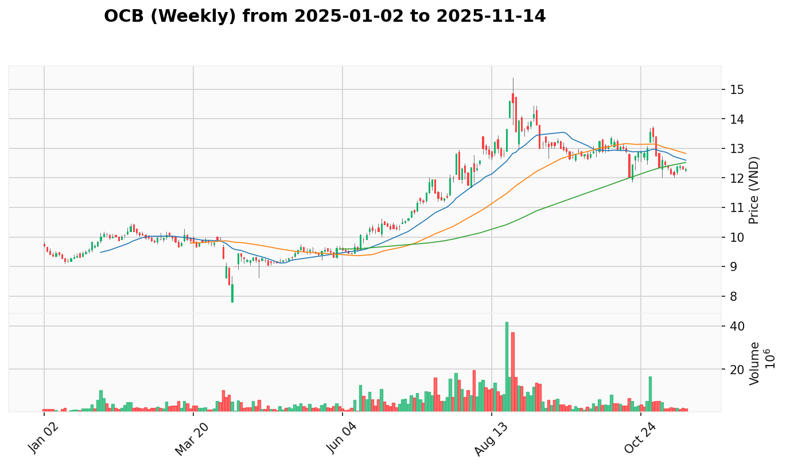

<a href="#ngan-hang">↑ Back to group NGAN_HANG</a>  |  <a href="#vpa-signal-summary">↑ Back to Top</a>

#### Key Statistics
| Metric | Value |
|:---|---:|
| Date Range | 2025-01-02 to 2025-11-14 |
| **Latest Close** | **12.3** |
| Period Open | 9.75 |
| Period High | 15.4 |
| Period Low | 7.8 |
| Period Change % | 26.15% |

**[Download OCB Data (.csv)](market_data_week/OCB_2025-01-02_to_2025-11-14.csv)**

---

### OIL

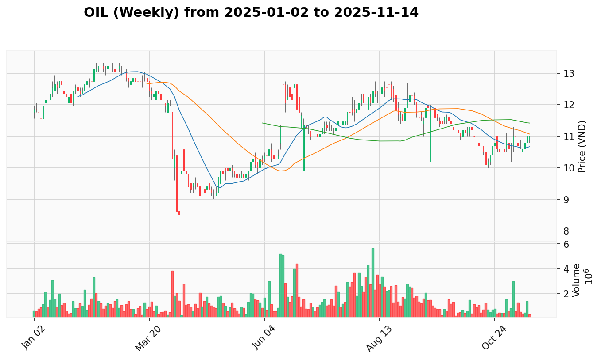

<a href="#dau-khi">↑ Back to group DAU_KHI</a>  |  <a href="#vpa-signal-summary">↑ Back to Top</a>

#### Key Statistics
| Metric | Value |
|:---|---:|
| Date Range | 2025-01-02 to 2025-11-14 |
| **Latest Close** | **11.0** |
| Period Open | 11.76 |
| Period High | 13.43 |
| Period Low | 7.94 |
| Period Change % | -6.46% |

**[Download OIL Data (.csv)](market_data_week/OIL_2025-01-02_to_2025-11-14.csv)**

---

### ORS

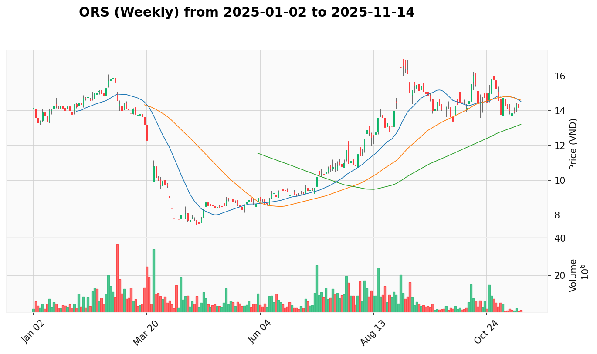

<a href="#chung-khoan">↑ Back to group CHUNG_KHOAN</a>  |  <a href="#vpa-signal-summary">↑ Back to Top</a>

#### Key Statistics
| Metric | Value |
|:---|---:|
| Date Range | 2025-01-02 to 2025-11-14 |
| **Latest Close** | **14.1** |
| Period Open | 14.1 |
| Period High | 17.0 |
| Period Low | 7.19 |
| Period Change % | 0.00% |

**[Download ORS Data (.csv)](market_data_week/ORS_2025-01-02_to_2025-11-14.csv)**

---

### PAN

#### [VPA Analysis (2025-06-02 - 2025-08-03)](./VPA_week.md#pan)
> - **Ngày 2025-07-07:** Sau phiên kiểm tra cung của tuần trước, PAN có một tuần tăng giá mạnh mẽ với một nến tăng thân dài, đóng cửa (28.85) gần mức cao nhất tuần. Khối lượng giao dịch tăng vọt.
>     - **Phân tích VPA/Wyckoff:** Đây là một **Sign of Strength**, cho thấy lực cầu đã quay trở lại một cách quyết liệt, báo hiệu khả năng kết thúc đợt điều chỉnh.
> - **Ngày 2025-07-14:** PAN tiếp tục xu hướng tăng mạnh mẽ với nến tăng có biên độ rộng, đóng cửa (30.4) cao hơn đáng kể so với tuần trước. Giá tạo đỉnh tuần mới tại 31.1. Khối lượng giao dịch tăng 14% so với tuần trước.
>     - **Phân tích VPA/Wyckoff:** Đây là một **Sign of Strength** tiếp tục, cho thấy momentum tăng đang được duy trì bởi lực cầu mạnh mẽ. Việc phá vỡ mức kháng cự với khối lượng tăng cho thấy dòng tiền institutional tiếp tục tham gia tích cực, củng cố xu hướng tăng.
> - **Ngày 2025-07-21:** PAN bùng nổ mạnh mẽ với nến tăng biên độ rất rộng, mở cửa tại 30.8 và đóng cửa tại 33.7. Giá đạt đỉnh tuần tại 34.75, tăng vọt 10.9% so với tuần trước. Khối lượng giao dịch tăng 40% lên 15.5 triệu cổ phiếu.
>     - **Phân tích VPA/Wyckoff:** Đây là tín hiệu **Sign of Strength** cực mạnh, cho thấy PAN đang trong giai đoạn markup với sự tham gia mạnh mẽ của Smart Money. Việc tăng giá đột biến với khối lượng khổng lồ xác nhận lực cầu institutional đang rất tích cực, mở ra triển vọng tiếp tục tăng giá trong các tuần tới.
> **Ngày 2025-07-27:** PAN tiếp tục xu hướng tăng mạnh mẽ với nến tăng biên độ rộng, mở cửa tại 30.8 và đóng cửa tại 33.7. Giá đạt đỉnh tuần tại 34.75, tăng 10.9% so với tuần trước. Khối lượng giao dịch tăng 40.6% lên 15.5 triệu cổ phiếu, đạt mức cao nhất trong 30 tuần qua. Cổ phiếu đã tăng liên tiếp 4 tuần với tổng mức tăng 33.5% từ mức 25.25. Việc vượt qua vùng kháng cự 31-32 với khối lượng khổng lồ cho thấy breakout thành công.
> 
> **Phân tích VPA/Wyckoff:** Đây là tín hiệu **Sign of Strength** cực mạnh, cho thấy PAN đang trong giai đoạn markup với sự tham gia tích cực của Professional Money. Việc tăng giá đột biến kết hợp khối lượng đạt đỉnh xác nhận accumulation phase đã hoàn tất và xu hướng tăng đang được institutional support mạnh mẽ. Momentum này có thể tiếp tục trong ngắn hạn nhưng cần theo dõi các dấu hiệu climax action ở vùng giá cao.
> **Ngày 2025-08-03:** PAN có tuần điều chỉnh nhẹ sau chuỗi tăng mạnh, mở cửa tại 34.35 và đóng cửa tại 34.65, tăng 2.8% so với tuần trước. Giá dao động trong biên độ rộng từ 32.0 đến 35.3, tạo nến tăng có thân nhỏ với đuôi dài phía dưới. Khối lượng giao dịch giảm 30.3% xuống 10.8 triệu cổ phiếu, thấp hơn đáng kể so với tuần trước. Mặc dù giá vẫn tăng nhẹ, việc test xuống vùng 32.0 cho thấy có áp lực chốt lời sau đợt tăng 37% trong 5 tuần qua.

<a href="#nong-nghiep">↑ Back to group NONG_NGHIEP</a>  |  <a href="#vpa-signal-summary">↑ Back to Top</a>

#### Key Statistics
| Metric | Value |
|:---|---:|
| Date Range | 2025-01-02 to 2025-11-14 |
| **Latest Close** | **28.75** |
| Period Open | 23.4 |
| Period High | 35.6 |
| Period Low | 20.1 |
| Period Change % | 22.86% |

**[Download PAN Data (.csv)](market_data_week/PAN_2025-01-02_to_2025-11-14.csv)**

---

### PC1

#### [VPA Analysis (2025-06-02 - 2025-08-03)](./VPA_week.md#pc1)
> - **Ngày 2025-07-07:** Sau tín hiệu No Supply của tuần trước, PC1 có một tuần tăng giá tốt, tạo thành một nến tăng và đóng cửa (22.35) cao hơn. Khối lượng giao dịch tăng mạnh.
>     - **Phân tích VPA/Wyckoff:** Đây là một **Sign of Strength**, cho thấy lực cầu đã quay trở lại sau một thời gian đi ngang, phá vỡ sự thiếu quan tâm trước đó.
> - **Ngày 2025-07-14:** PC1 tiếp tục xu hướng tăng với nến tăng có biên độ vừa phải, đóng cửa (22.8) cao hơn tuần trước. Giá tạo đỉnh tuần tại 23.4. Khối lượng giao dịch tăng 34% so với tuần trước.
>     - **Phân tích VPA/Wyckoff:** Đây là một **Sign of Strength** tiếp tục, cho thấy momentum tăng đang được duy trì. Việc tăng giá với khối lượng tăng mạnh cho thấy lực cầu institutional đang tham gia tích cực, củng cố xu hướng tăng sau giai đoạn đi ngang.
> - **Ngày 2025-07-21:** PC1 bùng nổ mạnh mẽ với nến tăng biên độ rất rộng, mở cửa tại 23.0 và đóng cửa tại 25.15. Giá đạt đỉnh tuần tại 25.6, tăng vọt 10.3% so với tuần trước. Khối lượng giao dịch tăng 64% lên 37.8 triệu cổ phiếu.
>     - **Phân tích VPA/Wyckoff:** Đây là tín hiệu **Sign of Strength** cực mạnh, cho thấy PC1 đang trong giai đoạn breakout với sự tham gia mạnh mẽ của Smart Money. Việc phá vỡ vùng kháng cự với khối lượng khổng lồ xác nhận lực cầu institutional đang rất tích cực, mở ra giai đoạn markup mới sau thời gian tích lũy dài.
> **Ngày 2025-07-27:** PC1 tiếp tục đà tăng mạnh mẽ với nến tăng biên độ rất rộng, mở cửa tại 23.0 và đóng cửa tại 25.15. Giá đạt đỉnh tuần tại 25.6, tăng vọt 10.3% so với tuần trước. Khối lượng giao dịch tăng 64% lên 37.8 triệu cổ phiếu, cao nhất trong 30 tuần qua. Cổ phiếu đã phá vỡ hoàn toàn vùng kháng cự 23.0-23.4 và thiết lập vùng giá mới ở mức 25.0+.
> 
> **Phân tích VPA/Wyckoff:** Đây là tín hiệu **Sign of Strength** cực mạnh, cho thấy PC1 đang trong giai đoạn breakout với sự tham gia mạnh mẽ của Smart Money. Việc phá vỡ vùng kháng cự với khối lượng khổng lồ xác nhận lực cầu institutional đang rất tích cực, mở ra giai đoạn markup mới sau thời gian tích lũy dài.
> **Ngày 2025-08-03:** PC1 tiếp tục đà bùng nổ với nến tăng biên độ cực rộng, mở cửa tại 25.35 và đóng cửa tại 27.7 (mức cao nhất tuần). Giá tăng vọt 10.1% so với tuần trước, đạt đỉnh lịch sử mới tại 27.7. Khối lượng giao dịch bùng nổ lên 65.45 triệu cổ phiếu, tăng 73% so với tuần trước và đạt kỷ lục mới trong 31 tuần qua. Cổ phiếu đã thiết lập hoàn toàn vùng giá mới ở mức 27.0+, xa rời vùng tích lũy cũ.

<a href="#xay-lap-dien">↑ Back to group XAY_LAP_DIEN</a>  |  <a href="#vpa-signal-summary">↑ Back to Top</a>

#### Key Statistics
| Metric | Value |
|:---|---:|
| Date Range | 2025-01-02 to 2025-11-14 |
| **Latest Close** | **22.05** |
| Period Open | 20.09 |
| Period High | 28.26 |
| Period Low | 16.0 |
| Period Change % | 9.76% |

**[Download PC1 Data (.csv)](market_data_week/PC1_2025-01-02_to_2025-11-14.csv)**

---

### PDR

#### [VPA Analysis (2025-06-02 - 2025-08-03)](./VPA_week.md#pdr)
> - **Ngày 2025-07-07:** Sau phiên kiểm tra cung thành công của tuần trước, PDR đã có một tuần tăng giá mạnh mẽ. Nến tăng có thân dài, đóng cửa (18.75) gần mức cao nhất tuần, đi kèm với khối lượng giao dịch tăng vọt.
>     - **Phân tích VPA/Wyckoff:** Đây là một **Sign of Strength**, xác nhận lực cầu đã quay trở lại một cách quyết liệt và xu hướng tăng đang tiếp diễn.
> - **Ngày 2025-07-14:** PDR có một tuần bùng nổ mạnh mẽ với nến tăng có biên độ rất rộng, đóng cửa (20.55) cao hơn đáng kể so với tuần trước. Giá tạo đỉnh tuần mới tại 21.9. Khối lượng giao dịch tăng vọt 45% so với tuần trước.
>     - **Phân tích VPA/Wyckoff:** Đây là một **Sign of Strength** cực kỳ mạnh mẽ, cho thấy xu hướng tăng đang được thúc đẩy bởi lực cầu khổng lồ. Việc phá vỡ các mức kháng cự với khối lượng khổng lồ cho thấy dòng tiền institutional đang tham gia rất mạnh mẽ, mở ra giai đoạn tăng giá đáng kể.
> - **Ngày 2025-07-21:** PDR có một tuần kiểm tra cung với biên độ giá hẹp, mở cửa tại 20.65 và đóng cửa tại 20.75. Giá dao động trong vùng 19.75-20.85, giữ vững gần mức cao. Khối lượng giao dịch giảm 26% xuống còn 92.3 triệu cổ phiếu.
>     - **Phân tích VPA/Wyckoff:** Đây là tín hiệu **Test for Supply** sau chuỗi tăng giá mạnh. Việc giá duy trì ổn định gần mức cao với khối lượng giảm cho thấy tình trạng No Supply, xác nhận không có áp lực bán mạnh từ Smart Money. Đây là dấu hiệu tích cực, cho thấy PDR vẫn đang trong xu hướng tăng và có thể tiếp tục markup trong các tuần tới.
> **Ngày 2025-07-27:** Sau tuần test for supply thành công, PDR tiếp tục cho thấy sức mạnh với nến tăng nhẹ, mở cửa tại 20.65 và đóng cửa tại 20.75. Giá dao động trong vùng hẹp 19.75-20.85, duy trì ổn định gần mức cao nhất. Khối lượng giao dịch giảm tiếp 26% xuống còn 92.3 triệu cổ phiếu, thấp hơn đáng kể so với tuần bùng nổ trước đó (125 triệu). Việc giá không giảm sâu mặc dù khối lượng thấp cho thấy áp lực bán rất yếu.
> 
> **Phân tích VPA/Wyckoff:** Đây là tín hiệu **No Supply** rất tích cực sau giai đoạn test. Việc PDR duy trì giá ổn định gần đỉnh với khối lượng thấp chứng tỏ không có áp lực bán từ Smart Money, xác nhận xu hướng tăng vẫn còn nguyên vẹn. Đây là dấu hiệu chuẩn bị cho đợt markup tiếp theo khi dòng tiền institutional quay trở lại.
> **Ngày 2025-08-03:** PDR có một tuần bùng nổ khối lượng với nến giảm có biên độ cực rộng, mở cửa tại 19.49 nhưng test lên đỉnh tuần 21.2 (cao nhất kể từ tháng 7) trước khi sụt giảm mạnh xuống đóng cửa tại 18.7. Giá dao động trong vùng rộng 18.43-21.2, tạo ra biên độ dao động 14.8%. Khối lượng giao dịch bùng nổ lên 148.7 triệu cổ phiếu, tăng 61% so với tuần trước và cao nhất trong 4 tuần qua. Việc test lên mức 21.2 nhưng không thể duy trì và kết thúc tuần dưới mức mở cửa cho thấy áp lực bán mạnh đã xuất hiện ở vùng cao.

<a href="#bat-dong-san">↑ Back to group BAT_DONG_SAN</a>  |  <a href="#vpa-signal-summary">↑ Back to Top</a>

#### Key Statistics
| Metric | Value |
|:---|---:|
| Date Range | 2025-01-02 to 2025-11-14 |
| **Latest Close** | **22.2** |
| Period Open | 19.17 |
| Period High | 27.2 |
| Period Low | 13.93 |
| Period Change % | 15.81% |

**[Download PDR Data (.csv)](market_data_week/PDR_2025-01-02_to_2025-11-14.csv)**

---

### PET

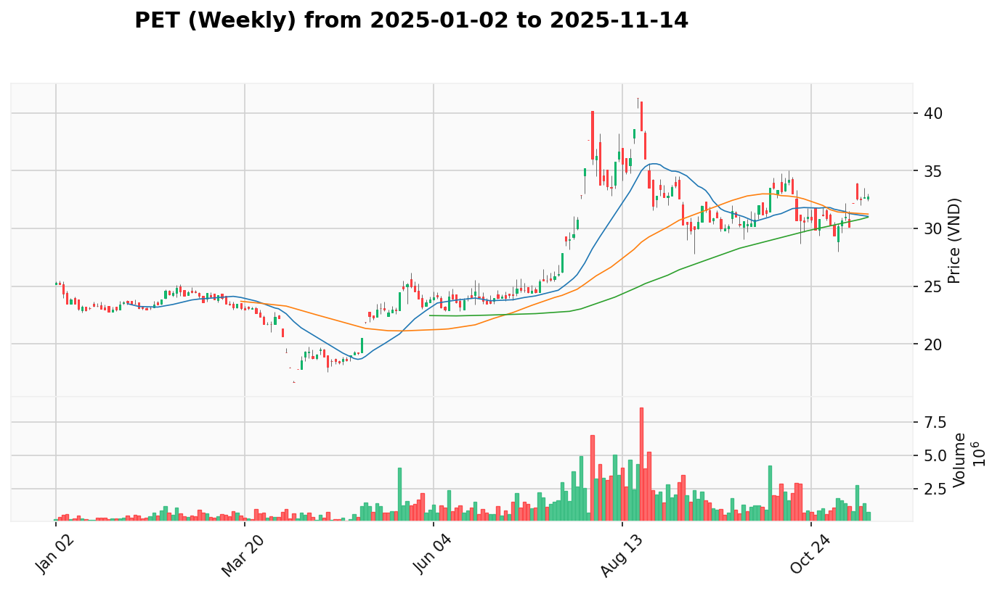

<a href="#ban-le">↑ Back to group BAN_LE</a>  |  <a href="#vpa-signal-summary">↑ Back to Top</a>

#### Key Statistics
| Metric | Value |
|:---|---:|
| Date Range | 2025-01-02 to 2025-11-14 |
| **Latest Close** | **32.75** |
| Period Open | 25.2 |
| Period High | 41.3 |
| Period Low | 16.7 |
| Period Change % | 29.96% |

**[Download PET Data (.csv)](market_data_week/PET_2025-01-02_to_2025-11-14.csv)**

---

### PHC

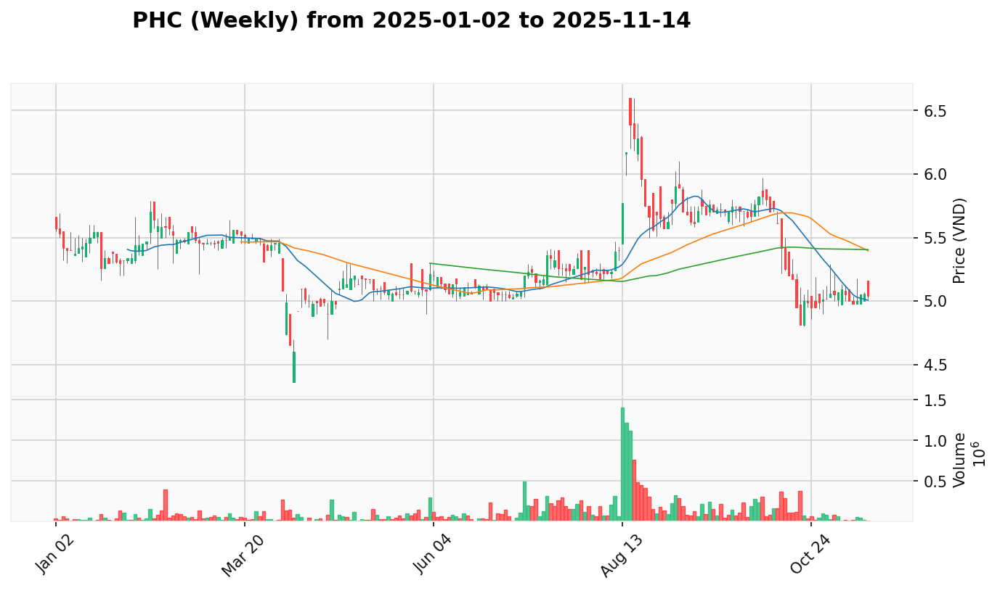

<a href="#xay-dung">↑ Back to group XAY_DUNG</a>  |  <a href="#vpa-signal-summary">↑ Back to Top</a>

#### Key Statistics
| Metric | Value |
|:---|---:|
| Date Range | 2025-01-02 to 2025-11-14 |
| **Latest Close** | **5.04** |
| Period Open | 5.66 |
| Period High | 6.6 |
| Period Low | 4.36 |
| Period Change % | -10.95% |

**[Download PHC Data (.csv)](market_data_week/PHC_2025-01-02_to_2025-11-14.csv)**

---

### PHP

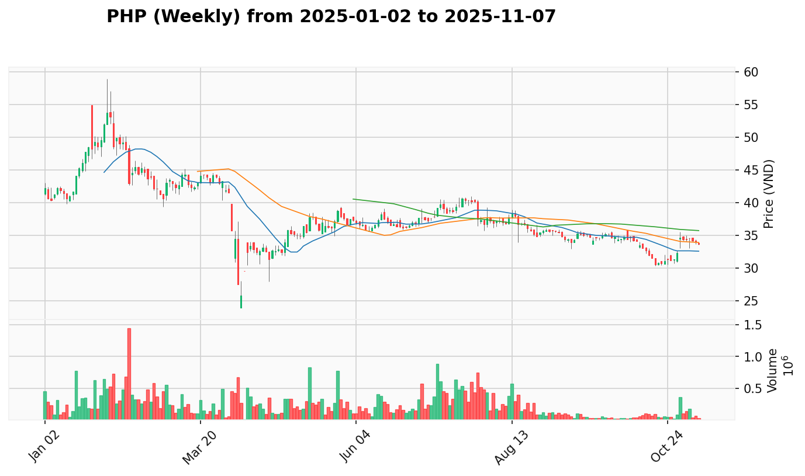

<a href="#van-tai">↑ Back to group VAN_TAI</a>  |  <a href="#vpa-signal-summary">↑ Back to Top</a>

#### Key Statistics
| Metric | Value |
|:---|---:|
| Date Range | 2025-01-02 to 2025-11-14 |
| **Latest Close** | **35.0** |
| Period Open | 41.29 |
| Period High | 58.89 |
| Period Low | 23.89 |
| Period Change % | -15.23% |

**[Download PHP Data (.csv)](market_data_week/PHP_2025-01-02_to_2025-11-14.csv)**

---

### PHR

#### [VPA Analysis (2025-06-02 - 2025-08-03)](./VPA_week.md#phr)
> - **Ngày 2025-07-07:** Tiếp nối Dấu hiệu Sức mạnh của tuần trước, PHR có một tuần điều chỉnh với một nến giảm. Khối lượng giao dịch giảm.
>     - **Phân tích VPA/Wyckoff:** Đây là một phiên **No Supply**. Việc giá điều chỉnh với khối lượng thấp sau một đợt tăng mạnh là một tín hiệu rất No Supply, cho thấy áp lực chốt lời yếu và thị trường đang hấp thụ tốt.
> - **Ngày 2025-07-14:** PHR phục hồi với nến tăng có biên độ vừa phải, đóng cửa (62.2) cao hơn tuần trước. Giá tạo đỉnh tuần tại 63.0. Khối lượng giao dịch tăng 19% so với tuần trước.
>     - **Phân tích VPA/Wyckoff:** Đây là một **Sign of Strength**, xác nhận tín hiệu No Supply từ tuần trước. Việc tăng giá với khối lượng tăng cho thấy lực cầu đã trở lại sau giai đoạn điều chỉnh, hỗ trợ xu hướng tăng tiếp tục.
> - **Ngày 2025-07-21:** PHR có một tuần dao động với biên độ rộng, mở cửa tại 62.9 và đóng cửa tại 61.5. Giá đạt đỉnh tuần tại 65.8 nhưng chốt phiên giảm nhẹ. Khối lượng giao dịch tăng 22% lên 3.4 triệu cổ phiếu.
>     - **Phân tích VPA/Wyckoff:** Đây là tín hiệu **Effort to Rise** với một số đặc điểm hỗn hợp. Việc giá có thể đạt mức cao mới (65.8) nhưng không thể duy trì và đóng cửa thấp hơn với khối lượng tăng cho thấy có sự chống đỡ ở vùng cao. Tuy nhiên, việc giá vẫn giữ được trên mức hỗ trợ quan trọng cho thấy tình trạng tương đối No Supply, cần theo dõi tuần tới để xác định xu hướng.
> **Ngày 2025-07-27:** PHR có một tuần dao động mạnh với biên độ rộng, mở cửa tại 62.9 và đóng cửa tại 61.5. Giá đạt đỉnh tuần tại 65.8 (cao hơn đỉnh tuần trước 63.0) nhưng không thể duy trì và đóng cửa thấp hơn mức mở cửa. Khối lượng giao dịch tăng 26% lên 3.486 triệu cổ phiếu so với tuần trước.
> 
> **Phân tích VPA/Wyckoff:** Đây là tín hiệu **Effort to Rise** với đặc điểm tiêu cực. Việc giá đạt được đỉnh mới tại 65.8 nhưng đóng cửa thấp hơn mức mở cửa với khối lượng tăng mạnh cho thấy có áp lực bán mạnh ở vùng cao và lực cầu không đủ mạnh để duy trì mức giá. Điều này báo hiệu khả năng có sự phân phối tại vùng đỉnh và xu hướng tăng có thể gặp khó khăn trong ngắn hạn.
> **Ngày 2025-08-03:** PHR có một tuần tích cực với nến tăng có biên độ vừa phải, mở cửa tại 62.4 và đóng cửa tại 62.6. Giá đạt đỉnh tuần tại 64.8 (thấp hơn đỉnh tuần trước 65.8) và dao động trong khoảng 60.9-64.8. Khối lượng giao dịch tăng nhẹ 2% lên 3.551 triệu cổ phiếu so với tuần trước.

<a href="#cao-su">↑ Back to group CAO_SU</a>  |  <a href="#vpa-signal-summary">↑ Back to Top</a>

#### Key Statistics
| Metric | Value |
|:---|---:|
| Date Range | 2025-01-02 to 2025-11-14 |
| **Latest Close** | **57.1** |
| Period Open | 51.84 |
| Period High | 67.36 |
| Period Low | 38.07 |
| Period Change % | 10.15% |

**[Download PHR Data (.csv)](market_data_week/PHR_2025-01-02_to_2025-11-14.csv)**

---

### PLC

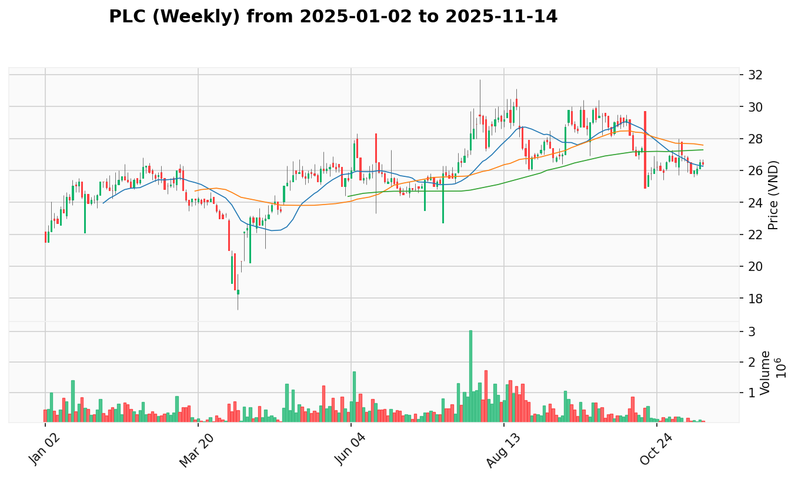

<a href="#dau-tu-cong">↑ Back to group DAU_TU_CONG</a>  |  <a href="#vpa-signal-summary">↑ Back to Top</a>

#### Key Statistics
| Metric | Value |
|:---|---:|
| Date Range | 2025-01-02 to 2025-11-14 |
| **Latest Close** | **26.4** |
| Period Open | 22.18 |
| Period High | 31.7 |
| Period Low | 17.27 |
| Period Change % | 19.03% |

**[Download PLC Data (.csv)](market_data_week/PLC_2025-01-02_to_2025-11-14.csv)**

---

### PLX

#### [VPA Analysis (2025-06-02 - 2025-08-03)](./VPA_week.md#plx)
> - **Ngày 2025-07-07:** Sau cú Upthrust yếu kém của tuần trước, PLX có một tuần tăng giá nhẹ với biên độ hẹp. Khối lượng giao dịch giảm.
>     - **Phân tích VPA/Wyckoff:** Đây là một nỗ lực phục hồi yếu ớt trên nền khối lượng thấp, một tín hiệu **No Demand**. Việc giá không thể phục hồi mạnh mẽ sau đợt giảm cho thấy phe mua vẫn còn yếu thế.
> - **Ngày 2025-07-14:** PLX tiếp tục yếu với nến giảm nhẹ có biên độ hẹp, đóng cửa (37.3) thấp hơn tuần trước. Khối lượng giao dịch tăng 32% so với tuần trước.
>     - **Phân tích VPA/Wyckoff:** Đây là một tín hiệu **No Demand** tiếp tục. Việc giá không thể tăng trên nền khối lượng tăng cho thấy lực cầu vẫn yếu, tiếp tục xác nhận tín hiệu tiêu cực từ các tuần trước.
> - **Ngày 2025-07-21:** PLX phục hồi với nến tăng có biên độ rộng, đóng cửa (38.1) cao hơn 2.14% so với tuần trước. Cây nến có bóng dưới cho thấy có sự hỗ trợ. Khối lượng giao dịch tăng mạnh 40.67% lên 12.07 triệu cổ phiếu.
>     - **Phân tích VPA/Wyckoff:** Đây là một **Sign of Strength**. Sau chuỗi các tín hiệu No Demand, việc giá tăng mạnh với khối lượng lớn cho thấy lực cầu institutional đã trở lại, có thể báo hiệu sự kết thúc của giai đoạn yếu kém trước đó.
> **Ngày 2025-07-27:** PLX có tuần tăng giá tích cực, đóng cửa (38.1) cao hơn 2.14% so với tuần trước và gần mức cao nhất tuần (38.6). Cây nến có thân tăng với bóng dưới cho thấy có sự hỗ trợ tốt ở vùng 36.9. Khối lượng giao dịch tăng mạnh 40.67% lên 12.07 triệu cổ phiếu, cao nhất trong 4 tuần qua, cho thấy sự quan tâm gia tăng của nhà đầu tư tổ chức.
> 
> **Phân tích VPA/Wyckoff:** Đây là một **Sign of Strength** tiếp tục. Sau tuần trước đã có dấu hiệu phục hồi, tuần này xác nhận xu hướng tích cực với giá tăng trên nền khối lượng lớn. Việc giá đóng cửa gần đỉnh tuần với khối lượng tăng mạnh cho thấy lực cầu institutional mạnh mẽ, có thể báo hiệu sự kết thúc hoàn toàn của giai đoạn điều chỉnh từ đầu tháng 7.
> **Ngày 2025-08-03:** PLX có tuần giảm giá mạnh, đóng cửa (35.8) thấp hơn 6.04% so với tuần trước và thấp hơn đáng kể so với mức mở cửa (38.15). Cây nến giảm có biên độ rộng từ đỉnh 38.5 xuống đáy 35.65, tạo bóng dưới dài cho thấy có sự test support ở vùng thấp. Khối lượng giao dịch bùng nổ 63.17% lên 19.69 triệu cổ phiếu, cao nhất trong 8 tuần qua, cho thấy áp lực bán rất mạnh từ nhà đầu tư tổ chức.

<a href="#dau-khi">↑ Back to group DAU_KHI</a>  |  <a href="#vpa-signal-summary">↑ Back to Top</a>

#### Key Statistics
| Metric | Value |
|:---|---:|
| Date Range | 2025-01-02 to 2025-11-14 |
| **Latest Close** | **34.5** |
| Period Open | 36.72 |
| Period High | 43.11 |
| Period Low | 29.95 |
| Period Change % | -6.05% |

**[Download PLX Data (.csv)](market_data_week/PLX_2025-01-02_to_2025-11-14.csv)**

---

### PNJ

#### [VPA Analysis (2025-06-02 - 2025-08-03)](./VPA_week.md#pnj)
> - **Ngày 2025-07-07:** Tiếp nối nỗ lực tăng giá của tuần trước, PNJ có một tuần tăng giá nhẹ với biên độ hẹp. Khối lượng giao dịch giảm mạnh.
>     - **Phân tích VPA/Wyckoff:** Đây là một phiên **No Supply**. Việc giá giữ vững trên nền khối lượng thấp là một tín hiệu No Supply, cho thấy thị trường đang hấp thụ và có thể chuẩn bị cho đợt tăng tiếp theo.
> - **Ngày 2025-07-14:** PNJ phục hồi mạnh mẽ với nến tăng có biên độ rộng, đóng cửa (86.2) cao hơn đáng kể so với tuần trước. Giá tạo đỉnh tuần mới tại 88.5. Khối lượng giao dịch tăng 72% so với tuần trước.
>     - **Phân tích VPA/Wyckoff:** Đây là một **Sign of Strength** mạnh mẽ, xác nhận dự đoán từ tín hiệu No Supply tuần trước. Việc tăng giá với khối lượng tăng vọt cho thấy lực cầu institutional đã trở lại mạnh mẽ, mở ra giai đoạn tăng giá mới.
> - **Ngày 2025-07-21:** PNJ đi ngang với biến động nhỏ, đóng cửa (86.4) gần như không đổi so với tuần trước (+0.23%). Cây nến có biên độ hẹp với bóng dưới nhỏ. Khối lượng giao dịch giảm mạnh 49.78% xuống 2.38 triệu cổ phiếu.
>     - **Phân tích VPA/Wyckoff:** Đây là một **No Supply**. Sau đợt tăng mạnh tuần trước, việc giá giữ vững ở mức cao trên nền khối lượng thấp cho thấy áp lực bán đã cạn kiệt, thị trường đang hấp thụ tại vùng giá này.
> **Ngày 2025-07-27:** PNJ tiếp tục xu hướng đi ngang với biến động nhỏ, đóng cửa (86.4) gần như không đổi so với tuần trước (+0.02%). Cây nến có thân nhỏ với bóng dưới dài, cho thấy có áp lực bán nhẹ nhưng được hấp thụ tốt. Khối lượng giao dịch tiếp tục giảm sâu thêm 49.77% xuống còn 2.37 triệu cổ phiếu, mức thấp nhất trong 4 tuần qua.
> 
> **Phân tích VPA/Wyckoff:** Đây là một **No Supply** mạnh mẽ. Việc giá duy trì ổn định quanh mức cao 86.4 trong 2 tuần liên tiếp trên nền khối lượng giảm dần cho thấy áp lực bán đã cạn kiệt hoàn toàn. Thị trường đang trong giai đoạn hấp thụ tại vùng giá cao, tạo nền tảng vững chắc cho đợt đột phá tiếp theo lên trên kháng cự 88.5.
> **Ngày 2025-08-03:** PNJ có tuần bứt phá mạnh mẽ, mở cửa 86.4 và đóng cửa tại đỉnh tuần 90.3 (+4.51%), tạo đỉnh mới 3 tuần. Cây nến tăng có biên độ rộng 6.7 điểm với bóng dưới nhỏ, cho thấy lực cầu áp đảo suốt cả tuần. Khối lượng giao dịch bùng nổ 96.14% lên 4.65 triệu cổ phiếu, cao nhất trong 6 tuần qua, xác nhận sự quan tâm mạnh mẽ của dòng tiền institutional.

<a href="#ban-le">↑ Back to group BAN_LE</a>  |  <a href="#vpa-signal-summary">↑ Back to Top</a>

#### Key Statistics
| Metric | Value |
|:---|---:|
| Date Range | 2025-01-02 to 2025-11-14 |
| **Latest Close** | **90.0** |
| Period Open | 95.82 |
| Period High | 97.78 |
| Period Low | 61.78 |
| Period Change % | -6.07% |

**[Download PNJ Data (.csv)](market_data_week/PNJ_2025-01-02_to_2025-11-14.csv)**

---

### POW

#### [VPA Analysis (2025-06-02 - 2025-08-03)](./VPA_week.md#pow)
> - **Ngày 2025-07-07:** Sau phiên kiểm tra cung của tuần trước, POW có một tuần tăng giá tốt, tạo thành một nến tăng và đóng cửa (13.45) cao hơn. Khối lượng giao dịch tăng mạnh.
>     - **Phân tích VPA/Wyckoff:** Đây là một **Sign of Strength**, cho thấy lực cầu đã quay trở lại sau một thời gian đi ngang, phá vỡ sự thiếu quan tâm trước đó.
> - **Ngày 2025-07-14:** Tiếp nối Dấu hiệu Sức mạnh của tuần trước, POW có một tuần tăng giá mạnh mẽ với nến tăng thân dài, đóng cửa (14.0) ở mức cao nhất tuần. Khối lượng giao dịch tăng vọt lên mức rất cao.
>     - **Phân tích VPA/Wyckoff:** Đây là một **Sign of Strength**, xác nhận sức mạnh của xu hướng tăng. Việc giá phá vỡ lên trên với khối lượng lớn cho thấy lực cầu đang chiếm ưu thế hoàn toàn.
> - **Ngày 2025-07-21:** POW tiếp tục xu hướng tăng với nến tăng có biên độ vừa phải, đóng cửa (14.25) cao hơn 1.79% so với tuần trước. Cây nến có đỉnh mới tại 14.5. Khối lượng giao dịch giảm nhẹ 8.21% nhưng vẫn duy trì ở mức cao 75.02 triệu cổ phiếu.
>     - **Phân tích VPA/Wyckoff:** Đây là một **Effort to Rise**. Việc giá tiếp tục tăng trên nền khối lượng cao duy trì cho thấy động lực còn mạnh, xác nhận xu hướng tăng vẫn đang tiếp diễn một cách lành mạnh.
> **Ngày 2025-07-27:** POW có một tuần tăng giá tiếp tục với nến tăng thân dài, đóng cửa (14.25) cao hơn 1.79% so với tuần trước. Giá mở cửa cao (14.15) và tạo đỉnh mới tại 14.5 trước khi hồi về đóng cửa gần mức cao. Khối lượng giao dịch giảm nhẹ 8.21% xuống 75.00 triệu cổ phiếu nhưng vẫn duy trì ở mức cao. Cổ phiếu đã tăng liên tiếp 3 tuần với khối lượng mạnh, cho thấy xu hướng tăng đang được duy trì tốt.
> 
> **Phân tích VPA/Wyckoff:** Đây là một **Effort to Rise**. Việc giá tiếp tục tăng trên nền khối lượng cao duy trì cho thấy động lực còn mạnh, xác nhận xu hướng tăng vẫn đang tiếp diễn một cách lành mạnh. Mặc dù khối lượng có giảm nhẹ so với tuần trước nhưng vẫn ở mức cao, thể hiện sự quan tâm của nhà đầu tư vẫn tích cực.
> **Ngày 2025-08-03:** POW có một tuần giao dịch biến động mạnh với nến doji, mở cửa tại 14.5 và tạo đỉnh cao nhất trong lịch sử tại 15.25 trước khi hồi về đóng cửa tại 14.25 (không đổi so với tuần trước). Biên độ dao động rộng từ 14.15 đến 15.25 cho thấy sự tranh chấp gay gắt giữa phe mua và phe bán. Khối lượng giao dịch bùng nổ lên 101.60 triệu cổ phiếu, tăng mạnh 35.46% so với tuần trước, đạt mức cao kỷ lục trong 31 tuần qua.

<a href="#nang-luong">↑ Back to group NANG_LUONG</a>  |  <a href="#vpa-signal-summary">↑ Back to Top</a>

#### Key Statistics
| Metric | Value |
|:---|---:|
| Date Range | 2025-01-02 to 2025-11-14 |
| **Latest Close** | **14.9** |
| Period Open | 12.0 |
| Period High | 17.45 |
| Period Low | 9.92 |
| Period Change % | 24.17% |

**[Download POW Data (.csv)](market_data_week/POW_2025-01-02_to_2025-11-14.csv)**

---

### PPC

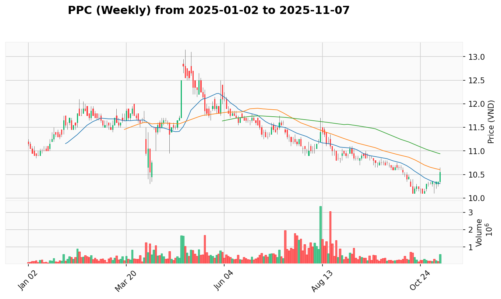

<a href="#nang-luong">↑ Back to group NANG_LUONG</a>  |  <a href="#vpa-signal-summary">↑ Back to Top</a>

#### Key Statistics
| Metric | Value |
|:---|---:|
| Date Range | 2025-01-02 to 2025-11-14 |
| **Latest Close** | **10.65** |
| Period Open | 11.2 |
| Period High | 13.15 |
| Period Low | 10.1 |
| Period Change % | -4.91% |

**[Download PPC Data (.csv)](market_data_week/PPC_2025-01-02_to_2025-11-14.csv)**

---

### PPH

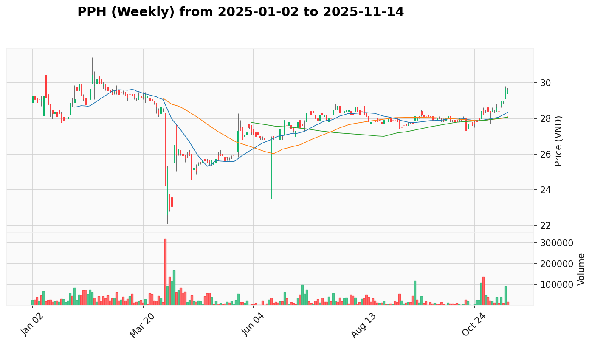

<a href="#det-may">↑ Back to group DET_MAY</a>  |  <a href="#vpa-signal-summary">↑ Back to Top</a>

#### Key Statistics
| Metric | Value |
|:---|---:|
| Date Range | 2025-01-02 to 2025-11-14 |
| **Latest Close** | **29.6** |
| Period Open | 28.88 |
| Period High | 31.42 |
| Period Low | 22.09 |
| Period Change % | 2.49% |

**[Download PPH Data (.csv)](market_data_week/PPH_2025-01-02_to_2025-11-14.csv)**

---

### PTB

#### [VPA Analysis (2025-06-02 - 2025-08-03)](./VPA_week.md#ptb)
> - **Ngày 2025-07-07:** Tiếp nối Dấu hiệu Sức mạnh của tuần trước, PTB có một tuần điều chỉnh với một nến giảm. Khối lượng giao dịch giảm.
>     - **Phân tích VPA/Wyckoff:** Đây là một phiên **No Supply**. Việc giá điều chỉnh với khối lượng thấp sau một đợt tăng mạnh là một tín hiệu rất No Supply, cho thấy áp lực chốt lời yếu và thị trường đang hấp thụ tốt.
> - **Ngày 2025-07-14:** Sau tín hiệu No Supply của tuần trước, PTB có một tuần tăng giá nhẹ với một nến tăng biên độ hẹp, đóng cửa (55.2) cao hơn. Khối lượng giao dịch ở mức tương đương tuần trước.
>     - **Phân tích VPA/Wyckoff:** Đây là một **No Supply** tiếp tục, cho thấy thị trường đang hấp thụ tốt. Việc giá phục hồi với khối lượng ổn định xác nhận áp lực bán yếu và đà tăng đang được củng cố.
> - **Ngày 2025-07-21:** PTB đi ngang với biến động nhỏ, đóng cửa (55.4) gần như không đổi so với tuần trước (+0.36%). Cây nến có biên độ hẹp và đỉnh cao tại 56.5. Khối lượng giao dịch giảm 12.78% xuống 404 ngàn cổ phiếu.
>     - **Phân tích VPA/Wyckoff:** Đây là một **Test for Supply**. Việc giá duy trì ổn định trên nền khối lượng thấp cho thấy thị trường đang kiểm tra cung cấp, và kết quả cho thấy áp lực bán rất yếu, tạo nền tảng tốt cho đợt tăng tiếp theo.
> **Ngày 2025-07-27:** PTB có tuần giao dịch tích cực với nến tăng có thân nhỏ, mở cửa tại đỉnh tuần (56.5) và đóng cửa ở 55.4, tăng 0.36% so với tuần trước. Biên động dao động hẹp từ 54.6 đến 56.5, cho thấy sự ổn định trong xu hướng tăng. Khối lượng giao dịch giảm nhẹ 12.78% xuống 403.2 ngàn cổ phiếu, thấp hơn so với tuần trước nhưng vẫn duy trì ở mức hợp lý. Giá đang duy trì vững chắc trên vùng kháng cự cũ 55.0 và hướng tới thử thách vùng 56.5-57.0.
> 
> **Phân tích VPA/Wyckoff:** Đây là một **No Supply** tiếp tục. Việc giá tăng nhẹ với khối lượng giảm sau giai đoạn Test for Supply của tuần trước xác nhận áp lực bán rất yếu. Mặc dù khối lượng không cao nhưng hành động giá tích cực cho thấy thị trường đang hấp thụ tốt và chuẩn bị cho đợt bứt phá tiếp theo lên vùng 57-58.
> **Ngày 2025-08-03:**
> PTB có tuần điều chỉnh với nến giảm biên độ hẹp, giá mở cửa tại 55.4 và đóng cửa ở 54.4, giảm 1.81% so với tuần trước. Biên độ dao động từ 53.2 đến 56.0, cho thấy áp lực chốt lời xuất hiện sau chuỗi tăng trước đó. Khối lượng giao dịch tăng mạnh 49.64% lên 603.3 ngàn cổ phiếu, cao nhất trong 8 tuần qua. Giá test xuống vùng hỗ trợ 53.2 nhưng đóng cửa trên mức này, cho thấy lực cầu vẫn có mặt tại vùng thấp.

<a href="#vlxd">↑ Back to group VLXD</a>  |  <a href="#vpa-signal-summary">↑ Back to Top</a>

#### Key Statistics
| Metric | Value |
|:---|---:|
| Date Range | 2025-01-02 to 2025-11-14 |
| **Latest Close** | **51.0** |
| Period Open | 64.46 |
| Period High | 65.63 |
| Period Low | 43.46 |
| Period Change % | -20.88% |

**[Download PTB Data (.csv)](market_data_week/PTB_2025-01-02_to_2025-11-14.csv)**

---

### PVC

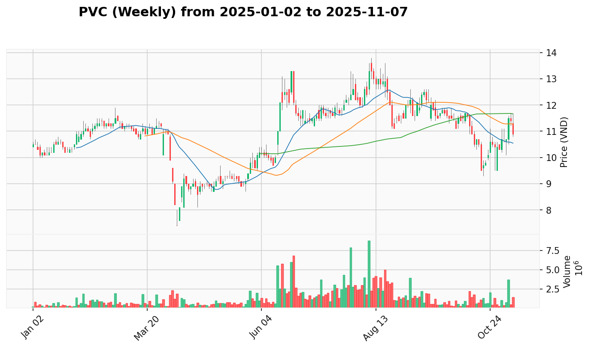

<a href="#dau-khi">↑ Back to group DAU_KHI</a>  |  <a href="#vpa-signal-summary">↑ Back to Top</a>

#### Key Statistics
| Metric | Value |
|:---|---:|
| Date Range | 2025-01-02 to 2025-11-14 |
| **Latest Close** | **11.3** |
| Period Open | 10.4 |
| Period High | 13.8 |
| Period Low | 7.4 |
| Period Change % | 8.65% |

**[Download PVC Data (.csv)](market_data_week/PVC_2025-01-02_to_2025-11-14.csv)**

---

### PVD

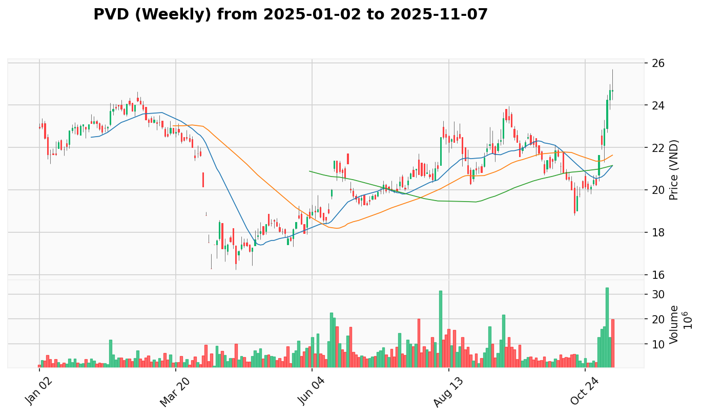

<a href="#dau-khi">↑ Back to group DAU_KHI</a>  |  <a href="#vpa-signal-summary">↑ Back to Top</a>

#### Key Statistics
| Metric | Value |
|:---|---:|
| Date Range | 2025-01-02 to 2025-11-14 |
| **Latest Close** | **26.7** |
| Period Open | 22.98 |
| Period High | 27.3 |
| Period Low | 16.23 |
| Period Change % | 16.19% |

**[Download PVD Data (.csv)](market_data_week/PVD_2025-01-02_to_2025-11-14.csv)**

---

### PVI

#### [VPA Analysis (2025-06-02 - 2025-08-03)](./VPA_week.md#pvi)
> - **Ngày 2025-07-07:** Sau phiên kiểm tra No Supply của tuần trước, PVI có một tuần tăng giá tốt, tạo thành một nến tăng và đóng cửa (58.4) cao hơn. Khối lượng giao dịch tăng.
>     - **Phân tích VPA/Wyckoff:** Đây là một **Sign of Strength**, cho thấy lực cầu đang chiếm ưu thế và xu hướng tăng được củng cố.
> - **Ngày 2025-07-14:** Tiếp nối Dấu hiệu Sức mạnh của tuần trước, PVI có một tuần tăng giá tiếp tục với nến tăng biên độ hẹp, đóng cửa (59.0) cao hơn. Khối lượng giao dịch giảm rõ rệt so với tuần trước.
>     - **Phân tích VPA/Wyckoff:** Đây là một **No Supply** rõ ràng. Việc giá tiếp tục tăng trên nền khối lượng thấp cho thấy áp lực bán rất yếu và đà tăng đang được củng cố.
> - **Ngày 2025-07-21:** PVI bùng nổ với nến tăng mạnh có biên độ rộng, đóng cửa (62.8) cao hơn 6.44% so với tuần trước. Cây nến tạo đỉnh mới tại 65.4 trước khi đóng cửa. Khối lượng giao dịch tăng vọt 204% lên 352 ngàn cổ phiếu.
>     - **Phân tích VPA/Wyckoff:** Đây là một **Sign of Strength** mạnh mẽ. Sau chuỗi tín hiệu No Supply, việc giá bùng nổ với khối lượng lớn xác nhận dự đoán trước đó và cho thấy lực cầu institutional đã vào mạnh mẽ.
> **Ngày 2025-07-27:** PVI tiếp tục đà tăng mạnh với nến tăng có biên độ rộng, mở cửa tại 58.0 và đóng cửa tại 62.8 (+6.44%). Cổ phiếu tạo đỉnh mới tại 65.4 trong phiên trước khi có điều chỉnh nhẹ về cuối tuần. Khối lượng giao dịch duy trì ở mức cao 351.6 ngàn cổ phiếu, tương đương với tuần trước, cho thấy sự quan tâm của thị trường vẫn mạnh mẽ.
> 
> **Phân tích VPA/Wyckoff:** Đây là một **Sign of Strength** tiếp tục. Sau tuần bùng nổ trước đó, PVI duy trì được động lực tăng mạnh với khối lượng cao, xác nhận xu hướng tăng bền vững. Việc tạo đỉnh mới tại 65.4 cho thấy lực cầu institutional vẫn đang tích cực, tuy nhiên cần theo dõi khả năng xuất hiện pressure bán ở vùng đỉnh mới này.
> **Ngày 2025-08-03:** PVI có tuần điều chỉnh nhẹ, giá mở cửa tại 62.8 (cùng mức đóng cửa tuần trước) và dao động trong khoảng 61.3-64.0 trước khi đóng cửa tại 62.8. Mặc dù giá đóng cửa không thay đổi so với tuần trước, cổ phiếu đã test lên mức cao 64.0 nhưng không thể duy trì được. Khối lượng giao dịch giảm đáng kể xuống 180.1 ngàn cổ phiếu, giảm 48.7% so với tuần trước.

<a href="#bao-hiem">↑ Back to group BAO_HIEM</a>  |  <a href="#vpa-signal-summary">↑ Back to Top</a>

#### Key Statistics
| Metric | Value |
|:---|---:|
| Date Range | 2025-01-02 to 2025-11-14 |
| **Latest Close** | **90.0** |
| Period Open | 58.75 |
| Period High | 92.0 |
| Period Low | 48.8 |
| Period Change % | 53.19% |

**[Download PVI Data (.csv)](market_data_week/PVI_2025-01-02_to_2025-11-14.csv)**

---

### PVP

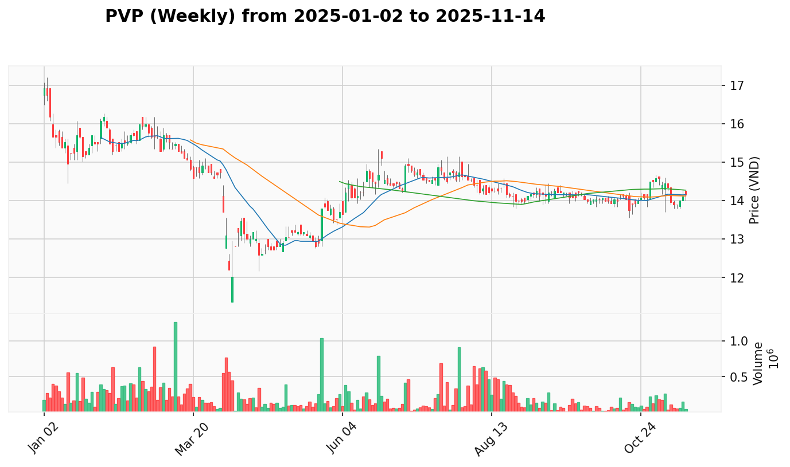

<a href="#van-tai">↑ Back to group VAN_TAI</a>  |  <a href="#vpa-signal-summary">↑ Back to Top</a>

#### Key Statistics
| Metric | Value |
|:---|---:|
| Date Range | 2025-01-02 to 2025-11-14 |
| **Latest Close** | **14.15** |
| Period Open | 16.74 |
| Period High | 17.21 |
| Period Low | 11.36 |
| Period Change % | -15.47% |

**[Download PVP Data (.csv)](market_data_week/PVP_2025-01-02_to_2025-11-14.csv)**

---

### PVS

#### [VPA Analysis (2025-06-02 - 2025-08-03)](./VPA_week.md#pvs)
> - **Ngày 2025-07-07:** Sau Dấu hiệu Yếu kém của tuần trước, PVS có một tuần tăng giá tốt, tạo thành một nến tăng và đóng cửa (33.1) cao hơn. Khối lượng giao dịch giảm.
>     - **Phân tích VPA/Wyckoff:** Việc giá có thể phục hồi trên nền khối lượng thấp là một tín hiệu **No Supply**. Điều này cho thấy áp lực bán đã suy yếu, là một tín hiệu No Supply cho xu hướng tăng.
> - **Ngày 2025-07-14:** Tiếp nối tín hiệu No Supply của tuần trước, PVS có một tuần tăng giá tiếp tục với nến tăng biên độ vea, đóng cửa (34.2) cao hơn. Khối lượng giao dịch tăng nhẹ so với tuần trước.
>     - **Phân tích VPA/Wyckoff:** Đây là một **Effort to Rise**, cho thấy lực cầu đang quay trở lại và cố gắng đẩy giá lên. Việc khối lượng tăng cùng với giá là tín hiệu tích cực.
> - **Ngày 2025-07-21:** PVS đi ngang với biến động nhỏ, đóng cửa (34.3) gần như không đổi so với tuần trước (+0.29%). Cây nến có biên độ rộng với đỉnh cao tại 35.3 và bóng dưới. Khối lượng giao dịch tăng 12.22% lên 37.96 triệu cổ phiếu.
>     - **Phân tích VPA/Wyckoff:** Đây là một **Test for Supply**. Mặc dù khối lượng tăng nhưng giá không thể duy trì ở mức cao, cho thấy vẫn còn một số áp lực bán. Tuy nhiên, việc giá không giảm mạnh cho thấy lực cầu vẫn có mặt để hỗ trợ.
> **Ngày 2025-07-27:** PVS tiếp tục xu hướng tăng nhẹ với nến xanh có thân nhỏ, đóng cửa tại 34.3 (+0.29% so với tuần trước). Biên độ giao dịch tương đối rộng với đỉnh tại 35.3 và đáy tại 33.1. Khối lượng giao dịch tăng 12.33% lên 37.95 triệu cổ phiếu, cao hơn so với tuần trước nhưng vẫn thấp hơn các tuần có biến động mạnh trong tháng 6. Giá đang kiểm tra vùng kháng cự quanh 35.0-35.3 và chưa thể vượt qua được.
> 
> **Phân tích VPA/Wyckoff:** Đây là một **Test for Supply** tiếp tục. Mặc dù khối lượng tăng và giá có thể đạt mức cao 35.3, nhưng việc không thể duy trì và đóng cửa ở mức thấp hơn cho thấy vẫn còn áp lực bán tại vùng kháng cự này. Tuy nhiên, việc giá không giảm sâu và vẫn duy trì trên 34.0 cho thấy lực cầu vẫn có mặt để hỗ trợ. Cần theo dõi tuần tới để xem liệu PVS có thể vượt qua 35.3 hay sẽ có điều chỉnh về vùng hỗ trợ 32.0-33.0.
> **Ngày 2025-08-03:** PVS có tuần giao dịch tích cực với nến tăng có thân nhỏ, đóng cửa tại 34.5 (+0.58% so với tuần trước). Biên độ giao dịch rộng với đỉnh cao mới tại 36.3 - vượt qua vùng kháng cự 35.3 đã được test trong 2 tuần qua, và đáy tại 34.0. Khối lượng giao dịch bùng nổ 43.31% lên 54.39 triệu cổ phiếu, cao nhất trong 8 tuần qua kể từ giữa tháng 6. Mặc dù có thể test lên mức cao 36.3, giá không thể duy trì và đóng cửa thấp hơn nhiều, cho thấy áp lực chốt lời xuất hiện khi giá vượt ngưỡng kháng cự quan trọng.

<a href="#dau-khi">↑ Back to group DAU_KHI</a>  |  <a href="#vpa-signal-summary">↑ Back to Top</a>

#### Key Statistics
| Metric | Value |
|:---|---:|
| Date Range | 2025-01-02 to 2025-11-14 |
| **Latest Close** | **35.2** |
| Period Open | 33.9 |
| Period High | 39.0 |
| Period Low | 21.4 |
| Period Change % | 3.83% |

**[Download PVS Data (.csv)](market_data_week/PVS_2025-01-02_to_2025-11-14.csv)**

---

### PVT

#### [VPA Analysis (2025-06-02 - 2025-08-03)](./VPA_week.md#pvt)
> - **Ngày 2025-07-14:** Tiếp nối nỗ lực tăng của tuần trước, PVT có một tuần tăng giá nhẹ với nến tăng biên độ hẹp, đóng cửa (18.3) cao hơn. Khối lượng giao dịch giảm so với tuần trước.
>     - **Phân tích VPA/Wyckoff:** Đây là một **No Supply** yếu. Việc giá tăng nhẹ trên nền khối lượng giảm cho thấy áp lực bán đang suy yếu, nhưng cần xác nhận bằng một nến tăng mạnh hơn.
> - **Ngày 2025-07-21:** PVT phục hồi mạnh với nến tăng có biên độ rộng, đóng cửa (18.7) cao hơn 2.19% so với tuần trước. Cây nến tạo đỉnh mới tại 18.85 và có bóng dưới nhỏ. Khối lượng giao dịch tăng mạnh 42.09% lên 19.94 triệu cổ phiếu.
>     - **Phân tích VPA/Wyckoff:** Đây là một **Sign of Strength**. Sau chuỗi tín hiệu No Supply yếu, việc giá tăng mạnh với khối lượng lớn xác nhận sự quay trở lại của lực cầu institutional, báo hiệu một giai đoạn tăng giá mới.
> **Ngày 2025-07-28:** PVT tiếp tục xu hướng tăng tích cực với nến tăng có biên độ vừa phải, đóng cửa (18.7) cao hơn 2.19% so với tuần trước. Cây nến tạo đỉnh mới tại 18.85 và có bóng dưới nhỏ, cho thấy áp lực mua mạnh trong phiên. Khối lượng giao dịch tăng đáng kể 42.09% lên 19.93 triệu cổ phiếu, xác nhận sự quan tâm từ các nhà đầu tư tổ chức.
> 
> **Phân tích VPA/Wyckoff:** Đây là một **Sign of Strength** rõ ràng. Sau giai đoạn No Supply yếu của các tuần trước, PVT đã phá vỡ vùng kháng cự 18.3-18.5 với khối lượng lớn, báo hiệu sự quay trở lại mạnh mẽ của dòng tiền tổ chức và khả năng tiếp tục tăng giá trong các tuần tới.
> **Ngày 2025-07-27:** PVT tiếp tục xu hướng tăng tích cực với nến tăng có biên độ vừa phải, đóng cửa (18.7) cao hơn 2.19% so với tuần trước. Cây nến tạo đỉnh mới tại 18.85 và có bóng dưới nhỏ, cho thấy áp lực mua mạnh trong phiên. Khối lượng giao dịch tăng đáng kể 42.09% lên 19.93 triệu cổ phiếu, xác nhận sự quan tâm từ các nhà đầu tư tổ chức.
> 
> **Phân tích VPA/Wyckoff:** Đây là một **Sign of Strength** rõ ràng. Sau giai đoạn No Supply yếu của các tuần trước, PVT đã phá vỡ vùng kháng cự 18.3-18.5 với khối lượng lớn, báo hiệu sự quay trở lại mạnh mẽ của dòng tiền tổ chức và khả năng tiếp tục tăng giá trong các tuần tới.
> **Ngày 2025-08-03:**
> PVT giảm nhẹ với nến giảm có biên độ vừa phải, đóng cửa (18.3) thấp hơn 2.14% so với tuần trước. Cây nến có điểm cao nhất tại 19.15 tạo đỉnh mới nhưng không thể duy trì, với bóng trên dài cho thấy áp lực bán ở vùng cao. Mức thấp nhất 17.9 tương đương với tuần trước, tạo vùng hỗ trợ rõ ràng. Khối lượng giao dịch tăng mạnh 33.45% lên 26.60 triệu cổ phiếu, cao nhất trong 10 tuần qua.

<a href="#van-tai">↑ Back to group VAN_TAI</a>  |  <a href="#vpa-signal-summary">↑ Back to Top</a>

#### Key Statistics
| Metric | Value |
|:---|---:|
| Date Range | 2025-01-02 to 2025-11-14 |
| **Latest Close** | **18.5** |
| Period Open | 21.02 |
| Period High | 21.52 |
| Period Low | 14.09 |
| Period Change % | -11.99% |

**[Download PVT Data (.csv)](market_data_week/PVT_2025-01-02_to_2025-11-14.csv)**

---

### PXI

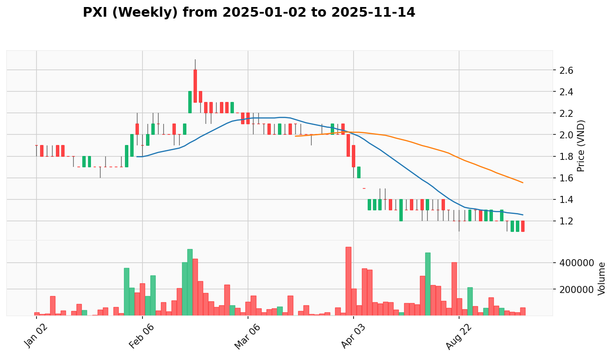

<a href="#penny">↑ Back to group PENNY</a>  |  <a href="#vpa-signal-summary">↑ Back to Top</a>

#### Key Statistics
| Metric | Value |
|:---|---:|
| Date Range | 2025-01-02 to 2025-11-14 |
| **Latest Close** | **1.1** |
| Period Open | 1.9 |
| Period High | 2.7 |
| Period Low | 1.1 |
| Period Change % | -42.11% |

**[Download PXI Data (.csv)](market_data_week/PXI_2025-01-02_to_2025-11-14.csv)**

---

### QNS

#### [VPA Analysis (2025-06-02 - 2025-08-03)](./VPA_week.md#qns)
> - **Ngày 2025-07-07:** Sau tín hiệu No Supply của tuần trước, QNS có một tuần tăng giá tốt, tạo thành một nến tăng và đóng cửa (48.6) cao hơn. Khối lượng giao dịch giảm.
>     - **Phân tích VPA/Wyckoff:** Việc giá có thể tăng trên nền khối lượng thấp là một tín hiệu **No Supply**. Điều này cho thấy áp lực bán yếu, là một tín hiệu No Supply cho xu hướng tăng.
> - **Ngày 2025-07-14:** Tiếp nối tín hiệu No Supply của tuần trước, QNS có một tuần tăng giá nhẹ với nến tăng biên độ hẹp, đóng cửa (48.7) cao hơn. Khối lượng giao dịch tăng nhẹ.
>     - **Phân tích VPA/Wyckoff:** Đây là một **No Supply** tiếp tục với sự quan tâm tăng nhẹ. Việc giá tiếp tục tăng trên nền khối lượng vừa phải cho thấy áp lực bán yếu và đà tăng có thể tiếp tục.
> - **Ngày 2025-07-21:** QNS tiếp tục xu hướng tăng với nến tăng có biên độ vừa phải, đóng cửa (49.3) cao hơn 1.23% so với tuần trước. Cây nến tạo đỉnh mới tại 49.4. Khối lượng giao dịch giảm 27.96% xuống 832 ngàn cổ phiếu.
>     - **Phân tích VPA/Wyckoff:** Đây là một **No Supply** rõ ràng. Việk giá tiếp tục tăng trên nền khối lượng thấp cho thấy áp lực bán rất yếu, xác nhận sự hấp thụ tốt của thị trường và khả năng tiếp tục tăng giá.
> **Ngày 2025-07-27:** QNS tiếp tục xu hướng tăng mạnh mẽ với nến tăng có biên độ vừa phải, đóng cửa tại 49.3 cao hơn 1.23% so với tuần trước. Cổ phiếu tạo đỉnh mới tại 49.4, xác nhận đà tăng bền vững. Khối lượng giao dịch giảm mạnh 27.96% xuống 831.6 ngàn cổ phiếu, thấp nhất trong 4 tuần qua. Giá đang trong xu hướng tăng rõ ràng từ vùng 46.7 (đầu tháng 6) lên 49.3, tăng 5.57% trong 8 tuần. Việc giá liên tục tạo đỉnh mới trên nền khối lượng giảm dần cho thấy sự hấp thụ tốt và áp lực bán rất yếu.
> 
> **Phân tích VPA/Wyckoff:** Đây là tín hiệu **No Supply** mạnh mẽ. Việc giá tiếp tục tăng và tạo đỉnh mới trên nền khối lượng thấp chứng tỏ áp lực bán rất yếu, xác nhận sự kiểm soát của phe mua và khả năng cao sẽ tiếp tục tăng giá trong các tuần tới.
> **Ngày 2025-08-03:**

<a href="#thuc-pham">↑ Back to group THUC_PHAM</a>  |  <a href="#vpa-signal-summary">↑ Back to Top</a>

#### Key Statistics
| Metric | Value |
|:---|---:|
| Date Range | 2025-01-02 to 2025-11-14 |
| **Latest Close** | **44.2** |
| Period Open | 47.3 |
| Period High | 49.1 |
| Period Low | 40.81 |
| Period Change % | -6.55% |

**[Download QNS Data (.csv)](market_data_week/QNS_2025-01-02_to_2025-11-14.csv)**

---

### QTP

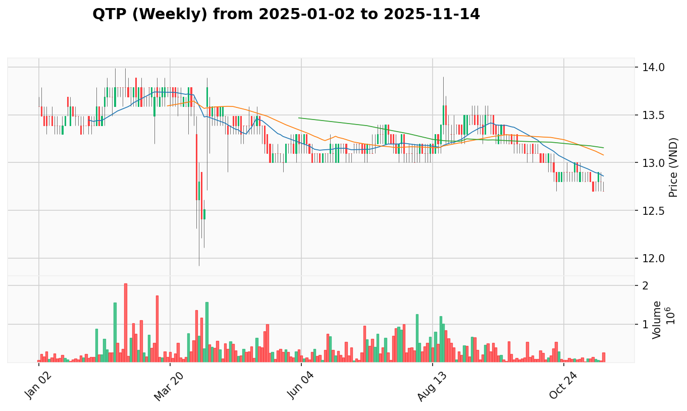

<a href="#nang-luong">↑ Back to group NANG_LUONG</a>  |  <a href="#vpa-signal-summary">↑ Back to Top</a>

#### Key Statistics
| Metric | Value |
|:---|---:|
| Date Range | 2025-01-02 to 2025-11-14 |
| **Latest Close** | **12.7** |
| Period Open | 13.59 |
| Period High | 13.99 |
| Period Low | 11.92 |
| Period Change % | -6.55% |

**[Download QTP Data (.csv)](market_data_week/QTP_2025-01-02_to_2025-11-14.csv)**

---

### S99

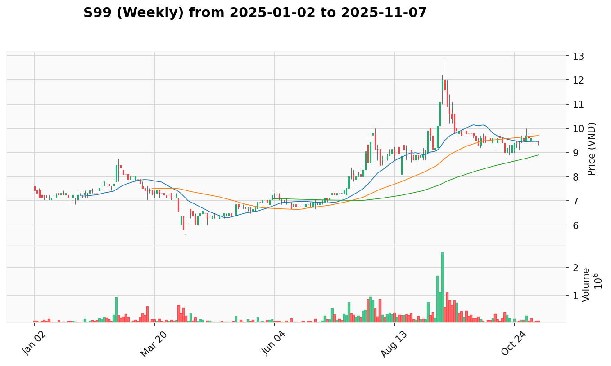

<a href="#xay-dung">↑ Back to group XAY_DUNG</a>  |  <a href="#vpa-signal-summary">↑ Back to Top</a>

#### Key Statistics
| Metric | Value |
|:---|---:|
| Date Range | 2025-01-02 to 2025-11-14 |
| **Latest Close** | **9.4** |
| Period Open | 7.62 |
| Period High | 12.8 |
| Period Low | 5.52 |
| Period Change % | 23.36% |

**[Download S99 Data (.csv)](market_data_week/S99_2025-01-02_to_2025-11-14.csv)**

---

### SAB

#### [VPA Analysis (2025-06-02 - 2025-08-03)](./VPA_week.md#sab)
> - **Ngày 2025-07-07:** Tiếp nối Dấu hiệu Sức mạnh của tuần trước, SAB có một tuần tăng giá mạnh mẽ với một nến tăng thân dài, đóng cửa (48.15) gần mức cao nhất tuần. Khối lượng giao dịch tăng mạnh.
>     - **Phân tích VPA/Wyckoff:** Đây là một **Sign of Strength**, xác nhận lực cầu đang chiếm ưu thế và xu hướng tăng được củng cố.
> - **Ngày 2025-07-14:** Tiếp nối Dấu hiệu Sức mạnh của tuần trước, SAB có một tuần giữ vững với nến tăng biên độ hẹp, đóng cửa (48.2) cao hơn. Khối lượng giao dịch giảm so với tuần trước.
>     - **Phân tích VPA/Wyckoff:** Đây là một **No Supply** củng cố. Việc giá giữ vững và tiếp tục tăng nhẹ trên nền khối lượng giảm sau một đợt tăng mạnh là dấu hiệu rất No Supply.
> - **Ngày 2025-07-21:** SAB tăng giá với nến tăng có biên độ rộng, đóng cửa (49.1) cao hơn 1.87% so với tuần trước. Cây nến tạo đỉnh mới tại 50.0 và có bóng dưới. Khối lượng giao dịch tăng nhẹ 6.27% lên 8.69 triệu cổ phiếu.
>     - **Phân tích VPA/Wyckoff:** Đây là một **Effort to Rise**. Việc giá tăng với khối lượng tăng cho thấy lực cầu vẫn đang hiện diện, tuy nhiên cần quan sát xem có thể duy trì được đà tăng này hay không.
> **Ngày 2025-07-27:** SAB có một tuần tăng giá tích cực với nến tăng có biên độ rộng, đóng cửa tại 49.1 tăng 1.87% so với tuần trước. Cổ phiếu tạo đỉnh mới tại 50.0 và có bóng dưới ngắn cho thấy lực cầu mạnh. Khối lượng giao dịch tăng nhẹ 6.27% lên 8.68 triệu cổ phiếu, duy trì ở mức cao sau đợt tăng mạnh trước đó.
> 
> **Phân tích VPA/Wyckoff:** Đây là một **Sign of Strength**. Việc giá tiếp tục tăng và tạo đỉnh mới tại 50.0 trên nền khối lượng duy trì ở mức cao cho thấy lực cầu vẫn đang kiểm soát thị trường. Xu hướng tăng được củng cố mạnh mẽ sau chuỗi các tín hiệu tích cực từ những tuần trước.
> **Ngày 2025-08-03:**
> SAB có một tuần điều chỉnh mạnh với nến giảm có biên độ rộng, đóng cửa tại 47.95 giảm 2.34% so với tuần trước. Mặc dù mở cửa cao hơn tại 49.35 và test lên 49.5, cổ phiếu bị bán mạnh xuống thấp nhất 47.35 trước khi phục hồi nhẹ. Khối lượng giao dịch tăng mạnh 18.29% lên 10.27 triệu cổ phiếu, cao nhất trong 8 tuần qua.

<a href="#thuc-pham">↑ Back to group THUC_PHAM</a>  |  <a href="#vpa-signal-summary">↑ Back to Top</a>

#### Key Statistics
| Metric | Value |
|:---|---:|
| Date Range | 2025-01-02 to 2025-11-14 |
| **Latest Close** | **47.1** |
| Period Open | 52.49 |
| Period High | 52.49 |
| Period Low | 39.04 |
| Period Change % | -10.27% |

**[Download SAB Data (.csv)](market_data_week/SAB_2025-01-02_to_2025-11-14.csv)**

---

### SAS

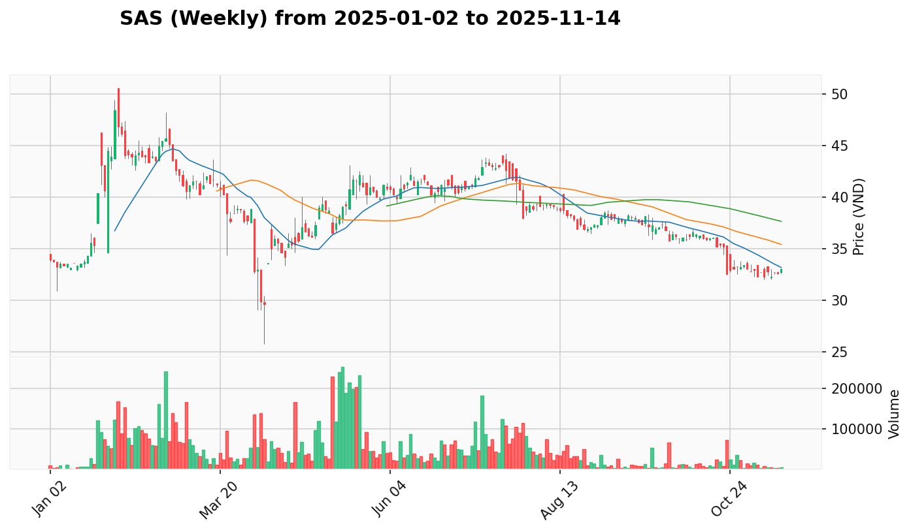

<a href="#hang-khong">↑ Back to group HANG_KHONG</a>  |  <a href="#vpa-signal-summary">↑ Back to Top</a>

#### Key Statistics
| Metric | Value |
|:---|---:|
| Date Range | 2025-01-02 to 2025-11-14 |
| **Latest Close** | **33.0** |
| Period Open | 34.46 |
| Period High | 50.56 |
| Period Low | 25.75 |
| Period Change % | -4.24% |

**[Download SAS Data (.csv)](market_data_week/SAS_2025-01-02_to_2025-11-14.csv)**

---

### SBS

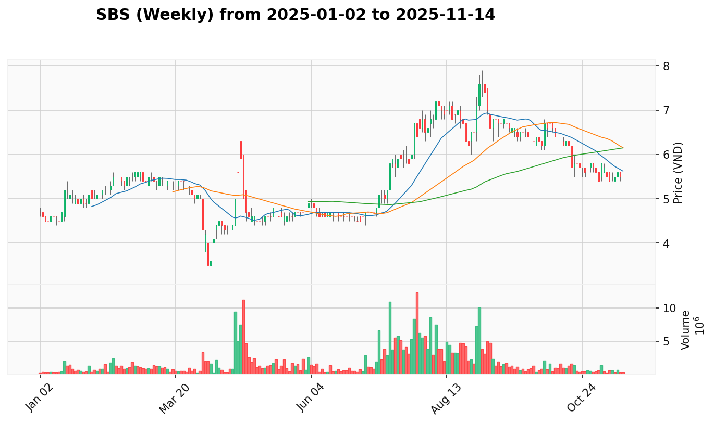

<a href="#chung-khoan">↑ Back to group CHUNG_KHOAN</a>  |  <a href="#vpa-signal-summary">↑ Back to Top</a>

#### Key Statistics
| Metric | Value |
|:---|---:|
| Date Range | 2025-01-02 to 2025-11-14 |
| **Latest Close** | **5.5** |
| Period Open | 4.7 |
| Period High | 7.9 |
| Period Low | 3.3 |
| Period Change % | 17.02% |

**[Download SBS Data (.csv)](market_data_week/SBS_2025-01-02_to_2025-11-14.csv)**

---

### SBT

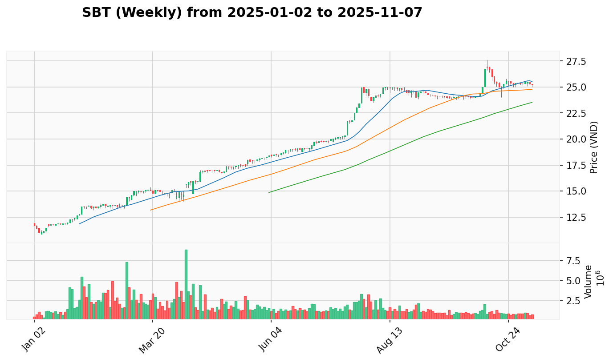

<a href="#thuc-pham">↑ Back to group THUC_PHAM</a>  |  <a href="#vpa-signal-summary">↑ Back to Top</a>

#### Key Statistics
| Metric | Value |
|:---|---:|
| Date Range | 2025-01-02 to 2025-11-14 |
| **Latest Close** | **25.25** |
| Period Open | 11.91 |
| Period High | 27.6 |
| Period Low | 10.86 |
| Period Change % | 112.01% |

**[Download SBT Data (.csv)](market_data_week/SBT_2025-01-02_to_2025-11-14.csv)**

---

### SCI

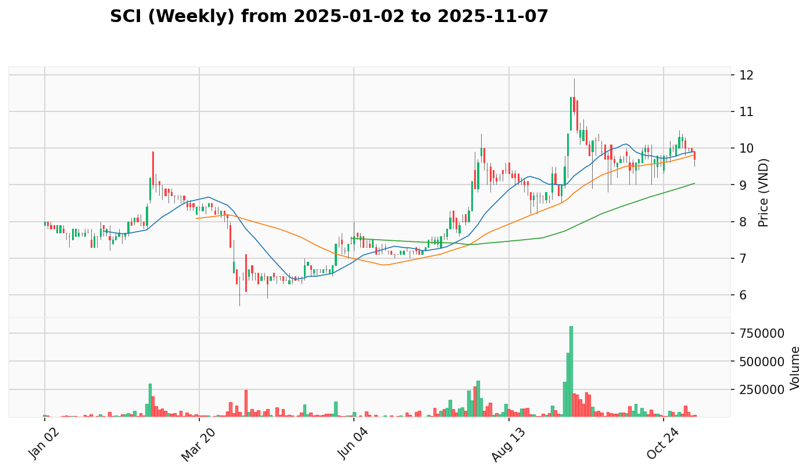

<a href="#xay-lap-dien">↑ Back to group XAY_LAP_DIEN</a>  |  <a href="#vpa-signal-summary">↑ Back to Top</a>

#### Key Statistics
| Metric | Value |
|:---|---:|
| Date Range | 2025-01-02 to 2025-11-14 |
| **Latest Close** | **9.4** |
| Period Open | 7.9 |
| Period High | 11.9 |
| Period Low | 5.7 |
| Period Change % | 18.99% |

**[Download SCI Data (.csv)](market_data_week/SCI_2025-01-02_to_2025-11-14.csv)**

---

### SCR

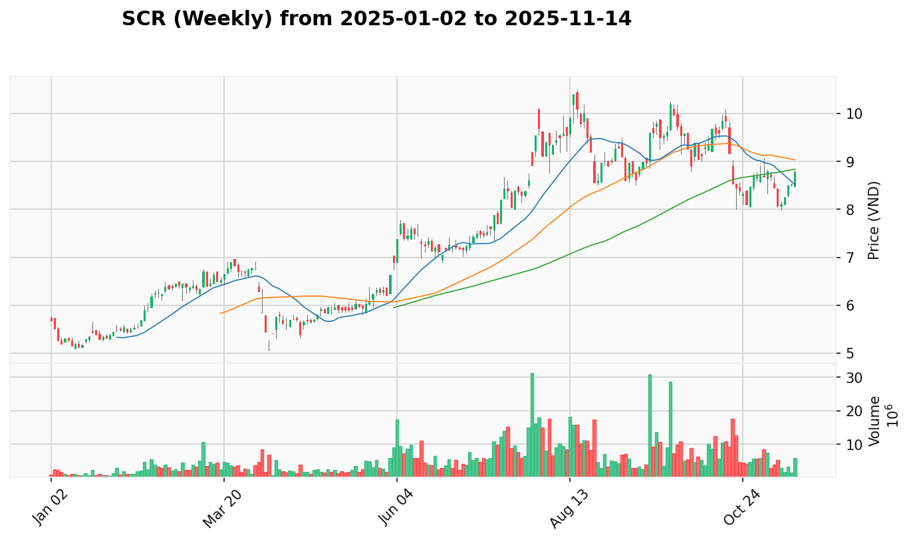

<a href="#bat-dong-san">↑ Back to group BAT_DONG_SAN</a>  |  <a href="#vpa-signal-summary">↑ Back to Top</a>

#### Key Statistics
| Metric | Value |
|:---|---:|
| Date Range | 2025-01-02 to 2025-11-14 |
| **Latest Close** | **8.78** |
| Period Open | 5.74 |
| Period High | 10.5 |
| Period Low | 5.07 |
| Period Change % | 52.96% |

**[Download SCR Data (.csv)](market_data_week/SCR_2025-01-02_to_2025-11-14.csv)**

---

### SCS

#### [VPA Analysis (2025-06-02 - 2025-08-03)](./VPA_week.md#scs)
> - **Ngày 2025-07-07:** Tiếp nối Dấu hiệu Sức mạnh của tuần trước, SCS có một tuần điều chỉnh với một nến giảm. Khối lượng giao dịch giảm.
>     - **Phân tích VPA/Wyckoff:** Đây là một phiên **No Supply**. Việc giá điều chỉnh với khối lượng thấp sau một đợt tăng mạnh là một tín hiệu rất No Supply, cho thấy áp lực chốt lời yếu và thị trường đang hấp thụ tốt.
> - **Ngày 2025-07-14:** Tiếp nối tín hiệu No Supply của tuần trước, SCS có một tuần giữ vững với nến tăng biên độ hẹp, đóng cửa (67.0) cao hơn. Khối lượng giao dịch giảm tiếp tục.
>     - **Phân tích VPA/Wyckoff:** Đây là một **No Supply** củng cố. Việc giá giữ vững và tiếp tục tăng nhẹ trên nền khối lượng giảm cho thấy thị trường đang hấp thụ tốt và có thể sớm tăng trở lại.
> - **Ngày 2025-07-21:** SCS tiếp tục tăng giá với nến tăng có biên độ vừa phải, mở cửa tại 67.0 và đóng cửa tại 68.8. Giá đạt đỉnh tuần tại 69.5, tăng 2.7% so với tuần trước. Khối lượng giao dịch tăng 25% lên 2.4 triệu cổ phiếu.
>     - **Phân tích VPA/Wyckoff:** Đây là tín hiệu **Sign of Strength**, xác nhận các tín hiệu No Supply từ hai tuần trước. Việc tăng giá phá vỡ mức kháng cự với khối lượng tăng cho thấy lực cầu đã trở lại mạnh mẽ sau giai đoạn tích lũy. SCS đang tiếp tục xu hướng tăng với sự hỗ trợ của Smart Money.
> **Ngày 2025-07-27:** SCS tiếp tục xu hướng tăng mạnh mẽ với nến tăng biên độ rộng, mở cửa tại 67.0 và đóng cửa tại 68.8, tăng 2.7% so với tuần trước. Giá đạt đỉnh tuần tại 69.5, phá vỡ mức kháng cự và thiết lập đỉnh mới trong chu kỳ tăng giá hiện tại. Khối lượng giao dịch tăng 25% lên 2.395.400 cổ phiếu, xác nhận sự tham gia tích cực của dòng tiền lớn. Việc giá đóng cửa gần mức cao nhất tuần (68.8 so với đỉnh 69.5) cho thấy lực cầu mạnh mẽ và áp lực bán yếu.
> 
> **Phân tích VPA/Wyckoff:** Đây là tín hiệu **Sign of Strength** tiếp nối, củng cố thêm cho xu hướng tăng. Sau hai tuần No Supply tích lũy (2025-07-07 và 2025-07-14), SCS đã bùng nổ với hai tuần Sign of Strength liên tiếp, cho thấy Smart Money đang tích cực mua vào. Việc phá vỡ kháng cự với khối lượng tăng mạnh xác nhận giai đoạn Mark Up đang diễn ra, với tiềm năng tiếp tục tăng về vùng 70-72.
> **Ngày 2025-08-03:** SCS có một tuần sụt giảm mạnh với nến giảm biên độ cực rộng, mở cửa tại 68.6 và đóng cửa tại 62.4, giảm 9.3% so với tuần trước. Giá test lên đỉnh tuần tại 69.0 nhưng không thể duy trì và sụt giảm thảm hại xuống mức thấp nhất tuần 62.4, cho thấy áp lực bán cực mạnh. Khối lượng giao dịch bùng nổ tăng 65% lên 3.949.500 cổ phiếu, cao nhất trong 8 tuần qua. Việc giá đóng cửa ở mức thấp nhất tuần với thân nến cực dài cho thấy panic selling và sự hoảng loạn của nhà đầu tư.

<a href="#hang-khong">↑ Back to group HANG_KHONG</a>  |  <a href="#vpa-signal-summary">↑ Back to Top</a>

#### Key Statistics
| Metric | Value |
|:---|---:|
| Date Range | 2025-01-02 to 2025-11-14 |
| **Latest Close** | **55.0** |
| Period Open | 76.9 |
| Period High | 79.67 |
| Period Low | 49.52 |
| Period Change % | -28.48% |

**[Download SCS Data (.csv)](market_data_week/SCS_2025-01-02_to_2025-11-14.csv)**

---

### SGN

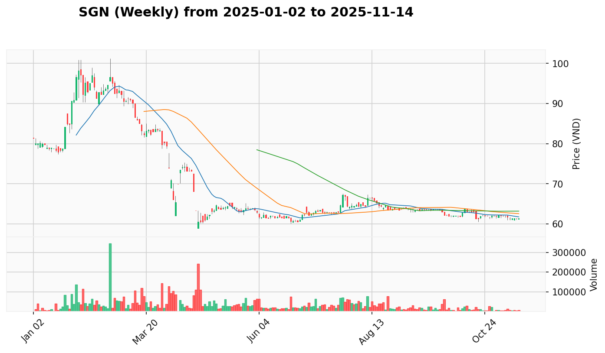

<a href="#hang-khong">↑ Back to group HANG_KHONG</a>  |  <a href="#vpa-signal-summary">↑ Back to Top</a>

#### Key Statistics
| Metric | Value |
|:---|---:|
| Date Range | 2025-01-02 to 2025-11-14 |
| **Latest Close** | **61.4** |
| Period Open | 81.51 |
| Period High | 101.21 |
| Period Low | 58.92 |
| Period Change % | -24.67% |

**[Download SGN Data (.csv)](market_data_week/SGN_2025-01-02_to_2025-11-14.csv)**

---

### SGR

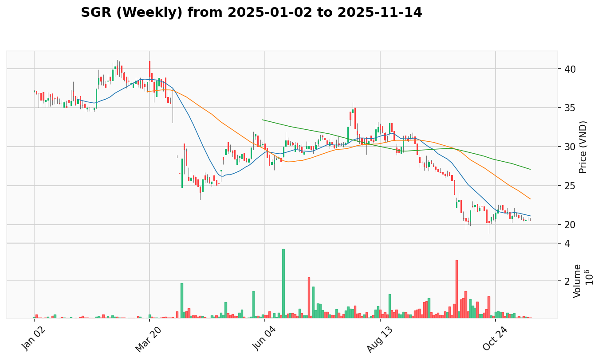

<a href="#bat-dong-san">↑ Back to group BAT_DONG_SAN</a>  |  <a href="#vpa-signal-summary">↑ Back to Top</a>

#### Key Statistics
| Metric | Value |
|:---|---:|
| Date Range | 2025-01-02 to 2025-11-14 |
| **Latest Close** | **20.55** |
| Period Open | 37.05 |
| Period High | 41.15 |
| Period Low | 18.85 |
| Period Change % | -44.53% |

**[Download SGR Data (.csv)](market_data_week/SGR_2025-01-02_to_2025-11-14.csv)**

---

### SGT

#### [VPA Analysis (2025-06-02 - 2025-08-03)](./VPA_week.md#sgt)
> - **Ngày 2025-07-07:** Sau tín hiệu No Demand của tuần trước, SGT có một tuần đi ngang với một nến giảm biên độ hẹp. Khối lượng giao dịch tăng.
>     - **Phân tích VPA/Wyckoff:** Nỗ lực (khối lượng) tăng nhưng kết quả (giá) lại giảm. Đây là tín hiệu của sự **No Demand**, cho thấy phe mua đang gặp khó khăn trong việc đẩy giá lên, là một dấu hiệu yếu kém.
> - **Ngày 2025-07-14:** Tiếp nối tín hiệu No Demand của tuần trước, SGT có một tuần giảm giá với nến giảm biên độ rộng, đóng cửa (17.05) thấp hơn. Khối lượng giao dịch giảm so với tuần trước.
>     - **Phân tích VPA/Wyckoff:** Đây là một **Sign of Weakness**, xác nhận sự yếu kém của cổ phiếu. Việc giá giảm sau các tín hiệu No Demand liên tiếp cho thấy áp lực bán đang chiếm ưu thế.
> - **Ngày 2025-07-21:** SGT tiếp tục có một tuần đi ngang với biên độ hẹp, mở cửa tại 17.15 và đóng cửa tại 17.0. Giá dao động trong vùng 16.85-17.45, gần như không thay đổi so với tuần trước. Khối lượng giao dịch giảm 8% xuống còn 304.516 cổ phiếu.
>     - **Phân tích VPA/Wyckoff:** Đây là tín hiệu **Test for Supply** sau giai đoạn yếu kém. Việc giá ổn định với khối lượng thấp cho thấy áp lực bán đang suy yếu. Tuy nhiên, SGT vẫn chưa có dấu hiệu tích cực rõ ràng và cần theo dõi thêm để xác định xem có phải đây là giai đoạn tích lũy hay chỉ là sự tạm dừng trong xu hướng giảm.
> **Ngày 2025-07-27:** SGT tiếp tục có một tuần giao dịch yếu với nến giảm biên độ hẹp, mở cửa tại 17.15 và đóng cửa tại 17.0. Giá dao động trong vùng 16.85-17.45, giảm nhẹ so với tuần trước (17.05). Khối lượng giao dịch giảm 8% xuống còn 304.200 cổ phiếu, duy trì ở mức thấp. Cổ phiếu đang giao dịch quanh vùng 17.0, thấp hơn đáng kể so với đỉnh 18.5 của đầu tháng 6.
> 
> **Phân tích VPA/Wyckoff:** Đây là tín hiệu **No Supply** tiếp theo sau giai đoạn Test for Supply. Việc giá giảm nhẹ với khối lượng thấp cho thấy áp lực bán đã cạn kiệt. Tuy nhiên, SGT vẫn chưa có động lực mua mạnh để đảo chiều xu hướng. Cổ phiếu đang trong giai đoạn tích lũy tiềm năng nhưng cần có sự xuất hiện của khối lượng tăng kèm theo giá tăng để xác nhận sự quay trở lại của lực mua.
> **Ngày 2025-08-03:** SGT có một tuần phục hồi tích cực với nến tăng biên độ rộng, mở cửa tại 17.0 và đóng cửa tại 17.15. Giá dao động trong vùng 16.45-17.7, với mức thấp nhất 16.45 tạo thành đáy mới trước khi phục hồi mạnh. Khối lượng giao dịch tăng vượt trội 74% lên 529.300 cổ phiếu, cao nhất trong 2 tháng qua. Cổ phiếu đã test xuống vùng 16.45 nhưng nhanh chóng phục hồi và đóng cửa gần đỉnh phiên tại 17.15, cao hơn tuần trước.

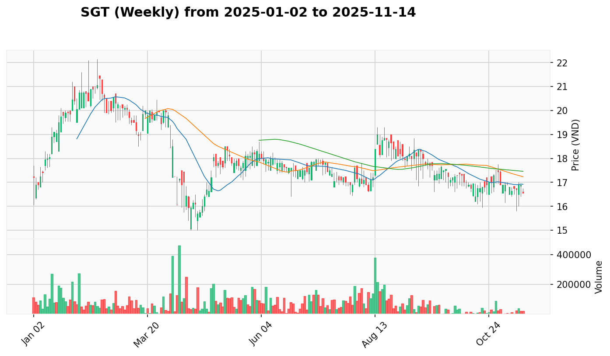

<a href="#cong-nghe">↑ Back to group CONG_NGHE</a>  |  <a href="#vpa-signal-summary">↑ Back to Top</a>

#### Key Statistics
| Metric | Value |
|:---|---:|
| Date Range | 2025-01-02 to 2025-11-14 |
| **Latest Close** | **16.55** |
| Period Open | 17.25 |
| Period High | 22.15 |
| Period Low | 15.0 |
| Period Change % | -4.06% |

**[Download SGT Data (.csv)](market_data_week/SGT_2025-01-02_to_2025-11-14.csv)**

---

### SHB

#### [VPA Analysis (2025-06-02 - 2025-08-03)](./VPA_week.md#shb)
> - **Ngày 2025-07-07:** Sau tín hiệu No Demand của tuần trước, SHB có một tuần tăng giá bùng nổ với một nến tăng thân dài, đóng cửa (14.2) ở mức cao nhất tuần. Khối lượng giao dịch tăng vọt.
>     - **Phân tích VPA/Wyckoff:** Đây là một **Sign of Strength**, cho thấy lực cầu đã quay trở lại một cách áp đảo, phủ nhận hoàn toàn tín hiệu yếu của tuần trước.
> - **Ngày 2025-07-14:** Tiếp nối Dấu hiệu Sức mạnh của tuần trước, SHB có một tuần giữ vững với nến doji, đóng cửa (14.2) không đổi. Khối lượng giao dịch giảm mạnh so với tuần trước.
>     - **Phân tích VPA/Wyckoff:** Đây là một **No Supply** mạnh mẽ. Việc giá giữ vững ở mức cao trên nền khối lượng giảm mạnh sau một đợt tăng mạnh là dấu hiệu rất No Supply, cho thấy thị trường đang hấp thụ tốt.
> - **Ngày 2025-07-21:** SHB tiếp tục tăng giá mạnh mẽ với nến tăng có biên độ rộng, mở cửa tại 14.3 và đóng cửa tại 15.05. Giá đạt đỉnh tuần tại 15.45, tăng 6.0% so với tuần trước. Khối lượng giao dịch tăng 24% lên 398.2 triệu cổ phiếu.
>     - **Phân tích VPA/Wyckoff:** Đây là tín hiệu **Sign of Strength** xuất sắc, xác nhận các tín hiệu No Supply từ tuần trước. Việc tăng giá phá vỡ mức kháng cự với khối lượng tăng mạnh cho thấy lực cầu institutional đang rất tích cực. SHB đang trong giai đoạn markup mạnh mẽ với sự hỗ trợ đầy đủ của Smart Money.
> **Ngày 2025-07-27:** SHB tiếp tục đà tăng trưởng mạnh mẽ với phiên tăng giá ấn tượng, mở cửa tại 14.3 và đóng cửa tại 15.05, tương đương mức tăng 6.0% so với tuần trước. Đáng chú ý, giá đạt đỉnh tuần tại 15.45, phá vỡ hoàn toàn vùng kháng cự 14.4-14.5 đã được thiết lập từ tuần trước. Khối lượng giao dịch tăng 24.2% lên 398.1 triệu cổ phiếu, cho thấy sự tham gia tích cực của dòng tiền lớn. Biên độ dao động trong tuần rộng (14.25-15.45) nhưng vẫn duy trì được đà tăng mạnh, thể hiện sức mạnh institutional backing. Mức giá đóng cửa 15.05 gần sát đỉnh tuần cho thấy tâm lý thị trường rất tích cực và sự hấp thụ tốt tại các mức giá cao.
> 
> **Phân tích VPA/Wyckoff:** Đây là tín hiệu **Sign of Strength** xuất sắc, xác nhận và khuếch đại các tín hiệu No Supply từ các tuần trước. Việc phá vỡ kháng cự quan trọng 14.4-14.5 với khối lượng tăng mạnh 24% cho thấy Smart Money đang tích cực markup. SHB hiện đang trong giai đoạn uptrend mạnh mẽ với full support từ institutional money, xu hướng tăng có thể tiếp tục với target tiếp theo tại vùng 16.0-16.5.
> **Ngày 2025-08-03:** SHB bùng nổ với phiên tăng giá mạnh mẽ nhất từ đầu năm, mở cửa tại 15.15 và vượt đỉnh lên 17.65 trước khi đóng cửa tại 17.4, tăng 15.6% so với tuần trước. Đây là nến tăng có biên độ cực rộng với thân nến dài, phá vỡ hoàn toàn mọi vùng kháng cự trước đó và thiết lập đỉnh mới của năm. Khối lượng giao dịch bùng nổ lên 734.7 triệu cổ phiếu, tăng gấp 1.85 lần so với tuần trước, đây là khối lượng cao nhất trong 31 tuần qua. Mức đóng cửa 17.4 gần sát đỉnh tuần cho thấy lực cầu cực mạnh và sự hấp thụ xuất sắc tại các mức giá cao. Việc phá vỡ vùng 15.45-16.0 với khối lượng khổng lồ khẳng định sức mạnh institutional backing và đà tăng bền vững.

<a href="#ngan-hang">↑ Back to group NGAN_HANG</a>  |  <a href="#vpa-signal-summary">↑ Back to Top</a>

#### Key Statistics
| Metric | Value |
|:---|---:|
| Date Range | 2025-01-02 to 2025-11-14 |
| **Latest Close** | **16.35** |
| Period Open | 7.91 |
| Period High | 19.45 |
| Period Low | 7.72 |
| Period Change % | 106.70% |

**[Download SHB Data (.csv)](market_data_week/SHB_2025-01-02_to_2025-11-14.csv)**

---

### SHS

#### [VPA Analysis (2025-06-02 - 2025-08-03)](./VPA_week.md#shs)
> - **Ngày 2025-07-07:** Sau tín hiệu yếu kém của tuần trước, SHS có một tuần tăng giá bùng nổ với một nến tăng thân dài, đóng cửa (14.6) ở mức cao nhất tuần. Khối lượng giao dịch tăng vọt.
>     - **Phân tích VPA/Wyckoff:** Đây là một **Sign of Strength**, cho thấy lực cầu đã quay trở lại một cách áp đảo, phủ nhận hoàn toàn tín hiệu yếu của tuần trước.
> - **Ngày 2025-07-14:** Tiếp nối Dấu hiệu Sức mạnh của tuần trước, SHS có một tuần tăng giá bùng nổ với nến tăng thân dài, đóng cửa (16.8) ở mức cao nhất tuần. Khối lượng giao dịch tăng vọt lên mức kỷ lục.
>     - **Phân tích VPA/Wyckoff:** Đây là một **Sign of Strength** mạnh mẽ. Tuy nhiên, sự tăng tốc quá nhanh trên khối lượng cực lớn có thể là dấu hiệu của một **Climax**, báo hiệu rủi ro điều chỉnh đang gia tăng.
> - **Ngày 2025-07-21:** SHS tiếp tục bùng nổ với nến tăng có biên độ rộng, mở cửa tại 16.8 và đóng cửa tại 18.6. Giá đạt đỉnh tuần tại 18.9, tăng vọt 10.7% so với tuần trước. Khối lượng giao dịch giảm 26% xuống còn 170.0 triệu cổ phiếu nhưng vẫn ở mức rất cao.
>     - **Phân tích VPA/Wyckoff:** Đây là tín hiệu **Effort to Rise** với các đặc điểm hỗn hợp. Mặc dù giá tiếp tục tăng mạnh và đạt đỉnh mới, nhưng khối lượng giảm so với tuần trước cho thấy lực cầu đang suy yếu. Đây có thể là dấu hiệu của **Buying Climax**, cần cảnh giác với khả năng điều chỉnh trong các tuần tới khi momentum bắt đầu chậm lại.
> **Ngày 2025-07-27:** SHS tiếp tục xu hướng tăng mạnh với nến tăng có biên độ rộng, mở cửa tại 16.8 và đóng cửa tại 18.6, tăng 10.7% so với tuần trước. Giá đạt đỉnh tuần tại 18.9, thiết lập đỉnh mới liên tiếp. Khối lượng giao dịch giảm nhẹ 6.1% xuống còn 215.6 triệu cổ phiếu, nhưng vẫn duy trì ở mức rất cao. Mức giá hiện tại đã tăng 41.9% trong vòng 2 tuần, cho thấy đà tăng trưởng bùng nổ.
> 
> **Phân tích VPA/Wyckoff:** Đây là tín hiệu **Sign of Strength** được duy trì, nhưng có dấu hiệu **Buying Climax** đang hình thành. Mặc dù giá tiếp tục leo thang và đạt đỉnh mới, khối lượng giảm dần trong 2 tuần liên tiếp cho thấy lực cầu đang suy yếu so với tốc độ tăng giá. Việc giá tăng quá nhanh (41.9% trong 2 tuần) trên nền khối lượng suy giảm là đặc tr징 của **Climactic Action**, báo hiệu rủi ro điều chỉnh cao trong ngắn hạn khi momentum bắt đầu cạn kiệt.
> **Ngày 2025-08-03:** SHS tiếp tục bùng nổ với nến tăng biên độ cực rộng, mở cửa tại 18.7 và đóng cửa tại 21.5, tăng vọt 15.6% so với tuần trước. Giá đạt đỉnh tuần tại 23.8, thiết lập đỉnh mới cao nhất từ trước đến nay. Khối lượng giao dịch bùng nổ 47.9% lên 318.9 triệu cổ phiếu, đạt mức kỷ lục mới. Mức giá hiện tại đã tăng 64.2% trong vòng 3 tuần, cho thấy đà tăng trưởng phi thường.

<a href="#chung-khoan">↑ Back to group CHUNG_KHOAN</a>  |  <a href="#vpa-signal-summary">↑ Back to Top</a>

#### Key Statistics
| Metric | Value |
|:---|---:|
| Date Range | 2025-01-02 to 2025-11-14 |
| **Latest Close** | **22.6** |
| Period Open | 10.06 |
| Period High | 30.0 |
| Period Low | 8.54 |
| Period Change % | 124.65% |

**[Download SHS Data (.csv)](market_data_week/SHS_2025-01-02_to_2025-11-14.csv)**

---

### SIP

#### [VPA Analysis (2025-06-02 - 2025-08-03)](./VPA_week.md#sip)
> - **Ngày 2025-07-07:** Tiếp nối Dấu hiệu Sức mạnh của tuần trước, SIP có một tuần tăng giá tốt, tạo thành một nến tăng và đóng cửa (61.48) cao hơn. Khối lượng giao dịch giảm.
>     - **Phân tích VPA/Wyckoff:** Việc giá có thể tăng trên nền khối lượng thấp là một tín hiệu **No Supply**. Điều này cho thấy áp lực bán yếu, là một tín hiệu No Supply cho xu hướng tăng.
> - **Ngày 2025-07-14:** Tiếp nối tín hiệu No Supply của tuần trước, SIP có một tuần đi ngang với nến doji, đóng cửa (61.5) không đổi. Khối lượng giao dịch giảm nhẹ.
>     - **Phân tích VPA/Wyckoff:** Đây là một **No Supply** tiếp tục. Việc giá giữ vững ở mức cao trên nền khối lượng thấp cho thấy thị trường đang hấp thụ tốt và có thể sớm tăng trở lại.
> - **Ngày 2025-07-21:** SIP bùng nổ mạnh mẽ với nến tăng có biên độ rất rộng, mở cửa tại 62.0 và đóng cửa tại 67.7. Giá đạt đỉnh tuần tại 68.9, tăng vọt 10.1% so với tuần trước. Khối lượng giao dịch tăng 34% lên 4.8 triệu cổ phiếu.
>     - **Phân tích VPA/Wyckoff:** Đây là tín hiệu **Sign of Strength** xuất sắc, xác nhận hoàn toàn các tín hiệu No Supply từ hai tuần trước. Việc bùng nổ giá với khối lượng tăng mạnh cho thấy lực cầu institutional đã tham gia tích cực sau giai đoạn tích lũy. SIP đang trong giai đoạn markup mạnh mẽ với sự hỗ trợ đầy đủ của Smart Money.
> **Ngày 2025-07-27:** SIP tiếp tục xu hướng tăng mạnh với nến tăng biên độ rộng, mở cửa tại 62.0 và đóng cửa tại 67.7, tăng 10.1% so với tuần trước. Giá đạt đỉnh tuần tại 68.9, xác lập mức cao mới trong chu kỳ. Khối lượng giao dịch tăng 34.4% lên 4.84 triệu cổ phiếu, cho thấy sự tham gia tích cực của dòng tiền lớn. Mức đóng cửa gần đỉnh tuần thể hiện sức mạnh mua áp đảo trong suốt phiên.
> 
> **Phân tích VPA/Wyckoff:** Đây là tín hiệu **Sign of Strength** rất mạnh, tiếp nối hoàn hảo chuỗi tín hiệu từ No Supply sang markup. Việc giá bứt phá mạnh mẽ với khối lượng tăng đáng kể xác nhận sự tham gia của Smart Money trong giai đoạn phân phối lên. SIP đang trong pha tăng trưởng bền vững với momentum mạnh, dự báo xu hướng tăng sẽ tiếp tục trong các tuần tới.
> **Ngày 2025-08-03:** SIP có tuần điều chỉnh sau đợt tăng mạnh, mở cửa tại 67.8 và đóng cửa tại 64.8, giảm 4.3% so với tuần trước. Giá dao động trong biên độ rộng từ 63.4 đến 68.5, với mức cao 68.5 gần bằng đỉnh tuần trước (68.9) nhưng không thể duy trì và bị đẩy xuống. Khối lượng giao dịch tăng nhẹ 10.2% lên 5.34 triệu cổ phiếu, cao hơn so với tuần trước. Việc đóng cửa ở mức thấp của tuần cho thấy áp lực bán cuối tuần.

<a href="#bat-dong-san-kcn">↑ Back to group BAT_DONG_SAN_KCN</a>  |  <a href="#vpa-signal-summary">↑ Back to Top</a>

#### Key Statistics
| Metric | Value |
|:---|---:|
| Date Range | 2025-01-02 to 2025-11-14 |
| **Latest Close** | **59.0** |
| Period Open | 71.11 |
| Period High | 81.61 |
| Period Low | 48.12 |
| Period Change % | -17.03% |

**[Download SIP Data (.csv)](market_data_week/SIP_2025-01-02_to_2025-11-14.csv)**

---

### SKG

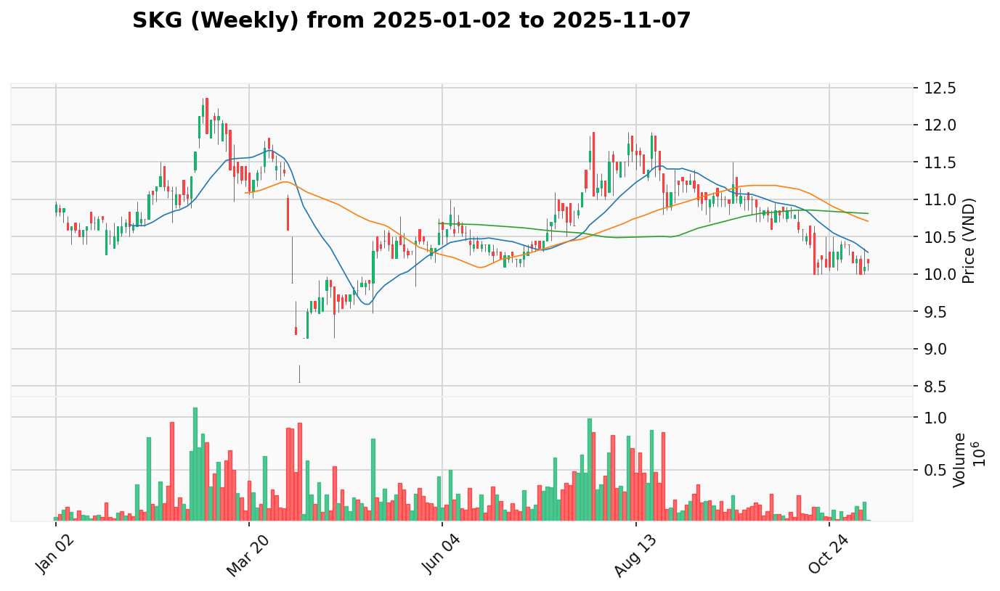

<a href="#van-tai">↑ Back to group VAN_TAI</a>  |  <a href="#vpa-signal-summary">↑ Back to Top</a>

#### Key Statistics
| Metric | Value |
|:---|---:|
| Date Range | 2025-01-02 to 2025-11-14 |
| **Latest Close** | **10.25** |
| Period Open | 10.83 |
| Period High | 12.36 |
| Period Low | 8.55 |
| Period Change % | -5.36% |

**[Download SKG Data (.csv)](market_data_week/SKG_2025-01-02_to_2025-11-14.csv)**

---

### SLS

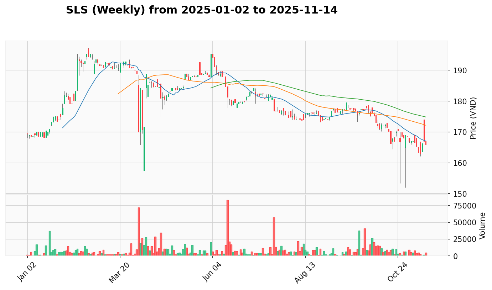

<a href="#thuc-pham">↑ Back to group THUC_PHAM</a>  |  <a href="#vpa-signal-summary">↑ Back to Top</a>

#### Key Statistics
| Metric | Value |
|:---|---:|
| Date Range | 2025-01-02 to 2025-11-14 |
| **Latest Close** | **166.0** |
| Period Open | 169.56 |
| Period High | 197.2 |
| Period Low | 152.0 |
| Period Change % | -2.10% |

**[Download SLS Data (.csv)](market_data_week/SLS_2025-01-02_to_2025-11-14.csv)**

---

### SMC

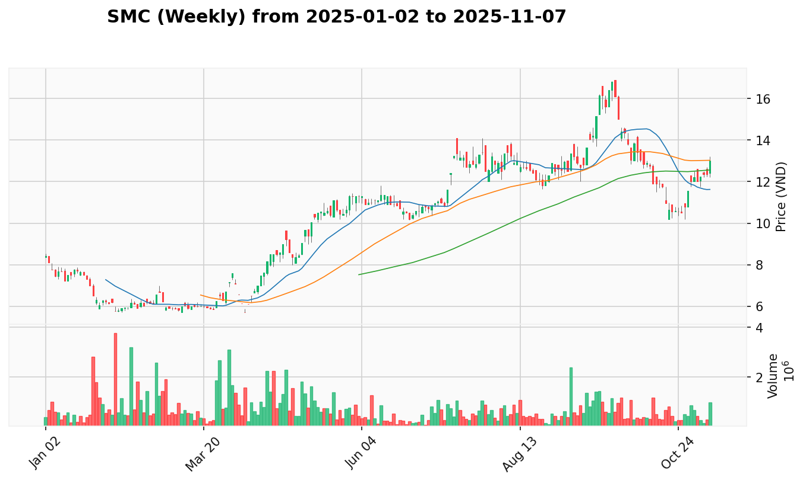

<a href="#thep">↑ Back to group THEP</a>  |  <a href="#vpa-signal-summary">↑ Back to Top</a>

#### Key Statistics
| Metric | Value |
|:---|---:|
| Date Range | 2025-01-02 to 2025-11-14 |
| **Latest Close** | **13.25** |
| Period Open | 8.36 |
| Period High | 16.9 |
| Period Low | 5.7 |
| Period Change % | 58.49% |

**[Download SMC Data (.csv)](market_data_week/SMC_2025-01-02_to_2025-11-14.csv)**

---

### SSH

#### [VPA Analysis (2025-06-02 - 2025-08-03)](./VPA_week.md#ssh)
> - **Ngày 2025-07-07:** Sau tín hiệu No Demand của tuần trước, SSH có một tuần đi ngang với một nến tăng biên độ hẹp. Khối lượng giao dịch giảm.
>     - **Phân tích VPA/Wyckoff:** Đây là một phiên **No Supply**. Việc giá giữ vững trên nền khối lượng thấp là một tín hiệu No Supply, cho thấy thị trường đang hấp thụ và có thể sớm tăng trở lại.
> - **Ngày 2025-07-14:** Tiếp nối tín hiệu No Supply của tuần trước, SSH có một tuần tăng giá mạnh với nến tăng thân dài, đóng cửa (92.8) ở mức cao nhất tuần. Khối lượng giao dịch giảm nhẹ.
>     - **Phân tích VPA/Wyckoff:** Đây là một **No Supply** chuyển thành **Sign of Strength**. Việc giá có thể tăng mạnh trên nền khối lượng thấp xác nhận áp lực bán rất yếu và đà tăng đang được củng cố.
> - **Ngày 2025-07-21:** Sau tín hiệu Sign of Strength của tuần trước, SSH có một tuần dao động mạnh với biên độ rộng từ 85.0 đến 94.6, mở cửa (94.0) cao hơn đóng cửa tuần trước nhưng đóng cửa (92.0) thấp hơn. Khối lượng giao dịch tăng mạnh lên 200819.
>     - **Phân tích VPA/Wyckoff:** Đây là tín hiệu **Effort to Rise** thất bại. Việc giá mở cao nhưng không thể duy trì với khối lượng tăng mạnh cho thấy áp lực bán đã xuất hiện ở vùng đỉnh, tạo ra sự kháng cự. Cố gắng tăng giá đã gặp phải cung cấp, báo hiệu khả năng điều chỉnh trong các tuần tới.
> **Ngày 2025-07-27:** Tiếp nối tín hiệu Effort to Rise thất bại của tuần trước, SSH có một tuần dao động mạnh với biên độ rộng từ 85.0 đến 94.6, mở cửa (94.0) cao hơn tuần trước nhưng đóng cửa (92.0) thấp hơn mức cao nhất. Khối lượng giao dịch tăng nhẹ lên 200700 so với 164500 tuần trước.
> 
> **Phân tích VPA/Wyckoff:** Đây là tín hiệu **Test** sau Effort to Rise thất bại. Việc giá dao động mạnh với biên độ rộng nhưng đóng cửa gần mức cao cho thấy thị trường đang thử nghiệm vùng kháng cự. Khối lượng tăng nhẹ kết hợp với việc giá duy trì gần mức cao là dấu hiệu tích cực, cho thấy áp lực bán đã giảm và cổ phiếu có khả năng vượt qua vùng kháng cự trong các tuần tới.
> **Ngày 2025-08-03:** Sau tín hiệu Test tích cực của tuần trước, SSH có một tuần giảm giá từ 92.0 xuống 89.2 với biên độ dao động từ 87.0 đến 92.0, mở cửa (90.6) thấp hơn đóng cửa tuần trước và đóng cửa (89.2) ở mức trung bình của tuần. Khối lượng giao dịch giảm mạnh xuống 144400 so với 200700 tuần trước, giảm 28%.

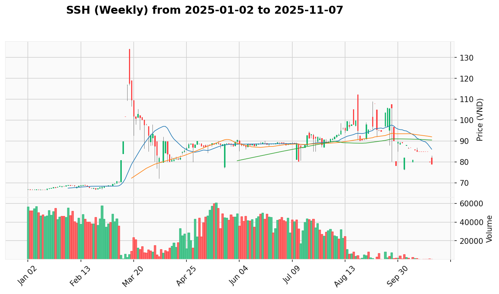

<a href="#bat-dong-san">↑ Back to group BAT_DONG_SAN</a>  |  <a href="#vpa-signal-summary">↑ Back to Top</a>

#### Key Statistics
| Metric | Value |
|:---|---:|
| Date Range | 2025-01-02 to 2025-11-11 |
| **Latest Close** | **79.0** |
| Period Open | 66.8 |
| Period High | 134.2 |
| Period Low | 66.5 |
| Period Change % | 18.26% |

**[Download SSH Data (.csv)](market_data_week/SSH_2025-01-02_to_2025-11-14.csv)**

---

### SSI

#### [VPA Analysis (2025-06-02 - 2025-08-03)](./VPA_week.md#ssi)
> - **Ngày 2025-07-07:** Tiếp nối Dấu hiệu Sức mạnh của tuần trước, SSI có một tuần bùng nổ với một nến tăng thân dài, đóng cửa (29.65) ở mức cao nhất tuần. Khối lượng giao dịch tăng vọt lên mức kỷ lục, xác nhận cho sức mạnh của đà tăng.
>     - **Phân tích VPA/Wyckoff:** Đây là một **Sign of Strength**. Tuy nhiên, sự tăng tốc quá nhanh trên khối lượng cực lớn có thể là dấu hiệu của một **Climax**, báo hiệu rủi ro điều chỉnh đang gia tăng.
> - **Ngày 2025-07-14:** Tiếp nối đà tăng mạnh của tuần trước, SSI có một tuần tăng giá tiếp tục với nến tăng thân dài, đóng cửa (31.8) ở mức cao nhất tuần. Khối lượng giao dịch duy trì ở mức rất cao.
>     - **Phân tích VPA/Wyckoff:** Đây là một **Sign of Strength** tiếp tục, nhưng với rủi ro **Climax** cao. Sự tăng tốc liên tục trên khối lượng cực lớn trong hai tuần liền tạo điều kiện cho một đợt điều chỉnh kỹ thuật trong thời gian tới.
> - **Ngày 2025-07-21:** Tiếp nối rủi ro Climax của tuần trước, SSI có một tuần tăng giá tiếp tục với nến tăng thân dài, đóng cửa (34.0) ở mức cao nhất tuần và tạo đỉnh mới. Khối lượng giao dịch vẫn duy trì ở mức cực cao.
>     - **Phân tích VPA/Wyckoff:** Đây là một **Climactic Action**. Ba tuần tăng liên tiếp trên khối lượng cực lớn với sự tăng tốc không ngừng là dấu hiệu của climax điển hình. Mặc dù vẫn là dấu hiệu sức mạnh, nhưng rủi ro đảo chiều đã tăng cao, cần thận trọng với khả năng điều chỉnh mạnh trong các tuần tới.
> **Ngày 2025-07-27:** Sau ba tuần tăng liên tiếp trên khối lượng cực lớn, SSI tiếp tục tăng mạnh trong tuần này với nến tăng thân dài, từ mức mở cửa 32.05 lên đóng cửa 34.0, tạo đỉnh mới tại 34.1. Tuy nhiên, điều đáng chú ý là cổ phiếu có biên độ dao động rộng (30.55-34.1) với shadow dưới dài, cho thấy có áp lực bán tại vùng thấp. Khối lượng giao dịch vẫn duy trì ở mức rất cao (265.9 triệu cổ phiếu), thậm chí cao hơn tuần trước.
> 
> **Phân tích VPA/Wyckoff:** Đây là một **Buying Climax**. Bốn tuần tăng liên tiếp trên khối lượng cực lớn với sự gia tăng giá không ngừng đã tạo ra dấu hiệu climax rõ ràng. Mặc dù vẫn đóng cửa ở mức cao, nhưng shadow dưới dài và khối lượng cực lớn cho thấy có sự phân phối từ các tay lớn. Rủi ro đảo chiều cực cao, cần chuẩn bị cho một đợt điều chỉnh mạnh hoặc sideways movement trong các tuần tới.
> **Ngày 2025-08-03:** Sau tín hiệu Buying Climax ở tuần trước, SSI có một tuần đảo chiều với nến giảm thân dài, từ mức mở cửa cao 34.8 xuống đóng cửa 33.2, mặc dù từng test lên đỉnh mới 36.2. Điều đáng chú ý là cổ phiếu có biên độ dao động cực rộng (32.7-36.2) với shadow trên dài, cho thấy áp lực bán mạnh tại vùng cao. Khối lượng giao dịch bùng nổ lên mức kỷ lục (323.4 triệu cổ phiếu), tăng 21.6% so với tuần trước và cao nhất trong chuỗi dữ liệu.

<a href="#chung-khoan">↑ Back to group CHUNG_KHOAN</a>  |  <a href="#vpa-signal-summary">↑ Back to Top</a>

#### Key Statistics
| Metric | Value |
|:---|---:|
| Date Range | 2025-01-02 to 2025-11-14 |
| **Latest Close** | **34.95** |
| Period Open | 25.4 |
| Period High | 43.3 |
| Period Low | 20.09 |
| Period Change % | 37.60% |

**[Download SSI Data (.csv)](market_data_week/SSI_2025-01-02_to_2025-11-14.csv)**

---

### STB

#### [VPA Analysis (2025-06-02 - 2025-08-03)](./VPA_week.md#stb)
> - **Ngày 2025-07-07:** Sau phiên kiểm tra cung thành công của tuần trước, STB có một tuần tăng giá tốt, tạo thành một nến tăng và đóng cửa (47.65) cao hơn. Khối lượng giao dịch giảm.
>     - **Phân tích VPA/Wyckoff:** Việc giá có thể tăng trên nền khối lượng thấp là một tín hiệu **No Supply**. Điều này cho thấy áp lực bán yếu, là một tín hiệu No Supply cho xu hướng tăng.
> - **Ngày 2025-07-14:** STB bùng nổ với một tuần tăng giá mạnh, từ 47.75 lên 50.2 (+5.1%). Nến tăng thân dài với đỉnh tuần tại 50.5, đóng cửa gần mức cao nhất. Khối lượng giao dịch tăng đáng kể lên 63.157.337 so với tuần trước (43.220.623).
>     - **Phân tích VPA/Wyckoff:** Đây là một **Sign of Strength** rõ ràng. Việc giá tăng mạnh (+5.1%) kèm theo khối lượng tăng đáng kể (+46%) cho thấy có sự tham gia mạnh mẽ của dòng tiền mua. Nến đóng cửa gần đỉnh tuần thể hiện áp lực mua áp đảo, tiếp nối xu hướng tăng từ tín hiệu No Supply tuần trước.
> - **Ngày 2025-07-21:** Sau tín hiệu Sign of Strength mạnh mẽ của tuần trước, STB có một tuần điều chỉnh với nến giảm từ 50.7 xuống 48.8 (-3.8%). Biên độ giao dịch từ 48.5 đến 50.8, đóng cửa gần mức thấp. Khối lượng giao dịch giảm xuống 53.305.162.
>     - **Phân tích VPA/Wyckoff:** Đây là một **Test for Supply**. Sau đợt tăng mạnh tuần trước, thị trường đang kiểm tra mức độ áp lực bán tại vùng đỉnh mới. Việc khối lượng giảm (-15.6%) trong phiên điều chỉnh là tín hiệu tích cực, cho thấy áp lực chốt lời không quá lớn. Nếu giá có thể giữ vững trên 48.5 trong tuần tới, đây sẽ là test thành công.
> **Ngày 2025-07-27:** STB tiếp tục giai đoạn điều chỉnh với nến giảm thứ hai liên tiếp, từ 50.7 xuống 48.8 (-3.8%). Mặc dù giá mở cửa cao (50.7) gần đỉnh tuần trước, nhưng áp lực bán đã đẩy giá xuống thấp 48.5 trước khi hồi phục nhẹ để đóng cửa tại 48.8. Khối lượng giao dịch 53.391.100 duy trì ở mức tương đương tuần trước, cho thấy sự quan tâm vẫn được duy trì trong giai đoạn điều chỉnh.
> 
> **Phân tích VPA/Wyckoff:** Đây là một **Test for Supply** đang tiếp diễn. Sau Sign of Strength mạnh mẽ ở tuần 2025-07-14 (tăng 5.1% với khối lượng cao), STB đã trải qua hai tuần điều chỉnh liên tiếp nhưng khối lượng không tăng mạnh, cho thấy áp lực chốt lời không quá lớn. Việc giá dao động trong khoảng 48.5-50.8 và duy trì trên mức hỗ trợ 48.5 là tín hiệu tích cực. Nếu tuần tới giá có thể giữ vững trên 48.5 hoặc tạo nến tăng với khối lượng, test for supply sẽ thành công và xu hướng tăng có thể tiếp tục.
> **Ngày 2025-08-03:** STB kết thúc giai đoạn Test for Supply với nến tăng từ 48.8 lên 49.4 (+1.2%). Mặc dù mở cửa tại 48.8, cổ phiếu đã test xuống mức thấp 48.0 - gần với vùng hỗ trợ quan trọng 48.5 đã được thiết lập trong hai tuần điều chỉnh trước đó. Sau khi test thành công, giá hồi phục mạnh lên đỉnh tuần 50.8 trước khi đóng cửa tại 49.4. Khối lượng giao dịch bùng nổ lên 88.625.700, tăng 66% so với tuần trước, cho thấy sự quan tâm mạnh mẽ trở lại sau giai đoạn test.

<a href="#ngan-hang">↑ Back to group NGAN_HANG</a>  |  <a href="#vpa-signal-summary">↑ Back to Top</a>

#### Key Statistics
| Metric | Value |
|:---|---:|
| Date Range | 2025-01-02 to 2025-11-14 |
| **Latest Close** | **48.05** |
| Period Open | 36.95 |
| Period High | 61.3 |
| Period Low | 32.4 |
| Period Change % | 30.04% |

**[Download STB Data (.csv)](market_data_week/STB_2025-01-02_to_2025-11-14.csv)**

---

### STK

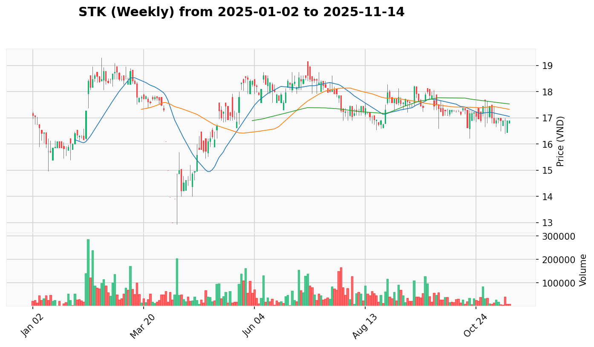

<a href="#det-may">↑ Back to group DET_MAY</a>  |  <a href="#vpa-signal-summary">↑ Back to Top</a>

#### Key Statistics
| Metric | Value |
|:---|---:|
| Date Range | 2025-01-02 to 2025-11-14 |
| **Latest Close** | **16.9** |
| Period Open | 17.17 |
| Period High | 19.31 |
| Period Low | 12.93 |
| Period Change % | -1.57% |

**[Download STK Data (.csv)](market_data_week/STK_2025-01-02_to_2025-11-14.csv)**

---

### SZC

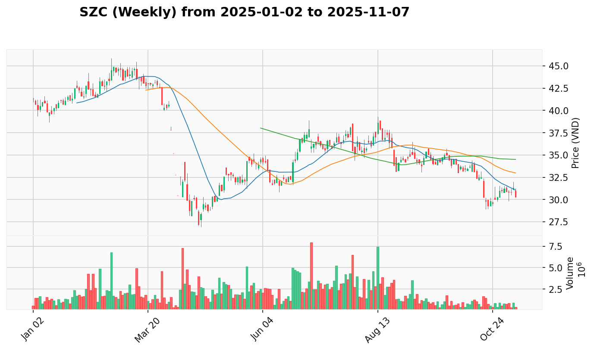

<a href="#bat-dong-san-kcn">↑ Back to group BAT_DONG_SAN_KCN</a>  |  <a href="#vpa-signal-summary">↑ Back to Top</a>

#### Key Statistics
| Metric | Value |
|:---|---:|
| Date Range | 2025-01-02 to 2025-11-14 |
| **Latest Close** | **32.0** |
| Period Open | 41.31 |
| Period High | 45.87 |
| Period Low | 26.92 |
| Period Change % | -22.54% |

**[Download SZC Data (.csv)](market_data_week/SZC_2025-01-02_to_2025-11-14.csv)**

---

### TCB

#### [VPA Analysis (2025-06-02 - 2025-08-03)](./VPA_week.md#tcb)
> - **Ngày 2025-07-07:** Sau Dấu hiệu Yếu kém của tuần trước, TCB có một tuần đi ngang với một nến giảm biên độ hẹp. Khối lượng giao dịch tăng nhẹ.
>     - **Phân tích VPA/Wyckoff:** Đây là một phiên **No Demand** sau khi nguồn cung xuất hiện. Việc giá không thể phục hồi trên khối lượng tăng cho thấy phe mua yếu, củng cố cho tín hiệu yếu của tuần trước.
> - **Ngày 2025-07-14:** TCB phục hồi với một tuần tăng giá tốt, từ 34.95 lên 36.25 (+3.7%). Nến tăng với thân dài, đỉnh tuần tại 36.5, đóng cửa gần mức cao nhất. Khối lượng giao dịch tăng lên 103.785.507 so với tuần trước (90.199.777).
>     - **Phân tích VPA/Wyckoff:** Đây là một **Effort to Rise** sau giai đoạn yếu kém. Việc giá tăng (+3.7%) kèm theo khối lượng tăng (+15%) cho thấy có sự quay trở lại của dòng tiền mua. Tuy nhiên, đây mới chỉ là nỗ lực tăng giá, cần quan sát thêm để xác định liệu đà tăng có được duy trì hay không.
> - **Ngày 2025-07-21:** Sau nỗ lực tăng giá của tuần trước, TCB có một tuần thất vọng với nến giảm từ 36.3 xuống 35.2 (-3.0%). Mở cửa gần đỉnh tuần trước nhưng bị bán mạnh, đóng cửa thấp với biên độ 34.9-36.5. Khối lượng giao dịch tiếp tục tăng lên 116.174.880.
>     - **Phân tích VPA/Wyckoff:** Đây là **Effort to Rise** thất bại chuyển thành **Sign of Weakness**. Việc giá không thể duy trì đà tăng mà quay đầu giảm trên khối lượng tăng cao (+11.8%) cho thấy áp lực bán đã xuất hiện mạnh mẽ. Điều này xác nhận rằng nỗ lực tăng giá tuần trước chỉ là phục hồi tạm thời, xu hướng yếu kém vẫn đang tiếp diễn.
> **Ngày 2025-07-27:** Sau tuần yếu kém trước đó, TCB tiếp tục có một tuần điều chỉnh với nến giảm từ 36.3 xuống 35.2 (-3.0%). Mặc dù mở cửa tại mức cao 36.3 nhưng bị bán tháo xuống thấp nhất 34.9 trước khi phục hồi nhẹ đóng cửa 35.2. Khối lượng giao dịch tăng mạnh lên 116.134.800 (+11.9% so với tuần trước).
> 
> **Phân tích VPA/Wyckoff:** Đây là **No Demand** chuyển thành **Sign of Weakness**. Việc giá tiếp tục giảm trên khối lượng tăng cao cho thấy áp lực bán vẫn đang tiếp diễn mạnh mẽ. Mặc dù có sự phục hồi nhẹ từ đáy 34.9 lên 35.2 nhưng không đủ mạnh để phá vỡ xu hướng yếu kém. Khối lượng tăng kèm giá giảm xác nhận sự hiện diện của nguồn cung lớn, củng cố thêm cho tín hiệu yếu kém đã xuất hiện từ 2 tuần trước.
> **Ngày 2025-08-03:** Sau chuỗi những tuần yếu kém trước đó, TCB tiếp tục có một tuần giảm sâu từ 35.25 xuống 34.1 (-3.3%). Mặc dù mở cửa tương đối ổn định tại 35.25 nhưng bị bán tháo mạnh xuống thấp nhất 33.7 trước khi có sự phục hồi nhẹ đóng cửa 34.1. Đáng lo ngại nhất là khối lượng giao dịch bùng nổ lên 153.507.200 (+32.2% so với tuần trước), đạt mức cao nhất trong nhiều tháng.

<a href="#ngan-hang">↑ Back to group NGAN_HANG</a>  |  <a href="#vpa-signal-summary">↑ Back to Top</a>

#### Key Statistics
| Metric | Value |
|:---|---:|
| Date Range | 2025-01-02 to 2025-11-14 |
| **Latest Close** | **35.1** |
| Period Open | 24.01 |
| Period High | 42.0 |
| Period Low | 21.72 |
| Period Change % | 46.19% |

**[Download TCB Data (.csv)](market_data_week/TCB_2025-01-02_to_2025-11-14.csv)**

---

### TCD

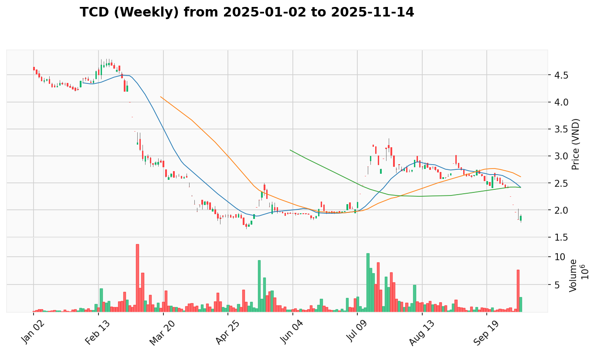

<a href="#van-tai">↑ Back to group VAN_TAI</a>  |  <a href="#vpa-signal-summary">↑ Back to Top</a>

#### Key Statistics
| Metric | Value |
|:---|---:|
| Date Range | 2025-01-02 to 2025-10-08 |
| **Latest Close** | **1.89** |
| Period Open | 4.65 |
| Period High | 4.8 |
| Period Low | 1.65 |
| Period Change % | -59.35% |

**[Download TCD Data (.csv)](market_data_week/TCD_2025-01-02_to_2025-11-14.csv)**

---

### TCH

#### [VPA Analysis (2025-07-21 - 2025-08-03)](./VPA_week.md#tch)
> - **Ngày 2025-07-21:** TCH có một tuần tăng giá tích cực với nến tăng từ 24.5 lên 25.6 (+4.5%). Biên độ giao dịch 23.7-26.1, đóng cửa gần mức cao. Khối lượng giao dịch ổn định tại 40.433.879, giảm nhẹ so với tuần trước (42.757.893).
>     - **Phân tích VPA/Wyckoff:** Đây là một **Effort to Rise**. Việc giá tăng (+4.5%) trên khối lượng giảm nhẹ (-5.4%) cho thấy có sự cải thiện trong cán cân cung cầu. Mặc dù chưa đủ mạnh để trở thành Sign of Strength, nhưng đây là một tín hiệu tích cực cho xu hướng ngắn hạn.
> **Ngày 2025-07-27:** TCH tiếp tục xu hướng tăng giá mạnh mẽ với nến tăng từ 24.5 lên 25.6 (+4.5%). Biên độ giao dịch 23.7-26.1, đóng cửa gần mức cao nhất tuần. Khối lượng giao dịch 40.498.800, giảm nhẹ so với tuần trước (42.730.300). Giá đã tăng liên tiếp 3 tuần từ mức 20.9 và đạt mức cao mới tại 26.1. Áp lực bán xuất hiện ở vùng 26.0-26.1 khi giá pullback về 25.6.
> 
> **Phân tích VPA/Wyckoff:** Đây là một **Sign of Strength**. Việc giá tăng mạnh (+4.5%) và liên tục đạt đỉnh mới cho thấy lực cầu vượt trội lực cung. Mặc dù khối lượng giảm nhẹ (-5.2%), nhưng vẫn ở mức cao (trên 40 triệu) và sự tăng giá bền vững qua 3 tuần liên tiếp thể hiện sức mạnh thực sự của dòng tiền. Việc đóng cửa gần mức cao (25.6 vs high 26.1) cho thấy nhà đầu tư sẵn sàng nắm giữ ở mức giá cao.
> **Ngày 2025-08-03:** TCH có một tuần biến động mạnh với nến giảm từ 25.6 xuống 23.0 (-10.2%). Khởi đầu tuần mạnh mẽ khi mở cửa gap up tại 26.0 và đạt đỉnh mới 27.05, nhưng bị bán mạnh về mức thấp 22.85 trước khi đóng cửa tại 23.0. Khối lượng giao dịch bùng nổ lên 68.613.000, tăng 69.4% so với tuần trước, đánh dấu mức khối lượng cao nhất trong 2 tháng qua. Sau chuỗi tăng 3 tuần liên tiếp từ 20.9 lên đỉnh 27.05 (+29.7%), TCH đã có tuần điều chỉnh mạnh đầu tiên.

<a href="#bat-dong-san">↑ Back to group BAT_DONG_SAN</a>  |  <a href="#vpa-signal-summary">↑ Back to Top</a>

#### Key Statistics
| Metric | Value |
|:---|---:|
| Date Range | 2025-01-02 to 2025-11-14 |
| **Latest Close** | **21.3** |
| Period Open | 13.05 |
| Period High | 26.25 |
| Period Low | 11.46 |
| Period Change % | 63.22% |

**[Download TCH Data (.csv)](market_data_week/TCH_2025-01-02_to_2025-11-14.csv)**

---

### TCI

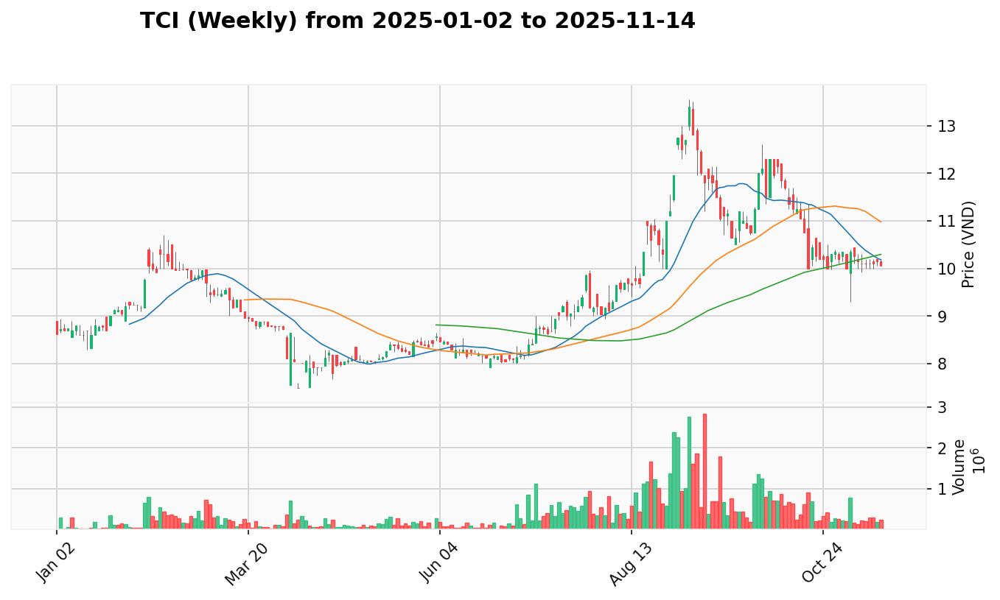

<a href="#chung-khoan">↑ Back to group CHUNG_KHOAN</a>  |  <a href="#vpa-signal-summary">↑ Back to Top</a>

#### Key Statistics
| Metric | Value |
|:---|---:|
| Date Range | 2025-01-02 to 2025-11-14 |
| **Latest Close** | **10.05** |
| Period Open | 8.9 |
| Period High | 13.55 |
| Period Low | 7.49 |
| Period Change % | 12.92% |

**[Download TCI Data (.csv)](market_data_week/TCI_2025-01-02_to_2025-11-14.csv)**

---

### TCL

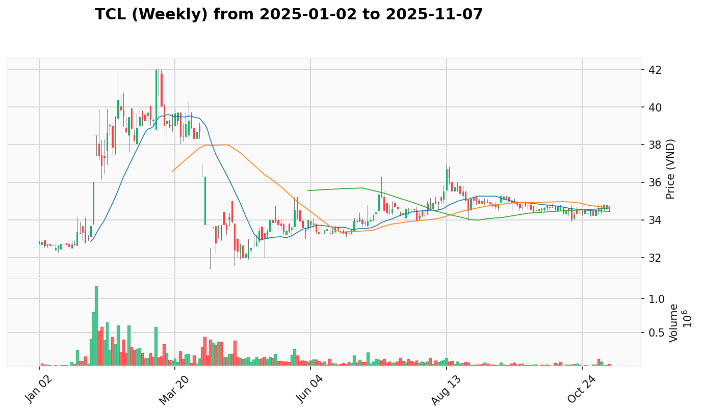

<a href="#van-tai">↑ Back to group VAN_TAI</a>  |  <a href="#vpa-signal-summary">↑ Back to Top</a>

#### Key Statistics
| Metric | Value |
|:---|---:|
| Date Range | 2025-01-02 to 2025-11-14 |
| **Latest Close** | **34.65** |
| Period Open | 32.83 |
| Period High | 42.04 |
| Period Low | 31.42 |
| Period Change % | 5.54% |

**[Download TCL Data (.csv)](market_data_week/TCL_2025-01-02_to_2025-11-14.csv)**

---

### TCM

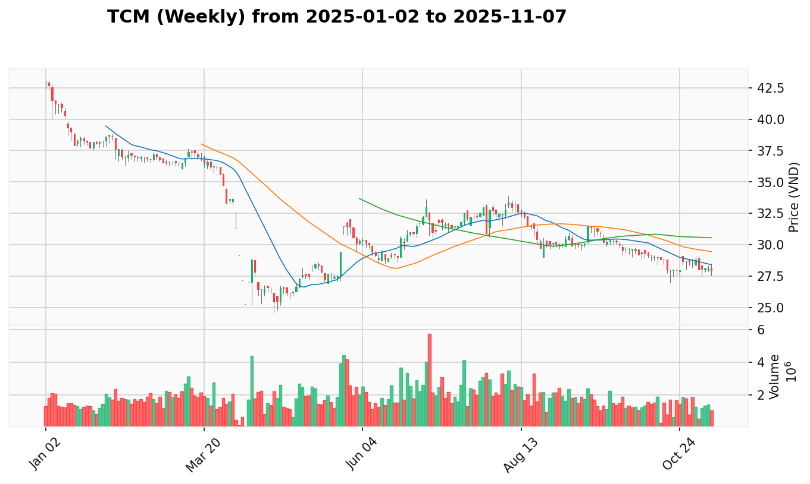

<a href="#det-may">↑ Back to group DET_MAY</a>  |  <a href="#vpa-signal-summary">↑ Back to Top</a>

#### Key Statistics
| Metric | Value |
|:---|---:|
| Date Range | 2025-01-02 to 2025-11-14 |
| **Latest Close** | **28.9** |
| Period Open | 42.97 |
| Period High | 43.11 |
| Period Low | 24.55 |
| Period Change % | -32.74% |

**[Download TCM Data (.csv)](market_data_week/TCM_2025-01-02_to_2025-11-14.csv)**

---

### TCX

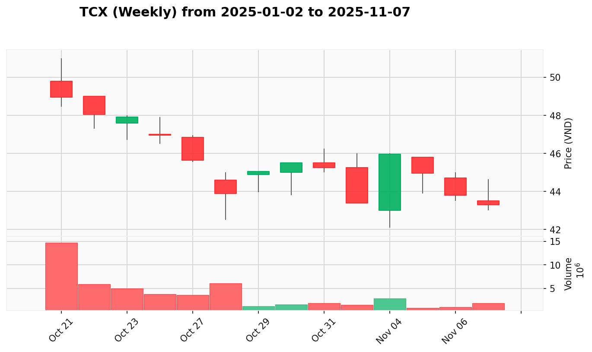

<a href="#chung-khoan">↑ Back to group CHUNG_KHOAN</a>  |  <a href="#vpa-signal-summary">↑ Back to Top</a>

#### Key Statistics
| Metric | Value |
|:---|---:|
| Date Range | 2025-10-21 to 2025-11-14 |
| **Latest Close** | **44.1** |
| Period Open | 49.8 |
| Period High | 51.0 |
| Period Low | 42.1 |
| Period Change % | -11.45% |

**[Download TCX Data (.csv)](market_data_week/TCX_2025-01-02_to_2025-11-14.csv)**

---

### TDC

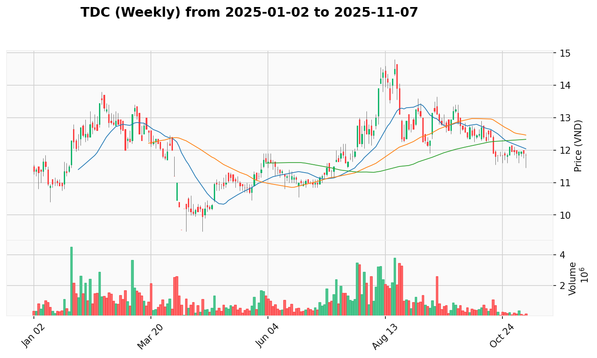

<a href="#bat-dong-san">↑ Back to group BAT_DONG_SAN</a>  |  <a href="#vpa-signal-summary">↑ Back to Top</a>

#### Key Statistics
| Metric | Value |
|:---|---:|
| Date Range | 2025-01-02 to 2025-11-14 |
| **Latest Close** | **11.85** |
| Period Open | 11.5 |
| Period High | 14.8 |
| Period Low | 9.49 |
| Period Change % | 3.04% |

**[Download TDC Data (.csv)](market_data_week/TDC_2025-01-02_to_2025-11-14.csv)**

---

### TDM

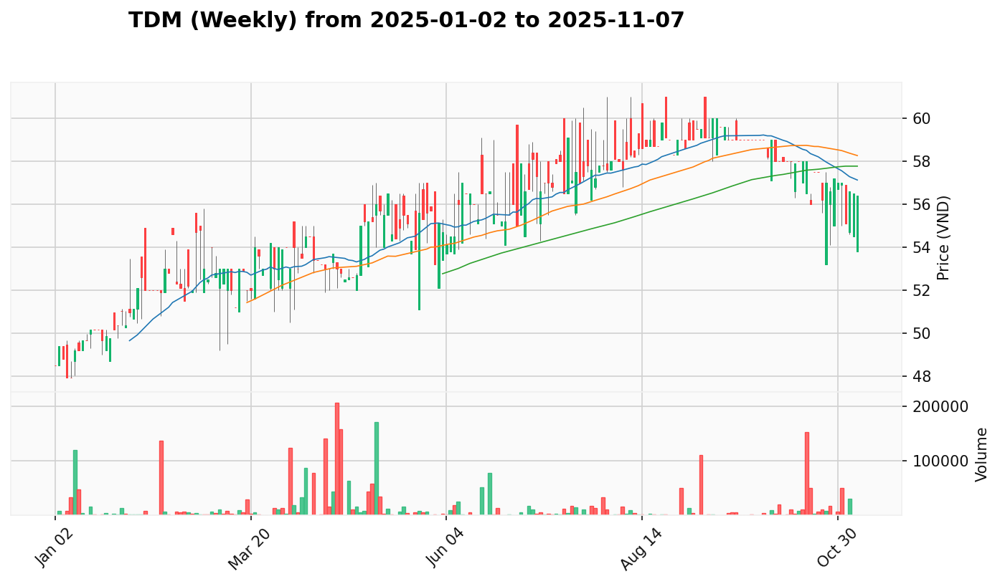

<a href="#others">↑ Back to group OTHERS</a>  |  <a href="#vpa-signal-summary">↑ Back to Top</a>

#### Key Statistics
| Metric | Value |
|:---|---:|
| Date Range | 2025-01-02 to 2025-11-14 |
| **Latest Close** | **56.5** |
| Period Open | 48.51 |
| Period High | 61.0 |
| Period Low | 47.93 |
| Period Change % | 16.47% |

**[Download TDM Data (.csv)](market_data_week/TDM_2025-01-02_to_2025-11-14.csv)**

---

### TIG

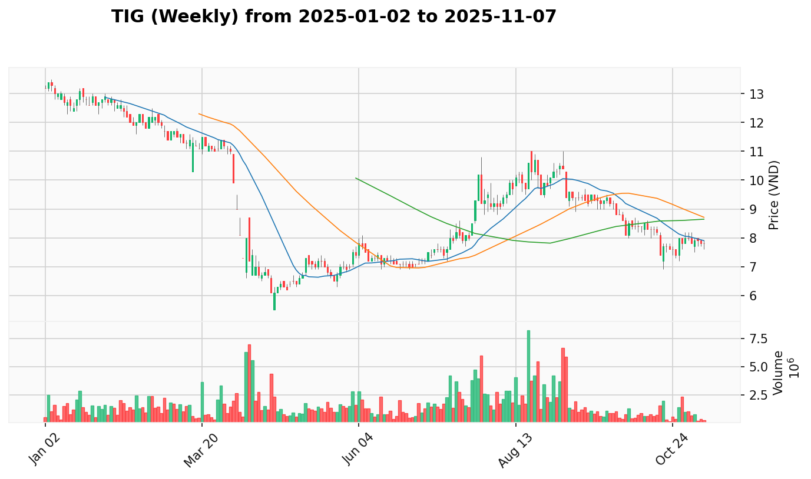

<a href="#others">↑ Back to group OTHERS</a>  |  <a href="#vpa-signal-summary">↑ Back to Top</a>

#### Key Statistics
| Metric | Value |
|:---|---:|
| Date Range | 2025-01-02 to 2025-11-14 |
| **Latest Close** | **7.8** |
| Period Open | 13.2 |
| Period High | 13.5 |
| Period Low | 5.5 |
| Period Change % | -40.91% |

**[Download TIG Data (.csv)](market_data_week/TIG_2025-01-02_to_2025-11-14.csv)**

---

### TIP

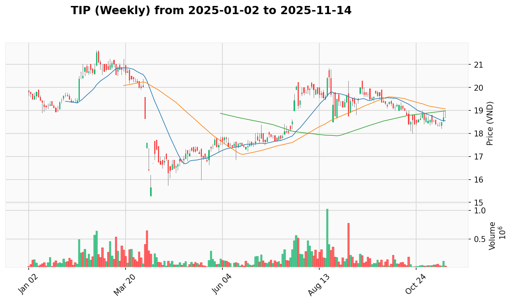

<a href="#bat-dong-san-kcn">↑ Back to group BAT_DONG_SAN_KCN</a>  |  <a href="#vpa-signal-summary">↑ Back to Top</a>

#### Key Statistics
| Metric | Value |
|:---|---:|
| Date Range | 2025-01-02 to 2025-11-14 |
| **Latest Close** | **18.7** |
| Period Open | 19.86 |
| Period High | 21.62 |
| Period Low | 15.28 |
| Period Change % | -5.84% |

**[Download TIP Data (.csv)](market_data_week/TIP_2025-01-02_to_2025-11-14.csv)**

---

### TLD

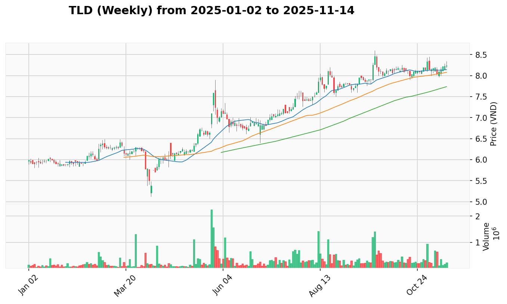

<a href="#xay-dung">↑ Back to group XAY_DUNG</a>  |  <a href="#vpa-signal-summary">↑ Back to Top</a>

#### Key Statistics
| Metric | Value |
|:---|---:|
| Date Range | 2025-01-02 to 2025-11-14 |
| **Latest Close** | **8.24** |
| Period Open | 5.96 |
| Period High | 8.6 |
| Period Low | 5.12 |
| Period Change % | 38.26% |

**[Download TLD Data (.csv)](market_data_week/TLD_2025-01-02_to_2025-11-14.csv)**

---

### TLH

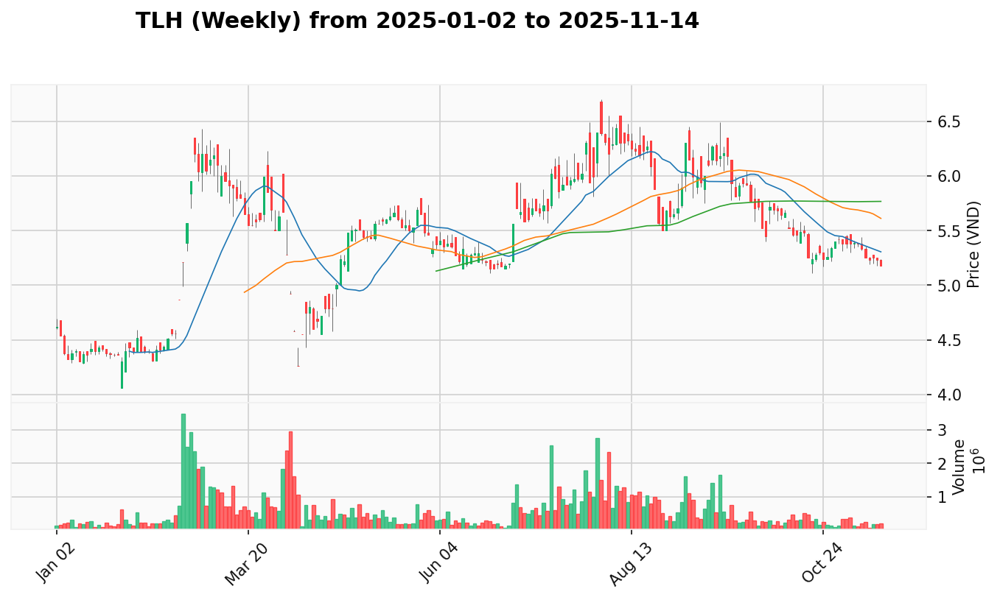

<a href="#thep">↑ Back to group THEP</a>  |  <a href="#vpa-signal-summary">↑ Back to Top</a>

#### Key Statistics
| Metric | Value |
|:---|---:|
| Date Range | 2025-01-02 to 2025-11-14 |
| **Latest Close** | **5.18** |
| Period Open | 4.61 |
| Period High | 6.7 |
| Period Low | 4.06 |
| Period Change % | 12.36% |

**[Download TLH Data (.csv)](market_data_week/TLH_2025-01-02_to_2025-11-14.csv)**

---

### TNG

#### [VPA Analysis (2025-06-02 - 2025-08-03)](./VPA_week.md#tng)
> - **Ngày 2025-07-07:** Tiếp nối Dấu hiệu Sức mạnh của tuần trước, TNG có một tuần điều chỉnh với một nến giảm. Khối lượng giao dịch giảm.
>     - **Phân tích VPA/Wyckoff:** Đây là một phiên **No Supply**. Việc giá điều chỉnh với khối lượng thấp sau một đợt tăng mạnh là một tín hiệu rất No Supply, cho thấy áp lực chốt lời yếu và thị trường đang hấp thụ tốt.
> - **Ngày 2025-07-14:** TNG phục hồi với một tuần tăng giá tốt, từ 20.5 lên 21.1 (+2.9%). Nến tăng với thân dài, đỉnh tuần tại 21.2, đóng cửa gần mức cao nhất. Khối lượng giao dịch giảm xuống 8.564.510 so với tuần trước (10.304.251).
>     - **Phân tích VPA/Wyckoff:** Đây là một **No Supply** tiếp theo. Việc giá tăng (+2.9%) trên nền khối lượng giảm (-17%) cho thấy áp lực bán rất yếu. Điều này tiếp tục khẳng định xu hướng tăng mạnh mẽ sau tín hiệu No Supply tuần trước, thể hiện sức mạnh nội tại của cổ phiếu.
> - **Ngày 2025-07-21:** Tiếp nối tín hiệu No Supply của tuần trước, TNG có một tuần tăng giá tiếp tục với nến tăng từ 21.2 lên 21.7 (+2.8%). Biên độ giao dịch 20.8-22.0, đóng cửa gần mức cao. Khối lượng giao dịch tăng nhẹ lên 10.286.420.
>     - **Phân tích VPA/Wyckoff:** Đây là một **Effort to Rise** chuyển thành **Sign of Strength**. Việc giá tiếp tục tăng (+2.8%) với khối lượng tăng nhẹ (+20%) sau hai tuần No Supply liên tiếp cho thấy sự quan tâm trở lại từ nhà đầu tư. Sự kết hợp này xác nhận xu hướng tăng đang được củng cố mạnh mẽ.
> **Ngày 2025-07-27:** TNG tiếp tục xu hướng tăng với nến tăng từ 21.2 lên 21.7 (+2.4%). Biên độ giao dịch trong tuần 20.8-22.0, đóng cửa gần mức cao nhất tuần tại 21.7. Khối lượng giao dịch duy trì ở mức cao 10.298.200, tương đương tuần trước, cho thấy sự quan tâm bền vững từ nhà đầu tư. Đây là tuần thứ ba liên tiếp cổ phiếu tăng giá sau tín hiệu Sign of Strength mạnh mẽ vào cuối tháng 6, với mức tăng tích lũy từ 20.6 lên 21.7 (+5.3%) trong 3 tuần qua.
> 
> **Phân tích VPA/Wyckoff:** Đây là một **Sign of Strength** tiếp tục. Việc giá tăng (+2.4%) với khối lượng duy trì ở mức cao, đặc biệt sau chuỗi 3 tuần tăng liên tiếp, cho thấy dòng tiền thông minh vẫn đang tích cực tham gia. Sự kết hợp giữa giá tạo đỉnh mới (22.0) và khối lượng ổn định khẳng định xu hướng tăng đang trong giai đoạn mở rộng mạnh mẽ, chưa có dấu hiệu suy yếu.
> **Ngày 2025-08-03:** TNG kết thúc chuỗi tăng giá 3 tuần liên tiếp với một tuần điều chỉnh từ 21.7 xuống 20.8 (-4.1%). Nến giảm có biên độ rộng 20.1-22.1, mở cửa tại 21.7 và test lên mức cao nhất tuần 22.1 trước khi bị đẩy xuống. Đóng cửa ở 20.8, gần mức trung bình của tuần. Khối lượng giao dịch tăng lên 11.216.100, tăng 8.9% so với tuần trước, cho thấy sự quan tâm tăng cao trong tuần điều chỉnh này. Mặc dù có điều chỉnh, mức thấp nhất tuần 20.1 vẫn nằm trên vùng hỗ trợ quan trọng 20.0 và cao hơn đáy của những tuần trước đó.

<a href="#det-may">↑ Back to group DET_MAY</a>  |  <a href="#vpa-signal-summary">↑ Back to Top</a>

#### Key Statistics
| Metric | Value |
|:---|---:|
| Date Range | 2025-01-02 to 2025-11-14 |
| **Latest Close** | **19.7** |
| Period Open | 22.52 |
| Period High | 23.33 |
| Period Low | 12.0 |
| Period Change % | -12.52% |

**[Download TNG Data (.csv)](market_data_week/TNG_2025-01-02_to_2025-11-14.csv)**

---

### TNH

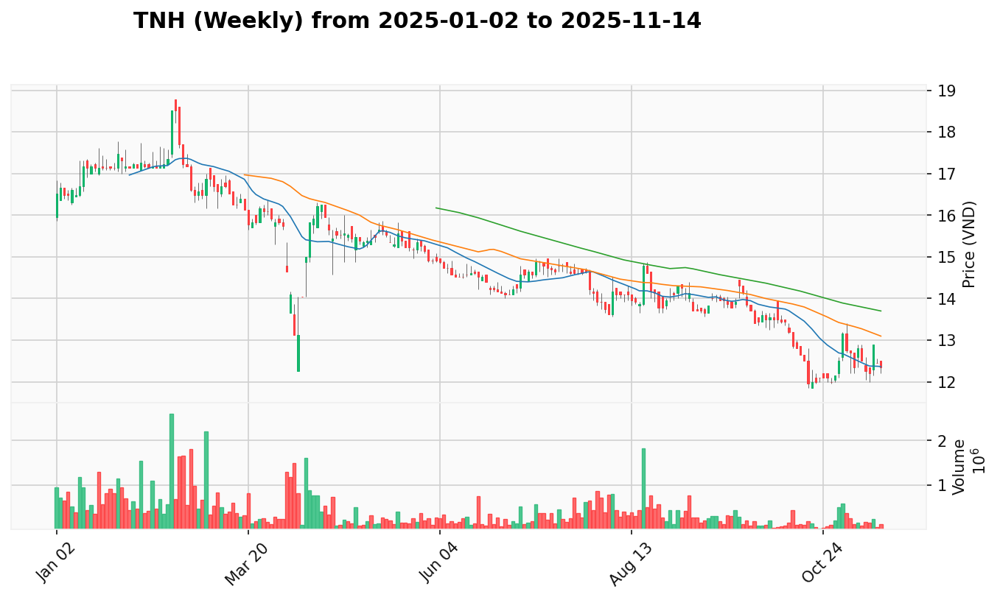

<a href="#suc-khoe">↑ Back to group SUC_KHOE</a>  |  <a href="#vpa-signal-summary">↑ Back to Top</a>

#### Key Statistics
| Metric | Value |
|:---|---:|
| Date Range | 2025-01-02 to 2025-11-14 |
| **Latest Close** | **12.35** |
| Period Open | 15.96 |
| Period High | 18.78 |
| Period Low | 11.85 |
| Period Change % | -22.62% |

**[Download TNH Data (.csv)](market_data_week/TNH_2025-01-02_to_2025-11-14.csv)**

---

### TNT

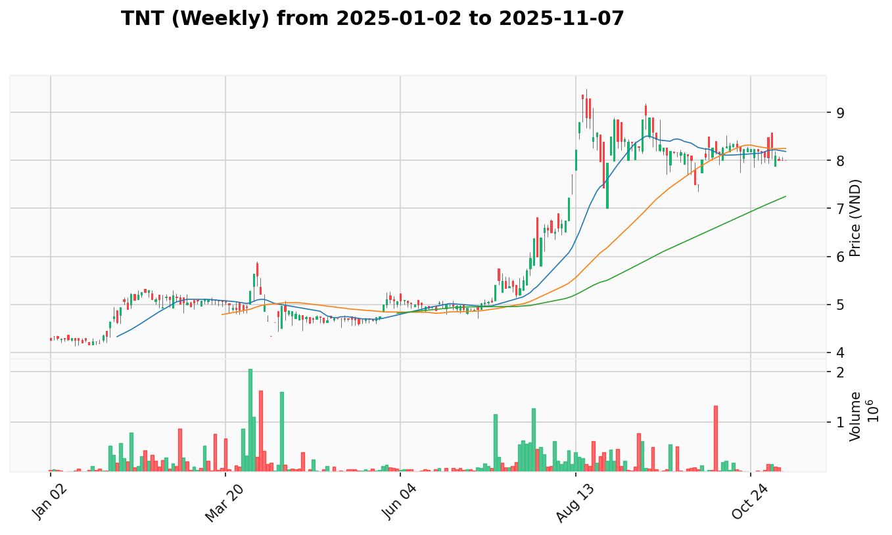

<a href="#khai-khoang">↑ Back to group KHAI_KHOANG</a>  |  <a href="#vpa-signal-summary">↑ Back to Top</a>

#### Key Statistics
| Metric | Value |
|:---|---:|
| Date Range | 2025-01-02 to 2025-11-14 |
| **Latest Close** | **8.36** |
| Period Open | 4.3 |
| Period High | 9.5 |
| Period Low | 4.13 |
| Period Change % | 94.42% |

**[Download TNT Data (.csv)](market_data_week/TNT_2025-01-02_to_2025-11-14.csv)**

---

### TPB

#### [VPA Analysis (2025-06-02 - 2025-08-03)](./VPA_week.md#tpb)
> - **Ngày 2025-07-07:** Sau phiên kiểm tra cung của tuần trước, TPB có một tuần tăng giá bùng nổ với một nến tăng thân dài, đóng cửa (14.85) ở mức cao nhất tuần. Khối lượng giao dịch tăng vọt.
>     - **Phân tích VPA/Wyckoff:** Đây là một **Sign of Strength**, cho thấy lực cầu đã quay trở lại một cách quyết liệt, phá vỡ sự do dự trước đó.
> - **Ngày 2025-07-14:** TPB tiếp tục xu hướng tăng với một tuần tăng giá tốt, từ 14.85 lên 15.1 (+1.7%). Nến tăng với thân dài, đỉnh tuần tại 15.35, đóng cửa gần mức cao nhất. Khối lượng giao dịch giảm xuống 102.201.230 so với tuần trước (164.313.765).
>     - **Phân tích VPA/Wyckoff:** Đây là một **No Supply** sau tín hiệu sức mạnh. Việc giá tiếp tục tăng (+1.7%) trên nền khối lượng giảm (-38%) cho thấy áp lực bán rất yếu. Điều này khẳng định xu hướng tăng mạnh mẽ sau Sign of Strength tuần trước, thể hiện sức mạnh nội tại và khả năng duy trì đà tăng.
> - **Ngày 2025-07-21:** Tiếp nối tín hiệu No Supply của tuần trước, TPB có một tuần tăng giá mạnh mẽ với nến tăng từ 15.25 lên 15.6 (+2.3%). Biên độ giao dịch 14.85-15.9, đóng cửa gần mức cao. Khối lượng giao dịch tăng lên 129.662.093.
>     - **Phân tích VPA/Wyckoff:** Đây là một **Sign of Strength** tiếp tục. Việc giá tăng mạnh (+2.3%) kèm theo khối lượng tăng (+27%) sau giai đoạn No Supply cho thấy sự quan tâm mạnh mẽ từ nhà đầu tư. Điều này xác nhận xu hướng tăng đang được củng cố và có thể tiếp tục trong các tuần tới.
> **Ngày 2025-07-27:** TPB có một tuần tăng giá mạnh mẽ từ 15.25 lên 15.6 (+2.3%), tạo nến tăng thân dài với biên độ giao dịch 14.85-15.9. Giá đóng cửa gần mức cao nhất tuần, thể hiện sức mạnh rõ rệt. Khối lượng giao dịch tăng lên 129.614.600, tăng nhẹ (+27%) so với tuần trước. Đây là tuần thứ 3 liên tiếp TPB tăng giá kể từ khi xuất hiện tín hiệu Sign of Strength đầu tháng 7, giá đã tăng từ 13.75 lên 15.6 (+13.5%) trong 3 tuần.
> 
> **Phân tích VPA/Wyckoff:** Đây là một **Sign of Strength** tiếp tục sau chuỗi tín hiệu tích cực. Việc giá tăng mạnh (+2.3%) kèm theo khối lượng tăng (+27%) cho thấy lực cầu mạnh mẽ đang duy trì đà tăng. Sự kết hợp giữa giá tăng và khối lượng tăng xác nhận xu hướng tăng đang được củng cố bởi dòng tiền thực sự. TPB đang trong giai đoạn Markup rõ rệt với các tín hiệu VPA liên tiếp: Sign of Strength → No Supply → Sign of Strength, thể hiện chu kỳ tăng trưởng mạnh mẽ.
> **Ngày 2025-08-03:** TPB tiếp tục xu hướng tăng mạnh mẽ với tuần thứ 4 liên tiếp tăng giá, từ 15.65 lên 15.7 (+0.6%). Nến tăng có biên độ giao dịch rộng 15.3-16.6, với đỉnh tuần đạt 16.6 - mức cao nhất trong vòng 31 tuần qua. Giá đóng cửa ở 15.7, duy trì trên vùng kháng cự cũ 15.6. Khối lượng giao dịch bùng nổ lên 159.411.300, tăng mạnh (+23%) so với tuần trước. Từ tín hiệu Sign of Strength đầu tháng 7, TPB đã tăng từ 13.75 lên 15.7 (+14.2%) trong 4 tuần liên tiếp, thể hiện xu hướng Markup rất mạnh mẽ.

<a href="#ngan-hang">↑ Back to group NGAN_HANG</a>  |  <a href="#vpa-signal-summary">↑ Back to Top</a>

#### Key Statistics
| Metric | Value |
|:---|---:|
| Date Range | 2025-01-02 to 2025-11-14 |
| **Latest Close** | **16.95** |
| Period Open | 14.83 |
| Period High | 21.71 |
| Period Low | 9.85 |
| Period Change % | 14.30% |

**[Download TPB Data (.csv)](market_data_week/TPB_2025-01-02_to_2025-11-14.csv)**

---

### TSC

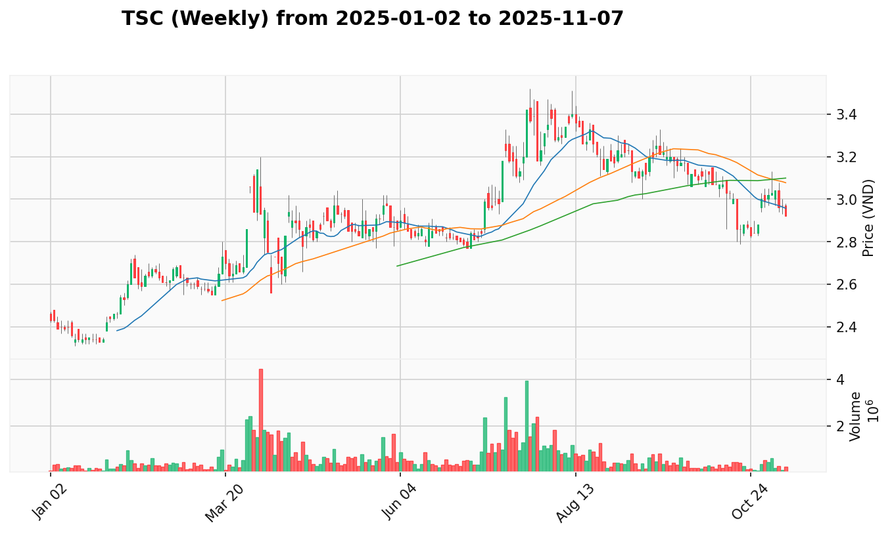

<a href="#nong-nghiep">↑ Back to group NONG_NGHIEP</a>  |  <a href="#vpa-signal-summary">↑ Back to Top</a>

#### Key Statistics
| Metric | Value |
|:---|---:|
| Date Range | 2025-01-02 to 2025-11-14 |
| **Latest Close** | **2.96** |
| Period Open | 2.46 |
| Period High | 3.52 |
| Period Low | 2.31 |
| Period Change % | 20.33% |

**[Download TSC Data (.csv)](market_data_week/TSC_2025-01-02_to_2025-11-14.csv)**

---

### TTF

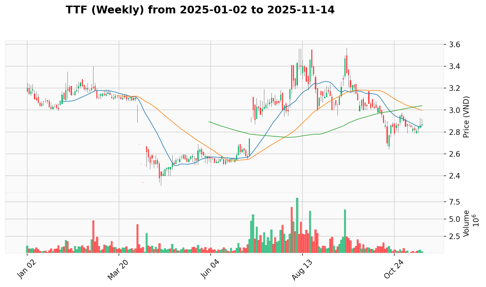

<a href="#others">↑ Back to group OTHERS</a>  |  <a href="#vpa-signal-summary">↑ Back to Top</a>

#### Key Statistics
| Metric | Value |
|:---|---:|
| Date Range | 2025-01-02 to 2025-11-14 |
| **Latest Close** | **2.87** |
| Period Open | 3.17 |
| Period High | 3.57 |
| Period Low | 2.31 |
| Period Change % | -9.46% |

**[Download TTF Data (.csv)](market_data_week/TTF_2025-01-02_to_2025-11-14.csv)**

---

### TTN

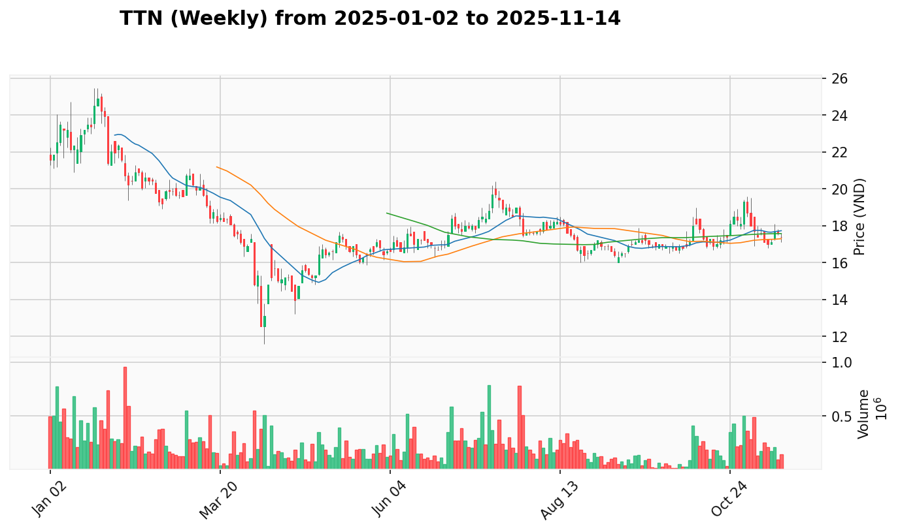

<a href="#cong-nghe">↑ Back to group CONG_NGHE</a>  |  <a href="#vpa-signal-summary">↑ Back to Top</a>

#### Key Statistics
| Metric | Value |
|:---|---:|
| Date Range | 2025-01-02 to 2025-11-14 |
| **Latest Close** | **17.4** |
| Period Open | 21.85 |
| Period High | 25.46 |
| Period Low | 11.59 |
| Period Change % | -20.37% |

**[Download TTN Data (.csv)](market_data_week/TTN_2025-01-02_to_2025-11-14.csv)**

---

### TV2

#### [VPA Analysis (2025-06-02 - 2025-08-03)](./VPA_week.md#tv2)
> - **Ngày 2025-07-07:** Sau tín hiệu No Supply của tuần trước, TV2 có một tuần đi ngang với một nến tăng biên độ hẹp. Khối lượng giao dịch giảm.
>     - **Phân tích VPA/Wyckoff:** Đây là một phiên **No Supply**. Việc giá giữ vững trên nền khối lượng thấp là một tín hiệu No Supply, cho thấy thị trường đang hấp thụ và có thể sớm tăng trở lại.
> - **Ngày 2025-07-14:** TV2 tiếp tục đi ngang với một tuần tăng giá nhẹ, từ 38.2 lên 38.45 (+0.3%). Nến tăng với biên độ hẹp, đỉnh tuần tại 39.5, đóng cửa gần mức cao nhất. Khối lượng giao dịch tăng nhẹ lên 3.631.212 so với tuần trước (3.526.717).
>     - **Phân tích VPA/Wyckoff:** Đây là một **Test for Supply** thành công. Việc giá tăng nhẹ (+0.3%) trên nền khối lượng tăng nhẹ (+3%) cho thấy áp lực bán rất yếu. Điều này tiếp tục khẳng định tín hiệu No Supply từ các tuần trước, thể hiện sự tích lũy và tiềm năng tăng giá trong tương lai.
> - **Ngày 2025-07-21:** Sau Test for Supply thành công của tuần trước, TV2 có một tuần bùng nổ với nến tăng mạnh từ 38.4 lên 40.8 (+6.3%). Biên độ giao dịch 37.45-41.0, đóng cửa gần mức cao nhất. Khối lượng giao dịch tăng vọt lên 5.827.675.
>     - **Phân tích VPA/Wyckoff:** Đây là một **Sign of Strength** mạnh mẽ. Việc giá tăng mạnh (+6.3%) kèm theo khối lượng bùng nổ (+60%) sau giai đoạn tích lũy dài cho thấy dòng tiền lớn đang tham gia. Đây là sự đáp ứng mạnh mẽ sau các tín hiệu No Supply liên tiếp, xác nhận một giai đoạn tăng giá mới.
> **Ngày 2025-07-27:** TV2 tiếp tục xu hướng tăng mạnh với nến tăng 6.25% từ 38.4 lên 40.8. Biên độ giao dịch 37.45-41.0, đóng cửa gần mức cao nhất tuần (40.8 vs đỉnh 41.0). Khối lượng giao dịch duy trì ở mức cao 5.828.600, tương đương tuần trước nhưng vẫn cao hơn 60% so với mức trung bình. Giá đã vượt qua vùng kháng cự 40.0-40.5 và thiết lập đỉnh mới tại 41.0.
> 
> **Phân tích VPA/Wyckoff:** Đây là một **Sign of Strength** tiếp diễn. Việc giá tiếp tục tăng mạnh (+6.25%) trên nền khối lượng cao cho thấy dòng tiền mạnh vẫn đang tham gia tích cực. Sự duy trì khối lượng cao trong 2 tuần liên tiếp cùng với việc vượt qua vùng kháng cự quan trọng xác nhận xu hướng tăng đang được củng cố. Đây là sự tiếp nối mạnh mẽ của Sign of Strength tuần trước, cho thấy giai đoạn markup đang diễn ra với sự tham gia của các tay to.
> **Ngày 2025-08-03:** TV2 có tuần điều chỉnh mạnh sau giai đoạn tăng giá bùng nổ, giảm từ 41.4 xuống 39.1 (-5.6%). Biên độ giao dịch rộng 38.8-42.4, mở cửa gần mức cao nhất tuần trước (41.4) nhưng test lên 42.4 rồi bị đẩy xuống mạnh, đóng cửa ở vùng thấp (39.1). Khối lượng giao dịch tăng vọt lên 7.170.500, cao nhất trong 31 tuần qua và tăng 23% so với tuần trước. Giá đã thủng qua vùng hỗ trợ 40.0-40.5 và test xuống sát mức 38.8.

<a href="#xay-lap-dien">↑ Back to group XAY_LAP_DIEN</a>  |  <a href="#vpa-signal-summary">↑ Back to Top</a>

#### Key Statistics
| Metric | Value |
|:---|---:|
| Date Range | 2025-01-02 to 2025-11-14 |
| **Latest Close** | **36.0** |
| Period Open | 33.4 |
| Period High | 43.7 |
| Period Low | 27.3 |
| Period Change % | 7.78% |

**[Download TV2 Data (.csv)](market_data_week/TV2_2025-01-02_to_2025-11-14.csv)**

---

### TVB

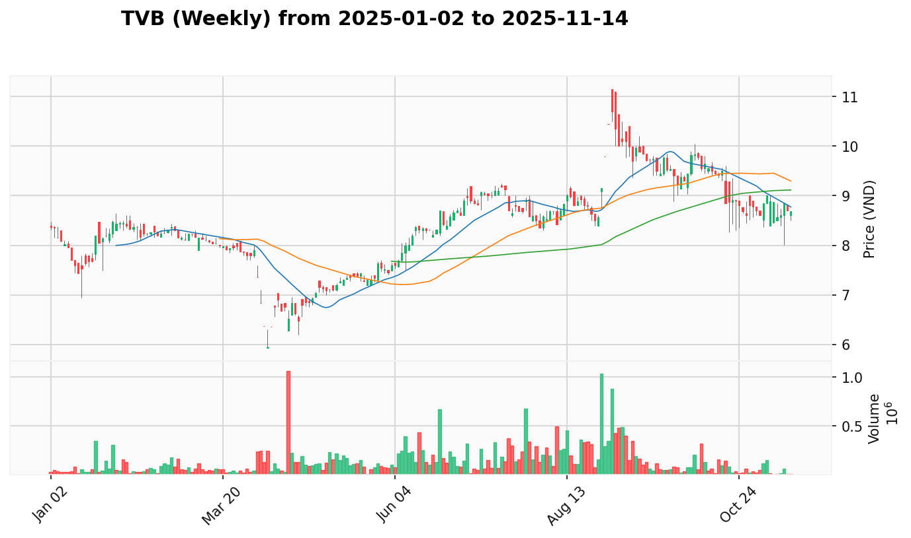

<a href="#chung-khoan">↑ Back to group CHUNG_KHOAN</a>  |  <a href="#vpa-signal-summary">↑ Back to Top</a>

#### Key Statistics
| Metric | Value |
|:---|---:|
| Date Range | 2025-01-02 to 2025-11-14 |
| **Latest Close** | **8.68** |
| Period Open | 8.4 |
| Period High | 11.15 |
| Period Low | 5.93 |
| Period Change % | 3.33% |

**[Download TVB Data (.csv)](market_data_week/TVB_2025-01-02_to_2025-11-14.csv)**

---

### TVN

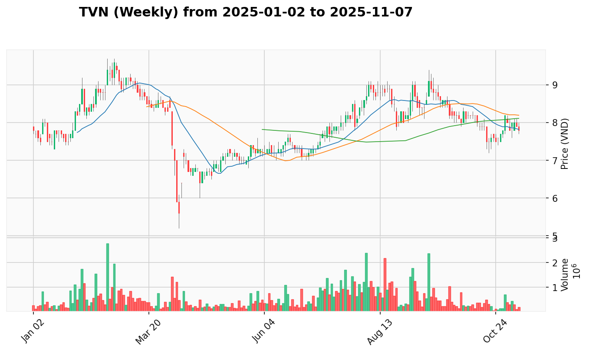

<a href="#thep">↑ Back to group THEP</a>  |  <a href="#vpa-signal-summary">↑ Back to Top</a>

#### Key Statistics
| Metric | Value |
|:---|---:|
| Date Range | 2025-01-02 to 2025-11-14 |
| **Latest Close** | **7.8** |
| Period Open | 7.9 |
| Period High | 9.7 |
| Period Low | 5.2 |
| Period Change % | -1.27% |

**[Download TVN Data (.csv)](market_data_week/TVN_2025-01-02_to_2025-11-14.csv)**

---

### TVS

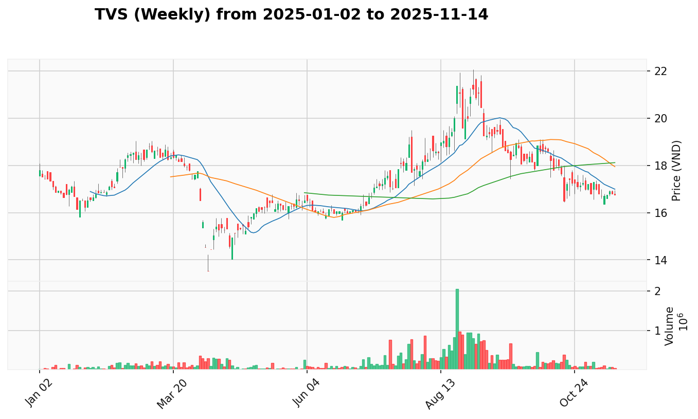

<a href="#chung-khoan">↑ Back to group CHUNG_KHOAN</a>  |  <a href="#vpa-signal-summary">↑ Back to Top</a>

#### Key Statistics
| Metric | Value |
|:---|---:|
| Date Range | 2025-01-02 to 2025-11-14 |
| **Latest Close** | **16.75** |
| Period Open | 17.56 |
| Period High | 22.06 |
| Period Low | 13.53 |
| Period Change % | -4.61% |

**[Download TVS Data (.csv)](market_data_week/TVS_2025-01-02_to_2025-11-14.csv)**

---

### VC2

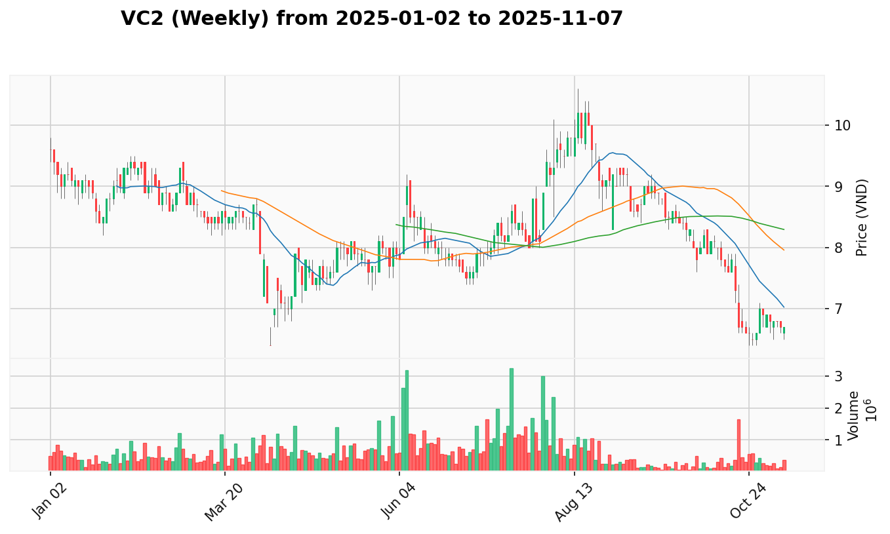

<a href="#xay-dung">↑ Back to group XAY_DUNG</a>  |  <a href="#vpa-signal-summary">↑ Back to Top</a>

#### Key Statistics
| Metric | Value |
|:---|---:|
| Date Range | 2025-01-02 to 2025-11-14 |
| **Latest Close** | **6.9** |
| Period Open | 9.6 |
| Period High | 10.6 |
| Period Low | 6.4 |
| Period Change % | -28.12% |

**[Download VC2 Data (.csv)](market_data_week/VC2_2025-01-02_to_2025-11-14.csv)**

---

### VC7

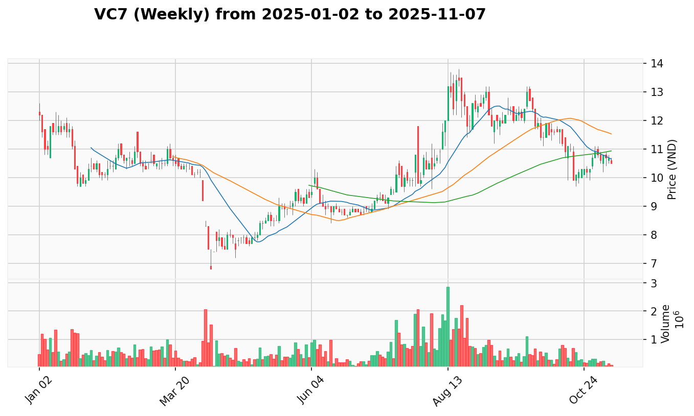

<a href="#penny">↑ Back to group PENNY</a>  |  <a href="#vpa-signal-summary">↑ Back to Top</a>

#### Key Statistics
| Metric | Value |
|:---|---:|
| Date Range | 2025-01-02 to 2025-11-14 |
| **Latest Close** | **10.7** |
| Period Open | 12.3 |
| Period High | 13.8 |
| Period Low | 6.8 |
| Period Change % | -13.01% |

**[Download VC7 Data (.csv)](market_data_week/VC7_2025-01-02_to_2025-11-14.csv)**

---

### VCB

#### [VPA Analysis (2025-06-02 - 2025-08-03)](./VPA_week.md#vcb)
> - **Ngày 2025-07-07:** Sau tín hiệu No Demand của tuần trước, VCB có một tuần tăng giá bùng nổ với một nến tăng thân dài, đóng cửa (62.7) ở mức cao nhất tuần. Khối lượng giao dịch tăng vọt.
>     - **Phân tích VPA/Wyckoff:** Đây là một **Sign of Strength**, cho thấy lực cầu đã quay trở lại một cách áp đảo, phủ nhận hoàn toàn tín hiệu yếu của tuần trước.
> - **Ngày 2025-07-14:** VCB có một tuần điều chỉnh sau đà tăng mạnh, từ 62.9 xuống 61.9 (-1.6%). Nến giảm với thân dài, đỉnh tuần tại 62.9, đóng cửa gần mức thấp nhất. Khối lượng giao dịch giảm xuống 37.269.171 so với tuần trước (55.830.364).
>     - **Phân tích VPA/Wyckoff:** Đây là một **No Supply** sau tín hiệu sức mạnh. Việc giá điều chỉnh (-1.6%) trên nền khối lượng giảm mạnh (-33%) cho thấy áp lực bán không lớn. Đây là sự điều chỉnh tự nhiên sau Sign of Strength tuần trước, thể hiện sự hấp thụ tốt và khả năng tiếp tục xu hướng tăng.
> - **Ngày 2025-07-21:** Sau tín hiệu No Supply của tuần trước, VCB có một tuần phục hồi nhẹ với nến tăng từ 62.2 lên 62.0 (-0.3% so với open, nhưng đóng cửa ổn định). Biên độ giao dịch 60.9-63.5, đóng cửa giữa khoảng. Khối lượng giao dịch giảm xuống 29.850.803.
>     - **Phân tích VPA/Wyckoff:** Đây là một **Test for Supply** thành công. Việc giá giữ ổn định trên nền khối lượng giảm tiếp (-20%) cho thấy áp lực bán rất yếu. Điều này tiếp tục khẳng định tín hiệu No Supply, cho thấy thị trường đang trong giai đoạn hấp thụ và chuẩn bị cho đợt tăng tiếp theo.
> **Ngày 2025-07-27:** Sau tín hiệu Test for Supply thành công của tuần trước, VCB có một tuần giao dịch với biên độ rộng 60.9-63.5, mở cửa tại 62.2 và đóng cửa tại 62.0 (+0.1% so với tuần trước). Nến có thân nhỏ với bóng trên và bóng dưới dài, cho thấy sự giằng co trong phiên. Khối lượng giao dịch tăng nhẹ lên 29.816.700 (+0.1% so với tuần trước 29.850.803).
> 
> **Phân tích VPA/Wyckoff:** Đây là một **Test for Supply** tiếp tục. Việc giá test lên vùng 63.5 (gần đỉnh cũ) nhưng đóng cửa ở mức thấp hơn trên nền khối lượng không tăng đáng kể cho thấy vẫn còn một chút áp lực bán ở vùng cao. Tuy nhiên, việc giá không giảm sâu và duy trì trên mức 60.9 cho thấy nền tảng hỗ trợ vẫn mạnh. Thị trường đang trong giai đoạn kiểm tra cuối cùng trước khi có thể bứt phá hoặc cần thêm thời gian tích lũy.
> **Ngày 2025-08-03:** Sau hai tuần Test for Supply liên tiếp, VCB có một tuần điều chỉnh mạnh từ 62.2 xuống 60.2 (-3.2%). Nến giảm với thân dài, biên độ giao dịch rộng 59.7-63.2, test lên gần đỉnh cũ 63.2 nhưng bị đẩy xuống mạnh và đóng cửa gần mức thấp nhất tuần. Khối lượng giao dịch tăng vọt lên 39.169.800 (+31% so với tuần trước).

<a href="#ngan-hang">↑ Back to group NGAN_HANG</a>  |  <a href="#vpa-signal-summary">↑ Back to Top</a>

#### Key Statistics
| Metric | Value |
|:---|---:|
| Date Range | 2025-01-02 to 2025-11-14 |
| **Latest Close** | **60.0** |
| Period Open | 60.83 |
| Period High | 70.09 |
| Period Low | 51.63 |
| Period Change % | -1.36% |

**[Download VCB Data (.csv)](market_data_week/VCB_2025-01-02_to_2025-11-14.csv)**

---

### VCG

#### [VPA Analysis (2025-06-02 - 2025-08-03)](./VPA_week.md#vcg)
> - **Ngày 2025-07-07:** Tiếp nối Dấu hiệu Sức mạnh của tuần trước, VCG có một tuần điều chỉnh với một nến giảm. Khối lượng giao dịch giảm.
>     - **Phân tích VPA/Wyckoff:** Đây là một phiên **No Supply**. Việc giá điều chỉnh với khối lượng thấp sau một đợt tăng mạnh là một tín hiệu rất No Supply, cho thấy áp lực chốt lời yếu và thị trường đang hấp thụ tốt.
> - **Ngày 2025-07-14:** VCG phục hồi mạnh mẽ với một tuần tăng giá tốt, từ 23.0 lên 23.35 (+2.4%). Nến tăng với thân dài, đỉnh tuần tại 24.0, đóng cửa gần mức cao nhất. Khối lượng giao dịch tăng lên 69.543.922 so với tuần trước (54.243.639).
>     - **Phân tích VPA/Wyckoff:** Đây là một **Sign of Strength** tiếp theo. Việc giá tăng mạnh (+2.4%) kèm theo khối lượng tăng (+28%) cho thấy dòng tiền mua tiếp tục mạnh mẽ. Điều này khẳng định xu hướng tăng từ tín hiệu No Supply tuần trước, thể hiện sự tiếp tục của đà tăng giá.
> - **Ngày 2025-07-21:** Tiếp nối tín hiệu Sign of Strength của tuần trước, VCG có một tuần bùng nổ mạnh mẽ với nến tăng từ 23.55 lên 25.7 (+10.0%). Biên độ giao dịch 23.05-25.7, đóng cửa đỉnh tuần. Khối lượng giao dịch tăng vọt lên 87.906.084.
>     - **Phân tích VPA/Wyckoff:** Đây là một **Climactic Action**. Việc giá tăng vọt (+10.0%) kèm theo khối lượng bùng nổ (+26%) sau hai tuần Sign of Strength liên tiếp cho thấy đây là một đợt climax mạnh mẽ. Mặc dù vẫn là dấu hiệu sức mạnh, nhưng sự tăng tốc quá nhanh này đã tạo ra rủi ro điều chỉnh cao trong các tuần tới.
> **Ngày 2025-07-27:** VCG có một tuần tăng giá mạnh mẽ với nến tăng từ 23.55 lên 25.7 (+9.1%). Biên độ giao dịch 23.05-25.7, đóng cửa đỉnh tuần. Khối lượng giao dịch tăng lên 87.876.900 (+26.3% so với tuần trước). Đây là tuần thứ ba liên tiếp có tín hiệu tích cực, với giá đã tăng từ 22.8 lên 25.7 trong ba tuần qua (+12.7%).
> 
> - **Phân tích VPA/Wyckoff:** Đây là một **Climactic Action** tiếp theo sau tuần trước. Việc giá tiếp tục tăng mạnh (+9.1%) kèm theo khối lượng cao cho thấy momentum vẫn rất mạnh. Tuy nhiên, với việc đã có hai tuần Climactic Action liên tiếp và giá đã tăng hơn 12% trong ba tuần, rủi ro điều chỉnh kỹ thuật đang gia tăng. Mặc dù xu hướng vẫn tích cực, nhà đầu tư cần theo dõi sát sao các tín hiệu suy yếu trong những tuần tới.
> **Ngày 2025-08-03:** VCG có một tuần điều chỉnh sau hai tuần Climactic Action liên tiếp, giá giảm từ 25.7 xuống 26.4 (+2.7% so với tuần trước nhưng thực chất là một sự điều chỉnh sau khi test đỉnh 27.45). Biên độ giao dịch rộng 24.5-27.45, mở cửa tại 26.3 và đóng cửa 26.4, cho thấy sự dao động mạnh trong tuần. Khối lượng giao dịch tiếp tục tăng lên 106.267.300 (+20.9% so với tuần trước), đạt mức cao nhất trong nhiều tuần qua.

<a href="#dau-tu-cong">↑ Back to group DAU_TU_CONG</a>  |  <a href="#vpa-signal-summary">↑ Back to Top</a>

#### Key Statistics
| Metric | Value |
|:---|---:|
| Date Range | 2025-01-02 to 2025-11-14 |
| **Latest Close** | **24.1** |
| Period Open | 16.26 |
| Period High | 29.1 |
| Period Low | 15.91 |
| Period Change % | 48.22% |

**[Download VCG Data (.csv)](market_data_week/VCG_2025-01-02_to_2025-11-14.csv)**

---

### VCI

#### [VPA Analysis (2025-06-02 - 2025-08-03)](./VPA_week.md#vci)
> - **Ngày 2025-07-07:** Sau tín hiệu yếu kém của tuần trước, VCI có một tuần tăng giá bùng nổ với một nến tăng thân dài, đóng cửa (41.05) ở mức cao nhất tuần. Khối lượng giao dịch tăng vọt.
>     - **Phân tích VPA/Wyckoff:** Đây là một **Sign of Strength**, cho thấy lực cầu đã quay trở lại một cách áp đảo, phủ nhận hoàn toàn tín hiệu yếu của tuần trước.
> - **Ngày 2025-07-14:** VCI tiếp tục xu hướng tăng mạnh với một tuần tăng giá tốt, từ 42.2 lên 41.7 (+1.6%). Nến tăng với thân dài, đỉnh tuần tại 43.6, đóng cửa gần mức cao nhất. Khối lượng giao dịch tăng lên 88.191.867 so với tuần trước (83.601.783).
>     - **Phân tích VPA/Wyckoff:** Đây là một **Sign of Strength** tiếp theo. Việc giá tiếp tục tăng (+1.6%) kèm theo khối lượng tăng (+5%) cho thấy dòng tiền mua duy trì mạnh mẽ. Điều này khẳng định xu hướng tăng từ Sign of Strength tuần trước, thể hiện sự tiếp tục của đà tăng giá mạnh mẽ.
> - **Ngày 2025-07-21:** Tiếp nối tín hiệu Sign of Strength của tuần trước, VCI có một tuần tăng giá mạnh với nến tăng từ 41.7 lên 43.05 (+3.2%). Biên độ giao dịch 40.0-43.2, đóng cửa gần mức cao. Khối lượng giao dịch tăng nhẹ lên 90.133.796.
>     - **Phân tích VPA/Wyckoff:** Đây là một **Sign of Strength** tiếp tục. Việc giá tăng mạnh (+3.2%) kèm theo khối lượng tăng nhẹ (+2%) cho thấy đà tăng vẫn được duy trì mạnh mẽ. Sự kết hợp này khẳng định xu hướng tăng đang được củng cố, với dòng tiền mua duy trì ổn định sau hai tuần Sign of Strength liên tiếp.
> **Ngày 2025-07-27:** VCI có một tuần tăng giá tích cực từ 41.7 lên 43.05 (+3.2%). Nến tăng với thân dài, biên độ giao dịch 40.0-43.2, đóng cửa gần mức cao nhất tuần tại 43.05. Khối lượng giao dịch tăng nhẹ lên 90.105.800 so với tuần trước (88.158.100). Đây là tuần tăng thứ 3 liên tiếp kể từ sau tín hiệu Sign of Strength đầu tiên vào tuần 07-07.
> 
> **Phân tích VPA/Wyckoff:** Đây là một **Sign of Strength** tiếp tục và mạnh mẽ. Việc giá tăng +3.2% kèm theo khối lượng tăng +2.2% cho thấy đà tăng vẫn được duy trì với sự hỗ trợ của dòng tiền mua ổn định. Cổ phiếu đã có 3 tuần Sign of Strength liên tiếp, khẳng định xu hướng tăng mạnh mẽ và bền vững. Việc đóng cửa gần mức cao nhất tuần (43.05 vs đỉnh 43.2) thể hiện sức mạnh của phe mua, cho thấy xu hướng tăng có thể tiếp tục trong các tuần tới.
> **Ngày 2025-08-03:** VCI tiếp tục đà tăng mạnh với một tuần bùng nổ từ 44.3 lên 44.45 (+3.25%). Nến tăng với biên độ giao dịch rất rộng 40.9-46.05, test xuống thấp 40.9 trong tuần nhưng phục hồi mạnh và đóng cửa tại 44.45. Khối lượng giao dịch tăng vọt lên 109.714.600, tăng 21.7% so với tuần trước (90.105.800). Đây là tuần tăng thứ 4 liên tiếp với khối lượng cao nhất trong chuỗi tăng, cho thấy dòng tiền đang đổ mạnh vào cổ phiếu.

<a href="#chung-khoan">↑ Back to group CHUNG_KHOAN</a>  |  <a href="#vpa-signal-summary">↑ Back to Top</a>

#### Key Statistics
| Metric | Value |
|:---|---:|
| Date Range | 2025-01-02 to 2025-11-14 |
| **Latest Close** | **35.75** |
| Period Open | 33.01 |
| Period High | 49.45 |
| Period Low | 30.73 |
| Period Change % | 8.30% |

**[Download VCI Data (.csv)](market_data_week/VCI_2025-01-02_to_2025-11-14.csv)**

---

### VCS

#### [VPA Analysis (2025-06-02 - 2025-08-03)](./VPA_week.md#vcs)
> - **Ngày 2025-07-07:** Tiếp nối tín hiệu No Supply của tuần trước, VCS có một tuần tăng giá tốt, tạo thành một nến tăng và đóng cửa (49.8) cao hơn. Khối lượng giao dịch tăng.
>     - **Phân tích VPA/Wyckoff:** Đây là một **Sign of Strength**, cho thấy lực cầu đang chiếm ưu thế và xu hướng tăng được củng cố.
> - **Ngày 2025-07-14:** VCS tiếp tục xu hướng tăng với một tuần tăng giá tốt, từ 49.8 lên 50.0 (+0.4%). Nến tăng với thân dài, đỉnh tuần tại 54.5, đóng cửa gần mức cao nhất. Khối lượng giao dịch tăng nhẹ lên 1.052.197 so với tuần trước (1.033.983).
>     - **Phân tích VPA/Wyckoff:** Đây là một **No Supply** sau tín hiệu sức mạnh. Việc giá tăng (+0.4%) trên nền khối lượng tăng nhẹ (+2%) cho thấy áp lực bán rất yếu. Điều này khẳng định xu hướng tăng từ Sign of Strength tuần trước, thể hiện sức mạnh nội tại của cổ phiếu.
> - **Ngày 2025-07-21:** Tiếp nối tín hiệu No Supply của tuần trước, VCS có một tuần tăng giá nhẹ với nến tăng từ 50.7 lên 50.4 (-0.6% so với open, nhưng tăng so với tuần trước). Biên độ giao dịch 49.2-53.0, đóng cửa giữa khoảng. Khối lượng giao dịch tăng lên 1.227.364.
>     - **Phân tích VPA/Wyckoff:** Đây là một **Test for Supply** thành công. Việc giá giữ ổn định trên nền khối lượng tăng (+17%) cho thấy áp lực bán vẫn yếu. Điều này tiếp tục khẳng định tín hiệu No Supply, thể hiện sự tích lũy tốt và tiềm năng tiếp tục xu hướng tăng sau giai đoạn consolidation.
> **Ngày 2025-07-27:** VCS có một tuần tăng giá nhẹ từ 50.0 lên 50.4 (+0.8%), tạo nến tăng với thân nhỏ. Biên độ giao dịch 49.2-53.0, đóng cửa ở mức trung bình. Khối lượng giao dịch tăng lên 1.226.200 (+16.6% so với tuần trước). Giá test được vùng kháng cự 53.0 nhưng không thể duy trì, cho thấy áp lực bán nhẹ tại vùng này.
> 
> **Phân tích VPA/Wyckoff:** Đây là một **No Supply** tiếp theo trong chuỗi tín hiệu tích cực. Việc giá tăng nhẹ (+0.8%) trên nền khối lượng tăng mạnh (+16.6%) cho thấy lực cầu vẫn hiện diện và áp lực bán yếu. Mặc dù có test kháng cự tại 53.0 không thành công, nhưng việc giá không giảm sâu và duy trì trên 50.0 thể hiện sự tích lũy tốt. Tín hiệu này tiếp nối chuỗi No Supply và Test for Supply thành công của các tuần trước, củng cố xu hướng tăng trung hạn của VCS.
> **Ngày 2025-08-03:** VCS có một tuần giảm giá từ 50.4 xuống 49.2 (-2.4%), tạo nến giảm với thân dài. Biên độ giao dịch rộng 48.5-51.8, mở cửa tại 50.5 nhưng test cao 51.8 rồi bị đẩy xuống, đóng cửa gần mức thấp nhất tuần. Khối lượng giao dịch tăng mạnh lên 1.491.000 (+21.6% so với tuần trước). Việc giá test lại vùng kháng cự 51.8 (gần 53.0) nhưng không thể duy trì và bị bán mạnh về 49.2 cho thấy áp lực supply đã xuất hiện.

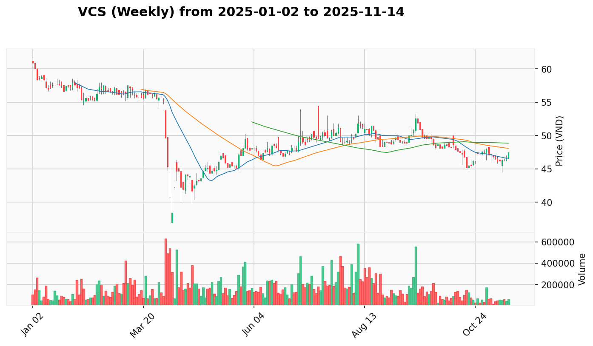

<a href="#others">↑ Back to group OTHERS</a>  |  <a href="#vpa-signal-summary">↑ Back to Top</a>

#### Key Statistics
| Metric | Value |
|:---|---:|
| Date Range | 2025-01-02 to 2025-11-14 |
| **Latest Close** | **47.5** |
| Period Open | 61.16 |
| Period High | 61.74 |
| Period Low | 36.78 |
| Period Change % | -22.33% |

**[Download VCS Data (.csv)](market_data_week/VCS_2025-01-02_to_2025-11-14.csv)**

---

### VDS

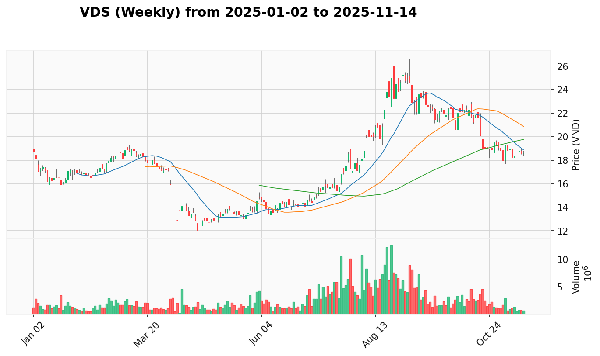

<a href="#chung-khoan">↑ Back to group CHUNG_KHOAN</a>  |  <a href="#vpa-signal-summary">↑ Back to Top</a>

#### Key Statistics
| Metric | Value |
|:---|---:|
| Date Range | 2025-01-02 to 2025-11-14 |
| **Latest Close** | **18.6** |
| Period Open | 19.0 |
| Period High | 26.6 |
| Period Low | 12.05 |
| Period Change % | -2.11% |

**[Download VDS Data (.csv)](market_data_week/VDS_2025-01-02_to_2025-11-14.csv)**

---

### VEA

#### [VPA Analysis (2025-06-02 - 2025-08-03)](./VPA_week.md#vea)
> - **Ngày 2025-07-07:** Sau phiên kiểm tra cung của tuần trước, VEA có một tuần tăng giá nhẹ với biên độ hẹp. Khối lượng giao dịch tăng.
>     - **Phân tích VPA/Wyckoff:** Đây là một **Effort to Rise**. Việc giá tiếp tục tăng cho thấy lực cầu vẫn đang kiểm soát, tuy nhiên biên độ hẹp cho thấy đà tăng đang chững lại.
> - **Ngày 2025-07-14:** VEA có một tuần giảm giá mạnh, từ 39.5 xuống 38.0 (-4.0%). Nến giảm với thân dài, đỉnh tuần tại 39.5, đóng cửa gần mức thấp nhất. Khối lượng giao dịch tăng mạnh lên 8.350.696 so với tuần trước (2.960.043).
>     - **Phân tích VPA/Wyckoff:** Đây là một **Sign of Weakness** rõ ràng. Việc giá giảm mạnh (-4.0%) kèm theo khối lượng tăng vọt (+182%) cho thấy áp lực bán lớn đã xuất hiện. Điều này phủ nhận Effort to Rise tuần trước, báo hiệu rủi ro điều chỉnh sâu hơn trong ngắn hạn.
> - **Ngày 2025-07-21:** Sau tín hiệu Sign of Weakness của tuần trước, VEA có một tuần ổn định với nến tăng nhẹ từ 38.0 lên 38.1 (+0.3%). Biên độ giao dịch 37.9-38.3, đóng cửa giữa khoảng. Khối lượng giao dịch giảm mạnh xuống 3.963.928.
>     - **Phân tích VPA/Wyckoff:** Đây là một **Test for Supply** thành công. Việc giá ổn định trên nền khối lượng giảm mạnh (-53%) cho thấy áp lực bán đã giảm bớt đáng kể. Điều này là tín hiệu tích cực sau Sign of Weakness tuần trước, cho thấy khả năng đã tìm được sàn tạm thời.
> **Ngày 2025-07-27:** VEA tiếp tục có một tuần tăng nhẹ từ 38.0 lên 38.1 (+0.3%), giao dịch trong biên độ hẹp 37.9-38.3. Khối lượng giao dịch duy trì ở mức thấp 3.960.800, tương đương tuần trước. Giá đóng cửa gần giữa khoảng giao dịch, cho thấy sự cân bằng giữa cung cầu.
> 
> **Phân tích VPA/Wyckoff:** Đây là một **No Supply** tiếp theo sau Test for Supply thành công tuần trước. Việc giá tiếp tục ổn định trên nền khối lượng thấp và ít biến động cho thấy áp lực bán đã được hấp thụ hoàn toàn. Tín hiệu này củng cố thêm khả năng VEA đã tìm được vùng hỗ trợ quanh 38.0-38.1, tạo nền tảng cho một đợt phục hồi tiềm năng trong những tuần tới.
> **Ngày 2025-08-03:** VEA tiếp tục có một tuần tăng từ 38.1 lên 38.5 (+1.0%), giao dịch trong biên độ hẹp 38.0-38.7. Khối lượng giao dịch giảm nhẹ xuống 3.454.400 từ 3.960.800 tuần trước (-13%). Giá đóng cửa gần đỉnh tuần, cho thấy lực cầu nhẹ nhưng ổn định. Động thái này diễn ra sau chuỗi No Supply và Test for Supply thành công trong 2 tuần qua.

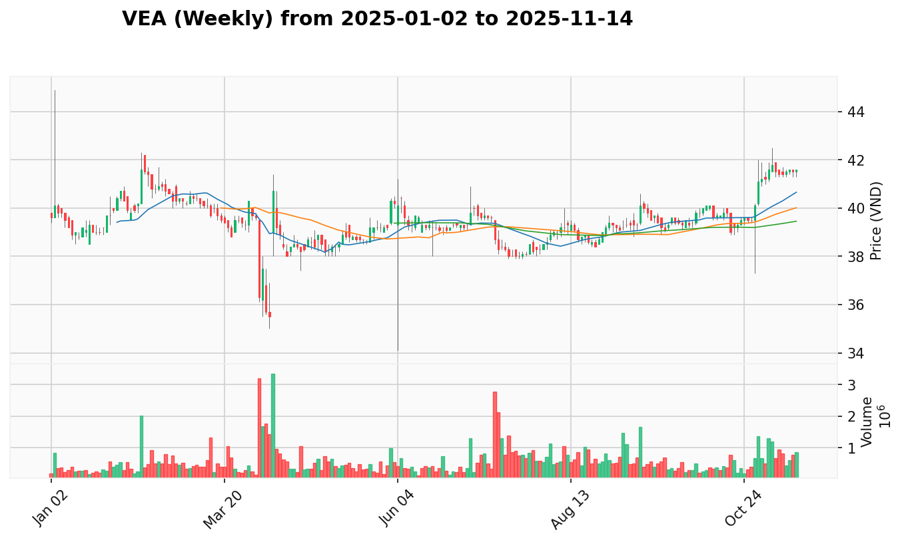

<a href="#others">↑ Back to group OTHERS</a>  |  <a href="#vpa-signal-summary">↑ Back to Top</a>

#### Key Statistics
| Metric | Value |
|:---|---:|
| Date Range | 2025-01-02 to 2025-11-14 |
| **Latest Close** | **41.6** |
| Period Open | 39.8 |
| Period High | 44.9 |
| Period Low | 34.1 |
| Period Change % | 4.52% |

**[Download VEA Data (.csv)](market_data_week/VEA_2025-01-02_to_2025-11-14.csv)**

---

### VGC

#### [VPA Analysis (2025-06-02 - 2025-08-03)](./VPA_week.md#vgc)
> - **Ngày 2025-07-07:** Tiếp nối Dấu hiệu Sức mạnh của tuần trước, VGC có một tuần tăng giá tốt, tạo thành một nến tăng và đóng cửa (45.55) cao hơn. Khối lượng giao dịch giảm.
>     - **Phân tích VPA/Wyckoff:** Việc giá có thể tăng trên nền khối lượng thấp là một tín hiệu **No Supply**. Điều này cho thấy áp lực bán yếu, là một tín hiệu No Supply cho xu hướng tăng.
> - **Ngày 2025-07-14:** VGC tiếp tục phục hồi với một tuần tăng giá tốt, từ 46.4 lên 47.2 (+3.6%). Nến tăng với thân dài, đỉnh tuần tại 48.75, đóng cửa gần mức cao nhất. Khối lượng giao dịch tăng lên 7.140.349 so với tuần trước (5.364.700).
>     - **Phân tích VPA/Wyckoff:** Đây là một **Sign of Strength** tiếp theo. Việc giá tăng mạnh (+3.6%) kèm theo khối lượng tăng (+33%) cho thấy dòng tiền mua đang mạnh mẽ trở lại. Điều này khẳng định xu hướng tăng từ tín hiệu No Supply tuần trước, thể hiện sự tiếp tục của đà phục hồi.
> - **Ngày 2025-07-21:** VGC bùng nổ mạnh mẽ với nến tăng có biên độ rất rộng, mở cửa tại 47.95 và đóng cửa tại 52.4. Giá đạt đỉnh tuần tại 52.4, tăng vọt 11.0% so với tuần trước. Khối lượng giao dịch tăng 23% lên 8.8 triệu cổ phiếu.
>     - **Phân tích VPA/Wyckoff:** Đây là tín hiệu **Sign of Strength** cực mạnh, hoàn thành chuỗi tín hiệu tích cực từ No Supply đến Sign of Strength liên tiếp. Việc bùng nổ giá với khối lượng khổng lồ cho thấy VGC đang trong giai đoạn breakout mạnh mẽ, với sự tham gia tích cực của Smart Money. Đây là cổ phiếu đáng chú ý trong giai đoạn markup.
> **Ngày 2025-07-27:** VGC tiếp tục duy trì đà tăng mạnh mẽ từ tuần trước, mở cửa tại 47.95 và đóng cửa tại mức đỉnh tuần 52.4 (+11.0%). Nến tăng có thân dài với biên độ dao động từ 45.65 đến 52.4, cho thấy volatility cao nhưng áp lực mua chiếm ưu thế tuyệt đối. Khối lượng giao dịch đạt 8.8 triệu cổ phiếu, tăng 23% so với tuần trước, xác nhận sự tham gia mạnh mẽ của dòng tiền. Việc đóng cửa đúng tại mức cao nhất tuần thể hiện lực cầu áp đảo hoàn toàn, không có áp lực chốt lời đáng kể.
> 
> **Phân tích VPA/Wyckoff:** Đây là tín hiệu **Sign of Strength** cực kỳ mạnh mẽ, tiếp nối chuỗi tín hiệu tích cực từ những tuần trước. VGC đang trong giai đoạn markup rõ ràng với sự breakout vượt ngưỡng kháng cự 50.0, được hỗ trợ bởi khối lượng khổng lồ. Việc giá tăng 11% kèm khối lượng tăng 23% cho thấy Smart Money đang tích cực tham gia, tạo nên một upthrust mạnh mẽ. Đây là cổ phiếu đáng theo dõi cho xu hướng tăng dài hạn.
> **Ngày 2025-08-03:** VGC tiếp tục xu hướng tăng mạnh mẽ với nến tăng có biên độ cực rộng, mở cửa tại 56.0 và đóng cửa tại 56.3 (+7.4% so với tuần trước). Giá test lên đỉnh tuần tại 64.0 trước khi điều chỉnh nhẹ, cho thấy áp lực chốt lời tại vùng cao nhưng vẫn duy trì được mức đóng cửa khá tốt. Khối lượng giao dịch bùng nổ lên 16.9 triệu cổ phiếu, tăng gấp đôi (+92%) so với tuần trước, xác nhận sự tham gia cực kỳ mạnh mẽ của dòng tiền. Việc mở cửa gap up từ 52.4 lên 56.0 cho thấy tâm lý thị trường rất tích cực, và mặc dù có test lên 64.0 nhưng không thể duy trì ở mức đỉnh, điều này phản ánh áp lực profit-taking tự nhiên sau chuỗi tăng mạnh.

<a href="#bat-dong-san-kcn">↑ Back to group BAT_DONG_SAN_KCN</a>  |  <a href="#vpa-signal-summary">↑ Back to Top</a>

#### Key Statistics
| Metric | Value |
|:---|---:|
| Date Range | 2025-01-02 to 2025-11-14 |
| **Latest Close** | **46.55** |
| Period Open | 42.88 |
| Period High | 65.74 |
| Period Low | 34.78 |
| Period Change % | 8.56% |

**[Download VGC Data (.csv)](market_data_week/VGC_2025-01-02_to_2025-11-14.csv)**

---

### VGI

#### [VPA Analysis (2025-06-02 - 2025-08-03)](./VPA_week.md#vgi)
> - **Ngày 2025-07-07:** Tiếp nối nỗ lực tăng giá của tuần trước, VGI có một tuần tăng giá tốt, tạo thành một nến tăng và đóng cửa (75.5) cao hơn. Khối lượng giao dịch tăng.
>     - **Phân tích VPA/Wyckoff:** Đây là một **Sign of Strength**, cho thấy lực cầu đang chiếm ưu thế và xu hướng tăng được củng cố.
> - **Ngày 2025-07-14:** VGI có một tuần điều chỉnh sau đà tăng mạnh, từ 75.5 xuống 74.7 (-1.1%). Nến giảm với biên độ rộng, đỉnh tuần tại 76.9, đóng cửa gần mức trung bình. Khối lượng giao dịch giảm xuống 3.526.021 so với tuần trước (3.731.932).
>     - **Phân tích VPA/Wyckoff:** Đây là một **No Supply** sau tín hiệu sức mạnh. Việc giá điều chỉnh (-1.1%) trên nền khối lượng giảm (-6%) cho thấy áp lực bán không lớn. Đây là sự điều chỉnh tự nhiên sau Sign of Strength tuần trước, thể hiện sự hấp thụ tốt và khả năng tiếp tục xu hướng tăng.
> - **Ngày 2025-07-21:** Sau tuần điều chỉnh No Supply, VGI phục hồi mạnh mẽ từ 74.7 lên 77.2 (+3.3%). Nến tăng thân dài với biên độ rộng từ 72.7 đến 77.5, đóng cửa gần mức cao nhất tuần. Khối lượng giao dịch tăng vọt lên 4.438.114 (+25.8%).
>     - **Phân tích VPA/Wyckoff:** Đây là một **Sign of Strength** mạnh mẽ. Việc giá tăng trở lại (+3.3%) trên nền khối lượng tăng đáng kể (+25.8%) sau giai đoạn No Supply tuần trước xác nhận rằng lực cầu đã trở lại kiểm soát. Tín hiệu này củng cố xu hướng tăng và cho thấy VGI đang trong giai đoạn tích lũy tích cực.
> **Ngày 2025-07-27:** VGI tiếp tục xu hướng tăng mạnh mẽ với tuần thứ hai liên tiếp tăng giá. Từ mức 74.7, cổ phiếu tăng lên 77.2 (+3.3%) và đóng cửa gần mức cao nhất tuần (77.5). Biên độ dao động từ 72.7 đến 77.5 cho thấy sự biến động tích cực. Khối lượng giao dịch duy trì ở mức cao 4.432.500, chỉ giảm nhẹ -0.1% so với tuần trước, thể hiện sự quan tâm liên tục của nhà đầu tư. Điều đáng chú ý là VGI đã vượt qua vùng kháng cự 76.9 của tuần trước và thiết lập đỉnh mới tại 77.5.
> 
> **Phân tích VPA/Wyckoff:** Đây là một **Sign of Strength** tiếp nối. Việc giá tiếp tục tăng (+3.3%) trên nền khối lượng cao và ổn định sau tín hiệu Sign of Strength tuần trước cho thấy momentum tăng đang được duy trì. Sự vượt qua mức kháng cự 76.9 với khối lượng mạnh xác nhận lực cầu vẫn đang kiểm soát thị trường. Xu hướng tăng được củng cố và VGI đang thể hiện sức mạnh liên tục trong giai đoạn mark-up.
> **Ngày 2025-08-03:** Sau hai tuần liên tiếp tăng mạnh, VGI gặp áp lực điều chỉnh đáng kể trong tuần này. Từ mức mở cửa 77.2, cổ phiếu đã test lên đỉnh tuần tại 79.4 (+2.8% so với mức mở) nhưng không thể duy trì và sụt giảm mạnh xuống 71.8, cuối cùng đóng cửa tại 72.8 (-5.7% so với tuần trước). Biên độ dao động cực rộng từ 71.8 đến 79.4 (7.6 điểm) thể hiện sự biến động mạnh và sự tranh chấp gay gắt giữa cung và cầu. Khối lượng giao dịch tăng vọt lên 5.316.400 (+19.9% so với tuần trước), đạt mức cao nhất trong 8 tuần qua, cho thấy áp lực bán đã gia tăng đáng kể sau giai đoạn tăng giá liên tục.

<a href="#cong-nghe">↑ Back to group CONG_NGHE</a>  |  <a href="#vpa-signal-summary">↑ Back to Top</a>

#### Key Statistics
| Metric | Value |
|:---|---:|
| Date Range | 2025-01-02 to 2025-11-14 |
| **Latest Close** | **81.6** |
| Period Open | 90.79 |
| Period High | 93.56 |
| Period Low | 51.29 |
| Period Change % | -10.12% |

**[Download VGI Data (.csv)](market_data_week/VGI_2025-01-02_to_2025-11-14.csv)**

---

### VGS

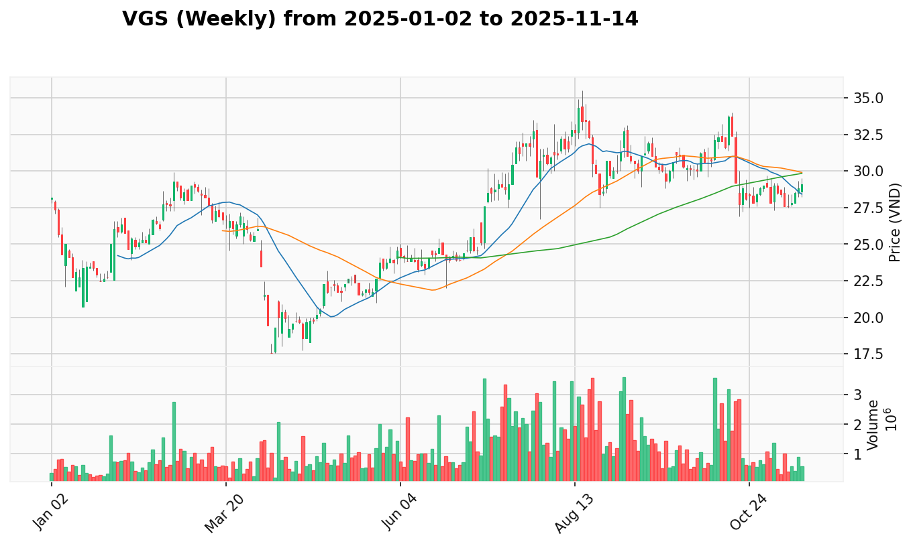

<a href="#thep">↑ Back to group THEP</a>  |  <a href="#vpa-signal-summary">↑ Back to Top</a>

#### Key Statistics
| Metric | Value |
|:---|---:|
| Date Range | 2025-01-02 to 2025-11-14 |
| **Latest Close** | **29.1** |
| Period Open | 28.09 |
| Period High | 35.5 |
| Period Low | 17.55 |
| Period Change % | 3.60% |

**[Download VGS Data (.csv)](market_data_week/VGS_2025-01-02_to_2025-11-14.csv)**

---

### VGT

#### [VPA Analysis (2025-06-02 - 2025-08-03)](./VPA_week.md#vgt)
> - **Ngày 2025-07-07:** Sau tuần bùng nổ trước đó, VGT có một tuần điều chỉnh với một nến giảm, đóng cửa (12.1) thấp hơn. Khối lượng giao dịch giảm mạnh.
>     - **Phân tích VPA/Wyckoff:** Đây là một phiên **No Supply**. Việc giá điều chỉnh với khối lượng thấp sau một đợt tăng mạnh là một tín hiệu rất No Supply, cho thấy áp lực chốt lời yếu và thị trường đang hấp thụ tốt.
> - **Ngày 2025-07-14:** VGT tiếp tục phục hồi với một tuần tăng giá nhẹ, từ 12.1 lên 12.2 (+0.8%). Nến tăng với biên độ hẹp, đỉnh tuần tại 12.4, đóng cửa gần mức cao nhất. Khối lượng giao dịch giảm xuống 6.141.676 so với tuần trước (8.281.875).
>     - **Phân tích VPA/Wyckoff:** Đây là một **No Supply** tiếp theo. Việc giá tăng nhẹ (+0.8%) trên nền khối lượng giảm (-26%) cho thấy áp lực bán rất yếu. Điều này tiếp tục khẳng định xu hướng tăng từ tín hiệu No Supply tuần trước, thể hiện sự tích lũy và khả năng tiếp tục phục hồi.
> - **Ngày 2025-07-21:** Sau hai tuần No Supply liên tiếp, VGT bùng nổ mạnh mẽ từ 12.2 lên 12.7 (+4.1%). Nến tăng thân dài với biên độ rộng từ 12.2 đến 12.8, đóng cửa gần mức cao nhất tuần. Khối lượng giao dịch tăng vọt lên 9.375.678 (+52.6%).
>     - **Phân tích VPA/Wyckoff:** Đây là một **Sign of Strength** đáng kể. Việc giá tăng mạnh (+4.1%) trên nền khối lượng tăng vọt (+52.6%) sau hai tuần No Supply liên tiếp xác nhận rằng giai đoạn tích lũy đã hoàn thành và xu hướng tăng mới đang bắt đầu. Tín hiệu này cho thấy dòng tiền mạnh đã quay trở lại VGT.
> **Ngày 2025-07-27:** VGT tiếp tục xu hướng tăng mạnh từ 12.2 lên 12.7 (+4.1%). Nến tăng thân dài với biên độ từ 12.2 đến 12.8, đóng cửa gần mức cao nhất tuần tại 12.7. Khối lượng giao dịch tăng vọt lên 9.375.400 (+52.7% so với tuần trước). Đây là tuần thứ hai liên tiếp có động thái tăng giá mạnh sau giai đoạn tích lũy, với giá đã vượt qua vùng kháng cự 12.5 và hướng tới test vùng 13.0.
> 
> **Phân tích VPA/Wyckoff:** Đây là một **Sign of Strength** tiếp theo, xác nhận xu hướng tăng mạnh mẽ. Việc giá tăng +4.1% trên nền khối lượng tăng vọt +52.7% cho thấy dòng tiền lớn đang tiếp tục đổ vào VGT. Kết hợp với chuỗi tín hiệu No Supply trước đó, điều này khẳng định giai đoạn Mark Up đã bắt đầu rõ ràng, với khả năng cao sẽ tiếp tục test vùng kháng cự 13.0-13.4.
> **Ngày 2025-08-03:** VGT tiếp tục xu hướng tăng mạnh mẽ từ 12.7 lên 13.0 (+2.4%). Nến tăng có biên độ rộng từ 11.9 đến 13.6, với giá test lên đỉnh tuần 13.6 trước khi điều chỉnh và đóng cửa tại 13.0. Khối lượng giao dịch bùng nổ lên 16.019.600 (+70.8% so với tuần trước), là khối lượng cao nhất trong 2 tháng qua. Giá đã vượt qua vùng kháng cự 13.0 và test thành công vùng 13.4-13.6, xác nhận xu hướng tăng mạnh sau giai đoạn tích lũy.

<a href="#det-may">↑ Back to group DET_MAY</a>  |  <a href="#vpa-signal-summary">↑ Back to Top</a>

#### Key Statistics
| Metric | Value |
|:---|---:|
| Date Range | 2025-01-02 to 2025-11-14 |
| **Latest Close** | **12.7** |
| Period Open | 14.6 |
| Period High | 15.1 |
| Period Low | 7.2 |
| Period Change % | -13.01% |

**[Download VGT Data (.csv)](market_data_week/VGT_2025-01-02_to_2025-11-14.csv)**

---

### VHC

#### [VPA Analysis (2025-06-02 - 2025-08-03)](./VPA_week.md#vhc)
> - **Ngày 2025-07-07:** Tiếp nối Dấu hiệu Sức mạnh của tuần trước, VHC có một tuần đi ngang với một nến tăng biên độ hẹp. Khối lượng giao dịch giảm.
>     - **Phân tích VPA/Wyckoff:** Đây là một phiên **No Supply**. Việc giá giữ vững trên nền khối lượng thấp sau một đợt tăng là một tín hiệu rất No Supply, cho thấy thị trường đang hấp thụ tốt và có thể sớm tăng trở lại.
> - **Ngày 2025-07-14:** VHC có một tuần điều chỉnh nhẹ sau đà tăng, từ 58.4 xuống 56.9 (-2.1%). Nến giảm với biên độ hẹp, đỉnh tuần tại 58.6, đóng cửa gần mức thấp nhất. Khối lượng giao dịch giảm xuống 7.906.172 so với tuần trước (7.982.910).
>     - **Phân tích VPA/Wyckoff:** Đây là một **No Supply** tiếp theo. Việc giá điều chỉnh nhẹ (-2.1%) trên nền khối lượng giảm (-1%) cho thấy áp lực bán không lớn. Điều này tiếp tục khẳng định xu hướng tăng từ tín hiệu No Supply tuần trước, thể hiện sự tích lũy và khả năng tiếp tục phục hồi.
> - **Ngày 2025-07-21:** Sau hai tuần No Supply liên tiếp, VHC phục hồi mạnh mẽ từ 56.9 lên 58.1 (+2.1%). Nến tăng với biên độ rộng từ 56.9 đến 59.3, đóng cửa trong phạm vi trung bình của tuần. Khối lượng giao dịch tăng vọt lên 11.101.482 (+40.4%).
>     - **Phân tích VPA/Wyckoff:** Đây là một **Effort to Rise** đáng kể. Việc giá phục hồi (+2.1%) trên nền khối lượng tăng mạnh (+40.4%) sau hai tuần No Supply liên tiếp cho thấy lực cầu đã trở lại kiểm soát. Mặc dù chưa phải là Sign of Strength hoàn hảo do đóng cửa không ở mức cao nhất, nhưng tín hiệu này vẫn tích cực và có thể dẫn đến xu hướng tăng mạnh hơn.
> **Ngày 2025-07-27:** VHC tiếp tục xu hướng tích cực với tuần giao dịch từ 56.9 lên 58.1 (+2.1%). Nến tăng có biên độ rộng từ 56.9 đến 59.3, mở cửa tại mức thấp nhất và đóng cửa trong phạm vi trung bình-cao của tuần. Khối lượng giao dịch duy trì ở mức cao 11.095.100, tương đương tuần trước (+40.4% so với baseline). Giá đã vượt qua vùng kháng cự 57.6-58.1 và hướng tới test vùng 59.3-61.8.
> 
> **Phân tích VPA/Wyckoff:** Đây là một **Sign of Strength** rõ ràng. Sau chuỗi tín hiệu tích cực gồm hai tuần No Supply (tuần 07-14 và 07-21) và một Effort to Rise (tuần 07-21), VHC đã chuyển thành Sign of Strength với giá tăng (+2.1%) trên nền khối lượng cao duy trì. Việc vượt qua vùng kháng cự 57.6-58.1 một cách thuyết phục cho thấy lực cầu đã kiểm soát hoàn toàn, báo hiệu xu hướng tăng mạnh có thể tiếp tục hướng tới vùng 59.7-61.8.
> **Ngày 2025-08-03:** VHC kết thúc chuỗi tín hiệu tích cực với tuần điều chỉnh từ 58.1 xuống 55.7 (-4.1%). Nến giảm có biên độ rộng từ 54.7 đến 58.9, mở cửa gần mức cao nhất tuần và đóng cửa trong phạm vi trung bình-thấp. Khối lượng giao dịch giảm xuống 9.109.100 (-17.9% so với tuần trước), thấp hơn đáng kể so với mức cao 11.095.100 của hai tuần liên tiếp trước đó. Giá đã phá vỡ support 57.6-58.1 và test xuống vùng 54.7-55.7, cho thấy áp lực điều chỉnh sau đợt tăng mạnh từ 53.7 lên 58.1.

<a href="#thuy-san">↑ Back to group THUY_SAN</a>  |  <a href="#vpa-signal-summary">↑ Back to Top</a>

#### Key Statistics
| Metric | Value |
|:---|---:|
| Date Range | 2025-01-02 to 2025-11-14 |
| **Latest Close** | **58.6** |
| Period Open | 69.0 |
| Period High | 70.55 |
| Period Low | 42.28 |
| Period Change % | -15.07% |

**[Download VHC Data (.csv)](market_data_week/VHC_2025-01-02_to_2025-11-14.csv)**

---

### VHM

#### [VPA Analysis (2025-06-02 - 2025-08-03)](./VPA_week.md#vhm)
> - **Ngày 2025-07-07:** Tiếp nối Dấu hiệu Sức mạnh của tuần trước, VHM có một tuần bùng nổ với một nến tăng thân dài, đóng cửa (87.9) ở mức cao nhất tuần. Khối lượng giao dịch duy trì ở mức cao.
>     - **Phân tích VPA/Wyckoff:** Đây là một **Sign of Strength** rõ ràng, cho thấy lực cầu đang rất quyết liệt và xu hướng tăng được củng cố.
> - **Ngày 2025-07-14:** VHM tiếp tục tăng mạnh với nến tăng thân dài, mở cửa (89.8) gap up từ tuần trước và đóng cửa (96.0) ở mức cao nhất tuần. Khối lượng giao dịch tăng mạnh lên 28.2 triệu cổ phiếu, cao hơn 16.4% so với tuần trước.
>     - **Phân tích VPA/Wyckoff:** Một **Sign of Strength** rất mạnh mẽ, tiếp nối chuỗi tăng giá liên tục của các tuần trước. Việc giá gap up kết hợp với khối lượng tăng mạnh cho thấy lực cầu đang trong giai đoạn bùng nổ và xu hướng tăng rất vững chắc.
> - **Ngày 2025-07-21:** Sau chuỗi Sign of Strength liên tiếp, VHM có tuần điều chỉnh từ 96.0 xuống 93.7 (-2.4%). Nến giảm với biên độ rộng từ 87.9 đến 96.4, mở cửa gap up nhẹ nhưng đóng cửa thấp hơn tuần trước. Khối lượng giao dịch giảm xuống 24.918.119 (-11.7%).
>     - **Phân tích VPA/Wyckoff:** Đây là một **No Supply** sau giai đoạn tăng mạnh. Việc giá điều chỉnh nhẹ (-2.4%) trên nền khối lượng giảm (-11.7%) sau chuỗi Sign of Strength cho thấy áp lực chốt lời không lớn. Đây là sự điều chỉnh tự nhiên và lành mạnh, thể hiện sự hấp thụ tốt ở vùng giá cao và khả năng tiếp tục xu hướng tăng sau khi tích lũy.
> **Ngày 2025-07-27:** Sau tuần No Supply trước đó, VHM tiếp tục có tuần điều chỉnh nhẹ từ 96.0 xuống 93.7 (-2.4%). Nến có shadow dài với biên độ rộng từ 87.9 đến 96.4, mở cửa (96.1) gần mức cao nhất tuần trước nhưng đóng cửa thấp hơn. Khối lượng giao dịch giảm xuống 24.885.300 (-11.6%) so với tuần trước, tiếp tục xu hướng giảm khối lượng trong giai đoạn điều chỉnh. Mặc dù có shadow dài xuống 87.9, giá đã phục hồi và đóng cửa ở 93.7, cho thấy sự hỗ trợ tốt ở vùng thấp.
> 
> **Phân tích VPA/Wyckoff:** Đây là một **Test for Supply** thành công. Sau hai tuần điều chỉnh liên tiếp trên nền khối lượng giảm dần, việc giá test xuống 87.9 nhưng đóng cửa phục hồi ở 93.7 trên khối lượng thấp cho thấy áp lực bán không lớn. Shadow dài phía dưới thể hiện sự hấp thụ tốt ở vùng thấp và khả năng kết thúc giai đoạn điều chỉnh. Xu hướng tăng dài hạn vẫn được duy trì sau giai đoạn tích lũy lành mạnh này.
> **Ngày 2025-08-03:** Sau Test for Supply thành công tuần trước, VHM có tuần giảm tiếp từ 93.7 xuống 89.9 (-4.1%). Nến giảm có biên độ rộng từ 87.8 đến 96.0, mở cửa (93.7) tại mức đóng cửa tuần trước nhưng test lên 96.0 trước khi bị đẩy xuống và đóng cửa gần vùng thấp. Khối lượng giao dịch tăng mạnh lên 32.624.400 (+31.1%) so với tuần trước, đánh dấu sự gia tăng hoạt động giao dịch trong giai đoạn điều chỉnh. Mặc dù có test lên mức cao 96.0 nhưng không thể duy trì và bị đẩy xuống vùng 87.8-89.9.

<a href="#bat-dong-san">↑ Back to group BAT_DONG_SAN</a>  |  <a href="#vpa-signal-summary">↑ Back to Top</a>

#### Key Statistics
| Metric | Value |
|:---|---:|
| Date Range | 2025-01-02 to 2025-11-14 |
| **Latest Close** | **93.9** |
| Period Open | 40.1 |
| Period High | 131.5 |
| Period Low | 37.6 |
| Period Change % | 134.16% |

**[Download VHM Data (.csv)](market_data_week/VHM_2025-01-02_to_2025-11-14.csv)**

---

### VIB

#### [VPA Analysis (2025-06-02 - 2025-08-03)](./VPA_week.md#vib)
> - **Ngày 2025-07-07:** Sau phiên kiểm tra cung thành công của tuần trước, VIB đã có một tuần tăng giá mạnh mẽ. Nến tăng có thân dài, đóng cửa (16.97) gần mức cao nhất tuần, đi kèm với khối lượng giao dịch tăng vọt.
>     - **Phân tích VPA/Wyckoff:** Đây là một **Sign of Strength**, xác nhận lực cầu đã quay trở lại một cách quyết liệt và xu hướng tăng đang tiếp diễn.
> - **Ngày 2025-07-14:** VIB tiếp tục tăng nhẹ với nến tăng thân ngắn, đóng cửa (17.1) cao hơn tuần trước. Khối lượng giao dịch tăng mạnh lên 61.5 triệu cổ phiếu, cao hơn 25.6% so với tuần trước.
>     - **Phân tích VPA/Wyckoff:** Một **Effort to Rise** với khối lượng tăng cao. Mặc dù giá tăng không mạnh nhưng việc khối lượng tăng đáng kể cho thấy có sự quan tâm tích cực từ nhà đầu tư, tiếp nối đà tăng của tuần trước.
> - **Ngày 2025-07-21:** Sau tuần Effort to Rise, VIB bùng nổ mạnh mẽ từ 17.1 lên 18.4 (+7.6%). Nến tăng thân rất dài với biên độ rộng từ 17.05 đến 18.55, đóng cửa gần mức cao nhất tuần. Khối lượng giao dịch tăng vọt lên 97.951.385 (+59.2%).
>     - **Phân tích VPA/Wyckoff:** Đây là một **Sign of Strength** rất mạnh mẽ. Việc giá tăng mạnh (+7.6%) trên nền khối lượng tăng vọt (+59.2%) sau tín hiệu Effort to Rise tuần trước xác nhận rằng lực cầu đã bùng nổ và xu hướng tăng được củng cố mạnh mẽ. Đây là tín hiệu cho thấy VIB đang bước vào giai đoạn tăng trưởng mạnh.
> **Ngày 2025-07-27:** Sau tuần bùng nổ mạnh mẽ trước đó, VIB tiếp tục duy trì đà tăng với nến tăng thân dài từ 17.2 lên 18.4 (+7.6%). Biên độ giao dịch rộng từ 17.05 đến 18.55, đóng cửa gần mức cao nhất tuần (18.4). Khối lượng giao dịch tiếp tục tăng vọt lên 97.958.821 cổ phiếu, tăng 59.2% so với tuần trước và đạt mức cao nhất trong 30 tuần qua. Điều đáng chú ý là VIB đã vượt qua vùng kháng cự 17.5-18.0 một cách thuyết phục và thiết lập vùng giá mới.
> 
> **Phân tích VPA/Wyckoff:** Đây là một **Sign of Strength** cực kỳ mạnh mẽ tiếp nối từ tuần trước. Việc giá tiếp tục tăng mạnh (+7.6%) trên nền khối lượng kỷ lục cho thấy lực cầu đang trong giai đoạn bùng nổ. Sự kết hợp giữa giá tăng mạnh, khối lượng đỉnh cao và việc vượt qua kháng cự quan trọng xác nhận VIB đang trong xu hướng tăng rất mạnh. Đây là tín hiệu cho thấy cổ phiếu đã bước vào giai đoạn markup mạnh mẽ của chu kỳ Wyckoff.
> **Ngày 2025-08-03:** VIB tiếp tục xu hướng tăng mạnh mẽ từ 18.4 lên 19.0 (+3.3%). Nến tăng thân dài với biên độ giao dịch rộng từ 18.4 đến 19.7, đóng cửa ở mức 19.0 sau khi test đỉnh 19.7. Khối lượng giao dịch bùng nổ lên 159.910.642 cổ phiếu, tăng 63.3% so với tuần trước và đạt mức cao kỷ lục mới. VIB đã thiết lập đỉnh giá mới tại 19.7 và đóng cửa vững chắc trên mức 19.0, cho thấy lực cầu vẫn đang rất mạnh mẽ. Việc khối lượng tiếp tục tăng vọt trong 3 tuần liên tiếp (49M → 61M → 98M → 160M) xác nhận sự quan tâm ngày càng lớn từ các nhà đầu tư.

<a href="#ngan-hang">↑ Back to group NGAN_HANG</a>  |  <a href="#vpa-signal-summary">↑ Back to Top</a>

#### Key Statistics
| Metric | Value |
|:---|---:|
| Date Range | 2025-01-02 to 2025-11-14 |
| **Latest Close** | **18.5** |
| Period Open | 16.62 |
| Period High | 24.8 |
| Period Low | 13.75 |
| Period Change % | 11.31% |

**[Download VIB Data (.csv)](market_data_week/VIB_2025-01-02_to_2025-11-14.csv)**

---

### VIC

#### [VPA Analysis (2025-06-02 - 2025-08-03)](./VPA_week.md#vic)
> - **Ngày 2025-07-07:** Sau nỗ lực tăng giá của tuần trước, VIC có một tuần bùng nổ với một nến tăng thân dài, đóng cửa (108.0) ở mức cao nhất tuần. Khối lượng giao dịch giảm nhẹ.
>     - **Phân tích VPA/Wyckoff:** Sau nhiều tuần tăng giá, một nến tăng mạnh trên khối lượng giảm có thể là dấu hiệu của một **No Supply**, nhưng cũng cần cẩn trọng với khả năng **"buying exhaustion" (suy kiệt lực mua)**. Xu hướng vẫn rất mạnh.
> - **Ngày 2025-07-14:** VIC tiếp tục tăng mạnh với nến tăng thân dài, mở cửa (115.0) gap up đáng kể từ tuần trước và đóng cửa (119.0) ở mức cao. Khối lượng giao dịch tăng mạnh lên 24.8 triệu cổ phiếu, cao hơn 33.0% so với tuần trước.
>     - **Phân tích VPA/Wyckoff:** Một **Sign of Strength** rõ ràng, xóa tan mọi lo ngại về suy kiệt lực mua từ tuần trước. Việc giá gap up kết hợp với khối lượng tăng mạnh cho thấy lực cầu đang rất mạnh và xu hướng tăng được củng cố thêm.
> - **Ngày 2025-07-21:** Sau tuần Sign of Strength, VIC có tuần điều chỉnh từ 119.0 xuống 114.1 (-4.1%). Nến giảm với biên độ rộng từ 109.7 đến 122.5, mở cửa gap up nhưng đóng cửa thấp hơn tuần trước. Khối lượng giao dịch giảm xuống 20.510.498 (-17.4%).
>     - **Phân tích VPA/Wyckoff:** Đây là một **No Supply** sau giai đoạn tăng mạnh kéo dài. Việc giá điều chỉnh (-4.1%) trên nền khối lượng giảm đáng kể (-17.4%) sau Sign of Strength cho thấy áp lực chốt lời không quá lớn. Biên độ giao dịch rộng cho thấy có sự kiểm tra, nhưng việc đóng cửa trong phạm vi trung bình thể hiện sự hấp thụ tốt ở vùng giá cao.
> **Ngày 2025-07-27:** Sau tuần No Supply trước đó, VIC tiếp tục điều chỉnh nhẹ từ 119.0 xuống 114.1 (-4.1%). Nến giảm có biên độ từ 109.7 đến 122.5, mở cửa cao (120.5) nhưng đóng cửa thấp hơn. Khối lượng giao dịch giảm xuống 20.464.000 (-17.3% so với tuần trước), tiếp tục duy trì xu hướng giảm khối lượng trong giai đoạn điều chỉnh.
> 
> **Phân tích VPA/Wyckoff:** Đây tiếp tục là một **No Supply** trong giai đoạn điều chỉnh kỹ thuật sau đợt tăng mạnh. Việc giá điều chỉnh thêm 4.1% trên nền khối lượng tiếp tục giảm cho thấy áp lực bán không lớn và thị trường đang hấp thụ tốt nguồn cung ở vùng giá cao. Mặc dù có test xuống vùng 109.7, việc đóng cửa ở 114.1 cho thấy sự hỗ trợ tại vùng này. Xu hướng tăng dài hạn vẫn được duy trì và đây có thể là cơ hội tích lũy tốt trước khi tiếp tục xu hướng tăng.
> **Ngày 2025-08-03:** VIC gặp áp lực bán mạnh, giảm sâu từ 114.1 xuống 104.0 (-8.8%). Nến giảm có biên độ rộng từ 104.0 đến 118.0, mở cửa tại 115.0 nhưng đóng cửa ở mức thấp nhất tuần. Khối lượng giao dịch tăng lên 21.8 triệu cổ phiếu (+6.5% so với tuần trước), thể hiện sự gia tăng áp lực bán.
> 
> **Phân tích VPA/Wyckoff:** Đây là một **Effort to Fall** rõ ràng sau giai đoạn No Supply. Việc giá giảm mạnh 8.8% kết hợp với khối lượng tăng cho thấy áp lực bán đã xuất hiện mạnh mẽ, phá vỡ vùng hỗ trợ 109.7 được thiết lập trong các tuần trước. Đóng cửa ở mức thấp nhất tuần (104.0) cho thấy lực cầu yếu và xu hướng điều chỉnh có thể kéo dài thêm. Đây là tín hiệu cảnh báo về sự thay đổi trong cấu trúc thị trường sau đợt tăng mạnh trước đó.

<a href="#bat-dong-san">↑ Back to group BAT_DONG_SAN</a>  |  <a href="#vpa-signal-summary">↑ Back to Top</a>

#### Key Statistics
| Metric | Value |
|:---|---:|
| Date Range | 2025-01-02 to 2025-11-14 |
| **Latest Close** | **211.0** |
| Period Open | 40.5 |
| Period High | 226.5 |
| Period Low | 39.7 |
| Period Change % | 420.99% |

**[Download VIC Data (.csv)](market_data_week/VIC_2025-01-02_to_2025-11-14.csv)**

---

### VIF

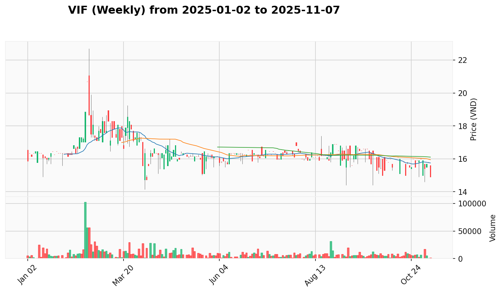

<a href="#thep">↑ Back to group THEP</a>  |  <a href="#vpa-signal-summary">↑ Back to Top</a>

#### Key Statistics
| Metric | Value |
|:---|---:|
| Date Range | 2025-01-02 to 2025-11-14 |
| **Latest Close** | **16.0** |
| Period Open | 16.54 |
| Period High | 22.7 |
| Period Low | 14.14 |
| Period Change % | -3.26% |

**[Download VIF Data (.csv)](market_data_week/VIF_2025-01-02_to_2025-11-14.csv)**

---

### VIG

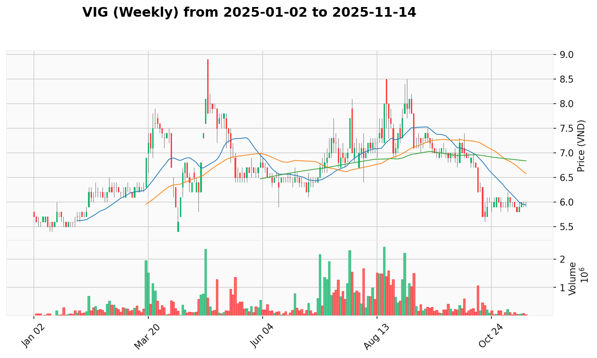

<a href="#penny">↑ Back to group PENNY</a>  |  <a href="#vpa-signal-summary">↑ Back to Top</a>

#### Key Statistics
| Metric | Value |
|:---|---:|
| Date Range | 2025-01-02 to 2025-11-14 |
| **Latest Close** | **6.0** |
| Period Open | 5.8 |
| Period High | 8.9 |
| Period Low | 5.4 |
| Period Change % | 3.45% |

**[Download VIG Data (.csv)](market_data_week/VIG_2025-01-02_to_2025-11-14.csv)**

---

### VIP

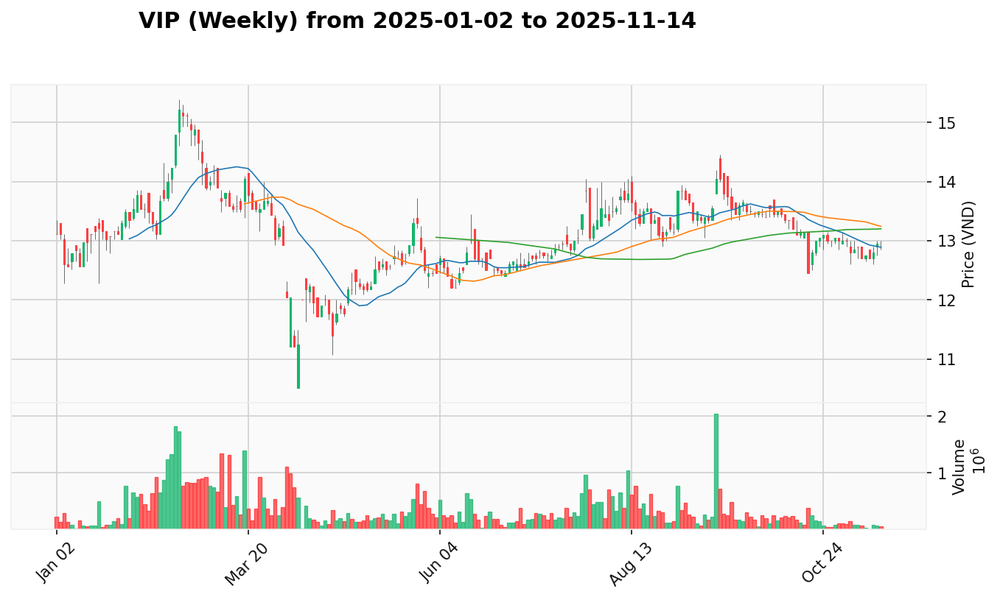

<a href="#van-tai">↑ Back to group VAN_TAI</a>  |  <a href="#vpa-signal-summary">↑ Back to Top</a>

#### Key Statistics
| Metric | Value |
|:---|---:|
| Date Range | 2025-01-02 to 2025-11-14 |
| **Latest Close** | **12.9** |
| Period Open | 13.11 |
| Period High | 15.39 |
| Period Low | 10.51 |
| Period Change % | -1.60% |

**[Download VIP Data (.csv)](market_data_week/VIP_2025-01-02_to_2025-11-14.csv)**

---

### VIX

#### [VPA Analysis (2025-06-02 - 2025-08-03)](./VPA_week.md#vix)
> - **Ngày 2025-07-07:** Sau tín hiệu Test for Supply của tuần trước, VIX có một tuần tăng giá bùng nổ với một nến tăng thân dài, đóng cửa (15.85) ở mức cao nhất tuần. Khối lượng giao dịch tăng mạnh.
>     - **Phân tích VPA/Wyckoff:** Đây là một **Sign of Strength**, cho thấy lực cầu đã quay trở lại một cách áp đảo, phủ nhận hoàn toàn tín hiệu yếu của tuần trước.
> - **Ngày 2025-07-14:** VIX tiếp tục bùng nổ với nến tăng thân dài, đóng cửa (18.85) ở mức cao nhất tuần và cũng là giá cao nhất trong dữ liệu. Khối lượng giao dịch tăng thêm lên 315.4 triệu cổ phiếu, cao hơn 11.4% so với tuần trước.
>     - **Phân tích VPA/Wyckoff:** Một **Sign of Strength** cực kỳ mạnh mẽ, tiếp nối đà tăng bùng nổ của tuần trước. Việc giá liên tục đạt đỉnh mới kết hợp với khối lượng duy trì ở mức rất cao cho thấy xu hướng tăng đang trong giai đoạn mạnh nhất.
> - **Ngày 2025-07-21:** VIX tiếp tục chuỗi bùng nổ với tuần tăng khổng lồ từ 18.85 lên 24.05 (+27.6%). Nến tăng thân rất dài với biên độ rộng từ 18.6 đến 24.05, đóng cửa đúng ở mức cao nhất tuần. Khối lượng giao dịch vẫn duy trì ở mức rất cao 277.742.985 dù giảm (-11.9%).
>     - **Phân tích VPA/Wyckoff:** Đây là một **Sign of Strength** siêu mạnh. Việc giá tăng vọt (+27.6%) và liên tục đạt đỉnh mới trên nền khối lượng vẫn rất cao cho thấy lực cầu đang trong trạng thái bùng nổ hoàn toàn. Xu hướng tăng của VIX đang ở đỉnh cao với sự tham gia mạnh mẽ của dòng tiền lớn.
> **Ngày 2025-07-27:** VIX kết thúc một tuần bùng nổ khác với nến tăng thân dài từ 19.45 lên 24.05 (+27.6%), đóng cửa đúng ở mức cao nhất tuần và tiếp tục thiết lập đỉnh mới. Biên động dao động rộng từ 18.6 đến 24.05 cho thấy biến động mạnh. Khối lượng giao dịch 277.478.600 cổ phiếu vẫn duy trì ở mức rất cao mặc dù giảm nhẹ (-11.9%) so với tuần trước. Đây là tuần thứ 4 liên tiếp VIX bùng nổ tăng giá, từ mức 12.7 hồi cuối tháng 6 lên 24.05 hiện tại (+89.4% trong 4 tuần).
> 
> **Phân tích VPA/Wyckoff:** Tiếp tục là một **Sign of Strength** cực kỳ mạnh mẽ. Chuỗi 4 tuần bùng nổ liên tiếp với mỗi tuần đều thiết lập đỉnh mới trên nền khối lượng duy trì ở mức rất cao cho thấy xu hướng tăng đang trong giai đoạn climax. Việc giá liên tục gap up và đóng cửa ở đỉnh tuần thể hiện lực cầu áp đảo hoàn toàn. Tuy nhiên, cần theo dõi sát sao vì cường độ tăng quá mạnh có thể dẫn đến exhaustion trong thời gian tới.
> **Ngày 2025-08-03:** VIX tiếp tục chuỗi bùng nổ tuần thứ 5 với nến tăng từ 24.05 lên 26.3 (+9.4%). Mở cửa gap up mạnh tại 25.6, test lên đỉnh 27.8 trước khi điều chỉnh về đóng cửa 26.3, vẫn cao hơn đáng kể so với tuần trước. Biên độ dao động rộng từ 23.45 đến 27.8 cho thấy volatility cao. Khối lượng giao dịch bùng nổ lên 329.129.600 cổ phiếu (+18.6%), đạt mức cao nhất trong chuỗi 5 tuần tăng liên tiếp. Từ mức 12.7 cuối tháng 6, VIX đã tăng vọt lên 26.3 (+107% trong 5 tuần), thiết lập đỉnh mới liên tục.

<a href="#chung-khoan">↑ Back to group CHUNG_KHOAN</a>  |  <a href="#vpa-signal-summary">↑ Back to Top</a>

#### Key Statistics
| Metric | Value |
|:---|---:|
| Date Range | 2025-01-02 to 2025-11-14 |
| **Latest Close** | **25.8** |
| Period Open | 9.37 |
| Period High | 40.45 |
| Period Low | 8.6 |
| Period Change % | 175.35% |

**[Download VIX Data (.csv)](market_data_week/VIX_2025-01-02_to_2025-11-14.csv)**

---

### VJC

#### [VPA Analysis (2025-06-02 - 2025-08-03)](./VPA_week.md#vjc)
> - **Ngày 2025-07-07:** Sau tín hiệu No Supply của tuần trước, VJC có một tuần tăng giá bùng nổ với một nến tăng thân dài, đóng cửa (100.0) ở mức cao nhất tuần. Khối lượng giao dịch tăng vọt.
>     - **Phân tích VPA/Wyckoff:** Đây là một **Sign of Strength**, cho thấy lực cầu đã quay trở lại một cách quyết liệt, phá vỡ sự do dự trước đó.
> - **Ngày 2025-07-14:** VJC có một tuần giao dịch biến động với nến giảm có thân dài, mở cửa (100.4) cao hơn tuần trước nhưng đóng cửa (93.3) thấp hơn đáng kể. Khối lượng giao dịch tăng nhẹ lên 8.1 triệu cổ phiếu.
>     - **Phân tích VPA/Wyckoff:** Sau phiên Sign of Strength mạnh của tuần trước, đây là một **Test for Supply**. Việc giá bị bán xuống từ mức cao trên khối lượng tăng cho thấy có áp lực bán ở vùng giá cao, cổ phiếu cần thời gian để kiểm tra mức hỗ trợ.
> - **Ngày 2025-07-21:** VJC bùng nổ với một tuần tăng giá cực mạnh, từ 94.0 lên 121.9 (+29.7%). Tạo ra nến tăng thân rất dài và đóng cửa ở mức cao nhất tuần. Khối lượng giao dịch tăng vọt lên 12.4 triệu cổ phiếu, tăng 52.4% so với tuần trước.
>     - **Phân tích VPA/Wyckoff:** Đây là một **Sign of Strength** cực mạnh. Sau phiên Test for Supply của tuần trước đã kiểm tra thành công, lực cầu quay trở lại một cách bùng nổ với mức tăng gần 30% kèm khối lượng khổng lồ. Điều này cho thấy cổ phiếu đã vượt qua giai đoạn kiểm tra và bước vào đợt tăng giá mạnh mẽ.
> **Ngày 2025-07-27:** VJC tiếp tục xu hướng tăng mạnh với tuần giao dịch bùng nổ thứ hai liên tiếp. Từ mức mở cửa 94.0, cổ phiếu tăng vọt lên 121.9 (+29.7%), tạo ra nến tăng thân rất dài và đóng cửa ở mức cao nhất tuần. Khối lượng giao dịch đạt 12.4 triệu cổ phiếu, tăng 52.4% so với tuần trước và là mức cao nhất trong 10 tuần qua. Cổ phiếu đã phá vỡ hoàn toàn vùng kháng cự 100.0 và thiết lập vùng giá mới ở trên 120.0. Momentum tăng giá rất mạnh với sự hỗ trợ của khối lượng khổng lồ cho thấy lực cầu áp đảo hoàn toàn.
> 
> **Phân tích VPA/Wyckoff:** Đây là một **Sign of Strength** cực mạnh tiếp theo sau phiên trước. Việc giá tăng gần 30% kèm khối lượng tăng vọt 52% cho thấy có dòng tiền lớn đổ vào và cổ phiếu đang trong giai đoạn Mark Up mạnh mẽ. Sự kết hợp giữa giá tăng mạnh và khối lượng tăng vọt là dấu hiệu tích cực về sức mạnh của xu hướng tăng.
> **Ngày 2025-08-03:** VJC tiếp tục giao dịch trong xu hướng tăng mạnh nhưng có dấu hiệu điều chỉnh. Từ mức mở cửa cao 124.3, cổ phiếu test lên đỉnh 129.7 (+6.4% so với tuần trước) nhưng bị bán mạnh xuống 115.0 trước khi đóng cửa tại 119.0, giảm 2.4% so với tuần trước. Tạo ra nến có thân giảm với đuôi dài phía dưới, cho thấy có lực cầu hỗ trợ ở vùng 115.0. Khối lượng giao dịch duy trì ở mức cao 12.8 triệu cổ phiếu, tăng nhẹ 3.7% so với tuần trước. Sau hai tuần tăng bùng nổ liên tiếp với tổng mức tăng gần 60%, cổ phiếu đang trong giai đoạn kiểm tra và củng cố vùng giá mới. Việc test lên đỉnh 129.7 nhưng không thể duy trì cho thấy áp lực chốt lời xuất hiện ở vùng cao.

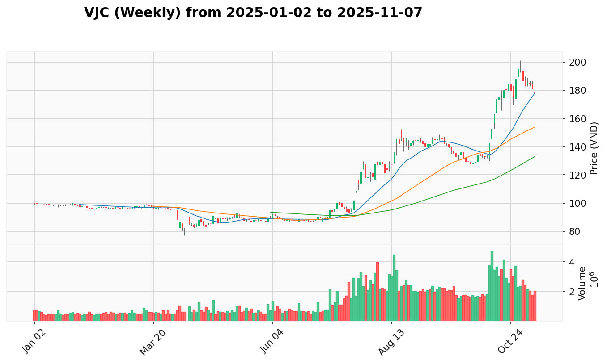

<a href="#hang-khong">↑ Back to group HANG_KHONG</a>  |  <a href="#vpa-signal-summary">↑ Back to Top</a>

#### Key Statistics
| Metric | Value |
|:---|---:|
| Date Range | 2025-01-02 to 2025-11-14 |
| **Latest Close** | **176.4** |
| Period Open | 100.1 |
| Period High | 201.2 |
| Period Low | 77.1 |
| Period Change % | 76.22% |

**[Download VJC Data (.csv)](market_data_week/VJC_2025-01-02_to_2025-11-14.csv)**

---

### VLB

#### [VPA Analysis (2025-06-02 - 2025-08-03)](./VPA_week.md#vlb)
> - **Ngày 2025-07-07:** Sau tín hiệu Sign of Weakness của tuần trước, VLB có một tuần đi ngang với một nến tăng biên độ hẹp. Khối lượng giao dịch giảm.
>     - **Phân tích VPA/Wyckoff:** Đây là một phiên **No Supply**. Việc giá giữ vững trên nền khối lượng thấp cho thấy áp lực bán đã giảm bớt, là một tín hiệu No Supply cho thấy thị trường đang tích lũy và có thể sớm tăng trở lại.
> - **Ngày 2025-07-14:** VLB bùng nổ với một tuần tăng giá mạnh, từ 45.08 lên 49.0 (+8.7%). Nến tăng thân dài với đỉnh tuần tại 49.1, đóng cửa gần mức cao nhất. Khối lượng giao dịch tăng mạnh lên 818.698 so với tuần trước (361.147).
>     - **Phân tích VPA/Wyckoff:** Đây là một **Sign of Strength** rõ ràng. Việc giá tăng mạnh (+8.7%) kèm theo khối lượng tăng vọt (+127%) cho thấy dòng tiền mua mạnh mẽ đã trở lại. Điều này khẳng định tín hiệu No Supply tuần trước, thể hiện sự tích lũy thành công và mở đầu cho đợt tăng giá mới.
> - **Ngày 2025-07-21:** Sau tuần bùng nổ, VLB có một tuần giảm giá với nến giảm thân dài, từ 49.1 xuống 47.8 (-2.65%). Mở cửa tại đỉnh tuần trước nhưng đóng cửa thấp hơn đáng kể. Khối lượng giao dịch giảm mạnh xuống 471.185, giảm 42.4% so với tuần trước.
>     - **Phân tích VPA/Wyckoff:** Sau phiên Sign of Strength mạnh mẽ tuần trước, đây là một **Test for Supply**. Việc giá giảm từ mức cao trên khối lượng giảm cho thấy áp lực bán không mạnh, điều này là tích cực. Cổ phiếu đang trong giai đoạn kiểm tra sau đợt tăng giá và có thể tiếp tục xu hướng tăng nếu vượt qua được sự kiểm tra này.
> **Ngày 2025-07-27:** Tuần này VLB tiếp tục điều chỉnh từ mức đỉnh 49.5, đóng cửa tại 47.8 (-2.4% so với tuần trước). Nến có thân giảm vừa phải với bóng dưới dài, cho thấy có lực mua xuất hiện ở vùng thấp. Khối lượng giao dịch giảm xuống 471.293, thấp hơn 42.4% so với tuần trước, tương tự mức khối lượng của tuần 20/7. Mặc dù giá giảm nhưng vẫn duy trì trên mức 47.5, tạo thành vùng hỗ trợ quan trọng.
> 
> **Phân tích VPA/Wyckoff:** Đây là một **No Supply**. Việc giá điều chỉnh nhẹ trên nền khối lượng giảm cho thấy áp lực bán không mạnh sau đợt Test for Supply tuần trước. Bóng dưới dài thể hiện lực mua xuất hiện ở vùng thấp, xác nhận vùng hỗ trợ 47.5-47.8. Cổ phiếu đang hoàn thành giai đoạn kiểm tra sau đợt tăng giá mạnh và có khả năng tiếp tục xu hướng tăng nếu vượt được vùng kháng cự 49.0-49.5.
> **Ngày 2025-08-03:** VLB tiếp tục điều chỉnh từ 47.8 xuống 46.1 (-3.6%), nến giảm có thân vừa phải với biên độ dao động từ 44.9 đến 48.0. Cổ phiếu test xuống gần vùng hỗ trợ quan trọng 44.9 nhưng đóng cửa cao hơn mức thấp nhất, cho thấy có lực mua xuất hiện ở vùng thấp. Khối lượng giao dịch giảm nhẹ xuống 407.398, thấp hơn 13.6% so với tuần trước, tiếp tục xu hướng khối lượng giảm trong giai đoạn điều chỉnh. Mặc dù giá phá vỡ vùng hỗ trợ 47.5-47.8 nhưng chưa có sự sụp đổ mạnh về khối lượng.

<a href="#vlxd">↑ Back to group VLXD</a>  |  <a href="#vpa-signal-summary">↑ Back to Top</a>

#### Key Statistics
| Metric | Value |
|:---|---:|
| Date Range | 2025-01-02 to 2025-11-14 |
| **Latest Close** | **47.1** |
| Period Open | 39.77 |
| Period High | 49.8 |
| Period Low | 35.02 |
| Period Change % | 18.43% |

**[Download VLB Data (.csv)](market_data_week/VLB_2025-01-02_to_2025-11-14.csv)**

---

### VLC

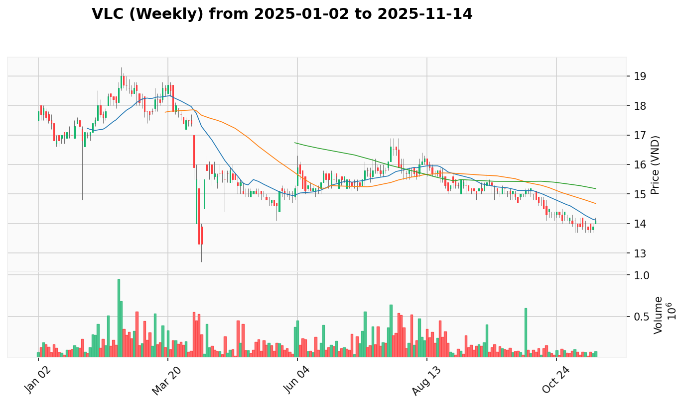

<a href="#nong-nghiep">↑ Back to group NONG_NGHIEP</a>  |  <a href="#vpa-signal-summary">↑ Back to Top</a>

#### Key Statistics
| Metric | Value |
|:---|---:|
| Date Range | 2025-01-02 to 2025-11-14 |
| **Latest Close** | **14.1** |
| Period Open | 17.5 |
| Period High | 19.3 |
| Period Low | 12.7 |
| Period Change % | -19.43% |

**[Download VLC Data (.csv)](market_data_week/VLC_2025-01-02_to_2025-11-14.csv)**

---

### VNA

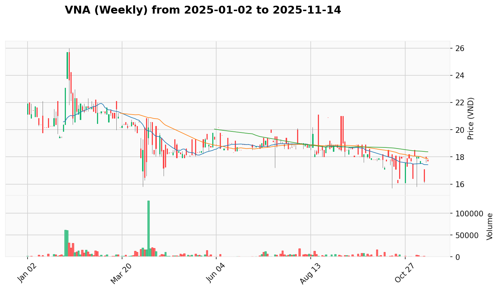

<a href="#van-tai">↑ Back to group VAN_TAI</a>  |  <a href="#vpa-signal-summary">↑ Back to Top</a>

#### Key Statistics
| Metric | Value |
|:---|---:|
| Date Range | 2025-01-02 to 2025-11-13 |
| **Latest Close** | **17.7** |
| Period Open | 21.14 |
| Period High | 25.99 |
| Period Low | 15.7 |
| Period Change % | -16.27% |

**[Download VNA Data (.csv)](market_data_week/VNA_2025-01-02_to_2025-11-14.csv)**

---

### VND

#### [VPA Analysis (2025-06-02 - 2025-08-03)](./VPA_week.md#vnd)
> - **Ngày 2025-07-07:** Tiếp nối Dấu hiệu Sức mạnh của tuần trước, VND có một tuần tăng giá tốt, tạo thành một nến tăng và đóng cửa (17.9) cao hơn. Khối lượng giao dịch duy trì ở mức cao.
>     - **Phân tích VPA/Wyckoff:** Đây là một **Sign of Strength**, cho thấy lực cầu vẫn đang chiếm ưu thế và xu hướng tăng được củng cố.
> - **Ngày 2025-07-14:** VND tiếp tục tăng giá với nến tăng thân dài, đóng cửa (18.55) cao hơn đáng kể so với tuần trước. Khối lượng giao dịch tăng mạnh lên 172.5 triệu cổ phiếu, cao hơn 22.0% so với tuần trước.
>     - **Phân tích VPA/Wyckoff:** Một **Sign of Strength** rất mạnh mẽ, tiếp nối chuỗi tăng giá liên tục của các tuần trước. Việc giá tăng mạnh kết hợp với khối lượng tăng vọt cho thấy lực cầu đang trong giai đoạn rất mạnh và xu hướng tăng rất vững chắc.
> - **Ngày 2025-07-21:** VND tiếp tục chuỗi tăng giá ấn tượng với nến tăng thân dài, từ 18.65 lên 21.15 (+13.4%). Tạo ra đỉnh tuần mới và đóng cửa ở mức cao nhất. Khối lượng giao dịch tăng thêm lên 223.7 triệu cổ phiếu, tăng 29.7% so với tuần trước.
>     - **Phân tích VPA/Wyckoff:** Một **Sign of Strength** cực kỳ mạnh mẽ, tiếp nối chuỗi 4 tuần liên tiếp tăng giá. Việc giá tăng hơn 13% kết hợp với khối lượng tăng vọt cho thấy lực cầu đang trong giai đoạn bùng nổ và xu hướng tăng có động lực rất mạnh để tiếp tục.
> **Ngày 2025-07-27:** VND tiếp tục chuỗi tăng giá ấn tượng với nến tăng thân dài, từ 18.65 lên 21.15 (+13.4%). Tạo ra đỉnh tuần mới và đóng cửa ở mức cao nhất. Khối lượng giao dịch tăng thêm lên 223.7 triệu cổ phiếu, tăng 29.7% so với tuần trước.
> 
> **Phân tích VPA/Wyckoff:** Một **Sign of Strength** cực kỳ mạnh mẽ, tiếp nối chuỗi 4 tuần liên tiếp tăng giá. Việc giá tăng hơn 13% kết hợp với khối lượng tăng vọt cho thấy lực cầu đang trong giai đoạn bùng nổ và xu hướng tăng có động lực rất mạnh để tiếp tục.
> **Ngày 2025-08-03:** VND có tuần giao dịch hỗn hợp với nến có thân nhỏ, mở cửa tại 21.9, test lên đỉnh mới 24.0 nhưng bị đẩy xuống và đóng cửa tại 22.2. Mặc dù vẫn tăng 5.0% so với tuần trước, việc không thể duy trì ở vùng cao cho thấy áp lực bán đã xuất hiện. Khối lượng giao dịch bùng nổ lên 304.9 triệu cổ phiếu, tăng 36.3% so với tuần trước, đạt mức cao nhất trong 5 tuần qua.

<a href="#chung-khoan">↑ Back to group CHUNG_KHOAN</a>  |  <a href="#vpa-signal-summary">↑ Back to Top</a>

#### Key Statistics
| Metric | Value |
|:---|---:|
| Date Range | 2025-01-02 to 2025-11-14 |
| **Latest Close** | **19.65** |
| Period Open | 12.21 |
| Period High | 27.35 |
| Period Low | 10.91 |
| Period Change % | 60.93% |

**[Download VND Data (.csv)](market_data_week/VND_2025-01-02_to_2025-11-14.csv)**

---

### VNE

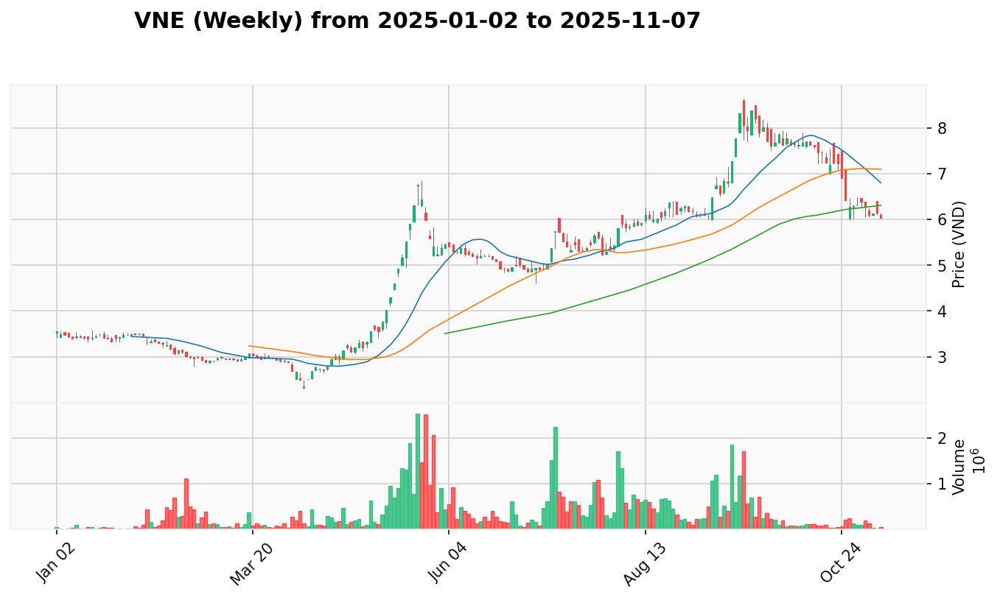

<a href="#xay-lap-dien">↑ Back to group XAY_LAP_DIEN</a>  |  <a href="#vpa-signal-summary">↑ Back to Top</a>

#### Key Statistics
| Metric | Value |
|:---|---:|
| Date Range | 2025-01-02 to 2025-11-14 |
| **Latest Close** | **6.25** |
| Period Open | 3.52 |
| Period High | 8.62 |
| Period Low | 2.32 |
| Period Change % | 77.56% |

**[Download VNE Data (.csv)](market_data_week/VNE_2025-01-02_to_2025-11-14.csv)**

---

### VNM

#### [VPA Analysis (2025-06-02 - 2025-08-03)](./VPA_week.md#vnm)
> - **Ngày 2025-07-07:** Tiếp nối Dấu hiệu Sức mạnh của tuần trước, VNM có một tuần tăng giá mạnh mẽ với một nến tăng thân dài, đóng cửa (59.8) gần mức cao nhất tuần. Khối lượng giao dịch tăng mạnh.
>     - **Phân tích VPA/Wyckoff:** Đây là một **Sign of Strength**, xác nhận lực cầu đang chiếm ưu thế và xu hướng tăng được củng cố.
> - **Ngày 2025-07-14:** VNM tiếp tục tăng giá với nến tăng thân ngắn, đóng cửa (60.2) cao hơn tuần trước. Khối lượng giao dịch giảm nhẹ xuống 29.8 triệu cổ phiếu, giảm 7.1% so với tuần trước.
>     - **Phân tích VPA/Wyckoff:** Một **Effort to Rise** với khối lượng giảm. Mặc dù giá vẫn tăng nhưng việc khối lượng giảm có thể cho thấy lực mua đang chậm lại, cần theo dõi để xác nhận xu hướng tiếp theo.
> - **Ngày 2025-07-21:** VNM có một tuần tăng giá mạnh mẽ với nến tăng thân dài, từ 60.3 lên 63.2 (+4.8%). Tạo ra đỉnh tuần tại 64.0 và đóng cửa gần mức cao nhất. Khối lượng giao dịch tăng vọt lên 38.0 triệu cổ phiếu, tăng 27.6% so với tuần trước.
>     - **Phân tích VPA/Wyckoff:** Một **Sign of Strength** rõ ràng. Sau phiên Effort to Rise có dấu hiệu chậm lại của tuần trước, lực cầu đã quay trở lại mạnh mẽ với mức tăng gần 5% kèm khối lượng tăng vọt. Điều này xác nhận xu hướng tăng vẫn còn nguyên vẹn và cổ phiếu đang tiếp tục hành trình phục hồi.
> **Ngày 2025-07-27:** VNM có một tuần tăng giá mạnh mẽ, từ 60.3 lên 63.2 (+4.8%), tạo ra đỉnh tuần tại 64.0 và đóng cửa gần mức cao nhất. Khối lượng giao dịch tăng vọt lên 38.0 triệu cổ phiếu, tăng 27.6% so với tuần trước (29.8 triệu). Cổ phiếu đã vượt qua vùng kháng cự 60-61 một cách quyết liệt và thiết lập vùng giá mới trong khoảng 63-64. Đây là tuần tăng mạnh nhất trong chu kỳ phục hồi hiện tại.
> 
> **Phân tích VPA/Wyckoff:** Một **Sign of Strength** rất rõ ràng. Sau giai đoạn tích lũy từ vùng 55-58, VNM đang thể hiện sức mạnh bùng nổ với mức tăng gần 5% kèm khối lượng tăng vọt 27.6%. Việc vượt qua vùng kháng cự quan trọng 60-61 với volume mạnh xác nhận lực cầu đang chiếm ưu thế tuyệt đối. Xu hướng tăng được củng cố vững chắc và cổ phiếu có thể tiếp tục hướng tới vùng 65-67 trong các tuần tới.
> **Ngày 2025-08-03:** VNM có một tuần giảm giá mạnh, từ 63.3 xuống 60.0 (-5.2%), tạo ra đáy tuần tại 60.0 và đóng cửa ở mức thấp nhất. Mặc dù có test lên đỉnh mới tại 64.2, cổ phiếu bị bán mạnh và mất hoàn toàn mức tăng của tuần trước. Khối lượng giao dịch tăng lên 41.2 triệu cổ phiếu, tăng 8.3% so với tuần trước (38.0 triệu). Đây là tuần giảm mạnh nhất kể từ khi bắt đầu chu kỳ phục hồi, với cổ phiếu quay trở lại vùng hỗ trợ 60.0 sau khi test thất bại vùng kháng cự 64.0-64.2.

<a href="#thuc-pham">↑ Back to group THUC_PHAM</a>  |  <a href="#vpa-signal-summary">↑ Back to Top</a>

#### Key Statistics
| Metric | Value |
|:---|---:|
| Date Range | 2025-01-02 to 2025-11-14 |
| **Latest Close** | **62.8** |
| Period Open | 58.67 |
| Period High | 63.3 |
| Period Low | 47.42 |
| Period Change % | 7.04% |

**[Download VNM Data (.csv)](market_data_week/VNM_2025-01-02_to_2025-11-14.csv)**

---

### VOS

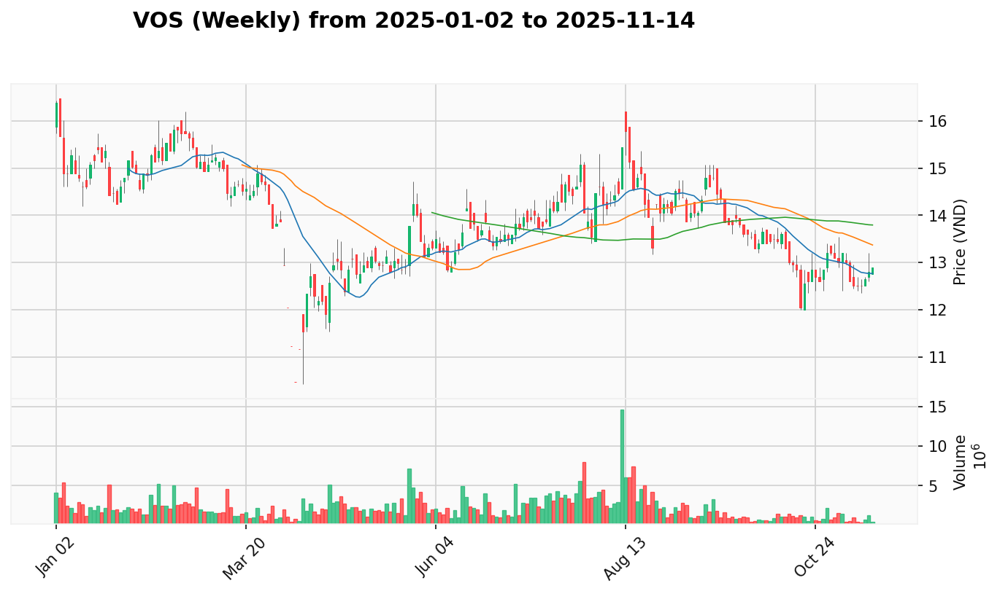

<a href="#van-tai">↑ Back to group VAN_TAI</a>  |  <a href="#vpa-signal-summary">↑ Back to Top</a>

#### Key Statistics
| Metric | Value |
|:---|---:|
| Date Range | 2025-01-02 to 2025-11-14 |
| **Latest Close** | **12.9** |
| Period Open | 15.87 |
| Period High | 16.48 |
| Period Low | 10.42 |
| Period Change % | -18.71% |

**[Download VOS Data (.csv)](market_data_week/VOS_2025-01-02_to_2025-11-14.csv)**

---

### VPB

#### [VPA Analysis (2025-06-02 - 2025-08-03)](./VPA_week.md#vpb)
> - **Ngày 2025-07-07:** Sau phiên kiểm tra cung thành công của tuần trước, VPB đã có một tuần tăng giá bùng nổ. Nến tăng có thân dài, đóng cửa (20.15) gần mức cao nhất tuần, đi kèm với khối lượng giao dịch tăng vọt.
>     - **Phân tích VPA/Wyckoff:** Đây là một **Sign of Strength**, xác nhận lực cầu đã quay trở lại một cách quyết liệt và xu hướng tăng đang tiếp diễn.
> - **Ngày 2025-07-14:** VPB tiếp tục tăng mạnh với nến tăng thân dài, đóng cửa (21.35) cao hơn đáng kể so với tuần trước. Khối lượng giao dịch duy trì ở mức rất cao với 241.1 triệu cổ phiếu, chỉ giảm nhẹ 2.6% so với tuần trước.
>     - **Phân tích VPA/Wyckoff:** Một **Sign of Strength** tiếp tục, cho thấy lực cầu vẫn rất mạnh. Việc giá tăng mạnh trên nền khối lượng duy trì cao xác nhận xu hướng tăng đang rất vững chắc và có thể tiếp tục.
> - **Ngày 2025-07-21:** VPB tiếp tục chuỗi tăng giá ấn tượng với nến tăng thân dài, từ 21.6 lên 24.05 (+11.3%). Tạo ra đỉnh tuần tại 24.15 và đóng cửa gần mức cao nhất. Khối lượng giao dịch tăng thêm lên 290.0 triệu cổ phiếu, tăng 20.3% so với tuần trước.
>     - **Phân tích VPA/Wyckoff:** Một **Sign of Strength** cực kỳ mạnh mẽ, tiếp nối chuỗi 3 tuần tăng giá liên tiếp. Việc giá tăng hơn 11% kết hợp với khối lượng tăng vọt cho thấy lực cầu đang ở đỉnh cao và xu hướng tăng có động lực rất mạnh để tiếp tục vươn lên những mức giá cao hơn.
> **Ngày 2025-07-27:** VPB tiếp tục đà tăng mạnh mẽ trong tuần thứ 4 liên tiếp, tạo nến tăng thân dài từ 21.6 lên 24.05 (+11.3%). Giá tạo đỉnh tuần tại 24.15 và đóng cửa gần mức cao nhất, cho thấy áp lực mua rất mạnh. Khối lượng giao dịch tăng vọt lên 289.9 triệu cổ phiếu, tăng 20.3% so với tuần trước, xác nhận sự quan tâm lớn từ thị trường. VPB đã tăng hơn 35% trong 4 tuần qua từ mức 17.8, phá vỡ mạnh mẽ vùng kháng cự 20-21 và tiến vào vùng giá mới.
> 
> **Phân tích VPA/Wyckoff:** Một **Sign of Strength** cực kỳ mạnh mẽ, tiếp nối chuỗi 4 tuần tăng giá liên tiếp. Việc giá tăng hơn 11% kết hợp với khối lượng tăng vọt cho thấy lực cầu đang ở đỉnh cao và xu hướng tăng có động lực rất mạnh để tiếp tục vươn lên những mức giá cao hơn.
> **Ngày 2025-08-03:** VPB tiếp tục chuỗi tăng giá mạnh mẽ tuần thứ 5 liên tiếp, tạo nến tăng với thân dài từ 24.35 lên 25.8 (+7.3%). Giá mở cửa gap up tại 24.35, tạo đỉnh tuần mới tại 26.1 trước khi có điều chỉnh nhẹ và đóng cửa tại 25.8, vẫn gần mức cao nhất. Khối lượng giao dịch tiếp tục tăng mạnh lên 322.0 triệu cổ phiếu, tăng thêm 11.1% so với tuần trước, đạt mức cao nhất trong 5 tuần qua. VPB đã tăng hơn 44% trong 5 tuần từ mức 17.8, phá vỡ liên tiếp các vùng kháng cự và hiện đang giao dịch ở vùng giá cao nhất trong dữ liệu. Việc giá liên tục tạo đỉnh mới kèm khối lượng tăng vọt cho thấy đà tăng vẫn rất mạnh mẽ.

<a href="#ngan-hang">↑ Back to group NGAN_HANG</a>  |  <a href="#vpa-signal-summary">↑ Back to Top</a>

#### Key Statistics
| Metric | Value |
|:---|---:|
| Date Range | 2025-01-02 to 2025-11-14 |
| **Latest Close** | **27.8** |
| Period Open | 18.59 |
| Period High | 38.9 |
| Period Low | 14.75 |
| Period Change % | 49.54% |

**[Download VPB Data (.csv)](market_data_week/VPB_2025-01-02_to_2025-11-14.csv)**

---

### VPG

#### [VPA Analysis (2025-06-02 - 2025-08-03)](./VPA_week.md#vpg)
> - **Ngày 2025-07-07:** Sau tín hiệu No Supply của tuần trước, VPG có một tuần tăng giá tốt, tạo thành một nến tăng và đóng cửa (8.29) cao hơn. Khối lượng giao dịch tăng.
>     - **Phân tích VPA/Wyckoff:** Đây là một **Sign of Strength**, cho thấy lực cầu đã quay trở lại sau một thời gian đi ngang, phá vỡ sự thiếu quan tâm trước đó.
> - **Ngày 2025-07-14:** VPG có một tuần giao dịch biến động với nến giảm thân ngắn, mở cửa (8.31) cao hơn nhưng đóng cửa (8.07) thấp hơn tuần trước. Khối lượng giao dịch tăng nhẹ lên 5.0 triệu cổ phiếu.
>     - **Phân tích VPA/Wyckoff:** Sau phên Sign of Strength của tuần trước, đây là một **Test for Supply**. Việc giá được kiểm tra và giảm nhẹ trên khối lượng tăng cho thấy có áp lực bán nhưng không mạnh, cổ phiếu cần thời gian để tích lũy thêm.
> - **Ngày 2025-07-21:** Sau phiên kiểm tra của tuần trước, VPG có một tuần tăng giá mạnh với nến tăng thân dài, từ 8.1 lên 9.11 (+12.5%). Tạo ra đỉnh tuần tại 9.2 và đóng cửa gần mức cao nhất. Khối lượng giao dịch tăng mạnh lên 7.0 triệu cổ phiếu, tăng 40.1% so với tuần trước.
>     - **Phân tích VPA/Wyckoff:** Đây là một **Sign of Strength** rõ ràng. Sau phiên Test for Supply thành công của tuần trước, lực cầu đã quay trở lại mạnh mẽ với mức tăng hơn 12% kèm khối lượng tăng vọt. Điều này cho thấy cổ phiếu đã vượt qua giai đoạn tích lũy và bắt đầu xu hướng tăng mới.
> **Ngày 2025-07-27:** Sau tuần Sign of Strength mạnh mẽ trước đó, VPG tiếp tục có một tuần tăng giá tích cực, từ 8.1 lên 9.11 (+12.5%), tạo đỉnh tuần tại 9.2 và đóng cửa gần mức cao nhất. Khối lượng giao dịch tăng mạnh lên 7.04 triệu cổ phiếu, tăng 40.3% so với tuần trước. Đây là tuần thứ hai liên tiếp có mức tăng trên 12% kèm khối lượng cao, cho thấy momentum tăng đang được duy trì mạnh mẽ.
> 
> **Phân tích VPA/Wyckoff:** Đây là một **Sign of Strength** tiếp theo, xác nhận xu hướng tăng mới đã được thiết lập. Việc giá tăng mạnh trên khối lượng cao liên tục trong 2 tuần cho thấy lực cầu rất mạnh và áp lực bán đã được hấp thụ hoàn toàn. Cổ phiếu đang trong giai đoạn Mark Up sau khi vượt qua thành công phase tích lũy từ đầu tháng 7.
> **Ngày 2025-08-03:** Sau hai tuần Sign of Strength liên tiếp, VPG có một tuần giao dịch biến động mạnh với nến giảm có bóng dưới dài. Mở cửa tại 9.29 (mức cao nhất tuần) nhưng bị bán tháo xuống 8.14 trước khi phục hồi đóng cửa tại 8.85, giảm 2.85% so với tuần trước. Khối lượng giao dịch tiếp tục tăng lên 8.04 triệu cổ phiếu (+14.2%), đây là tuần thứ ba liên tiếp có khối lượng tăng. Biên độ giao dịch rất rộng (14.0%) cho thấy sự tranh chấp gay gắt giữa buyer và seller tại vùng giá 8.8-9.3.

<a href="#khai-khoang">↑ Back to group KHAI_KHOANG</a>  |  <a href="#vpa-signal-summary">↑ Back to Top</a>

#### Key Statistics
| Metric | Value |
|:---|---:|
| Date Range | 2025-01-02 to 2025-11-14 |
| **Latest Close** | **6.45** |
| Period Open | 11.95 |
| Period High | 13.2 |
| Period Low | 6.08 |
| Period Change % | -46.03% |

**[Download VPG Data (.csv)](market_data_week/VPG_2025-01-02_to_2025-11-14.csv)**

---

### VPH

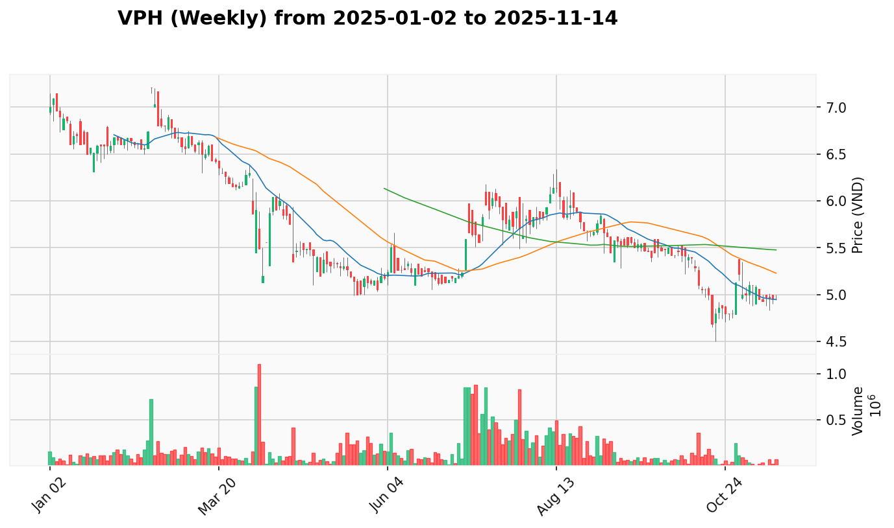

<a href="#penny">↑ Back to group PENNY</a>  |  <a href="#vpa-signal-summary">↑ Back to Top</a>

#### Key Statistics
| Metric | Value |
|:---|---:|
| Date Range | 2025-01-02 to 2025-11-14 |
| **Latest Close** | **4.95** |
| Period Open | 6.95 |
| Period High | 7.21 |
| Period Low | 4.5 |
| Period Change % | -28.78% |

**[Download VPH Data (.csv)](market_data_week/VPH_2025-01-02_to_2025-11-14.csv)**

---

### VRE

#### [VPA Analysis (2025-06-02 - 2025-08-03)](./VPA_week.md#vre)
> - **Ngày 2025-07-07:** Sau tín hiệu No Supply của tuần trước, VRE có một tuần tăng giá bùng nổ với một nến tăng thân dài, đóng cửa (28.6) ở mức cao nhất tuần. Khối lượng giao dịch tăng vọt.
>     - **Phân tích VPA/Wyckoff:** Đây là một **Sign of Strength**, cho thấy lực cầu đã quay trở lại một cách quyết liệt, phá vỡ sự do dự trước đó.
> - **Ngày 2025-07-14:** VRE tiếp tục tăng giá với nến tăng thân dài, mở cửa (28.9) gap up từ tuần trước và đóng cửa (29.45) cao hơn. Khối lượng giao dịch giảm xuống 29.8 triệu cổ phiếu, giảm 18.6% so với tuần trước.
>     - **Phân tích VPA/Wyckoff:** Một **Effort to Rise** với khối lượng giảm. Sau phiên Sign of Strength mạnh của tuần trước, việc giá tiếp tục tăng nhưng khối lượng giảm cho thấy lực mua đang chậm lại, cổ phiếu có thể cần thời gian để tích lũy trước khi tiếp tục tăng.
> - **Ngày 2025-07-21:** VRE có một tuần giao dịch đi ngang với nến tăng thân ngắn, từ 29.45 lên 29.5 chỉ tăng nhẹ (+0.17%). Dao động trong phạm vi hẹp với đỉnh tuần tại 30.0. Khối lượng giao dịch giảm mạnh xuống 21.3 triệu cổ phiếu, giảm 28.7% so với tuần trước.
>     - **Phân tích VPA/Wyckoff:** Sau phiên Effort to Rise của tuần trước, đây là một **Test for Supply**. Việc giá đi ngang trên nền khối lượng giảm mạnh cho thấy áp lực bán rất yếu, đây là tín hiệu tích cực. Cổ phiếu đang trong giai đoạn tích lũy và chuẩn bị cho đợt tăng tiếp theo.
> **Ngày 2025-07-27:** VRE có một tuần giao dịch đi ngang với nến tăng rất nhẹ, từ 29.45 lên 29.5 chỉ tăng 0.17%. Dao động trong phạm vi hẹp 28.45-30.0, đỉnh tuần chạm 30.0 tương tự tuần trước. Khối lượng giao dịch giảm tiếp xuống 21.3 triệu cổ phiếu, giảm 28.7% so với tuần trước và duy trì ở mức thấp.
> 
> **Phân tích VPA/Wyckoff:** Tiếp tục **Test for Supply** thành công. Sau 2 tuần liên tiếp giao dịch đi ngang trên nền khối lượng giảm mạnh, việc giá vẫn duy trì được vùng 29.5 cho thấy áp lực bán rất yếu. Cổ phiếu đang trong giai đoạn tích lũy mạnh, chuẩn bị năng lượng cho đợt breakout tiếp theo. Vùng kháng cự quan trọng tại 30.0 đã được test nhiều lần, breakout qua mức này sẽ mở ra không gian tăng giá mới.
> **Ngày 2025-08-03:** VRE kết thúc chuỗi 2 tuần Test for Supply thành công bằng một tuần sụt giảm mạnh, từ 29.5 xuống 28.45 (-3.56%). Mở cửa gap down nhẹ tại 29.8, sau đó test xuống mức thấp 27.0 trước khi hồi phục đóng cửa tại 28.45. Biên độ dao động rộng 29.8-27.0 cho thấy áp lực bán đã quay trở lại. Khối lượng giao dịch tăng lên 27.2 triệu cổ phiếu, tăng 27.7% so với tuần trước.

<a href="#bat-dong-san">↑ Back to group BAT_DONG_SAN</a>  |  <a href="#vpa-signal-summary">↑ Back to Top</a>

#### Key Statistics
| Metric | Value |
|:---|---:|
| Date Range | 2025-01-02 to 2025-11-14 |
| **Latest Close** | **32.1** |
| Period Open | 17.2 |
| Period High | 45.2 |
| Period Low | 16.1 |
| Period Change % | 86.63% |

**[Download VRE Data (.csv)](market_data_week/VRE_2025-01-02_to_2025-11-14.csv)**

---

### VRG

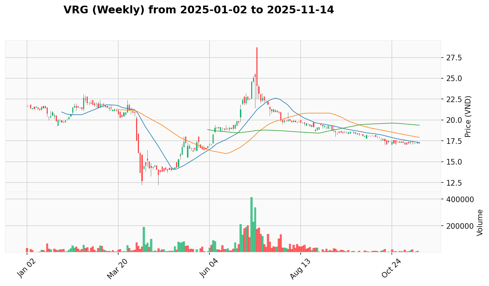

<a href="#cao-su">↑ Back to group CAO_SU</a>  |  <a href="#vpa-signal-summary">↑ Back to Top</a>

#### Key Statistics
| Metric | Value |
|:---|---:|
| Date Range | 2025-01-02 to 2025-11-14 |
| **Latest Close** | **17.3** |
| Period Open | 21.69 |
| Period High | 28.7 |
| Period Low | 12.21 |
| Period Change % | -20.24% |

**[Download VRG Data (.csv)](market_data_week/VRG_2025-01-02_to_2025-11-14.csv)**

---

### VSC

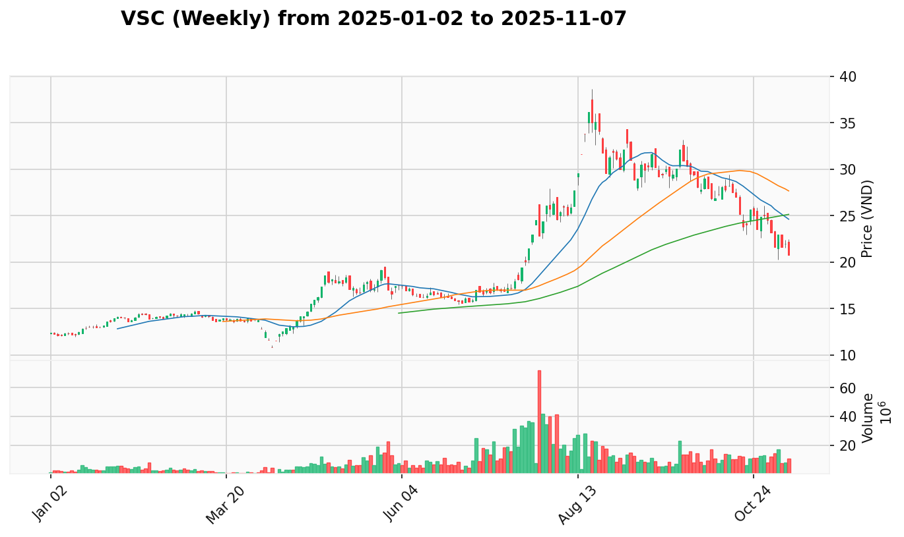

<a href="#van-tai">↑ Back to group VAN_TAI</a>  |  <a href="#vpa-signal-summary">↑ Back to Top</a>

#### Key Statistics
| Metric | Value |
|:---|---:|
| Date Range | 2025-01-02 to 2025-11-14 |
| **Latest Close** | **22.25** |
| Period Open | 12.34 |
| Period High | 38.65 |
| Period Low | 10.83 |
| Period Change % | 80.31% |

**[Download VSC Data (.csv)](market_data_week/VSC_2025-01-02_to_2025-11-14.csv)**

---

### VTK

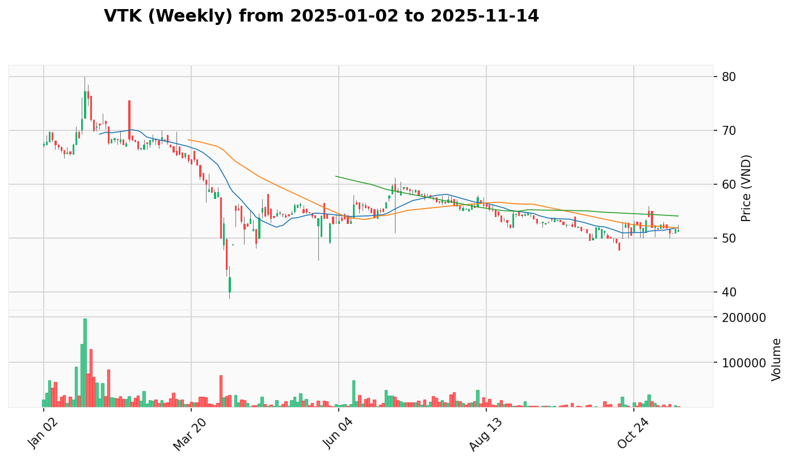

<a href="#cong-nghe">↑ Back to group CONG_NGHE</a>  |  <a href="#vpa-signal-summary">↑ Back to Top</a>

#### Key Statistics
| Metric | Value |
|:---|---:|
| Date Range | 2025-01-02 to 2025-11-14 |
| **Latest Close** | **51.4** |
| Period Open | 67.18 |
| Period High | 79.96 |
| Period Low | 38.71 |
| Period Change % | -23.49% |

**[Download VTK Data (.csv)](market_data_week/VTK_2025-01-02_to_2025-11-14.csv)**

---

### VTO

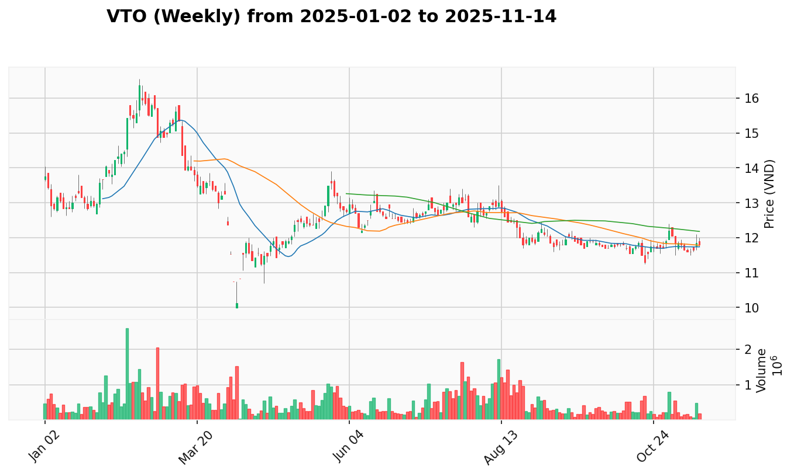

<a href="#van-tai">↑ Back to group VAN_TAI</a>  |  <a href="#vpa-signal-summary">↑ Back to Top</a>

#### Key Statistics
| Metric | Value |
|:---|---:|
| Date Range | 2025-01-02 to 2025-11-14 |
| **Latest Close** | **11.8** |
| Period Open | 13.67 |
| Period High | 16.55 |
| Period Low | 9.99 |
| Period Change % | -13.68% |

**[Download VTO Data (.csv)](market_data_week/VTO_2025-01-02_to_2025-11-14.csv)**

---

### VTP

#### [VPA Analysis (2025-06-02 - 2025-08-03)](./VPA_week.md#vtp)
> - **Ngày 2025-07-07:** Sau tín hiệu No Supply của tuần trước, VTP có một tuần tăng giá tốt, tạo thành một nến tăng và đóng cửa (122.7) cao hơn. Khối lượng giao dịch tăng.
>     - **Phân tích VPA/Wyckoff:** Đây là một **Sign of Strength**, cho thấy lực cầu đang chiếm ưu thế và xu hướng tăng được củng cố.
> - **Ngày 2025-07-14:** VTP có một tuần giao dịch biến động với nến giảm thân ngắn, đóng cửa (121.6) thấp hơn nhẹ so với tuần trước. Khối lượng giao dịch duy trì ở mức cao với 5.6 triệu cổ phiếu, tương đương tuần trước.
>     - **Phân tích VPA/Wyckoff:** Sau phiên Sign of Strength của tuần trước, đây là một **Test for Supply**. Việc giá giảm nhẹ trên nền khối lượng duy trì cao cho thấy có một số áp lực bán nhưng không mạnh, cổ phiếu đang trong giai đoạn tích lũy.
> - **Ngày 2025-07-21:** VTP có một tuần giao dịch đi ngang với nến giảm thân ngắn, từ 121.6 xuống 121.5 chỉ giảm nhẹ (-0.08%). Dao động trong phạm vi hẹp với đỉnh tuần tại 123.6. Khối lượng giao dịch giảm mạnh xuống 3.6 triệu cổ phiếu, giảm 35.7% so với tuần trước.
>     - **Phân tích VPA/Wyckoff:** Sau phiên Test for Supply của tuần trước, đây tiếp tục là một **Test for Supply** thành công. Việc giá đi ngang trên nền khối lượng giảm mạnh cho thấy áp lực bán rất yếu và cổ phiếu đang được hấp thụ tốt. Đây là tín hiệu tích cực cho xu hướng tăng tiếp theo.
> **Ngày 2025-07-27:** VTP có một tuần giao dịch đi ngang với nến giảm thân ngắn, từ 121.6 xuống 121.5 chỉ giảm nhẹ (-0.08%). Dao động trong phạm vi hẹp với đỉnh tuần tại 123.6. Khối lượng giao dịch giảm mạnh xuống 3.6 triệu cổ phiếu, giảm 35.7% so với tuần trước.
> 
> **Phân tích VPA/Wyckoff:** Sau phiên Test for Supply của tuần trước, đây tiếp tục là một **Test for Supply** thành công. Việc giá đi ngang trên nền khối lượng giảm mạnh cho thấy áp lực bán rất yếu và cổ phiếu đang được hấp thụ tốt. Đây là tín hiệu tích cực cho xu hướng tăng tiếp theo.
> **Ngày 2025-08-03:** VTP có một tuần giao dịch sụt giảm mạnh với nến giảm thân dài, từ 121.8 xuống 109.0 giảm 10.5%. Mở cửa tại 121.8 gần mức đóng cửa tuần trước, nhưng test lên mức cao 123.0 rồi sụt giảm thảm hại xuống mức thấp 107.3. Khối lượng giao dịch bùng nổ lên 6.4 triệu cổ phiếu, tăng 76.9% so với tuần trước.

<a href="#van-tai">↑ Back to group VAN_TAI</a>  |  <a href="#vpa-signal-summary">↑ Back to Top</a>

#### Key Statistics
| Metric | Value |
|:---|---:|
| Date Range | 2025-01-02 to 2025-11-14 |
| **Latest Close** | **106.3** |
| Period Open | 137.34 |
| Period High | 172.74 |
| Period Low | 90.18 |
| Period Change % | -22.60% |

**[Download VTP Data (.csv)](market_data_week/VTP_2025-01-02_to_2025-11-14.csv)**

---

### YEG

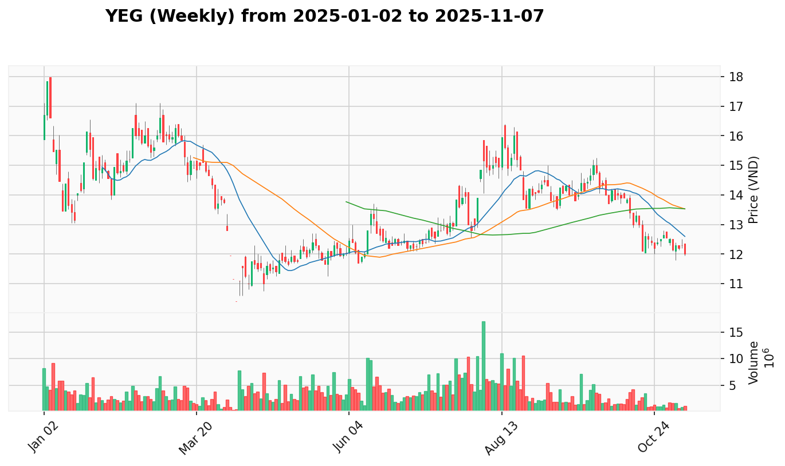

<a href="#others">↑ Back to group OTHERS</a>  |  <a href="#vpa-signal-summary">↑ Back to Top</a>

#### Key Statistics
| Metric | Value |
|:---|---:|
| Date Range | 2025-01-02 to 2025-11-14 |
| **Latest Close** | **12.1** |
| Period Open | 15.88 |
| Period High | 17.98 |
| Period Low | 10.4 |
| Period Change % | -23.80% |

**[Download YEG Data (.csv)](market_data_week/YEG_2025-01-02_to_2025-11-14.csv)**

---

