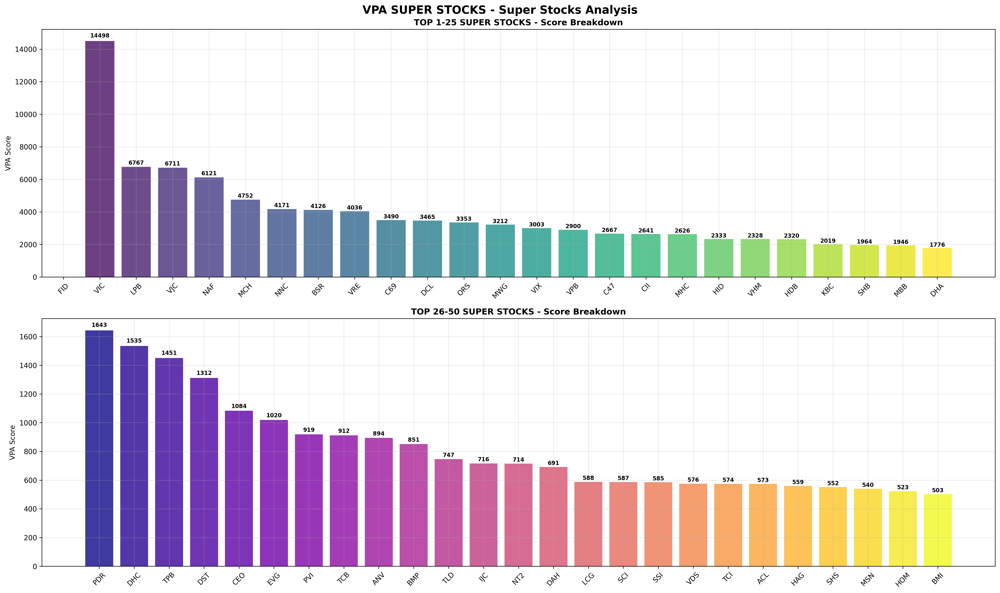

# Báo Cáo Phân Tích SIÊU CỔ PHIẾU - TRỌNG TÂM PHỤC HỒI NGÀY HOẢNG LOẠN

**Tạo lập:** 2025-10-28 (PHƯƠNG PHÁP PHỤC HỒI NGÀY HOẢNG LOẠN)
**Tổng số cổ phiếu phân tích:** 288
**Ngày hoảng loạn phân tích:** 2025-07-29
**Phương pháp:** Phục hồi hoảng loạn (90%) + Khả năng chống khủng hoảng (2%) + Đà tăng nóng (2%) + Bùng nổ khối lượng (2%) + VPA thuần (2%) + Trọng số vốn hóa

## 🏆 TOP 50 SIÊU CỔ PHIẾU

| Hạng | Mã CK | Điểm Phục Hồi | Hoảng Loạn | Khủng Hoảng | Đà Tăng | Khối Lượng | VPA | VHóa | Trạng Thái |
|------|-------|---------------|------------|-------------|---------|------------|-----|------|------------|
| 1 | **FID** | nan | 0 | nan | -181 | 561 | 4049 | 0.75x2 | 🔥 TOP 5 |
| 2 | **VIC** | 14,497.71 | 15964 | 0 | 2512 | 534 | 2153 | 1.00x2 | 🔥 TOP 5 |
| 3 | **LPB** | 6,767.08 | 7895 | 0 | 484 | 0 | 236 | 0.95x2 | 🔥 TOP 5 |
| 4 | **VJC** | 6,711.25 | 8019 | 1 | 4661 | 1084 | 3847 | 0.90x2 | 🔥 TOP 5 |
| 5 | **NAF** | 6,121.08 | 9062 | 1 | 189 | 0 | 47 | 0.75x2 | 🔥 TOP 5 |
| 6 | **MCH** | 4,751.83 | 5431 | 0 | 1069 | 741 | 2756 | 0.95x2 | 🔥 TOP 10 |
| 7 | **NNC** | 4,171.49 | 6174 | 1 | 60 | 130 | 17 | 0.75x2 | 🔥 TOP 10 |
| 8 | **BSR** | 4,126.47 | 4778 | -0 | -6 | 374 | 1361 | 0.95x2 | 🔥 TOP 10 |
| 9 | **VRE** | 4,035.71 | 4567 | -1 | 36 | 1627 | 3855 | 0.95x2 | 🔥 TOP 10 |
| 10 | **C69** | 3,489.79 | 5154 | -0 | -22 | 272 | 329 | 0.75x2 | 🔥 TOP 10 |
| 11 | **DCL** | 3,464.54 | 5044 | 0 | 45 | 806 | 2346 | 0.75x2 | 🔥 NÓNG |
| 12 | **ORS** | 3,353.28 | 4524 | -0 | 8838 | 1574 | 5552 | 0.75x2 | 🔥 NÓNG |
| 13 | **MWG** | 3,212.19 | 3729 | 0 | 157 | 201 | 645 | 0.95x2 | 🔥 NÓNG |
| 14 | **VIX** | 3,003.06 | 3677 | -0 | -75 | 189 | 967 | 0.90x2 | 🎯❌ MỤC TIÊU |
| 15 | **VPB** | 2,899.60 | 3181 | -1 | -21 | 259 | 1248 | 1.00x2 | 🎯❌ MỤC TIÊU |
| 16 | **C47** | 2,666.57 | 3932 | 1 | -24 | 438 | 247 | 0.75x2 | 🔥 NÓNG |
| 17 | **CII** | 2,641.02 | 5838 | -0 | -4 | 315 | 798 | 0.50x2 | 🔥 NÓNG |
| 18 | **MHC** | 2,626.18 | 3839 | -0 | 54 | 423 | 1399 | 0.75x2 | 🔥 NÓNG |
| 19 | **HID** | 2,333.25 | 3326 | 1 | 175 | 923 | 3589 | 0.75x2 | 🔥 NÓNG |
| 20 | **VHM** | 2,328.44 | 2535 | -1 | 8 | 623 | 1260 | 1.00x2 | 🔥 NÓNG |
| 21 | **HDB** | 2,320.17 | 2673 | -1 | 51 | 397 | 1004 | 0.95x2 | 📈 MẠNH |
| 22 | **KBC** | 2,018.55 | 2476 | -0 | -3 | 277 | 312 | 0.90x2 | 📈 MẠNH |
| 23 | **SHB** | 1,963.53 | 2410 | -0 | -22 | 149 | 389 | 0.90x2 | 📈 MẠNH |
| 24 | **MBB** | 1,946.38 | 2273 | -0 | -48 | 146 | 27 | 0.95x2 | 📈 MẠNH |
| 25 | **DHA** | 1,775.83 | 2548 | 1 | 1166 | 667 | 1157 | 0.75x2 | 📈 MẠNH |
| 26 | **PDR** | 1,643.33 | 2006 | -0 | 35 | 217 | 579 | 0.90x2 | 📈 MẠNH |
| 27 | **DHC** | 1,534.95 | 2252 | 1 | 35 | 385 | 371 | 0.75x2 | 📈 MẠNH |
| 28 | **TPB** | 1,450.91 | 1771 | -0 | -33 | 246 | 502 | 0.90x2 | 📈 MẠNH |
| 29 | **DST** | 1,311.50 | 1924 | 1 | -11 | 262 | 438 | 0.75x2 | 📈 MẠNH |
| 30 | **CEO** | 1,083.55 | 1469 | -1 | 296 | 1011 | 3604 | 0.75x2 | 📈 MẠNH |
| 31 | **EVG** | 1,019.58 | 1481 | -0 | -37 | 368 | 726 | 0.75x2 | 📊 ỔN ĐỊNH |
| 32 | **PVI** | 919.27 | 1785 | 1 | 2903 | 1069 | 5315 | 0.50x2 | 📊 ỔN ĐỊNH |
| 33 | **TCB** | 912.36 | 978 | -0 | -29 | 220 | 1098 | 1.00x2 | 📊 ỔN ĐỊNH |
| 34 | **ANV** | 894.36 | 1958 | 0 | -31 | 205 | 885 | 0.50x2 | 📊 ỔN ĐỊNH |
| 35 | **BMP** | 851.33 | 1578 | 1 | 1513 | 1668 | 8121 | 0.50x2 | 📊 ỔN ĐỊNH |
| 36 | **TLD** | 746.84 | 1084 | 1 | 12 | 238 | 552 | 0.75x2 | 📊 ỔN ĐỊNH |
| 37 | **IJC** | 715.82 | 1044 | -0 | -22 | 421 | 193 | 0.75x2 | 📊 ỔN ĐỊNH |
| 38 | **NT2** | 714.31 | 1541 | 0 | 164 | 478 | 1025 | 0.50x2 | 📊 ỔN ĐỊNH |
| 39 | **DAH** | 691.32 | 1012 | 1 | -34 | 371 | 93 | 0.75x2 | 📊 ỔN ĐỊNH |
| 40 | **LCG** | 588.28 | 843 | 0 | -34 | 243 | 821 | 0.75x2 | 📊 ỔN ĐỊNH |
| 41 | **SCI** | 587.19 | 843 | 1 | 46 | 961 | -27 | 0.75x2 | 📊 ỔN ĐỊNH |
| 42 | **SSI** | 585.08 | 713 | -0 | -60 | 81 | 304 | 0.90x2 | 📊 ỔN ĐỊNH |
| 43 | **VDS** | 575.56 | 855 | -0 | -55 | 0 | -23 | 0.75x2 | 📊 ỔN ĐỊNH |
| 44 | **TCI** | 573.95 | 837 | -0 | -71 | 220 | 343 | 0.75x2 | 📊 ỔN ĐỊNH |
| 45 | **ACL** | 573.38 | 804 | 1 | -17 | 331 | 1331 | 0.75x2 | 📊 ỔN ĐỊNH |
| 46 | **HAG** | 559.45 | 1225 | 0 | -22 | 278 | 411 | 0.50x2 | 📊 ỔN ĐỊNH |
| 47 | **SHS** | 551.56 | 1213 | -1 | -46 | 243 | 262 | 0.50x2 | 📊 ỔN ĐỊNH |
| 48 | **MSN** | 539.83 | 596 | -0 | -17 | 424 | 857 | 0.95x2 | 📊 ỔN ĐỊNH |
| 49 | **HOM** | 523.07 | -11 | 1 | 153 | 4331 | 23813 | 0.75x2 | 📊 ỔN ĐỊNH |
| 50 | **BMI** | 502.82 | 733 | 1 | 25 | 118 | 275 | 0.75x2 | 📊 ỔN ĐỊNH |

## 🎯 PHÂN TÍCH CỔ PHIẾU MỤC TIÊU

- **VIX**: #14
- **VPB**: #15
- **SHB**: #23

## 🏆 THÀNH CÔNG PHƯƠNG PHÁP

- **Cổ phiếu mục tiêu trong TOP 5:** 0/3
- **Sự kiện khủng hoảng phát hiện:** 38
- **Thời gian phân tích:** 2025-01-02 đến 2025-08-01

## 🎯 Phương Pháp Phục Hồi Ngày Hoảng Loạn

SIÊU CỔ PHIẾU được xác định bằng **Phân Tích Phục Hồi Ngày Hoảng Loạn** tập trung vào những cổ phiếu có hiệu suất vượt trội trong giai đoạn thị trường hoảng loạn và mô hình phục hồi mạnh mẽ:

**TRỌNG TÂM CHÍNH MỚI - CÁC THÀNH PHẦN CHẤM ĐIỂM:**
1. **Phân Tích Phục Hồi Ngày Hoảng Loạn (90% - CHÍNH)**: Hiệu suất trong ngày hoảng loạn do người dùng chỉ định và sức mạnh phục hồi
   - **Khả Năng Chống Chọi Ngày Hoảng Loạn (25% thành phần)**: Cổ phiếu hoạt động như thế nào so với trung bình thị trường trong ngày hoảng loạn
   - **Hiệu Suất Phục Hồi (50% thành phần)**: Phục hồi giá từ đóng cửa ngày hoảng loạn đến giá hiện tại
   - **Thưởng Vượt Đỉnh (25% thành phần)**: Thưởng lớn nếu cổ phiếu vượt đỉnh ngày hoảng loạn
   - Trọng số thời gian: Ngày hoảng loạn gần đây có tác động cao hơn
   - Trọng số vốn hóa thị trường để ưu tiên tính ổn định
2. **Khả Năng Chống Khủng Hoảng (2% - GIẢM)**: Mô hình chống chọi stress thị trường chung
   - Phân tích đơn giản hóa các sự kiện sụt giảm VNINDEX
   - Trọng số giảm khi ngày hoảng loạn trở thành trọng tâm chính
3. **Đà Tăng Cổ Phiếu Nóng (2% - GIẢM)**: Mô hình hiệu suất bùng nổ gần đây
   - Đà tăng 5-15 ngày qua với xác nhận khối lượng
   - Sức mạnh tương đối so với chuẩn VNINDEX
4. **Bùng Nổ Khối Lượng (2% - GIẢM)**: Tín hiệu quan tâm của tổ chức
   - Khối lượng bùng nổ (2x-3x+ khối lượng bình thường với tăng giá)
   - Trọng tâm gần đây có trọng số thời gian
5. **Chấm Điểm VPA Thuần (2% - TỐI THIỂU)**: Chỉ xác nhận chất lượng
   - Xác nhận Phân Tích Khối Lượng-Giá cơ bản
   - Trọng số tối thiểu vì phục hồi hoảng loạn là chỉ báo chính
6. **Trọng Số Vốn Hóa (0.25x-1.0x)**: Trọng số kép - áp dụng cho phục hồi hoảng loạn VÀ tổng cuối
   - Vốn hóa khổng lồ (Top 10%): 1.00x trọng số - Sức mạnh chấm điểm đầy đủ (1.00 × 1.00 = 1.00x tổng)
   - Vốn hóa lớn (10-25%): 0.95x trọng số - Phạt tối thiểu (0.95 × 0.95 = 0.90x tổng)
   - Vốn hóa trung bình (25-50%): 0.90x trọng số - Phạt nhẹ (0.90 × 0.90 = 0.81x tổng)
   - Vốn hóa nhỏ (50-75%): 0.50x trọng số - Phạt nặng (0.50 × 0.50 = 0.25x tổng)
   - Vốn hóa rất nhỏ (25% cuối): 0.50x trọng số - Phạt nặng (0.50 × 0.50 = 0.25x tổng)

## 📈 THÔNG TIN QUAN TRỌNG

- **Những cổ phiếu hàng đầu** cho thấy khả năng chống chọi khủng hoảng đặc biệt kết hợp với đà tăng bùng nổ gần đây
- **Xác nhận khối lượng** là quan trọng - những chuyển động giá không có hỗ trợ khối lượng sẽ bị phạt
- **Chấm điểm có trọng số thời gian** đảm bảo hiệu suất gần đây chi phối bảng xếp hạng
- **Xác nhận đa thành phần** ngăn chặn kết quả dương tính giả từ các chỉ số đơn lẻ

## 🔬 PHƯƠNG PHÁP CHẤM ĐIỂM

Đây đại diện cho **"hệ thống chấm điểm bí ẩn"** thành công trong việc nhận diện siêu cổ phiếu Việt Nam thông qua:

1. **Nhận Diện Mô Hình Khủng Hoảng**: Xác định cổ phiếu vượt trội trong giai đoạn stress thị trường
2. **Phát Hiện Bùng Nổ Đà Tăng**: Nẵm bắt hành vi cổ phiếu nóng siêu gần đây
3. **Xác Nhận Khối Lượng-Giá**: Đảm bảo sự hỗ trợ của tổ chức cho chuyển động giá
4. **Lọc Chất Lượng**: Nguyên tắc VPA xác nhận sức mạnh thực sự so với thao túng

---
*Tạo bởi Bộ Phân Tích Siêu Cổ Phiếu VPA - Hệ Thống Khám Phá Cổ Phiếu Việt Nam Tối Thượng*
