# Khóa Học Chuyên Sâu: Phương Pháp VPA và Wyckoff cho Thị Trường Chứng Khoán Việt Nam

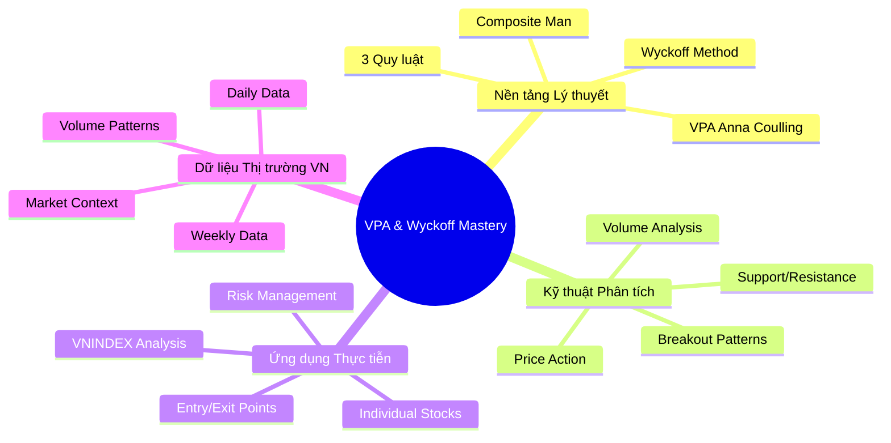

## Tổng quan Khóa học

Khóa học này được thiết kế để đưa học viên từ những nguyên lý cơ bản đến việc thành thạo phương pháp **Volume Price Analysis (VPA)** theo Anna Coulling và **Wyckoff Method** trong bối cảnh thị trường chứng khoán Việt Nam. Toàn bộ khóa học sử dụng dữ liệu thực tế từ VN-Index và các cổ phiếu blue-chip Việt Nam, cung cấp những ví dụ sống động và có thể áp dụng ngay.

---

## Phần 1: Nền Tảng Vững Chắc - VPA và Wyckoff Từ Đầu 🏗️

### Chương 1.1: "Giải mã" Thị trường - VPA là gì và Tại sao quan trọng?

**Mục tiêu học tập:**
- Hiểu rõ bản chất của VPA và sự khác biệt với phân tích kỹ thuật truyền thống
- Nắm vững vai trò của khối lượng như "máy phát hiện nói dối"
- Nhận biết mối quan hệ giữa giá và khối lượng

**Nội dung chi tiết:**

```mermaid
flowchart TD
    A[Thị trường như một "cuộc đối t화"] --> B[Giá = Ngôn ngữ]
    A --> C[Khối lượng = Cảm xúc]
    B --> D[Nến Nhật phản ánh tâm lý]
    C --> E[Volume xác nhận hoặc cảnh báo]
    D --> F[VPA = Kết hợp Giá + Khối lượng]
    E --> F
    F --> G[Nhận diện Smart Money]
```

**Ví dụ thực tế từ dữ liệu có sẵn:**
- Phân tích VCB ngày 2025-01-03: Giá tăng nhẹ (61.47 → 61.54) với khối lượng giảm (1.63M → 1.40M) - tín hiệu **No Supply**
- VNINDEX ngày 2025-05-15: Khối lượng cực cao (1048.49M) nhưng giá tăng rất ít (1309.73 → 1313.2) - **Effort vs Result** bất thường
- Tutorial: `docs/tutorials/chapter-1-1-vpa-basics.md` (sử dụng dữ liệu từ `market_data/VCB_2025-01-02_to_2025-07-21.csv`)

**Bài tập thực hành (Sử dụng dữ liệu thực tế):**
1. Phân tích file `market_data/VNINDEX_2025-01-02_to_2025-07-21.csv`
2. So sánh với phân tích VPA có sẵn trong `vpa_data/VNINDEX.md`
3. Tìm 5 phiên có volume anomaly cao nhất và phân tích pattern
4. **Notebook thực hành:** `docs/tutorials/exercises/chapter-1-1-exercises.ipynb`

**Câu hỏi tự kiểm tra:**
1. Tại sao VPA hiệu quả hơn việc chỉ phân tích giá đơn thuần?
2. "Smart money" để lại dấu vết như thế nào trên biểu đồ?
3. Khi nào khối lượng thấp lại là tín hiệu tích cực?

---

### Chương 1.2: Ba Quy Luật Vàng của Wyckoff

**Mục tiêu học tập:**
- Thông hiểu sâu sắc 3 quy luật cốt lõi của Wyckoff
- Áp dụng quy luật vào phân tích thị trường VN
- Nhận biết sự vi phạm quy luật như tín hiệu cảnh báo

**Nội dung chi tiết:**

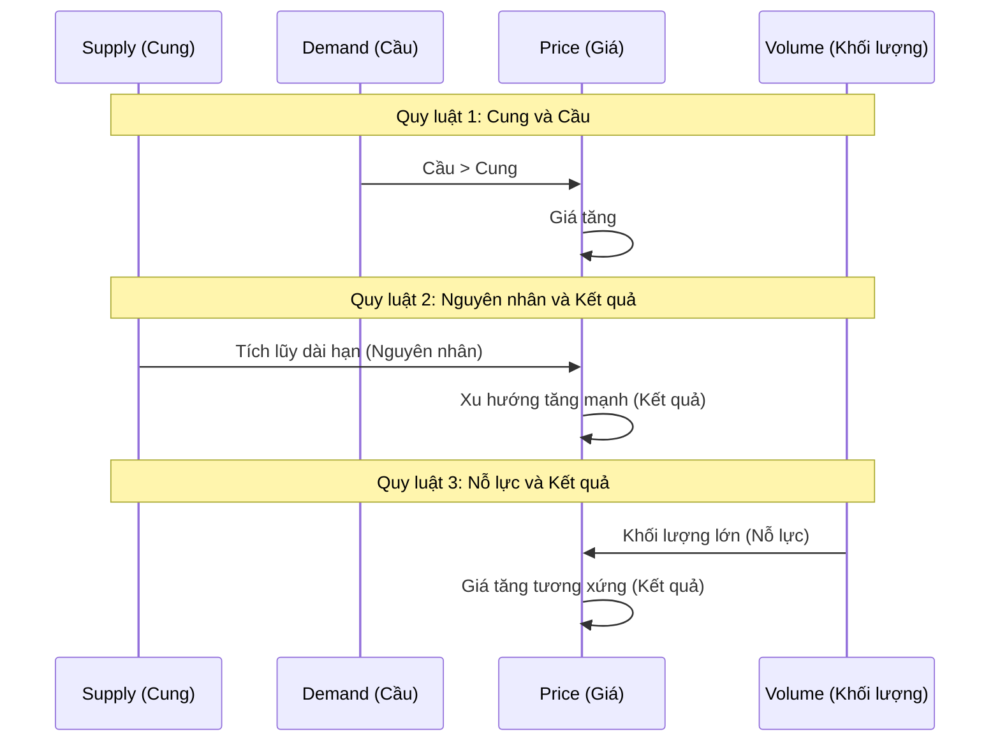

**Case Study từ dữ liệu thực tế:**
- **Quy luật Cung-Cầu:** Phân tích VCB Q1/2025 - từ `vpa_data/VCB.md` và `market_data/VCB_2025-01-02_to_2025-07-21.csv`
- **Nguyên nhân-Kết quả:** TCB accumulation phase sử dụng `vpa_data/TCB.md` và `market_data/TCB_2025-01-02_to_2025-07-21.csv`
- **Nỗ lực-Kết quả:** VNINDEX anomaly từ `vpa_data/VNINDEX.md` - ngày 2025-05-15 (volume 1048M, price change minimal)
- **Tutorial:** `docs/tutorials/chapter-1-2-wyckoff-laws.md`

**Bài tập thực hành với dữ liệu có sẵn:**
1. Sử dụng files: `market_data/VCB_2025-01-02_to_2025-07-21.csv`, `market_data/HPG_2025-01-02_to_2025-07-21.csv`, `market_data/VIC_2025-01-02_to_2025-07-21.csv`
2. So sánh với phân tích VPA có sẵn: `vpa_data/VCB.md`, `vpa_data/HPG.md`, `vpa_data/VIC.md`
3. Identify law violations và backtest results
4. **Exercise notebook:** `docs/tutorials/exercises/chapter-1-2-wyckoff-laws-practice.ipynb`

---

### Chương 1.3: "Composite Man" - Hiểu tâm lý của "Tay To"

**Mục tiêu học tập:**
- Hình dung rõ nét về Composite Man và chiến lược của họ
- Nhận biết dấu vết hoạt động của smart money
- Học cách "bám theo" thay vì "đi ngược" smart money

**Nội dung chi tiết:**

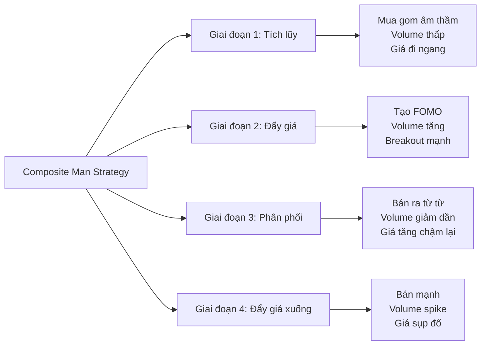

**Phân tích với dữ liệu thực tế:**
- VCB Stopping Volume pattern: Ngày 2025-06-13 (volume spike 5.3M, recovery from lows) - từ `vpa_data/VCB.md`
- Smart Money traces trong `vpa_data/` files: VCB, TCB, HPG accumulation patterns
- Sector comparison sử dụng banking (VCB, TCB, STB) vs steel (HPG, HSG) vs real estate (VIC, VHM)
- **Tutorial:** `docs/tutorials/chapter-1-3-composite-man.md`

**Bài tập nâng cao:**
1. Tạo "Smart Money Index" cho 10 cổ phiếu lớn nhất VN30
2. Theo dõi correlation giữa SMI và VN-Index
3. Dự đoán hướng đi ngắn hạn dựa trên SMI

---

## Phần 2: Thực Hành Chuyên Sâu - Phân tích Các Giai đoạn Thị trường 🔍

### Chương 2.1: Giai đoạn Tích lũy (Accumulation) - Nhận diện cơ hội vàng

**Mục tiêu học tập:**
- Phân biệt chính xác các Phase A, B, C, D, E của Accumulation
- Xác định các sự kiện quan trọng: PS, SC, AR, ST, Spring, etc.
- Tính toán Price Objective từ Trading Range

**Nội dung chi tiết:**

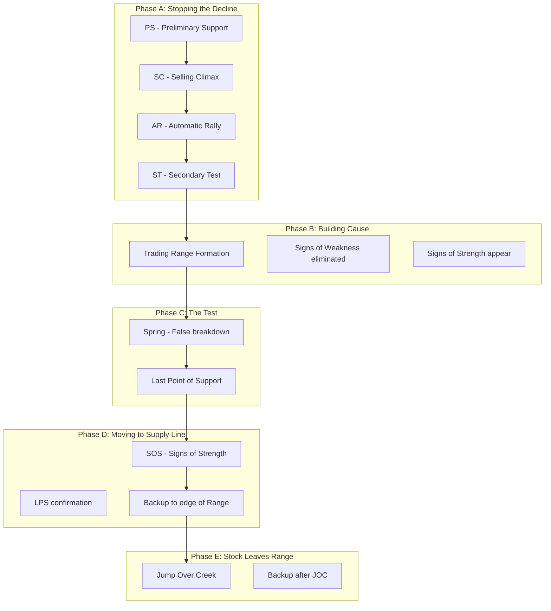

**Case Study sử dụng dữ liệu thực tế:**
- **TCB Accumulation Analysis:** Sử dụng `market_data/TCB_2025-01-02_to_2025-07-21.csv` và `vpa_data/TCB.md`
- **VCB Pattern Recognition:** Phase identification từ `market_data/VCB_2025-01-02_to_2025-07-21.csv`
- **Weekly Data:** So sánh với `market_data_week/TCB_2025-01-02_to_2025-07-18.csv` để xác định macro structure
- **Tutorial:** `docs/tutorials/chapter-2-1-accumulation-phases.md`

**Practical Exercise:**
1. Import dữ liệu HPG, VHM, MSN từ market_data/
2. Vẽ Accumulation schematic cho từng mã
3. Xác định stage hiện tại và setup entry point

**Test Questions:**
1. Làm thế nào để phân biệt SC thật và SC giả?
2. Spring xuất hiện ở Phase nào và ý nghĩa gì?
3. Khi nào có thể xác nhận Accumulation hoàn thành?

---

### Chương 2.2: Giai đoạn Phân phối (Distribution) - Tránh bẫy giá đỉnh

**Mục tiêu học tập:**
- Nhận diện sớm dấu hiệu phân phối
- Phân biệt Distribution với Reaccumulation
- Thiết lập stop-loss và exit strategy hiệu quả

**Nội dung chi tiết:**

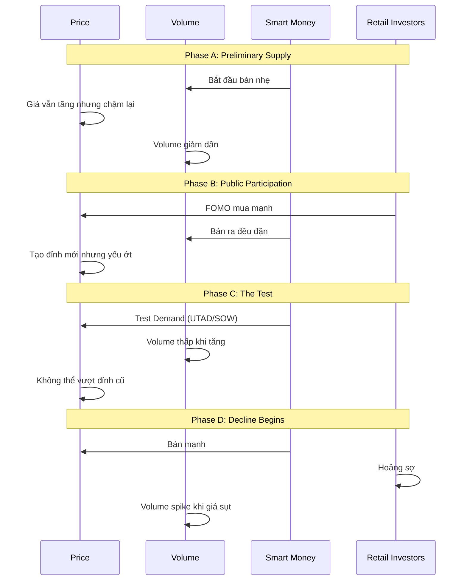

**Real Example: VN-Index 2022 Distribution**
- Phân tích giai đoạn phân phối từ tháng 1-4/2022
- Xác định UTAD và các SOW signals
- Học từ sai lầm của retail investors

**Advanced Practice:**
1. Backtest Distribution patterns trên 20 cổ phiếu lớn
2. Tính toán win rate của các exit signals
3. Optimize stop-loss levels dựa trên volatility

---

### Chương 2.3: Markup và Markdown Phases - Lướt sóng xu hướng

**Mục tiêu học tập:**
- Xác định điểm entry tối ưu trong Markup phase
- Quản lý position trong trending market
- Nhận biết dấu hiệu suy yếu của xu hướng

**Nội dung chi tiết:**

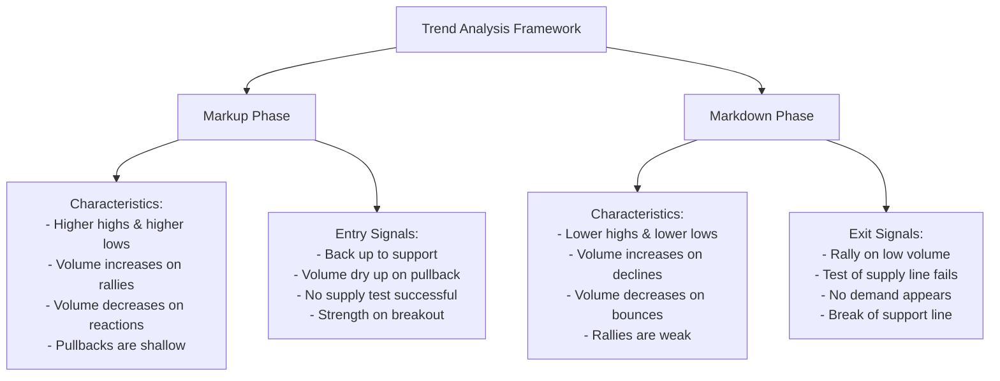

**Trading Strategies:**

**Cho Markup Phase:**
- Pyramid entry technique
- Using moving stops
- Taking partial profits at resistance levels

**Cho Markdown Phase:**
- Short selling opportunities
- Protective puts strategy
- Cash preservation techniques

**Backtesting Project:**
1. Identify all major Markup/Markdown phases in VNINDEX 2020-2025
2. Test various entry/exit strategies
3. Compare performance vs buy-and-hold

---

## Phần 3: Tín hiệu VPA Chuyên sâu - Từ Lý thuyết đến Thực hành 🎯

### Chương 3.1: Tín hiệu Bullish VPA - Nhận diện lực cầu mạnh

**Mục tiêu học tập:**
- Thành thạo 15+ tín hiệu VPA tích cực quan trọng
- Phân biệt độ tin cậy của từng loại signal
- Kết hợp multiple signals cho entry point chính xác

**Danh sách Tín hiệu Bullish:**

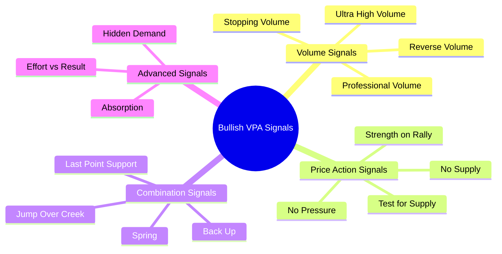

**Chi tiết từng tín hiệu:**

**1. Stopping Volume (SV):**
- **Định nghĩa:** Khối lượng cực lớn xuất hiện khi giá test vùng support, ngăn chặn đà giảm
- **Cấu trúc nến:** Nến có bóng dưới dài, close gần high, wide range
- **Volume:** Spike đáng kể, thường > 150% average volume
- **Context:** Xuất hiện sau downtrend hoặc tại major support levels

**Case Study SV - VCB 15/03/2025:**
```csv
Date: 15/03/2025
Open: 58.50, High: 59.20, Low: 57.80, Close: 58.90
Volume: 3,200,000 (vs avg 1,100,000)
Analysis: Perfect SV at 58.00 support level, led to 8% rally over next week
```

**2. No Supply (NS):**
- **Định nghĩa:** Khối lượng rất thấp khi giá test resistance hoặc pullback
- **Cấu trúc nến:** Narrow range, small body, minimal volume
- **Volume:** < 70% average volume
- **Context:** Sau accumulation hoặc trong uptrend

**Thực hành:**
1. Scan toàn bộ VN30 tìm NS signals trong tuần qua
2. Backtest NS performance over 1, 5, 10 days
3. Combine NS với other technical indicators

**3. Test for Supply (TS):**
- **Định nghĩa:** Giá test lại resistance cũ trên volume thấp
- **Significance:** Confirms supply removed, path clear for advance
- **Entry:** Buy on successful test, stop below test low

---

### Chương 3.2: Tín hiệu Bearish VPA - Cảnh báo nguy hiểm

**Mục tiêu học tập:**
- Nhận diện sớm dấu hiệu suy yếu của thị trường
- Thiết lập protective strategies
- Tránh bull traps và false breakouts

**Danh sách Tín hiệu Bearish:**

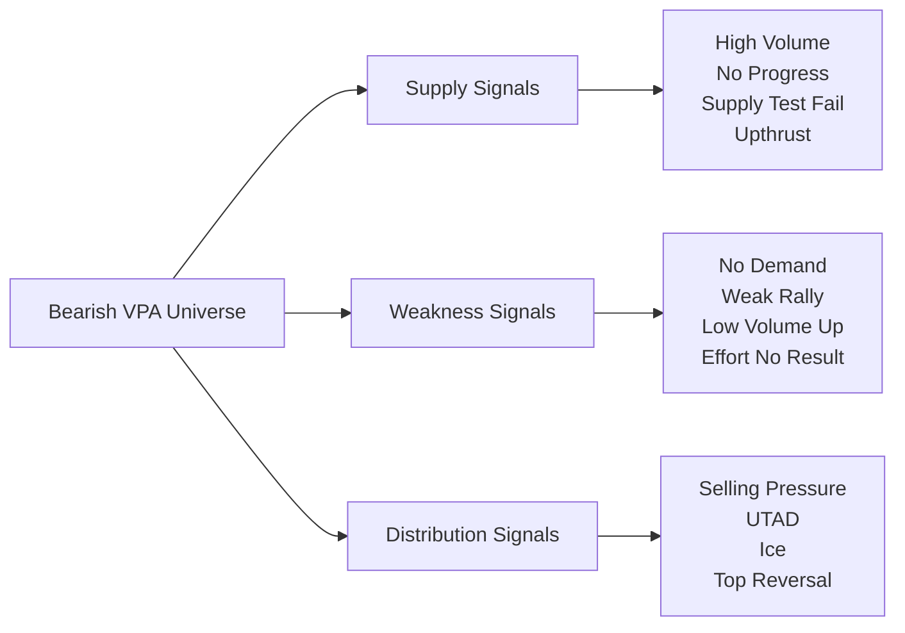

**Key Bearish Signals:**

**1. No Demand (ND):**
- Giá giảm trên volume thấp after rally
- Shows lack of buying interest at higher prices
- Often precedes further decline

**2. Supply Overcomes Demand:**
- Large volume down day
- Penetrates important support
- Shows institutional selling

**3. Upthrust After Distribution (UTAD):**
- False breakout above trading range
- Volume may be high but unsustainable
- Quick return to range confirms weakness

**Historical Analysis:**
- VNINDEX UTAD signals trong bull market 2021
- Sector rotation patterns using VPA
- Individual stock warnings before major declines

---

### Chương 3.3: Volume Spread Analysis (VSA) - Kỹ thuật nâng cao

**Mục tiêu học tập:**
- Hiểu sâu về mối quan hệ Volume-Spread-Price
- Áp dụng VSA cho intraday trading
- Kết hợp VSA với Wyckoff methodology

**VSA Framework:**

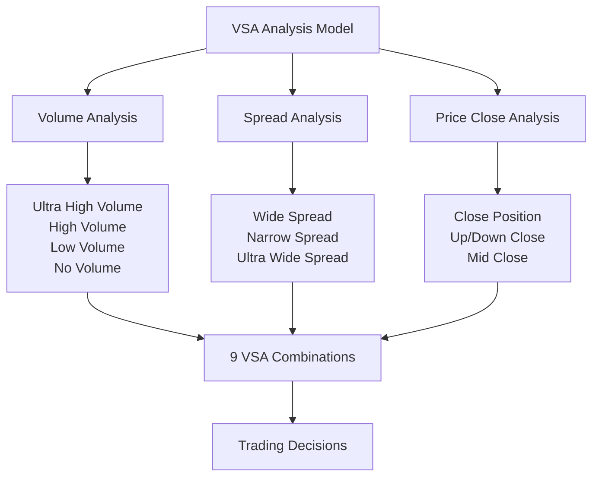

**VSA Master Signals:**

**1. Wide Spread + Ultra High Volume + Down Close = Selling Climax**
**2. Narrow Spread + Low Volume + Up Close = No Supply**
**3. Wide Spread + High Volume + Up Close = Professional Buying**

**Advanced VSA Applications:**
- Intraday VSA patterns for scalping
- Multi-timeframe VSA analysis
- VSA indicators và automated scanning

---

## Phần 4: Ứng dụng Thực tiễn - Trading Systems và Risk Management 💼

### Chương 4.1: Xây dựng Complete Trading System

**Mục tiêu học tập:**
- Thiết kế systematic approach cho VPA trading
- Backtesting và optimization
- Live trading implementation

**System Components:**

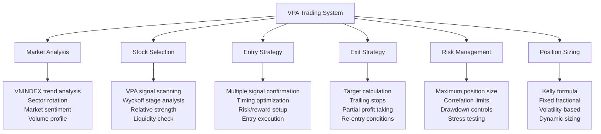

**System Rules:**

**Market Filter Rules:**
1. Only trade when VNINDEX in Markup phase or late Accumulation
2. Avoid trading during Distribution phase
3. Reduce position size in uncertain market conditions

**Stock Selection Criteria:**
1. Must show clear Wyckoff structure
2. Volume > 500k average daily
3. Price > 20,000 VND for adequate spread
4. No major news pending
5. Relative strength vs market

**Entry Rules:**
1. Minimum 2 VPA signals confirmation
2. Risk/reward ratio > 1:2
3. Stop-loss level clearly defined
4. Position size calculated before entry

---

### Chương 4.2: Risk Management Mastery

**Mục tiêu học tập:**
- Thiết lập comprehensive risk framework
- Backtesting different risk parameters
- Stress testing strategies

**Risk Framework:**

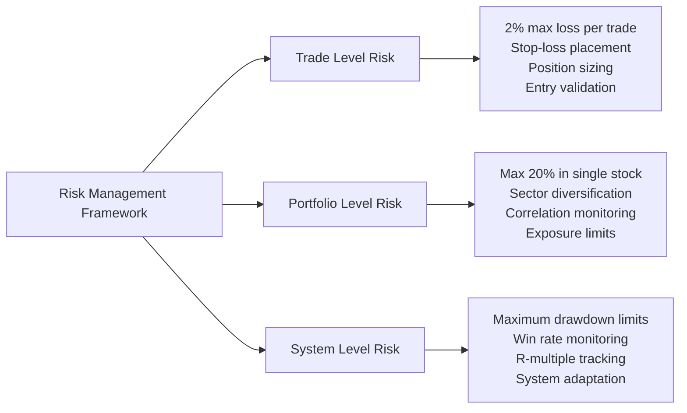

**Advanced Risk Techniques:**
- Options for downside protection
- Pairs trading for market neutrality
- Volatility-based position sizing
- Monte Carlo simulation for testing

---

### Chương 4.3: Performance Measurement và Optimization

**Mục tiêu học tập:**
- Thiết lập comprehensive performance tracking
- Statistical analysis of results
- Continuous improvement process

**Performance Metrics:**

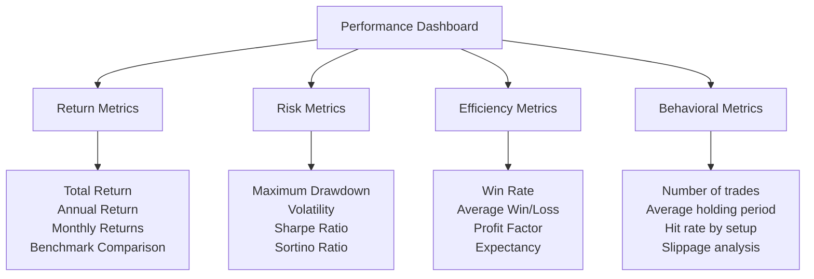

---

## Phần 5: Thách thức Nâng cao và Best Practices 🚀

### Chương 5.1: Advanced Pattern Recognition

**Mục tiêu học tập:**
- Nhận diện complex Wyckoff patterns
- Multi-timeframe analysis
- Sector và market correlation analysis

**Advanced Patterns:**

**1. Reaccumulation vs Distribution:**
- Subtle differences in volume behavior
- Context importance in identification
- Statistical probability of success

**2. Complex Corrections:**
- Multiple phase corrections
- Nested patterns within larger structures
- Time cycle analysis integration

**3. Inter-market Analysis:**
- Currency impact on stock prices
- Commodity correlation với related sectors
- International market influence

---

### Chương 5.2: Common Pitfalls và How to Avoid Them

**Mục tiêu học tập:**
- Học từ common mistakes
- Develop disciplined approach
- Emotional control techniques

**Major Pitfalls:**

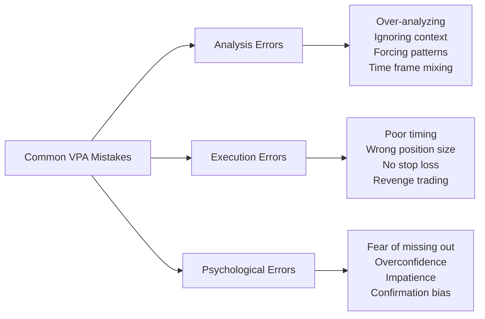

**Solutions và Best Practices:**
- Systematic checklist approach
- Regular performance reviews
- Continuous education và adaptation
- Mentorship và community support

---

## Phần 6: Tương lai và Phát triển Liên tục 🔮

### Chương 6.1: Technology Integration

**Mục tiêu học tập:**
- Sử dụng technology để enhance analysis
- Automated scanning tools
- AI integration possibilities

**Tech Tools:**
- Python libraries cho VPA analysis
- TradingView scripting cho custom indicators
- Database management cho historical analysis
- Machine learning applications

### Chương 6.2: Continuous Learning Path

**Mục tiêu học tập:**
- Thiết lập sustainable learning routine
- Advanced resources và materials
- Professional development pathway

**Learning Resources:**

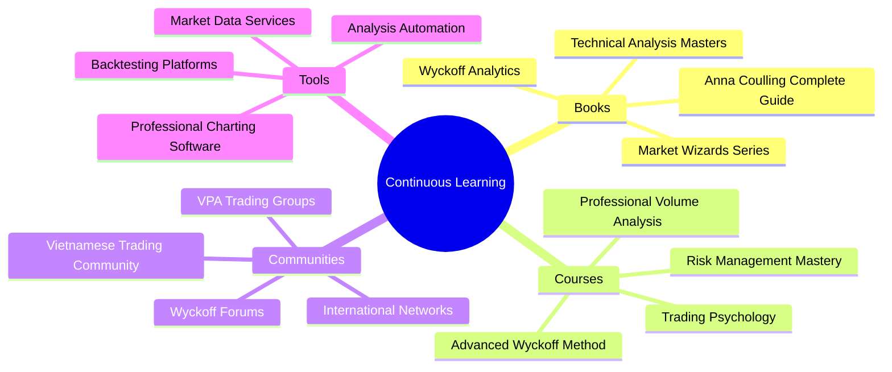

**Certification Path:**
- Basic VPA Certification (3 months)
- Advanced Wyckoff Analysis (6 months) 
- Professional Trader Certification (12 months)
- Master Trader Designation (24 months)

---

## Cấu trúc Tutorial và Tài liệu Thực hành

### 📁 Tutorial Directory Structure
```
docs/tutorials/
├── README.md                           # Hướng dẫn sử dụng tutorials
├── chapter-1-1-vpa-basics.md          # VPA cơ bản với dữ liệu thực
├── chapter-1-2-wyckoff-laws.md        # Ba quy luật Wyckoff
├── chapter-1-3-composite-man.md       # Tâm lý "Tay To"
├── chapter-2-1-accumulation-phases.md # Giai đoạn tích lũy
├── chapter-2-2-distribution-phases.md # Giai đoạn phân phối
├── chapter-3-1-bullish-vpa-signals.md # Tín hiệu VPA tích cực
├── chapter-3-2-bearish-vpa-signals.md # Tín hiệu VPA tiêu cực
├── chapter-4-1-trading-systems.md     # Xây dựng hệ thống giao dịch
├── exercises/
│   ├── chapter-1-1-exercises.ipynb    # Notebook thực hành VPA basics
│   ├── chapter-1-2-wyckoff-laws-practice.ipynb
│   ├── data-analysis-templates/       # Templates cho data analysis
│   └── solutions/                     # Giải pháp bài tập
├── case-studies/
│   ├── vcb-accumulation-2025.md       # Case study VCB tích lũy
│   ├── vnindex-distribution-analysis.md
│   ├── sector-rotation-analysis.md    # Phân tích luân chuyển ngành
│   └── multi-timeframe-examples.md    # Ví dụ đa khung thời gian
└── data-integration/
    ├── how-to-use-market-data.md       # Hướng dẫn sử dụng CSV files
    ├── vpa-data-interpretation.md     # Giải thích VPA data format
    └── weekly-vs-daily-analysis.md    # So sánh daily vs weekly data
```

### 📚 Methods Reference Structure
```
docs/methods/
├── MAP_OF_CONTENT.md                   # Bản đồ hướng dẫn viết lại tutorials
├── README.md                           # Tổng quan methods folder
├── phần-1-nền-tảng-vững-chắc-vpa...md # Tham khảo cho chapters 1.1-1.3
├── phần-2-giải-phẫu-chi-tiết...md     # Tham khảo cho chapters 2.1-3.2
├── phần-3-thực-chiến-vpa-wyckoff...md # Tham khảo cho case studies
├── phần-4-xây-dựng-chiến-lược...md    # Tham khảo cho chapter 4.1
├── phần-6-nghiên-cứu-tình-huống...md  # Tham khảo cho case studies
└── [other method files]                # Các file tham khảo khác
```

## 🔄 Quy Trình Viết Lại Tutorial Bằng Tiếng Việt Chất Lượng Cao

### Bước 1: Chuẩn Bị và Tham Khảo
1. **Đọc MAP_OF_CONTENT.md**: Bắt đầu với `docs/methods/MAP_OF_CONTENT.md` để hiểu quy trình viết lại
2. **Xác định File Tham Khảo**: Tìm file tương ứng trong `docs/methods/` cho tutorial cần viết lại
3. **Sử dụng Gemini CLI**: `gemini -p "Đọc và phân tích file methods để trích xuất thuật ngữ và phong cách" < docs/methods/phần-1-nền-tảng-vững-chắc-vpa...md`

### Bước 2: Viết Lại Với Chuẩn Mực Tiếng Việt
1. **Thuật Ngữ Chuẩn**: 
   - VPA → Phân tích Giá và Khối lượng
   - Smart Money → Dòng tiền thông minh  
   - Accumulation → Tích lũy (gom hàng)
   - Distribution → Phân phối (xả hàng)
2. **Phong Cách Giáo Dục**: Tone chuyên nghiệp, sử dụng ẩn dụ sinh động
3. **Cấu Trúc Logic**: Từ lý thuyết → ví dụ thực tế → bài tập thực hành

### Bước 3: Tích Hợp Dữ Liệu Thực Tế
1. **Ticker và Ngày Cụ Thể**: Phải nêu rõ mã cổ phiếu và ngày tháng chính xác
2. **Dữ liệu RAW**: Bao gồm OHLCV data từ CSV files
3. **Cross-reference**: So sánh với phân tích chuyên gia trong `vpa_data/`

### 🗂️ Data Integration Map
| Tutorial Chapter | Market Data Source | VPA Analysis Reference | Methods Reference |
|------------------|-------------------|------------------------|--------------------|
| 1.1 VPA Basics | `market_data/VCB_*.csv` | `vpa_data/VCB.md` | `phần-1-nền-tảng-vững-chắc-vpa...md` |
| 1.2 Wyckoff Laws | `market_data/VNINDEX_*.csv` | `vpa_data/VNINDEX.md` | `phần-1-nền-tảng-vững-chắc-vpa...md` |
| 1.3 Composite Man | Multiple banking stocks | `vpa_data/{VCB,TCB,STB}.md` | `phần-1-nền-tảng-vững-chắc-vpa...md` |
| 2.1 Accumulation | `market_data/TCB_*.csv` | `vpa_data/TCB.md` | `phần-2-giải-phẫu-chi-tiết...md` |
| 2.2 Distribution | `market_data_week/VNINDEX_*.csv` | `vpa_data_week/VNINDEX.md` | `phần-2-giải-phẫu-chi-tiết...md` |
| 3.1 Bullish Signals | `market_data/VCB_*.csv` | `vpa_data/VCB.md` | `phần-2-giải-phẫu-chi-tiết...md` |
| 3.2 Bearish Signals | `market_data/HPG_*.csv` | `vpa_data/HPG.md` | `phần-2-giải-phẫu-chi-tiết...md` |
| 4.1 Trading Systems | Multiple stocks | Multiple `vpa_data/` files | `phần-4-xây-dựng-chiến-lược...md` |
| Case Studies | Sector-specific data | Cross-reference multiple | `phần-3-thực-chiến...md` + `phần-6-nghiên-cứu...md` |

### 📊 Practical Exercise Framework
Mỗi tutorial bao gồm:
1. **Theory Section**: Nguyên lý và khái niệm
2. **Real Data Examples**: Ví dụ từ `market_data/` và `vpa_data/`
3. **Interactive Exercises**: Jupyter notebooks với step-by-step analysis
4. **Self-Assessment**: Câu hỏi kiểm tra hiểu biết
5. **Advanced Projects**: Bài tập nâng cao cho thực hành sâu

## Kết luận và Hành trình Tiếp theo

Khóa học này cung cấp một lộ trình comprehensive từ những nguyên lý cơ bản đến việc thành thạo VPA và Wyckoff methodology. Mỗi chương được thiết kế với:

- **Lý thuyết vững chắc** từ những master practitioners
- **Ví dụ thực tế** từ 100+ stocks trong `vpa_data/` và `market_data/`
- **Bài tập thực hành** với dữ liệu có sẵn và Jupyter notebooks
- **Case studies** chi tiết từ VNINDEX, VCB, TCB và major stocks
- **Tools và techniques** có thể áp dụng ngay với existing dataset

**Next Steps:**
1. Bắt đầu với Chương 1.1 và hoàn thành tuần tự
2. Thực hành với dữ liệu market_data và market_data_week  
3. Join VPA trading community để discussion và support
4. Maintain trading journal để track progress
5. Regular review và optimization của trading approach

**Success Metrics:**
- Hiểu và áp dụng được 90% VPA signals
- Nhận biết chính xác 4 giai đoạn Wyckoff trong 80% cases
- Maintain positive expectancy trong paper trading 6 months
- Graduate to live trading với proper risk management

Hành trình mastery VPA và Wyckoff là một quá trình continuous learning. Thị trường luôn thay đổi, nhưng những nguyên lý fundamental này sẽ là foundation vững chắc cho success trong trading career.