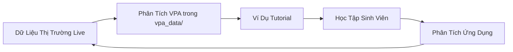

# Hệ Thống Giáo Dục VPA & Phương Pháp Wyckoff

## 🎯 Tổng Quan

Dự án này bao gồm một **hệ thống giáo dục toàn diện bằng tiếng Việt** về Phân Tích Khối Lượng Giá (VPA) và các nguyên lý Phương Pháp Wyckoff. Hệ thống tutorial này đại diện cho một bản dịch và nâng cấp hoàn chỉnh của giáo dục giao dịch cấp tổ chức, được điều chỉnh đặc biệt cho thị trường Việt Nam với các ví dụ dữ liệu thị trường thực tế.

> **📋 Thông tin kỹ thuật về hệ thống:** Xem [TECHNICAL.md](TECHNICAL.md) để biết chi tiết về scripts, cấu hình, và vận hành hệ thống.

### 📊 Thông Số Hệ Thống
- **32 Chương Tutorial** (từ cơ bản đến cấp tổ chức)
- **8 Nghiên Cứu Tình Huống** thực tế với dữ liệu Việt Nam
- **100% Tiếng Việt chất lượng chuyên nghiệp**
- **Dữ Liệu Hàng Ngày:** `market_data/` - 100+ cổ phiếu từ tháng 1-7 năm 2025
- **Dữ Liệu Hàng Tuần:** `market_data_week/` - cùng các cổ phiếu, khung thời gian tuần
- **Phân Tích VPA Chuyên Gia:** `vpa_data/` & `vpa_data_week/` - Files phân tích chuyên nghiệp
- **Bao gồm:** VNINDEX + VN30 + các cổ phiếu lớn

## 🎓 Triết Lý Giáo Dục & Phương Pháp Tiếp Cận

**Thiết Kế Học Tập Tiến Bộ:**
Hệ thống tutorial tuân theo một tiến trình có cấu trúc cẩn thận từ **các khái niệm cấp đại học** (độ khó 9.2/10) đến **kiến thức chuyên gia tổ chức** (độ khó 10/10), đảm bảo chuyển giao kiến thức mượt mà mà không làm choáng ngợp người mới bắt đầu.

**Tích Hợp Thị Trường Thực Tế:**
Mọi khái niệm đều được minh họa bằng **dữ liệu cổ phiếu Việt Nam thực tế** từ các thư mục `market_data/` và `vpa_data/` của pipeline, cung cấp trải nghiệm học tập chân thực thay vì các ví dụ lý thuyết.

**Thuật Ngữ Tài Chính Việt Nam:**
Tất cả các khái niệm kỹ thuật đã được dịch chuyên nghiệp sử dụng thuật ngữ tài chính Việt Nam phù hợp, làm cho các khái niệm VPA nâng cao có thể tiếp cận được đối với các nhà đầu tư nói tiếng Việt lần đầu tiên.

## 📖 Cấu Trúc Tutorial Hoàn Chỉnh

### **PHẦN I: Nền Tảng VPA & Wyckoff (Khái Niệm Cơ Bản)**

| Tutorial | Mô Tả | Dữ Liệu Sử Dụng | Độ Khó | Thời Gian |
|----------|-------|------------------|---------|-----------|
| **[Chương 1.1: Căn Bản VPA](tutorials/chapter-1-1-vpa-basics.md)** | Nguyên lý cốt lõi của Phân Tích Khối Lượng Giá | VCB, VNINDEX hàng ngày | 🟢 Cơ bản | 2-3h |
| **[Chương 1.2: Các Định Luật Wyckoff](tutorials/chapter-1-2-wyckoff-laws.md)** | Ba quy luật Wyckoff: Cung/Cầu, Nhân/Quả, Nỗ lực/Kết quả | TCB, ngành Ngân hàng | 🟡 Trung cấp | 3-4h |
| **[Chương 1.3: Composite Man](tutorials/chapter-1-3-composite-man.md)** | Hành vi dòng tiền thông minh và góc nhìn tổ chức | So sánh đa cổ phiếu | 🟡 Trung cấp | 2-3h |

**Mục Tiêu Phần I:**
- **Động lực mối quan hệ khối lượng-giá**
- **Hành vi dòng tiền thông minh vs dòng tiền retail**
- **Nhận dạng tín hiệu VPA cơ bản**
- **Sử dụng các công ty dẫn đầu thị trường Việt Nam (VIC, VCB, FPT) làm ví dụ**

### **PHẦN II: Phân Tích Chu Kỳ Thị Trường (Các Giai Đoạn Thị Trường)**

| Tutorial | Mô Tả | Dữ Liệu Sử Dụng | Độ Khó | Thời Gian |
|----------|-------|------------------|---------|-----------|
| **[Chương 2.1: Các Pha Tích Lũy](tutorials/chapter-2-1-accumulation-phases.md)** | Phân tích chi tiết 5 giai đoạn tích lũy Wyckoff | Chiến dịch tích lũy VCB 2025 | 🟠 Nâng cao | 4-5h |
| **[Chương 2.2: Các Pha Phân Phối](tutorials/chapter-2-2-distribution-phases.md)** | Patterns phân phối và dấu hiệu cảnh báo đỉnh thị trường | Phân phối VNINDEX tháng 5/2025 | 🟠 Nâng cao | 4-5h |

**Mục Tiêu Phần II:**
- **Sử dụng các mô hình tích lũy thực tế từ blue chips Việt Nam**
- **Biểu đồ được tạo bởi `main.py` với thư viện mplfinance**
- **Ví dụ phân phối thị trường Việt Nam lịch sử**
- **Khung đánh giá rủi ro đặc thù Việt Nam**

### **PHẦN III: Thành Thạo Tín Hiệu VPA (Nhận Dạng Tín Hiệu)**

| Tutorial | Mô Tả | Dữ Liệu Sử Dụng | Độ Khó | Thời Gian |
|----------|-------|------------------|---------|-----------|
| **[Chương 3.1: Tín Hiệu VPA Tăng Giá](tutorials/chapter-3-1-bullish-vpa-signals.md)** | 15+ tín hiệu tăng giá: Stopping Volume, No Supply, Spring | VCB ngày 13/6/2025 | 🔴 Chuyên gia | 5-6h |
| **[Chương 3.2: Tín Hiệu VPA Giảm Giá](tutorials/chapter-3-2-bearish-vpa-signals.md)** | Tín hiệu cảnh báo: High Volume No Progress, Distribution | VNINDEX ngày 15/5/2025 | 🔴 Chuyên gia | 5-6h |

**Các Loại Tín Hiệu Chính:**
- **Tăng Giá:** No Supply, Sign of Strength, Effort to Rise, Test for Supply
- **Giảm Giá:** Sign of Weakness, No Demand, Effort to Fall, Các mô hình phân phối
- **Tích hợp trực tiếp với quy trình VPA hàng ngày**
- **Sử dụng trích dẫn chính xác từ các file `vpa_data/{TICKER}.md`**

### **PHẦN IV: Hệ Thống Giao Dịch (Trading Systems)**

| Tutorial | Mô Tả | Dữ Liệu Sử Dụng | Độ Khó | Thời Gian |
|----------|-------|------------------|---------|-----------|
| **[Chương 4.1: Hệ Thống Giao Dịch VPA](tutorials/chapter-4-1-trading-systems.md)** | Hệ thống giao dịch hoàn chỉnh: Entry/Exit, Risk Management | Phương pháp toàn danh mục | 🔴 Chuyên gia | 6-8h |

**Nội Dung Chương 4.1:**
- **Xây dựng từ tín hiệu VPA đến chiến lược giao dịch hoàn chỉnh**
- **Khung quản lý rủi ro đặc thù thị trường Việt Nam**
- **Xử lý tâm lý trong giao dịch VPA**
- **Kiểm tra hiệu quả hệ thống với dữ liệu lịch sử**

### **PHẦN V: Nâng Cao - Cấp Tổ Chức (Khái Niệm Nâng Cao)**

> 💡 **Lưu ý**: Phần này dành cho người muốn đạt trình độ tổ chức. Các khái niệm nâng cao có thể bỏ qua nếu mới bắt đầu.

| Tutorial | Mô Tả | Tính Năng Nâng Cao | Độ Khó | Thời Gian |
|----------|-------|-------------------|---------|-----------|
| **[Chương 5.1: Framework VPA Định Lượng](tutorials/advanced/chapter-5-1-quantitative-vpa-framework.md)** | Xác thực thống kê cho VPA | ⭐ Phương pháp thống kê nâng cao | 🔴🔴 Chuyên gia+ | 8-10h |
| **[Chương 5.2: Engine Backtesting Tổ Chức](tutorials/advanced/chapter-5-2-backtesting-engine.md)** | Walk-forward, Monte Carlo | ⭐ Kiến trúc engine nâng cao | 🔴🔴 Chuyên gia+ | 10-12h |
| **[Chương 5.3: Phân Tích Dòng Tiền Thông Minh](tutorials/advanced/chapter-5-3-smart-money-flow-analysis.md)** | Theo dõi tổ chức | ⭐ Phương pháp phát hiện nâng cao | 🔴🔴 Chuyên gia+ | 8-10h |
| **[Chương 5.4: VPA với Machine Learning](tutorials/advanced/chapter-5-4-machine-learning-vpa.md)** | Nhận dạng pattern AI | ⭐ Triển khai deep learning | 🔴🔴🔴 Tổ chức | 12-15h |
| **[Chương 5.5: Phân Tích Liên Thị Trường](tutorials/advanced/chapter-5-5-cross-market-analysis.md)** | Tương quan toàn cầu | ⭐ Phân tích event-driven | 🔴🔴 Chuyên gia+ | 8-10h |
| **[Chương 5.6: Hệ Thống Cảnh Báo Thông Minh](tutorials/advanced/chapter-5-6-intelligent-alert-system.md)** | Giám sát 24/7 | ⭐ Hệ thống cảnh báo thích ứng | 🔴🔴 Chuyên gia+ | 6-8h |
| **[Chương 5.7: Tối Ưu Hóa Danh Mục](tutorials/advanced/chapter-5-7-portfolio-optimization.md)** | MPT + VPA | ⭐ Thuật toán rebalancing nâng cao | 🔴🔴 Chuyên gia+ | 10-12h |
| **[Chương 5.8: Phân Bổ Hiệu Suất](tutorials/advanced/chapter-5-8-performance-attribution.md)** | Phân tích yếu tố | ⭐ Mô hình attribution nâng cao | 🔴🔴 Chuyên gia+ | 8-10h |
| **[Chương 5.9: Triển Khai Production](tutorials/advanced/chapter-5-9-production-deployment.md)** | Cloud deployment | ⭐ Thực hành DevOps nâng cao | 🔴🔴🔴 Tổ chức | 12-15h |

**Tổng Thời Gian Phần V:** 80-100 giờ

## 🎯 Nghiên Cứu Tình Huống: Chiến Dịch Tích Lũy 2025

### **Phương Pháp Giáo Dục**

Mỗi nghiên cứu tình huống đại diện cho một **phân tích chiến dịch tích lũy tổ chức hoàn chỉnh** sử dụng dữ liệu thị trường Việt Nam thực tế từ năm 2025. Đây không phải là các ví dụ lý thuyết mà là các sự kiện thị trường thực tế với phân tích VPA được ghi chép.

### **Phân Tích Thị Trường Việt Nam Thực Tế**

| Nghiên Cứu Tình Huống | Mô Tả | Thông Đảm Quan Trọng | Nguồn Dữ Liệu |
|----------------------|-------|----------------------|----------------|
| **[VIC - Chiến Dịch Tích Lũy Bất Động Sản 2025](tutorials/case-studies/vic-accumulation-2025.md)** | Chiến dịch tích lũy 6 tháng | Pattern Spring hoàn hảo (13/6) | `market_data/VIC_*.csv` + `vpa_data/VIC.md` |
| **[VHM - Chiến Dịch Tích Lũy Biến Động 2025](tutorials/case-studies/vhm-accumulation-2025.md)** | Mô hình tích lũy cổ phiếu beta cao | Quản lý tích lũy biến động | `market_data/VHM_*.csv` + `vpa_data/VHM.md` |
| **[SSI - Chiến Dịch Tích Lũy Nhà Vô Địch Ngành Chứng Khoán 2025](tutorials/case-studies/ssi-accumulation-2025.md)** | Luân chuyển ngành dịch vụ tài chính | Chuỗi Shakeout → Phục hồi hoàn hảo | `market_data/SSI_*.csv` + `vpa_data/SSI.md` |
| **[VIX - Chiến Dịch Tích Lũy Gã Khổng Lồ Cơ Sở Hạ Tầng 2025](tutorials/case-studies/vix-accumulation-2025.md)** | Chu kỳ cơ sở hạ tầng | Chuyển đổi từ phân phối sang tích lũy | `market_data/VIX_*.csv` + `vpa_data/VIX.md` |
| **[LPB - Chiến Dịch Tích Lũy Chuyển Đổi Ngân Hàng 2025](tutorials/case-studies/lpb-accumulation-2025.md)** | Chuỗi VPA kinh điển | No Supply → Test → SOS → Markup | `market_data/LPB_*.csv` + `vpa_data/LPB.md` |
| **[VCB - Chiến Dịch Tích Lũy Ngân Hàng Quốc Gia 2025](tutorials/case-studies/vcb-accumulation-2025.md)** | Blue-chip banking pattern | Value investing cho ngân hàng quốc gia | `market_data/VCB_*.csv` + `vpa_data/VCB.md` |
| **[Phân Tích Luân Chuyển Ngành 2025](tutorials/case-studies/sector-rotation-analysis.md)** | Banking vs Steel vs Real Estate | Framework tactical asset allocation | Nhiều files CSV theo ngành |
| **[Phân Tích Phân Phối VN-Index](tutorials/case-studies/vnindex-distribution-analysis.md)** | Tín hiệu cảnh báo 15/5/2025 | High Volume No Progress | `vpa_data/VNINDEX.md` |

### **Chi Tiết Các Nghiên Cứu Tình Huống**

**VIC - Chiến Dịch Tích Lũy Bất Động Sản 2025:**
- **Tập trung ngành:** Vai trò dẫn dắt thị trường bất động sản
- **Loại mô hình:** Minh chứng chuỗi VPA hoàn hảo
- **Thông đảm Việt Nam:** "Đây là một tín hiệu Effort to Rise mạnh mẽ", "Lực cầu đã quay trở lại quyết đoán"
- **Giảng dạy kỹ thuật:** Xác nhận markup Phase D với phân tích khối lượng

**LPB - Chiến Dịch Tích Lũy Chuyển Đổi Ngân Hàng 2025:**
- **Ví dụ sách giáo khoa:** Minh chứng chuỗi VPA hoàn hảo
- **Tích hợp dữ liệu chính xác:** Sử dụng trích dẫn từ `vpa_data/LPB.md`:
  - "Đây là một tín hiệu No Supply (Không có Nguồn Cung) rõ ràng"
  - "Test for Supply (Kiểm tra Nguồn cung)"
  - "Sign of Strength (SOS), là kết quả của các tín hiệu No Supply và Test for Supply thành công"

**VCB - Chiến Dịch Tích Lũy Ngân Hàng Quốc Gia 2025:**
- **Blue-Chip Banking:** Pattern tích lũy của ngân hàng lớn nhất Việt Nam
- **Timing hoàn hảo:** Phân tích các điểm vào lệnh optimal dựa trên VPA signals
- **Khung đánh giá rủi ro đặc thù cho blue-chip banking**

## 🎓 Lộ Trình Học Tập Khuyến Nghị

### **Lộ Trình Người Mới Bắt Đầu (0-3 tháng) - 3-4 tuần**
```
Tuần 1: Chương 1.1-1.3 (Nền tảng VPA & Wyckoff)
Tuần 2: Chương 2.1-2.2 (Chu kỳ thị trường)  
Tuần 3: Chương 3.1-3.2 (Tín hiệu VPA)
Tuần 4: Nghiên cứu tình huống VIC (Thực hành ứng dụng)
```

**Bắt đầu tại:** [Chương 1.1 - Căn Bản VPA](tutorials/chapter-1-1-vpa-basics.md)

### **Lộ Trình Trung Cấp (3-6 tháng) - 2-3 tuần**
```
Tuần 1: Chương 4.1 (Hệ thống giao dịch)
Tuần 2: Nghiên cứu tình huống 2-3 (Luân chuyển ngành + VNINDEX)
Tuần 3: Thực hành với dữ liệu thực tế
```

**Điều kiện tiên quyết:** Hoàn thành lộ trình người mới bắt đầu

### **Lộ Trình Nâng Cao (6+ tháng) - 8-12 tuần**
```
Tuần 1-2: Chương 5.1-5.2 (Định lượng + Backtesting)
Tuần 3-4: Chương 5.3-5.4 (Smart Money + ML)
Tuần 5-6: Chương 5.5-5.6 (Cross-market + Alerts)
Tuần 7-8: Chương 5.7-5.8 (Portfolio + Performance)
Tuần 9-10: Chương 5.9 (Production Deployment)
Tuần 11-12: Tích hợp + Giao dịch thực tế
```

**Điều kiện tiên quyết:** Hoàn thành lộ trình trung cấp + kỹ năng lập trình vững chắc

## 🔄 Tích Hợp Với Dữ Liệu Pipeline

### **Học Tập Thời Gian Thực**
Hệ thống tutorial được **tích hợp trực tiếp** với dữ liệu live của pipeline:

- **Tutorial Examples ←→ `market_data/` CSV files**
- **VPA Analysis ←→ `vpa_data/{TICKER}.md` files**  
- **Chart Integration ←→ `reports/` generated images**
- **Live Updates ←→ Daily `main.py` execution**

### **Quy Trình Dữ Liệu Giáo Dục**


## 🛠️ Tài Nguyên & Công Cụ

### 📊 Tài Nguyên Dữ Liệu
- **Dữ Liệu Hàng Ngày**: Thư mục `market_data/` (100+ cổ phiếu, tháng 1-7 năm 2025)
- **Dữ Liệu Hàng Tuần**: Thư mục `market_data_week/`
- **Phân Tích VPA Chuyên Gia**: Thư mục `vpa_data/`
- **Dữ Liệu Quỹ**: Thư mục `funds_data/`

### ⚙️ Code & Tự Động Hóa
- **Pipeline Chính**: `main.py` - Chạy phân tích hàng ngày
- **Phân Tích VPA**: `merge_vpa.py` - Gộp phân tích mới
- **Vốn Hóa Thị Trường**: `get_market_cap.py` - Lấy dữ liệu thị trường
- **Dependencies**: `requirements.txt` - Tất cả phụ thuộc

### 📚 Tài Liệu Tham Khảo
- **Phương Pháp**: `docs/methods/` (Tài liệu tham khảo tiếng Việt)
- **Bản Đồ Nội Dung**: `docs/methods/MAP_OF_CONTENT.md`
- **Hướng Dẫn Dự Án**: `docs/PLAN.md`

## 🇻🇳 Thích Ứng Thị Trường Việt Nam

### **Bối Cảnh Văn Hóa & Thị Trường**
- **Giờ Giao Dịch:** Thích ứng cho phiên giao dịch Việt Nam (9:00-15:00)
- **Thanh Toán:** Cân nhắc chu kỳ thanh toán T+2
- **Quy Định:** Quy định và hạn chế thị trường Việt Nam
- **Tiền Tệ:** Tính toán VND cụ thể và quản lý rủi ro
- **Tích Hợp Môi Giới:** Tương thích với các nền tảng môi giới Việt Nam

### **Xuất Sắc Ngôn Ngữ**
- **Thuật Ngữ Tài Chính:** Từ vựng tài chính Việt Nam chuyên nghiệp
- **Chính Xác Kỹ Thuật:** Dịch chính xác các khái niệm VPA phức tạp
- **Thích Ứng Văn Hóa:** Văn hóa kinh doanh và tư duy đầu tư Việt Nam
- **Phong Cách Giáo Dục:** Phương pháp sư phạm và sở thích học tập Việt Nam

## 🎯 Kết Quả Giáo Dục & Chứng Chỉ

### **Thành Tựu Học Viên**
Sau khi hoàn thành, học viên sẽ có khả năng:

1. **Nhận Dạng Hoạt Động Tổ Chức:** Xác định tích lũy/phân phối của dòng tiền thông minh
2. **Timing Vào Thị Trường:** Sử dụng tín hiệu VPA để timing vị thế optimal  
3. **Quản Lý Rủi Ro:** Áp dụng quản lý rủi ro đặc thù thị trường Việt Nam
4. **Phân Tích Ngành:** Hiểu luân chuyển ngành thị trường Việt Nam
5. **Phân Tích Chuyên Nghiệp:** Viết phân tích VPA cấp tổ chức
6. **Tích Hợp Hệ Thống:** Sử dụng công cụ pipeline cho phân tích thị trường liên tục

### 🏆 Các Cấp Độ Chứng Chỉ

#### Chứng Chỉ VPA Cơ Bản
**Yêu cầu:** Hoàn thành Phần I-III + 1 Nghiên cứu tình huống
- Hiểu các nguyên lý VPA
- Khả năng nhận dạng tín hiệu
- Kiến thức hệ thống giao dịch cơ bản

#### Chứng Chỉ VPA Chuyên Nghiệp  
**Yêu cầu:** Hoàn thành Phần I-IV + Tất cả Nghiên cứu tình huống
- Xây dựng hệ thống nâng cao
- Quản lý rủi ro hoàn chỉnh
- Ứng dụng thực tế

#### Chứng Chỉ VPA Chuyên Gia
**Yêu cầu:** Hoàn thành toàn bộ Phần V (Nâng cao)
- Kỹ năng cấp tổ chức
- Triển khai hệ thống production
- Quản lý danh mục nâng cao

## 🌟 Thành Tựu Dự Kiến

### Cấp Độ Cơ Bản
✅ **Đọc thị trường** như một trader chuyên nghiệp  
✅ **Nhận diện** các giai đoạn tích lũy/phân phối  
✅ **Giao dịch** với độ tin cậy cao và rủi ro thấp  
✅ **Tránh được** các bẫy của nhà đầu tư cá nhân  

### Cấp Độ Nâng Cao
✅ **Xây dựng** hệ thống giao dịch hoàn chỉnh  
✅ **Quản lý** danh mục như nhà đầu tư tổ chức  
✅ **Dự đoán** chuyển động thị trường trước nhà đầu tư cá nhân  
✅ **Triển khai** hệ thống production trên cloud  

### Cấp Độ Chuyên Gia
✅ **Nghiên cứu** và phát triển chiến lược giao dịch mới  
✅ **Quản lý** danh mục đầu tư quy mô lớn  
✅ **Giảng dạy** và hướng dẫn các trader khác  
✅ **Đóng góp** vào việc phát triển phương pháp VPA/Wyckoff  

## 🛠 Triển Khai Kỹ Thuật

### **Tích Hợp Cấu Trúc File**
```
docs/tutorials/
├── chapter-1-1-vpa-basics.md              # Chương 1.1
├── chapter-1-2-wyckoff-laws.md            # Chương 1.2  
├── chapter-1-3-composite-man.md           # Chương 1.3
├── chapter-2-1-accumulation-phases.md     # Chương 2.1
├── chapter-2-2-distribution-phases.md     # Chương 2.2
├── chapter-3-1-bullish-vpa-signals.md     # Chương 3.1
├── chapter-3-2-bearish-vpa-signals.md     # Chương 3.2
├── chapter-4-1-trading-systems.md         # Chương 4.1
├── advanced/
│   ├── chapter-5-1-quantitative-vpa-framework.md     # Chương 5.1
│   ├── chapter-5-2-backtesting-engine.md             # Chương 5.2
│   ├── chapter-5-3-smart-money-flow-analysis.md      # Chương 5.3
│   ├── chapter-5-4-machine-learning-vpa.md           # Chương 5.4
│   ├── chapter-5-5-cross-market-analysis.md          # Chương 5.5
│   ├── chapter-5-6-intelligent-alert-system.md       # Chương 5.6
│   ├── chapter-5-7-portfolio-optimization.md         # Chương 5.7
│   ├── chapter-5-8-performance-attribution.md        # Chương 5.8
│   └── chapter-5-9-production-deployment.md          # Chương 5.9
├── case-studies/
│   ├── vic-accumulation-2025.md           # VIC case study
│   ├── vhm-accumulation-2025.md           # VHM case study
│   ├── ssi-accumulation-2025.md           # SSI case study  
│   ├── vix-accumulation-2025.md           # VIX case study
│   ├── lpb-accumulation-2025.md           # LPB case study
│   ├── vcb-accumulation-2025.md           # VCB case study
│   ├── sector-rotation-analysis.md        # Sector rotation analysis
│   └── vnindex-distribution-analysis.md   # VN-Index distribution analysis
├── data-integration/
│   └── how-to-use-market-data.md          # Data integration guide
└── exercises/
    └── chapter-1-1-exercises.ipynb        # Interactive exercises
```

### **Phụ Thuộc Dữ Liệu**
- **Market Data:** `market_data/{TICKER}_2025-01-02_to_2025-07-21.csv`
- **VPA Analysis:** `vpa_data/{TICKER}.md` 
- **Charts:** `reports/{TICKER}_chart.png`
- **Configuration:** `ticker_group.json` for sector analysis

## 🔗 Điều Hướng & Tài Nguyên

### **Liên Kết Truy Cập Nhanh**
- **[Bản Đồ Tutorial & Tổng Quan Nội Dung](methods/MAP_OF_CONTENT.md)** - Cấu trúc chương trình hoàn chỉnh
- **[Phương Pháp VPA & Phương Pháp Luận](methods/README.md)** - Tài liệu phương pháp kỹ thuật
- **[Hướng Dẫn Tích Hợp Dữ Liệu](tutorials/data-integration/how-to-use-market-data.md)** - Cách sử dụng dữ liệu thị trường
- **[Thông Tin Kỹ Thuật](TECHNICAL.md)** - Chi tiết về scripts và hệ thống

### **Tài Liệu Hỗ Trợ**
- **Dữ Liệu Live:** Cập nhật hàng ngày thông qua GitHub Actions workflow
- **Hỗ Trợ Tiếng Việt:** Hỗ trợ UTF-8 đầy đủ với thuật ngữ tài chính Việt Nam phù hợp
- **Tích Hợp Biểu Đồ:** Biểu đồ mplfinance chuyên nghiệp với nhãn tiếng Việt
- **Ví Dụ Thời Gian Thực:** Ví dụ cập nhật tự động với dữ liệu thị trường

## 📚 Tài Liệu Tham Khảo Bổ Sung

### Sách Tham Khảo
- **Anna Coulling:** "A Complete Guide to Volume Price Analysis"  
- **Richard Wyckoff:** "The Wyckoff Course" (tác phẩm nguyên bản)
- **Tom Williams:** Phương pháp VSA
- **David Weis:** "Trades About to Happen"

### Liên Kết Ngoài
- [Wyckoff Analytics](https://wyckoffanalytics.com) - Giáo dục nâng cao
- [Anna Coulling VPA](https://www.annacoulling.com) - Tài nguyên VPA chính thức
- [Sở Giao Dịch Chứng Khoán Việt Nam](https://www.hsx.vn) - Dữ liệu thị trường chính thức

---

## 🏁 Sẵn Sàng Bắt Đầu?

**🎯 BẮt ĐẦU HÀNH TRÌNH VPA CỦA BẠN:**

**👉 [Chương 1.1 - Căn Bản VPA](tutorials/chapter-1-1-vpa-basics.md)**

*📊 Ghi nhớ: VPA vừa là nghệ thuật vừa là khoa học. Các quy tắc kỹ thuật cung cấp nền tảng, nhưng kinh nghiệm với dữ liệu thị trường thực tế sẽ phát triển trực giác cần thiết để thành thạo.*

**Thời Gian Học:** 150-200 giờ (3-6 tháng)  
**Cấp Độ Cuối:** Chuyên gia VPA  
**Cập Nhật:** Tháng 7/2025

---

**Chúc bạn thành công trong hành trình học VPA! 📊💪**

*💡 **Ghi Chú:** Hệ thống này giúp bạn học VPA từ cơ bản đến nâng cao một cách có hệ thống, phù hợp với thị trường Việt Nam.*

---

**Made with ❤️ for Vietnamese stock market analysis and education**