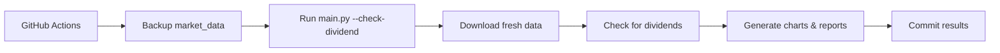
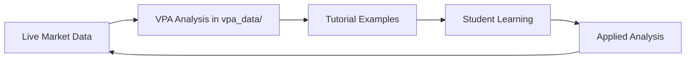

# AIPriceAction - Hệ Thống Phân Tích Thị Trường Chứng Khoán Việt Nam

Hệ thống tự động hóa toàn diện để phân tích dữ liệu thị trường chứng khoán Việt Nam với VPA (Phân Tích Khối Lượng Giá) sử dụng phân tích được hỗ trợ AI và phát hiện cổ tức.

## 📋 Mục Lục

- [Tổng Quan](#tổng-quan)
- [Scripts Pipeline Chính](#scripts-pipeline-chính)
- [Scripts Quản Lý Dữ Liệu](#scripts-quản-lý-dữ-liệu)
- [Scripts Phân Tích VPA](#scripts-phân-tích-vpa)
- [Hệ Thống Phát Hiện Cổ Tức](#hệ-thống-phát-hiện-cổ-tức)
- [Tiện Ích và Kiểm Thử](#tiện-ích-và-kiểm-thử)
- [Files Cấu Hình](#files-cấu-hình)
- [GitHub Actions Workflows](#github-actions-workflows)
- [Ví Dụ Sử Dụng](#ví-dụ-sử-dụng)
- [Cấu Trúc Thư Mục](#cấu-trúc-thư-mục)

## 🎯 Tổng Quan

AIPriceAction là một data pipeline linh hoạt với các tính năng:
- Tự động tải dữ liệu thị trường chứng khoán Việt Nam
- Tạo biểu đồ nến chuyên nghiệp với các chỉ báo kỹ thuật
- Thực hiện Phân Tích Khối Lượng Giá (VPA) được hỗ trợ AI sử dụng phương pháp Wyckoff
- Tự động phát hiện điều chỉnh cổ tức bằng hệ thống multi-agent scanning
- Tạo báo cáo markdown toàn diện với thông tin có thể hành động
- Hỗ trợ cả chế độ phân tích hàng ngày và hàng tuần

## 🔧 Scripts Pipeline Chính

### `main.py` - Data Pipeline Chính
**Trái tim của hệ thống** - điều phối toàn bộ quy trình xử lý dữ liệu.

```bash
# Basic usage
python main.py

# Custom date range
python main.py --start-date 2025-01-01 --end-date 2025-12-31

# Weekly analysis mode
python main.py --week

# Enable dividend detection
python main.py --check-dividend

# Weekly with dividend detection
python main.py --week --check-dividend
```

**Chức năng:**
- Tải dữ liệu cổ phiếu sử dụng thư viện vnstock cho tất cả tickers trong `TICKERS.csv`
- Tạo biểu đồ nến với khối lượng và đường trung bình động sử dụng mplfinance
- Phân tích cú pháp VPA từ `VPA.md` hoặc `VPA_week.md`
- Tạo `REPORT.md` toàn diện với phân tích thị trường
- Hỗ trợ smart caching để tránh các cuộc gọi API dư thừa
- Xử lý cả khoảng thời gian hàng ngày (1D) và hàng tuần (1W)

**Tính Năng Chính:**
- **Smart Caching**: Tự động cache dữ liệu đã tải để tránh các cuộc gọi API dư thừa
- **Dual Timeframes**: Hỗ trợ cả chế độ phân tích hàng ngày và hàng tuần
- **Tích Hợp VPA**: Tích hợp liền mạch phân tích khối lượng giá thủ công
- **Nhóm Ngành**: Phân loại cổ phiếu theo ngành sử dụng `ticker_group.json`
- **Biểu Đồ Chuyên Nghiệp**: Tạo biểu đồ nến với các chỉ báo kỹ thuật toàn diện

## 📊 Scripts Quản Lý Dữ Liệu

### `get_market_cap.py` - Dữ Liệu Vốn Hóa Thị Trường
Tải và cache dữ liệu vốn hóa thị trường cho tất cả cổ phiếu Việt Nam.

```bash
# Fresh download
python get_market_cap.py

# Resume using existing data as cache
python get_market_cap.py --resume
```

**Tính Năng:**
- Lấy dữ liệu vốn hóa từ các sàn giao dịch Việt Nam
- Triển khai intelligent caching để ngăn chặn các cuộc gọi API dư thừa
- Hỗ trợ chế độ resume cho các lần tải bị gián đoạn
- Rate limiting để tôn trọng các ràng buộc API

### `merge_vpa.py` - Công Cụ Gộp Dữ Liệu VPA
Gộp các file VPA ticker riêng lẻ từ thư mục `vpa_data/` vào file VPA chính.

```bash
# Merge daily VPA analysis
python merge_vpa.py

# Merge weekly VPA analysis
python merge_vpa.py --week
```

**Chức năng:**
- Đọc tất cả file ticker riêng lẻ từ thư mục `vpa_data/` (ví dụ: `vpa_data/SIP.md`, `vpa_data/TPB.md`)
- Gộp vào file `VPA.md` hoặc `VPA_week.md` duy nhất với định dạng phù hợp
- Duy trì thứ tự ticker theo bảng chữ cái với headers `# TICKER` phù hợp
- Xử lý cả chế độ hàng ngày và hàng tuần
- Bảo tồn cấu trúc và định dạng phân tích hiện có
- Tự động tạo backup dữ liệu đã xử lý

### `merge_vpa_legacy.py` - Công Cụ Gộp VPA Legacy
Script legacy để gộp `VPA_NEW.md` vào các file VPA hiện có (giữ lại để tham khảo).

## 🧠 Scripts Phân Tích VPA

### Cấu Trúc Files Dữ Liệu VPA
Hệ thống sử dụng các file markdown có cấu trúc cho phân tích VPA:

- **`VPA.md`** - Daily VPA analysis (combined from vpa_data/)
- **`VPA_week.md`** - Weekly VPA analysis  
- **`vpa_data/{TICKER}.md`** - Individual ticker analysis files (primary workspace)
- **`VPA_NEW.md`** - Legacy format (used by old system)

**VPA Analysis Format:**
```markdown
# TICKER

- **Ngày 2025-07-13:** TICKER tăng từ 64.4 lên 64.9. Nến có biên độ hẹp...
    - **Phân tích VPA/Wyckoff:** Đây là một tín hiệu **No Demand**...

---
```

**Quy Trình Hiện Tại:**
1. AI agents viết phân tích vào các file `vpa_data/{TICKER}.md` riêng lẻ (ví dụ: `vpa_data/SIP.md`, `vpa_data/TPB.md`)
2. `merge_vpa.py` gộp tất cả file ticker vào `VPA.md` chính với định dạng phù hợp
3. `main.py` tích hợp phân tích VPA vào báo cáo cuối cùng và tạo biểu đồ

## 🔍 Hệ Thống Phát Hiện Cổ Tức

### `vpa_dividend_scanner.py` - Máy Quét Cổ Tức Multi-Agent
**Hệ thống multi-agent tiên tiến** quét thông minh dữ liệu VPA và so sánh với giá CSV để phát hiện điều chỉnh cổ tức.

```bash
# Scan daily data
python vpa_dividend_scanner.py

# Scan weekly data  
python vpa_dividend_scanner.py --week

# Use custom number of agents
python vpa_dividend_scanner.py --workers 8
```

**Cách hoạt động:**
1. **Triển khai nhiều agents** (mặc định: 8) để phân tích tickers song song
2. **Trích xuất giá** từ văn bản VPA tiếng Việt sử dụng các mẫu regex thông minh
3. **So sánh với dữ liệu CSV** sử dụng phân tích thống kê
4. **Phát hiện patterns cổ tức** khi giá cho thấy điều chỉnh nhất quán
5. **Copy các file được đánh dấu** vào `market_data_check_dividends/` để xử lý AI

**Tính Năng:**
- **Xử lý multi-threaded** để tăng tốc độ và hiệu quả
- **Phân tích văn bản tiếng Việt** với trích xuất giá thông minh
- **Xác thực thống kê** (yêu cầu chênh lệch 15%+, độ tin cậy 60%+)
- **Ngăn chặn false positive** với kiểm tra tính nhất quán
- **Báo cáo chi tiết** với kết quả JSON và điểm tin cậy

### `verify_dividends.py` - Công Cụ Kiểm Tra Cổ Tức Legacy
Script phát hiện cổ tức nguyên bản (hiện đã được thay thế bởi multi-agent scanner).

```bash
python verify_dividends.py
```

**Note:** This script has been replaced by the more advanced `vpa_dividend_scanner.py` but is kept for reference.

## 🛠 Utilities and Testing

### Utility Scripts
Development and maintenance utilities are located in the `utilities/` directory:

- **`split_vpa.py`** - Splits VPA.md into individual ticker files (one-time use)
- **`verify_vpa.py`** - Verifies VPA analysis accuracy against market data  
- **`test_vpa_scanner.py`** - Tests dividend scanner functionality
- **`verify_dividends.py`** - Legacy dividend checker (superseded)
- **`get_fund_data.py`** - Downloads Vietnamese fund data

See `utilities/README.md` for detailed usage instructions.

## ⚙️ Configuration Files

### Data Configuration
- **`TICKERS.csv`** - List of stock symbols to analyze (single column: `ticker`)
- **`FUNDS.csv`** - List of fund symbols for fund analysis  
- **`ticker_group.json`** - Industry groupings mapping groups to stock arrays

### VPA Configuration
- **`VPA.md`** - Main daily VPA analysis file
- **`VPA_week.md`** - Weekly VPA analysis file
- **`VPA_NEW.md`** - Staging file for new analysis to be merged

### Documentation
- **`tasks/dividends_plan.md`** - Complete guide for AI dividend processing
- **`tasks/DAILY_VPA.md`** - Complete protocol for daily VPA analysis workflow
- **`merge_vpa_legacy.py`** - Legacy VPA merger for reference (superseded by new merge_vpa.py)
- **`CLAUDE.md`** - Project instructions and architecture overview

## 🤖 GitHub Actions Workflows

### `.github/workflows/main.yml` - Daily Automation
Runs daily at 8:30 UTC (3:30 PM Vietnam time) after market close.

**Process:**
1. Backs up existing `market_data/` to `market_data_backup/`
2. Runs `python main.py --check-dividend`
3. Combines market data files
4. Commits and pushes results

### `.github/workflows/weekly.yaml` - Weekly Automation  
Runs weekly on Fridays at 20:00 UTC.

**Process:**
1. Backs up existing `market_data_week/` to `market_data_week_backup/`
2. Runs `python main.py --week --check-dividend`
3. Processes weekly data
4. Commits and pushes results

### `.github/workflows/funds.yaml` - Fund Analysis
Handles fund-specific analysis and reporting.

## 🚀 Usage Examples

### Basic Daily Analysis
```bash
# Download today's data and generate reports
python main.py

# The system will:
# 1. Download data for all tickers in TICKERS.csv
# 2. Generate candlestick charts in reports/
# 3. Create REPORT.md with comprehensive analysis
# 4. Cache data in market_data/
```

### Weekly Analysis with Dividend Detection
```bash
# Run weekly analysis with dividend checking
python main.py --week --check-dividend

# The system will:
# 1. Use market_data_week/ directory
# 2. Download weekly (1W) interval data
# 3. Check for dividend adjustments
# 4. Generate REPORT_week.md
# 5. Flag any dividend issues for AI processing
```

### Dividend Detection Workflow
```bash
# 1. Run multi-agent dividend scanner
python vpa_dividend_scanner.py

# 2. If dividends detected, files will be in:
#    market_data_check_dividends/

# 3. AI should process according to:
#    tasks/dividends_plan.md
```

### Daily VPA Analysis Workflow
```bash
# 1. Check for dividend adjustments
ls market_data_check_dividends/

# 2. Process individual tickers (AI agents)
# Write analysis to vpa_data/{TICKER}.md files
# Example: echo "# SIP\n\n- **Analysis here...**" > vpa_data/SIP.md

# 3. Verify analysis accuracy
# Review individual files in vpa_data/ directory

# 4. Combine all ticker files into main VPA
python merge_vpa.py
# This reads all vpa_data/*.md files and combines into VPA.md

# 5. Generate final report with integrated VPA
python main.py
# Creates REPORT.md with charts and VPA analysis

# Complete protocol documented in tasks/DAILY_VPA.md
```

## 📁 Directory Structure

```
aipriceaction/
├── 📄 main.py                     # Primary data pipeline
├── 📄 get_market_cap.py          # Market cap data fetcher  
├── 📄 merge_vpa.py               # VPA analysis merger
├── 📄 vpa_dividend_scanner.py   # Multi-agent dividend scanner
├── 📂 utilities/                # Development and testing utilities
│   ├── 📄 README.md             # Utilities documentation
│   ├── 📄 split_vpa.py          # VPA file splitter
│   ├── 📄 verify_vpa.py         # VPA accuracy verifier
│   ├── 📄 test_vpa_scanner.py   # Scanner testing utility
│   ├── 📄 verify_dividends.py   # Legacy dividend checker
│   └── 📄 get_fund_data.py      # Fund data downloader
├── 
├── 📊 TICKERS.csv               # Stock symbols list
├── 📊 FUNDS.csv                 # Fund symbols list  
├── 📊 ticker_group.json         # Industry groupings
├── 
├── 📝 VPA.md                    # Daily VPA analysis
├── 📝 VPA_week.md               # Weekly VPA analysis
├── 📝 VPA_NEW.md                # New analysis staging
├── 
├── 📈 REPORT.md                 # Daily report output
├── 📈 REPORT_week.md            # Weekly report output
├── 
├── 📂 market_data/              # Daily CSV data
├── 📂 market_data_week/         # Weekly CSV data  
├── 📂 market_data_backup/       # Backup data for dividend detection
├── 📂 market_data_processed/    # Processed/archived data
├── 📂 market_data_check_dividends/ # Dividend-flagged files
├── 
├── 📂 reports/                  # Daily chart images
├── 📂 reports_week/             # Weekly chart images
├── 📂 funds_data/               # Fund performance data
├── 📂 vpa_data/                 # Individual ticker VPA files
├── 
├── 📂 tasks/                    # Task documentation
│   └── 📄 dividends_plan.md     # AI dividend processing guide
├── 
├── 📂 docs/                     # Documentation
│   └── 📄 README.md             # This file
├── 
├── 📂 .github/workflows/        # GitHub Actions
│   ├── 📄 main.yml             # Daily automation
│   ├── 📄 weekly.yaml          # Weekly automation
│   └── 📄 funds.yaml           # Fund analysis
└── 
└── 📄 CLAUDE.md                 # Project instructions for AI
```

## 🎯 Key Workflows

### 1. Daily Market Analysis


### 2. Dividend Detection Process


### 3. VPA Analysis Integration
```mermaid
graph LR
    A[Write analysis in vpa_data/{TICKER}.md] --> B[Run merge_vpa.py]
    B --> C[Combine all ticker files]
    C --> D[Generate VPA.md]
    D --> E[Run main.py with integrated VPA]
```

## 🔧 Environment Setup

### Required Environment Variables
```bash
export ACCEPT_TC="tôi đồng ý"  # For vnstock library
```

### Dependencies
```bash
pip install -r requirements.txt
# or
uv run python main.py  # Auto-installs dependencies
```

### Key Libraries
- **vnstock** - Vietnamese stock data provider
- **mplfinance** - Professional financial charting
- **pandas** - Data manipulation and analysis
- **matplotlib** - Chart generation and visualization

## 🚨 Important Notes

- **API Rate Limiting**: All scripts include delays to respect API constraints
- **Data Caching**: Smart caching prevents redundant API calls and speeds up processing
- **Error Handling**: Comprehensive error handling with graceful degradation
- **Vietnamese Support**: Full UTF-8 support for Vietnamese text and currency formatting
- **Dividend Safety**: Multi-layer validation prevents false positive dividend detection
- **Production Ready**: Automated workflows with proper error handling and logging

## 🆘 Troubleshooting

### Common Issues

1. **"No module named 'pandas'"**
   ```bash
   # Use uv for automatic dependency management
   uv run python main.py
   ```

2. **"ACCEPT_TC environment variable not set"**
   ```bash
   export ACCEPT_TC="tôi đồng ý"
   ```

3. **"No data found for ticker"**
   - Check if ticker exists in Vietnamese market
   - Verify TICKERS.csv format (single column named 'ticker')
   - Check network connectivity

4. **"Dividend false positives"**
   - Use `vpa_dividend_scanner.py` instead of legacy `verify_dividends.py`
   - Multi-agent scanner has better accuracy with statistical validation

5. **"VPA analysis not appearing in reports"**
   - Ensure VPA.md follows correct format with `# TICKER` headers
   - Run `merge_vpa.py` to properly structure VPA files
   - Check that ticker names match between VPA.md and TICKERS.csv

### Getting Help

- Check `CLAUDE.md` for detailed project instructions
- Review `tasks/dividends_plan.md` for dividend processing guidance
- Run test scripts to validate system functionality
- Check GitHub Actions logs for automated workflow issues

---

## 📚 Hệ Thống Giáo Dục VPA & Phương Pháp Wyckoff

### Tổng Quan

Dự án này bao gồm một **hệ thống giáo dục toàn diện bằng tiếng Việt** về Phân Tích Khối Lượng Giá (VPA) và các nguyên lý Phương Pháp Wyckoff. Hệ thống tutorial này đại diện cho một bản dịch và nâng cấp hoàn chỉnh của giáo dục giao dịch cấp tổ chức, được điều chỉnh đặc biệt cho thị trường Việt Nam với các ví dụ dữ liệu thị trường thực tế.

### 🎓 Triết Lý Giáo Dục & Phương Pháp Tiếp Cận

**Thiết Kế Học Tập Tiến Bộ:**
Hệ thống tutorial tuân theo một tiến trình có cấu trúc cẩn thận từ **các khái niệm cấp đại học** (độ khó 9.2/10) đến **kiến thức chuyên gia tổ chức** (độ khó 10/10), đảm bảo chuyển giao kiến thức mượt mà mà không làm choáng ngợp người mới bắt đầu.

**Tích Hợp Thị Trường Thực Tế:**
Mọi khái niệm đều được minh họa bằng **dữ liệu cổ phiếu Việt Nam thực tế** từ các thư mục `market_data/` và `vpa_data/` của pipeline, cung cấp trải nghiệm học tập chân thực thay vì các ví dụ lý thuyết.

**Thuật Ngữ Tài Chính Việt Nam:**
Tất cả các khái niệm kỹ thuật đã được dịch chuyên nghiệp sử dụng thuật ngữ tài chính Việt Nam phù hợp, làm cho các khái niệm VPA nâng cao có thể tiếp cận được đối với các nhà đầu tư nói tiếng Việt lần đầu tiên.

### 📖 Các Chương Tutorial - Phân Tích Chi Tiết

#### **Khái Niệm Cơ Bản (Chương 1.1-1.3)**

**Chương 1.1: Căn Bản VPA (Tiếng Việt)**
- **Mục Đích:** Giới thiệu các nguyên tắc cơ bản của Phân Tích Khối Lượng Giá
- **Khái Niệm Chính:** 
  - Động lực mối quan hệ khối lượng-giá
  - Hành vi dòng tiền thông minh vs dòng tiền retail
  - Nhận dạng tín hiệu VPA cơ bản
- **Dữ Liệu Thực Tế:** Sử dụng cổ phiếu Việt Nam thực tế từ `market_data/` với phân tích VPA tiếng Việt từ `vpa_data/`
- **Thuật Ngữ Việt Nam:** Khối lượng (Volume), Giá (Price), Phân tích (Analysis), Smart Money (Dòng tiền thông minh)

**Chương 1.2: Các Định Luật Wyckoff (Tiếng Việt)**
- **Mục Đích:** Ba định luật cơ bản chi phối hành vi thị trường
- **Khái Niệm Chính:**
  - Luật Cung - Cầu (Law of Supply & Demand)
  - Luật Nhân - Quả (Law of Cause & Effect)
  - Luật Nỗ lực vs Kết quả (Law of Effort vs Result)
- **Tích Hợp Thị Trường:** Ví dụ từ chuyển động VNINDEX và luân chuyển ngành
- **Bối Cảnh Việt Nam:** Điều chỉnh cho đặc điểm thị trường và mô hình giao dịch Việt Nam

**Chương 1.3: Composite Man (Tiếng Việt)**
- **Mục Đích:** Hiểu góc nhìn tổ chức
- **Khái Niệm Chính:**
  - Chiến thuật tích lũy/phân phối của dòng tiền thông minh
  - Nhận dạng thao túng thị trường
  - Mô hình hành vi tổ chức vs retail
- **Phương Pháp Giáo Dục:** Sử dụng các công ty dẫn đầu thị trường Việt Nam (VIC, VCB, FPT) làm ví dụ

#### **Các Giai Đoạn Thị Trường (Chương 2.1-2.2)**

**Chương 2.1: Các Pha Tích Lũy (Tiếng Việt)**
- **Độ Sâu:** Phân tích chi tiết tất cả 5 pha tích lũy Wyckoff
- **Ví Dụ Thực Tế:** Sử dụng các mô hình tích lũy thực tế từ blue chips Việt Nam
- **Tích Hợp Kỹ Thuật:** Biểu đồ được tạo bởi `main.py` với thư viện mplfinance
- **Thuật Ngữ Việt Nam:** Tích lũy (Accumulation), Pha (Phase), Kiểm tra (Test)

**Chương 2.2: Các Pha Phân Phối (Tiếng Việt)**
- **Mục Đích:** Nhận dạng các mô hình bán tổ chức
- **Thông Đảm Quan Trọng:** Dấu hiệu cảnh báo sớm của đỉnh thị trường
- **Nghiên Cứu Tình Huống:** Ví dụ phân phối thị trường Việt Nam lịch sử
- **Quản Lý Rủi Ro:** Khung đánh giá rủi ro đặc thù Việt Nam

#### **Nhận Dạng Tín Hiệu (Chương 3.1-3.2)**

**Chương 3.1: Tín Hiệu VPA Tăng Giá (Tiếng Việt)**
- **Bao Phủ Toàn Diện:** Tất cả các mô hình VPA tăng giá chính
- **Các Loại Tín Hiệu:**
  - No Supply (Không có Nguồn Cung)
  - Sign of Strength (Dấu hiệu Mạnh mẽ)
  - Effort to Rise (Nỗ lực Tăng giá)
  - Test for Supply (Kiểm tra Nguồn cung)
- **Tích Hợp Dữ Liệu Thực Tế:** Sử dụng trích dẫn chính xác từ các file `vpa_data/{TICKER}.md`
- **Ứng Dụng Thực Tế:** Tích hợp trực tiếp với quy trình VPA hàng ngày

**Chương 3.2: Tín Hiệu VPA Giảm Giá (Tiếng Việt)**
- **Khung Hoàn Chỉnh:** Tất cả các mô hình giảm giá chính và cảnh báo
- **Nhận Dạng Tín Hiệu:**
  - Sign of Weakness (Dấu hiệu Yếu kém)
  - No Demand (Không có Nhu cầu)
  - Effort to Fall (Nỗ lực Giảm giá)
  - Các mô hình phân phối
- **Bối Cảnh Thị Trường Việt Nam:** Điều chỉnh cho hành vi và chu kỳ thị trường địa phương

#### **Khái Niệm Nâng Cao (Chương 5.1-5.4)**

**Chương 5.1: Nhận Dạng Mô Hình Nâng Cao**
- **Nội Dung Cấp Tổ Chức:** Kỹ thuật phân tích mô hình chuyên nghiệp
- **Mô Hình Phức Tạp:** Chu kỳ tích lũy/phân phối đa pha
- **Phần Tìm Hiểu Sâu:** Giải thích nâng cao cho các khái niệm phức tạp
- **Tích Hợp Việt Nam:** Sử dụng ví dụ cổ phiếu Việt Nam toàn diện

**Chương 5.2: Engine Backtesting Tổ Chức**
- **Độ Sâu Kỹ Thuật:** Xây dựng khung kiểm tra VPA có hệ thống
- **Tích Hợp Code:** Hoạt động với cấu trúc dữ liệu CSV của pipeline
- **Xác Thực Thống Kê:** Phương pháp backtesting đặc thù thị trường Việt Nam
- **Chỉ Số Hiệu Suất:** Tính toán ROI được điều chỉnh cho chi phí giao dịch Việt Nam

**Chương 5.3: Phân Tích Dòng Tiền Thông Minh**
- **Kỹ Thuật Nâng Cao:** Theo dõi chuyển động tiền tổ chức
- **Chỉ Báo Dòng Chảy:** Phát hiện dòng tiền thông minh dựa trên khối lượng
- **Bối Cảnh Việt Nam:** Điều chỉnh cho mô hình hành vi tổ chức Việt Nam
- **Tích Hợp:** Sử dụng `market_data/` cho tính toán phân tích dòng chảy

**Chương 5.4: Nhận Dạng Mô Hình Machine Learning**
- **Phương Pháp Tiên Tiến:** Phát hiện tín hiệu VPA được hỗ trợ AI
- **Triển Khai Kỹ Thuật:** Nhận dạng mô hình ML dựa trên Python
- **Tích Hợp Dữ Liệu:** Tận dụng thu thập dữ liệu toàn diện của pipeline
- **Điều Chỉnh Việt Nam:** Mô hình ML được đào tạo trên mô hình thị trường Việt Nam

### 🎯 Nghiên Cứu Tình Huống: Chiến Dịch Tích Lũy 2025 - Phân Tích Sâu

#### **Phương Pháp Giáo Dục**

Mỗi nghiên cứu tình huống đại diện cho một **phân tích chiến dịch tích lũy tổ chức hoàn chỉnh** sử dụng dữ liệu thị trường Việt Nam thực tế từ năm 2025. Đây không phải là các ví dụ lý thuyết mà là các sự kiện thị trường thực tế với phân tích VPA được ghi chép.

#### **Cấu Trúc & Thông Đảm Nghiên Cứu Tình Huống**

**VIC - Chiến Dịch Tích Lũy Bất Động Sản 2025**
- **Tập Trung Ngành:** Phân tích vai trò dẫn dắt thị trường bất động sản
- **Loại Mô Hình:** Minh chứng chuỗi VPA hoàn hảo
- **Học Hỏi Chính:** Cách các công ty dẫn đầu bất động sản hoạt động trong phục hồi thị trường
- **Nguồn Dữ Liệu:** Phân tích VPA thực tế từ `vpa_data/VIC.md`
- **Thông Đảm Việt Nam:** 
  - "Đây là một tín hiệu Effort to Rise mạnh mẽ"
  - "Lực cầu đã quay trở lại quyết đoán"
- **Giảng Dạy Kỹ Thuật:** Xác nhận markup Phase D với phân tích khối lượng
- **Rủi Ro/Lợi Nhuận:** Chiến lược định cỡ vị thế và cắt lỗ thế giới thực

**VHM - Chiến Dịch Tích Lũy Biến Động 2025**
- **Tập Trung Biến Động:** Mô hình tích lũy cổ phiếu beta cao
- **Khái Niệm Nâng Cao:** Quản lý mô hình tích lũy biến động
- **Động Lực Ngành:** Vinhomes như cổ phiếu beta bất động sản
- **Nhận Dạng Mô Hình:** Tích lũy phạm vi rộng với biến động cao
- **Bối Cảnh Thị Trường Việt Nam:** Hiểu chu kỳ bất động sản Việt Nam
- **Thông Đảm Chuyên Nghiệp:** Cách tổ chức xử lý tích lũy biến động

**SSI - Chiến Dịch Tích Lũy Nhà Vô Địch Ngành Chứng Khoán 2025**
- **Luân Chuyển Ngành:** Thời điểm phục hồi dịch vụ tài chính
- **Mô Hình Nâng Cao:** Nhận dạng và phản ứng Shakeout
- **Mô Hình Kinh Doanh:** Đặc điểm và chu kỳ ngành chứng khoán
- **Bối Cảnh Việt Nam:** Hiểu động lực môi giới địa phương
- **Thành Thạo Kỹ Thuật:** Chuỗi Shakeout → Phục hồi hoàn hảo
- **Ứng Dụng Chuyên Nghiệp:** Chiến lược đầu tư luân chuyển ngành

**VIX - Chiến Dịch Tích Lũy Gã Khổng Lồ Cơ Sở Hạ Tầng 2025**
- **Phân Tích Chu Kỳ:** Thời điểm và mô hình ngành cơ sở hạ tầng
- **Đảo Chiều Mô Hình:** Chuyển đổi từ phân phối sang tích lũy
- **Bối Cảnh Kinh Tế:** Chi tiêu Chính phủ và chu kỳ cơ sở hạ tầng
- **Nhận Dạng Nâng Cao:** Xác định tín hiệu đảo chiều sớm
- **Kinh Tế Việt Nam:** Chu kỳ và thời điểm đầu tư cơ sở hạ tầng
- **Đầu Tư Chiến Lược:** Phương pháp đầu tư cơ sở hạ tầng dài hạn

**LPB - Chiến Dịch Tích Lũy Chuyển Đổi Ngân Hàng 2025**
- **Ví Dụ Sách Giáo Khoa:** Minh chứng chuỗi VPA hoàn hảo
- **Ngân Hàng Khu Vực:** Câu chuyện chuyển đổi ngân hàng nhỏ hơn
- **Hoàn Hảo Tuần Tự:** No Supply → Test → SOS → Markup
- **Tích Hợp Dữ Liệu Chính Xác:** Sử dụng trích dẫn chính xác từ `vpa_data/LPB.md`:
  - "Đây là một tín hiệu No Supply (Không có Nguồn Cung) rõ ràng"
  - "Test for Supply (Kiểm tra Nguồn cung)"
  - "Sign of Strength (SOS), là kết quả của các tín hiệu No Supply và Test for Supply thành công"
- **Chuyển Đổi Ngân Hàng:** Chủ đề hiện đại hóa ngân hàng khu vực
- **Thực Thi Chuyên Nghiệp:** Chiến lược vào và ra lệnh tổ chức

**VCB - Chiến Dịch Tích Lũy Ngân Hàng Quốc Gia 2025**
- **Blue-Chip Banking:** Phân tích pattern tích lũy của ngân hàng lớn nhất Việt Nam
- **Đặc Tính Quốc Gia:** Thể hiện sức mạnh ngân hàng blue-chip trong chu kỳ phục hồi
- **Mô Hình Tổ Chức:** Cách dòng tiền thông minh tích lũy trong cổ phiếu trụ cột
- **Timing Hoàn Hảo:** Phân tích các điểm vào lệnh optimal dựa trên VPA signals
- **Quản Lý Rủi Ro:** Khung đánh giá rủi ro đặc thù cho blue-chip banking
- **Chiến Lược Dài Hạn:** Phương pháp đầu tư value investing cho ngân hàng quốc gia

**Phân Tích Luân Chuyển Ngành - Nghiên Cứu Tổng Thể Thị Trường 2025**
- **Chu Kỳ Ngành:** Nghiên cứu về luân chuyển ngành trong thị trường Việt Nam
- **Leadership Rotation:** Phân tích sự chuyển giao leadership giữa các ngành
- **Timing Ngành:** Xác định thời điểm optimal để chuyển đổi sector allocation
- **Macro Context:** Tích hợp phân tích kinh tế vĩ mô với rotation patterns
- **Performance Attribution:** Đo lường contribution của sector rotation vào returns
- **Chiến Lược Tactical:** Framework tactical asset allocation dựa trên sector analysis

**Phân Tích Phân Phối VN-Index - Nghiên Cứu Market-Wide Distribution**
- **Distribution Pattern:** Phân tích pattern phân phối của VN-Index
- **Market Reversal:** Nhận dạng tín hiệu đảo chiều thị trường sớm
- **Volume Analysis:** Phân tích khối lượng để xác nhận distribution phases
- **Sector Impact:** Đánh giá impact của từng ngành trong distribution process
- **Risk Management:** Chiến lược phòng ngừa rủi ro trong market distribution
- **Exit Strategy:** Framework để exit positions trong distribution phases

### 🔄 Integration with Pipeline Data

#### **Real-Time Learning**
The tutorial system is **directly integrated** with the pipeline's live data:

- **Tutorial Examples ←→ `market_data/` CSV files**
- **VPA Analysis ←→ `vpa_data/{TICKER}.md` files**  
- **Chart Integration ←→ `reports/` generated images**
- **Live Updates ←→ Daily `main.py` execution**

#### **Educational Data Flow**


### 🎓 Learning Path Recommendations

#### **Beginner Path (0-3 months)**
1. Start with Chapter 1.1 (VPA Basics)
2. Master Chapter 1.2 (Wyckoff Laws)  
3. Read VIC case study for practical application
4. Practice with live `VPA.md` daily analysis

#### **Intermediate Path (3-6 months)**
1. Complete Chapters 2.1-2.2 (Market Phases)
2. Study all 5 case studies in sequence
3. Begin writing own VPA analysis in `vpa_data/` format
4. Use `merge_vpa.py` workflow for practice

#### **Advanced Path (6+ months)**
1. Master Chapters 3.1-3.2 (Signal Recognition)
2. Implement Chapter 5.1-5.4 (Advanced Concepts)
3. Develop personal trading systems using pipeline data
4. Contribute to VPA analysis using institutional-grade methodology

### 🇻🇳 Vietnamese Market Adaptation

#### **Cultural & Market Context**
- **Trading Hours:** Adapted for Vietnamese market sessions (9:00-15:00)
- **Settlement:** T+2 settlement cycle considerations
- **Regulations:** Vietnamese market regulations and restrictions
- **Currency:** VND-specific calculations and risk management
- **Broker Integration:** Compatible with Vietnamese brokerage platforms

#### **Linguistic Excellence**
- **Financial Terminology:** Professional Vietnamese financial vocabulary
- **Technical Precision:** Accurate translation of complex VPA concepts
- **Cultural Adaptation:** Vietnamese business culture and investment mentality
- **Educational Style:** Vietnamese pedagogical approaches and learning preferences

### 🛠 Technical Implementation

#### **File Structure Integration**
```
docs/tutorials/
├── chapter-1-1-vpa-basics.md              # Chapter 1.1
├── chapter-1-2-wyckoff-laws.md            # Chapter 1.2  
├── chapter-1-3-composite-man.md           # Chapter 1.3
├── chapter-2-1-accumulation-phases.md     # Chapter 2.1
├── chapter-2-2-distribution-phases.md     # Chapter 2.2
├── chapter-3-1-bullish-vpa-signals.md     # Chapter 3.1
├── chapter-3-2-bearish-vpa-signals.md     # Chapter 3.2
├── chapter-4-1-trading-systems.md         # Chapter 4.1
├── advanced/
│   ├── chapter-5-1-quantitative-vpa-framework.md     # Chapter 5.1
│   ├── chapter-5-2-backtesting-engine.md             # Chapter 5.2
│   ├── chapter-5-3-smart-money-flow-analysis.md      # Chapter 5.3
│   ├── chapter-5-4-machine-learning-vpa.md           # Chapter 5.4
│   ├── chapter-5-5-cross-market-analysis.md          # Chapter 5.5
│   ├── chapter-5-6-intelligent-alert-system.md       # Chapter 5.6
│   ├── chapter-5-7-portfolio-optimization.md         # Chapter 5.7
│   ├── chapter-5-8-performance-attribution.md        # Chapter 5.8
│   └── chapter-5-9-production-deployment.md          # Chapter 5.9
├── case-studies/
│   ├── vic-accumulation-2025.md           # VIC case study
│   ├── vhm-accumulation-2025.md           # VHM case study
│   ├── ssi-accumulation-2025.md           # SSI case study  
│   ├── vix-accumulation-2025.md           # VIX case study
│   ├── lpb-accumulation-2025.md           # LPB case study
│   ├── vcb-accumulation-2025.md           # VCB case study
│   ├── sector-rotation-analysis.md        # Sector rotation analysis
│   └── vnindex-distribution-analysis.md   # VN-Index distribution analysis
├── data-integration/
│   └── how-to-use-market-data.md          # Data integration guide
└── exercises/
    └── chapter-1-1-exercises.ipynb        # Interactive exercises
```

#### **Data Dependencies**
- **Market Data:** `market_data/{TICKER}_2025-01-02_to_2025-07-21.csv`
- **VPA Analysis:** `vpa_data/{TICKER}.md` 
- **Charts:** `reports/{TICKER}_chart.png`
- **Configuration:** `ticker_group.json` for sector analysis

### 🎯 Educational Outcomes

#### **Student Achievements**
Upon completion, students will be able to:

1. **Recognize Institutional Activity:** Identify smart money accumulation/distribution
2. **Time Market Entries:** Use VPA signals for optimal position timing  
3. **Manage Risk:** Apply Vietnamese market-specific risk management
4. **Sector Analysis:** Understand Vietnamese market sector rotation
5. **Professional Analysis:** Write institutional-grade VPA analysis
6. **System Integration:** Use pipeline tools for ongoing market analysis

#### **Professional Application**
- **Portfolio Management:** Institutional-grade stock selection
- **Risk Assessment:** Vietnamese market-specific risk frameworks
- **Sector Allocation:** Industry rotation strategies using Vietnamese market dynamics
- **Performance Measurement:** ROI calculation with Vietnamese trading costs
- **Continuous Learning:** Integration with live market data for ongoing education

### 🔗 Navigation & Resources

#### **Quick Access Links**
- **[Tutorial Map & Content Overview](MAP_OF_CONTENT.md)** - Complete curriculum structure
- **[VPA Methods & Methodology](methods/README.md)** - Technical methodology documentation
- **Main Pipeline Integration:** All tutorials work seamlessly with `main.py` and data pipeline

#### **Support Materials**
- **Live Data:** Updated daily through GitHub Actions workflow
- **Vietnamese Support:** Full UTF-8 support with proper Vietnamese financial terminology
- **Chart Integration:** Professional mplfinance charts with Vietnamese labels
- **Real-time Examples:** Examples update automatically with market data

---

**Made with ❤️ for Vietnamese stock market analysis and education**