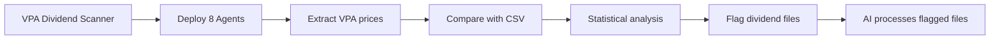

# AIPriceAction - Vietnamese Stock Market Analysis Pipeline

A comprehensive automated system for analyzing Vietnamese stock market data with VPA (Volume Price Analysis) using AI-powered analysis and dividend detection.

## 📋 Table of Contents

- [Overview](#overview)
- [Core Pipeline Scripts](#core-pipeline-scripts)
- [Data Management Scripts](#data-management-scripts)
- [VPA Analysis Scripts](#vpa-analysis-scripts)
- [Dividend Detection System](#dividend-detection-system)
- [Utilities and Testing](#utilities-and-testing)
- [Configuration Files](#configuration-files)
- [GitHub Actions Workflows](#github-actions-workflows)
- [Usage Examples](#usage-examples)
- [Directory Structure](#directory-structure)

## 🎯 Overview

AIPriceAction is a flexible data pipeline that:
- Downloads Vietnamese stock market data automatically
- Generates professional candlestick charts with technical indicators
- Performs AI-powered Volume Price Analysis (VPA) using Wyckoff methodology
- Detects dividend adjustments automatically using multi-agent scanning
- Produces comprehensive markdown reports with actionable insights
- Supports both daily and weekly analysis modes

## 🔧 Core Pipeline Scripts

### `main.py` - Primary Data Pipeline
**The heart of the system** - orchestrates the entire data processing workflow.

```bash
# Basic usage
python main.py

# Custom date range
python main.py --start-date 2025-01-01 --end-date 2025-12-31

# Weekly analysis mode
python main.py --week

# Enable dividend detection
python main.py --check-dividend

# Weekly with dividend detection
python main.py --week --check-dividend
```

**What it does:**
- Downloads stock data using vnstock library for all tickers in `TICKERS.csv`
- Generates candlestick charts with volume and moving averages using mplfinance
- Parses VPA analysis from `VPA.md` or `VPA_week.md`
- Creates comprehensive `REPORT.md` with market analysis
- Supports smart caching to avoid redundant API calls
- Handles both daily (1D) and weekly (1W) intervals

**Key Features:**
- **Smart Caching**: Automatically caches downloaded data to avoid redundant API calls
- **Dual Timeframes**: Supports both daily and weekly analysis modes
- **VPA Integration**: Seamlessly integrates manual volume price analysis
- **Industry Grouping**: Categorizes stocks by industry using `ticker_group.json`
- **Professional Charts**: Generated candlestick charts with comprehensive technical indicators

## 📊 Data Management Scripts

### `get_market_cap.py` - Market Capitalization Data
Downloads and caches market capitalization data for all Vietnamese stocks.

```bash
# Fresh download
python get_market_cap.py

# Resume using existing data as cache
python get_market_cap.py --resume
```

**Features:**
- Fetches market cap data from Vietnamese exchanges
- Implements intelligent caching to prevent redundant API calls
- Supports resume mode for interrupted downloads
- Rate limiting to respect API constraints

### `merge_vpa.py` - VPA Data Combiner
Combines individual ticker VPA files from `vpa_data/` directory into main VPA file.

```bash
# Merge daily VPA analysis
python merge_vpa.py

# Merge weekly VPA analysis
python merge_vpa.py --week
```

**What it does:**
- Reads all individual ticker files from `vpa_data/` directory (e.g., `vpa_data/SIP.md`, `vpa_data/TPB.md`)
- Combines into single `VPA.md` or `VPA_week.md` file with proper formatting
- Maintains alphabetical ticker ordering with proper `# TICKER` headers
- Handles both daily and weekly modes
- Preserves existing analysis structure and formatting
- Creates backup of processed data automatically

### `merge_vpa_legacy.py` - Legacy VPA Merger
Legacy script for merging `VPA_NEW.md` into existing VPA files (kept for reference).

## 🧠 VPA Analysis Scripts

### VPA Data Files Structure
The system uses structured markdown files for VPA analysis:

- **`VPA.md`** - Daily VPA analysis (combined from vpa_data/)
- **`VPA_week.md`** - Weekly VPA analysis  
- **`vpa_data/{TICKER}.md`** - Individual ticker analysis files (primary workspace)
- **`VPA_NEW.md`** - Legacy format (used by old system)

**VPA Analysis Format:**
```markdown
# TICKER

- **Ngày 2025-07-13:** TICKER tăng từ 64.4 lên 64.9. Nến có biên độ hẹp...
    - **Phân tích VPA/Wyckoff:** Đây là một tín hiệu **No Demand**...

---
```

**Current Workflow:**
1. AI agents write analysis to individual `vpa_data/{TICKER}.md` files (e.g., `vpa_data/SIP.md`, `vpa_data/TPB.md`)
2. `merge_vpa.py` combines all ticker files into main `VPA.md` with proper formatting
3. `main.py` integrates VPA analysis into final reports and generates charts

## 🔍 Dividend Detection System

### `vpa_dividend_scanner.py` - Multi-Agent Dividend Scanner
**Advanced multi-agent system** that intelligently scans VPA data and compares with CSV prices to detect dividend adjustments.

```bash
# Scan daily data
python vpa_dividend_scanner.py

# Scan weekly data  
python vpa_dividend_scanner.py --week

# Use custom number of agents
python vpa_dividend_scanner.py --workers 8
```

**How it works:**
1. **Deploys multiple agents** (default: 8) to analyze tickers in parallel
2. **Extracts prices** from Vietnamese VPA text using intelligent regex patterns
3. **Compares with CSV data** using statistical analysis
4. **Detects dividend patterns** when prices show consistent adjustments
5. **Copies flagged files** to `market_data_check_dividends/` for AI processing

**Features:**
- **Multi-threaded processing** for speed and efficiency
- **Vietnamese text parsing** with intelligent price extraction
- **Statistical validation** (15%+ difference, 60%+ confidence required)
- **False positive prevention** with consistency checking
- **Detailed reporting** with JSON results and confidence scores

### `verify_dividends.py` - Legacy Dividend Checker
Original dividend detection script (now superseded by multi-agent scanner).

```bash
python verify_dividends.py
```

**Note:** This script has been replaced by the more advanced `vpa_dividend_scanner.py` but is kept for reference.

## 🛠 Utilities and Testing

### `test_vpa_scanner.py` - Multi-Agent Scanner Test
Tests the VPA dividend scanner system with current data.

```bash
python test_vpa_scanner.py
```

**What it tests:**
- Directory structure validation
- VPA price extraction functionality
- CSV data access and comparison
- Agent creation and basic operations

## ⚙️ Configuration Files

### Data Configuration
- **`TICKERS.csv`** - List of stock symbols to analyze (single column: `ticker`)
- **`FUNDS.csv`** - List of fund symbols for fund analysis  
- **`ticker_group.json`** - Industry groupings mapping groups to stock arrays

### VPA Configuration
- **`VPA.md`** - Main daily VPA analysis file
- **`VPA_week.md`** - Weekly VPA analysis file
- **`VPA_NEW.md`** - Staging file for new analysis to be merged

### Documentation
- **`tasks/dividends_plan.md`** - Complete guide for AI dividend processing
- **`tasks/DAILY_VPA.md`** - Complete protocol for daily VPA analysis workflow
- **`merge_vpa_legacy.py`** - Legacy VPA merger for reference (superseded by new merge_vpa.py)
- **`CLAUDE.md`** - Project instructions and architecture overview

## 🤖 GitHub Actions Workflows

### `.github/workflows/main.yml` - Daily Automation
Runs daily at 8:30 UTC (3:30 PM Vietnam time) after market close.

**Process:**
1. Backs up existing `market_data/` to `market_data_backup/`
2. Runs `python main.py --check-dividend`
3. Combines market data files
4. Commits and pushes results

### `.github/workflows/weekly.yaml` - Weekly Automation  
Runs weekly on Fridays at 20:00 UTC.

**Process:**
1. Backs up existing `market_data_week/` to `market_data_week_backup/`
2. Runs `python main.py --week --check-dividend`
3. Processes weekly data
4. Commits and pushes results

### `.github/workflows/funds.yaml` - Fund Analysis
Handles fund-specific analysis and reporting.

## 🚀 Usage Examples

### Basic Daily Analysis
```bash
# Download today's data and generate reports
python main.py

# The system will:
# 1. Download data for all tickers in TICKERS.csv
# 2. Generate candlestick charts in reports/
# 3. Create REPORT.md with comprehensive analysis
# 4. Cache data in market_data/
```

### Weekly Analysis with Dividend Detection
```bash
# Run weekly analysis with dividend checking
python main.py --week --check-dividend

# The system will:
# 1. Use market_data_week/ directory
# 2. Download weekly (1W) interval data
# 3. Check for dividend adjustments
# 4. Generate REPORT_week.md
# 5. Flag any dividend issues for AI processing
```

### Dividend Detection Workflow
```bash
# 1. Run multi-agent dividend scanner
python vpa_dividend_scanner.py

# 2. If dividends detected, files will be in:
#    market_data_check_dividends/

# 3. AI should process according to:
#    tasks/dividends_plan.md
```

### Daily VPA Analysis Workflow
```bash
# 1. Check for dividend adjustments
ls market_data_check_dividends/

# 2. Process individual tickers (AI agents)
# Write analysis to vpa_data/{TICKER}.md files
# Example: echo "# SIP\n\n- **Analysis here...**" > vpa_data/SIP.md

# 3. Verify analysis accuracy
# Review individual files in vpa_data/ directory

# 4. Combine all ticker files into main VPA
python merge_vpa.py
# This reads all vpa_data/*.md files and combines into VPA.md

# 5. Generate final report with integrated VPA
python main.py
# Creates REPORT.md with charts and VPA analysis

# Complete protocol documented in tasks/DAILY_VPA.md
```

## 📁 Directory Structure

```
aipriceaction/
├── 📄 main.py                     # Primary data pipeline
├── 📄 get_market_cap.py          # Market cap data fetcher  
├── 📄 merge_vpa.py               # VPA analysis merger
├── 📄 vpa_dividend_scanner.py   # Multi-agent dividend scanner
├── 📄 verify_dividends.py       # Legacy dividend checker
├── 📄 test_vpa_scanner.py       # Scanner testing utility
├── 
├── 📊 TICKERS.csv               # Stock symbols list
├── 📊 FUNDS.csv                 # Fund symbols list  
├── 📊 ticker_group.json         # Industry groupings
├── 
├── 📝 VPA.md                    # Daily VPA analysis
├── 📝 VPA_week.md               # Weekly VPA analysis
├── 📝 VPA_NEW.md                # New analysis staging
├── 
├── 📈 REPORT.md                 # Daily report output
├── 📈 REPORT_week.md            # Weekly report output
├── 
├── 📂 market_data/              # Daily CSV data
├── 📂 market_data_week/         # Weekly CSV data  
├── 📂 market_data_backup/       # Backup data for dividend detection
├── 📂 market_data_processed/    # Processed/archived data
├── 📂 market_data_check_dividends/ # Dividend-flagged files
├── 
├── 📂 reports/                  # Daily chart images
├── 📂 reports_week/             # Weekly chart images
├── 📂 funds_data/               # Fund performance data
├── 📂 vpa_data/                 # Individual ticker VPA files
├── 
├── 📂 tasks/                    # Task documentation
│   └── 📄 dividends_plan.md     # AI dividend processing guide
├── 
├── 📂 docs/                     # Documentation
│   └── 📄 README.md             # This file
├── 
├── 📂 .github/workflows/        # GitHub Actions
│   ├── 📄 main.yml             # Daily automation
│   ├── 📄 weekly.yaml          # Weekly automation
│   └── 📄 funds.yaml           # Fund analysis
└── 
└── 📄 CLAUDE.md                 # Project instructions for AI
```

## 🎯 Key Workflows

### 1. Daily Market Analysis


### 2. Dividend Detection Process


### 3. VPA Analysis Integration
```mermaid
graph LR
    A[Write analysis in vpa_data/{TICKER}.md] --> B[Run merge_vpa.py]
    B --> C[Combine all ticker files]
    C --> D[Generate VPA.md]
    D --> E[Run main.py with integrated VPA]
```

## 🔧 Environment Setup

### Required Environment Variables
```bash
export ACCEPT_TC="tôi đồng ý"  # For vnstock library
```

### Dependencies
```bash
pip install -r requirements.txt
# or
uv run python main.py  # Auto-installs dependencies
```

### Key Libraries
- **vnstock** - Vietnamese stock data provider
- **mplfinance** - Professional financial charting
- **pandas** - Data manipulation and analysis
- **matplotlib** - Chart generation and visualization

## 🚨 Important Notes

- **API Rate Limiting**: All scripts include delays to respect API constraints
- **Data Caching**: Smart caching prevents redundant API calls and speeds up processing
- **Error Handling**: Comprehensive error handling with graceful degradation
- **Vietnamese Support**: Full UTF-8 support for Vietnamese text and currency formatting
- **Dividend Safety**: Multi-layer validation prevents false positive dividend detection
- **Production Ready**: Automated workflows with proper error handling and logging

## 🆘 Troubleshooting

### Common Issues

1. **"No module named 'pandas'"**
   ```bash
   # Use uv for automatic dependency management
   uv run python main.py
   ```

2. **"ACCEPT_TC environment variable not set"**
   ```bash
   export ACCEPT_TC="tôi đồng ý"
   ```

3. **"No data found for ticker"**
   - Check if ticker exists in Vietnamese market
   - Verify TICKERS.csv format (single column named 'ticker')
   - Check network connectivity

4. **"Dividend false positives"**
   - Use `vpa_dividend_scanner.py` instead of legacy `verify_dividends.py`
   - Multi-agent scanner has better accuracy with statistical validation

5. **"VPA analysis not appearing in reports"**
   - Ensure VPA.md follows correct format with `# TICKER` headers
   - Run `merge_vpa.py` to properly structure VPA files
   - Check that ticker names match between VPA.md and TICKERS.csv

### Getting Help

- Check `CLAUDE.md` for detailed project instructions
- Review `tasks/dividends_plan.md` for dividend processing guidance
- Run test scripts to validate system functionality
- Check GitHub Actions logs for automated workflow issues

---

**Made with ❤️ for Vietnamese stock market analysis**