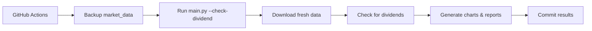
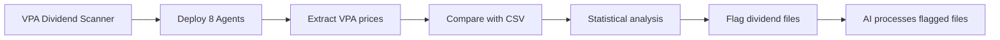

# AIPriceAction - Hệ Thống Phân Tích Thị Trường Chứng Khoán Việt Nam

Hệ thống tự động hóa toàn diện để phân tích dữ liệu thị trường chứng khoán Việt Nam với VPA (Phân Tích Khối Lượng Giá) sử dụng phân tích được hỗ trợ AI và phát hiện cổ tức.

## 📋 Mục Lục

- [Tổng Quan](#tổng-quan)
- [Scripts Pipeline Chính](#scripts-pipeline-chính)
- [Scripts Quản Lý Dữ Liệu](#scripts-quản-lý-dữ-liệu)
- [Scripts Phân Tích VPA](#scripts-phân-tích-vpa)
- [Hệ Thống Phát Hiện Cổ Tức](#hệ-thống-phát-hiện-cổ-tức)
- [Tiện Ích và Kiểm Thử](#tiện-ích-và-kiểm-thử)
- [Files Cấu Hình](#files-cấu-hình)
- [GitHub Actions Workflows](#github-actions-workflows)
- [Ví Dụ Sử Dụng](#ví-dụ-sử-dụng)
- [Cấu Trúc Thư Mục](#cấu-trúc-thư-mục)

## 🎯 Tổng Quan

AIPriceAction là một data pipeline linh hoạt với các tính năng:
- Tự động tải dữ liệu thị trường chứng khoán Việt Nam
- Tạo biểu đồ nến chuyên nghiệp với các chỉ báo kỹ thuật
- Thực hiện Phân Tích Khối Lượng Giá (VPA) được hỗ trợ AI sử dụng phương pháp Wyckoff
- Tự động phát hiện điều chỉnh cổ tức bằng hệ thống multi-agent scanning
- Tạo báo cáo markdown toàn diện với thông tin có thể hành động
- Hỗ trợ cả chế độ phân tích hàng ngày và hàng tuần

## 🔧 Scripts Pipeline Chính

### `main.py` - Data Pipeline Chính
**Trái tim của hệ thống** - điều phối toàn bộ quy trình xử lý dữ liệu.

```bash
# Basic usage
python main.py

# Custom date range
python main.py --start-date 2025-01-01 --end-date 2025-12-31

# Weekly analysis mode
python main.py --week

# Enable dividend detection
python main.py --check-dividend

# Weekly with dividend detection
python main.py --week --check-dividend
```

**Chức năng:**
- Tải dữ liệu cổ phiếu sử dụng thư viện vnstock cho tất cả tickers trong `TICKERS.csv`
- Tạo biểu đồ nến với khối lượng và đường trung bình động sử dụng mplfinance
- Phân tích cú pháp VPA từ `VPA.md` hoặc `VPA_week.md`
- Tạo `REPORT.md` toàn diện với phân tích thị trường
- Hỗ trợ smart caching để tránh các cuộc gọi API dư thừa
- Xử lý cả khoảng thời gian hàng ngày (1D) và hàng tuần (1W)

**Tính Năng Chính:**
- **Smart Caching**: Tự động cache dữ liệu đã tải để tránh các cuộc gọi API dư thừa
- **Dual Timeframes**: Hỗ trợ cả chế độ phân tích hàng ngày và hàng tuần
- **Tích Hợp VPA**: Tích hợp liền mạch phân tích khối lượng giá thủ công
- **Nhóm Ngành**: Phân loại cổ phiếu theo ngành sử dụng `ticker_group.json`
- **Biểu Đồ Chuyên Nghiệp**: Tạo biểu đồ nến với các chỉ báo kỹ thuật toàn diện

## 📊 Scripts Quản Lý Dữ Liệu

### `get_market_cap.py` - Dữ Liệu Vốn Hóa Thị Trường
Tải và cache dữ liệu vốn hóa thị trường cho tất cả cổ phiếu Việt Nam.

```bash
# Fresh download
python get_market_cap.py

# Resume using existing data as cache
python get_market_cap.py --resume
```

**Tính Năng:**
- Lấy dữ liệu vốn hóa từ các sàn giao dịch Việt Nam
- Triển khai intelligent caching để ngăn chặn các cuộc gọi API dư thừa
- Hỗ trợ chế độ resume cho các lần tải bị gián đoạn
- Rate limiting để tôn trọng các ràng buộc API

### `merge_vpa.py` - Công Cụ Gộp Dữ Liệu VPA
Gộp các file VPA ticker riêng lẻ từ thư mục `vpa_data/` vào file VPA chính.

```bash
# Merge daily VPA analysis
python merge_vpa.py

# Merge weekly VPA analysis
python merge_vpa.py --week
```

**Chức năng:**
- Đọc tất cả file ticker riêng lẻ từ thư mục `vpa_data/` (ví dụ: `vpa_data/SIP.md`, `vpa_data/TPB.md`)
- Gộp vào file `VPA.md` hoặc `VPA_week.md` duy nhất với định dạng phù hợp
- Duy trì thứ tự ticker theo bảng chữ cái với headers `# TICKER` phù hợp
- Xử lý cả chế độ hàng ngày và hàng tuần
- Bảo tồn cấu trúc và định dạng phân tích hiện có
- Tự động tạo backup dữ liệu đã xử lý

### `merge_vpa_legacy.py` - Công Cụ Gộp VPA Legacy
Script legacy để gộp `VPA_NEW.md` vào các file VPA hiện có (giữ lại để tham khảo).

## 🧠 Scripts Phân Tích VPA

### Cấu Trúc Files Dữ Liệu VPA
Hệ thống sử dụng các file markdown có cấu trúc cho phân tích VPA:

- **`VPA.md`** - Daily VPA analysis (combined from vpa_data/)
- **`VPA_week.md`** - Weekly VPA analysis  
- **`vpa_data/{TICKER}.md`** - Individual ticker analysis files (primary workspace)
- **`VPA_NEW.md`** - Legacy format (used by old system)

**VPA Analysis Format:**
```markdown
# TICKER

- **Ngày 2025-07-13:** TICKER tăng từ 64.4 lên 64.9. Nến có biên độ hẹp...
    - **Phân tích VPA/Wyckoff:** Đây là một tín hiệu **No Demand**...

---
```

**Quy Trình Hiện Tại:**
1. AI agents viết phân tích vào các file `vpa_data/{TICKER}.md` riêng lẻ (ví dụ: `vpa_data/SIP.md`, `vpa_data/TPB.md`)
2. `merge_vpa.py` gộp tất cả file ticker vào `VPA.md` chính với định dạng phù hợp
3. `main.py` tích hợp phân tích VPA vào báo cáo cuối cùng và tạo biểu đồ

## 🔍 Hệ Thống Phát Hiện Cổ Tức

### `vpa_dividend_scanner.py` - Máy Quét Cổ Tức Multi-Agent
**Hệ thống multi-agent tiên tiến** quét thông minh dữ liệu VPA và so sánh với giá CSV để phát hiện điều chỉnh cổ tức.

```bash
# Scan daily data
python vpa_dividend_scanner.py

# Scan weekly data  
python vpa_dividend_scanner.py --week

# Use custom number of agents
python vpa_dividend_scanner.py --workers 8
```

**Cách hoạt động:**
1. **Triển khai nhiều agents** (mặc định: 8) để phân tích tickers song song
2. **Trích xuất giá** từ văn bản VPA tiếng Việt sử dụng các mẫu regex thông minh
3. **So sánh với dữ liệu CSV** sử dụng phân tích thống kê
4. **Phát hiện patterns cổ tức** khi giá cho thấy điều chỉnh nhất quán
5. **Copy các file được đánh dấu** vào `market_data_check_dividends/` để xử lý AI

**Tính Năng:**
- **Xử lý multi-threaded** để tăng tốc độ và hiệu quả
- **Phân tích văn bản tiếng Việt** với trích xuất giá thông minh
- **Xác thực thống kê** (yêu cầu chênh lệch 15%+, độ tin cậy 60%+)
- **Ngăn chặn false positive** với kiểm tra tính nhất quán
- **Báo cáo chi tiết** với kết quả JSON và điểm tin cậy

### `verify_dividends.py` - Công Cụ Kiểm Tra Cổ Tức Legacy
Script phát hiện cổ tức nguyên bản (hiện đã được thay thế bởi multi-agent scanner).

```bash
python verify_dividends.py
```

**Note:** This script has been replaced by the more advanced `vpa_dividend_scanner.py` but is kept for reference.

## 🛠 Utilities and Testing

### Utility Scripts
Development and maintenance utilities are located in the `utilities/` directory:

- **`split_vpa.py`** - Splits VPA.md into individual ticker files (one-time use)
- **`verify_vpa.py`** - Verifies VPA analysis accuracy against market data  
- **`test_vpa_scanner.py`** - Tests dividend scanner functionality
- **`verify_dividends.py`** - Legacy dividend checker (superseded)
- **`get_fund_data.py`** - Downloads Vietnamese fund data

See `utilities/README.md` for detailed usage instructions.

## ⚙️ Configuration Files

### Data Configuration
- **`TICKERS.csv`** - List of stock symbols to analyze (single column: `ticker`)
- **`FUNDS.csv`** - List of fund symbols for fund analysis  
- **`ticker_group.json`** - Industry groupings mapping groups to stock arrays

### VPA Configuration
- **`VPA.md`** - Main daily VPA analysis file
- **`VPA_week.md`** - Weekly VPA analysis file
- **`VPA_NEW.md`** - Staging file for new analysis to be merged

### Documentation
- **`tasks/dividends_plan.md`** - Complete guide for AI dividend processing
- **`tasks/DAILY_VPA.md`** - Complete protocol for daily VPA analysis workflow
- **`merge_vpa_legacy.py`** - Legacy VPA merger for reference (superseded by new merge_vpa.py)
- **`CLAUDE.md`** - Project instructions and architecture overview

## 🤖 GitHub Actions Workflows

### `.github/workflows/main.yml` - Daily Automation
Runs daily at 8:30 UTC (3:30 PM Vietnam time) after market close.

**Process:**
1. Backs up existing `market_data/` to `market_data_backup/`
2. Runs `python main.py --check-dividend`
3. Combines market data files
4. Commits and pushes results

### `.github/workflows/weekly.yaml` - Weekly Automation  
Runs weekly on Fridays at 20:00 UTC.

**Process:**
1. Backs up existing `market_data_week/` to `market_data_week_backup/`
2. Runs `python main.py --week --check-dividend`
3. Processes weekly data
4. Commits and pushes results

### `.github/workflows/funds.yaml` - Fund Analysis
Handles fund-specific analysis and reporting.

## 🚀 Usage Examples

### Basic Daily Analysis
```bash
# Download today's data and generate reports
python main.py

# The system will:
# 1. Download data for all tickers in TICKERS.csv
# 2. Generate candlestick charts in reports/
# 3. Create REPORT.md with comprehensive analysis
# 4. Cache data in market_data/
```

### Weekly Analysis with Dividend Detection
```bash
# Run weekly analysis with dividend checking
python main.py --week --check-dividend

# The system will:
# 1. Use market_data_week/ directory
# 2. Download weekly (1W) interval data
# 3. Check for dividend adjustments
# 4. Generate REPORT_week.md
# 5. Flag any dividend issues for AI processing
```

### Dividend Detection Workflow
```bash
# 1. Run multi-agent dividend scanner
python vpa_dividend_scanner.py

# 2. If dividends detected, files will be in:
#    market_data_check_dividends/

# 3. AI should process according to:
#    tasks/dividends_plan.md
```

### Daily VPA Analysis Workflow
```bash
# 1. Check for dividend adjustments
ls market_data_check_dividends/

# 2. Process individual tickers (AI agents)
# Write analysis to vpa_data/{TICKER}.md files
# Example: echo "# SIP\n\n- **Analysis here...**" > vpa_data/SIP.md

# 3. Verify analysis accuracy
# Review individual files in vpa_data/ directory

# 4. Combine all ticker files into main VPA
python merge_vpa.py
# This reads all vpa_data/*.md files and combines into VPA.md

# 5. Generate final report with integrated VPA
python main.py
# Creates REPORT.md with charts and VPA analysis

# Complete protocol documented in tasks/DAILY_VPA.md
```

## 📁 Directory Structure

```
aipriceaction/
├── 📄 main.py                     # Primary data pipeline
├── 📄 get_market_cap.py          # Market cap data fetcher  
├── 📄 merge_vpa.py               # VPA analysis merger
├── 📄 vpa_dividend_scanner.py   # Multi-agent dividend scanner
├── 📂 utilities/                # Development and testing utilities
│   ├── 📄 README.md             # Utilities documentation
│   ├── 📄 split_vpa.py          # VPA file splitter
│   ├── 📄 verify_vpa.py         # VPA accuracy verifier
│   ├── 📄 test_vpa_scanner.py   # Scanner testing utility
│   ├── 📄 verify_dividends.py   # Legacy dividend checker
│   └── 📄 get_fund_data.py      # Fund data downloader
├── 
├── 📊 TICKERS.csv               # Stock symbols list
├── 📊 FUNDS.csv                 # Fund symbols list  
├── 📊 ticker_group.json         # Industry groupings
├── 
├── 📝 VPA.md                    # Daily VPA analysis
├── 📝 VPA_week.md               # Weekly VPA analysis
├── 📝 VPA_NEW.md                # New analysis staging
├── 
├── 📈 REPORT.md                 # Daily report output
├── 📈 REPORT_week.md            # Weekly report output
├── 
├── 📂 market_data/              # Daily CSV data
├── 📂 market_data_week/         # Weekly CSV data  
├── 📂 market_data_backup/       # Backup data for dividend detection
├── 📂 market_data_processed/    # Processed/archived data
├── 📂 market_data_check_dividends/ # Dividend-flagged files
├── 
├── 📂 reports/                  # Daily chart images
├── 📂 reports_week/             # Weekly chart images
├── 📂 funds_data/               # Fund performance data
├── 📂 vpa_data/                 # Individual ticker VPA files
├── 
├── 📂 tasks/                    # Task documentation
│   └── 📄 dividends_plan.md     # AI dividend processing guide
├── 
├── 📂 docs/                     # Documentation
│   └── 📄 README.md             # Tutorial and education guide
├── 
├── 📂 .github/workflows/        # GitHub Actions
│   ├── 📄 main.yml             # Daily automation
│   ├── 📄 weekly.yaml          # Weekly automation
│   └── 📄 funds.yaml           # Fund analysis
└── 
└── 📄 CLAUDE.md                 # Project instructions for AI
```

## 🎯 Key Workflows

### 1. Daily Market Analysis


### 2. Dividend Detection Process


### 3. VPA Analysis Integration
```mermaid
graph LR
    A[Write analysis in vpa_data/{TICKER}.md] --> B[Run merge_vpa.py]
    B --> C[Combine all ticker files]
    C --> D[Generate VPA.md]
    D --> E[Run main.py with integrated VPA]
```

## 🔧 Environment Setup

### Required Environment Variables
```bash
export ACCEPT_TC="tôi đồng ý"  # For vnstock library
```

### Dependencies
```bash
pip install -r requirements.txt
# or
uv run python main.py  # Auto-installs dependencies
```

### Key Libraries
- **vnstock** - Vietnamese stock data provider
- **mplfinance** - Professional financial charting
- **pandas** - Data manipulation and analysis
- **matplotlib** - Chart generation and visualization

## 🚨 Important Notes

- **API Rate Limiting**: All scripts include delays to respect API constraints
- **Data Caching**: Smart caching prevents redundant API calls and speeds up processing
- **Error Handling**: Comprehensive error handling with graceful degradation
- **Vietnamese Support**: Full UTF-8 support for Vietnamese text and currency formatting
- **Dividend Safety**: Multi-layer validation prevents false positive dividend detection
- **Production Ready**: Automated workflows with proper error handling and logging

## 🆘 Troubleshooting

### Common Issues

1. **"No module named 'pandas'"**
   ```bash
   # Use uv for automatic dependency management
   uv run python main.py
   ```

2. **"ACCEPT_TC environment variable not set"**
   ```bash
   export ACCEPT_TC="tôi đồng ý"
   ```

3. **"No data found for ticker"**
   - Check if ticker exists in Vietnamese market
   - Verify TICKERS.csv format (single column named 'ticker')
   - Check network connectivity

4. **"Dividend false positives"**
   - Use `vpa_dividend_scanner.py` instead of legacy `verify_dividends.py`
   - Multi-agent scanner has better accuracy with statistical validation

5. **"VPA analysis not appearing in reports"**
   - Ensure VPA.md follows correct format with `# TICKER` headers
   - Run `merge_vpa.py` to properly structure VPA files
   - Check that ticker names match between VPA.md and TICKERS.csv

### Getting Help

- Check `CLAUDE.md` for detailed project instructions
- Review `tasks/dividends_plan.md` for dividend processing guidance
- Run test scripts to validate system functionality
- Check GitHub Actions logs for automated workflow issues

---

**Made with ❤️ for Vietnamese stock market analysis**