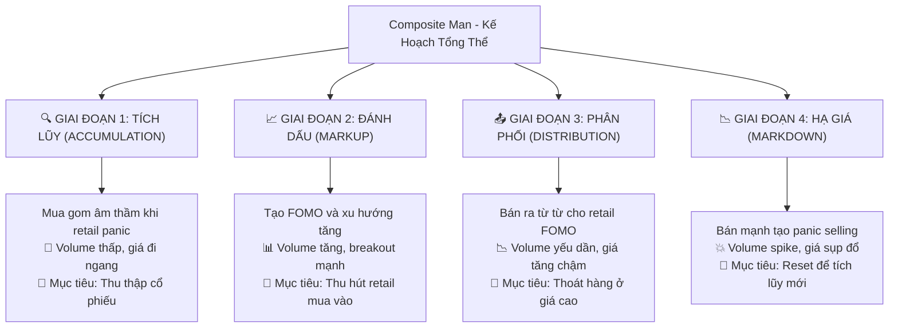
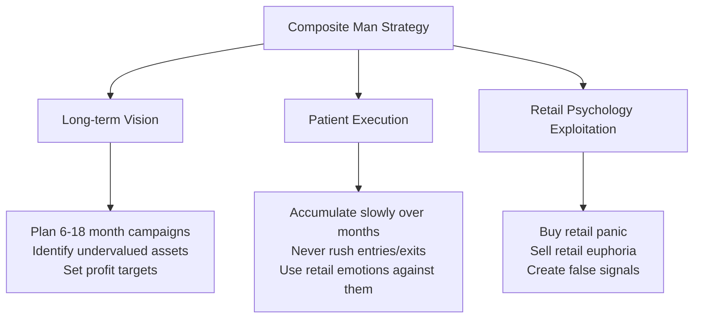

# Chương 1.3: Composite Man - Bộ Não Đằng Sau Thị Trường Chứng Khoán Việt Nam

## Mục Tiêu Học Tập

Sau khi hoàn thành chương này, học viên sẽ có khả năng:

- **Thấu hiểu khái niệm Composite Man** - "thực thể tổng hợp" điều khiển thị trường
- **Nhận diện dấu vết của dòng tiền thông minh** qua các giai đoạn tích lũy và phân phối
- **Đồng hành cùng Composite Man** thay vì chống lại sức mạnh vô hình này
- **Áp dụng tư duy Wyckoff** để dự đoán hành vi thị trường Việt Nam

---

## 1. Composite Man - "Bộ Não Đằng Sau" Mọi Biến Động Giá

### 1.1 Định Nghĩa và Bản Chất

**Composite Man** là một trong những khái niệm mang tính cách mạng nhất của Richard Wyckoff. Hãy **hình dung tất cả các "tay to"** - nhà đầu tư tổ chức, quỹ đầu tư, các ngân hàng lớn và những "tay chơi" có thông tin nội bộ - **như một thực thể duy nhất có bộ não chung**.

> *"Hãy nghiên cứu thị trường như thể tất cả những biến động giá đều được tạo ra bởi một người đàn ông duy nhất có tài sản khổng lồ"* - **Richard Wyckoff**

Composite Man này hành động một cách:
- **Có tính toán và logic** - mọi động thái đều có mục đích rõ ràng
- **Luôn đi trước đám đông** - thấy được những gì nhà đầu tư nhỏ lẻ không thấy 
- **Lợi dụng tâm lý** sợ hãi và tham lam của retail investors
- **Có kế hoạch dài hạn** - suy nghĩ theo chu kỳ 6-18 tháng, không phải ngày



### 1.2 Tại Sao Phải Hiểu Composite Man?

**Anna Coulling** nhấn mạnh: *"Thành công trong giao dịch không phải là việc dự đoán thị trường, mà là hiểu được ai đang kiểm soát thị trường và họ muốn gì."*

#### Lý Do 1: Tránh Bẫy Thao Túng
- **Sức mạnh tài chính khổng lồ:** Composite Man có đủ vốn để tác động lên giá cả
- **Tạo tín hiệu giả:** Họ cố tình tạo ra các breakout giả, panic selling giả để "câu" retail
- **Hiểu chiến thuật = Tránh bẫy:** Khi bạn nhận ra mẫu hình, bạn không còn là "con mồi"

#### Lý Do 2: "Đi Theo Dòng Tiền Thông Minh"
- **Dòng tiền tổ chức quyết định xu hướng dài hạn** - không phải tin tức hay cảm xúc
- **Retail thắng khi đồng hành với smart money** - không phải khi chống lại
- **Dấu vết có thể nhìn thấy:** Volume patterns tiết lộ hành động của Composite Man

> *"Nhiệm vụ của chúng ta không phải là chống lại Composite Man, mà là nhận diện hành động của họ và đồng hành cùng họ"* - **Wyckoff Method**

## 2. Composite Man Strategy - 4 Giai đoạn

### Giai đoạn 1: Accumulation (Tích lũy âm thầm)

**Mục tiêu:** Mua gom lớn mà không đẩy giá lên  
**Tactics:** 
- Mua từ từ khi retail panic selling
- Absorb supply trên volume thấp
- Create sideways consolidation

**Case Study: VIC Accumulation Pattern**

Từ `vpa_data/VIC.md` - Ngày 2025-06-10:
```
VIC mở cửa giảm sâu xuống 86.0 nhưng phục hồi mạnh đóng cửa ở 90.6
Volume: 6.8 triệu đơn vị (rất lớn)
Phân tích: "Selling Climax hoặc Shakeout điển hình"
```

**Composite Man Analysis:**
- **Morning:** Fake panic selling để scare retail investors
- **Afternoon:** Composite Man absorbs all panic supply  
- **Result:** Price recovery shows smart money accumulation

**Ngày tiếp theo (2025-06-11):**
```
VIC giao dịch biên độ rất hẹp với volume cực thấp (1.4M)
Phân tích: "No Supply - áp lực bán đã cạn kiệt"
```

➡️ **Smart Money Tactic:** Test market sau khi accumulate, confirm không còn supply

### Giai đoạn 2: Markup (Đẩy giá lên)

**Mục tiêu:** Tạo momentum để attract retail buying  
**Tactics:**
- Controlled price increases
- Volume increases on rallies
- Create bullish technical patterns

**Case Study: TCB Markup Phase**

Từ `vpa_data/TCB.md` - Ngày 2025-05-20:
```
TCB tăng rất mạnh từ 29.50 lên 30.95 (+4.92%)
Volume: 38.2 triệu đơn vị (BÙNG NỔ)
Phân tích: "Sign of Strength (SOS) cực kỳ rõ ràng"
```

**Composite Man Analysis:**
- Volume explosion = Smart money shifting to aggressive buying
- Wide spread + bullish close = Institutional accumulation complete
- **Strategy:** Now attracting retail FOMO to provide liquidity for distribution

### Giai đoạn 3: Distribution (Phân phối)

**Mục tiêu:** Bán holdings cho retail investors ở giá cao  
**Tactics:**
- Gradual selling khi retail buying increases
- Maintain price facade while distributing
- Volume decreases as supply overwhelms demand

**Case Study: HPG Distribution Signals**

Từ `vpa_data/HPG.md` - Ngày 2025-05-30:
```
HPG đẩy lên cao 22.21 nhưng đóng cửa chỉ 21.46
Volume: 65.01 triệu (CỰC LỚN)
Phân tích: "Topping Out Volume hoặc Buying Climax"
```

**Composite Man Analysis:**
- **High Volume + Poor Price Action = Distribution**
- Smart money dumping shares into retail buying
- Wide spread up but weak close = Supply overwhelming demand

**Confirmation ngày 2025-06-16:**
```
HPG tăng lên 22.29, biên độ hẹp, volume giảm (29.75M)
Phân tích: "Đà tăng chững lại, lực cầu không còn quyết liệt"
```

➡️ **Distribution Pattern:** Volume decreasing = Smart money exiting

### Giai đoạn 4: Markdown (Đẩy giá xuống)

**Mục tiêu:** Scare retail investors để mua lại cheaper  
**Tactics:**
- Aggressive selling to break support
- Create panic để force retail selling
- Volume increases on declines

## 3. Smart Money Footprints - Cách nhận biết

### 3.1 Volume Characteristics

**Smart Money Volume Patterns:**

| Phase | Volume Behavior | Retail Reaction |
|-------|----------------|-----------------|
| **Accumulation** | Low during decline, spike on recovery | Panic selling on lows |
| **Markup** | Increases on rallies | FOMO buying |
| **Distribution** | High with poor results | Euphoric buying |
| **Markdown** | Spike on breaks | Panic selling |

### 3.2 Detection Algorithm

```python
def detect_smart_money_activity(df):
    """Detect potential smart money operations"""
    signals = []
    
    for i in range(20, len(df)):
        row = df.iloc[i]
        
        # Accumulation signals
        if (row['volume_ratio'] > 2.0 and 
            row['close_position'] > 0.7 and
            df.iloc[i-20:i]['close'].std() / df.iloc[i]['close'] < 0.05):
            signals.append({
                'date': df.index[i],
                'type': 'Smart Money Accumulation',
                'description': 'Volume spike during consolidation with bullish close'
            })
            
        # Distribution signals  
        elif (row['volume_ratio'] > 2.0 and
              row['close_position'] < 0.3 and
              row['price_change'] > 2.0):
            signals.append({
                'date': df.index[i], 
                'type': 'Smart Money Distribution',
                'description': 'High volume with poor close despite big move up'
            })
    
    return signals
```

## 4. Sector Analysis - Smart Money Flow

### Banking Sector Smart Money Activity

**Analyzing multiple banking stocks từ `vpa_data/`:**

#### VCB Smart Money Pattern:
- **Jun 13, 2025:** Stopping Volume (volume spike 5.3M with recovery)
- **Jun 16:** Test for Supply (price test với low volume)  
- **Jun 20:** Effort to Rise (volume 6.88M with strong close)

**Pattern:** Classic accumulation → test → markup sequence

#### TCB Smart Money Pattern:
- **May 20, 2025:** SOS signal (volume 38.2M, price +4.92%)
- **Jun 6:** Effort to Fall (volume 28.3M với selling pressure)
- **Jun 11:** No Supply (volume drop to 6.1M)

**Pattern:** Accumulation complete → distribution test → renewed accumulation

### Cross-Sector Comparison

**Real Estate vs Steel Smart Money:**

| Sector | Stock | Smart Money Activity | Current Phase |
|---------|-------|---------------------|---------------|
| **Real Estate** | VIC | Shakeout + No Supply pattern | Late Accumulation |
| **Steel** | HPG | Buying Climax + Distribution | Early Distribution |
| **Banking** | VCB | Multiple accumulation signals | Markup Phase |
| **Banking** | TCB | Mixed signals | Reaccumulation |

**Insights:**
- **Banking sector:** Smart money accumulating (consistent SOS signals)
- **Real estate:** Smart money testing lows (shakeout patterns)  
- **Steel sector:** Smart money distributing (topping signals)

## 5. Psychology of Composite Man

### 5.1 How They Think

**Composite Man Mental Model:**



### 5.2 Common Retail Mistakes vs Smart Money

| Situation | Retail Investor | Composite Man |
|-----------|----------------|---------------|
| **Price drops 10%** | Panic sell | Start accumulating |
| **Price gaps up 5%** | FOMO buy | Start distributing |
| **High volume spike** | Think breakout | Check price/volume relationship |
| **Low volume drift** | Ignore | Look for accumulation |
| **News driven moves** | Follow news | Fade the news |

### 5.3 Emotional Cycle Exploitation

**How Composite Man exploits retail emotions:**

1. **Fear Stage:** Buy from panic sellers during Selling Climax
2. **Hope Stage:** Gradually markup prices to build retail confidence  
3. **Greed Stage:** Distribute to euphoric retail buyers
4. **Despair Stage:** Force final capitulation và restart cycle

## 6. Practical Applications

### 6.1 Smart Money Alignment Strategy

**Step 1: Identify Current Phase**
```python
def identify_wyckoff_phase(df, lookback=50):
    recent_data = df.tail(lookback)
    
    # Check for accumulation signals
    accumulation_signals = len(recent_data[
        (recent_data['volume_ratio'] > 1.8) & 
        (recent_data['close_position'] > 0.6)
    ])
    
    # Check for distribution signals
    distribution_signals = len(recent_data[
        (recent_data['volume_ratio'] > 1.8) & 
        (recent_data['close_position'] < 0.4)
    ])
    
    if accumulation_signals > distribution_signals:
        return "Accumulation/Reaccumulation"
    elif distribution_signals > accumulation_signals:
        return "Distribution/Redistribution"  
    else:
        return "Uncertain/Transition"
```

**Step 2: Align with Smart Money**
- **Accumulation Phase:** Join smart money buying
- **Markup Phase:** Hold positions, add on pullbacks
- **Distribution Phase:** Prepare exits, reduce exposure
- **Markdown Phase:** Stay in cash, wait for next accumulation

### 6.2 Smart Money Confirmation Checklist

Before taking any position, confirm smart money alignment:

✅ **Volume Analysis:**
- [ ] Volume behavior consistent với expected phase
- [ ] No major effort/result divergences
- [ ] Volume supporting price direction

✅ **Price Action:**
- [ ] Price respecting support/resistance levels
- [ ] No signs of smart money distribution
- [ ] Wyckoff structure intact

✅ **Market Context:**  
- [ ] Sector showing similar patterns
- [ ] VNINDEX alignment
- [ ] No major divergences với broader market

## 7. Advanced Concepts

### 7.1 Multiple Composite Men

Different sectors có different Composite Men:
- **Banking Composite Man:** Different timeline than Tech
- **Export Composite Man:** Influenced by global factors
- **Domestic Composite Man:** Local market focused

**Implication:** Always analyze within sector context

### 7.2 Composite Man vs Composite Man

Sometimes institutional money conflicts:
- **Long-term funds** accumulating 
- **Short-term traders** distributing
- **Foreign investors** vs **Domestic institutions**

**Recognition:** Mixed signals, choppy price action

## 8. Case Study: VIC Complete Cycle

### The Setup (Early June 2025)
**Jun 10:** Selling Climax/Shakeout
- Opening gap down to 86.0 (panic retail selling)
- Strong recovery to 90.6 (smart money absorption)
- Volume 6.8M (institutional size)

### The Test (Jun 11)  
**No Supply Signal**
- Narrow range trading (85.4-87.7)
- Volume drops to 1.4M (supply exhausted)
- Smart money testing: "Any more sellers?"

### The Confirmation (Jun 16-17)
**Renewed Accumulation**
- Jun 16: Low volume drift (2.5M) - No Demand yet
- Jun 17: Effort to Rise (volume 3.3M) - Smart money returns

**Pattern Recognition:**
1. ✅ Shakeout weak hands
2. ✅ Test for remaining supply  
3. ✅ Confirm accumulation complete
4. ⏳ Wait for markup phase

## 9. Bài Tập Thực Hành - "Trở Thành Thám Tử Composite Man"

### Bài Tập 1: Nhận Diện Chiến Dịch Smart Money

**Mục tiêu:** Phát triển khả năng nhận diện dấu vết Composite Man trong thực tế

1️⃣ **Chọn 3 cổ phiếu từ các ngành khác nhau:**
   - Banking (VCB hoặc TCB)
   - Real Estate (VIC hoặc VRE)
   - Steel (HPG hoặc HSG)

2️⃣ **Phân tích dữ liệu 3 tháng gần nhất:**
   - Sử dụng các file CSV trong `market_data/`
   - Chú ý các phiên volume cực cao
   - Tìm kiếm các anomaly (effort vs result)

3️⃣ **Xác định dấu chân Composite Man:**
   - Stopping Volume patterns
   - No Supply/No Demand signals
   - Professional Volume confirmations
   - Distribution warnings

4️⃣ **Đánh giá giai đoạn Wyckoff hiện tại:**
   - Accumulation, Markup, Distribution, hay Markdown?
   - Cross-reference với phân tích trong `vpa_data/`

### Bài Tập 2: Phân Tích Sector Rotation

**Mục tiêu:** Hiểu cách Smart Money di chuyển giữa các ngành

1️⃣ **So sánh 3 ngành chính:**
   - **Banking (Ngân hàng):** VCB, TCB, BID
   - **Technology (Công nghệ):** FPT, CMG, VNG
   - **Real Estate (Bất động sản):** VIC, VHM, NVL

2️⃣ **Xác định ngành Smart Money ưa thích:**
   - Ngành nào có nhiều SOS signals nhất?
   - Volume patterns tích cực ở ngành nào?
   - Relative strength so với VNINDEX

3️⃣ **Tìm kiếm rotation patterns:**
   - Tiền chảy từ ngành nào sang ngành nào?
   - Timing của các sector leaders
   - Volume confirmation của rotation

4️⃣ **Dự đoán ngành tiếp theo hưởng lợi:**
   - Dựa trên chu kỳ sector rotation
   - Early accumulation signals
   - Economic cycle positioning

### Bài Tập 3: Theo Dõi Real-time

**Mục tiêu:** Phát triển kỹ năng monitoring hàng ngày

1️⃣ **Theo dõi VPA signals hàng ngày:**
   - Tạo watchlist 10-15 cổ phiếu
   - Ghi chép mọi VPA signal
   - Đánh giá tính chất: SOS, SOW, hay Neutral

2️⃣ **Tìm kiếm xác nhận Smart Money:**
   - Volume spikes với price action tương ứng
   - Multiple timeframe alignment
   - Sector context validation

3️⃣ **Luyện tập nhận diện chuyển giai đoạn:**
   - Từ Accumulation sang Markup
   - Từ Distribution sang Markdown
   - Reaccumulation vs Redistribution

4️⃣ **Paper Trading đồng hành Smart Money:**
   - Chỉ vào lệnh khi Smart Money signals confirm
   - Thực hành position sizing theo giai đoạn
   - Track accuracy và kết quả

## 10. Tổng Kết và Điểm Mấu Chốt

### 10.1 Key Takeaways - Những Điều Cốt Lõi

✅ **Composite Man có các mẫu hình hành vi dự đoán được** - Không ngẫu nhiên mà có logic rõ ràng

✅ **Các pattern volume tiết lộ hoạt động Smart Money** - Volume là "dấu chân" của Composite Man

✅ **Thị trường Việt Nam tuân theo nguyên lý Wyckoff phổ quát** - Các quy luật bất biến áp dụng toàn cầu

✅ **Thành công = đồng hành với Smart Money** - Không chống lại mà đi cùng hướng

✅ **Kiên nhẫn và kỷ luật thắng phản ứng cảm xúc** - Lý trí chiến thắng cảm tính

### 10.2 Các Yếu Tố Thành Công Quan Trọng:

🏦 **Tư duy như các tổ chức:** Dài hạn, kiên nhẫn, có kỷ luật

📈 **Lợi dụng cảm xúc của retail:** Mua khi sợ hãi, bán khi tham lam

👃 **Theo dõi volume:** Smart Money luôn để lại dấu vết

🔄 **Tôn trọng chu kỳ:** Mọi quá trình tích lũy đều dẫn đến phân phối

### 10.3 Checklist Thành Thạo Composite Man

- [ ] Hiểu rõ 4 giai đoạn của Composite Man cycle
- [ ] Nhận diện được 3 smart money signatures chính
- [ ] Phân biệt được retail traps và genuine signals  
- [ ] Áp dụng được multi-timeframe analysis
- [ ] Thực hành với ít nhất 50 phiên giao dịch thực tế
- [ ] So sánh kết quả phân tích với expert analysis trong vpa_data/

### 10.4 Chuẩn Bị Cho Chương Tiếp Theo

Chương 2.1 sẽ đi sâu vào **Các Giai Đoạn Tích Lũy** - quá trình chi tiết của Composite Man "gom hàng":

1. **Phase A:** Dừng chân xu hướng giảm (PS, SC, AR, ST)
2. **Phase B:** Xây dựng nguyên nhân (Building the Cause)
3. **Phase C:** Cuộc kiểm tra (Spring, LPS)
4. **Phase D:** Tiến tới đường cung (SOS dominate)
5. **Phase E:** Thoát khỏi vùng (JOC, Backup)

---

## Ghi Chú Quan Trọng

⚠️ **Composite Man analysis đòi hỏi thời gian và kinh nghiệm** - đừng nhanh nóng

⚠️ **Thị trường có thể không rational trong ngắn hạn** - nhưng luôn rational trong dài hạn

⚠️ **Kết hợp với risk management** - Composite Man không loại bỏ rủi ro nhưng giảm đáng kể

💡 **Pro Tip:** Tạo "Composite Man Journal" để track các pattern và cải thiện recognition skills

---

**Chương tiếp theo:** [Chương 2.1 - Giai Đoạn Tích Lũy](chapter-2-1-accumulation-phases.md)

*"💡 **Thông Điệp Chính:** Thị trường không phải ngẫu nhiên. Đằng sau mọi chuyển động lớn đều có smart money thực thi kế hoạch. Công việc của bạn là nhận ra kế hoạch và đồng hành cùng họ, không phải chống lại."* - **Richard Wyckoff**