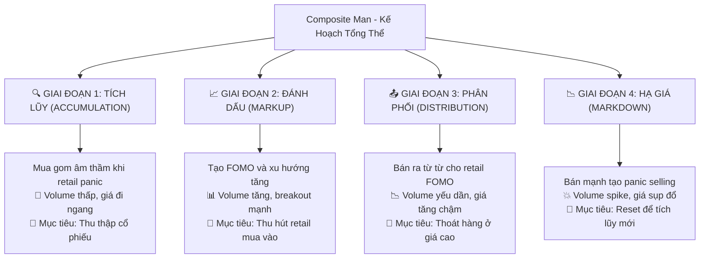
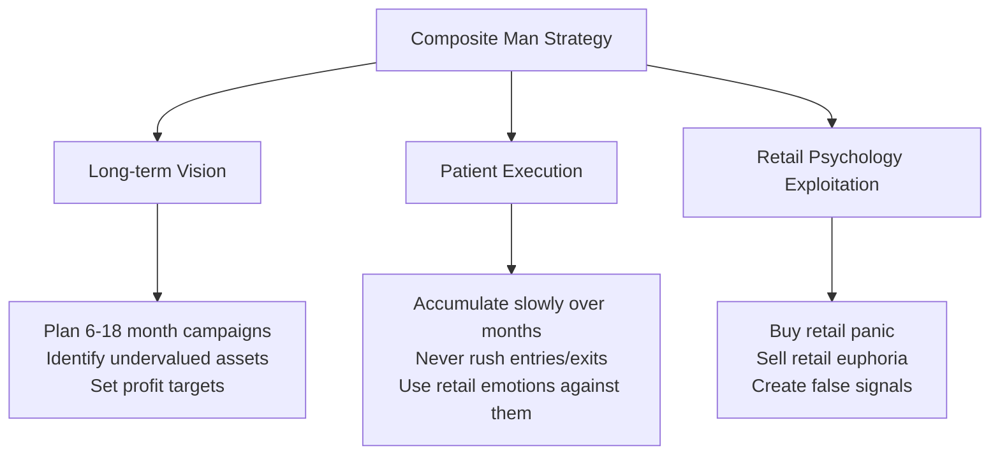

# Chương 1.3: Composite Man - Bộ Não Đằng Sau Thị Trường Chứng Khoán Việt Nam

## Mục Tiêu Học Tập

Sau khi hoàn thành chương này, học viên sẽ có khả năng:

- **Thấu hiểu khái niệm Composite Man** - "thực thể tổng hợp" điều khiển thị trường
- **Nhận diện dấu vết của dòng tiền thông minh** qua các giai đoạn tích lũy và phân phối
- **Đồng hành cùng Composite Man** thay vì chống lại sức mạnh vô hình này
- **Áp dụng tư duy Wyckoff** để dự đoán hành vi thị trường Việt Nam

---

## 1. Composite Man - "Bộ Não Đằng Sau" Mọi Biến Động Giá

### 1.1 Định Nghĩa và Bản Chất

**Composite Man** là một trong những khái niệm mang tính cách mạng nhất của Richard Wyckoff. Hãy **hình dung tất cả các "tay to"** - nhà đầu tư tổ chức, quỹ đầu tư, các ngân hàng lớn và những "tay chơi" có thông tin nội bộ - **như một thực thể duy nhất có bộ não chung**.

> *"Hãy nghiên cứu thị trường như thể tất cả những biến động giá đều được tạo ra bởi một người đàn ông duy nhất có tài sản khổng lồ"* - **Richard Wyckoff**

Composite Man này hành động một cách:
- **Có tính toán và logic** - mọi động thái đều có mục đích rõ ràng
- **Luôn đi trước đám đông** - thấy được những gì nhà đầu tư nhỏ lẻ không thấy 
- **Lợi dụng tâm lý** sợ hãi và tham lam của retail investors
- **Có kế hoạch dài hạn** - suy nghĩ theo chu kỳ 6-18 tháng, không phải ngày



### 1.2 Tại Sao Phải Hiểu Composite Man?

**Anna Coulling** nhấn mạnh: *"Thành công trong giao dịch không phải là việc dự đoán thị trường, mà là hiểu được ai đang kiểm soát thị trường và họ muốn gì."*

#### Lý Do 1: Tránh Bẫy Thao Túng
- **Sức mạnh tài chính khổng lồ:** Composite Man có đủ vốn để tác động lên giá cả
- **Tạo tín hiệu giả:** Họ cố tình tạo ra các breakout giả, panic selling giả để "câu" retail
- **Hiểu chiến thuật = Tránh bẫy:** Khi bạn nhận ra mẫu hình, bạn không còn là "con mồi"

#### Lý Do 2: "Đi Theo Dòng Tiền Thông Minh"
- **Dòng tiền tổ chức quyết định xu hướng dài hạn** - không phải tin tức hay cảm xúc
- **Retail thắng khi đồng hành với smart money** - không phải khi chống lại
- **Dấu vết có thể nhìn thấy:** Volume patterns tiết lộ hành động của Composite Man

> *"Nhiệm vụ của chúng ta không phải là chống lại Composite Man, mà là nhận diện hành động của họ và đồng hành cùng họ"* - **Wyckoff Method**

## 2. Chiến Lược Composite Man - 4 Giai Đoạn

### Giai đoạn 1: Accumulation (Tích lũy âm thầm)

**Mục tiêu:** Mua gom lớn mà không đẩy giá lên  
**Thủ đoạn:** 
- Mua từ từ khi retail panic selling
- Absorb supply trên volume thấp
- Create sideways consolidation

**Nghiên Cứu Trường Hợp: Mô Hình Tích Lũy VIC**

Từ `vpa_data/VIC.md` - Ngày 2025-06-10:
```
VIC mở cửa giảm sâu xuống 86.0 nhưng phục hồi mạnh đóng cửa ở 90.6
Khối lượng: 6.8 triệu đơn vị (rất lớn)
Phân tích: "Selling Climax hoặc Shakeout điển hình"
```

**Phân Tích Composite Man:**
- **Morning:** Fake panic selling để scare retail investors
- **Afternoon:** Composite Man absorbs all panic supply  
- **Result:** Price recovery shows smart money accumulation

**Ngày tiếp theo (2025-06-11):**
```
VIC giao dịch biên độ rất hẹp với volume cực thấp (1.4M)
Phân tích: "No Supply - áp lực bán đã cạn kiệt"
```

➡️ **Thủ Đoạn Dòng Tiền Thông Minh:** Kiểm tra thị trường sau khi tích lũy, xác nhận không còn cung

### Giai đoạn 2: Markup (Đẩy giá lên)

**Mục tiêu:** Tạo momentum để attract retail buying  
**Thủ đoạn:**
- Controlled price increases
- Volume increases on rallies
- Create bullish technical patterns

**Nghiên Cứu Trường Hợp: Giai Đoạn Đánh Dấu TCB**

Từ `vpa_data/TCB.md` - Ngày 2025-05-20:
```
TCB tăng rất mạnh từ 29.50 lên 30.95 (+4.92%)
Khối lượng: 38.2 triệu đơn vị (BÙNG NỔ)
Phân tích: "Sign of Strength (SOS) cực kỳ rõ ràng"
```

**Phân Tích Composite Man:**
- Bùng nổ khối lượng = Dòng tiền thông minh chuyển sang mua tích cực
- Biên độ rộng + đóng cửa tăng = Tích lũy tổ chức hoàn thành
- **Chiến lược:** Giờ thu hút FOMO nhà đầu tư lẻ để cung cấp thanh khoản cho phân phối

### Giai đoạn 3: Distribution (Phân phối)

**Mục tiêu:** Bán holdings cho retail investors ở giá cao  
**Thủ đoạn:**
- Bán dần dần khi việc mua của nhà đầu tư lẻ tăng
- Duy trì vẻ ngoài giá trong khi phân phối
- Khối lượng giảm khi cung áp đảo cầu

**Nghiên Cứu Trường Hợp: Tín Hiệu Phân Phối HPG**

Từ `vpa_data/HPG.md` - Ngày 2025-05-30:
```
HPG đẩy lên cao 22.21 nhưng đóng cửa chỉ 21.46
Khối lượng: 65.01 triệu (CỰC LỚN)
Phân tích: "Topping Out Volume hoặc Buying Climax"
```

**Phân Tích Composite Man:**
- **Khối Lượng Cao + Hành Động Giá Kém = Phân Phối**
- Dòng tiền thông minh đổ cổ phiếu vào việc mua của nhà đầu tư lẻ
- Biên độ rộng lên nhưng đóng cửa yếu = Cung áp đảo cầu

**Confirmation ngày 2025-06-16:**
```
HPG tăng lên 22.29, biên độ hẹp, volume giảm (29.75M)
Phân tích: "Đà tăng chững lại, lực cầu không còn quyết liệt"
```

➡️ **Mô Hình Phân Phối:** Khối lượng giảm = Dòng tiền thông minh thoát

### Giai đoạn 4: Markdown (Đẩy giá xuống)

**Mục tiêu:** Scare retail investors để mua lại cheaper  
**Thủ đoạn:**
- Bán tích cực để phá vỡ hỗ trợ
- Tạo hoảng loạn để buộc nhà đầu tư lẻ bán
- Khối lượng tăng khi giảm

## 3. Dấu Vết Dòng Tiền Thông Minh - Cách Nhận Biết

### 3.1 Đặc Điểm Khối Lượng

**Mô Hình Khối Lượng Dòng Tiền Thông Minh:**

| Giai Đoạn | Hành Vi Khối Lượng | Phản Ứng Nhà Đầu Tư Lẻ |
|-------|----------------|-----------------|
| **Tích Lũy** | Thấp khi giảm, tăng vọt khi phục hồi | Bán hoảng loạn ở mức thấp |
| **Đánh Dấu** | Tăng khi hồi phục | Mua FOMO |
| **Phân Phối** | Cao nhưng kết quả kém | Mua hừu phấn |
| **Hạ Giá** | Tăng vọt khi phá vỡ | Bán hoảng loạn |

### 3.2 Detection Algorithm

```python
def detect_smart_money_activity(df):
    """Phát hiện hoạt động tiềm năng của dòng tiền thông minh"""
    signals = []
    
    for i in range(20, len(df)):
        row = df.iloc[i]
        
        # Tín hiệu tích lũy
        if (row['volume_ratio'] > 2.0 and 
            row['close_position'] > 0.7 and
            df.iloc[i-20:i]['close'].std() / df.iloc[i]['close'] < 0.05):
            signals.append({
                'date': df.index[i],
                'type': 'Tích Lũy Dòng Tiền Thông Minh',
                'description': 'Tăng vọt khối lượng trong hợp nhất với đóng cửa tăng'
            })
            
        # Tín hiệu phân phối  
        elif (row['volume_ratio'] > 2.0 and
              row['close_position'] < 0.3 and
              row['price_change'] > 2.0):
            signals.append({
                'date': df.index[i], 
                'type': 'Phân Phối Dòng Tiền Thông Minh',
                'description': 'Khối lượng cao nhưng đóng cửa kém dù tăng lớn'
            })
    
    return signals
```

## 4. Phân Tích Ngành - Dòng Chảy Dòng Tiền Thông Minh

### Hoạt Động Dòng Tiền Thông Minh Ngành Ngân Hàng

**Phân tích nhiều cổ phiếu ngân hàng từ `vpa_data/`:**

#### Mô Hình Dòng Tiền Thông Minh VCB:
- **13/06/2025:** Khối Lượng Ngăn Chặn (tăng vọt khối lượng 5.3M với phục hồi)
- **16/06:** Kiểm Tra Cung (đo giá với khối lượng thấp)  
- **20/06:** Nỗ Lực Tăng (khối lượng 6.88M với đóng cửa mạnh)

**Mô hình:** Chuỗi tích lũy cổ điển → kiểm tra → đánh dấu

#### Mô Hình Dòng Tiền Thông Minh TCB:
- **20/05/2025:** Tín hiệu SOS (khối lượng 38.2M, giá +4.92%)
- **06/06:** Nỗ Lực Giảm (khối lượng 28.3M với áp lực bán)
- **11/06:** Không Có Cung (khối lượng giảm xuống 6.1M)

**Mô hình:** Tích lũy hoàn thành → kiểm tra phân phối → tích lũy mới

### Cross-Sector Comparison

**Dòng Tiền Thông Minh Bất Động Sản vs Thép:**

| Ngành | Cổ Phiếu | Hoạt Động Dòng Tiền Thông Minh | Giai Đoạn Hiện Tại |
|---------|-------|---------------------|---------------|
| **Bất Động Sản** | VIC | Mô hình Lắc + Không Có Cung | Tích Lũy Muộn |
| **Thép** | HPG | Đỉnh Mua + Phân Phối | Phân Phối Sớm |
| **Ngân Hàng** | VCB | Nhiều tín hiệu tích lũy | Giai Đoạn Đánh Dấu |
| **Ngân Hàng** | TCB | Tín hiệu hỗn hợp | Tích Lũy Lại |

**Nhận xét:**
- **Ngành ngân hàng:** Dòng tiền thông minh đang tích lũy (tín hiệu SOS nhất quán)
- **Bất động sản:** Dòng tiền thông minh kiểm tra mức thấp (mô hình lắc)  
- **Ngành thép:** Dòng tiền thông minh phân phối (tín hiệu đỉnh)

## 5. Psychology of Composite Man

### 5.1 How They Think

**Composite Man Mental Model:**



### 5.2 Sai Lầm Phổ Biến Của Nhà Đầu Tư Lẻ vs Dòng Tiền Thông Minh

| Situation | Retail Investor | Composite Man |
|-----------|----------------|---------------|
| **Giá giảm 10%** | Bán hoảng loạn | Bắt đầu tích lũy |
| **Giá nhảy lên 5%** | Mua FOMO | Bắt đầu phân phối |
| **Tăng vọt khối lượng cao** | Nghĩ bứt phá | Kiểm tra mối quan hệ giá/khối lượng |
| **Khối lượng thấp trôi** | Bỏ qua | Tìm kiếm tích lũy |
| **Chuyển động theo tin tức** | Theo tin tức | Ngược với tin tức |

### 5.3 Emotional Cycle Exploitation

**How Composite Man exploits retail emotions:**

1. **Fear Stage:** Buy from panic sellers during Selling Climax
2. **Hope Stage:** Gradually markup prices to build retail confidence  
3. **Greed Stage:** Distribute to euphoric retail buyers
4. **Despair Stage:** Force final capitulation và restart cycle

## 6. Practical Applications

### 6.1 Chiến Lược Đồng Hành Với Dòng Tiền Thông Minh

**Bước 1: Xác Định Giai Đoạn Hiện Tại**
```python
def identify_wyckoff_phase(df, lookback=50):
    recent_data = df.tail(lookback)
    
    # Check for accumulation signals
    accumulation_signals = len(recent_data[
        (recent_data['volume_ratio'] > 1.8) & 
        (recent_data['close_position'] > 0.6)
    ])
    
    # Check for distribution signals
    distribution_signals = len(recent_data[
        (recent_data['volume_ratio'] > 1.8) & 
        (recent_data['close_position'] < 0.4)
    ])
    
    if accumulation_signals > distribution_signals:
        return "Accumulation/Reaccumulation"
    elif distribution_signals > accumulation_signals:
        return "Distribution/Redistribution"  
    else:
        return "Uncertain/Transition"
```

**Bước 2: Đồng Hành Với Dòng Tiền Thông Minh**
- **Giai đoạn Tích Lũy:** Tham gia mua cùng dòng tiền thông minh
- **Giai đoạn Đánh Dấu:** Giữ vị thế, thêm khi điều chỉnh
- **Giai đoạn Phân Phối:** Chuẩn bị thoát, giảm rủi ro
- **Giai đoạn Hạ Giá:** Giữ tiền mặt, chờ tích lũy tiếp theo

### 6.2 Danh Sách Kiểm Tra Xác Nhận Dòng Tiền Thông Minh

Before taking any position, confirm smart money alignment:

✅ **Phân Tích Khối Lượng:**
- [ ] Hành vi khối lượng nhất quán với giai đoạn dự kiến
- [ ] Không có sự khác biệt lớn về nỗ lực/kết quả
- [ ] Khối lượng hỗ trợ hướng giá

✅ **Hành Động Giá:**
- [ ] Giá tôn trọng các mức hỗ trợ/kháng cự
- [ ] Không có dấu hiệu phân phối dòng tiền thông minh
- [ ] Cấu trúc Wyckoff còn nguyên vẹn

✅ **Bối Cảnh Thị Trường:**  
- [ ] Ngành cho thấy các mô hình tương tự
- [ ] Sự thống nhất với VNINDEX
- [ ] Không có sự khác biệt lớn với thị trường tổng thể

## 7. Advanced Concepts

### 7.1 Multiple Composite Men

Different sectors có different Composite Men:
- **Banking Composite Man:** Different timeline than Tech
- **Export Composite Man:** Influenced by global factors
- **Domestic Composite Man:** Local market focused

**Implication:** Always analyze within sector context

### 7.2 Composite Man vs Composite Man

Sometimes institutional money conflicts:
- **Long-term funds** accumulating 
- **Short-term traders** distributing
- **Foreign investors** vs **Domestic institutions**

**Recognition:** Mixed signals, choppy price action

## 8. Nghiên Cứu Trường Hợp: Chu Kỳ Hoàn Chỉnh VIC

### Thiết Lập (Đầu Tháng 6 Năm 2025)
**Jun 10:** Selling Climax/Shakeout
- Mở cửa gap xuống 86.0 (nhà đầu tư lẻ bán hoảng loạn)
- Phục hồi mạnh lên 90.6 (hấp thụ dòng tiền thông minh)
- Khối lượng 6.8M (quy mô tổ chức)

### Cuộc Kiểm Tra (11/06)  
**No Supply Signal**
- Narrow range trading (85.4-87.7)
- Khối lượng giảm xuống 1.4M (cung cạn kiệt)
- Dòng tiền thông minh kiểm tra: "Còn ai bán không?"

### Xác Nhận (16-17/06)
**Renewed Accumulation**
- 16/06: Trôi khối lượng thấp (2.5M) - Chưa có Cầu
- 17/06: Nỗ Lực Tăng (khối lượng 3.3M) - Dòng tiền thông minh trở lại

**Nhận Dạng Mô Hình:**
1. ✅ Shakeout weak hands
2. ✅ Test for remaining supply  
3. ✅ Confirm accumulation complete
4. ⏳ Wait for markup phase

## 9. Bài Tập Thực Hành - "Trở Thành Thám Tử Composite Man"

### Bài Tập 1: Nhận Diện Chiến Dịch Dòng Tiền Thông Minh

**Mục tiêu:** Phát triển khả năng nhận diện dấu vết Composite Man trong thực tế

1️⃣ **Chọn 3 cổ phiếu từ các ngành khác nhau:**
   - Banking (VCB hoặc TCB)
   - Real Estate (VIC hoặc VRE)
   - Steel (HPG hoặc HSG)

2️⃣ **Phân tích dữ liệu 3 tháng gần nhất:**
   - Sử dụng các file CSV trong `market_data/`
   - Chú ý các phiên volume cực cao
   - Tìm kiếm các anomaly (effort vs result)

3️⃣ **Xác định dấu chân Composite Man:**
   - Stopping Volume patterns
   - No Supply/No Demand signals
   - Professional Volume confirmations
   - Distribution warnings

4️⃣ **Đánh giá giai đoạn Wyckoff hiện tại:**
   - Accumulation, Markup, Distribution, hay Markdown?
   - Cross-reference với phân tích trong `vpa_data/`

### Bài Tập 2: Phân Tích Sector Rotation

**Mục tiêu:** Hiểu cách Dòng Tiền Thông Minh di chuyển giữa các ngành

1️⃣ **So sánh 3 ngành chính:**
   - **Banking (Ngân hàng):** VCB, TCB, BID
   - **Technology (Công nghệ):** FPT, CMG, VNG
   - **Real Estate (Bất động sản):** VIC, VHM, NVL

2️⃣ **Xác định ngành Dòng Tiền Thông Minh ưa thích:**
   - Ngành nào có nhiều SOS signals nhất?
   - Volume patterns tích cực ở ngành nào?
   - Relative strength so với VNINDEX

3️⃣ **Tìm kiếm rotation patterns:**
   - Tiền chảy từ ngành nào sang ngành nào?
   - Timing của các sector leaders
   - Volume confirmation của rotation

4️⃣ **Dự đoán ngành tiếp theo hưởng lợi:**
   - Dựa trên chu kỳ sector rotation
   - Early accumulation signals
   - Economic cycle positioning

### Bài Tập 3: Theo Dõi Real-time

**Mục tiêu:** Phát triển kỹ năng monitoring hàng ngày

1️⃣ **Theo dõi VPA signals hàng ngày:**
   - Tạo watchlist 10-15 cổ phiếu
   - Ghi chép mọi VPA signal
   - Đánh giá tính chất: SOS, SOW, hay Neutral

2️⃣ **Tìm kiếm xác nhận Dòng Tiền Thông Minh:**
   - Tăng vọt khối lượng với hành động giá tương ứng
   - Multiple timeframe alignment
   - Sector context validation

3️⃣ **Luyện tập nhận diện chuyển giai đoạn:**
   - Từ Accumulation sang Markup
   - Từ Distribution sang Markdown
   - Reaccumulation vs Redistribution

4️⃣ **Giao Dịch Giả Đồng Hành Dòng Tiền Thông Minh:**
   - Chỉ vào lệnh khi tín hiệu Dòng Tiền Thông Minh xác nhận
   - Thực hành position sizing theo giai đoạn
   - Track accuracy và kết quả

## 10. Tổng Kết và Điểm Mấu Chốt

### 10.1 Những Điều Cốt Lõi

✅ **Composite Man có các mẫu hình hành vi dự đoán được** - Không ngẫu nhiên mà có logic rõ ràng

✅ **Các mô hình khối lượng tiết lộ hoạt động Dòng Tiền Thông Minh** - Khối lượng là "dấu vết" của Composite Man

✅ **Thị trường Việt Nam tuân theo nguyên lý Wyckoff phổ quát** - Các quy luật bất biến áp dụng toàn cầu

✅ **Thành công = đồng hành với Dòng Tiền Thông Minh** - Không chống lại mà đi cùng hướng

✅ **Kiên nhẫn và kỷ luật thắng phản ứng cảm xúc** - Lý trí chiến thắng cảm tính

### 10.2 Các Yếu Tố Thành Công Quan Trọng:

🏦 **Tư duy như các tổ chức:** Dài hạn, kiên nhẫn, có kỷ luật

📈 **Lợi dụng cảm xúc của retail:** Mua khi sợ hãi, bán khi tham lam

👃 **Theo dõi khối lượng:** Dòng Tiền Thông Minh luôn để lại dấu vết

🔄 **Tôn trọng chu kỳ:** Mọi quá trình tích lũy đều dẫn đến phân phối

### 10.3 Checklist Thành Thạo Composite Man

- [ ] Hiểu rõ 4 giai đoạn của Composite Man cycle
- [ ] Nhận diện được 3 smart money signatures chính
- [ ] Phân biệt được retail traps và genuine signals  
- [ ] Áp dụng được multi-timeframe analysis
- [ ] Thực hành với ít nhất 50 phiên giao dịch thực tế
- [ ] So sánh kết quả phân tích với expert analysis trong vpa_data/

### 10.4 Chuẩn Bị Cho Chương Tiếp Theo

Chương 2.1 sẽ đi sâu vào **Các Giai Đoạn Tích Lũy** - quá trình chi tiết của Composite Man "gom hàng":

1. **Phase A:** Dừng chân xu hướng giảm (PS, SC, AR, ST)
2. **Phase B:** Xây dựng nguyên nhân (Building the Cause)
3. **Phase C:** Cuộc kiểm tra (Spring, LPS)
4. **Phase D:** Tiến tới đường cung (SOS dominate)
5. **Phase E:** Thoát khỏi vùng (JOC, Backup)

---

## Câu Hỏi Tự Kiểm Tra

1. **VIC ngày 10/06/2025 cho thấy giai đoạn nào của Composite Man?**
   - *Gợi ý: Selling Climax hay Accumulation?*

2. **Tại sao HPG ngày 30/05/2025 là dấu hiệu Distribution?**
   - *Gợi ý: Volume vs Price relationship*

3. **Dòng Tiền Thông Minh và Nhà Đầu Tư Lẻ khác nhau gì về thời điểm?**
   - *Gợi ý: Chu kỳ Sợ Hãi vs Tham Lam*

4. **Làm thế nào để nhận biết Accumulation vs Reaccumulation?**
   - *Gợi ý: Previous price action context*

5. **Ngành ngân hàng hiện tại đang ở giai đoạn nào theo phân tích Composite Man?**
   - *Gợi ý: Multiple SOS signals nghĩa là gì?*

📖 **[Xem Đáp Án Chi Tiết](answers/chapter-1-3-composite-man-answers.md)**

---

## Ghi Chú Quan Trọng

⚠️ **Composite Man analysis đòi hỏi thời gian và kinh nghiệm** - đừng nhanh nóng

⚠️ **Thị trường có thể không rational trong ngắn hạn** - nhưng luôn rational trong dài hạn

⚠️ **Kết hợp với risk management** - Composite Man không loại bỏ rủi ro nhưng giảm đáng kể

💡 **Mẹo Chuyên Nghiệp:** Tạo "Nhật Ký Composite Man" để theo dõi các mô hình và cải thiện kỹ năng nhận dạng

---

**Chương tiếp theo:** [Chương 2.1 - Giai Đoạn Tích Lũy](chapter-2-1-accumulation-phases.md)

*"💡 **Thông Điệp Chính:** Thị trường không phải ngẫu nhiên. Đằng sau mọi chuyển động lớn đều có smart money thực thi kế hoạch. Công việc của bạn là nhận ra kế hoạch và đồng hành cùng họ, không phải chống lại."* - **Richard Wyckoff**