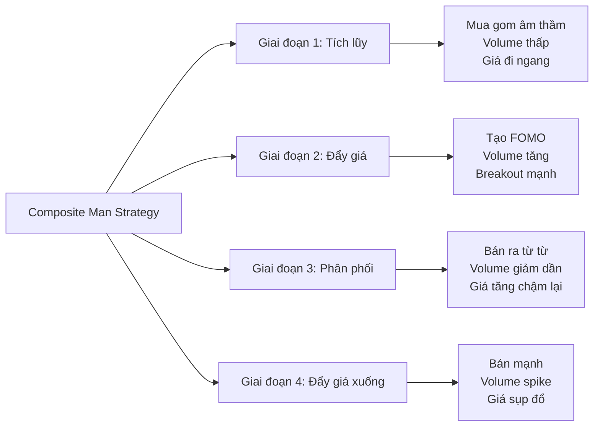
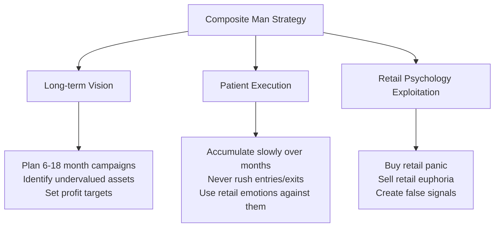

# Chương 1.3: "Composite Man" - Hiểu tâm lý của "Tay To"

## Mục tiêu học tập
- Hình dung rõ nét về Composite Man và chiến lược của họ
- Nhận biết dấu vết hoạt động của smart money từ dữ liệu thực tế
- Học cách "bám theo" thay vì "đi ngược" smart money
- Phân tích behavior patterns của institutional investors trên thị trường Việt Nam

## 1. Composite Man là ai?

### Định nghĩa theo Wyckoff
**Composite Man** là một khái niệm tưởng tượng đại diện cho tất cả **large institutional operators** (quỹ đầu tư, ngân hàng, tổ chức tài chính lớn) hoạt động như một thực thể duy nhất với chiến lược thống nhất.



### Tại sao cần hiểu Composite Man?

**Lý do 1: Market Manipulation**
- Composite Man có đủ capital để influence price action
- Họ tạo ra false signals để mislead retail investors
- Understanding their tactics = avoiding their traps

**Lý do 2: Follow the Money**
- Institutional money moves market long-term
- Retail investors win when aligned với smart money
- Composite Man's footprints visible trong volume patterns

## 2. Composite Man Strategy - 4 Giai đoạn

### Giai đoạn 1: Accumulation (Tích lũy âm thầm)

**Mục tiêu:** Mua gom lớn mà không đẩy giá lên  
**Tactics:** 
- Mua từ từ khi retail panic selling
- Absorb supply trên volume thấp
- Create sideways consolidation

**Case Study: VIC Accumulation Pattern**

Từ `vpa_data/VIC.md` - Ngày 2025-06-10:
```
VIC mở cửa giảm sâu xuống 86.0 nhưng phục hồi mạnh đóng cửa ở 90.6
Volume: 6.8 triệu đơn vị (rất lớn)
Phân tích: "Selling Climax hoặc Shakeout điển hình"
```

**Composite Man Analysis:**
- **Morning:** Fake panic selling để scare retail investors
- **Afternoon:** Composite Man absorbs all panic supply  
- **Result:** Price recovery shows smart money accumulation

**Ngày tiếp theo (2025-06-11):**
```
VIC giao dịch biên độ rất hẹp với volume cực thấp (1.4M)
Phân tích: "No Supply - áp lực bán đã cạn kiệt"
```

➡️ **Smart Money Tactic:** Test market sau khi accumulate, confirm không còn supply

### Giai đoạn 2: Markup (Đẩy giá lên)

**Mục tiêu:** Tạo momentum để attract retail buying  
**Tactics:**
- Controlled price increases
- Volume increases on rallies
- Create bullish technical patterns

**Case Study: TCB Markup Phase**

Từ `vpa_data/TCB.md` - Ngày 2025-05-20:
```
TCB tăng rất mạnh từ 29.50 lên 30.95 (+4.92%)
Volume: 38.2 triệu đơn vị (BÙNG NỔ)
Phân tích: "Sign of Strength (SOS) cực kỳ rõ ràng"
```

**Composite Man Analysis:**
- Volume explosion = Smart money shifting to aggressive buying
- Wide spread + bullish close = Institutional accumulation complete
- **Strategy:** Now attracting retail FOMO to provide liquidity for distribution

### Giai đoạn 3: Distribution (Phân phối)

**Mục tiêu:** Bán holdings cho retail investors ở giá cao  
**Tactics:**
- Gradual selling khi retail buying increases
- Maintain price facade while distributing
- Volume decreases as supply overwhelms demand

**Case Study: HPG Distribution Signals**

Từ `vpa_data/HPG.md` - Ngày 2025-05-30:
```
HPG đẩy lên cao 22.21 nhưng đóng cửa chỉ 21.46
Volume: 65.01 triệu (CỰC LỚN)
Phân tích: "Topping Out Volume hoặc Buying Climax"
```

**Composite Man Analysis:**
- **High Volume + Poor Price Action = Distribution**
- Smart money dumping shares into retail buying
- Wide spread up but weak close = Supply overwhelming demand

**Confirmation ngày 2025-06-16:**
```
HPG tăng lên 22.29, biên độ hẹp, volume giảm (29.75M)
Phân tích: "Đà tăng chững lại, lực cầu không còn quyết liệt"
```

➡️ **Distribution Pattern:** Volume decreasing = Smart money exiting

### Giai đoạn 4: Markdown (Đẩy giá xuống)

**Mục tiêu:** Scare retail investors để mua lại cheaper  
**Tactics:**
- Aggressive selling to break support
- Create panic để force retail selling
- Volume increases on declines

## 3. Smart Money Footprints - Cách nhận biết

### 3.1 Volume Characteristics

**Smart Money Volume Patterns:**

| Phase | Volume Behavior | Retail Reaction |
|-------|----------------|-----------------|
| **Accumulation** | Low during decline, spike on recovery | Panic selling on lows |
| **Markup** | Increases on rallies | FOMO buying |
| **Distribution** | High with poor results | Euphoric buying |
| **Markdown** | Spike on breaks | Panic selling |

### 3.2 Detection Algorithm

```python
def detect_smart_money_activity(df):
    """Detect potential smart money operations"""
    signals = []
    
    for i in range(20, len(df)):
        row = df.iloc[i]
        
        # Accumulation signals
        if (row['volume_ratio'] > 2.0 and 
            row['close_position'] > 0.7 and
            df.iloc[i-20:i]['close'].std() / df.iloc[i]['close'] < 0.05):
            signals.append({
                'date': df.index[i],
                'type': 'Smart Money Accumulation',
                'description': 'Volume spike during consolidation with bullish close'
            })
            
        # Distribution signals  
        elif (row['volume_ratio'] > 2.0 and
              row['close_position'] < 0.3 and
              row['price_change'] > 2.0):
            signals.append({
                'date': df.index[i], 
                'type': 'Smart Money Distribution',
                'description': 'High volume with poor close despite big move up'
            })
    
    return signals
```

## 4. Sector Analysis - Smart Money Flow

### Banking Sector Smart Money Activity

**Analyzing multiple banking stocks từ `vpa_data/`:**

#### VCB Smart Money Pattern:
- **Jun 13, 2025:** Stopping Volume (volume spike 5.3M with recovery)
- **Jun 16:** Test for Supply (price test với low volume)  
- **Jun 20:** Effort to Rise (volume 6.88M with strong close)

**Pattern:** Classic accumulation → test → markup sequence

#### TCB Smart Money Pattern:
- **May 20, 2025:** SOS signal (volume 38.2M, price +4.92%)
- **Jun 6:** Effort to Fall (volume 28.3M với selling pressure)
- **Jun 11:** No Supply (volume drop to 6.1M)

**Pattern:** Accumulation complete → distribution test → renewed accumulation

### Cross-Sector Comparison

**Real Estate vs Steel Smart Money:**

| Sector | Stock | Smart Money Activity | Current Phase |
|---------|-------|---------------------|---------------|
| **Real Estate** | VIC | Shakeout + No Supply pattern | Late Accumulation |
| **Steel** | HPG | Buying Climax + Distribution | Early Distribution |
| **Banking** | VCB | Multiple accumulation signals | Markup Phase |
| **Banking** | TCB | Mixed signals | Reaccumulation |

**Insights:**
- **Banking sector:** Smart money accumulating (consistent SOS signals)
- **Real estate:** Smart money testing lows (shakeout patterns)  
- **Steel sector:** Smart money distributing (topping signals)

## 5. Psychology of Composite Man

### 5.1 How They Think

**Composite Man Mental Model:**



### 5.2 Common Retail Mistakes vs Smart Money

| Situation | Retail Investor | Composite Man |
|-----------|----------------|---------------|
| **Price drops 10%** | Panic sell | Start accumulating |
| **Price gaps up 5%** | FOMO buy | Start distributing |
| **High volume spike** | Think breakout | Check price/volume relationship |
| **Low volume drift** | Ignore | Look for accumulation |
| **News driven moves** | Follow news | Fade the news |

### 5.3 Emotional Cycle Exploitation

**How Composite Man exploits retail emotions:**

1. **Fear Stage:** Buy from panic sellers during Selling Climax
2. **Hope Stage:** Gradually markup prices to build retail confidence  
3. **Greed Stage:** Distribute to euphoric retail buyers
4. **Despair Stage:** Force final capitulation và restart cycle

## 6. Practical Applications

### 6.1 Smart Money Alignment Strategy

**Step 1: Identify Current Phase**
```python
def identify_wyckoff_phase(df, lookback=50):
    recent_data = df.tail(lookback)
    
    # Check for accumulation signals
    accumulation_signals = len(recent_data[
        (recent_data['volume_ratio'] > 1.8) & 
        (recent_data['close_position'] > 0.6)
    ])
    
    # Check for distribution signals
    distribution_signals = len(recent_data[
        (recent_data['volume_ratio'] > 1.8) & 
        (recent_data['close_position'] < 0.4)
    ])
    
    if accumulation_signals > distribution_signals:
        return "Accumulation/Reaccumulation"
    elif distribution_signals > accumulation_signals:
        return "Distribution/Redistribution"  
    else:
        return "Uncertain/Transition"
```

**Step 2: Align with Smart Money**
- **Accumulation Phase:** Join smart money buying
- **Markup Phase:** Hold positions, add on pullbacks
- **Distribution Phase:** Prepare exits, reduce exposure
- **Markdown Phase:** Stay in cash, wait for next accumulation

### 6.2 Smart Money Confirmation Checklist

Before taking any position, confirm smart money alignment:

✅ **Volume Analysis:**
- [ ] Volume behavior consistent với expected phase
- [ ] No major effort/result divergences
- [ ] Volume supporting price direction

✅ **Price Action:**
- [ ] Price respecting support/resistance levels
- [ ] No signs of smart money distribution
- [ ] Wyckoff structure intact

✅ **Market Context:**  
- [ ] Sector showing similar patterns
- [ ] VNINDEX alignment
- [ ] No major divergences với broader market

## 7. Advanced Concepts

### 7.1 Multiple Composite Men

Different sectors có different Composite Men:
- **Banking Composite Man:** Different timeline than Tech
- **Export Composite Man:** Influenced by global factors
- **Domestic Composite Man:** Local market focused

**Implication:** Always analyze within sector context

### 7.2 Composite Man vs Composite Man

Sometimes institutional money conflicts:
- **Long-term funds** accumulating 
- **Short-term traders** distributing
- **Foreign investors** vs **Domestic institutions**

**Recognition:** Mixed signals, choppy price action

## 8. Case Study: VIC Complete Cycle

### The Setup (Early June 2025)
**Jun 10:** Selling Climax/Shakeout
- Opening gap down to 86.0 (panic retail selling)
- Strong recovery to 90.6 (smart money absorption)
- Volume 6.8M (institutional size)

### The Test (Jun 11)  
**No Supply Signal**
- Narrow range trading (85.4-87.7)
- Volume drops to 1.4M (supply exhausted)
- Smart money testing: "Any more sellers?"

### The Confirmation (Jun 16-17)
**Renewed Accumulation**
- Jun 16: Low volume drift (2.5M) - No Demand yet
- Jun 17: Effort to Rise (volume 3.3M) - Smart money returns

**Pattern Recognition:**
1. ✅ Shakeout weak hands
2. ✅ Test for remaining supply  
3. ✅ Confirm accumulation complete
4. ⏳ Wait for markup phase

## 9. Homework Assignment

### Assignment 1: Identify Smart Money Campaigns
1. Choose 3 stocks from different sectors
2. Analyze last 3 months of data
3. Identify Composite Man footprints
4. Determine current Wyckoff phase

### Assignment 2: Sector Rotation Analysis  
1. Compare Banking vs Technology vs Real Estate
2. Identify which sectors smart money favors
3. Look for rotation patterns
4. Predict next sector to benefit

### Assignment 3: Real-time Monitoring
1. Track daily VPA signals for chosen stocks
2. Look for smart money confirmation
3. Practice identifying phase transitions
4. Paper trade aligned với smart money

## 10. Key Takeaways

✅ **Composite Man có predictable behavior patterns**
✅ **Volume patterns reveal smart money activity**
✅ **Vietnam market follows universal Wyckoff principles**
✅ **Successful trading = aligning với smart money**
✅ **Patience và discipline beat emotional reactions**

### Critical Success Factors:
- **Think like institutions:** Long-term, patient, disciplined
- **Use retail emotions:** Buy fear, sell greed
- **Follow volume:** Smart money leaves footprints
- **Respect the cycle:** Every accumulation leads to distribution

**Next Chapter:** [Chapter 2.1 - Accumulation Phases](chapter-2-1-accumulation-phases.md)

---

*💡 **Master Insight:** The market is not random. Behind every major move is smart money executing a plan. Your job is to recognize the plan và join them, not fight them.*