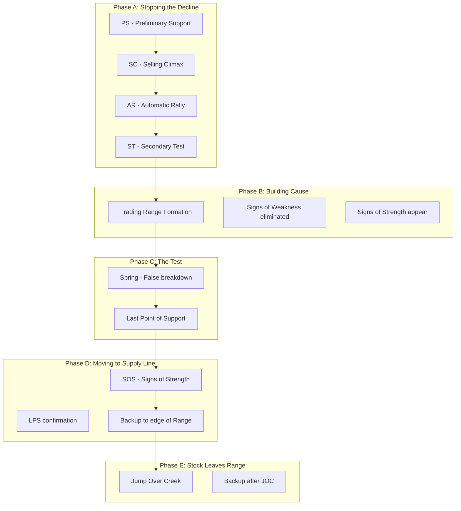

# Chương 2.1: Giai đoạn Tích lũy (Accumulation) - Nhận diện cơ hội vàng

## Mục tiêu học tập
- Phân biệt chính xác các Phase A, B, C, D, E của Accumulation
- Xác định các sự kiện quan trọng: PS, SC, AR, ST, Spring, etc.
- Tính toán Price Objective từ Trading Range
- Áp dụng vào dữ liệu thực tế từ thị trường Việt Nam

## 1. Accumulation Structure Overview

### Wyckoff Accumulation Schematic



### Key Concepts

**Trading Range (TR):** Sideways price action where smart money accumulates
**Cause:** The amount of accumulation (horizontal price action)
**Effect:** The resulting markup (vertical price movement)
**Point & Figure Count:** Method to calculate price objectives

## 2. Phase A: Stopping the Decline

### 2.1 Preliminary Support (PS)

**Definition:** First evidence that selling pressure is decreasing
**Characteristics:**
- Volume increases as price finds initial support
- Price action suggests downtrend slowing
- NOT the final low (more selling usually follows)

### 2.2 Selling Climax (SC)

**Definition:** Final phase of intense selling where panic reaches maximum
**Characteristics:**
- **Ultra-high volume** (often highest in months)
- **Wide spread down** với bearish close
- **Capitulation selling** from retail investors
- **Smart money absorption** of panic supply

**Case Study: VIC Selling Climax (Jun 10, 2025)**

Từ `vpa_data/VIC.md`:
```
VIC mở cửa giảm sâu xuống 86.0 nhưng phục hồi mạnh đóng cửa ở 90.6
Volume: 6.8 triệu đơn vị (rất lớn)
```

**Analysis:**
- **Morning gap down:** Panic selling from retail
- **Massive volume:** Smart money stepping in
- **Strong recovery:** Supply absorbed, demand emerges
- **Intraday reversal:** Classic SC behavior

### 2.3 Automatic Rally (AR)

**Definition:** Natural bounce after SC as selling pressure exhausted
**Characteristics:**
- Price rallies from SC low on reduced volume
- Extent of rally indicates strength of smart money demand
- Sets upper boundary of trading range

**VIC AR Analysis:**
- Recovery from 86.0 to 90.6 = **5.3% AR**
- Natural rebound after heavy smart money buying
- Established resistance around 90.6 level

### 2.4 Secondary Test (ST)

**Definition:** Return to or near SC levels to test if selling pressure remains
**Characteristics:**
- **Lower volume than SC** (bullish sign)
- Price may or may not reach SC lows
- Successful test = no new supply at lows

**VIC ST Pattern (Jun 11):**
```
VIC giao dịch biên độ rất hẹp với volume cực thấp (1.4M)
Phân tích: "No Supply - áp lực bán đã cạn kiệt"
```

**Perfect ST Characteristics:**
- ✅ Much lower volume (1.4M vs 6.8M)  
- ✅ Price holds above SC low
- ✅ No Supply signal confirmed
- ✅ Smart money test successful

## 3. Phase B: Building the Cause

### 3.1 Trading Range Development

**Purpose:** Smart money accumulates large positions without moving price
**Duration:** Can last weeks to months
**Characteristics:**
- Price oscillates between support và resistance
- Volume generally lower than Phase A
- Multiple tests of both ends of range

### 3.2 Signs of Weakness (SOW) vs Signs of Strength (SOS)

**Signs of Weakness (SOW):**
- Price declines on increased volume
- Wide spreads down với bearish closes
- Break below ST lows

**Signs of Strength (SOS):**  
- Price advances on increased volume
- Wide spreads up với bullish closes
- Hold above support levels

**TCB Phase B Example:**

From `vpa_data/TCB.md` analysis:
- **May 20:** SOS signal (volume 38.2M, price +4.92%)
- **Jun 6:** SOW signal (volume 28.3M với selling pressure)  
- **Jun 11:** No Supply (volume 6.1M, accumulation continuing)

**Pattern Recognition:**
- Mixed signals during Phase B are normal
- Overall trend: SOW signals decrease, SOS signals increase
- Smart money gradually gaining control

## 4. Phase C: The Test

### 4.1 Spring (False Breakdown)

**Definition:** Break below ST low to "test" remaining supply and shake out weak holders
**Purpose:**
- Flush out remaining weak hands
- Test if any large supply remains
- Create final accumulation opportunity

**Characteristics:**
- **Volume should be lower** than SC/ST
- **Quick reversal** back into range
- **False breakdown** - looks bearish but isn't

**Spring Analysis Framework:**
```python
def identify_spring(df, st_low, lookback=10):
    """Identify potential Spring patterns"""
    springs = []
    
    for i in range(lookback, len(df)):
        if df['low'].iloc[i] < st_low:  # Break below ST
            if (df['volume'].iloc[i] < df['volume'].iloc[i-lookback:i].mean() and
                df['close'].iloc[i] > df['low'].iloc[i] + 
                (df['high'].iloc[i] - df['low'].iloc[i]) * 0.6):
                
                springs.append({
                    'date': df.index[i],
                    'low': df['low'].iloc[i],
                    'volume': df['volume'].iloc[i],
                    'recovery': (df['close'].iloc[i] - df['low'].iloc[i]) / 
                               (df['high'].iloc[i] - df['low'].iloc[i])
                })
    
    return springs
```

### 4.2 Last Point of Support (LPS)

**Definition:** Final support test before markup begins
**Characteristics:**
- Higher low than Spring
- Very low volume
- Quick bounce from support
- Often forms double bottom với Spring

## 5. Phase D: Moving to Supply Line

### 5.1 Signs of Strength Dominate

**Evidence of Smart Money Control:**
- Price easily moves through resistance
- Volume increases on advances
- Any pullbacks are shallow với low volume

**TCB Phase D Example (Jun 16, 2025):**
```
TCB tăng vọt từ 31.20 lên 32.30
Volume: 22.9 triệu (cao), xác nhận sức mạnh của phiên tăng
```

**Phase D Indicators:**
- ✅ Easy movement through resistance
- ✅ Volume confirmation on advance
- ✅ Wide spread up với bullish close
- ✅ No supply apparent

### 5.2 Backup (BU)

**Definition:** Pullback to edge of trading range before final breakout
**Purpose:** Final test of accumulation; shake out weak longs
**Characteristics:**
- **Low volume pullback**
- **Holds above Spring low**
- **Quick recovery**

## 6. Phase E: Stock Leaves Range

### 6.1 Jump Over Creek (JOC)

**Definition:** Decisive breakout above trading range resistance
**Characteristics:**
- **High volume breakout**
- **Wide spread up**
- **Bullish close near high**
- **Follow-through in subsequent sessions**

### 6.2 Backup After JOC

**Normal behavior:** Return to breakout level to test support
**Bullish if:**
- Lower volume than breakout
- Holds above breakout level  
- Quick recovery

## 7. Price Objective Calculation

### 7.1 Point & Figure Count Method

**Formula:** Width of TR × 3 + Breakout Point = Target

**Example Calculation:**
```
Trading Range: 86.0 (low) to 92.0 (high)
Width: 92.0 - 86.0 = 6.0 points
Count: 6.0 × 3 = 18.0 points
Breakout: 92.0
Target: 92.0 + 18.0 = 110.0
```

### 7.2 Time-Based Calculation

**Alternative Method:** Duration of accumulation predicts markup duration
- 6 months accumulation → 2-3 months markup
- Longer cause → Larger effect

## 8. Real-World Application: Banking Sector Analysis

### VCB Accumulation Pattern (2025)

**Phase A Identification:**
- **Jan 2:** High of 61.87 (resistance established)
- **Jan 10:** Low of 61.14 (ST level)
- **Volume patterns:** Classic SC/AR sequence

**Phase B Development:**
- **Jan-May:** Range trading 60.5-62.5
- **Multiple tests:** Both support và resistance
- **Volume declining:** Smart money accumulation

**Phase C Confirmation:**
- **Jun 13:** Stopping Volume signal (Spring-like behavior)
- **Volume spike:** 5.3M on recovery
- **Strong close:** Bullish accumulation

**Phase D Evidence:**
- **Jun 20:** Effort to Rise (volume 6.88M)
- **Breaking resistance:** Move above 57.0
- **SOS confirmed:** Smart money control

### TCB vs VCB Comparison

| Metric | VCB | TCB |
|--------|-----|-----|
| **TR Width** | ~2.0 points | ~4.0 points |
| **Duration** | 5 months | 3 months |  
| **Volume Pattern** | Declining trend | Volatile |
| **Current Phase** | Late D/Early E | Mid Phase D |
| **Price Target** | 64.0-66.0 | 38.0-42.0 |

## 9. Advanced Accumulation Patterns

### 9.1 Reaccumulation

**Definition:** Second accumulation after initial markup
**Characteristics:**
- Occurs at higher level than original
- Shorter duration
- Less volume required
- Often forms ascending triangle

### 9.2 Failed Accumulation

**Warning Signs:**
- Multiple Springs without follow-through
- Volume increasing on declines
- Unable to hold above ST lows
- SOW signals dominating SOS

**Risk Management:** Exit if accumulation structure breaks down

## 10. Sector Rotation và Accumulation

### Identifying Sector Leaders

**Analysis Framework:**
1. **Scan all sectors** for accumulation patterns
2. **Compare relative strength** during market weakness
3. **Monitor volume patterns** for smart money activity
4. **Track phase development** across sector

**Current Vietnam Market (Mid-2025):**
- **Banking:** Multiple accumulation patterns (VCB, TCB)
- **Steel:** Mixed signals (HPG showing distribution)
- **Real Estate:** Early accumulation (VIC pattern)
- **Technology:** Lagging (no clear accumulation)

**Investment Implication:** Focus on Banking và Real Estate

## 11. Practical Trading Applications

### 11.1 Entry Points

**Best Accumulation Entries:**
1. **Spring Low:** Highest risk/reward but requires precision
2. **LPS:** Safer entry với confirmed support
3. **Phase D SOS:** Lower risk, confirmed trend
4. **JOC Backup:** Conservative entry on breakout pullback

### 11.2 Position Sizing

**Accumulation Phase Position Sizing:**
- **Phase A/B:** Small positions, scale in gradually
- **Phase C:** Increase size on Spring confirmation
- **Phase D:** Full position as SOS confirmed
- **Phase E:** Add on JOC backup (if any)

### 11.3 Risk Management

**Stop Loss Placement:**
- **Phase A/B:** Below recent ST low
- **Phase C:** Below Spring low
- **Phase D:** Below LPS
- **Phase E:** Below JOC level

## 12. Common Mistakes và How to Avoid

### 12.1 Premature Entry

**Mistake:** Buying first sign of accumulation
**Solution:** Wait for Phase C confirmation

### 12.2 Misidentifying Phases

**Mistake:** Confusing reaccumulation với distribution
**Solution:** Focus on volume characteristics

### 12.3 Ignoring Market Context

**Mistake:** Analyzing stocks in isolation
**Solution:** Always consider VNINDEX behavior

## 13. Homework Exercises

### Exercise 1: Phase Identification
1. Analyze HPG, VHM, MSN từ `market_data/`
2. Identify current Wyckoff phase
3. Map key events (PS, SC, AR, ST, etc.)
4. Calculate potential price objectives

### Exercise 2: Comparative Analysis
1. Compare 5 banking stocks accumulation patterns
2. Rank by accumulation quality
3. Identify most promising candidates
4. Develop entry/exit strategy

### Exercise 3: Real-Time Monitoring
1. Track daily VPA signals for chosen stocks
2. Update phase analysis weekly
3. Document smart money evidence
4. Paper trade the strategies

## 14. Key Takeaways

✅ **Accumulation follows predictable 5-phase structure**
✅ **Volume patterns reveal smart money activity**
✅ **Phase C Spring is critical confirmation**
✅ **Price objectives calculable from TR width**
✅ **Vietnam market follows universal patterns**

### Success Factors:
- **Patience:** Wait for proper accumulation completion
- **Volume Focus:** Smart money leaves footprints
- **Phase Discipline:** Don't skip phases
- **Risk Management:** Define exits before entries

**Next Chapter:** [Chapter 2.2 - Distribution Phases](chapter-2-2-distribution-phases.md)

---

*💡 **Master Tip:** Great accumulation patterns take time to develop. The best opportunities come to those who wait for complete Phase C confirmation before committing significant capital.*