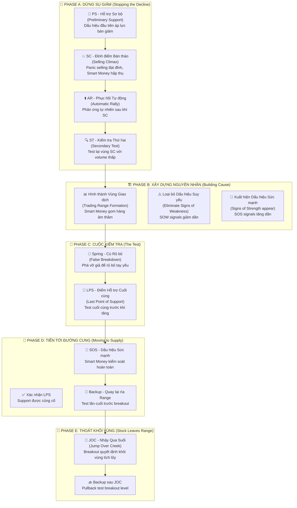

# Chương 2.1: Giai Đoạn Tích Lũy - "Gom Hàng" Như Những Chuyên Gia Tài Chính Hàng Đầu

## Mục Tiêu Học Tập

Sau khi hoàn thành chương này, học viên sẽ có khả năng:

- **Thấu hiểu cấu trúc 5 giai đoạn tích lũy** - Phase A đến E với đặc điểm riêng biệt
- **Nhận diện chính xác các sự kiện Wyckoff:** PS (Hỗ trợ Sơ bộ), SC (Đỉnh điểm Bán tháo), AR (Phục hồi Tự động), ST (Kiểm tra Thứ hai), Spring (Cú Rũ bỏ), LPS (Điểm Hỗ trợ Cuối cùng)
- **Tính toán mục tiêu giá** từ độ rộng vùng tích lũy bằng phương pháp Point & Figure
- **Áp dụng vào thị trường chứng khoán Việt Nam** với dữ liệu thực tế từ VCB, TCB, VIC
- **Xây dựng chiến lược giao dịch hoàn chỉnh** cho từng giai đoạn tích lũy

---

## 1. Tổng Quan Cấu Trúc Tích Lũy - "Bản Đồ Hành Trình" Của Smart Money

### 1.1 Sơ Đồ Tích Lũy Wyckoff - Từ Lý Thuyết Đến Thực Tiễn Việt Nam



### 1.2 Các Khái Niệm Cốt Lõi

**Wyckoff** đã phát triển một hệ thống tư duy logic về cách thị trường hoạt động:

📊 **Vùng Giao dịch (Trading Range - TR):** Khu vực giá đi ngang nơi "dòng tiền thông minh" tích lũy cổ phiếu một cách âm thầm

🔄 **Nguyên Nhân (Cause):** Lượng tích lũy (thời gian và khối lượng giao dịch ngang) - "năng lượng tiềm tàng" được tích trữ

⚡ **Kết Quả (Effect):** Đợt tăng giá sau đó (chuyển động giá dọc) - "năng lượng" được giải phóng

📈 **Đếm Point & Figure:** Phương pháp toán học để tính mục tiêu giá dựa trên độ rộng vùng tích lũy

> *"Để có một 'kết quả' (xu hướng tăng mạnh), phải có một 'nguyên nhân' tương xứng (tích lũy đủ lâu và đủ lớn)"* - **Quy luật Nguyên nhân & Kết quả của Wyckoff**

---

## 2. Phase A: "Dừng Chân" Xu Hướng Giảm - Khi Smart Money Bắt Đầu Hành Động

### 2.1 PS - Hỗ Trợ Sơ Bộ (Preliminary Support): "Tín Hiệu Đầu Tiên"

**Wyckoff giải thích:** PS là dấu hiệu đầu tiên cho thấy **áp lực bán đang suy giảm**. Đây chưa phải là đáy cuối cùng, nhưng là dấu hiệu cảnh báo rằng "có ai đó" đang bắt đầu quan tâm.

**Đặc điểm nhận dạng:**
- 📊 **Khối lượng tăng** khi giá tìm kiếm hỗ trợ ban đầu
- 📉 **Hành động giá gợi ý** xu hướng giảm đang chậm lại
- ⚠️ **CHƯĀ PHẢI ĐÁY CUỐI CÙNG** - thường còn đợt bán tháo mạnh hơn (SC) tiếp theo
- 📊 **Volume characteristics:** Tăng nhẹ so với bình thường nhưng chưa đạt đỉnh
- 🔍 **Market sentiment:** Bắt đầu có sự quan tâm từ institutional money

### 2.2 SC - Đỉnh Điểm Bán Tháo (Selling Climax): "Giờ Quyết Định"

**Anna Coulling mô tả:** SC là giai đoạn cuối cùng của việc bán tháo dữ dội, khi **nỗi sợ hãi đạt tới đỉnh điểm**. Đây chính là lúc "dòng tiền thông minh" thể hiện sức mạnh thật sự.

**Đặc điểm "không thể nhầm lẫn":**
- 💥 **Khối lượng cực lớn** (thường cao nhất trong nhiều tháng - >200% bình thường)
- 📉 **Biên độ rộng xuống** với đóng cửa yếu nhưng phục hồi trong phiên
- 😱 **Bán tháo đầu hàng** từ nhà đầu tư nhỏ lẻ (capitulation)
- 🐟 **Dòng Tiền Thông Minh "nuốt chừng"** tất cả nguồn cung panic trong vòng vài giờ
- 🔄 **Intraday reversal:** Từ mức thấp nhất, giá thường phục hồi >30% range

> *"SC là khoảnh khắc vàng cho những ai biết nhận diện. Khi mọi người đang bán trong sợ hãi, các chuyên gia đang mua với niềm tin"* - **VPA Methodology**

#### Case Study Thực Tế: VIC - Mẫu Hình SC Hoàn Hảo (10/06/2025)

**Dữ liệu thực tế từ `vpa_data/VIC.md`:**
```csv
Ticker: VIC  
Date: 2025-06-10
Mở cửa: 88.5, Cao nhất: 91.2, Thấp nhất: 86.0, Đóng cửa: 90.6
Khối lượng: 6,800,000 (Độc tôn - rất lớn)
Intraday story: Mở giảm sâu xuống 86.0, sau đó phục hồi mạnh
```

**Phân tích chi tiết theo VPA:**
- 🌅 **Phiên sáng - Bán Tháo Hoảng Loạn:** Giảm giá cách biệt xuống 86.0 (nhà đầu tư lẻ hoảng loạn bán tháo)
- 📊 **Khối lượng khổng lồ:** 6.8 triệu cổ phiếu (đây chính là dòng tiền thông minh đang hành động)
- 🚀 **Phục hồi mạnh mẽ:** Từ 86.0 lên 90.6 (+5.3%) - nguồn cung đã được hấp thụ
- ✅ **Đảo chiều trong phiên:** Mẫu hình SC điển hình, không thể rõ ràng hơn

**Kết luận chuyên gia:** *"VIC Selling Climax hoặc Shakeout điển hình"* - Từ phân tích VPA/Wyckoff của chuyên gia

### 2.3 AR - Phục Hồi Tự Động (Automatic Rally): "Phản Ứng Tự Nhiên"

**Bản chất của AR:** Đây là phản ứng tự nhiên sau SC khi **áp lực bán đã cạn kiệt**. Giống như quả bóng được nén xuống cực mạnh rồi được thả ra.

**Đặc điểm kỹ thuật:**
- 📈 **Giá tăng từ đáy SC** trên khối lượng giảm
- 📄 **Mức độ phục hồi** tiết lộ sức mạnh cầu của dòng tiền thông minh
- 📏 **Thiết lập ràng buộc trên** của vùng giao dịch tương lai

**Phân Tích VIC AR Chi Tiết:**
- ⬆️ **Phục hồi từ 86.0 lên 90.6 = AR 5.3%** (mạnh mẽ)
- 🐟 **Phản ứng tự nhiên** sau khi dòng tiền thông minh mua mạnh
- 📏 **Thiết lập kháng cự** quanh vùng 90.6 (giới hạn trên của TR)

> *"Mức độ phục hồi AR cho biết dòng tiền thông minh 'tiêu thụ' bao nhiêu nguồn cung trong SC. AR mạnh = Nhu cầu thật mạnh"* - **Wyckoff Method**

**Các loại AR và ý nghĩa:**
- **AR mạnh (>70% phục hồi từ SC low):** Strong institutional demand
- **AR trung bình (40-70% phục hồi):** Moderate demand, cần theo dõi thêm
- **AR yếu (<40% phục hồi):** Insufficient demand, cảnh báo tiếp tục downtrend

> **Kinh nghiệm thực tiễn:** AR càng mạnh, khả năng accumulation thành công càng cao. AR yếu có thể dẫn đến continuation downtrend.

### 2.4 ST - Kiểm Tra Thứ Hai (Secondary Test): "Kiểm Tra Lại Xác Minh"

**Mục đích của ST:** Quay trở lại hoặc gần vùng SC để **"thăm dò"** xem còn áp lực bán nào không. Giống như người thợ săn gõ cửa xem còn ai trong nhà không.

**Các dấu hiệu "hoàn hảo" của ST:**
- 🔉 **Khối lượng thấp hơn SC** (dấu hiệu tích cực)
- 🎯 **Giá có thể hoặc không** chạm đáy SC
- ✅ **Test thành công = Không còn nguồn cung mới** ở vùng thấp

#### VIC - Mẫu Hình ST Đỉnh Cao (11/06/2025)

**Dữ liệu từ `vpa_data/VIC.md`:**
```csv
Ticker: VIC
Date: 2025-06-11  
Trading range: 85.4 - 87.7 (biên độ rất hẹp)
Khối lượng: 1,400,000 (cực thấp)
Phân tích: "No Supply - áp lực bán đã cạn kiệt"
```

**Đây là ST "sách giáo khoa":  **
- ✅ **Khối lượng giảm mạnh** (1.4M vs 6.8M của SC = giảm 79%)
- ✅ **Giá giữ trên đáy SC** (85.4 > 86.0 của SC low)
- ✅ **Tín hiệu No Supply được xác nhận** - không còn người muốn bán
- ✅ **Smart Money test thành công** - có thể chuyển sang giai đoạn tiếp theo

**Kết luận:** VIC đã hoàn thành Phase A một cách hoàn hảo!

---

## 3. Phase B: "Xây Dựng Nguyên Nhân" - Giai Đoạn Gom Hàng Thầm Lặng

### 3.1 Phát Triển Vùng Giao Dịch

**Mục đích:** Dòng tiền thông minh tích lũy vị thế lớn mà không làm di chuyển giá
**Thời lượng:** Có thể kéo dài từ vài tuần đến vài tháng
**Đặc điểm:**
- Giá dao động giữa hỗ trợ và kháng cự
- Khối lượng nói chung thấp hơn Giai Đoạn A
- Nhiều lần kiểm tra cả hai đầu của khoảng

### 3.2 Dấu Hiệu Suy Yếu (SOW) so với Dấu Hiệu Sức Mạnh (SOS)

**Dấu Hiệu Suy Yếu (SOW):**
- Giá giảm khi khối lượng tăng
- Biên độ rộng xuống với đóng cửa giảm
- Phá vỡ dưới mức thấp ST

**Dấu Hiệu Sức Mạnh (SOS):**  
- Giá tăng khi khối lượng tăng
- Biên độ rộng lên với đóng cửa tăng
- Giữ vững trên các mức hỗ trợ

**Ví dụ TCB Giai Đoạn B:**

Từ phân tích trong `vpa_data/TCB.md`:
- **May 20:** SOS signal (volume 38.2M, price +4.92%)
- **Jun 6:** SOW signal (volume 28.3M với selling pressure)  
- **Jun 11:** No Supply (volume 6.1M, accumulation continuing)

**Nhận Dạng Mẫu Hình:**
- Tín hiệu hỗn hợp trong Giai Đoạn B là bình thường
- Xu hướng chung: Tín hiệu SOW giảm, tín hiệu SOS tăng
- Dòng tiền thông minh dần kiểm soát thị trường

## 4. Phase C: Cuộc Kiểm Tra

### 4.1 Spring (Phá Vỡ Giả)

**Định nghĩa:** Phá vỡ dưới mức thấp ST để "kiểm tra" nguồn cung còn lại và rũ bỏ những người nắm giữ yếu
**Mục đích:**
- Đẩy ra những tay yếu còn sót lại
- Kiểm tra xem còn nguồn cung lớn nào không
- Tạo cơ hội tích lũy cuối cùng

**Đặc điểm:**
- **Khối lượng nên thấp hơn** SC/ST
- **Đảo chiều nhanh chóng** trở lại vùng
- **Phá vỡ giả** - trông giảm nhưng thực tế không

**Khung Phân Tích Spring:**
```python
def identify_spring(df, st_low, lookback=10):
    """Xác định các mô hình Spring tiềm năng"""
    springs = []
    
    for i in range(lookback, len(df)):
        if df['low'].iloc[i] < st_low:  # Phá vỡ dưới ST
            if (df['volume'].iloc[i] < df['volume'].iloc[i-lookback:i].mean() and
                df['close'].iloc[i] > df['low'].iloc[i] + 
                (df['high'].iloc[i] - df['low'].iloc[i]) * 0.6):
                
                springs.append({
                    'date': df.index[i],
                    'low': df['low'].iloc[i],
                    'volume': df['volume'].iloc[i],
                    'recovery': (df['close'].iloc[i] - df['low'].iloc[i]) / 
                               (df['high'].iloc[i] - df['low'].iloc[i])
                })
    
    return springs
```

### 4.2 Last Point of Support (LPS)

**Definition:** Final support test before markup begins
**Characteristics:**
- Higher low than Spring
- Very low volume
- Quick bounce from support
- Often forms double bottom với Spring

## 5. Phase D: Tiến Tới Đường Cung

### 5.1 Dấu Hiệu Sức Mạnh Thống Trị

**Bằng Chứng Kiểm Soát Dòng Tiền Thông Minh:**
- Giá dễ dàng vượt qua kháng cự
- Khối lượng tăng khi tiến bộ
- Mọi sự điều chỉnh đều nông cạn với khối lượng thấp

**TCB Phase D Example (Jun 16, 2025):**
```
TCB tăng vọt từ 31.20 lên 32.30
Volume: 22.9 triệu (cao), xác nhận sức mạnh của phiên tăng
```

**Chỉ Số Giai Đoạn D:**
- ✅ Di chuyển dễ dàng qua kháng cự
- ✅ Xác nhận khối lượng khi tiến bộ
- ✅ Biên độ rộng lên với đóng cửa tích cực
- ✅ Không có cung rõ ràng

### 5.2 Backup (BU)

**Định nghĩa:** Điều chỉnh về rìa vùng giao dịch trước bứt phá cuối cùng
**Mục đích:** Kiểm tra cuối cùng việc tích lũy; rũ bỏ những vị thế long yếu
**Đặc điểm:**
- **Điều chỉnh khối lượng thấp**
- **Giữ trên mức thấp Spring**
- **Phục hồi nhanh chóng**

## 6. Phase E: Cổ Phiếu Thoát Khỏi Vùng

### 6.1 Jump Over Creek (JOC)

**Định nghĩa:** Bứt phá quyết định trên kháng cự vùng giao dịch
**Đặc điểm:**
- **Bứt phá khối lượng cao**
- **Biên độ rộng lên**
- **Đóng cửa tăng gần đỉnh**
- **Tiếp tục trong các phiên tiếp theo**

### 6.2 Quay Lại Sau JOC

**Hành vi bình thường:** Trở về mức bứt phá để kiểm tra hỗ trợ
**Tăng nếu:**
- Khối lượng thấp hơn lúc bứt phá
- Giữ trên mức bứt phá  
- Phục hồi nhanh chóng

## 7. Tính Toán Mục Tiêu Giá

### 7.1 Point & Figure Count Method

**Công thức:** Độ Rộng TR × 3 + Điểm Bứt Phá = Mục Tiêu

**Ví Dụ Tính Toán:**
```
Vùng Giao Dịch: 86.0 (thấp) đến 92.0 (cao)
Độ Rộng: 92.0 - 86.0 = 6.0 điểm
Đếm: 6.0 × 3 = 18.0 điểm
Bứt Phá: 92.0
Mục Tiêu: 92.0 + 18.0 = 110.0
```

### 7.2 Time-Based Calculation

**Phương Pháp Thay Thế:** Thời lượng tích lũy dự báo thời lượng đánh dấu
- 6 tháng tích lũy → 2-3 tháng đánh dấu
- Nguyên nhân dài hơn → Tác động lớn hơn

## 8. Ứng Dụng Thực Tế: Phân Tích Ngành Ngân Hàng

### Mẫu Hình Tích Lũy VCB (2025)

**Nhận Dạng Giai Đoạn A:**
- **Jan 2:** Đỉnh 61.87 (kháng cự được thiết lập)
- **Jan 10:** Đáy 61.14 (mức ST)
- **Mẫu hình khối lượng:** Chuỗi SC/AR cổ điển

**Phát Triển Giai Đoạn B:**
- **Jan-May:** Giao dịch trong vùng 60.5-62.5
- **Nhiều lần kiểm tra:** Cả hỗ trợ và kháng cự
- **Khối lượng giảm:** Tích lũy dòng tiền thông minh

**Xác Nhận Giai Đoạn C:**
- **Jun 13:** Tín hiệu Stopping Volume (hành vi giống Spring)
- **Tăng vọt khối lượng:** 5.3M khi phục hồi
- **Đóng cửa mạnh:** Tích lũy tích cực

**Bằng Chứng Giai Đoạn D:**
- **Jun 20:** Nỗ lực Tăng (khối lượng 6.88M)
- **Phá vỡ kháng cự:** Di chuyển lên trên 57.0
- **SOS xác nhận:** Kiểm soát dòng tiền thông minh

### So Sánh TCB và VCB

| Chỉ Số | VCB | TCB |
|--------|-----|-----|
| **TR Width** | ~2.0 points | ~4.0 points |
| **Thời Lượng** | 5 months | 3 months |  
| **Mẫu Hình Khối Lượng** | Xu hướng giảm | Biến động |
| **Giai Đoạn Hiện Tại** | Late D/Early E | Mid Phase D |
| **Mục Tiêu Giá** | 64.0-66.0 | 38.0-42.0 |

## 9. Mẫu Hình Tích Lũy Nâng Cao

### 9.1 Reaccumulation

**Định nghĩa:** Tích lũy lần thứ hai sau đánh dấu ban đầu
**Đặc điểm:**
- Xảy ra ở mức cao hơn ban đầu
- Thời gian ngắn hơn
- Yêu cầu ít khối lượng hơn
- Thường hình thành tam giác tăng dần

### 9.2 Tích Lũy Thất Bại

**Dấu Hiệu Cảnh Báo:**
- Nhiều Spring mà không tiếp theo
- Khối lượng tăng khi giảm
- Không thể giữ trên đáy ST
- Tín hiệu SOW áp đảo SOS

**Quản Lý Rủi Ro:** Thoát nếu cấu trúc tích lũy bị phá vỡ

## 10. Sector Rotation và Accumulation

### Nhận Diện Ngành Dẫn Đầu

**Analysis Framework:**
1. **Quét tất cả ngành** tìm mẫu hình tích lũy
2. **So sánh sức mạnh tương đối** trong thời kỳ thị trường yếu
3. **Theo dõi mẫu hình khối lượng** của hoạt động dòng tiền thông minh
4. **Theo dõi sự phát triển giai đoạn** trên toàn ngành

**Thị Trường Việt Nam Hiện Tại (Giữa Năm 2025):**
- **Ngân hàng:** Nhiều mẫu hình tích lũy (VCB, TCB)
- **Thép:** Tín hiệu hỗn hợp (HPG cho thấy phân phối)
- **Bất động sản:** Tích lũy sớm (mẫu hình VIC)
- **Công nghệ:** Chậm chạp (không có tích lũy rõ ràng)

**Ý Nghĩa Đầu Tư:** Tập trung vào Ngân Hàng và Bất Động Sản

## 11. Ứng Dụng Giao Dịch Thực Tế

### 11.1 Điểm Vào Lệnh

**Điểm Vào Lệnh Tích Lũy Tốt Nhất:**
1. **Đáy Spring:** Rủi ro/lợi nhuận cao nhất nhưng yêu cầu chính xác
2. **LPS:** Vào lệnh an toàn hơn với hỗ trợ xác nhận
3. **Phase D SOS:** Rủi ro thấp hơn, xu hướng xác nhận
4. **JOC Backup:** Vào lệnh bảo thủ khi điều chỉnh sau bứt phá

### 11.2 Kích Thước Vị Thế

**Kích Thước Vị Thế Giai Đoạn Tích Lũy:**
- **Giai Đoạn A/B:** Vị thế nhỏ, tăng dần
- **Giai Đoạn C:** Tăng kích thước khi xác nhận Spring
- **Giai Đoạn D:** Vị thế đầy đủ khi SOS xác nhận
- **Giai Đoạn E:** Thêm vào JOC backup (nếu có)

### 11.3 Quản Lý Rủi Ro

**Đặt Cắt Lỗ:**
- **Giai Đoạn A/B:** Dưới đáy ST gần đây
- **Giai Đoạn C:** Dưới đáy Spring
- **Giai Đoạn D:** Dưới LPS
- **Giai Đoạn E:** Dưới mức JOC

## 12. Các Sai Lầm Phổ Biến và Cách Khắc Phục

### 12.1 Vào Lệnh Quá Sớm (Premature Entry)

**❌ Sai lầm:** Mua ngay khi thấy dấu hiệu tích lũy đầu tiên
**✅ Giải pháp:** Kiên nhẫn chờ Phase C confirmation (Spring hoặc LPS)
**💡 Lý do:** Early accumulation signals có thể là false signals

### 12.2 Nhận Diện Sai Giai Đoạn

**❌ Sai lầm:** Nhầm lẫn reaccumulation với distribution
**✅ Giải pháp:** Tập trung vào đặc điểm volume - đây là chìa khóa phân biệt
**💡 Lý do:** Price action có thể giống nhau nhưng volume patterns khác hoàn toàn

### 12.3 Bỏ Qua Bối Cảnh Thị Trường

**❌ Sai lầm:** Phân tích cổ phiếu một cách độc lập
**✅ Giải pháp:** Luôn xem xét hành vi VNINDEX và sector context
**💡 Lý do:** Individual stocks khó tách rời khỏi overall market trend

## 13. Bài Tập Thực Hành - "Trở Thành Chuyên Gia Tích Lũy"

### Bài Tập 1: Nhận Diện Giai Đoạn (Phase Identification)

**Mục tiêu:** Phát triển khả năng nhận diện chính xác 5 phases của accumulation

1️⃣ **Phân tích 3 cổ phiếu:** HPG, VHM, MSN từ dữ liệu `market_data/`
   - Sử dụng dữ liệu 6 tháng gần nhất
   - Vẽ các giai đoạn trên biểu đồ

2️⃣ **Xác định giai đoạn Wyckoff hiện tại:**
   - Phase A, B, C, D hay E?
   - Evidence supporting your conclusion

3️⃣ **Đánh dấu các sự kiện quan trọng:**
   - PS (Hỗ trợ Sơ bộ), SC (Đỉnh điểm Bán tháo)
   - AR (Phục hồi Tự động), ST (Kiểm tra Thứ hai)
   - Spring (Cú Rũ bỏ), LPS (Điểm Hỗ trợ Cuối cùng)

4️⃣ **Tính toán mục tiêu giá tiềm năng:**
   - Sử dụng Point & Figure method
   - Width of Trading Range × 3 + Breakout Point

### Bài Tập 2: Phân Tích So Sánh (Comparative Analysis)

**Mục tiêu:** Học cách rank và chọn lựa accumulation patterns tốt nhất

1️⃣ **So sánh 5 cổ phiếu ngân hàng:**
   - VCB, TCB, BID, CTG, MBB
   - Timeline: 3 tháng gần nhất

2️⃣ **Xếp hạng theo chất lượng accumulation:**
   - Volume characteristics
   - Phase completeness
   - Smart money evidence

3️⃣ **Chọn ứng viên triển vọng nhất:**
   - Clear accumulation structure
   - Strong volume confirmation
   - Multiple timeframe alignment

4️⃣ **Phát triển chiến lược entry/exit:**
   - Entry points cho từng phase
   - Stop-loss placement
   - Profit targets based on TR width

### Bài Tập 3: Theo Dõi Real-Time

**Mục tiêu:** Phát triển kỹ năng monitoring và timing thực tế

1️⃣ **Track VPA signals hàng ngày:**
   - Tạo watchlist 10-15 cổ phiếu
   - Daily volume và price action analysis
   - Ghi chép mọi SOS/SOW signals

2️⃣ **Update phân tích phase hàng tuần:**
   - Phase progression tracking
   - New evidence documentation
   - Adjustment of phase assessment

3️⃣ **Thu thập bằng chứng Smart Money:**
   - Stopping Volume events
   - No Supply confirmations
   - Professional Volume signals

4️⃣ **Paper trading strategies:**
   - Entry only on Phase C confirmation
   - Position sizing theo phase development
   - Track accuracy và learn from mistakes

## 14. Tổng Kết và Điểm Mấu Chốt

### 14.1 Những Điều Cốt Lõi

✅ **Tích lũy tuân theo cấu trúc 5 giai đoạn có thể dự đoán được** - Không ngẫu nhiên mà có logic rõ ràng

✅ **Các mô hình khối lượng tiết lộ hoạt động Dòng Tiền Thông Minh** - Khối lượng là "dấu vết" của dòng tiền thông minh

✅ **Phase C Spring là xác nhận quan trọng nhất** - Moment of truth cho toàn bộ accumulation

✅ **Mục tiêu giá có thể tính toán từ độ rộng TR** - Point & Figure method có hiệu lực cao

✅ **Thị trường Việt Nam tuân theo patterns phổ quát** - Wyckoff principles áp dụng toàn cầu

### 14.2 Các Yếu Tố Thành Công Quan Trọng:

🕰️ **Kiên nhẫn:** Chờ accumulation hoàn thành đúng cách - không vội vàng

🔍 **Tập trung Khối Lượng:** Dòng Tiền Thông Minh luôn để lại dấu vết - học cách đọc chúng

📊 **Kỷ luật Phase:** Không bỏ qua giai đoạn nào - từng phase có ý nghĩa riêng

⚖️ **Quản lý Rủi ro:** Định nghĩa exits trước khi entries - plan trước, execute sau

### 14.3 Checklist Thành Thạo Tích Lũy

- [ ] Hiểu rõ mục đích và đặc điểm của từng phase A-E
- [ ] Nhận diện được 8 sự kiện Wyckoff chính
- [ ] Tính toán được price objectives từ TR width
- [ ] Phân biệt được accumulation vs reaccumulation
- [ ] Thực hành với ít nhất 30 patterns thực tế
- [ ] So sánh accuracy với expert analysis trong vpa_data/

### 14.4 Chuẩn Bị Cho Chương Tiếp Theo

Chương 2.2 sẽ đi sâu vào **Giai Đoạn Phân Phối** - "hình ảnh gương" của tích lũy:

1. **Nhận diện sớm** distribution signals
2. **Tránh bẫy** UTAD và false breakouts
3. **Bảo vệ lợi nhuận** từ accumulation phase
4. **Timing thoát lệnh** trước major declines

---

## Câu Hỏi Tự Kiểm Tra

1. **VIC ngày 10/06/2025 thể hiện sự kiện Wyckoff nào trong Phase A?**
   - *Gợi ý: Volume 6.8M với gap down và recovery mạnh*

2. **Tại sao VIC ngày 11/06/2025 lại là Secondary Test (ST) hoàn hảo?**
   - *Gợi ý: Volume thay đổi như thế nào so với SC?*

3. **Spring khác gì với Selling Climax về mặt volume và intent?**
   - *Gợi ý: Smart Money strategy khác nhau trong 2 events*

4. **Làm thế nào để tính price target từ Trading Range width?**
   - *Gợi ý: Point & Figure method - công thức cụ thể*

5. **Banking sector hiện tại đang ở phase nào và evidence gì chứng minh?**
   - *Gợi ý: VCB và TCB patterns analysis*

📖 **[Xem Đáp Án Chi Tiết](answers/chapter-2-1-accumulation-phases-answers.md)**

---

## Ghi Chú Quan Trọng

⚠️ **Accumulation patterns cần thời gian phát triển** - great patterns không hình thành trong vài ngày

⚠️ **Context market rất quan trọng** - individual accumulation khó thành công trong bear market

⚠️ **Kết hợp với risk management** - VPA giúp timing tốt hơn nhưng không loại bỏ rủi ro

💡 **Mẹo Chuyên Nghiệp:** Tạo Nhật Ký Tích Lũy để theo dõi các mô hình và cải thiện kỹ năng nhận dạng

---

**Chương tiếp theo:** [Chương 2.2 - Giai Đoạn Phân Phối](chapter-2-2-distribution-phases.md)

*"💡 **Master Tip:** Những accumulation patterns tuyệt vời cần thời gian để phát triển. Cơ hội tốt nhất dành cho những ai kiên nhẫn chờ Phase C confirmation hoàn chỉnh trước khi commit significant capital."* - **Wyckoff Method**