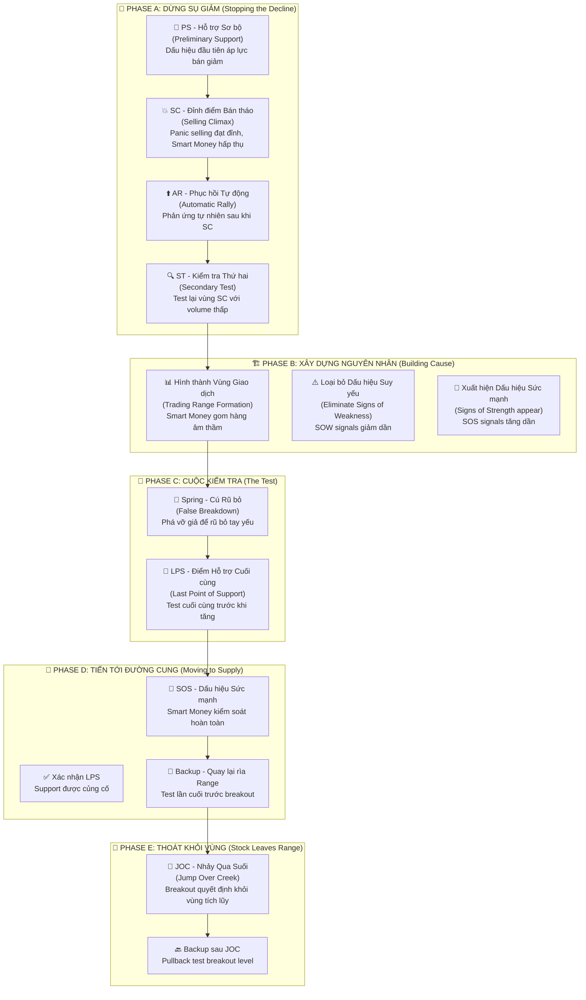

# Chương 2.1: Giai Đoạn Tích Lũy - "Gom Hàng" Như Những Chuyên Gia Tài Chính Hàng Đầu

## Mục Tiêu Học Tập

Sau khi hoàn thành chương này, học viên sẽ có khả năng:

- **Thấu hiểu cấu trúc 5 giai đoạn tích lũy** - Phase A đến E với đặc điểm riêng biệt
- **Nhận diện chính xác các sự kiện Wyckoff:** PS (Hỗ trợ Sơ bộ), SC (Đỉnh điểm Bán tháo), AR (Phục hồi Tự động), ST (Kiểm tra Thứ hai), Spring (Cú Rũ bỏ), LPS (Điểm Hỗ trợ Cuối cùng)
- **Tính toán mục tiêu giá** từ độ rộng vùng tích lũy bằng phương pháp Point & Figure
- **Áp dụng vào thị trường chứng khoán Việt Nam** với dữ liệu thực tế từ VCB, TCB, VIC
- **Xây dựng chiến lược giao dịch hoàn chỉnh** cho từng giai đoạn tích lũy

---

## 1. Tổng Quan Cấu Trúc Tích Lũy - "Bản Đồ Hành Trình" Của Smart Money

### 1.1 Sơ Đồ Tích Lũy Wyckoff - Từ Lý Thuyết Đến Thực Tiễn Việt Nam



### 1.2 Các Khái Niệm Cốt Lõi

**Wyckoff** đã phát triển một hệ thống tư duy logic về cách thị trường hoạt động:

📊 **Vùng Giao dịch (Trading Range - TR):** Khu vực giá đi ngang nơi "dòng tiền thông minh" tích lũy cổ phiếu một cách âm thầm

🔄 **Nguyên Nhân (Cause):** Lượng tích lũy (thời gian và khối lượng giao dịch ngang) - "năng lượng tiềm tàng" được tích trữ

⚡ **Kết Quả (Effect):** Đợt tăng giá sau đó (chuyển động giá dọc) - "năng lượng" được giải phóng

📈 **Đếm Point & Figure:** Phương pháp toán học để tính mục tiêu giá dựa trên độ rộng vùng tích lũy

> *"Để có một 'kết quả' (xu hướng tăng mạnh), phải có một 'nguyên nhân' tương xứng (tích lũy đủ lâu và đủ lớn)"* - **Quy luật Nguyên nhân & Kết quả của Wyckoff**

---

## 2. Phase A: "Dừng Chân" Xu Hướng Giảm - Khi Smart Money Bắt Đầu Hành Động

### 2.1 PS - Hỗ Trợ Sơ Bộ (Preliminary Support): "Tín Hiệu Đầu Tiên"

**Wyckoff giải thích:** PS là dấu hiệu đầu tiên cho thấy **áp lực bán đang suy giảm**. Đây chưa phải là đáy cuối cùng, nhưng là dấu hiệu cảnh báo rằng "có ai đó" đang bắt đầu quan tâm.

**Đặc điểm nhận dạng:**
- 📊 **Khối lượng tăng** khi giá tìm kiếm hỗ trợ ban đầu
- 📉 **Hành động giá gợi ý** xu hướng giảm đang chậm lại
- ⚠️ **CHƠA PHẢI ĐÁY CUỐI CÙNG** - thường còn tầng bán tiếp theo

### 2.2 SC - Đỉnh Điểm Bán Tháo (Selling Climax): "Giờ Quyết Định"

**Anna Coulling mô tả:** SC là giai đoạn cuối cùng của việc bán tháo dữ dội, khi **nỗi sợ hãi đạt tới đỉnh điểm**. Đây chính là lúc "dòng tiền thông minh" thể hiện sức mạnh thật sự.

**Đặc điểm "không thể nhầm lẫn":**
- 💥 **Khối lượng cực lớn** (thường cao nhất trong nhiều tháng)
- 📉 **Biên độ rộng xuống** với đóng cửa yếu
- 😱 **Bán tháo đầu hàng** từ nhà đầu tư nhỏ lẻ
- 🐟 **Smart Money "nuốt chừng"** tất cả nguồn cung panic

> *"SC là khoảnh khắc vàng cho những ai biết nhận diện. Khi mọi người đang bán trong sợ hãi, các chuyên gia đang mua với niềm tin"* - **VPA Methodology**

#### Case Study Thực Tế: VIC - Mẫu Hình SC Hoàn Hảo (10/06/2025)

**Dữ liệu thực tế từ `vpa_data/VIC.md`:**
```csv
Ticker: VIC  
Date: 2025-06-10
Open: 88.5, High: 91.2, Low: 86.0, Close: 90.6
Volume: 6,800,000 (Độc tôn - rất lớn)
Intraday story: Mở giảm sâu xuống 86.0, sau đó phục hồi mạnh
```

**Phân tích chi tiết theo VPA:**
- 🌅 **Phiên sáng - Panic Selling:** Gap down xuống 86.0 (retail investors hoảng loạn bán tháo)
- 📊 **Khối lượng khổng lồ:** 6.8 triệu cổ phiếu (đây chính là dòng tiền thông minh đang hành động)
- 🚀 **Phục hồi mạnh mẽ:** Từ 86.0 lên 90.6 (+5.3%) - nguồn cung đã được hấp thụ
- ✅ **Đảo chiều intraday:** Mẫu hình SC điển hình, không thể rõ ràng hơn

**Kết luận chuyên gia:** *"VIC Selling Climax hoặc Shakeout điển hình"* - Từ phân tích VPA/Wyckoff của chuyên gia

### 2.3 AR - Phục Hồi Tự Động (Automatic Rally): "Phản Ứng Tự Nhiên"

**Bản chất của AR:** Đây là phản ứng tự nhiên sau SC khi **áp lực bán đã cạn kiệt**. Giống như quả bóng được nén xuống cực mạnh rồi được thả ra.

**Đặc điểm kỹ thuật:**
- 📈 **Giá tăng từ đáy SC** trên khối lượng giảm
- 📄 **Mức độ phục hồi** tiết lộ sức mạnh cầu của smart money
- 📏 **Thiết lập ràng buộc trên** của vùng giao dịch tương lai

**Phân Tích VIC AR Chi Tiết:**
- ⬆️ **Phục hồi từ 86.0 lên 90.6 = AR 5.3%** (mạnh mẽ)
- 🐟 **Phản ứng tự nhiên** sau khi smart money mua mạnh
- 📏 **Thiết lập kháng cự** quanh vùng 90.6 (giới hạn trên của TR)

> *"Mức độ phục hồi AR cho biết smart money 'tiêu thụ' bao nhiêu nguồn cung trong SC. AR mạnh = Nhu cầu thật mạnh"* - **Wyckoff Method**

### 2.4 ST - Kiểm Tra Thứ Hai (Secondary Test): "Test Lại Xác Minh"

**Mục đích của ST:** Quay trở lại hoặc gần vùng SC để **"thăm dò"** xem còn áp lực bán nào không. Giống như người thợ săn gõ cửa xem còn ai trong nhà không.

**Các dấu hiệu "hoàn hảo" của ST:**
- 🔉 **Khối lượng thấp hơn SC** (dấu hiệu tích cực)
- 🎯 **Giá có thể hoặc không** chạm đáy SC
- ✅ **Test thành công = Không còn nguồn cung mới** ở vùng thấp

#### VIC - Mẫu Hình ST Đỉnh Cao (11/06/2025)

**Dữ liệu từ `vpa_data/VIC.md`:**
```csv
Ticker: VIC
Date: 2025-06-11  
Trading range: 85.4 - 87.7 (biên độ rất hẹp)
Volume: 1,400,000 (cực thấp)
Phân tích: "No Supply - áp lực bán đã cạn kiệt"
```

**Đây là ST "sách giáo khoa":  **
- ✅ **Khối lượng giảm mạnh** (1.4M vs 6.8M của SC = giảm 79%)
- ✅ **Giá giữ trên đáy SC** (85.4 > 86.0 của SC low)
- ✅ **Tín hiệu No Supply được xác nhận** - không còn người muốn bán
- ✅ **Smart Money test thành công** - có thể chuyển sang giai đoạn tiếp theo

**Kết luận:** VIC đã hoàn thành Phase A một cách hoàn hảo!

---

## 3. Phase B: "Xây Dựng Nguyên Nhân" - Giai Đoạn Gom Hàng Thầm Lặng

### 3.1 Trading Range Development

**Purpose:** Smart money accumulates large positions without moving price
**Duration:** Can last weeks to months
**Characteristics:**
- Price oscillates between support và resistance
- Volume generally lower than Phase A
- Multiple tests of both ends of range

### 3.2 Signs of Weakness (SOW) vs Signs of Strength (SOS)

**Signs of Weakness (SOW):**
- Price declines on increased volume
- Wide spreads down với bearish closes
- Break below ST lows

**Signs of Strength (SOS):**  
- Price advances on increased volume
- Wide spreads up với bullish closes
- Hold above support levels

**TCB Phase B Example:**

From `vpa_data/TCB.md` analysis:
- **May 20:** SOS signal (volume 38.2M, price +4.92%)
- **Jun 6:** SOW signal (volume 28.3M với selling pressure)  
- **Jun 11:** No Supply (volume 6.1M, accumulation continuing)

**Pattern Recognition:**
- Mixed signals during Phase B are normal
- Overall trend: SOW signals decrease, SOS signals increase
- Smart money gradually gaining control

## 4. Phase C: The Test

### 4.1 Spring (False Breakdown)

**Definition:** Break below ST low to "test" remaining supply and shake out weak holders
**Purpose:**
- Flush out remaining weak hands
- Test if any large supply remains
- Create final accumulation opportunity

**Characteristics:**
- **Volume should be lower** than SC/ST
- **Quick reversal** back into range
- **False breakdown** - looks bearish but isn't

**Spring Analysis Framework:**
```python
def identify_spring(df, st_low, lookback=10):
    """Identify potential Spring patterns"""
    springs = []
    
    for i in range(lookback, len(df)):
        if df['low'].iloc[i] < st_low:  # Break below ST
            if (df['volume'].iloc[i] < df['volume'].iloc[i-lookback:i].mean() and
                df['close'].iloc[i] > df['low'].iloc[i] + 
                (df['high'].iloc[i] - df['low'].iloc[i]) * 0.6):
                
                springs.append({
                    'date': df.index[i],
                    'low': df['low'].iloc[i],
                    'volume': df['volume'].iloc[i],
                    'recovery': (df['close'].iloc[i] - df['low'].iloc[i]) / 
                               (df['high'].iloc[i] - df['low'].iloc[i])
                })
    
    return springs
```

### 4.2 Last Point of Support (LPS)

**Definition:** Final support test before markup begins
**Characteristics:**
- Higher low than Spring
- Very low volume
- Quick bounce from support
- Often forms double bottom với Spring

## 5. Phase D: Moving to Supply Line

### 5.1 Signs of Strength Dominate

**Evidence of Smart Money Control:**
- Price easily moves through resistance
- Volume increases on advances
- Any pullbacks are shallow với low volume

**TCB Phase D Example (Jun 16, 2025):**
```
TCB tăng vọt từ 31.20 lên 32.30
Volume: 22.9 triệu (cao), xác nhận sức mạnh của phiên tăng
```

**Phase D Indicators:**
- ✅ Easy movement through resistance
- ✅ Volume confirmation on advance
- ✅ Wide spread up với bullish close
- ✅ No supply apparent

### 5.2 Backup (BU)

**Definition:** Pullback to edge of trading range before final breakout
**Purpose:** Final test of accumulation; shake out weak longs
**Characteristics:**
- **Low volume pullback**
- **Holds above Spring low**
- **Quick recovery**

## 6. Phase E: Stock Leaves Range

### 6.1 Jump Over Creek (JOC)

**Definition:** Decisive breakout above trading range resistance
**Characteristics:**
- **High volume breakout**
- **Wide spread up**
- **Bullish close near high**
- **Follow-through in subsequent sessions**

### 6.2 Backup After JOC

**Normal behavior:** Return to breakout level to test support
**Bullish if:**
- Lower volume than breakout
- Holds above breakout level  
- Quick recovery

## 7. Price Objective Calculation

### 7.1 Point & Figure Count Method

**Formula:** Width of TR × 3 + Breakout Point = Target

**Example Calculation:**
```
Trading Range: 86.0 (low) to 92.0 (high)
Width: 92.0 - 86.0 = 6.0 points
Count: 6.0 × 3 = 18.0 points
Breakout: 92.0
Target: 92.0 + 18.0 = 110.0
```

### 7.2 Time-Based Calculation

**Alternative Method:** Duration of accumulation predicts markup duration
- 6 months accumulation → 2-3 months markup
- Longer cause → Larger effect

## 8. Real-World Application: Banking Sector Analysis

### VCB Accumulation Pattern (2025)

**Phase A Identification:**
- **Jan 2:** High of 61.87 (resistance established)
- **Jan 10:** Low of 61.14 (ST level)
- **Volume patterns:** Classic SC/AR sequence

**Phase B Development:**
- **Jan-May:** Range trading 60.5-62.5
- **Multiple tests:** Both support và resistance
- **Volume declining:** Smart money accumulation

**Phase C Confirmation:**
- **Jun 13:** Stopping Volume signal (Spring-like behavior)
- **Volume spike:** 5.3M on recovery
- **Strong close:** Bullish accumulation

**Phase D Evidence:**
- **Jun 20:** Effort to Rise (volume 6.88M)
- **Breaking resistance:** Move above 57.0
- **SOS confirmed:** Smart money control

### TCB vs VCB Comparison

| Metric | VCB | TCB |
|--------|-----|-----|
| **TR Width** | ~2.0 points | ~4.0 points |
| **Duration** | 5 months | 3 months |  
| **Volume Pattern** | Declining trend | Volatile |
| **Current Phase** | Late D/Early E | Mid Phase D |
| **Price Target** | 64.0-66.0 | 38.0-42.0 |

## 9. Advanced Accumulation Patterns

### 9.1 Reaccumulation

**Definition:** Second accumulation after initial markup
**Characteristics:**
- Occurs at higher level than original
- Shorter duration
- Less volume required
- Often forms ascending triangle

### 9.2 Failed Accumulation

**Warning Signs:**
- Multiple Springs without follow-through
- Volume increasing on declines
- Unable to hold above ST lows
- SOW signals dominating SOS

**Risk Management:** Exit if accumulation structure breaks down

## 10. Sector Rotation và Accumulation

### Identifying Sector Leaders

**Analysis Framework:**
1. **Scan all sectors** for accumulation patterns
2. **Compare relative strength** during market weakness
3. **Monitor volume patterns** for smart money activity
4. **Track phase development** across sector

**Current Vietnam Market (Mid-2025):**
- **Banking:** Multiple accumulation patterns (VCB, TCB)
- **Steel:** Mixed signals (HPG showing distribution)
- **Real Estate:** Early accumulation (VIC pattern)
- **Technology:** Lagging (no clear accumulation)

**Investment Implication:** Focus on Banking và Real Estate

## 11. Practical Trading Applications

### 11.1 Entry Points

**Best Accumulation Entries:**
1. **Spring Low:** Highest risk/reward but requires precision
2. **LPS:** Safer entry với confirmed support
3. **Phase D SOS:** Lower risk, confirmed trend
4. **JOC Backup:** Conservative entry on breakout pullback

### 11.2 Position Sizing

**Accumulation Phase Position Sizing:**
- **Phase A/B:** Small positions, scale in gradually
- **Phase C:** Increase size on Spring confirmation
- **Phase D:** Full position as SOS confirmed
- **Phase E:** Add on JOC backup (if any)

### 11.3 Risk Management

**Stop Loss Placement:**
- **Phase A/B:** Below recent ST low
- **Phase C:** Below Spring low
- **Phase D:** Below LPS
- **Phase E:** Below JOC level

## 12. Các Sai Lầm Phổ Biến và Cách Khắc Phục

### 12.1 Vào Lệnh Quá Sớm (Premature Entry)

**❌ Sai lầm:** Mua ngay khi thấy dấu hiệu tích lũy đầu tiên
**✅ Giải pháp:** Kiên nhẫn chờ Phase C confirmation (Spring hoặc LPS)
**💡 Lý do:** Early accumulation signals có thể là false signals

### 12.2 Nhận Diện Sai Giai Đoạn

**❌ Sai lầm:** Nhầm lẫn reaccumulation với distribution
**✅ Giải pháp:** Tập trung vào đặc điểm volume - đây là chìa khóa phân biệt
**💡 Lý do:** Price action có thể giống nhau nhưng volume patterns khác hoàn toàn

### 12.3 Bỏ Qua Bối Cảnh Thị Trường

**❌ Sai lầm:** Phân tích cổ phiếu một cách độc lập
**✅ Giải pháp:** Luôn xem xét hành vi VNINDEX và sector context
**💡 Lý do:** Individual stocks khó tách rời khỏi overall market trend

## 13. Bài Tập Thực Hành - "Trở Thành Chuyên Gia Tích Lũy"

### Bài Tập 1: Nhận Diện Giai Đoạn (Phase Identification)

**Mục tiêu:** Phát triển khả năng nhận diện chính xác 5 phases của accumulation

1️⃣ **Phân tích 3 cổ phiếu:** HPG, VHM, MSN từ dữ liệu `market_data/`
   - Sử dụng dữ liệu 6 tháng gần nhất
   - Vẽ các giai đoạn trên biểu đồ

2️⃣ **Xác định giai đoạn Wyckoff hiện tại:**
   - Phase A, B, C, D hay E?
   - Evidence supporting your conclusion

3️⃣ **Đánh dấu các sự kiện quan trọng:**
   - PS (Hỗ trợ Sơ bộ), SC (Đỉnh điểm Bán tháo)
   - AR (Phục hồi Tự động), ST (Kiểm tra Thứ hai)
   - Spring (Cú Rũ bỏ), LPS (Điểm Hỗ trợ Cuối cùng)

4️⃣ **Tính toán mục tiêu giá tiềm năng:**
   - Sử dụng Point & Figure method
   - Width of Trading Range × 3 + Breakout Point

### Bài Tập 2: Phân Tích So Sánh (Comparative Analysis)

**Mục tiêu:** Học cách rank và chọn lựa accumulation patterns tốt nhất

1️⃣ **So sánh 5 cổ phiếu ngân hàng:**
   - VCB, TCB, BID, CTG, MBB
   - Timeline: 3 tháng gần nhất

2️⃣ **Xếp hạng theo chất lượng accumulation:**
   - Volume characteristics
   - Phase completeness
   - Smart money evidence

3️⃣ **Chọn ứng viên triển vọng nhất:**
   - Clear accumulation structure
   - Strong volume confirmation
   - Multiple timeframe alignment

4️⃣ **Phát triển chiến lược entry/exit:**
   - Entry points cho từng phase
   - Stop-loss placement
   - Profit targets based on TR width

### Bài Tập 3: Theo Dõi Real-Time

**Mục tiêu:** Phát triển kỹ năng monitoring và timing thực tế

1️⃣ **Track VPA signals hàng ngày:**
   - Tạo watchlist 10-15 cổ phiếu
   - Daily volume và price action analysis
   - Ghi chép mọi SOS/SOW signals

2️⃣ **Update phân tích phase hàng tuần:**
   - Phase progression tracking
   - New evidence documentation
   - Adjustment of phase assessment

3️⃣ **Thu thập bằng chứng Smart Money:**
   - Stopping Volume events
   - No Supply confirmations
   - Professional Volume signals

4️⃣ **Paper trading strategies:**
   - Entry only on Phase C confirmation
   - Position sizing theo phase development
   - Track accuracy và learn from mistakes

## 14. Tổng Kết và Điểm Mấu Chốt

### 14.1 Key Takeaways - Những Điều Cốt Lõi

✅ **Tích lũy tuân theo cấu trúc 5 giai đoạn có thể dự đoán được** - Không ngẫu nhiên mà có logic rõ ràng

✅ **Các pattern volume tiết lộ hoạt động Smart Money** - Volume là "dấu chân" của dòng tiền thông minh

✅ **Phase C Spring là xác nhận quan trọng nhất** - Moment of truth cho toàn bộ accumulation

✅ **Mục tiêu giá có thể tính toán từ độ rộng TR** - Point & Figure method có hiệu lực cao

✅ **Thị trường Việt Nam tuân theo patterns phổ quát** - Wyckoff principles áp dụng toàn cầu

### 14.2 Các Yếu Tố Thành Công Quan Trọng:

🕰️ **Kiên nhẫn:** Chờ accumulation hoàn thành đúng cách - không vội vàng

🔍 **Tập trung Volume:** Smart Money luôn để lại dấu vết - học cách đọc chúng

📊 **Kỷ luật Phase:** Không bỏ qua giai đoạn nào - từng phase có ý nghĩa riêng

⚖️ **Quản lý Rủi ro:** Định nghĩa exits trước khi entries - plan trước, execute sau

### 14.3 Checklist Thành Thạo Tích Lũy

- [ ] Hiểu rõ mục đích và đặc điểm của từng phase A-E
- [ ] Nhận diện được 8 sự kiện Wyckoff chính
- [ ] Tính toán được price objectives từ TR width
- [ ] Phân biệt được accumulation vs reaccumulation
- [ ] Thực hành với ít nhất 30 patterns thực tế
- [ ] So sánh accuracy với expert analysis trong vpa_data/

### 14.4 Chuẩn Bị Cho Chương Tiếp Theo

Chương 2.2 sẽ đi sâu vào **Giai Đoạn Phân Phối** - "hình ảnh gương" của tích lũy:

1. **Nhận diện sớm** distribution signals
2. **Tránh bẫy** UTAD và false breakouts
3. **Bảo vệ lợi nhuận** từ accumulation phase
4. **Timing thoát lệnh** trước major declines

---

## Ghi Chú Quan Trọng

⚠️ **Accumulation patterns cần thời gian phát triển** - great patterns không hình thành trong vài ngày

⚠️ **Context market rất quan trọng** - individual accumulation khó thành công trong bear market

⚠️ **Kết hợp với risk management** - VPA giúp timing tốt hơn nhưng không loại bỏ rủi ro

💡 **Pro Tip:** Tạo Accumulation Journal để track các patterns và cải thiện recognition skills

---

**Chương tiếp theo:** [Chương 2.2 - Giai Đoạn Phân Phối](chapter-2-2-distribution-phases.md)

*"💡 **Master Tip:** Những accumulation patterns tuyệt vời cần thời gian để phát triển. Cơ hội tốt nhất dành cho những ai kiên nhẫn chờ Phase C confirmation hoàn chỉnh trước khi commit significant capital."* - **Wyckoff Method**