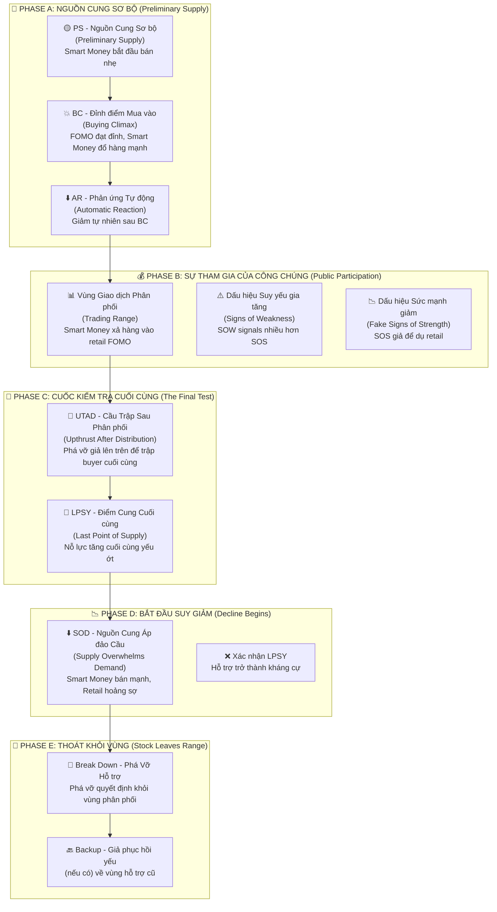

# Chương 2.2: Giai Đoạn Phân Phối - "Xả Hàng" Khôn Ngoan Của Smart Money

## Mục Tiêu Học Tập

Sau khi hoàn thành chương này, học viên sẽ có khả năng:

- **Nhận diện sớm các dấu hiệu phân phối** trước khi thị trường sụp đổ 
- **Phân biệt chính xác Distribution với Reaccumulation** - tránh nhầm lẫn tín hiệu
- **Thành thạo 5 giai đoạn phân phối:** PS (Nguồn cung Sơ bộ), BC (Đỉnh điểm Mua vào), AR (Phản ứng Tự động), UTAD (Cầu Trập Sau Phân phối), LPSY (Điểm Cung Cuối cùng)
- **Xây dựng hệ thống cảnh báo sớm** và chiến lược thoát vị thế hiệu quả
- **Áp dụng vào phân tích VNINDEX, HPG và cổ phiếu Việt Nam** với dữ liệu thực tế

---

## 1. Tổng Quan Cấu Trúc Phân Phối - "Chiến Thuật Xả Hàng" Của Composite Man

### 1.1 Sơ Đồ Phân Phối Wyckoff - "Cuộc Chiến" Giữa Smart Money và Retail



### 1.2 Các Khái Niệm Cốt Lõi - "Vũ Khí" Của Phân Tích Phân Phối

**Anna Coulling** giải thích phân phối là **"hình ảnh gương"** của tích lũy:

📊 **Vùng Giao dịch Phân phối (Distribution Trading Range):** Khu vực giá đi ngang nơi "dòng tiền thông minh" xả hàng cho retail investors

📈 **Đường Cung (Supply Line):** Ràng buộc trên nơi áp lực bán xuất hiện mạnh

📉 **Đường Cầu (Demand Line):** Ràng buộc dưới nơi hỗ trợ mua vẫn tồn tại (nhưng yếu dần)

🎣 **UTAD (Upthrust After Distribution):** "Cầu trập cuối cùng" - phá vỡ giả lên trên vùng để lưu lưới các buyer cuối cùng

> *"Phân phối là nghệ thuật của việc bán mà không làm giá sụp đổ. Giống như việc đổ từ từ một bình nước đầy - nếu đổ quá nhanh, nước sẽ tràn ra"* - **Wyckoff Method**

---

## 2. Phase A: "Nguồn Cung Sơ Bộ" - Khi Smart Money Bắt Đầu "Thăm Dò"

### 2.1 PS - Nguồn Cung Sơ Bộ (Preliminary Supply): "Dấu Hiệu Đầu Tiên"

**Wyckoff giải thích:** PS là bằng chứng ban đầu cho thấy **smart money bắt đầu bán ra**. Đây chưa phải là đỉnh cuối cùng, nhưng là tín hiệu cảnh báo rằng "kẻ thông minh" đang chuẩn bị thoát vị thế.

**Đặc điểm nhận dạng:**
- 🐌 **Đà tăng giá trở nên khó khăn** - giá leo lên như "mang gánh nặng"
- 📉 **Volume giảm trên các đợt tăng** - thiếu sự nhiệt tình từ người mua
- 🎯 **Biên độ rộng nhưng đóng cửa yếu** - effort lớn nhưng result kém
- 🤫 **Smart money âm thầm giảm vị thế** - bán ra từ từ không làm giá sụp

> *"PS giống như người bán hàng bắt đầu 'thăm dò' thị trường. Họ thử bán một ít để xem phản ứng của người mua như thế nào"* - **VPA Analysis**

### 2.2 BC - Đỉnh Điểm Mua Vào (Buying Climax): "Giờ Phút Vàng Của Smart Money"

**Anna Coulling nhấn mạnh:** BC là đợt tăng cuối cùng của sự cuồng nhiệt mua vào, thường được **tin tức tích cực thúc đẩy**. Đây chính là lúc smart money "đổ hàng" mạnh nhất vào retail FOMO.

**Đặc điểm "không thể nhầm lẫn":**
- 💥 **Khối lượng cực lớn** với biên độ rộng lên trên
- 🚀 **Gap mở cửa** trên tin tức tích cực (euphoric news)
- ⚠️ **Đà tăng không bền vững** - nỗ lực lớn nhưng không có kết quả tương xứng
- 🏪 **Smart Money "đổ hàng"** vào làn sóng mua của retail

**Tâm lý học đằng sau BC:**
- **Retail:** "Tin tức tốt! Giá tăng mạnh! Phải mua ngay!"
- **Smart Money:** "Retail đã sẵn sàng. Đây là lúc thoát hàng với giá cao nhất."
- **Kết quả:** Retail mua đỉnh, Smart Money bán đỉnh

#### Case Study Thực Tế: HPG - Mẫu Hình BC Hoàn Hảo (30/05/2025)

**Dữ liệu thực tế từ `vpa_data/HPG.md`:**
```csv
Ticker: HPG
Date: 2025-05-30
Open: 21.20, High: 22.21, Low: 21.15, Close: 21.46
Volume: 65,010,000 (CỰC LỚN - record level)
Intraday: Đẩy lên 22.21 nhưng đóng cửa chỉ 21.46
Context: Tin tức tích cực về ngành thép
```

**Phân tích chi tiết theo VPA:**
- 🌅 **Phiên sáng - Retail FOMO:** Tin tức tích cực về ngành thép, retail đổ xô mua vào
- 💥 **Khối lượng kỷ lục:** 65.01M cổ phiếu (cao nhất trong giai đoạn)
- 📈 **Biên độ rộng lên:** Intraday high đạt 22.21 (+4.8% từ mở cửa)
- 😔 **Đóng cửa yếu:** Chỉ 21.46 (gần giữa ngày, không phải gần high)
- ⚖️ **Effort vs Result:** Nỗ lực khổng lồ (65M), kết quả kém (+1.2% chỉ)

**Câu chuyện đằng sau HPG BC:**
- **06:00-09:00:** Tin tức tích cực về xuất khẩu thép, retail investors hào hứng
- **09:00-11:00:** Giá tăng vọt lên 22.21, volume bùng nổ (smart money bán mạnh)
- **13:00-15:00:** Áp lực bán gia tăng, giá suy yếu về 21.46
- **Kết luận từ chuyên gia:** *"Topping Out Volume hoặc Buying Climax điển hình"*

**Xác nhận 3 ngày sau (02/06/2025):**
```csv
HPG tiếp tục suy yếu, không thể vượt lại 22.21
Volume giảm dần → xác nhận smart money đã thoát
```

### 2.3 AR - Phản Ứng Tự Động (Automatic Reaction): "Hậu Quả Tự Nhiên"

**Bản chất của AR:** Đây là sự suy giảm tự nhiên sau BC khi **sức mua đã cạn kiệt**. Giống như quả bóng được thổi phồng quá mức rồi bị xẹp.

**Đặc điểm kỹ thuật:**
- 📉 **Giá giảm từ đỉnh BC** một cách tự nhiên
- 📊 **Volume có thể vẫn cao** trong giai đoạn đầu
- 📏 **Thiết lập ranh giới dưới** của vùng phân phối
- 🔍 **Độ sâu giảm** tiết lộ sức mạnh nguồn cung

#### Phân Tích HPG AR Chi Tiết:

**Quá trình hình thành AR:**
- ⬇️ **Suy giảm từ đỉnh 22.21** thiết lập kháng cự mới
- 📊 **Vùng giao dịch hình thành** giữa AR low và BC high  
- 🏪 **Smart Money sử dụng vùng này** để tiếp tục phân phối holdings
- ⏳ **Thời gian AR kéo dài** cho thấy lượng hàng cần xả nhiều

**Ý nghĩa tâm lý:**
- **Retail:** "Chỉ là điều chỉnh kỹ thuật, sẽ tăng lại thôi"
- **Smart Money:** "Tốt! Bây giờ có vùng để bán ra từ từ"
- **Thực tế:** AR tạo "sàn diễn" cho quá trình phân phối tiếp theo

> *"AR không phải là cơ hội mua thêm, mà là dấu hiệu cảnh báo rằng 'bữa tiệc' đã kết thúc"* - **Wyckoff Method**

---

## 3. Phase B: "Sự Tham Gia Của Công Chúng" - Khi Retail Trở Thành "Nguồn Thanh Khoản"

### 3.1 Mẫu Hình "Suckers Rally" - "Cầu Trập Cho Kẻ Ngốc Nghếch"

**Cơ chế hoạt động của "cầu trập" này:**

1️⃣ **Retail nhìn thấy "cơ hội mua đáy"** sau AR - "Giá đã giảm, bây giờ có thể mua rẻ!"

2️⃣ **Smart Money cung cấp thanh khoản** bằng cách bán vào các đợt tăng - "Cảm ơn các bạn đã mua hàng của chúng tôi!"

3️⃣ **Truyền thông quảng cáo "breakout"** ở thời điểm tồi tệ nhất - Headlines: "Cổ phiếu ABC phá vỡ kháng cự mạnh!"

4️⃣ **Volume giảm dần** khi smart money kiểm soát nguồn cung - Những người có hàng đã bán xong

### 3.2 SOW Thống Trị - "Dấu Hiệu Suy Yếu" Áp Đảo

📉 **SOW (Signs of Weakness) - Dấu Hiệu Suy Yếu:**
- ⬇️ **Giá giảm trên volume tăng** - Mỗi lần giảm đều có người bán mạnh
- 📉 **Biên độ rộng xuống với đóng cửa yếu** - Effort lớn, Result tồi tệ
- 🚨 **Phá vỡ dưới hỗ trợ sơ bộ** - Các vùng support bị "xuyên thủng"
- 📉 **Mỗi đợt tăng yếu hơn lần trước** - Trend xuống rõ ràng

📈 **SOS (Signs of Strength) Trở Nên Hiếm Hoi:**
- 🔽 **Mọi đợt tăng giá trên volume giảm** - Thiếu sự thấu phục
- 📏 **Biên độ hẹp với đóng cửa kém** - Không có niềm tin
- ❌ **Không thể đạt lại các đỉnh trước** - Thiếu sức mạnh
- ⏱️ **Đảo chiều nhanh từ kháng cự** - Fake strength

**HPG Phase B Evidence (Jun 12-16):**

**Jun 12:** Sức mạnh giả
```
HPG tăng mạnh lên 22.33, volume cao (52.24M)
Phân tích: "Effort to Rise, có thể là SOS"
```

**Jun 16:** Suy yếu quay lại
```
HPG tăng lên 22.29, biên độ hẹp, volume giảm (29.75M)
Phân tích: "Đà tăng chững lại, lực cầu không còn quyết liệt"
```

**Nhận Dạng Mẫu Hình:**
- Jun 12 trông bullish (cầu trập retail)
- Jun 16 cho thấy suy yếu thực sự (thực tế smart money)
- Volume giảm = phân phối tiếp tục

## 4. Phase C: Cuộc Kiểm Tra Cuối Cùng

### 4.1 Cầu Trập Sau Phân Phối (UTAD - Upthrust After Distribution)

**Định nghĩa:** Đột phá giả lên trên vùng phân phối để bẫy những người mua cuối cùng
**Mục đích:**
- Thu hút làn sóng mua cuối cùng từ retail
- Kiểm tra xem còn cầu đáng kể nào không
- Tạo cơ hội phân phối cuối cùng
- Cung cấp "nhiên liệu" cho đợt giảm sắp tới

**Nhận diện UTAD:**
- **Phá vỡ lên trên đỉnh vùng giao dịch**
- **Khối lượng cao ban đầu** rồi đảo chiều nhanh
- **Biên độ rộng lên** nhưng **đóng cửa yếu**
- **Nhanh chóng quay về vùng**

### 4.2 Điểm Cung Cuối Cùng (LPSY - Last Point of Supply)

**Định nghĩa:** Nỗ lực tăng cuối cùng trước khi bắt đầu giảm mạnh
**Đặc điểm:**
- **Đỉnh thấp hơn** UTAD
- **Khối lượng rất thấp** (không có cầu)
- **Phục hồi yếu** từ hỗ trợ
- **Thất bại nhanh chóng**

**UTAD vs LPSY Comparison:**

| Feature | UTAD | LPSY |
|---------|------|------|
| **Volume** | High initially | Very low |
| **Price** | Above range high | Below range high |  
| **Duration** | 1-3 days | 1-2 days |
| **Purpose** | Trap buyers | Test remaining demand |

## 5. Phase D: The Decline Begins

### 5.1 Supply Overwhelms Demand

**Evidence:**
- Price easily breaks through support
- Volume increases significantly on declines
- Wide spreads down với bearish closes
- Any bounces weak và short-lived

### 5.2 Support Becomes Resistance

**Key concept:** Previous accumulation zone now becomes selling area
**Why:** Smart money established cost basis higher
**Implication:** Any bounce to old support met with fresh selling

## 6. Phase E: Stock Leaves Range

### 6.1 Support Line Break

**Definition:** Decisive break below distribution range
**Characteristics:**
- **High volume breakdown**
- **Wide spread down** 
- **Bearish close near low**
- **No intraday recovery**

### 6.2 Backup Rally (if any)

**Weak rallies may occur:**
- Return toward broken support (now resistance)
- Very low volume (confirms no demand)
- Quick failure và resumed decline

## 7. Distribution vs Reaccumulation

### 7.1 Critical Distinctions

**Distribution Signals:**

| Metric | Distribution | Reaccumulation |
|---------|-------------|----------------|
| **Volume on Rallies** | Decreasing | Stable/Increasing |
| **Volume on Declines** | Increasing | Decreasing |
| **Close Position** | Weakening | Maintaining strength |
| **Breakthrough** | Downward | Upward |
| **Market Context** | Late bull market | Mid bull market |

### 7.2 The "Fake-Out" Problem

**Common mistake:** Mistaking distribution for reaccumulation
**Solutions:**
- Focus on volume characteristics
- Monitor smart money behavior
- Consider broader market context
- Use multiple timeframe analysis

## 8. Volume Analysis in Distribution

### 8.1 Volume Patterns Evolution

**Phase A:** High volume on BC, moderate on AR
**Phase B:** Decreasing on rallies, increasing on declines  
**Phase C:** High on UTAD, very low on LPSY
**Phase D/E:** High on breakdown, low on bounces

### 8.2 Volume Divergence Signals

```python
def detect_distribution_volume_signals(df):
    """Detect volume patterns indicating distribution"""
    signals = []
    
    # Look for high volume with poor price performance
    for i in range(20, len(df)):
        if (df['volume_ratio'].iloc[i] > 2.0 and          # High volume
            df['price_change'].iloc[i] > 1.0 and         # Price up
            df['close_position'].iloc[i] < 0.4):         # But weak close
            
            signals.append({
                'date': df.index[i],
                'type': 'Buying Climax',
                'volume_ratio': df['volume_ratio'].iloc[i],
                'close_position': df['close_position'].iloc[i]
            })
            
        # Look for volume increasing on declines
        elif (df['volume_ratio'].iloc[i] > 1.5 and       # Above average volume
              df['price_change'].iloc[i] < -1.0 and      # Price down
              df['close_position'].iloc[i] < 0.3):       # Bearish close
            
            signals.append({
                'date': df.index[i],
                'type': 'Supply Overwhelms Demand',
                'volume_ratio': df['volume_ratio'].iloc[i],
                'price_change': df['price_change'].iloc[i]
            })
    
    return signals
```

## 9. Real-World Example: VNINDEX Distribution Analysis

### Case Study: VNINDEX May 2025 Topping Action

**From `vpa_data/VNINDEX.md`:**

**May 8:** Initial strength (potential BC setup)
```
VN-Index tăng mạnh từ 1250.37 lên 1269.8
Volume: 780.78 triệu (tăng đáng kể)
Phân tích: "Effort to Rise, Sign of Strength"
```

**May 15:** The Anomaly (Classic Distribution)
```  
VN-Index tăng nhẹ từ 1309.73 lên 1313.2 (+0.26%)
Volume: 1,048.49 triệu (mức cao nhất trong nhiều tuần)
Phân tích: "Topping Out Volume hoặc Buying Climax"
```

**Perfect Distribution Setup:**
- ✅ **Ultra-high volume:** 1,048.49M (record level)
- ✅ **Minimal price gain:** Only +0.26%  
- ✅ **Effort vs Result anomaly:** Massive effort, tiny result
- ✅ **Smart money distribution:** Selling into retail demand

**May 16:** Confirmation
```
VN-Index giảm từ 1313.2 xuống 1301.39 (-0.9%)
Volume: 850.78 triệu (vẫn cao)
Phân tích: "Effort to Fall, áp lực bán thắng thế"
```

**Distribution Confirmed:**
- Previous day's anomaly predicted the decline
- High volume continued on down move
- Retail trapped at highs, smart money distributed

### Lessons from VNINDEX Case:

1. **Volume spikes với poor results = Major warning**
2. **Record volume often marks important tops**
3. **Next day action confirms distribution**
4. **Vietnam market follows universal patterns**

## 10. Sector Distribution Analysis

### Technology Sector Distribution (Hypothetical)

**Identifying sector-wide distribution:**
- Multiple stocks showing similar patterns
- Sector leaders failing to make new highs
- Volume characteristics deteriorating
- Relative strength weakening vs market

### Banking Sector Health Check

**Current status (Mid-2025):**
- **VCB:** Still in accumulation/early markup
- **TCB:** Mixed signals, possible reaccumulation
- **Sector rotation:** Money flowing OUT of other sectors INTO banking

**Implication:** Banking not yet in distribution phase

## 11. Trading Distribution Patterns

### 11.1 Short Selling Opportunities

**Best Short Entry Points:**
1. **UTAD failure:** After false breakout fails
2. **LPSY rejection:** Weak rally from support fails
3. **Support break:** Decisive breakdown with volume
4. **Backup rally:** Weak bounce to resistance

### 11.2 Long Position Protection

**Exit Signals for Existing Longs:**
- Volume anomalies (effort vs result)
- Support/resistance role reversal
- Multiple SOW signals
- Breakdown below Phase C low

### 11.3 Risk Management

**Stop Loss for Shorts:**
- Above UTAD high
- Above recent BC level  
- Adjust lower as distribution progresses

**Position Sizing:**
- Start small on early distribution signs
- Add on confirmed breakdown
- Maximum size on backup rally failures

## 12. Common Distribution Traps

### 12.1 The "New High" Trap

**Scenario:** Stock makes new high on good news
**Reality:** Often UTAD setup
**Solution:** Check volume và close position

### 12.2 The "Support Holds" Trap

**Scenario:** Support bounces look strong
**Reality:** Often LPSY before final breakdown
**Solution:** Monitor volume on bounces

### 12.3 The "Oversold" Trap

**Scenario:** Technical indicators show oversold
**Reality:** Distribution can continue much longer
**Solution:** Respect the primary trend

## 13. Advanced Distribution Concepts

### 13.1 Terminal Shakeout

**Definition:** Final violent decline to complete distribution
**Purpose:** Force out remaining weak longs
**Characteristics:** High volume, wide spread, quick reversal

### 13.2 Compound Distribution

**Definition:** Multiple distribution ranges at different levels
**Example:** Primary distribution at high level, secondary at mid level
**Implication:** Multiple price targets possible

## 14. Multi-Timeframe Distribution Analysis

### 14.1 Weekly vs Daily Distribution

**Weekly charts:** Better for identifying major distribution
**Daily charts:** Better for timing entries/exits
**Combination:** Use weekly for bias, daily for execution

### 14.2 Distribution Phase Timing

**Early Distribution (Phase A/B):** Months to complete
**Late Distribution (Phase C/D):** Weeks to complete  
**Final Distribution (Phase E):** Days to complete

**Trading implication:** Patience required in early phases

## 15. Prevention và Protection Strategies

### 15.1 Portfolio Protection

**Early Warning System:**
- Monitor key holdings for distribution signs
- Set automatic alerts for volume anomalies
- Regular review of position health
- Diversification across phases/sectors

### 15.2 Market Timing

**Market-wide distribution signals:**
- VNINDEX showing distribution characteristics
- Sector rotation into defensive sectors
- Volume patterns deteriorating broadly
- Economic cycle considerations

## 16. Tổng Kết và Điểm Mấu Chốt

### 16.1 Key Takeaways - Những Điều Cốt Lõi

✅ **Phân phối là "hình ảnh gương" của tích lũy** - Ngược hoàn toàn và đối xứng

✅ **Các bất thường volume cung cấp cảnh báo sớm nhất** - Khối lượng "nói dối" trước giá

✅ **UTAD là "cầu trập" cuối cùng trước khi giảm mạnh** - Fake breakout để trập buyer

✅ **Volume tăng khi giảm, giảm khi tăng** - Đối ngược với giai đoạn tích lũy

✅ **Hỗ trợ cũ trở thành kháng cự mới** - Psychology flips hoàn toàn

### 16.2 Các Yếu Tố Thành Công Quan Trọng:

🔍 **Nhận diện sớm:** Đừng chờ đến khi breakdown rồi mới hành động

📊 **Tập trung vào volume:** Smart money luôn để lại dấu vết

💪 **Kỷ luật thoát lệnh:** Đừng hy vọng chống lại bằng chứng

⚡ **Bảo vệ vị thế:** Cắt lỗ sớm trong giai đoạn phân phối

### 16.3 Checklist Cảnh Báo - Phải Theo Dõi Hàng Ngày:

- [ ] 💥 **Khối lượng cực cao với kết quả giá kém** - Topping Volume signals
- [ ] 🚫 **Nhiều lần thất bại tại đỉnh mới** - Không vượt được kháng cự
- [ ] 📉 **Volume giảm trên các rally** - Thiếu sự nhiệt tình
- [ ] 🔄 **Các mức hỗ trợ bị test liên tục** - Áp lực bán tăng cao
- [ ] 📉 **Các chỉ báo momentum phân kỳ âm** - RSI, MACD, v.v. yếu đi

---

## Ghi Chú Quan Trọng

⚠️ **Phân phối đòi hỏi sự kiên nhẫn và kỷ luật cao** - không phải ai cũng có thể nhận ra sớm

⚠️ **Context là then chốt** - cùng một pattern có thể có ý nghĩa khác nhau tùy market phase

⚠️ **Kết hợp với risk management** - Phân phối giúp timing tốt hơn nhưng không loại bỏ được rủi ro

💡 **Pro Tip:** Tạo Distribution Journal để track accuracy và improve pattern recognition skills

---

**Chương tiếp theo:** [Chương 3.1 - Tín Hiệu VPA Tích Cực](chapter-3-1-bullish-vpa-signals.md)

*"💡 **Master Warning:** Giai đoạn phân phối có thể đánh lừa cả những trader kinh nghiệm. Chìả then chốt là nhận ra rằng những gì trông có vẻ mạnh mẽ (đỉnh mới, tin tức tốt) thường đánh dấu sự bắt đầu của kết thúc. Hãy tin vào volume, không phải tin tức."* - **Anna Coulling**