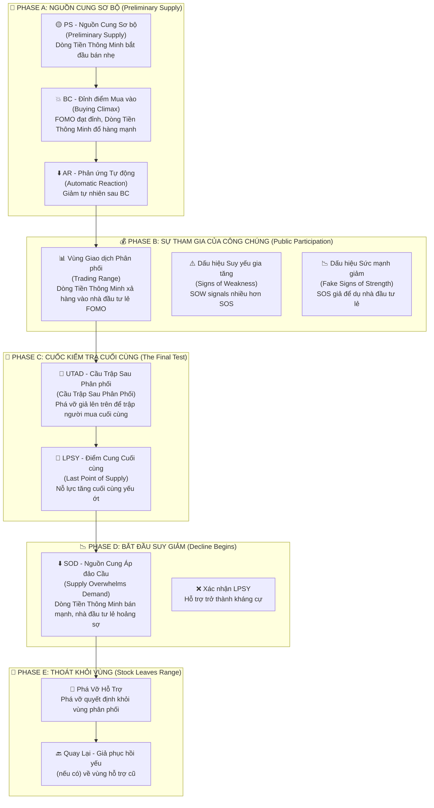

# Chương 2.2: Giai Đoạn Phân Phối - "Xả Hàng" Khôn Ngoan Của Dòng Tiền Thông Minh

## Mục Tiêu Học Tập

Sau khi hoàn thành chương này, học viên sẽ có khả năng:

- **Nhận diện sớm các dấu hiệu phân phối** trước khi thị trường sụp đổ 
- **Phân biệt chính xác Phân Phối với Tích Lũy Lại** - tránh nhầm lẫn tín hiệu
- **Thành thạo 5 giai đoạn phân phối:** PS (Nguồn cung Sơ bộ), BC (Đỉnh điểm Mua vào), AR (Phản ứng Tự động), UTAD (Cầu Trập Sau Phân phối), LPSY (Điểm Cung Cuối cùng)
- **Xây dựng hệ thống cảnh báo sớm** và chiến lược thoát vị thế hiệu quả
- **Áp dụng vào phân tích VNINDEX, HPG và cổ phiếu Việt Nam** với dữ liệu thực tế

---

## 1. Tổng Quan Cấu Trúc Phân Phối - "Chiến Thuật Xả Hàng" Của Composite Man

### 1.1 Sơ Đồ Phân Phối Wyckoff - "Cuộc Chiến" Giữa Dòng Tiền Thông Minh và Nhà Đầu Tư Lẻ



### 1.2 Các Khái Niệm Cốt Lõi - "Vũ Khí" Của Phân Tích Phân Phối

**Anna Coulling** giải thích phân phối là **"hình ảnh gương"** của tích lũy:

📊 **Vùng Giao dịch Phân phối (Distribution Trading Range):** Khu vực giá đi ngang nơi "dòng tiền thông minh" xả hàng cho nhà đầu tư lẻ

📈 **Đường Cung (Đường Cung):** Ràng buộc trên nơi áp lực bán xuất hiện mạnh

📉 **Đường Cầu (Đường Cầu):** Ràng buộc dưới nơi hỗ trợ mua vẫn tồn tại (nhưng yếu dần)

🎣 **UTAD (Cầu Trập Sau Phân Phối):** "Cầu trập cuối cùng" - phá vỡ giả lên trên vùng để lưu lưới các buyer cuối cùng

> *"Phân phối là nghệ thuật của việc bán mà không làm giá sụp đổ. Giống như việc đổ từ từ một bình nước đầy - nếu đổ quá nhanh, nước sẽ tràn ra"* - **Wyckoff Method**

---

## 2. Phase A: "Nguồn Cung Sơ Bộ" - Khi Smart Money Bắt Đầu "Thăm Dò"

### 2.1 PS - Nguồn Cung Sơ Bộ (Preliminary Supply): "Dấu Hiệu Đầu Tiên"

**Wyckoff giải thích:** PS là bằng chứng ban đầu cho thấy **dòng tiền thông minh bắt đầu bán ra**. Đây chưa phải là đỉnh cuối cùng, nhưng là tín hiệu cảnh báo rằng "kẻ thông minh" đang chuẩn bị thoát vị thế.

**Đặc điểm nhận dạng:**
- 🐌 **Đà tăng giá trở nên khó khăn** - giá leo lên như "mang gánh nặng"
- 📉 **Khối lượng giảm trên các đợt tăng** - thiếu sự nhiệt tình từ người mua
- 🎯 **Biên độ rộng nhưng đóng cửa yếu** - nỗ lực lớn nhưng kết quả kém
- 🤫 **Dòng tiền thông minh âm thầm giảm vị thế** - bán ra từ từ không làm giá sụp

> *"PS giống như người bán hàng bắt đầu 'thăm dò' thị trường. Họ thử bán một ít để xem phản ứng của người mua như thế nào"* - **VPA Analysis**

### 2.2 BC - Đỉnh Điểm Mua Vào (Buying Climax): "Giờ Phút Vàng Của Smart Money"

**Anna Coulling nhấn mạnh:** BC là đợt tăng cuối cùng của sự cuồng nhiệt mua vào, thường được **tin tức tích cực thúc đẩy**. Đây chính là lúc smart money "đổ hàng" mạnh nhất vào retail FOMO.

**Đặc điểm "không thể nhầm lẫn":**
- 💥 **Khối lượng cực lớn** với biên độ rộng lên trên
- 🚀 **Gap mở cửa** trên tin tức tích cực (euphoric news)
- ⚠️ **Đà tăng không bền vững** - nỗ lực lớn nhưng không có kết quả tương xứng
- 🏪 **Dòng Tiền Thông Minh "đổ hàng"** vào làn sóng mua của nhà đầu tư lẻ

**Tâm lý học đằng sau BC:**
- **Retail:** "Tin tức tốt! Giá tăng mạnh! Phải mua ngay!"
- **Dòng Tiền Thông Minh:** "Nhà đầu tư lẻ đã sẵn sàng. Đây là lúc thoát hàng với giá cao nhất."
- **Kết quả:** Nhà đầu tư lẻ mua đỉnh, Dòng Tiền Thông Minh bán đỉnh

#### Nghiên Cứu Trường Hợp Thực Tế: HPG - Mẫu Hình BC Hoàn Hảo (30/05/2025)

**Dữ liệu thực tế từ `vpa_data/HPG.md`:**
```csv
Ticker: HPG
Date: 2025-05-30
Mở cửa: 21.20, Cao nhất: 22.21, Thấp nhất: 21.15, Đóng cửa: 21.46
Khối lượng: 65,010,000 (CỰC LỚN - mức kỷ lục)
Intraday: Đẩy lên 22.21 nhưng đóng cửa chỉ 21.46
Context: Tin tức tích cực về ngành thép
```

**Phân tích chi tiết theo VPA:**
- 🌅 **Phiên sáng - Nhà Đầu Tư Lẻ FOMO:** Tin tức tích cực về ngành thép, nhà đầu tư lẻ đổ xô mua vào
- 💥 **Khối lượng kỷ lục:** 65.01M cổ phiếu (cao nhất trong giai đoạn)
- 📈 **Biên độ rộng lên:** Intraday high đạt 22.21 (+4.8% từ mở cửa)
- 😔 **Đóng cửa yếu:** Chỉ 21.46 (gần giữa ngày, không phải gần high)
- ⚖️ **Effort vs Result:** Nỗ lực khổng lồ (65M), kết quả kém (+1.2% chỉ)

**Câu chuyện đằng sau HPG BC:**
- **06:00-09:00:** Tin tức tích cực về xuất khẩu thép, nhà đầu tư lẻ hào hứng
- **09:00-11:00:** Giá tăng vọt lên 22.21, volume bùng nổ (smart money bán mạnh)
- **13:00-15:00:** Áp lực bán gia tăng, giá suy yếu về 21.46
- **Kết luận từ chuyên gia:** *"Khối Lượng Đỉnh hoặc Đỉnh Điểm Mua điển hình"*

**Xác nhận 3 ngày sau (02/06/2025):**
```csv
HPG tiếp tục suy yếu, không thể vượt lại 22.21
Khối lượng giảm dần → xác nhận dòng tiền thông minh đã thoát
```

### 2.3 AR - Phản Ứng Tự Động (Automatic Reaction): "Hậu Quả Tự Nhiên"

**Bản chất của AR:** Đây là sự suy giảm tự nhiên sau BC khi **sức mua đã cạn kiệt**. Giống như quả bóng được thổi phồng quá mức rồi bị xẹp.

**Đặc điểm kỹ thuật:**
- 📉 **Giá giảm từ đỉnh BC** một cách tự nhiên
- 📊 **Volume có thể vẫn cao** trong giai đoạn đầu
- 📏 **Thiết lập ranh giới dưới** của vùng phân phối
- 🔍 **Độ sâu giảm** tiết lộ sức mạnh nguồn cung

#### Phân Tích HPG AR Chi Tiết:

**Quá trình hình thành AR:**
- ⬇️ **Suy giảm từ đỉnh 22.21** thiết lập kháng cự mới
- 📊 **Vùng giao dịch hình thành** giữa AR low và BC high  
- 🏪 **Smart Money sử dụng vùng này** để tiếp tục phân phối holdings
- ⏳ **Thời gian AR kéo dài** cho thấy lượng hàng cần xả nhiều

**Ý nghĩa tâm lý:**
- **Retail:** "Chỉ là điều chỉnh kỹ thuật, sẽ tăng lại thôi"
- **Smart Money:** "Tốt! Bây giờ có vùng để bán ra từ từ"
- **Thực tế:** AR tạo "sàn diễn" cho quá trình phân phối tiếp theo

> *"AR không phải là cơ hội mua thêm, mà là dấu hiệu cảnh báo rằng 'bữa tiệc' đã kết thúc"* - **Wyckoff Method**

---

## 3. Phase B: "Sự Tham Gia Của Công Chúng" - Khi Retail Trở Thành "Nguồn Thanh Khoản"

### 3.1 Mẫu Hình "Suckers Rally" - "Cầu Trập Cho Kẻ Ngốc Nghếch"

**Cơ chế hoạt động của "cầu trập" này:**

1️⃣ **Retail nhìn thấy "cơ hội mua đáy"** sau AR - "Giá đã giảm, bây giờ có thể mua rẻ!"

2️⃣ **Dòng Tiền Thông Minh cung cấp thanh khoản** bằng cách bán vào các đợt tăng - "Cảm ơn các bạn đã mua hàng của chúng tôi!"

3️⃣ **Truyền thông quảng cáo "breakout"** ở thời điểm tồi tệ nhất - Headlines: "Cổ phiếu ABC phá vỡ kháng cự mạnh!"

4️⃣ **Khối lượng giảm dần** khi dòng tiền thông minh kiểm soát nguồn cung - Những người có hàng đã bán xong

### 3.2 SOW Thống Trị - "Dấu Hiệu Suy Yếu" Áp Đảo

📉 **SOW (Signs of Weakness) - Dấu Hiệu Suy Yếu:**
- ⬇️ **Giá giảm trên volume tăng** - Mỗi lần giảm đều có người bán mạnh
- 📉 **Biên độ rộng xuống với đóng cửa yếu** - Effort lớn, Result tồi tệ
- 🚨 **Phá vỡ dưới hỗ trợ sơ bộ** - Các vùng support bị "xuyên thủng"
- 📉 **Mỗi đợt tăng yếu hơn lần trước** - Trend xuống rõ ràng

📈 **SOS (Signs of Strength) Trở Nên Hiếm Hoi:**
- 🔽 **Mọi đợt tăng giá trên volume giảm** - Thiếu sự thấu phục
- 📏 **Biên độ hẹp với đóng cửa kém** - Không có niềm tin
- ❌ **Không thể đạt lại các đỉnh trước** - Thiếu sức mạnh
- ⏱️ **Đảo chiều nhanh từ kháng cự** - Fake strength

**HPG Phase B Evidence (Jun 12-16):**

**Jun 12:** Sức mạnh giả
```
HPG tăng mạnh lên 22.33, volume cao (52.24M)
Phân tích: "Effort to Rise, có thể là SOS"
```

**Jun 16:** Suy yếu quay lại
```
HPG tăng lên 22.29, biên độ hẹp, volume giảm (29.75M)
Phân tích: "Đà tăng chững lại, lực cầu không còn quyết liệt"
```

**Nhận Dạng Mẫu Hình:**
- Jun 12 trông bullish (cầu trập retail)
- Jun 16 cho thấy suy yếu thực sự (thực tế smart money)
- Khối lượng giảm = phân phối tiếp tục

## 4. Phase C: Cuộc Kiểm Tra Cuối Cùng

### 4.1 Cầu Trập Sau Phân Phối (UTAD - Cầu Trập Sau Phân Phối)

**Định nghĩa:** Đột phá giả lên trên vùng phân phối để bẫy những người mua cuối cùng
**Mục đích:**
- Thu hút làn sóng mua cuối cùng từ nhà đầu tư lẻ
- Kiểm tra xem còn cầu đáng kể nào không
- Tạo cơ hội phân phối cuối cùng
- Cung cấp "nhiên liệu" cho đợt giảm sắp tới

**Nhận diện UTAD:**
- **Phá vỡ lên trên đỉnh vùng giao dịch**
- **Khối lượng cao ban đầu** rồi đảo chiều nhanh
- **Biên độ rộng lên** nhưng **đóng cửa yếu**
- **Nhanh chóng quay về vùng**

### 4.2 Điểm Cung Cuối Cùng (LPSY - Last Point of Supply)

**Định nghĩa:** Nỗ lực tăng cuối cùng trước khi bắt đầu giảm mạnh
**Đặc điểm:**
- **Đỉnh thấp hơn** UTAD
- **Khối lượng rất thấp** (không có cầu)
- **Phục hồi yếu** từ hỗ trợ
- **Thất bại nhanh chóng**

**UTAD vs LPSY Comparison:**

| Feature | UTAD | LPSY |
|---------|------|------|
| **Volume** | High initially | Very low |
| **Price** | Above range high | Below range high |  
| **Duration** | 1-3 days | 1-2 days |
| **Purpose** | Trap buyers | Test remaining demand |

## 5. Phase D: Bắt Đầu Suy Giảm - "Nguồn Cung Áp Đảo"

### 5.1 Nguồn Cung Áp Đảo Cầu (Supply Overwhelms Demand)

**Bằng chứng rõ ràng:**
- 📉 **Giá dễ dàng phá vỡ hỗ trợ** - Không còn sức cầu đáng kể
- 📊 **Volume tăng đáng kể khi giảm** - Smart money bán mạnh
- 📏 **Biên độ rộng xuống với đóng cửa bearish** - Áp lực bán thống trị
- 🔄 **Mọi đợt phục hồi đều yếu và ngắn ngủi** - Thiếu niềm tin

### 5.2 Hỗ Trợ Trở Thành Kháng Cự

**Khái niệm chính:** Vùng tích lũy trước đây giờ trở thành vùng bán
**Tại sao:** Smart money có cost basis cao hơn
**Ý nghĩa:** Mọi đợt phục hồi về vùng hỗ trợ cũ đều gặp áp lực bán mới

## 6. Phase E: Cổ Phiếu Thoát Khỏi Vùng - "Sự Sụp Đổ Quyết Định"

### 6.1 Phá Vỡ Đường Hỗ Trợ (Support Line Break)

**Định nghĩa:** Phá vỡ quyết định xuống dưới vùng phân phối
**Đặc điểm nhận dạng:**
- 📊 **Volume cao khi breakdown** - Xác nhận áp lực bán
- 📏 **Biên độ rộng xuống** - Panic selling xuất hiện
- 📉 **Đóng cửa bearish gần đáy** - Không có sự phục hồi
- ❌ **Không có phục hồi intraday** - Áp lực bán liên tục

### 6.2 Đợt Phục Hồi Giả (Backup Rally) - Nếu Có

**Các đợt tăng yếu có thể xảy ra:**
- 🔙 **Trở về gần vùng hỗ trợ bị phá (giờ là kháng cự)** - Test lại breakdown level
- 📊 **Volume rất thấp** - Xác nhận không có cầu
- ⚡ **Thất bại nhanh chóng và tiếp tục giảm** - Fake recovery

## 7. Phân Phối vs Tái Tích Lũy - "Phân Biệt Thật Giả"

### 7.1 Sự Khác Biệt Quan Trọng

**Tín Hiệu Phân Phối:**

| Chỉ số | Phân Phối | Tái Tích Lũy |
|---------|-------------|----------------| 
| **Volume khi Tăng** | Giảm dần | Ổn định/Tăng |
| **Volume khi Giảm** | Tăng lên | Giảm xuống |
| **Vị Trí Đóng Cửa** | Yếu đi | Duy trì sức mạnh |
| **Hướng Đột Phá** | Xuống dưới | Lên trên |
| **Bối Cảnh Thị Trường** | Cuối bull market | Giữa bull market |

### 7.2 Vấn Đề "Nhầm Lẫn" - The "Fake-Out" Problem

**Sai lầm phổ biến:** Nhầm lẫn phân phối với tái tích lũy
**Giải pháp:**
- 🔍 **Tập trung vào đặc điểm volume** - Volume không thể giả dối
- 👁️ **Theo dõi hành vi smart money** - Xem họ mua hay bán
- 🌍 **Xem xét bối cảnh thị trường rộng** - Market cycle position
- ⏰ **Sử dụng phân tích đa timeframe** - Xác nhận từ nhiều khung thời gian

## 8. Phân Tích Volume Trong Phân Phối - "Dấu Chân" Smart Money

### 8.1 Tiến Hóa Mẫu Hình Volume

**Phase A:** Volume cao tại BC, trung bình tại AR
**Phase B:** Giảm khi tăng, tăng khi giảm  
**Phase C:** Cao tại UTAD, rất thấp tại LPSY
**Phase D/E:** Cao khi breakdown, thấp khi phục hồi

### 8.2 Tín Hiệu Phân Kỳ Volume - Volume Divergence Signals

```python
def phat_hien_tin_hieu_volume_phan_phoi(df):
    """Phát hiện các mẫu hình volume chỉ ra phân phối"""
    tin_hieu = []
    
    # Tìm kiếm volume cao với kết quả giá kém
    for i in range(20, len(df)):
        if (df['volume_ratio'].iloc[i] > 2.0 and          # Volume cao
            df['price_change'].iloc[i] > 1.0 and         # Giá tăng
            df['close_position'].iloc[i] < 0.4):         # Nhưng đóng cửa yếu
            
            tin_hieu.append({
                'ngay': df.index[i],
                'loai': 'Buying Climax',
                'ty_le_volume': df['volume_ratio'].iloc[i],
                'vi_tri_dong_cua': df['close_position'].iloc[i]
            })
            
        # Tìm kiếm volume tăng khi giá giảm
        elif (df['volume_ratio'].iloc[i] > 1.5 and       # Volume trên trung bình
              df['price_change'].iloc[i] < -1.0 and      # Giá giảm
              df['close_position'].iloc[i] < 0.3):       # Đóng cửa bearish
            
            tin_hieu.append({
                'ngay': df.index[i],
                'loai': 'Nguon Cung Ap Dao Cau',
                'ty_le_volume': df['volume_ratio'].iloc[i],
                'thay_doi_gia': df['price_change'].iloc[i]
            })
    
    return tin_hieu
```

## 9. Real-World Example: VNINDEX Distribution Analysis

### Case Study: VNINDEX May 2025 Topping Action

**From `vpa_data/VNINDEX.md`:**

**May 8:** Initial strength (potential BC setup)
```
VN-Index tăng mạnh từ 1250.37 lên 1269.8
Volume: 780.78 triệu (tăng đáng kể)
Phân tích: "Effort to Rise, Sign of Strength"
```

**May 15:** The Anomaly (Classic Distribution)
```  
VN-Index tăng nhẹ từ 1309.73 lên 1313.2 (+0.26%)
Volume: 1,048.49 triệu (mức cao nhất trong nhiều tuần)
Phân tích: "Topping Out Volume hoặc Buying Climax"
```

**Perfect Distribution Setup:**
- ✅ **Ultra-high volume:** 1,048.49M (record level)
- ✅ **Minimal price gain:** Only +0.26%  
- ✅ **Effort vs Result anomaly:** Massive effort, tiny result
- ✅ **Smart money distribution:** Selling into retail demand

**May 16:** Confirmation
```
VN-Index giảm từ 1313.2 xuống 1301.39 (-0.9%)
Volume: 850.78 triệu (vẫn cao)
Phân tích: "Effort to Fall, áp lực bán thắng thế"
```

**Distribution Confirmed:**
- Previous day's anomaly predicted the decline
- High volume continued on down move
- Retail trapped at highs, smart money distributed

### Bài Học Từ Case VNINDEX:

1. **Volume bùng nổ với kết quả kém = Cảnh báo lớn**
2. **Volume kỷ lục thường đánh dấu đỉnh quan trọng**
3. **Hành động ngày hôm sau xác nhận phân phối**
4. **Thị trường Việt Nam tuân theo quy luật phổ quát**

## 10. Phân Tích Phân Phối Theo Ngành - Sector Distribution Analysis

### Phân Phối Ngành Công Nghệ (Giả định)

**Nhận diện phân phối toàn ngành:**
- 📊 **Nhiều cổ phiếu có mẫu hình tương tự** - Pattern synchronization
- 📈 **Cổ phiếu dẫn đầu ngành không tạo được đỉnh mới** - Leadership failure
- 📉 **Đặc điểm volume xấu đi** - Volume quality deterioration
- ⚖️ **Sức mạnh tương đối yếu đi so với thị trường** - Relative weakness

### Kiểm Tra Sức Khỏe Ngành Ngân Hàng

**Tình trạng hiện tại (Giữa 2025):**
- **VCB:** Vẫn trong giai đoạn tích lũy/markup sớm
- **TCB:** Tín hiệu hỗn hợp, có thể tái tích lũy
- **Luân chuyển ngành:** Tiền chảy RA khỏi các ngành khác VÀO ngân hàng

**Ý nghĩa:** Ngân hàng chưa vào giai đoạn phân phối

## 11. Giao Dịch Với Mẫu Hình Phân Phối - Trading Distribution Patterns

### 11.1 Cơ Hội Bán Khống (Short Selling Opportunities)

**Điểm vào lệnh Short tốt nhất:**
1. **UTAD thất bại:** Sau khi breakout giả thất bại
2. **LPSY bị từ chối:** Đợt tăng yếu từ hỗ trợ thất bại
3. **Phá vỡ hỗ trợ:** Breakdown quyết định với volume
4. **Đợt phục hồi giả:** Phục hồi yếu về kháng cự

### 11.2 Bảo Vệ Vị Thế Long Hiện Tại

**Tín hiệu thoát lệnh cho Long positions hiện tại:**
- 📊 **Bất thường volume** (effort vs result)
- 🔄 **Đảo ngược vai trò hỗ trợ/kháng cự** - Psychology flip
- ⚠️ **Nhiều tín hiệu SOW** - Signs of weakness accumulate
- 📉 **Phá vỡ dưới đáy Phase C** - Structure breakdown

### 11.3 Quản Lý Rủi Ro - Risk Management

**Đặt Stop Loss cho Short positions:**
- ⬆️ **Trên đỉnh UTAD** - Invalidation level
- 📈 **Trên mức BC gần đây** - Recent high protection
- 🔄 **Điều chỉnh thấp hơn khi phân phối tiến triển** - Trail stops

**Kích Thước Vị Thế:**
- 🐥 **Bắt đầu nhỏ với dấu hiệu phân phối sớm** - Test the waters
- 📊 **Tăng thêm khi breakdown được xác nhận** - Add on confirmation
- 🔄 **Kích thước tối đa khi backup rally thất bại** - Maximum conviction

## 12. Bẫn Phân Phối Phổ Biến - Common Distribution Traps

### 12.1 Bẫn "New High" - Cầu Trập Đỉnh Mới

**Kịch bản:** Cổ phiếu lập đỉnh mới trên tin tức tốt
**Thực tế:** Thường là setup UTAD
**Giải pháp:** Kiểm tra volume và vị trí đóng cửa

### 12.2 Bẫn "Support Holds" - Cầu Trập Hỗ Trợ Giữ Vững

**Kịch bản:** Các đợt phục hồi từ hỗ trợ trông mạnh
**Thực tế:** Thường là LPSY trước breakdown cuối cùng
**Giải pháp:** Theo dõi volume trên các đợt phục hồi

### 12.3 Bẫn "Oversold" - Cầu Trập Quá Bán

**Kịch bản:** Chỉ báo kỹ thuật hiển thị oversold
**Thực tế:** Phân phối có thể tiếp tục lâu hơn nhiều
**Giải pháp:** Tôn trọng xu hướng chính

## 13. Khái Niệm Phân Phối Nâng Cao - Advanced Distribution Concepts

### 13.1 Rũ Bỏ Cuối Cùng (Terminal Shakeout)

**Định nghĩa:** Suỵ giảm dữ dội cuối cùng để hoàn thành phân phối
**Mục đích:** Ép buộc các long positions yếu thoát ra
**Đặc điểm:** Volume cao, biên độ rộng, đảo chiều nhanh

### 13.2 Phân Phối Phức Hợp (Compound Distribution)

**Định nghĩa:** Nhiều vùng phân phối ở các mức khác nhau
**Ví dụ:** Phân phối chính ở mức cao, phân phối phụ ở mức trung bình
**Ý nghĩa:** Có thể có nhiều mục tiêu giá

## 14. Phân Tích Phân Phối Đa Khung Thời Gian - Multi-Timeframe Distribution Analysis

### 14.1 Phân Tích Tuần vs Ngày

**Biểu đồ tuần:** Tốt hơn cho việc nhận diện phân phối lớn
**Biểu đồ ngày:** Tốt hơn cho timing vào/thoát lệnh
**Kết hợp:** Dùng tuần cho bias, ngày cho execution

### 14.2 Thời Gian Các Giai Đoạn Phân Phối

**Phân phối sớm (Phase A/B):** Hàng tháng mới hoàn thành
**Phân phối muộn (Phase C/D):** Hàng tuần hoàn thành
**Phân phối cuối (Phase E):** Hàng ngày hoàn thành

**Ý nghĩa giao dịch:** Cần kiên nhẫn trong các giai đoạn sớm

## 15. Chiến Lược Phòng Ngừa và Bảo Vệ - Prevention & Protection Strategies

### 15.1 Bảo Vệ Danh Mục Đầu Tư

**Hệ Thống Cảnh Báo Sớm:**
- 🔍 **Theo dõi các nắm giữ chính cho dấu hiệu phân phối**
- 🔔 **Đặt cảnh báo tự động cho bất thường volume**
- 📈 **Xem xét định kỳ sức khỏe vị thế**
- 🎯 **Đa dạng hóa qua các giai đoạn/ngành**

### 15.2 Thời Điểm Thị Trường - Market Timing

**Tín hiệu phân phối toàn thị trường:**
- 📉 **VNINDEX thể hiện đặc điểm phân phối**
- 🔄 **Luân chuyển ngành vào các ngành phòng thủ**
- 📊 **Mẫu hình volume xấu đi rộng rãi**
- 🔄 **Cân nhắc chu kỳ kinh tế**

## 16. Tổng Kết và Điểm Mấu Chốt

### 16.1 Key Takeaways - Những Điều Cốt Lõi

✅ **Phân phối là "hình ảnh gương" của tích lũy** - Ngược hoàn toàn và đối xứng

✅ **Các bất thường volume cung cấp cảnh báo sớm nhất** - Khối lượng "nói dối" trước giá

✅ **UTAD là "cầu trập" cuối cùng trước khi giảm mạnh** - Fake breakout để trập buyer

✅ **Volume tăng khi giảm, giảm khi tăng** - Đối ngược với giai đoạn tích lũy

✅ **Hỗ trợ cũ trở thành kháng cự mới** - Psychology flips hoàn toàn

### 16.2 Các Yếu Tố Thành Công Quan Trọng:

🔍 **Nhận diện sớm:** Đừng chờ đến khi breakdown rồi mới hành động

📊 **Tập trung vào volume:** Smart money luôn để lại dấu vết

💪 **Kỷ luật thoát lệnh:** Đừng hy vọng chống lại bằng chứng

⚡ **Bảo vệ vị thế:** Cắt lỗ sớm trong giai đoạn phân phối

### 16.3 Checklist Cảnh Báo - Phải Theo Dõi Hàng Ngày:

- [ ] 💥 **Khối lượng cực cao với kết quả giá kém** - Topping Volume signals
- [ ] 🚫 **Nhiều lần thất bại tại đỉnh mới** - Không vượt được kháng cự
- [ ] 📉 **Volume giảm trên các rally** - Thiếu sự nhiệt tình
- [ ] 🔄 **Các mức hỗ trợ bị test liên tục** - Áp lực bán tăng cao
- [ ] 📉 **Các chỉ báo momentum phân kỳ âm** - RSI, MACD, v.v. yếu đi

---

## Ghi Chú Quan Trọng

⚠️ **Phân phối đòi hỏi sự kiên nhẫn và kỷ luật cao** - không phải ai cũng có thể nhận ra sớm

⚠️ **Context là then chốt** - cùng một pattern có thể có ý nghĩa khác nhau tùy market phase

⚠️ **Kết hợp với risk management** - Phân phối giúp timing tốt hơn nhưng không loại bỏ được rủi ro

💡 **Pro Tip:** Tạo Distribution Journal để track accuracy và improve pattern recognition skills

---

## 17. Bài Tập Thực Hành - "Trở Thành Thám Tử Phân Phối"

### Bài Tập 1: Nhận Diện Giai Đoạn Phân Phối (Distribution Phase Identification)

**Mục tiêu:** Phát triển khả năng nhận diện chính xác 5 phases của distribution

1️⃣ **Phân tích 3 cổ phiếu:** HPG, MSN, DXG từ dữ liệu `market_data/`
   - Sử dụng dữ liệu 6 tháng gần nhất
   - Vẽ các giai đoạn phân phối trên biểu đồ

2️⃣ **Xác định giai đoạn Wyckoff hiện tại:**
   - Phase A, B, C, D hay E?
   - Evidence supporting your conclusion

3️⃣ **Đánh dấu các sự kiện quan trọng:**
   - PS (Nguồn cung Sơ bộ), BC (Đỉnh điểm Mua vào)
   - AR (Phản ứng Tự động), UTAD (Cầu Trập Sau Phân phối)
   - LPSY (Điểm Cung Cuối cùng)

4️⃣ **Tính toán mục tiêu giá giảm tiềm năng:**
   - Sử dụng Point & Figure method
   - Width of Distribution Range + Breakdown Point

### Bài Tập 2: Phân Tích So Sánh Các Mẫu Hình Distribution

**Mục tiêu:** Học cách phân biệt distribution với reaccumulation

1️⃣ **So sánh 5 cổ phiếu từ các ngành khác nhau:**
   - HPG (Thép), VHM (Bất động sản), FPT (Công nghệ)
   - MSN (Tiêu dùng), ELC (Công nghệ)
   - Timeline: 4 tháng gần nhất

2️⃣ **Xếp hạng theo mức độ distribution:**
   - Volume characteristics analysis
   - SOW vs SOS signal ratio
   - Smart money behavior evidence

3️⃣ **Chọn ứng viên có distribution mạnh nhất:**
   - Clear distribution structure
   - Strong volume confirmation
   - Multiple timeframe alignment

4️⃣ **Phát triển chiến lược short/exit:**
   - Entry points cho từng phase
   - Stop-loss placement for shorts
   - Target levels based on TR width

### Bài Tập 3: Hệ Thống Cảnh Báo Phân Phối Real-Time

**Mục tiêu:** Xây dựng khả năng phát hiện phân phối trong thời gian thực

1️⃣ **Track distribution signals hàng ngày:**
   - Tạo watchlist 15-20 cổ phiếu
   - Daily volume anomaly scanning
   - Ghi chép mọi BC/UTAD signals

2️⃣ **Update phân tích phase hàng tuần:**
   - Distribution progression tracking
   - New weakness evidence documentation
   - Adjustment of phase assessment

3️⃣ **Thu thập bằng chứng Smart Money distribution:**
   - Topping Volume events
   - High Volume No Progress patterns
   - Failed Rally confirmations

4️⃣ **Portfolio protection strategies:**
   - Exit timing for existing longs
   - Position sizing during distribution
   - Risk management adjustments

## 18. Câu Hỏi Tự Kiểm Tra

1. **HPG ngày 30/05/2025 thể hiện giai đoạn nào của phân phối?**
   - *Gợi ý: 65.01M volume với weak close*

2. **Tại sao UTAD là "cầu trập cuối cùng"?**
   - *Gợi ý: False breakout để trap buyers*

3. **Làm thế nào phân biệt distribution với reaccumulation?**
   - *Gợi ý: Volume patterns on rallies vs declines*

4. **VNINDEX ngày 15/05/2025 cho thấy distribution signal gì?**
   - *Gợi ý: Ultra volume với minimal price gain*

5. **Khi nào nên thoát hoàn toàn khỏi long positions?**
   - *Gợi ý: Phase D SOD confirmation*

📖 **[Xem Đáp Án Chi Tiết](answers/chapter-2-2-distribution-phases-answers.md)**

---

**Chương tiếp theo:** [Chương 3.1 - Tín Hiệu VPA Tích Cực](chapter-3-1-bullish-vpa-signals.md)

*"💡 **Master Warning:** Giai đoạn phân phối có thể đánh lừa cả những trader kinh nghiệm. Chìa khóa then chốt là nhận ra rằng những gì trông có vẻ mạnh mẽ (đỉnh mới, tin tức tốt) thường đánh dấu sự bắt đầu của kết thúc. Hãy tin vào volume, không phải tin tức."* - **Anna Coulling**