# Chương 2.2: Giai đoạn Phân phối (Distribution) - Tránh bẫy giá đỉnh

## Mục tiêu học tập
- Nhận biết sớm dấu hiệu phân phối
- Phân biệt Distribution với Reaccumulation
- Thiết lập stop-loss và exit strategy hiệu quả
- Master các warning signals từ dữ liệu thị trường thực tế

## 1. Distribution Structure Overview

### Wyckoff Distribution Schematic

```mermaid
sequenceDiagram
    participant P as Price
    participant V as Volume
    participant SM as Smart Money
    participant Retail as Retail Investors
    
    Note over P,Retail: Phase A: Preliminary Supply
    SM->>V: Bắt đầu bán nhẹ
    P->>P: Giá vẫn tăng nhưng chậm lại
    V->>V: Volume giảm dần
    
    Note over P,Retail: Phase B: Public Participation
    Retail->>P: FOMO mua mạnh
    SM->>V: Bán ra đều đặn
    P->>P: Tạo đỉnh mới nhưng yếu ớt
    
    Note over P,Retail: Phase C: The Test
    SM->>P: Test Demand (UTAD/SOW)
    V->>V: Volume thấp khi tăng
    P->>P: Không thể vượt đỉnh cũ
    
    Note over P,Retail: Phase D: Decline Begins
    SM->>P: Bán mạnh
    Retail->>Retail: Hoảng sợ
    V->>V: Volume spike khi giá sụt
```



### Key Distribution Concepts

**Trading Range:** Sideways action where smart money distributes
**Supply Line:** Upper boundary where selling pressure appears
**Demand Line:** Lower boundary where buying support exists
**UTAD:** Upthrust After Distribution - false breakout above range

## 2. Phase A: Preliminary Supply (PS)

### 2.1 First Signs of Weakness

**Definition:** Initial evidence that smart money beginning to sell
**Characteristics:**
- Price advances become labored
- Volume decreases on rallies  
- Wider spreads with weaker closes
- Smart money quietly reducing positions

### 2.2 Buying Climax (BC)

**Definition:** Final surge of buying enthusiasm, often news-driven
**Characteristics:**
- **Ultra-high volume** với wide spread up
- **Gap openings** on euphoric news
- **Unsustainable advance** - effort without result
- **Smart money dumping** into retail buying

**Case Study: HPG Buying Climax (May 30, 2025)**

Từ `vpa_data/HPG.md`:
```
HPG đẩy lên cao 22.21 nhưng đóng cửa chỉ 21.46
Volume: 65.01 triệu (CỰC LỚN)
Phân tích: "Topping Out Volume hoặc Buying Climax"
```

**Perfect BC Characteristics:**
- ✅ **Ultra-high volume:** 65.01M (highest in period)
- ✅ **Wide spread up:** Intraday high 22.21
- ✅ **Weak close:** Closed at 21.46 (near day's middle)
- ✅ **Effort vs Result:** Massive volume, poor price performance

**Analysis:**
- **Morning enthusiasm:** Retail FOMO buying
- **Smart money response:** Heavy distribution into buying
- **Weak close:** Supply overwhelmed demand by day end
- **Warning signal:** Classic distribution beginning

### 2.3 Automatic Reaction (AR)

**Definition:** Natural decline after BC as buying exhausted
**Characteristics:**
- Price declines from BC high
- Volume may remain elevated initially
- Sets lower boundary of distribution range
- Depth indicates strength of supply

**HPG AR Analysis:**
- Decline from 22.21 peak established resistance
- Trading range formed between AR low và BC high
- Smart money using range to distribute holdings

## 3. Phase B: Public Participation

### 3.1 The "Suckers Rally" Pattern

**How it works:**
1. **Retail sees "dip buying opportunity"** after AR
2. **Smart money provides liquidity** by selling rallies
3. **Media promotes "breakout"** at worst times
4. **Volume decreases** as smart money controls supply

### 3.2 Signs of Weakness (SOW) Dominate

**SOW Characteristics in Distribution:**
- Price declines on increased volume
- Wide spreads down với bearish closes  
- Breaks below preliminary support
- Each rally weaker than previous

**Signs of Strength (SOS) Become Rare:**
- Any price advances on decreasing volume
- Narrow spreads với poor closes
- Unable to reach previous highs
- Quick reversals from resistance

**HPG Phase B Evidence (Jun 12-16):**

**Jun 12:** False strength
```
HPG tăng mạnh lên 22.33, volume cao (52.24M)
Phân tích: "Effort to Rise, có thể là SOS"
```

**Jun 16:** Weakness returns  
```
HPG tăng lên 22.29, biên độ hẹp, volume giảm (29.75M)
Phân tích: "Đà tăng chững lại, lực cầu không còn quyết liệt"
```

**Pattern Recognition:**
- Jun 12 looked bullish (retail trap)
- Jun 16 showed true weakness (smart money reality)
- Volume declining = distribution continuing

## 4. Phase C: The Final Test

### 4.1 Upthrust After Distribution (UTAD)

**Definition:** False breakout above distribution range to trap final buyers
**Purpose:**
- Attract last wave of retail buying
- Test if any significant demand remains  
- Provide final distribution opportunity
- "Fuel" for upcoming decline

**UTAD Identification:**
- **Break above trading range high**
- **High volume initially** then quick reversal
- **Wide spread up** but **weak close**
- **Quick return to range**

### 4.2 Last Point of Supply (LPSY)

**Definition:** Final rally attempt before major decline begins
**Characteristics:**
- **Lower high** than UTAD
- **Very low volume** (no demand)
- **Weak bounce** from support
- **Quick failure**

**UTAD vs LPSY Comparison:**

| Feature | UTAD | LPSY |
|---------|------|------|
| **Volume** | High initially | Very low |
| **Price** | Above range high | Below range high |  
| **Duration** | 1-3 days | 1-2 days |
| **Purpose** | Trap buyers | Test remaining demand |

## 5. Phase D: The Decline Begins

### 5.1 Supply Overwhelms Demand

**Evidence:**
- Price easily breaks through support
- Volume increases significantly on declines
- Wide spreads down với bearish closes
- Any bounces weak và short-lived

### 5.2 Support Becomes Resistance

**Key concept:** Previous accumulation zone now becomes selling area
**Why:** Smart money established cost basis higher
**Implication:** Any bounce to old support met with fresh selling

## 6. Phase E: Stock Leaves Range

### 6.1 Support Line Break

**Definition:** Decisive break below distribution range
**Characteristics:**
- **High volume breakdown**
- **Wide spread down** 
- **Bearish close near low**
- **No intraday recovery**

### 6.2 Backup Rally (if any)

**Weak rallies may occur:**
- Return toward broken support (now resistance)
- Very low volume (confirms no demand)
- Quick failure và resumed decline

## 7. Distribution vs Reaccumulation

### 7.1 Critical Distinctions

**Distribution Signals:**

| Metric | Distribution | Reaccumulation |
|---------|-------------|----------------|
| **Volume on Rallies** | Decreasing | Stable/Increasing |
| **Volume on Declines** | Increasing | Decreasing |
| **Close Position** | Weakening | Maintaining strength |
| **Breakthrough** | Downward | Upward |
| **Market Context** | Late bull market | Mid bull market |

### 7.2 The "Fake-Out" Problem

**Common mistake:** Mistaking distribution for reaccumulation
**Solutions:**
- Focus on volume characteristics
- Monitor smart money behavior
- Consider broader market context
- Use multiple timeframe analysis

## 8. Volume Analysis in Distribution

### 8.1 Volume Patterns Evolution

**Phase A:** High volume on BC, moderate on AR
**Phase B:** Decreasing on rallies, increasing on declines  
**Phase C:** High on UTAD, very low on LPSY
**Phase D/E:** High on breakdown, low on bounces

### 8.2 Volume Divergence Signals

```python
def detect_distribution_volume_signals(df):
    """Detect volume patterns indicating distribution"""
    signals = []
    
    # Look for high volume with poor price performance
    for i in range(20, len(df)):
        if (df['volume_ratio'].iloc[i] > 2.0 and          # High volume
            df['price_change'].iloc[i] > 1.0 and         # Price up
            df['close_position'].iloc[i] < 0.4):         # But weak close
            
            signals.append({
                'date': df.index[i],
                'type': 'Buying Climax',
                'volume_ratio': df['volume_ratio'].iloc[i],
                'close_position': df['close_position'].iloc[i]
            })
            
        # Look for volume increasing on declines
        elif (df['volume_ratio'].iloc[i] > 1.5 and       # Above average volume
              df['price_change'].iloc[i] < -1.0 and      # Price down
              df['close_position'].iloc[i] < 0.3):       # Bearish close
            
            signals.append({
                'date': df.index[i],
                'type': 'Supply Overwhelms Demand',
                'volume_ratio': df['volume_ratio'].iloc[i],
                'price_change': df['price_change'].iloc[i]
            })
    
    return signals
```

## 9. Real-World Example: VNINDEX Distribution Analysis

### Case Study: VNINDEX May 2025 Topping Action

**From `vpa_data/VNINDEX.md`:**

**May 8:** Initial strength (potential BC setup)
```
VN-Index tăng mạnh từ 1250.37 lên 1269.8
Volume: 780.78 triệu (tăng đáng kể)
Phân tích: "Effort to Rise, Sign of Strength"
```

**May 15:** The Anomaly (Classic Distribution)
```  
VN-Index tăng nhẹ từ 1309.73 lên 1313.2 (+0.26%)
Volume: 1,048.49 triệu (mức cao nhất trong nhiều tuần)
Phân tích: "Topping Out Volume hoặc Buying Climax"
```

**Perfect Distribution Setup:**
- ✅ **Ultra-high volume:** 1,048.49M (record level)
- ✅ **Minimal price gain:** Only +0.26%  
- ✅ **Effort vs Result anomaly:** Massive effort, tiny result
- ✅ **Smart money distribution:** Selling into retail demand

**May 16:** Confirmation
```
VN-Index giảm từ 1313.2 xuống 1301.39 (-0.9%)
Volume: 850.78 triệu (vẫn cao)
Phân tích: "Effort to Fall, áp lực bán thắng thế"
```

**Distribution Confirmed:**
- Previous day's anomaly predicted the decline
- High volume continued on down move
- Retail trapped at highs, smart money distributed

### Lessons from VNINDEX Case:

1. **Volume spikes với poor results = Major warning**
2. **Record volume often marks important tops**
3. **Next day action confirms distribution**
4. **Vietnam market follows universal patterns**

## 10. Sector Distribution Analysis

### Technology Sector Distribution (Hypothetical)

**Identifying sector-wide distribution:**
- Multiple stocks showing similar patterns
- Sector leaders failing to make new highs
- Volume characteristics deteriorating
- Relative strength weakening vs market

### Banking Sector Health Check

**Current status (Mid-2025):**
- **VCB:** Still in accumulation/early markup
- **TCB:** Mixed signals, possible reaccumulation
- **Sector rotation:** Money flowing OUT of other sectors INTO banking

**Implication:** Banking not yet in distribution phase

## 11. Trading Distribution Patterns

### 11.1 Short Selling Opportunities

**Best Short Entry Points:**
1. **UTAD failure:** After false breakout fails
2. **LPSY rejection:** Weak rally from support fails
3. **Support break:** Decisive breakdown with volume
4. **Backup rally:** Weak bounce to resistance

### 11.2 Long Position Protection

**Exit Signals for Existing Longs:**
- Volume anomalies (effort vs result)
- Support/resistance role reversal
- Multiple SOW signals
- Breakdown below Phase C low

### 11.3 Risk Management

**Stop Loss for Shorts:**
- Above UTAD high
- Above recent BC level  
- Adjust lower as distribution progresses

**Position Sizing:**
- Start small on early distribution signs
- Add on confirmed breakdown
- Maximum size on backup rally failures

## 12. Common Distribution Traps

### 12.1 The "New High" Trap

**Scenario:** Stock makes new high on good news
**Reality:** Often UTAD setup
**Solution:** Check volume và close position

### 12.2 The "Support Holds" Trap

**Scenario:** Support bounces look strong
**Reality:** Often LPSY before final breakdown
**Solution:** Monitor volume on bounces

### 12.3 The "Oversold" Trap

**Scenario:** Technical indicators show oversold
**Reality:** Distribution can continue much longer
**Solution:** Respect the primary trend

## 13. Advanced Distribution Concepts

### 13.1 Terminal Shakeout

**Definition:** Final violent decline to complete distribution
**Purpose:** Force out remaining weak longs
**Characteristics:** High volume, wide spread, quick reversal

### 13.2 Compound Distribution

**Definition:** Multiple distribution ranges at different levels
**Example:** Primary distribution at high level, secondary at mid level
**Implication:** Multiple price targets possible

## 14. Multi-Timeframe Distribution Analysis

### 14.1 Weekly vs Daily Distribution

**Weekly charts:** Better for identifying major distribution
**Daily charts:** Better for timing entries/exits
**Combination:** Use weekly for bias, daily for execution

### 14.2 Distribution Phase Timing

**Early Distribution (Phase A/B):** Months to complete
**Late Distribution (Phase C/D):** Weeks to complete  
**Final Distribution (Phase E):** Days to complete

**Trading implication:** Patience required in early phases

## 15. Prevention và Protection Strategies

### 15.1 Portfolio Protection

**Early Warning System:**
- Monitor key holdings for distribution signs
- Set automatic alerts for volume anomalies
- Regular review of position health
- Diversification across phases/sectors

### 15.2 Market Timing

**Market-wide distribution signals:**
- VNINDEX showing distribution characteristics
- Sector rotation into defensive sectors
- Volume patterns deteriorating broadly
- Economic cycle considerations

## 16. Key Takeaways

✅ **Distribution is opposite of accumulation**
✅ **Volume anomalies provide earliest warnings**  
✅ **UTAD traps final buyers before decline**
✅ **Volume increases on declines, decreases on rallies**
✅ **Support becomes resistance after breakdown**

### Critical Success Factors:
- **Early recognition:** Don't wait for breakdown
- **Volume focus:** Smart money leaves footprints  
- **Exit discipline:** Don't hope against evidence
- **Position protection:** Cut losses early in distribution

### Warning Signs Checklist:
- [ ] Ultra-high volume với poor price performance
- [ ] Multiple failed attempts at new highs
- [ ] Volume decreasing on rallies
- [ ] Support levels being tested frequently
- [ ] Negative divergences in momentum

**Next Chapter:** [Chapter 3.1 - Bullish VPA Signals](chapter-3-1-bullish-vpa-signals.md)

---

*💡 **Master Warning:** Distribution phases can fool even experienced traders. The key is recognizing that what looks like strength (new highs, good news) often marks the beginning of the end. Trust the volume, not the headlines.*