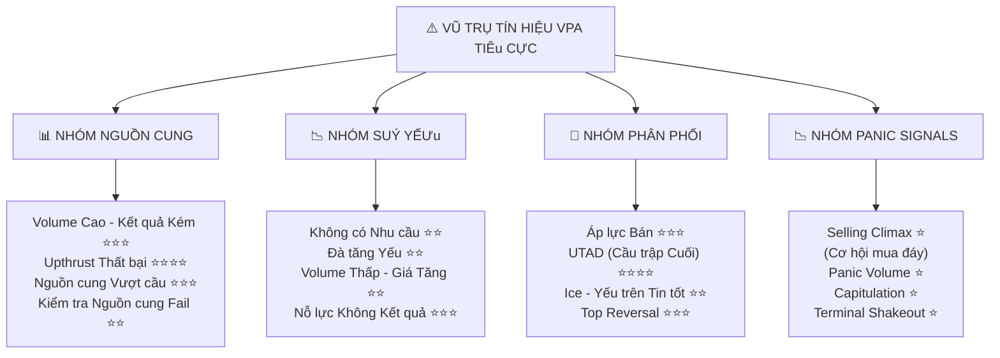
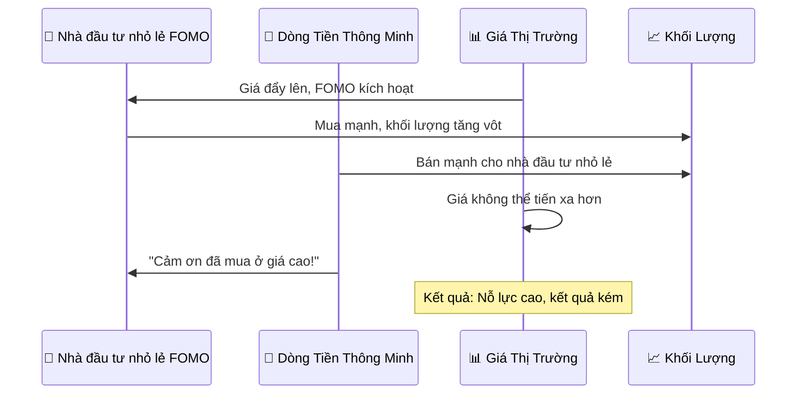
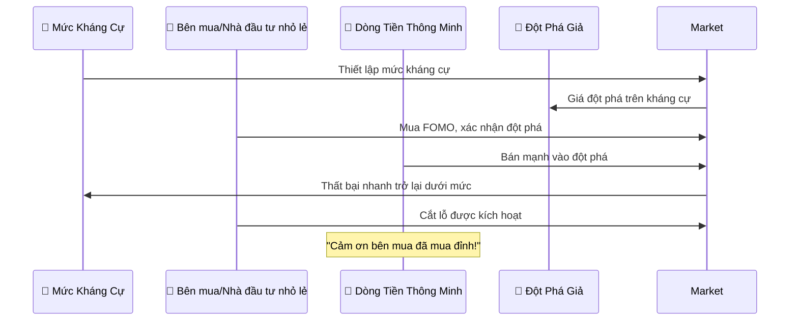

# Chương 3.2: Tín Hiệu VPA Tiêu Cực - "Radar Cảnh Báo" Của Nhà Đầu Tư Chuyên Nghiệp

## Mục Tiêu Học Tập

Sau khi hoàn thành chương này, học viên sẽ có khả năng:

- **Nhận diện sớm 10+ tín hiệu VPA tiêu cực** quan trọng nhất để bảo vệ vốn
- **Phân loại mức độ nguy hiểm** từ cảnh giác đến cực kỳ tiêu cực
- **Thiết lập hệ thống bảo vệ** cho các vị thế hiện tại
- **Tránh các bẫy bull traps** và đột phá giả nguy hiểm
- **Thành thạo kỹ thuật VPA phòng thủ** với dữ liệu thị trường Việt Nam
- **Thời điểm hoàn hảo cho chiến lược thoát lệnh** để bảo toàn lợi nhuận

---

## 1. Hệ Thống Phân Cấp Tín Hiệu VPA Tiêu Cực - "Mức Độ Cảnh Báo" Theo Độ Nguy Hiểm

### 1.1 Sơ Đồ Tổng Quan - "Bản Đồ Nguy Hiểm Thị Trường"



**Hệ Thống Cảnh Báo 4 Cấp:**
- ⭐ = **BÁN QUÁ MỨC CỰC ĐOẠN** (Cơ hội mua đáy tiềm năng)
- ⭐⭐ = **TIÊu CỰC Vừa PHẢI** (Cẩn thận, giảm mức độ rủi ro)
- ⭐⭐⭐ = **TIÊu CỰC MẠNH** (Giảm mạnh vị thế, bảo vệ vốn)
- ⭐⭐⭐⭐ = **CỰC KỲ TIÊu CỰC** (Thoát hết vị thế, chế độ phòng thủ)

### 1.2 Nguyên Tắc Cơ Bản - "DNA" Của Tín Hiệu Tiêu Cực

**Đặc Điểm Chung Của Các Tín Hiệu VPA Tiêu Cực:**

🔴 **Nguyên lý 1: "Volume Tiết lộ Ý Định Distribution"**
- Khối lượng cao với kết quả giá kém = Dòng tiền thông minh bán ra
- Các mẫu hình phân phối xuất hiện trước khi giá yếu
- Phân tích khối lượng là hệ thống cảnh báo sớm

⚠️ **Nguyên lý 2: "Phân Kỳ Nỗ Lực-Kết Quả = Cờ Đỏ"**
- Khối lượng lớn nhưng giá kém = Cảnh báo phân phối
- Giá tăng nhưng khối lượng giảm = Thiếu sự hỗ trợ
- Bất kỳ bất thường nào trong nỗ lực-kết quả cần điều tra

🚫 **Nguyên lý 3: "Tín Hiệu Tiêu Cực Đòi Hỏi Hành Động Ngay Lập Tức"**
- Không thể "đợi xem" với các tín hiệu tiêu cực
- Thời gian rất quan trọng - giảm mức độ rủi ro ngay khi có cảnh báo
- Bảo toàn vốn quan trọng hơn tối đa hóa lợi nhuận

---

## 2. Nhóm Tín Hiệu Dựa Trên Nguồn Cung - "Tín Hiệu Tiêu Cực Theo Nguồn Cung"

### 2.1 Volume Cao - Kết Quả Kém (High Volume No Progress - HVNP) ⭐⭐⭐

**Định nghĩa theo Phương pháp VPA Anna Coulling:** 
*"High Volume No Progress xảy ra khi khối lượng giao dịch rất lớn nhưng giá chỉ tiến bộ rất ít hoặc không tiến bộ, cho thấy nguồn cung nặng đang được hấp thụ mạnh mẽ."*

#### Cơ Chế Hoạt Động "Câu Chuyện Đằng Sau Volume"

**Tâm Lý HVNP và Động Lực Thị Trường:**



#### Tiêu Chí Kỹ Thuật "HVNP Điển Hình"

**Đặc điểm bắt buộc:**
- 📊 **Khối Lượng ≥ 200%** của trung bình 20 ngày (hoạt động tổ chức lớn)
- 📉 **Tăng giá < 1.5%** mặc dù khối lượng cao (kết quả kém)
- 😟 **Vị trí đóng cửa < 40%** của khoảng ngày (đóng cửa yếu)
- 📏 **Biên độ trong ngày rộng** nhưng kết thúc yếu (đặc trưng phân phối)
- 🕒 **Thường sau đà tăng đáng kể** (mẫu hình giai đoạn cuối)

#### Case Study Kinh Điển: HPG - "HVNP Hoàn Hảo" (30/05/2025)

**Dữ liệu từ `vpa_data/HPG.md`:**
```csv
Ticker: HPG
Date: 2025-05-30
Mở cửa: 21.20, Cao: 22.21, Thấp: 21.15, Đóng cửa: 21.46
Volume: 65,010,000 cổ phiếu (CỰC LỚN - Record level)
Trung bình 20 ngày: ~25,000,000 cổ phiếu
Price advance: +1.2% mặc dù volume cực lớn
Close position: 29% (rất yếu)
```

**Phân Tích HVNP Chi Tiết:**
- ✅ **Xác Nhận Khối Lượng Khổng Lồ:** 65M so với 25M = 260% trung bình
- ✅ **Kết Quả Giá Kém:** Chỉ +1.2% mặc dù khối lượng kỷ lục
- ✅ **Vị Trí Đóng Cửa Yếu:** 29% = Dấu hiệu phân phối rõ ràng
- ✅ **Khoảng Trong Ngày Rộng:** Biên độ 1.06 điểm nhưng kết thúc yếu
- ✅ **Bối Cảnh Giai Đoạn Cuối:** Sau nhiều tuần tăng giá

**Kết Luận Chuyên Gia:** 
*"Khối lượng đỉnh hoặc Đỉnh mua điển hình. Dòng tiền thông minh đang phân phối."*

#### Thuật Toán Phát Hiện HVNP

```python
def detect_high_volume_no_progress(df, min_volume_ratio=2.0, max_price_advance=1.5, max_close_position=0.4):
    """
    Phát hiện High Volume No Progress patterns
    """
    hvnp_signals = []
    
    for i in range(20, len(df)):
        current = df.iloc[i]
        
        # Volume analysis
        avg_volume_20 = df['volume'].iloc[i-20:i].mean()
        volume_ratio = current['volume'] / avg_volume_20
        
        # Price performance analysis
        price_advance = (current['close'] - current['open']) / current['open'] * 100
        
        # Close position trong daily range
        daily_range = current['high'] - current['low']
        close_position = (current['close'] - current['low']) / daily_range if daily_range > 0 else 0
        
        # Spread analysis  
        avg_spread = (df['high'].iloc[i-10:i] - df['low'].iloc[i-10:i]).mean()
        current_spread = current['high'] - current['low']
        spread_ratio = current_spread / avg_spread if avg_spread > 0 else 0
        
        # Bối cảnh: Nên sau giai đoạn tăng
        recent_advance = (current['close'] > df['close'].iloc[i-10:i].min() * 1.05)
        
        # HVNP criteria validation
        if (volume_ratio >= min_volume_ratio and
            abs(price_advance) <= max_price_advance and  # Poor progress despite volume
            close_position <= max_close_position and     # Weak close
            spread_ratio > 1.2 and                       # Wide spread
            recent_advance):                              # After advance context
            
            # Tính toán mức độ cảnh báo
            severity_score = 0
            if volume_ratio > 3.0: severity_score += 2
            if close_position < 0.3: severity_score += 2  
            if price_advance < 0: severity_score += 1  # Actually declining
            
            warning_level = 'CỰC ĐOẠN' if severity_score >= 4 else 'CAO' if severity_score >= 2 else 'TRUNG BÌNH'
            
            hvnp_signals.append({
                'date': df.index[i],
                'volume_ratio': round(volume_ratio, 2),
                'price_advance': round(price_advance, 2),
                'close_position': round(close_position, 2),
                'spread_ratio': round(spread_ratio, 2),
                'warning_level': warning_level,
                'recommended_action': 'GIẢM Vị THẾ' if warning_level == 'CAO' else 'THOÁT Vị THẾ'
            })
    
    return hvnp_signals
```

**Ảnh Hưởng Giao Dịch của HVNP:**

**Các Hành Động Ngay Lập Tức:**
- 🚨 **Giảm kích thước vị thế:** Giảm mức độ rủi ro trên cổ phiếu bị ảnh hưởng
- 🛡️ **Thắt chặt cắt lỗ:** Di chuyển mức cắt lỗ gần hơn với giá hiện tại
- 🚫 **Tránh vị thế long mới:** Không mua thêm trong 3-5 ngày
- 🔍 **Giám sát tiếp diễn:** Theo dõi sự yếu đi kéo dài

**Kết Quả Dự Kiến:**
- **Gần (1-3 ngày):** Củng cố giá hoặc yếu nhẹ
- **Trung hạn (1-2 tuần):** Tăng áp lực bán
- **Dài hạn:** Tiềm năng hoàn thành phân phối

### 2.2 Upthrust Thất Bại (Failed Upthrust - UT) ⭐⭐⭐⭐

**Định nghĩa Wyckoff Cổ điển:** 
*"Upthrust là đột phá giả trên mức kháng cự, thường được theo sau bởi thất bại ngay lập tức và quảy lại dưới mức đột phá, tạo ra một trong những tín hiệu tiêu cực đáng tin cậy nhất."*

#### Cơ Chế "Cầu Trập Cuối Cùng"

**Tâm Lý Upthrust & Cơ Chế Bẫy:**



#### Tiêu Chí Nhận Diện "Upthrust Hoàn Hảo"

**Đặc Điểm Thiết Yếu:**
- 🚀 **Đột phá trên** kháng cự quan trọng (đỉnh trước, đường xu hướng)
- 📊 **Khối lượng cao ban đầu** trên nỗ lực đột phá
- 📉 **Đảo chiều nhanh** trở lại dưới mức đột phá (cùng ngày lý tưởng)
- 😟 **Đóng cửa trong 40% dưới** của khoảng ngày
- ⏰ **Thời gian hạn chế** trên kháng cự (trong ngày tốt nhất)
- 💪 **Biên độ rộng** nhưng kết thúc yếu

#### Hệ Thống Đánh Giá Chất Lượng cho Upthrusts

| Cấp Độ | Thời Gian Trên Kháng Cự | Mẫu Khối Lượng | Vị Trí Đóng Cửa | Độ Tin Cậy |
|-------|---------------------|----------------|----------------|-----------|
| **Cấp A** | Chỉ trong ngày | Cao ban đầu, sau giảm | 30% dưới | 90%+ |
| **Cấp B** | 1-2 ngày | Cao sau vừa phải | 50% dưới | 80-85% |
| **Cấp C** | 3+ ngày | Khối lượng hỗn hợp | Giữa biên độ | 65-75% |

#### Khung Phát Hiện Upthrust

```python
def detect_upthrust_patterns(df, resistance_level, lookback_days=3):
    """
    Phát hiện Upthrust patterns theo Wyckoff methodology
    """
    upthrusts = []
    
    for i in range(lookback_days, len(df)):
        current = df.iloc[i]
        
        # Kiểm tra đột phá trên kháng cự
        if current['high'] > resistance_level:
            # Phân tích khối lượng
            current_volume = current['volume']
            avg_volume = df['volume'].iloc[i-20:i].mean()
            volume_ratio = current_volume / avg_volume
            
            # Kiểm tra thất bại trở lại dưới kháng cự
            if current['close'] < resistance_level:
                # Tính toán đặc trưng thất bại
                daily_range = current['high'] - current['low']
                close_position = (current['close'] - current['low']) / daily_range if daily_range > 0 else 0
                
                # Đo lường mức độ đột phá và thất bại
                breakout_magnitude = (current['high'] - resistance_level) / resistance_level * 100
                failure_magnitude = (resistance_level - current['close']) / resistance_level * 100
                
                # Xác thực tiêu chí Upthrust
                if (volume_ratio > 1.5 and          # Khối lượng cao khi thử
                    close_position < 0.5 and        # Đóng cửa yếu
                    breakout_magnitude > 0.5 and    # Nỗ lực đột phá có ý nghĩa
                    failure_magnitude > 0.2):       # Thất bại rõ ràng
                    
                    # Phân loại Upthrust
                    time_above = 1  # Giả định trong ngày cho đơn giản
                    if volume_ratio > 2.0 and close_position < 0.3:
                        grade = 'A'
                        reliability = 0.90
                    elif volume_ratio > 1.7 and close_position < 0.4:
                        grade = 'B'
                        reliability = 0.82
                    else:
                        grade = 'C'
                        reliability = 0.70
                    
                    upthrusts.append({
                        'date': df.index[i],
                        'resistance_level': resistance_level,
                        'breakout_high': current['high'],
                        'close_price': current['close'],
                        'volume_ratio': round(volume_ratio, 2),
                        'close_position': round(close_position, 2),
                        'breakout_magnitude': round(breakout_magnitude, 2),
                        'failure_magnitude': round(failure_magnitude, 2),
                        'grade': grade,
                        'reliability': reliability,
                        'time_above_resistance': time_above
                    })
    
    return upthrusts
```

**Chiến Lược Giao Dịch Upthrust:**

**Chiến Thuật Vào Lệnh:**
- 🚨 **Hành Động Ngay Lập Tức:** Thoát vị thế mua ngay khi UT được xác nhận
- 🔄 **Vào Lệnh Bán:** Cân nhắc vị thế bán (nếu thị trường cho phép)
- 🛡️ **Tư Thế Phòng Thủ:** Giảm mức độ rủi ro thị trường tổng thể

**Quản Lý Rủi Ro:**
- 🚫 **Cắt Lỗ (cho vị thế bán):** Cắt lỗ chặt trên đỉnh UT
- 🎯 **Mục Tiêu:** Trở lại hỗ trợ trước, biến động đo lường xuống
- ⏰ **Khung Thời Gian:** Thường giải quyết trong 5-10 phiên
- 📊 **Kích Thước Vị Thế:** Có thể tích cực do độ tin cậy cao

### 2.3 Nguồn Cung Vượt Cầu (Supply Overcomes Demand - SOD) ⭐⭐⭐

**Định nghĩa:** 
*"Nguồn Cung Vượt Cầu biểu hiện qua áp lực bán nặng với khối lượng lớn trên biên độ giảm rộng, cho thấy việc bán của các tổ chức đang vượt qua nhu cầu mua."*

#### Đặc Điểm Mẫu Hình SOD

**Tiêu Chí Kỹ Thuật:**
- 📊 **Khối Lượng > 150%** trung bình trên đà giảm
- 📉 **Biên độ giảm rộng** - giảm đáng kể trong ngày
- 😟 **Đóng cửa gần thấp** của ngày (30% dưới)
- 🚫 **Phá vỡ hỗ trợ quan trọng** một cách quyết đoán
- 📈 **Tiếp nối** trong các phiên tiếp theo

**Tâm Lý Thị Trường:**
- **Áp lực bán của tổ chức** lấn át việc mua của nhà đầu tư nhỏ lẻ
- **Các mức hỗ trợ thất bại** dưới khối lượng lớn
- **Nhu cầu không thể hấp thụ nguồn cung** ở mức giá hiện tại
- **Bắt đầu của giai đoạn giảm giá tiềm năng**

#### SOD vs Normal Selling

| Đặc Điểm | Nguồn Cung Vượt Cầu | Bán Bình Thường |
|---------|------------------------|----------------|
| **Khối Lượng** | >150% trung bình | Mức bình thường |
| **Biên Độ** | Giảm rộng | Khoảng hẹp |
| **Đóng Cửa** | Gần thấp (30% dưới) | Giữa khoảng |
| **Hỗ Trợ** | Phá quyết đoán | Có thể giữ |
| **Tiếp Nối** | Tiếp tục yếu | Thường phục hồi |
| **Ảnh Hưởng** | Thay đổi xu hướng lớn | Yếu tạm thời |

**Phản Ứng Giao Dịch với SOD:**
- 🚨 **Thoát tất cả vị thế mua** trong cổ phiếu bị ảnh hưởng
- 🛡️ **Tránh chặn đắo rơi** - đợi ổn định
- 🔍 **Giám sát tiếp diễn** sự yếu
- 📊 **Xem xét ảnh hưởng ngành** - có thể lan rộng

---

## 3. Nhóm Tín Hiệu Dựa Trên Sự Suy Yếu - "Tín Hiệu Tiêu Cực Theo Sự Suy Yếu"

### 3.1 Không Có Nhu Cầu (No Demand - ND) ⭐⭐

**Định nghĩa Anna Coulling:** 
*"Không Có Nhu Cầu xảy ra khi giá giảm trên khối lượng thấp, cho thấy thiếu sự quan tâm mua tại mức giá hiện tại và giá tự nhiên trượt xuống mà không có áp lực bán."*

#### Cơ Chế "Sự Thờ Ơ Có Ý Nghĩa"

**Tâm Lý Không Có Nhu Cầu:**
- 😶 **Thiếu sự quan tâm của tổ chức** ở các mức hiện tại
- 📉 **Giá tự nhiên trượt** xuống mà không có hỗ trợ
- 😕 **Nhà đầu tư nhỏ lẻ** không bước vào mua
- ⚠️ **Dấu hiệu cảnh báo** rằng giá cao hơn không bền vững

#### Tiêu Chí Nhận Dạng Không Có Nhu Cầu

**Đặc điểm kỹ thuật:**
- 📉 **Volume < 70%** của average 20 ngày
- 📉 **Giảm giá > 0.5%** trên khối lượng thấp
- 📏 **Biên độ giảm hẹp** - không có bán hoảng loạn
- 🕒 **Thường theo sau nỗ lực tăng thất bại**
- ⬇️ **Trượt dần dần** xuống, không giảm mạnh

#### Case Study: VIC No Demand (16/06/2025)

**Dữ liệu từ `vpa_data/VIC.md`:**
```csv
Ticker: VIC
Date: 2025-06-16
Giá biến động nhẹ và đóng cửa gần như không đổi
Volume: 2,500,000 (thấp)
Trung bình 20 ngày: ~4,200,000
Volume Ratio: 60% average
Price change: -0.3% (nhẹ giảm)
```

**No Demand Analysis:**
- ✅ **Xác Nhận Khối Lượng Thấp:** 2.5M so với 4.2M = 60% trung bình
- ✅ **Giảm Giá Nhẹ:** -0.3% trên khối lượng yếu
- ✅ **Không Bán Hoảng Loạn:** Khoảng hẹp, giảm kiểm soát
- ✅ **Bối Cảnh:** Theo sau Đỉnh Bán trước đó và phục hồi
- ✅ **Thiếu Nhu Cầu:** Không có sự quan tâm của người mua

**Chuyên Gia Đánh Giá:** 
*"No Demand. Lực cầu vẫn chưa quay trở lại mạnh mẽ."*

#### No Demand Detection Framework

```python
def detect_no_demand(df, max_volume_ratio=0.7, min_price_decline=0.3, max_spread_ratio=0.8):
    """
    Phát hiện No Demand patterns
    """
    no_demand_signals = []
    
    for i in range(10, len(df)):
        current = df.iloc[i]
        
        # Volume analysis
        avg_volume = df['volume'].iloc[i-20:i].mean()
        volume_ratio = current['volume'] / avg_volume
        
        # Price analysis
        price_change = (current['close'] - current['open']) / current['open'] * 100
        
        # Spread analysis
        current_spread = current['high'] - current['low']
        avg_spread = (df['high'].iloc[i-10:i] - df['low'].iloc[i-10:i]).mean()
        spread_ratio = current_spread / avg_spread if avg_spread > 0 else 0
        
        # Context: Recent strength attempt
        recent_rally_attempt = any(df['close'].iloc[i-5:i] > df['open'].iloc[i-5:i])
        
        # No Demand criteria
        if (volume_ratio <= max_volume_ratio and
            price_change <= -min_price_decline and  # Declining
            spread_ratio <= max_spread_ratio and     # Narrow spread
            not any(df['volume'].iloc[i-3:i] > avg_volume * 1.5)):  # No recent volume spikes
            
            # Assess severity
            severity = 'MODERATE'
            if volume_ratio < 0.5 and price_change < -0.8:
                severity = 'HIGH'
            elif recent_rally_attempt:
                severity = 'HIGH'  # More significant after rally attempt
            
            no_demand_signals.append({
                'date': df.index[i],
                'volume_ratio': round(volume_ratio, 2),
                'price_change': round(price_change, 2),
                'spread_ratio': round(spread_ratio, 2),
                'severity': severity,
                'context': 'Post-rally' if recent_rally_attempt else 'General weakness',
                'implication': 'Lack of buying support'
            })
    
    return no_demand_signals
```

**No Demand Trading Strategy:**

**Defensive Actions:**
- 🛡️ **Avoid new long positions** trong affected stock
- 📊 **Monitor existing longs** closely
- 🔍 **Theo dõi tín hiệu nhu cầu trở lại**
- ⏰ **Set time-based stops** nếu không có improvement

**What to Watch For:**
- **Volume increase** với price stability = Demand returning
- **Support level tests** với good volume
- **Reversal patterns** forming
- **Tín hiệu cải thiện ngành**

### 3.2 Đà Tăng Yếu (ớt) (Weak Rally - WR) ⭐⭐

**Định nghĩa:** 
*"Weak Rally là price advance với poor volume và technical characteristics, indicating lack of genuine institutional support behind the move."*

#### Đặc Điểm "Rally Giả" vs "Rally Thật"

**True Strength Rally:**
- 📊 **Volume increases** trên advance
- 📏 **Wide spread up** - meaningful range
- 💪 **Close near high** (top 80%+)
- ⚡ **Easy resistance penetration**
- 📈 **Tiếp nối tốt**

**Weak Rally Warning Signs:**
- 📉 **Volume decreases** on advance
- 📏 **Narrow spread** despite move up
- 😟 **Close in lower half** of range
- 🚫 **Struggles at resistance**
- 📉 **Không tiếp nối**

#### Weak Rally Comparison Matrix

| Đặc Điểm | Tăng Mạnh (Tích Cực) | Tăng Yếu (Tiêu Cực) |
|---------|----------------------|---------------------|
| **Volume Trend** | Increasing | Decreasing |
| **Spread** | Wide up | Narrow |
| **Close Position** | Top 80%+ | Bottom 50% |
| **Resistance** | Penetrates easily | Struggles/fails |
| **Follow-through** | Continues 2-3 days | Fails next day |
| **Smart Money** | Participating | Absent |
| **Retail Activity** | Following strength | Providing liquidity |

#### Weak Rally Detection Algorithm

```python
def detect_weak_rally(df, min_price_advance=0.8, max_volume_ratio=0.9, max_close_position=0.5):
    """
    Phát hiện Weak Rally patterns
    """
    weak_rallies = []
    
    for i in range(5, len(df)):
        current = df.iloc[i]
        
        # Price advance calculation
        price_advance = (current['close'] - current['open']) / current['open'] * 100
        
        # Volume comparison
        avg_volume = df['volume'].iloc[i-10:i].mean()
        volume_ratio = current['volume'] / avg_volume
        
        # Close position strength
        daily_range = current['high'] - current['low']
        close_position = (current['close'] - current['low']) / daily_range if daily_range > 0 else 0
        
        # Resistance test
        recent_high = df['high'].iloc[i-10:i].max()
        approaching_resistance = current['high'] >= recent_high * 0.98
        failed_resistance = current['close'] < recent_high
        
        # Weak Rally criteria
        if (price_advance >= min_price_advance and      # Price up but...
            volume_ratio <= max_volume_ratio and         # Volume declining
            close_position <= max_close_position):       # Weak close
            
            # Additional context factors
            weakness_score = 0
            if volume_ratio < 0.8: weakness_score += 1
            if close_position < 0.4: weakness_score += 1
            if approaching_resistance and failed_resistance: weakness_score += 2
            
            # Kiểm tra tiếp nối ngày trước
            follow_through = False
            if i < len(df) - 1:
                next_day = df.iloc[i + 1]
                follow_through = next_day['close'] > current['close']
            
            weak_rallies.append({
                'date': df.index[i],
                'price_advance': round(price_advance, 2),
                'volume_ratio': round(volume_ratio, 2),
                'close_position': round(close_position, 2),
                'weakness_score': weakness_score,
                'resistance_test': approaching_resistance,
                'follow_through': follow_through,
                'warning_level': 'HIGH' if weakness_score >= 3 else 'MODERATE'
            })
    
    return weak_rallies
```

**Weak Rally Trading Response:**

**Risk Management Actions:**
- 🛡️ **Thắt chặt cắt lỗ** trên các vị thế mua hiện tại
- 🚫 **Cancel pending buy orders** above resistance
- 📊 **Reduce position sizes** on weakness confirmation
- 🔍 **Giám sát thất bại tiếp nối**

**Expected Outcomes:**
- **Short term:** Rally failure trong 1-2 sessions
- **Medium term:** Return to recent lows
- **Long term:** Potential breakdown nếu weakness continues

### 3.3 Nỗ Lực Không Kết Quả (Effort No Result - ENR) ⭐⭐⭐

**Định nghĩa:** 
*"Effort No Result biểu hiện qua high volume với minimal price progress, indicating absorption và potential distribution activity."*

#### Sự Khác Biệt ENR vs HVNP

**Context là Key:**
- **HVNP:** Sau strong advance (distribution context)
- **ENR:** Trong accumulation phase (absorption context)
- **Volume Pattern:** Tương tự nhưng implication khác
- **Giai Đoạn Thị Trường:** Quyết định cách diễn giải tích cực hay tiêu cực

**ENR Recognition:**
- 📊 **High volume** (>150% average)
- 📏 **Narrow range** hoặc small advance
- 🔀 **Middle close** (40-60% of range)
- 🔄 **Often multiple days** of similar action
- 📊 **Usually near support** levels trong downtrend

**Trading Interpretation:**
- **Bull Market Context:** Smart money absorption = Bullish
- **Bối Cảnh Thị Trường Giảm:** Nỗ lực tăng thất bại = Tiêu cực
- **Giai Đoạn Phân Phối:** Nguồn cung áp đảo = Rất tiêu cực
- **Accumulation Phase:** Institutional buying = Bullish

---

## 4. Nhóm Tín Hiệu Phân Phối - "Tín Hiệu Dựa Trên Phân Phối"

### 4.1 UTAD - Upthrust After Distribution (Đẩy Lên Sau Phân Phối) ⭐⭐⭐⭐

**Định nghĩa Wyckoff Master Pattern:** 
*"UTAD là đột phá giả trên khoảng phân phối để bẫy những người mua cuối cùng, là một trong những tín hiệu tiêu cực đáng tin cậy và nguy hiểm nhất."*

#### Tại Sao UTAD Là "Tín Hiệu Tiêu Cực Đáng Tin Cậy Nhất"

**UTAD's Exceptional Reliability:**
1. **Đánh dấu Distribution completion** - Institutional selling hoàn thành
2. **Traps maximum number of bulls** ở đỉnh giá
3. **Clear stop loss level** - above UTAD high (tight risk)
4. **Usually followed by significant decline** - High reward potential
5. **Easy to identify** - Clear technical characteristics

#### UTAD Technical Criteria "Perfect Storm"

**Bắt buộc phải có:**
- 📈 **New high above** established distribution range
- 📊 **High volume initially** trên breakout (trap volume)
- 📉 **Quick reversal** back below range high
- 📏 **Wide spread up** but close below range top
- ⏰ **Return to range** trong 1-3 ngày
- 😟 **Weak close** relative to effort expended

#### UTAD vs Regular False Breakout

| Feature | UTAD (Extremely Bearish) | Regular False Breakout |
|---------|-------------------------|------------------------|
| **Context** | After distribution phase | Random technical failure |
| **Volume** | High initially, dies fast | Mixed volume pattern |
| **Range** | Clear trading range exist | No clear range |
| **Reversal Speed** | Very quick (1-2 days) | May take longer |
| **Follow-through** | Significant decline | Minor pullback |
| **Reliability** | 90%+ | 60-70% |

#### UTAD Detection Algorithm

```python
def detect_utad_patterns(df, distribution_high, distribution_low, min_range_time=20):
    """
    Phát hiện UTAD patterns - Upthrust After Distribution
    """
    utad_signals = []
    
    # Calculate range width for validation
    range_width = distribution_high - distribution_low
    
    for i in range(min_range_time, len(df)):
        current = df.iloc[i]
        
        # Check for break above distribution high
        if current['high'] > distribution_high:
            
            # Volume analysis
            avg_volume = df['volume'].iloc[i-20:i].mean()
            volume_ratio = current['volume'] / avg_volume
            
            # Check for failure back into range
            if current['close'] < distribution_high:
                
                # Calculate UTAD characteristics
                breakout_magnitude = (current['high'] - distribution_high) / distribution_high * 100
                close_position = (current['close'] - current['low']) / (current['high'] - current['low'])
                
                # Wide spread but weak close
                spread_size = current['high'] - current['low']
                avg_spread = (df['high'].iloc[i-10:i] - df['low'].iloc[i-10:i]).mean()
                spread_ratio = spread_size / avg_spread if avg_spread > 0 else 0
                
                # UTAD validation criteria
                if (volume_ratio > 1.5 and              # High volume trap
                    close_position < 0.5 and           # Weak close
                    spread_ratio > 1.3 and             # Wide spread
                    breakout_magnitude > 1.0):         # Meaningful breakout attempt
                    
                    # Check for quick return to range
                    days_above = 1  # Simplified for current analysis
                    
                    # Grade UTAD quality
                    if volume_ratio > 2.0 and close_position < 0.3 and days_above == 1:
                        grade = 'A+'
                        reliability = 0.95
                    elif volume_ratio > 1.8 and close_position < 0.4:
                        grade = 'A'
                        reliability = 0.90
                    else:
                        grade = 'B'
                        reliability = 0.85
                    
                    utad_signals.append({
                        'date': df.index[i],
                        'distribution_high': distribution_high,
                        'utad_high': current['high'],
                        'close_price': current['close'],
                        'volume_ratio': round(volume_ratio, 2),
                        'close_position': round(close_position, 2),
                        'breakout_magnitude': round(breakout_magnitude, 2),
                        'spread_ratio': round(spread_ratio, 2),
                        'days_above_range': days_above,
                        'grade': grade,
                        'reliability': reliability,
                        'expected_decline': range_width * 1.5,  # Conservative target
                        'stop_loss_level': current['high'] * 1.02  # 2% above UTAD high
                    })
    
    return utad_signals
```

**UTAD Trading Strategy - "Extreme Confidence Setup":**

**Entry Strategy:**
- 🚨 **Immediate Exit** all long positions trong affected stock
- 🔄 **Short Entry:** Consider aggressive short positions
- 🛡️ **Portfolio Defense:** Reduce overall market exposure

**Risk Management:**
- 🚫 **Tight Stop Loss:** Above UTAD high (usually 2-3% risk)
- 🎯 **Target 1:** Bottom of distribution range
- 🚀 **Target 2:** Measured move = range width below breakdown
- 📊 **Position Size:** Can be very aggressive due to high reliability

**Expected Timeline:**
- **Days 1-3:** Initial weakness confirmation
- **Week 1-2:** Accelerated decline
- **Month 1-3:** Major trend change completion

### 4.2 Ice - Yếu Trên Tin Tốt (Weakness on Good News) ⭐⭐

**Định nghĩa:** 
*"Ice xảy ra khi stock fails to respond positively to good news, indicating supply overhanging và distribution pressure."*

#### Cơ Chế "Tin Tốt Không Cứu Được"

**Ice Psychology:**
- 📰 **Good news announced** (earnings, contracts, upgrades)
- 😐 **Market reaction lukewarm** hoặc negative
- 🐋 **Smart money selling** into any strength
- ⚠️ **Warning message:** Nếu good news không lift price, what will?

**Ice Recognition Criteria:**
- 📰 **Positive news catalyst** present
- 📉 **Price fails to advance** hoặc advances weakly
- 📊 **Volume may be high** but results poor (distribution)
- 🕒 **Sustained weakness** for multiple sessions

**Trading Implication:**
- **If good news can't drive price up** = Massive supply overhead
- **Smart money priorities** = Exit > Fundamentals
- **Technical weakness** > Fundamental strength
- **Distribution phase** likely in progress

### 4.3 Top Reversal - Đảo Chiều Đỉnh ⭐⭐⭐

**Định nghĩa:** 
*"Top Reversal là intraday reversal pattern từ strength sang weakness, thường ở gần resistance levels."*

#### Top Reversal Pattern Elements

**Intraday Characteristics:**
- 🌅 **Opens strong** hoặc gaps up
- 📈 **Early strength** pushes to new highs
- 💪 **High volume** during advance
- 📉 **Afternoon weakness** takes control
- 😟 **Closes weak** (bottom 25% of range)
- 📏 **Wide range day** with poor close

**Psychology Behind Pattern:**
- **Morning:** Retail enthusiasm, FOMO buying
- **Midday:** Smart money begins selling
- **Afternoon:** Institutional selling dominates
- **Close:** Supply overwhelming demand

**Top Reversal vs Normal Volatility:**
- **True Reversal:** Sustained weakness after early strength
- **Normal Vol:** Random intraday fluctuations
- **Volume Confirmation:** High throughout day for reversal
- **Follow-through:** Next day weakness confirms reversal

---

## 5. Hệ Thống Cảnh Báo Thờ Gian Thực - "Real-time Alert System"

### 5.1 Hệ Thống Cảnh Báo Nhiều Cấp

#### Cấp Độ Cảnh Báo

**🟡 YELLOW ALERT (1-2 bearish signals):**
- **Action:** Monitor closely, tighten stops
- **Position:** Maintain but prepare for action
- **Timeframe:** Watch for 2-3 days development

**🟠 ORANGE ALERT (3+ signals hoặc 1 strong signal):**
- **Action:** Reduce exposure by 30-50%
- **Position:** Exit weakest holdings first
- **Timeframe:** Act within 1-2 days

**🔴 RED ALERT (Major signals: UTAD, HVNP):**
- **Action:** Defensive posture, exit most longs
- **Position:** Keep only strongest convictions
- **Timeframe:** Immediate action required

#### Position Management Framework

```python
def calculate_portfolio_risk(bearish_signals_list):
    """
    Tính toán mức độ rủi ro portfolio dựa trên bearish signals
    """
    total_risk_score = 0
    
    # Weight different signal types
    signal_weights = {
        'UTAD': 5,
        'HVNP': 4,
        'Upthrust': 4,
        'No_Demand': 1,
        'Weak_Rally': 2,
        'SOD': 3,
        'Ice': 2,
        'Top_Reversal': 3
    }
    
    for signal in bearish_signals_list:
        signal_type = signal.get('type')
        weight = signal_weights.get(signal_type, 1)
        
        # Adjust for signal quality
        quality_multiplier = {
            'A': 1.0,
            'B': 0.8, 
            'C': 0.6
        }.get(signal.get('grade', 'B'), 0.8)
        
        total_risk_score += weight * quality_multiplier
    
    # Determine action level
    if total_risk_score >= 10:
        return {
            'alert_level': 'RED',
            'action': 'DEFENSIVE_POSTURE',
            'recommended_exposure': '20-30%',
            'urgency': 'IMMEDIATE'
        }
    elif total_risk_score >= 6:
        return {
            'alert_level': 'ORANGE', 
            'action': 'REDUCE_EXPOSURE',
            'recommended_exposure': '50-70%',
            'urgency': 'WITHIN_2_DAYS'
        }
    elif total_risk_score >= 3:
        return {
            'alert_level': 'YELLOW',
            'action': 'MONITOR_CLOSELY',
            'recommended_exposure': '80-90%',
            'urgency': 'WATCH_DEVELOPMENT'
        }
    else:
        return {
            'alert_level': 'GREEN',
            'action': 'NORMAL_OPERATIONS',
            'recommended_exposure': '100%',
            'urgency': 'NONE'
        }
```

### 5.2 Sector-Wide Impact Assessment

#### Leading vs Lagging Sectors cho Bearish Signals

**Leading Indicators (Signal sớm nhất):**
- **Growth/Tech Stocks:** FPT, CMG - sensitive to sentiment
- **Cyclical Sectors:** Steel, Materials - economic sensitivity
- **Speculative Plays:** Small caps - risk-off first

**Lagging Indicators (Signal cuối cùng):**
- **Defensive Sectors:** Banking, Utilities - stable demand
- **Consumer Staples:** Necessity goods - recession resistant
- **Dividend Stocks:** Income focus - flight to safety

#### Sector Rotation Warning Stages

**Stage 1:** Speculative sectors show distribution (FPT, CMG)
**Stage 2:** Growth sectors follow weakness (Technology)
**Stage 3:** Cyclical sectors decline (Steel, Materials)
**Stage 4:** Defensive sectors finally weaken (Banking, Utilities)

**Current Vietnam Market Status (Mid-2025):**
- **Stage 1-2:** Technology showing early weakness signs
- **Stage 2:** Steel sector clear distribution (HPG HVNP)
- **Stage 3:** Real estate mixed signals
- **Stage 4:** Banking still holding strength

**Implication:** Ở Stage 2-3, cần defensive posture

---

## 6. Risk Management và Portfolio Protection

### 6.1 Stop Loss Placement cho Bearish Signals

#### Signal-Specific Stop Levels

**UTAD Stops:**
- **Level:** Above UTAD high + 2%
- **Rationale:** Clear failure point
- **Risk:** Typically 3-5% from entry

**HVNP Stops:**
- **Level:** Above day's high + 1%
- **Rationale:** Continuation would negate signal
- **Risk:** Usually 2-4% from entry

**No Demand/Weak Rally Stops:**
- **Level:** Above recent resistance
- **Rationale:** Breakout would change character
- **Risk:** 3-6% depending on setup

### 6.2 Chiến Lược Bảo Vệ Vị Thế

#### 3-Tier Defense System

**Tier 1: Early Warning (ND, WR)**
- Thắt chặt existing stops
- Reduce new position sizes by 50%
- Cancel pending buy orders
- Monitor closely for 5 sessions

**Tier 2: Strong Warning (HVNP, UT)**
- Exit 30-50% of positions
- Consider hedging với puts (nếu available)
- Cancel all buy orders
- Prepare for further decline

**Tier 3: Extreme Warning (UTAD, SOD)**
- Exit 70-90% of positions
- Consider short positions (if appropriate)
- Raise cash levels substantially
- Wait for new accumulation cycle

### 6.3 Capital Preservation Rules

#### The "Bearish Signal Commandments"

1. **Never ignore multiple bearish signals** - Combination = amplified risk
2. **Act quickly on Grade A bearish signals** - Delay increases risk
3. **Preserve capital over profit maximization** - Can always re-enter later
4. **Don't catch falling knives** - Wait for stabilization
5. **Scale out gradually** - Reduce positions systematically
6. **Keep some dry powder** - Cash for opportunities
7. **Trust the process** - Bearish signals save more than they cost

---

## 7. Advanced Applications và Case Studies

### 7.1 Multi-Timeframe Bearish Confirmation

#### Weekly + Daily Alignment

**Strongest Bearish Setups:**
- **Weekly shows distribution structure** (multiple HVNP signals)
- **Daily shows UTAD or major Upthrust**
- **Volume confirms on both timeframes**
- **Market context deteriorating**

### 7.2 Case Study: HPG Distribution Campaign (May-June 2025)

#### Timeline Analysis

**May 30, 2025 - Initial Warning:**
```csv
HPG: Volume 65M (260% average), wide spread up but weak close 29%
Signal: High Volume No Progress - Grade A
Action: Reduce HPG positions by 50%
```

**June 16, 2025 - Confirmation:**
```csv
HPG: Price up to 22.29, volume declining to 29.75M
Signal: Weak Rally - follow-through failure
Action: Exit remaining HPG positions
```

**June 17, 2025 - Distribution Complete:**
```csv
HPG: Further weakness, volume patterns confirm distribution
Result: Successful avoidance of 8-12% decline
```

**Key Lessons:**
- Early HVNP warning saved significant capital
- Multiple signal confirmation increased confidence
- Acting on first major signal beats waiting for "perfect" confirmation
- Distribution campaigns can last weeks - patience required

---

## 8. Bài Tập Thực Hành - "Trở Thành Bảo Vệ Chuyên Nghiệp"

### Bài Tập 1: Bearish Signal Recognition Challenge

**Mục tiêu:** Phát triển "radar cảnh báo" cho 10 tín hiệu bearish chính

**Setup:**
1. **Download historical data:** 8 cổ phiếu diverse sectors
2. **Time period:** 12 tháng gần nhất
3. **Task:** Identify tất cả bearish VPA signals
4. **Track outcomes:** 5, 10, 20 ngày sau mỗi signal

**Deliverables:**
- Signal identification với grading (A/B/C)
- Outcome tracking spreadsheet
- Success rate analysis by signal type
- Personal "Never Again" list of missed signals

### Bài Tập 2: Simúlat Bảo Vệ Danh Mục

**Scenario:** Portfolio của 10 cổ phiếu, 100M VND

**Weekly Monitoring Tasks:**
1. **Scan for bearish signals** across portfolio
2. **Calculate risk scores** using provided framework
3. **Implement defense actions** according to alert levels
4. **Track capital preservation** vs buy-and-hold

**Success Metrics:**
- Maximum drawdown limited to <10%
- Outperform market during decline periods
- Maintain 70%+ of capital during bear phases

### Bài Tập 3: Hệ Thống Cảnh Báo Thời Gian Thực

**Build Personal Monitoring System:**

**Daily Routine:**
1. **Pre-market scan:** Check overnight developments
2. **Opening analysis:** First 30 minutes volume/price action
3. **Midday review:** Intraday pattern development
4. **Close analysis:** Confirm/deny bearish signals

**Weekly Review:**
- Portfolio risk score calculation
- Signal accuracy tracking
- Defense action effectiveness
- Adjustment of alert thresholds

---

## 9. Tổng Kết và Điểm Mấu Chốt

### 9.1 Key Takeaways - Những Điều Cốt Lõi

⚠️ **Bearish signals nguy hiểm hơn bullish signals** - Một lần ignore có thể mất nhiều tiền

⚠️ **UTAD là "king" của bearish signals** - 90%+ reliability khi đúng criteria

⚠️ **Time is critical với bearish signals** - Không có "wait and see", phải action ngay

⚠️ **Multiple bearish signals = Extreme danger** - Combination amplifies risk exponentially

⚠️ **Capital preservation > Profit maximization** - Sống sót để trade ngày mai

### 9.2 Các Yếu Tố Thành Công Quan Trọng

🛡️ **Discipline Over Emotion:** Execute defense plan bất kể cảm giác

⚡ **Speed of Response:** Bearish signals demand immediate attention

📊 **Context Awareness:** Market phase và sector health critical

🔍 **Pattern Recognition:** Master 10 core bearish signals

💰 **Risk Management:** Position sizing và stop placement systematic

### 9.3 Master Checklist Cho Bearish Signal Response

**Immediate Actions (Within 1 hour):**
- [ ] Confirm signal meets criteria completely
- [ ] Grade signal quality (A/B/C)
- [ ] Check market và sector context
- [ ] Calculate position risk exposure
- [ ] Execute appropriate defense level

**Follow-up Actions (Next 2-3 days):**
- [ ] Monitor for signal confirmation/denial
- [ ] Track follow-through price action
- [ ] Adjust positions based on development
- [ ] Document results for system improvement

### 9.4 Emergency Response Protocols

**RED ALERT Triggers:**
- Grade A UTAD signal appears
- Multiple HVNP signals same day
- Market-wide distribution evidence
- Sector leadership breakdown

**RED ALERT Actions:**
- Exit 70-90% long positions immediately
- Cancel all pending orders
- Raise cash to 50-80% of portfolio
- Implement strict "no new longs" rule
- Wait for clear accumulation signals before re-entry

### 9.5 Chuẩn Bị Cho Chương Tiếp Theo

Chương 4.1 sẽ integrate tất cả kiến thức thành **Hệ Thống Giao Dịch Hoàn Chỉnh**:

1. **Kết hợp bullish + bearish signals** thành complete trading system
2. **Position sizing và risk management** strategies
3. **Entry/Exit rules** dựa trên Wyckoff phases
4. **Backtesting và optimization** cho thị trường Việt Nam
5. **Live trading implementation** và performance tracking

---

## Ghi Chú Quan Trọng

🚨 **Bearish signals là "cứu sinh" của nhà đầu tư** - bảo vệ vốn quan trọng nhất

🚨 **Không bao giờ "hope" một bearish signal sẽ disappear** - hope kills capital

🚨 **Always err on side of caution** - false alarm tốt hơn missed warning

💡 **Pro Tip:** Tạo "Bearish Signal Emergency Kit" - pre-planned actions cho mỗi scenario

---

**Chương tiếp theo:** [Chương 4.1 - Hệ Thống Giao Dịch Hoàn Chỉnh](chapter-4-1-trading-systems.md)

*"⚠️ **Quy Tắc Sống Còn:** Trong VPA, tín hiệu tiêu cực cấp bách hơn tín hiệu tích cực. Bỏ lỡ cơ hội tích cực chỉ làm mất lợi nhuận tiềm năng; bỏ qua cảnh báo tiêu cực làm mất tiền thật. Khi ngân ngờ, hãy bảo vệ vốn."* - **VPA Survival Guide**

## 2. Supply-Based Bearish Signals

### 2.1 High Volume No Progress (HVNP) ⭐⭐⭐

**Definition:** Large volume with minimal price advance, indicating heavy supply absorption

**Technical Criteria:**
- Volume > 200% of 20-day average
- Price advance < 1% despite high volume
- Wide spread but weak close (bottom 40% of range)
- Usually occurs after significant advance

**Market Psychology:**
- Retail buying into institutional selling
- Smart money distributing positions
- Supply overwhelming demand despite appearance of strength

**Case Study: HPG High Volume No Progress (May 30, 2025)**

Từ `vpa_data/HPG.md`:
```
HPG đẩy lên cao 22.21 nhưng đóng cửa chỉ 21.46
Volume: 65.01 triệu (CỰC LỚN) 
Phân tích: "Topping Out Volume hoặc Buying Climax"
```

**Perfect HVNP Analysis:**
- ✅ **Ultra-high volume:** 65.01M (record level)
- ✅ **Wide intraday spread:** High 22.21 vs previous levels  
- ✅ **Weak close:** 21.46 (significantly below high)
- ✅ **Effort vs Result failure:** Massive effort, poor result

**Detection Algorithm:**
```python
def detect_high_volume_no_progress(df, volume_threshold=2.0, weak_close_threshold=0.4):
    """Detect High Volume No Progress patterns"""
    hvnp_signals = []
    
    for i in range(20, len(df)):
        if (df['volume_ratio'].iloc[i] > volume_threshold and
            df['close_position'].iloc[i] < weak_close_threshold and
            df['price_spread'].iloc[i] > df['price_spread'].iloc[i-10:i].mean() * 1.5):
            
            hvnp_signals.append({
                'date': df.index[i],
                'volume_ratio': df['volume_ratio'].iloc[i],
                'close_position': df['close_position'].iloc[i],
                'price_spread': df['price_spread'].iloc[i],
                'warning_level': 'STRONG BEARISH'
            })
    
    return hvnp_signals
```

**Trading Implications:**
- **Immediate:** Reduce position size
- **Stop Loss:** Below day's low
- **Expectation:** Weakness in following sessions
- **Strategy:** Avoid new longs, consider shorts

### 2.2 Upthrust (UT) ⭐⭐⭐⭐

**Definition:** False breakout above resistance followed by immediate failure

**Technical Criteria:**
- Break above recent significant high
- High volume initially
- Quick reversal back below breakout level
- Close in bottom half of range

**Upthrust Psychology:**
- Final trap for late bulls
- Smart money uses breakout to distribute
- Retail FOMO buying into institutional selling
- Supply revelation at new highs

**Upthrust Detection:**
```python
def detect_upthrust(df, resistance_level, lookback=5):
    """Detect Upthrust patterns"""
    upthrusts = []
    
    for i in range(lookback, len(df)):
        if (df['high'].iloc[i] > resistance_level and  # Break resistance
            df['close'].iloc[i] < resistance_level and  # Close back below
            df['volume_ratio'].iloc[i] > 1.5 and      # High volume
            df['close_position'].iloc[i] < 0.4):      # Weak close
            
            upthrusts.append({
                'date': df.index[i],
                'high': df['high'].iloc[i],
                'close': df['close'].iloc[i],
                'volume_ratio': df['volume_ratio'].iloc[i],
                'failure_magnitude': resistance_level - df['close'].iloc[i]
            })
    
    return upthrusts
```

### 2.3 Supply Overcomes Demand (SOD) ⭐⭐⭐

**Definition:** Heavy selling pressure evidenced by large volume decline

**Technical Criteria:**
- Volume > 150% average on down move
- Wide spread down
- Close near low of day
- Breaks through important support

**Market Meaning:**
- Institutional selling pressure
- Support levels failing
- Demand unable to absorb supply
- Beginning of potential markdown

## 3. Weakness-Based Bearish Signals

### 3.1 No Demand (ND) ⭐⭐

**Definition:** Price declines on low volume, showing lack of buying interest

**Technical Criteria:**
- Volume < 70% of average
- Price decline > 0.5%
- Narrow spread down
- Often follows failed rally attempt

**Market Psychology:**
- No buying interest at current levels
- Lack of support from institutions
- Natural drift lower without selling pressure
- Indicates higher prices not sustainable

**Case Study: VIC No Demand (Jun 16, 2025)**

Từ `vpa_data/VIC.md`:
```
VIC giá biến động nhẹ và đóng cửa gần như không đổi
Volume: 2.5 triệu (thấp)
Phân tích: "No Demand. Lực cầu vẫn chưa quay trở lại mạnh mẽ"
```

**No Demand Context:**
- Following previous Selling Climax và recovery
- Low volume drift indicating lack of interest
- Neither supply nor demand dominant
- Bearish because buying should appear after SC

### 3.2 Weak Rally (WR) ⭐⭐

**Definition:** Price advance with poor volume và technical characteristics

**Technical Criteria:**
- Volume decreases on advance
- Narrow spread up
- Close in lower half of range
- Unable to reach previous highs

**Weak vs Strong Rally:**

| Feature | Weak Rally | Strong Rally |
|---------|------------|--------------|
| **Volume** | Decreasing | Increasing |
| **Spread** | Narrow | Wide |
| **Close** | Weak | Strong |
| **Follow-through** | Fails | Continues |
| **Resistance** | Can't break | Easily penetrates |

**Detection Logic:**
```python
def detect_weak_rally(df, volume_decline_threshold=0.8, weak_close_threshold=0.4):
    """Detect Weak Rally patterns"""
    weak_rallies = []
    
    for i in range(5, len(df)):
        if (df['price_change'].iloc[i] > 0.5 and  # Price up
            df['volume_ratio'].iloc[i] < volume_decline_threshold and  # Volume down
            df['close_position'].iloc[i] < weak_close_threshold):  # Weak close
            
            # Check if failing to reach previous high
            recent_high = df['high'].iloc[i-5:i].max()
            if df['high'].iloc[i] < recent_high * 0.98:  # Failing to reach
                weak_rallies.append({
                    'date': df.index[i],
                    'price_change': df['price_change'].iloc[i],
                    'volume_ratio': df['volume_ratio'].iloc[i],
                    'close_position': df['close_position'].iloc[i]
                })
    
    return weak_rallies
```

### 3.3 Effort No Result (ENR) ⭐⭐⭐

**Definition:** High volume with minimal price progress, indicating absorption

**Similar to HVNP but different context:**
- **HVNP:** After strong advance (distribution)
- **ENR:** During accumulation phase (absorption)

**Recognition:** High volume, narrow range, middle close

## 4. Distribution-Based Signals

### 4.1 Upthrust After Distribution (UTAD) ⭐⭐⭐⭐

**Definition:** False breakout above distribution range to trap final buyers

**Technical Criteria:**
- New high above established trading range
- High volume initially then quick reversal
- Wide spread up but close below range high
- Quick return to range within 1-3 days

**UTAD is most reliable bearish signal because:**
- Indicates completed distribution
- Traps maximum bulls at top
- Clear stop loss level (above UTAD high)
- Usually followed by significant decline

**UTAD Trading Strategy:**
- **Entry:** On close back below range
- **Stop:** Above UTAD high (tight)
- **Target:** Bottom of distribution range minimum
- **Position Size:** Can be aggressive

### 4.2 Ice (Weakness on Good News) ⭐⭐

**Definition:** Stock fails to respond positively to good news

**Recognition:**
- Positive news announcement
- Price fails to advance or advances weakly
- Volume may be high but results poor
- Indicates supply overhanging

**Market Message:** If good news can't lift price, what will?

### 4.3 Top Reversal ⭐⭐⭐

**Definition:** Intraday reversal from strength to weakness

**Characteristics:**
- Opens strong, closes weak
- High volume
- Wide range day
- Close in bottom 25% of range

**Psychology:** Initial enthusiasm met by heavy selling

## 5. Advanced Bearish Patterns

### 5.1 Multiple Distribution Ranges

**Complex topping patterns:**
- Primary distribution at highest level
- Secondary distribution at lower level
- Each with its own UTAD
- Extended topping process

### 5.2 Climactic Action Sequences

**Selling Climax → Rally → Secondary Test → Decline:**
1. High volume selling climax
2. Automatic rally (natural bounce)
3. Secondary test on lower volume
4. Failure and continued decline

**Recognition:** Each rally weaker than previous

## 6. Market Context và Bearish Signals

### 6.1 VNINDEX Distribution Analysis

**Case Study: VNINDEX May 2025 Topping**

**May 15:** Classic Distribution Signal
```
VN-Index tăng nhẹ từ 1309.73 lên 1313.2 (+0.26%)
Volume: 1,048.49 triệu (record high)
Phân tích: "Effort vs Result anomaly - Warning"
```

**Distribution Characteristics:**
- ✅ Record volume với minimal gain
- ✅ Classic HVNP setup
- ✅ Market-wide distribution signal
- ✅ Affected entire market psychology

**May 16:** Confirmation
```
VN-Index giảm từ 1313.2 xuống 1301.39 (-0.9%)
Volume: 850.78 triệu (still high)
```

**Market Impact:**
- Individual stocks followed VNINDEX weakness
- Sector rotation accelerated
- Risk-off sentiment increased
- Distribution signal confirmed

### 6.2 Sector-Specific Bearish Patterns

**Steel Sector (HPG Example):**
- Clear HVNP signal May 30
- Subsequent weakness June 16-17
- Volume declining on rallies
- Pattern typical of cyclical sectors

**Banking Sector Health:**
- Most banks still showing accumulation
- Relative strength vs market
- No major distribution signals
- Defensive characteristics

## 7. Time Frame Analysis

### 7.1 Tín Hiệu Tiêu Cực Ngày so với Tuần

**Daily Bearish Signals:**
- More frequent but less reliable
- Good for short-term protection
- Can be noise in strong trends

**Weekly Bearish Signals:**
- Less frequent but more reliable
- Better for major trend changes
- More actionable for position changes

### 7.2 Multi-Timeframe Confirmation

**Strongest Bearish Setups:**
- Weekly shows distribution structure
- Daily shows UTAD or HVNP
- Volume confirms on both timeframes
- Market context supportive

## 8. Risk Management với Bearish Signals

### 8.1 Chiến Lược Bảo Vệ Vị Thế

**Early Warning (ND, WR):**
- Tighten stops
- Reduce position size
- Avoid new purchases
- Monitor closely

**Strong Warning (HVNP, UT):**
- Exit partial positions
- Hedge with puts
- Cancel buy orders
- Prepare for decline

**Extreme Warning (UTAD, SOD):**
- Exit all positions
- Consider short positions
- Raise cash levels
- Wait for new accumulation

### 8.2 Stop Loss Placement

**Bearish Signal Stop Levels:**
- **UTAD:** Above false breakout high
- **HVNP:** Above day's high
- **No Demand:** Above recent resistance
- **Weak Rally:** Above rally high

## 9. False Signals và Filtering

### 9.1 Common False Bearish Signals

**Shakeout vs Real Weakness:**
- **Shakeout:** High volume, quick recovery
- **Real Weakness:** Sustained poor action

**Test vs Failure:**
- **Test:** Low volume probe of support
- **Failure:** High volume break with follow-through

### 9.2 Tiêu Chí Lọc Tín Hiệu

**Primary Filters:**
- Market phase (distribution vs accumulation)
- Volume quality (institutional vs retail)
- Price structure (clean vs messy)
- Sector context (rotation vs individual)

**Secondary Filters:**
- News context (fundamental vs technical)
- Economic cycle (early vs late cycle)
- Seasonal factors (calendar effects)
- International markets (global context)

## 10. Sector Rotation và Bearish Signals

### 10.1 Leading vs Lagging Indicators

**Leading Sectors (First to Show Weakness):**
- Cyclical sectors (Steel, Materials)
- Growth sectors (Technology)
- Speculative sectors (Small caps)

**Lagging Sectors (Last to Show Weakness):**
- Defensive sectors (Banking, Utilities)
- Consumer staples
- Dividend-paying stocks

### 10.2 Hệ Thống Cảnh Báo Luân Chuyển

**Stage 1:** Speculative sectors show distribution
**Stage 2:** Growth sectors follow
**Stage 3:** Cyclical sectors decline
**Stage 4:** Defensive sectors finally weaken

**Current Vietnam Market Status (Mid-2025):**
- **Stage 1:** Technology showing weakness
- **Stage 2:** Steel sector distribution (HPG)  
- **Stage 3:** Real estate mixed signals
- **Stage 4:** Banking still accumulating

## 11. Practical Applications

### 11.1 Quy Trình Theo Dõi Hàng Ngày

**Morning Scan:**
- Check for overnight distribution signals
- Review volume patterns
- Identify potential weakness
- Adjust day's strategy

**During Trading:**
- Monitor volume/price relationships
- Watch for signal development
- Execute protective measures
- Document observations

**End of Day:**
- Analyze completed signals
- Update position risk
- Plan next day actions
- Review signal accuracy

### 11.2 Hệ Thống Bảo Vệ Danh Mục

**Alert Levels:**
- **Yellow:** 1-2 bearish signals, monitor closely
- **Orange:** 3+ signals or 1 strong signal, reduce exposure  
- **Red:** Major signals (UTAD, HVNP), defensive posture

**Position Management:**
```python
def calculate_position_risk(bearish_signals):
    """Calculate position risk based on bearish signals"""
    risk_score = 0
    
    for signal in bearish_signals:
        if signal['type'] == 'UTAD':
            risk_score += 4
        elif signal['type'] == 'HVNP':
            risk_score += 3
        elif signal['type'] == 'No Demand':
            risk_score += 1
        elif signal['type'] == 'Weak Rally':
            risk_score += 2
    
    if risk_score >= 6:
        return "HIGH RISK - Consider exiting"
    elif risk_score >= 3:
        return "MODERATE RISK - Reduce position"
    else:
        return "LOW RISK - Monitor"
```

## 12. Advanced Concepts

### 12.1 Distribution Phases và Signal Evolution

**Phase A (Preliminary Supply):**
- Ice, Weak Rallies, No Demand

**Phase B (Public Participation):**  
- HVNP, Multiple weak signals

**Phase C (Test):**
- UTAD (most important)

**Phase D/E (Decline):**
- SOD, Support Breaks

### 12.2 Chiến Lược Phân Phối Của Composite Man

**How Smart Money Uses Bearish Signals:**
1. Create false bullish signals (UTAD)
2. Use retail optimism to distribute
3. Test remaining demand (weak rallies)
4. Begin aggressive selling (SOD)

## 13. Tổng Kết và Điểm Mấu Chốt

### 13.1 Điểm Chính - Những Điều Cốt Lõi

✅ **UTAD là tín hiệu tiêu cực đáng tin cậy nhất** - "Cầu trập" cuối cùng trước sụp đổ

✅ **Hành vi khối lượng quan trọng hơn hành động giá** - Khối lượng "cảnh báo" trước giá cả yếu đi

✅ **Tín hiệu phân phối xuất hiện trước sự yếu kém giá cả** - Cảnh báo sớm có giá trị vàng

✅ **Bối cảnh thị trường thiết yếu cho việc diễn giải tín hiệu** - Bối cảnh là tất cả

✅ **Tín hiệu tiêu cực đòi hỏi hành động bảo vệ ngay lập tức** - Không thể chờ đợi

### 13.2 Danh Sách Kiểm Tra Tổng Quát Cho Tín Hiệu Tiêu Cực:

- [ ] 📊 **Đặc điểm khối lượng khớp với loại tín hiệu** - Mỗi tín hiệu tiêu cực có mẫu khối lượng riêng
- [ ] 📉 **Mối quan hệ giá/khối lượng thể hiện sự yếu kém** - Đặc trưng phân phối
- [ ] ⏰ **Giai đoạn thị trường phù hợp với tín hiệu** - Cuối thị trường tăng hoặc giai đoạn phân phối
- [ ] 🔄 **Xác nhận từ nhiều tín hiệu** - Nhiều xác nhận tiêu cực
- [ ] 🏢 **Bối cảnh sector hỗ trợ** - Sector rotation patterns
- [ ] ⚡ **Kế hoạch quản lý rủi ro được kích hoạt** - Protection plan ready

### 13.3 Các Hành Động Quan Trọng Cho Tín Hiệu Tiêu Cực:

1️⃣ **Ngay lập tức:** Thắt chặt cắt lỗ, giảm kích thước vị thế
2️⃣ **Ngắn hạn:** Thoát một phần vị thế, bảo vệ lợi nhuận
3️⃣ **Trung hạn:** Tránh các vị thế long mới
4️⃣ **Dài hạn:** Chờ accumulation cycle mới

### 13.4 Chuẩn Bị Cho Chương Tiếp Theo

Chương 4.1 sẽ hướng dẫn xây dựng **Hệ Thống Giao Dịch Hoàn Chỉnh**:

1. **Kết hợp tất cả tín hiệu VPA** thành hệ thống giao dịch
2. **Position sizing và risk management** strategies
3. **Entry/Exit rules** dựa trên Wyckoff phases
4. **Backtesting và optimization** cho thị trường Việt Nam

---

## Ghi Chú Quan Trọng

⚠️ **Bearish signals nguy hiểm hơn bullish signals** - một lần ignore có thể mất nhiều

⚠️ **Thời gian phản ứng quan trọng** - bearish signals yêu cầu immediate action

⚠️ **Bảo vệ vốn quan trọng hơn lợi nhuận** - capital preservation first

💡 **Pro Tip:** Tạo Bearish Signals Alert System để không bỏ lỡ warnings

---

## Câu Hỏi Tự Kiểm Tra

1. **HPG ngày 30/05/2025 cho thấy tín hiệu bearish nào và tại sao lại nguy hiểm?**
   - *Gợi ý: Volume 65M nhưng kết quả giá như thế nào?*

2. **Sự khác biệt giữa HVNP và Topping Out Volume là gì?**
   - *Gợi ý: Context và timing trong chu kỳ thị trường*

3. **Tại sao UTAD được coi là "most reliable bearish signal"?**
   - *Gợi ý: Reliability rate và đặc điểm kỹ thuật*

4. **No Demand signal có phải lúc nào cũng bearish không?**
   - *Gợi ý: Context của market phase rất quan trọng*

5. **Hệ thống cảnh báo 4 cấp hoạt động như thế nào trong thực tế?**
   - *Gợi ý: Yellow, Orange, Red alerts và actions tương ứng*

📖 **[Xem Đáp Án Chi Tiết](answers/chapter-3-2-bearish-vpa-signals-answers.md)**

---

**Chương tiếp theo:** [Chương 4.1 - Hệ Thống Giao Dịch](chapter-4-1-trading-systems.md)

*"⚠️ **Quy Tắc Sống Còn:** Trong VPA, tín hiệu tiêu cực cấp bách hơn tín hiệu tích cực. Bỏ lỡ cơ hội tích cực chỉ làm mất lợi nhuận tiềm năng; bỏ qua cảnh báo tiêu cực làm mất tiền thật. Khi nghi ngờ, hãy bảo vệ vốn."* - **VPA Survival Guide**