# Chương 3.2: Tín hiệu Bearish VPA - Cảnh báo nguy hiểm

## Mục tiêu học tập
- Nhận biết sớm dấu hiệu suy yếu của thị trường
- Thiết lập protective strategies cho existing positions
- Tránh bull traps và false breakouts
- Master defensive VPA techniques with Vietnam market data

## 1. Hierarchy của Bearish VPA Signals

### 1.1 Signal Classification by Urgency

```mermaid
flowchart LR
    A[Bearish VPA Universe] --> B[Supply Signals]
    A --> C[Weakness Signals]  
    A --> D[Distribution Signals]
    A --> E[Panic Signals]
    
    B --> B1[High Volume No Progress ⭐⭐⭐<br/>Supply Test Fail ⭐⭐<br/>Upthrust ⭐⭐⭐⭐<br/>Supply Overcomes Demand ⭐⭐⭐]
    
    C --> C1[No Demand ⭐⭐<br/>Weak Rally ⭐⭐<br/>Low Volume Up ⭐⭐<br/>Effort No Result ⭐⭐⭐]
    
    D --> D1[Selling Pressure ⭐⭐⭐<br/>UTAD ⭐⭐⭐⭐<br/>Ice ⭐⭐<br/>Top Reversal ⭐⭐⭐]
    
    E --> E1[Selling Climax ⭐<br/>Panic Volume ⭐<br/>Capitulation ⭐<br/>Terminal Shakeout ⭐]
```



**Warning Levels:**
- ⭐ = Extreme oversold (potential bottom)
- ⭐⭐ = Moderate bearish (caution)
- ⭐⭐⭐ = Strong bearish (reduce exposure)
- ⭐⭐⭐⭐ = Extremely bearish (exit positions)

## 2. Supply-Based Bearish Signals

### 2.1 High Volume No Progress (HVNP) ⭐⭐⭐

**Definition:** Large volume with minimal price advance, indicating heavy supply absorption

**Technical Criteria:**
- Volume > 200% of 20-day average
- Price advance < 1% despite high volume
- Wide spread but weak close (bottom 40% of range)
- Usually occurs after significant advance

**Market Psychology:**
- Retail buying into institutional selling
- Smart money distributing positions
- Supply overwhelming demand despite appearance of strength

**Case Study: HPG High Volume No Progress (May 30, 2025)**

Từ `vpa_data/HPG.md`:
```
HPG đẩy lên cao 22.21 nhưng đóng cửa chỉ 21.46
Volume: 65.01 triệu (CỰC LỚN) 
Phân tích: "Topping Out Volume hoặc Buying Climax"
```

**Perfect HVNP Analysis:**
- ✅ **Ultra-high volume:** 65.01M (record level)
- ✅ **Wide intraday spread:** High 22.21 vs previous levels  
- ✅ **Weak close:** 21.46 (significantly below high)
- ✅ **Effort vs Result failure:** Massive effort, poor result

**Detection Algorithm:**
```python
def detect_high_volume_no_progress(df, volume_threshold=2.0, weak_close_threshold=0.4):
    """Detect High Volume No Progress patterns"""
    hvnp_signals = []
    
    for i in range(20, len(df)):
        if (df['volume_ratio'].iloc[i] > volume_threshold and
            df['close_position'].iloc[i] < weak_close_threshold and
            df['price_spread'].iloc[i] > df['price_spread'].iloc[i-10:i].mean() * 1.5):
            
            hvnp_signals.append({
                'date': df.index[i],
                'volume_ratio': df['volume_ratio'].iloc[i],
                'close_position': df['close_position'].iloc[i],
                'price_spread': df['price_spread'].iloc[i],
                'warning_level': 'STRONG BEARISH'
            })
    
    return hvnp_signals
```

**Trading Implications:**
- **Immediate:** Reduce position size
- **Stop Loss:** Below day's low
- **Expectation:** Weakness in following sessions
- **Strategy:** Avoid new longs, consider shorts

### 2.2 Upthrust (UT) ⭐⭐⭐⭐

**Definition:** False breakout above resistance followed by immediate failure

**Technical Criteria:**
- Break above recent significant high
- High volume initially
- Quick reversal back below breakout level
- Close in bottom half of range

**Upthrust Psychology:**
- Final trap for late bulls
- Smart money uses breakout to distribute
- Retail FOMO buying into institutional selling
- Supply revelation at new highs

**Upthrust Detection:**
```python
def detect_upthrust(df, resistance_level, lookback=5):
    """Detect Upthrust patterns"""
    upthrusts = []
    
    for i in range(lookback, len(df)):
        if (df['high'].iloc[i] > resistance_level and  # Break resistance
            df['close'].iloc[i] < resistance_level and  # Close back below
            df['volume_ratio'].iloc[i] > 1.5 and      # High volume
            df['close_position'].iloc[i] < 0.4):      # Weak close
            
            upthrusts.append({
                'date': df.index[i],
                'high': df['high'].iloc[i],
                'close': df['close'].iloc[i],
                'volume_ratio': df['volume_ratio'].iloc[i],
                'failure_magnitude': resistance_level - df['close'].iloc[i]
            })
    
    return upthrusts
```

### 2.3 Supply Overcomes Demand (SOD) ⭐⭐⭐

**Definition:** Heavy selling pressure evidenced by large volume decline

**Technical Criteria:**
- Volume > 150% average on down move
- Wide spread down
- Close near low of day
- Breaks through important support

**Market Meaning:**
- Institutional selling pressure
- Support levels failing
- Demand unable to absorb supply
- Beginning of potential markdown

## 3. Weakness-Based Bearish Signals

### 3.1 No Demand (ND) ⭐⭐

**Definition:** Price declines on low volume, showing lack of buying interest

**Technical Criteria:**
- Volume < 70% of average
- Price decline > 0.5%
- Narrow spread down
- Often follows failed rally attempt

**Market Psychology:**
- No buying interest at current levels
- Lack of support from institutions
- Natural drift lower without selling pressure
- Indicates higher prices not sustainable

**Case Study: VIC No Demand (Jun 16, 2025)**

Từ `vpa_data/VIC.md`:
```
VIC giá biến động nhẹ và đóng cửa gần như không đổi
Volume: 2.5 triệu (thấp)
Phân tích: "No Demand. Lực cầu vẫn chưa quay trở lại mạnh mẽ"
```

**No Demand Context:**
- Following previous Selling Climax và recovery
- Low volume drift indicating lack of interest
- Neither supply nor demand dominant
- Bearish because buying should appear after SC

### 3.2 Weak Rally (WR) ⭐⭐

**Definition:** Price advance with poor volume và technical characteristics

**Technical Criteria:**
- Volume decreases on advance
- Narrow spread up
- Close in lower half of range
- Unable to reach previous highs

**Weak vs Strong Rally:**

| Feature | Weak Rally | Strong Rally |
|---------|------------|--------------|
| **Volume** | Decreasing | Increasing |
| **Spread** | Narrow | Wide |
| **Close** | Weak | Strong |
| **Follow-through** | Fails | Continues |
| **Resistance** | Can't break | Easily penetrates |

**Detection Logic:**
```python
def detect_weak_rally(df, volume_decline_threshold=0.8, weak_close_threshold=0.4):
    """Detect Weak Rally patterns"""
    weak_rallies = []
    
    for i in range(5, len(df)):
        if (df['price_change'].iloc[i] > 0.5 and  # Price up
            df['volume_ratio'].iloc[i] < volume_decline_threshold and  # Volume down
            df['close_position'].iloc[i] < weak_close_threshold):  # Weak close
            
            # Check if failing to reach previous high
            recent_high = df['high'].iloc[i-5:i].max()
            if df['high'].iloc[i] < recent_high * 0.98:  # Failing to reach
                weak_rallies.append({
                    'date': df.index[i],
                    'price_change': df['price_change'].iloc[i],
                    'volume_ratio': df['volume_ratio'].iloc[i],
                    'close_position': df['close_position'].iloc[i]
                })
    
    return weak_rallies
```

### 3.3 Effort No Result (ENR) ⭐⭐⭐

**Definition:** High volume with minimal price progress, indicating absorption

**Similar to HVNP but different context:**
- **HVNP:** After strong advance (distribution)
- **ENR:** During accumulation phase (absorption)

**Recognition:** High volume, narrow range, middle close

## 4. Distribution-Based Signals

### 4.1 Upthrust After Distribution (UTAD) ⭐⭐⭐⭐

**Definition:** False breakout above distribution range to trap final buyers

**Technical Criteria:**
- New high above established trading range
- High volume initially then quick reversal
- Wide spread up but close below range high
- Quick return to range within 1-3 days

**UTAD is most reliable bearish signal because:**
- Indicates completed distribution
- Traps maximum bulls at top
- Clear stop loss level (above UTAD high)
- Usually followed by significant decline

**UTAD Trading Strategy:**
- **Entry:** On close back below range
- **Stop:** Above UTAD high (tight)
- **Target:** Bottom of distribution range minimum
- **Position Size:** Can be aggressive

### 4.2 Ice (Weakness on Good News) ⭐⭐

**Definition:** Stock fails to respond positively to good news

**Recognition:**
- Positive news announcement
- Price fails to advance or advances weakly
- Volume may be high but results poor
- Indicates supply overhanging

**Market Message:** If good news can't lift price, what will?

### 4.3 Top Reversal ⭐⭐⭐

**Definition:** Intraday reversal from strength to weakness

**Characteristics:**
- Opens strong, closes weak
- High volume
- Wide range day
- Close in bottom 25% of range

**Psychology:** Initial enthusiasm met by heavy selling

## 5. Advanced Bearish Patterns

### 5.1 Multiple Distribution Ranges

**Complex topping patterns:**
- Primary distribution at highest level
- Secondary distribution at lower level
- Each with its own UTAD
- Extended topping process

### 5.2 Climactic Action Sequences

**Selling Climax → Rally → Secondary Test → Decline:**
1. High volume selling climax
2. Automatic rally (natural bounce)
3. Secondary test on lower volume
4. Failure and continued decline

**Recognition:** Each rally weaker than previous

## 6. Market Context và Bearish Signals

### 6.1 VNINDEX Distribution Analysis

**Case Study: VNINDEX May 2025 Topping**

**May 15:** Classic Distribution Signal
```
VN-Index tăng nhẹ từ 1309.73 lên 1313.2 (+0.26%)
Volume: 1,048.49 triệu (record high)
Phân tích: "Effort vs Result anomaly - Warning"
```

**Distribution Characteristics:**
- ✅ Record volume với minimal gain
- ✅ Classic HVNP setup
- ✅ Market-wide distribution signal
- ✅ Affected entire market psychology

**May 16:** Confirmation
```
VN-Index giảm từ 1313.2 xuống 1301.39 (-0.9%)
Volume: 850.78 triệu (still high)
```

**Market Impact:**
- Individual stocks followed VNINDEX weakness
- Sector rotation accelerated
- Risk-off sentiment increased
- Distribution signal confirmed

### 6.2 Sector-Specific Bearish Patterns

**Steel Sector (HPG Example):**
- Clear HVNP signal May 30
- Subsequent weakness June 16-17
- Volume declining on rallies
- Pattern typical of cyclical sectors

**Banking Sector Health:**
- Most banks still showing accumulation
- Relative strength vs market
- No major distribution signals
- Defensive characteristics

## 7. Time Frame Analysis

### 7.1 Daily vs Weekly Bearish Signals

**Daily Bearish Signals:**
- More frequent but less reliable
- Good for short-term protection
- Can be noise in strong trends

**Weekly Bearish Signals:**
- Less frequent but more reliable
- Better for major trend changes
- More actionable for position changes

### 7.2 Multi-Timeframe Confirmation

**Strongest Bearish Setups:**
- Weekly shows distribution structure
- Daily shows UTAD or HVNP
- Volume confirms on both timeframes
- Market context supportive

## 8. Risk Management với Bearish Signals

### 8.1 Position Protection Strategies

**Early Warning (ND, WR):**
- Tighten stops
- Reduce position size
- Avoid new purchases
- Monitor closely

**Strong Warning (HVNP, UT):**
- Exit partial positions
- Hedge with puts
- Cancel buy orders
- Prepare for decline

**Extreme Warning (UTAD, SOD):**
- Exit all positions
- Consider short positions
- Raise cash levels
- Wait for new accumulation

### 8.2 Stop Loss Placement

**Bearish Signal Stop Levels:**
- **UTAD:** Above false breakout high
- **HVNP:** Above day's high
- **No Demand:** Above recent resistance
- **Weak Rally:** Above rally high

## 9. False Signals và Filtering

### 9.1 Common False Bearish Signals

**Shakeout vs Real Weakness:**
- **Shakeout:** High volume, quick recovery
- **Real Weakness:** Sustained poor action

**Test vs Failure:**
- **Test:** Low volume probe of support
- **Failure:** High volume break with follow-through

### 9.2 Signal Filtering Criteria

**Primary Filters:**
- Market phase (distribution vs accumulation)
- Volume quality (institutional vs retail)
- Price structure (clean vs messy)
- Sector context (rotation vs individual)

**Secondary Filters:**
- News context (fundamental vs technical)
- Economic cycle (early vs late cycle)
- Seasonal factors (calendar effects)
- International markets (global context)

## 10. Sector Rotation và Bearish Signals

### 10.1 Leading vs Lagging Indicators

**Leading Sectors (First to Show Weakness):**
- Cyclical sectors (Steel, Materials)
- Growth sectors (Technology)
- Speculative sectors (Small caps)

**Lagging Sectors (Last to Show Weakness):**
- Defensive sectors (Banking, Utilities)
- Consumer staples
- Dividend-paying stocks

### 10.2 Rotation Warning System

**Stage 1:** Speculative sectors show distribution
**Stage 2:** Growth sectors follow
**Stage 3:** Cyclical sectors decline
**Stage 4:** Defensive sectors finally weaken

**Current Vietnam Market Status (Mid-2025):**
- **Stage 1:** Technology showing weakness
- **Stage 2:** Steel sector distribution (HPG)  
- **Stage 3:** Real estate mixed signals
- **Stage 4:** Banking still accumulating

## 11. Practical Applications

### 11.1 Daily Monitoring Routine

**Morning Scan:**
- Check for overnight distribution signals
- Review volume patterns
- Identify potential weakness
- Adjust day's strategy

**During Trading:**
- Monitor volume/price relationships
- Watch for signal development
- Execute protective measures
- Document observations

**End of Day:**
- Analyze completed signals
- Update position risk
- Plan next day actions
- Review signal accuracy

### 11.2 Portfolio Protection System

**Alert Levels:**
- **Yellow:** 1-2 bearish signals, monitor closely
- **Orange:** 3+ signals or 1 strong signal, reduce exposure  
- **Red:** Major signals (UTAD, HVNP), defensive posture

**Position Management:**
```python
def calculate_position_risk(bearish_signals):
    """Calculate position risk based on bearish signals"""
    risk_score = 0
    
    for signal in bearish_signals:
        if signal['type'] == 'UTAD':
            risk_score += 4
        elif signal['type'] == 'HVNP':
            risk_score += 3
        elif signal['type'] == 'No Demand':
            risk_score += 1
        elif signal['type'] == 'Weak Rally':
            risk_score += 2
    
    if risk_score >= 6:
        return "HIGH RISK - Consider exiting"
    elif risk_score >= 3:
        return "MODERATE RISK - Reduce position"
    else:
        return "LOW RISK - Monitor"
```

## 12. Advanced Concepts

### 12.1 Distribution Phases và Signal Evolution

**Phase A (Preliminary Supply):**
- Ice, Weak Rallies, No Demand

**Phase B (Public Participation):**  
- HVNP, Multiple weak signals

**Phase C (Test):**
- UTAD (most important)

**Phase D/E (Decline):**
- SOD, Support Breaks

### 12.2 Composite Man Distribution Strategy

**How Smart Money Uses Bearish Signals:**
1. Create false bullish signals (UTAD)
2. Use retail optimism to distribute
3. Test remaining demand (weak rallies)
4. Begin aggressive selling (SOD)

## 13. Key Takeaways

✅ **UTAD is highest reliability bearish signal**
✅ **Volume behavior more important than price action**
✅ **Distribution signals appear before price weakness**
✅ **Market context essential for signal interpretation**
✅ **Bearish signals require immediate protective action**

### Master Checklist for Bearish Signals:
- [ ] Volume characteristics match signal type
- [ ] Price/volume relationship shows weakness
- [ ] Market phase appropriate for signal
- [ ] Multiple signal confirmation
- [ ] Sector context supportive
- [ ] Risk management plan activated

### Critical Actions for Bearish Signals:
1. **Immediate:** Tighten stops, reduce size
2. **Short-term:** Exit partial positions  
3. **Medium-term:** Avoid new longs
4. **Long-term:** Wait for new accumulation

**Next Chapter:** [Chapter 4.1 - Trading Systems](chapter-4-1-trading-systems.md)

---

*💡 **Survival Rule:** In VPA, bearish signals are more urgent than bullish ones. A missed bullish opportunity costs potential profit; ignoring bearish warnings costs real money. When in doubt, preserve capital.*