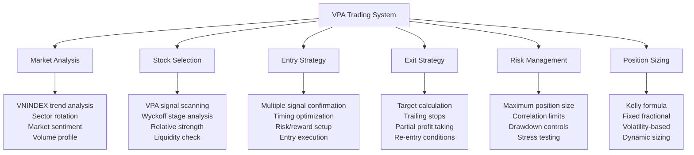

# Chương 4.1: Xây dựng Complete Trading System với VPA

## Mục tiêu học tập
- Thiết kế systematic approach cho VPA trading
- Integrate tất cả knowledge từ previous chapters
- Build backtesting framework với Vietnam market data
- Develop live trading implementation
- Create comprehensive risk management system

## 1. VPA Trading System Architecture

### 1.1 System Overview



### 1.2 Core System Principles

**1. Multi-Timeframe Approach:**
- Weekly: Overall trend và phase identification
- Daily: Entry/exit timing và signals
- Intraday: Execution và fine-tuning

**2. Evidence-Based Decisions:**
- Every trade requires VPA signal confirmation
- No gut feelings or hope-based trading
- Systematic documentation of all decisions

**3. Risk-First Mentality:**
- Define risk before defining reward
- Maximum loss per trade predetermined
- Portfolio protection prioritized

## 2. Market Analysis Framework

### 2.1 VNINDEX Health Assessment

**Primary Market Indicators:**
```python
def assess_vnindex_health(vnindex_data):
    """Assess overall market condition using VPA"""
    
    # Calculate key VPA indicators
    vnindex_vpa = calculate_vpa_indicators(vnindex_data)
    
    # Recent 30-day analysis
    recent_data = vnindex_vpa.tail(30)
    
    # Market health scoring
    health_score = 0
    
    # Volume trend (bullish if increasing on up days)
    up_days = recent_data[recent_data['price_change'] > 0]
    down_days = recent_data[recent_data['price_change'] < 0]
    
    if len(up_days) > 0 and len(down_days) > 0:
        avg_volume_up = up_days['volume_ratio'].mean()
        avg_volume_down = down_days['volume_ratio'].mean()
        
        if avg_volume_up > avg_volume_down:
            health_score += 2  # Bullish volume pattern
        else:
            health_score -= 2  # Bearish volume pattern
    
    # Distribution signals
    distribution_signals = len(recent_data[
        (recent_data['volume_ratio'] > 1.8) & 
        (recent_data['close_position'] < 0.4)
    ])
    
    if distribution_signals >= 3:
        health_score -= 3  # Multiple distribution warnings
    
    # Accumulation signals  
    accumulation_signals = len(recent_data[
        (recent_data['volume_ratio'] > 1.5) & 
        (recent_data['close_position'] > 0.7)
    ])
    
    if accumulation_signals >= 2:
        health_score += 2  # Accumulation evidence
    
    # Interpret score
    if health_score >= 3:
        return "BULLISH - Favorable for longs"
    elif health_score <= -3:
        return "BEARISH - Defensive posture"
    else:
        return "NEUTRAL - Mixed signals"
```

### 2.2 Sector Rotation Analysis

**Vietnam Market Sector Classification:**
- **Banking:** VCB, TCB, BID, STB, MBB
- **Real Estate:** VIC, VHM, VRE, NVL, KDH  
- **Steel:** HPG, HSG, NKG
- **Oil & Gas:** PLX, GAS, PVS
- **Consumer:** MSN, VNM, SAB

**Sector Strength Ranking:**
```python
def rank_sector_strength(sector_stocks, timeframe_days=30):
    """Rank sectors by VPA strength indicators"""
    
    sector_scores = {}
    
    for sector, stocks in sector_stocks.items():
        sector_score = 0
        stock_count = 0
        
        for stock in stocks:
            try:
                # Load and analyze stock data
                data = load_stock_data(stock)
                vpa_data = calculate_vpa_indicators(data)
                recent_data = vpa_data.tail(timeframe_days)
                
                # Count bullish signals
                bullish_signals = 0
                bullish_signals += len(recent_data[recent_data['volume_ratio'] > 1.8])  # High volume
                bullish_signals += len(recent_data[recent_data['close_position'] > 0.7]) # Strong closes
                
                # Count bearish signals
                bearish_signals = 0
                bearish_signals += len(recent_data[
                    (recent_data['volume_ratio'] > 1.5) & 
                    (recent_data['close_position'] < 0.3)
                ])
                
                # Net score for this stock
                net_score = bullish_signals - bearish_signals
                sector_score += net_score
                stock_count += 1
                
            except:
                continue
        
        if stock_count > 0:
            sector_scores[sector] = sector_score / stock_count
    
    # Rank sectors
    ranked_sectors = sorted(sector_scores.items(), 
                           key=lambda x: x[1], reverse=True)
    
    return ranked_sectors
```

## 3. Stock Selection System

### 3.1 VPA Signal Scanning

**Daily Stock Scanner:**
```python
class VPAScanner:
    def __init__(self, stock_universe):
        self.stock_universe = stock_universe
        self.signals_found = []
    
    def scan_for_bullish_signals(self, date=None):
        """Scan all stocks for bullish VPA signals"""
        
        bullish_candidates = []
        
        for ticker in self.stock_universe:
            try:
                data = load_stock_data(ticker)
                vpa_data = calculate_vpa_indicators(data)
                
                if date:
                    latest = vpa_data.loc[date:date]
                else:
                    latest = vpa_data.tail(1)
                
                if len(latest) == 0:
                    continue
                    
                row = latest.iloc[0]
                signals = []
                
                # Stopping Volume
                if (row['volume_ratio'] > 2.0 and 
                    row['close_position'] > 0.7 and
                    row['price_change'] > 0):
                    signals.append('Stopping Volume')
                
                # No Supply
                elif (row['volume_ratio'] < 0.8 and
                      abs(row['price_change']) < 0.5 and
                      row['close_position'] > 0.5):
                    signals.append('No Supply')
                
                # Professional Volume
                elif (row['volume_ratio'] > 1.5 and
                      row['price_change'] > 1.0 and
                      row['close_position'] > 0.8):
                    signals.append('Professional Volume')
                
                if signals:
                    bullish_candidates.append({
                        'ticker': ticker,
                        'date': latest.index[0],
                        'signals': signals,
                        'volume_ratio': row['volume_ratio'],
                        'price_change': row['price_change'],
                        'close_position': row['close_position']
                    })
                    
            except Exception as e:
                continue
        
        return sorted(bullish_candidates, 
                     key=lambda x: len(x['signals']), reverse=True)
    
    def scan_for_bearish_signals(self, date=None):
        """Scan all stocks for bearish VPA signals"""
        
        bearish_warnings = []
        
        for ticker in self.stock_universe:
            try:
                data = load_stock_data(ticker)  
                vpa_data = calculate_vpa_indicators(data)
                
                if date:
                    latest = vpa_data.loc[date:date]
                else:
                    latest = vpa_data.tail(1)
                
                if len(latest) == 0:
                    continue
                    
                row = latest.iloc[0]
                warnings = []
                
                # High Volume No Progress
                if (row['volume_ratio'] > 2.0 and
                    abs(row['price_change']) < 1.0 and
                    row['close_position'] < 0.4):
                    warnings.append('High Volume No Progress')
                
                # No Demand
                elif (row['volume_ratio'] < 0.8 and
                      row['price_change'] < -0.5):
                    warnings.append('No Demand')
                
                if warnings:
                    bearish_warnings.append({
                        'ticker': ticker,
                        'date': latest.index[0],
                        'warnings': warnings,
                        'volume_ratio': row['volume_ratio'],
                        'price_change': row['price_change'],
                        'urgency': 'HIGH' if 'High Volume No Progress' in warnings else 'MEDIUM'
                    })
                    
            except Exception as e:
                continue
        
        return sorted(bearish_warnings, 
                     key=lambda x: x['urgency'], reverse=True)
```

### 3.2 Wyckoff Phase Classification

**Automatic Phase Detection:**
```python
def classify_wyckoff_phase(df, lookback=50):
    """Classify current Wyckoff phase for a stock"""
    
    recent_data = df.tail(lookback)
    
    # Price range analysis
    price_range = recent_data['high'].max() - recent_data['low'].min()
    current_price = recent_data['close'].iloc[-1]
    range_position = (current_price - recent_data['low'].min()) / price_range
    
    # Volume characteristics
    avg_volume = recent_data['volume'].mean()
    recent_volume = recent_data['volume'].tail(10).mean()
    volume_trend = recent_volume / avg_volume
    
    # Accumulation indicators
    accumulation_signals = len(recent_data[
        (recent_data['volume_ratio'] > 1.5) & 
        (recent_data['close_position'] > 0.6)
    ])
    
    # Distribution indicators
    distribution_signals = len(recent_data[
        (recent_data['volume_ratio'] > 1.5) & 
        (recent_data['close_position'] < 0.4)
    ])
    
    # Phase classification logic
    if distribution_signals > accumulation_signals and range_position > 0.7:
        return "Distribution"
    elif accumulation_signals > distribution_signals and range_position < 0.3:
        return "Accumulation"
    elif range_position > 0.8 and volume_trend > 1.2:
        return "Markup"
    elif range_position < 0.2 and volume_trend > 1.2:
        return "Markdown"
    else:
        return "Trading Range"
```

## 4. Entry Strategy Framework

### 4.1 Multi-Signal Confirmation System

**Entry Criteria Hierarchy:**
1. **Market Filter:** VNINDEX in favorable phase
2. **Sector Filter:** Sector showing relative strength  
3. **VPA Signal:** Minimum 1 strong bullish signal
4. **Phase Filter:** Accumulation or Early Markup phase
5. **Risk/Reward:** Minimum 1:2 ratio

**Entry Decision Matrix:**
```python
def evaluate_entry_opportunity(ticker, market_status, sector_rank):
    """Comprehensive entry evaluation"""
    
    # Load stock data
    data = load_stock_data(ticker)
    vpa_data = calculate_vpa_indicators(data)
    latest = vpa_data.tail(1).iloc[0]
    
    entry_score = 0
    criteria_met = {}
    
    # Market Filter (30% weight)
    if market_status == "BULLISH":
        entry_score += 3
        criteria_met['market'] = True
    elif market_status == "NEUTRAL":
        entry_score += 1
        criteria_met['market'] = True
    else:
        criteria_met['market'] = False
    
    # VPA Signal (40% weight)
    vpa_score = 0
    signals = []
    
    # Check for major bullish signals
    if (latest['volume_ratio'] > 2.0 and 
        latest['close_position'] > 0.7 and
        latest['price_change'] > 0):
        vpa_score += 4
        signals.append('Stopping Volume')
    
    if (latest['volume_ratio'] > 1.5 and
        latest['price_change'] > 1.0 and  
        latest['close_position'] > 0.8):
        vpa_score += 3
        signals.append('Professional Volume')
    
    if (latest['volume_ratio'] < 0.8 and
        abs(latest['price_change']) < 0.5):
        vpa_score += 2  
        signals.append('No Supply')
    
    entry_score += vpa_score
    criteria_met['vpa_signals'] = signals
    
    # Wyckoff Phase (20% weight)
    phase = classify_wyckoff_phase(vpa_data)
    if phase in ['Accumulation', 'Early Markup']:
        entry_score += 2
        criteria_met['phase'] = phase
    elif phase == 'Trading Range':
        entry_score += 1
        criteria_met['phase'] = phase
    else:
        criteria_met['phase'] = phase
    
    # Risk/Reward (10% weight)  
    support_level = vpa_data['low'].tail(20).min()
    resistance_level = vpa_data['high'].tail(20).max()
    current_price = latest['close']
    
    risk = current_price - support_level
    reward = resistance_level - current_price
    
    if risk > 0 and reward / risk >= 2.0:
        entry_score += 1
        criteria_met['risk_reward'] = reward / risk
    else:
        criteria_met['risk_reward'] = reward / risk if risk > 0 else 0
    
    # Final evaluation
    if entry_score >= 7 and criteria_met['market'] and len(signals) > 0:
        return {
            'recommendation': 'BUY',
            'confidence': 'HIGH',
            'entry_score': entry_score,
            'criteria_met': criteria_met
        }
    elif entry_score >= 5:
        return {
            'recommendation': 'WATCHLIST',
            'confidence': 'MEDIUM', 
            'entry_score': entry_score,
            'criteria_met': criteria_met
        }
    else:
        return {
            'recommendation': 'PASS',
            'confidence': 'LOW',
            'entry_score': entry_score,
            'criteria_met': criteria_met
        }
```

### 4.2 Timing Optimization

**Entry Timing Strategies:**

**1. Immediate Entry:**
- Strong signals with multiple confirmations
- Time-sensitive opportunities
- High conviction setups

**2. Pullback Entry:**
- Wait for healthy pullback after signal
- Enter on first support test
- Better risk/reward ratio

**3. Breakout Entry:**
- Wait for range breakout confirmation
- Enter on volume surge through resistance
- Momentum-based approach

## 5. Exit Strategy System

### 5.1 Multiple Exit Methods

**Target-Based Exits:**
```python
def calculate_price_targets(entry_price, phase, trading_range_width=None):
    """Calculate price targets based on Wyckoff methodology"""
    
    targets = {}
    
    if phase == 'Accumulation':
        # Point & Figure count method
        if trading_range_width:
            primary_target = entry_price + (trading_range_width * 3)
            secondary_target = entry_price + (trading_range_width * 5)
        else:
            # Conservative estimates
            primary_target = entry_price * 1.15  # 15% gain
            secondary_target = entry_price * 1.25  # 25% gain
    
    elif phase == 'Early Markup':
        primary_target = entry_price * 1.10   # 10% gain
        secondary_target = entry_price * 1.20  # 20% gain
    
    else:
        # Conservative targets for other phases
        primary_target = entry_price * 1.08   # 8% gain
        secondary_target = entry_price * 1.15  # 15% gain
    
    targets['primary'] = primary_target
    targets['secondary'] = secondary_target
    
    return targets
```

**Stop Loss Methodology:**
```python
def calculate_stop_loss(entry_price, entry_signal, support_level):
    """Calculate appropriate stop loss based on entry signal"""
    
    if entry_signal == 'Stopping Volume':
        # Stop below the Stopping Volume low
        stop_loss = support_level * 0.98  # 2% buffer
    
    elif entry_signal == 'Spring':
        # Stop below Spring low
        stop_loss = support_level * 0.97  # 3% buffer
    
    elif entry_signal == 'No Supply':
        # Stop below recent support
        stop_loss = support_level * 0.985  # 1.5% buffer
    
    else:
        # General 2% stop loss
        stop_loss = entry_price * 0.98
    
    return stop_loss
```

### 5.2 Trailing Stop System

**Dynamic Stop Adjustment:**
```python
def update_trailing_stop(current_price, entry_price, current_stop, 
                        profit_threshold=0.05, trail_percent=0.03):
    """Update trailing stop based on price movement"""
    
    # Only trail if in profit
    if current_price <= entry_price * (1 + profit_threshold):
        return current_stop
    
    # Calculate new trailing stop
    new_stop = current_price * (1 - trail_percent)
    
    # Only move stop up, never down
    if new_stop > current_stop:
        return new_stop
    else:
        return current_stop
```

## 6. Risk Management Framework

### 6.1 Position Sizing System

**Kelly Criterion Implementation:**
```python
def calculate_kelly_position_size(win_rate, avg_win, avg_loss, capital):
    """Calculate optimal position size using Kelly Criterion"""
    
    if avg_loss == 0:
        return 0
    
    # Kelly formula: f = (bp - q) / b
    # where b = odds received on wager (avg_win/avg_loss)
    #       p = probability of winning
    #       q = probability of losing (1-p)
    
    b = avg_win / avg_loss
    p = win_rate
    q = 1 - win_rate
    
    kelly_fraction = (b * p - q) / b
    
    # Apply Kelly fraction with safety factor
    safe_kelly = kelly_fraction * 0.25  # Use 25% of full Kelly
    
    # Position size as percentage of capital
    position_size = max(0, min(safe_kelly, 0.10))  # Cap at 10%
    
    return capital * position_size
```

**Fixed Fractional Method:**
```python
def calculate_fixed_fractional_size(capital, risk_per_trade=0.02):
    """Calculate position size based on fixed percentage risk"""
    
    max_risk_amount = capital * risk_per_trade
    return max_risk_amount
```

### 6.2 Portfolio Risk Controls

**Correlation Limits:**
```python
def check_correlation_limits(current_positions, new_ticker, max_correlation=0.7):
    """Check if new position violates correlation limits"""
    
    # Simplified correlation check by sector
    sector_mapping = {
        'VCB': 'Banking', 'TCB': 'Banking', 'BID': 'Banking',
        'VIC': 'Real Estate', 'VHM': 'Real Estate', 'NVL': 'Real Estate', 
        'HPG': 'Steel', 'HSG': 'Steel',
        # Add more mappings
    }
    
    new_sector = sector_mapping.get(new_ticker, 'Other')
    
    # Count current positions in same sector
    sector_exposure = 0
    for ticker in current_positions:
        if sector_mapping.get(ticker, 'Other') == new_sector:
            sector_exposure += current_positions[ticker]['position_size']
    
    # Limit sector exposure to 30% of portfolio
    if sector_exposure > 0.30:
        return False, f"Sector exposure limit exceeded for {new_sector}"
    
    return True, "Correlation check passed"
```

**Drawdown Controls:**
```python
def check_drawdown_limits(current_portfolio_value, peak_portfolio_value, 
                         max_drawdown=0.15):
    """Check if portfolio drawdown exceeds limits"""
    
    current_drawdown = (peak_portfolio_value - current_portfolio_value) / peak_portfolio_value
    
    if current_drawdown >= max_drawdown:
        return {
            'action': 'REDUCE_RISK',
            'message': f'Drawdown {current_drawdown:.1%} exceeds limit {max_drawdown:.1%}',
            'recommended_action': 'Reduce position sizes by 50%'
        }
    elif current_drawdown >= max_drawdown * 0.75:
        return {
            'action': 'CAUTION',
            'message': f'Drawdown {current_drawdown:.1%} approaching limit',
            'recommended_action': 'Monitor closely, avoid new positions'
        }
    else:
        return {
            'action': 'NORMAL',
            'message': 'Drawdown within acceptable limits',
            'recommended_action': 'Continue normal operations'
        }
```

## 7. System Integration và Automation

### 7.1 Daily Trading Routine

**Morning Process:**
```python
def daily_morning_routine():
    """Execute daily morning analysis routine"""
    
    # 1. Assess market conditions
    vnindex_data = load_stock_data('VNINDEX')
    market_status = assess_vnindex_health(vnindex_data)
    print(f"Market Status: {market_status}")
    
    # 2. Scan for new opportunities
    scanner = VPAScanner(VIETNAM_STOCK_UNIVERSE)
    bullish_signals = scanner.scan_for_bullish_signals()
    bearish_signals = scanner.scan_for_bearish_signals()
    
    print(f"Bullish opportunities found: {len(bullish_signals)}")
    print(f"Bearish warnings: {len(bearish_signals)}")
    
    # 3. Evaluate top opportunities
    top_opportunities = []
    for signal in bullish_signals[:10]:  # Top 10
        evaluation = evaluate_entry_opportunity(
            signal['ticker'], 
            market_status, 
            sector_rank=1  # Simplified
        )
        
        if evaluation['recommendation'] == 'BUY':
            top_opportunities.append({
                'ticker': signal['ticker'],
                'signals': signal['signals'],
                'evaluation': evaluation
            })
    
    # 4. Update watchlist
    update_watchlist(top_opportunities)
    
    # 5. Check existing positions
    check_position_alerts()
    
    return {
        'market_status': market_status,
        'opportunities': top_opportunities,
        'warnings': bearish_signals
    }
```

### 7.2 Position Monitoring System

**Real-time Position Tracking:**
```python
class PositionManager:
    def __init__(self):
        self.positions = {}
        self.alerts = []
    
    def add_position(self, ticker, entry_price, entry_date, position_size, 
                    stop_loss, targets, entry_signal):
        """Add new position to tracking"""
        
        self.positions[ticker] = {
            'entry_price': entry_price,
            'entry_date': entry_date,
            'position_size': position_size,
            'stop_loss': stop_loss,
            'targets': targets,
            'entry_signal': entry_signal,
            'current_price': entry_price,
            'unrealized_pnl': 0,
            'days_held': 0
        }
    
    def update_positions(self, current_prices):
        """Update all positions with current market prices"""
        
        for ticker in self.positions:
            if ticker in current_prices:
                position = self.positions[ticker]
                current_price = current_prices[ticker]
                
                # Update current price and P&L
                position['current_price'] = current_price
                position['unrealized_pnl'] = (current_price - position['entry_price']) / position['entry_price']
                
                # Check for alerts
                self.check_position_alerts(ticker, position)
    
    def check_position_alerts(self, ticker, position):
        """Check for position-specific alerts"""
        
        current_price = position['current_price']
        
        # Stop loss alert
        if current_price <= position['stop_loss']:
            self.alerts.append({
                'ticker': ticker,
                'type': 'STOP_LOSS',
                'message': f"{ticker} hit stop loss at {current_price}",
                'urgency': 'HIGH'
            })
        
        # Target alerts
        if current_price >= position['targets']['primary']:
            if 'primary_hit' not in position:
                self.alerts.append({
                    'ticker': ticker,
                    'type': 'TARGET',
                    'message': f"{ticker} hit primary target at {current_price}",
                    'urgency': 'MEDIUM'
                })
                position['primary_hit'] = True
        
        # Time-based alerts (holding too long)
        if position['days_held'] > 30:
            self.alerts.append({
                'ticker': ticker,
                'type': 'TIME',
                'message': f"{ticker} held for {position['days_held']} days",
                'urgency': 'LOW'
            })
```

## 8. Backtesting Framework

### 8.1 Historical Performance Testing

**Comprehensive Backtesting Engine:**
```python
class VPABacktester:
    def __init__(self, start_date, end_date, initial_capital=100000):
        self.start_date = start_date
        self.end_date = end_date
        self.initial_capital = initial_capital
        self.current_capital = initial_capital
        self.positions = {}
        self.closed_trades = []
        self.daily_values = []
    
    def run_backtest(self, stock_universe, entry_criteria, exit_criteria):
        """Run complete backtest over date range"""
        
        date_range = pd.date_range(self.start_date, self.end_date, freq='D')
        
        for date in date_range:
            # Skip weekends
            if date.weekday() >= 5:
                continue
            
            # Daily routine
            self.process_daily_signals(date, stock_universe, entry_criteria)
            self.process_exits(date, exit_criteria)
            self.calculate_daily_portfolio_value(date)
            
        return self.generate_backtest_report()
    
    def process_daily_signals(self, date, stock_universe, entry_criteria):
        """Process entry signals for given date"""
        
        scanner = VPAScanner(stock_universe)
        signals = scanner.scan_for_bullish_signals(date)
        
        for signal in signals:
            ticker = signal['ticker']
            
            # Skip if already have position
            if ticker in self.positions:
                continue
            
            # Evaluate entry
            evaluation = evaluate_entry_opportunity(ticker, "NEUTRAL", 1)
            
            if evaluation['recommendation'] == 'BUY':
                self.enter_position(ticker, date, signal)
    
    def enter_position(self, ticker, date, signal):
        """Enter new position"""
        
        try:
            # Load stock data up to entry date
            data = load_stock_data(ticker)
            entry_data = data.loc[:date]
            
            if len(entry_data) == 0:
                return
            
            entry_price = entry_data['close'].iloc[-1]
            
            # Calculate position size (2% risk)
            position_value = self.current_capital * 0.02  # 2% of capital
            shares = int(position_value / entry_price)
            
            if shares > 0:
                # Calculate stop loss and targets
                support_level = entry_data['low'].tail(20).min()
                stop_loss = calculate_stop_loss(entry_price, signal['signals'][0], support_level)
                targets = calculate_price_targets(entry_price, 'Accumulation')
                
                self.positions[ticker] = {
                    'entry_date': date,
                    'entry_price': entry_price,
                    'shares': shares,
                    'stop_loss': stop_loss,
                    'targets': targets,
                    'entry_signal': signal['signals'][0]
                }
                
                # Reduce available capital
                self.current_capital -= shares * entry_price
                
        except Exception as e:
            pass
    
    def generate_backtest_report(self):
        """Generate comprehensive backtest report"""
        
        if not self.closed_trades:
            return {"error": "No completed trades"}
        
        # Calculate performance metrics
        wins = [trade for trade in self.closed_trades if trade['return'] > 0]
        losses = [trade for trade in self.closed_trades if trade['return'] <= 0]
        
        win_rate = len(wins) / len(self.closed_trades)
        avg_win = np.mean([trade['return'] for trade in wins]) if wins else 0
        avg_loss = np.mean([trade['return'] for trade in losses]) if losses else 0
        
        total_return = (self.current_capital - self.initial_capital) / self.initial_capital
        
        return {
            'total_trades': len(self.closed_trades),
            'win_rate': win_rate,
            'avg_win': avg_win,
            'avg_loss': avg_loss,
            'total_return': total_return,
            'final_capital': self.current_capital,
            'profit_factor': abs(avg_win * len(wins) / (avg_loss * len(losses))) if losses else float('inf')
        }
```

## 9. Performance Metrics và Optimization

### 9.1 Key Performance Indicators

**Essential Metrics:**
- **Total Return:** Overall portfolio performance
- **Win Rate:** Percentage of profitable trades  
- **Profit Factor:** Gross profit / Gross loss
- **Sharpe Ratio:** Risk-adjusted returns
- **Maximum Drawdown:** Largest peak-to-trough decline
- **Average Hold Time:** Typical position duration

### 9.2 System Optimization

**Parameter Optimization:**
```python
def optimize_system_parameters():
    """Optimize key system parameters"""
    
    # Parameters to optimize
    volume_thresholds = [1.5, 1.8, 2.0, 2.5]
    close_position_thresholds = [0.6, 0.7, 0.8]
    risk_per_trades = [0.01, 0.015, 0.02, 0.025]
    
    best_performance = 0
    best_params = {}
    
    for vol_thresh in volume_thresholds:
        for close_thresh in close_position_thresholds:
            for risk_per_trade in risk_per_trades:
                
                # Run backtest with these parameters
                performance = run_backtest_with_params(
                    vol_thresh, close_thresh, risk_per_trade
                )
                
                if performance['sharpe_ratio'] > best_performance:
                    best_performance = performance['sharpe_ratio']
                    best_params = {
                        'volume_threshold': vol_thresh,
                        'close_position_threshold': close_thresh,
                        'risk_per_trade': risk_per_trade,
                        'performance': performance
                    }
    
    return best_params
```

## 10. System Implementation Checklist

### 10.1 Pre-Launch Validation

**Technical Validation:**
- [ ] All data feeds working correctly
- [ ] Signal detection algorithms tested
- [ ] Position sizing calculations verified
- [ ] Stop loss and target calculations correct
- [ ] Risk management controls functional

**Strategy Validation:**
- [ ] Backtest results satisfactory (>60% win rate, >1.5 profit factor)
- [ ] Forward test on paper trading successful
- [ ] System performs well in different market conditions
- [ ] Risk parameters appropriate for account size
- [ ] Emotional discipline maintained during testing

### 10.2 Live Trading Deployment

**Phase 1: Pilot Program (1 month)**
- Start with 25% of intended position sizes
- Focus on highest conviction signals only
- Monitor system performance closely
- Document any issues or improvements

**Phase 2: Gradual Scale-Up (2-3 months)**
- Increase to 50% position sizes
- Add more signal types gradually
- Expand to more stocks in universe
- Refine entry/exit timing

**Phase 3: Full Implementation**
- Deploy complete system
- Regular performance reviews
- Continuous system improvements
- Maintain detailed trading journal

## 11. Key Takeaways

✅ **Systematic approach eliminates emotional decisions**
✅ **Multiple confirmation reduces false signals**
✅ **Risk management is primary concern**
✅ **Backtesting validates strategy effectiveness**
✅ **Continuous monitoring and improvement essential**

### Critical Success Factors:
- **Discipline:** Follow system rules consistently
- **Patience:** Wait for high-quality setups
- **Risk Focus:** Preserve capital above all
- **Continuous Learning:** Adapt and improve system
- **Documentation:** Learn from every trade

### System Maintenance:
- **Weekly:** Review performance metrics
- **Monthly:** Analyze win/loss patterns
- **Quarterly:** Optimize parameters
- **Annually:** Complete system review

---

*💡 **Final Wisdom:** A trading system is only as good as your discipline in following it. The best system in the world fails if you don't execute it consistently. Trust the process, manage risk, and let the probabilities work in your favor.*