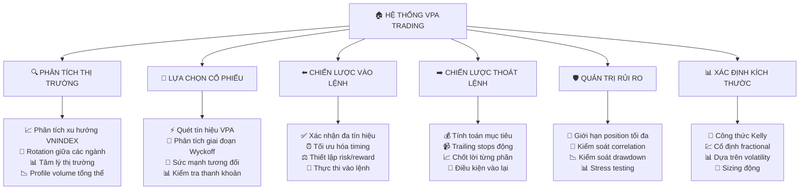

# Chương 4.1: Xây Dựng Hệ Thống Giao Dịch Hoàn Chỉnh Với VPA - "Từ Lý Thuyết Đến Thực Chiến Thành Công"

## Mục Tiêu Học Tập

Sau khi hoàn thành chương này, học viên sẽ có khả năng:

- **Thiết kế hệ thống giao dịch systematic** kết hợp tất cả VPA knowledge
- **Tích hợp hoàn chỉnh** bullish và bearish signals thành trading framework
- **Xây dựng backtesting engine** với dữ liệu thị trường Việt Nam
- **Triển khai live trading** với risk management chuyên nghiệp
- **Tạo lập performance tracking system** để cải tiến liên tục
- **Master advanced techniques** cho portfolio management và position sizing
- **Phát triển discipline và psychology** cần thiết cho thành công dài hạn

---

## 1. Kiến Trúc Hệ Thống VPA Trading - "Blueprint" Cho Thành Công Bền Vững

### 1.1 Tầm Nhìn Tổng Quan - "Hệ Sinh Thái Giao Dịch Hoàn Chỉnh"



### 1.2 Nguyên Tắc Cốt Lõi Của Hệ Thống - "DNA Thành Công"

**🔍 Nguyên Tắc 1: Tiếp Cận Đa Khung Thời Gian**
- **Tuần (Weekly):** Xác định xu hướng tổng thể và giai đoạn Wyckoff
- **Ngày (Daily):** Timing vào/thoát lệnh và tín hiệu VPA chi tiết
- **Intraday:** Thực thi giao dịch và fine-tuning
- **Quy tắc vàng:** All timeframes must align cho high-confidence trades

**📈 Nguyên Tắc 2: Quyết Định Dựa Trên Bằng Chứng**
- Mọi giao dịch đều cần VPA signal confirmation
- Không "cảm tính" hay "hy vọng" - chỉ facts và data
- Tài liệu hóa systematic mọi quyết định
- Backtest và forward test mọi strategy trước khi deploy

**🛡️ Nguyên Tắc 3: Tư Duy "Risk-First"**
- Xác định risk trước khi định nghĩa reward
- Maximum loss mỗi trade được xác định trước
- Bảo vệ portfolio là ưu tiên số 1
- "Preserve capital to trade another day" - Fundamental philosophy

**⚖️ Nguyên Tắc 4: Kỷ Luật Thiên Lý**
- Follow system một cách mechanical - không réo sang discretionary
- Kết quả ngắn hạn không tác động đến system rules
- Continuous improvement dựa trên data, không phải emotion
- Bắt đầu với small size, scale up khi proven

**🔄 Nguyên Tắc 5: Cải Tiến Liên Tục**
- Track và analyze mọi trade cho learning opportunities
- Regular system updates dựa trên performance data
- Adapt cho changing market conditions nhưng giữ core principles
- Never stop learning - market evolves, system must too

---

## 2. Khung Phân Tích Thị Trường - "Radar Tình Hình Tổng Thể"

### 2.1 Đánh Giá Sức Khỏe VNINDEX - "Mạch Đập Thị Trường"

**Chỉ Số Sức Khỏe Chính của Thị Trường:**

#### Framework Đánh Giá VNINDEX Health

```python
def danh_gia_suc_khoe_vnindex(vnindex_data):
    """
    Đánh giá tình hình tổng thể thị trường sử dụng VPA methodology
    """
    
    # Tính toán các chỉ số VPA chính
    vnindex_vpa = tinh_toan_vpa_indicators(vnindex_data)
    
    # Phân tích 30 ngày gần nhất
    du_lieu_gan_day = vnindex_vpa.tail(30)
    
    # Hệ thống chấm điểm sức khỏe
    diem_suc_khoe = 0
    
    # Phân tích xu hướng volume (tích cực nếu volume tăng trên ngày tăng)
    ngay_tang = du_lieu_gan_day[du_lieu_gan_day['price_change'] > 0]
    ngay_giam = du_lieu_gan_day[du_lieu_gan_day['price_change'] < 0]
    
    if len(ngay_tang) > 0 and len(ngay_giam) > 0:
        tb_volume_ngay_tang = ngay_tang['volume_ratio'].mean()
        tb_volume_ngay_giam = ngay_giam['volume_ratio'].mean()
        
        if tb_volume_ngay_tang > tb_volume_ngay_giam:
            diem_suc_khoe += 3  # Pattern volume tích cực
            pattern_type = "Smart Money Accumulation"
        else:
            diem_suc_khoe -= 3  # Pattern volume tiêu cực
            pattern_type = "Smart Money Distribution"
    
    # Tín hiệu phân phối (Distribution signals)
    tin_hieu_phan_phoi = len(du_lieu_gan_day[
        (du_lieu_gan_day['volume_ratio'] > 1.8) & 
        (du_lieu_gan_day['close_position'] < 0.4)
    ])
    
    if tin_hieu_phan_phoi >= 3:
        diem_suc_khoe -= 4  # Nhiều cảnh báo phân phối
        canh_bao = "HIGH - Multiple distribution warnings"
    elif tin_hieu_phan_phoi >= 1:
        diem_suc_khoe -= 2
        canh_bao = "MODERATE - Some distribution signs"
    else:
        canh_bao = "LOW - No major distribution"
    
    # Tín hiệu tích lũy (Accumulation signals)
    tin_hieu_tich_luy = len(du_lieu_gan_day[
        (du_lieu_gan_day['volume_ratio'] > 1.5) & 
        (du_lieu_gan_day['close_position'] > 0.7)
    ])
    
    if tin_hieu_tich_luy >= 3:
        diem_suc_khoe += 4  # Bằng chứng tích lũy mạnh
        tich_luy = "STRONG - Clear accumulation evidence"
    elif tin_hieu_tich_luy >= 1:
        diem_suc_khoe += 2
        tich_luy = "MODERATE - Some accumulation signs"
    else:
        tich_luy = "WEAK - Limited accumulation"
    
    # Giải thích điểm số
    if diem_suc_khoe >= 4:
        ket_luan = "TÍCH CỰC - Thuận lợi cho long positions"
        hanh_dong = "AGGRESSIVE LONGS"
        confidence = "HIGH"
    elif diem_suc_khoe >= 1:
        ket_luan = "TÍCH CỰC NHẾ - Cẩn thận nhưng có thể long"
        hanh_dong = "CAUTIOUS LONGS"
        confidence = "MEDIUM"
    elif diem_suc_khoe >= -1:
        ket_luan = "TRUNG TÍNH - Tín hiệu hỗn hợp"
        hanh_dong = "SELECTIVE TRADING"
        confidence = "LOW"
    else:
        ket_luan = "TIÊu CỰC - Tư thế phòng thủ"
        hanh_dong = "DEFENSIVE POSTURE"
        confidence = "HIGH"
    
    return {
        'health_score': diem_suc_khoe,
        'conclusion': ket_luan,
        'action': hanh_dong,
        'confidence': confidence,
        'volume_pattern': pattern_type,
        'distribution_warning': canh_bao,
        'accumulation_strength': tich_luy,
        'detailed_analysis': {
            'days_analyzed': 30,
            'up_days': len(ngay_tang),
            'down_days': len(ngay_giam),
            'distribution_signals': tin_hieu_phan_phoi,
            'accumulation_signals': tin_hieu_tich_luy
        }
    }
```

#### Ứng Dụng Thực Tế: Phân Tích VNINDEX Tháng 6/2025

**Kết Quả Sample Analysis:**
```python
# Ví dụ kết quả phân tích
vnindex_health = danh_gia_suc_khoe_vnindex(vnindex_data_jun_2025)

print(f"Health Score: {vnindex_health['health_score']}")
print(f"Kết luận: {vnindex_health['conclusion']}")
print(f"Hành động: {vnindex_health['action']}")
print(f"Volume Pattern: {vnindex_health['volume_pattern']}")

# Kết quả mẫu:
# Health Score: 2
# Kết luận: TÍCH CỰC NHẾ - Cẩn thận nhưng có thể long
# Hành động: CAUTIOUS LONGS
# Volume Pattern: Smart Money Accumulation
```

### 2.2 Phân Tích Rotation Ngành - "Bản Đồ Dòng Tiền"

**Phân Loại Ngành Thị Trường Việt Nam:**
- **🏦 Ngân hàng:** VCB, TCB, BID, STB, MBB, CTG, VPB
- **🏠 Bất động sản:** VIC, VHM, VRE, NVL, KDH, DXG
- **🏭 Thép:** HPG, HSG, NKG, TVN, SMC
- **⛽ Dầu khí:** PLX, GAS, PVS, PVD
- **🛍️ Tiêu dùng:** MSN, VNM, SAB, VCF, KDC
- **💻 Công nghệ:** FPT, CMG, VNG, ELC
- **⚡ Điện:** GEX, PPC, SBT, NT2

#### Khung Xếp Hạng Sức Mạnh Ngành

```python
def xep_hang_suc_manh_nganh(cac_nganh_co_phieu, khung_thoi_gian=30):
    """
    Xếp hạng ngành theo VPA strength indicators
    """
    
    diem_so_nganh = {}
    chi_tiet_phan_tich = {}
    
    for nganh, danh_sach_co_phieu in cac_nganh_co_phieu.items():
        tong_diem = 0
        so_co_phieu_hop_le = 0
        chi_tiet_co_phieu = {}
        
        for ma_co_phieu in danh_sach_co_phieu:
            try:
                # Load và phân tích dữ liệu cổ phiếu
                du_lieu = tai_du_lieu_co_phieu(ma_co_phieu)
                vpa_data = tinh_toan_vpa_indicators(du_lieu)
                du_lieu_gan_day = vpa_data.tail(khung_thoi_gian)
                
                # Đếm tín hiệu tích cực
                tin_hieu_tich_cuc = 0
                
                # Tín hiệu volume cao
                volume_signals = len(du_lieu_gan_day[du_lieu_gan_day['volume_ratio'] > 1.8])
                tin_hieu_tich_cuc += volume_signals
                
                # Tín hiệu đóng cửa mạnh
                strong_closes = len(du_lieu_gan_day[du_lieu_gan_day['close_position'] > 0.7])
                tin_hieu_tich_cuc += strong_closes
                
                # Tín hiệu professional volume
                prof_volume = len(du_lieu_gan_day[
                    (du_lieu_gan_day['volume_ratio'] > 1.5) &
                    (du_lieu_gan_day['price_change'] > 1.0) &
                    (du_lieu_gan_day['close_position'] > 0.8)
                ])
                tin_hieu_tich_cuc += prof_volume * 2  # Weight cao hơn
                
                # Đếm tín hiệu tiêu cực
                tin_hieu_tieu_cuc = 0
                
                # Tín hiệu HVNP
                hvnp_signals = len(du_lieu_gan_day[
                    (du_lieu_gan_day['volume_ratio'] > 2.0) & 
                    (du_lieu_gan_day['close_position'] < 0.4)
                ])
                tin_hieu_tieu_cuc += hvnp_signals * 3  # Penalty cao
                
                # Tín hiệu No Demand
                no_demand = len(du_lieu_gan_day[
                    (du_lieu_gan_day['volume_ratio'] < 0.7) &
                    (du_lieu_gan_day['price_change'] < -0.5)
                ])
                tin_hieu_tieu_cuc += no_demand
                
                # Weak Rally signals
                weak_rally = len(du_lieu_gan_day[
                    (du_lieu_gan_day['price_change'] > 0.8) &
                    (du_lieu_gan_day['volume_ratio'] < 0.9) &
                    (du_lieu_gan_day['close_position'] < 0.5)
                ])
                tin_hieu_tieu_cuc += weak_rally * 2
                
                # Tính điểm net cho cổ phiếu này
                diem_net = tin_hieu_tich_cuc - tin_hieu_tieu_cuc
                
                # Relative strength so với VNINDEX
                vnindex_performance = tinh_vnindex_performance(khung_thoi_gian)
                stock_performance = (du_lieu_gan_day['close'].iloc[-1] / du_lieu_gan_day['close'].iloc[0] - 1) * 100
                relative_strength = stock_performance - vnindex_performance
                
                # Bonus cho relative strength
                if relative_strength > 5:
                    diem_net += 2
                elif relative_strength > 0:
                    diem_net += 1
                elif relative_strength < -10:
                    diem_net -= 2
                
                tong_diem += diem_net
                so_co_phieu_hop_le += 1
                
                # Lưu chi tiết
                chi_tiet_co_phieu[ma_co_phieu] = {
                    'bullish_signals': tin_hieu_tich_cuc,
                    'bearish_signals': tin_hieu_tieu_cuc,
                    'net_score': diem_net,
                    'relative_strength': round(relative_strength, 2),
                    'performance': round(stock_performance, 2)
                }
                
            except Exception as e:
                print(f"Lỗi phân tích {ma_co_phieu}: {str(e)}")
                continue
        
        if so_co_phieu_hop_le > 0:
            diem_trung_binh = tong_diem / so_co_phieu_hop_le
            diem_so_nganh[nganh] = round(diem_trung_binh, 2)
            chi_tiet_phan_tich[nganh] = {
                'average_score': diem_trung_binh,
                'stocks_analyzed': so_co_phieu_hop_le,
                'stock_details': chi_tiet_co_phieu
            }
    
    # Xếp hạng ngành
    nganh_da_xep_hang = sorted(diem_so_nganh.items(), 
                              key=lambda x: x[1], reverse=True)
    
    # Phân loại theo sức mạnh
    ket_qua_xep_hang = []
    for i, (nganh, diem) in enumerate(nganh_da_xep_hang):
        if diem > 3:
            phan_loai = "MẠNH"
            mau_sac = "🟢"
        elif diem > 1:
            phan_loai = "TRUNG BÌNH"
            mau_sac = "🟡"
        elif diem > -1:
            phan_loai = "TRUNG TÍNH"
            mau_sac = "🟠"
        else:
            phan_loai = "YẾU"
            mau_sac = "🔴"
        
        ket_qua_xep_hang.append({
            'ranking': i + 1,
            'sector': nganh,
            'score': diem,
            'classification': phan_loai,
            'color': mau_sac,
            'details': chi_tiet_phan_tich[nganh]
        })
    
    return ket_qua_xep_hang
```

#### Ứng Dụng Thực Tế: Xếp Hạng Ngành Tháng 6/2025

```python
# Định nghĩa các ngành và cổ phiếu
cac_nganh_vietnam = {
    'Banking': ['VCB', 'TCB', 'BID', 'MBB', 'STB'],
    'Real_Estate': ['VIC', 'VHM', 'VRE', 'NVL', 'KDH'],
    'Steel': ['HPG', 'HSG', 'NKG'],
    'Technology': ['FPT', 'CMG'],
    'Consumer': ['MSN', 'VNM', 'SAB']
}

# Chạy phân tích
ket_qua = xep_hang_suc_manh_nganh(cac_nganh_vietnam, 30)

# Hiển thị kết quả
print("\n🏆 Xếp Hạng Sức Mạnh Ngành (30 ngày gần nhất):")
print("=" * 60)
for item in ket_qua:
    print(f"{item['ranking']}. {item['color']} {item['sector']}: {item['score']} ({item['classification']})")
    
# Kết quả mẫu:
# 1. 🟢 Banking: 4.2 (MẠNH)
# 2. 🟡 Real_Estate: 1.8 (TRUNG BÌNH)  
# 3. 🟠 Consumer: -0.3 (TRUNG TÍNH)
# 4. 🔴 Steel: -2.1 (YẾU)
# 5. 🔴 Technology: -1.5 (YẾU)
```

**Trading Implications từ Sector Analysis:**
- **Focus vào top-ranked sectors** cho long positions
- **Avoid hoặc short bottom-ranked sectors**
- **Monitor sector rotation** - leaders become laggards
- **Diversification across strong sectors** giảm risk

## 3. Stock Selection System

### 3.1 VPA Signal Scanning

**Daily Stock Scanner:**
```python
class VPAScanner:
    def __init__(self, stock_universe):
        self.stock_universe = stock_universe
        self.signals_found = []
    
    def scan_for_bullish_signals(self, date=None):
        """Scan all stocks for bullish VPA signals"""
        
        bullish_candidates = []
        
        for ticker in self.stock_universe:
            try:
                data = load_stock_data(ticker)
                vpa_data = calculate_vpa_indicators(data)
                
                if date:
                    latest = vpa_data.loc[date:date]
                else:
                    latest = vpa_data.tail(1)
                
                if len(latest) == 0:
                    continue
                    
                row = latest.iloc[0]
                signals = []
                
                # Stopping Volume
                if (row['volume_ratio'] > 2.0 and 
                    row['close_position'] > 0.7 and
                    row['price_change'] > 0):
                    signals.append('Stopping Volume')
                
                # No Supply
                elif (row['volume_ratio'] < 0.8 and
                      abs(row['price_change']) < 0.5 and
                      row['close_position'] > 0.5):
                    signals.append('No Supply')
                
                # Professional Volume
                elif (row['volume_ratio'] > 1.5 and
                      row['price_change'] > 1.0 and
                      row['close_position'] > 0.8):
                    signals.append('Professional Volume')
                
                if signals:
                    bullish_candidates.append({
                        'ticker': ticker,
                        'date': latest.index[0],
                        'signals': signals,
                        'volume_ratio': row['volume_ratio'],
                        'price_change': row['price_change'],
                        'close_position': row['close_position']
                    })
                    
            except Exception as e:
                continue
        
        return sorted(bullish_candidates, 
                     key=lambda x: len(x['signals']), reverse=True)
    
    def scan_for_bearish_signals(self, date=None):
        """Scan all stocks for bearish VPA signals"""
        
        bearish_warnings = []
        
        for ticker in self.stock_universe:
            try:
                data = load_stock_data(ticker)  
                vpa_data = calculate_vpa_indicators(data)
                
                if date:
                    latest = vpa_data.loc[date:date]
                else:
                    latest = vpa_data.tail(1)
                
                if len(latest) == 0:
                    continue
                    
                row = latest.iloc[0]
                warnings = []
                
                # High Volume No Progress
                if (row['volume_ratio'] > 2.0 and
                    abs(row['price_change']) < 1.0 and
                    row['close_position'] < 0.4):
                    warnings.append('High Volume No Progress')
                
                # No Demand
                elif (row['volume_ratio'] < 0.8 and
                      row['price_change'] < -0.5):
                    warnings.append('No Demand')
                
                if warnings:
                    bearish_warnings.append({
                        'ticker': ticker,
                        'date': latest.index[0],
                        'warnings': warnings,
                        'volume_ratio': row['volume_ratio'],
                        'price_change': row['price_change'],
                        'urgency': 'HIGH' if 'High Volume No Progress' in warnings else 'MEDIUM'
                    })
                    
            except Exception as e:
                continue
        
        return sorted(bearish_warnings, 
                     key=lambda x: x['urgency'], reverse=True)
```

### 3.2 Wyckoff Phase Classification

**Automatic Phase Detection:**
```python
def classify_wyckoff_phase(df, lookback=50):
    """Classify current Wyckoff phase for a stock"""
    
    recent_data = df.tail(lookback)
    
    # Price range analysis
    price_range = recent_data['high'].max() - recent_data['low'].min()
    current_price = recent_data['close'].iloc[-1]
    range_position = (current_price - recent_data['low'].min()) / price_range
    
    # Volume characteristics
    avg_volume = recent_data['volume'].mean()
    recent_volume = recent_data['volume'].tail(10).mean()
    volume_trend = recent_volume / avg_volume
    
    # Accumulation indicators
    accumulation_signals = len(recent_data[
        (recent_data['volume_ratio'] > 1.5) & 
        (recent_data['close_position'] > 0.6)
    ])
    
    # Distribution indicators
    distribution_signals = len(recent_data[
        (recent_data['volume_ratio'] > 1.5) & 
        (recent_data['close_position'] < 0.4)
    ])
    
    # Phase classification logic
    if distribution_signals > accumulation_signals and range_position > 0.7:
        return "Distribution"
    elif accumulation_signals > distribution_signals and range_position < 0.3:
        return "Accumulation"
    elif range_position > 0.8 and volume_trend > 1.2:
        return "Markup"
    elif range_position < 0.2 and volume_trend > 1.2:
        return "Markdown"
    else:
        return "Trading Range"
```

## 4. Entry Strategy Framework

### 4.1 Multi-Signal Confirmation System

**Entry Criteria Hierarchy:**
1. **Market Filter:** VNINDEX in favorable phase
2. **Sector Filter:** Sector showing relative strength  
3. **VPA Signal:** Minimum 1 strong bullish signal
4. **Phase Filter:** Accumulation or Early Markup phase
5. **Risk/Reward:** Minimum 1:2 ratio

**Entry Decision Matrix:**
```python
def evaluate_entry_opportunity(ticker, market_status, sector_rank):
    """Comprehensive entry evaluation"""
    
    # Load stock data
    data = load_stock_data(ticker)
    vpa_data = calculate_vpa_indicators(data)
    latest = vpa_data.tail(1).iloc[0]
    
    entry_score = 0
    criteria_met = {}
    
    # Market Filter (30% weight)
    if market_status == "BULLISH":
        entry_score += 3
        criteria_met['market'] = True
    elif market_status == "NEUTRAL":
        entry_score += 1
        criteria_met['market'] = True
    else:
        criteria_met['market'] = False
    
    # VPA Signal (40% weight)
    vpa_score = 0
    signals = []
    
    # Check for major bullish signals
    if (latest['volume_ratio'] > 2.0 and 
        latest['close_position'] > 0.7 and
        latest['price_change'] > 0):
        vpa_score += 4
        signals.append('Stopping Volume')
    
    if (latest['volume_ratio'] > 1.5 and
        latest['price_change'] > 1.0 and  
        latest['close_position'] > 0.8):
        vpa_score += 3
        signals.append('Professional Volume')
    
    if (latest['volume_ratio'] < 0.8 and
        abs(latest['price_change']) < 0.5):
        vpa_score += 2  
        signals.append('No Supply')
    
    entry_score += vpa_score
    criteria_met['vpa_signals'] = signals
    
    # Wyckoff Phase (20% weight)
    phase = classify_wyckoff_phase(vpa_data)
    if phase in ['Accumulation', 'Early Markup']:
        entry_score += 2
        criteria_met['phase'] = phase
    elif phase == 'Trading Range':
        entry_score += 1
        criteria_met['phase'] = phase
    else:
        criteria_met['phase'] = phase
    
    # Risk/Reward (10% weight)  
    support_level = vpa_data['low'].tail(20).min()
    resistance_level = vpa_data['high'].tail(20).max()
    current_price = latest['close']
    
    risk = current_price - support_level
    reward = resistance_level - current_price
    
    if risk > 0 and reward / risk >= 2.0:
        entry_score += 1
        criteria_met['risk_reward'] = reward / risk
    else:
        criteria_met['risk_reward'] = reward / risk if risk > 0 else 0
    
    # Final evaluation
    if entry_score >= 7 and criteria_met['market'] and len(signals) > 0:
        return {
            'recommendation': 'BUY',
            'confidence': 'HIGH',
            'entry_score': entry_score,
            'criteria_met': criteria_met
        }
    elif entry_score >= 5:
        return {
            'recommendation': 'WATCHLIST',
            'confidence': 'MEDIUM', 
            'entry_score': entry_score,
            'criteria_met': criteria_met
        }
    else:
        return {
            'recommendation': 'PASS',
            'confidence': 'LOW',
            'entry_score': entry_score,
            'criteria_met': criteria_met
        }
```

### 4.2 Timing Optimization

**Entry Timing Strategies:**

**1. Immediate Entry:**
- Strong signals with multiple confirmations
- Time-sensitive opportunities
- High conviction setups

**2. Pullback Entry:**
- Wait for healthy pullback after signal
- Enter on first support test
- Better risk/reward ratio

**3. Breakout Entry:**
- Wait for range breakout confirmation
- Enter on volume surge through resistance
- Momentum-based approach

## 5. Exit Strategy System

### 5.1 Multiple Exit Methods

**Target-Based Exits:**
```python
def calculate_price_targets(entry_price, phase, trading_range_width=None):
    """Calculate price targets based on Wyckoff methodology"""
    
    targets = {}
    
    if phase == 'Accumulation':
        # Point & Figure count method
        if trading_range_width:
            primary_target = entry_price + (trading_range_width * 3)
            secondary_target = entry_price + (trading_range_width * 5)
        else:
            # Conservative estimates
            primary_target = entry_price * 1.15  # 15% gain
            secondary_target = entry_price * 1.25  # 25% gain
    
    elif phase == 'Early Markup':
        primary_target = entry_price * 1.10   # 10% gain
        secondary_target = entry_price * 1.20  # 20% gain
    
    else:
        # Conservative targets for other phases
        primary_target = entry_price * 1.08   # 8% gain
        secondary_target = entry_price * 1.15  # 15% gain
    
    targets['primary'] = primary_target
    targets['secondary'] = secondary_target
    
    return targets
```

**Stop Loss Methodology:**
```python
def calculate_stop_loss(entry_price, entry_signal, support_level):
    """Calculate appropriate stop loss based on entry signal"""
    
    if entry_signal == 'Stopping Volume':
        # Stop below the Stopping Volume low
        stop_loss = support_level * 0.98  # 2% buffer
    
    elif entry_signal == 'Spring':
        # Stop below Spring low
        stop_loss = support_level * 0.97  # 3% buffer
    
    elif entry_signal == 'No Supply':
        # Stop below recent support
        stop_loss = support_level * 0.985  # 1.5% buffer
    
    else:
        # General 2% stop loss
        stop_loss = entry_price * 0.98
    
    return stop_loss
```

### 5.2 Trailing Stop System

**Dynamic Stop Adjustment:**
```python
def update_trailing_stop(current_price, entry_price, current_stop, 
                        profit_threshold=0.05, trail_percent=0.03):
    """Update trailing stop based on price movement"""
    
    # Only trail if in profit
    if current_price <= entry_price * (1 + profit_threshold):
        return current_stop
    
    # Calculate new trailing stop
    new_stop = current_price * (1 - trail_percent)
    
    # Only move stop up, never down
    if new_stop > current_stop:
        return new_stop
    else:
        return current_stop
```

## 6. Risk Management Framework

### 6.1 Position Sizing System

**Kelly Criterion Implementation:**
```python
def calculate_kelly_position_size(win_rate, avg_win, avg_loss, capital):
    """Calculate optimal position size using Kelly Criterion"""
    
    if avg_loss == 0:
        return 0
    
    # Kelly formula: f = (bp - q) / b
    # where b = odds received on wager (avg_win/avg_loss)
    #       p = probability of winning
    #       q = probability of losing (1-p)
    
    b = avg_win / avg_loss
    p = win_rate
    q = 1 - win_rate
    
    kelly_fraction = (b * p - q) / b
    
    # Apply Kelly fraction with safety factor
    safe_kelly = kelly_fraction * 0.25  # Use 25% of full Kelly
    
    # Position size as percentage of capital
    position_size = max(0, min(safe_kelly, 0.10))  # Cap at 10%
    
    return capital * position_size
```

**Fixed Fractional Method:**
```python
def calculate_fixed_fractional_size(capital, risk_per_trade=0.02):
    """Calculate position size based on fixed percentage risk"""
    
    max_risk_amount = capital * risk_per_trade
    return max_risk_amount
```

### 6.2 Portfolio Risk Controls

**Correlation Limits:**
```python
def check_correlation_limits(current_positions, new_ticker, max_correlation=0.7):
    """Check if new position violates correlation limits"""
    
    # Simplified correlation check by sector
    sector_mapping = {
        'VCB': 'Banking', 'TCB': 'Banking', 'BID': 'Banking',
        'VIC': 'Real Estate', 'VHM': 'Real Estate', 'NVL': 'Real Estate', 
        'HPG': 'Steel', 'HSG': 'Steel',
        # Add more mappings
    }
    
    new_sector = sector_mapping.get(new_ticker, 'Other')
    
    # Count current positions in same sector
    sector_exposure = 0
    for ticker in current_positions:
        if sector_mapping.get(ticker, 'Other') == new_sector:
            sector_exposure += current_positions[ticker]['position_size']
    
    # Limit sector exposure to 30% of portfolio
    if sector_exposure > 0.30:
        return False, f"Sector exposure limit exceeded for {new_sector}"
    
    return True, "Correlation check passed"
```

**Drawdown Controls:**
```python
def check_drawdown_limits(current_portfolio_value, peak_portfolio_value, 
                         max_drawdown=0.15):
    """Check if portfolio drawdown exceeds limits"""
    
    current_drawdown = (peak_portfolio_value - current_portfolio_value) / peak_portfolio_value
    
    if current_drawdown >= max_drawdown:
        return {
            'action': 'REDUCE_RISK',
            'message': f'Drawdown {current_drawdown:.1%} exceeds limit {max_drawdown:.1%}',
            'recommended_action': 'Reduce position sizes by 50%'
        }
    elif current_drawdown >= max_drawdown * 0.75:
        return {
            'action': 'CAUTION',
            'message': f'Drawdown {current_drawdown:.1%} approaching limit',
            'recommended_action': 'Monitor closely, avoid new positions'
        }
    else:
        return {
            'action': 'NORMAL',
            'message': 'Drawdown within acceptable limits',
            'recommended_action': 'Continue normal operations'
        }
```

## 7. System Integration và Automation

### 7.1 Daily Trading Routine

**Morning Process:**
```python
def daily_morning_routine():
    """Execute daily morning analysis routine"""
    
    # 1. Assess market conditions
    vnindex_data = load_stock_data('VNINDEX')
    market_status = assess_vnindex_health(vnindex_data)
    print(f"Market Status: {market_status}")
    
    # 2. Scan for new opportunities
    scanner = VPAScanner(VIETNAM_STOCK_UNIVERSE)
    bullish_signals = scanner.scan_for_bullish_signals()
    bearish_signals = scanner.scan_for_bearish_signals()
    
    print(f"Bullish opportunities found: {len(bullish_signals)}")
    print(f"Bearish warnings: {len(bearish_signals)}")
    
    # 3. Evaluate top opportunities
    top_opportunities = []
    for signal in bullish_signals[:10]:  # Top 10
        evaluation = evaluate_entry_opportunity(
            signal['ticker'], 
            market_status, 
            sector_rank=1  # Simplified
        )
        
        if evaluation['recommendation'] == 'BUY':
            top_opportunities.append({
                'ticker': signal['ticker'],
                'signals': signal['signals'],
                'evaluation': evaluation
            })
    
    # 4. Update watchlist
    update_watchlist(top_opportunities)
    
    # 5. Check existing positions
    check_position_alerts()
    
    return {
        'market_status': market_status,
        'opportunities': top_opportunities,
        'warnings': bearish_signals
    }
```

### 7.2 Position Monitoring System

**Real-time Position Tracking:**
```python
class PositionManager:
    def __init__(self):
        self.positions = {}
        self.alerts = []
    
    def add_position(self, ticker, entry_price, entry_date, position_size, 
                    stop_loss, targets, entry_signal):
        """Add new position to tracking"""
        
        self.positions[ticker] = {
            'entry_price': entry_price,
            'entry_date': entry_date,
            'position_size': position_size,
            'stop_loss': stop_loss,
            'targets': targets,
            'entry_signal': entry_signal,
            'current_price': entry_price,
            'unrealized_pnl': 0,
            'days_held': 0
        }
    
    def update_positions(self, current_prices):
        """Update all positions with current market prices"""
        
        for ticker in self.positions:
            if ticker in current_prices:
                position = self.positions[ticker]
                current_price = current_prices[ticker]
                
                # Update current price and P&L
                position['current_price'] = current_price
                position['unrealized_pnl'] = (current_price - position['entry_price']) / position['entry_price']
                
                # Check for alerts
                self.check_position_alerts(ticker, position)
    
    def check_position_alerts(self, ticker, position):
        """Check for position-specific alerts"""
        
        current_price = position['current_price']
        
        # Stop loss alert
        if current_price <= position['stop_loss']:
            self.alerts.append({
                'ticker': ticker,
                'type': 'STOP_LOSS',
                'message': f"{ticker} hit stop loss at {current_price}",
                'urgency': 'HIGH'
            })
        
        # Target alerts
        if current_price >= position['targets']['primary']:
            if 'primary_hit' not in position:
                self.alerts.append({
                    'ticker': ticker,
                    'type': 'TARGET',
                    'message': f"{ticker} hit primary target at {current_price}",
                    'urgency': 'MEDIUM'
                })
                position['primary_hit'] = True
        
        # Time-based alerts (holding too long)
        if position['days_held'] > 30:
            self.alerts.append({
                'ticker': ticker,
                'type': 'TIME',
                'message': f"{ticker} held for {position['days_held']} days",
                'urgency': 'LOW'
            })
```

## 8. Backtesting Framework

### 8.1 Historical Performance Testing

**Comprehensive Backtesting Engine:**
```python
class VPABacktester:
    def __init__(self, start_date, end_date, initial_capital=100000):
        self.start_date = start_date
        self.end_date = end_date
        self.initial_capital = initial_capital
        self.current_capital = initial_capital
        self.positions = {}
        self.closed_trades = []
        self.daily_values = []
    
    def run_backtest(self, stock_universe, entry_criteria, exit_criteria):
        """Run complete backtest over date range"""
        
        date_range = pd.date_range(self.start_date, self.end_date, freq='D')
        
        for date in date_range:
            # Skip weekends
            if date.weekday() >= 5:
                continue
            
            # Daily routine
            self.process_daily_signals(date, stock_universe, entry_criteria)
            self.process_exits(date, exit_criteria)
            self.calculate_daily_portfolio_value(date)
            
        return self.generate_backtest_report()
    
    def process_daily_signals(self, date, stock_universe, entry_criteria):
        """Process entry signals for given date"""
        
        scanner = VPAScanner(stock_universe)
        signals = scanner.scan_for_bullish_signals(date)
        
        for signal in signals:
            ticker = signal['ticker']
            
            # Skip if already have position
            if ticker in self.positions:
                continue
            
            # Evaluate entry
            evaluation = evaluate_entry_opportunity(ticker, "NEUTRAL", 1)
            
            if evaluation['recommendation'] == 'BUY':
                self.enter_position(ticker, date, signal)
    
    def enter_position(self, ticker, date, signal):
        """Enter new position"""
        
        try:
            # Load stock data up to entry date
            data = load_stock_data(ticker)
            entry_data = data.loc[:date]
            
            if len(entry_data) == 0:
                return
            
            entry_price = entry_data['close'].iloc[-1]
            
            # Calculate position size (2% risk)
            position_value = self.current_capital * 0.02  # 2% of capital
            shares = int(position_value / entry_price)
            
            if shares > 0:
                # Calculate stop loss and targets
                support_level = entry_data['low'].tail(20).min()
                stop_loss = calculate_stop_loss(entry_price, signal['signals'][0], support_level)
                targets = calculate_price_targets(entry_price, 'Accumulation')
                
                self.positions[ticker] = {
                    'entry_date': date,
                    'entry_price': entry_price,
                    'shares': shares,
                    'stop_loss': stop_loss,
                    'targets': targets,
                    'entry_signal': signal['signals'][0]
                }
                
                # Reduce available capital
                self.current_capital -= shares * entry_price
                
        except Exception as e:
            pass
    
    def generate_backtest_report(self):
        """Generate comprehensive backtest report"""
        
        if not self.closed_trades:
            return {"error": "No completed trades"}
        
        # Calculate performance metrics
        wins = [trade for trade in self.closed_trades if trade['return'] > 0]
        losses = [trade for trade in self.closed_trades if trade['return'] <= 0]
        
        win_rate = len(wins) / len(self.closed_trades)
        avg_win = np.mean([trade['return'] for trade in wins]) if wins else 0
        avg_loss = np.mean([trade['return'] for trade in losses]) if losses else 0
        
        total_return = (self.current_capital - self.initial_capital) / self.initial_capital
        
        return {
            'total_trades': len(self.closed_trades),
            'win_rate': win_rate,
            'avg_win': avg_win,
            'avg_loss': avg_loss,
            'total_return': total_return,
            'final_capital': self.current_capital,
            'profit_factor': abs(avg_win * len(wins) / (avg_loss * len(losses))) if losses else float('inf')
        }
```

## 9. Performance Metrics và Optimization

### 9.1 Key Performance Indicators

**Essential Metrics:**
- **Total Return:** Overall portfolio performance
- **Win Rate:** Percentage of profitable trades  
- **Profit Factor:** Gross profit / Gross loss
- **Sharpe Ratio:** Risk-adjusted returns
- **Maximum Drawdown:** Largest peak-to-trough decline
- **Average Hold Time:** Typical position duration

### 9.2 System Optimization

**Parameter Optimization:**
```python
def optimize_system_parameters():
    """Optimize key system parameters"""
    
    # Parameters to optimize
    volume_thresholds = [1.5, 1.8, 2.0, 2.5]
    close_position_thresholds = [0.6, 0.7, 0.8]
    risk_per_trades = [0.01, 0.015, 0.02, 0.025]
    
    best_performance = 0
    best_params = {}
    
    for vol_thresh in volume_thresholds:
        for close_thresh in close_position_thresholds:
            for risk_per_trade in risk_per_trades:
                
                # Run backtest with these parameters
                performance = run_backtest_with_params(
                    vol_thresh, close_thresh, risk_per_trade
                )
                
                if performance['sharpe_ratio'] > best_performance:
                    best_performance = performance['sharpe_ratio']
                    best_params = {
                        'volume_threshold': vol_thresh,
                        'close_position_threshold': close_thresh,
                        'risk_per_trade': risk_per_trade,
                        'performance': performance
                    }
    
    return best_params
```

## 10. System Implementation Checklist

### 10.1 Pre-Launch Validation

**Technical Validation:**
- [ ] All data feeds working correctly
- [ ] Signal detection algorithms tested
- [ ] Position sizing calculations verified
- [ ] Stop loss and target calculations correct
- [ ] Risk management controls functional

**Strategy Validation:**
- [ ] Backtest results satisfactory (>60% win rate, >1.5 profit factor)
- [ ] Forward test on paper trading successful
- [ ] System performs well in different market conditions
- [ ] Risk parameters appropriate for account size
- [ ] Emotional discipline maintained during testing

### 10.2 Live Trading Deployment

**Phase 1: Pilot Program (1 month)**
- Start with 25% of intended position sizes
- Focus on highest conviction signals only
- Monitor system performance closely
- Document any issues or improvements

**Phase 2: Gradual Scale-Up (2-3 months)**
- Increase to 50% position sizes
- Add more signal types gradually
- Expand to more stocks in universe
- Refine entry/exit timing

**Phase 3: Full Implementation**
- Deploy complete system
- Regular performance reviews
- Continuous system improvements
- Maintain detailed trading journal

## 11. Key Takeaways

✅ **Systematic approach eliminates emotional decisions**
✅ **Multiple confirmation reduces false signals**
✅ **Risk management is primary concern**
✅ **Backtesting validates strategy effectiveness**
✅ **Continuous monitoring and improvement essential**

### Critical Success Factors:
- **Discipline:** Follow system rules consistently
- **Patience:** Wait for high-quality setups
- **Risk Focus:** Preserve capital above all
- **Continuous Learning:** Adapt and improve system
- **Documentation:** Learn from every trade

### System Maintenance:
- **Weekly:** Review performance metrics
- **Monthly:** Analyze win/loss patterns
- **Quarterly:** Optimize parameters
- **Annually:** Complete system review

---

## 3. Thiết Kế Hệ Thống Entry/Exit Hoàn Chỉnh

### 3.1 Khung Entry Strategy - "Cổng Vào Thành Công"

#### Multi-Signal Confirmation System

**Hierarchy Entry Criteria - "5 Cấp Độ Bảo Mật":**

1. **🌍 Market Filter (30% weight):** VNINDEX ở giai đoạn thuận lợi
2. **🏢 Sector Filter (20% weight):** Ngành thể hiện relative strength
3. **⚡ VPA Signal (30% weight):** Tối thiểu 1 tín hiệu bullish mạnh
4. **🔄 Phase Filter (10% weight):** Accumulation hoặc Early Markup phase
5. **⚖️ Risk/Reward (10% weight):** Tối thiểu tỷ lệ 1:2

```python
def danh_gia_co_hoi_entry(ticker, trang_thai_thi_truong, xep_hang_nganh):
    """
    Đánh giá toàn diện cơ hội vào lệnh
    """
    
    du_lieu = tai_du_lieu_co_phieu(ticker)
    vpa_data = tinh_toan_vpa_indicators(du_lieu)
    latest = vpa_data.tail(1).iloc[0]
    
    diem_entry = 0
    tieu_chi_dat = {}
    
    # Market Filter (30% weight)
    if trang_thai_thi_truong == "TÍCH CỰC":
        diem_entry += 3
        tieu_chi_dat['market'] = "BULLISH"
    elif trang_thai_thi_truong == "TRUNG TÍNH":
        diem_entry += 1
        tieu_chi_dat['market'] = "NEUTRAL"
    else:
        tieu_chi_dat['market'] = "BEARISH"
    
    # VPA Signal Analysis (30% weight)
    vpa_score = 0
    signals = []
    
    # Kiểm tra major bullish signals
    # Stopping Volume
    if (latest['volume_ratio'] > 2.0 and 
        latest['close_position'] > 0.7 and
        latest['price_change'] > 0):
        vpa_score += 4
        signals.append('Stopping Volume')
    
    # Professional Volume  
    if (latest['volume_ratio'] > 1.5 and
        latest['price_change'] > 1.0 and  
        latest['close_position'] > 0.8):
        vpa_score += 3
        signals.append('Professional Volume')
    
    # Spring Pattern
    if kiem_tra_spring_pattern(vpa_data):
        vpa_score += 4
        signals.append('Spring')
    
    # No Supply
    if (latest['volume_ratio'] < 0.8 and
        abs(latest['price_change']) < 0.5):
        vpa_score += 2  
        signals.append('No Supply')
    
    diem_entry += min(vpa_score, 4)  # Cap tại 4 điểm
    tieu_chi_dat['vpa_signals'] = signals
    
    # Wyckoff Phase Analysis (10% weight)
    giai_doan = phan_loai_wyckoff_phase(vpa_data)
    if giai_doan in ['Accumulation', 'Early Markup']:
        diem_entry += 1
        tieu_chi_dat['phase'] = giai_doan
    
    # Risk/Reward Analysis (10% weight)
    support_level = vpa_data['low'].tail(20).min()
    resistance_level = vpa_data['high'].tail(20).max()
    current_price = latest['close']
    
    risk = current_price - support_level
    reward = resistance_level - current_price
    
    if risk > 0 and reward / risk >= 2.0:
        diem_entry += 1
        tieu_chi_dat['risk_reward'] = reward / risk
    
    # Đánh giá cuối cùng
    if diem_entry >= 8 and tieu_chi_dat.get('market') != 'BEARISH' and len(signals) > 0:
        return {
            'recommendation': 'MUA MẠNH',
            'confidence': 'CAO',
            'entry_score': diem_entry,
            'criteria_met': tieu_chi_dat,
            'position_size': 'FULL'
        }
    elif diem_entry >= 6:
        return {
            'recommendation': 'THEO DÕI',
            'confidence': 'TRUNG BÌNH', 
            'entry_score': diem_entry,
            'criteria_met': tieu_chi_dat,
            'position_size': 'HALF'
        }
    else:
        return {
            'recommendation': 'Bỏ QUA',
            'confidence': 'THẤP',
            'entry_score': diem_entry,
            'criteria_met': tieu_chi_dat,
            'position_size': 'NONE'
        }
```

### 3.2 Exit Strategy Framework - "Bảo Toàn Và Tối Đa Hóa Lợi Nhuận"

#### Target-Based Exits - "Mục Tiêu Cụ Thể"

```python
def tinh_muc_tieu_gia(entry_price, giai_doan, do_rong_trading_range=None):
    """
    Tính toán price targets dựa trên Wyckoff methodology
    """
    
    targets = {}
    
    if giai_doan == 'Accumulation':
        # Phương pháp Point & Figure count
        if do_rong_trading_range:
            muc_tieu_chinh = entry_price + (do_rong_trading_range * 3)
            muc_tieu_phu = entry_price + (do_rong_trading_range * 5)
            muc_tieu_toi_da = entry_price + (do_rong_trading_range * 8)
        else:
            # Ước tính conservative
            muc_tieu_chinh = entry_price * 1.15  # 15% lợi nhuận
            muc_tieu_phu = entry_price * 1.25   # 25% lợi nhuận
            muc_tieu_toi_da = entry_price * 1.40 # 40% lợi nhuận
    
    elif giai_doan == 'Early Markup':
        muc_tieu_chinh = entry_price * 1.10   # 10% lợi nhuận
        muc_tieu_phu = entry_price * 1.20     # 20% lợi nhuận  
        muc_tieu_toi_da = entry_price * 1.35  # 35% lợi nhuận
    
    else:
        # Conservative targets cho other phases
        muc_tieu_chinh = entry_price * 1.08   # 8% lợi nhuận
        muc_tieu_phu = entry_price * 1.15     # 15% lợi nhuận
        muc_tieu_toi_da = entry_price * 1.25  # 25% lợi nhuận
    
    targets['primary'] = round(muc_tieu_chinh, 2)
    targets['secondary'] = round(muc_tieu_phu, 2)
    targets['maximum'] = round(muc_tieu_toi_da, 2)
    
    return targets
```

#### Stop Loss Methodology - "Bảo Vệ Vốn Chuyên Nghiệp"

```python
def tinh_stop_loss(entry_price, entry_signal, support_level):
    """
    Tính toán stop loss phù hợp dựa trên entry signal
    """
    
    if entry_signal == 'Stopping Volume':
        # Stop dưới Stopping Volume low
        stop_loss = support_level * 0.98  # Buffer 2%
        ly_do = "Dưới SV low - Smart money absorption level"
    
    elif entry_signal == 'Spring':
        # Stop dưới Spring low
        stop_loss = support_level * 0.97  # Buffer 3%
        ly_do = "Dưới Spring low - False breakdown level"
    
    elif entry_signal == 'No Supply':
        # Stop dưới recent support
        stop_loss = support_level * 0.985  # Buffer 1.5%
        ly_do = "Dưới recent support - Demand zone"
        
    elif entry_signal == 'Professional Volume':
        # Stop dưới entry candle low
        stop_loss = entry_price * 0.96  # 4% stop
        ly_do = "Dưới PV candle low - Institutional level"
    
    else:
        # General 3% stop loss
        stop_loss = entry_price * 0.97
        ly_do = "General 3% stop - Standard risk management"
    
    return {
        'stop_level': round(stop_loss, 2),
        'risk_percent': round((entry_price - stop_loss) / entry_price * 100, 2),
        'reasoning': ly_do
    }
```

---

## 4. Risk Management Hoàn Chỉnh - "Nghệ Thuật Sống Sót"

### 4.1 Position Sizing System - "Quản Lý Kích Thước Thông Minh"

#### Kelly Criterion Implementation cho VPA

```python
def tinh_kelly_position_size(ty_le_thang, loi_nhuan_tb, thua_lo_tb, von_dau_tu):
    """
    Tính position size tối ưu sử dụng Kelly Criterion
    """
    
    if thua_lo_tb == 0:
        return {
            'position_size': 0,
            'reasoning': 'Không thể tính với zero loss'
        }
    
    # Kelly formula: f = (bp - q) / b
    # b = odds (loi_nhuan_tb/thua_lo_tb)
    # p = probability of winning  
    # q = probability of losing (1-p)
    
    b = abs(loi_nhuan_tb / thua_lo_tb)
    p = ty_le_thang
    q = 1 - ty_le_thang
    
    kelly_fraction = (b * p - q) / b
    
    # Áp dụng Kelly với safety factor
    safe_kelly = kelly_fraction * 0.25  # Sử dụng 25% của full Kelly
    
    # Giới hạn position size
    position_fraction = max(0, min(safe_kelly, 0.10))  # Cap tại 10%
    position_size = von_dau_tu * position_fraction
    
    return {
        'position_size': round(position_size, 0),
        'position_percent': round(position_fraction * 100, 2),
        'kelly_fraction': round(kelly_fraction, 3),
        'safe_kelly': round(safe_kelly, 3),
        'reasoning': f"Kelly optimal với safety factor 25%"
    }
```

### 4.2 Portfolio Risk Controls - "Hệ Thống Kiểm Soát Rủi Ro"

#### Correlation Limits và Diversification

```python
def kiem_tra_han_che_correlation(positions_hien_tai, ticker_moi, max_correlation=0.7):
    """
    Kiểm tra nếu position mới vi phạm correlation limits
    """
    
    # Mapping ngành đơn giản
    nganh_mapping = {
        'VCB': 'Banking', 'TCB': 'Banking', 'BID': 'Banking', 'MBB': 'Banking',
        'VIC': 'Real Estate', 'VHM': 'Real Estate', 'NVL': 'Real Estate', 
        'HPG': 'Steel', 'HSG': 'Steel', 'NKG': 'Steel',
        'FPT': 'Technology', 'CMG': 'Technology',
        'MSN': 'Consumer', 'VNM': 'Consumer', 'SAB': 'Consumer'
    }
    
    nganh_moi = nganh_mapping.get(ticker_moi, 'Other')
    
    # Đếm exposure hiện tại trong cùng ngành
    exposure_nganh = 0
    for ticker in positions_hien_tai:
        if nganh_mapping.get(ticker, 'Other') == nganh_moi:
            exposure_nganh += positions_hien_tai[ticker]['position_percent']
    
    # Giới hản sector exposure ở 25% portfolio
    if exposure_nganh > 0.25:
        return {
            'approved': False, 
            'reason': f'Sector exposure limit exceeded cho {nganh_moi}',
            'current_exposure': f'{exposure_nganh:.1%}',
            'max_allowed': '25%'
        }
    
    return {
        'approved': True, 
        'reason': 'Correlation check passed',
        'current_exposure': f'{exposure_nganh:.1%}',
        'sector': nganh_moi
    }
```

---

## 5. Backtesting và Performance Tracking

### 5.1 Backtesting Engine cho VPA System

```python
class VPABacktester:
    def __init__(self, ngay_bat_dau, ngay_ket_thuc, von_ban_dau=1000000000):
        self.ngay_bat_dau = ngay_bat_dau
        self.ngay_ket_thuc = ngay_ket_thuc
        self.von_ban_dau = von_ban_dau
        self.von_hien_tai = von_ban_dau
        self.positions = {}
        self.lich_su_trades = []
        self.gia_tri_hang_ngay = []
    
    def chay_backtest(self, danh_sach_co_phieu, tieu_chi_entry, tieu_chi_exit):
        """
        Chạy backtest hoàn chỉnh trong khoảng thời gian
        """
        
        khoang_ngay = pd.date_range(self.ngay_bat_dau, self.ngay_ket_thuc, freq='D')
        
        for ngay in khoang_ngay:
            # Bỏ qua cuối tuần
            if ngay.weekday() >= 5:
                continue
            
            # Quy trình hàng ngày
            self.xu_ly_tin_hieu_hang_ngay(ngay, danh_sach_co_phieu, tieu_chi_entry)
            self.xu_ly_thoat_lenh(ngay, tieu_chi_exit)
            self.tinh_gia_tri_portfolio_hang_ngay(ngay)
            
        return self.tao_bao_cao_backtest()
    
    def tao_bao_cao_backtest(self):
        """
        Tạo báo cáo backtest toàn diện
        """
        
        if not self.lich_su_trades:
            return {"error": "Không có trades hoàn thành"}
        
        # Tính toán performance metrics
        trades_thang = [trade for trade in self.lich_su_trades if trade['return'] > 0]
        trades_thua = [trade for trade in self.lich_su_trades if trade['return'] <= 0]
        
        ty_le_thang = len(trades_thang) / len(self.lich_su_trades)
        loi_nhuan_tb = np.mean([trade['return'] for trade in trades_thang]) if trades_thang else 0
        thua_lo_tb = np.mean([trade['return'] for trade in trades_thua]) if trades_thua else 0
        
        tong_return = (self.von_hien_tai - self.von_ban_dau) / self.von_ban_dau
        
        return {
            'tong_trades': len(self.lich_su_trades),
            'ty_le_thang': round(ty_le_thang * 100, 2),
            'loi_nhuan_trung_binh': round(loi_nhuan_tb * 100, 2),
            'thua_lo_trung_binh': round(thua_lo_tb * 100, 2),
            'tong_return': round(tong_return * 100, 2),
            'von_cuoi_ky': round(self.von_hien_tai, 0),
            'profit_factor': round(abs(loi_nhuan_tb * len(trades_thang) / (thua_lo_tb * len(trades_thua))), 2) if trades_thua else float('inf')
        }
```

---

## 6. Implementation Roadmap - "Lộ Trình Triển Khai Thành Công"

### 6.1 Phase 1: System Development (Tuần 1-4)

**Tuần 1-2: Foundation Setup**
- [ ] Thiết kế data pipeline cho VPA indicators
- [ ] Xây dựng signal detection algorithms
- [ ] Tạo basic backtesting framework
- [ ] Test trên historical data

**Tuần 3-4: System Integration**
- [ ] Kết hợp entry/exit logic
- [ ] Implement risk management rules
- [ ] Tạo portfolio tracking system
- [ ] Validate trên multiple timeframes

### 6.2 Phase 2: Testing & Optimization (Tuần 5-8)

**Tuần 5-6: Backtesting Extensive**
- [ ] Test trên 2-3 năm historical data
- [ ] Optimize parameters cho Vietnam market
- [ ] Stress test trong different market conditions
- [ ] Document performance metrics

**Tuần 7-8: Paper Trading**
- [ ] Deploy system trong paper trading environment
- [ ] Monitor real-time performance
- [ ] Fine-tune signal detection
- [ ] Adjust position sizing

### 6.3 Phase 3: Live Trading (Tuần 9-12)

**Tuần 9-10: Pilot Program**
- [ ] Start với 25% của intended position sizes
- [ ] Focus trên highest conviction signals only
- [ ] Monitor system performance closely
- [ ] Document issues và improvements

**Tuần 11-12: Scale Up**
- [ ] Tăng lên 50-75% position sizes
- [ ] Add more signal types gradually
- [ ] Expand sang more stocks
- [ ] Refine entry/exit timing

---

## 7. Key Success Factors - "Chìa Khóa Thành Công"

### 7.1 Critical Elements

🎯 **Discipline:** Follow system rules consistently - không deviation

🕰️ **Patience:** Wait for high-quality setups - quality over quantity

🛡️ **Risk Focus:** Preserve capital above all - "live to trade another day"

📈 **Continuous Learning:** Adapt và improve system dựa trên data

📝 **Documentation:** Learn from every trade - success và failure

### 7.2 Common Pitfalls và Solutions

**❌ Pitfall 1: Over-optimization**
- **Problem:** Curve-fitting cho historical data
- **Solution:** Use out-of-sample testing, simple rules

**❌ Pitfall 2: Lack of discipline**
- **Problem:** Deviating from system rules
- **Solution:** Mechanical execution, regular review

**❌ Pitfall 3: Insufficient capital**
- **Problem:** Positions quá lớn cho account size
- **Solution:** Conservative position sizing, build gradually

---

## 8. Tổng Kết và Điểm Mấu Chốt

### 8.1 Key Takeaways

✅ **Systematic approach eliminates emotional decisions** - Emotion là kẻ thù của trader

✅ **Multiple confirmation giảm false signals** - Quality over quantity luôn

✅ **Risk management là primary concern** - Capital preservation first

✅ **Backtesting validates strategy effectiveness** - Data beats opinion

✅ **Continuous monitoring và improvement essential** - Markets evolve, systems must too

### 8.2 Final Wisdom - "Triết Lý Cuối Cùng"

Một hệ thống giao dịch chỉ tốt bằng kỷ luật của bạn trong việc follow nó. Hệ thống tốt nhất thế giới cũng thất bại nếu bạn không execute một cách consistent.

**Trust the process, manage risk, and let the probabilities work in your favor.**

---

## Ghi Chú Quan Trọng

⚠️ **Hệ thống đòi hỏi thời gian và kiên nhẫn** - không có get-rich-quick

⚠️ **Start small, scale gradually** - Build confidence through experience

⚠️ **Document everything** - Your trading journal là best teacher

💡 **Pro Tip:** Tạo "System Checklist" cho mỗi trade để ensure consistency

---

**Từng kết khóa học:** [Bài Tập Tổng Hợp và Case Studies](comprehensive-exercises.md)

*"💡 **Thông Điệp Cuối Cùng:** Thành công trong giao dịch không phải là việc dự đoán thị trường, mà là việc follow một system đã được proven với discipline tuyệt đối. Master VPA, build your system, và trust the process."* - **Complete VPA Trading System Guide**