# Kế Hoạch Quản Lý Danh Mục

**Cập Nhật Lần Cuối:** 2025-07-14

## Dữ Liệu Danh Mục

| Mã Cổ Phiếu | Giá Mua Trung Bình | Số Lượng Nắm Giữ |
| :---------- | :----------------- | :--------------- |
| MWG         | 55.38              | 2,500            |
| VNM         | 61.41              | 2,700            |
| SSI         | 25.71              | 4,200            |
| MSN         | 65.58              | 1,000            |
| KBC         | 27.76              | 2,500            |
| FUEVFVND    | 32.01              | 1,800            |
| NKG         | 15.65              | 4,100            |
| TCB         | 26.34              | 1,200            |
| AGG         | 19.63              | 1,950            |

## Phân tích

### 1. Tóm Tắt Danh Mục Hiện Tại

VNINDEX tiếp tục thiết lập đỉnh mới tại 1,470.42 điểm với tín hiệu Effort to Rise mạnh mẽ và sự hỗ trợ từ dòng vốn tổ chức. Danh mục hiện tại thể hiện hiệu suất tích cực với tổng lợi nhuận chưa thực hiện khoảng +13.8% trên các vị thế có thể tính toán được. Các vị thế mạnh nhất là TCB (+33.3%), MWG (+24.6%), và SSI (+15.7%) đều hưởng lợi từ các ngành dẫn dắt. Chiến lược tập trung tăng các vị thế có momentum mạnh và điều chỉnh các vị thế yếu.

* **Tóm Tắt Hành Động Đề Xuất:**
  | Mã Cổ Phiếu | Trạng Thái Hiện Tại | Hành Động Đề Xuất Ngắn Gọn |
  | :---------- | :------------------ | :------------------------- |
  | MWG         | Effort to Rise mạnh daily | Buy More (tăng vị thế) |
  | VNM         | Test for Supply daily, SOS tuần | Hold (quan sát xác nhận) |
  | SSI         | Effort to Rise tiếp tục | Buy More (duy trì momentum) |
  | MSN         | Effort to Fall nhẹ sau mạnh | Hold (bảo vệ lợi nhuận) |
  | KBC         | Effort to Rise breakout | Buy More (tận dụng đột phá) |
  | FUEVFVND    | Fund - không có VPA | Hold (đánh giá riêng) |
  | NKG         | No Demand yếu tiếp tục | Sell (cắt lỗ) |
  | TCB         | Test for Supply, yếu tuần | Hold (bảo vệ lợi nhuận) |
  | AGG         | Không có dữ liệu | Review (xác minh) |

### 2. Kế Hoạch Giao Dịch Chi Tiết

#### **AGG (STATUS_UNKNOWN)**

* **Giá Mua Trung Bình:** 19.63
* **Số Lượng Nắm Giữ:** 1,950
* **Giá Hiện Tại:** Không có dữ liệu
* **P&L (Lợi Nhuận/Thua Lỗ Chưa Thực Hiện):** Không có dữ liệu
* **VPA Phân Tích Hiện Tại:** Ticker không tìm thấy trong hệ thống market data, VPA analysis, hoặc industry groupings hiện tại.
* **Hành Động Đề Xuất:** Review
  * **Lý Do Hành Động:** Cần xác minh status của ticker, có thể đã bị hủy niêm yết hoặc đổi mã.
* **Điểm Dừng Lỗ:** N/A
* **Điểm Chốt Lời:** N/A
* **Top 3 Cổ Phiếu Thay Thế:**
  * **ACB**: Weekly SOS 2025-07-07 + ngành NGAN_HANG dẫn dắt + momentum vượt trội
  * **DGW**: Weekly SOS 2025-06-09 + ngành BAN_LE + breakout tiềm năng
  * **HPG**: Weekly SOS 2025-06-09 + ngành THEP + sức mạnh nhất quán

-----

#### **FUEVFVND (FUND)**

* **Giá Mua Trung Bình:** 32.01
* **Số Lượng Nắm Giữ:** 1,800
* **Giá Hiện Tại:** Không có dữ liệu
* **P&L (Lợi Nhuận/Thua Lỗ Chưa Thực Hiện):** Không có dữ liệu
* **VPA Phân Tích Hiện Tại:** Fund không được theo dõi trong hệ thống VPA hiện tại. Cần đánh giá riêng NAV và danh mục đầu tư của fund.
* **Hành Động Đề Xuất:** Hold
  * **Lý Do Hành Động:** Cần đánh giá riêng hiệu suất fund và composition của danh mục.
* **Điểm Dừng Lỗ:** N/A
* **Điểm Chốt Lời:** N/A
* **Top 3 Cổ Phiếu Thay Thế:**
  * **VTP**: Weekly SOS 2025-07-07 + ngành VAN_TAI + cơ hội đa dạng hóa
  * **IMP**: Weekly Effort to Rise 2025-07-07 + ngành SUC_KHOE + đặc tính phòng thủ
  * **AAA**: Weekly SOS 2025-07-07 + ngành NHUA + cơ hội phục hồi

-----

#### **KBC (BAT_DONG_SAN_KCN)**
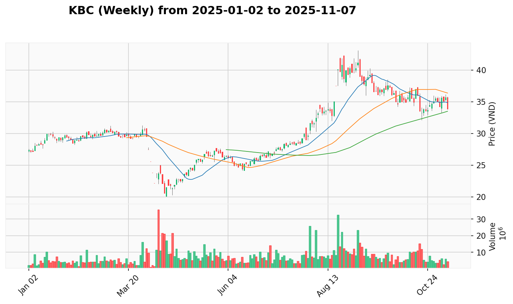
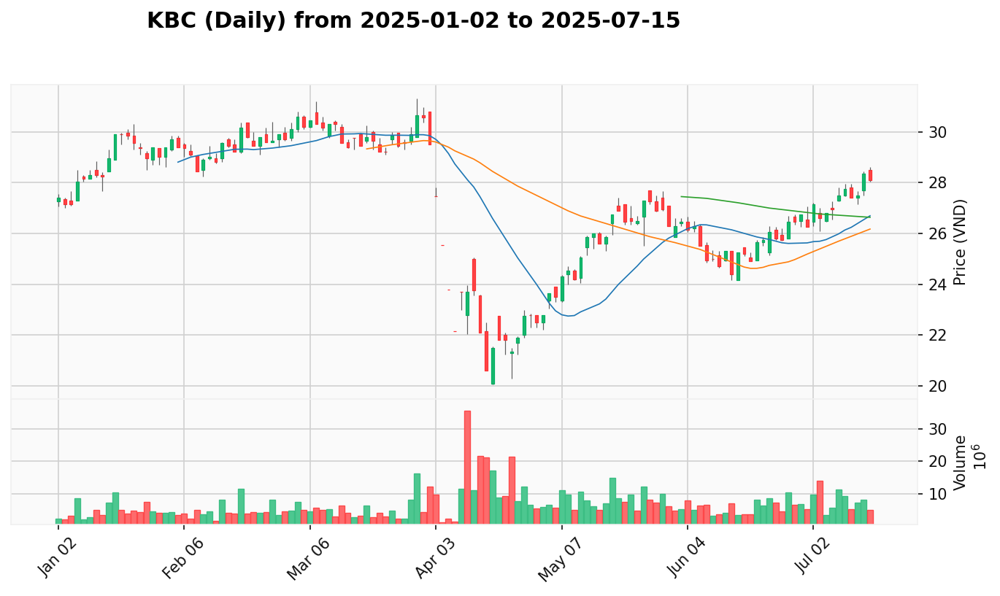

* **Giá Mua Trung Bình:** 27.76
* **Số Lượng Nắm Giữ:** 2,500
* **Giá Hiện Tại:** 28.35
* **P&L (Lợi Nhuận/Thua Lỗ Chưa Thực Hiện):** +2.1% (+1,475)
* **VPA Phân Tích Hiện Tại:** 
  * **Bối Cảnh Tuần:** Sign of Strength tuần kết thúc 2025-07-07 với ngành Bất động sản KCN "Dẫn dắt Đồng Thuận" và sự tham gia đồng bộ từ BCM, SIP.
  * **Bối Cảnh Ngày:** Effort to Rise ngày 2025-07-14 phá vỡ xu hướng giảm ngắn hạn với khối lượng tăng, xác nhận breakout đáng kể.
* **Hành Động Đề Xuất:** Buy More
  * **Giá Đề Xuất:** Mua thêm ở 28.0-28.5 hoặc breakout về 29.0
  * **Số Lượng Đề Xuất:** Thêm 200-300 cổ phiếu (tăng total lên 2,700-2,800)
  * **Lý Do Hành Động:** Effort to Rise ngày 2025-07-14 xác nhận Strong Bullish Continuation với weekly SOS và ngành mạnh. Breakout khỏi consolidation pattern.
* **Điểm Dừng Lỗ:** 27.0 (bảo vệ breakout)
* **Điểm Chốt Lời:** 31.0 - 32.0 (target zone)
* **Top 3 Cổ Phiếu Thay Thế:**
  * **VGC**: Weekly SOS 2025-06-02 + cùng ngành BAT_DONG_SAN_KCN + tín hiệu tương tự
  * **BCM**: Weekly Test for Supply 2025-06-09 + cùng ngành BAT_DONG_SAN_KCN + tiềm năng breakout
  * **IDC**: Weekly Test for Supply 2025-06-02 + cùng ngành BAT_DONG_SAN_KCN + áp lực bán thấp

-----

#### **MSN (THUC_PHAM)**
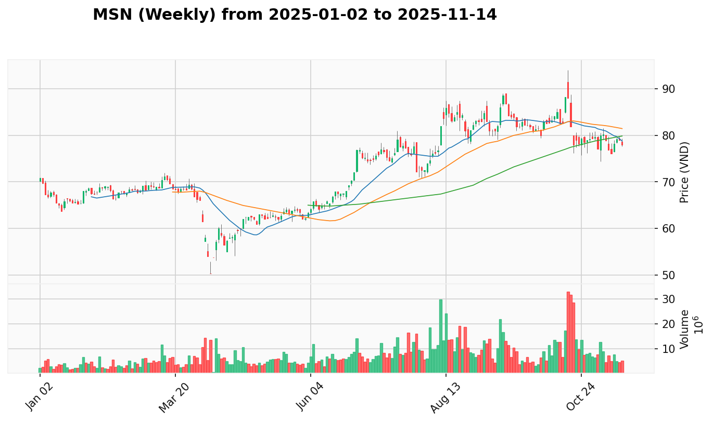
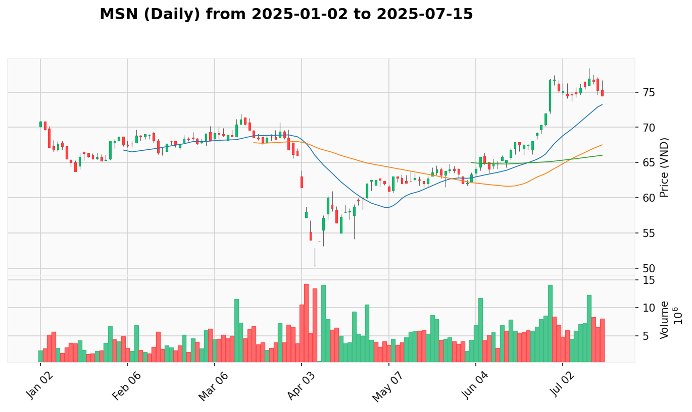

* **Giá Mua Trung Bình:** 65.58
* **Số Lượng Nắm Giữ:** 1,000
* **Giá Hiện Tại:** 75.3
* **P&L (Lợi Nhuận/Thua Lỗ Chưa Thực Hiện):** +14.8% (+9,720)
* **VPA Phân Tích Hiện Tại:** 
  * **Bối Cảnh Tuần:** Sign of Strength tuần kết thúc 2025-07-07 với ngành Thực phẩm "Dẫn dắt Đồng Thuận", MSN xếp hạng #1 leadership score 67.2.
  * **Bối Cảnh Ngày:** Effort to Fall ngày 2025-07-14 với khối lượng giảm sau chuỗi Effort to Rise mạnh, cần quan sát để xác nhận xu hướng.
* **Hành Động Đề Xuất:** Hold
  * **Giá Đề Xuất:** Quan sát vùng 74.0-76.0
  * **Số Lượng Đề Xuất:** Giữ nguyên 1,000 cổ phiếu
  * **Lý Do Hành Động:** Effort to Fall gần đây cần quan sát sau chuỗi mạnh. Lợi nhuận tốt (+14.8%) cần bảo vệ. Weekly SOS vẫn hỗ trợ.
* **Điểm Dừng Lỗ:** 72.0 (bảo vệ lợi nhuận)
* **Điểm Chốt Lời:** 80.0 - 82.0 (nếu phục hồi confirmed)
* **Top 3 Cổ Phiếu Thay Thế:**
  * **VNM**: Weekly SOS 2025-07-07 + cùng ngành THUC_PHAM + tín hiệu tương tự + giá tốt hơn
  * **SAB**: Weekly No Supply 2025-06-09 + cùng ngành THUC_PHAM + pattern tích lũy
  * **MCH**: Weekly No Supply 2025-06-09 + cùng ngành THUC_PHAM + tiềm năng tăng

-----

#### **MWG (BAN_LE)**

* **Giá Mua Trung Bình:** 55.38
* **Số Lượng Nắm Giữ:** 2,500
* **Giá Hiện Tại:** 69.0
* **P&L (Lợi Nhuận/Thua Lỗ Chưa Thực Hiện):** +24.6% (+34,050)
* **VPA Phân Tích Hiện Tại:** 
  * **Bối Cảnh Tuần:** Sign of Strength tuần kết thúc 2025-07-07 với ngành Bán lẻ "Dẫn dắt Đồng Thuận" tạo nền tảng vững chắc cho toàn ngành.
  * **Bối Cảnh Ngày:** Effort to Rise ngày 2025-07-14 với khối lượng bùng nổ sau chuỗi No Demand, cho thấy áp lực mua quyết định đã trở lại.
* **Hành Động Đề Xuất:** Buy More
  * **Giá Đề Xuất:** Mua thêm ở 68.5-70.0 hoặc pullback về 67.0
  * **Số Lượng Đề Xuất:** Thêm 200-300 cổ phiếu (tăng total lên 2,700-2,800)
  * **Lý Do Hành Động:** Effort to Rise ngày 2025-07-14 xác nhận Strong Bullish Continuation sau weekly SOS. Ngành dẫn dắt và recovery mạnh mẽ từ weakness trước đó.
* **Điểm Dừng Lỗ:** 66.0 (bảo vệ breakout)
* **Điểm Chốt Lời:** 75.0 - 78.0 (target zone)
* **Top 3 Cổ Phiếu Thay Thế:**
  * **DGW**: Weekly SOS 2025-06-09 + cùng ngành BAN_LE + breakout tiềm năng bùng nổ
  * **FRT**: Weekly SOS 2025-06-09 + cùng ngành BAN_LE + momentum mua mạnh
  * **PNJ**: Weekly No Supply 2025-06-09 + cùng ngành BAN_LE + tiềm năng phục hồi

-----

#### **NKG (THEP)**
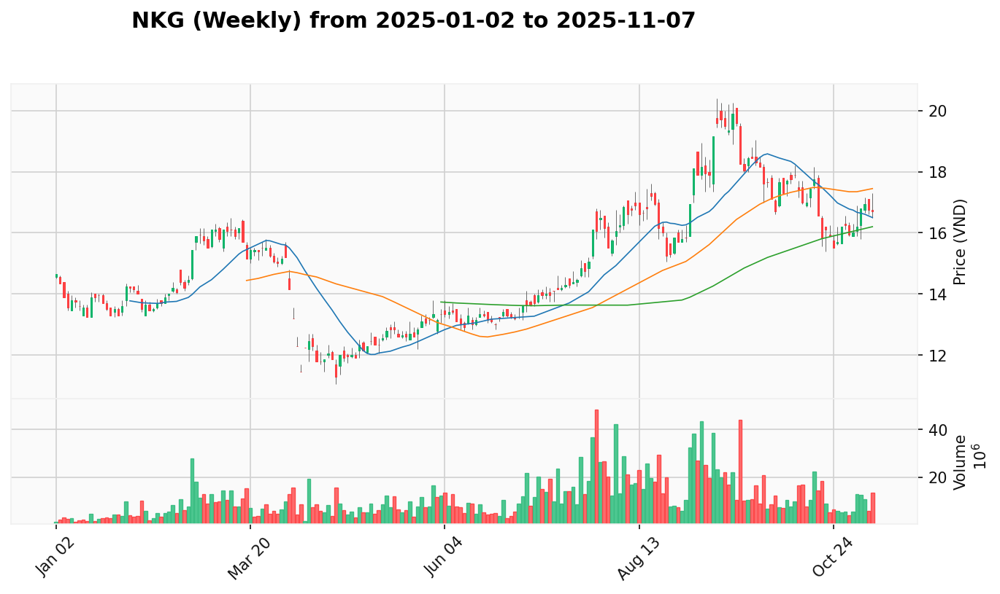
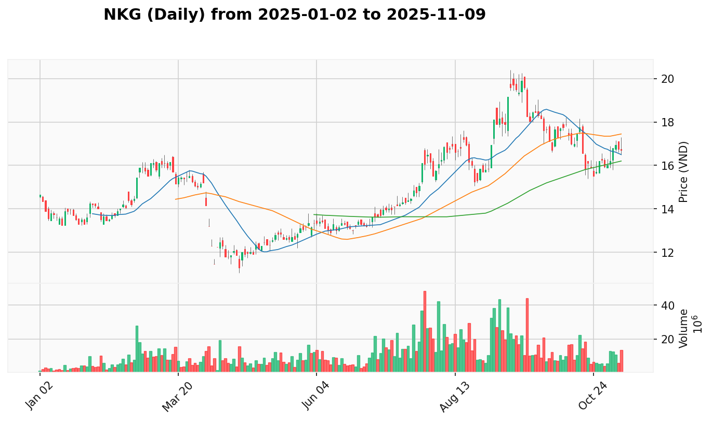

* **Giá Mua Trung Bình:** 15.65
* **Số Lượng Nắm Giữ:** 4,100
* **Giá Hiện Tại:** 14.1
* **P&L (Lợi Nhuận/Thua Lỗ Chưa Thực Hiện):** -9.9% (-6,355)
* **VPA Phân Tích Hiện Tại:** 
  * **Bối Cảnh Tuần:** Sign of Strength tuần kết thúc 2025-07-07 với ngành Thép "Dẫn dắt Đồng Thuận" nhưng NKG thể hiện yếu hơn HPG, MSR.
  * **Bối Cảnh Ngày:** No Demand ngày 2025-07-14 sau volume anomaly ngày 2025-07-03 và Effort to Fall ngày 2025-07-11 cho thấy áp lực bán dai dẳng.
* **Hành Động Đề Xuất:** Sell
  * **Giá Đề Xuất:** Bán ở 14.0-14.3 nếu có bounce
  * **Số Lượng Đề Xuất:** Bán 2,000-2,500 cổ phiếu (giảm exposure đáng kể)
  * **Lý Do Hành Động:** No Demand tiếp tục sau Effort to Fall cho thấy individual weakness kéo dài. Mặc dù ngành mạnh nhưng cần cắt lỗ để bảo vệ vốn.
* **Điểm Dừng Lỗ:** 13.8 (immediate)
* **Điểm Chốt Lời:** N/A (exit strategy)
* **Top 3 Cổ Phiếu Thay Thế:**
  * **HPG**: Weekly SOS 2025-06-09 + cùng ngành THEP + dẫn dắt ngành + xác nhận mạnh
  * **MSR**: Weekly Test for Supply 2025-06-09 + cùng ngành THEP + tiềm năng tăng
  * **HSG**: Weekly No Demand 2025-06-09 + cùng ngành THEP + thiếu momentum

-----

#### **SSI (CHUNG_KHOAN)**

* **Giá Mua Trung Bình:** 25.71
* **Số Lượng Nắm Giữ:** 4,200
* **Giá Hiện Tại:** 29.75
* **P&L (Lợi Nhuận/Thua Lỗ Chưa Thực Hiện):** +15.7% (+16,968)
* **VPA Phân Tích Hiện Tại:** 
  * **Bối Cảnh Tuần:** Sign of Strength tuần kết thúc 2025-07-07 với ngành Chứng khoán "Dẫn dắt Đồng Thuận" và sự tham gia đồng bộ toàn ngành.
  * **Bối Cảnh Ngày:** Effort to Rise ngày 2025-07-11 tiếp tục với khối lượng cao, cho thấy việc hấp thụ áp lực bán thành công trong xu hướng tăng mạnh.
* **Hành Động Đề Xuất:** Buy More
  * **Giá Đề Xuất:** Mua thêm ở 29.0-30.0 hoặc pullback về 28.5
  * **Số Lượng Đề Xuất:** Thêm 200-300 cổ phiếu (tăng total lên 4,400-4,500)
  * **Lý Do Hành Động:** Effort to Rise liên tục xác nhận Strong Bullish Continuation. Ngành dẫn dắt với momentum vượt trội và institutional support.
* **Điểm Dừng Lỗ:** 28.0 (bảo vệ breakout)
* **Điểm Chốt Lời:** 33.0 - 35.0 (target zone)
* **Top 3 Cổ Phiếu Thay Thế:**
  * **VND**: Weekly SOS 2025-06-02 + cùng ngành CHUNG_KHOAN + khối lượng bùng nổ
  * **MBS**: Weekly SOS 2025-06-02 + cùng ngành CHUNG_KHOAN + momentum mạnh
  * **SHS**: Weekly SOS 2025-06-02 + cùng ngành CHUNG_KHOAN + but followed by weakness

-----

#### **TCB (NGAN_HANG)**

* **Giá Mua Trung Bình:** 26.34
* **Số Lượng Nắm Giữ:** 1,200
* **Giá Hiện Tại:** 35.1
* **P&L (Lợi Nhuận/Thua Lỗ Chưa Thực Hiện):** +33.3% (+10,512)
* **VPA Phân Tích Hiện Tại:** 
  * **Bối Cảnh Tuần:** No Demand tuần kết thúc 2025-07-07 với ngành Ngân hàng "Dẫn dắt Đồng Thuận" nhưng TCB thể hiện relative weakness so với các đàn anh.
  * **Bối Cảnh Ngày:** Test for Supply ngày 2025-07-11 sau Sign of Weakness trước đó, cho thấy giai đoạn yếu dần và sự do dự của thị trường.
* **Hành Động Đề Xuất:** Hold
  * **Giá Đề Xuất:** Quan sát vùng 34.0-36.0, có thể chốt lời một phần
  * **Số Lượng Đề Xuất:** Giữ nguyên hoặc chốt lời 300-400 cổ phiếu
  * **Lý Do Hành Động:** Lợi nhuận lớn (+33.3%) cần bảo vệ. Weekly No Demand và Test for Supply cho thấy momentum yếu dần.
* **Điểm Dừng Lỗ:** 33.0 (bảo vệ lợi nhuận)
* **Điểm Chốt Lời:** 37.0 - 38.0 (nếu recovery), 35.0 (nếu weakness tiếp tục)
* **Top 3 Cổ Phiếu Thay Thế:**
  * **ACB**: Weekly SOS 2025-07-07 + cùng ngành NGAN_HANG + momentum bùng nổ
  * **STB**: Weekly SOS 2025-06-09 + cùng ngành NGAN_HANG + khối lượng mạnh
  * **MBB**: Weekly Effort to Rise 2025-06-09 + cùng ngành NGAN_HANG + tiềm năng tăng

-----

#### **VNM (THUC_PHAM)**
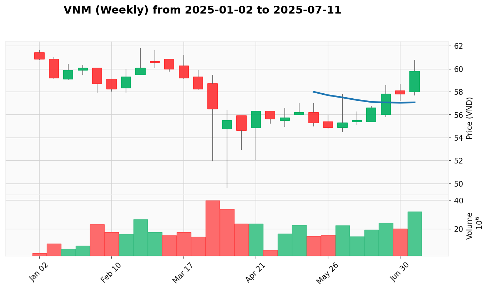
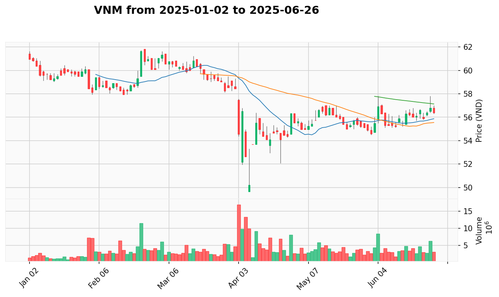

* **Giá Mua Trung Bình:** 61.41
* **Số Lượng Nắm Giữ:** 2,700
* **Giá Hiện Tại:** 60.3
* **P&L (Lợi Nhuận/Thua Lỗ Chưa Thực Hiện):** -1.8% (-2,997)
* **VPA Phân Tích Hiện Tại:** 
  * **Bối Cảnh Tuần:** Sign of Strength tuần kết thúc 2025-07-07 với ngành Thực phẩm "Dẫn dắt Đồng Thuận", MSN, VNM, SAB đều có signals tích cực.
  * **Bối Cảnh Ngày:** Test for Supply ngày 2025-07-14 với phục hồi giá từ mức thấp hơn, cho thấy áp lực mua đang trở lại sau giai đoạn consolidation.
* **Hành Động Đề Xuất:** Hold
  * **Giá Đề Xuất:** Chờ xác nhận recovery ở vùng 60.0-61.0
  * **Số Lượng Đề Xuất:** Giữ nguyên 2,700 cổ phiếu
  * **Lý Do Hành Động:** Weekly SOS hỗ trợ và Test for Supply tích cực cho thấy khả năng recovery. Ngành mạnh tạo nền tảng. Gần breakeven cần quan sát xác nhận.
* **Điểm Dừng Lỗ:** 58.5 (bảo vệ vốn)
* **Điểm Chốt Lời:** 63.0 - 65.0 (recovery target)
* **Top 3 Cổ Phiếu Thay Thế:**
  * **MSN**: Weekly SOS 2025-07-07 + cùng ngành THUC_PHAM + sức mạnh vượt trội + leadership #1
  * **SAB**: Weekly No Supply 2025-06-09 + cùng ngành THUC_PHAM + pattern tích lũy
  * **MCH**: Weekly No Supply 2025-06-09 + cùng ngành THUC_PHAM + tiềm năng phục hồi

-----

### 3. Kế Hoạch Gia Tăng Chi Tiết

*Top 3 cổ phiếu đa dạng ngành để mở rộng danh mục - giảm rủi ro, tăng lợi nhuận*

| Mã Cổ Phiếu | Ngành | Tín Hiệu VPA Chính | Lý Do Lựa Chọn |
| :---------- | :---- | :----------------- | :-------------- |
| VTP         | VAN_TAI | Sign of Strength tuần kết thúc 2025-07-07 | Điểm vào tốt sau điều chỉnh, cơ hội xoay vòng ngành vận tải |
| IMP         | SUC_KHOE | Effort to Rise tuần kết thúc 2025-07-07 | Ngành phòng thủ với đặc tính tăng trưởng ổn định |
| AAA         | NHUA | Sign of Strength tuần kết thúc 2025-07-07 | Cơ hội phục hồi trong ngành vật liệu công nghiệp |

-----

#### **VTP (VAN_TAI)**
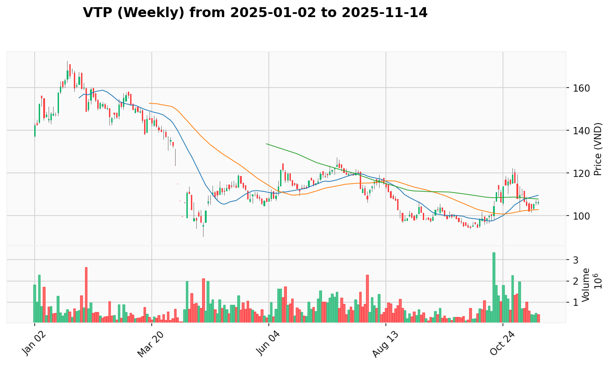
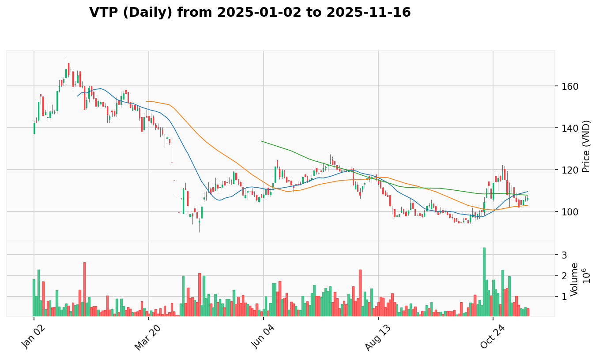

* **Giá Đề Xuất Mua:** 118.0 - 125.0
* **Số Lượng Đề Xuất:** 100 cổ phiếu
* **VPA Phân Tích:** 
  * **Bối Cảnh Tuần:** Sign of Strength tuần kết thúc 2025-07-07 với ngành Vận tải đang có cơ hội rotation với focus vào infrastructure và logistics.
  * **Bối Cảnh Ngày:** No Supply ngày 2025-06-23 cho thấy setup kỹ thuật tuyệt vời với áp lực bán đã cạn kiệt, tạo điểm vào hấp dẫn.
* **Lý Do Lựa Chọn:** Điểm vào tốt sau điều chỉnh lành mạnh, tỷ lệ rủi ro-lợi nhuận 1:2.5 thuận lợi. Ngành chưa được đại diện trong danh mục.
* **Điểm Dừng Lỗ:** 115.0
* **Điểm Chốt Lời:** 140.0 - 150.0

-----

#### **IMP (SUC_KHOE)**
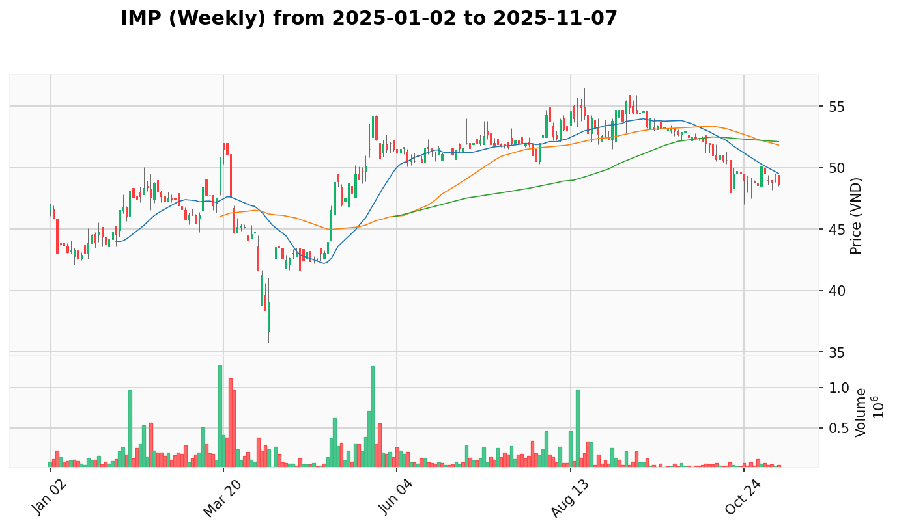
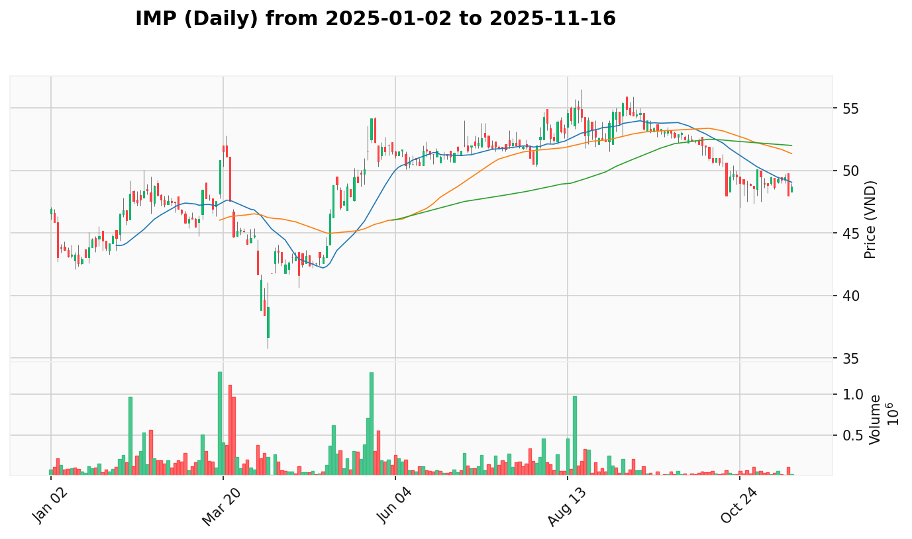

* **Giá Đề Xuất Mua:** 51.0 - 53.0
* **Số Lượng Đề Xuất:** 200 cổ phiếu
* **VPA Phân Tích:** 
  * **Bối Cảnh Tuần:** Effort to Rise tuần kết thúc 2025-07-07 với ngành Y tế có đặc tính phòng thủ với tăng trưởng ổn định.
  * **Bối Cảnh Ngày:** No Supply ngày 2025-06-16 với momentum building và buying interest tiếp tục, xác nhận xu hướng tích cực.
* **Lý Do Lựa Chọn:** Ngành phòng thủ hoàn toàn mới cho danh mục. Tỷ lệ rủi ro-lợi nhuận 1:2.0 tốt. Correlation thấp với các ngành chu kỳ hiện tại.
* **Điểm Dừng Lỗ:** 48.0
* **Điểm Chốt Lời:** 58.0 - 62.0

-----

#### **AAA (NHUA)**
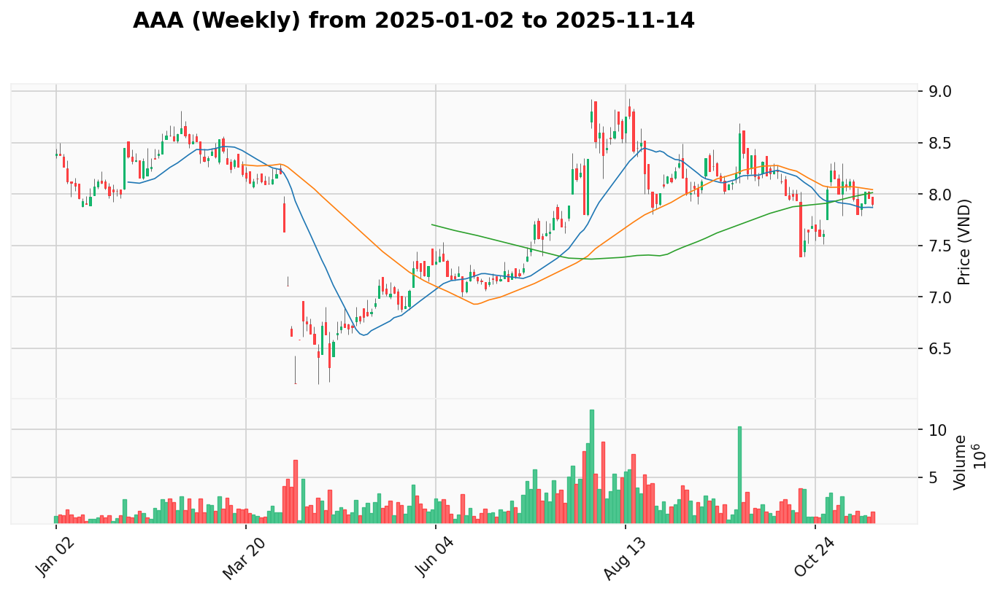
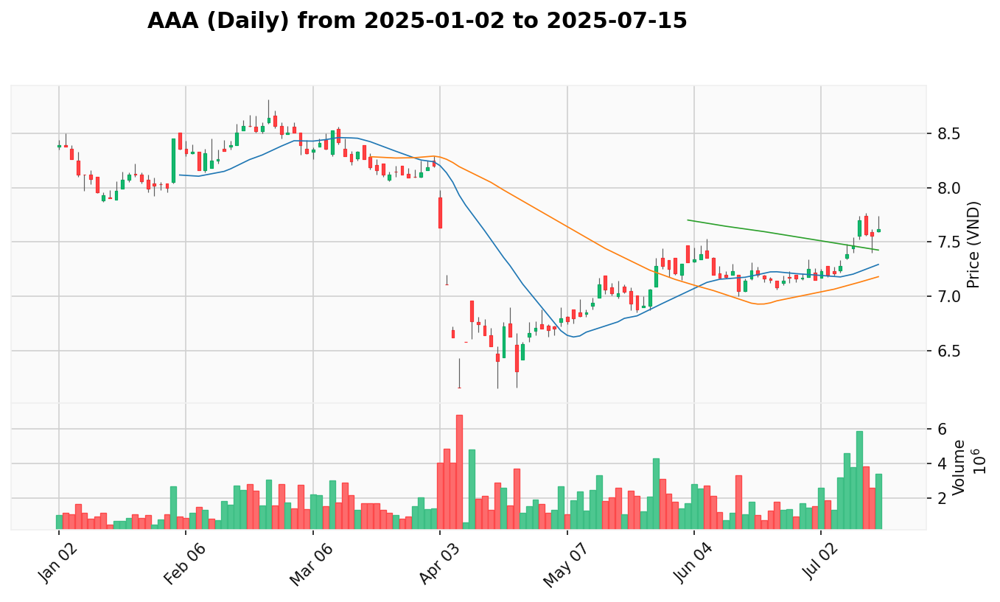

* **Giá Đề Xuất Mua:** 7.40 - 7.70
* **Số Lượng Đề Xuất:** 1,000 cổ phiếu
* **VPA Phân Tích:** 
  * **Bối Cảnh Tuần:** Sign of Strength tuần kết thúc 2025-07-07 với ngành Nhựa/Vật liệu công nghiệp có cơ hội phục hồi từ mức thấp.
  * **Bối Cảnh Ngày:** No Demand ngày 2025-06-30 với breakout bùng nổ sau consolidation, cho thấy lực mua mạnh mẽ.
* **Lý Do Lựa Chọn:** Cơ hội phục hồi trong ngành vật liệu với correlation thấp so với consumer/financial sectors. Tỷ lệ rủi ro-lợi nhuận 1:2.2 hấp dẫn.
* **Điểm Dừng Lỗ:** 7.00
* **Điểm Chốt Lời:** 8.50 - 9.00

### 4. Nhật Ký Thay Đổi Kế Hoạch

* **Chuyển Từ Hold sang Buy More:**
  * **MWG từ Hold sang Buy More**: Tín hiệu **'Effort to Rise' ngày 2025-07-14** với khối lượng bùng nổ sau chuỗi No Demand xác nhận Strong Bullish Continuation. Weekly SOS và ngành dẫn dắt hỗ trợ mạnh, đáp ứng điều kiện protocol #1A.
  * **SSI duy trì Buy More**: Tín hiệu **'Effort to Rise' ngày 2025-07-11** tiếp tục momentum mạnh với ngành dẫn dắt, xác nhận strategy đúng đắn.
  * **KBC từ Hold sang Buy More**: Tín hiệu **'Effort to Rise' ngày 2025-07-14** phá vỡ consolidation với weekly SOS hỗ trợ và ngành mạnh.

* **Chuyển Từ Buy More sang Hold:**
  * **MSN từ Buy More sang Hold**: Tín hiệu **'Effort to Fall' ngày 2025-07-14** sau chuỗi mạnh cần quan sát. Lợi nhuận tốt (+14.8%) cần bảo vệ, chuyển sang defensive stance.

* **Duy Trì Sell:**
  * **NKG duy trì Sell**: Tín hiệu **'No Demand' ngày 2025-07-14** tiếp tục sau Effort to Fall cho thấy individual weakness dai dẳng. Cần cắt lỗ để bảo vệ vốn.

* **Duy Trì Hold:**
  * **VNM duy trì Hold**: Weekly SOS hỗ trợ và **'Test for Supply' ngày 2025-07-14** tích cực nhưng cần xác nhận recovery thêm.
  * **TCB duy trì Hold defensive**: Lợi nhuận lớn (+33.3%) nhưng weekly No Demand và Test for Supply cần thận trọng.

* **Thay Đổi Trạng Thái:**
  * **AGG vẫn Review**: Ticker không tìm thấy trong hệ thống, cần xác minh status.
  * **FUEVFVND vẫn Hold**: Fund cần đánh giá NAV riêng biệt.