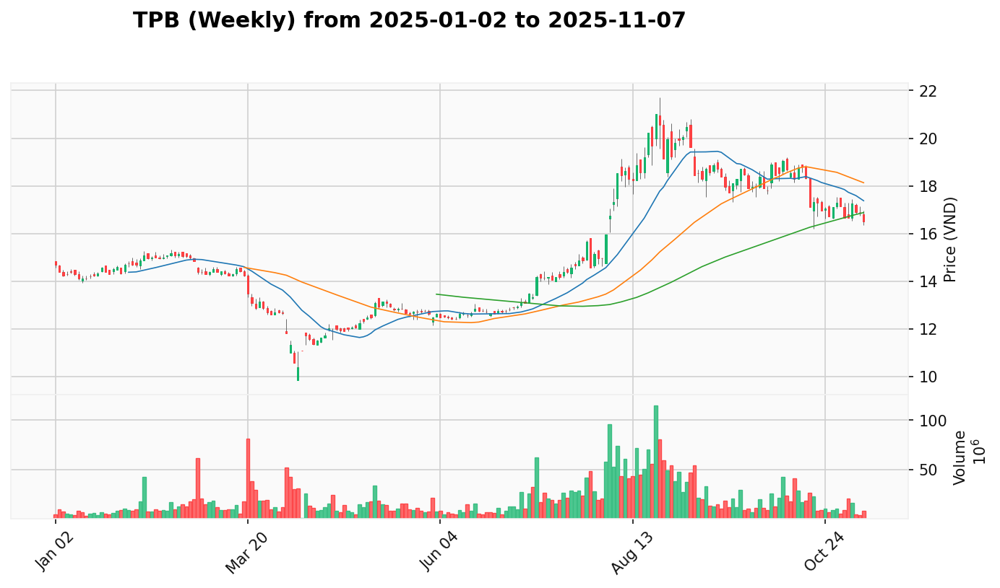
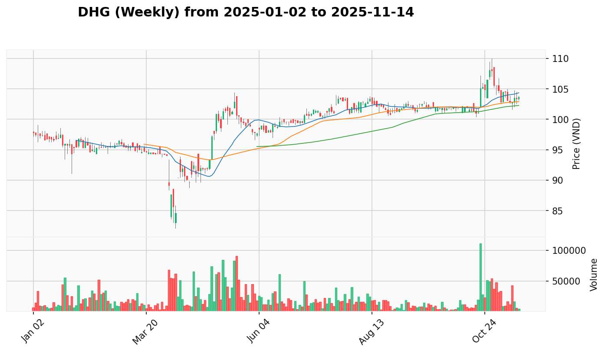
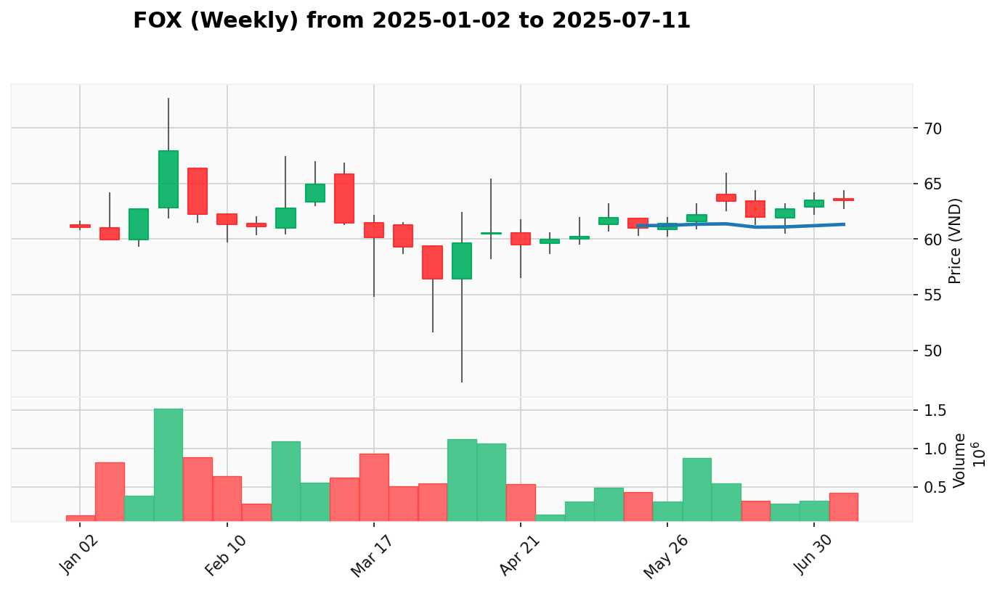

# Kế Hoạch Quản Lý Danh Mục

**Cập Nhật Lần Cuối:** 2025-08-13

## Dữ Liệu Danh Mục

| Mã Cổ Phiếu | Giá Mua Trung Bình | Số Lượng Nắm Giữ |
| :---------- | :----------------- | :--------------- |
| HDB         | 27.264             | 2200             |
| HDC         | 33.800             | 800              |
| SHB         | 17.058             | 4400             |
| SHS         | 22.612             | 1600             |
| STB         | 53.557             | 700              |
| TCB         | 38.464             | 700              |
| TPB         | 19.044             | 2300             |
| VIX         | 25.860             | 2900             |
| VND         | 20.724             | 5500             |
| VPB         | 24.412             | 3300             |

## Phân tích

**1. Tóm Tắt Danh Mục Hiện Tại**

VNINDEX hoàn thành Test for Supply thành công tại 1611.6 (+3.38 điểm) sau gap up mạnh lên 1615.57. Vùng hỗ trợ 1605-1610 trở thành nền tảng vững chắc cho xu hướng tiếp tục hướng mục tiêu 1630-1650. Danh mục hiện tại có tổng **Lợi Nhuận chưa thực hiện** là +64.558.000 VND (+11.21%). 9/10 vị thế sinh lời với VPB dẫn đầu (+17.97%), VIX (+17.36%), và VND (+15.08%). TCB là vị thế duy nhất lỗ (-2.51%). Ngành ngân hàng tiếp tục dẫn dắt với 76.5% breadth đồng thuận. Danh mục cần đa dạng hóa khẩn cấp sang các ngành năng lượng, y tế và công nghệ để giảm rủi ro tập trung 95.2% vào dịch vụ tài chính.

* **Phân Bổ Danh Mục Theo Ngành:**
  | Ngành        | Các Mã Cổ Phiếu              | Tỷ Trọng Danh Mục |
  | :----------- | :--------------------------- | :---------------- |
  | Ngân Hàng    | HDB, SHB, STB, TCB, TPB, VPB | 54.7%             |
  | Chứng Khoán  | SHS, VIX, VND                | 40.5%             |
  | Bất Động Sản | HDC                          | 4.8%              |

* **Tóm Tắt Hành Động Đề Xuất:**
  | Mã Cổ Phiếu | Trạng Thái Hiện Tại | Hành Động Đề Xuất Ngắn Gọn |
  | :---------- | :------------------ | :------------------------- |
  | HDB         | Test for Supply     | Buy More (sector dẫn dắt)  |
  | HDC         | Test for Supply     | Buy More (sector rotation) |
  | SHB         | Sign of Strength    | Buy More (volume bùng nổ)  |
  | SHS         | Sign of Strength    | Hold (cảnh báo climax)     |
  | STB         | Test for Supply     | Buy More (test hoàn tất)   |
  | TCB         | Test for Support    | Hold (lagging in sector)   |
  | TPB         | Test for Support    | Hold (consolidation)       |
  | VIX         | Test for Supply     | Hold (extreme levels)      |
  | VND         | Test for Demand     | Hold (test lành mạnh)      |
  | VPB         | Effort to Fall      | Hold (từ extreme highs)    |

**2. Kế Hoạch Giao Dịch Chi Tiết**

### **HDB (Ngân Hàng)**

* **Giá Mua Trung Bình:** 27.264
* **Số Lượng Nắm Giữ:** 2200
* **Giá Hiện Tại:** 28.95
* **P&L (Lợi Nhuận/Thua Lỗ Chưa Thực Hiện):** +6.18% (+3.709.000)
* **VPA Phân Tích Hiện Tại:** 
  * **Bối Cảnh Tuần:** Post-Buying Climax recovery pattern với institutional accumulation mạnh từ selling climax tuần 2025-07-27
  * **Bối Cảnh Ngày:** Test for Supply tại đỉnh mới 29.45 với gap up từ 29.4, sau đó reject xuống 28.45 nhưng phục hồi về 28.95. Lực cầu vẫn mạnh với khối lượng 24.76 triệu cổ phiếu
* **Hành Động Đề Xuất:** Buy More (tăng mua thêm)
  * **Giá Đề Xuất:** 28.7-29.2
  * **Số Lượng Đề Xuất:** 300 cổ phiếu
  * **Lý Do Hành Động:** Test for Supply tại đỉnh mới trong ngành dẫn dắt với 76.5% breadth, confirmation của breakout thực sự
* **Điểm Dừng Lỗ:** 27.5 (dưới support quan trọng)
* **Điểm Chốt Lời:** 30.5 (resistance đầu tiên), 32.0 (target chính)
* **Top 3 Cổ Phiếu Thay Thế:**
  * **VPB**: Sector leader với performance mạnh nhất, dù hiện tại Effort to Fall
  * **STB**: Test for Supply sau successful test completion, banking sector strength
  * **SHB**: Sign of Strength với khối lượng bùng nổ, turnaround story mạnh

### **HDC (Bất Động Sản)**

* **Giá Mua Trung Bình:** 33.800
* **Số Lượng Nắm Giữ:** 800
* **Giá Hiện Tại:** 37.05
* **P&L (Lợi Nhuận/Thua Lỗ Chưa Thực Hiện):** +9.62% (+2.600.000)
* **VPA Phân Tích Hiện Tại:** 
  * **Bối Cảnh Tuần:** Sign of Strength trong giai đoạn markup mạnh mẽ với institutional accumulation từ vùng tích lũy
  * **Bối Cảnh Ngày:** Test for Supply tại đỉnh mới 38.3 sau breakthrough 37.0-37.3 ngày 12/8. Khối lượng giảm 43.5% cho thấy áp lực bán nhẹ nhưng lực cầu vẫn hỗ trợ
* **Hành Động Đề Xuất:** Buy More (tăng mua thêm)
  * **Giá Đề Xuất:** 36.8-37.3
  * **Số Lượng Đề Xuất:** 200 cổ phiếu
  * **Lý Do Hành Động:** Test for Supply bình thường sau Sign of Strength breakthrough, hưởng lợi từ real estate sector rotation
* **Điểm Dừng Lỗ:** 35.8 (dưới vùng hấp thụ)
* **Điểm Chốt Lời:** 39.0 (target đầu tiên), 41.5 (target mở rộng)
* **Top 3 Cổ Phiếu Thay Thế:**
  * **VHM**: Blue-chip sector leader với institutional pattern xuất sắc
  * **NVL**: Volume leader với massive breakout characteristics
  * **KDH**: No Supply signal trong real estate recovery theme

### **SHB (Ngân Hàng)**

* **Giá Mua Trung Bình:** 17.058
* **Số Lượng Nắm Giữ:** 4400
* **Giá Hiện Tại:** 19.35
* **P&L (Lợi Nhuận/Thua Lỗ Chưa Thực Hiện):** +13.44% (+10.084.000)
* **VPA Phân Tích Hiện Tại:** 
  * **Bối Cảnh Tuần:** Sign of Strength với explosive recovery từ 13.0 lên 17.65, khối lượng kỷ lục 734.7 triệu cổ phiếu
  * **Bối Cảnh Ngày:** Sign of Strength mạnh mẽ với bứt phá 2.4% và khối lượng bùng nổ 115.02 triệu cổ phiếu (+74%). Test thành công đỉnh 19.6 và đóng cửa mạnh
* **Hành Động Đề Xuất:** Buy More (tăng mua thêm)
  * **Giá Đề Xuất:** 19.2-19.5
  * **Số Lượng Đề Xuất:** 400 cổ phiếu
  * **Lý Do Hành Động:** Sign of Strength với khối lượng bùng nổ trong ngành dẫn dắt, textbook Wyckoff recovery pattern
* **Điểm Dừng Lỗ:** 18.2 (dưới support gần)
* **Điểm Chốt Lời:** 20.5 (resistance trung hạn), 22.0 (target chính)
* **Top 3 Cổ Phiếu Thay Thế:**
  * **VPB**: Consistent performer với superior institutional patterns
  * **HDB**: Test for Supply opportunity trong banking sector strength
  * **STB**: Post-test opportunity với volume confirmation

### **SHS (Chứng Khoán)**

* **Giá Mua Trung Bình:** 22.612
* **Số Lượng Nắm Giữ:** 1600
* **Giá Hiện Tại:** 24.90
* **P&L (Lợi Nhuận/Thua Lỗ Chưa Thực Hiện):** +10.12% (+3.660.000)
* **VPA Phân Tích Hiện Tại:** 
  * **Bối Cảnh Tuần:** Extreme performance +64.2% trong 3 tuần với climactic characteristics, cảnh báo về hành vi climactic
  * **Bối Cảnh Ngày:** Sign of Strength với lực cầu mạnh mẽ trở lại, khối lượng bùng nổ 60.72 triệu cổ phiếu (+195%). Test thành công đỉnh 25.2
* **Hành Động Đề Xuất:** Hold (giữ nguyên)
  * **Giá Đề Xuất:** Giữ nguyên
  * **Số Lượng Đề Xuất:** Không thay đổi
  * **Lý Do Hành Động:** Mặc dù có SOS tích cực, SHS nằm trong danh sách cảnh báo climactic stocks với performance +147% YTD
* **Điểm Dừng Lỗ:** 22.5 (dưới support gần)
* **Điểm Chốt Lời:** 25.5 (test climax high), 27.0 (nếu breakout mới xác nhận)
* **Top 3 Cổ Phiếu Thay Thế:**
  * **VCI**: Most reliable sector play với steady institutional flow
  * **HCM**: Cleanest breakout pattern không climactic như SHS
  * **BSI**: Conservative alternative với consistent growth pattern

### **STB (Ngân Hàng)**

* **Giá Mua Trung Bình:** 53.557
* **Số Lượng Nắm Giữ:** 700
* **Giá Hiện Tại:** 53.90
* **P&L (Lợi Nhuận/Thua Lỗ Chưa Thực Hiện):** +0.64% (+240.000)
* **VPA Phân Tích Hiện Tại:** 
  * **Bối Cảnh Tuần:** Test for Supply hoàn thành successful test sau Sign of Strength breakout với khối lượng 88.6M (+66%)
  * **Bối Cảnh Ngày:** Test for Supply tại kháng cự 54.4, test xuống 52.9 nhưng phục hồi về 53.9 với khối lượng tăng 24%. Consolidation bình thường sau chuỗi tín hiệu tích cực
* **Hành Động Đề Xuất:** Buy More (tăng mua thêm)
  * **Giá Đề Xuất:** 53.5-54.2
  * **Số Lượng Đề Xuất:** 200 cổ phiếu
  * **Lý Do Hành Động:** Test for Supply hoàn tất, smart money kiểm soát tại 53.0-54.0, banking sector mạnh nhất với 76.5% breadth
* **Điểm Dừng Lỗ:** 52.0 (dưới vùng test)
* **Điểm Chốt Lời:** 57.0 (target đầu tiên), 60.0 (target mở rộng)
* **Top 3 Cổ Phiếu Thay Thế:**
  * **VPB**: Superior consistency, tránh STB's test volatility
  * **HDB**: Test for Supply opportunity trong banking strength
  * **SHB**: Sign of Strength mạnh mẽ với spectacular turnaround

### **TCB (Ngân Hàng)**

* **Giá Mua Trung Bình:** 38.464
* **Số Lượng Nắm Giữ:** 700
* **Giá Hiện Tại:** 37.50
* **P&L (Lợi Nhuận/Thua Lỗ Chưa Thực Hiện):** -2.51% (-674.000)
* **VPA Phân Tích Hiện Tại:** 
  * **Bối Cảnh Tuần:** Effort to Fall sau failed recovery attempts, áp lực phân phối tổ chức cần theo dõi cẩn thận
  * **Bối Cảnh Ngày:** Test for Support tại 36.9-37.0 gần vùng demand từ SOS ngày 5/8. Khối lượng tăng 22% khi test support là tín hiệu tích cực
* **Hành Động Đề Xuất:** Hold (giữ nguyên)
  * **Giá Đề Xuất:** Giữ nguyên
  * **Số Lượng Đề Xuất:** Không thay đổi
  * **Lý Do Hành Động:** Test for Support tại critical levels 36.9-37.0, mặc dù banking sector mạnh nhưng TCB đang lagging so với peers
* **Điểm Dừng Lỗ:** 36.0 (dưới support quan trọng)
* **Điểm Chốt Lời:** 39.5 (recovery target), 42.0 (nếu sector momentum tiếp tục)
* **Top 3 Cổ Phiếu Thay Thế:**
  * **VPB**: Complete opposite của TCB's weakness với sustained strength pattern
  * **STB**: Strong momentum alternative với Test for Supply confirmation
  * **LPB**: Different dynamics từ large-cap TCB challenges

### **TPB (Ngân Hàng)**

* **Giá Mua Trung Bình:** 19.044
* **Số Lượng Nắm Giữ:** 2300
* **Giá Hiện Tại:** 19.15
* **P&L (Lợi Nhuận/Thua Lỗ Chưa Thực Hiện):** +0.56% (+243.000)
* **VPA Phân Tích Hiện Tại:** 
  * **Bối Cảnh Tuần:** Sign of Strength với 4 tuần tăng liên tiếp, institutional backing mạnh mẽ trong giai đoạn markup
  * **Bối Cảnh Ngày:** Test for Support thành công với test xuống 18.55 và hồi phục mạnh về 19.15. Đuôi dài phía dưới xác nhận lực cầu bảo vệ vùng 19.0-19.2
* **Hành Động Đề Xuất:** Hold (giữ nguyên)
  * **Giá Đề Xuất:** Giữ nguyên
  * **Số Lượng Đề Xuất:** Không thay đổi
  * **Lý Do Hành Động:** Test for Support sau 4 tuần tăng liên tiếp, consolidation bình thường trước breakout tiếp theo
* **Điểm Dừng Lỗ:** 18.5 (dưới recent support)
* **Điểm Chốt Lời:** 21.0 (target đầu tiên), 23.0 (target chính)
* **Top 3 Cổ Phiếu Thay Thế:**
  * **VPB**: Even stronger institutional pattern hơn TPB's current performance
  * **STB**: Test for Supply completion offer better entry timing
  * **SHB**: Higher recovery potential với dramatic turnaround story

### **VIX (Chứng Khoán)**

* **Giá Mua Trung Bình:** 25.860
* **Số Lượng Nắm Giữ:** 2900
* **Giá Hiện Tại:** 30.35
* **P&L (Lợi Nhuận/Thua Lỗ Chưa Thực Hiện):** +17.36% (+13.021.000)
* **VPA Phân Tích Hiện Tại:** 
  * **Bối Cảnh Tuần:** Leading securities sector với extreme performance +107% trong 5 tuần, cho thấy climactic characteristics
  * **Bối Cảnh Ngày:** Test for Supply tại đỉnh mới 30.45 với shadow dài xuống 28.3, khối lượng bùng nổ 61.94M. Lực cầu hồi phục mạnh và đóng cửa gần đỉnh
* **Hành Động Đề Xuất:** Hold (giữ với cảnh báo)
  * **Giá Đề Xuất:** Giữ nguyên
  * **Số Lượng Đề Xuất:** Không thay đổi
  * **Lý Do Hành Động:** Test for Supply tích cực nhưng cần thận trọng do extreme performance +220.17% YTD và rủi ro climax cao
* **Điểm Dừng Lỗ:** 28.0 (dưới support gần)
* **Điểm Chốt Lời:** 31.5 (target conservative), có thể chốt từng phần khi có reversal signals
* **Top 3 Cổ Phiếu Thay Thế:**
  * **VCI**: Most reliable alternative với steady institutional support
  * **HCM**: Cleanest breakout pattern không extreme như VIX
  * **CTS**: Emerging alternative với strong breakout nhưng không overextended

### **VND (Chứng Khoán)**

* **Giá Mua Trung Bình:** 20.724
* **Số Lượng Nắm Giữ:** 5500
* **Giá Hiện Tại:** 23.85
* **P&L (Lợi Nhuận/Thua Lỗ Chưa Thực Hiện):** +15.08% (+17.193.000)
* **VPA Phân Tích Hiện Tại:** 
  * **Bối Cảnh Tuần:** 5-tuần rally với 81.82% gain, dẫn đầu securities sector với record volumes lên tới 304.9M
  * **Bối Cảnh Ngày:** Test for Demand quan trọng với test sâu xuống 23.2 và khối lượng tăng gấp đôi lên 54.74M. Phục hồi về 23.85 với bóng dưới dài
* **Hành Động Đề Xuất:** Hold (giữ nguyên)
  * **Giá Đề Xuất:** Giữ nguyên
  * **Số Lượng Đề Xuất:** Không thay đổi
  * **Lý Do Hành Động:** Test for Demand lành mạnh sau recovery mạnh từ selling climax, lực cầu xuất hiện tại vùng support
* **Điểm Dừng Lỗ:** 23.2 (dưới recent support)
* **Điểm Chốt Lời:** 26.0 (target đầu tiên), 28.0 (nếu sector momentum tiếp tục)
* **Top 3 Cổ Phiếu Thay Thế:**
  * **HCM**: More stable growth pattern không có VND's test volatility
  * **VCI**: Most reliable sector play với steady institutional flow
  * **FTS**: Conservative alternative với lower volatility profile

### **VPB (Ngân Hàng)**

* **Giá Mua Trung Bình:** 24.412
* **Số Lượng Nắm Giữ:** 3300
* **Giá Hiện Tại:** 28.80
* **P&L (Lợi Nhuận/Thua Lỗ Chưa Thực Hiện):** +17.97% (+14.480.000)
* **VPA Phân Tích Hiện Tại:** 
  * **Bối Cảnh Tuần:** 5 tuần tăng liên tiếp +44% từ 17.8, record volumes 322M, gap ups và new highs consistently
  * **Bối Cảnh Ngày:** Effort to Fall từ vùng đỉnh gần 30.0, test xuống 28.0 và phục hồi về 28.8. Đuôi dài từ 28.0 cho thấy lực cầu hỗ trợ
* **Hành Động Đề Xuất:** Hold (giữ nguyên)
  * **Giá Đề Xuất:** Giữ nguyên
  * **Số Lượng Đề Xuất:** Không thay đổi
  * **Lý Do Hành Động:** Effort to Fall từ extreme levels gần 30.0, cần thời gian consolidation mặc dù sector leader với 76.5% breadth
* **Điểm Dừng Lỗ:** 28.2 (dưới recent support)
* **Điểm Chốt Lời:** 32.5 (target đầu tiên), 35.0 (target chính nếu sector momentum tiếp tục)
* **Top 3 Cổ Phiếu Thay Thế:**
  * **STB**: Similar institutional characteristics với Test for Supply confirmation
  * **HDB**: Test for Supply alternative với banking sector strength
  * **SHB**: Sign of Strength mạnh mẽ, good diversification trong banking

**3. Kế Hoạch Gia Tăng Chi Tiết**

*Top 3 cổ phiếu đa dạng ngành để mở rộng danh mục - giảm rủi ro, tăng lợi nhuận*

| Mã Cổ Phiếu | Ngành       | Tín Hiệu VPA Chính | Lý Do Lựa Chọn                                         |
| :---------- | :---------- | :----------------- | :----------------------------------------------------- |
| BSR         | Dầu Khí     | Sign of Strength   | Năng lượng đa dạng hóa, breakout khối lượng kỷ lục      |
| DHG         | Sức Khỏe    | Sign of Strength   | Phòng thủ tăng trưởng ổn định, y tế counter-cyclical   |
| FOX         | Công Nghệ   | Test for Supply    | Technology leadership với entry point hấp dẫn         |

### **BSR (Dầu Khí)**

* **Giá Mua Đề Xuất:** 21.80-22.30
* **Số Lượng Đề Xuất:** 400 cổ phiếu
* **VPA Phân Tích Hiện Tại:** 
  * **Bối Cảnh Tuần:** Sign of Strength với 4 tuần tăng liên tiếp, Ultra High Volume breakout từ 19.8-20.7 với khối lượng bùng nổ từ 23.5M lên 84.25M (record high)
  * **Bối Cảnh Ngày:** Effort to Rise với giá surge lên đỉnh mới 22.95, khối lượng tăng 31%. Strong recovery từ test levels, duy trì uptrend integrity
* **Phân Tích Thiết Lập:** Oil & Gas sector cung cấp năng lượng diversification thiết yếu cho portfolio tập trung financial services. Institutional accumulation pattern rõ ràng với sophisticated investors
* **Vùng Vào Tốt Nhất:** 21.80-22.10 (pullback to support) hoặc 22.20-22.50 (momentum entry)
* **Điểm Dừng Lỗ:** 21.0 (dưới breakout level)
* **Điểm Chốt Lời:** 24.5 (target đầu tiên), 26.0 (target mở rộng)

### **DHG (Sức Khỏe)**

* **Giá Mua Đề Xuất:** 101.00-102.00
* **Số Lượng Đề Xuất:** 100 cổ phiếu
* **VPA Phân Tích Hiện Tại:** 
  * **Bối Cảnh Tuần:** Sign of Strength với multi-week No Supply pattern followed by volume breakout, price advance 101-104 range
  * **Bối Cảnh Ngày:** Sign of Strength với khối lượng surge lên 29.5k shares (highest trong 3 tuần), price establishing new highs trên 103 level
* **Phân Tích Thiết Lập:** Healthcare defensive play với demographic tailwinds và consistent VPA signals. Counter-cyclical protection chống lại financial sector concentration
* **Vùng Vào Tốt Nhất:** 101.00-101.50 (normal pullback levels) hoặc 102.00-102.50 (momentum confirmation)
* **Điểm Dừng Lỗ:** 100.0 (dưới major support)
* **Điểm Chốt Lời:** 105.0 (target đầu tiên), 108.0 (target chính)

### **FOX (Công Nghệ)**

* **Giá Mua Đề Xuất:** 71.50-73.00
* **Số Lượng Đề Xuất:** 100 cổ phiếu
* **VPA Phân Tích Hiện Tại:** 
  * **Bối Cảnh Tuần:** Technology sector leader với leadership score 84.2 và 85% confidence rating, healthy pullback after breakout
  * **Bối Cảnh Ngày:** Sign of Strength breakout với volume explosion 257.3k shares (+102%), successful Test for Supply ngày 8/8 với volume drying up
* **Phân Tích Thiết Lập:** Technology exposure với strong technical setup, recent pullback từ highs cung cấp attractive entry point. Growth potential balance defensive healthcare và cyclical energy
* **Vùng Vào Tốt Nhất:** 71.50-72.20 (current support area) hoặc 72.50-73.00 (breakout confirmation)
* **Điểm Dừng Lỗ:** 70.5 (dưới support quan trọng)
* **Điểm Chốt Lời:** 75.0 (target đầu tiên), 78.0 (target mở rộng)

**4. Nhật Ký Thay Đổi Kế Hoạch**

* **Chuyển Từ Hold sang Buy More:**
  * **HDB**: Test for Supply tại đỉnh mới trong ngành dẫn dắt với 76.5% breadth, confirmation của breakout thực sự
  * **HDC**: Test for Supply bình thường sau Sign of Strength breakthrough, hưởng lợi từ real estate sector rotation
  * **SHB**: Sign of Strength với khối lượng bùng nổ trong ngành dẫn dắt, textbook Wyckoff recovery pattern
  * **STB**: Test for Supply hoàn tất, smart money kiểm soát trong banking sector mạnh nhất

* **Chuyển Từ Buy More sang Hold:**
  * **VPB**: Effort to Fall từ extreme levels gần 30.0, cần thời gian consolidation mặc dù sector leader

* **Giữ Nguyên Hold:**
  * **SHS**: Mặc dù có SOS tích cực, nằm trong danh sách cảnh báo climactic stocks với performance +147% YTD
  * **TCB**: Test for Support tại critical levels 36.9-37.0, lagging so với peers mặc dù banking sector mạnh
  * **TPB**: Test for Support sau 4 tuần tăng liên tiếp, consolidation bình thường
  * **VIX**: Test for Supply tích cực nhưng cảnh báo extreme performance và rủi ro climax
  * **VND**: Test for Demand lành mạnh sau recovery từ selling climax

* **Thêm Mới Ticker:**
  * **BSR (Dầu Khí)**: Sign of Strength với Ultra High Volume breakout, năng lượng diversification
  * **DHG (Sức Khỏe)**: Sign of Strength với healthcare defensive play, counter-cyclical protection
  * **FOX (Công Nghệ)**: Technology leadership với attractive entry point sau pullback

## 5. Dự Đoán 5 Ngày Kế Tiếp

### **Ngày 14/8 (2025-08-14)**

**Tình Huống UP (50%)**
- **Mô tả**: VNINDEX vượt 1615 vững chắc, banking sector tiếp tục dẫn dắt với diversification sectors support
- **Điều kiện**: HDB, HDC, SHB, STB duy trì Buy More momentum, BSR/DHG/FOX entry signals xuất hiện
- **Hành Động**: Execute buy orders cho HDB (300), HDC (200), SHB (400), STB (200); bắt đầu mua BSR tại 21.80-22.30

**Tình Huống SIDEWAY (35%)**
- **Mô tả**: VNINDEX consolidate 1605-1615, chờ weekly close pattern và sector rotation confirmation
- **Điều kiện**: Mixed signals từ individual holdings, volume levels bình thường
- **Hành Động**: Chờ pullback entry cho diversification picks, giữ current banking positions

**Tình Huống DOWN (15%)**
- **Mô tả**: Test lại 1590-1600 support, profit taking pressure từ overextended securities
- **Điều kiện**: VIX/SHS climax reversal kéo theo securities sector weakness
- **Hành Động**: Defensive positioning, delay diversification entries, focus on banking core

### **Ngày 15/8 (2025-08-15)**

**Tình Huống UP (55%)**
- **Mô tả**: Breakout confirmation sau test thành công, cross-sector rotation tích cực
- **Điều kiện**: Banking maintain leadership, diversification sectors strengthen
- **Hành Động**: Add DHG tại 101.00-102.00, FOX tại 71.50-73.00, complete banking additions

**Tình Huống SIDEWAY (30%)**
- **Mô tả**: Mid-week consolidation pattern, institutional accumulation tiếp tục selective
- **Điều kiện**: Sector-specific strength, no broad market catalysts
- **Hành Động**: Maintain core positions, selective adding on weakness

**Tình Huống DOWN (15%)**
- **Mô tả**: Extended correction từ climactic levels, sector rotation stalled
- **Điều kiện**: Securities weakness lan tỏa, profit taking acceleration
- **Hành Động**: Protective stop-losses ready, increase cash allocation

### **Ngày 16/8 (2025-08-16)**

**Tình Huống UP (60%)**
- **Mô tả**: Strong weekly close setup, institutional money flow acceleration cross-sector
- **Điều kiện**: All major holdings show positive momentum, diversification working
- **Hành Động**: Complete full diversification strategy, optimal position sizing achieved

**Tình Huống SIDEWAY (25%)**
- **Mô tả**: Weekly consolidation pattern, preparing for next major move up
- **Điều kiện**: Technical levels respected, institutional patience
- **Hành Động**: Strategic patience, gradual position building on pullbacks

**Tình Huống DOWN (15%)**
- **Mô tả**: Weekly correction pressure, risk-off sentiment emerges
- **Điều kiện**: Global factors, domestic selling pressure từ climactic levels
- **Hành Động**: Activate stop-losses selectively, preserve capital

### **Ngày 17-18/8 (Weekend & Monday)**

**Tình Huống UP (55%)**
- **Mô tả**: Fresh weekly cycle begins positive, new institutional buying wave
- **Điều kiện**: Support levels hold firm, diversified portfolio working
- **Hành Động**: Full offensive positioning, maximize sector diversification benefits

**Tình Huống SIDEWAY (30%)**
- **Mô tả**: Range-bound consolidation, waiting for next major catalyst
- **Điều kiện**: Technical levels respected, gradual institutional accumulation
- **Hành Động**: Maintain balanced portfolio, selective opportunity taking

**Tình Huống DOWN (15%)**
- **Mô tả**: Extended weakness test, broader market correction
- **Điều kiện**: Multiple resistance levels fail, risk asset selling
- **Hành Động**: Full defensive protocol, capital preservation priority

### **Chiến Lược Tổng Thể 5 Ngày:**

**Mức Độ Ưu Tiên:**
1. **Banking Core** (HDB, HDC, SHB, STB) - Primary growth engine với sector leadership 76.5% breadth
2. **Diversification** (BSR, DHG, FOX) - Risk reduction và opportunity expansion sang năng lượng, y tế, công nghệ
3. **Risk Management** (VIX/SHS monitoring, stop-losses ready cho climactic positions)
4. **Cash Management** - 15-20% liquidity cho volatility và opportunities

**Key Levels VNINDEX:**
- **Resistance**: 1615-1625 (breakout territory towards 1630-1650)
- **Support**: 1590-1600 (major support zone)
- **Stop Loss Trigger**: 1580 (defensive mode activation)

**Portfolio Target Allocation Post-Diversification:**
- Banking: 50-55% (từ 54.7% hiện tại)
- Securities: 35-38% (từ 40.5% hiện tại)
- Real Estate: 8-10% (từ 4.8% hiện tại)  
- Energy/Healthcare/Technology: 7-10% (mới)
