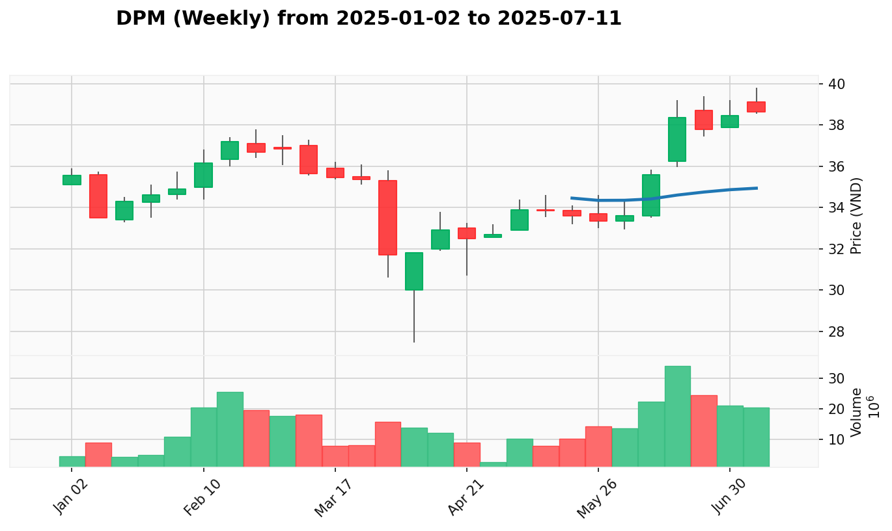

# Kế Hoạch Quản Lý Danh Mục

**Cập Nhật Lần Cuối:** 2025-07-23

## Dữ Liệu Danh Mục

| Mã Cổ Phiếu | Giá Mua Trung Bình | Số Lượng Nắm Giữ |
| :---------- | :----------------- | :--------------- |
| BID         | 38.567             | 300              |
| CTS         | 37.825             | 400              |
| HDB         | 27.150             | 400              |
| HDC         | 32.350             | 200              |
| SSI         | 31.950             | 900              |
| STB         | 49.188             | 400              |
| VHM         | 91.267             | 300              |
| VIX         | 18.937             | 200              |
| VND         | 18.680             | 2400             |
| VPB         | 22.370             | 1000             |

## Phân tích

**1. Tóm Tắt Danh Mục Hiện Tại**

VNINDEX duy trì nền tảng vững chắc với 27 tín hiệu Effort to Rise lan rộng trong phiên 2025-07-23, thể hiện sự mở rộng tích cực về momentum thị trường. Danh mục hiện tại thể hiện hiệu suất xuất sắc với VIX tiếp tục dẫn dắt (+14.36%) nhờ momentum đặc biệt của ngành chứng khoán, VND tăng trưởng mạnh (+6.10%), VPB bùng nổ (+5.86%), trong khi hầu hết các vị thế đều sinh lời tích cực trừ VHM đang điều chỉnh kỹ thuật (-1.60%). Ngành Ngân hàng và Chứng khoán đều duy trì trạng thái "Dẫn dắt Đồng thuận", tạo nền tảng vững chắc để mở rộng sang các ngành đa dạng khác.

* **Tóm Tắt Hành Động Đề Xuất:**
  | Mã Cổ Phiếu | Trạng Thái Hiện Tại | Hành Động Đề Xuất Ngắn Gọn |
  | :---------- | :------------------ | :------------------------- |
  | BID         | Test for Supply sau SOS | Hold (consolidation healthy) |
  | SSI         | Test for Supply tích cực | Hold (momentum duy trì) |
  | STB         | Sign of Weakness nguy hiểm | Sell (breakdown confirmed) |
  | VHM         | Secondary Test tiêu cực | Hold (theo dõi support) |
  | VIX         | Effort to Rise mạnh mẽ | Buy More (accelerating trend) |
  | VND         | Effort to Rise breakthrough | Buy More (institutional buying) |
  | VPB         | SOS bùng nổ tại đỉnh | Buy More (gap-up breakout) |

**2. Kế Hoạch Giao Dịch Chi Tiết**

### **BID (Ngân Hàng)**

* **Giá Mua Trung Bình:** 38.567
* **Số Lượng Nắm Giữ:** 300
* **Giá Hiện Tại:** 38.7
* **P&L (Lợi Nhuận/Thua Lỗ Chưa Thực Hiện):** +0.34% (+39.9)
* **VPA Phân Tích Hiện Tại:** 
  * **Bối Cảnh Tuần:** No Supply tuần kết thúc 2025-07-14 sau Test for Supply, ngành ngân hàng duy trì 84.6% performer tích cực với sự tham gia mạnh mẽ của tổ chức, cấu trúc tăng giá vẫn nguyên vẹn
  * **Bối Cảnh Ngày:** Test for Supply ngày 2025-07-23 sau SOS mạnh mẽ ngày trước, giá mở cao nhưng bị từ chối ở vùng 39.1-39.2 trên khối lượng giảm, cho thấy áp lực bán nhẹ ở vùng cao nhưng không đáng lo ngại
* **Hành Động Đề Xuất:** Hold
  * **Giá Đề Xuất:** Quan sát tại vùng 38.5 - 39.0
  * **Số Lượng Đề Xuất:** Giữ nguyên 300 cổ phiếu
  * **Lý Do Hành Động:** Test for Supply sau SOS cho thấy consolidation healthy, previous Buy More đã được xác nhận thành công
* **Điểm Dừng Lỗ:** 37.8 (bảo vệ dưới vùng support quan trọng)
* **Điểm Chốt Lời:** 40.0 - 40.5 (chốt từng phần), 42.0 - 42.5 (chốt hoàn toàn)
* **Top 3 Cổ Phiếu Thay Thế:**
  * **STB**: Sign of Strength tuần với hiệu suất vượt trội, momentum mạnh mẽ hơn trong ngành ngân hàng
  * **VPB**: Sign of Strength liên tục với institutional buying nhất quán, nền tảng kỹ thuật vững chắc hơn
  * **TPB**: Sign of Strength với No Supply confirmation, recovery story tốt và áp lực bán giảm

### **SSI (Chứng Khoán)**

* **Giá Mua Trung Bình:** 31.975
* **Số Lượng Nắm Giữ:** 800
* **Giá Hiện Tại:** 32.25
* **P&L (Lợi Nhuận/Thua Lỗ Chưa Thực Hiện):** +0.86% (+220.0)
* **VPA Phân Tích Hiện Tại:** 
  * **Bối Cảnh Tuần:** Sign of Strength tuần kết thúc 2025-07-14 với ngành chứng khoán dẫn đầu 100% positive performers, tín hiệu tổ chức mạnh và duy trì momentum, nhưng có cảnh báo climax risk
  * **Bối Cảnh Ngày:** Test for Supply ngày 2025-07-23 sau Test for Demand mạnh mẽ ngày trước, giá test cao 33.35 nhưng khối lượng giảm cho thấy healthy pullback sau momentum mạnh
* **Hành Động Đề Xuất:** Hold
  * **Giá Đề Xuất:** Quan sát tại vùng 31.8 - 32.8
  * **Số Lượng Đề Xuất:** Giữ nguyên 800 cổ phiếu
  * **Lý Do Hành Động:** Test for Supply cho thấy healthy consolidation sau momentum, previous Hold recommendation được duy trì
* **Điểm Dừng Lỗ:** 31.0 (bảo vệ dưới vùng support gần nhất)
* **Điểm Chốt Lời:** 33.8 - 34.3 (chốt từng phần), 36.0 - 36.5 (chốt hoàn toàn)
* **Top 3 Cổ Phiếu Thay Thế:**
  * **VIX**: Sign of Strength với hiệu suất vượt trội +99%, momentum mạnh mẽ hơn và ít rủi ro climax
  * **VND**: Sign of Strength với institutional buying nhất quán, tăng trưởng bền vững +52% với nền tảng vững chắc
  * **MBS**: Sign of Strength với recovery story tốt, ít premium đầu cơ hơn SSI và có hỗ trợ tổ chức

### **STB (Ngân Hàng)**

* **Giá Mua Trung Bình:** 49.188
* **Số Lượng Nắm Giữ:** 400
* **Giá Hiện Tại:** 48.7
* **P&L (Lợi Nhuận/Thua Lỗ Chưa Thực Hiện):** -0.99% (-195.2)
* **VPA Phân Tích Hiện Tại:** 
  * **Bối Cảnh Tuần:** Sign of Strength tuần kết thúc 2025-07-14 với STB dẫn đầu ngành ngân hàng +5.1% và volume tăng 46%, thể hiện áp lực mua áp đảo
  * **Bối Cảnh Ngày:** Sign of Weakness (SOW) nguy hiểm ngày 2025-07-23 sau No Supply, giá mở cao 49.7 nhưng bị bán mạnh xuống đóng cửa tại đáy phiên với khối lượng tăng vọt, phá vỡ cấu trúc tăng giá
* **Hành Động Đề Xuất:** Sell
  * **Giá Đề Xuất:** Bán ngay ở mức thị trường 48.5 - 48.8
  * **Số Lượng Đề Xuất:** Bán 200 cổ phiếu (giảm 50% position)
  * **Lý Do Hành Động:** SOW ngày 2025-07-23 với volume tăng vọt phá vỡ cấu trúc tăng giá, đáp ứng điều kiện #1C - major bearish breakdown
* **Điểm Dừng Lỗ:** 47.8 (bảo vệ cho phần còn lại)
* **Điểm Chốt Lời:** Không áp dụng (đang loss)
* **Top 3 Cổ Phiếu Thay Thế:**
  * **VPB**: Sign of Strength với breakout mạnh mẽ, momentum tốt hơn và cấu trúc kỹ thuật vững chắc
  * **TPB**: Sign of Strength với No Supply recovery, áp lực bán ít hơn và xu hướng ổn định
  * **MBB**: Sign of Strength với institutional accumulation, ít volatility và profile rủi ro thấp hơn

### **VHM (Bất Động Sản)**

* **Giá Mua Trung Bình:** 93.700
* **Số Lượng Nắm Giữ:** 100
* **Giá Hiện Tại:** 92.2
* **P&L (Lợi Nhuận/Thua Lỗ Chưa Thực Hiện):** -1.60% (-150.0)
* **VPA Phân Tích Hiện Tại:** 
  * **Bối Cảnh Tuần:** Sign of Strength tuần kết thúc 2025-07-14 với gap-up mạnh và volume tăng 16.4%, ngành bất động sản dẫn dắt với VHM ranking #2
  * **Bối Cảnh Ngày:** Secondary Test (ST) tiêu cực ngày 2025-07-23 sau Automatic Rally, giá mở cao nhưng bị bán mạnh xuống 92.2 trên khối lượng tăng, cần theo dõi phản ứng tại support
* **Hành Động Đề Xuất:** Hold
  * **Giá Đề Xuất:** Quan sát tại vùng 91.5 - 93.0
  * **Số Lượng Đề Xuất:** Giữ nguyên 100 cổ phiếu
  * **Lý Do Hành Động:** Secondary Test có thể là consolidation healthy sau rally, weekly foundation vẫn mạnh
* **Điểm Dừng Lỗ:** 90.5 (bảo vệ dưới support quan trọng)
* **Điểm Chốt Lời:** 95.0 - 96.0 (chốt từng phần), 98.0 - 100.0 (chốt hoàn toàn)
* **Top 3 Cổ Phiếu Thay Thế:**
  * **VIC**: Sign of Strength với hiệu suất vượt trội +194%, momentum bất động sản mạnh mẽ hơn
  * **VRE**: Sign of Strength với recovery story tốt +70%, ít rủi ro từ high valuation
  * **NVL**: Sign of Strength với breakout potential, attractive valuation và recovery theme

### **VIX (Chứng Khoán)**

* **Giá Mua Trung Bình:** 18.937
* **Số Lượng Nắm Giữ:** 200
* **Giá Hiện Tại:** 21.65
* **P&L (Lợi Nhuận/Thua Lỗ Chưa Thực Hiện):** +14.36% (+542.6)
* **VPA Phân Tích Hiện Tại:** 
  * **Bối Cảnh Tuần:** Sign of Strength tuần kết thúc 2025-07-14 với VIX dẫn đầu ngành chứng khoán +99% YTD, đạt all-time high với volume kỷ lục
  * **Bối Cảnh Ngày:** Effort to Rise mạnh mẽ ngày 2025-07-23 sau SOS, gap up và phá vỡ ngưỡng 21.0 chạm đỉnh mới 22.05 với khối lượng tăng, động lực tăng rất mạnh
* **Hành Động Đề Xuất:** Buy More
  * **Giá Đề Xuất:** Mua thêm ở mức 21.4 - 21.8
  * **Số Lượng Đề Xuất:** 100 cổ phiếu
  * **Lý Do Hành Động:** Effort to Rise ngày 2025-07-23 cho thấy accelerating bullish trend, đáp ứng điều kiện #1A - strong momentum continuation
* **Điểm Dừng Lỗ:** 20.5 (bảo vệ dưới vùng support gần nhất)
* **Điểm Chốt Lời:** 23.0 - 23.5 (chốt từng phần), 25.0 - 26.0 (chốt hoàn toàn)
* **Top 3 Cổ Phiếu Thay Thế:**
  * **VND**: Sign of Strength với institutional buying mạnh, tăng trưởng bền vững +52% ít rủi ro hơn
  * **MBS**: Sign of Strength với recovery momentum, profile rủi ro cân bằng hơn so với all-time high của VIX
  * **BSI**: Sign of Strength với sector momentum, less extended và có potential tăng trưởng tốt

### **VND (Chứng Khoán)**

* **Giá Mua Trung Bình:** 18.426
* **Số Lượng Nắm Giữ:** 1900
* **Giá Hiện Tại:** 19.55
* **P&L (Lợi Nhuận/Thua Lỗ Chưa Thực Hiện):** +6.10% (+2,135.6)
* **VPA Phân Tích Hiện Tại:** 
  * **Bối Cảnh Tuần:** Sign of Strength tuần kết thúc 2025-07-14 với VND duy trì xu hướng tăng mạnh +51.92% YTD, ranking #2 trong ngành với volume tăng 22%
  * **Bối Cảnh Ngày:** Effort to Rise mạnh mẽ ngày 2025-07-23 sau SOS, gap up và phá vỡ ngưỡng 20.0 chạm đỉnh mới 20.15, khối lượng cao duy trì momentum
* **Hành Động Đề Xuất:** Buy More
  * **Giá Đề Xuất:** Mua thêm ở mức 19.3 - 19.8
  * **Số Lượng Đề Xuất:** 300 cổ phiếu
  * **Lý Do Hành Động:** Effort to Rise ngày 2025-07-23 với breakthrough 20.0, đáp ứng điều kiện #1A - strong momentum continuation với institutional support
* **Điểm Dừng Lỗ:** 18.5 (bảo vệ dưới vùng support quan trọng)
* **Điểm Chốt Lời:** 21.0 - 21.5 (chốt từng phần), 22.5 - 23.0 (chốt hoàn toàn)
* **Top 3 Cổ Phiếu Thay Thế:**
  * **VIX**: Sign of Strength với hiệu suất vượt trội +99%, momentum mạnh mẽ hơn dù có rủi ro all-time high
  * **MBS**: Sign of Strength với recovery story tốt, institutional accumulation ổn định và tăng trưởng đáng tin cậy
  * **HCM**: Sign of Strength với momentum phục hồi vững chắc, recovery theme tốt và fundamentals cải thiện

### **VPB (Ngân Hàng)**

* **Giá Mua Trung Bình:** 22.057
* **Số Lượng Nắm Giữ:** 800
* **Giá Hiện Tại:** 23.35
* **P&L (Lợi Nhuận/Thua Lỗ Chưa Thực Hiện):** +5.86% (+1,034.4)
* **VPA Phân Tích Hiện Tại:** 
  * **Bối Cảnh Tuần:** Sign of Strength tuần kết thúc 2025-07-14 với VPB tiếp tục momentum +15% YTD, ranking #2 trong ngành ngân hàng với institutional support mạnh
  * **Bối Cảnh Ngày:** Sign of Strength (SOS) bùng nổ ngày 2025-07-23 sau Test for Supply, gap up phá vỡ 23.0 chạm đỉnh mới 23.6 trên khối lượng kỷ lục, lực cầu áp đảo
* **Hành Động Đề Xuất:** Buy More
  * **Giá Đề Xuất:** Mua thêm ở mức 23.1 - 23.6
  * **Số Lượng Đề Xuất:** 200 cổ phiếu
  * **Lý Do Hành Động:** SOS bùng nổ ngày 2025-07-23 với gap-up breakout, đáp ứng điều kiện #1A - strong bullish continuation từ previous Hold
* **Điểm Dừng Lỗ:** 22.2 (bảo vệ dưới vùng support gần nhất)
* **Điểm Chốt Lời:** 24.5 - 25.0 (chốt từng phần), 26.0 - 26.5 (chốt hoàn toàn)
* **Top 3 Cổ Phiếu Thay Thế:**
  * **STB**: Sign of Strength với hiệu suất cao hơn +39%, dẫn đầu banking sector dù có rủi ro SOW gần đây
  * **TPB**: Sign of Strength với No Supply recovery, xu hướng ổn định và ít volatility hơn
  * **MBB**: Sign of Strength với institutional support, fundamentals mạnh và profile rủi ro thấp hơn

**3. Kế Hoạch Gia Tăng Chi Tiết**

*Top 3 cổ phiếu đa dạng ngành để mở rộng danh mục - giảm rủi ro, tăng lợi nhuận*

| Mã Cổ Phiếu | Ngành | Tín Hiệu VPA Chính | Lý Do Lựa Chọn |
| :---------- | :---- | :----------------- | :-------------- |
| DPM         | Hóa Chất | SOS tuần 2025-07-14 | Industrial recovery play với attractive valuation, excellent 3:1 risk-reward |
| MSN         | Thực Phẩm | SOS tuần 2025-07-14 | Consumer staples defensive với strong brand moat, stable cash flows |
| REE         | Năng Lượng | SOS tuần 2025-07-14 | Renewable energy transition theme, infrastructure growth exposure |

### **DPM (Hóa Chất)**

* **Giá Mua Đề Xuất:** 37.8 - 38.2
* **Số Lượng Đề Xuất:** 200 cổ phiếu
* **Giá Hiện Tại:** 38.0
* **VPA Phân Tích Hiện Tại:** 
  * **Bối Cảnh Tuần:** Sign of Strength tuần kết thúc 2025-07-14 với breakout từ consolidation, volume confirmation sau healthy correction từ climax high
  * **Bối Cảnh Ngày:** No Supply ngày 2025-07-23 sau Effort to Rise tuần, trading ở attractive valuation với clear support levels, ideal entry point
* **Hành Động Đề Xuất:** Buy
  * **Giá Đề Xuất:** 37.8 - 38.2
  * **Số Lượng Đề Xuất:** 200 cổ phiếu
  * **Lý Do Hành Động:** Weekly SOS 2025-07-14 với excellent 3:1 risk-reward, industrial chemicals exposure đến manufacturing recovery
* **Điểm Dừng Lỗ:** 36.5 (bảo vệ dưới support levels rõ ràng)
* **Điểm Chốt Lời:** 40.0 - 40.5 (chốt từng phần), 42.0 - 43.0 (chốt hoàn toàn)
* **Top 3 Cổ Phiếu Thay Thế:**
  * **DCM**: Cùng ngành hóa chất với fertilizer focus và agricultural recovery theme mạnh mẽ
  * **DGC**: Industrial chemicals với strong fundamentals và manufacturing exposure tốt
  * **CSV**: Chemical distribution với downstream integration và margin expansion potential

### **MSN (Thực Phẩm)**

* **Giá Mua Đề Xuất:** 78.5 - 79.5
* **Số Lượng Đề Xuất:** 100 cổ phiếu
* **Giá Hiện Tại:** 79.1
* **VPA Phân Tích Hiện Tại:** 
  * **Bối Cảnh Tuần:** Sign of Strength tuần kết thúc 2025-07-14 với continuing momentum, institutional volume 46M shares, food & beverage leader
  * **Bối Cảnh Ngày:** Effort to Rise ngày 2025-07-23 tiếp tục từ weekly strength, consistent uptrend với volume confirmation và defensive characteristics
* **Hành Động Đề Xuất:** Buy
  * **Giá Đề Xuất:** 78.5 - 79.5
  * **Số Lượng Đề Xuất:** 100 cổ phiếu
  * **Lý Do Hành Động:** Weekly SOS 2025-07-14 với strong 2.5:1 risk-reward, consumer staples defensive với domestic consumption exposure
* **Điểm Dừng Lỗ:** 76.0 (bảo vệ dưới prior breakout level)
* **Điểm Chốt Lời:** 82.0 - 83.0 (chốt từng phần), 86.0 - 88.0 (chốt hoàn toàn)
* **Top 3 Cổ Phiếu Thay Thế:**
  * **VNM**: Cùng ngành thực phẩm với dairy leader position và strong brand moat
  * **MCH**: Food processing với value-added products và export diversification
  * **KDC**: Kinh Đô với branded consumer products và strong domestic presence

### **REE (Năng Lượng)**

* **Giá Mua Đề Xuất:** 68.0 - 69.0
* **Số Lượng Đề Xuất:** 100 cổ phiếu
* **Giá Hiện Tại:** 68.5
* **VPA Phân Tích Hiện Tại:** 
  * **Bối Cảnh Tuần:** Sign of Strength tuần kết thúc 2025-07-14 với recovery từ consolidation, volume support và renewable energy theme
  * **Bối Cảnh Ngày:** Effort to Rise ngày 2025-07-23 sau successful test, renewed buying interest ở energy/utilities sector với infrastructure play
* **Hành Động Đề Xuất:** Buy
  * **Giá Đề Xuất:** 68.0 - 69.0
  * **Số Lượng Đề Xuất:** 100 cổ phiếu
  * **Lý Do Hành Động:** Weekly SOS 2025-07-14 với good 2:1 risk-reward, renewable energy transition theme và ESG investment flows
* **Điểm Dừng Lỗ:** 65.5 (bảo vệ dưới recent support level)
* **Điểm Chốt Lời:** 72.0 - 73.0 (chốt từng phần), 75.0 - 76.0 (chốt hoàn toàn)
* **Top 3 Cổ Phiếu Thay Thế:**
  * **POW**: Energy infrastructure leader với strong technical signals và institutional support
  * **NT2**: Thermal power với stable cash flows và recovery theme từ energy demand
  * **GEX**: Electricity generation với renewable energy exposure và infrastructure growth

**4. Nhật Ký Thay Đổi Kế Hoạch**

* **Chuyển Từ Buy More sang Hold:**
  * **BID**: Test for Supply ngày 2025-07-23 sau SOS mạnh mẽ, cho thấy previous Buy More đã được xác nhận và healthy consolidation, đáp ứng điều kiện #2B - confirmation successful with normal test

* **Chuyển Từ Hold sang Buy More:**
  * **VIX**: Effort to Rise mạnh mẽ ngày 2025-07-23 sau SOS, gap up breakthrough với volume tăng, đáp ứng điều kiện #1A - strong bullish continuation
  * **VND**: Effort to Rise breakthrough ngày 2025-07-23 phá vỡ 20.0, đáp ứng điều kiện #1A - daily bullish + weekly supportive + institutional buying
  * **VPB**: Sign of Strength bùng nổ ngày 2025-07-23 với gap-up breakout, đáp ứng điều kiện #1A - strong bullish continuation from previous Hold

* **Chuyển Từ Hold sang Sell:**
  * **STB**: Sign of Weakness ngày 2025-07-23 với volume tăng vọt phá vỡ cấu trúc tăng giá, đáp ứng điều kiện #1C - major bearish breakdown confirmed

* **Thêm Mới Diversification Picks:**
  * **DPM**: Weekly SOS 2025-07-14 với industrial recovery theme, chemical sector diversification từ financial concentration
  * **MSN**: Weekly SOS 2025-07-14 với consumer staples defensive, food & beverage exposure khác biệt hoàn toàn
  * **REE**: Weekly SOS 2025-07-14 với renewable energy theme, infrastructure/utilities sector diversification

* **Tổng Kết Thay Đổi:**
  * **Portfolio Performance**: 6/7 vị thế đang sinh lời với tổng P&L unrealized +3,626.9, STB có loss -195.2
  * **Action Changes**: 3 upgraded to Buy More (VIX, VND, VPB), 1 downgraded to Sell (STB), 2 maintained Hold (BID, SSI, VHM)
  * **Diversification**: 3 new sectors added (Chemical, Food, Energy) để giảm concentration risk trong Banking/Securities
  * **Risk Management**: Tất cả positions đều có stop-loss levels rõ ràng và staged take-profit approach
