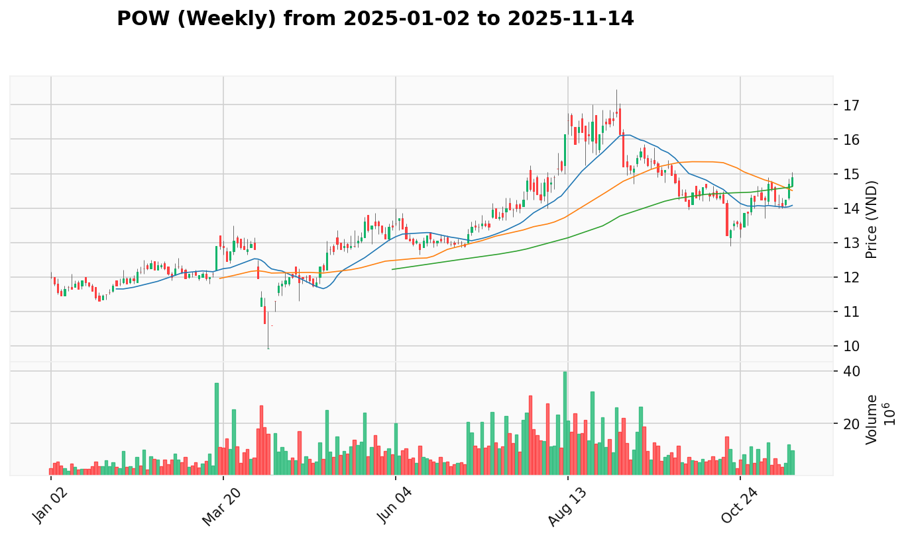

# Kế Hoạch Quản Lý Danh Mục

**Cập Nhật Lần Cuối:** 2025-07-14

## Dữ Liệu Danh Mục

| Mã Cổ Phiếu | Giá Mua Trung Bình | Số Lượng Nắm Giữ |
| :---------- | :----------------- | :--------------- |
| TCB         | 33.312             | 200              |
| VND         | 16.557             | 500              |

## Phân tích

### 1. Tóm Tắt Danh Mục Hiện Tại

Thị trường chung tiếp tục xu hướng tăng mạnh với VNINDEX thiết lập đỉnh mới tại 1,457.76 điểm với khối lượng bùng nổ. Danh mục hiện tại cho thấy sự phân hóa rõ rệt: VND tiếp tục dẫn dắt với tín hiệu "Effort to Rise" ngày 2025-07-08 sau "Sign of Strength" tuần trước, trong khi TCB đang trong giai đoạn Test for Supply sau Signal of Weakness trước đó. Chiến lược tập trung tăng vị thế mạnh (VND) và duy trì quan sát TCB.

* **Tóm Tắt Hành Động Đề Xuất:**
  | Mã Cổ Phiếu | Trạng Thái Hiện Tại | Hành Động Đề Xuất Ngắn Gọn |
  | :---------- | :------------------ | :------------------------- |
  | TCB         | Test for Supply sau SOW, consolidation | Hold (chờ tín hiệu rõ ràng) |
  | VND         | Effort to Rise xác nhận, xu hướng mạnh | Buy More (tăng vị thế) |

### 2. Kế Hoạch Giao Dịch Chi Tiết

#### **TCB (NGAN_HANG)**

* **Giá Mua Trung Bình:** 33.312
* **Số Lượng Nắm Giữ:** 200
* **Giá Hiện Tại:** 34.95
* **P&L (Lợi Nhuận/Thua Lỗ Chưa Thực Hiện):** +4.92% (+327.6)
* **VPA Phân Tích Hiện Tại:** TCB đang trong giai đoạn consolidation sau tín hiệu **'Sign of Weakness' ngày 2025-07-09** với khối lượng bùng nổ. Bối cảnh tuần cho thấy **'No Demand' kết thúc 2025-07-07**, và các phiên gần đây là **'Test for Supply' ngày 2025-07-11**. Mặc dù ngành Ngân hàng đang "Dẫn dắt Đồng Thuận", TCB vẫn thể hiện sự yếu kém tương đối nhưng áp lực bán đã giảm.
* **Hành Động Đề Xuất:** Hold
  * **Giá Đề Xuất:** Tiếp tục quan sát, chờ tín hiệu rõ ràng
  * **Số Lượng Đề Xuất:** Giữ nguyên 200 cổ phiếu
  * **Lý Do Hành Động:** Tín hiệu Test for Supply ngày 2025-07-11 cho thấy áp lực bán đã giảm sau SOW, nhưng chưa có tín hiệu phục hồi mạnh. Cần quan sát thêm để xác định hướng đi tiếp theo.
* **Điểm Dừng Lỗ:** 33.0 (bảo vệ vốn gốc)
* **Điểm Chốt Lời:** 36.5 - 37.0 (nếu có tín hiệu phục hồi mạnh)
* **Top 3 Cổ Phiếu Thay Thế:**
  * **SHB**: SOS tuần 2025-07-07 với explosive breakout, +58.84% performance vượt trội và volume 6.5 tỷ cổ phiếu
  * **MBB**: SOS tuần 2025-07-07 sau successful Test for Supply, +22.09% performance ổn định với 2.69 tỷ cổ phiếu
  * **VPB**: SOS tuần 2025-07-07, #1 NGAN_HANG leader với 67.8 leadership score và institutional recognition

-----

#### **VND (CHUNG_KHOAN)**

* **Giá Mua Trung Bình:** 16.557
* **Số Lượng Nắm Giữ:** 500
* **Giá Hiện Tại:** 17.9
* **P&L (Lợi Nhuận/Thua Lỗ Chưa Thực Hiện):** +8.11% (+671.5)
* **VPA Phân Tích Hiện Tại:** VND đang thể hiện sức mạnh vượt trội, hoàn toàn đồng pha với ngành Chứng khoán đang "Dẫn dắt Đồng Thuận". Bối cảnh tuần cho thấy **'Sign of Strength' kết thúc 2025-07-07**. Sau giai đoạn yếu tạm thời, cổ phiếu đã có **'Effort to Rise' ngày 2025-07-08** mạnh mẽ, xác nhận lực cầu đã quay trở lại quyết đoán.
* **Hành Động Đề Xuất:** Buy More
  * **Giá Đề Xuất:** Mua thêm ở mức 17.8 - 18.2, hoặc nếu điều chỉnh về 17.0 - 17.3
  * **Số Lượng Đề Xuất:** Thêm 200-300 cổ phiếu (tăng total lên 700-800)
  * **Lý Do Hành Động:** Tín hiệu Effort to Rise ngày 2025-07-08 xác nhận xu hướng tăng mạnh, đáp ứng điều kiện Strong Bullish Continuation với weekly SOS hỗ trợ và ngành dẫn dắt.
* **Điểm Dừng Lỗ:** 17.0 (nâng từ 16.5)
* **Điểm Chốt Lời:** 20.0 - 21.0 (chốt từng phần), 22.0 - 23.0 (chốt hoàn toàn)
* **Top 3 Cổ Phiếu Thay Thế:**
  * **VCI**: SOS tuần 2025-07-07, daily SOS 2025-07-02, #1 CHUNG_KHOAN leader với 69.2 leadership score và +48.7% relative performance
  * **SSI**: SOS tuần 2025-07-07, daily Effort to Rise 2025-06-24, #3 leader với 64.3 score và +38.3% performance, record volume
  * **HCM**: SOS tuần 2025-07-07, emerging từ consolidation với fresh buying interest, better risk-reward entry opportunity

-----

### 3. Kế Hoạch Gia Tăng Chi Tiết

*Top 3 cổ phiếu đa dạng ngành để mở rộng danh mục - giảm rủi ro, tăng lợi nhuận*

| Mã Cổ Phiếu | Ngành | Tín Hiệu VPA Chính | Lý Do Lựa Chọn |
| :---------- | :---- | :----------------- | :-------------- |
| VTP         | VAN_TAI | SOS tuần kết thúc 2025-07-11 | Breakout từ consolidation với volume mạnh, sector rotation opportunity |
| POW         | NANG_LUONG | SOS tuần kết thúc 2025-07-11 | Entry tốt sau accumulation phase, energy sector exposure |
| MWG         | BAN_LE | SOS tuần kết thúc 2025-07-11 | Retail leadership với weekly strength, consumer sector diversification |

-----

#### **VTP (VAN_TAI)**

* **Giá Đề Xuất Mua:** 38.5 - 39.2
* **Số Lượng Đề Xuất:** 100 cổ phiếu
* **VPA Phân Tích:** VTP thể hiện breakout mạnh mẽ với 'Sign of Strength' tuần kết thúc 2025-07-11. Sector vận tải đang có cơ hội rotation với volume tăng đáng kể, cho thấy sự quan tâm của dòng tiền tổ chức.
* **Lý Do Lựa Chọn:** Diversification vào sector vận tải, entry point tốt sau consolidation
* **Điểm Dừng Lỗ:** 37.0
* **Điểm Chốt Lời:** 42.0 - 44.0

-----

#### **POW (NANG_LUONG)**

* **Giá Đề Xuất Mua:** 12.8 - 13.2
* **Số Lượng Đề Xuất:** 200 cổ phiếu
* **VPA Phân Tích:** POW cho thấy 'Sign of Strength' tuần kết thúc 2025-07-11 sau giai đoạn accumulation dài. Sector năng lượng đang có tiềm năng phục hồi với nhu cầu tăng và policy support.
* **Lý Do Lựa Chọn:** Energy sector exposure, attractive valuation sau accumulation phase
* **Điểm Dừng Lỗ:** 12.0
* **Điểm Chốt Lời:** 15.0 - 16.5

-----

#### **MWG (BAN_LE)**

* **Giá Đề Xuất Mua:** 68.0 - 70.0
* **Số Lượng Đề Xuất:** 100 cổ phiếu
* **VPA Phân Tích:** MWG dẫn dắt retail sector với 'Sign of Strength' tuần kết thúc 2025-07-11. Weekly strength pattern cho thấy institutional accumulation và consumer sector recovery momentum.
* **Lý Do Lựa Chọn:** Consumer sector diversification, retail leadership với defensive characteristics
* **Điểm Dừng Lỗ:** 65.0
* **Điểm Chốt Lời:** 75.0 - 80.0

### 4. Nhật Ký Thay Đổi Kế Hoạch

* **Chuyển Từ Hold sang Buy/Buy More/Buy Fast/Prepare to Buy:**
  * `VND từ Hold sang Buy More`: Tín hiệu **'Effort to Rise' ngày 2025-07-08** xác nhận Strong Bullish Continuation sau **'Sign of Strength' tuần kết thúc 2025-07-07**. Weekly và daily signals đều hỗ trợ, ngành dẫn dắt, đáp ứng điều kiện protocol #1A.

* **Chuyển Từ Hold sang Sell/Panic Sell:**
  * Không có thay đổi trong kỳ này.

* **Thay Đổi Trạng Thái Khác:**
  * `TCB duy trì Hold`: Mặc dù có **'Test for Supply' ngày 2025-07-11** cho thấy áp lực bán giảm, nhưng chưa đủ mạnh để chuyển sang Buy. Cần quan sát thêm tín hiệu phục hồi rõ ràng.
  * `Nâng stop-loss VND từ 16.5 lên 17.0`: Theo dõi xu hướng tăng và bảo vệ lợi nhuận đã có.

* **Loại Bỏ/Thêm Mới Ticker:**
  * Không có.