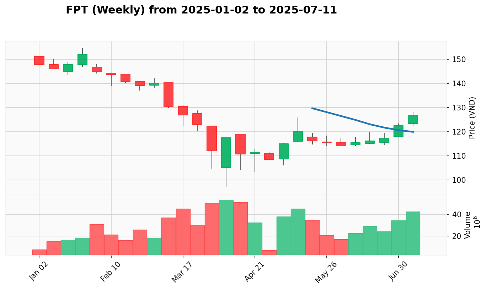
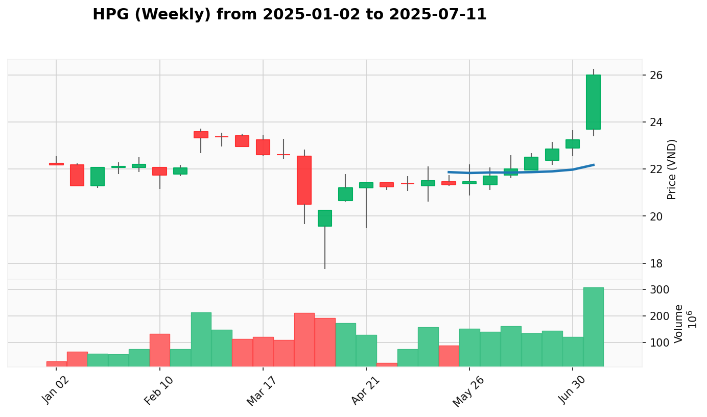

# Kế Hoạch Quản Lý Danh Mục

**Cập Nhật Lần Cuối:** 2025-07-15

## Dữ Liệu Danh Mục

| Mã Cổ Phiếu | Giá Mua Trung Bình | Số Lượng Nắm Giữ |
| :---------- | :----------------- | :--------------- |
| TCB         | 33.312             | 200              |
| VND         | 16.557             | 500              |

## Phân tích

### 1. Tóm Tắt Danh Mục Hiện Tại

VNINDEX đang thể hiện tín hiệu Effort to Rise tích cực, tạo nền tảng thuận lợi cho việc định hướng danh mục. Danh mục hiện tại có lãi tổng thể với VND dẫn dắt mạnh mẽ (+9.31%) nhờ tín hiệu Sign of Strength liên tục, trong khi TCB (+4.47%) đang gặp áp lực bán với tín hiệu Sign of Weakness. Chiến lược tập trung mở rộng vị thế VND và cân nhắc bán TCB để tối ưu hóa hiệu quả danh mục.

* **Tóm Tắt Hành Động Đề Xuất:**
  | Mã Cổ Phiếu | Trạng Thái Hiện Tại | Hành Động Đề Xuất Ngắn Gọn |
  | :---------- | :------------------ | :------------------------- |
  | TCB         | Sign of Weakness, áp lực bán | Sell (giảm vị thế do tín hiệu yếu) |
  | VND         | Sign of Strength mạnh, xu hướng tăng | Buy More (tiếp tục tăng vị thế) |

### 2. Kế Hoạch Giao Dịch Chi Tiết

#### **TCB (NGAN_HANG)**

* **Giá Mua Trung Bình:** 33.312
* **Số Lượng Nắm Giữ:** 200
* **Giá Hiện Tại:** 34.8
* **P&L (Lợi Nhuận/Thua Lỗ Chưa Thực Hiện):** +4.47% (+297.6)
* **VPA Phân Tích Hiện Tại:** 
  * **Bối Cảnh Tuần:** No Demand kết thúc 2025-07-07 cho thấy áp lực bán đã tăng, phe mua yếu kém không thể hỗ trợ giá sau tín hiệu yếu tuần trước.
  * **Bối Cảnh Ngày:** Sign of Weakness ngày 2025-07-15 với áp lực bán mạnh tại vùng kháng cự 35.75, khối lượng cao kèm đóng cửa yếu xác nhận lực cầu không đủ mạnh để vượt qua kháng cự.
* **Hành Động Đề Xuất:** Sell
  * **Giá Đề Xuất:** Bán ở mức 34.5 - 35.0
  * **Số Lượng Đề Xuất:** Bán 100-200 cổ phiếu (giảm hoặc thanh lý vị thế)
  * **Lý Do Hành Động:** Sign of Weakness ngày 2025-07-15 sau No Demand tuần trước cho thấy áp lực bán gia tăng, không thể vượt qua kháng cự kỹ thuật, đáp ứng điều kiện Significant Weakness.
* **Điểm Dừng Lỗ:** 34.0 (bảo vệ vốn)
* **Điểm Chốt Lời:** 35.0 - 35.5 (nếu có phục hồi tạm thời)
* **Top 3 Cổ Phiếu Thay Thế:**
  * **SHB**: Sign of Strength tuần 2025-07-07 với cú bùng nổ mạnh mẽ, hiệu suất +58.84% dẫn đầu ngành
  * **STB**: No Supply tuần 2025-07-07 với xác nhận SOS daily, hiệu suất +28.96% ổn định
  * **MBB**: Sign of Strength tuần 2025-07-07 với lực cầu mạnh trở lại, hiệu suất +22.09% cân bằng

-----

#### **VND (CHUNG_KHOAN)**

* **Giá Mua Trung Bình:** 16.557
* **Số Lượng Nắm Giữ:** 500
* **Giá Hiện Tại:** 18.1
* **P&L (Lợi Nhuận/Thua Lỗ Chưa Thực Hiện):** +9.31% (+771.5)
* **VPA Phân Tích Hiện Tại:** 
  * **Bối Cảnh Tuần:** Sign of Strength kết thúc 2025-07-07 tạo nền tảng mạnh mẽ với lực cầu áp đảo, ngành Chứng khoán duy trì momentum tích cực.
  * **Bối Cảnh Ngày:** Sign of Strength (SOS) ngày 2025-07-15 sau Test for Supply thành công, khối lượng vọt lên 56.09 triệu đơn vị xác nhận lực cầu áp đảo quay trở lại.
* **Hành Động Đề Xuất:** Buy More
  * **Giá Đề Xuất:** Mua thêm ở mức 18.0 - 18.5, hoặc nếu điều chỉnh về 17.5 - 17.8
  * **Số Lượng Đề Xuất:** Thêm 200-300 cổ phiếu (tăng total lên 700-800)
  * **Lý Do Hành Động:** Sign of Strength ngày 2025-07-15 xác nhận xu hướng tăng mạnh tiếp tục, đáp ứng điều kiện Confirmation/Continuation với weekly SOS hỗ trợ.
* **Điểm Dừng Lỗ:** 17.5 (nâng từ 17.0)
* **Điểm Chốt Lời:** 19.5 - 20.0 (chốt từng phần), 21.0 - 22.0 (chốt hoàn toàn)
* **Top 3 Cổ Phiếu Thay Thế:**
  * **VCI**: Sign of Strength tuần 2025-07-07 với breakout bùng nổ, dẫn đầu ngành với điểm leadership 69.2
  * **VIX**: Sign of Strength tuần 2025-07-07 với Effort to Rise daily xác nhận, xếp #2 ngành với điểm 66.8
  * **SSI**: Sign of Strength tuần 2025-07-07 với khối lượng kỷ lục, xếp #3 ngành với điểm 64.3

-----

### 3. Kế Hoạch Gia Tăng Chi Tiết

*Top 3 cổ phiếu đa dạng ngành để mở rộng danh mục - giảm rủi ro, tăng lợi nhuận*

| Mã Cổ Phiếu | Ngành | Tín Hiệu VPA Chính | Lý Do Lựa Chọn |
| :---------- | :---- | :----------------- | :-------------- |
| VHM         | BAT_DONG_SAN | Sign of Strength tuần 2025-07-07 | Điểm vào hấp dẫn sau breakout, phục hồi bất động sản |
| FPT         | CONG_NGHE | Sign of Strength tuần 2025-07-07 | Test for Supply tạo cơ hội vào, chuyển đổi số |
| HPG         | THEP | Sign of Strength tuần 2025-07-07 | Consolidation lành mạnh, phục hồi công nghiệp |

-----

#### **VHM (BAT_DONG_SAN)**

* **Giá Đề Xuất Mua:** 42.5 - 43.0
* **Số Lượng Đề Xuất:** 100 cổ phiếu
* **VPA Phân Tích:** 
  * **Bối Cảnh Tuần:** Sign of Strength tuần 2025-07-07 với momentum liên tục, No Supply cho thấy áp lực bán tối thiểu.
  * **Bối Cảnh Ngày:** Effort to Rise ngày 2025-07-15 xác nhận xu hướng tăng tiếp tục sau giai đoạn tích lũy.
* **Lý Do Lựa Chọn:** Đa dạng hóa vào ngành bất động sản, hưởng lợi từ phục hồi thị trường và tiêu dùng nội địa
* **Điểm Dừng Lỗ:** 41.5
* **Điểm Chốt Lời:** 45.0 - 46.0

-----

#### **FPT (CONG_NGHE)**

* **Giá Đề Xuất Mua:** 128.0 - 130.0
* **Số Lượng Đề Xuất:** 100 cổ phiếu
* **VPA Phân Tích:** 
  * **Bối Cảnh Tuần:** Sign of Strength tuần 2025-07-07 với breakout mạnh mẽ và xác nhận khối lượng.
  * **Bối Cảnh Ngày:** Test for Supply ngày 2025-07-15 với khối lượng giảm, cho thấy áp lực bán cạn kiệt.
* **Lý Do Lựa Chọn:** Đa dạng hóa vào ngành công nghệ, hưởng lợi từ chuyển đổi số và tăng trưởng xuất khẩu
* **Điểm Dừng Lỗ:** 125.0
* **Điểm Chốt Lời:** 135.0 - 140.0

-----

#### **HPG (THEP)**

* **Giá Đề Xuất Mua:** 25.0 - 25.5
* **Số Lượng Đề Xuất:** 200 cổ phiếu
* **VPA Phân Tích:** 
  * **Bối Cảnh Tuần:** Sign of Strength tuần 2025-07-07 với nhiều tín hiệu mạnh liên tiếp, tích lũy tổ chức.
  * **Bối Cảnh Ngày:** Test for Supply ngày 2025-07-15 cho thấy consolidation lành mạnh sau tăng mạnh.
* **Lý Do Lựa Chọn:** Đa dạng hóa vào ngành thép, hưởng lợi từ phục hồi công nghiệp và đầu tư cơ sở hạ tầng
* **Điểm Dừng Lỗ:** 24.0
* **Điểm Chốt Lời:** 27.0 - 28.0

### 4. Nhật Ký Thay Đổi Kế Hoạch

* **Chuyển Từ Hold sang Buy/Buy More/Buy Fast/Prepare to Buy:**
  * `VND duy trì Buy More`: Tín hiệu Sign of Strength ngày 2025-07-15 tiếp tục xác nhận Strong Bullish Continuation sau Sign of Strength tuần 2025-07-07. Weekly và daily signals đều hỗ trợ mạnh mẽ, duy trì protocol Confirmation/Continuation.

* **Chuyển Từ Hold sang Sell/Panic Sell:**
  * `TCB từ Hold sang Sell`: Tín hiệu Sign of Weakness ngày 2025-07-15 sau No Demand tuần 2025-07-07 cho thấy áp lực bán gia tăng đáng kể. Không thể vượt qua kháng cự kỹ thuật 35.75, đáp ứng điều kiện Significant Weakness/Breakdown theo protocol.

* **Thay Đổi Trạng Thái Khác:**
  * `Cập nhật giá hiện tại và P&L`: TCB 34.8 (+4.47%), VND 18.1 (+9.31%)
  * `Điều chỉnh stop-loss levels`: VND nâng stop-loss lên 17.5 do tín hiệu mạnh

* **Loại Bỏ/Thêm Mới Ticker:**
  * `Thêm 3 cổ phiếu đa dạng`: VHM (Bất động sản), FPT (Công nghệ), HPG (Thép) để mở rộng danh mục và giảm rủi ro tập trung