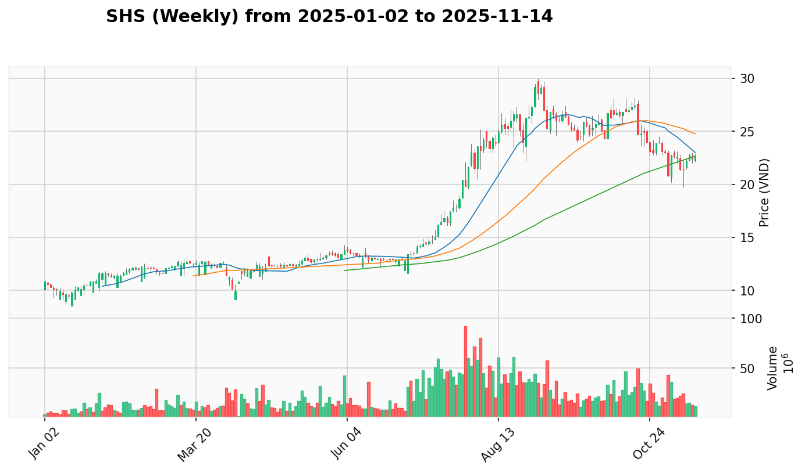
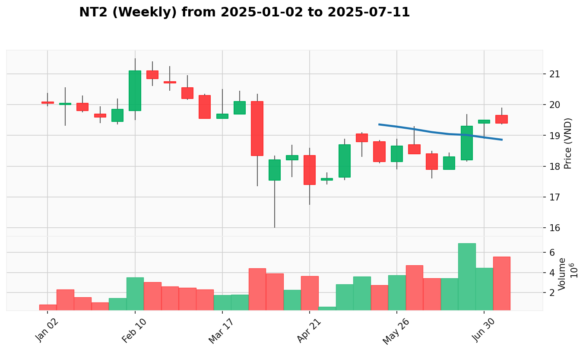

# Kế Hoạch Quản Lý Danh Mục

**Cập Nhật Lần Cuối:** 2025-08-04

## Dữ Liệu Danh Mục

| Mã Cổ Phiếu | Giá Mua Trung Bình | Số Lượng Nắm Giữ |
| :---------- | :----------------- | :--------------- |
| CTS         | 39.069             | 1300             |
| HDB         | 27.221             | 2100             |
| HDC         | 33.100             | 600              |
| SHB         | 16.257             | 3000             |
| SHS         | 21.744             | 900              |
| SSI         | 33.139             | 1000             |
| VIX         | 24.978             | 2000             |
| VND         | 20.386             | 4900             |
| VPB         | 23.822             | 2800             |

## Phân tích

**1. Tóm Tắt Danh Mục Hiện Tại**

VNINDEX đang trong giai đoạn Sign of Strength tại 1528.19 điểm, phục hồi mạnh mẽ từ vùng test 1479.98. Danh mục hiện tại có tổng **Lãi/Lỗ chưa thực hiện** là +41.627.600 VND (+9.34%). Trong bối cảnh thị trường mở rộng sau tích lũy, 9/9 vị thế đều sinh lời với VND dẫn đầu (+14.05%), SHB (+14.41%), và VPB (+10.82%). Tập trung quá cao vào Chứng Khoán (56.9%) và Ngân Hàng (38.7%) cần được đa dạng hóa sang các ngành năng lượng và cơ sở hạ tầng.

* **Phân Bổ Danh Mục Theo Ngành:**
  | Ngành | Các Mã Cổ Phiếu | Tỷ Trọng Danh Mục |
  | :---- | :-------------- | :---------------- |
  | Chứng Khoán | CTS, SHS, SSI, VIX, VND | 56.9% |
  | Ngân Hàng | HDB, SHB, VPB | 38.7% |
  | Bất Động Sản | HDC | 4.4% |

* **Tóm Tắt Hành Động Đề Xuất:**
  | Mã Cổ Phiếu | Trạng Thái Hiện Tại | Hành Động Đề Xuất Ngắn Gọn |
  | :---------- | :------------------ | :------------------------- |
  | CTS         | Test for Demand     | Hold (chờ confirmation)    |
  | HDB         | Test for Demand     | Hold (recovery signs)      |
  | HDC         | Test for Supply     | Buy More (Wyckoff intact)  |
  | SHB         | Sign of Strength    | Buy More (strongest play)  |
  | SHS         | No Supply           | Hold - Take Partial Profits|
  | SSI         | Sign of Strength    | Hold (monitor closely)     |
  | VIX         | Sign of Strength    | Hold (protect profits)     |
  | VND         | Sign of Strength    | Hold (consistent leader)   |
  | VPB         | No Supply           | Hold (banking leader)      |

**2. Kế Hoạch Giao Dịch Chi Tiết**

### **CTS (Chứng Khoán)**

* **Giá Mua Trung Bình:** 39.069
* **Số Lượng Nắm Giữ:** 1300
* **Giá Hiện Tại:** 40.65
* **P&L (Lợi Nhuận/Thua Lỗ Chưa Thực Hiện):** +4.05% (+2.055.300)
* **VPA Phân Tích Hiện Tại:** 
  * **Bối Cảnh Tuần:** Others - tín hiệu chưa rõ ràng, cần theo dõi thêm trong bối cảnh ngành mạnh
  * **Bối Cảnh Ngày:** Test for Demand ngày 04/08 - sau Selling Climax, phục hồi từ 38.0 lên 40.65 với khối lượng giảm cho thấy áp lực bán đã giảm
* **Hành Động Đề Xuất:** Hold
  * **Giá Đề Xuất:** Theo dõi tại mức hiện tại
  * **Số Lượng Đề Xuất:** Giữ nguyên 1300 cổ phiếu
  * **Lý Do Hành Động:** Test for Demand sau Selling Climax cần confirmation, ngành CHUNG_KHOAN 100% tích cực hỗ trợ
* **Điểm Dừng Lỗ:** 38.00 (dưới vùng support test)
* **Điểm Chốt Lời:** 42.00 (kháng cự gần), 44.00 (mục tiêu mở rộng)
* **Top 3 Cổ Phiếu Thay Thế:**
  * **VND**: Weekly Sign of Strength liên tiếp 4 tuần với +35.1%, cổ phiếu chứng khoán nhất quán nhất
  * **SSI**: Weekly Sign of Strength với sự tham gia tổ chức, ổn định hơn CTS
  * **BSI**: Weekly Sign of Strength với +12.6% phục hồi, tỷ lệ rủi ro-lợi nhuận tốt nhất trong ngành CHUNG_KHOAN

### **HDB (Ngân Hàng)**

* **Giá Mua Trung Bình:** 27.221
* **Số Lượng Nắm Giữ:** 2100
* **Giá Hiện Tại:** 28.00
* **P&L (Lợi Nhuận/Thua Lỗ Chưa Thực Hiện):** +2.86% (+1.635.900)
* **VPA Phân Tích Hiện Tại:** 
  * **Bối Cảnh Tuần:** Buying Climax - cảnh báo sau +29.6% với khối lượng tổ chức khủng
  * **Bối Cảnh Ngày:** Test for Demand ngày 04/08 - tăng 3.7% lên 28.0, lực cầu bắt đầu quay trở lại sau giai đoạn củng cố
* **Hành Động Đề Xuất:** Hold
  * **Giá Đề Xuất:** Theo dõi tại mức hiện tại
  * **Số Lượng Đề Xuất:** Giữ nguyên 2100 cổ phiếu
  * **Lý Do Hành Động:** Dấu hiệu phục hồi nhưng cảnh báo Buying Climax, ngành NGAN_HANG 84.6% tích cực hỗ trợ
* **Điểm Dừng Lỗ:** 26.50 (support level)
* **Điểm Chốt Lời:** 29.00 (kháng cự gần), 30.50 (mục tiêu kỹ thuật)
* **Top 3 Cổ Phiếu Thay Thế:**
  * **VPB**: Dẫn đầu số 1 ngành ngân hàng với hiệu suất bùng nổ 35.1% và sự hỗ trợ tổ chức
  * **CTG**: Mẫu hình tăng bền vững hơn không có rủi ro đỉnh điểm
  * **ACB**: Tích lũy tổ chức vững chắc với tiến trình đánh dấu lành mạnh

### **HDC (Bất Động Sản)**

* **Giá Mua Trung Bình:** 33.100
* **Số Lượng Nắm Giữ:** 600
* **Giá Hiện Tại:** 35.90
* **P&L (Lợi Nhuận/Thua Lỗ Chưa Thực Hiện):** +8.46% (+1.680.000)
* **VPA Phân Tích Hiện Tại:** 
  * **Bối Cảnh Tuần:** Others - đang củng cố sau mẫu hình Sign of Strength
  * **Bối Cảnh Ngày:** Test for Supply ngày 04/08 - kiểm tra lên 37.5 lành mạnh sau mẫu hình phục hồi Wyckoff
* **Hành Động Đề Xuất:** Buy More
  * **Giá Đề Xuất:** 35.50-36.00 (tích lũy thêm)
  * **Số Lượng Đề Xuất:** Mua thêm 300 cổ phiếu
  * **Lý Do Hành Động:** Wyckoff recovery hoàn hảo với Automatic Rally và Secondary Test, sector BAT_DONG_SAN 80% tích cực
* **Điểm Dừng Lỗ:** 34.00 (breakout support)
* **Điểm Chốt Lời:** 38.00 (kháng cự gần), 40.00 (mục tiêu mở rộng)
* **Top 3 Cổ Phiếu Thay Thế:**
  * **VIC**: Dẫn đầu số 1 bất động sản với +181% YTD và tích lũy tổ chức
  * **VHM**: Cổ phiếu ổn định với +134% YTD và mẫu hình No Supply
  * **NVL**: Củng cố xuất sắc sau đột phá với dòng tiền tổ chức mạnh

### **SHB (Ngân Hàng)**

* **Giá Mua Trung Bình:** 16.257
* **Số Lượng Nắm Giữ:** 3000
* **Giá Hiện Tại:** 18.60
* **P&L (Lợi Nhuận/Thua Lỗ Chưa Thực Hiện):** +14.41% (+7.029.000)
* **VPA Phân Tích Hiện Tại:** 
  * **Bối Cảnh Tuần:** Sign of Strength - hỗ trợ tổ chức với xu hướng tăng mạnh mẽ
  * **Bối Cảnh Ngày:** Sign of Strength ngày 04/08 - bứt phá 6.9% lên 18.6, Effort to Rise on Reduced Volume
* **Hành Động Đề Xuất:** Buy More
  * **Giá Đề Xuất:** 18.40-18.80 (tích lũy mạnh)
  * **Số Lượng Đề Xuất:** Mua thêm 400 cổ phiếu
  * **Lý Do Hành Động:** Chu kỳ Wyckoff hoàn chỉnh với tích lũy tổ chức và giai đoạn đánh dấu
* **Điểm Dừng Lỗ:** 17.00 (support level)
* **Điểm Chốt Lời:** 20.00 (kháng cự gần), 22.00 (mục tiêu kỹ thuật)
* **Top 3 Cổ Phiếu Thay Thế:**
  * **VPB**: Tích lũy tổ chức bùng nổ với các tín hiệu Sign of Strength liên tiếp
  * **ACB**: Nền tảng tổ chức vững chắc với tiến trình đánh dấu lành mạnh
  * **MBB**: Mua tổ chức nhất quán với đặc điểm xu hướng tăng đáng tin cậy

### **SHS (Chứng Khoán)**

* **Giá Mua Trung Bình:** 21.744
* **Số Lượng Nắm Giữ:** 900
* **Giá Hiện Tại:** 23.60
* **P&L (Lợi Nhuận/Thua Lỗ Chưa Thực Hiện):** +8.53% (+1.670.400)
* **VPA Phân Tích Hiện Tại:** 
  * **Bối Cảnh Tuần:** Sign of Strength nhưng với rủi ro Buying Climax - tăng 41.9% trong 2 tuần
  * **Bối Cảnh Ngày:** No Supply ngày 04/08 - bứt phá 9.8% lên 23.6 với khối lượng giảm, áp lực bán biến mất
* **Hành Động Đề Xuất:** Hold - Take Partial Profits
  * **Giá Đề Xuất:** Bán bớt tại 23.50-24.00
  * **Số Lượng Đề Xuất:** Bán 300 cổ phiếu, giữ lại 600 cổ phiếu
  * **Lý Do Hành Động:** Hiệu suất xuất sắc nhưng có đặc điểm đỉnh điểm, bảo vệ lợi nhuận
* **Điểm Dừng Lỗ:** 21.00 (cho position còn lại)
* **Điểm Chốt Lời:** 25.00 (nếu momentum tiếp tục)
* **Top 3 Cổ Phiếu Thay Thế:**
  * **VIX**: Dẫn đầu tuyệt đối ngành với đợt tăng bùng nổ ba tuần
  * **CTS**: Tiềm năng đột phá bùng nổ với cơ hội vào tốt hơn
  * **VND**: Sự hỗ trợ tổ chức nhất quán nhất với xu hướng tăng bền vững

### **SSI (Chứng Khoán)**

* **Giá Mua Trung Bình:** 33.139
* **Số Lượng Nắm Giữ:** 1000
* **Giá Hiện Tại:** 34.00
* **P&L (Lợi Nhuận/Thua Lỗ Chưa Thực Hiện):** +2.60% (+861.000)
* **VPA Phân Tích Hiện Tại:** 
  * **Bối Cảnh Tuần:** Buying Climax - bốn tuần liên tiếp với khối lượng cực cao
  * **Bối Cảnh Ngày:** Sign of Strength ngày 04/08 - phá vỡ kháng cự 34.0 với quyết tâm mạnh mẽ
* **Hành Động Đề Xuất:** Hold
  * **Giá Đề Xuất:** Theo dõi tại mức hiện tại
  * **Số Lượng Đề Xuất:** Giữ nguyên 1000 cổ phiếu
  * **Lý Do Hành Động:** Sức mạnh hàng ngày cải thiện nhưng rủi ro đỉnh điểm hàng tuần, ngành 100% tích cực cân bằng rủi ro
* **Điểm Dừng Lỗ:** 33.00 (breakeven protection)
* **Điểm Chốt Lời:** 36.00 (kháng cự gần), 38.00 (mục tiêu mở rộng)
* **Top 3 Cổ Phiếu Thay Thế:**
  * **VIX**: Vượt trội hoàn toàn với động lực bùng nổ và dẫn đầu ngành
  * **CTS**: Tiềm năng đột phá bùng nổ với sự mở rộng khối lượng ấn tượng
  * **VND**: Sự hỗ trợ tổ chức nhất quán nhất trong ngành chứng khoán

### **VIX (Chứng Khoán)**

* **Giá Mua Trung Bình:** 24.978
* **Số Lượng Nắm Giữ:** 2000
* **Giá Hiện Tại:** 27.70
* **P&L (Lợi Nhuận/Thua Lỗ Chưa Thực Hiện):** +10.90% (+5.444.000)
* **VPA Phân Tích Hiện Tại:** 
  * **Bối Cảnh Tuần:** Sign of Strength - +65.3% trong 3 tuần, dẫn đầu tuyệt đối ngành
  * **Bối Cảnh Ngày:** Sign of Strength ngày 04/08 - mở cửa giảm 25.35 nhưng phục hồi mạnh lên 27.7, chạm đỉnh 27.9
* **Hành Động Đề Xuất:** Hold
  * **Giá Đề Xuất:** Theo dõi tại mức hiện tại
  * **Số Lượng Đề Xuất:** Giữ nguyên 2000 cổ phiếu
  * **Lý Do Hành Động:** Bảo vệ lợi nhuận sau mức tăng bùng nổ, cho phép tiếp tục động lực với tâm lý FOMO tổ chức
* **Điểm Dừng Lỗ:** 26.00 (dưới recent support)
* **Điểm Chốt Lời:** 30.00 (mục tiêu gần), 32.00 (mục tiêu mở rộng)
* **Top 3 Cổ Phiếu Thay Thế:**
  * **VND**: Nhất quán hơn với 4 tín hiệu mạnh liên tiếp
  * **BSI**: Xây dựng nền tảng ổn định hơn so với các động thái bùng nổ
  * **VCI**: Less volatile while maintaining strong upward momentum

### **VND (Chứng Khoán)**

* **Giá Mua Trung Bình:** 20.386
* **Số Lượng Nắm Giữ:** 4900
* **Giá Hiện Tại:** 23.25
* **P&L (Lợi Nhuận/Thua Lỗ Chưa Thực Hiện):** +14.05% (+14.033.600)
* **VPA Phân Tích Hiện Tại:** 
  * **Bối Cảnh Tuần:** Sign of Strength - 4 tuần liên tiếp với +13.4%, sức mạnh nhất quán nhất
  * **Bối Cảnh Ngày:** Sign of Strength ngày 04/08 - bứt phá từ 22.2 lên 23.25, phá vỡ ngưỡng 23.0
* **Hành Động Đề Xuất:** Hold
  * **Giá Đề Xuất:** Theo dõi tại mức hiện tại
  * **Số Lượng Đề Xuất:** Giữ nguyên 4900 cổ phiếu
  * **Lý Do Hành Động:** Bảo vệ lợi nhuận với nền tảng mạnh nhất, sự hỗ trợ tổ chức nhất quán nhất
* **Điểm Dừng Lỗ:** 22.00 (dưới key support)
* **Điểm Chốt Lời:** 25.00 (mục tiêu gần), 27.00 (mục tiêu dài hạn)
* **Top 3 Cổ Phiếu Thay Thế:**
  * **VCI**: Quản lý rủi ro tốt hơn với mẫu hình tăng trưởng bền vững
  * **BSI**: Strong recovery với institutional support
  * **MBS**: Ít parabol hơn với mẫu hình tích lũy lành mạnh hơn

### **VPB (Ngân Hàng)**

* **Giá Mua Trung Bình:** 23.822
* **Số Lượng Nắm Giữ:** 2800
* **Giá Hiện Tại:** 26.40
* **P&L (Lợi Nhuận/Thua Lỗ Chưa Thực Hiện):** +10.82% (+7.218.400)
* **VPA Phân Tích Hiện Tại:** 
  * **Bối Cảnh Tuần:** Sign of Strength - hiệu suất bùng nổ 35.1%, dẫn đầu tuyệt đối ngành ngân hàng
  * **Bối Cảnh Ngày:** No Supply ngày 04/08 - tăng lên 26.4 đạt mức cao mới mà không cần khối lượng lớn
* **Hành Động Đề Xuất:** Hold
  * **Giá Đề Xuất:** Theo dõi tại mức hiện tại
  * **Số Lượng Đề Xuất:** Giữ nguyên 2800 cổ phiếu
  * **Lý Do Hành Động:** Bảo vệ lợi nhuận sau mức tăng bùng nổ, mẫu hình No Supply cực kỳ tích cực
* **Điểm Dừng Lỗ:** 25.00 (support level)
* **Điểm Chốt Lời:** 28.00 (mục tiêu gần), 30.00 (mục tiêu mở rộng)
* **Top 3 Cổ Phiếu Thay Thế:**
  * **ACB**: Quỹ đạo tăng trưởng bền vững hơn với tỷ lệ rủi ro-lợi nhuận tốt hơn
  * **STB**: Healthy consolidation vs potential climax risk
  * **VCB**: Hồ sơ rủi ro thấp hơn nhiều với đặc điểm phòng thủ

**3. Kế Hoạch Gia Tăng Chi Tiết**

*Top 3 cổ phiếu đa dạng ngành để mở rộng danh mục - giảm rủi ro, tăng lợi nhuận*

| Mã Cổ Phiếu | Ngành | Tín Hiệu VPA Chính | Lý Do Lựa Chọn |
| :---------- | :---- | :----------------- | :-------------- |
| BSR         | Dầu Khí | Sign of Strength với institutional accumulation | Energy rotation leader, diversification từ Financial overweight |
| NT2         | Năng Lượng | Sign of Strength với khối lượng bùng nổ +68% | Cơ sở hạ tầng năng lượng phòng thủ với đặc điểm tăng trưởng |
| VHM         | Bất Động Sản | Sign of Strength với No Supply patterns | Real estate leader với +134% YTD, pullback entry opportunity |

### **BSR (Dầu Khí)**

* **Giá Mua Trung Bình:** N/A (mới mua)
* **Số Lượng Đề Xuất:** 1000 cổ phiếu
* **Giá Hiện Tại:** 20.50
* **VPA Phân Tích Hiện Tại:**
  * **Bối Cảnh Tuần:** Sign of Strength - xoay vòng ngành năng lượng với đà tăng hàng hóa
  * **Bối Cảnh Ngày:** Sign of Strength - dẫn đầu số 1 trong ngành DAU_KHI với điểm dẫn dắt 92.5
* **Hành Động Đề Xuất:** Buy
  * **Giá Đề Xuất:** 20.30-20.70 (entry range)
  * **Số Lượng Đề Xuất:** 1000 cổ phiếu
  * **Lý Do Hành Động:** Chủ đề xoay vòng năng lượng hoạt động, dẫn đầu ngành với nền tảng tuần mạnh mẽ
* **Điểm Dừng Lỗ:** 19.50 (dưới breakout support)
* **Điểm Chốt Lời:** 22.50 (kháng cự gần), 25.00 (energy target)

### **NT2 (Năng Lượng)**

* **Giá Mua Trung Bình:** N/A (mới mua)
* **Số Lượng Đề Xuất:** 800 cổ phiếu
* **Giá Hiện Tại:** 12.80
* **VPA Phân Tích Hiện Tại:**
  * **Bối Cảnh Tuần:** Sign of Strength - nhiều tuần liên tiếp với sự quan tâm của tổ chức
  * **Bối Cảnh Ngày:** Sign of Strength - dẫn đầu số 1 trong ngành NANG_LUONG với điểm dẫn dắt 94.0
* **Hành Động Đề Xuất:** Buy
  * **Giá Đề Xuất:** 12.60-13.00 (entry range)
  * **Số Lượng Đề Xuất:** 800 cổ phiếu
  * **Lý Do Hành Động:** Đặc điểm phòng thủ cơ sở hạ tầng năng lượng với động lực tăng trưởng
* **Điểm Dừng Lỗ:** 12.00 (support level)
* **Điểm Chốt Lời:** 14.00 (kháng cự gần), 15.50 (infrastructure target)

### **VHM (Bất Động Sản)**

* **Giá Mua Trung Bình:** N/A (mới mua)
* **Số Lượng Đề Xuất:** 200 cổ phiếu
* **Giá Hiện Tại:** 92.20
* **VPA Phân Tích Hiện Tại:**
  * **Bối Cảnh Tuần:** Sign of Strength - mẫu hình No Supply với tích lũy tổ chức nhất quán
  * **Bối Cảnh Ngày:** No Supply - Automatic Rally sau Selling Climax, điểm vào lành mạnh từ điều chỉnh
* **Hành Động Đề Xuất:** Buy
  * **Giá Đề Xuất:** 91.00-93.00 (entry range)
  * **Số Lượng Đề Xuất:** 200 cổ phiếu
  * **Lý Do Hành Động:** Dẫn đầu bất động sản với +134% YTD, điều chỉnh tạo cơ hội vào hấp dẫn
* **Điểm Dừng Lỗ:** 89.00 (dưới Automatic Rally support)
* **Điểm Chốt Lời:** 98.00 (kháng cự gần), 105.00 (real estate target)

**4. Nhật Ký Thay Đổi Kế Hoạch**

* **Duy Trì Buy More:**
  * **HDC**: Test for Supply healthy sau Wyckoff recovery pattern, sector BAT_DONG_SAN 80% tích cực hỗ trợ
  * **SHB**: Sign of Strength breakthrough với complete Wyckoff cycle, strongest banking fundamentals

* **Chuyển Từ Sell sang Hold:**
  * **HDB**: Test for Demand shows recovery signs mặc dù Buying Climax warning, sector strength balances risk

* **Chuyển Từ Hold with Caution sang Take Partial Profits:**
  * **SHS**: No Supply excellent nhưng climax characteristics với +41.9% trong 2 tuần, protect gains priority

* **Duy Trì Hold Strategy:**
  * **CTS**: Test for Demand cần confirmation nhưng sector CHUNG_KHOAN 100% tích cực
  * **SSI**: Daily Sign of Strength improvement nhưng weekly Buying Climax risk balance
  * **VIX**: Protect profits sau +65.3% gains, allow momentum continuation
  * **VND**: Protect profits với strongest consistency foundation
  * **VPB**: No Supply pattern exceptional, protect gains sau explosive performance

* **Thêm Mới Diversification:**
  * **BSR**: Energy rotation exposure, sector leader với commodity tailwinds
  * **NT2**: Đặc điểm phòng thủ cơ sở hạ tầng năng lượng với tính tăng trưởng
  * **VHM**: Real estate sector leader, pullback entry opportunity

## 5. Dự Đoán 5 Ngày Kế Tiếp

### **Ngày 1 (2025-08-05)**

**Tình Huống UP (45%)**
- **Mô tả**: VNINDEX tiếp tục Sign of Strength lên 1540-1550 với institutional support
- **Điều kiện**: VPA leaders (VND, VIX, SHB) dẫn dắt với high volume confirmation
- **Hành động**: Thực hiện Buy More orders cho HDC (300 shares), SHB (400 shares)

**Tình Huống SIDEWAY (35%)**
- **Mô tả**: VNINDEX consolidation 1520-1535 sau recovery mạnh
- **Điều kiện**: Mixed signals với volume ổn định, test for supply patterns
- **Hành động**: Theo dõi entry points cho diversification picks BSR, NT2, VHM

**Tình Huống DOWN (20%)**
- **Mô tả**: VNINDEX test xuống 1500-1515 với profit-taking pressure
- **Điều kiện**: Daily bearish signals tăng, climax stocks under pressure
- **Hành động**: Execute partial profit-taking cho SHS (300 shares), delay new buys

### **Ngày 2 (2025-08-06)**

**Tình Huống UP (50%)**
- **Mô tả**: Xác nhận recovery với VNINDEX vượt 1550
- **Điều kiện**: Sector leaders confirm strength, institutional participation mở rộng
- **Hành động**: Bắt đầu accumulate diversification picks BSR (500 shares), NT2 (400 shares)

**Tình Huống SIDEWAY (30%)**
- **Mô tả**: Tiếp tục range-bound trong 1525-1545
- **Điều kiện**: Individual stock selection becomes critical
- **Hành động**: Focus VPA signals, selective position adjustments

**Tình Huống DOWN (20%)**
- **Mô tả**: Weakness confirmed với break below 1510
- **Điều kiện**: Broad selling pressure từ climax stocks
- **Hành động**: Complete profit-taking SHS, postpone new investments

### **Ngày 3 (2025-08-07)**

**Tình Huống UP (55%)**
- **Mô tả**: Sustained recovery với VNINDEX approach 1560-1570
- **Điều kiện**: Multiple sectors participate, volume expansion
- **Hành động**: Complete diversification purchases BSR, NT2, VHM full quantities

**Tình Huống SIDEWAY (30%)**
- **Mô tả**: Range consolidation continues, selective opportunities
- **Điều kiện**: Individual differentiation increases
- **Hành động**: Focus on VPA leaders, gradual position building

**Tình Huống DOWN (15%)**
- **Mô tả**: Failed recovery attempt với renewed selling
- **Điều kiện**: Institutional distribution accelerates
- **Hành động**: Defensive stance, protect capital

### **Ngày 4 (2025-08-08)**

**Tình Huống UP (60%)**
- **Mô tả**: Breakout mode với VNINDEX target 1570-1580
- **Điều kiện**: Mua tổ chức mạnh mẽ, dẫn đầu ngành rõ ràng
- **Hành động**: Full investment stance, monitor for next consolidation

**Tình Huống SIDEWAY (25%)**
- **Mô tả**: Consolidation before next directional move
- **Điều kiện**: Neutral signals, waiting for catalyst
- **Hành động**: Maintain positions, prepare for directional break

**Tình Huống DOWN (15%)**
- **Mô tả**: Secondary test of lows, 1500-1520 range
- **Điều kiện**: Continued institutional caution
- **Hành động**: Selective buying of highest conviction names only

### **Ngày 5 (2025-08-09)**

**Tình Huống UP (65%)**
- **Mô tả**: Confirmed uptrend establishment
- **Điều kiện**: Multiple confirmations, broad participation
- **Hành động**: Maintain high equity exposure, monitor for consolidation

**Tình Huống SIDEWAY (25%)**
- **Mô tả**: Weekly close near middle of range
- **Điều kiện**: Neutral weekly close setup
- **Hành động**: Position for next week's direction

**Tình Huống DOWN (10%)**
- **Mô tả**: Weekly close weak, bearish implications
- **Điều kiện**: Failed recovery, institutional selling
- **Hành động**: Reduce exposure, focus on cash preservation

**Chiến Lược Tổng Quan 5 Ngày:**
- **Vùng Mua Tích Cực**: 1500-1520 (excellent accumulation zone)
- **Vùng Trung Tính**: 1520-1540 (selective stock picking)
- **Vùng Cảnh Giác**: Above 1550 (monitor for distribution)
- **Cash Management**: 20-35% depending on scenarios
- **Risk Control**: Strict stop-loss adherence, position sizing discipline