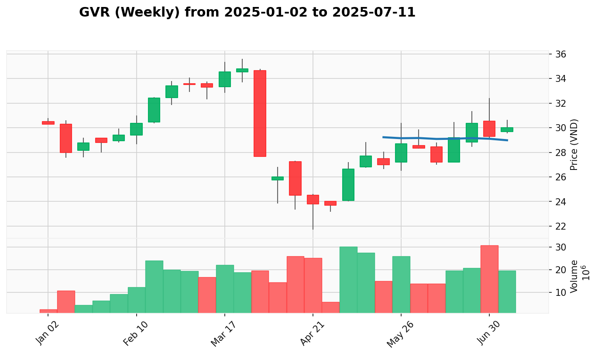

# Kế Hoạch Quản Lý Danh Mục

**Cập Nhật Lần Cuối:** 2025-07-02

## Dữ Liệu Danh Mục

| Mã Cổ Phiếu | Giá Mua Trung Bình | Số Lượng Nắm Giữ |
| :---------- | :----------------- | :--------------- |
| GVR         | 30.307             | 800              |
| TCB         | 33.222             | 1700             |
| VHC         | 59.750             | 300              |
| VND         | 16.279             | 500              |

## Phân tích

**1. Tóm Tắt Danh Mục Hiện Tại**

Danh mục đang cho thấy những dấu hiệu ổn định và phục hồi sau một giai đoạn yếu kém. VHC đã thể hiện sức mạnh trở lại một cách thuyết phục trong một ngành dẫn dắt, tạo ra cơ hội gia tăng vị thế. GVR vẫn duy trì cấu trúc tăng giá nhưng đang tạm nghỉ, đòi hỏi sự kiên nhẫn. Đáng chú ý, TCB và VND, hai cổ phiếu trước đây được khuyến nghị bán, đã có những phiên phục hồi mạnh mẽ, vô hiệu hóa tín hiệu bán trước đó. Tuy nhiên, rủi ro tiềm ẩn từ bối cảnh ngành (VND) hoặc các tín hiệu yếu trước đó (TCB) vẫn còn, do đó chiến lược thận trọng vẫn được ưu tiên.

*   **Tóm Tắt Hành Động Đề Xuất:**
    | Mã Cổ Phiếu | Trạng Thái Hiện Tại    | Hành Động Đề Xuất Ngắn Gọn |
    | :---------- | :--------------------- | :------------------------- |
    | GVR         | Tăng giá, tạm nghỉ     | Nắm giữ (Hold)             |
    | TCB         | Hồi phục, cần theo dõi | Nắm giữ (Hold)             |
    | VHC         | Hồi phục mạnh mẽ       | Nắm giữ (Hold)             |
    | VND         | Hồi phục, ngành yếu    | Nắm giữ (Hold)             |

**2. Kế Hoạch Giao Dịch Chi Tiết**

-----

### **GVR (CAO_SU)**

*   **Giá Mua Trung Bình:** 30.307
*   **Số Lượng Nắm Giữ:** 800
*   **Giá Hiện Tại:** 31.25
*   **P&L (Lợi Nhuận/Thua Lỗ Chưa Thực Hiện):** +3.11% (+754.4)
*   **VPA Phân Tích Hiện Tại:** GVR thuộc ngành Cao su đang trong trạng thái "Dẫn dắt Đồng Thuận", một bối cảnh rất tích cực. Mặc dù bối cảnh tuần (kết thúc 2025-06-23) cho thấy một tín hiệu SOW, hành động giá gần đây đã mạnh mẽ hơn với tín hiệu **Effort to Rise** vào ngày 01/07. Tuy nhiên, phiên gần nhất là một tín hiệu **No Demand** (tăng nhẹ trên khối lượng thấp), cho thấy đây là một nhịp tạm nghỉ lành mạnh sau một đợt tăng giá và động lực trước mắt đã chững lại.
*   **Hành Động Đề Xuất:** Hold
    *   **Lý Do Hành Động:** Khuyến nghị "Mua thêm" trước đó đã hợp lệ khi giá vào vùng mua, nhưng tín hiệu `No Demand` gần nhất cho thấy nên tạm dừng việc gia tăng tỷ trọng. Chúng ta sẽ giữ vị thế hiện tại và chờ đợi một tín hiệu xác nhận sức mạnh rõ ràng hơn trước khi xem xét mua thêm.
*   **Điểm Dừng Lỗ:** 29.0
*   **Điểm Chốt Lời:** 35.0

-----

### **TCB (NGAN_HANG)**

*   **Giá Mua Trung Bình:** 33.222
*   **Số Lượng Nắm Giữ:** 1700
*   **Giá Hiện Tại:** 35.0
*   **P&L (Lợi Nhuận/Thua Lỗ Chưa Thực Hiện):** +5.35% (+3,022.6)
*   **VPA Phân Tích Hiện Tại:** **Cảnh báo đã được gỡ bỏ.** Khuyến nghị "Bán" trước đó đã bị vô hiệu hóa bởi tín hiệu **Effort to Rise** mạnh mẽ vào ngày 02/07. Tín hiệu này, kết hợp với bối cảnh ngành Ngân hàng đang "Dẫn dắt Đồng Thuận", đã phủ nhận các tín hiệu yếu kém trước đó. Mặc dù bối cảnh tuần (kết thúc 2025-06-23) là một SOW, nhưng hành động giá ngày gần nhất đã thay đổi cục diện ngắn hạn.
*   **Hành Động Đề Xuất:** Hold
    *   **Lý Do Hành Động:** Tín hiệu `Effort to Rise` mạnh mẽ đã làm thay đổi cục diện ngắn hạn, buộc chúng ta phải đánh giá lại. Hành động bán lúc này là quá sớm. Chúng ta sẽ giữ vị thế để quan sát xem liệu sức mạnh này có được duy trì và xác nhận trong các phiên tới hay không.
*   **Điểm Dừng Lỗ:** 32.8
*   **Điểm Chốt Lời:** 38.0

-----

### **VHC (THUY_SAN)**

*   **Giá Mua Trung Bình:** 59.750
*   **Số Lượng Nắm Giữ:** 300
*   **Giá Hiện Tại:** 60.8
*   **P&L (Lợi Nhuận/Thua Lỗ Chưa Thực Hiện):** +1.76% (+315.0)
*   **VPA Phân Tích Hiện Tại:** VHC thuộc ngành Thủy sản đang "Dẫn dắt Đồng Thuận". Tín hiệu **Effort to Fall** vào ngày 01/07 đã được phủ nhận hoàn toàn bởi một phiên **Effort to Rise** mạnh mẽ vào ngày 02/07. Hành động giá này cho thấy đợt điều chỉnh chỉ là một cú rũ bỏ ngắn hạn và xu hướng tăng chính, được xác nhận bởi tuần SOS (kết thúc 2025-06-23), đã quay trở lại một cách quyết đoán.
*   **Hành Động Đề Xuất:** Hold
    *   **Lý Do Hành Động:** Khuyến nghị "Mua thêm" trước đó đã được xác nhận là hợp lệ bởi tín hiệu `Effort to Rise` gần nhất. Vị thế đã được gia tăng, do đó hành động hiện tại là nắm giữ để theo dõi xu hướng tăng tiếp theo.
*   **Điểm Dừng Lỗ:** 58.0
*   **Điểm Chốt Lời:** 68.0 - 70.0

-----

### **VND (CHUNG_KHOAN)**

*   **Giá Mua Trung Bình:** 16.279
*   **Số Lượng Nắm Giữ:** 500
*   **Giá Hiện Tại:** 17.5
*   **P&L (Lợi Nhuận/Thua Lỗ Chưa Thực Hiện):** +7.50% (+610.5)
*   **VPA Phân Tích Hiện Tại:** **Cảnh báo đã được gỡ bỏ.** Khuyến nghị "Bán" trước đó đã bị vô hiệu hóa bởi tín hiệu **Effort to Rise** mạnh mẽ vào ngày 02/07. Tuy nhiên, cần hết sức thận trọng vì ngành Chứng khoán vẫn đang trong trạng thái "Yếu/Phân Phối". Sức mạnh của VND có thể chỉ là một trường hợp riêng lẻ và có rủi ro bị ảnh hưởng bởi xu hướng chung của ngành.
*   **Hành Động Đề Xuất:** Hold
    *   **Lý Do Hành Động:** Tín hiệu `Effort to Rise` đã phủ nhận tín hiệu bán trước đó. Tuy nhiên, bối cảnh ngành yếu khiến việc mua thêm trở nên rủi ro. Chúng ta sẽ giữ vị thế hiện tại để quan sát xem liệu VND có thể tiếp tục đi ngược lại xu hướng ngành hay không.
*   **Điểm Dừng Lỗ:** 16.5
*   **Điểm Chốt Lời:** 19.5

-----

**3. Nhật Ký Thay Đổi Kế Hoạch**

*   **Hạ khuyến nghị từ Buy More sang Hold:**
    *   `Hạ khuyến nghị cho GVR từ Buy More xuống Hold:` Tín hiệu `Buy More` đã hợp lệ vào ngày 01/07, nhưng tín hiệu `No Demand` ngay sau đó cho thấy sự chững lại của đà tăng. Cần chờ đợi một tín hiệu xác nhận sức mạnh rõ ràng hơn trước khi gia tăng thêm vị thế, đáp ứng điều kiện #2B.
    *   `Chuyển khuyến nghị cho VHC từ Buy More sang Hold:` Khuyến nghị `Buy More` đã được xác nhận là hợp lệ bởi tín hiệu `Effort to Rise` ngày 02/07. Hành động hiện tại chuyển sang nắm giữ vị thế đã được gia tăng, đáp ứng điều kiện #2A.

*   **Chuyển Từ Sell sang Hold:**
    *   `Tăng khuyến nghị cho TCB từ Sell (50%) lên Hold:` Tín hiệu `Effort to Rise` mạnh mẽ vào ngày 02/07 đã vô hiệu hóa tín hiệu bán trước đó. Cần đánh giá lại sức mạnh của cổ phiếu, đáp ứng điều kiện #3B.
    *   `Tăng khuyến nghị cho VND từ Sell (50%) lên Hold:` Tín hiệu `Effort to Rise` mạnh mẽ vào ngày 02/07 đã vô hiệu hóa tín hiệu bán trước đó. Tuy nhiên, do bối cảnh ngành yếu, khuyến nghị chỉ được nâng lên `Hold` để quan sát thêm, đáp ứng điều kiện #3B.

*   **Thay Đổi Số Lượng/Giá Đề Xuất:**
    *   Không có.

*   **Loại Bỏ/Thêm Mới Ticker:**
    *   Không có.