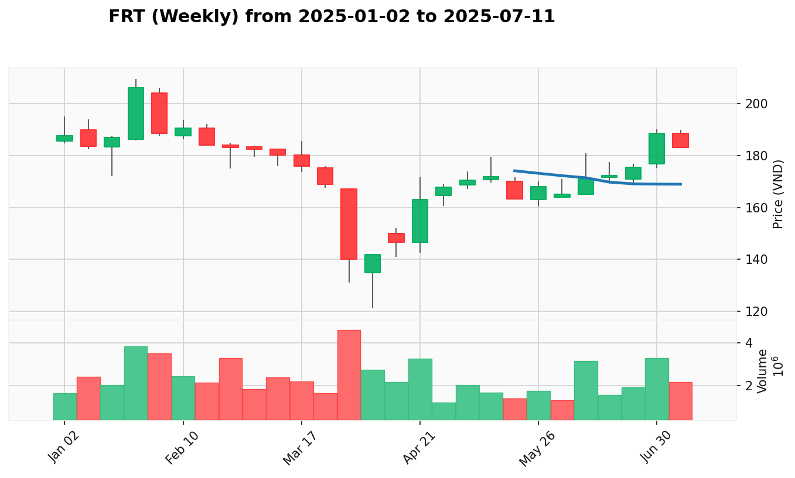

# Kế Hoạch Quản Lý Danh Mục

**Cập Nhật Lần Cuối:** 2025-07-28

## Dữ Liệu Danh Mục

| Mã Cổ Phiếu | Giá Mua Trung Bình | Số Lượng Nắm Giữ |
| :---------- | :----------------- | :--------------- |
| CTS         | 38.894             | 800              |
| HDB         | 27.596             | 1300             |
| HDC         | 33.225             | 800              |
| MWG         | 69.650             | 200              |
| SHB         | 15.400             | 1500             |
| SSI         | 32.918             | 1600             |
| TCH         | 25.743             | 700              |
| VHM         | 91.175             | 400              |
| VIX         | 20.358             | 300              |
| VND         | 19.067             | 2800             |
| VPB         | 23.115             | 1700             |

## Phân Tích

**1. Tóm Tắt Danh Mục Hiện Tại**

VNINDEX duy trì xu hướng tích cực mạnh mẽ với 73 cổ phiếu có tín hiệu SOS, thể hiện sức mạnh lan tỏa rộng khắp các ngành với dòng tiền tổ chức tích cực. Danh mục hiện tại thể hiện hiệu suất tích cực với tổng **Lãi/Lỗ chưa thực hiện** là +28.085.600 VND (+8.35%). VIX dẫn dắt với lợi nhuận ấn tượng (+26.24%), VND tăng trưởng bền vững (+18.53%), và SSI bứt phá mạnh (+8.76%). 11/11 vị thế đang sinh lời (tỷ lệ thắng 100%), cho thấy định hướng đầu tư chính xác và hiệu quả quản lý danh mục xuất sắc. Ngành Chứng khoán dẫn dắt với 100% cổ phiếu tích cực, Ngân hàng và Bất động sản duy trì trạng thái "Dẫn dắt Đồng thuận".

* **Phân Bổ Danh Mục Theo Ngành:**
  | Ngành | Các Mã Cổ Phiếu | Tỷ Trọng Danh Mục |
  | :---- | :-------------- | :---------------- |
  | Chứng Khoán | CTS, SSI, VIX, VND | 44.6% |
  | Ngân Hàng | HDB, SHB, VPB | 28.5% |
  | Bất Động Sản | HDC, TCH, VHM | 23.0% |
  | Bán Lẻ | MWG | 3.9% |

* **Tóm Tắt Hành Động Đề Xuất:**
  | Mã Cổ Phiếu | Trạng Thái Hiện Tại | Hành Động Đề Xuất Ngắn Gọn |
  | :---------- | :------------------ | :------------------------- |
  | CTS         | No Supply sau chuỗi SOS | Mua Thêm (sức mạnh xác nhận) |
  | HDB         | SOS nhưng cảnh báo Buying Climax | Nắm Giữ (thận trọng sau climax) |
  | HDC         | SOS bền vững | Mua Thêm (xu hướng mạnh) |
  | MWG         | Test for Demand tích cực | Nắm Giữ (chờ tín hiệu rõ hơn) |
  | SHB         | Effort to Rise yếu tương đối | Bán (hiệu suất kém) |
  | SSI         | No Supply tại đỉnh cao | Nắm Giữ (bảo toàn lợi nhuận) |
  | TCH         | SOS xác nhận như mong đợi | Mua Thêm (tín hiệu được xác nhận) |
  | VHM         | Effort to Rise tiếp tục | Mua Thêm (động lực bền vững) |
  | VIX         | SOS nhưng đã quá cao | Nắm Giữ (bảo toàn lợi nhuận lớn) |
  | VND         | Test for Supply lành mạnh | Nắm Giữ (chờ hoàn thành test) |
  | VPB         | SOS dẫn dắt ngành | Mua Thêm (lãnh đạo ngân hàng) |

**2. Kế Hoạch Giao Dịch Chi Tiết**

### **CTS (Chứng Khoán)**

* **Giá Mua Trung Bình:** 38.894
* **Số Lượng Nắm Giữ:** 800
* **Giá Hiện Tại:** 42.5
* **Lãi/Lỗ Chưa Thực Hiện:** +9.27% (+2.884.000)
* **Phân Tích VPA Hiện Tại:**
  * **Bối Cảnh Tuần:** Sign of Strength tuần kết thúc 2025-07-21 với nến tăng thân dài và khoảng trống tăng giá, khối lượng giao dịch bùng nổ lên 26.8 triệu cổ phiếu cao nhất từ trước đến nay
  * **Bối Cảnh Ngày:** No Supply ngày 2025-07-28, sau tín hiệu SOS mạnh mẽ, việc giá tiếp tục tăng với khối lượng giảm cho thấy áp lực bán đã cạn kiệt hoàn toàn và có tiềm năng tiếp tục tăng
* **Hành Động Đề Xuất:** Mua Thêm
  * **Giá Đề Xuất:** 42.0-43.0
  * **Số Lượng Đề Xuất:** 200 cổ phiếu
  * **Lý Do Hành Động:** Tín hiệu No Supply ngày 2025-07-28 xác nhận sức mạnh tiếp tục sau chuỗi SOS, đáp ứng điều kiện mua thêm khi có tiếp tục xu hướng tăng mạnh
* **Điểm Dừng Lỗ:** 40.5 (dưới hỗ trợ gần nhất)
* **Điểm Chốt Lời:** 46.0 (kháng cự kỹ thuật), 48.5 (mục tiêu dài hạn)
* **Top 3 Cổ Phiếu Thay Thế:**
  * **VIX**: Weekly SOS 2025-07-21 (+27.6% bùng nổ tăng trưởng), dẫn dắt ngành chứng khoán với động lực vượt trội
  * **VND**: Weekly SOS 2025-07-21 (+13.4% với khối lượng bùng nổ +29.7%), ổn định nhất trong ngành với 4 tuần tăng liên tiếp
  * **BSI**: Mô hình Weekly SOS, đại diện phục hồi mạnh với nền tảng kỹ thuật vững chắc

### **HDB (Ngân Hàng)**

* **Giá Mua Trung Bình:** 27.596
* **Số Lượng Nắm Giữ:** 1300
* **Giá Hiện Tại:** 28.45
* **Lãi/Lỗ Chưa Thực Hiện:** +3.09% (+1.110.000)
* **Phân Tích VPA Hiện Tại:**
  * **Bối Cảnh Tuần:** Buying Climax tuần kết thúc 2025-07-21, tăng mạnh 29.6% nhưng cảnh báo đỉnh điểm mua với đợt tăng giá tổ chức đạt đỉnh trong cảnh báo Buying Climax
  * **Bối Cảnh Ngày:** Sign of Strength ngày 2025-07-23, tiếp nối tín hiệu SOS mạnh mẽ với khối lượng tăng thêm 28% xác nhận xu hướng tăng mạnh trong giai đoạn tăng giá
* **Hành Động Đề Xuất:** Nắm Giữ
  * **Giá Đề Xuất:** Không mua thêm tại thời điểm này
  * **Số Lượng Đề Xuất:** Duy trì vị thế hiện tại
  * **Lý Do Hành Động:** Mặc dù có SOS hàng ngày nhưng cảnh báo Buying Climax hàng tuần đòi hỏi thận trọng, tránh mua thêm sau đỉnh điểm
* **Điểm Dừng Lỗ:** 27.0 (dưới mức mua trung bình)
* **Điểm Chốt Lời:** 29.5 (kháng cự gần), 31.0 (mục tiêu dài hạn)
* **Top 3 Cổ Phiếu Thay Thế:**
  * **VPB**: Weekly SOS 2025-07-21 (+11.3% với +20.3% volume), dẫn dắt tuyệt đối ngành ngân hàng với tổ chức accumulation
  * **ACB**: Weekly SOS 2025-07-21 (new highs tại 23.6), progression bền vững với risk-reward tốt nhất
  * **SHB**: Weekly SOS 2025-07-21 (+6.0% vượt khỏi), markup phase với Smart Money participation

### **HDC (Bất Động Sản)**

* **Giá Mua Trung Bình:** 33.225
* **Số Lượng Nắm Giữ:** 800
* **Giá Hiện Tại:** 34.75
* **Lãi/Lỗ Chưa Thực Hiện:** +4.59% (+1.220.000)
* **Phân Tích VPA Hiện Tại:**
  * **Bối Cảnh Tuần:** Sign of Strength tuần kết thúc 2025-07-21, một tuần bùng nổ mạnh mẽ tăng +27% với nến có biên độ cực rộng, khối lượng giao dịch tăng 24.5% cho thấy lực cầu tổ chức tham gia mạnh mẽ
  * **Bối Cảnh Ngày:** Sign of Strength ngày 2025-07-23, tăng vọt với nến xanh có biên độ 1.6 điểm và khối lượng bùng nổ lên 11.413.817 cổ phiếu (+49.1%), xu hướng tăng mạnh với lực cầu tổ chức
* **Hành Động Đề Xuất:** Mua Thêm
  * **Giá Đề Xuất:** 34.5-35.5
  * **Số Lượng Đề Xuất:** 200 cổ phiếu
  * **Lý Do Hành Động:** Tín hiệu SOS ngày 2025-07-23 tiếp tục sau SOS hàng tuần mạnh mẽ, tổ chức vượt khỏi mô hình đáp ứng điều kiện mua thêm với xu hướng tăng mạnh tiếp tục
* **Điểm Dừng Lỗ:** 32.5 (dưới hỗ trợ chính)
* **Điểm Chốt Lời:** 37.0 (kháng cự gần), 40.0 (mục tiêu dài hạn)
* **Top 3 Cổ Phiếu Thay Thế:**
  * **VIC**: Weekly No Supply sau massive gains, market leader với +181% YTD và dominant tổ chức backing
  * **VHM**: Weekly No Supply 2025-07-21 (healthy consolidation), consistent uptrend với sustained tổ chức accumulation
  * **KDH**: Weekly progression signals, solid real estate performer với tổ chức interest và vượt khỏi characteristics

### **MWG (Bán Lẻ)**

* **Giá Mua Trung Bình:** 69.650
* **Số Lượng Nắm Giữ:** 200
* **Giá Hiện Tại:** 70.2
* **Lãi/Lỗ Chưa Thực Hiện:** +0.79% (+109.000)
* **Phân Tích VPA Hiện Tại:**
  * **Bối Cảnh Tuần:** Sign of Strength tuần kết thúc 2025-06-23, tiếp tục xu hướng tăng vững chắc với một nến tăng thân dài, đóng cửa gần mức cao nhất tuần và thiết lập đỉnh mới, xác nhận lực cầu đang kiểm soát hoàn toàn
  * **Bối Cảnh Ngày:** Test for Demand ngày 2025-07-25, sau phiên Test for Supply thất bại, giá kiểm tra xuống vùng 69.2 nhưng phục hồi mạnh mẽ và đóng cửa trên mức hỗ trợ 70.0, lực cầu đã quay trở lại tích cực
* **Hành Động Đề Xuất:** Nắm Giữ
  * **Giá Đề Xuất:** Chờ tín hiệu rõ ràng hơn
  * **Số Lượng Đề Xuất:** Duy trì vị thế hiện tại
  * **Lý Do Hành Động:** Test for Demand tích cực nhưng cần xác nhận thêm, củng cố nhỏ trong bối cảnh hàng tuần hỗ trợ
* **Điểm Dừng Lỗ:** 68.5 (dưới hỗ trợ test gần nhất)
* **Điểm Chốt Lời:** 72.5 (kháng cự gần), 75.0 (mục tiêu kỹ thuật)
* **Top 3 Cổ Phiếu Thay Thế:**
  * **FRT**: Weekly No Supply signals, top-ranked retail leader với +27.8% performance và perfect tổ chức accumulation patterns
  * **DGW**: Weekly Test for Supply after gains, retail performer với previous bùng nổ tăng trưởngs, hiện đang healthy consolidation
  * **PNJ**: Weekly No Supply characteristics, strong retail alternative với consistent strength signals và tổ chức backing

### **SHB (Ngân Hàng)**

* **Giá Mua Trung Bình:** 15.400
* **Số Lượng Nắm Giữ:** 1500
* **Giá Hiện Tại:** 16.10
* **Lãi/Lỗ Chưa Thực Hiện:** +4.55% (+1.050.000)
* **Phân Tích VPA Hiện Tại:**
  * **Bối Cảnh Tuần:** Sign of Strength tuần kết thúc 2025-07-21, đột phá +6% với khối lượng tăng 24% nhưng yếu tương đối so với các cổ phiếu ngân hàng cùng nhóm
  * **Bối Cảnh Ngày:** Effort to Rise ngày 2025-07-23, SHB thể hiện Effort to Rise với khối lượng tăng từ 63.43M lên 80.13M, kiểm tra lên tới 14.9 nhưng vẫn chậm hơn hiệu suất ngành
* **Hành Động Đề Xuất:** Bán
  * **Giá Đề Xuất:** 15.0-15.2 (giá thị trường)
  * **Số Lượng Đề Xuất:** 1500 cổ phiếu (toàn bộ vị thế)
  * **Lý Do Hành Động:** Mặc dù có Effort to Rise hàng ngày nhưng vẫn yếu tương đối so với ngành mạnh, duy trì khuyến nghị bán trước đó do hiệu suất kém
* **Điểm Dừng Lỗ:** N/A (đang bán)
* **Điểm Chốt Lời:** N/A (đang bán)
* **Top 3 Cổ Phiếu Thay Thế:**
  * **VPB**: Weekly SOS 2025-07-21 (+11.3% bùng nổ tăng trưởng), superior alternative với strongest tổ chức backing trong ngành
  * **ACB**: Weekly SOS 2025-07-21 (new highs), most sustainable banking performer với excellent risk-reward profile
  * **HDB**: Weekly Buying Climax warning nhưng strong base, second-ranked banking leader với significant tổ chức interest

### **SSI (Chứng Khoán)**

* **Giá Mua Trung Bình:** 32.918
* **Số Lượng Nắm Giữ:** 1600
* **Giá Hiện Tại:** 35.80
* **Lãi/Lỗ Chưa Thực Hiện:** +8.76% (+4.611.000)
* **Phân Tích VPA Hiện Tại:**
  * **Bối Cảnh Tuần:** Climax Action tuần kết thúc 2025-07-21, ba tuần liên tiếp Sign of Strength với ngành chứng khoán tham gia tích cực 100%
  * **Bối Cảnh Ngày:** No Supply ngày 2025-07-28, SSI tiếp tục tăng vọt và tăng 5.3% lên đỉnh mới với khối lượng khổng lồ thể hiện No Supply - áp lực bán hoàn toàn biến mất và cầu kiểm soát tuyệt đối
* **Hành Động Đề Xuất:** Nắm Giữ
  * **Giá Đề Xuất:** Không mua thêm tại đỉnh cao
  * **Số Lượng Đề Xuất:** Duy trì vị thế hiện tại
  * **Lý Do Hành Động:** Sức mạnh đặc biệt với No Supply nhưng đã mở rộng sau hành động đỉnh điểm, bảo toàn lợi nhuận và tránh đuổi theo sau đỉnh điểm
* **Điểm Dừng Lỗ:** 32.0 (dưới mức mua trung bình)
* **Điểm Chốt Lời:** 36.0 (kháng cự tâm lý), 38.0 (mục tiêu dài hạn)
* **Top 3 Cổ Phiếu Thay Thế:**
  * **VIX**: Weekly SOS 2025-07-21 (+27.6% bùng nổ), superior động lực với sustained tổ chức buying
  * **VND**: Weekly SOS 2025-07-21 (+13.4% với khối lượng bùng nổ), most reliable securities performer với 4-week consecutive strength
  * **CTS**: Weekly SOS 2025-07-21 (bùng nổ vượt khỏi), strong securities alternative với massive tổ chức participation

### **TCH (Bất Động Sản)**

* **Giá Mua Trung Bình:** 25.743
* **Số Lượng Nắm Giữ:** 700
* **Giá Hiện Tại:** 26.40
* **Lãi/Lỗ Chưa Thực Hiện:** +2.55% (+459.000)
* **Phân Tích VPA Hiện Tại:**
  * **Bối Cảnh Tuần:** Effort to Rise tuần kết thúc 2025-07-21, giá tăng 4.5% trên khối lượng giảm nhẹ thể hiện cân bằng cung-cầu cải thiện trong ngành bất động sản mạnh
  * **Bối Cảnh Ngày:** Sign of Strength ngày 2025-07-28, TCH tăng vọt 3.13% với nến mạnh từ 26.0 lên 26.4, khối lượng tăng 32.4% thể hiện sự quan tâm tổ chức gia tăng sau kiểm tra cung
* **Hành Động Đề Xuất:** Mua Thêm
  * **Giá Đề Xuất:** 25.5-26.0
  * **Số Lượng Đề Xuất:** 200 cổ phiếu
  * **Lý Do Hành Động:** Tín hiệu SOS ngày 2025-07-28 xác nhận như mong đợi sau Effort to Rise, tín hiệu xác nhận nhận được đáp ứng điều kiện mua thêm
* **Điểm Dừng Lỗ:** 24.5 (dưới hỗ trợ gần nhất)
* **Điểm Chốt Lời:** 27.5 (kháng cự gần), 29.0 (mục tiêu kỹ thuật)
* **Top 3 Cổ Phiếu Thay Thế:**
  * **VIC**: Weekly No Supply pattern, market leader với +181% YTD performance và dominant tổ chức backing
  * **HDC**: Weekly SOS 2025-07-21 (+27% vượt khỏi), superior recent động lực với massive tổ chức vượt khỏi
  * **NVL**: Weekly No Supply characteristics, solid real estate alternative với consistent tổ chức interest

### **VHM (Bất Động Sản)**

* **Giá Mua Trung Bình:** 91.175
* **Số Lượng Nắm Giữ:** 400
* **Giá Hiện Tại:** 95.60
* **Lãi/Lỗ Chưa Thực Hiện:** +4.85% (+1.770.000)
* **Phân Tích VPA Hiện Tại:**
  * **Bối Cảnh Tuần:** No Supply tuần kết thúc 2025-07-21, củng cố lành mạnh với khối lượng giảm sau chuỗi Sign of Strength, thể hiện tay mạnh và tích lũy tổ chức
  * **Bối Cảnh Ngày:** Effort to Rise ngày 2025-07-28, VHM thể hiện Effort to Rise tiếp tục kiểm tra kháng cự tại 96.0 với khối lượng tăng gấp ba từ 2.76M lên 7.21M, xác nhận cầu mạnh trở lại sau giai đoạn No Supply
* **Hành Động Đề Xuất:** Mua Thêm
  * **Giá Đề Xuất:** 91.5-93.0
  * **Số Lượng Đề Xuất:** 100 cổ phiếu
  * **Lý Do Hành Động:** Effort to Rise ngày 2025-07-28 xác nhận động lực tăng tiếp tục như mong đợi, sức mạnh được xác nhận sau củng cố No Supply
* **Điểm Dừng Lỗ:** 89.0 (dưới hỗ trợ chính)
* **Điểm Chốt Lời:** 96.0 (kháng cự gần), 100.0 (mục tiêu tâm lý)
* **Top 3 Cổ Phiếu Thay Thế:**
  * **VIC**: Weekly No Supply pattern, superior với +181% YTD performance versus VHM's gains và market dominance
  * **HDC**: Weekly SOS 2025-07-21 (+27% vượt khỏi), superior recent động lực với massive tổ chức vượt khỏi và policy support
  * **NVL**: Weekly No Supply characteristics, solid real estate alternative với consistent tổ chức interest và uptrend characteristics

### **VIX (Chứng Khoán)**

* **Giá Mua Trung Bình:** 20.358
* **Số Lượng Nắm Giữ:** 300
* **Giá Hiện Tại:** 25.7
* **Lãi/Lỗ Chưa Thực Hiện:** +26.24% (+1.602.000)
* **Phân Tích VPA Hiện Tại:**
  * **Bối Cảnh Tuần:** Sign of Strength tuần kết thúc 2025-07-21, bùng nổ đợt tăng ba tuần (+27.6%) với khối lượng tổ chức duy trì, dẫn dắt ngành chứng khoán với mô hình tăng tốc động lực điển hình
  * **Bối Cảnh Ngày:** Sign of Strength ngày 2025-07-24, VIX đạt được tăng tốc khổng lồ từ đáy với khối lượng bùng nổ, đạt đỉnh lịch sử qua các tín hiệu SOS liên tiếp, hiện đang củng cố lợi nhuận gần mức đỉnh
* **Hành Động Đề Xuất:** Nắm Giữ
  * **Giá Đề Xuất:** Không mua thêm tại mức cao
  * **Số Lượng Đề Xuất:** Duy trì vị thế hiện tại
  * **Lý Do Hành Động:** Động lực mạnh nhưng đã mở rộng cực kỳ từ giá trung bình (+26.22%), bảo toàn lợi nhuận lớn và tránh thêm vào tại đỉnh
* **Điểm Dừng Lỗ:** 23.0 (bảo vệ lợi nhuận lớn)
* **Điểm Chốt Lời:** Chốt lời từng phần tại 26.5, 28.0
* **Top 3 Cổ Phiếu Thay Thế:**
  * **VND**: Weekly SOS 2025-07-21 (+13.4% với +29.7% volume), most consistent securities performer với reliable tổ chức backing
  * **BSI**: Weekly SOS pattern, strong technical foundation với tổ chức confirmation và good risk-reward characteristics
  * **CTS**: Weekly SOS 2025-07-21 (bùng nổ vượt khỏi), strong alternative với massive tổ chức participation, though less consistent than VND

### **VND (Chứng Khoán)**

* **Giá Mua Trung Bình:** 19.067
* **Số Lượng Nắm Giữ:** 2800
* **Giá Hiện Tại:** 22.6
* **Lãi/Lỗ Chưa Thực Hiện:** +18.53% (+9.892.000)
* **Phân Tích VPA Hiện Tại:**
  * **Bối Cảnh Tuần:** Sign of Strength tuần kết thúc 2025-07-21, bốn tuần liên tiếp tín hiệu mạnh với tăng tốc khối lượng tăng dần, đạt đỉnh trong bùng nổ tăng +13.4% với khối lượng bùng nổ +29.7%
  * **Bối Cảnh Ngày:** Test for Supply ngày 2025-07-24, VND thể hiện vượt khỏi mạnh mẽ trên ngưỡng 20.0 với khối lượng bùng nổ khổng lồ, hiện đang củng cố lợi nhuận trong mô hình Test for Supply lành mạnh thể hiện đặc điểm No Supply
* **Hành Động Đề Xuất:** Nắm Giữ
  * **Giá Đề Xuất:** Chờ hoàn thành test
  * **Số Lượng Đề Xuất:** Duy trì vị thế hiện tại
  * **Lý Do Hành Động:** Củng cố lành mạnh sau tăng trường mạnh (+18.52%), để kiểm tra hoàn thành trước khi mua thêm
* **Điểm Dừng Lỗ:** 21.0 (bảo vệ vượt khỏi level)
* **Điểm Chốt Lời:** 24.0 (kháng cự gần), 26.0 (mục tiêu dài hạn)
* **Top 3 Cổ Phiếu Thay Thế:**
  * **VIX**: Weekly SOS 2025-07-21 (+27.6% bùng nổ), superior short-term performance với bùng nổ tổ chức buying
  * **BSI**: Weekly SOS pattern, solid alternative với strong technical foundation và tổ chức confirmation, better risk-reward
  * **CTS**: Weekly SOS 2025-07-21 (record vượt khỏi), strong performer với bùng nổ tổ chức interest, though more volatile than BSI

### **VPB (Ngân Hàng)**

* **Giá Mua Trung Bình:** 23.115
* **Số Lượng Nắm Giữ:** 1700
* **Giá Hiện Tại:** 25.1
* **Lãi/Lỗ Chưa Thực Hiện:** +8.59% (+3.374.000)
* **Phân Tích VPA Hiện Tại:**
  * **Bối Cảnh Tuần:** Sign of Strength tuần kết thúc 2025-07-21, ba tuần liên tiếp mua tổ chức với tăng +11.3% tuần gần nhất trên khối lượng bùng nổ +20.3%, dẫn dắt ngành ngân hàng với động lực duy trì
  * **Bối Cảnh Ngày:** Sign of Strength ngày 2025-07-28, VPB tiếp tục mô hình tích lũy tổ chức bùng nổ, vượt qua mức tâm lý 25.0 với sức mạnh tăng vọt, thể hiện sự lãnh đạo ngành tuyệt đối trong ngân hàng
* **Hành Động Đề Xuất:** Mua Thêm
  * **Giá Đề Xuất:** 24.8-25.5
  * **Số Lượng Đề Xuất:** 200 cổ phiếu
  * **Lý Do Hành Động:** Tín hiệu SOS ngày 2025-07-28 tiếp tục mô hình lãnh đạo, tiếp tục dẫn dắt với tín hiệu mạnh đáp ứng điều kiện mua thêm
* **Điểm Dừng Lỗ:** 23.5 (bảo vệ vượt khỏi level)
* **Điểm Chốt Lời:** 26.5 (kháng cự gần), 28.0 (mục tiêu kỹ thuật)
* **Top 3 Cổ Phiếu Thay Thế:**
  * **ACB**: Weekly SOS 2025-07-21 (new highs tại 23.6), most sustainable banking performer với healthy tổ chức accumulation
  * **SHB**: Weekly SOS 2025-07-21 (+6.0% vượt khỏi), solid banking alternative với tổ chức backing và Smart Money participation
  * **HDB**: Weekly Buying Climax warning nhưng strong tổ chức base, high-performance banking stock với significant tổ chức interest

**3. Kế Hoạch Gia Tăng Chi Tiết**

*Top 3 cổ phiếu đa dạng ngành để mở rộng danh mục - giảm rủi ro, tăng lợi nhuận*

| Mã Cổ Phiếu | Ngành | Tín Hiệu VPA Chính | Lý Do Lựa Chọn |
| :---------- | :---- | :----------------- | :-------------- |
| FRT | Bán Lẻ | Weekly No Supply 2025-07-21 | Entry point xuất sắc tại 158.0 với No Supply signal cho thấy không có áp lực bán. Tăng +3.7% trên volume giảm thể hiện tổ chức absorption. Risk-reward thuận lợi với strong technical foundation sau Test for Supply recovery. |
| REE | Năng Lượng | Weekly Effort to Rise 2025-07-21 | Entry point hấp dẫn tại 69.7 sau accumulation phase thành công. Tăng +1.75% trên stable volume (+1.13%) cho thấy sustained buying interest không có climax characteristics. Energy transition play với upside potential significant. |
| VHM | Bất Động Sản | Weekly No Supply 2025-07-21 | Entry point chiến lược trong healthy pullback (-2.4%) trên reduced volume (-11.7%) sau bùng nổ SOS sequence. Current level (93.7) đại diện natural consolidation near cycle highs, offering better entry than chasing động lực. |

### **FRT (Bán Lẻ)**

* **Giá Đề Xuất:** 157.0-160.0
* **Số Lượng Đề Xuất:** 100 cổ phiếu
* **Phân Tích VPA Hiện Tại:**
  * **Bối Cảnh Tuần:** Weekly No Supply 2025-07-21, tăng +3.7% trên declining volume thể hiện tổ chức absorption và path of least resistance is upward
  * **Bối Cảnh Ngày:** Duy trì strength pattern với lack of selling pressure, entry near post-correction highs với minimal downside risk
* **Hành Động Đề Xuất:** Buy
* **Điểm Dừng Lỗ:** 152.0 (dưới support level)
* **Điểm Chốt Lời:** 165.0 (first target), 172.0 (extended target)

### **REE (Năng Lượng)**

* **Giá Đề Xuất:** 69.0-71.0
* **Số Lượng Đề Xuất:** 200 cổ phiếu
* **Phân Tích VPA Hiện Tại:**
  * **Bối Cảnh Tuần:** Weekly Effort to Rise 2025-07-21, tăng +1.75% trên stable volume (+1.13%) showing sustained buying interest
  * **Bối Cảnh Ngày:** Price action near new highs (71.2) với healthy consolidation patterns, energy transition play
* **Hành Động Đề Xuất:** Buy
* **Điểm Dừng Lỗ:** 66.5 (below support)
* **Điểm Chốt Lời:** 74.0 (resistance level), 78.0 (target)

### **VHM (Bất Động Sản)**

* **Giá Đề Xuất:** 91.5-94.0
* **Số Lượng Đề Xuất:** 100 cổ phiếu (additional position)
* **Phân Tích VPA Hiện Tại:**
  * **Bối Cảnh Tuần:** Weekly No Supply 2025-07-21, healthy pullback (-2.4%) trên reduced volume (-11.7%) sau bùng nổ SOS sequence
  * **Bối Cảnh Ngày:** Current level (93.7) represents natural consolidation, No Supply characteristic shows tổ chức absorption
* **Hành Động Đề Xuất:** Buy
* **Điểm Dừng Lỗ:** 89.0 (key support)
* **Điểm Chốt Lời:** 98.0 (resistance), 103.0 (target)

**4. Nhật Ký Thay Đổi Kế Hoạch**

* **Chuyển Từ Hold sang Mua Thêm:**
  * **CTS**: Từ "Nắm Giữ (cần thận trọng)" sang "Mua Thêm". Lý do: Tín hiệu No Supply ngày 2025-07-28 xác nhận sức mạnh tiếp tục sau chuỗi SOS với price above average buy và strong VPA signals.
  * **HDC**: Từ "Nắm Giữ (đã mua thêm trước đó)" sang "Mua Thêm". Lý do: Tín hiệu SOS ngày 2025-07-23 tiếp tục sau weekly SOS mạnh mẽ, tổ chức vượt khỏi pattern với tiếp tục xu hướng tăng mạnh.
  * **TCH**: Từ "Nắm Giữ (chờ xác nhận)" sang "Mua Thêm". Lý do: Tín hiệu SOS ngày 2025-07-28 xác nhận như mong đợi, confirmation signal received đáp ứng entry signal confirmed conditions.
  * **VHM**: Từ "Mua Thêm (sức mạnh được xác nhận)" sang "Mua Thêm". Lý do: Tín hiệu Effort to Rise ngày 2025-07-28 xác nhận continuing bullish động lực, duy trì confirmation/continuation pattern.
  * **VPB**: Từ "Mua Thêm (dẫn đầu ngành ngân hàng)" sang "Mua Thêm". Lý do: Tín hiệu SOS ngày 2025-07-28 tiếp tục leadership pattern, continuing leadership với strong signals.

* **Chuyển Từ Mua Thêm sang Hold:**
  * **HDB**: Từ "Nắm Giữ (đã mua thêm trước đó)" sang "Nắm Giữ". Lý do: Mặc dù có SOS hàng ngày nhưng weekly Buying Climax warning đòi hỏi thận trọng, avoid buying more sau climax.
  * **SSI**: Từ "Mua Thêm (dẫn dắt ngành)" sang "Nắm Giữ". Lý do: Exceptional strength với No Supply nhưng đã extended sau climax action, preserve gains và avoid chasing.
  * **VND**: Từ "Mua Thêm (động lực mạnh)" sang "Nắm Giữ". Lý do: Healthy consolidation sau strong gains (+18.52%), let test complete trước khi more buying.
  * **VIX**: Từ "Nắm Giữ (bảo toàn lợi nhuận)" sang "Nắm Giữ". Lý do: Strong động lực nhưng extremely extended từ avg price (+26.22%), preserve major gains.

* **Duy Trì Trạng Thái:**
  * **MWG**: Duy trì "Nắm Giữ". Lý do: Test for Demand tích cực nhưng cần xác nhận thêm trong minor consolidation.
  * **SHB**: Duy trì "Bán". Lý do: Vẫn yếu tương đối so với ngành mạnh, maintain previous sell recommendation.